# HCI.TS.p35

> Source: PDF converted via PyMuPDF.

---

Bluetooth® Test Suite
▪ Revision: HCI.TS.p35 ▪ Revision Date: 2024-09-04 ▪ Prepared By: BTI ▪ Published during TCRL: TCRL.2024-2
This document, regardless of its title or content, is not a Bluetooth Specification as defined in the Bluetooth Patent/Copyright License Agreement (“PCLA”) and Bluetooth Trademark License Agreement. Use of this document by members of Bluetooth SIG is governed by the membership and other related agreements between Bluetooth SIG Inc. (“Bluetooth SIG”) and its members, including the PCLA and other agreements posted on Bluetooth SIG’s website located at www.bluetooth.com.
THIS DOCUMENT IS PROVIDED “AS IS” AND BLUETOOTH SIG, ITS MEMBERS, AND THEIR AFFILIATES MAKE NO REPRESENTATIONS OR WARRANTIES AND DISCLAIM ALL WARRANTIES, EXPRESS OR IMPLIED, INCLUDING ANY WARRANTY OF MERCHANTABILITY, TITLE, NON-INFRINGEMENT, FITNESS FOR ANY PARTICULAR PURPOSE, THAT THE CONTENT OF THIS DOCUMENT IS FREE OF ERRORS.
TO THE EXTENT NOT PROHIBITED BY LAW, BLUETOOTH SIG, ITS MEMBERS, AND THEIR AFFILIATES DISCLAIM ALL LIABILITY ARISING OUT OF OR RELATING TO USE OF THIS DOCUMENT AND ANY INFORMATION CONTAINED IN THIS DOCUMENT, INCLUDING LOST REVENUE, PROFITS, DATA OR PROGRAMS, OR BUSINESS INTERRUPTION, OR FOR SPECIAL, INDIRECT, CONSEQUENTIAL, INCIDENTAL OR PUNITIVE DAMAGES, HOWEVER CAUSED AND REGARDLESS OF THE THEORY OF LIABILITY, AND EVEN IF BLUETOOTH SIG, ITS MEMBERS, OR THEIR AFFILIATES HAVE BEEN ADVISED OF THE POSSIBILITY OF SUCH DAMAGES.
This document is proprietary to Bluetooth SIG. This document may contain or cover subject matter that is intellectual property of Bluetooth SIG and its members. The furnishing of this document does not grant any license to any intellectual property of Bluetooth SIG or its members.
This document is subject to change without notice.
Copyright © 2005–2024 by Bluetooth SIG, Inc. The Bluetooth word mark and logos are owned by Bluetooth SIG, Inc. Other third-party brands and names are the property of their respective owners.
Contents

## 1 Scope

This Bluetooth document contains the Test Suite Structure (TSS) and test cases to test the implementation of the Bluetooth HCI layer with the objective to provide a high probability of air interface interoperability between the tested implementation and other manufacturers’ Bluetooth devices.

## 2 References, definitions, and abbreviations

### 2.1 References

This document incorporates provisions from other publications by dated or undated reference. These references are cited at the appropriate places in the text, and the publications are listed hereinafter. Additional definitions and abbreviations can be found in [1] and [3].
[1] Specification of the Bluetooth System, Volume 41, Part E, Version 1.2 or later
[2] Implementation Conformance Statement (ICS) for Host Controller Interface (HCI)
[3] Test Strategy and Terminology Overview
[4] Bluetooth Test Suite for Baseband, Version 1.2 or later
[5] Bluetooth Test Suite for Link Manager, Version 1.2 or later
[6] Bluetooth Test Suite for 802.11 PAL, Version 3.0 + HS or later
[7] Bluetooth Test Suite for Link Layer, Version 4.0 or later
[8] Specification of the Bluetooth System, Core Package, Volume 41, Part E, Host Controller Interface (HCI), Version 4.2 or later
[9] Specification of the Bluetooth System, Core Package, Volume 41, Part E, Host Controller Interface (HCI), Version 5.0 or later
[10] Erratum 10734: Pairing Updates
[11] Specification of the Bluetooth System, Core Package, Volume 41, Part E, Host Controller Interface
(HCI), Version 5.1 or later
[12] Specification of the Bluetooth System, Core Package, Volume 41, Part E, Host Controller Interface
(HCI), Version 5.2 or later
[13] Specification of the Bluetooth System, Core Package, Volume 41, Part E, Host Controller Interface
(HCI), Version 5.3 or later
[14] Bluetooth Test Suite for Link Layer, Version LL.TS.p18 or later
[15] Bluetooth Test Suite for Link Layer, Version LL.TS.p17 or later
[16] Appropriate Language Mapping Tables document
[17] Specification of the Bluetooth System, Core Package, Volume 4, Part E, Host Controller Interface
(HCI), Version 5.4 or later
[18] Specification of the Bluetooth System, Volume 6, Part B (Link Layer Protocol Specification),
Version 6.0 or later
[19] Specification of the Bluetooth System, Core Package, Volume 4, Part E, Host Controller Interface
(HCI), Version 6.0 or later
[20] Implementation Conformance Statement (ICS) for Link Layer (LL)
[21] Specification of the Bluetooth System, Core Package, Volume 2, Part C, Link Manager Protocol
(LMP), Version 4.2 or later

### 2.2 Definitions

In this Bluetooth document, the definitions from [1] and [3] apply.
Certain terms that were identified as inappropriate have been replaced. For a list of the original terms and their replacement terms, see the Appropriate Language Mapping Tables document [16].

### 2.3 Acronyms and abbreviations

In this Bluetooth document, the definitions, acronyms, and abbreviations from [1] and [3] apply.

## 3 Test Suite Structure (TSS)

### 3.1 Test Strategy

HCI is the interface between the upper and lower layers of the Bluetooth protocol stack.
The objective of HCI testing is to ensure interoperability and functionality between a Bluetooth Host and a Bluetooth Controller in order to enable qualification and combination of Controller and Host designs. The test cases cover mandatory and optional requirements in the protocol specification, matching these to the supported IUT features described in the Implementation Conformance Statement [2].
Conformance testing is the appropriate test method to meet this intent. The conformance test equipment provides a Lower and Upper Tester implementation.
HCI is being exercised extensively as the test controller (i.e., the Upper Tester) during the Link Layer and Link Manager conformance tests; many HCI commands and events are therefore implicitly proven already within these conformance tests.
HCI specifies the following groups of commands:
• Device Setup
• Controller Flow Control
• Controller Information
• Device Discovery
• Host Flow Control
• Authentication and Encryption
• Controller Configuration
• Controller Setup
• Connectionless Peripheral Broadcast
• LE Connection Management
• LE Power Control
• Isochronous Streams
• SCO and eSCO Connections
Figure 3.1 shows the HCI Test Suite Structure (TSS) including its subgroups defined for the conformance testing.

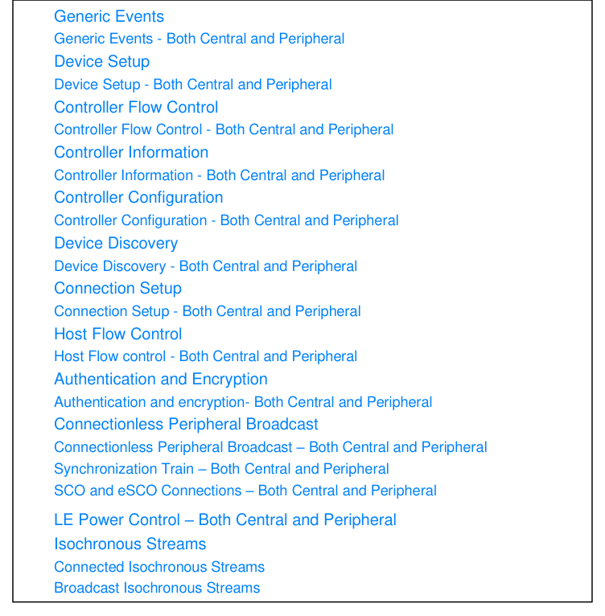

**Figure 3.1: TSS for HCI**

### 3.2 Test groups

The test groups are organized in three levels. The first level defines the protocol groups representing the protocol services. The second level separates the protocol services in functional modules. The last level in each branch contains the standard ISO subgroups BV and BI.

#### 3.2.1 Main test groups

The following test groups have been defined.

##### 3.2.1.1 Generic Events

This generic events group covers the IUT response to commands not supported by the IUT or disallowed after receiving the first legacy or extended advertising command.

##### 3.2.1.2 Device Setup

The device setup group of commands is used to place the Controller into a known state.
The controller flow control group of commands and events are used to control data flow from the Host to the Controller.

##### 3.2.1.4 Controller Information

The controller information group of commands allows the Host to discover local information about the device.

##### 3.2.1.5 Device Discovery

The device discovery group of commands and events allow a device to discover other devices in the surrounding area. On LE this group of commands is also used to control advertising and scanning functionalities on the LL.

##### 3.2.1.6 Host Flow Control

The Host flow control group of commands and events allows flow control to be used towards the Host.

##### 3.2.1.7 Authentication and Encryption

The authentication and encryption group of commands and events allows authentication of a remote device and then encryption of the link to one or more remote devices.

##### 3.2.1.8 Controller Configuration

The controller configuration group of commands and events allows the global configuration parameters to be configured.

##### 3.2.1.9 Controller Setup

The controller setup group of commands and events are used to allow a device to make a connection to another device.

##### 3.2.1.10 Connectionless Peripheral Broadcast

The Connectionless Peripheral Broadcast group of commands and events allows use of the CPB logical link to broadcast data to an unlimited number of recipients.

##### 3.2.1.11 LE Power Control

The LE Power Control group of commands and events allows a device to query the controller’s current and maximum transmit power levels.

##### 3.2.1.12 Isochronous Streams

The Isochronous Streams group of commands and events allows use of Connected Isochronous Streams and Broadcast Isochronous Streams.

##### 3.2.1.13 SCO and eSCO Connections

The SCO and eSCO Connections group of commands allow the creation, acceptance, and termination of SCO and eSCO Connections.

#### 3.2.2 Behavior test groups

##### 3.2.2.1 Valid Behavior (BV) tests

This subgroup provides testing to verify that the IUT reacts in conformity with the Bluetooth standard, after receipt or exchange of valid HCI messages. Valid PDUs means that the exchange of messages and the content of the exchanged messages are considered as valid.
This subgroup provides testing to verify that the IUT reacts in conformity with the Bluetooth standard, after receipt of a syntactically or semantically invalid HCI message.

### 3.3 HCI command and event version

If a command or event has more than one version and the test does not explicitly say otherwise:
- A reference to a command specifying the version number means that that version or any higher- numbered version supported by the IUT may be used.
- A reference to an event specifying the version number means that that version or at least one higher-numbered version supported by the IUT is unmasked (other versions, including lower- numbered versions, may also be unmasked).
- A reference to a command or event that does not specify the version number is equivalent to specifying [v1].

## 4 Test cases

### 4.1 Introduction

#### 4.1.1 Test case identification conventions

Test cases are assigned unique identifiers per the conventions in [3]. The convention used here is: <spec abbreviation>/<IUT role>/<class>/<feat>/<func>/<subfunc>/<cap>/<xx>-<nn>-<y>.
Additional definitions and abbreviations can be found in [1].

|  | Identifier Abbreviation |  |  | Spec Identifier <spec abbreviation> |  |
| --- | --- | --- | --- | --- | --- |
| HCI |  |  | Host Controller Interface |  |  |
|  | Identifier Abbreviation |  |  | Feature Identifier <feat> |  |
| AEN |  |  | Authentication and Encryption |  |  |
| BIS |  |  | Broadcast Isochronous Stream |  |  |
| CCO |  |  | Controller Configuration |  |  |
| CFC |  |  | Controller Flow Control |  |  |
| CIN |  |  | Controller Information |  |  |
| CIS |  |  | Connected Isochronous Stream |  |  |
| CM |  |  | LE Connection Management |  |  |
| CPB |  |  | Connectionless Peripheral Broadcast |  |  |
| CSE |  |  | Controller Setup |  |  |
| DDI |  |  | Device Discovery |  |  |
| DSU |  |  | Device Setup |  |  |
| GEV |  |  | Generic Events |  |  |
| HFC |  |  | Host Flow Control |  |  |
| PCL |  |  | LE Power Control |  |  |
| SCO |  |  | SCO and eSCO Connections |  |  |

Table 4.1: HCI TC feature naming conventions

#### 4.1.2 Conformance

When conformance is claimed for a particular specification, all capabilities are to be supported in the specified manner. The mandated tests from this Test Suite depend on the capabilities to which conformance is claimed.
The Bluetooth Qualification Program may employ tests to verify implementation robustness. The level of implementation robustness that is verified varies from one specification to another and may be revised for cause based on interoperability issues found in the market.
Such tests may verify:
• That claimed capabilities may be used in any order and any number of repetitions not excluded by the specification
• That capabilities enabled by the implementations are sustained over durations expected by the use case
• That the implementation gracefully handles any quantity of data expected by the use case
• That in cases where more than one valid interpretation of the specification exists, the implementation complies with at least one interpretation and gracefully handles other interpretations
• That the implementation is immune to attempted security exploits
A single execution of each of the required tests is required to constitute a Pass verdict. However, it is noted that to provide a foundation for interoperability, it is necessary that a qualified implementation consistently and repeatedly pass any of the applicable tests.
In any case, where a member finds an issue with the test plan generated by the Bluetooth SIG qualification tool, with the test case as described in the Test Suite, or with the test system utilized, the member is required to notify the responsible party via an erratum request such that the issue may be addressed.

#### 4.1.3 Baseband assumptions

All test cases, except Connectionless Peripheral Broadcast, Synchronization Train, and Truncated Paging, are built upon having a Base Band Link up and running.
• The IUT and the Lower Tester must be in connection state (Active mode).
• DM1 packages must be used (Section 6.2 Preambles).
• All test cases are built upon a connection between two (2) devices, a Central and a Peripheral.
Connectionless Peripheral Broadcast and Synchronization Train cases are built upon having a Connectionless Peripheral Broadcast enabled.
Truncated Page testing assumes both devices are in Standby.

#### 4.1.4 Role Switch

To force the IUT to become Central of the Piconet, Paging of the Lower Tester must be used as PDU LMP_switch_req is optional and all IUTs will not support this (Section 6 Appendix MSC and Section 6.2 Preambles).

#### 4.1.5 Default settings

The default settings must be carried out before each test case to guarantee a correct set up each time the tests are performed. Please see Section 6.2 Preambles for the set up messages used.

#### 4.1.6 Applicable parameter values

The parameter values indicated in the test cases are thought to be reasonable. However, what is reasonable ultimately depends on the user scenario the IUT is intended for. In those cases where the Bluetooth System Specification does not require the implementation of a specific value, and the IUT cannot support the value indicated in a test case, it is allowed to test the IUT with another value. The selected value has to be given as IXIT information. When a value deviates from what is indicated in the test case, it is selected as close as possible to the value indicated in the test case. The selected value must not be such that the test purpose for the test case cannot be verified or the test case is not applicable. All test cases applicable as determined by the combination of Test Case Reference List, Implementation Conformance Statement and Test Case Mapping Table, must be executed successfully to complete the qualification of the IUT.

#### 4.1.7 Pass/Inconclusive/Fail verdict conventions

Each test case has an Expected Outcome section. The IUT is granted the Pass verdict when all the detailed pass criteria conditions within the Expected Outcome section are met.
Certain test cases also have an Inconclusive verdict defined. If the conditions for this verdict are met, then the test provides evidence that the IUT neither meets nor violates the test case; instead, it means that the test case was not applicable to the IUT, and therefore a Pass verdict is not required in order to achieve Qualification of the IUT. Implementers are encouraged to provide mechanisms to avoid the behavior leading to an Inconclusive condition during testing.
The convention in this Test Suite is that, unless there is a specific set of fail conditions outlined in the test case, the IUT fails the test case as soon as one of the pass criteria conditions cannot be met. If this occurs, then the outcome of the test is a Fail verdict.
For an Inconclusive verdict, all the pass criteria conditions apply up to the point in the test procedure where an Inconclusive verdict is identified. If one of the pass criteria in a step prior to the Inconclusive verdict cannot be met, then the outcome of the test is the Fail verdict and not the Inconclusive verdict.

#### 4.1.8 Notation conventions

The conventions in documenting events have varied over time, between different specification versions as well as their respective Test Suites. Due to this legacy, instances of "_event", "_Event", and " Event" may occur in this Test Suite; all those should be understood to equate to “event” as the settled convention applied in Bluetooth 5.1 and later specifications. It is intended to harmonize usage in this Test Suite over time.

### 4.2 Common Packet Contents

#### 4.2.1 Fields and Bits Reserved for Future Use

Unless a specific test states otherwise, all fields within packets and all bits within fields that are described as reserved for future use are set to 0 in packets sent by the Upper and Lower Testers.

### 4.3 Generic Events

Verify the correct implementation of the Generic Events.
HCI/GEV/BV-01-C [Unsupported Commands on each supported controller]
• Test Purpose
Verify that for each controller supported in the IUT, every HCI command not supported yields a Command Complete event with status ‘Unknown HCI Command’ in return.
• Reference
[1] 7.7.14
• Initial Condition
- The IUT is not connected to the Lower Tester.
• Test Procedure
Repeat for each supported controller (1: BR/EDR Controller, 2: LE Controller, 3: AMP Controller) which has an unsupported HCI command.
The Upper Tester sends HCI commands not supported by the IUT and expects the IUT to return HCI Command Complete Event or HCI Command Status Event with Status = Unknown HCI Command.

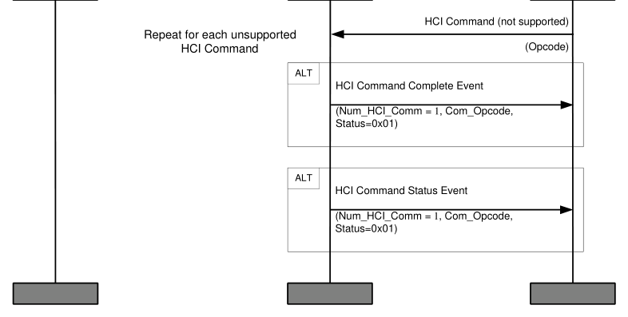

**Figure 4.1: HCI/GEV/BV-01-C [Unsupported Commands on each supported controller] MSC**

• Expected Outcome
Pass verdict
The IUT returns either an HCI Command Complete Event with Status = Unknown_HCI_Command or an HCI Command Status Event with Status = Unknown_HCI_Command.
• Notes
The test is run for all HCI commands indicated as not supported in the ICS. If all commands are supported on all supported controllers, then the test is not applicable.
Acceptable error codes for non-supported HCI Remote Name Request Cancel are: 0x01 or, alternately, 0x1F (Unspecified Error) or 0x0C (Command Disallowed).
HCI/GEV/BV-02-C [Disallow Mixing Legacy and Extended Advertising Commands]
• Test Purpose
Verify that each supported legacy and extended advertising command yields a Command Complete event with status ‘Command Disallowed’ in return when sent after a command of the other type.
• Reference
[9] 3.19.1
• Test Procedure

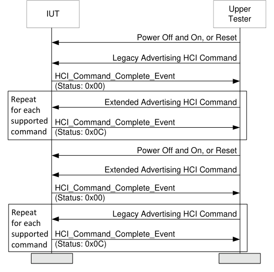

**Figure 4.2: HCI/GEV/BV-02-C [Disallow Mixing Legacy and Extended Advertising Commands] MSC**

1. The Upper Tester powers the IUT off and on or sends a reset. 2. The Upper Tester sends an LE Set Advertising Parameters command to the IUT and receives a
Command Complete event with Status set to 0x00 (Success) in return. 3. For each command listed in Table 4.2, the Upper Tester sends the command and receives a
Command Complete event with Status set as specified in Table 4.2 in return.

|  | Round |  |  | Command (Step 3) |  |  | Command Complete Event |  |
| --- | --- | --- | --- | --- | --- | --- | --- | --- |
|  | 1 |  |  | LE Set Extended Advertising Parameters |  |  | 0x0C (Command Disallowed) |  |
|  | 2 |  |  | LE Set Extended Advertising Data |  |  | 0x0C (Command Disallowed) |  |
|  | 3 |  |  | LE Set Extended Scan Response Data |  |  | 0x0C (Command Disallowed) |  |
|  | 4 |  |  | LE Set Extended Advertising Enable |  |  | 0x0C (Command Disallowed) |  |
|  | 5 |  |  | LE Read Maximum Advertising Data Length |  |  | 0x0C (Command Disallowed) |  |
|  | 6 |  |  | LE Read Number Of Supported Advertising Sets |  |  | 0x0C (Command Disallowed) |  |
|  | 7 |  |  | LE Remove Advertising Set |  |  | 0x0C (Command Disallowed) |  |
|  | 8 |  |  | LE Clear Advertising Sets |  |  | 0x0C (Command Disallowed) |  |
|  | 9 |  |  | LE Set Periodic Advertising Parameters |  |  | 0x0C (Command Disallowed) |  |
|  | 10 |  |  | LE Set Periodic Advertising Data |  |  | 0x0C (Command Disallowed) |  |
|  | 11 |  |  | LE Set Periodic Advertising Enable |  |  | 0x0C (Command Disallowed) |  |

|  | Round |  |  | Command (Step 3) |  |  | Command Complete Event |  |
| --- | --- | --- | --- | --- | --- | --- | --- | --- |
| 12 | 12 |  | LE Set Periodic Advertising Sync Transfer Parameters | LE Set Periodic Advertising Sync Transfer |  |  | 0x0C (Command Disallowed) |  |
|  |  |  |  | Parameters |  |  | or 0x02 (Unknown |  |
|  |  |  |  |  |  |  | Connection Identifier) |  |
| 13 |  |  |  | LE Set Default Periodic Advertising Sync Transfer |  | 0x0C (Command Disallowed) | 0x0C (Command Disallowed) |  |
|  |  |  |  | Parameters |  |  |  |  |

Table 4.2: Commands for each case variation
4. The Upper Tester powers the IUT off and on or sends a reset. 5. The Upper Tester sends an LE Set Extended Advertising Parameters command to the IUT and
receives a Command Complete event with Status set to 0x00 (Success) in return. 6. For each command listed in Table 4.3, the Upper Tester sends the command and receives a
Command Complete event with Status set to 0x0C (Command Disallowed) in return.

|  | Round |  |  | Command (Step 6) |  |
| --- | --- | --- | --- | --- | --- |
|  | 1 |  |  | LE Set Advertising Parameters |  |
|  | 2 |  |  | LE Read Advertising Channel Tx Power |  |
|  | 3 |  |  | LE Set Advertising Data |  |
|  | 4 |  |  | LE Set Scan Response Data |  |
|  | 5 |  |  | LE Set Advertising Enable |  |

Table 4.3: Commands for each case variation
• Expected Outcome
Pass verdict
After receiving a legacy advertising command, the IUT returns an HCI Command Complete event with Status = Command Disallowed for any extended advertising command.
After receiving an extended advertising command, the IUT returns an HCI Command Complete event with Status = Command Disallowed for any legacy advertising command.
HCI/GEV/BV-03-C [Disallow Mixing Legacy and Extended Scanning Commands]
• Test Purpose
Verify that each supported legacy and extended scanning command yields a Command Complete or Command Status event with status ‘Command Disallowed’ in return when sent after a command of the other type.
• Reference
[9] 3.19.1
• Test Procedure

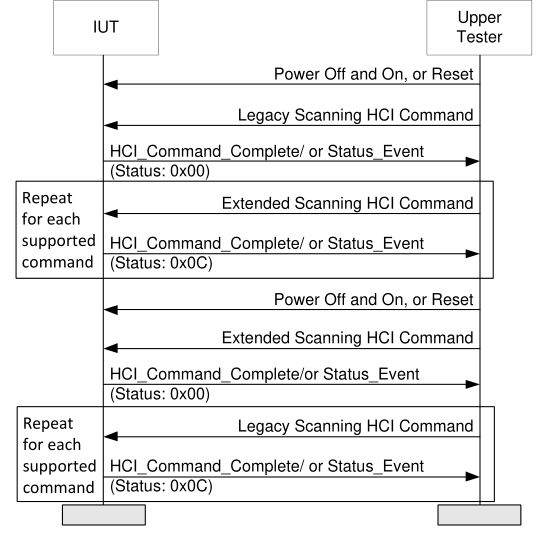

**Figure 4.3: HCI/GEV/BV-03-C [Disallow Mixing Legacy and Extended Scanning Commands] MSC**

1. The Upper Tester powers the IUT off and on or sends a reset. 2. The Upper Tester sends an LE Set Scan Parameters command to the IUT and receives a
Command Complete event with Status set to 0x00 (Success) in return. 3. For each command listed in Table 4.4, the Upper Tester sends the command and receives a
Command Complete or Command Status event with Status set to 0x0C (Command Disallowed) in return.

|  | Round |  |  | Command (Step 3) |  |  | Associated Event |  |
| --- | --- | --- | --- | --- | --- | --- | --- | --- |
|  | 1 |  |  | LE Set Extended Scan Parameters |  |  | HCI Command Complete Event _ _ _ |  |
|  | 2 |  |  | LE Set Extended Scan Enable |  |  | HCI Command Complete Event _ _ _ |  |
|  | 3 |  |  | LE Extended Create Connection |  |  | HCI Command Status Event _ _ _ |  |
|  | 4 |  |  | LE Periodic Advertising Create Sync |  |  | HCI Command Status Event _ _ _ |  |
|  | 5 |  |  | LE Periodic Advertising Create Sync Cancel |  |  | HCI Command Complete Event _ _ _ |  |
|  | 6 |  |  | LE Periodic Advertising Terminate Sync |  |  | HCI Command Complete Event _ _ _ |  |
|  | 7 |  |  | LE Add Device To Periodic Advertiser List |  |  | HCI Command Complete Event _ _ _ |  |
| 8 | 8 |  |  | LE Remove Device From Periodic |  | HCI Command Complete Event _ _ _ | HCI Command Complete Event _ _ _ |  |
|  |  |  |  | Advertiser List |  |  |  |  |
|  | 9 |  |  | LE Clear Periodic Advertiser List |  |  | HCI Command Complete Event _ _ _ |  |
|  | 10 |  |  | LE Read Periodic Advertiser List Size |  |  | HCI Command Complete Event _ _ _ |  |

Table 4.4: Commands for each case variation
4. The Upper Tester powers the IUT off and on or sends a reset. 5. The Upper Tester sends an LE Set Extended Scan Parameters command to the IUT and
receives a Command Complete event with Status set to 0x00 (Success) in return. 6. For each command listed in Table 4.5, the Upper Tester sends the command and receives a
Command Complete or Command Status event with Status set to 0x0C (Command Disallowed) in return.

|  | Round |  |  | Command (Step 6) |  |  | Associated Event |  |
| --- | --- | --- | --- | --- | --- | --- | --- | --- |
|  | 1 |  |  | LE Set Scan Parameters |  |  | HCI Command Complete Event _ _ _ |  |
|  | 2 |  |  | LE Set Scan Enable |  |  | HCI Command Complete Event _ _ _ |  |
|  | 3 |  |  | LE Create Connection |  |  | HCI Command Status Event _ _ _ |  |

Table 4.5: Commands for each case variation
• Expected Outcome
Pass verdict
After receiving a legacy scanning command, the IUT returns an HCI Command Complete or Command Status event with Status = Command Disallowed for any extended scanning command.
After receiving an extended scanning command, the IUT returns an HCI Command Complete or Command Status event with Status = Command Disallowed for any legacy scanning command.
HCI/GEV/BV-04-C [Extended Advertising Commands Without Scan Response Data]
• Test Purpose
Verify that the LE Extended Advertising Enable command yields a Command Complete event with status ‘Command Disallowed’ in return when no scan response data has been provided.
• Reference
[9] 7.8.55, 7.8.56
• Test Procedure
1. The Upper Tester powers the IUT off and on or sends a reset. 2. The Upper Tester sends an LE Set Extended Advertising Parameters command to the IUT with
scannable advertising property bit set to 1 and receives a Command Complete event with Status set to 0x00 (Success) in return. 3. The Upper Tester sends an LE Set Extended Scan Response Data command to the IUT with no
scan response data specified and receives a Command Complete event with Status set to 0x00 (Success) in return. 4. The Upper Tester sends an LE Set Extended Advertising Enable command to the IUT with no
scan response data provided and receives a Command Complete event with Status set to 0x0C (Command Disallowed) in return.
• Expected Outcome
Pass verdict
The IUT returns an HCI Command Complete event with Status set to 0x00 (Success) when the Upper Tester sends a HCI LE Set Extended Scan Response Data command with no scan response data.
The IUT returns an HCI Command Complete event with Status set to 0x0C (Command Disallowed) for HCI Set Extended Advertising Enable.
• Test Purpose
Verify that the IUT returns an Unknown HCI Command error when receiving an HCI command with an RFU (0x3E) OGF.
• Reference
[9] 5.4.1
• Test Procedure
Repeat steps 1 and 2 for OCF values 0x000 to 0x00F, 0x3F0 to 0x3FF, and 20 random values between 0x010 and 0x3EF.
1. The Upper Tester sends an HCI command packet to the IUT with OGF set to 0x3E and OCF set
as specified. 2. The IUT sends an HCI_Command_Complete event with Status set to Unknown HCI Command
(0x01).
• Expected Outcome
Pass verdict
In step 2, the IUT returns an Unknown HCI Command error code.

### 4.4 Device Setup

Verify the correct implementation of the Device Setup commands.
HCI/DSU/BV-01-C [BR/EDR Controller Reset Command]
• Test Purpose
Verify that the Reset command will reset the Controller, Link Manager, and the Bluetooth radio.
• Reference
[1] 7.3.2
• Initial Condition
- See Section 4.1.3.
• Test Procedure

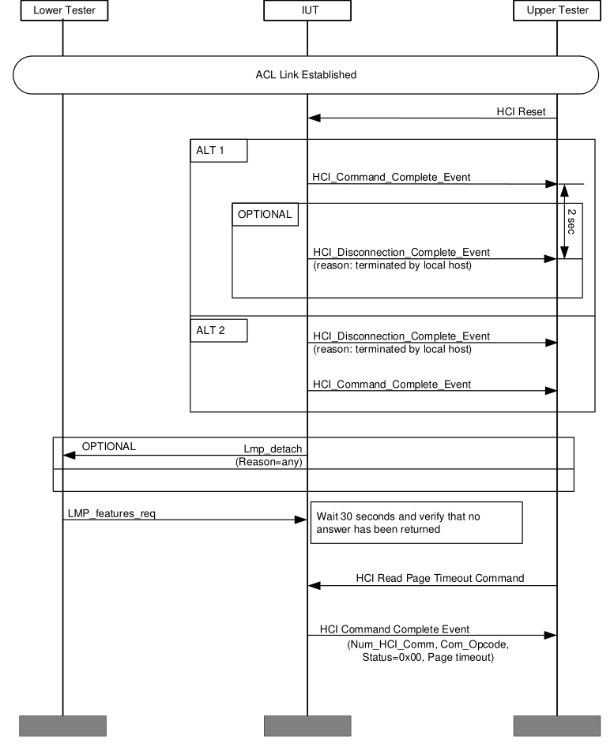

**Figure 4.4: HCI/DSU/BV-01-C [BR/EDR Controller Reset Command] MSC**

• Expected Outcome
Pass verdict
The IUT disconnects the ACL link after receiving an HCI_Reset command.
The IUT returns the default page timeout.
• Test Purpose
Verify that after receiving the HCI_Reset the Bluetooth LE controller in advertiser state enters into Standby state.
• Reference
[1] 7.3.2
• Initial Condition
- The IUT is configured in advertising state.
• Test Procedure
The Lower Tester receives ADV_IND packets from the IUT.
The Upper Tester sends HCI Reset to the IUT and receives the HCI Command Complete Event with Status = Success.
The Lower Tester receives no ADV_IND packets from the IUT.

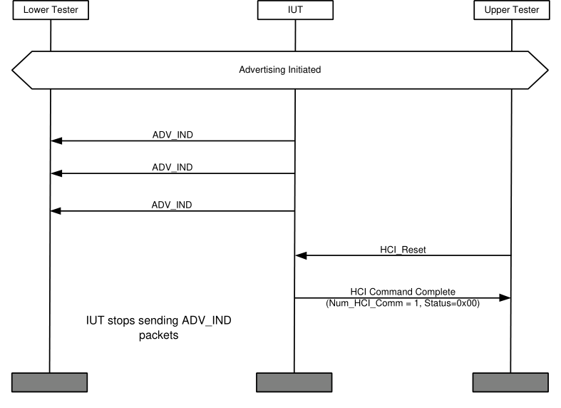

**Figure 4.5: HCI/DSU/BV-02-C [Reset in Advertising State] MSC**

• Expected Outcome
Pass verdict
The IUT returns HCI Command Complete Event with Status = Success.
The IUT stops sending ADV_IND packets after reset command has been completed.
• Test Purpose
Verify that after receiving the HCI_Reset the Bluetooth LE controller in Peripheral role enters into Standby state. Verify that the link layer connection is lost.
• Reference
[1] 7.3.2
• Initial Condition
- LL connection established. The IUT is configured as Peripheral.
• Test Procedure
The Lower Tester sends data to the IUT and receives data confirmation.
The Upper Tester sends HCI_Reset to the IUT and receives the HCI Command Complete Event with Status = Success.
The Lower Tester continues sending data packets and receives no packets from the IUT until connection timeout expires.

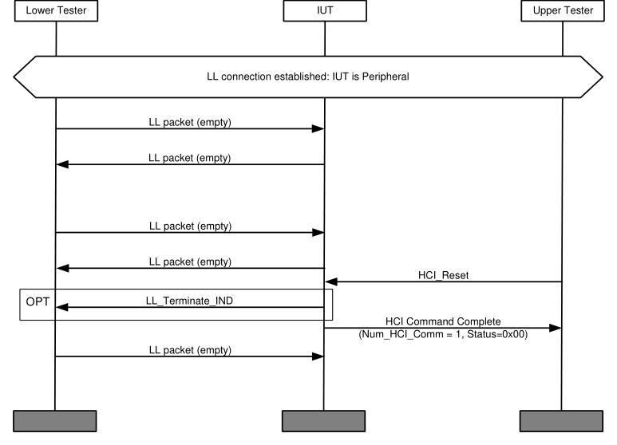

**Figure 4.6: HCI/DSU/BV-03-C [Reset to Peripheral] MSC**

• Expected Outcome
Pass verdict
The IUT returns HCI Command Complete Event with Status = Success.
The IUT stops sending data packets after reset command has been completed.
• Test Purpose
Verify that after receiving the HCI_Reset, the Bluetooth LE controller in scanning state IUT does not send any HCI LE Advertising Report Events.
• Reference
[1] 7.3.2
• Initial Condition
- The IUT is configured in passive scanning state. The Lower Tester is in advertising state.
• Test Procedure
The Upper Tester receives HCI LE Advertising Report Event from the IUT.
The Upper Tester sends HCI Reset to the IUT and receives the HCI Command Complete Event with Status = Success.
The Upper Tester receives no more HCI LE Advertising Report Events from the IUT.

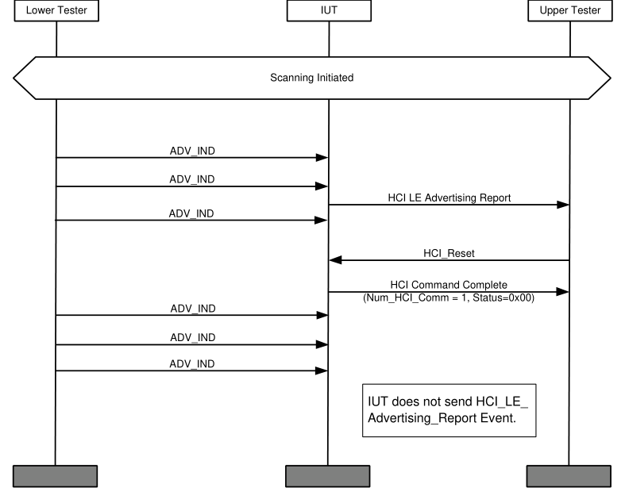

**Figure 4.7: HCI/DSU/BV-04-C [Reset in Scanning State] MSC**

• Expected Outcome
Pass verdict
The IUT returns HCI Command Complete Event with Status = Success.
The IUT does not send HCI LE Advertising Report Event after reset.
• Test Purpose
Verify that after receiving the HCI_Reset the Bluetooth LE controller in initiating state enters into Standby state.
• Reference
[1] 7.3.2
• Initial Condition
- The IUT is configured to be in initiating state. The Lower Tester is in idle state.
• Test Procedure
The Upper Tester sends HCI LE Create Connection to the IUT and receives HCI Command Status event with Status = Success.
The Upper Tester sends HCI Reset to the IUT and receives the HCI Command Complete event with Status = Success.
After the Upper Tester receives command complete for HCI Reset, the Lower Tester sends ADV_IND packets and receives no CONNECT_REQ packets from the IUT.

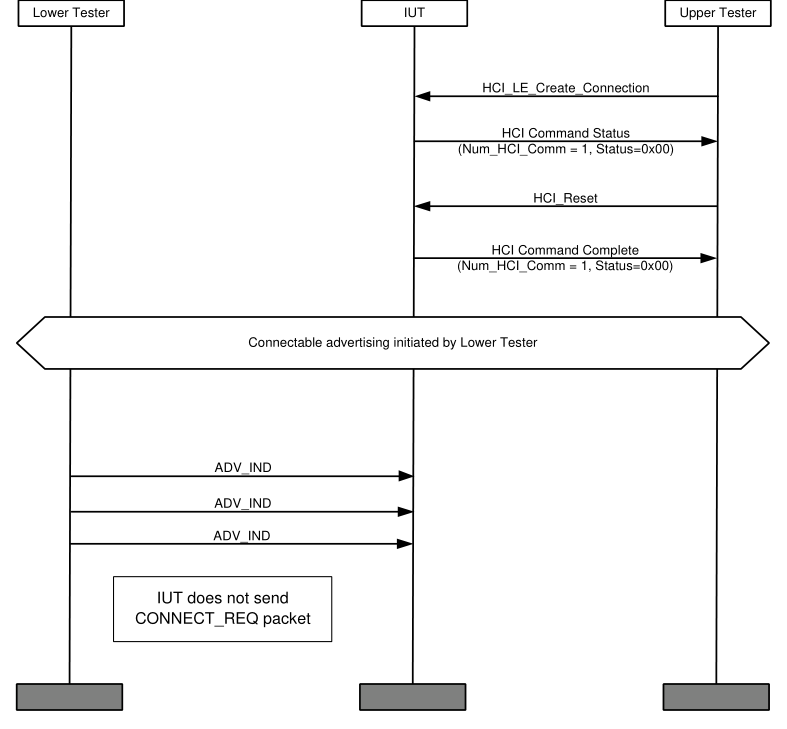

**Figure 4.8: HCI/DSU/BV-05-C [Reset in Initiating State] MSC**

• Expected Outcome
Pass verdict
The IUT returns HCI Command Complete Event with Status = Success.
The IUT does not send CONNECT_REQ packet after Command_Complete event of the Reset command.
The IUT does not return the HCI LE Connection Complete Event.
HCI/DSU/BV-06-C [Reset to Central]
• Test Purpose
Verify that after receiving the HCI_Reset the Bluetooth LE controller in Central role enters into Standby state. Verify that the link layer connection is lost.
• Reference
[1] 7.3.2
• Initial Condition
- LL connection is established. The IUT is configured as Central.
• Test Procedure
The Lower Tester receives data packets from the IUT and sends confirmation.
The Upper Tester sends HCI Reset to the IUT and receives the HCI Command Complete Event with Status = Success.
The Lower Tester receives no packets from the IUT until connection timeout expires.

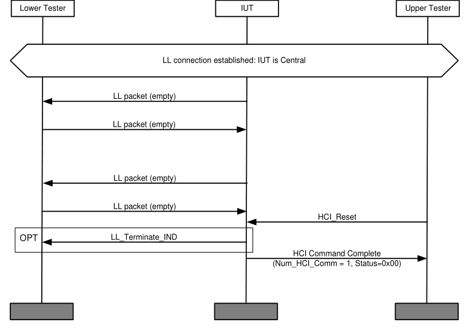

**Figure 4.9: HCI/DSU/BV-06-C [Reset to Central] MSC**

• Expected Outcome
Pass verdict
The IUT returns HCI Command Complete Event with Status = Success.
The IUT stops sending data packets after reset command has been completed.
HCI/DSU/BV-07-C [AMP Controller Reset Command]
• Test Purpose
Verify that the Reset Command will reset the HCI and the AMP PAL.
• Reference
[1] 7.3.2
• Initial Condition
- See Section 4.1.3.
• Test Procedure

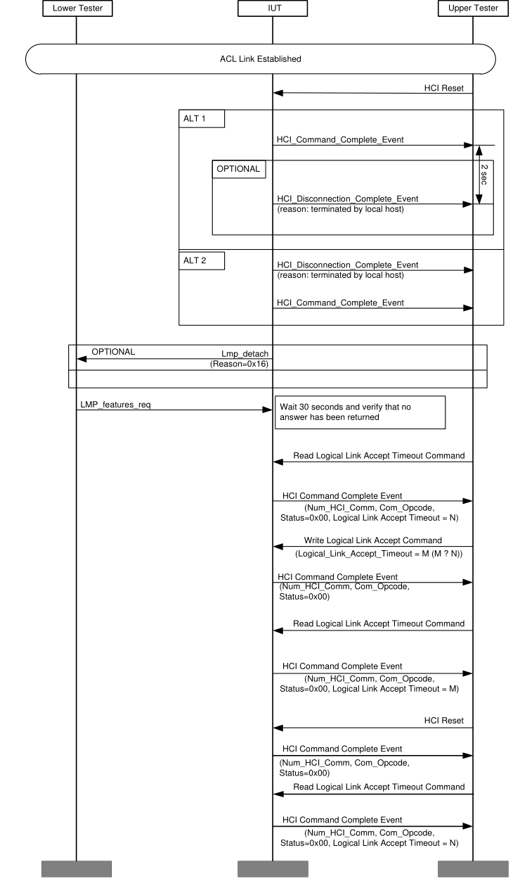

**Figure 4.10: HCI/DSU/BV-07-C [AMP Controller Reset Command] MSC**

• Expected Outcome
Pass verdict
The IUT returns the default Logical Link Accept Timeout.

### 4.5 Controller Flow Control

Verify the correct implementation of the Controller Flow Control commands

#### 4.5.1 Read Buffer Size Command • Test Purpose

Verify that the Read_Buffer_Size command returns the buffer size, and that when data is transferred a ‘number of completed packets’ response is returned per packet.
• Reference
[13] 7.4.5
• Initial Condition
- The IUT is in STANDBY Mode-3.
• Test Case Configuration

|  | TCID |  |  | PHY |  |  | SCO or eSCO data over HCI support |  |
| --- | --- | --- | --- | --- | --- | --- | --- | --- |
| HCI/CFC/BV-01-C |  |  | BR/EDR |  |  | Supported |  |  |
| HCI/CFC/BV-03-C |  |  | AMP |  |  | Supported |  |  |
| HCI/CFC/BV-06-C |  |  | BR/EDR |  |  | Not Supported |  |  |
| HCI/CFC/BV-07-C |  |  | AMP |  |  | Not Supported |  |  |

Table 4.6: Read Buffer Size Command test cases
• Test Procedure
In the HCI ACL_Data_Packet, the N parameter is the data packet length returned in the HCI_Read_Buffer_Size command.
An ACL connection is established using the PHY as specified in Table 4.6.

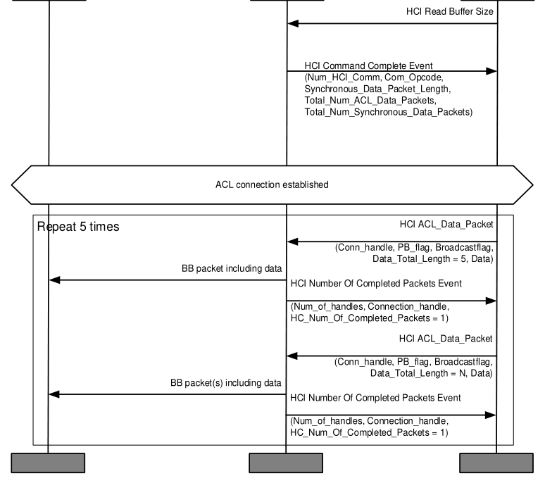

**Figure 4.11: Read Buffer Size Command MSC**

• Expected Outcome
Pass verdict
The value of ACL_Data_Packet_Length is greater than zero and less than the maximum ACL Data Packet size for a controller that supports BR/EDR in the returned HCI_Command_Complete event. If the controller supports SCO or eSCO over HCI as specified in Table 4.6, the value of Synchronous_Data_Packet_Length is greater than zero and less than the maximum Synchronous Data Packet size.
The IUT returns one ‘number of completed packets’ response per packet for 1-byte packets.
The IUT returns one ‘number of completed packets’ response per packet for buffer-sized packets.
• Notes
All packets sent over HCI are valid L2CAP packets. In the first part of the test, the single byte data payload is encoded as an L2CAP packet with a 4-byte L2CAP header. For the second part of the test, for a buffer size N, the data payload is N-4 to allow for the L2CAP header.
• Test Purpose
Verify that the IUT returns the buffer size of the controller when receiving the LE_Read_Buffer_Size command.
• Reference
[8] 7.8.2
• Initial Condition
- No LL connection exists.
• Test Procedure
The Upper Tester sends HCI_LE_Read_Buffer_Size and receives an HCI_Command_Complete event in response with Status = Success.
In the HCI ACL_Data_Packet, the N parameter is the data packet length returned in the HCI_LE_Read_Buffer_Size command.
An ACL connection is established using the Bluetooth LE PHY.

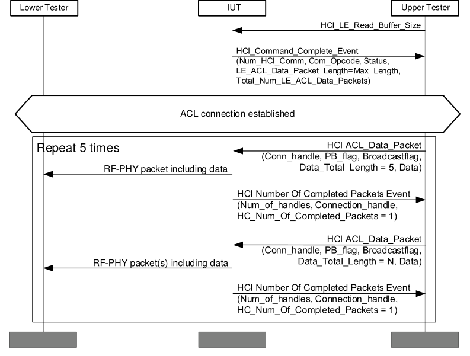

**Figure 4.12: HCI/CFC/BV-02-C [Buffer size] MSC**

• Expected Outcome
Pass verdict
The IUT returns an HCI_Command_Complete event with Status = Success and Data_Packet_Length and Num_Data_Packet parameters with correct values.
The IUT returns one ‘number of completed packets’ response per packet for buffer-sized packets.
• Notes
All packets sent over HCI are valid L2CAP packets. In the first part of the test, the single byte data payload is encoded as an L2CAP packet with a 4-byte L2CAP header. For the second part of the test, for a buffer size N, the data payload is N-4 to allow for the L2CAP header.

#### 4.5.2 Read Buffer Size and LE Read Buffer Size commands, Combined Data

Buffers • Test Purpose
Verify that the Read_Buffer_Size and LE_Read_Buffer_Size commands on a device that has combined data buffers for both BR/EDR and LE return the proper buffer size on dual-mode devices, and that when data is transferred using both BR/EDR and LE connections, a ‘number of completed packets’ response is returned per packet.
• Reference
[13] 7.4.5, 7.8.2
• Initial Condition
- The IUT is not connected to the Lower Tester.
• Test Case Configuration

| TCID |  | SCO or eSCO data |  |
| --- | --- | --- | --- |
|  |  | over HCI support |  |
| HCI/CFC/BV-04-C [Read Buffer Size and LE Read Buffer Size commands, Combined Data Buffers, SCO or eSCO data over HCI supported] | Supported |  |  |
| HCI/CFC/BV-08-C [Read Buffer Size and LE Read Buffer Size commands, Combined Data Buffers, SCO or eSCO data over HCI not supported] | Not Supported |  |  |

Table 4.7: Read Buffer Size and LE Read Buffer Size commands, Combined Data Buffers
• Test Procedure
In the HCI ACL_Data_Packet, the N parameter is the data packet length returned in the HCI_Read_Buffer_Size command.

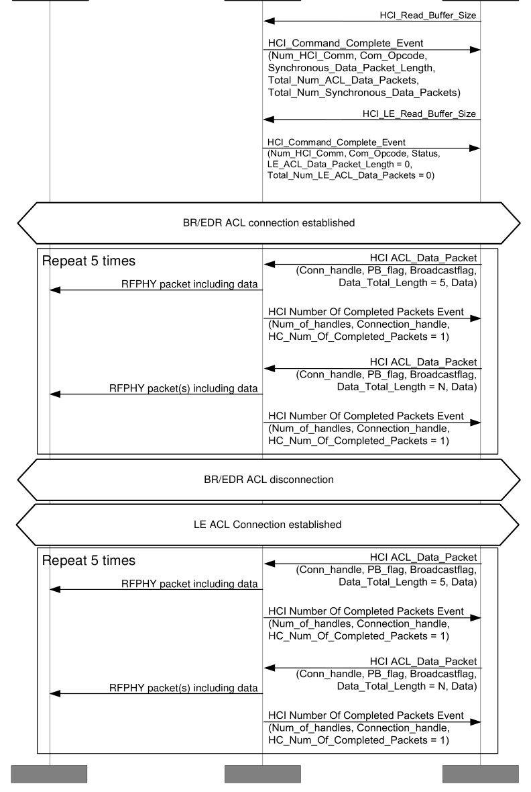

**Figure 4.13: Read Buffer Size and LE Read Buffer Size commands, Combined Data Buffers MSC**

• Expected Outcome
Pass verdict
The IUT returns an HCI_Command_Complete event to the HCI_Read_Buffer_Size command with Status = Success. The value of ACL_Data_Packet_Length is greater than zero and less than the maximum ACL Data Packet size for a controller that supports BR/EDR. If the controller supports SCO or eSCO over HCI as specified in Table 4.7, the value of Synchronous_Data_Packet_Length is greater than zero and less than the maximum Synchronous Data Packet size.
The IUT returns an HCI_Command_Complete event to the HCI_LE_Read_Buffer_Size command with Status = Success and LE_Data_Packet_Length = 0 and Num_LE_Data_Packets = 0.
The IUT returns one ‘number of completed packets’ response per packet for 1-byte packets on both BR/EDR and LE connections.
The IUT returns one ‘number of completed packets’ response per packet for buffer-sized packets on both BR/EDR and LE connections.
• Notes
All packets sent over HCI are valid L2CAP packets. In the first part of the test, the single byte data payload is encoded as an L2CAP packet with a 4-byte L2CAP header. For the second part of the test, for a buffer size N, the data payload is N-4 to allow for the L2CAP header.

#### 4.5.3 Read Buffer Size and LE Read Buffer Size commands, Separate Data

Buffers • Test Purpose
Verify that the Read_Buffer_Size and LE_Read_Buffer_Size commands that have separate data buffers for both BR/EDR and LE return the proper buffer size on dual-mode devices and that when data is transferred using both BR/EDR and LE connections, a ‘number of completed packets’ response is returned per packet.
• Reference
[13] 7.4.5, 7.8.2
• Initial Condition
- The IUT is not connected to the Lower Tester.
• Test Case Configuration

| TCID |  | SCO or eSCO data |  |
| --- | --- | --- | --- |
|  |  | over HCI support |  |
| HCI/CFC/BV-05-C [Read Buffer Size and LE Read Buffer Size commands, Separate Data Buffers, SCO or eSCO data over HCI supported] | Supported |  |  |
| HCI/CFC/BV-09-C [Read Buffer Size and LE Read Buffer Size commands, Separate Data Buffers, SCO or eSCO data over HCI not supported] | Not Supported |  |  |

Table 4.8: Read Buffer Size and LE Read Buffer Size commands, Separate Data Buffers
• Test Procedure
In the HCI ACL_Data_Packet, the N1 parameter is the data packet length returned in the HCI_Read_Buffer_Size command, and the N2 parameter is the data packet length returned in the HCI_LE_Read_Buffer_Size command.

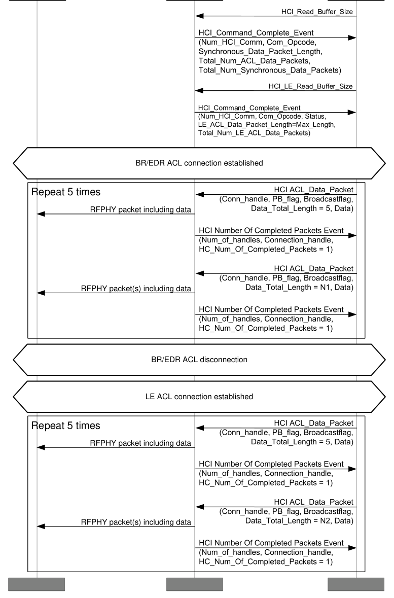

**Figure 4.14: Read Buffer Size and LE Read Buffer Size commands, Separate Data Buffers MSC**

• Expected Outcome
Pass verdict
The IUT returns an HCI_Command_Complete event to the HCI_Read_Buffer_Size command with Status = Success. The value of ACL_Data_Packet_Length is to be a non-zero value and less than the maximum ACL Data Packet size for a controller that supports BR/EDR. If the controller supports SCO or eSCO over HCI as specified in Table 4.8, the value of Synchronous_Data_Packet_Length is to be a non-zero value and less than the maximum Synchronous Data Packet size.
The IUT returns an HCI_Command_Complete event to the HCI_LE_Read_Buffer_Size command with Status = Success and LE_Data_Packet_Length and Num_LE_Data_Packets with correct non- zero values.
The IUT returns one ‘number of completed packets’ response per packet for 1-byte packets on both BR/EDR and LE connections.
The IUT returns one ‘number of completed packets’ response per packet for buffer-sized packets on both BR/EDR and LE connections.
• Notes
All packets sent over HCI are valid L2CAP packets. In the first part of the test, the single-byte data payload is encoded as an L2CAP packet with a 4-byte L2CAP header. For the second part of the test, for a buffer size N, the data payload is N-4 to allow for the L2CAP header.

#### 4.5.4 Read Buffer Size command, Invalid Parameters • Test Purpose

Verify that the IUT properly responds to the HCI_Read_Buffer_Size command, reporting a number of data packets that is consistent with the IUT’s support or not for SCO or eSCO over HCI.
• Initial Condition
- The IUT is in standby.
• Test Case Configuration

|  | Test Case |  |  | Reference |  |  | Event Parameter |  |
| --- | --- | --- | --- | --- | --- | --- | --- | --- |
|  | HCI/CFC/BI-03-C [Read Buffer Size |  | [17] 7.4.5 | [17] 7.4.5 |  | Total Num Synchronous Data Packets = 0 _ _ _ _ | Total Num Synchronous Data Packets = 0 _ _ _ _ |  |
|  | Command, [e]SCO data over HCI not |  |  |  |  |  |  |  |
|  | supported] |  |  |  |  |  |  |  |
|  | HCI/CFC/BI-04-C [Read Buffer Size |  | [17] 7.4.5 |  |  | Total Num Synchronous Data Packets > 0 _ _ _ _ Synchronous Data Packet Length > 0 _ _ _ |  |  |
|  | Command, [e]SCO data over HCI |  |  |  |  |  |  |  |
|  | supported] |  |  |  |  |  |  |  |

Table 4.9: Read Buffer Size command, Invalid Parameters test cases
• Test Procedure
1. The Upper Tester sends the HCI_Read_Buffer_Size command to the IUT. 2. The IUT sends an HCI_Command_Complete event to the Upper Tester with Status set to 0 and
the parameters set as specified in Table 4.9.
• Expected Outcome
Pass verdict
In step 2, the IUT sends an HCI_Command_Complete event to the Upper Tester with the parameters specified in Table 4.9.

### 4.6 Controller Information

Verify the correct implementation of the Controller Information commands.
HCI/CIN/BV-01-C [Read Local Supported Features Command]
• Test Purpose
Verify that the Read Local Supported Features command returns with the correct features supported.
• Reference
[1] 7.4.3
• Initial Condition
- No LL connection exists.
• Test Procedure

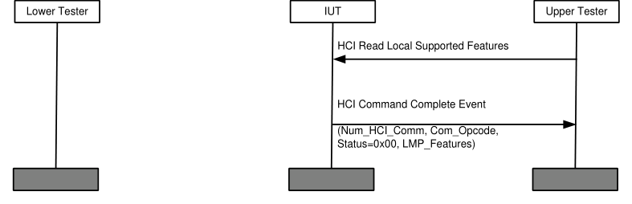

**Figure 4.15: HCI/CIN/BV-01-C [Read Local Supported Features Command] MSC**

• Test Condition
The manufacturer of the IUT must define features supported.
• Expected Outcome
Pass verdict
The IUT returns parameter LMP_features containing features supported defined by the ICS as mapped by Table 3.2 in [21].
HCI/CIN/BV-02-C [Read Local Extended Features Command]
• Test Purpose
Verify that the Read Local Extended Features command returns with the correct features supported.
• Reference
[1] 7.4.4
• Initial Condition
- No LMP connection exists.
• Test Procedure

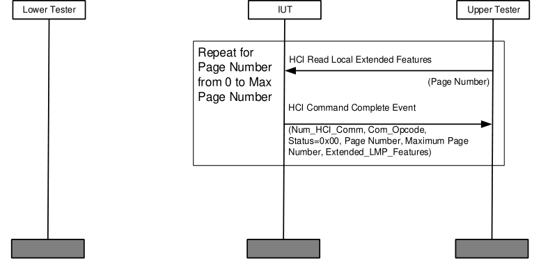

**Figure 4.16: HCI/CIN/BV-02-C [Read Local Extended Features Command] MSC**

• Test Condition
The manufacturer of the IUT must define the extended features supported.
• Expected Outcome
Pass verdict
The IUT returns the requested page of extended LMP_features containing features supported defined by the ICS as mapped by Table 4.2 in [5].
Each HCI Command Complete Event has the same Maximum Page Number.
HCI/CIN/BV-03-C [Read Local Supported Commands Command]
• Test Purpose
Verify that the Read Local Supported Commands command returns with the correct commands supported.
• Reference
[1] 7.4.2
• Initial Condition
- No LL connection exists.
• Test Procedure

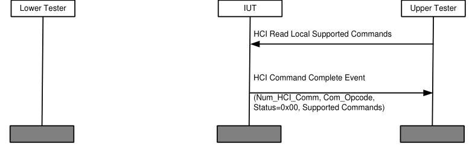

**Figure 4.17: HCI/CIN/BV-03-C [Read Local Supported Commands Command] MSC**

• Test Condition
The manufacturer of the IUT must define the commands supported.
• Expected Outcome
Pass verdict
The IUT returns the Supported Commands configuration parameter with the correct commands supported.
HCI/CIN/BV-04-C [Read Local Version Information Command]
• Test Purpose
Verify that the Read Local Version Information command returns with the correct versions.
• Reference
[1] HCI 7.4.1
• Initial Condition
- No LL connection exists.
• Test Procedure

| Lower Tester |  |
| --- | --- |
|  |  |
|  |  |

HCI Read Local Version Information Command
HCI Command Complete (Num_HCI_Comm, Com_Opcode, Status=0x00, HCI Version, HCI Revision, LMP Version, Manufacturer Name, LMP
Subversion)

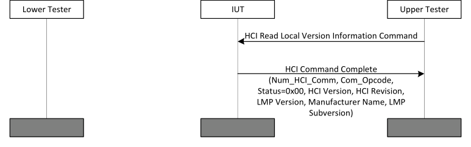

**Figure 4.18: HCI/CIN/BV-04-C [Read Local Version Information Command] MSC**

• Test Condition
The manufacturer of the IUT must define versions supported.
• Expected Outcome
Pass verdict
The IUT returns command complete with the version information containing HCI Version and LMP Version as defined in Bluetooth assigned numbers and HCI Revision, Manufacturer Name and LMP Subversion as defined by the manufacturer.
HCI/CIN/BV-06-C [Filter Accept List Size]
• Test Purpose
Verify that the IUT responds with the number of empty entries that the radio has in its device addresses list.
• Reference
[8] 7.8.17
• Initial Condition
- The IUT is not connected to the Lower Tester.
• Test Procedure
The Upper Tester sends HCI LE Clear Filter Accept List.
The Upper Tester reads the IUT’s Filter Accept List size. The Upper Tester receives HCI Command Complete Event with Filter Accept List Size parameter equal or greater than 1.
The Upper Tester adds different addresses until the list is full.
The Upper Tester adds one more address and expects the IUT to return an HCI Command Complete Event with Status = Memory Capacity Exceeded.
The Upper Tester removes one address from the Filter Accept List so that there is now space for one more address.
The Upper Tester adds another address and expects the IUT to return an HCI Command Complete Event with Status = Success.

| Lower Tester |  |
| --- | --- |
|  |  |
|  |  |

| IUT Upper Tester HCI LE Clear Filter Accept List _ _ _ _ _ HCI Command Complete (Num HCI Comm =1, Status=0x00) _ _ HCI LE Read Filter Accept List Size _ _ _ _ _ _ HCI Command Complete (Num HCI Comm =1, Status=0x00, _ _ Filter Accept List Size) _ _ _ Repeat Filter Accept List Size _ _ _ times HCI LE Add Device to Filter Accept List _ _ _ _ _ _ _ (Address Type, Address) _ HCI Command Complete (Num HCI Comm =1, Status=0x00) _ _ HCI LE Add Device to Filter Accept List _ _ _ _ _ _ _ (Address Type, Address) _ HCI Command Complete (Num HCI Comm =1, Status=0x07) _ _ HCI LE Remove Device from Filter Accept List _ _ _ _ _ _ _ (Address Type, Address) _ HCI Command Complete (Num HCI Comm =1, Status=0x00) _ _ HCI LE Add Device to Filter Accept List _ _ _ _ _ _ _ (Address Type, Address) _ HCI Command Complete (Num HCI Comm =1, Status=0x00) _ _ | Upper Tester |  |
| --- | --- | --- |
|  |  |  |
|  |  |  |

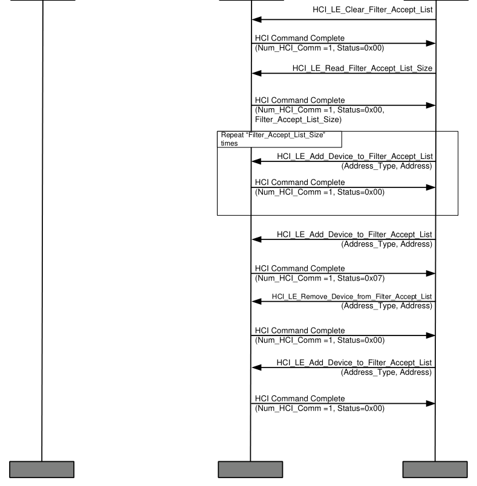

**Figure 4.19: HCI/CIN/BV-06-C [Filter Accept List Size] MSC**

• Expected Outcome
Pass verdict
The IUT returns HCI Command Complete Event with Status = Success in response to HCI LE Read Filter Accept List Size command and with Filter Accept List Size parameter greater or equal to 0x01.
The IUT returns HCI Command Complete with Status = Success in response to HCI Add Device to Filter Accept List command while there is enough space in the list.
The IUT returns HCI Command Complete with Status = Memory Capacity Exceeded in response to HCI Add Device to Filter Accept List command while there is not enough space in the list.
The IUT returns HCI Command Complete with Status = Success in response to HCI Remove Device from Filter Accept List command.
The IUT returns HCI Command Complete with Status = Success in response to HCI Add Device to Filter Accept List command.
HCI/CIN/BV-07-C [REMOVED TEST]
• Test Purpose
Verify that the Read Local Simple Pairing Options command returns with the correct options and key size supported.
• Reference
[10] 7.4.9
• Initial Condition
- The IUT is not connected to the Lower Tester.
• Test Procedure

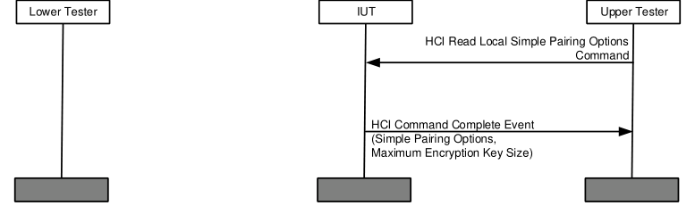

**Figure 4.20: HCI/CIN/BV-08-C [Read Local Simple Pairing Options Command] MSC**

• Test Condition
The manufacturer of the IUT supports remote public key validation performed and maximum encryption key size.
• Expected Outcome
Pass verdict
The IUT has set the ‘Remote public key validation is always performed’ (bit 0) in the Simple Pairing Options Field to 1.
The IUT returns a Maximum Encryption Key Size greater than or equal to 0x07 and less than or equal to 0x10.
HCI/CIN/BV-09-C [Read LE Public Key Validation Feature Bit]
• Test Purpose
Verify that the LE Read Local Supported Features Page 0 command returns with the Remote Public Key Validation feature bit enabled.
• Reference
[1] 7.4.3
• Initial Condition
- The IUT is not connected to the Lower Tester.
• Test Procedure

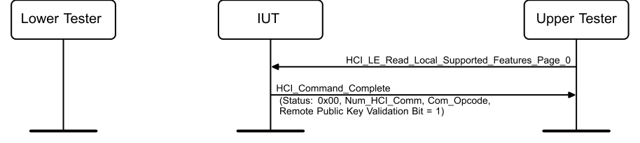

**Figure 4.21: HCI/CIN/BV-09-C [Read LE Public Key Validation Feature Bit] MSC**

• Expected Outcome
Pass verdict
The IUT returns a FeatureSet field with the Remote Public Key Validation bit set to 1.

#### 4.6.1 Read Local Supported Codec Capabilities • Test Purpose

Verify that the Read_Local_Supported_Codecs command returns the correct codecs for the supported transport. For each supported codec, verify that the Read Local Supported Codec Capabilities returns the proper capabilities. Also verify that the proper min and max controller delay values are returned in the Read Local Supported Controller Delay.
• Reference
[12] 7.4.8
• Initial Condition
- The IXIT parameters are specified in Table 4.10.

|  | IXIT Parameter | Description |
| --- | --- | --- |
| TSPX Number Supported Standard Codecs BR EDR _ _ _ _ _ _ |  | Number of Standard Codecs, BR/EDR |
| TSPX Number Supported Standard Codecs All PHYs _ _ _ _ _ _ |  | Number of Standard Codecs, All PHYs |
| TSPX Number Supported Vendor Codecs BR EDR _ _ _ _ _ _ |  | Number of Vendor Specific Codecs, BR/EDR |
| TSPX Number Supported Vendor Codecs All PHYs _ _ _ _ _ _ |  | Number of Vendor Specific Codecs, All PHYs |

Table 4.10: Read Local Supported Codec Capabilities IXIT parameters
• Test Case Configuration

| Test Case | HCI Command | Return Parameters | Return Parameters |  | Execute Steps 4–13 |
| --- | --- | --- | --- | --- | --- |
| HCI/CIN/BV-10-C [Read Local Supported Codec Capabilities, BR/EDR] | HCI Read _ _ Local Supported _ _ Codecs [v1] | Num Supported Standard Codecs = _ _ _ TSPX Number Supported Standard Codecs BR EDR _ _ _ _ _ _ Standard Codec ID[Num Supported Standard Codecs] _ _ _ _ _ Num Supported Vendor Specific Codecs = _ _ _ _ TSPX Number Supported Vendor Codecs BR EDR _ _ _ _ _ _ Vendor Specific Codec ID[Num Supported Vendor _ _ _ _ _ _ Specified Codecs] _ |  | No |  |

| Test Case | HCI Command | Return Parameters |  | Execute Steps |  |
| --- | --- | --- | --- | --- | --- |
|  |  |  |  | 4–13 |  |
| HCI/CIN/BV-11-C [Read Local Supported Codec Capabilities, All] | HCI Read _ _ Local Supported _ _ Codecs [v2] | Num Supported Standard Codecs = _ _ _ TSPX Number Supported Standard Codecs All PHYs _ _ _ _ _ _ Standard Codec ID[Num Supported Standard Codecs] _ _ _ _ _ Standard Codec Transport[Num Supported Standard _ _ _ _ _ Codecs] Num Supported Vendor Specific Codecs = _ _ _ _ TSPX Number Supported Vendor Codecs All PHYs _ _ _ _ _ _ Vendor Specific Codec ID[Num Supported Vendor _ _ _ _ _ _ Specified Codecs] _ Vendor Specific Codec Transport[Num Supported _ _ _ _ _ Vendor Specified Codecs] _ _ | Yes |  |  |

Table 4.11: Read Local Supported Codec Capabilities test cases
• Test Procedure
1. The Upper Tester sends the HCI command as specified in Table 4.11 to the IUT. 2. The IUT responds with a successful HCI_Command_Complete event with return parameters as
specified in Table 4.11. 3. The Upper Tester verifies that the IUT returns the Codec Parameters specified in Table 4.10 with
Num_Codec_Capabilities entries. The Upper Tester also verifies that the number of array elements matches the number of supported codecs. 4. If the returned Num_Supported_Standard_Codecs and
Num_Supported_Vendor_Specific_Codecs both equal zero, the test ends with a Pass verdict. 5. For each standard codec and each vendor-specific codec returned in step 2, perform steps 6–13. 6. For each transport supported for that codec as specified in the parameters returned in step 2,
perform steps 7–13. 7. For the two directions 0x00 and 0x01, perform steps 8–12. 8. The Upper Tester sends an HCI_Read_Local_Supported_Codec_Capabilities command to the
IUT with the appropriate Codec_ID, Logical_Transport_Type, and Direction. 9. The IUT sends an HCI_Command_Complete event to the Upper Tester. If the status is zero,
perform steps 10–12; otherwise, skip those steps. 10. For each codec capability returned in step 9, perform steps 11 and 12. 11. The Upper Tester sends an HCI_Read_Local_Supported_Controller_Delay command to the IUT
with Codec_ID, Logical_Transport_Type, and Direction set to the values used in step 8 and Codec_Configuration_Length and Codec_Configuration set to the values selected in step 10. 12. The IUT responds with a successful HCI_Command_Complete event with Min_Controller_Delay
and Max_Controller_Delay set to a value between 0x000000 and 0x3D0900 and Max_Controller_Delay ≥ Min_Controller_Delay. 13. If for both directions the status in step 9 is non-zero, the test ends with a Fail verdict.
• Expected Outcome
Pass verdict
In step 2, the IUT responds with return parameters as specified in Table 4.11.
In step 3, the IUT sends the correct number of Codec IDs and Codec Transports.
In step 12, the IUT responds with return parameters with valid Min_Controller_Delay and Max_Controller_Delay values.
Fail verdict
The status returned in step 9 is non-zero for both directions for the same codec and transport.
• Test Purpose
Verify that the LE_Read_Local_Supported_Features_Page_0 command returns with the correct features supported.
• Reference
[1] 7.8.3
• Initial Condition
- The IUT is not connected to the Lower Tester.
• Test Procedure

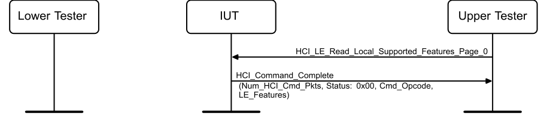

**Figure 4.22: HCI/CIN/BV-12-C [LE Read Local Supported Features Page 0 Command] MSC**

• Expected Outcome
Pass verdict
The Features field in the HCI_Command_Complete event is set to a value containing all the features supported, matching those defined by the LL ICS as mapped by Table 3.1 in [2].
HCI/CIN/BV-15-C [LE Read All Local Supported Features Command]
• Test Purpose
Verify that the LE_Read_All_Local_Supported_Features command returns with the correct features supported.
• Reference
[1] 7.8.3
• Initial Condition
- The IUT is not connected to the Lower Tester.
• Test Procedure

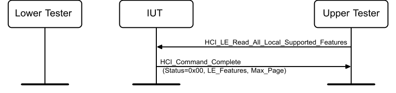

**Figure 4.23: HCI/CIN/BV-15-C [LE Read All Local Supported Features Command] MSC**

1. The Upper Tester sends an HCI_LE_Read_All_Local_Supported_Features command to the IUT. 2. The IUT sends a successful HCI_Command_Complete event to the Upper Tester with Max_Page
and LE_Features set.
• Expected Outcome
Pass verdict
In step 2, the LE_Features field is set to a value matching the corresponding ICS entries as mapped by Table 3.1 in [20]. The Max_Page is the highest-numbered page with at least one bit set.
HCI/CIN/BV-16-C [LE Read All Local Supported Features Command]
• Test Purpose
Verify that the LE_Read_All_Local_Supported_Features command returns with the correct features supported.
• Reference
[1] 7.8.128
• Initial Condition
- The IUT is not connected to the Lower Tester.
• Test Procedure
1. The Upper Tester sends an HCI_LE_Read_All_Local_Supported_Features command to the IUT. 2. The IUT sends an HCI_Command_Complete event with Max_Page and LE_Features set.
• Expected Outcome
Pass verdict
In step 2, the LE_Features field in the HCI_Command_Complete event is set to a value containing all the features supported, matching those defined by the LL ICS as mapped by Table 3.1 in [20].

#### 4.6.2 Read RSSI Value • Test Purpose

Verify that the Read RSSI command returns a valid Received Signal Strength Indication value for a given connection.
• Reference
[12] 7.5.4
• Initial Condition
- ACL connection established, the IUT is Central or Peripheral.
• Test Case Configuration

|  | Test Case ID |  |  | PHY |  |
| --- | --- | --- | --- | --- | --- |
| HCI/CIN/BV-13-C |  |  | BR/EDR |  |  |
| HCI/CIN/BV-14-C |  |  | LE PHY |  |  |

Table 4.12: Read RSSI Value test cases
• Test Procedure

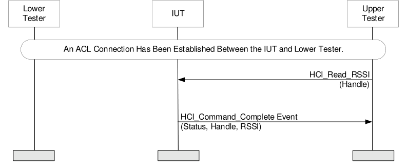

**Figure 4.24: Read RSSI Value MSC**

1. The Upper Tester sends an HCI_Read_RSSI command to the IUT with Handle set to the value of
the Connection_Handle of the current connection. 2. The IUT sends a successful HCI Command_Complete event to the Upper Tester with Handle set
to the value of the Connection_Handle in step 1 and a valid RSSI value.
• Expected Outcome
Pass verdict
In step 2, the IUT sends an HCI_Command_Complete event to the Upper Tester with Status set to 0x00, Handle set to the Connection_Handle in step 1, and a valid RSSI value.

### 4.7 Device Discovery

Verify the correct implementation of the Device Discovery commands.
HCI/DDI/BV-01-C [Periodic Inquiry Mode Command]
• Test Purpose
Verify that the Periodic Inquiry Mode command configures the IUT to enter the Periodic Inquiry Mode, and that the Exit Periodic Inquiry Mode command configures the IUT to exit Periodic Inquiry Mode.
• Reference
[1] 7.1.3, 7.1.4
• Initial Condition
- The IUT must be configured as Central.
- The IUT is in STANDBY mode.
• Test Procedure

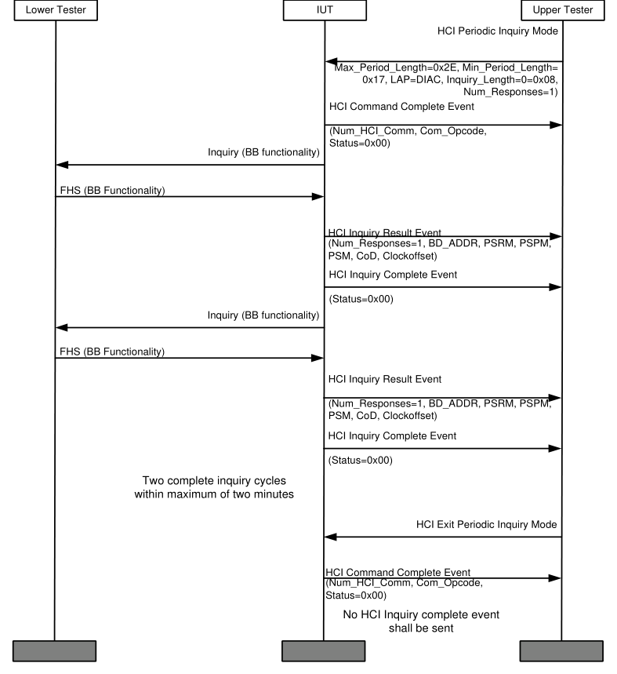

**Figure 4.25: HCI/DDI/BV-01-C [Periodic Inquiry Mode Command] MSC**

• Expected Outcome
Pass verdict
The IUT returns ‘command complete’ succeeded to the Periodic Inquiry Mode command.
The IUT returns an ‘Inquiry Result’ during each inquiry period.
The IUT returns an ‘Inquiry Complete’ event at the end of each inquiry period.
The IUT returns ‘command complete’ succeeded to the Exit Periodic Inquiry Mode command.
The IUT does not return an Inquiry Complete event after the periodic inquiry is exited.
• Test Purpose
Verify that the Write Inquiry Mode command writes the Inquiry Mode configuration parameter of the IUT, and that Read Inquiry Mode command returns the Inquiry Mode configuration parameter of the IUT.
• Reference
[1] 7.3.53, 7.3.54
• Initial Condition
- The IUT must be configured as Central.
- The IUT is in STANDBY mode.
• Test Procedure

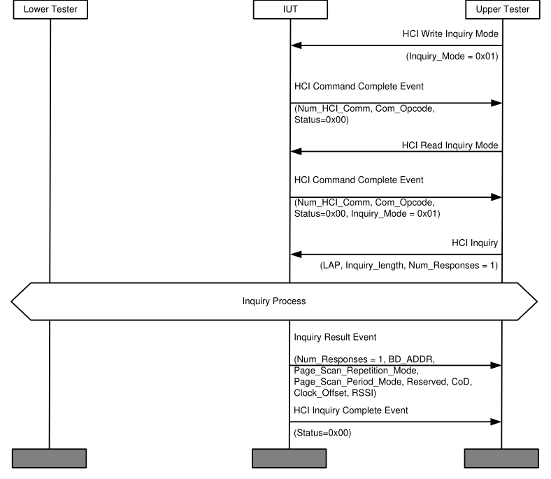

**Figure 4.26: HCI/DDI/BV-02-C [Write Inquiry Mode Command] MSC**

• Expected Outcome
Pass verdict
The IUT returns ‘command complete’ succeeded to the Write Inquiry Mode command.
The IUT returns the Inquiry_Mode parameter with result ‘Inquiry Result format with RSSI. The IUT returns an inquiry result with RSSI.
• Test Purpose
Verify that the IUT stops advertising when receiving HCI LE SetAdvertising Enable with the parameter Advertising Enable set to Disabled.
• Reference
[8] 7.8.10
• Initial Condition
- The IUT is configured in the advertising state.
• Test Procedure
The Lower Tester receives ADV_IND packets from the IUT.
The Upper Tester sends HCI LE SetAdvertising Enable with parameter Advertising Enable set to Disabled to the IUT and receives the HCI Command Complete Event with Status = Success.
The Lower Tester receives no ADV_IND packets from the IUT.

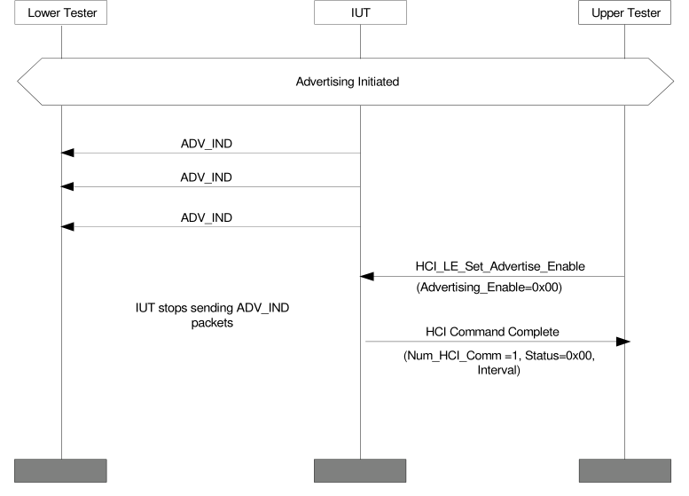

**Figure 4.27: HCI/DDI/BV-03-C [Set Advertising Enable] MSC**

• Expected Outcome
Pass verdict
The IUT returns HCI Command Complete Event with Status = Success.
The IUT stops sending ADV_IND packets.
• Test Purpose
Verify that the IUT stops scanning when receiving HCI LE SetScan Enable with the parameter LE Scan Enable set to Disabled.
• Reference
[8] 7.8.12
• Initial Condition
- The IUT is configured as passive scanner. The Lower Tester is advertiser.
• Test Procedure
The Upper Tester receives HCI LE Advertising Report Event from the IUT.
The Upper Tester sends HCI LE SetScan Enable with LE Scan Enable parameter set to Disabled to the IUT and receives the HCI Command Complete Event with Status = Success.
The Upper Tester receives no more HCI LE Advertising Report Events from the IUT.

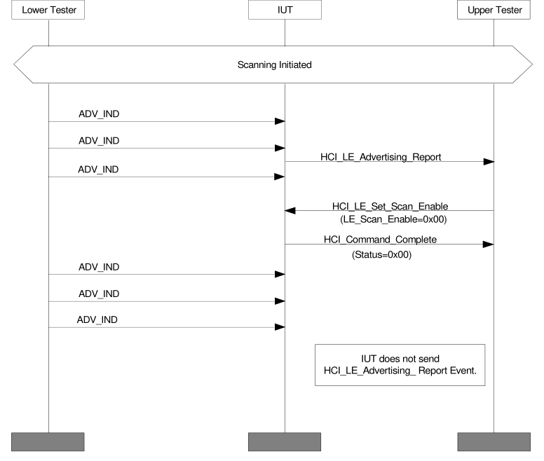

**Figure 4.28: HCI/DDI/BV-04-C [Set Scan Enable] MSC**

• Expected Outcome
Pass verdict
The IUT returns HCI Command Complete Event with Status = Success.
The IUT does not send any more LE Advertising Report Events after it sends the HCI_Command_Complete for the HCI_LE_Set_Scan_Enable command that disables scanning.
HCI/DDI/BV-05-C [Read Extended Inquiry Length]
• Test Purpose
Verify that the IUT correctly handles Read Extended Inquiry Length.
• Reference
[1] 7.3.98
• Initial Condition
- The IUT is in standby.
• Test Procedure
1. The Upper Tester issues HCI_Write_Extended_Inquiry_Length Command with preset information
to the IUT. 2. The Upper Tester receives success status in the HCI_Write_Extended_Inquiry_Length Command
complete event. 3. The Upper Tester issues HCI_Read_Extended_Inquiry_Length Command to the IUT.
• Expected Outcome
Pass verdict
The Upper Tester receives command complete event with success status for the commands sent in a and c. The Upper Tester receives the data returned by the HCI_Read_Extended_Inquiry_Length Command complete event. The received data matches that was used in the HCI_Write_Extended_Inquiry_Length Command.
HCI/DDI/BI-01-C [Reject Invalid Extended Advertising Parameters]
• Test Purpose
Verify that the IUT properly rejects an invalid advertising interval provided to the HCI_LE_Set_Extended_Advertising_Parameters command and returns the expected error code.
• Reference
[9] 7.8.53
• Initial Condition
- The IUT is not currently advertising.
- The minimum Primary_Advertising_Interval_Min value (TSPX_adv_interval_min) supported by the Controller is declared by the equipment manufacturer as an IXIT value.
- The maximum Primary_Advertising_Interval_Max value (TSPX_adv_interval_max) supported by the Controller is declared by the equipment manufacturer as an IXIT value.
- The legacy advertising type is defined by the TSPX_legacy_advertising_event_properties IXIT value.
• Test Procedure
The Upper Tester sends the HCI_LE_Set_Extended_Advertising_Parameters command to the IUT with the Advertising_Event_Properties parameter set to TSPX_legacy_advertising_event_properties, the Primary_Advertising_Interval_Max field set to TSPX_adv_interval_min minus one, and Primary_Advertising_Interval_Min set to TSPX_adv_interval_min minus two.
If the TSPX_adv_interval_max value is 0xFFFFFF, the test ends immediately with a Pass verdict. Otherwise, the Upper Tester sends the HCI_LE_Set_Extended_Advertising_Parameters command to the IUT with the Advertising_Event_Properties parameter set to TSPX_legacy_advertising_event_properties, the Primary_Advertising_Interval_Min field set to TSPX_adv_interval_max plus one, and Primary_Advertising_Interval_Max set to TSPX_adv_interval_max plus one if TSPX_adv_interval_max equals 0xFFFFFE, and plus two otherwise.

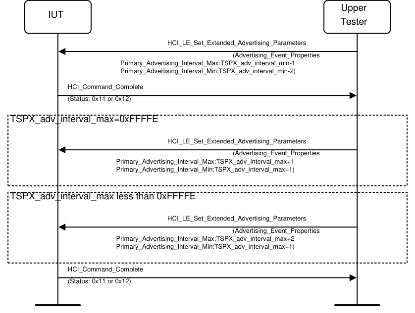

**Figure 4.29: HCI/DDI/BI-01-C [Reject Invalid Extended Advertising Parameters] MSC**

• Expected Outcome
Pass verdict
HCI_Command_Complete event for HCI_LE_Set_Extended_Advertising_Parameters is received by the Upper Tester.
- If either Primary_Advertising_Interval_Min or Max is less than 0x000020, the error code is either 0x11 (Unsupported Feature or Parameter Value) or 0x12 (Invalid HCI Command Parameter). Otherwise, the error code is 0x11.
• Test Purpose
Verify that the IUT properly rejects an invalid advertising interval provided to the HCI_LE_Set_Advertising_Parameters command and returns the expected error code.
• Reference
[9] 7.8.5
• Initial Condition
- The IUT is not currently advertising.
- The minimum Advertising_Interval_Min value (TSPX_adv_interval_min) supported by the Controller is declared by the equipment manufacturer as an IXIT value.
- The maximum Advertising_Interval_Max value (TSPX_adv_interval_max) supported by the Controller is declared by the equipment manufacturer as an IXIT value.
• Test Procedure
The Upper Tester sends the HCI_LE_Set_Advertising_Parameters to the IUT with the Advertising_Type field set to 0x03 (ADV_NONCONN_IND), the Advertising_Interval_Max field set to TSPX_adv_interval_min minus one, and Advertising_Interval_Min set to TSPX_adv_interval_min minus two.
The Upper Tester sends the HCI_LE_Set_Advertising_Parameters to the IUT with the Advertising_Type field set to 0x03 (ADV_NONCONN_IND), the Advertising_Interval_Max field set to TSPX_adv_interval_max plus two, and Advertising_Interval_Max set to TSPX_adv_interval_max plus one.
• Expected Outcome
Pass verdict
- HCI_Command_Complete event for HCI_LE_Set_Advertising_Parameters is received by the Upper Tester.
- If either Advertising_Interval_Min or Advertising_Interval_Max or both are less than 0x0020 or greater than 0x4000, the error code is either 0x11 (Unsupported Feature or Parameter Value) or 0x12 (Invalid HCI Command Parameter). Otherwise, the error code is 0x11.
HCI/DDI/BI-67-C [Reject Invalid Periodic Advertising Parameters]
• Test Purpose
Verify that the IUT properly rejects an invalid periodic advertising interval provided to the HCI_LE_Set_Periodic_Advertising_Parameters command and returns the expected error code.
• Reference
[9] 7.8.61
• Initial Condition
- The IUT does not have periodic advertising enabled. An advertising set is configured with supported default values using the HCI_LE_Set_Extended_Advertising_Parameters.
- The minimum Periodic_Advertising_Interval_Min value (TSPX_periodic_adv_interval_min) supported by the Controller is declared by the equipment manufacturer as an IXIT value.
- The maximum Periodic_Advertising_Interval_Max value (TSPX_periodic_adv_interval_max) supported by the Controller is declared by the equipment manufacturer as an IXIT value.
• Test Procedure
The Upper Tester sends the HCI_LE_Set_Periodic_Advertising_Parameters command to the IUT with Periodic_Advertising_Interval_Max set to TSPX_periodic_adv_interval_min minus one, and Periodic_Advertising_interval_Min set to TSPX_periodic_adv_interval_min minus two.
If the TSPX_periodic_adv_interval_max value is 0xFFFF, the test ends immediately with a Pass verdict. Otherwise, the Upper Tester sends the HCI_LE_Set_Periodic_Advertising_Parameters command to the IUT with Periodic_Advertising_Interval_Min set to TSPX_periodic_adv_interval_max plus one, and Periodic_Advertising_interval_Max set to TSPX_periodic_adv_interval_max plus one if TSPX_periodic_adv_interval_max equals 0xFFFE, and plus two otherwise.

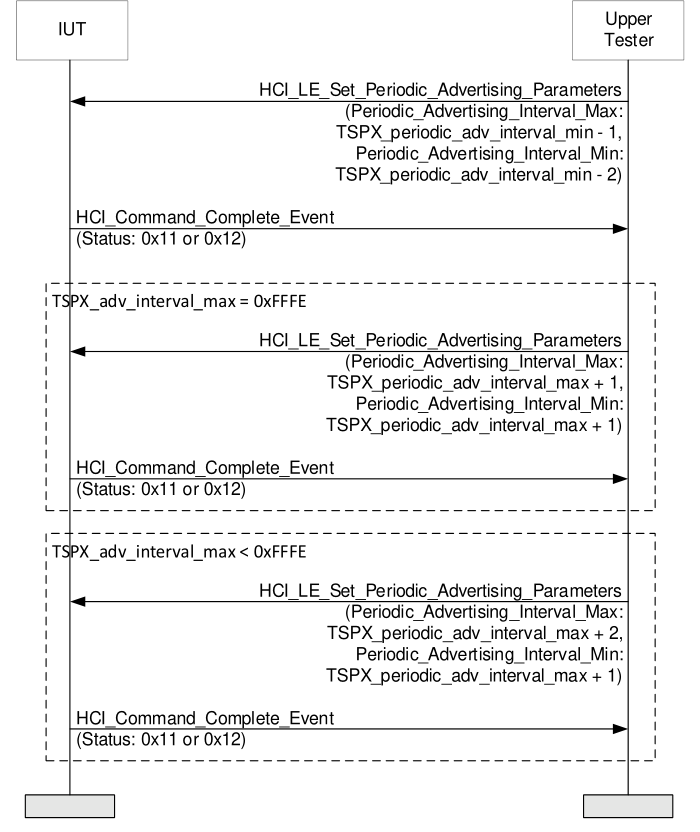

**Figure 4.30: HCI/DDI/BI-67-C [Reject Invalid Periodic Advertising Parameters] MSC**

• Expected Outcome
Pass verdict
The HCI_Command_Complete event for HCI_LE_Set_Periodic_Advertising_Parameters is received by the Upper Tester.
If either Primary_Advertising_Interval_Min or Max is less than 0x0006, the error code is either 0x11 (Unsupported Feature or Parameter Value) or 0x12 (Invalid HCI Command Parameter). Otherwise, the error code is 0x11.
HCI/DDI/BI-03-C [Reject LE Periodic Advertising Create Sync Command With Disallowed Reporting Options]
• Test Purpose
Verify that the IUT properly rejects disallowed reporting options provided to the HCI_LE_Periodic_Advertising_Create_Sync command and returns the expected error code.
• Reference
[11] 7.8.67
• Initial Condition
- The Lower Tester is advertising with extended advertising and periodic advertising.
- The IUT is scanning for extended advertising and has received the Advertising SID, Advertiser Address Type, and Advertiser Address.
• Test Procedure
The Upper Tester sends an HCI_LE_Periodic_Advertising_Create_Sync command to the IUT to synchronize with the Lower Tester’s periodic advertisements. Options is set to 0x02 (Don't Use List, Reporting Disabled).

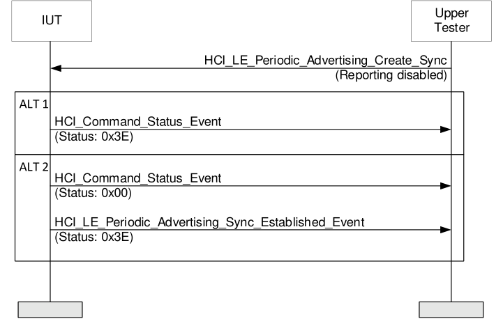

**Figure 4.31: HCI/DDI/BI-03-C [Reject LE Periodic Advertising Create Sync Command With Disallowed Reporting Options] MSC**

• Expected Outcome
Pass verdict
Alternative 1:
A Command Status event for the HCI_LE_Periodic_Advertising_Create_Sync command is received by the Upper Tester with the Connection Failed to be Established / Synchronization Timeout (0x3E) error code.
Alternative 2:
An LE Periodic Advertising Sync Established event is received by the Upper Tester with the Connection Failed to be Established / Synchronization Timeout (0x3E) error code.
HCI/DDI/BI-04-C [Reject LE Periodic Advertising Create Sync Command to a Synchronized Advertising Set]
• Test Purpose
Verify that the IUT properly rejects setting a periodic advertising that the Controller is already synchronized to, to the HCI_LE_Periodic_Advertising_Create_Sync command and returns the expected error code.
• Reference
[12] 7.8.67
• Initial Condition
- The Lower Tester is advertising with three periodic advertisements. All three have the same Advertising Address and Advertising Address Type. The first and third periodic advertisements have the same SID while the second has a different SID.
- The IUT is scanning for extended advertising and is receiving SyncInfo for all three advertisements.
• Test Procedure

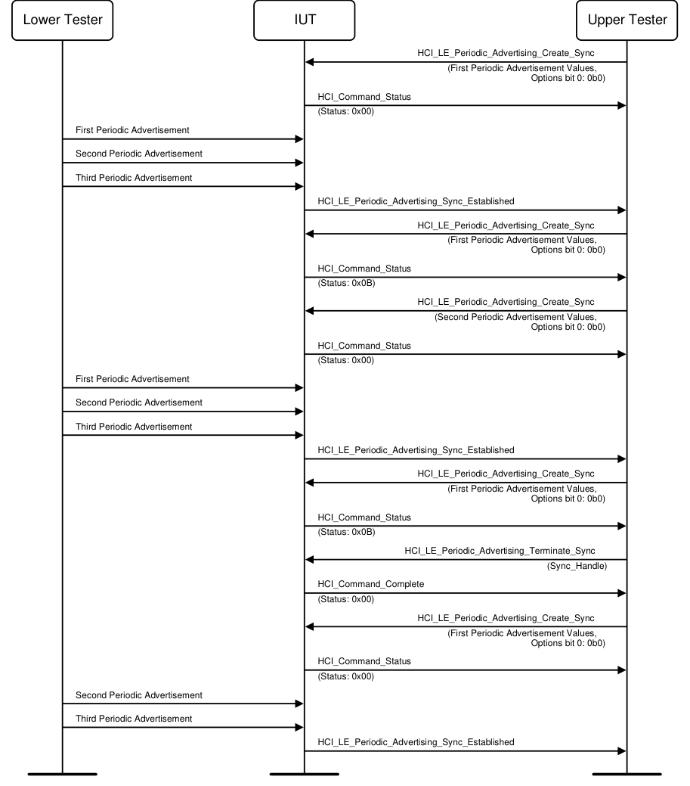

**Figure 4.32: HCI/DDI/BI-04-C [Reject LE Periodic Advertising Create Sync Command to a Synchronized Advertising Set] MSC**

1. The Upper Tester sends an HCI_LE_Periodic_Advertising_Create_Sync command to the IUT to
synchronize with the Lower Tester’s first periodic advertisement values and with bit 0 of the Options parameter set to 0. 2. An HCI_Command_Status event for the HCI_LE_Periodic_Advertising_Create_Sync command is
received by the Upper Tester with a Success (0x00) error code. 3. The Upper Tester waits for the HCI_LE_Periodic_Advertising_Sync_Established event.
synchronize with the Lower Tester’s first periodic advertisement values and with bit 0 of the Options parameter set to 0. 5. An HCI_Command_Status event for the HCI_LE_Periodic_Advertising_Create_Sync command is
received by the Upper Tester with the Connection Already Exists (0x0B) error code. 6. The Upper Tester sends an HCI_LE_Periodic_Advertising_Create_Sync command to the IUT to
synchronize with the Lower Tester’s second periodic advertisement values and with bit 0 of the Options parameter set to 0. 7. An HCI_Command_Status event for the HCI_LE_Periodic_Advertising_Create_Sync command is
received by the Upper Tester with a Success (0x00) error code. 8. The Upper Tester waits for the HCI_LE_Periodic_Advertising_Sync_Established event. 9. The Lower Tester stops the first periodic advertisement while continuing the other two periodic
advertisements. 10. The Upper Tester sends an HCI_LE_Periodic_Advertising_Create_Sync command to the IUT to
synchronize with the Lower Tester’s first periodic advertisement values and with bit 0 of the Options parameter set to 0. 11. An HCI_Command_Status event for the HCI_LE_Periodic_Advertising_Create_Sync command is
received by the Upper Tester with the Connection Already Exists (0x0B) error code. 12. The Upper Tester sends an HCI_LE_Periodic_Advertising_Terminate_Sync command to the IUT
with the Sync_Handle received in the HCI_LE_Periodic_Advertising_Sync_Established event for the First Periodic Advertisement in step 3. 13. An HCI_Command_Complete event for the HCI_LE_Periodic_Advertising_Terminate_Sync
command is received by the Upper Tester with a Success (0x00) error code. 14. The Upper Tester sends an HCI_LE_Periodic_Advertising_Create_Sync command to the IUT to
synchronize with the Lower Tester’s first periodic advertisement values and with bit 0 of the Options parameter set to 0. 15. An HCI_Command_Status event for the HCI_LE_Periodic_Advertising_Create_Sync command is
received by the Upper Tester with a Success (0x00) error code. 16. The Upper Tester waits for the HCI_LE_Periodic_Advertising_Sync_Established event.
• Expected Outcome
Pass verdict
The Upper Tester receives an HCI_Command_Status event with the expected status for each command.
The Upper Tester receives HCI_LE_Periodic_Advertising_Sync_Established events as expected for each HCI_LE_Periodic_Advertising_Create_Sync command that returned a status of success.
HCI/DDI/BI-05-C [LE Set Extended Scan Parameters With Unsupported PHY]
• Test Purpose
Verify that the IUT properly rejects an HCI_LE_Set_Extended_Scan_Parameters command that specifies unsupported PHYs.
• Reference
[9] 7.8.64
• Initial Condition
- The IUT is not currently scanning.
• Test Procedure
For each bit on the Scanning_PHYs parameter of the HCI_LE_Set_Extended_Scan_Parameters command that is an RFU bit or corresponds to a PHY not supported by the IUT:
The Upper Tester sends an HCI_LE_Set_Extended_Scan_Parameters command to the IUT with Scanning_PHYs having only that bit set and receives an HCI_Command_Complete event with a non- zero status.

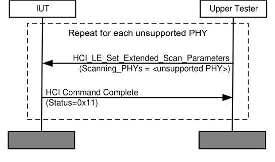

**Figure 4.33: HCI/DDI/BI-05-C [LE Set Extended Scan Parameters With Unsupported PHY] MSC**

• Expected Outcome
If the IUT supports PHYs corresponding to all 8 bits of the Scanning_PHYs parameter, the test procedure will do nothing. This case is a Pass.
Pass verdict
For each unsupported PHY (if applicable) and HCI_LE_Set_Extended_Scan_Parameters command with an RFU bit set, a Command Complete event for HCI_LE_Set_Extended_Scan_Parameters is received by the Upper Tester with the error Code Unsupported Feature or Parameter Value (0x11).Reject Invalid Enable Command
• Test Purpose
Verify that the IUT properly rejects an enable command when the LE Random Device Address is unset, and returns the expected error code.
• Initial Condition
- The IUT is in standby.
- The IUT has not set its LE Random Device Address.
• Test Procedure

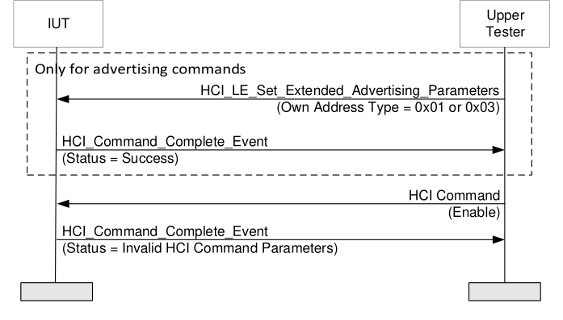

**Figure 4.34: Reject Invalid Enable Command MSC**

1. The Upper Tester sets the Own_Address_Type using the command and parameter in the “HCI
Set Command and Parameter” column in Table 4.13. Set all other fields to valid values. 2. The IUT returns an HCI_Command_Complete event with Success (0x00). 3. Upper Test sends the HCI Command under test from Table 4.13 with the “Enable Parameter” set
to 0x1 and with any other parameters set to valid values. 4. The IUT returns an HCI_Command_Complete event with the error code Invalid HCI Command
Parameters (0x12).

|  | Test Case | HCI Set Command and Parameter |  |  | HCI Command and Parameter |  |
| --- | --- | --- | --- | --- | --- | --- |
| HCI/DDI/BI-06-C [9] 7.8.9 |  | HCI LE Set Advertising Parameters _ _ _ _ (0x03) |  | HCI LE Set Advertising Enable _ _ _ _ (Advertising Enable) _ |  |  |
| HCI/DDI/BI-07-C [9] 7.8.11 |  | HCI LE Set Scan Parameters _ _ _ _ (0x01 or 0x03) |  | HCI LE Set Scan Enable _ _ _ _ (LE Scan Enable) _ _ |  |  |
| HCI/DDI/BI-08-C [9] 7.8.56 |  | HCI LE Set Extended Advertising Parameters _ _ _ _ _ (0x01) |  | HCI LE Set Extended Advertising Enable _ _ _ _ _ (Enable) |  |  |
| HCI/DDI/BI-09-C [9] 7.8.56 |  | HCI LE Set Extended Advertising Parameters _ _ _ _ _ (0x03) |  | HCI LE Set Extended Advertising Enable _ _ _ _ _ (Enable) |  |  |
| HCI/DDI/BI-11-C [9] 7.8.65 |  | HCI LE Set Extended Scan Parameters _ _ _ _ _ (0x01 or 0x03) |  | HCI LE Set Extended Scan Enable _ _ _ _ _ (Enable) |  |  |

Table 4.13: Reject Invalid Enable Command test cases
• Expected Outcome
Pass verdict
The IUT generates a Command Complete event for the HCI command under test with a status of Invalid HCI Command Parameters (0x12).
• Test Purpose
Verify that the IUT properly rejects an HCI_LE_Set_Extended_Advertising_Enable command when the IUT is not properly configured, and returns the expected error code.
• Reference
[9] 7.8.56
• Initial Condition
- The IUT is in standby.
- Extended advertising parameters with the scannable property set have been configured on the IUT for a particular advertising handle, but no scan response data has been set for that handle.
• Test Procedure

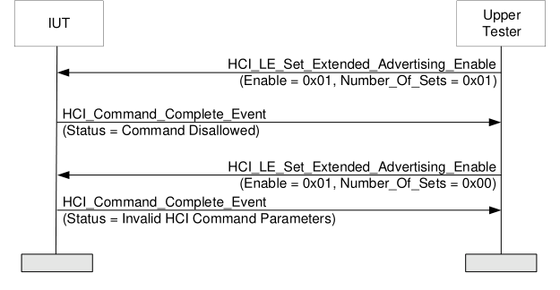

**Figure 4.35: HCI/DDI/BI-12-C [Reject Invalid Extended Advertising Enable Command] MSC**

1. The Upper Tester sends the HCI_LE_Set_Extended_Advertising_Enable command with the
Enable parameter set to 0x01, the Advertising_Handle set to existing Advertising_Handle, Number_Of_Sets set to 0x01, and with all other parameters set to valid values. 2. The IUT returns an HCI_Command_Complete event with the error code Command Disallowed
(0x0C). 3. The Upper Tester sends the HCI_LE_Set_Extended_Advertising_Enable command with the
Enable parameter set to 0x01, the Advertising_Handle set to existing Advertising_Handle, Number_Of_Sets set to 0x00, and with all other parameters set to valid values. 4. The IUT returns an HCI_Command_Complete event with the error code Invalid HCI Command
Parameters (0x12).
• Expected Outcome
Pass verdict
The IUT generates a Command Complete event for each HCI_LE_Set_Extended_Advertising_Enable command with the expected error code.
• Test Purpose
Verify that the IUT properly rejects an HCI_LE_Set_Periodic_Advertising_Enable command when the IUT is not properly set up, and returns the expected error code.
• Reference
[9] 7.8.63
• Initial Condition
- The IUT is in standby.
- Extended advertising parameters and periodic advertising parameters have been configured on the IUT for a particular advertising handle.
• Test Procedure
1. The Upper Tester sends an HCI_LE_Set_Periodic_Advertising_Data command with Operation
parameter set to 0x01 and a non-zero Advertising_Data_Length. 2. The IUT returns an HCI_Command_Complete event with status set to 0x00. 3. The Upper Test sends an HCI_LE_Set_Periodic_Advertising_Enable with the Enable parameter
set to 0x01, the Advertising_Handle set to the existing Advertising_Handle. 4. The IUT returns an HCI_Command_Complete event with the error code Command Disallowed
(0x0C).
• Expected Outcome
Pass verdict
The IUT generates a Command Complete event for the HCI_LE_Set_Periodic_Advertising_Enable command with the expected error code.
HCI/DDI/BI-14-C [Reject LE Set Periodic Advertising Data setting the fragment when periodic advertising is enabled]
• Test Purpose
Verify that the IUT properly rejects the Upper Tester attempting to set the data fragment when periodic advertising is already enabled.
• Reference
[13] 7.8.62
• Initial Condition
- The IUT is advertising with periodic advertisements.
• Test Case Configuration

|  | Round |  |  | Operation |  |
| --- | --- | --- | --- | --- | --- |
| 1 |  |  | 0x00 |  |  |
| 2 |  |  | 0x01 |  |  |
| 3 |  |  | 0x02 |  |  |

Table 4.14: HCI/DDI/BI-14-C [Reject LE Set Periodic Advertising Data setting the fragment when periodic advertising is enabled] rounds
• Test Procedure
1. The Upper Tester sends an HCI_LE_Set_Periodic_Advertising_Data command to the IUT with
Operation set to the value specified in Table 4.14. 2. The IUT sends an HCI_Command_Complete event to the Upper Tester with the error code
Command Disallowed (0x0C).
• Expected Outcome
Pass verdict
In step 2, the IUT returns an HCI_Command_Complete event with the Command Disallowed (0x0C) error code.

#### 4.7.1 Reject Set Extended Advertising Parameters Command using a Periodic

Advertising Set and Incompatible Advertising is Specified • Test Purpose
Verify that the IUT properly rejects an HCI_LE_Set_Extended_Advertising_Parameters command when periodic advertising is enabled for the specified advertising set, and scannable, connectable, legacy, or anonymous advertising is specified.
• Reference
[12] 7.8.53
• Initial Condition
- An advertising set exists and is no greater than 0x1F in length.
• Test Case Configuration

|  | Test Case |  |  | Specified Advertising Type |  |  | Advertising Event Properties _ _ |  |
| --- | --- | --- | --- | --- | --- | --- | --- | --- |
| HCI/DDI/BI-15-C | HCI/DDI/BI-15-C |  |  | Non-connectable non-scannable |  | 0b00100000 | 0b00100000 |  |
|  |  |  |  | anonymous undirected |  |  |  |  |
| HCI/DDI/BI-16-C |  |  |  | Non-connectable non-scannable |  | 0b00100100 |  |  |
|  |  |  |  | anonymous directed |  |  |  |  |
| HCI/DDI/BI-17-C |  |  |  | Legacy connectable and scannable |  | 0b00010011 |  |  |
|  |  |  |  | undirected |  |  |  |  |
| HCI/DDI/BI-18-C |  |  |  | Legacy connectable directed (low duty |  | 0b00010101 |  |  |
|  |  |  |  | cycle) |  |  |  |  |
| HCI/DDI/BI-19-C |  |  |  | Legacy connectable directed (high duty |  | 0b00011101 |  |  |
|  |  |  |  | cycle) |  |  |  |  |
|  | HCI/DDI/BI-20-C |  |  | Legacy scannable undirected |  |  | 0b00010010 |  |
| HCI/DDI/BI-21-C | HCI/DDI/BI-21-C |  |  | Legacy non-connectable and non- |  | 0b00010000 | 0b00010000 |  |
|  |  |  |  | scannable, undirected |  |  |  |  |
|  | HCI/DDI/BI-22-C |  |  | Extended connectable undirected |  |  | 0b00000001 |  |
|  | HCI/DDI/BI-23-C |  |  | Extended connectable directed |  |  | 0b00000101 |  |
|  | HCI/DDI/BI-24-C |  |  | Extended scannable undirected |  |  | 0b00000010 |  |
|  | HCI/DDI/BI-25-C |  |  | Extended scannable directed |  |  | 0b00000110 |  |

Table 4.15: Reject Set Extended Advertising Parameters Command using a Periodic Advertising Set and Incompatible Advertising is Specified test cases
• Test Procedure

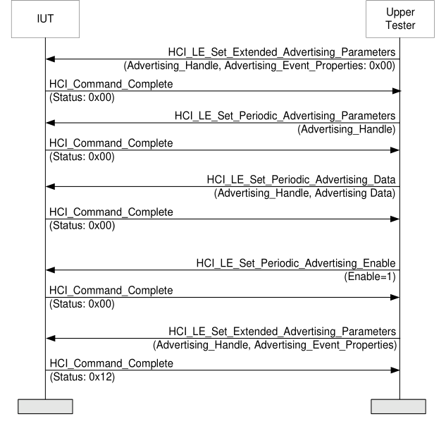

**Figure 4.36: Reject Set Extended Advertising Parameters Command using a Periodic Advertising Set and Incompatible Advertising is Specified MSC**

1. The Upper Tester sends an HCI_LE_Set_Extended_Advertising_Parameters command to the
IUT with Advertising Handle set to a valid advertising set and Advertising_Event_Properties set to 0x00. 2. The IUT sends an HCI_Command_Complete event to the Upper Tester with Status set to 0x00. 3. The Upper Tester sends an HCI_LE_Set_Periodic_Advertising_Parameters command to the IUT
with Advertising_Handle set equal to the Advertising_Handle in step 1. 4. The IUT sends an HCI_Command_Complete event to the Upper Tester with Status set to 0x00. 5. The Upper Tester sends an HCI_LE_Set_Periodic_Advertising_Data command to the IUT with
Advertising_Handle set equal to the Advertising_Handle in step 1 and the specified Advertising Data. 6. The IUT sends an HCI_Command_Complete event to the Upper Tester with Status set to 0x00. 7. The Upper Tester sends an HCI_LE_Set_Periodic_Advertising_Enable command to the IUT with
Enable set to 1. 8. The IUT sends an HCI_Command_Complete event to the Upper Tester with Status set to 0x00. 9. The Upper Tester sends an HCI_LE_Set_Extended_Advertising_Parameters command with the
specified advertising set and type of advertising specified in Table 4.15. 10. The IUT returns an HCI_Command_Complete event with the error code Invalid HCI Command
Parameters (0x12).
• Expected Outcome
Pass verdict
The IUT rejects the advertising set for each advertising type specified in Table 4.15, returning the error code Invalid HCI Command Parameters (0x12).
Associated Handle Specifies Incompatible Advertising • Test Purpose
Verify that the IUT properly rejects an HCI_LE_Set_Periodic_Advertising_Parameters command when the associated handle specifies scannable, connectable, legacy, or anonymous advertising.
• Reference
[12] 7.8.61
• Initial Condition
- An advertising set exists and is no greater than 0x1F in length, if required by the advertising type specified in Table 4.16.
• Test Case Configuration

|  | Test Case |  |  | Specified Advertising Type |  |  | Advertising Event Properties _ _ |  |
| --- | --- | --- | --- | --- | --- | --- | --- | --- |
| HCI/DDI/BI-26-C | HCI/DDI/BI-26-C |  |  | Non-connectable non-scannable anonymous |  | 0b00100000 | 0b00100000 |  |
|  |  |  |  | undirected |  |  |  |  |
| HCI/DDI/BI-27-C |  |  |  | Non-connectable non-scannable anonymous |  | 0b00100100 |  |  |
|  |  |  |  | directed |  |  |  |  |
|  | HCI/DDI/BI-28-C |  |  | Legacy connectable and scannable undirected |  |  | 0b00010011 |  |
|  | HCI/DDI/BI-29-C |  |  | Legacy connectable directed (low duty cycle) |  |  | 0b00010101 |  |
|  | HCI/DDI/BI-30-C |  |  | Legacy connectable directed (high duty cycle) |  |  | 0b00011101 |  |
|  | HCI/DDI/BI-31-C |  |  | Legacy scannable undirected |  |  | 0b00010010 |  |
| HCI/DDI/BI-32-C | HCI/DDI/BI-32-C |  |  | Legacy non-connectable and non-scannable, |  | 0b00010000 | 0b00010000 |  |
|  |  |  |  | undirected |  |  |  |  |
|  | HCI/DDI/BI-33-C |  |  | Extended connectable undirected |  |  | 0b00000001 |  |
|  | HCI/DDI/BI-34-C |  |  | Extended connectable directed |  |  | 0b00000101 |  |
|  | HCI/DDI/BI-35-C |  |  | Extended scannable undirected |  |  | 0b00000010 |  |
|  | HCI/DDI/BI-36-C |  |  | Extended scannable directed |  |  | 0b00000110 |  |

Table 4.16: Reject Set Periodic Advertising Parameters Command when the Associated Handle Specifies Incompatible Advertising test cases
• Test Procedure

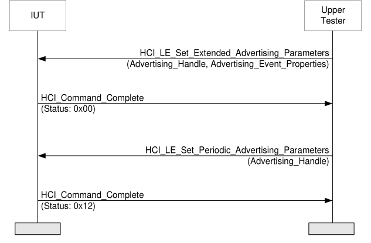

**Figure 4.37: Reject Set Periodic Advertising Parameters Command when the Associated Handle Specifies Incompatible Advertising MSC**

1. The Upper Tester sends an HCI_LE_Set_Extended_Advertising_Parameters command with the
specified advertising set (if required) and type of advertising specified in Table 4.16. 2. The IUT returns a successful HCI_Command_Complete. 3. The Upper Tester sends an HCI_LE_Set_Periodic_Advertising_Parameters to the IUT using the
Advertising Handle used in step 1. 4. The IUT returns an HCI_Command_Complete with error code Invalid HCI Command Parameters
(0x12).
• Expected Outcome
Pass verdict
The IUT rejects the advertising set for each advertising type specified, returning the error code Invalid HCI Command Parameters (0x12).

#### 4.7.3 Reject Set Periodic Advertising Enable Command when the Associated

Handle Specifies Incompatible Advertising • Test Purpose
Verify that the IUT properly rejects an HCI_LE_Set_Periodic_Advertising_Enable command when the associated handle specifies scannable, connectable, legacy, or anonymous advertising.
• Reference
[13] 7.8.63
• Initial Condition
- An advertising set exists and is no greater than 0x1F in length, if required by the advertising type specified in Table 4.17.
• Test Case Configuration

|  | Test Case |  |  | Specified Advertising Type |  |  | Advertising Event Properties _ _ |  |
| --- | --- | --- | --- | --- | --- | --- | --- | --- |
| HCI/DDI/BI-37-C | HCI/DDI/BI-37-C |  |  | Non-connectable non-scannable anonymous |  | 0b00100000 | 0b00100000 |  |
|  |  |  |  | undirected |  |  |  |  |
| HCI/DDI/BI-38-C |  |  |  | Non-connectable non-scannable anonymous |  | 0b00100100 |  |  |
|  |  |  |  | directed |  |  |  |  |
|  | HCI/DDI/BI-39-C |  |  | Legacy connectable and scannable undirected |  |  | 0b00010011 |  |
|  | HCI/DDI/BI-40-C |  |  | Legacy connectable directed (low duty cycle) |  |  | 0b00010101 |  |
|  | HCI/DDI/BI-41-C |  |  | Legacy connectable directed (high duty cycle) |  |  | 0b00011101 |  |
|  | HCI/DDI/BI-42-C |  |  | Legacy scannable undirected |  |  | 0b00010010 |  |
| HCI/DDI/BI-43-C | HCI/DDI/BI-43-C |  |  | Legacy non-connectable and non-scannable, |  | 0b00010000 | 0b00010000 |  |
|  |  |  |  | undirected |  |  |  |  |
|  | HCI/DDI/BI-44-C |  |  | Extended connectable undirected |  |  | 0b00000001 |  |
|  | HCI/DDI/BI-45-C |  |  | Extended connectable directed |  |  | 0b00000101 |  |
|  | HCI/DDI/BI-46-C |  |  | Extended scannable undirected |  |  | 0b00000010 |  |
|  | HCI/DDI/BI-47-C |  |  | Extended scannable directed |  |  | 0b00000110 |  |

Table 4.17: Reject Set Periodic Advertising Enable Command when the Associated Handle Specifies Incompatible Advertising test cases
• Test Procedure

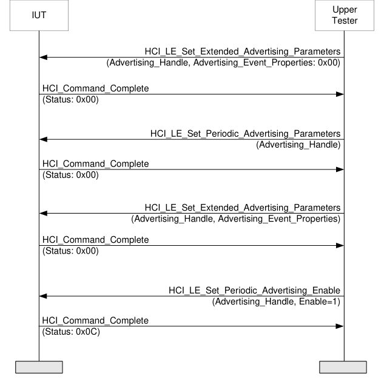

**Figure 4.38: Reject Set Periodic Advertising Enable Command when the Associated Handle Specifies Incompatible Advertising MSC**

IUT with Advertising Handle set to a valid advertising set and Advertising_Event_Properties set to 0x00. 2. The IUT returns a successful HCI_Command_Complete. 3. The Upper Tester sends an HCI_LE_Set_Periodic_Advertising_Parameters to the IUT using the
Advertising Handle used in step 1. 4. The IUT returns an HCI_Command_Complete event with Status set to 0x00. 5. The Upper Tester sends an HCI_LE_Set_Extended_Advertising_Parameters command with the
specified advertising set and type of advertising specified in Table 4.17. 6. The IUT returns a successful HCI_Command_Complete. 7. The Upper Tester sends an HCI_LE_Set_Periodic_Advertising_Enable command to the IUT
using the Advertising Handle from step 5 and Enable set to 1. 8. The IUT returns an HCI_Command_Complete event with Status set to Command Disallowed
(0x0C).
• Expected Outcome
Pass verdict
The IUT rejects the advertising set for each advertising type specified, returning the error code Command Disallowed (0x0C).
HCI/DDI/BI-48-C [LE Set Data Related Address Changes, Invalid Parameter]
• Test Purpose
Verify that the IUT properly rejects the HCI_LE_Set_Data_Related_Address_Changes command with an invalid Advertising_Handle parameter.
• Reference
[11] 7.8.122
• Initial Condition
- The IUT is not currently advertising.
- The Upper Tester has not sent Legacy Advertising commands to the IUT.
• Test Procedure
1. The Upper Tester sends an HCI_LE_Set_Extended_Advertising_Parameters command to the
IUT with a valid Advertising_Handle parameter and receives a successful HCI_Command_Complete event in return. 2. The Upper Tester sends an HCI_LE_Set_Data_Related_Address_Changes command to the IUT
with an Advertising_Handle parameter that is not a valid advertising handle. 3. The IUT sends an HCI_Command_Complete event to the Upper Tester with error Unknown
Advertising Identifier (0x42).
• Expected Outcome
Pass verdict
A Command_Complete event for the HCI_LE_Set_Data_Related_Address_Changes command is received by the Upper Tester with the Unknown Advertising Identifier (0x42) error code.
• Test Purpose
Verify that the IUT properly handles an HCI_LE_Set_Extended_Scan_Enable command when the IUT is not properly configured, and returns the expected error code or executes with the vendor- specific parameters.
• Reference
[9] 7.8.65
• Initial Condition
- The IUT is in standby.
- Extended scanning parameters set have not been configured on the IUT (HCI_LE_Set_Extended_Scan_Parameters was not previously executed).
• Test Procedure

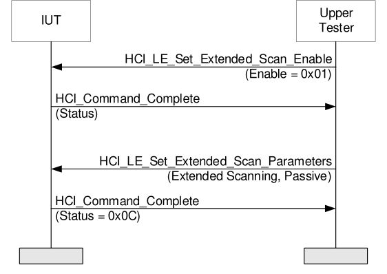

**Figure 4.39: HCI/DDI/BV-06-C [Default Extended Scan Enable Command] MSC**

1. The Upper Tester sends the HCI_LE_Set_Extended_Scan_Enable command with the Enable
parameter set to 0x01 and with all other parameters set to valid values. 2. The IUT returns an HCI_Command_Complete event with the Status = 0x0C (“Command
Disallowed”), stopping the test here; or with Status = 0x00 (“Success”) and the IUT starts a scanning procedure. 3. If the return code in step 2 is Status = 0x00 (“Success”), the Upper Tester sends an
HCI_LE_Set_Extended_Scan_Parameters with a valid set of parameters (Scanning_PHYs set to a supported PHY, Scan_Type[0] set to 0x00 (Passive Scanning), Scan_Interval[0] set to 0x0010, Scan_Window[0] set to 0x0010, Own_Address_Type set to 0x00 (Public Device Address) and Scanning_Filter_Policy set to 0x00 (Accept All)). 4. The IUT sends to the Upper Tester an HCI_Command_Complete event with Status = 0x0C
(“Command Disallowed”).
• Expected Outcome
Pass verdict
In step 2, the IUT generates an HCI_Command_Complete event either with Status = 0x0C (“Command Disallowed”) or with Status = 0x00 (“Success”).
If the status in step 2 was Status = 0x00 (“Success”), then in step 4 the IUT will generate an HCI_Command_Complete with Status = 0x0C (“Command Disallowed”).
HCI/DDI/BV-07-C [Set Periodic Advertising Before Periodic Advertising Parameters Command]
• Test Purpose
Verify that the IUT correctly handles an HCI_LE_Set_Periodic_Advertising_Enable command sent before the HCI_LE_Set_Periodic_Advertising_Parameters command is sent.
• Reference
[13] 7.8.63
• Initial Condition
- The IUT is in standby.
- Extended advertising parameters have not been configured on the IUT for a particular advertising handle.
• Test Procedure

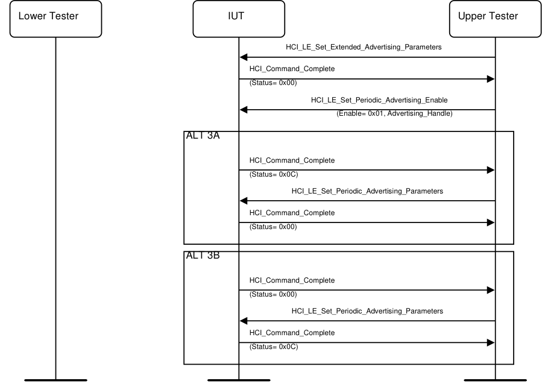

**Figure 4.40: HCI/DDI/BV-07-C [Set Periodic Advertising Before Periodic Advertising Parameters Command] MSC**

1. The Upper Tester sends an HCI_LE_Set_Extended_Advertising_Parameters command to the
IUT and receives a successful HCI_Command_Complete event in return from the IUT. 2. The Upper Tester sends an HCI_LE_Set_Periodic_Advertising_Enable to the IUT with the Enable
parameter set to 0x01 and the Advertising_Handle set to the existing Advertising_Handle.
which in turn depends on whether it supports vendor-specific advertising parameters:
Alternative 3A (The IUT does not support vendor-specific advertising parameters):
3A.1 The IUT sends an HCI_Command_Complete event to the Upper Tester with the
error code Command Disallowed (0x0C). 3A.2 The IUT sends an HCI_LE_Set_Periodic_Advertising_Parameters command to the
IUT. 3A.3 The IUT sends a successful HCI_Command_Complete event to the Upper Tester.
Alternative 3B (The IUT supports vendor-specific advertising parameters):
3B.1 The IUT sends an HCI_Command_Complete event to the Upper Tester with the
Status set to 0x00. 3B.2 The Upper Tester sends an HCI_LE_Set_Periodic_Advertising_Parameters
command to the IUT. 3B.3 The IUT sends an HCI_Command_Complete event to the Upper Tester with the
error code Command Disallowed (0x0C).
• Expected Outcome
Pass verdict
In step 3A.1, the IUT sends an HCI_Command_Complete event to the Upper Tester with the error code Command Disallowed (0x0C).
In steps 3A.3 and 3B.1, the IUT sends an HCI_Command_Complete event to the Upper Tester with the Status set to 0x00.
In step 3B.2, the IUT sends an HCI_Command_Complete event to the Upper Tester with the error code Command Disallowed (0x0C).
HCI/DDI/BI-49-C [Reject LE Periodic Advertising Create Sync Command With Disallowed Reporting Options, Periodic Advertising ADI not supported]
• Test Purpose
Verify that the IUT that doesn’t support Periodic Advertising ADI properly rejects invalid reporting options in the HCI_LE_Periodic_Advertising_Create_Sync command and returns the expected error code.
• Reference
[13] 7.8.67
• Initial Condition
- The Lower Tester is advertising with extended advertising and periodic advertising.
- The IUT is scanning for extended advertising and has received the Advertising SID, Advertiser Address Type, and Advertiser Address.
• Test Procedure

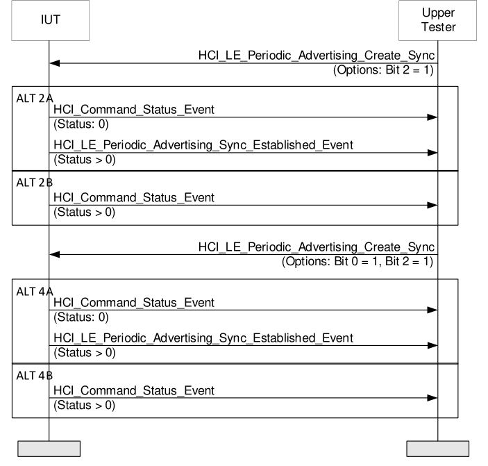

**Figure 4.41: HCI/DDI/BI-49-C [Reject LE Periodic Advertising Create Sync Command With Disallowed Reporting Options, Periodic Advertising ADI not supported] MSC**

• Test Procedure
1. The Upper Tester sends an HCI_LE_Periodic_Advertising_Create_Sync command to the IUT to
synchronize with the Lower Tester’s periodic advertisements. Options is set to 0x04 (Don’t Use List, Reporting Enabled, Duplicate Filtering Enabled). 2. Perform either alternative 2A or 2B depending on the event returned.
Alternative 2A (The IUT returns a successful HCI_Command_Status event):
2A.1 The IUT sends a successful HCI_Command_Status event to the Upper Tester.
2A.2 The IUT sends an HCI_LE_Periodic_Advertising_Sync_Established event to the Upper Tester with Status set to a valid error code.
Alternative 2B (The IUT returns an HCI_Command_Status event with an error code):
2B.1 The IUT sends an HCI_Command_Status event to the Upper Tester with Status set to a valid error code.
3. The Upper Tester sends an HCI_LE_Periodic_Advertising_Create_Sync command to the IUT to
synchronize with the Lower Tester’s periodic advertisements. Options is set to 0x05 (Use List, Reporting Enabled, Duplicate Filtering Enabled).
Alternative 4A (The IUT returns a successful HCI_Command_Status event):
4A.1 The IUT sends a successful HCI_Command_Status event to the Upper Tester.
4A.2 The IUT sends an HCI_LE_Periodic_Advertising_Sync_Established event to the Upper Tester with Status set to a valid error code.
Alternative 4B (The IUT returns an HCI_Command_Status event with an error code):
4B.1 The IUT sends an HCI_Command_Status event to the Upper Tester with Status set to a valid error code. • Expected Outcome
Pass verdict
In steps 2A.2 and 4A.2, the IUT sends an HCI_LE_Periodic_Advertising_Sync_Established event to the Upper Tester with Status set to a valid error code.
In steps 2B.1 and 4B.1, the IUT sends an HCI_Command_Status event to the Upper Tester with Status set to a valid error code.
HCI/DDI/BV-08-C [LE Periodic Advertising Create Sync Command, Reporting Disabled]
• Test Purpose
Verify that the IUT that supports Periodic Advertising ADI properly handles disabling of periodic advertising reports.
• Reference
[13] 7.8.67
• Initial Condition
- The Lower Tester is advertising with extended advertising and periodic advertising.
- The IUT is scanning for extended advertising.
• Test Procedure

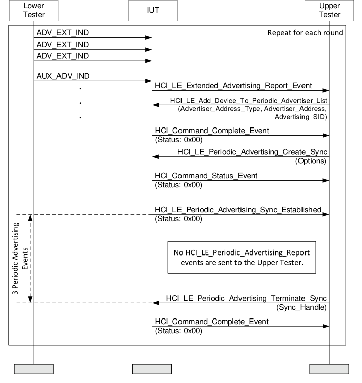

**Figure 4.42: HCI/DDI/BV-08-C [LE Periodic Advertising Create Sync Command, Reporting Disabled] MSC**

• Test Procedure
1. The IUT receives an AUX_ADV_IND packet from the Lower Tester and sends an
HCI_LE_Extended_Advertising_Report event to the Upper Tester with the Advertising SID, Advertiser Address Type, and Advertiser Address of the Lower Tester. 2. If the Options Selected in Table 4.18 includes ‘Use List’, the Upper Tester sends an
HCI_LE_Add_Device_To_Periodic_Advertiser_List with Advertiser_Address_Type, Advertiser_Address, and Advertising_SID set as received in step 1 and receives a successful HCI_Command_Complete event in response. 3. The Upper Tester sends an HCI_LE_Periodic_Advertising_Create_Sync command to the IUT to
synchronize with the Lower Tester’s periodic advertisements. The Options field is set to the value in Table 4.18 for the round, and a successful HCI_Command_Status event is sent in response. 4. The IUT sends an HCI_LE_Periodic_Advertising_Sync_Established event to the Upper Tester
with the Advertising_SID, Advertiser_Address_Type, and Advertiser_Address set to the values in step 3 and with a valid Sync_Handle. 5. The IUT does not send any HCI_LE_Periodic_Advertising_Report events to the Upper Tester for

## 3 advertising intervals.

HCI_LE_Periodic_Advertising_Terminate_Sync command to the IUT with Sync_Handle set to the value received in step 4 and receives a successful HCI_Command_Complete event in response. 7. If the Options Selected in Table 4.18 includes ‘Use List’, the Upper Tester sends an
HCI_LE_Clear_Periodic_Advertiser_List and receives a successful HCI_Command_Complete event in response. 8. Repeat steps 1–7 for each round.

|  | Round |  |  | Options Field Value |  |  | Options Selected |  |
| --- | --- | --- | --- | --- | --- | --- | --- | --- |
|  | 1 |  | 0x02 (Bit 1) |  |  | Don’t Use List, Reporting Disabled, Duplicate Filtering Disabled |  |  |
|  | 2 |  | 0x03 (Bits 0, 1) |  |  | Use List, Reporting Disabled, Duplicate Filtering Disabled |  |  |
|  | 3 |  | 0x06 (Bits 1, 2) |  |  | Don’t Use List, Reporting Disabled, Duplicate Filtering Enabled |  |  |
|  | 4 |  | 0x07 (Bits 0, 1, 2) |  |  | Use List, Reporting Disabled, Duplicate Filtering Enabled |  |  |

Table 4.18: HCI/DDI/BV-08-C [LE Periodic Advertising Create Sync Command, Reporting Disabled], option field value
• Expected Outcome
Pass verdict
In step 5, the IUT does not send HCI_LE_Periodic_Advertising_Report events to the Upper Tester for 3 advertising intervals.
HCI/DDI/BV-09-C [LE Periodic Advertising Enable Command, Disable Periodic Advertising, Periodic Advertising ADI Supported]
• Test Purpose
Verify that the IUT that supports Periodic Advertising ADI properly handles disabling Periodic Advertising.
• Reference
[13] 7.8.63
• Initial Condition
- Extended advertising parameters and periodic advertising parameters have been configured on the IUT for a particular advertising handle.
• Test Procedure

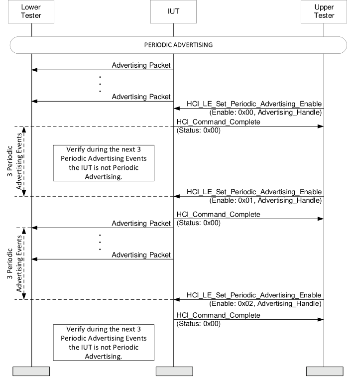

**Figure 4.43: HCI/DDI/BV-09-C [LE Periodic Advertising Enable Command, Disable Periodic Advertising, Periodic Advertising ADI Supported] MSC**

1. The IUT has started periodic advertising for a particular advertising handle. 2. The Upper Tester sends an HCI_LE_Set_Periodic_Advertising_Enable command to the IUT with
Advertising_Handle set to the current advertising handle and Enable set to 0x00 and receives a successful HCI_Command_Complete event in response. 3. The Lower Tester verifies that no periodic advertisements are sent from the IUT for the next
three periodic advertising events. 4. Immediately after 3 periodic advertising events, to restart periodic advertising, the Upper Tester
sends an HCI_LE_Set_Periodic_Advertising_Enable command to the IUT with Advertising_Handle set to the advertising handle in step 2 and Enable set to 0x01 and receives a successful HCI_Command_Complete event in response. 5. After 3 periodic advertising events, the Upper Tester sends an
HCI_LE_Set_Periodic_Advertising_Enable command to the IUT with Advertising_Handle set to the advertising handle in step 4 and Enable set to 0x02 and receives a successful HCI_Command_Complete event in response. 6. The Lower Tester verifies that no periodic advertisements are sent from the IUT for the next
three periodic advertising events.
• Expected Outcome
Pass verdict
In step 3, the Lower Tester does not receive any periodic advertisements from the IUT.
In step 6, the Lower Tester does not receive any periodic advertisements from the IUT.

#### 4.7.4 Reject Set Periodic Advertising Parameters Command when Advertising

Data Too Long • Test Purpose
Verify that the IUT properly rejects the HCI_Set_Periodic_Advertising_Parameters command when existing periodic advertising data is greater than the controller can transmit within the periodic advertising interval.
• Reference
[12] 7.8.61
• Initial Condition
- State: The IUT is in Standby.
- TSPX_per_adv_interval_min is the minimum Periodic Advertising interval that is supported, as defined in the IXIT.
• Test Case Configuration

|  | Test Case |  |  | Primary Advertising PHY _ _ |  |  | Operation |  |
| --- | --- | --- | --- | --- | --- | --- | --- | --- |
| HCI/DDI/BI-50-C [LE Set Periodic Advertising Parameters, Reject, Data Too Long, LE 1M PHY] |  |  | LE 1M PHY |  |  | 0x00 |  |  |
| HCI/DDI/BI-51-C [LE Set Periodic Advertising Parameters, Reject, Data Too Long, LE Coded PHY] |  |  | LE Coded PHY |  |  | 0x02 |  |  |

Table 4.19: Reject Set Periodic Advertising Parameters Command when Advertising Data Too Long test cases
• Test Procedure

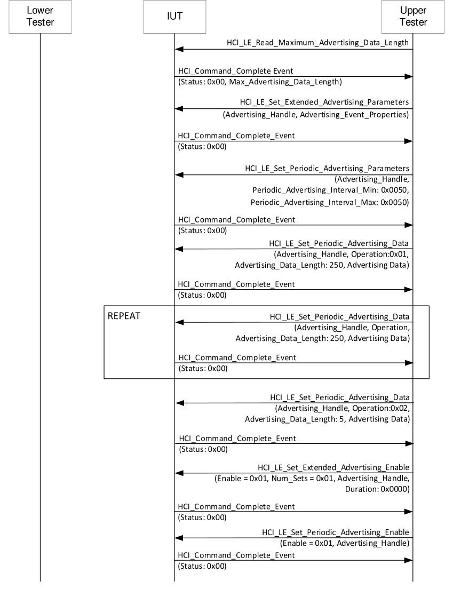

**Figure 4.44: Reject Set Periodic Advertising Parameters Command when Advertising Data Too Long MSC – Page 1 of 2**

| 3 Periodic Advertising Events |  | ADV EXT IND _ _ ADV EXT IND _ _ ADV EXT IND _ _ AUX ADV IND _ _ AUX SYNC IND . _ _ . . |
| --- | --- | --- |
|  |  |  |
|  |  |  |

HCI_Command_Complete_Event (Status: 0x00)
HCI_LE_Set_Periodic_Advertising_Parameters
(Advertising_Handle, Periodic_Advertising_Interval_Min: 0x0006, Periodic_Advertising_Interval_Max: 0x0006)
HCI_Command_Complete_Event (Status: 0x45)

**Figure 4.45: Reject Set Periodic Advertising Parameters Command when Advertising Data Too Long MSC – Page 2 of 2**

1. The Upper Tester sends an HCI_LE_Read_Maximum_Advertising_Data_Length command to the
IUT. 2. The IUT sends an HCI_Command_Complete event to the Upper Tester with Status set to 0x00
and Max_Advertising_Data_Length set to the IUT’s maximum length of advertising data permitted. 3. The Upper Tester sends an HCI_LE_Set_Extended_Advertising_Parameters command to the
IUT with valid values and receives a successful HCI_Command_Complete event.
with Advertising_Handle set to the value from step 3, Periodic_Advertising_Interval_Min set to 0x0050 (100 ms), and Periodic_Advertising_Interval_Max set to 0x0050 (100 ms), and it receives a successful HCI_Command_Complete event. 5. The Upper Tester sends an HCI_LE_Set_Periodic_Advertising_Data command to the IUT with
Advertising_Handle set to the Advertising_Handle in step 3, Advertising_Data_Length set to 250 with Advertising_Data set to 250 random octets from 1 to 254 as the payload. The Operation parameter is set to 0x01. The Upper Tester receives a successful HCI_Command_Complete event in response. 6. The Upper Tester sends an HCI_LE_Set_Periodic_Advertising_Data command to the IUT with
Advertising_Handle set to the Advertising_Handle in step 3, Advertising_Data_Length set to 250, Advertising_Data set to 250 random octets from 1 to 254 as the payload, and Operation set as specified in Table 4.19, and it receives a successful HCI_Command_Complete event in response. 7. If LE 1M PHY is used, repeat step 6 one time. If LE Coded PHY is used, go to step 9. 8. The Upper Tester sends an HCI_LE_Set_Periodic_Advertising_Data command to the IUT with
Advertising_Handle set to the Advertising_Handle in step 3, Operation set to 0x02, and Advertising_Data_Length set to 5 and Advertising_Data set to 5 random octets from 1 to 254 as the payload, and it receives a successful HCI_Command_Complete event in response. 9. The Upper Tester sends an HCI_LE_Set_Extended_Advertising_Enable command to the IUT
with Enable set to 0x01, Num_Sets set to 0x01, Advertising_Handle set to the value in step 3, and Duration set to 0x0000, and it receives a successful HCI_Command_Complete event in response. 10. The Upper Tester sends an HCI_LE_Set_Periodic_Advertising_Enable command to the IUT with
Enable set to 0x01, and it receives a successful HCI_Command_Complete event in response. 11. Immediately after 3 advertising events, the Upper Tester sends an
HCI_LE_Set_Periodic_Advertising_Enable command to the IUT with Enable set to 0x00, and it receives a successful HCI_Command_Complete event in response. 12. The Upper Tester sends an HCI_LE_Set_Periodic_Advertising_Parameters command to the IUT
with Advertising_Handle set to the value from step 3, Periodic_Advertising_Interval_Min set to 0x0006 (7.5 ms), and Periodic_Advertising_Interval_Max set to 0x0006 (7.5 ms). 13. The IUT sends an HCI_Command_Complete event to the Upper Tester with Status set to Packet
Too Long (0x45). 14. The Upper Tester sends an HCI_LE_Set_Periodic_Advertising_Enable command to the IUT with
Enable set to 0x01, and it receives a successful HCI_Command_Complete event in response. 15. The IUT begins sending periodic advertisements.
• Expected Outcome
Pass verdict
In step 14, the IUT sends an HCI_Command_Complete event to the Upper Tester with Status set to Packet Too Long (0x45).
In step 15, the IUT begins sending periodic advertisements.
Inconclusive verdict
The Max_Advertising_Data_Length of the IUT is less than 755 octets when the LE 1M PHY is used.
The Max_Advertising_Data_Length of the IUT is less than 500 octets when the LE Coded PHY is used.
TSPX_per_adv_interval_min of the IUT is greater than 0x0006 (7.5 ms).
HCI/DDI/BI-52-C [Reject Set Periodic Advertising Data Command when Advertising Data Too Long]
• Test Purpose
Verify that the IUT properly rejects the HCI_Set_Periodic_Advertising_Data command when provided periodic advertising data is greater than the controller can transmit within the periodic advertising interval.
• Reference
[12] 7.8.62
• Initial Condition
- State: The IUT is in Standby.
• Test Procedure

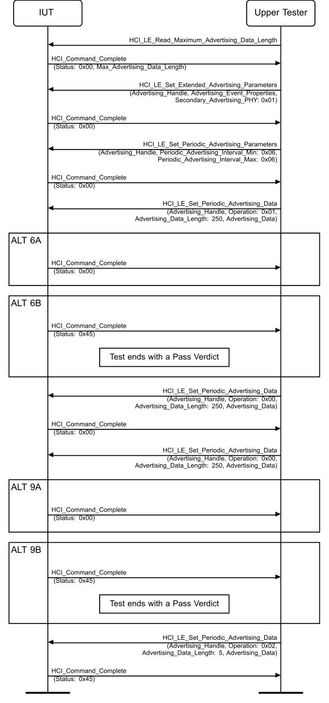

**Figure 4.46: HCI/DDI/BI-52-C [Reject Set Periodic Advertising Data Command when Advertising Data Too Long] MSC**

IUT. 2. The IUT sends an HCI_Command_Complete event to the Upper Tester with Status set to 0x00
and Max_Advertising_Data_Length set to the IUT’s maximum length of advertising data permitted. 3. The Upper Tester sends an HCI_LE_Set_Extended_Advertising_Parameters command to the
IUT with Secondary_Advertising_PHY set to 0x01 (LE 1M PHY) and valid values, and it receives a successful HCI_Command_Complete event. 4. The Upper Tester sends an HCI_LE_Set_Periodic_Advertising_Parameters command to the IUT
with Advertising_Handle set to the value from step 3, Periodic_Advertising_Interval_Min set to 0x0006 (7.5 ms), and Periodic_Advertising_Interval_Max set to 0x0006 (7.5 ms), and it receives a successful HCI_Command_Complete event. 5. The Upper Tester sends an HCI_LE_Set_Periodic_Advertising_Data command to the IUT with
Advertising_Handle set to the Advertising_Handle in step 3, Operation set to 0x01, and Advertising_Data_Length set to 250 and Advertising_Data set to 250 random octets from 1 to 254 as the payload. 6. Perform alternative 6A or 6B depending on the received HCI_Command_Complete event.
Alternative 6A (The IUT sends a successful HCI_Command_Complete event to the Upper
Tester):
6A.1 The IUT sends a successful HCI_Command_Complete event to the Upper Tester.
Alternative 6B (The IUT sends an HCI_Command_Complete event to the Upper Tester with
Status set to 0x45):
6B.1 The IUT sends an HCI_Command_Complete event to the Upper Tester with Status
set to Packet Too Long (0x45). 6B.2 The test ends with a Pass Verdict.
7. Perform steps 8 and 9 twice. 8. The Upper Tester sends an HCI_LE_Set_Periodic_Advertising_Data command to the IUT with
Advertising_Handle set to the Advertising_Handle in step 3, Operation set to 0x00, and Advertising_Data_Length set to 250 and Advertising_Data set to 250 random octets from 1 to 254 as the payload. 9. Perform alternative 9A or 9B depending on the received HCI_Command_Complete event.
Alternative 9A (The IUT sends a successful HCI_Command_Complete event to the Upper
Tester):
9A.1 The IUT sends a successful HCI_Command_Complete event to the Upper Tester.
Alternative 9B (The IUT sends an HCI_Command_Complete event to the Upper Tester with
Status set to 0x45):
9B.1 The IUT sends an HCI_Command_Complete event to the Upper Tester with Status
set to Packet Too Long (0x45). 9B.2 The test ends with a Pass verdict.
10. The Upper Tester sends an HCI_LE_Set_Periodic_Advertising_Data command to the IUT with
Advertising_Handle set to the Advertising_Handle in step 3, Operation set to 0x02, Advertising_Data_Length set to 5, and Advertising_Data set to 5 random octets from 1 to 254 as the payload. 11. The IUT sends an HCI_Command_Complete event to the Upper Tester with Status set to Packet
Too Long (0x45).
• Expected Outcome
Pass verdict
In step 6B.1, 9B.1, or 11, the IUT sends an HCI_Command_Complete event to the Upper Tester with Status set to Packet Too Long (0x45).
Inconclusive verdict
The Max_Advertising_Data_Length of the IUT is less than 755 octets.
The Periodic_Advertising_Interval_Min of the IUT is greater than 0x0006 (7.5 ms).

#### 4.7.5 Reject LE Set Periodic Advertising Enable Command, Legacy Packet • Test Purpose

Verify that the IUT properly rejects enabling periodic advertising when the advertising set identifies scannable, connectable, legacy, or anonymous advertising.
• Reference
[12] 7.8.63
• Initial Condition
- The IUT is in standby.
• Test Case Configuration

|  | Test Case |  |  | Specified Advertising Type |  |  | Advertising Event Properties _ _ |  |
| --- | --- | --- | --- | --- | --- | --- | --- | --- |
| HCI/DDI/BI-53-C | HCI/DDI/BI-53-C |  |  | Non-connectable non-scannable anonymous |  | 0b00100000 | 0b00100000 |  |
|  |  |  |  | undirected |  |  |  |  |
| HCI/DDI/BI-54-C |  |  |  | Non-connectable non-scannable anonymous |  | 0b00100100 |  |  |
|  |  |  |  | directed |  |  |  |  |
| HCI/DDI/BI-55-C |  |  |  | Legacy connectable and scannable |  | 0b00010011 |  |  |
|  |  |  |  | undirected |  |  |  |  |
|  | HCI/DDI/BI-56-C |  |  | Legacy scannable undirected |  |  | 0b00010010 |  |
| HCI/DDI/BI-57-C | HCI/DDI/BI-57-C |  |  | Legacy non-connectable and non-scannable, |  | 0b00010000 | 0b00010000 |  |
|  |  |  |  | undirected |  |  |  |  |
|  | HCI/DDI/BI-58-C |  |  | Extended connectable undirected |  |  | 0b00000001 |  |
|  | HCI/DDI/BI-59-C |  |  | Extended connectable directed |  |  | 0b00000101 |  |
|  | HCI/DDI/BI-60-C |  |  | Extended scannable undirected |  |  | 0b00000010 |  |
|  | HCI/DDI/BI-61-C |  |  | Extended scannable directed |  |  | 0b00000110 |  |

Table 4.20: Reject LE Periodic Advertising Enable Command, Legacy Packet test cases
• Test Procedure

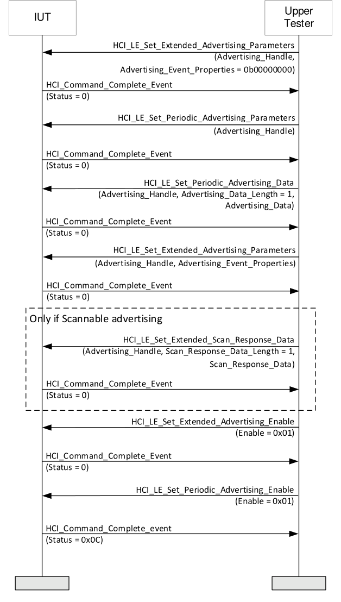

**Figure 4.47: Reject LE Periodic Advertising Enable Command, Legacy Packet MSC**

IUT with a valid Advertising_Handle and with Advertising_Event_Properties set to extended non- scannable non-connectable (0b00000000) and receives a successful HCI_Command_Complete event in return. 2. The Upper Tester sends an HCI_LE_Set_Periodic_Advertising_Parameters command to the IUT
with the Advertising_Handle set to the value from step 1 and receives a successful HCI_Command_Complete event in return. 3. The Upper Tester sends an HCI_LE_Set_Periodic_Advertising_Data command to the IUT with
Advertising_Handle set to the value from step 1, Advertising_Data_Length set to 1, Advertising_Data set to one random octet, and receives a successful HCI_Command_Complete event in return from the IUT. 4. The Upper Tester sends an HCI_LE_Set_Extended_Advertising_Parameters command to the
IUT with Advertising_Handle set to the value from step 1 and Advertising_Event_Properties set to the value in Table 4.20, and receives a successful HCI_Command_Complete event in return. 5. If the scannable advertising property bit (bit 1) is not set, skip to step 6. Otherwise, the Upper
Tester sends an HCI_LE_Set_Extended_Scan_Response_Data command to the IUT with Advertising_Handle set to the value from step 1, Scan_Response_Data_Length set to 1, and Scan_Response_Data set to one random octet, and receives a successful HCI_Command_Complete event in return. 6. The Upper Tester sends an HCI_LE_Set_Extended_Advertising_Enable command to the IUT
with Enable set to 0x01, and receives a successful HCI_Command_Complete event in return. 7. The Upper Tester sends an HCI_LE_Set_Periodic_Advertising_Enable command to the IUT with
Enable set to 0x01. 8. The IUT sends an HCI_Command_Complete event with Status set to Command Disallowed
(0x0C).
• Expected Outcome
Pass verdict
In step 8, the IUT sends an HCI_Command_Complete event to the Upper Tester with Status set to Command Disallowed (0x0C).
HCI/DDI/BI-62-C [Reject Set Extended Advertising Parameters Command, Packet Too Long, LE Coded]
• Test Purpose
Verify that the IUT properly rejects the HCI_LE_Set_Extended_Advertising_Parameters command when extended advertising data is greater than the controller can transmit within the advertising interval using the LE Coded PHY.
• Reference
[12] 7.8.53, 7.8.54
• Initial Condition
- State: The IUT is in Standby.
• Test Procedure

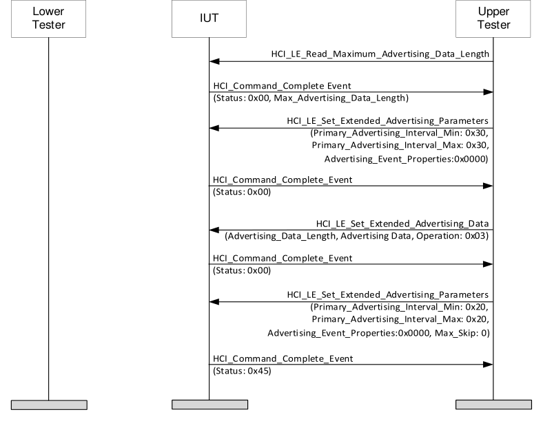

**Figure 4.48: HCI/DDI/BI-62-C [Reject Set Extended Advertising Parameters Command, Packet Too Long, LE Coded] MSC**

1. The Upper Tester sends an HCI_LE_Read_Maximum_Advertising_Data_Length command to the
IUT. 2. The IUT sends an HCI_Command_Complete event to the Upper Tester with Status set to 0x00
and Max_Advertising_Data_Length set to the IUT’s maximum length of advertising data permitted. 3. The Upper Tester sends an HCI_LE_Set_Extended_Advertising_Parameters command to the
IUT with Primary_Advertising_Interval_Min and Primary_Advertising_Interval_Max set to 30 ms (0x30), Advertising_Event_Properties set to non-connectable, non-scannable (0x0000), Primary and Secondary Phys set to LE Coded, and receives a successful HCI_Command_Complete event in return. 4. The Upper Tester sends an HCI_LE_Set_Extended_Advertising_Data command to the IUT
setting the advertising data to 251 octets using random octets from 1 to 255 as the payload. The IUT sends a successful HCI_Command_Complete event to the Upper Tester. 5. The Upper Tester sends an HCI_LE_Set_Extended_Advertising_Parameters command to the
IUT with Primary_Advertising_Interval_Min and Primary_Advertising_Interval_Max set to 20 ms (0x20), Advertising_Event_Properties set to non-connectable, non-scannable (0x0000), and Max_Skip set to 0. 6. The IUT sends an HCI_Command_Complete event to the Upper Tester with Status set to Packet
Too Long (0x45).
• Expected Outcome
Pass verdict
In step 6, the IUT sends an HCI_Command_Complete event to the Upper Tester with the Packet Too Long (0x45) error code.
Inconclusive verdict
The Max_Advertising_Data_Length received in step 2 is less than 251 octets.

#### 4.7.6 Reject Set Extended Advertising Data Commands, Data Too Long • Test Purpose

Verify that the IUT properly rejects the HCI_LE_Set_Extended_Advertising_Data and HCI_LE_Set_Extended_Scan_Response_Data commands when extended advertising data is greater than the controller can store.
• Reference
[12] 7.8.54, 7.8.55
• Initial Condition
- State: The IUT is in Standby.
• Test Case Configuration

| Test Case |  | Primary |  |  | Advertising _ |  | HCI Command (Step 4) |
| --- | --- | --- | --- | --- | --- | --- | --- |
|  |  | Advertising |  |  | Event Properties |  |  |
|  |  | PHY |  |  | _ (Step 3) |  |  |
| HCI/DDI/BI-63-C [Reject Set Extended Advertising Data Command, Data Too Long, LE 1M PHY] | LE 1M PHY |  |  | 0x0000 |  |  | HCI LE Set Extended Advertising Data _ _ _ _ _ |
| HCI/DDI/BI-64-C [Reject Set Extended Advertising Data Command, Data Too Long, LE Coded PHY] | LE Coded PHY |  |  | 0x0000 |  |  | HCI LE Set Extended Advertising Data _ _ _ _ _ |
| HCI/DDI/BI-65-C [Reject Set Extended Scan Response Data Command, Data Too Long, LE 1M PHY] | LE 1M PHY |  |  | 0x0002 |  |  | HCI LE Set Extended Scan Response Data _ _ _ _ _ _ |
| HCI/DDI/BI-66-C [Reject Set Extended Scan Response Data Command, Data Too Long, LE Coded PHY] | LE Coded PHY |  |  | 0x0002 |  |  | HCI LE Set Extended Scan Response Data _ _ _ _ _ _ |

Table 4.21: Reject Set Extended Advertising Data Commands, Data Too Long test cases
• Test Procedure

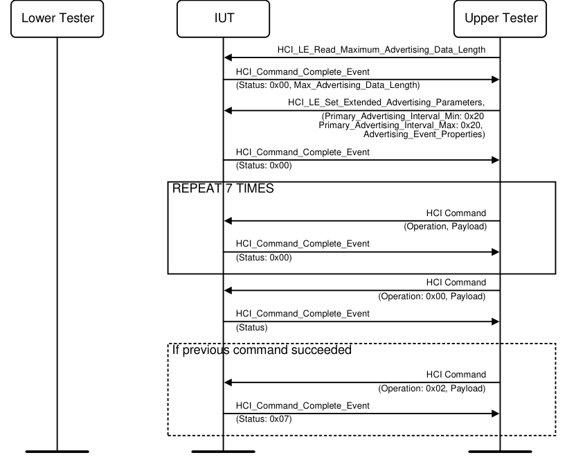

**Figure 4.49: Reject Set Periodic Advertising Data Command when Advertising Data Too Long MSC**

1. The Upper Tester sends an HCI_LE_Read_Maximum_Advertising_Data_Length command to the
IUT. 2. The IUT sends an HCI_Command_Complete event to the Upper Tester with Status set to 0x00
and Max_Advertising_Data_Length set to the IUT’s maximum length of advertising data permitted. 3. The Upper Tester sends an HCI_LE_Set_Extended_Advertising_Parameters command to the
IUT with Primary_Advertising_Interval_Min and Primary_Advertising_Interval_Max set to 200 ms (0x140) and Advertising_Event_Properties set to the value specified in Table 4.21 and receives a successful HCI_Command_Complete event in return. 4. Perform steps 5 and 6 a total of 7 times. The total amount of data sent in the 7 commands equals
Max_Advertising_Data_Length – 1 octets. 5. The Upper Tester sends the HCI Command specified in the HCI Command column in Table 4.21,
using random octets as the payload. The first instance of this step sets Operation to 0x01 (first fragment), and the other instances set Operation to 0x00 (incomplete data). 6. The IUT sends a successful HCI_Command_Complete event to the Upper Tester. 7. The Upper Tester sends the HCI Command specified in the HCI Command column in Table 4.21,
using 2 random octets as the payload and Operation set to 0x00 (incomplete data). 8. The IUT sends an HCI_Command_Complete event to the Upper Tester. 9. If the Status is Memory Capacity Exceeded (0x07), the test ends with a Pass verdict. Otherwise,
if the Status is not Success (0x00), the test ends with a Fail verdict.
using 1 random octet as the payload and Operation set to 0x02 (last fragment). 11. The IUT sends an HCI_Command_Complete event to the Upper Tester with Status set to
Memory Capacity Exceeded (0x07).
• Expected Outcome
Pass verdict
In step 6, the IUT sends an HCI_Command_Complete event to the Upper Tester with Status set to 0x00.
In either step 9 or step 11, the IUT sends an HCI_Command_Complete event to the Upper Tester with Status set to Memory Capacity Exceeded (0x07).
Fail verdict
The IUT sends an HCI_Command_Complete event to the Upper Tester with Status set to any value except Success (0x00) or Memory Capacity Exceeded (0x07).
HCI/DDI/BI-68-C [Reject LE Set Extended Scan Parameters with Invalid Scan_Filter_Policy Parameters]
• Test Purpose
Verify that the IUT rejects the LE Set Extended Scan Parameters command when the controller does not support the Decision-based Advertising feature.
• Reference
[18] 7.8.64
• Initial Condition
- The IUT is not currently scanning.
• Test Procedure
1. The Upper Tester sends an HCI_LE_Set_Extended_Scan_Parameters command to the IUT with
Scan_Filter_Policy having bits 2 and 3 set to a value other than 0b00. 2. The IUT sends an HCI_Command_Complete event with a non-zero Status. If the Status is not set
to Unsupported Feature or Parameter Value (0x11), then issue a warning.
• Expected Outcome
Pass verdict
In step 2, the IUT sends an HCI_Command_Complete event to the Upper Tester with a non-zero Status.
HCI/DDI/BI-69-C [LE Set Extended Advertising Parameters, Invalid Decision Parameters]
• Test Purpose
Verify that the IUT handles the Upper Tester sending invalid parameters for the LE Set Extended Advertising Parameters command using the Decision PDU bits.
• Reference
[18] 7.8.53
• Initial Condition
- The IUT is not currently scanning.
• Test Procedure
1. The Upper Tester sends an HCI_LE_Set_Extended_Advertising_Parameters command to the
IUT with the Primary_Advertising_PHY set to LE 1M and a valid Advertising_Event_Parameters field with bits 2 and 7 set to 1 and bits 8 and 9 set to 0. 2. The IUT sends an HCI_Command_Complete event to the Upper Tester with Status set to 0x12. 3. The Upper Tester sends an HCI_LE_Set_Extended_Advertising_Parameters command to the
IUT with the Primary_Advertising_PHY set to LE 1M and a valid Advertising_Event_Parameters field with bits 7 and 9 set to 0 and bit 8 set to 1. 4. The IUT sends an HCI_Command_Complete event to the Upper Tester with Status set to 0x12. 5. The Upper Tester sends an HCI_LE_Set_Extended_Advertising_Parameters command to the
IUT with the Primary_Advertising_PHY set to LE 1M and a valid Advertising_Event_Parameters field with bits 7 and 8 set to 0 and bit 9 set to 1. 6. The IUT sends an HCI_Command_Complete event to the Upper Tester with Status set to 0x12.
Pass verdict
In steps 2, 4, and 6, the IUT returns an 0x12 error to the Upper Tester.

#### 4.7.7 Reject Set Periodic Advertising Data Command, Not Configured for

Periodic Advertising • Test Purpose
Verify that the IUT properly rejects an HCI_LE_Set_Periodic_Advertising_Parameters command when the associated handle specifies scannable, connectable, legacy, or anonymous advertising.
• Reference
[12] 7.8.62
• Initial Condition
- An advertising set exists and is no greater than 0x1F in length.
• Test Case Configuration

|  | Test Case |  |  | HCI Command |  |
| --- | --- | --- | --- | --- | --- |
|  | HCI/DDI/BI-70-C |  |  | HCI LE Set Periodic Advertising Data _ _ _ _ _ |  |
|  | HCI/DDI/BI-71-C |  |  | HCI LE Set Periodic Advertising Subevent Data _ _ _ _ _ _ |  |

• Test Procedure

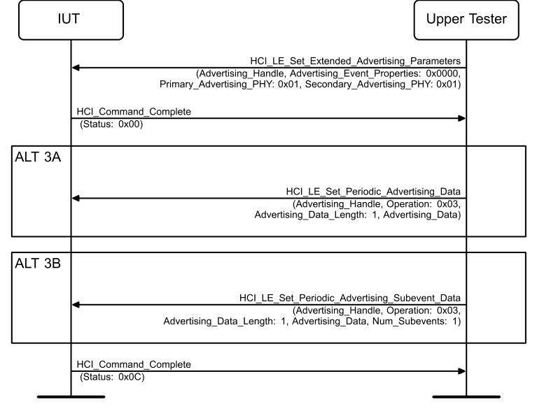

**Figure 4.50: Reject Set Periodic Advertising Data Command, Not Configured For Periodic Advertising MSC**

1. The Upper Tester sends an HCI_LE_Set_Extended_Advertising_Parameters command with an
Advertising_Handle, Advertising_Event_Properties set to 0x0000, Primary_Advertising_PHY set to 0x01 (LE 1M), and Secondary_Advertising_PHY set to 0x01 (LE 1M). 2. The IUT sends a successful HCI_Command_Complete to the Upper Tester. 3. Perform either alternative 3A or 3B depending on the HCI Command.
Alternative 3A (HCI_LE_Set_Periodic_Advertising_Data command):
3A.1 The Upper Tester sends an HCI_LE_Set_Periodic_Advertising_Data command to the IUT using the Advertising Handle used in step 1, Operation set to 0x03, Advertising_Data_Length set to 0x01, and Advertising_Data set to a random octet.
Alternative 3B (HCI_LE_Set_Periodic_Advertising_Subevent_Data command):
3B.1 The Upper Tester sends an HCI_LE_Set_Periodic_Advertising_Subevent_Data command to the IUT using the Advertising Handle used in step 1, Operation set to 0x03, Advertising_Data_Length set to 0x01, Advertising_Data set to a random octet, and Num_Subevents set to 1.
4. The IUT returns an HCI_Command_Complete with error code Command Disallowed (0x0C).
• Expected Outcome
Pass verdict
The IUT rejects the periodic advertising data, returning the error code Command Disallowed (0x0C).
HCI/DDI/BI-72-C [Reject LE Periodic Advertising Subevent Data Command, Advertising Duration Too Long]
• Test Purpose
Verify that the IUT properly rejects the HCI_LE_Periodic_Advertising_Subevent_Data command when the Advertising Duration is longer than the Periodic Advertising Response Slot Delay.
• Reference
[12] 7.8.125
• Initial Condition
- State: The IUT is in Standby.
• Test Procedure

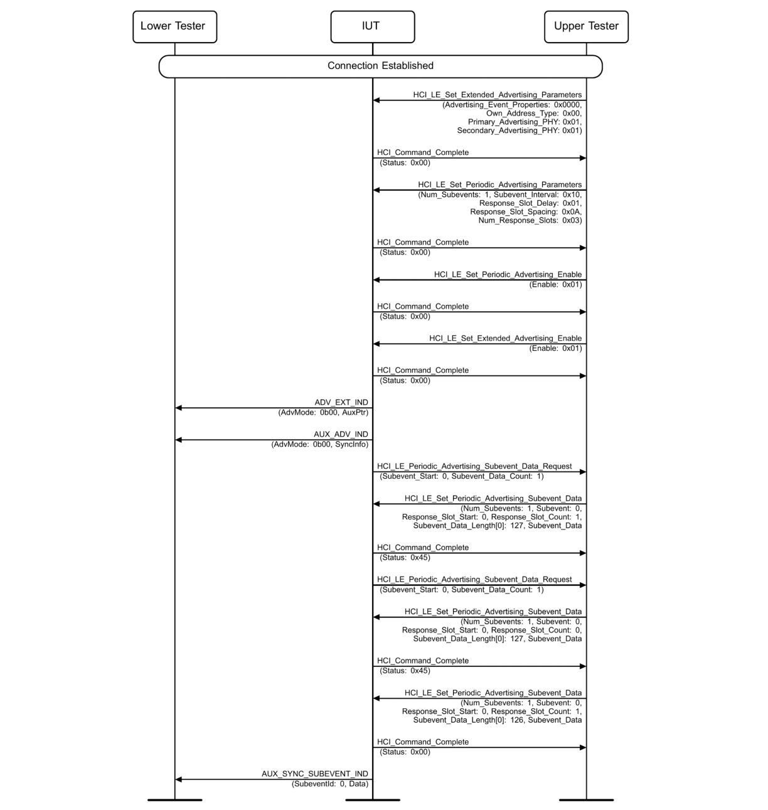

**Figure 4.51: Reject LE Periodic Advertising Subevent Data Command, Advertising Duration Too Long MSC**

IUT using a randomly supported advertising channel and a selected advertising interval between the minimum and maximum advertising intervals supported and receives an HCI_Command_Complete event in response. The Advertising_Event_Properties parameter is set to 0x0000. The Own_Address_Type is set to 0x00 (Public Device Address). Both Primary_Advertising_PHY and Secondary_Advertising_PHY are set to 0x01 (LE 1M). 2. The Upper Tester sends an HCI_LE_Set_Periodic_Advertising_Parameters [v2] command to the
IUT with Num_Subevents set to 1, Subevent_Interval set to 0x10 (20 ms), Response_Slot_Delay set to 0x01 (1.25 ms), Response_Slot_Spacing set to 0x0A, and Num_Response_Slots set to 0x3 and receives a successful HCI_Command_Complete event in response. 3. The Upper Tester enables periodic advertising using the
HCI_LE_Set_Periodic_Advertising_Enable command with the Enable parameter set to 0x01 (Periodic Advertising) and receives an HCI_Command_Complete event in response. 4. The Upper Tester enables advertising using the HCI_LE_Set_Extended_Advertising_Enable
command and receives an HCI_Command_Complete event in response. 5. The IUT sends ADV_EXT_IND PDUs to the Lower Tester with AdvMode set to 0b00 and an
AuxPtr and AUX_ADV_IND PDUs on the secondary advertising channel with AdvMode set to 0b00 and SyncInfo Extended Header fields. 6. The IUT sends an HCI_LE_Periodic_Advertising_Subevent_Data_Request event to the Upper
Tester with Subevent_Start set to 0 and Subevent_Data_Count set to 1. 7. The Upper Tester sends an HCI_LE_Set_Periodic_Advertising_Subevent_Data command to the
IUT with Num_Subevents set to 1, Subevent set to 0, Response_Slot_Start set to 0, Response_Slot_Count set to 1, Subevent_Data_Length[0] set to 127, and Subevent_Data[0] set to 127 random bytes. 8. The IUT sends an HCI_Command_Complete event to the Upper Tester with Status set to 0x45
(Packet Too Long). 9. The IUT sends an HCI_LE_Periodic_Advertising_Subevent_Data_Request event to the Upper
Tester with Subevent_Start set to 0 and Subevent_Data_Count set to 1. 10. The Upper Tester sends an HCI_LE_Set_Periodic_Advertising_Subevent_Data command to the
IUT with Num_Subevents set to 1, Subevent set to 0, Response_Slot_Start set to 0, Response_Slot_Count set to 0, Subevent_Data_Length[0] set to 127, and Subevent_Data[0] set to 127 random bytes. 11. The IUT sends an HCI_Command_Complete event to the Upper Tester with Status set to 0x45
(Packet Too Long). 12. The IUT sends an HCI_LE_Periodic_Advertising_Subevent_Data_Request event to the Upper
Tester with Subevent_Start set to 0 and Subevent_Data_Count set to 1. 13. The Upper Tester sends an HCI_LE_Set_Periodic_Advertising_Subevent_Data command to the
IUT with Num_Subevents set to 1, Subevent set to 0, Response_Slot_Start set to 0, Response_Slot_Count set to 1, Subevent_Data_Length[0] set to 126, and Subevent_Data[0] set to 126 random bytes 14. The IUT sends a successful HCI_Command_Complete event to the Upper Tester. 15. The IUT sends an AUX_SYNC_SUBEVENT_IND PDU to the Lower Tester on Subevent 1 with
the Data from step 13.
• Expected Outcome
Pass verdict
In steps 8 and 11, the IUT sends an 0x45 error in the HCI_Command_Complete event to the Upper Tester.
In step 14, the IUT sends a successful HCI_Command_Complete event to the Upper Tester.
In step 15, the IUT advertises an AUX_SYNC_SUBEVENT_IND PDU to the Lower Tester on Subevent 1 with 126 bytes of data from step 13.
HCI/DDI/BI-73-C [Reject LE Periodic Advertising Response Data Command, Advertising Duration Too Long]
• Test Purpose
Verify that the IUT properly rejects the HCI_LE_Periodic_Advertising_Respojnse_Data command when the Advertising Duration is longer than the Periodic Advertising Subevent Delay.
• Reference
[12] 7.8.126
• Initial Condition
- State: The IUT is in Standby.
• Test Procedure

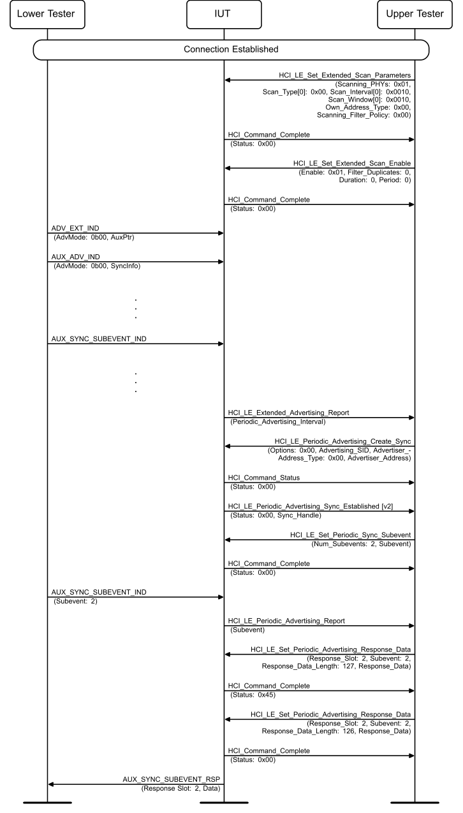

**Figure 4.52: Reject LE Periodic Advertising Response Data Command, Advertising Duration Too Long MSC**

receives a successful HCI_Command_Complete event in return. The Scanning_PHYs parameter is set to 0x01 (LE 1M), Scan_Type[0] is set to 0x00 (Passive Scanning), Scan_Interval[0] is set to 0x0010, Scan_Window[0] is set to 0x0010, Own_Address_Type is set to 0x00 (Public Device Address), and Scanning_Filter_Policy is set to 0x00 (Accept All). 2. The Upper Tester sends an HCI_LE_Set_Extended_Scan_Enable command to the IUT to enable
scanning and receives a successful HCI_Command_Complete event in return. Filter_Duplicates, Duration, and Period are all set to zero. 3. The Lower Tester begins advertising using ADV_EXT_IND and AUX_ADV_IND PDUs using the
LE 1M PHY. The ADV_EXT_IND PDUs include an AuxPtr that refers to the AUX_ADV_IND PDUs on the secondary advertising channel. The AUX_ADV_IND PDUs include the AdvA field containing the Lower Tester address, a SyncInfo field referring to the AUX_SYNC_SUBEVENT_IND PDUs, and the ACAD type for the Periodic Advertising Response Timing Information with subeventInterval set to  318.75 ms (0xFF), responseSlotDelay set to 313.75 ms (0xFB), and responseSlotSpacing set to 1.25 ms (0x0A). The Lower Tester continues advertising until directed to stop in the test procedure. 4. The Lower Tester is advertising using 5 Subevents, generating AUX_SYNC_SUBEVENT_IND
PDUs on the secondary advertising channel using the indices selected by the LE Channel Selection Algorithm #2 as specified in the SyncInfo in step 3. 5. The IUT sends an HCI_LE_Extended_Advertising_Report event to the Upper Tester containing a
non-zero Periodic_Advertising_Interval. 6. The Upper Tester sends an HCI_LE_Periodic_Advertising_Create_Sync command to the IUT to
synchronize with the Lower Tester’s periodic advertisements and receives an HCI_Command_Status event in response. Options is set to 0x00 (Don’t Use List, Reporting Initially Enabled, Duplicate Filtering Disabled), Advertising_SID is set to the Advertising_SID from step 5, Advertiser_Address_Type is set to 0x00 (Public Device Address), Advertiser_Address is set to the Lower Tester’s address. 7. The IUT sends an HCI_LE_Periodic_Advertising_Sync_Established [v2] to the Upper Tester
containing a Sync_Handle, a Status of 0x00 (Success), and other fields matching the advertisements generated by the Lower Tester. 8. The Upper Tester sends an HCI_LE_Set_Periodic_Sync_Subevent command to the IUT to
synchronize with the Lower Tester’s periodic advertisements, with Num_Subevents set to 2, the Subevent field array set to [2, 4], and the Upper Tester receives a successful HCI_Command_Complete event in response. 9. The Lower Tester generates AUX_SYNC_SUBEVENT_IND PDUs with 10 bytes of random
Subevent data for the PDU corresponding to Subevent 2. 10. The IUT sends an HCI_LE_Periodic_Advertising_Report [v2] event to the Upper Tester with
Subevent set to the subevent of the received AUX_SYNC_SUBEVENT_IND PDU. 11. For the report that contains Data_Length > 0, the Upper Tester sends an
HCI_LE_Set_Periodic_Advertising_Response_Data command to the IUT with Response_Slot set to 2, Subevent set to 2, and Response_Data_Length set to 127, and Response_Data contains 127 random octets. 12. The IUT sends an HCI_Command_Complete event to the Upper Tester with Status set to 0x45
(Packet Too Long). 13. Repeat steps 9 to 11 except that Response_Data_Length is set to 126 and Response_Data
contains 126 random octets. 14. The IUT sends a successful HCI_Command_Complete event to the Upper Tester. 15. The IUT sends an AUX_SYNC_SUBEVENT_RSP PDU to the Lower Tester in response slot 2
and with the response data from step 13.
• Expected Outcome
Pass verdict
In step 12, the IUT sends an 0x45 error in the HCI_Command_Complete event to the Upper Tester.
In step 14, the IUT sends a successful HCI_Command_Complete event to the Upper Tester.
In step 15, the IUT sends an AUX_SYNC_SUBEVENT_RSP PDU to the Lower Tester in response slot 2 and with the response data from step 13.’

### 4.8 Host Flow Control

Verify the correct implementation of the Host flow control commands.
HCI/HFC/BV-01-C [Set_Event_Mask Command]
• Test Purpose
Verify that the Set_Event_Mask command controls which events are generated by the IUT.
• Reference
[1] 7.3.1
• Initial Condition
- The IUT must be configured as Central.
- The IUT is in STANDBY mode.
• Test Procedure

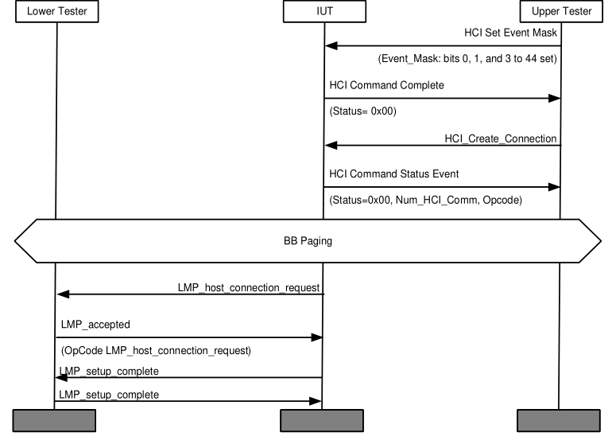

**Figure 4.53: HCI/HFC/BV-01-C [Set_Event_Mask Command] MSC**

• Expected Outcome
Pass verdict
The IUT returns ‘command complete’ succeeded to the Set_Event_Mask command.
The IUT does not return a ‘Connection Complete’ event.
HCI/HFC/BV-02-C [Set_Event_Filter Command]
• Test Purpose
Verify that the Set_Event_Filter command controls which events are generated using filters.
• Reference
[1] 7.3.3
• Initial Condition
- The IUT must be configured as Peripheral.
- The IUT is in STANDBY mode.
• Test Procedure

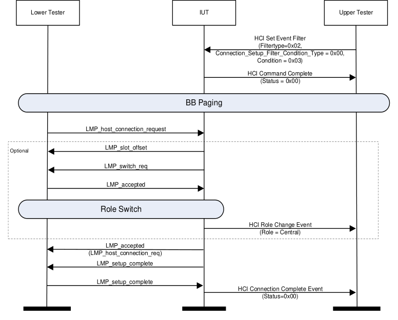

**Figure 4.54: HCI/HFC/BV-02-C [Set_Event_Filter Command] MSC**

• Expected Outcome
Pass verdict
The IUT returns ‘command complete’ succeeded to the Set_Event_Filter command.
The IUT does not return a ‘Connection Request’ event.
The IUT does return a ‘Connection Complete’ event.
HCI/HFC/BV-03-C [Set_Event_Mask_2 Command]
• Test Purpose
Verify that the Set Event Mask 2 command controls which events are generated by the IUT.
• Reference
[1] 7.3.69
• Initial Condition
- The IUT is the initiator.
• Test Procedure
The Upper Tester uses the Set_Event_mask_2 command to mask off the Physical Link Complete event from the IUT.
The Upper Tester issues a Create Physical Link command.
The Physical Link is successfully created.

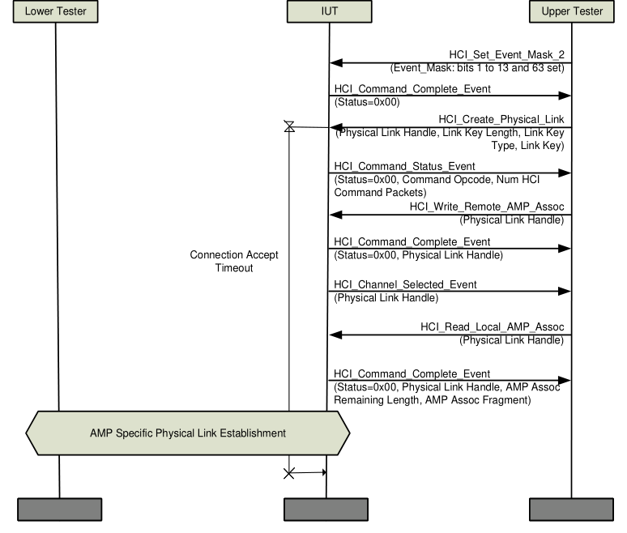

**Figure 4.55: HCI/HFC/BV-03-C [Set_Event_Mask_2 Command] MSC**

• Expected Outcome
Pass verdict
Physical Link Complete event does not show up to the Upper Tester.
The IUT returns ‘command complete’ succeeded to the Set_Event_Mask command.
HCI/HFC/BV-04-C [LE Set Event Mask]
• Test Purpose
Verify that the LE Set Event Mask command controls which events are generated by the IUT.
• Reference
[8] 7.3.1, 7.8.1
• Initial Condition
- No LL connection exists.
• Test Procedure
The Upper Tester sends HCI LE Set Event Mask to mask HCI LE Advertising Report Event.
The IUT is configured as active scanner, and the Lower Tester starts advertising.
The Upper Tester receives no HCI LE Advertising Report Event.
The Upper Tester disables scanning on the IUT.
The Upper Tester sends HCI_LE_Create_Connection to the IUT and receives HCI_LE_Connection_Complete event from the IUT.

| Lower Tester |  |
| --- | --- |
|  |  |
|  |  |

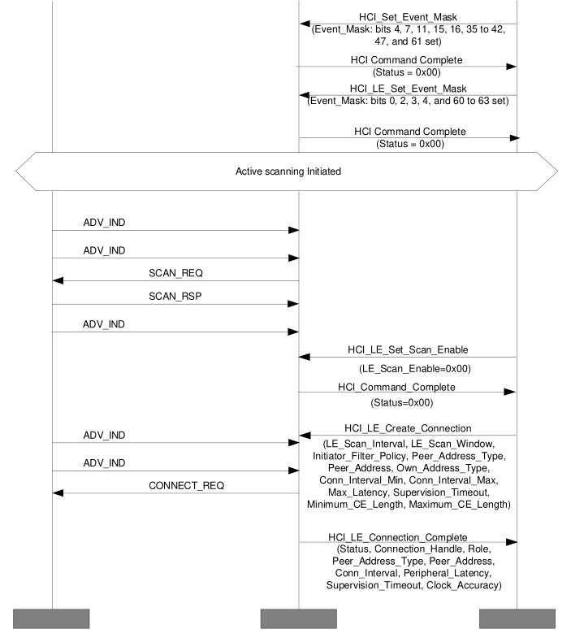

**Figure 4.56: HCI/HFC/BV-04-C [LE Set Event Mask] MSC**

• Expected Outcome
Pass verdict
The IUT returns HCI Command Complete Event with Status = Success.
The IUT does not send HCI LE Advertising Report Event.
The IUT sends HCI LE Connection Complete event after receiving HCI LE Create Connection.
HCI/HFC/BV-05-C [Set_Event_Filter Command to perform auto accept connection from configured and specified bd address over ACL]
• Test Purpose
Verify that the Set_Event_Filter command can perform auto accept connection from configured and specified bd address.
• Reference
[1] 7.3.3
• Initial Condition
- The IUT configured as Peripheral.
- The IUT is in STANDBY mode.
- BD address of the Lower Tester is set in HCI Set Event Filter.
• Test Procedure

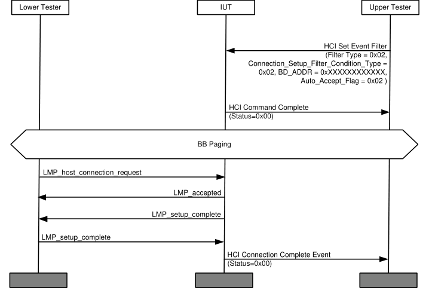

**Figure 4.57: HCI/HFC/BV-05-C [Set_Event_Filter Command to perform auto accept connection from configured and specified bd address over ACL] MSC**

• Expected Outcome
Pass verdict
The IUT returns ‘command complete’ succeeded to the Set_Event_Filter command.
The IUT does not return a ‘Connection Request’ event.
The IUT does not perform role switch.
The IUT does return a ‘Connection Complete’ event.
HCI/HFC/BV-06-C [Set_Event_Filter Command, connection request rejection]
• Test Purpose
Verify that the Set_Event_Filter command leads to connection request rejection from peer device which is not specified for auto accept in the filter condition.
• Reference
[1] 7.3.3
• Initial Condition
- The IUT configured as Peripheral.
- The IUT is in STANDBY mode.
- BD address of the Lower Tester is NOT set in HCI Set Event Filter.
• Test Procedure

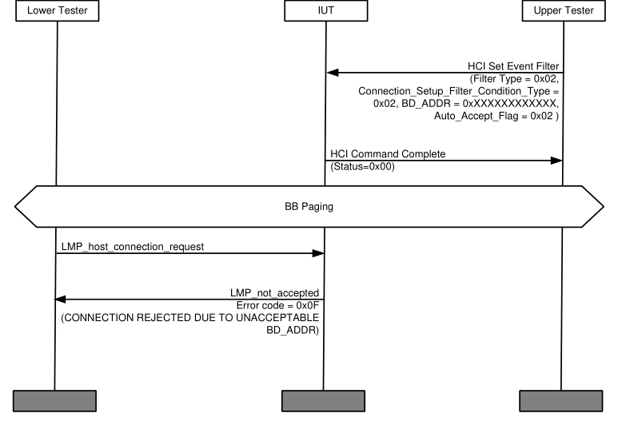

**Figure 4.58: HCI/HFC/BV-06-C [Set_Event_Filter Command, connection request rejection] MSC**

• Expected Outcome
Pass verdict
The IUT returns ‘command complete’ succeeded to the Set_Event_Filter command.
The IUT does not return a ‘Connection Request’ event.
The IUT does not perform role switch.
The IUT does not return a ‘Connection Complete’ event.
HCI/HFC/BV-07-C [Set_Event_Filter Command, Host configures the Controller to Allow Connections, specifying a Class of Device and a Class of Device Mask]
• Test Purpose
Verify that the Set_Event_Filter command controls which events are generated using filters.
In this test Host configure the Controller to Allow Connections from the Lower Tester, specifying a Class of Device and a Class of Device Mask. For this condition, the Auto Accept Flag is set to Do auto accept the connection with role switch disabled.
Test that Host will receive a Connection Complete event from the Lower Tester only when a connection request matches one of the filters set by the Host.
• Reference
[1] 7.3.3
• Initial Condition
- The IUT must be configured as Peripheral.
- The IUT is in STANDBY mode.
- Class of Device of the Lower Tester is set in HCI Set Event Filter.
- Class of Device Mask is set to 0xFFFFFF in HCI Set Event Filter.
- Auto Accept Flag is set to Do Auto accept the connection.
• Test Procedure

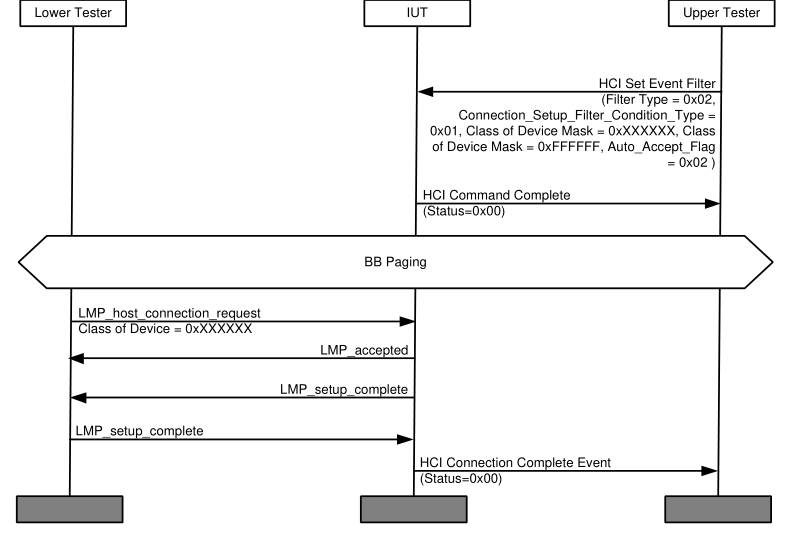

**Figure 4.59: HCI/HFC/BV-07-C [Set_Event_Filter Command, Host configures the Controller to Allow Connections, specifying a Class of Device and a Class of Device Mask] MSC**

• Expected Outcome
Pass verdict
The IUT returns ‘Command Complete’ (Status = 0x00) (Success) to the Set_Event_Filter command.
The IUT will accept the connection request when the condition is met and the auto accept flag was set for that condition. The IUT will send the ‘Connection Complete’ (Status=0x00) (Success) event to the Host.
HCI/HFC/BV-08-C [Set_Event_Filter Command to controls which events are generated using filters]
• Test Purpose
Verify that the Set_Event_Filter command controls which events are generated using filters.
In this test, the Host configure the Controller to Allow Connections from a device with a specific BD_ADDR, specifying the BD_ADDR of the Lower Tester. For this connection setup filter condition, the Auto_Accept_Flag is set to Do NOT auto accept the connection.
Test that the Host will receive a Connection Request event from the Lower Tester and will not auto accept the connection, and the Upper Tester verifies the behavior of the IUT for a successful connection and also an unsuccessful connection scenario.
• Reference
[1] 7.3.3
• Initial Condition
- The IUT must be configured as Peripheral.
- The IUT is in STANDBY mode.
- BD address of the Lower Tester is set in HCI Set Event Filter.
- Auto Accept Flag is set to Do NOT Auto accept the connection.
- Connection Setup Filter Condition is set to Allow Connections from a device with a specific BD_ADDR.
• Test Procedure

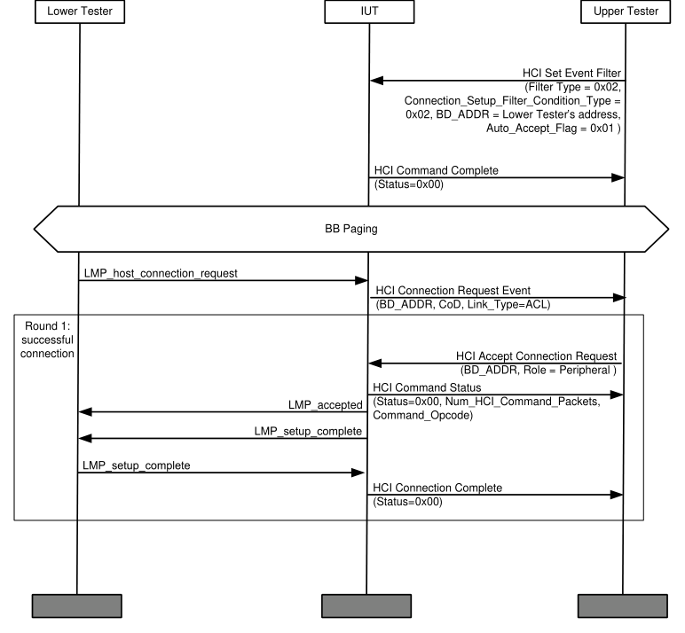

**Figure 4.60: HCI/HFC/BV-08-C [Set_Event_Filter Command to controls which events are generated using filters] MSC – Page 1 of 2**

MSC page 1 of 2: Host receives a connection request from the Lower Tester and connection is successful.
Reset the device before the next round.

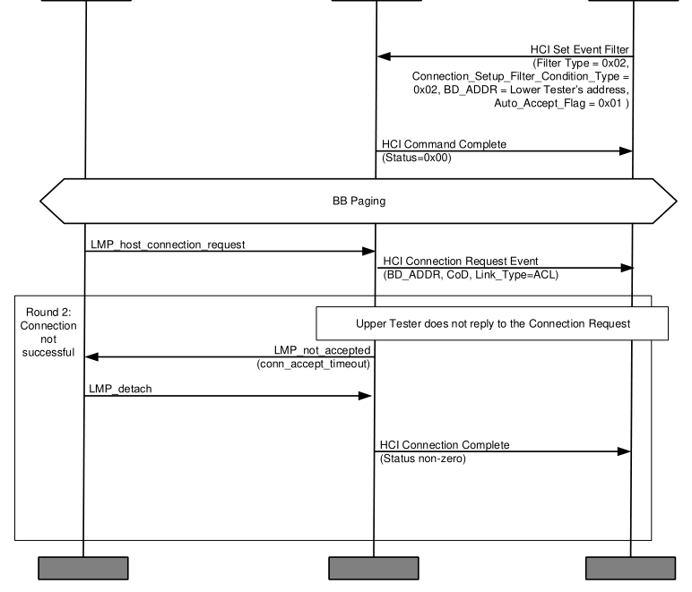

**Figure 4.61: HCI/HFC/BV-08-C [Set_Event_Filter Command to controls which events are generated using filters] MSC – Part 2 of 2**

MSC page 2 of 2: The Host receives a connection request from the Lower Tester, and the Upper Tester does not reply.
• Expected Outcome
Pass verdict
In the first round:
- The IUT returns ‘command complete’ success to the Set_Event_Filter command from the Upper Tester.
- The IUT sends the ‘Connection Request’ event to the Upper Tester.
- After the Upper Tester accepts the connection, the connection with the IUT and the Lower Tester is successfully established.
In the second round:
- The IUT returns ‘command complete’ success to the Set_Event_Filter command from the Upper Tester.
- The IUT sends the ‘Connection Request’ event to the Upper Tester.
- After the Upper Tester does not answer the connection request, the IUT sends an LMP_not_accepted PDU with non-zero status to the Lower Tester.
connection from configured and specified bd address • Test Purpose
Verify that the Set_Event_Filter command can perform auto accept connection from a configured and specified BD address over an SCO Type connection as specified in Table 4.22.
• Reference
[1] 7.3.3
• Initial Condition
- The IUT configured as Peripheral.
- See Section 4.1.3.
- BD address of the Lower Tester is set in HCI Set Event Filter.
• Test Procedure

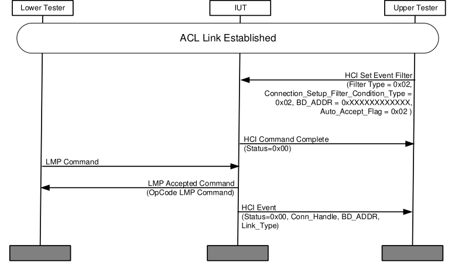

**Figure 4.62: Set_Event_Filter Command to perform auto accept synchronous connection from configured and specified bd address MSC**

• Test Case Configuration

| Test Case |  | SCO |  | LMP Command |  | LMP Accepted |  | HCI Event |
| --- | --- | --- | --- | --- | --- | --- | --- | --- |
|  |  | Type |  |  |  | Command |  |  |
| HCI/HFC/BV-09-C | SCO |  |  | LMP SCO link req _ _ _ | LMP accepted _ |  |  | HCI Connection Complete Event |
| HCI/HFC/BV-10-C | eSCO |  |  | LMP eSCO link req _ _ _ | LMP accepted ext _ _ |  |  | HCI Synchronous Connection Complete Event |

Table 4.22: Set_Event_Filter Command to perform auto accept synchronous connection from configured and specified bd address test cases
• Expected Outcome
Pass verdict
The IUT returns ‘command complete’ succeeded to the Set_Event_Filter command.
The IUT does not return a ‘Connection Request’ event.
The IUT does return a ‘(Synchronous) Connection Complete’ event.
HCI/HFC/BV-11-C [Auto Accept Off, Event Masked, connection request rejection over ACL]
• Test Purpose
Verify that the Set_Event_Filter command leads to connection request rejection from peer device when the HCI_Connection_Request event is masked.
• Reference
[1] 7.3.3
• Initial Condition
- The IUT configured as Peripheral.
- The IUT is in STANDBY mode.
- The IUT has masked out the Connection Request Event (3) bit.
• Test Procedure

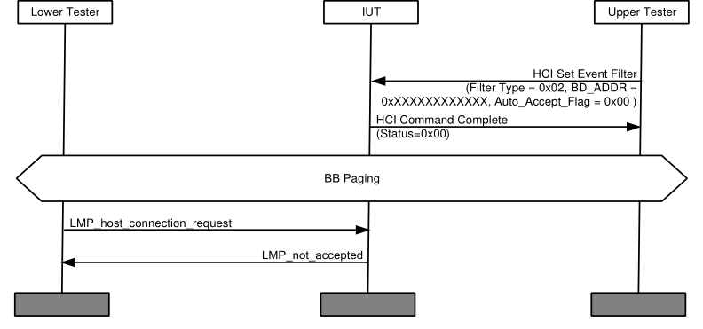

**Figure 4.63: HCI/HFC/BV-11-C [Auto Accept Off, Event Masked, connection request rejection over ACL] MSC**

• Expected Outcome
Pass verdict
The IUT returns ‘command complete’ succeeded to the Set_Event_Filter command.
The IUT does not return a ‘Connection Request’ event.
The IUT rejects the connection to the LT.
Type • Test Purpose
Verify that the Set_Event_Filter command leads to connection request rejection from peer device when the HCI_Connection_Request event is masked for a SCO Type connection as specified in Table 4.23.
• Reference
[1] 7.3.3
• Initial Condition
- The IUT configured as Peripheral.
- See Section 4.1.3.
- The IUT has masked out the Connection Request Event (3) bit.
• Test Procedure
1. The Upper Tester calls HCI_Set_Event_Filter with Auto_Accept_Flag=0x0 , and address of the
Lower Tester, and valid values for all other parameters. 2. The Lower Tester initiates a connection to the IUT. 3. The IUT will reject the connection.

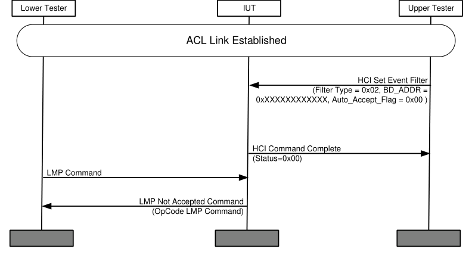

**Figure 4.64: Auto Accept Off, Event Masked, connection request rejection over SCO Type MSC**

• Test Case Configuration

| Test Case |  |  | SCO Type |  |  | LMP Command |  |  | LMP Not Accepted Command |  |
| --- | --- | --- | --- | --- | --- | --- | --- | --- | --- | --- |
| HCI/HFC/BV-12-C |  | SCO |  |  | LMP SCO link req _ _ _ |  |  | LMP not accepted _ _ |  |  |
| HCI/HFC/BV-13-C |  | eSCO |  |  | LMP eSCO link req _ _ _ |  |  | LMP not accepted ext _ _ _ |  |  |

Table 4.23: Auto Accept Off, Event Masked, connection request rejection over SCO Type test cases
• Expected Outcome
Pass verdict
The IUT returns ‘command complete’ succeeded to the Set_Event_Filter command.
The IUT does not return a ‘Connection Request’ event.
The IUT rejects the connection to the LT.

### 4.9 Authentication and Encryption

Verify the correct implementation of the Host flow control commands.
HCI/AEN/BV-01-C [Link Key Commands]
• Test Purpose
Verify that the Write Stored Link Key, Read Stored Link Key, and Delete Stored Link Key commands write, read, and delete stored link keys.
• Reference
[1] 7.3.8, 7.3.9, 7.3.10
• Initial Condition
- No LL connection exists.
• Test Procedure

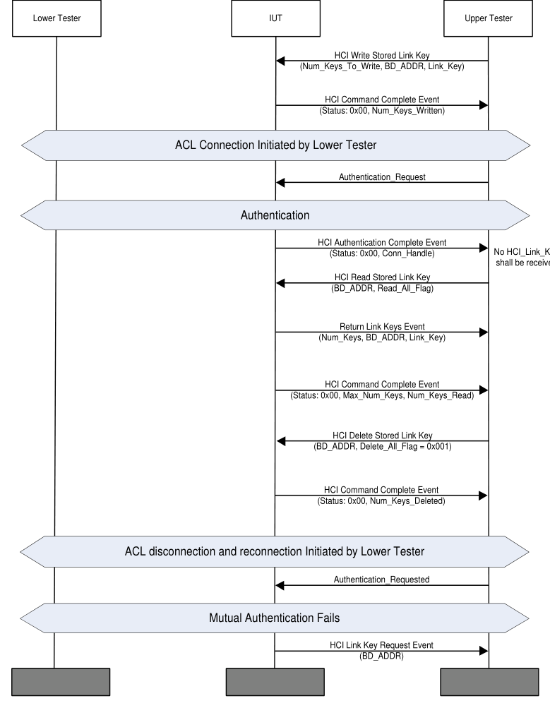

**Figure 4.65: HCI/AEN/BV-01-C [Link Key Commands] MSC**

• Expected Outcome
Pass verdict
The IUT returns ‘command complete’ succeeded to the Write Stored Link Key command. The IUT returns ‘command complete’ succeeded to the Read Stored Link Key command and returns the expected stored link key.
The authentication using the stored link key succeeds as indicated by an ‘Authentication Complete’ event.
The final authentication request results in a returned 'Link key Request' event.
• Note
This test case is applicable only to an IUT that support the Bluetooth Core Specification Version 2.0 or earlier.
HCI/AEN/BV-02-C [Reading All Link Keys]
• Test Purpose
Verify that the IUT can have its link keys read, without revealing the values of the link keys stored in the controller.
• Reference
[1] 7.3.8
• Initial Condition
- The IUT is connected via HCI and has a minimum of one stored link key.
• Test Procedure

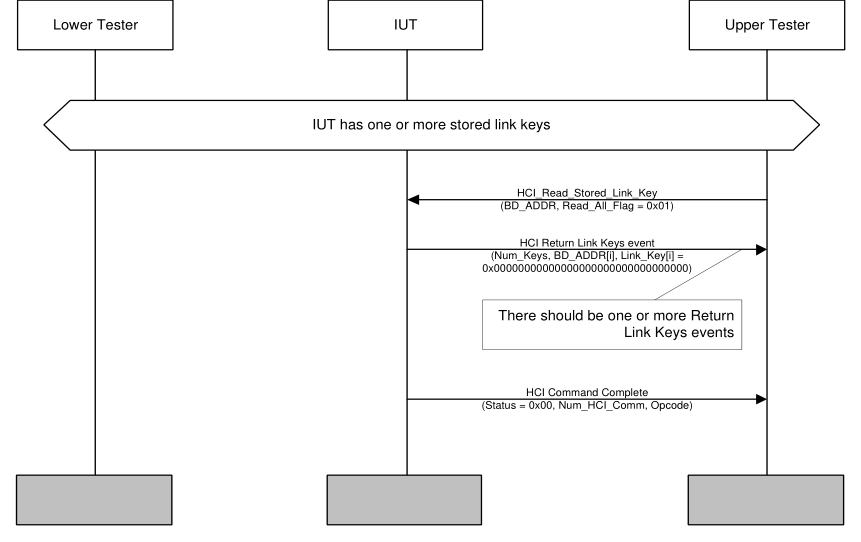

**Figure 4.66: HCI/AEN/BV-02-C [Reading All Link Keys] MSC**

The Upper Tester issues a Read Stored Link Keys with Read_All_Flag.
The IUT returns a Return Link Keys event.
• Expected Outcome
Pass verdict
The link key values in the Return Link Keys event are zero.
• Test Purpose
Verify that the IUT can have a link key read, without revealing the value of the link keys stored in the controller.
• Reference
[1] 7.3.8
• Initial Condition
- The IUT is connected via HCI and has a minimum of one stored link key.
• Test Procedure
The Upper Tester issues a Read Stored Link Keys for a single BD_ADDR.
The IUT returns a Return Link Keys event.

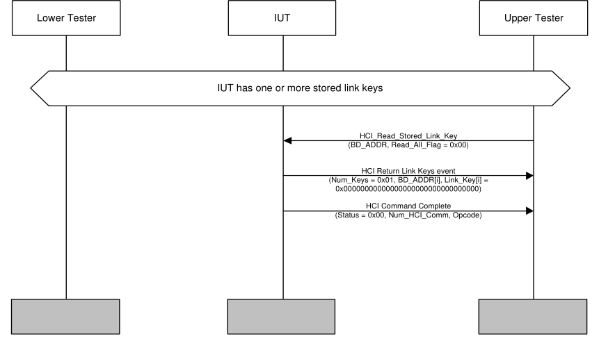

**Figure 4.67: HCI/AEN/BV-03-C [Reading Single Link Key] MSC**

• Expected Outcome
Pass verdict
The link key values in the Return Link Keys event are zero.
HCI/AEN/BV-04-C [Link Key Commands – IUT Returns All Zero Link Key]
• Test Purpose
Verify that the Write Stored Link Key, Read Stored Link Key, and Delete Stored Link Key commands write, read, and delete stored link keys and the Return Link Keys Event does not return the value of the link keys.
• Reference
[1] 7.3.8, 7.3.9, 7.3.10
• Initial Condition
- No LL connection exists.
• Test Procedure

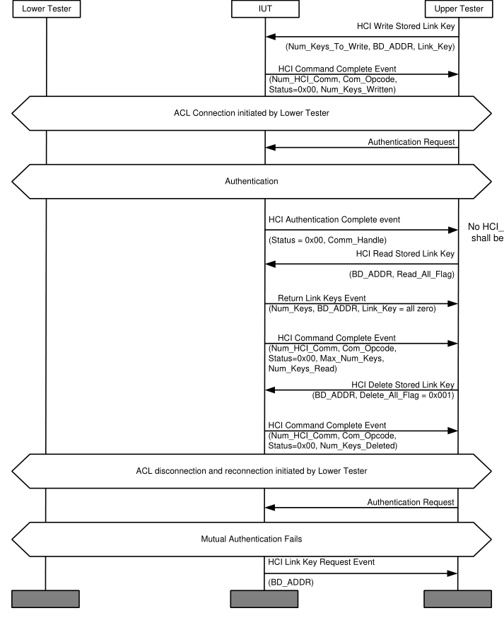

**Figure 4.68: HCI/AEN/BV-04-C [Link Key Commands – IUT Returns All Zero Link Key] MSC**

• Expected Outcome
Pass verdict
The IUT returns ‘command complete’ succeeded to the Write Stored Link Key command. The IUT returns ‘command complete’ succeeded to the Read Stored Link Key command and returns the all zero link key.
The authentication using the stored link key succeeds as indicated by an ‘Authentication Complete’ event.
The IUT returns ‘command complete’ succeeded to the Delete Stored Link Key command.
The final authentication request results in a returned 'Link key Request' event.
• Test Purpose
Verify that the IUT uses distinctive random numbers to generate the P-192 and P-256 public-private key pairs.
• Reference
[1] 7.3.95
• Initial Condition
- The IUT has been HCI reset and has been SSP enabled and Secure Connections enabled by the host via the Write Simple Pairing Mode and the Write Secure Connections Host Support Commands.
• Test Procedure
The Upper Tester issues a Read Local OOB Extended Data Command.
The IUT returns a Command Complete Event with four values C_192, R_192, C_256, and R_256.

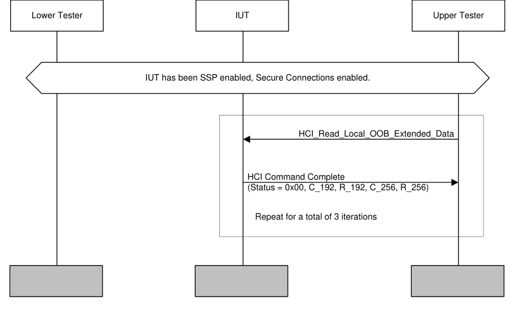

**Figure 4.69: HCI/AEN/BV-05-C [Read Local OOB Extended Data Command, test unique values] MSC**

• Expected Outcome
Pass verdict
For each Read Local OOB Extended Data Command, the values of R_192 and R_256 are different than the preceding set of values. For example, the values returned from the second read command should not be an identical match to the values from the first read command. Similarly, the values from the third read command should not be an identical match to the values from either the first or the second read command. Also, for each read command, the values of R_192 and R_256 should not match each other.
• Test Purpose
Verify that the IUT can generate a P-256 Public-Private key pair and return the P-256 Public Key.
• Reference
[8] 7.7.65.8, 7.8.36
• Initial Condition
- The IUT is in standby.
• Test Procedure

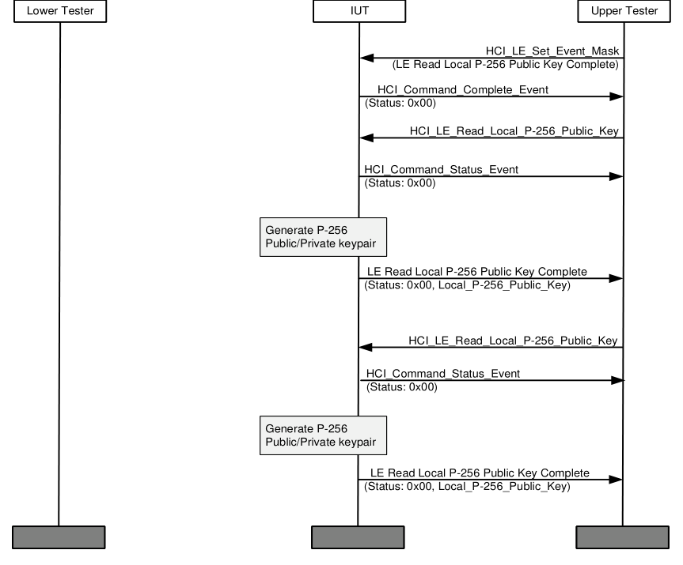

**Figure 4.70: HCI/AEN/BV-06-C [Public Keys] MSC**

• Expected Outcome
Pass verdict
The IUT returns the local P-256 Public Key through the LE Read Local P-256 Public Key Complete event.
When the command is repeated, the IUT generates a new P-256 Public-Private key pair and returns the corresponding Public Key.
• Note
The parameter “Local_P-256_Public_Key” sent from the IUT to the Upper Tester is Key_X_Coordinate and Key_Y_Coordinate, where each of the two are 32 octets.
HCI/AEN/BV-07-C [Generate DH Keys]
• Test Purpose
Verify that the IUT can generate a new P-256 DHKey.
• Reference
[8] 7.7.65.9, 7.8.37
• Initial Condition
- The IUT is in standby.
• Test Procedure

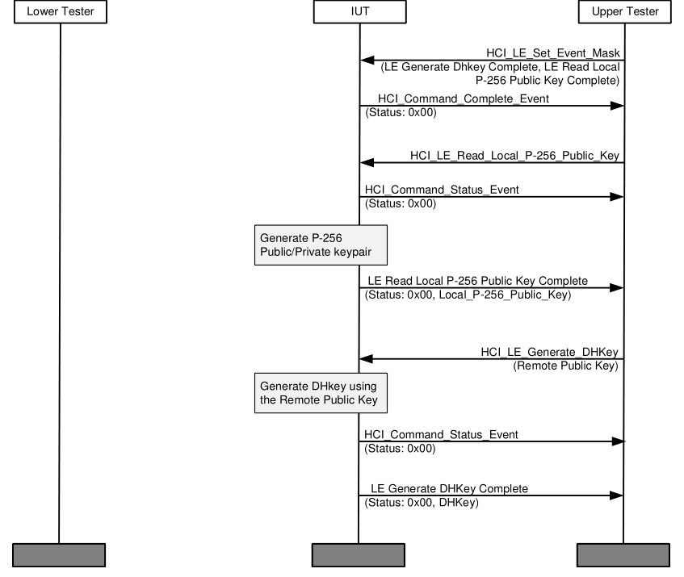

**Figure 4.71: HCI/AEN/BV-07-C [Generate DH Keys] MSC**

• Expected Outcome
Pass verdict
The IUT returns the DHkey through the LE Generate DHKey Complete event. The generated DHkey is verified by the Upper Tester.
• Notes
The Command is applicable only to an IUT that supports the LE Secure Connections feature.
The parameter “Local_P-256_Public_Key” sent from the IUT to the Upper Tester is Key_X_Coordinate and Key_Y_Coordinate, where each of the two are 32 octets.
HCI/AEN/BV-08-C [Generate Debug Keys]
• Test Purpose
Verify that the IUT can generate a debug key.
• Reference
[11] 7.7.65.9, 7.8.93
• Initial Condition
- The IUT is in standby.
• Test Procedure

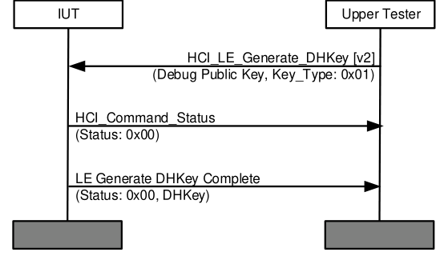

**Figure 4.72: HCI/AEN/BV-08-C [Generate Debug Keys] MSC**

• Expected Outcome
Pass verdict
The IUT returns the debug key through the LE Generate DHKey Complete event. The Upper Tester verifies the generated debug key.

#### 4.9.1 Generate DH Key Error With Invalid Point • Test Purpose

Verify that the IUT can return an error when invalid public keys are received.
• Reference
[8], [10] 7.7.65.9, 7.8.37
• Initial Condition
- The IUT is in standby.
• Test Case Configuration

|  | Test Case DH _ | Key Parameter |  |
| --- | --- | --- | --- |
|  | HCI/AEN/BI-01-C [Generate DH Key Error With Invalid Point, v5.4] Any | value |  |
|  | HCI/AEN/BI-02-C [Generate DH Key Error With Invalid Point, v6.0] All oc | tets set to 0xFF |  |

Table 4.24: Generate DH Key Error With Invalid Point
• Test Procedure
Run the test once for each of the rounds and generate invalid public keys as specified in Table 4.25 (HCI_LE_Generate_DHKey PDU):

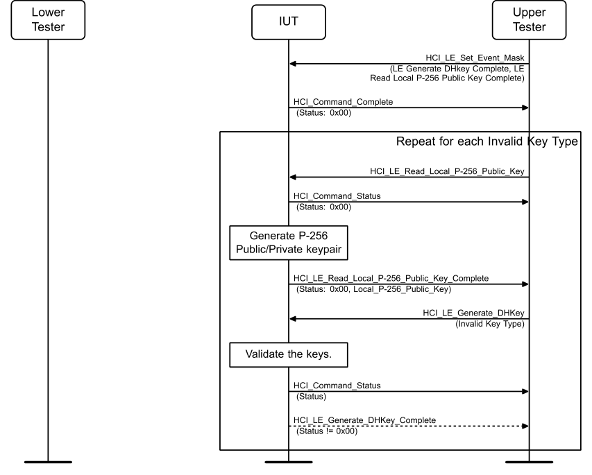

**Figure 4.73: Generate DH Key Error With Invalid Point MSC**

1. The Upper Tester sends an HCI_LE_Set_Event_Mask command to the IUT and receives a
successful HCI_Command_Complete event in response.
Repeat Steps 2–6 for each round in Table 4.25.
2. The Upper Tester sends an HCI_LE_Read_Local_P-256_Public_Key command to the IUT and
receives a successful HCI_Command_Status event in response. 3. The IUT sends an HCI_LE_Read_Local_P-256_Public_Key_Complete event to the Upper Tester
with Status set to 0x00 and the generated Local_P-256_Public_Key. 4. The Upper Tester sends an HCI_LE_Generate_DHKey command to the IUT with the Invalid Key
Type as specified in Table 4.25.
5. The IUT sends an HCI_Command_Status event to the Upper Tester. 6. If the Status is set to 0x00 in step 5, the IUT sends an HCI_LE_Generate_DHKey_Complete
event with Status > 0x00.

|  | Round |  |  | Key Size |  |  | Invalid Key Type |  |
| --- | --- | --- | --- | --- | --- | --- | --- | --- |
|  | 1 |  | P-256 |  |  | Generate valid public key and set y-coordinate = 0 |  |  |
|  | 2 |  | P-256 |  |  | Generate valid public key and flip a bit in y-coordinate |  |  |
|  | 3 |  | P-256 |  |  | Public Key coordinates (0, 0) |  |  |

Table 4.25: Generate DH Key Error With Invalid Point rounds
• Expected Outcome
Pass verdict
The IUT returns a HCI Command Status Event with Status != 0 in response to the HCI_LE_Generate_DHKey.
or
The IUT returns a HCI Command Status Event with Status = 0 followed by a LE Generate DHKey Complete event with Status != 0 in response to the HCI_LE_Generate_DHKey command.
In step 6, all octets of the DH_Key parameter are set as specified in Table 4.24.
• Note
The parameter “Local_P-256_Public_Key” sent from the IUT to the Upper Tester is Key_X_Coordinate and Key_Y_Coordinate, where each of the two are 32 octets.

### 4.10 Controller Configuration

Verify the controller configuration.
HCI/CCO/BV-01-C [Write Location Data Command/Read Location Data Command]
• Test Purpose
Verify that the Write Location Data Command/ Read Location Data Command are handled correctly by the IUT.
• Reference
[1] 7.3.70, 7.3.71
• Initial Condition
- The IUT is in standby.
• Test Procedure
The Upper Tester issues Write Location Data Command with preset information to the IUT.
The Upper Tester receives success status in the Write Location Data command complete event.
The Upper Tester issues Read Location Data Command with preset information to the IUT.

| Lower Tester |  |
| --- | --- |
|  |  |

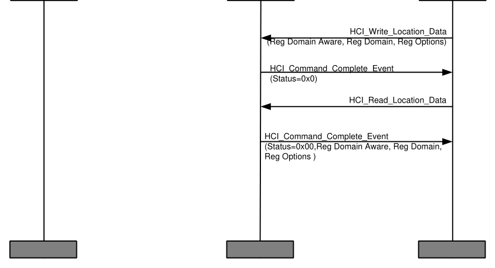

**Figure 4.74: HCI/CCO/BV-01-C [Write Location Data Command/ Read Location Data Command] MSC**

• Expected Outcome
Pass verdict
The Upper Tester receives command complete event with success status for two commands. The Upper Tester receives the data returned by the Read Location Data command complete event. The received data matches what was used in the Write Location Data Command.
HCI/CCO/BV-03-C [Write LE Host Support Command]
• Test Purpose
Verify that the Write_LE_Host_Support command writes the LE_Support_Host configuration parameter of the IUT.
• Reference
[1] 7.3.79
• Initial Condition
- The IUT is in standby.
• Test Procedure

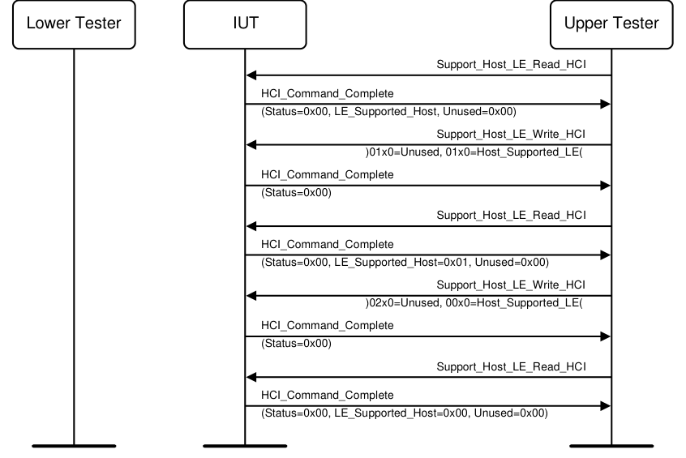

**Figure 4.75: HCI/CCO/BV-03-C [Write LE Host Support Command] MSC**

• Expected Outcome
Pass verdict
The IUT returns command complete to the first HCI_Read_LE_Host_Supported command and returns the LE_Support_Host parameter set to 0x00.
In response to each HCI_Read_LE_Host_Supported command, the Unused parameter is set to 0x00.
The IUT returns ‘command complete’ succeeded to the first and second Write_LE_Host_Support commands.
The IUT returns ‘command complete’ with LE_Supported_Host set to 0x01 in response to the second Read_LE_Host_Support command.
The IUT returns ‘command complete’ with LE_Supported_Host set to 0x00 in response to the third Read_LE_Host_Support command.
• Notes
In versions up to 5.2, the Unused parameter was called Simultaneous_LE_Host.
HCI/CCO/BV-05-C [LE Not Supported]
• Test Purpose
Verify that an IUT that does not support LE does not recognize LE HCI commands.
• Reference
[1] 6.33
• Initial Condition
- The IUT is in standby.
• Test Procedure
The Upper Tester sends an HCI LE Set Event Mask Command and expects the IUT to return an HCI Command Complete Event or HCI Command Status Event with Status = Unknown HCI Command.

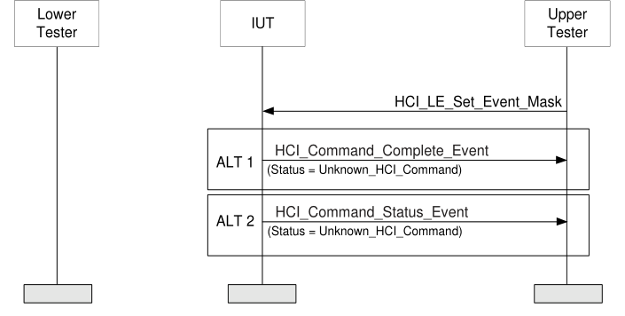

**Figure 4.76: HCI/CCO/BV-05-C [LE Not Supported] MSC**

• Expected Outcome
Pass verdict
The IUT returns an HCI Command Complete or HCI Command Status Event with Status = Unknown_HCI_Command.
HCI/CCO/BV-07-C [BR/EDR Not Supported]
• Test Purpose
Verify that an IUT that supports LE only does not respond to BR/EDR HCI commands.
• Reference
[1] 3.2
• Initial Condition
- The IUT is in standby.
• Test Procedure
The Upper Tester sends an HCI Inquiry Command and expects the IUT to return an HCI Command Complete Event or HCI Command Status Event with Status = Unknown HCI Command.
Lower Tester
Upper Tester IUT

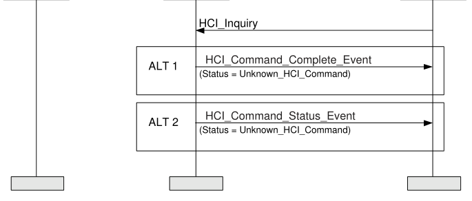

**Figure 4.77: HCI/CCO/BV-07-C [BR/EDR Not Supported] MSC**

• Expected Outcome
Pass verdict
The IUT returns an HCI Command Complete or HCI Command Status Event with Status = Unknown_HCI_Command.
HCI/CCO/BV-08-C [Read Extended Page Timeout]
• Test Purpose
Verify that the IUT correctly handles Read Extended Page Timeout.
• Reference
[1] 7.3
• Initial Condition
- The IUT is in standby.
• Test Procedure
a) The Upper Tester issues HCI_Write_Extended_Page_Timeout Command with preset information
to the IUT.
b) The Upper Tester receives success status in the HCI_Write_Extended_Page_Timeout Command
complete event.
c) The Upper Tester issues HCI_Read_Extended_Page_Timeout Command to the IUT.
• Expected Outcome
Pass verdict
The Upper Tester receives command complete event with success status for the commands sent in a and c.
The Upper Tester receives the data returned by the HCI_Read_Extended_Page_Timeout Command complete event. The received data matches the data that was used in the HCI_Write_Extended_Page_Timeout Command.
• Test Purpose
Verify that the IUT correctly handles the LE Set Data Length Command
• Reference
[2] 7.8.33
• Initial Condition
- LL connection established, the IUT is Central or Peripheral.
• Test Procedure
The Upper Tester issues an LE Set Data Length command to the IUT containing the current connection handle and with values for TxOctets and TxTime which lie in the permissible range.
The Upper Tester receives a Command Complete event from the IUT for the LE Set Data Length command.
If the command causes the maximum transmission packet size or maximum packet transmission time to change, the Upper Tester receives an LE Data Length Change event from the IUT containing the updated values.

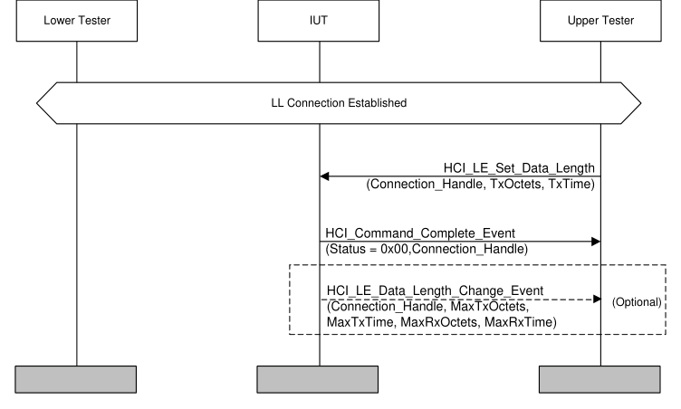

**Figure 4.78: HCI/CCO/BV-09-C [LE Set Data Length] MSC**

• Expected Outcome
Pass verdict
The Upper Tester receives a Command Complete event from the IUT with Status = 0x00 (Success) and with the value for Connection_Handle matching the value sent in the LE Set Data Length Command.
The Upper Tester optionally receives an LE Data Length Change event from the IUT with updated maximum transmission packet size and maximum packet transmission time values.
• Test Purpose
Verify that the IUT correctly handles the LE Read Suggested Default Data Length Command
• Reference
[8] 7.8.34
• Initial Condition
- The IUT has just been reset and is in standby.
• Test Procedure
The Upper Tester issues a LE Read Suggested Default Data Length Command to the IUT.
The Upper Tester receives a Command Complete event from the IUT for the LE Read Suggested Default Data Length Command.

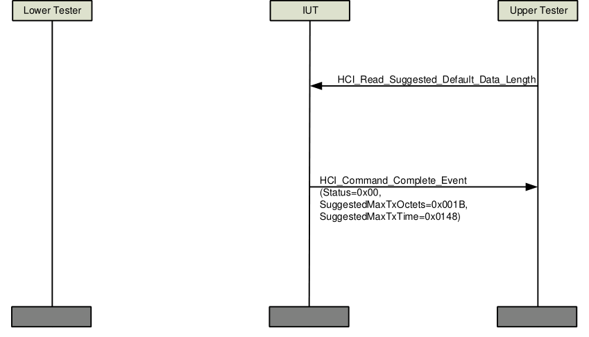

**Figure 4.79: HCI/CCO/BV-10-C [LE Read Suggested Default Data Length Command] MSC**

• Expected Outcome
Pass verdict
The Upper Tester receives a Command Complete event from the IUT with Status = 0x00 (Success) and with TxOctets equal to 0x001B and TxTime equal to 0x0148.
HCI/CCO/BV-11-C [LE Write Suggested Default Data Length Command]
• Test Purpose
Verify that the IUT correctly handles the LE Write Suggested Default Data Length Command.
• Reference
[8] 7.8.35
• Initial Condition
- The IUT is in standby.
• Test Procedure
For each row in Table 4.26:
The Upper Tester issues a LE Write Suggested Default Data Length Command to the IUT with the values for TxOctets and TxTime given in that row. The Upper Tester receives a Command Complete event from the IUT for the LE Write Suggested Default Data Length Command.
The Upper Tester issues a LE Read Suggested Default Data Length Command to the IUT. The Upper Tester receives a Command Complete event from the IUT for the LE Read Suggested Default Data Length Command.

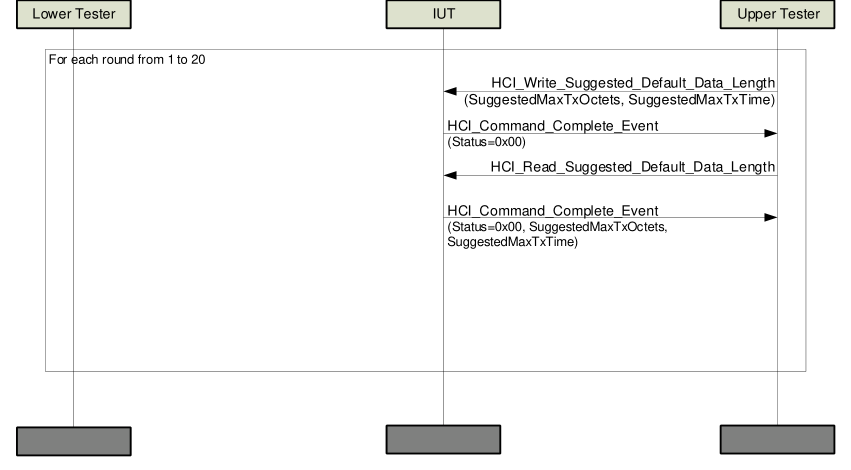

**Figure 4.80: HCI/CCO/BV-11-C [LE Write Suggested Default Data Length Command] MSC**

|  | Round |  |  | TxOctets |  |  | TxTime |  |
| --- | --- | --- | --- | --- | --- | --- | --- | --- |
|  | 1 |  | 0x001B |  |  | 0x0148 |  |  |
|  | 2 |  | 0x001B |  |  | 0x4290 |  |  |
|  | 3 |  | 0x001B |  |  | 0x2000 |  |  |
|  | 4 |  | 0x00FB |  |  | 0x0148 |  |  |
|  | 5 |  | 0x00FB |  |  | 0x4290 |  |  |
|  | 6 |  | 0x00FB |  |  | 0x2000 |  |  |
|  | 7 |  | 0x0080 |  |  | 0x0148 |  |  |
|  | 8 |  | 0x0080 |  |  | 0x4290 |  |  |
|  | 9 |  | 0x0080 |  |  | 0x2000 |  |  |
| 10–20 | 10–20 |  | A randomly selected value between 0x001B and 0x00FB inclusive. |  |  | A randomly selected value between 0x0148 and 0x4290 inclusive. |  |  |

Table 4.26: HCI/CCO/BV-11-C [LE Write Suggested Default Data Length Command], rounds
• Expected Outcome
Pass verdict
The Upper Tester receives a Command Complete event from the IUT with Status=0x00 (Success) for the LE Write Suggested Default Data Length Command.
The Upper Tester receives a Command Complete event from the IUT for the LE Read Suggested Default Data Length Command with Status=0x00 (Success).
The values for TxOctets and TxTime in the second Command Complete event equal the values sent in the LE Write Suggested Default Data Length Command.
HCI/CCO/BV-12-C [LE Remove Device From Resolving List Command]
• Test Purpose
Verify that the IUT correctly handles the LE Remove Device From Resolving List Command
• Reference
[8] 7.8.39
• Initial Condition
- The IUT is in standby.
• Test Procedure
The Upper Tester issues an LE Add Device To Resolving List Command to the IUT with a peer device identity.
The Upper Tester receives a Command Complete event from the IUT for the LE Add Device To Resolving List Command.
The Upper Tester issues an LE Remove Device From Resolving List Command to the IUT with the recently added peer device identity.
The Upper Tester receives a Command Complete event from the IUT for the LE Remove Device From Resolving List Command.

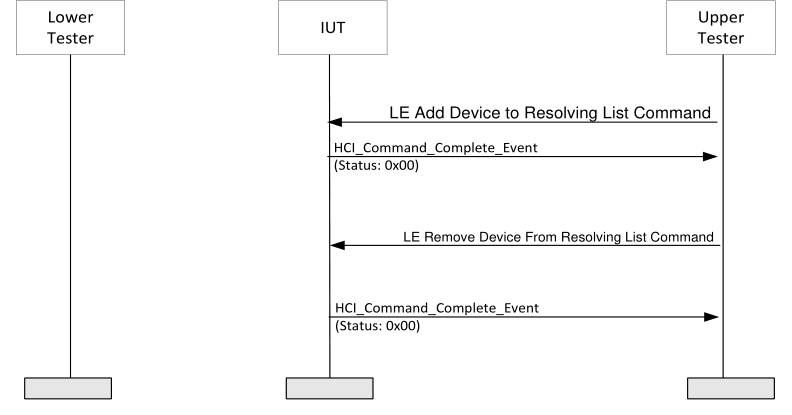

**Figure 4.81: HCI/CCO/BV-12-C [LE Remove Device From Resolving List Command] MSC**

• Expected Outcome
Pass verdict
The Upper Tester receives a Command Complete event from the IUT with Status = 0x00 (Success) when sending the LE Remove Device From Resolving List Command with a valid device identity.
HCI/CCO/BV-13-C [LE Clear Resolving List Command]
• Test Purpose
Verify that the IUT correctly handles the LE Clear Resolving List Command
• Reference
[8] 7.8.40
• Initial Condition
- The IUT is in standby.
• Test Procedure
The Upper Tester issues an LE Add Device To Resolving List Command to the IUT with a peer device identity.
The Upper Tester receives a Command Complete event from the IUT for the LE Add Device To Resolving List Command.
The Upper Tester issues an LE Clear Resolving List Command to the IUT with the recently added peer device identity.
The Upper Tester receives a Command Complete event from the IUT for the LE Clear Resolving List Command.

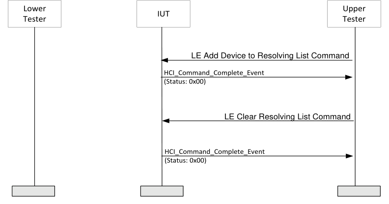

**Figure 4.82: HCI/CCO/BV-13-C [LE Clear Resolving List Command] MSC**

• Expected Outcome
Pass verdict
The Upper Tester receives a Command Complete event from the IUT with Status = 0x00 (Success) when sending the LE Clear Resolving List Command.
• Test Purpose
Verify that the IUT correctly handles the LE Read Resolving List Size Command
• Reference
[8] 7.8.41
• Initial Condition
- The IUT is in standby.
• Test Procedure
The Upper Tester issues an LE Read Resolving List Size Command to the IUT.
The Upper Tester receives a Command Complete event from the IUT for the LE Read Resolving List Size Command, with the size of the list.

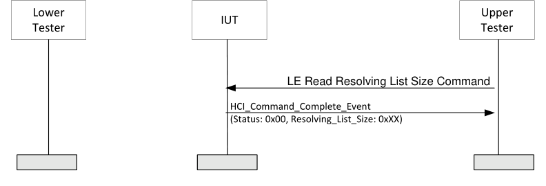

**Figure 4.83: HCI/CCO/BV-14-C [LE Read Resolving List Size Command] MSC**

• Expected Outcome
Pass verdict
The Upper Tester receives a Command Complete event from the IUT with Status = 0x00 (Success) and Resolving_List_Size = 0xXX when sending the LE Read Resolving List Size Command.
HCI/CCO/BV-15-C [LE Set Default PHY Command]
• Test Purpose
Verify that the IUT correctly handles the LE Set Default PHY Command.
• Reference
[8] 7.8.48
• Initial Condition
- The IUT is in standby.
• Test Procedure
The Upper Tester issues an LE Set Default PHY command to the IUT with ALL_PHYS set to 0x03 (All PHYs Allowed) and both the TX_PHYS and RX_PHYS fields set to zero (no preferences).
The Upper Tester receives a Command Complete event from the IUT for the LE Set Default PHY command.
Lower Tester Upper Tester IUT

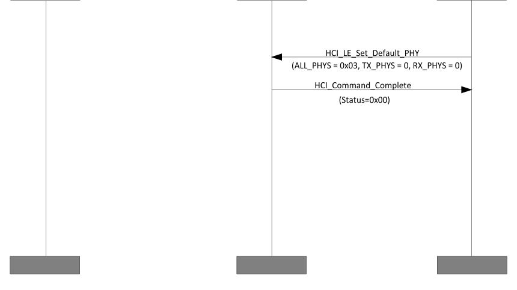

**Figure 4.84: HCI/CCO/BV-15-C [LE Set Default PHY Command] MSC**

• Expected Outcome
Pass verdict
The Upper Tester receives a Command Complete event from the IUT with Status = 0x00 (Success).
HCI/CCO/BV-16-C [LE Read Periodic Advertiser List Size Command]
• Test Purpose
Verify that the IUT correctly handles the LE Read Periodic Advertiser List Size Command.
• Reference
[9] 7.8.73
• Initial Condition
- The IUT is in standby.
• Test Procedure
The Upper Tester issues an LE Read Periodic Advertiser List Size Command.
The Upper Tester receives a Command Complete event from the IUT for the LE Read Periodic Advertiser List Size Command, with the size of the list.
Upper Tester IUT

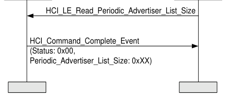

**Figure 4.85: HCI/CCO/BV-16-01-C [LE Read Periodic Advertiser List Size Command] MSC**

• Expected Outcome
Pass verdict
The Upper Tester receives a Command Complete Event with Status = 0x00 (Success) and Periodic_Advertiser_List_Size = 0xXX after sending the LE Read Periodic Advertiser List Size command.
HCI/CCO/BV-17-C [LE Add/Remove/Clear Periodic Advertiser List Commands]
• Test Purpose
Verify that the IUT correctly handles the LE Add Device To Periodic Advertiser List, LE Remove Device From Periodic Advertiser List, and Clear Periodic Advertiser List commands.
• Reference
[9] 7.8.70, 7.8.71, 7.8.72
• Initial Condition
- The IUT is in standby.
- The IUT’s Periodic Advertiser List is empty.
• Test Procedure

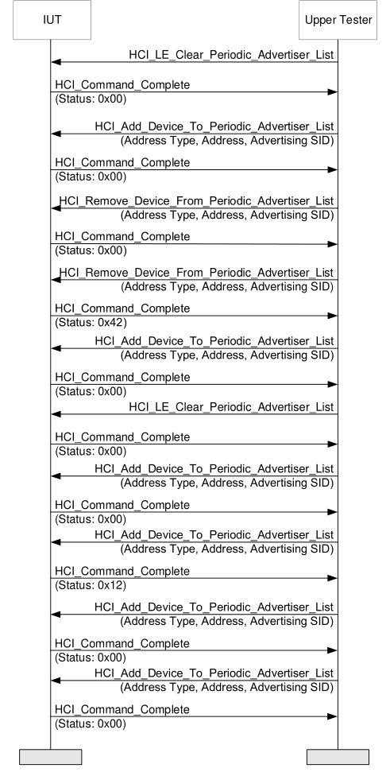

**Figure 4.86: HCI/CCO/BV-17-C [LE Add/Remove/Clear Periodic Advertiser List Commands] MSC**

1. The Upper Tester sends an HCI_LE_Clear_Periodic_Advertiser_List command to the IUT and
receives an HCI_Command_Complete event from the IUT with Status set to 0x00 (Success). 2. The Upper Tester sends an HCI_LE_Add_Device_To_Periodic_Advertiser_List command to the
IUT with an arbitrarily chosen valid address, address type, and SID and receives an HCI_Command_Complete event from the IUT with Status set to 0x00 (Success). 3. The Upper Tester sends an HCI_LE_Remove_Device_From_Periodic_Advertiser_List command
to the IUT with the parameter values from step 2 and receives an HCI_Command_Complete event from the IUT with Status set to 0x00 (Success).
to the IUT with the parameter values from step 2 and receives an HCI_Command_Complete event from the IUT with the Status set to 0x42 (Unknown Advertising Identifier). 5. The Upper Tester sends an HCI_LE_Add_Device_To_Periodic_Advertiser_List command to the
IUT with with the same address, address type, and SID as used in step 2 and receives an HCI_Command_Complete event from the IUT with Status set to 0x00 (Success). 6. The Upper Tester sends an HCI_LE_Clear_Periodic_Advertiser_List command to the IUT and
receives an HCI_Command_Complete event from the IUT with Status set to 0x00 (Success). 7. The Upper Tester sends an HCI_LE_Add_Device_To_Periodic_Advertiser_List command to the
IUT with the same address, address type, and SID as used in step 2 and receives an HCI_Command_Complete event from the IUT with Status set to 0x00 (Success). 8. The Upper Tester sends an HCI_LE_Add_Device_To_Periodic_Advertiser_List command to the
IUT with the same address, address type, and SID as used in step 2 and receives an HCI_Command_Complete event from the IUT with Status set to 0x12 (Invalid HCI Command Parameters). 9. The Upper Tester sends an HCI_LE_Add_Device_To_Periodic_Advertiser_List command to the
IUT with the same address and address type as used in step 2 but a different SID and receives an HCI_Command_Complete event from the IUT with Status set to 0x00 (Success). 10. The Upper Tester sends an HCI_LE_Add_Device_To_Periodic_Advertiser_List command to the
IUT with the same address and SID as step 2 but a different address type and receives an HCI_Command_Complete event from the IUT with Status set to 0x00 (Success).
• Expected Outcome
Pass verdict
The Upper Tester receives an HCI_Command Complete event with the expected status for each command.
HCI/CCO/BV-18-C [LE Read Transmit Power Command]
• Test Purpose
Verify that the IUT correctly handles the LE Read Transmit Power Command.
• Reference
[9] 7.8.74
• Initial Condition
- The IUT is in standby.
• Test Procedure
The Upper Tester issues an HCI_LE_Read_Transmit_Power Command.
The Upper Tester receives a Command Complete event from the IUT with Status set to 0x00 (Success) and values for Min_Tx_Power and Max_Tx_Power.
Upper Tester IUT

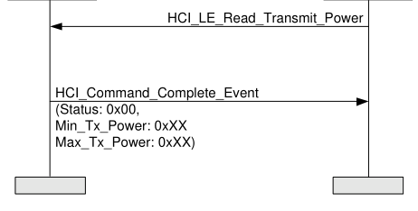

**Figure 4.87: HCI/CCO/BV-18-C [LE Read Transmit Power Command] MSC**

• Expected Outcome
Pass verdict
The Upper Tester receives a Command Complete Event with Status = 0x00 (Success), Min_Tx_Power = 0xXX, and Max_Tx_Power = 0xXX after sending the LE Read Transmit Power command.
HCI/CCO/BV-19-C [LE Write RF Path Compensation Command]
• Test Purpose
Verify that the IUT correctly handles the LE Write RF Path Compensation Command.
• Reference
[9] 7.8.76
• Initial Condition
- The IUT is in standby.
• Test Procedure
The Upper Tester issues an HCI_LE_Write_RF_Path_Compensation Command with RF_Tx_Path_Compensation_Value set to 0x0001 and RF_Rx_Path_Compensation_Value set to 0x0001.
The Upper Tester receives a Command Complete event from the IUT with Status set to 0x00 (Success).
Upper Tester IUT
HCI_LE_Write_RF_Path_Compensation (RF_Tx_Path_Compensation_Value: 0x0001 RF_Rx_Path_Compensation_Value: 0x0001)
HCI_Command_Complete_Event (Status: 0x00)

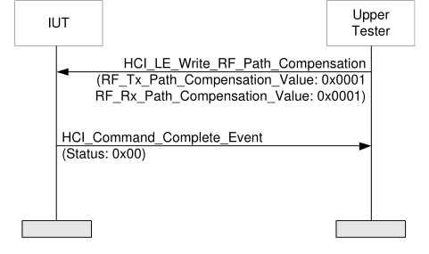

**Figure 4.88: HCI/CCO/BV-19-C [LE Write RF Path Compensation Command] MSC**

• Expected Outcome
Pass verdict
The Upper Tester receives a Command Complete Event with Status = 0x00 (Success) after sending the LE Write RF Path Compensation Command.
HCI/CCO/BV-20-C [LE Read RF Path Compensation Command]
• Test Purpose
Verify that the IUT correctly handles the LE Read RF Path Compensation Command.
• Reference
[9] 7.8.75
• Initial Condition
- The IUT is in standby.
• Test Procedure
The Upper Tester issues an HCI_LE_Read_RF_Path_Compensation Command.
The Upper Tester receives a Command Complete event from the IUT with Status set to 0x00 (Success) and values for RF_Tx_Path_Compensation_Value and RF_Rx_Path_Compensation_Value.

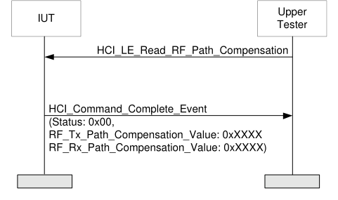

**Figure 4.89: HCI/CCO/BV-20-C [LE Read RF Path Compensation Command] MSC**

• Expected Outcome
Pass verdict
The Upper Tester receives a Command Complete Event with Status = 0x00 (Success), RF_Tx_Path_Compensation_Value = 0xXXXX, and RF_Rx_Path_Compensation_Value = 0xXXXX after sending the LE Read RF Path Compensation Command.
HCI/CCO/BV-21-C [Set Minimum Encryption Key Size]
• Test Purpose
Verify that the IUT properly sets the minimum encryption key size.
• Reference
[13] 7.3.102
• Initial Condition
- TSPX_min_encryption_key_size is the minimum encryption key size, as defined in the IXIT.
- TSPX_max_encryption_key_size is the maximum encryption key size, as defined in the IXIT.
• Test Procedure

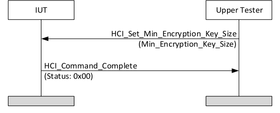

**Figure 4.90: HCI/CCO/BV-21-C [Set Minimum Encryption Key Size] MSC**

Repeat steps 1 and 2 for each encryption key size value KS in the interval [TSPX_min_encryption_key_size, TSPX_max_encryption_key_size]:
1. The Upper Tester sends an HCI_Set_Min_Encryption_Key_Size with the
Min_Encryption_Key_Size set to KS. 2. The IUT sends a successful HCI_Command_Complete event to the Upper Tester.
• Expected Outcome
Pass verdict
In step 2, the Upper Tester receives a successful HCI_Command_Complete event.
HCI/CCO/BV-22-C [Read Clock Offset, Peripheral]
• Test Purpose
Verify that the Peripheral IUT Read Clock Offset command immediately returns a Read Clock Offset Complete event.
• Reference
[13] 7.1.24
• Initial Condition
- BR/EDR connection established, the IUT is Peripheral.
• Test Procedure
1. The Upper Tester sends an HCI_Read_Clock_Offset command to the IUT with
Connection_Handle set to the current connection handle, and it receives a successful HCI_Command_Status event in return. 2. The IUT sends an HCI_Read_Clock_Offset_Complete event to the Upper Tester with
Connection_Handle set to the current connection handle, and the Clock_Offset is set to the IUT’s clock offset.

| Lower | Tester IU | T Upper | Tester |
| --- | --- | --- | --- |
|  | BR/EDR Connec IUT is P | tion Established. eripheral |  |
|  | No LMP PDUs sent to the Lower Tester | HCI Read Clock Offset _ _ _ (Connection Handle) _ HCI Command Status _ _ (Status: 0x00) HCI Read Clock Offset Complete _ _ _ _ (Connection Handle, Clock Offset) _ _ |  |

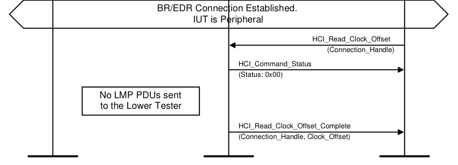

**Figure 4.91: HCI/CCO/BV-22-C [Read Clock Offset, Peripheral] MSC**

• Expected Outcome
Pass verdict
In step 2, the IUT sends an HCI_Read_Clock_Offset_Complete event to the Upper Tester. The IUT does not send LMP PDUs between steps 1 and 2.
Fail verdict
The IUT sends an LMP PDU between steps 1 and 2.
HCI/CCO/BV-23-C [LE Set Extended Advertising Parameters, Advertising Coding Selection Not Supported]
• Test Purpose
Verify that the IUT properly returns an error in response to the LE Set Extended Advertising Parameters [v2] command when the IUT does not support the Advertising Coding Selection feature.
• Reference
[13] 7.8.53
• Initial Condition
- The IUT is configured in an advertising state.
• Test Procedure
3. The Upper Tester sends an HCI_LE_Set Extended Advertising Parameters [v2] command to the
IUT with Primary_Advertising_PHY_Options set to 0x01 and Secondary_Advertising_PHY_Options set to 0x00. 4. The IUT sends an HCI_Command_Complete event to the Upper Tester with Status set to 0x11
(“Unsupported Feature or Parameter Value”). 5. The Upper Tester sends an HCI_LE_Set Extended Advertising Parameters [v2] command to the
IUT with Primary_Advertising_PHY_Options set to 0x00 and Secondary_Advertising_PHY_Options set to 0x01. 6. The IUT sends an HCI_Command_Complete event to the Upper Tester with Status set to 0x11
(“Unsupported Feature or Parameter Value”).
IUT with Primary_Advertising_PHY_Options and Secondary_Advertising_PHY_Options both set to 0x00. 8. The IUT sends an HCI_Command_Complete event to the Upper Tester with Status set to 0x00.
• Expected Outcome
Pass verdict
In steps 2 and 4, the IUT returns an error in the HCI_Command_Complete event.
HCI/CCO/BI-75-C [LE Frame Space Update, Invalid Frame Space Parameters]
• Test Purpose
Verify that the IUT properly handles the host sending invalid parameters for the LE Frame Space Update command.
• Reference
[19] 7.7.65.48
• Initial Condition
- The LL connection is established, the IUT is Central or Peripheral, and T_IFS = 150 μs.
• Test Procedure
1. The Upper Tester sends an HCI_LE_Frame_Space_Update command to the IUT with the
Parameters specified in Table 4.27. 2. Perform either alternative 2A or 2B depending on the IUT HCI_Command_Status response.
Alternative 2A (Successful HCI_Command_Status):
2A.1 The IUT sends a successful HCI_Command_Status event to the Upper Tester.
2A.2 The IUT sends an HCI_LE_Frame_Space_Update_Complete event to the Upper Tester with Status set as specified in Table 4.27.
Alternative 2B (HCI_Command_Status with an error code):
2B.1 The IUT sends an HCI_Command_Status event to the Upper Tester with Status set as specified in Table 4.27.

|  | Round |  |  | Parameters |  |  | Error |  |
| --- | --- | --- | --- | --- | --- | --- | --- | --- |
| 1 |  |  | Frame Space Min = 0x2711 _ _ |  |  | 0x12 |  |  |
| 2 |  |  | Frame Space Max = 0x2711 _ _ |  |  | 0x12 |  |  |
| 3 |  |  | Connection Handle != ACL connection handle _ |  |  | 0x02 |  |  |
| 4 |  |  | PHYs = 0x00 |  |  | 0x12 |  |  |
| 5 |  |  | Spacing Type = 0x00 _ |  |  | 0x12 |  |  |
| 6 |  |  | Frame Space Min = 1, Frame Space Max = 0 _ _ _ _ |  |  | 0x12 |  |  |

Table 4.27: LE Frame Space Update, Invalid Parameters rounds
• Expected Outcome
Pass verdict
In step 2, the IUT rejects the command with the specified error code.
• Test Purpose
Verify that the IUT properly handles the Upper Tester sending an HCI_LE_CS_Set_Porcedure_Parameters command with invalid parameters.
• Reference
[19] 7.8.140
• Initial Condition
- The IUT and the Lower Tester have an encrypted connection, exchanged capabilities, and set default settings.
• Test Procedure
Repeat steps 1 and 2 for each round in Table 4.28. Each round has an interval of 1.25 seconds.
1. The Upper Tester sends an HCI_LE_CS_Set_Procedure_Parmaeters command to the IUT with
parameters set as specified in Table 4.28 and all other parameters set to valid values. 2. The IUT sends an HCI_Command_Complete event to the Upper Tester with Status set to 0x12
(Invalid HCI Command Parameters).

|  | Round |  |  | Parameter |  |  | Value |  |
| --- | --- | --- | --- | --- | --- | --- | --- | --- |
| 1 |  |  | Max Procedure Interval _ _ |  |  | 0 |  |  |
| 2 |  |  | Min Procedure Interval _ _ |  |  | 0 |  |  |
| 3 |  |  | Min Subevent Len _ _ |  |  | 1249 |  |  |
| 4 |  |  | Max Subevent Len _ _ |  |  | 40000001 |  |  |

Table 4.28: LE CS Set Procedure Parameters, Invalid Parameters rounds
• Expected Outcome
Pass verdict
In step 2, the IUT sends an HCI_Command_Complete event with Status set to 0x12.
HCI/CCO/BI-117-C [HCI CS Command, Unencrypted ACL]
• Test Purpose
Verify that the IUT properly returns an error when the Upper Tester sends HCI CS commands that start an LL exchange with an unencrypted ACL connection with the Lower Tester.
• Initial Condition
- The IUT and the Lower Tester have an unencrypted ACL connection.
• Test Procedure
Repeat steps 1 and 2 for each round in Table 4.29.
1. The Upper Tester sends an HCI command in Table 4.29.
Alternative 2A (HCI_Command_Status event with an error code):
2A.1 The IUT sends an HCI_Command_Status event to the Upper Tester with Status > 0.
Alternative 2B (Successful HCI_Command_Status event followed by an HCI event with an error):
2B.1 The IUT sends a successful HCI_Command_Status event to the Upper Tester.
2B.2 The IUT sends an HCI event specified in Table 4.29 with Status > 0.

|  | Round |  |  | Reference |  |  | HCI Command/HCI Event |  |
| --- | --- | --- | --- | --- | --- | --- | --- | --- |
| 1 |  |  | [19] 7.8.131 |  |  | HCI LE CS Read Remote Supported Capabilities _ _ _ _ _ _ HCI LE CS Read Remote Supported Capabilities Complete _ _ _ _ _ _ _ |  |  |
| 2 |  |  | [19] 7.8.135 |  |  | HCI LE CS Read Remote FAE Table _ _ _ _ _ _ HCI LE CS Read Remote FAE Table Complete _ _ _ _ _ _ _ |  |  |
| 3 |  |  | [19] 7.8.137 |  |  | HCI LE CS Create Config _ _ _ _ HCI LE CS Create Config Complete _ _ _ _ _ |  |  |

Table 4.29: HCI CS Command, Unencrypted ACL rounds
• Expected Outcome
Pass verdict
In step 2A.1 or 2B.2, the IUT sends an HCI event to the Upper Tester with an error code.

#### 4.10.1 Resolving List Commands fail when list in use • Test Purpose

Verify that the IUT correctly fails the Resolving List commands when the resolving list is in use.
• Reference
[2] 7.8.38, 7.8.39, 7.8.40, 7.8.44, 7.8.77
• Initial Condition
- The IUT is in standby.
- The IUT has address resolution enabled with at least one device identity added to the resolving list.
• Test Procedure

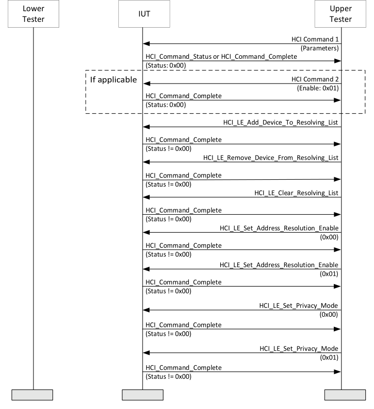

**Figure 4.92: Resolving List Commands fail when list in use MSC**

The Upper Tester issues the one or two commands specified in Table 4.30 to the IUT and receives a successful HCI_Command_Complete or HCI_Command_Status event in return for each.
The Upper Tester issues each of the following commands to the IUT and receives an HCI_Command_Complete event with a non-zero status in reply for each:
- HCI_LE_Add_Device_To_Resolving_List
- HCI_LE_Remove_Device_From_Resolving_List
- HCI_LE_Clear_Resolving_List
- HCI_LE_Set_Address_Resolution_Enable (Address_Resolution_Enable = 0x00)
- HCI_LE_Set_Address_Resolution_Enable (Address_Resolution_Enable = 0x01)
- HCI_LE_Set_Privacy_Mode (Peer_Identity_Address_Type = 0x00)
- HCI_LE_Set_Privacy_Mode (Peer_Identity_Address_Type = 0x01)
• Test Case Configuration

|  | Test Case |  |  | Reference |  |  | HCI Command(s) |  |
| --- | --- | --- | --- | --- | --- | --- | --- | --- |
| HCI/CCO/BI-01-C | HCI/CCO/BI-01-C |  | [2] 7.8.38 | [2] 7.8.38 |  |  | HCI LE Set Advertising Parameters _ _ _ _ |  |
|  |  |  |  |  |  |  | (Advertising Type: 0x03) _ |  |
|  |  |  |  |  |  |  | HCI LE Set Advertising Enable _ _ _ _ |  |
|  |  |  |  |  |  |  | (Advertising Enable: 0x01) _ |  |
| HCI/CCO/BI-02-C |  |  | [2] 7.8.39 |  |  |  | HCI LE Set Scan Parameters _ _ _ _ |  |
|  |  |  |  |  |  |  | (LE Scan Type: 0x01) _ _ |  |
|  |  |  |  |  |  |  | HCI LE Set Scan Enable _ _ _ _ |  |
|  |  |  |  |  |  |  | (LE Scan Enable: 0x01) _ _ |  |
| HCI/CCO/BI-03-C |  |  | [2] 7.8.40 |  |  |  | HCI LE Create Connection _ _ _ |  |
|  |  |  |  |  |  |  | (Initiator Filter Policy: 0x00) _ _ |  |
| HCI/CCO/BI-04-C |  |  | [2] 7.8.44 |  |  |  | HCI LE Extended Create Connection _ _ _ _ |  |
|  |  |  |  |  |  |  | (Initiator Filter Policy: 0x00) _ _ |  |
| HCI/CCO/BI-05-C |  |  | [2] 7.8.77 |  |  |  | HCI LE Periodic Advertising Create Sync _ _ _ _ _ |  |
|  |  |  |  |  |  |  | (Options: 0x00) |  |

Table 4.30: Resolving List Commands fail when list in use test cases
All command parameters not explicitly listed in the table may have any valid value.
• Expected Outcome
Pass verdict
The Upper Tester receives an HCI_Command_Complete event from the IUT with non-zero status when sending each Resolving List command.

#### 4.10.2 Invalid LE Power Control HCI Parameters • Test Purpose

Verify that the IUT properly handles the Upper Tester sending invalid parameters for LE Power Control related HCI commands.
• Reference
[12] 7.8
• Initial Condition
- An ACL connection has been established between the IUT and the Lower Tester in the relevant role.
• Test Procedure

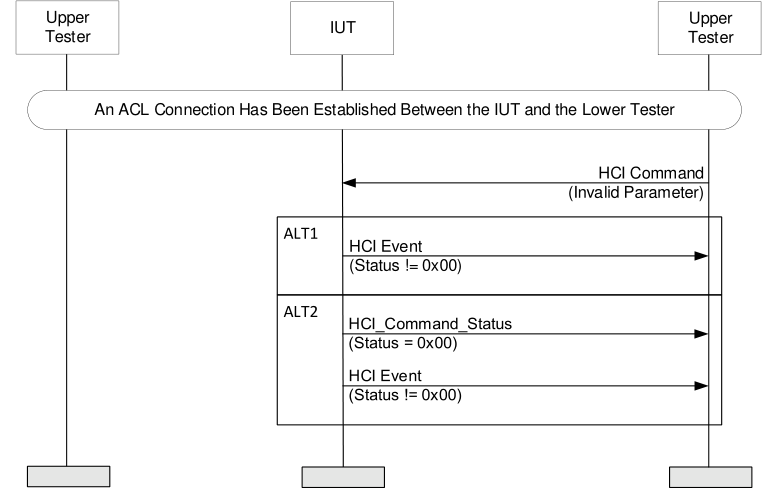

**Figure 4.93: Invalid LE Power Control HCI Parameters MSC**

1. The Upper Tester sends the HCI Command and Parameter as specified in Table 4.31. 2. The IUT sends the Event and Status/Error Code as specified in Table 4.31 to the Upper Tester.
• Test Case Configuration

|  | Test Case |  |  | HCI Command |  | Parameter |  |  | Event and Status/Error Code |  |
| --- | --- | --- | --- | --- | --- | --- | --- | --- | --- | --- |
| HCI/CCO/BI-06-C [LE Enhanced Read Transmit Power Level – Invalid Connection Handle] |  |  | HCI LE Enhanced _ _ _ Read Transmit _ _ Power Level _ |  |  | Connection Handle set _ to an invalid ACL |  | HCI Command Complete : _ _ Unknown Connection Identifier (0x02) |  |  |
| HCI/CCO/BI-07-C [LE Enhanced Read Transmit Power Level – Invalid PHY] |  |  | HCI LE Enhanced _ _ _ Read Transmit _ _ Power Level _ |  |  | PHY = 0xF0 |  | HCI Command Complete : _ _ Unsupported Feature or Parameter Value (0x11) |  |  |
| HCI/CCO/BI-08-C [LE Read Remote Transmit Power Level – Invalid Connection Handle] |  |  | HCI LE Read _ _ _ Remote Transmit _ _ Power Level _ |  |  | Connection Handle set _ to an invalid ACL |  | HCI Command Status : _ _ Unknown Connection Identifier (0x02) or HCI Command Status : _ _ Status(0x00) HCI LE Transmit Power _ _ _ _ Reporting event : Status (0x02) |  |  |
| HCI/CCO/BI-09-C [LE Read Remote Transmit Power Level – Invalid PHY] |  |  | HCI LE Read _ _ _ Remote Transmit _ _ Power Level _ |  |  | PHY = 0xF0 |  | HCI Command Status : _ _ Unsupported Feature or Parameter Value (0x11) or HCI Command Status : _ _ Status(0x00) HCI LE Transmit Power _ _ _ _ Reporting event : Status (0x11) |  |  |

|  | Test Case |  |  | HCI Command |  |  | Parameter |  |  | Event and Status/Error Code |  |
| --- | --- | --- | --- | --- | --- | --- | --- | --- | --- | --- | --- |
| HCI/CCO/BI-10-C [LE Set Path Loss Reporting Parameters – Invalid Connection Handle] |  |  | HCI LE Set Path _ _ _ _ Loss Reporting _ _ Parameters |  |  | Connection Handle set _ to an invalid ACL |  |  | HCI Command Complete : _ _ Unknown Connection Identifier (0x02) |  |  |
| HCI/CCO/BI-11-C [LE Set Path Loss Reporting Enable – Invalid Connection Handle] |  |  | HCI LE Set Path _ _ _ _ Loss Reporting _ _ Enable |  |  | Connection Handle set _ to an invalid ACL |  |  | HCI Command Complete : _ _ Unknown Connection Identifier (0x02) |  |  |
| HCI/CCO/BI-12-C [LE Set Transmit Power Reporting Enable – Invalid Connection Handle] |  |  | HCI LE Set _ _ _ Transmit Power _ _ Reporting Enable _ |  |  | Connection Handle set _ to an invalid ACL |  |  | HCI Command Complete : _ _ Unknown Connection Identifier (0x02) |  |  |

Table 4.31: Invalid LE Power Control HCI Parameters test cases
• Expected Outcome
Pass verdict
In step 2, the IUT returns the Status as specified in Table 4.31.
HCI/CCO/BI-13-C [Invalid Path Loss Monitoring Parameters]
• Test Purpose
Verify that the IUT properly handles the Upper Tester sending invalid parameters for LE Path Loss Reporting–related HCI commands.
• Reference
[12] 7.8.119
• Initial Condition
- Parameters: TSPX_Path_Loss_Lower_Boundary, TSPX_Path_Loss_Upper_Boundary (specified in LL IXIT). The Lower Tester and the IUT are configured as specified in the RF Test Conditions section in [5].
- An ACL connection has been established between the IUT and the Lower Tester in the relevant role.
• Test Procedure

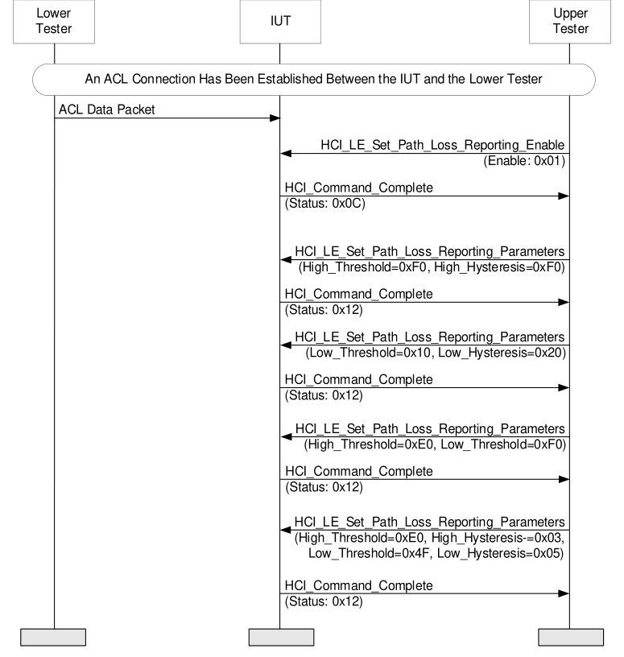

**Figure 4.94: HCI/CCO/BI-13-C [Invalid Path Loss Monitoring Parameters] MSC**

1. The Lower Tester continuously transmits empty data packets over the ACL connection with a
connection interval of 7.5 ms. 2. The Upper Tester enables path loss reporting for the active connection by sending an
HCI_LE_Set_Path_Loss_Reporting_Enable command to the IUT with the Connection_Handle corresponding to the active connection and Enable = 0x01. The IUT responds with an HCI_Command_Complete with Status=0x0C. 3. The Upper Tester sends an HCI_LE_Set_Path_Loss_Reporting_Parameters command to the
IUT, with the following parameter values: Connection_Handle set to the active connection handle, High_Threshold = 0xF0, High_Hysteresis = 0xF0. The IUT responds with an HCI_Command_Complete with Status = 0x12. 4. The Upper Tester sends an HCI_LE_Set_Path_Loss_Reporting_Parameters command to the
IUT, with the following parameter values: Connection_Handle set to the active connection handle, Low_Threshold = 0x10, Low_Hysteresis = 0x20. The IUT responds with an HCI_Command_Complete with Status = 0x12.
IUT, with the following parameter values: Connection_Handle set to the active connection handle, High_Threshold = 0xE0, Lower_Threshold 0xF0. The IUT responds with an HCI_Command_Complete with Status = 0x12. 6. The Upper Tester sends an HCI_LE_Set_Path_Loss_Reporting_Parameters command to the
IUT, with the following parameter values: Connection_Handle set to the active connection handle, High_Threshold = 0x50, High_Hysteresis = 0x03 (3dB), Low_Threshold = 0x4F, Low_Hysteresis = 0x05 (5 dB). The IUT responds with an HCI_Command_Complete with Status = 0x12.
• Note
Note that the RF Test Conditions in [5] provides flexibility in how the IUT’s receive power is adjusted, and the means by which the apparent Path Loss is induced in the IUT may vary. An initial condition is chosen such that the apparent Path Loss as seen by the IUT can be varied across the supported Middle and Low Zone boundary.
• Expected Outcome
Pass verdict
In step 2, the IUT sends the HCI_Command_Complete event with Status = 0x0C to the Upper Tester.
In steps 3–6, the IUT sends the HCI_Command_Complete event with Status = 0x12 to the Upper Tester.

#### 4.10.3 Validate Unsupported Packet Types are Not Accepted • Test Purpose

Verify that the IUT properly does not support unsupported Packet Types.
• Reference
[12] 7.1.5, 7.1.14, A.5
• Initial Condition
- Initial Condition as specified in Table 4.32.
• Test Procedure

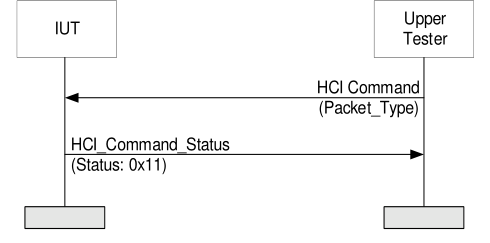

**Figure 4.95: Validate Unsupported Packet Types are Not Accepted, Create Connection MSC**

1. The Upper Tester sends the HCI command as specified in Table 4.32 to the IUT with the
Packet_Type parameter set to the Packet Type as specified in Table 4.32. 2. The IUT sends the HCI_Command_Status event to the Upper Tester with Status = Unsupported
Feature or Parameter Value (0x11).
• Test Case Configuration

| Test Case | Reference |  | Initial |  | HCI Command |  | Packet |  |
| --- | --- | --- | --- | --- | --- | --- | --- | --- |
|  |  |  | Condition |  |  |  | Type |  |
| HCI/CCO/BI-14-C [Validate Unsupported Packet Types are Not Accepted, Create Connection, 3-slot] | [12] Section 7.1.5 | The IUT is not connected. |  |  | HCI Create Connection _ _ | 0x0C00 |  |  |
| HCI/CCO/BI-15-C [Validate Unsupported Packet Types are Not Accepted, Create Connection, 5-slot] | [12] Section 7.1.5 | The IUT is not connected. |  |  | HCI Create Connection _ _ | 0xC000 |  |  |
| HCI/CCO/BI-16-C [Validate Unsupported Packet Types are Not Accepted, Change Connection Packet Type, 3-slot] | [12] Section 7.1.14 | The IUT is connected to the Lower Tester. |  |  | HCI Change Connection _ _ _ Packet Type _ | 0x0C00 |  |  |
| HCI/CCO/BI-17-C [Validate Unsupported Packet Types are Not Accepted, Change Connection Packet Type, 5-slot] | [12] Section 7.1.14 | The IUT is connected to the Lower Tester. |  |  | HCI Change Connection _ _ _ Packet Type _ | 0xC000 |  |  |

Table 4.32: Validate Unsupported Packet Types are Not Accepted test cases
• Expected Outcome
Pass verdict
In step 2, the IUT sends the HCI_Command_Status event with Status = 0x11 to the Upper Tester.

#### 4.10.4 Error Response for Unsupported Commands on Transports • Test Purpose

Verify that the IUT properly handles the Upper Tester sending unsupported commands on a transport with a handle or connection handle. Also, unsupported events on a transport should not be generated.
• Reference
[12] 7.8
• Initial Condition
- An ACL connection has been established on the transport as specified in Table 4.33 between the IUT and the Lower Tester.
• Test Procedure

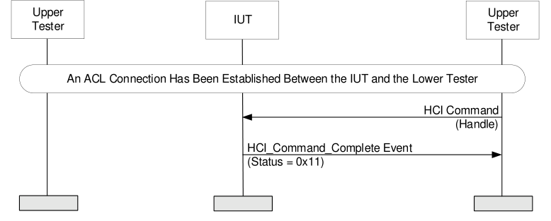

**Figure 4.96: Error Response for Unsupported Commands on Transports MSC**

1. The Upper Tester sends the HCI Command and Parameter as specified in Table 4.33. 2. The IUT sends the HCI_Command_Complete Event to the Upper Tester with Status =
Unsupported Feature or Parameter value (0x11).
• Test Case Configuration

|  | Test Case |  |  | HCI Command |  |  | Parameter |  |  | Transport |  |
| --- | --- | --- | --- | --- | --- | --- | --- | --- | --- | --- | --- |
| HCI/CCO/BI-18-C [Error Response for Unsupported Commands on Transports, Read Authenticated Payload Timeout, BR/EDR] |  |  | HCI Read Authenticated _ _ _ Payload Timeout _ |  |  | Connection Handle _ |  |  | BR/EDR |  |  |
| HCI/CCO/BI-19-C [Error Response for Unsupported Commands on Transports, Read Authenticated Payload Timeout, LE] |  |  | HCI Read Authenticated _ _ _ Payload Timeout _ |  |  | Connection Handle _ |  |  | LE |  |  |
| HCI/CCO/BI-20-C [Error Response for Unsupported Commands on Transports, Read Link Quality, BR/EDR] |  |  | HCI Read Link Quality _ _ _ |  |  | Handle |  |  | BR/EDR |  |  |
| HCI/CCO/BI-21-C [Error Response for Unsupported Commands on Transports, Read Link Quality, AMP] |  |  | HCI Read Link Quality _ _ _ |  |  | Handle |  |  | AMP |  |  |
| HCI/CCO/BI-22-C [Error Response for Unsupported Commands on Transports, Read Link Supervision Timeout, BR/EDR] |  |  | HCI Read Link _ _ _ Supervision Timeout _ |  |  | Handle |  |  | BR/EDR |  |  |
| HCI/CCO/BI-23-C [Error Response for Unsupported Commands on Transports, Read Remote Version Information, BR/EDR] |  |  | HCI Read Remote _ _ _ Version Information _ |  |  | Connection Handle _ |  |  | BR/EDR |  |  |
| HCI/CCO/BI-24-C [Error Response for Unsupported Commands on Transports, Read Remote Version Information, LE] |  |  | HCI Read Remote _ _ _ Version Information _ |  |  | Connection Handle _ |  |  | LE |  |  |
| HCI/CCO/BI-25-C [Error Response for Unsupported Commands on Transports, Read RSSI, BR/EDR] |  |  | HCI Read RSSI _ _ |  |  | Handle |  |  | BR/EDR |  |  |
| HCI/CCO/BI-26-C [Error Response for Unsupported Commands on Transports, Read RSSI, AMP] |  |  | HCI Read RSSI _ _ |  |  | Handle |  |  | AMP |  |  |

|  | Test Case |  |  | HCI Command |  |  | Parameter |  |  | Transport |  |
| --- | --- | --- | --- | --- | --- | --- | --- | --- | --- | --- | --- |
| HCI/CCO/BI-27-C [Error Response for Unsupported Commands on Transports, Read RSSI, LE] |  |  | HCI Read RSSI _ _ |  |  | Handle |  |  | LE |  |  |
| HCI/CCO/BI-28-C [Error Response for Unsupported Commands on Transports, Read Transmit Power Level, BR/EDR] |  |  | HCI Read Transmit _ _ _ Power Level _ |  |  | Connection Handle _ |  |  | BR/EDR |  |  |
| HCI/CCO/BI-29-C [Error Response for Unsupported Commands on Transports, Read Transmit Power Level, LE] |  |  | HCI Read Transmit _ _ _ Power Level _ |  |  | Connection Handle _ |  |  | LE |  |  |
| HCI/CCO/BI-30-C [Error Response for Unsupported Commands on Transports, Write Authenticated Payload Timeout, BR/EDR] |  |  | HCI Write Authenticated _ _ _ Payload Timeout _ |  |  | Connection Handle _ |  |  | BR/EDR |  |  |
| HCI/CCO/BI-31-C [Error Response for Unsupported Commands on Transports, Write Authenticated Payload Timeout, LE] |  |  | HCI Write Authenticated _ _ _ Payload Timeout _ |  |  | Connection Handle _ |  |  | LE |  |  |
| HCI/CCO/BI-32-C [Error Response for Unsupported Commands on Transports, Write Link Supervision Timeout, BR/EDR] |  |  | HCI Write Link _ _ _ Supervision Timeout _ |  |  | Handle |  |  | BR/EDR |  |  |

Table 4.33: Error Response for Unsupported Commands on Transports test cases
• Expected Outcome
Pass verdict
In step 2, the IUT returns the Status = 0x11 in the HCI_Command_Complete Event.
HCI/CCO/BI-33-C [Invalid LE Set Periodic Advertising Data Parameters]
• Test Purpose
Verify that the IUT properly handles the Upper Tester sending invalid parameters for LE Set Periodic Advertising Data related HCI commands when Periodic Advertising ADI is supported.
• Reference
[13] 7.8.62
• Initial Condition
- The IUT is in standby.
• Test Procedure
1. The Upper Tester sends an HCI_LE_Set_Extended_Advertising_Parameters command to the
IUT using all supported advertising channels and a selected advertising interval between the minimum and maximum advertising intervals supported. The Advertising_Event_Properties parameter is set to 0x0000, Own_Address_Type is set to 0x00 (Public Device Address), Primary_Advertising_PHY is set to 0x01 (LE 1M), Secondary_Advertising_PHY is set to 0x01 (LE 1M) and receives a successful HCI_Command_Complete event in return. 2. The Upper Tester sends an HCI_LE_Set_Periodic_Advertising_Parameters command to the IUT
with Advertising_Handle set to the Advertising_Handle in step 1, using minimum periodic advertising interval and receives a successful HCI_Command_Complete event in return.
Advertising_Handle set to the Advertising_Handle in step 1, Operation set to 0x03, and Advertising_Data_Length set to 100 using 100 random octets from 1 to 254 as the payload and receives a successful HCI_Command_Complete event in return. 4. The Upper Tester sends an HCI_LE_Set_Periodic_Advertising_Data command to the IUT with
Advertising_Handle set to the Advertising_Handle in step 1, Operation set to 0x04. 5. The IUT sends an HCI_Command_Complete event with error code Invalid HCI Command
Parameters (0x12) to the Upper Tester. 6. The Upper Tester enables periodic advertising using the
HCI_LE_Set_Periodic_Advertising_Enable command Enable Bit 0 (Periodic Advertising) set to 1 and the Advertising_Handle set to the Advertising_Handle in step 1, and receives a successful HCI_Command_Complete event in return. 7. The Upper Tester enables advertising using the HCI_LE_Set_Extended_Advertising_Enable
command. The Duration[0] parameter is set to 0x0000 (No Advertising Duration). 8. The Upper Tester sends an HCI_LE_Set_Periodic_Advertising_Data command to the IUT with
Operation set to 0x04 and Advertising_Data_Length set to 100 using 100 random octets from 1 to 254 as the payload. 9. The IUT sends an HCI_Command_Complete event with error code Invalid HCI Command
Parameters (0x12) to the Upper Tester. 10. The Upper Tester sends an HCI_LE_Set_Periodic_Advertising_Data command to the IUT with
Operation set to 0x04 and Advertising_Data_Length set to 0 and receives a successful HCI_Command_Complete event in return. 11. The Upper Tester sends an HCI_LE_Set_Periodic_Advertising_Data command to the IUT with
Advertising_Handle set to the Advertising_Handle in step 1, Operation set to 0x03, and Advertising_Data_Length set to 0 and receives a successful HCI_Command_Complete event in return. 12. The Upper Tester sends an HCI_LE_Set_Periodic_Advertising_Data command to the IUT with
Advertising_Handle set to the Advertising_Handle in step 1, Operation set to 0x04. 13. The IUT sends an HCI_Command_Complete event with error code Invalid HCI Command
Parameters (0x12) to the Upper Tester.
• Expected Outcome
Pass verdict
In step 5, the IUT returns an HCI_Command_Complete event with the Invalid HCI Command Parameters (0x12) error code.
In step 9, the IUT returns an HCI_Command_Complete event with the Invalid HCI Command Parameters (0x12) error code.
In step 10, the IUT returns a successful HCI_Command_Complete event.
In step 13, the IUT returns an HCI_Command_Complete event with the Invalid HCI Command Parameters (0x12) error code.
HCI/CCO/BI-34-C [Invalid LE Set Periodic Advertising Enable Parameters, Periodic Advertising ADI Not Supported]
• Test Purpose
Verify that the IUT properly handles the Upper Tester sending invalid parameters for LE Set Periodic Advertising Enable related HCI commands when Periodic Advertising ADI is not supported.
• Reference
[13] 7.8.63
• Initial Condition
- The IUT is in standby. Extended advertising parameters and periodic advertising parameters have been configured on the IUT for a particular advertising handle.
• Test Procedure
1. The Upper Tester sends an HCI_LE_Set_Periodic_Advertising_Enable command to the IUT with
the Enable bits 0 and 1 set to 1. 2. The IUT sends an HCI_Command_Complete event to the Upper Tester with Status set to a valid
error code. 3. The Upper Tester sends an HCI_LE_Set_Periodic_Advertising_Enable command to the IUT with
Enable bit 0 set to 0 and Enable bit 1 set to 1. 4. The IUT sends an HCI_Command_Complete event to the Upper Tester with Status set to a valid
error code.
• Expected Outcome
Pass verdict
In steps 2 and 4, the IUT returns an HCI_Command_Complete event with Status set to a valid error code.
HCI/CCO/BI-35-C [Invalid Set Min Encryption Key Size Parameters]
• Test Purpose
Verify that the IUT properly rejects an unsupported encryption key size.
• Reference
[13] 7.3.102
• Initial Condition
- TSPX_min_encryption_key_size is the minimum encryption key size, as defined in the IXIT.
• Test Procedure
IUT Upper Tester
HCI_Set_Min_Encryption_Key_Size
(Min_Encryption_Key_Size: < TSPX_min_encryption_key_size)
HCI_Command_Complete (Status: 0x11)
Min_Encryption_Key_Size set to TSPX_min_encryption_key_size – 1. 2. The IUT sends an HCI_Command_Complete event with the Unsupported Feature or Parameter
Value (0x11) error code to the Upper Tester.
• Expected Outcome
Pass verdict
In step 2, the HCI_Command_Complete event has the Unsupported Feature or Parameter Value (0x11) error code.
Inconclusive verdict
TSPX_min_encryption_key_size is 0x01, which prevents the Upper Tester from requesting a smaller Min_Encryption_Key_Size.

#### 4.10.5 Invalid Subrate Parameters • Test Purpose

Verify that the IUT properly handles invalid parameters passed in from the Upper Tester. Invalid parameters include when the connection handle is not a valid ACL connection as well as verifying that the parameters are within acceptable ranges.
• Reference
[13] 7.8.123, 7.8.124
• Initial Condition
- An ACL connection has been established between the IUT and the Lower Tester in the relevant role with a connection interval of 10 ms.
• Test Case Configuration

| Test Case | HCI Command / Error Event |  | Perform steps 1 |  | Perform round 9 |
| --- | --- | --- | --- | --- | --- |
|  |  |  | and 2 |  |  |
| HCI/CCO/BI-36-C | HCI LE Subrate Request _ _ _ HCI Command Status _ _ | Yes |  |  | Yes |
| HCI/CCO/BI-37-C | HCI LE Set Default Subrate _ _ _ _ HCI Command Complete _ _ | No |  |  | No |

Table 4.34: Invalid Subrate Parameters test cases
• Test Procedure
1. The Upper Tester sends an HCI_LE_Subrate_Request command to the IUT with a
Connection_Handle that is not an ACL connection. 2. The IUT sends an HCI_Command_Status event to the Upper Tester with Status set to Unknown
Connection Identifier (0x02). 3. Repeat steps 4 and 5 for each round in Table 4.35. 4. The Upper Tester sends the HCI command as specified in Table 4.34 with the parameters as
specified in Table 4.35. 5. The IUT sends the Error Event as specified in Table 4.34 to the Upper Tester with Status set to
Invalid HCI Command Parameters (0x12).

|  | Round |  |  | Parameters |  |  | Requirement Violated |  |
| --- | --- | --- | --- | --- | --- | --- | --- | --- |
| 1 | 1 |  | Subrate Min = 0 _ Subrate Max = 2 _ Max Latency = 2 _ Continuation Number = 0 _ Supervision Timeout = 500 ms _ |  |  | Subrate Min  1 _ |  |  |
| 2 |  |  | Subrate Min = 4 _ Subrate Max = 3 _ Max Latency = 2 _ Continuation Number = 0 _ Supervision Timeout = 500 ms _ |  |  | Subrate Min  Subrate Max _ _ |  |  |
| 3 |  |  | Subrate Min = 501 _ Subrate Max = 500 _ Max Latency = 500 _ Continuation Number = 0 _ Supervision Timeout = 500 ms _ |  |  | Subrate Min  500 _ |  |  |
| 4 |  |  | Subrate Min = 2 _ Subrate Max = 501 _ Max Latency = 2 _ Continuation Number = 0 _ Supervision Timeout = 500 ms _ |  |  | Subrate Max  500 _ |  |  |
| 5 |  |  | Subrate Min = 2 _ Subrate Max = 3 _ Max Latency = 0x1F4 _ Continuation Number = 0 _ Supervision Timeout = 500 ms _ |  |  | Max Latency 0x01F3 _ |  |  |
| 6 |  |  | Subrate Min = 2 _ Subrate Max = 0X01F4 _ Max Latency = 2 _ Continuation Number = 0x01F4 _ Supervision Timeout = 500 ms _ |  |  | Continuation Number 0x01F3 _ |  |  |
| 7 |  |  | Subrate Min = 2 _ Subrate Max = 3 _ Max Latency = 3 _ Continuation Number = 0 _ Supervision Timeout = 0x0009 _ |  |  | Supervision Timeout 0x000A _ |  |  |
| 8 |  |  | Subrate Min = 2 _ Subrate Max = 3 _ Max Latency = 3 _ Continuation Number = 0 _ Supervision Timeout = 0x0C81 _ |  |  | Supervision Timeout 0x0C80 _ |  |  |
| 9 |  |  | Subrate Min = 25 _ Subrate Max = 25 _ Max Latency = 5 _ Continuation Number = 0 _ Supervision Timeout = 2 sec (0xC8) _ |  |  | (connInterval × Subrate Max × current _ (Max Latency + 1))×2 ≤ Supervision Timeout _ _ |  |  |

|  | Round |  |  | Parameters |  |  | Requirement Violated |  |
| --- | --- | --- | --- | --- | --- | --- | --- | --- |
| 10 | 10 |  | Subrate Min = 3 _ Subrate Max = 5 _ Max Latency = 2 _ Continuation Number = 5 _ Supervision Timeout = 500 ms _ |  |  | Continuation Number < Subrate Max _ _ |  |  |

Table 4.35: Invalid Subrate Parameters rounds
• Expected Outcome
Pass verdict
In step 3, the IUT returns an Unknown Connection Identifier (0x02) status.
In step 5, the IUT returns an Invalid HCI Command Parameters (0x12) status.
HCI/CCO/BI-38-C [Invalid Connection CTE Request Enable Parameters]
• Test Purpose
Verify that the IUT properly handles invalid parameters passed in from the Upper Tester to the HCI_LE_Connection_CTE_Request_Enable command.
• Reference
[13] 7.8.85
• Initial Condition
- LL connection is established. The IUT is Central or Peripheral.
- The subrate factor is 3, the continuation number is 0, and the Peripheral latency is 1.
• Test Procedure
1. The Upper Tester sends an HCI_LE_Subrate_Request to the IUT with Subrate_Min,
Subrate_Max, and Max_Latency set as specified in Table 4.36 and receives a successful HCI_Command_Status event in return. 2. The IUT sends a successful HCI_LE_Subrate_Change event to the Upper Tester with
Subrate_Factor and Connection_Latency with the same values as received in step 1. 3. The Upper Tester sends an HCI_LE_Set_Connection_CTE_Receive_Parameters command to
the IUT with the Connection_Handle set to the current connection handle and receives a successful HCI_Command_Complete event in return. 4. Repeat steps 5, 6, and 7 for CTE_Request_Intervals between 1 and 10. 5. The Upper Tester sends an HCI_LE_Connection_CTE_Request_Enable command to the IUT
with Enable set to 0x01 and CTE_Request_Interval. 6. The IUT sends an HCI_Command_Complete event to the Upper Tester with error code set to
Command Disallowed (0x0C) if the CTE_Request_Interval is less than the Acceptable CTE Request Interval in Table 4.36, otherwise the IUT sends a successful HCI_Command_Complete event to the Upper Tester. 7. If the HCI Command Complete in step 6 is successful, then the Upper Tester sends an
HCI_LE_Connection_CTE_Request_Enable command to the IUT with Enable set to 0x00 and receives a successful HCI_Command_Complete event.

|  | Round |  |  | Subrate Min and Max |  |  | Max Latency _ |  |  | Acceptable CTE Request Interval |  |
| --- | --- | --- | --- | --- | --- | --- | --- | --- | --- | --- | --- |
|  | 1 |  | 1 |  |  | 3 |  |  | 4 |  |  |
|  | 2 |  | 3 |  |  | 2 |  |  | 9 |  |  |
|  | 3 |  | 5 |  |  | 0 |  |  | 5 |  |  |

Table 4.36: HCI/CCO/BI-38-C [Invalid Connection CTE Request Enable Parameters] rounds
• Expected Outcome
Pass verdict
In step 6, the IUT sends a successful HCI_Command_Complete event to the Upper Tester when the CTE_Request_Interval in step 5 is set to a value  Acceptable CTE Request Interval in Table 4.36, otherwise a Command Disallowed (0x0C) error is returned.
HCI/CCO/BI-39-C [Invalid Write Authenticated Payload Timeout Parameters]
• Test Purpose
Verify that the IUT properly handles invalid parameters passed in from the Upper Tester to the HCI_Write_Authenticated_Payload_Timeout command.
• Reference
[13] 7.3.94
• Initial Condition
- LL connection is established. The IUT is Central or Peripheral.
- The connection interval is 10 ms, subrate factor is 3, continuation number is 0, and the Peripheral latency is 2.
• Test Procedure
1. The Upper Tester sends an HCI_Write_Authenticated_Payload_Timeout command to the IUT
with an Authenticated_Payload_Timeout set to 0x0008 (80 ms). 2. The IUT sends an HCI_Command_Complete event to the Upper Tester with any valid error code. 3. The Upper Tester sends an HCI_Write_Authenticated_Payload_Timeout command to the IUT
with an Authenticated_Payload_Timeout set to 0x0009 (90 ms). 4. The IUT sends a successful HCI_Command_Complete event to the Upper Tester.
• Expected Outcome
Pass verdict
In step 2, the IUT sends an HCI_Command_Complete event to the Upper Tester with any valid error code. The Upper Tester gives a warning if the error code is not Command Disallowed (0x0C).
In step 4, the IUT sends a successful HCI_Command_Complete event to the Upper Tester.
HCI/CCO/BI-40-C [LE Set Data Length, Invalid Parameters]
• Test Purpose
Verify that the IUT correctly returns an error when calling the LE_Set_Data_Length command with invalid parameters.
• Reference
[2] 7.8.33
• Initial Condition
- LL connection established, the IUT is Central or Peripheral.
• Test Procedure
The Upper Tester issues an LE_Set_Data_Length command to the IUT with Tx_Time set to 17041.
The Upper Tester receives a Command_Complete event from the IUT with an Invalid Parameters (0x12) error.

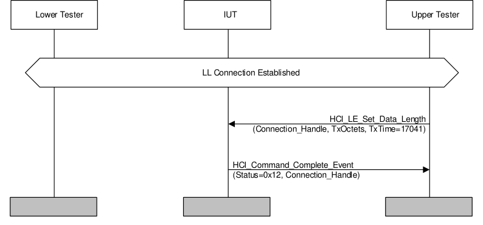

**Figure 4.98: HCI/CCO/BI-40-C [LE Set Data Length, Invalid Parameters] MSC**

• Expected Outcome
Pass verdict
The Upper Tester receives a Command_Complete event from the IUT with Status = 0x12 (Invalid Parameters).
HCI/CCO/BI-42-C [Configure Data Path]
• Test Purpose
Verify that the IUT properly handles the host sending an invalid Data_Path_ID.
• Reference
[12] 7.3.101
• Initial Condition
- An invalid Data Path ID between the Host and the Controller is specified in the TSPX_Invalid_Data_Path_ID IXIT value.
- The IXIT parameters are specified in Table 4.37.

|  | IXIT Parameter |  |  | Description |  |
| --- | --- | --- | --- | --- | --- |
| TSPX Invalid Data Path ID _ _ _ _ |  |  | An Invalid Data Path ID |  |  |

Table 4.37: Configure Data Path IXIT parameters
• Test Procedure
1. The Upper Tester sends an HCI_Configure_Data_Path command to the IUT with Data_Path_ID
set to TSPX_Invalid_Data_Path_ID, Data_Path_Direction set to 0x00, and any Vendor_Specific_Config_Length and Vendor_Specific_Config. 2. The IUT sends an HCI_Command_Complete event to the Upper Tester with error code Invalid
HCI Command Parameters (0x12).
• Expected Outcome
Pass verdict
In step 2, the Upper Tester receives an HCI_Command_Complete event with error code Invalid HCI Command Parameters (0x12).
HCI/CCO/BI-43-C [LE Read Channel Map – Reject Invalid Handle]
• Test Purpose
Verify that the IUT properly handles the Upper Tester sending an invalid ACL handle for LE Read Channel Map HCI command.
• Reference
[13] 7.8.20
• Initial Condition
- An ACL connection has been established between the IUT and the Lower Tester with a valid Connection Handle.
- The IUT acts in Peripheral or Central role.
• Test Procedure
1. The Upper Tester issues an HCI_LE_Read_Channel_Map command to the IUT with the
Connection_Handle parameter set to a different value than the established connection’s handle. 2. The IUT sends the HCI_Command_Complete event with the Status = Unknown Connection
Identifier (0x02) to the Upper Tester.

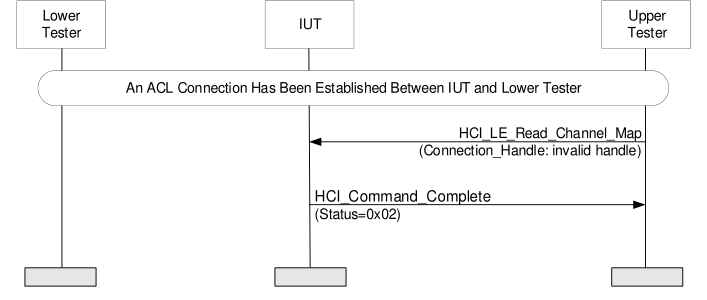

**Figure 4.99: HCI/CCO/BI-43-C [LE Read Channel Map – Reject Invalid Handle] MSC**

• Expected Outcome
Pass verdict
In step 2, the IUT returns the Status = Unknown Connection Identifier (0x02) to the Upper Tester.
Controller • Test Purpose
Verify that the IUT properly rejects the Upper Tester setting a Host Controlled FeatureSet bit for a feature not supported on the Controller.
• Reference
[12] 7.8.115
[13] 4.6
• Initial Condition
- The FeatureSet Bit in Table 4.38 is clear.
- The IUT is not connected to the Lower Tester.
• Test Case Configuration

|  | Test Case |  |  | FeatureSet Bit |  |
| --- | --- | --- | --- | --- | --- |
| HCI/CCO/BI-44-C |  |  | 32 (Connected Isochronous Streams (Host Support)) |  |  |
| HCI/CCO/BI-45-C |  |  | 38 (Connection Subrating (Host Support)) |  |  |

Table 4.38: Reject Setting Host Controlled FeatureSet Bit, Unsupported Feature on Controller test cases
• Test Procedure

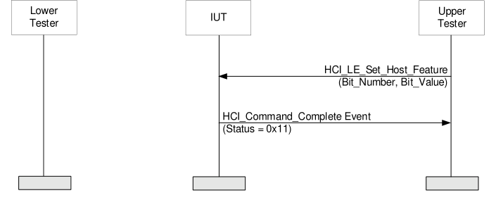

**Figure 4.100: Reject Setting Host Controlled FeatureSet Bit, Unsupported Feature on Controller MSC**

1. The Upper Tester sends the HCI_LE_Set_Host_Feature command to the IUT with Bit_Number
set to the FeatureSet Bit in Table 4.38 and Bit_Value set to 1. 2. The IUT sends the HCI_Command_Complete event to the Upper Tester with Status set to
Unsupported Feature or Parameter value (0x11).
• Expected Outcome
Pass verdict
In step 2, the IUT sends an HCI_Command_Complete event to the Upper Tester with Status set to Unsupported Feature or Parameter value (0x11).

#### 4.10.7 LE Add Device To Resolving List • Test Purpose

Verify that the IUT properly handles the Upper Tester sending an invalid entry for an LE Add Device To Resolving List HCI command.
• Reference
[13] 7.8.38
• Initial Condition
- None.
• Test Case Configuration

| Test Case | Parameters |  | HCI Command |  |  | Expected Status / Result |  |
| --- | --- | --- | --- | --- | --- | --- | --- |
|  |  |  | (in step 5) |  |  | (in step 6) |  |
| HCI/CCO/BI-46-C [LE Add Device To Resolving List – Duplicate Entry] | Peer Identity Address Type, _ _ _ Peer Identity Address, _ _ Peer IRK, Local IRK _ _ | No command |  |  | N/A |  |  |
| HCI/CCO/BI-47-C [LE Add Device To Resolving List – Existing Peer IRK Entry] | Peer Identity Address Type2, _ _ _ Peer Identity Address, _ _ Peer IRK, Local IRK _ _ | HCI LE Remove _ _ _ Device From _ _ Resolving List _ |  |  | Status = Unknown Connection Identifier (0x02) |  |  |
| HCI/CCO/BI-48-C [LE Add Device To Resolving List – Existing Peer IRK Entry] | Peer Identity Address Type, _ _ _ Peer Identity Address2, _ _ Peer IRK, Local IRK _ _ | HCI LE Remove _ _ _ Device From _ _ Resolving List _ |  |  | Status = Unknown Connection Identifier (0x02) |  |  |

Table 4.39: LE Add Device To Resolving List test cases
• Test Procedure

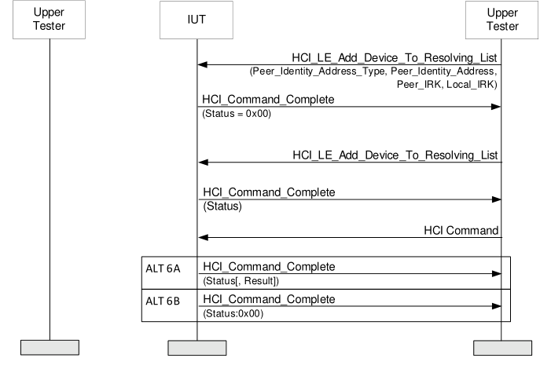

**Figure 4.101: LE Add Device To Resolving List MSC**

valid peer device identity. 2. The IUT sends an HCI_Command_Complete event to the Upper Tester with Status set to 0x00
(“Success”). 3. Repeat step 1, with parameters as listed in Table 4.39. 4. The IUT sends the HCI_Command_Complete event to the Upper Tester with Status set to 0x00
(“Success”) or Status set to any valid error code. 5. The Upper Tester sends an HCI command, if specified and as listed in Table 4.39, to the IUT with
the corresponding parameters added in step 4. 6. Perform either alternative 6A or 6B depending on the Status in step 4.
Alternative 6A (The Status is set to any valid error code):
6A.1 The IUT sends an HCI_Command_Complete event to the Upper Tester, with Status (and Result) as listed in Table 4.39.
Alternative 6B (The Status is set to 0x00):
6B.1 The IUT sends a successful HCI_Command_Complete event to the Upper Tester. • Expected Outcome
Pass verdict
The entry added in step 4 is not added to the resolving list, and the Result in step 6 is as indicated in Table 4.39.
HCI/CCO/BI-50-C [LE Add Device To Resolving List – No Space Available, Scanner]
• Test Purpose
Verify that the scanner IUT properly handles the Upper Tester sending too many entries for an LE Add Device To Resolving List HCI command.
• Reference
[13] 7.8.38
• Initial Condition
- The scanner IUT is configured in a standby state.
• Test Procedure

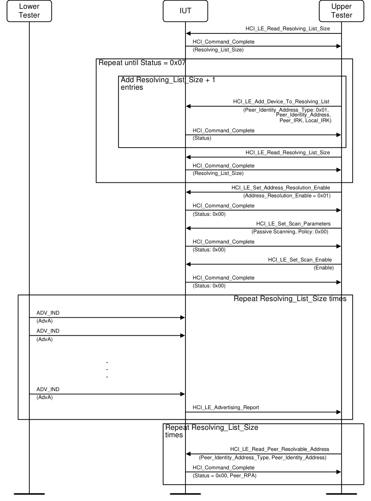

**Figure 4.102: HCI/CCO/BI-50-C [LE Add Device To Resolving List – No Space Available] MSC**

1. The Upper Tester sends an HCI_LE_Read_Resolving_List_Size command to the IUT. 2. The IUT sends an HCI_Command_Complete event to the Upper Tester with Status set to 0x00
(“Success”) and the number of entries in the resolving list.
Peer_Identity_Address_Type set to 0x01, Peer_Identity_Address set to a valid peer device identity, and Peer_IRK set to the corresponding IRK. 4. The IUT sends an HCI_Command_Complete event to the Upper Tester with Status set to 0x00
(“Success”) or 0x07 (“Memory Capacity Exceeded”), in which case, continue with step 10. 5. Repeat steps 3 and 4 with a different address and IRK until it adds (Resolving_List_Size (from
step 2) value + 1) entries, or until the IUT sends to the Upper Tester an HCI_Command_Complete event with Status = 0x07 (“Memory Capacity Exceeded”). 6. Repeat steps 1 and 2. 7. If the number of entries added in the resolving list (step 3) is lower than the Resolving_List_Size
value received in step 6, repeat from step 3; this indicates that the controller modified the resolving list size. 8. If the number of entries added in the resolving list (step 3) is equal to the Resolving_List_Size
value received in step 6 and the IUT doesn’t return Status set to 0x07 in step 5, the test fails and stops. 9. The Upper Tester sends an HCI_LE_Set_Address_Resolution_Enable command to the IUT. 10. The IUT sends an HCI_Command_Complete event to the Upper Tester with Status set to 0x00
(“Success”). 11. The Upper Tester sends an HCI_LE_Set_Scan_Parameters command to the IUT. 12. The IUT sends an HCI_Command_Complete event to the Upper Tester with Status set to 0x00
(“Success”). 13. The Upper Tester sends an HCI_LE_Set_Scan_Enable command to the IUT with the
LE_Scan_Enable field set to 0x01. 14. The IUT sends an HCI_Command_Complete event to the Upper Tester with Status set to 0x00
(“Success”). 15. The Lower Tester is configured to send ADV_IND advertising packets with an advertising interval
of 50 ms and the AdvA set to a resolvable private address generated using one of the IRKs in step 3. 16. The Lower Tester advertises for 500 ms or until an HCI_LE_Advertising_Report is sent from the
IUT to the Upper Tester with AdvA set to the Identity Address corresponding to the IRK used in step 15. 17. Repeat steps 15 and 16 until each of the IRKs in step 3 has been advertised in step 15. 18. The Upper Tester sends HCI_LE_Read_Peer_Resolvable_Address commands to the IUT,
consecutively requesting all the entries successfully added in step 3 (Peer_Identity_Address_Type and Peer_Identity_Address parameters are set consecutively to the values used in step 3). 19. For each of the commands in step 18, the IUT sends an HCI_Command_Complete event to the
Upper Tester with Status set to 0x00 (“Success”) and the Peer_Resolvable_Address set to the correct advertised Address used in step 15 by the Lower Tester corresponding to the IRK set in step 3.
• Expected Outcome
Pass verdict
When the IUT cannot add any more entries in the resolving list, in step 5 the IUT sends an HCI_Command_Complete event with Status set to 0x07 (“Memory Capacity Exceeded”) to the Upper Tester.
All the resolving list entries that the IUT returns in step 17 are those added in step 3 for which the IUT returned Status set to 0x00.

#### 4.10.8 LE Add Device To Resolving List – No Space Available, Advertiser • Test Purpose

Verify that the advertiser IUT properly handles the Upper Tester sending too many entries for an LE Add Device To Resolving List HCI command.
• Reference
[13] 7.8.38
• Initial Condition
- The advertiser IUT is configured in a standby state.
• Test Case Configuration

|  | Test Case |  |  | Advertising Type |  |
| --- | --- | --- | --- | --- | --- |
| HCI/CCO/BI-69-C [LE Add Device To Resolving List – No Space Available, Advertiser, Connectable] |  |  | ADV IND (0x00) _ |  |  |
| HCI/CCO/BI-70-C [LE Add Device To Resolving List – No Space Available, Advertiser, Non-Connectable] |  |  | ADV SCAN IND (0x02) _ _ |  |  |

Table 4.40: LE Add Device To Resolving List – No Space Available, Advertiser test cases
• Test Procedure

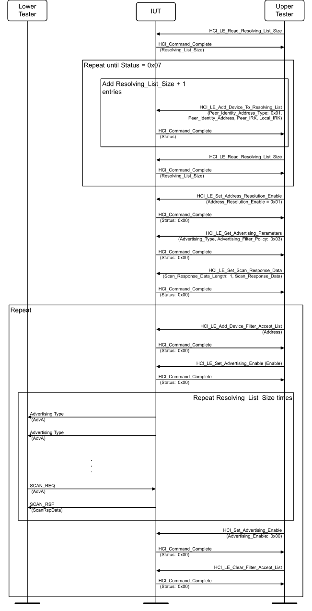

**Figure 4.103: LE Add Device To Resolving List – No Space Available, Advertiser MSC**

1. The Upper Tester sends an HCI_LE_Read_Resolving_List_Size command to the IUT. 2. The IUT sends an HCI_Command_Complete event to the Upper Tester with Status set to 0x00
(“Success”) and the number of entries in the resolving list. 3. The Upper Tester sends an HCI_LE_Add_Device_To_Resolving_List command to the IUT, with
Peer_Identity_Address_Type set to 0x01, Peer_Identity_Address set to a valid peer device identity, and Peer_IRK set to the corresponding IRK. 4. The IUT sends an HCI_Command_Complete event to the Upper Tester with Status set to 0x00
(“Success”) or 0x07 (“Memory Capacity Exceeded”), in which case, continue with step 9. 5. Repeat steps 3 and 4 with a different address and IRK until it adds (Resolving_List_Size (from
step 2) value + 1) entries, or until the IUT sends to the Upper Tester an HCI_Command_Complete event with Status = 0x07 (“Memory Capacity Exceeded”). 6. Repeat steps 1 and 2. 7. If the number of entries added in the resolving list (step 3) is less than or equal to the
Resolving_List_Size value received in step 6, repeat from step 3; this indicates that the controller modified the resolving list size. 8. If the number of entries added in the resolving list (step 3) is greater than the Resolving_List_Size
value received in step 6 and the IUT doesn’t return Status set to 0x07 in step 5, the test fails and stops. 9. The Upper Tester sends an HCI_LE_Set_Address_Resolution_Enable command to the IUT. 10. The IUT sends an HCI_Command_Complete event to the Upper Tester with Status set to 0x00
(“Success”). 11. The Upper Tester sends an HCI_LE_Set_Advertising_Parameters command to the IUT with
Advertising_Type set as specified in Table 4.40 and Advertising_Filter_Policy set to 0x03 and receives a successful HCI_Command_Complete event in response. 12. The Upper Tester sends an HCI_Set_Scan_Response_Data command to the IUT with
Scan_Response_Data_Length set to 1 and Scan_Response_Data set to one random octet and receives a successful HCI_Command_Complete event in response.
Perform steps 13–19 for each of the IRKs in step 3.
13. The Upper Tester sends an HCI_LE_Add_Device_To_Filter_Accept_List command to the IUT
with Address set to the peer address corresponding to the IRK and receives a successful HCI_Command_Complete event in response. 14. The Upper Tester sends an HCI_Set_Advertising_Enable command to the IUT enabling
advertising and receives a successful HCI_Command_Complete event in response. 15. The IUT starts sending the advertising type PDUs specified in Table 4.40 to the Lower Tester. 16. The Lower Tester sends a SCAN_REQ PDU to the IUT with AdvA set to a resolvable private
address generated using the IRK. 17. The IUT sends a SCAN_RSP PDU to the Lower Tester with ScanRspData set to the advertising
data from step 12. 18. The Upper Tester sends an HCI_Set_Advertising_Enable command to the IUT disabling
advertising and receives a successful HCI_Command_Complete event in response. 19. The Upper Tester sends an HCI_Clear_Filter_Accept_List command and receives a successful
HCI_Command_Complete event in response.
• Expected Outcome
Pass verdict
When the IUT cannot add any more entries in the resolving list, in step 5 the IUT sends an HCI_Command_Complete event with Status set to 0x07 (“Memory Capacity Exceeded”) to the Upper Tester.

#### 4.10.9 Reject Invalid Create Connection Command • Test Purpose

Verify that the IUT properly rejects a create connection command when the LE Random Device Address is unset, and it returns the expected error code.
• Initial Condition
- The IUT is in Initiating State.
- The IUT has not set its LE Random Device Address.
• Test Case Configuration

|  | Test Case |  |  | Own Address Type _ _ |  |  | Initiator Filter Policy _ _ |  |
| --- | --- | --- | --- | --- | --- | --- | --- | --- |
| HCI/CCO/BI-51-C |  |  | 0x01 |  |  | NA |  |  |
| HCI/CCO/BI-52-C |  |  | 0x03 |  |  | 0x00 |  |  |
| HCI/CCO/BI-53-C |  |  | 0x03 |  |  | 0x01 |  |  |

Table 4.41: Reject Invalid Create Connection Command test cases
• Test Procedure

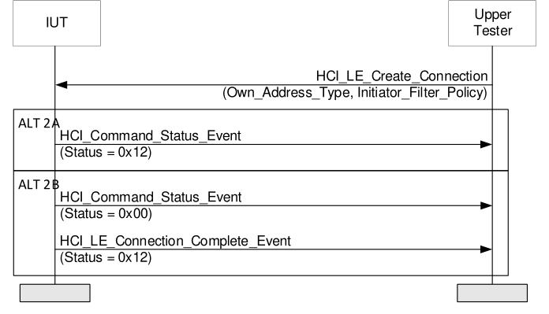

**Figure 4.104: Reject Invalid Create Connection Command MSC**

1. The Upper Tester sends an HCI_LE_Create_Connection command to the IUT with
Own_Address_Type and Initiator_Filter_Policy set to the values in Table 4.41. Set all other fields to valid values. 2. Perform either alternative 2A or 2B depending on the HCI_Command_Status event response.
Alternative 2A (The IUT returns an HCI_Command_Status event with an error code):
2A.1 The IUT returns an HCI_Command_Status event with the error code Invalid HCI Command Parameters (0x12).
Alternative 2B (The IUT returns a successful HCI_Command_Status event):
2B.1 The IUT sends a successful HCI_Command_Status event to the Upper Tester.
2B.2 The IUT sends an HCI_LE_Connection_Complete event to the Upper Tester with the error code Invalid HCI Command Parameters (0x12).
• Expected Outcome
Pass verdict
In step 2A.1, the IUT sends an HCI_Command_Status event to the Upper Tester with a status of Invalid HCI Command Parameters (0x12).
In step 2B.2, the IUT sends an HCI_LE_Connection_Complete event to the Upper Tester with a status of Invalid HCI Command Parameters (0x12).

#### 4.10.10 Reject Invalid Extended Create Connection Command • Test Purpose

Verify that the IUT properly rejects an extended create connection command when the LE Random Device Address is unset, and it returns the expected error code.
• Initial Condition
- The IUT is in Initiating State.
- The IUT has not set its LE Random Device Address.
• Test Case Configuration

|  | Test Case |  |  | Own Address Type _ _ |  |  | Initiator Filter Policy _ _ |  |
| --- | --- | --- | --- | --- | --- | --- | --- | --- |
| HCI/CCO/BI-54-C |  |  | 0x01 |  |  | NA |  |  |
| HCI/CCO/BI-55-C |  |  | 0x03 |  |  | 0x00 |  |  |
| HCI/CCO/BI-56-C |  |  | 0x03 |  |  | 0x01 |  |  |

Table 4.42: Reject Invalid Extended Create Connection Command test cases
• Test Procedure

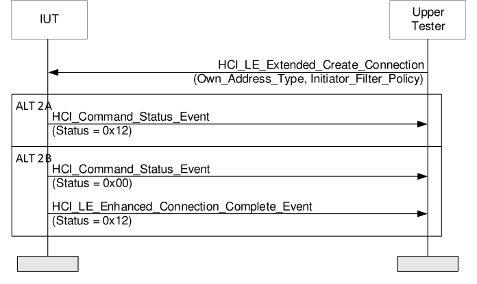

**Figure 4.105: Reject Invalid Extended Create Connection Command MSC**

1. The Upper Tester sends an HCI_LE_Extended_Create_Connection command to the IUT with
Own_Address_Type and Initiator_Filter_Policy set to the values in Table 4.42. Set all other fields to valid values.
Alternative 2A (The IUT returns an HCI_Command_Status event with an error code):
2A.1 The IUT returns an HCI_Command_Status event with the error code Invalid HCI Command Parameters (0x12).
Alternative 2B (The IUT returns a successful HCI_Command_Status event):
2B.1 The IUT sends a successful HCI_Command_Status event to the Upper Tester.
2B.2 The IUT sends an HCI_LE_Enhanced_Connection_Complete event to the Upper Tester with the error code Invalid HCI Command Parameters (0x12). • Expected Outcome
Pass verdict
In step 2A.1, the IUT sends an HCI_Command_Status event to the Upper Tester with a status of Invalid HCI Command Parameters (0x12).
In step 2B.2, the IUT sends an HCI_LE_Connection_Complete event to the Upper Tester with a status of Invalid HCI Command Parameters (0x12).

#### 4.10.11 LE Setup ISO Data Path • Test Purpose

Verify that the IUT properly handles when the host sends the LE_Setup_ISO_Data_Path command twice before sending the LE_Remove_ISO_Data_Path command. Also verify that the IUT properly handles invalid host parameters for Codec_Configuration_Length and Codec_ID.
• Reference
[12] 7.8.109
• Initial Condition
CIS
- A CIS has been established using the values specified in [14] Section 4.10.1.3, Default Values for Set CIG Parameters Commands.
BIS Isochronous Broadcaster
- The Isochronous Broadcaster IUT has created a BIS with the Lower Tester synchronized to the BIS.
- The IXIT parameters are specified in Table 4.43.
BIS Synchronized Receiver
- The Synchronized Receiver IUT is synchronized with the Lower Tester broadcasting a BIS.
- The IXIT parameters are specified in Table 4.43.

|  | IXIT Parameter |  |  | Description |  |
| --- | --- | --- | --- | --- | --- |
| TSPX Data Path ID CIS _ _ _ _ |  |  | CIS Data Path ID |  |  |
| TSPX Data Path ID BIS Broadcaster _ _ _ _ _ |  |  | BIS Broadcaster Data Path ID |  |  |
| TSPX Data Path ID BIS Receiver _ _ _ _ _ |  |  | BIS Receiver Data Path ID |  |  |
| TSPX Number Supported Standard Codecs BR EDR _ _ _ _ _ _ |  |  | Number of Standard Codecs, BR/EDR |  |  |

|  | IXIT Parameter |  |  | Description |  |
| --- | --- | --- | --- | --- | --- |
| TSPX Number Supported Standard Codecs All PHYs _ _ _ _ _ _ |  |  | Number of Standard Codecs, All PHYs |  |  |
| TSPX Number Supported Vendor Codecs BR EDR _ _ _ _ _ _ |  |  | Number of Vendor Specific Codecs, BR/EDR |  |  |
| TSPX Number Supported Vendor Codecs All PHYs _ _ _ _ _ _ |  |  | Number of Vendor Specific Codecs, All PHYs |  |  |
| TSPX Codec ID CIS _ _ _ |  |  | CIS Codec ID |  |  |
| TSPX Codec ID BIS Broadcaster _ _ _ _ |  |  | BIS Broadcaster Codec ID |  |  |
| TSPX Codec ID BIS Receiver _ _ _ _ |  |  | BIS Receiver Codec ID |  |  |
| TSPX Direction _ |  |  | Direction |  |  |
| TSPX Codec Configuration CIS _ _ _ |  |  | CIS Codec Configuration |  |  |
| TSPX Codec Configuration BIS Broadcaster _ _ _ _ |  |  | BIS Broadcaster Codec Configuration |  |  |
| TSPX Codec Configuration BIS Receiver _ _ _ _ |  |  | BIS Receiver Codec Configuration |  |  |
| TSPX Data Path Configuration _ _ _ |  |  | Vendor-specific data path configuration |  |  |

Table 4.43: LE Setup ISO Data Path IXIT Parameters
• Test Case Configuration

| Test Case | HCI/CCO/BI-57-C [LE Setup ISO Data Path, CIS] | HCI/CCO/BI-58-C [LE Setup ISO Data Path, BIS, Isochronous Broadcaster] |  | HCI/CCO/BI-62-C |  |
| --- | --- | --- | --- | --- | --- |
|  |  |  |  | [LE Setup ISO Data |  |
|  |  |  |  | Path, BIS, |  |
|  |  |  |  | Synchronized |  |
|  |  |  |  | Receiver] |  |
| ISOC Stream Type | CIS | BIS Isochronous Broadcaster | BIS Synchronized Receiver |  |  |
| Perform steps 4 and 5 | Yes | Yes | No |  |  |
| Perform steps 6 and 7 | Yes | No | Yes |  |  |
| Codec ID _ | TSPX Codec ID CIS _ _ _ | TSPX Codec ID BIS _ _ _ _ Broadcaster | TSPX Codec ID BIS _ _ _ _ Receiver |  |  |
| Direction | TSPX Direction _ | 0 | 1 |  |  |
| Logical Transport Type _ _ | 0x02 (LE CIS) | 0x03 (LE BIS) | 0x03 (LE BIS) |  |  |
| Codec Configuration _ | TSPX Codec _ _ Configuration CIS _ | TSPX Codec _ _ Configuration BIS Broadcaster _ _ | TSPX Codec _ _ Configuration BIS _ _ Receiver |  |  |
| Data Path ID _ _ | TSPX Data Path ID CIS _ _ _ _ | TSPX Data Path ID _ _ _ _ BIS Broadcaster _ | TSPX Data Path ID _ _ _ _ BIS Receiver _ |  |  |

Table 4.44: LE Setup ISO Data Path test cases
• Test Procedure
1. The Upper Tester sends the HCI_Read_Local_Supported_Codecs [v2] command to the IUT. 2. The IUT responds with a successful HCI_Command_Complete event. 3. The Lower Tester verifies that the returned value of Num_Supported_Standard_Codecs equals
TSPX_Number_Supported_Standard_Codecs_All_PHYs, and the returned value of Num_Supported_Vendor_Specific_Codecs equals TSPX_Number_Supported_Vendor_Codecs_All_PHYs. The Lower Tester also verifies that one of the supported codecs (either standard or vendor-specific) has the Codec_ID and Logical_Transport_Type specified in Table 4.44.
4. The Upper Tester sends an HCI_Read_Local_Supported_Codec_Capabilities command to the
IUT with Codec_ID and Logical_Transport_Type specified in Table 4.44, and Direction set to 0x00. 5. The IUT either sends a successful HCI_Command_Complete event with
Num_Codec_Capabilities, Codec_Capability_Length, and Codec_Capability or sends an HCI_Command_Complete event with Status > 0x00.
Perform steps 6 and 7 if specified in Table 4.44.
6. The Upper Tester sends an HCI_Read_Local_Supported_Codec_Capabilities command to the
IUT with Codec_ID and Logical_Transport_Type specified in Table 4.44, and Direction set to 0x01. 7. The IUT either sends a successful HCI_Command_Complete event with
Num_Codec_Capabilities, Codec_Capability_Length, and Codec_Capability or sends an HCI_Command_Complete event with Status > 0x00. 8. If both steps 5 and 7 returned an error, or if only one of these steps was performed and returned
an error, then the test ends with a Fail verdict. Otherwise, if either step 5 or 7 was not run, returned an error, or succeeded and returned Num_Codec_Capabilities = 0, then the test ends with a Pass verdict. 9. The Upper Tester sends an HCI_Read_Local_Supported_Controller_Delay command to the IUT
with Codec_ID, Logical_Transport_Type, Direction, and Codec_Configuration set as specified in Table 4.44, and Codec_Configuration_Length set to the length of Codec_Configuration. 10. The IUT responds with a successful HCI_Command_Complete event with Min_Controller_Delay
and Max_Controller_Delay set to a value between 0x000000 and 0x3D0900 and Max_Controller_Delay  Min_Controller_Delay. 11. The Upper Tester sends an HCI_LE_Setup_ISO_Data_Path command to the IUT with the
Data_Path_Direction, Codec_ID, Codec_Configuration_Length, and Codec_Configuration parameters set to the values used in step 9, Controller_Delay set to the mean of Min_Controller_Delay and Max_Controller_Delay returned in step 10, and Data_Path_ID set as specified in Table 4.44. 12. If the Data_Path_ID is zero, then the IUT responds with a successful HCI_Command_Complete
event, and skip steps 13 and 14. Otherwise, the IUT sends an HCI_Command_Complete event to the Upper Tester with a Command Disallowed (0x0C) error code. 13. The Upper Tester sends an HCI_Configure_Data_Path command to the IUT with
Data_Path_Direction and Data_Path_ID set as specified in Table 4.44 and Vendor_Specific_Config_Length and Vendor_Specific_Config set to the length and value of TSPX_Data_Path_Configuration (the length may be zero if there is no configuration required) and receives a successful HCI_Command_Complete in return. 14. The Upper Tester sends an HCI_LE_Setup_ISO_Data_Path command to the IUT with the
Data_Path_Direction, and Data_Path_ID, Codec_ID, Controller_Delay, Codec_Configuration_Length, and Codec_Configuration parameters set to the values used in step 11, and the IUT responds with a successful HCI_Command_Complete event. 15. The Upper Tester sends an HCI_LE_Setup_ISO_Data_Path command to the IUT with the
Data_Path_Direction, and Data_Path_ID, Codec_ID, Controller_Delay, Codec_Configuration_Length, and Codec_Configuration parameters set to the values used in step 11, and the IUT responds with an HCI_Command_Complete event with error code Command Disallowed (0x0C). 16. The Upper Tester sends an HCI_LE_Remove_ISO_Data_Path command to the IUT with an
invalid connection handle, and the IUT responds with error code Unknown Connection Identifier (0x02).
Data_Path_Direction parameter the same as in step 11, and the IUT responds with a successful HCI_Command_Complete event. 18. The Upper Tester sends an HCI_LE_Setup_ISO_Data_Path command to the IUT with the
Codec_Configuration_Length > 0 and Codec_ID set to Transparent Air mode, the remaining parameters set to the values used in step 11, and the IUT responds with an HCI_Command_Complete event with error code Invalid HCI Command Parameters (0x12).
• Expected Outcome
Pass verdict
In step 12, the IUT sends an HCI_Command_Complete event to the Upper Tester with error code Command Disallowed (0x0C) if TSPX_Data_Path_ID is not zero.
In step 14, the IUT sends a successful HCI_Command_Complete event to the Upper Tester.
In step 16, the IUT sends an HCI_Command_Complete event to the Upper Tester with error code Unknown Connection Identifier (0x02).
In step 15, the IUT sends an HCI_Command_Complete event to the Upper Tester with error code Command Disallowed (0x0C).
In step 18, the IUT sends an HCI_Command_Complete event to the Upper Tester with error code Invalid HCI Command Parameters (0x12).
HCI/CCO/BI-59-C [Invalid LE Set Periodic Advertising Receive Enable Parameters, Periodic Advertising ADI Not Supported]
• Test Purpose
Verify that the IUT properly handles the Upper Tester sending invalid parameters for LE Set Periodic Advertising Receive Enable related HCI commands when Periodic Advertising ADI is not supported.
• Reference
[13] 7.8.88
• Initial Condition
- The IUT is in standby. Extended advertising parameters and periodic advertising parameters have been configured on the IUT for a particular advertising handle.
- The IUT has synced to the Lower Tester Periodic Advertising.
• Test Procedure
1. The Upper Tester sends an HCI_LE_Set_Periodic_Advertising_Receive_Enable command to the
IUT with the Enable bits 0 and 1 set to 1. 2. The IUT sends an HCI_Command_Complete event to the Upper Tester with an error code.
• Expected Outcome
Pass verdict
In step 2, the IUT returns an HCI_Command_Complete event with Status set to an error code.
Advertising ADI Not Supported • Test Purpose
Verify that the IUT properly handles the Upper Tester sending invalid parameters for the LE Set Periodic Advertising Sync Transfer Parameters or LE Set Default Periodic Advertising Sync Transfer Parameters command when Periodic Advertising ADI is not supported.
• Reference
[13] 7.8.91, 7.8.92
• Initial Condition
- State: Connected Central
- Extended advertising parameters and periodic advertising parameters have been configured on the IUT.
• Test Case Configuration

|  | Test Case |  |  | HCI Command |  |
| --- | --- | --- | --- | --- | --- |
| HCI/CCO/BI-60-C [Invalid LE Set PAST Parameters, PA ADI Not Supported] |  |  | HCI LE Set Periodic Advertising Sync Transfer Parameters _ _ _ _ _ _ _ |  |  |
| HCI/CCO/BI-61-C [Invalid LE Set Default PAST Parameters, PA ADI Not Supported] |  |  | HCI LE Set Default Periodic Advertising Sync Transfer Parameters _ _ _ _ _ _ _ _ |  |  |

Table 4.45: Invalid LE Set Periodic Advertising Sync Transfer Parameters, Periodic Advertising ADI Not Supported test cases
• Test Procedure
1. The Upper Tester sends the HCI command as specified in Table 4.45 to the IUT with Mode set to
0x03 and all other parameters set to valid values. 2. The IUT sends an HCI_Command_Complete event to the Upper Tester with an error code.
• Expected Outcome
Pass verdict
In step 2, the IUT returns an HCI_Command_Complete event with Status set to an error code.
HCI/CCO/BI-63-C [LE Extended Create Connection [v2], Invalid Parameters]
• Test Purpose
Verify that the IUT properly handles the host sending invalid parameters for the LE Extended Create Connection [v2] command.
• Reference
[17] 7.8.66
• Initial Condition
- The IUT enables Periodic Advertising with Responses using Advertising Handle = 0x00.
• Test Procedure
Repeat steps 1–2 for each round in Table 4.46.
1. The Upper Tester sends the HCI_LE_Extended_Create_Connection [v2] command with the
parameters specified in Table 4.46. 2. The IUT sends an HCI_Command_Complete event to the Upper Tester with Status set as
specified in Table 4.46.

|  | Round |  |  | Parameter |  |  | Status |  |
| --- | --- | --- | --- | --- | --- | --- | --- | --- |
| 1 |  |  | Advertising Handle = 0x01 _ |  |  | Unknown Advertising Identifier (0x42) |  |  |
| 2 |  |  | Subevent = 0x80 |  |  | Invalid HCI Command Parameters (0x12) |  |  |
| 3 |  |  | Advertising Handle = 0xFF _ Subevent = 1 |  |  | Invalid HCI Command Parameters (0x12) |  |  |

Table 4.46: LE Extended Create Connection [v2], Invalid Parameters test rounds
• Expected Outcome
Pass verdict
In step 2, the IUT sends an HCI_Command_Complete event with the error specified in Table 4.46.

#### 4.10.13 LE Set Periodic Advertising Parameters, Invalid Parameters • Test Purpose

Verify that the IUT properly handles the host sending invalid parameters for the LE Set Periodic Advertising Parameters [v2] command.
• Reference
[17] 7.8.61
• Initial Condition
- There is a valid advertising set configured on the IUT.
• Test Case Configuration

|  | Test Case |  |  | HCI Command |  |  | Rounds |  |
| --- | --- | --- | --- | --- | --- | --- | --- | --- |
| HCI/CCO/BI-64-C |  |  |  | HCI LE Set Periodic Advertising Parameters [v1] _ _ _ _ _ |  |  | 1–2 |  |
| HCI/CCO/BI-65-C |  |  |  | HCI LE Set Periodic Advertising Parameters [v2] _ _ _ _ _ |  |  | All |  |

Table 4.47: LE Set Periodic Advertising Parameters, Invalid Parameters test cases
• Test Procedure
Repeat the steps specified in Table 4.47 for each round in Table 4.48.
1. The Upper Tester sends the HCI command specified in Table 4.47 with the parameters specified
in Table 4.48. 2. The IUT sends an HCI_Command_Complete event to the Upper Tester with Status set as
specified in Table 4.48.

|  | Round |  |  | Parameter |  |  | Status |  |
| --- | --- | --- | --- | --- | --- | --- | --- | --- |
| 1 |  |  | Advertising Handle = set to unknown handle, all _ others set to valid values |  |  | Unknown Advertising Identifier (0x42) |  |  |
| 2 |  |  | Periodic Advertising Interval Min > _ _ _ Periodic Advertising Interval Max, all others set to _ _ _ valid values |  |  | Invalid HCI Command Parameters (0x12) |  |  |
| 3 |  |  | Subevent Interval > _ Periodic Advertising Interval Min / Num Subevents, _ _ _ _ all others set to valid values |  |  | Invalid HCI Command Parameters (0x12) |  |  |
| 4 |  |  | Response Slot Delay >= Subevent Interval, all _ _ _ others set to valid values |  |  | Invalid HCI Command Parameters (0x12) |  |  |
| 5 |  |  | Response Slot Delay = 0x00 _ _ Num Response Slots > 0, all others set to valid _ _ values |  |  | Invalid HCI Command Parameters (0x12) |  |  |
| 6 |  |  | Response Slot Spacing > 10x(Subevent Interval – _ _ _ Response Slot Delay) / Num Response Slots, all _ _ _ _ others set to valid values |  |  | Invalid HCI Command Parameters (0x12) |  |  |
| 7 |  |  | Num Subevents > 0x80, all others set to valid values _ |  |  | Invalid HCI Command Parameters (0x12) |  |  |
| 8 |  |  | Subevent Interval < 0x06, all others set to valid _ values |  |  | Invalid HCI Command Parameters (0x12) |  |  |
| 9 |  |  | Response Slot Delay = 0xFF, all others set to valid _ _ values |  |  | Invalid HCI Command Parameters (0x12) |  |  |
| 10 |  |  | Response Slot Spacing = 0x01, all others set to valid _ _ values |  |  | Invalid HCI Command Parameters (0x12) |  |  |
| 11 |  |  | Num Response Slots = 0, all others set to valid _ _ values |  |  | Invalid HCI Command Parameters (0x12) |  |  |

Table 4.48: LE Set Periodic Advertising Parameters, Invalid Parameters test rounds
• Expected Outcome
Pass verdict
In step 2, the IUT sends an HCI_Command_Complete event with the error specified in Table 4.48.
HCI/CCO/BI-66-C [LE Set Periodic Advertising Response Data, Invalid Parameters]
• Test Purpose
Verify that the IUT properly handles the host sending invalid parameters for the LE Set Periodic Advertising Response Data command.
• Reference
[17] 7.8.126
• Initial Condition
- The IUT is scanning for Periodic Advertising and is synchronized with the Lower Tester periodic advertising with response.
• Test Procedure
1. The Upper Tester sends an HCI_LE_Set_Periodic_Sync_Subevent to the IUT with Subevent set
to 0.
Repeat steps 2–4 for each round in Table 4.49.
2. The IUT sends an HCI_LE_Periodic_Advertising_Report [v2] event to the Upper Tester with
Subevent set to 0x00. 3. The Upper Tester sends the HCI_LE_Set_Periodic_Advertising_Response_Data command with
the parameters specified in Table 4.49. 4. The IUT sends an HCI_Command_Complete event to the Upper Tester with Status set as
specified in Table 4.49. 5. The Upper Tester sends an HCI_LE_Periodic_Advertising_Terminate_Sync command to the IUT
and receives a successful HCI_Command_Complete event in response.

|  | Round |  |  | Parameter |  |  | Status |  |
| --- | --- | --- | --- | --- | --- | --- | --- | --- |
| 1 |  |  | Sync Handle > 0x0EFF, all others set to valid values _ |  |  | Invalid HCI Command Parameters (0x12) |  |  |
| 2 |  |  | Response Data Length > max that controller can _ _ transmit |  |  | Packet Too Long (0x45) |  |  |
| 3 |  |  | Response Slot has passed by the time this command _ is received by the Controller |  |  | TooLate (0x46) |  |  |
| 4 |  |  | Response Data Length = 0xFC(252), _ _ Response Data truncated to 247 bytes, all others set _ to valid values |  |  | Invalid HCI Command Parameters (0x12) |  |  |
| 5 |  |  | Response Subevent set to 5 (above numSubevents), _ all others set to valid values |  |  | Command Disallowed (0x0C) |  |  |
| 6 |  |  | Response Subevent set to 2 (subevent not synced), _ all others set to valid values |  |  | Command Disallowed (0x0C) |  |  |

Table 4.49: LE Set Periodic Advertising Response Data, Invalid Parameters test rounds
• Expected Outcome
Pass verdict
In step 4, the IUT sends an HCI_Command_Complete event with the error specified in Table 4.49.
HCI/CCO/BI-67-C [LE Set Periodic Advertising Subevent Data, Invalid Parameters]
• Test Purpose
Verify that the IUT properly handles the host sending invalid parameters for the LE Set Periodic Advertising Subevent Data command.
• Reference
[17] 7.8.125
• Initial Condition
- The IUT is in standby mode.
• Test Procedure
1. The Upper Tester sends an HCI_LE_Set_Extended_Advertising_Parameters command to the
IUT using all supported advertising channels and a selected advertising interval between the minimum and maximum advertising intervals supported and receives a successful HCI_Command_Complete event in return. The Advertising_Event_Properties parameter is set to 0x0000, Primary_Advertising_PHY is set to 0x01 (LE 1M), and Secondary_Advertising_PHY is set to 0x01 (LE 1M). 2. The Upper Tester sends an HCI_LE_Set_Periodic_Advertising_Parameters [v2] command to the
IUT with Num_Subevents_With_Data set to 10, Subevent_Interval set to 0xFF (318.75 ms), Response_Slot_Delay set to 0x01 (1.25 ms), Response_Slot_Spacing set to 0x0A (1.25 ms), and Num_Response_Slots set to 0x05, and receives a successful HCI_Command_Complete event in response. 3. The Upper Tester enables periodic advertising with Periodic Advertising Filtering using the
HCI_LE_Set_Periodic_Advertising_Enable command with bit 0 (Enable periodic advertising) and receives an HCI_Command_Complete event in response. 4. The Upper Tester enables advertising using the HCI_LE_Set_Extended_Advertising_Enable
command with the Duration[0] parameter set to 0x0000 (No Advertising Duration), and receives an HCI_Command_Complete event in response.
Repeat steps 5–7 for each round in Table 4.50. In round 10, repeat step 5 until Subevent_Data_Count is greater than 1. If this doesn’t happen within 10 periodic advertising events, then skip round 10.
5. The IUT sends an HCI_LE_Periodic_Advertising_Subevent_Data_Request event to the Upper
Tester with Subevent_Start and Subevent_Data_Count. 6. The Upper Tester sends the HCI_LE_Set_Periodic_Advertising_Subevent_Data command with
the parameters specified in Table 4.50. 7. The IUT sends an HCI_Command_Complete event to the Upper Tester with Status set as
specified in Table 4.50. 8. The IUT sends an HCI_LE_Periodic_Advertising_Subevent_Data_Request event to the Upper
Tester with Subevent_Start and Subevent_Data_Count. 9. The Upper Tester sends an HCI_LE_Set_Periodic_Advertising_Subevent_Data command to the
IUT with Num_Subevents_With_Data set to 1 and Subevent set to Subevent_Start from step 5. 10. The IUT sends a successful HCI_Command_Complete event to the IUT. 11. The Upper Tester sends an HCI_LE_Set_Periodic_Advertising_Subevent_Data command to the
IUT with Num_Subevents_With_Data set to 1 and Subevent set to Subevent_Start from step 5. 12. The IUT sends an HCI_Command_Complete event to the IUT with Status > 0.

|  | Round |  |  | Parameter |  |  | Status |  |
| --- | --- | --- | --- | --- | --- | --- | --- | --- |
| 1 |  |  | Advertising Handle = set to unknown handle, all _ others set to valid values |  |  | Unknown Advertising Identifier (0x42) |  |  |
| 2 |  |  | Advertising Handle > 0xEF, all others set to valid _ values |  |  | Invalid HCI Command Parameters (0x12) |  |  |
| 3 |  |  | Subevent Data > max that controller can transmit _ |  |  | Packet Too Long (0x45) |  |  |
| 4 |  |  | Num Subevents With Data = 0x00, all others set to _ _ _ valid values |  |  | Invalid HCI Command Parameters (0x12) |  |  |
| 5 |  |  | Num Subevents With Data > 0x0F, all others set to _ _ _ valid values |  |  | Invalid HCI Command Parameters (0x12) |  |  |
| 6 |  |  | Subevent[0] > 0x7F, all others set to valid values |  |  | Invalid HCI Command Parameters (0x12) |  |  |

|  | Round |  |  | Parameter |  |  | Status |  |
| --- | --- | --- | --- | --- | --- | --- | --- | --- |
| 7 |  |  | Subevent[0] < Subevent Start (step 5) _ OR (Subevent Start + Subevent Data Count) < _ _ _ Subevent[0] < 0x7F, all others set to valid values |  |  | Command Disallowed (0x0C) |  |  |
| 8 |  |  | Subevent Data Length[0] = 0xFC(252), all others set _ _ to valid values Note: The data is too long to fit in a packet, so the data is truncated. |  |  | Invalid HCI Command Parameters (0x12) |  |  |
| 9 |  |  | Response Slot Start[0] = 6 _ _ |  |  | Invalid HCI Command Parameters (0x12) |  |  |
| 10 |  |  | Num Subevents With Data = 2 _ _ _ Subevent[0] = Subevent Start _ Subevent[1] = Subevent Start _ Subevent Data Length[0] = 1 _ _ Subevent Data[0] = 0x01 _ Subevent Data Length[1] = 1 _ _ Subevent Data[1] = 0x01 _ |  |  | Invalid HCI Command Parameters (0x12) |  |  |

Table 4.50: LE Set Periodic Advertising Subevent Data, Invalid Parameters test rounds
• Expected Outcome
Pass verdict
In step 7, the IUT sends an HCI_Command_Complete event with the error specified in Table 4.50.
In step 12, the IUT sends an HCI_Command_Complete event with an error code.
HCI/CCO/BI-68-C [LE Set Periodic Sync Subevent, Invalid Parameters]
• Test Purpose
Verify that the IUT properly handles the host sending invalid parameters for the LE Set Periodic Sync Subevent command.
• Reference
[17] 7.8.127
• Initial Condition
- The IUT is scanning for Periodic Advertising and is synchronized with the Lower Tester.
• Test Procedure
Repeat steps 1–2 for each round in Table 4.51.
1. The Upper Tester sends the HCI_LE_Set_Periodic_Sync_Subevent command with the
parameters specified in Table 4.51. 2. The IUT sends an HCI_Command_Complete event to the Upper Tester with Status set as
specified in Table 4.51.

| Round | Parameter |  | Event and |  |
| --- | --- | --- | --- | --- |
|  |  |  | Status/Error Code |  |
| 1 | Sync Handle > 0x0EFF, all others set to valid values _ | Invalid HCI Command Parameters (0x12) |  |  |
| 2 | Num Subevents To Sync = 0x00, all others set to valid _ _ _ values | Invalid HCI Command Parameters (0x12) |  |  |
| 3 | Num Subevents To Sync > 0x80, all others set to valid _ _ _ values | Invalid HCI Command Parameters (0x12) |  |  |
| 4 | Num Subevents To Sync > Number of Subevent from _ _ _ HCI LE Periodic Advertising Sync Established [v2] _ _ _ _ _ | Invalid HCI Command Parameters (0x12) |  |  |
| 5 | Subevent[0] > 0x7F, all others set to valid values | Invalid HCI Command Parameters (0x12) |  |  |

Table 4.51: LE Set Periodic Sync Subevent, Invalid Parameters test rounds
• Expected Outcome
Pass verdict
In step 2, the IUT sends an HCI_Command_Complete event with the error specified in Table 4.51.
HCI/CCO/BV-24-C [LE Monitoring Advertisers RSSI command, Memory Capacity Exceeded]
• Test Purpose
Verify that the IUT does not add to the Monitored Advertisers List when Memory Capacity is Exceeded.
• Reference
[18] 7.8.146, 7.8.150
• Test Procedure
1. The Upper Tester sends HCI_LE_Add_Device_To_Monitored_Advertisers_List commands to the
IUT with valid parameters and different addresses and receives a successful HCI_Command_Complete event in response. 2. Repeat step 1 until the IUT sends an HCI_Command_Complete event to the Upper Tester with
Status set to 0x07 (Memory Capacity Exceeded). 3. The Upper Tester sends an HCI_LE_Read_Monitored_Advertisers_List_Size command to the
IUT with no command parameters. 4. The IUT sends a successful HCI_Command_Complete event to the Upper Tester with Number
set to a valid value.
• Expected Outcome
Pass verdict
In step 2, the IUT sends an HCI_Command_Complete event with the error code 0x07 (Memory Capacity Exceeded).
In step 4, the IUT sends an HCI_Command_Complete event with a valid Number value.
• Test Purpose
Verify that the IUT handles the Upper Tester sending invalid parameters for LE Monitoring Advertisers related HCI commands.
• Reference
[18] 7.8.146, 7.8.147, 7.8.149
• Test Procedure
1. The Upper Tester sends the HCI Command, with the Parameter and Value/Condition as specified
in Table 4.52, to the IUT. All other values for the command are set to valid values.
2. The IUT sends the Event and Status/Error Code as specified in Table 4.52 to the Upper Tester.

| Round | Command |  |  | Parameter |  | Value/ |  |  | Event and Status/Error |  |
| --- | --- | --- | --- | --- | --- | --- | --- | --- | --- | --- |
|  |  |  |  |  |  | Condition |  |  | Code |  |
| 1 |  | HCI LE Add Device |  | Address Type _ | 0x02 | 0x02 |  |  | HCI Command Complete: |  |
|  |  | _ _ _ _ To Monitored |  |  |  |  |  |  | _ _ Invalid HCI Command |  |
|  |  | _ _ Advertisers List _ |  |  |  |  |  |  | Parameters (0x12) |  |
| 2 |  | HCI LE Add Device |  | RSSI _ Threshold Low _ | 21 dBm |  |  |  | HCI Command Complete: |  |
|  |  | _ _ _ _ To Monitored |  |  |  |  |  |  | _ _ Invalid HCI Command |  |
|  |  | _ _ Advertisers List _ |  |  |  |  |  |  | Parameters (0x12) |  |
| 3 |  | HCI LE Add Device |  | RSSI _ Threshold High _ | 21 dBm |  |  |  | HCI Command Complete: |  |
|  |  | _ _ _ _ To Monitored |  |  |  |  |  |  | _ _ Invalid HCI Command |  |
|  |  | _ _ Advertisers List _ |  |  |  |  |  |  | Parameters (0x12) |  |
| 4 |  | HCI LE Add Device |  | RSSI _ Threshold High _ |  | <RSSI - |  |  | HCI Command Complete: |  |
|  |  | _ _ _ _ To Monitored |  |  |  | _ Threshold |  |  | _ _ Invalid HCI Command |  |
|  |  | _ _ Advertisers List _ |  |  |  | _ Low |  |  | Parameters (0x12) |  |
| 5 |  | HCI LE Add Device |  | Timeout | 0x00 | 0x00 |  |  | HCI Command Complete: |  |
|  |  | _ _ _ _ To Monitored |  |  |  |  |  |  | _ _ Invalid HCI Command |  |
|  |  | _ _ Advertisers List _ |  |  |  |  |  |  | Parameters (0x12) |  |
| 6 |  | HCI LE Remove |  | Address Type _ | 0x02 |  |  | HCI Command Complete: _ _ Invalid HCI Command Parameters (0x12) | HCI Command Complete: |  |
|  |  | _ _ _ Device From |  |  |  |  |  |  | _ _ Invalid HCI Command |  |
|  |  | _ _ Monitored Advertisers |  |  |  |  |  |  | Parameters (0x12) |  |
|  |  | _ _ List |  |  |  |  |  |  |  |  |
| 7 | HCI LE Remove _ _ _ Device From _ _ Monitored _ Advertisers List _ | HCI LE Remove |  | Address |  | Any valid |  | HCI Command Complete: _ _ Invalid HCI Command Parameters (0x12) |  |  |
|  |  | _ _ _ Device From |  |  |  | address with |  |  |  |  |
|  |  | _ _ Monitored |  |  |  | the |  |  |  |  |
|  |  | _ Advertisers List |  |  |  | Monitoring |  |  |  |  |
|  |  |  |  |  |  | List empty |  |  |  |  |
| 8 | HCI LE Enable _ _ _ Monitoring Advertisers _ |  |  | Enable | 0x02 | 0x02 |  |  | HCI Command Complete: |  |
|  |  |  |  |  |  |  |  |  | _ _ Invalid HCI Command |  |
|  |  |  |  |  |  |  |  |  | Parameters (0x12) |  |

Table 4.52: Invalid LE Monitoring Advertisers Parameters rounds
• Expected Outcome
Pass verdict
In step 2, the IUT sends an HCI_Command_Complete event with the error code 0x12 (Invalid HCI Parameters).
HCI/CCO/BI-72-C [Reject LE Extended Create Connection with Invalid Initiator_Filter_Policy Parameters]
• Test Purpose
Verify that the IUT rejects the LE Extended Create Connection command when the controller does not support Decision Based Advertising Filtering.
• Reference
[18] 7.8.66
• Initial Condition
- The IUT is not currently scanning.
• Test Procedure
1. The Upper Tester sends an HCI_LE_Extended_Create_Connection command to the IUT with the
Initiator_Filter_Policy set to a value other than 0x00 or 0x01. 2. The IUT sends an HCI_Command_Complete event with Status set to Unsupported Feature or
Parameter Value (0x11).
• Expected Outcome
Pass verdict
In step 2, the IUT sends an HCI_Command_Complete event to the Upper Tester with Status set to Unsupported Feature or Parameter Value (0x11).
HCI/CCO/BI-73-C [LE Set Decision Data, Invalid Parameters]
• Test Purpose
Verify that the IUT handles invalid parameters for the LE Set Decision Data command.
• Reference
[18] 7.8.144
• Initial Condition
- The IUT is not currently scanning.
• Test Procedure
Repeat steps 1 to 3 for each round in Table 4.53.
1. The Upper Tester sends an HCI_LE_Set_Extended_Advertising_Parameters command to the
IUT with the Primary_Advertising_PHY set to LE 1M and a valid Advertising_Event_Parameters field with bit 7 set to 1 and receives a successful HCI_Command_Complete in return. 2. The Upper Tester sends the HCI_LE_Set_Decision_Data command to the IUT with the
Parameter as set in Table 4.53. Decision_Type_Flags is set to 0x00 unless otherwise specified in Table 4.53. 3. The IUT sends an HCI_Command_Complete event to the Upper Tester with the status specified
in Table 4.53.

|  | Round |  |  | Parameter |  |  | Status |  |
| --- | --- | --- | --- | --- | --- | --- | --- | --- |
| 1 |  |  | Invalid Advertising Handle _ |  |  | 0x42 (Unknown Advertising Identifier) |  |  |
| 2 |  |  | Decision Data Length = 5 with Resolvable Tag Type _ _ set in Decision Type Flags _ _ |  |  | 0x12 (Invalid HCI Command Parameters) |  |  |
| 3 |  |  | Decision Data Length = 5 _ _ |  |  | 0x00 (Success) |  |  |
| 4 |  |  | Decision Data Length = 9 _ _ |  |  | 0x12 (Invalid HCI Command Parameters) |  |  |
| 5 |  |  | Decision Data Length = 0 _ _ |  |  | 0x00 (Success) |  |  |

Table 4.53: Decision-Based Advertisements, Test Groups rounds
• Expected Outcome
Pass verdict
In step 3, the IUT sends an HCI_Command_Complete event to the Upper Tester with Status set as specified in Table 4.53.
HCI/CCO/BI-74-C [LE Set Decision Instructions, Invalid Parameters]
• Test Purpose
Verify that the IUT handles invalid parameters for the LE Set Decision Instructions command.
• Reference
[18] 7.8.145
• Initial Condition
- The maximum number of supported tests in a Decision PDU is defined by the TSPX_max_decision_tests IXIT value.
• Test Procedure
Repeat steps 1 and 2 for each round in Table 4.54. Skip Round 2 if TSPX_max_decision_tests is greater than or equal to 14.
1. The Upper Tester sends an HCI_LE_Set_Decision_Instructions command to the IUT with the
Num_Tests field set as specified in Table 4.54. 2. The IUT sends an HCI_Command_Complete event to the Upper Testers as specified in
Table 4.54.

|  | Round |  |  | Parameter |  |  | Status |  |
| --- | --- | --- | --- | --- | --- | --- | --- | --- |
| 1 |  |  | Num Tests set to 0 _ |  |  | 0x12 (Invalid HCI Command Parameters) |  |  |
| 2 |  |  | Num Tests = TSPX max decision tests + _ _ _ _ 1 |  |  | 0x43 (Limit Reached) |  |  |
| 3 |  |  | Num Tests = 1 and bit 0 of Test Flags[0] _ _ set to 0 |  |  | 0x12 (Invalid HCI Command Parameters) |  |  |

Table 4.54: Decision-Based Advertisements, Test Groups rounds
• Expected Outcome
Pass verdict
In step 2, the IUT sends an HCI_Command_Complete event to the Upper Tester with Status set as specified in Table 4.54.
HCI/CCO/BV-25-C [LE Set Decision Instructions, Support for 8 Tests]
• Test Purpose
Verify that the IUT supports at least 8 tests in the decision instructions.
• Reference
[18] 7.8.145
• Test Procedure
1. The Upper Tester sends an HCI_LE_Set_Decision_Instructions to the IUT with General_Flags
set to 0, Num_Tests set to 8, and Test_Field and Test_Parameters set to 8 valid parameters. 2. The IUT sends a successful HCI_Command_Complete event to the Upper Tester.
• Expected Outcome
Pass verdict
In step 2, the IUT sends a successful HCI_Command_Complete event to the Upper Tester.

#### 4.10.14 LE Frame Space Update, PHY Not Supported • Test Purpose

Verify that the IUT properly handles the host sending invalid parameters for the LE Frame Space Update command when the PHY specified is not supported.
• Reference
[19] 7.7.65.48
• Initial Condition
- LL connection is established, the IUT is Central or Peripheral, and T_IFS = 150 μs
• Test Case Configuration

|  | Test Case |  |  | PHY |  |
| --- | --- | --- | --- | --- | --- |
|  | HCI/CCO/BI-76-C [LE Frame Space Update, PHY Not Supported, LE 2M PHY] |  |  | LE 2M |  |
|  | HCI/CCO/BI-77-C [LE Frame Space Update, PHY Not Supported, LE Coded PHY] |  |  | LE Coded |  |

Table 4.55: LE Frame Space Update, PHY Not Supported test cases
• Test Procedure
1. The Upper Tester sends an HCI_LE_Frame_Space_Update command to the IUT with PHYs set
as specified in Table 4.55 and all other parameters valid. 2. Perform either alternative 2A or 2B depending on the IUT HCI_Command_Status response.
Alternative 2A (Successful HCI_Command_Status):
2A.1 The IUT sends a successful HCI_Command_Status event to the Upper Tester.
2A.2 The IUT sends an HCI_LE_Frame_Space_Update_Complete event to the Upper Tester with Status set to Unsupported Feature or Parameter Value (0x11).
Alternative 2B (HCI_Command_Status with an error code):
2B.1 The IUT sends an HCI_Command_Status event to the Upper Tester with Status set to Unsupported Feature or Parameter Value (0x11).
• Expected Outcome
Pass verdict
In step 2, the IUT rejects the command with an 0x11 error code.
HCI/CCO/BI-78-C [LE Frame Space Update, CIS not supported]
• Test Purpose
Verify that the IUT properly handles the host sending invalid parameters for the LE Frame Space Update command when CIS is not supported.
• Reference
[17] 7.7.65.48
• Initial Condition
- LL connection is established, the IUT is Central or Peripheral, and T_IFS = 150 μs
• Test Procedure
1. The Upper Tester sends an HCI_LE_Frame_Space_Update command to the IUT with
Spacing_Type set to 0x08 and all other parameters valid. 2. Perform either alternative 2A or 2B depending on the IUT HCI_Command_Status response.
Alternative 2A (Successful HCI_Command_Status):
2A.1 The IUT sends a successful HCI_Command_Status event to the Upper Tester.
2A.2 The IUT sends an HCI_LE_Frame_Space_Update_Complete event to the Upper Tester with Status set to Invalid HCI Command Parameters (0x12).
Alternative 2B (HCI_Command_Status with an error code):
2B.1 The IUT sends an HCI_Command_Status event to the Upper Tester with Status set to Invalid HCI Command Parameters (0x12). • Expected Outcome
Pass verdict
In step 2, the IUT rejects the command with an 0x12 error code.

#### 4.10.15 LE CS Read Local Supported Capabilities • Test Purpose

Verify that the IUT properly sets the RTT_Capability depending on the RTT support.
• Reference
[19] 7.8.130
• Initial Condition
- The IUT and the Lower Tester have an encrypted ACL connection.
• Test Case Configuration

|  | Test Case |  |  | Parameter |  |  | RTT Capability Bit |  |
| --- | --- | --- | --- | --- | --- | --- | --- | --- |
| HCI/CCO/BI-79-C [LE CS Read Local Supported Capabilities, RTT Access Address] |  |  | RTT Access Address N _ _ |  |  | 0 |  |  |
| HCI/CCO/BI-80-C [LE CS Read Local Supported Capabilities, RTT Sounding] |  |  | RTT Sounding N _ _ |  |  | 1 |  |  |
| HCI/CCO/BI-81-C [LE CS Read Local Supported Capabilities, RTT Random Payload] |  |  | RTT Random Payload N _ _ _ |  |  | 2 |  |  |

Table 4.56: LE CS Read Local Supported Capabilities test cases
• Test Procedure
1. The Upper Tester sends the HCI_LE_CS_Read_Local_Supported_CS_Capabilities command to
the IUT. 2. The IUT sends a successful HCI_Command_Complete event with return parameters as specified
in Table 4.56 and valid values for all other parameters.
• Expected Outcome
Pass verdict
The IUT properly sets the RTT Capability Bit when the Parameter specified in Table 4.56 is set to a non-zero value.
HCI/CCO/BV-26-C [LE CS Read Remote Supported Capabilities]
• Test Purpose
Verify that the IUT properly sends a Read_Remote_Supported_Capabilites_Complete event after receiving an HCI_LE_CS_Read_Remote_Supported_CS_Capabilities command.
• Reference
• [19] 7.8.131
• Initial Condition
- The IUT and Lower Tester have an encrypted connection but have not performed a CS Capability Exchange.
• Test Procedure
1. The Upper Tester sends the HCI_LE_CS_Read_Remote_Supported_CS_Capabilities command
to the IUT. 2. The IUT sends a successful HCI_Command_Status event to the Upper Tester. 3. The IUT performs the Channel Sounding Capability Exchange procedure with the Lower Tester. 4. The IUT generates an LE_CS_Read_Remote_Supported_Capabilities_Complete event.
• Expected Outcome
Pass verdict
The IUT properly generates the LE_CS_Read_Remote_Supported_Capabilities_Complete event after the Channel Sounding Capability Exchange procedures has completed.

#### 4.10.16 Reject LE CS Security Enable, Encryption • Test Purpose

Verify that the IUT properly returns an error when the host sends the LE CS Security Enable command when the IUT is a Central with an unencrypted connection or when the IUT is a Peripheral with an encrypted connection.
• Reference
[19] 7.8.133
• Initial Condition
- The IUT is in the Role as specified in Table 4.57.
- Encrypted Connection: The IUT and Lower Tester have an encrypted connection, exchanged capabilities, and set default settings and have created a configuration.
- Unencrypted Connection: The IUT and Lower Tester have an unencrypted connection.
• Test Case Configuration

|  | Test Case |  |  | Initial Condition |  |  | Error Code |  |
| --- | --- | --- | --- | --- | --- | --- | --- | --- |
| HCI/CCO/BI-82-C [Reject LE CS Security Enable, Encryption, Unencrypted Connection, Central] |  |  | Unencrypted Connection Role = Central |  |  | 0x2F |  |  |
| HCI/CCO/BI-83-C [Reject LE CS Security Enable, Encryption, Peripheral] |  |  | Encrypted Connection Role = Peripheral |  |  | 0x0C |  |  |

Table 4.57: Reject LE CS Security Enable, Encryption test cases
• Test Procedure
1. The Upper Tester sends the HCI_LE_CS_Security_Enable command to the IUT with
Connection_Handle set to the ACL connection handle. 2. The IUT sends an HCI_Command_Status event to the Upper Tester with Status set to the value
in Table 4.57.
• Expected Outcome
Pass verdict
In step 2, the IUT responds to the HCI Command with an HCI_Command_Status event with Status set to the value in Table 4.57.

#### 4.10.17 LE CS Set Default Settings, Disable Supported Role • Test Purpose

Verify that the IUT properly returns an error when the HCI_LE_CS_Set_Default_Settings command is called disabling a role the IUT supports with a valid CS Configuration.
• Reference
[19] 7.8.134
• Initial Condition
- The IUT has the CS Role configuration as specified in Table 4.58.
- The IUT and Lower Tester have an encrypted connection and exchanged capabilities.
• Test Case Configuration

|  | Test Case |  |  | Role |  |
| --- | --- | --- | --- | --- | --- |
| HCI/CCO/BI-84-C [LE CS Set Default Settings Disable Supported Role, Initiator] |  |  | Initiator |  |  |
| HCI/CCO/BI-85-C [LE CS Set Default Settings Disable Supported Role, Reflector] |  |  | Reflector |  |  |

Table 4.58: LE CS Set Default Settings Disable Supported Role
• Test Procedure
1. The Upper Tester sends an LE_CS_Create_Config command with Role set as specified in
Table 4.58 and all other parameters valid and receives an HCI_Command_Status in response. 2. The IUT sends an LL_CS_CONFIG_REQ PDU to the Lower Tester. 3. The Lower Tester sends an LL_CS_CONFIG_RSP PDU to the IUT. 4. The IUT sends a successful LE_CS_Config_Complete event to the Upper Tester. 5. The Upper Tester sends an HCI_LE_CS_Set_Default_Settings command to the IUT with
Role_Enable bit for the Role as specified in Table 4.58 to 0b0, and a valid CS_SYNC_Antenna_Selection value. 6. The IUT sends an HCI_Command_Complete event to the Upper Tester with Status set to 0x12
(Invalid HCI Command Parameters).
• Expected Outcome
Pass verdict
In step 6, the IUT responds to the HCI Command with an Invalid HCI Command Parameters (0x12) error code.

#### 4.10.18 LE CS Set Default Settings, Invalid Parameters • Test Purpose

Verify that the IUT properly returns an error when the host sends the LE CS Set Default Settings command with invalid parameters.
• Reference
[19] 7.8.134
• Initial Condition
- The IUT and the Lower Tester have an encrypted ACL connection and exchanged capabilities.
• Test Case Configuration

|  | Test Case |  |  | Parameters |  |
| --- | --- | --- | --- | --- | --- |
| HCI/CCO/BI-86-C [Reject LE CS Set Default Settings, Invalid Parameters, Initiator Not Supported] |  |  | Role Enable bit 0 = set to 0b1 _ CS SYNC Antenna Selection = valid value _ _ _ |  |  |
| HCI/CCO/BI-87-C [Reject LE CS Set Default Settings, Invalid Parameters, Reflector Not Supported] |  |  | Role Enable bit 1 = set to 0b1 _ CS SYNC Antenna Selection = valid value _ _ _ |  |  |
| HCI/CCO/BI-88-C [Reject LE CS Set Default Settings, Invalid Parameters, Antenna Not Supported] |  |  | Role Enable = supported role _ CS SYNC Antenna Selection = random value _ _ _ between 0x5 – 0xFD |  |  |

Table 4.59: Reject LE CS Set Default Settings, Invalid Parameters test cases
• Test Procedure
1. The Upper Tester sends the HCI_LE_CS_Set_Default_Settings command to the IUT with
Parameters set as specified in Table 4.59. 2. The IUT sends an HCI_Command_Complete event to the Upper Tester with Status set to 0x11
(Unsupported Feature or Parameter Value).
• Expected Outcome
Pass verdict
In step 2, the IUT responds to the HCI Command with an HCI_Command_Complete event with Status set to Unsupported Feature or Parameter Value (0x11).
HCI/CCO/BI-89-C [LE CS Read Remote FAE Table, noFAE set by Peer]
• Test Purpose
Verify that the IUT properly returns an error when the HCI LE CS Read Remote FAE Table command is called when the peer has the noFAE bit set.
• Reference
• [19] 7.8.135
• Initial Condition
- The IUT has enabled the Initiator role.
- The Lower Tester has the noFAE bit set in its capabilities.
- The IUT and Lower Tester have an encrypted connection, exchanged capabilities, and set default settings.
• Test Procedure
1. The Upper Tester sends an HCI_LE_CS_Read_Remote_FAE_Table command to the IUT. 2. Perform either alternative 2A or 2B depending on the HCI_Command_Status response.
Alternative 2A (Successful Status):
2A.1 The IUT sends a successful HCI_Command_Status event in response.
2A.2 The IUT sends an HCI_LE_CS_Read_Remote_FAE_Table_Complete event to the Upper Tester with Status set to 0x11 (Unsupported Feature or Parameter Value).
Alternative 2B (Status = 0x11):
2B.1 The IUT sends an HCI_Command_Status event with Status set to 0x11 (Unsupported Feature or Parameter Value).
• Expected Outcome
Pass verdict
In step 2A.2 or 2B.1, the IUT responds with Status set to Unsupported Feature or Parameter Value (0x11).
• Test Purpose
Verify that the IUT properly returns an error when the HCI LE CS Write Cached Remote FAE Table command is called when the peer has the noFAE bit set.
• Reference
[19] 7.8.136
• Initial Condition
- The IUT and the Lower Tester have an encrypted ACL connection, set default settings, and exchanged capabilities.
- The Lower Tester has the noFAE bit set in its capabilities.
- The IUT has enabled the Initiator role.
• Test Procedure
1. The Upper Tester sends an HCI_LE_CS_Write_Cached_Remote_FAE_Table command to the
IUT with Remote_FAE_Table. 2. The IUT sends an HCI_Command_Complete event to the Upper Tester with Status set to 0x11
(Unsupported Feature or Parameter Value).
• Expected Outcome
Pass verdict
In step 2, the IUT responds with an HCI_Command_Complete event with Status set to Unsupported Feature or Parameter Value (0x11).
HCI/CCO/BI-91-C [LE CS Create Config, Disabled Role]
• Test Purpose
Verify that the IUT properly handles the Upper Tester sending an HCI_LE CS Create Config command for a role that is disabled.
• Reference
[19] 7.8.137
• Initial Condition
- The IUT does not have a CS Role enabled by a prior HCI_LE_CS_Set_Default_Settings command.
- The IUT and Lower Tester have an encrypted connection, exchanged capabilities, and set default settings.
• Test Procedure
1. The Upper Tester sends an HCI_LE_CS_Create_Config command to the IUT with Role set to
TSPX_CS_Role and all other values set to valid values. 2. Perform either alternative 2A or 2B depending on the HCI_Command_Status response.
Alternative 2A (Successful Status):
2A.1 The IUT sends a successful HCI_Command_Status event in response.
2A.2 The IUT sends an HCI_LE_CS_Config_Complete event to the Upper Tester with Status set to 0x12 (Invalid HCI Command Parameters).
Alternative 2B (Status = 0x12):
2B.1 The IUT sends an HCI_Command_Status event with Status set to 0x12 (Invalid HCI Command Parameters).
• Expected Outcome
Pass verdict
In step 2A.2 or 2B.1, the IUT returns an error with Status set to 0x12 (Invalid HCI Command Parameters).
HCI/CCO/BI-92-C [LE CS Create Config, Invalid Channels]
• Test Purpose
Verify that the IUT properly handles the Upper Tester sending an HCI_LE CS Create Config command with fewer than 15 channels.
• Reference
[19] 7.8.137
• Initial Condition
- The IUT and Lower Tester have an encrypted connection, exchanged capabilities, and set default settings.
• Test Procedure
1. The Upper Tester sends an HCI_LE_CS_Create_Config command to the IUT with Config_ID set
to 0, Channel_Map set with 14 random bits (excluding 0, 1, 23, 24, 25, 77, 78) set to 0b1, and all other values set to valid values. 2. Perform either alternative 2A or 2B depending on the HCI_Command_Status response.
Alternative 2A (Successful Status):
2A.1 The IUT sends a successful HCI_Command_Status event in response.
2A.2 The IUT sends an HCI_LE_CS_Config_Complete event to the Upper Tester with Status > 0.
Alternative 2B (Status > 0):
2B.1 The IUT sends an HCI_Command_Status event with Status > 0.
• Expected Outcome
Pass verdict
In step 2A.2 or 2B.1, the IUT returns an error with Status > 0.
HCI/CCO/BI-93-C [LE CS Create Config, Unsupported Parameters]
• Test Purpose
Verify that the IUT properly handles the Upper Tester sending an HCI_LE CS Create Config command with values not supported by the local and remote controllers.
• Reference
[19] 7.8.137
• Initial Condition
- The IUT and Lower Tester have an encrypted connection, exchanged capabilities, and set default settings.
- The Lower Tester does not support Mode-3.
• Test Procedure
If the IUT supports all Channel Sounding configurable features, the test starts with step 3.
1. The Upper Tester sends an HCI_LE_CS_Create_Config command to the IUT with values not
supported by the IUT. 2. Perform either alternative 2A or 2B depending on the HCI_Command_Status response.
Alternative 2A (Successful Status):
2A.1 The IUT sends a successful HCI_Command_Status event in response.
2A.2 The IUT sends an HCI_LE_CS_Config_Complete event to the Upper Tester with Status set to 0x11 (Unsupported Feature or Parameter Value).
Alternative 2B (Status = 0x11):
2B.1 The IUT sends an HCI_Command_Status event with Status set to 0x11 (Unsupported Feature or Parameter Value).
3. The Upper Tester sends an HCI_LE_CS_Create_Config command to the IUT with
Main_Mode_Type set to 0x03. 4. Perform either alternative 4A or 4B depending on the HCI_Command_Status response.
Alternative 4A (Successful Status):
4A.1 The IUT sends a successful HCI_Command_Status event in response.

### 4.2 The IUT sends an HCI_LE_CS_Config_Complete event to the Upper Tester with Status set to 0x11 (Unsupported Feature or Parameter Value).

Alternative 4B (Status = 0x11):
4B.1 The IUT sends an HCI_Command_Status event with Status set to 0x11 (Unsupported Feature or Parameter Value). • Expected Outcome
Pass verdict
In step 2A.2 or 2B.1 and 4A.2 or 4B.1, the IUT returns an error with Status set to 0x11 (Unsupported Feature or Parameter Value).
HCI/CCO/BI-94-C [LE CS Remove Config, Invalid Config ID]
• Test Purpose
Verify that the IUT properly handles the Upper Tester sending an invalid Config ID for the LE Remove CS Config command with a Config ID that does not exist and was removed.
• Reference
[19] 7.8.138
• Initial Condition
- The IUT and Lower Tester have an encrypted connection, exchanged capabilities, and set default settings.
• Test Procedure
1. The Upper Tester sends an HCI_LE_CS_Create_Config command to the IUT with Config_ID set
to 1 and valid parameters and receives a successful HCI_Command_Status in response. 2. The IUT sends an LL_CS_CONFIG_REQ PDU to the Lower Tester with Config_ID set to 1 and
Status set to 0b01. 3. The Lower Tester sends an LL_CS_CONFIG_RSP PDU to the IUT with Config_ID set to 1. 4. The IUT sends an HCI_LE_CS_Config_Complete event to the Upper Tester with Config_ID set to
1, Status set to 0x00, and State set to 0x01. 5. The Upper Tester sends an HCI_LE_CS_Remove_Config command to the IUT with Config_ID
set to 1 and receives a successful HCI_Command_Status in response. 6. The IUT sends an LL_CS_CONFIG_REQ PDU to the Lower Tester with Config_ID set to 1 and
Status set to 0b00. 7. The Lower Tester sends an LL_CS_CONFIG_RSP PDU to the IUT with Config_ID set to 1. 8. The IUT sends an HCI_LE_CS_Config_Complete event to the Upper Tester with Config_ID set to
1, Status set to 0x00, and Action set to 0x00. 9. The Upper Tester sends an HCI_LE_CS_Remove_Config command to the IUT with Config_ID
set to 1. 10. Perform either alternative 10A or 10B depending on the HCI_Command_Status response.
Alternative 10A (Successful Status):
10A.1 The IUT sends a successful HCI_Command_Status event in response.
10A.2 The IUT sends an HCI_LE_CS_Config_Complete event to the Upper Tester with
Status set to 0x12 (Invalid HCI Command Parameters).
Alternative 10B (Status = 0x12):
10B.1 The IUT sends an HCI_Command_Status event with Status set to 0x12 (Invalid HCI
Command Parameters).
• Expected Outcome
Pass verdict
In step 10A.2 or 10B.1, the IUT sends an HCI event to the Upper Tester with Status set to 0x12 (Invalid HCI Command Parameters).
HCI/CCO/BI-95-C [LE CS Set Procedure Parameters, Limited Resources]
• Test Purpose
Verify that the IUT properly returns an error when the host makes calls to the LE CS Set Procedure Parameters commands with invalid parameters.
• Reference
[19] 7.8.140
• Initial Condition
- The IUT and the Lower Tester have an encrypted connection, exchanged capabilities, and created configurations.
• Test Procedure
Repeat steps 1 and 2 for each round in Table 4.60. Skip the round if the HCI command cannot be called with a parameter that is out of range, for example, if the IXIT value is the highest range of a Max parameter.
the parameters set to a value outside of the IXIT value specified in Table 4.60. 2. The IUT sends an HCI_Command_Complete event to the Upper Tester with Status set to 0x0D
(Connection Rejected Due to Limited Resources). 3. The Upper Tester sends the HCI_LE_CS_Set_Procedure_Parameters command to the IUT with
Preferred_Peer_Antennas set with one fewer bit set.

|  | Round |  |  | Parameter |  |  | IXIT Value |  |
| --- | --- | --- | --- | --- | --- | --- | --- | --- |
| 1 |  |  | Max Procedure Len _ _ |  |  | TSPX CS Max Procedure Duration _ _ _ _ |  |  |
| 2 |  |  | Min Procedure Interval _ _ |  |  | TSPX CS Min Procedure Interval _ _ _ _ |  |  |
| 3 |  |  | Max Procedure Interval _ _ |  |  | TSPX CS Max Procedure Interval _ _ _ _ |  |  |
| 4 |  |  | Max Procedure Count _ _ |  |  | TSPX CS Max Procedure Count _ _ _ _ |  |  |
| 5 |  |  | Min Subevent Len _ _ |  |  | TSPX CS Min Subevent Len _ _ _ _ |  |  |
| 6 |  |  | Max Subevent Len _ _ |  |  | TSPX CS Max Subevent Len _ _ _ _ |  |  |
| 7 |  |  | PHY |  |  | TSPX CS LE2M PHY _ _ _ |  |  |
| 8 |  |  | Tx Power Delta _ _ |  |  | TSPX CS Tx Power Delta _ _ _ _ |  |  |
| 9 |  |  | Preferred Peer Antennas _ _ |  |  | Tone Num Ant Tone _ _ _ |  |  |
| 10 |  |  | Tone Antenna Config Selection _ _ _ |  |  | TSPX CS Supported ACI Mask _ _ _ _ |  |  |

Table 4.60: LE CS Set Procedure Parameters rounds
• Expected Outcome
Pass verdict
In step 2, the IUT sends an HCI_Command_Complete event to the Upper Tester with Status set to 0x0D (Connection Rejected Due to Limited Resources).
HCI/CCO/BI-96-C [LE CS Set Procedure Parameters, Invalid Config ID]
• Test Purpose
Verify that the IUT properly returns an error when the host makes calls to the LE CS Set Procedure Parameters commands where the Config ID is invalid.
• Reference
[19] 7.8.140
• Initial Condition
- The IUT and the Lower Tester have an encrypted connection, read the remote FAE, exchanged capabilities, executed the CS Security procedure, and set default settings.
• Test Procedure

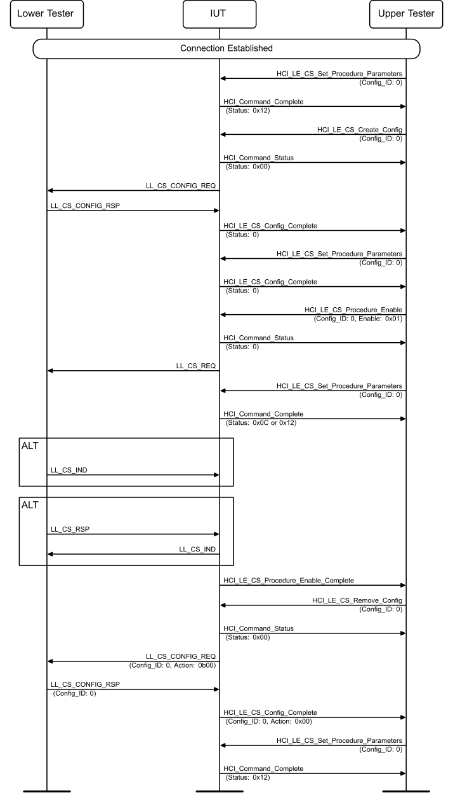

**Figure 4.106: LE CS Set Procedure Parameters, Invalid Config ID MSC**

parameters set to valid values and Config_ID set to 0. 2. The IUT sends an HCI_Command_Complete event to the Upper Tester with Status set to 0x12
(Invalid HCI Command Parameters). 3. The Upper Tester sends an HCI_LE_CS_Create_Config command to the IUT with parameters
set to valid values and Config_ID set to 0 and receives a successful HCI_Command_Status in response. 4. The IUT and the Lower Tester complete the CS configuration procedure. 5. The IUT sends a successful HCI_LE_CS_Config_Complete event in response. 6. The Upper Tester sends an HCI_LE_CS_Set_Procedure_Parameters command to the IUT with
Config_ID set to 0 and receives a successful HCI_Command_Complete event in response. 7. The Upper Tester sends an HCI_LE_CS_Procedure_Enable command to the IUT with Config_ID
set to 0 and Enable set to 0x01. 8. The IUT sends a successful HCI_Command_Status event in response. 9. The IUT sends an LL_CS_REQ PDU to the Lower Tester. 10. Before completing the CS Start procedure, the Upper Tester sends an
HCI_LE_CS_Set_Procedure_Parameters command to the IUT with parameters set to valid values and Config_ID set to 0. 11. The IUT sends an HCI_Command_Complete event to the Upper Tester with Status set to 0x12
(Invalid HCI Command Parameters) or 0x0C (Command Disallowed). 12. The Lower Tester and the IUT complete the CS Start Procedure. 13. The IUT sends a LE_CS_Procedure_Enable_Complete event to the Upper Tester. 14. After CS Procedure has been completed, the Upper Tester sends an
HCI_LE_CS_Remove_Config command to the IUT with the Config_ID set to 0 and receives a successful HCI_Command_Status event in response. 15. The IUT sends an LL_CS_CONFIG_REQ PDU to the Lower Tester with Config_ID set to 0 and
Action set to 0b00. 16. The Lower Tester sends an LL_CS_CONFIG_RSP PDU to the IUT with Config_ID set to 0. 17. The IUT sends an HCI_LE_CS_Config_Complete event to the Upper Tester with Config_ID set to

## 0 and Action set to 0x00. 18. The Upper Tester sends an HCI_LE_CS_Set_Procedure_Parameters command to the IUT with

parameters set to valid values and Config_ID set to 0. 19. The IUT sends an HCI_Command_Complete event to the Upper Tester with Status set to 0x12
(Invalid HCI Command Parameters).
• Expected Outcome
Pass verdict
In steps 2 and 19, the IUT sends an HCI_Command_Complete event to the Upper Tester with Status set to 0x12 (Invalid HCI Command Parameters).
In step 11, the IUT sends an HCI_Command_Complete event to the Upper Tester with Status set to 0x12 (Invalid HCI Command Parameters) or 0x0C (Command Disallowed).
HCI/CCO/BI-97-C [LE CS Procedure Enable after configuration and procedure parameters]
• Test Purpose
Verify that the IUT properly rejects the Upper Tester attempting to enable a CS Procedure until after the IUT has completed CS configuration and set the procedure parameters. The IUT also rejects an attempt to enable the procedure with the same configuration twice.
• Reference
[19] 7.8.141
• Initial Condition
- The IUT and the Lower Tester have an encrypted connection, read remote FAE Table, completed CS security procedure, exchanged capabilities, and set default settings.
• Test Procedure

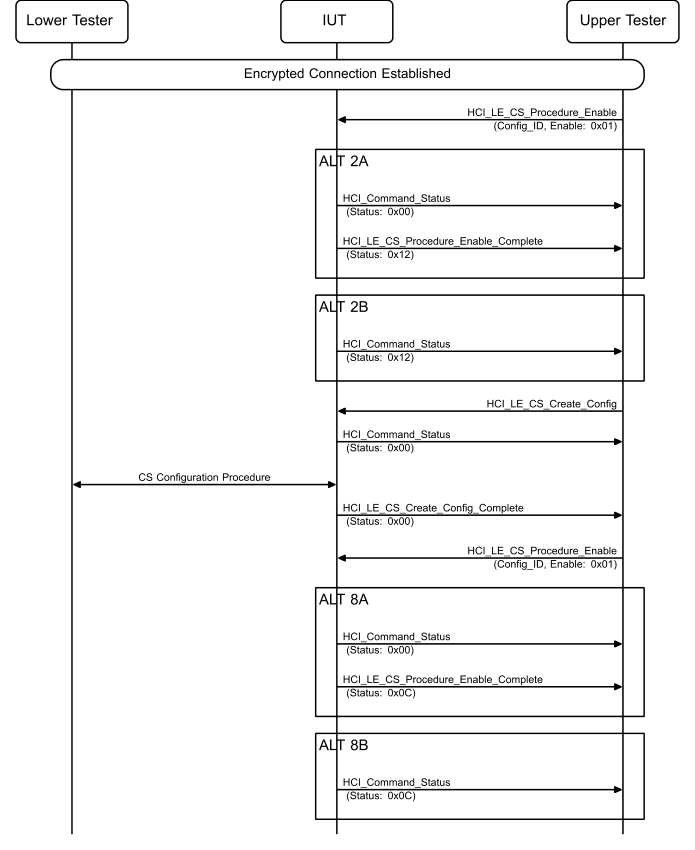

**Figure 4.107: LE CS Procedure Enable, Invalid Parameters MSC – Page 1 of 2**

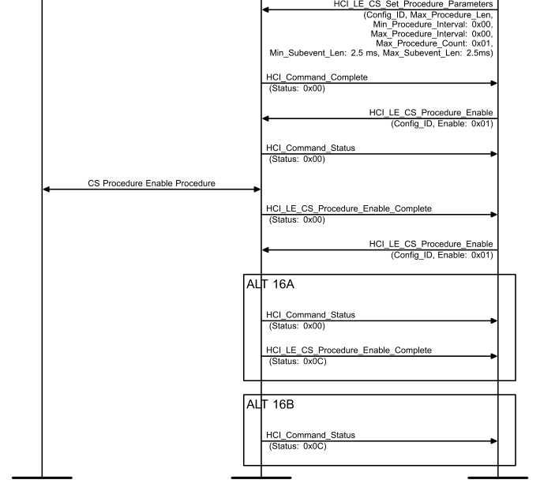

**Figure 4.108: LE CS Procedure Enable, Invalid Parameters MSC – Page 2 of 2**

1. The Upper Tester sends an HCI_LE_CS_Procedure_Enable command to the IUT with Config_ID
set a Config_ID that does not exist, and Enable set to 0x01. 2. Perform either alternative 2A or 2B depending on the HCI_Command_Status response.
Alternative 2A (Successful Status):
2A.1 The IUT sends a successful HCI_Command_Status event to the Upper Tester in response.
2A.2 The IUT sends an HCI_LE_CS_Procedure_Enable_Complete event to the Upper Tester with Status set to 0x12 (Invalid HCI Command Parameters).
Alternative 2B (Status = 0x12):
2B.1 The IUT sends an HCI_Command_Status event with Status set to 0x12 (Invalid HCI Command Parameters).
3. The Upper Tester sends an HCI_LE_CS_Create_Config command to the IUT with parameters
set to valid values. 4. The IUT sends a successful HCI_Command_Status event in response. 5. The Lower Tester and the IUT execute the CS configuration procedure. 6. The IUT sends a successful HCI_LE_CS_Create_Config_Complete event to the Upper Tester. 7. The Upper Tester sends an HCI_LE_CS_Procedure_Enable command to the IUT with Config_ID
set to the value used in step 3 and Enable set to 0x01. 8. Perform either alternative 8A or 8B depending on the HCI_Command_Status response.
Alternative 8A (Successful Status):
8A.1 The IUT sends a successful HCI_Command_Status event in response.
8A.2 The IUT sends an HCI_LE_CS_Procedure_Enable_Complete event to the Upper Tester with Status set to 0x0C (Command Disallowed).
Alternative 8B (Status = 0x0C):
8B.1 The IUT sends an HCI_Command_Status event with Status set to 0x0C (Command Disallowed).
9. The Upper Tester sends an HCI_LE_CS_Set_Procedure_Parameters with Config_ID set to the
value in step 3, Max_Procedure_Len set to 0x7D00 (20s) or TSPX_CS_Max_Procedure_Duration (whichever is less), Min_Procedure_Interval and Max_Procedure_Interval set to 0x00, Max_Procedure_Count set to 0x01 or Min_Subevent_Len and Max_Subevent_Len set to 2.5ms, and all other parameters are valid. 10. The IUT sends a successful HCI_Command_Complete event in response. 11. The Upper Tester sends an HCI_LE_CS_Procedure_Enable command to the IUT with Config_ID
set to the value used in step 3, and Enable set to 0x01. 12. The IUT sends a successful HCI_Command_Status event in response. 13. The Lower Tester and the IUT exchange the CS Procedure Enable procedure. 14. The IUT sends a LE_CS_Procedure_Enable_Complete event. 15. The Upper Tester sends an HCI_LE_CS_Procedure_Enable command to the IUT with Config_ID
set to the value used in step 3, and Enable set to 0x01. 16. Perform either alternative 16A or 16B depending on the HCI_Command_Status response.
Alternative 16A (Successful Status):
16A.1 The IUT sends a successful HCI_Command_Status event in response.
16A.2 The IUT sends an HCI_LE_CS_Procedure_Enable_Complete event to the Upper
Tester with Status set to 0x0C (Command Disallowed).
Alternative 16B (Status = 0x0C):
16B.1 The IUT sends an HCI_Command_Status event with Status set to 0x0C (Command
Disallowed).
• Expected Outcome
Pass verdict
In steps 2A.2 or 2B.1, the IUT sends an HCI event to the Upper Tester with Status set to 0x12 (Invalid HCI Command Parameters).
In step 8A.2 or 8B.1 and 16A.2 or 16B.1, the IUT sends an HCI event to the Upper Tester with Status set to 0x0C (Command Disallowed).

#### 4.10.19 CS Invalid Connection Handle • Test Purpose

Verify that the IUT properly handles the Upper Tester sending an invalid connection handle for the CS commands.
• Initial Condition
- The IUT and the Lower Tester have an encrypted connection.
• Test Case Configuration

| Test Case | Reference |  | HCI Command |  |  | HCI Command |  |
| --- | --- | --- | --- | --- | --- | --- | --- |
|  |  |  | HCI Event |  |  | Response |  |
| HCI/CCO/BI-98-C [CS Invalid Connection Handle, LE CS Read Remote Supported Capabilities] | [19] 7.8.131 | HCI LE CS Read Remote Supported _ _ _ _ _ _ Capabilities HCI LE CS Read Remote Supported _ _ _ _ _ _ Capabilities Complete _ |  |  | HCI Command _ Status _ |  |  |
| HCI/CCO/BI-99-C [CS Invalid Connection Handle, LE CS Security Enable] | [19] 7.8.133 | HCI LE CS Security Enable _ _ _ _ HCI LE CS Security Enable Complete _ _ _ _ _ |  |  | HCI Command _ Status _ |  |  |
| HCI/CCO/BI-100-C [CS Invalid Connection Handle, LE CS Set Default Settings] | [19] 7.8.134 | HCI LE CS Set Default Settings _ _ _ _ _ |  |  | HCI Command _ Complete _ |  |  |
| HCI/CCO/BI-101-C [CS Invalid Connection Handle, LE CS Read Remote FAE Table] | [19] 7.8.135 | HCI LE CS Read Remote FAE Table _ _ _ _ _ _ HCI LE CS Read Remote FAE Table _ _ _ _ _ _ _ Complete |  |  | HCI Command _ Status _ |  |  |
| HCI/CCO/BI-102-C [CS Invalid Connection Handle, LE CS Write Cached Remote FAE Table] | [19] 7.8.136 | HCI LE CS Write Cached Remote FAE _ _ _ _ _ _ Table _ |  |  | HCI Command _ Complete _ |  |  |
| HCI/CCO/BI-103-C [CS Invalid Connection Handle, LE CS Create Config] | [19] 7.8.137 | HCI LE CS Create Config _ _ _ _ HCI LE CS Config Complete _ _ _ _ |  |  | HCI Command _ Status _ |  |  |
| HCI/CCO/BI-104-C [CS Invalid Connection Handle, LE CS Remove Config] | [19] 7.8.138 | HCI LE CS Remove Config _ _ _ _ HCI LE CS Config Complete _ _ _ _ |  |  | HCI Command _ Status _ |  |  |
| HCI/CCO/BI-105-C [CS Invalid Connection Handle, LE CS Procedure Enable] | [19] 7.8.141 | HCI LE CS Procedure Enable _ _ _ _ HCI LE CS Procedure Enable Complete _ _ _ _ _ |  |  | HCI Command _ Status _ |  |  |

Table 4.61: CS Invalid Connection Handle test cases
• Test Procedure
1. The Upper Tester sends an HCI Command specified in Table 4.61 to the IUT with
Connection_Handle set to an invalid ACL, and all other parameters set to valid values. 2. Perform either alternative 2A, 2B, or 2C depending on the Command Response in Table 4.61.
Alternative 2A (HCI_Command_Status with Status = 0x00):
2A.1 The IUT sends a successful HCI_Command_Status event in response.
2A.2 The IUT sends an HCI event specified in Table 4.61 to the Upper Tester with Status set to 0x02 (Unknown Connection Identifier).
Alternative 2B (HCI_Command_Status with Status = 0x02):
2B.1 The IUT sends an HCI_Command_Status event with Status set to 0x02 (Unknown Connection Identifier).
2C.1 The IUT sends an HCI_Command_Complete event with Status set to 0x02 (Unknown Connection Identifier). • Expected Outcome
Pass verdict
In step 2A.2, 2B.1, or 2C.1, the IUT sends an event to the Upper Tester with Status set to 0x02 (Unknown Connection Identifier).
HCI/CCO/BI-106-C [LE CS Create Config, Invalid Mode and Submode Combinations]
• Test Purpose
Verify that the IUT properly returns an error when the host attempts to configure invalid combinations of the Main_Mode and Submode.
• Reference
[19] 7.8.137
• Initial Condition
- The IUT and Lower Tester have an encrypted connection, exchanged capabilities, and set default settings.
• Test Procedure
Repeat steps 1 and 2 for each round in Table 4.62.
1. The Upper Tester sends an HCI_LE_CS_Create_Config command to the IUT with
Main_Mode_Type and Sub_Mode_Type set as specified in Table 4.62. 2. Perform either alternative 2A or 2B depending on the HCI_Command_Status response.
Alternative 2A (Successful Status):
2A.1 The IUT sends a successful HCI_Command_Status event in response.
2A.2 The IUT sends an HCI_LE_CS_Config_Complete event to the Upper Tester with Status > 0.
Alternative 2B (Status > 0):
2B.1 The IUT sends an HCI_Command_Status event with Status > 0.

|  | Round |  |  | Main Mode _ |  |  | Submode |  |
| --- | --- | --- | --- | --- | --- | --- | --- | --- |
| 1 |  |  | 1 |  |  | 1 |  |  |
| 2 |  |  | 1 |  |  | 2 |  |  |
| 3 |  |  | 1 |  |  | 3 |  |  |
| 4 |  |  | 2 |  |  | 2 |  |  |
| 5 |  |  | 3 |  |  | 1 |  |  |
| 6 |  |  | 3 |  |  | 3 |  |  |

Table 4.62: LE CS Create Config, Invalid Mode and Submode Combinations rounds
• Expected Outcome
Pass verdict
In step 2A.2 or 2B.1, the IUT rejects the invalid Main_Mode and Submode combinations with an Error Status.
HCI/CCO/BI-107-C [Channel Sounding Commands, Channel Sounding Host Support Bit Not Set]
• Test Purpose
Verify that the IUT properly returns an error when the Channel Sounding (Host Support) feature bit is not set.
• Reference
[19] 7.8.130, 7.8.131, 7.8.132, 7.8.133
• Initial Condition
- The IUT and Lower Tester have an encrypted connection but have not performed a CS Capability Exchange.
- The Upper Tester has not set the Host Feature Bit.
• Test Procedure
Repeat steps 1 and 2 for each round in Table 4.63.
1. The Upper Tester sends an HCI Command specified in Table 4.63 to the IUT valid parameters. 2. Perform alternatives 2A, 2B, or 2C depending on the HCI response event.
Alternative 2A (HCI_Command_Status with Status = 0x00):
2A.1 The IUT sends a successful HCI_Command_Status event in response.
2A.2 The IUT sends an HCI event specified in Table 4.63 to the Upper Tester with Status set to 0x0C (Command Disallowed).
Alternative 2B (HCI_Command_Status with Status = 0x0C):
2B.1 The IUT sends an HCI_Command_Status event with Status set to 0x0C (Command Disallowed).
Alternative 2C (HCI_Command_Complete):
2C.1 The IUT sends an HCI_Command_Complete event with Status set to 0x0C (Command Disallowed).

|  | Round |  |  | HCI Command/HCI Event |  |  | HCI Response |  |
| --- | --- | --- | --- | --- | --- | --- | --- | --- |
| 1 |  |  | HCI LE CS Read Local Supported Capabilities _ _ _ _ _ _ No Event |  |  | HCI Command Complete _ _ |  |  |
| 2 |  |  | HCI LE CS Read Remote Supported Capabilities _ _ _ _ _ _ HCI LE CS Read Remote Supported Capabilities Com _ _ _ _ _ _ _ plete |  |  | HCI Command Status _ _ |  |  |
| 3 |  |  | HCI LE CS Write Cached Remote Supported Capabiliti _ _ _ _ _ _ _ es |  |  | HCI Command Complete _ _ |  |  |
| 4 |  |  | HCI LE CS Security Enable _ _ _ _ |  |  | HCI Command Status _ _ |  |  |

Table 4.63: Channel Sounding Commands, Channel Sounding Not Supported rounds
• Expected Outcome
Pass verdict
In step 2A.2, 2B.1, or 2C.1, the IUT sends an event to the Upper Tester with Status set to 0x0C (Command Disallowed).
Set • Test Purpose
Verify that the IUT properly returns an error when the Lower Tester does not have the Channel Sounding Host Bit set.
• Reference
[19] 7.8.131
• Initial Condition
- The IUT is in the Role as specified in Table 4.64.
- The IUT and Lower Tester have an encrypted connection.
- The Lower Tester does not have the Channel Sounding Host Bit set.
• Test Case Configuration

|  | Test Case |  |  | Role |  |
| --- | --- | --- | --- | --- | --- |
| HCI/CCO/BI-108-C [LE CS Read Remote Supported Capabilities, Remote CS Host Bit Not Set, Central] |  |  | Central |  |  |
| HCI/CCO/BI-109-C [LE CS Read Remote Supported Capabilities, Remote CS Host Bit Not Set, Peripheral] |  |  | Peripheral |  |  |

Table 4.64: LE CS Read Remote Supported Capabilities, Remote CS Host Bit Not Set test cases
• Test Procedure
1. If the IUT autonomously performed a feature exchange, skip to step 3. 2. Perform alternative 2A or 2B depending on the IUT role.
Alternative 2A (IUT is a Central):
2A.1 The Upper Tester sends an HCI_LE_Read_Remote_Features_Page_0 command to the IUT and receives a successful HCI_Command_Status in response.
2A.2 The IUT sends an LL_FEATURE_REQ to the Lower Tester.
2A.3 The Lower Tester sends an LL_FEATURE_RSP to the IUT.
2A.4 The IUT sends an HCI_LE_Read_Remote_Features_Page_0_Complete event to the Upper Tester.
Alternative 2B (IUT is a Peripheral):
2B.1 The Lower Tester sends an LL_FEATURE_REQ to the IUT.
2B.2 The IUT sends an LL_FEATURE_RSP to the Lower Tester.
3. The Upper Tester sends an HCI_LE_CS_Read_Remote_Supported_Capabilities command to
the IUT. 4. Perform either alternative 4A or 4B depending on the HCI response event.
Alternative 4A (HCI_Command_Status with Status = 0x00):
4A.1 The IUT sends a successful HCI_Command_Status event in response.
4A.2 The IUT sends an HCI_LE_CS_Read_Remote_Supported_Capabilities_Complete event to the Upper Tester with Status set to 0x0C (Command Disallowed).
4B.1 The IUT sends an HCI_Command_Status event with Status set to 0x0C (Command Disallowed). • Expected Outcome
Pass verdict
In step 4A.2 or 4B.1, the IUT sends an event to the Upper Tester with Status set to 0x0C (Command Disallowed).
HCI/CCO/BI-110-C [LE CS Set Channel Classification, RFU Channels]
• Test Purpose
Verify that the IUT properly handles the Upper Tester sending an HCI_LE_CS_Set_Channel_Classification command with RFU Channels in the channel map.
• Reference
[19] 7.8.139
• Initial Condition
- The IUT and Lower Tester have an encrypted connection, exchanged capabilities, and set default settings.
• Test Procedure
Repeat steps 1 and 2 for each round in Table 4.65. Each round has an interval of 1.25 seconds.
1. The Upper Tester sends an HCI_LE_CS_Set_Channel_Classification command to the IUT with
Channel_Classification set with 14 valid channel bits set to 0b1 and the bit specified in Table 4.65 set to 0b1. 2. The IUT sends an HCI_Command_Complete event to the Upper Tester with Status set to 0x12
(Invalid HCI Command Parameters).

|  | Round |  |  | Channel Bit |  |
| --- | --- | --- | --- | --- | --- |
| 1 |  |  | 0 |  |  |
| 2 |  |  | 1 |  |  |
| 3 |  |  | 23 |  |  |
| 4 |  |  | 24 |  |  |
| 5 |  |  | 25 |  |  |
| 6 |  |  | 77 |  |  |
| 7 |  |  | 78 |  |  |

Table 4.65: LE CS Set Channel Classification, RFU Channels rounds
• Expected Outcome
Pass verdict
In step 2, the IUT sends an HCI_Command_Complete event with Status set to 0x12.
• Test Purpose
Verify that the IUT properly handles the Upper Tester sending an HCI_LE_CS_Set_Channel_Classification command at an interval shorter than 1 second. The IUT returns an error when successive calls the HCI_LE_CS_Set_Channel_Classification shorter than 1 second.
• Reference
[19] 7.8.139
• Initial Condition
- The IUT and Lower Tester have an encrypted connection, exchanged capabilities, and set default settings.
• Test Procedure
1. The Upper Tester sends an HCI_LE_CS_Set_Channel_Classification command to the IUT with
Channel_Classification set to at least 15 valid bits. 2. The IUT sends a successful HCI_Command_Complete event to the Upper Tester. 3. Less than 1 second after step 1, the Upper Tester sends an
HCI_LE_CS_Set_Channel_Classification command to the IUT with Channel_Classification set to at least 15 valid bits. 4. The IUT sends an HCI_Command_Complete event to the Upper Tester with Status set to 0x0C
(Command Disallowed). 5. At least 1 second after step 1, the Upper Tester sends an
HCI_LE_CS_Set_Channel_Classification command to the IUT with Channel_Classification set to at least 15 valid bits. 6. The IUT sends a successful HCI_Command_Complete event to the Upper Tester.
• Expected Outcome
Pass verdict
In step 4, the IUT sends an HCI_Command_Complete event to the Upper Tester with Status set to 0x0C (Command Disallowed).
In step 6, the IUT sends a successful HCI_Command_Complete event to the Upper Tester.
Inconclusive verdict
The Upper Tester is unable to execute step 3 in less than 1 second after step 1.
HCI/CCO/BI-112-C [LE CS Create Config, Peer Capabilities Unknown]
• Test Purpose
Verify that the IUT properly handles the Upper Tester sending an HCI_LE CS Create Config command when the Peer capabilities are unknown.
• Reference
[19] 7.8.137
• Initial Condition
- The IUT and Lower Tester have an encrypted connection and set default settings but have not exchanged capabilities.
• Test Procedure
1. The Upper Tester sends an HCI_LE_CS_Create_Config command to the IUT with Role set to a
supported role and all other values set to valid values. 2. Perform either alternative 2A or 2B depending on the HCI_Command_Status response.
Alternative 2A (Successful Status):
2A.1 The IUT sends a successful HCI_Command_Status event in response.
2A.2 The IUT sends an HCI_LE_CS_Config_Complete event to the Upper Tester with Status set to 0x0C (Command Disallowed).
Alternative 2B (Status = 0x0C):
2B.1 The IUT sends an HCI_Command_Status event with Status set to 0x0C (Command Disallowed).
Alternative 2C (Successful Status with Capabilities Exchange):
2C.1 The IUT sends a successful HCI_Command_Status event in response.
2C.2 The IUT sends an LL_CS_CAPABILITIES_REQ PDU to the Lower Tester.
2C.3 The Lower Tester sends an LL_CS_CAPABILITIES_RSP PDU to the IUT.
2C.4 Skip to step 5.
3. Execute either alternative 3A or 3B depending on the execution round.
Alternative 3A (First execution round):
3A.1 The Upper Tester sends an HCI_LE_CS_Read_Remote_Supported_Capabilities command to the IUT and receives a successful HCI_Command_Complete event in response.
3A.2 The IUT sends an LL_CS_CAPABILITIES_REQ PDU to the Lower Tester.
3A.3 The Lower Tester sends an LL_CS_CAPABILITIES_RSP PDU to the IUT.
3A.4 The IUT sends an HCI_LE_CS_Read_Remote_Supported_Capabilities_Complete event to the Upper Tester.
Alternative 3B (Second round):
3B.1 The Upper Tester sends an HCI_LE_CS_Write_Cached_Remote_Supported_Capabilities command to the IUT with valid configurations.
3B.2 The IUT sends a successful HCI_Command_Complete even to the Upper Tester.
4. The Upper Tester sends an HCI_LE_CS_Create_Config command to the IUT with Role set to
TSPX_CS_Role, Config_ID set to 0, and all other values set to valid values and receives a successful HCI_Command_Status in response. 5. The IUT sends an LL_CS_CONFIG_REQ PDU to the Lower Tester with Config_ID set to the
value from step 4. 6. The Lower Tester sends an LL_CS_CONFIG_RSP PDU to the IUT. 7. The IUT sends a successful HCI_LE_CS_Create_Config_Complete event to the Upper Tester. 8. The IUT and the Lower Tester disconnect and reconnect and return to the Initial Condition state. 9. Repeat steps 1 to 7 and execute Alternative 3B.
• Expected Outcome
Pass verdict
In step 2A.2 or 2B.1, the IUT returns an error with Status set to 0x0C (Command Disallowed).
In step 2C, the IUT initiates a CS capabilities exchange before beginning the CS configuration procedure.
In step 7, the IUT sends a successful HCI_LE_CS_Create_Config_Complete event to the Upper Tester.

#### 4.10.21 Reject CS Start Procedure When IUT Configuration has not completed

• Test Purpose
Verify that a Central IUT rejects the CS Start Procedure when capability exchange, configuration, and security procedures have not been completed.
• Reference
[18] 5.1.25, 5.1.26
• Initial Condition
- The Central IUT and Lower Tester have an encrypted connection but have not exchanged capabilities.
• Test Case Configuration

|  | Test Case |  |  | IUT Role |  |
| --- | --- | --- | --- | --- | --- |
| HCI/CCO/BI-113-C [Reject CS Start Procedure When IUT Configuration has not completed, Initiator] |  |  | Initiator |  |  |
| HCI/CCO/BI-114-C [Reject CS Start Procedure When IUT Configuration has not completed, Reflector] |  |  | Reflector |  |  |

Table 4.66: Reject CS Start Procedure When IUT Configuration has not completed test cases
• Test Procedure

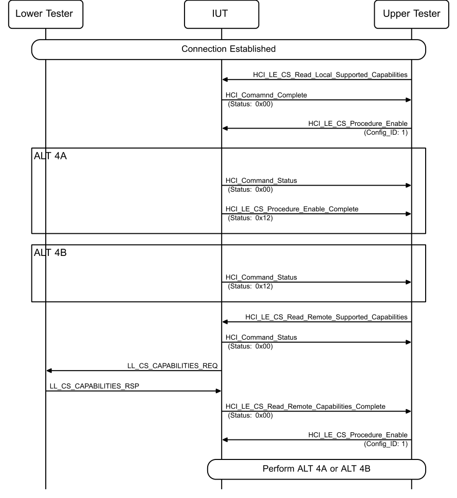

**Figure 4.109: Reject CS Start Procedure when IUT Configuration has not completed MSC – Page 1 of 2**

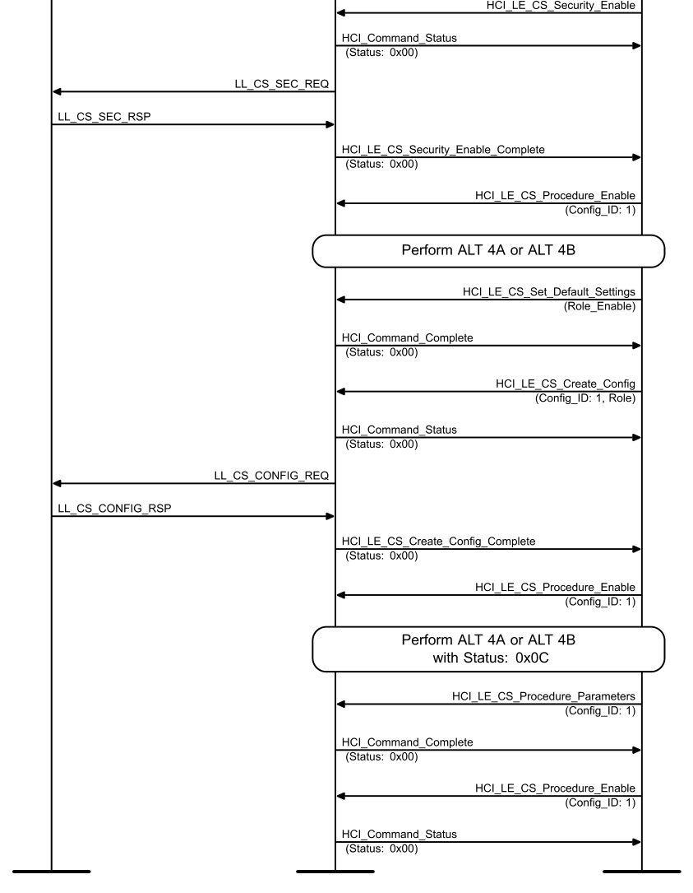

**Figure 4.110: Reject CS Start Procedure when IUT Configuration has not completed MSC – Page 2 of 2**

1. The Upper Tester sends an HCI_LE_CS_Read_Local_Supported_Capabilities command to the
IUT. 2. The IUT sends a successful HCI_Command_Complete event to the Upper Tester. 3. The Upper Tester sends an HCI_LE_CS_Procedure_Enable command to the IUT with Config_ID
set to 1.
Alternative 4A (Successful HCI_Command_Status):
4A.1 The IUT sends a successful HCI_Command_Status event to the Upper Tester.
4A.2 The IUT sends an HCI_LE_CS_Procedure_Enable_Complete event to the Upper Tester with Status set to 0x12 (Invalid HCI Command Parameters).
Alternative 4B (HCI_Command_Status with an 0x12 (Invalid HCI Command Parameters):
4B.1 The IUT sends an HCI_Command_Status event to the Upper Tester with Status set to 0x12 (Invalid HCI Command Parameters).
5. The Upper Tester sends an HCI_LE_CS_Read_Remote_Supported_Capabilities command to
the IUT. 6. The IUT sends a successful HCI_Command_Status event to the Upper Tester. 7. The IUT sends an LL_CS_CAPABILITIES_REQ PDU to the Lower Tester. 8. The Lower Tester sends an LL_CS_CAPABILITIES_RSP PDU to the IUT with No_FAE set to 1. 9. The IUT sends a successful HCI_LE_CS_Read_Remote_Capabilities_Complete event to the
Upper Tester. 10. The Upper Tester sends an HCI_LE_CS_Procedure_Enable command to the IUT with Config_ID
set to 1. 11. Perform step 4. 12. The Upper Tester sends an HCI_LE_CS_Security_Enable command to the IUT and receives a
successful HCI_Command_Status in response. 13. The IUT sends an LL_CS_SEC_REQ PDU to the Lower Tester. 14. The Lower Tester sends an LL_CS_SEC_RSP PDU to the IUT. 15. The IUT sends a successful HCI_LE_CS_Security_Enable_Complete event to the Upper Tester. 16. The Upper Tester sends an HCI_LE_CS_Procedure_Enable command to the IUT with Config_ID
set to 1. 17. Perform step 4. 18. The Upper Tester sends an HCI_LE_CS_Set_Default_Settings to the IUT with Role_Enable set
as specified in Table 4.66 and receives a successful HCI_Command_Complete event in response. 19. The Upper Tester sends an HCI_LE_CS_Create_Config command to the IUT with Config_ID set
to 1, Role set to the Role in Table 4.66, and all other paraemters with valid values and receives a successful HCI_Command_Status event to the Upper Tester. 20. The IUT sends an LL_CS_CONFIG_REQ PDU to the Lower Tester with the same parameters
sent in Step 12. 21. The Lower Tester sends an LL_CS_CONFIG_RSP PDU to the IUT with Config_ID Set to 1. 22. The IUT sends an HCI_LE_CS_Create_Config_Complete event to the Upper Tester with a
Config_ID. 23. The Upper Tester sends an HCI_LE_CS_Procedure_Enable command to the IUT with Config_ID
set to 1. 24. Perform step 4 however the Status is set to 0x0C (Command Disallowed) instead. 25. The Upper Tester sends an HCI_LE_CS_Set_Procedure_Parameters command to the IUT with
Config_ID set to 1 and receives a successful HCI_Command_Complete event in response. 26. The Upper Tester sends an HCI_LE_CS_Procedure_Enable command to the IUT. 27. The IUT sends a successful HCI_Command_Status event to the Upper Tester.
• Expected Outcome
Pass verdict
In steps 4, 11, 17, and 24, the IUT rejects the HCI_LE_CS_Procedure_Enable command with an 0x0C error code.
In step 27, the IUT successfully starts the CS Procedure Enable procedure.
HCI/CCO/BI-115-C [LE CS Set Procedure Parameters, Invalid Preferred Peer Antennas]
• Test Purpose
Verify that the IUT properly returns an Invalid HCI Command Parameters error when the host makes calls to the LE CS Set Procedure Parameters commands with Preferred Peer Antennas set to 0x00.
• Reference
[1] 7.8.140
• Initial Condition
- The IUT and the Lower Tester have an encrypted connection, read remote FAE Table, completed CS security procedure, exchanged capabilities, and created configurations.
• Test Procedure
1. The Upper Tester sends an HCI_LE_CS_Set_Procedure_Parameters command to the IUT with
Preferred_Peer_Antennas set to 0x00. 2. The IUT sends an HCI_Command_Complete event to the Upper Tester with Status set to 0x12
(Invalid HCI Command Parameters).
• Expected Outcome
Pass verdict
In step 2, the IUT sends an 0x12 error.

#### 4.10.22 HCI command fails when address is the IUT address • Test Purpose

Verify that the IUT correctly rejects the HCI command when BD_ADDR is set to the IUT device address.
• Initial Condition
- The IUT is in Standby.
• Test Case Configuration

|  | Test Case |  |  | Reference |  |  | HCI Command |  |  | HCI Event |  |
| --- | --- | --- | --- | --- | --- | --- | --- | --- | --- | --- | --- |
| HCI/CCO/BI-118-C [HCI fails with address is the IUT address, Create Connection] |  |  | [8] 7.1.5 |  |  | HCI Create Connection _ _ |  |  | HCI Create Connection _ _ _ Complete |  |  |
| HCI/CCO/BI-119-C [HCI fails with address is the IUT address, Truncated Page] |  |  | [8] 7.1.47 |  |  | HCI Truncated Page _ _ |  |  | HCI Truncated Page C _ _ _ omplete |  |  |

Table 4.67: HCI command fails with address is the IUT address test cases
• Test Procedure
1. The Upper Tester sends the HCI command specified in Table 4.67 to the IUT with BD_ADDR set
to the IUT device address.
2. Perform either Alternative 2A or 2B depending on the IUT response.
Alternative 2A (Successful HCI_Command_Status):
2A.1 The IUT sends a successful HCI_Command_Status event to the Upper Tester.
2A.2 The IUT sends the HCI Event specified in Table 4.67 to the Upper Tester with a non- zero Status.
Alternative 2B (HCI_Command_Status with an error code):
2B.1 The IUT sends an HCI_Command_Status event to the Upper Tester with a non-zero Status. • Expected Outcome
Pass verdict
In steps 2A.2 or 2B.1, the IUT sends an event with a non-zero error code.
The IUT does not transmit any paging packets from the start of step 1 until at least 5 seconds after the end of step 2.
Warning
In steps 2A.1 or 2B.1, the IUT sends an event with the error code Page_Timeout (0x04).

### 4.11 Controller Setup

HCI/CSE/BV-01-C [Logical Link Cancel Command]
• Test Purpose
Verify that the Logical Link Cancel command does cancel a Create Logical Link command before the logical link is totally established.
• Reference
[1] 7.1.40, 7.1.43
• Initial Condition
- The IUT is the initiator.
• Test Procedure
The Upper Tester sends Create Logical Link command to the IUT.
The Upper Tester receives command status event with success.
The Upper Tester sends Logical Link Cancel command right away.

| Lower Tester |  |
| --- | --- |
|  |  |

| IUT |  |
| --- | --- |
|  |  |
|  |  |

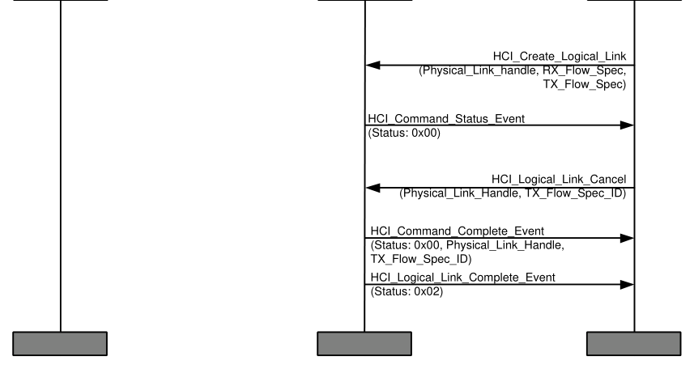

**Figure 4.111: HCI/CSE/BV-01-C [Logical Link Cancel Command] MSC**

• Expected Outcome
Pass verdict
Command Complete event for Logical Link Cancel is received by the Upper Tester.
Logical Link Complete event with error code Unknown Connection Identifier (0x02) is received by the Upper Tester.
HCI/CSE/BV-02-C [Logical Link Cancel Command]
• Test Purpose
Verify that the Logical Link Cancel command does cancel a Create Logical Link command before the logical link is totally established.
• Reference
[1] 7.1.41, 7.1.43
• Initial Condition
- The IUT is the responder and it has received Accept Logical Link Request command.
• Test Procedure
The Upper Tester sends Accept Logical Link command to the IUT.
The Upper Tester receives command status event with success.
The Upper Tester sends Logical Link Cancel command right away.

| Lower Tester |  |
| --- | --- |
|  |  |

| IUT |  |
| --- | --- |
|  |  |
|  |  |

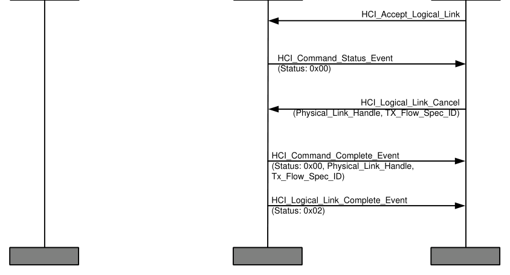

**Figure 4.112: HCI/CSE/BV-02-C: [Logical Link Cancel Command] MSC**

• Expected Outcome
Pass verdict
Command Complete event for Logical Link Cancel is received by the Upper Tester.
Logical Link Complete event with error code Unknown Connection Identifier (0x02) is received by the Upper Tester.
HCI/CSE/BI-03-C [Logical Link Cancel Command]
• Test Purpose
Verify that the Logical Link Cancel command is handled correctly after the logical link has been established already.
• Reference
[1] 7.1.43
• Initial Condition
- The IUT and the Lower Tester have a Logical Link established already.
• Test Procedure
The Upper Tester sends Logical Link Cancel command to the IUT.

| Lower Tester IUT Upper Tester Logical Link Established HCI Logical Link Cancel _ _ _ (Physical Handle, TX Flow Spec ID) _ _ _ HCI Logical Link Complete Event _ _ _ _ (Status=0x0B) |  |  |  |
| --- | --- | --- | --- |
|  |  |  |  |

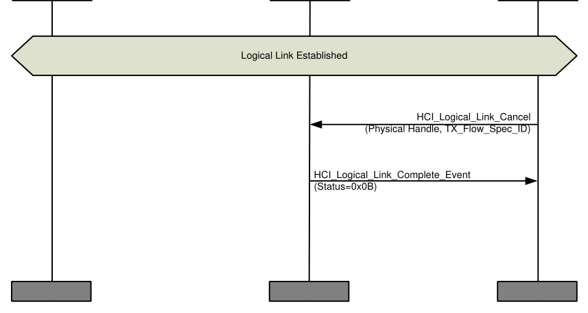

**Figure 4.113: HCI/CSE/BI-03-C [Logical Link Cancel Command] MSC**

• Expected Outcome
Pass verdict
Command Complete event for Logical Link Cancel is received by the Upper Tester with error code ACL Connection Already Exists (0x0B).
HCI/CSE/BI-04-C [Logical Link Cancel Command]
• Test Purpose
Verify that the Logical Link Cancel command is handled correctly if there is no logical link or an invalid logical link handle is given.
• Reference
[1] HCI 7.1.43
• Initial Condition
- The IUT and the Lower Tester do not have any Logical Links established.
• Test Procedure
The Upper Tester sends Logical Link Cancel command to the IUT.

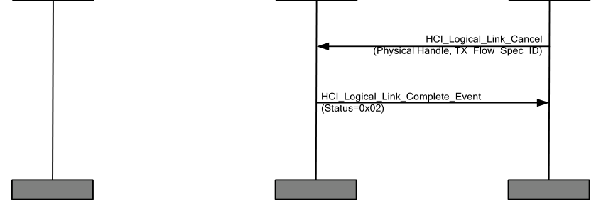

**Figure 4.114: HCI/CSE/BI-04-C [Logical Link Cancel Command] MSC**

• Expected Outcome
Pass verdict
Command Complete event for Logical Link Cancel is received by the Upper Tester with error code Unknown Connection Identifier (0x02).
HCI/CSE/BV-05-C [Write Logical Link Accept Timeout Command/Read Logical Link Accept Timeout Command]
• Test Purpose
Verify that the Write Logical Link Accept Timeout Command and Read Logical Link Accept Timeout Command are handled correctly by the IUT.
• Reference
[1] 7.3.15, 7.3.16
• Initial Condition
- The IUT is in standby.
• Test Procedure
The Upper Tester issues Write Logical Link Accept Timeout Command with preset information to the IUT.
The Upper Tester receives success status in the Write Logical Link Accept Timeout Command complete event.
The Upper Tester issues Read Logical Link Accept Timeout Command with preset information to the IUT.

| Lower Tester |  |
| --- | --- |
|  |  |

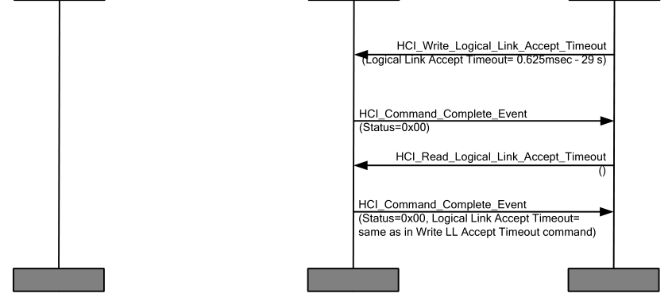

**Figure 4.115: HCI/CSE/BV-05-C [Write Logical Link Accept Timeout Command/Read Logical Link Accept Timeout Command] MSC**

• Expected Outcome
Pass verdict
The Upper Tester receives command complete event with success status for two commands. The Upper Tester receives the data returned by the Read Logical Link Accept Timeout Command complete event. The received data matches that was used in the Write Logical Link Accept Timeout Command.
HCI/CSE/BV-06-C [Verify Truncated Paging]
• Test Purpose
Verify that the Truncated Page command configures the IUT to perform a Truncated Page procedure.
Verify that the IUT generates Truncated Page Complete event.
• Reference
[1] 7.1, 7.7
• Initial Condition
- The IUT is in Standby.
- The Lower Tester is performing R1 Interlaced Scans.
• Test Procedure
The Upper Tester sends HCI Truncated Page command to the IUT and receives HCI Command Status pending.

|  | Lower Tester | IUT Upper Tester Lower Tester is Configured for R1 Interlaced Scans HCI Reset _ HCI Command Complete event HCI Truncated Page _ _ (BD ADDR, Page Scan Repetition Mode=0x01, _ _ _ _ Clock Offset=0x0000) HCI Command Status event _ Truncated Page Complete (Status=0x00, BD ADDR) _ |  |
| --- | --- | --- | --- |
|  |  |  |  |

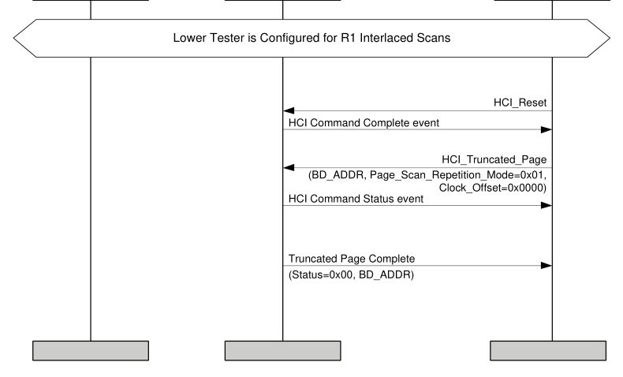

**Figure 4.116: HCI/CSE/BV-06-C [Verify Truncated Paging] MSC**

• Expected Outcome
Pass verdict
The IUT performs a Truncated Page procedure on the Lower Tester AND
The IUT generates a Truncated Page Complete event with Status = Success.
HCI/CSE/BV-07-C [Page Response Timeout Detection]
• Test Purpose
Verify that the IUT generates a Page Response Timeout event.
• Reference
[1] 7.7
• Initial Condition
- The IUT is configured for R1 Page Scans.
- The Lower Tester is in Standby.
• Test Procedure
The Lower Tester performs Truncated Paging on the IUT.

|  | Lower Tester |  | IUT Upper Tester HCI Reset _ HCI Command Complete event HCI Write Page Scan Activity _ _ _ _ (Page Scan Interval=0x0800, _ _ Page Scan Window=0x012) HCI Command Status event _ _ HCI Write Scan Enable _ _ _ (Scan Enable=0x02) _ HCI Command Complete event Lower Tester performs Truncated Page on the IUT Peripheral Page Response Timeout | Upper Tester |  |
| --- | --- | --- | --- | --- | --- |
|  |  |  |  |  |  |
|  |  |  |  |  |  |

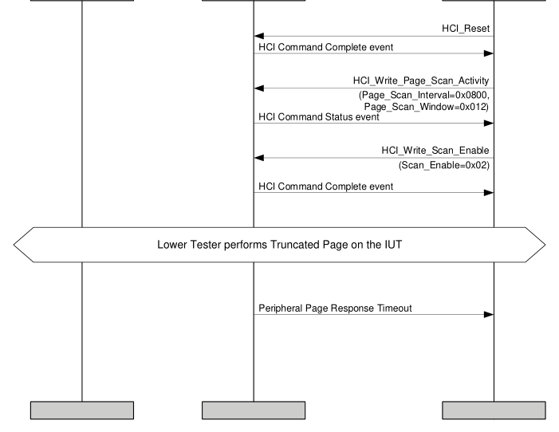

**Figure 4.117: HCI/CSE/BV-07-C [Page Response Timeout Detection] MSC**

• Expected Outcome
Pass verdict
The IUT generates a Page Response Timeout event.
HCI/CSE/BV-08-C [LE Set Host Feature Command During Connection, Initiator]
• Test Purpose
Verify that the Initiator IUT returns an error when the Upper Tester sends an HCI_LE_Set_Host_Feature command after a connection is completed with the Lower Tester.
• Reference
[13] 7.8.115
• Initial Condition
- The IUT is the Initiator.
• Test Procedure

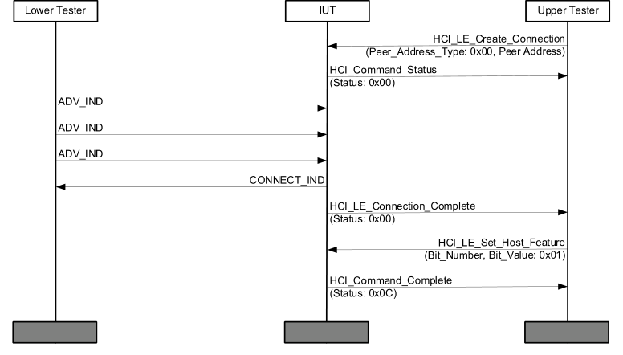

**Figure 4.118: HCI/CSE/BV-08-C [LE Set Host Feature Command During Connection, Initiator] MSC**

1. The Upper Tester sends an HCI_LE_Create_Connection command to the IUT with
Peer_Address_Type set to 0x00 and Peer_Address set to the Lower Tester’s public address, and it receives a successful HCI_Command_Status event in return. 2. The Lower Tester is configured to start advertising with a public address. 3. After receiving an ADV_IND PDU from the Lower Tester, the IUT sends a CONNECT_IND PDU
to the Lower Tester with InitA set to the IUT public address. 4. The IUT sends an HCI_LE_Connection_Complete event to the Upper Tester. 5. The Upper Tester sends an HCI_LE_Set_Host_Feature command with Bit_Number set to a
supported feature bit and Bit_Value set to 0x01. 6. The IUT sends an HCI_Command_Complete event to the Upper Tester with Status set to 0x0C.
• Expected Outcome
Pass verdict
In step 8, the IUT sends an HCI_Command_Complete event to the Upper Tester with Status set to 0x0C.
HCI/CSE/BV-09-C [LE Set Host Feature Command During Connection, Advertiser]
• Test Purpose
Verify that the Advertiser IUT returns an error when the Upper Tester sends an HCI_LE_Set_Host_Feature command after a connection is completed with the Lower Tester.
• Reference
[13] 7.8.115
• Initial Condition
- The IUT is the Advertiser.
• Test Procedure

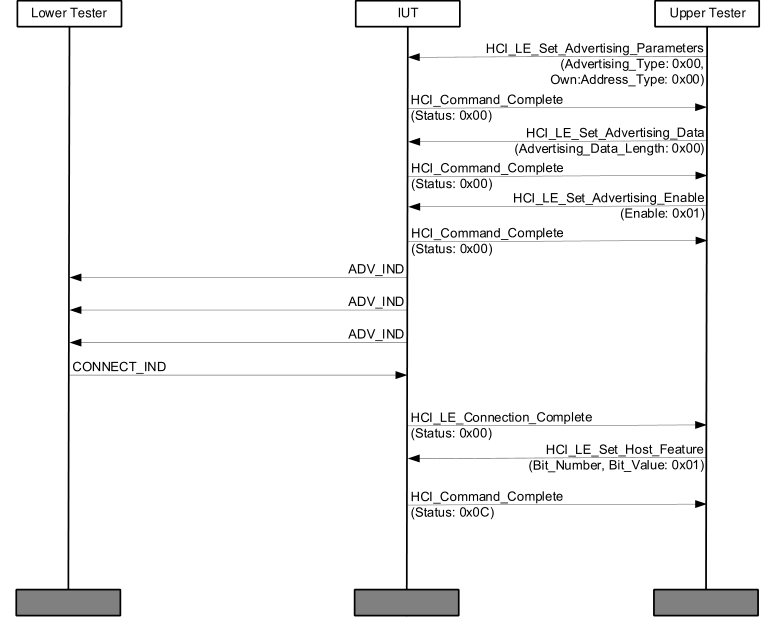

**Figure 4.119: HCI/CSE/BV-09-C [LE Set Host Feature Command During Connection, Advertiser] MSC**

1. The Upper Tester sends an HCI_LE_Set_Advertising_Parameters command to the IUT with
Advertising_Type set to 0x00 and Own_Address_Type set to 0x00, and it receives a successful HCI_Command_Complete event in return. 2. The Upper Tester sends an HCI_LE_Set_Advertising_Data command to the IUT with
Advertising_Data_Length set to 0, and it receives a successful HCI_Command_Complete event in return. 3. The Upper Tester sends an HCI_LE_Set_Advertising_Enable command to the IUT with Enable
set to 0x01, and it receives a successful HCI_Command_Complete event in return. 4. After receiving an ADV_IND PDU, the Lower Tester sends a CONNECT_IND PDU to the IUT
with InitA set to the Lower Tester public address. 5. The IUT sends an HCI_LE_Connection_Complete event to the Upper Tester. 6. The Upper Tester sends an HCI_LE_Set_Host_Feature command with Bit_Number set to a
supported feature bit and Bit_Value set to 0x01. 7. The IUT sends an HCI_Command_Complete event to the Upper Tester with Status set to 0x0C.
• Expected Outcome
Pass verdict
In step 7, the IUT sends an HCI_Command_Complete event to the Upper Tester with Status set to 0x0C.

### 4.12 Connectionless Peripheral Broadcast

• Verify the correct implementation of Connectionless Peripheral Broadcast commands and events.
• Verify the correct implementation of Synchronization Train commands and events.
• Verify the correct implementation of Truncated Page commands and events.
HCI/CPB/BV-01-C [Connectionless Peripheral Broadcast Transmission]
• Test Purpose
Verify that:
- The Set Reserved LT ADDR command reserves the correct LT ADDR on the IUT for Connectionless Broadcast.
- The Write Synchronization Train Parameters command configures Synchronization Train parameters on the IUT.
- The Read Synchronization Train Parameters command retrieves previously configured Synchronization Train parameters from the IUT.
- The Set Connectionless Peripheral Broadcast Data command correctly configures the IUT to transmit the provided data.
- The Set Connectionless Peripheral Broadcast command correctly configures the IUT to transmit Connectionless Broadcast packets.
- The Start Synchronization Train command starts the Synchronization Train on the IUT.
- The IUT sends a Synchronization Train Complete event to the Upper Tester after the Synchronization train completes after the configured time.
• Reference
[1] 7.1, 7.3, 7.7
• Initial Condition
- The IUT is in Standby.
• Test Procedure
1. The Upper Tester sends HCI Set Reserved LT_ADDR command to the IUT and receives HCI
Command Complete with Status = Success. 2. The Upper Tester sends HCI Write Synchronization Train parameters and receives HCI
Command Complete with Status = Success. 3. The Upper Tester sends HCI Read Synchronization Train parameters and receives HCI
Command Complete with Status = Success and Synchronization Train parameters that match the values set in step 2. 4. The Upper Tester sends HCI Set Connectionless Broadcast Data command to the IUT and
receives HCI Command Complete with Status = Success. 5. The Upper Tester sends HCI Set Connectionless Broadcast command to the IUT and receives
HCI Command Complete with Status = Success. 6. The Upper Tester sends HCI Start Synchronization Train command to the IUT and receives HCI
Command Complete with Status = Success.

|  | Lower Tester |  | IUT Upper Tester HCI Reset _ HCI Command Complete event HCI Set Reserved LT ADDR _ _ _ _ (LT ADDR=0x01) _ HCI Command Complete event (Num HCI Comm, Opcode, Status=0x00, _ _ LT ADDR=0x01) _ HCI Write Synchronization Train Parameters _ _ _ _ (Interval Min=0x0080, Interval Max=0x0080, _ _ Timeout=0x00017700, Service Data=0x01) _ HCI Command Complete event (Num HCI Comm, Opcode, Status=0x00, _ _ Sync Train Ref Interval=0x0080) _ _ _ HCI Read Synchronization Train Parameters _ _ _ _ HCI Command Complete event (Num HCI Comm, Opcode, Status=0x00, _ _ Sync Train Ref Interval=0x0080, _ _ _ Timeout=0x00017700, Service Data=0x01) _ HCI Set Connectionless Peripheral Broadcast Data _ _ _ _ _ (LT ADDR=0x01, Fragment=0x03, _ Data Length=0x02, Data=[0xAA, 0x55]) _ HCI Command Complete event (Num HCI Comm, Opcode, Status=0x00, _ _ LT ADDR=0x01) _ HCI Set Connectionless Peripheral Broadcast _ _ _ _ (Enable=0x01, LT ADDR=0x01, LPO Allowed=0x00, _ _ Packet Type=0x330C, Interval Min=0x0080, _ _ Interval Max=0x0080, _ Supervision Timeout=0xFFFE) _ HCI Command Complete event (Num HCI Comm, Opcode, Status=0x00, _ _ LT ADDR=0x01, Interval=0x0080) _ HCI Start Synchronization Train _ _ HCI Command Status event Synchronization Establishment HCI Synchronization Train Complete event | Upper Tester |  |
| --- | --- | --- | --- | --- | --- |
|  |  |  |  |  |  |
|  |  |  |  |  |  |
|  |  |  |  |  |  |

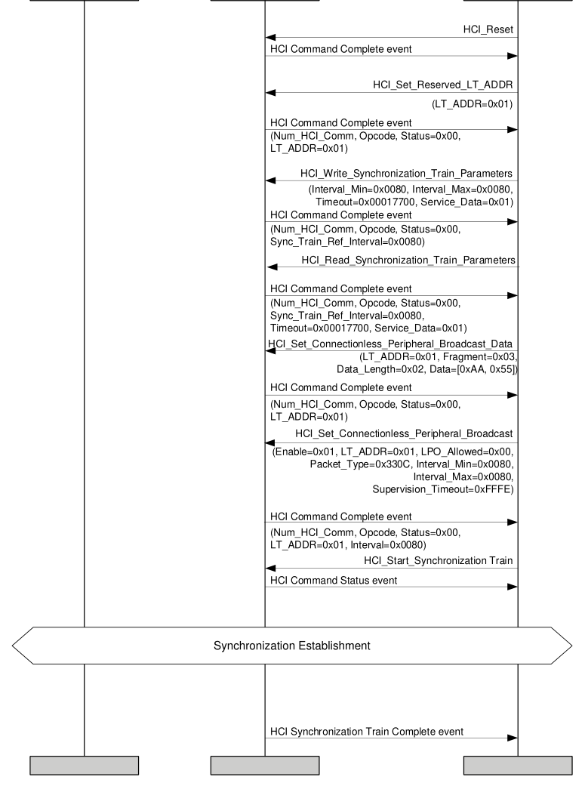

**Figure 4.120: HCI/CPB/BV-01-C [Connectionless Peripheral Broadcast Transmission] MSC**

• Expected Outcome
Pass verdict
The IUT returns ‘command complete’ succeeded to the Set Reserved LT ADDR command AND
The IUT returns ‘command complete’ succeeded to the Write Synchronization Train Parameters command AND
The IUT returns ‘command complete’ succeeded with the previously configured Synchronization Train parameters as a result of the Read Synchronization Train Parameters command AND
The IUT returns ‘command complete’ succeeded to the Set Connectionless Peripheral Broadcast Data command AND
The IUT returns ‘command complete’ succeeded to the Set Connectionless Peripheral Broadcast command AND
The IUT returns ‘command status’ pending to the Start Synchronization Train command AND
The Lower Tester successfully synchronizes to the IUT AND
The Lower Tester successfully receives broadcast data AND
The IUT returns ‘synchronization train complete’ event after the configured Synchronization Train duration.
HCI/CPB/BV-02-C [Delete Reserved LT ADDR]
• Test Purpose
Verify that the Delete Reserved LT ADDR command cancels the reservation of a specific LT_ADDR.
• Reference
[1] 7.3
• Initial Condition
- The IUT is in Standby.
• Test Procedure
The Upper Tester sends HCI Set Reserved LT_ADDR command to the IUT and receives HCI Command Complete with Status = Success.
The Upper Tester sends HCI Delete Reserved LT_ADDR command and receives HCI Command Complete with Status = Success.
Lower Tester Upper Tester
IUT

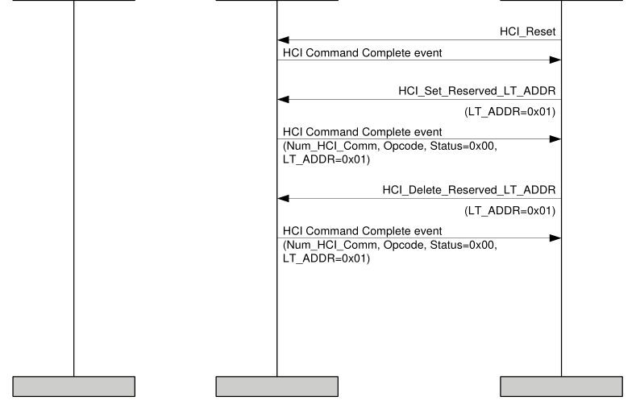

**Figure 4.121: HCI/CPB/BV-02-C [Delete Reserved LT ADDR] MSC**

• Expected Outcome
Pass verdict
The IUT returns ‘command complete’ succeeded to the Set Reserved LT_ADDR command AND
The IUT returns ‘command complete’ succeeded to the Delete Reserved LT_ADDR command.
HCI/CPB/BV-03-C [CPB Channel Map Change Event]
• Test Purpose
Verify that the IUT generates a Connectionless Peripheral Broadcast Channel Map Change event when the channel map for Connectionless Peripheral Broadcast changes.
• Reference
[1] 7.7
• Initial Condition
- The IUT is in Standby.
• Test Procedure
The Upper Tester sends HCI Set Reserved LT_ADDR command to the IUT and receives HCI Command Complete with Status = Success.
The Upper Tester sends HCI Write Synchronization Train parameters and receives HCI Command Complete with Status = Success.
The Upper Tester sends Set AFH Host Channel Classification command and receives HCI Command Complete with Status = Success.
The Upper Tester sends HCI Set Connectionless Broadcast command to the IUT and receives HCI Command Complete with Status = Success.
The Upper Tester sends Set AFH Host Channel Classification command and receives HCI Command Complete with Status = Success.

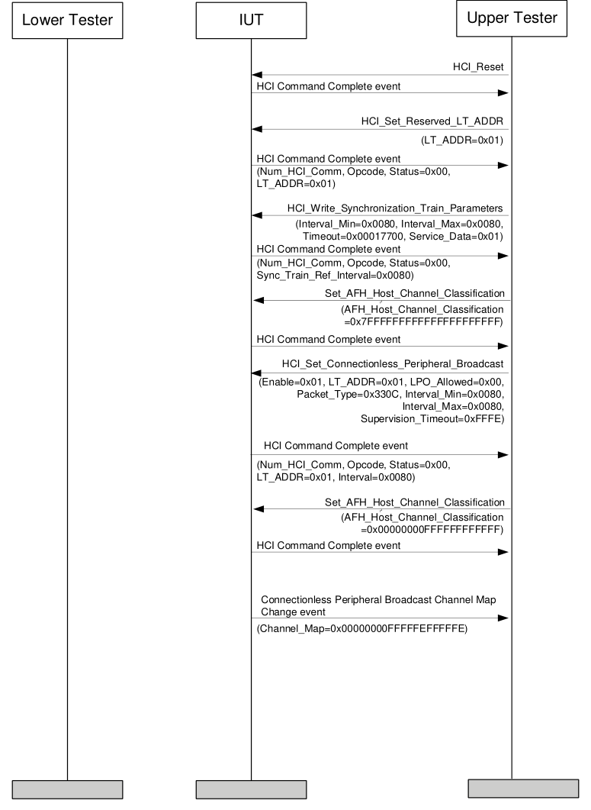

**Figure 4.122: HCI/CPB/BV-03-C [CPB Channel Map Change Event] MSC**

• Expected Outcome
Pass verdict
The IUT returns ‘command complete’ succeeded to the Set Reserved LT ADDR command AND
The IUT returns ‘command complete’ succeeded to the Write Synchronization Train Parameters command AND
The IUT returns ‘command complete’ succeeded to the Set AFH Host Channel Classification command AND
The IUT returns ‘command complete’ succeeded to the Set Connectionless Peripheral Broadcast command AND
The IUT returns ‘command complete’ succeeded to the Set AFH Host Channel Classification command AND
The IUT generate a Connectionless Peripheral Broadcast Channel Map change event with the channel map from the previous Set AFH Host Channel Classification command.
HCI/CPB/BV-04-C [Connectionless Peripheral Broadcast Reception]
• Test Purpose
Verify that:
a) The Receive Synchronization Train command configures the IUT to receive Synchronization
Train
b) The IUT generates Synchronization Train Received events
c) The Set Connectionless Peripheral Broadcast Receive command configures the IUT to receive
Connectionless Peripheral Broadcast packets
d) The IUT generates Connectionless Broadcast Receive events
• Reference
[1] 7.1, 7.3, 7.7
• Initial Condition
- The IUT is in Standby.
- The Lower Tester is transmitting Connectionless Peripheral Broadcast packets using the following parameters:
- LT_ADDR: 1
- LPO_Allowed: 0 (No)
- Packet_Type: 0x330E (only DM1 packets allowed)
- Interval: 0x0080 (80 ms)
- Data_Length = 0x02
- Data = [0xAA, 0x55]
- The Lower Tester is transmitting Synchronization Train continuously with an interval of 0x0080.
• Test Procedure
The Upper Tester sends HCI Receive Synchronization Train command to the IUT and receives HCI Command Status pending.
The IUT generates a Synchronization Train Received event.
The Upper Tester uses the parameters from the Synchronization Train Received event to send the HCI Set Connectionless Broadcast Receive command and receives HCI Command Complete with Status = Success.

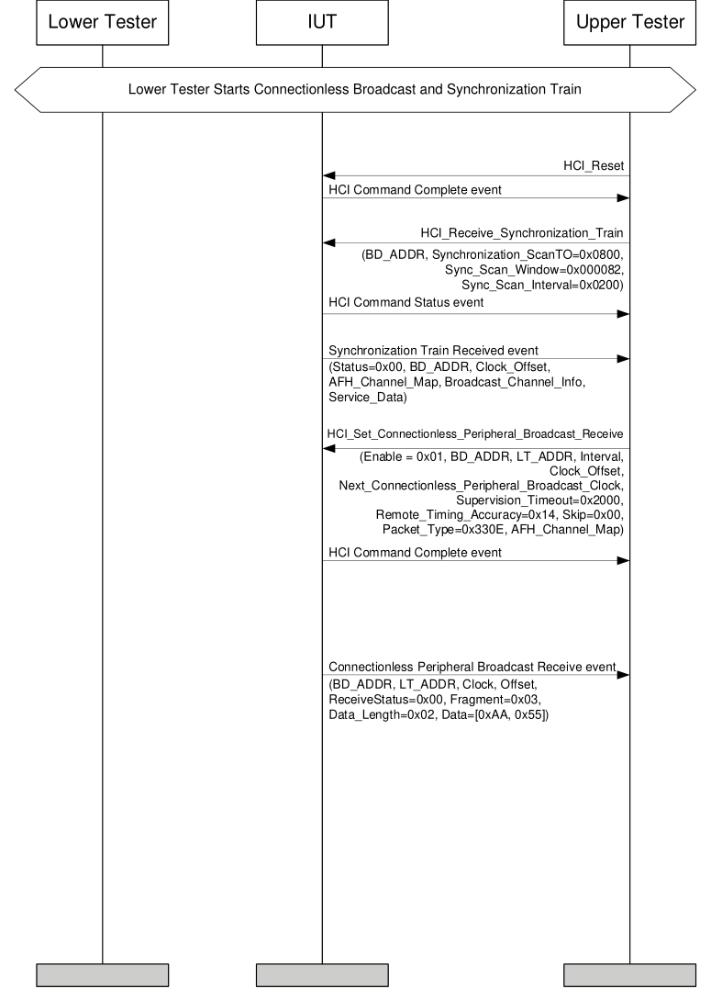

**Figure 4.123: HCI/CPB/BV-04-C [Connectionless Peripheral Broadcast Reception] MSC**

• Expected Outcome
Pass verdict
The IUT returns ‘command status’ pending to the Receive Synchronization Train command AND
The IUT generates a Synchronization Train Received event AND
The IUT generates Connectionless Peripheral Broadcast Receive events with data transmitted by the Lower Tester.
HCI/CPB/BV-05-C [Connectionless Peripheral Broadcast Reception Timeout]
• Test Purpose
Verify that the IUT generates Connectionless Peripheral Broadcast Timeout event.
• Reference
[1] 7.7
• Initial Condition
- The IUT is in Standby.
- The Lower Tester is transmitting Connectionless Peripheral Broadcast packets using the following parameters:
- LT_ADDR: 1
- LPO_Allowed: 0 (No)
- Packet_Type: 0x330E (only DM1 packets allowed)
- Interval: 0x0080 (80 ms)
- Data_Length = 0x02
- Data = [0xAA, 0x55]
- The Lower Tester is transmitting Synchronization Train continuously with an interval of 0x0080.
• Test Procedure
The Upper Tester sends HCI Receive Synchronization Train command to the IUT and receives HCI Command Status pending.
The IUT generates a Synchronization Train Received event.
The Upper Tester uses the parameters from the Synchronization Train Received event to send the HCI Set Connectionless Broadcast Receive command and receives HCI Command Complete with Status = Success.
The IUT generates Connectionless Peripheral Broadcast Receive events.
Stop Connectionless Peripheral Broadcast from the Lower Tester.
The IUT generates Connectionless Peripheral Broadcast Timeout after the configured timeout period has expired.

|  | Lower Tester |  | IUT Upper Tester Tester Starts Connectionless Broadcast and Synchronization Train HCI Reset _ HCI Command Complete event HCI Receive Synchronization Train _ _ _ (BD ADDR, Synchronization ScanTO=0x0800, _ _ Sync Scan Window=0x000082, _ _ Sync Scan Interval=0x0200) _ _ HCI Command Status event Synchronization Train Received event (Status=0x00, BD ADDR, Clock Offset, _ _ AFH Channel Map, Broadcast Channel Info, _ _ _ _ Service Data) _ HCI Set Connectionless Peripheral Broadcast Receive _ _ _ _ _ (Enable = 0x01, BD ADDR, LT ADDR, Interval, _ _ Clock Offset, _ Next Connectionless Peripheral Broadcast Clock, _ _ _ _ Supervision Timeout=0x2000, _ Remote Timing Accuracy=0x14, Skip=0x00, _ _ Packet Type=0x330E, AFH Channel Map) _ _ _ HCI Command Complete event Connectionless Peripheral Broadcast Peripheral Receive event (BD ADDR, LT ADDR, Clock, Offset, _ _ ReceiveStatus=0x00, Fragment=0x03, Fragment Length=0x02, Data=[0xAA, 0x55]) _ er Tester Starts Connectionless Broadcast and Synchronization Train Connectionless Peripheral Broadcast Timeout event (BD ADDR, LT ADDR) _ _ |  |
| --- | --- | --- | --- | --- |
|  |  |  |  |  |
|  |  | Lower | Tester Starts Connection | less Broadcast and Synchronization Train |
|  |  |  |  | HCI Reset _ HCI Command Complete event HCI Receive Synchronization Train _ _ _ (BD ADDR, Synchronization ScanTO=0x0800, _ _ Sync Scan Window=0x000082, _ _ Sync Scan Interval=0x0200) _ _ HCI Command Status event Synchronization Train Received event (Status=0x00, BD ADDR, Clock Offset, _ _ AFH Channel Map, Broadcast Channel Info, _ _ _ _ Service Data) _ HCI Set Connectionless Peripheral Broadcast Receive _ _ _ _ _ (Enable = 0x01, BD ADDR, LT ADDR, Interval, _ _ Clock Offset, _ Next Connectionless Peripheral Broadcast Clock, _ _ _ _ Supervision Timeout=0x2000, _ Remote Timing Accuracy=0x14, Skip=0x00, _ _ Packet Type=0x330E, AFH Channel Map) _ _ _ HCI Command Complete event Connectionless Peripheral Broadcast Peripheral Receive event (BD ADDR, LT ADDR, Clock, Offset, _ _ ReceiveStatus=0x00, Fragment=0x03, Fragment Length=0x02, Data=[0xAA, 0x55]) _ |
|  |  | Low | er Tester Starts Connecti | onless Broadcast and Synchronization Train |
|  |  |  |  |  |
|  |  |  |  |  |

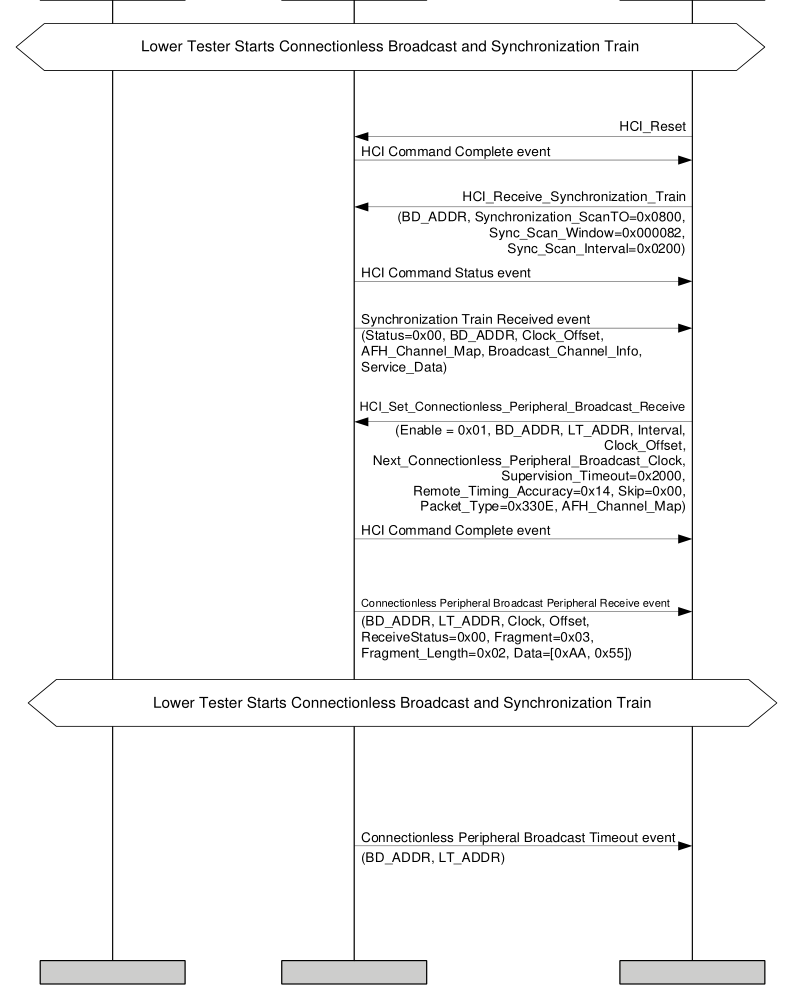

**Figure 4.124: HCI/CPB/BV-05-C [Connectionless Peripheral Broadcast Reception Timeout] MSC**

• Expected Outcome
Pass verdict
The IUT generates Connectionless Peripheral Broadcast Timeout event.

### 4.13 LE Connection Management

HCI/CM/BV-01-C [LE Read Peer Resolvable Address Command – Central]
• Test Purpose
Verify that the IUT correctly handles the LE Read Peer Resolvable Address Command.
• Reference
[8] 7.8.42
• Initial Condition
- The IUT is Central.
• Test Procedure
The Upper Tester populates the resolving list with the device identity of the Lower Tester, and its own device identity. The IUT uses this when generating a resolvable private address for the connection establishment.
The Upper Tester enables resolving list.
Configure the Lower Tester to initiate a connection while using directed advertisement with resolvable private addresses.
The Upper Tester commands the IUT to create a connection to the Lower Tester.
The IUT sends an LE Enhanced Connection Complete Event.
The Upper Tester issues a LE Read Peer Resolvable Address Command, with the identity address of the Lower Tester.
The Upper Tester receives a Command Complete event from the IUT for the LE Read Peer Resolvable Address Command with the Lower Tester's resolvable address.

| Lower Tester |  |  |
| --- | --- | --- |
|  |  |  |
|  |  |  |

| Upper Tester |  |  |
| --- | --- | --- |
|  |  |  |
|  |  |  |

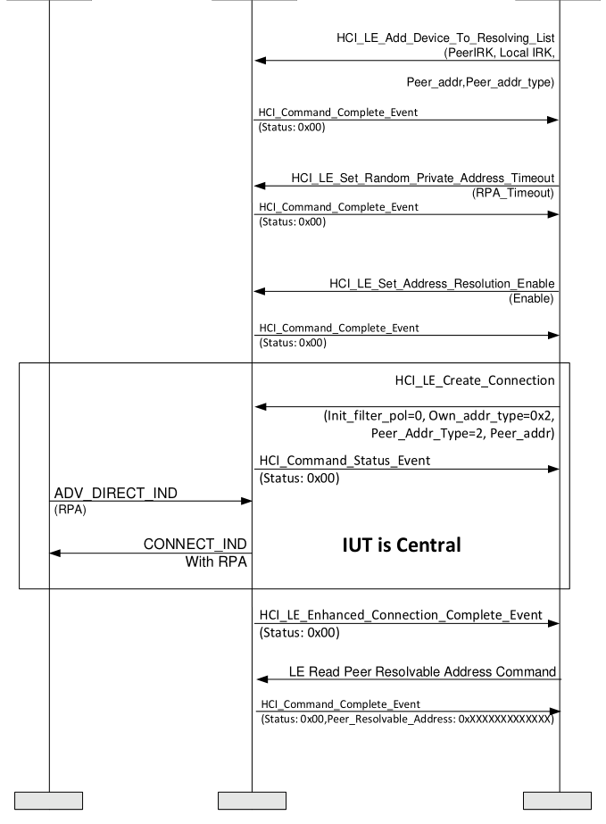

**Figure 4.125: HCI/CM/BV-01-C [LE Read Peer Resolvable Address Command – Central] MSC**

• Expected Outcome
Pass verdict
The Upper Tester receives a Command Complete event from the IUT with Status=0x00 (Success) and Peer_resolvable_address=0xXXXXXXXXXXXX.
The received resolvable address is identical with the Peer_Resolvable_Private_Address received in the enhanced connection complete event.
• Test Purpose
Verify that the IUT correctly handles the LE Read Local Resolvable Address Command
• Reference
[8] 7.8.43
• Initial Condition
- The IUT is Central.
• Test Procedure
The Upper Tester populates the resolving list with the device identity of the Lower Tester, and its own device identity. The IUT uses this when generating a resolvable private address for the connection establishment.
The Upper Tester enables resolving list.
Configure the Lower Tester to initiate a connection while using directed advertisement with resolvable private addresses.
The Upper Tester command the IUT to create a connection to the Lower Tester.
The IUT sends an LE Enhanced Connection Complete Event.
The Upper Tester issues a LE Local Peer Resolvable Address Command, with the identity address of the Lower Tester.
The Upper Tester receives a Command Complete event from the IUT for the LE Local Peer Resolvable Address Command with the local resolvable address.

| Lower Tester |  |  |  |  | Upper Tester |  |  |
| --- | --- | --- | --- | --- | --- | --- | --- |
|  |  |  |  |  |  |  |  |
|  |  | ADV DIRECT IND _ _ (RPA) CONNECT REQ _ With RPA |  | HCI LE Create Connection _ _ _ (Init filter pol=0, Own addr type=0x2, _ _ _ _ Peer Addr Type=2, Peer addr) _ _ _ HCI Command Status Event _ _ _ (Status: 0x00) IUT is Central |  |  |  |
|  |  |  |  | HCI LE Enhanced Connection Complete Event _ _ _ _ _ (Status: 0x00, Local Resolvable Private Address, _ _ _ Remote Resolvable Private Address ) _ _ _ LE Read Local Resolvable Address Command HCI Command Complete Event _ _ _ (Status: 0x00,Local Resolvable Address: _ _ 0xXXXXXXXXXXXXX) |  |  |  |
|  |  |  |  |  |  |  |  |

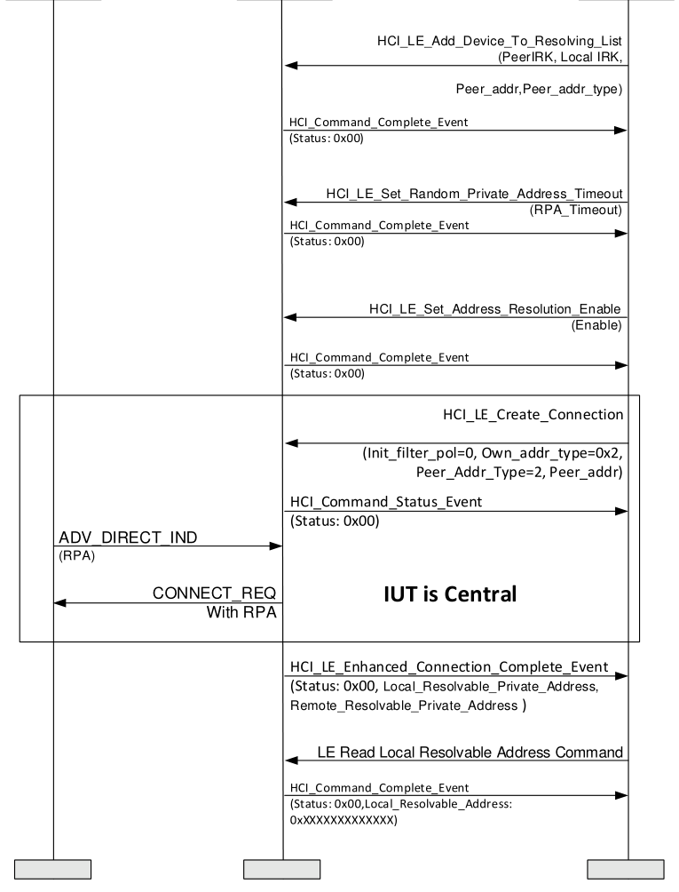

**Figure 4.126: HCI/CM/BV-02-C [LE Read Local Resolvable Address Command – Central] MSC**

• Expected Outcome
Pass verdict
The Upper Tester receives a Command Complete event from the IUT with Status=0x00 (Success) and Local_Resolvable_Address=0xXXXXXXXXXXXX.
The received resolvable address is identical with the Local_Resolvable_Private_Address received in the enhanced connection complete event.
• Test Purpose
Verify that the IUT correctly handles the LE Read PHY Command.
• Reference
[9] 7.8.47
• Initial Condition
- LL connection established, the IUT is Central or Peripheral.
• Test Procedure
The Upper Tester issues an LE Read PHY command to the IUT containing the current connection handle.
The Upper Tester receives a Command Complete event from the IUT for the LE Read PHY command containing the connection handle and with values for TX_PHY and RX_PHY that match the current PHY for the active connection.

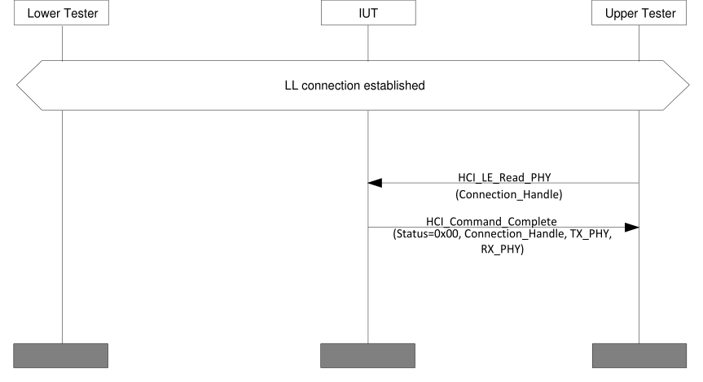

**Figure 4.127: HCI/CM/BV-03-C [LE Read PHY Command] MSC**

• Expected Outcome
Pass verdict
The Upper Tester receives a Command Complete event from the IUT with Status = 0x00 (Success) and with the value for Connection_Handle matching the value sent in the LE Read PHY Command.
The TX_PHY and RX_PHY fields contain values which match the PHY selected for the current active connection.
HCI/CM/BV-04-C [Extended Scanning with Device Privacy, RPA Timeout During Connection Initiation]
• Test Purpose
Verify that when the IUT is initiator and an RPA Timeout occurs between the IUT issuing an AUX_CONNECT_REQ PDU and the Lower Tester responding with an AUX_CONNECT_RSP PDU, the HCI_LE_Enhanced_Connection_Complete_Event returns the latest Peer_Address, Peer_Resolvable_Private_Address, and Local_Resolvable_Private_Address sent and received over the air.
• Reference
[11] 7.7.65.10
• Initial Condition
- The Lower Tester has previously distributed its IRK to the IUT.
- The IUT has previously distributed its IRK to the Lower Tester.
- The Lower Tester has added the IUT to its resolving list and sets the entry for device privacy mode.
- The IUT has added the Lower Tester to its resolving list and sets the entry for device privacy mode.
- Device privacy mode is enabled on the IUT and the Lower Tester.
- The Lower Tester is using its Identity Address in the AdvA field of the advertisement packets.
• Test Procedure

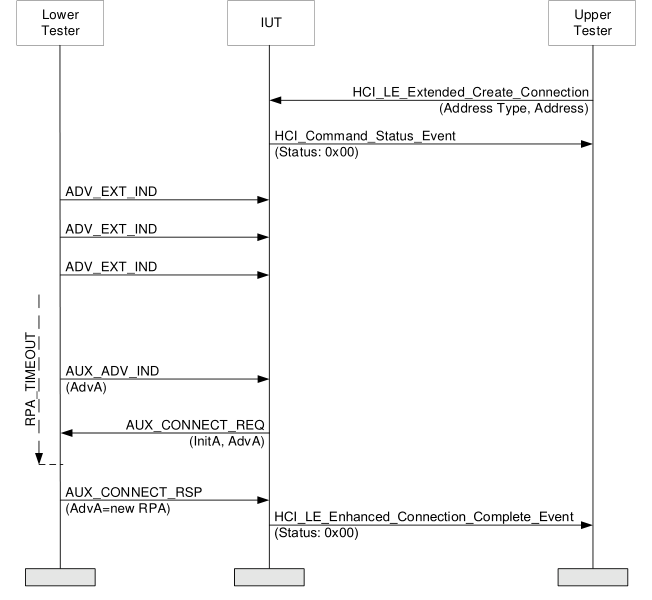

**Figure 4.128: HCI/CM/BV-04-C [Extended Scanning with Device Privacy, RPA Timeout During Connection Initiation] MSC**

peer address and address type is set to the ones used by the Lower Tester. The Upper Tester receives an HCI_Command_Status event in response. 2. The Lower Tester begins advertising using the ADV_EXT_IND PDU with the AuxPtr field
referencing the AUX_ADV_IND. 3. The Lower Tester receives an AUX_CONNECT_REQ PDU on the secondary advertising channel
after sending any of the AUX_ADV_IND PDUs. 4. An RPA Timeout is simulated on the Lower Tester. 5. The Lower Tester sends an AUX_CONNECT_RSP PDU to the IUT on the secondary advertising
channel with a new RPA. 6. The Upper Tester receives an HCI_LE_Enhanced_Connection_Complete event from the IUT.
• Expected Outcome
Pass verdict
The test procedure completes with the IUT establishing a connection with the Lower Tester.
The HCI_LE_Enhanced_Connection_Complete_Event returns the latest Peer_Address, Peer_Resolvable_Private_Address and Local_Resolvable_Private_Address sent and received over the air.
HCI/CM/BV-05-C [LE Read Peer Resolvable Address Command – Peripheral]
• Test Purpose
Verify that the IUT correctly handles the LE Read Peer Resolvable Address Command.
• Reference
[2] 7.8.42
• Initial Condition
- The IUT is Peripheral.
• Test Procedure
The Upper Tester populates the resolving list with the device identity of the Lower Tester, and its own device identity. The IUT uses this when generating a resolvable private address for the connection establishment.
The Upper Tester enables resolving list.
Configure the Lower Tester to initiate a connection while using resolvable private addresses.
The Upper Tester enables resolving list and directed connectable advertising in the IUT.
The IUT sends an LE Enhanced Connection Complete Event.
The Upper Tester issues a LE Read Peer Resolvable Address Command, with the identity address of the Lower Tester.
The Upper Tester receives a Command Complete event from the IUT for the LE Read Peer Resolvable Address Command with the Lower Tester's resolvable address.

| Lower Tester |  |  |  |  | Upper Tester |  |  |
| --- | --- | --- | --- | --- | --- | --- | --- |
|  |  |  |  |  |  |  |  |
|  |  | ADV DIRECT IND _ _ CONNECT IND _ (RPA) |  | HCI LE Set Advertising Parameters _ _ _ _ (Adv Type=0x1, _ Own Address Type=0x2,Adv filt pol=3,Peer addr, _ _ _ _ _ Peer addr type _ _ ) HCI Command Complete Event _ _ _ (Status: 0x00) HCI LE Set Advertising Data _ _ _ _ (Data Length: 0x00) HCI Command Complete Event _ _ _ (Status: 0x00) HCI LE Set Advertise Enable _ _ _ _ (Enable) HCI Command Complete Event _ _ _ (Status: 0x00) IUT is Peripheral |  |  |  |
|  |  |  |  | HCI LE Enhanced Connection Complete Event _ _ _ _ _ (Status: 0x00) LE Read Peer Resolvable Address Command HCI Command Complete Event _ _ _ (Status: 0x00,Peer Resolvable Address: 0xXXXXXXXXXXXXX) _ _ |  |  |  |
|  |  |  |  |  |  |  |  |

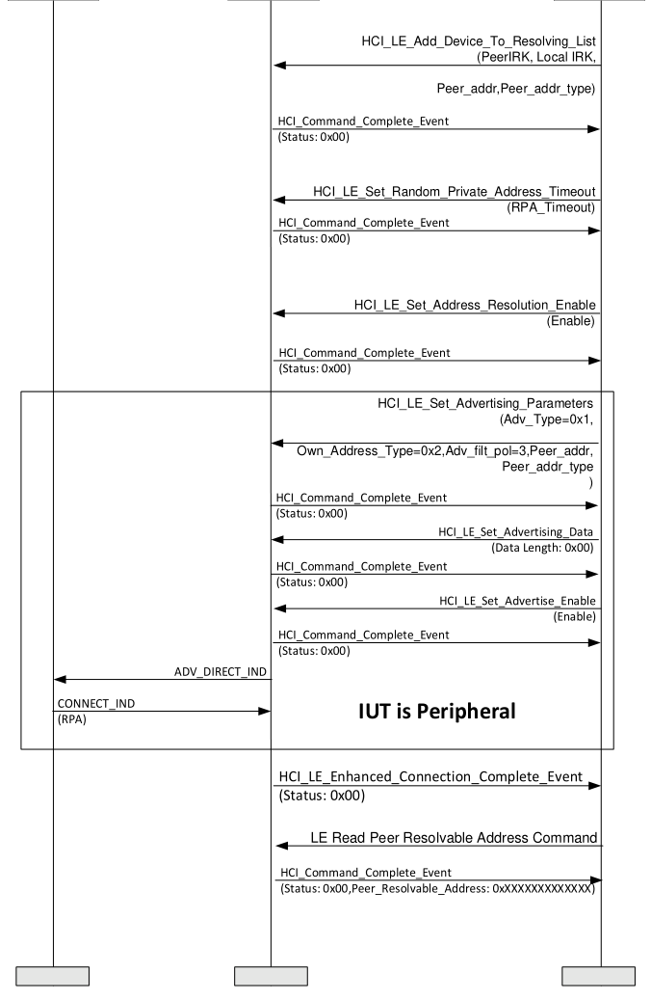

**Figure 4.129: HCI/CM/BV-05-C [LE Read Peer Resolvable Address Command – Peripheral] MSC**

• Expected Outcome
Pass verdict
The Upper Tester receives a Command Complete event from the IUT with Status=0x00 (Success) and Peer_resolvable_address=0xXXXXXXXXXXXX.
The received resolvable address is identical with the Peer_Resolvable_Private_Address received in the enhanced connection complete event.
• Test Purpose
Verify that the IUT correctly handles the LE Read Local Resolvable Address Command.
• Reference
[2] 7.8.43
• Initial Condition
- The IUT is Peripheral.
• Test Procedure
The Upper Tester populates the resolving list with the device identity of the Lower Tester, and its own device identity. The IUT uses this when generating a resolvable private address for the connection establishment.
The Upper Tester enables resolving list.
Configure the Lower Tester to initiate a connection while using resolvable private addresses.
The Upper Tester enables resolving list and directed connectable advertising in the IUT.
The IUT sends an LE Enhanced Connection Complete Event.
The Upper Tester issues a LE Local Peer Resolvable Address Command, with the identity address of the Lower Tester.
The Upper Tester receives a Command Complete event from the IUT for the LE Local Peer Resolvable Address Command with the local resolvable address.

| Lower Tester |  |  |  |  | Upper Tester |  |  |
| --- | --- | --- | --- | --- | --- | --- | --- |
|  |  |  |  |  |  |  |  |
|  |  | ADV DIRECT IND _ _ CONNECT REQ _ (RPA) |  | HCI LE Set Advertising Parameters _ _ _ _ (Adv Type=0x1, _ Own Address Type=0x02,Adv filt pol=3,Peer addr, _ _ _ _ _ Peer addr type _ _ ) HCI Command Complete Event _ _ _ (Status: 0x00) HCI LE Set Advertising Data _ _ _ _ (Data Length: 0x00) HCI Command Complete Event _ _ _ (Status: 0x00) HCI LE Set Advertise Enable _ _ _ _ (Enable) HCI Command Complete Event _ _ _ (Status: 0x00) IUT is Peripheral |  |  |  |
|  |  |  |  | HCI LE Enhanced Connection Complete Event _ _ _ _ _ (Status: 0x00, Local Resolvable Private Address, _ _ _ Remote Resolvable Private Address ) _ _ _ LE Read Local Resolvable Address Command HCI Command Complete Event _ _ _ (Status: 0x00,Local Resolvable Address: _ _ 0xXXXXXXXXXXXXX) |  |  |  |
|  |  |  |  |  |  |  |  |

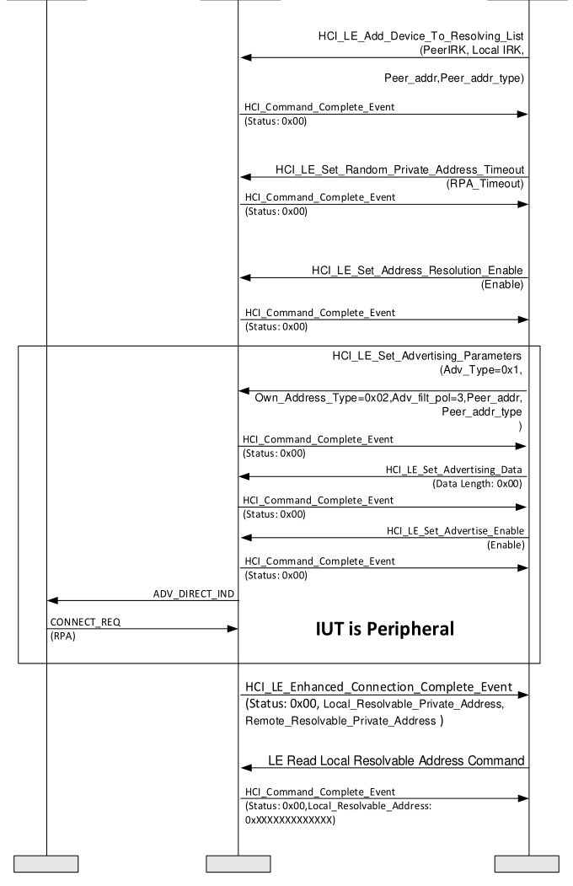

**Figure 4.130: HCI/CM/BV-06-C [LE Read Local Resolvable Address Command – Peripheral] MSC**

• Expected Outcome
Pass verdict
The Upper Tester receives a Command Complete event from the IUT with Status=0x00 (Success) and Local_Resolvable_Address=0xXXXXXXXXXXXX.
The received resolvable address is identical with the Local_Resolvable_Private_Address received in the enhanced connection complete event.
• Test Purpose
Verify that the IUT properly rejects an HCI_LE_Extended_Create_Connection command that specifies unsupported PHYs.
• Reference
[9] 7.8.66
• Initial Condition
- The IUT is not currently connected.
• Test Procedure
For each bit on the Initiating_PHYs parameter of the HCI_LE_Extended_Create_Connection command that is an RFU bit or corresponds to a PHY not supported by the IUT:
The Upper Tester sends an HCI_LE_Extended_Create_Connection command to the IUT with Initiating_PHYs having only that bit set and receives an HCI_Command_Complete event with a non- zero status.

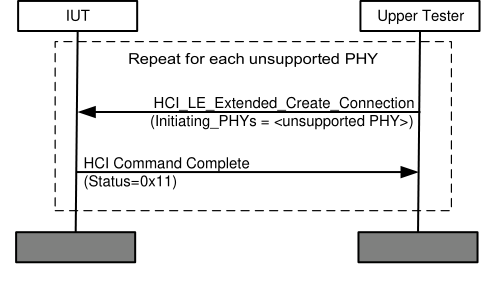

**Figure 4.131: HCI/CM/BI-01-C [LE Extended Create Connection With Unsupported PHY] MSC**

• Expected Outcome
If the IUT supports PHYs corresponding to all 8 bits of the Initiating_PHYs parameter, the test procedure will do nothing. This case is a Pass.
Pass verdict
Command Complete event for HCI_LE_Extended_Create_Connection is received by the Upper Tester with the error code Unsupported Feature or Parameter Value (0x11).
HCI/CM/BV-07-C [Request Sleep Clock Accuracy, unsupported SCA Update Feature]
• Test Purpose
Verify that when the IUT reads the peer’s Sleep Clock Accuracy of a peer that doesn’t support the Sleep Clock Accuracy Update feature, the Controller returns the error code Unsupported Remote Feature/Unsupported LMP Feature (0x1A).
• Reference
[12] 7.8.108
• Initial Condition
- The IUT is connected to the Lower Tester.
- The Lower Tester does not support the Sleep Clock Accuracy Update feature.
- A feature exchange has been executed between the IUT and the Lower Tester.
• Test Procedure

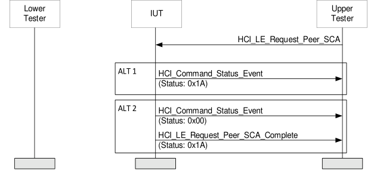

**Figure 4.132: HCI/CM/BV-07-C [Request Sleep Clock Accuracy, unsupported SCA Update Feature] MSC**

1. The Upper Tester sends an HCI_LE_Request_Peer_SCA command to the IUT. 2. The IUT returns an error code using one of the two following alternate test steps:
Alternate 1:
3. The IUT sends the Upper Tester an HCI_Command_Status event with status Unsupported
Remote Feature/Unsupported LMP Feature (0x1A).
Alternate 2:
4. The IUT sends a successful HCI_LE_Command_Status event to the Upper Tester. 5. The IUT sends an HCI_LE_Request_Peer_SCA_Complete event with Status set to Unsupported
Remote Feature/Unsupported LMP Feature (0x1A).
• Expected Outcome
Pass verdict
In step 3, the IUT sends an HCI_Command_Status event to the Upper Tester with the status of 0x1A.
In step 5, the IUT sends an HCI_LE_Request_Peer_SCA_Complete event to the Upper Tester with an Unsupported Remote Feature/Unsupported LMP Feature (0x1A) status.

#### 4.13.1 LE Create Connection Cancel, Command Disallowed • Test Purpose

Verify that when the IUT is initiator, it returns an error when the LE Create Connection Cancel command is called if no LE Create Connection or LE Extended Create Connection is pending.
• Reference
[11] 7.8.13
• Initial Condition
- The Lower Tester is configured as an advertiser using all supported advertising channels and using a public address.
• Test Case Configuration

|  | Test Case |  |  | Connect Command |  |
| --- | --- | --- | --- | --- | --- |
| HCI/CM/BI-02-C |  |  | HCI LE Create Connection _ _ _ |  |  |
| HCI/CM/BI-03-C |  |  | HCI LE Extended Create Connection _ _ _ _ |  |  |

Table 4.68: LE Create Connection Cancel, Command Disallowed test cases
• Test Procedure

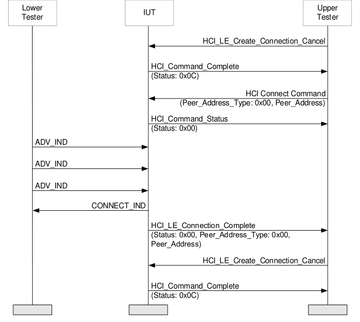

**Figure 4.133: LE Create Connection Cancel, Command Disallowed MSC**

1. The Upper Tester sends an HCI_LE_Create_Connection_Cancel command to the IUT. 2. The IUT sends an HCI_Command_Complete event to the Upper Tester with Status set to
Command Disallowed (0x0C). 3. The Upper Tester sends a Connect command as specified in Table 4.68 to the IUT with
Peer_Address_Type set to 0x00 and Peer_Address set to the Lower Tester’s public address, and it receives a successful HCI_Command_Status event in return. 4. The Lower Tester begins advertising ADV_IND packets. 5. The IUT sends a CONNECT_IND PDU to the Lower Tester after receiving an ADV_IND PDU. 6. The IUT sends an HCI_LE_Connection_Complete event to the Upper Tester with
Peer_Address_Type set to 0x00 and the Peer_Address set to the Lower Tester’s public address. 7. The Upper Tester sends an HCI_LE_Create_Connection_Cancel command to the IUT. 8. The IUT sends an HCI_Command_Complete event to the Upper Tester with Status set to
Command Disallowed (0x0C).
• Expected Outcome
Pass verdict
In steps 3 and 8, the IUT sends an HCI_Command_Complete event to the Upper Tester with Status set to Command Disallowed (0x0C).

### 4.14 LE Power Control

HCI/PCL/BV-01-C [LE Enhanced Read Transmit Power Level]
• Test Purpose
Verify that the LE Enhanced Read Transmit Power Level command returns the current and maximum transmit power level of the local Controller on an ACL connection.
• Reference
[12] 7.8.117
• Initial Condition
- ACL connection established, the IUT is Central or Peripheral.
• Test Procedure
1. The Upper Tester issues an LE Enhanced Read Transmit Power Level command to the IUT
containing the current connection handle. 2. The Upper Tester receives a Command Complete event from the IUT for the LE Enhanced Read
Transmit Power Level command containing the connection handle, the value for PHY matching the current PHY for the active connection, and the values for Current_TX_Power_Level and Max_TX_Power_Level as the current and maximum transmit power level of the local Controller for the active connection.

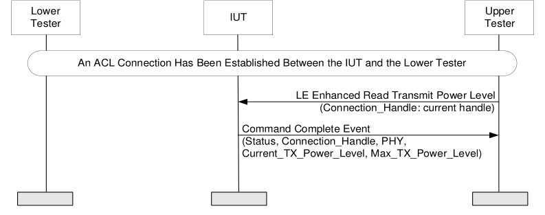

**Figure 4.134: HCI/PCL/BV-01-C [LE Enhanced Read Transmit Power Level] MSC**

• Expected Outcome
Pass verdict
The Upper Tester receives a Command Complete event from the IUT with Status = 0x00 (Success) and with the value for Connection_Handle matching the value sent in the LE Enhanced Read Transmit Power Level command.
The PHY field contains a value which matches the PHY selected for the current active connection, Current_TX_Power_Level and Max_TX_Power_Level in the range described in the specifications, with Current_TX_Power_Level less than or equal to Max_TX_Power_Level.

#### 4.14.1 LE Enhanced Read Transmit Power Level with Unsupported or Invalid

Parameters • Test Purpose
Verify that the IUT properly handles the LE Enhanced Read Transmit Power Level command with unsupported or invalid parameters.
• Reference
[13] 7.8.117
• Initial Condition
- ACL connection established, the IUT is Central or Peripheral.
• Test Case Configuration

|  | Test Case |  |  | Parameter |  |  | Value |  |  | Status |  |
| --- | --- | --- | --- | --- | --- | --- | --- | --- | --- | --- | --- |
| HCI/PCL/BI-01-C |  |  | PHY |  |  | 0x02 (LE 2M) |  |  | 0x11 |  |  |
| HCI/PCL/BI-02-C |  |  | PHY |  |  | 0x03 (LE Coded S=8) |  |  | 0x11 |  |  |
| HCI/PCL/BI-03-C |  |  | PHY |  |  | 0x04 (LE Coded S=2) |  |  | 0x11 |  |  |
| HCI/PCL/BI-04-C |  |  | Connection Handle _ |  |  | Not the current ACL |  |  | 0x02 |  |  |

Table 4.69: LE Enhanced Read Transmit Power Level with Unsupported or Invalid Parameters test cases
• Test Procedure
1. The Upper Tester sends the HCI_LE_Enhanced_Read_Transmit_Power_Level command to the
IUT with the parameter and value specified in Table 4.69. 2. The IUT sends an HCI_Command_Complete event to the Upper Tester with Status set as
specified in Table 4.69.
• Expected Outcome
Pass verdict
In step 2, the IUT sends an HCI_Command_Complete event with Status set as specified in Table 4.69.

#### 4.14.2 LE Read Remote Transmit Power Level with Unsupported or Invalid

Parameters • Test Purpose
Verify that the IUT properly handles the LE Read Remote Transmit Power Level command with unsupported or invalid parameters.
• Reference
[13] 7.8.118
• Initial Condition
- ACL connection established, the IUT is Central or Peripheral.
• Test Case Configuration

|  | Test Case |  |  | Parameter |  |  | Value |  |  | Status |  |
| --- | --- | --- | --- | --- | --- | --- | --- | --- | --- | --- | --- |
| HCI/PCL/BI-05-C |  |  | PHY |  |  | 0x02 (LE 2M) |  |  | 0x11 |  |  |
| HCI/PCL/BI-06-C |  |  | PHY |  |  | 0x03 (LE Coded S=8) |  |  | 0x11 |  |  |
| HCI/PCL/BI-07-C |  |  | PHY |  |  | 0x04 (LE Coded S=2) |  |  | 0x11 |  |  |
| HCI/PCL/BI-08-C |  |  | Connection Handle _ |  |  | Not the current ACL |  |  | 0x02 |  |  |

Table 4.70: LE Read Remote Transmit Power Level with Unsupported or Invalid Parameters test cases
• Test Procedure
1. The Upper Tester sends the HCI_LE_Read_Remote_Transmit_Power_Level command to the
IUT with the parameter and value specified in Table 4.70. 2. Perform either alternative 2A or 2B depending on whether the IUT sends the error status in the
HCI_Command_Status event.
Alternative 2A (The IUT sends the error in the HCI_Command_Status event)
2A.1 The IUT sends an HCI_Command_Status event to the Upper Tester with Status set as specified in Table 4.70.
Alternative 2B (The IUT sends the error in the HCI_LE_Transmit_Power_Reporting event)
2B.1 The IUT sends a successful HCI_Command_Status event to the Upper Tester.
2B.2 The IUT sends an HCI_LE_Transmit_Power_Reporting event to the Upper Tester with Status set as specified in Table 4.70.
• Expected Outcome
Pass verdict
In step 2A.1 or 2B.2, an error status is returned to the Upper Tester.

### 4.15 Isochronous Streams

#### 4.15.1 Connected Isochronous Streams

Verify the correct implementation of the Connected Isochronous Stream commands and events.

##### 4.15.1.1 Connected Isochronous Stream Using Non-Test Command, Central Initiated

• Test Purpose
Verify that a Central IUT can set up a Connected Isochronous Stream using the LE Setup CIG Parameters Command (the non-test variant) and correctly handles error conditions.
• Reference
[12] 7.1.6, 7.8.97
• Initial Condition
- An ACL connection has been established between the IUT and the Lower Tester with a valid Connection Handle. The connection supervision timeout may be set to a long interval to facilitate testing.
- The event mask has been configured to allow the HCI_LE_CIS_Established [v1] and [v2] events to be passed to the Upper Tester.
- TSPX_max_cis_per_cigs is the Max Supported CIGs as specified in IXIT.
• Test Case Configuration

| Test Case |  | Steps 9 and |  |  | Step 13 |  |  | Step 14 |  |  | Step 21B |  |
| --- | --- | --- | --- | --- | --- | --- | --- | --- | --- | --- | --- | --- |
|  |  | 10 performed |  |  | performed |  |  | performed |  |  | allowed |  |
| HCI/CIS/BV-01-C [Connected Isochronous Stream Using Non- Test Command, Central Initiated, all PHYs, asymmetric PHYs, Core v5.2 to v5.4] | No |  |  | Yes |  |  | No |  |  | Yes |  |  |
| HCI/CIS/BV-02-C [Connected Isochronous Stream Using Non- Test Command, Central Initiated, all PHYs, symmetric PHYs only, Core v5.2 to v5.4] | No |  |  | Yes |  |  | Yes |  |  | Yes |  |  |
| HCI/CIS/BV-03-C [Connected Isochronous Stream Using Non- Test Command, Central Initiated, not all PHYs, asymmetric PHYs, Core v5.2 to v5.4] | Yes |  |  | Yes |  |  | No |  |  | Yes |  |  |
| HCI/CIS/BV-04-C [Connected Isochronous Stream Using Non- Test Command, Central Initiated, not all PHYs, symmetric PHYs only, Core v5.2 to v5.4] | Yes |  |  | Yes |  |  | Yes |  |  | Yes |  |  |
| HCI/CIS/BV-15-C [Connected Isochronous Stream Using Non- Test Command, Central Initiated, all PHYs, asymmetric PHYs, ISOAL] | No |  |  | No |  |  | No |  |  | No |  |  |
| HCI/CIS/BV-16-C [Connected Isochronous Stream Using Non- Test Command, Central Initiated, all PHYs, symmetric PHYs only, ISOAL] | No |  |  | No |  |  | Yes |  |  | No |  |  |
| HCI/CIS/BV-17-C [Connected Isochronous Stream Using Non- Test Command, Central Initiated, not all PHYs, asymmetric PHYs, ISOAL] | Yes |  |  | No |  |  | No |  |  | No |  |  |
| HCI/CIS/BV-18-C [Connected Isochronous Stream Using Non- Test Command, Central Initiated, not all PHYs, symmetric PHYs only, ISOAL] | Yes |  |  | No |  |  | Yes |  |  | No |  |  |

| Test Case |  | Steps 9 and |  |  | Step 13 |  |  | Step 14 |  |  | Step 21B |  |
| --- | --- | --- | --- | --- | --- | --- | --- | --- | --- | --- | --- | --- |
|  |  | 10 performed |  |  | performed |  |  | performed |  |  | allowed |  |
| HCI/CIS/BV-19-C [Connected Isochronous Stream Using Non- Test Command, Central Initiated, all PHYs, asymmetric PHYs, Core v6.0 or later, ISOAL not supported] | No |  |  | Yes |  |  | No |  |  | No |  |  |
| HCI/CIS/BV-20-C [Connected Isochronous Stream Using Non- Test Command, Central Initiated, all PHYs, symmetric PHYs only, Core v6.0 or later, ISOAL not supported] | No |  |  | Yes |  |  | Yes |  |  | No |  |  |
| HCI/CIS/BV-21-C [Connected Isochronous Stream Using Non- Test Command, Central Initiated, not all PHYs, asymmetric PHYs, Core v6.0 or later, ISOAL not supported] | Yes |  |  | Yes |  |  | No |  |  | No |  |  |
| HCI/CIS/BV-22-C [Connected Isochronous Stream Using Non- Test Command, Central Initiated, not all PHYs, symmetric PHYs only, Core v6.0 or later, ISOAL not supported] | Yes |  |  | Yes |  |  | Yes |  |  | No |  |  |

Table 4.71: Connected Isochronous Stream Using Non-Test Command, Central Initiated test cases
• Test Procedure

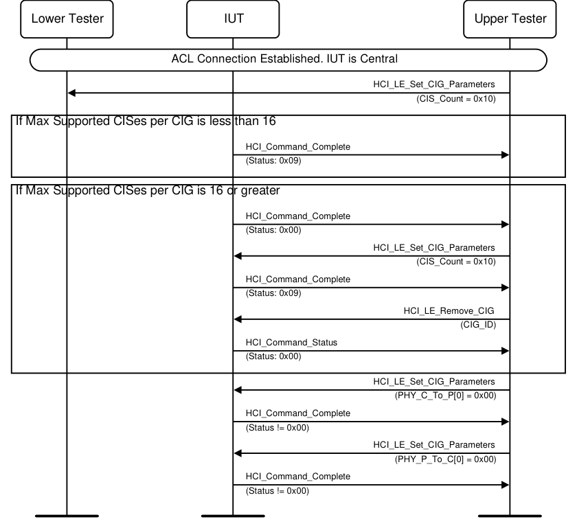

**Figure 4.135: Connected Isochronous Stream Using Non-Test Command, Central Initiated MSC – Page 1 of 4**

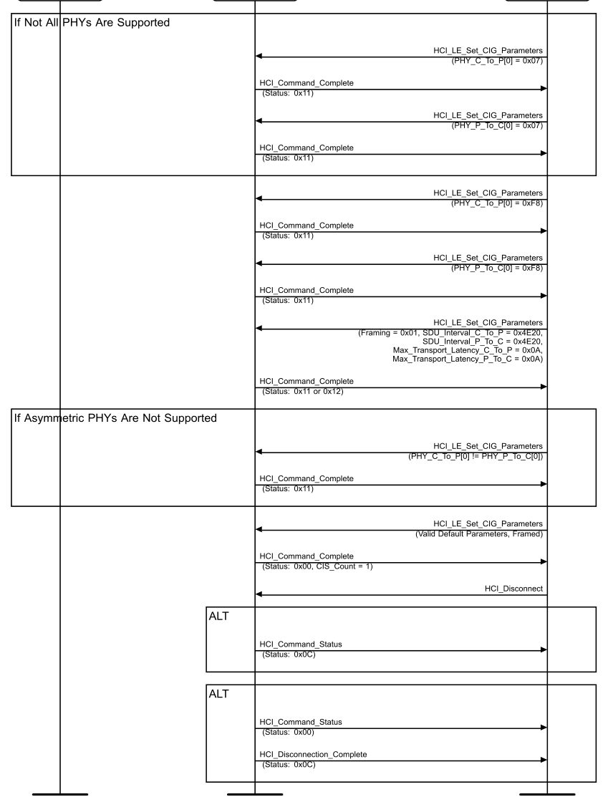

**Figure 4.136: Connected Isochronous Stream Using Non-Test Command, Central Initiated MSC – Page 2 of 4**

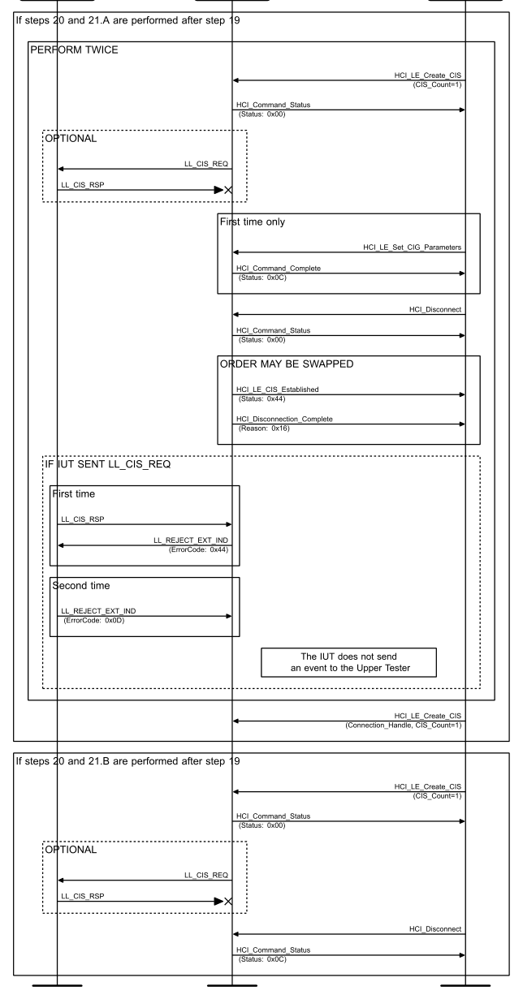

**Figure 4.137: Connected Isochronous Stream Using Non-Test Command, Central Initiated MSC – Page 3 of 4**

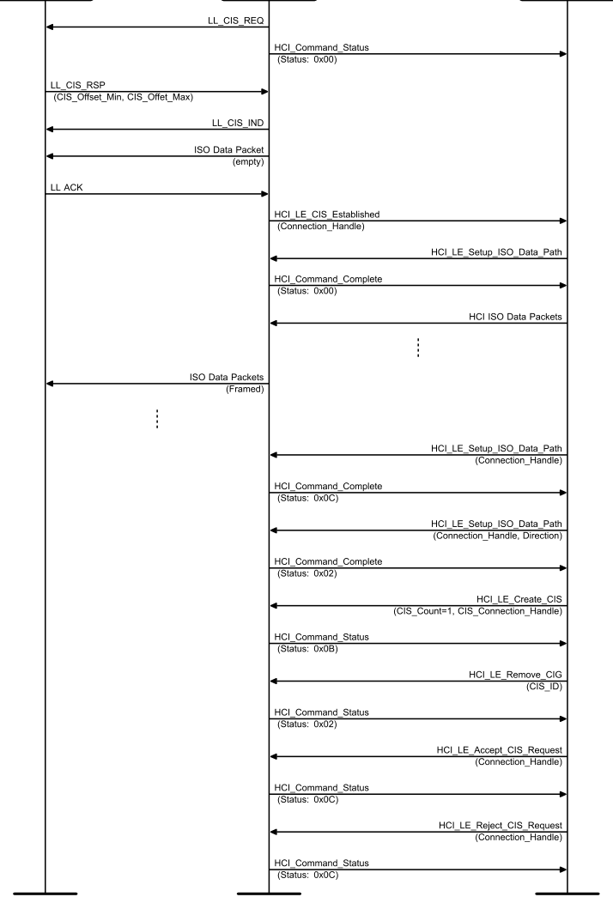

**Figure 4.138: Connected Isochronous Stream Using Non-Test Command, Central Initiated MSC – Page 4 of 4**

1. The Upper Tester sends an HCI_LE_Set_CIG_Parameters command to the IUT using common
values and CIS_Count set to 0x10. Here, and elsewhere, to facilitate testing, long intervals may be used. 2. If TSPX_max_cis_per_cigs is less than 16, then the IUT returns error code Connection Limit
Exceeded (0x09) to the Upper Tester. Proceed to step 7. 3. The IUT returns a success response to the Upper Tester.
values and CIS_Count set to 0x10. 5. The IUT returns error code Connection Limit Exceeded (0x09) to the Upper Tester. 6. The Upper Tester sends an HCI_LE_Remove_CIG command with the CIG_ID of the CIG that
was initially created and receives a success response. 7. The Upper Tester sends an HCI_LE_Set_CIG_Parameters command with PHY_C_To_P[0] set to
0x00 and the other values set to common values, and receives an error response. 8. The Upper Tester sends an HCI_LE_Set_CIG_Parameters command with PHY_P_To_C[0] set to
0x00 and the other values set to common values, and receives an error response. 9. If this step is performed (see Table 4.71), the Upper Tester sends an
HCI_LE_Set_CIG_Parameters command with PHY_C_To_P[0] set to 0x07 to the IUT and receives error code Unsupported Feature or Parameter Value (0x11) from the IUT. 10. If this step is performed (see Table 4.71), the Upper Tester sends an
HCI_LE_Set_CIG_Parameters command with PHY_P_To_C[0] set to 0x07 to the IUT and receives error code Unsupported Feature or Parameter Value (0x11) from the IUT. 11. The Upper Tester sends an HCI_LE_Set_CIG_Parameters command with PHY_C_To_P[0] set to
0x0F8 to the IUT and receives error code Unsupported Feature or Parameter Value (0x11) from the IUT. 12. The Upper Tester sends an HCI_LE_Set_CIG_Parameters command with PHY_P_To_C[0] set to
0x0F8 to the IUT and receives error code Unsupported Feature or Parameter Value (0x11) from the IUT. 13. If this step is performed (see Table 4.71), the Upper Tester sends an
HCI_LE_Set_CIG_Parameters command with Framing set to 0x01, SDU_Interval_C_To_P set to 0x4E20 (20 ms), SDU_Interval_P_To_C set to 0x4E20 (20 ms), Max_Transport_Latency_C_To_P set to 0x0A (10 ms), and Max_Transport_Latency_P_To_C set to 0x0A (10 ms) to the IUT and receives error code Unsupported Feature or Parameter Value (0x11) or Invalid HCI Command Parameters (0x12) from the IUT. 14. If this step is performed (see Table 4.71), the Upper Tester sends an
HCI_LE_Set_CIG_Parameters command with PHY_P_To_C[0] set to a valid but different value than PHY_C_To_P[0] and receives error code Unsupported Feature or Parameter Value (0x11) from the IUT. 15. The Upper Tester sends an HCI_LE_Set_CIG_Parameters command to the IUT with default
parameters but with framing enabled, and receives a success response from the IUT and CIS_Count = 1. 16. The Upper Tester sends an HCI_Disconnect command for the CIS to the IUT. The IUT responds
with a successful HCI_Command_Status, followed by an HCI_Disconnection_Complete event with an error code Command Disallowed (0x0C). Alternately, the IUT replies with error code Command Disallowed (0x0C) in the HCI_Command_Status. 17. The Upper Tester sends an HCI_LE_Create_CIS command to create a single CIS and receives a
success response from the IUT. 18. The IUT may send an LL_CIS_REQ PDU, but the Lower Tester does not respond.
Steps 19 and 20 must execute before an HCI_LE_CIS_Established event is received. If they cannot be executed quickly enough, they may need to be repeated individually under the same conditions.
19. Immediately, before an HCI_LE_CIS_Established event is received, the Upper Tester sends an
HCI_LE_Set_CIG_Parameters command to the IUT, and the IUT responds with an error code Command Disallowed (0x0C). 20. Immediately, before an HCI_LE_CIS_Established event is received, the Upper Tester sends an
HCI_Disconnect command for the CIS being established to the IUT. 21. Perform either step 21A or step 21B depending on the IUT response. Step 21B is only allowed if
21A.1 The order of a), b), and c) may be swapped, as long as c) is after a).
21A.1.a) The IUT sends a successful HCI_Command_Status event to the Upper Tester. 21A.1.b) The IUT sends an HCI_LE_CIS_Established event to the Upper Tester with an error code Operation Cancelled by Host (0x44). 21A.1.c) The IUT sends an HCI_Disconnection_Complete event to the Upper Tester with Reason set to Connection Terminated by Local Host (0x16).
21A.2 If the IUT sent an LL_CIS_REQ PDU in step 18, then execute steps 21A.2.a,
21A.2.b, and 21A.2.c.
21A.2.a) The Lower Tester sends an LL_CIS_RSP to the IUT as soon as either a) or b) of step 20 has happened. 21A.2.b) The IUT sends an LL_REJECT_EXT_IND PDU to the Lower Tester with ErrorCode set to Operation Cancelled by Host (0x44). This may happen before the remaining items in step 20. 21A.2.c) The IUT does not send an event to the Upper Tester other than those in step 21A.1.
21A.3 Repeat steps 17, 18, 20, and 21A.1.
21A.4 The Lower Tester sends an LL_REJECT_EXT_IND PDU to the IUT with ErrorCode
set to Connection Rejected Due To Limited Resources (0x0D).
21A.5 The IUT does not send an event to the Upper Tester other than those in step 21A.1.
21A.6 The Upper Tester sends an HCI_LE_Create_CIS command to create a single CIS
and receives a success response from the IUT.
Alternative 21B (The IUT sends an HCI_Command_Status with an 0x0C error code):
21B.1 The IUT sends an HCI_Command_Status event to the Upper Tester with an error
code Command Disallowed (0x0C).
22. The Lower Tester receives an LL_CIS_REQ PDU from the IUT. 23. The Lower Tester sends an LL_CIS_RSP PDU to the IUT. 24. The Lower Tester receives an LL_CIS_IND from the IUT. 25. The Upper Tester receives an HCI_LE_CIS_Established event indicating success, after the first
CIS packet sent by the Lower Tester. The Connection_Handle parameter is set to the value provided in the HCI_LE_Create_CIS command. 26. The Upper Tester sends an HCI_LE_Setup_ISO_Data_Path command and receives a success
response from the IUT. 27. The Upper Tester sends HCI ISO data packets over the CIS and the Lower Tester receives
framed ISO data. 28. The Upper Tester sends an HCI_LE_Setup_ISO_Data_Path command to the IUT with the
Connection_Handle and Direction equal to that in step 22 and the IUT sends error code Command Disallowed (0x0C) in return. 29. The Upper Tester sends an HCI_LE_Setup_ISO_Data_Path command to the IUT with a
previously unused Connection_Handle value, and the IUT sends error code Unknown Connection Identifier (0x02) in return. 30. The Upper Tester sends an HCI_LE_Create_CIS command to the IUT with CIS_Count set to
0x01 and CIS_Connection_Handle set to that in step 25, and the IUT sends error code Connection Already Exists (0x0B) in return.
previously unused value, and the IUT sends error code Unknown Connection Identifier (0x02) in return. 32. The Upper Tester sends an HCI_LE_Accept_CIS_Request command to the IUT, and the IUT
sends error code Command Disallowed (0x0C) in return. 33. The Upper Tester sends an HCI_LE_Reject_CIS_Request command to the IUT, and the IUT
sends error code Command Disallowed (0x0C) in return.
• Expected Outcome
Pass verdict
If TSPX_max_cis_per_cigs is less than 16, then in step 2, the IUT returns error code Connection Limit Exceeded (0x09) to the Upper Tester.
If TSPX_max_cis_per_cigs is 16 or greater, then the following pass criteria apply:
In step 3, the IUT returns a success response to the Upper Tester.
In step 5, the IUT returns error code Connection Limit Exceeded (0x09) to the Upper Tester.
In step 6, the Upper Tester sends an HCI_LE_Remove_CIG command with the CIG_ID of the CIG that was initially created and receives a success response.
In step 7, the Upper Tester receives an error response.
In step 8, the Upper Tester receives an error response.
In step 9, if performed, the Upper Tester receives error code Unsupported Feature or Parameter Value (0x11) from the IUT.
In step 10, if performed, the Upper Tester receives error code Unsupported Feature or Parameter Value (0x11) from the IUT.
In step 11, the IUT responds with error code Unsupported Feature or Parameter Value (0x11).
In step 12, the IUT responds with error code Unsupported Feature or Parameter Value (0x11).
In step 13, if performed, the Upper Tester receives error code Unsupported Feature or Parameter Value (0x11) or Invalid HCI Command Parameters (0x12) from the IUT.
In step 14, if performed, the Upper Tester receives error code Unsupported Feature or Parameter Value (0x11) from the IUT.
In step 15, the Upper Tester receives a success response from the IUT and CIS_Count = 1.
In step 16, the IUT responds with a successful HCI_Command_Status, followed by an HCI_Disconnection_Complete event with an error code Command Disallowed (0x0C). Alternately, the IUT replies with error code Command Disallowed (0x0C) in the HCI_Command_Status.
In step 17, the Upper Tester receives a success response from the IUT.
In step 19, the IUT responds with an error code Command Disallowed (0x0C).
In step 21A.1, the IUT responds as indicated.
In step 21A.2.b, the IUT sends an LL_REJECT_EXT_IND PDU to the Lower Tester with ErrorCode set to Operation Cancelled by Host (0x44).
In step 21B.1, the IUT sends a Command Disallowed (0x0C) error code in response.
In step 22, the Lower Tester receives an LL_CIS_REQ PDU from the IUT.
In step 24, the Lower Tester receives an LL_CIS_IND from the IUT as described.
In step 25, the Upper Tester receives an HCI_LE_CIS_Established event indicating success. The Connection_Handle parameter is set to the value provided in the HCI_LE_Create_CIS command. If the IUT sends an HCI_LE_CIS_Established [v2] event, then the Sub_Interval, Max_SDU_C_To_P, Max_SDU_P_To_C, SDU_Interval_C_To_P, SDU_Interval_P_To_C, and Framing parameters are set to the corresponding values from the LL_CIS_REQ PDU sent in step 22.
In step 26, the Upper Tester receives a success response from the IUT.
In step 27, the Lower Tester receives framed ISO data.
In step 28, the IUT sends an HCI_Command_Complete event to the Upper Tester with Status set to Command Disallowed (0x0C).
In step 29, the IUT sends an HCI_Command_Complete event to the Upper Tester with Status set to Unknown Connection Handle (0x02).
In step 30, the IUT sends an HCI_Command_Status event to the Upper Tester with Status set to Connection Already Exists (0x0B).
In step 31, the IUT sends an HCI_Command_Status event to the Upper Tester with Status set to Unknown Connection Identifier (0x02).
In step 32, the IUT sends an HCI_Command_Status event to the Upper Tester with Status set to Command Disallowed (0x0C).
In step 33, the IUT sends an HCI_Command_Status event to the Upper Tester with Status set to Command Disallowed (0x0C).
Fail verdict
In step 21A.3, the IUT sends an event other than the ones in step 20.
HCI/CIS/BI-11-C [Connected Isochronous Stream, Central Initiated, CIG Parameters Failure Behavior]
• Test Purpose
Verify that a Central IUT ignores any settings provided in a Set CIG Parameters command that failed.
• Reference
[13] 7.8.97
• Initial Condition
- An ACL connection has been established between the IUT and the Lower Tester with a valid Connection Handle.
- The Lower Tester acts in the Peripheral role.
• Test Procedure

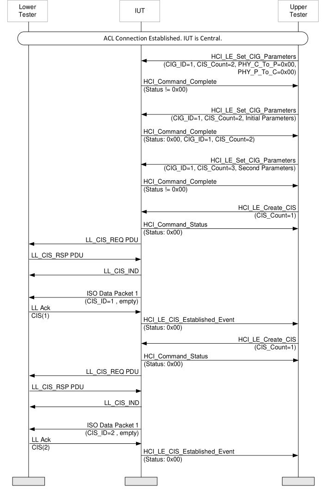

**Figure 4.139: HCI/CIS/BI-11-C [Connected Isochronous Stream, Central Initiated, CIG Parameters Failure Behavior] MSC**

1. The Upper Tester sends an HCI_LE_Set_CIG_Parameters command to the IUT with
PHY_C_To_P for both CIS = 0x00, all the remaining values as specified in Table 4.72. 2. The IUT sends an HCI_Command_Complete event to the Upper Tester failing the command. 3. The Upper Tester sends an HCI_LE_Set_CIG_Parameters command to the IUT with the values
specified in the Initial Value(s) column specified in Table 4.72.
CIG_ID = 0x01, and CIS_Count = 2. 5. The Upper Tester sends an HCI_LE_Set_CIG_Parameters command to the IUT with the values
specified in the Second Value(s) column specified in Table 4.72. 6. The IUT sends an HCI_Command_Complete event to the Upper Tester failing the command. 7. The Upper Tester sends an HCI_Create_CIS command to the IUT for CIS_ID 0x01. 8. The IUT sends an HCI_Command_Status event to the Upper Tester with Status = 0x00. 9. The IUT sends an LL_CIS_REQ PDU to the Lower Tester with CIS_ID set to 0x01. 10. The Lower Tester sends an LL_CIS_RSP PDU to the IUT. 11. The IUT sends an LL_CIS_IND PDU to the Lower Tester. 12. The IUT sends an empty ISO Data packet to the Lower Tester, and the Lower Tester sends an
Ack to the IUT. 13. The IUT sends an HCI_LE_CIS_Established event to the Upper Tester for CIS_ID 0x01. 14. The Upper Tester sends an HCI_Create_CIS command to the IUT for CIS_ID 0x02. 15. The IUT sends an HCI_Command_Status event to the Upper Tester with Status = 0x00. 16. The IUT sends an LL_CIS_REQ PDU to the Lower Tester with CIS_ID = 0x02. 17. The Lower Tester sends an LL_CIS_RSP PDU to the IUT. 18. The IUT sends an LL_CIS_IND PDU to the Lower Tester. 19. The IUT sends an empty ISO Data Packet to the Lower Tester, and the Lower Tester sends an
Ack to the IUT. 20. The IUT sends an HCI_LE_CIS_Established event to the Upper Tester for CIS_ID 0x02.

|  | Parameter |  |  | Initial Value(s) |  |  | Second Value(s) |  |
| --- | --- | --- | --- | --- | --- | --- | --- | --- |
| CIG ID _ |  |  | 0x01 |  |  | 0x01 |  |  |
| SDU Interval C To P, _ _ _ _ SDU Interval P To C _ _ _ _ |  |  | 50 ms |  |  | 60 ms |  |  |
| CIS Count _ |  |  | 2 |  |  | 3 |  |  |
| CIS ID[] _ |  |  | 0x01, 0x02 |  |  | 0x01, 0x02, 0x03 |  |  |
| Worst Case SCA _ _ |  |  | 0x00 |  |  | 0x01 |  |  |
| Packing |  |  | Sequential (0x00) |  |  | Interleaved (0x01) |  |  |
| Framing |  |  | Framed (0x01) |  |  | Unframed (0x00) |  |  |
| Max SDU C To P[] _ _ _ _ |  |  | 16, 16 |  |  | 4096, 4096, 4096 |  |  |
| Max SDU P To C[] _ _ _ _ |  |  | 16, 16 |  |  | 4096, 4096, 4096 |  |  |
| Max Transport Latency C To P, _ _ _ _ _ Max Transport Latency P To C _ _ _ _ _ |  |  | 200 ms |  |  | 250 ms |  |  |
| RTN C To P[] _ _ _ |  |  | 4, 4 |  |  | 5, 5, 5 |  |  |
| RTN P To C[] _ _ _ |  |  | 4, 4 |  |  | 5, 5, 5 |  |  |
| PHY C To P[] _ _ _ |  |  | 0x01, 0x01 |  |  | 0x01, 0x01, 0x01 |  |  |
| PHY P To C[] _ _ _ |  |  | 0x01, 0x01 |  |  | 0x00, 0x01, 0x01 |  |  |

Table 4.72: CIG Parameter Values
• Expected Outcome
Pass verdict
In step 2, the IUT sends an HCI_Command_Complete event to the Upper Tester failing the command.
In step 4, the IUT sends an HCI_Command_Complete event to the Upper Tester with Status = 0x00, CIG_ID = 0x01, and CIS_Count = 2.
In step 6, the IUT sends an HCI_Command_Complete event to the Upper Tester failing the command.
In step 8, the IUT sends an HCI_Command_Status event to the Upper Tester with Status = 0x00.
In step 9, the IUT sends an LL_CIS_REQ PDU to the Lower Tester with CIS_ID set to 0x01. Framed PDUs are specified.
In step 11, the IUT sends an LL_CIS_IND PDU to the Lower Tester.
In step 13, the IUT sends an HCI_LE_CIS_Established event to the Upper Tester for CIS_ID 0x01.
In step 15, the IUT sends an HCI_Command_Status event to the Upper Tester with Status = 0x00.
In step 16, the IUT sends an LL_CIS_REQ PDU to the Lower Tester with CIS_ID = 0x02. Framed PDUs are specified.
In step 18, the IUT sends an LL_CIS_IND PDU to the Lower Tester.
In step 20, the IUT sends an HCI_LE_CIS_Established event to the Upper Tester for CIS_ID 0x02.
The resulting CIG with 2 CISes meets the following criteria:
- SDU_Interval_C_To_P and SDU_Interval_P_To_C are the value specified in the Initial Value(s) column in Table 4.72.
- The CIS IDs match the values specified in the Initial Value(s) column in Table 4.72.
- Max_SDU_C_To_P[] are the values specified in the Initial Value(s) column in Table 4.72.
- Max_SDU_P_To_C[] are the values specified in the Initial Value(s) column in Table 4.72.

##### 4.15.1.2 Ignoring RFU Bits in HCI ISO Data Packets, CIS

• Test Purpose
Verify that the IUT ignores RFU bits in ISO Data Packets received from the Upper Tester and sends the ISO data in a CIS.
• Reference
[12] 5.4.5
• Initial Condition
- CIS established in the relevant role defined in Table 4.75 per the following configurations:

|  | Variable |  |  | Value(s) |  |
| --- | --- | --- | --- | --- | --- |
| sdu int c2p _ _ |  |  | 0x186A0 (100 ms) |  |  |
| sdu int p2c _ _ |  |  | 0x186A0 (100 ms) |  |  |
| ft c2p _ |  |  | 1 |  |  |
| ft p2c _ |  |  | 1 |  |  |
| iso int _ |  |  | 0x50 (100 ms) |  |  |
| packing |  |  | any supported |  |  |
| framing |  |  | any |  |  |
| cis cnt _ |  |  | 1 |  |  |
| nse[] |  |  | 0x03 |  |  |
| mx sdu c2p[] _ _ |  |  | 8 |  |  |
| mx sdu p2c[] _ _ |  |  | 0 |  |  |

|  | Variable |  |  | Value(s) |  |
| --- | --- | --- | --- | --- | --- |
| mx pdu c2p[] _ _ |  |  | 8 |  |  |
| mx pdu p2c[] _ _ |  |  | 0 |  |  |
| phy c2p[] _ |  |  | 0x01 |  |  |
| phy p2c[] _ |  |  | 0x01 |  |  |
| bn c2p[] _ |  |  | 0x01 |  |  |
| bn p2c[] _ |  |  | 0x00 |  |  |

Table 4.73: IUT as Central configuration

|  | Variable |  |  | Value(s) |  |
| --- | --- | --- | --- | --- | --- |
| sdu int c2p _ _ |  |  | 0x186A0 (100 ms) |  |  |
| sdu int p2c _ _ |  |  | 0x186A0 (100 ms) |  |  |
| ft c2p _ |  |  | 1 |  |  |
| ft p2c _ |  |  | 1 |  |  |
| iso int _ |  |  | 0x50 (100 ms) |  |  |
| packing |  |  | any supported |  |  |
| framing |  |  | any |  |  |
| cis cnt _ |  |  | 1 |  |  |
| nse[] |  |  | 0x03 |  |  |
| mx sdu c2p[] _ _ |  |  | 0 |  |  |
| mx sdu p2c[] _ _ |  |  | 8 |  |  |
| mx pdu c2p[] _ _ |  |  | 0 |  |  |
| mx pdu p2c[] _ _ |  |  | 8 |  |  |
| phy c2p[] _ |  |  | 0x01 |  |  |
| phy p2c[] _ |  |  | 0x01 |  |  |
| bn c2p[] _ |  |  | 0x00 |  |  |
| bn p2c[] _ |  |  | 0x01 |  |  |

Table 4.74: IUT as Peripheral configuration
• Test Case Configuration

|  | Test Case |  |  | IUT Role |  |
| --- | --- | --- | --- | --- | --- |
| HCI/CIS/BI-01-C [Receiving HCI ISO Data Packets with RFU Bits Set, CIS, Central] |  |  | Central |  |  |
| HCI/CIS/BI-02-C [Receiving HCI ISO Data Packets with RFU Bits Set, CIS, Peripheral] |  |  | Peripheral |  |  |

Table 4.75: Ignoring RFU Bits in HCI ISO Data Packets, CIS test cases
• Test Procedure

**Figure 4.140: Ignoring RFU Bits in HCI ISO Data Packets, CIS MSC**

1. The Upper Tester sends HCI ISO Data packets to the IUT with all RFU field bits set. 2. The IUT sends the ISO Data packets to the Lower Tester.
• Expected Outcome
Pass verdict
The IUT sends the ISO Data packets to the Lower Tester.

##### 4.15.1.3 Connected Isochronous Stream, Reject Early Read ISO TX Sync

• Test Purpose
Verify that an IUT properly rejects the LE Read ISO TX Sync command issued by the Upper Tester before an SDU has been transmitted by the IUT.
• Reference
[12] 7.8.96
• Initial Condition
- The IUT is in the specified role.
- A CIS has been established using Framing=unframed and all other values as specified in [14] Section 4.10.1.3, Default Values for Set_CIG_Parameters_Test Commands, the ISO data path has been set up, and the Upper Tester does not provide SDU data.
- The Lower Tester is in the peer role to the IUT.
- The Lower Tester sends CIS NULL PDUs in each sub-event.
• Test Case Configuration

|  | Test Case |  |
| --- | --- | --- |
| HCI/CIS/BI-03-C [Connected Isochronous Stream, Central, Reject Early Read ISO TX Sync] |  |  |
| HCI/CIS/BI-04-C [Connected Isochronous Stream, Peripheral, Reject Early Read ISO TX Sync] |  |  |

Table 4.76: Connected Isochronous Stream, Reject Early Read ISO TX Sync test cases
• Test Procedure

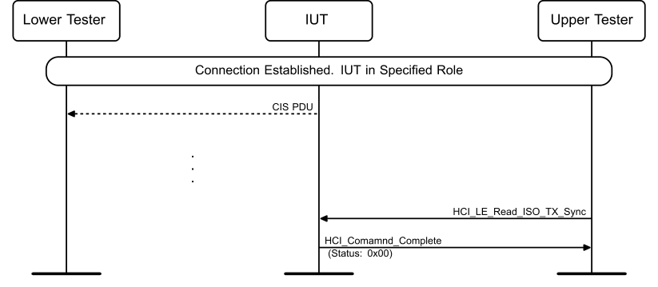

**Figure 4.141: Connected Isochronous Stream, Reject Early Read ISO TX Sync MSC**

1. The IUT starts sending CIS PDUs to the Lower Tester. 2. As soon as the Lower Tester has received a PDU or after 5 seconds if the IUT does not transmit
any PDUs, the Upper Tester sends an HCI_LE_Read_ISO_TX_Sync command to the IUT. 3. The IUT sends an HCI_Command_Complete event to the Upper Tester.
• Expected Outcome
Pass verdict
In step 3:
- If the IUT only sends CIS Null PDUs to the Lower Tester or does not transmit in the subevent, then Status is set to Command Disallowed (0x0C).
- Otherwise, Status is set to 0 and the event has the TX_Time_Stamp and Packet_Sequence_Number fields set to appropriate values.
HCI/CIS/BV-05-C [Connected Isochronous Stream, Central Initiated, Add or Modify CIS]
• Test Purpose
Verify that a Central IUT can add or modify a Connected Isochronous Group before a CIS is created. Verify that a Central IUT rejects an LE Create CIS command when a CIS Connection Handle is specified twice.
• Reference
[15] 4.10.1.3
[12] 7.8.97
[13] 7.8.99
• Initial Condition
- An ACL connection has been established between the IUT and the Lower Tester with a valid Connection Handle.
- The Lower Tester acts in the Peripheral role.
• Test Procedure

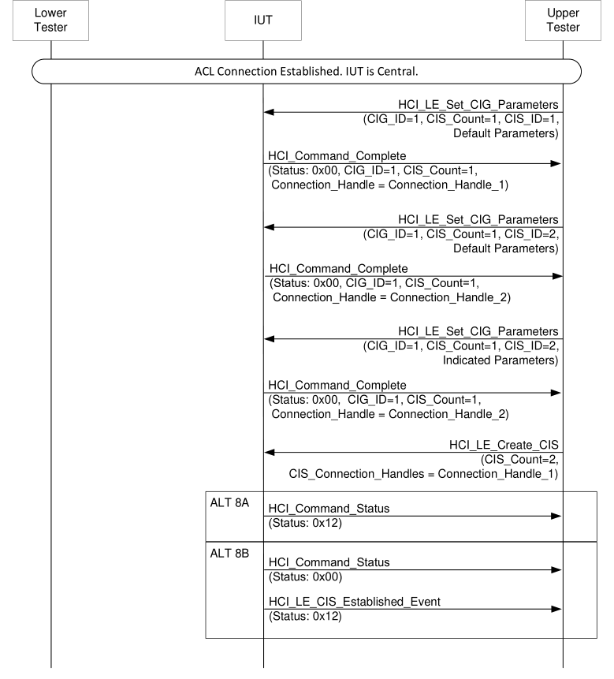

**Figure 4.142: HCI/CIS/BV-05-C [Connected Isochronous Stream, Central Initiated, Add or Modify CIS] MSC – Page 1 of 2**

Lower Tester
Upper Tester IUT

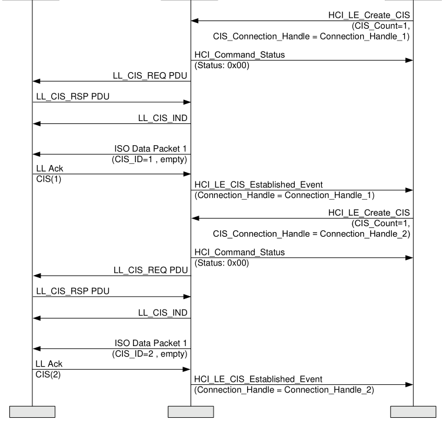

**Figure 4.143: HCI/CIS/BV-05-C [Connected Isochronous Stream, Central Initiated, Add or Modify CIS] MSC – Page 2 of 2**

1. The Upper Tester sends an HCI_LE_Set_CIG_Parameters command to the IUT with the CIG_ID
set to 1 and default values as specified in [15] Section 4.10.1.3, Default Values for Set CIG Parameters Commands. 2. The IUT sends an HCI_Command_Complete event to the Upper Tester with Status set to 0x00
and a valid Connection_Handle_1. 3. The Upper Tester sends an HCI_LE_Set_CIG_Parameters command to the IUT with the CIS_ID
set to 2, CIG_ID set to 1, and default values as specified in [15] Section 4.10.1.3, Default Values for Set CIG Parameters Commands. 4. The IUT sends an HCI_Command_Complete event to the Upper Tester with Status set to 0x00
and a valid Connection_Handle_2. 5. The Upper Tester sends an HCI_LE_Set_CIG_Parameters command to the IUT with CIS_ID set
to 2, CIG_ID set to 1, and the values as specified in Table 4.77. 6. The IUT sends an HCI_Command_Complete event to the Upper Tester with Status set to 0x00
and Connection_Handle_2 received in step 4. 7. The Upper Tester sends an HCI_LE_Create_CIS command with a CIS_Count of 2 and both
connection handles set to CIS_Connection_Handle_1.
Alternative 8A (The IUT returns an HCI_Command_Status event with an error code)
8A.1 The IUT sends an HCI_Command_Status event to the Upper Tester with the error code Invalid HCI Command Parameters (0x12).
Alternative 8B (The IUT returns an HCI_LE_CIS_Established event with an error code)
8B.1 The IUT sends a successful HCI_Command_Status event to the Upper Tester.
8B.2 The IUT sends an HCI_LE_CIS_Established event to the Upper Tester with the error code Invalid HCI Command Parameters (0x12).
9. The Upper Tester sends an HCI_LE_Create_CIS command to the IUT with a valid
CIS_Connection_Handle_1 for CIS_ID 0x01. 10. The IUT sends an HCI_Command_Status event to the Upper Tester with Status set to 0. 11. The IUT sends an LL_CIS_REQ PDU to the Lower Tester with CIS_ID set to 0x01. 12. The Lower Tester sends an LL_CIS_RSP PDU to the IUT. 13. The IUT sends an LL_CIS_IND PDU to the Lower Tester. 14. The IUT sends an empty ISO Data packet to the Lower Tester, and the Lower Tester sends an
Ack to the IUT. 15. The IUT sends an HCI_LE_CIS_Established event to the Upper Tester with
Connection_Handle_1 for CIS_ID 0x01. 16. The Upper Tester sends an HCI_LE_Create_CIS command to the IUT with a valid
CIS_Connection_Handle_2 for CIS_ID 0x02. 17. The IUT sends an HCI_Command_Status event to the Upper Tester with Status set to 0. 18. The IUT sends an LL_CIS_REQ PDU to the Lower Tester with CIS_ID set to 0x02. 19. The Lower Tester sends an LL_CIS_RSP PDU to the IUT. 20. The IUT sends an LL_CIS_IND PDU to the Lower Tester. 21. The IUT sends an empty ISO Data Packet to the Lower Tester, and the Lower Tester sends an
Ack to the IUT. 22. The IUT sends an HCI_LE_CIS_Established event to the Upper Tester with
Connection_Handle_2 for CIS_ID 0x02.

|  | Parameter |  |  | Value |  |
| --- | --- | --- | --- | --- | --- |
| SDU Interval C To P, SDU Interval P To C _ _ _ _ _ _ _ _ |  |  | 20 ms |  |  |
| CIS Count _ |  |  | 1 |  |  |
| Peripherals Clock Accuracy _ _ |  |  | 0 |  |  |
| Packing |  |  | Sequential (0x00) |  |  |
| Framing |  |  | Unframed (0x00) |  |  |
| Max SDU C To P, Max SDU P To C _ _ _ _ _ _ _ _ |  |  | 100 |  |  |
| Max Transport Latency C To P, Max Transport Latency P To C _ _ _ _ _ _ _ _ _ _ |  |  | 40 ms |  |  |
| RTN C To P, RTN P To C _ _ _ _ _ _ |  |  | 4 |  |  |

Table 4.77: CIG Parameter Values
• Expected Outcome
Pass verdict
In step 2, the IUT sends an HCI_Command_Complete event to the Upper Tester with Status set to 0x00 and Connection_Handle_1.
In step 4, the IUT sends an HCI_Command_Complete event to the Upper Tester with Status set to 0x00 and valid Connection_Handle_2.
In step 6, the IUT sends an HCI_Command_Complete event to the Upper Tester with Status set to 0x00 and the Connection_Handle received in step 4.
In step 8, the IUT rejects the HCI_LE_Create_CIS command with the error code Invalid HCI Command Parameters (0x12).
In step 10, the IUT sends an HCI_Command_Status event to the Upper Tester with Status set to 0.
In step 11, the IUT sends an LL_CIS_REQ PDU to the Lower Tester with CIS_ID set to 0x01 and CIS parameters matching the values in step 1.
In step 13, the IUT sends an LL_CIS_IND PDU to the Lower Tester.
In step 14, the IUT sends an empty ISO Data Packet to the Lower Tester, and the Lower Tester sends an Ack to the IUT.
In step 15, the IUT sends an HCI_LE_CIS_Established event to the Upper Tester with Connection_Handle_1 for CIS_ID 0x01.
In step 17, the IUT sends an HCI_Command_Status event to the Upper Tester with Status set to 0.
In step 18, the IUT sends an LL_CIS_REQ PDU to the Lower Tester with CIS_ID set to 0x02 and CIS parameters matching the values in step 5.
In step 20, the IUT sends an LL_CIS_IND PDU to the Lower Tester.
In step 21, the IUT sends an empty ISO Data packet to the Lower Tester, and the Lower Tester sends an Ack to the IUT.
In step 22, the IUT sends an HCI_LE_CIS_Established event to the Upper Tester with Connection_Handle_2 for CIS_ID 0x02.
HCI/CIS/BI-05-C [Connected Isochronous Stream Using Non-Test Command, Central, Reject Invalid Parameters]
• Test Purpose
Verify that a Central IUT properly rejects invalid parameters in the LE_Set_CIG_Parameters command.
• Reference
[12] 7.8.97
• Initial Condition
- An ACL connection has been established between the IUT and the Lower Tester with a valid Connection Handle.
- The Lower Tester acts in the Peripheral role.
- TSPX_max_sdu_length is the Max SDU Length as specified in LL IXIT.
• Test Procedure

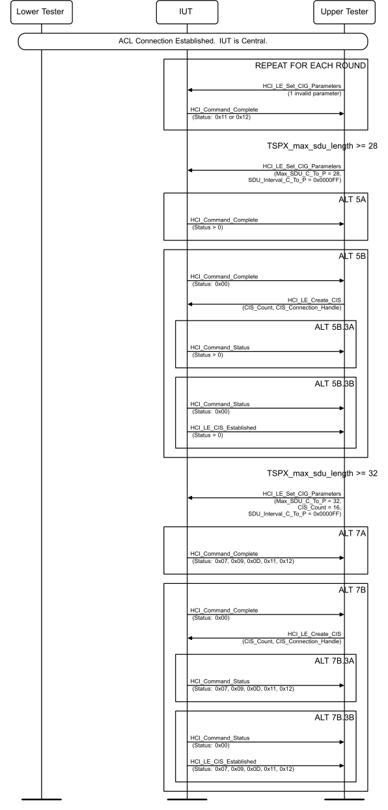

**Figure 4.144: HCI/CIS/BI-05-C [Connected Isochronous Stream Using Non-Test Command, Central, Reject Invalid Parameters] MSC**

command to the IUT with one parameter set to the value specified and all other values set as specified in Table 4.79. Note: For round 9, the number of parameters required to describe the CIS_Count specified
exceeds the size of an HCI command. Fill in an array of 26 valid CIS values, leaving only the CIS_Count in error.
2. The IUT then sends an HCI_Command_Complete event to the Upper Tester with Status set to
Unsupported Feature or Parameter Value (0x11) in rounds 13 and 14 and Invalid HCI Command Parameters (0x12) in all other rounds. 3. Return to step 1 until all rounds are completed.
If TSPX_max_sdu_length is at least 28:
4. The Upper Tester sends an HCI_LE_Set_CIG_Parameters command to the IUT with values as
specified in Table 4.79 except that SDU_Interval_C_To_P is set to 0x0000FF (255 µs) and Max_SDU_C_to_P = 28. 5. Perform either alternative 5A or 5B depending on the IUT response.
Alternative 5A (non-zero status):
5A.1 The IUT sends an HCI_Command_Complete event to the Upper Tester with Status set to a valid error code.
Alternative 5B (Status set to 0x00):
5B.1 The IUT sends a successful HCI_Command_Complete event to the Upper Tester.
5B.2 The Upper Tester sends an HCI_LE_Create_CIS command to the IUT with CIS_Count and CIS_Connection_Handle set to the values returned in step 5B.1.
5B.3 Perform either 5B.3A or 5B.3B depending on the HCI_Command_Status response.
Alternative 5B.3A (non-zero status):
5B.3A The IUT sends an HCI_Command_Status event to the Upper Tester with Status set to a valid error code.
Alternative 5B.3B (Status set to 0x00):
5B.3B The IUT sends a successful HCI_Command_Status event to the Upper Tester followed by an HCI_LE_CIS_Established event with Status set to a valid error code.
If TSPX_max_sdu_length is at least 32:
6. The Upper Tester sends an HCI_LE_Set_CIG_Parameters command to the IUT with
Max_SDU_C_To_P = 32, SDU_Interval_C_To_P = 0x0000FF (255 µs) and CIS_Count = 16. All other values as specified in Table 4.79. 7. Perform either alternative 7A or 7B depending on the IUT response.
Alternative 7A (non-zero status):
7A.1 The IUT sends an HCI_Command_Complete event to the Upper Tester with Status set to error code Invalid HCI Command Parameters (0x12), Unsupported Feature or Parameter Value (0x11), error code Memory Capacity Exceeded (0x07), error code Connection Rejected Due to Limited Resources (0x0D), or error code Connection Limit Exceeded (0x09).
Alternative 7B (Status set to 0x00):
7B.1 The IUT sends a successful HCI_Command_Complete event to the Upper Tester.
7B.2 The Upper Tester sends an HCI_LE_Create_CIS command to the IUT with CIS_Count and CIS_Connection_Handle set to the values returned in step 7B.1.
Alternative 7B.3A (non-zero status):
7B.3A The IUT sends an HCI_Command_Status event to the Upper Tester with Status set to error code Invalid HCI Command Parameters (0x12), Unsupported Feature or Parameter Value (0x11), error code Memory Capacity Exceeded (0x07), error code Connection Rejected Due to Limited Resources (0x0D), or error code Connection Limit Exceeded (0x09).
Alternative 7B.3B (Status set to 0x00):
7B.3B The IUT sends a successful HCI_Command_Status event to the Upper Tester followed by an HCI_LE_CIS_Established event with Status set to error code Invalid HCI Command Parameters (0x12), Unsupported Feature or Parameter Value (0x11), error code Memory Capacity Exceeded (0x07), error code Connection Rejected Due to Limited Resources (0x0D), or error code Connection Limit Exceeded (0x09).

|  | Round |  |  | Parameter |  |  | Value |  |
| --- | --- | --- | --- | --- | --- | --- | --- | --- |
| 1 |  |  | CIG ID _ |  |  | 0xFF |  |  |
| 2 |  |  | SDU Interval C To P _ _ _ _ |  |  | 0xF00000 |  |  |
| 3 |  |  | SDU Interval P To C _ _ _ _ |  |  | 0xF00000 |  |  |
| 4 |  |  | Worst Case SCA _ _ |  |  | 0xF0 |  |  |
| 5 |  |  | Packing |  |  | 0xF0 |  |  |
| 6 |  |  | Framing |  |  | 0xF0 |  |  |
| 7 |  |  | Max Transport Latency C To P _ _ _ _ _ |  |  | 0xF000 |  |  |
| 8 |  |  | Max Transport Latency P To C _ _ _ _ _ |  |  | 0xF000 |  |  |
| 9 |  |  | CIS Count _ |  |  | 0x20 |  |  |
| 10 |  |  | CIS ID _ |  |  | 0xFF |  |  |
| 11 |  |  | Max SDU C To P _ _ _ _ |  |  | 0xF000 |  |  |
| 12 |  |  | Max SDU P To C _ _ _ _ |  |  | 0xF000 |  |  |
| 13 |  |  | PHY C To P _ _ _ |  |  | 0xF0 |  |  |
| 14 |  |  | PHY P To C _ _ _ |  |  | 0xF0 |  |  |

Table 4.78: CIG Parameters for each round

|  | Parameter |  |  | Default Value |  |
| --- | --- | --- | --- | --- | --- |
| SDU Interval C To P _ _ _ _ |  |  | 20 ms |  |  |
| SDU Interval P To C _ _ _ _ |  |  | 20 ms |  |  |
| CIS Count _ |  |  | 2 (round 5), 1 (all other rounds) |  |  |
| Worst Case SCA _ _ |  |  | 0 |  |  |
| Packing |  |  | Sequential (0x00) OR Interleaved (0x01) |  |  |
| Framing |  |  | Unframed (0x00) |  |  |
| Max SDU C To P _ _ _ _ |  |  | Note 1 |  |  |
| Max SDU P To C _ _ _ _ |  |  | 0 |  |  |
| PHY C To P _ _ _ |  |  | LE 1M PHY |  |  |

|  | Parameter |  |  | Default Value |  |
| --- | --- | --- | --- | --- | --- |
| PHY P To C _ _ _ |  |  | LE 1M PHY |  |  |
| Max Transport Latency C To P _ _ _ _ _ |  |  | 40 ms |  |  |
| Max Transport Latency P To C _ _ _ _ _ |  |  | 40 ms |  |  |
| RTN C To P _ _ _ |  |  | 2 |  |  |
| RTN P To C _ _ _ |  |  | 2 |  |  |

Note 1: Set to 10 or TSPX_max_sdu_length, whichever is less.
Table 4.79: CIG Default Parameters
• Expected Outcome
Pass verdict
In step 2, the IUT sends an HCI_Command_Complete event to the Upper Tester with Status set to Unsupported Feature or Parameter Value (0x11) in rounds 13 and 14 and Invalid HCI Command Parameters (0x12) in all other rounds.
In steps 5A.1, 5B.3A, and 5B.3B, the IUT sends an HCI_Command_Complete event to the Upper Tester with Status set to a valid error code.
In step 7A.1, 7B.3A, and 7B.3B, the IUT sends an HCI_Command_Complete event to the Upper Tester with Status set to error code Invalid HCI Command Parameters (0x12), Unsupported Feature or Parameter Value (0x11), error code Memory Capacity Exceeded (0x07), error code Connection Rejected Due to Limited Resources (0x0D), or error code Connection Limit Exceeded (0x09).
HCI/CIS/BV-06-C [Connected Isochronous Stream Using Test Command, Central Initiated, Time_Offset]
• Test Purpose
Verify that the Central IUT, when transmitting unframed data packets, returns a Time_Offset value of 0 when LE Read ISO TX Sync is called.
• Reference
[12] 7.8.96
• Initial Condition
- The Isochronous Channels (Host Support) FeatureSet bit is set.
- An ACL connection has been established between the IUT and the Lower Tester with a valid Connection Handle.
- The Lower Tester acts in the Peripheral role.
• Test Procedure

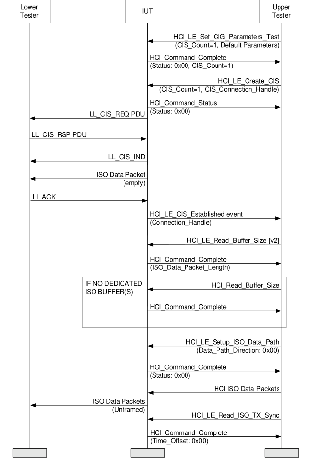

**Figure 4.145: HCI/CIS/BV-06-C [Connected Isochronous Stream Using Test Command, Central Initiated, Time_Offset] MSC**

1. The Upper Tester sends an HCI_LE_Set_CIG_Parameters_Test command to the IUT with the
default parameters in [15] Section 4.10.1.3, Default Values for Set CIG Parameters Commands. The Upper Tester receives an HCI_Command_Complete success response from the IUT and CIS_Count = 1. 2. The Upper Tester sends an HCI_LE_Create_CIS command to create a single CIS and receives a
success response from the IUT. 3. The IUT sends an LL_CIS_REQ PDU to the Lower Tester. 4. The Lower Tester sends an LL_CIS_RSP PDU to the IUT. 5. The IUT sends an LL_CIS_IND to the Lower Tester. 6. The IUT sends an empty ISO Data packet to the Lower Tester. 7. The Lower Tester acknowledges the empty ISO Data packet.
Connection_Handle parameter is set to the value provided in the HCI_LE_Create_CIS command. 9. The Upper Tester sends an HCI_LE_Read_Buffer_Size [v2] command to the IUT and receives an
HCI_Command_Complete event providing an ISO_Data_Packet_Length. 10. If the IUT responds with an ISO_Data_Packet_Length of 0x00, indicating that it does not support
dedicated ISO transmit buffer(s), then the Upper Tester sends an HCI_Read_Buffer_Size command to determine the length of the transmit buffer(s). 11. The Upper Tester sends an HCI_LE_Setup_ISO_Data_Path command with the
Data_Path_Direction set to Input (0x00) to the IUT and receives a success response. 12. The Upper Tester sends HCI ISO Data packets over the CIS, and the Lower Tester receives
unframed ISO data. The HCI ISO Data packets are no larger than the permitted size read in steps 9 and 10. 13. The Upper Tester sends an HCI_LE_Read_ISO_TX_Sync command to the IUT. 14. The IUT sends an HCI_Command_Complete event that includes the Time_Offset to the Upper
Tester. The Time_Offset return parameter is 0.
• Expected Outcome
Pass verdict
The IUT provides an HCI_Command_Complete success response in step 1.
The IUT provides an HCI_Command_Status success response in step 2.
In step 8, the IUT sends an HCI_LE_CIS_Established event indicating success to the Upper Tester. The Connection_Handle parameter is set to the value provided in the HCI_LE_Create_CIS command.
In step 14, the value of the Time_Offset return parameter is 0.

##### 4.15.1.4 Connected Isochronous Stream, Invalid LE Read ISO TX Sync Parameters

• Test Purpose
Verify that an IUT returns an error when receiving an HCI_LE_Read_ISO_TX_Sync command when the CIS is not configured to transmit from the IUT.
• Reference
[12] 7.8.96
• Initial Condition
- The IUT and the Lower Tester are connected in their respective roles in a unidirectional CIS. The IUT does not transmit data and receives data from the Lower Tester.
- IUT as Central: Max_SDU_C_To_P[] = 0x00; Max_PDU_C_To_P[] = 0x00; BN_C_To_P[] = 0x00. All other values default as specified in [14] Section 4.10.1.3, Default Values for Set CIG Parameters Commands.
- IUT as Peripheral: Max_SDU_P_To_C[] = 0x00; Max_PDU_P_To_C[] = 0x00; BN_P_To_C[] = 0x00. All other values default as specified in [14] Section 4.10.1.3, Default Values for Set CIG Parameters Commands.
• Test Case Configuration

|  | Test Case |  |
| --- | --- | --- |
| HCI/CIS/BV-07-C [Connected Isochronous Stream, Invalid LE Read ISO TX Sync Parameters, Central] |  |  |
| HCI/CIS/BV-08-C [Connected Isochronous Stream, Invalid LE Read ISO TX Sync Parameters, Peripheral] |  |  |

Table 4.80: Connected Isochronous Stream, Invalid LE Read ISO TX Sync Parameters test cases
• Test Procedure
1. The Upper Tester sends an HCI_LE_Read_ISO_TX_Sync command to the IUT with
Connection_Handle set to the current CIS connection handle. 2. The IUT sends an HCI_Command_Complete event to the Upper Tester with Status set to 0x0C.
• Expected Outcome
Pass verdict
In step 2, the IUT sends an HCI_Command_Complete event to the Upper Tester with Status set to 0x0C.
HCI/CIS/BI-06-C [Invalid LE Accept or Reject CIS Request, Premature Setup ISO Data Path]
• Test Purpose
Verify that a Peripheral IUT returns an error when the host sends an HCI_LE_Setup_ISO_Data_Path command prior to sending the HCI_LE_Accept_CIS_Request command.
Verify that a Peripheral IUT returns an error when the host sends an HCI_LE_Accept_CIS_Request or HCI_LE_Reject_CIS_Request command with an HCI_LE_Accept_CIS_Request command in progress or with a connected CIS.
• Initial Condition
- The IUT is Peripheral.
- The event mask has been configured to allow the HCI_LE_CIS_Established [v1] and [v2] events to be passed to the Upper Tester.
• Test Procedure

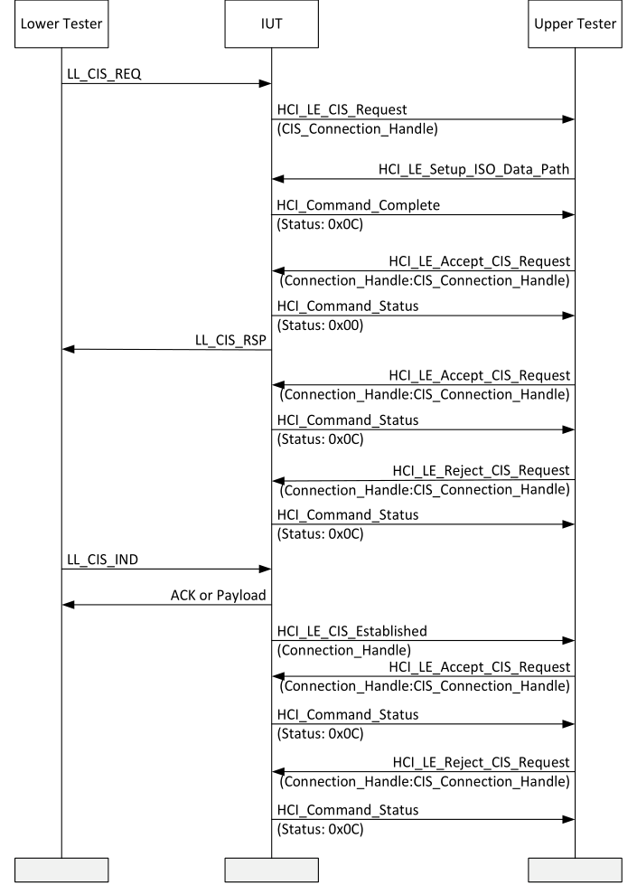

**Figure 4.146: HCI/CIS/BI-06-C [Invalid LE Accept or Reject CIS Request, Premature Setup ISO Data Path] MSC**

1. The Lower Tester sends an LL_CIS_REQ PDU to the IUT. 2. The IUT sends an HCI_LE_CIS_Request event to the Upper Tester with a
CIS_Connection_Handle. 3. The Upper Tester sends an HCI_LE_Setup_ISO_Data_Path command with Data_Path_Direction
set to Output (0x01) and using the CIS_Connection_Handle provided in step 2. The IUT responds with an HCI_Command_Complete with error code Command Disallowed (0x0C). 4. The Upper Tester sends an HCI_LE_Accept_CIS_Request command to the IUT with the
Connection_Handle set to the CIS_Connection_Handle received in step 2 and receives a successful HCI_Command_Status event in return. 5. The IUT sends an LL_CIS_RSP PDU to the Lower Tester.
Connection_Handle set to the CIS_Connection_Handle received in step 2. The IUT sends an HCI_Command_Status event to the Upper Tester with Status set to 0x0C. 7. The Upper Tester sends an HCI_LE_Reject_CIS_Request command to the IUT with the
Connection_Handle set to the CIS_Connection_Handle received in step 2. The IUT sends an HCI_Command_Status event to the Upper Tester with Status set to 0x0C. 8. The Lower Tester sends an LL_CIS_IND PDU to the IUT. 9. The IUT sends an HCI_LE_CIS_Established event to the Upper Tester with a
Connection_Handle. If the IUT sends an HCI_LE_CIS_Established [v2] event, then the Sub_Interval, Max_SDU_C_To_P, Max_SDU_P_To_C, SDU_Interval_C_To_P, SDU_Interval_P_To_C, and Framing parameters are set to the corresponding values from the LL_CIS_REQ PDU sent in step 1. 10. The Upper Tester sends an HCI_LE_Accept_CIS_Request command to the IUT with the
Connection_Handle set to the Connection_Handle received in step 9. 11. The IUT sends an HCI_Command_Status event to the Upper Tester with Status set to 0x0C. 12. The Upper Tester sends an HCI_LE_Reject_CIS_Request command to the IUT with the
Connection_Handle set to the Connection_Handle received in step 9. 13. The IUT sends an HCI_Command_Status event to the Upper Tester with Status set to 0x0C.
• Expected Outcome
Pass verdict
In step 3, the IUT sends an HCI_Command_Complete event to the Upper Tester with Status set to Command Disallowed 0x0C.
In steps 6, 7, 11, and 13, the IUT sends an HCI_Command_Status event to the Upper Tester with Status set to 0x0C.
HCI/CIS/BI-07-C [LE CIS Request Timeout]
• Test Purpose
Verify that a Peripheral IUT returns an error when the host fails to send an HCI_LE_Accept_CIS_Request or HCI_LE_Reject_CIS_Request command before the Connection Accept Timeout expires.
• Initial Condition
- The IUT is Peripheral.
• Test Procedure
1. The Lower Tester sends an LL_CIS_REQ PDU to the IUT. 2. The IUT sends an HCI_LE_CIS_Request event to the Upper Tester with a
CIS_Connection_Handle. 3. The Upper Tester does not send an HCI_LE_Accept_CIS_Request or
HCI_LE_Reject_CIS_Request within the Connection_Accept_Timeout. 4. The IUT sends an HCI_LE_CIS_Established event to the Upper Tester with Status set to
Connection Accept Timeout Exceeded (0x10).
• Expected Outcome
Pass verdict
In step 4, the IUT sends an HCI_LE_CIS_Establised event to the Upper Tester with Status set to 0x10 after Connection_Accept_Timeout after step 2 has elapsed.
• Test Purpose
Verify that a Peripheral IUT properly rejects invalid CIS commands.
• Reference
[12] 7.8.99, 7.8.101, 7.8.109
• Initial Condition
- A CIS has been established and the ISO data path has been set up. The Connection_Handle of the CIS is preserved as Connection_Handle_1.
- The Lower Tester acts in the Central role.
• Test Procedure

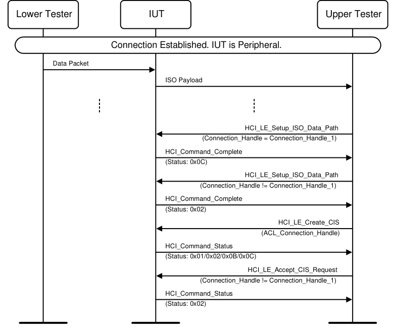

**Figure 4.147: HCI/CIS/BI-08-C [Connected Isochronous Stream, Peripheral, Reject Invalid Commands] MSC**

1. The Upper Tester sends an HCI_LE_Setup_ISO_Data_Path command to the IUT with
Connection_Handle set to Connection_Handle_1. 2. The IUT sends an HCI_Command_Complete event to the Upper Tester with Status set to
Command Disallowed (0x0C). 3. The Upper Tester sends an HCI_LE_Setup_ISO_Data_Path command to the IUT with the
Connection_Handle set to a different value than Connection_Handle_1. 4. The IUT sends an HCI_Command_Complete event to the Upper Tester with Status set to
Unknown Connection Identifier (0x02).
ACL_Connection_Handle set to the value of the current ACL connection and CIS_Handle set to Connection_Handle_1. 6. The IUT sends an HCI_Command_Status event to the Upper Tester with Status set to Unknown
HCI Command (0x01), Unknown Connection Identifier (0x02), Connection Already Exists (0x0B), or Command Disallowed (0x0C). 7. The Upper Tester sends an HCI_LE_Accept_CIS_Request to the IUT with Connection_Handle
set to a different value than Connection_Handle_1. 8. The IUT sends an HCI_Command_Status event to the Upper Tester with Status set to Unknown
Connection Identifier (0x02).
• Expected Outcome
Pass verdict
In step 2, the IUT sends an HCI_Command_Complete event to the Upper Tester with Status set to Command Disallowed (0x0C).
In step 4, the IUT sends an HCI_Command_Complete event to the Upper Tester with Status set to Unknown Connection Identifier (0x02).
In step 6, the IUT sends an HCI_Command_Status event to the Upper Tester with Status set to Unknown HCI Command (0x01), Unknown Connection Identifier (0x02), Connection Already Exists (0x0B), or Command Disallowed (0x0C).
In step 8, the IUT sends an HCI_Command_Status event to the Upper Tester with Status set to Unknown Connection Identifier (0x02).
HCI/CIS/BI-09-C [Connected Isochronous Stream, Peripheral, Reject Invalid Disconnect Command]
• Test Purpose
Verify that a Peripheral IUT connecting to a CIS properly rejects a disconnect command that was received before the CIS is fully established.
• Reference
[12] 7.1.6
• Initial Condition
- The Isochronous Channels (Host Support) FeatureSet bit is set. The event mask has been configured to allow CIS events to be passed to the Upper Tester.
- An ACL connection has been established between the IUT and the Lower Tester with a valid Connection Handle.
- The Lower Tester is configured as the Central.
• Test Procedure

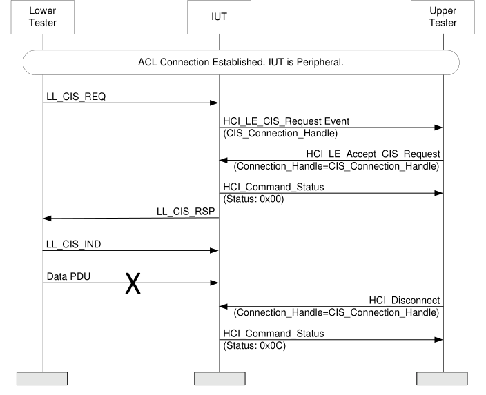

**Figure 4.148: HCI/CIS/BI-09-C [Connected Isochronous Stream, Peripheral, Reject Invalid Disconnect Command] MSC**

1. The Lower Tester sends an LL_CIS_REQ to the IUT with valid values. 2. The IUT sends an HCI_LE_CIS_Request event to the Upper Tester and the parameters include
the CIS_Connection_Handle assigned by the IUT. 3. The Upper Tester sends an HCI_LE_Accept_CIS_Request command to the IUT, with the
Connection_Handle field set to the value of the CIS_Connection_Handle received in step 2. 4. The IUT sends a successful Command Status to the Upper Tester. 5. The IUT sends an LL_CIS_RSP PDU to the Lower Tester. 6. The Lower Tester sends an LL_CIS_IND to the IUT. The Lower Tester does not send ISO data
PDUs to the IUT. 7. Before the CIS times out, the Upper Tester sends an HCI_Disconnect command to the IUT with
the Connection_Handle equal to the CIS_Connection_Handle received in step 2. 8. The IUT sends an HCI_Command_Status to the Upper Tester with Status set to error code
Command Disallowed (0x0C).
• Expected Outcome
Pass verdict
In step 2, the IUT sends an HCI_LE_CIS_Request event to the Upper Tester with the CIS_Connection_Handle assigned by the IUT.
In step 4, the IUT sends a successful Command Status to the Upper Tester.
In step 8, the IUT sends an HCI_Command_Status event to the Upper Tester with Status set to error code Command Disallowed (0x0C).
• Test Purpose
Verify that a Central or Peripheral IUT sets the TS_Flag bit if the ISO_Data_Load field provides a Time_Stamp to the Upper Tester over the HCI, and the bit is only set if the PB_Flag field equals 0b00 or 0b10.
Verify that a Central or Peripheral IUT provides a Time_Stamp to the Upper Tester over the HCI when time stamps are mandatory.
Verify that an Isochronous Broadcaster IUT correctly handles receiving a Time_Stamp in HCI ISO Data packets from the Upper Tester.
• Reference
[13] 5.4.5
• Initial Condition
- The IUT and the Lower Tester are connected in their respective roles as specified in Table 4.81 in a CIS using framed PDUs. All other values as defined in [14] 4.10.1.
- Peripheral IUT: The Lower Tester may request the IUT SCA if the IUT supports it in order to reduce timestamp tolerance.
• Test Case Configuration

|  | Test Case |  |  | Role |  |  | Time Stamp _ |  |
| --- | --- | --- | --- | --- | --- | --- | --- | --- |
| HCI/CIS/BV-09-C |  |  | Central |  |  | Optional |  |  |
| HCI/CIS/BV-10-C |  |  | Peripheral |  |  | Optional |  |  |
| HCI/CIS/BV-11-C |  |  | Central |  |  | Mandatory |  |  |
| HCI/CIS/BV-12-C |  |  | Peripheral |  |  | Mandatory |  |  |

Table 4.81: Connected Isochronous Stream, Time_Stamp test cases
• Test Procedure
1. The Lower Tester sends framed PDUs containing isochronous data to the IUT. The SDU data
consists of octets that count from 0x00 to 0xFF and roll over back to 0x00, then the count resumes. This count continues across all SDU data. 2. The IUT sends the received data to the Upper Tester in HCI ISO Data packets. 3. The Upper Tester sends SDU data to the IUT and includes Time_Stamps in the appropriate HCI
ISO Data packets. The SDU data consists of octets that count from 0x00 to 0xFF and roll over back to 0x00, then the count resumes. This count continues across all SDU data. 4. The IUT sends the SDUs provided by the Upper Tester to the Lower Tester.
• Expected Outcome
Pass verdict
When the IUT sends HCI_ISO_Data packets with the PB_Flag set to 0b00 or 0b10, then: - The Packet_Sequence_Number, ISO_SDU_Length, and Packet_Status_Flag fields are present. - If Time_Stamps are mandatory, then the TS flag is set. Otherwise, the TS flag can be set or clear. - If the TS_Flag is set, then a valid Time_Stamp field is present. Otherwise, Time_Stamp is not present.
When the IUT sends HCI_ISO_Data packets with the PB_Flag set to 0b01 or 0b11, then the TS flag is clear and the Time_Stamp, Packet_Sequence_Number, ISO_SDU_Length, and Packet_Status_Flag fields are not present.
When Time_Stamps are provided, the difference between Time_Stamps of adjacent SDUs is the SDU Interval within ±(SCA_Central + SCA_Peripheral) * ISO_Interval ± Jitter.
The Lower Tester receives PDUs with data consisting of the data described in step 3; the contents of the Upper Tester’s Time_Stamp do not corrupt the contents of the data received by the Lower Tester.
The IUT sends SDUs to the Upper Tester with the contents as specified in step 1.
HCI/CIS/BI-10-C [Connected Isochronous Stream, Central, Reject Max_SDU in Wrong Direction]
• Test Purpose
Verify that a Central IUT properly rejects Max_SDU values that conflict with existing data path directions.
• Reference
[13] 7.8.97
• Initial Condition
- An ACL connection has been established between the IUT and the Lower Tester with a valid Connection Handle.
- The Lower Tester acts in the Peripheral role.
- TSPX_max_sdu_length is the Max SDU Length as specified in IXIT.
• Test Procedure

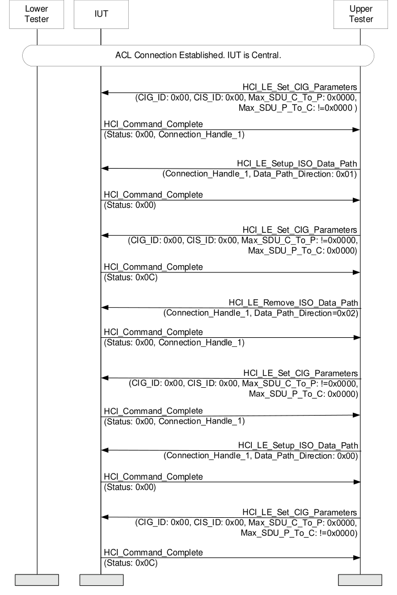

**Figure 4.149: HCI/CIS/BI-10-C [Connected Isochronous Stream, Central, Reject Max_SDU in Wrong Direction] MSC**

1. The Upper Tester sends an HCI_LE_Set_CIG_Parameters command to the IUT with CIG_ID set
to 0x00, CIS_ID set to 0x00, Max_SDU_P_To_C set to TSPX_max_sdu_length, and Max_SDU_C_To_P set to 0x0000. 2. The IUT sends an HCI_Command_Complete event to the Upper Tester with Status set to 0x00
and a valid Connection_Handle_1. 3. The Upper Tester sends an HCI_LE_Setup_ISO_Data_Path command to the IUT with
Connection_Handle_1 from step 2 and Data_Path_Direction set to 0x01 for the Output direction.
4. The IUT sends an HCI_Command_Complete event to the Upper Tester with Status set to 0x00. 5. The Upper Tester sends an HCI_LE_Set_CIG_Parameters command to the IUT with CIG_ID set
to 0x00, CIS_ID set to 0x00, Max_SDU_P_To_C set to 0x0000, and Max_SDU_C_To_P set to TSPX_max_sdu_length. 6. The IUT sends an HCI_Command_Complete event to the Upper Tester with Status set to
Command Disallowed (0x0C). 7. The Upper Tester sends an HCI_LE_Remove_ISO_Data_Path command to the IUT with
Connection_Handle set to Connection_Handle_1 and Data_Path_Direction set to 0x02. 8. The IUT sends an HCI_Command_Complete event to the Upper Tester with Status set to 0x00
and Connection_Handle set to Connection_Handle_1. 9. The Upper Tester sends an HCI_LE_Set_CIG_Parameters command to the IUT with CIG_ID set
to 0x00, CIS_ID set to 0x00, Max_SDU_P_To_C set to 0x0000, and Max_SDU_C_To_P set to TSPX_max_sdu_length. 10. The IUT sends an HCI_Command_Complete to the Upper Tester with Status set to 0x00 and a
valid Connection_Handle_1. 11. The Upper Tester sends an HCI_LE_Setup_ISO_Data_Path to the IUT with
Connection_Handle_1 and Data_Path_Direction set to 0x00 for the Input direction. 12. The IUT sends an HCI_Command_Complete event to the Upper Tester with Status set to 0x00. 13. The Upper Tester sends an HCI_LE_Set_CIG_Parameters command to the IUT with CIG_ID set
to 0x00, CIS_ID set to 0x00, Max_SDU_P_To_C set to TSPX_max_sdu_length, and Max_SDU_C_To_P set to 0x0000. 14. The IUT sends an HCI_Command_Complete event to the Upper Tester with Status set to
Command Disallowed (0x0C).
• Expected Outcome
Pass verdict
In step 2, the IUT sends an HCI_Command_Complete event to the Upper Tester with Status set to 0x00 and a valid Connection_Handle_1.
In step 4, the IUT sends an HCI_Command_Complete event to the Upper Tester with Status set to 0x00.
In step 6, the IUT sends an HCI_Command_Complete event to the Upper Tester with Status set to Command Disallowed (0x0C).
In step 8, the IUT sends an HCI_Command_Complete event to the Upper Tester with Status set to 0x00 and Connection_Handle set to Connection_Handle_1.
In step 10, the IUT sends an HCI_Command_Complete to the Upper Tester with Status set to 0x00 and a valid Connection_Handle_1.
In step 12, the IUT sends an HCI_Command_Complete event to the Upper Tester with Status set to 0x00.
In step 14, the IUT sends an HCI_Command_Complete event to the Upper Tester with Status set to Command Disallowed (0x0C).
HCI/CIS/BI-12-C [CIS Setup Procedure, Central Initiated, Invalid Transport Latency]
• Test Purpose
Verify that a Central IUT rejects the creation of a CIS with an invalid max transport latency value.
• Reference
[13] 7.8.97
• Initial Condition
- The Isochronous Channels (Host Support) FeatureSet bit is set.
- An ACL connection has been established between the IUT and the Lower Tester.
- The Lower Tester acts in the Peripheral role.
- TSPX_max_sdu_length is the maximum ISOAL SDU length as defined in IXIT.
• Test Procedure

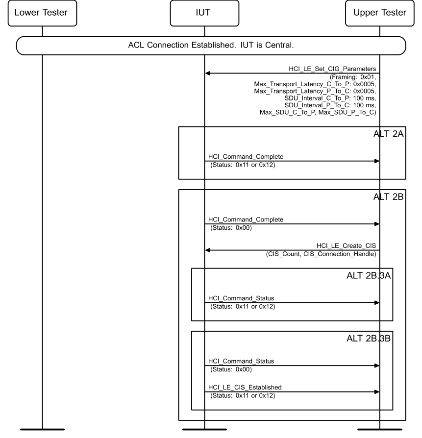

**Figure 4.150: HCI/CIS/BI-12-C [CIS Setup Procedure, Central Initiated, Invalid Transport Latency] MSC**

1. The Upper Tester sends an HCI_LE_Set_CIG_Parameters command to the IUT with Framing set
to 1, Max_Transport_Latency_C_To_P and Max_Transport_Latency_P_To_C set to 0x0005, SDU_Interval_C_To_P and SDU_Interval_P_To_C set to 100 ms, and Max_SDU_C_To_P and Max_SDU_P_To_C set to the lesser of TSPX_max_sdu_length and 384. All other values are assigned the default values specified in [14] Section 4.10.1.3, Default Values for Set CIG Parameters Commands.
Alternative 2A (Status set to 0x11 or 0x12):
2A.1 The IUT sends an HCI_Command_Complete event to the Upper Tester with Status set to Unsupported Feature or Parameter Value (0x11) or Invalid HCI Command Parameters (0x12).
Alternative 2B (Status set to 0x00):
2B.1 The IUT sends a successful HCI_Command_Complete event to the Upper Tester.
2B.2 The Upper Tester sends an HCI_LE_Create_CIS command to the IUT with CIS_Count and CIS_Connection_Handle set to the values returned in step 2B.1.
Perform either 2B.3A or 2B.3B depending on the HCI_Command_Status response.
2B.3A The IUT sends an HCI_Command_Status event to the Upper Tester with Status set to Unsupported Feature or Parameter Value (0x11) or Invalid HCI Command Parameters (0x12).
2B.3B The IUT sends a successful HCI_Command_Status event to the Upper Tester followed by an HCI_LE_CIS_Established event with Status set to Unsupported Feature or Parameter Value (0x11) or Invalid HCI Command Parameters (0x12).
• Expected Outcome
Pass verdict
In step 2A.1, 2B.3A, or 2B.3B, the IUT sends an HCI event to the Upper Tester with Status set to Unsupported Feature or Parameter Value (0x11) or Invalid HCI Command Parameters (0x12).
HCI/CIS/BV-13-C [Connected Isochronous Stream, Central, Removal of Configurable and Inactive CIG]
• Test Purpose
Verify that a Central IUT can remove a CIG in the configurable and inactive states.
• Reference
[13] 7.8.100
• Initial Condition
- A single CIS has been established using the values specified in [14] Section 4.10.1.3, Default Values for Set CIG Parameters Commands.
- The Lower Tester is Peripheral.
• Test Procedure

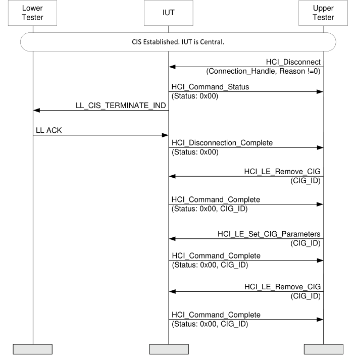

**Figure 4.151: HCI/CIS/BV-13-C [Connected Isochronous Stream, Central, Removal of Configurable and Inactive CIG] MSC**

1. The Upper Tester sends an HCI_Disconnect command to the IUT with Connection_Handle set to
the current CIS_Connection_Handle and Reason set to any valid value, and it receives a successful HCI_Command_Status in response. 2. The IUT sends an LL_CIS_TERMINATE_IND PDU to the Lower Tester. 3. The Lower Tester sends an LL Ack to the IUT. 4. The IUT sends an HCI_Disconnection_Complete event to the Upper Tester with Status set to
0x00, Connection_Handle set to the CIS_Connection_Handle in step 1, and Reason set to a valid value. 5. The Upper Tester sends an HCI_LE_Remove_CIG command to the IUT with CIG_ID set to the
value of CIG_ID in step 1. 6. The IUT sends the Upper Tester an HCI_Command_Complete event with CIG_ID set to the
CIG_ID in step 1 and Status set to 0x00. 7. The Upper Tester sends an HCI_LE_Set_CIG_Parameters command to the IUT with values as
stated in [14] Section 4.10.1.3, Default Values for Set CIG Parameters Commands, and receives a successful HCI_Command_Complete event in response. 8. The Upper Tester sends an HCI_LE_Remove_CIG command to the IUT with CIG_ID set to the
CIG_ID value in step 7. 9. The IUT sends an HCI_Command_Complete event to the Upper Tester with CIG_ID set to the
value in step 7 and Status set to 0x00.
• Expected Outcome
Pass verdict
In step 1, the IUT sends a successful HCI_Command_Status to the Upper Tester.
In step 4, the IUT sends an HCI_Disconnection_Complete event to the Upper Tester with Status set to 0x00, Connection_Handle set to the CIS_Connection_Handle in step 1, and Reason set to a valid value.
In step 6, the IUT sends the Upper Tester an HCI_Command_Complete event with CIG_ID set to the CIG_ID in step 1 and Status set to 0x00.
In step 9, the IUT sends an HCI_Command_Complete event to the Upper Tester with CIG_ID set to the value in step 7 and Status set to 0x00.
HCI/CIS/BI-13-C [Connected Isochronous Stream, Central, Reject Parameter Change of Inactive CIG]
• Test Purpose
Verify that a Central IUT properly rejects the LE Setup CIG Parameters command (the non-test variant) used on an inactive Connected Isochronous Stream.
• Reference
[13] 7.8.97
• Initial Condition
- A single CIS has been established using the values specified in [14] Section 4.10.1.3, Default Values for Set CIG Parameters Commands.
- The Lower Tester is Peripheral.
• Test Procedure

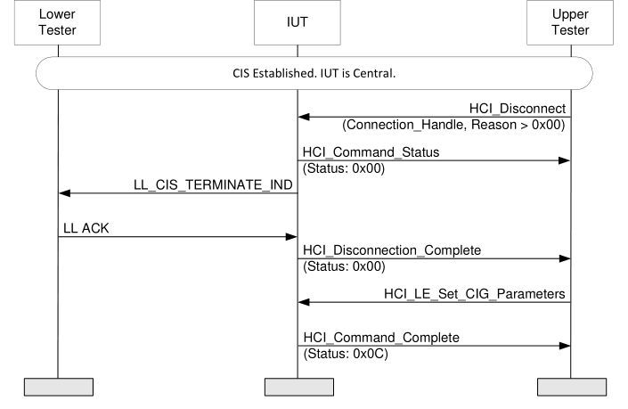

**Figure 4.152: HCI/CIS/BI-13-C [Connected Isochronous Stream, Central, Reject Parameter Change on Inactive CIG] MSC**

the current CIS_Connection_Handle and Reason set to any valid value, and it receives a successful HCI_Command_Status in response. 2. The IUT sends an LL_CIS_TERMINATE_IND PDU to the Lower Tester. 3. The Lower Tester sends an LL Ack to the IUT. 4. The IUT sends an HCI_Disconnection_Complete event to the Upper Tester with Status set to
0x00, Connection_Handle set to the CIS_Connection_Handle, and Reason set to a valid value. 5. The Upper Tester sends an HCI_LE_Set_CIG_Parameters command to the IUT with values as
stated in [14] Section 4.10.1.3, Default Values for Set CIG Parameters Commands. 6. The IUT sends an HCI_Command_Complete event to the Upper Tester with Status set to
Command Disallowed (0x0C).
• Expected Outcome
Pass verdict
In step 1, the IUT sends a successful HCI_Command_Status to the Upper Tester.
In step 4, the IUT sends an HCI_Disconnection_Complete event to the Upper Tester with Status set to 0x00, Connection_Handle set to the CIS_Connection_Handle, and Reason set to a valid value.
In step 6, the IUT sends an HCI_Command_Complete event to the Upper Tester with Status set to Command Disallowed (0x0C).

##### 4.15.1.6 Verify CIS Features Not Supported

• Test Purpose
Verify that an IUT does not support CIS features that are marked as unsupported features. The Upper Tester attempts to set CIG parameters that use the unsupported features, expecting the IUT to return an error.
• Reference
[7] 4.5.13
[12] 7.8.98
• Initial Condition
- An ACL connection has been established between the IUT and the Lower Tester with a valid Connection Handle.
• Test Case Configuration

|  | Test Case |  |  | HCI Parameters |  |
| --- | --- | --- | --- | --- | --- |
| HCI/CIS/BI-14-C [Verify CIS Features Not Supported, BN > 1] |  |  | BN C To P = 2 _ _ _ BN P To C = 2 _ _ _ |  |  |
| HCI/CIS/BI-15-C [Verify CIS Features Not Supported, FT > 1] |  |  | FT C TO P = 2 _ _ _ FT P TO C = 2 _ _ _ |  |  |

Table 4.82: Verify CIS Features Not Supported test cases
• Test Procedure
For each entry in the HCI Parameters in Table 4.82:
1. The Upper Tester sends an HCI_LE_Set_CIG_Parameters_Test command to the IUT with that
parameter set as specified in Table 4.82 and the remaining parameters (including any others listed in Table 4.82) as valid parameters. 2. The IUT sends an HCI_Command_Complete event with Error set to 0x11 (Unsupported Feature
or Parameter Value).
• Expected Outcome
Pass verdict
In step 2, the IUT sends an error code of 0x11 to the IUT.
HCI/CIS/BI-16-C [Disconnecting Immediately After a Failed Create CIS Attempt]
• Test Purpose
Verify that a Central IUT properly responds when an Upper Tester attempts to disconnect a connection after a failed CIS creation attempt. The Upper Tester sends an HCI_Disconnect after the IUT sends the failed HCI_LE_CIS_Established event.
• Reference
[13] 7.1.6, 7.8.99
• Initial Condition
- An ACL connection has been established between the IUT and the Lower Tester with a valid Connection Handle.
- The Lower Tester acts in the Peripheral role.
• Test Procedure

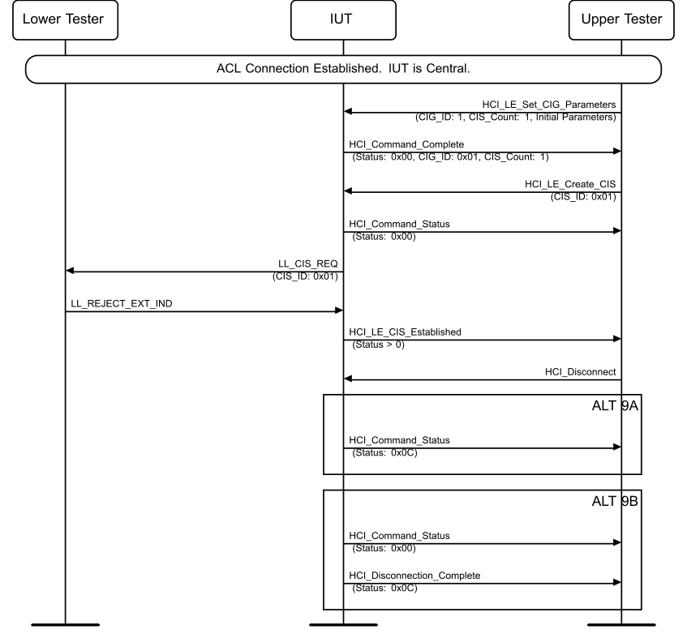

**Figure 4.153: HCI/CIS/BI-16-C [Disconnecting Immediately After a Failed Create CIS Attempt] MSC**

1. The Upper Tester sends an HCI_LE_Set_CIG_Parameters command to the IUT with the values
specified in the Initial Value(s) column in Table 4.83. 2. The IUT sends an HCI_Command_Complete event to the Upper Tester with Status = 0x00,
CIG_ID = 0x01, and CIS_Count = 1. 3. The Upper Tester sends an HCI_Create_CIS command to the IUT for CIS_ID 0x01. 4. The IUT sends an HCI_Command_Status event to the Upper Tester with Status = 0x00. 5. The IUT sends an LL_CIS_REQ PDU to the Lower Tester with CIS_ID set to 0x01. 6. The Lower Tester sends an LL_REJECT_EXT_IND PDU to the IUT. 7. The IUT sends an HCI_LE_CIS_Established event to the Upper Tester with Status > 0. 8. The Upper Tester sends an HCI_Disconnect command to the IUT. 9. Perform alternative 9A or 9B depending on the HCI_Command_Status response.
Alternative 9A (HCI_Command_Status = 0x0C):
9A.1 The IUT sends an HCI_Command_Status event to the Upper Tester with Status set to 0x0C (Command Disallowed).
9B.1 The IUT sends a successful HCI_Command_Status event to the Upper Tester.
9B.2 The IUT sends an HCI_Disconnection_Complete event to the Upper Tester with Status set to 0x0C (Command Disallowed).

|  | Parameter |  |  | Initial Value(s) |  |
| --- | --- | --- | --- | --- | --- |
| CIG ID _ |  |  | 0x01 |  |  |
| SDU Interval C To P, _ _ _ _ SDU Interval P To C _ _ _ _ |  |  | 50 ms |  |  |
| CIS Count _ |  |  | 1 |  |  |
| CIS ID[] _ |  |  | 0x01 |  |  |
| Worst Case SCA _ _ |  |  | 0x00 |  |  |
| Packing |  |  | Sequential (0x00) |  |  |
| Framing |  |  | Framed (0x01) |  |  |
| Max SDU C To P[] _ _ _ _ |  |  | 16 |  |  |
| Max SDU P To C[] _ _ _ _ |  |  | 16 |  |  |
| Max Transport Latency C To P, _ _ _ _ _ Max Transport Latency P To C _ _ _ _ _ |  |  | 200 ms |  |  |
| RTN C To P[] _ _ _ |  |  | 4 |  |  |
| RTN P To C[] _ _ _ |  |  | 4 |  |  |
| PHY C To P[] _ _ _ |  |  | 0x01 |  |  |
| PHY P To C[] _ _ _ |  |  | 0x01 |  |  |

Table 4.83: CIG Parameter Values
• Expected Outcome
Pass verdict
In steps 9A.1 or 9B.2, the IUT sends an event with Error Code 0x0C.
HCI/CIS/BV-14-C [Number of Completed Packets Event after Sending data in Unidirectional CIS]
• Test Purpose
Verify that the IUT properly sends the HCI Number of Completed Packets event after the IUT sends Isochronous data to a device in the Connected Isochronous Group.
• Reference
[13] 7.7.19
• Initial Condition
- The maximum number of CISes in a CIG is defined in the TSPX_max_cis_per_cigs IXIT value.
- A CIG with TSPX_max_cis_per_cigs CISes has been established between the IUT and the Lower Tester with Max_SDU set to 4, BN set to 1, and FT set to 1 in each direction for each CIS. The remaining parameters are the defaults specified in [14] Section 4.10.1.3 Default Values for Set CIG Parameters Commands but may be adjusted if necessary to establish the CIG. The IUT can be in either role.
- The input data path (Host to Controller) for each CIS is set up to receive data over HCI.
• Test Procedure
1. The Upper Tester sends an HCI_LE_Read_Buffer_Size [v2] command to the IUT. 2. The IUT sends a successful HCI_Command_Complete event with an ISO_Data_Packet_Length
and Total_Num_ISO_Data_Packets. 3. Let n = Total_Num_ISO_Data_Packets from step 2. 4. Throughout the remaining steps:
a) The IUT sends either CIS Null PDUs or the data from the HCI ISO Data packets in step 7
to the Lower Tester.
b) If the Lower Tester is the Central, then it sends CIS Null PDUs to the IUT in each CIS
sub-event within the CIG.
c) Whenever the IUT sends an HCI_Number_Of_Completed_Packets event to the Upper
Tester, increase n by the sum of the Num_Completed_Packets[i] values in the event for those values of i where Connection_Handle[i] refers to a CIS. Ignore those values of i where Connection_Handle[i] does not refer to a CIS.
5. Perform steps 6–9 a total of 10 times. 6. Perform steps 7–9 for each CIS in a random order (different each time). 7. If n is zero, wait until n is non-zero. 8. The Upper Tester sends an HCI ISO Data packet to the IUT containing an SDU of length 4 octets
and the correct connection handle for the CIS. 9. Decrement n by 1. 10. Wait for 10 seconds.
• Expected Outcome
Pass verdict
For each CIS, the sum of the Num_Completed_Packets[i] where Connection_Handle[i] refers to that CIS equals 10.
n = Total_Num_ISO_Data_Packets from step 2.
Fail verdict
After step 10 completes, n does not equal Total_Num_ISO_Data_Packets from step 2.
HCI/CIS/BI-18-C [LE Set CIG Parameters, Framed, Unsegmented Mode Unsupported]
• Test Purpose
Verify that the IUT that does not support Framed, Unsegmented mode returns an error in response to the HCI_LE_Set_CIG_Parameters command.
• Reference
[19] 7.8.97
• Initial Condition
- An ACL connection has been established between the IUT and Lower Tester with a valid Connection Handle.
• Test Procedure
1. The Upper Tester sends an HCI_LE_Set_CIG_Parameters command to the IUT with Framing set
to 0x02. 2. The IUT sends an HCI_Command_Complete event to the Upper Tester with Status set to 0x11.
• Expected Outcome
Pass verdict
In step 2, the IUT returns an Invalid HCI Command Parameters error.

##### 4.15.1.7 Connected Isochronous Stream, HCI Read/Write Authenticated Payload Timeout error

• Test Purpose
Verify that an IUT with an active CIS properly rejects the Read or Write Authenticated Payload Timeout command.
• Initial Condition
- The IUT is in the role specified in Table 4.84.
- The Lower Tester and the IUT have established an encrypted ACL connection.
- A CIS has been established using Framing=unframed and all other values as specified in [14] Section 4.10.1.3, Default Values for Set_CIG_Parameters_Test Commands, and the Upper Tester does not provide SDU data.
- The Lower Tester is in the peer role to the IUT.
• Test Case Configuration

|  | Test Case |  |  | Role |  |  | HCI Command |  |  | Reference |  |
| --- | --- | --- | --- | --- | --- | --- | --- | --- | --- | --- | --- |
| HCI/CIS/BI-19-C [Connected Isochronous Stream, HCI Read Authenticated Payload Timeout, Central] |  |  | Central |  |  | HCI Read Authenticated Payload Timeout _ _ _ _ |  |  | [12] 7.3.93 |  |  |
| HCI/CIS/BI-20-C [Connected Isochronous Stream, HCI Read Authenticated Payload Timeout, Peripheral] |  |  | Peripheral |  |  | HCI Read Authenticated Payload Timeout _ _ _ _ |  |  | [12] 7.3.93 |  |  |
| HCI/CIS/BI-21-C [Connected Isochronous Stream, HCI Write Authenticated Payload Timeout, Central] |  |  | Central |  |  | HCI Write Authenticated Payload Timeout _ _ _ _ |  |  | [12] 7.3.94 |  |  |
| HCI/CIS/BI-22-C [Connected Isochronous Stream, HCI Write Authenticated Payload Timeout, Peripheral] |  |  | Peripheral |  |  | HCI Write Authenticated Payload Timeout _ _ _ _ |  |  | [12] 7.3.94 |  |  |

Table 4.84: Connected Isochronous Stream, HCI Read/Write Authenticated Payload Timeout error test cases
• Test Procedure
1. The Upper Tester sends the HCI command specified in Table 4.84 to the IUT. 2. The IUT sends an HCI_Command_Complete event to the Upper Tester with Status set to 0x0C.
• Expected Outcome
Pass verdict
In step 2, the IUT sends an 0x0C error to the Upper Tester.

#### 4.15.2 Broadcast Isochronous Streams

Verify the correct implementation of the Broadcast Connected Isochronous Stream commands and events.
HCI/BIS/BI-08-C [Invalid LE BIG Create Sync Parameters and LE ISO Remove Data Path behavior, BIS]
• Test Purpose
Verify that the IUT properly handles invalid parameters for the LE BIG Create Sync command. Also verify that the LE IUT properly handles the LE ISO Remove Data Path command being called by the Upper Tester before the ISO Data Path is properly set.
• Reference
[12] 5.4.5
• Initial Condition
- The IUT is configured in the passive scanning state. The Lower Tester is in the advertising state.
- The IUT is synchronized to the Lower Tester Periodic Advertising.
- The Lower Tester establishes a BIG with the values in Table 4.85.

|  | Variable |  |  | Value(s) |  |
| --- | --- | --- | --- | --- | --- |
| num bis _ |  |  | 2 |  |  |
| sdu int _ |  |  | 200 ms |  |  |
| iso int _ |  |  | 200 ms |  |  |
| nse |  |  | 1 |  |  |
| mx sdu _ |  |  | 32 |  |  |
| mx pdu _ |  |  | 32 |  |  |
| phy |  |  | LE 1M PHY |  |  |
| packing |  |  | 0x00 |  |  |
| framing |  |  | 0x00 |  |  |
| bn |  |  | 1 |  |  |
| irc |  |  | 1 |  |  |
| pto |  |  | 0 |  |  |
| Encryption |  |  | 0x00 |  |  |
| broadcast code _ |  |  | TSPX broadcast code _ _ |  |  |

Table 4.85: BIS Configuration
• Test Procedure

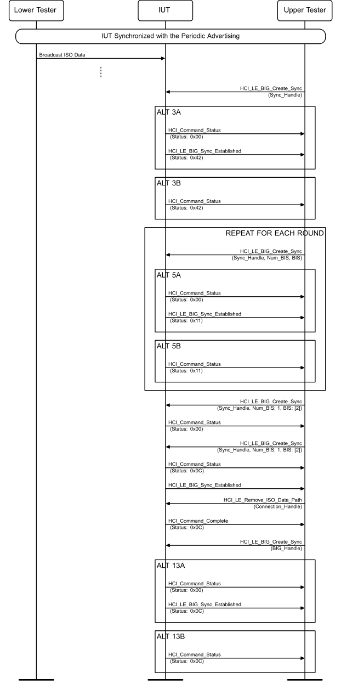

**Figure 4.154: HCI/BIS/BI-08-C [Invalid LE BIG Create Sync Parameters and LE ISO Remove Data Path behavior, BIS] MSC**

1. The Lower Tester broadcasts the Broadcast ISO Data packets to the IUT. 2. The Upper Tester sends an HCI_LE_BIG_Create_Sync command to the IUT with an invalid
Sync_Handle. 3. Perform either alternative 3A or 3B depending on the value returned in the
HCI_Command_Status event. Alternative 3A (Successful HCI_Command_Status event):
3A.1 The IUT sends a successful HCI_Command_Status event to the Upper Tester. 3A.2 The IUT sends an HCI_LE_BIG_Sync_Established event with Status set to
Unknown Advertising Identifier (0x42). Alternative 3B (HCI_Command_Status event with an error):
3B.1 The IUT sends an HCI_Command_Status event to the Upper Tester with Status
set to Unknown Advertising Identifier (0x42). Repeat steps 4 and 5 for each round in Table 4.86. 4. The Upper Tester sends an HCI_LE_BIG_Create_Sync command to the IUT with the correct
Sync_Handle and with Num_BIS and the BIS set as specified in Table 4.86. 5. Perform either alternative 5A or 5B depending on the value returned in the
HCI_Command_Status event. Alternative 5A (Successful HCI_Command_Status event):
5A.1 The IUT sends a successful HCI_Command_Status event to the Upper Tester. 5A.2 The IUT sends an HCI_LE_BIG_Sync_Established event with Status set to the
error in Table 4.86. Alternative 5B (HCI_Command_Status event with an error):
5B.1 The IUT sends an HCI_Command_Status event to the Upper Tester with Status
set to the error in Table 4.86. 6. The Upper Tester sends an HCI_LE_BIG_Create_Sync command to the IUT with the correct
Sync_Handle, Num_BIS set to 0x01, and BIS set to [2] and receives a successful HCI_Command_Status in response. 7. Immediately after step 6, the Upper Tester sends an HCI_LE_BIG_Create_Sync command to the
IUT with the same values as in step 6. 8. The IUT sends an HCI_Command_Status command to the Upper Tester with Status set to
Command Disallowed (0x0C). 9. The IUT syncs with the BIG and sends a successful HCI_LE_BIG_Sync_Established event to the
Upper Tester. 10. The Upper Tester sends an HCI_LE_Remove_ISO_Data_Path command to the IUT with
Connection_Handle set to the connection handle of the BIS. 11. The IUT sends an HCI_Command_Complete event to the Upper Tester with Status set to
Command Disallowed (0x0C). 12. The Upper Tester sends an HCI_LE_BIG_Create_Sync command to the IUT using the same
BIG_Handle as the established BIG. 13. Perform either alternative 13A or 13B depending on the value returned in the
HCI_Command_Status event. Alternative 13A (Successful HCI_Command_Status event):
13A.1 The IUT sends a successful HCI_Command_Status event to the Upper Tester. 13A.2 The IUT sends an HCI_LE_BIG_Sync_Established event with Status set to
Command Disallowed (0x0C). Alternative 13B (HCI_Command_Status event with an error):
13B.1 The IUT sends an HCI_Command_Status event to the Upper Tester with Status
set to Command Disallowed (0x0C).

|  | Round |  |  | Num BIS _ |  |  | BIS |  |  | HCI Error |  |
| --- | --- | --- | --- | --- | --- | --- | --- | --- | --- | --- | --- |
| 1 |  |  | 3 |  |  | [1, 2, 3] |  |  | 0x11, 0x0D |  |  |
| 2 |  |  | 1 |  |  | [3] |  |  | 0x11 |  |  |
| 3 |  |  | 1 |  |  | [0] |  |  | 0x12 |  |  |

Table 4.86: Invalid LE BIG Create Sync Parameters and LE ISO Remove Data Path behavior, BIS rounds
• Expected Outcome
Pass verdict
In step 3, the IUT sends an Unknown Advertising Identifier (0x42) error to the Upper Tester.
In step 5, the IUT sends an event with Status set to the error in Table 4.86 to the Upper Tester. In round 1, error Connection Rejected Due To Limited Resources (0x0D) is allowed if TSPX_max_tx_bises = 2.
In steps 8, 11, 13A.2, and 13B.1, the IUT sends a Command Disallowed (0x0C) error to the Upper Tester.
HCI/BIS/BI-09-C [Invalid LE BIG Create Sync Encryption Parameter, BIS]
• Test Purpose
Verify that the IUT properly rejects when the Upper Tester attempts to sync to the BIG when the encryption is the opposite of the BIG encryption type.
• Reference
[12] 7.8.106
• Initial Condition
- The IUT is configured in the passive scanning state. The Lower Tester is in the advertising state.
- The IUT is synchronized to the Lower Tester Periodic Advertising.
• Test Procedure
Repeat steps 1–3 for each round in Table 4.87. 1. The Lower Tester establishes a BIG with the values in Table 4.85 except that Encryption is set as
specified in Table 4.87. 2. The Upper Tester sends an HCI_LE_BIG_Create_Sync command to the IUT with Encryption set
as specified in Table 4.87. 3. Perform either alternative 3A or 3B depending on the value returned in the
HCI_Command_Status event. Alternative 3A (Successful HCI_Command_Status event):
3A.1 The IUT sends a successful HCI_Command_Status event to the Upper Tester. 3A.2 The IUT sends an HCI_LE_BIG_Sync_Established event with Status set to
Encryption Mode Not Acceptable (0x25). Alternative 3B (HCI_Command_Status event with an error):
3B.1 The IUT sends an HCI_Command_Status event to the Upper Tester with Status
set to Encryption Mode Not Acceptable (0x25).

|  | Round |  |  | Lower Tester BIG Encrypted |  |  | Upper Tester Encryption Parameter |  |
| --- | --- | --- | --- | --- | --- | --- | --- | --- |
| 1 |  |  | Yes |  |  | 0x00 (Broadcast Code invalid) _ |  |  |
| 2 |  |  | No |  |  | 0x01 (Broadcast Code valid) _ |  |  |

Table 4.87: Invalid LE BIG Create Sync Encryption Parameter rounds
• Expected Outcome
Pass verdict
In step 3, the IUT sends an Encryption Mode Not Acceptable (0x25) error.
HCI/BIS/BI-16-C [Reporting Failure to Sync to BIS]
• Test Purpose
Verify that a Synchronized Receiver IUT correctly reports failure to synchronize to BIS.
• Reference
[1] 7.8.106
• Initial Condition
- The IUT is a Synchronized Receiver.
- The Lower Tester is an Isochronous Broadcaster and broadcasts periodic advertising streams over the LE 1M PHY. The periodic advertising includes BIGInfo, but the BIS that BIGInfo would point to is never broadcast.
• Test Procedure

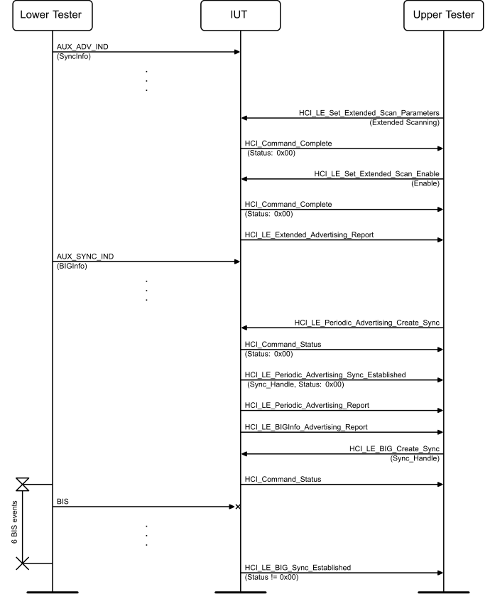

**Figure 4.155: HCI/BIS/BI-16-C [Reporting Failure to Sync to BIS] MSC**

1. The Upper Tester sends an HCI_LE_Set_Extended_Scan_Parameters command to the IUT
using the LE 1M PHY and receives a successful HCI_Command_Complete in response. 2. The Upper Tester sends an HCI_LE_Set_Extended_Scan_Enable command to the IUT to enable
scanning and receives a successful HCI_Command_Complete in response. 3. The IUT sends an HCI_LE_Extended_Advertising_Report event to the Upper Tester. 4. The Upper Tester sends an HCI_LE_Periodic_Advertising_Create_Sync command to the IUT to
synchronize with the Lower Tester’s periodic advertisements. The Upper Tester receives an HCI_Command_Status event in response. 5. The IUT sends a successful HCI_LE_Periodic_Advertising_Sync_Established event to the Upper
Tester. The event returns a Sync_Handle as one of its parameters. 6. The IUT sends an HCI_LE_Periodic_Advertising_Report event to the Upper Tester. 7. Immediately following sending an HCI_LE_Periodic_Advertising_Report to the Upper Tester, the
IUT sends an HCI_LE_BIGInfo_Advertising_Report event. 8. The Upper Tester orders the IUT to synchronize to the Lower Tester’s presumed BIG described
in BIGInfo by sending an HCI_LE_BIG_Create_Sync command using the Sync_Handle returned
in the HCI_LE_Periodic_Advertising_Sync_Established event and receives an HCI_Command_Status event in response. 9. After six BIS events, the IUT sends an HCI_LE_BIG_Sync_Established event to the Upper Tester
with the Status field set to an error, which can be Connection Failed to be Established / Synchronization Timeout (0x3E).
• Expected Outcome
Pass verdict
The IUT provides the event to the Upper Tester as described in step 9.

##### 4.15.2.1 Broadcast Isochronous Stream Using Non-Test Command, Isochronous

sdlfasd;lkfjasdl;kfjBroadcaster
• Test Purpose
Verify that the IUT correctly executes the LE Create BIG Command (the non-test variant) and correctly handles error conditions.
• Reference
[12] 7.8.103, 7.8.109
• Initial Condition
- State: Periodic Advertising, the IUT is advertiser.
- TSPX_max_tx_bises is the Max Supported TX NumBIS, as defined in IXIT.
- TSPX_max_iso_pkt is the ISO Max Data Packet Length, as defined in IXIT.
• Test Case Configuration

|  | Test Case |  |  | Step 19 performed |  |
| --- | --- | --- | --- | --- | --- |
| HCI/BIS/BV-01-C [Broadcast Isochronous Stream Using Non-Test Command, all PHYs] |  |  | No |  |  |
| HCI/BIS/BV-02-C [Broadcast Isochronous Stream Using Non-Test Command, not all PHYs] |  |  | Yes |  |  |

Table 4.88: Broadcast Isochronous Stream Using Non-Test Command, Isochronous Broadcaster test cases
• Test Procedure

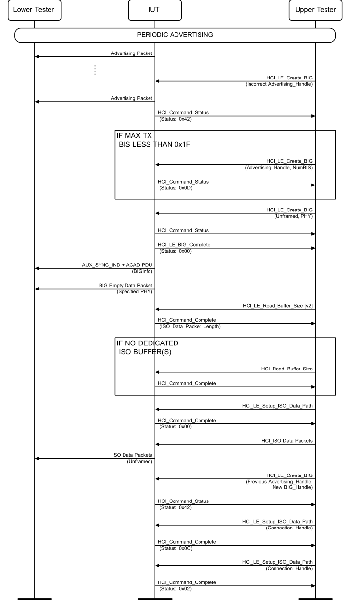

**Figure 4.156: Broadcast Isochronous Stream Using Non-Test Command, Isochronous Broadcaster MSC – Page 1 of 2**

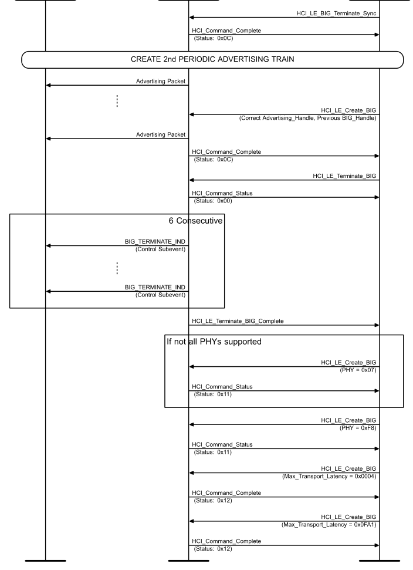

**Figure 4.157: Broadcast Isochronous Stream Using Non-Test Command, Isochronous Broadcaster MSC – Page 2 of 2**

1. The Upper Tester sends an HCI_LE_Create_BIG command using an Advertising_Handle that
does not identify a periodic advertising train and the IUT returns error code Unknown Advertising Identifier (0x42). 2. If TSPX_max_tx_bises is less than 0x1F, then the Upper Tester sends an HCI_LE_Create_BIG
command using the correct Advertising_Handle obtained previously and the Num_BIS field set to TSPX_max_tx_bises plus 1. The IUT returns the error code Connection Rejected due to Limited Resources (0x0D) to the Upper Tester. 3. The Upper Tester sends an HCI_LE_Create_BIG command using the correct Advertising_Handle
obtained previously. The frame bit is set to 0b0 and encryption is disabled. The Upper Tester receives a successful HCI_Command_Status event in return.
matches the PHY used to create the BIG. 5. The Upper Tester sends an HCI_LE_Read_Buffer_Size [v2] command and the IUT responds with
an HCI_Command_Complete event providing an ISO_Data_Packet_Length that matches TSPX_max_iso_pkt. 6. If the IUT responds with an ISO_Data_Packet_Length of 0x00, indicating that it does not support
dedicated ISO transmit buffer(s), then the Upper Tester sends an HCI_Read_Buffer_Size command to determine the length of the transmit buffer(s). 7. The Upper Tester sets up Isochronous data paths on the IUT by sending an
HCI_LE_Setup_ISO_Data_Path command to the IUT and receives a successful HCI_Command_Complete in response. 8. The Upper Tester begins sending HCI ISO Data Packets to the IUT. The data size is less than
the maximum buffer size as read from the IUT. 9. The Upper Tester sends an HCI_LE_Create_BIG command using the Advertising_Handle used
to create the previous BIG but a different BIG_Handle. The IUT returns the error code Unknown Advertising Identifier (0x42) to the Upper Tester. 10. The Upper Tester sends an HCI_LE_Setup_ISO_Data_Path command to the IUT with
Connection_Handle and Direction as in step 7. 11. The IUT sends an HCI_Command_Complete event to the Upper Tester with Status set to
Command Disallowed (0x0C). 12. The Upper Tester sends an HCI_LE_Setup_ISO_Data_Path command to the IUT with
Connection_Handle set to an invalid value. 13. The IUT sends an HCI_Command_Complete event to the Upper Tester with Status set to
Unknown Connection Identifier (0x02). 14. The Upper Tester sends an HCI_LE_BIG_Terminate_Sync command with the correct
BIG_Handle and expects the IUT to respond with Status parameter Command Disallowed (0x0C) if the IUT supports the Synchronized Receiver role feature; otherwise, with Unknown Command. 15. The Upper Tester commands the IUT to open a second periodic advertising train. 16. The Upper Tester sends an HCI_LE_Create_BIG command using the Advertising_Handle
created in the previous step but using the BIG_Handle from the BIG previously created. The IUT returns the error code Command Disallowed (0x0C) to the Upper Tester. 17. The Upper Tester sends an HCI_LE_Terminate_BIG command using the BIG_Handle of the
existing BIG to the IUT and receives an HCI_Command_Status event in response. 18. The Upper Tester receives an HCI_LE_Terminate_BIG_Complete event from the IUT. 19. If this step is performed (see Table 4.88), the Upper Tester sends an HCI_LE_Create_BIG
command using the Advertising_Handle created in step 15 and sets PHY=0x07. The IUT returns the error code Unsupported Feature or Parameter value (0x11) to the Upper Tester. 20. The Upper Tester sends an HCI_LE_Create_BIG command using the Advertising_Handle
created in step 15 and sets PHY=0xF8. The IUT returns the error code Unsupported Feature or Parameter value (0x11) to the Upper Tester. 21. The Upper Tester sends an HCI_LE_Create_BIG command using the Advertising_Handle
created in step 15 and sets Max_Transport_Latency to 0x0004. The IUT returns the error code Invalid HCI Command Parameters (0x12) to the Upper Tester. 22. The Upper Tester sends an HCI_LE_Create_BIG command using the Advertising_Handle
created in step 15 and sets Max_Transport_Latency to 0x0FA1. The IUT returns the error code Invalid HCI Command Parameters (0x12) to the Upper Tester.
• Expected Outcome
Pass verdict
In step 1, the IUT returns error code Unknown Advertising Identifier (0x42).
In step 2, the IUT returns error code Connection Rejected due to Limited Resources (0x0D).
In step 4, the Upper Tester receives an HCI_LE_Create_BIG_Complete event from the IUT.
In step 5, the IUT broadcasts BIS Empty Data Packets.
In step 5, the ISO_Data_Packet_Length matches TSPX_max_iso_pkt.
In step 9, the IUT returns the error code Unknown Advertising Identifier (0x42).
The IUT refuses to terminate the BIG when the Upper Tester sends an HCI_LE_BIG_Terminate_Sync command, responding with Status parameter Command Disallowed (0x0C).
In step 11, the IUT returns the error code Command Disallowed (0x0C).
In step 13, the IUT returns the error code Unknown Connection Identifier (0x02).
In step 16, the IUT returns the error code Command Disallowed (0x0C).
In step 18, the IUT returns an HCI_LE_Terminate_BIG_Complete event to the Upper Tester.
If the IUT does not support all PHYs, then in step 19 the IUT returns the error code Unsupported Feature or Parameter value (0x11).
In step 20, the IUT returns the error code Unsupported Feature or Parameter value (0x11).
In steps 21–22, the IUT returns the error code Invalid HCI Command Parameters (0x12).
HCI/BIS/BI-01-C [Ignoring RFU Bits in HCI ISO Data Packets, BIS]
• Test Purpose
Verify that the IUT ignores RFU bits in ISO Data Packets received from the Upper Tester and sends the ISO data when broadcasting a BIS.
• Reference
[12] 5.4.5
• Initial Condition
- BIS established per the following configuration and broadcast by the IUT, with the Lower Tester synchronized to the BIS:

|  | Variable |  |  | Value(s) |  |
| --- | --- | --- | --- | --- | --- |
| num bis _ |  |  | 1 |  |  |
| sdu int _ |  |  | 100 ms |  |  |
| iso int _ |  |  | 100 ms |  |  |
| nse |  |  | 3 |  |  |
| mx sdu _ |  |  | 8 |  |  |
| mx pdu _ |  |  | 8 |  |  |
| phy |  |  | LE 1M PHY |  |  |
| packing |  |  | any supported |  |  |

|  | Variable |  |  | Value(s) |  |
| --- | --- | --- | --- | --- | --- |
| framing |  |  | any |  |  |
| bn |  |  | 1 |  |  |
| irc |  |  | 3 |  |  |
| pto |  |  | 0 |  |  |
| encryption |  |  | any supported |  |  |
| broadcast code _ |  |  | any supported |  |  |

Table 4.89: BIS Configuration
• Test Procedure

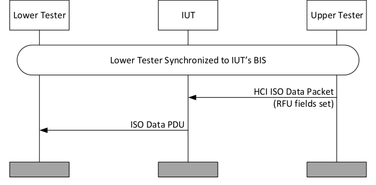

**Figure 4.158: HCI/BIS/BI-01-C [Ignoring RFU Bits in HCI ISO Data Packets, BIS] MSC**

1. The Upper Tester sends HCI ISO Data packets to the IUT with all RFU field bits set. 2. The IUT broadcasts the ISO Data packets to the Lower Tester.
• Expected Outcome
Pass verdict
The IUT broadcasts the ISO Data packets to the Lower Tester.
HCI/BIS/BV-03-C [Broadcast Isochronous Stream Using Test Command, Time_Offset]
• Test Purpose
Verify that an Isochronous Broadcaster IUT, when sending unframed data packets, returns a Time_Offset value of 0 when LE Read ISO TX Sync is called.
• Reference
[12] 7.8.103
• Initial Condition
- The Isochronous Broadcaster IUT is advertising periodic advertising using selected parameters compatible with the default BIG values as defined in [15] Section 4.11.1, Common Parameters.
• Test Procedure

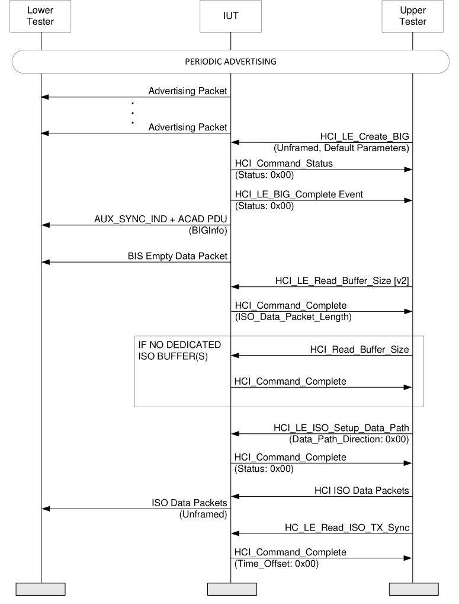

**Figure 4.159: HCI/BIS/BV-03-C [Broadcast Isochronous Stream Using Test Command, Time_Offset] MSC**

1. The Upper Tester sends an HCI_LE_Create_BIG_Test command to the IUT. The frame bit is set
to 0b0, encryption is disabled, and NumBIS = 1. All other parameters set to default values as defined in [15] Section 4.11.1, Common Parameters. The Upper Tester receives an HCI_Command_Status event in return. 2. The IUT sends a successful HCI_LE_Create_BIG_Complete event to the Upper Tester. 3. The IUT sends advertising PDUs (AUX_SYNC_IND+ACAD) to the Lower Tester and BIS Empty
Data packets. 4. The Upper Tester sends an HCI_LE_Read_Buffer_Size [v2] command, and the IUT responds
with an HCI_Command_Complete event providing an ISO_Data_Packet_Length.
dedicated ISO transmit buffer(s), then the Upper Tester sends an HCI_Read_Buffer_Size command to determine the length of the transmit buffer(s). 6. The Upper Tester sets up Isochronous data paths on the IUT by sending an
HCI_LE_ISO_Setup_Data_Path command with the Data_Path_Direction set to Input (0x00) to the IUT. 7. The Upper Tester begins sending HCI ISO Data packets to the IUT. The data size is the lesser of
Default_Data_Size, Unframed as defined in [15] Section 4.11.1, Common Parameters, and the maximum buffer size as previously read from the IUT. 8. The IUT sends ISO Data packets to the Lower Tester. The data packets are unframed. 9. The Upper Tester sends an HCI_LE_Read_ISO_TX_Sync command to the IUT. 10. The IUT sends an HCI_Command_Complete event that includes the Time_Offset to the Upper
Tester. The value of the Time_Offset return parameter is 0.
• Expected Outcome
Pass verdict
In step 1, the IUT sends a successful HCI_Command_Status to the Upper Tester.
In step 2, the IUT sends a successful HCI_LE_Create_BIG_Complete event to the Upper Tester.
In step 10, the value of the Time_Offset return parameter is 0.
HCI/BIS/BV-04-C [Broadcast Isochronous Stream, Invalid LE Read ISO TX Sync Parameters]
• Test Purpose
Verify that a Synchronized Receiver IUT returns an error when receiving an HCI_LE_Read_ISO_TX_Sync command.
• Reference
[12] 7.8.96
• Initial Condition
- The Synchronized Receiver IUT is synchronized to a BIS with a Lower Tester acting as an Isochronous Broadcaster.
• Test Procedure
1. The Upper Tester sends an HCI_LE_Read_ISO_TX_Sync command to the IUT with
Connection_Handle set to the current ACL connection handle. 2. The IUT sends an HCI_Command_Complete event to the Upper Tester with Status set to 0x0C.
• Expected Outcome
Pass verdict
In step 2, the IUT sends an HCI_Command_Complete event to the Upper Tester with Status set to 0x0C.
HCI/BIS/BI-02-C [Broadcast Isochronous Stream, Synchronized Receiver, Reject Invalid Commands]
• Test Purpose
Verify that the Synchronized Receiver IUT can correctly reject invalid LE Setup ISO Data Path commands.
• Reference
[12] 7.8.109
• Initial Condition
- The Lower Tester broadcasts a BIS in a BIG, and the IUT has synchronized to it.
• Test Procedure

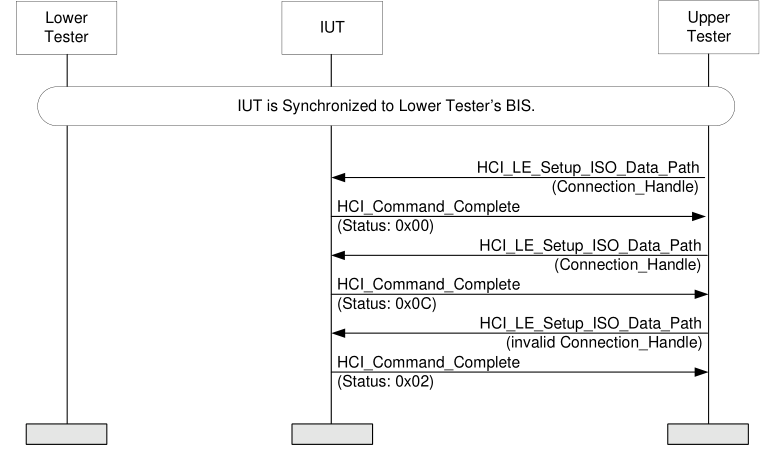

**Figure 4.160: HCI/BIS/BI-02-C [Broadcast Isochronous Stream, Synchronized Receiver, Reject Invalid Commands] MSC**

1. The Upper Tester creates an ISO output data path by sending an HCI_LE_Setup_Data_Path
command with the Connection_Handle of the active BIS to the IUT, and the IUT sends a successful HCI_Command_Complete event in return. 2. The Upper Tester sends an HCI_LE_Setup_ISO_Data_Path command to the IUT with the same
Connection_Handle from step 1. 3. The IUT sends an HCI_Command_Complete event to the Upper Tester with Status set to
Command Disallowed (0x0C). 4. The Upper Tester sends an HCI_LE_Setup_ISO_Data_Path command to the IUT with the
Connection_Handle set to an invalid value. 5. The IUT sends an HCI_Command_Complete event to the Upper Tester with Status set to
Unknown Connection Identifier (0x02).
• Expected Outcome
Pass verdict
In step 1, the IUT sends an HCI_Command_Complete event to the Upper Tester with Status set to 0x00.
In step 3, the IUT sends an HCI_Command_Complete event to the Upper Tester with Status set to Command Disallowed (0x0C).
In step 5, the IUT sends an HCI_Command_Complete event to the Upper Tester with Status set to Unknown Connection Identifier (0x02).
HCI/BIS/BV-05-C [Broadcast Isochronous Stream, Time_Stamp, Isochronous Broadcaster]
• Test Purpose
Verify that an Isochronous Broadcaster IUT correctly handles receiving a Time_Stamp in HCI ISO Data packets from the Upper Tester.
• Reference
[13] 5.4.5
• Initial Condition
- The Isochronous Broadcaster IUT broadcasts a single BIS using framed PDUs.
- The Lower Tester acts as a Synchronized Receiver and is synchronized to the IUT.
- All other BIS values as defined in [14] 4.11.1.
• Test Procedure
1. The Upper Tester sends SDU data to the IUT and includes Time_Stamps in the appropriate HCI
ISO Data packets. The SDU data consists of octets that count from 0x00 to 0xFF and roll over back to 0x00, then the count resumes. This count continues across all SDU data. 2. The IUT broadcasts framed PDUs to the Lower Tester.
• Expected Outcome
Pass verdict
The Lower Tester receives PDUs with data as described in step 1. Specifically, the contents of the HCI ISO Data packet Time_Stamp do not corrupt the contents of the data received by the Lower Tester.

##### 4.15.2.2 Broadcast Isochronous Stream, Time_Stamp, Synchronized Receiver

• Test Purpose
Verify that a Synchronized Receiver IUT sets the TS_Flag bit if the ISO_Data_Load field provides a Time_Stamp to the Upper Tester over the HCI, and the bit is only set if the PB_Flag field equals 0b00 or 0b10.
Verify that a Synchronized Receiver IUT provides a Time_Stamp to the Upper Tester over the HCI when time stamps are mandatory.
• Reference
[13] 5.4.5
• Initial Condition
- The Synchronized Receiver IUT is synchronized to a single BIS using framed PDUs broadcast by the Lower Tester acting in the Isochronous Broadcaster role.
- All other BIS values as defined in [14] 4.11.1.
• Test Case Configuration

|  | Test Case |  |  | Time Stamp _ |  |
| --- | --- | --- | --- | --- | --- |
| HCI/BIS/BV-06-C |  |  | Optional |  |  |
| HCI/BIS/BV-07-C |  |  | Mandatory |  |  |

Table 4.90: Broadcast Isochronous Stream, Time_Stamp, Synchronized Receiver test cases
• Test Procedure
1. The Lower Tester sends framed PDUs containing isochronous data to the IUT. 2. The IUT sends the received data to the Upper Tester in HCI ISO Data packets.
• Expected Outcome
Pass verdict
When the IUT sends HCI_ISO_Data packets with the PB_Flag set to 0b00 or 0b10, then: - The Packet_Sequence_Number, ISO_SDU_Length, and Packet_Status_Flag fields are present. - If Time_Stamps are mandatory, then the TS flag is set. Otherwise, the TS flag can be set or clear. - If the TS_Flag is set, then a valid Time_Stamp field is present. Otherwise, Time_Stamp is not present.
When the IUT sends HCI_ISO_Data packets with the PB_Flag set to 0b01 or 0b11, then the TS flag is clear and the Time_Stamp, Packet_Sequence_Number, ISO_SDU_Length, and Packet_Status_Flag fields are not present.
When Time_Stamps are provided, the difference between Time_Stamps of adjacent SDUs is the SDU Interval within ±(SCA_Broadcaster + SCA_Scanner) * ISO_Interval ± Jitter. If SCA_Scanner is not known, assume that it may be up to 500 ppm.
HCI/BIS/BI-06-C [Broadcast Isochronous Stream Using Non-Test Command, Invalid BIG Parameters]
• Test Purpose
Verify that the IUT properly rejects the LE Create BIG Command (the non-test variant) with invalid parameters.
• Reference
[13] 7.8.103
• Initial Condition
- State: Periodic Advertising, the IUT is advertiser.
• Test Procedure

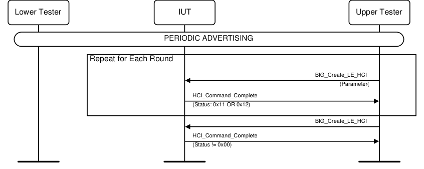

**Figure 4.161: HCI/BIS/BI-06-C [Broadcast Isochronous Stream Using Non-Test Command, Invalid BIG Parameters] MSC**

1. The Upper Tester sends an HCI_LE_Create_BIG command using the parameter value specified
in Table 4.91 for the round. All other parameters are set to valid, supported values. 2. The IUT sends an HCI_Command_Status event to the Upper Tester with Status set to
Unsupported Feature or Parameter Value (0x11) in round 8 and Invalid HCI Command Parameters (0x12) in all other rounds. 3. Repeat steps 1 and 2 for each round in Table 4.91. 4. The Upper Tester sends an HCI_LE_Create_BIG command using all of the values specified in
Table 4.92. 5. The IUT sends an HCI_Command_Status event to the Upper Tester with Status set to a valid
error code.

|  | Round |  |  | LE Create BIG Parameter _ _ |  |  | Value |  |
| --- | --- | --- | --- | --- | --- | --- | --- | --- |
| 1 |  |  | BIG Handle _ |  |  | 0xF0 |  |  |
| 2 |  |  | Advertising Handle _ |  |  | 0xF0 |  |  |
| 3 |  |  | Num BIS _ |  |  | 0x20 |  |  |
| 4 |  |  | SDU Interval _ |  |  | 0x100000 |  |  |
| 5 |  |  | Max SDU _ |  |  | 0x1000 |  |  |
| 6 |  |  | Max Transport Latency _ _ |  |  | 0x0FA1 |  |  |
| 7 |  |  | RTN |  |  | 0x20 |  |  |
| 8 |  |  | PHY |  |  | 0x09 |  |  |
| 9 |  |  | Packing |  |  | 0xF0 |  |  |
| 10 |  |  | Framing |  |  | 0xF0 |  |  |
| 11 |  |  | Encryption |  |  | 0xF0 |  |  |

Table 4.91: Parameter values for each case variation

|  | LE Create BIG Parameter _ _ |  |  | Value |  |
| --- | --- | --- | --- | --- | --- |
| BIG Handle _ |  |  | 0xF0 |  |  |
| Advertising Handle _ |  |  | 0xF0 |  |  |
| Num BIS _ |  |  | 0x20 |  |  |
| SDU Interval _ |  |  | 0x10000 |  |  |

|  | LE Create BIG Parameter _ _ |  |  | Value |  |
| --- | --- | --- | --- | --- | --- |
| Max SDU _ |  |  | 0x1000 |  |  |
| Max Transport Latency _ _ |  |  | 0x0FA1 |  |  |
| RTN |  |  | 0x20 |  |  |
| PHY |  |  | 0x09 |  |  |
| Packing |  |  | 0xF0 |  |  |
| Framing |  |  | 0xF0 |  |  |
| Encryption |  |  | 0xF0 |  |  |

Table 4.92: Parameter values for LE_Create_BIG command
• Expected Outcome
Pass verdict
In step 2, the IUT sends an HCI_Command_Status event to the Upper Tester with Status set to Unsupported Feature or Parameter Value (0x11) in round 8, Unsupported Feature or Parameter Value (0x11) or Invalid HCI Command Parameters (0x12) in round 12, and Invalid HCI Command Parameters (0x12) in all other rounds.
In step 5, the IUT sends an HCI_Command_Status event to the Upper Tester with Status set to a valid error code.
HCI/BIS/BI-07-C [Broadcast Isochronous Stream Using Non-Test Command, Invalid Transport Latency]
• Test Purpose
Verify that a Central IUT rejects the creation of a BIS with an invalid max transport latency value.
• Reference
[13] 7.8.103
• Initial Condition
- State: Periodic Advertising, the IUT is advertiser.
- TSPX_max_sdu_length is the maximum ISOAL SDU length as defined in IXIT.
• Test Procedure

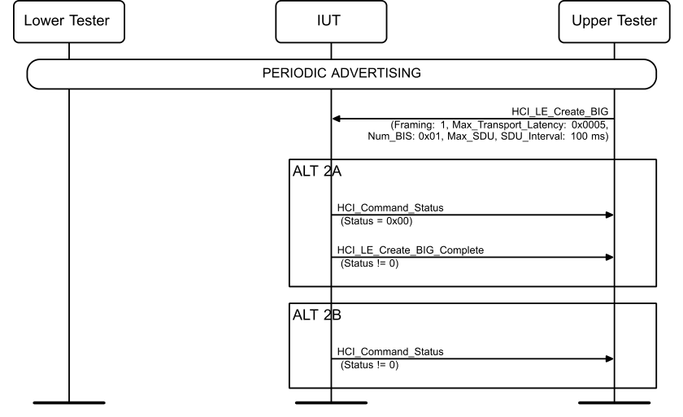

**Figure 4.162: HCI/BIS/BI-07-C [Broadcast Isochronous Stream Using Non-Test Command, Invalid Transport Latency] MSC**

1. The Upper Tester sends an HCI_LE_Create_BIG command with Framing set to 1,
Max_Transport_Latency set to 0x0005, Num_BIS set to 0x01, Max_SDU set to the lesser of TSPX_max_sdu_length and 753, SDU_Interval set to 100 ms, and all others parameters set to the values in [14] Section 4.11.1, Common Parameters. 2. Perform alternative 2A or 2B depending on the IUT response.
Alternative 2A (Successful HCI_Command_Status event):
2A.1 The IUT sends a successful HCI_Command_Status event to the Upper Tester. 2A.2 The IUT sends an HCI_LE_Create_BIG_Complete event to the Upper Tester with
Status set to a valid error code, which can be Unsupported Feature or Parameter Value (0x11).
Alternative 2B (HCI_Command_Status with an error code):
2B.1 The IUT sends a successful HCI_Command_Status event to the Upper Tester with
Status set to a valid error code, which can be Unsupported Feature or Parameter Value (0x11).
• Expected Outcome
Pass verdict
The IUT sends an HCI_LE_Create_BIG_Complete event to the Upper Tester with Status set to a valid error code, which can be Unsupported Feature or Parameter Value (0x11).
HCI/BIS/BV-08-C [Number of Completed Packets Event after Sending data in a Broadcaster]
• Test Purpose
Verify that the IUT properly sends the HCI Number of Completed Packets event after the IUT broadcasts Isochronous data.
• Reference
[13] 7.7.19
• Initial Condition
- State: Periodic Advertising, the IUT is advertiser.
- The maximum number of BISes in a BIG is defined in the TSPX_max_tx_bises IXIT value.
- A BIG with TSPX_max_tx_bises BISes has been established with the IUT as Isochronous Broadcaster, Max_SDU set to 4, BN set to 1, and IRC set to GC. The remaining values are the defaults specified in [14] Section 4.11.1 Common Parameters for BIS but may be adjusted if necessary to establish the BIG.
- The input data path (Host to Controller) for each BIS is set up to receive data over HCI.
• Test Procedure
1. The Upper Tester sends an HCI_LE_Read_Buffer_Size [v2] command to the IUT. 2. The IUT sends a successful HCI_Command_Complete event with an ISO_Data_Packet_Length
and Total_Num_ISO_Data_Packets. 3. Let n = Total_Num_ISO_Data_Packets from step 2. 4. Throughout the remaining steps:
a) The IUT broadcasts either empty BIS PDUs or the data from the HCI ISO Data packets in
step 7.
b) Whenever the IUT sends an HCI_Number_Of_Completed_Packets event to the Upper
Tester, increase n by the sum of the Num_Completed_Packets[i] values in the event for those values of i where Connection_Handle[i] refers to a BIS. Ignore those values of i where Connection_Handle[i] does not refer to a BIS.
5. Perform steps 6–9 a total of 10 times. 6. Perform steps 7–9 for each BIS in a random order (different each time). 7. If n is zero, wait until n is non-zero. 8. The Upper Tester sends an HCI ISO Data packet to the IUT containing an SDU of length 4 octets
and the correct connection handle for the BIS. 9. Decrement n by 1. 10. Wait for 10 seconds.
• Expected Outcome
Pass verdict
For each BIS, the sum of the Num_Completed_Packets[i] where Connection_Handle[i] refers to that BIS equals 10.
n = Total_Num_ISO_Data_Packets from step 2.
Fail verdict
After step 10 completes, n does not equal Total_Num_ISO_Data_Packets from step 2.
HCI/BIS/BI-10-C [LE Create BIG, Framed, Unsegmented Mode Unsupported]
• Test Purpose
Verify that the IUT that does not support Framed, Unsegmented mode returns an error in response to the HCI_LE_Set_CIG_Parameters command.
• Reference
[19] 7.8.103
• Test Procedure
1. The Upper Tester sends an HCI_LE_Create_BIG command to the IUT with Framing set to 0x02. 2. The IUT sends an HCI_Command_Complete event to the Upper Tester with Status set to 0x11.
• Expected Outcome
Pass verdict
In step 2, the IUT returns an Invalid HCI Command Parameters error.
HCI/BIS/BI-11-C [Broadcast Isochronous Stream Using Non-Test Command, Invalid BIG Parameters]
• Test Purpose
Verify that the IUT properly rejects the LE Create BIG Command (the non-test variant) with invalid parameters.
• Reference
[13] 7.8.103
• Initial Condition
- State: Periodic Advertising, the IUT is advertiser.
• Test Procedure
1. The Upper Tester sends an HCI_LE_Create_BIG command using the parameter values specified
in Table 4.93. All other parameters are set to valid, supported values. 2. The IUT sends an HCI_Command_Status event to the Upper Tester with Status set to 0x11 or
0x12.

|  | LE Create BIG Parameter _ _ |  |  | Value |  |
| --- | --- | --- | --- | --- | --- |
| Framing |  |  | 0x01 |  |  |
| SDU Interval _ |  |  | 0x4E20 |  |  |
| Max Transport Latency _ _ |  |  | 0x0A |  |  |

Table 4.93: Parameter values
• Expected Outcome
Pass verdict
In step 2, the IUT sends an HCI_Command_Status event to the Upper Tester with Status set to Unsupported Feature or Parameter Value (0x11) or Invalid HCI Command Parameters (0x12) in round 12.

##### 4.15.2.3 Broadcast Isochronous Stream, HCI Read/Write Authenticated Payload Timeout error

• Test Purpose
Verify that the IUT rejects an HCI Read or Write Authenticated Payload Timeout command.
• Initial Condition
- The IUT is the Broadcaster role.
- BIS is established per the following configuration and broadcast by the IUT:

|  | Variable |  |  | Value(s) |  |
| --- | --- | --- | --- | --- | --- |
| num bis _ |  |  | 1 |  |  |
| sdu int _ |  |  | 100 ms |  |  |
| iso int _ |  |  | 100 ms |  |  |
| nse |  |  | 3 |  |  |
| mx sdu _ |  |  | 8 |  |  |
| mx pdu _ |  |  | 8 |  |  |
| phy |  |  | LE 1M PHY |  |  |
| packing |  |  | any supported |  |  |
| framing |  |  | any |  |  |
| bn |  |  | 1 |  |  |
| irc |  |  | 3 |  |  |
| pto |  |  | 0 |  |  |
| Encryption |  |  | 1 |  |  |
| broadcast code _ |  |  | any supported |  |  |

Table 4.94: BIS Configuration
• Test Case Configuration

|  | Test Case |  |  | HCI Command |  |  | Reference |  |
| --- | --- | --- | --- | --- | --- | --- | --- | --- |
| HCI/BIS/BI-12-C [Broadcast Isochronous Stream, HCI Read Authenticated Payload Timeout error] |  |  | HCI Read Authenticated Payload Timeout _ _ _ _ |  |  | [12] 7.3.93 |  |  |
| HCI/BIS/BI-13-C [Broadcast Isochronous Stream, HCI Write Authenticated Payload Timeout error] |  |  | HCI Write Authenticated Payload Timeout _ _ _ _ |  |  | [12] 7.3.94 |  |  |

Table 4.95: Broadcast Isochronous Stream, HCI Read/Write Authenticated Payload Timeout error test cases
• Test Procedure
1. The Upper Tester sends the HCI command specified in Table 4.95 to the IUT. 2. The IUT sends an HCI_Command_Complete event to the Upper Tester with Status set to 0x0C.
• Expected Outcome
Pass verdict
In step 2, the IUT sends an 0x0C error to the Upper Tester.

##### 4.15.2.4 Broadcast Isochronous Stream, Synchronized Receiver, Reject Invalid Commands

• Test Purpose
Verify that the IUT rejects an HCI Read or Write Authenticated Payload Timeout command.
• Initial Condition
- The Lower Tester broadcasts a BIS in a BIG, and the IUT has synchronized to it.
• Test Case Configuration

|  | Test Case |  |  | HCI Command |  |  | Reference |  |
| --- | --- | --- | --- | --- | --- | --- | --- | --- |
| HCI/BIS/BI-14-C [Broadcast Isochronous Stream, HCI Read Authenticated Payload Timeout error] |  |  | HCI Read Authenticated Payload Timeout _ _ _ _ |  |  | [12] 7.3.93 |  |  |
| HCI/BIS/BI-15-C [Broadcast Isochronous Stream, HCI Write Authenticated Payload Timeout error] |  |  | HCI Write Authenticated Payload Timeout _ _ _ _ |  |  | [12] 7.3.94 |  |  |

Table 4.96: Broadcast Isochronous Stream, HCI Read/Write Authenticated Payload Timeout error test cases
• Test Procedure
1. The Upper Tester sends the HCI command specified in Table 4.96 to the IUT. 2. The IUT sends an HCI_Command_Complete event to the Upper Tester with Status set to 0x0C.
• Expected Outcome
Pass verdict
In step 2, the IUT sends an 0x0C error to the Upper Tester.

##### 4.15.2.5 Reject creating a BIG when the IUT does not support a BIG created from a Periodic

Advertising with Responses
• Test Purpose
Verify that an Isochronous Broadcaster IUT fails the command to create a BIG when advertising using Periodic Advertising with Responses.
• Reference
[12] 7.8.103, 7.8.104
• Initial Condition
- The Isochronous Broadcaster IUT is advertising periodic advertising with responses using selected parameters compatible with the default BIG values as defined in [15] Section 4.11.1, Common Parameters.
• Test Case Configuration

|  | Test Case |  |  | HCI Command |  |
| --- | --- | --- | --- | --- | --- |
| HCI/BIS/BV-09-C [Reject creating a BIG when the IUT does not support a BIG created from a Periodic Advertising with Responses, LE Create BIG] |  |  | HCI LE Create BIG _ _ _ |  |  |
| HCI/BIS/BV-10-C [Reject creating a BIG when the IUT does not support a BIG created from a Periodic Advertising with Responses, LE Create BIG Test] |  |  | HCI LE Create BIG Test _ _ _ _ |  |  |

Table 4.97: Reject creating a BIG when the IUT does not support a BIG created from a Periodic Advertising with Responses test cases
• Test Procedure

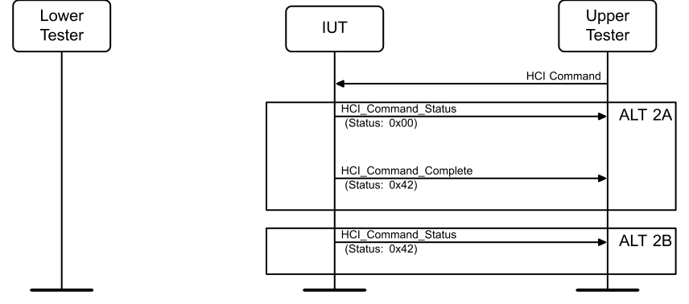

**Figure 4.163: Reject creating a BIG when the IUT does not support a BIG created from a Periodic Advertising with Responses MSC**

1. The Upper Tester sends the HCI Command specified by Table 4.97 to the IUT. 2. Perform either alternative 2A or 2B depending on the IUT response.
Alternative 2A (Successful HCI_Command_Status):
2A.1 The IUT sends a successful HCI_Command_Status to the Upper Tester.
2A.2 The IUT sends an HCI_LE_Create_BIG_Complete event to the Upper Tester with Status set to 0x42 (Unknown Advertising Identifier).
Alternative 2B (HCI_Command_Status with an error code):
2B.1 The IUT sends an HCI_Command_Status event to the Upper Tester with Status set to 0x42 (Unknown Advertising Identifier).
• Expected Outcome
Pass verdict
In step 2, the IUT sends an error to the Upper Tester.
HCI/BIS/BV-11-C [Broadcast Isochronous Stream testing overlength data on the LE Coded PHY]
• Test Purpose
Verify that the IUT correctly handles Periodic Advertising data plus a BIGInfo that will not fit within the periodic advertising interval.
• Reference
[12] 7.8.103
• Initial Condition
- State: Periodic Advertising, the IUT is advertiser, PHY is the LE Coded PHY, the periodic advertising interval is 7.5 ms, periodic advertising data is 93 random octets, and periodic advertising is enabled.
• Test Procedure
1. The Upper Tester sends an HCI_LE_Create_BIG command using the Advertising_Handle of the
periodic advertising in the initial condition, PHY=0x04, and Encryption = 0x00. 2. The IUT returns the error code Packet Too Long (0x45) to the Upper Tester. 3. The Upper Tester commands the IUT to stop the periodic advertising. 4. Repeat steps 1 and 2.
• Expected Outcome
Pass verdict
In step 2, the IUT returns the error code Packet Too Long (0x45).

### 4.16 SCO and eSCO Connections

Verify that the IUT correctly rejects an attempt to create a SCO connection when retransmission mandates an eSCO connection.

#### 4.16.1 SCO and eSCO default settings

These default settings will be used for the different SCO and eSCO test cases.

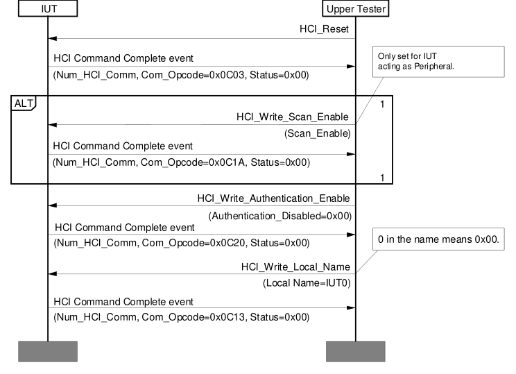

**Figure 4.164: Default settings used for SCO and eSCO test cases MSC**

All events are enabled in the Event_mask field in HCI_Set_Event_Mask with the exception of bit 30 Page Scan Mode Change event, which is deprecated. Bit 61, which is the LE Meta event, is considered “don’t care”, and may or may not be set.

#### 4.16.2 Do Not Establish a SCO Connection When Retransmission is Specified • Test Purpose

Verify that the IUT acting as either Central or Peripheral does not establish a SCO connection when retransmission is specified.
• Initial Condition
- See Section 4.16.1 SCO and eSCO default settings.
- An LMP features request has been executed.
- An ACL connection is established between the IUT and the Lower Tester.
- Valid parameters for the HCI_Setup_Synchronous_Connection command are defined by the TSPX_hci_setup_synchronous_connection_params IXIT value.
- Valid parameters for the HCI_Enhanced_Setup_Synchronous_Connection command are defined by the TSPX_hci_enhanced_setup_connection_params IXIT value.
• Test Case Configuration

|  | Test Case |  |  | Role |  |  | HCI Command |  |
| --- | --- | --- | --- | --- | --- | --- | --- | --- |
| HCI/SCO/BV-01-C [11] 7.1.26 |  |  | Central |  |  | HCI Setup Synchronous Connection _ _ _ |  |  |
| HCI/SCO/BV-02-C [11] 7.1.26 |  |  | Peripheral |  |  | HCI Setup Synchronous Connection _ _ _ |  |  |
| HCI/SCO/BV-03-C [11] 7.1.45 |  |  | Central |  |  | HCI Enhanced Setup Synchronous Connection _ _ _ _ |  |  |
| HCI/SCO/BV-04-C [11] 7.1.45 |  |  | Peripheral |  |  | HCI Enhanced Setup Synchronous Connection _ _ _ _ |  |  |

Table 4.98: Do Not Establish a SCO Connection When Retransmission is Specified test cases
• Test Procedure

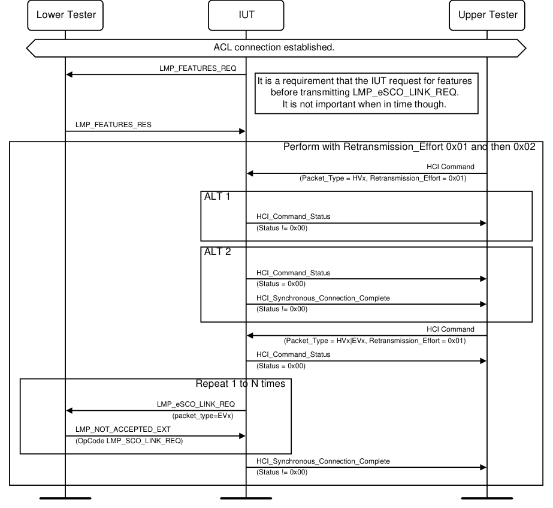

**Figure 4.165: Do Not Establish a SCO Connection When Retransmission is Specified MSC**

1. The Upper Tester sends an HCI Command as specified in Table 4.98 to the IUT with the
supported SCO packet bits set in Packet_Type, no eSCO “may be used” bits set, all eSCO “shall not be used” bits set, the Retransmission_Effort set to 0x01, and all other parameters as specified in the IXIT. 2. The Upper Tester receives an HCI_Command_Status event from the IUT indicating that the
command failed or receives a successful HCI_Command_Status event followed by an HCI_Synchronous_Connection_Complete event with an error. 3. If the Lower Tester receives either an LMP_SCO_link_req or LMP_eSCO_link_req PDU, the test
fails. 4. The Upper Tester sends the same command with the same parameters as in step 1, except that
Packet_Type is set to allow all SCO and eSCO packet types supported by the IUT. 5. The Upper Tester receives an HCI_Command_Status event from the IUT indicating success. 6. Perform steps 7 and 8 between 1 to N times where N is the number of different eSCO packet
types supported by the IUT as specified in the HCI Command in step 4. In step 7, a different eSCO packet type must be used each time.
LMP_SCO_link_req PDU to the Lower Tester, the test fails. 8. The Lower Tester refuses the eSCO connection by sending an LMP_not_accepted_ext PDU to
the IUT. 9. The Upper Tester receives an HCI_Synchronous_Connection_Complete event indicating failure. 10. Repeat steps 1–9 but using a Retransmission_Effort of 0x02.
• Expected Outcome
Pass verdict
In step 2, the IUT sends an HCI_Command_Status event indicating that the HCI command specified in Table 4.98 failed, or the IUT sends a successful HCI_Command_Status event followed by an HCI_Synchronous_Connection_Complete event with an error.
In step 5, the IUT sends an HCI_Command_Status event indicating success.
In step 7, the IUT sends an LMP_eSCO_link_req PDU.
In step 9, the IUT sends an HCI_Synchronous_Connection_Complete event indicating failure.
Fail verdict
In step 3, the IUT sends an LMP_SCO_link_req or LMP_eSCO_link_req PDU.
In step 7, the IUT sends an LMP_SCO_link_req.

#### 4.16.3 Accept Synchronous Connection Request, Ignore Receive Bandwidth

and Retransmission Effort, SCO • Test Purpose
Verify that the IUT acting as either Central or Peripheral ignores the Receive_Bandwidth and Retransmission_Effort parameters for an SCO connection.
• Initial Condition
- See Section 4.16.1 SCO and eSCO default settings.
- An LMP features request has been executed.
- An ACL connection is established between the IUT and the Lower Tester.
- Valid parameters for the HCI_Accept_Synchronous_Connection_Request command are defined by the TSPX_hci_accept_synchronous_connection_request_params IXIT value.
• Test Case Configuration

|  | Test Case |  |  | Role |  |  | HCI Command |  |
| --- | --- | --- | --- | --- | --- | --- | --- | --- |
| HCI/SCO/BV-09-C [11] 7.1.27 |  |  | Central |  |  | HCI Accept Synchronous Connection Request _ _ _ _ |  |  |
| HCI/SCO/BV-10-C [11] 7.1.27 |  |  | Peripheral |  |  | HCI Accept Synchronous Connection Request _ _ _ _ |  |  |
| HCI/SCO/BV-11-C [11] 7.1.46 |  |  | Central |  |  | HCI Enhanced Accept Synchronous Connection Request _ _ _ _ _ |  |  |
| HCI/SCO/BV-12-C [11] 7.1.46 |  |  | Peripheral |  |  | HCI Enhanced Accept Synchronous Connection Request _ _ _ _ _ |  |  |

Table 4.99: Accept Synchronous Connection Request, Ignore Receive Bandwidth and Retransmission Effort, SCO test cases
• Test Procedure

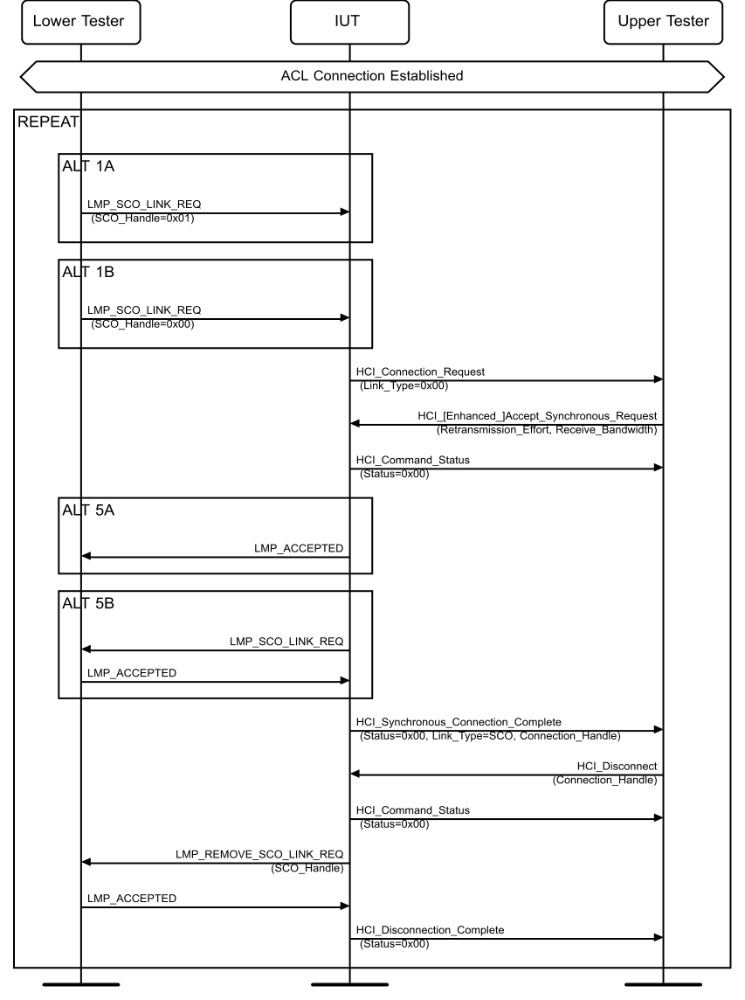

**Figure 4.166: Accept Synchronous Connection Request, Ignore Receive Bandwidth and Retransmission Effort, SCO MSC**

1. Perform either alternative 1A or 1B depending on the IUT role.
Alternative 1A (The IUT is Peripheral):
1A.1 The Lower Tester sends an LMP_SCO_LINK_REQ PDU to the IUT with SCO_Handle set to 0x01.
Alternative 1B (The IUT is Central):
1B.1 The Lower Tester sends an LMP_SCO_LINK_REQ PDU to the IUT with SCO_Handle set to 0x00.
2. The IUT sends an HCI_Connection_Request event with Link_Type set to 0x00 to the IUT. 3. The Upper Tester sends an HCI command as specified in Table 4.99 to the IUT with
Retransmission_Effort and Receive_Bandwidth set as specified in Table 4.100 and all other parameters as specified in the IXIT. 4. The IUT sends a successful HCI_Command_Status event to the Upper Tester. 5. Perform either alternative 5A or 5B depending on the IUT role.
Alternative 5A (The IUT is Peripheral):
5A.1 The IUT sends an LMP_ACCEPTED PDU to the Lower Tester.
Alternative 5B (The IUT is Central):
5B.1 The IUT sends an LMP_SCO_LINK_REQ PDU to the Lower Tester.
5B.2 The Lower Tester sends an LMP_ACCEPTED PDU to the IUT.
6. The IUT sends an HCI_Synchronous_Connection_Complete command to the Upper Tester with
Status set to 0x00, Link_Type set to SCO, and a Connection_Handle. 7. The Upper Tester sends an HCI_Disconnect command to the IUT with Connection_Handle set to
the value in step 6 and receives a successful HCI_Command_Status in response. 8. The IUT sends an LMP_REMOVE_SCO_LINK_REQ to the Lower Tester with an SCO_Handle. 9. The Lower Tester sends an LMP_ACCEPTED PDU to the IUT. 10. The IUT sends a successful HCI_Disconnection_Complete event to the Upper Tester.

|  | Round |  |  | Retransmission Effort _ |  |  | Receive Bandwidth _ |  |
| --- | --- | --- | --- | --- | --- | --- | --- | --- |
| 1 |  |  | 0x01 |  |  | 0x00000001 |  |  |
| 2 |  |  | 0x02 |  |  | 0xFFFFFFFE |  |  |
| 3 |  |  | 0xFF |  |  | 0xFFFFFFFF |  |  |

Table 4.100: Accept Synchronous Connection Request, Ignore Receive Bandwidth and Retransmission Effort, SCO rounds
• Expected Outcome
Pass verdict
In step 5A.1, the IUT sends an LMP_ACCEPTED PDU with the OpCode set to LMP_SCO_link_req.
In step 5B.1, the IUT sends an LMP_SCO_LINK_REQ PDU to the Lower Tester.

## 5 Test case mapping

The Test Case Mapping Table (TCMT) maps test cases to specific requirements in the ICS. The IUT is tested in all roles for which support is declared in the ICS document.
The columns for the TCMT are defined as follows:
Item: Contains a logical expression based on specific entries from the associated ICS document. Contains a logical expression (using the operators AND, OR, NOT as needed) based on specific entries from the applicable ICS document(s). The entries are in the form of y/x references, where y corresponds to the table number and x corresponds to the feature number as defined in the ICS document for HCI [2].
Feature: A brief, informal description of the feature being tested.
Test Case(s): The applicable test case identifiers are required for Bluetooth Qualification if the corresponding y/x references defined in the Item column are supported. Further details about the function of the TCMT are elaborated in [3].
For the purpose and structure of the ICS/IXIT, refer to [3].

|  | Item |  |  | Feature |  |  | Test Case(s) |  |
| --- | --- | --- | --- | --- | --- | --- | --- | --- |
|  | Device Setup |  |  |  |  |  |  |  |
| (HCI 1a/1 AND NOT HCI 1/1b) OR (HCI 1a/3 AND NOT HCI 1/1c) OR (HCI 1a/4 AND NOT HCI 1/1d) |  |  | Command Complete Event on each supported controller |  |  | HCI/GEV/BV-01-C |  |  |
| LL 3/9 |  |  | Extended Advertising Extended Scanning |  |  | HCI/GEV/BV-02-C HCI/GEV/BV-04-C |  |  |
| LL 4/7 |  |  | Extended Scanning |  |  | HCI/GEV/BV-03-C |  |  |
| HCI 1/1 |  |  | RFU OGF |  |  | HCI/GEV/BI-01-C |  |  |
| HCI 1a/1 |  |  | Reset Command |  |  | HCI/DSU/BV-01-C |  |  |
| LL 1/1 AND HCI 1a/4 |  |  | Reset Command |  |  | HCI/DSU/BV-02-C |  |  |
| LL 1/4 AND HCI 1a/4 |  |  | Reset Command |  |  | HCI/DSU/BV-03-C |  |  |
| LL 1/2 AND HCI 1a/4 |  |  | Reset Command |  |  | HCI/DSU/BV-04-C |  |  |
| LL 1/3 AND HCI 1a/4 |  |  | Reset Command |  |  | HCI/DSU/BV-05-C |  |  |
| LL 1/5 AND HCI 1a/4 |  |  | Reset Command |  |  | HCI/DSU/BV-06-C |  |  |
| HCI 1a/3 |  |  | Reset Command |  |  | HCI/DSU/BV-07-C |  |  |
| HCI 16/68 |  |  | Set Min Encryption Key Size |  |  | HCI/CCO/BV-21-C HCI/CCO/BI-35-C |  |  |
|  | Controller Flow Control |  |  |  |  |  |  |  |
| HCI 3/1 AND NOT HCI 3/5 AND (HCI 9/6 OR HCI 9/7) AND HCI 1a/1 |  |  | Read Buffer Size Command, BR/EDR, [e]SCO data over HCI supported |  |  | HCI/CFC/BV-01-C |  |  |
| HCI 3/1 AND NOT HCI 3/5 AND (HCI 9/6 OR HCI 9/7) AND HCI 1a/3 |  |  | Read Buffer Size Command, AMP, [e]SCO data over HCI supported |  |  | HCI/CFC/BV-03-C |  |  |
| HCI 3/1 AND NOT HCI 3/5 AND NOT HCI 9/6 AND NOT HCI 9/7 AND HCI 1a/1 |  |  | Read Buffer Size Command, BR/EDR, [e]SCO data over HCI not supported |  |  | HCI/CFC/BV-06-C |  |  |

|  | Item |  |  | Feature |  |  | Test Case(s) |  |
| --- | --- | --- | --- | --- | --- | --- | --- | --- |
| HCI 3/1 AND NOT HCI 3/5 AND NOT HCI 9/6 AND NOT HCI 9/7 AND HCI 1a/3 |  |  | Read Buffer Size Command, AMP, [e]SCO data over HCI not supported |  |  | HCI/CFC/BV-07-C |  |  |
| HCI 3/5 AND NOT HCI 3/1 |  |  | LE Read Buffer Size Command |  |  | HCI/CFC/BV-02-C |  |  |
| HCI 3/1 AND HCI 3/5 AND (HCI 9/6 OR HCI 9/7) AND NOT HCI 14/23 |  |  | Read Buffer Size Command, BR/EDR/LE, Combined Data Buffers, [e]SCO data over HCI supported |  |  | HCI/CFC/BV-04-C |  |  |
| HCI 3/1 AND HCI 3/5 AND (HCI 9/6 OR HCI 9/7) AND HCI 14/23 |  |  | Read Buffer Size Command, BR/EDR/LE, Separate Data Buffers, [e]SCO data over HCI supported |  |  | HCI/CFC/BV-05-C |  |  |
| HCI 3/1 AND HCI 3/5 AND NOT HCI 9/6 AND NOT HCI 9/7 AND NOT HCI 14/23 |  |  | Read Buffer Size Command, BR/EDR/LE, Combined Data Buffers, [e]SCO data over HCI not supported |  |  | HCI/CFC/BV-08-C |  |  |
| HCI 3/1 AND HCI 3/5 AND NOT HCI 9/6 AND NOT HCI 9/7 AND HCI 14/23 |  |  | Read Buffer Size Command, BR/EDR/LE, Separate Data Buffers, [e]SCO data over HCI not supported |  |  | HCI/CFC/BV-09-C |  |  |
| HCI 3/1 AND NOT HCI 9/6 AND NOT HCI 9/7 |  |  | Read Buffer Size Command, [e]SCO data over HCI not supported |  |  | HCI/CFC/BI-03-C |  |  |
| HCI 3/1 AND (HCI 9/6 OR HCI 9/7) |  |  | Read Buffer Size Command, [e]SCO data over HCI supported |  |  | HCI/CFC/BI-04-C |  |  |
|  | Controller Information |  |  |  |  |  |  |  |
| HCI 4/2 |  |  | Read Local Supported Commands Command |  |  | HCI/CIN/BV-03-C |  |  |
| (HCI 1a/1 OR HCI 1a/3) AND HCI 4/3 |  |  | Read Local Supported Features Command |  |  | HCI/CIN/BV-01-C |  |  |
| (HCI 1a/1 OR HCI 1a/3) AND HCI 4/4 |  |  | Read Local Extended Features Command |  |  | HCI/CIN/BV-02-C |  |  |
| HCI 4/1 |  |  | Read Local Version Information Command |  |  | HCI/CIN/BV-04-C |  |  |
| HCI 1a/4 |  |  | LE Filter Accept List |  |  | HCI/CIN/BV-06-C |  |  |
| HCI 4/12 |  |  | Read Local Simple Pairing Options Command |  |  | HCI/CIN/BV-08-C |  |  |
| HCI 4/10 |  |  | Read Local Supported Codecs [v1] |  |  | HCI/CIN/BV-10-C |  |  |
| HCI 4/13 AND HCI 4/14 AND HCI 4/15 |  |  | Locally supported Codecs |  |  | HCI/CIN/BV-11-C |  |  |
| HCI 4/8 |  |  | LE Read Local Supported Features Command |  |  | HCI/CIN/BV-12-C |  |  |
| HCI 4/18 |  |  | LE Read All Local Supported Features Page 0 command |  |  | HCI/CIN/BV-15-C HCI/CIN/BV-16-C |  |  |
| HCI 15/4a |  |  | Read RSSI Value, BR/EDR |  |  | HCI/CIN/BV-13-C |  |  |
| HCI 15/4c |  |  | Read RSSI Value, LE Controller |  |  | HCI/CIN/BV-14-C |  |  |

|  | Item |  |  | Feature |  |  | Test Case(s) |  |
| --- | --- | --- | --- | --- | --- | --- | --- | --- |
|  | Controller Configuration |  |  |  |  |  |  |  |
| HCI 5/27 OR HCI 5/28 OR HCI 5/29 OR HCI 5/30 |  |  | LE Resolving List Management |  |  | HCI/CCO/BV-12-C HCI/CCO/BV-13-C HCI/CCO/BV-14-C HCI/CCO/BI-46-C HCI/CCO/BI-47-C HCI/CCO/BI-48-C |  |  |
| HCI 7/39 AND HCI 5/27 AND HCI 6/20 |  |  | LE Add Device To Resolving List, Scanner |  |  | HCI/CCO/BI-50-C |  |  |
| HCI 7/39 AND HCI 6/15 AND LL 3/2 |  |  | LE Add Device To Resolving List, Advertiser, Connectable |  |  | HCI/CCO/BI-69-C |  |  |
| HCI 7/39 AND HCI 6/15 AND NOT LL 3/2 AND LL 3/5 |  |  | LE Add Device To Resolving List, Advertiser, Non-Connectable |  |  | HCI/CCO/BI-70-C |  |  |
| HCI 7/23 AND LL 1/3 AND LL 2/2 |  |  | Reject Create Connection Command, Random Device Address |  |  | HCI/CCO/BI-51-C |  |  |
| HCI 7/23 AND LL 1/3 AND LL 2/4 AND LL 5/3 |  |  | Reject Create Connection Command, Resolvable Private Address, Filter Accept List Used or Not Used |  |  | HCI/CCO/BI-52-C HCI/CCO/BI-53-C |  |  |
| HCI 7/41 AND LL 1/3 AND LL 2/2 |  |  | Reject Extended Create Connection Command, Random Device Address |  |  | HCI/CCO/BI-54-C |  |  |
| HCI 7/41 AND LL 1/3 AND LL 2/4 AND LL 5/3 |  |  | Reject Extended Create Connection Command, Random Device Address, Filter Accept List Used or Not Used |  |  | HCI/CCO/BI-55-C HCI/CCO/BI-56-C |  |  |
| HCI 13/10 |  |  | LE Set Default PHY Command |  |  | HCI/CCO/BV-15-C |  |  |
| HCI 14/17 AND HCI 14/18 AND HCI 14/19 |  |  | LE Add Device To Periodic Advertiser List Command, LE Remove Device From Periodic Advertiser List Command, LE Clear Periodic Advertiser List Command |  |  | HCI/CCO/BV-17-C |  |  |
| HCI 14/20 |  |  | LE Read Periodic Advertiser List Size Command |  |  | HCI/CCO/BV-16-C |  |  |
| HCI 5/44 |  |  | LE Read Transmit Power Command |  |  | HCI/CCO/BV-18-C |  |  |
| HCI 5/45 |  |  | LE Write RF Path Compensation Command |  |  | HCI/CCO/BV-19-C |  |  |
| HCI 5/46 |  |  | LE Read RF Path Compensation Command |  |  | HCI/CCO/BV-20-C |  |  |
| LL 9/13 AND LL 1/1 |  |  | LE Resolving List and Advertising |  |  | HCI/CCO/BI-01-C |  |  |
| LL 9/13 AND LL 1/2 |  |  | LE Resolving List and Scanning |  |  | HCI/CCO/BI-02-C |  |  |
| LL 9/13 AND LL 1/3 AND HCI 7/23 |  |  | LE Resolving List and Create Connection |  |  | HCI/CCO/BI-03-C |  |  |
| LL 9/13 AND LL 1/3 AND HCI 7/41 |  |  | LE Resolving List and Extended Create Connection |  |  | HCI/CCO/BI-04-C |  |  |
| LL 9/13 AND LL 4/8 |  |  | LE Resolving List and Periodic Advertising |  |  | HCI/CCO/BI-05-C |  |  |

|  | Item |  |  | Feature |  |  | Test Case(s) |  |
| --- | --- | --- | --- | --- | --- | --- | --- | --- |
| HCI 7/1 AND NOT LMP 2/1 |  |  | Validate Unsupported Packet Types are Not Accepted, Create Connection, 3-slot |  |  | HCI/CCO/BI-14-C |  |  |
| HCI 7/1 AND NOT LMP 2/2 |  |  | Validate Unsupported Packet Types are Not Accepted, Create Connection, 5-slot |  |  | HCI/CCO/BI-15-C |  |  |
| HCI 7/1 AND CORE 1a/60 |  |  | Create Connection, Invalid Address |  |  | HCI/CCO/BI-118-C |  |  |
| HCI 7/29 AND CORE 1a/60 |  |  | Truncated Page, Invalid Address |  |  | HCI/CCO/BI-119-C |  |  |
| HCI 13/6 AND NOT LMP 2/1 |  |  | Validate Unsupported Packet Types are Not Accepted, Change Connection Packet Type, 3-slot |  |  | HCI/CCO/BI-16-C |  |  |
| HCI 13/6 AND NOT LMP 2/2 |  |  | Validate Unsupported Packet Types are Not Accepted, Change Connection Packet Type, 5-slot |  |  | HCI/CCO/BI-17-C |  |  |
| HCI 15/8 |  |  | LE Read Channel Map |  |  | HCI/CCO/BI-43-C |  |  |
| HCI 1a/1 AND (NOT HCI 16/47a) AND HCI 16/47b |  |  | Error Response for Unsupported Commands on Transports, Read Authenticated Payload Timeout, BR/EDR |  |  | HCI/CCO/BI-18-C |  |  |
| HCI 1a/4 AND HCI 16/47a AND (NOT HCI 16/47b) |  |  | Error Response for Unsupported Commands on Transports, Read Authenticated Payload Timeout, LE |  |  | HCI/CCO/BI-19-C |  |  |
| HCI 1a/1 AND (NOT HCI 15/3a) AND HCI 15/3b |  |  | Error Response for Unsupported Commands on Transports, Read Link Quality, BR/EDR |  |  | HCI/CCO/BI-20-C |  |  |
| HCI 1a/3 AND HCI 15/3a AND (NOT HCI 15/3b) |  |  | Error Response for Unsupported Commands on Transports, Read Link Quality, AMP |  |  | HCI/CCO/BI-21-C |  |  |
| HCI 1a/1 AND (NOT HCI 13/1a) AND HCI 13/1b |  |  | Error Response for Unsupported Commands on Transports, Read Link Supervision Timeout, BR/EDR |  |  | HCI/CCO/BI-22-C |  |  |
| HCI 1a/1 AND (NOT HCI 8/8a) AND HCI 8/8b |  |  | Error Response for Unsupported Commands on Transports, Read Remote Version Information, BR/EDR |  |  | HCI/CCO/BI-23-C |  |  |
| HCI 1a/4 AND HCI 8/8a AND (NOT HCI 8/8b) |  |  | Error Response for Unsupported Commands on Transports, Read Remote Version Information, LE |  |  | HCI/CCO/BI-24-C |  |  |
| HCI 1a/1 AND (NOT HCI 15/4a) AND HCI 15/4b AND HCI 15/4c |  |  | Error Response for Unsupported Commands on Transports, Read RSSI, BR/EDR |  |  | HCI/CCO/BI-25-C |  |  |
| HCI 1a/3 AND HCI 15/4a AND (NOT HCI 15/4b) AND HCI 15/4c |  |  | Error Response for Unsupported Commands on Transports, Read RSSI, AMP |  |  | HCI/CCO/BI-26-C |  |  |
| HCI 1a/4 AND HCI 15/4a AND HCI 15/4b AND (NOT HCI 15/4c) |  |  | Error Response for Unsupported Commands on Transports, Read RSSI, LE |  |  | HCI/CCO/BI-27-C |  |  |

|  | Item |  |  | Feature |  |  | Test Case(s) |  |
| --- | --- | --- | --- | --- | --- | --- | --- | --- |
| HCI 1a/1 AND (NOT HCI 15/2b) AND HCI 15/2c |  |  | Error Response for Unsupported Commands on Transports, Read Transmit Power Level, BR/EDR |  |  | HCI/CCO/BI-28-C |  |  |
| HCI 1a/4 AND HCI 15/2b AND (NOT HCI 15/2c) |  |  | Error Response for Unsupported Commands on Transports, Read Transmit Power Level, LE |  |  | HCI/CCO/BI-29-C |  |  |
| HCI 1a/1 AND (NOT HCI 16/48a) AND HCI 16/48b |  |  | Error Response for Unsupported Commands on Transports, Write Authenticated Payload Timeout, BR/EDR |  |  | HCI/CCO/BI-30-C |  |  |
| HCI 1a/4 AND HCI 16/48a AND (NOT HCI 16/48b) |  |  | Error Response for Unsupported Commands on Transports, Write Authenticated Payload Timeout, LE |  |  | HCI/CCO/BI-31-C |  |  |
| HCI 1a/1 AND (NOT HCI 13/2a) AND HCI 13/2b |  |  | Error Response for Unsupported Commands on Transports, Write Link Supervision Timeout, BR/EDR |  |  | HCI/CCO/BI-32-C |  |  |
| HCI 5/37 AND LL 9/43 |  |  | Invalid LE Set Periodic Advertising Data Parameters, Periodic Advertising ADI Supported |  |  | HCI/CCO/BI-33-C |  |  |
| HCI 5/41 AND NOT LL 9/43 |  |  | Invalid LE Set Periodic Advertising Enable Parameters |  |  | HCI/CCO/BI-34-C |  |  |
| HCI 6/37 AND NOT LL 9/43 |  |  | Invalid LE Set Periodic Advertising Receive Enable, Periodic Advertising ADI Not Supported |  |  | HCI/CCO/BI-59-C |  |  |
| HCI 10/27 AND NOT LL 9/43 |  |  | Invalid LE Set Periodic Advertising Sync Transfer Parameters, Periodic Advertising ADI Not Supported |  |  | HCI/CCO/BI-60-C |  |  |
| HCI 10/28 AND NOT LL 9/43 |  |  | Invalid LE Set Default Periodic Advertising Sync Transfer Parameters, Periodic Advertising ADI Not Supported |  |  | HCI/CCO/BI-61-C |  |  |
| HCI 7/50 |  |  | Invalid Default Subrate Parameters |  |  | HCI/CCO/BI-37-C |  |  |
| HCI 7/51 |  |  | Invalid Subrate Requests |  |  | HCI/CCO/BI-36-C |  |  |
| HCI 10/20 AND LL 9/45 |  |  | Invalid LE Connection CTE Request Enable Parameters |  |  | HCI/CCO/BI-38-C |  |  |
| HCI 16/48b AND LL 9/45 |  |  | Invalid Write Authenticated Payload Timeout Parameters |  |  | HCI/CCO/BI-39-C |  |  |
| HCI 5/66 |  |  | Configure Data Path |  |  | HCI/CCO/BI-42-C |  |  |
| HCI 20/5 AND NOT LL 9/31 AND NOT LL 9/32 |  |  | Reject Setting Host Controlled FeatureSet Bit, Unsupported Feature on Controller, Connected Isochronous Stream |  |  | HCI/CCO/BI-44-C |  |  |
| HCI 20/5 AND NOT LL 9/45 |  |  | Reject Setting Host Controlled FeatureSet Bit, Unsupported Feature on Controller, Connection Subrating |  |  | HCI/CCO/BI-45-C |  |  |
| HCI 20/5 AND LL 5/1 AND LL 9/60 |  |  | LE Set Host Feature, During Connection, Initiator |  |  | HCI/CSE/BV-08-C |  |  |
| HCI 20/5 AND LL 3/1 AND LL 9/60 |  |  | LE Set Host Feature, During Connection, Advertiser |  |  | HCI/CSE/BV-09-C |  |  |

|  | Item |  |  | Feature |  |  | Test Case(s) |  |
| --- | --- | --- | --- | --- | --- | --- | --- | --- |
| HCI 15/5 |  |  | Read Clock Offset, Peripheral |  |  | HCI/CCO/BV-22-C |  |  |
| HCI 4/13 AND HCI 5/54 AND (LL 9/31 OR LL 9/32) |  |  | LE Setup ISO Data Path, CIS |  |  | HCI/CCO/BI-57-C |  |  |
| HCI 4/13 AND HCI 5/54 AND LL 9/33 |  |  | LE Setup ISO Data Path, BIS, Isochronous Broadcaster |  |  | HCI/CCO/BI-58-C |  |  |
| HCI 5/54 AND LL 9/34 AND HCI 4/13 |  |  | LE Setup ISO Data Path, BIS, Synchronized Receiver |  |  | HCI/CCO/BI-62-C |  |  |
| HCI 5/34a AND NOT LL 9/48 |  |  | LE Set Extended Advertising Parameters, Advertising Coding Selection not supported |  |  | HCI/CCO/BV-23-C |  |  |
| HCI 7/41a |  |  | LE Extended Create Connection [v2] |  |  | HCI/CCO/BI-63-C |  |  |
| HCI 5/35 |  |  | LE Set Periodic Advertising Parameters [v1] |  |  | HCI/CCO/BI-64-C |  |  |
| HCI 5/35a |  |  | LE Set Periodic Advertising Parameters [v2] |  |  | HCI/CCO/BI-65-C |  |  |
| HCI 6/51 |  |  | LE Set Periodic Advertising Response Data |  |  | HCI/CCO/BI-66-C HCI/DDI/BI-73-C |  |  |
| HCI 5/69 |  |  | LE Set Periodic Advertising Subevent Data |  |  | HCI/CCO/BI-67-C HCI/DDI/BI-71-C HCI/DDI/BI-72-C |  |  |
| HCI 6/50 |  |  | LE Set Periodic Sync Subevent |  |  | HCI/CCO/BI-68-C |  |  |
| LL 9/52 |  |  | Monitoring Advertising |  |  | HCI/CCO/BV-24-C HCI/CCO/BI-71-C |  |  |
| HCI 13/15 |  |  | LE Frame Space Update |  |  | HCI/CCO/BI-75-C |  |  |
| HCI 13/15 AND LL 9/7 |  |  | LE Frame Space Update, LE 2M PHY |  |  | HCI/CCO/BI-76-C |  |  |
| HCI 13/15 AND NOT LL 9/7 AND NOT LL 9/9 |  |  | LE Frame Space Update, LE Coded PHY |  |  | HCI/CCO/BI-77-C |  |  |
| HCI 13/15 AND NOT (LL 9/31 OR LL 9/32) |  |  | LE Frame Space Update, CIS not supported |  |  | HCI/CCO/BI-78-C |  |  |
| HCI 1a/4 AND NOT LL 9/56 |  |  | Channel Sounding Not Supported |  |  | HCI/CCO/BI-107-C |  |  |
| HCI 21/1 AND (LL 13/4 OR LL 13/5) |  |  | LE CS Read Local Supported Capabilities, RTT Access Address |  |  | HCI/CCO/BI-79-C |  |  |
| HCI 21/1 AND (LL 13/6 OR LL 13/7) |  |  | LE CS Read Local Supported Capabilities, RTT Sounding |  |  | HCI/CCO/BI-80-C |  |  |
| HCI 21/1 AND (LL 13/8 OR LL 13/9) |  |  | LE CS Read Local Supported Capabilities, RTT Random Payload |  |  | HCI/CCO/BI-81-C |  |  |
| HCI 21/2 |  |  | LE CS Read Remote Supported Capabilities |  |  | HCI/CCO/BV-26-C HCI/CCO/BI-98-C |  |  |
| HCI 21/2 AND LL 1/5 |  |  | LE CS Read Remote Supported Capabilities, Central |  |  | HCI/CCO/BI-108-C |  |  |
| HCI 21/2 AND LL 1/4 |  |  | LE CS Read Remote Supported Capabilities, Peripheral |  |  | HCI/CCO/BI-109-C |  |  |
| HCI 21/4 |  |  | LE CS Security Enable |  |  | HCI/CCO/BI-99-C |  |  |

|  | Item |  |  | Feature |  |  | Test Case(s) |  |
| --- | --- | --- | --- | --- | --- | --- | --- | --- |
| HCI 21/4 AND LL 1/5 |  |  | LE CS Security Enable, Central |  |  | HCI/CCO/BI-82-C |  |  |
| HCI 21/4 AND LL 1/4 |  |  | LE CS Security Enable, Peripheral |  |  | HCI/CCO/BI-83-C |  |  |
| HCI 21/5 AND LL 1/7 |  |  | LE CS Set Default Settings, Initiator |  |  | HCI/CCO/BI-84-C |  |  |
| HCI 21/5 AND LL 1/8 |  |  | LE CS Set Default Settings, Reflector |  |  | HCI/CCO/BI-85-C |  |  |
| HCI 21/5 AND NOT LL 1/7 |  |  | LE CS Set Default Settings, Initiator Not Supported |  |  | HCI/CCO/BI-86-C |  |  |
| HCI 21/5 AND NOT LL 1/8 |  |  | LE CS Set Default Settings, Reflector Not Supported |  |  | HCI/CCO/BI-87-C |  |  |
| HCI 21/5 |  |  | LE CS Set Default Settings |  |  | HCI/CCO/BI-88-C HCI/CCO/BI-100-C |  |  |
| HCI 21/6 AND LL 1/8 |  |  | LE CS Read Remote FAE Table, FAE Not Supported, Reflector Role |  |  | HCI/CCO/BI-89-C |  |  |
| HCI 21/6 |  |  | LE CS Read Remote FAE Table |  |  | HCI/CCO/BI-101-C |  |  |
| HCI 21/7 AND LL 1/8 |  |  | LE CS Write Remote FAE Table, FAE Not Supported, Reflector Role |  |  | HCI/CCO/BI-90-C |  |  |
| HCI 21/7 |  |  | LE CS Write Remote FAE Table |  |  | HCI/CCO/BI-102-C |  |  |
| HCI 21/8 |  |  | LE CS Create Config |  |  | HCI/CCO/BI-91-C HCI/CCO/BI-93-C HCI/CCO/BI-103-C HCI/CCO/BI-106-C HCI/CCO/BI-92-C HCI/CCO/BI-112-C |  |  |
| HCI 21/9 |  |  | LE CS Remove Config |  |  | HCI/CCO/BI-94-C HCI/CCO/BI-104-C |  |  |
| HCI 21/11 |  |  | LE CS Set Procedure Parameters |  |  | HCI/CCO/BI-95-C HCI/CCO/BI-96-C HCI/CCO/BI-115-C HCI/CCO/BI-116-C |  |  |
| HCI 21/12 |  |  | LE CS Procedure Enable |  |  | HCI/CCO/BI-97-C HCI/CCO/BI-105-C |  |  |
| HCI 21/10 |  |  | LE CS Set Channel Classification |  |  | HCI/CCO/BI-110-C HCI/CCO/BI-111-C |  |  |
| HCI 21/12 AND LL 1/7 |  |  | LE CS Procedure Enable, Initiator |  |  | HCI/CCO/BI-113-C |  |  |
| HCI 21/12 AND LL 1/8 |  |  | LE CS Procedure Enable, Reflector |  |  | HCI/CCO/BI-114-C |  |  |
| HCI 1a/4 AND LL 9/56 |  |  | Channel Sounding |  |  | HCI/CCO/BI-117-C |  |  |
|  | Device Discovery |  |  |  |  |  |  |  |
| HCI 1a/1 AND HCI 6/3 AND HCI 6/4 |  |  | Periodic Inquiry Mode |  |  | HCI/DDI/BV-01-C |  |  |
| HCI 1a/1 AND HCI 6/9 AND HCI 6/10 |  |  | Inquiry Mode Command |  |  | HCI/DDI/BV-02-C |  |  |
| LL 1/1 AND HCI 1a/4 AND HCI 6/15 AND HCI 6/16 |  |  | LE Set Advertising Enable Command |  |  | HCI/DDI/BV-03-C |  |  |

|  | Item |  |  | Feature |  |  | Test Case(s) |  |
| --- | --- | --- | --- | --- | --- | --- | --- | --- |
| LL 1/1 AND LL 2/5 AND HCI 1a/4 AND HCI 6/15 AND HCI 6/16 |  |  | LE Set Advertising Enable Command, RPA |  |  | HCI/DDI/BI-06-C |  |  |
| LL 1/2 AND HCI 1a/4 AND HCI 6/20 |  |  | LE Set Scan Enable Command |  |  | HCI/DDI/BV-04-C |  |  |
| LL 1/2 AND LL 2/5 AND HCI 1a/4 AND HCI 6/20 |  |  | LE Set Scan Enable Command |  |  | HCI/DDI/BI-07-C |  |  |
| LL 3/9 AND LL 2/2 AND HCI 5/40 |  |  | LE Set Extended Advertising Enable Command, Random Address |  |  | HCI/DDI/BI-08-C |  |  |
| LL 3/9 AND LL 2/5 AND HCI 5/40 |  |  | LE Set Extended Advertising Enable Command, RPA |  |  | HCI/DDI/BI-09-C |  |  |
| LL 3/9 AND HCI 5/40 |  |  | LE Set Extended Advertising Enable Command |  |  | HCI/DDI/BI-12-C |  |  |
| LL 3/10 AND HCI 5/41 |  |  | LE Set Periodic Advertising Enable Command |  |  | HCI/DDI/BI-13-C HCI/DDI/BV-07-C |  |  |
| LL 1/2 AND (LL 2/2 OR LL 2/5) AND HCI 1a/4 AND HCI 6/28 |  |  | LE Set Extended Scan Enable Command |  |  | HCI/DDI/BI-11-C |  |  |
| LL 1/2 AND HCI 1a/4 AND HCI 6/27 AND HCI 6/28 |  |  | LE Set Extended Scan Enable Command – Default Parameters |  |  | HCI/DDI/BV-06-C |  |  |
| (HCI 1a/1 OR HCI 1a/3) AND HCI 6/24 |  |  | Read Extended Inquiry Length Command |  |  | HCI/DDI/BV-05-C |  |  |
| HCI 5/34 AND LL 1/1 |  |  | LE Set Extended Advertising Parameters Command |  |  | HCI/DDI/BI-01-C |  |  |
| HCI 5/34 AND HCI 7/41 AND CORE 1a/60 |  |  | LE Set Extended Advertising Parameters Command, Decision- Based Advertising Filtering, v6.0 or later |  |  | HCI/DDI/BI-69-C |  |  |
| HCI 6/16 AND LL 3/9 |  |  | LE Set Advertising Parameters Command |  |  | HCI/DDI/BI-02-C |  |  |
| HCI 6/16 AND LL 3/10 |  |  | LE Set Periodic Advertising Parameters Command |  |  | HCI/DDI/BI-67-C |  |  |
| HCI 6/30 AND NOT HCI 6/37 |  |  | Create periodic advertising sync without possibility to enable reports later |  |  | HCI/DDI/BI-03-C |  |  |
| HCI 6/30 |  |  | Reject LE Periodic Advertising Create Sync Command to a synchronized Advertising Set |  |  | HCI/DDI/BI-04-C |  |  |
| LL 4/7 |  |  | LE Set Extended Scan Parameters With Unsupported PHY |  |  | HCI/DDI/BI-05-C |  |  |
| HCI 5/37 |  |  | Invalid LE Set Periodic Advertising Data Parameters |  |  | HCI/DDI/BI-14-C HCI/DDI/BI-70-C |  |  |
| LL 3/10 AND HCI 5/35 |  |  | LE Set Periodic Advertising Parameters, Reject, Data Too Long, LE 1M PHY |  |  | HCI/DDI/BI-50-C |  |  |
| LL 3/10 AND LL 9/9 AND HCI 5/35 |  |  | LE Set Periodic Advertising Parameters, Reject, Data Too Long, LE Coded PHY |  |  | HCI/DDI/BI-51-C |  |  |

|  | Item |  |  | Feature |  |  | Test Case(s) |  |
| --- | --- | --- | --- | --- | --- | --- | --- | --- |
| LL 3/10 AND HCI 5/34 AND LL 3/1 |  |  | LE Set Extended Advertising Parameters Command, Reject, Anonymous, undirected |  |  | HCI/DDI/BI-15-C HCI/DDI/BI-53-C |  |  |
| LL 3/10 AND HCI 5/34 AND LL 3/1a |  |  | LE Set Extended Advertising Parameters Command, Reject, Anonymous, directed |  |  | HCI/DDI/BI-16-C HCI/DDI/BI-54-C |  |  |
| LL 3/10 AND HCI 5/34 AND LL 3/2 |  |  | LE Set Extended Advertising Parameters Command, Reject, Connectable and scannable undirected |  |  | HCI/DDI/BI-17-C HCI/DDI/BI-55-C |  |  |
| LL 3/10 AND HCI 5/34 AND LL 3/4 AND LL 3/4a |  |  | LE Set Extended Advertising Parameters Command, Reject, Connectable directed (low duty cycle) |  |  | HCI/DDI/BI-18-C |  |  |
| LL 3/10 AND HCI 5/34 AND LL 3/4 |  |  | LE Set Extended Advertising Parameters Command, Reject, Connectable directed |  |  | HCI/DDI/BI-19-C HCI/DDI/BI-23-C HCI/DDI/BI-59-C |  |  |
| LL 3/10 AND HCI 5/34 AND LL 3/5 |  |  | LE Set Extended Advertising Parameters Command, Reject, Scannable undirected |  |  | HCI/DDI/BI-20-C HCI/DDI/BI-24-C HCI/DDI/BI-56-C HCI/DDI/BI-60-C |  |  |
| LL 3/10 AND HCI 5/34 AND LL 3/1 |  |  | LE Set Extended Advertising Parameters Command, Reject, Non- connectable and non-scannable, undirected |  |  | HCI/DDI/BI-21-C HCI/DDI/BI-57-C |  |  |
| LL 3/10 AND HCI 5/34 AND LL 3/4b |  |  | LE Set Extended Advertising Parameters Command, Reject, Connectable undirected |  |  | HCI/DDI/BI-22-C HCI/DDI/BI-58-C |  |  |
| LL 3/10 AND HCI 5/34 AND LL 3/5a |  |  | LE Set Extended Advertising Parameters Command, Reject, Scannable directed |  |  | HCI/DDI/BI-25-C HCI/DDI/BI-61-C |  |  |
| LL 3/10 AND HCI 5/37 |  |  | LE Set Periodic Advertising Data, Reject, Data Too Long |  |  | HCI/DDI/BI-52-C |  |  |
| LL 3/10 AND HCI 5/35 AND LL 3/1 |  |  | LE Set Periodic Advertising Parameters Command, Reject, Anonymous, undirected |  |  | HCI/DDI/BI-26-C |  |  |
| LL 3/10 AND HCI 5/35 AND LL 3/1a |  |  | LE Set Periodic Advertising Parameters Command, Reject, Anonymous, directed |  |  | HCI/DDI/BI-27-C |  |  |
| LL 3/10 AND HCI 5/35 AND LL 3/2 |  |  | LE Set Periodic Advertising Parameters Command, Reject, Connectable and scannable undirected |  |  | HCI/DDI/BI-28-C |  |  |
| LL 3/10 AND HCI 5/35 AND LL 3/4 AND LL 3/4a |  |  | LE Set Periodic Advertising Parameters Command, Reject, Connectable directed (low duty cycle) |  |  | HCI/DDI/BI-29-C |  |  |
| LL 3/10 AND HCI 5/35 AND LL 3/4 |  |  | LE Set Periodic Advertising Parameters Command, Reject, Connectable directed |  |  | HCI/DDI/BI-30-C HCI/DDI/BI-34-C |  |  |

|  | Item |  |  | Feature |  |  | Test Case(s) |  |
| --- | --- | --- | --- | --- | --- | --- | --- | --- |
| LL 3/10 AND HCI 5/35 AND LL 3/5 |  |  | LE Set Periodic Advertising Parameters Command, Reject, Scannable undirected |  |  | HCI/DDI/BI-31-C HCI/DDI/BI-35-C |  |  |
| LL 3/10 AND HCI 5/35 AND LL 3/1 |  |  | LE Set Periodic Advertising Parameters Command, Reject, Non- connectable and non-scannable, undirected |  |  | HCI/DDI/BI-32-C |  |  |
| LL 3/10 AND HCI 5/35 AND LL 3/4b |  |  | LE Set Periodic Advertising Parameters Command, Reject, Connectable undirected |  |  | HCI/DDI/BI-33-C |  |  |
| LL 3/10 AND HCI 5/35 AND LL 3/5a |  |  | LE Set Periodic Advertising Parameters Command, Reject, Scannable directed |  |  | HCI/DDI/BI-36-C |  |  |
| LL 3/10 AND HCI 5/34 AND HCI 5/41 AND LL 3/1 |  |  | LE Set Periodic Advertising Enable Command, Reject, Anonymous, undirected |  |  | HCI/DDI/BI-37-C |  |  |
| LL 3/10 AND HCI 5/34 AND HCI 5/41 |  |  | LE Set Periodic Advertising Enable Command, Reject, Anonymous, directed |  |  | HCI/DDI/BI-38-C |  |  |
| LL 3/10 AND HCI 5/34 AND HCI 5/41 AND LL 3/2 |  |  | LE Set Periodic Advertising Enable Command, Reject, Connectable and scannable undirected |  |  | HCI/DDI/BI-39-C |  |  |
| LL 3/10 AND HCI 5/34 AND HCI 5/41 AND LL 3/4 AND LL 3/4a |  |  | LE Set Periodic Advertising Enable Command, Reject, Connectable directed (low duty cycle) |  |  | HCI/DDI/BI-40-C |  |  |
| LL 3/10 AND HCI 5/34 AND HCI 5/41 AND LL 3/4 |  |  | LE Set Periodic Advertising Enable Command, Reject, Connectable directed |  |  | HCI/DDI/BI-41-C HCI/DDI/BI-45-C |  |  |
| LL 3/10 AND HCI 5/34 AND HCI 5/41 AND LL 3/5 |  |  | LE Set Periodic Advertising Enable Command, Reject, Scannable undirected |  |  | HCI/DDI/BI-42-C HCI/DDI/BI-46-C |  |  |
| LL 3/10 AND HCI 5/34 AND HCI 5/41 AND LL 3/1 |  |  | LE Set Periodic Advertising Enable Command, Reject, Non-connectable and non-scannable, undirected |  |  | HCI/DDI/BI-43-C |  |  |
| LL 3/10 AND HCI 5/34 AND HCI 5/41 AND LL 3/4b |  |  | LE Set Periodic Advertising Enable Command, Reject, Connectable undirected |  |  | HCI/DDI/BI-44-C |  |  |
| LL 3/10 AND HCI 5/34 AND HCI 5/41 AND LL 3/5a |  |  | LE Set Periodic Advertising Enable Command, Reject, Scannable directed |  |  | HCI/DDI/BI-47-C |  |  |
| HCI 10/40 AND LL 3/9 |  |  | LE Set Data Related Address Changes Command |  |  | HCI/DDI/BI-48-C |  |  |
| HCI 6/30 AND NOT LL 9/43 |  |  | LE Periodic Advertising Create Sync Command, Periodic Advertising ADI not supported |  |  | HCI/DDI/BI-49-C |  |  |
| HCI 5/41 AND LL 9/43 |  |  | LE Set Periodic Advertising Enable Parameters, Periodic Advertising ADI Supported |  |  | HCI/DDI/BV-09-C |  |  |

|  | Item |  |  | Feature |  |  | Test Case(s) |  |
| --- | --- | --- | --- | --- | --- | --- | --- | --- |
| HCI 6/30 AND LL 9/43 |  |  | LE Periodic Advertising Create Sync Command, Periodic Advertising ADI Supported |  |  | HCI/DDI/BV-08-C |  |  |
| HCI 5/34 AND HCI 5/36 AND LL 9/9 |  |  | LE Set Extended Advertising Parameters, Packet Too Long, LE Coded PHY |  |  | HCI/DDI/BI-62-C |  |  |
| HCI 5/36 |  |  | LE Set Extended Advertising Data, Packet Too Long |  |  | HCI/DDI/BI-63-C |  |  |
| HCI 5/36 AND LL 9/9 |  |  | LE Set Extended Advertising Data, Packet Too Long, LE Coded PHY |  |  | HCI/DDI/BI-64-C |  |  |
| HCI 5/38 |  |  | LE Set Extended Scan Response Data, Packet Too Long |  |  | HCI/DDI/BI-65-C |  |  |
| HCI 5/38 AND LL 9/9 |  |  | LE Set Extended Scan Response Data, Packet Too Long, LE Coded PHY |  |  | HCI/DDI/BI-66-C |  |  |
| HCI 6/27 AND NOT LL 9/51 AND CORE 1a/60 |  |  | LE Set Extended Scan Parameters, Decision-Based Advertising Filtering not supported, v6.0 or later |  |  | HCI/DDI/BI-68-C |  |  |
| HCI 7/41 AND NOT LL 9/51 AND CORE 1a/60 |  |  | LE Extended Create Connection, Decision-Based Advertising Filtering not supported, v6.0 or later |  |  | HCI/CCO/BI-72-C |  |  |
|  | Decision-Based Advertising |  |  |  |  |  |  |  |
| HCI 5/70 |  |  | LE Set Decision Data |  |  | HCI/CCO/BI-73-C |  |  |
| HCI 5/71 |  |  | LE Set Decision Instructions |  |  | HCI/CCO/BI-74-C HCI/CCO/BV-25-C |  |  |
|  | Connection Setup |  |  |  |  |  |  |  |
| (HCI 1a/1 OR HCI 1a/3) AND HCI 7/33 |  |  | Read Extended Page Timeout Command |  |  | HCI/CCO/BV-08-C |  |  |
|  | Connection State |  |  |  |  |  |  |  |
| HCI 10/12 |  |  | LE Set Data Length Command |  |  | HCI/CCO/BV-09-C HCI/CCO/BI-40-C |  |  |
| HCI 10/14 |  |  | LE Read Suggested Default Data Length Command |  |  | HCI/CCO/BV-10-C |  |  |
| HCI 10/15 |  |  | LE Write Suggested Default Data Length Command |  |  | HCI/CCO/BV-11-C |  |  |
|  | Host Flow Control |  |  |  |  |  |  |  |
| (HCI 1a/1 OR HCI 1a/3) AND HCI 14/2 |  |  | Set Event Mask Command |  |  | HCI/HFC/BV-01-C |  |  |
| HCI 1a/1 AND HCI 14/3 |  |  | Set Event Filter Command |  |  | HCI/HFC/BV-02-C HCI/HFC/BV-05-C HCI/HFC/BV-06-C HCI/HFC/BV-07-C HCI/HFC/BV-08-C HCI/HFC/BV-11-C |  |  |
| HCI 1a/1 AND HCI 14/3 AND LMP 2/12 |  |  | Set Event Filter Command, SCO |  |  | HCI/HFC/BV-09-C HCI/HFC/BV-12-C |  |  |

|  | Item |  |  | Feature |  |  | Test Case(s) |  |
| --- | --- | --- | --- | --- | --- | --- | --- | --- |
| HCI 1a/1 AND HCI 14/3 AND LMP 2/15 |  |  | Set Event Filter Command, eSCO |  |  | HCI/HFC/BV-10-C HCI/HFC/BV-13-C |  |  |
|  | Authentication and Encryption |  |  |  |  |  |  |  |
| HCI 1a/1 AND HCI 16/15 AND (NOT HCI 16/27) |  |  | Link Key Commands – IUT does not support SPP |  |  | HCI/AEN/BV-01-C |  |  |
| HCI 1a/1 AND HCI 16/15 AND HCI 16/27 |  |  | Link Key Commands |  |  | HCI/AEN/BV-02-C HCI/AEN/BV-03-C HCI/AEN/BV-04-C |  |  |
| HCI 16/50 AND HCI 16/52 |  |  | LE Read Local P-256 Public Key, LE Read Local P-256 Public Key Complete |  |  | HCI/AEN/BV-06-C |  |  |
| HCI 16/51 AND HCI 16/53 |  |  | LE Generate DHKey, LE Generate DHKey Complete Event |  |  | HCI/AEN/BV-07-C |  |  |
| HCI 1a/1 AND HCI 16/44 |  |  | Read Local OOB Extended Data Command |  |  | HCI/AEN/BV-05-C |  |  |
| HCI 16/51 AND HCI 16/53 AND CORE 1b/54 |  |  | LE Generate DHKey, Invalid Point, v5.4 and earlier |  |  | HCI/AEN/BI-01-C |  |  |
| HCI 16/51 AND HCI 16/53 AND CORE 1a/60 |  |  | LE Generate DHKey, Invalid Point, v6.0 and later |  |  | HCI/AEN/BI-02-C |  |  |
| HCI 16/53 AND HCI 16/51a |  |  | LE Generate DHKey [v2] |  |  | HCI/AEN/BV-08-C |  |  |
|  | AMP |  |  |  |  |  |  |  |
| HCI 1a/3 AND (HCI 5/11 OR HCI 5/12) |  |  | Write Location Data Command/ Read Location Data Command |  |  | HCI/CCO/BV-01-C |  |  |
| HCI 1a/3 AND HCI 7/20 |  |  | Logical Link Cancel Command |  |  | HCI/CSE/BV-01-C HCI/CSE/BV-02-C HCI/CSE/BI-03-C HCI/CSE/BI-04-C |  |  |
| HCI 1a/3 AND (HCI 7/21 OR HCI 7/22) |  |  | Logical Link Accept Timeout |  |  | HCI/CSE/BV-05-C |  |  |
| HCI 1a/3 AND HCI 14/8 |  |  | Set Event Mask 2 Command |  |  | HCI/HFC/BV-03-C |  |  |
|  | LE |  |  |  |  |  |  |  |
| LL 1/2 AND HCI 1a/4 AND HCI 14/14 |  |  | LE Set Event Mask Command |  |  | HCI/HFC/BV-04-C |  |  |
| HCI 14/15 AND HCI 14/16 |  |  | Write LE Host Support |  |  | HCI/CCO/BV-03-C |  |  |
| HCI 1a/1 AND (NOT HCI 1a/4) |  |  | LE Not Supported |  |  | HCI/CCO/BV-05-C |  |  |
| HCI 1a/4 AND (NOT HCI 1a/1) |  |  | BR/EDR Not Supported |  |  | HCI/CCO/BV-07-C |  |  |
| LL 9/25 |  |  | Read LE Public Key Validation Feature Bit |  |  | HCI/CIN/BV-09-C |  |  |
|  | Link Layer Connection Management |  |  |  |  |  |  |  |
| HCI 7/39 AND LL 1/5 |  |  | LE Read Peer Resolvable Address Command – Central |  |  | HCI/CM/BV-01-C |  |  |

|  | Item |  |  | Feature |  |  | Test Case(s) |  |
| --- | --- | --- | --- | --- | --- | --- | --- | --- |
| HCI 7/40 AND LL 1/5 |  |  | LE Read Local Resolvable Address Command – Central |  |  | HCI/CM/BV-02-C |  |  |
| HCI 13/9 |  |  | LE Read PHY Command |  |  | HCI/CM/BV-03-C |  |  |
| LL 2/7 AND LL 2/5 AND HCI 7/38 AND HCI 7/41 |  |  | Extended Scanning with Device Privacy, RPA Timeout During Connection Initiation |  |  | HCI/CM/BV-04-C |  |  |
| HCI 7/39 AND LL 1/4 |  |  | LE Read Peer Resolvable Address Command – Peripheral |  |  | HCI/CM/BV-05-C |  |  |
| HCI 7/40 AND LL 1/4 |  |  | LE Read Local Resolvable Address Command – Peripheral |  |  | HCI/CM/BV-06-C |  |  |
| LL 5/4 AND LL 5/1 |  |  | LE Extended Create Connection With Unsupported PHY |  |  | HCI/CM/BI-01-C |  |  |
| HCI 3/6 |  |  | Sleep Clock Accuracy |  |  | HCI/CM/BV-07-C |  |  |
| HCI 7/23 AND HCI 7/24 |  |  | LE Create Connection Cancel Command, LE Create Connection |  |  | HCI/CM/BI-02-C |  |  |
| HCI 7/24 AND HCI 7/41 |  |  | LE Create Connection Cancel Command, LE Extended Create Connection |  |  | HCI/CM/BI-03-C |  |  |
|  | Connectionless Broadcast |  |  |  |  |  |  |  |
| HCI 18/5 AND HCI 18/8 AND HCI 18/9 AND HCI 18/7 AND HCI 18/1 AND HCI 18/3 AND HCI 18/10 |  |  | Connectionless Peripheral Broadcast Transmission |  |  | HCI/CPB/BV-01-C |  |  |
| HCI 18/6 |  |  | Delete Reserved LT ADDR _ |  |  | HCI/CPB/BV-02-C |  |  |
| HCI 18/14 |  |  | Connectionless Peripheral Broadcast Channel Map Change |  |  | HCI/CPB/BV-03-C |  |  |
| HCI 18/4 AND HCI 18/11 AND HCI 18/2 AND HCI 18/12 |  |  | Connectionless Peripheral Broadcast Reception |  |  | HCI/CPB/BV-04-C |  |  |
| HCI 18/13 |  |  | Connectionless Peripheral Broadcast Timeout |  |  | HCI/CPB/BV-05-C |  |  |
| HCI 7/29 AND HCI 7/31 |  |  | Truncated Page, Truncated Page Complete |  |  | HCI/CSE/BV-06-C |  |  |
| HCI 7/32 |  |  | Page Response Timeout |  |  | HCI/CSE/BV-07-C |  |  |
|  | LE Power |  |  |  |  |  |  |  |
| HCI 5/59 |  |  | LE Enhanced Read Transmit Power Level Command |  |  | HCI/PCL/BV-01-C HCI/PCL/BI-04-C |  |  |
| HCI 5/59 AND NOT LL 9/7 |  |  | LE Enhanced Read Transmit Power Level Command, LE 2M PHY not supported |  |  | HCI/PCL/BI-01-C |  |  |
| HCI 5/59 AND NOT LL 9/9 |  |  | LE Enhanced Read Transmit Power Level Command, LE Coded PHY not supported |  |  | HCI/PCL/BI-02-C HCI/PCL/BI-03-C |  |  |
| HCI 8/10 |  |  | LE Read Remote Transmit Power Level Command |  |  | HCI/PCL/BI-08-C |  |  |

|  | Item |  |  | Feature |  |  | Test Case(s) |  |
| --- | --- | --- | --- | --- | --- | --- | --- | --- |
| HCI 8/10 AND NOT LL 9/7 |  |  | LE Read Remote Transmit Power Level Command, LE 2M PHY not supported |  |  | HCI/PCL/BI-05-C |  |  |
| HCI 8/10 AND NOT LL 9/9 |  |  | LE Read Remote Transmit Power Level Command, LE Coded PHY not supported |  |  | HCI/PCL/BI-06-C HCI/PCL/BI-07-C |  |  |
| LL 9/37 AND HCI 5/59 |  |  | LE Enhanced Read Transmit Power Level Command, Invalid Host Parameters |  |  | HCI/CCO/BI-06-C HCI/CCO/BI-07-C |  |  |
| LL 9/37 AND HCI 8/10 |  |  | LE Read Remote Transmit Power Level Command, Invalid Host Parameters |  |  | HCI/CCO/BI-08-C HCI/CCO/BI-09-C |  |  |
| LL 9/37 AND HCI 5/60 |  |  | LE Set Path Loss Reporting Parameters Command, Invalid Host Parameters |  |  | HCI/CCO/BI-10-C |  |  |
| LL 9/37 AND HCI 5/61 |  |  | LE Set Path Loss Reporting Enable Command, Invalid Host Parameters |  |  | HCI/CCO/BI-11-C |  |  |
| LL 9/37 AND HCI 5/64 |  |  | LE Set Transmit Power Reporting Enable Command, Invalid Host Parameters |  |  | HCI/CCO/BI-12-C |  |  |
| HCI 5/60 AND HCI 5/61 |  |  | LE Path Loss Monitoring, Invalid Parameters |  |  | HCI/CCO/BI-13-C |  |  |
|  | Isochronous Streams |  |  |  |  |  |  |  |
| LL 9/7 AND LL 9/8 AND LL 9/9 AND LL 9/31 AND CORE 1b/54 |  |  | Connected Isochronous Stream Using Non-Test Command, Central Initiated, all PHYs, asymmetric PHYs, Core v5.2 to v5.4 |  |  | HCI/CIS/BV-01-C |  |  |
| LL 9/7 AND (NOT LL 9/8) AND LL 9/9 AND LL 9/31 AND CORE 1b/54 |  |  | Connected Isochronous Stream Using Non-Test Command, Central Initiated, all PHYs, symmetric PHYs only, Core v5.2 to 5.4 |  |  | HCI/CIS/BV-02-C |  |  |
| LL 9/7 AND LL 9/9 AND LL 12/2 |  |  | Broadcast Isochronous Stream Using Non-Test Command, Isochronous Broadcaster, all PHYs |  |  | HCI/BIS/BV-01-C |  |  |
| NOT (LL 9/7 AND LL 9/9) AND LL 9/8 AND LL 9/31 AND CORE 1b/54 |  |  | Connected Isochronous Stream Using Non-Test Command, Central Initiated, not all PHYs, asymmetric PHYs, Core v5.2 to v5.4 |  |  | HCI/CIS/BV-03-C |  |  |
| NOT (LL 9/7 AND LL 9/9) AND (NOT LL 9/8) AND LL 9/31 AND CORE 1b/54 |  |  | Connected Isochronous Stream Using Non-Test Command, Central Initiated, not all PHYs, symmetric PHYs only, Core v5.2 to v5.4 |  |  | HCI/CIS/BV-04-C |  |  |
| LL 9/7 AND LL 9/8 AND LL 9/9 AND LL 9/31 AND LL 9/53 AND CORE 1a/60 |  |  | Connected Isochronous Stream Using Non-Test Command, Central Initiated, all PHYs, asymmetric PHYs, ISOAL |  |  | HCI/CIS/BV-15-C |  |  |
| LL 9/7 AND (NOT LL 9/8) AND LL 9/9 AND LL 9/31 AND LL 9/53 AND CORE 1a/60 |  |  | Connected Isochronous Stream Using Non-Test Command, Central Initiated, all PHYs, symmetric PHYs only, ISOAL |  |  | HCI/CIS/BV-16-C |  |  |

|  | Item |  |  | Feature |  |  | Test Case(s) |  |
| --- | --- | --- | --- | --- | --- | --- | --- | --- |
| NOT (LL 9/7 AND LL 9/9) AND LL 9/8 AND LL 9/31 AND LL 9/53 AND CORE 1a/60 |  |  | Connected Isochronous Stream Using Non-Test Command, Central Initiated, not all PHYs, asymmetric PHYs, ISOAL |  |  | HCI/CIS/BV-17-C |  |  |
| NOT (LL 9/7 AND LL 9/9) AND (NOT LL 9/8) AND LL 9/31 AND LL 9/53 AND CORE 1a/60 |  |  | Connected Isochronous Stream Using Non-Test Command, Central Initiated, not all PHYs, symmetric PHYs only, ISOAL |  |  | HCI/CIS/BV-18-C |  |  |
| LL 9/7 AND LL 9/8 AND LL 9/9 AND LL 9/31 AND NOT LL 9/53 AND CORE 1a/60 |  |  | Connected Isochronous Stream Using Non-Test Command, Central Initiated, all PHYs, asymmetric PHYs, Core v6.0 or later, ISOAL not supported |  |  | HCI/CIS/BV-19-C |  |  |
| LL 9/7 AND (NOT LL 9/8) AND LL 9/9 AND LL 9/31 AND NOT LL 9/53 AND CORE 1a/60 |  |  | Connected Isochronous Stream Using Non-Test Command, Central Initiated, all PHYs, symmetric PHYs only, Core v6.0 or later, ISOAL not supported |  |  | HCI/CIS/BV-20-C |  |  |
| NOT (LL 9/7 AND LL 9/9) AND LL 9/8 AND LL 9/31 AND NOT LL 9/53 AND CORE 1a/60 |  |  | Connected Isochronous Stream Using Non-Test Command, Central Initiated, not all PHYs, asymmetric PHYs, Core v6.0 or later, ISOAL not supported |  |  | HCI/CIS/BV-21-C |  |  |
| NOT (LL 9/7 AND LL 9/9) AND (NOT LL 9/8) AND LL 9/31 AND NOT LL 9/53 AND CORE 1a/60 |  |  | Connected Isochronous Stream Using Non-Test Command, Central Initiated, not all PHYs, symmetric PHYs only, Core v6.0 or later, ISOAL not supported |  |  | HCI/CIS/BV-22-C |  |  |
| NOT (LL 9/7 AND LL 9/9) AND LL 12/2 |  |  | Broadcast Isochronous Stream Using Non-Test Command, Isochronous Broadcaster, not all PHYs |  |  | HCI/BIS/BV-02-C |  |  |
| LL 9/9 AND LL 12/2 |  |  | Broadcast Isochronous Stream Using Non-Test Command, Isochronous Broadcaster, LE Coded PHY |  |  | HCI/BIS/BV-11-C |  |  |
| LL 9/31 |  |  | Connected Isochronous Stream, Central |  |  | HCI/CIS/BV-05-C HCI/CIS/BV-09-C HCI/CIS/BV-13-C HCI/CIS/BI-01-C HCI/CIS/BI-03-C HCI/CIS/BI-05-C HCI/CIS/BI-10-C HCI/CIS/BI-11-C HCI/CIS/BI-12-C HCI/CIS/BI-13-C HCI/CIS/BI-16-C |  |  |
| LL 9/31 AND HCI 16/47b |  |  | Connected Isochronous Stream, HCI Read Authenticated Payload Timeout, Central |  |  | HCI/CIS/BI-19-C |  |  |
| LL 9/31 AND HCI 16/48b |  |  | Connected Isochronous Stream, HCI Write Authenticated Payload Timeout, Central |  |  | HCI/CIS/BI-21-C |  |  |

|  | Item |  |  | Feature |  |  | Test Case(s) |  |
| --- | --- | --- | --- | --- | --- | --- | --- | --- |
| LL 9/31 AND LL 9/32 |  |  | Receiving HCI ISO Data Packets with RFU Bits Set, CIS, Peripheral |  |  | HCI/CIS/BI-02-C |  |  |
| LL 9/31 AND HCI 3/9 |  |  | Connected Isochronous Stream Using Test Command, Central Initiated, Time Offset _ |  |  | HCI/CIS/BV-06-C HCI/CIS/BV-07-C |  |  |
| LL 9/31 AND HCI 20/4 |  |  | Connected Isochronous Stream, Central |  |  | HCI/CIS/BV-11-C |  |  |
| LL 9/32 |  |  | Connected Isochronous Stream, Peripheral |  |  | HCI/CIS/BV-10-C HCI/CIS/BI-04-C HCI/CIS/BI-07-C HCI/CIS/BI-08-C HCI/CIS/BI-09-C |  |  |
| LL 9/32 AND HCI 16/47b |  |  | Connected Isochronous Stream, HCI Read Authenticated Payload Timeout, Peripheral |  |  | HCI/CIS/BI-20-C |  |  |
| LL 9/32 AND HCI 16/48b |  |  | Connected Isochronous Stream, HCI Write Authenticated Payload Timeout, Peripheral |  |  | HCI/CIS/BI-22-C |  |  |
| LL 9/32 AND HCI 3/9 |  |  | Connected Isochronous Stream, Invalid LE Read ISO TX Sync Parameters, Peripheral |  |  | HCI/CIS/BV-08-C |  |  |
| LL 9/32 AND HCI 10/33 AND HCI 10/34 |  |  | Invalid LE Accept or Reject CIS Request, Premature Setup ISO Data Path, CIS Peripheral |  |  | HCI/CIS/BI-06-C |  |  |
| LL 9/32 AND HCI 20/4 |  |  | Connected Isochronous Stream, Peripheral |  |  | HCI/CIS/BV-12-C |  |  |
| LL 1/6 AND LL 9/33 |  |  | Broadcast Isochronous Stream Using Non-Test Command, Invalid BIG Parameters |  |  | HCI/BIS/BI-06-C |  |  |
| LL 1/6 AND LL 9/33 AND NOT LL 9/53 |  |  | Broadcast Isochronous Stream Using Non-Test Command, Invalid BIG Parameters, No EISOAL Support |  |  | HCI/BIS/BI-11-C |  |  |
| LL 9/33 AND HCI 3/9 |  |  | Broadcast Isochronous Stream Using Test Command, Time Offset _ |  |  | HCI/BIS/BV-03-C |  |  |
| LL 9/34 AND HCI 3/9 |  |  | Broadcast Isochronous Stream, Invalid LE Read ISO TX Sync Parameters, Synchronized Receiver |  |  | HCI/BIS/BV-04-C |  |  |
| LL 11/4 AND LL 9/34 AND HCI 5/55 AND HCI 6/38 |  |  | Broadcast Isochronous Stream, Invalid LE BIG Create Sync Parameters and LE Remove ISO Data Path Parameters, Synchronized Receiver |  |  | HCI/BIS/BI-08-C |  |  |
| LL 9/34 AND HCI 6/38 |  |  | Broadcast Isochronous Stream, Invalid LE BIG Create Sync behavior, Synchronized Receiver |  |  | HCI/BIS/BI-09-C HCI/BIS/BI-16-C |  |  |
| NOT LL 9/46 AND HCI 5/58 |  |  | Connected Isochronous Stream, BN > 1 Not Supported |  |  | HCI/CIS/BI-14-C |  |  |
| NOT LL 9/47 AND HCI 5/58 |  |  | Connected Isochronous Stream, FT > 1 Not Supported |  |  | HCI/CIS/BI-15-C |  |  |

|  | Item |  |  | Feature |  |  | Test Case(s) |  |
| --- | --- | --- | --- | --- | --- | --- | --- | --- |
| LL 11/3 |  |  | Broadcast Isochronous Stream, Synchronized Receiver, Reject Invalid Commands |  |  | HCI/BIS/BI-02-C |  |  |
| LL 11/3 AND HCI 16/47b |  |  | Broadcast Isochronous Stream, Synchronized Receiver, HCI Read Authenticated Payload Timeout |  |  | HCI/BIS/BI-14-C |  |  |
| LL 11/3 AND HCI 16/48b |  |  | Broadcast Isochronous Stream, Synchronized Receiver, HCI Write Authenticated Payload Timeout |  |  | HCI/BIS/BI-15-C |  |  |
| LL 12/2 |  |  | HCI ISO Data Packets, BIS |  |  | HCI/BIS/BV-05-C HCI/BIS/BI-01-C |  |  |
| LL 12/2 AND HCI 16/47b |  |  | Broadcast Isochronous Stream, Broadcaster, HCI Read Authenticated Payload Timeout |  |  | HCI/BIS/BI-12-C |  |  |
| LL 12/2 AND HCI 16/48b |  |  | Broadcast Isochronous Stream, Broadcaster, HCI Write Authenticated Payload Timeout |  |  | HCI/BIS/BI-13-C |  |  |
| LL 9/34 AND HCI 20/4 |  |  | Broadcast Isochronous Stream, Synchronized Receiver |  |  | HCI/BIS/BV-06-C HCI/BIS/BV-07-C |  |  |
| LL 9/33 AND HCI 3/8 AND HCI 14/12 AND HCI 20/1 |  |  | Broadcast Isochronous Stream, Broadcaster |  |  | HCI/BIS/BV-08-C HCI/BIS/BI-07-C |  |  |
| HCI 3/8 AND HCI 14/12 AND HCI 5/56 |  |  | Sending HCI ISO Data Packets, CIS, Number of Completed Packets Event |  |  | HCI/CIS/BV-14-C |  |  |
| HCI 5/56 AND NOT LL 9/53 |  |  | LE Set CIG Parameters, Framed, Unsegmented mode Not Supported |  |  | HCI/CIS/BI-18-C |  |  |
| HCI 20/1 AND LL 9/33 AND NOT LL 9/53 |  |  | LE Create BIG, Framed, Unsegmented mode Not Supported |  |  | HCI/BIS/BI-10-C |  |  |
| HCI 20/1 AND LL 12/2 AND NOT LL 12/6 |  |  | Broadcast Isochronous Stream not created from PAwR |  |  | HCI/BIS/BV-09-C |  |  |
| HCI 20/2 AND LL 12/2 AND NOT LL 12/6 |  |  | Broadcast Isochronous Stream not created from PAwR, Test Command |  |  | HCI/BIS/BV-10-C |  |  |
|  | Synchronous Connections |  |  |  |  |  |  |  |
| LMP 2/12 AND LMP 2/15 AND HCI 9/1 |  |  | Do Not Establish a SCO Connection When Retransmission is Specified |  |  | HCI/SCO/BV-01-C HCI/SCO/BV-02-C |  |  |
| LMP 2/12 AND LMP 2/15 AND HCI 9/10 |  |  | Do Not Establish a SCO Connection When Retransmission is Specified – Enhanced Setup |  |  | HCI/SCO/BV-03-C HCI/SCO/BV-04-C |  |  |
| LMP 2/12 AND HCI 9/2 |  |  | Accept SCO Connection |  |  | HCI/SCO/BV-09-C HCI/SCO/BV-10-C |  |  |
| LMP 2/12 AND HCI 9/11 |  |  | Enhanced Accept SCO Connection |  |  | HCI/SCO/BV-11-C HCI/SCO/BV-12-C |  |  |

Table 5.1: Test case mapping

## 6 Appendix MSC

### 6.1 Default settings

#### 6.1.1 Authentication and encryption

This default setting will be used for the different authentication and encryption test cases.

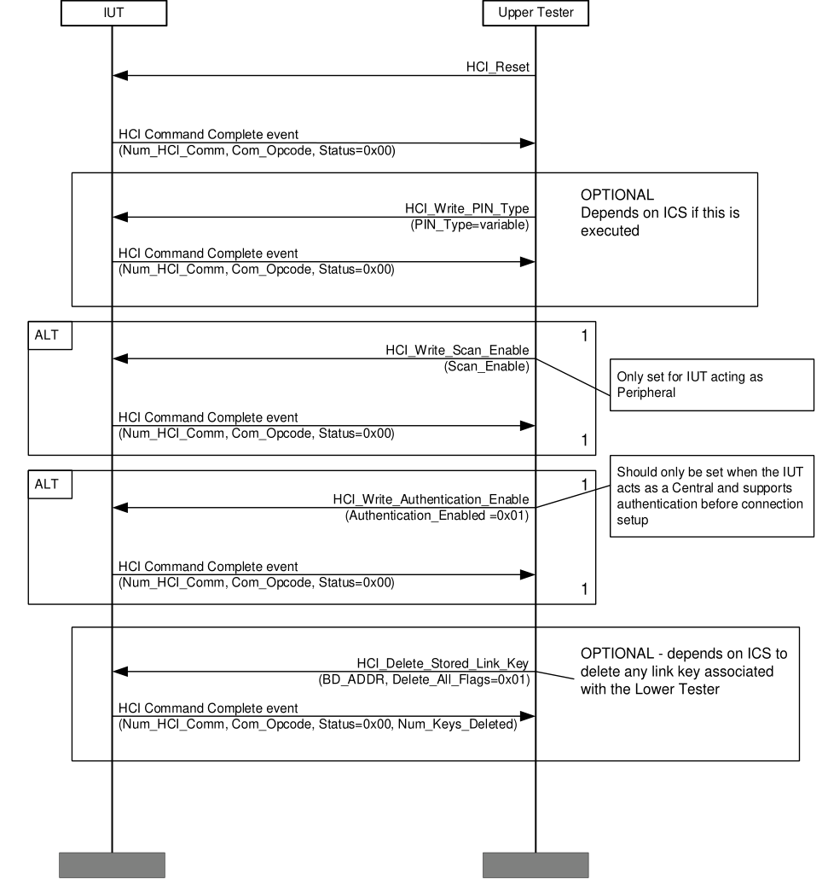

**Figure 6.1: Authentication and encryption, default settings MSC**

#### 6.1.2 Device setup, Controller Flow Control, Controller Information, Device

Discovery, and Host Flow Control
This default setting will be used for the Device setup, Controller Flow Control, Controller Information, Device Discovery, and Host Flow Control test cases.

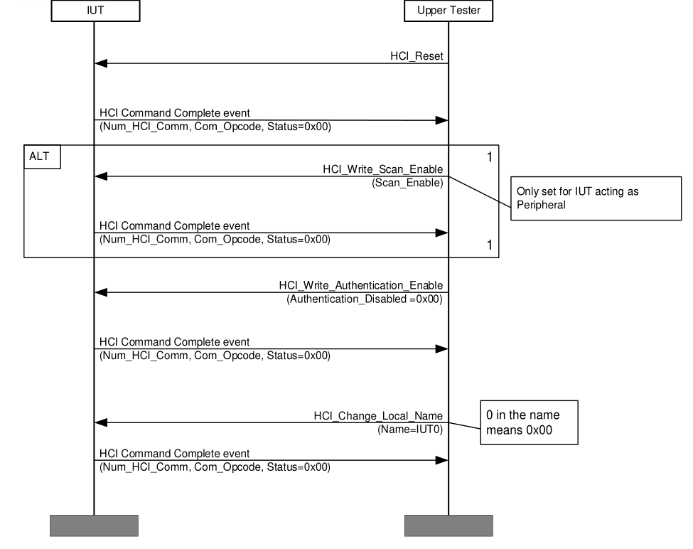

**Figure 6.2: Device setup, Controller Flow Control, Controller Information, Device Discovery, and Host Flow Control, default settings MSC**

### 6.2 Preambles

#### 6.2.1 Connection Establishment IUT Central

This Preamble will be used when the IUT will act as Central.

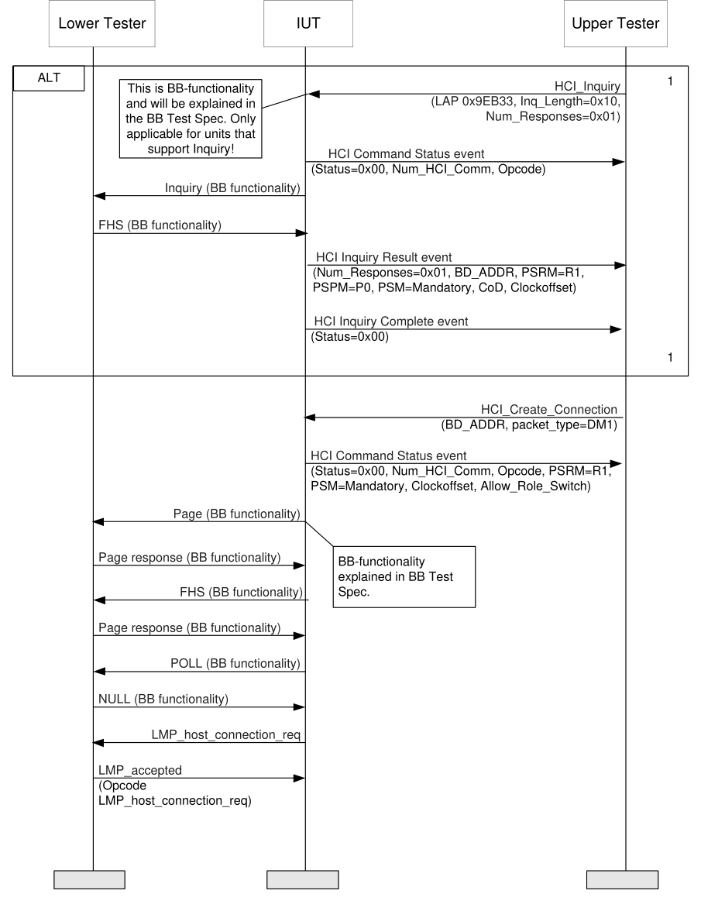

**Figure 6.3: Connection Establishment IUT Central preamble MSC**

#### 6.2.2 Connection Establishment Lower Tester

This Preamble will be used in all cases when the IUT will act as a Peripheral.

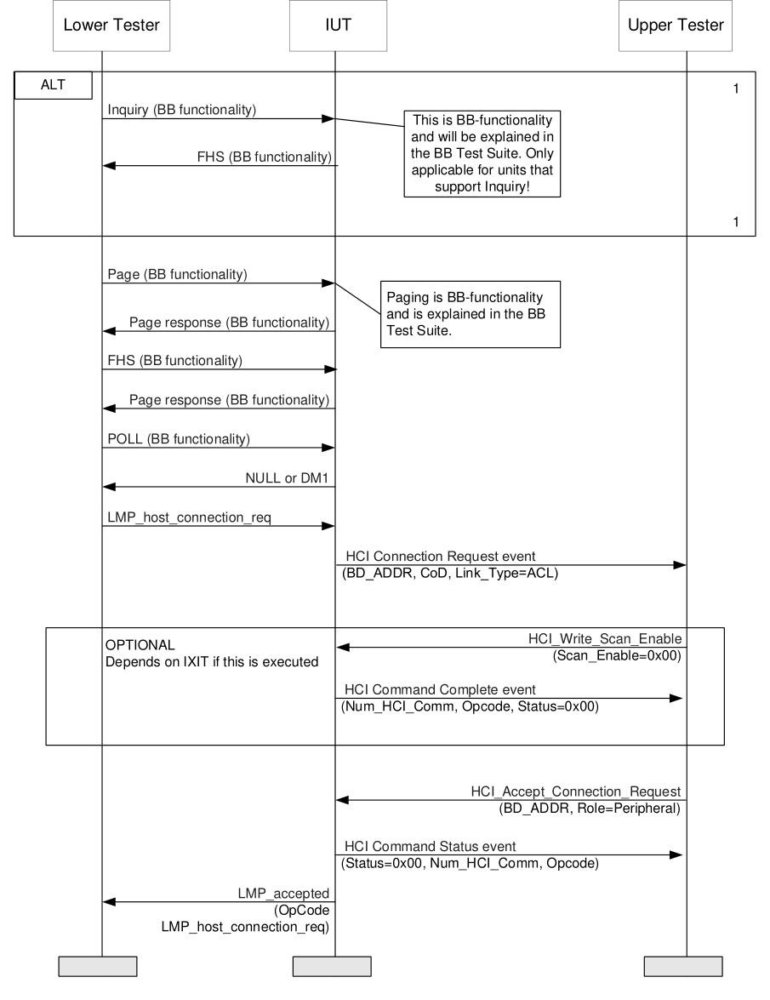

**Figure 6.4: Connection Establishment Lower Tester preamble MSC**

## 7 Revision history and acknowledgments

Revision History

|  | Publication |  |  | Revision |  | Date | Comments |
| --- | --- | --- | --- | --- | --- | --- | --- |
|  | Number |  |  | Number |  |  |  |
|  |  |  | 2.0.E.1r2 |  |  | 2005-11-21 | TSE 857 for TP/GEV/BV-01-C TSE 858: change to 5.7.1 and initial conditions in TP/CFC/BV-01-C,TP/DDI/BV-01-C, TP/DDI/BV-02- C,TP/HFC/BV-01-C,TP/HFC/BV-02-C TSE 860 for MSC 6.1.2 and 6.1.4: TSE 861 for TP/DSU/BV-01-C and TP/DDI/BV-01-C TSE 862 for Appendix MCS TSE 863 for TCMT row 1. TSE 866 for 4.1, 4.3.2.1, 4.3.2.2 TSE 867 for TCMT a) fonts, b) TP/CIN/BV-03-C ,c) LMP:TP/AUT/BV-04-C TSE 868 for TP/GEV/BV-01-C TSE 871: Add HCI 10/10 and HCI 10/11 to TCMT TSE 872: TCMT selection expressions for TP/DDI/BV- 01-C, TP/DDI/BV-02-C, TP/AEN/BV-01-C |
| 0 |  |  | 2.0.E.1 |  |  | 2005-12-07 | Prepare for Publication. |
|  |  |  | 2.0.E.2r0 |  |  | 2006-04-04 | TSE 881: TP/HFC/BV-01-C, TP/HFC/BV-02-C: update MFCs TSE 882: TP/AEN/BV-01-C; fix MSC, change pass/Fail Verdicts TSE 883: 6.1.1: change PIXIT to PICS TSE 884: Editorial updates except for searchable figure text |
| 1 |  |  | 2.0.E.2 |  |  | 2006-06-19 | Prepare for Publication. |
|  |  |  | 2.0.E.3r0 |  |  | 2006-10 | TSE 1863: update MSC for TP/AEN/BV-01-C TSE 1905: TP/CFC/BV-01-C: Update Notes section Add TP/QOS/BV-01 –TP/QOS/BV-05 and TP/QOS/BI-01-Cand updates to TCMT for Persistent Sniff Add TP/AEN/BV-02-C and TP/AEN/BV-03-C and updates to TCMT for EPR Add TCMT row for TP/PROT/ARQ/BV-37-C for Packet Boundary Flag |
|  |  |  | 2.1.E.0r0 through 2.1.E.0r2 |  |  | 2006-12-05 through 2006-12-28 | Input reviewers’ comments Renamed document from 2.0.E.3 to 2.1.E.1 Removed Sections 5.2.2, 5.3.1.1, 5.4.1.1, 5.5.1.1, 5.6.1.1, 5.7.1.1, 5.8.1.1, 5.9.1.1 Updated Note 1 with new selection expressions Add TCMT rows in Device Discovery and Authentication and Encryption sections for Simple Pairing Adjustments to TCMT due to ICS corrections Correction to document number from 2.1.E.1 to 2.1.E.0 Input reviewer’s comments |

|  | Publication |  |  | Revision |  | Date | Comments |
| --- | --- | --- | --- | --- | --- | --- | --- |
|  | Number |  |  | Number |  |  |  |
|  |  |  |  |  |  |  | TP/AEN/BV-02-C: remove “Applicable for all HCI devices;” assign unique name TP/AEN/BV-03-C: assign unique name Remove TP/QOS/BV-01 –TP/QOS/BV-05 and TP/QOS/BI-01-C and updates to TCMT for Persistent Sniff |
| 2 |  |  | 2.1.E.0 |  |  | 2006-12-28 | Prepare for Publication. |
| 3 |  |  | 2.1.E.1 |  |  | 2007-09-06 | TSE 2108: Update TCMT for TP/GEV/BV-01-C TSE 2218: Change TCMT for TP/AEN/BV-02-C, TP/AEN/BV-03-C; add new test TP/AEN/BV-04-C TSE 2124: Remove opcode values from opcode parameter in all MSCs |
| 4 |  |  | 2.1.E.2 |  |  | 2008-04-29 | TSE 2302: TP/GEV/BV-01-C: Change Pass verdict TSE 2404: TP/HFC/BV-02-C: update text TSE 2405: TP/AEN/BV-01-C : update MSC TSE 2450: TP/GEV/BV-01-C: TCMT change TSE 2451: TP/AUT/BV-03-C, TP/ENC/BV-05-C, TP/ENC/BV-07-C,TP/ENC/BV-10-C,TP/INF/BV-16-C, TP/LIH/BV-01-C,TP/LIH/BV-09-C,TP/LIH/BV-10-C, TP/LIH/BV-11-C,TP/LIH/BV-15-C,TP/LIH/BV-17-C, TP/LIH/BV-19-C,TP/LIH/BV-23-C,TP/LIH/BV-27-C, TP/LIH/BV-32-C,TP/LIH/BV-43-C,TP/LIH/BV-46-C, TP/LIH/BV-53-C,TP/LIH/BV-54-C,TP/LIH/BV-61-C, TP/LIH/BV-64-C,TP/LIH/BV-74-C,TP/AFH/BV-04-C, TP/PHYS/FRE/BV-03-C,TP/SP/BV-06-C,TP/SP/BV- 08-C, TP/SP/BV-12-C,TP/SP/BV-14-C,TP/SP/BV-18-C, TP/SP/BV-20-C,TP/SP/BV-22-C,TP/SP/BV-24-C, TP/SP/BV-28-C,TP/PROT/ED/BV-01-C, TP/PROT/ED/BV-02-C,TP/PROT/ED/BV-03- C,TP/PROT/ED/BV-04-C |
|  |  |  | 2.1.E.3r0 |  |  | 2008-10-09 – 2008-11-11 | TSE 2461: new test case. TCMT for LMP:TP/LIH/BV- 04-C |
| 5 |  |  | 2.1.E.3 |  |  | 2008-12-03 | Prepare for Publication. |
|  |  |  | 2.1.E.4r0 |  |  | 2009-02-17 | Add AMP HCI test cases |
| 6 |  |  | 3.0.H.0 |  |  | 2009-04-07 | Prepare for Publication. |
| 7 |  |  | 3.0.H.1 |  |  | 2009-08-11 | TSE 2680: update mappings to match updates to PICS TSE 2953: Add section headings for new test cases TSE 2954: TP/CSE/BV-02-C: edit Initial Condition TSE 2955: TP/CSE/BI-04-C: edit test purpose TSE 2992: TP/DDI/BV-01-C edit MSC; prepare for publications |

|  | Publication |  |  | Revision |  | Date | Comments |
| --- | --- | --- | --- | --- | --- | --- | --- |
|  | Number |  |  | Number |  |  |  |
| 8 |  |  | 3.0.H2 through 4.0.0 |  |  | 2009-11-15 | Transfer of material in LE HCI TS 0 9d7 to create a _ _ _ _ common HCI test spec with LE included Previous test cases reset test cases TP/CSC/BV-01-C …/BV-05-C renamed to TP/DSU/BV-02-C …/BV-06-C TP/CSC/BV-06-C renamed to TP/CFC/BV-03-C TP/CSC/BV-12-C renamed to TP/CIN/BV-05-C TP/CSC/BV-07-C renamed to TP/CIN/BV-06-C TP/CSC/BV-08-C & BV-09-C renamed to TP/CCO/BV-02-C & /BV-03-C TP/CSC/BV-11-C renamed to TP/HFC/BV-04-C TP/CSC/BV-13-C renamed to TP/CIN/BV-07-C TP/DDI/BV-01-C & BV-02 renamed to TP/DDI/BV-03 & /BV-04 TP/CCO/BV-02-C & TP/CCO/BV-03-C removed due to errata 3316 Correction: Additional TCs from the 6/10 3.0.H2r0 (TP/CCF/BV-01-C to BV-06-C added (TCs due to LMP enhancements) now as TP/CCO/BV-02-C to BV- 07-C Remove TP/CFC/BV-02-C from TCMT. This test case does not show up in the TP&TSS section TMCT to TP/CFC/BV-03-C corrected Rename renamed TP/CFC/BV-03-C to TP/CFC/BV- 02-C |
|  |  |  | 4.0.1r0 |  |  | 2010-06-11 | Revised Revision History table TSE 3469: TP/DSU/BV-05-C: Update Initial Condition, MSC, test proc, verdict. |
| 9 |  |  | 4.0.1 |  |  | 2010-06-24 | Corrected MSC for DSU/BV-05 |

|  | Publication |  |  | Revision |  | Date | Comments |
| --- | --- | --- | --- | --- | --- | --- | --- |
|  | Number |  |  | Number |  |  |  |
|  |  |  | 4.0.2r0 through 4.0.2r6 |  |  | 2010-11-22 through 2011-03-22 | TSE 3526: TP/GEV/BV-01-C, TP/GEV/BV-02-C: TMCT TSE 3916: TP/HFC/BV-04-C: Add 2nd reference to core spec TSE 3919: TP/DSU/BV-03-C, TP/DSU/BV-06-C update Fail verdict Made corrections to TSE 3916, 3919 per AT4Wireless review. Made further corrections to TSE 3916, 3919 per AT4Wireless review. TSE 4288: TP/CCO/BV-03-C, TP/CCO/BV-04-C: Update to TCMT TSE 3515: TCMT: Remove ref to LMP:TP/AUT/BV- 04-C TSE 4084: TCMT update: TP/CSE/BV-01-C, TP/CSE/BV-02-C TSE 4301: TP/DSU/BV-01-C: update MSC, pass/Fail Verdicts. TSE 4303: TP/CCO/BV-02-C, TP/CCO/BV-03-C, TP/CCO/BV-05-C, TP/CCO/BV-06-C, TP/CCO/BV- 07-C: update initial conditions Per reviewer: TP/DSU/BV-01-C. Redrew MSC, adjusted revised text to be under correct Verdict headings. Per reviewer: TP/DSU/BV-01-C. MSC: changed 3 to 30, Fixed Pass/Fail verdict wording such that new text is IN ADDITION to original text, not instead of it. |
| 10 |  |  | 4.0.2 |  |  | 2011-07-15 | Prepare for Publication. |
|  |  |  | 4.0.3r0 |  |  | 2011-10-28 | TSE 3368: TP/DSU/BV-01-C: Rename test case, remapping in TCMT TSE 4342: TP/CCO/BV-05-C: TCMT update TSE 4394: TP/CCO/BV-07-C, TP/CCO/BV-06-C: update TCMT TSE 4410: Update TCMT for test cases with master functionality TSE 4501: TP/DSU/BV-01-C: update MSC |
|  |  |  | 4.0.3r1 |  |  | 2012-02-15 | TSE 3369 New test case TP/DSU/BV-07-C requires an update to the TCMT |
| 11 |  |  | 4.0.3 |  |  | 2012-03-30 | Prepare for Publication. |
|  |  |  | 4.0.4r0 |  |  | 2012-05-17 | TSE 4583: TP/HFC/BV-03-C: Change mask in MSC TSE 4729: TP/PROT/ED/BV-04-C: removed duplicate entry in TCMT Editorial: removed TC descriptions in TCMT |
| 12 |  |  | 4.0.4 |  |  | 2012-07-24 | Prepare for Publication. |

|  | Publication |  |  | Revision |  | Date | Comments |
| --- | --- | --- | --- | --- | --- | --- | --- |
|  | Number |  |  | Number |  |  |  |
|  |  |  | 4.0.5r1 |  |  | 2012-10-02 | TSE 4881: Mapping revised for LMP test case TP/SP/BV-12-C based on released LMP TSE 4228. TSE 4956: Removed test cases in the TCMT that require the support optional 802.11PAL features that are not defined in the HCI core specification and therefore should not be included in the HCI testing scope. |
| 13 |  |  | 4.0.5 |  |  | 2012-11-15 | Prepare for Publication. |
|  |  |  | 4.0.6r1 |  |  | 2012-11-19 | Connectionless Broadcast Change Request |
|  |  |  | 4.0.6r2 |  |  | 2013-01-02 | Connectionless Broadcast Review: Deleted “Truncated Paging” from Figure 4.1. Edited 4.3.1.17 Moved Verify Truncated Paging to section 5.10 and it is TP/CSE/BV-06-C, made Response Timeout Detection TP/CSB/BV-06-C. Changed title of 5.10 from “Controller Setup” to “Connection Setup” |
|  |  |  | 4.0.6r3 |  |  | 2013-01-03 | Connectionless Broadcast Review (Mayank) Editorial changes Moved “Page Response Timeout” test case to section 5.10, it is now TP/CSE/BV-07-C. |
|  |  |  | 4.0.6r4 |  |  | 2013-01-07 | Connectionless Broadcast Review (Alicia) Editorial changes to TCMT to reflect test case name changes. |
|  |  |  | 4.0.6r5 |  |  | 2013-01-24 | Connectionless Broadcast Review (Jason, Alicia, and Meagan) Updated Conformance section Revised feature descriptions in the TCMT for TP/CSB/BV-01-C and TP/CSB/BV-04-C. |
|  |  |  | 4.0.6r6 |  |  | 2013-01-28 | Approved by BTI |
| 14 |  |  | 4.0.6 |  |  | 2013-02-19 | Prepare for Publication |
|  |  |  | 4.0.7r1 |  |  | 2013-05-13 | TSE 5084: TCMT Clean Up and Updates. |
|  |  |  | 4.0.7r2 |  |  | 2013-06-11 | BTI Review, Magnus, TP/SEC/SCN/BV-01-C TCMT mapping updated incorrectly, Fixed. |
|  |  |  | 4.0.7r3 |  |  | 2013-06-13 | BTI review, Alicia’s comments |
|  |  |  | 4.0.7r4 |  |  | 2013-06-16 | BTI review, Saravanun’s comments |
|  |  |  | 4.0.7r5 |  |  | 2013-06-17 | BTI review, fixes |
| 15 |  |  | 4.0.7 |  |  | 2013-07-02 | Prepare for Publication |
|  |  |  | 4.0.8rT |  |  | 2012-07-02 | Template Conversion: - Update of language to match BTI approved wording (example, Fail Verdicts) - Removal of Test Subgroup Objectives - Removal of sections marked “N/A” |
|  |  |  | 4.0.8rTr3 |  |  | 2013-09-23 | Template Review Comment Resolution |
|  |  |  | 4.1.0r01 |  |  | 2013-09-23 | BR/EDR Secure Connections CR |
|  |  |  | 4.1.0r02 |  |  | 2013-09-25 | Train Nudging and Generalized Interlaced Scan CR |

|  | Publication |  |  | Revision |  | Date | Comments |
| --- | --- | --- | --- | --- | --- | --- | --- |
|  | Number |  |  | Number |  |  |  |
|  |  |  | 4.1.0r03 |  |  | 2013-09-27 | TSE 5268: Clarification of TP/AEN/BV-01-C by adding a note. Updated name of TP/AEN/BV-04-C and preamble and MSC. Updates description in TCMT for TP/AEN/BV-01-C and TP/AEN/BV-04-C rows. |
|  |  |  | 4.1.0r04 |  |  | 2013-10-09 | Piconet Clock Adjust CR |
|  |  |  | 4.1.0r05 |  |  | 2013-10-10 | LE Ping CR |
|  |  |  | 4.1.0r06 |  |  | 2013-10-17 | LE Link Layer Topology CR |
|  |  |  | 4.1.0r08 |  |  | 2013-10-26 | Correction to TCMT based on review of HCI ICS |
| 16 |  |  | 4.1.0 |  |  | 2013-12-03 | Prepare for Publication |
|  |  |  | 4.1.1r00 |  |  | 2013-04-07 | TSE 5491: Updated Test Procedure, MSC and Pass verdict for TP/CFC/BV-02-C. TSE 5574: Updated TCMT entry for TP/HFC/BV-04- C. |
|  |  |  | 4.1.1r01 |  |  | 2014-06-16 | BTI Review by Xuguang: Updated Figure 4.11 in TP/CFC/BV-03-C to read “HCI LE Data Packet instead of “HCI Data Packet. _ _ _ _ _ |
| 17 |  |  | 4.1.1 |  |  | 2014-07-07 | TCRL 2014-1 Publication |
|  |  |  | 4.1.2r00 |  |  | 2014-10-20 | TSE 5918: Correction in Test Description and MSCs for TP/CCO/BV-03-C, TP/CCO/BV-04-C |
|  |  |  | 4.1.2r01 |  |  | 2014-11-05 | BTI Review, Dave, revised the test descriptions of TP/CCO/BV-03-C and TP/CCO/BV-04-C to align with the language update in TSE 5918. |
|  |  |  | 4.2.0r00 |  |  | 2014-11-07 | Integrated changes from Section 4 of Core LE Data Length Extensions TEST.CRr01 _ _ _ _ _ _ clean |
|  |  |  | 4.2.0r01 |  |  | 2014-11-24 | Rasmus reviewed; added Privacy 1.2 commands & Minor editorial fixes |
|  |  |  | 4.2.0r02 |  |  | 2014-11-25 | Mayank reviewed. Updated naming from “Read/Write Default…” to “LE Read/Write Suggested Default…” Other editorial fixes |
| 18 |  |  | 4.2.0 |  |  | 2014-12-04 | Prepare for TCRL 2014-2 publication |
|  |  |  | 4.2.1r00 |  |  | 2015-05-05 | TSE 6367: Corrected TP numbering for TP/DSU/BV- 04-C TSE 6152: Corrected TCMT mapping for TP/AEN/BV- 06-C and TP/AEN/BV-07-C |
|  |  |  | 4.2.1r01 |  |  | 2015-05-16 | Review by Magnus; corrected TSE 6152 by adding HCI 16/53 |
| 19 |  |  | 4.2.1 |  |  | 2015-07-14 | Prepared for TCRL 2015-1 publication |
|  |  |  | 4.2.2r00 |  |  | 2015-10-07 | TSE 6564: Corrected TCMT mapping for TP/CSB/BV- 03-C. TSE 6703: Corrected mapping for TP/CM/BV-01-C and TP/CM/BV-02-C |
| 20 |  |  | 4.2.2 |  |  | 2015-12-22 | Prepared for TCRL 2015-2 publication |
|  |  |  | 4.2.3r00 |  |  | 2015-01-11 | TSE 6817: Corrected typo in first message of MSC for TP/HFC/BV-02-C. |

|  | Publication |  |  | Revision |  | Date | Comments |
| --- | --- | --- | --- | --- | --- | --- | --- |
|  | Number |  |  | Number |  |  |  |
|  |  |  | 4.2.3r01 |  |  | 2015-01-18 | TSE 6850: Corrected first message of MSCs for TP/CCO/BV-10-C and TP/CCO/BV-11-C. |
|  |  |  | 4.2.3r02 |  |  | 2016-02-04 | TSE 6791: Last event from IUT: Channel Map changed from "0x00000000FFFFFFFFFFFF" to "0x00000000FFFFFEFFFFFE" in MSC of test case TP/CSB/BV-03-C |
|  |  |  | 4.2.3r03 |  |  | 2016-02-15 | TSE 6718: Initial condition changed to “IUT is in standby” for test cases TP/CCO/BV-12-C – ...14-C. TSE 6909: Editorial edit. TCMT Updates: Deleted “AND HCI 2/1” from Item column for test cases TP/DSU/BV-01-C – …07-C. Moved test case TP/DSU/BV-07-C to end of Device Setup section. |
|  |  |  | 4.2.3r04 |  |  | 2016-03-03 | TSE 6756: Changed Initial Condition to "No LL connection exists" for test cases TP/CIN/BV-01-C – 04-C, TP/AEN/BV-01-C, and TP/AEN/BV-04-C. Deleted test cases TP/CIN/BV-05-C and TP/CIN/BV- 07-C. TCMT Updates: Deleted mapping for TP/CIN/BV-05-C and TP/CIN/BV-07-C, as they are duplicates of 03-C and 04-C (visible with all markup showing). Consolidated mapping to HCI 4/1 and HCI 4/2. TSE 6783: Updated Test Procedure, MSC, and Pass Verdict for TP CCO/BV-05-C and CCO/BV-07-C and accept HCI Command Complete Event or HCI Command Status Event with Status = Unknown HCI Command. _ _ TSE 6808: Added four new Sections 4.7.5–8, test cases TP/HFC/BV-05-C – 08-C. All four new MSCs redrawn and captioned. In TCMT, added four new test cases to Host Flow Control, second item. TSE 6908: Updated test case TP/GEV/BV-01-C (entire section). Deleted test case TP/GEV/BV-02-C. TCMT: Updated Item and Feature for test case TP/GEV/BV-01-C and deleted mapping for test case TP/GEV/BV-02-C. TSE 6949: In TCMT, updated second Item under Host Flow Control for test case TP/HFC/BV-02-C. |
|  |  |  | 4.2.3r05 |  |  | 2016-04-06 | TSE 6763: Test case TP/AEN/BV-05-C updated (multiple reads are not identical). Expanded title of test case TP/AEN/BV-05-C. MSC updated and figure caption added. Pass verdict updated. TSE 6940: Deleted test case and TCMT mapping for TP/CCO/BV-06-C. |
| 21 |  |  | 4.2.3 |  |  | 2016-07-13 | Prepared for TCRL 2016-1 publication |
|  |  |  | 5.0.0r00 |  |  | 2016-07-07 | Integrated changes for Core Specification 5.0 release |
|  |  |  | 5.0.0r01 |  |  | 2016-09-12 | Issue 7626: Added new reference to the Core Specification Version 5.0 or later. Updated cross- references for test cases TP/DDI/BI-01-C & 02-C, TP/CCO/BV-15-C – 20-C, and TP/CM/BV-03-C. |
|  |  |  | 5.0.0r02 |  |  | 2016-09-30 | Issue 7728: Deleted reference to test case TP/FRH/SLA/BV-03-C in TCMT. |

|  | Publication |  |  | Revision |  | Date | Comments |
| --- | --- | --- | --- | --- | --- | --- | --- |
|  | Number |  |  | Number |  |  |  |
|  |  |  | 5.0.0r03 |  |  | 2016-10-07 | TSE 7581 (erratum 7021): Change LE Set Advertise Enable to LE Set Advertising Enable. TSE 7665: Clarify mapping of feature bits and ICS entries in TP/CIN/BV-01-C and 02-C. TSE 7574 (erratum 7017): Added optional LE Data Length Change event to test TP/CCO/BV- _ _ _ 09-C [LE Set Data Length] and replaced MSC accordingly. TSE 7252: Added new reference for SUM ICS. Updated Initial Condition for test cases TP/CCO/BV- 03-C and TP/CCO/BV-04-C. |
|  |  |  | 5.0.0r04 |  |  | 2016-11-10 | Issue 8046: Updated initial condition for TP/CCO/BV- 16-C through TP/CCO/BV-20-C ("LE Read Periodic Advertiser List Size Command, LE Add/Remove/Clear Periodic Advertiser List Commands, LE Read Transmit Power Command, LE Write RF Path Compensation Command, and LE Read RF Path Compensation Command): IUT initially is in standby. Issue 8049: Replaced figures for TP/CCO/BV-16-C [LE Read Periodic Advertiser List Size Command] (Figure 4.49) and TP/CCO/BV-17-C [LE Add/Remove/Clear Periodic Advertiser List Commands] (Figure 4.50) to fix typo in command name ("HCI LE Add Device To Period Advertiser List" _ _ _ _ _ _ _ becomes "HCI LE Add Device To Periodic Advertiser List”). _ _ _ _ _ _ _ Issue 8038: Updated Generic Events description to cover mixed legacy and extended advertising commands; added new Generic Events test case, TP/GEV/BV-02-C; added the new test case to Test Case Mapping Table. |
| 22 |  |  | 5.0.0 |  |  | 2016-12-13 | Approved by BTI. Prepared for TCRL 2016-2 publication. |
|  |  |  | 5.0.1r00 |  |  | 2017-03-06 | TSE 7685: In test case HCI/CSB/BV-04-C, changed figure caption from "TP/CSB/BV-01-C" to "HCI/CSB/BV-04-C". TSE 7800: Updated test case HCI/HFC/BV-07-C: Changed “disable” to “disabled” in introduction. Updated Pass Verdict. Updated MSC: Deleted ALT1 procedure. Removed “ALT2” label. TSE 8301: Updated TCMT and mapping for LL: LL/CON/ADV/BV-05-C and LL: LL/CON/INI/BV-13-C. |
|  |  |  | 5.0.1r01 |  |  | 2017-04-10 | TSE 8667: Updated test case HCI/DDI/BI-01-C: Corrected spelling error “AFdvertising” to “Advertising”. Updated pass verdict. Updated MSC (Figure 4.21: HCI/DDI/BI-01-C) to include changes that were made to the pass verdict. |

|  | Publication |  |  | Revision |  | Date | Comments |
| --- | --- | --- | --- | --- | --- | --- | --- |
|  | Number |  |  | Number |  |  |  |
|  |  |  | 5.0.1r02 |  |  | 2017-04-27 | TSE 8915: Clarifications made to HCI/DDI/BI-01-C from TSE 8667 by correcting typos ("internal" to "interval" in initial condition, test procedure, and MSC), changed "Adv" to "Advertising in pass verdict and updated value in MSC ("0x03" to "0x30"). Updated pass verdict and corrected typos ("internal" to "interval") in test procedure for HCI/DDI/BI-02-C. TSE 8821: Updated mapping in TCMT for LL: LL/DDI/SCN/BV-13-C. |
|  |  |  | 5.0.1r03 |  |  | 2017-05-16 | TSE 7858: Updated MSC in HCI/CM/BV-02-C: Changed last message parameter from “Peer Resolvable Address” to _ _ Local Resolvable Address”. _ _ |
|  |  |  | 5.0.1r04 |  |  | 2017-05-10 | Converted to new Test Case ID conventions as defined in TSTO v4.1. |
| 23 |  |  | 5.0.1 |  |  | 2017-07-05 | Approved by BTI. Prepared for TCRL 2017-1 publication. |
|  |  |  | 5.0.2r00 |  |  | 2017-08-17 | TSE 9164: For HCI/HFC/BV-04-C in Figure 4.25, changed “Even Mask-=0x20008000000018890” to _ “Event Mask={bits 4, 7, 11, 15, 16, 43, 61}” and _ changed “Event Mask=0x000000000000001D” to _ “Event Mask={bits 0, 2, 3, 4}.” _ TSE 9380: For HCI/AEN/BV-01-C Link Key Commands figure, removed Com Opcode values. For _ HCI/AEN/BV-06-C Public Keys figure, removed Comm and Opcode values and TBD; changed “P256” to “P-256”. For HCI/AEN/BV-07-C Generate D H Keys figure, removed Comm values and “Opcode=TBD”; changed “P256” to “P-256”. For HCI/CSE/BV-01-C Logical Link Cancel Command and HCI/CSE/BV-02-C Logical Link Cancel Command figures, removed Comm and Opcode values. |
|  |  |  | 5.0.2r01 |  |  | 2017-08-23 | TSE 9681: For HCI/AEN/BV-05-C, revised Initial Condition text and Figure 4.34. |
|  |  |  | 5.0.2r02 |  |  | 2017-09-14 | TSE 9775: Revised text and replaced figure in test case HCI/GEV/BV-02-C and revise TCMT. Added new test case HCI/GEV/BV-03-C and added it to the TCMT. |
|  |  |  | 5.0.2r03 |  |  | 2017-09-19 | AoA/AoD: Integrated new test cases from the AoA/AoD CR into the TCMT. |
|  |  |  | 5.0.2r04 |  |  | 2017-09-29 | TSE 9830: Changed the feature name from “LE Read Remote Used Features” to “LE Read Remote Features” for LL/CON/SLA/BV-11-C, LL/CON/SLA/BI- 06-C, and LL/CON/SLA/BV-23-C in the TCMT. |
|  |  |  | 5.0.2r05 |  |  | 2017-10-12 | TSE 9747: Remapped the TCMT for LL test cases for LE Data Length Change Event features according to LL TSE 9729. |
|  |  |  | 5.0.2r06 |  |  | 2017-10-13 | TSE 9931: Added new test case HCI/GEV/BV-04-C to the “Generic Events” section and TCMT. |

|  | Publication |  |  | Revision |  | Date | Comments |
| --- | --- | --- | --- | --- | --- | --- | --- |
|  | Number |  |  | Number |  |  |  |
|  |  |  | 5.0.2r07 |  |  | 2017-10-16 | TSE 9900: Updated the Event Mask values in MSCs _ HCI/HFC/BV-01-C, HCI/HFC/BV-03-C, and HCI/HFC/BV-04-C. Added a second pass verdict to Expected Outcome for HCI/HFC/BV-03-C. |
| 24 |  |  | 5.0.2 |  |  | 2017-12-07 | Approved by BTI. Prepared for TCRL 2017-2 publication. |
|  |  |  | 5.0.3r00-05 |  |  | 2018-02-21 – 2018-06-15 | TSE 10227 (rating 1): Editorial fix to MSC for HCI/CM/BV-01-C & 02-C: Replaced "Own Address Type=0x00" in the 'IUT is Slave' _ _ alternative with "Own Address Type=0x02" _ _ TSE 10282 (rating 3): Added note to HCI/CCO/BV-04- C MSC about LMP features ext req being “optional if…” in the event that local features have not changed. TSE 10467 (rating 2): Revised Section 5.1 (Test Case Mapping). Revised TCMT: deleted “Test Case Applicable” column; changed LMP/ENC/BV-45-C to 48-C; revised items for LMP/ENC/BV-27-C, 31-C, 25- C, 48-C, LMP/AUT/BV-03-C, 04-C, 06-C, LMP/SP/BV-64-C, 65-C. TSE 10494 (rating 3): Added "Command Status" to the Test Purpose, Test Procedure steps 3 and 6, MSC, and Pass Verdict for test case HCI/GEV/BV-03- C. Added new column "Associated Event" to Test Procedure tables in steps 3 and 6. TSE 10494 (rating 3): Revised LE Periodic Advertising Create Sync Cancel command's associated event from HCI Command Status Event _ _ _ to HCI Command Complete Event in Table 4.4 of _ _ _ the test procedure for test case HCI/GEV/BV-03-C. Incorporated Core E10734 Pairing Updates TS CR: Added new test cases HCI/CIN/BV-08, 09-C, and HCI/AEN/BI-01-C and added them to the TCMT. |
| 25 |  |  | 5.0.3 |  |  | 2018-07-02 | Approved by BTI. Prepared for TCRL 2018-1 publication. |
|  |  |  | 5.0.4r00-r10 |  |  | 2018-07-19 – 2018-11-13 | Incorporated Core PAST CLE TEST CR r05: _ _ _ _ _ Added 2 rows to Table 4.2. Added new test case HCI/DDI/BI-03-C. Added to TCMT: HCI/DDI/BI-03-C, LL/CON/SLA/BV-103-C, and LL/CON/MAS/BV-99-C. Incorporated Core Minor Enhancements Batch 1 Test CRr10-clean: Added 1 new test case to spec text and TCMT: HCI/AEN/BV-08-C. Added 5 new test cases to TCMT: LL/DDI/ADV/BI-03-C – 04-C; LL/DDI/ADV/BV- 40-C – 42-C. Issue 10716: Added 6 new test cases to spec text and TCMT: HCI/CCO/BV-21-C – 26-C. Issue 10826: Added 2 new test cases to TCMT: LL/DDI/ADV/BI-05-C – 06-C. Issue 11122: Deleted LE Random Address test cases from MEP 17: HCI/CCO/BV-21-C – 26C and removed mapping. Removed mapping for deleted LL test cases DDI/ADV/BI-03-C, BI-04-C, BV-40-C through 42-C. |

|  | Publication |  |  | Revision |  | Date | Comments |
| --- | --- | --- | --- | --- | --- | --- | --- |
|  | Number |  |  | Number |  |  |  |
|  |  |  |  |  |  |  | TSE 10621 (rating 3): Updated test purpose, test procedure, and pass verdict for test case HCI/GEV/BV-04-C. TSE 10717 (rating 2): Updated MSC for test case HCI/CCO/BV-05-C. In TCMT, updated mapping for test cases HCI/CCO/BV-05-C and 07-C. TSE 10718 (rating 3): Updated MSC for test case HCI/DSU/BV-01-C. TSE 10723 (rating 2): In TCMT, deleted duplicate test case LL/DDI/SCN/BV-15-C, and updated mapping for test cases LL/DDI/SCN/BV-13-C to 17-C. TSE 10724 (rating 1): In TCMT, deleted duplicate test case LL/SEC/ADV/BV-02-C, and updated mapping for test cases LL/SEC/ADV/BV-02-C and 03-C. TSE 10840 (rating 4): Updated test purpose, initial condition, test procedure, MSCs, and pass verdict for test case HCI/HFC/BV-08-C. TSE 11002 (rating 1): Updated MSC caption for test case HCI/CIN/BV-08-C. TSE 11003 (rating 1): Updated MSC caption for test case HCI/CIN/BV-09-C. TSE 10838 (rating 4): Updated initial condition, MSC, and pass verdict for test case HCI/CCO/BV-10-C. Updated test procedure, MSC, and pass verdict for test case HCI/CCO/BV-11-C. TSE 10576 (rating 3): Deleted top MSC for test case HCI/HFC/BV-04-C. TSE 10722 (rating 1): In TCMT, deleted test case LL: LL/CON/SLA/BI-06-C and changed LL: LL/CON/SLA/BV-11-C to LL: LL/CON/SLA/BV-22-C. TSE 11157 (rating 4): Added new reference to Erratum 10831. Added new test case HCI/CM/BV-04- C and added it to the TCMT. TSE 10842 rejected by BTI. Removed changes made by TSE 10842. TSE 11002 (rating 1): Minor Modification: changed Figure 4.18 title from “HCI/CIN/BV-07-C” to “HCI/CIN/BV-08-C”. Replaced [X] values with actual values. Changed Madrid grey text to black text. |
|  |  |  | 5.1.0r00-r01 |  |  | 2018-11-13 – 2018-11-29 | Updated revision number from 5.0.4 to 5.1.0 to align with the adoption of Core Specification version 5.1 TSE 11269 LMP/ENC/BV-27-C, ../BV-31-C and ../BV- 25-C removed from TCMT |
| 26 |  |  | 5.1.0 |  |  | 2018-12-07 | Approved by BTI. Prepared for TCRL 2018-2 publication. |

|  | Publication |  |  | Revision |  | Date | Comments |
| --- | --- | --- | --- | --- | --- | --- | --- |
|  | Number |  |  | Number |  |  |  |
|  |  |  | 5.1.1r00–r13 |  |  | 2019-03-29– 2019-06-21 | TSE 11646 (rating 1): Updated TCMT Item to HCI 7/38 and HCI 7/41 for test case HCI/CM/BV-04-C. TSE 11489 (rating 3): Updated Pass Verdict for test cases HCI/CCO/BV-02-C and -03-C. TSE 11436 (rating 3): Replaced MSC for test case HCI/DSU/BV-01-C with new one. TSE 11488 (rating 4): Deleted test case HCI/CCO/BV- 04-C and updated TCMT accordingly. TSE 11475 (rating 3): Updated pass verdict for test case HCI/DDI/BV-04-C. TSE 11200 (rating 1): Added a Notation Conventions section to describe editorial conventions. TSE 11197 (rating 4): Updated text and MSCs in test cases HCI/CM/BV-01-C and -02-C. Added test cases HCI/CM/BV-05-C and -06-C and updated TCMT accordingly. TSE 10726 (rating 2): Updated TCMT to address mapping issues. TSE 11171 (rating 4): Added new section for “Resolving List Commands fail when list in use” and related test cases HCI/CCO/BI-01-C – -05-C. TSE 11168 (rating 4): Added new test case HCI/DDI/BI-04-C (and updated TCMT accordingly). Updated MSC, Pass Verdict, and Test Procedure steps 2 and 5 and added steps 7-10 for test case HCI/CCO/BV-17-C. TSE 11163 (rating 4): Added test cases HCI/DDI/BI- 05-C and HCI/CM/BI-01-C and updated TCMT accordingly. TSE 11209 (rating 4): Updated test case name for test case HCI/HFC/BV-05-C; added new test cases HCI/HFC/BV-09-C – -13-C. Updated TCMT accordingly. TSE 11869 (rating 1): Updated TCMT to address a mapping issue with test case HCI/AEN/BI-01-C. TSE 11194 (rating 4): Added new section “Reject Invalid Enable Command” with test cases HCI/DDI/BI- 06-C – -11-C and new test cases HCI/DDI/BI-12-C [Reject Invalid Extended Advertising Enable Command] and HCI/DDI/BI-13-C [Reject Invalid Periodic Advertising Enable Command] and updated TCMT accordingly. TSE 11952 (rating 1): Fixed a typo in step 5 of test case HCI/CM/BV-04-C. TSE 11900 (rating 2): Updated step 3 of test case HCI/GEV/BV-02-C and added a “Command Complete Event” column to the step 3 table. Updated to incorporate BTI review feedback, adding test cases HCI/CCO/BV-10-C and HCI/CCO/BV-11-C back into the TCMT and updating template. |
| 27 |  |  | 5.1.1 |  |  | 2019-08-01 | Approved by BTI. Prepared for TCRL 2019-1 publication. |

|  | Publication |  |  | Revision |  | Date | Comments |
| --- | --- | --- | --- | --- | --- | --- | --- |
|  | Number |  |  | Number |  |  |  |
|  |  |  | p28r00–r09 |  |  | 2019-08-06 – 2019-12-03 | Added test groups to accommodate adoption of Core Specification v5.2 with regard to Isochronous Channels CR r20 (includes Issues 11742, 11762, 11777, 11778, 11779, 11783,11786, 11804, 11817, 11819, 11820, 11852, 11917, 11919, 11928, 11929, 11930, 11983, 11740, 11801, 11941, 12029, 12030, 12043, 12052, 12053, 12054, 12055, 12059, 12061, 12071, 12072, 12073, 12077, 12084, 12031, 12078, 12094, 12095, 12106, 12107, 12130, 12132, 12133, 12251, 12280, and 12321). Added section for new test case HCI/CM/BV-07-C and updated TCMT accordingly; updated references section with new Core Specification. Added test groups to accommodate adoption of Core Specification v5.2 with regard to LE Power Control CR r07 (includes Issues 12116, 12112, 12115, 12117, 12118, 12255). Added “LE Power Control” items to Test Strategy and Test Groups sections. Updated Test Case Identification Conventions table with “LE Power Control” item. Added new LE Power Control section (4.13), including test case HCI/PCL/BV-01-C. Updated TCMT accordingly. Updated per Issue 12335 (CR file in comment 49736). Added “Invalid LE Power Control HCI Parameters” section, which includes new test cases HCI/CCO/BI- 06-C – -12-C. Updated TCMT accordingly. Updated per Issue 12343 (CR file in comment 49068). Added test case HCI/CCO/BI-13-C [Invalid Path Loss Monitoring Parameters] and updated TCMT accordingly. TSE 12257 (rating 3): Updated MSC and pass verdict for test case HCI/DDI/BI-03-C to fix an error code that was wrong. TSE 12110 (rating 1): Fixed references to align with changes made in erratum 11876. TSE 12703 (rating 4): Added new section “Validate Unsupported Packet Types are Not Accepted”, featuring test cases HCI/CCO/BI-14-C – -17-C and updated TCMT accordingly. TSE 12779 (rating 2): Updated test case mapping for HCI/AEN/BI-01-C to remove mapping to SUM ICS 21/17 (Erratum 10734). TSE 12518 (rating 2): Updated initial condition for test case HCI/DDI/BI-13-C to better reflect Core Spec requirements. Issue 12488 (CR from comment 52050): Added CIS and BIS to the HCI TC Feature Naming Conventions list; added Isochronous Streams test case section for CIS test cases, featuring test cases HCI/CIS/BV-01-C – -04-C. Updated TCMT accordingly. Issue 12489 (CR from comment 51975): In “Test Suite Structure” section, added Isochronous Streams item to command list and related items to the Test Suite Structure figure and fixed level of LE Power item |

|  | Publication |  |  | Revision |  | Date | Comments |
| --- | --- | --- | --- | --- | --- | --- | --- |
|  | Number |  |  | Number |  |  |  |
|  |  |  |  |  |  |  | in figure; added Isochronous Streams paragraph to Test Groups section. Added related Isochronous Streams test case section for BIS test cases, featuring test cases HCI/BIS/BV-01-C and -02-C. Updated TCMT accordingly. TSE 12925 (rating 1): Globally fixed “Lower/Upper Tester expects” types of wording to “Lower/Upper Tester receives” types of wording where appropriate. Integration review feedback from Cloud2GND: Resolved .X and Milan references with real numbers. Updated test purpose and initial condition for test case HCI/CCO/BI-13-C. Integration review feedback. Updated test cases HCI/CCO/BI-08-C and HCI/CCO/BI-09-C to fix copy/paste error with reason/status wording/numbers. Revised document numbering convention, setting last release publication of 5.1.1 as p27; added publication number column to Revision History. Updated Contributors list. |
| 28 |  |  | p28 |  |  | 2020-01-07 | Approved by BTI on 2019-12-22. Prepared for TCRL 2019-2 publication. |
|  |  |  | p29r00–r42 |  |  | 2020-01-24 – 2021-06-21 | TSE 10672 (rating 4): To address the need for SCO/eSCO tests, updated the Test Strategy and Test Groups sections, added an item to the TCID Conventions table, and added an entire new section (and relevant subsections), including new test cases HCI/SCO/BV-01-C – -08-C. Updated TCMT accordingly. TSE 11969 (rating 1): Fixed mislabeled references in sections containing test cases HCI/CFC/BV-02-C, HCI/CIN/BV-06-C, HCI/DDI/BV-03-C and -04-C, HCI/HFC/BV-04-C, HCI/CCO/BV-10-C – -15-C, and HCI/CM/BV-01-C and -02-C (current section numbering 4.4.2, 4.5.5, 4.6.3, 4.6.4, 4.7.4, 4.9.8–.13, 4.12.1–.2). Removed previous [10] (Summary of Selected Specifications in Implementation (SUM ICS)) from the references list. TSE 12571 (rating 3): Updated the pass verdict for test case HCI/DDI/BI-05-C to address HCI command parameters that are out of range. TSE 12700 (rating 4): To address Erratum 11205, created new BI tests to test the error conditions for LE Set Extended Advertising Parameters, LE Set Periodic Advertising Parameters, and LE Set Periodic Advertising Enable commands. Fixed typo in TC HCI/DDI/BI-04-C and added three new DDI sections, including new TCs HCI/DDI/BI-15-C – -47-C. Updated TCMT accordingly. TSE 12757 (rating 4): Added “Error Response for Unsupported Commands on Transports” section (including new test cases HCI/CCO/BI-18-C – -32-C) so that HCI commands for unsupported transports return errors. Updated TCMT accordingly. |

|  | Publication |  |  | Revision |  | Date | Comments |
| --- | --- | --- | --- | --- | --- | --- | --- |
|  | Number |  |  | Number |  |  |  |
|  |  |  |  |  |  |  | TSE 12759 (rating 4): Added an invalid parameter test case for the LE Set Data Length command, new TC HCI/CCO/BI-40-C. Updated TCMT accordingly. TSE 12808 (rating 3): Per Spec Issue 12373, added new tests for Command Disallowed, LE Read ISO TX _ Sync command, new TCs HCI/CIS/BI-03-C and -04- C. Updated TCMT accordingly. TSE 12809 (rating 4): Per Spec Issue 12474, added a new test to address new shall requirements to the Set CIG Parameters commands to add or modify a CIS in a CIG, new TC HCI/CIS/BV-05-C. Updated TCMT accordingly. TSE 12838 (rating 4): To address Erratum 12784, added Codec In Controller tests, new TCs HCI/CIN/BV-10-C and -11-C, HCI/CCO/BI-42-C. Updated TCMT accordingly. TSE 12844 (rating 1): Corrected parameter value for test case HCI/DDI/BI-01-C. TSE 12882 (rating 1): Added a Notes section to test cases HCI/AEN/BV-06-C and -07-C and HCI/AEN/BI- 01-C to address an HCI LE Read Local P- _ _ _ _ 256 Public Key Complete parameter change. _ _ _ TSE 12954 (rating 2): Updated MSC and pass verdict for test case HCI/DDI/BI-01-C and pass verdict for test case HCI/DDI/BI-02-C. TSE 13015 (rating 4): To address an issue with needing additional ISOC error codes: modified Test Purpose, Initial Condition, TC descriptions, MSCs, test steps, and Pass Verdict for section containing TCs HCI/CIS/BV-01-C – -04-C; added new TCs HCI/CIS/BI-08-C and -09-C; modified Reference, MSCs, test steps, and Pass Verdict for section containing TCs HCI/BIS/BV-01-C and -02-C; added new TC HCI/BIS/BI-02-C; updated TCMT accordingly. TSE 13064 (rating 4): Updated the initial condition, MSC, and pass verdict for test case HCI/CIN/BV-02-C to better define the requested page. TSE 13080 (rating 2): Updated initial condition and test procedure for test case HCI/DDI/BI-13-C to conform to specification. TSE 13121 (rating 4): To address issue with test written only for BR/EDR but mapped to all transports, modified section containing TC HCI/CFC/BV-01-C by moving that TC to a TC Config table and adding new TC HCI/CFC/BV-03-C, and updating test procedure steps and MSC; updated test purpose, reference, test procedure, MSC, and pass verdict and added a Notes section to TC HCI/CFC/BV-02-C; added new TCs HCI/CFC/BV-04-C and -05-C. Updated TCMT accordingly. TSE 13165 (rating 2): Corrected TCMT problems. TSE 13352 (rating 1): Replaced MSC for test cases: HCI/CPB/BV-01-C, HCI/CPB/BV-03-C, HCI/CPB/BV- 04-C, HCI/CPB/BV-05-C, and HCI/PCL/BV-01-C to |

|  | Publication |  |  | Revision |  | Date | Comments |
| --- | --- | --- | --- | --- | --- | --- | --- |
|  | Number |  |  | Number |  |  |  |
|  |  |  |  |  |  |  | address changes required for Erratum 13293. Editorials to address Erratum 13293, globally changed “Current Transmit Power Level” to _ _ _ “Current TX Power Level” and _ _ _ “Max Transmit Power Level” to _ _ _ “Max TX Power Level”. _ _ _ TSE 13484 (rating 3): Updated initial conditions, test step 2, and pass verdicts for section containing test cases HCI/CIS/BV-01-C – -04-C to correct IXIT value used. TSE 13495 (rating 4): To address an issue with missing tests for error cases in HCI LE Set Periodic Advertising Enable, added _ _ _ _ _ new sections containing TCs HCI/DDI/BI-50-C – -61- C. Updated TCMT accordingly. TSE 13557 (rating 3): Updated MSC and test step for section containing test cases HCI/BIS/BV-01-C and - 02-C to better align with spec. TSE 13584 (rating 4): To address Erratum 13407, added TC HCI/CCO/BI-43-C, an HCI test to return an error if the Connection Handle isn't an ACL _ Connection. Updated TCMT accordingly. TSE 14623 (rating 4): To address E13498, which added error conditions to the HCI LE ADD Device To Resolving List command, _ _ _ _ _ _ added new TCs HCI/CCO/BI-46-C – -50-C. Updated TCMT accordingly. Subsequently updated after TSE re-opened and re-approved. TSE 14624 (rating 4): To address Erratum 13321, added TC HCI/CIS/BI-05-C, an HCI test to confirm that the IUT returns the indicated error under various error input conditions when using the HCI LE Set CIG Parameters command. Updated _ _ _ _ TCMT accordingly. TSE 14695 (rating 4): To address Erratum 12379, adding an HCI LE Set Data Related Address Changes _ _ _ _ _ _ command, added new TC HCI/DDI/BI-48-C. Updated TCMT accordingly. TSE 14701 (rating 4): To address Erratum 13374 to add an error when the Host flags ISOC support but the Controller doesn't support it, added a new section containing new TCs HCI/CCO/BI-44-C and -45-C. Updated TCMT accordingly. TSE 14810 (rating 4): To address Erratum 14700, which adds a new invalid parameter test for HCI LE Set Extended Scan Enable, added new TC _ _ _ _ _ HCI/DDI/BV-06-C. Updated TCMT accordingly. TSE 14811 (rating 4): To address Erratum 14741, which added a new requirement to HCI LE Set Periodic Advertising Enable, added _ _ _ _ _ new TC HCI/DDI/BV-07-C. Updated TCMT accordingly. |

|  | Publication |  |  | Revision |  | Date | Comments |
| --- | --- | --- | --- | --- | --- | --- | --- |
|  | Number |  |  | Number |  |  |  |
|  |  |  |  |  |  |  | TSE 14820 (rating 3): To address Erratum 14651, which modifies the disconnect behavior of a CIS prior to establishment, updated initial condition, MSCs, test steps, and pass verdict of section containing TCs HCI/CIS/BV-01-C – -04-C. TSE 14996 (rating 2): Updated TCMT entry for TC HCI/CM/BV-04-C. TSE 15018 (rating 2): Updated initial condition, MSC, test steps, and pass verdict for TC HCI/CM/BV-07-C to address a missing alternative. TSE 15056 (rating 4): Added new TCs HCI/CIS/BV- 06-C and HCI/BIS/BV-03-C. Updated TCMT accordingly. TSE 15071 (rating 4): Added new TC HCI/CIN/BV-12- C to test LL feature mask. Updated TCMT accordingly. TSE 15088 (rating 4): To address Erratum 15039, in which the Simultaneous LE Host parameter was _ _ removed in LE Host Support commands, deleted TC _ _ HCI/CCO/BV-02-C and updated test purpose, initial condition, MSC, and pass verdict and added Notes for TC HCI/CCO/BV-03-C. Updated TCMT accordingly. TSE 15239 (rating 4): To address an issue with adding Time Stamp as an optional feature to _ “Isochronous data over HCI”, added sections with new TCs HCI/CIS/BV-09-C – -12-C and HCI/BIS/BV-05-C – -07-C. Updated TCMT accordingly. TSE 15240 (rating 3): To address Erratum 15021, updated reference for section containing TCs HCI/CIS/BV-01-C – -04-C (all other changes originally slated for this TSE were duplicated in TSE 14820 and incorporated there for Erratum 14651). TSE 15269 (rating 4): To address Erratum 14901, which involves receiving an error code when HCI LE Read ISO TX Sync uses a CIS or BIS that _ _ _ _ _ doesn’t transmit SDUs, added new TCs HCI/CIS/BV- 07-C and -08-C and HCI/BIS/BV-04-C. Updated TCMT accordingly. TSE 15270 (rating 4): To address Erratum 14893, which addresses changes to the Read/Write Connection Accept Timeout command for LE and changes to the CIS request command, added new TCs HCI/CIS/BI-06-C and -07-C. Updated TCMT accordingly. TSE 15277 (rating 4): To address E14841, which involves testing for a conflict in CIS parameters if a data path direction is set, added new TC HCI/CIS/BI- 10-C. Updated TCMT accordingly. TSE 15278 (rating 4): To address E14916, which involves an error code when invalid BIG parameters are specified, added new TC HCI/BIS/BI-06-C. Updated TCMT accordingly. |

|  | Publication |  |  | Revision |  | Date | Comments |
| --- | --- | --- | --- | --- | --- | --- | --- |
|  | Number |  |  | Number |  |  |  |
|  |  |  |  |  |  |  | TSE 15433 (rating 1): Editorials to address Erratum 15348, globally changed “White List” to “Filter Accept List”. TSE 15440 (rating 1): Editorials to address Erratum 15358, globally changed parameter suffixes from “ S TO M” to “ P TO C” and “ M TO S” to _ _ _ _ _ _ _ _ _ “ C TO P”. Continued integration based on comment _ _ _ 69144, globally changed “s2m” to “p2c”’ and “m2s” to “c2p”. TSE 15445 (rating 1): Editorials to address Erratum 15361, globally changed “CSB” to “CPB”. Updated TCIDs in TCRL accordingly. TSE 15448 (rating 1): Editorials to address Erratum 15334, globally changed “Master” to “Central” and “Slave” to “Peripheral”. TSE 15481 (rating 4): To address E15380, added new TCs HCI/CM/BI-02-C and -03-C. Updated TCMT accordingly. TSE 15489 (rating 1): Editorial to address Erratum 15334, in 4.1.4, changed “Master - Slave Switch” to “Role Switch”. TSE 15545 (rating 4): To address E15007, which addresses additional testing for CIS states, added a new CEN section to the Isochronous Streams section and added new TCs HCI/CIS/BI-13-C and HCI/CIS/BV-13-C. Updated TCMT accordingly. TSE 15599 (rating 4): Added two new sections containing new TCs HCI/PCL/BI-01-C – -08-C to address the need for invalid PHY tests for LE Power Level commands. Updated TCMT accordingly. TSE 15614 (rating 1): To address mismatched steps, updated MSC, test steps, and Pass Verdict for TC HCI/CCO/BI-13-C. TSE 15624 (rating 4): To address E13029, random address fails when HCI LE Set Random Address is _ _ _ _ not called, updated a parameter figure and the TCMT entry for TC HCI/DDI/BI-07-C and added two new sections containing TCs HCI/CCO/BI-51-C – -53-C and HCI/CCO/BI-54-C – -56-C. Updated TCMT accordingly. TSE 15667 (rating 1): Updated four instances of “LL 7/32 OR LL 7/33” to “LL 9/31” in TCMT. TSE 15675 (rating 4): To address missing HCI Read RSSI tests, added a new section containing new TCs HCI/CIN/BV-13-C and -14-C. Updated TCMT accordingly. TSE 15723 (rating 4): Added new TCs HCI/CIS/BI-01- C and -02-C and HCI/BIS/BI-01-C. Updated TCMT accordingly. TSE 15870 (rating 1): Updated a test step in TC HCI/CCO/BI-43-C to fix a command name copy-paste error. |

|  | Publication |  |  | Revision |  | Date | Comments |
| --- | --- | --- | --- | --- | --- | --- | --- |
|  | Number |  |  | Number |  |  |  |
|  |  |  |  |  |  |  | TSE 15887 (rating 2): Fixed a typo in the TCMT affecting TCs HCI/HFC/BV-09-C and -12-C. TSE 15935 (rating 3): To address E15843 regarding changes to the valid values of the Max Transport Latency parameter in the _ _ HCI LE Create BIG command, updated the Part B _ _ _ MSC, added a couple of test steps, and updated step numbers in the pass verdict for the section containing TCs HCI/BIS/BV-01-C and -02-C. TSE 15953 (rating 4): To address E15745 regarding failure behavior of Set CIG Parameters, added new TC HCI/CIS/BI-11-C. Updated TCMT accordingly. TSE 15955 (rating 3): To address E15223 regarding setup of an ISO Data Path before Accepting a CIS, updated test name, Test Purpose, MSC, test steps, and Pass verdict, as well as TCMT description, for TC HCI/CIS/BI-06-C. TSE 15960 (rating 4): To address E15640, “LE Set Host Feature command not allowed after connection to another device, not just after ACL established”, added new TCs HCI/CSE/BV-08-C and -09-C. Updated TCMT accordingly. TSE 16022 (rating 1): Replaced MSC for test case HCI/HFC/BV-04-C to address changes required for Erratum 15837. (Note: Updated MSC includes change made under E15849 in r18.) TSE 16105 (rating 3): To address E16058 regarding a new error case in the HCI LE Create CIS command, _ _ _ updated Test Purpose, references, MSC, tests steps, and Pass verdict of TC HCI/CIS/BV-05-C. TSE 16132 (rating 4): To test for Packet Too Long (0x45) for Periodic and Extended advertising, added new TCs HCI/DDI/BI-62-C – -66-C. Updated TCMT accordingly. TSE 16161 (rating 2): To address E16125 regarding clarifying HCI Read Buffer Size return, updated _ _ _ reference and Pass verdict in section containing TCs HCI/CFC/BV-01-C and -03-C and in TCs HCI/CFC/BV-04-C and -05-C. TSE 16316 (rating 2): Updated MSC and Pass Verdict for TC HCI/DDI/BI-03-C to fix the returned event status. Continued incorporation by making language changes requested in comment 69937 and captured in update to CR in comment 69982. TSE 16335 (rating 4): To address an issue with missing CIS/BIG tests for invalid latencies, added new TCs HCI/BIS/BI-07-C and HCI/CIS/BI-12-C. Updated TCMT accordingly. TSE 16373 (rating 2): To address an issue with a controller that does not spport ISO Broadcast Sync, needing to return Unknown Command, updated a test step in the section containing TCs HCI/BIS/BV-01-C and -02-C. |

|  | Publication |  |  | Revision |  | Date | Comments |
| --- | --- | --- | --- | --- | --- | --- | --- |
|  | Number |  |  | Number |  |  |  |
|  |  |  |  |  |  |  | TSE 16376 (rating 2): To address language/editorials from TSE 15269 review, updated the Test Purpose and Initial Condition of the section containing TCs HCI/CIS/BV-07-C and -08-C and of TC HCI/BIS/BV- 04-C. TSE 16433 (rating 3): To address an issue with HCI Disconnect for ongoing CIS procedures not being valid, updated MSC (Part C) and related test step and pass verdict for section containing TCs HCI/CIS/BV- 01-C – -04-C. TSE 16571 (rating 4): To address E16299, HCI Read Clock Offset on a Peripheral returns an _ _ _ HCI Read Clock Offset Complete event, added new _ _ _ _ TC HCI/CCO/BV-22-C (as modified from original TSE 16367, which was subsequently rejected in favor of this TSE). Updated TCMT accordingly. TSE 16902 (rating 2): Updated the section containing TCs HCI/CCO/BI-36-C and -37-C to correct an issue with the subrate and updated -38-C to add a missing command. TSE 16946 (rating 1): Updated the timeout settings for TC HCI/CCO/BI-39-C. TSE 17103 (rating 1): Removed LMP item from TCMT entry for TC HCI/CCO/BV-03-C. Incorporated ADI In Periodic Advertising Test CR r06: Added _ _ _ _ _ _ reference for HCI Core Spec, v5.3 or later; added new test cases HCI/CCO/BI-33-C and -34-C and HCI/DDI/BI-14-C; updated TCMT. Incorporated Enhanced Connection Update TEST CR r17: _ _ _ _ _ Reference to Core v5.3 added in previous v5.3 CR; added new “Invalid Subrate Parameters” section and new test cases HCI/CCO/BI-36-C – -39-C. Updated TCMT accordingly. Incorporated Host To Controller Encryption Key Control _ _ _ _ _ _ Enhancements TEST CR r06: Added reference for _ _ _ HCI Core Spec, v5.3 or later (was added under previous CR); added new test cases HCI/CCO/BV-21- C and BI-35-C; updated TCMT. Incorporated Test Issue 15477, affecting new test cases HCI/CCO/BI-33-C and -34-C. Incorporated Test Issue 15707: Updated test step numbering in test procedure and pass verdict for section containing TCs HCI/CCO/BI-36-C and -37-C. Incorporated Test Issues 15822, 15849, 15941, and 16029. Incorporated Test Erratum 16220, including new TCs HCI/DDI/BI-49-C and HCI/DDI/BV-08-C and -09-C. Template-related and consistency checker editorials. |
| 29 |  |  | p29 |  |  | 2021-07-13 | Approved by BTI on 2021-06-27. Prepared for TCRL 2021-1 publication. |

|  | Publication |  |  | Revision |  | Date | Comments |
| --- | --- | --- | --- | --- | --- | --- | --- |
|  | Number |  |  | Number |  |  |  |
|  |  |  | p29ed2 r00–r03 |  |  | 2021-07-16 – 2021-08-12 | TSE 17110 (rating 1): Replaced the MSC for the section containing TCs HCI/DDI/BI-63-C – 66-C. TSE 17233 (rating 1): Clarified test step for TC HCI/CIS/BI-08-C so that the handle is specified. TSE 17252 (rating 1): Clarified “Unsupported/Invalid” wording for sections containing TCs HCI/PCL/BI-01-C – -08-C. TSE 17281 (rating 1): Corrected expected error code to “Memory Capacity Exceeded (0x07)” in test steps and pass verdict for section containing TCs HCI/DDI/BI-63-C – -66-C. |
|  |  |  | p29 edition 2 |  |  | 2021-08-19 | Approved by BTI on 2021-08-19. Prepared for edition 2 publication. |
|  |  |  | p30r00–r05 |  |  | 2021-08-31 – 2022-01-04 | TSE 16919 (rating 4): To accommodate E16769 “LE Set Periodic Advertising Parameters, advertising interval outside controller supported interval”, modified the initial condition, test procedure, MSC, and Pass verdict for TCs HCI/DDI/BI-01-C and -02-C and added new TC HCI/DDI/BI-67-C. Updated TCMT accordingly. TSE 16928 (rating 4): To accommodate E16913 “HCI Read Buffer Size return value when (e)SCO not supported over HCI”, updated test case configuration and Pass verdict for section containing TCs HCI/CFC/BV-01-C and -03-C and added new TCs HCI/CFC/BV-06-C and -07-C; converted section containing TC HCI/CFC/BV-04-C into a table-driven test, updating test case configuration and Pass verdict and adding new TC HCI/CFC/BV-08-C; converted section containing TC HCI/CFC/BV-05-C into a table- driven test, updating test case configuration and Pass verdict and adding new TC HCI/CFC/BV-09-C. Updated TCMT accordingly. TSE 17019 (rating 2): Replaced the MSCs for TCs HCI/CM/BV-02-C and -06-C to add Local Resolvable Private Address and _ _ _ Peer Resolvable Private Address parameters. _ _ _ TSE 17060 (rating 2): Corrected the error code in a test step for the section containing TCs HCI/CCO/BI-46-C – -48-C. Deleted TC HCI/CCO/BI-49-C and updated TCMT accordingly. TSE 17175 (rating 2): Replaced the MSC and updated a test step for TC HCI/CIS/BI-10-C to fix an incorrect parameter. TSE 17279 (rating 2): Updated initial condition, MSC, test steps, pass verdict, and TCMT entry for TC HCI/CCO/BI-50-C. TSE 17298 (rating 2): Corrected the PHY values in the tables for TC HCI/BIS/BI-06-C. TSE 17301 (rating 2): Corrected the MSC and test steps to include a step to add the tester to the periodic advertiser list for TC HCI/DDI/BV-08-C. |

|  | Publication |  |  | Revision |  | Date | Comments |
| --- | --- | --- | --- | --- | --- | --- | --- |
|  | Number |  |  | Number |  |  |  |
|  |  |  |  |  |  |  | TSE 17334 (rating 2): To remove a check on CisCount when a command is failing, updated the MSC, test steps, and Pass verdict for TC HCI/CIS/BI-11-C. TSE 17386 (rating 2): Added a column to the TC config table containing HCI/CCO/BI-36-C and -37-C to clarify which test case requires round 9. TSE 17387 (rating 2): Revised Authenticated Payload Timeout to valid values for _ _ HCI/CCO/BI-39-C. TSE 17389 (rating 4): Updated the MSC, test steps, and pass verdict for HCI/DDI/BI-52-C. TSE 17595 (rating 3): Updated the test title, test purpose, and test steps for the section containing HCI/DDI/BI-63-C – -66-C to correct the advertising interval. Performed editorial work, including consistency checker fixes and aligning the copyright page with v2 of the DNMD. |
| 30 |  |  | p30 |  |  | 2022-01-25 | Approved by BTI on 2021-12-27. Prepared for TCRL 2021-2 publication. |
|  |  |  | p31r00–r11 |  |  | 2022-02-01 – 2022-05-12 | TSE 16882 (rating 4): Added new section within the Controller Configuration section, including new test cases HCI/CCO/BI-57-C and -58-C. Added a TCMT entry for each new test case. TSE 17733 (rating 2): Updated the Initial Condition and test steps for the section containing HCI/SCO/BV- 01-C – -04-C and the section containing HCI/SCO/BV-05-C – -08-C. TSE 17761 (rating 2): Updated the Initial Condition, Test Procedure, MSC, and TCMT entry for HCI/DDI/BI-01-C. TSE 17817 (rating 3): Revised the TC Config table, MSC, test steps, and Pass verdict, and added a Fail verdict, for the section containing HCI/DDI/BI-63-C – -66-C. TSE 17829 (rating 2): Corrected the MSCs, test steps, and Pass verdict for the section containing HCI/CIS/BV-01-C – -04-C. TSE 17834 (rating 2): Updated the Pass verdict for HCI/CIN/BV-12-C. TSE 17846 (rating 3): Replaced the MSC and revised a test step for HCI/CIS/BI-08-C; also revised the TCMT entry containing it and -09-C. TSE 17884 (rating 2): Updated MSC, test step, and Pass verdict for HCI/CIS/BI-08-C. TSE 17936 (rating 2): Updated test steps and Pass verdict, and added a Fail verdict, for the section containing HCI/CIN/BV-10-C and -11-C. TSE 17975 (rating 2): Updated Initial Condition, MSC, and TCMT entry for HCI/CCO/BV-22-C. |

|  | Publication |  |  | Revision |  | Date | Comments |
| --- | --- | --- | --- | --- | --- | --- | --- |
|  | Number |  |  | Number |  |  |  |
|  |  |  |  |  |  |  | TSE 17979 (rating 2): Updated MSC and test steps for HCI/DDI/BI-52-C (renumbered test steps and Pass verdict step numbers accordingly). TSE 18034 (rating 2): Replaced MSC for HCI/DDI/BV- 07-C. TSE 18103 (rating 2): Updated the TCMT entry for HCI/DDI/BI-04-C. TSE 18174 (rating 2): Updated test steps and Default Parameters table for HCI/CIS/BI-05-C. TSE 18223 (rating 1): Updated the MSC for HCI/CCO/BI-50-C. TSE 18236 (rating 2): Removed a Pass verdict for HCI/CIS/BI-11-C. TSE 18382 (rating 2): Added “Fields and Bits Reserved for Future Use” section. TSE 18495 (rating 3): Updated the MSC, test procedure, and expected outcome for HCI/SCO/BV- 01-C – -04-C. TSE 18575 (rating 1): Updated the MSC and test steps for HCI/DDI/BI-04-C to use Options instead of a Filter Policy parameter. Editorials (template and consistency checker). |
| 31 |  |  | p31 |  |  | 2022-06-28 | Approved by BTI on 2022-05-31. Prepared for TCRL 2022-1 publication. |
|  |  |  | p31ed2r00 |  |  | 2022-07-19 | TSE 18912 (rating 1): Updated IXIT values in the test procedure for HCI/DDI/BI-67-C. |
|  |  |  | p31 edition 2 |  |  | 2022-08-24 | Approved by BTI on 2022-08-22. Prepared for edition 2 publication. |
|  |  |  | p32r00–r19 |  |  | 2022-08-24 – 2022-12-12 | TSE 16290 (rating 4): Per E11702, added new TC HCI/GEV/BI-01-C; updated the TCMT accordingly. TSE 17713 (rating 4): Per E17646, added new sections containing new TCs HCI/CFC/BI-01-C – -4- C. Updated the TCMT accordingly. TSE 18190 (rating 3): Updated the initial condition, MSC, test steps, and pass verdict for the section containing HCI/CIS/BI-03-C and -04-C. TSE 18407 (rating 2): Revised MSCs parts C and D, test steps, and pass verdict for the section containing HCI/CIS/BV-01-C – -04-C. TSE 18551 (rating 3): To clarify an issue with the error code, updated the MSCs, test steps, and Pass verdicts for HCI/CIS/BI-05-C, HCI/BIS/BV-01-C and - 02-C, and HCI/BIS/BI-06-C. TSE 18859 (rating 2): Corrected an issue with the Operation number by replacing the MSC and updating a test step for HCI/DDI/BI-52-C. TSE 18878 (rating 2): Updated the Initial Condition IXIT table, test steps, and Pass verdict step numbers for the section containing HCI/CCO/BI-57-C and -58- C. |

|  | Publication |  |  | Revision |  | Date | Comments |
| --- | --- | --- | --- | --- | --- | --- | --- |
|  | Number |  |  | Number |  |  |  |
|  |  |  |  |  |  |  | TSE 18882 (rating 4): Added a new section with new TCs HCI/CIS/BI-14-C and -15-C. Updated the TCMT accordingly. TSE 18992 (rating 2): Per E18401, updated the MSC and test steps for HCI/CIS/BI-05-C and HCI/CIS/BI- 12-C. TSE 19020 (rating 2): Updated the MSC and a test step for HCI/DDI/BI-52-C. TSE 19033 (rating 2): Replaced the MSC for HCI/CCO/BV-03-C. TSE 19210 (rating 4): Per E19197, added new TCs HCI/CCO/BI-59-C – -61-C. Updated TCMT accordingly. TSE 19233 (rating 4): Added a step to the test procedure for HCI/CCO/BI-57-C and -58-C and renumbered references to step numbers in the other steps and in the Pass verdict. Added new test cases HCI/BIS/BI-08-C and -09-C; updated the TCMT accordingly. TSE 19254 (rating 3): Updated the MSC and test steps for HCI/CIS/BI-05-C. TSE 19255 (rating 2): Updated the MSC, test steps, and pass verdict for HCI/DDI/BI-52-C. TSE 19280 (rating 4): Per E19215, added new TCs HCI/CIS/BI-16-C and -17-C. Updated the TCMT accordingly. TSE 20441 (rating 4): Added a new section with new TCs HCI/SCO/BV-09-C – -12-C. Updated the TCMT accordingly. TSE 20611 (rating 3): Per E18685: Updated MSC-B, added a test step, and fixed the step number in the TCID Config table and the Pass verdict accordingly for the section containing HCI/CIS/BV-01-C – -04-C. Revised a test step, added a row to the Rounds table, and updated the Pass verdict for HCI/BIS/BI-06-C. TSE 20618 (rating 2): Updated a test step in the section containing HCI/CIN/BV-10-C and -11-C. TSE 20628 (rating 1): Per E19163, corrected the error codes for HCI/BIS/BI-09-C. TSE 20663 (rating 4): Per E20482, added new TCs HCI/BIS/BV-08-C and HCI/CIS/BV-14-C. Updated the TCMT accordingly. TSE 22142 (rating 3): Per E17021, updated the Pass verdict for the section containing HCI/CIS/BV-09-C – - 12-C and the section containing HCI/BIS/BV-06-C and -07-C. TSE 22157 (rating 1): Fixed a typo in the step number of a pass verdict for the section containing HCI/BIS/BV-01-C and -02-C. TSE 22179 (rating 1): Per E20424, removed HCI/SCO/BV-05-C to -08-C. Updated the TCMT accordingly. |

|  | Publication |  |  | Revision |  | Date | Comments |
| --- | --- | --- | --- | --- | --- | --- | --- |
|  | Number |  |  | Number |  |  |  |
|  |  |  |  |  |  |  | TSE 22338 (rating 1): Changed error code (“Status”) for round 4 of HCI/CCI/BI-04-C from “Advertising Timeout (0x3C)” to “TooLate (0x46)”. TSE 22395 (rating 1): Corrected the number of rounds in the TCID table to align with the final Rounds table. Core v5.4 CRs: CSSA (from CR Coding Scheme Selection on _ _ _ _ Advertising Test CR r08, including E18415 and _ _ _ E19196): Added new TC HCI/CCO/BV-23-C; updated TCMT accordingly. PAwR (from CR Periodic Advertising with Responses TEST _ _ _ _ _ CR r22): Added a new reference to Core v5.4. Added _ new TCs HCI/CCI/BI-01-C – -06-C. Updated TCMT accordingly. Template-related and consistency checker editorials. |
| 32 |  |  | p32 |  |  | 2023-02-07 | Approved by BTI on 2022-12-28. Prepared for TCRL 2022-2 publication. |
|  |  |  | p32ed2r00 |  |  | 2023-02-09 | TSE 22728 (rating 1): Replaced text that was inserted in HCI/CIS/BI-05-C because of a bad cross-reference. |
|  |  |  | p32 edition 2 |  |  | 2023-02-09 | Approved by BTI on 2023-02-09. Prepared for edition 2 publication. |
|  |  |  | p33r00–r05 |  |  | 2023-04-03 – 2023-05-23 | TSE 18183 (rating 3): Updated the Pass verdict for HCI/BIS/BV-06-C and -07-C to expect a timestamp that is SDU Interval. _ TSE 22287 (rating 2): Updated the TCMT entries for HCI/BIS/BV-01-C, -02-C, -05-C – -07-C, and BI-01-C and -06-C to fix an issue with Synchronized Receiver tests having Isochronous Broadcaster requirements. TSE 22357 (rating 2): Corrected the rounds table for HCI/CCI/BI-04-C. TSE 22426 (rating 2): Corrected the test steps for HCI/CCO/BI-38-C to include all relevant steps in repeat rounds. TSE 22473 (rating 2): Corrected the Advertising Handle in the Initial Condition and the rounds table for HCI/CCI/BI-01-C. TSE 22522 (rating 2): Corrected the error code for round 7 for HCI/CCI/BI-05-C. TSE 22621 (rating 2): Corrected an error code in HCI/CIS/BI-05-C and -12-C; updated MSCs, test steps, and Pass verdicts. TSE 22644 (rating 3): Deleted HCI/CIS/BI-17-C; updated MSC part C, test steps, and Pass verdict and added a Fail verdict for the section containing HCI/CIS/BV-01-C – -04-C to accommodate what was previously BI-17-C. Updated the TCMT accordingly. TSE 22650 (rating 2): Updated the Initial Condition for the section containing HCI/CIS/BI-03-C and -04-C so that the data path is configured. TSE 22663 (rating 2): To account for Central versus Peripheral, updated the MSC, test steps, and Pass |

|  | Publication |  |  | Revision |  | Date | Comments |
| --- | --- | --- | --- | --- | --- | --- | --- |
|  | Number |  |  | Number |  |  |  |
|  |  |  |  |  |  |  | verdict for the section containing HCI/SCO/BV-09-C – -12-C. TSE 22688 (rating 4): Updated the Initial Condition, Test Case Configuration, Test Procedure, and Pass verdict for the section containing HCI/CCO/BI-57-C and -58-C and added new TC HCI/CCO/BI-62-C. Updated the TCMT accordingly. TSE 22861 (rating 1): Removed role name from the test descriptions for HCI/CCO/BI-06-C – -12-C. TSE 22877 (rating 2): Updated the TCMT entries for HCI/CCO/BI-57-C and -58-C. TSE 22943 (rating 2): Corrected the values in the rounds table for HCI/CCI/BI-04-C. TSE 22955 (rating 1): Deleted HCI/CFC/BI-01-C and - 02-C. Corrected references for HCI/CFC/BI-03-C and -04-C. Updated TCMT accordingly. TSE 23188 (rating 1): Updated mistakenly numbered TCIDs HCI/CCI/BI-01-C – -06-C to the next available numbers in the series, HCI/CCO/BI-63-C – -68-C. Updated the TCMT accordingly. |
| 33 |  |  | p33 |  |  | 2023-06-29 | Approved by BTI on 2023-06-05. Prepared for TCRL 2023-1 publication. |
|  |  |  | p34r00–r09 |  |  | 2023-08-08 – 2024-01-29 | TSE 17889 (rating 2): Updated the Initial Condition and Pass verdict of the section containing HCI/CIS/BV-09-C – -12-C. TSE 22932 (rating 2): Updated the Pass verdict for HCI/CCO/BI-39-C. TSE 22970 (rating 4): Updated the test case description, Test Purpose, and Initial Condition for HCI/CCO/BI-50-C. Added a new section with new TCs HCI/CCO/BI-69-C and -70-C. Updated TCMT accordingly. TSE 22992 (rating 2): Updated a test step in the section containing HCI/CCO/BI-46-C – -49-C. TSE 23060 (rating 2): Updated MSC and test procedure for HCI/CIS/BI-05-C. TSE 23122 (rating 2): Revised the MSC, test steps, and Pass verdict for the section containing HCI/CIS/BI-03-C and -04-C. TSE 23156 (rating 2): For the section containing HCI/CIS/BV-01-C – -04-C, updated the test config table, replaced MSCs C&D, and revised the test steps and the Pass verdict. TSE 23209 (rating 3): To accommodate changes needed to support E18552, updated the initial condition and pass verdict for the section containing HCI/CIS/BV-01-C – -04-C and updated the initial condition and a test step for standalone test HCI/CIS/BI-06-C. TSE 23215 (rating 2): Updated the MSC and test steps for HCI/BIS/BI-08-C. |

|  | Publication |  |  | Revision |  | Date | Comments |
| --- | --- | --- | --- | --- | --- | --- | --- |
|  | Number |  |  | Number |  |  |  |
|  |  |  |  |  |  |  | TSE 23309 (rating 2): Added a new section to the TSS for “HCI command and event version”. TSE 23438 (rating 2): Updated the TCMT entry for HCI/CIS/BI-11-C and moved HCI/CIS/BI-05-C to a different TCMT entry. TSE 23440 (rating 1): Editorials to clean up the Isochronous Channels section of the TCMT. TSE 23445 (rating 2): Revised the TCMT entries for HCI/CCO/BI-57-C and -58-C. TSE 23466 (rating 3): Per E23242, updated the test procedure for HCI/CCO/BI-67-C and -68-C. TSE 23521 (rating 1): Corrected an IXIT parameter name in the section containing HCI/CCO/BI-57-C, - 58-C, and -62-C. TSE 23564 (rating 1): Replaced the MSCs and updated the captions for the section containing HCI/BIS/BV-01-C and-02-C. TSE 24094 (rating 1): Replace SUM ICS references with CORE ICS references in the TCMT (affects HCI/DDI/BI-08-C, -09-C, and -12-C and HCI/CCO/BV- 05-C). TSE 24581 (rating 2): Updated the TCMT entries for HCI/CIS/BV-07-C, -11-C, and -12-C from HCI 20/6 (no longer exists) to HCI 20/4. TSE 24840 (rating 2): Removed Core.ICS dependencies in the TCMT for HCI/DDI/BI-08-C, -09-C, and -12-C. |
| 34 |  |  | p34 |  |  | 2024-07-01 | Approved by BTI on 2024-05-22. Prepared for TCRL 2024-1 publication. |
|  |  |  | p35r00–r35 |  |  | 2024-05-20 – 2024-07-31 | Incorporated CR Monitoring Advertising Test CR _ _ _ r02. To account for the Monitoring Advertisers feature in Core Specification v6.0, added new tests HCI/CCO/BV-24-C and HCI/CCO/BI-71-C. Updated the TCMT accordingly. Updated the references list. Incorporated CR Decision Based Advertising _ _ _ Filtering TEST CR r17 (which includes Test Issues _ _ _ 20399 [TI 18581, 18583, 18584, 18928, 19316, 19330, 19331], 20408, 20411, 20412, 20413, 20414, 20415, 20418, 20462, 20468, 20517, 20523, 20555, 20563, 20565, 22454, 22455, 22472, 22497, 22907, 22915, 23436, 24156, 24788). To account for the Decision Based Advertising Filtering feature in Core Specification v6.0, updated references from SUM ICS to CORE ICS; added new test cases HCI/DDI/BI-68-C and -69-C, HCI/CCO/BI-72-C – -74-C, and HCI/CCO/BV-25-C. Updated the TCMT accordingly. Updated the reference list. Incorporated CR Enhancements for ISOAL TEST _ _ _ _ CR r12 (which includes Test Issues 22481, 22725, _ 23116, 23360, 23385, 23913, 23920, 24024, 24096, 24828, 24829, 24830, 24937). To account for the Enhancements for ISOAL feature in Core Specification v6.0, updated the Isochronous Streams |

|  | Publication |  |  | Revision |  | Date | Comments |
| --- | --- | --- | --- | --- | --- | --- | --- |
|  | Number |  |  | Number |  |  |  |
|  |  |  |  |  |  |  | section, adding new tests HCI/CIS/BV-15-C – -18-C, HCI/CIS/BI-18-C, HCI/BIS/BI-10-C and -11-C and updating existing test HCI/BIS/BI-06-C. Updated the TCMT accordingly. Updated the references list. Incorporated CR Core LLExtendedFeatureSet Test _ _ _ CRr11 (which includes Test issues 24450, 24696, 24807, 24896, 24905). To account for the Low Energy Extended Feature Set feature in Core Specification v6.0, updated the Controller Information section as follows: updated HCI/CIN/BV-09-C and -12-C and added new test HCI/CIN/BV-15-C. Updated the TCMT accordingly. Updated the references list. Incorporated the changed parts of the Monitoring Advertising Test CR r03 (changes only for Test _ _ _ Issue 25248). Incorporated CR Frame Space Update Test CR r08 _ _ _ (which includes Test Issues 25371, 25444, 25452, 25453, 25470, 25471, 25475). To account for the Frame Space Update feature in Core Specification v6.0, performed the following updates: Updated the Controller Configuration section, adding new tests HCI/CCO/BI-75-C – -78-C. Updated the TCMT accordingly. Incorporated CR CS Test CR r16-jorg (which _ _ _ includes Test Issues 23205, 23293, 23331, 23332, 23361, 23362, 23363, 23364, 23365, 23378, 23379, 23381, 23382, 23384, 23404, 23419, 23422, 23424, 23425, 23500, 23501, 23502, 23503, 23504, 23506, 23594, 23693, 23694, 23696, 23701, 23706, 23711, 23732, 23736, 23737, 23738, 23776, 23842, 23923, 23993, 24023, 24033, 24043, 24049, 24133, 24135, 24137, 24138, 24139, 24141, 24142, 24143, 24146, 24147, 24149, 24150, 24151, 24153, 24177, 24181, 24231, 24232, 24330, 24331, 24332, 24410, 24411, 24418, 24419, 24478, 24483, 24515, 24531, 24599, 24601, 24602, 24614, 24618, 24619, 24621, 24623, 24624, 24625, 24627, 24630, 24639, 24645, 24646, 24655, 24656, 24657, 24659, 24660, 24669, 24681, 24717, 24769, 24776, 24789, 24808, 24809, 24838, 24844, 24850, 24867, 24868, 24893, 24894, 24895, 25028, 25029, 25040, 25042, 25053, 25055, 25111, 25112, 25120, 25139, 25140, 25141, 25142, 25143, 25148, 25149, 25150, 25157, 25166, 25209, 25240, 25278, 25282, 25299, 25428, 25443, 25479, 25498, 25511, 25512, 25525, 25585, 25617, 25632). To account for the Channel Sounding feature in Core Specification v6.0, added new TCs HCI/CCO/BI-79-C – -115-C and HCI/CCO/BV-26-C. Updated the references list. TSE 22390 (rating 4): Per E22181, added new TCs HCI/BIS/BI-12-C – -15-C and HCI/CIS/BI-19-C – -22-C. Updated the TCMT accordingly. |

|  | Publication |  |  | Revision |  | Date | Comments |
| --- | --- | --- | --- | --- | --- | --- | --- |
|  | Number |  |  | Number |  |  |  |
|  |  |  |  |  |  |  | TSE 22967 (rating 4): Per E22341, added new TCs HCI/DDI/BI-70-C and -71-C. Updated the TCMT accordingly. TSE 22974 (rating 3): Per E22620, added round 3 to rounds table for HCI/CCO/BI-63-C. TSE 23119 (rating 4): Per E22479, added new TCs HCI/DDI/BI-72-C and -73-C. Updated the TCMT accordingly. TSE 23370 (rating 4): Per E23166, updated the TC description and TCMT entries for HCI/CIS/BV-01-C – -04-C and -15-C – -18-C. Added new TCs HCI/CIS/BV-19-C – -22-C. TSE 23565 (rating 4): Per E23069, added new TCs HCI/BIS/BV-09-C and -10-C. Updated the TCMT accordingly. TSE 23922 (rating 2): Updated MSCs for HCI/BIS/BI- 07-C and HCI/CIS/BI-12-C, and updated test procedure for HCI/BIS/BI-07-C. TSE 24000 (rating 3): Updated the test case configuration and test procedure for HCI/CCO/BI-57-C, -58-C, and -62-C. TSE 24027 (rating 3): Per E24009, updated the test procedure and rounds table for HCI/CCO/BI-66-C, and also updated the initial condition. TSE 24028 (rating 3): Per E23428, added new TC HCI/BIS/BV-11-C. Updated the TCMT accordingly. TSE 24108 (rating 2): Updated the TCMT entries for HCI/CCO/BI-52-C and -55-C. TSE 24233 (rating 1): Updated the Pass verdict for HCI/CIN/BV-01-C. Updated the references list. TSE 24275 (rating 4): Per E17736, added new TCs HCI/CCO/BI-118-C and -119-C. Updated the TCMT accordingly. TSE 24315 (rating 2): Added return error code for round 1 and updated the expected outcome for HCI/BIS/BI-08-C. TSE 24333 (rating 4): Per E23108, updated the test procedure and Pass verdict for HCI/CCO/BI-67-C. TSE 24432 (rating 2): Updated the initial condition for HCI/BIS/BI-08-C. TSE 24686 (rating 4): Per E24617, added new TC HCI/AEN/BI-02-C, converting TC HCI/AEN/BI-01-C into the table-driven format. Updated the TCMT accordingly. TSE 24689 (rating 2): Updated the TCMT entries for HCI/CSE/BV-08-C and -09-C. TSE 24726 (rating 3): Per E24039, updated the test case configuration and rounds tables for HCI/CCO/BI- 64-C and -65-C. TSE 24885 (rating 4): Per E24855, added new TC HCI/BIS/BI-16-C. Updated the TCMT accordingly. |

|  | Publication |  |  | Revision |  | Date | Comments |
| --- | --- | --- | --- | --- | --- | --- | --- |
|  | Number |  |  | Number |  |  |  |
|  |  |  |  |  |  |  | TSE 24940 (rating 2): Updated the TC configuration table, test procedure, and Pass verdict and replaced Part C of the MSC for HCI/CIS/BV-01-C – -04-C. TSE 25049 (rating 2): Updated the TCMT entries for HCI/BIS/BI-01-C, -07-C, -10-C, -12-C, and -13-C and HCI/BIS/BV-01-C, -02-C, and -05-C – -11-C. TSE 25485 (rating 1): Updated the table reference for the HCI/CIN/BV-12-C Pass verdict. TSE 25848 (rating 2): Updated the TCMT entries for HCI/SCO/09-C – -12-C. Incorporated approved Test Issues 22858, 24735, 25241, 25302, 25486, 25673, 25676, 25750, 25790, and (per E25800) 25805. Incorporated integration review feedback and made editorial, formatting, and consistency checker updates. |
| 35 |  |  | p35 |  |  | 2024-09-04 | Approved by BTI on 2024-08-14. Prepared for TCRL 2024-2 publication. |

Acknowledgments

|  | Name |  |  | Company |  |
| --- | --- | --- | --- | --- | --- |
| Juan Manuel Hidalgo |  |  | AT4 Wireless |  |  |
| Elisa Rincón |  |  | AT4 Wireless |  |  |
| Nathan Burns |  |  | Bluetooth SIG, Inc. |  |  |
| Matt Canavan |  |  | Bluetooth SIG, Inc. |  |  |
| Gene Chang |  |  | Bluetooth SIG, Inc. |  |  |
| Virgil Dragomir |  |  | Bluetooth SIG, Inc. |  |  |
| Jeff Drake |  |  | Bluetooth SIG, Inc. |  |  |
| Tharon Hall |  |  | Bluetooth SIG, Inc. |  |  |
| Alicia Courtney |  |  | Broadcom Corporation |  |  |
| Mayank Batra |  |  | CSR |  |  |
| Peter Flittner |  |  | CSR |  |  |
| Robin Heydon |  |  | CSR |  |  |
| Simon Morris |  |  | CSR |  |  |
| Magnus Sommansson |  |  | CSR |  |  |
| Fabien Duvoux |  |  | Ellisys |  |  |
| Kyle Penri-Williams |  |  | Ellisys |  |  |
| Clement Vacheron |  |  | Ellisys |  |  |
| Robert Kyacek |  |  | EM Microelectronics |  |  |
| Frank Karlsen |  |  | Nordic Semiconductor |  |  |
| Rasmus Abildgren |  |  | Samsung Electronics Co., Ltd. |  |  |
| Ben Brown |  |  | Teledyne LeCroy |  |  |
| Martti Soderlund |  |  | TietoEnator |  |  |
