# HFP.TS.p32

> Source: PDF converted via PyMuPDF.

---

Hands-Free Profile (HFP)
Bluetooth® Test Suite
▪ Revision: HFP.TS.p32 ▪ Revision Date: 2026-02-17 ▪ Prepared By: Audio, Telephony, and Automotive Working Group ▪ Published during TCRL: TCRL.pkg102
This document, regardless of its title or content, is not a Bluetooth Specification as defined in the Bluetooth Patent/Copyright License Agreement (“PCLA”) and Bluetooth Trademark License Agreement. Use of this document by members of Bluetooth SIG is governed by the membership and other related agreements between Bluetooth SIG Inc. (“Bluetooth SIG”) and its members, including the PCLA and other agreements posted on Bluetooth SIG’s website located at www.bluetooth.com.
THIS DOCUMENT IS PROVIDED “AS IS” AND BLUETOOTH SIG, ITS MEMBERS, AND THEIR AFFILIATES MAKE NO REPRESENTATIONS OR WARRANTIES AND DISCLAIM ALL WARRANTIES, EXPRESS OR IMPLIED, INCLUDING ANY WARRANTY OF MERCHANTABILITY, TITLE, NON-INFRINGEMENT, FITNESS FOR ANY PARTICULAR PURPOSE, THAT THE CONTENT OF THIS DOCUMENT IS FREE OF ERRORS.
TO THE EXTENT NOT PROHIBITED BY LAW, BLUETOOTH SIG, ITS MEMBERS, AND THEIR AFFILIATES DISCLAIM ALL LIABILITY ARISING OUT OF OR RELATING TO USE OF THIS DOCUMENT AND ANY INFORMATION CONTAINED IN THIS DOCUMENT, INCLUDING LOST REVENUE, PROFITS, DATA OR PROGRAMS, OR BUSINESS INTERRUPTION, OR FOR SPECIAL, INDIRECT, CONSEQUENTIAL, INCIDENTAL OR PUNITIVE DAMAGES, HOWEVER CAUSED AND REGARDLESS OF THE THEORY OF LIABILITY, AND EVEN IF BLUETOOTH SIG, ITS MEMBERS, OR THEIR AFFILIATES HAVE BEEN ADVISED OF THE POSSIBILITY OF SUCH DAMAGES.
This document is proprietary to Bluetooth SIG. This document may contain or cover subject matter that is intellectual property of Bluetooth SIG and its members. The furnishing of this document does not grant any license to any intellectual property of Bluetooth SIG or its members.
This document is subject to change without notice.
Copyright © 2001–2026 by Bluetooth SIG, Inc. The Bluetooth word mark and logos are owned by Bluetooth SIG, Inc. Other third-party brands and names are the property of their respective owners.
Contents

## 1 Scope

This Bluetooth document contains the Test Suite Structure (TSS) and test cases to test the implementation of the Bluetooth Hands-Free Profile Specification with the objective to provide a high probability of air interface interoperability between the tested implementation and other manufacturers’ Bluetooth devices.

## 2 References, definitions, and abbreviations

### 2.1 References

This document incorporates provisions from other publications by dated or undated reference. These references are cited at the appropriate places in the text, and the publications are listed hereinafter. Additional definitions and abbreviations can be found in [1], [2], and [5].
[1] Bluetooth Core Specification, Version 2.0 or later
[2] Hands-Free Profile (HFP) Specification, Version 1.5 or later
[3] Implementation Conformance Statement (ICS) for Hands-Free Profile, Version 1.5 or later
[4] 3GPP 27.007 v6.8.0, AT command set for User Equipment
[5] Test Strategy and Terminology Overview
[6] Generic Access Profile (Volume 3, Part C) of the Bluetooth Core Specification, Version 2.0 or later
[7] Hands-Free Profile (HFP) Specification, Version 1.7 or later
[8] Service Discovery Protocol (Volume 3, Part B) of the Bluetooth Core Specification, Version 2.0 or later
[9] Hands-Free Profile (HFP) Specification, Version 1.8 or later
[10] Implementation eXtra Information for Test (IXIT) for HFP, Version 1.5 or later
[11] Hands-Free Profile (HFP) Specification, Version 1.9 or later
[12] Service Discovery Protocol (SDP) Test Suite, SDP.TS
[13] Host Controller Interface Functional Specification (Volume 4, Part E) of the Bluetooth Core
Specification, Version 5.2 or later
[14] Hands-Free Profile (HFP) Specification, Version 1.10

### 2.2 Definitions

In this Bluetooth document, the definitions from [1], [2], and [5] apply.

|  | Term |  |  | Definition |  |
| --- | --- | --- | --- | --- | --- |
| Standby mode |  |  | For the HF, no active Service Level Connection with the AG. |  |  |
|  |  |  | For the AG, no current call and no active Service Level Connection with the HF. |  |  |

Table 2.1: Definitions for HFP

### 2.3 Acronyms and abbreviations

In this Bluetooth document, the definitions, acronyms, and abbreviations from [1], [2], and [5] apply.

## 3 Test Suite Structure (TSS)

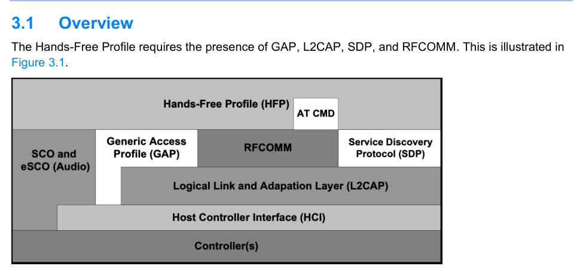

**Figure 3.1: Hands-Free Profile test model**

### 3.2 Test Strategy

The test objectives are to verify the functionality of the Hands-Free Profile within a Bluetooth Host and enable interoperability between Bluetooth Hosts on different devices. The testing approach covers mandatory and optional requirements in the specification and matches these to the support of the IUT as described in the ICS. Any defined test herein is applicable to the IUT if the ICS logical expression defined in the Test Case Mapping Table (TCMT) evaluates to true.
The test equipment provides an implementation of the Radio Controller and the parts of the Host needed to perform the test cases defined in this Test Suite. A Lower Tester acts as the IUT’s peer device and interacts with the IUT over-the-air interface. The configuration, including the IUT, needs to implement similar capabilities to communicate with the test equipment. For some test cases, it is necessary to stimulate the IUT from an Upper Tester. In practice, this could be implemented as a special test interface, a Man Machine Interface (MMI), or another interface supported by the IUT.
This Test Suite contains Valid Behavior (BV) tests complemented with Invalid Behavior (BI) tests where required. The test coverage mirrored in the Test Suite Structure is the result of a process that started with catalogued specification requirements that were logically grouped and assessed for testability enabling coverage in defined test purposes.
Test procedures may require operations using a cellular or wireless network. This may be accomplished by using a real network, a network simulator, or by any other means available to the IUT. The term “network” accommodates all such approaches.

### 3.3 Test groups

The following test groups have been defined:
• Generic SDP Integrated Tests
• Out-of-Range Tests
• Transfer of Phone Status
• Transfer of Call Status
• Audio Connection Handling
• Calling Line Identification (CLI)
• Accept an Incoming Call
• Reject an Incoming Call
• Terminate a Call
• Audio Connection Transfer during an Ongoing Call
• Place a Call with the Phone Number Supplied by the HF
• Place a Call Using Memory Dialing from the HF
• Place a Call to the Last Number Dialed from the HF
• Three-Way Calling
• Call Handling in Non-Regular Situations
• Echo Canceling (EC) and Noise Reduction (NR)
• Voice Recognition Activation and Deactivation
• Attach a Phone Number for a Voice Tag
• Ability to Transmit DTMF Codes
• Remote Audio Volume Control – Speaker
• Remote Audio Volume Control – Microphone
• Enhanced Call Status Functions
• Enhanced Call Control Functions
• Response and Hold Call Scenarios
• Subscriber Number Information
• Service Level Connections
• Codec Connection Setup
• Wide Band Speech Support
• Individual Indicators Activation and Deactivation
• Inquiry and Discoverability
• HF Indicators
• Enhanced Voice Recognition Activation
• Enhanced Voice Recognition Textual Response
• Voice Recognition – Ready
• Voice Recognition – Terminating or Rejecting an Audio Output
• Super Wide Band Speech
• Call Forwarding
• Call Duration Information

## 4 Test cases (TC)

### 4.1 Introduction

#### 4.1.1 Test case identification conventions

Test cases are assigned unique identifiers per the conventions in [5]. The convention used here is: <spec abbreviation>/<IUT role>/<class>/<feat>/<func>/<subfunc>/<cap>/<xx>-<nn>-<y>.
Additionally, testing of this specification includes tests from the SDP Test Suite [12] referred to as Generic SDP Integrated Tests (GSIT); when used, the test cases in GSIT are referred to through a TCID string using the following convention: <spec abbreviation>/<IUT role>/<GSIT test group>/<GSIT class>/<xx>-<nn>-<y>.

|  | Identifier Abbreviation |  |  | Spec Identifier <spec abbreviation> |  |
| --- | --- | --- | --- | --- | --- |
| HFP |  |  | Hands-Free Profile |  |  |
|  | Identifier Abbreviation |  |  | Role Identifier <IUT role> |  |
| AG |  |  | Audio Gateway role |  |  |
| HF |  |  | Hands-Free role |  |  |
|  | Identifier Abbreviation |  |  | Reference Identifier <GSIT test group> |  |
| SGSIT |  |  | Server Generic SDP Integrated Tests |  |  |
|  | Identifier Abbreviation |  |  | Reference Identifier <GSIT class> |  |
| ATTR |  |  | Attribute |  |  |
| SERR |  |  | Service Record |  |  |
|  | Identifier Abbreviation |  |  | Feature and Behaviors Identifier <feat> |  |
| ACC |  |  | Codec Connection Setup |  |  |
| ACR |  |  | Audio Connection release |  |  |
| ACS |  |  | Audio Connection Setup |  |  |
| ATA |  |  | Audio Connection transfer towards the AG |  |  |
| ATAH |  |  | Audio Connection transfers between the AG and HF |  |  |
| ATH |  |  | Audio Connection transfer towards the HF |  |  |
| CDI |  |  | Call Duration Information |  |  |
| CFD |  |  | Call Forwarding |  |  |
| CIT |  |  | Normal call process interrupted |  |  |
| CLI |  |  | Caller Line Identification |  |  |
| COD |  |  | Class-of-Device |  |  |
| DIS |  |  | Discoverable |  |  |
| ECS |  |  | Enhanced Call Status |  |  |
| ENO |  |  | Echo Canceling (EC) and Noise Reduction (NR) |  |  |
| EVR |  |  | Enhanced Voice Recognition |  |  |
| HFI |  |  | Hands-Free Indicators |  |  |
| ICA |  |  | Accept an incoming call |  |  |
| ICR |  |  | Reject an incoming call |  |  |
| IIA |  |  | Individual Indicators Activation |  |  |
| IIC |  |  | Individual Indicators Conflicts |  |  |

|  | Identifier Abbreviation |  |  | Feature and Behaviors Identifier <feat> |  |
| --- | --- | --- | --- | --- | --- |
| IID |  |  | Individual Indicators Deactivation |  |  |
| OCA |  |  | Call origination from the AG |  |  |
| OCL |  |  | Last number re-dial from the HF |  |  |
| OCM |  |  | Memory dialing from the HF |  |  |
| OCN |  |  | Place a call with the phone number supplied by the HF |  |  |
| OOR |  |  | Out of Range |  |  |
| RMV |  |  | Remote microphone volume |  |  |
| RSV |  |  | Remote speaker volume |  |  |
| SDP |  |  | Supplementary SDP testing |  |  |
| SLC |  |  | Service Level Connection |  |  |
| SWB |  |  | Super Wide Band Speech |  |  |
| TCA |  |  | Terminate a call |  |  |
| TDC |  |  | Ability to transmit DTMF codes |  |  |
| TDS |  |  | Transparent Data Synchronization |  |  |
| TRS |  |  | Transfer registration status |  |  |
| TWC |  |  | Three-way calling |  |  |
| VRA |  |  | Voice recognition activation |  |  |
| VRD |  |  | Voice Recognition Deactivation |  |  |
| VRR |  |  | Voice Recognition - Ready |  |  |
| VRT |  |  | Voice Recognition - Textual Response |  |  |
| VTA |  |  | Voice Recognition - Terminating an Active Audio Output |  |  |
| VTG |  |  | Attach a voice tag to a phone number |  |  |
| WBS |  |  | Wide Band Speech |  |  |

Table 4.1: HFP TC feature naming conventions

#### 4.1.2 Conformance

When conformance is claimed for a particular specification, all capabilities are to be supported in the specified manner. The mandated tests from this Test Suite depend on the capabilities to which conformance is claimed.
The Bluetooth Qualification Program may employ tests to verify implementation robustness. The level of implementation robustness that is verified varies from one specification to another and may be revised for cause based on interoperability issues found in the market.
Such tests may verify:
• That claimed capabilities may be used in any order and any number of repetitions not excluded by the specification
• That capabilities enabled by the implementations are sustained over durations expected by the use case
• That the implementation gracefully handles any quantity of data expected by the use case
• That in cases where more than one valid interpretation of the specification exists, the implementation complies with at least one interpretation and gracefully handles other interpretations
• That the implementation is immune to attempted security exploits
A single execution of each of the required tests is required to constitute a Pass verdict. However, it is noted that to provide a foundation for interoperability, it is necessary that a qualified implementation consistently and repeatedly pass any of the applicable tests.
In any case, where a member finds an issue with the test plan generated by the Bluetooth SIG qualification tool, with the test case described in the Test Suite, or with the test system utilized, the member is required to notify the responsible party via an erratum request such that the issue may be addressed.

#### 4.1.3 Pass/Fail verdict conventions

Each test case has an Expected Outcome section. The IUT is granted the Pass verdict when all the detailed pass criteria conditions within the Expected Outcome section are met.
The convention in this Test Suite is that, unless there is a specific set of fail conditions outlined in the test case, the IUT fails the test case as soon as one of the pass criteria conditions cannot be met. If this occurs, the outcome of the test is a Fail verdict.

### 4.2 Preambles

#### 4.2.1 Initialization

For most test cases, it is assumed as a general precondition that initialization has been performed between the HF and the AG to ensure that the devices have stored the information with which device they are to interoperate while performing the Hands-Free profile.
In addition, some of the Individual Indicator Activation feature tests require the AG to register and de-register with a network to test the proper operation of relevant indicators.

### 4.3 General test case assumptions

#### 4.3.1 Service Level Connections Management

It is assumed that both the HF and the AG can initiate a “Service Level Connection set up” procedure, as stated in Sections 4.2 and 4.3 in [2], whenever requested in any of the test procedures.

#### 4.3.2 Audio Connection Setup

It is assumed that both the HF and the AG can initiate an “Audio Connection Setup” procedure, as stated in Section 4.11 in [2], whenever requested in any of the test procedures. Reference conditions: All tests in the Audio Connection Setup section verify the capability of the IUT to follow the Synchronous Connection Interoperability Requirements defined in [2].

#### 4.3.3 Audio Connection Release

It is assumed that both the HF and the AG can initiate an “Audio Connection release” procedure, as stated in Section 4.12 in [2], whenever requested in any of the test procedures.

#### 4.3.4 AT+BRSF

The mapping of AT+BRSF bits and ICS items is given in the table below and referenced in test cases.

|  | HF BRSF bit |  |  | Feature |  |  | ICS Item |  |  | Capability |  |
| --- | --- | --- | --- | --- | --- | --- | --- | --- | --- | --- | --- |
| 0 |  |  | EC and/or NR function |  |  | HFP 3/14 |  |  | Echo Canceling (EC) and Noise Reduction (NR) |  |  |
| 1 |  |  | Three-way calling |  |  | HFP 3/12 |  |  | Three-way calling |  |  |
| 2 |  |  | CLI presentation capability |  |  | HFP 3/13 |  |  | Calling Line Identification (CLI) |  |  |
| 3 |  |  | Voice recognition activation |  |  | HFP 3/15 |  |  | Voice recognition activation |  |  |
| 4 |  |  | Remote audio volume control |  |  | HFP 3/18a OR HFP 3/18b |  |  | (Remote audio volume control – speaker) OR (Remote audio volume control – microphone) |  |  |
| 5 |  |  | Enhanced Call Status |  |  | HFP 3/21a |  |  | Enhanced Call Status |  |  |
| 6 |  |  | Enhanced Call Control |  |  | HFP 3/21b |  |  | Enhanced Call Control |  |  |
| 7 |  |  | Codec Negotiation |  |  | HFP 3/3c |  |  | Codec Negotiation support |  |  |
| 8 |  |  | HF Indicators |  |  | HFP 3/25 |  |  | HF Indicators |  |  |
| 9 |  |  | eSCO S4 Settings Supported |  |  | HFP 3/26 |  |  | eSCO S4 Settings Supported |  |  |
| 10 |  |  | Enhanced Voice Recognition Status |  |  | HFP 3/15a |  |  | Enhanced Voice Recognition Status |  |  |
| 11 |  |  | Voice Recognition Text |  |  | HFP 3/15b |  |  | Voice Recognition Text |  |  |
| 12–31 |  |  | Reserved for Future Use |  |  | N/A |  |  | N/A |  |  |

Table 4.2: AT+BRSF bits – HF

#### 4.3.5 +BRSF

The mapping of +BRSF bits and ICS items is given in the table below and referenced in test cases.

|  | AG BRSF bit |  |  | Feature |  |  | ICS Item |  |  | Capability |  |
| --- | --- | --- | --- | --- | --- | --- | --- | --- | --- | --- | --- |
| 0 |  |  | Three-way calling |  |  | HFP 2/12 |  |  | Three-way calling |  |  |
| 1 |  |  | EC and/or NR function |  |  | HFP 2/14 |  |  | Echo Canceling (EC) and Noise Reduction (NR) |  |  |
| 2 |  |  | Voice recognition function |  |  | HFP 2/15 |  |  | Voice recognition activation |  |  |
| 3 |  |  | In-band ring tone capability |  |  | HFP 2/4a |  |  | Accept an incoming voice call (in- band ring) |  |  |
| 4 |  |  | Attach a phone number for a voice tag |  |  | HFP 2/16 |  |  | Attach a phone number for a voice tag |  |  |
| 5 |  |  | Ability to reject a call |  |  | HFP 2/5 |  |  | Reject an incoming voice call |  |  |
| 6 |  |  | Enhanced Call Status |  |  | HFP 2/21a OR HFP 2/21c |  |  | (Enhanced Call Status) OR (Enhanced Call Status with limited network notification) |  |  |
| 7 |  |  | Enhanced Call Control |  |  | HFP 2/21b |  |  | Enhanced Call Control |  |  |
| 8 |  |  | Extended Error Result Codes |  |  | N/A |  |  | Note: This feature does not correspond to an ICS item. |  |  |
| 9 |  |  | Codec Negotiation |  |  | HFP 2/3c |  |  | Codec Negotiation support |  |  |
| 10 |  |  | HF Indicators |  |  | HFP 2/26 |  |  | HF Indicators |  |  |
| 11 |  |  | eSCO S4 Settings Supported |  |  | HFP 2/27 |  |  | eSCO S4 Settings Supported |  |  |

|  | AG BRSF bit |  |  | Feature |  |  | ICS Item |  |  | Capability |  |
| --- | --- | --- | --- | --- | --- | --- | --- | --- | --- | --- | --- |
| 12 |  |  | Enhanced Voice Recognition Status |  |  | HFP 2/15c |  |  | Enhanced Voice Recognition Status |  |  |
| 13 |  |  | Voice Recognition Text |  |  | HFP 2/15d |  |  | Voice Recognition Text |  |  |
| 14 |  |  | Call Duration Information |  |  | HFP 2/31 |  |  | Call Duration Information |  |  |
| 15–31 |  |  | Reserved for Future Use |  |  | N/A |  |  | N/A |  |  |

Table 4.3: +BRSF bits - AG

### 4.4 Generic SDP Integrated Tests

#### 4.4.1 Server Generic SDP Integrated Tests

##### 4.4.1.1 Hands-Free Profile – Hands-Free

Execute the Generic SDP Integrated Tests defined in Section 6.3, Server test procedures (SGSIT), in [12] using Table 4.4 below as input:

| TCID |  |  | Reference |  |  | Attribute ID Name | Attribute ID definition source (Universal, Profile) | Value/Secondary Value |  |  |  | Attribute presence |  |
| --- | --- | --- | --- | --- | --- | --- | --- | --- | --- | --- | --- | --- | --- |
|  |  |  |  |  |  |  |  |  |  |  |  | (Present/Present for |  |
|  |  |  |  |  |  |  |  |  |  |  |  | [role], Optionally |  |
|  |  |  |  |  |  |  |  |  |  |  |  | present, TCMT |  |
|  |  |  |  |  |  |  |  |  |  |  |  | defined) |  |
|  | HFP/HF/SGSIT/SERR/BV-01-C |  |  | [7] 5.3 |  | ServiceClassIDList | Universal |  | “Hands-Free” (UUID), |  | Present for HF | Present for HF |  |
|  | [Service record GSIT – HFP HF] |  |  | [9] 6.3 |  |  |  |  | “Generic Audio” (UUID) |  |  |  |  |
| HFP/HF/SGSIT/ATTR/BV-01-C [Attribute GSIT – Protocol Descriptor List] | HFP/HF/SGSIT/ATTR/BV-01-C |  | [7] 5.3 [9] 6.3 | [7] 5.3 |  | ProtocolDescriptorList | Universal |  | “L2CAP” (UUID), |  | Present for HF |  |  |
|  | [Attribute GSIT – Protocol |  |  | [9] 6.3 |  |  |  |  | “RFCOMM” (UUID): |  |  |  |  |
|  | Descriptor List] |  |  |  |  |  |  |  | Server Channel – skip |  |  |  |  |
|  |  |  |  |  |  |  |  |  | (Uint8) |  |  |  |  |
|  | HFP/HF/SGSIT/ATTR/BV-02-C |  | [7] 5.3 |  |  | BluetoothProfileDescript orList | Universal |  | “Hands-Free” (UUID): |  | TCMT defined |  |  |
|  | [Attribute GSIT – Bluetooth |  |  |  |  |  |  |  | Version – “0x0107” |  |  |  |  |
|  | Profile Descriptor List, HFP 1.7] |  |  |  |  |  |  |  | (Uint16) |  |  |  |  |
|  | HFP/HF/SGSIT/ATTR/BV-03-C |  | [7] 5.3 |  |  | BluetoothProfileDescript orList | Universal |  | “Hands-Free” (UUID): |  | TCMT defined |  |  |
|  | [Attribute GSIT – Bluetooth |  |  |  |  |  |  |  | Version – “0x0108” |  |  |  |  |
|  | Profile Descriptor List, HFP 1.8] |  |  |  |  |  |  |  | (Uint16) |  |  |  |  |
|  | HFP/HF/SGSIT/ATTR/BV-04-C |  | [9] 6.3 |  |  | BluetoothProfileDescript orList | Universal |  | “Hands-Free” (UUID): |  | TCMT defined |  |  |
|  | [Attribute GSIT – Bluetooth |  |  |  |  |  |  |  | Version – “0x0109” |  |  |  |  |
|  | Profile Descriptor List, HFP 1.9] |  |  |  |  |  |  |  | (Uint16) |  |  |  |  |
|  | HFP/HF/SGSIT/ATTR/BV-05-C |  | [7] 5.3 [9] 6.3 |  |  | SupportedFeatures | Profile | skip (Uint16) | skip (Uint16) |  | Present for HF |  |  |
|  | [Attribute GSIT – Supported |  |  |  |  |  |  |  |  |  |  |  |  |
|  | Features] |  |  |  |  |  |  |  |  |  |  |  |  |

Table 4.4: Input for the Hands-Free Profile SGSIT SDP Test procedure

##### 4.4.1.2 Hands-Free Profile – Audio Gateway

Execute the Generic SDP Integrated Tests defined in Section 6.3, Server test procedures (SGSIT), in [12] using Table 4.5 below as input:

| TCID |  |  | Reference |  |  | Attribute ID Name | Attribute ID definition source (Universal, Profile) | Value/Secondary Value |  |  |  | Attribute presence |  |
| --- | --- | --- | --- | --- | --- | --- | --- | --- | --- | --- | --- | --- | --- |
|  |  |  |  |  |  |  |  |  |  |  |  | (Present/Present for |  |
|  |  |  |  |  |  |  |  |  |  |  |  | [role], Optionally |  |
|  |  |  |  |  |  |  |  |  |  |  |  | present, TCMT |  |
|  |  |  |  |  |  |  |  |  |  |  |  | defined) |  |
|  | HFP/AG/SGSIT/SERR/BV-01-C |  |  | [7] 5.3 |  | ServiceClassIDList | Universal |  | “AG Hands-Free” (UUID), |  | Present for AG | Present for AG |  |
|  | [Service record GSIT – HFP AG] |  |  | [9] 6.3 |  |  |  |  | “Generic Audio” (UUID) |  |  |  |  |
|  | HFP/AG/SGSIT/ATTR/BV-01-C |  | [7] 5.3 [9] 6.3 | [7] 5.3 |  | ProtocolDescriptorList | Universal |  | “L2CAP” (UUID), |  | Present for AG |  |  |
|  | [Attribute GSIT – Protocol |  |  | [9] 6.3 |  |  |  |  | “RFCOMM” (UUID): Server |  |  |  |  |
|  | Descriptor List] |  |  |  |  |  |  |  | Channel – skip (Uint8) |  |  |  |  |
|  | HFP/AG/SGSIT/ATTR/BV-02-C |  | [7] 5.3 |  |  | BluetoothProfileDescript orList | Universal | “Hands-Free” (UUID): Version – “0x0107” (Uint16) | “Hands-Free” (UUID): |  | TCMT defined |  |  |
|  | [Attribute GSIT – Bluetooth |  |  |  |  |  |  |  | Version – “0x0107” (Uint16) |  |  |  |  |
|  | Profile Descriptor List, HFP 1.7] |  |  |  |  |  |  |  |  |  |  |  |  |
|  | HFP/AG/SGSIT/ATTR/BV-03-C |  | [7] 5.3 |  |  | BluetoothProfileDescript orList | Universal | “Hands-Free” (UUID): Version – “0x0108” (Uint16) |  |  | TCMT defined |  |  |
|  | [Attribute GSIT – Bluetooth |  |  |  |  |  |  |  |  |  |  |  |  |
|  | Profile Descriptor List, HFP 1.8] |  |  |  |  |  |  |  |  |  |  |  |  |
|  | HFP/AG/SGSIT/ATTR/BV-04-C |  | [9] 6.3 |  |  | BluetoothProfileDescript orList | Universal | “Hands-Free” (UUID): Version – “0x0109” (Uint16) |  |  | TCMT defined |  |  |
|  | [Attribute GSIT – Bluetooth |  |  |  |  |  |  |  |  |  |  |  |  |
|  | Profile Descriptor List, HFP 1.9] |  |  |  |  |  |  |  |  |  |  |  |  |
|  | HFP/AG/SGSIT/ATTR/BV-05-C |  |  | [7] 5.3 |  | Network | Profile | skip (Uint8) |  |  | Present for AG |  |  |
|  | [Attribute GSIT – Network] |  |  | [9] 6.3 |  |  |  |  |  |  |  |  |  |
|  | HFP/AG/SGSIT/ATTR/BV-06-C |  | [7] 5.3 [9] 6.3 | [7] 5.3 |  | SupportedFeatures | Profile | skip (Uint16) |  |  | Present for AG |  |  |
|  | [Attribute GSIT – Supported |  |  | [9] 6.3 |  |  |  |  |  |  |  |  |  |
|  | Features] |  |  |  |  |  |  |  |  |  |  |  |  |

Table 4.5: Input for the Hands-Free Profile Audio Gateway SGSIT SDP Test procedure

##### 4.4.1.3 Hands-Free Profile – Attribute ID Offset String tests

Execute the Generic SDP Integrated Tests defined in Section 6.3, Server test procedures (SGSIT), in [12] using Table 4.6 below as input:

| TCID |  |  | Reference | ServiceSearchPattern | Attribute ID Name | Attribute ID Offset |  | Attribute presence |  |
| --- | --- | --- | --- | --- | --- | --- | --- | --- | --- |
|  |  |  |  |  |  |  |  | (Present/Present for [role], |  |
|  |  |  |  |  |  |  |  | Optionally present, TCMT |  |
|  |  |  |  |  |  |  |  | defined) |  |
|  | HFP/HF/SGSIT/OFFS/BV-01-C |  | [7] 5.3 [9] 6.3 | Hands-Free | ServiceName | 0x0000 | Optionally present | Optionally present |  |
|  | [Attribute ID Offset String GSIT – |  |  |  |  |  |  |  |  |
|  | Service Name] |  |  |  |  |  |  |  |  |
|  | HFP/AG/SGSIT/OFFS/BV-01-C |  | [7] 5.3 [9] 6.3 | AG Hands-Free | ServiceName | 0x0000 | Optionally present |  |  |
|  | [Attribute ID Offset String GSIT – |  |  |  |  |  |  |  |  |
|  | Service Name] |  |  |  |  |  |  |  |  |

Table 4.6: Input for the Hands-Free Profile SGSIT Attribute ID Offset String tests

#### 4.4.2 Client Generic SDP Integrated Tests

Execute the Generic SDP Future Compatibility Tests defined in Section 6.4, Client test procedures (CGSIT), in [12] using Table 4.7 below as input:

| TCID | Reference |  | Service Record |  | Lower Tester SDP record initial conditions |  |  |
| --- | --- | --- | --- | --- | --- | --- | --- |
|  |  |  | Service Class UUID |  |  |  |  |
|  |  |  | description |  |  |  |  |
| HFP/HF/CGSIT/SFC/BV-01-C [SDP Future Compatibility – IUT is HFP HF] | [7] 4.2.1.5, 5.3 [9] 4.2.1.5, 6.1.1, 6.3 | AG Hands-Free, Generic Audio | AG Hands-Free, |  |  | The Lower Tester exposes an HFP AG SDP record. |  |
|  |  |  | Generic Audio |  |  | The version in the Bluetooth Profile Descriptor List is greater than the most |  |
|  |  |  |  |  |  | recently adopted version. |  |
|  |  |  |  |  |  | All bits are set in the Supported Features attribute including Reserved bits. |  |
| HFP/AG/CGSIT/SFC/BV-01-C [SDP Future Compatibility – IUT is HFP AG] | [7] 4.2.1.5, 5.3 [9] 4.2.1.5, 6.1.1, 6.3 | Hands-Free, Generic Audio |  |  |  | The Lower Tester exposes an HFP HF SDP record. |  |
|  |  |  |  |  |  | The version in the Bluetooth Profile Descriptor List is greater than the most |  |
|  |  |  |  |  |  | recently adopted version. |  |
|  |  |  |  |  |  | All bits are set in the Supported Features attribute including Reserved bits. |  |

Table 4.7: Input for the Client CGSIT SDP future compatibility tests

### 4.5 Out-of-range tests

#### 4.5.1 AG reconnects to HF • Test Purpose

Verify that after a link loss the HF returns to the Standby state and the AG can reconnect to the HF after a link loss recovery and the audio pathway can be transferred to the HF.
• Reference
[2] 4.2.2
• Initial Condition
- Devices are paired and connected with ongoing call audio routed to the HF.
- The HF device does not support an automatic link-loss recovery feature.
• Test Case Configuration

|  | Test Case |  |
| --- | --- | --- |
| HFP/AG/OOR/BV-01-C [AG initiates reconnect to HF] |  |  |
| HFP/HF/OOR/BV-01-C [HF accepts reconnect from AG] |  |  |

Table 4.8: AG reconnects to HF test cases
• Test Procedure
1. Take the IUT and Lower Tester out of range of each other and wait for 30 s. Then, ensure that
the HF device is in connectible mode after link loss. 2. Bring the devices back into Bluetooth operating range. 3. Initiate user action on the AG to connect with the HF and transfer the audio pathway. Depending
on the implementation, this is either done autonomously or by one or more user actions on the AG.
• Expected Outcome
Pass verdict
As a result of Step 1, the IUT acknowledges the link loss. The AG routes the call audio back to itself. This may require user action or confirmation on the AG if the IUT is the AG.
As a result of Step 3, a service level connection is established between the AG and the HF. The AG routes the audio pathway to the HF by setting up an Audio Connection.

#### 4.5.2 HF reconnects to AG • Test Purpose

Verify that after a link loss the AG returns to the Standby state and the HF can reconnect to the AG after a link loss recovery.
• Reference
[2] 4.2.2
• Initial Condition
- Devices are paired and connected with ongoing call audio routed to the HF.
• Test Case Configuration

|  | Test Case |  |
| --- | --- | --- |
| HFP/AG/OOR/BV-02-C [AG accepts reconnect from HF] |  |  |
| HFP/HF/OOR/BV-02-C [HF initiates reconnect to AG] |  |  |

Table 4.9: HF reconnects to AG test cases
• Test Procedure
1. Take the IUT and Lower Tester out of range of each other and wait for 30 s. Ensure that the AG
device is in connectible mode after link loss. 2. Bring the devices back into Bluetooth operating range. 3. Initiate user action on the HF to reconnect with the AG. Depending on the implementation, this is
either done autonomously or by one or more user actions on the HF. 4. For the AG as the IUT, the Lower Tester transfers the audio pathway to itself. For the HF as the
IUT, the IUT may optionally transfer the audio pathway to itself. If the HF IUT chooses to transfer the audio pathway, this can be done either autonomously or by one or more user actions on the HF.
• Expected Outcome
Pass verdict
As a result of Step 1, the IUT acknowledges the link loss and returns to the Standby state.
As a result of Step 3, a service level connection is established between the AG and the HF.
As a result of Step 4, with the AG as the IUT, an Audio Connection is established with the AG and the audio pathway is routed to the HF.

### 4.6 Transfer of Phone Status

#### 4.6.1 Transfer Registration Status • Test Purpose

Verify that the AG issues the proper registration status indication to the HF and the HF accepts the registration status indication.
• Reference
[2] 4.4
• Initial Condition
- Service level connection between the HF and the AG is established.
- The control channel of the network is disabled at the AG.
• Test Case Configuration

|  | Test Case |  |
| --- | --- | --- |
| HFP/AG/TRS/BV-01-C [Issue registration status indication] |  |  |
| HFP/HF/TRS/BV-01-C [Accept registration status indication] |  |  |

Table 4.10: Transfer Registration Status test cases
• Test Procedure
1. If the IUT is the AG, then the Upper Tester simulates the presence of a control channel of a
network such that the AG gets registered into it, which may require a test device. 2. The AG notifies the HF of the change in registration status event by sending a +CIEV unsolicited
result code. 3. If the IUT is the AG, the Upper Tester simulates disabling the control channel. 4. The AG gets de-registered from the network and notifies the HF of this event by sending a +CIEV
unsolicited result code. 5. If the IUT is the AG, the Upper Tester simulates enabling the control channel again. 6. The AG gets registered to the network again and notifies the HF of this event by sending a +CIEV
unsolicited result code.
• Expected Outcome
Pass verdict
The AG sends a +CIEV unsolicited result code indicating a change in the registration status to the HF in Steps 2, 4, and 6. The HF accepts each status update with no effect on function.

### 4.7 Transfer of Call Status

#### 4.7.1 Transfer Signal Strength Indication • Test Purpose

Verify that the AG sends the signal strength status indication to the HF in the proper format, and the HF successfully receives the signal strength status of the AG.
• Reference
[2] 4.5
• Initial Condition
- Service Level Connection between the AG and the HF is established.
• Test Case Configuration

|  | Test Case |  |
| --- | --- | --- |
| HFP/AG/PSI/BV-01-C [Send signal strength indication] |  |  |
| HFP/HF/PSI/BV-01-C [Accept signal strength indication] |  |  |

Table 4.11: Transfer Signal Strength Indication test cases
• Test Procedure
1. The AG sends a signal strength indication to the HF. If the IUT is the AG, impair the signal so that
a reduction in signal strength can be observed. 2. The HF receives the signal strength indication from the AG. 3. If the IUT is the HF, verify that the indicator’s value relatively follows the signal strength at the AG
(i.e., if the signal strength goes up, the value of the result code goes higher accordingly, and vice versa).
• Expected Outcome
Pass verdict
The AG sends the signal strength status to the HF in the proper format.
The indicator is received at the HF as the signal strength changes, and the value received changes in the same relative manner that the signal strength is changing.
If the IUT is the HF, then the IUT accepts the status update with no effect on function.

#### 4.7.2 Transfer Roaming Status Indication • Test Purpose

Verify that the AG sends the Roaming Status Indication to the HF in the proper format, and the HF successfully receives the roaming status of the AG.
• Reference
[2] 4.6
• Initial Condition
- Service Level Connection between the AG and the HF is established.
• Test Case Configuration

|  | Test Case |  |
| --- | --- | --- |
| HFP/AG/PSI/BV-02-C [Send roam indication] |  |  |
| HFP/HF/PSI/BV-02-C [Accept roam indication] |  |  |

Table 4.12: Transfer Roaming Status Indication test cases
• Test Procedure
1. The AG sends a roam indication to the HF indicating that the AG is roaming. If the IUT is the AG,
cause the AG to register on a Roam network. 2. The HF receives the roam indication from the AG, indicating that the AG is roaming. 3. Send a roam indication to the HF indicating that the AG is not roaming. If the IUT is the AG,
cause the AG to register on the Home network. 4. The HF receives the roam indication from the AG, indicating that the AG is not roaming.
• Expected Outcome
Pass verdict
The AG sends the roam indicator to the HF in Steps 1 and 3 in the proper format.
The HF receives the roam indicator from the AG as the roaming status changes in Steps 2 and 4.

#### 4.7.3 Transfer Battery Level Indication • Test Purpose

Verify that the AG sends the battery level status to the HF in the proper format, and the HF successfully receives the battery level status of the AG.
• Reference
[2] 4.7
• Initial Condition
- Service Level Connection between the AG and the HF is established.
• Test Case Configuration

|  | Test Case |  |
| --- | --- | --- |
| HFP/AG/PSI/BV-03-C [Send battery level status indication] |  |  |
| HFP/HF/PSI/BV-03-C [Accept battery level status indication] |  |  |

Table 4.13: Transfer battery level indication test cases
• Test Procedure
1. The AG sends a battery level indication to the HF. If the IUT is the AG, adjust the battery level on
the IUT to a level that will cause a battery level indication to be sent to the Lower Tester. 2. The HF receives a battery level indication from the AG. 3. If the IUT is the HF, verify that the value of the indication relatively follows the battery level (i.e., if
the battery level goes up, the value of the battery level indication received at the HF goes higher accordingly).
• Expected Outcome
Pass verdict
The AG sends the battery level indication to the HF in the proper format.
The indicator is received at the HF as the battery level indication changes, and the value received changes in the same relative manner that the battery level is changing.

#### 4.7.4 Query Operator Selection • Test Purpose

Verify that the HF can query the currently selected operator name, and the AG accepts and responds correctly to the request.
• Reference
[2] 4.8
• Initial Condition
- Service Level Connection between the AG and the HF is established.
• Test Case Configuration

|  | Test Case |  |
| --- | --- | --- |
| HFP/AG/PSI/BV-04-C [Send indicator of operator selection] |  |  |
| HFP/HF/PSI/BV-04-C [Accept indicator of operator selection] |  |  |

Table 4.14: Query Operator Selection test cases
• Test Procedure
1. The HF sets the format of the operator selection to long alphanumeric. 2. The HF queries the currently selected operator name from the AG.
• Expected Outcome
Pass verdict
The HF correctly queries the currently selected operator name.
The AG responds with the operator name in long alphanumeric.
HFP/AG/PSI/BV-05-C [Transfer Roaming Status Indication with roaming function not supported]
• Test Purpose
Verify that when the AG (IUT) does not support the roaming function, its roaming status indicates that the AG is not roaming.
• Reference
[2] 4.2.1, 4.6, 4.33.2
• Initial Condition
- Service Level Connection between the AG and the HF is not yet established.
- The AG is registered on the Home network.
• Test Procedure
1. Service Level Connection is established between the IUT and the Lower Tester. 2. The Lower Tester sends an “AT+CIND?” read command. 3. The IUT replies to the “AT+CIND?” read command sent from the HF.
• Expected Outcome
Pass verdict
The roaming status indicator is either not present in the indicator list received at the HF, or, if it is received by the HF, it indicates that the AG is not roaming.

### 4.8 Audio Connection Handling

#### 4.8.1 Audio Connection Setup

Verifies the capability of both the HF and the AG to initiate the establishment of an Audio Connection between them.
HFP/HF/ACS/BV-01-C [HF initiated audio setup, AG is SCO only]
• Test Purpose
Verify that the HF IUT can initiate an Audio Connection with the Lower Tester acting as the AG, when the AG supports and accepts only SCO connections.
• Reference
[2] 4.11, 5.7.1
[11] 4.11, 6.7.1
• Initial Condition
- The IUT is an HF.
- The Lower Tester is an AG.
- Audio setup is initiated by the IUT (the Lower Tester with SCO only).
- An SLC is established between the IUT and the Lower Tester, and there are no Synchronous Connections established.
- The Lower Tester does not include EV packet types in LMP_FEATURES_REQ or LMP_FEATURES_RES messages.
• Test Procedure
1. The IUT initiates a full duplex Audio Connection with the AG. 2. The Lower Tester accepts the connection request from the IUT with only HV packet types
allowed.
• Expected Outcome
Pass verdict
Full duplex audio is available between the IUT and the Lower Tester.
HFP/AG/ACS/BV-02-C [AG initiated audio setup, HF is SCO only]
• Test Purpose
Verify that the AG IUT can initiate an Audio Connection with the Lower Tester acting as an HF, when the HF supports and accepts only SCO connections.
• Reference
[2] 4.11, 5.7.1
[11] 4.11, 6.7.1
• Initial Condition
- The IUT is an AG.
- The Lower Tester is an HF.
- Audio setup is initiated by the IUT (the Lower Tester with SCO only).
- An SLC is established between the IUT and the Lower Tester, and there are no Synchronous Connections established.
- The Lower Tester does not include EV packet types in LMP_FEATURES_REQ or LMP_FEATURES_RES messages.
• Test Procedure
1. The IUT initiates a full duplex Audio Connection with the HF. 2. The Lower Tester accepts a connection request from the IUT with only HV packet types allowed.
• Expected Outcome
Pass verdict
Full duplex audio is available between the IUT and the Lower Tester.
• Test Purpose
Verify that the HF IUT can accept an Audio Connection with the Lower Tester acting as an AG, when the AG requests only SCO connections.
• Reference
[2] 4.11, 5.7.1
[11] 4.11, 6.7.1
• Initial Condition
- The IUT is an HF.
- The Lower Tester is an AG.
- Audio setup is initiated by the Lower Tester (the Lower Tester with SCO only).
- An SLC is established between the IUT and the Lower Tester, and there are no Synchronous Connections established.
- The Lower Tester does not include EV packet types in LMP_FEATURES_REQ or LMP_FEATURES_RES messages.
• Test Procedure
1. The Lower Tester requests a full duplex Audio Connection with the IUT. The connection request
by the Lower Tester allows only HV packet types in the connection setup request. 2. The IUT accepts a full duplex Audio Connection request by the Lower Tester.
• Expected Outcome
Pass verdict
Full duplex audio is available between the IUT and the Lower Tester.
HFP/AG/ACS/BV-04-C [HF initiated audio setup, HF is SCO only]
• Test Purpose
Verify that the AG IUT can accept an Audio Connection with the Lower Tester acting as an HF, when the HF requests only SCO connections.
• Reference
[2] 4.11, 5.7.1
[11] 4.11, 6.7.1
• Initial Condition
- The IUT is an AG.
- The Lower Tester is an HF.
- Audio setup is initiated by the Lower Tester (the Lower Tester with SCO only).
- An SLC is established between the IUT and the Lower Tester, and there are no Synchronous Connections established.
- The Lower Tester does not include EV packet types in LMP_FEATURES_REQ or LMP_FEATURES_RES messages.
- An ongoing call may be present.
• Test Procedure
1. The IUT accepts a full duplex Audio Connection request by the Lower Tester. An ongoing call
may be present to achieve the test purpose. 2. The Lower Tester requests a full duplex Audio Connection with the IUT. The connection request
by the Lower Tester allows only HV packet types in the connection setup request.
• Expected Outcome
Pass verdict
Full duplex audio is available between the IUT and the Lower Tester.
HFP/HF/ACS/BV-05-C [HF initiated audio setup, AG has eSCO]
• Test Purpose
Verify that the HF IUT can initiate an Audio Connection with the Lower Tester acting as an AG, when the AG supports and accepts SCO or S1 eSCO connections.
• Reference
[2] 4.11, 5.7.1
[11] 4.11, 6.7.1
• Initial Condition
- The IUT is an HF.
- The Lower Tester is an AG.
- Audio setup is initiated by the IUT (the Lower Tester with eSCO).
- The Lower Tester is configured not to support BR/EDR Secure Connections, hence ensuring that the Secure Connections feature is not used during the test.
- An SLC is established between the IUT and the Lower Tester.
- The Lower Tester includes all EV and HV packet types in LMP_FEATURES_REQ or LMP_FEATURES_RES messages.
• Test Procedure
1. The IUT requests a full duplex Audio Connection with the Lower Tester. 2. The Lower Tester accepts the Audio Connection request from the IUT and allows HV and EV
packet types. The Lower Tester accepts all HV packets and only the S1 eSCO parameters in the accept response.
• Expected Outcome
Pass verdict
Full duplex audio is available between the HF and the AG.
• Test Purpose
Verify that the AG IUT can initiate an Audio Connection with the Lower Tester acting as an HF, when the HF supports and accepts SCO or S1 eSCO connections.
• Reference
[2] 4.11, 5.7.1
[11] 4.11, 6.7.1
• Initial Condition
- The IUT is an AG.
- The Lower Tester is an HF.
- Audio setup is initiated by the IUT (the Lower Tester with eSCO).
- The Lower Tester is configured not to support BR/EDR Secure Connections, hence ensuring that the Secure Connections feature is not used on the connection during the test.
- An SLC is established between the IUT and the Lower Tester, and there are no Synchronous Connections established.
- The Lower Tester includes all EV and HV packet types in LMP_FEATURES_REQ or LMP_FEATURES_RES messages.
• Test Procedure
1. The IUT requests a full duplex Audio Connection with the Lower Tester. 2. The Lower Tester accepts an Audio Connection request from the IUT and allows HV and EV
packet types. The Lower Tester accepts all HV packets and only the S1 eSCO parameters in the accept response.
• Expected Outcome
Pass verdict
Full duplex audio is available between the IUT and the Lower Tester.
HFP/HF/ACS/BV-07-C [AG initiated audio setup, AG has eSCO]
• Test Purpose
Verify that the HF IUT can accept an Audio Connection request from the Lower Tester acting as an AG. The Lower Tester supports and accepts SCO or S1 eSCO connections.
• Reference
[2] 4.11, 5.7.1
[11] 4.11, 6.7.1
• Initial Condition
- The IUT is an HF.
- The Lower Tester is an AG.
- Audio setup is initiated by the Lower Tester (the Lower Tester supports eSCO).
- The Lower Tester is configured not to support BR/EDR Secure Connections, hence ensuring that the Secure Connections feature is not used on the connection during the test.
- An SLC is established between the IUT and the Lower Tester, and there are no Synchronous Connections established. The Lower Tester includes all EV and HV packet types in LMP_FEATURES_REQ or LMP_FEATURES_RES messages.
• Test Procedure
1. The Lower Tester initiates a full duplex Audio Connection with the IUT. The Lower Tester makes
a connection setup request that will allow S1 eSCO and HV packet types. An ongoing call may be present to achieve the test purpose. 2. The IUT accepts the Audio Connection request from the Lower Tester.
• Expected Outcome
Pass verdict
Full duplex audio is available between the IUT and the Lower Tester.
HFP/AG/ACS/BV-08-C [HF initiated audio setup, HF has eSCO]
• Test Purpose
Verify that the AG IUT can accept an Audio Connection request from the Lower Tester acting as an HF. The Lower Tester supports and accepts SCO or S1 eSCO connections.
• Reference
[2] 4.11, 5.7.1
[11] 4.11, 6.7.1
• Initial Condition
- The IUT is an AG.
- The Lower Tester is an HF.
- Audio setup is initiated by the Lower Tester (the Lower Tester supports eSCO).
- The Lower Tester is configured not to support BR/EDR Secure Connections, hence ensuring that the Secure Connections feature is not used on the connection during the test.
- An SLC is established between the IUT and the Lower Tester, and there are no Synchronous Connections established. The Lower Tester includes all EV and HV packet types in LMP_FEATURES_REQ or LMP_FEATURES_RES messages.
• Test Procedure
1. The Lower Tester initiates a full duplex Audio Connection with the IUT. The Lower Tester makes
a connection setup request that will allow S1 eSCO and HV packet types. 2. The IUT negotiates the Audio Connection with the Lower Tester. An ongoing call may be present
to achieve the test purpose.
• Expected Outcome
Pass verdict
Full duplex audio is available between the IUT and the Lower Tester.
• Test Purpose
Verify that the HF IUT can initiate an Audio Connection with the Lower Tester acting as an AG. The Lower Tester accepts only SCO connections.
• Reference
[2] 4.11, 5.7.1
[11] 4.11, 6.7.1
• Initial Condition
- The IUT is an HF.
- The Lower Tester is an AG.
- Audio setup is initiated by the IUT (the Lower Tester with eSCO accepts only SCO).
- An SLC is established between the IUT and the Lower Tester, and there are no Synchronous Connections established. The Lower Tester includes all EV and HV packet types in LMP_FEATURES_REQ or LMP_FEATURES_RES messages.
• Test Procedure
1. The IUT requests a full duplex Audio Connection with the Lower Tester. 2. The Lower Tester negotiates an Audio Connection with the IUT accepting only HV packet types in
the accept response.
• Expected Outcome
Pass verdict
Full duplex audio is available between the IUT and the Lower Tester.
• Notes
If the IUT does not have support for eSCO and does not request eSCO in any other tests, it is OK for the IUT to initiate SCO in this test.
HFP/AG/ACS/BV-10-C [AG initiated audio setup, HF has eSCO allows only SCO]
• Test Purpose
Verify that the AG IUT can request an Audio Connection with the Lower Tester acting as an HF. The Lower Tester accepts only SCO connections.
• Reference
[2] 4.11, 5.7.1
[11] 4.11, 6.7.1
• Initial Condition
- The IUT is an AG.
- The Lower Tester is an HF.
- An SLC is established between the IUT and the Lower Tester, and there are no Synchronous Connections established. The Lower Tester includes all EV and HV packet types in LMP_FEATURES_REQ or LMP_FEATURES_RES messages.
• Test Procedure
1. The IUT requests a full duplex Audio Connection with the Lower Tester. 2. The Lower Tester negotiates Audio Connection with the IUT accepting only HV1 packet types in
the accept response.
• Expected Outcome
Pass verdict
Full duplex audio is available between the IUT and the Lower Tester.
HFP/AG/ACS/BV-11-C [HF initiated eSCO audio setup with 18 ms latency]
• Test Purpose
Verify that the AG IUT can accept an Audio Connection request from a Lower Tester acting as an HF. The Lower Tester supports and accepts SCO, S1 eSCO, and long latency eSCO connections.
• Reference
[2] 4.11, 5.7.1
[11] 4.11, 6.7.1
• Initial Condition
- The IUT is an AG.
- The Lower Tester is an HF.
- Audio setup is initiated by the Lower Tester (HF latency 18 ms).
- An SLC is established between the IUT and the Lower Tester, and there are no Synchronous Connections established. The Lower Tester includes all EV and HV packet types in LMP_FEATURES_REQ or LMP_FEATURES_RES messages.
• Test Procedure
1. The Lower Tester requests a full duplex Audio Connection with the IUT. The Lower Tester starts
the negotiation with the connection setup request with arguments of 18 ms max_latency and allows all EV and HV packet types. 2. The IUT handles the Synchronous Connection request from the Lower Tester. An ongoing call
may be present to achieve the test purpose.
• Expected Outcome
Pass verdict
Full duplex audio is available between the IUT and the Lower Tester.
HFP/HF/ACS/BV-12-C [AG initiated eSCO audio setup with 18 ms latency]
• Test Purpose
Verify that the HF IUT can accept an Audio Connection request from a Lower Tester acting as an AG. The Lower Tester supports and accepts SCO, S1 eSCO, and long latency eSCO connections.
• Reference
[2] 4.11, 5.7.1
[11] 4.11, 6.7.1
• Initial Condition
- The IUT is an HF.
- The Lower Tester is an AG.
- Audio setup is initiated by the Lower Tester (AG latency 18 ms).
- An SLC is established between the IUT and the Lower Tester, and there are no Synchronous Connections established. The Lower Tester includes EV and HV packet types in LMP_FEATURES_REQ or LMP_FEATURES_RES messages.
• Test Procedure
1. The Lower Tester requests a full duplex Audio Connection with the IUT. The Lower Tester starts
the negotiation with the connection setup request with arguments of 18 ms max_latency and allows all EV and HV packet types. An ongoing call may be present to achieve the test purpose. 2. The IUT negotiates the Audio Connection with the Lower Tester.
• Expected Outcome
Pass verdict
Full duplex audio is available between the IUT and the Lower Tester.
HFP/HF/ACS/BI-13-C [AG initiated eSCO audio setup with invalid bandwidth]
• Test Purpose
Verify that the HF IUT, whether it supports SCO or eSCO, will not accept a connection request for invalid eSCO settings from the Lower Tester.
• Reference
[2] 4.11, 5.7.1
[11] 4.11, 6.7.1
• Initial Condition
- The IUT is an HF.
- The Lower Tester is an AG.
- Audio setup is initiated by the Lower Tester. The Lower Tester eSCO setting for txbandwidth and rxbandwidth is not 8000 bytes/s.
- An SLC is established between the IUT and the Lower Tester, and there are no Synchronous Connections established. The Lower Tester includes all EV and HV packet types in LMP_FEATURES_REQ or LMP_FEATURES_RES messages.
• Test Procedure
1. The Lower Tester requests eSCO with the S1 eSCO parameters in the connection setup request
changed to include txbandwidth and rxbandwidth values of 12000 bytes/s. 2. The IUT responds to this connection request.
changed to include txbandwidth and rxbandwidth values of 6000 bytes/s. 4. The IUT responds to this connection request.
• Expected Outcome
Pass verdict
The IUT rejects eSCO connection requests from the Lower Tester and does not attempt to renegotiate eSCO parameters or start a new SCO or eSCO connection after rejecting the requests from the Lower Tester.
HFP/AG/ACS/BI-14-C [HF initiated eSCO audio setup with invalid bandwidth]
• Test Purpose
Verify that the AG IUT will not accept a connection request for invalid eSCO settings from the Lower Tester.
• Reference
[2] 4.11, 5.7.1
[11] 4.11, 6.7.1
• Initial Condition
- The IUT is an AG.
- The Lower Tester is an HF.
- Audio setup is initiated by the Lower Tester. The Lower Tester eSCO setting for txbandwidth and rxbandwidth is not 8000 bytes/s.
- An SLC is established between the IUT and the Lower Tester, and there are no Synchronous Connections established. The Lower Tester includes all EV and HV packet types in LMP_FEATURES_REQ or LMP_FEATURES_RES messages.
• Test Procedure
1. The Lower Tester requests eSCO with the S1 eSCO parameters in the connection setup request
changed to include txbandwidth and rxbandwidth values of 12000 bytes/s. 2. The IUT responds to this connection request. 3. The Lower Tester requests eSCO with the S1 eSCO parameters in the connection setup request
changed to include txbandwidth and rxbandwidth values of 6000 bytes/s. 4. The IUT responds to this connection request.
An ongoing call may be present to achieve the test purpose.
• Expected Outcome
Pass verdict
The IUT rejects the eSCO connection requests from the Lower Tester and does not attempt to renegotiate eSCO parameters or start a new SCO or eSCO connection after rejecting the requests from the Lower Tester.
• Notes
In the case of a non-eSCO IUT (one that does not have EV3/4/5 packets defined in LMP_FEATURES_REQ / RES), the Lower Tester will not send a Synchronous Connection request over the air to the IUT. No response is expected from the IUT.
HFP/HF/ACS/BV-15-C [AG initiates eSCO audio setup with S4 settings]
• Test Purpose
Verify that the HF IUT can accept an Audio Connection request with S4 settings from the Lower Tester acting as an AG.
• Reference
[2] 4.11, 5.7.3
[11] 4.11, 6.7.3
• Initial Condition
- The IUT is an HF.
- The Lower Tester is an AG.
- An SLC is established between the IUT and the Lower Tester, and there are no Synchronous Connections established. The Lower Tester includes all EV and HV packet types in LMP_FEATURES_REQ or LMP_FEATURES_RES messages.
• Test Procedure
1. The Lower Tester requests a full duplex Audio Connection with the IUT. The Lower Tester starts
the Synchronous Connection negotiation with arguments of S4 settings (only allowing 2-EV3 packet types). An ongoing call may be present to achieve the test purpose. 2. The IUT negotiates Audio Connection with the Lower Tester.
• Expected Outcome
Pass verdict
Full duplex audio is available between the IUT and the Lower Tester using the S4 settings.
• Note
To verify that the connection uses S4, the Lower Tester can use the Synchronous Connection Complete event, which contains the interval and retransmission window values, and calculate if they match the S4 latency: “This is a value in ms representing the upper limit of the sum of the synchronous interval and the size of the eSCO window, where the eSCO window is the reserved slots plus the retransmission window” [1] (Vol. 2, Part E) or [13], Sections 7.1.26 and 7.1.27.
HFP/AG/ACS/BV-16-C [HF requests eSCO audio setup with S4 settings]
• Test Purpose
Verify that the AG IUT can accept an Audio Connection response with S4 settings from the Lower Tester acting as an HF.
• Reference
[2] 4.11, 5.7.3
[11] 4.11, 6.7.3
• Initial Condition
- The IUT is an AG.
- The Lower Tester is an HF.
- An SLC is established between the IUT and the Lower Tester, and there are no Synchronous Connections established. The Lower Tester includes all EV and HV packet types in LMP_FEATURES_REQ or LMP_FEATURES_RES messages.
• Test Procedure
1. The Lower Tester requests a full duplex Audio Connection with S4 settings with the IUT (only
allowing 2-EV3 packet types). 2. The IUT handles the Synchronous Connection request from the Lower Tester. An ongoing call
may be present to achieve the test purpose.
• Expected Outcome
Pass verdict
Full duplex audio is available between the IUT and the Lower Tester using the S4 settings.
• Note
To verify that the connection uses S4, the Lower Tester can use the Synchronous Connection Complete event, which contains the interval and retransmission window values, and calculate if they match the S4 latency: “This is a value in ms representing the upper limit of the sum of the synchronous interval and the size of the eSCO window, where the eSCO window is the reserved slots plus the retransmission window” [1] (Vol. 2, Part E, Sections 7.1.26 and 7.1.27).
HFP/HF/ACS/BV-17-C [HF requests eSCO audio setup over Secure Connections]
• Test Purpose
Verify that the HF IUT can create an eSCO Audio Connection request with the Lower Tester when Secure Connections is used.
• Reference
[2] 4.11, 5.7.3
[11] 4.11, 6.7.3
• Initial Condition
- The IUT is an HF.
- The Lower Tester is an AG.
- An SLC is established between the IUT and the Lower Tester, and there are no Synchronous Connections established.
- The ACL link between the IUT and the Lower Tester uses BR/EDR Secure Connections.
- The Lower Tester includes all EV and HV packet types in LMP_FEATURES_REQ or LMP_FEATURES_RES messages.
• Test Procedure
1. The IUT requests an eSCO full duplex Audio Connection with the Lower Tester. An ongoing call
may be present to achieve the test purpose. 2. The Lower Tester negotiates and establishes an Audio Connection with the IUT over eSCO.
• Expected Outcome
Pass verdict
Full duplex audio is available between the IUT and the Lower Tester using eSCO.
HFP/AG/ACS/BV-18-C [AG initiates eSCO audio setup over Secure Connections]
• Test Purpose
Verify that the AG IUT can create an eSCO Audio Connection request with the Lower Tester when Secure Connections is used.
• Reference
[2] 4.11, 5.7.3
[11] 4.11, 6.7.3
• Initial Condition
- The IUT is an AG.
- The Lower Tester is an HF.
- An SLC is established between the IUT and the Lower Tester, and there are no Synchronous Connections established.
- The ACL link between the IUT and the Lower Tester uses BR/EDR Secure Connections.
- The Lower Tester includes all EV and HV packet types in LMP_FEATURES_REQ or LMP_FEATURES_RES messages.
• Test Procedure
1. The IUT requests an eSCO full duplex Audio Connection with the Lower Tester. An ongoing call
may be present to achieve the test purpose. 2. The Lower Tester negotiates and establishes an Audio Connection with the IUT over eSCO.
• Expected Outcome
Pass verdict
Full duplex audio is available between the IUT and the Lower Tester using eSCO.

#### 4.8.2 Audio Connection Release

Verify that both the HF and the AG can remove an existing Audio Connection between them.

##### 4.8.2.1 Audio Connection release with HF initiated • Test Purpose

Verify that the HF can remove an existing Audio Connection with the AG, whenever necessary and even out of a call process. An ongoing call may be present to achieve the test purpose.
• Reference
[2] 4.12
• Initial Condition
- An Audio Connection between the IUT and the Lower Tester is established.
• Test Case Configuration

|  | Test Case |  |
| --- | --- | --- |
| HFP/AG/ACR/BV-01-C [Accept Audio Connection release] |  |  |
| HFP/HF/ACR/BV-01-C [Initiate Audio Connection release] |  |  |

Table 4.15: Audio Connection release with HF initiated test cases
• Test Procedure
1. The HF removes the Audio Connection with the AG. If the IUT is the HF, it may need to initiate
the action via a manufacturer-specific method to remove the Audio Connection.
• Expected Outcome
Pass verdict
The current Audio Connection between the HF and the AG is removed.
The audio paths are routed to the AG.
The HF side is muted.

##### 4.8.2.2 Audio Connection release with AG initiated • Test Purpose

Verify that the AG can remove an existing Audio Connection with the HF, whenever necessary and even out of a call process. An ongoing call may be present to achieve the test purpose.
• Reference
[2] 4.12
• Initial Condition
- An Audio Connection between the IUT and the Lower Tester is established.
• Test Procedure
1. The AG removes the Audio Connection with the HF. If the AG is the IUT, it may need to initiate
the action via a manufacturer-specific method to remove the Audio Connection.
• Test Case Configuration

|  | Test Case |  |
| --- | --- | --- |
| HFP/AG/ACR/BV-02-C [Initiate Audio Connection release] |  |  |
| HFP/HF/ACR/BV-02-C [Accept Audio Connection release] |  |  |

Table 4.16: Audio Connection release with AG initiated test cases
• Expected Outcome
Pass verdict
The current Audio Connection between the HF and the AG is removed.

### 4.9 Calling Line Identification (CLI)

#### 4.9.1 Caller ID • Test Purpose

Verify that the AG sends the incoming caller ID to the HF.
• Reference
[2] 4.13.1
• Initial Condition
- The Calling Line Identification (CLI) notification feature, according to Section 4.23 in [2], is set up as active such that the Calling Line Identification is transferred from the AG.
- A Service Level Connection between the HF and the AG is established.
- The AG is configured to alert the HF of an incoming call connection.
• Test Case Configuration

|  | Test Case |  |
| --- | --- | --- |
| HFP/AG/CLI/BV-01-C [Send caller ID by AG] |  |  |
| HFP/HF/CLI/BV-01-C [Receive caller ID by HF] |  |  |

Table 4.17: Caller ID test cases
• Test Procedure
1. Initiate a call establishment to the AG from a network.
• Expected Outcome
Pass verdict
Upon the call establishment initiation in the AG, the AG provides the caller ID information to the HF. The HF accepts the information with no effect on function.

### 4.10 Accept an Incoming Call

#### 4.10.1 Answer Incoming Call – In-band Ring • Test Purpose

Verify that the HF alerts of an incoming call using the in-band ring tone injected from the AG.
Verify that the incoming call is answered by either the HF or the AG.
• Reference
[2] 4.13.1
• Initial Condition
- A Service Level Connection between the HF and the AG is established.
- If the IUT is an HF, if necessary, proper setup (manufacturer specific) is made in the IUT to make sure that the in-band ring tone, if present, is used as an alert signal.
- The AG is configured to alert the HF of an incoming call connection.
• Test Case Configuration

|  | Test Case |  |
| --- | --- | --- |
| HFP/HF/ICA/BV-01-C [Incoming call – in-band ring by HF] |  |  |
| HFP/AG/ICA/BV-01-C [Incoming call – in-band ring by AG] |  |  |

Table 4.18: Answer Incoming Call – In-band Ring test cases
• Test Procedure
1. Initiate a call establishment to the AG from a network. 2. Upon alerting, the call is answered from either the HF or the AG by performing the corresponding
action. 3. End the call at the remote.
• Expected Outcome
Pass verdict
Upon the call establishment initiation in the AG, the AG alerts the HF of the incoming call.
Upon the call establishment initiation in the AG, the AG provides an indication of the incoming call to the HF by injecting some audible signal on the audio link.
As a result of the acceptance of the call in the HF or the answering of the call in the AG, alerting in the AG and the HF is stopped, the call is answered in the AG, and proper bidirectional conversation with the remote party is possible through the HF.
The AG sends a +CIEV unsolicited result code updating the change in call status as stated in Section 4.10 in [2].
The AG does not send +CIEV unsolicited result codes for call status indicators that are not changed.

#### 4.10.2 Answer Incoming Call on HF – In-band Setting • Test Purpose

Verify that the AG can change its in-band ring tone setting and that the HF alerts the incoming call using the proper ring signal accordingly. Proper alert indications are sent to the HF, and the HF successfully answers an incoming call in the AG.
• Reference
[2] 4.13.4
• Initial Condition
- A Service Level Connection between the HF and the AG is established.
- If the IUT is an HF, if necessary, proper setup (manufacturer specific) is made in the IUT, to make sure that the in-band ring tone, if present, is used as an alert signal.
- If the Service Level Connection is not already set up, the AG takes care of its establishment, initiating the “Service Level Connection Establishment” procedure, as stated in Section 4.2 in [2].
- The AG is configured to alert the HF of an incoming call connection.
- Proper actions are taken to make sure that the in-band ring tone setting in the AG is in its default state; that is, the AG feeds an in-band ring tone to the HF as an alert signal.
• Test Case Configuration

|  | Test Case |  |
| --- | --- | --- |
| HFP/AG/ICA/BV-02-C [Answer incoming call on HF and initiate in-band setting change] |  |  |
| HFP/HF/ICA/BV-02-C [Answer incoming call on HF and accept in-band setting change] |  |  |

Table 4.19: Answer Incoming Call HF – In-band Setting test cases
• Test Procedure
1. The AG disables the in-band ring tone. 2. Initiate a call establishment to the AG from a network. 3. The HF alerts the user. 4. The call is answered from the HF by performing the corresponding action. 5. End the call at the remote. 6. The AG enables the in-band ring tone. 7. Initiate a call establishment to the AG from a network. 8. The HF alerts the user. 9. The call is answered from the HF by performing the corresponding action. 10. End the call at the remote.
• Expected Outcome
Pass verdict
Upon the call establishment initiation in the AG, the AG alerts.
Upon the call establishment initiation in the AG, after the in-band ring tone is disabled, the HF alerts the user using the local ring tone in Step 3.
Upon the call establishment initiation in the AG, after the in-band ring tone is enabled, the HF alerts the user using the in-band ring tone in Step 8.
After the HF answers the call, in all cases, the alerting in the AG and the HF is stopped, the call is answered in the AG, and proper bidirectional audio is possible and routed to the HF.
HFP/HF/ICA/BV-03-C [Answer incoming call on HF with ring muting]
• Test Purpose
Verify that the HF IUT alerts of an incoming call using the local ring signal regardless of the presence of the in-band ring tone and can answer the incoming call.
• Reference
[2] 4.13.1
• Initial Condition
- A Service Level Connection between the IUT and the Lower Tester is established by the Lower Tester.
- If necessary, the IUT is configured to make sure that the in-band ring tone is not used.
- The Lower Tester is configured to alert the IUT of an incoming call connection.
- The Lower Tester supports feeding the in-band ring tone to the IUT as an alert signal.
• Test Procedure
1. The IUT mutes the in-band ring tone and uses the local alert signal. 2. An incoming call is alerted by the AG. 3. Upon alerting, the call is answered from the IUT by performing the corresponding action. 4. End the call at the remote.
• Expected Outcome
Pass verdict
Upon the call establishment initiation in the Lower Tester, the IUT alerts the user.
After the call is accepted by the IUT, alerting in the IUT and the Lower Tester is stopped, the call is answered in the Lower Tester, and proper bidirectional audio is possible and routed to the IUT.

#### 4.10.3 Answer Incoming Call from HF – No In-band Ring • Test Purpose

Verify that the HF alerts an incoming call using a locally generated alert signal when the AG does not use an in-band ring tone as an alert mechanism for the HF. Proper alert indications are sent to the HF, and the incoming call is answered by the HF.
• Reference
[2] 4.13.2
• Initial Condition
- A Service Level Connection between the HF and the AG is established.
- The AG is configured to alert the HF of an incoming call connection.
• Test Case Configuration

|  | Test Case |  |
| --- | --- | --- |
| HFP/AG/ICA/BV-04-C [Answer incoming call from HF – no in-band ring] |  |  |
| HFP/HF/ICA/BV-04-C [Answer incoming call from HF with locally generated alert] |  |  |

Table 4.20: Answer Incoming Call from HF – No In-band Ring test cases
• Test Procedure
1. Initiate a call establishment to the AG from a network. 2. Upon alerting, the call is answered from the HF by performing the corresponding action.
• Expected Outcome
Pass verdict
Upon the call establishment initiation in the AG, the AG alerts.
Upon the call establishment initiation in the AG, the HF alerts via a locally generated alert signal(s).
As a result of the action in the HF, alerting in the AG and the HF is stopped, the call is answered in the AG, and proper bidirectional audio is possible and routed to the HF.
The AG sends a +CIEV unsolicited result code updating the change in call status as stated in Section 4.10 in [2].
The AG does not send +CIEV unsolicited result codes for call status indicators that are not changed.

#### 4.10.4 Answer Incoming Call from HF – No In-Band Ring + Audio Connection • Test Purpose

Verify that the HF alerts an incoming call using a locally generated alert signal and can answer an incoming call in the AG when the AG does not use an in-band ring tone as an alert mechanism for the HF and the IUT allows an Audio Connection to be present when the “Answer Incoming Call from the HF – No In-Band Ringing” procedure, described in Section 4.13.2 in [2].
• Reference
[2] 4.13.2
• Initial Condition
- An Audio Connection between the HF and the AG is established.
- The AG is configured to alert the HF of an incoming call connection.
• Test Case Configuration

|  | Test Case |  |
| --- | --- | --- |
| HFP/AG/ICA/BV-05-C [Audio Connection + answer incoming call from HF – no in-band ring] |  |  |
| HFP/HF/ICA/BV-05-C [Audio Connection + answer incoming call from HF with locally generated alert] |  |  |

Table 4.21: Answer Incoming Call from HF – No In-Band Ring + Audio Connection test cases
• Test Procedure
1. Initiate a call establishment to the AG from a network. 2. Upon alerting, the call is answered from the HF by performing the corresponding action.
• Expected Outcome
Pass verdict
Upon the call establishment initiation in the AG, the AG alerts.
Upon the call establishment initiation in the AG, the HF alerts via a locally generated alert signal(s).
As a result of the action in the HF, alerting in the AG and the HF is stopped, the call is answered in the AG, and proper bidirectional audio is possible and routed to the HF.

#### 4.10.5 Answer Incoming Call by AG • Test Purpose

Verify that the HF alerts an incoming call, and after the incoming call is answered in the AG, the AG stops alerting and properly indicates the call status change to the HF.
• Reference
[2] 4.13.3
• Initial Condition
- A Service Level Connection between the HF and the AG is established.
- The AG is configured to alert the HF of an incoming call connection.
• Test Case Configuration

|  | Test Case |  |
| --- | --- | --- |
| HFP/AG/ICA/BV-06-C [Answer incoming call] |  |  |
| HFP/HF/ICA/BV-06-C [Incoming call answered by AG] |  |  |

Table 4.22: Answer Incoming Call by AG test cases
• Test Procedure
1. Initiate a call establishment to the AG from a network. 2. The HF alerts the incoming call. 3. The call is answered in the AG by performing the corresponding action.
• Expected Outcome
Pass verdict
Upon the call establishment initiation in the AG, the AG alerts.
Upon the call establishment initiation in the AG, the HF properly alerts.
As a result of the action in the AG, alerting in the HF is stopped and the call is answered in the AG.
The AG sends a +CIEV unsolicited result code updating the change in call status, as stated in Section 4.10 in [2].
The AG does not send +CIEV unsolicited result codes for call status indicators that are not changed.

### 4.11 Reject an Incoming Call

#### 4.11.1 Reject Incoming Call from HF • Test Purpose

Verify that the HF can reject an incoming call after being alerted.
• Reference
[2] 4.14.1
• Initial Condition
- A Service Level Connection between the HF and the AG is established.
- The AG is configured to alert the HF of an incoming call connection.
• Test Case Configuration

|  | Test Case |  |
| --- | --- | --- |
| HFP/AG/ICR/BV-01-C [Accept HF rejection of incoming call] |  |  |
| HFP/HF/ICR/BV-01-C [Initiate rejection of incoming call] |  |  |

Table 4.23: Reject Incoming Call from HF test cases
• Test Procedure
1. Initiate a call establishment to the AG from a network. 2. The HF alerts the incoming call. 3. The call is rejected from the HF by performing the corresponding action.
• Expected Outcome
Pass verdict
Upon the call establishment initiation to the AG, the AG properly alerts.
Upon the call establishment initiation in the AG, the HF alerts.
As a result of the action in the HF, both the HF and the AG stop alerting and the AG rejects the call.
The AG sends a +CIEV unsolicited result code updating the change in call status, as stated in Section 4.10 in [2].
The AG does not send +CIEV unsolicited result codes for call status indicators that are not changed.

#### 4.11.2 Reject Incoming Call from AG • Test Purpose

Verify that the AG, upon the corresponding action (manufacturer specific), rejects an incoming call and properly indicates this event to the HF.
• Reference
[2] 4.14.2
• Initial Condition
- A Service Level Connection between the HF and the AG is established.
- The AG is configured to alert the HF of an incoming call connection.
• Test Case Configuration

|  | Test Case |  |
| --- | --- | --- |
| HFP/AG/ICR/BV-02-C [Initiate rejection of incoming call] |  |  |
| HFP/HF/ICR/BV-02-C [Accept AG rejection of incoming call] |  |  |

Table 4.24: Reject Incoming Call from AG test cases
• Test Procedure
1. Initiate a call establishment to the AG from a network. 2. The HF alerts the incoming call. 3. The call is rejected in the AG by performing the corresponding action.
• Expected Outcome
Pass verdict
Upon the call establishment initiation to the AG, the AG alerts.
Upon the call establishment initiation in the AG, the HF alerts.
Upon call rejection, the HF stops alerting.
Upon the action in the AG, the AG rejects the incoming call and stops alerting.
The AG sends a +CIEV unsolicited result code updating the change in call status, as stated in Section 4.10 in [2].
The AG does not send +CIEV unsolicited result codes for call status indicators that are not changed.

### 4.12 Terminate a Call

#### 4.12.1 Terminate a Call - HF Terminated • Test Purpose

Verify that the HF can terminate an ongoing call in the AG.
• Reference
[2] 4.15.1
• Initial Condition
- A Service Level Connection between the HF and the AG is established.
- A call is ongoing in the AG.
• Test Case Configuration

|  | Test Case |  |
| --- | --- | --- |
| HFP/AG/TCA/BV-01-C [Accept termination of ongoing call by HF] |  |  |
| HFP/HF/TCA/BV-01-C [Terminate ongoing call] |  |  |

Table 4.25: Terminate a Call - HF Terminated test cases
• Test Procedure
1. Perform the corresponding action (manufacturer specific) in the HF such that the ongoing call is
terminated.
• Expected Outcome
Pass verdict
Upon the action in the HF, the AG terminates the current call.
The AG sends the +CIEV unsolicited result code updating the call status, as stated in Section 4.10 in [2].
The AG does not send +CIEV unsolicited result codes for call status indicators that are not changed.

#### 4.12.2 Terminate a Call - AG Terminated • Test Purpose

Verify that the AG, upon the corresponding action (manufacturer specific), terminates an ongoing call. The AG then indicates this event to the HF.
• Reference
[2] 4.15.2
• Initial Condition
- A Service Level Connection between the HF and the AG is established.
- If the Service Level Connection is not already set up, the AG takes care of its establishment, initiating the “Service Level Connection Establishment” procedure, as stated in Section 4.2 in [2].
- A call is ongoing in the AG.
• Test Case Configuration

|  | Test Case |  |
| --- | --- | --- |
| HFP/AG/TCA/BV-02-C [Terminate ongoing call] |  |  |
| HFP/HF/TCA/BV-02-C [Accept termination of ongoing call by AG] |  |  |

Table 4.26: Terminate a Call - AG Terminated test cases
• Test Procedure
1. Perform the corresponding action (manufacturer specific) in the AG such that the ongoing call is
terminated.
• Expected Outcome
Pass verdict
Upon the action in the AG, the AG terminates the current call and indicates this event to the HF.
The AG sends the +CIEV unsolicited result code updating the call status, as stated in Section 4.10 in [2].
The AG does not send +CIEV unsolicited result codes for call status indicators that are not changed.

#### 4.12.3 Terminate a Call - Remote Party Terminated • Test Purpose

Verify that after a call is terminated from the remote party, the HF receives the proper indication from the AG.
• Reference
[2] 4.15.2
• Initial Condition
- A Service Level Connection between the HF and the AG is established.
- A call is ongoing in the AG.
• Test Case Configuration

|  | Test Case |  |
| --- | --- | --- |
| HFP/AG/TCA/BV-03-C [Remote party terminates the call by AG] |  |  |
| HFP/HF/TCA/BV-03-C [Remote party terminates the call by HF] |  |  |

Table 4.27: Terminate a Call - Remote Party Terminated test cases
• Test Procedure
1. Terminate the call from the remote party.
• Expected Outcome
Pass verdict
Upon call release from the remote party, the AG indicates this event to the HF.
The AG sends the +CIEV unsolicited result code updating the call status, as stated in Section 4.10 in [2].
The AG does not send +CIEV unsolicited result codes for call status indicators that are not changed.

#### 4.12.4 Outgoing Call Abandon from HF • Test Purpose

Verify that the HF can release a call after dialing and prior to call completion.
• Reference
[2] 4.15.1
• Initial Condition
- A Service Level Connection between the HF and the AG is established.
- If the Service Level Connection is not already set up, the HF takes care of its establishment, initiating the “Service Level Connection Establishment” procedure, as stated in Section 4.2 in [2].
- Configure the AG to accept outgoing call setup requests from the HF.
- The AG is ready to place an outgoing call toward a network.
• Test Case Configuration

|  | Test Case |  |
| --- | --- | --- |
| HFP/AG/TCA/BV-04-C [Outgoing call abandoned by HF] |  |  |
| HFP/HF/TCA/BV-04-C [Abandon outgoing call] |  |  |

Table 4.28: Outgoing Call Abandon from HF test cases
• Test Procedure
1. If the IUT is the HF and supports call origination, perform the corresponding action (manufacturer
specific) to request the establishment of an outgoing call from the AG to the phone number supplied by the HF. If the IUT is the HF and does not support call origination or the IUT is the AG, perform the corresponding action to request the establishment of an outgoing call from the AG. 2. Prior to the called party being alerted, abandon the call by performing the corresponding action to
hang up the call at the HF.
• Expected Outcome
Pass verdict
The HF sends the proper hang-up command to the AG.
The AG releases the outgoing call.
The AG sends the +CIEV unsolicited result code updating the call status, as stated in Section 4.10 in [2].
HFP/AG/TCA/BV-05-C [Terminate Ongoing Call While Call Waiting]
• Test Purpose
Verify that the AG IUT in the presence of an incoming waiting call terminates the active call upon receiving the AT+CHUP command from the Lower Tester.
• Reference
[2] 4.2, 4.33.2
• Initial Condition
- A Service Level Connection between the IUT and the Lower Tester is established.
- A call is ongoing in the IUT with audio pathway routed to the Lower Tester.
• Test Procedure
1. Place a second call to the IUT from a test device or by any other means. 2. On reception of the call-waiting notification, the Lower Tester hangs up the active call
(AT+CHUP).
• Expected Outcome
Pass verdict
Upon the action in the Lower Tester in Step 2, the IUT terminates the active call and sends a +CIEV unsolicited result code indicating (call=0).
The IUT does not send +CIEV unsolicited result codes for call status indicators that are not changed.
• Notes
The handling of the waiting call is left up to the manufacturer-specific implementation on the IUT, or the network thereof.
In some networks, the waiting call may be retrieved as a presentation of a new call (RING indication). It does not affect the verdict for this test.

### 4.13 Audio Connection Transfer during an Ongoing Call

#### 4.13.1 HF Initiated Audio Transfer to the HF with No SLC • Test Purpose

Verify that the HF can transfer the audio paths from the AG to the HF after establishing a Service Level Connection during an ongoing call.
• Reference
[2] 4.16
• Initial Condition
- A Service Level Connection does not exist between the HF and the AG.
- A call process is ongoing in the AG, with the audio paths routed to the AG.
- The AG is configured not to initiate an Audio Connection Setup autonomously without a request from the HF.
• Test Case Configuration

|  | Test Case |  |
| --- | --- | --- |
| HFP/AG/ATH/BV-03-C [Accept audio transfer to HF] |  |  |
| HFP/HF/ATH/BV-03-C [Initiate audio transfer to HF] |  |  |

Table 4.29: HF Initiated Audio Transfer to the HF with No SLC test cases
• Test Procedure
1. Initiate the action in the HF to transfer the Audio Connection from the AG to the HF. This requires
the HF to establish a Service Level Connection before requesting audio transfer. This step may require more than one user action on the HF. 2. Accept the connection request from the HF if prompted.
• Expected Outcome
Pass verdict
The HF initiates the “Service Level Connection Establishment” procedure, as stated in Section 4.2 in [2].
The user action in the HF transfers the audio paths from the AG to the HF.
The full duplex audio paths corresponding to the current call in the AG are available in the HF.
The call is ongoing on the AG, but with the audio paths routed to the HF.

#### 4.13.2 HF Initiated Audio Transfer to the HF with SLC • Test Purpose

Verify that the HF can initiate the transfer of audio paths from the AG to the HF during an ongoing call with an established Service Level Connection.
• Reference
[2] 4.16
• Initial Condition
- A Service Level Connection between the HF and the AG is established.
- A call process is ongoing in the AG, with the audio paths routed to the AG.
• Test Case Configuration

|  | Test Case |  |
| --- | --- | --- |
| HFP/AG/ATH/BV-04-C [Accept HF initiated audio transfer to the HF with SLC] |  |  |
| HFP/HF/ATH/BV-04-C [Initiate audio transfer to the HF with SLC] |  |  |

Table 4.30: HF Initiated Audio Transfer to the HF with SLC test cases
• Test Procedure
1. Initiate the action in the HF to transfer the Audio Connection from the AG to the HF.
• Expected Outcome
Pass verdict
The user action in the HF transfers the audio paths from the AG to the HF.
The full duplex audio paths corresponding to the current call in the AG are available in the HF.
The call is ongoing on the AG, but with the audio paths routed to the HF.
A Service Level Connection may be re-established after it is released by the AG after an Audio Connection.

#### 4.13.3 AG Initiated Audio Transfer to the HF with No SLC • Test Purpose

Verify that the AG can transfer the audio paths from the AG to the HF after establishing a Service Level Connection during an ongoing call.
• Reference
[2] 4.16
• Initial Condition
- A Service Level Connection does not exist between the HF and the AG.
- A call process is ongoing in the AG, with the audio paths routed to the AG.
• Test Case Configuration

|  | Test Case |  |
| --- | --- | --- |
| HFP/AG/ATH/BV-05-C [Initiate audio transfer to the HF with no SLC] |  |  |
| HFP/HF/ATH/BV-05-C [Accept AG initiated audio transfer with no SLC] |  |  |

Table 4.31: AG Initiated Audio Transfer to the HF with No SLC test cases
• Test Procedure
1. The HF accepts a connection request from the AG, if necessary. 2. The AG transfers the Audio Connection from the AG to the HF. If the IUT is an AG, initiate the
corresponding action (manufacturer specific) in the AG, which may require more than one user action.
• Expected Outcome
Pass verdict
The AG initiates the “Service Level Connection Establishment” procedure, as stated in Section 4.2 in [2].
The AG action transfers the audio paths from the AG to the HF.
The full duplex audio paths corresponding to the current call in the AG are available in the HF.
The call is ongoing on the AG, but with the audio paths routed to the HF.

#### 4.13.4 AG Initiated Audio Transfer to the HF with SLC • Test Purpose

Verify that the AG can transfer the audio paths to the HF when requested during an ongoing call process.
• Reference
[2] 4.16
• Initial Condition
- A Service Level Connection between the HF and the AG is established.
- A call process is ongoing in the AG, with the audio paths routed to the AG. This condition may be achieved by manually releasing the audio link from the AG or the HF, without removing the Service Level Connection.
• Test Case Configuration

|  | Test Case |  |
| --- | --- | --- |
| HFP/AG/ATH/BV-06-C [Initiate audio transfer to the HF with SLC] |  |  |
| HFP/HF/ATH/BV-06-C [Accept AG initiated audio transfer to the HF with SLC] |  |  |

Table 4.32: AG Initiated Audio Transfer to the HF with SLC test cases
• Test Procedure
1. Transfer the Audio Connection from the AG to the HF. If the IUT is an AG, it may be necessary to
initiate the corresponding action using manufacturer-specific methods.
• Expected Outcome
Pass verdict
The AG action transfers the audio paths from the AG to the HF.
The full duplex audio paths corresponding to the current call in the AG are available in the HF.
The call is ongoing on the AG, but with the audio paths routed to the HF.
A Service Level Connection may be re-established after it is released by the AG after an Audio Connection.

#### 4.13.5 AG Initiated Audio Transfer to the AG • Test Purpose

Verify that the audio paths can be transferred from the HF to the AG, initiated by an action in the AG during an ongoing call.
• Reference
[2] 4.17
• Initial Condition
- An Audio Connection between the HF and the AG is established.
- A call is ongoing in the AG. The audio paths of the ongoing call are available in the HF via a Bluetooth Audio Connection.
• Test Case Configuration

|  | Test Case |  |
| --- | --- | --- |
| HFP/AG/ATA/BV-01-C [Initiate audio transfer to the AG] |  |  |
| HFP/HF/ATA/BV-01-C [Accept audio transfer to the AG] |  |  |

Table 4.33: AG initiated Audio Transfer to the AG test cases
• Test Procedure
1. The AG transfers the Audio Connection from the HF to the AG. If the AG is the IUT, it may be
necessary to initiate the corresponding action via manufacturer-specific methods. 2. Verify that the audio is transferred to the AG. 3. End the call at the remote. 4. Verify the presence of a Service Level Connection between the HF and the AG.
• Expected Outcome
Pass verdict
The user action in the AG, in Step 1, transfers the audio paths from the HF to the AG.
After Step 1, the Audio Connection between the HF and the AG is removed.
After Step 1, the audio paths corresponding to the current call in the AG are no longer available in the HF.
After Step 2, the call process remains ongoing in the AG, with the audio paths routed to the AG.
After Step 3, the Service Level Connection is still present between the HF and the AG.

#### 4.13.6 HF Initiated Audio Transfer to the AG • Test Purpose

Verify that the HF transfers the audio paths of the ongoing call to the AG initiated by an action in the HF during an ongoing call.
• Reference
[2] 4.17
• Initial Condition
- An Audio Connection between the HF and the AG is established.
- A call is ongoing in the AG. The audio paths of the ongoing call are available in the HF via a Bluetooth Audio Connection.
• Test Case Configuration

|  | Test Case |  |
| --- | --- | --- |
| HFP/AG/ATA/BV-02-C [Accept audio transfer to the AG] |  |  |
| HFP/HF/ATA/BV-02-C [Initiate audio transfer to the AG] |  |  |

Table 4.34: HF Initiated Audio Transfer to the AG test cases
• Test Procedure
1. The HF transfers the Audio Connection from the HF to the AG. If the IUT is an HF, it may be
necessary to initiate the corresponding action via manufacturer-specific methods. 2. Verify that the audio is transferred to the AG and the call is still ongoing. 3. The AG terminates the current call.
• Expected Outcome
Pass verdict
The action in the HF, in Step 1, transfers the audio paths from the HF to the AG.
After Step 1, the Audio Connection between the HF and the AG is removed.
After Step 1, the audio paths corresponding to the current call in the AG are no longer available in the HF.
After Step 2, the call process remains ongoing in the AG, with the audio paths routed to the AG.
• Notes
Power-off is an acceptable way to transfer audio. It is acceptable for the test execution to conclude with the HF powered off.

### 4.14 Place a Call with the Phone Number

#### 4.14.1 Place Call with Phone Number • Test Purpose

Verify that an outgoing call can be placed by the AG on request from the HF, using the phone number supplied by the HF.
• Reference
[2] 4.18
• Initial Condition
- A Service Level Connection between the HF and the AG is established.
- The AG is configured to accept outgoing call setup requests from the HF.
- The AG is ready to place an outgoing call toward a network.
• Test Case Configuration

|  | Test Case |  |
| --- | --- | --- |
| HFP/AG/OCN/BV-01-C [AG places a call with a phone number supplied by the HF] |  |  |
| HFP/HF/OCN/BV-01-C [HF places a call with a phone number] |  |  |

Table 4.35: Place Call with Phone Number test cases
• Test Procedure
1. Enter the phone number in the HF and perform the corresponding action (manufacturer specific)
to request the establishment of an outgoing call from the AG to that number. 2. The call is answered by the remote party.
• Expected Outcome
Pass verdict
The AG places the call to the number supplied by the HF.
Upon successful call establishment initiation, the AG sets up an Audio Connection with the HF such that any incoming audio tone from the network is audible in the HF.
Once the call is answered by the remote, the audio paths are available in the HF such that full duplex bidirectional audio is possible.
The AG sends the +CIEV unsolicited result code updating the call status, as stated in Section 4.10 in [2].
The AG does not send +CIEV unsolicited result codes for call status indicators that are not changed.

### 4.15 Place a Call Using Memory Dialing

#### 4.15.1 Place Call with Memory • Test Purpose

Verify that the HF can request that the AG place an outgoing call with a phone number stored in one of its memory locations.
• Reference
[2] 4.19
• Initial Condition
- A Service Level Connection between the HF and the AG is established.
- If the Service Level Connection is not already set up, the HF takes care of its establishment, initiating the “Service Level Connection Establishment” procedure, as stated in Section 4.2 in [2].
- The AG is configured to accept outgoing call setup requests from the HF.
- The AG is ready to place an outgoing call toward a network.
- The AG has proper phone numbers stored in the corresponding memory locations addressed in this test procedure.
• Test Case Configuration

|  | Test Case |  |
| --- | --- | --- |
| HFP/AG/OCM/BV-01-C [Accept a request to place a call with a memory location] |  |  |
| HFP/HF/OCM/BV-01-C [Initiate a request to place a call with a memory location] |  |  |

Table 4.36: Place Call with Memory test cases
• Test Procedure
1. Perform the corresponding (manufacturer specific) action to request the establishment of an
outgoing call from the AG to the phone number corresponding to the desired memory location. The range of the memory positions is subject to the implementation. 2. The call is answered by the remote party.
• Expected Outcome
Pass verdict
The AG places the call to the phone number corresponding to the memory location provided by the HF.
Upon successful call establishment initiation, the AG sets up an Audio Connection with the HF such that any incoming audio from the network is audible in the HF.
Once the call is answered by the remote, the audio paths are available in the HF such that full duplex bidirectional audio is possible.
The AG sends the +CIEV unsolicited result code updating the call status, as stated in Section 4.10 in [2].
The AG does not send +CIEV unsolicited result codes for call status indicators that are not changed.

#### 4.15.2 Place Call with No Number at Memory Location • Test Purpose

Verify that the AG responds with an ERROR response when the HF attempts to access an invalid or empty memory location.
• Reference
[2] 4.19
• Initial Condition
- A Service Level Connection between the HF and the AG is established.
- If the Service Level Connection is not already set up, the HF takes care of its establishment, initiating the “Service Level Connection Establishment” procedure, as stated in Section 4.2 in [2].
- The AG is configured to accept outgoing call setup requests from the HF.
- The AG is ready to place an outgoing call toward a network.
- The AG has at least one empty memory location for stored numbers in this test procedure.
• Test Case Configuration

|  | Test Case |  |
| --- | --- | --- |
| HFP/AG/OCM/BV-02-C [Respond to a call placed to an empty memory location] |  |  |
| HFP/HF/OCM/BV-02-C [Handling ERROR response to a call placed to an empty memory location] |  |  |

Table 4.37: Place Call with No Number at Memory Location test cases
• Test Procedure
1. The HF requests the establishment of an outgoing call from the AG to the phone number
corresponding to the empty memory location. If the HF is the IUT, it may be necessary to perform the corresponding action via manufacturer-specific methods. If the AG is the IUT, the range of the memory positions is dependent on the implementation. 2. The HF requests the establishment of an outgoing call from the AG to the phone number
corresponding to an out-of-range memory location.
• Expected Outcome
Pass verdict
The AG returns ERROR to the HF for each invalid request.
The HF abandons a call when the AG returns ERROR.

### 4.16 Place a Call to the Last Number Dialed

#### 4.16.1 Place Call with Last Number • Test Purpose

Verify that the HF can request that the AG place an outgoing call with a phone number corresponding to the last number dialed in the AG.
• Reference
[2] 4.20
• Initial Condition
- A Service Level Connection between the HF and the AG is established.
- If the Service Level Connection is not already set up, the HF takes care of its establishment, initiating the “Service Level Connection Establishment” procedure, as stated in Section 4.2 in [2].
- The AG is configured to accept outgoing call setup requests from the HF.
- The AG is ready to place an outgoing call toward a network.
• Test Case Configuration

|  | Test Case |  |
| --- | --- | --- |
| HFP/AG/OCL/BV-01-C [Accept a call placed from HF to the last number] |  |  |
| HFP/HF/OCL/BV-01-C [Initiate a call placed to the last number] |  |  |

Table 4.38: Place Call with Last Number test cases
• Test Procedure
1. The HF requests the establishment of an outgoing call from the AG to the phone number
corresponding to the last number dialed in the AG. If the HF is the IUT, it may be necessary to perform the corresponding action via manufacturer-specific methods. 2. The call is answered by the remote party.
• Expected Outcome
Pass verdict
Following the request of the HF in Step 1, the AG places the call to the phone number corresponding to the last number dialed.
Upon successful call establishment initiation, the AG sets up an Audio Connection with the HF such that any incoming audio from the network is audible in the HF.
Once the call is answered in the remote, the audio paths are available in the HF such that full duplex bidirectional audio is possible.
The AG does not send +CIEV unsolicited result codes for call status indicators that are not changed.

#### 4.16.2 Place Call with No Last Number in the AG • Test Purpose

Verify that the AG responds with an ERROR response when the HF requests that the AG place an outgoing call corresponding to the last number dialed on the AG, and there is no last number in the AG.
• Reference
[2] 4.20
• Initial Condition
- A Service Level Connection between the HF and the AG is established.
- If the Service Level Connection is not already set up, the HF takes care of its establishment, initiating the “Service Level Connection Establishment” procedure, as stated in Section 4.2 in [2].
- The AG is configured to accept outgoing call setup requests from the HF.
- The AG is ready to place an outgoing call toward a network.
- The AG is configured so that no last number dialed is stored.
• Test Case Configuration

|  | Test Case |  |
| --- | --- | --- |
| HFP/AG/OCL/BV-02-C [Respond to a call placed with no last number in the AG] |  |  |
| HFP/HF/OCL/BV-02-C [Handling ERROR response to a call placed to last number] |  |  |

Table 4.39: Place Call with No Last Number in the AG test cases
• Test Procedure
1. The HF requests the establishment of an outgoing call from the AG to the phone number
corresponding to the last number dialed in the AG. If the IUT is an HF, it may be necessary to perform the corresponding action via manufacturer-specific methods.
• Expected Outcome
Pass verdict
The AG returns ERROR to the HF.
The HF abandons the call when the AG returns ERROR.

### 4.17 Three-Way Calling

#### 4.17.1 Call Waiting - User Busy • Test Purpose

Verify that the AG indicates to the HF the presence of an incoming call waiting and that the HF sends the User Determined User Busy (UDUB) indication to the AG (AT+CHLD=0).
• Reference
[2] 4.21, 4.22.1
• Initial Condition
- A Service Level Connection between the HF and the AG is established.
- If the Service Level Connection is not already set up, the AG takes care of its establishment, initiating the “Service Level Connection Establishment” procedure, as stated in Section 4.2 in [2].
- A call is ongoing in the AG.
- The Call Waiting notification indication in the AG has been activated following the procedure and rules stated in Section 4.21 in [2].
• Test Case Configuration

|  | Test Case |  |
| --- | --- | --- |
| HFP/AG/TWC/BV-01-C [Call waiting – handling user busy by AG (AT+CHLD=0)] |  |  |
| HFP/HF/TWC/BV-01-C [Call waiting – handling user busy by HF (AT+CHLD=0)] |  |  |

Table 4.40: Call Waiting - User Busy test cases
• Test Procedure
1. Place a second call to the AG from a test device or by any other means. 2. On reception of the Call Waiting notification, the HF sends the UDUB (AT+CHLD=0) to the AG for
a waiting call.
• Expected Outcome
Pass verdict
As a result of Step 1, the user is notified at the HF of the presence of a second call waiting.
The AG updates the Call Setup Status to the HF.
As a result of Step 2, the waiting call is rejected. The active call remains active.
The AG again updates the Call Setup Status to the HF.

#### 4.17.2 Call Waiting - Drop Active/Retrieve Waiting Call • Test Purpose

Verify that the AG indicates to the HF the presence of an incoming call waiting, and the HF can end an active call and accept the other (held or waiting) call (AT+CHLD=1).
• Reference
[2] 4.21, 4.22.1
• Initial Condition
- A Service Level Connection between the HF and the AG is established.
- If the Service Level Connection is not already set up, the AG takes care of its establishment, initiating the “Service Level Connection Establishment” procedure, as stated in Section 4.2 in [2].
- A call is ongoing in the AG.
- The Call Waiting notification indication in the AG has been activated following the procedure and rules stated in Section 4.21 in [2].
• Test Case Configuration

|  | Test Case |  |
| --- | --- | --- |
| HFP/AG/TWC/BV-02-C [Receive request from HF to drop the active and retrieve the waiting call (AT+CHLD=1)] |  |  |
| HFP/HF/TWC/BV-02-C [Initiate request to drop the active and retrieve the waiting call (AT+CHLD=1)] |  |  |

Table 4.41: Call Waiting - Drop Active/Retrieve Waiting Call test cases
• Test Procedure
1. Place a second call to the AG from a test device or by any other means. 2. On reception of the Call Waiting notification, the HF drops the active and retrieves the waiting call
(AT+CHLD=1).
• Expected Outcome
Pass verdict
As a result of Step 1, the user is notified at the HF of the presence of a second call waiting.
The AG updates the Call Setup Status to the HF.
As a result of Step 2, the active call is ended and the other (held or waiting) call is accepted.
The audio path corresponding to the NEWLY active call is established to the HF such that full duplex audio with the newly active call can take place.
The AG again updates the Call Setup Status to the HF.
• Notes
In some networks, the active call may first be ended and, a few seconds later, the waiting call may be presented as a new call (RING indication).

#### 4.17.3 Call Waiting - Hold Active/Retrieve Waiting Call or Held • Test Purpose

Verify that the AG indicates to the HF the presence of an incoming call waiting, and the HF can place an active call on hold and accept a call waiting (AT+CHLD=2).
• Reference
[2] 4.21, 4.22.1
• Initial Condition
- A Service Level Connection between the HF and the AG is established.
- If the Service Level Connection is not already set up, the AG takes care of its establishment, initiating the “Service Level Connection Establishment” procedure, as stated in Section 4.2 in [2].
- A call is ongoing in the AG (A).
- The Call Waiting notification indication in the AG has been activated following the procedure and rules stated in Section 4.21 in [2].
• Test Case Configuration

|  | Test Case |  |
| --- | --- | --- |
| HFP/AG/TWC/BV-03-C [Accept the request to hold the active and retrieve the waiting call (AT+CHLD=2)] |  |  |
| HFP/HF/TWC/BV-03-C [Request the AG to hold the active and retrieve the waiting call (AT+CHLD=2)] |  |  |

Table 4.42: Call Waiting - Hold Active/Retrieve Waiting Call or Held test cases
• Test Procedure
1. Place a second call (B) to the AG from a test device or by any other means. 2. The AG updates the Call Setup Status to the HF. 3. The HF is notified of the presence of a second call waiting. 4. On reception of the Call Waiting notification, initiate an action in the HF to hold the active call (A)
and accept the waiting call (B) (AT+CHLD=2). 5. The AG updates the Call Hold Status indicator to the HF. 6. The AG again updates the Call Setup Status to the HF. 7. Initiate an action on the HF to swap call positions (placing call B on hold and retrieving call A)
(AT+CHLD=2). 8. The AG updates the Call Hold Status indicator to the HF. 9. Initiate an action on the HF to release the active call (A) and retrieve the held call (B). 10. The AG updates the Call Hold Status indicator to the HF.
• Expected Outcome
Pass verdict
In Step 3, the HF is notified of the presence of a second call waiting.
In Step 4, the active call is placed in HOLD status and the call waiting is accepted.
As a result of Step 4, the audio path corresponding to the NEWLY active call (B) is established to the HF such that full duplex audio with the newly active call can take place.
As a result of Step 7, the ACTIVE/HOLD call positions are swapped and the audio path corresponding to the NEWLY active call (A) is established to the HF such that full duplex audio with the newly active call can take place.
As a result of Step 9, the active call (A) is released and the held call (B) is retrieved and the audio path corresponding to the NEWLY active call (B) is established to the HF such that full duplex audio with the newly active call can take place.

#### 4.17.4 3-Way Call - Joins Calls • Test Purpose

Verify that the HF can join an active call and a held call in a three-party call (AT+CHLD=3) on the AG.
• Reference
[2] 4.21, 4.22.1
• Initial Condition
- A Service Level Connection between the HF and the AG is established.
- If the Service Level Connection is not already set up, the AG takes care of its establishment, initiating the “Service Level Connection Establishment” procedure, as stated in Section 4.2 in [2].
- A second call (B) is on hold at the AG.
• Test Case Configuration

|  | Test Case |  |
| --- | --- | --- |
| HFP/AG/TWC/BV-04-C [3-Way call - accept join call (AT+CHLD=3)] |  |  |
| HFP/HF/TWC/BV-04-C [3-Way call - initiate join call (AT+CHLD=3)] |  |  |

Table 4.43: 3-Way Call - Joins Calls test cases
• Test Procedure
1. Initiate an action on the HF to join the active and held call positions into a 3-way conversation. 2. The AG updates the Call Hold Status indicator to the HF. 3. Initiate an action on the HF to release the 3-way call. 4. The AG updates the call status indicator to the HF.
• Expected Outcome
Pass verdict
As a result of Step 1, both the active and held calls (A & B) are joined into a three-party conference.
The audio path corresponding to the conference is established to the HF such that full duplex audio with all three parties can take place.
As a result of Step 3, all calls are released.
The AG updates indicators to the HF as expected.

#### 4.17.5 3-Way - HF Initiated • Test Purpose

Verify that the HF can request an AG to place a call to a third party while engaged in an active call, putting the current call on hold.
• Reference
[2] 4.22.2
• Initial Condition
- A Service Level Connection between the HF and the AG is established.
- An incoming call is initiated to the AG and is answered by the HF.
- If the Service Level Connection is not already set up, the AG initiates the “Service Level Connection Establishment” procedure, as stated in Section 4.2 in [2].
- A call is ongoing in the AG.
• Test Case Configuration

|  | Test Case |  |
| --- | --- | --- |
| HFP/AG/TWC/BV-05-C [Accept the request to place an outgoing call by the HF when a call is ongoing] |  |  |
| HFP/HF/TWC/BV-05-C [Initiate an outgoing call while an active call is ongoing] |  |  |

• Test Procedure
1. Place a second call from the HF using any available command (dial, redial, memory dial) by
performing the corresponding action (manufacturer specific) to request the establishment of an outgoing call from the AG. 2. The call is answered by the remote party.
• Expected Outcome
Pass verdict
As a result of Step 1, the first call is placed on hold in the AG, and the AG places the call as directed by the HF.
As a result of Step 2, the audio paths corresponding to the second call are available in the HF such that full duplex audio is available.

#### 4.17.6 3-Way - Explicit Call Transfer • Test Purpose

Verify that the HF can make the AG perform an Explicit Call Transfer (AT+CHLD=4).
• Reference
[2] 4.17, 4.24.2
• Initial Condition
- A Service Level Connection between the HF and the AG is established.
- If the Service Level Connection is not already set up, the HF takes care of its establishment, initiating the “Service Level Connection Establishment” procedure, as stated in Section 4.2 in [2].
- A second call is on hold at the AG; see Section 4.17.3 Call Waiting - Hold Active/Retrieve Waiting Call or Held.
- A call is ongoing in the AG, with audio routed through the HF.
- A second call is on hold at the AG.
• Test Case Configuration

|  | Test Case |  |
| --- | --- | --- |
| HFP/AG/TWC/BV-06-C [Accept request for explicit call transfer (AT+CHLD=4)] |  |  |
| HFP/HF/TWC/BV-06-C [Initiate request for explicit call transfer (AT+CHLD=4)] |  |  |

Table 4.45: 3-Way - Explicit Call Transfer test cases
• Test Procedure
1. Perform the action on the HF to disconnect the AG from the calls and connect the other two
parties (Explicit Call Transfer, AT+CHLD=4).
• Expected Outcome
Pass verdict
The HF requests the Explicit Call Transfer (AT+CHLD=4).
After Step 1, the two remote parties are connected and the AG is disconnected from the call process.
The AG updates the call and call status indicators.

### 4.18 Call handling in Non-Regular Situations

#### 4.18.1 Incoming Call Interrupted - Call Terminated • Test Purpose

Verify that the IUT responds as expected when a normal incoming call process is interrupted from the remote party.
• Reference
[2] 4.13
• Initial Condition
- A Service Level Connection between the HF and the AG is established.
- The AG is configured to alert the HF of an incoming call connection.
• Test Case Configuration

|  | Test Case |  |
| --- | --- | --- |
| HFP/AG/CIT/BV-01-C [Incoming call interrupted with AG] |  |  |
| HFP/HF/CIT/BV-01-C [Incoming call interrupted with HF] |  |  |

Table 4.46: Incoming Call Interrupted - Call Terminated test cases
• Test Procedure
1. Initiate a call establishment to the AG from a network. 2. During alerting, interrupt the call from the remote party or network by terminating the call at the
remote.
• Expected Outcome
Pass verdict
Upon the call establishment initiation in the AG, both the HF and the AG alert.
When the incoming call process is interrupted, the HF stops alerting.
When the incoming call process is interrupted, the AG stops alerting.

### 4.19 Echo Canceling (EC) and Noise Reduction (NR)

#### 4.19.1 EC/NR OFF - AG Supports EC/NR • Test Purpose

Verify that the HF can disable the EC/NR function of the AG.
• Reference
[2] 4.24
• Initial Condition
- The embedded EC/NR function is enabled on both the HF and the AG.
- The AG is configured to alert the HF of an incoming call connection.
• Test Case Configuration

|  | Test Case |  |
| --- | --- | --- |
| HFP/AG/ENO/BV-01-C [Accept request to disable EC/NR] |  |  |
| HFP/HF/ENO/BV-01-C [Disable EC/NR on the AG] |  |  |

Table 4.47: EC/NR OFF - AG Supports EC/NR test cases
• Test Procedure
1. Initiate the Service Level Connection Establishment procedure, as stated in Section 4.2 in [2]. 2. The HF issues the command to disable any Echo Canceling and Noise Reduction functions
embedded in the AG. 3. Initiate a call establishment to the AG from a network. 4. Upon alerting, the call is answered from the HF by performing the corresponding action.
• Expected Outcome
Pass verdict
Upon connection to the AG, the HF requests the EC/NR function of the AG to be turned OFF.
On request from the HF, the AG disables its embedded EC/NR function.
The HF uses its embedded EC/NR functionality during the call, and the AG keeps its EC/NR function disabled.
The request from the HF to disable the AG-based EC/NR is made prior to any Audio Connection.
HFP/AG/ENO/BV-02-C [EC/NR OFF, AG Does Not Support EC/NR]
• Test Purpose
Verify that an IUT not supporting an embedded EC/NR function replies accordingly to the Lower Tester’s request.
• Reference
[2] 4.24
• Initial Condition
- A Service Level Connection between the IUT and the Lower Tester is established.
- The IUT is configured to alert the Lower Tester of an incoming call connection.
• Test Procedure
1. The Lower Tester requests the EC/NR function of the IUT to be turned OFF. 2. Initiate a call establishment to the IUT from a network. 3. Upon alerting, the call is answered from the Lower Tester by performing the corresponding
action.
• Expected Outcome
Pass verdict
The IUT responds to the EC/NR request with ERROR.
The IUT accepts the call.

### 4.20 Voice Recognition Activation

#### 4.20.1 Voice Recognition Activation HF • Test Purpose

Verify that the HF issues to the AG a request for activating the voice recognition function and, as a result, the AG starts the voice input sequence.
• Reference
[2] 4.25.1
• Initial Condition
- A Service Level Connection between the HF and the AG is established.
- The voice recognition function is available in the AG.
• Test Case Configuration

|  | Test Case |  |  | Test Reserved Fields |  |
| --- | --- | --- | --- | --- | --- |
| HFP/AG/VRA/BV-01-C [Accept voice recognition activation by the HF] |  |  | No |  |  |
| HFP/HF/VRA/BV-01-C [Request voice recognition activation by the HF] |  |  | No |  |  |
| HFP/AG/VRA/BV-04-C [Request voice recognition activation by the HF, Test Reserved Fields] |  |  | Yes |  |  |

Table 4.48: Voice Recognition Activation HF test cases
• Test Procedure
1. Issue the request for activating the voice recognition function from the HF to the AG. 2. If the IUT is an AG, then verify that the voice input sequence starts in the AG. 3. If the IUT is an AG that doesn’t disable the voice recognition autonomously, then the Lower
Tester performs the procedure in Section 4.20.3.
• Expected Outcome
Pass verdict
In the response to the HF request, the AG activates the voice recognition function and starts the voice input sequence. How the AG handles the result of this voice input process is implementation dependent and is not subject to verification within this Test Suite.
If the IUT is an AG and if the voice recognition function is autonomously disabled once the voice input process is completed, then the IUT issues the proper indication to the Lower Tester.
If the IUT is an AG that does not autonomously disable the voice recognition function, then the deactivation procedure in Step 3 is performed accordingly.
If Table 4.48 indicates to test the reserved fields, then the AG IUT does not provide any reserved values in the <textType> or <textOperation> field in its +BVRA responses in any <textRepresentation> fields, if present.

#### 4.20.2 Voice Recognition Activation AG • Test Purpose

Verify that the AG, when activating its voice recognition function, provides the proper indication to the HF and starts the voice input sequence.
• Reference
[2] 4.25.2
• Initial Condition
- A Service Level Connection between the HF and the AG is established.
- The voice recognition function is available in the AG.
- The AG is set up such that the voice recognition function uses the HF as a voice input port.
• Test Case Configuration

|  | Test Case |  |  | Test Reserved Fields |  |
| --- | --- | --- | --- | --- | --- |
| HFP/AG/VRA/BV-02-C [Initiate voice recognition activation by the AG] |  |  | No |  |  |
| HFP/HF/VRA/BV-02-C [Voice recognition activation by the AG] |  |  | No |  |  |
| HFP/AG/VRA/BV-05-C [Voice recognition activation by the AG, Test Reserved Fields] |  |  | Yes |  |  |

Table 4.49: Voice Recognition Activation AG test cases
• Test Procedure
1. Activate the voice recognition function in the AG. 2. On the IUT, verify that the voice input sequence started. 3. If the IUT is an AG that doesn’t disable the voice recognition autonomously, then the Lower
Tester performs the procedure in Section 4.20.3.
• Expected Outcome
Pass verdict
The AG activates the voice recognition function and starts the voice input sequence. How the AG handles the result of this voice input process is implementation dependent and is not subject to verification within this Test Suite.
The HF can access the voice recognition function in the AG.
If the IUT is an AG where the voice recognition function is autonomously disabled once the voice input process is completed, then the IUT issues the proper indication to the Lower Tester.
If the IUT is an AG where the voice recognition function is not autonomously disabled, then the deactivation procedure in Step 3 is performed accordingly.
If Table 4.49 indicates to test the reserved fields, then the AG IUT does not provide any reserved values in the <textType> or <textOperation> field in its +BVRA responses in any <textRepresentation> fields, if present.
• Test Purpose
Verify that the IUT does not attempt to use voice recognition when the Lower Tester does not support the feature.
• Reference
[2] 4.25.2
• Initial Condition
- A Service Level Connection between the IUT and the Lower Tester is established.
- The voice recognition function is not available in the Lower Tester. This is indicated by BRSF information and the SDP supported features attribute.
- The voice recognition function is available in the IUT.
• Test Procedure
1. Attempt to activate the voice recognition function in the IUT. 2. Check the expected behavior of the voice recognition functionality according to the
implementation in the IUT.
• Expected Outcome
Pass verdict
After Step 1, the IUT does not attempt to use the Lower Tester as its audio port.
The IUT does not send the +BVRA:1 unsolicited result code, and it does not attempt to set up an Audio Connection with the Lower Tester.

#### 4.20.3 Voice Recognition Deactivation • Test Purpose

Verify that the AG deactivates the voice recognition function after the request to deactivate from the HF.
• Reference
[2] 4.25.3
• Initial Condition
- A Service Level Connection between the HF and the AG is established.
- The HF and the AG have already performed the “Voice Recognition Activation – HF Initiated” procedure, as stated in Section 4.25.1 in [2], and the voice recognition function in the AG remains enabled.
• Test Case Configuration

|  | Test Case |  |
| --- | --- | --- |
| HFP/AG/VRD/BV-01-C [Accept request to deactivate voice recognition by HF] |  |  |
| HFP/HF/VRD/BV-01-C [Deactivate voice recognition by HF] |  |  |

Table 4.50: Voice Recognition Deactivation test cases
• Test Procedure
1. Perform the corresponding action (manufacturer specific) in the HF such that the request for
deactivating the voice recognition function is issued to the AG. 2. Check that the voice recognition function is deactivated in the AG.
• Expected Outcome
Pass verdict
The HF requests that the AG deactivates the voice recognition function.
The AG deactivates the voice recognition function.
After Step 2, the user can no longer use the HF to access the voice recognition function in the AG.

### 4.21 Attach a Phone Number for a Voice Tag

#### 4.21.1 Phone Number/Voice Tag - AG Accepts • Test Purpose

Verify that, during the voice training sequence in the HF, the HF can request from the AG that a phone number be attached to the current voice tag.
• Reference
[2] 4.26
• Initial Condition
- A Service Level Connection between the HF and the AG is established.
- If the Service Level Connection is not already set up, the HF takes care of its establishment, initiating the “Service Level Connection Establishment” procedure, as stated in Section 4.2 in [2].
- The voice recognition function is available in the HF.
• Test Case Configuration

|  | Test Case |  |
| --- | --- | --- |
| HFP/AG/VTG/BV-01-C [Attach a phone number for a voice tag upon request] |  |  |
| HFP/HF/VTG/BV-01-C [Request to attach a phone number for a voice tag] |  |  |

Table 4.51: Phone Number/Voice Tag - AG Accepts test cases
• Test Procedure
1. Set up the AG in the proper state such that the forthcoming request from the HF is accepted. 2. Perform the corresponding action (manufacturer specific) in the HF such that, during the voice
training sequence, a phone number to be attached to the current voice tag is requested from the AG. 3. Perform the corresponding actions (manufacturer specific) in the AG such that the requested
phone number is returned to the HF. 4. Perform the corresponding actions (manufacturer specific) in the HF such that the new voice tag
just created is entered.
• Expected Outcome
Pass verdict
Upon the action in the HF, the AG performs the proper procedure such that a phone number can be entered/selected.
On reception of the phone number from the AG, the HF functionality attaches the phone number to the current voice tag.
Upon the action in the HF, the new voice tag can be entered.

### 4.22 Ability to Transmit DTMF Codes

#### 4.22.1 Transmit DTMF • Test Purpose

Verify that the AG, on request from the HF, transmits DTMF codes.
• Reference
[2] 4.27
• Initial Condition
- A Service Level Connection between the HF and the AG is established.
- If the Service Level Connection is not already set up, the HF takes care of its establishment, initiating the “Service Level Connection Establishment” procedure, as stated in Section 4.2 in [2].
- A call is ongoing in the AG.
• Test Case Configuration

|  | Test Case |  |
| --- | --- | --- |
| HFP/AG/TDC/BV-01-C [Transmit DTMF codes upon request] |  |  |
| HFP/HF/TDC/BV-01-C [Request the AG to transmit DTMF codes] |  |  |

Table 4.52: Transmit DTMF test cases
• Test Procedure
1. The HF requests the AG to transmit the following DTMF codes: 0, 1, 2, 3, 4, 5, 6, 7, 8, 9, *, #
• Expected Outcome
Pass verdict
The HF issues the request for transmitting the correct DTMF code.
The AG triggers the generation of the DTMF codes toward the network.
The correct DTMF codes in Step 1 are requested by the HF.
If the AG is the IUT, the DTMF codes (or the tone itself) is detected in the network or in the remote party.

### 4.23 Remote Audio Volume Control - Speaker

In general, within this test group, “General Audio requirements”, Section 9.4 Vol. 2, Part B in [1], is taken as reference for proper volume settings. By default, it is always assumed that whenever a volume setting is checked, an audio signal following the recommendations stated in Section 9.4 Vol. 2, Part B in [1] is injected at the proper port using suitable means.

#### 4.23.1 Speaker Volume Control - Remote/Local • Test Purpose

Verify that the speaker volume control of the HF if remote and local speaker volume control is
supported.
• Reference
[2] 4.28
• Initial Condition
- An Audio Connection between the HF and the AG is established.
- A call is ongoing in the AG. The audio paths of the ongoing call are available in the HF via a Bluetooth Audio Connection.
• Test Case Configuration

|  | Test Case |  |
| --- | --- | --- |
| HFP/AG/RSV/BV-01-C [Local and remote speaker volume control by AG] |  |  |
| HFP/HF/RSV/BV-01-C [Local and remote speaker volume control by HF] |  |  |

Table 4.53: Speaker Volume Control - Remote/Local test cases
• Test Procedure
1. Perform the corresponding action (manufacturer specific) on the AG to set the speaker volume in
the HF to a level significantly higher than the nominal level. 2. Check the volume level in the HF. 3. Perform the corresponding action (manufacturer specific) in the HF to decrease its speaker
volume to a level significantly lower than the nominal level. 4. Check the volume level in the HF. 5. Perform the corresponding action (manufacturer specific) on the AG to increase the speaker
volume in the HF to the nominal level. 6. Check the volume level in the HF.
• Expected Outcome
Pass verdict
The actions on the HF and the AG result in the respective speaker volume settings.

#### 4.23.2 Speaker Volume Control - Remote • Test Purpose

Verify that the speaker volume control of the HF if only remote speaker volume control is supported.
• Reference
[2] 4.28
• Initial Condition
- An Audio Connection between the HF and the AG is established.
- A call is ongoing in the AG. The audio paths of the ongoing call are available in the HF via a Bluetooth Audio Connection.
• Test Case Configuration

|  | Test Case |  |
| --- | --- | --- |
| HFP/AG/RSV/BV-02-C [Remote speaker volume control by AG] |  |  |
| HFP/HF/RSV/BV-02-C [Remote speaker volume control by HF] |  |  |

Table 4.54: Speaker Volume Control - Remote test cases
• Test Procedure
1. Perform the corresponding action (manufacturer specific) on the AG to set the speaker volume in
the HF to the maximum level. 2. Check the volume level in the HF. 3. Perform the corresponding action (manufacturer specific) on the AG to set the speaker volume in
the HF to the minimum level. 4. Check the volume level in the HF.
• Expected Outcome
Pass verdict
The actions on the AG result in the respective speaker volume settings.

#### 4.23.3 Speaker Volume Control - Store Settings • Test Purpose

Verify that, if storing the speaker volume settings in the HF is supported, the correct settings are used when establishing a new Service Level Connection.
• Reference
[2] 4.28
• Initial Condition
- An Audio Connection between the HF and the AG is established.
- A call is ongoing in the AG. The audio paths of the ongoing call are available in the HF via a Bluetooth Audio Connection.
• Test Case Configuration

|  | Test Case |  |
| --- | --- | --- |
| HFP/AG/RSV/BV-03-C [Storing speaker settings by AG] |  |  |
| HFP/HF/RSV/BV-03-C [Storing speaker settings by HF] |  |  |

Table 4.55: Speaker Volume Control - Store Settings test cases
• Test Procedure
1. Set the speaker volume to a value significantly different from the nominal volume from either the
HF or the AG. 2. Check the volume level in the HF. 3. Perform the corresponding actions (manufacturer specific) from the HF such that an “Audio
Connection transfer towards the AG” procedure is performed, as stated in Section 4.17 in [2]. 4. Hang up the current call from the AG. 5. Place a new call to the AG. Answer the call from the AG. 6. Perform the corresponding actions (manufacturer specific) from either the HF or the AG such that
an “Audio Connection transfer towards the HF” procedure is performed, as stated in Section 4.16 in [2]. 7. Check the volume level in the HF. 8. Set the speaker volume back to the nominal volume from the AG. 9. Check the volume level in the HF.
• Expected Outcome
Pass verdict
After Step 6, the Audio Connection is transferred back toward the HF.
In Step 7, the speaker volume is restored to the value that was set before the audio was transferred toward the AG in Step 3.
In Steps 8 and 9, the user can properly modify, as expected, the speaker volume from the AG.

### 4.24 Remote Audio Volume Control - Microphone

Within this test group, “General Audio requirements”, Section 9.4 Vol. 2, Part B in [1], is taken as reference for proper volume settings. By default, it is always assumed that whenever a volume setting is checked, an audio signal following the recommendations stated in Section 9.4 Vol. 2, Part B in [1] is injected at the proper port using suitable means.

#### 4.24.1 Gain Control - Remote/Local • Test Purpose

Verify that the microphone gain control of the HF if remote and local microphone gain control is supported.
• Reference
[2] 4.28
• Initial Condition
- An Audio Connection between the HF and the AG is established.
- A call is ongoing in the AG. The audio paths of the ongoing call are available in the HF via a Bluetooth Audio Connection.
- No automatic microphone gain control function is active in the HF.
• Test Case Configuration

|  | Test Case |  |
| --- | --- | --- |
| HFP/AG/RMV/BV-01-C [Local and remote microphone volume control by AG] |  |  |
| HFP/HF/RMV/BV-01-C [Local and remote microphone volume control by HF] |  |  |

Table 4.56: Gain Control - Remote/Local test cases
• Test Procedure
1. Perform the corresponding action (manufacturer specific) on the AG to set the microphone gain in
the HF to a level significantly higher than the nominal level. 2. Check the microphone gain of the HF. 3. Perform the corresponding action (manufacturer specific) in the HF to decrease its microphone
gain to a level significantly lower than the nominal level. 4. Check the microphone gain of the HF. 5. Perform the corresponding action (manufacturer specific) on the AG to increase the microphone
gain in the HF to the nominal level. 6. Check the microphone gain of the HF.
• Expected Outcome
Pass verdict
The actions on the HF and the AG result in the respective microphone gain settings.

#### 4.24.2 Microphone Gain Control - Remote • Test Purpose

Verify that the microphone gain control of the HF if remote microphone gain control is supported.
• Reference
[2] 4.28
• Initial Condition
- An Audio Connection between the HF and the AG is established.
- A call is ongoing in the AG. The audio paths of the ongoing call are available in the HF via a Bluetooth Audio Connection.
- No automatic microphone gain control function is active in the HF.
• Test Case Configuration

|  | Test Case |  |
| --- | --- | --- |
| HFP/AG/RMV/BV-02-C [Remote microphone volume control by AG] |  |  |
| HFP/HF/RMV/BV-02-C [Remote microphone volume control by HF] |  |  |

Table 4.57: Microphone Gain Control - Remote test cases
• Test Procedure
1. Perform the corresponding action (manufacturer specific) on the AG to set the microphone gain in
the HF to the maximum level. 2. Check the microphone gain of the HF.
the HF to the minimum level. 4. Check the microphone gain of the HF.
• Expected Outcome
Pass verdict
The actions on the AG result in the respective microphone gain settings.

#### 4.24.3 Gain Control - Store Settings • Test Purpose

Verify that if storing the microphone gain settings in the HF is supported, the correct settings are used when establishing a new Service Level Connection.
• Reference
[2] 4.28
• Initial Condition
- An Audio Connection between the HF and the AG is established.
- A call is ongoing in the AG. The audio paths of the ongoing call are available in the HF via a Bluetooth Audio Connection.
- No automatic microphone gain control function is active in the HF.
• Test Case Configuration

|  | Test Case |  |
| --- | --- | --- |
| HFP/AG/RMV/BV-03-C [Storing microphone settings by AG] |  |  |
| HFP/HF/RMV/BV-03-C [Storing microphone settings by HF] |  |  |

Table 4.58: Gain Control - Store Settings test cases
• Test Procedure
1. Set the microphone gain to a value significantly different from the nominal volume from either the
HF or the AG. 2. Check the microphone gain of the HF. 3. Perform the corresponding actions (manufacturer specific) from the HF such that an “Audio
Connection transfer towards the AG” procedure is performed, as stated in Section 4.17 in [2]. The call is kept active in the AG. 4. Drop the current call from the AG. 5. Place a new call to the AG. Answer the call from the AG. 6. Perform the corresponding actions (manufacturer specific) from either the HF or the AG such that
an “Audio Connection transfer towards the HF” procedure is performed, as stated in Section 4.16 in [2]. 7. Check the microphone gain of the HF. 8. Set the microphone gain to the nominal level from either the HF or the AG. 9. Check the microphone gain of the HF.
• Expected Outcome
Pass verdict
After Step 6, the Audio Connection is transferred back toward the HF.
In Step 7, the microphone gain is restored to the value that was set before the audio was transferred toward the AG in Step 3.
In Steps 8 and 9, the user can properly modify, as expected, the microphone gain from the AG.

### 4.25 Enhanced Call Status Functions

#### 4.25.1 Query List of Current Calls • Test Purpose

Verify that the HF can request the status of current calls in the AG.
• Reference
[2] 4.32.1
• Initial Condition
- The HF is powered on and paired with the AG, but there is no Service Level Connection.
• Test Case Configuration

|  | Test Case |  |
| --- | --- | --- |
| HFP/AG/ECS/BV-01-C [Respond to call status query (AT+CLCC)] |  |  |
| HFP/HF/ECS/BV-01-C [Query list of current calls (AT+CLCC)] |  |  |

Table 4.59: Query List of Current Calls test cases
• Test Procedure
1. The HF initiates a Service Level Connection to the AG. 2. The AG has a new ongoing call. 3. The HF sends the AT+CLCC (List Current Calls) command to query call status.
Expected Outcome
Pass verdict
The HF sends the AT+CLCC command to query call status.
The AG responds by sending a response reflecting the status for each current call and ends with an OK response to the HF.
If the number parameter is provided, then <number> is sent as a text string.
If the type parameter is provided and is the value 144–159, then <number> is sent with the international access code character (“+”) as part of the number.
If the number parameter is not provided, then <type> is not sent.

#### 4.25.2 Sending of Correct Call Status on SLC Initialization • Test Purpose

Verify that the AG can send the correct call status when an SLC is initialized.
• Reference
[2] 4.10
• Initial Condition
- A Service Level Connection between the HF and the AG is NOT in place.
- At least one voice call is in progress or on hold status.
• Test Case Configuration

|  | Test Case |  |
| --- | --- | --- |
| HFP/AG/ECS/BV-02-C [Sending call status on SLC initialization] |  |  |
| HFP/HF/ECS/BV-02-C [Receiving call status on SLC initialization] |  |  |

Table 4.60: Sending of Correct Call Status on SLC Initialization test cases
• Test Procedure
1. The HF initiates an SLC with the AG. 2. The AG accepts the SLC request. 3. The AG passes the correct call status to the HF.
• Expected Outcome
Pass verdict
The SLC is successfully established.
The AG sends the correct call status in the SLC startup.
The HF detects the current call status in the AG of the calls that were established as a part of the initial condition.

#### 4.25.3 Transfer of Current Call Status to Held • Test Purpose

Verify that the AG correctly informs of the change in call hold status.
• Reference
[2] 4.10
• Initial Condition
- A Service Level Connection between the HF and the AG is established.
- An ongoing Audio Connection between the HF and the AG exists.
- At least one voice call is already in progress.
• Test Case Configuration

|  | Test Case |  |
| --- | --- | --- |
| HFP/AG/ECS/BV-03-C [Send change in call status by the AG] |  |  |
| HFP/HF/ECS/BV-03-C [Receive change in call status from the AG] |  |  |

Table 4.61: Transfer of Current Call Status to Held test cases
• Test Procedure
1. Initiate an incoming call to the AG from an outside source. 2. From the AG, place the current call on hold and accept the incoming call. 3. The AG informs the HF of the change in call status.
• Test Condition
The test must be performed using a network that supports call hold and/or multiparty calls.
• Expected Outcome
Pass verdict
The AG sends the correct call hold status to the HF.
The HF accepts the status update with no effect on function.

### 4.26 Enhanced Call Control Functions

#### 4.26.1 Release Specified Call Index • Test Purpose

Verify that the AG can release the specified call when requested by the HF without affecting other calls.
• Reference
[2] 4.32.1
• Initial Condition
- A Service Level Connection between the HF and the AG is established.
- An ongoing Audio Connection between the HF and the AG exists.
- Two voice calls are in progress (multiparty).
• Test Case Configuration

|  | Test Case |  |
| --- | --- | --- |
| HFP/AG/ECC/BV-01-C [Release specified call index by AG] |  |  |
| HFP/HF/ECC/BV-01-C [Release specified call index by HF] |  |  |

Table 4.62: Release Specified Call Index test cases
• Test Procedure
1. Request that the AG release one of the active calls only. 2. The AG informs the HF of the change in call status.
• Test Condition
The test must be performed using a network that supports multiparty calls.
• Expected Outcome
Pass verdict
The HF requests that the correct active call is released.
The AG releases the correct active call.

#### 4.26.2 Private Consultation Mode • Test Purpose

Verify that the AG can place parties in a multiparty call on hold on request from the HF.
• Reference
[2] 4.32.2
• Initial Condition
- A Service Level Connection between the HF and the AG is established.
- An ongoing Audio Connection between the HF and the AG exists.
- An ongoing multiparty call is active on the AG (call 1 and call 2).
• Test Case Configuration

|  | Test Case |  |
| --- | --- | --- |
| HFP/AG/ECC/BV-02-C [Private consultation mode by AG] |  |  |
| HFP/HF/ECC/BV-02-C [Private consultation mode by HF] |  |  |

Table 4.63: Private Consultation Mode test cases
• Test Procedure
1. The HF requests placement of call 1 on hold and remains with call 2.
• Test Condition
The test must be performed using a network that supports call hold and/or multiparty calls.
• Expected Outcome
Pass verdict
The HF requests placement of call 1 on hold.
The AG places call 1 on hold.
Call 2 remains active.
The AG sends the correct call hold status to the HF.
• Test Purpose
Verify that the AG IUT responds with an ERROR message when Enhanced Call Control features are not supported and the Lower Tester requests that the IUT release the call with AT+CHLD=1x.
• Reference
[2] 4.32.1
• Initial Condition
- A Service Level Connection between the IUT and the Lower Tester is established.
- The Lower Tester supports Enhanced Call Control features.
- An ongoing Audio Connection between the IUT and the Lower Tester exists.
- The IUT does not support Enhanced Call Control features.
- One voice call is in progress.
- One voice call is on hold.
• Test Procedure
1. The Lower Tester requests that the IUT release the held call only (AT+CHLD=1x).
• Expected Outcome
Pass verdict
The IUT responds with ERROR to the AT+CHLD=1x.
The active call is not affected.
The call on hold is not affected.
HFP/AG/ECC/BI-04-C [Enhanced Call Control Not Supported, Private Consult Mode]
• Test Purpose
Verify that the AG IUT responds with an ERROR message when Enhanced Call Control features are not supported and the Lower Tester requests that the IUT go into private consultation mode with one party of a multiparty call (AT+CHLD=2x).
• Reference
[2] 4.32.2
• Initial Condition
- A Service Level Connection between the IUT and the Lower Tester is established.
- An ongoing Audio Connection between the IUT and the Lower Tester exists.
- The Lower Tester supports Enhanced Call Control features.
- The IUT does not support Enhanced Call Control features.
- Either one multiparty call is in progress or one voice call is in progress if the network does not support call hold.
• Test Procedure
1. The Lower Tester requests that the IUT go into private consultation mode with one party of a
multiparty call (AT+CHLD=2x).
• Expected Outcome
Pass verdict
The AG responds with ERROR.
The call is not affected.

### 4.27 Response and Hold

#### 4.27.1 Query Response and Hold Status • Test Purpose

Verify that the HF can query the current Response and Hold status from the AG.
• Reference
[2] 4.29.1
• Initial Condition
- A Service Level Connection between the HF and the AG is not established.
- The AG has put a received incoming call in the “Response and Hold” state (i.e., on hold).
• Test Case Configuration

|  | Test Case |  |
| --- | --- | --- |
| HFP/AG/RHH/BV-01-C [Respond to query Response and Hold] |  |  |
| HFP/HF/RHH/BV-01-C [Initiate Response and Hold query] |  |  |

Table 4.64: Query Response and Hold Status test cases
• Test Procedure
1. Perform any necessary steps to ensure that a Service Level Connection is established between
the HF and the AG. 2. The HF queries the current Response and Hold status of the AG.
• Test Condition
Both devices are initialized (see Section 4.2.1).
• Expected Outcome
Pass verdict
The Service Level Connection is successfully established.
The HF is able to check the current Response and Hold status of the AG.
The AG is in the “Response and Hold” state (i.e., on hold).

#### 4.27.2 Put an Incoming Call in a “Response and Hold” State from HF • Test Purpose

Verify that the AG places an incoming call in a “Response and Hold” state, upon request from the HF.
• Reference
[2] 4.29.2
• Initial Condition
- A Service Level Connection between the HF and the AG is established.
- The AG is configured to alert the HF of an incoming call connection.
• Test Case Configuration

|  | Test Case |  |
| --- | --- | --- |
| HFP/AG/RHH/BV-02-C [Put an incoming call in “Response and Hold” state from HF] |  |  |
| HFP/HF/RHH/BV-02-C [Request putting an incoming call in “Response and Hold” state with HF] |  |  |

Table 4.65: Put an incoming call in a “Response and Hold” state from HF test cases
• Test Procedure
1. Initiate a call establishment to the AG from a network. 2. Upon alerting, place the call in a “Response and Hold” state at the HF by performing the
corresponding action.
• Expected Outcome
Pass verdict
Upon the call establishment initiation to the AG, the AG informs the HF about the incoming call.
As a result of placing the call in a “Response and Hold” state in the HF, the AG stops informing the HF about the incoming call.
The AG sends the call status as active to the HF, as stated in Section 4.30.2 in [2].

#### 4.27.3 Put an Incoming Call in a “Response and Hold” state from AG • Test Purpose

Verify that the AG places an incoming call in a “Response and Hold” state and notifies the HF of the Response and Hold call status.
• Reference
[2] 4.29.3
• Initial Condition
- A Service Level Connection between the HF and the AG is established.
- The AG is configured to alert the HF of an incoming call connection.
• Test Case Configuration

|  | Test Case |  |
| --- | --- | --- |
| HFP/AG/RHH/BV-03-C [IUT puts an incoming call in “Response and Hold” state from AG] |  |  |
| HFP/HF/RHH/BV-03-C [Put an incoming call in “Response and Hold” state from AG] |  |  |

Table 4.66: Put an incoming call in a “Response and Hold” state from AG test cases
• Test Procedure
1. Initiate a call establishment to the AG from a network. 2. Upon alerting, place the call in a “Response and Hold” state by performing the corresponding
action on the AG.
• Expected Outcome
Pass verdict
Upon the call establishment initiation to the AG, the AG informs the HF about the incoming call.
As a result of placing the call in a “Response and Hold” state in the AG, the AG stops informing the HF about the incoming call.
The HF call status is Hold and it tracks the call status of the AG, as stated in Section 4.30.3 in [2].

#### 4.27.4 Accept a Response and Hold Call from HF • Test Purpose

Verify that the AG allows a Response and Hold call to be accepted, upon request from the HF.
• Reference
[2] 4.29.4
• Initial Condition
- A Service Level Connection between the HF and the AG is established.
- The HF recognizes that an incoming call is in the “Response and Hold” state.
- The AG has an incoming call in the “Response and Hold” state.
- Voice signals are inserted at the remote phone or network on hold with the AG.
• Test Case Configuration

|  | Test Case |  |
| --- | --- | --- |
| HFP/AG/RHH/BV-04-C [Accept a Response and Hold call from HF by AG] |  |  |
| HFP/HF/RHH/BV-04-C [Accept a Response and Hold call from HF by HF] |  |  |

Table 4.67: Accept a Response and Hold Call from HF test cases
• Test Procedure
1. Accept the Response and Hold call at the HF by performing the corresponding action.
• Test Condition
Both devices are initialized (see Section 4.2.1).
• Expected Outcome
Pass verdict
As a result of the action in the HF, the incoming call is changed from Response and Hold to active in the AG, and bidirectional audio is possible via the HF.
The call status of the HF and the AG are both active and not in a “Response and Hold” state.

#### 4.27.5 Accept a Response and Hold Call from AG • Test Purpose

Verify that the AG accepts a Response and Hold call and notifies the HF of the updated Response and Hold call status.
• Reference
[2] 4.29.5
• Initial Condition
- A Service Level Connection between the HF and the AG is established.
- The HF recognizes that a call is in the “Response and Hold” state.
- The AG has a call in the “Response and Hold” state.
- Voice signals are inserted at the remote phone or network in a “Response and Hold” state with the AG.
• Test Case Configuration

|  | Test Case |  |
| --- | --- | --- |
| HFP/AG/RHH/BV-05-C [Accept a Response and Hold call from AG by AG] |  |  |
| HFP/HF/RHH/BV-05-C [Accept a Response and Hold call from AG by HF] |  |  |

Table 4.68: Accept a Response and Hold Call from AG test cases
• Test Procedure
1. Accept the Response and Hold call at the AG by performing the corresponding action.
• Expected Outcome
Pass verdict
As a result of the action in the AG, the Response and Hold call is changed from Response and Hold to active in the AG, and bidirectional audio is possible via the HF.
The call status of the HF and the AG are both active and not on Response and Hold.

#### 4.27.6 Reject a Response and Hold Call from HF • Test Purpose

Verify that the AG allows a Response and Hold call to be rejected, upon request from the HF.
• Reference
[2] 4.29.6
• Initial Condition
- A Service Level Connection between the HF and the AG is established.
- The HF recognizes that a call is in the “Response and Hold” state.
- The AG has an incoming call in the “Response and Hold” state.
• Test Case Configuration

|  | Test Case |  |
| --- | --- | --- |
| HFP/AG/RHH/BV-06-C [Reject a Response and Hold call from HF by AG] |  |  |
| HFP/HF/RHH/BV-06-C [Reject a Response and Hold call from HF by HF] |  |  |

Table 4.69: Reject a Response and Hold Call from HF test cases
• Test Procedure
1. Reject the Response and Hold call at the HF by performing the corresponding action.
• Expected Outcome
Pass verdict
As a result of the action in the HF, the Response and Hold call is ended at the AG.
The call status of the HF and the AG are both idle.

#### 4.27.7 Reject a Response and Hold Call from AG • Test Purpose

Verify that the AG rejects a Response and Hold call and notifies the HF of the updated Response and Hold call status.
• Reference
[2] 4.29.7
• Initial Condition
- A Service Level Connection between the HF and the AG is established.
- The HF recognizes that an incoming call is in the “Response and Hold” state.
- The AG has a call in the “Response and Hold” state.
• Test Case Configuration

|  | Test Case |  |
| --- | --- | --- |
| HFP/AG/RHH/BV-07-C [Reject a Response and Hold call from AG by AG] |  |  |
| HFP/HF/RHH/BV-07-C [Reject a Response and Hold call from AG by HF] |  |  |

Table 4.70: Reject a Response and Hold Call from AG test cases
• Test Procedure
1. Reject a held incoming call from AG by performing the corresponding action.
• Expected Outcome
Pass verdict
As a result of the action in the AG, the Response and Hold call is ended at the AG.
The call status of the HF and the AG are both idle.

#### 4.27.8 Response and Hold Call Terminated by Caller • Test Purpose

Verify that the AG notifies the HF of the updated Response and Hold call status, after the held call is terminated by the caller.
• Reference
[2] 4.29.8
• Initial Condition
- A Service Level Connection between the HF and the AG is established.
- The AG has a call in the “Response and Hold” state.
- The HF recognizes that an incoming call is in the “Response and Hold” state.
• Test Case Configuration

|  | Test Case |  |
| --- | --- | --- |
| HFP/AG/RHH/BV-08-C [Response and Hold call terminated by caller by AG] |  |  |
| HFP/HF/RHH/BV-08-C [Response and Hold call terminated by caller by HF] |  |  |

Table 4.71: Response and Hold Call Terminated by Caller test cases
• Test Procedure
1. Via the remote phone or network used to initiate the call, terminate the call at the remote device.
• Expected Outcome
Pass verdict
As a result of the action at the remote, the Response and Hold call is ended at the AG.
The call status of the HF and the AG are both idle.

### 4.28 Subscriber Number Information

#### 4.28.1 Query AG with Subscriber Number Information • Test Purpose

Verify that the HF can query the AG for Subscriber Number Information.
• Reference
[2] 4.30
[11] 4.31
• Initial Condition
- A Service Level Connection between the HF and the AG is established.
- Ensure that the AG has access to one or more subscriber numbers.
• Test Case Configuration

|  | Test Case |  |
| --- | --- | --- |
| HFP/AG/NUM/BV-01-C [Respond to query with Subscriber Number Information] |  |  |
| HFP/HF/NUM/BV-01-C [Initiate query with Subscriber Number Information] |  |  |

Table 4.72: Query AG with Subscriber Number Information test cases
• Test Procedure
1. Upon Service Level Connection, the HF issues the AT+CNUM command to gather Subscriber
Number Information. 2. If the IUT is the HF, after receiving the AT+CNUM command, the Lower Tester responds with
Subscriber Number Information. If the IUT is the AG, the IUT responds to the AT+CNUM command based on whether or not the IUT has Subscriber Number Information available.
• Expected Outcome
Pass verdict
The HF sends an AT+CNUM command to the AG.
If the IUT is the AG and Subscriber Number Information is available to the IUT, the IUT sends the required fields: number, type, and service.
If the IUT is the AG and Subscriber Number Information is NOT available to the IUT, upon requesting the Subscriber Number Information from the IUT, the IUT responds with “OK”.
HFP/HF/NUM/BV-02-C [HF supports Subscriber Number Information, AG does not support Subscriber Number Information]
• Test Purpose
Verify that an HF IUT that supports Subscriber Number Information is interoperable when the Lower Tester does not support Subscriber Number Information.
• Reference
[2] 4.33.1
[11] 5.1
• Initial Condition
- A Service Level Connection between the HF and the AG is established.
- The IUT supports Subscriber Number Information.
- The Lower Tester does not support Subscriber Number Information.
• Test Procedure
1. The IUT issues the AT+CNUM test action command to gather Subscriber Number Information
from the Lower Tester.
• Expected Outcome
Pass verdict
The IUT receives an error code from the Lower Tester after completing the AT+CNUM action command.
The IUT continues to operate in a manner that is consistent with having an unsupported Subscriber Number Information.

### 4.29 Service Level Connections

#### 4.29.1 HF Initiates SLC with 3-way • Test Purpose

Verify that an SLC is established between the HF and the AG, initiated by the HF, when both devices support three-way calling.
• Reference
[2] 4.2, 4.33
• Initial Condition
- Devices are turned on and in range.
- Devices may need to be paired together. No Bluetooth connections exist between the devices.
- The AG device is in connectable mode.
• Test Case Configuration

|  | Test Case |  |
| --- | --- | --- |
| HFP/AG/SLC/BV-01-C [HF initiates SLC with 3-way by AG] |  |  |
| HFP/HF/SLC/BV-01-C [HF initiates SLC with 3-way by HF] |  |  |

Table 4.73: HF Initiates SLC with 3-way test cases
• Test Procedure
1. An RFCOMM connection is established between the HF and the AG, with HF in the RFCOMM
Initiator role. 2. Optionally, the IUT may initiate one or more AT commands. The Lower Tester will respond with
ERROR. 3. The HF initiates the SLC connection establishment. The Lower Tester device indicates support
for three-way calling in its BRSF message. 4. The HF and the AG successfully complete the SLC establishment as shown in Figure 4.1.

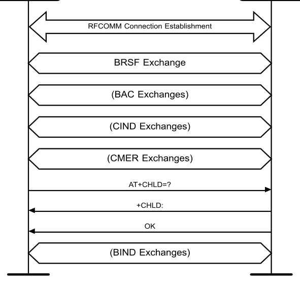

**Figure 4.1: HF Initiates SLC with 3-way MSC**

• Expected Outcome
Pass verdict
The test passes if all the pass criteria below are observed.
IUT is HF:
- Beginning with the AT+BRSF command, the HF generates the messages, and only the messages, indicated in Figure 4.1. Each is correctly formatted.
- The AT+BRSF Bluetooth Retrieve Supported Features are coded per [2]. The supported features bitmap corresponds to the items claimed by the HF IUT in the completed ICS document as mapped in Table 4.2.
- The AT+CMER Mobile Terminated Event Reporting is coded per [4]. It contains the <ind> value 3 (indicator event reporting using result code +CIEV: <ind>,<value>).
IUT is AG:
- The AG generates the messages, and only the messages, indicated in Figure 4.1. Each is correctly formatted.
- The +BRSF Bluetooth Retrieve Supported Features are coded per [2]. The supported features bitmap corresponds to the features claimed by the AG IUT in the completed ICS document as mapped in Table 4.3.
- The first +CIND Indicator Control is coded per [4] and contains the list of indicators supported by the AG with their corresponding ranges.
- The second +CIND Indicator Control is coded per [4] and contains the values of the indicators. The indicator values are within the ranges indicated in the first +CIND.
- The +CHLD Call Related Supplementary Services are coded per [4]. The supported features match the features claimed by the AG IUT in the completed ICS document (HFP 2/12a through HFP 2/12d).
• Notes
It is permissible for the IUT to send other commands, including commands not specified by [2], before and after SLC establishment, e.g., for improved interoperability with some devices.

#### 4.29.2 AG Initiates SLC with 3-way • Test Purpose

Verify that an SLC is established between the AG and the HF, initiated by the AG, when both devices support three-way calling.
• Reference
[2] 4.2, 4.33
• Initial Condition
- Devices are turned on and in range.
- Devices may need to be paired together. No Bluetooth connection exists between the devices.
- The HF device is in connectable mode.
• Test Case Configuration

|  | Test Case |  |
| --- | --- | --- |
| HFP/AG/SLC/BV-02-C [AG initiates SLC with 3-way by AG] |  |  |
| HFP/HF/SLC/BV-02-C [AG initiates SLC with 3-way by HF] |  |  |

Table 4.74: AG Initiates SLC with 3-way test cases
• Test Procedure
The test procedure is identical to that in Section 4.29.1, HF Initiates SLC with 3-way, except for the following:
1. An RFCOMM connection is established between the HF and the AG, with the AG in the
RFCOMM Initiator role.
• Expected Outcome
The Pass verdicts are identical to those in Section 4.29.1, HF Initiates SLC with 3-way.
• Notes
See Section 4.29.1, HF Initiates SLC with 3-way.

#### 4.29.3 HF Initiates SLC with No 3-way • Test Purpose

Verify that an SLC is established between the HF and the AG, initiated by the HF, when at least one device does not support three-way calling.
• Reference
[2] 4.2, 4.33
• Initial Condition
- Devices are turned on and in range.
- Devices may need to be paired together. No Bluetooth connection exists between the devices.
- The AG device is in connectable mode.
- The Lower Tester does not indicate support for three-way calling in its BRSF message.
• Test Case Configuration

|  | Test Case |  |  | Test RFU Bits |  |
| --- | --- | --- | --- | --- | --- |
| HFP/AG/SLC/BV-03-C [HF initiates SLC with no 3-way by AG] |  |  | No |  |  |
| HFP/HF/SLC/BV-03-C [HF initiates SLC with no 3-way by HF] |  |  | No |  |  |
| HFP/AG/SLC/BV-11-C [HF initiates SLC with no 3-way by AG, Test RFU Bits] |  |  | Yes |  |  |
| HFP/HF/SLC/BV-11-C [HF initiates SLC with no 3-way by HF, Test RFU Bits] |  |  | Yes |  |  |

Table 4.75: HF Initiates SLC with No 3-way test cases
• Test Procedure
1. An RFCOMM connection is established between the HF and the AG, with the HF in the
RFCOMM Initiator role. 2. Optionally, the IUT may initiate one or more AT commands. The Lower Tester will respond with
ERROR. 3. The HF initiates the SLC connection establishment. 4. The HF and the AG successfully complete the SLC establishment as shown in Figure 4.2.

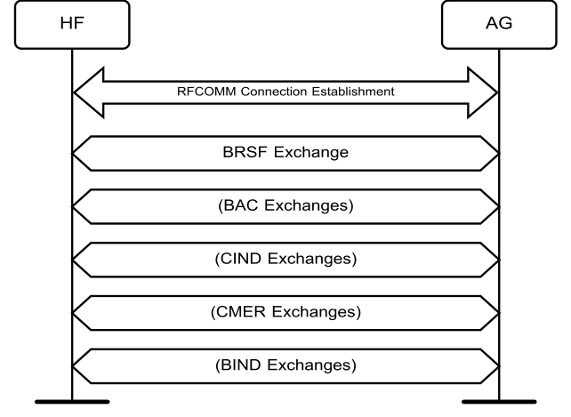

**Figure 4.2: HF Initiates SLC with No 3-way test cases MSC**

• Expected Outcome
Pass verdict
- The IUT generates the messages indicated in Figure 4.2. Each is correctly formatted.
- For the HF IUT, the AT+BRSF message is coded per [2]. The supported features bitmap corresponds to the items claimed by the HF IUT in the completed ICS document as mapped in Table 4.2.
- For the AG IUT, the +BRSF message is coded per [2]. The supported features bitmap corresponds to the features claimed by the AG IUT in the completed ICS document as mapped in Table 4.3.
- If Table 4.75 indicates to test the RFU bits, then all Reserved for Future Use bits in the <HF supported features bitmap> or <AG supported features bitmap> are set to 0b0 as mapped in Table 4.2 or Table 4.3, respectively.
- For the AG IUT, the first +CIND message coded per [4] contains the list of indicators supported by the AG with their corresponding ranges.
- For the AG IUT, the second +CIND message coded per [4] contains the values of the indicators. Indicator values are within the ranges indicated in the first +CIND.
- For the HF IUT, the AT+CMER message is coded per [4]. It contains the <ind> value 3 (indicator event reporting using result code +CIEV: <ind>,<value>).
• Notes
It is permissible for the IUT to send other commands, including commands not specified by [2], before and after SLC establishment, e.g., for improved interoperability with some devices.

#### 4.29.4 AG Initiates SLC with No 3-way • Test Purpose

Verify that an SLC is established between the AG and the HF, initiated by the AG, when at least one device does not support three-way calling.
• Reference
[2] 4.2, 4.33
• Initial Condition
- Devices are turned on and in range.
- Devices may need to be paired together. No Bluetooth connection exists between the devices.
- The HF device is in connectable mode.
• Test Case Configuration

|  | Test Case |  |  | Test RFU Bits |  |
| --- | --- | --- | --- | --- | --- |
| HFP/AG/SLC/BV-04-C [AG initiates SLC with no 3-way by AG] |  |  | No |  |  |
| HFP/HF/SLC/BV-04-C [AG initiates SLC with no 3-way by HF] |  |  | No |  |  |

Table 4.76: AG Initiates SLC with No 3-way test cases
• Test Procedure
The test procedure is identical to that in Section 4.29.3, except for the following:
1. An RFCOMM connection is established between the HF and the AG, with the AG in the
RFCOMM Initiator role.
• Expected Outcome
The Pass verdicts are identical to those in Section 4.29.3.
• Notes
The notes are identical to those in Section 4.29.3.

#### 4.29.5 HF Initiates SLC with Codec Negotiation • Test Purpose

Verify that an SLC is established when initiated by the HF when Codec Negotiation is supported.
• Reference
[2] 4.2
• Initial Condition
- The AG and the HF are turned on and in range.
- The AG and the HF may need to be paired together. No Bluetooth connections exist between the devices.
- The AG device is in connectable mode.
• Test Case Configuration

|  | Test Case |  |
| --- | --- | --- |
| HFP/AG/SLC/BV-05-C [Accept HF initiated SLC with Codec Negotiation] |  |  |
| HFP/HF/SLC/BV-05-C [HF initiates SLC with Codec Negotiation] |  |  |

Table 4.77: HF Initiates SLC with Codec Negotiation test cases
• Test Procedure
1. An RFCOMM connection is established between the HF and the AG, with the HF in the
RFCOMM Initiator role. 2. Optionally, if the IUT is an HF device, it may initiate one or more AT commands. The Lower
Tester will respond with ERROR. 3. Optionally, if the IUT is an AG device, it may initiate one or more unsolicited responses. The
Lower Tester will ignore these. 4. The HF initiates the SLC connection establishment. The Lower Tester device indicates support
for Codec Negotiation in its BRSF message. 5. The HF sends the Codec Negotiation AT+BAC to indicate the list of supported codecs to the AG
device. 6. The HF and the AG successfully complete the SLC establishment as shown in Figure 4.3.

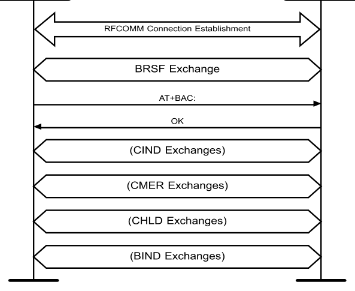

**Figure 4.3: HF Initiates SLC with Codec Negotiation MSC**

• Expected Outcome
Pass verdict
The test passes if all the pass criteria below are observed.
IUT is HF:
- Beginning with the AT+BRSF command, the HF generates the messages, and only the messages, indicated in Figure 4.3. Each is correctly formatted.
- The AT+BRSF Bluetooth Retrieve Supported Features are coded per [2]. The supported features bitmap corresponds to the items claimed by the HF IUT in the completed ICS document as mapped in Table 4.2.
- AT+BAC, the AT to indicate the HF list of supported codec commands, is sent to the AG device.
- Bit7 of the AT+BRSF is set to one to indicate support for Codec Negotiation.
IUT is AG:
- The AG generates the messages, and only the messages, indicated in Figure 4.3. Each is correctly formatted.
- The +BRSF Bluetooth Retrieve Supported Features are coded per [2]. The supported features bitmap corresponds to the features claimed by the AG IUT in the completed ICS document as mapped in Table 4.3.
- AT+BAC is acknowledged correctly by the AG device.
- Bit 9 of the AT+BRSF is set to one to indicate support for Codec Negotiation.
• Notes
It is permissible for the IUT to send other commands, including commands not specified by [2], before and after SLC establishment, e.g., for improved interoperability with some devices.

#### 4.29.6 AG Initiates SLC with Codec Negotiation • Test Purpose

Verify that an SLC is established when initiated by the AG when Codec Negotiation is supported.
• Reference
[2] 4.2
• Initial Condition
- The AG and the HF are turned on and in range.
- The AG and the HF may need to be paired together.
- The HF device is in connectable mode.
• Test Case Configuration

|  | Test Case |  |
| --- | --- | --- |
| HFP/AG/SLC/BV-06-C [AG initiates SLC with Codec Negotiation] |  |  |
| HFP/HF/SLC/BV-06-C [Accept AG initiated SLC with Codec Negotiation] |  |  |

Table 4.78: AG Initiates SLC with Codec Negotiation test cases
• Test Procedure
The test procedure is identical to that in Section 4.29.5, except for the following:
1. An RFCOMM connection is established between the HF and the AG, with AG in the RFCOMM
Initiator role.
• Expected Outcome
The Pass verdicts are identical to those in Section 4.29.5.
• Notes
The notes are identical to those in Section 4.29.5.
HFP/AG/SLC/BV-07-C [HF initiates SLC without Codec Negotiation]
• Test Purpose
Verify that an SLC is established with the IUT when initiated by the Lower Tester when Codec Negotiation is not supported in the Lower Tester.
• Reference
[2] 4.2
• Initial Condition
- The AG and the HF are turned on and in range.
- The AG and the HF may need to be paired together. No Bluetooth connection exists between the devices.
- The IUT is in connectable mode.
• Test Procedure
1. An RFCOMM connection is established between the IUT and the Lower Tester, with the Lower
Tester in the RFCOMM Initiator role. 2. The IUT may initiate one or more unsolicited responses. The Lower Tester will ignore these. 3. The Lower Tester initiates the SLC connection establishment. 4. The IUT and the Lower Tester successfully complete the SLC establishment shown in Figure 4.4.
The Lower Tester does not indicate support for Codec Negotiation in its BRSF message. 5. The Lower Tester does not send the AT+BAC list of supported codecs command to the IUT.

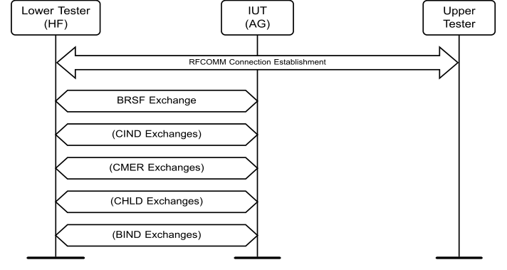

**Figure 4.4: HF initiates SLC without Codec Negotiation MSC**

• Expected Outcome
Pass verdict
The IUT generates the messages, and only the messages, indicated in Figure 4.4. Each is correctly formatted.
The +BRSF (Bluetooth Retrieve Supported Features coded per [2]) supported features bitmap corresponds to the items claimed by the IUT in the completed ICS document as mapped in Table 4.3.
Bit 9 of the +BRSF is set to one to indicate support for Codec Negotiation.
• Notes
It is permissible for the IUT to send other commands, including commands not specified by [2], before and after SLC establishment, e.g., for improved interoperability with some devices.
HFP/HF/SLC/BV-08-C [AG initiates SLC without Codec Negotiation]
• Test Purpose
Verify that an SLC is established when initiated by the Lower Tester when Codec Negotiation is not supported by the Lower Tester.
• Reference
[2] 4.2
• Initial Condition
- The AG and the HF are turned on and in range.
- The AG and the HF may need to be paired together. No Bluetooth connection exists between the devices.
- The Lower Tester is in connectable mode.
• Test Procedure
1. An RFCOMM connection is established between the IUT and the Lower Tester, with the Lower
Tester in the RFCOMM Initiator role. 2. The IUT may initiate one or more AT commands. The Lower Tester will respond with ERROR. 3. The Lower Tester initiates the SLC connection establishment. 4. The IUT and the Lower Tester successfully complete the SLC establishment shown in Figure 4.5.
The Lower Tester does not indicate support for Codec Negotiation in its BRSF message. 5. The IUT may or may not send the AT+BAC list of supported codecs command to the Lower
Tester, depending on the IUT support for Codec Negotiation. 6. The Lower Tester will respond to the AT+BAC command from the IUT with ERROR.

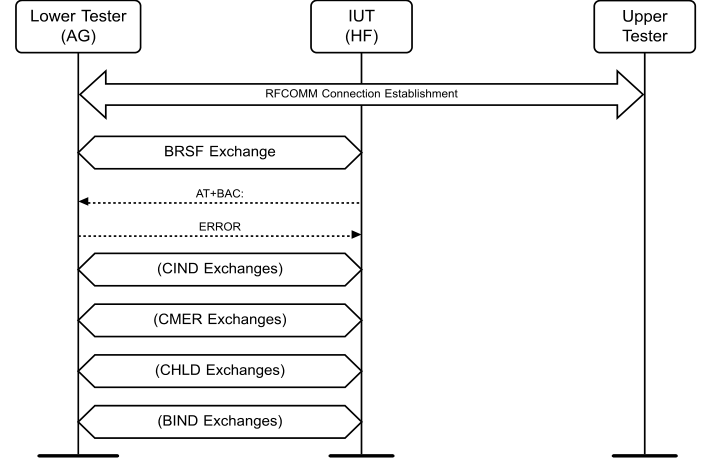

**Figure 4.5: AG initiates SLC without Codec Negotiation MSC**

• Expected Outcome
Pass verdict
The IUT generates the messages, and only the messages, indicated in Figure 4.5. Each is correctly formatted.
The AT+BRSF (Bluetooth Retrieve Supported Features coded per [2]) supported features bitmap corresponds to the features claimed by the IUT in the completed ICS document as mapped in Table 4.2.
Bit 7 of the AT+BRSF is set to one to indicate support for Codec Negotiation.
• Notes
It is permissible for the IUT to send other commands, including commands not specified by [2], before and after SLC establishment, e.g., for improved interoperability with some devices.

#### 4.29.7 SLC, HF and AG both support HF Indicators, with some in common • Test Purpose

Verify that an IUT (AG or HF) can correctly initiate an SLC when both devices support HF Indicators and have at least one HF Indicator in common.
• Reference
[7] 4.2, 4.35
[11] 4.2, 4.34
• Initial Condition
- The AG and the HF are turned on, paired, and in range.
- No Bluetooth connection exists between the AG and the HF.
- The AG device is in connectable mode.
- TSPX_HFP_Unsupported_HF_Indicator_1 is the Unsupported HF Indicators as defined in IXIT [10].
- TSPX_HFP_Supported_HF_Indicator_1 is the Supported HF Indicators as defined in IXIT [10].
• Test Case Configuration

|  | Test Case |  |
| --- | --- | --- |
| HFP/AG/SLC/BV-09-C [SLC, HF and AG both support HF Indicator by AG] |  |  |
| HFP/HF/SLC/BV-09-C [SLC, HF and AG both support HF Indicator by HF] |  |  |

Table 4.79: SLC, HF and AG both support HF Indicator, with some in common test cases
• Test Procedure
1. An RFCOMM connection is established between the HF and the AG, with the AG in the
RFCOMM Initiator role. 2. Optionally, the HF may initiate one or more AT commands. The AG may respond with ERROR. 3. The HF and the AG successfully complete the SLC establishment as shown in Figure 4.6. Both
devices indicate support for HF Indicators in the BRSF exchange and have at least one indicator in common. 4. The Lower Tester uses TSPX_HFP_Unsupported_HF_Indicator_1 and
TSPX_HFP_Supported_HF_Indicator_1 as the list of supported HF Indicators.

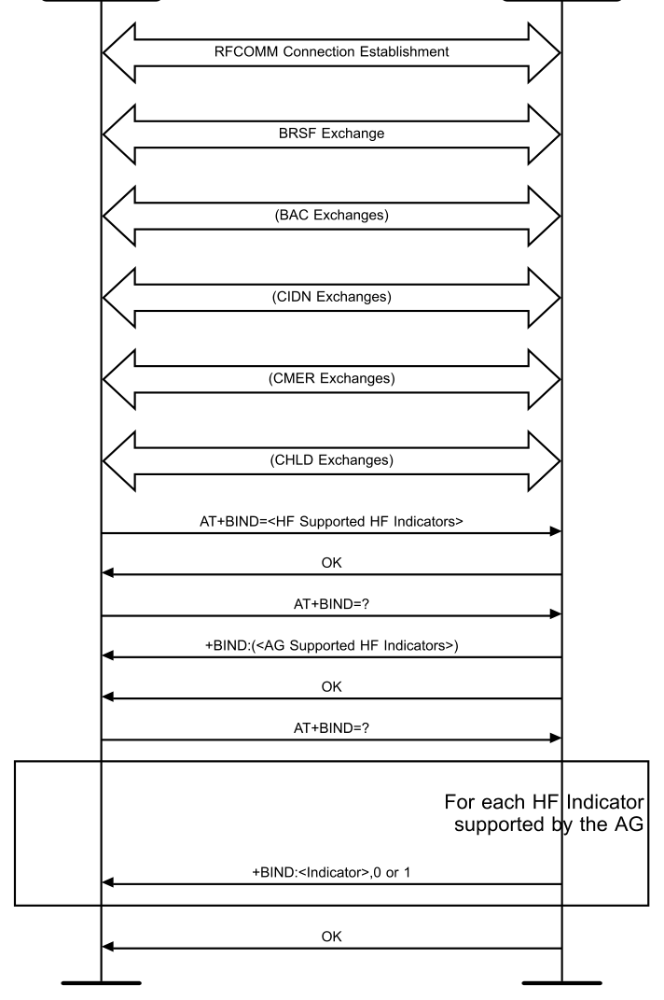

**Figure 4.6: SLC, HF and AG both support HF Indicators, with some in common MSC**

• Expected Outcome
Pass verdict
The test passes if all the pass criteria below are observed.
IUT is HF:
1. The BRSF of the HF has the HF Indicators feature bit set. 2. The HF generates the messages in the order indicated in Figure 4.6. Each is correctly formatted.
IUT is AG:
1. AT+BRSF Bluetooth Retrieve Supported Features of the AG has the HF Indicators feature bit set. 2. The AG generates the messages in the order indicated in Figure 4.6. Each is correctly formatted.
• Notes
It is permissible for the IUT to send other commands, including commands not specified by [2], before and after SLC establishment, e.g., for improved interoperability with some devices.

#### 4.29.8 SLC, IUT supports HF Indicators, Lower Tester does not • Test Purpose

Verify that an IUT (AG or HF) can correctly initiate an SLC when the remote device does not support HF Indicators.
• Reference
[7] 4.2, 4.35
[11] 4.2, 4.34
• Initial Condition
- The AG and the HF are turned on, paired, and in range.
- No Bluetooth connection exists between the AG and the HF.
- The AG device is in connectable mode.
- The remote (HF or AG) device does not support HF Indicators.
• Test Case Configuration

|  | Test Case |  |
| --- | --- | --- |
| HFP/AG/SLC/BV-10-C [SLC, Lower Tester does not support HF Indicator by AG] |  |  |
| HFP/HF/SLC/BV-10-C [SLC, Lower Tester does not support HF Indicator by HF] |  |  |

Table 4.80: SLC, IUT supports HF Indicators, Lower Tester does not test cases
• Test Procedure
1. An RFCOMM connection is established between the HF and the AG, with the AG in the
RFCOMM Initiator role. 2. Optionally, the HF may initiate one or more AT commands. The AG may respond with ERROR. 3. The HF and the AG successfully complete the SLC establishment as shown in Figure 4.7.

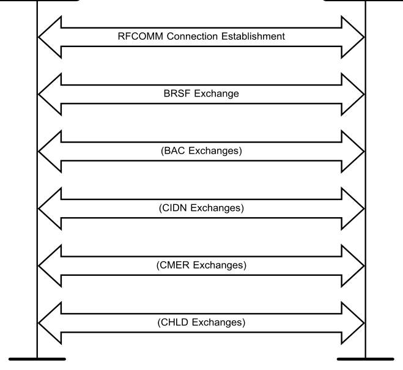

**Figure 4.7: SLC, IUT supports HF Indicators, Lower Tester does not MSC**

• Expected Outcome
Pass verdict
The test passes if all the pass criteria below are observed.
IUT is HF:
1. The HF generates the messages in the order and number indicated in Figure 4.7. Each is
correctly formatted. 2. The HF does not send any AT+BIND commands during SLC. 3. A Service Level Connection is established.
IUT is AG:
1. The AG generates the message responses in the order and number indicated in Figure 4.7. Each
is correctly formatted. 2. A Service Level Connection is established.
• Notes
It is permissible for the IUT to send other commands, including commands not specified by [2], before and after SLC establishment, e.g., for improved interoperability with some devices.

#### 4.29.9 IUT Ignores RFU BRSF Bits

HFP/HF/SLC/BI-01-C [HF Ignores RFU BRSF Bits]
• Test Purpose
Verify that when an SLC is established, the HF IUT ignores RFU bits set to 0b1 when received.
• Reference
[11] 1.4.2, 5.3
• Initial Condition
- The IUT and the Lower Tester have been paired previously.
- No Bluetooth connection exists between the IUT and the Lower Tester.
- The HF IUT is in connectable mode.
• Test Procedure
1. The Lower Tester sets the <AG supported features bitmap> Reserved for Future Use bits to 0b1
as mapped in Table 4.3. 2. The Upper Tester commands the IUT to establish an SLC with the Lower Tester. 3. An RFCOMM connection is established between the IUT and the Lower Tester. 4. The IUT initiates the SLC connection establishment. 5. The IUT and the Lower Tester successfully complete the SLC establishment as shown in Figure
4.2.
• Expected Outcome
Pass verdict
The IUT ignores the received RFU bits set to 0b1 and successfully completes the SLC establishment.
HFP/AG/SLC/BI-01-C [AG Ignores RFU BRSF Bits]
• Test Purpose
Verify that when an SLC is established, the AG IUT ignores RFU bits set to 0b1 when received.
• Reference
[11] 1.4.2, 5.3
• Initial Condition
- The IUT and the Lower Tester have been paired previously.
- No Bluetooth connection exists between the IUT and the Lower Tester.
- The Lower Tester is in connectable mode.
• Test Procedure
1. The Lower Tester sets the <HF supported features bitmap> Reserved for Future Use bits to 0b1
as mapped in Table 4.2. 2. An RFCOMM connection is established between the IUT and the Lower Tester. 3. The Lower Tester initiates the SLC connection establishment. 4. The IUT and the Lower Tester successfully complete the SLC establishment as shown in Figure
4.2.
• Expected Outcome
Pass verdict
The IUT ignores the received RFU bits set to 0b1 and successfully completes the SLC establishment.

### 4.30 Codec Connection Setup

When reference is made to a legacy Audio Connection, this refers to the Audio Connection Setup procedure employed by implementations based on Hands-Free Profile v1.5 and earlier Hands-Free Profile specification versions.

#### 4.30.1 Codec Connection Setup with HF Initiated • Test Purpose

Verify that the HF IUT can initiate a working Codec Connection Setup successfully with an AG.
• Reference
[2] 4.11
• Initial Condition
- The IUT is the HF.
- The Lower Tester is the AG.
- An SLC is established between the IUT and the Lower Tester; there are no Synchronous Connections established.
- The IUT determines that the Lower Tester can support the Codec Connection Setup procedure using the AT+BRSF and SDP records before attempting any Audio Connection. The Lower Tester and the IUT support Codec Connection Setup.
- An ongoing call may be present to achieve the test purpose.
• Test Case Configuration

|  | Test Case |  |  | Codec |  |
| --- | --- | --- | --- | --- | --- |
| HFP/HF/ACC/BV-08-C [HF Initiated Codec Connection Setup: CVSD] |  |  | CVSD |  |  |
| HFP/HF/ACC/BV-09-C [HF Initiated Codec Connection Setup: mSBC] |  |  | mSBC |  |  |
| HFP/HF/ACC/BV-14-C [HF Initiated Codec Connection Setup: LC3-SWB] |  |  | LC3-SWB |  |  |

Table 4.81: Codec Connection Setup with HF Initiated test cases
• Test Procedure

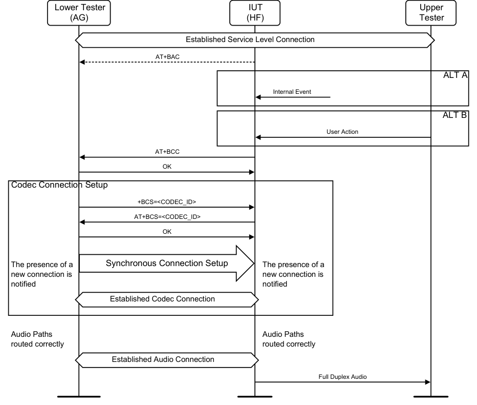

**Figure 4.8: Codec Connection Setup with HF Initiated MSC**

1. The IUT initiates a full duplex Audio Connection with the Lower Tester using the Codec
Connection Setup procedure in [2]. 2. The Lower Tester accepts the connection request from the IUT using the Codec Connection
Setup procedure in [2] with the codec in Table 4.81.
• Expected Outcome
Pass verdict
The IUT establishes meaningful full duplex audio with the Lower Tester using the Codec Connection Setup procedure.
The codec used in the Codec Connection Setup procedure between the IUT and the Lower Tester matches the codec in Table 4.81 and is used throughout the Synchronous Connection.

#### 4.30.2 Codec Connection Setup following an initial successful Codec Connection Setup with HF initiated • Test Purpose

Verify that the HF IUT can initiate a working Codec Connection Setup successfully with an AG following an already successful Codec Connection Setup procedure, selecting the same codec.
• Reference
[2] 4.11
• Initial Condition
- The IUT is the HF.
- The Lower Tester is the AG.
- An SLC is established between the IUT and the Lower Tester; there are no Synchronous Connections established. The IUT has already determined that the Lower Tester can support the Codec Connection Setup procedure using the AT+BRSF and/or SDP records.
- The IUT and the Lower Tester have already successfully initiated a working Codec Connection Setup procedure using the codec in Table 4.82.
- An ongoing call may be present to achieve the test purpose.
• Test Case Configuration

|  | Test Case |  |  | Codec |  |
| --- | --- | --- | --- | --- | --- |
| HFP/HF/ACC/BV-10-C [HF Initiated Codec Connection Setup Following Initial Successful Codec Connection Setup: CVSD] |  |  | CVSD |  |  |
| HFP/HF/ACC/BV-11-C [HF Initiated Codec Connection Setup Following Initial Successful Codec Connection Setup: mSBC] |  |  | mSBC |  |  |
| HFP/HF/ACC/BV-15-C [HF Initiated Codec Connection Setup Following Initial Successful Codec Connection Setup: LC3-SWB] |  |  | LC3-SWB |  |  |

Table 4.82: Codec Connection Setup following an initial successful Codec Connection Setup with HF initiated test cases
• Test Procedure

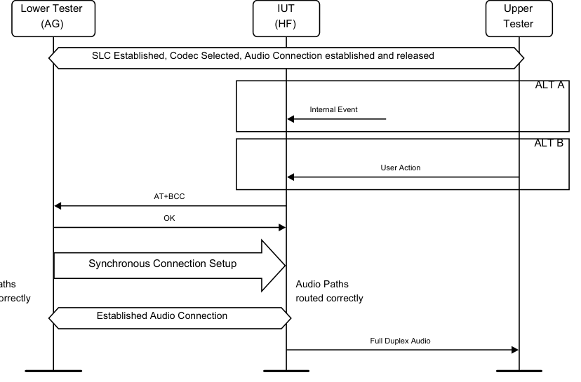

**Figure 4.9: Codec Connection Setup following an initial successful Codec Connection Setup with HF initiated MSC**

1. The IUT initiates a full duplex Audio Connection with the Lower Tester using the Codec
Connection Setup procedure in [2]. 2. The Lower Tester accepts the connection request from the IUT using the Codec Connection
Setup procedure in [2] with the codec in Table 4.82. The Lower Tester initiates the Codec Connection request. As the codec has already been successfully negotiated in the initial Codec Connection Setup procedure, the Lower Tester does not alert the IUT as to the codec to be used for this Codec Connection Setup.
• Expected Outcome
Pass verdict
Meaningful full duplex audio is available between the IUT and the Lower Tester using the Codec Connection Setup procedure.
The codec used is the same as the one used in the previous connection and matches the codec in Table 4.82.
HFP/HF/ACC/BV-03-C [Codec Connection with legacy peer with HF initiated]
• Test Purpose
Verify that the HF IUT can initiate a legacy Audio Connection with an AG that does not support the Codec Connection Setup procedure.
• Reference
[2] 4.11
• Initial Condition
- The IUT is the HF.
- The Lower Tester is the AG.
- An SLC is established between the IUT and the Lower Tester; there are no Synchronous Connections established. The IUT determines that the Lower Tester can support the Codec Connection Setup procedure using the AT+BRSF and SDP records before attempting any Audio Connection.
- An ongoing call may be present to achieve the test purpose.
- The IUT determines that the Lower Tester only supports the legacy connection method and in turn employs the legacy method to establish the connection.
• Test Procedure

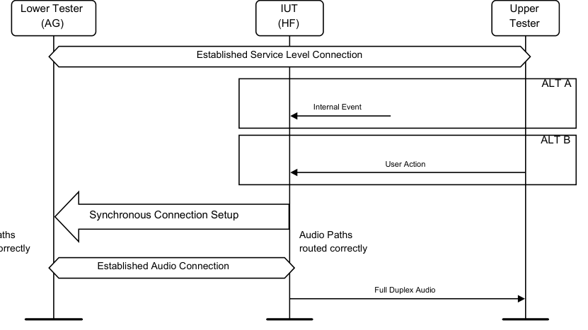

**Figure 4.10: Codec Connection with legacy peer with HF initiated MSC**

1. The IUT initiates the establishment of a Synchronous Connection with the Lower Tester without
using the Codec Connection Setup procedure in [2]. 2. The Lower Tester accepts the establishment of a Synchronous Connection with the IUT.
• Expected Outcome
Pass verdict
Meaningful full duplex audio is available between the IUT and the Lower Tester. The Audio Connection can be SCO or eSCO depending on the supported features of the IUT.

#### 4.30.3 Codec Connection Setup with AG initiated • Test Purpose

Verify that the HF IUT can accept a full duplex Audio Connection from an AG using the Codec Connection Setup procedure.
• Reference
• Initial Condition
- The IUT is the HF.
- The Lower Tester is the AG.
- An SLC is established between the IUT and the Lower Tester; there are no Synchronous Connections established. The IUT determines that the Lower Tester can support the Codec Connection Setup procedure using the AT+BRSF and SDP records before attempting any Audio Connection.
• Test Case Configuration

|  | Test Case |  |  | Codec |  |
| --- | --- | --- | --- | --- | --- |
| HFP/HF/ACC/BV-12-C [AG Initiated Codec Connection Setup: CVSD] |  |  | CVSD |  |  |
| HFP/HF/ACC/BV-13-C [AG Initiated Codec Connection Setup: mSBC] |  |  | mSBC |  |  |
| HFP/HF/ACC/BV-16-C [AG Initiated Codec Connection Setup: LC3-SWB] |  |  | LC3-SWB |  |  |

Table 4.83: Codec Connection Setup with AG initiated test cases
• Test Procedure

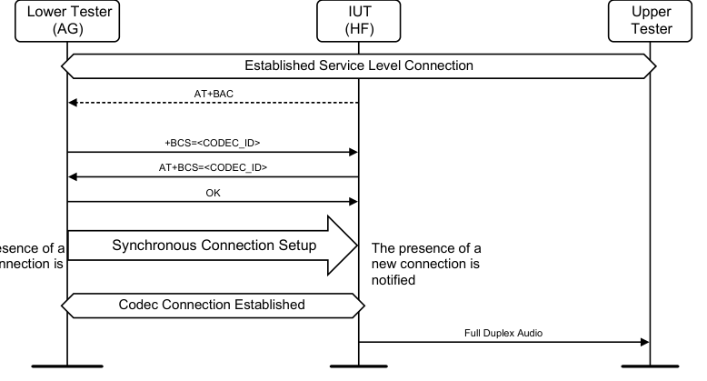

**Figure 4.11: Codec Connection Setup with AG initiated MSC**

1. The Lower Tester initiates a full duplex Audio Connection with the IUT using the Codec
Connection Setup procedure in [2] with the codec in Table 4.83. 2. The IUT accepts a full duplex Audio Connection from the Lower Tester using the Codec
Connection Setup procedure in [2].
• Expected Outcome
Pass verdict
The IUT establishes meaningful full duplex audio with the Lower Tester using the Codec Connection Setup procedure.
The codec used in the Codec Connection Setup procedure between the IUT and the Lower Tester matches the codec in Table 4.83 and is used throughout the Synchronous Connection.
• Test Purpose
Verify that the HF IUT can support the Codec Connection Setup procedure, accepting a legacy Audio Connection Setup from an AG not supporting the Codec Connection Setup procedure.
• Reference
[2] 4.11
• Initial Condition
- The IUT is the HF.
- The Lower Tester is the AG.
- An SLC is established between the IUT and the Lower Tester; there are no Synchronous Connections established. The IUT determines that the Lower Tester can support the Codec Connection Setup procedure using the AT+BRSF and SDP records before attempting any Audio Connection.
• Test Procedure

**Figure 4.12: Codec Connection with legacy peer with AG initiated MSC**

1. The Lower Tester initiates the establishment of a Synchronous Connection with the IUT without
using the Codec Connection Setup procedure in [2]. 2. The IUT accepts the establishment of a Synchronous Connection with the Lower Tester.
• Expected Outcome
Pass verdict
Meaningful full duplex audio is available between the IUT and the Lower Tester. The Audio Connection can be SCO or eSCO depending on the supported features of the IUT.

#### 4.30.4 Codec Connection with AG initiated - Verify support for T1 settings • Test Purpose

Verify that the HF IUT can accept a full duplex Audio Connection from an AG using the Codec Connection Setup procedure with T1 link parameters.
• Reference
[2] 4.11
• Initial Condition
- The IUT is the HF.
- The Lower Tester is the AG.
- The Lower Tester is configured not to support BR/EDR Secure Connections, hence ensuring that the Secure Connections feature is not used on the connection during the test.
- An SLC is established between the IUT and the Lower Tester; there are no Synchronous Connections established. The IUT has already determined that the Lower Tester can support the Codec Connection Setup procedure using the AT+BRSF and SDP records.
• Test Case Configuration

|  | Test Case |  |  | Codec |  |
| --- | --- | --- | --- | --- | --- |
| HFP/HF/ACC/BV-06-C [AG Initiated Codec Connection Setup with T1 settings: mSBC] |  |  | mSBC |  |  |
| HFP/HF/ACC/BV-17-C [AG Initiated Codec Connection Setup with T1 settings: LC3-SWB] |  |  | LC3-SWB |  |  |

Table 4.84: Codec Connection with AG initiated - Verify support for T1 settings test cases
• Test Procedure
1. The Lower Tester initiates a full duplex Audio Connection with the IUT using the Codec
Connection Setup procedure in [2] with the codec listed in Table 4.84. The Lower Tester successfully initiates the Codec Connection request with the T1 link parameters. 2. The IUT accepts a full duplex Audio Connection from the Lower Tester using the Codec
Connection Setup procedure in [2].
• Expected Outcome
Pass verdict
The IUT accepts the T1 Synchronous Connection via the Codec Connection Setup procedure. Meaningful full duplex audio is available between the IUT and the Lower Tester. The codec selected matches the codec listed in Table 4.84.

#### 4.30.5 Codec Connection with AG initiated - Verify support for T2 settings • Test Purpose

Verify that the HF IUT can accept a full duplex Audio Connection from an AG using the Codec Connection Setup procedure with T2 link parameters.
• Reference
[2] 4.11
• Initial Condition
- The IUT is the HF.
- The Lower Tester is the AG.
- The Lower Tester is configured to support BR/EDR Secure Connections.
- An SLC is established between the IUT and the Lower Tester; there are no Synchronous Connections established. The IUT has already determined that the Lower Tester can support the Codec Connection Setup procedure using the AT+BRSF and SDP records.
• Test Case Configuration

|  | Test Case |  |  | Codec |  |
| --- | --- | --- | --- | --- | --- |
| HFP/HF/ACC/BV-07-C [AG Initiated Codec Connection Setup with T2 settings: mSBC] |  |  | mSBC |  |  |
| HFP/HF/ACC/BV-18-C [AG Initiated Codec Connection Setup with T2 settings: LC3-SWB] |  |  | LC3-SWB |  |  |

Table 4.85: Codec Connection with AG initiated - Verify support for T2 settings test cases
• Test Procedure
1. The Lower Tester initiates a full duplex Audio Connection with the IUT using the Codec
Connection Setup procedure in [2] with the codec listed in Table 4.85. The Lower Tester successfully initiates the Codec Connection request with the T2 link parameters. 2. The IUT accepts a full duplex Audio Connection from the Lower Tester using the Codec
Connection Setup procedure in [2].
• Expected Outcome
Pass verdict
The IUT accepts the T2 Synchronous Connection via the Codec Connection Setup procedure. Meaningful full duplex audio is available between the IUT and the Lower Tester. The codec selected matches the codec listed in Table 4.85.

#### 4.30.6 Codec Connection Setup with HF initiated • Test Purpose

Verify that the AG IUT can accept a full duplex Audio Connection with the HF using the Codec Connection Setup procedure in [2].
• Reference
[2] 4.11
• Initial Condition
- The IUT is the AG.
- The Lower Tester is the HF.
- An SLC is established between the IUT and the Lower Tester; there are no Synchronous Connections established. The IUT determines that the Lower Tester can support the Codec Connection Setup procedure using the AT+BRSF and SDP records before attempting any Audio Connection.
• Test Case Configuration

|  | Test Case |  |  | Codec |  |
| --- | --- | --- | --- | --- | --- |
| HFP/AG/ACC/BV-16-C [HF Initiated Codec Connection Setup: CVSD] |  |  | CVSD |  |  |
| HFP/AG/ACC/BV-17-C [HF Initiated Codec Connection Setup: mSBC] |  |  | mSBC |  |  |
| HFP/AG/ACC/BV-27-C [HF Initiated Codec Connection Setup: LC3-SWB] |  |  | LC3-SWB |  |  |

Table 4.86: Codec Connection Setup with HF initiated test cases
• Test Procedure

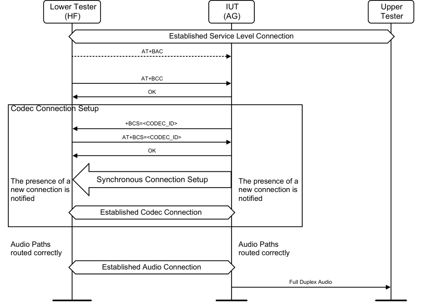

**Figure 4.13: Codec Connection Setup with HF initiated MSC**

1. The Lower Tester initiates a full duplex Audio Connection with the IUT using the Codec
Connection Setup procedure in [2]. 2. The IUT accepts a full duplex Audio Connection with the Lower Tester using the Codec
Connection Setup procedure in [2] with the codec in Table 4.86.
• Expected Outcome
Pass verdict
The IUT establishes meaningful full duplex audio with the Lower Tester using the Codec Connection Setup procedure.
The codec used in the Codec Connection Setup procedure between the IUT and the Lower Tester matches the codec in Table 4.86 and is used throughout the Synchronous Connection.
HFP/AG/ACC/BV-09-C [Codec Connection Setup with legacy peer with HF initiated]
• Test Purpose
Verify that the AG IUT can accept a full duplex Audio Connection with the Lower Tester using the legacy Audio Connection Setup procedure.
• Reference
[2] 4.11
• Initial Condition
- The IUT is the AG.
- The Lower Tester is the HF.
- An SLC is established between the IUT and the Lower Tester; there are no Synchronous Connections established. The IUT determines that the Lower Tester can support the Codec Connection Setup procedure using the AT+BRSF and SDP records before attempting any Audio Connection.
• Test Procedure

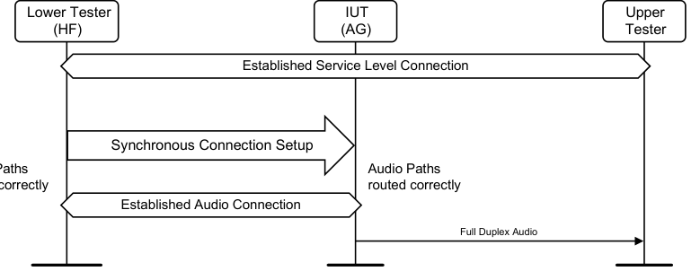

**Figure 4.14: Codec Connection Setup with legacy peer with HF initiated MSC**

1. The Lower Tester initiates the establishment of a Synchronous Connection with the IUT without
using the Codec Connection Setup procedure in [2]. 2. The IUT accepts the establishment of a Synchronous Connection with the Lower Tester.
• Expected Outcome
Pass verdict
Meaningful full duplex audio is available between the IUT and the Lower Tester. The Audio Connection can be SCO or eSCO depending on the supported features of the IUT.

#### 4.30.7 Codec Connection Setup with AG initiated • Test Purpose

Verify that the AG IUT can initiate a working Codec Connection Setup successfully with the Lower Tester; the Lower Tester supports the Codec Connection Setup procedure before attempting any Audio Connection.
• Reference
[2] 4.11
• Initial Condition
- The AG is the IUT.
- The Lower Tester is the HF.
- An SLC is established between the IUT and the Lower Tester; there are no Synchronous Connections established. The IUT determines that the Lower Tester can support the Codec Connection Setup procedure using the AT+BRSF and SDP records.
• Test Case Configuration

|  | Test Case |  |  | Codec |  |
| --- | --- | --- | --- | --- | --- |
| HFP/AG/ACC/BV-18-C [AG Initiated Codec Connection Setup: CVSD] |  |  | CVSD |  |  |
| HFP/AG/ACC/BV-19-C [AG Initiated Codec Connection Setup: mSBC] |  |  | mSBC |  |  |
| HFP/AG/ACC/BV-28-C [AG Initiated Codec Connection Setup: LC3-SWB] |  |  | LC3-SWB |  |  |

Table 4.87: Codec Connection Setup with AG initiated test cases
• Test Procedure

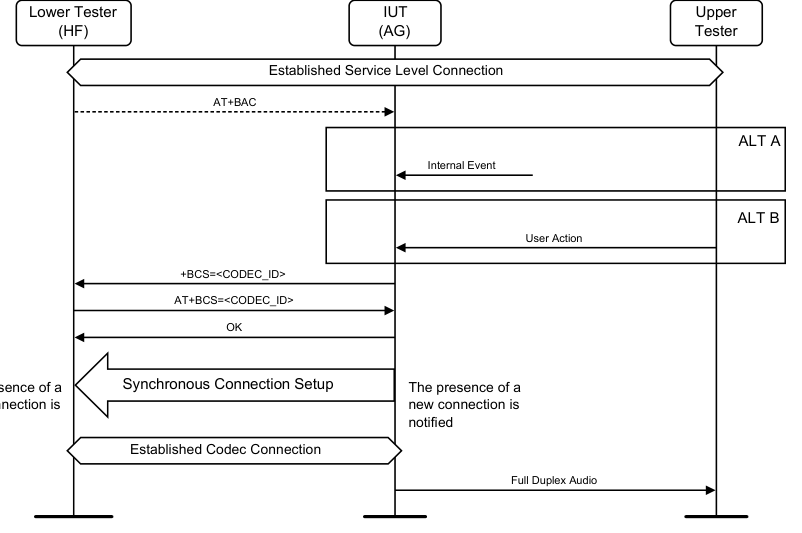

**Figure 4.15: Codec Connection Setup with AG initiated MSC**

1. The IUT initiates a full duplex Audio Connection with the Lower Tester using the Codec
Connection Setup procedure in [2] with the codec in Table 4.87. 2. The Lower Tester accepts a full duplex Audio Connection with the IUT using the Codec
Connection Setup procedure in [2].
• Expected Outcome
Pass verdict
The IUT successfully initiates the Synchronous Connection for the Codec Connection Setup procedure to the Lower Tester.
Meaningful full duplex audio is available between the IUT and the Lower Tester using the Codec Connection Setup procedure.
The codec used in the Codec Connection Setup procedure between the IUT and the Lower Tester matches the codec in Table 4.87 and is used throughout the Synchronous Connection.

#### 4.30.8 Codec Connection Setup following an initial successful Codec Connection Setup with AG initiated • Test Purpose

Verify that the AG IUT can initiate a full duplex Audio Connection using the Codec Connection Setup procedure. The IUT has already successfully initiated a Codec Connection Setup procedure with the Lower Tester and is not required to alert the Lower Tester of the codec to use if this remains unchanged.
• Reference
[2] 4.11
• Initial Condition
- The IUT is the AG.
- The Lower Tester is the HF.
- An SLC is established between the IUT and the Lower Tester; there are no Synchronous Connections established. The IUT has already determined that the Lower Tester can support the Codec Connection Setup procedure using the AT+BRSF and/or SDP records.
- The IUT and the Lower Tester have already successfully initiated a working Codec Connection Setup procedure using the codec in Table 4.88.
• Test Case Configuration

|  | Test Case |  |  | Codec |  |
| --- | --- | --- | --- | --- | --- |
| HFP/AG/ACC/BV-20-C [AG Initiated Codec Connection Setup Following Initial Successful Codec Connection Setup: CVSD] |  |  | CVSD |  |  |
| HFP/AG/ACC/BV-21-C [AG Initiated Codec Connection Setup Following Initial Successful Codec Connection Setup: mSBC] |  |  | mSBC |  |  |
| HFP/AG/ACC/BV-29-C [AG Initiated Codec Connection Setup Following Initial Successful Codec Connection Setup: LC3-SWB] |  |  | LC3-SWB |  |  |

Table 4.88: Codec Connection Setup following an initial successful Codec Connection Setup with AG initiated test cases
• Test Procedure

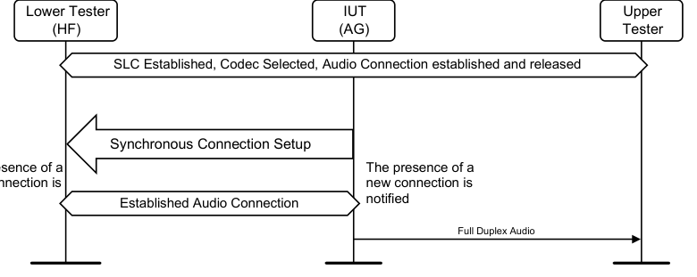

**Figure 4.16: Codec Connection Setup following an initial successful Codec Connection Setup with AG initiated MSC**

Connection Setup procedure in [2]. 2. The IUT successfully initiates the Codec Connection request. Since the codec has already been
successfully negotiated in the initial Codec Connection Setup procedure in Step 1, the IUT does not alert the Lower Tester to the codec to be used for this Codec Connection Setup.
• Expected Outcome
Pass verdict
Meaningful full duplex audio is available between the IUT and the Lower Tester using the Codec Connection Setup procedure. The codec used is the codec specified in Table 4.88 and is the same as that used in the previous connection.

#### 4.30.9 Codec Connection Setup using “Safe Settings” parameters • Test Purpose

Verify that the AG IUT successfully initiates Codec Connection Setup while using the “safe settings” parameters.
• Reference
[2] 4.11, Tables 5.9 and 5.11
[7] 5.7.1
[11] 6.7.1
• Initial Condition
- The IUT is the AG.
- The Lower Tester is the HF.
- The Lower Tester is configured to support BR/EDR Secure Connections based on Table 4.89.
- An SLC is established between the IUT and the Lower Tester; there are no Synchronous Connections established. The IUT has already determined that the Lower Tester can support the Codec Connection Setup procedure using the AT+BRSF and/or SDP records.
- TSPX_connection_setup_max_retries is the maximum number of retries the IUT will attempt during its initial configuration parameters before using the Safe Settings configuration parameters as defined in IXIT [10].
• Test Case Configuration

| Test Case | Codec |  | Safe Settings |  |  | Secure |  |
| --- | --- | --- | --- | --- | --- | --- | --- |
|  |  |  | Parameters |  |  | Connections |  |
| HFP/AG/ACC/BV-24-C [Codec Connection Setup using Safe Settings: CVSD S4] | CVSD | CVSD using eSCO EDR 2-EV3 packets (S4) |  |  | Yes |  |  |
| HFP/AG/ACC/BV-22-C [Codec Connection Setup using Safe Settings: CVSD S1] | CVSD | CVSD using eSCO EV3 packets (S1) |  |  | No |  |  |
| HFP/AG/ACC/BV-25-C [Codec Connection Setup using Safe Settings: mSBC T2] | mSBC | Transparent data using eSCO EDR 2-EV3 packets (T2) |  |  | Yes |  |  |
| HFP/AG/ACC/BV-23-C [Codec Connection Setup using Safe Settings: mSBC T1] | mSBC | Transparent data using eSCO EV3 packets (T1) |  |  | No |  |  |

| Test Case Codec | Safe Settings Parameters |  |  | Secure |  |
| --- | --- | --- | --- | --- | --- |
|  |  |  |  | Connections |  |
| HFP/AG/ACC/BV-30-C [Codec Connection LC3- Setup using Safe Settings: LC3-SWB T2] SWB | Transparent data using eSCO EDR 2-EV3 packets (T2) |  | Yes |  |  |
| HFP/AG/ACC/BV-31-C [Codec Connection LC3- Setup using Safe Settings: LC3-SWB T1] SWB | Transparent data using eSCO EV3 packets (T1) |  | No |  |  |

Table 4.89: Codec Connection Setup using “Safe Settings” parameters test cases
• Test Procedure

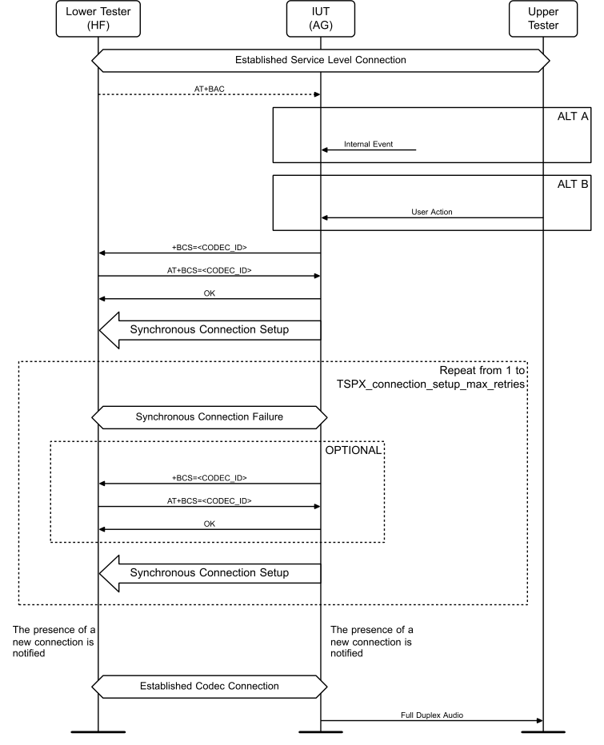

**Figure 4.17: Codec Connection Setup using “Safe Settings” parameters MSC**

1. The IUT initiates the Codec Connection Setup procedure in [2] with the codec from Table 4.89. 2. During the Synchronous Connection Setup procedure, the Lower Tester requests the Safe
Settings Parameters from Table 4.89. 3. The IUT may repeat Steps 1 and 2, or just Step 2, no more than
TSPX_connection_setup_max_retries attempts. If the number of retries exceeds TSPX_connection_setup_max_retries attempts, then the IUT fails. Otherwise, the IUT accepts the Safe Settings Parameters proposed by the Lower Tester in Step 2, and the Codec Connection is established.
• Expected Outcome
Pass verdict
The IUT successfully initiates the Synchronous Connection for the Codec Connection Setup procedure to the Lower Tester.
The codec and Safe Settings parameters used in the Codec Connection Setup procedure between the IUT and the Lower Tester matches the codec and Safe Settings parameters in Table 4.89 and is used throughout the Synchronous Connection.
Meaningful full duplex audio is available between the IUT and the Lower Tester using the Codec Connection Setup procedure.
Fail verdict
The IUT exceeds TSPX_connection_setup_max_retries attempts in repeating Steps 1 and 2, or just Step 2, and does not create a Codec Connection with the Lower Tester.

#### 4.30.10 Codec Connection Setup following failure to establish eSCO transport

with T2 settings • Test Purpose
Verify that the AG IUT can attempt to set up a Codec Connection using CVSD if the establishment of T2 configuration parameters fails.
• Reference
[2] 4.11.3, 5.7.1.2
• Initial Condition
- The AG is the IUT.
- The Lower Tester is the HF and is configured to support BR/EDR Secure Connections.
- An SLC is established between the IUT and the Lower Tester; there are no Synchronous Connections established. The IUT determines that the Lower Tester can support the Codec Connection Setup procedure using the AT+BRSF and SDP records.
- TSPX_connection_setup_max_retries is the maximum number of retries the IUT will attempt before falling back to CVSD, as defined in IXIT [10].
• Test Case Configuration

|  | Test Case |  |  | Codec |  |
| --- | --- | --- | --- | --- | --- |
| HFP/AG/ACC/BV-26-C [Codec Connection Setup following failure to establish eSCO transport with T2 settings: mSBC] |  |  | mSBC |  |  |
| HFP/AG/ACC/BV-33-C [Codec Connection Setup following failure to establish eSCO transport with T2 settings: LC3-SWB] |  |  | LC3-SWB |  |  |

Table 4.90: Codec Connection Setup following failure to establish eSCO transport with T2 settings test cases
• Test Procedure
1. The IUT initiates the Codec Connection Setup procedure in [2] with the Lower Tester using the
codec from Table 4.90 and T2 configuration parameter settings. 2. During the Synchronous Connection Setup procedure, the Lower Tester requests S4
configuration parameter settings, causing the Codec Connection Setup procedure to fail. 3. The IUT may repeat Steps 1 and 2, or just Step 2, no more than
TSPX_connection_setup_max_retries attempts. If the number of retries exceeds TSPX_connection_setup_max_retries attempts, the IUT fails. Otherwise, the IUT initiates the Codec Connection Setup procedure in [2] with the Lower Tester using the CVSD codec. 4. The Lower Tester accepts the Synchronous Connection, and the Codec Connection is
established.
• Expected Outcome
Pass verdict
The IUT successfully initiates the Synchronous Connection for the Codec Connection Setup procedure to the Lower Tester.
After the Synchronous Connection Setup procedure using T2 configuration parameter settings fails between the IUT and the Lower Tester, the IUT successfully retries the Codec Connection Setup procedure using CVSD with the Lower Tester, and the Synchronous Connection Setup procedure successfully completes.
Meaningful full duplex audio is available between the IUT and the Lower Tester using the Codec Connection Setup procedure.
Fail verdict
The IUT exceeds TSPX_connection_setup_max_retries attempts in repeating Steps 1 and 2, or just Step 2, and does not initiate the Codec Connection Setup procedure with the Lower Tester using the CVSD codec.

#### 4.30.11 Codec Connection Setup failure, Wide Band or Super Wide Band codecs

currently unavailable on the HF device • Test Purpose
Verify that the AG IUT can accept an updated list of supported codecs indicating the availability of CVSD if the currently negotiated codec becomes unavailable on the Lower Tester during a Codec Connection Setup procedure.
• Reference
[2] 4.11
• Initial Condition
- The IUT is the AG.
- The Lower Tester is the HF.
- An SLC is established between the IUT and the Lower Tester; there are no Synchronous Connections established. The IUT has already determined that the Lower Tester can support the Codec Connection Setup procedure using the AT+BRSF and/or SDP records.
• Test Case Configuration

|  | Test Case |  |  | Codec |  |
| --- | --- | --- | --- | --- | --- |
| HFP/AG/ACC/BI-14-C [Codec Connection Setup Failure: mSBC] |  |  | mSBC |  |  |
| HFP/AG/ACC/BV-32-C [Codec Connection Setup Failure: LC3-SWB] |  |  | LC3-SWB |  |  |

Table 4.91: Codec Connection Setup failure, Wide Band or Super Wide Band codecs currently unavailable on the HF device test cases
• Test Procedure

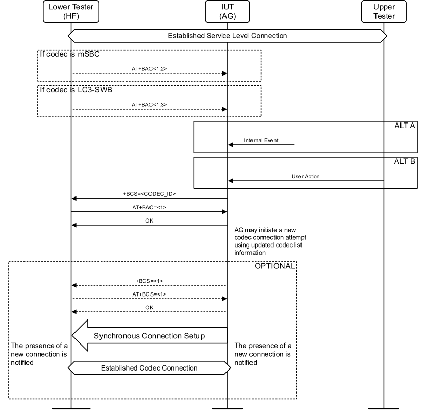

**Figure 4.18: Codec Connection Setup failure, Wide Band or Super Wide Band codecs currently unavailable on the HF device MSC**

Connection Setup procedure in [2] with the codec listed in Table 4.91. 2. The Lower Tester refuses the codec listed in Table 4.91 as unavailable from the IUT during the
Codec Connection Setup procedure, indicating that only the CVSD codec is available. 3. The IUT may initiate a new Codec Connection attempt using the updated codec list information.
a. The IUT initiates the Codec Connection Setup using the CVSD codec.
• Expected Outcome
Pass verdict
The IUT accepts the updated supported codec list indicating support for CVSD only from the Lower Tester during the Codec Connection Setup procedure.
If the IUT initiates a new Codec Connection attempt, the IUT successfully creates a full duplex Audio Connection using the CVSD codec to the Lower Tester following the failure in Step 2.
HFP/AG/ACC/BV-15-C [Codec Connection Setup failure with AG initiated]
• Test Purpose
Verify that the AG IUT can successfully initiate a legacy Audio Connection Setup with the Lower Tester when the Lower Tester does not support the Codec Connection Setup procedure.
• Reference
[2] 4.11
• Initial Condition
- The IUT is the AG.
- The Lower Tester is the HF.
- An SLC is established between the IUT and the Lower Tester; there are no Synchronous Connections established. The IUT determines that the Lower Tester can support the Codec Connection Setup procedure using the AT+BRSF and SDP records before attempting any Audio Connection.
• Test Procedure

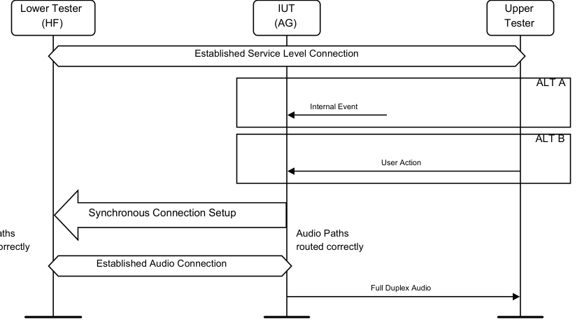

**Figure 4.19: Codec Connection Setup failure with AG initiated MSC**

1. The IUT initiates the establishment of a Synchronous Connection with the Lower Tester without
using the Codec Connection Setup procedure in [2]. 2. The Lower Tester accepts the establishment of a Synchronous Connection with the IUT.
• Expected Outcome
Pass verdict
Meaningful full duplex audio is available between the IUT and the Lower Tester.
The Audio Connection is either SCO or eSCO depending on the supported features of the IUT.

#### 4.30.12 Codec Connection Setup following failure to establish eSCO transport

with T1 settings • Test Purpose
Verify that the AG IUT sets up a Codec Connection using CVSD if establishment of T1 configuration parameters fails.
• Reference
[2] 5.7.1.2
• Initial Condition
- The AG is the IUT.
- The Lower Tester is the HF and is configured not to support BR/EDR Secure Connections, hence ensuring that the Secure Connections feature is not used on the connection during the test.
- An SLC is established between the IUT and the Lower Tester; there are no Synchronous Connections established. The IUT determines that the Lower Tester can support the Codec Connection Setup procedure using the AT+BRSF and SDP records.
- TSPX_connection_setup_max_retries is the maximum number of retries the IUT will attempt before falling back to CVSD as defined in IXIT [10].
• Test Case Configuration

|  | Test Case |  |  | Codec |  |
| --- | --- | --- | --- | --- | --- |
| HFP/AG/ACC/BV-34-C [Codec Connection Setup following failure to establish eSCO transport with T1 settings: mSBC] |  |  | mSBC |  |  |
| HFP/AG/ACC/BV-35-C [Codec Connection Setup following failure to establish eSCO transport with T1 settings: LC3-SWB] |  |  | LC3-SWB |  |  |

Table 4.92: Codec Connection Setup following failure to establish eSCO transport with T1 settings test cases
• Test Procedure
1. The IUT initiates the Codec Connection Setup procedure in [2] with the Lower Tester using the
codec from Table 4.92 and T1 configuration parameter settings. 2. During the Synchronous Connection Setup procedure, the Lower Tester requests S1
configuration parameter settings causing the Codec Connection Setup procedure to fail. 3. The IUT may repeat Steps 1 and 2, or just Step 2, no more than
TSPX_connection_setup_max_retries attempts. If the number of retries exceeds TSPX_connection_setup_max_retries attempts, then the IUT fails. Otherwise, the IUT initiates the Codec Connection Setup procedure in [2] with the Lower Tester using the CVSD codec. 4. The Lower Tester accepts the Synchronous Connection, and the Codec Connection is
established.
• Expected Outcome
Pass verdict
The IUT successfully initiates the Synchronous Connection for the Codec Connection Setup procedure to the Lower Tester.
After the Synchronous Connection Setup procedure using T1 configuration parameter settings fails between the IUT and the Lower Tester, the IUT successfully retries the Codec Connection Setup procedure using CVSD with the Lower Tester, and the Synchronous Connection Setup procedure successfully completes.
Meaningful full duplex audio is available between the IUT and the Lower Tester using the Codec Connection Setup procedure.
Fail verdict
The IUT exceeds TSPX_connection_setup_max_retries attempts in repeating Steps 1 and 2, or just Step 2, and does not initiate the Codec Connection Setup procedure with the Lower Tester using the CVSD codec.

### 4.31 Wide Band and Super Wide Band Speech Support

#### 4.31.1 AG SDP record support for Wide Band Speech or Super Wide Band

Speech • Test Purpose
Verify that the SDP record of the AG IUT correctly reflects support for the Wide Band Speech or Super Wide Band Speech service.
• Reference
[2] 5.3
[11] 6.3
• Initial Condition
- The IUT is the AG.
- The Lower Tester is the HF.
- If the IUT requires pairing, the Lower Tester and the IUT are paired.
- An HFP connection may or may not be established between the IUT and the Lower Tester.
- If no connection exists, the IUT is in connectable mode.
• Test Case Configuration

|  | Test Case |  |  | Codec |  |  | Bit Position |  |
| --- | --- | --- | --- | --- | --- | --- | --- | --- |
| HFP/AG/WBS/BV-01-C [SDP Record: mSBC] |  |  | mSBC |  |  | 5 |  |  |
| HFP/AG/SWB/BV-01-C [SDP Record: LC3-SWB] |  |  | LC3-SWB |  |  | 8 |  |  |

Table 4.93: AG SDP record support for Wide Band Speech or Super Wide Band Speech test cases
• Test Procedure
1. An SDP connection is initiated from the Lower Tester to the IUT, and the HFP AG SDP record is
requested. 2. The HFP AG SDP record, which includes the support features attribute, is sent by the IUT to the
Lower Tester.
• Expected Outcome
Pass verdict
The IUT’s SDP record indicates support for the codec listed in Table 4.93 by having the bit position in Table 4.93 set to 1.
• Notes
Some devices will de-register their SDP records once the HFP is connected. The reason for this is that the service is now not available to other available HFP devices, in which case this test may only pass when the HFP service is not connected.

#### 4.31.2 HF SDP record support for Wide Band Speech or Super Wide Band

Speech • Test Purpose
Verify that the SDP record of the HF IUT correctly reflects support for the Wide Band Speech or Super Wide Band Speech service.
• Reference
[2] 5.3
[11] 6.3
• Initial Condition
- The IUT is the HF.
- The Lower Tester is the AG.
- If the IUT requires pairing, the Lower Tester and the IUT are paired.
- An HFP connection may or may not be established between the IUT and the Lower Tester.
- If no connection exists, the IUT is in connectable mode.
• Test Case Configuration

|  | Test Case |  |  | Codec |  |  | Bit Position |  |
| --- | --- | --- | --- | --- | --- | --- | --- | --- |
| HFP/HF/WBS/BV-02-C [SDP Record: mSBC] |  |  | mSBC |  |  | 5 |  |  |
| HFP/HF/SWB/BV-01-C [SDP Record: LC3-SWB] |  |  | LC3-SWB |  |  | 8 |  |  |

Table 4.94: HF SDP record support for Wide Band Speech] or Super Wide Band Speech test cases
• Test Procedure
1. An SDP connection is initiated from the Lower Tester to the IUT, and the HFP HF SDP record is
requested. 2. The HFP HF SDP record, which includes the support features attribute, is sent by the IUT to the
Lower Tester.
• Expected Outcome
Pass verdict
The IUT’s SDP record indicates support for the codec listed in Table 4.94 by having the bit position in Table 4.94 set to 1.
• Notes
Some devices will de-register their SDP records once the HFP is connected. The reason for this is that the service is now not available to other available HFP devices, in which case this test may only pass when the HFP is not connected.
HFP/HF/WBS/BV-03-C [Codec re-negotiation during SLC by HF]
• Test Purpose
Verify that the HF IUT correctly supports codec re-negotiation during SLC.
• Reference
[2] 4.2
• Initial Condition
- An HFP connection is established between the IUT and the Lower Tester.
- A Synchronous Connection may or may not be established between both the IUT and the Lower Tester.
• Test Procedure
1. The IUT during the SLC sends the AT+BAC AT command to update the list of supported codecs
as shown in Figure 4.20.

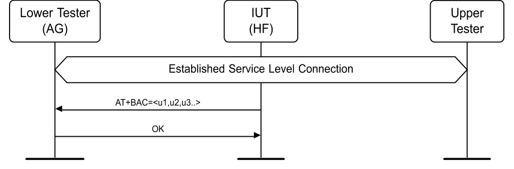

**Figure 4.20: HF re-negotiates the list of supported codecs MSC**

2. The Lower Tester uses the updated list of supported codecs of the IUT in the next Codec
Connection Setup procedure.
• Expected Outcome
Pass verdict
The IUT sends AT+BAC with an updated codec list.

#### 4.31.3 Available Codecs • Test Purpose

Verify that the HF IUT correctly lists supported mandatory codecs.
• Reference
[9] 4.35.1
[11] 5.3
• Initial Condition
- The IUT is the HF.
- The Lower Tester is the AG.
- An SLC is established between the IUT and the Lower Tester.
• Test Case Configuration

|  | Test Case |  |  | Codec |  |  | Codec IDs |  |
| --- | --- | --- | --- | --- | --- | --- | --- | --- |
| HFP/HF/WBS/BV-04-C [Available codecs: mSBC] |  |  | mSBC |  |  | 1,2 |  |  |
| HFP/HF/SWB/BV-02-C [Available codecs: LC3-SWB] |  |  | LC3-SWB |  |  | 1,3 |  |  |

Table 4.95: Available codecs test cases
• Test Procedure
1. The IUT sends the “AT+BAC” command to the Lower Tester.
• Expected Outcome
Pass verdict
The IUT sends the “AT+BAC” command containing at least the codec IDs listed in Table 4.95.

### 4.32 Individual Indicators Activation

HFP/AG/IIA/BV-01-C [Activate all indicators using a fixed string]
• Test Purpose
Verify that the IUT supports activating all indicators using a fixed string.
• Reference
[2] 4.33, 4.34
[11] 4.34, 5
• Initial Condition
- The IUT is the AG.
- The Lower Tester is the HF.
- A Service Level Connection between the IUT and the Lower Tester is established.
- An AT+BIA command has previously been sent by the Lower Tester to deactivate all non- mandatory indicators.
• Test Procedure
1. The Lower Tester sends an ‘activate all indicators’ AT+BIA command to the IUT. This command
is a fixed string containing all indicators set to 1. The number of indicators in the command is the maximum allowed by the HFP specification, defined in Section 4.34.2, “AT+CIND” command in [2] or Section 5.2 in [11]. The command used is: AT+BIA=1,1,1,1,1,1,…,1 2. Using a test device, simulate the presence of a control channel of a network, such that the IUT is
registered. 3. Disable the control channel. The IUT is de-registered. 4. Adjust the battery level on the IUT to a level that should cause a battery level indication to be sent
to the Lower Tester.
• Expected Outcome
Pass verdict
An OK is sent by the IUT upon AT+BIA command reception.
When service is modified, the IUT sends the corresponding indicator.
When battery level is modified, the IUT sends the corresponding indicator.
HFP/AG/IIA/BV-02-C [Activate only service indicator]
• Test Purpose
Verify that the IUT supports activating the service indicator and leaves the other indicators’ statuses unchanged.
• Reference
[2] 4.33, 4.34
[11] 4.34, 5
• Initial Condition
- A Service Level Connection between the IUT and the Lower Tester is established.
- An AT+BIA command has previously been sent by the Lower Tester to deactivate all non- mandatory indicators.
• Test Procedure
1. The Lower Tester sends an AT+BIA command to the IUT to activate only the service indicator.
The command used is: AT+BIA=,,,…,1,,, with the ‘1’ at the place of the service indicator, according to the mapping of the IUT implementation. 2. Adjust the battery level on the IUT to a level that should cause a battery level indication to be sent
to the Lower Tester. 3. Use a test device to simulate the presence of a control channel of a network, such that the IUT is
registered. 4. Disable the control channel. The IUT is de-registered.
• Expected Outcome
Pass verdict
An OK is sent by the IUT upon AT+BIA command reception.
When service is toggled, the IUT sends the corresponding indicator.
The IUT does not send a battery level indication.
No non-mandatory indicators are sent by the IUT.
HFP/AG/IIA/BV-03-C [Activate only roaming status indicator]
• Test Purpose
Verify that the IUT supports activating the roaming indicator and leaves the other indicators’ statuses unchanged.
• Reference
[2] 4.33, 4.34
[11] 4.34, 5
• Initial Condition
- A Service Level Connection between the IUT and the Lower Tester is established.
- An AT+BIA command has previously been sent by the Lower Tester to deactivate all non-mandatory indicators EXCEPT the signal strength indicator.
• Test Procedure
1. The Lower Tester sends a BIA command to the IUT to activate only the roaming indicator. The
command used is: AT+BIA=,,,…,1,,, with the ‘1’ at the place of the roaming indicator, according to the mapping of the IUT implementation. 2. Adjust the battery level on the IUT to a level that should cause a battery level indication to be sent
to the Lower Tester. 3. Impair the signal to the IUT so that a reduction in signal strength can be observed. 4. Cause the IUT to register on a Roam network. 5. Cause the IUT to register on the Home network.
• Expected Outcome
Pass verdict
An OK is sent by the IUT upon BIA command reception.
When roaming is toggled, the IUT sends the corresponding indicator.
When signal strength is modified, the IUT sends the corresponding indicator.
When battery level is modified, the IUT does not send a battery level indication.
No other non-mandatory indicators are sent by the IUT.
HFP/HF/IIA/BV-04-C [Activate or deactivate specific indicators]
• Test Purpose
Verify that the HF IUT can send a correctly formatted command to activate or deactivate some indicators.
• Reference
[2] 4.33, 4.34
[11] 4.34, 5
• Initial Condition
- The IUT is the HF.
- The Lower Tester is the AG.
- A Service Level Connection between the IUT and the Lower Tester is established.
• Test Procedure
1. The IUT sends an AT+BIA command to the Lower Tester. 2. An OK is sent by the Lower Tester to the IUT upon AT+BIA command reception.
• Expected Outcome
Pass verdict
The IUT successfully sends the AT+BIA command.
HFP/AG/IIA/BV-05-C [Activate only battery level indicator]
• Test Purpose
Verify that the IUT supports activating the battery level indicator and leaves the other indicators’ statuses unchanged.
• Reference
[2] 4.33, 4.34
[11] 4.34, 5
• Initial Condition
- The IUT is the AG.
- The Lower Tester is the HF.
- A Service Level Connection between the IUT and the Lower Tester is established.
- An AT+BIA command has previously been sent by the Lower Tester to deactivate all non-mandatory indicators.
• Test Procedure
1. The Lower Tester sends a BIA command to the IUT to activate only the battery level indicator.
The command used is: AT+BIA=,,,…,1,,, with the ‘1’ at the place of the battery level indicator, according to the mapping of the IUT implementation. 2. Adjust the battery level on the IUT to a level that should cause a battery level indication to be sent
to the Lower Tester. 3. Take action on the IUT to make a change that normally would trigger a change in a
non-mandatory indicator, e.g., impair the signal to the IUT so that a reduction in signal strength can be observed.
• Expected Outcome
Pass verdict
An OK is sent by the IUT upon BIA command reception.
When battery level is changed, the IUT sends the corresponding indicator.
No other non-mandatory indicators are sent by the IUT.
HFP/AG/IID/BV-01-C [Deactivate all non-mandatory indicators using a fixed string]
• Test Purpose
Verify that the IUT supports deactivating all indicators using a fixed string.
• Reference
[2] 4.33, 4.34
[11] 4.34, 5
• Initial Condition
- The IUT is the AG.
- The Lower Tester is the HF.
- A Service Level Connection between the IUT and the Lower Tester is established.
- An AT+BIA command has previously been sent by the Lower Tester to activate all the indicators, or no AT+BIA command has been sent after Service Level Connection Establishment.
• Test Procedure
1. The Lower Tester sends an AT+BIA command to the IUT to deactivate all indicators. This
command is a fixed string containing all indicators set to 0. The number of indicators in the command is the maximum allowed by the HFP specification, defined in Section 4.34.2 in [2] or Section 5.2 in [11], “AT+CIND” command. The command used is: AT+BIA=0,0,0,0, … ,0. 2. Impair the signal to the IUT so that a reduction in signal strength can be observed. 3. Initiate a call establishment to the IUT from a network. 4. The IUT receives and answers the incoming call.
• Expected Outcome
Pass verdict
An OK is sent by the IUT upon AT+BIA command reception.
During the call setup and call, the correct call setup and call indicators are sent by the IUT.
No non-mandatory indicators are sent by the IUT.
HFP/AG/IID/BV-02-C [Deactivate only signal strength indicator]
• Test Purpose
Verify that the IUT supports deactivating the signal strength indicator and leaves the other indicators’ statuses unchanged.
• Reference
[2] 4.33, 4.34
[11] 4.34, 5
• Initial Condition
- The IUT is the AG.
- The Lower Tester is the HF.
- A Service Level Connection between the IUT and the Lower Tester is established.
- An AT+BIA command has previously been sent by the HF to activate all indicators, or no AT+BIA command has been sent after Service Level Connection Establishment.
• Test Procedure
1. The Lower Tester sends a BIA command to the IUT to deactivate only the signal strength
indicator. The command used is: AT+BIA=,,,…,0,,, with the ‘0’ at the place of the signal strength indicator, according to the mapping of the IUT implementation. 2. Impair the signal to the IUT so that a reduction in signal strength can be observed. 3. Cause the IUT to register on a Roam network. 4. Cause the IUT to register on the Home network.
• Expected Outcome
Pass verdict
An OK is sent by the IUT upon AT+BIA command reception.
When roaming is toggled, the IUT sends the corresponding indicator.
The signal strength indicator is not sent by the IUT.
HFP/AG/IID/BV-03-C [Deactivate only battery level status indicator and the signal strength indicator]
• Test Purpose
Verify that the IUT supports deactivating the battery level status indicator and the signal strength status indicator and leaves the other indicators’ statuses unchanged.
• Reference
[2] 4.33, 4.34
[11] 4.34, 5
• Initial Condition
- The IUT is the AG.
- The Lower Tester is the HF.
- A Service Level Connection between the IUT and the Lower Tester is established.
- An AT+BIA command has previously been sent by the Lower Tester to activate all indicators.
• Test Procedure
1. The Lower Tester sends an AT+BIA command to the IUT to deactivate only the signal strength
indicator and the battery level indicator. The command used is: AT+BIA=,,,…,0,0,, with the two ‘0’s at the place of the signal strength and battery indicators, according to the mapping of the IUT implementation. 2. Impair the signal to the IUT so that a reduction in signal strength can be observed. 3. Adjust the battery level on the IUT to a level that should cause a battery level indication to be sent
to the Lower Tester. 4. Take action on the IUT to make a change that normally would trigger a change in a
non-mandatory indicator, e.g., force the IUT to disable the presence of a network.
• Expected Outcome
Pass verdict
An OK is sent by the IUT upon AT+BIA command reception.
The signal strength indicator is not sent by the IUT.
The battery level indicator is not sent by the IUT.
When the change in status of the activated non-mandatory indicator occurs, the corresponding indicator is sent by the IUT.
• Test Purpose
Verify that the IUT supports deactivating the signal strength indicator while battery status remains an active indicator and all other indicators’ statuses are left unchanged.
• Reference
[2] 4.33, 4.34
[11] 4.34, 5
• Initial Condition
- The IUT is the AG.
- The Lower Tester is the HF.
- A Service Level Connection between the IUT and the Lower Tester is established.
- An AT+BIA command has previously been sent by the Lower Tester to activate all indicators, or no AT+BIA command has been sent after Service Level Connection Establishment.
• Test Procedure
1. The Lower Tester sends a BIA command to the IUT to deactivate only the signal strength
indicator. The command used is: AT+BIA=,,,…,0,,, with the „ ‘0’ at the place of the signal strength indicator, according to the mapping of the IUT implementation. 2. Impair the signal to the IUT so that a reduction in signal strength is observed and it would cause
the indicator to be sent if the indicator were active. 3. Cause the IUT to change its reported battery level.
• Expected Outcome
Pass verdict
An OK is sent by the IUT upon AT+BIA command reception.
The signal strength indicator is not sent by the IUT when a change in the signal strength on the IUT is observed.
When the battery level is changed, the IUT sends the correct battery level to the Lower Tester.
HFP/AG/IID/BV-05-C [AG does not deactivate Call Forwarding indicator when instructed to do so using AT+BIA]
• Test Purpose
Verify that the AT+BIA command has no effect on the Call Forwarding indicator on the AG IUT.
• Reference
[14] 4.34, 4.36
• Initial Condition
- The IUT is the AG.
- The Lower Tester is the HF.
- A Service Level Connection between the IUT and the Lower Tester is established.
- The Call Forwarding indicator is activated and enabled on the IUT.
- The Lower Tester has issued an “AT+CCFC” command to the IUT with a supported <reason> enabling Call Forwarding.
• Test Procedure
1. The Lower Tester sends the AT+BIA command to disable the Call Forwarding indicator. 2. The Upper Tester creates a condition that will cause the IUT to send an indication of the Call
Forwarding indicator to the Lower Tester. 3. The IUT sends an indication of the Call Forwarding indicator to the Lower Tester.
• Expected Outcome
Pass verdict
The IUT still sends the Call Forwarding indicator to the Lower Tester after receiving the AT+BIA command.
HFP/AG/IIC/BV-01-C [Standard event reporting off and all indicators activated]
• Test Purpose
Verify that the IUT’s standard event reporting remains off even if indicators are activated individually.
• Reference
[2] 4.33, 4.34
[11] 4.34, 5
• Initial Condition
- The IUT is the AG.
- The Lower Tester is the HF.
- A Service Level Connection between the IUT and the Lower Tester is established.
- An AT+BIA command has previously been sent by the Lower Tester to activate all the indicators, or no AT+BIA command has been sent after Service Level Connection Establishment.
• Test Procedure
1. The Lower Tester sends the command: AT+CMER=3,0,0,0 to the IUT to deactivate events
reporting. 2. The Lower Tester sends an AT+BIA command to the IUT to activate every indicator. 3. Initiate an incoming call to the IUT.
• Expected Outcome
Pass verdict
No indicator is sent by the IUT.
HFP/AG/IIC/BV-02-C [Register individual indicator configuration when standard event reporting is OFF]
• Test Purpose
Verify that the IUT’s individual indicator configuration is registered when standard event reporting is off and that the IUT properly sets this configuration when standard event reporting is turned on. A complex configuration is used to make sure the IUT does not set a default configuration.
• Reference
[2] 4.33, 4.34
[11] 4.34, 5
• Initial Condition
- The IUT is the AG.
- The Lower Tester is the HF.
- A Service Level Connection between the IUT and the Lower Tester is established.
- An AT+BIA command has previously been sent by the Lower Tester to activate all the indicators, or no AT+BIA command has been sent after Service Level Connection.
• Test Procedure
1. The Lower Tester sends an AT+BIA command to the IUT to deactivate all the indicators. 2. The Lower Tester sends an AT+CMER=3,0,0,0 command to the IUT to deactivate the events
reporting. 3. The Lower Tester sends an AT+BIA command to the IUT to activate all indicators except battery
level. 4. The Lower Tester sends an AT+CMER=3,0,0,1 command to the IUT to activate the events
reporting. 5. Adjust the battery level on the IUT to a level that should cause a battery level indication to be sent
to the Lower Tester. 6. Use a test device to simulate the presence of a control channel of a network, such that the IUT is
registered. 7. Disable the control channel. The IUT is de-registered.
• Expected Outcome
Pass verdict
For every AT+BIA and AT+CMER command, an OK is sent back.
When service is toggled, the IUT sends the corresponding indicator.
The battery level indicator is not sent by the IUT.
HFP/AG/IIC/BV-03-C [Standard indicator read command still works when indicators are deactivated]
• Test Purpose
Verify that the IUT’s standard indicator read command returns correct values even if indicators are deactivated individually.
• Reference
[2] 4.33, 4.34
[11] 4.34, 5
• Initial Condition
- The IUT is the AG.
- The Lower Tester is the HF.
- An AT+BIA command has previously been sent by the Lower Tester to activate all the indicators, or no AT+BIA command has been sent after Service Level Connection.
• Test Procedure
1. The Lower Tester sends an AT+BIA command to the IUT to deactivate every indicator. 2. Use a test device to simulate the presence of a control channel of a network, such that the IUT is
registered. 3. Disable the control channel. The IUT is de-registered. 4. Impair the signal to the IUT so that a reduction in signal strength can be observed. 5. The Lower Tester sends an “AT+CIND” query to the IUT.
• Expected Outcome
Pass verdict
The IUT sends the correct signal strength value in the CIND response.
The IUT sends the correct service value in the CIND response.

### 4.33 Inquiry and Discoverability

#### 4.33.1 Verify inquiry and discoverability • Test Purpose

Verify that the AG can search for the HF device and connect with it.
• Reference
[6] 6.1, 6.3
• Initial Condition
- The AG and the HF are not paired with each other.
• Test Case Configuration

|  | Test Case |  |
| --- | --- | --- |
| HFP/AG/DIS/BV-01-C [Inquiry and discovery by AG] |  |  |
| HFP/HF/DIS/BV-01-C [Respond to inquiry and discovery by AG] |  |  |

Table 4.96: Verify inquiry and discoverability
• Test Procedure
1. Bring the HF device into discoverable mode. 2. The AG searches for the HF device and connects with it. 3. The IUT performs the operations needed for pairing.
• Test Condition
Both the AG and the HF are not initialized as defined in Section 4.2.1.
• Expected Outcome
Pass verdict
The HF device can be placed in discoverable mode.
The AG device can find the HF device.
Pairing is successful if initiated by the AG or the HF.

### 4.34 HF Indicators

HFP/HF/HFI/BV-01-C [HF sends an updated HF Indicator value]
• Test Purpose
Verify that an HF IUT can correctly send an updated value for an HF Indicator.
• Reference
[7] 4.2, 4.35
[11] 4.2, 4.34
• Initial Condition
- The IUT and the Lower Tester are turned on, paired, and in range.
- An SLC between the IUT and the Lower Tester is established, where HF Indicators are supported.
- The IUT and the Lower Tester have at least one HF Indicator in common (<HF Indicator>).
- The initial state of the Indicator is enabled.
• Test Procedure
1. The IUT and the Lower Tester successfully complete the sequence shown in Figure 4.21.

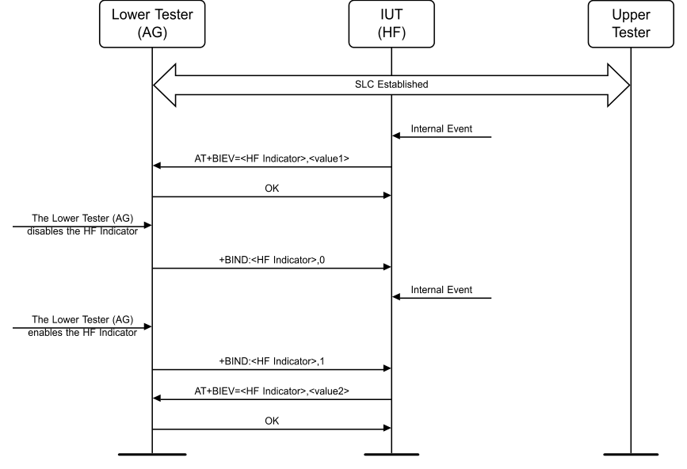

**Figure 4.21: HFP/HF/HFI/BV-01-C [HF sends an updated HF Indicator value] MSC**

• Expected Outcome
Pass verdict
The IUT was able to update the value of an HF Indicator using AT+BIEV.
The IUT did not send updates for deactivated HF Indicators.
The IUT generates the messages in the order and number indicated in Figure 4.21. Each is correctly formatted.
• Notes
The internal events that trigger the AT+BIEV updates are implementation specific.
HFP/AG/HFI/BV-02-C [AG receives an updated HF Indicator value]
• Test Purpose
Verify that an AG IUT can correctly receive an updated value for an HF Indicator.
• Reference
[7] 4.2, 4.35
[11] 4.2, 4.34
• Initial Condition
- The IUT and the Lower Tester are turned on, paired, and in range.
- An SLC between the IUT and the Lower Tester is established, where HF Indicators are supported.
- The IUT and the Lower Tester have at least one HF Indicator in common.
• Test Procedure
1. If the initial state of the HF Indicator is disabled, the IUT enables the HF Indicator. 2. When the HF Indicator is enabled, the Lower Tester sends updates for the Indicator as described
in Figure 4.22.

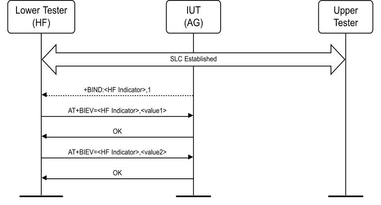

**Figure 4.22: HFP/AG/HFI/BV-02-C [AG receives updated HF Indicator values] MSC**

• Expected Outcome
Pass verdict
The IUT was able to receive updated values of an HF Indicator using AT+BIEV.
HFP/AG/HFI/BI-03-C [AG receives invalid updated HF Indicator values]
• Test Purpose
Verify that an AG IUT can correctly handle illegal HF Indicators sent by the Lower Tester.
• Reference
[7] 4.2, 4.35
[11] 4.2, 4.34
• Initial Condition
- The IUT and the Lower Tester are turned on, paired, and in range.
- An SLC between the IUT and the Lower Tester is established, where HF Indicators are supported.
- The IUT and the Lower Tester have at least one HF Indicator in common.
- TSPX_HFP_Unsupported_HF_Indicator_1 is the Unsupported HF Indicators as defined in IXIT [10].
- TSPX_HFP_Supported_HF_Indicator_1 is the Supported HF Indicators as defined in IXIT [10].
- TSPX_HFP_HF_Indicator_Value_1 is the HF Indicator Value 1 as defined in IXIT [10].
- TSPX_HFP_Illegal_HF_Indicator_Value_1 is the Illegal HF Indicator Value 1 (out of bounds relative to the information on the assigned numbers page) as defined in IXIT [10].
• Test Procedure
1. The IUT may temporarily disable the HF Indicator status for
TSPX_HFP_Supported_HF_Indicator_1. 2. When the HF Indicator is enabled, the Lower Tester sends updates for the Indicator as described
in Figure 4.23. 3. The Lower Tester uses TSPX_HFP_Unsupported_HF_Indicator_1,
TSPX_HFP_Supported_HF_Indicator_1, TSPX_HFP_HF_Indicator_Value_1, and TSPX_HFP_Illegal_HF_Indicator_Value_1.

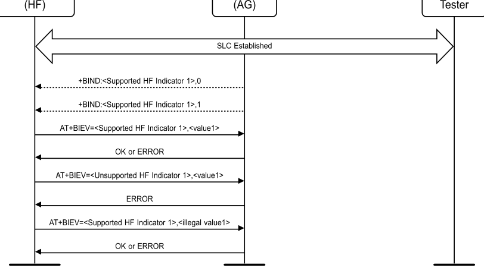

**Figure 4.23: HFP/AG/HFI/BI-03-C [AG receives invalid HF Indicator values] MSC**

• Expected Outcome
Pass verdict
The IUT was able to receive invalid updated values.
The IUT did not terminate the connection and is still functional.
The IUT responded with OK to AT+BIEV= TSPX_HFP_Supported_HF_Indicator_1, TSPX_HFP_HF_Indicator_Value_1 if the Indicator was enabled, or ERROR if it was disabled.
The IUT responded with ERROR to AT+BIEV= TSPX_HFP_Unsupported_HF_Indicator_1, TSPX_HFP_HF_Indicator_Value_1.
The IUT responded with ERROR or OK to AT+BIEV= TSPX_HFP_Supported_HF_Indicator_1, TSPX_HFP_Illegal_HF_Indicator_Value_1 where TSPX_HFP_Illegal_HF_Indicator_Value_1 was outside the range of valid values.
HFP/HF/HFI/BI-01-C [Ignore unknown or unexpected indication code]
• Test Purpose
Verify that the HF IUT ignores unknown or unexpected indication codes from the Lower Tester.
• Reference
[2] 4.34.1
[11] 5.1
• Initial Condition
- The Lower Tester is an AG.
- A Service Level Connection between the IUT and the Lower Tester is established.
• Test Procedure
1. The Lower Tester sends the unknown NOT_DEFINED_UNKNOWN_CODE indication code to the
IUT. 2. The Lower Tester sends a BUSY indication code to the IUT.
• Expected Outcome
Pass verdict
The IUT successfully ignores the unknown and unexpected indication codes sent by the Lower Tester and does not send the indication codes to the Upper Tester.

### 4.35 Enhanced Voice Recognition Activation

Common Initial Condition for this test case grouping include the following steps:
• A Service Level Connection between the HF and the AG is established.
• If the Service Level Connection is not already established, the HF establishes it using the “Service Level Connection Establishment” procedure, as stated in Section 4.2 in [9].
• Either the HF has started the voice recognition activation by sending AT+BVRA=1 or the AG started the voice recognition activation by sending +BVRA=1.
• The Audio Connection between the AG and the HF is set up, and therefore the HF has sent AT+BVRA=2.
HFP/AG/EVR/BV-01-C [AG accepts VR audio input]
• Test Purpose
Verify that the AG IUT sends an unsolicited result code when accepting VR audio input from the HF.
• Reference
[9] 4.34.1
[11] 5.1
• Initial Condition
- See the common Initial Condition in Section 4.35.
• Test Procedure
1. Perform an action using the IUT such that its voice recognition audio input is activated.
• Expected Outcome
Pass verdict
The IUT sends the unsolicited result code +BVRA with the vrect value 1 and vrecstate bit 0 value set to 1.
• Test Purpose
Verify that the AG IUT sends an unsolicited result code before sending VR audio output to the HF.
• Reference
[9] 4.34.1
[11] 5.1
• Initial Condition
- See the common Initial Condition in Section 4.35.
• Test Procedure
1. Perform an action using the IUT such that its voice recognition is ready to send an audio output.
• Expected Outcome
Pass verdict
The IUT sends the unsolicited result code +BVRA with the vrect value 1 and vrecstate bit 1 value set to 1 before starting the audio output.
HFP/AG/EVR/BV-03-C [AG processes VR audio input]
• Test Purpose
Verify that the AG IUT sends an unsolicited result code when it processes VR audio input.
• Reference
[9] 4.34.1
[11] 5.1
• Initial Condition
- See the common Initial Condition in Section 4.35.
• Test Procedure
1. Perform an action using the IUT such that its voice recognition begins processing VR audio input
from the Lower Tester.
• Expected Outcome
Pass verdict
The IUT sends the unsolicited result code +BVRA with the vrect value 1 and vrecstate bit 2 value set to 1 before starting the audio output.

### 4.36 Enhanced Voice Recognition Textual Response

A common Initial Condition for this test grouping includes the following steps:
- A Service Level Connection between the HF and the AG is established.
- If the Service Level Connection is not already established, the HF establishes it using the “Service Level Connection Establishment” procedure, as stated in Section 4.2 in [9].
- Voice recognition activation is started by the HF by sending AT+BVRA=1 or the AG by sending +BVRA=1.
- The Audio Connection between the AG and the HF is set up, and therefore the HF has sent AT+BVRA=2.
- Tests in this section may require that one or more voice commands be used to perform the test.
HFP/AG/VRT/BV-01-C [Text recognized by the AG from the audio input]
• Test Purpose
Verify that the text gets recognized by the AG IUT from the audio input from the Lower Tester.
• Reference
[9] 4.34.1
[11] 5.1
• Initial Condition
- See the common Initial Condition in Section 4.36.
• Test Procedure
1. Perform an action using the Lower Tester such that the HF’s voice recognition audio reception is
activated. 2. Enter a voice command on the Lower Tester such that the IUT processes the input.
• Expected Outcome
Pass verdict
The IUT sends the result code +BVRA with the vrect value 1, a valid vrecstate, a valid textID, textType ID with the value 0, textOperation ID with the value 1, and a valid string with a textual representation of the recognized sentence.
HFP/AG/VRT/BV-02-C [AG sends a different VR textType to change the VR textID]
• Test Purpose
Verify that the textID gets changed if the textType has changed.
• Reference
[9] 4.34.1
[11] 5.1
• Initial Condition
- See the common Initial Condition in Section 4.36.
• Test Procedure
1. Issue a voice command on the Lower Tester such that the IUT plays an audio response and
sends +BVRA with a valid textType and any valid textID value. 2. Issue a different voice command on the Lower Tester such that the IUT plays an audio response
and sends another +BVRA with a different valid textType and a different valid textID other than what was sent before.
• Expected Outcome
Pass verdict
Following Step 2, the IUT sends the result code +BVRA with the vrect value 1, a valid vrecstate, a valid textID different than what was sent in Step 1, a valid textType ID, a valid textOperation ID, and a valid string with a textual representation of the sentence.
HFP/AG/VRT/BV-03-C [AG sends the VR textOperation ID for “NewText”]
• Test Purpose
Verify that the VR textOperation ID for “NewText” gets sent by the IUT.
• Reference
[9] 4.34.1
[11] 5.1
• Initial Condition
- See the common Initial Condition in Section 4.36.
• Test Procedure
1. Issue a voice command on the Lower Tester such that the IUT plays an audio response and
sends +BVRA with a valid textType and any valid textID value. 2. Issue a different voice command on the Lower Tester such that the IUT sends the +BVRA with a
different valid textType, a different textID other than what was sent previously, and the textOperation ID value 1.
• Expected Outcome
Pass verdict
Following Step 2, the IUT sends the result code +BVRA with the vrect value 1, a valid vrecstate, a different valid textID other than what was sent in Step 1, a valid textType ID, textOperation ID value 1, and a valid string with a textual representation of the sentence.
HFP/AG/VRT/BV-04-C [AG sends the VR textOperation ID for “Replace”]
• Test Purpose
Verify that the VR textOperation ID for “Replace” gets sent by the AG IUT.
• Reference
[9] 4.34.1
[11] 5.1
• Initial Condition
- See the common Initial Condition in Section 4.36.
• Test Procedure
1. Issue a voice command such that the IUT sends +BVRA with a valid textType and any valid
textID value. 2. Issue an additional voice command on the Lower Tester such that the IUT sends the +BVRA with
a different valid textType other than what was sent previously, the textID from Step 1, and the textOperation ID value 2.
• Expected Outcome
Pass verdict
Following Step 2, the IUT sends the result code +BVRA with the vrect value 1, a valid vrecstate, a valid textID the same as Step 1, a valid textType the same as Step 1, the textOperation ID value 2, and a valid string with a textual representation of the sentence.
• Note
The necessary voice command might be achieved as follows: While talking to your VR engine, the VR engine might process, display, and correct your speech command during the ongoing input. The result of the final text could change on the fly during your speech input.
HFP/AG/VRT/BV-05-C [AG sends the VR textOperation ID for “Append”]
• Test Purpose
Verify that the AG IUT sends the correct VR textOperation ID for “Append”.
• Reference
[9] 4.34.1
[11] 5.1
• Initial Condition
- See the common Initial Condition in Section 4.36.
• Test Procedure
1. Issue a voice command on the Lower Tester such that the IUT sends +BVRA with a valid
textType and any valid textID value. 2. Issue an additional voice command on the Lower Tester such that the IUT sends the +BVRA with
a different valid textType other than what was sent previously, the textID from Step 1, and the textOperation ID value 3.
• Expected Outcome
Pass verdict
Following Step 2, the IUT sends the result code +BVRA with the vrect value 1, a valid vrecstate, a valid textID the same as Step 1, a valid textType the same as Step 1, the textOperation ID value 3, and a valid string with a textual representation of the sentence.
• Note
The necessary voice command sequence might be achieved as follows: While dictating a message, the VR engine might interpret a short stop as “input done”. The subsequent text will be attached.
• Test Purpose
Verify that the AG IUT sends the correct VR textType ID for “audio input”.
• Reference
[9] 4.34.1
[11] 5.1
• Initial Condition
- See the common Initial Condition in Section 4.36.
• Test Procedure
1. Perform an action using the Lower Tester such that the HF’s voice recognition audio reception is
activated. 2. Enter a voice command on the Lower Tester such that the IUT processes the input.
• Expected Outcome
Pass verdict
The IUT sends the result code +BVRA with the vrect value 1, a valid vrecstate, a valid textID, the textType ID value 0, a valid textOperation ID, and a valid string with a textual representation of the sentence.
HFP/AG/VRT/BV-07-C [Text of the audio output from the AG]
• Test Purpose
Verify that the AG IUT sends the correct VR textType ID for “audio output from the AG”.
• Reference
[9] 4.34.1
[11] 5.1
• Initial Condition
- See the common Initial Condition in Section 4.36.
• Test Procedure
1. Perform an action using the Lower Tester such that the HF’s voice recognition audio reception is
activated. 2. Enter a voice command on the Lower Tester such that the IUT processes the input. 3. The IUT sends the result code +BVRA with the vrect value 1, a valid vrecstate, a valid textID, the
textType ID value 0, a valid textOperation ID, and a valid string with a textual representation of the input sentence.
• Expected Outcome
Pass verdict
The IUT sends the result code +BVRA with the vrect value 1, a valid vrecstate, a valid textID, the textType ID value 1, a valid textOperation ID, and a valid string with a textual representation of the audio output sentence of the IUT.
• Test Purpose
Verify that the AG IUT sends the correct VR textType ID for “audio output that contains a question”.
• Reference
[9] 4.34.1
[11] 5.1
• Initial Condition
- See the common Initial Condition in Section 4.36.
• Test Procedure
1. Perform an action using the Lower Tester such that the HF’s voice recognition audio reception is
activated. 2. Perform an action using the Lower Tester to force the IUT to return an answer including a
question. 3. The IUT sends the result code +BVRA with the vrect value 1, a valid vrecstate, a valid textID, the
textType ID value 0, a valid textOperation ID, and a valid string with a textual representation of the input sentence.
• Expected Outcome
Pass verdict
The IUT sends the result code +BVRA with the vrect value 1, a valid vrecstate, a valid textID, the textType ID value 2, a valid textOperation ID, and a valid string with a textual representation of the audio output sentence of the IUT.
HFP/AG/VRT/BV-09-C [Text of the audio output that contains an error description]
• Test Purpose
Verify that the AG IUT sends the correct VR textType ID for “audio output that contains an error description”.
• Reference
[9] 4.34.1
[11] 5.1
• Initial Condition
- See the common Initial Condition in Section 4.36.
• Test Procedure
1. Perform an action using the Lower Tester such that the HF’s voice recognition audio reception is
activated. 2. Enter a voice command on the Lower Tester such that the IUT processes the input. 3. Perform an action using the IUT to force an error.
• Expected Outcome
Pass verdict
The IUT sends the result code +BVRA with the vrect value 1, a valid vrecstate, a valid textID, the textType ID value 3, a valid textOperation ID, and a valid string with a textual representation of the audio output sentence of the IUT.

### 4.37 Voice Recognition - Ready

HFP/HF/VRR/BV-01-C [Enhanced Voice Recognition Status - HF sends acknowledgment that the Audio Connection has been set up]
• Test Purpose
Verify that the HF IUT sends acknowledgment that the Audio Connection has been set up with the Lower Tester.
• Reference
[9] 4.25, 4.35.1
[11] 4.25, 5.3
• Initial Condition
- A Service Level Connection between the IUT and the Lower Tester is established.
• Test Procedure
1. If the IUT has not started the voice recognition activation by sending AT+BVRA=1, the Lower
Tester starts the voice recognition activation by sending +BVRA: 1. 2. An Audio Connection between the IUT and the Lower Tester is established.
• Expected Outcome
Pass verdict
The IUT sends AT+BVRA=2.
HFP/AG/VRR/BV-02-C [AG waits for AT+BVRA=2 and the connection handle for SCO/eSCO link before starting an audio output]
• Test Purpose
Verify that the AG IUT waits for AT+BVRA=2 and the connection handle for SCO/eSCO link before starting an audio output.
• Reference
[9] 4.34.1
[11] 5.1
• Initial Condition
- A Service Level Connection between the IUT and the Lower Tester is established.
- The last AT+BVRA value was 0.
- Voice recognition activation is either started by the Lower Tester by sending AT+BVRA=1 or the IUT by sending +BVRA=1.
• Test Procedure
1. The Audio Connection between the IUT and the Lower Tester is set up. 2. The Lower Tester sends AT+BVRA=2.
• Expected Outcome
Pass verdict
The IUT waits for AT+BVRA=2 and the connection handle for SCO/eSCO link before starting an audio output, since the last AT+BVRA value was 0.

### 4.38 Voice Recognition - Terminating an Active Audio Output

HFP/HF/VTA/BV-01-C [HF terminates audio output]
• Test Purpose
Verify that the HF IUT sends AT+BVRA=2 while an audio output from the Lower Tester to the IUT is active to terminate the audio output and start a new session.
• Reference
[9] 4.34.1
[11] 5.1
• Initial Condition
- A Service Level Connection between the IUT and the Lower Tester is established.
- Voice recognition activation is either started by the IUT by sending AT+BVRA=1 or the Lower Tester by sending +BVRA=1.
- The Audio Connection between the IUT and the Lower Tester is set up, and therefore the IUT has sent AT+BVRA=2.
• Test Procedure
1. Perform an action on the Lower Tester such that it sends an audio output. 2. Perform an action on the IUT such that the IUT sends AT+BVRA=2.
• Expected Outcome
Pass verdict
The IUT sends AT+BVRA=2 to terminate the active audio output from the Lower Tester.
HFP/AG/VTA/BV-02-C [AG terminates an active audio output]
• Test Purpose
Verify that the AG IUT terminates an active audio output when it receives AT+BVRA=2 and is ready for new audio input.
• Reference
[9] 4.34.1
[11] 5.1
• Initial Condition
- A Service Level Connection between the IUT and the Lower Tester is established.
- Voice recognition activation is either started by the Lower Tester by sending AT+BVRA=1 or the IUT by sending +BVRA=1.
- The Audio Connection between the IUT and the Lower Tester is set up, and therefore the Lower Tester has sent AT+BVRA=2.
• Test Procedure
1. Perform an action on the IUT such that it sends an audio output. 2. Perform an action on the Lower Tester such that the Lower Tester sends AT+BVRA=2.
• Expected Outcome
Pass verdict
The IUT terminates active audio output upon successful reception of the AT+BVRA=2 command.
The IUT sends the vrecstate value 1 on bit 0 in the +BVRA command to indicate the readiness for new audio input.

### 4.39 Class of Device and Service Level Connection

HFP/AG/COD/BV-01-C [AG Connect to HF Regardless of CoD Value]
• Test Purpose
Verify that the AG IUT can pair and form a Service Level Connection with the Lower Tester HF device with various CoD values.
• Reference
[7] 5.5.1
[9] 6.5.1
• Initial Condition
- The Lower Tester HF is discoverable and connectable.
- The AG IUT is in a state where it can search for a device.
- No previous pairing exists between the IUT and Lower Tester.
• Test Procedure
1. The Lower Tester sets its CoD value to 0x200404 and places itself in connectable mode. 2. The IUT attempts to pair and form a Service Level Connection with the HF device with a CoD
value of 0x200404. 3. The Upper Tester commands the AG IUT to delete the pairing. 4. The Lower Tester sets its CoD value to 0x202404 and places itself in connectable mode. 5. The IUT attempts to pair and form a Service Level Connection with the HF device with a CoD
value of 0x202404. 6. The Upper Tester commands the AG IUT to delete the pairing. 7. The Lower Tester sets its CoD value to 0x200408 and places itself in connectable mode. 8. The IUT attempts to pair and form a Service Level Connection with the HF device with a CoD
value of 0x200408. 9. The Upper Tester commands the AG IUT to delete the pairing.
10. The Lower Tester sets the CoD value to 0x20080C and puts the HF device in connectable mode. 11. The IUT attempts to pair and form a Service Level Connection with the HF device with a CoD
value of 0x20080C.
• Expected Outcome
Pass verdict
The AG is able to pair and form a Service Level Connection with the HF for all CoD values.
• Notes
Verify that the AG IUT can pair and form a Service Level Connection with the Lower Tester HF device with various CoD values.
The CoD definitions are as follows: - 0x200404
Major Service Class: Audio
Major Device Class: Audio/Video
Minor Device Class: Wearable Headset Device
- 0x202404
Major Service Class: Audio, Limited Discoverable Mode
Major Device Class: Audio/Video
Minor Device Class: Wearable Headset Device
- 0x200408
Major Service Class: Audio
Major Device Class: Audio/Video
Minor Device Class: Hands-free Device
- 0x20080C
Major Service Class: Audio HFP_CF.TS.CRr12 (18 new TCs)
Major Device Class: Toy
Minor Device Class: Doll / Action Figure

### 4.40 Call Forwarding

#### 4.40.1 Call Forwarding Indicator Status

• Test Purpose
Verify that the HF correctly requests and receives an indication that the AG accurately responds with the Call Forwarding feature using the “AT+CIND=?” command.
• Reference
[14] 4.36, 5.2
• Initial Condition
- An RFCOMM connection is established between the HF and the AG, with the HF in the RFCOMM Device A role.
- The AG supports the Call Forwarding feature.
• Test Case Configuration

|  | Test Case |  |
| --- | --- | --- |
| HFP/AG/CFD/BV-01-C [Sending Call Forwarding Indicator status] |  |  |
| HFP/HF/CFD/BV-01-C [Requesting Call Forwarding Indicator status] |  |  |

Table 4.97: Call Forwarding Indicator Status
• Test Procedure
1. The HF establishes a Service Level Connection. 2. During the execution of the Service Level Connection Initialization Procedure, the AG indicates
support for the callfwd indicator.
• Expected Outcome
Pass verdict
The HF requests the information describing the indicators supported in the AG during the Service Level Connection Initialization Procedure using the “AT+CIND=?” test command.
The AG responds to the “AT+CIND=?” test command from the HF indicating that it supports the callfwd indicator.
If the HF is the IUT, it reports to the Upper Tester that the Call Forwarding feature is supported.

#### 4.40.2 Call Forwarding List of Supported Reasons

• Test Purpose
Verify that the HF correctly requests and receives the AG’s Call Forwarding supported <reason> values using the “AT+CCFC=?” command.
• Reference
[14] 4.36, 5.2
• Initial Condition
- A Service Level Connection between the HF and the AG is established.
- The AG declares support for the callfwd indicator in the “AT+CIND=?” test command and indicates support for the Call Forwarding feature.
- TSPX_cfwd_supported_reasons are the Call Forwarding supported <reason> values reported by the AG as defined in IXIT [10].
• Test Case Configuration

|  | Test Case |  |
| --- | --- | --- |
| HFP/AG/CFD/BV-02-C [Send Call Forwarding list of supported reasons] |  |  |
| HFP/HF/CFD/BV-02-C [Request Call Forwarding list of supported reasons] |  |  |

• Test Procedure
1. The HF requests the AG’s supported <reason> values by sending the “AT+CCFC=?” command
to the AG. 2. The AG responds to the “AT+CCFC=?” command with +CCFC: (list of supported <reason>
values) and with an OK response.
• Expected Outcome
Pass verdict
The HF sends a correctly formatted “AT+CCFC=?” command to the AG.
The AG responds to the “AT+CCFC=?” command with a correctly formatted +CCFC: (list of supported <reason> values) response and gives the values specified in TSPX_cfwd_supported_reasons. The AG response includes an OK response.

#### 4.40.3 Request Call Forwarding Settings

• Test Purpose
Verify that the HF correctly requests Call Forwarding settings from the AG using the “AT+CCFC” command.
• Reference
[14] 4.36, 5.2
• Initial Condition
- A Service Level Connection between the HF and the AG is established.
- The AG declares support for the callfwd indicator in the “AT+CIND=?” test command and indicates support for the Call Forwarding feature.
• Test Case Configuration

|  | Test Case |  |
| --- | --- | --- |
| HFP/AG/CFD/BV-03-C [Reply with Call Forwarding settings] |  |  |
| HFP/HF/CFD/BV-03-C [Request Call Forwarding settings] |  |  |

Table 4.99: Request Call Forwarding settings
• Test Procedure
1. The HF sends the “AT+CCFC=?” command to receive the list of supported <reason> values for
Call Forwarding from the AG. 2. The AG responds to the “AT+CCFC=?” command with +CCFC: (list of supported <reason>
values) and with an OK response.
For each <reason> 0-3 supported by the AG as specified in Step 2, perform Steps 3 and 4:
3. The HF requests the AG’s supported <reason>’s status by sending a correctly formatted
“AT+CCFC” command with <mode> 2 to the AG. 4. The AG responds with its correctly formatted Call Forwarding status for the current <reason> and
with an OK response.
• Expected Outcome
Pass verdict
For each supported <reason> as specified in Step 2, the HF is able to successfully query the Call Forwarding status from the AG.
The “AT+CCFC=?” response from the AG includes OK.
The response from the AG does not include <subaddr>, <satype>, or <classx> fields.

#### 4.40.4 Change the Call Forwarding Settings – Reasons 4 and 5

• Test Purpose
Verify that the HF correctly requests to change Call Forwarding settings using the “AT+CCFC” command and the AG sends the +CIEV unsolicited result code indicating that a change in Call Forwarding status has occurred using <reason> values 4 (all call forwarding) and 5 (all conditional call forwarding).
• Reference
[14] 4.36, 5.2
• Initial Condition
- A Service Level Connection between the HF and the AG is established.
- The AG declares support for the callfwd indicator in the “AT+CIND=?” test command and indicates support for the Call Forwarding feature.
- The HF has enabled the “Indicators status update” function in the AG by issuing the AT+CMER command to the AG.
- TSPX_cf_primary_number is the first <number> to be used for Call Forwarding as defined in IXIT [10].
- TSPX_cf_secondary_number is the second <number> to be used for Call Forwarding as defined in IXIT [10].
- If the IUT is the HF, the AG Lower Tester supports all <reason> values.
• Test Case Configuration

|  | Test Case |  |  | Reason |  |
| --- | --- | --- | --- | --- | --- |
| HFP/AG/CFD/BV-04-C [Accept a change in Call Forwarding settings – Reason 4] |  |  | 4 |  |  |
| HFP/AG/CFD/BV-05-C [Accept a change in Call Forwarding settings – Reason 5] |  |  | 5 |  |  |
| HFP/HF/CFD/BV-04-C [Change the Call Forwarding settings on the AG – Reason 4] |  |  | 4 |  |  |
| HFP/HF/CFD/BV-05-C [Change the Call Forwarding settings on the AG – Reason 5] |  |  | 5 |  |  |

Table 4.100: Change the Call Forwarding settings – Reasons 4 and 5 test cases
• Test Procedure

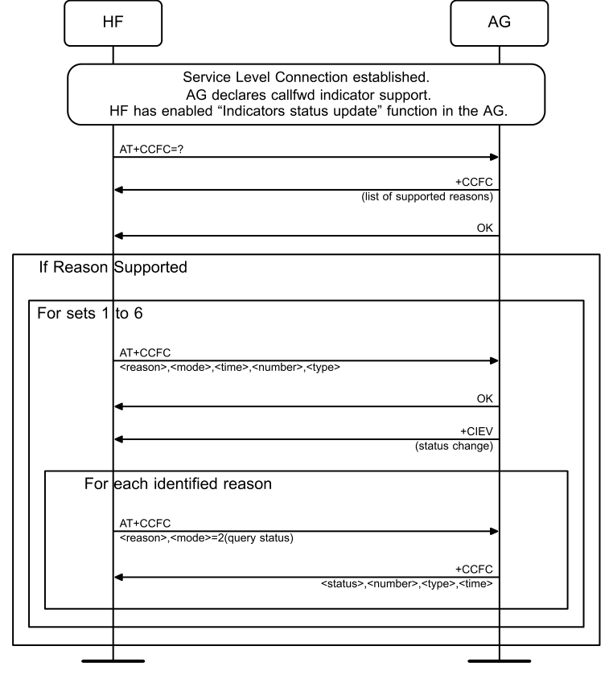

**Figure 4.24: Change the Call Forwarding settings – Reasons 4 and 5 MSC**

1. The HF sends the “AT+CCFC=?” command to receive the list of supported <reason> values for
Call Forwarding from the AG. 2. The AG responds to the “AT+CCFC=?” command with +CCFC: (list of supported <reason>
values) and with an OK response.
If the <reason> specified in Table 4.100 is supported by the AG as specified in Step 2, perform Steps 3–7 for each set in Table 4.101 that supports the <reason>. If Step 2 completed successfully and the <reason> specified in Table 4.100 is not supported, then the test concludes with a Pass verdict.
3. The HF changes the AG’s Call Forwarding setting for the supported <reason> by sending the AG
a correctly formatted “AT+CCFC” command using the specified <mode>, and with the specified <time>, <number>, and <type> fields from Table 4.101. 4. The AG responds with OK. 5. The AG sends a “+CIEV” unsolicited result code indicating the change in status.
“AT+CCFC” commands with <mode> 2 to the AG to validate that the change occurred:
a. If <reason> is 4, the HF queries <reason> values 0–3 that are supported by the AG
individually.
b. If <reason> is 5, the HF queries <reason> values 1–3 that are supported by the AG
individually.
7. The AG responds with correctly formatted Call Forwarding status for the <reason> or <reason>
values requested.

|  | Set |  |  | <mode> |  |  | definition |  |  | <time> |  |  | <number> |  |  | <type> |  |
| --- | --- | --- | --- | --- | --- | --- | --- | --- | --- | --- | --- | --- | --- | --- | --- | --- | --- |
| 1 |  |  | 3 |  |  | registration |  |  | n/a |  |  | TSPX cf primary number _ _ _ |  |  | 145 |  |  |
| 2 |  |  | 1 |  |  | enable |  |  | n/a |  |  | n/a |  |  | n/a |  |  |
| 3 |  |  | 3 |  |  | registration |  |  | n/a |  |  | TSPX cf secondary number _ _ _ |  |  | 145 |  |  |
| 4 |  |  | 1 |  |  | enable |  |  | 10 |  |  | n/a |  |  | n/a |  |  |
| 5 |  |  | 0 |  |  | disable |  |  | n/a |  |  | n/a |  |  | n/a |  |  |
| 6 |  |  | 4 |  |  | erasure |  |  | n/a |  |  | n/a |  |  | n/a |  |  |

Table 4.101: Change the Call Forwarding settings – Reasons 4 and 5 test parameters
• Expected Outcome
Pass verdict
The HF successfully queries the list of supported <reason> values for Call Forwarding from the AG.
After each set in Table 4.101, the HF sends a correctly formatted “AT+CCFC” command to the AG requesting the changes in Call Forwarding settings as expected.
After each set in Table 4.101, the AG responds to the “AT+CCFC” from the HF with OK, and sends a “+CIEV” unsolicited result code to the HF indicating Call Forwarding has been enabled, disabled and/or one or more settings have changed.
If the IUT is HF, after each set in Table 4.101, it reports Call Forwarding status changes to the Upper Tester according to each change in Call Forwarding settings.
If the IUT is AG, after each set in Table 4.101, the IUT sends the “+CCFC” result code or result codes which reflect the indicated change for the current set in Table 4.101.
If the IUT is the AG, <number> is sent with the international access code character (“+”) at the start of the number.

#### 4.40.5 Change the Call Forwarding Settings – Reason 0 • Test Purpose

Verify that the HF correctly requests to change Call Forwarding settings using the “AT+CCFC” command and the AG sends the +CIEV unsolicited result code indicating a change in Call Forwarding status has occurred using <reason> 0 (unconditional). When Call Forwarding is enabled, a call is forwarded.
• Reference
[14] 4.36, 5.2
• Initial Condition
- A Service Level Connection between the HF and the AG is established.
- The AG declares support for the callfwd indicator in the “AT+CIND=?” test command and indicates support for the Call Forwarding feature.
- The HF has enabled the “Indicators status update” function in the AG by issuing the AT+CMER command to the AG.
- TSPX_cf_primary_number is the first <number> to be used for Call Forwarding as defined in IXIT [10].
- If the IUT is the HF, the AG Lower Tester supports <reason> 0.
• Test Case Configuration

|  | Test Case |  |
| --- | --- | --- |
| HFP/AG/CFD/BV-06-C [Accept a change in Call Forwarding settings – Reason 0] |  |  |
| HFP/HF/CFD/BV-06-C [Change the Call Forwarding settings on the AG – Reason 0] |  |  |

Table 4.102: Change the Call Forwarding settings – Reason 0 test cases
• Test Procedure

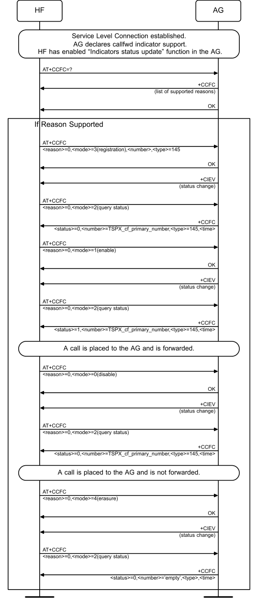

**Figure 4.25: Change the Call Forwarding settings – Reason 0 MSC**

Call Forwarding from the AG. 2. The AG responds to the “AT+CCFC=?” command with +CCFC: (list of supported <reason>
values) and with an OK response.
If <reason> 0 is supported by the AG as specified in Step 2, perform the remainder of this procedure using <reason> 0. If Step 2 completed successfully and <reason> 0 is not supported, then the test concludes with a Pass verdict.
3. The HF changes the AG’s Call Forwarding setting for <reason> 0 using <mode> 3 (registration),
<type> 145 using the <number> given in TSPX_cf_primary_number in the AT+CCFC command. 4. The AG responds with OK. 5. The AG sends a “+CIEV” unsolicited result code indicating the change in status. 6. The HF queries the status of AG’s <reason> 0 by sending a correctly formatted “AT+CCFC”
command with <mode> 2 to the AG to validate that the change occurred. 7. The AG responds with correctly formatted Call Forwarding status for <reason> 0. <number> is
TSPX_cf_primary_number, <type> is 145, and <status> is 0. 8. The HF enables Call Forwarding for <reason> 0 using <mode> 1 (enable) in the AT+CCFC
command. 9. The AG responds with OK. 10. The AG sends a “+CIEV” unsolicited result code indicating the change in status. 11. The HF queries the status of AG’s <reason> 0 by sending a correctly formatted “AT+CCFC”
command with <mode> 2 to the AG to validate that the change occurred. 12. The AG responds with correctly formatted Call Forwarding status for <reason> 0. <number> is
TSPX_cf_primary_number, <type> is 145, and <status> is 1. 13. A call is placed to the AG. The call is forwarded to TSPX_cf_primary_number. This operation may
be simulated and does not require access to an active network. 14. The HF disables Call Forwarding for <reason> 0 using <mode> 0 (disable) in the AT+CCFC
command. 15. The AG responds with OK. 16. The AG sends a “+CIEV” unsolicited result code indicating the change in status. 17. The HF queries the status of AG’s <reason> 0 by sending a correctly formatted “AT+CCFC”
command with <mode> 2 to the AG to validate that the change occurred. 18. The AG responds with correctly formatted Call Forwarding status for <reason> 0. <number> is
TSPX_cf_primary_number, <type> is 145, and <status> is 0. 19. A call is placed to the AG. The call is not forwarded. This operation may be simulated and does
not require access to an active network. 20. The HF changes the AG’s Call Forwarding setting for <reason> 0 using <mode> 4 (erasure) in
the AT+CCFC command. 21. The AG responds with OK. 22. The AG sends a “+CIEV” unsolicited result code indicating the change in status. 23. The HF queries the status of AG’s <reason> 0 by sending a correctly formatted “AT+CCFC”
command with <mode> 2 to the AG to validate that the change occurred. 24. The AG responds with correctly formatted Call Forwarding status for <reason> 0. <number> is
empty and <status> is 0.
• Expected Outcome
Pass verdict
The HF successfully queries the list of supported <reason> values for Call Forwarding from the AG.
The HF sends correctly formatted “AT+CCFC” commands to the AG requesting the changes in Call Forwarding settings as expected.
After each “AT+CCFC” command, the AG responds to the “AT+CCFC” from the HF with OK and sends a “+CIEV” unsolicited result code to the HF indicating Call Forwarding has been enabled, disabled and/or one or more settings have changed.
If the IUT is HF, after each “AT+CCFC” command, it reports Call Forwarding status changes to the Upper Tester according to each change in Call Forwarding settings.
If the IUT is AG, after each “AT+CCFC” <mode> 2 query command, the IUT sends the “+CCFC” result code which reflects the change as a result of the preceding “AT+CCFC” command.
When Call Forwarding is enabled, an incoming call is forwarded.
When Call Forwarding is disabled, an incoming call is not forwarded.
If the IUT is the AG, <number> is sent with the international access code character (“+”) at the start of the number.

#### 4.40.6 Change the Call Forwarding Settings – Reason 1

• Test Purpose
Verify that the HF correctly requests to change Call Forwarding settings using the “AT+CCFC” command and the AG sends the +CIEV unsolicited result code indicating a change in Call Forwarding status has occurred using <reason> 1 (mobile busy). When Call Forwarding is enabled, a call is forwarded.
• Reference
[14] 4.36, 5.2
• Initial Condition
- A Service Level Connection between the HF and the AG is established.
- The AG declares support for the callfwd indicator in the “AT+CIND=?” test command and indicates support for the Call Forwarding feature.
- The HF has enabled the “Indicators status update” function in the AG by issuing the AT+CMER command to the AG.
- TSPX_cf_primary_number is the first <number> to be used for Call Forwarding as defined in IXIT [10].
- If the IUT is the HF, the AG Lower Tester supports <reason> 1.
• Test Case Configuration

|  | Test Case |  |
| --- | --- | --- |
| HFP/AG/CFD/BV-07-C [Accept a change in Call Forwarding settings – Reason 1] |  |  |
| HFP/HF/CFD/BV-07-C [Change the Call Forwarding settings on the AG – Reason 1] |  |  |

Table 4.103: Change the Call Forwarding Settings – Reason 0 test cases
• Test Procedure

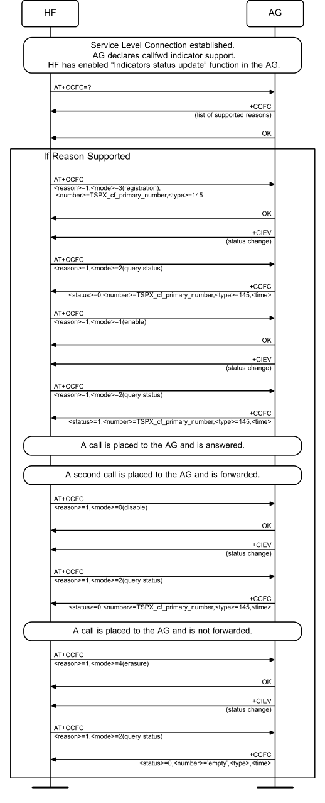

**Figure 4.26: Change the Call Forwarding Settings – Reason 1 MSC**

Call Forwarding from the AG. 2. The AG responds to the “AT+CCFC=?” command with +CCFC: (list of supported <reason>
values) and with an OK response.
If <reason> 1 is supported by the AG as specified in Step 2, perform the remainder of this procedure using <reason> 1. If Step 2 completed successfully and <reason> 1 is not supported, then the test concludes with a Pass verdict.
3. The HF changes the AG’s Call Forwarding setting for <reason> 1 using <mode> 3 (registration),
<type> 145 using the <number> given in TSPX_cf_primary_number in the AT+CCFC command. 4. The AG responds with OK. 5. The AG sends a “+CIEV” unsolicited result code indicating the change in status. 6. The HF queries the status of AG’s <reason> 1 by sending a correctly formatted “AT+CCFC”
command with <mode> 2 to the AG to validate that the change occurred. 7. The AG responds with correctly formatted Call Forwarding status for <reason> 1. <number> is
TSPX_cf_primary_number, <type> is 145, and <status> is 0. 8. The HF enables Call Forwarding for <reason> 1 using <mode> 1 (enable) in the AT+CCFC
command. 9. The AG responds with OK. 10. The AG sends a “+CIEV” unsolicited result code indicating the change in status. 11. The HF queries the status of AG’s <reason> 1 by sending a correctly formatted “AT+CCFC”
command with <mode> 2 to the AG to validate that the change occurred. 12. The AG responds with correctly formatted Call Forwarding status for <reason> 1. <number> is
TSPX_cf_primary_number, <type> is 145, and <status> is 1. 13. A call is placed to the AG. This operation may be simulated and does not require access to an
active network. 14. A second call is placed to the AG and is forwarded to TSPX_cf_primary_number. This operation
may be simulated and does not require access to an active network. 15. The HF disables Call Forwarding for <reason> 1 using <mode> 0 (disable) in the AT+CCFC
command. 16. The AG responds with OK. 17. The AG sends a “+CIEV” unsolicited result code indicating the change in status. 18. The HF queries the status of AG’s <reason> 1 by sending a correctly formatted “AT+CCFC”
command with <mode> 2 to the AG to validate that the change occurred. 19. The AG responds with correctly formatted Call Forwarding status for <reason> 1. <number> is
TSPX_cf_primary_number, <type> is 145, and <status> is 0. 20. A call is placed to the AG. The call is not forwarded. This operation may be simulated and does
not require access to an active network. 21. The HF changes the AG’s Call Forwarding setting for <reason> 1 using <mode> 4 (erasure) in
the AT+CCFC command. 22. The AG responds with OK. 23. The AG sends a “+CIEV” unsolicited result code indicating the change in status. 24. The HF queries the status of AG’s <reason> 1 by sending a correctly formatted “AT+CCFC”
command with <mode> 2 to the AG to validate that the change occurred. 25. The AG responds with correctly formatted Call Forwarding status for <reason> 1. <number> is
empty and <status> is 0.
• Expected Outcome
Pass verdict
The HF successfully queries the list of supported <reason> values for Call Forwarding from the AG.
The HF sends correctly formatted “AT+CCFC” commands to the AG requesting the changes in Call Forwarding settings as expected.
After each “AT+CCFC” command, the AG responds to the “AT+CCFC” from the HF with OK and sends a “+CIEV” unsolicited result code to the HF indicating that Call Forwarding has been enabled, disabled, and/or one or more settings have changed.
If the IUT is HF, after each “AT+CCFC” command, it reports Call Forwarding status changes to the Upper Tester according to each change in Call Forwarding settings.
If the IUT is AG, after each “AT+CCFC” <mode> 2 query command, the IUT sends the “+CCFC” result code which reflects the change as a result of the proceeding “AT+CCFC” command.
When Call Forwarding is enabled and the AG is busy, an incoming call is forwarded.
When Call Forwarding is disabled, an incoming call is not forwarded.
If the IUT is the AG, <number> is sent with the international access code character (“+”) at the start of the number.

#### 4.40.7 Change the Call Forwarding Settings – Reason 2

• Test Purpose
Verify that the HF correctly requests to change Call Forwarding settings using the “AT+CCFC” command and the AG sends the +CIEV unsolicited result code indicating that a change in Call Forwarding status has occurred using <reason> 2 (no reply). When Call Forwarding is enabled, a call is forwarded after the mandated wait time.
• Reference
[14] 4.36, 5.2
• Initial Condition
- A Service Level Connection between the HF and the AG is established.
- The AG declares support for the callfwd indicator in the “AT+CIND=?” test command and indicates support for the Call Forwarding feature.
- The HF has enabled the “Indicators status update” function in the AG by issuing the AT+CMER command to the AG.
- TSPX_cf_primary_number is the first <number> to be used for Call Forwarding as defined in IXIT [10].
- If the IUT is the HF, the AG Lower Tester supports <reason> 2.
• Test Case Configuration

|  | Test Case |  |
| --- | --- | --- |
| HFP/AG/CFD/BV-08-C [Accept a change in Call Forwarding settings – Reason 2] |  |  |
| HFP/HF/CFD/BV-08-C [Change the Call Forwarding settings on the AG – Reason 2] |  |  |

Table 4.104: Change the Call Forwarding settings – Reason 2 test cases
• Test Procedure

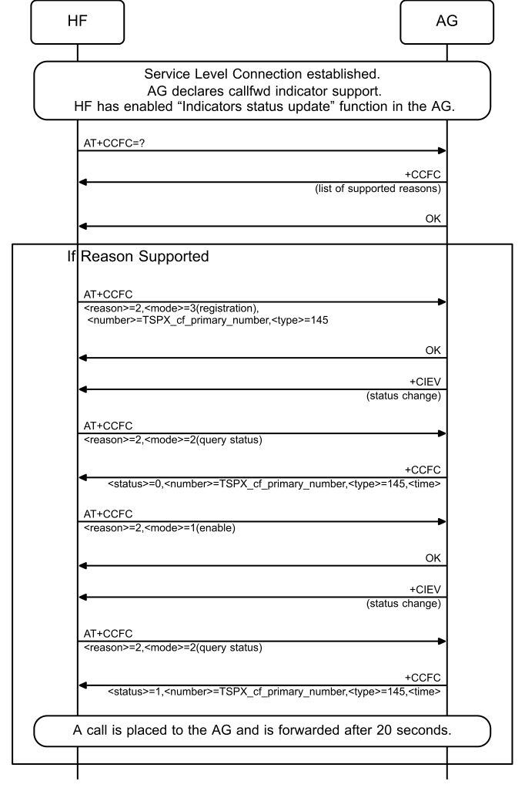

**Figure 4.27: Change the Call Forwarding Settings – Reason 2 MSC – Page 1 of 2**

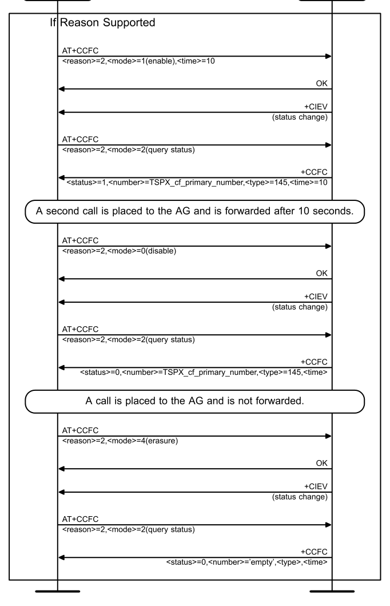

**Figure 4.28: Change the Call Forwarding Settings – Reason 2 MSC – Page 2 of 2**

1. The HF sends the “AT+CCFC=?” command to receive the list of supported <reason> values for
Call Forwarding from the AG. 2. The AG responds to the “AT+CCFC=?” command with +CCFC: (list of supported <reason>
values) and with an OK response.
If <reason> 2 is supported by the AG as specified in Step 2, perform the remainder of this procedure using <reason> 2. If Step 2 completed successfully and <reason> 2 is not supported, then the test concludes with a Pass verdict.
3. The HF changes the AG’s Call Forwarding setting for <reason> 2 using <mode> 3 (registration),
<type> 145 using the <number> given in TSPX_cf_primary_number in the AT+CCFC command. 4. The AG responds with OK. 5. The AG sends a “+CIEV” unsolicited result code indicating the change in status. 6. The HF queries the status of AG’s <reason> 2 by sending a correctly formatted “AT+CCFC”
command with <mode> 2 to the AG to validate that the change occurred. 7. The AG responds with correctly formatted Call Forwarding status for <reason> 2. <number> is
TSPX_cf_primary_number, <type> is 145, and <status> is 0. 8. The HF enables Call Forwarding for <reason> 2 using <mode> 1 (enable) in the AT+CCFC
command. 9. The AG responds with OK. 10. The AG sends a “+CIEV” unsolicited result code indicating the change in status. 11. The HF queries the status of AG’s <reason> 2 by sending a correctly formatted “AT+CCFC”
command with <mode> 2 to the AG to validate that the change occurred. 12. The AG responds with correctly formatted Call Forwarding status for <reason> 2. <number> is
TSPX_cf_primary_number, <type> is 145, and <status> is 1. 13. A call is placed to the AG and is forwarded after 20 seconds +/- 2 seconds. This operation may
be simulated and does not require access to an active network. 14. The HF adjusts the Call Forwarding wait time for <reason> 2 using <mode> 1 (enable) and
<time> 10 in the AT+CCFC command. 15. The AG responds with OK. 16. The AG sends a “+CIEV” unsolicited result code indicating the change in status. 17. The HF queries the status of AG’s <reason> 2 by sending a correctly formatted “AT+CCFC”
command with <mode> 2 to the AG to validate that the change occurred. 18. The AG responds with correctly formatted Call Forwarding status for <reason> 2. <number> is
TSPX_cf_primary_number, <type> is 145, <status> is 1, and <time> is 10. 19. A call is placed to the AG and is forwarded after 10 seconds +/- 2 seconds. This operation may
be simulated and does not require access to an active network. 20. The HF disables Call Forwarding for <reason> 2 using <mode> 0 (disable) in the AT+CCFC
command 21. The AG responds with OK. 22. The AG sends a “+CIEV” unsolicited result code indicating the change in status. 23. The HF queries the status of AG’s <reason> 2 by sending a correctly formatted “AT+CCFC”
command with <mode> 2 to the AG to validate that the change occurred. 24. The AG responds with correctly formatted Call Forwarding status for <reason> 2. <number> is
TSPX_cf_primary_number, <type> is 145, and <status> is 0. 25. A call is placed to the AG. The call is not forwarded. This operation may be simulated and does
not require access to an active network. 26. The HF changes the AG’s Call Forwarding setting for <reason> 2 using <mode> 4 (erasure) in
the AT+CCFC command. 27. The AG responds with OK. 28. The AG sends a “+CIEV” unsolicited result code indicating the change in status. 29. The HF queries the status of AG’s <reason> 2 by sending a correctly formatted “AT+CCFC”
command with <mode> 2 to the AG to validate that the change occurred. 30. The AG responds with correctly formatted Call Forwarding status for <reason> 2. <number> is
empty and <status> is 0.
• Expected Outcome
Pass verdict
The HF successfully queries the list of supported <reason> values for Call Forwarding from the AG.
The HF sends correctly formatted “AT+CCFC” commands to the AG requesting the changes in Call Forwarding settings as expected.
After each “AT+CCFC” command, the AG responds to the “AT+CCFC” from the HF with OK, and sends a “+CIEV” unsolicited result code to the HF indicating Call Forwarding has been enabled, disabled, and/or one or more settings have changed.
When Call Forwarding is enabled, an incoming call is forwarded.
When Call Forwarding is disabled, an incoming call is not forwarded.
If the IUT is the AG, <number> is sent with the international access code character (“+”) at the start of the number.
HFP/HF/CFD/BI-01-C [HF Ignores Unnecessary Call Forwarding Fields]
• Test Purpose
Verify that the HF IUT ignores the <subaddr>, <satype>, and <classx> fields when they are not empty and otherwise correctly processes the response code from the AG responding to the “AT+CCFC” command.
• Reference
[14] 4.36, 5.2
• Initial Condition
- The IUT is HF.
- The Lower Tester is AG.
- A Service Level Connection between the IUT and the Lower Tester is established.
- The Lower Tester declares support for the callfwd indicator in the “AT+CIND=?” test command and indicates support for the Call Forwarding feature.
- The Lower Tester has one <number> configured for Call Forwarding with <reason> = 0.
• Test Procedure
1. The Upper Tester commands the IUT to request the Lower Tester’s Call Forwarding status. 2. The IUT requests the Lower Tester’s call forwarding status for the Unconditional reason by
sending a correctly formatted “AT+CCFC” command with <mode> 2 and <reason> 0 to the Lower Tester. 3. The Lower Tester provides its Call Forwarding status for the Unconditional reason describing the
one <number> configured for Call Forwarding. The Lower Tester includes the value “1” for <subaddr>, <satype>, and <classx>. 4. The IUT reports the Call Forwarding status of the one <number> configured for Call Forwarding
to the Upper Tester.
• Expected Outcome
Pass verdict
The IUT requests the Lower Tester’s call forwarding status for the Unconditional reason by sending a correctly formatted “AT+CCFC” command with <mode> 2 and <reason> 0 to the Lower Tester.
The IUT reports the Call Forwarding status received from the Lower Tester to the Upper Tester, effectively ignoring the <subaddr>, <satype>, and <classx> fields.
HFP/AG/CFD/BI-01-C [AG Error Conditions]
• Test Purpose
Verify that the AG IUT replies with error response to a request from the Lower Tester to enable call forwarding for a <number> that is not registered with the IUT, for enabling call forwarding for an unsupported <reason>, and when the Lower Tester queries the status of <reasons> 4 and 5.
• Reference
[14] 4.36, 5.2
• Initial Condition
- The IUT is AG.
- The Lower Tester is HF.
- A Service Level Connection between the IUT and the Lower Tester is established.
- The IUT declares support for the callfwd indicator in response to the “AT+CIND=?” test command and indicates support for the Call Forwarding feature.
- The Lower Tester enables the CME Error codes by sending the "AT+CMEE=1" command to the IUT.
- The Lower Tester has queried the IUT for its supported <reason>.
- The Lower Tester has issued an “AT+CCFC” command to the IUT with a supported <reason> enabling Call Forwarding.
- TSPX_unregistered_number is a <number> not registered with the IUT as defined in IXIT [10].
- TSPX_cf_primary_number is a provider registered <number> to be used for Call Forwarding as defined in IXIT [10].
• Test Procedure
1. The Lower Tester attempts to enable Call Forwarding on the IUT using an unconfigured
supported <reason>, <mode> 1, and <number> = TSPX_unregistered_number. 2. The IUT responds with ERROR.
For each <reason> 0–5 not supported by the IUT, perform Steps 3–4:
3. The Lower Tester sends the IUT a “AT+CCFC” command with <mode> 1 and <number> =
TSPX_cf_primary_number. 4. The IUT responds with ERROR.
5. The Lower Tester requests the AG’s <reason>’s status by sending a correctly formatted
“AT+CCFC” command with <mode> 2 to the AG. 6. The IUT responds with “+CME ERROR: 3 – operation not allowed” ERROR response code.
• Expected Outcome
Pass verdict
The IUT responds to the Lower Tester with the ERROR response code in Step 2.
For each unsupported reason, the IUT responds to the Lower Tester with the ERROR response code.
For each supported <reason> 4-5, the IUT responds to the Lower Tester with the “+CME ERROR: 3 – operation not allowed” ERROR response code.

### 4.41 Call Duration Information

#### 4.41.1 HF Requests Call Duration Information for an Active Call from the AG • Test Purpose

Verify that the HF correctly requests Call Duration Information from the AG that is on an ongoing call, as well as after a change in the call status.
• Reference
[14] 4.37
• Initial Condition
- The HF and AG both support the Call Duration Information capability.
- The HF is powered on and paired with the AG, but there is no Service Level Connection.
- The AG simulates being on an ongoing call.
• Test Case Configuration

|  | Test Case |  |
| --- | --- | --- |
| HFP/AG/CDI/BV-01-C [Reply with Call Duration Information for Active Call] |  |  |
| HFP/HF/CDI/BV-01-C [Request Call Duration Information for Active Call] |  |  |

Table 4.105: HF Requests Call Duration Information for an Active Call from the AG
• Test Procedure
1. The HF establishes a Service Level Connection. 2. During the Service Level Connection establishment, the AG declares support for the Call Duration
Information feature in the +BRSF result code. 3. The HF sends the “AT+CLCC” command to the AG to query the list of current calls. 4. The AG responds to the HF with a “+CLCC” result code for the ongoing call and with an OK
response. 5. The HF sends the “AT+BCDI” command to the AG to query the duration of the ongoing call. 6. The AG responds to the HF with the “+BCDI” result code for the ongoing call and with an OK
response. 7. The AG simulates terminating the ongoing call. 8. The AG simulates receiving and answering another call.
indicator. 10. The HF sends another “AT+BCDI” command to the AG to query the duration of the ongoing call. 11. The AG responds to the HF with the “+BCDI” result code for the ongoing call and with an OK
response.
• Expected Outcome
Pass verdict
The HF successfully queries the duration of the ongoing call from the AG after the initial establishment of the Service Level Connection and after the change in call status indicating a new call is being established.
The AG provides the HF with the “+BCDI” result code and an OK response for the ongoing call after each query from the HF.

#### 4.41.2 HF Requests Call Duration Information for an Active and Held Call from

the AG • Test Purpose
Verify that the HF correctly requests Call Duration Information from the AG that is on an ongoing and held call, as well as after a change in the callheld status.
• Reference
[14] 4.37
• Initial Condition
- The HF and AG both support the Call Duration Information capability.
- The AG simulates being on a held call. This call is referred to as Call 1 and has an <idx> of 1.
- The AG simulates being in an active call. This call is referred to as Call 2 and has an <idx> of 2.
- The call duration of Call 2 is less than the call duration of Call 1.
• Test Case Configuration

|  | Test Case |  |
| --- | --- | --- |
| HFP/AG/CDI/BV-02-C [Reply with Call Duration Information for Active and Held Call] |  |  |
| HFP/HF/CDI/BV-02-C [Request Call Duration Information for Active and Held Call] |  |  |

Table 4.106: HF Requests Call Duration Information for an Active and Held Call from the AG
• Test Procedure
1. The HF establishes a Service Level Connection. 2. The AG declares support for the Call Duration Information feature in the +BRSF result code, and
the HF confirms support. 3. The HF sends the “AT+CLCC” command to the AG to query the list of current calls. 4. The AG responds to the HF with two “+CLCC” result codes for the ongoing calls and with an OK
response. 5. The HF sends the “AT+BCDI” command to the AG to query the duration of the ongoing calls. 6. The AG responds to the HF with two “+BCDI” result codes for the ongoing calls and with an OK
response.
now active and Call 2 is now held. 8. The AG sends a “+CIEV: (callheld = 1)” unsolicited result code indicating the change in the
callheld status indicator. 9. The HF sends another “AT+BCDI” command to the AG to query the duration of the ongoing calls. 10. The AG responds to the HF with two “+BCDI” result codes for the ongoing calls and with an OK
response.
• Expected Outcome
Pass verdict
The HF successfully queries the duration of the ongoing calls from the AG after Service Level Connection establishment and after the change in callheld status indicating the active and held calls have been swapped.
The AG provides the HF with two “+BCDI” result codes and an OK response for the ongoing calls after each query from the HF.
In the “+BCDI” result codes, Call 1 with <idx> = 1 has a greater call duration than Call 2 with <idx> = 2. Therefore, the <idx> values match between the “+BCDI” result codes and the “+CLCC” result codes.
HFP/AG/CDI/BV-03-C [AG does not respond to a Call Duration Information request when no call is active]
• Test Purpose
Verify that the AG IUT only responds with OK after a request for Call Duration Information when no call is active.
• Reference
[14] 4.37
• Initial Condition
- The Lower Tester is an HF that supports Call Duration Information capability.
- The IUT has declared support for the Call Duration Information feature in the +BRSF result code.
- A Service Level Connection between the IUT and the Lower Tester is established.
- The IUT has no ongoing or held calls present.
• Test Procedure
1. The Lower Tester sends the “AT+BCDI” command to the IUT. 2. The IUT responds to the Lower Tester with OK.
• Expected Outcome
Pass verdict
The IUT does not send the “+BCDI” result code and only replies with OK.

#### 4.41.3 AG Provides Call Duration Information for a Three-way Call • Test Purpose

Verify that the AG IUT on a three-way call correctly provides Call Duration Information to the Lower Tester.
• Reference
[14] 4.37
• Initial Condition
- The Lower Tester and the IUT both support the Call Duration Information capability.
- A Service Level Connection between the Lower Tester and the IUT has been established.
- The IUT has declared support for the Call Duration Information feature in the +BRSF result code.
- The IUT simulates being on a held call.
- After simulating the first held call, the IUT simulates being on an active second call.
• Test Case Configuration

| Test Case |  | Multiparty Call |  |
| --- | --- | --- | --- |
|  |  | Duration Support |  |
| HFP/AG/CDI/BV-04-C [AG provides Call Duration Information for a Three- way Call without Multiparty Call Duration Support] | No |  |  |
| HFP/AG/CDI/BV-05-C [AG provides Call Duration Information for a Three- way Call with Multiparty Call Duration Support] | Yes |  |  |

Table 4.107: AG Provides Call Duration Information for a Three-way Call
• Test Procedure
1. The Lower Tester sends the “AT+CHLD=3” command to merge the held call with the active call. 2. The IUT responds to the Lower Tester with an OK response and with the “+CIEV: (callheld = 0)”
unsolicited result code. 3. The Lower Tester sends the “AT+BCDI” command to the IUT to query the duration of the three-
way call. 4. The IUT responds to the Lower Tester with the “+BCDI” result codes for both ongoing calls. If the
IUT supports Multiparty Call Duration in Table 4.107, the IUT also sends a “+BCDI” result code for the three-way call duration with <idx> = 0. The IUT sends the OK response.
• Expected Outcome
Pass verdict
The IUT provides the Lower Tester with the “+BCDI” result codes for the two ongoing calls. If the IUT supports Multiparty Call Duration in Table 4.107, the IUT also sends the “+BCDI” result code for the duration of the three-way call after merging with <idx> = 0.
The IUT sends the OK response after all “+BCDI” result codes have been sent.
HFP/HF/CDI/BV-04-C [HF Requests Call Duration Information for a Three-way Call]
• Test Purpose
Verify that the HF IUT correctly requests Call Duration Information from the Lower Tester that is on a three-way call.
• Reference
[14] 4.37
• Initial Condition
- The IUT and the Lower Tester both support the Call Duration Information capability.
- The Lower Tester supports the Multiparty Call Duration capability.
- A Service Level Connection between the IUT and the Lower Tester has been established.
- The Lower Tester has declared support for the Call Duration Information feature in the +BRSF result code.
- The Lower Tester simulates being on a held call.
- After simulating the first held call, the Lower Tester simulates being on an active second call.
• Test Procedure
1. The IUT sends the “AT+CHLD=3” command to merge the held call with the active call. 2. The Lower Tester responds to the IUT with an OK response and with the “+CIEV: (callheld = 0)”
unsolicited result code. 3. The IUT sends the “AT+BCDI” command to the Lower Tester to query the duration of the three-
way call. 4. The Lower Tester responds to the IUT with the “+BCDI” result codes for both ongoing calls, the
“+BCDI” result code for the three-way call duration with <idx> = 0, and with an OK response. 5. The IUT reports the “+BCDI” result codes to the Upper Tester.
• Expected Outcome
Pass verdict
The IUT successfully queries the duration of the three-way call from the Lower Tester after the change in callheld status indicating the active and held calls have merged.
The IUT reports all 3 received “+BCDI” result codes to the Upper Tester.

## 5 Test case mapping

The Test Case Mapping Table (TCMT) maps test cases to specific requirements in the ICS. The IUT is tested in all roles for which support is declared in the ICS document.
The columns for the TCMT are defined as follows:
Item: Contains a logical expression based on specific entries from the associated ICS document. Contains a logical expression (using the operators AND, OR, NOT as needed) based on specific entries from the applicable ICS document(s). The entries are in the form of y/x references, where y corresponds to the table number and x corresponds to the feature number as defined in the ICS document for Hands-Free Profile (HFP) [3].
If a test case is mandatory within the respective layer, then the y/x reference is omitted.
Feature: A brief, informal description of the feature being tested.
Test Case(s): The applicable test case identifiers are required for Bluetooth Qualification if the corresponding y/x references defined in the Item column are supported. Further details about the function of the TCMT are elaborated in [5].
For the purpose and structure of the ICS/IXIT, refer to [5].

|  | Item |  |  | Feature |  |  | Test Case(s) |  |
| --- | --- | --- | --- | --- | --- | --- | --- | --- |
| HFP 2/1 AND HFP 2/1a |  |  | AG reconnects to HF |  |  | HFP/AG/OOR/BV-01-C |  |  |
| HFP 3/1 AND NOT HFP 3/22 |  |  | HF reconnects to AG |  |  | HFP/HF/OOR/BV-01-C |  |  |
| HFP 2/1 AND NOT HFP 2/22 |  |  | AG reconnects to HF |  |  | HFP/AG/OOR/BV-02-C |  |  |
| HFP 3/1 |  |  | HF reconnects to AG |  |  | HFP/HF/OOR/BV-02-C |  |  |
| HFP 2/2 |  |  | Phone status information: Transfer of registration status, signal strength, battery level, and Operator selection |  |  | HFP/AG/TRS/BV-01-C HFP/AG/PSI/BV-01-C HFP/AG/PSI/BV-03-C HFP/AG/PSI/BV-04-C |  |  |
| HFP 3/2a |  |  | Phone status information: Transfer of registration status and Enhanced Call Status |  |  | HFP/HF/TRS/BV-01-C HFP/HF/ECS/BV-03-C |  |  |
| HFP 2/2 AND HFP 2/6 |  |  | Phone status information: Transfer of call status |  |  | HFP/AG/TCA/BV-01-C HFP/AG/TCA/BV-02-C HFP/AG/TCA/BV-03-C HFP/AG/TCA/BV-04-C |  |  |
| (HFP 3/2a OR HFP 3/2b) AND HFP 3/6 |  |  | Phone status information: Transfer of call status |  |  | HFP/HF/TCA/BV-01-C HFP/HF/TCA/BV-02-C HFP/HF/TCA/BV-03-C HFP/HF/TCA/BV-04-C |  |  |
| HFP 3/2c |  |  | Phone status information: signal strength |  |  | HFP/HF/PSI/BV-01-C |  |  |
| HFP 2/2 AND HFP 2/25 |  |  | Phone status information: roaming |  |  | HFP/AG/PSI/BV-02-C |  |  |
| HFP 3/2d |  |  | Phone status information: roaming |  |  | HFP/HF/PSI/BV-02-C |  |  |

|  | Item |  |  | Feature |  |  | Test Case(s) |  |
| --- | --- | --- | --- | --- | --- | --- | --- | --- |
| HFP 3/2e |  |  | Phone status information: battery level |  |  | HFP/HF/PSI/BV-03-C |  |  |
| HFP 3/2f |  |  | Phone status information: Operator selection |  |  | HFP/HF/PSI/BV-04-C |  |  |
| HFP 2/2 AND NOT HFP 2/25 |  |  | Phone status information: Roaming not supported |  |  | HFP/AG/PSI/BV-05-C |  |  |
| HFP 2/3 |  |  | Audio Connection handling (IUT is an AG) |  |  | HFP/AG/ACR/BV-01-C HFP/AG/ACR/BV-02-C HFP/AG/ACS/BV-04-C HFP/AG/ACS/BV-08-C HFP/AG/ACS/BV-11-C HFP/AG/ACS/BI-14-C |  |  |
| HFP 2/3a AND HFP 2/3b |  |  | AG is IUT, AG Initiated, HF has eSCO |  |  | HFP/AG/ACS/BV-06-C |  |  |
| HFP 2/3a |  |  | AG is IUT, AG Initiated, HF is SCO only or AG has eSCO allows only SCO |  |  | HFP/AG/ACS/BV-02-C HFP/AG/ACS/BV-10-C |  |  |
| HFP 3/3 |  |  | Audio Connection handling (IUT is an HF) |  |  | HFP/HF/ACR/BV-01-C HFP/HF/ACR/BV-02-C HFP/HF/ACS/BV-03-C HFP/HF/ACS/BV-07-C HFP/HF/ACS/BV-12-C HFP/HF/ACS/BI-13-C |  |  |
| HFP 3/3a |  |  | HF is IUT, HF Initiated, AG is SCO only or AG has eSCO allows only SCO |  |  | HFP/HF/ACS/BV-01-C HFP/HF/ACS/BV-09-C |  |  |
| HFP 3/3a AND HFP 3/3b |  |  | HF is IUT, HF Initiated, AG has eSCO |  |  | HFP/HF/ACS/BV-05-C |  |  |
| HFP 2/4a OR HFP 2/4b |  |  | Accept an Incoming Voice Call (AG) |  |  | HFP/AG/ICA/BV-06-C |  |  |
| HFP 3/4a OR HFP 3/4b |  |  | Accept an Incoming Voice Call (AG) |  |  | HFP/HF/ICA/BV-06-C |  |  |
| HFP 2/4a |  |  | Accept an Incoming Voice Call (in- band ring) |  |  | HFP/AG/ICA/BV-01-C |  |  |
| HFP 2/4a AND HFP 2/4c |  |  | Accept an Incoming Voice Call (in- band ring) and Capability to change the “in-band ring” settings |  |  | HFP/AG/ICA/BV-02-C |  |  |
| HFP 3/4a |  |  | Accept an Incoming Voice Call (in- band ring) and Capability to change the “in-band ring” settings |  |  | HFP/HF/ICA/BV-01-C HFP/HF/ICA/BV-02-C |  |  |
| HFP 3/4c |  |  | Accept an Incoming Voice Call (muted in-band ring) |  |  | HFP/HF/ICA/BV-03-C |  |  |
| HFP 2/4b |  |  | Accept an Incoming Voice Call (no in- band ring) |  |  | HFP/AG/ICA/BV-04-C |  |  |
| HFP 3/4b |  |  | Accept an Incoming Voice Call (no in- band ring) and Audio Connection establishment independent of call processing |  |  | HFP/HF/ICA/BV-04-C HFP/HF/ICA/BV-05-C |  |  |

|  | Item |  |  | Feature |  |  | Test Case(s) |  |
| --- | --- | --- | --- | --- | --- | --- | --- | --- |
| HFP 2/3a AND HFP 2/4b |  |  | Audio Connection establishment independent of call processing |  |  | HFP/AG/ICA/BV-05-C |  |  |
| HFP 2/13 |  |  | Caller ID |  |  | HFP/AG/CLI/BV-01-C |  |  |
| HFP 3/13 |  |  | Caller ID |  |  | HFP/HF/CLI/BV-01-C |  |  |
| HFP 2/5 |  |  | Reject an incoming call |  |  | HFP/AG/ICR/BV-01-C HFP/AG/ICR/BV-02-C |  |  |
| HFP 3/5 |  |  | Reject an incoming call |  |  | HFP/HF/ICR/BV-01-C HFP/HF/ICR/BV-02-C |  |  |
| HFP 2/7 |  |  | Audio Connection transfer |  |  | HFP/AG/ATA/BV-01-C HFP/AG/ATH/BV-03-C HFP/AG/ATH/BV-04-C HFP/AG/ATH/BV-06-C |  |  |
| HFP 3/7 |  |  | Audio Connection transfer |  |  | HFP/HF/ATA/BV-01-C HFP/HF/ATH/BV-05-C HFP/HF/ATH/BV-06-C |  |  |
| HFP 3/7a |  |  | Audio Connection transfer |  |  | HFP/HF/ATH/BV-04-C HFP/HF/ATH/BV-03-C |  |  |
| HFP 2/7 AND HFP 2/7a |  |  | Audio Connection transfer |  |  | HFP/AG/ATA/BV-02-C |  |  |
| HFP 3/7 AND HFP 3/7a |  |  | Audio Connection transfer |  |  | HFP/HF/ATA/BV-02-C |  |  |
| HFP 2/7 AND HFP 2/1a |  |  | Audio Connection transfer |  |  | HFP/AG/ATH/BV-05-C |  |  |
| HFP 2/8 |  |  | Place call with the phone number supplied by the HF |  |  | HFP/AG/OCN/BV-01-C |  |  |
| HFP 3/8 |  |  | Place call with the phone number supplied by the HF |  |  | HFP/HF/OCN/BV-01-C |  |  |
| HFP 2/9 |  |  | Place call using memory dialing |  |  | HFP/AG/OCM/BV-01-C HFP/AG/OCM/BV-02-C |  |  |
| HFP 3/9 |  |  | Place call using memory dialing |  |  | HFP/HF/OCM/BV-01-C HFP/HF/OCM/BV-02-C |  |  |
| HFP 2/10 |  |  | Place call to the last number dialed |  |  | HFP/AG/OCL/BV-01-C HFP/AG/OCL/BV-02-C |  |  |
| HFP 3/10 |  |  | Place call to the last number dialed |  |  | HFP/HF/OCL/BV-01-C HFP/HF/OCL/BV-02-C |  |  |
| HFP 2/11 AND HFP 2/12a |  |  | Three-way calling |  |  | HFP/AG/TWC/BV-01-C |  |  |
| HFP 3/11 AND HFP 3/12 AND HFP 3/12a |  |  | Three-way calling |  |  | HFP/HF/TWC/BV-01-C |  |  |
| HFP 2/11 AND HFP 2/12b |  |  | Three-way calling |  |  | HFP/AG/TWC/BV-02-C HFP/AG/TWC/BV-03-C |  |  |
| HFP 3/11 AND HFP 3/12 AND HFP 3/12b |  |  | Three-way calling |  |  | HFP/HF/TWC/BV-02-C HFP/HF/TWC/BV-03-C |  |  |
| HFP 2/11 AND HFP 2/12c |  |  | Three-way calling |  |  | HFP/AG/TWC/BV-04-C |  |  |

|  | Item |  |  | Feature |  |  | Test Case(s) |  |
| --- | --- | --- | --- | --- | --- | --- | --- | --- |
| HFP 3/11 AND HFP 3/12 AND HFP 3/12c |  |  | Three-way calling |  |  | HFP/HF/TWC/BV-04-C |  |  |
| HFP 2/8 AND HFP 2/12b |  |  | Three-way calling |  |  | HFP/AG/TWC/BV-05-C |  |  |
| HFP 3/12 AND HFP 3/12e |  |  | Three-way calling |  |  | HFP/HF/TWC/BV-05-C |  |  |
| HFP 2/12d |  |  | Three-way calling |  |  | HFP/AG/TWC/BV-06-C |  |  |
| HFP 3/12 AND HFP 3/12d |  |  | Three-way calling |  |  | HFP/HF/TWC/BV-06-C |  |  |
| (HFP 2/4a OR HFP 2/4b) OR HFP 2/5 |  |  | Call handling in non-regular situations: Normal incoming call process interrupted |  |  | HFP/AG/CIT/BV-01-C |  |  |
| (HFP 3/4a OR HFP 3/4b) OR HFP 3/5 |  |  | Call handling in non-regular situations: Normal incoming call process interrupted |  |  | HFP/HF/CIT/BV-01-C |  |  |
| HFP 2/14 |  |  | Echo Canceling (EC) and Noise Reduction (NR) |  |  | HFP/AG/ENO/BV-01-C |  |  |
| HFP 3/14 |  |  | Echo Canceling (EC) and Noise Reduction (NR) |  |  | HFP/HF/ENO/BV-01-C |  |  |
| HFP 1/1 AND NOT HFP 2/14 |  |  | Echo Canceling (EC) and Noise Reduction (NR) |  |  | HFP/AG/ENO/BV-02-C |  |  |
| HFP 2/15a AND NOT HFP 2/28 |  |  | Voice recognition activation by AG |  |  | HFP/AG/VRA/BV-02-C |  |  |
| HFP 2/15a AND HFP 2/28 |  |  | Voice recognition activation by the AG, Test Reserved Fields |  |  | HFP/AG/VRA/BV-05-C |  |  |
| HFP 3/15 |  |  | Voice recognition activation by AG and deactivation |  |  | HFP/HF/VRA/BV-01-C HFP/HF/VRA/BV-02-C HFP/HF/VRD/BV-01-C |  |  |
| HFP 2/15 AND NOT HFP 2/28 |  |  | Voice recognition activation by HF |  |  | HFP/AG/VRA/BV-01-C |  |  |
| HFP 2/15 AND HFP 2/28 |  |  | Request voice recognition activation by the HF, Test Reserved Fields |  |  | HFP/AG/VRA/BV-04-C |  |  |
| HFP 2/15 AND NOT HFP 2/15b |  |  | Voice recognition deactivation |  |  | HFP/AG/VRD/BV-01-C |  |  |
| HFP 2/15a |  |  | Voice recognition activation |  |  | HFP/AG/VRA/BI-01-C |  |  |
| HFP 2/16 |  |  | Attach a phone number for a voice tag |  |  | HFP/AG/VTG/BV-01-C |  |  |
| HFP 3/16 |  |  | Attach a phone number for a voice tag |  |  | HFP/HF/VTG/BV-01-C |  |  |
| HFP 2/17 |  |  | Ability to transmit DTMF codes |  |  | HFP/AG/TDC/BV-01-C |  |  |
| HFP 3/17 |  |  | Ability to transmit DTMF codes |  |  | HFP/HF/TDC/BV-01-C |  |  |
| HFP 2/18a |  |  | Remote audio volume control - speaker |  |  | HFP/AG/RSV/BV-01-C HFP/AG/RSV/BV-02-C HFP/AG/RSV/BV-03-C |  |  |
| HFP 3/18a |  |  | Remote audio volume control - speaker |  |  | HFP/HF/RSV/BV-02-C HFP/HF/RSV/BV-03-C |  |  |

|  | Item |  |  | Feature |  |  | Test Case(s) |  |
| --- | --- | --- | --- | --- | --- | --- | --- | --- |
| HFP 3/18a AND HFP 3/18e |  |  | Remote audio volume control - speaker |  |  | HFP/HF/RSV/BV-01-C |  |  |
| HFP 2/18b |  |  | Remote audio volume control - microphone |  |  | HFP/AG/RMV/BV-01-C HFP/AG/RMV/BV-02-C HFP/AG/RMV/BV-03-C |  |  |
| HFP 3/18b |  |  | Remote audio volume control - microphone |  |  | HFP/HF/RMV/BV-02-C HFP/HF/RMV/BV-03-C |  |  |
| HFP 3/18b AND HFP 3/18f |  |  | Remote audio volume control - microphone |  |  | HFP/HF/RMV/BV-01-C |  |  |
| HFP 2/19 |  |  | Response and Hold |  |  | HFP/AG/RHH/BV-01-C HFP/AG/RHH/BV-02-C HFP/AG/RHH/BV-03-C HFP/AG/RHH/BV-04-C HFP/AG/RHH/BV-05-C HFP/AG/RHH/BV-06-C HFP/AG/RHH/BV-07-C HFP/AG/RHH/BV-08-C |  |  |
| HFP 3/19 |  |  | Response and Hold |  |  | HFP/HF/RHH/BV-01-C HFP/HF/RHH/BV-02-C HFP/HF/RHH/BV-03-C HFP/HF/RHH/BV-04-C HFP/HF/RHH/BV-05-C HFP/HF/RHH/BV-06-C HFP/HF/RHH/BV-07-C HFP/HF/RHH/BV-08-C |  |  |
| HFP 2/20 |  |  | Subscriber Number Information |  |  | HFP/AG/NUM/BV-01-C |  |  |
| HFP 3/20 |  |  | Subscriber Number Information |  |  | HFP/HF/NUM/BV-01-C HFP/HF/NUM/BV-02-C |  |  |
| HFP 2/21a OR HFP 2/21c |  |  | Enhanced Call Status |  |  | HFP/AG/ECS/BV-01-C HFP/AG/ECS/BV-02-C |  |  |
| HFP 3/21a |  |  | Enhanced Call Status |  |  | HFP/HF/ECS/BV-01-C HFP/HF/ECS/BV-02-C |  |  |
| HFP 2/2 AND HFP 2/12 |  |  | Enhanced Call Status |  |  | HFP/AG/ECS/BV-03-C |  |  |
| HFP 2/21b |  |  | Enhanced Call Control |  |  | HFP/AG/ECC/BV-01-C HFP/AG/ECC/BV-02-C |  |  |
| HFP 3/21b |  |  | Enhanced Call Control |  |  | HFP/HF/ECC/BV-01-C HFP/HF/ECC/BV-02-C |  |  |
| HFP 1/1 AND HFP 2/12 AND NOT HFP 2/21b |  |  | Enhanced Call Control |  |  | HFP/AG/ECC/BI-03-C HFP/AG/ECC/BI-04-C |  |  |
| HFP 2/12 |  |  | SLC Establishment with three-way calling |  |  | HFP/AG/SLC/BV-01-C HFP/AG/SLC/BV-02-C |  |  |
| HFP 3/12 |  |  | SLC Establishment with three-way calling |  |  | HFP/HF/SLC/BV-01-C HFP/HF/SLC/BV-02-C |  |  |

|  | Item |  |  | Feature |  |  | Test Case(s) |  |
| --- | --- | --- | --- | --- | --- | --- | --- | --- |
| HFP 1/1 |  |  | SLC Establishment and HFP AG SDP Service |  |  | HFP/AG/SLC/BV-04-C HFP/AG/DIS/BV-01-C HFP/AG/SGSIT/SERR/BV-01-C HFP/AG/SGSIT/ATTR/BV-01-C HFP/AG/SGSIT/ATTR/BV-05-C HFP/AG/SGSIT/ATTR/BV-06-C HFP/AG/SGSIT/OFFS/BV-01-C HFP/AG/CGSIT/SFC/BV-01-C HFP/AG/COD/BV-01-C |  |  |
| HFP 1/1 AND NOT HFP 2/28 |  |  | SLC Establishment without three-way calling |  |  | HFP/AG/SLC/BV-03-C |  |  |
| HFP 2/28 |  |  | SLC Establishment, Test BRSF RFU Bits |  |  | HFP/AG/SLC/BI-01-C HFP/AG/SLC/BV-11-C |  |  |
| HFP 1/2 |  |  | SLC Establishment, Service Discovery, and HFP Unknown and Unexpected Indication Codes |  |  | HFP/HF/SLC/BV-04-C HFP/HF/DIS/BV-01-C HFP/HF/HFI/BI-01-C HFP/HF/SGSIT/SERR/BV-01-C HFP/HF/SGSIT/ATTR/BV-01-C HFP/HF/SGSIT/ATTR/BV-05-C HFP/HF/SGSIT/OFFS/BV-01-C HFP/HF/CGSIT/SFC/BV-01-C |  |  |
| HFP 0b/3 AND HFP 1/2 |  |  | HFP HF SDP Service, HFP 1.7 |  |  | HFP/HF/SGSIT/ATTR/BV-02-C |  |  |
| HFP 0b/4 AND HFP 1/2 |  |  | HFP HF SDP Service, HFP 1.8 |  |  | HFP/HF/SGSIT/ATTR/BV-03-C |  |  |
| HFP 0b/5 AND HFP 1/2 |  |  | HFP HF SDP Service, HFP 1.9 |  |  | HFP/HF/SGSIT/ATTR/BV-04-C |  |  |
| HFP 1/2 AND NOT HFP 3/27 |  |  | SLC Establishment without three-way calling |  |  | HFP/HF/SLC/BV-03-C |  |  |
| HFP 1/2 AND HFP 3/27 |  |  | SLC Establishment, Test BRSF RFU Bits |  |  | HFP/HF/SLC/BI-01-C HFP/HF/SLC/BV-11-C |  |  |
| HFP 0a/3 AND HFP 1/1 |  |  | HFP AG SDP Service, HFP 1.7 |  |  | HFP/AG/SGSIT/ATTR/BV-02-C |  |  |
| HFP 0a/4 AND HFP 1/1 |  |  | HFP AG SDP Service, HFP 1.8 |  |  | HFP/AG/SGSIT/ATTR/BV-03-C |  |  |
| HFP 0a/5 AND HFP 1/1 |  |  | HFP AG SDP Service, HFP 1.9 |  |  | HFP/AG/SGSIT/ATTR/BV-04-C |  |  |
| HFP 2/2 AND HFP 2/6 AND HFP 2/11 AND HFP 2/12 |  |  | Terminate a call |  |  | HFP/AG/TCA/BV-05-C |  |  |

|  | Item |  |  | Feature |  |  | Test Case(s) |  |
| --- | --- | --- | --- | --- | --- | --- | --- | --- |
| HFP 1/1 AND HFP 2/3c AND HFP 2/24 AND HFP 4/2 |  |  | Wide Band Speech on AG |  |  | HFP/AG/ACC/BV-09-C HFP/AG/ACC/BI-14-C HFP/AG/ACC/BV-15-C HFP/AG/ACC/BV-19-C HFP/AG/ACC/BV-21-C HFP/AG/ACC/BV-23-C HFP/AG/ACC/BV-25-C HFP/AG/ACC/BV-26-C HFP/AG/ACC/BV-34-C |  |  |
| HFP 1/1 AND HFP 2/3a AND HFP 2/3c AND HFP 2/24 AND HFP 4/2 |  |  | Wide Band Speech on AG with HF Initiated |  |  | HFP/AG/ACC/BV-17-C |  |  |
| HFP 1/2 AND HFP 3/3c AND HFP 3/24 AND HFP 4/2 |  |  | Wide Band Speech on HF |  |  | HFP/HF/ACC/BV-03-C HFP/HF/ACC/BV-05-C HFP/HF/ACC/BV-06-C HFP/HF/ACC/BV-07-C HFP/HF/ACC/BV-09-C HFP/HF/ACC/BV-11-C HFP/HF/ACC/BV-13-C HFP/HF/WBS/BV-04-C |  |  |
| HFP 1/2 AND HFP 3/3c AND (HFP 4/1 OR HFP 4/3 OR HFP 4/4) |  |  | CVSD on HF |  |  | HFP/HF/ACC/BV-08-C HFP/HF/ACC/BV-10-C HFP/HF/ACC/BV-12-C |  |  |
| HFP 1/2 AND HFP 3/28 |  |  | Super Wide Band Speech on HF |  |  | HFP/HF/ACC/BV-14-C HFP/HF/ACC/BV-15-C HFP/HF/ACC/BV-16-C HFP/HF/ACC/BV-17-C HFP/HF/ACC/BV-18-C HFP/HF/SWB/BV-01-C HFP/HF/SWB/BV-02-C |  |  |
| HFP 1/1 AND HFP 2/3c AND (HFP 4/1 OR HFP 4/3 OR HFP 4/4) |  |  | CVSD on AG |  |  | HFP/AG/ACC/BV-18-C HFP/AG/ACC/BV-20-C HFP/AG/ACC/BV-22-C HFP/AG/ACC/BV-24-C |  |  |
| HFP 1/1 AND HFP 2/29 |  |  | Super Wide Band Speech on AG |  |  | HFP/AG/ACC/BV-28-C HFP/AG/ACC/BV-29-C HFP/AG/ACC/BV-30-C HFP/AG/ACC/BV-31-C HFP/AG/ACC/BV-32-C HFP/AG/ACC/BV-33-C HFP/AG/ACC/BV-35-C HFP/AG/SWB/BV-01-C |  |  |
| HFP 1/1 AND HFP 2/3a AND HFP 2/3c AND HFP 2/29 AND HFP 4/5 |  |  | Super Wide Band Speech on AG with HF Initiated |  |  | HFP/AG/ACC/BV-27-C |  |  |

|  | Item |  |  | Feature |  |  | Test Case(s) |  |
| --- | --- | --- | --- | --- | --- | --- | --- | --- |
| HFP 1/1 AND HFP 2/3a AND HFP 2/3c AND (HFP 4/1 OR HFP 4/3 OR HFP 4/4) |  |  | CVSD on AG with HF Initiated |  |  | HFP/AG/ACC/BV-16-C |  |  |
| HFP 1/1 AND HFP 2/3c |  |  | Codec Negotiation |  |  | HFP/AG/SLC/BV-05-C HFP/AG/SLC/BV-06-C HFP/AG/SLC/BV-07-C |  |  |
| HFP 1/2 AND HFP 3/3c |  |  | Codec Negotiation |  |  | HFP/HF/SLC/BV-05-C HFP/HF/SLC/BV-06-C HFP/HF/SLC/BV-08-C |  |  |
| HFP 1/1 AND HFP 2/24 |  |  | Wide Band Speech |  |  | HFP/AG/WBS/BV-01-C |  |  |
| HFP 1/2 AND HFP 3/24 |  |  | Wide Band Speech |  |  | HFP/HF/WBS/BV-02-C HFP/HF/WBS/BV-03-C |  |  |
| HFP 2/23 |  |  | Individual Indicators Activation |  |  | HFP/AG/IIA/BV-01-C HFP/AG/IIA/BV-02-C HFP/AG/IID/BV-01-C HFP/AG/IID/BV-03-C HFP/AG/IIC/BV-01-C HFP/AG/IIC/BV-02-C HFP/AG/IIC/BV-03-C |  |  |
| HFP 2/23 AND NOT HFP 2/25 |  |  | Individual Indicators Activation |  |  | HFP/AG/IIA/BV-05-C HFP/AG/IID/BV-04-C |  |  |
| HFP 2/23 AND HFP 2/25 |  |  | Individual Indicators Activation |  |  | HFP/AG/IIA/BV-03-C HFP/AG/IID/BV-02-C |  |  |
| HFP 2/23 AND HFP 2/30 |  |  | Call Forwarding Indicator is not disabled |  |  | HFP/AG/IID/BV-05-C |  |  |
| HFP 3/23 |  |  | Individual Indicators Activation |  |  | HFP/HF/IIA/BV-04-C |  |  |
| HFP 1/1 AND HFP 8/4 |  |  | Respond to SDP request during SLC |  |  | HFP/AG/SDP/BV-02-C |  |  |
| HFP 1/2 AND HFP 8/4 |  |  | Respond to SDP request during SLC |  |  | HFP/HF/SDP/BV-02-C |  |  |
| HFP 1/1 AND HFP 8/5 |  |  | Handle dynamic server channel number for HFP service |  |  | HFP/AG/SDP/BV-03-C |  |  |
| HFP 1/2 AND HFP 8/5 |  |  | Handle dynamic server channel number for HFP service |  |  | HFP/HF/SDP/BV-03-C |  |  |
| HFP 8/6 |  |  | HF in non-connectable when in non- discoverable mode |  |  | HFP/HF/DIS/BV-02-C |  |  |
| HFP 1/1 AND HFP 8/1 |  |  | Multiple audio transfers during call - AG and HF initiated |  |  | HFP/AG/ATAH/BV-01-C |  |  |
| HFP 1/2 AND HFP 8/1 |  |  | Multiple audio transfers during call - AG and HF initiated |  |  | HFP/HF/ATAH/BV-01-C |  |  |
| HFP 1/1 AND HFP 8/2 |  |  | Audio transfer by powering down HF |  |  | HFP/AG/ATA/BV-03-C |  |  |
| HFP 1/2 AND HFP 8/2 |  |  | Audio transfer by powering down HF |  |  | HFP/HF/ATA/BV-03-C |  |  |

|  | Item |  |  | Feature |  |  | Test Case(s) |  |
| --- | --- | --- | --- | --- | --- | --- | --- | --- |
| HFP 1/1 AND HFP 8/3 |  |  | Audio transfer by powering ON HF |  |  | HFP/AG/ATH/BV-09-C |  |  |
| HFP 1/2 AND HFP 8/3 |  |  | Audio transfer by powering ON HF |  |  | HFP/HF/ATH/BV-09-C |  |  |
| HFP 1/1 AND HFP 8/7 |  |  | HF connects to AG during incoming call |  |  | HFP/AG/ICA/BV-07-C |  |  |
| HFP 1/2 AND HFP 8/7 |  |  | HF connects to AG during incoming call |  |  | HFP/HF/ICA/BV-07-C |  |  |
| HFP 8/8 |  |  | Link loss during incoming call |  |  | HFP/AG/ICA/BV-08-C |  |  |
| HFP 1/1 AND HFP 8/11 |  |  | Outgoing call by dialing number on the AG |  |  | HFP/AG/OCA/BV-01-C |  |  |
| HFP 1/2 AND HFP 8/11 |  |  | Outgoing call by dialing number on the AG |  |  | HFP/HF/OCA/BV-01-C |  |  |
| HFP 8/9 |  |  | SLC release during incoming call |  |  | HFP/AG/ICA/BV-09-C |  |  |
| HFP 1/1 AND HFP 8/10 |  |  | Voice recognition activation HF |  |  | HFP/AG/VRA/BV-03-C |  |  |
| HFP 1/2 AND HFP 8/10 |  |  | Voice recognition activation HF |  |  | HFP/HF/VRA/BV-03-C |  |  |
| HFP 8/12 |  |  | Active call termination - NO CARRIER signal |  |  | HFP/AG/TCA/BV-06-C |  |  |
| HFP 2/26 |  |  | Service Level Connection with HF Indicators and receiving HF Indicators |  |  | HFP/AG/SLC/BV-09-C HFP/AG/SLC/BV-10-C HFP/AG/HFI/BV-02-C HFP/AG/HFI/BI-03-C |  |  |
| HFP 3/25 |  |  | Service Level Connection with HF Indicators and Sending HF Indicators |  |  | HFP/HF/HFI/BV-01-C HFP/HF/SLC/BV-09-C HFP/HF/SLC/BV-10-C |  |  |
| HFP 3/26 |  |  | HF accepts eSCO with S4 Settings |  |  | HFP/HF/ACS/BV-15-C |  |  |
| HFP 2/27 |  |  | AG accepts eSCO with S4 Settings |  |  | HFP/AG/ACS/BV-16-C |  |  |
| HFP 1/2 AND HFP 4/3 AND HFP 7/2 |  |  | HF requests eSCO over Secure Connections |  |  | HFP/HF/ACS/BV-17-C |  |  |
| HFP 1/1 AND HFP 4/3 AND HFP 6/4 |  |  | AG Initiates eSCO over Secure Connections |  |  | HFP/AG/ACS/BV-18-C |  |  |
| HFP 2/15c |  |  | Enhanced Voice Recognition Status, AG |  |  | HFP/AG/EVR/BV-01-C HFP/AG/EVR/BV-02-C HFP/AG/EVR/BV-03-C HFP/AG/VRR/BV-02-C HFP/AG/VTA/BV-02-C |  |  |

|  | Item |  |  | Feature |  |  | Test Case(s) |  |
| --- | --- | --- | --- | --- | --- | --- | --- | --- |
| HFP 2/15d |  |  | Voice Recognition Text, AG |  |  | HFP/AG/VRT/BV-01-C HFP/AG/VRT/BV-02-C HFP/AG/VRT/BV-03-C HFP/AG/VRT/BV-04-C HFP/AG/VRT/BV-05-C HFP/AG/VRT/BV-06-C HFP/AG/VRT/BV-07-C HFP/AG/VRT/BV-08-C HFP/AG/VRT/BV-09-C |  |  |
| HFP 3/15a |  |  | Enhanced Voice Recognition Status, HF |  |  | HFP/HF/VRR/BV-01-C HFP/HF/VTA/BV-01-C |  |  |
| HFP 3/24 OR HFP 3/28 |  |  | Transparent Data Synchronization, HF |  |  | HFP/HF/TDS/BV-01-C |  |  |
| HFP 2/24 OR HFP 2/29 |  |  | Transparent Data Synchronization, AG |  |  | HFP/AG/TDS/BV-01-C |  |  |
| HFP 3/29 |  |  | Call Forwarding, HF |  |  | HFP/HF/CFD/BV-01-C HFP/HF/CFD/BV-02-C HFP/HF/CFD/BV-03-C HFP/HF/CFD/BV-04-C HFP/HF/CFD/BV-05-C HFP/HF/CFD/BV-06-C HFP/HF/CFD/BV-07-C HFP/HF/CFD/BV-08-C HFP/HF/CFD/BI-01-C |  |  |
| HFP 2/30 |  |  | Call Forwarding, AG |  |  | HFP/AG/CFD/BV-01-C HFP/AG/CFD/BV-02-C HFP/AG/CFD/BV-03-C HFP/AG/CFD/BV-04-C HFP/AG/CFD/BV-05-C HFP/AG/CFD/BV-06-C HFP/AG/CFD/BV-07-C HFP/AG/CFD/BV-08-C HFP/AG/CFD/BI-01-C |  |  |
| HFP 2/31 |  |  | Call Duration Information with a single call on AG |  |  | HFP/AG/CDI/BV-01-C HFP/AG/CDI/BV-03-C |  |  |
| HFP 3/30 |  |  | Call Duration Information with a single call on HF |  |  | HFP/HF/CDI/BV-01-C |  |  |
| HFP 2/31 AND HFP 2/12b |  |  | Call Duration Information with an active and held call on AG |  |  | HFP/AG/CDI/BV-02-C |  |  |
| HFP 3/30 AND HFP 3/12b |  |  | Call Duration Information with an active and held call on HF |  |  | HFP/HF/CDI/BV-02-C |  |  |
| HFP 2/31 AND HFP 2/12c AND NOT HFP 2/32 |  |  | Call Duration Information with three- way calling on AG without Multiparty Call Duration support |  |  | HFP/AG/CDI/BV-04-C |  |  |

|  | Item |  |  | Feature |  |  | Test Case(s) |  |
| --- | --- | --- | --- | --- | --- | --- | --- | --- |
| HFP 2/31 AND HFP 2/12c AND HFP 2/32 |  |  | Call Duration Information with three- way calling on AG with Multiparty Call Duration support |  |  | HFP/AG/CDI/BV-05-C |  |  |
| HFP 3/31 |  |  | Call Duration Information with three- way calling on HF |  |  | HFP/HF/CDI/BV-04-C |  |  |

Table 5.1: Test case mapping

## 6 Annex - Supplementary Interoperability Tests

This section provides a supplementary set of interoperability tests. These tests are aimed at scenarios that do not have a direct specification reference. The tests are recommended by the Bluetooth SIG to be run for improved interoperability, but they are not required to be executed as part of the Bluetooth Qualification program.

### 6.1 Audio Connection Transfer during an Ongoing Call

Verify that call audio can be transferred between the HF and the AG during an ongoing call.

#### 6.1.1 Multiple audio transfers during call - AG and HF initiated • Test Purpose

Verify that the IUT can initiate and respond to audio transfers between the AG and the HF multiple times during an ongoing call.
Verify multiple audio transfers during one SLC. This common scenario differs from the test cases in Section 4.13, where only one audio transfer is tested in one SLC connection.
• Reference
[2] 4.16
• Initial Condition
- The HF and the AG are paired and connected.
- There is an active call with call audio routed to the HF.
• Test Case Configuration

|  | Test Case |  |
| --- | --- | --- |
| HFP/AG/ATAH/BV-01-C [Multiple audio transfers during call with AG] |  |  |
| HFP/HF/ATAH/BV-01-C [Multiple audio transfers during call with HF] |  |  |

Table 6.1: Multiple audio transfers during call - AG and HF initiated
• Test Procedure
1. Initiate an action on the AG to transfer the call audio to the AG. 2. Initiate an action on the HF to transfer the call audio back to the HF. 3. Initiate an action on the AG to transfer the call audio back to the AG. 4. Initiate an action on the AG to transfer the call audio back to the HF. 5. Initiate an action on the HF to transfer the call audio to the AG. (The HF may be powered off.)
• Expected Outcome
Pass verdict
The audio path is routed to the AG as a result of Step 1.
The audio path is routed to the HF as a result of Step 2.
The audio path is routed to the AG as a result of Step 3.
The audio path is routed to the HF as a result of Step 4.
The audio path is routed to the AG as a result of Step 5.

### 6.2 Audio Connection Transfers

Verify that the audio path can be transferred during an ongoing call.

#### 6.2.1 Audio transfer by SLC release during an active call • Test Purpose

Verify that audio can be transferred from the HF to the AG during an active call by releasing the SLC.
Releasing the Service Level Connection is defined in Section 4.3 in [2] and is a common scenario not tested here. This test case is to ensure that the status of an active call is not affected by SLC release. An example is a user deciding to turn OFF the HF to continue the call on the AG.
• Reference
[2] 4.16
• Initial Condition
- The AG and the HF are paired and connected.
• Test Case Configuration

|  | Test Case |  |
| --- | --- | --- |
| HFP/AG/ATA/BV-03-C [Audio transfer by SLC release during an active call with AG] |  |  |
| HFP/HF/ATA/BV-03-C [Audio transfer by SLC release during an active call with HF] |  |  |

Table 6.2: Audio transfer by SLC release during an active call
• Test Procedure
1. Make a call from an external line to the AG. Answer the call from the AG. 2. Initiate user action on the AG to release the SLC. The HF may be powered off.
• Expected Outcome
Pass verdict
The call remains active.
The call audio is routed to the AG.

#### 6.2.2 Audio transfer by powering ON HF • Test Purpose

Verify that audio can be transferred from the AG to the HF during an active call when the HF is powered ON. This case does not apply to HF devices that cannot be powered off in all situations, e.g., car kits.
A user may choose to power ON an HF device to continue a call that is on an AG using the HF device. Audio transfer during call scenarios is addressed in Section 4.13; this test case is merely an additional scenario (connection and audio transfer during a call) that is a common user scenario affecting interoperability.
• Reference
[2] 4.16
• Initial Condition
- The AG and the HF were paired and connected previously.
- The AG is in an idle state and is configured to receive connection requests from the HF.
- The HF is powered OFF.
• Test Case Configuration

|  | Test Case |  |
| --- | --- | --- |
| HFP/AG/ATH/BV-09-C [Audio transfer by powering ON HF with AG] |  |  |
| HFP/HF/ATH/BV-09-C [Audio transfer by powering ON] |  |  |

Table 6.3: Audio transfer by powering ON HF
• Test Procedure
1. Make a call to the AG. Verify audio in the AG device. 2. Power ON the HF. 3. Initiate necessary user action on the HF to connect the AG to the HF, and transfer audio to the
HF if audio is not routed automatically.
• Expected Outcome
Pass verdict
The AG connects to the HF automatically or by user-initiated action.
The call remains active, and the call audio is routed to the HF.
The AG sends the +CIEV unsolicited result code updating the call status.
The AG does not send +CIEV unsolicited result codes for call status indicators that are not changed.

### 6.3 Service Level Connections

Verify the operations performed as part of the SLC establishment.

#### 6.3.1 SLC during SDP response • Test Purpose

Check if the IUT can respond to Service Search requests during the SLC connection process.
SLC establishment is detailed in Section 4.2 in [2]; this test case is to ensure that an SDP query response does not affect SLC establishment.
• Reference
[2] 4.2
• Initial Condition
- The IUT and the Lower Tester are paired but not connected with each other.
• Test Case Configuration

|  | Test Case |  |
| --- | --- | --- |
| HFP/AG/SDP/BV-02-C [SLC during SDP response with AG] |  |  |
| HFP/HF/SDP/BV-02-C [SLC during SDP response with HF] |  |  |

Table 6.4: SLC during SDP response
• Test Procedure
1. From the Lower Tester, perform service discovery (for HFP) in the following two conditions.
▪ After pairing, before SLC channel establishment
▪ After pairing and in between SLC connection (after AT+BRSF and before +CIND)
• Expected Outcome
Pass verdict
SLC establishment is successful.
SDP search is successful in both cases.

#### 6.3.2 Handle dynamic server channel number for HFP service • Test Purpose

Verify that the IUT can handle a change in server channel number for HFP service.
This test is to prevent interoperability issues encountered with devices that cache the server channel number. This is to verify that devices can interoperate when the server channel number changes.
• Reference
[2] 5.3
[11] 6.3
• Initial Condition
- The AG and the HF devices are not paired with each other.
• Test Case Configuration

|  | Test Case |  |
| --- | --- | --- |
| HFP/AG/SDP/BV-03-C [Handle dynamic server channel number from HF] |  |  |
| HFP/HF/SDP/BV-03-C [Handle dynamic server channel number from AG] |  |  |

Table 6.5: Handle dynamic server channel number for HFP service
• Test Procedure
1. Pair and connect the IUT and the Lower Tester. 2. Initiate SLC release from the IUT. 3. Change the server channel number of the HFP service on the Lower Tester. (Change the content
of the SDP record - Protocol Descriptor List that has the RFCOMM Server Channel number.) 4. From the IUT, initiate a connection to the Lower Tester once again without performing pairing.
• Expected Outcome
Pass verdict
As a result of Step 4, the IUT establishes an HFP SLC with the Lower Tester.
HFP/HF/DIS/BV-02-C [HF disallows connections in non-discoverable mode]
• Test Purpose
Verify that the HF IUT disallows connections with an unpaired device in non-discoverable mode. This test case applies only to devices that require a secure connection. This test case does not apply to devices that do not support non-discoverable mode.
This test case is aimed at ensuring security. This test case is to ensure that a connection process is preceded by pairing for those devices that necessitate pairing, and that devices that implement pairing go through pairing before connection.
• Reference
[2] 6.1, 6.2
[11] 7.1, 7.2
• Initial Condition
- The IUT and the Lower Tester are not paired with each other.
- Devices are in non-discoverable mode without any prior pairing.
- The IUT is powered ON.
• Test Procedure
1. Set the IUT in discoverable mode. 2. Search for the IUT from the Lower Tester. Do NOT pair the Lower Tester to the IUT. 3. Set the IUT in non-discoverable mode. 4. Attempt to connect to the IUT from the Lower Tester.
• Expected Outcome
Pass verdict
The IUT fails to accept the connection request from the Lower Tester.

### 6.4 Incoming Call

Verify the capabilities of handling scenarios during an incoming call.

#### 6.4.1 HF connects to AG during incoming call • Test Purpose

Verify that the HF can connect to an AG that is receiving an incoming call and that the AG can accept a connection.
SLC establishment is detailed in Section 4.2 in [2]. The SLC establishment should not affect the incoming call status, and the incoming call should not affect the SLC establishment.
• Reference
[2] 4.13
• Initial Condition
- The AG is paired with the HF but not connected.
- The AG is configured not to initiate automated connection during an incoming call.
- The only device paired to the AG is the HF under test.
- When testing the AG, the HF device does not page the AG autonomously.
• Test Case Configuration

|  | Test Case |  |
| --- | --- | --- |
| HFP/AG/ICA/BV-07-C [Accept connection from HF during an incoming call] |  |  |
| HFP/HF/ICA/BV-07-C [Connect to AG during an incoming call] |  |  |

Table 6.6: HF connects to AG during incoming call
• Test Procedure
1. Make an incoming call from an external line to the AG. 2. Initiate user action on the HF to connect to the AG and, if necessary, initiate user action on the
AG to accept the connection request. 3. Answer the incoming call from the HF if the call is not answered automatically. 4. When the AG and the HF are connected, initiate user action on the HF to transfer call audio to the
HF if the call audio is not routed automatically.
• Expected Outcome
Pass verdict
As a result of Step 2, the HF connects to the AG.
The call alert is heard on the HF if the call is not answered automatically.
As a result of Step 3, the HF answers the incoming call.
Bidirectional conversation with the remote party is available through the HF.
The AG sends the +CIEV unsolicited result code updating the call status.
The AG does not send +CIEV unsolicited result codes for call status indicators that are not changed.

#### 6.4.2 Link loss during incoming call

Verify the capabilities of handling a link loss during an incoming call.
HFP/AG/ICA/BV-08-C [Link loss during incoming call]
• Test Purpose
Verify that the AG IUT can handle link loss during an incoming call.
This is a common scenario to ensure that link loss does not affect the status of the incoming call.
• Reference
[2] 4.13
• Initial Condition
- The IUT and the Lower Tester are paired and connected.
• Test Procedure
1. Place an incoming call to the IUT from an external line. 2. Place the Lower Tester and the IUT out of Bluetooth range.
• Expected Outcome
Pass verdict
The loss of the Bluetooth link does not affect the incoming call.
HFP/AG/ICA/BV-09-C [SLC release during incoming call]
• Test Purpose
Verify that the AG IUT can handle SLC release during an incoming call.
This test is to ensure that SLC release detailed in Section 4.3 in [2] does not affect the status of an incoming call. One possible scenario is turning the HF OFF during an incoming call.
• Reference
[2] 4.13
• Initial Condition
- The IUT and the Lower Tester are paired and connected.
• Test Procedure
1. Place an incoming call to the IUT from an external line. 2. Initiate user action on the Lower Tester to release the SLC.
• Expected Outcome
Pass verdict
The SLC release does not affect the incoming call on the IUT.

### 6.5 Voice Recognition Activation

Verify the capabilities of handling scenarios in the voice recognition activation function resident in the AG.

#### 6.5.1 Voice Recognition Activation • Test Purpose

Verify that if an AG provides audio notification alerting activation of voice recognition, then this notification is heard on the HF.
This test case is to test for a scenario in voice recognition that does not have a direct specification reference but that affects the interoperability among devices. The process involved in notifying the user of the voice recognition activation is not defined, and this test addresses this particular scenario.
• Reference
[2] 4.25
• Initial Condition
- A Service Level Connection between the HF and the AG is established.
- If the Service Level Connection is not already set up, the HF takes care of its establishment, initiating the “Service Level Connection Establishment” procedure, as stated in Section 4.2 in [2].
- The AG alerts the HF of voice recognition activation. This is implementation specific.
• Test Case Configuration

|  | Test Case |  |
| --- | --- | --- |
| HFP/AG/VRA/BV-03-C [Audio notification alerting activation of voice recognition activation with AG] |  |  |
| HFP/HF/VRA/BV-03-C [Audio notification alerting activation of voice recognition activation with HF] |  |  |

Table 6.7: Voice Recognition Activation
• Test Procedure
1. Perform the corresponding action (manufacturer specific) in the HF such that the request for
activating the voice recognition function is issued to the AG. 2. Check the expected behavior of the voice recognition functionality according to the
implementation in the AG.
• Expected Outcome
Pass verdict
Upon the action in the HF, the AG activates the voice recognition function and starts the voice input sequence.
The AG initiates an Audio Connection to the HF (if the Audio Connection does not exist already).
If the AG provides an audio notification, alerting the user that voice recognition is activated and waiting for voice input, then this notification is heard on the HF, OR the HF may choose to provide its own audio notification.
How the AG handles the result of this voice input process is implementation dependent.

### 6.6 Call Origination from AG

Verify the capabilities of handling call audio when the call is placed by dialing a number from the AG.

#### 6.6.1 Place outgoing call by dialing number on the AG • Test Purpose

Verify that call audio is routed to the HF automatically or by user-initiated action on the HF when the outgoing call is placed by dialing a number from the AG.
This is a common user scenario, and this test case tests for the call status and audio transfer when a call is placed by dialing a number on the AG. The procedure to follow is left up to the implementation.
• Reference
[2] 4.16
• Initial Condition
- The AG and the HF are paired and connected.
• Test Case Configuration

|  | Test Case |  |
| --- | --- | --- |
| HFP/AG/OCA/BV-01-C [Place outgoing call by dialing number on the AG] |  |  |
| HFP/HF/OCA/BV-01-C [Handle outgoing call by dialing number on the AG] |  |  |

Table 6.8: Place outgoing call by dialing number on the AG
• Test Procedure
1. Place an outgoing call to an external line by dialing a number on the AG. 2. If the audio is not routed automatically to the HF, initiate user action on the HF to route the call
audio to the HF.
• Expected Outcome
Pass verdict
The call is active and the audio is routed to the HF.
Bidirectional conversation with the remote party is available through the HF.
The AG sends the +CIEV unsolicited result code updating the call status.
The AG does not send +CIEV unsolicited result codes for call status indicators that are not changed.

### 6.7 Terminate a Call

Verify that the extended response indication codes for AT commands are sent by the IUT when the network becomes unavailable during an active call.
HFP/AG/TCA/BV-06-C [Terminate a call – AG terminated NO CARRIER]
• Test Purpose
Verify that the NO CARRIER signal is sent by the AG IUT when the network becomes unavailable during an active call.
• Reference
[2] 4.33.2
• Initial Condition
- A Service Level Connection between the IUT and the Lower Tester is established.
- A call is active.
• Test Procedure
1. Force the network to become unavailable during the active call.
• Expected Outcome
Pass verdict
Upon unavailability of the network, the AG issues a call=0 CIEV indication followed by a NO CARRIER signal.

### 6.8 Transparent Data Synchronization

Verify that the IUT correctly synchronizes to codec audio frames that are not aligned to SCO/eSCO packet boundaries when using transparent data transport.
HFP/HF/TDS/BV-01-C [Transparent Data Synchronization, HF initiated]
• Test Purpose
Verify that the HF IUT correctly synchronizes to codec audio frames not aligned to SCO/eSCO packet boundaries when using transparent data transport. The Lower Tester uses synchronization headers.
• Reference
[2] 5.7.2
[11] 6.7.2
• Initial Condition
- An SLC is established between the IUT and the Lower Tester; there are no Synchronous Connections established.
• Test Procedure
1. The IUT initiates a full duplex Audio Connection with the Lower Tester using transparent data
transport. 2. The Lower Tester accepts the connection request from the IUT using transparent data transport.
The Lower Tester uses synchronization headers, and the codec audio frames are not aligned to SCO/eSCO packet boundaries.
• Expected Outcome
Pass verdict
Full duplex audio is available between the IUT and the Lower Tester.
HFP/AG/TDS/BV-01-C [Transparent Data Synchronization, AG initiated]
• Test Purpose
Verify that the AG IUT correctly synchronizes to codec audio frames not aligned to SCO/eSCO packet boundaries when using transparent data transport. The Lower Tester uses synchronization headers.
• Reference
[2] 5.7.2
[11] 6.7.2
• Initial Condition
- An SLC is established between the IUT and the Lower Tester; there are no Synchronous Connections established.
• Test Procedure
1. The IUT initiates a full duplex Audio Connection with the Lower Tester using transparent data
transport. 2. The Lower Tester accepts the connection request from the IUT using transparent data transport.
The Lower Tester uses synchronization headers, and the codec audio frames are not aligned to SCO/eSCO packet boundaries.
• Expected Outcome
Pass verdict
Full duplex audio is available between the IUT and the Lower Tester.

## 7 Revision history and acknowledgments

Revision History

|  | Publication |  |  | Revision |  | Date |  |  | Comments |  |  |
| --- | --- | --- | --- | --- | --- | --- | --- | --- | --- | --- | --- |
|  | Number |  |  | Number |  |  |  |  |  |  |  |
| 0 | 0 |  | 1.5.4 | 1.5.4 |  | 2005-10-31 |  |  |  | Change name from HFP1.5.TS.1.1.x to HFP.TS.1.5.x. |  |
|  |  |  |  |  |  |  |  |  |  | Correction of typos in TCMT: |  |
|  |  |  |  |  |  |  |  |  |  | TP/ACS/BV-14-I changed to TP/ACS/BI-14-I AND |  |
|  |  |  |  |  |  |  |  |  |  | TP/ACS/BV-13-I changed to TP/ACS/BI-13-I. |  |
|  |  |  |  |  |  |  |  |  |  | Prepare for publication. |  |
|  |  |  | 1.5.5r0-1 |  |  | 2006 04-03 |  |  |  | TSE 850: TP/TWC/BV-06-I test case text updated |  |
|  |  |  |  |  |  |  |  |  |  | TSE 853 TCMT adds ICS mapping for TP/ECS/BV- |  |
|  |  |  |  |  |  |  |  |  |  | 01\|02\|03\|04 |  |
|  |  |  |  |  |  |  |  |  |  | TSE 878: TP/ACS/BV-10-I: Revised fail verdict |  |
|  |  |  |  |  |  |  |  |  |  | TSE 879 for TP/ACS/BI-01-I through TP/ACS/BV-14 |  |
|  |  |  |  |  |  |  |  |  |  | -I changed to –C; affects TCMT |  |
|  |  |  |  |  |  |  |  |  |  | TSE 922: TP/ECC/BV-01-I: Revised held, active call |  |
|  |  |  |  |  |  |  |  |  |  | text |  |
|  |  |  |  |  |  |  |  |  |  | TSE 929/930: TP/ATA/BV-02: Revised Pass/Fail |  |
|  |  |  |  |  |  |  |  |  |  | verdicts |  |
|  |  |  |  |  |  |  |  |  |  | TSE 931 for TP/ICA/BV-01\|03\|04\|06-I, ,TP/ICR/BV- |  |
|  |  |  |  |  |  |  |  |  |  | 01\|02-I TP/TCA/BV-01\|02\|03-I, TP/OCN/BV-01-I, |  |
|  |  |  |  |  |  |  |  |  |  | TP/OCM/BV-01-I TP/OCL/BV-01-I |  |
|  |  |  |  |  |  |  |  |  |  | TSE 936: remove TP/RHH/BI-01-I and TP/RHH/BI-02- |  |
|  |  |  |  |  |  |  |  |  |  | I and associated TCMT entry. |  |
|  |  |  |  |  |  |  |  |  |  | TSE 921: chg. TP/NUM/BV-01-I, remove |  |
|  |  |  |  |  |  |  |  |  |  | TP/NUM/BV-02-I |  |
|  | 1 |  |  | 1.5.5 |  |  | 2006-06-19 |  |  | Prepare for publication. |  |
|  |  |  | 1.5.6r0-3 | 1.5.6r0-3 |  | 2006-10 | 2006-10 |  |  | TSE 1805: TCA/BV-04: Remove “to the phone |  |
|  |  |  |  |  |  |  |  |  |  | number…” |  |
|  |  |  |  |  |  |  |  |  |  | TSE 1821:TP/TRS/BV-01-I, PSI/BV-01-I, TP/CLI/BV- |  |
|  |  |  |  |  |  |  |  |  |  | 01-I, TP/ECS/BV-04-I |  |
|  |  |  |  |  |  |  |  |  |  | TSE 1928: Add TP/VRA/BI-01-I. |  |
|  |  |  |  |  |  |  |  |  |  | TSE 1837:TP/ECS/BV-01-I, TP/ECS/BV-05-I |  |
|  |  |  |  |  |  |  |  |  |  | TSE 1843: TCMT: TP/ICA/BV-06-I |  |
|  |  |  |  |  |  |  |  |  |  | TSE 1844: TCMT: TP/ICA/BV-05-I |  |
|  |  |  |  |  |  |  |  |  |  | TSE 1845: TCMT and TC: TP/ACR/BV-01, 02-I, |  |
|  |  |  |  |  |  |  |  |  |  | TSE 1864: TP/OCL/BV-02-I: typo |  |
|  |  |  |  |  |  |  |  |  |  | TSE 1869: TCMT; four new test cases TP/SLC/BV 01, |  |
|  |  |  |  |  |  |  |  |  |  | TP/SLC/BV 02, TP/SLC/BV 03, TP/SLC/BV 04 |  |
|  |  |  |  |  |  |  |  |  |  | TSE 1879: TP/ECC/BV-01-I |  |
|  |  |  |  |  |  |  |  |  |  | TSE 1883: TCMT: TP/ECS/BV-04 |  |
|  |  |  |  |  |  |  |  |  |  | TSE 1957: TMCT: Modify entries for TP/NUM/BI-01-I |  |
|  |  |  |  |  |  |  |  |  |  | Added 4.x.x “Conformance” section. |  |
|  |  |  |  |  |  |  |  |  |  | TSE 1982 (TSE 1789 in HFP 1.0): Update TMCT for |  |
|  |  |  |  |  |  |  |  |  |  | TP/VRA/BV-01-1, TP/VRA/BV-02-I, and TP/VDR/BV- |  |
|  |  |  |  |  |  |  |  |  |  | 01-I |  |
|  |  |  |  |  |  |  |  |  |  | Deleted test cases TP/RHH/BI-01-I and TP/RHH/BI- |  |
|  |  |  |  |  |  |  |  |  |  | 02-I (marked as hidden text, not deleted |  |
|  | 2 |  |  | 1.5.6 |  |  | 2007-01-09 |  |  | Prepare for publication. |  |

|  | Publication |  |  | Revision |  | Date |  |  | Comments |  |  |
| --- | --- | --- | --- | --- | --- | --- | --- | --- | --- | --- | --- |
|  | Number |  |  | Number |  |  |  |  |  |  |  |
| 3 | 3 |  | 1.5.7 | 1.5.7 |  | 2007-08-30 |  |  |  | TSE 1959: TP/VRD/BV-01-I fixed for parentheses |  |
|  |  |  |  |  |  |  |  |  |  | TSE 1994 (See TSE 1891) Remove TP/ENO/BV-02-I |  |
|  |  |  |  |  |  |  |  |  |  | from TCMT; and remove HF test purpose from test |  |
|  |  |  |  |  |  |  |  |  |  | case |  |
|  |  |  |  |  |  |  |  |  |  | TSE 2020: TP/ATA/BV-01 Remove the last pass and |  |
|  |  |  |  |  |  |  |  |  |  | fail verdicts which requires the verification of SLC |  |
|  |  |  |  |  |  |  |  |  |  | presence |  |
|  |  |  |  |  |  |  |  |  |  | TSE 2036 TP/ATA/BV-02-I: Add note that HP is |  |
|  |  |  |  |  |  |  |  |  |  | acceptable for power off. |  |
|  |  |  |  |  |  |  |  |  |  | TSE 2042: change TCMT selection expression for |  |
|  |  |  |  |  |  |  |  |  |  | TP/ECS/BV-03-I |  |
|  |  |  |  |  |  |  |  |  |  | TSE 2041: TP/ECS/BV-01-I: remove requirement for |  |
|  |  |  |  |  |  |  |  |  |  | TWC |  |
|  |  |  |  |  |  |  |  |  |  | TSE 2140: TP/ICA/BV-03-I: fix typo: |  |
|  |  |  |  |  |  |  |  |  |  | TSE 2092: TP/RHH/BV-02-I: change past verdict |  |
|  |  |  |  |  |  |  |  |  |  | TSE 2098: for TP/ACS/BV-01 – 08-I,TP/ACS/BV-09 – |  |
|  |  |  |  |  |  |  |  |  |  | 12-C, TP/ACS/BI-13-I, TP/ACS/BI-14-I TP/ACR/BV- |  |
|  |  |  |  |  |  |  |  |  |  | 01, 02; change TCMT (ACS 01,02,03,04 and ACR |  |
|  |  |  |  |  |  |  |  |  |  | 01,02 only) and test procedure |  |
|  |  |  |  |  |  |  |  |  |  | TSE 2100: TP/ATA/BV-02-I TCMT |  |
|  |  |  |  |  |  |  |  |  |  | TSE 2142: TP/TP/ECC/BV-02-I: Clarify Pass and Fail |  |
|  |  |  |  |  |  |  |  |  |  | verdicts |  |
|  |  |  |  |  |  |  |  |  |  | TSE 2160: Add new test cases for link loss recovery |  |
|  |  |  |  |  |  |  |  |  |  | TSE 2167: TP/TCA/BV-04-I: Modify TCMT expression |  |
|  |  |  |  |  |  |  |  |  |  | TSE 2205: TP/NUM/BV-01-I: Require service field |  |
|  |  |  |  |  |  |  |  |  |  | verification |  |
|  |  |  |  |  |  |  |  |  |  | TSE 2230: TP/TCA/BV-04-I: Revise test procedure |  |
|  |  |  |  |  |  |  |  |  |  | TSE 2234: TP/ECS/BV-02-I: Revise test procedure |  |
|  |  |  |  |  |  |  |  |  |  | and pass verdict. |  |
|  |  |  |  |  |  |  |  |  |  | TSE 2238: TP/RSV/BV-01-I AND TP/RMV/BV-01-I: |  |
|  |  |  |  |  |  |  |  |  |  | TCMT changes |  |
|  |  |  |  |  |  |  |  |  |  | TSE 1998: TCMT for TP/ATH/BV-05-I: overrides TSE |  |
|  |  |  |  |  |  |  |  |  |  | 2027 in TCMT |  |
|  |  |  |  |  |  |  |  |  |  | TSE 2027: Remove test cases ATH/BV-01 and |  |
|  |  |  |  |  |  |  |  |  |  | ATH/BV-02 and add new test cases ATH/BV-03 – |  |
|  |  |  |  |  |  |  |  |  |  | ATH/BV-06 |  |
|  |  |  |  | 1.5.7a |  |  | 2007-12-10 |  |  | Correction to TCMT: add ATA/BV-01 and ATA/BV-02 |  |
|  |  |  | 1.5.8r0 | 1.5.8r0 |  | 2008-02-17 | 2008-02-17 |  |  | Correction to TSE 2100; new row for ATA/BV-02-I |  |
|  |  |  |  |  |  |  |  |  |  | TSE 2101: TP/ACS/BV-09-I, TP/ACS/BV-10-I, |  |
|  |  |  |  |  |  |  |  |  |  | TP/ACS/BV-11-I, TP/ACS/BV-12-I, TP/ACS/BI-13-I, |  |
|  |  |  |  |  |  |  |  |  |  | TP/ACS/BI-14-I: Change preceding test cases from – |  |
|  |  |  |  |  |  |  |  |  |  | C to –I |  |
|  |  |  |  |  |  |  |  |  |  | TSE 2305: New test case TP/DIS/BV-01-I |  |
|  |  |  |  |  |  |  |  |  |  | TSE 2307: Revised TP/TWC/BV-02-I |  |
|  |  |  |  |  |  |  |  |  |  | TSE 2342: TP/VRA/BI-01-I: Fix pass verdict and |  |
|  |  |  |  |  |  |  |  |  |  | TCMT |  |
|  |  |  |  |  |  |  |  |  |  | TSE 2372: TP/RHH/BV-02-I, TP/RHH/BV-03-I: |  |
|  |  |  |  |  |  |  |  |  |  | Remove sentence |  |
|  |  |  |  |  |  |  |  |  |  | TSE 2373: TP/RHH/BV-04-I, TP/RHH/BV-05-I: |  |
|  |  |  |  |  |  |  |  |  |  | Remove sentence |  |
|  |  |  |  |  |  |  |  |  |  | TSE 2381: TP/ECS/BV-05-I: Remove test case |  |
|  |  |  |  |  |  |  |  |  |  | TSE 2382: TP/ECC/BI-03-I, TP/ECC/BV-04-I: |  |
|  |  |  |  |  |  |  |  |  |  | Remove test cases |  |
|  |  |  |  |  |  |  |  |  |  | TSE 2393: TP/ACS/BV-10-I: Remove Note |  |
|  |  |  |  |  |  |  |  |  |  | TSE 2399: TP/TCA/BV-04-I: Procedure change |  |

|  | Publication |  |  | Revision |  | Date |  |  | Comments |  |  |
| --- | --- | --- | --- | --- | --- | --- | --- | --- | --- | --- | --- |
|  | Number |  |  | Number |  |  |  |  |  |  |  |
|  |  |  |  |  |  |  |  |  |  | TSE 2433: TP/ESC/BV-03, TP/ESC/BV-04 TMCT |  |
|  |  |  |  |  |  |  |  |  |  | change |  |
|  |  |  |  |  |  |  |  |  |  | TSE 2434: TP/OOR/BV-01-I, TP/OOR/BV-02-I: TCMT |  |
|  |  |  |  |  |  |  |  |  |  | TSE 2449: TP/TWC/BV-05-I: Change test case text |  |
|  |  |  |  |  |  |  |  |  |  | TSE 2453: TCMT: TP/ACS/BV-03-I, TP/ACS/BV-04-I, |  |
|  |  |  |  |  |  |  |  |  |  | TP/ACS/BV-05-I, TP/ACS/BV-06-I, TP/ACS/BV-09-I, |  |
|  |  |  |  |  |  |  |  |  |  | TP/ACS/BV-10-I |  |
|  |  |  |  |  |  |  |  |  |  | TSE 2456: TP/TWC/BV-03-I: Fix footnote reference. |  |
|  |  |  |  |  |  |  |  |  |  | TSE 2472: TP/TWC/BV-06-I: Pass verdict |  |
|  |  |  |  |  |  |  |  |  |  | TSE 2488: TP/ECC/BV-01-I: Change test procedure |  |
|  | 4 |  |  | 1.5.8r |  |  | 2008-04 |  |  | Prepare for publication. |  |
|  |  |  | 1.5.9r0-2 | 1.5.9r0-2 |  | 2008-Oct | 2008-Oct |  |  | TSE, 2435: TP/OOR/BV-02-I |  |
|  |  |  |  |  |  |  |  |  |  | TSE 2480: ACS/BI-13, ACS/BI-14: TCMT |  |
|  |  |  |  |  |  |  |  |  |  | TSE 2487: TP/ATH/BV-04-I, TP/ATH/BV-06-I: TCMT |  |
|  |  |  |  |  |  |  |  |  |  | changes |  |
|  |  |  |  |  |  |  |  |  |  | TSE 2585: New test case TP/SDP/BV-01-I |  |
|  |  |  |  |  |  |  |  |  |  | TSE 2618: TP/ECC/BI-03-I, TP/ECC/BV-04-I: put |  |
|  |  |  |  |  |  |  |  |  |  | back in; changed from –V to I tests, TCMT change |  |
|  |  |  |  |  |  |  |  |  |  | TSE 2630: Table TCMT for TP/SLC/BV-01-C, |  |
|  |  |  |  |  |  |  |  |  |  | TP/SLC/BV-02-C, TP/SLC/BV-03-C, TP/SCL/BV-04-C |  |
|  |  |  |  |  |  |  |  |  |  | TSE 2612: TP/ECS/BV-01-I, TP/ECS/BV-03-I |  |
|  |  |  |  |  |  |  |  |  |  | TSE 2561: TP/OOR/BV-01-I: TCMT |  |
|  |  |  |  |  |  |  |  |  |  | TSE 2504: TP/VRA/BI-01-I TCMT change (already |  |
|  |  |  |  |  |  |  |  |  |  | done) |  |
|  |  |  |  |  |  |  |  |  |  | TSE 2678: TP/ENO/BV-01-I, edit Initial condition |  |
|  |  |  |  |  |  |  |  |  |  | TSE 2690; TP/RHH/BV-02-I: change Fail verdict |  |
|  |  |  |  |  |  |  |  |  |  | TSE 2691: TP/RHH/BV-03-I: change Fail verdict |  |
|  |  |  |  |  |  |  |  |  |  | Incorporated SR’s review comments from r0 posting |  |
|  |  |  |  |  |  |  |  |  |  | and accepted changes |  |
|  |  |  |  |  |  |  |  |  |  | TSE 2256: Remove test TP/ECS/BV-04-I |  |
|  |  |  |  |  |  |  |  |  |  | TSE 2433: Update TCMT: Change “control” to “status |  |
|  | 5 |  |  | 1.5.9 |  |  | 2008 Nov 20 |  |  | Prepare for publication |  |
|  |  |  | 1.5.10r0 | 1.5.10r0 |  | 2009 April 25 | 2009 April 25 |  |  | TSE 2683: New test case: TP/TCA/BV-05-I |  |
|  |  |  |  |  |  |  |  |  |  | TSE 2684: TP/TWC/BV-02-I: update Notes |  |
|  |  |  |  |  |  |  |  |  |  | TSE 2705: TP/ACS/BV-06-I, TP/ACS/BV-10-1 |  |
|  |  |  |  |  |  |  |  |  |  | TSE 2770: TP/TCA/BV-04-I TCMT update |  |
|  |  |  |  |  |  |  |  |  |  | TSE 2807: TP/RHH/BV-02-I: Change “on hold” text. |  |
|  |  |  |  |  |  |  |  |  |  | TSE 2808: TP/RHH/BV-03-I: Change “on hold” text |  |
|  |  |  |  |  |  |  |  |  |  | TSE 2809: TP/RHH/BV-04-I: Change “on hold” text |  |
|  |  |  |  |  |  |  |  |  |  | TSE 2810: TP/RHH/BV-05-I: Change “on hold” text |  |
|  |  |  |  |  |  |  |  |  |  | TSE 2811: TP/RHH/BV-06-I: Change “on hold” text |  |
|  |  |  |  |  |  |  |  |  |  | TSE 2812: TP/RHH/BV-07-I: Change “on hold” text |  |
|  |  |  |  |  |  |  |  |  |  | TSE 2813: TP/RHH/BV-08-I: Change “on hold” text |  |
|  |  |  |  |  |  |  |  |  |  | TSE 2883: TP/ATH/BV-03-I: Change test case |  |
|  |  |  |  |  |  |  |  |  |  | mapping (TCMT) |  |
| 6 |  |  | 1.5.10 |  |  |  | 10 August |  | Prepare for Publication. | Prepare for Publication. |  |
|  |  |  |  |  |  |  | 2009 |  |  |  |  |

|  | Publication |  |  | Revision |  | Date |  |  | Comments |  |  |
| --- | --- | --- | --- | --- | --- | --- | --- | --- | --- | --- | --- |
|  | Number |  |  | Number |  |  |  |  |  |  |  |
|  |  |  | 1.5.11r0 | 1.5.11r0 |  | 17 August 2010 |  |  |  | TSE 2884: TP/ATH/BV-04-I, TP/ATH/BV-06-I |  |
|  |  |  |  |  |  |  |  |  |  | TSE 2949: TP/TWC/BV-05-I; modify test procedure. |  |
|  |  |  |  |  |  |  |  |  |  | TSE 3015: TP/ACS/BV-04-I: modify test procedure |  |
|  |  |  |  |  |  |  |  |  |  | TSE 3282: TP/TWC/BV-02-I: modify test procedure |  |
|  |  |  |  |  |  |  |  |  |  | TSE 3465: TP/ATH/BV-06-I; TCMT update |  |
|  |  |  |  |  |  |  |  |  |  | TSE 3842: TP/ICA/BV-01-I test proc and pass verdict |  |
|  |  |  |  |  |  |  |  |  |  | updates |  |
|  |  |  |  |  |  |  |  |  |  | TSE 3850: TP/ECS/BV-02-I, TP/ECS/BV-03-I, |  |
|  |  |  |  |  |  |  |  |  |  | TP/ECS/BV-01-I, TP/ECC/BI-03-I, TP/ECC/BI -04-I; |  |
|  |  |  | 1.5.11r1 |  |  | 08 February 2011 |  |  |  | Merged with change request FHP.TS.1.5.8 CR- |  |
|  |  |  |  |  |  |  |  |  |  | _ 270110+IIA-….doc. Input reviewer’s comments: |  |
|  |  |  |  |  |  |  |  |  |  | Changed can to may in TP/ATH/BV-04-I, TP/ATH/BV- |  |
|  |  |  |  |  |  |  |  |  |  | 06-I Pass verdicts |  |
|  |  |  | 1.5.11r2 |  |  | 31 March 2011 |  |  |  | Completed test cases for wide band speech support |  |
|  |  |  |  |  |  |  |  |  |  | Added and refined test cases for Wide band speech |  |
|  |  |  |  |  |  |  |  |  |  | support in light of the R11 changes of the CR |  |
| 7 |  |  | 1.6.0r1-8 |  |  | 11 April 2011- 4 May 2011 |  |  |  | Formatting updates. Removal of circular references to |  |
|  |  |  |  |  |  |  |  |  |  | HFP TS. Review corrections |  |
|  |  |  |  |  |  |  |  |  |  | New TOC. Corrected TCMT. Removed Annex |  |
|  |  |  |  |  |  |  |  |  |  | section. |  |
|  |  |  |  |  |  |  |  |  |  | Updates to TP/SLC/BV-05-C and TP/SLC/BV-08-C to |  |
|  |  |  |  |  |  |  |  |  |  | indicate that 3 way calling is optional |  |
|  |  |  |  |  |  |  |  |  |  | TP/IIC/BV-01-I corrected per the instructions from |  |
|  |  |  |  |  |  |  |  |  |  | Josselin |  |
|  |  |  |  |  |  |  |  |  |  | Removal of duplicate ACC test group and included |  |
|  |  |  |  |  |  |  |  |  |  | tests |  |
|  |  |  |  |  |  |  |  |  |  | Input reviewer’s edits to TCMT and updated according |  |
|  |  |  |  |  |  |  |  |  |  | to ICS updated by EWR |  |
|  |  |  |  |  |  |  |  |  |  | Minor edits |  |
|  |  |  |  |  |  |  |  |  |  | Removed descriptors from TCMT. Fixed header. |  |
|  |  |  | 1.6.1r0 |  |  | 11-Nov-07 |  |  |  | TSE 2856: TP/ECS/BV-01-I, TP/ECS/BV-02-I, |  |
|  |  |  |  |  |  |  |  |  |  | TP/ECS/BV-03-I TCMT per comment ID #8938 |  |
|  |  |  |  |  |  |  |  |  |  | TSE 3512: TP/ECC/BV-01-I: Init Conditions, Test |  |
|  |  |  |  |  |  |  |  |  |  | Procedure, Test Condition, Expected Outcome. |  |
|  |  |  |  |  |  |  |  |  |  | TSE 3906: TP/SDP/BV-01-I: Modify test purpose. |  |
|  |  |  |  |  |  |  |  |  |  | TSE 4315: TP/TCA/BV-05-I: Change Fail condition. |  |
|  |  |  |  |  |  |  |  |  |  | TSE 4399: TP/TWC/BV-05-I: Make Pass verdict |  |
|  |  |  |  |  |  |  |  |  |  | match updated Test Procedure |  |
|  |  |  |  |  |  |  |  |  |  | TSE 4438: TP/IIA/BV-03-I, Initial Condition, Pass |  |
|  |  |  |  |  |  |  |  |  |  | verdict TP/IID/BV-03-I: Initial Condition. Reference |  |
|  |  |  |  |  |  |  |  |  |  | error corrections on pages 185 – 194. |  |
|  |  |  | 1.6.1r1 |  |  | 2012- 01-31 |  |  |  | TSE 3512, TP/ECC/BV-01-I updated |  |
|  |  |  |  |  |  |  |  |  |  | TSE 4315, TP/TCA/BV-05-I updated |  |
|  |  |  |  |  |  |  |  |  |  | TSE 4438: TP/IIA/BV-03-I updated |  |
|  |  |  |  |  |  |  |  |  |  | Prepare for publication. |  |
|  |  |  | 1.6.1r2 |  |  | 2012-02-13 |  |  |  | TSE 4684: HFP Addendum 1.6.0 merged and TCMT |  |
|  |  |  |  |  |  |  |  |  |  | updated |  |
|  | 8 |  |  | 1.6.1 |  |  | 2012-03-30 |  |  | Prepare for publication. |  |

|  | Publication |  |  | Revision |  | Date |  |  | Comments |  |  |
| --- | --- | --- | --- | --- | --- | --- | --- | --- | --- | --- | --- |
|  | Number |  |  | Number |  |  |  |  |  |  |  |
|  |  |  | 1.6.2r0 | 1.6.2r0 |  | 2012-09-06 |  |  |  | TSE 4901: Missing TP Name for 7.4.1.1 [Voice |  |
|  |  |  |  |  |  |  |  |  |  | Recognition Activation]. Added "TP/VRA/BV-03-I" to |  |
|  |  |  |  |  |  |  |  |  |  | the section header. |  |
|  |  |  |  |  |  |  |  |  |  | TSE 4905: Add new section, 7.6 Terminate a Call, |  |
|  |  |  |  |  |  |  |  |  |  | with test case TP/TCA/BV-06-1 [Terminate a Call - |  |
|  |  |  |  |  |  |  |  |  |  | AG Terminated NO CARRIER], and corresponding |  |
|  |  |  |  |  |  |  |  |  |  | addition to the TCMT. |  |
|  |  |  |  |  |  |  |  |  |  | TSE 4725: Changed “Call waiting and three way |  |
|  |  |  |  |  |  |  |  |  |  | calling” to read only “Three way calling” in Tables 5.1 |  |
|  |  |  |  |  |  |  |  |  |  | – 5.8. |  |
|  |  |  |  |  |  |  |  |  |  | TSE 4743: Changes to TP/IID/BV-03-I initial |  |
|  |  |  |  |  |  |  |  |  |  | conditions, test procedure, and pass and fail verdict to |  |
|  |  |  |  |  |  |  |  |  |  | remove roaming. |  |
|  |  |  |  |  |  |  |  |  |  | New test TP/PSI/BV-05-I, TCMT |  |
|  |  |  |  |  |  |  |  |  |  | New test TP/IIA/BV-05-I, TCMT |  |
|  |  |  |  |  |  |  |  |  |  | New test TP/IID/bv-04-I, TCMT |  |
|  |  |  |  |  |  |  |  |  |  | TCMT change for TP/IIA/BV-03-I and TP/IID/BV-02-I |  |
|  |  |  |  |  |  |  |  |  |  | (See additional TSE 4743 changes in Revision |  |
|  |  |  |  |  |  |  |  |  |  | 1.6.2r2) |  |
|  |  |  | 1.6.2r1 |  |  | 2012-10-22 |  |  |  | Editorial corrections. AT+BRSF Tables 5.1 – 5.8 |  |
|  |  |  |  |  |  |  |  |  |  | made consistent with TSE 4725 and fixed the ICS |  |
|  |  |  |  |  |  |  |  |  |  | item column for AG tables to show only 3/12 per TSE |  |
|  |  |  |  |  |  |  |  |  |  | 4725. Corrected numbering errors to figures and their |  |
|  |  |  |  |  |  |  |  |  |  | references. Added step numbers to the Test |  |
|  |  |  |  |  |  |  |  |  |  | Procedure of TP/ICA/BV-02-I since the pass/fail |  |
|  |  |  |  |  |  |  |  |  |  | criteria mentions specific step numbers. Added |  |
|  |  |  |  |  |  |  |  |  |  | references to tests in section 5.5.1.X for audio |  |
|  |  |  |  |  |  |  |  |  |  | connection establishment. Added the rest of TSE |  |
|  |  |  |  |  |  |  |  |  |  | 4743 that was skipped in the previous revision and |  |
|  |  |  |  |  |  |  |  |  |  | corrected change history. Corrected a spelling error in |  |
|  |  |  |  |  |  |  |  |  |  | TCMT. |  |
|  |  |  | 1.6.2r2 |  |  | 2012-11-06 |  |  |  | Summaries added to section 5.30 Inquiry and |  |
|  |  |  |  |  |  |  |  |  |  | Discoverability, 5.31 and Service Search, and 7.6 |  |
|  |  |  |  |  |  |  |  |  |  | Terminate a Call. |  |
|  |  |  |  |  |  |  |  |  |  | TCMT Changes: |  |
|  |  |  |  |  |  |  |  |  |  | Combined the Phone status information: Transfer of |  |
|  |  |  |  |  |  |  |  |  |  | call status cells because the requirements were the |  |
|  |  |  |  |  |  |  |  |  |  | same, there was no need for the additional cell for |  |
|  |  |  |  |  |  |  |  |  |  | TP/TCA/BV-04-I. |  |
|  |  |  |  |  |  |  |  |  |  | Edits to TSE 4743 changes to reflect updated CRs, |  |
|  |  |  |  |  |  |  |  |  |  | revised the test case mapping for TP/PSI/BV-02-I to |  |
|  |  |  |  |  |  |  |  |  |  | accommodate the new ICS item for that test case |  |
|  |  |  |  |  |  |  |  |  |  | mapping, “(HFP: 2/2 AND 2/25) OR HFP: 3/2d” |  |
|  | 9 |  |  | 1.6.2 |  |  | 2012-11-07 |  |  | Prepare for Publication |  |

|  | Publication |  |  | Revision |  | Date |  |  | Comments |  |  |
| --- | --- | --- | --- | --- | --- | --- | --- | --- | --- | --- | --- |
|  | Number |  |  | Number |  |  |  |  |  |  |  |
|  |  |  | 1.6.3r1 | 1.6.3r1 |  | 2013-04-21 |  |  |  | TSE 5126: Updated TCMT mapping for TP/ACR/BV- |  |
|  |  |  |  |  |  |  |  |  |  | 01-I and TP/ACR/BV-02-I from “2/3a OR 3/3a” to “2/3 |  |
|  |  |  |  |  |  |  |  |  |  | OR 3/3” |  |
|  |  |  |  |  |  |  |  |  |  | TSE 5077: Updated TCMT mapping for TP/ENO/BV- |  |
|  |  |  |  |  |  |  |  |  |  | 02-I from “(NOT HFP: 2/14)” to “HFP: 1/1 AND (NOT |  |
|  |  |  |  |  |  |  |  |  |  | HFP: 2/14)” |  |
|  |  |  |  |  |  |  |  |  |  | TSE 5076: Updated TCMT mapping for TP/OOR/BV- |  |
|  |  |  |  |  |  |  |  |  |  | 01-I from “HFP: 2/1 AND HFP: 2/1a) OR (NOT HFP: |  |
|  |  |  |  |  |  |  |  |  |  | 3/22)” to “HFP: 2/1 AND HFP: 2/1a) OR (HFP: 3/1 |  |
|  |  |  |  |  |  |  |  |  |  | AND NOT HFP: 3/22)”. Updated TCMT mapping for |  |
|  |  |  |  |  |  |  |  |  |  | TP/OOR/BV-02-I from “HFP: 3/1 OR (NOT HFP: |  |
|  |  |  |  |  |  |  |  |  |  | 2/22)” to “HFP: 3/1 OR (HFP: 2/1 AND NOT HFP: |  |
|  |  |  |  |  |  |  |  |  |  | 2/22)” |  |
|  |  |  |  |  |  |  |  |  |  | TSE 5020: Reworded the test procedure in |  |
|  |  |  |  |  |  |  |  |  |  | TP/TWC/BV-02-I in order for the test case to match |  |
|  |  |  |  |  |  |  |  |  |  | the intent of the test case. |  |
|  |  |  |  |  |  |  |  |  |  | TSE 5105: Edits to TP/ACC/BI-12-I. |  |
|  |  |  | 1.6.3r2 |  |  | 2013-05-14 |  |  |  | Updated MSC and Verdicts of TP/ACC/BI-12-I to align |  |
|  |  |  |  |  |  |  |  |  |  | with CR in TSE 5105. |  |
|  | 10 |  |  | 1.6.3 |  |  | 2013-07-02 |  |  | Prepare for Publication |  |
|  |  |  | 1.6.4r1 | 1.6.4r1 |  | 2013-08-16 | 2013-08-16 |  |  | TCRL 2013-2 |  |
|  |  |  |  |  |  |  |  |  |  | TSE 5209: Updated the TCMT mapping for |  |
|  |  |  |  |  |  |  |  |  |  | TP/TCA/BV-05-I to “(2/2 AND 2/6 AND 2/11 AND |  |
|  |  |  |  |  |  |  |  |  |  | 2/12)” |  |
|  |  |  |  |  |  |  |  |  |  | TSE 5163: Updated Fail verdict to read “Any of the |  |
|  |  |  |  |  |  |  |  |  |  | Pass verdicts fail to occur” and removed any |  |
|  |  |  |  |  |  |  |  |  |  | Inconclusive Verdicts for TP/TWC/BV-02-I, |  |
|  |  |  |  |  |  |  |  |  |  | TP/TWC/BV-03-I, TP/TWC/BV-05-I, and TP/TCA/BV- |  |
|  |  |  |  |  |  |  |  |  |  | 05-I. Removed note sections that were “N/A”. |  |
|  |  |  |  |  |  |  |  |  |  | TSE 5321: Added “Ongoing call may be present in |  |
|  |  |  |  |  |  |  |  |  |  | order to achieve the test purpose” to the initial |  |
|  |  |  |  |  |  |  |  |  |  | condition of TP/ACC/BV-01-I, TP/ACC/BV-02-1 and |  |
|  |  |  |  |  |  |  |  |  |  | TP/ACC/BV-03-I. |  |
|  | 11 |  |  | 1.6.4 |  |  | 2013-12-03 |  |  | Adopted by BoD |  |
|  |  |  |  | DDR CR r00 |  |  | 2013-12-18 |  |  | Added HFP 1.7 and HF Indicators feature |  |
|  |  |  | 1.7.0r01 | 1.7.0r01 |  | 2014-03-24 | 2014-03-24 |  |  | Template Conversion (Template TS 2014r02) _ _ |  |
|  |  |  |  |  |  |  |  |  |  | Editorial review by Meagan |  |
|  |  |  |  |  |  |  |  |  |  | Added Pass/Fail Verdict Conventions Section |  |
|  |  |  |  |  |  |  |  |  |  | Removed Fail Verdicts within Test Purposes |  |
|  |  |  |  |  |  |  |  |  |  | Removed “no action required” statements |  |
|  |  |  |  |  |  |  |  |  |  | Removed “N/A” test condition sections |  |
|  |  |  |  |  |  |  |  |  |  | Re-drew any MS drawing objects to Visio for MSCs |  |
|  |  |  | 1.7.0r02 |  |  | 2014-04-06 |  |  |  | Address various issues and comments generated as |  |
|  |  |  |  |  |  |  |  |  |  | a result of Template Conversion process. |  |
|  |  |  | 1.7.0r03 |  |  | 2014-04-09 |  |  |  | Further addressed editors’ comments. Prepared |  |
|  |  |  |  |  |  |  |  |  |  | document for review. |  |
|  |  |  |  | 1.7.0r04 |  |  | 2014-07-16 |  |  | Incorporated “HFP – 4.1 Updates TS CR r03” |  |
|  |  |  | 1.7.0r05 | 1.7.0r05 |  | 2014-07-21 | 2014-07-21 |  |  | Removed references to Synchronous Connection HCI |  |
|  |  |  |  |  |  |  |  |  |  | commands. |  |

|  | Publication |  |  | Revision |  | Date |  |  | Comments |  |  |
| --- | --- | --- | --- | --- | --- | --- | --- | --- | --- | --- | --- |
|  | Number |  |  | Number |  |  |  |  |  |  |  |
|  |  |  |  | 1.7.0r06 |  |  | 2014-08-04 |  |  | Address comments by Alicia |  |
|  |  |  | 1.7.0r07 | 1.7.0r07 |  | 2014-08-14 | 2014-08-14 |  |  | Addressed comments by the Technical Editor and |  |
|  |  |  |  |  |  |  |  |  |  | Legal review. |  |
|  |  |  |  |  |  |  |  |  |  | Revised Test Suite Structure Format. |  |
|  |  |  |  |  |  |  |  |  |  | TSE 5866: Reorganized the test procedure and pass |  |
|  |  |  |  |  |  |  |  |  |  | verdict of TP/WBS/BV-03-I, since the previous text of |  |
|  |  |  |  |  |  |  |  |  |  | the test procedure was written as “N/A” and |  |
|  |  |  |  |  |  |  |  |  |  | everything was written in the pass verdict. |  |
|  |  |  |  |  |  |  |  |  |  | TSE 5865: Removed “Test must be conducted using |  |
|  |  |  |  |  |  |  |  |  |  | Profile Test System” from the Test Conditions of |  |
|  |  |  |  |  |  |  |  |  |  | TP/ECC/BI-03-I and TP/ECC/BI-04-I. |  |
|  |  |  |  |  |  |  |  |  |  | TSE 5572: Adds clarifying text to the subgroup |  |
|  |  |  |  |  |  |  |  |  |  | objectives in the Call Status Query Section 3.24.1 for |  |
|  |  |  |  |  |  |  |  |  |  | the case that the held call is not present for testing. |  |
|  |  |  |  |  |  |  |  |  |  | Revises the test case mapping for TP/ECS/BV-01-I |  |
|  |  |  |  |  |  |  |  |  |  | and TP/ECS/BV-02-I to include 2/21c. |  |
|  |  |  | 1.7.0r08 |  |  | 2014-08-18 |  |  |  | Removed occurrences of “UUID” when discussing HF |  |
|  |  |  |  |  |  |  |  |  |  | Indicators |  |
|  |  |  | 1.7.0r09 |  |  | 2014-08-18 |  |  |  | Legal Review edits and addressed Meagan’s |  |
|  |  |  |  |  |  |  |  |  |  | comments |  |
|  |  |  | 1.7.0r10 |  |  | 2014-08-25 |  |  |  | Accepted MSC fixes by Alicia. Updated ACS/BV-15 to |  |
|  |  |  |  |  |  |  |  |  |  | 18 with feedback from the IOP. |  |
|  |  |  | 1.7.0r11 |  |  | 2014-09-08 |  |  |  | TSE 5924: Test impact for erratum 3243: Test case |  |
|  |  |  |  |  |  |  |  |  |  | TP/ECS/BV-03-I mapping changed to 2/2 OR 3/2a |  |
|  |  |  |  |  |  |  |  |  |  | TSE 5832: Changed pass criteria TP/TCA/BV-05-I. |  |
|  | 12 |  |  | 1.7.0 |  |  | 2014-09-18 |  |  | Approved by SIG BoD |  |
|  |  |  | 1.7.1r00 | 1.7.1r00 |  | 2015-04-24 | 2015-04-24 |  |  | TSE 6246: Updated tests from –I to –C: |  |
|  |  |  |  |  |  |  |  |  |  | TP/TRS/BV-01-C, TP/PSI/BV-01-C, TP/PSI/BV-02-C, |  |
|  |  |  |  |  |  |  |  |  |  | TP/PSI/BV-03-C |  |
|  |  |  |  |  |  |  |  |  |  | TSE 6312: Revised TP/HFI/BI-03-I to verify |  |
|  |  |  |  |  |  |  |  |  |  | invalid/unknown value handling |  |
|  |  |  | 1.7.1r01 |  |  | 2015-05-11 |  |  |  | Reviewed by Miles Smith. Completed TSE 6246 by |  |
|  |  |  |  |  |  |  |  |  |  | updating the tests (listed in cell above) in Table 2.1 |  |
|  |  |  |  |  |  |  |  |  |  | and TOC |  |
|  | 13 |  |  | 1.7.1 |  |  | 2015-07-14 |  |  | Prepared for TCRL 2015-1 publication |  |
|  |  |  | 1.7.1.0r00 | 1.7.1.0r00 |  | 2015-10-28 | 2015-10-28 |  |  | Updated version numbering to align with Specification |  |
|  |  |  |  |  |  |  |  |  |  | version change from 1.7 to 1.7.1 for ESR09. With the |  |
|  |  |  |  |  |  |  |  |  |  | specification taking a third identifying number, the TS |  |
|  |  |  |  |  |  |  |  |  |  | version identifier moves to the fourth number and |  |
|  |  |  |  |  |  |  |  |  |  | starts again at 0. |  |
|  | 14 |  |  | 1.7.1.0 |  |  | 2015-12-22 |  |  | Prepared for TCRL 2015-2 publication |  |
|  |  |  | 1.7.1.1r00 | 1.7.1.1r00 |  | 2016-02-04 | 2016-02-04 |  |  | TSE 6795: Updated Test Case Mapping for test cases |  |
|  |  |  |  |  |  |  |  |  |  | TP/ATH/BV-03-I and TP/ATH/BV-04-I. |  |
|  |  |  | 1.7.1.1r01 |  |  | 2016-03-01 |  |  |  | TSE 6678: Deleted last Initial Condition from test |  |
|  |  |  |  |  |  |  |  |  |  | cases TP/ACS/BV-15-I – 18-I. |  |
|  | 15 |  |  | 1.7.1.1 |  |  | 2016-07-13 |  |  | Prepared for TCRL 2016-1 publication. |  |
|  |  |  | 1.7.1.2r00 | 1.7.1.2r00 |  | 2016-09-16 | 2016-09-16 |  |  | Converted to new Test Case ID conventions as |  |
|  |  |  |  |  |  |  |  |  |  | defined in TSTO v4.1 |  |

|  | Publication |  |  | Revision |  | Date |  |  | Comments |  |  |
| --- | --- | --- | --- | --- | --- | --- | --- | --- | --- | --- | --- |
|  | Number |  |  | Number |  |  |  |  |  |  |  |
|  |  |  |  | 1.7.1.2r01 |  |  | 2016-11-15 |  |  | Fixed header styles and recreated table of contents. |  |
|  | 16 |  |  | 1.7.1.2 |  |  | 2016-12-13 |  |  | Prepared for TCRL 2016-2 publication. |  |
|  |  |  | 1.7.1.3r00 | 1.7.1.3r00 |  | 2017-03-15 | 2017-03-15 |  |  | TSE 8282: Updated HFP/HF/SLC/BV-10-I |  |
|  |  |  |  |  |  |  |  |  |  | HFP/AG/SLC/BV-10-I by adding initial condition of |  |
|  |  |  |  |  |  |  |  |  |  | remote device must not support HFI. Removed HF as |  |
|  |  |  |  |  |  |  |  |  |  | IUT pass verdict “1. AT+BRSF Bluetooth Retrieve |  |
|  |  |  |  |  |  |  |  |  |  | Supported Features of the HF does not have the HF |  |
|  |  |  |  |  |  |  |  |  |  | Indicators feature bit set.” and added “3. A Service |  |
|  |  |  |  |  |  |  |  |  |  | Level Connection is established.”. Removed AG as |  |
|  |  |  |  |  |  |  |  |  |  | IUT pass verdict “1. AT+BRSF Bluetooth Retrieve |  |
|  |  |  |  |  |  |  |  |  |  | Supported Features of the AG does not have the HF |  |
|  |  |  |  |  |  |  |  |  |  | Indicators feature bit set.”, changed part of pass |  |
|  |  |  |  |  |  |  |  |  |  | verdict 1 to “message responses”, and added “2. A |  |
|  |  |  |  |  |  |  |  |  |  | Service Level Connection is established.” |  |
|  |  |  | 1.7.1.3r01 |  |  | 2017-04-19 |  |  |  | TSE 7805: Added clarifying text to the initial condition |  |
|  |  |  |  |  |  |  |  |  |  | of HFP/HF/ACS/BV-05-I, HFP/HF/ACS/BV-06-I, |  |
|  |  |  |  |  |  |  |  |  |  | HFP/HF/ACS/BV-07-I, HFP/HF/ACS/BV-08-I, |  |
|  |  |  |  |  |  |  |  |  |  | HFP/HF/ACC/BV-06-I, HFP/AG/ACC/BI-12-I. Updated |  |
|  |  |  |  |  |  |  |  |  |  | tables of eSCO parameters to add S4 for |  |
|  |  |  |  |  |  |  |  |  |  | HFP/HF/ACC/BV-01-I, HFP/HF/ACC/BV-02-I, |  |
|  |  |  |  |  |  |  |  |  |  | HFP/HF/ACC/BV-04-I, HFP/HF/ACC/BV-08-I, |  |
|  |  |  |  |  |  |  |  |  |  | HFP/HF/ACC/BV-10-I, HFP/HF/ACC/BV-11-I, |  |
|  |  |  |  |  |  |  |  |  |  | HFP/AG/ACC/BI-12-I. Updated ending of test purpose |  |
|  |  |  |  |  |  |  |  |  |  | and added reference [7] 5.7.1 for HFP/AG/ACC/BI-12- |  |
|  |  |  |  |  |  |  |  |  |  | I. |  |
|  |  |  |  |  |  |  |  |  |  | TSE 8336: Changed TSS by adding |  |
|  |  |  |  |  |  |  |  |  |  | HFP/AG/SLC/BV-01-C, HFP/HF/SLC/BV-02-C, |  |
|  |  |  |  |  |  |  |  |  |  | HFP/AG/SLC/BV-03-C, HFP/HF/SLC/BV-04-C. |  |
|  |  |  |  |  |  |  |  |  |  | Updated headings and added new test case IDs for |  |
|  |  |  |  |  |  |  |  |  |  | HFP/HF/SLC/BV-01-C and HFP/AG/SLC/BV-01-C, |  |
|  |  |  |  |  |  |  |  |  |  | HFP/HF/SLC/BV-02-C and HFP/AG/SLC/BV-02-C, |  |
|  |  |  |  |  |  |  |  |  |  | HFP/HF/SLC/BV-03-C and HFP/AG/SLC/BV-03-C, |  |
|  |  |  |  |  |  |  |  |  |  | and HFP/HF/SLC/BV-04-C and HFP/AG/SLC/BV-04- |  |
|  |  |  |  |  |  |  |  |  |  | C. Modified test procedure, expected outcome, and |  |
|  |  |  |  |  |  |  |  |  |  | notes to [HF Initiates SLC with 3-way] for |  |
|  |  |  |  |  |  |  |  |  |  | HFP/HF/SLC/BV-02-C and HFP/AG/SLC/BV-02-C. |  |
|  |  |  |  |  |  |  |  |  |  | Replaced HFP/HF/SLC/BV-03-C [HF Initiates SLC, |  |
|  |  |  |  |  |  |  |  |  |  | No 3-way] with [AG Initiates SLC with 3-way] in the |  |
|  |  |  |  |  |  |  |  |  |  | test procedure, expected outcome, and notes for |  |
|  |  |  |  |  |  |  |  |  |  | FP/HF/SLC/BV-04-C and HFP/AG/SLC/BV-04-C. |  |
|  |  |  |  |  |  |  |  |  |  | Added HFP/AG/SLC/BV-01-C to test case |  |
|  |  |  |  |  |  |  |  |  |  | HFP/AG/SLC/BV-02-C in TCMT. Added |  |
|  |  |  |  |  |  |  |  |  |  | HFP/HF/SLC/BV-02-C to test case HFP/HF/SLC/BV- |  |
|  |  |  |  |  |  |  |  |  |  | 01-C in TCMT. Added HFP/AG/SLC/BV-03-C to test |  |
|  |  |  |  |  |  |  |  |  |  | cases HFP/AG/SLC/BV-04-C and HFP/AG/DIS/BV- |  |
|  |  |  |  |  |  |  |  |  |  | 01-I in TCMT. Added HFP/HF/SLC/BV-04-C to test |  |
|  |  |  |  |  |  |  |  |  |  | cases HFP/HF/SLC/BV-03-C and HFP/HF/DIS/BV-01- |  |
|  |  |  |  |  |  |  |  |  |  | I in TCMT. |  |
|  |  |  | 1.7.1.3r02 |  |  | 2017-05-02 |  |  |  | Template Conversion. |  |
|  |  |  |  |  |  |  |  |  |  | Deleted the sentence “Both devices are in |  |
|  |  |  |  |  |  |  |  |  |  | communication range” from every test condition |  |
|  |  |  |  |  |  |  |  |  |  | section of each test case. |  |

|  | Publication |  |  | Revision |  | Date | Comments |  |  |
| --- | --- | --- | --- | --- | --- | --- | --- | --- | --- |
|  | Number |  |  | Number |  |  |  |  |  |
|  |  |  | 1.7.1.3r03 | 1.7.1.3r03 |  | 2017-05-16 |  | Moved general test case assumption text from section |  |
|  |  |  |  |  |  |  |  | 4.6 to 4.2.2 and 4.2.3 |  |
| 17 |  |  | 1.7.1.3 |  |  | 2017-07-03 |  | Approved by BTI. Prepared for TCRL 2017-1 |  |
|  |  |  |  |  |  |  |  | publication. |  |
|  |  |  | 1.7.1.4r01 |  |  | 2017-08-21 |  | TSE 9724: For HFP/HF/ICA/BV-02-I, |  |
|  |  |  |  |  |  |  |  | HFP/AG/ICA/BV-02-I, HFP/HF/TWC/BV-05-I, and |  |
|  |  |  |  |  |  |  |  | HFP/AG/TWC/BV-05-I, editorial revisions to Test |  |
|  |  |  |  |  |  |  |  | Procedure numbering and text. |  |
|  |  |  | 1.7.1.4r03 |  |  | 2017-10-23 |  | TSE 10006: Changed test case names from –I to –C |  |
|  |  |  |  |  |  |  |  | that were changed in error during TC ID renaming: |  |
|  |  |  |  |  |  |  |  | HFP/HF/SLC/BV-01-C – 04-C and HFP/AG/SLC/BV- |  |
|  |  |  |  |  |  |  |  | 01-C – 04-C. |  |
| 18 |  |  | 1.7.1.4 |  |  | 2017-11-28 |  | Approved by BTI. Prepared for TCRL 2017-2 |  |
|  |  |  |  |  |  |  |  | publication. |  |
|  |  |  | 1.7.1.5r00-02 |  |  | 2018-02-26 – 2018-05-09 |  | TSE 9904 (rating 3): Replaced Table 4.25 and |  |
|  |  |  |  |  |  |  |  | accompanying text with a new table that defines the |  |
|  |  |  |  |  |  |  |  | expected safe setting associated with the pass verdict |  |
|  |  |  |  |  |  |  |  | for HFP/AG/ACC/BI-12-I. |  |
|  |  |  |  |  |  |  |  | TSE 9938 (rating 4): Added HFP/AG/ATH/BV-04-I to |  |
|  |  |  |  |  |  |  |  | Table 3.1. For HF Initiated Audio Transfer to the HF – |  |
|  |  |  |  |  |  |  |  | SLC, added test case ID AG variant |  |
|  |  |  |  |  |  |  |  | HFP/AG/ATH/BV-04-I. Added test purpose for AG |  |
|  |  |  |  |  |  |  |  | variant and revised the HF test purpose |  |
|  |  |  |  |  |  |  |  | HFP/HF/ATH/BV-04-I for clarity. |  |
|  |  |  |  |  |  |  |  | TSE 10283 (rating 2): Added HFP/HF/ECS/BV-03-I to |  |
|  |  |  |  |  |  |  |  | Table 3.1. Added test case ID HFP/HF/ECS/BV-03-I |  |
|  |  |  |  |  |  |  |  | to “Transfer Current Call Status to Held” test grouping. |  |
|  |  |  |  |  |  |  |  | Added an HF Test Purpose. |  |
|  |  |  |  |  |  |  |  | TSE 9962 (rating 4): Moved test case |  |
|  |  |  |  |  |  |  |  | HFP/HF/SDP/BV-01-I and HFP/AG/SDP/BV-01-I to a |  |
|  |  |  |  |  |  |  |  | new section in the Annex in Section 6 for |  |
|  |  |  |  |  |  |  |  | Supplementary Interoperability tests and removed |  |
|  |  |  |  |  |  |  |  | from Test Suite Structure Table 3.1. |  |
|  |  |  |  |  |  |  |  | TSE 10650 (rating 3): Removed ongoing call provision |  |
|  |  |  |  |  |  |  |  | from test procedure for test cases HFP/HF/ACS/BV- |  |
|  |  |  |  |  |  |  |  | 05-I and HFP/HF/ACS/BV-09-I. |  |
| 19 |  |  | 1.7.1.5 |  |  | 2018-07-01 |  | Approved by BTI. Prepared for TCRL 2018-1 |  |
|  |  |  |  |  |  |  |  | publication. |  |
|  |  |  | 1.7.2.0r00 |  |  | 2018-11-09 |  | Updated version number to 1.7.2.0 to align with |  |
|  |  |  |  |  |  |  |  | adoption of the specification 1.7.2 |  |
| 20 |  |  | 1.7.2.0 |  |  | 2018-11-21 |  | Approved by BTI. Prepared for TCRL 2018-2 |  |
|  |  |  |  |  |  |  |  | publication. |  |
|  |  |  | 1.8.0r00–r05 |  |  | 2019-06-11 – 2020-01-27 |  | Incorporated changes to accommodate integration of |  |
|  |  |  |  |  |  |  |  | Enhanced Voice Recognition Activation change |  |
|  |  |  |  |  |  |  |  | request for HFP 1.8. Added the following test cases: |  |
|  |  |  |  |  |  |  |  | HFP/AG/EVR/BV-01-I, HFP/AG/EVR/BV-01-I, |  |
|  |  |  |  |  |  |  |  | HFP/AG/EVR/BV-02-I, HFP/AG/EVR/BV-03-I, |  |
|  |  |  |  |  |  |  |  | HFP/AG/VRT/BV-01-I, HFP/AG/VRT/BV-02-I, |  |
|  |  |  |  |  |  |  |  | HFP/AG/VRT/BV-03-I, HFP/AG/VRT/BV-04-I, |  |
|  |  |  |  |  |  |  |  | HFP/AG/VRT/BV-05-I, HFP/AG/VRT/BV-06-I, |  |
|  |  |  |  |  |  |  |  | HFP/AG/VRT/BV-07-I, HFP/AG/VRT/BV-08-I, |  |

|  | Publication |  |  | Revision |  | Date | Comments |  |  |
| --- | --- | --- | --- | --- | --- | --- | --- | --- | --- |
|  | Number |  |  | Number |  |  |  |  |  |
|  |  |  |  |  |  |  |  | HFP/AG/VRT/BV-09-I, HFP/HF/VRR/BV-01-I, |  |
|  |  |  |  |  |  |  |  | HFP/AG/VRR/BV-02-I, HFP/HF/VRI/BV-01-I and |  |
|  |  |  |  |  |  |  |  | HFP/AG/VRI/BV-02-I |  |
|  |  |  |  |  |  |  |  | Updated template and made minor editorial fixes. |  |
|  |  |  |  |  |  |  |  | Corrected Table 3.1 caption. |  |
|  |  |  |  |  |  |  |  | Added definitions for VRI, VRR and VRT in Table 4.1. |  |
|  |  |  |  |  |  |  |  | Revised descriptions of features in 4.5 Transfer of |  |
|  |  |  |  |  |  |  |  | Call Status. |  |
|  |  |  |  |  |  |  |  | Correction of EVRA feature test case references. |  |
|  |  |  |  |  |  |  |  | Added TCID to Answer Incoming Call HF – Ring |  |
|  |  |  |  |  |  |  |  | Muting in Section 4.5 Transfer of Call Status |  |
|  |  |  |  |  |  |  |  | Noted that HFP/HF/VRR/BV-01-I covers eSCO as |  |
|  |  |  |  |  |  |  |  | well in name, thus “(e)SCO” |  |
|  |  |  |  |  |  |  |  | Filled in missing r01 and r02 revision history. |  |
|  |  |  |  |  |  |  |  | Addressed BTI comments: |  |
|  |  |  |  |  |  |  |  | Clarified role of the HF’s VR audio reception. |  |
|  |  |  |  |  |  |  |  | Provided notes indicating how some EVRA actions |  |
|  |  |  |  |  |  |  |  | can be stimulated. |  |
|  |  |  |  |  |  |  |  | Changed name convention for VRI to VTA. |  |
|  |  |  |  |  |  |  |  | Clarified in EVRA when a voice command is the |  |
|  |  |  |  |  |  |  |  | required action to stimulate the desired result. |  |
|  |  |  |  |  |  |  |  | General improvements to wording, grammar and |  |
|  |  |  |  |  |  |  |  | minor editorial corrections, primarily in EVRA |  |
|  |  |  |  |  |  |  |  | sections. |  |
|  |  |  |  |  |  |  |  | Addressed BTI comments, including clarification of |  |
|  |  |  |  |  |  |  |  | EVRA test procedures in HFP/AG/VRT/BV-04-I and |  |
|  |  |  |  |  |  |  |  | HFP/AG/VRT/BV-05-I |  |
|  |  |  |  |  |  |  |  | Incorporating reference updates for items that were |  |
|  |  |  |  |  |  |  |  | transposed during development. Fixed typo. |  |
| 21 |  |  | p21 |  |  | 2020-04-21 |  | Set publication number for previous v1.8.0 to p21 |  |
|  |  |  |  |  |  |  |  | (aligned at p0 with ICS). Approved by BTI on 2019- |  |
|  |  |  |  |  |  |  |  | 10-08. HFP v1.8 specification adopted by BoD on |  |
|  |  |  |  |  |  |  |  | 2020-04-14. Prepared for publication. |  |
|  |  |  | p22r00–r02 |  |  | 2020-10-21 – 2020-11-18 |  | TSE 14860 (rating 1): Cleaned up extraneous |  |
|  |  |  |  |  |  |  |  | references in the codec connection setup section to |  |
|  |  |  |  |  |  |  |  | roles that are not supported by the IUT. |  |
|  |  |  |  |  |  |  |  | TSE 15937 (rating 2): Fixed a redundant entry in the |  |
|  |  |  |  |  |  |  |  | TCMT. |  |
|  |  |  |  |  |  |  |  | Consistency Checker fixes and minor editorials (fixed |  |
|  |  |  |  |  |  |  |  | HPF to HFP where necessary). Template-related |  |
|  |  |  |  |  |  |  |  | editorials, including replacing the Conformance and |  |
|  |  |  |  |  |  |  |  | Pass/Fail Verdict Conventions text and updating all |  |
|  |  |  |  |  |  |  |  | TCIDs with new heading styles. |  |
| 22 |  |  | p22 |  |  | 2020-12-22 |  | Approved by BTI on 2020-12-02. Prepared for 2020-1 |  |
|  |  |  |  |  |  |  |  | publication. |  |

|  | Publication |  |  | Revision |  | Date | Comments |  |  |
| --- | --- | --- | --- | --- | --- | --- | --- | --- | --- |
|  | Number |  |  | Number |  |  |  |  |  |
|  |  |  | p23r00 | p23r00 |  | 2021-04-01 |  | TSE 15661 (rating 3): To account for items added for |  |
|  |  |  |  |  |  |  |  | HFP v1.8, added four new items to each of the bit |  |
|  |  |  |  |  |  |  |  | tables for the section containing TCs |  |
|  |  |  |  |  |  |  |  | HFP/HF/SLC/BV-01-C and HFP/AG/SLC/BV-01-C; |  |
|  |  |  |  |  |  |  |  | deleted bit tables and cross-referenced to revised |  |
|  |  |  |  |  |  |  |  | tables in other section for section containing TCs |  |
|  |  |  |  |  |  |  |  | HFP/HF/SLC/BV-03-C and HFP/AG/SLC/BV-03-C, for |  |
|  |  |  |  |  |  |  |  | section containing TCs HFP/HF/SLC/BV-05-I and |  |
|  |  |  |  |  |  |  |  | HFP/AG/SLC/BV-05-I, for TC HFP/AG/SLC/BV-07-I, |  |
|  |  |  |  |  |  |  |  | and for TC HFP/HF/SLC/BV-08-I. |  |
|  |  |  |  |  |  |  |  | TSE 16036 (rating 4): Added a “Transparent Data |  |
|  |  |  |  |  |  |  |  | Synchronization” subgroup to the table in the Test |  |
|  |  |  |  |  |  |  |  | Strategy section, and added new TCs |  |
|  |  |  |  |  |  |  |  | HFP/HF/TDS/BV-01-I and HFP/AG/TDS/BV-01-I to a |  |
|  |  |  |  |  |  |  |  | new “Transparent Data Synchronization” section in |  |
|  |  |  |  |  |  |  |  | the Supplementary Interoperability Tests Annex; |  |
|  |  |  |  |  |  |  |  | added a TDS entry to the Acronyms table. Updated |  |
|  |  |  |  |  |  |  |  | TCMT accordingly. |  |
|  |  |  |  |  |  |  |  | TSE 16303 (rating 2): Revised the test purpose, test |  |
|  |  |  |  |  |  |  |  | procedure, and pass verdict for HFP/HF/OOR/BV-02-I |  |
|  |  |  |  |  |  |  |  | and HFP/AG/OOR/BV-02-I so that the audio transfer |  |
|  |  |  |  |  |  |  |  | is optional for HF device as IUT. |  |
| 23 |  |  | p23 |  |  | 2021-07-13 |  | Approved by BTI on 2021-06-03. Prepared for TCRL |  |
|  |  |  |  |  |  |  |  | 2021-1 publication. |  |
|  |  |  | p23ed2r00 |  |  | 2021-07-16 |  | TSE 17195 (rating 1): Corrected TCID typo of |  |
|  |  |  |  |  |  |  |  | HFP/AG/TDS/BV-02-I to -01-I. Editorial correction to |  |
|  |  |  |  |  |  |  |  | Table 3.1 to remove “1.8” from the description. |  |
|  |  |  | p23 edition 2 |  |  | 2021-09-28 |  | Approved by BTI on 2021-09-27. Prepared for |  |
|  |  |  |  |  |  |  |  | edition 2 publication. |  |
|  |  |  | p24r00 |  |  | 2022-04-13 – 2022-04-21 |  | TSE 17138 (rating 2): Updated TCMT mapping for |  |
|  |  |  |  |  |  |  |  | HFP/AG/ECS/BV-03-I and HFP/AG/ECC/BI-03-I and |  |
|  |  |  |  |  |  |  |  | -04-I. Added “AND HFP 2/12” to both entries. |  |
|  |  |  |  |  |  |  |  | TSE 18254 (rating 1): Editorial overhaul of document |  |
|  |  |  |  |  |  |  |  | to align with the latest TS template. |  |
|  |  |  |  |  |  |  |  | TSE 18256 (rating 2): Updated the IXIT values to the |  |
|  |  |  |  |  |  |  |  | latest conventions in the Initial Condition and test |  |
|  |  |  |  |  |  |  |  | steps of the section containing HFP/AG/SLC/BV-09-I |  |
|  |  |  |  |  |  |  |  | and HFP/HF/SLC/BV-09-I and the Initial Condition, |  |
|  |  |  |  |  |  |  |  | test steps, and Pass verdict of HFP/AG/HFI/BI-03-I. |  |
| 24 |  |  | p24 |  |  | 2022-06-28 |  | Approved by BTI on 2022-05-31. Prepared for |  |
|  |  |  |  |  |  |  |  | TCRL 2022-1 publication. |  |
|  |  |  | p25r00–r03 |  |  | 2022-07-22 – 2022-11-09 |  | TSE 17989 (rating 1): Updated MSCs for |  |
|  |  |  |  |  |  |  |  | HFP/AG/SLC/BV-01-C and -03-C; HFP/HF/SLC/BV- |  |
|  |  |  |  |  |  |  |  | 01-C and -03-C; HFP/AG/SLC/BV-05-I, -07-I, -09-I, |  |
|  |  |  |  |  |  |  |  | and -10-I; HFP/HF/SLC/BV-05-I and -08-I – -10-I; |  |
|  |  |  |  |  |  |  |  | HFP/HF/WBS/BV-03-I; HFP/HF/HFI/BV-01-I; |  |
|  |  |  |  |  |  |  |  | HFP/AG/HFI/BV-02-I; HFP/AG/HFI/BI-03-I. |  |
|  |  |  |  |  |  |  |  | TSE 18342 (rating 4): Per Erratum 18317, added new |  |
|  |  |  |  |  |  |  |  | TC HFP/HF/HFI/BI-01-I. Updated the TCMT |  |
|  |  |  |  |  |  |  |  | accordingly. |  |

|  | Publication |  |  | Revision |  | Date | Comments |  |  |
| --- | --- | --- | --- | --- | --- | --- | --- | --- | --- |
|  | Number |  |  | Number |  |  |  |  |  |
|  |  |  |  |  |  |  |  | TSE 18943 (rating 2): To enhance Codec Connection |  |
|  |  |  |  |  |  |  |  | Setup test cases, revised old test cases and assigned |  |
|  |  |  |  |  |  |  |  | new TCIDs. Modified initial condition, test procedure, |  |
|  |  |  |  |  |  |  |  | and pass verdict: deleted HFP/HF/ACC/BV-01-I |  |
|  |  |  |  |  |  |  |  | replaced with new TCIDs HFP/HF/ACC/BV-08-I and - |  |
|  |  |  |  |  |  |  |  | 09-I, deleted HFP/HF/ACC/BV-02-I replaced with new |  |
|  |  |  |  |  |  |  |  | TCIDs HFP/HF/ACC/BV-10-I and -11-I, deleted |  |
|  |  |  |  |  |  |  |  | HFP/HF/ACC/BV-04-I replaced with new TCIDs |  |
|  |  |  |  |  |  |  |  | HFP/HF/ACC/BV-12-I and -13-I, deleted |  |
|  |  |  |  |  |  |  |  | HFP/AG/ACC/BV-08-I replaced with new TCIDs |  |
|  |  |  |  |  |  |  |  | HFP/AG/ACC/BV-16-I and -17-I, deleted |  |
|  |  |  |  |  |  |  |  | HFP/AG/ACC/BV-10-I replaced with new TCIDs |  |
|  |  |  |  |  |  |  |  | HFP/AG/ACC/BV-18-I and -19-I, deleted |  |
|  |  |  |  |  |  |  |  | HFP/AG/ACC/BV-11-I replaced with new TCIDs |  |
|  |  |  |  |  |  |  |  | HFP/AG/ACC/BV-20-I and -21-I, and deleted |  |
|  |  |  |  |  |  |  |  | HFP/AG/ACC/BI-12-I replaced with new TCIDs |  |
|  |  |  |  |  |  |  |  | HFP/AG/ACC/BV-22-I and -23-I. Deleted |  |
|  |  |  |  |  |  |  |  | HFP/AG/ACC/BI-13-I. Modified test purpose, initial |  |
|  |  |  |  |  |  |  |  | condition, test procedure, and pass verdict for |  |
|  |  |  |  |  |  |  |  | HFP/HF/ACC/BV-03-I and HFP/AG/ACC/BI-14-I. |  |
|  |  |  |  |  |  |  |  | Modified initial condition, test procedure, and pass |  |
|  |  |  |  |  |  |  |  | verdict for HFP/HF/ACC/BV-05-I, HFP/AG/ACC/BV- |  |
|  |  |  |  |  |  |  |  | 09-I, and HFP/AG/ACC/BV-15-I. Modified initial |  |
|  |  |  |  |  |  |  |  | condition and Pass verdict for HFP/HF/ACC/BV-06-I |  |
|  |  |  |  |  |  |  |  | and -07-I. Updated the TCMT accordingly. |  |
| 25 |  |  | p25 |  |  | 2023-02-07 |  | Approved by BTI on 2022-12-19. Prepared for TCRL |  |
|  |  |  |  |  |  |  |  | 2022-2 publication. |  |
|  |  |  | p26r00–r04 |  |  | 2023-07-26 – 2023-08-22 |  | TSE 18207 (rating 4): To align with E18424 and |  |
|  |  |  |  |  |  |  |  | E20445, added RFU entries for AT+BRSF and |  |
|  |  |  |  |  |  |  |  | +BRSF tables. Updated the section containing |  |
|  |  |  |  |  |  |  |  | HFP/AG/VRA/BV-01-C and HFP/HF/VRA/BV-01-C |  |
|  |  |  |  |  |  |  |  | with a “Test Reserved Fields” column in the TC config |  |
|  |  |  |  |  |  |  |  | table, adding new TC HFP/AG/VRA/BV-04-C and a |  |
|  |  |  |  |  |  |  |  | new Pass verdict. Updated the section containing |  |
|  |  |  |  |  |  |  |  | HFP/AG/VRA/BV-02-C and HFP/HF/VRA/BV-02-C |  |
|  |  |  |  |  |  |  |  | with a “Test Reserved Fields” column in the TC config |  |
|  |  |  |  |  |  |  |  | table, adding new TC HFP/AG/VRA/BV-05-C and a |  |
|  |  |  |  |  |  |  |  | new Pass verdict. Updated the section containing |  |
|  |  |  |  |  |  |  |  | HFP/AG/SLC/BV-03-C and HFP/HF/SLC/BV-03-C |  |
|  |  |  |  |  |  |  |  | with a “Test RFU Bits” column in the TC config table, |  |
|  |  |  |  |  |  |  |  | adding new TCs HFP/AG/SLC/BV-11-C and |  |
|  |  |  |  |  |  |  |  | HFP/HF/SLC/BV-11-C and new AG and HF Pass |  |
|  |  |  |  |  |  |  |  | verdicts. Added a new section for “IUT Ignores RFU |  |
|  |  |  |  |  |  |  |  | BRSF Bits” including new freestanding TCs |  |
|  |  |  |  |  |  |  |  | HFP/AG/SLC/BI-01-C and HFP/HF/SLC/BI-01-C. |  |
|  |  |  |  |  |  |  |  | Updated the TCMT accordingly. |  |
|  |  |  |  |  |  |  |  | TSE 18879 (rating 2): To align with E18704, updated |  |
|  |  |  |  |  |  |  |  | the Pass verdict for the section containing |  |
|  |  |  |  |  |  |  |  | HFP/AG/ECS/BV-01-C and HFP/HF/ECS/BV-01-C. |  |
|  |  |  |  |  |  |  |  | TSE 19028 (rating 1): To align with E18696, updated |  |
|  |  |  |  |  |  |  |  | references as needed throughout to include a |  |
|  |  |  |  |  |  |  |  | reference to HFP v1.9, including updates to the test |  |
|  |  |  |  |  |  |  |  | procedures for HFP/AG/IIA/BV-01-C and |  |
|  |  |  |  |  |  |  |  | HFP/AG/IID/BV-01-C. |  |

|  | Publication |  |  | Revision |  | Date | Comments |  |  |
| --- | --- | --- | --- | --- | --- | --- | --- | --- | --- |
|  | Number |  |  | Number |  |  |  |  |  |
|  |  |  |  |  |  |  |  | TSE 19177 (rating 1): Per E18697, globally updated |  |
|  |  |  |  |  |  |  |  | terminology capitalization and grammar per new |  |
|  |  |  |  |  |  |  |  | conventions approved by the working group (made |  |
|  |  |  |  |  |  |  |  | consistent with the latest spec draft where conflicting). |  |
|  |  |  |  |  |  |  |  | TSE 19239 (rating 1): Per E17611, updated the Test |  |
|  |  |  |  |  |  |  |  | Model figure. Updated the “Device A” terminology to |  |
|  |  |  |  |  |  |  |  | “Initiator” throughout the SLC section. |  |
|  |  |  |  |  |  |  |  | TSE 22214 (rating 4): To align with E22160, updated |  |
|  |  |  |  |  |  |  |  | the section containing HFP/AG/ACC/BV-22-C and - |  |
|  |  |  |  |  |  |  |  | 23-C; modified the section title, Test Purpose, Initial |  |
|  |  |  |  |  |  |  |  | Condition, TC Config table, MSC, test steps, and |  |
|  |  |  |  |  |  |  |  | Pass verdict and added a Fail verdict as well as new |  |
|  |  |  |  |  |  |  |  | TCs HFP/AG/ACC/BV-24-C and -25-C. Updated the |  |
|  |  |  |  |  |  |  |  | TCMT accordingly. |  |
|  |  |  |  |  |  |  |  | TSE 22326 (rating 4): To align with E22304, added |  |
|  |  |  |  |  |  |  |  | new section with TC HFP/AG/ACC/BV-26-C. Updated |  |
|  |  |  |  |  |  |  |  | TCMT accordingly. |  |
|  |  |  |  |  |  |  |  | TSE 23147 (rating 2): Updated the TCMT entries for |  |
|  |  |  |  |  |  |  |  | HFP/AG/ACC/BV-16-C and -17-C. |  |
|  |  |  |  |  |  |  |  | Incorporated changes to accommodate integration of |  |
|  |  |  |  |  |  |  |  | the Super Wide Band Speech change request for |  |
|  |  |  |  |  |  |  |  | HFP v1.9 (HFP SWB.TS.CRr09, which includes |  |
|  |  |  |  |  |  |  |  | _ incorporation of Test Issues 20510, 20583, 20656, |  |
|  |  |  |  |  |  |  |  | 22327, 22936, 22990, and 22991). Updated HFP v1.8 |  |
|  |  |  |  |  |  |  |  | reference to include “or later” and added a reference |  |
|  |  |  |  |  |  |  |  | for HFP v1.9. Added “Super Wide Band Speech” to |  |
|  |  |  |  |  |  |  |  | the Test Groups and TCID Conventions sections. |  |
|  |  |  |  |  |  |  |  | Added new TCs to existing TC Config tables: |  |
|  |  |  |  |  |  |  |  | HFP/HF/ACC/BV-14-C – -16-C and HFP/AG/ACC/BV- |  |
|  |  |  |  |  |  |  |  | 27-C – -31-C, and -33-C. Revised HFP/HF/ACC/BV- |  |
|  |  |  |  |  |  |  |  | 06-C by making it a table-based section and adding |  |
|  |  |  |  |  |  |  |  | new TC HFP/HF/ACC/BV-17-C with revised test |  |
|  |  |  |  |  |  |  |  | procedure and Pass verdict. Revised |  |
|  |  |  |  |  |  |  |  | HFP/HF/ACC/BV-07-C by making it a table-based |  |
|  |  |  |  |  |  |  |  | section and adding new TC HFP/HF/ACC/BV-18-C |  |
|  |  |  |  |  |  |  |  | with revised initial conditions, test procedure, and |  |
|  |  |  |  |  |  |  |  | Pass verdict. Revised HFP/AG/ACC/BI-14-C by |  |
|  |  |  |  |  |  |  |  | making it a table-based section and adding new TC |  |
|  |  |  |  |  |  |  |  | HFP/AG/ACC/BV-32-C with revised MSC and test |  |
|  |  |  |  |  |  |  |  | procedure. Added a new section containing new TCs |  |
|  |  |  |  |  |  |  |  | HFP/AG/ACC/BV-34-C and -35-C. Revised |  |
|  |  |  |  |  |  |  |  | HFP/AG/WBS/BV-01-I by making it a table-based |  |
|  |  |  |  |  |  |  |  | section and adding new TC HFP/AG/SWB/BV-01-I |  |
|  |  |  |  |  |  |  |  | with revised test purpose, initial conditions, and Pass |  |
|  |  |  |  |  |  |  |  | verdict. Revised HFP/HF/WBS/BV-02-I by making it a |  |
|  |  |  |  |  |  |  |  | table-based section and adding new TC |  |
|  |  |  |  |  |  |  |  | HFP/HF/SWB/BV-01-I with revised test purpose, initial |  |
|  |  |  |  |  |  |  |  | conditions, and Pass verdict. Added a new section |  |
|  |  |  |  |  |  |  |  | with new TCs HFP/HF/WBS/BV-04-I and |  |
|  |  |  |  |  |  |  |  | HFP/HF/SWB/BV-02-I. Updated the TCMT |  |
|  |  |  |  |  |  |  |  | accordingly. |  |
| 26 |  |  | p26 |  |  | 2023-09-19 |  | Approved by BTI on 2023-08-30. HFP v1.9 adopted |  |
|  |  |  |  |  |  |  |  | by the BoD on 2023-09-12. Prepared for publication. |  |

|  | Publication |  |  | Revision |  | Date | Comments |  |  |
| --- | --- | --- | --- | --- | --- | --- | --- | --- | --- |
|  | Number |  |  | Number |  |  |  |  |  |
|  |  |  | p27r00–r07 | p27r00–r07 |  | 2023-11-30 – 2024-05-02 |  | TSE 24506 (rating 4): Created the following 18 new |  |
|  |  |  |  |  |  |  |  | TCs: HFP/HF/SGSIT/SERR/BV-01-C, |  |
|  |  |  |  |  |  |  |  | HFP/HF/SGSIT/ATTR/BV-01-C – -05-C, |  |
|  |  |  |  |  |  |  |  | HFP/AG/SGSIT/SERR/BV-01-C, HFP/AG/SGSIT/ |  |
|  |  |  |  |  |  |  |  | ATTR/BV-01-C – -06-C, HFP/HF/SGSIT/OFFS/ |  |
|  |  |  |  |  |  |  |  | BV-01-C, HFP/AG/SGSIT/OFFS/BV-01-C, |  |
|  |  |  |  |  |  |  |  | HFP/HF/CGSIT/SFC/BV-01-C, HFP/AG/CGSIT/SFC/ |  |
|  |  |  |  |  |  |  |  | BV-01-C, and HFP/AG/COD/BV-01-C. Deleted TCs |  |
|  |  |  |  |  |  |  |  | HFP/AG/SDP/BV-01-I and HFP/AG/SDP/BV-01-I. |  |
|  |  |  |  |  |  |  |  | Updated the TCMT accordingly. Updated the Test |  |
|  |  |  |  |  |  |  |  | groups section to mention generic SDP behavior for |  |
|  |  |  |  |  |  |  |  | attributes. |  |
|  |  |  |  |  |  |  |  | TSE 24318 (rating 3): Updated the test procedure for |  |
|  |  |  |  |  |  |  |  | HFP/AG/ECS/BV-01-C and HFP/HF/ECS/BV-01-C |  |
|  |  |  |  |  |  |  |  | and deleted two initial conditions. Updated the initial |  |
|  |  |  |  |  |  |  |  | conditions and test procedure for HFP/AG/ECS/BV- |  |
|  |  |  |  |  |  |  |  | 02-C and HFP/HF/ECS/BV-02-C. Updated the |  |
|  |  |  |  |  |  |  |  | document to align with latest standards. |  |
| 27 |  |  | p27 |  |  | 2024-07-01 |  | Approved by BTI on 2024-05-22. Prepared for TCRL |  |
|  |  |  |  |  |  |  |  | 2024-1 publication. |  |
|  |  |  | p28r00–r01 |  |  | 2024-10-08 – 2024-10-11 |  | TSE 25487 (rating 1): Updated throughout to define |  |
|  |  |  |  |  |  |  |  | and make usage consistent for the term "network" and |  |
|  |  |  |  |  |  |  |  | to qualify that term only when necessary for clarity. |  |
|  |  |  |  |  |  |  |  | TSE 26310 (rating 1): Added CLI and ECS to the |  |
|  |  |  |  |  |  |  |  | table of HFP TC feature naming conventions. |  |
|  |  |  |  |  |  |  |  | TSE 26428 (rating 2): Renamed HFP/HF/NUM/BI-01- |  |
|  |  |  |  |  |  |  |  | C to HFP/HF/NUM/BV-02-C, added a reference for it |  |
|  |  |  |  |  |  |  |  | to HFP Specification, Version 1.9, and updated its test |  |
|  |  |  |  |  |  |  |  | procedure and pass verdict. Added a reference to |  |
|  |  |  |  |  |  |  |  | HFP Specification, Version 1.9, for HFP/AG/NUM/BV- |  |
|  |  |  |  |  |  |  |  | 01-C and HFP/HF/NUM/BV-01-C. Updated the TCMT |  |
|  |  |  |  |  |  |  |  | accordingly. |  |
| 28 |  |  | p28 |  |  | 2025-02-18 |  | Approved by BTI on 2024-12-25. Prepared for TCRL |  |
|  |  |  |  |  |  |  |  | 2025-1 publication. |  |
|  |  |  | p29r00–r01 |  |  | 2025-02-25 – 2025-05-13 |  | TSE 26619 (rating 1): Updated the test purposes for |  |
|  |  |  |  |  |  |  |  | test cases HFP/AG/IIA/BV-01-C – -03-C, |  |
|  |  |  |  |  |  |  |  | HFP/AG/IIA/BV-05-C, HFP/AG/IID/BV-01-C – -04-C, |  |
|  |  |  |  |  |  |  |  | and HFP/AG/IIC/BV-01-C – -03-C so these refer to |  |
|  |  |  |  |  |  |  |  | verifying IUT operation. |  |
|  |  |  |  |  |  |  |  | TSE 26898 (rating 2): Updated the test procedure for |  |
|  |  |  |  |  |  |  |  | test case HFP/HF/VRR/BV-01-C to correct the format |  |
|  |  |  |  |  |  |  |  | of the BVRA AT command. |  |
| 29 |  |  | p29 |  |  | 2025-07-08 |  | Approved by BTI on 2025-05-30. Prepared for TCRL |  |
|  |  |  |  |  |  |  |  | pkg100 publication. |  |
|  |  |  | p30r00 |  |  | 2025-07-23 |  | TSE 27691 (rating 2): Updated the TCMT entry for |  |
|  |  |  |  |  |  |  |  | HFP/AG/ACC/BV-27-C. |  |
| 30 |  |  | p30 |  |  | 2025-11-04 |  | Approved by BTI on 2025-09-24. Prepared for |  |
|  |  |  |  |  |  |  |  | TCRL pkg101 publication. |  |

|  | Publication |  |  | Revision |  | Date | Comments |  |  |
| --- | --- | --- | --- | --- | --- | --- | --- | --- | --- |
|  | Number |  |  | Number |  |  |  |  |  |
|  |  |  | p31r00–r06 | p31r00–r06 |  | 2025-09-06 – 2025-10-22 |  | Work for p31 began after p30 content was finalized; |  |
|  |  |  |  |  |  |  |  | publication of p30 occurred later due to internal |  |
|  |  |  |  |  |  |  |  | processes. |  |
|  |  |  |  |  |  |  |  | Incorporated HFP CF.TS.CRr12. To account for the |  |
|  |  |  |  |  |  |  |  | _ Call Forwarding feature enhancement in Hands-Free |  |
|  |  |  |  |  |  |  |  | Profile v1.10, incorporated approved Test Issues |  |
|  |  |  |  |  |  |  |  | 18872, 19056, 19057, 19059, 19224, 24053, 24166, |  |
|  |  |  |  |  |  |  |  | 25329, 25373, 25410, 25704, 26241, 26249, and |  |
|  |  |  |  |  |  |  |  | 26371. Added new TCs HFP/AG/IID/BV-05-C, |  |
|  |  |  |  |  |  |  |  | HFP/HF/CFD/BI-01-C, HFP/AG/CFD/BI-01-C, |  |
|  |  |  |  |  |  |  |  | HFP/AG/CFD/BV-01-C – -08-C, and |  |
|  |  |  |  |  |  |  |  | HFP/HF/CFD/BV-01-C – -08-C. Updated the TCMT |  |
|  |  |  |  |  |  |  |  | accordingly. Updated the references list, test groups, |  |
|  |  |  |  |  |  |  |  | TC feature naming conventions table, and |  |
|  |  |  |  |  |  |  |  | acknowledgments. |  |
|  |  |  |  |  |  |  |  | Incorporated HFP CDI.TS.CRr09. To account for the |  |
|  |  |  |  |  |  |  |  | _ Call Duration Information feature enhancement in |  |
|  |  |  |  |  |  |  |  | Hands-Free Profile v1.10, incorporated approved Test |  |
|  |  |  |  |  |  |  |  | Issues 19276, 20438, 20474, 25379, 26223, and |  |
|  |  |  |  |  |  |  |  | 27508. Added new TCs HFP/AG/CDI/BV-01-C – |  |
|  |  |  |  |  |  |  |  | -05-C and HFP/HF/CDI/BV-01-C – -02-C and -04-C; |  |
|  |  |  |  |  |  |  |  | updated the TCMT accordingly. Updated test groups, |  |
|  |  |  |  |  |  |  |  | the TC feature naming conventions table, and the |  |
|  |  |  |  |  |  |  |  | +BRSF bits - AG table. |  |
|  |  |  |  |  |  |  |  | Performed editorial work to align with the current TS |  |
|  |  |  |  |  |  |  |  | template. |  |
| 31 |  |  | p31 |  |  | 2025-12-16 |  | Approved by BTI on 2025-11-20. HFP v1.10 adopted |  |
|  |  |  |  |  |  |  |  | by the BoD on 2025-12-15. Prepared for TCRL |  |
|  |  |  |  |  |  |  |  | pkg101-addition publication. |  |
|  |  |  | p32r00 |  |  | 2025-12-19 |  | TSE 28236 (rating 2): Updated the IXIT items |  |
|  |  |  |  |  |  |  |  | referenced in the initial conditions and test procedure |  |
|  |  |  |  |  |  |  |  | for HFP/AG/SLC/BV-09-C and HFP/HF/SLC/BV-09-C |  |
|  |  |  |  |  |  |  |  | and in the initial conditions, test procedure, and pass |  |
|  |  |  |  |  |  |  |  | verdict for HFP/AG/HFI/BI-03-C. |  |
| 32 |  |  | p32 |  |  | 2026-02-17 |  | Approved by BTI on 2026-01-22. Prepared for TCRL |  |
|  |  |  |  |  |  |  |  | pkg102 publication. |  |

Acknowledgments

|  | Name |  |  | Company |  |
| --- | --- | --- | --- | --- | --- |
|  | Nick Jahn |  |  | Audi AG |  |
|  | Rüdiger Mosig |  |  | Berner&Mattner |  |
|  | Dejan Berec |  |  | Bluetooth SIG, Inc. |  |
|  | Tharon Hall |  |  | Bluetooth SIG, Inc. |  |
|  | Charlie Lenahan |  |  | Bluetooth SIG, Inc. |  |
|  | Jason Nydegger |  |  | Bluetooth SIG, Inc. |  |
|  | Meagan Schuver |  |  | Bluetooth SIG, Inc. |  |
|  | Michael Buntscheck |  |  | BMS |  |
|  | Alicia Courtney |  |  | Broadcom |  |

|  | Name |  |  | Company |  |
| --- | --- | --- | --- | --- | --- |
|  | Jaebeom Kim |  |  | CETECOM MOVON Ltd. |  |
|  | Burch Seymour |  |  | Continental Automotive Systems |  |
|  | Jiny Bradshaw |  |  | CSR |  |
|  | Thomas Carmody |  |  | CSR |  |
|  | Neil Macmullen |  |  | CSR |  |
|  | Magnus Sommansson |  |  | CSR |  |
|  | Jeremy Stark |  |  | CSR |  |
|  | Basam Masri |  |  | Denso |  |
|  | Aaron Weinfield |  |  | Denso |  |
|  | Jonas Svedberg |  |  | Ericsson AB |  |
|  | Sophia Feil |  |  | Expleo Germany GmbH |  |
|  | Norman Geilhardt |  |  | Expleo Germany GmbH |  |
|  | Atef Kort |  |  | Expleo Germany GmbH |  |
|  | Maximillian Krammer |  |  | Expleo Germany GmbH |  |
|  | Moritz Lehmeier |  |  | Expleo Germany GmbH |  |
|  | Bastian Reimer |  |  | Expleo Germany GmbH |  |
|  | Don Liechty |  |  | Extended Systems |  |
|  | Doron M. Elliot |  |  | Ford Motor Company |  |
|  | Denis Kenzior |  |  | Intel |  |
|  | Vartika Agarwal |  |  | Motorola |  |
|  | Leonard Hinds |  |  | Motorola |  |
|  | Tony Mansour |  |  | Motorola |  |
|  | Stephane Bouet |  |  | Nissan |  |
|  | Patrick Clauberg |  |  | Nokia |  |
|  | Jamie Mchardy |  |  | Nokia |  |
|  | Jurgen Schnitzler |  |  | Nokia |  |
|  | Josselin de la Broise |  |  | Parrot |  |
|  | Kyle Penri-Williams |  |  | Parrot |  |
|  | Guillaume Poujade |  |  | Parrot |  |
|  | Scott Walsh |  |  | Plantronics |  |
|  | Amit Panvekar |  |  | Qualcomm Technologies, Inc. |  |
|  | Laurence Richardson |  |  | Qualcomm Technologies, Inc. |  |
|  | Dmitri Toropov |  |  | Siemens |  |
|  | Erwin Weinans |  |  | Sony Ericsson |  |
|  | Tim Reilly |  |  | Stonestreet One |  |
|  | Akira Miyajima |  |  | Toyota |  |
|  | Stephen Raxter |  |  | UL VS Ltd. |  |
|  | Bill Bernard |  |  | Visteon |  |
|  | Ryan Bruner |  |  | Visteon |  |
|  | Florencio Ceballos |  |  | Visteon |  |
