# HID11.TS.p16

> Source: PDF converted via PyMuPDF.

---

Human Interface Device v1.1 (HID11)
Bluetooth® Test Suite
▪ Revision: HID11.TS.p16 ▪ Revision Date: 2026-02-17 ▪ Prepared By: BTI ▪ Published during TCRL: TCRL.pkg102
This document, regardless of its title or content, is not a Bluetooth Specification as defined in the Bluetooth Patent/Copyright License Agreement (“PCLA”) and Bluetooth Trademark License Agreement. Use of this document by members of Bluetooth SIG is governed by the membership and other related agreements between Bluetooth SIG Inc. (“Bluetooth SIG”) and its members, including the PCLA and other agreements posted on Bluetooth SIG’s website located at www.bluetooth.com.
THIS DOCUMENT IS PROVIDED “AS IS” AND BLUETOOTH SIG, ITS MEMBERS, AND THEIR AFFILIATES MAKE NO REPRESENTATIONS OR WARRANTIES AND DISCLAIM ALL WARRANTIES, EXPRESS OR IMPLIED, INCLUDING ANY WARRANTY OF MERCHANTABILITY, TITLE, NON-INFRINGEMENT, FITNESS FOR ANY PARTICULAR PURPOSE, THAT THE CONTENT OF THIS DOCUMENT IS FREE OF ERRORS.
TO THE EXTENT NOT PROHIBITED BY LAW, BLUETOOTH SIG, ITS MEMBERS, AND THEIR AFFILIATES DISCLAIM ALL LIABILITY ARISING OUT OF OR RELATING TO USE OF THIS DOCUMENT AND ANY INFORMATION CONTAINED IN THIS DOCUMENT, INCLUDING LOST REVENUE, PROFITS, DATA OR PROGRAMS, OR BUSINESS INTERRUPTION, OR FOR SPECIAL, INDIRECT, CONSEQUENTIAL, INCIDENTAL OR PUNITIVE DAMAGES, HOWEVER CAUSED AND REGARDLESS OF THE THEORY OF LIABILITY, AND EVEN IF BLUETOOTH SIG, ITS MEMBERS, OR THEIR AFFILIATES HAVE BEEN ADVISED OF THE POSSIBILITY OF SUCH DAMAGES.
This document is proprietary to Bluetooth SIG. This document may contain or cover subject matter that is intellectual property of Bluetooth SIG and its members. The furnishing of this document does not grant any license to any intellectual property of Bluetooth SIG or its members.
This document is subject to change without notice.
Copyright © 2003–2026 by Bluetooth SIG, Inc. The Bluetooth word mark and logos are owned by Bluetooth SIG, Inc. Other third-party brands and names are the property of their respective owners.
Contents

## 1 Scope

This Bluetooth document contains the Test Suite Structure (TSS) and test cases to test the implementation of the Bluetooth Human Interface Device (HID) Profile Specification, Version 1.1, with the objective to provide a high probability of air interface interoperability between the tested implementation and other manufacturers’ Bluetooth devices.

## 2 References, definitions, and abbreviations

### 2.1 References

This document incorporates provisions from other publications by dated or undated reference. These references are cited at the appropriate places in the text, and the publications are listed hereinafter. Additional definitions and abbreviations can be found in [1] and [2].
[1] Bluetooth Core Specification, Version 2.1 + EDR or later
[2] Test Strategy and Terminology Overview
[3] Human Interface Device (HID) Profile Specification, Version 1.1
[4] ICS Proforma for Human Interface Device v1.1 (HID11) Profile
[5] USB HID Usage Tables, Version 1.12 (www.usb.org)
[6] USB Device Class Definition for Human Interfaces, Version 1.1 (www.usb.org)
[7] Device Identification (DID) Profile Specification, Version 1.3 or later
[8] IXIT Proforma for Human Interface Device v1.1 (HID11) Profile
[9] SDP Test Suite, SDP.TS

### 2.2 Definitions

In this Bluetooth document, the definitions from [1] and [2] apply.

### 2.3 Acronyms and abbreviations

In this Bluetooth document, the definitions, acronyms, and abbreviations from [1] and [2] apply.

## 3 Test Suite Structure (TSS)

### 3.1 Overview

Figure 3.1 shows a typical protocol stack configuration for a HID Device and HID Host. There are communications flows between each layer of the stack that are tested in this document.
HID Host HID Device

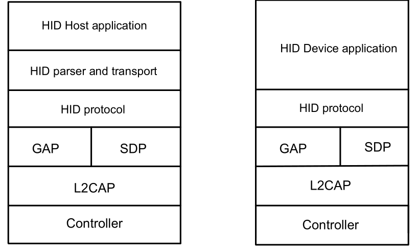

**Figure 3.1: HID and Host Protocol Stack**

### 3.2 Test Strategy

The test objectives are to verify the functionality of the Human Interface Device Profile within a Bluetooth Host and enable interoperability between Bluetooth Hosts on different devices. The testing approach covers mandatory and optional requirements in the specification and matches these to the support of the IUT as described in the ICS. Any defined test herein is applicable to the IUT if the ICS logical expression defined in the Test Case Mapping Table (TCMT) evaluates to true.
The test equipment provides an implementation of the Radio Controller and the parts of the Host needed to perform the test cases defined in this Test Suite. A Lower Tester acts as the IUT’s peer device and interacts with the IUT over-the-air interface. The configuration, including the IUT, needs to implement similar capabilities to communicate with the test equipment. For some test cases, it is necessary to stimulate the IUT from an Upper Tester. In practice, this could be implemented as a special test interface, a Man Machine Interface (MMI), or another interface supported by the IUT.
This Test Suite contains Valid Behavior (BV) tests complemented with Invalid Behavior (BI) tests where required. The test coverage mirrored in the Test Suite Structure is the result of a process that started with catalogued specification requirements that were logically grouped and assessed for testability enabling coverage in defined test purposes.

### 3.3 Test groups

The following test groups have been defined:
• Generic SDP Integrated Tests
• HID Host Connection Establishment
• HID Host Reconnection
• HID Host Connection Release
• General HID Host Requirements
• HID Device Connection Establishment
• HID Device Reconnection
• HID Device Connection Release
• General HID Device Requirements
• Bluetooth HID Host Control Channel
• Bluetooth HID Host Interrupt Channel
• Bluetooth HID Device Control Channel
• Bluetooth HID Device Interrupt Channel
• Bluetooth HID SDP Requirements

#### 3.3.1 General assumptions

Only a single ACL link exists between the IUT and the Lower Tester.
A point-to-point connection is used for all test cases.
When the IUT is tested in the Bluetooth HID Host role, a suitable Lower Tester is used to emulate the role of a Bluetooth HID Device for HID conformance and interoperability tests.
When the IUT is tested in the Bluetooth HID Device role a suitable Lower Tester is used to emulate the role of a Bluetooth HID Host for HID conformance and interoperability tests.

## 4 Test cases (TC)

### 4.1 Introduction

#### 4.1.1 Test case identification conventions

Test cases are assigned unique identifiers per the conventions in [2]. The convention used here is: <spec abbreviation>/<IUT role>/<class>/<feat>/<func>/<subfunc>/<cap>/<xx>-<nn>-<y>.
Additionally, testing of this specification includes tests from the SDP Test Suite [9] referred to as Generic SDP Integrated Tests (GSIT); when used, the GSIT tests are referred to through a TCID string using the following convention: <spec abbreviation>/<IUT role>/<GSIT test group>/<GSIT class>/<xx>-<nn>-<y>.

|  | Identifier Abbreviation |  |  | Spec Identifier <spec abbreviation> |  |
| --- | --- | --- | --- | --- | --- |
| HID11 |  |  | Human Interface Device, Version 1.1 |  |  |
|  | Identifier Abbreviation |  |  | Role Identifier <IUT role> |  |
| DEV |  |  | HID Device |  |  |
| HOS |  |  | HID Host |  |  |
|  | Identifier Abbreviation |  |  | Reference Identifier <GSIT test group> |  |
| CGSIT |  |  | Client Generic SDP Integrated Tests |  |  |
| SGSIT |  |  | Server Generic SDP Integrated Tests |  |  |
|  | Identifier Abbreviation |  |  | Reference Identifier <GSIT class> |  |
| ATTR |  |  | Attribute |  |  |
| OFFS |  |  | Attribute ID Offset String |  |  |
| SERR |  |  | Service Record |  |  |
| SFC |  |  | SDP Future Compatibility |  |  |
|  | Identifier Abbreviation |  |  | Feature Identifier <feat> |  |
| BDCT |  |  | Boot mode Device Control channel Transfer |  |  |
| BDIT |  |  | Boot mode Device Interrupt channel Transfer |  |  |
| BHCT |  |  | Boot mode Host Control channel Transfer |  |  |
| BHIT |  |  | Boot mode Host Interrupt channel Transfer |  |  |
| CDD |  |  | SDP Client Discovery Database |  |  |
| DCE |  |  | Device Connection Establishment |  |  |
| DCR |  |  | Device Connection Release |  |  |
| DCT |  |  | Device Control channel Transfer |  |  |
| DGR |  |  | Device General Requirements |  |  |
| DIT |  |  | Device Interrupt channel Transfer |  |  |
| DRE |  |  | Device initiated Recognition |  |  |
| HCE |  |  | Host Connection Establishment |  |  |
| HCR |  |  | Host Connection Release |  |  |
| HCT |  |  | Host Control channel Transfer |  |  |
| HIT |  |  | Host Interrupt channel Transfer |  |  |

|  | Identifier Abbreviation |  |  | Feature Identifier <feat> |  |
| --- | --- | --- | --- | --- | --- |
| HRE |  |  | Host initiated Reconnection |  |  |
| SDD |  |  | SDP Server Discovery Database |  |  |

Table 4.1: HID v1.1 TC feature naming conventions

#### 4.1.2 Conformance

When conformance is claimed for a particular specification, all capabilities are to be supported in the specified manner. The mandated tests from this Test Suite depend on the capabilities to which conformance is claimed.
The Bluetooth Qualification Program may employ tests to verify implementation robustness. The level of implementation robustness that is verified varies from one specification to another and may be revised for cause based on interoperability issues found in the market.
Such tests may verify:
• That claimed capabilities may be used in any order and any number of repetitions not excluded by the specification
• That capabilities enabled by the implementations are sustained over durations expected by the use case
• That the implementation gracefully handles any quantity of data expected by the use case
• That in cases where more than one valid interpretation of the specification exists, the implementation complies with at least one interpretation and gracefully handles other interpretations
• That the implementation is immune to attempted security exploits
A single execution of each of the required tests is required to constitute a Pass verdict. However, it is noted that to provide a foundation for interoperability, it is necessary that a qualified implementation consistently and repeatedly pass any of the applicable tests.
In any case, where a member finds an issue with the test plan generated by the Bluetooth SIG qualification tool, with the test case as described in the Test Suite, or with the test system utilized, the member is required to notify the responsible party via an erratum request such that the issue may be addressed.

#### 4.1.3 Pass/Fail verdict conventions

Each test case has an Expected Outcome section. The IUT is granted the Pass verdict when all the detailed pass criteria conditions within the Expected Outcome section are met.
The convention in this Test Suite is that, unless there is a specific set of fail conditions outlined in the test case, the IUT fails the test case as soon as one of the pass criteria conditions cannot be met. If this occurs, the outcome of the test is a Fail verdict.

#### 4.1.4 Configuration requirements for HID Host testing

In all Bluetooth HID Host tests, the Lower Tester emulates a HID Device and declares SDP attributes including the HID Report Descriptor according to the following rules:
• For General HID Hosts and Boot Mode Only HID Hosts, the Lower Tester declares the SDP attributes and the HID Report Descriptor defined in Appendix A.
• If the IUT is a Limited HID Host, the Lower Tester declares the HID Report Descriptor specified in the IXIT [8].
• In either of the cases, if different SDP attribute values are specified in the individual test cases, these values are used instead of the default values from Appendix A.
• In case the IUT supports input reports, then:
• The IXIT [8] includes the test reports to be sent by the Lower Tester to the IUT.
• The Lower Tester should provide some mechanism to display when it has received any output or feature reports, e.g., a count of the number of reports received for each type.

#### 4.1.5 Configuration requirements for HID Device testing

In all Bluetooth HID Device tests, the Lower Tester emulates a HID Host.
In case the IUT supports output reports then:
• The IXIT [8] includes the test reports to be sent by the Lower Tester to the IUT.
• The Lower Tester should provide some mechanism to display when it has received any input or feature reports, e.g., a count of the number of reports received for each type.
In case the IUT supports feature reports then:
• The IXIT [8] includes the test reports to be sent by the Lower Tester to the IUT.
• The Lower Tester should provide some mechanism to display when it has received any input or feature reports, e.g., a count of the number of reports received for each type.

### 4.2 Generic SDP Integrated Tests

#### 4.2.1 Server Generic SDP Integrated Tests

##### 4.2.1.1 Human Interface Device Profile – Device Role

Execute the Generic SDP Integrated Tests defined in Section 6.3, Server test procedures (SGSIT), in [9] using Table 4.2 below as input:

| TCID |  |  | Reference | Attribute ID name |  | Attribute ID |  | Value/secondary value |  |  | Attribute presence (Present/Present for [role], Optionally present, TCMT defined) |
| --- | --- | --- | --- | --- | --- | --- | --- | --- | --- | --- | --- |
|  |  |  |  |  |  | definition |  |  |  |  |  |
|  |  |  |  |  |  | source |  |  |  |  |  |
|  |  |  |  |  |  | (Universal, |  |  |  |  |  |
|  |  |  |  |  |  | Profile) |  |  |  |  |  |
|  | HID11/DEV/SGSIT/SERR/BV-01-C |  | [9] 5.3.3 | ServiceClassIDList | Universal | Universal |  | “HID” (UUID) |  |  | Present for DEV |
|  | [Service record GSIT – HID Device] |  |  |  |  |  |  |  |  |  |  |
|  | HID11/DEV/SGSIT/ATTR/BV-01-C |  | [9] 5.3.3 | ProtocolDescriptorList | Universal |  |  |  | “L2CAP” (UUID): PSM – |  | Present for DEV |
|  | [Attribute GSIT – Protocol Descriptor |  |  |  |  |  |  |  | “HID Control” (Uint16), |  |  |
|  | List] |  |  |  |  |  |  |  | “HID Protocol” (UUID) |  |  |
|  | HID11/DEV/SGSIT/ATTR/BV-02-C |  | [9] 5.3.3 | LanguageBaseAttributeIDList | Universal |  |  | skip (Data Element Sequence) | skip (Data Element |  | Present for DEV |
|  | [Attribute GSIT – Language Base |  |  |  |  |  |  |  | Sequence) |  |  |
|  | Attribute ID List] |  |  |  |  |  |  |  |  |  |  |
|  | HID11/DEV/SGSIT/ATTR/BV-03-C |  | [9] 5.3.3 | AdditionalProtocolDescriptorLists | Universal |  |  |  | “L2CAP” (UUID): PSM – |  | Present for DEV |
|  | [Attribute GSIT – Additional Protocol |  |  |  |  |  |  |  | “HID Interrupt” (Uint16), _ |  |  |
|  | Descriptor Lists] |  |  |  |  |  |  |  | “HID Protocol” (UUID) |  |  |
|  | HID11/DEV/SGSIT/ATTR/BV-04-C |  | [9] 5.3.3 | BluetoothProfileDescriptorList | Universal |  |  |  | “HID” (UUID): |  | Present for DEV |
|  | [Attribute GSIT – Bluetooth Profile |  |  |  |  |  |  |  | Version – “0x0101” |  |  |
|  | Descriptor List] |  |  |  |  |  |  |  | (Uint16) |  |  |
|  | HID11/DEV/SGSIT/ATTR/BV-05-C |  | [9] 5.3.3 | HIDParserVersion | Profile |  |  | “0x0111” (Uint16) | “0x0111” (Uint16) |  | Present for DEV |
|  | [Attribute GSIT – HID Parser Version] |  |  |  |  |  |  |  |  |  |  |
|  | HID11/DEV/SGSIT/ATTR/BV-06-C |  | [9] 5.3.3 | HIDDeviceSubclass | Profile |  |  | skip (Uint8) |  |  | Present for DEV |
|  | [Attribute GSIT – HID Device |  |  |  |  |  |  |  |  |  |  |
|  | Subclass] |  |  |  |  |  |  |  |  |  |  |
|  | HID11/DEV/SGSIT/ATTR/BV-07-C |  | [9] 5.3.3 | HIDCountryCode | Profile |  |  | skip (Uint8) |  |  | Present for DEV |
|  | [Attribute GSIT – HID Country Code] |  |  |  |  |  |  |  |  |  |  |
|  | HID11/DEV/SGSIT/ATTR/BV-08-C |  | [9] 5.3.3 | HIDVirtualCable | Profile |  |  | skip (Boolean8) |  |  | Present for DEV |
|  | [Attribute GSIT – HID Virtual Cable] |  |  |  |  |  |  |  |  |  |  |
|  | HID11/DEV/SGSIT/ATTR/BV-09-C |  | [9] 5.3.3 | HIDReconnectInitiate | Profile |  |  | skip (Boolean8) |  |  | Present for DEV |
|  | [Attribute GSIT – HID Reconnect |  |  |  |  |  |  |  |  |  |  |
|  | Initiate] |  |  |  |  |  |  |  |  |  |  |
|  | HID11/DEV/SGSIT/ATTR/BV-10-C |  | [9] 5.3.3 | HIDDescriptorList | Profile |  |  |  | skip (Data Element |  | Present for DEV |
|  | [Attribute GSIT – HID Descriptor List] |  |  |  |  |  |  |  | Sequence) |  |  |

| TCID |  |  | Reference | Attribute ID name |  | Attribute ID |  | Value/secondary value | Attribute presence (Present/Present for [role], Optionally present, TCMT defined) |
| --- | --- | --- | --- | --- | --- | --- | --- | --- | --- |
|  |  |  |  |  |  | definition |  |  |  |
|  |  |  |  |  |  | source |  |  |  |
|  |  |  |  |  |  | (Universal, |  |  |  |
|  |  |  |  |  |  | Profile) |  |  |  |
|  | HID11/DEV/SGSIT/ATTR/BV-11-C |  | [9] 5.3.3 | HIDLANGIDBaseList | Profile | Profile |  | skip (Data Element Sequence) | Present for DEV |
|  | [Attribute GSIT – HID LANG ID Base |  |  |  |  |  |  |  |  |
|  | List] |  |  |  |  |  |  |  |  |
|  | HID11/DEV/SGSIT/ATTR/BV-12-C |  | [9] 5.3.3 | HIDBatteryPower | Profile |  |  | skip (Boolean8) | Optionally present |
|  | [Attribute GSIT – HID Battery Power] |  |  |  |  |  |  |  |  |
|  | HID11/DEV/SGSIT/ATTR/BV-13-C |  | [9] 5.3.3 | HIDRemoteWake | Profile |  |  | skip (Boolean8) | Optionally present |
|  | [Attribute GSIT – HID Remote Wake] |  |  |  |  |  |  |  |  |
|  | HID11/DEV/SGSIT/ATTR/BV-14-C |  | [9] 5.3.3 | HIDSupervisionTimeout | Profile |  |  | skip (Uint16) | Optionally present |
|  | [Attribute GSIT – HID Supervision |  |  |  |  |  |  |  |  |
|  | Timeout] |  |  |  |  |  |  |  |  |
|  | HID11/DEV/SGSIT/ATTR/BV-15-C |  | [9] 5.3.3 | HIDNormallyConnectable | Profile |  |  | skip (Boolean8) | Optionally present |
|  | [Attribute GSIT – HID Normally |  |  |  |  |  |  |  |  |
|  | Connectable] |  |  |  |  |  |  |  |  |
|  | HID11/DEV/SGSIT/ATTR/BV-16-C |  | [9] 5.3.3 | HIDBootDevice | Profile |  |  | skip (Boolean8) | Present for DEV |
|  | [Attribute GSIT – HID Boot Device] |  |  |  |  |  |  |  |  |
|  | HID11/DEV/SGSIT/ATTR/BV-17-C |  | [9] 5.3.3 | HIDSSRHostMaxLatency | Profile |  |  | skip (Uint16) | Optionally present |
|  | [Attribute GSIT – HID SSR Host Max |  |  |  |  |  |  |  |  |
|  | Latency] |  |  |  |  |  |  |  |  |
|  | HID11/DEV/SGSIT/ATTR/BV-18-C |  | [9] 5.3.3 | HIDSSRHostMinTimeout | Profile |  |  | skip (Uint16) | Optionally present |
|  | [Attribute GSIT – HID SSR Host Min |  |  |  |  |  |  |  |  |
|  | Timeout] |  |  |  |  |  |  |  |  |
|  | HID11/DEV/SGSIT/SERR/BV-02-C |  | [9] 5.3.3 | ServiceClassIDList | Universal |  |  | “PnPInformation” (UUID) | Present for DEV |
|  | [Service record GSIT – DID Server] |  |  |  |  |  |  |  |  |
|  | HID11/DEV/SGSIT/ATTR/BV-19-C |  | [9] 4.1.1, 5.3.3 | VendorID | Profile |  |  | skip (Uint16) | Present for DEV |
|  | [Attribute GSIT – DID VendorID] |  |  |  |  |  |  |  |  |
|  | HID11/DEV/SGSIT/ATTR/BV-20-C |  | [9] 4.1.1, 5.3.3 | ProductID | Profile |  |  | skip (Uint16) | Present for DEV |
|  | [Attribute GSIT – DID ProductID] |  |  |  |  |  |  |  |  |
|  | HID11/DEV/SGSIT/ATTR/BV-21-C |  | [9] 4.1.1, 5.3.3 | Version | Profile |  |  | skip (Uint16) | Present for DEV |
|  | [Attribute GSIT – DID Version] |  |  |  |  |  |  |  |  |

Table 4.2: Input for the HID Profile Device SGSIT SDP test procedure

##### 4.2.1.2 HID Profile – Attribute ID Offset String tests

Execute the Generic SDP Integrated Tests defined in Section 6.3, Server test procedures (SGSIT), in [9] using Table 4.3 below as input:

| TCID |  |  | Reference | ServiceSearchPattern | Attribute ID name | Attribute ID Offset |  | Attribute presence |  |
| --- | --- | --- | --- | --- | --- | --- | --- | --- | --- |
|  |  |  |  |  |  |  |  | (Present/Present for [role], |  |
|  |  |  |  |  |  |  |  | Optionally present, TCMT |  |
|  |  |  |  |  |  |  |  | defined) |  |
|  | HID11/DEV/SGSIT/OFFS/BV-01-C |  | [9] 5.3.3 | HID | ServiceName | 0x0000 | Optionally present | Optionally present |  |
|  | [Attribute ID Offset String GSIT – |  |  |  |  |  |  |  |  |
|  | Service Name] |  |  |  |  |  |  |  |  |
|  | HID11/DEV/SGSIT/OFFS/BV-02-C |  | [9] 5.3.3 | HID | ServiceDescription | 0x0001 | Optionally present |  |  |
|  | [Attribute ID Offset String GSIT – |  |  |  |  |  |  |  |  |
|  | Service Description] |  |  |  |  |  |  |  |  |
|  | HID11/DEV/SGSIT/OFFS/BV-03-C |  | [9] 5.3.3 | HID | ProviderName | 0x0002 | Optionally present |  |  |
|  | [Attribute ID Offset String GSIT – |  |  |  |  |  |  |  |  |
|  | Provider Name] |  |  |  |  |  |  |  |  |

Table 4.3: Input for the HID Profile SGSIT Attribute ID Offset String tests

#### 4.2.2 Client Generic SDP Integrated Tests

Execute the Generic SDP Future Compatibility Tests defined in Section 6.4, Client test procedures (CGSIT), in [9] using Table 4.4 below as input:

|  | TCID |  |  | Reference |  |  | Service Record Service Class UUID description |  |  | Lower Tester SDP record initial conditions |  |
| --- | --- | --- | --- | --- | --- | --- | --- | --- | --- | --- | --- |
| HID11/HOS/CGSIT/SFC/BV-01-C [SDP Future Compatibility – IUT is HID Host] | HID11/HOS/CGSIT/SFC/BV-01-C |  | [9] 5.3.1 | [9] 5.3.1 |  | HID | HID |  |  | The Lower Tester exposes a HID Device SDP record. |  |
|  | [SDP Future Compatibility – IUT is |  |  |  |  |  |  |  |  | The version in the Bluetooth Profile Descriptor List is greater than |  |
|  | HID Host] |  |  |  |  |  |  |  |  | the most recently adopted version. |  |
|  |  |  |  |  |  |  |  |  |  | Configuration of the HID Device role is specified by IXIT [8] (e.g., |  |
|  |  |  |  |  |  |  |  |  |  | Keyboard, Mouse). |  |

Table 4.4: Input for the Client CGSIT SDP future compatibility tests

### 4.3 HID Host Connection Establishment

Verify HID Connection Establishment requirements.

#### 4.3.1 Host Connection Establishment in Security Mode 4 • Test Purpose

Verify that the IUT (Host) can initiate a HID protocol connection to the Lower Tester (Device) with Secure Simple Pairing enabled and using the association model indicated in Table 4.5.
• Reference
[3] 3.1.2.7, 3.1.2.8, 5.2.2, 5.2.3.2, 5.4.3.4.2
• Initial Condition
- The Lower Tester is Discoverable and Connectable (inquiry scan and page scan are enabled) and Secure Simple Pairing is indicated as supported in the LMP feature bits of the Lower Tester.
- The Lower Tester is configured for MITM per Table 4.5.
- The Lower Tester exposes IO Capabilities with the value in Table 4.5 indicating support for the association model in Table 4.5.
- The IUT has not yet paired with the Lower Tester.
- The Lower Tester declares HIDVirtualCable as TRUE in its SDP record.
• Test Case Configuration

| Test Case |  | Lower Tester |  | IO Capabilities Value | Association Model |
| --- | --- | --- | --- | --- | --- |
|  |  | Configured |  |  |  |
|  |  | for MITM |  |  |  |
|  |  | Protection |  |  |  |
| HID11/HOS/HCE/BV-01-C [Host Connection Establishment in Security Mode 4 with Just Works] | No |  |  | NoInputNoOutput | Just Works |
| HID11/HOS/HCE/BV-02-C [Host Connection Establishment in Security Mode 4 with Numeric Comparison] | Yes |  |  | DisplayYesNo | Numeric Comparison |
| HID11/HOS/HCE/BV-03-C [Host Connection Establishment in Security Mode 4 with Passkey Entry] | Yes |  |  | KeyboardOnly | Passkey Entry |

Table 4.5: Host Connection Establishment in Security Mode 4 test cases
• Test Procedure
1. The IUT (Host) initiates an inquiry using the GIAC to discover the Lower Tester (Device). 2. The IUT connects to the Lower Tester. 3. The IUT performs Secure Simple Pairing (security mode 4). 4. The IUT reads the SDP records from the Lower Tester. 5. The IUT establishes the HID L2CAP channels with the Lower Tester. 6. The IUT may configure the QoS parameters for outgoing traffic on the Control channel. 7. The Lower Tester configures the QoS parameters for outgoing traffic on the Control channel with
Service Type = “Best Effort”.
requested Service Type is “Guaranteed”, Lower Tester rejects the request and proposes “Best Effort”. 9. The Lower Tester configures the QoS parameters for outgoing traffic on the Interrupt channel with
Service Type = “Guaranteed” and Access Latency = 11.25 ms. If the IUT does not accept these parameters, the Lower Tester retries with new parameters based on the proposal from the IUT. 10. The Lower Tester sends an HCI_QoS_Setup command to its controller with the Latency
parameter equal to parameters used in step 9.
• Expected Outcome
Pass verdict
The Lower Tester receives an HCI_Encryption_Change event from its controller with the following parameters: Status = 0 (encryption change has occurred), Encryption_Enabled = 1 (on).
The IUT connects both the HID Control and the HID Interrupt channels.
The IUT connects the Control channel first and then the Interrupt channel.
The IUT may send an L2CAP_Conf_Req(Service Type = “Best Effort”) to configure the Control channel.
When receiving the L2CAP_Conf_Req(Service Type = “Best Effort”) for the Control channel, the IUT responds with an L2CAP_Conf_Res(Result = “Success”).
The IUT may send an L2CAP_Conf_Req(Service Type = “Guaranteed”, “Best Effort” or “No Traffic”) to configure the Interrupt channel. If the IUT sends an L2CAP_Conf_Req(Service Type = “Guaranteed” or “No Traffic”) and the Lower Tester responds with an L2CAP_Conf_Res(Result = “Unacceptable parameters”, Service Type = “Best Effort”), the IUT must send an L2CAP_Conf_Req(Service Type = “Best Effort”).
When receiving the L2CAP_Conf_Req(Service Type = “Guaranteed”, Access Latency = 11.25 ms) for the Interrupt channel, the IUT responds with an L2CAP_Conf_Res(Result = “Success”) to accept the parameters or with an L2CAP_Conf_Res(Result = “Unacceptable parameters”) to propose new parameters.
The IUT accepts the LMP_QoS_req from the Lower Tester. The Lower Tester receives an HCI_QoS_Setup_Complete event from its controller with Status = 0 (success).
The IUT does not send Get_Idle command to the Lower Tester.
The IUT does not send Set_Idle to the Lower Tester except with parameter of 0.
Upon the HID connection at least one of the following occurs:
- The IUT indicates that it is receiving input or feature reports from the Lower Tester, or
- The Lower Tester receives output or feature reports from the IUT.
• Notes
The Configuration requirements for HID testing in 4.1.4 apply.
HID11/HOS/HCE/BV-05-C [Host Connection Establishment in Security Mode 2 with Pre- Connection Pairing]
• Test Purpose
Verify that the IUT (Host) can initiate a HID protocol connection to the Lower Tester (Device) which does not support Secure Simple Pairing but does support pairing using a PIN. The IUT initiates pairing before establishing the HID connection.
• Reference
[3] 3.1.2.7, 3.1.2.8, 5.2.2, 5.2.3.2, 5.4.3.4.3
• Initial Condition
- The Lower Tester is Discoverable and Connectable (inquiry scan and page scan are enabled).
- Secure Simple Pairing is NOT indicated as supported in the LMP features mask of the Lower Tester.
- The IUT has not yet paired with the Lower Tester. The security database of the IUT indicates that security is required for the HID profile for pre-v2.1+EDR devices.
- The Lower Tester emulates a device type for which the IUT requires security.
- The Lower Tester declares HIDVirtualCable as TRUE in its SDP record.
• Test Procedure
1. The IUT (Host) initiates an inquiry using the GIAC to discover the Lower Tester (Device). 2. The IUT initiates a connection to the Lower Tester. 3. The IUT reads the SDP records from the Lower Tester. 4. The IUT performs pairing using a PIN and activates encryption (security mode 2). 5. The IUT establishes the HID L2CAP channels with the Lower Tester. 6. The IUT may configure the QoS parameters for outgoing traffic on the Control channel. 7. The Lower Tester configures the QoS parameters for outgoing traffic on the Control channel with
Service Type = “Best Effort”. 8. The IUT may configure the QoS parameters for outgoing traffic on the Interrupt channel. If the
requested Service Type is “Guaranteed”, the Lower Tester rejects the request and proposes “Best Effort”. 9. The Lower Tester configures the QoS parameters for outgoing traffic on the Interrupt channel with
Service Type = “Guaranteed” and Access Latency = 11.25 ms. If these parameters are not accepted by the IUT, the Lower Tester retries with new parameters based on the proposal from the IUT. 10. The Lower Tester sends an HCI_QoS_Setup command to its controller with the Latency
parameter equal to parameters used in step 9.
• Expected Outcome
Pass verdict
The Lower Tester receives an HCI_Encryption_Change event from its controller with the following parameters: Status = 0 (encryption change has occurred), Encryption_Enabled = 1 (on).
The IUT connects both the HID Control and the HID Interrupt channels.
The IUT connects the Control channel first and then the Interrupt channel.
The IUT may send an L2CAP_Conf_Req(Service Type = “Best Effort”) to configure the Control channel.
When receiving the L2CAP_Conf_Req(Service Type = “Best Effort”) for the Control channel, the IUT responds with an L2CAP_Conf_Res(Result = “Success”).
The IUT may send an L2CAP_Conf_Req(Service Type = “Guaranteed”, “Best Effort” or “No Traffic”) to configure the Interrupt channel. If the Lower Tester responds with an L2CAP_Conf_Res(Result = “Unacceptable parameters”, Service Type = “Best Effort”), the IUT must send an L2CAP_Conf_Req(Service Type = “Best Effort”).
When receiving the L2CAP_Conf_Req(Service Type = “Guaranteed”, Access Latency = 11.25 ms) for the Interrupt channel, the IUT responds with an L2CAP_Conf_Res(Result = “Success”) to accept the parameters or with an L2CAP_Conf_Res(Result = “Unacceptable parameters”) to propose new parameters.
The IUT accepts the LMP_QoS_req from the Lower Tester. The Lower Tester receives an HCI_QoS_Setup_Complete event from its controller with Status = 0 (success).
The IUT does not send Get_Idle command to the Lower Tester.
The IUT does not send Set_Idle to the Lower Tester except with parameter of 0.
Upon the HID connection at least one of the following occurs:
- The IUT indicates that it is receiving input or feature reports from the Lower Tester, or
- The Lower Tester receives output or feature reports from the IUT.
• Notes
The Configuration requirements for HID testing in Section 4.1.4 apply.
HID11/HOS/HCE/BV-06-C [Host Connection Establishment in Security Mode 2 with Post- Connection Pairing]
• Test Purpose
Verify that the IUT (Host) can initiate a HID protocol connection to the Lower Tester (Device) which does not support Secure Simple Pairing but does support pairing using a PIN. The IUT initiates pairing after establishing the HID connection.
• Reference
[3] 3.1.2.7, 3.1.2.8, 5.2.2, 5.2.3.2, 5.4.3.4.3
• Initial Condition
- The Lower Tester is Discoverable and Connectable (inquiry scan and page scan are enabled).
- Secure Simple Pairing is NOT indicated as supported in the LMP features mask of the Lower Tester.
- The IUT has not yet paired with the Lower Tester. The security database of the IUT indicates that security is required for the HID profile for pre-v2.1+EDR devices.
- The Lower Tester emulates a device type for which the IUT requires security.
- The Lower Tester declares HIDVirtualCable as TRUE in its SDP record.
• Test Procedure
1. The IUT (Host) initiates an inquiry using the GIAC to discover the Lower Tester (Device). 2. The IUT connects to the Lower Tester. 3. The IUT reads the SDP records from the Lower Tester.
4. The IUT establishes the HID L2CAP channels with the Lower Tester. 5. The IUT may configure the QoS parameters for outgoing traffic on the Control channel. 6. The Lower Tester configures the QoS parameters for outgoing traffic on the Control channel with
Service Type = “Best Effort”. 7. The IUT may configure the QoS parameters for outgoing traffic on the Interrupt channel. If the
requested Service Type is “Guaranteed”, the Lower Tester rejects the request and proposes “Best Effort”. 8. The Lower Tester configures the QoS parameters for outgoing traffic on the Interrupt channel with
Service Type = “Guaranteed” and Access Latency = 11.25 ms. If the IUT does not accept these parameters, the Lower Tester retries with new parameters based on the proposal from the IUT. 9. The Lower Tester sends an HCI_QoS_Setup command to its controller with the Latency
parameter equal to the parameters used in step 8. 10. The IUT performs pairing using a PIN and activates encryption (security mode 2).
• Expected Outcome
Pass verdict
The IUT connects both the HID Control and the HID Interrupt channels.
The IUT connects the Control channel first and then the Interrupt channel.
The IUT may send an L2CAP_Conf_Req(Service Type = “Best Effort”) to configure the Control channel.
When receiving the L2CAP_Conf_Req(Service Type = “Best Effort”) for the Control channel, the IUT responds with an L2CAP_Conf_Res(Result = “Success”).
The IUT may send an L2CAP_Conf_Req(Service Type = “Guaranteed”, “Best Effort” or “No Traffic”) to configure the Interrupt channel. If the Lower Tester responds with an L2CAP_Conf_Res(Result = “Unacceptable parameters”, Service Type = “Best Effort”), the IUT must send an L2CAP_Conf_Req(Service Type = “Best Effort”).
When receiving the L2CAP_Conf_Req(Service Type = “Guaranteed”, Access Latency = 11.25 ms) for the Interrupt channel, the IUT responds with an L2CAP_Conf_Res(Result = “Success”) to accept the parameters or with an L2CAP_Conf_Res(Result = “Unacceptable parameters”) to propose new parameters.
The IUT accepts the LMP_QoS_req from the Lower Tester. The Lower Tester receives an HCI_QoS_Setup_Complete event from its controller with Status = 0 (success).
The Lower Tester receives an HCI_Encryption_Change event from its controller with the following parameters: Status = 0 (encryption change has occurred), Encryption_Enabled = 1 (on).
The IUT does not send Get_Idle command to the Lower Tester.
The IUT does not send Set_Idle to the Lower Tester except with parameter of 0.
Upon the HID connection at least one of the following occurs:
- The IUT indicates that it is receiving input or feature reports from the Lower Tester, or
- The Lower Tester receives output or feature reports from the IUT.
• Notes
The Configuration requirements for HID testing in Section 4.1.4 apply.
• Test Purpose
Verify that the IUT (Host) can initiate a HID protocol connection to the Lower Tester (Device), which indicates a Major Class of Device other than Peripheral.
• Reference
[3] 5.3.1
• Initial Condition
- The Lower Tester is Discoverable and Connectable (inquiry scan and page scan are enabled).
- The Lower Tester indicates a Major Class of “Phone” in its response to Inquiries.
- The Lower Tester declares the HIDDeviceSubclass SDP attribute as 0xC0 and the HIDBootDevice SDP attribute as “TRUE”.
• Test Procedure
1. The IUT (Host) initiates an inquiry using the GIAC to discover the Lower Tester (Device). 2. The IUT connects to the Lower Tester. 3. The IUT establishes the HID L2CAP channels with the Lower Tester.
• Expected Outcome
Pass verdict
Upon the HID connection at least one of the following occurs:
- The IUT indicates that it is receiving input or feature reports from the Lower Tester, or
- The Lower Tester receives output or feature reports from the IUT.
• Notes
The Configuration requirements for HID testing in Section 4.1.4 apply.

### 4.4 HID Host Reconnection

Verify HID Reconnection requirements.

#### 4.4.1 Device Initiated Reconnection • Test Purpose

Verify that the IUT (Host) will allow the Lower Tester (Device) to initiate a HID reconnection after establishing a HID connection using the pairing mechanism in Table 4.6.
• Reference
[3] 3.1.2.7, 3.1.2.8, 4.5, 5.2.3.2, 5.4.2, 5.4.3.4
• Initial Condition
- The Lower Tester was previously connected to the IUT (Host) using the pairing mechanism indicated in Table 4.6 and the HID connection is active.
- The Lower Tester declares the HIDReconnectInitiate and the HIDVirtualCable SDP attributes as TRUE.
• Test Case Configuration

| Test Case |  | Security |  |  | Pairing |  | Additional Pass Verdict |
| --- | --- | --- | --- | --- | --- | --- | --- |
|  |  | Mode |  |  | Mechanism |  |  |
| HID11/HOS/HRE/BV-01-C [Device Initiated Reconnection in Security Mode 4] | 4 |  |  | Secure Simple Pairing |  |  | N/A |
| HID11/HOS/HRE/BV-05-C [Device Initiated Reconnection in Security Mode 2] | 2 |  |  | Legacy Pairing |  |  | The Lower Tester receives the HCI Encryption Change _ _ event indicating that encryption is “on” before receiving an L2CAP Conn Res for the _ _ HID Control channel. |

Table 4.6: Device Initiated Reconnection test cases
• Test Procedure
Repeat the test procedure below after generating a disconnection with each of the following methods:
- The test operator takes the IUT out of range of the Lower Tester or shields the IUT or the Lower Tester.
- The Lower Tester sends an LMP_detach command to the IUT.
Procedure:
1. The Lower Tester (Device) initiates reconnection to the IUT (Host). 2. The Lower Tester requests a role switch to “Peripheral”. 3. The Lower Tester completes the connection with the IUT. 4. The Lower Tester authenticates the IUT and activates encryption (security mode specified in
Table 4.6). 5. The Lower Tester establishes the HID L2CAP channels with the IUT. 6. The IUT may configure the QoS parameters for outgoing traffic on the Control channel. 7. The Lower Tester configures the QoS parameters for outgoing traffic on the Control channel with
Service Type = “Best Effort”. 8. The IUT may configure the QoS parameters for outgoing traffic on the Interrupt channel. If the
requested Service Type is “Guaranteed”, the Lower Tester rejects the request and proposes “Best Effort”. 9. The Lower Tester configures the QoS parameters for outgoing traffic on the Interrupt channel with
Service Type = “Guaranteed” and Access Latency = 11.25 ms. If the IUT does not accept these parameters, the Lower Tester retries with new parameters based on the proposal from the IUT. 10. The Lower Tester sends an HCI_QoS_Setup command to its controller with the Latency
parameter equal to the parameters used in step 9.
• Expected Outcome
Pass verdict
The IUT automatically accepts the reconnection from the Lower Tester without further user action.
The Lower Tester receives an HCI_Role_Change event from its controller with the following parameters: Status = 0 (role change has occurred), New_Role = 1 (Peripheral).
The Lower Tester receives an HCI_Encryption_Change event from its controller with the following parameters: Status = 0 (encryption change has occurred), Encryption_Enabled = 1 (on).
The IUT may send an L2CAP_Conf_Req(Service Type = “Best Effort”) to configure the Control channel.
When receiving the L2CAP_Conf_Req(Service Type = “Best Effort”) for the Control channel, the IUT responds with an L2CAP_Conf_Res(Result = “Success”).
The IUT may send an L2CAP_Conf_Req(Service Type = “Guaranteed”, “Best Effort” or “No Traffic”) to configure the Interrupt channel. If the Lower Tester responds with an L2CAP_Conf_Res(Result = “Unacceptable parameters”, Service Type = “Best Effort”), the IUT must send an L2CAP_Conf_Req(Service Type = “Best Effort”).
When receiving the L2CAP_Conf_Req(Service Type = “Guaranteed”, Access Latency = 11.25 ms) for the Interrupt channel, the IUT responds with an L2CAP_Conf_Res(Result = “Success”) to accept the parameters or with an L2CAP_Conf_Res(Result = “Unacceptable parameters”) to propose new parameters.
The IUT accepts the LMP_QoS_req from the Lower Tester. The Lower Tester receives an HCI_QoS_Setup_Complete event from its controller with Status = 0 (success).
The IUT does not send Get_Idle command to the Lower Tester.
The IUT does not send Set_Idle to the Lower Tester except with parameter of 0.
If the IUT is a General Bluetooth HID Host, the IUT notifies its applications when the Lower Tester reconnects.
Upon the HID connection at least one of the following occurs:
- The Lower Tester receives output or feature reports from the IUT, or
- The IUT indicates that it is receiving input or feature reports from the Lower Tester.
Additional Pass verdicts are described in Table 4.6.

#### 4.4.2 Host Initiated Reconnection • Test Purpose

Verify that the IUT (Host) can initiate a HID reconnection with the Lower Tester (Device) after establishing a HID connection using the pairing mechanism in Table 4.7.
• Reference
[3] 3.1.2.7, 3.1.2.8, 4.5, 5.2.3.2, 5.4.2, 5.4.3.4
• Initial Condition
- The Lower Tester was previously connected to the IUT (Host) using the pairing mechanism indicated in Table 4.7 and the HID connection is active.
- The Lower Tester declares the HIDNormallyConnectable and the HIDVirtualCable SDP attributes as TRUE.
- The Lower Tester (Device) is connectable and in page scan mode.
• Test Case Configuration

| Test Case |  | Security |  |  | Pairing |  | Additional Pass Verdict |
| --- | --- | --- | --- | --- | --- | --- | --- |
|  |  | Mode |  |  | Mechanism |  |  |
| HID11/HOS/HRE/BV-02-C [Host Initiated Reconnection in Security Mode 4] | 4 |  |  | Secure Simple Pairing |  |  | N/A |
| HID11/HOS/HRE/BV-06-C [Host Initiated Reconnection in Security Mode 2] | 2 |  |  | Legacy Pairing |  |  | The Lower Tester receives the HCI Encryption Change _ _ event indicating that encryption is “on” before receiving an L2CAP Conn req for the _ _ HID Control channel. |

Table 4.7: Host Initiated Reconnection test cases
• Test Procedure
Repeat the test procedure below after generating a disconnection with each of the following methods:
- The test operator takes the IUT out of range of the Lower Tester or shields the IUT or the Lower Tester.
- The Lower Tester sends an LMP_detach command to the IUT.
Procedure:
1. The IUT (Host) reconnects to the Lower Tester (Device). 2. The IUT authenticates the Lower Tester and activates encryption (security mode mentioned in
Table 4.7). 3. The IUT establishes the HID L2CAP channels with the Lower Tester. 4. The IUT may configure the QoS parameters for outgoing traffic on the Control channel. 5. The Lower Tester configures the QoS parameters for outgoing traffic on the Control channel with
Service Type = “Best Effort”. 6. The IUT may configure the QoS parameters for outgoing traffic on the Interrupt channel. If the
requested Service Type is “Guaranteed”, the Lower Tester rejects the request and proposes “Best Effort”. 7. The Lower Tester configures the QoS parameters for outgoing traffic on the Interrupt channel with
Service Type = “Guaranteed” and Access Latency = 11.25 ms. If the IUT does not accept these parameters, the Lower Tester retries with new parameters based on the proposal from the IUT. 8. The Lower Tester sends an HCI_QoS_Setup command to its controller with the Latency
parameter equal to the parameters used in step 7.
• Expected Outcome
Pass verdict
The Lower Tester receives an HCI_Encryption_Change event from its controller with the following parameters: Status = 0 (encryption change has occurred), Encryption_Enabled = 1 (on).
The IUT connects both the HID Control and the HID Interrupt channels.
The IUT connects the Control channel first and then the Interrupt channel.
The IUT may send an L2CAP_Conf_Req(Service Type = “Best Effort”) to configure the Control channel.
When receiving the L2CAP_Conf_Req(Service Type = “Best Effort”) for the Control channel, the IUT responds with an L2CAP_Conf_Res(Result = “Success”).
The IUT may send an L2CAP_Conf_Req(Service Type = “Guaranteed”, “Best Effort” or “No Traffic”) to configure the Interrupt channel. If the Lower Tester responds with an L2CAP_Conf_Res(Result = “Unacceptable parameters”, Service Type = “Best Effort”), the IUT must send an L2CAP_Conf_Req(Service Type = “Best Effort”).
When receiving the L2CAP_Conf_Req(Service Type = “Guaranteed”, Access Latency = 11.25 ms) for the Interrupt channel, the IUT responds with an L2CAP_Conf_Res(Result = “Success”) to accept the parameters or with an L2CAP_Conf_Res(Result = “Unacceptable parameters”) to propose new parameters.
The IUT accepts the LMP_QoS_req from the Lower Tester. The Lower Tester receives an HCI_QoS_Setup_Complete event from its controller with Status = 0 (success).
The IUT does not send Get_Idle command to the Lower Tester.
The IUT does not send Set_Idle to the Lower Tester except with parameter of 0.
Upon the HID connection at least one of the following occurs:
- The Lower Tester receives output or feature reports from the IUT, or
- The IUT indicates that it is receiving input or feature reports from the Lower Tester.
Additional Pass verdicts are described in Table 4.7.
HID11/HOS/HRE/BV-09-C [Device Initiated Reconnection in Suspend Mode]
• Test Purpose
Verify that the IUT (Host) will wake up from Suspend mode and will allow the Lower Tester (Device) to initiate a HID reconnection after the Lower Tester was placed in Suspend mode and was disconnected by the IUT. Verify that the IUT correctly sends the Suspend and Exit_Suspend commands.
• Reference
[3] 3.1.2.2.2, 4.5, 5.3.4.11, 5.4.2
• Initial Condition
- A Bluetooth HID connection exists between the Lower Tester and the IUT.
- The Lower Tester (Device) declares the HIDRemoteWake SDP attributes as TRUE.
- The Lower Tester (Device) declares both the HIDReconnectInitiate and the HIDVirtualCable SDP attributes as TRUE.
• Test Procedure
1. User action on the IUT (Host) initiates a transition to Suspend mode. 2. The IUT sends a HID_Control(Suspend) command to the Lower Tester. 3. The Lower Tester responds with a Handshake(successful) and disconnects from the IUT. 4. The IUT enters page scan mode. 5. User action on the Lower Tester(Device) initiates a HID reconnection to the IUT. 6. The IUT exits Suspend mode. 7. The IUT sends a HID_Control(Exit_Suspend) command to the Lower Tester. 8. The Lower Tester responds with a Handshake(successful).
• Expected Outcome
Pass verdict
Before entering Suspend mode, the IUT sends a HID_Control(Suspend) command to the Lower Tester.
When the Lower Tester reconnects, the IUT exits Suspend mode.
After leaving Suspend mode, the IUT sends a HID_Control(Exit_Suspend) command to the Lower Tester.
Upon the HID connection at least one of the following occurs:
- The Lower Tester receives output or feature reports from the IUT, or
- The IUT indicates that it is receiving input or feature reports from the Lower Tester.
HID11/HOS/HRE/BI-01-C [Device Initiated Reconnection with Authentication Failure in Security Mode 2]
• Test Purpose
Verify that the IUT (Host) does not automatically initiate pairing with the Lower Tester (Device) when authentication fails due to a missing or incorrect link-key after a HID connection was established using Legacy Pairing.
• Reference
[3] 4.5, 5.4.2, 5.4.3.4.3
• Initial Condition
- The Lower Tester was previously connected to the IUT (Host) using Legacy Pairing but connection loss has occurred. Connection loss can be forced by taking the IUT out of range of the Lower Tester or by shielding the IUT or the Lower Tester.
- After losing the connection with the IUT, the Lower Tester has deleted the link key for the IUT.
- The Tester does not automatically initiate pairing and does not disconnect the link when authentication fails.
- The Lower Tester (Device) declares both the HIDReconnectInitiate and the HIDVirtualCable SDP attributes as TRUE.
• Test Procedure
1. The Lower Tester (Device) reconnects to the IUT (Host). 2. The Lower Tester requests authentication. 3. The Upper Tester application responds to the HCI_Link_Key_Request event from its controller by
sending an HCI_Link_Key_Request_Negative_Reply command or an HCI_Link_Key_Request_Reply command with an incorrect link key. 4. The IUT disconnects the link.
• Expected Outcome
Pass verdict
The Upper Tester does not receive any HCI_Link_Key_Request event from its controller, meaning that the IUT does not initiate pairing.
The Upper Tester receives an HCI_Disconnection_Complete event from its controller, meaning that the link was disconnected by the IUT.
HID11/HOS/HRE/BI-02-C [Host Initiated Reconnection with Authentication Failure in Security Mode 2]
• Test Purpose
Verify that the IUT (Host) does not automatically initiate pairing with the Lower Tester (Device) when authentication fails due to a missing link-key after a HID connection was established using Legacy Pairing.
• Reference
[3] 4.5, 5.4.2, 5.4.3.4.3
• Initial Condition
- The Lower Tester was previously connected to the IUT (Host) using Legacy Pairing but connection loss has occurred. Connection loss can be forced by taking the IUT out of range of the Lower Tester or by shielding the IUT or the Lower Tester.
- After losing the connection with the IUT, the Lower Tester has deleted the link key for the IUT.
- The Lower Tester does not automatically initiate pairing and does not disconnect the link when authentication fails.
- The Lower Tester (Device) declares the HIDNormallyConnectable SDP attributes as TRUE.
- The Lower Tester (Device) is connectable and in page scan mode.
• Test Procedure
1. The IUT (Host) reconnects to the Lower Tester (Device). 2. The IUT requests authentication. 3. The Upper Tester application responds to the HCI_Link_Key_Request event from the IUT’s
controller by sending an HCI_Link_Key_Request_Negative_Reply command or an HCI_Link_Key_Request_Reply command. 4. The IUT disconnects the link.
• Expected Outcome
Pass verdict
The IUT requests authentication after the reconnect to the Lower Tester (Device).
Following step 2, the IUT discovers that the Bluetooth HID device does not have a link-key and the IUT (HID Host) does not automatically initiate pairing.
The Lower Tester receives an HCI_Disconnection_Complete event from its controller, meaning that the link was disconnected by the IUT.

#### 4.4.3 HID Connection Release

Verify HID connection release requirements.
HID11/HOS/HCR/BV-01-C [Host Initiated Connection Release]
• Test Purpose
Verify that the IUT (Host) can initiate a release of the HID connection with the Lower Tester (Device) and be able to connect back to the Lower Tester after release. The IUT should not attempt to auto- reconnect, unless prompted by a user action.
• Reference
[3] 4.5.2, 5.2.2, 5.4.2
• Initial Condition
- The Lower Tester declares the HIDVirtualCable, the HIDReconnectInitiate, and the HIDNormallyConnectable SDP attributes as TRUE.
- The Lower Tester does not auto-reconnect after disconnection.
- The IUT and the Lower Tester are connected.
• Test Procedure
Step 1:
- User action on the IUT (Host) initiates a HID connection release.
- The Upper Tester c that HID reports cannot be exchanged with the IUT (without paging).
- User action on the IUT (Host) initiates a HID reconnection.
- The Upper Tester verifies that HID reports can be exchanged with the IUT (without paging).
Step 2:
- User action on the IUT (Host) initiates a HID connection release.
- The Upper Tester verifies that HID reports cannot be exchanged with the IUT (without paging).
- The Lower Tester (Device) initiates a HID reconnection.
- The Upper Tester verifies that HID reports can be exchanged with the IUT (without paging).
• Expected Outcome
Pass verdict
The IUT disconnects both the HID Control and the HID Interrupt channels.
The IUT disconnects the Interrupt channel first and then the Control channel.
After connection release, HID reports can no longer be transmitted from the IUT to the Lower Tester and from the Lower Tester to the IUT without paging.
After reconnection by the Lower Tester or the IUT, HID reports can be transmitted from the IUT to the Lower Tester or from the Lower Tester to the IUT without paging.
• Test Purpose
Verify that the IUT (Host) will accept a HID connection release from the Lower Tester (Device) and be able to connect back to the Lower Tester after release. The IUT should not attempt to auto-reconnect, unless prompted by a user action.
• Reference
[3] 4.5.2, 5.4.2
• Initial Condition
- The Lower Tester declares the HIDVirtualCable, the HIDReconnectInitiate, and the HIDNormallyConnectable SDP attributes as TRUE.
- The Lower Tester does not auto-reconnect after disconnection.
- The IUT and the Lower Tester are connected.
• Test Procedure
1. The Lower Tester (Device) initiates a HID connection release. 2. The Lower Tester verifies that HID reports cannot be exchanged with the IUT (without paging). 3. If the IUT does not support the Host initiated reconnection feature proceed to step 7, otherwise
take user action on the IUT (Host) to initiate a HID reconnection. 4. The Lower Tester verifies that HID reports can be exchanged with the IUT (without paging). 5. The Lower Tester (Device) initiates a HID connection release. 6. The Lower Tester verifies that HID reports cannot be exchanged with the IUT (without paging). 7. If the IUT does not support the Device initiated reconnection feature the test purpose has been
fulfilled, otherwise the Lower Tester (Device) initiates a HID reconnection. 8. The Lower Tester verifies that HID reports can be exchanged with the IUT (without paging).
• Expected Outcome
Pass verdict
After connection release, HID reports can no longer be transmitted from the IUT to the Lower Tester and from the Lower Tester to the IUT without paging.
After reconnection by the Tester or the IUT, HID reports can be transmitted from the IUT to the Lower Tester or from the Lower Tester to the IUT without paging.
• Notes
The Configuration requirements for HID testing in Section 4.1.4 apply.
HID11/HOS/HCR/BV-03-C [Host Initiated Virtual Cable Unplug]
• Test Purpose
Verify that the IUT (Host) can initiate a Virtual Cable unplug from the Lower Tester (Device) and rejects reconnection requests after unplug.
• Reference
[3] 3.1.2.2.3, 4.5.2
• Initial Condition
- The Lower Tester (Device) declares the HIDVirtualCable, the HIDReconnectInitiate, and the HIDNormallyConnectable SDP attributes as TRUE.
- The IUT and the Lower Tester are connected and virtually cabled.
• Test Procedure
1. User action on the IUT (Host) initiates a Virtual Cable unplug from the Lower Tester (Device). 2. The Upper Tester verifies that HID reports cannot be exchanged with the IUT. 3. User action on the IUT (Host) attempts to initiate a HID reconnection. 4. The Upper Tester verifies that HID reports cannot be exchanged with the IUT. 5. The Lower Tester (Device) attempts to initiates a HID reconnection. 6. The Upper Tester verifies that HID reports cannot be exchanged with the IUT.
• Expected Outcome
Pass verdict
After Virtual Cable unplug, HID reports can no longer be transmitted from the IUT to the Lower Tester and from the Lower Tester to the IUT.
After reconnection attempts by the Lower Tester or the IUT, HID reports can still not be transmitted from the IUT to the Lower Tester or from the Lower Tester to the IUT.
HID11/HOS/HCR/BV-04-C [Device Initiated Virtual Cable Unplug]
• Test Purpose
Verify that the IUT (Host) accepts a Virtual Cable unplug from the Lower Tester (Device) and rejects reconnection requests after unplug.
• Reference
[3] 3.1.2.2.3, 4.5.2
• Initial Condition
- The Lower Tester (Device) declares the HIDVirtualCable, the HIDReconnectInitiate, and the HIDNormallyConnectable SDP attributes as TRUE.
- The IUT and the Lower Tester are connected and virtually cabled.
• Test Procedure
1. The Lower Tester (Device) initiates a Virtual Cable unplug from the IUT (Host). 2. The Upper Tester verifies that HID reports cannot be exchanged with the IUT. 3. User action on the IUT (Host) attempts to initiates a HID reconnection. 4. The Upper Tester verifies that HID reports cannot be exchanged with the IUT. 5. The Lower Tester (Device) attempts to initiate a HID reconnection. 6. The Upper Tester verifies that HID reports cannot be exchanged with the IUT.
• Expected Outcome
Pass verdict
The IUT disconnects both the HID Control and the HID Interrupt channels.
The IUT disconnects the Interrupt channel first and then the Control channel.
After Virtual Cable unplug, HID reports can no longer be transmitted from the IUT to the Lower Tester and from the Lower Tester to the IUT.
After reconnection attempts by the Lower Tester or the IUT, HID reports can still not be transmitted from the IUT to the Lower Tester or from the Lower Tester to the IUT.

### 4.5 General Host Requirements

Verify General HID Host requirements.
HID11/HOS/HGR/BV-01-C [Device Initiated Data Transmission in Suspend Mode]
• Test Purpose
Verify that the IUT (Host) wakes up from Suspend mode when receiving data from the Lower Tester (Device) after the Lower Tester was placed in Suspend mode but was not disconnected by the IUT. Verify that the IUT correctly sends the Suspend and Exit_Suspend commands.
• Reference
[3] 3.1.2.2.2, 5.3.4.11
• Initial Condition
- A Bluetooth HID connection exists between the Lower Tester and the IUT.
- The Lower Tester declares the HIDRemoteWake SDP attributes as TRUE.
• Test Procedure
1. User action on the IUT (Host) initiates a transition to Suspend mode. 2. The IUT sends a HID_Control(Suspend) command to the Lower Tester. 3. User action on the Lower Tester (Device) initiates the transmission of HID reports to the IUT. 4. The IUT exits Suspend mode. 5. The IUT sends a HID_Control(Exit_Suspend) command to the Lower Tester.
• Expected Outcome
Pass verdict
Before entering Suspend mode, the IUT sends a HID_Control(Suspend) command to the Lower Tester.
When the Lower Tester transmits HID reports, the IUT exits Suspend mode.
After leaving Suspend mode, the IUT sends a HID_Control(Exit_Suspend) command to the Lower Tester.
Upon the HID connection at least one of the following occurs:
- The Lower Tester receives output or feature reports from the IUT, or
- The IUT indicates that it is receiving input or feature reports from the Lower Tester.
HID11/HOS/HGR/BV-02-C [Sniff Subrating]
• Test Purpose
Verify that the IUT (Host) accepts Sniff Requests from the Lower Tester (Device). If the IUT requests Sniff interval adjustments, verify the validity of the new Sniff intervals. Verify that the IUT activates Sniff Subrating with the right parameters.
• Reference
[3] 5.1.8, 5.1.8.1, 5.1.8.5.1
• Initial Condition
- The Lower Tester is Discoverable and Connectable (inquiry scan and page scan are enabled).
- The Lower Tester declares HIDSSRHostMaxLatency with a value of 1600 slots (1 s) and HIDSSRHostMinTimeout with a value of 3200 slots (2 s) in its SDP record.
- The Lower Tester has configured Sniff Subrating by sending the HCI_Sniff_Subrating command to its controller with the following parameters: Maximum_Latency = 0, Minimum_Remote_Timeout = 0, Minimum_Local_Timeout = 0.
• Test Procedure
1. The IUT (Host) initiates an inquiry using the GIAC to discover the Lower Tester (Device). 2. The IUT connects to the Lower Tester. 3. The IUT reads the SDP records from the Lower Tester. 4. The IUT configures Sniff Subrating according to the HIDSSRHostMaxLatency and the
HIDSSRHostMinTimeout SDP attributes advertised by the Lower Tester. 5. The IUT establishes the HID L2CAP channels with the Lower Tester. 6. The Lower Tester requests Sniff mode with an interval of 18 slots (11.25 ms). 7. The IUT may adjust the Sniff interval requested by the Lower Tester. 8. The IUT initiates Sniff Subrating.
• Expected Outcome
Pass verdict
Once the HID L2CAP channels have been established, the Lower Tester receives an HCI_Mode_Change event from its controller with the following parameters: Status = 0 (a mode change has occurred), Current_Mode = 2 (sniff mode), Sniff_Interval = 18 slots (11.25 ms). In case of adjustment by the IUT, the Sniff_Interval parameter may also take the following values: 16 slots (10 ms) or 24 slots (15 ms).
Once Sniff mode has been enabled, the Lower Tester receives an HCI_Sniff_Subrating event from its controller with the following parameters: Status = 0 (success), Maximum_Transmit_Latency = Sniff_Interval, Maximum_Receive_Latency = floor(1000 ms / Sniff_Interval[ms]) * Sniff_Interval, Minimum_Remote_Timeout = 0, Minimum_Local_Timeout = 3200 slots (2 s).
Upon the Sniff Subrating activation either:
- The IUT indicates that it is receiving input or feature reports from the Lower Tester, or
- The Lower Tester receives output or feature reports from the IUT.
The IUT does not unsniff the connection at any point during the test (the test operator should wait at least 10 seconds following entry into Sniff mode).
• Notes
The Configuration requirements for HID testing in Section 4.1.4 apply.
• Test Purpose
Verify that the IUT (Host) accepts Sniff Requests from the Lower Tester (Device). If the IUT requests Sniff interval adjustments, verify the validity of the new Sniff intervals.
• Reference
[3] 5.1.8
• Initial Condition
- The Lower Tester emulates a legacy HID Device which supports Sniff mode but does not support Sniff Subrating.
- The Lower Tester is Discoverable and Connectable (inquiry scan and page scan are enabled).
• Test Procedure
1. The IUT (Host) initiates an inquiry using the GIAC to discover the Lower Tester (Device). 2. The IUT connects to the Lower Tester. 3. The IUT reads the SDP records from the Lower Tester. 4. The Lower Tester requests Sniff mode with an interval of 18 slots (11.25 ms). 5. The IUT may adjust the Sniff interval requested by the Lower Tester.
• Expected Outcome
Pass verdict
Once the HID L2CAP channels have been established, the Lower Tester receives an HCI_Mode_Change event from its controller with the following parameters: Status = 0 (a mode change has occurred), Current_Mode = 2 (sniff mode), Sniff_Interval = 18 slots (11.25 ms). In case of adjustment by the IUT, the Sniff_Interval parameter may also take the following values: 16 slots (10 ms) or 24 slots (15 ms).
Upon the Sniff negotiation either:
- The IUT indicates that it is receiving input or feature reports from the Lower Tester, or
- The Lower Tester receives output or feature reports from the IUT.
The IUT does not unsniff the connection at any point during the test (the test operator should wait at least 10 seconds following entry into Sniff mode).
• Notes
The Configuration requirements for HID testing in Section 4.1.4 apply.

### 4.6 HID Device Connection Establishment

Verify HID Device Connection Establishment requirements.

#### 4.6.1 Host Connection Establishment in Security Mode 4 • Test Purpose

Verify that the IUT (Device) pairs and connects correctly after pairing is initiated from the Lower Tester (Host) with Secure Simple Pairing enabled and using the association model indicated in Table 4.8.
• Reference
[3] 4.5.1, 5.2.4.2, 5.4.1, 5.4.3.3.2
• Initial Condition
- The IUT (Device) is Discoverable and Connectable (inquiry scan and page scan are enabled).
- The Lower Tester is configured for MITM per Table 4.8.
- The Lower Tester exposes IO Capabilities with the value mentioned in Table 4.8 indicating support for the corresponding association model.
- The IUT is not bonded or virtually cabled with the Lower Tester.
• Test Case Configuration

| Test Case |  | Lower Tester |  | IO Capabilities Value | Association Model |
| --- | --- | --- | --- | --- | --- |
|  |  | Configured for |  |  |  |
|  |  | MITM Protection |  |  |  |
| HID11/DEV/DCE/BV-01-C [Host Connection Establishment in Security Mode 4 with Just Works] | No |  |  | NoInputNoOutput | Just Works |
| HID11/DEV/DCE/BV-02-C [Host Connection Establishment in Security Mode 4 with Numeric Comparison] | Yes |  |  | DisplayYesNo | Numeric Comparison |
| HID11/DEV/DCE/BV-03-C [Host Connection Establishment in Security Mode 4 with Passkey Entry] | Yes |  |  | DisplayOnly | Passkey Entry |

Table 4.8: Host Connection Establishment in Security Mode 4 test cases
• Test Procedure
1. The Lower Tester (Host) initiates an inquiry using the GIAC to discover the IUT (Device). 2. The Lower Tester connects to the IUT. 3. The Lower Tester performs Secure Simple Pairing (security mode 4). 4. The Lower Tester reads the SDP records from the IUT. 5. The Lower Tester establishes the HID L2CAP channels with the IUT. 6. The Lower Tester configures the QoS parameters for outgoing traffic on the Control channel with
Service Type = “Best Effort”. 7. The IUT may configure the QoS parameters for outgoing traffic on the Control channel. 8. The Lower Tester configures the QoS parameters for outgoing traffic on the Interrupt channel with
Service Type = “Guaranteed”. If “Guaranteed” is not accepted by the IUT, the Lower Tester retries with new parameters based on the proposal from the IUT. 9. The IUT may configure the QoS parameters for outgoing traffic on the Interrupt channel. If the
requested Service Type is “Guaranteed”, the Lower Tester rejects the request and proposes “Best Effort”. 10. The IUT sends an LMP_QoS_req to the Lower Tester.
• Expected Outcome
Pass verdict
The Lower Tester receives an HCI_Encryption_Change event from its controller with the following parameters: Status = 0 (encryption change has occurred), Encryption_Enabled = 1 (on).
When receiving the L2CAP_Conf_Req(Service Type = “Best Effort”) for the Control channel, the IUT responds with an L2CAP_Conf_Res(Result = “Success”).
The IUT may send an L2CAP_Conf_Req(Service Type = “Best Effort”) to configure the Control channel.
When receiving the L2CAP_Conf_Req(Service Type = “Guaranteed”) for the Interrupt channel, the IUT responds with an L2CAP_Conf_Res(Result = “Success”) to accept the parameters or with an L2CAP_Conf_Res(Result = “Unacceptable parameters”) to propose new parameters.
The IUT may send an L2CAP_Conf_Req(Service Type = “Guaranteed”, “Best Effort” or “No Traffic”) to configure the Interrupt channel. If the Lower Tester responds with an L2CAP_Conf_Res(Result = “Unacceptable parameters”, Service Type = “Best Effort”), the IUT must send an L2CAP_Conf_Req(Service Type = “Best Effort”).
If the IUT sends an L2CAP_Conf_Req(Service Type = “Guaranteed” or “Best Effort”) to configure the Interrupt channel and if the IUT supports Sniff mode, the request must include an Access Latency that must be less than or equal to the minimum Sniff interval declared in the IXIT [8].
The IUT sends an LMP_QoS_req to the Lower Tester with a Poll Interval that must be less than or equal to the Access Latency (see above). The Lower Tester receives an HCI_QoS_Setup_Complete event from its controller with the following parameters: Status = 0 (success), Latency = Poll Interval.
Upon the HID connection at least one of the following occurs:
- The IUT indicates that it is receiving output or feature reports from the Lower Tester, or
- The Lower Tester receives input or feature reports from the IUT.
• Notes
The Configuration requirements for HID testing in 4.1.5 apply.
HID11/DEV/DCE/BV-05-C [Host Connection Establishment in Security Mode 2 with Pre- Connection Pairing]
• Test Purpose
Verify that the IUT (Device) can accept a HID protocol connection from the Lower Tester (Host) which does not support Secure Simple Pairing but does support pairing using a PIN before establishing the HID connection.
• Reference
[3] 4.5.1, 5.2.4.2, 5.4.1, 5.4.3.3.3
• Initial Condition
- The IUT (Device) is Discoverable and Connectable (inquiry scan and page scan are enabled).
- Secure Simple Pairing is NOT indicated as supported in the LMP features mask of the Lower Tester.
- The IUT has not yet paired with the Lower Tester.
- The security database of the IUT indicates that security is required for the HID profile for pre- v2.1+EDR devices.
• Test Procedure
1. The Lower Tester (Host) initiates an inquiry using the GIAC to discover the IUT (Device). 2. The Lower Tester connects to the IUT.
3. The Lower Tester reads the SDP records from the IUT. 4. The Lower Tester performs pairing using a PIN and activates encryption (security mode 2). 5. The Lower Tester establishes the HID L2CAP channels with the IUT. 6. The Lower Tester configures the QoS parameters for outgoing traffic on the Control channel with
Service Type = “Best Effort”. 7. The IUT may configure the QoS parameters for outgoing traffic on the Control channel. 8. The Lower Tester configures the QoS parameters for outgoing traffic on the Interrupt channel with
Service Type = “Guaranteed”. If “Guaranteed” is not accepted by the IUT, the Lower Tester retries with new parameters based on the proposal from the IUT. 9. The IUT may configure the QoS parameters for outgoing traffic on the Interrupt channel. If the
requested Service Type is “Guaranteed”, the Lower Tester rejects the request and proposes “Best Effort”. 10. The IUT sends an LMP_QoS_req to the Lower Tester.
• Expected Outcome
Pass verdict
The Lower Tester receives an HCI_Encryption_Change event from its controller with the following parameters: Status = 0 (encryption change has occurred), Encryption_Enabled = 1 (on).
When receiving the L2CAP_Conf_Req(Service Type = “Best Effort”) for the Control channel, the IUT responds with an L2CAP_Conf_Res(Result = “Success”).
The IUT may send an L2CAP_Conf_Req(Service Type = “Best Effort”) to configure the Control channel.
When receiving the L2CAP_Conf_Req(Service Type = “Guaranteed”) for the Interrupt channel, the IUT responds with an L2CAP_Conf_Res(Result = “Success”) to accept the parameters or with an L2CAP_Conf_Res(Result = “Unacceptable parameters”) to propose new parameters.
The IUT may send an L2CAP_Conf_Req(Service Type = “Guaranteed”, “Best Effort” or “No Traffic”) to configure the Interrupt channel. If the Lower Tester responds with an L2CAP_Conf_Res(Result = “Unacceptable parameters”, Service Type = “Best Effort”), the IUT must send an L2CAP_Conf_Req(Service Type = “Best Effort”).
If the IUT sends an L2CAP_Conf_Req(Service Type = “Guaranteed” or “Best Effort”) to configure the Interrupt channel and if the IUT supports Sniff mode, the request must include an Access Latency that must be less than or equal to the minimum Sniff interval declared in the IXIT [8].
The IUT sends an LMP_QoS_req to the Lower Tester with a Poll Interval that must be less than or equal to the Access Latency (see above). The Lower Tester receives an HCI_QoS_Setup_Complete event from its controller with the following parameters: Status = 0 (success), Latency = Poll Interval.
Upon the HID connection at least one of the following occurs:
- The IUT indicates that it is receiving output or feature reports from the Lower Tester, or
- The Lower Tester receives input or feature reports from the IUT.
• Notes
The Configuration requirements for HID testing in Section 4.1.5 apply.
HID11/DEV/DCE/BV-06-C [Host Connection Establishment in Security Mode 2 with Post- Connection Pairing]
• Test Purpose
Verify that the IUT (Device) can accept a HID protocol connection from the Lower Tester (Host) which does not support Secure Simple Pairing but does support pairing using a PIN after establishing the HID connection.
• Reference
[3] 4.5.1, 5.2.4.2, 5.4.1, 5.4.3.3.3
• Initial Condition
- The IUT (Device) is Discoverable and Connectable (inquiry scan and page scan are enabled).
- Secure Simple Pairing is NOT indicated as supported in the LMP features mask of the Lower Tester.
- The IUT has not yet paired with the Lower Tester.
- The security database of the IUT indicates that security is required for the HID profile for pre-v2.1+EDR devices.
• Test Procedure
1. The Lower Tester (Host) initiates an inquiry using the GIAC to discover the IUT (Device). 2. The Lower Tester connects to the IUT. 3. The Lower Tester reads the SDP records from the IUT. 4. The Lower Tester establishes the HID L2CAP channels with the IUT. 5. The Lower Tester configures the QoS parameters for outgoing traffic on the Control channel with
Service Type = “Best Effort”. 6. The IUT may configure the QoS parameters for outgoing traffic on the Control channel. 7. The Lower Tester configures the QoS parameters for outgoing traffic on the Interrupt channel with
Service Type = “Guaranteed”. If “Guaranteed” is not accepted by the IUT, the Lower Tester retries with new parameters based on the proposal from the IUT. 8. The IUT may configure the QoS parameters for outgoing traffic on the Interrupt channel. If the
requested Service Type is “Guaranteed”, the Lower Tester rejects the request and proposes “Best Effort”. 9. The IUT sends an LMP_QoS_req to the Lower Tester. 10. The Lower Tester performs pairing using a PIN and activates encryption (security mode 2).
• Expected Outcome
Pass verdict
When receiving the L2CAP_Conf_Req(Service Type = “Best Effort”) for the Control channel, the IUT responds with an L2CAP_Conf_Res(Result = “Success”).
The IUT may send an L2CAP_Conf_Req(Service Type = “Best Effort”) to configure the Control channel.
When receiving the L2CAP_Conf_Req(Service Type = “Guaranteed”) for the Interrupt channel, the IUT responds with an L2CAP_Conf_Res(Result = “Success”) to accept the parameters or with an L2CAP_Conf_Res(Result = “Unacceptable parameters”) to propose new parameters.
The IUT may send an L2CAP_Conf_Req(Service Type = “Guaranteed”, “Best Effort” or “No Traffic”) to configure the Interrupt channel. If the Lower Tester responds with an L2CAP_Conf_Res(Result =
“Unacceptable parameters”, Service Type = “Best Effort”), the IUT must send an L2CAP_Conf_Req(Service Type = “Best Effort”).
If the IUT sends an L2CAP_Conf_Req(Service Type = “Guaranteed” or “Best Effort”) to configure the Interrupt channel and if the IUT supports Sniff mode, the request must include an Access Latency that must be less than or equal to the minimum Sniff interval declared in the IXIT [8].
The IUT sends an LMP_QoS_req to the Lower Tester with a Poll Interval that must be less than or equal to the Access Latency (see above). The Lower Tester receives an HCI_QoS_Setup_Complete event from its controller with the following parameters: Status = 0 (success), Latency = Poll Interval.
The Lower Tester receives an HCI_Encryption_Change event from its controller with the following parameters: Status = 0 (encryption change has occurred), Encryption_Enabled = 1 (on).
Upon the HID connection at least one of the following occurs:
- The IUT indicates that it is receiving output or feature reports from the Lower Tester, or
- The Lower Tester receives input or feature reports from the IUT.
• Notes
The Configuration requirements for HID testing in Section 4.1.5 apply.
HID11/DEV/DCE/BV-08-C [Virtual Cable Operation]
• Test Purpose
Verify that the IUT (Device) can establish a Virtual Cable with a first Lower Tester (Host) and that the IUT will then not allow a Bluetooth HID Connection from a second Lower Tester (Host). Verify that when a Virtual Cable is established with a second Lower Tester, the Virtual Cable with the first Lower Tester is automatically terminated.
• Reference
[3] 4.5, 4.5.1, 5.4.1, 5.4.3.3.1
• Initial Condition
- The IUT (Device) does not support multiple Virtual Cables.
- The IUT declares the HIDVirtualCable SDP attribute as TRUE.
- Lower Tester #1 and the IUT are not connected and not virtually cabled.
- Lower Tester #2 and the IUT are not connected and not virtually cabled.
• Test Procedure
Virtual Cable with Lower Tester #1:
1. User action places the IUT in a mode in which it is discoverable and connectable (inquiry scan
and page scan are enabled). 2. Lower Tester #1 initiates an inquiry using the GIAC to discover the IUT. 3. Lower Tester #1 reads the SDP records from the IUT. 4. Lower Tester #1 establishes a HID connection with the IUT. 5. Lower Tester #1 verifies that HID reports can be exchanged with the IUT. 6. Lower Tester #2 attempts to discover the IUT using inquiry. 7. Lower Tester #2 attempts to connect to the IUT using paging. 8. Lower Tester #2 verifies that HID reports cannot be exchanged with the IUT.
9. User action places the IUT in a mode in which it is discoverable and connectable (inquiry scan
and page scan are enabled). 10. Lower Tester #2 initiates an inquiry using the GIAC to discover the IUT. 11. Lower Tester #2 reads the SDP records from the IUT. 12. Lower Tester #2 establishes a HID connection with the IUT. 13. Lower Tester #2 verifies that HID reports can be exchanged with the IUT. 14. Lower Tester #1 verifies that HID reports can no longer be exchanged with the IUT.
• Expected Outcome
Pass verdict
Virtual Cable with Lower Tester #1:
- HID reports can be transmitted from the IUT to Lower Tester #1 or from Lower Tester #1 to the IUT.
- Lower Tester #2 fails to discover the IUT.
- Lower Tester #2 fails to connect to the IUT.
- HID reports cannot be transmitted from the IUT to Lower Tester #2 and from Lower Tester #2 to the IUT.
Virtual Cable with Lower Tester #2:
- HID reports can be transmitted from the IUT to Lower Tester #2 or from Lower Tester #2 to the IUT.
- Lower Tester #1 fails to reconnect to the IUT.
- HID reports can no longer be transmitted from the IUT to Lower Tester #1 and from Lower Tester #1 to the IUT.
• Notes
If the IUT supports output reports, the manufacturer defines via IXIT [8] the test reports to be sent by Lower Testers #1 and #2 to the IUT.
Lower Testers #1 and #2 should provide some mechanism to display when they have received any input or feature reports, e.g., a count of the number of reports received for each type.
HID11/DEV/DCE/BV-09-C [Multiple Virtual Cable Operation]
• Test Purpose
Verify that the IUT (Device) that supports multiple Virtual Cables can establish two Virtual Cables with two Lower Testers (Hosts) but does not have HID connections with both Lower Testers at the same time.
• Reference
[3] 4.5, 4.5.1, 4.5.3, 5.4.1
• Initial Condition
- The IUT (Device) supports multiple Virtual Cables.
- The IUT declares the HIDVirtualCable SDP attribute as TRUE.
- Lower Tester #2 and the IUT are not connected and not virtually cabled.
• Test Procedure
1. Create Virtual Cable with Lower Tester #1:
a) User action places the IUT in a mode in which it is discoverable and connectable (inquiry
scan and page scan are enabled).
b) Lower Tester #1 initiates an inquiry using the GIAC to discover the IUT.
c) Lower Tester #1 reads the SDP records from the IUT.
d) Lower Tester #1 establishes a HID connection with the IUT.
e) Lower Tester #2 attempts to discover the IUT using inquiry.
f) Lower Tester #2 attempts to connect to the IUT using paging.
g) Lower Tester #2 verifies that HID reports cannot be exchanged with the IUT.
2. Create Virtual Cable with Lower Tester #2:
a) User action places the IUT in a mode in which it is discoverable and connectable (inquiry
scan and page scan are enabled).
b) Lower Tester #2 initiates an inquiry using the GIAC to discover the IUT.
c) Lower Tester #2 reads the SDP records from the IUT.
d) Lower Tester #2 establishes a HID connection with the IUT.
3. Activate Virtual Cable with Lower Tester #1:
a) User action on the IUT or Lower Testers activates the Virtual Cable with Lower Tester #1.
b) Lower Tester #1 verifies that HID reports can be exchanged with the IUT.
c) Lower Tester #2 verifies that HID reports cannot be exchanged with the IUT.
4. Activate Virtual Cable with Lower Tester #2:
a) User action on the IUT or Lower Testers activates the Virtual Cable with Lower Tester #2.
b) Lower Tester #2 verifies that HID reports can be exchanged with the IUT.
c) Lower Tester #1 verifies that HID reports cannot be exchanged with the IUT.
• Expected Outcome
Pass verdict
Virtual Cable establishment:
- When a Virtual Cable with Lower Tester #1 has been established, Lower Tester #2 cannot discover and connect to the IUT before user action places the IUT in a mode in which it is discoverable and connectable.
When Virtual Cable with Lower Tester #1 is active:
- HID reports can be transmitted from the IUT to Lower Tester #1 or from Lower Tester #1 to the IUT.
- HID reports cannot be transmitted from the IUT to Lower Tester #2 or from Lower Tester #2 to the IUT.
- HID reports can be transmitted from the IUT to Lower Tester #2 or from Lower Tester #2 to the IUT.
- HID reports cannot be transmitted from the IUT to Lower Tester #1 or from Lower Tester #1 to the IUT.
• Notes
If the IUT supports output reports, the manufacturer defines via IXIT [8] the test reports to be sent by Lower Testers #1 and #2 to the IUT.
Lower Testers #1 and #2 should provide some mechanism to display when they have received any input or feature reports, e.g., a count of the number of reports received for each type.
HID11/DEV/DCE/BV-10-C [Limited Discoverable Mode Behavior]
• Test Purpose
Verify that the IUT (Device) supports Limited Discoverable Mode and remains Limited Discoverable for a fixed period of time when triggered to do so.
• Reference
[3] 4.5.1, 5.4.1
• Initial Condition
- The Lower Tester and the IUT are not connected and not virtually cabled.
• Test Procedure
1. Make the IUT Limited Discoverable using the manufacturer specific operation. 2. The Lower Tester searches for the IUT using General Inquiry. 3. The Lower Tester obtains the Class of Device information including the discoverable mode
information. 4. The Lower Tester searches for the IUT using Limited Inquiry. 5. Wait until the IUT ends discoverability after a (configurable) timeout. 6. The Lower Tester searches for the IUT using Limited Inquiry. 7. The Lower Tester searches for the IUT using General Inquiry.
• Expected Outcome
Pass verdict
The IUT can be found by the Lower Tester using General Inquiry.
The IUT sets the appropriate bit in the Class of Device (CoD) to indicate that LIAC is being used.
The IUT can be found by the Lower Tester using Limited Inquiry.
After a configurable time period, the IUT is no longer discoverable using Limited Inquiry and the CoD bit is cleared.

### 4.7 HID Device Reconnection

Verify HID Reconnection requirements.

#### 4.7.1 Device Initiated Reconnection • Test Purpose

Verify that the IUT (Device) can initiate a HID reconnection to the Lower Tester (Host) after a HID connection was established using the pairing mechanism indicated in Table 4.9.
• Reference
[3] 4.5, 5.2.2, 5.2.4.2, 5.3.4.6, 5.4.2, 5.4.3.3
• Initial Condition
- The IUT (Device) was previously connected to the Lower Tester (Host) using the pairing mechanism in Table 4.9 and the HID connection is active.
- The IUT (Device) declares both the HIDReconnectInitiate and the HIDVirtualCable SDP attributes as TRUE.
- The Lower Tester (Host) is connectable and in page scan mode.
• Test Case Configuration

| Test Case |  | Security |  |  | Pairing |  | Additional Pass Verdict |
| --- | --- | --- | --- | --- | --- | --- | --- |
|  |  | Mode |  |  | Mechanism |  |  |
| HID11/DEV/DRE/BV-01-C [Device Initiated Reconnection in Security Mode 4] | 4 |  |  | Secure Simple Pairing |  |  | N/A |
| HID11/DEV/DRE/BV-05-C [Device Initiated Reconnection in Security Mode 2] | 2 |  |  | Legacy Pairing |  |  | The Lower Tester receives an HCI Role Change event from its _ _ controller with the following parameters: Status = 0 (role change has occurred), New Role = 0 _ (Central). The Lower Tester receives the HCI Encryption Change event _ _ indicating that encryption is “on” before receiving an L2CAP Conn Req for the HID _ _ Control channel. |

Table 4.9: Host Connection Establishment in Security Mode 4 test cases
• Test Procedure
Repeat the test procedure below after generating a disconnection with each of the following methods:
- The test operator takes the IUT out of range of the Lower Tester or shields the IUT or the Lower Tester.
- The Lower Tester sends an LMP_detach command to the IUT.
1. The IUT (Device) initiates reconnection to the Lower Tester (Host). 2. The IUT requests a role switch to “Peripheral” or the Lower Tester requests a role switch to
“Central”. 3. The IUT completes connection with the Lower Tester. 4. The IUT authenticates the Lower Tester and activates encryption (security mode in Table 4.9). 5. The IUT establishes the HID L2CAP channels with the Lower Tester. 6. The Lower Tester configures the QoS parameters for outgoing traffic on the Control channel with
Service Type = “Best Effort”. 7. The IUT may configure the QoS parameters for outgoing traffic on the Control channel. 8. The Lower Tester configures the QoS parameters for outgoing traffic on the Interrupt channel with
Service Type = “Guaranteed”. If “Guaranteed” is not accepted by the IUT, the Lower Tester retries with new parameters based on the proposal from the IUT. 9. The IUT may configure the QoS parameters for outgoing traffic on the Interrupt channel. If the
requested Service Type is “Guaranteed”, the Lower Tester rejects the request and proposes “Best Effort”. 10. The IUT sends an LMP_QoS_req to the Lower Tester.
• Expected Outcome
Pass verdict
The Lower Tester receives an HCI_Encryption_Change event from its controller with the following parameters: Status = 0 (encryption change has occurred), Encryption_Enabled = 1 (on).
The IUT connects both the HID Control and the HID Interrupt channels.
The IUT connects the Control channel first and then the Interrupt channel.
When receiving the L2CAP_Conf_Req(Service Type = “Best Effort”) for the Control channel, the IUT responds with an L2CAP_Conf_Res(Result = “Success”).
The IUT may send an L2CAP_Conf_Req(Service Type = “Best Effort”) to configure the Control channel.
When receiving the L2CAP_Conf_Req(Service Type = “Guaranteed”) for the Interrupt channel, the IUT responds with an L2CAP_Conf_Res(Result = “Success”) to accept the parameters or with an L2CAP_Conf_Res(Result = “Unacceptable parameters”) to propose new parameters.
The IUT may send an L2CAP_Conf_Req(Service Type = “Guaranteed”, “Best Effort” or “No Traffic”) to configure the Interrupt channel. If the Lower Tester responds with an L2CAP_Conf_Res(Result = “Unacceptable parameters”, Service Type = “Best Effort”), the IUT must send an L2CAP_Conf_Req(Service Type = “Best Effort”).
If the IUT sends an L2CAP_Conf_Req(Service Type = “Guaranteed” or “Best Effort”) to configure the Interrupt channel and if the IUT supports Sniff mode, the request must include an Access Latency that must be less than or equal to the minimum Sniff interval declared in the IXIT [8].
The IUT sends an LMP_QoS_req to the Lower Tester with a Poll Interval that must be less than or equal to the Access Latency (see above). The Lower Tester receives an HCI_QoS_Setup_Complete event from its controller with the following parameters: Status = 0 (success), Latency = Poll Interval.
Upon the HID reconnection either:
- The Lower Tester receives input or feature reports from the IUT, or
- The IUT indicates that it is receiving output or feature reports from the Lower Tester.
• Notes
The Configuration requirements for HID testing in Section 4.1.5 apply.

#### 4.7.2 Host Initiated Reconnection • Test Purpose

Verify that the IUT (Device) will allow the Lower Tester (Host) to initiate a HID reconnection after a HID connection was established using the pairing mechanism indicated in Table 4.10.
• Reference
[3] 4.5, 5.2.2, 5.2.4.2, 5.3.4.14, 5.4.2, 5.4.3.3
• Initial Condition
- The IUT (Device) was previously connected to the Lower Tester (Host) using the pairing mechanism in Table 4.10 and the HID connection is active.
- The IUT (Device) declares the HIDNormallyConnectable SDP attribute as TRUE.
• Test Case Configuration

| Test Case |  | Security |  |  | Pairing |  | Additional Pass Verdict |
| --- | --- | --- | --- | --- | --- | --- | --- |
|  |  | Mode |  |  | Mechanism |  |  |
| HID11/DEV/DRE/BV-02-C [Host Initiated Reconnection in Security Mode 4] | 4 |  |  | Secure Simple Pairing |  |  | N/A |
| HID11/DEV/DRE/BV-06-C [Host Initiated Reconnection in Security Mode 2] | 2 |  |  | Legacy Pairing |  |  | The Lower Tester receives the HCI Encryption Change event _ _ indicating that encryption is “on” before receiving an L2CAP Conn Res for the _ _ HID Control channel. |

Table 4.10: Host Initiated Reconnection test cases
• Test Procedure
Repeat the test procedure below after generating a disconnection with each of the following methods:
- The test operator takes the IUT out of range of the Lower Tester or shields the IUT or the Lower Tester.
- The Lower Tester sends an LMP_detach command to the IUT.
Procedure:
1. The Lower Tester (Host) reconnects to the IUT (Device). 2. The Lower Tester authenticates the IUT and activates encryption (security mode in Table 4.10). 3. The Lower Tester establishes the HID L2CAP channels with the IUT. 4. The Lower Tester configures the QoS parameters for outgoing traffic on the Control channel with
Service Type = “Best Effort”. 5. The IUT may configure the QoS parameters for outgoing traffic on the Control channel. 6. The Lower Tester configures the QoS parameters for outgoing traffic on the Interrupt channel with
Service Type = “Guaranteed”. If “Guaranteed” is not accepted by the IUT, the Lower Tester retries with new parameters based on the proposal from the IUT.
requested Service Type is “Guaranteed”, the Lower Tester rejects the request and proposes “Best Effort”. 8. The IUT sends an LMP_QoS_req to the Lower Tester.
• Expected Outcome
Pass verdict
The IUT automatically accepts the reconnection from the Lower Tester without further user action.
The Lower Tester receives an HCI_Encryption_Change event from its controller with the following parameters: Status = 0 (encryption change has occurred), Encryption_Enabled = 1 (on).
When receiving the L2CAP_Conf_Req(Service Type = “Best Effort”) for the Control channel, the IUT responds with an L2CAP_Conf_Res(Result = “Success”).
The IUT may send an L2CAP_Conf_Req(Service Type = “Best Effort”) to configure the Control channel.
When receiving the L2CAP_Conf_Req(Service Type = “Guaranteed”) for the Interrupt channel, the IUT responds with an L2CAP_Conf_Res(Result = “Success”) to accept the parameters or with an L2CAP_Conf_Res(Result = “Unacceptable parameters”) to propose new parameters.
The IUT may send an L2CAP_Conf_Req(Service Type = “Guaranteed”, “Best Effort” or “No Traffic”) to configure the Interrupt channel. If the Lower Tester responds with an L2CAP_Conf_Res(Result = “Unacceptable parameters”, Service Type = “Best Effort”), the IUT must send an L2CAP_Conf_Req(Service Type = “Best Effort”).
If the IUT sends an L2CAP_Conf_Req(Service Type = “Guaranteed” or “Best Effort”) to configure the Interrupt channel and if the IUT supports Sniff mode, the request must include an Access Latency that must be less than or equal to the minimum Sniff interval declared in the IXIT [8].
The IUT sends an LMP_QoS_req to the Lower Tester with a Poll Interval that must be less than or equal to the Access Latency (see above). The Lower Tester receives an HCI_QoS_Setup_Complete event from its controller with the following parameters: Status = 0 (success), Latency = Poll Interval.
Upon the HID reconnection either:
- The Lower Tester receives input or feature reports from the IUT, or
- The IUT indicates that it is receiving output or feature reports from the Lower Tester.
• Notes
The Configuration requirements for HID testing in 4.1.5 apply.
HID11/DEV/DRE/BV-09-C [Device Initiated Reconnection in Suspend Mode]
• Test Purpose
Verify that the IUT (Device) can initiate a HID reconnection to the Lower Tester (Host) after the IUT was placed in Suspend mode and was disconnected by the Lower Tester. Verify that the IUT correctly handles the Suspend and Exit_Suspend commands.
• Reference
[3] 3.1.2.2.2, 4.5, 5.3.4.6, 5.3.4.11, 5.4.2
• Initial Condition
- A Bluetooth HID connection exists between the Lower Tester and the IUT.
- The IUT declares the HIDRemoteWake SDP attributes as TRUE.
- The IUT declares both the HIDReconnectInitiate and the HIDVirtualCable SDP attributes as TRUE.
• Test Procedure
1. The Lower Tester (Host) sends a HID_Control(Suspend) command to the IUT. 2. The Lower Tester disconnects the IUT and enters page scan mode. 3. User action on the IUT (Device) initiates a HID reconnection. 4. The Lower Tester sends a HID_Control(Exit_Suspend) command to the IUT.
• Expected Outcome
Pass verdict
The IUT responds to the HID_Control(Suspend) command from the Lower Tester and enters reduced power mode.
The IUT successfully reconnects to the Lower Tester while in Suspend mode.
Following the HID_Control(Exit_Suspend) command from the Lower Tester normal HID operations resume.
Upon the HID reconnection either:
- The Lower Tester receives input or feature reports from the IUT, or
- The IUT indicates that it is receiving output or feature reports from the Lower Tester.
• Notes
The Configuration requirements for HID testing in Section 4.1.5 apply.
HID11/DEV/DRE/BI-01-C [Device Initiated Reconnection with Authentication Failure in Security Mode 2]
• Test Purpose
Verify that the IUT (Device) does not automatically initiate pairing with the Lower Tester (Host) when authentication fails due to a missing or incorrect link-key after a HID connection was established using Legacy Pairing.
• Reference
[3] 4.5, 5.3.4.6, 5.4.2, 5.4.3.3.3
• Initial Condition
- The IUT (Device) was previously connected to the Lower Tester (Host) using Legacy Pairing but connection loss has occurred. Connection loss can be forced by taking the IUT out of range of the Lower Tester or by shielding the IUT or the Lower Tester.
- After losing the connection with the IUT, the Lower Tester has deleted the link key for the IUT.
- The Upper Tester does not automatically initiate pairing and does not disconnect the link when authentication fails.
- The IUT (Device) declares both the HIDReconnectInitiate and the HIDVirtualCable SDP attributes as TRUE.
- The Lower Tester (Host) is connectable and in page scan mode.
• Test Procedure
1. The IUT (Device) reconnects to the Lower Tester (Host). 2. The IUT requests authentication. 3. The Upper Tester application responds to the HCI_Link_Key_Request event from its controller by
sending an HCI_Link_Key_Request_Negative_Reply command or an HCI_Link_Key_Request_Reply command with an incorrect link key. 4. The IUT disconnects the link.
• Expected Outcome
Pass verdict
The Upper Tester does not receive any HCI_Link_Key_Request event from its controller, meaning that the IUT does not initiate pairing.
The Upper Tester receives an HCI_Disconnection_Complete event from its controller, meaning that the IUT disconnected the link.
HID11/DEV/DRE/BI-02-C [Host Initiated Reconnection with Authentication Failure in Security Mode 2]
• Test Purpose
Verify that the IUT (Device) does not automatically initiate pairing with the Lower Tester (Host) when authentication fails due to a missing or incorrect link-key after a HID connection was established using Legacy Pairing.
• Reference
[3] 4.5, 5.3.4.14, 5.4.2, 5.4.3.3.3
• Initial Condition
- The IUT (Device) was previously connected to the Lower Tester (Host) using Legacy Pairing but connection loss has occurred. Connection loss can be forced by taking the IUT out of range of the Lower Tester or by shielding the IUT or the Lower Tester.
- After losing the connection with the IUT, the Lower Tester has deleted the link key for the IUT.
- The Upper Tester does not automatically initiate pairing and does not disconnect the link when authentication fails.
- The IUT (Device) declares the HIDNormallyConnectable SDP attribute as TRUE.
• Test Procedure
1. The Lower Tester (Host) reconnects to the IUT (Device). 2. The Lower Tester requests authentication. 3. The Upper Tester application responds to the HCI_Link_Key_Request event from its controller by
sending an HCI_Link_Key_Request_Negative_Reply command or an HCI_Link_Key_Request_Reply command with an incorrect link key. 4. The IUT disconnects the link.
• Expected Outcome
Pass verdict
The Upper Tester does not receive any HCI_Link_Key_Request event from its controller, meaning that the IUT does not initiate pairing.
The Upper Tester receives an HCI_Disconnection_Complete event from its controller, meaning that the IUT disconnected the link.

### 4.8 HID Device Connection Release

Verify HID Connection Release requirements.
HID11/DEV/DCR/BV-01-C [Host Initiated Connection Release]
• Test Purpose
Verify that the IUT (Device) will accept a HID connection release from the Lower Tester (Host) and be able to connect back to the Lower Tester after release. The IUT should not attempt to auto-reconnect, unless prompted by a user action.
• Reference
[3] 4.5.2, 5.3.4.6, 5.3.4.14
• Initial Condition
- The IUT (Device) declares at least one of the HIDReconnectInitiate or HIDNormallyConnectable SDP attributes as TRUE.
- The Lower Tester does not auto-reconnect after disconnection.
- The IUT and the Lower Tester are connected.
• Test Procedure
If HIDReconnectInitiate is declared as TRUE:
1. The Lower Tester (Host) initiates a HID connection release. 2. The Lower Tester verifies that HID reports cannot be exchanged with the IUT (without paging). 3. User action on the IUT (Device) initiates a HID reconnection. 4. The Lower Tester verifies that HID reports can be exchanged with the IUT (without paging).
If HIDNormallyConnectable is declared as TRUE:
1. The Lower Tester (Host) initiates a HID connection release. 2. The Lower Tester verifies that HID reports cannot be exchanged with the IUT (without paging). 3. The Lower Tester (Host) initiates a HID reconnection. 4. The Lower Tester verifies that HID reports can be exchanged with the IUT (without paging).
• Expected Outcome
Pass verdict
After connection release, HID reports can no longer be transmitted from the IUT to the Lower Tester and from the Lower Tester to the IUT without paging.
After reconnection by the Lower Tester or the IUT, HID reports can be transmitted from the IUT to the Lower Tester or from the Lower Tester to the IUT without paging.
• Notes
The Configuration requirements for HID testing in Section 4.1.5 apply.
HID11/DEV/DCR/BV-02-C [Device Initiated Connection Release]
• Test Purpose
Verify that the IUT (Device) can initiate a release of the HID connection with the Lower Tester (Host) and be able to connect back to the Lower Tester after release. The IUT should not attempt to auto- reconnect, unless prompted by a user action.
• Reference
[3] 4.5.2, 5.2.2, 5.3.4.6, 5.3.4.14
• Initial Condition
- The IUT (Device) declares at least one of the HIDReconnectInitiate or HIDNormallyConnectable SDP attributes as TRUE.
- The Lower Tester does not auto-reconnect after disconnection.
- The IUT and the Lower Tester are connected.
• Test Procedure
If HIDReconnectInitiate is declared as TRUE:
1. User action on the IUT (Device) initiates a HID connection release. 2. The Lower Tester verifies that HID reports cannot be exchanged with the IUT (without paging). 3. User action on the IUT (Device) initiates a HID reconnection. 4. The Lower Tester verifies that HID reports can be exchanged with the IUT (without paging).
If HIDNormallyConnectable is declared as TRUE:
1. User action on the IUT (Device) initiates a HID connection release. 2. The Lower Tester verifies that HID reports cannot be exchanged with the IUT (without paging). 3. The Lower Tester (Host) initiates a HID reconnection. 4. The Lower Tester verifies that HID reports can be exchanged with the IUT (without paging).
• Expected Outcome
Pass verdict
The IUT disconnects both the HID Control and the HID Interrupt channels.
The IUT disconnects the Interrupt channel first and then the Control channel.
After connection release, HID reports can no longer be transmitted from the IUT to the Lower Tester and from the Lower Tester to the IUT without paging.
After reconnection by the Lower Tester or the IUT, HID reports can be transmitted from the IUT to the Lower Tester or from the Lower Tester to the IUT without paging.
• Notes
The Configuration requirements for HID testing in Section 4.1.5 apply.
• Test Purpose
Verify that the IUT (Device) will accept a Virtual Cable unplug from the Lower Tester (Host) and will reject reconnection requests after unplug.
• Reference
[3] 3.1.2.2.3, 4.5.2, 5.2.2
• Initial Condition
- The IUT (Device) declares the HIDVirtualCable SDP attributes as TRUE, and at least one of the HIDReconnectInitiate or HIDNormallyConnectable SDP attributes as TRUE.
- The IUT and the Lower Tester are connected and virtually cabled.
• Test Procedure
1. The Lower Tester (Host) initiates a Virtual Cable unplug from the IUT (Device). 2. The Lower Tester verifies that HID reports cannot be exchanged with the IUT. 3. User action on the IUT (Device) attempts to initiate a HID reconnection. 4. The Lower Tester verifies that HID reports cannot be exchanged with the IUT. 5. The Lower Tester (Host) attempts to initiate a HID reconnection. 6. The Lower Tester verifies that HID reports cannot be exchanged with the IUT.
• Expected Outcome
Pass verdict
The IUT disconnects both the HID Control and the HID Interrupt channels.
The IUT disconnects the Interrupt channel first and then the Control channel.
After Virtual Cable unplug, HID reports can no longer be transmitted from the IUT to the Lower Tester and from the Lower Tester to the IUT.
After reconnection attempts by the Lower Tester or the IUT, HID reports can still not be transmitted from the IUT to the Lower Tester or from the Lower Tester to the IUT.
• Notes
The Configuration requirements for HID testing in Section 4.1.5 apply.
HID11/DEV/DCR/BV-04-C [Device Initiated Virtual Cable Unplug]
• Test Purpose
Verify that the IUT (Device) can initiate a Virtual Cable unplug from the Lower Tester (Host) and rejects reconnection requests after unplug.
• Reference
[3] 3.1.2.2.3, 4.5.2
• Initial Condition
- The IUT (Device) declares the HIDVirtualCable SDP attributes as TRUE, and at least one of the HIDReconnectInitiate or HIDNormallyConnectable SDP attributes as TRUE.
- The IUT and the Lower Tester are connected and virtually cabled.
• Test Procedure
1. User action on the IUT (Device) initiates a Virtual Cable unplug from the Lower Tester (Host). 2. The Lower Tester verifies that HID reports cannot be exchanged with the IUT. 3. User action on the IUT (Device) attempts to initiate a HID reconnection. 4. The Lower Tester verifies that HID reports cannot be exchanged with the IUT. 5. The Lower Tester (Host) attempts to initiate a HID reconnection. 6. The Lower Tester verifies that HID reports cannot be exchanged with the IUT.
• Expected Outcome
Pass verdict
After Virtual Cable unplug, HID reports can no longer be transmitted from the IUT to the Lower Tester and from the Lower Tester to the IUT.
After reconnection attempts by the Lower Tester or the IUT, HID reports can still not be transmitted from the IUT to the Lower Tester or from the Lower Tester to the IUT.
• Notes
The Configuration requirements for HID testing in Section 4.1.5 apply.

### 4.9 General HID Device Requirements

Verify general HID Device requirements.
HID11/DEV/DGR/BV-01-C [Device Initiated Data Transmission in Suspend Mode]
• Test Purpose
Verify that the IUT (Device) can transmit data to the Lower Tester (Host) after the Lower Tester was placed in Suspend mode but the IUT was not disconnected. Verify that the IUT correctly handles the Suspend and Exit_Suspend commands.
• Reference
[3] 3.1.2.2.2, 5.3.4.11
• Initial Condition
- A Bluetooth HID connection exists between the Lower Tester and the IUT.
- The IUT declares the HIDRemoteWake SDP attributes as TRUE.
• Test Procedure
1. The Lower Tester (Host) sends a HID_Control(Suspend) command to the IUT. 2. User action on the IUT (Device) initiates the transmission of HID reports to the Lower Tester. 3. The Lower Tester sends a HID_Control(Exit_Suspend) command to the IUT.
• Expected Outcome
Pass verdict
The IUT is able to transmit HID Reports to the Lower Tester while in Suspend mode.
The IUT responds to the HID_Control(Exit_Suspend) command from the Lower Tester.
- The Lower Tester receives input or feature reports from the IUT, or
- The IUT indicates that it is receiving output or feature reports from the Lower Tester.
• Notes
The Configuration requirements for HID testing in Section 4.1.5 apply.
HID11/DEV/DGR/BV-02-C [Sniff Subrating]
• Test Purpose
Verify that the IUT (Device) sends a Sniff Request to the Lower Tester (Host) and that it accepts Sniff interval adjustments requested by the Lower Tester. Verify that the IUT supports Sniff Subrating.
• Reference
[3] 5.1.8, 5.1.8.1, 5.3.4.13, 5.4.1
• Initial Condition
- The IUT (Device) is Discoverable and Connectable (inquiry scan and page scan are enabled).
• Test Procedure
1. The Lower Tester (Host) initiates an inquiry using the GIAC to discover the IUT (Device). 2. The Lower Tester connects to the IUT. 3. The Lower Tester reads the SDP records from the IUT. 4. The Lower Tester configures Sniff Subrating according to the HIDSSRHostMaxLatency and the
HIDSSRHostMinTimeout SDP attributes advertised by the IUT. 5. The Lower Tester establishes the HID L2CAP channels with the IUT. 6. The IUT requests Sniff mode. 7. If the Sniff interval requested by the IUT is a multiple of 6 and 8 slots, the Lower Tester accepts
the sniff request. 8. If the Sniff interval requested by the IUT is not a multiple of 6 and 8 slots, the Lower Tester
requests a Sniff interval equal to the nearest multiple of 6 or 8 slots. 9. The Lower Tester initiates Sniff Subrating.
• Expected Outcome
Pass verdict
Once the HID L2CAP channels have been established, the Lower Tester receives an HCI_Mode_Change event from its controller with the following parameters: Status = 0 (a mode change has occurred), Current_Mode = 2 (sniff mode), Sniff_Interval.
Each time the Lower Tester receives an HCI_Mode_Change event from its controller, the Sniff_Interval parameter must be smaller than the HIDSupervisionTimeout SDP attribute declared by the IUT or smaller than 2 s if HIDSupervisionTimeout is not declared.
Once Sniff mode has been enabled, the Lower Tester receives an HCI_Sniff_Subrating event from its controller with the following parameters: Status = 0 (success), Maximum_Transmit_Latency, Maximum_Receive_Latency, Minimum_Remote_Timeout, Minimum_Local_Timeout.
Each time the Lower Tester receives an HCI_Sniff_Subrating event from its controller, the Max_Transmit_Latency parameter must be smaller than the HIDSupervisionTimeout SDP attribute declared by the IUT or smaller than 2 s if HIDSupervisionTimeout is not declared.
- The IUT indicates that it is receiving output or feature reports from the Lower Tester, or
- The Lower Tester receives input or feature reports from the IUT.
• Notes
The Configuration requirements for HID testing in Section 4.1.5 apply.
HID11/DEV/DGR/BV-03-C [Sniff Mode]
• Test Purpose
Verify that the IUT (Device) sends a Sniff Request to the Lower Tester (Host) and that it accepts Sniff interval adjustments requested by the Lower Tester. Verify that the IUT supports Sniff Subrating.
• Reference
[3] 5.1.8, 5.3.4.13, 5.4.1
• Initial Condition
- The Lower Tester emulates a legacy HID Host which supports Sniff mode but does not support Sniff Subrating.
- The IUT (Device) is Discoverable and Connectable (inquiry scan and page scan are enabled).
• Test Procedure
1. The Lower Tester (Host) initiates an inquiry using the GIAC to discover the IUT (Device). 2. The Lower Tester connects to the IUT. 3. The Lower Tester reads the SDP records from the IUT. 4. The Lower Tester establishes the HID L2CAP channels with the IUT. 5. The IUT requests Sniff mode. 6. If the Sniff interval requested by the IUT is a multiple of 6 and 8 slots, the Lower Tester accepts
the sniff request. 7. If the Sniff interval requested by the IUT is not a multiple of 6 and 8 slots, the Lower Tester
requests a Sniff interval equal to the nearest multiple of 6 or 8 slots.
• Expected Outcome
Pass verdict
Once the HID L2CAP channels have been established, the Lower Tester receives an HCI_Mode_Change event from its controller with the following parameters: Status = 0 (a mode change has occurred), Current_Mode = 2 (sniff mode), Sniff_Interval.
Each time the Lower Tester receives an HCI_Mode_Change event from its controller, the Sniff_Interval parameter must be smaller than the HIDSupervisionTimeout SDP attribute declared by the IUT or smaller than 2 s if HIDSupervisionTimeout is not declared.
Upon the Sniff negotiation either:
- The IUT indicates that it is receiving output or feature reports from the Lower Tester, or
- The Lower Tester receives input or feature reports from the IUT.
• Notes
The Configuration requirements for HID testing in Section 4.1.5 apply.
• Test Purpose
Verify that the IUT (Device) does not request Sniff Intervals and Sniff Subrating Maximum Latencies greater than the Link Supervision Timeout defined by the Lower Tester (Host).
• Reference
[3] 4.5.1, 5.1.8, 5.1.8.1, 5.3.4.13, 5.4.1
• Initial Condition
- The IUT (Device) declares Sniff intervals or Subrating Maximum Latencies greater than 1 s in the ICS [4].
- The IUT (Device) is Discoverable and Connectable (inquiry scan and page scan are enabled).
• Test Procedure
1. The Lower Tester (Host) initiates an inquiry using the GIAC to discover the IUT (Device). 2. The Lower Tester connects to the IUT. 3. The Lower Tester reads the SDP records from the IUT. 4. The Lower Tester configures Sniff Subrating according to the HIDSSRHostMaxLatency and the
HIDSSRHostMinTimeout SDP attributes advertised by the IUT. 5. The Lower Tester sets the Link Supervision Timeout to 1 s. 6. The Lower Tester establishes the HID L2CAP channels with the IUT. 7. The IUT requests Sniff mode. 8. The Lower Tester initiates Sniff Subrating.
• Expected Outcome
Pass verdict
Each time the Lower Tester receives an HCI_Mode_Change event from its controller, the Sniff_Interval parameter must be smaller than the Link Supervision timeout (1 s).
Each time the Lower Tester receives an HCI_Sniff_Subrating event from its controller, the Max_Transmit_Latency parameter must be smaller than the Link Supervision Timeout (1 s).

### 4.10 Bluetooth HID Host Control Channel Transfers

#### 4.10.1 Report Mode

Verify HID Host Report Mode requirements on the Control Channel.
HID11/HOS/HCT/BV-01-C [Get_Report – Report Mode]
• Test Purpose
Verify that the IUT (Host) can send correct Get_Report commands to read all reports from the Lower Tester (Device).
• Reference
[3] 3.1.2, 3.1.2.3, 3.1.2.9, 3.2.1, 3.2.1.1
• Initial Condition
- A Bluetooth HID connection exists between the Lower Tester and the IUT.
- During HID Connection setup, the Lower Tester negotiates an outgoing MTU of 672 bytes with the IUT (L2CAP ConfigRsp) or an MTU which is large enough to accommodate the largest report declared by the Lower Tester, whichever is greater.
- The IUT does not truncate the input report by specifying a BufferSize smaller than the negotiated MTU.
• Test Procedure
1. The test operator causes the IUT to send Get_Report commands on the Control channel to read
all input, output and feature reports declared by the Lower Tester and supported by the IUT. 2. The Lower Tester responds to the Get_Report commands with the corresponding report on the
Control channel (DATA packet).

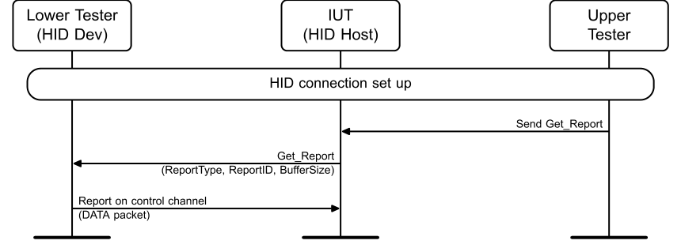

**Figure 4.1: HID11/HOS/HCT/BV-01-C [Get_Report - Report Mode]**

• Expected Outcome
Pass verdict
The IUT sends Get_Report commands with correct syntax and valid report ID on the Control channel:
- HIDP Message Type = 4 (Get_Report)
- Size bit = 0 or 1
- Report Type = 1, 2, 3 (Input, Output, Feature)
- Report ID: matching HID Report Descriptor
- BufferSize: only present if Size bit = 1, follows HIDP-Hdr if no Report ID
The IUT sets all reserved fields in the Get_Report command to zero.
The IUT accepts the DATA packet sent by the Lower Tester on the Control channel and provides feedback to the test operator indicating the correct content of each report.
The IUT does not have more than one transfer simultaneously outstanding to the Lower Tester.
• Test Purpose
Verify that the IUT (Host) can send correct Set_Report commands followed by all reports to the Lower Tester (Device).
• Reference
[3] 3.1, 3.1.2, 3.1.2.4, 3.2.1, 3.2.1.2, 5.2.3.1
• Initial Condition
- A Bluetooth HID connection exists between the Lower Tester and the IUT. The Lower Tester is in Report mode.
- During HID Connection setup, the Lower Tester negotiates an outgoing MTU of 672 bytes with the IUT (L2CAP ConfigRsp) or an MTU which is large enough to accommodate the largest output report declared by the Lower Tester, whichever is greater.
- The Lower Tester declares valid reports in SDP attribute HIDDescriptorList.
- The Lower Tester rejects reports not matching the report descriptors declared in SDP attribute HIDDescriptorList.
• Test Procedure
1. The test operator causes the IUT to send Set_Report commands on the Control channel to read
to write all output reports declared by the Lower Tester and supported by the IUT.
2. The Lower Tester responds to the Set_Report commands with a Handshake (successful)
message on the Control channel.

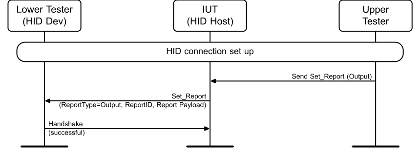

**Figure 4.2: HID11/HOS/HCT/BV-02-C [Set_Report - Report Mode – Output Reports]**

• Expected Outcome
Pass verdict
The IUT sends Set_Report commands with correct syntax and valid report ID on the Control channel:
- HIDP Message Type = 5 (Set_Report)
- Report Type = 2 (Output)
- Report ID: matching HID Report Descriptor
- Report Payload: n bytes
The report complies with the HID Report descriptors provided by the Lower Tester in SDP attribute HIDDescriptorList and is complete.
The IUT sets all reserved fields in the Set_Report command to zero.
The IUT accepts the Handshake (successful) packet sent by the Lower Tester on the Control channel.
The IUT does not have more than one transfer simultaneously outstanding to the Lower Tester.
HID11/HOS/HCT/BV-03-C [Set_Report – Report Mode – Feature Reports]
• Test Purpose
Verify that the IUT (Host) can send correct Set_Report commands followed by all reports to the Lower Tester (Device).
• Reference
[3] 3.1, 3.1.2, 3.1.2.4, 3.2.1, 3.2.1.2, 5.2.3.1
• Initial Condition
- A Bluetooth HID connection exists between the Lower Tester and the IUT. The Lower Tester is in Report mode.
- During HID Connection setup, the Lower Tester negotiates an outgoing MTU of 672 bytes with the IUT (L2CAP ConfigRsp) or an MTU which is large enough to accommodate the largest report declared by the Lower Tester, whichever is greater.
- The Lower Tester declares valid reports in SDP attribute HIDDescriptorList.
- The Lower Tester rejects reports not matching the report descriptors declared in SDP attribute HIDDescriptorList.
• Test Procedure
1. The test operator causes the IUT to send Set_Report commands on the Control channel to read
to write all feature reports declared by the Lower Tester and supported by the IUT. 2. The Lower Tester responds to the Set_Report commands with a Handshake (successful)
message on the Control channel.

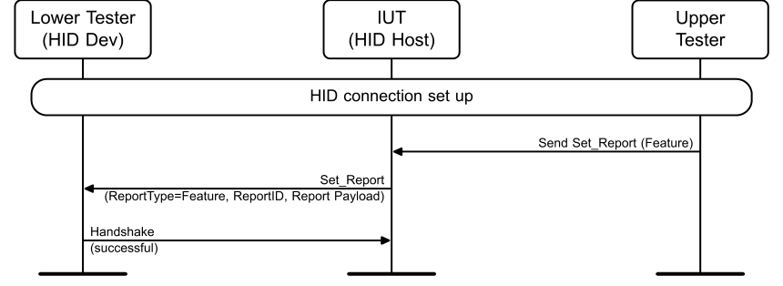

**Figure 4.3: HID11/HOS/HCT/BV-03-C [Set_Report - Report Mode – Feature Reports]**

• Expected Outcome
Pass verdict
The IUT sends Set_Report commands with correct syntax and valid report ID on the Control channel:
- HIDP Message Type = 5 (Set_Report)
- Report Type = 3 (Feature)
- Report ID: matching HID Report Descriptor
- Report Payload: n bytes
The size of the Set_Report command is shorter than or equal to the negotiated MTU.
The report complies with the HID Report descriptors provided by the Lower Tester in SDP attribute HIDDescriptorList and is complete.
The IUT sets all reserved fields in the Set_Report command to zero.
The IUT accepts the Handshake (successful) packet sent by the Lower Tester on the Control channel.
The IUT does not have more than one transfer simultaneously outstanding to the Lower Tester.
• Notes
The Configuration requirements for HID testing in Section 4.1.4 apply.
HID11/HOS/HCT/BV-04-C [Get_Protocol]
• Test Purpose
Verify that the IUT (Host) can send a correct Get_Protocol command to the Lower Tester (Device).
• Reference
[3] 3.1.2, 3.1.2.5, 3.2.1, 3.2.1.1
• Initial Condition
- A Bluetooth HID connection exists between the Lower Tester and the IUT. The Lower Tester is in Report mode.
- The Lower Tester declares HIDBootDevice as TRUE in SDP record.
• Test Procedure
1. The test operator causes the IUT to send a Get_Protocol command the Lower Tester on the
Control channel.

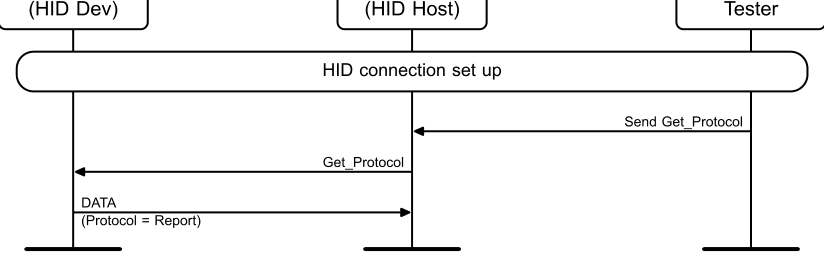

**Figure 4.4: HID11/HOS/HCT/BV-04-C [Get_Protocol]**

• Expected Outcome
Pass verdict
The IUT sends a Get_Protocol command with correct syntax on the Control channel.
The IUT sets all reserved fields in the Get_Protocol command to zero.
The IUT does not have more than one transfer simultaneously outstanding to the Lower Tester.
HID11/HOS/HCT/BV-05-C [Set_Protocol]
• Test Purpose
Verify that the IUT (Host) can send a correct Set_Protocol command to the Lower Tester (Device).
• Reference
[3] 3.1.2, 3.1.2.6, 3.2.1, 3.2.1.2
• Initial Condition
- A Bluetooth HID connection exists between the Lower Tester and the IUT.
- The Lower Tester declares HIDBootDevice as TRUE in SDP record.
• Test Procedure
1. IUT: The test operator causes the IUT to send a Set_Protocol command with Protocol = Report to
the Lower Tester on the Control channel. 2. The Lower Tester responds to the Set_Protocol command with a Handshake (successful) on the
Control channel.

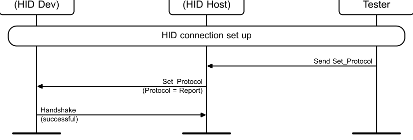

**Figure 4.5: HID11/HOS/HCT/BV-05-C [Set_Protocol]**

• Expected Outcome
Pass verdict
The IUT sends a Set_Protocol command with correct syntax on the Control channel.
The IUT sets all reserved fields in the Set_Protocol command to zero.
The IUT does not have more than one transfer simultaneously outstanding to the Lower Tester.
HID11/HOS/HCT/BV-06-C [HID_Control (Virtual_Cable_Unplug)]
• Test Purpose
Verify that the IUT (Host) handles the HID_Control (Virtual_Cable_Unplug) command correctly.
• Reference
[3] 3.1.2, 3.1.2.2.3
• Initial Condition
- A Bluetooth HID connection exists between the Lower Tester and the IUT.
- The Lower Tester declares HIDVirtualCable as TRUE in SDP record.
• Test Procedure
Step 1: Bluetooth HID Host initiates virtual cable unplug.
- The test operator causes the IUT to send a HID_Control (Virtual_Cable_Unplug) command to the Lower Tester on the Control channel.
- The Lower Tester responds to the HID_Control (Virtual_Cable_Unplug) command by first disconnecting the HID Interrupt channel, then by disconnecting the HID Control channel.
Step 2: Bluetooth HID Device initiates virtual cable unplug.
- The Lower Tester sends a HID_Control (Virtual_Cable_Unplug) command to the IUT on the Control channel.
- The IUT responds to the HID_Control (Virtual_Cable_Unplug) command by first disconnecting the HID Interrupt channel, then by disconnecting the HID Control channel.

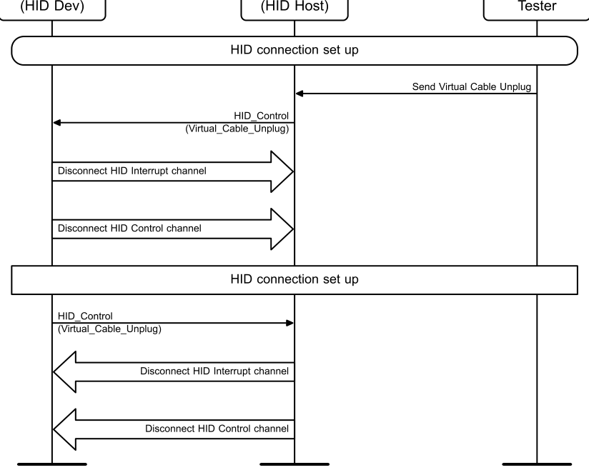

**Figure 4.6: HID11/HOS/HCT/BV-06-C [HID_Control (Virtual_Cable_Unplug)]**

• Expected Outcome
Pass verdict
The IUT sends a HID_Control (Virtual_Cable_Unplug) command to the Lower Tester with correct syntax on the Control channel.
The IUT responds to the HID_Control (Virtual_Cable_Unplug) command from the Lower Tester by first disconnecting the HID Interrupt channel, then by disconnecting the HID Control channel.
The IUT sets all reserved fields in the HID_Control command to zero.
HID11/HOS/HCT/BV-07-C [HID_Control (Suspend)]
• Test Purpose
Verify that the IUT (Host) can send a correct HID_Control (Suspend) command to the Lower Tester (Device) supporting Remote Wakeup.
• Reference
[3] 3.1.2, 3.1.2.2.2, 3.2.1, 5.3.4.11
• Initial Condition
- A Bluetooth HID connection exists between the Lower Tester and the IUT.
- The Lower Tester declares HIDRemoteWake as TRUE in SDP record.
• Test Procedure
The test operator causes the IUT to send a HID_Control (Suspend) command to the Lower Tester on the Control channel.
• Expected Outcome
Pass verdict
The IUT sends a HID_Control (Suspend) command with correct syntax on the Control channel.
The IUT sets all reserved fields in the HID_Control command to zero.
The IUT does not have more than one transfer simultaneously outstanding to the Lower Tester.
HID11/HOS/HCT/BV-08-C [HID_Control (Exit_Suspend)]
• Test Purpose
Verify that the IUT (Host) can send a correct HID_Control (Exit_Suspend) command to the Lower Tester (Device) supporting Remote Wakeup.
• Reference
[3] 3.1.2, 3.1.2.2.2, 3.2.1, 5.3.4.11
• Initial Condition
- A Bluetooth HID connection exists between the Lower Tester and the IUT.
- The Lower Tester declares HIDRemoteWake as TRUE in SDP record.
- IUT is in Suspend Mode.
• Test Procedure
The test operator causes the IUT to send a HID_Control (Exit_Suspend) command to the Lower Tester on the Control channel.
• Expected Outcome
Pass verdict
The IUT sends a HID_Control (Exit_Suspend) command with correct syntax on the Control channel.
The IUT sets all reserved fields in the HID_Control command to zero.
The IUT does not have more than one transfer simultaneously outstanding to the Lower Tester.
HID11/HOS/HCT/BI-01-C [Invalid HID Control Messages]
• Test Purpose
Verify that the IUT (Host) ignores invalid HID Control messages from the Lower Tester (Device).
• Reference
[3] 3.1.2.2
• Initial Condition
- A Bluetooth HID connection exists between the Lower Tester and the IUT.
• Test Procedure
The Lower Tester sends all invalid HID Control messages to the IUT: 0=NOP, 1=Hard_Reset, 2=Soft_Reset, 3=Suspend, 4=Exit_Suspend, 6-15=Reserved.

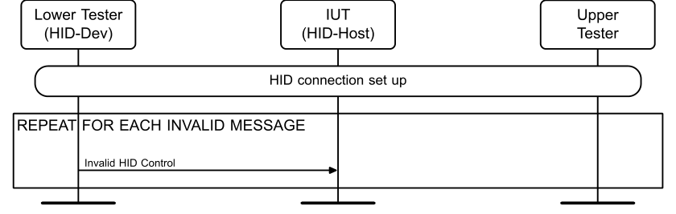

**Figure 4.7: HID11/HOS/HCT/BI-01-C [Invalid HID Control messages]**

• Expected Outcome
Pass verdict
The IUT ignores all invalid Control messages.
HID11/HOS/HCT/BI-02-C [Invalid Reports on Control Channel – Report Mode]
• Test Purpose
Verify that the IUT (Host) ignores invalid reports from the Lower Tester (Device).
• Reference
[3] 3.1.2.9, 3.2, 3.2.1.1
• Initial Condition
- A Bluetooth HID connection exists between the Lower Tester and the IUT.
- The IUT supports the Get_Report command.
• Test Procedure
1. The Lower Tester causes the IUT to send Get_Report commands on the Control channel to read
reports declared by the Lower Tester. 2. The Lower Tester responds to the Get_Report commands with invalid reports on the Control
channel:
a) Report shorter than the size defined by the report descriptor
b) Report ID not matching the Report ID included in the command
c) Missing Report ID

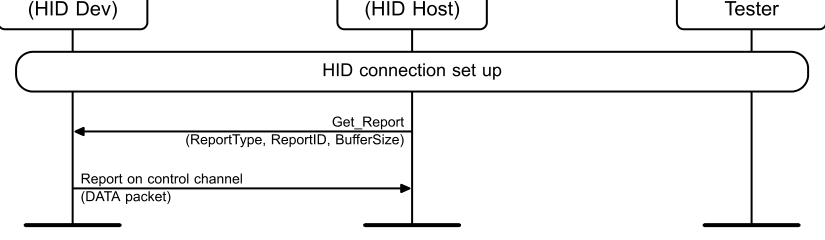

**Figure 4.8: HID11/HOS/HCT/BI-02-C [Invalid Reports on Control Channel]**

• Expected Outcome
Pass verdict
The IUT ignores all invalid reports.
• Notes
The Configuration requirements for HID testing in Section 4.1.4 apply.

#### 4.10.2 Boot Mode

Verify HID Host Boot Mode requirements on the Control Channel.
HID11/HOS/BHCT/BV-01-C [Set_Protocol - Immediate]
• Test Purpose
Verify that the IUT (Boot Mode Only Host) immediately sends a Set_Protocol = BOOT command to the Lower Tester (Device) upon HID Control channel establishment.
• Reference
[3] 3.1.2, 3.1.2.6, 3.2.1, 3.2.1.2, 3.3.1
• Initial Condition
- The Lower Tester declares HIDBootDevice as TRUE in SDP record.
- The IUT is a Boot Mode Only Host.
• Test Procedure
1. The test operator causes IUT to establish a HID connection with the Lower Tester. 2. The IUT sends a Set_Protocol = BOOT command to the Lower Tester on the Control channel
upon HID Control channel establishment. 3. The Lower Tester responds to the Set_Protocol command from the IUT with a Handshake
(successful) on the Control channel.

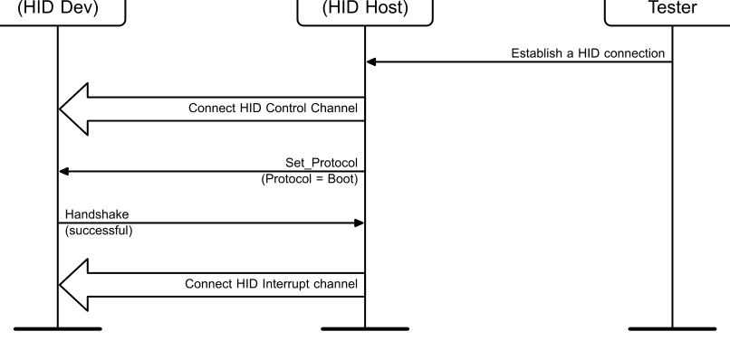

**Figure 4.9: HID11/HOS/BHCT/BV-01-C [Set_Protocol - Immediate]**

• Expected Outcome
Pass verdict
The IUT sends a Set_Protocol = BOOT command with correct syntax on the Control channel.
The IUT sends the Set_Protocol = BOOT command before the HID Interrupt channel connection is established.
The IUT sets all reserved fields in the Set_Protocol command to zero.
The IUT does not have more than one transfer simultaneously outstanding to the Lower Tester.
HID11/HOS/BHCT/BV-02-C [Get_Report – Boot Mode]
• Test Purpose
Verify that in Boot Mode, the IUT (Host) can send correct Get_Report commands to the Lower Tester (Device).
• Reference
[3] 3.1.2, 3.1.2.3, 3.1.2.9, 3.2.1, 3.2.1.1
• Initial Condition
- A Bluetooth HID connection in Boot Mode exists between the Lower Tester and the IUT.
- The Lower Tester emulates Boot Mode keyboard or mouse.
• Test Procedure
1. The test operator causes the IUT to send Get_Report commands on the Control channel to read
keyboard or mouse reports. 2. The Lower Tester responds to the Get_Report commands with the corresponding report on the
Control channel (DATA packet).

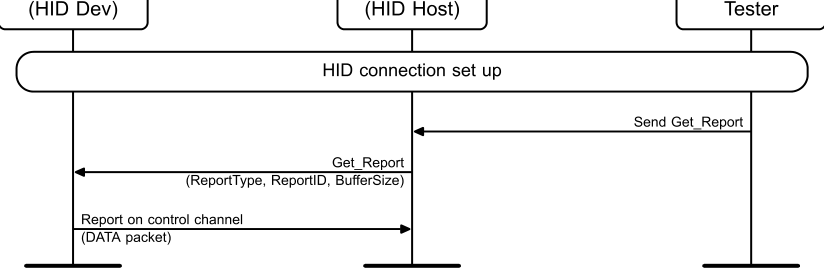

**Figure 4.10: HID11/HOS/BHCT/BV-02-C [Get_Report –Boot Mode]**

• Expected Outcome
Pass verdict
The IUT sends Get_Report commands with correct syntax and valid report ID on the Control channel:
- HIDP Message Type = 4 (Get_Report)
- Size bit = 0 or 1
- Report Type = 1, 2, 3 (Input, Output, Feature)
- Report ID: matching implicit HID Report Descriptor
- BufferSize: only present if Size bit = 1, follows HIDP-Hdr if no Report ID
The IUT supports at least one of the standard Boot Protocol reports (mouse or keyboard).
The IUT sets all reserved fields in the Get_Report command to zero.
The IUT accepts the DATA packet sent by the Lower Tester on the Control channel and provides feedback to the test operator indicating the correct content of each report.
The IUT does not have more than one transfer simultaneously outstanding to the Lower Tester.
HID11/HOS/BHCT/BV-03-C [Set_Report – Boot Mode]
• Test Purpose
Verify that in Boot Mode, the IUT (Host) can send correct Set_Report commands to the Lower Tester (Device).
• Reference
[3] 3.1.2, 3.1.2.4, 3.2.1, 3.2.1.2, 3.3.1
• Initial Condition
- A Bluetooth HID connection in Boot Mode exists between the Lower Tester and the IUT.
- The Lower Tester emulates Boot Mode keyboard with LEDs.
- The IUT supports Keyboard Boot protocol.
• Test Procedure
1. The test operator causes the IUT to send Set_Report commands on the Control channel to write
keyboard LED reports. 2. The Lower Tester responds to the Set_Report commands with a Handshake (successful)
message on the Control channel.

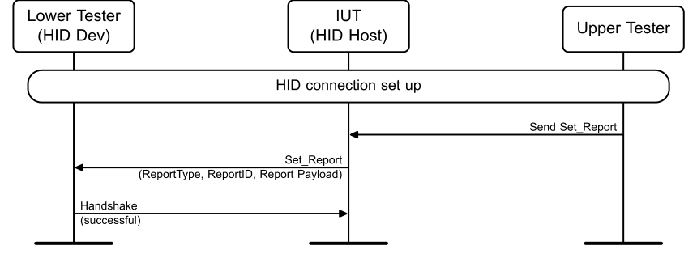

**Figure 4.11: HID11/HOS/BHCT/BV-03-C [Set_Report –Boot Mode]**

• Expected Outcome
Pass verdict
The IUT sends Set_Report commands with correct syntax and valid report ID on the Control channel:
- HIDP Message Type = 5 (Set_Report)
- Report Type = 2, 3 (Output, Feature)
- Report ID: matching implicit HID Report Descriptor
- Report Payload: n bytes
The report size (ID + payload) is not greater than 46 bytes.
The first bytes of the report comply with the keyboard Boot Report descriptor defined in the USB HID specification (additional data may be appended).
The IUT sets all reserved fields in the Get_Report command to zero.
The IUT accepts the Handshake (successful) packet sent by the Lower Tester on the Control channel
The IUT does not have more than one transfer simultaneously outstanding to the Lower Tester.
HID11/HOS/BHCT/BI-01-C [Invalid Reports on Control Channel – Boot Mode]
• Test Purpose
Verify that in Boot Mode, the IUT (Host) ignores invalid reports from the Lower Tester (Device).
• Reference
[3] 3.1.2.9, 3.2
• Initial Condition
- A Bluetooth HID connection in Boot Mode exists between the Lower Tester and the IUT.
- IUT supports the Get_Report command.
• Test Procedure
1. The test operator causes the IUT to send Get_Report commands on the Control channel to read
boot reports declared by the Lower Tester. 2. The Lower Tester responds to the Get_Report commands with invalid reports on the Control
channel.
a) Report shorter than the size defined by the implicit report descriptor
b) Report ID not matching the Report ID included in the command
c) Missing Report ID

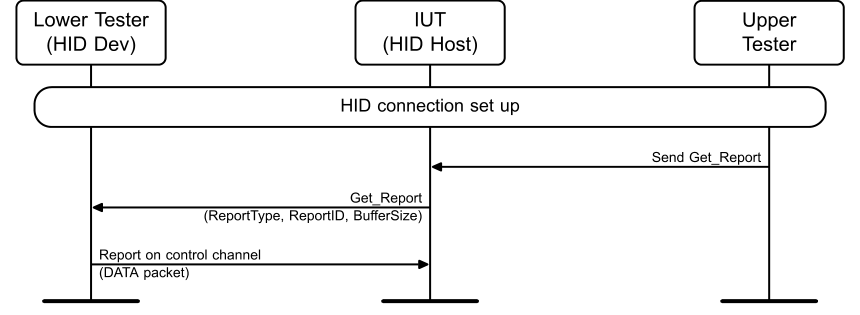

**Figure 4.12: HID11/HOS/BHCT/BI-01-C [Invalid Reports on Control Channel –Boot Mode]**

• Expected Outcome
Pass verdict
The IUT ignores all invalid reports.

### 4.11 Bluetooth HID Host Interrupt Channel Transfers

#### 4.11.1 Report Mode

Verify HID Host Report Mode requirements on the Interrupt Channel.
HID11/HOS/HIT/BV-01-C [Report Mode Input Reports on Interrupt Channel]
• Test Purpose
Verify that the IUT (Host) correctly receives all reports to the Lower Tester (Device) on the Interrupt channel.
• Reference
[3] 3.1.2.9
• Initial Condition
- A Bluetooth HID connection exists between the Lower Tester and the IUT.
- During HID Connection setup, the Lower Tester negotiates an outgoing MTU of 672 bytes with the IUT (L2CAP ConfigRsp) or an MTU which is large enough to accommodate the largest report declared by the Lower Tester, whichever is greater.
• Test Procedure
The Lower Tester sends all reports on the Interrupt channel.

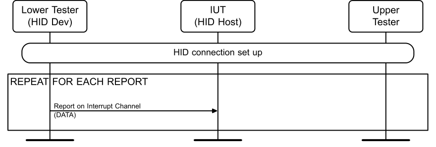

**Figure 4.13: HID11/HOS/HIT/BV-01-C [Report Mode Input Reports on Interrupt Channel]**

• Expected Outcome
Pass verdict
The IUT receives all reports from the Lower Tester with correct payload.
HID11/HOS/HIT/BV-02-C [Report Mode Output Reports on Interrupt Channel]
• Test Purpose
Verify that the IUT (Host) correctly sends all reports to the Lower Tester (Device) on the Interrupt channel.
• Reference
[3] 3.1, 3.1.2.9, 3.2.2.2, 5.2.3.1
• Initial Condition
- A Bluetooth HID connection exists between the Lower Tester and the IUT.
- During HID Connection setup, the Lower Tester negotiates an outgoing MTU of 672 bytes with the IUT (L2CAP ConfigRsp) or an MTU which is large enough to accommodate the largest report declared by the Lower Tester, whichever is greater.
• Test Procedure
The test operator causes the IUT to send all reports declared by the Lower Tester and supported by the IUT on the Interrupt channel.

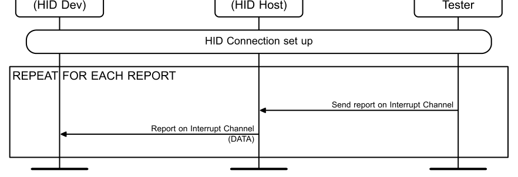

**Figure 4.14: HID11/HOS/HIT/BV-02-C [Report Mode Output Reports on Interrupt Channel]**

• Expected Outcome
Pass verdict
The IUT sends a report with correct syntax on the Interrupt channel using a DATA message.
The size of the DATA message is shorter than the negotiated MTU.
HID11/HOS/HIT/BI-01-C [Invalid Report Mode Input Reports on Interrupt Channel]
• Test Purpose
Verify that the IUT (Host) ignores invalid reports from the Lower Tester (Device) on the Interrupt channel.
• Reference
[3] 3.1.2.9, 3.2, 3.2.2.1
• Initial Condition
- A Bluetooth HID connection exists between the Lower Tester and the IUT.
• Test Procedure
The Lower Tester sends invalid reports on the Interrupt channel:
- Report shorter than the size defined by the report descriptor
- Report ID not matching the report descriptor
- Missing Report ID

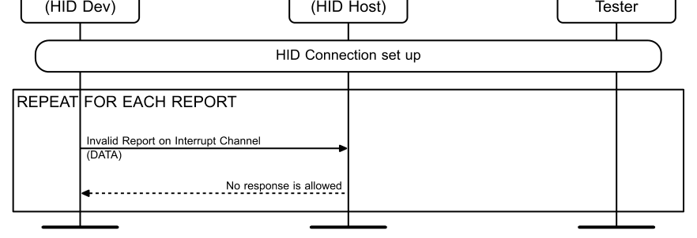

**Figure 4.15: HID11/HOS/HIT/BI-01-C [Invalid Report Mode Input Reports on Interrupt Channel]**

• Expected Outcome
Pass verdict
The IUT ignores all invalid reports.

#### 4.11.2 Boot Mode

Verify HID Host Boot Mode requirements on the Interrupt Channel.
HID11/HOS/BHIT/BV-01-C [Boot Mode Input Reports on Interrupt Channel]
• Test Purpose
Verify that in Boot mode, the IUT (Host) correctly receives reports sent by the Lower Tester (Device) on the Interrupt channel.
• Reference
[3] 3.1.2.9
• Initial Condition
- A Bluetooth HID connection exists between the Lower Tester and the IUT.
- The Lower Tester emulates Boot Mode keyboard or mouse.
• Test Procedure
The Lower Tester sends Boot reports on the Interrupt channel.

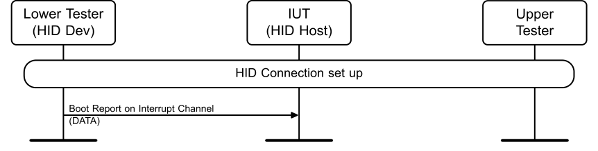

**Figure 4.16: HID11/HOS/BHIT/BV-01-C [Boot Mode Input Reports on Interrupt Channel]**

• Expected Outcome
Pass verdict
The IUT receives the reports from the Lower Tester with correct payload.
The IUT supports at least one of the standard Boot Protocol reports (mouse or keyboard).
HID11/HOS/BHIT/BV-02-C [Boot Mode Output Reports on Interrupt Channel]
• Test Purpose
Verify that in Boot mode, the IUT (Host) correctly sends all reports to the Lower Tester (Device) on the Interrupt channel.
• Reference
[3] 3.1.2.9, 3.2.2.2, 3.3.1
• Initial Condition
- A Bluetooth HID connection in Boot Mode exists between the Lower Tester and the IUT.
- The Lower Tester emulates a Boot Mode keyboard.
• Test Procedure
The test operator causes the IUT to send keyboard LED reports on the Interrupt channel.

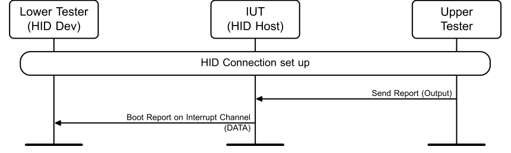

**Figure 4.17: HID11/HOS/BHIT/BV-02-C [Boot Mode Output Reports on Interrupt Channel]**

• Expected Outcome
Pass verdict
The IUT sends a report with correct syntax on the Interrupt channel using a DATA packet.
The reports include the Report ID defined in the implicit HID Report Descriptor.
The first bytes of the reports comply with one of the Boot Report descriptors defined in the USB HID specification (additional data may be appended).
The report size (ID + payload) is not greater than 46 bytes.
HID11/HOS/BHIT/BI-01-C [Invalid Boot Mode Input Reports on Interrupt Channel]
• Test Purpose
Verify that in Boot Mode, the IUT (Host) ignores invalid reports from the Lower Tester (Device) on the Interrupt channel.
• Reference
[3] 3.1.2.9, 3.2, 3.2.2.1
• Initial Condition
- A Bluetooth HID connection exists between the Lower Tester and the IUT.
• Test Procedure
The Lower Tester sends invalid reports on the Interrupt channel:
- Report shorter than the size defined by the report descriptor
- Report ID not matching the report descriptor
- Missing Report ID

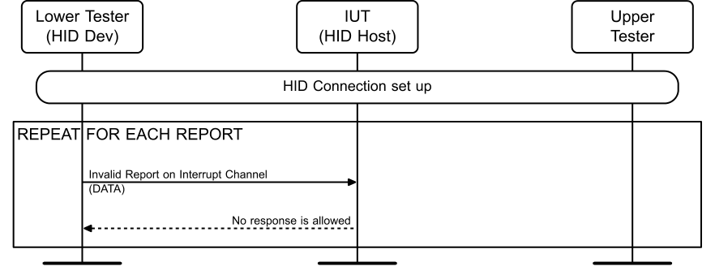

**Figure 4.18: HID11/HOS/BHIT/BI-01-C [Invalid Boot Mode Input Reports on Interrupt Channel]**

• Expected Outcome
Pass verdict
The IUT ignores all invalid reports.

### 4.12 Bluetooth HID Device Control Channel Transfers

In all Bluetooth HID Device tests, the Lower Tester emulates a HID Host.

#### 4.12.1 Report Mode

Verify HID Device Report Mode requirements on the Control Channel.
HID11/DEV/DCT/BV-01-C [Get_Report – Report Mode]
• Test Purpose
Verify that the IUT (Device) responds correctly to Get_Report commands from the Lower Tester (Host).
• Reference
[3] 3.1, 3.1.2.3, 3.1.2.9, 3.2.1.1, 5.2.4.1
• Initial Condition
- A Bluetooth HID connection exists between the Lower Tester and the IUT.
- During HID Connection setup, the Lower Tester negotiates an incoming MTU with the IUT of either 672 bytes or enough to accommodate the largest report described in the IUT’s report descriptor, whichever is greater. (L2CAP ConfigRsp).
- IUT declares valid reports in SDP attribute HIDDescriptorList.
• Test Procedure
1. The Lower Tester sends Get_Report commands with no BufferSize on the Control channel to
read all input, output and feature reports declared by the IUT. 2. The IUT responds to the Get_Report commands with the corresponding report on the Control
channel (DATA packet). 3. The Lower Tester sends Get_Report commands with BufferSize smaller than the report length on
the Control channel to read all input, output and feature reports declared by the IUT. 4. The IUT responds to the Get_Report commands with the corresponding report on the Control
channel (DATA packet).

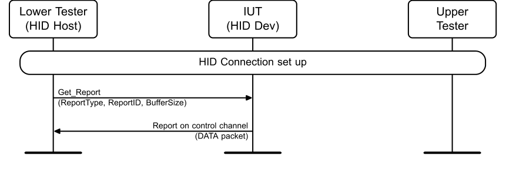

**Figure 4.19: HID11/DEV/DCT/BV-01-C [Get_Report – Report Mode]**

• Expected Outcome
Pass verdict
The IUT responds to the Get_Report commands with the corresponding report (DATA packet) on the Control channel.
The Report Type in the HIDP_Hdr of the DATA packet is set to Input, Output or Feature, according to the Report Type specified in the Get_Report command.
The size of the DATA message is shorter than the negotiated MTU.
The report complies with the HID Report descriptors provided by the IUT in SDP attribute HIDDescriptorList.
When BufferSize is specified, the IUT truncates the report to BufferSize bytes.
HID11/DEV/DCT/BV-02-C [Set_Report – Report Mode]
• Test Purpose
Verify that the IUT (Device) responds correctly to Set_Report commands from the Lower Tester (Host).
• Reference
[3] 3.1.2.4, 3.2.1.2
• Initial Condition
- A Bluetooth HID connection exists between the Lower Tester and the IUT.
- During HID Connection setup, the Lower Tester negotiates an incoming MTU with the IUT of either 672 bytes or enough to accommodate the largest report described in the IUT’s report descriptor, whichever is greater. (L2CAP ConfigRsp).
- The IUT declares valid reports in SDP attribute HIDDescriptorList.
• Test Procedure
1. The Lower Tester sends Set_Report commands on the Control channel to write all output and
feature reports declared by the IUT. 2. The IUT responds to the Set_Report commands with a Handshake (successful) message on the
Control channel.

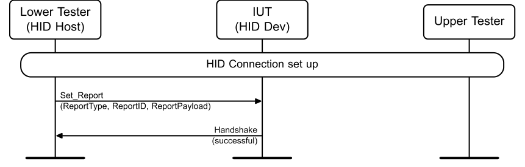

**Figure 4.20: HID11/DEV/DCT/BV-02-C [Set_Report – Report Mode]**

• Expected Outcome
Pass verdict
The IUT responds to the Set_Report commands with a Handshake (successful) message on the Control channel.
HID11/DEV/DCT/BV-03-C [Get_Protocol]
• Test Purpose
Verify that the IUT (Device) responds correctly to Get_Protocol command from the Lower Tester (Host). Verify that the IUT (Device) is in Report mode after HID connection.
• Reference
[3] 3.1.2.5, 3.1.2.9, 3.2.1.1, 3.3.2
• Initial Condition
- A Bluetooth HID connection does not yet exist between the Lower Tester and the IUT.
• Test Procedure
1. The test operator establishes a Bluetooth HID connection between the Lower Tester and the IUT.
If a Bluetooth HID connection already exists between the Lower Tester and the IUT, the test operator must force a disconnection followed by a reconnection. 2. The Lower Tester sends a Get_Protocol command to the IUT on the Control channel. 3. The IUT responds to the Get_Protocol command with a DATA packet with the currently valid
protocol mode on the Control channel.

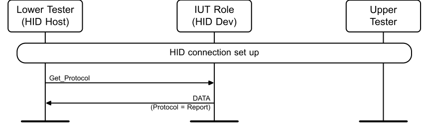

**Figure 4.21: HID11/DEV/DCT/BV-03-C [Get_Protocol]**

• Expected Outcome
Pass verdict
The IUT responds to the Get_Protocol command with a DATA packet containing the currently valid protocol mode on the Control channel.
The protocol type returned by the IUT is Report (default mode after HID connection setup).
The Report Type in the HIDP_Hdr of the DATA packet is set to Other.
HID11/DEV/DCT/BV-04-C [Set_Protocol]
• Test Purpose
Verify that the IUT (Device) responds correctly to a Set_Protocol command from the Lower Tester (Host).
• Reference
[3] 3.1.2.6, 3.2.1.2
• Initial Condition
- A Bluetooth HID connection exists between the Lower Tester and the IUT.
• Test Procedure
1. The Lower Tester sends a Set_Protocol command with Protocol = Boot to the IUT on the Control
channel. 2. The IUT responds to the Set_Protocol command with a Handshake (successful) on the Control
channel.

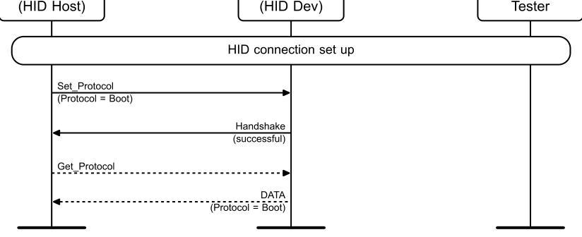

**Figure 4.22: HID11/DEV/DCT/BV-04-C [Set_Protocol]**

• Expected Outcome
Pass verdict
The IUT responds to the Set_Protocol command with a Handshake (successful) on the Control channel.
HID11/DEV/DCT/BV-07-C [Receiving HID_Control (Virtual Cable Unplug)]
• Test Purpose
Verify that the IUT (Device) receives the HID_Control (Virtual_Cable_Unplug) command correctly.
• Reference
[3] 3.1.2.2.3
• Initial Condition
- A Bluetooth HID connection exists between the Lower Tester and the IUT.
- The IUT declares HIDVirtualCable as TRUE in the SDP record.
• Test Procedure
1. The Bluetooth HID Host initiates virtual cable unplug. 2. The Lower Tester sends a HID_Control (Virtual_Cable_Unplug) command to the IUT on the
Control channel. 3. The IUT responds to the HID_Control (Virtual_Cable_Unplug) command by first disconnecting the
HID Interrupt channel, then by disconnecting the HID Control channel.

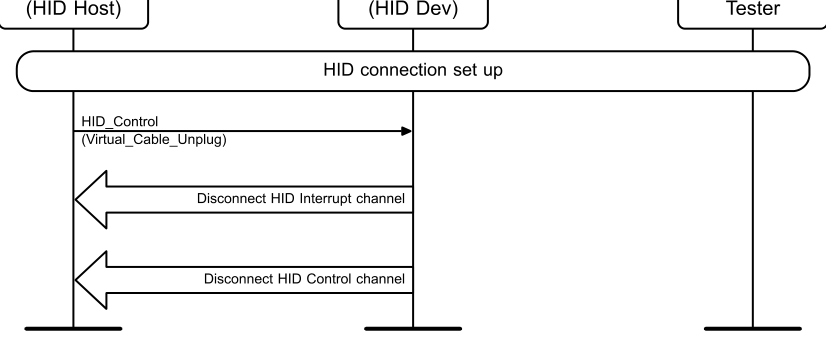

**Figure 4.23: HID11/DEV/DCT/BV-07-C [Receiving HID_Control (Virtual Cable Unplug)]**

• Expected Outcome
Pass verdict
The IUT responds to the HID_Control (Virtual_Cable_Unplug) command by first disconnecting the HID Interrupt channel, then by disconnecting the HID Control channel.
HID11/DEV/DCT/BV-08-C [HID_Control (Suspend)]
• Test Purpose
Verify that the IUT (Device) responds correctly to a HID_Control (Suspend) command from the Lower Tester (Host).
• Reference
[3] 3.1.2.2.2, 3.2.1, 5.3.4.11
• Initial Condition
- A Bluetooth HID connection exists between the Lower Tester and the IUT.
- The IUT declares HIDRemoteWake as TRUE in the SDP record.
• Test Procedure
The Lower Tester sends a HID_Control (Suspend) command to the IUT on the Control channel.
• Expected Outcome
Pass verdict
The IUT responds to a HID_Control (Suspend) command by entering a reduced power mode. The IUT may optionally disconnect from the HID Host.
• Test Purpose
Verify that the IUT (Device) responds correctly to a HID_Control (Exit_Suspend) command from the Lower Tester (Host).
• Reference
[3] 3.1.2.2.2, 3.2.1, 5.3.4.11
• Initial Condition
- A Bluetooth HID connection exists between the Lower Tester and the IUT.
- The IUT declares HIDRemoteWake as TRUE in the SDP record.
- The Lower Tester is in Suspend Mode.
• Test Procedure
1. The IUT takes action to remotely wake the Lower Tester (HID Host). 2. The Lower Tester exits Suspend Mode. 3. The Lower Tester sends a HID_Control (Exit_Suspend) command to the IUT on the Control
channel.
• Expected Outcome
Pass verdict
After an event occurs where the IUT (HID device) wakes up the system, the IUT reconnects to the Lower Tester (HID Host) if it is disconnected or sends a report to the Lower Tester if it is already connected.
Normal HID operations are restored.
HID11/DEV/DCT/BV-10-C [Sending HID_Control (Virtual_Cable_Unplug)]
• Test Purpose
Verify that the IUT (Device) sends the HID_Control (Virtual_Cable_Unplug) command correctly.
• Reference
[3] 3.1.2.2.3
• Initial Condition
- A Bluetooth HID connection exists between the Lower Tester and the IUT.
- The IUT declares HIDVirtualCable as TRUE in the SDP record.
• Test Procedure
1. The Bluetooth HID Device initiates virtual cable unplug. 2. The test operator causes the IUT to send a HID_Control (Virtual_Cable_Unplug) command to the
Lower Tester on the Control channel. 3. The Lower Tester responds to the HID_Control (Virtual_Cable_Unplug) command by first
disconnecting the HID Interrupt channel, then by disconnecting the HID Control channel.

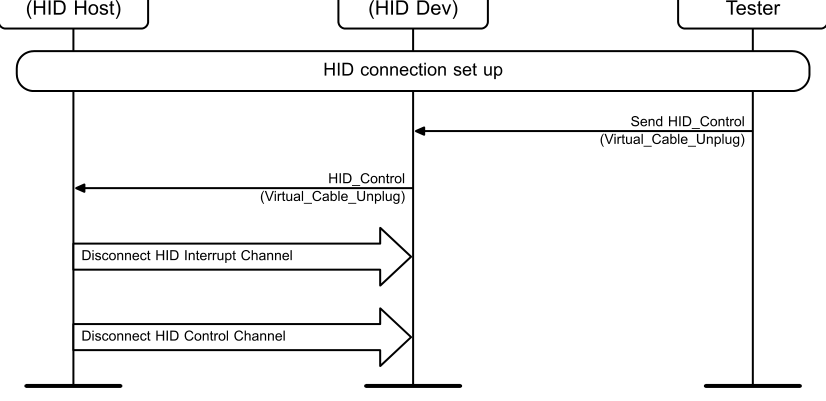

**Figure 4.24: HID11/DEV/DCT/BV-10-C [Sending HID_Control (Virtual_Cable_Unplug)]**

• Expected Outcome
Pass verdict
The IUT sends the HID_Control (Virtual_Cable_Unplug) command causing the Lower Tester to first disconnect the HID Interrupt channel, and then disconnects the HID Control channel.
HID11/DEV/DCT/BI-01-C [Unsupported Requests]
• Test Purpose
Verify that the IUT (Device) responds with an error message to unsupported requests from the Lower Tester (Host).
• Reference
[3] 3.1.2.1
• Initial Condition
- A Bluetooth HID connection exists between the Lower Tester and the IUT.
• Test Procedure
1. The Lower Tester sends requests with all unsupported HIDP Message Types to the IUT: 0x02,
0x03, 0x0C, 0x0D, 0x0E, 0x0F. 2. The IUT responds with a Handshake (Err_Unsupported_Request) packet on the Control channel.

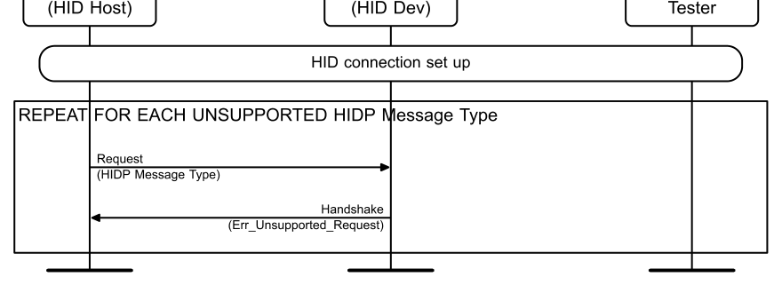

**Figure 4.25: HID11/DEV/DCT/BI-01-C [Unsupported Requests]**

• Expected Outcome
Pass verdict
The IUT responds with a Handshake (Err_Unsupported_Request) packet on the Control channel.
HID11/DEV/DCT/BI-02-C [Requests with Invalid Parameters]
• Test Purpose
Verify that the IUT (Device) responds with an error message to requests with invalid parameters from the Lower Tester (Host).
• Reference
[3] 3.1.2.1, 3.1.2.3, 3.1.2.4, 3.2.1.1, 3.2.1.2
• Initial Condition
- A Bluetooth HID connection exists between the Lower Tester and the IUT.
- The IUT does not declare all types of reports: input, output and feature.
• Test Procedure
1. The Lower Tester sends Get_Report and Set_Report commands with a report type (input, output
or feature) not declared by the IUT. 2. The IUT responds with a Handshake (Err_Invalid_Parameter) packet on the Control channel.

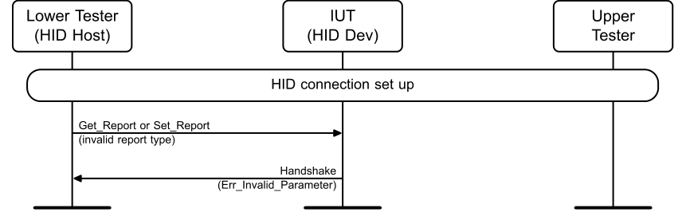

**Figure 4.26: HID11/DEV/DCT/BI-02-C [Requests with Invalid Parameters]**

• Expected Outcome
Pass verdict
The IUT responds with a Handshake (Err_Invalid_Parameter) packet on the Control channel.
HID11/DEV/DCT/BI-03-C [Requests with Invalid Report ID]
• Test Purpose
Verify that the IUT (Device) responds with an error message to requests with invalid Report ID from the Lower Tester (Host).
• Reference
[3] 3.1.2.1, 3.1.2.3, 3.1.2.4, 3.2.1.1, 3.2.1.2
• Initial Condition
- A Bluetooth HID connection exists between the Lower Tester and the IUT.
• Test Procedure
1. The Lower Tester sends Get_Report and Set_Report commands with an invalid report ID. 2. The IUT responds with a Handshake (Err_Invalid_Report_ID) packet on the Control channel.

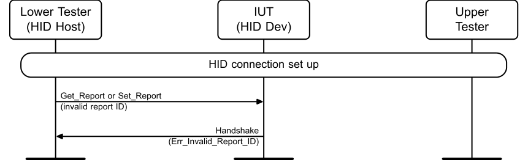

**Figure 4.27: HID11/DEV/DCT/BI-03-C [Requests with Invalid Report ID]**

• Expected Outcome
Pass verdict
The IUT responds with a Handshake (Err_Invalid_Report_ID) packet on the Control channel.
HID11/DEV/DCT/BI-04-C [Requests with Invalid Report Size – Report Mode]
• Test Purpose
Verify that the IUT (Device) responds with an error message to requests with invalid report size from the Lower Tester (Host).
• Reference
[3] 3.1.2.1, 3.1.2.4, 3.2.1.2
• Initial Condition
- A Bluetooth HID connection exists between the Lower Tester and the IUT.
- The IUT declares valid reports in SDP attribute HIDDescriptorList.
• Test Procedure
1. The Lower Tester sends Set_Report commands with invalid report sizes on the Control channel. 2. Report shorter than the size defined by the report descriptor. 3. The IUT responds with a Handshake (Err_Invalid_Parameter) packet on the Control channel.

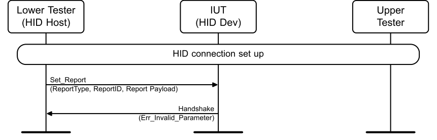

**Figure 4.28: HID11/DEV/DCT/BI-04-C [Requests with Invalid Report Size – Report Mode]**

• Expected Outcome
Pass verdict
The IUT responds with a Handshake (Err_Invalid_Parameter) packet on the Control channel.
HID11/DEV/DCT/BI-05-C [Unsupported Get_Protocol Request]
• Test Purpose
Verify that the IUT (Device) responds with an error message to a Get_Protocol request from the Lower Tester (Host) if the IUT does not support this request.
• Reference
[3] 3.1.2.5, 3.2.1.1
• Initial Condition
- The IUT does not support the Get_Protocol request.
- A Bluetooth HID connection exists between the Lower Tester and the IUT.
• Test Procedure
1. The Lower Tester sends Get_Protocol request on the Control channel. 2. The IUT responds with a Handshake (Err_Unsupported_Request) packet on the Control channel.

**Figure 4.29: HID11/DEV/DCT/BI-05-C [Unsupported Get_Protocol Request]**

• Expected Outcome
Pass verdict
The IUT responds with a Handshake (Err_Unsupported_Request) packet on the Control channel.
HID11/DEV/DCT/BI-06-C [Unsupported Set_Protocol Request]
• Test Purpose
Verify that the IUT (Device) responds with an error message to a Set_Protocol request from the Lower Tester (Host) if the IUT does not support this request.
• Reference
[3] 3.1.2.6, 3.2.1.2
• Initial Condition
- The IUT does not support the Set_Protocol request.
- A Bluetooth HID connection exists between the Lower Tester and the IUT.
• Test Procedure
1. The Lower Tester sends Set_Protocol request to the IUT on the Control channel. 2. The IUT responds with a Handshake (Err_Unsupported_Request) packet on the Control channel.

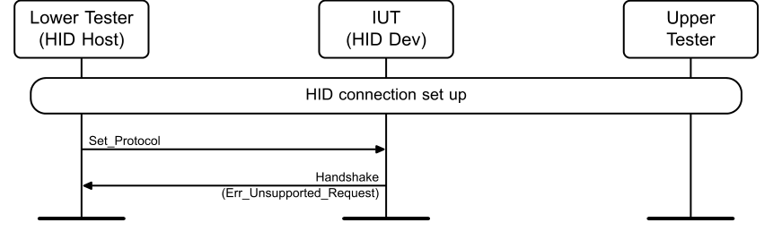

**Figure 4.30: HID11/DEV/DCT/BI-06-C [Unsupported Set_Protocol Request]**

• Expected Outcome
Pass verdict
The IUT responds with a Handshake (Err_Unsupported_Request) packet on the Control channel.

#### 4.12.2 Boot Mode

Verify HID Device Boot Mode requirements on the Control Channel.
HID11/DEV/BDCT/BV-01-C [Set_Protocol - Immediate]
• Test Purpose
Verify that the IUT (Device) responds correctly to a Set_Protocol command sent by the Lower Tester (Host) upon HID Control channel establishment.
• Reference
[3] 3.1.2.6, 3.2.1.2, 3.3.2
• Initial Condition
- The IUT declares HIDBootDevice as TRUE in SDP record.
• Test Procedure
1. The test operator establishes a HID connection between the Lower Tester and the IUT. 2. The Lower Tester sends Set_Protocol = BOOT command to the IUT on the Control channel upon
HID Control channel establishment. 3. The IUT responds to the Set_Protocol command from the Lower Tester with a Handshake
(successful) on the Control channel.

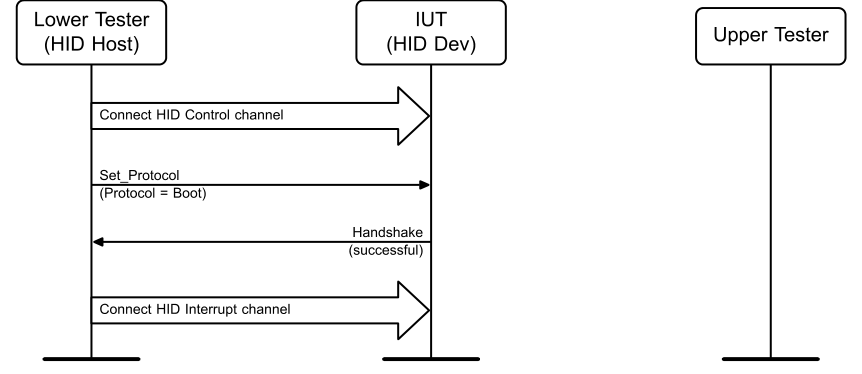

**Figure 4.31: HID11/DEV/BDCT/BV-01-C [Set_Protocol - Immediate]**

• Expected Outcome
Pass verdict
The IUT responds to the Set_Protocol command with a Handshake (successful) on the Control channel.
HID11/DEV/BDCT/BV-02-C [Get_Report – Boot Mode]
• Test Purpose
Verify that in Boot Mode, the IUT (Device) responds correctly to Get_Report commands from the Lower Tester (Host).
• Reference
[3] 3.1.2.3, 3.1.2.9, 3.2.1.1, 3.3.2
• Initial Condition
- A Bluetooth HID connection in Boot Mode exists between the Lower Tester and the IUT.
- The IUT declares valid Boot Mode device in SDP attributes.
• Test Procedure
1. The Lower Tester sends Get_Report commands on the Control channel to read keyboard or
mouse reports. 2. The IUT responds to the Get_Report commands with the corresponding report on the Control
channel (DATA packet).

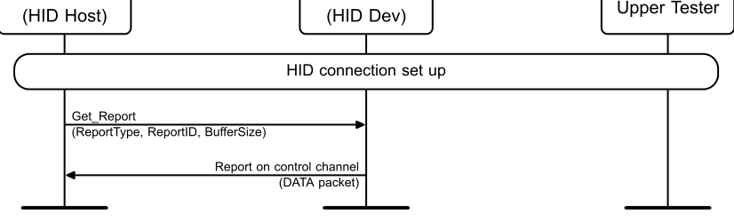

**Figure 4.32: HID11/DEV/BDCT/BV-02-C [Get_Report – Boot Mode]**

• Expected Outcome
Pass verdict
The IUT responds to the Get_Report commands with the corresponding report including a valid report ID on the Control channel.
The Report Type in the HIDP_Hdr of the DATA packet is set to Input, Output or Feature, according to the Report Type specified in the Get_Report command.
The first bytes of the reports comply with one of the Boot Report descriptors defined in the USB HID specification (additional data may be appended).
The report size (ID + payload) is not greater than 46 bytes.
HID11/DEV/BDCT/BV-03-C [Set_Report – Boot Mode]
• Test Purpose
Verify that in Boot Mode, the IUT (Device) responds correctly to Set_Report commands from the Lower Tester (Host).
• Reference
[3] 3.1.2.4, 3.2.1.2
• Initial Condition
- A Bluetooth HID connection in Boot Mode exists between the Lower Tester and the IUT.
- IUT declares valid Boot Mode keyboard in SDP attributes.
• Test Procedure
1. The Lower Tester sends Set_Report commands on the Control channel to write keyboard LED
reports. 2. The IUT responds to the Set_Report commands with Handshake (successful) message on the
Control channel.

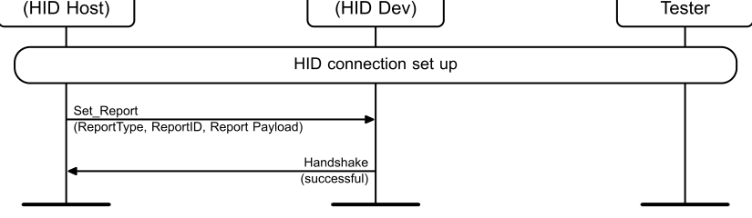

**Figure 4.33: HID11/DEV/BDCT/BV-03-C [Set_Report – Boot Mode]**

• Expected Outcome
Pass verdict
The IUT responds to the Set_Report commands with a Handshake (successful) message on the Control channel.
HID11/DEV/BDCT/BI-01-C [Requests with Invalid Report Size – Boot Mode]
• Test Purpose
Verify that in Boot Mode, the IUT (Device) responds with an error message to request with an invalid report size from the Lower Tester (Host).
• Reference
[3] 3.1.2.4, 3.2.1.2
• Initial Condition
- A Bluetooth HID connection in Boot Mode exists between the Lower Tester and the IUT.
- IUT declares valid Boot mode keyboard in SDP record.
• Test Procedure
1. The Lower Tester sends Set_Report commands with invalid LED reports on the Control channel. 2. LED report truncated to get report length of 1 byte (Report Id only). 3. The IUT responds with a Handshake (Err_Invalid_Parameter) packet on the Control channel.

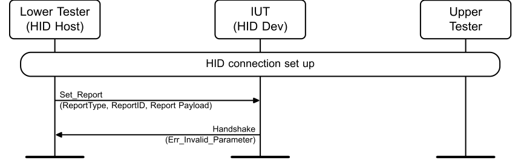

**Figure 4.34: HID11/DEV/BDCT/BI-01-C [Request with Invalid Report Size – Boot Mode]**

• Expected Outcome
Pass verdict
The IUT responds to with a Handshake (Err_Invalid_Parameter) on the Control channel.

### 4.13 Bluetooth HID Device Interrupt Channel Transfers

In all Bluetooth HID Device tests, the Lower Tester emulates a HID Host.

#### 4.13.1 Report Mode

Verify HID Device Report Mode requirements on the Interrupt Channel.
HID11/DEV/DIT/BV-01-C [Report Mode Input Reports on Interrupt Channel]
• Test Purpose
Verify that the IUT (Device) correctly sends all reports to the Lower Tester (Host) on the Interrupt channel.
• Reference
[3] 3.1, 3.1.2.9, 3.2.1.1, 5.2.4.1
• Initial Condition
- A Bluetooth HID connection exists between the Lower Tester and the IUT.
- During HID Connection setup, the Lower Tester negotiates an incoming MTU with the IUT of either 672 bytes or enough to accommodate the largest report described in the IUT’s report descriptor, whichever is greater. (L2CAP ConfigRsp).
- The IUT declares valid input reports in SDP attribute HIDDescriptorList.
• Test Procedure
The test operator causes the IUT to send all reports defined in its HID Report Descriptor on the Interrupt channel.

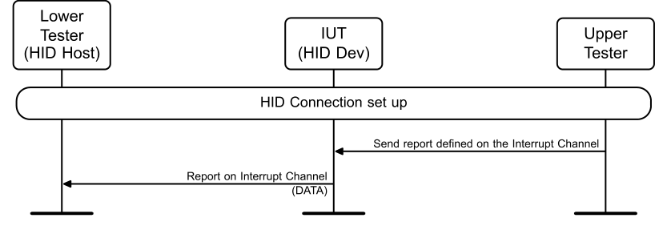

**Figure 4.35: HID11/DEV/DIT/BV-01-C [Report Mode Input Reports on Interrupt Channel]**

• Expected Outcome
Pass verdict
The IUT sends a report with correct syntax on the Interrupt channel using a DATA message.
The size of the DATA message is shorter than the negotiated MTU.
The report complies with the HID Report descriptors provided by the IUT in SDP attribute HIDDescriptorList.
HID11/DEV/DIT/BV-02-C [Report Mode Output Reports on Interrupt Channel]
• Test Purpose
Verify that the IUT (Device) correctly receives all reports from the Lower Tester (Host) on the Interrupt channel.
• Reference
[3] 3.1.2.9
• Initial Condition
- A Bluetooth HID connection exists between the Lower Tester and the IUT.
- During HID Connection setup, the Lower Tester negotiates an incoming MTU with the IUT of either 672 bytes or enough to accommodate the largest report described in the IUT’s report descriptor, whichever is greater. (L2CAP ConfigRsp).
- The IUT declares valid output reports in SDP attribute HIDDescriptorList.
• Test Procedure
The Lower Tester sends all reports defined in the HID Report Descriptor of the IUT on the Interrupt channel.

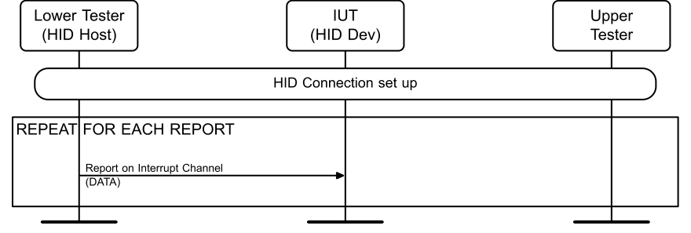

**Figure 4.36: HID11/DEV/DIT/BV-02-C [Report Mode Output Reports on Interrupt Channel]**

• Expected Outcome
Pass verdict
The IUT receives all reports from the Lower Tester with correct payload.
HID11/DEV/DIT/BI-01-C [Invalid Report Mode Output Reports on Interrupt Channel]
• Test Purpose
Verify that the IUT (Device) ignores invalid reports from the Lower Tester (Host) on the Interrupt channel.
• Reference
[3] 3.1.2.9, 3.2, 3.2.2.2
• Initial Condition
- A Bluetooth HID connection exists between the Lower Tester and the IUT.
- The IUT declares valid output reports in SDP attribute HIDDescriptorList.
• Test Procedure
The Lower Tester sends invalid reports on the Interrupt Channel:
- Report shorter than the size defined by the report descriptor
- Report ID not matching the report descriptor
- Missing Report ID

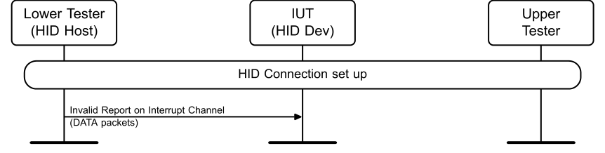

**Figure 4.37: HID11/DEV/DIT/BI-01-C [Invalid Report Mode Output Reports on Interrupt Channel]**

• Expected Outcome
Pass verdict
The IUT ignores all invalid reports.

#### 4.13.2 Boot Mode

Verify HID Device Boot Mode requirements on the Interrupt Channel.
HID11/DEV/BDIT/BV-01-C [Boot Mode Input Reports on Interrupt Channel]
• Test Purpose
Verify that in Boot mode, the IUT (Device) correctly sends reports to the Lower Tester (Host) on the Interrupt channel.
• Reference
[3] 3.1.2.9, 3.2.2.1, 3.3.2
• Initial Condition
- A Bluetooth HID connection exists between the Lower Tester and the IUT.
- During HID Connection setup, the Lower Tester negotiates an incoming MTU with the IUT of either 672 bytes or enough to accommodate the largest report described in the IUT’s report descriptor, whichever is greater. (L2CAP ConfigRsp).
- The IUT declares as a Boot Mode device in SDP attributes.
• Test Procedure
The test operator causes the IUT to send all supported Boot Mode reports on the Interrupt channel.

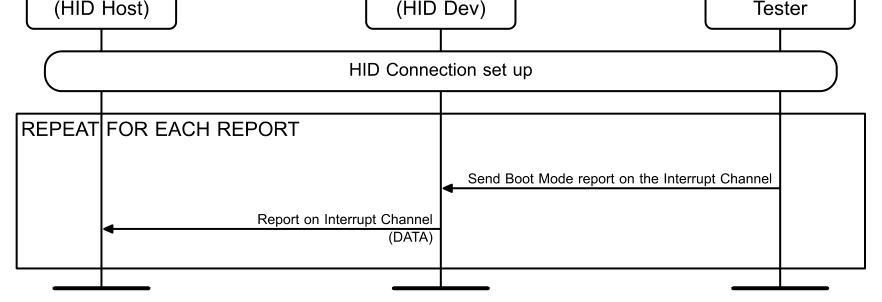

**Figure 4.38: HID11/DEV/BDIT/BV-01-C [Boot Mode Input Reports on Interrupt Channel]**

• Expected Outcome
Pass verdict
The IUT sends all Boot Mode reports with correct syntax on the Interrupt Channel using a DATA message.
The reports include the Report ID defined in the implicit HID Report Descriptor.
The first bytes of the reports comply with one of the Boot Report descriptors defined in the USB HID specification (additional data may be appended).
The report size (ID + payload) is not greater than 46 bytes.
HID11/DEV/BDIT/BV-02-C [Boot Mode Output Reports on Interrupt Channel]
• Test Purpose
Verify that in Boot mode, the IUT (Device) correctly receives reports from the Lower Tester (Host) on the Interrupt channel.
• Reference
[3] 3.1.2.9
• Initial Condition
- A Bluetooth HID connection exists between the Lower Tester and the IUT.
- During HID Connection setup, the Lower Tester negotiates an outgoing MTU of 48 bytes with the IUT (L2CAP ConfigRsp).
- The IUT declares as a Boot Mode keyboard in SDP attributes.
• Test Procedure
The Lower Tester sends all Boot Mode reports supported by the IUT on the Interrupt Channel.

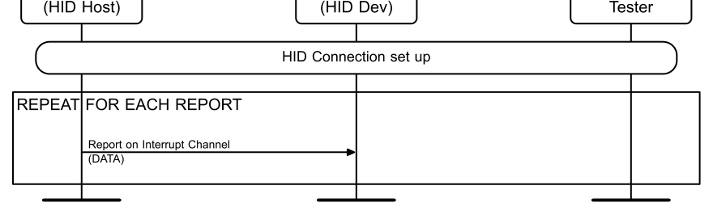

**Figure 4.39: HID11/DEV/BDIT/BV-02-C [Boot Mode Output Reports on Interrupt Channel]**

• Expected Outcome
Pass verdict
The IUT receives all Boot Mode reports from the Lower Tester with correct payload.
HID11/DEV/BDIT/BI-01-C [Invalid Boot Mode Output Reports on Interrupt Channel]
• Test Purpose
Verify that in Boot mode, the IUT (Device) ignores invalid reports from the Lower Tester (Host) on the Interrupt channel.
• Reference
[3] 3.1.2.9, 3.2, 3.2.2.2
• Initial Condition
- A Bluetooth HID connection exists between the Lower Tester and the IUT.
- The IUT declares as a Boot Mode keyboard in SDP attributes.
• Test Procedure
The Lower Tester sends invalid LED reports on the Interrupt channel:
- LED report truncated to get report length of 1 byte (Report ID only)
- Report ID not matching the implicit report descriptor
- Missing Report ID

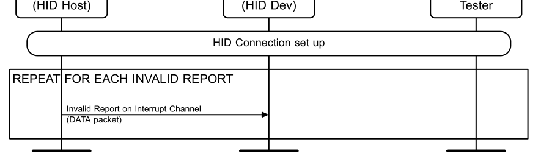

**Figure 4.40: HID11/DEV/BDIT/BI-01-C [Invalid Boot Mode Output Reports on Interrupt Channel]**

• Expected Outcome
Pass verdict
The IUT ignores all invalid reports.

### 4.14 Bluetooth HID SDP Requirements

Verify the HID SDP requirements.
HID11/DEV/SDD/BV-03-C [Retrieve SDP Records when HID Connection is Present]
• Test Purpose
Verify that the IUT (Device) allows the SDP record to be successfully retrieved when the HID Control and the HID Interrupt channels are open and allows HID connections while the SDP channel is open.
• Reference
[3] 5.3.4.9
• Initial Condition
- The IUT and the Lower Tester are turned on but not paired or connected to each other.
• Test Procedure
1. Make the IUT discoverable using the manufacturer specific operation. 2. The Lower Tester opens an SDP connection with the IUT. 3. The Lower Tester retrieves the SDP records from the IUT. 4. The Lower Tester opens a HID connection with the IUT. 5. The Lower Tester closes all L2CAP connections with the IUT. 6. The Lower Tester opens a HID connection with the IUT. 7. The Lower Tester tries to open an SDP connection with the IUT. 8. The Lower Tester tries to retrieve the SDP records from the IUT.
• Expected Outcome
Pass verdict
The IUT can be found by the Lower Tester.
The IUT accepts the SDP connection when the HID Control and the HID Interrupt channels are not open.
The IUT accepts the HID connection while the SDP channel is open.
The IUT accepts the establishment of the HID connection when the SDP channel is not open.
The IUT accepts the SDP connection while the HID Control and the HID Interrupt channels are open.
HID11/HOS/CDD/BV-01-C [Retrieve SDP Records when HID Connection is Present]
• Test Purpose
Verify that the IUT (Host) correctly manages the Lower Tester (Device) which declares the HIDSDPDisable attribute as TRUE. The Bluetooth HID Host closes the SDP channel before opening the HID Control and Interrupt channels. Similarly, the Bluetooth HID Host closes the HID Control and Interrupt channels before opening the SDP channel.
• Reference
[3] 5.3.4.9
• Initial Condition
- The IUT (Host) and the Lower Tester (Device) are turned on but not paired or connected to each other.
- The Lower Tester (Device) declares the HIDSDPDisable attribute as TRUE in its SDP record.
• Test Procedure
1. Make the Lower Tester discoverable. 2. The IUT opens an SDP connection with the Lower Tester. 3. The IUT retrieves the SDP records from the Lower Tester. 4. The IUT opens a HID connection with the Lower Tester. 5. The IUT may re-open an SDP connection with the Lower Tester. 6. The IUT may retrieve additional SDP records from the Lower Tester.
• Expected Outcome
Pass verdict
The IUT closes the SDP channel before opening the HID Control and Interrupt channels.
The IUT closes the HID Control and Interrupt channels before re-opening the SDP channel.

## 5 Test case mapping

The Test Case Mapping Table (TCMT) maps test cases to specific requirements in the ICS. The IUT is tested in all roles for which support is declared in the ICS document.
The columns for the TCMT are defined as follows:
Item: Contains a logical expression based on specific entries from the associated ICS document. Contains a logical expression (using the operators AND, OR, NOT as needed) based on specific entries from the applicable ICS document(s). The entries are in the form of y/x references, where y corresponds to the table number and x corresponds to the feature number as defined in the ICS document for HID Profile v1.1 [4].
If a test case is mandatory within the respective layer, then the y/x reference is omitted.
Feature: A brief, informal description of the feature being tested.
Test Case(s): The applicable test case identifiers are required for Bluetooth Qualification if the corresponding y/x references defined in the Item column are supported. Further details about the function of the TCMT are elaborated in [2].
For the purpose and structure of the ICS/IXIT, refer to [2].

|  | Item |  |  | Feature |  |  | Test Case(s) |  |
| --- | --- | --- | --- | --- | --- | --- | --- | --- |
| HID11 2/1 AND HID11 7/2 |  |  | Establish HID connection |  |  | HID11/HOS/HCE/BV-01-C |  |  |
| HID11 2/1 AND HID11 7/3 |  |  | Establish HID connection |  |  | HID11/HOS/HCE/BV-02-C |  |  |
| HID11 2/1 AND HID11 7/4 |  |  | Establish HID connection |  |  | HID11/HOS/HCE/BV-03-C |  |  |
| HID11 2/1 AND HID11 7/7 |  |  | Establish HID connection |  |  | HID11/HOS/HCE/BV-05-C |  |  |
| HID11 2/1 AND HID11 7/8 |  |  | Establish HID connection |  |  | HID11/HOS/HCE/BV-06-C |  |  |
| HID11 2/1 |  |  | Establish HID connection |  |  | HID11/HOS/HCE/BV-08-C |  |  |
| HID11 2/6 |  |  | Device initiated reconnection |  |  | HID11/HOS/HRE/BV-01-C |  |  |
| HID11 2/7 |  |  | Host initiated reconnection |  |  | HID11/HOS/HRE/BV-02-C |  |  |
| HID11 2/6 AND (HID11 7/7 OR HID11 7/8) |  |  | Device initiated reconnection |  |  | HID11/HOS/HRE/BV-05-C |  |  |
| HID11 2/7 AND (HID11 7/7 OR HID11 7/8) |  |  | Host initiated reconnection |  |  | HID11/HOS/HRE/BV-06-C |  |  |
| HID11 2/8 AND HID11 2/9 AND HID11 2/6 AND HID11 6/5 AND HID11 6/6 |  |  | Suspend mode |  |  | HID11/HOS/HRE/BV-09-C |  |  |
| HID11 2/6 AND (HID11 7/7 OR HID11 7/8) |  |  | Device initiated reconnection |  |  | HID11/HOS/HRE/BI-01-C |  |  |
| HID11 2/7 AND (HID11 7/7 OR HID11 7/8) |  |  | Host initiated reconnection |  |  | HID11/HOS/HRE/BI-02-C |  |  |
| HID11 2/3 |  |  | Terminate HID connection |  |  | HID11/HOS/HCR/BV-01-C |  |  |
| HID11 2/4 |  |  | Accept termination of HID connection |  |  | HID11/HOS/HCR/BV-02-C |  |  |
| HID11 2/5 |  |  | Support for Virtual Cables |  |  | HID11/HOS/HCR/BV-03-C HID11/HOS/HCR/BV-04-C |  |  |
| HID11 2/8 AND HID11 2/9 AND (NOT HID11 2/10) AND HID11 6/5 AND HID11 6/6 |  |  | Suspend mode |  |  | HID11/HOS/HGR/BV-01-C |  |  |

|  | Item |  |  | Feature |  |  | Test Case(s) |  |
| --- | --- | --- | --- | --- | --- | --- | --- | --- |
| HID11 7/11 |  |  | Support for Sniff Subrating |  |  | HID11/HOS/HGR/BV-02-C |  |  |
| HID11 7/10 |  |  | Support for Sniff mode |  |  | HID11/HOS/HGR/BV-03-C |  |  |
| HID11 6/4 AND (HID11 1/1 OR HID11 1/2) |  |  | Get Report command, _ Report mode |  |  | HID11/HOS/HCT/BV-01-C |  |  |
| HID11 6/3 AND (HID11 3/3 OR HID11 4/3) |  |  | Set Report command, Report _ mode – Output Reports |  |  | HID11/HOS/HCT/BV-02-C |  |  |
| HID11 6/3 AND (HID11 3/5 OR HID11 4/5) |  |  | Set Report command, Report _ mode – Feature Reports |  |  | HID11/HOS/HCT/BV-03-C |  |  |
| HID11 6/2 |  |  | Get Protocol command _ |  |  | HID11/HOS/HCT/BV-04-C |  |  |
| HID11 6/1 |  |  | Set Protocol command _ |  |  | HID11/HOS/HCT/BV-05-C |  |  |
| HID11 6/7 |  |  | Support for Virtual Cables |  |  | HID11/HOS/HCT/BV-06-C |  |  |
| HID11 6/5 |  |  | Support for Suspend mode |  |  | HID11/HOS/HCT/BV-07-C |  |  |
| HID11 6/6 |  |  | Support for Suspend mode |  |  | HID11/HOS/HCT/BV-08-C |  |  |
| HID11 1/1 OR HID11 1/2 OR HID11 1/3 |  |  | Host role support |  |  | HID11/HOS/HCT/BI-01-C |  |  |
| HID11 6/4 AND (HID11 1/1 OR HID11 1/2) |  |  | Get Report command, _ Report mode |  |  | HID11/HOS/HCT/BI-02-C |  |  |
| HID11 1/3 AND NOT (HID11 1/1 OR HID11 1/2) |  |  | Boot Mode Only Host |  |  | HID11/HOS/BHCT/BV-01-C |  |  |
| HID11 6/4 AND HID11 1/3 |  |  | Get Report command, Boot _ mode |  |  | HID11/HOS/BHCT/BI-01-C HID11/HOS/BHCT/BV-02-C |  |  |
| HID11 6/3 AND HID11 1/3 |  |  | Set Report command, Boot _ mode |  |  | HID11/HOS/BHCT/BV-03-C |  |  |
| HID11 3/2 OR HID11 4/2 |  |  | Data reports to Host |  |  | HID11/HOS/HIT/BV-01-C |  |  |
| HID11 3/4 OR HID11 4/4 |  |  | Data reports to Device |  |  | HID11/HOS/HIT/BV-02-C |  |  |
| HID11 1/1 OR HID11 1/2 |  |  | Host, Report mode |  |  | HID11/HOS/HIT/BI-01-C |  |  |
| HID11 5/2 |  |  | Boot mode reports to Host |  |  | HID11/HOS/BHIT/BV-01-C |  |  |
| HID11 5/4 |  |  | Boot mode reports to device |  |  | HID11/HOS/BHIT/BV-02-C |  |  |
| HID11 1/3 |  |  | Host, Boot mode |  |  | HID11/HOS/BHIT/BI-01-C |  |  |
| HID11 1/1 OR HID11 1/2 |  |  | Host role support, Report mode |  |  | HID11/HOS/CDD/BV-01-C HID11/HOS/CGSIT/SFC/BV-01-C |  |  |
| HID11 9/1 AND HID11 13/2 |  |  | Accept HID connection |  |  | HID11/DEV/DCE/BV-01-C |  |  |
| HID11 9/1 AND HID11 13/3 |  |  | Accept HID connection |  |  | HID11/DEV/DCE/BV-02-C |  |  |
| HID11 9/1 AND HID11 13/4 |  |  | Accept HID connection |  |  | HID11/DEV/DCE/BV-03-C |  |  |
| HID11 9/1 AND HID11 13/7 |  |  | Accept HID connection |  |  | HID11/DEV/DCE/BV-05-C |  |  |
| HID11 9/1 AND HID11 13/8 |  |  | Accept HID connection |  |  | HID11/DEV/DCE/BV-06-C |  |  |
| HID11 9/4 AND (NOT HID11 9/10) |  |  | Support for Virtual Cables |  |  | HID11/DEV/DCE/BV-08-C |  |  |
| HID11 9/10 |  |  | Support for Multiple Virtual Cables |  |  | HID11/DEV/DCE/BV-09-C |  |  |
| HID11 9/5 |  |  | Device initiated reconnection |  |  | HID11/DEV/DRE/BV-01-C |  |  |
| HID11 9/6 |  |  | Host initiated reconnection |  |  | HID11/DEV/DRE/BV-02-C |  |  |
| HID11 9/5 AND (HID11 13/7 OR HID11 13/8) |  |  | Device initiated reconnection |  |  | HID11/DEV/DRE/BV-05-C |  |  |

|  | Item |  |  | Feature |  |  | Test Case(s) |  |
| --- | --- | --- | --- | --- | --- | --- | --- | --- |
| HID11 9/6 AND (HID11 13/7 OR HID11 13/8) |  |  | Host initiated reconnection |  |  | HID11/DEV/DRE/BV-06-C |  |  |
| HID11 9/11 AND HID11 9/5 |  |  | Suspend mode |  |  | HID11/DEV/DRE/BV-09-C |  |  |
| HID11 9/5 AND (HID11 13/7 OR HID11 13/8) |  |  | Device initiated reconnection |  |  | HID11/DEV/DRE/BI-01-C |  |  |
| HID11 9/6 AND (HID11 13/7 OR HID11 13/8) |  |  | Host initiated reconnection |  |  | HID11/DEV/DRE/BI-02-C |  |  |
| HID11 9/3 AND (HID11 9/5 OR HID11 9/6) |  |  | Accept termination of HID connection |  |  | HID11/DEV/DCR/BV-01-C |  |  |
| HID11 9/2 AND (HID11 9/5 OR HID11 9/6) |  |  | Terminate HID connection |  |  | HID11/DEV/DCR/BV-02-C |  |  |
| HID11 9/4 |  |  | Support for Virtual Cables |  |  | HID11/DEV/DCR/BV-03-C |  |  |
| HID11 9/4 AND HID11 12/8 |  |  | Support for Virtual Cables |  |  | HID11/DEV/DCR/BV-04-C |  |  |
| HID11 9/11 AND (NOT HID11 9/12) |  |  | Suspend mode |  |  | HID11/DEV/DGR/BV-01-C |  |  |
| HID11 13/10 AND HID11 13/12 |  |  | Support for Sniff mode and Sniff Subrating |  |  | HID11/DEV/DGR/BV-02-C |  |  |
| HID11 13/10 AND HID11 13/12 |  |  | Support for Sniff mode and Sniff Subrating |  |  | HID11/DEV/DGR/BV-03-C |  |  |
| HID11 13/11 |  |  | Support for Sniff mode |  |  | HID11/DEV/DGR/BV-04-C |  |  |
| HID11 12/4 |  |  | Get Report command, _ Report mode |  |  | HID11/DEV/DCT/BV-01-C |  |  |
| HID11 12/3 |  |  | Set Report command, Report _ mode |  |  | HID11/DEV/DCT/BV-02-C |  |  |
| HID11 12/2 |  |  | Get Protocol command _ |  |  | HID11/DEV/DCT/BV-03-C |  |  |
| HID11 12/1 |  |  | Set Protocol command _ |  |  | HID11/DEV/DCT/BV-04-C |  |  |
| HID11 12/7 |  |  | Support for Virtual Cables |  |  | HID11/DEV/DCT/BV-07-C |  |  |
| HID11 12/5 |  |  | Support for Suspend mode |  |  | HID11/DEV/DCT/BV-08-C |  |  |
| HID11 12/6 |  |  | Support for Suspend mode |  |  | HID11/DEV/DCT/BV-09-C |  |  |
| HID11 12/8 |  |  | Support for Virtual Cables |  |  | HID11/DEV/DCT/BV-10-C |  |  |
| (HID11 12/4 OR HID11 12/3) AND NOT (HID11 9/7 AND HID11 9/8 AND HID11 9/9) |  |  | Get Report, Set Report _ _ commands |  |  | HID11/DEV/DCT/BI-02-C |  |  |
| HID11 12/4 OR HID11 12/3 |  |  | Get Report, Set Report _ _ commands |  |  | HID11/DEV/DCT/BI-03-C |  |  |
| HID11 12/3 |  |  | Set Report command, Report _ mode |  |  | HID11/DEV/DCT/BI-04-C |  |  |
| HID11 1/4 AND (NOT HID11 12/2) |  |  | Get Protocol command _ |  |  | HID11/DEV/DCT/BI-05-C |  |  |
| HID11 1/4 AND (NOT HID11 12/1) |  |  | Set Protocol command _ |  |  | HID11/DEV/DCT/BI-06-C |  |  |
| HID11 12/1 |  |  | Set Protocol command _ |  |  | HID11/DEV/BDCT/BV-01-C |  |  |
| HID11 12/4 AND HID11 11/1 |  |  | Get Report command, Boot _ mode |  |  | HID11/DEV/BDCT/BV-02-C |  |  |
| HID11 12/3 AND HID11 11/3 |  |  | Set Report command, Boot _ mode |  |  | HID11/DEV/BDCT/BV-03-C |  |  |

|  | Item |  |  | Feature |  |  | Test Case(s) |  |
| --- | --- | --- | --- | --- | --- | --- | --- | --- |
| HID11 12/5 AND HID11 11/3 |  |  | Set Report command, Boot _ mode |  |  | HID11/DEV/BDCT/BI-01-C |  |  |
| HID11 10/2 AND HID11 9/8 |  |  | Data reports to Host |  |  | HID11/DEV/DIT/BV-01-C |  |  |
| HID11 10/4 AND HID11 9/7 |  |  | Data reports to Device |  |  | HID11/DEV/DIT/BV-02-C HID11/DEV/DIT/BI-01-C |  |  |
| HID11 11/2 |  |  | Boot mode reports to Host |  |  | HID11/DEV/BDIT/BV-01-C |  |  |
| HID11 11/4 |  |  | Boot mode reports to Device |  |  | HID11/DEV/BDIT/BV-02-C HID11/DEV/BDIT/BI-01-C |  |  |
| HID11 1/4 |  |  | HID Device SDP Service |  |  | HID11/DEV/SDD/BV-03-C HID11/DEV/DCT/BI-01-C HID11/DEV/SGSIT/SERR/BV-01-C HID11/DEV/SGSIT/ATTR/BV-01-C HID11/DEV/SGSIT/ATTR/BV-02-C HID11/DEV/SGSIT/ATTR/BV-03-C HID11/DEV/SGSIT/ATTR/BV-04-C HID11/DEV/SGSIT/ATTR/BV-05-C HID11/DEV/SGSIT/ATTR/BV-06-C HID11/DEV/SGSIT/ATTR/BV-07-C HID11/DEV/SGSIT/ATTR/BV-08-C HID11/DEV/SGSIT/ATTR/BV-09-C HID11/DEV/SGSIT/ATTR/BV-10-C HID11/DEV/SGSIT/ATTR/BV-11-C HID11/DEV/SGSIT/ATTR/BV-12-C HID11/DEV/SGSIT/ATTR/BV-13-C HID11/DEV/SGSIT/ATTR/BV-14-C HID11/DEV/SGSIT/ATTR/BV-15-C HID11/DEV/SGSIT/ATTR/BV-16-C HID11/DEV/SGSIT/ATTR/BV-17-C HID11/DEV/SGSIT/ATTR/BV-18-C HID11/DEV/SGSIT/OFFS/BV-01-C HID11/DEV/SGSIT/OFFS/BV-02-C HID11/DEV/SGSIT/OFFS/BV-03-C |  |  |
| HID11 14/3 |  |  | DID SDP service |  |  | HID11/DEV/SGSIT/SERR/BV-02-C HID11/DEV/SGSIT/ATTR/BV-19-C HID11/DEV/SGSIT/ATTR/BV-20-C HID11/DEV/SGSIT/ATTR/BV-21-C |  |  |
| HID11 1/4 AND HID11 15/1 |  |  | Device role – Limited Discoverable Mode |  |  | HID11/DEV/DCE/BV-10-C |  |  |

Table 5.1: Test case mapping

## 6 Revision history and acknowledgments

Revision History

|  | Publication |  |  | Revision |  | Date |  |  | Comments |  |  |
| --- | --- | --- | --- | --- | --- | --- | --- | --- | --- | --- | --- |
|  | Number |  |  | Number |  |  |  |  |  |  |  |
|  | 0 |  |  | 1.1.0 |  |  | 2012-02-21 |  |  | Adopted by the Bluetooth SIG Board of Directors |  |
|  |  |  | 1.1.1r0 | 1.1.1r0 |  | 2012-05-18 | 2012-05-18 |  |  | TSE 4704: TP/BDIT/BI-01-C: Test Procedure change |  |
|  |  |  |  |  |  |  |  |  |  | TSE 4705: TP/DCT/BI-02-C: TCMT change |  |
|  |  |  |  |  |  |  |  |  |  | TSE 4706: TP/DCT/BV-07-C: Update Test Procedure; |  |
|  |  |  |  |  |  |  |  |  |  | add new TC/DCT/BV-10-C: Update TCMT |  |
|  |  |  |  |  |  |  |  |  |  | TSE 4707: TP/DCR/BV-04-C: Update TCMT |  |
|  |  |  |  |  |  |  |  |  |  | TSE 4821: TP/SDD/BV-01-I Initial Condition update |  |
|  | 1 |  |  | 1.1.1 |  |  | 2012-07-24 |  |  | Prepare for publication. |  |
|  |  |  | 1.1.2r1 | 1.1.2r1 |  | 2012-09-20 | 2012-09-20 |  |  | TSE 4891: Changes to test cases (mostly removal of |  |
|  |  |  |  |  |  |  |  |  |  | MSCs) for TP/HCT/BV-07-C, TP/HCT/BV-08-C, |  |
|  |  |  |  |  |  |  |  |  |  | TP/DCT/BV-08-C, TP/DCT/BV-09-C, TP/DRE/BV-09- |  |
|  |  |  |  |  |  |  |  |  |  | I, TP/HGR/BV-01-C, and TP/DGR/BV-01-C. |  |
|  |  |  |  |  |  |  |  |  |  | Renumbered figures. |  |
|  | 2 |  |  | 1.1.2 |  |  | 2012-11-01 |  |  | Prepare for Publication |  |
|  |  |  | 1.1.3r01 | 1.1.3r01 |  | 2013-09-30 | 2013-09-30 |  |  | TSE 5337: Updated TCMT mapping for TP/HGR/BV- |  |
|  |  |  |  |  |  |  |  |  |  | 02-C from 7/10 to 7/11 (Sniff Subrating). |  |
|  | 3 |  |  | 1.1.3 |  |  | 2013-12-03 |  |  | Prepare for Publication |  |
|  |  |  | 1.1.4r00 | 1.1.4r00 |  | 2014-10-21 | 2014-10-21 |  |  | TSE 5872: Updated TCMT mapping for TP/BDIT/BI- |  |
|  |  |  |  |  |  |  |  |  |  | 01-C. |  |
|  |  |  |  |  |  |  |  |  |  | TSE 5895: Updated MSC in TP/SDD/BV-01-I. |  |
|  |  |  |  |  |  |  |  |  |  | TSE 5880: Updated Test Procedure for TP/HCR/BV- |  |
|  |  |  |  |  |  |  |  |  |  | 02-I. |  |
|  |  |  |  |  |  |  |  |  |  | TSE 5890: Updated TCMT mapping for TP/DIT/BI-01- |  |
|  |  |  |  |  |  |  |  |  |  | C. |  |
|  |  |  | 1.1.4r01 |  |  | 2014-11-24 |  |  |  | BTI Review, Nerissa’s comments addressed. |  |
|  |  |  |  |  |  |  |  |  |  | Added Pass/Fail Verdict Conventions section and |  |
|  |  |  |  |  |  |  |  |  |  | removed all Test Conditions that were “N/A” or |  |
|  |  |  |  |  |  |  |  |  |  | “Normal Conditions” Removed all Fail Verdicts that |  |
|  |  |  |  |  |  |  |  |  |  | were “otherwise” and removed all Notes that were |  |
|  |  |  |  |  |  |  |  |  |  | “N/A” |  |
|  | 4 |  |  | 1.1.4 |  |  | 2014-12-05 |  |  | Prepare for TCRL 2014-2 publication |  |
|  |  |  | 1.1.5r00 | 1.1.5r00 |  | 2015-04-27 | 2015-04-27 |  |  | Deleted duplicate Revision History & Contributors |  |
|  |  |  |  |  |  |  |  |  |  | tables. |  |
|  |  |  |  |  |  |  |  |  |  | TSE 5982: Revised Test Case Mapping for |  |
|  |  |  |  |  |  |  |  |  |  | TP/DCE/BV-08-I |  |
|  |  |  |  |  |  |  |  |  |  | TSE 5932: Revised Test Case Mapping for |  |
|  |  |  |  |  |  |  |  |  |  | TP/DIT/BV-01-C, TP/DIT/BV-02-C, and TP/DIT/BI-01- |  |
|  |  |  |  |  |  |  |  |  |  | C |  |
|  |  |  | 1.1.5r01 |  |  | 2015-06-22 |  |  |  | Review by Alicia Courtney. Converted to current |  |
|  |  |  |  |  |  |  |  |  |  | document template and Test Specification |  |
|  |  |  |  |  |  |  |  |  |  | conventions. |  |
|  | 5 |  |  | 1.1.5 |  |  | 2015-07-14 |  |  | Prepared for TCRL 2015-1 publication. |  |

|  | Publication |  |  | Revision |  | Date |  |  | Comments |  |  |
| --- | --- | --- | --- | --- | --- | --- | --- | --- | --- | --- | --- |
|  | Number |  |  | Number |  |  |  |  |  |  |  |
|  |  |  | 1.1.1.0r00 | 1.1.1.0r00 |  | 2015-10-28 |  |  |  | Updated version numbering to align with Specification |  |
|  |  |  |  |  |  |  |  |  |  | version change from 1.1 to 1.1.1 for ESR09. With the |  |
|  |  |  |  |  |  |  |  |  |  | specification taking a third identifying number, the TS |  |
|  |  |  |  |  |  |  |  |  |  | version identifier moves to the fourth number and |  |
|  |  |  |  |  |  |  |  |  |  | starts again at 0. |  |
|  | 6 |  |  | 1.1.1.0 |  |  | 2015-12-22 |  |  | Prepared for TCRL 2015-2 publication |  |
|  |  |  | 1.1.1.1r00 | 1.1.1.1r00 |  | 2016-03-01 | 2016-03-01 |  |  | TSE 6488: Updated test case TP/HRE/BI-02-I: Initial |  |
|  |  |  |  |  |  |  |  |  |  | Condition and pass verdict. Deleted conflicting |  |
|  |  |  |  |  |  |  |  |  |  | statement in pass verdict. |  |
|  |  |  |  |  |  |  |  |  |  | TSE 6704: Updated pass verdict for test cases |  |
|  |  |  |  |  |  |  |  |  |  | TP/HCE/BV-04-I, TP/HRE/BV-03-I, TP/HRE/BV-04-I. |  |
|  |  |  | 1.1.1.1r01 |  |  | 2016-05-12 |  |  |  | Removal repeated terminology in section 3.3 that is |  |
|  |  |  |  |  |  |  |  |  |  | inherited and pointer added to the two reference |  |
|  |  |  |  |  |  |  |  |  |  | documents which hold the definitions. |  |
|  | 7 |  |  | 1.1.1.1 |  |  | 2016-07-13 |  |  | Prepared for TCRL 2016-1 publication. |  |
|  |  |  | 1.1.1.2r00 | 1.1.1.2r00 |  | 2016-10-03 | 2016-10-03 |  |  | Converted to new Test Case ID conventions as |  |
|  |  |  |  |  |  |  |  |  |  | defined in TSTO v4.1 |  |
|  |  |  |  | 1.1.1.2r01 |  |  | 2016-11-15 |  |  | Fixed header styles and regenerated table of contents |  |
|  |  |  | 1.1.1.2r02 | 1.1.1.2r02 |  | 2016-11-15 | 2016-11-15 |  |  | Editorial of test case notes, removing redundant text |  |
|  |  |  |  |  |  |  |  |  |  | about the test purpose linked to the referred test |  |
|  |  |  |  |  |  |  |  |  |  | cases. |  |
| 8 |  |  | 1.1.1.2 |  |  | 2016-12-13 |  |  |  | Approved by BTI. Prepared for TCRL 2016-2 |  |
|  |  |  |  |  |  |  |  |  |  | publication. |  |
|  |  |  | 1.1.1.3r00 |  |  | 2017-05-07 |  |  |  | Template conversion. |  |
|  |  |  |  |  |  |  |  |  |  | TSE 9114: Remove requirement to declare the SDP |  |
|  |  |  |  |  |  |  |  |  |  | attribute HIDVirtualCable as TRUE from the initial |  |
|  |  |  |  |  |  |  |  |  |  | condition of HID11/DEV/DCR/BV-01-I and |  |
|  |  |  |  |  |  |  |  |  |  | HID11/DEV/DCR/BV-02-1. Revise the TCMT for |  |
|  |  |  |  |  |  |  |  |  |  | HID11/DEV/DCR/BV-01-I and HID11/DEV/DCR/BV- |  |
|  |  |  |  |  |  |  |  |  |  | 02-1 to add support for Reconnect features either by |  |
|  |  |  |  |  |  |  |  |  |  | Device or Host. |  |
|  |  |  | 1.1.1.3r01 |  |  | 2017-08-21 |  |  |  | TSE 9115: Add to the initial condition of |  |
|  |  |  |  |  |  |  |  |  |  | HID11/DEV/SDD/BV-01-I that the IUT will declare via |  |
|  |  |  |  |  |  |  |  |  |  | IXIT if it sets the Major Device Class to Peripheral. |  |
|  |  |  |  |  |  |  |  |  |  | Add to the pass verdict a criteria for devices that |  |
|  |  |  |  |  |  |  |  |  |  | support the HID Host role in addition to the HID |  |
|  |  |  |  |  |  |  |  |  |  | Device role. |  |
|  |  |  |  |  |  |  |  |  |  | TSE 9181: Add the IXIT to the references section. |  |
|  |  |  |  |  |  |  |  |  |  | Remove unnecessary IXIT references from the |  |
|  |  |  |  |  |  |  |  |  |  | individual test case notes and put in a preamble test |  |
|  |  |  |  |  |  |  |  |  |  | configuration section. |  |
| 9 |  |  | 1.1.1.3 |  |  | 2017-11-28 |  |  |  | Approved by BTI. Prepared for TCRL 2017-2 |  |
|  |  |  |  |  |  |  |  |  |  | publication. |  |

|  | Publication |  |  | Revision |  | Date | Comments |  |  |
| --- | --- | --- | --- | --- | --- | --- | --- | --- | --- |
|  | Number |  |  | Number |  |  |  |  |  |
|  |  |  | p10r00–r02 | p10r00–r02 |  | 2021-04-02 – 2021-06-15 |  | TSE 16616 (rating 2): Modified TCMT for TCs |  |
|  |  |  |  |  |  |  |  | HID11/DEV/DGR/BV-02-C and -03-C. |  |
|  |  |  |  |  |  |  |  | TSE 16679 (rating 1): Renamed TC |  |
|  |  |  |  |  |  |  |  | HID11/HOS/HCE/BV-03-I to align with TCRL and |  |
|  |  |  |  |  |  |  |  | updated its test purpose to correct an old copy-paste |  |
|  |  |  |  |  |  |  |  | error. |  |
|  |  |  |  |  |  |  |  | Template-related and consistency checker editorials, |  |
|  |  |  |  |  |  |  |  | including assigning previous release v1.1.1.3 as p9 |  |
|  |  |  |  |  |  |  |  | (note: started at p0 with the 1.1.0 release, as there is |  |
|  |  |  |  |  |  |  |  | a separate set of documents that covers the 1.0 |  |
|  |  |  |  |  |  |  |  | material). |  |
| 10 |  |  | p10 |  |  | 2021-07-13 |  | Approved by BTI on 2021-06-03. Prepared for TCRL |  |
|  |  |  |  |  |  |  |  | 2021-1 publication. |  |
|  |  |  | p11r00 |  |  | 2021-09-30 |  | TSE 17585 (rating 2): Corrected the TCMT entry for |  |
|  |  |  |  |  |  |  |  | HID11/DEV/DCE/BV-10-I. |  |
|  |  |  |  |  |  |  |  | Performed template-related fixes. Updated the |  |
|  |  |  |  |  |  |  |  | introduction text before the TCMT to align with the |  |
|  |  |  |  |  |  |  |  | template. Updated copyright page to align with v2 of |  |
|  |  |  |  |  |  |  |  | the DNMD. Aligned doc title and file name with HID11 |  |
|  |  |  |  |  |  |  |  | ICS. |  |
| 11 |  |  | p11 |  |  | 2022-01-25 |  | Approved by BTI on 2021-12-19. Prepared for TCRL |  |
|  |  |  |  |  |  |  |  | 2021-2 publication. |  |
|  |  |  | p12r00–r01 |  |  | 2022-02-24 – 2022-04-21 |  | TSE 17790 (rating 1): Removed tests containing |  |
|  |  |  |  |  |  |  |  | security modes 1 and 3. Affected test cases are: |  |
|  |  |  |  |  |  |  |  | HID11/DEV/DCE/BV-04-I and -07-I; |  |
|  |  |  |  |  |  |  |  | HID11/DEV/DRE/BV-03-I, -04-I, -07-I, and -08-I; |  |
|  |  |  |  |  |  |  |  | HID11/HOS/HCE/BV-04-I and-07-I; and |  |
|  |  |  |  |  |  |  |  | HID11/HOS/HRE/BV-03-I, -04-I, -07-I, and -08-I. |  |
|  |  |  |  |  |  |  |  | Updated TCMT and TCRL accordingly. |  |
|  |  |  |  |  |  |  |  | TSE 17792 (rating 2): To clarify the QOS procedure, |  |
|  |  |  |  |  |  |  |  | updated a test step for HID11/HOS/HCE/BV-01-I, -02- |  |
|  |  |  |  |  |  |  |  | I, -03-I, -05-I, and -06-I and HID11/HOS/HRE/BV-01-I, |  |
|  |  |  |  |  |  |  |  | -02-I, -05-I, and -06-I. |  |
|  |  |  |  |  |  |  |  | Template-based editorials, including consolidating |  |
|  |  |  |  |  |  |  |  | role-split TCMT into a single TCMT. |  |
| 12 |  |  | p12 |  |  | 2022-06-28 |  | Approved by BTI on 2022-05-31. Prepared for |  |
|  |  |  |  |  |  |  |  | TCRL 2022-1 publication. |  |
|  |  |  | p13r00 |  |  | 2023-03-21 – 2023-03-24 |  | TSE 18828 (rating 1): Updated references. |  |
|  |  |  |  |  |  |  |  | Condensed the following test cases into a table-driven |  |
|  |  |  |  |  |  |  |  | format: HID11/HOS/HCE/BV-01-I – 0-03-I; |  |
|  |  |  |  |  |  |  |  | HID11/HOS/HRE/BV-01-I, -02-I, -05-I, and -06-I; |  |
|  |  |  |  |  |  |  |  | HID11/DEV/DCE/BV-01-I – -03-I; |  |
|  |  |  |  |  |  |  |  | HID11/DEV/DRE/BV-01-I, -02-I, -05-I, and -06-I. |  |
|  |  |  |  |  |  |  |  | Editorials to align the document with the latest TS |  |
|  |  |  |  |  |  |  |  | template. |  |
| 13 |  |  | p13 |  |  | 2023-06-29 |  | Approved by BTI on 2023-05-28. Prepared for |  |
|  |  |  |  |  |  |  |  | TCRL 2023-1 publication. |  |
|  |  |  | p14r00–r06 |  |  | 2023-10-26 – 2024-04-01 |  | TSE 23959 (rating 1): Converted -I tests to -C tests as |  |
|  |  |  |  |  |  |  |  | appropriate; updated the TCMT and TCRL |  |
|  |  |  |  |  |  |  |  | accordingly. |  |

|  | Publication |  |  | Revision |  | Date | Comments |  |  |
| --- | --- | --- | --- | --- | --- | --- | --- | --- | --- |
|  | Number |  |  | Number |  |  |  |  |  |
|  |  |  |  |  |  |  |  | TSE 24505 (rating 4): Added a GSIT section featuring |  |
|  |  |  |  |  |  |  |  | new TCs and HID11/HOS/CGSIT/SFC/BV-01-C, |  |
|  |  |  |  |  |  |  |  | HID11/DEV/SGSIT/ATTR/BV-01-C – -21-C, |  |
|  |  |  |  |  |  |  |  | HID11/DEV/SGSIT/OFFS/BV-01-C – -03-C, and |  |
|  |  |  |  |  |  |  |  | HID11/DEV/SGSIT/SERR/BV-01-C and -02-C. |  |
|  |  |  |  |  |  |  |  | Deleted TCs HID11/DEV/SDD/BV-01-I, -02-I, and -04- |  |
|  |  |  |  |  |  |  |  | I. Updated the TCMT accordingly. Added a reference |  |
|  |  |  |  |  |  |  |  | to the SDP TS. Updated the Test Groups and TC |  |
|  |  |  |  |  |  |  |  | Conventions sections. Removed the HID Host |  |
|  |  |  |  |  |  |  |  | Application, HID Device Application, and Bluetooth |  |
|  |  |  |  |  |  |  |  | HID Host SDP Client Requirements headings. |  |
|  |  |  |  |  |  |  |  | Updated the document to align with current standards. |  |
| 14 |  |  | p14 |  |  | 2024-07-01 |  | Approved by BTI on 2024-05-22. Prepared for TCRL |  |
|  |  |  |  |  |  |  |  | 2024-1 publication. |  |
|  |  |  | p15r00–r02 |  |  | 2025-07-23 – 2025-08-19 |  | TSE 23590 (rating 1): Per E15796, made Appropriate |  |
|  |  |  |  |  |  |  |  | Language changes throughout the document. |  |
|  |  |  |  |  |  |  |  | TSE 27579 (rating 2): Revised the Pass verdict for the |  |
|  |  |  |  |  |  |  |  | section containing HID11/HOS/HCE/BV-01-C – -03-C. |  |
| 15 |  |  | p15 |  |  | 2025-11-04 |  | Approved by BTI on 2025-09-24. Prepared for TCRL |  |
|  |  |  |  |  |  |  |  | pkg101 publication. |  |
|  |  |  | p16r00–r01 |  |  | 2025-12-26 – 2025-12-29 |  | TSE 28129 (rating 2): Updated the TCMT entry for |  |
|  |  |  |  |  |  |  |  | HID11/DEV/DCE/BV-10-C to replace a GAP reference |  |
|  |  |  |  |  |  |  |  | with a HID11 ICS item. |  |
| 16 |  |  | p16 |  |  | 2026-02-17 |  | Approved by BTI on 2026-01-22. Prepared for TCRL |  |
|  |  |  |  |  |  |  |  | pkg102 publication. |  |

Acknowledgments

|  | Name |  |  | Company |  |
| --- | --- | --- | --- | --- | --- |
|  | Alicia Courtney |  |  | Broadcom Corporation |  |
|  | Robert Hulvey |  |  | Broadcom Corporation |  |
|  | Kevin Marquess |  |  | Broadcom Corporation |  |
|  | Peter Flittner |  |  | Cambridge Silicon Radio |  |
|  | Krishnan Nair |  |  | Cambridge Silicon Radio |  |
|  | Magnus Sommansson |  |  | Cambridge Silicon Radio |  |
|  | Ken Steck |  |  | Cambridge Silicon Radio |  |
|  | Fred Jaccard |  |  | Cypress Semiconductor |  |
|  | Steve McGowan |  |  | Intel |  |
|  | Venkat Yellapeddy |  |  | Intel |  |
|  | Jacques Chassot |  |  | Logitech |  |
|  | Roland Meyer |  |  | Logitech |  |
|  | Rene Sommer |  |  | Logitech |  |
|  | Randy Aull |  |  | Microsoft |  |
|  | Fred Bhesania |  |  | Microsoft |  |
|  | Chris Dreher |  |  | Microsoft |  |
|  | Doron Holan |  |  | Microsoft |  |

|  | Name |  |  | Company |  |
| --- | --- | --- | --- | --- | --- |
|  | Craig Ranta |  |  | Microsoft |  |
|  | Jay Senior |  |  | Microsoft |  |
|  | Nathan Sherman |  |  | Microsoft |  |
|  | Raymond Chiu |  |  | Motorola |  |
|  | Curtis Stevens |  |  | Phoenix Technologies |  |
|  | Chris Church |  |  | Qualcomm |  |
|  | John Milios |  |  | Semtech |  |

Appendix A Default HID Device Configuration for
Testing Bluetooth HID Host Implementations
This appendix defines the default configuration information to be used by a Lower Tester when testing a Bluetooth Host implementation. The configuration information includes Class of Device information, a report descriptor and SDP attributes to be advertised by a Lower Tester used to test implementations of the Bluetooth HID Host role.
A.1 Class of Device
Unless otherwise specified in the test, the Major Device Class in the Class of Device information used by the Lower Tester when emulating a Bluetooth HID Device is in the Peripheral class. The Minor Device Class is 0x80, which indicates a pointing device capable of supporting the boot mode.
A.2 HID SDP Record
A.2.1 HID Report Descriptor
0x05, 0x01,       // Usage Page (Generic Desktop)
0x09, 0x02,       // Usage (Mouse)
0xA1, 0x01,       // Collection (Application)
0x85, 0x01,       //    Report ID (0x01)
0x09, 0x01, //    Usage (Pointer)
0xA1, 0x00,       //    Collection (Physical)
0x05, 0x09,       //       Usage Page (Buttons)
0x19, 0x01,       //       Usage Minimum (1)
0x29, 0x03,       //       Usage Maximum (3)
0x15, 0x00,       //       Logical Minimum (0)
0x25, 0x01,       //       Logical Maximum (1)
0x75, 0x01,       //       Report Size (1)
0x95, 0x03,       //       Report Count (3)
0x81, 0x02,       //       Input (Data, Variable, Absolute)
0x75, 0x05,       //       Report Size (5)
0x95, 0x01,       //       Report Count (1)
0x81, 0x01,       //       Input (Constant)
0x09, 0x30,       //       Usage (X)
0x09, 0x31,       //       Usage (Y)
0x15, 0x81,       //       Logical Minimum (-127)
0x25, 0x7F,       //       Logical Maximum (+127)
0x75, 0x08,       //       Report Size (8)
0x95, 0x02,       //       Report Count (2)
0x81, 0x06,       //       Input (Data, Variable, Relative)
0xC0,             //    End Collection (Physical)
0xC0,             // End Collection Application
0x06, 0xF0, 0xFF, // Usage Page (0xFFF0, Vendor Specific)
0x09, 0x01        // Usage (0x01, Vendor Specific)
0xA1, 0x01,       // Collection (Application)
// Report for testing
0x85, 0x03,       //    Report ID (0x03)
0x06, 0xF0, 0xFF, //    Usage Page (0xFFF0, Vendor Specific)
0x09, 0x04,       //    Usage (0x04, Vendor Specific)
0x75, 0x08,       //    Report Size (8)
0x95, 0x01,       //    Report Count (1)
0x15, 0x00,       //    Logical Minimum (0)
0x26, 0xFF, 0x00, //    Logical Maximum (255)
0xB1, 0x12,       //    Feature (Absolute, Data, No Pref, Variable)
// Feature Report for testing
0x85, 0x04,       //    Report ID (0x04)
0x06, 0xF0, 0xFF, //    Usage Page (0xFFF0, Vendor Specific)
0x09, 0x05,       //    Usage (0x05, Vendor Specific)
0x95, 0x30,       //    Report Count (48)
0x15, 0x00,       //    Logical Minimum (0)
0x26, 0xFF, 0x00, //    Logical Maximum (255)
0xB1, 0x12,       //    Feature (Absolute, Data, No Pref, Variable)
// Output Report for testing
0x85, 0x05,       //    Report ID (0x05)
0x06, 0xF0, 0xFF, //    Usage Page (0xFFF0, Vendor Specific)
0x09, 0x05,       //    Usage (0x05, Vendor Specific)
0x75, 0x08,       //    Report Size (8)
0x96, 0x9E, 0x02, //    Report Count (670)
0x15, 0x00,       //    Logical Minimum (0)
0x26, 0xFF, 0x00, //    Logical Maximum (255)
0x91, 0x02,       //    Output (Data, Variable, Relative)
0xC0              // End Collection (Application)
A.2.2 HID SDP Attributes

|  | Attribute ID |  |  | Item |  |  | Type |  |  | Value |  |
| --- | --- | --- | --- | --- | --- | --- | --- | --- | --- | --- | --- |
| 0x0001 |  |  | ServiceClassIDList |  |  |  |  |  |  |  |  |
|  |  |  | ServiceClassID #0 |  |  | UUID |  |  | 0x1124 (HID Service) |  |  |
| 0x0004 |  |  | ProtocolDescriptorList |  |  |  |  |  |  |  |  |
|  |  |  | ProtocolDescriptor #0 |  |  |  |  |  |  |  |  |
|  |  |  | ProtocolID |  |  | UUID |  |  | 0x0100 (L2CAP) |  |  |
|  |  |  | PSM |  |  | uint16 |  |  | 0x0011 (HID Control) |  |  |
|  |  |  | ProtocolDescriptor #1 |  |  |  |  |  |  |  |  |
|  |  |  | ProtocolID |  |  | UUID |  |  | 0x0011 (HID Protocol) |  |  |
| 0x0006 |  |  | LanguageBaseAttributeIDList |  |  |  |  |  |  |  |  |
|  |  |  | LanguageBaseAttributeID #0 |  |  | uint16 |  |  | 0x656E (English) |  |  |
|  |  |  | LanguageBaseAttributeID #1 |  |  | uint16 |  |  | 0x006A (UTF-8) |  |  |
|  |  |  | LanguageBaseAttributeID #2 |  |  | uint16 |  |  | 0x0100 (PrimaryLanguageBaseID) |  |  |

|  | Attribute ID |  |  | Item |  |  | Type |  |  | Value |  |
| --- | --- | --- | --- | --- | --- | --- | --- | --- | --- | --- | --- |
| 0x0009 |  |  | BluetoothProfileDescriptorList |  |  |  |  |  |  |  |  |
|  |  |  | BluetoothProfileDescriptor #0 |  |  |  |  |  |  |  |  |
|  |  |  | ProfileID |  |  | UUID |  |  | 0x1124 (HID Service) |  |  |
|  |  |  | ProfileVersion |  |  | uint16 |  |  | 0x0101 (Version 1.1) |  |  |
| 0x000D |  |  | AdditionalProtocol DescriptorLists |  |  |  |  |  |  |  |  |
|  |  |  | ProtocolDescriptorList #0 |  |  |  |  |  |  |  |  |
|  |  |  | ProtocolDescriptor #0 |  |  |  |  |  |  |  |  |
|  |  |  | ProtocolID |  |  | UUID |  |  | 0x0100 (L2CAP) |  |  |
|  |  |  | PSM |  |  | uint16 |  |  | 0x0013 (HID Interrupt) |  |  |
|  |  |  | ProtocolDescriptor #1 |  |  |  |  |  |  |  |  |
|  |  |  | ProtocolID |  |  | UUID |  |  | 0x0011 (HID Protocol) |  |  |
| 0x0100 |  |  | ServiceName |  |  | string |  |  | “Bluetooth HID Device Emulator” |  |  |
| 0x0101 |  |  | ServiceDescription |  |  | string |  |  | “Bluetooth Mouse” |  |  |
| 0x0102 |  |  | ProviderName |  |  | string |  |  | “Bluetooth HID Working Group” |  |  |
| 0x0201 |  |  | HIDParserVersion |  |  | uint16 |  |  | 0x0111 (Version 1.11) |  |  |
| 0x0202 |  |  | HIDDeviceSubclass |  |  | uint8 |  |  | 0x80 (Mouse) |  |  |
| 0x0203 |  |  | HIDCountryCode |  |  | uint8 |  |  | 0x00 (No localization) |  |  |
| 0x0204 |  |  | HIDVirtualCable |  |  | bool8 |  |  | TRUE |  |  |
| 0x0205 |  |  | HIDReconnectInitiate |  |  | bool8 |  |  | TRUE |  |  |
| 0x0206 |  |  | HIDDescriptorList |  |  |  |  |  |  |  |  |
|  |  |  | HIDDescriptor #0 |  |  |  |  |  |  |  |  |
|  |  |  | DescriptorType |  |  | uint8 |  |  | 0x22 (Report descriptor) |  |  |
|  |  |  | Descriptor |  |  | string |  |  | Report descriptor (Section A.2.1) |  |  |
| 0x0207 |  |  | HIDLANGIDBaseList |  |  |  |  |  |  |  |  |
|  |  |  | HIDLANGIDBase |  |  |  |  |  |  |  |  |
|  |  |  | HIDLANGID |  |  | uint16 |  |  | 0x0409 (US English) |  |  |
|  |  |  | HIDLanguageBase |  |  | uint16 |  |  | 0x0100 |  |  |
| 0x0209 |  |  | HIDBatteryPower |  |  | bool8 |  |  | TRUE |  |  |
| 0x020A |  |  | HIDRemoteWake |  |  | bool8 |  |  | TRUE |  |  |
| 0x020C |  |  | HIDSupervisionTimeout |  |  | uint16 |  |  | 0x0C80 (3200 slots = 2 s) |  |  |
| 0x020D |  |  | HIDNormallyConnectable |  |  | bool8 |  |  | FALSE |  |  |
| 0x020E |  |  | HIDBootDevice |  |  | bool8 |  |  | TRUE |  |  |
| 0x020F |  |  | HIDSSRHostMaxLatency |  |  | uint16 |  |  | 0x0640 (1600 slots = 1 s) |  |  |
| 0x0210 |  |  | HIDSSRHostMinTimeout |  |  | uint16 |  |  | 0x0C80 (3200 slots = 2 s) |  |  |

Table A.1: HID attribute values declared by the Lower Tester when testing Bluetooth HID Hosts
A.3 Device ID SDP Record
A.3.1 Device ID SDP Attributes

|  | Attribute ID |  |  | Item |  |  | Type |  |  | Value |  |
| --- | --- | --- | --- | --- | --- | --- | --- | --- | --- | --- | --- |
| 0x0200 |  |  | SpecificationID |  |  | uint16 |  |  | 0x0103 (Version 1.3) |  |  |
| 0x0201 |  |  | VendorID |  |  | uint16 |  |  | 0x003F (Bluetooth SIG) |  |  |
| 0x0202 |  |  | ProductID |  |  | uint16 |  |  | 0xFFFF |  |  |
| 0x0203 |  |  | Version |  |  | uint16 |  |  | 0x0100 (Version 1.0) |  |  |
| 0x0204 |  |  | PrimaryRecord |  |  | bool8 |  |  | TRUE |  |  |
| 0x0205 |  |  | VendorIDSource |  |  | uint16 |  |  | 0x0001 (Bluetooth SIG) |  |  |

Table A.2: Device ID attribute values declared by the Lower Tester when testing Bluetooth HID Hosts