# IAL.TS.p10

> Source: PDF converted via PyMuPDF.

---

Isochronous Adaptation Layer (IAL)
Bluetooth® Test Suite
▪ Revision: IAL.TS.p10 ▪ Revision Date: 2025-11-04 ▪ Prepared By: Core Specification Working Group ▪ Published during TCRL: TCRL.pkg101
This document, regardless of its title or content, is not a Bluetooth Specification as defined in the Bluetooth Patent/Copyright License Agreement (“PCLA”) and Bluetooth Trademark License Agreement. Use of this document by members of Bluetooth SIG is governed by the membership and other related agreements between Bluetooth SIG Inc. (“Bluetooth SIG”) and its members, including the PCLA and other agreements posted on Bluetooth SIG’s website located at www.bluetooth.com.
THIS DOCUMENT IS PROVIDED “AS IS” AND BLUETOOTH SIG, ITS MEMBERS, AND THEIR AFFILIATES MAKE NO REPRESENTATIONS OR WARRANTIES AND DISCLAIM ALL WARRANTIES, EXPRESS OR IMPLIED, INCLUDING ANY WARRANTY OF MERCHANTABILITY, TITLE, NON-INFRINGEMENT, FITNESS FOR ANY PARTICULAR PURPOSE, THAT THE CONTENT OF THIS DOCUMENT IS FREE OF ERRORS.
TO THE EXTENT NOT PROHIBITED BY LAW, BLUETOOTH SIG, ITS MEMBERS, AND THEIR AFFILIATES DISCLAIM ALL LIABILITY ARISING OUT OF OR RELATING TO USE OF THIS DOCUMENT AND ANY INFORMATION CONTAINED IN THIS DOCUMENT, INCLUDING LOST REVENUE, PROFITS, DATA OR PROGRAMS, OR BUSINESS INTERRUPTION, OR FOR SPECIAL, INDIRECT, CONSEQUENTIAL, INCIDENTAL OR PUNITIVE DAMAGES, HOWEVER CAUSED AND REGARDLESS OF THE THEORY OF LIABILITY, AND EVEN IF BLUETOOTH SIG, ITS MEMBERS, OR THEIR AFFILIATES HAVE BEEN ADVISED OF THE POSSIBILITY OF SUCH DAMAGES.
This document is proprietary to Bluetooth SIG. This document may contain or cover subject matter that is intellectual property of Bluetooth SIG and its members. The furnishing of this document does not grant any license to any intellectual property of Bluetooth SIG or its members.
This document is subject to change without notice.
Copyright © 2018–2025 by Bluetooth SIG, Inc. The Bluetooth word mark and logos are owned by Bluetooth SIG, Inc. Other third-party brands and names are the property of their respective owners.
Contents

## 1 Scope

This Bluetooth document contains the Test Suite Structure (TSS) and test cases to test the implementation of the Bluetooth Isochronous Adaptation Layer with the objective to provide a high probability of air interface interoperability between the tested implementation and other manufacturers’ Bluetooth devices.

## 2 References, definitions, and abbreviations

### 2.1 References

This document incorporates provisions from other publications by dated or undated reference. These references are cited at the appropriate places in the text, and the publications are listed hereinafter. Additional definitions and abbreviations can be found in [1], [2], [3], and [4].
[1] Bluetooth Core Specification, Version 5.2 or later
[2] Test Strategy and Terminology Overview
[3] Specification of the Bluetooth System, Volume 6, Part B (Link Layer Protocol Specification), Version 5.2 or later
[4] Specification of the Bluetooth System, Volume 6, Part G (Isochronous Adaptation Layer), Version 5.2 or later
[5] CS Proforma for Bluetooth Link Layer Protocol Specification
[6] ICS Proforma for Bluetooth Isochronous Adaptation Layer Specification
[7] Characteristic and Descriptor descriptions are accessible via the Bluetooth SIG Assigned Numbers
[8] IXIT Proforma for Bluetooth Core, LL worksheet
[9] Bluetooth Test Suite for Link Layer (LL.TS)
[10] Appropriate Language Mapping Tables document
[11] Specification of the Bluetooth System, Volume 6, Part G (Isochronous Adaptation Layer),
Version 5.3 or later
[12] Specification of the Bluetooth System, Volume 6, Part G (Isochronous Adaptation Layer),
Version 5.4 or later
[13] Specification for the Bluetooth System, Volume 6, Part G (Isochronous Adaptation Layer),
Version 6.0 or later

### 2.2 Definitions

In this Bluetooth document, the definitions from [1], [2], [3], and [4] apply.
Certain terms that were identified as inappropriate have been replaced. For a list of the original terms and their replacement terms, see the Appropriate Language Mapping Tables document [10].

### 2.3 Acronyms and abbreviations

In this Bluetooth document, the definitions, acronyms, and abbreviations from [1], [2], [3], and [4] apply.

## 3 Test Suite Structure (TSS)

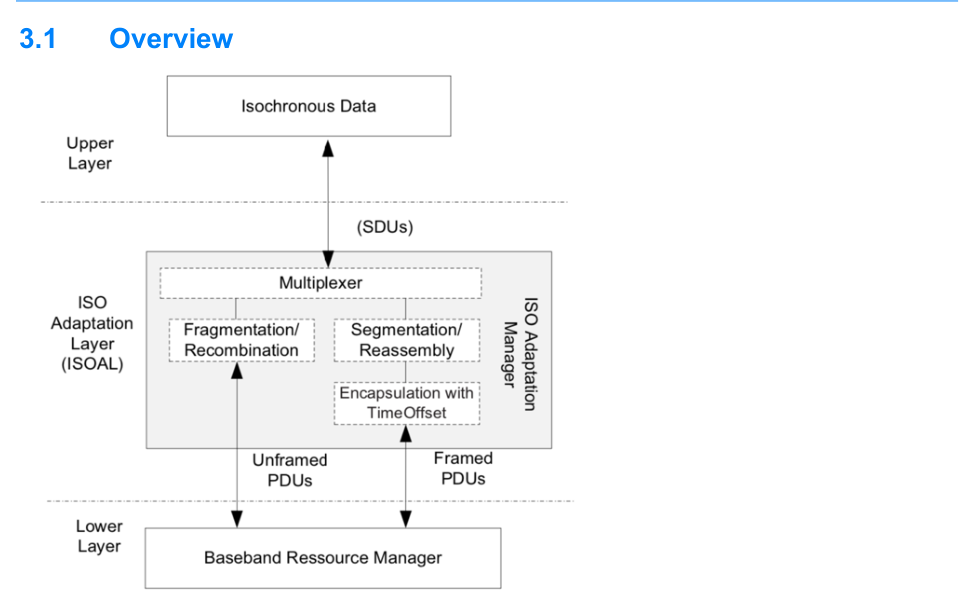

**Figure 3.1: Test Suite Structure**

### 3.2 Test Strategy

The test objectives are to verify the functionality of the Isochronous Adaptation Layer within a Bluetooth Host and enable interoperability between Bluetooth Hosts on different devices. The testing approach covers mandatory and optional requirements in the specification and matches these to the support of the IUT as described in the ICS. Any defined test herein is applicable to the IUT if the ICS logical expression defined in the Test Case Mapping Table (TCMT) evaluates to true.
The test equipment provides an implementation of the Radio Controller and the parts of the Host needed to perform the test cases defined in this Test Suite. A Lower Tester acts as the IUT’s peer device and interacts with the IUT over-the-air interface. The configuration, including the IUT, needs to implement similar capabilities to communicate with the test equipment. For some test cases, it is necessary to stimulate the IUT from an Upper Tester. In practice, this could be implemented as a special test interface, a Man Machine Interface (MMI), or another interface supported by the IUT.
This Test Suite contains Valid Behavior (BV) tests complemented with Invalid Behavior (BI) tests where required. The test coverage mirrored in the Test Suite Structure is the result of a process that started with catalogued specification requirements that were logically grouped and assessed for testability enabling coverage in defined test purposes.
Isochronous streams functionality includes specific testing features, see [9] Section 4.1.6.7.3, Test Command Generated Isochronous SDUs Optional Test Steps and Test Command Received Isochronous SDUs Optional Test Steps, providing approaches that may be employed when the Upper Tester may not be capable of meeting the bandwidth requirements of a given test procedure.

### 3.3 Test groups

The following test groups have been defined:
• Connected Isochronous Stream
• Broadcast Isochronous Stream
• Framed Data Traffic
• Unframed Data Traffic

## 4 Test cases (TC)

### 4.1 Introduction

#### 4.1.1 Test case identification conventions

Test cases are assigned unique identifiers per the conventions in [2]. The convention used here is: <spec abbreviation>/<IUT role>/<class>/<feat>/<func>/<subfunc>/<cap>/<xx>-<nn>-<y>.

|  | Identifier Abbreviation |  |  | Spec Identifier <spec abbreviation> |  |
| --- | --- | --- | --- | --- | --- |
| IAL |  |  | Isochronous Adaptation Layer |  |  |
|  | Identifier Abbreviation |  |  | Feature Identifier <feat> |  |
| BIS |  |  | Broadcast Isochronous Stream |  |  |
| CIS |  |  | Connected Isochronous Stream |  |  |
|  | Identifier Abbreviation |  |  | Function Identifier <func> |  |
| FRA |  |  | Framed Data Traffic |  |  |
| UNF |  |  | Unframed Data Traffic |  |  |
|  | Identifier Abbreviation |  |  | Subfunction Identifier <subfunc> |  |
| BRD |  |  | Broadcaster role |  |  |
| CEN |  |  | Central role |  |  |
| PER |  |  | Peripheral role |  |  |
| SNC |  |  | Synchronized Receiver role |  |  |

Table 4.1: IAL TC feature naming conventions

#### 4.1.2 Conformance

When conformance is claimed for a particular specification, all capabilities are to be supported in the specified manner. The mandated tests from this Test Suite depend on the capabilities to which conformance is claimed.
The Bluetooth Qualification Program may employ tests to verify implementation robustness. The level of implementation robustness that is verified varies from one specification to another and may be revised for cause based on interoperability issues found in the market.
Such tests may verify:
• That claimed capabilities may be used in any order and any number of repetitions not excluded by the specification
• That capabilities enabled by the implementations are sustained over durations expected by the use case
• That the implementation gracefully handles any quantity of data expected by the use case
• That in cases where more than one valid interpretation of the specification exists, the implementation complies with at least one interpretation and gracefully handles other interpretations
• That the implementation is immune to attempted security exploits
A single execution of each of the required tests is required to constitute a Pass verdict. However, it is noted that to provide a foundation for interoperability, it is necessary that a qualified implementation consistently and repeatedly pass any of the applicable tests.
In any case, where a member finds an issue with the test plan generated by the Bluetooth SIG qualification tool, with the test case as described in the Test Suite, or with the test system utilized, the member is required to notify the responsible party via an erratum request such that the issue may be addressed.

#### 4.1.3 Pass/Inconclusive/Fail verdict conventions

Each test case has an Expected Outcome section. The IUT is granted the Pass verdict when all the detailed pass criteria conditions within the Expected Outcome section are met.
Certain test cases also have an Inconclusive verdict defined. If the conditions for this verdict are met, then the test provides evidence that the IUT neither meets nor violates the test case; instead, it means that the test case was not applicable to the IUT, and therefore a Pass verdict is not required in order to achieve Qualification of the IUT. Implementers are encouraged to provide mechanisms to avoid the behavior leading to an Inconclusive condition during testing.
The convention in this Test Suite is that, unless there is a specific set of fail conditions outlined in the test case, the IUT fails the test case as soon as one of the pass criteria conditions cannot be met. If this occurs, then the outcome of the test is a Fail verdict.
For an Inconclusive verdict, all the pass criteria conditions apply up to the point in the test procedure where an Inconclusive verdict is identified. If one of the pass criteria in a step prior to the Inconclusive verdict cannot be met, then the outcome of the test is the Fail verdict and not the Inconclusive verdict.

### 4.2 Common Packet Contents

#### 4.2.1 Fields and Bits Reserved for Future Use

Unless a specific test states otherwise, all fields within packets and all bits within fields that are described as reserved for future use are set to 0 in packets sent by the Upper and Lower Testers.

### 4.3 CIS

Tests that the IUT behaves according to the Isochronous Adaptation Layer Specifications for Connected Isochronous Streams.

#### 4.3.1 Requirements

##### 4.3.1.1 Timing Requirements

The timing of CIS tests in this section complies with the CIS timing requirements specified in [3] Section 4.10.1.2.
When using framed PDUs, the maximum allowed drift (MaxDrift) complies with the average timing of SDU delivery specified in [3] Section 2.2.

##### 4.3.1.2 Configuring the ISO Data Path for HCI

The HCI_LE_Setup_ISO_Data_Path is configured to use the HCI for input and/or output when appropriate for the test procedure. When applicable, Input_Data_Path is set to 0x00 (HCI transport), and likewise, Output_Data_Path is set to 0x00 (HCI transport).

#### 4.3.2 Send Single SDU, CIS • Test Purpose

Verify that the IUT can send an SDU with length ≤ the Isochronous PDU length.
• Reference
[3] 4.6.27
[4] 2.1, 2.2
• Initial Condition
- The IUT acts in the role as specified in Table 4.2.
- The CIS has been created.
- TSPX_max_cis_nse is the maximum supported NSE as defined in the IXIT [8] entry.
- TSPX_max_cis_bn is the maximum supported BN as defined in the IXIT [8] entry.
- TSPX_max_cis_ft is the maximum supported FT as defined in the IXIT [8] entry.
- In the LE Set CIG Parameters Test Command, the NSE, BN_P_To_C, BN_C_To_P, FT_C_To_P, FT_P_To_C, SDU_Interval_C_to_P, SDU_Interval_P_to_C, Max_PDU_C_to_P, Max_PDU_P_to_C, ISO_Interval, and Framing parameters are set as specified in Table 4.2. Max_SDU_C_to_P and Max_SDU_P_to_C are set to Max Data Length from Table 4.2. Framing is set to 0x00 if the test is Unframed, 0x01 if the test is Framed, Segmentable mode, and 0x02 if the test is Framed, Unsegmentable mode. When a field is designated as “N/A”, any valid value may be chosen.
• Test Case Configuration

| Test Case | Role | NSE | Framed | Framing Mode _ | LLID |  | P To C _ _ |  |  |  |  |  | C To P _ _ |  |  |  |  |  | SDU Interval _ |  |  |  | ISO Interval _ | Max Data Length |
| --- | --- | --- | --- | --- | --- | --- | --- | --- | --- | --- | --- | --- | --- | --- | --- | --- | --- | --- | --- | --- | --- | --- | --- | --- |
|  |  |  |  |  |  | BN | BN | FT |  | Max |  | BN | BN | FT |  | Max |  | P To C _ _ | P To C _ _ | C To P _ _ | C To P _ _ |  |  |  |
|  |  |  |  |  |  |  |  |  |  | PDU |  |  |  |  |  | PDU |  |  |  |  |  |  |  |  |
| IAL/CIS/UNF/ CEN/BV-01-C | Central | 2 | 0 | 0 | 0b00 | 0 |  | N/A | N/A |  |  | 1 |  | 1 | 32 |  |  | N/A |  | 15 ms (0x3A98) |  |  | 15 ms (0x0C) | 32 |
| IAL/CIS/UNF/ PER/BV-01-C | Peripheral | 3 | 0 | 0 | 0b00 | 2 |  | 1 | 32 |  |  | 0 |  | N/A | N/A |  |  | 6.25 ms (0x186A) |  | N/A |  |  | 12.5 ms (0x0A) | 32 |
| IAL/CIS/UNF/ CEN/BV-25-C | Central | 4 | 0 | 0 | 0b00 | 3 |  | 1 | 32 |  |  | 1 |  | 1 | 32 |  |  | 5 ms (0x1388) |  | 15 ms (0x3A98) |  |  | 15 ms (0x0C) | 32 |
| IAL/CIS/UNF/ PER/BV-25-C | Peripheral | 5 | 0 | 0 | 0b00 | 1 |  | 2 | 32 |  |  | 3 |  | 3 | 32 |  |  | 30 ms (0x7530) |  | 30 ms (0x7530) |  |  | 30 ms (0x18) | 32 |
| IAL/CIS/FRA/ CEN/BV-03-C | Central | 7 | 1 | 0 | 0b10 | 0 |  | N/A | N/A |  |  | 3 |  | 4 | 32 |  |  | N/A |  | 40 ms (0x9C40) |  |  | 40 ms (0x20) | 27 |
| IAL/CIS/FRA/ PER/BV-03-C | Peripheral | 4 | 1 | 0 | 0b10 | 2 |  | 2 | 32 |  |  | 0 |  | N/A | N/A |  |  | 20 ms (0x4E20) |  | N/A |  |  | 25 ms (0x14) | 27 |
| IAL/CIS/FRA/ CEN/BV-26-C | Central | 3 | 1 | 0 | 0b10 | 1 |  | 2 | 32 |  |  | 2 |  | 3 | 32 |  |  | 20 ms (0x4E20) |  | 10 ms (0x2710) |  |  | 20 ms (0x10) | 19 |
| IAL/CIS/FRA/ PER/BV-26-C | Peripheral | 2 | 1 | 0 | 0b10 | 1 |  | 1 | 188 |  |  | 1 |  | 1 | 188 |  |  | 5.333 ms (0x14D5) |  | 5.333 ms (0x14D5) |  |  | 10 ms (0x08) | 92 |
| IAL/CIS/UNF/ CEN/BV-46-C | Central | 1 | 0 | 0 | 0b00 | 1 |  | 1 | 32 |  |  | 1 |  | 1 | 32 |  |  | 10 ms (0x2710) |  | 10 ms (0x2710) |  |  | 10 ms (0x08) | 32 |
| IAL/CIS/UNF/ PER/BV-47-C | Peripheral | 1 | 0 | 0 | 0b00 | 1 |  | 1 | 32 |  |  | 1 |  | 1 | 32 |  |  | 20 ms (0x4E20) |  | 20 ms (0x4E20) |  |  | 20 ms (0x10) | 32 |
| IAL/CIS/FRA/ CEN/BV-45-C | Central | 1 | 1 | 0 | 0b10 | 1 |  | 1 | 32 |  |  | 1 |  | 1 | 32 |  |  | 20 ms (0x4E20) |  | 20 ms (0x4E20) |  |  | 20 ms (0x10) | 19 |
| IAL/CIS/FRA/ PER/BV-45-C | Peripheral | 1 | 1 | 0 | 0b10 | 1 |  | 1 | 32 |  |  | 1 |  | 1 | 32 |  |  | 10 ms (0x2710) |  | 10 ms (0x2710) |  |  | 10 ms (0x08) | 19 |
| IAL/CIS/FRA/ CEN/BV-53-C | Central | 7 | 1 | 1 | 0b10 | 0 |  | N/A | N/A |  |  | 2 |  | 4 | Max Data Length + 5 |  |  | N/A |  | 40 ms (0x9C40) |  |  | 40 ms (0x20) | 180 |
| IAL/CIS/FRA/ PER/BV-53-C | Peripheral | 4 | 1 | 1 | 0b10 | 2 |  | 2 | Max Data Length + 5 |  |  | 0 |  | N/A | N/A |  |  | 20 ms (0x4E20) |  | N/A |  |  | 25 ms (0x14) | 192 |

Table 4.2: Send Single SDU, CIS test cases
• Test Procedure

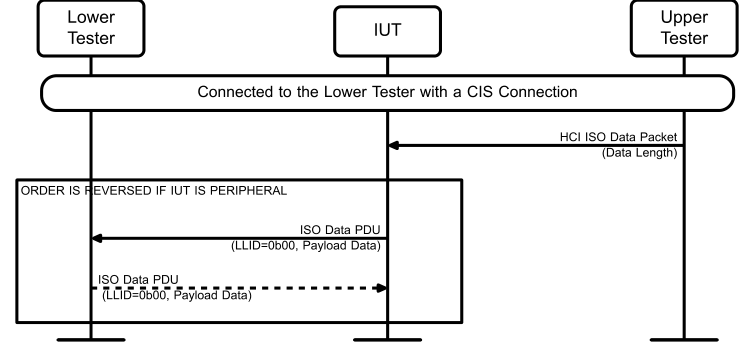

**Figure 4.1: Send Single SDU, CIS MSC**

If the values of NSE, BN, or FT specified in Table 4.2 exceed the corresponding values of TSPX_max_cis_nse, TSPX_max_cis_bn, or TSPX_max_cis_ft, respectively, refer to the Inconclusive verdict.
1. The Upper Tester sends an HCI ISO Data packet to the IUT with data length less than or equal to
the Max Data Length as specified in Table 4.2. 2. The IUT sends a single ISO Data PDU to the Lower Tester with the LLID, Framed, and Framing
as specified in Table 4.2 and Payload Data identical to the data in Step 1. If the BN value is not 0 in the direction from the Lower Tester to the IUT, then the Lower Tester sends a payload as configured in Table 4.2.
• Expected Outcome
Pass verdict
In Step 2, the IUT sends a PDU with LLID as specified in Table 4.2 and the same data in Step 1.
Inconclusive verdict
TSPX_max_cis_nse is less than the value of NSE specified in Table 4.2.
TSPX_max_cis_bn is less than the value of BN specified in Table 4.2.
TSPX_max_cis_ft is less than the value of FT specified in Table 4.2.

#### 4.3.3 Send Large SDU, CIS • Test Purpose

Verify that the IUT can send an SDU with length > the Isochronous PDU length.
• Reference
[3] 4.6.27
[4] 2.1, 2.2
• Initial Condition
- The IUT acts in the role as specified in Table 4.3.
- The CIS has been created.
- In the LE Set CIG Parameters Test Command the NSE, BN_P_To_C and BN_C_To_P, FT_C_To_P, FT_P_To_C, SDU_Interval, ISO_Interval, and Framing parameters are set as specified in Table 4.3.
- TSPX_max_cis_nse is the maximum supported NSE as defined in the IXIT [8] entry.
- TSPX_max_cis_bn is the maximum supported BN as defined in the IXIT [8] entry.
- TSPX_max_cis_ft is the maximum supported FT as defined in the IXIT [8] entry.
- Max_SDU is set to 503 when the corresponding BN is not 0. Max_SDU is set to 0 when the corresponding BN is 0.
- Max_PDU is set to 251 when the corresponding BN is not 0. Max_PDU is set to 0 when the corresponding BN is 0.
• Test Case Configuration

| Test Case | Role | NSE | Framing |  | P To C _ _ |  |  |  |  |  | C To P _ _ |  |  |  |  | SDU Interval _ | ISO Interval _ |
| --- | --- | --- | --- | --- | --- | --- | --- | --- | --- | --- | --- | --- | --- | --- | --- | --- | --- |
|  |  |  |  |  | BN |  |  | FT |  |  | BN |  |  | FT |  |  |  |
| IAL/CIS/UNF/CEN/BV-04-C | Central | 8 | Unframed (0x00) | 0 |  |  | N/A |  |  | 6 |  |  | 2 |  |  | 20 ms (0x4E20) | 40 ms (0x20) |
| IAL/CIS/UNF/PER/BV-04-C | Peripheral | 4 | Unframed (0x00) | 3 |  |  | 2 |  |  | 0 |  |  | N/A |  |  | 25 ms (0x61A8) | 25 ms (0x14) |
| IAL/CIS/UNF/CEN/BV-28-C | Central | 4 | Unframed (0x00) | 3 |  |  | 3 |  |  | 3 |  |  | 2 |  |  | 25 ms (0x61A8) | 25 ms (0x14) |
| IAL/CIS/UNF/PER/BV-28-C | Peripheral | 5 | Unframed (0x00) | 3 |  |  | 3 |  |  | 0 |  |  | N/A |  |  | 35 ms (0x88B8) | 35 ms (0x1C) |
| IAL/CIS/FRA/CEN/BV-05-C | Central | 5 | Framed, Segmentable mode (0x01) | 0 |  |  | N/A |  |  | 3 |  |  | 1 |  |  | 20 ms (0x4E20) | 25 ms (0x14) |
| IAL/CIS/FRA/PER/BV-05-C | Peripheral | 8 | Framed, Segmentable mode (0x01) | 5 |  |  | 2 |  |  | 0 |  |  | N/A |  |  | 25 ms (0x61A8) | 50 ms (0x28) |
| IAL/CIS/FRA/CEN/BV-29-C | Central | 4 | Framed, Segmentable mode (0x01) | 3 |  |  | 1 |  |  | 3 |  |  | 2 |  |  | 40 ms (0x9C40) | 40 ms (0x20) |
| IAL/CIS/FRA/PER/BV-29-C | Peripheral | 6 | Framed, Segmentable mode (0x01) | 4 |  |  | 2 |  |  | 4 |  |  | 3 |  |  | 22 ms (0x55F0) | 35 ms (0x1C) |
| IAL/CIS/FRA/CEN/BV-46-C | Central | 1 | Framed, Segmentable mode (0x01) | 1 |  |  | 1 |  |  | 1 |  |  | 1 |  |  | 30 ms (0x7530) | 10 ms (0x08) |
| IAL/CIS/FRA/PER/BV-46-C | Peripheral | 1 | Framed, Segmentable mode (0x01) | 1 |  |  | 1 |  |  | 1 |  |  | 1 |  |  | 30 ms (0x7530) | 10 ms (0x08) |

Table 4.3: Send Large SDU, CIS test cases
• Test Procedure

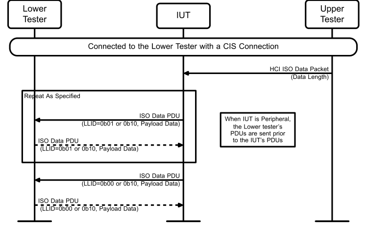

**Figure 4.2: Send Large SDU, CIS MSC**

If the values of NSE, BN, or FT specified in Table 4.3 exceed the corresponding values of TSPX_max_cis_nse, TSPX_max_cis_bn, or TSPX_max_cis_ft, respectively, go to the Inconclusive verdict.
Repeat Steps 1–3 for each round in Table 4.4.
1. The Upper Tester sends an HCI ISO Data packet to the IUT with a data length specified in Table
4.4. 2. The IUT sends the specified number of Start/Continuation packets specified in Table 4.4 of ISO
Data PDUs to the Lower Tester with the LLID=0b01 for unframed data and LLID=0b10 for framed, segmentable mode data. Payload Data every 251 bytes offset in Step 1. If the BN value is not 0 in the direction from the Lower Tester to the IUT, then the Lower Tester sends payloads as configured in Table 4.4. 3. The IUT sends the last ISO Data PDU to the Lower Tester with the LLID=0b00 for unframed data
and LLID=0b10 for framed, segmentable mode data with the remaining Payload Data.

|  | Round |  | SDU Data Length |  | Start/Continuation packets |  |
| --- | --- | --- | --- | --- | --- | --- |
| 1 |  |  | 495 |  | 1 |  |
| 2 |  |  | 503 |  | 2 |  |

Table 4.4: Send Large SDU, CIS rounds
• Expected Outcome
Pass verdict
In Step 2, the IUT sends the correct number of Start/Continuation PDUs as specified in Table 4.4 and that each PDU contains a Segmentation Header.
In Step 3, the IUT sends a PDU with LLID=0b00 for unframed data and LLID=0b10 for framed, segmentable mode data and the same data in Step 1.
The bits in the RFU field in the Segmentation Headers from the IUT are clear.
TSPX_max_cis_nse is less than the value of NSE specified in Table 4.3.
TSPX_max_cis_bn is less than the value of BN specified in Table 4.3.
TSPX_max_cis_ft is less than the value of FT specified in Table 4.3.

#### 4.3.4 Send Multiple, Small SDUs, CIS • Test Purpose

Verify that the IUT can send multiple SDUs that can be combined into a single Isochronous PDU.
• Reference
[3] 4.6.27
[4] 2.2
• Initial Condition
- The IUT acts in the role as specified in Table 4.5.
- The CIS has been created.
- In the LE Set CIG Parameters Test Command the SDU_Interval is half the ISO_Interval, the NSE, BN_P_To_C, BN_C_To_P, FT_C_To_P, FT_P_To_C, SDU_Interval, and ISO_Interval parameters are set as specified in Table 4.5. Framing is set to Framed, Segmentable mode (0x01).
- Max_SDU is set to 25 when the corresponding BN is not 0. Max_SDU is set to 0 when the corresponding BN is 0.
- Max_PDU is set to 68 when the corresponding BN is not 0. Max_PDU is set to 0 when the corresponding BN is 0.
- TSPX_max_cis_nse is the maximum supported NSE as defined in the IXIT [8] entry.
- TSPX_max_cis_bn is the maximum supported BN as defined in the IXIT [8] entry.
- TSPX_max_cis_ft is the maximum supported FT as defined in the IXIT [8] entry.
• Test Case Configuration

| Test Case | Role | NSE |  | P To C _ _ |  |  |  |  |  | C To P _ _ |  |  |  |  | SDU Interval _ | ISO Interval _ |
| --- | --- | --- | --- | --- | --- | --- | --- | --- | --- | --- | --- | --- | --- | --- | --- | --- |
|  |  |  |  | BN |  |  | FT |  |  | BN |  |  | FT |  |  |  |
| IAL/CIS/FRA/CEN/BV-07-C | Central | 2 | 0 |  |  | N/A |  |  | 1 |  |  | 4 |  |  | 500 ms (0x7A120) | 1000 ms (0x320) |
| IAL/CIS/FRA/PER/BV-07-C | Peripheral | 2 | 1 |  |  | 1 |  |  | 0 |  |  | N/A |  |  | 500 ms (0x7A120) | 1000 ms (0x320) |
| IAL/CIS/FRA/CEN/BV-31-C | Central | 7 | 0 |  |  | N/A |  |  | 2 |  |  | 4 |  |  | 1000 ms (0xF4240) | 2000 ms (0x640) |
| IAL/CIS/FRA/PER/BV-31-C | Peripheral | 4 | 2 |  |  | 1 |  |  | 2 |  |  | 2 |  |  | 1000 ms (0xF4240) | 2000 ms (0x640) |
| IAL/CIS/FRA/CEN/BV-47-C | Central | 1 | 1 |  |  | 1 |  |  | 1 |  |  | 1 |  |  | 500 ms (0x7A120) | 1000 ms (0x320) |
| IAL/CIS/FRA/PER/BV-47-C | Peripheral | 1 | 1 |  |  | 1 |  |  | 1 |  |  | 1 |  |  | 500 ms (0x7A120) | 1000 ms (0x320) |

Table 4.5: Send Multiple, Small SDUs, CIS test cases
• Test Procedure

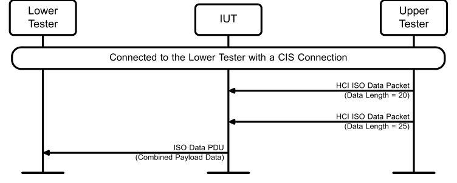

**Figure 4.3: Send Multiple, Small SDUs, CIS MSC**

If the values of NSE, BN, or FT specified in Table 4.5 exceed the corresponding values of TSPX_max_cis_nse, TSPX_max_cis_bn, or TSPX_max_cis_ft, respectively, then refer to the Inconclusive verdict.
1. The Upper Tester sends to the IUT a small SDU1 with data length of 20 bytes. 2. The Upper Tester sends to the IUT a small SDU2 with data length of 25 bytes. 3. The IUT sends a single PDU with SDU1 followed by SDU2 to the Lower Tester. Each SDU
header has SC = 0 and CMPT = 1.
• Expected Outcome
Pass verdict
In Step 3, the IUT sends a single small PDU with data length of 55 bytes with SDU1 followed by SDU2.
Inconclusive verdict
TSPX_max_cis_nse is less than the value of NSE specified in Table 4.5.
TSPX_max_cis_bn is less than the value of BN specified in Table 4.5.
TSPX_max_cis_ft is less than the value of FT specified in Table 4.5.

#### 4.3.5 Receive Single SDU, CIS • Test Purpose

Verify that the IUT can receive an SDU with length ≤ the Isochronous PDU length.
• Reference
[3] 4.6.27
[4] 2.1, 2.2
• Initial Condition
- The IUT acts in the role as specified in Table 4.6.
- The CIS has been created.
- In the LE Set CIG Parameters Test Command the NSE, BN_P_To_C, BN_C_To_P, FT_C_To_P, FT_P_To_C, SDU_Interval, ISO_Interval, and Framing parameters are set as specified in Table 4.6. Framed is set to 0b0 and Framing_Mode is set to 0b0 if the test is Unframed. Framed
is set to 0b1 and Framing_Mode is set to 0b0 if the test is Framed, Segmentable mode. Framed is set to 0b1 and Framing_Mode is set to 0b1 if the test is Framed, Unsegmented mode.
- TSPX_max_cis_nse is the maximum supported NSE as defined in the IXIT [8] entry.
- TSPX_max_cis_bn is the maximum supported BN as defined in the IXIT [8] entry.
- TSPX_max_cis_ft is the maximum supported FT as defined in the IXIT [8] entry.
- If the corresponding BN is not 0, then Max_SDU is set to the value in Table 4.6.
- If the corresponding BN is 0, then Max_SDU is set to 0 and Max_PDU is set to 0.
• Test Case Configuration

| Test Case | Role | NSE | Framed | Framing Mode _ | LLID |  | P To C _ _ |  |  |  |  |  | C To P _ _ |  |  |  |  | SDU Interval _ | ISO Interval _ | Max SDU _ |
| --- | --- | --- | --- | --- | --- | --- | --- | --- | --- | --- | --- | --- | --- | --- | --- | --- | --- | --- | --- | --- |
|  |  |  |  |  |  |  | BN |  |  | FT |  |  | BN |  |  | FT |  |  |  |  |
| IAL/CIS/UNF/CEN/BV-09-C | Central | 4 | 0 | 0 | 0b00 | 3 |  |  | 1 |  |  | 0 |  |  | N/A |  |  | 5 ms (0x1388) | 15 ms (0x0C) | 251 |
| IAL/CIS/UNF/PER/BV-09-C | Peripheral | 2 | 0 | 0 | 0b00 | 0 |  |  | N/A |  |  | 1 |  |  | 1 |  |  | 15 ms (0x3A98) | 15 ms (0x0C) | 251 |
| IAL/CIS/UNF/CEN/BV-33-C | Central | 5 | 0 | 0 | 0b00 | 3 |  |  | 3 |  |  | 3 |  |  | 2 |  |  | 30 ms (0x7530) | 30 ms (0x18) | 251 |
| IAL/CIS/UNF/PER/BV-33-C | Peripheral | 4 | 0 | 0 | 0b00 | 3 |  |  | 1 |  |  | 3 |  |  | 1 |  |  | 10 ms (0x2710) | 30 ms (0x18) | 251 |
| IAL/CIS/FRA/CEN/BV-10-C | Central | 4 | 1 | 0 | 0b10 | 2 |  |  | 2 |  |  | 0 |  |  | N/A |  |  | 20 ms (0x4E20) | 25 ms (0x14) | 251 |
| IAL/CIS/FRA/PER/BV-10-C | Peripheral | 7 | 1 | 0 | 0b10 | 0 |  |  | N/A |  |  | 3 |  |  | 4 |  |  | 40 ms (0x9C40) | 40 ms (0x20) | 251 |
| IAL/CIS/FRA/CEN/BV-35-C | Central | 3 | 1 | 0 | 0b10 | 2 |  |  | 1 |  |  | 0 |  |  | N/A |  |  | 5.333 ms (0x14D5) | 10 ms (0x08) | 251 |
| IAL/CIS/FRA/PER/BV-35-C | Peripheral | 4 | 1 | 0 | 0b10 | 0 |  |  | N/A |  |  | 3 |  |  | 3 |  |  | 10 ms (0x2710) | 20 ms (0x10) | 251 |
| IAL/CIS/UNF/CEN/BV-47-C | Central | 1 | 0 | 0 | 0b00 | 1 |  |  | 1 |  |  | 1 |  |  | 1 |  |  | 15 ms (0x3A98) | 15 ms (0x0C) | 251 |
| IAL/CIS/UNF/PER/BV-48-C | Peripheral | 1 | 0 | 0 | 0b00 | 1 |  |  | 1 |  |  | 1 |  |  | 1 |  |  | 10 ms (0x2710) | 10 ms (0x08) | 251 |
| IAL/CIS/FRA/CEN/BV-48-C | Central | 1 | 1 | 0 | 0b10 | 1 |  |  | 1 |  |  | 1 |  |  | 1 |  |  | 20 ms (0x4E20) | 20 ms (0x10) | 238 or (TSPX _ max pdu length _ _ -13) whichever is less |
| IAL/CIS/FRA/PER/BV-48-C | Peripheral | 1 | 1 | 0 | 0b10 | 1 |  |  | 1 |  |  | 1 |  |  | 1 |  |  | 30 ms (0x7530) | 30 ms (0x18) | 238 or (TSPX _ max pdu length _ _ -13) whichever is less |
| IAL/CIS/FRA/CEN/BV-54-C | Central | 4 | 1 | 1 | 0b10 | 2 |  |  | 2 |  |  | 0 |  |  | N/A |  |  | 20 ms (0x4E20) | 25 ms (0x14) | 246 |
| IAL/CIS/FRA/PER/BV-54-C | Peripheral | 7 | 1 | 1 | 0b10 | 0 |  |  | N/A |  |  | 2 |  |  | 2 |  |  | 20 ms (0x4E20) | 20 ms (0x14) | 246 |

Table 4.6: Receive Single SDU, CIS test cases
• Test Procedure

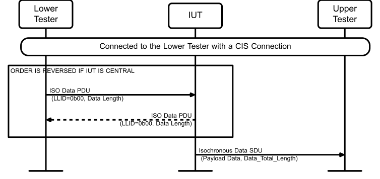

**Figure 4.4: Receive Single SDU, CIS MSC**

If the values of NSE, BN, or FT specified in Table 4.6 exceed the corresponding values of TSPX_max_cis_nse, TSPX_max_cis_bn, or TSPX_max_cis_ft, respectively, go to the Inconclusive verdict.
1. The Lower Tester sends the IUT a single ISO Data PDU with the LLID, Framed, and Framing as
specified in Table 4.6. The SDU size is equivalent to the Max payload contained in a Max_PDU. If the BN value is not 0 in the direction from the IUT to the Lower Tester, then the IUT sends a payload as configured in Table 4.6. 2. The IUT sends an Isochronous Data SDU to the Upper Tester with Payload Data identical to the
data in Step 1 and Data_Total_Length identical to the data length sent in Step 1.
• Expected Outcome
Pass verdict
In Step 2, the IUT sends to the Upper Tester the same data sent by the Lower Tester in Step 1.
Inconclusive verdict
TSPX_max_cis_nse is less than the value of NSE specified in Table 4.6.
TSPX_max_cis_bn is less than the value of BN specified in Table 4.6.
TSPX_max_cis_ft is less than the value of FT specified in Table 4.6.

#### 4.3.6 Receive Large SDU, CIS, Unframed • Test Purpose

Verify that the IUT can receive an SDU with length > the Isochronous PDU length.
• Reference
[3] 4.6.27
[4] 2.1, 2.2
• Initial Condition
- The IUT acts in the role specified in Table 4.7.
- The CIS has been created.
- In the LE Set CIG Parameters Test Command, the NSE, BN_P_To_C, BN_C_To_P, FT_C_To_P, FT_P_To_C, SDU_Interval, ISO_Interval, and Framing parameters are set as specified in Table 4.7.
- TSPX_max_cis_nse is the maximum supported NSE as defined in the IXIT [8] entry.
- TSPX_max_cis_bn is the maximum supported BN as defined in the IXIT [8] entry.
- TSPX_max_cis_ft is the maximum supported FT as defined in the IXIT [8] entry.
- If the corresponding BN is not 0, then Max_SDU is set to 754 and Max_PDU is set to 251.
- If the corresponding BN is 0, then Max_SDU is set to 0 and Max_PDU is set to 0.
• Test Case Configuration

| Test Case | Role NSE | Framing P T _ BN | o C C To P _ _ _ |  |  |  | SDU Interval _ | ISO _ Interval |
| --- | --- | --- | --- | --- | --- | --- | --- | --- |
|  |  |  | FT BN |  |  | FT |  |  |
| IAL/CIS/UNF/CEN/BV-12-C | Central 6 | Unframed 4 (0) | 2 0 |  | N/A |  | 25 ms (0x61A8) | 25 ms (0x14) |
| IAL/CIS/UNF/PER/BV-12-C | Peripheral 10 | Unframed 0 (0) | N/A 8 |  | 2 |  | 20 ms (0x4E20) | 40 ms (0x20) |
| IAL/CIS/UNF/CEN/BV-36-C | Central 12 | Unframed 8 (0) | 3 0 |  | N/A |  | 25 ms (0x61A8) | 50 ms (0x28) |
| IAL/CIS/UNF/PER/BV-36-C | Peripheral 6 | Unframed 0 (0) | N/A 4 |  | 3 |  | 25 ms (0x61A8) | 25 ms (0x14) |

Table 4.7: Receive Large SDU, CIS, Unframed test cases
• Test Procedure

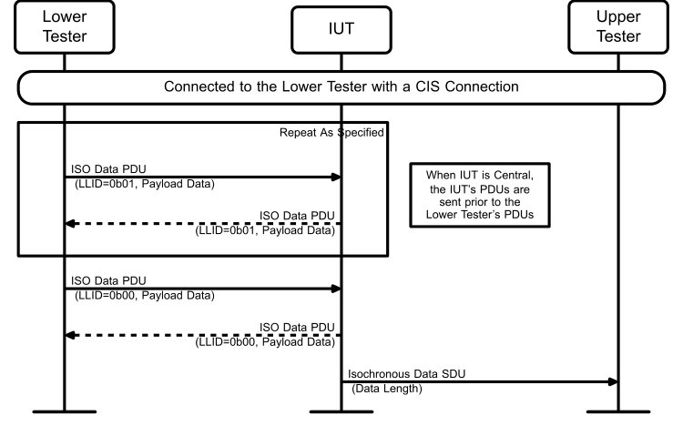

**Figure 4.5: Receive Large SDU, CIS, Unframed MSC**

If the values of NSE, BN, or FT specified in Table 4.7 exceed the corresponding values of TSPX_max_cis_nse, TSPX_max_cis_bn, or TSPX_max_cis_ft, respectively, go to the Inconclusive verdict.
1. The Lower Tester sends the IUT the specified number of Start/Continuation packets specified in
Table 4.8 of ISO Data PDU with the LLID=0b01. If the BN value is not 0 in the direction from the IUT to the Lower Tester, then the IUT also sends payloads to the Lower Tester as configured in Table 4.8. 2. The Lower Tester sends the IUT the last ISO Data PDU with the LLID=0b00 with the remaining
Payload Data. 3. The IUT sends an ISO Data packet to the Upper Tester with a data length specified in Table 4.8
and the data sent by the Lower Tester.

|  | Round |  |  | SDU Data Length |  |  | Start/Continuation packets |  |
| --- | --- | --- | --- | --- | --- | --- | --- | --- |
| 1 |  |  | 753 |  |  | 2 |  |  |
| 2 |  |  | 754 |  |  | 3 |  |  |

Table 4.8: Receive Large SDU, CIS, Unframed rounds
• Expected Outcome
Pass verdict
In Step 3, the IUT sends an SDU with data length as specified in Table 4.8.
Inconclusive verdict
TSPX_max_cis_nse is less than the value of NSE specified in Table 4.7.
TSPX_max_cis_bn is less than the value of BN specified in Table 4.7.
TSPX_max_cis_ft is less than the value of FT specified in Table 4.7.

#### 4.3.7 Receive Large SDU, CIS, Framed • Test Purpose

Verify that the IUT can receive an SDU with length > the Isochronous PDU length.
• Reference
[3] 4.6.27
[4] 2.1, 2.2
• Initial Condition
- The IUT acts in the role specified in Table 4.9.
- The CIS has been created.
- In the LE Set CIG Parameters Test Command, the NSE, BN_P_To_C, BN_C_To_P, FT_C_To_P, FT_P_To_C, SDU_Interval, ISO_Interval, and Framing parameters are set as specified in Table 4.9.
- TSPX_max_cis_nse is the maximum supported NSE as defined in the IXIT [8] entry.
- TSPX_max_cis_bn is the maximum supported BN as defined in the IXIT [8] entry.
- TSPX_max_cis_ft is the maximum supported FT as defined in the IXIT [8] entry.
- If the corresponding BN is not 0, then Max_SDU is set to 251 and Max_PDU is set to 251.
- If the corresponding BN is 0, then Max_SDU is set to 0 and Max_PDU is set to 0.
• Test Case Configuration

| Test Case | Role NSE | Framing P To _ BN | C C To P _ _ _ |  |  |  |  | SDU Interval _ | ISO _ Interval |
| --- | --- | --- | --- | --- | --- | --- | --- | --- | --- |
|  |  |  | FT BN |  |  | FT |  |  |  |
| IAL/CIS/FRA/CEN/BV-13-C | Central 12 | Framed 7 (1) | 2 0 |  | N/A |  |  | 25 ms (0x61A8) | 50 ms (0x28) |
| IAL/CIS/FRA/PER/BV-13-C | Peripheral 6 | Framed 0 (1) | N/A 4 |  | 1 |  |  | 20 ms (0x4E20) | 25 ms (0x14) |
| IAL/CIS/FRA/CEN/BV-38-C | Central 8 | Framed 5 (1) | 2 0 |  | N/A |  |  | 22 ms (0x55F0) | 35 ms (0x1C) |
| IAL/CIS/FRA/PER/BV-38-C | Peripheral 7 | Framed 4 (1) | 1 4 |  | 2 |  |  | 40 ms (0x9C40) | 40 ms (0x20) |
| IAL/CIS/FRA/CEN/BV-49-C | Central 1 | Framed 1 (1) | 1 1 |  | 1 |  |  | 200 ms (0x30D40) | 50 ms (0x28) |
| IAL/CIS/FRA/PER/BV-49-C | Peripheral 1 | Framed 1 (1) | 1 1 |  | 1 |  |  | 200 ms (0x30D40) | 50 ms (0x28) |

Table 4.9: Receive Large SDU, CIS, Framed test cases
• Test Procedure

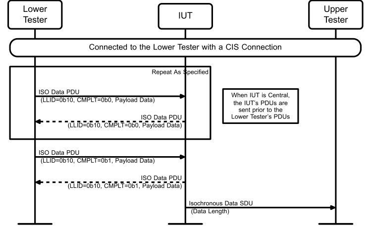

**Figure 4.6: Receive Large SDU, CIS, Framed MSC**

If the values of NSE, BN, or FT specified in Table 4.9 exceed the corresponding values of TSPX_max_cis_nse, TSPX_max_cis_bn, or TSPX_max_cis_ft, respectively, go to the Inconclusive verdict.
Repeat Steps 1–3 for each round in Table 4.10.
1. The Lower Tester sends the IUT the first fragment of SDU with LLID=0b10, SC set to 0, CMPLT
set to 0. 2. The Lower Tester sends the IUT an ISO Data PDU containing the next SDU fragment with
LLID=0b10, SC set to 1, and CMPLT set to 0. If the BN value is not 0 in the direction from the IUT to the Lower Tester, then the IUT also sends payloads to the Lower Tester as configured in Table 4.9. The bits in the RFU field of the Segmentation Header are set for framed payloads. 3. Repeat Step 2 ‘Number of Fragment(s)’ – 2 times as specified in Table 4.10.
set to 1, with the remaining Payload Data. The bits in the RFU field of the Segmentation Header are set for framed payloads. 5. The IUT sends an ISO Data packet to the Upper Tester with a data length specified in Table 4.10
and the data sent by the Lower Tester.

|  | Round |  |  | SDU Data Length |  |  | Number of Fragment(s) |  |
| --- | --- | --- | --- | --- | --- | --- | --- | --- |
| 1 |  |  | 744 |  |  | 3 |  |  |
| 2 |  |  | 745 |  |  | 4 |  |  |

Table 4.10: Receive Large SDU, CIS, Framed rounds
• Expected Outcome
Pass verdict
In Step 5, the IUT sends an SDU with data length as specified in Table 4.10.
Inconclusive verdict
TSPX_max_cis_nse is less than the value of NSE specified in Table 4.9.
TSPX_max_cis_bn is less than the value of BN specified in Table 4.9.
TSPX_max_cis_ft is less than the value of FT specified in Table 4.9.

#### 4.3.8 Receive Multiple, Small SDUs, CIS • Test Purpose

Verify that the IUT can receive a single ISOC Data PDU and sends multiple smaller SDUs to the Upper Tester.
• Reference
[3] 4.6.27
[4] 2.2
• Initial Condition
- The IUT acts in the role as specified in Table 4.11.
- The CIS has been created.
- In the LE Set CIG Parameters Test Command the NSE, BN_P_To_C, BN_C_To_P, FT_C_To_P, FT_P_To_C, SDU_Interval, ISO_Interval, and Framing = Framed(1) parameters are set as specified in Table 4.11.
- If the corresponding BN is not 0 then Max_SDU is set to 25 and Max_PDU is set to 68.
- If the corresponding BN is 0 then Max_SDU is set to 0 and Max_PDU is set to 0.
- TSPX_max_cis_nse is the maximum supported NSE as defined in the IXIT [8] entry.
- TSPX_max_cis_bn is the maximum supported BN as defined in the IXIT [8] entry.
- TSPX_max_cis_ft is the maximum supported FT as defined in the IXIT [8] entry.
• Test Case Configuration

| Test Case | Role | NSE | P To C _ _ |  |  | C To P _ _ |  |  |  |  | SDU Interval _ | ISO Interval _ |
| --- | --- | --- | --- | --- | --- | --- | --- | --- | --- | --- | --- | --- |
|  |  |  | BN | FT |  | BN |  |  | FT |  |  |  |
| IAL/CIS/FRA/CEN/BV-15-C | Central | 2 | 1 | 1 |  | 0 |  | N/A |  |  | 10 ms (0x2710) | 5 ms (0x04) |
| IAL/CIS/FRA/PER/BV-15-C | Peripheral | 2 | 0 | N/A |  | 1 |  | 4 |  |  | 10 ms (0x2710) | 5 ms (0x04) |
| IAL/CIS/FRA/CEN/BV-39-C | Central | 4 | 2 | 1 |  | 2 |  | 2 |  |  | 20 ms (0x4E20) | 10 ms (0x08) |
| IAL/CIS/FRA/PER/BV-39-C | Peripheral | 7 | 0 | N/A |  | 3 |  | 4 |  |  | 10 ms (0x2710) | 10 ms (0x08) |
| IAL/CIS/FRA/CEN/BV-50-C | Central | 1 | 1 | 1 |  | 1 |  | 1 |  |  | 20 ms (0x4E20) | 40 ms (0x20) |
| IAL/CIS/FRA/PER/BV-50-C | Peripheral | 1 | 1 | 1 |  | 1 |  | 1 |  |  | 10 ms (0x2710) | 20 ms (0x10) |

Table 4.11: Receive Multiple, Small SDUs, CIS test cases
• Test Procedure

**Figure 4.7: Receive Multiple, Small SDUs, CIS MSC**

If the values of NSE, BN, or FT specified in Table 4.11 exceed the corresponding values of TSPX_max_cis_nse, TSPX_max_cis_bn, or TSPX_max_cis_ft, respectively, then go to the Inconclusive verdict.
1. The Lower Tester sends a single PDU to the IUT with a data length of 55 bytes. 2. The IUT sends an SDU1 packet to the Upper Tester with a data length of 20 bytes. 3. The IUT sends an SDU2 packet to the Upper Tester with a data length of 25 bytes.
• Expected Outcome
Pass verdict
In Step 1, the IUT receives a PDU with two SDUs. In each SDU header SC = 0 and CMPLT = 1.
In Step 2, the IUT sends an SDU with the data for SDU1 from Step 1.
In Step 3, the IUT sends an SDU with the data for SDU2 from Step 1.
Inconclusive verdict
TSPX_max_cis_nse is less than the value of NSE specified in Table 4.11.
TSPX_max_cis_bn is less than the value of BN specified in Table 4.11.
TSPX_max_cis_ft is less than the value of FT specified in Table 4.11.

#### 4.3.9 Send a Zero-Length SDU, CIS • Test Purpose

Verify that the IUT can send a zero-length SDU.
• Reference
[3] 4.6.27
[4] 2.1, 2.2, 3.1
• Initial Condition
- The IUT acts in the role as specified in Table 4.12.
- The CIS has been created.
- In the LE Set CIG Parameters Test Command, the NSE, BN_P_To_C, BN_C_To_P, FT_C_To_P, FT_P_To_C, and Framing parameters are set as specified in Table 4.12. Framing is set to 0x00 if the test is Unframed, 0x01 if the test is Framed, Segmentable mode, and 0x02 if the test is Framed, Unsegmented mode. ISO_Interval and SDU_Interval are both set to 10 milliseconds. Max_PDU_C_To_P and Max_PDU_P_To_C are both set to 20 when BN in the corresponding direction is not 0, and to 0 when BN in the corresponding direction is 0.
- Max_SDU_C_To_P and Max_SDU_P_To_C are the maximum SDU size as defined by the bandwidth requirements specified in [4] Section 2.1 for unframed PDUs and Section 2.2 for framed PDUs.
- TSPX_max_cis_nse is the maximum supported NSE as defined in the IXIT [8] entry.
- TSPX_max_cis_bn is the maximum supported BN as defined in the IXIT [8] entry.
- TSPX_max_cis_ft is the maximum supported FT as defined in the IXIT [8] entry.
• Test Case Configuration

| Test Case | Role | NSE | Framed | Framing _ Mode | LLID |  | P To C _ _ |  |  |  |  |  | C To P _ _ |  |  |  |  | Segmentation Header | Time Offset |
| --- | --- | --- | --- | --- | --- | --- | --- | --- | --- | --- | --- | --- | --- | --- | --- | --- | --- | --- | --- |
|  |  |  |  |  |  |  | BN |  |  | FT |  |  | BN |  |  | FT |  |  |  |
| IAL/CIS/UNF/CEN/BV-17-C | Central | 4 | 0 | 0 | 0b00 | 0 |  |  | N/A |  |  | 2 |  |  | 2 |  |  | N/A | N/A |
| IAL/CIS/UNF/PER/BV-17-C | Peripheral | 7 | 0 | 0 | 0b00 | 3 |  |  | 4 |  |  | 0 |  |  | N/A |  |  | N/A | N/A |
| IAL/CIS/UNF/CEN/BV-41-C | Central | 1 | 0 | 0 | 0b00 | 0 |  |  | N/A |  |  | 1 |  |  | 1 |  |  | N/A | N/A |
| IAL/CIS/UNF/PER/BV-41-C | Peripheral | 2 | 0 | 0 | 0b00 | 1 |  |  | 3 |  |  | 1 |  |  | 2 |  |  | N/A | N/A |
| IAL/CIS/FRA/CEN/BV-18-C | Central | 5 | 1 | 0 | 0b10 | 0 |  |  | N/A |  |  | 2 |  |  | 2 |  |  | SC=0 CMPLT=1 LENGTH=length of TimeOffset | Yes |
| IAL/CIS/FRA/PER/BV-18-C | Peripheral | 2 | 1 | 0 | 0b10 | 1 |  |  | 4 |  |  | 0 |  |  | N/A |  |  | SC=0 CMPLT=1 LENGTH=length of TimeOffset | Yes |
| IAL/CIS/FRA/CEN/BV-42-C | Central | 2 | 1 | 0 | 0b10 | 1 |  |  | 1 |  |  | 1 |  |  | 1 |  |  | SC=0 CMPLT=1 LENGTH=length of TimeOffset | Yes |
| IAL/CIS/FRA/PER/BV-42-C | Peripheral | 5 | 1 | 0 | 0b10 | 1 |  |  | 2 |  |  | 3 |  |  | 3 |  |  | SC=0 CMPLT=1 LENGTH=length of TimeOffset | Yes |
| IAL/CIS/UNF/PER/BV-49-C | Peripheral | 1 | 0 | 0 | 0b00 | 1 |  |  | 1 |  |  | 1 |  |  | 1 |  |  | N/A | N/A |
| IAL/CIS/FRA/CEN/BV-51-C | Central | 1 | 1 | 0 | 0b10 | 1 |  |  | 1 |  |  | 1 |  |  | 1 |  |  | SC=0 CMPLT=1 LENGTH=length of TimeOffset | Yes |
| IAL/CIS/FRA/PER/BV-51-C | Peripheral | 1 | 1 | 0 | 0b10 | 1 |  |  | 1 |  |  | 1 |  |  | 1 |  |  | SC=0 CMPLT=1 LENGTH=length of TimeOffset | Yes |
| IAL/CIS/FRA/CEN/BV-55-C | Central | 5 | 1 | 1 | 0b10 | 0 |  |  | N/A |  |  | 2 |  |  | 2 |  |  | SC=0 CMPLT=1 LENGTH=length of TimeOffset | Yes |
| IAL/CIS/FRA/PER/BV-55-C | Peripheral | 2 | 1 | 1 | 0b10 | 1 |  |  | 4 |  |  | 0 |  |  | N/A |  |  | SC=0 CMPLT=1 LENGTH=length of TimeOffset | Yes |

Table 4.12: Send Zero-Length SDU, CIS test cases
• Test Procedure

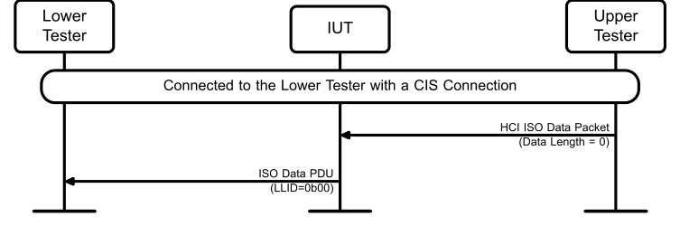

**Figure 4.8: Send Zero-Length SDU, CIS MSC**

If the values of NSE, BN, or FT specified in Table 4.12 exceed the corresponding values of TSPX_max_cis_nse, TSPX_max_cis_bn, or TSPX_max_cis_ft, respectively, go to the Inconclusive verdict.
1. The Upper Tester sends an HCI ISO Data packet to the IUT with zero data length. 2. The IUT sends a single ISO Data PDU to the Lower Tester with the LLID, Framed, and
Framing_Mode as specified in Table 4.12, the segmentation header and time offset fields as specified in Table 4.12. Length is 0 if LLID is 0b00 and is 5 (Segmentation Header + TimeOffset) if LLID is 0b10. SDU field is empty. NPI is set to 0b00.
• Expected Outcome
Pass verdict
The IUT sends a single ISO Data PDU with the LLID, segmentation header, and time offset fields as specified in Table 4.12 and an empty SDU.
Inconclusive verdict
TSPX_max_cis_nse is less than the value of NSE specified in Table 4.12.
TSPX_max_cis_bn is less than the value of BN specified in Table 4.12.
TSPX_max_cis_ft is less than the value of FT specified in Table 4.12.

#### 4.3.10 Receive a Zero-Length SDU, CIS • Test Purpose

Verify that the IUT can receive a zero-length SDU.
• Reference
[3] 4.6.27
[4] 2.1, 2.2, 3.1
• Initial Condition
- The IUT acts in the role as specified in Table 4.13.
- The CIS has been created.
- In the LE Set CIG Parameters Test Command, the NSE, BN_P_To_C, BN_C_To_P, FT_C_To_P, FT_P_To_C, and Framing parameters are set as specified in Table 4.13. Framing is set to 0x00 if the test is Unframed, 0x01 if the test is Framed, Segmentable mode and 0x02 if the test is Framed, Unsegmented mode. ISO_Interval and SDU_Interval are both chosen by the
tester. Max_PDU_C_To_P and Max_PDU_P_To_C are both set to 20 when BN in the corresponding direction is not 0, and to 0 when BN in the corresponding direction is 0.
- TSPX_max_cis_nse is the maximum supported NSE as defined in the IXIT [8] entry.
- TSPX_max_cis_bn is the maximum supported BN as defined in the IXIT [8] entry.
- TSPX_max_cis_ft is the maximum supported FT as defined in the IXIT [8] entry.
• Test Case Configuration

| Test Case | Role | NSE | Framed | Framing Mode _ | LLID |  | P To C _ _ |  |  |  |  |  | C To P _ _ |  |  |  |  | Segmentation Header | Time Offset |
| --- | --- | --- | --- | --- | --- | --- | --- | --- | --- | --- | --- | --- | --- | --- | --- | --- | --- | --- | --- |
|  |  |  |  |  |  |  | BN |  |  | FT |  |  | BN |  |  | FT |  |  |  |
| IAL/CIS/UNF/CEN/BV-19-C | Central | 7 | 0 | 0 | 0b00 | 3 |  |  | 4 |  |  | 0 |  |  | N/A |  |  | N/A | N/A |
| IAL/CIS/UNF/PER/BV-19-C | Peripheral | 4 | 0 | 0 | 0b00 | 0 |  |  | N/A |  |  | 2 |  |  | 2 |  |  | N/A | N/A |
| IAL/CIS/UNF/CEN/BV-43-C | Central | 2 | 0 | 0 | 0b00 | 1 |  |  | 3 |  |  | 1 |  |  | 2 |  |  | N/A | N/A |
| IAL/CIS/UNF/PER/BV-43-C | Peripheral | 1 | 0 | 0 | 0b00 | 0 |  |  | N/A |  |  | 1 |  |  | 1 |  |  | N/A | N/A |
| IAL/CIS/FRA/CEN/BV-20-C | Central | 2 | 1 | 0 | 0b10 | 1 |  |  | 4 |  |  | 0 |  |  | N/A |  |  | SC=0 CMPLT=1 LENGTH=length of TimeOffset | Yes |
| IAL/CIS/FRA/PER/BV-20-C | Peripheral | 5 | 1 | 0 | 0b10 | 0 |  |  | N/A |  |  | 2 |  |  | 2 |  |  | SC=0 CMPLT=1 LENGTH=length of TimeOffset | Yes |
| IAL/CIS/FRA/CEN/BV-44-C | Central | 5 | 1 | 0 | 0b10 | 1 |  |  | 2 |  |  | 3 |  |  | 3 |  |  | SC=0 CMPLT=1 LENGTH=length of TimeOffset | Yes |
| IAL/CIS/FRA/PER/BV-44-C | Peripheral | 2 | 1 | 0 | 0b10 | 1 |  |  | 1 |  |  | 1 |  |  | 1 |  |  | SC=0 CMPLT=1 LENGTH=length of TimeOffset | Yes |
| IAL/CIS/UNF/CEN/BV-48-C | Central | 1 | 0 | 0 | 0b00 | 1 |  |  | 1 |  |  | 1 |  |  | 1 |  |  | N/A | N/A |
| IAL/CIS/FRA/CEN/BV-52-C | Central | 1 | 1 | 0 | 0b10 | 1 |  |  | 1 |  |  | 1 |  |  | 1 |  |  | SC=0 CMPLT=1 LENGTH=length of TimeOffset | Yes |
| IAL/CIS/FRA/PER/BV-52-C | Peripheral | 1 | 1 | 0 | 0b10 | 1 |  |  | 1 |  |  | 1 |  |  | 1 |  |  | SC=0 CMPLT=1 LENGTH=length of TimeOffset | Yes |
| IAL/CIS/FRA/CEN/BV-56-C | Central | 2 | 1 | 1 | 0b10 | 1 |  |  | 4 |  |  | 0 |  |  | N/A |  |  | SC=0 CMPLT=1 LENGTH=length of TimeOffset | Yes |
| IAL/CIS/FRA/PER/BV-56-C | Peripheral | 5 | 1 | 1 | 0b10 | 0 |  |  | N/A |  |  | 2 |  |  | 2 |  |  | SC=0 CMPLT=1 LENGTH=length of TimeOffset | Yes |

Table 4.13: Receive Zero-Length SDU, CIS test cases
• Test Procedure

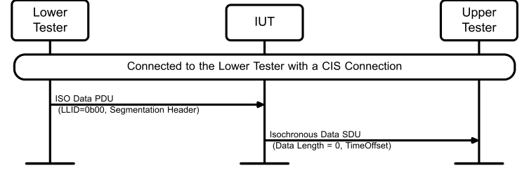

**Figure 4.9: Receive Zero-Length SDU, CIS MSC**

If the values of NSE, BN, or FT specified in Table 4.13 exceed the corresponding values of TSPX_max_cis_nse, TSPX_max_cis_bn, or TSPX_max_cis_ft, respectively, go to the Inconclusive verdict.
1. The Lower Tester sends a single ISO Data PDU to the IUT with the LLID, Framed, and
Framing_Mode as specified in Table 4.13 and the segmentation header and time offset fields as specified in Table 4.13. 2. The IUT sends an empty ISO Data packet to the Upper Tester with the TimeOffset field as
specified in Table 4.13.
• Expected Outcome
Pass verdict
In Step 2, the IUT sends an empty SDU with the TimeOffset field as specified in Table 4.13.
Inconclusive verdict
TSPX_max_cis_nse is less than the value of NSE specified in Table 4.13.
TSPX_max_cis_bn is less than the value of BN specified in Table 4.13.
TSPX_max_cis_ft is less than the value of FT specified in Table 4.13.

#### 4.3.11 Receive an Unsuccessful Large SDU, CIS • Test Purpose

Verify that the IUT sends an ISO Data packet to the Upper Tester with a Packet_Status_Flag error when receiving Isochronous PDUs with SDU data length > Isochronous PDU length and one of the continuation PDU packets fails to be received, when no PDUs are received, and when an invalid sequence of PDUs is received.
• Reference
[3] 4.6.27
[4] 2.1
• Initial Condition
- The IUT acts in the role as specified in Table 4.14.
- The CIS has been created.
- TSPX_max_cis_nse is the maximum supported NSE as defined in the IXIT [8] entry.
- In the LE Set CIG Parameters Test Command, the parameter NSE is set to 0x04, CIS_Count is 1, Framing is 0x00, FT_C_To_P and FT_P_To_C are set to 0x01, and the BN_P_To_C and BN_C_To_P parameters are set as specified in Table 4.14. Max_SDU_C_To_P, Max_SDU_P_To_C, Max_PDU_C_To_P, and Max_PDU_P_To_C are set to valid values that support fragmenting the SDU across 4 PDUs, and the SDU size in the direction of data transfer is the largest permissible value. The SDU intervals and ISO interval are set to valid values.
• Test Case Configuration

|  | Test Case |  |  | Role |  |  | BN P To C _ _ _ |  |  | BN C To P _ _ _ |  |
| --- | --- | --- | --- | --- | --- | --- | --- | --- | --- | --- | --- |
| IAL/CIS/UNF/CEN/BI-02-C |  |  | Central |  |  | 0x04 |  |  | 0x00 |  |  |
| IAL/CIS/UNF/PER/BI-02-C |  |  | Peripheral |  |  | 0x00 |  |  | 0x04 |  |  |
| IAL/CIS/UNF/CEN/BI-03-C |  |  | Central |  |  | 0x04 |  |  | 0x04 |  |  |
| IAL/CIS/UNF/PER/BI-03-C |  |  | Peripheral |  |  | 0x04 |  |  | 0x04 |  |  |

Table 4.14: Receive an Unsuccessful Large SDU, CIS test cases
• Test Procedure

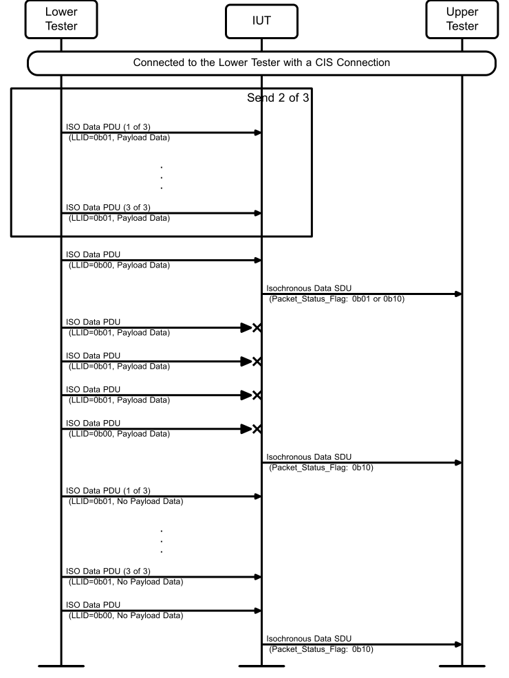

**Figure 4.10: Receive an Unsuccessful Large SDU, CIS MSC**

If TSPX_max_cis_nse is less than 4 or TSPX_max_cis_bn is less than 4, go to the Inconclusive verdict.
The rounds in Table 4.15 are performed in any order in consecutive isochronous events. In each round:
1. The Lower Tester sends the IUT the PDUs listed in Table 4.15. 2. The IUT sends the Upper Tester an ISO Data packet with Packet_Status_Flag=0b01 or
Packet_Status_Flag=0b10. If Packet_Status_Flag=0b10, then PB_Flag=0b10, ISO_SDU_Length=0, and there is no data.

|  | Round |  |  | PDUs sent |  |
| --- | --- | --- | --- | --- | --- |
| 1 |  |  | 4 PDUs with LLID=0b01 and no data |  |  |
| 2 |  |  | 4 PDUs with LLID=0b01 and data |  |  |
| 3 |  |  | 3 PDUs with LLID=0b01 and data, then 1 PDU with LLID=0b00 and data; one of the first three PDUs has a CRC error |  |  |
| 4 |  |  | 2 PDUs with LLID=0b01 and data, then 2 PDUs with LLID=0b00 and data |  |  |
| 5 |  |  | 2 PDUs with LLID=0b01 and no data, then 1 PDU with LLID=0b00 and data, then 1 PDU with LLID=0b01 and data |  |  |
| 6 |  |  | 2 PDUs with LLID=0b01 and no data, then 1 PDU with LLID=0b00 and data, then 1 PDU with LLID=0b10 and no data |  |  |
| 7 |  |  | 2 PDUs with LLID=0b01 and no data, then 1 PDU with LLID=0b10 and data, then 1 PDU with LLID=0b00 and no data |  |  |
| 8 |  |  | 2 PDUs with LLID=0b01 and data, then 1 PDU with LLID=0b00 and data; one of the four PDUs is omitted to simulate losing one PDU |  |  |
| 9 |  |  | 1 PDU with LLID=0b00 and data, then 3 PDUs with LLID=0b01, at least one of which has data |  |  |
| 10 |  |  | No PDUs |  |  |

Table 4.15: Receive an Unsuccessful Large SDU, CIS rounds
• Expected Outcome
Pass verdict
In Step 2, the IUT sends an ISO Data packet with Packet_Status_Flag=0b01 or Packet_Status_Flag=0b10. If Packet_Status_Flag=0b10, then PB_Flag=0b10, ISO_SDU_Length=0, and there is no data.
Inconclusive verdict
TSPX_max_cis_nse is less than 4.
TSPX_max_cis_bn is less than 4.

#### 4.3.12 Simultaneous Sending and Receiving SDUs, CIS • Test Purpose

Verify that the IUT can simultaneously send and receive SDUs with the Lower Tester.
• Reference
[3] 4.6.27
[4] 2.1, 2.2
• Initial Condition
- The IUT acts in the role as specified in Table 4.16.
- The CIS has been created.
- In the LE Set CIG Parameters Test Command, the NSE, BN_P_To_C, BN_C_To_P, FT_C_To_P, FT_P_To_C, and Framing parameters are set as specified in Table 4.16.
- TSPX_max_cis_nse is the maximum supported NSE as defined in the IXIT [8] entry.
- TSPX_max_cis_ft is the maximum supported FT as defined in the IXIT [8] entry.
• Test Case Configuration

| Test Case | Role | NSE | Framing | P To C _ _ |  |  |  | C To P _ _ |  |  |  |  |
| --- | --- | --- | --- | --- | --- | --- | --- | --- | --- | --- | --- | --- |
|  |  |  |  | BN | FT |  |  | BN |  |  | FT |  |
| IAL/CIS/UNF/CEN/BV-21-C | Central | 2 (see Note 1 | ) Unframed (0) | 1 | 1 |  | 1 |  |  | 1 |  |  |
| IAL/CIS/UNF/PER/BV-21-C | Peripheral | 2 (see Note 1 | ) Unframed (0) | 1 | 1 |  | 1 |  |  | 1 |  |  |
| IAL/CIS/UNF/CEN/BV-24-C | Central | 3 | Unframed (0) | 1 | 2 |  | 2 |  |  | 3 |  |  |
| IAL/CIS/UNF/PER/BV-24-C | Peripheral | 3 | Unframed (0) | 1 | 2 |  | 2 |  |  | 3 |  |  |
| IAL/CIS/FRA/CEN/BV-22-C | Central | 5 | Framed (1) | 1 | 2 |  | 3 |  |  | 3 |  |  |
| IAL/CIS/FRA/PER/BV-22-C | Peripheral | 5 | Framed (1) | 1 | 2 |  | 3 |  |  | 3 |  |  |

Table 4.16: Simultaneous Sending and Receiving SDUs, CIS test cases
Note 1: If TSPX_max_cis_nse is 1, then an NSE of 1 is used.
• Test Procedure

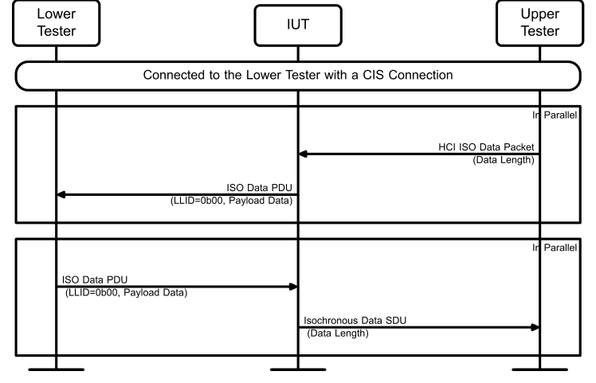

**Figure 4.11: Simultaneous Sending and Receiving SDUs, CIS MSC**

If the specified value of NSE is larger than TSPX_max_cis_nse (does not apply if Note 1 in Table 4.16 is applicable), or the specified value of BN in either or both directions exceeds TSPX_max_cis_bn, or the specified value of FT in either or both directions exceeds TSPX_max_cis_ft, then refer to the Inconclusive verdict.
1. The Upper Tester sends HCI ISO Data packets to the IUT. 2. The IUT sends ISO Data PDUs to the Lower Tester. 3. At the same time, the Lower Tester sends ISO Data PDUs to the IUT. 4. The IUT sends Isochronous Data SDUs to the Upper Tester.
• Expected Outcome
Pass Verdict
The IUT sends ISO Data PDUs to the Lower Tester with the data received in Step 1 and sends Isochronous Data SDUs to the Upper Tester with the data received in Step 3.
Inconclusive verdict
The specified value of NSE is larger than TSPX_max_cis_nse. This does not apply if Note 1 in Table 4.16 is applicable.
The specified value of BN in either or both directions exceeds TSPX_max_cis_bn.
The specified value of FT in either or both directions exceeds TSPX_max_cis_ft.

#### 4.3.13 Sending and Receiving Unframed Empty PDUs with LLID=0b01, CIS • Test Purpose

Test that the IUT can send and receive unframed empty PDUs with LLID = 0b01 when the number of required PDUs to transmit an SDU is less than BN×(SDU_Interval÷ISO_Interval) fragment PDUs.
• Reference
[3] 4.6.27
[4] 2.1
• Initial Condition
- TSPX_max_cis_nse is the maximum supported NSE as defined in the IXIT [8] entry.
- TSPX_max_cis_bn is the maximum supported BN as defined in the IXIT [8] entry.
- Connected in the relevant role per Table 4.18 as defined in the following initial states:
- State: Connected Isochronous Stream (values as specified in Table 4.17)

|  | State Variable |  |  | Value(s) |  |
| --- | --- | --- | --- | --- | --- |
| sdu int C To P _ _ _ _ |  |  | 0x186A0 (100 ms) |  |  |
| sdu int P To C _ _ _ _ |  |  | 0x186A0 (100 ms) |  |  |
| ft C To P _ _ _ |  |  | 1 |  |  |
| ft P To C _ _ _ |  |  | 1 |  |  |
| iso int _ |  |  | 0x50 (100 ms) |  |  |
| packing |  |  | Sequential (0x00) |  |  |
| framing |  |  | Unframed (0x00) |  |  |
| cis cnt _ |  |  | 1 |  |  |
| nse[] |  |  | per Table 4.18 |  |  |
| mx sdu C To P [] _ _ _ _ |  |  | 128 |  |  |
| mx sdu P To C [] _ _ _ _ |  |  | 128 |  |  |
| mx pdu C To P [] _ _ _ _ |  |  | 128 |  |  |
| mx pdu P To C [] _ _ _ _ |  |  | 128 |  |  |
| phy C To P [] _ _ _ |  |  | 0x01 |  |  |
| phy P To C [] _ _ _ |  |  | 0x01 |  |  |

|  | State Variable |  |  | Value(s) |  |
| --- | --- | --- | --- | --- | --- |
| bn C To P [] _ _ _ |  |  | per BN value specified in Table 4.18 |  |  |
| bn P To C [] _ _ _ |  |  | per BN value specified in Table 4.18 |  |  |

Table 4.17: State Variable Values
• Test Case Configuration

| Test Case | Role | BN |  | NSE |  |
| --- | --- | --- | --- | --- | --- |
|  |  |  |  | (see Note 1) |  |
| IAL/CIS/UNF/CEN/BV-45-C | Central | 0x04 | 0x08 |  |  |
| IAL/CIS/UNF/PER/BV-45-C | Peripheral | 0x04 | 0x08 |  |  |
| IAL/CIS/UNF/PER/BV-46-C | Peripheral | 0x06 | 0x0C |  |  |

Table 4.18: Sending and Receiving Unframed Empty PDUs with LLID=0b01, CIS test cases
Note 1: If TSPX_max_cis_nse is less than the specified value of NSE, then NSE is
TSPX_max_cis_nse. If the resulting value of NSE is less than the specified value of BN, then refer to the Inconclusive verdict.
• Test Procedure

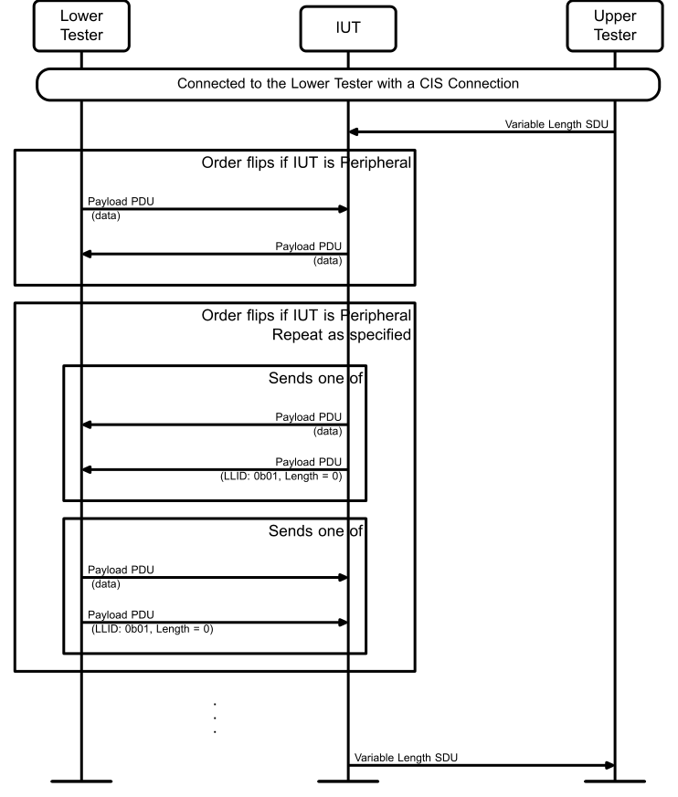

**Figure 4.12: Sending and Receiving Unframed Empty PDUs with LLID=0b01, CIS MSC**

If TSPX_max_cis_nse is less than the value of BN specified in Table 4.18 or TSPX_max_cis_bn is less than the value of BN specified in Table 4.18, then refer to the Inconclusive verdict.
1. The Upper Tester submits an SDU at its SDU interval of variable length, ranging from 4 to 128
octets. Note that the Test Command Generated Isochronous SDUs Optional Test Steps, ALT 3, VARIABLE LENGTH PAYLOADS in [9] Section 4.1.6.7.3 may be used for this purpose.
Steps 2 and 3 describe an exchange of data between the Central and Peripheral during a CIS event.
2. The Lower Tester receives PDUs from the IUT. When the required number of PDUs to transmit
the SDU is less than BN PDUs, the remainder of BN PDUs are empty PDUs with LLID=0b01. 3. The Lower Tester sends PDUs based on an SDU of variable length, ranging from 4 to 128 octets.
When the required number of PDUs to transmit the SDU is less than BN PDUs, the remainder of BN PDUs are empty PDUs with LLID=0b01. 4. The IUT sends the variable length SDUs from the Lower Tester to the Upper Tester. 5. Repeat Steps 1–4 a minimum of 32 times.
• Expected Outcome
Pass verdict
The IUT sends empty PDUs with LLID=0b01 as required.
The IUT receives at least 32 variable length SDUs from the Lower Tester.
Inconclusive verdict
TSPX_max_cis_nse is less than the value of BN specified in Table 4.18.
TSPX_max_cis_bn is less than the value of BN specified in Table 4.18.

#### 4.3.14 SDU Reporting, CIS, Unframed PDU • Test Purpose

Verify that the IUT reports an SDU as “data with possible errors” or discards and reports an SDU as “lost data” in a Connected Isochronous Stream, Unframed.
• Reference
[3] 4.6.27
[4] 2.1
[11] 4
• Initial Condition
- The IUT acts in the role as specified in Table 4.19.
- The CIS has been created.
- TSPX_max_cis_nse is the maximum supported NSE as defined in the IXIT [8] entry.
- TSPX_max_cis_bn is the maximum supported BN as defined in the IXIT [8] entry.
- TSPX_max_cis_ft is the maximum supported FT as defined in the IXIT [8] entry.
- In the LE Set CIG Parameters Test Command, the NSE, BN_P_To_C, BN_C_To_P, FT_C_To_P, and FT_P_To_C values are set as specified in Table 4.19.
• Test Case Configuration

| Test Case | Role | NSE |  | P To C _ _ |  |  |  |  |  |  |  |  |  |  |  | C To P _ _ |  |  |  |  |  |  |  |  |  |  |
| --- | --- | --- | --- | --- | --- | --- | --- | --- | --- | --- | --- | --- | --- | --- | --- | --- | --- | --- | --- | --- | --- | --- | --- | --- | --- | --- |
|  |  |  |  | BN |  |  | FT |  |  | Max SDU _ |  |  | Max PDU _ |  |  | BN |  |  | FT |  |  | Max SDU _ |  |  | Max PDU _ |  |
| IAL/CIS/UNF/CEN/BI-04-C | Central | 4 | 4 |  |  | 1 |  |  | 128 (0x0080) |  |  | 32 (0x0020) |  |  | 0 |  |  | 1 |  |  | 0 |  |  | 0 |  |  |
| IAL/CIS/UNF/PER/BI-04-C | Peripheral | 4 | 0 |  |  | 1 |  |  | 0 |  |  | 0 |  |  | 4 |  |  | 1 |  |  | 128 (0x0080) |  |  | 32 (0x0020) |  |  |

Table 4.19: SDU Reporting, CIS, Unframed PDU test cases
• Test Procedure

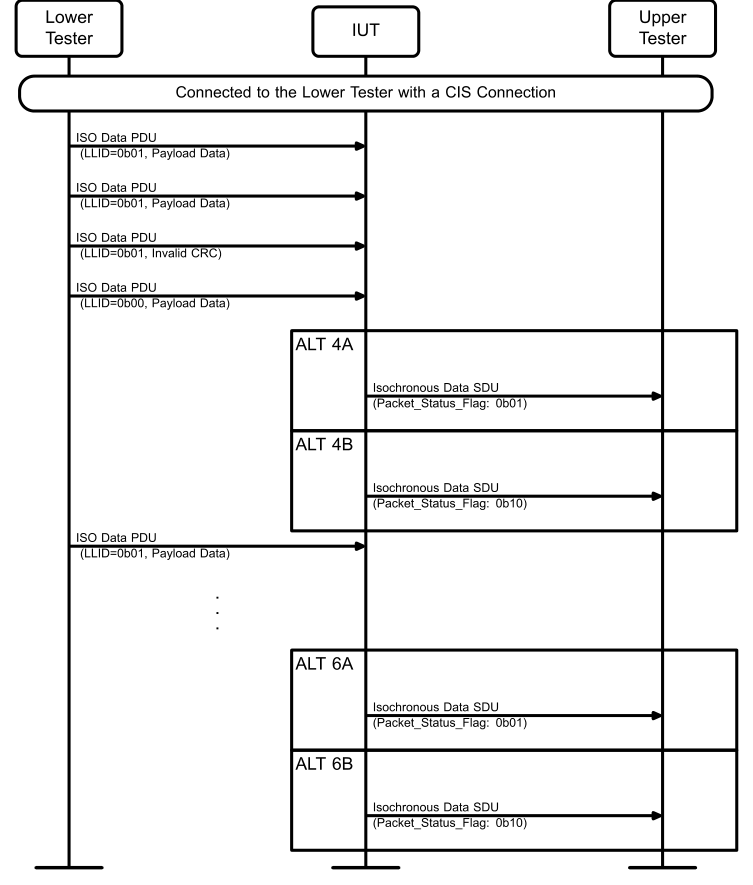

**Figure 4.13: SDU Reporting, CIS, Unframed PDU MSC**

1. The Lower Tester sends the IUT 2 unframed Start/Continuation ISO Data PDUs to the IUT with
the LLID=0b01. 2. The Lower Tester sends the IUT 1 unframed Start/Continuation ISO Data PDU with an invalid
CRC. 3. The Lower Tester sends the IUT the last unframed ISO Data PDU to the IUT with the LLID=0b00
and with the remaining Payload Data. 4. Perform either alternative 4A or 4B depending on how the IUT reports the SDU:
Alternative 4A (The IUT reports the SDU as 0b01 “data with possible errors”):
4A.1 The IUT sends an ISO Data packet with data to the Upper Tester with the Packet_Status_Flag set to 0b01 “data with possible errors”. Alternative 4B (The IUT reports the SDU as 0b10 “lost data”):
4B.1 The IUT sends an ISO Data packet to the Upper Tester with the Packet_Status_Flag set to 0b10 “lost data” and no data. 5. The Lower Tester sends unframed ISO Data PDUs to the IUT with all LLID = 0b01.
Alternative 6A (The IUT reports the SDU as 0b01 “data with possible errors”):
6A.1 The IUT sends an ISO Data packet with the truncated SDU data to the Upper Tester with the Packet_Status_Flag set to 0b01 “data with possible errors”. Alternative 6B (The IUT reports the SDU as 0b10 “lost data”):
6B.1 The IUT sends an ISO Data packet to the Upper Tester with the Packet_Status_Flag set to 0b10 “lost data” with no data.
• Expected Outcome
Pass verdict
In Step 4A.1, the IUT sends an ISO Data packet with data to the Upper Tester with the Packet_Status_Flag set to 0b01 “data with possible errors”.
In Step 4B.1, the IUT sends an SDU to the Upper Tester with the Packet_Status_Flag set to 0b10 “lost data” and no data.
In Step 6A.1, the IUT sends an ISO Data packet with the truncated SDU data to the Upper Tester with the Packet_Status_Flag set to 0b01 “data with possible errors”.
In Step 6B.1, the IUT sends an ISO Data packet to the Upper Tester with the Packet_Status_Flag set to 0b10 “lost data” with no data.
Inconclusive verdict
The values of NSE, BN, or FT specified in Table 4.19 exceed the corresponding values of TSPX_max_cis_nse, TSPX_max_cis_bn, or TSPX_max_cis_ft, respectively.

#### 4.3.15 SDU Reporting, CIS, Unframed PDU, BN = 1, NSE = 1 • Test Purpose

Verify that the IUT reports an SDU as “data with possible errors” or discards and reports an SDU as “lost data” in a Connected Isochronous Stream with BN = 1 and NSE = 1, Unframed.
• Reference
[3] 4.6.27
[4] 2.1
[11] 4
• Initial Condition
- The IUT acts in the role specified in Table 4.20.
- The CIS has been created.
- In the LE Set CIG Parameters Test Command, the NSE, BN_P_To_C, BN_C_To_P, FT_C_To_P, and FT_P_To_C values are set as specified in Table 4.20.
• Test Case Configuration

| Test Case | Role | NSE |  | P To C _ _ |  |  |  |  |  |  |  |  |  |  |  | C To P _ _ |  |  |  |  |  |  |  |  |  |  |
| --- | --- | --- | --- | --- | --- | --- | --- | --- | --- | --- | --- | --- | --- | --- | --- | --- | --- | --- | --- | --- | --- | --- | --- | --- | --- | --- |
|  |  |  |  | BN |  |  | FT |  |  | Max SDU _ |  |  | Max PDU _ |  |  | BN |  |  | FT |  |  | Max SDU _ |  |  | Max PDU _ |  |
| IAL/CIS/UNF/CEN/BI-05-C | Central | 1 | 1 |  |  | 1 |  |  | 32 (0x0020) |  |  | 32 (0x0020) |  |  | 0 |  |  | 1 |  |  | 0 |  |  | 0 |  |  |
| IAL/CIS/UNF/PER/BI-05-C | Peripheral | 1 | 0 |  |  | 1 |  |  | 0 |  |  | 0 |  |  | 1 |  |  | 1 |  |  | 32 (0x0020) |  |  | 32 (0x0020) |  |  |

Table 4.20: SDU Reporting, CIS, Unframed PDU, BN = 1, NSE = 1 test cases
• Test Procedure

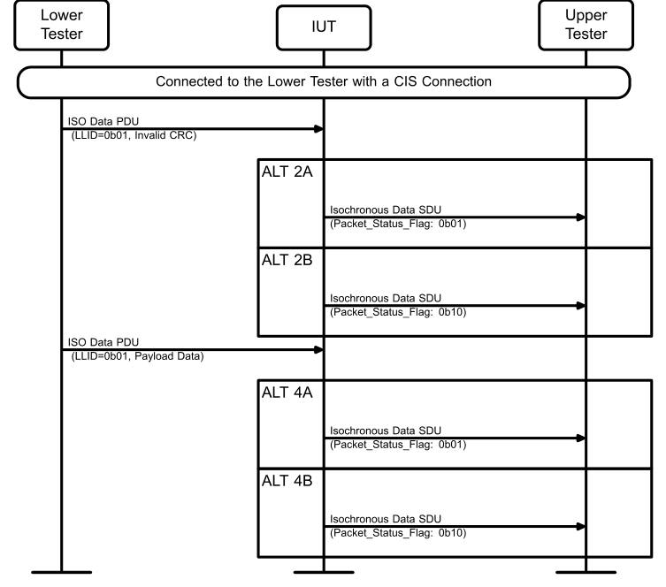

**Figure 4.14: SDU Reporting, CIS, Unframed PDU, BN = 1, NSE = 1 MSC**

1. The Lower Tester sends the IUT 1 unframed Start/Continuation ISO Data PDU with LLID=0b00
and an invalid CRC. 2. Perform either alternative 2A or 2B depending on how the IUT reports the SDU:
Alternative 2A (The IUT reports the SDU as 0b01 “data with possible errors”):
2A.1 The IUT sends an HCI ISO Data packet with data to the Upper Tester with the Packet_Status_Flag set to 0b01 “data with possible errors”. Alternative 2B (The IUT reports the SDU as 0b10 “lost data”):
2B.1 The IUT sends an HCI ISO Data packet to the Upper Tester with the Packet_Status_Flag set to 0b10 “lost data” and no data. 3. The Lower Tester sends unframed ISO Data PDUs to the IUT with LLID=0b01. 4. Perform either alternative 4A or 4B depending on how the IUT reports the SDU:
Alternative 4A (The IUT reports the SDU as 0b01 “data with possible errors”):
4A.1 The IUT sends an HCI ISO Data packet to the Upper Tester with the truncated SDU data with the Packet_Status_Flag set to 0b01 “data with possible errors”. Alternative 4B (The IUT reports the SDU as 0b10 “lost data”):
4B.1 The IUT sends an SDU to the Upper Tester with the Packet_Status_Flag set to 0b10 “lost data” with no data.
• Expected Outcome
Pass verdict
In Step 2A.1, the IUT sends an HCI ISO Data packet with data to the Upper Tester with the Packet_Status_Flag set to 0b01 “data with possible errors”.
In Step 2B.1, the IUT sends an HCI ISO Data packet to the Upper Tester with the Packet_Status_Flag set to 0b10 “lost data” and no data.
In Step 4A.1, the IUT sends an HCI ISO Data packet with the truncated SDU data to the Upper Tester with the Packet_Status_Flag set to 0b01 “data with possible errors”.
In Step 4B.1, the IUT sends an HCI ISO Data packet to the Upper Tester with the Packet_Status_Flag set to 0b10 “lost data” with no data.

#### 4.3.16 SDU Reporting, CIS, Framed PDU • Test Purpose

Verify that the IUT reports an SDU as “data with possible errors” or discards and reports an SDU as “lost data” in a Connected Isochronous Stream, Framed.
• Reference
[3] 4.6.27
[4] 2.2
[11] 4
• Initial Condition
- The CIS has been created.
- TSPX_max_cis_nse is the maximum supported NSE as defined in the IXIT [8] entry.
- TSPX_max_cis_bn is the maximum supported BN as defined in the IXIT [8] entry.
- In the LE Set CIG Parameters Test Command, the NSE, BN_P_To_C, BN_C_To_P, FT_C_To_P, and FT_P_To_C values are set as specified in Table 4.21.
• Test Case Configuration

| Test Case | Role | NSE |  | P To C _ _ |  |  |  |  |  |  |  |  |  |  |  | C To P _ _ |  |  |  |  |  |  |  |  |  |  |
| --- | --- | --- | --- | --- | --- | --- | --- | --- | --- | --- | --- | --- | --- | --- | --- | --- | --- | --- | --- | --- | --- | --- | --- | --- | --- | --- |
|  |  |  |  | BN |  |  | FT |  |  | Max SDU _ |  |  | Max PDU _ |  |  | BN |  |  | FT |  |  | Max SDU _ |  |  | Max PDU _ |  |
| IAL/CIS/FRA/CEN/BI-01-C | Central | 4 | 4 |  |  | 1 |  |  | 108 (0x006C) |  |  | 32 (0x0020) |  |  | 0 |  |  | 1 |  |  | 0 |  |  | 0 |  |  |
| IAL/CIS/FRA/PER/BI-01-C | Peripheral | 4 | 0 |  |  | 1 |  |  | 0 |  |  | 0 |  |  | 4 |  |  | 1 |  |  | 108 (0x006C) |  |  | 32 (0x0020) |  |  |

Table 4.21: SDU Reporting, CIS, Framed PDU test cases
• Test Procedure

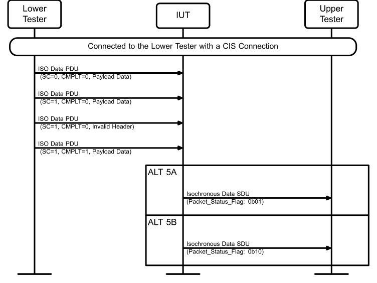

**Figure 4.15: SDU Reporting, CIS, Framed PDU MSC**

1. The Lower Tester sends 1 framed ISO Data PDU to the IUT with SC set to 0 and CMPLT set to 0. 2. The Lower Tester sends 1 framed ISO Data PDU to the IUT with SC set to 1 and CMPLT set to 0. 3. The Lower Tester sends 1 framed ISO Data PDU to the IUT with SC set to 1, CMPLT set to 0,
and the Length field in the Segmentation Header set to 255. 4. The Lower Tester sends the last framed ISO Data PDU to the IUT with SC set to 1 and CMPLT
set to 1 with the remaining Payload Data. 5. Perform either alternative 5A or 5B depending on how the IUT reports the SDU:
Alternative 5A (The IUT reports the SDU as 0b01 “data with possible errors”):
5A.1 The IUT sends an HCI ISO Data packet with data to the Upper Tester with the Packet_Status_Flag set to 0b01 “data with possible errors”. Alternative 5B (The IUT reports the SDU as 0b10 “lost data”):
5B.1 The IUT sends an HCI ISO Data packet to the Upper Tester with the Packet_Status_Flag set to 0b10 “lost data” and no data.
• Expected Outcome
Pass verdict
In Step 5A.1, the IUT sends an HCI ISO Data packet with data to the Upper Tester with the Packet_Status_Flag set to 0b01 “data with possible errors”.
In Step 5B.1, the IUT sends an HCI ISO Data packet to the Upper Tester with the Packet_Status_Flag set to 0b10 “lost data” and no data.
Inconclusive verdict
The values of NSE, BN, or FT specified in Table 4.21 exceed the corresponding values of TSPX_max_cis_nse, TSPX_max_cis_bn, or TSPX_max_cis_ft, respectively.

#### 4.3.17 SDU Reporting, CIS, Framed PDU, BN = 1, NSE = 1 • Test Purpose

Verify that the IUT reports an SDU as “data with possible errors” or discards and reports an SDU as “lost data” in a Connected Isochronous Stream with BN = 1 and NSE = 1, Framed.
• Reference
[3] 4.6.27
[4] 2.2
[11] 4
• Initial Condition
- The CIS has been created.
- TSPX_max_cis_nse is the maximum supported NSE as defined in the IXIT [8] entry.
- TSPX_max_cis_bn is the maximum supported BN as defined in the IXIT [8] entry.
- In the LE Set CIG Parameters Test Command, the NSE, BN_P_To_C, BN_C_To_P, FT_C_To_P, and FT_P_To_C values are set as specified in Table 4.22.
• Test Case Configuration

| Test Case | Role | NSE |  | P To C _ _ |  |  |  |  |  |  |  |  |  |  |  | C To P _ _ |  |  |  |  |  |  |  |  |  |  |
| --- | --- | --- | --- | --- | --- | --- | --- | --- | --- | --- | --- | --- | --- | --- | --- | --- | --- | --- | --- | --- | --- | --- | --- | --- | --- | --- |
|  |  |  |  | BN |  |  | FT |  |  | Max SDU _ |  |  | Max PDU _ |  |  | BN |  |  | FT |  |  | Max SDU _ |  |  | Max PDU _ |  |
| IAL/CIS/FRA/CEN/BI-02-C | Central | 1 | 1 |  |  | 1 |  |  | 32 (0x0020) |  |  | 45 (0x002D) |  |  | 0 |  |  | 1 |  |  | 0 |  |  | 0 |  |  |
| IAL/CIS/FRA/PER/BI-02-C | Peripheral | 1 | 0 |  |  | 1 |  |  | 0 |  |  | 0 |  |  | 1 |  |  | 1 |  |  | 32 (0x0020) |  |  | 40 (0x0028) |  |  |

Table 4.22: SDU Reporting, CIS, Framed PDU, BN = 1, NSE = 1 test cases
• Test Procedure

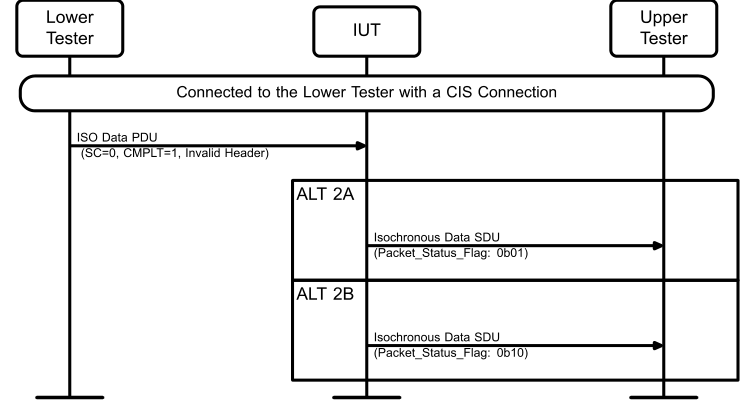

**Figure 4.16: SDU Reporting, CIS, Framed PDU, BN = 1, NSE = 1 MSC**

1. The Lower Tester sends 1 framed ISO Data PDU to the IUT with SC set to 0, CMPLT set to 1,
and the Length field in the Segmentation Header set to 255. 2. Perform either alternative 2A or 2B depending on how the IUT reports the SDU:
Alternative 2A (The IUT reports the SDU as 0b01 “data with possible errors”):
2A.1 The IUT sends an HCI ISO Data packet with data to the Upper Tester with the Packet_Status_Flag set to 0b01 “data with possible errors”. Alternative 2B (The IUT reports the SDU as 0b10 “lost data”):
2B.1 The IUT sends an HCI ISO Data packet to the Upper Tester with the Packet_Status_Flag set to 0b10 “lost data” and no data.
• Expected Outcome
Pass verdict
In Step 2A.1, the IUT sends an HCI ISO Data packet with data to the Upper Tester with the Packet_Status_Flag set to 0b01 “data with possible errors”.
In Step 2B.1, the IUT sends an HCI ISO Data packet to the Upper Tester with the Packet_Status_Flag set to 0b10 “lost data” and no data.

#### 4.3.18 Receive an SDU Larger than a PDU, CIS, Unframed • Test Purpose

Verify that the IUT can receive an SDU with length > the Isochronous PDU length, when two PDUs are required to transport an SDU.
• Reference
[3] 4.6.27
[4] 2.1, 2.2
• Initial Condition
- The IUT acts in the role specified in Table 4.23.
- The CIS has been created.
- In the LE Set CIG Parameters test command, the NSE, BN_P_To_C, BN_C_To_P, FT_C_To_P, FT_P_To_C, SDU_Interval, ISO_Interval, and Framing parameters are set as specified in Table 4.23.
- If the corresponding BN is not 0, then Max_PDU is set to 251 and Max_SDU is set to Max_PDU + 1.
- If the corresponding BN is 0, then Max_SDU is set to 0 and Max_PDU is set to 0.
• Test Case Configuration

| Test Case | Test Case | Role | NSE Fra | ming | P | To C _ _ |  |  |  | C To P _ _ |  |  |  |  | SDU _ Interval | ISO _ Interval |
| --- | --- | --- | --- | --- | --- | --- | --- | --- | --- | --- | --- | --- | --- | --- | --- | --- |
|  |  |  |  |  | B | N | FT |  |  | BN |  | F | T |  |  |  |
| IAL/CIS/UNF/CEN/BV-49-C |  | Central | 2 Unf | ramed (0) | 2 |  | 1 |  | 0 |  |  | N/A |  |  | 25 ms (0x61A8) | 25 ms (0x14) |
| IAL/CIS/UNF/PER/BV-50-C |  | Peripheral | 2 Unf | ramed (0) | 0 |  | N/A |  | 2 |  |  | 1 |  |  | 25 ms (0x61A8) | 25 ms (0x14) |

Table 4.23: Receive an SDU Larger than a PDU, CIS, Unframed test cases
• Test Procedure

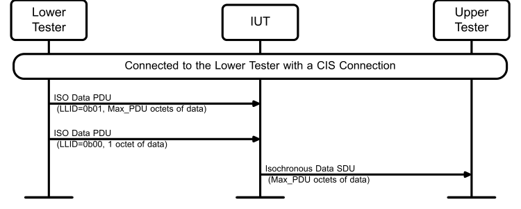

**Figure 4.17: Receive an SDU Larger than a PDU, CIS, Unframed MSC**

1. The Lower Tester sends the IUT an ISO Data PDU with the LLID=0b01 and Max_PDU octets of
data. 2. The Lower Tester sends the IUT an ISO Data PDU with the LLID=0b00 and 1 octet of data. 3. The IUT sends a Max_SDU octet ISO Data packet to the Upper Tester.
• Expected Outcome
Pass verdict
The IUT sends a Max_SDU octet SDU to the Upper Tester.

#### 4.3.19 Reporting an Unsuccessful Large SDU, Framed CIS • Test Purpose

Verify that the IUT sends an ISO Data packet to the Upper Tester with a Packet_Status_Flag error value of 0b10 when some PDU packets in an SDU are not received.
• Reference
[12] 2.2
• Initial Condition
- The IUT acts in the role specified in Table 4.24.
- An unencrypted CIG has been created with NSE = 2, CIS_Count = 1, Framing = 0x01, FT_C_To_P and FT_P_To_C set to 0x01, and BN_P_To_C and BN_C_To_P set as specified in Table 4.24.
- Max_SDU_C_To_P and Max_SDU_P_To_C are set to 16 when BN>0 and 0 when BN=0.
- Max_PDU_C_To_P and Max_PDU_P_To_C are set to 16 when BN>0 and 0 when BN=0.
- The SDU interval and ISO interval are set to the same values.
• Test Case Configuration

|  | Test Case |  |  | Role |  |  | BN P To C _ _ _ |  |  | BN C To P _ _ _ |  |
| --- | --- | --- | --- | --- | --- | --- | --- | --- | --- | --- | --- |
| IAL/CIS/FRA/CEN/BI-03-C |  |  | Central |  |  | 0x02 |  |  | 0x00 |  |  |
| IAL/CIS/FRA/PER/BI-03-C |  |  | Peripheral |  |  | 0x00 |  |  | 0x02 |  |  |

Table 4.24: Reporting an Unsuccessful Large SDU, Framed CIS test cases
• Test Procedure

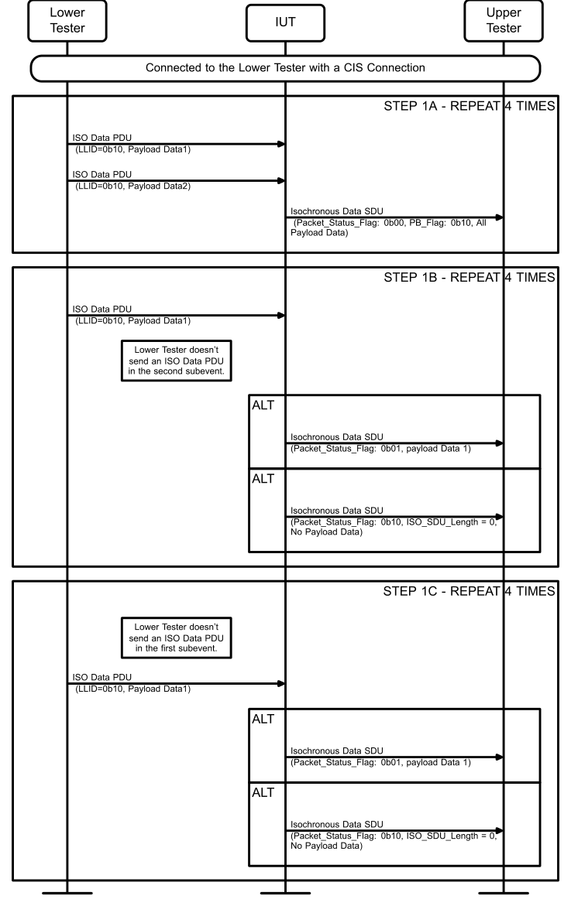

**Figure 4.18: Report an Unsuccessful Large SDU, Framed CIS MSC**

Perform Step 1A four times, Step 1B four times, and Step 1C four times, in 12 consecutive isochronous events. The order of the 12 steps is selected at random.
1A. The Lower Tester sends two ISO Data PDUs to the IUT with the LLID = 0b10 in the same isochronous interval. The IUT sends the Upper Tester an ISO Data packet with Packet_Status_Flag = 0b00 and PB_Flag = 0b10 and containing all the data.
1B. The Lower Tester sends an ISO Data PDU with the LLID = 0b10 in the first sub-event of an ISO interval and nothing in the second sub-event. The IUT sends the Upper Tester an ISO Data packet either with Packet_Status_Flag = 0b01 and containing the data, or with Packet_Status_Flag = 0b10 and ISO_SDU_Length = 0 and with no data.
1C. The Lower Tester sends nothing in the first sub-event of an ISO interval and an ISO Data PDU with the LLID = 0b10 in the second sub-event. The IUT sends the Upper Tester an ISO Data packet either with Packet_Status_Flag = 0b01 and containing the data, or with Packet_Status_Flag = 0b10 and ISO_SDU_Length = 0 and with no data.
• Expected Outcome
Pass verdict
In at least 10 of the 12 events, the IUT sends an ISO Data packet to the Upper Tester with the proper Packet_Status_Flag, ISO_SDU_Length, and ISO Data.

#### 4.3.20 Reporting a missing or damaged SDU, Framed CIS • Test Purpose

Verify that the IUT sends an ISO Data packet to the Upper Tester with a Packet_Status_Flag error value of 0b10 when all PDU packets in an SDU are not received and the SDU is discarded.
• Reference
[12] 2.2
• Initial Condition
- The IUT acts in the role specified in Table 4.25.
- An unencrypted CIG has been created with NSE = 1, CIS_Count = 1, Framing = 0x01, FT_C_To_P and FT_P_To_C set to 0x01, and BN_P_To_C and BN_C_To_P set as specified in Table 4.25.
- Max_PDU_C_To_P and Max_PDU_P_To_C are set to Max_SDU + 13 when BN>0 and 0 when BN=0.
- The SDU interval and ISO interval are set to the same values.
• Test Case Configuration

|  | Test Case |  |  | Role |  |  | BN P To C _ _ _ |  |  | BN C To P _ _ _ |  |
| --- | --- | --- | --- | --- | --- | --- | --- | --- | --- | --- | --- |
| IAL/CIS/FRA/CEN/BI-04-C |  |  | Central |  |  | 0x01 |  |  | 0x00 |  |  |
| IAL/CIS/FRA/PER/BI-04-C |  |  | Peripheral |  |  | 0x00 |  |  | 0x01 |  |  |

Table 4.25: Reporting a missing or damaged SDU, Framed CIS test cases
• Test Procedure

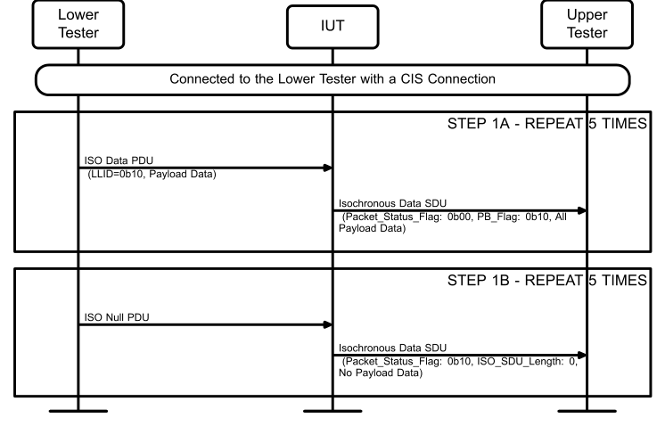

**Figure 4.19: Reporting a missing or damaged SDU, Framed CIS MSC**

Perform Step 1A five times and Step 1B five times, in 10 consecutive isochronous events. The order of the 10 steps is selected at random.
1A. The Lower Tester sends an ISO Data PDU to the IUT with the LLID = 0b10. The IUT sends the Upper Tester an ISO Data packet with Packet_Status_Flag = 0b00 and PB_Flag = 0b10 and containing all the data.
1B. The Lower Tester sends an ISO Null PDU. The IUT sends the Upper Tester an ISO Data packet with Packet_Status_Flag = 0b10 and ISO_SDU_Length = 0 and with no data.
• Expected Outcome
Pass verdict
In at least 9 of the 10 repeats, the IUT sends an ISO Data packet to the Upper Tester with the proper Packet_Status_Flag, ISO_SDU_Length, and ISO Data.
IAL/CIS/FRA/CEN/BV-58-C [Unsegmented Framed LL PDUs at 7.5 ms ISO Interval]
• Test Purpose
Verify that an IUT receiving ISO Data Packets at 10 ms SDU Intervals sends them as unsegmented framed LL PDUs across three of four 7.5 ms ISO Intervals.
• Reference
[13] 2
• Initial Condition
- An ACL connection has been established between the IUT and the Lower Tester with a valid Connection Handle.
- The IUT is in the Central role.
• Test Procedure

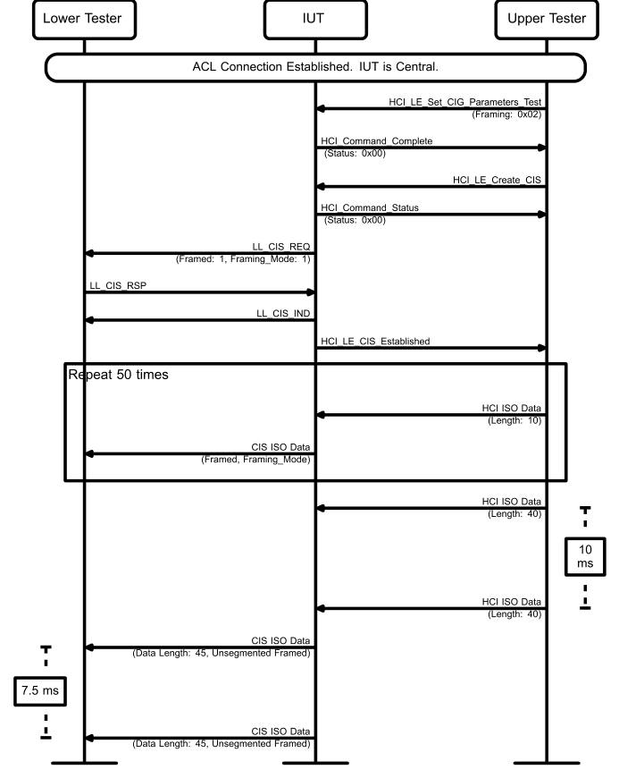

**Figure 4.20: Unsegmented Framed LL PDUs at 7.5 ms ISO Interval MSC**

1. The Upper Tester sends an HCI_LE_Set_CIG_Parameters_Test command to the IUT with
Framing set to 0x02 (Unsegmented Framed) and all other parameters set as default and receives a successful HCI_Command_Complete in response. 2. The Upper Tester sends an HCI_LE_Create_CIS command to create a single CIS and receives a
successful HCI_Command_Status in response. 3. The IUT sends an LL_CIS_REQ PDU to the Lower Tester with Framed set to 1 and
Framing_Mode set to 1. 4. The Lower Tester sends an LL_CIS_RSP PDU to the IUT. 5. The IUT sends an LL_CIS_IND PDU to the Lower Tester. 6. The IUT sends an HCI_LE_CIS_Established event to the Upper Tester. 7. The Upper Tester sends HCI ISO Data Packets to the IUT with the payload size set to 40 octets
and 40 octets of random data at an interval of 10 ms.
interval of 7.5 ms using the Unsegmented Framed mode. 9. Repeat Steps 7 and 8 for 50 Data PDUs.
• Expected Outcome
Pass verdict
In Step 8, the IUT sends ISO Data Packets 7.5 ms apart. On average, 75% of packets will contain 45 octets of data and the remainder will be empty.
The data octets received by the Lower Tester are the same as those sent by the Upper Tester, in the same order.

#### 4.3.21 Permitted Framing Mode Packets • Test Purpose

Verify that an IUT sends ISO Data Packets using permitted framing modes.
• Reference
[13] 2
• Initial Condition
- An ACL connection has been established between the IUT and the Lower Tester with a valid Connection Handle.
- The IUT acts in the role specified in Table 4.26.
• Test Case Configuration

|  | Test Case |  |  | Role |  |  | Framing (HCI and LL) |  |
| --- | --- | --- | --- | --- | --- | --- | --- | --- |
| IAL/CIS/FRA/CEN/BV-57-C |  |  | Central |  |  | Framed PDUs, Segmentable mode |  |  |
| IAL/CIS/FRA/CEN/BV-59-C |  |  | Central |  |  | Framed PDUs, Unsegmented mode |  |  |

Table 4.26: Permitted Framing Mode Packets test cases
• Test Procedure

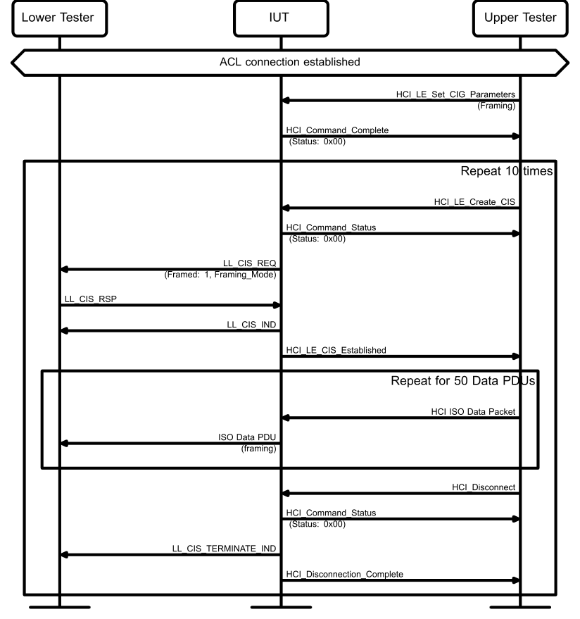

**Figure 4.21: Permitted Framing Mode Packets MSC**

1. The Upper Tester sends an HCI_LE_Set_CIG_Parameters command to the IUT with Framing set
as specified in Table 4.26 and all other parameters set as default and receives a successful HCI_Command_Complete in response. 2. The Upper Tester sends an HCI_LE_Create_CIS command to create a single CIS and receives a
successful HCI_Command_Status in response. 3. The IUT sends an LL_CIS_REQ PDU to the Lower Tester with Framed set to 1 and
Framing_Mode set to either 0 or 1. 4. The Lower Tester sends an LL_CIS_RSP PDU to the IUT. 5. The IUT sends an LL_CIS_IND PDU to the Lower Tester. 6. The IUT sends an HCI_LE_CIS_Established event to the Upper Tester. 7. The Upper Tester sends HCI ISO Data Packets to the IUT. 8. The IUT sends CIS ISO Data PDUs to the Lower Tester using the framing selection in Step 3. 9. Repeat Steps 7 and 8 for 50 Data PDUs.
HCI_Command_Status in response. 11. The IUT sends an LL_CIS_TERMINATE_IND PDU to the Lower Tester. 12. The IUT sends an HCI_Disconnection_Complete event to the Upper Tester. 13. Repeat Steps 2–12 ten times.
• Expected Outcome
Pass verdict
In Step 3, the IUT selects one of the framing modes specified in Table 4.26.
In Step 8, the IUT sends ISO Data Packets using either Unsegmented Framed or Segmented Framed mode.
The data octets received by the Lower Tester are the same as those sent by the Upper Tester, in the same order.
Fail verdict
In Step 3, the IUT selects the unframed framing mode.
In Step 8, the ISO Data PDUs use the unframed mode.

### 4.4 BIS

Tests that the IUT behaves according to the Isochronous Adaptation Layer Specifications for Broadcast Isochronous Streams.

#### 4.4.1 Common Timing and Variables

##### 4.4.1.1 Timing Requirements

The timing of BIS tests in this section complies with the BIS timing requirements specified in [3] Section 4.10.1.2.
When using framed PDUs, the maximum allowed drift (MaxDrift) complies with the average timing of SDU delivery specified in [3] Section 2.2.

##### 4.4.1.2 Value of IRC

As pre-transmission is not employed in this Test Suite, IRC is calculated as NSE/BN unless explicitly defined in the test case.

#### 4.4.2 Broadcast Single SDU, BIS • Test Purpose

Verify that the IUT can send a Broadcast ISO PDU over a BIS with length ≤ the Isochronous PDU length.
• Reference
[3] 4.6.28
[4] 2.1, 2.2
• Initial Condition
- The IUT acts as an Isochronous Broadcaster.
- State: Isochronous Broadcasting, Test (single BIS, packing: 0x01 (Interleaved), other values as specified in Table 4.27; any otherwise unspecified values as specified in [9] Section 4.11.2, Common Parameters).
- TSPX_max_tx_nse is the maximum supported TX NSE as defined in the IXIT [8] entry.
- TSPX_max_tx_bn is the maximum supported TX BN as defined in the IXIT [8] entry.
- Max_SDU is set to 32. Max_PDU is set as specified in Table 4.27.
• Test Case Configuration

|  | Test Case |  |  | NSE |  |  | Framed |  |  | Framing Mode _ |  |  | Max PDU _ |  |  | LLID |  |  | BN |  |  | SDU Interval _ |  |  | ISO Interval _ |  |
| --- | --- | --- | --- | --- | --- | --- | --- | --- | --- | --- | --- | --- | --- | --- | --- | --- | --- | --- | --- | --- | --- | --- | --- | --- | --- | --- |
| IAL/BIS/UNF/BRD/BV-01-C |  |  | 2 (see Note 1) |  |  | 0 |  |  | 0 |  |  | 40 |  |  | 0b00 or 0b01 |  |  | 1 |  |  | 10 ms (0x2710) |  |  | 10 ms (0x08) |  |  |
| IAL/BIS/UNF/BRD/BV-02-C |  |  | 4 |  |  | 0 |  |  | 0 |  |  | 40 |  |  | 0b00 or 0b01 |  |  | 2 |  |  | 5 ms (0x1388) |  |  | 10 ms (0x08) |  |  |
| IAL/BIS/UNF/BRD/BV-03-C |  |  | 2 |  |  | 0 |  |  | 0 |  |  | 40 |  |  | 0b00 or 0b01 |  |  | 2 |  |  | 5 ms (0x1388) |  |  | 10 ms (0x08) |  |  |
| IAL/BIS/FRA/BRD/BV-06-C |  |  | 4 |  |  | 1 |  |  | 0 |  |  | 40 |  |  | 0b10 |  |  | 2 |  |  | 5 ms (0x1388) |  |  | 10 ms (0x08) |  |  |
| IAL/BIS/FRA/BRD/BV-08-C |  |  | 2 (see Note 1) |  |  | 1 |  |  | 0 |  |  | 40 |  |  | 0b10 |  |  | 1 |  |  | 10 ms (0x2710) |  |  | 10 ms (0x08) |  |  |
| IAL/BIS/FRA/BRD/BV-29-C |  |  | 6 |  |  | 1 |  |  | 1 |  |  | Max SDU + 5 _ |  |  | 0b10 |  |  | 3 |  |  | 5 ms (0x1388) |  |  | 10 ms (0x08) |  |  |

Table 4.27: Send Single SDU, BIS test cases
Note 1: If TSPX_max_tx_nse is 1, then an NSE of 1 and an IRC of 1 are used.
• Test Procedure

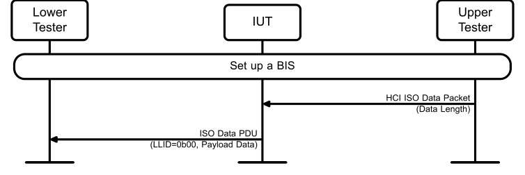

**Figure 4.22: Send Single SDU, BIS MSC**

If TSPX_max_tx_nse is less than the value of NSE specified in Table 4.27 (does not apply if Note 1 in Table 4.27 is applicable), or TSPX_max_tx_bn is less than the value of BN specified in Table 4.27, then refer to the Inconclusive verdict.
1. The Upper Tester sends an HCI ISO Data packet to the IUT with data length equal to the
Max_SDU size. 2. The IUT sends a Broadcast ISO Data PDU over the BIS with the LLID, Framed, and
Framing_Mode as specified in Table 4.27 and Payload Data identical to the data in Step 1.
• Expected Outcome
Pass verdict
In Step 2, the IUT sends a PDU with LLID set as specified in Table 4.27 and the same data in Step 1.
Inconclusive verdict
TSPX_max_tx_nse is less than the value of NSE specified in Table 4.27. This does not apply if Note 1 in Table 4.27 is applicable.
TSPX_max_tx_bn is less than the value of BN specified in Table 4.27.

#### 4.4.3 Broadcast Large SDU, BIS • Test Purpose

Verify that the IUT can send a Broadcast ISO PDU over a BIS with length > the Isochronous PDU length.
• Reference
[3] 4.6.28
[4] 2.1, 2.2
• Initial Condition
- The IUT acts as an Isochronous Broadcaster.
- State: Isochronous Broadcasting, Test (single BIS, packing: 0x01 (Interleaved), other values as specified in Table 4.28; any otherwise unspecified values as specified in [9] Section 4.11.2, Common Parameters).
- TSPX_max_tx_nse is the maximum supported TX NSE as defined in the IXIT [8] entry.
- TSPX_max_tx_bn is the maximum supported TX BN as defined in the IXIT [8] entry.
• Test Case Configuration

| Test Case |  | NSE | Fr | aming | BN | SDU Interval _ | ISO Interval _ |
| --- | --- | --- | --- | --- | --- | --- | --- |
|  |  | (see Note 1) |  |  |  |  |  |
| IAL/BIS/UNF/BRD/BV-09-C | 12 Un |  |  | framed (0) | 6 | 20 ms (0x4E20) | 40 ms (0x20) |
| IAL/BIS/UNF/BRD/BV-10-C | 6 Un |  |  | framed (0) | 3 | 20 ms (0x4E20) | 20 ms (0x10) |
| IAL/BIS/UNF/BRD/BV-11-C | 8 Un |  |  | framed (0) | 4 | 25 ms (0x61A8) | 25 ms (0x14) |
| IAL/BIS/FRA/BRD/BV-13-C | 10 Fr |  |  | amed (1) | 5 | 15 ms (0x3A98) | 30 ms (0x18) |
| IAL/BIS/FRA/BRD/BV-15-C | 6 Fr |  |  | amed (1) | 3 | 20 ms (0x4E20) | 20 ms (0x10) |

Table 4.28: Send Large SDU, BIS test cases
Note 1: If TSPX_max_tx_nse ≥ NSE, then NSE is the value specified in Table 4.28. If
TSPX_max_tx_nse < NSE and TSPX_max_tx_nse and TSPX_max_tx_bn are both ≥ the value of BN specified in Table 4.28, then NSE is the value of BN specified in Table 4.28 and IRC = 1. If neither of the previous conditions can be met, then refer to the Inconclusive verdict.
• Test Procedure

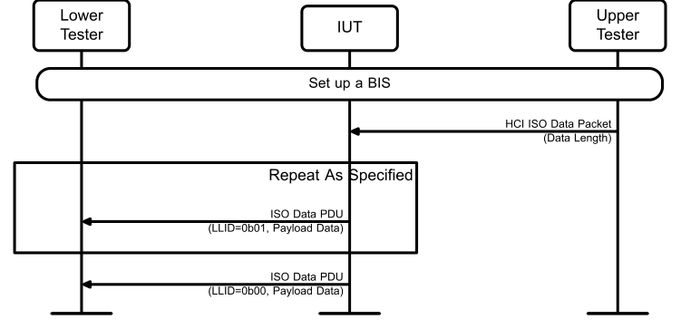

**Figure 4.23: Send Large SDU, BIS MSC**

Run each round in Table 4.29 unless TSPX_max_tx_nse and/or TSPX_max_tx_bn are less than the value of BN specified in Table 4.28, in which case refer to the Inconclusive verdict.
1. The Upper Tester sends HCI ISO Data packets to the IUT including an SDU whose length is
specified in Table 4.29. 2. The IUT sends the specified number of Start/Continuation packets specified in Table 4.29 of ISO
Data PDUs to the Lower Tester with the LLID=0b01 for unframed payloads and LLID=0b10 for framed payloads, and Payload Data every 251 bytes offset in Step 1. 3. The IUT sends the last ISO Data PDU to the Lower Tester with the LLID=0b00 for unframed
payloads and LLID=0b10 for framed payloads, with the remaining Payload Data.

|  | Round | SDU Data Length |  | Start/Continuation packets |
| --- | --- | --- | --- | --- |
| 1 |  | 495 | 1 |  |
| 2 |  | 503 | 2 |  |

Table 4.29: Send Large SDU, BIS rounds
• Expected Outcome
Pass verdict
In Step 2, the IUT sends the correct number of Start/Continuation PDUs as specified in Table 4.29 and that each PDU contains a Segmentation Header.
In Step 3, the IUT sends a PDU with LLID=0b00 for unframed payloads and LLID=0b10 for framed payloads, and the same data in Step 1.
The bits in the RFU field in the Segmentation Headers from the IUT are clear.
Inconclusive verdict
TSPX_max_tx_nse is less than the value of BN specified in Table 4.28.
TSPX_max_tx_bn is less than the value of BN specified in Table 4.28.

#### 4.4.4 Broadcast Multiple, Small SDUs, BIS • Test Purpose

Verify that the IUT can send multiple SDUs that can be combined into a single Broadcast Isochronous PDU.
• Reference
[3] 4.6.28
[4] 2.2
• Initial Condition
- The IUT acts as an Isochronous Broadcaster.
- State: Isochronous Broadcasting, Test (single BIS, packing: 0x01 (Interleaved), framing: 0x01 (Framed), other values as specified in Table 4.30; any otherwise unspecified values as specified in [9] Section 4.11.2, Common Parameters).
- Max_SDU is set to 25. Max_PDU is set as specified in Table 4.30.
- TSPX_max_tx_nse is the maximum supported TX NSE as defined in the IXIT [8] entry.
- TSPX_max_tx_bn is the maximum supported TX BN as defined in the IXIT [8] entry.
• Test Case Configuration

|  | Test Case |  |  | NSE |  |  | BN |  |  | Max PDU _ |  |  | SDU Interval _ |  |  | ISO Interval _ |  |
| --- | --- | --- | --- | --- | --- | --- | --- | --- | --- | --- | --- | --- | --- | --- | --- | --- | --- |
| IAL/BIS/FRA/BRD/BV-17-C |  |  | 2 (see Note 1) |  |  | 1 |  |  | 68 |  |  | 500 ms (0x7A120) |  |  | 1000 ms (0x320) |  |  |
| IAL/BIS/FRA/BRD/BV-18-C |  |  | 2 (see Note 1) |  |  | 1 |  |  | 68 |  |  | 1000 ms (0xF4240) |  |  | 2000 ms (0x640) |  |  |
| IAL/BIS/FRA/BRD/BV-20-C |  |  | 4 |  |  | 2 |  |  | 65 |  |  | 500 ms (0x7A120) |  |  | 2000 ms (0x640) |  |  |

Table 4.30: Send Multiple, Small SDUs, BIS test cases
Note 1: If TSPX_max_tx_nse is 1, then an NSE of 1 and an IRC of 1 are used.
• Test Procedure

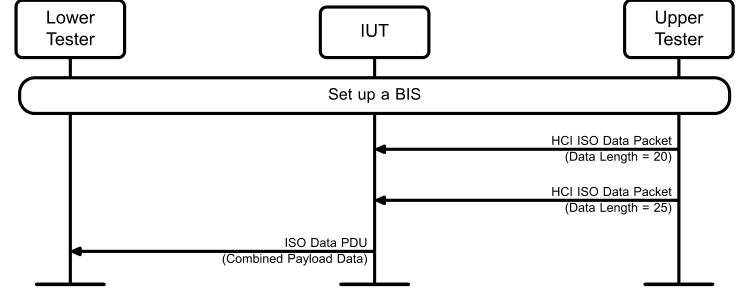

**Figure 4.24: Send Multiple, Small SDUs, BIS MSC**

If TSPX_max_tx_nse < the value of NSE specified in Table 4.30 (unless Note 1 is applied) or TSPX_max_tx_bn < the value of BN specified in Table 4.30, then refer to the Inconclusive verdict.
1. The Upper Tester sends to the IUT a small SDU1 with data length of 20 bytes. 2. The Upper Tester sends to the IUT a small SDU2 with data length of 25 bytes. 3. The IUT sends a single Broadcast ISO Data PDU with SDU1 followed by SDU2 over the BIS.
Each SDU header has SC = 0 and CMPT = 1.
• Expected Outcome
Pass verdict
In Step 3, the IUT sends a single small Broadcast ISO Data PDU with data length of 55 bytes with SDU1 followed by SDU2.
Inconclusive verdict
TSPX_max_tx_nse < the value of NSE specified in Table 4.30 and Note 1 does not apply.
TSPX_max_tx_bn < the value of BN specified in Table 4.30.

#### 4.4.5 Receive a Single SDU, BIS • Test Purpose

Verify that the IUT can receive an SDU over a BIS with length <= the Isochronous PDU length.
• Reference
[3] 4.6.29
[4] 2
• Initial Condition
- The IUT acts as a Synchronized Receiver.
- State: Synchronized to a Broadcast Isochronous Stream (values as specified in Table 4.31, Max_SDU and Max_PDU as specified below, NumBis set to 1; any otherwise unspecified values as specified in [9] Section 4.11.2, Common Parameters).
- TSPX_max_sdu_length is the maximum ISOAL SDU Length, as defined in the IXIT [8] entry.
- TSPX_max_rx_nse is the maximum supported RX NSE as defined in the IXIT [8] entry.
- Max_SDU is set to 32 or TSPX_max_sdu_length, whichever is lesser. The actual SDU payload length equals Max_SDU.
• Test Case Configuration

|  | Test Case |  |  | Max PDU _ |  |  | NSE |  |  | Framed |  |  | Framing Mode _ |  |  | LLID |  |  | BN |  |  | SDU Interval _ |  |  | ISO Interval _ |  |
| --- | --- | --- | --- | --- | --- | --- | --- | --- | --- | --- | --- | --- | --- | --- | --- | --- | --- | --- | --- | --- | --- | --- | --- | --- | --- | --- |
| IAL/BIS/UNF/SNC/BV-01-C |  |  | 40 |  |  | 2 |  |  | 0 |  |  | 0 |  |  | 0b00 |  |  | 2 |  |  | 5 ms (0x1388) |  |  | 10 ms (0x08) |  |  |
| IAL/BIS/UNF/SNC/BV-02-C |  |  | 40 |  |  | 1 |  |  | 0 |  |  | 0 |  |  | 0b00 |  |  | 1 |  |  | 10 ms (0x2710) |  |  | 10 ms (0x08) |  |  |
| IAL/BIS/UNF/SNC/BV-03-C |  |  | 40 |  |  | 2 |  |  | 0 |  |  | 0 |  |  | 0b00 |  |  | 2 |  |  | 10 ms (0x2710) |  |  | 10 ms (0x08) |  |  |
| IAL/BIS/FRA/SNC/BV-06-C |  |  | 42 |  |  | 4 |  |  | 1 |  |  | 0 |  |  | 0b10 |  |  | 2 |  |  | 5 ms (0x1388) |  |  | 10 ms (0x08) |  |  |
| IAL/BIS/FRA/SNC/BV-08-C |  |  | 45 |  |  | 2 (see Note 1) |  |  | 1 |  |  | 0 |  |  | 0b10 |  |  | 1 |  |  | 10 ms (0x2710) |  |  | 10 ms (0x08) |  |  |
| IAL/BIS/FRA/SNC/BV-29-C |  |  | 3*(Max SDU+5) _ |  |  | 4 |  |  | 1 |  |  | 1 |  |  | 0b10 |  |  | 1 |  |  | 5 ms (0x1388) |  |  | 10 ms (0x08) |  |  |

Table 4.31: Receive Single SDU, BIS test cases
Note 1: If TSPX_max_rx_nse is 1, then an NSE of 1 and an IRC of 1 are used.
• Test Procedure

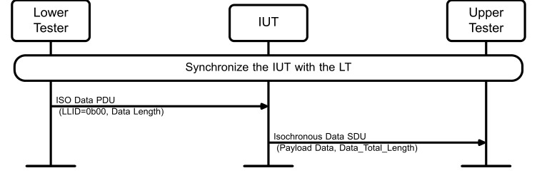

**Figure 4.25: Receive Single SDU, BIS MSC**

If TSPX_max_rx_nse is less than the value of NSE specified in Table 4.31 (does not apply if Note 1 in Table 4.31 is applicable) or TSPX_max_rx_bn is less than the value of BN specified in Table 4.31, then refer to the Inconclusive verdict.
1. The Lower Tester sends Broadcast ISOC Data PDU with the LLID, Framed, and Framing_Mode
set as specified in Table 4.31. 2. The IUT sends an Isochronous Data SDU to the Upper Tester with Payload Data identical to the
data in Step 1 and Data_Total_Length identical to the data length sent in Step 1.
• Expected Outcome
Pass verdict
In Step 2, the IUT sends an Isochronous Data SDU to the Upper Tester with Payload Data identical to the data in Step 1 and Data_Total_Length identical to the data length sent in Step 1.
Inconclusive verdict
TSPX_max_rx_nse < the value of NSE specified in Table 4.31 and Note 1 does not apply.
TSPX_max_rx_bn < the value of BN specified in Table 4.31.

#### 4.4.6 Receive Large SDU, BIS • Test Purpose

Verify that the IUT can receive an SDU over a BIS with length > the Isochronous PDU length.
• Reference
[3] 4.6.29
[4] 2.1, 2.2
• Initial Condition
- The IUT acts as a Synchronized Receiver.
- State: Synchronized to a Broadcast Isochronous Stream (single BIS, Max_SDU is 754, Max_PDU is 251; other values as specified in Table 4.32; any otherwise unspecified values as specified in [9] Section 4.11.2, Common Parameters).
- TSPX_max_rx_nse is the maximum supported RX NSE as defined in the IXIT [8] entry.
- TSPX_max_rx_bn is the maximum supported RX BN as defined in the IXIT [8] entry.
• Test Case Configuration

| Test Case | NSE | ) | Framing | BN | SDU Interval _ | ISO Interval _ |
| --- | --- | --- | --- | --- | --- | --- |
|  | (see Note 1 |  |  |  |  |  |
| IAL/BIS/UNF/SNC/BV-09-C | 8 |  | Unframed (0 | ) 4 | 25 ms (0x61A8) | 25 ms (0x14) |
| IAL/BIS/UNF/SNC/BV-10-C | 8 |  | Unframed (0 | ) 4 | 50 ms (0xC350) | 50 ms (0x28) |
| IAL/BIS/FRA/SNC/BV-11-C | 8 |  | Framed (1) | 4 | 40 ms (0x9C40) | 50 ms (0x28) |
| IAL/BIS/FRA/SNC/BV-13-C | 8 |  | Framed (1) | 4 | 25 ms (0x61A8) | 25 ms (0x14) |
| IAL/BIS/FRA/SNC/BV-15-C | 8 |  | Framed (1) | 4 | 30 ms (0x7530) | 35 ms (0x1C) |

Table 4.32: Receive Large SDU, BIS test cases
Note 1: If TSPX_max_rx_nse ≥ 8, then NSE is 8. If TSPX_max_rx_nse < 8 and TSPX_max_rx_nse and TSPX_max_rx_bn are both ≥ 4, then NSE = 4 and IRC = 1. If neither of the previous conditions can be met, then refer to the Inconclusive verdict.
• Test Procedure

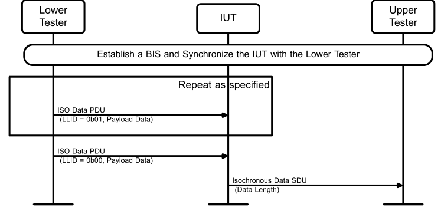

**Figure 4.26: Receive Large SDU, BIS MSC**

Run each round in Table 4.33 unless TSPX_max_rx_nse < 4 or TSPX_max_rx_bn < 4, in which case refer to the Inconclusive verdict.
1. The Lower Tester sends the number of Start/Continuation packets specified in Table 4.33 of
Broadcast ISO Data PDU with the LLID=0b01 for unframed payloads and LLID=0b10 for framed payloads. The bits in the RFU field of the Segmentation Header are set for framed payloads. 2. The Lower Tester sends the last ISO Data PDU with the LLID=0b00 for unframed payloads and
LLID=0b10 for framed payloads, with the remaining Payload Data in a Broadcast ISO data PDU. The bits in the RFU field of the Segmentation Header are set for framed payloads. 3. The IUT sends an ISO Data packet to the Upper Tester with a data length specified in Table 4.33.

| Round | Unframed SDU Data Length | Framed SDU Data Length | Start/Continuation packets |
| --- | --- | --- | --- |
| 1 | 753 | 744 | 2 |
| 2 | 754 | 745 | 3 |

Table 4.33: Receive Large SDU, BIS rounds
• Expected Outcome
Pass verdict
In Step 3, the Upper Tester receives an SDU with data length as specified in Table 4.33.
Inconclusive verdict
TSPX_max_rx_nse < 4.
TSPX_max_rx_bn < 4.

#### 4.4.7 Receive Multiple, Small SDUs, BIS • Test Purpose

Verify that the IUT can receive a single Broadcast ISOC Data PDU and sends multiple small SDUs to the Upper Tester.
• Reference
[3] 4.6.29
[4] 2.2
• Initial Condition
- The IUT acts as a Synchronized Receiver.
- State: Synchronized to a Broadcast Isochronous Stream (values as specified in Table 4.34; any otherwise unspecified values as specified in [9] Section 4.11.2, Common Parameters).
- Max_SDU is set to 25.
- TSPX_max_rx_nse is the maximum supported RX NSE as defined in the IXIT [8] entry.
- Max_PDU is 68.
• Test Case Configuration

|  | Test Case |  |  | NSE |  |  | BN |  |  | SDU Interval _ |  |  | ISO Interval _ |  |
| --- | --- | --- | --- | --- | --- | --- | --- | --- | --- | --- | --- | --- | --- | --- |
| IAL/BIS/FRA/SNC/BV-17-C |  |  | 2 (see Note 1) |  |  | 1 |  |  | 5 ms (0x1388) |  |  | 10 ms (0x08) |  |  |
| IAL/BIS/FRA/SNC/BV-18-C |  |  | 2 |  |  | 2 |  |  | 5 ms (0x1388) |  |  | 20 ms (0x10) |  |  |
| IAL/BIS/FRA/SNC/BV-20-C |  |  | 4 (see Note 2) |  |  | 2 |  |  | 5 ms (0x1388) |  |  | 20 ms (0x10) |  |  |

Table 4.34: Receive Multiple, Small SDUs, BIS test cases
Note 1: If TSPX_max_rx_nse = 1, then NSE = 1 and IRC = 1.
Note 2: If TSPX_max_rx_nse < 4, then refer to the Inconclusive verdict.
• Test Procedure

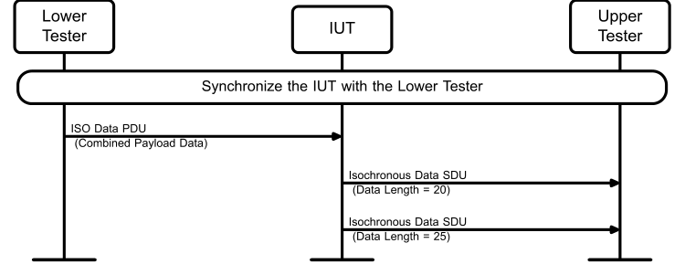

**Figure 4.27: Receive Multiple, Small SDUs, BIS MSC**

1. The Lower Tester sends a single Broadcast ISO data PDU with a data length of 55 bytes. 2. The IUT sends an SDU1 packet to the Upper Tester with data length of 20 bytes. 3. The IUT sends an SDU2 packet to the Upper Tester with data length of 25 bytes.
• Expected Outcome
Pass verdict
In Step 2, the IUT sends an SDU to the Upper Tester with the data for SDU1 from Step 1.
In Step 3, the IUT sends an SDU to the Upper Tester with the data for SDU2 from Step 1.
Inconclusive verdict
The specified value of NSE in Table 4.34 is 4 and TSPX_max_rx_nse < 4.

#### 4.4.8 Broadcast a Zero-Length SDU, BIS • Test Purpose

Verify that the IUT can send a zero-length SDU in a Broadcast ISO PDU over a BIS.
• Reference
[3] 4.6.28
[4] 2.1, 2.2, 3.1
• Initial Condition
- The IUT acts as an Isochronous Broadcaster.
- State: Broadcasting a Broadcast Isochronous Stream (single BIS, other values as specified in Table 4.35; any otherwise unspecified values as specified in [9] Section 4.11.2, Common Parameters).
- TSPX_max_tx_nse is the maximum supported TX NSE as defined in the IXIT [8] entry.
- TSPX_max_tx_bn is the maximum supported TX BN as defined in the IXIT [8] entry.
• Test Case Configuration

|  | Test Case |  |  | NSE |  |  | Framed |  |  | Framing Mode _ |  |  | LLID |  |  | BN |  |  | Segmentation Header |  |  | Time Offset |  |
| --- | --- | --- | --- | --- | --- | --- | --- | --- | --- | --- | --- | --- | --- | --- | --- | --- | --- | --- | --- | --- | --- | --- | --- |
| IAL/BIS/UNF/BRD/BV-21-C |  |  | 4 |  |  | 0 |  |  | 0 |  |  | 0b00 |  |  | 2 |  |  | N/A |  |  | N/A |  |  |
| IAL/BIS/UNF/BRD/BV-22-C |  |  | 6 |  |  | 0 |  |  | 0 |  |  | 0b00 |  |  | 3 |  |  | N/A |  |  | N/A |  |  |
| IAL/BIS/UNF/BRD/BV-23-C |  |  | 1 |  |  | 0 |  |  | 0 |  |  | 0b00 |  |  | 1 |  |  | N/A |  |  | N/A |  |  |
| IAL/BIS/UNF/BRD/BV-24-C |  |  | 2 |  |  | 0 |  |  | 0 |  |  | 0b00 |  |  | 1 |  |  | N/A |  |  | N/A |  |  |
| IAL/BIS/FRA/BRD/BV-25-C |  |  | 6 |  |  | 1 |  |  | 0 |  |  | 0b10 |  |  | 2 |  |  | SC=0 CMPLT=1 LENGTH=length of TimeOffset |  |  | Yes |  |  |
| IAL/BIS/FRA/BRD/BV-26-C |  |  | 2 (see Note 1) |  |  | 1 |  |  | 0 |  |  | 0b10 |  |  | 1 |  |  | SC=0 CMPLT=1 LENGTH=length of TimeOffset |  |  | Yes |  |  |
| IAL/BIS/FRA/BRD/BV-27-C |  |  | 4 |  |  | 1 |  |  | 0 |  |  | 0b10 |  |  | 1 |  |  | SC=0 CMPLT=1 LENGTH=length of TimeOffset |  |  | Yes |  |  |
| IAL/BIS/FRA/BRD/BV-28-C |  |  | 6 |  |  | 1 |  |  | 0 |  |  | 0b10 |  |  | 3 |  |  | SC=0 CMPLT=1 LENGTH=length of TimeOffset |  |  | Yes |  |  |
| IAL/BIS/FRA/BRD/BV-30-C |  |  | 6 |  |  | 1 |  |  | 1 |  |  | 0b10 |  |  | 2 |  |  | SC=0 CMPLT=1 LENGTH=length of TimeOffset |  |  | Yes |  |  |

Table 4.35: Send Zero-Length SDU, BIS test cases
Note 1: If TSPX_max_tx_nse = 1, then NSE = 1 and IRC = 1.
• Test Procedure

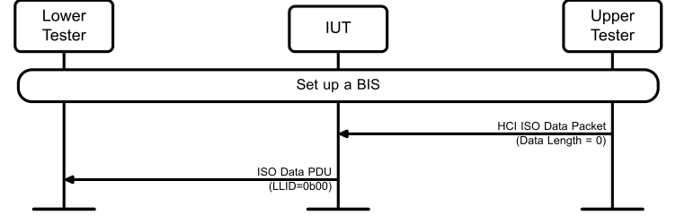

**Figure 4.28: Send Zero-Length SDU, BIS MSC**

If TSPX_max_tx_nse is less than the value of NSE specified in Table 4.35 (does not apply if Note 1 in Table 4.35 is applicable), or TSPX_max_tx_bn is less than the value of BN specified in Table 4.35, then refer to the Inconclusive verdict.
1. The Upper Tester sends an HCI ISO Data packet to the IUT with zero data length. 2. The IUT sends a single Broadcast ISO Data PDU with the LLID, Framed, Framing_Mode, the
segmentation header and time offset fields as specified in Table 4.35. Length is 0 if LLID is 0b00 and is 5 (Segmentation Header + TimeOffset) if LLID is 0b10. SDU field is empty.
• Expected Outcome
Pass verdict
The IUT sends a single Broadcast ISO Data PDU with the LLID=0b00 for unframed payloads and LLID=0b10 for framed payloads. The segmentation header and time offset fields are as specified in Table 4.35. The SDU is empty.
Inconclusive verdict
TSPX_max_tx_nse < the value of NSE specified in Table 4.35 and Note 1 does not apply.
TSPX_max_tx_bn < the value of BN specified in Table 4.35.

#### 4.4.9 Receive a Zero-Length SDU, BIS • Test Purpose

Verify that the IUT can receive a zero-length SDU from a Broadcast ISO Data PDU.
• Reference
[3] 4.6.29
[4] 2.1, 2.2, 3.1
• Initial Condition
- The IUT acts as a Synchronized Receiver.
- State: Synchronized to a Broadcast Isochronous Stream (values as specified in Table 4.36; the ISO_Interval and SDU_Interval are chosen by the tester; any otherwise unspecified values as specified in [9] Section 4.11.2, Common Parameters, or Section 4.1.2.1, Common Parameters, BN = 1 if BN value is 1 in Table 4.36).
- TSPX_max_rx_nse is the maximum supported RX NSE as defined in the IXIT [8] entry.
- TSPX_max_rx_bn is the maximum supported RX BN as defined in the IXIT [8] entry.
• Test Case Configuration

|  | Test Case |  |  | NSE |  |  | Framed |  |  | Framing Mode _ |  |  | LLID |  |  | BN |  |  | Segmentation Header |  |  | Time Offset |  |
| --- | --- | --- | --- | --- | --- | --- | --- | --- | --- | --- | --- | --- | --- | --- | --- | --- | --- | --- | --- | --- | --- | --- | --- |
| IAL/BIS/UNF/SNC/BV-21-C |  |  | 4 |  |  | 0 |  |  | 0 |  |  | 0b00 |  |  | 2 |  |  | N/A |  |  | N/A |  |  |
| IAL/BIS/UNF/SNC/BV-22-C |  |  | 6 |  |  | 0 |  |  | 0 |  |  | 0b00 |  |  | 3 |  |  | N/A |  |  | N/A |  |  |
| IAL/BIS/UNF/SNC/BV-23-C |  |  | 1 |  |  | 0 |  |  | 0 |  |  | 0b00 |  |  | 1 |  |  | N/A |  |  | N/A |  |  |
| IAL/BIS/UNF/SNC/BV-24-C |  |  | 2 |  |  | 0 |  |  | 0 |  |  | 0b00 |  |  | 1 |  |  | N/A |  |  | N/A |  |  |
| IAL/BIS/FRA/SNC/BV-25-C |  |  | 6 |  |  | 1 |  |  | 0 |  |  | 0b10 |  |  | 2 |  |  | SC=0 CMPLT=1 LENGTH=length of TimeOffset |  |  | Yes |  |  |
| IAL/BIS/FRA/SNC/BV-26-C |  |  | 2 (see Note 1) |  |  | 1 |  |  | 0 |  |  | 0b10 |  |  | 1 |  |  | SC=0 CMPLT=1 LENGTH=length of TimeOffset |  |  | Yes |  |  |
| IAL/BIS/FRA/SNC/BV-27-C |  |  | 4 |  |  | 1 |  |  | 0 |  |  | 0b10 |  |  | 1 |  |  | SC=0 CMPLT=1 LENGTH=length of TimeOffset |  |  | Yes |  |  |
| IAL/BIS/FRA/SNC/BV-28-C |  |  | 6 |  |  | 1 |  |  | 0 |  |  | 0b10 |  |  | 3 |  |  | SC=0 CMPLT=1 LENGTH=length of TimeOffset |  |  | Yes |  |  |
| IAL/BIS/FRA/SNC/BV-30-C |  |  | 6 |  |  | 1 |  |  | 1 |  |  | 0b10 |  |  | 2 |  |  | SC=0 CMPLT=1 LENGTH=length of TimeOffset |  |  | Yes |  |  |

Table 4.36: Receive Zero-Length SDU, BIS test cases
Note 1: If TSPX_max_rx_nse = 1, then NSE = 1 and IRC = 1.
• Test Procedure

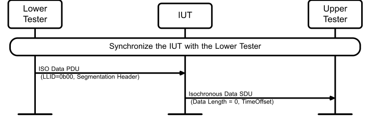

**Figure 4.29: Receive Zero-Length SDU, BIS MSC**

If TSPX_max_rx_nse is less than the value of NSE specified in Table 4.36 (does not apply if Note 1 in Table 4.36 is applicable) or TSPX_max_rx_bn is less than the value of BN specified in Table 4.36, then refer to the Inconclusive verdict.
1. The Lower Tester sends a single ISO Data PDU to the IUT with the LLID, Framed, and
Framing_Mode, and the segmentation header and time offset fields as specified in Table 4.36. 2. The IUT sends an empty ISO Data packet to the Upper Tester with the TimeOffset field as
specified in Table 4.36.
• Expected Outcome
Pass verdict
In Step 2 the IUT sends an empty SDU to the Upper Tester with the TimeOffset field as specified in Table 4.36.
Inconclusive verdict
TSPX_max_rx_nse < the value of NSE specified in Table 4.36 and Note 1 does not apply.
TSPX_max_rx_bn < the value of BN specified in Table 4.36.
IAL/BIS/UNF/SNC/BI-02-C [Receive an unsuccessful Large SDU, BIS]
• Test Purpose
Verify that the IUT sends an HCI ISO Data packet with a Packet_Status_Flag error when receiving Isochronous PDUs with SDU data length > Isochronous PDU length and one of the continuation PDU packets fails to be received, when no PDUs are received, and when an invalid sequence of PDUs is received.
• Reference
[3] 4.6.28
[4] 2.1
• Initial Condition
- The IUT acts as a Synchronized Receiver.
- State: Synchronized to a Broadcast Isochronous Stream (single BIS, NSE is 4, BN is 4, and packing is 0x01 (Interleaved); any otherwise unspecified values as specified in [9] Section 4.11.2, Common Parameters).
- TSPX_max_rx_bn is the maximum supported RX BN as defined in the IXIT [8] entry.
• Test Procedure

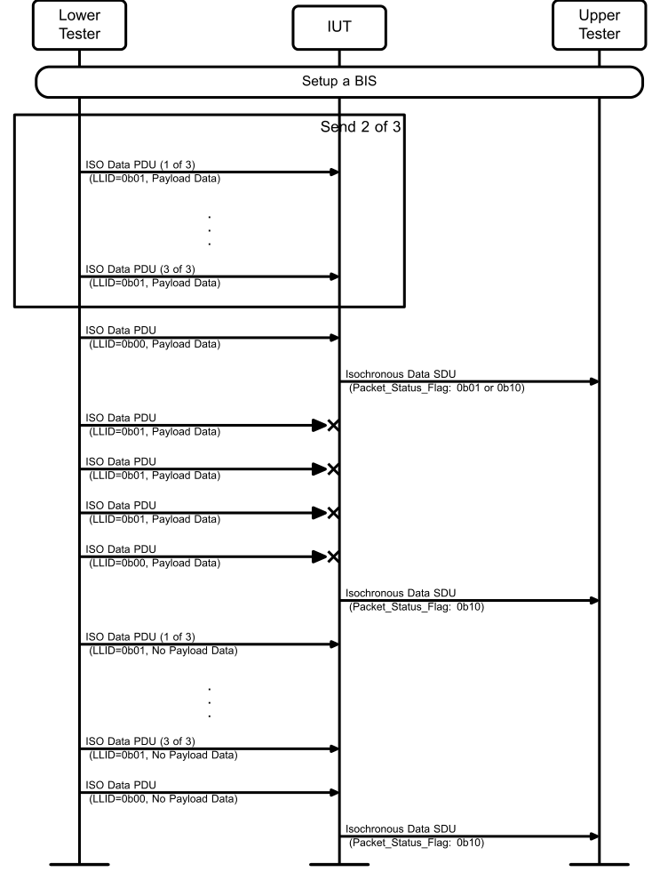

**Figure 4.30: IAL/BIS/UNF/SNC/BI-02-C [Receive an unsuccessful Large SDU, BIS] MSC**

The rounds in Table 4.37 are performed in any order in consecutive isochronous events. In each round:
1. The Lower Tester sends the IUT the PDUs listed in Table 4.37. 2. The IUT sends the Upper Tester an ISO Data packet with Packet_Status_Flag=0b01 or
Packet_Status_Flag=0b10. If Packet_Status_Flag=0b10, then PB_Flag=0b10, ISO_SDU_Length=0, and there is no data.

|  | Round |  |  | PDUs sent |  |
| --- | --- | --- | --- | --- | --- |
| 1 |  |  | 4 PDUs with LLID=0b01 and no data |  |  |
| 2 |  |  | 4 PDUs with LLID=0b01 and data |  |  |
| 3 |  |  | 3 PDUs with LLID=0b01 and data, then 1 PDU with LLID=0b00 and data; one of the first three PDUs has a CRC error |  |  |
| 4 |  |  | 2 PDUs with LLID=0b01 and data, then 2 PDUs with LLID=0b00 and data |  |  |
| 5 |  |  | 2 PDUs with LLID=0b01 and no data, then 1 PDU with LLID=0b00 and data, then 1 PDU with LLID=0b01 and data |  |  |
| 6 |  |  | 2 PDUs with LLID=0b01 and no data, then 1 PDU with LLID=0b00 and data, then 1 PDU with LLID=0b10 and no data |  |  |
| 7 |  |  | 2 PDUs with LLID=0b01 and no data, then 1 PDU with LLID=0b10 and data, then 1 PDU with LLID=0b00 and no data |  |  |
| 8 |  |  | 2 PDUs with LLID=0b01 and data, then 1 PDU with LLID=0b00 and data; one of the four PDUs is omitted to simulate losing one PDU |  |  |
| 9 |  |  | 1 PDU with LLID=0b00 and data, then 3 PDUs with LLID=0b01, at least one of which has data |  |  |
| 10 |  |  | No PDUs |  |  |

Table 4.37: IAL/BIS/UNF/SNC/BI-02-C [Receive an unsuccessful Large SDU, BIS] rounds
• Expected Outcome
Pass verdict
In Step 2, the IUT sends an ISO Data packet with Packet_Status_Flag=0b01 or Packet_Status_Flag=0b10. If Packet_Status_Flag=0b10, then PB_Flag=0b10, ISO_SDU_Length=0, and there is no data.
Inconclusive verdict
TSPX_max_rx_nse < 4.
TSPX_max_rx_bn < 4.

#### 4.4.10 Broadcasting Unframed Empty PDUs with LLID=0b01, BIS • Test Purpose

Test that the Isochronous Broadcaster IUT sends unframed empty PDUs with LLID = 0b01 when the number of required PDUs to transmit an SDU is less than BN×(SDU_Interval÷ISO_Interval) fragment PDUs, and encryption works correctly when empty PDUs are sent.
• Reference
[3] 4.6.28
[4] 2.1
• Initial Condition
- TSPX_broadcast_code is the 4–16 character Broadcast Code as defined in the IXIT [8] entry.
- TSPX_max_tx_nse is the maximum supported TX NSE as defined in the IXIT [8] entry.
- TSPX_max_tx_bn is the maximum supported TX BN as defined in the IXIT [8] entry.
- State: Isochronous Broadcasting, Test (values as specified in Table 4.38)

|  | State Variable |  |  | Value(s) |  |
| --- | --- | --- | --- | --- | --- |
| num bis _ |  |  | 1 |  |  |
| sdu int _ |  |  | 100 ms |  |  |
| iso int _ |  |  | 100 ms |  |  |
| nse |  |  | 12 (see Note 1) |  |  |
| mx sdu _ |  |  | 128 |  |  |
| mx pdu _ |  |  | 128 |  |  |
| phy |  |  | 0x01 (LE 1M PHY) |  |  |
| packing |  |  | 0x00 (Sequential) |  |  |
| framing |  |  | 0x00 (Unframed) |  |  |
| bn |  |  | 4 |  |  |
| irc |  |  | 3 (see Note 1) |  |  |
| pto |  |  | 0 |  |  |
| encryption |  |  | Per Table 4.39 |  |  |
| broadcast code _ |  |  | TSPX broadcast code, if applicable _ _ |  |  |

Table 4.38: State Variable Values
Note 1: If TSPX_max_tx_nse ≥ 12, then NSE = 12 and IRC = 3. If TSPX_max_tx_nse < 12 and ≥ 8, then NSE = 8 and IRC = 2. If TSPX_max_tx_nse < 8 and ≥ 4, then NSE = 4 and IRC = 1. Otherwise, see the Inconclusive verdict.
• Test Case Configuration

|  | Test Case |  |  | Encryption |  |
| --- | --- | --- | --- | --- | --- |
| IAL/BIS/UNF/BRD/BV-29-C |  |  | Disabled |  |  |
| IAL/BIS/UNF/BRD/BV-30-C |  |  | Enabled |  |  |

Table 4.39: Broadcasting Unframed Empty PDUs with LLID=0b01, BIS test cases
• Test Procedure

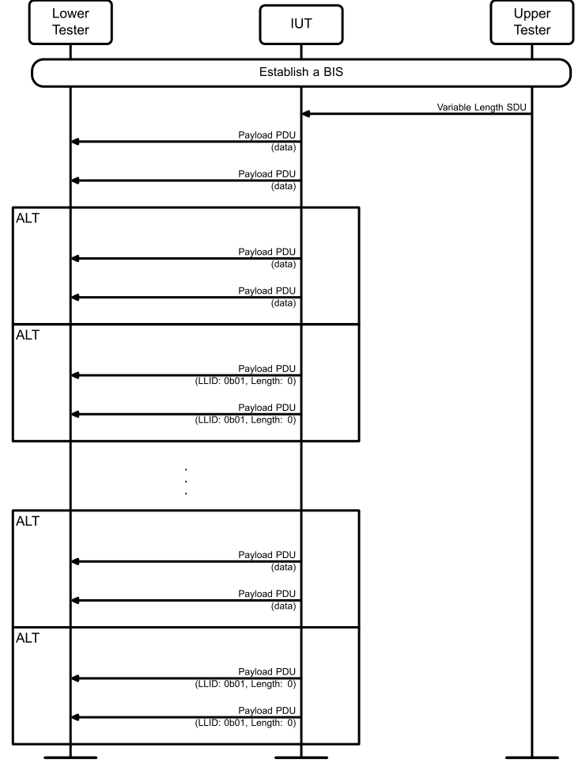

**Figure 4.31: Sending Unframed Empty PDUs with LLID=0b01, BIS MSC**

If TSPX_max_tx_nse < 4 or TSPX_max_tx_bn < 4, then refer to the Inconclusive verdict.
1. The Upper Tester submits an SDU at its SDU interval of variable length, ranging from 4 to
mx_sdu octets. Note that the Test Command Generated Isochronous SDUs Optional Test Steps, ALT 3, VARIABLE LENGTH PAYLOADS in [9] Section 4.1.6.7.3 may be used for this purpose. 2. The Lower Tester receives PDUs from the IUT. When the required number of PDUs to transmit
the SDU is less than BN PDUs, the remainder of BN PDUs are empty PDUs with LLID=0b01. 3. Repeat Steps 1 and 2 a minimum of 32 times.
• Expected Outcome
Pass verdict
The IUT sends empty PDUs with LLID=0b01 as required.
If encryption is enabled, the IUT sends correctly encrypted payload PDUs despite sending empty PDUs.
Inconclusive verdict
TSPX_max_tx_nse < 4.
TSPX_max_tx_bn < 4.

#### 4.4.11 Receiving Unframed Empty PDUs with LLID=0b01, BIS • Test Purpose

Test that the Synchronized Receiver IUT receives SDUs when unframed empty PDUs with LLID = 0b01 when the number of required PDUs to transmit an SDU is less than BN×(SDU_Interval÷ISO_Interval) fragment PDUs are received, and encryption works correctly when empty PDUs are received.
• Reference
[3] 4.6.28
[4] 2.1
• Initial Condition
- TSPX_broadcast_code is the 4–16 character Broadcast Code as defined in the IXIT [8] entry.
- TSPX_max_rx_nse is the maximum supported RX NSE as defined in the IXIT [8] entry.
- TSPX_max_rx_bn is the maximum supported RX BN as defined in the IXIT [8] entry.
- State: Synchronized to a Broadcast Isochronous Stream (values as specified in Table 4.40)

|  | State Variable |  |  | Value(s) |  |
| --- | --- | --- | --- | --- | --- |
| sync timeout _ |  |  | default, as defined in [9] Section 4.11.2 |  |  |
| padv interval _ |  |  | default, as defined in Section [9] Section 4.11.2 |  |  |
| big sync timeout _ _ |  |  | default, as defined in Section [9] Section 4.11.2 |  |  |
| adv phy _ |  |  | default, as defined in Section [9] Section 4.11.2 |  |  |
| num bis _ |  |  | 1 |  |  |
| sdu int _ |  |  | 100 ms |  |  |
| iso int _ |  |  | 100 ms |  |  |
| nse |  |  | 12 (see Note 1) |  |  |
| mx sdu _ |  |  | 128 |  |  |
| mx pdu _ |  |  | 128 |  |  |
| packing |  |  | 0x00 (Sequential) |  |  |
| framing |  |  | 0x00 (Unframed) |  |  |
| bn |  |  | 4 |  |  |
| irc |  |  | 3 (see Note 1) |  |  |
| pto |  |  | 0 |  |  |

|  | State Variable |  |  | Value(s) |  |
| --- | --- | --- | --- | --- | --- |
| encryption |  |  | Per Table 4.41 |  |  |
| broadcast code _ |  |  | TSPX broadcast code, if applicable _ _ |  |  |

Table 4.40: State Variable Values
Note 1: If TSPX_max_rx_nse ≥ 12, then NSE = 12 and IRC = 3. If TSPX_max_rx_nse < 12 and ≥ 8, then NSE = 8 and IRC = 2. If TSPX_max_rx_nse < 8 and ≥ 4, then NSE = 4 and IRC = 1. Otherwise, see the Inconclusive verdict.
• Test Case Configuration

|  | Test Case |  |  | Encryption |  |
| --- | --- | --- | --- | --- | --- |
| IAL/BIS/UNF/SNC/BV-29-C |  |  | Disabled |  |  |
| IAL/BIS/UNF/SNC/BV-30-C |  |  | Enabled |  |  |

Table 4.41: Receiving Unframed Empty PDUs with LLID=0b01, BIS test cases
• Test Procedure

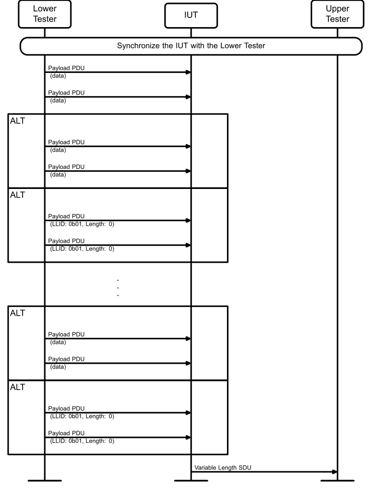

**Figure 4.32: Receiving Unframed Empty PDUs with LLID=0b01, BIS MSC**

If TSPX_max_rx_nse < 4 or TSPX_max_rx_bn < 4, then refer to the Inconclusive verdict.
1. The Lower Tester sends PDUs based on an SDU of variable length, ranging from 4 to mx_sdu
octets. When the required number of PDUs to transmit the SDU is less than BN PDUs, the remainder of BN PDUs are empty PDUs with LLID=0b01. 2. The IUT sends the variable length SDUs from the Lower Tester to the Upper Tester. 3. Repeat Steps 1 and 2 a minimum of 32 times.
• Expected Outcome
Pass verdict
The IUT receives at least 32 variable length PDUs from the Lower Tester and provides variable length SDUs to the Upper Tester. The SDU length is from 4 to 256 octets.
If encryption is enabled, the IUT sends correctly unencrypted SDUs to the Upper Tester despite receiving empty PDUs.
Inconclusive verdict
TSPX_max_rx_nse < 4.
TSPX_max_rx_bn < 4.
IAL/BIS/UNF/SNC/BI-05-C [SDU Reporting, BIS, Unframed PDU]
• Test Purpose
Verify that the IUT reports an SDU as “data with possible errors” or discards and reports an SDU as “lost data” in a Broadcast Isochronous Stream, Unframed.
• Reference
[3] 4.6.28
[4] 2.1
[11] 4
• Initial Condition
- The IUT acts as a Synchronized Receiver.
- State: Synchronized to a Broadcast Isochronous Stream (IRC is 1, BN is min(TSPX_max_rx_bn, 3), NSE is equal to BN, Max_SDU is set to 64, and Max_PDU is set to 32; any otherwise unspecified values as specified in [9] Section 4.11.2, Common Parameters).
- TSPX_max_rx_bn is the maximum supported BN as defined in the IXIT [8] entry.
• Test Procedure

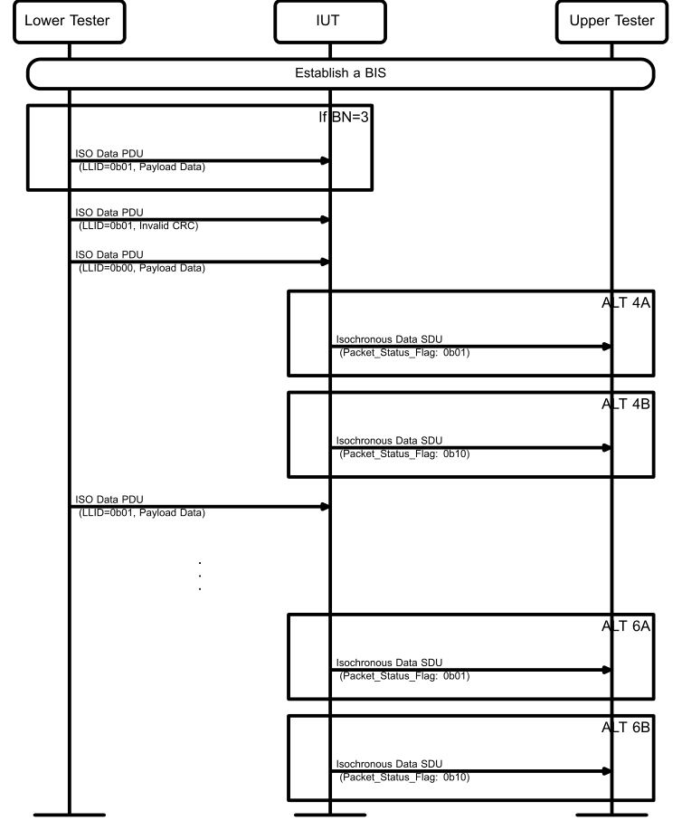

**Figure 4.33: IAL/BIS/UNF/SNC/BI-05-C [SDU Reporting, BIS, Unframed PDU] MSC**

Steps 1–3 all take place in the same BIS event.
1. The Lower Tester sends an unframed Start/Continuation ISO Data PDU with 21 octets of random
data to the IUT with the LLID=0b01. If BN equals 2, omit this step. 2. The Lower Tester sends the IUT an unframed Start/Continuation ISO Data PDU with 21 octets of
random data and an invalid CRC. 3. The Lower Tester sends the last unframed ISO Data PDU with 21 octets of random data to the
IUT with the LLID=0b00. 4. Perform either alternative 4A or 4B depending on how the IUT reports the SDU:
Alternative 4A (The IUT reports the SDU as 0b01 “data with possible errors”):
4A.1 The IUT sends an HCI ISO Data packet with data to the Upper Tester with the Packet_Status_Flag set to 0b01 “data with possible errors”.
4B.1 The IUT sends an HCI ISO Data packet to the Upper Tester with the Packet_Status_Flag set to 0b10 “lost data” and no data. 5. The Lower Tester sends unframed ISO Data PDUs to the IUT all with LLID = 0b01 and 21 octets
of random data. 6. Perform either alternative 6A or 6B depending on how the IUT reports the SDU:
Alternative 6A (The IUT reports the SDU as 0b01 “data with possible errors”):
6A.1 The IUT sends an HCI ISO Data packet with the truncated SDU data to the Upper Tester with the Packet_Status_Flag set to 0b01 “data with possible errors”. Alternative 6B (The IUT reports the SDU as 0b10 “lost data”):
6B.1 The IUT sends an HCI ISO Data packet to the Upper Tester with the Packet_Status_Flag set to 0b10 “lost data” with no data.
• Expected Outcome
Pass verdict
In Step 4A.1, the IUT sends data to the Upper Tester with the Packet_Status_Flag set to 0b01 “data with possible errors”.
In Step 4B.1, the IUT sends an SDU to the Upper Tester with the Packet_Status_Flag set to 0b10 “lost data” and no data.
In Step 6A.1, the IUT sends the truncated SDU data to the Upper Tester with the Packet_Status_Flag set to 0b01 “data with possible errors”.
In Step 6B.1, the IUT sends an SDU to the Upper Tester with the Packet_Status_Flag set to 0b10 “lost data” with no data.
IAL/BIS/UNF/SNC/BI-06-C [SDU Reporting, BIS, BN = 1, NSE = 1, Unframed PDU]
• Test Purpose
Verify that the IUT reports an SDU as “data with possible errors” or discards and reports an SDU as “lost data” in a Broadcast Isochronous Stream with BN = 1 and NSE =1, Unframed.
• Reference
[3] 4.6.28
[4] 2.1
[11] 4
• Initial Condition
- The IUT acts as a Synchronized Receiver.
- State: Synchronized to a Broadcast Isochronous Stream (IRC is 1, NSE is 1, BN is 1; Max_SDU and Max_PDU as specified below; any otherwise unspecified values as specified in [9] Section 4.11.2, Common Parameters).
- Max_SDU is set to 32. Max_PDU is 32.
• Test Procedure

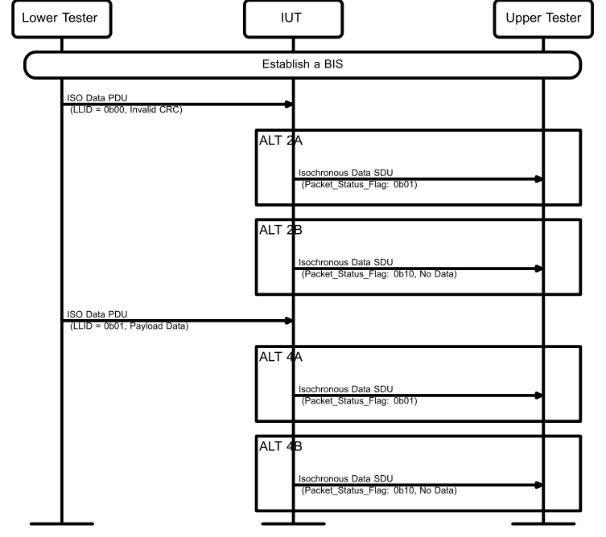

**Figure 4.34: IAL/BIS/UNF/SNC/BI-06-C [SDU Reporting, BIS, BN = 1, NSE = 1, Unframed PDU] MSC**

1. The Lower Tester sends 1 unframed complete ISO Data PDU to the IUT with LLID=0b00 and with
an invalid CRC. 2. Perform either alternative 2A or 2B depending on how the IUT reports the SDU:
Alternative 2A (The IUT reports the SDU as 0b01 “data with possible errors”):
2A.1 The IUT sends an HCI ISO Data packet with data to the Upper Tester with the Packet_Status_Flag set to 0b01 “data with possible errors”. Alternative 2B (The IUT reports the SDU as 0b10 “lost data”):
2B.1 The IUT sends an HCI ISO Data packet to the Upper Tester with the Packet_Status_Flag set to 0b10 “lost data” and no data. 3. The Lower Tester sends unframed ISO Data PDUs to the IUT with LLID=0b01. 4. Perform either alternative 4A or 4B depending on how the IUT reports the SDU:
Alternative 4A (The IUT reports the SDU as 0b01 “data with possible errors”):
4A.1 The IUT sends an HCI ISO Data packet with the truncated SDU data to the Upper Tester with the Packet_Status_Flag set to 0b01 “data with possible errors”. Alternative 4B (The IUT reports the SDU as 0b10 “lost data”):
4B.1 The IUT sends an HCI ISO Data packet to the Upper Tester with the Packet_Status_Flag set to 0b10 “lost data” with no data.
• Expected Outcome
Pass verdict
In Step 2A.1, the IUT sends an HCI ISO Data packet with data to the Upper Tester with the Packet_Status_Flag set to 0b01 “data with possible errors”.
In Step 2B.1, the IUT sends an HCI ISO Data packet to the Upper Tester with the Packet_Status_Flag set to 0b10 “lost data” and no data.
In Step 4A.1, the IUT sends an HCI ISO Data packet with the truncated SDU data to the Upper Tester with the Packet_Status_Flag set to 0b01 “data with possible errors”.
In Step 4B.1, the IUT sends an HCI ISO Data packet to the Upper Tester with the Packet_Status_Flag set to 0b10 “lost data” with no data.
IAL/BIS/FRA/SNC/BI-01-C [SDU Reporting, BIS, Framed PDU]
• Test Purpose
Verify that the IUT reports an SDU as “data with possible errors” or discards and reports an SDU as “lost data” in a Broadcast Isochronous Stream, Framed.
• Reference
[3] 4.6.28
[4] 2.2
[11] 4
• Initial Condition
- The IUT acts as a Synchronized Receiver.
- State: Synchronized to a Broadcast Isochronous Stream (IRC is 1, NSE is 4, BN is 4; Max_SDU and Max_PDU as specified below; any otherwise unspecified values as specified in [9] Section 4.11.2, Common Parameters).
- TSPX_max_rx_nse is the maximum supported NSE as defined in the IXIT [8] entry.
- TSPX_max_rx_bn is the maximum supported BN as defined in the IXIT [8] entry.
- Max_SDU is set to 108. Max_PDU is 32.
• Test Procedure

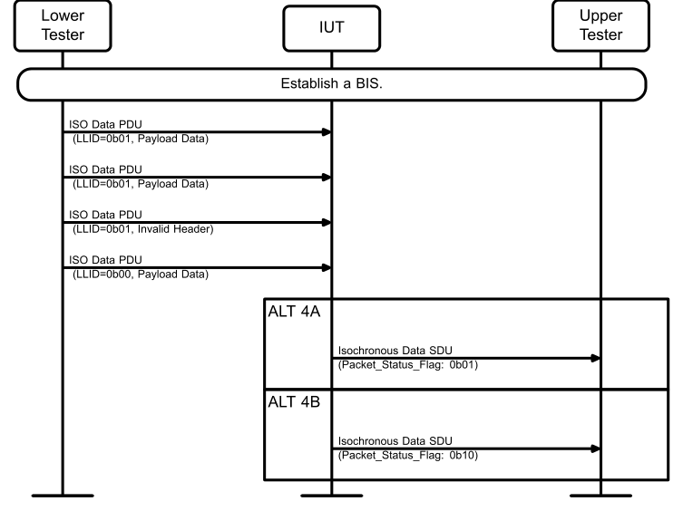

**Figure 4.35: IAL/BIS/FRA/SNC/BI-01-C [SDU Reporting, BIS, Framed PDU] MSC**

1. The Lower Tester sends two framed Start/Continuation ISO Data PDUs to the IUT with the
LLID=0b01. 2. The Lower Tester sends one framed Start/Continuation ISO Data PDU to the IUT with the
LLID=0b00 and with the Length field in the Segmentation Header set to 255. 3. The Lower Tester sends the last framed ISO Data PDU to the IUT with the LLID=0b00 and with
the remaining Payload Data. 4. Perform either alternative 4A or 4B depending on how the IUT reports the SDU:
Alternative 4A (The IUT reports the SDU as 0b01 “data with possible errors”):
4A.1 The IUT sends an HCI ISO Data packet with data to the Upper Tester with the Packet_Status_Flag set to 0b01 “data with possible errors”. Alternative 4B (The IUT reports the SDU as 0b10 “lost data”):
4B.1 The IUT sends an HCI ISO Data packet to the Upper Tester with the Packet_Status_Flag set to 0b10 “lost data” and no data. 5. Repeat Steps 1–4 with LLID=0b10 in Steps 1–3.
• Expected Outcome
Pass verdict
In Step 4A.1, the IUT sends an HCI ISO Data packet with data to the Upper Tester with the Packet_Status_Flag set to 0b01 “data with possible errors”.
In Step 4B.1, the IUT sends an HCI ISO Data packet to the Upper Tester with the Packet_Status_Flag set to 0b10 “lost data” and no data.
Inconclusive verdict
The values of NSE or BN specified exceed the corresponding values of TSPX_max_rx_nse or TSPX_max_rx_bn, respectively.
• Test Purpose
Verify that the IUT reports an SDU as “data with possible errors” or discards and reports an SDU as “lost data” in a Broadcast Isochronous Stream with BN = 1 and NSE = 1, Framed.
• Reference
[3] 4.6.28
[4] 2.2
[11] 4
• Initial Condition
- The IUT acts as a Synchronized Receiver.
- State: Synchronized to a Broadcast Isochronous Stream (IRC is 1, NSE is 1, BN is 1; Max_SDU and Max_PDU as specified below; any otherwise unspecified values as specified in [9] Section 4.11.2, Common Parameters).
- Max_SDU is set to 32. Max_PDU is 45.
• Test Procedure

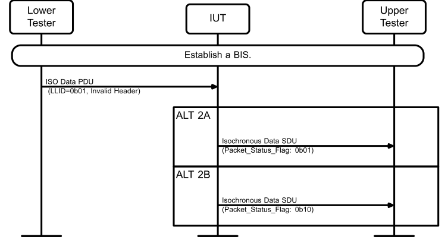

**Figure 4.36: IAL/BIS/FRA/SNC/BI-02-C [SDU Reporting, BIS, BN = 1, NSE = 1, Framed PDU] MSC**

1. The Lower Tester sends 1 framed complete ISO Data PDU to the IUT with LLID = 0b10 and with
the Length field of the Segmentation Header set to 255. 2. Perform either alternative 2A or 2B depending on how the IUT reports the SDU:
Alternative 2A (The IUT reports the SDU as 0b01 “data with possible errors”):
2A.1 The IUT sends an HCI ISO Data packet with data to the Upper Tester with the Packet_Status_Flag set to 0b01 “data with possible errors”. Alternative 2B (The IUT reports the SDU as 0b10 “lost data”):
2B.1 The IUT sends an HCI ISO Data packet to the Upper Tester with the Packet_Status_Flag set to 0b10 “lost data” and no data.
• Expected Outcome
Pass verdict
In Step 2A.1, the IUT sends an HCI ISO Data packet with data to the Upper Tester with the Packet_Status_Flag set to 0b01 “data with possible errors”.
In Step 2B.1, the IUT sends an HCI ISO Data packet to the Upper Tester with the Packet_Status_Flag set to 0b10 “lost data” and no data.
IAL/BIS/FRA/SNC/BI-03-C [Reporting an Unsuccessful Large SDU, Framed BIS]
• Test Purpose
Verify that the IUT sends an ISO Data packet to the Upper Tester with a Packet_Status_Flag error value of 0b10 when some packets in an SDU are not received.
• Reference
[12] 2.2
• Initial Condition
- An unencrypted BIG has been created with BN = NSE = 2, Num_BIS = 1, IRC = 1, and Framing = 0x01.
- Max_SDU is set to 16.
- Max_PDU is set to 16.
- The IUT is synchronized to the only BIS in the BIG.
• Test Procedure

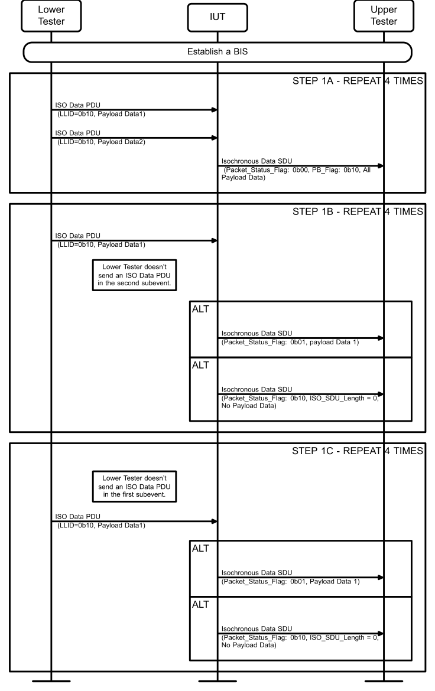

**Figure 4.37: Report an Unsuccessful Large SDU, Framed BIS MSC**

Perform Step 1A four times, Step 1B four times, and Step 1C four times, in 12 consecutive isochronous events. The order of the 12 steps is selected at random.
1A. The Lower Tester sends two ISO Data PDUs to the IUT with the LLID = 0b10 in the same isochronous interval. The IUT sends the Upper Tester an ISO Data packet with Packet_Status_Flag = 0b00 and PB_Flag = 0b10 and containing all the data.
1B. The Lower Tester sends an ISO Data PDU with the LLID = 0b10 in the first sub-event of an ISO interval and nothing in the second sub-event. The IUT sends the Upper Tester an ISO Data packet either with Packet_Status_Flag = 0b01 and containing the data, or with Packet_Status_Flag = 0b10 and ISO_SDU_Length = 0 and with no data.
1C. The Lower Tester sends nothing in the first sub-event of an ISO interval and an ISO Data PDU with the LLID = 0b10 in the second sub-event. The IUT sends the Upper Tester an ISO Data packet either with Packet_Status_Flag = 0b01 and containing the data, or with Packet_Status_Flag = 0b10 and ISO_SDU_Length = 0 and with no data.
• Expected Outcome
Pass verdict
In at least 10 of the 12 events, the IUT sends an ISO Data packet to the Upper Tester with the proper Packet_Status_Flag, ISO_SDU_Length, and ISO Data.
IAL/BIS/FRA/SNC/BI-04-C [Reporting a missing or damaged SDU, Framed BIS]
• Test Purpose
Verify that the IUT sends an ISO Data packet to the Upper Tester with a Packet_Status_Flag error value of 0b10 when some or all PDU packets in an SDU are not received and the SDU is discarded.
• Reference
[12] 2.2
• Initial Condition
- An unencrypted BIG has been created with BN = NSE = 1, Num_BIS = 1, IRC = 1, and Framing = 0x01.
- Max_PDU is set to Max_SDU + 13.
- The SDU interval and ISO interval are set to the same values.
- The IUT is synchronized to the only BIS in the BIG.
• Test Procedure

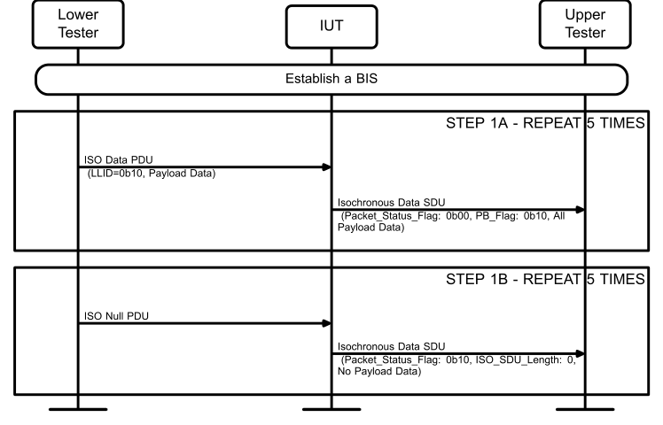

**Figure 4.38: Reporting a missing or damaged SDU, Framed BIS MSC**

Perform Step 1A five times and Step 1B five times, in 10 consecutive isochronous events. The order of the 10 steps is selected at random.
1A. The Lower Tester sends an ISO Data PDU to the IUT with the LLID = 0b10. The IUT sends the Upper Tester an ISO Data packet with Packet_Status_Flag = 0b00 and PB_Flag = 0b10 and containing all the data.
1B. The Lower Tester sends an ISO Null PDU. The IUT sends the Upper Tester an ISO Data packet with Packet_Status_Flag = 0b10 and ISO_SDU_Length = 0 and with no data.
• Expected Outcome
Pass verdict
In at least 9 of the 10 repeats, the IUT sends an ISO Data packet to the Upper Tester with the proper Packet_Status_Flag, ISO_SDU_Length, and ISO Data.

#### 4.4.12 Unsegmented Framed LL Broadcast PDUs at 7.5 ms ISO Interval,

Isochronous Broadcaster • Test Purpose
Verify that an Isochronous Broadcaster IUT sends ISO Data Packets using permitted framing modes.
• Reference
[13] 2
• Initial Condition
- The Upper Tester creates a BIG using the HCI_LE_Create_BIG_Test command with Framing set to 0x02.
- The IUT acts in the Isochronous Broadcaster role.
- State: Synchronized to a Broadcast Isochronous Stream (values as specified in [9], Section 4.11.1, Common Parameters).
• Test Case Configuration

|  | Test Case | Framing (HCI) |
| --- | --- | --- |
| IAL/BIS/FRA/BRD/BV-32-C |  | Unsegmented framed (0x02) |

Table 4.42: Unsegmented Framed LL Broadcast PDUs at 7.5 ms ISO Interval Permitted Framing Mode Packets , Isochronous Broadcaster test cases
• Test Procedure

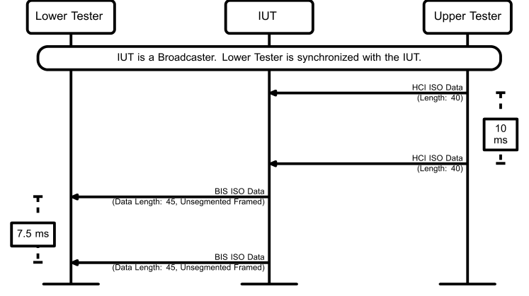

**Figure 4.39: Unsegmented Framed LL Broadcast PDUs at 7.5 ms ISO Interval, Isochronous Broadcaster MSC**

1. The Upper Tester continuously sends HCI ISO Data Packets with the payload size set to 10. 2. The IUT transmits Broadcast Isochronous Data PDUs using unsegmented framed PDUs. 3. Repeat Steps 1 and 2 twenty times. 4. The Upper Tester sends HCI ISO Data Packets to the IUT with the payload size set to 40 octets
and 40 octets of random data at an interval of 10 ms. 5. The IUT transmits Broadcast Isochronous Data PDUs with a data length of 45 octets at an
interval of 7.5 ms using unsegmented framed.
• Expected Outcome
Pass verdict
In Step 2, the IUT sends Broadcast ISO Data Packets using unsegmented framed PDUs.
In Step 5, the IUT sends ISO Data Packets 7.5 ms apart. On average, 75% of packets will contain 45 octets of data and the remainder will be empty.
The data octets received by the Lower Tester are the same as those sent by the Upper Tester, in the same order.

#### 4.4.13 Permitted Framing Mode Packets, Isochronous Broadcaster • Test Purpose

Verify that an Isochronous Broadcaster IUT sends ISO Data Packets using permitted framing modes.
• Reference
[13] 2
• Initial Condition
- The IUT acts in the Isochronous Broadcaster role.
- The Lower Tester acts in the Synchronized Receiver role and is synchronized to the IUT.
- State: Synchronized to a Broadcast Isochronous Stream (values as specified in [9], Section 4.11.1, Common Parameters).
• Test Case Configuration

|  | Test Case |  |  | Framing |  |
| --- | --- | --- | --- | --- | --- |
| IAL/BIS/FRA/BRD/BV-31-C |  |  | Framed, Segmentable mode |  |  |
| IAL/BIS/FRA/BRD/BV-33-C |  |  | Framed, Unsegmented mode |  |  |

Table 4.43: Permitted Framing Mode Packets, Isochronous Broadcaster test cases
• Test Procedure
1. Execute the LL/BIS/BRD/BV-13-C test up to Step 8. In LL/BIS/BRD/BV-13-C Step 1, Framing is
set as specified in Table 4.43. All ISO data packets sent by the IUT to the Lower Tester in Step 8 are sent using the framed PDUs with the same framing mode, which can be either Segmentable or Unsegmented irrespective of the mode requested by the Upper Tester. 2. After the IUT sends 100 ISO data packets in Step 8, the Upper Tester sends the
HCI_LE_Terminate_BIG command. 3. The IUT sends the BIG_TERMINATE_IND PDU in the Control subevents. 4. The IUT sends the HCI_LE_Terminate_BIG_Complete event to the Upper Tester. 5. Repeat Steps 1–4 ten times.
• Expected Outcome
Pass verdict
In Step 1, the ISO data packets only use the framed modes.
The data octets received by the Lower Tester are the same as those sent by the Upper Tester, in the same order.

#### 4.4.14 Framing_Mode bit in BIGInfo Ignored, Unsegmented Framed not

supported • Test Purpose
Verify that a Synchronized Receiver IUT that does not support Unsegmented Framed packets treats Segmentable framed and Unsegmented framed packets as framed packets.
• Reference
[13] 2
• Initial Condition
- The IUT is in the Synchronized Receiver role.
- The Lower Tester acts in the Isochronous Broadcaster role with a BIS using a Framing Mode as specified in Table 4.44.
- State: Synchronized to a Broadcast Isochronous Stream (values as specified in [9], Section 4.11.1, Common Parameters, Framing as specified in Table 4.44).
• Test Case Configuration

|  | Test Case |  |  | Framing Mode |  |  | Framing Mode _ |  |
| --- | --- | --- | --- | --- | --- | --- | --- | --- |
| IAL/BIS/FRA/SNC/BV-31-C |  |  | Framed, Segmentable mode |  |  | 0 |  |  |
| IAL/BIS/FRA/SNC/BV-32-C |  |  | Framed, Unsegmented mode |  |  | 1 |  |  |

Table 4.44: Framing_B bit in BIGInfo Ignored, Unsegmented Framed not supported test cases
• Test Procedure
1. The Lower Tester transmits Broadcast Isochronous Data PDUs using the Framing Mode
specified in Table 4.44. 2. The IUT sends an Isochronous Data SDU to the Upper Tester as a Framed packet with Payload
Data identical to the data in Step 1 and Data_Total_Length identical to the data length sent in Step 1.
• Expected Outcome
Pass verdict
In Step 2, the IUT sends each incoming Broadcast ISOC Data PDU to the Upper tester as Framed Packets.

## 5 Test case mapping

The Test Case Mapping Table (TCMT) maps test cases to specific requirements in the ICS. The IUT is tested in all roles for which support is declared in the ICS document.
The columns for the TCMT are defined as follows:
Item: Contains a logical expression based on specific entries from the associated ICS document. Contains a logical expression (using the operators AND, OR, NOT as needed) based on specific entries from the applicable ICS document(s). The entries are in the form of y/x references, where y corresponds to the table number and x corresponds to the feature number as defined in the ICS document for IAL [6].
If a test case is mandatory within the respective layer, then the y/x reference is omitted.
Feature: A brief, informal description of the feature being tested.
Test Case(s): The applicable test case identifiers are required for Bluetooth Qualification if the corresponding y/x references defined in the Item column are supported. Further details about the function of the TCMT are elaborated in [2].
For the purpose and structure of the ICS/IXIT, refer to [2].

|  | Item |  |  | Feature |  |  | Test Case(s) |  |
| --- | --- | --- | --- | --- | --- | --- | --- | --- |
| IAL 1/2 AND IAL 1/3 AND IAL 2/1 |  |  | Send and Receive CIS SDUs Using Unframed PDUs, Central |  |  | IAL/CIS/UNF/CEN/BV-01-C IAL/CIS/UNF/CEN/BV-41-C IAL/CIS/UNF/CEN/BV-21-C IAL/CIS/UNF/CEN/BV-46-C IAL/CIS/UNF/CEN/BV-47-C IAL/CIS/UNF/CEN/BV-48-C IAL/CIS/UNF/CEN/BI-05-C |  |  |
| IAL 1/2 AND IAL 1/3 AND IAL 2/1 AND LL 9/46 |  |  | Send and Receive CIS SDUs Using Unframed PDUs, Central, BN > 1 |  |  | IAL/CIS/UNF/CEN/BV-25-C IAL/CIS/UNF/CEN/BI-02-C IAL/CIS/UNF/CEN/BI-03-C IAL/CIS/UNF/CEN/BV-09-C IAL/CIS/UNF/CEN/BV-45-C IAL/CIS/UNF/CEN/BI-04-C IAL/CIS/UNF/CEN/BV-49-C |  |  |
| IAL 1/2 AND IAL 1/3 AND IAL 2/1 AND LL 9/46 AND LL 9/47 |  |  | Send and Receive CIS SDUs Using Unframed PDUs, Central, BN > 1, FT > 1 |  |  | IAL/CIS/UNF/CEN/BV-04-C IAL/CIS/UNF/CEN/BV-28-C IAL/CIS/UNF/CEN/BV-17-C IAL/CIS/UNF/CEN/BV-24-C IAL/CIS/UNF/CEN/BV-12-C IAL/CIS/UNF/CEN/BV-19-C IAL/CIS/UNF/CEN/BV-33-C IAL/CIS/UNF/CEN/BV-36-C |  |  |
| IAL 1/2 AND IAL 1/3 AND IAL 2/1 AND LL 9/47 |  |  | Receive CIS SDUs Using Unframed PDUs, Central, FT > 1 |  |  | IAL/CIS/UNF/CEN/BV-43-C |  |  |
| IAL 1/2 AND IAL 1/3 AND IAL 2/2 |  |  | Send and Receive CIS SDUs Using Unframed PDUs, Peripheral |  |  | IAL/CIS/UNF/PER/BV-21-C IAL/CIS/UNF/PER/BV-47-C IAL/CIS/UNF/PER/BV-48-C IAL/CIS/UNF/PER/BV-49-C |  |  |

|  | Item |  |  | Feature |  |  | Test Case(s) |  |
| --- | --- | --- | --- | --- | --- | --- | --- | --- |
| IAL 1/2 AND IAL 1/3 AND IAL 2/2 AND LL 9/46 |  |  | Send and Receive CIS SDUs Using Unframed PDUs, Peripheral, BN > 1 |  |  | IAL/CIS/UNF/PER/BV-01-C IAL/CIS/UNF/PER/BI-02-C IAL/CIS/UNF/PER/BI-03-C IAL/CIS/UNF/PER/BV-45-C IAL/CIS/UNF/PER/BV-46-C |  |  |
| IAL 1/2 AND IAL 1/3 AND IAL 2/2 AND LL 9/47 |  |  | Send and Receive CIS SDUs Using Unframed PDUs, Peripheral, FT > 1 |  |  | IAL/CIS/UNF/PER/BV-41-C |  |  |
| IAL 1/2 AND IAL 1/3 AND IAL 2/2 AND LL 9/46 AND LL 9/47 |  |  | Send and Receive CIS SDUs Using Unframed PDUs, Peripheral, BN > 1, FT > 1 |  |  | IAL/CIS/UNF/PER/BV-04-C IAL/CIS/UNF/PER/BV-17-C IAL/CIS/UNF/PER/BV-24-C IAL/CIS/UNF/PER/BV-25-C IAL/CIS/UNF/PER/BV-28-C |  |  |
| IAL 1/2 AND IAL 1/3 AND IAL 2/2 |  |  | Receive CIS SDUs Using Unframed PDUs, Peripheral |  |  | IAL/CIS/UNF/PER/BV-09-C IAL/CIS/UNF/PER/BV-43-C IAL/CIS/UNF/PER/BI-05-C |  |  |
| IAL 1/2 AND IAL 1/3 AND IAL 2/2 AND LL 9/46 |  |  | Receive CIS SDUs Using Unframed PDUs, Peripheral, BN > 1 |  |  | IAL/CIS/UNF/PER/BV-33-C IAL/CIS/UNF/PER/BI-04-C IAL/CIS/UNF/PER/BV-50-C |  |  |
| IAL 1/2 AND IAL 1/3 AND IAL 2/2 AND LL 9/46 AND LL 9/47 |  |  | Receive CIS SDUs Using Unframed PDUs, Peripheral, BN > 1, FT > 1 |  |  | IAL/CIS/UNF/PER/BV-12-C IAL/CIS/UNF/PER/BV-19-C IAL/CIS/UNF/PER/BV-36-C |  |  |
| IAL 1/1 AND IAL 1/3 AND IAL 2/1 |  |  | Send and Receive CIS SDUs Using Framed PDUs, Central |  |  | IAL/CIS/FRA/CEN/BV-42-C IAL/CIS/FRA/CEN/BV-45-C IAL/CIS/FRA/CEN/BV-46-C IAL/CIS/FRA/CEN/BV-47-C IAL/CIS/FRA/CEN/BV-48-C IAL/CIS/FRA/CEN/BV-49-C IAL/CIS/FRA/CEN/BV-50-C IAL/CIS/FRA/CEN/BV-51-C IAL/CIS/FRA/CEN/BV-52-C IAL/CIS/FRA/CEN/BV-15-C IAL/CIS/FRA/CEN/BI-02-C |  |  |
| IAL 1/1 AND IAL 1/3 AND IAL 2/1 AND LL 9/47 |  |  | Send and Receive CIS SDUs Using Framed PDUs, Central, FT > 1 |  |  | IAL/CIS/FRA/CEN/BV-05-C IAL/CIS/FRA/CEN/BV-07-C |  |  |
| IAL 1/1 AND IAL 1/3 AND IAL 2/1 AND LL 9/46 AND LL 9/47 |  |  | Send and Receive CIS SDUs Using Framed PDUs, Central, BN > 1, FT > 1 |  |  | IAL/CIS/FRA/CEN/BV-03-C IAL/CIS/FRA/CEN/BV-18-C IAL/CIS/FRA/CEN/BV-22-C IAL/CIS/FRA/CEN/BV-26-C IAL/CIS/FRA/CEN/BV-29-C IAL/CIS/FRA/CEN/BV-31-C IAL/CIS/FRA/CEN/BV-10-C IAL/CIS/FRA/CEN/BV-13-C IAL/CIS/FRA/CEN/BV-38-C IAL/CIS/FRA/CEN/BV-39-C IAL/CIS/FRA/CEN/BV-44-C |  |  |

|  | Item |  |  | Feature |  |  | Test Case(s) |  |
| --- | --- | --- | --- | --- | --- | --- | --- | --- |
| IAL 1/1 AND IAL 1/3 AND IAL 1/6 AND IAL 2/1 AND LL 9/46 AND LL 9/47 |  |  | Send and Receive CIS SDUs Using Framed PDUs, Unsegmented mode, Central, BN > 1, FT > 1 |  |  | IAL/CIS/FRA/CEN/BV-53-C IAL/CIS/FRA/CEN/BV-55-C |  |  |
| IAL 1/1 AND IAL 1/3 AND IAL 1/6 AND LL 1/5 AND LL 9/46 AND LL 9/47 |  |  | Receive CIS SDUs Using Framed PDUs, Unsegmented mode, Central, BN > 1, FT > 1 |  |  | IAL/CIS/FRA/CEN/BV-54-C |  |  |
| IAL 1/1 AND IAL 1/3 AND IAL 2/1 AND LL 9/47 |  |  | Receive CIS SDUs Using Framed PDUs, Central, FT > 1 |  |  | IAL/CIS/FRA/CEN/BV-20-C |  |  |
| IAL 1/1 AND IAL 1/3 AND IAL 1/6 AND LL 1/5 AND LL 9/47 |  |  | Receive CIS SDUs Using Framed PDUs, Unsegmented mode, Central, FT > 1 |  |  | IAL/CIS/FRA/CEN/BV-56-C |  |  |
| IAL 1/1 AND IAL 1/3 AND IAL 2/1 AND LL 9/46 |  |  | Send and Receive CIS SDUs Using Framed PDUs, BN > 1, Central |  |  | IAL/CIS/FRA/CEN/BI-01-C IAL/CIS/FRA/CEN/BV-35-C IAL/CIS/FRA/CEN/BI-03-C |  |  |
| IAL 1/1 AND IAL 1/3 AND IAL 2/1 |  |  | Send and Receive CIS SDUs Using Framed PDUs, Central |  |  | IAL/CIS/FRA/CEN/BI-04-C |  |  |
| IAL 1/1 AND IAL 1/3 AND IAL 2/2 AND LL 9/47 |  |  | Send CIS SDUs Using Framed PDUs, Peripheral, FT > 1 |  |  | IAL/CIS/FRA/PER/BV-18-C |  |  |
| IAL 1/1 AND IAL 1/3 AND IAL 1/6 AND LL 1/4 AND LL 6/32 AND LL 9/47 |  |  | Send CIS SDUs Using Framed PDUs, Unsegmented mode, Peripheral, FT > 1 |  |  | IAL/CIS/FRA/PER/BV-55-C |  |  |
| IAL 1/1 AND IAL 1/3 AND IAL 2/1 |  |  | Permitted Frame Mode CIS Packets, Framed PDUs, Segmentable Framed mode, Central |  |  | IAL/CIS/FRA/CEN/BV-57-C |  |  |
| IAL 1/1 AND IAL 1/3 AND IAL 1/6 AND IAL 2/1 |  |  | Permitted Frame Mode CIS Packets, Framed PDUs, Unsegmented Framed mode, Central |  |  | IAL/CIS/FRA/CEN/BV-58-C IAL/CIS/FRA/CEN/BV-59-C |  |  |
| IAL 1/1 AND IAL 1/3 AND IAL 2/2 AND LL 9/46 AND LL 9/47 |  |  | Send and Receive CIS SDUs Using Framed PDUs, Peripheral, BN > 1, FT > 1 |  |  | IAL/CIS/FRA/PER/BV-03-C IAL/CIS/FRA/PER/BV-05-C IAL/CIS/FRA/PER/BV-29-C IAL/CIS/FRA/PER/BV-22-C IAL/CIS/FRA/PER/BV-31-C IAL/CIS/FRA/PER/BV-42-C IAL/CIS/FRA/PER/BV-10-C IAL/CIS/FRA/PER/BV-20-C IAL/CIS/FRA/PER/BV-35-C IAL/CIS/FRA/PER/BV-38-C IAL/CIS/FRA/PER/BV-39-C |  |  |
| IAL 1/1 AND IAL 1/3 AND IAL 1/6 AND LL 1/4 AND LL 6/32 AND LL 9/46 AND LL 9/47 |  |  | Send and Receive CIS SDUs Using Framed PDUs, Unsegmented mode, Peripheral, BN > 1, FT > 1 |  |  | IAL/CIS/FRA/PER/BV-53-C |  |  |

|  | Item |  |  | Feature |  |  | Test Case(s) |  |
| --- | --- | --- | --- | --- | --- | --- | --- | --- |
| IAL 1/1 AND IAL 1/3 AND IAL 1/6 AND IAL 2/2 AND LL 9/46 AND LL 9/47 |  |  | Send and Receive CIS SDUs Using Framed PDUs, Unsegmented mode, Peripheral, BN > 1, FT > 1 |  |  | IAL/CIS/FRA/PER/BV-54-C IAL/CIS/FRA/PER/BV-56-C |  |  |
| IAL 1/1 AND IAL 1/3 AND IAL 2/2 |  |  | Send and Receive CIS SDUs Using Framed PDUs, Peripheral |  |  | IAL/CIS/FRA/PER/BV-44-C IAL/CIS/FRA/PER/BI-02-C IAL/CIS/FRA/PER/BV-26-C IAL/CIS/FRA/PER/BV-07-C IAL/CIS/FRA/PER/BV-45-C IAL/CIS/FRA/PER/BV-46-C IAL/CIS/FRA/PER/BV-47-C IAL/CIS/FRA/PER/BV-48-C IAL/CIS/FRA/PER/BV-49-C IAL/CIS/FRA/PER/BV-50-C IAL/CIS/FRA/PER/BV-51-C IAL/CIS/FRA/PER/BV-52-C |  |  |
| IAL 1/1 AND IAL 1/3 AND IAL 2/2 AND LL 9/46 |  |  | Send and Receive CIS SDUs Using Framed PDUs, Peripheral, BN > 1 |  |  | IAL/CIS/FRA/PER/BV-13-C IAL/CIS/FRA/PER/BI-01-C IAL/CIS/FRA/PER/BI-03-C |  |  |
| IAL 1/1 AND IAL 1/3 AND IAL 2/2 |  |  | Send and Receive CIS SDUs Using Framed PDUs, Peripheral |  |  | IAL/CIS/FRA/PER/BI-04-C |  |  |
| IAL 1/1 AND IAL 1/3 AND IAL 2/2 AND LL 9/47 |  |  | Send and Receive CIS SDUs Using Framed PDUs, Peripheral, FT > 1 |  |  | IAL/CIS/FRA/PER/BV-15-C |  |  |
| IAL 1/2 AND IAL 1/4 |  |  | Broadcast BIS SDUs Using Unframed PDUs |  |  | IAL/BIS/UNF/BRD/BV-01-C IAL/BIS/UNF/BRD/BV-23-C IAL/BIS/UNF/BRD/BV-24-C |  |  |
| IAL 1/2 AND IAL 1/4 AND LL 12/4 |  |  | Broadcast BIS SDUs Using Unframed PDUs, BN > 1 |  |  | IAL/BIS/UNF/BRD/BV-02-C IAL/BIS/UNF/BRD/BV-03-C IAL/BIS/UNF/BRD/BV-09-C IAL/BIS/UNF/BRD/BV-10-C IAL/BIS/UNF/BRD/BV-11-C IAL/BIS/UNF/BRD/BV-21-C IAL/BIS/UNF/BRD/BV-22-C IAL/BIS/UNF/BRD/BV-29-C |  |  |
| IAL 1/2 AND IAL 1/5 AND LL 11a/1 |  |  | Receive an unsuccessful Large SDU, BIS, BN > 1 |  |  | IAL/BIS/UNF/SNC/BI-02-C |  |  |
| IAL 1/2 AND IAL 1/5 |  |  | Receive BIS SDUs Using Unframed PDUs |  |  | IAL/BIS/UNF/SNC/BV-02-C IAL/BIS/UNF/SNC/BV-23-C IAL/BIS/UNF/SNC/BV-24-C IAL/BIS/UNF/SNC/BI-06-C |  |  |

|  | Item |  |  | Feature |  |  | Test Case(s) |  |
| --- | --- | --- | --- | --- | --- | --- | --- | --- |
| IAL 1/2 AND IAL 1/5 AND LL 11a/1 |  |  | Receive BIS SDUs Using Unframed PDUs, BN > 1 |  |  | IAL/BIS/UNF/SNC/BV-01-C IAL/BIS/UNF/SNC/BV-03-C IAL/BIS/UNF/SNC/BV-09-C IAL/BIS/UNF/SNC/BV-10-C IAL/BIS/UNF/SNC/BV-21-C IAL/BIS/UNF/SNC/BV-22-C IAL/BIS/UNF/SNC/BV-29-C IAL/BIS/UNF/SNC/BI-05-C |  |  |
| IAL 1/1 AND IAL 1/4 |  |  | Broadcast BIS SDUs Using Framed PDUs |  |  | IAL/BIS/FRA/BRD/BV-17-C IAL/BIS/FRA/BRD/BV-18-C |  |  |
| IAL 1/1 AND IAL 1/4 AND IAL 1/6 |  |  | Broadcast BIS SDUs Using Framed PDUs, Segmentable mode |  |  | IAL/BIS/FRA/BRD/BV-08-C IAL/BIS/FRA/BRD/BV-26-C IAL/BIS/FRA/BRD/BV-27-C |  |  |
| IAL 1/1 AND IAL 1/4 AND LL 12/4 |  |  | Broadcast BIS SDUs Using Framed PDUs, BN > 1 |  |  | IAL/BIS/FRA/BRD/BV-13-C IAL/BIS/FRA/BRD/BV-15-C IAL/BIS/FRA/BRD/BV-20-C |  |  |
| IAL 1/1 AND IAL 1/4 AND LL 12/4 |  |  | Broadcast BIS SDUs Using Framed PDUs, Segmentable mode, BN > 1 |  |  | IAL/BIS/FRA/BRD/BV-06-C IAL/BIS/FRA/BRD/BV-25-C IAL/BIS/FRA/BRD/BV-28-C |  |  |
| IAL 1/1 AND IAL 1/4 AND IAL 1/6 AND LL 12/4 |  |  | Broadcast BIS SDUs Using Framed PDUs, Unsegmented mode, BN > 1 |  |  | IAL/BIS/FRA/BRD/BV-29-C IAL/BIS/FRA/BRD/BV-30-C |  |  |
| IAL 1/1 AND IAL 1/5 |  |  | Receive BIS SDUs Using Framed PDUs |  |  | IAL/BIS/FRA/SNC/BV-17-C IAL/BIS/FRA/SNC/BI-02-C IAL/BIS/FRA/SNC/BI-04-C |  |  |
| IAL 1/1 AND IAL 1/5 |  |  | Receive BIS SDUs Using Framed PDUs, Segmentable mode |  |  | IAL/BIS/FRA/SNC/BV-08-C IAL/BIS/FRA/SNC/BV-26-C IAL/BIS/FRA/SNC/BV-27-C |  |  |
| IAL 1/1 AND IAL 1/5 AND LL 11a/1 |  |  | Receive BIS SDUs Using Framed PDUs, BN > 1 |  |  | IAL/BIS/FRA/SNC/BV-11-C IAL/BIS/FRA/SNC/BV-13-C IAL/BIS/FRA/SNC/BV-15-C IAL/BIS/FRA/SNC/BV-18-C IAL/BIS/FRA/SNC/BV-20-C IAL/BIS/FRA/SNC/BI-01-C IAL/BIS/FRA/SNC/BI-03-C |  |  |
| IAL 1/1 AND IAL 1/5 AND LL 11a/1 |  |  | Receive BIS SDUs Using Framed PDUs, Segmentable mode, BN > 1 |  |  | IAL/BIS/FRA/SNC/BV-06-C IAL/BIS/FRA/SNC/BV-25-C IAL/BIS/FRA/SNC/BV-28-C |  |  |
| IAL 1/1 AND IAL 1/5 AND IAL 1/6 AND LL 11a/1 |  |  | Receive BIS SDUs Using Framed PDUs, Unsegmented mode PDUs, BN > 1 |  |  | IAL/BIS/FRA/SNC/BV-29-C IAL/BIS/FRA/SNC/BV-30-C |  |  |
| IAL 1/1 AND IAL 1/4 |  |  | Permitted Frame Mode BIS Packets, Framed PDUs, Segmentable Framed mode, Broadcaster |  |  | IAL/BIS/FRA/BRD/BV-31-C |  |  |
| IAL 1/1 AND IAL 1/4 AND IAL 1/6 |  |  | Permitted Frame Mode BIS Packets, Framed PDUs, Unsegmented Framed mode, Broadcaster |  |  | IAL/BIS/FRA/BRD/BV-32-C IAL/BIS/FRA/BRD/BV-33-C |  |  |

|  | Item |  |  | Feature |  |  | Test Case(s) |  |
| --- | --- | --- | --- | --- | --- | --- | --- | --- |
| IAL 1/1 AND IAL 1/5 AND NOT IAL 1/6 |  |  | Framed PDUs, Unsegmented mode not supported or Core v5.4 not supported |  |  | IAL/BIS/FRA/SNC/BV-31-C IAL/BIS/FRA/SNC/BV-32-C |  |  |
| IAL 1/2 AND IAL 1/4 AND LL 9/1 AND LL 12/4 |  |  | Broadcast Encrypted BIS SDUs Using Unframed PDUs, BN > 1 |  |  | IAL/BIS/UNF/BRD/BV-30-C |  |  |
| IAL 1/2 AND IAL 1/5 AND LL 9/1 AND LL 11a/1 |  |  | Receive Encrypted BIS SDUs Using Unframed PDUs, BN > 1 |  |  | IAL/BIS/UNF/SNC/BV-30-C |  |  |

Table 5.1: Test case mapping

## 6 Revision history and acknowledgments

Revision History

|  | Publication |  |  | Revision |  | Date | Comments |
| --- | --- | --- | --- | --- | --- | --- | --- |
|  | Number |  |  | Number |  |  |  |
| 0 |  |  | p0 |  |  | 2020-01-07 | Approved by BTI on 2019-12-22. Prepared for TCRL 2019-2 publication. |
|  |  |  | p1r00–r12 |  |  | 2020-02-10 – 2021-05-14 | TSE 13001 (rating 4): Updated the References section; updated "Broadcasting Unframed Empty PDUs with LLID=0b01, BIS" section by moving TC IAL/BIS/UNF/BRD/BV-29-C into a TC config table and adding new TC IAL/BIS/UNF/BRD/BV-30-C and revising the test purpose, initial condition, State table, and pass verdict; updated "Receiving Unframed Empty PDUs with LLID=0b01, BIS" section by moving TC IAL/BIS/UNF/SNC/BV-29-C into a TC config table and adding new TC IAL/BIS/UNF/SNC/BV-30-C and revising the test purpose, initial condition, State table, and pass verdict. Updated TCMT accordingly. TSE 13013 (rating 3): Updated test purpose, MSC, test steps, test case config table, and pass verdict for section containing test cases IAL/CIS/UNF/MAS/BI- 02-C and -03-C and IAL/CIS/UNF/SLA/BI-02-C and - 03-C; deleted test case table containing test cases IAL/BIS/UNF/SNC/BI-01-C - -04-C, collapsed section to cover only IAL/BIS/UNF/SNC/BI-02-C, and deleted test cases IAL/BIS/UNF/SNC/BI-01-C, -03-C, and -04- C, and updated test purpose, initial condition, MSC, test steps, and pass verdict for the section, all to ensure that PB Flag is 0b10 in HCI ISO Data packets _ from the controller when Packet Status Flag is 0b10. _ _ Updated TCMT accordingly. TSE 13023 (rating 2): Updated initial conditions for section containing test cases IAL/CIS/UNF/MAS/BV- 01-C and -25-C, IAL/CIS/UNF/SLA/BV-01-C and -25- C, IAL/CIS/FRA/MAS/BV-03-C and -26-C, and IAL/CIS/FRA/SLA/BV-03-C and -26-C; updated table parameters for test cases IAL/CIS/UNF/MAS/BV-01- C, IAL/CIS/UNF/SLA/BV-01-C, IAL/CIS/FRA/MAS/BV- 03-C, and IAL/CIS/FRA/SLA/BV-03-C. TSE 13096 (rating 3): Updated initial condition for section containing test cases IAL/CIS/UNF/MAS/BV- 12-C and -36-C, IAL/CIS/UNF/SLA/BV-12-C and -36- C, IAL/CIS/FRA/MAS/BV-13-C and -38-C, and IAL/CIS/FRA/SLA/BV-13-C and -38-C; updated table parameters for test cases IAL/CIS/UNF/SLA/BV-36-C and IAL/CIS/FRA/SLA/BV-38-C. |

|  | Publication |  |  | Revision |  | Date | Comments |
| --- | --- | --- | --- | --- | --- | --- | --- |
|  | Number |  |  | Number |  |  |  |
|  |  |  |  |  |  |  | TSE 13125 (rating 3): Updated MSC for “Send Large SDU, CIS” section (containing test cases IAL/CIS/UNF/MAS/BV-04-C and -28-C, IAL/CIS/UNF/SLA/BV-04-C and -28-C, IAL/CIS/FRA/MAS/BV-05-C and -29-C, and IAL/CIS/FRA/SLA/BV-05-C and -29-C); split “Receive Large SDU, CIS” section into Framed and Unframed sections, moving test cases IAL/CIS/FRA/MAS/BV-13- C and -38-C and IAL/CIS/FRA/SLA/BV-13-C and -38- C to a new “Receive Large SDU, CIS, Framed” section, renaming section containing test cases IAL/CIS/UNF/MAS/BV-12-C and -36-C and IAL/CIS/UNF/SLA/BV-12-C and -36-C to “Receive Large SDU, CIS, Unframed” with revised MSC and test steps. TSE 13146 (rating 1): Changed NSE in table for test case IAL/CIS/UNF/MAS/BV-04-C to fix integration typo. TSE 13227 (rating 3): Updated initial conditions for section containing test cases IAL/BIS/UNF/BRD/BV- 01-C – -03-C and IAL/BIS/FRA/BRD/BV-06-C and - 08-C; updated NSE in table parameters for test case IAL/BIS/UNF/BRD/BV-02-C. TSE 13256 (rating 3): Updated initial condition and test case configuration table for section containing test cases IAL/BIS/FRA/BRD/BV-17-C, -18-C, and -20-C to fix unrealistic parameters. TSE 13258 (rating 3): Updated table parameters for test cases IAL/BIS/UNF/BRD/BV-11-C and IAL/BIS/FRA/BRD/BV-13-C. TSE 13259 (rating 3): Updated Rounds table for the section containing test cases IAL/BIS/UNF/SNC/BV- 09-C and -10-C and IAL/BIS/FRA/SNC/BV-11-C, -13- C, and -15-C to address an issue with the SDU Length not taking the segmentation header into account. TSE 13262 (rating 4): Renamed test cases IAL/BIS/UNF/BRD/BI-01-C – -04-C to IAL/BIS/UNF/SNC/BI-01-C – -04-C and updated the section that contains them (changed section name [and TCID descriptions in TCRL], test purpose, initial conditions); updated TCMT accordingly and made minor editorials with TCMT numbering. TSE 13281 (rating 2): Updated initial condition and test case configuration table values for the section containing test cases IAL/CIS/FRA/MAS/BV-15-C and -39-C and IAL/CIS/FRA/SLA/BV-15-C and -39-C to address an issue with impossible input parameters. TSE 13318 (rating2): Updated initial condition and test case configuration table values for section containing test cases IAL/CIS/FRA/MAS/BV-07-C and -31-C and IAL/CIS/FRA/SLA/BV-07-C and -31-C to fix input parameters. |

|  | Publication |  |  | Revision |  | Date | Comments |
| --- | --- | --- | --- | --- | --- | --- | --- |
|  | Number |  |  | Number |  |  |  |
|  |  |  |  |  |  |  | TSE 13357 (rating 1): Updated the Test Strategy text, restructured Requirements and Timing Requirements headings, and added a “Configuring the ISO Data Path for HCI” section to the Requirements section. Subsequently re-incorporated with revised text from CR in comment 59022. TSE 13383 (rating 1): Updated initial conditions and test configuration table values for “Receive Single SDU, BIS” section (containing test cases IAL/BIS/UNF/SNC/BV-01-C – -03-C and IAL/BIS/FRA/SNC/BV-06-C and -08-C) to fix BN value and vary IRC value as appropriate. TSE 13398 (rating 2): Updated test case configuration table with Max PDU column for section containing test cases IAL/CIS/UNF/MAS/BV-01-C and -25-C, IAL/CIS/UNF/SLA/BV-01-C and -25-C, IAL/CIS/FRA/MAS/BV-03-C and -26-C, and IAL/CIS/FRA/SLA/ BV-03-C and -26-C to address invalid parameters. TSE 13399 (rating 2): Updated test configuration table values for test case IAL/CIS/FRA/MAS/BV-39-C to fix invalid interval parameters. TSE 13492 (rating 2): Added an Inconclusive Verdict for the section containing test cases IAL/CIS/FRA/MAS/BV-05-C, IAL/CIS/FRA/MAS/BV- 29-C, IAL/CIS/FRA/SLA/BV-05-C, IAL/CIS/FRA/SLA/BV-29-C, IAL/CIS/UNF/MAS/BV- 04-C, IAL/CIS/UNF/MAS/BV-28-C, IAL/CIS/UNF/SLA/BV-04-C, IAL/CIS/UNF/SLA/BV-28- C. TSE 14739 (rating 2): Fixed Max PDU value in Initial Condition for section containing test cases IAL/BIS/FRA/SNC/BV-17-C, -18-C, and -20-C. TSE 14946 (rating 3): Updated test purpose, initial condition table, and test procedure for section containing test cases IAL/CIS/UNF/MAS/BV-45-C and IAL/CIS/UNF/SLA/BV-45-C and -46-C and for test cases IAL/BIS/UNF/BRD/BV-29-C and IAL/BIS/UNF/SNC/BV-29-C to correct input parameters. TSE 14992 (rating 2): Updated initial condition for section containing test cases IAL/BIS/UNF/BRD/BV- 01-C – -03-C and IAL/BIS/FRA/BRD/BV-06-C and - 08-C; section containing test cases IAL/BIS/UNF/BRD/BV-09-C – -11-C and IAL/BIS/FRA/BRD/BV-13-C and -15-C; section containing test cases IAL/BIS/FRA/BRD/BV-17-C, - 18-C, and -20-C; section containing test cases IAL/BIS/UNF/SNC/BV-09-C and -10-C and IAL/BIS/FRA/SNC/BV-11-C, -13-C, and -15-C; section containing test cases IAL/BIS/UNF/BRD/BV-21-C – - 24-C and IAL/BIS/FRA/BRD/BV-25-C – -28-C; and test case IAL/BIS/UNF/SNC/BI-02-C to clarify how many BIS should be used. |

|  | Publication |  |  | Revision |  | Date | Comments |
| --- | --- | --- | --- | --- | --- | --- | --- |
|  | Number |  |  | Number |  |  |  |
|  |  |  |  |  |  |  | TSE 15054 (rating 4): To address E14897 to add tests for “lost data” or “data with possible errors”, added new sections containing new TCs IAL/CIS/UNF/CEN/BI-04-C and -05-C, IAL/CIS/UNF/PER/BI-04-C and -05-C, IAL/CIS/FRA/CEN/BI-01-C and -02-C, IAL/CIS/FRA/PER/BI-01-C and -02-C, IAL/BIS/UNF/SNC/BI-05-C and -06-C, and IAL/BIS/FRA/SNC/BI-01-C and -02-C. Updated TCMT accordingly. TSE 15073 (rating 3): Updated SDU Interval and _ ISO Interval for test case IAL/CIS/UNF/SLA/BV-33-C. _ TSE 15083 (rating 3): Made enhancements, clarifications, and corrections throughout the TS, affecting sections containing the following TCs: IAL/CIS/UNF/CEN/BV-04-C, -12-C, -17-C, -19-C, -28- C, -36-C, -41-C, -43-C, and -45-C and /BI-02-C, -03- C; IAL/CIS/UNF/PER/BV-04-C, -12-C, -17-C, -19-C, - 28-C, -36-C, -41-C, -43-C, -45-C, and -46-C and /BI- 02-C, -03-C; IAL/CIS/FRA/CEN/BV-05-C, -18-C, -20- C, -29-C, -42-C, and -44-C; IAL/CIS/FRA/PER/BV-05- C, -18-C, -20-C, -29-C, -42-C, and -44-C; IAL/BIS/UNF/BRD/BV-01-C – -03-C and -09-C – -11- C; IAL/BIS/FRA/BRD/BV-06-C, -08-C, -13-C, and -15- C; IAL/BIS/UNF/SNC/BV-01-C – -03-C, -09-C, -10-C, -29-C, and -30-C and /BI-02-C; IAL/BIS/FRA/SNC/BV- 06-C, -08-C, -11-C, -13-C, -15-C, -17-C, -18-C, and - 20-C. Created a new BIS subsection “Common Timing and Variables”. TSE 15438 (rating 1): Updated all instances of “S To M” to “P To C” and “M To S” to “C To P”. _ _ _ _ _ _ _ _ TSE 15449 (rating 1): Updated all instances of “Master” to “Central” and “Slave” to “Peripheral”. Also updated in Description column of TCRL. Updated all TCIDs to CEN/PER from MAS/SLA here and in TCRL. TSE 15516 (rating 2): Updated TCMT where LL 1/4 should be LL 9/32. TSE 15517 (rating 2): Updated the parameters for TC IAL/CIS/FRA/PER/BV-26-C to avoid a conflict between ACL and isochronous. TSE 15615 (rating 2): Updated the pass verdict for the section containing TCs IAL/CIS/FRA/MAS/BV-10-C and -35-C, IAL/CIS/FRA/SLA/BV-10-C and-35-C, IAL/CIS/UNF/MAS/BV-09-C and-33-C, and IAL/CIS/UNF/SLA/BV-09-C and-33-C. |

|  | Publication |  |  | Revision |  | Date | Comments |
| --- | --- | --- | --- | --- | --- | --- | --- |
|  | Number |  |  | Number |  |  |  |
|  |  |  |  |  |  |  | TSE 15724 (rating 4): Updated pass verdict for the section containing TCs IAL/CIS/UNF/MAS/BV-04-C and -28-C, IAL/CIS/UNF/SLA/BV-04-C and -28-C, IAL/CIS/FRA/MAS/BV-05-C and -29-C, and IAL/CIS/FRA/SLA/BV-05-C and -29-C; updated test steps for the section containing TCs IAL/CIS/FRA/MAS/BV-13-C and -38-C and IAL/CIS/FRA/SLA/BV-13-C and -38-C; updated pass verdict for the section containing TCs IAL/BIS/UNF/BRD/BV-09-C – -11-C and IAL/BIS/FRA/BRD/BV-13-C and -15-C; updated test steps for the section containing TCs IAL/BIS/UNF/SNC/BV-09-C and -10-C and IAL/BIS/FRA/SNC/BV-11-C, -13-C, and -15-C. TSE 15757 (rating 4): To update for BN > 1 and FT > 1 in the LL.ICS, modified sections containing existing TCs: IAL/CIS/UNF/CEN/BV-01-C, -04-C, -09-C, -12- C, -17-C, -19-C, -21-C, -24-C, -25-C, -28-C, -33-C, - 36-C, -41-C, -43-C, and -45-C; IAL/CIS/UNF/PER/BV- 01-C, -04-C, -09-C, -12-C, -17-C, -19-C, -21-C, -24-C, -25-C, -28-C, -33-C, -36-C, -41-C, -43-C, -45-C, and - 46-C; IAL/CIS/FRA/CEN/BV-03-C, -05-C, -07-C, -10- C, -13-C, -15-C, -18-C, -20-C, -22-C, -26-C, -29-C, - 31-C, -35-C, -38-C, -39-C, -42-C, and -44-C; IAL/CIS/FRA/PER/BV-03-C, -05-C, -07-C, -10-C, -13- C, -15-C, -18-C, -20-C, -22-C, -26-C, -29-C, -31-C, - 35-C, -38-C, -39-C, -42-C, and -44-C; IAL/CIS/UNF/CEN/BI-02-C and -03-C; IAL/CIS/UNF/PER/BI-02-C and -03-C; IAL/BIS/UNF/BRD/BV-01-C – -03-C and -09-C – -11- C, -21-C – -24-C, -29-C, and -30-C; IAL/BIS/FRA/BRD/BV-06-C, -08-C, -13-C, -15-C, -17- C, -18-C, -20-C, and -25-C – -28-C; IAL/BIS/UNF/SNC/BV-01-C – -03-C, -09-C, -10-C, - 21-C – -24-C, -29-C, -30-C, and /BI-02-C; IAL/BIS/FRA/SNC/BV-06-C, -08-C, -11-C, -13-C, -15- C, -17-C, -18-C, -20-C, and -25-C – -28-C. Added new TCs: IAL/CIS/UNF/CEN/BV-46-C – -48-C, IAL/CIS/UNF/PER/BV-47-C – -49-C, IAL/CIS/FRA/CEN/BV-45-C – -52-C, and IAL/CIS/FRA/PER/BV-45-C – -52-C. Updated TCMT extensively. Template-related editorials. |
| 1 |  |  | p1 |  |  | 2021-07-13 | Approved by BTI on 2021-06-27. Prepared for TCRL 2021-1 publication. |
|  |  |  | p1ed2 r00–r01 |  |  | 2021-07-16 – 2021-08-12 | TSE 17066 (rating 1): Updated all instances of “Framed/Unframed SDUs” to “SDUs Using Framed/Unframed PDUs” in the TCMT Feature column. |

|  | Publication |  |  | Revision |  | Date | Comments |
| --- | --- | --- | --- | --- | --- | --- | --- |
|  | Number |  |  | Number |  |  |  |
|  |  |  |  |  |  |  | Consolidated duplicated TCMT entries per integration review feedback from Alicia. (Moved IAL/CIS/UNF/PER/BI-04-C into same row as IAL/CIS/UNF/PER/BV-33-C; IAL/BIS/UNF/SNC/BI-05- C into row with IAL/BIS/UNF/SNC/BV-01-C, et al; IAL/BIS/FRA/SNC/BI-01-C into row with IAL/BIS/FRA/SNC/BV-06-C, et al.) |
|  |  |  | p1 edition 2 |  |  | 2021-08-20 | Approved by BTI on 2021-08-19. Prepared for edition 2 publication. |
|  |  |  | p2r00–r02 |  |  | 2021-08-27 – 2021-12-09 | TSE 16613 (rating 2): Updated the test case configuration values for IAL/CIS/FRA/PER/BV-26-C. TSE 17295 (rating 2): Added a Max SDU column and _ updated a test step for the section containing TCs IAL/CIS/UNF/CEN/BV-09-C, -33-C, and -47-C and IAL/CIS/UNF/PER/BV-09-C, -33-C, and -48-C and IAL/CIS/FRA/CEN/BV-10-C, -35-C, and -48-C and IAL/CIS/FRA/PER/BV-10-C, -35-C, and -48-C. TSE 17394 (rating 2): Modified a test step and pass verdict to check the SDU size and NPI bit for the sections affecting TCs IAL/CIS/FRA/CEN/BV-18-C, -42-C, and -51-C; IAL/CIS/FRA/PER/BV-18-C, -42-C, and -51-C; IAL/CIS/UNF/CEN/BV-17-C and -41-C; IAL/CIS/UNF/PER/BV-17-C, -41-C, and -49-C; IAL/BIS/UNF/BRD/BV-21-C – -24-C; and IAL/BIS/FRA/BRD/BV-25-C – -28-C. Performed editorial work, including making template- related fixes and aligning the copyright page with v2 of the DNMD. |
| 2 |  |  | p2 |  |  | 2022-01-25 | Approved by BTI on 2021-12-27. Prepared for TCRL 2021-2 publication. |
|  |  |  | p3r00–r01 |  |  | 2022-01-31 – 2022-02-28 | TSE 17863 (rating 2): Updated the TCMT as follows: replaced all occurrences of “LL 1/5” with “LL 9/31”, replaced all occurrences of “LL 1/4” with “LL 9/32”, and deleted all occurrences of “LL 6/32”. Deleted and concatenated rows to accommodate the resulting changes. TSE 18272 (rating 2): Updated the LLID in Step 1 and the MSC for IAL/BIS/FRA/SNC/BI-02-C. TSE 18383 (rating 2): Added “Fields and Bits Reserved for Future Use” section. Performed template-related formatting fixes. |
| 3 |  |  | p3 |  |  | 2022-06-28 | Approved by BTI on 2022-05-31. Prepared for TCRL 2022-1 publication. |
|  |  |  | p3ed2 r00–r01 |  |  | 2022-08-04 – 2022-08-22 | TSE 19236 (rating 1): Updated Max PDU values from “default” to an explicit value (and removed related note) affecting test cases IAL/CIS/UNF/CEN/BV-01-C and -46-C; IAL/CIS/UNF/PER/BV-01-C, -25-C, and - 47-C; IAL/CIS/FRA/CEN/BV-03-C, -26-C, and -45-C; and IAL/CIS/FRA/PER/BV-03-C and -45-C. Minor editorials to references section. Editorials, including cleanup/consolidation of TCMT item descriptions. |

|  | Publication |  |  | Revision |  | Date | Comments |
| --- | --- | --- | --- | --- | --- | --- | --- |
|  | Number |  |  | Number |  |  |  |
|  |  |  | p3 edition 2 |  |  | 2022-08-23 | Approved by BTI on 2022-08-22. Prepared for edition 2 publication. |
|  |  |  | p4r00–r01 |  |  | 2022-10-12 – 2022-10-28 | TSE 20575 (rating 2): Per E18002, updated an initial condition and added a Max PDU column in the TC _ configuration table for the section containing IAL/BIS/UNF/BRD/BV-01-C – -03-C and IAL/BIS/FRA/BRD/BV-06-C and -08-C and the section containing IAL/BIS/FRA/BRD/BV-17-C, -18-C, and -20-C. TSE 22245 (rating 2): Per E18002, updated an initial condition for the section containing IAL/CIS/FRA/CEN/BV-07-C, -31-C, and -47-C and IAL/CIS/FRA/PER/BV-07-C, -31-C, and -47-C and for the section containing IAL/CIS/FRA/CEN/BV-15-C, -39-C, and -50-C and IAL/CIS/FRA/PER/BV-15-C, -39-C, and -50-C; updated the Max SDU for _ IAL/CIS/FRA/CEN/BV-48-C and IAL/CIS/FRA/PER/BV-48-C; updated the Max PDU _ for IAL/CIS/FRA/CEN/BI-02-C. Removed pre-p0 revision history entries to align with current BTI conventions. |
| 4 |  |  | p4 |  |  | 2023-02-07 | Approved by BTI on 2022-12-28. Prepared for TCRL 2022-2 publication. |
|  |  |  | p5r00 |  |  | 2023-04-03 | TSE 19128 (rating 4): Added a new section with new test cases IAL/CIS/UNF/CEN/BV-49-C and IAL/CIS/UNF/PER/BV-50-C. Updated the TCMT accordingly. Editorials to align with the latest TS template; updated manual cross-references to the LL TS to reflect the updated document structure. |
| 5 |  |  | p5 |  |  | 2023-06-29 | Approved by BTI on 2023-06-05. Prepared for TCRL 2023-1 publication. |
|  |  |  | p6r00–r07 |  |  | 2023-08-07 – 2024-04-22 | TSE 19110 (rating 4): Per E17462, added a reference to Core v5.4. Added a new section for “Reporting an Unsuccessful Large SDU, Framed CIS” with new TCs IAL/CIS/FRA/CEN/BI-03-C and IAL/CIS/FRA/PER/BI- 03-C. Added a new section for “Reporting a missing or damaged SDU, Framed CIS” with new TCs IAL/CIS/FRA/CEN/BI-04-C and IAL/CIS/FRA/PER/BI- 04-C. Added new standalone TCs IAL/BIS/FRA/SNC/BI-03-C and -04-C. Updated the TCMT accordingly. TSE 23298 (rating 2): Updated the Max PDU values by removing from the Initial Condition and adding a table column for the section containing IAL/BIS/UNF/SNC/BV-01-C – -03-C and IAL/BIS/FRA/SNC/BV-06-C and -08-C. Added a Max PDU to the Initial Condition for the section containing IAL/BIS/FRA/SNC/BV-17-C, -18-C, and -20-C. Updated the Max PDU value for IAL/BIS/FRA/SNC/BI- 02-C. TSE 23722 (rating 2): Moved IAL/CIS/PER/BV-12-C to the correct entry in the TCMT. |

|  | Publication |  |  | Revision |  | Date | Comments |
| --- | --- | --- | --- | --- | --- | --- | --- |
|  | Number |  |  | Number |  |  |  |
|  |  |  |  |  |  |  | TSE 25010 (rating 4): Per E24856, updated the test purpose, MSC, test procedure, and Pass verdict for the section containing IAL/CIS/UNF/CEN/BI-02-C and -03-C and IAL/CIS/UNF/PER/BI-02-C and -03-C. Updated the test purpose, MSC, and Pass verdict for IAL/BIS/UNF/SNC/BI-02-C. |
| 6 |  |  | p6 |  |  | 2024-07-01 | Approved by BTI on 2024-05-22. Prepared for TCRL 2024-1 publication. |
|  |  |  | p7r00–r04 |  |  | 2024-05-20 – 2024-07-31 | Incorporated CR Enhancements for ISOAL TEST _ _ _ _ CR r12 (which includes Test Issues 22481, 22725, _ 23116, 23360, 23385, 23913, 23920, 24024, 24096, 24828, 24829, 24830, 24937). To account for the Enhancements for ISOAL feature in Core Specification v6.0, updated the CIS section, adding new tests IAL/CIS/FRA/CEN/BV-53-C – -58-C and IAL/CIS/FRA/PER/BV-53-C – -58-C and updating existing tests IAL/CIS/UNF/CEN/BV-01-C, -04-C, -09-C, -17-C, -19-C, -25-C, -28-C, -33-C, -41-C, -43-C, and -46-C – -48-C; IAL/CIS/UNF/PER/ BV-01-C, -04-C, -09-C, -17-C, -19-C, -25-C, -28-C, -33-C, -41-C, -43-C, and -47-C – -49-C; IAL/CIS/FRA/CEN/BV-03-C, -05-C, -10-C, -18-C, -20-C, -26-C, -29-C, -35-C, -42-C, -44-C – -46-C, -48-C, -51-C, and -52-C; and IAL/CIS/FRA/PER/ BV-03-C, -05-C, -10-C, -18-C, -20-C, -26-C, -29-C, -35-C, -42-C, -44-C – -46-C, -48-C, -51-C and -52-C. Updated the BIS section, adding new tests IAL/BIS/FRA/BRD/BV-29-C – -32-C, IAL/BIS/FRA/SNC/BV-29-C – -32-C, and IAL/BIS/UNF/BRD/BV-31-C and updating existing tests IAL/BIS/UNF/BRD/BV-01-C – -03-C, IAL/BIS/FRA/BRD/BV-06-C and -08-C, -25-C – -28-C; IAL/BIS/UNF/SNC/BV-01-C – -03-C, -21-C – -24-C; IAL/BIS/UNF/BRD/BV-21-C – -24-C; and IAL/BIS/FRA/SNC/BV--06-C, -08-C, 25-C – -28-C. Updated the TCMT accordingly. Updated references from SUM ICS to CORE ICS. TSE 24357 (rating 2): Updated the initial condition and Max SDU value in the Test Case Configuration table _ for IAL/CIS/FRA/CEN/BV-48-C and IAL/CIS/FRA/PER/BV-48-C. TSE 25034 (rating 1): Updated the initial condition for IAL/BIS/UNF/SNC/BV-21-C – -24-C; IAL/BIS/FRA/SNC/BV-25-C – -30-C; IAL/CIS/UNF/CEN/BV-19-C, -43-C, and -48-C; IAL/CIS/UNF/PER/BV-19-C and -43-C; IAL/CIS/FRA/CEN/BV-20-C, -44-C, -52-C, and -56-C; and IAL/CIS/FRA/PER/BV-20-C, -44-C, -52-C, and -56-C. |

|  | Publication |  |  | Revision |  | Date | Comments |
| --- | --- | --- | --- | --- | --- | --- | --- |
|  | Number |  |  | Number |  |  |  |
|  |  |  |  |  |  |  | TSE 25147 (rating 1): Updated the MSCs for IAL/CIS/UNF/CEN/BV-01-C, -04-C, -09-C, -12-C, -17- C, -19-C, -21-C, -24-C, -25-C, -28-C, -33-C, -36-C, - 41-C, -43-C, and -45-C – -49-C; IAL/CIS/UNF/CEN/BI-02-C – -05-C; IAL/CIS/UNF/PER/BV-01-C, -04-C, -09-C, -12-C, -17- C, -19-C, -21-C, -24-C, -25-C, -28-C, -33-C, -36-C, - 41-C, -43-C, -45-C – -50-C; IAL/CIS/UNF/PER/BI-02- C – -05-C; IAL/CIS/FRA/CEN/BV-03-C, -05-C, -07-C, -10-C, -13-C, -15-C, -18-C, -20-C, -22-C, -26-C, -29- C, -31-C, -35-C, -38-C, -39-C, -42-C, and -44-C – -56- C; IAL/CIS/FRA/CEN/BI-01-C – -04-C; IAL/CIS/FRA/PER/BV-03-C, 05-C, -07-C, -10-C, -13- C, -15-C, -18-C, -20-C, -22-C, -26-C, -29-C, -31-C, - 35-C, -38-C, -39-C, -42-C, -44-C – -56-C; IAL/CIS/FRA/PER/BI-01-C – -04-C; IAL/BIS/UNF/BRD/BV-01-C – -03-C, -09-C – -11-C, - 21-C – -24-C, -29-C, and -30-C; IAL/BIS/FRA/BRD/BV-06-C, -08-C, -13-C, -15-C, -17- C, -18-C, -20-C, and -25-C – -30-C; IAL/BIS/UNF/SNC/BV-01-C – -03-C, -09-C, -10-C, - 21-C – -24-C, -29-C, and -30-C; IAL/BIS/UNF/SNC/BI- 02-C, -05-C, and -06-C; IAL/BIS/FRA/SNC/BV-06-C, - 08-C, -11-C, -13-C, -15-C, -17-C, -18-C, -20-C, and - 25-C – -30-C; and IAL/BIS/FRA/SNC/BI-01-C – -04-C. Incorporated integration review feedback. |
| 7 |  |  | p7 |  |  | 2024-09-04 | Approved by BTI on 2024-08-14. Prepared for TCRL 2024-2 publication. |
|  |  |  | p8r00–r04 |  |  | 2024-10-30 | TSE 25581 (rating 2): Updated the Max PDU values in the test case config table for IAL/CIS/UNF/CEN/BV- 25-C. TSE 25663 (rating 4): Converted the section previously containing table-based tests IAL/CIS/FRA/PER/BV-57-C and -58-C and IAL/CIS/FRA/CEN/BV-57-C and -58-C into standalone test IAL/CIS/FRA/CEN/BV-58-C, moving IAL/CIS/FRA/CEN/BV-57-C into a new table-based section with new TC IAL/CIS/FRA/CEN/BV-59-C and deleting IAL/CIS/FRA/PER/BV-57-C and -58-C. Converted the section previously containing table- based tests IAL/BIS/UNF/BRD/BV-31-C, IAL/BIS/FRA/BRD/BV-31-C and -32-C such that only IAL/BIS/FRA/BRD/BV-32-C remains in that section, moving IAL/BIS/FRA/BRD/BV-31-C into a new table- based section with new TC IAL/BIS/FRA/BRD/BV-33- C and deleting IAL/BIS/UNF/BRD/BV-31-C. Updated the TCMT accordingly. |

|  | Publication |  |  | Revision |  | Date | Comments |
| --- | --- | --- | --- | --- | --- | --- | --- |
|  | Number |  |  | Number |  |  |  |
|  |  |  |  |  |  |  | TSE 26027 (rating 2): Updated the initial condition and the Max Data Length figures in the test case config table for IAL/CIS/UNF/CEN/BV-01-C, IAL/CIS/UNF/PER/BV-01-C and -25-C, IAL/CIS/FRA/CEN/BV-03-C and -26-C, IAL/CIS/FRA/PER/BV-03-C, IAL/CIS/UNF/CEN/BV- 46-C, IAL/CIS/UNF/PER/BV-47-C, IAL/CIS/FRA/CEN/BV-45-C, and IAL/CIS/FRA/PER/BV-45-C. TSE 26163 (rating 1): Removed duplicated “AND IAL 1/1” from instances in TCMT. |
| 8 |  |  | p8 |  |  | 2025-02-18 | Approved by BTI on 2024-12-26. Prepared for TCRL 2025-1 publication. |
|  |  |  | p9r00–r03 |  |  | 2025-02-10 – 2025-02-27 | TSE 26602 (rating 2): Updated the initial condition, MSC, and test steps and removed the Inconclusive verdict for IAL/BIS/UNF/SNC/BI-05-C. TSE 26799 (rating 3): Added a test step to IAL/BIS/FRA/SNC/BI-01-C. TSE 26804 (rating 3): Corrected initial conditions, test steps, and Inconclusive verdicts to address mandatory BIS parameters that do not need to be checked. Affects the following test cases: IAL/BIS/FRA/BRD/BV-06-C, -08-C, 13-C, -15-C, -29-C, -31-C – -33-C; IAL/BIS/FRA/SNC/BI-01-C – -04-C; IAL/BIS/FRA/SNC/BV-11-C, -13-C, -15-C, -17-C, -18-C, -20-C; IAL/BIS/UNF/BRD/BV-01-C – -03-C, 09-C – -11-C, -29-C, -30-C; IAL/BIS/UNF/SNC/BI-05-C, -06-C; IAL/BIS/UNF/SNC/BV-09-C, -10-C, -29-C, -30-C; IAL/CIS/FRA/CEN/BI-01-C – -04-C; IAL/CIS/FRA/CEN/BV-03-C, -05-C, -07-C, -10-C, -13-C, -15-C, -18-C, -26-C, -29-C, -31-C, -35-C, -38-C, -39-C, -42-C, -45-C – -51-C, -53-C – -55-C, -57-C – -59-C; IAL/CIS/FRA/PER/BI-01-C – -04-C; IAL/CIS/FRA/PER/BV-03-C, -05-C, -07-C, -10-C, -13-C, -15-C, -18-C, -26-C, -29-C, -31-C, -35-C, -38-C, -39-C, -42-C, -45-C – -51-C, -53-C – -55-C; IAL/CIS/UNF/CEN/BI-02-C – -05-C; IAL/CIS/UNF/CEN/BV-01-C, -04-C, -09-C, -12-C, -17-C, -25-C, -28-C, -33-C, -36-C, -41-C, -45-C – -47-C, -49-C; IAL/CIS/UNF/PER/BI-02-C – -05-C; and IAL/CIS/UNF/PER/BV-01-C, -04-C, -09-C, -12-C, -17-C, -25-C, -28-C, -33-C, -36-C, -41-C, -45-C – -50-C. TSE 26881 (rating 2): Corrected the TCMT entry for IAL/CIS/FRA/CEN/BV-53-C and -55-C. |
| 9 |  |  | p9 |  |  | 2025-05-06 | Approved by BTI on 2025-04-16. Prepared for TCRL 2025-2 publication. |

|  | Publication |  |  | Revision |  | Date | Comments |
| --- | --- | --- | --- | --- | --- | --- | --- |
|  | Number |  |  | Number |  |  |  |
|  |  |  | p9ed2r00 |  |  | 2025-06-02 | TSE 27164 (rating 1): Corrected the MSC for IAL/BIS/UNF/SNC/BI-06-C. TSE 27659 (rating 1): Clarified the wording in Step 1 of the section containing IAL/BIS/UNF/BRD/BV-09-C – -11-C and IAL/BIS/FRA/BRD/BV-13-C and -15-C to better align with the specification wording. TSE 27690 (rating 1): Corrected State Variable names for the section containing IAL/CIS/UNF/CEN/BV-45-C and IAL/CIS/UNF/PER/BV-45-C and -46-C. |
|  |  |  | p9 edition 2 |  |  | 2025-06-25 | Approved by BTI on 2025-06-25. Prepared for edition 2 publication. |
|  |  |  | p10r00–r02 |  |  | 2025-07-18 – 2025-09-02 | TSE 26870 (rating 3): Updated the Framing wording in the test case descriptions, revised the test steps, and removed the Fail verdict for the section containing IAL/BIS/FRA/BRD/BV-31-C and -33-C. TSE 27258 (rating 2): Converted LL refs to IAL refs throughout the TCMT as possible. |
| 10 |  |  | p10 |  |  | 2025-11-04 | Approved by BTI on 2025-10-05. Prepared for TCRL pkg101 publication. |

Acknowledgments

|  | Name |  |  | Company |  |
| --- | --- | --- | --- | --- | --- |
| Gene Chang |  |  | Bluetooth SIG, Inc. |  |  |
| Tharon Hall |  |  | Bluetooth SIG, Inc. |  |  |
| Fabien Duvoux |  |  | Ellisys |  |  |
| Kyle Penri-Williams |  |  | Ellisys |  |  |
| Clement Vacheron |  |  | Ellisys |  |  |
| Magnus Sommansson |  |  | Qualcomm Technologies International, Ltd. |  |  |
