# L2CAP.TS.p38

> Source: PDF converted via PyMuPDF.

---

Logical Link Control and Adaptation Protocol (L2CAP)
Bluetooth® Test Suite
▪ Revision: L2CAP.TS.p38 ▪ Revision Date: 2024-09-04 ▪ Prepared By: BTI ▪ Published during TCRL: TCRL.2024-2
This document, regardless of its title or content, is not a Bluetooth Specification as defined in the Bluetooth Patent/Copyright License Agreement (“PCLA”) and Bluetooth Trademark License Agreement. Use of this document by members of Bluetooth SIG is governed by the membership and other related agreements between Bluetooth SIG Inc. (“Bluetooth SIG”) and its members, including the PCLA and other agreements posted on Bluetooth SIG’s website located at www.bluetooth.com.
THIS DOCUMENT IS PROVIDED “AS IS” AND BLUETOOTH SIG, ITS MEMBERS, AND THEIR AFFILIATES MAKE NO REPRESENTATIONS OR WARRANTIES AND DISCLAIM ALL WARRANTIES, EXPRESS OR IMPLIED, INCLUDING ANY WARRANTY OF MERCHANTABILITY, TITLE, NON-INFRINGEMENT, FITNESS FOR ANY PARTICULAR PURPOSE, THAT THE CONTENT OF THIS DOCUMENT IS FREE OF ERRORS.
TO THE EXTENT NOT PROHIBITED BY LAW, BLUETOOTH SIG, ITS MEMBERS, AND THEIR AFFILIATES DISCLAIM ALL LIABILITY ARISING OUT OF OR RELATING TO USE OF THIS DOCUMENT AND ANY INFORMATION CONTAINED IN THIS DOCUMENT, INCLUDING LOST REVENUE, PROFITS, DATA OR PROGRAMS, OR BUSINESS INTERRUPTION, OR FOR SPECIAL, INDIRECT, CONSEQUENTIAL, INCIDENTAL OR PUNITIVE DAMAGES, HOWEVER CAUSED AND REGARDLESS OF THE THEORY OF LIABILITY, AND EVEN IF BLUETOOTH SIG, ITS MEMBERS, OR THEIR AFFILIATES HAVE BEEN ADVISED OF THE POSSIBILITY OF SUCH DAMAGES.
This document is proprietary to Bluetooth SIG. This document may contain or cover subject matter that is intellectual property of Bluetooth SIG and its members. The furnishing of this document does not grant any license to any intellectual property of Bluetooth SIG or its members.
This document is subject to change without notice.
Copyright © 2003–2024 by Bluetooth SIG, Inc. The Bluetooth word mark and logos are owned by Bluetooth SIG, Inc. Other third-party brands and names are the property of their respective owners.
Contents

## 1 Scope

This Bluetooth document contains the Test Suite Structure (TSS) and test cases to test the implementation of the Bluetooth L2CAP layer with the objective to provide a high probability of air interface interoperability between the tested implementation and other manufacturers’ Bluetooth devices.

## 2 References, definitions, and abbreviations

### 2.1 References

This document incorporates provisions from other publications by dated or undated reference. These references are cited at the appropriate places in the text, and the publications are listed hereafter. Additional definitions and abbreviations can be found in [9] and [10].
[1] Specification of the Bluetooth System, Version 1.2 or later, Volume 3, Part A
[2] ISO/IEC 9646-1 "Conformance Testing Methodology and Framework"
[3] Core IXIT Proforma for Bluetooth Conformance Test Suites
[4] Specification of the Bluetooth System, Version 2.0 / 2.0+EDR / 2.1 / 2.1+EDR
[5] ICS Proforma for Logical Link Control and Adaption Protocol (L2CAP)
[6] ITU-T Recommendation Z.120, Message Sequence Chart (MSC)
[7] Core Specification Addendum 1 (CSA1)
[8] Specification of the Bluetooth System, Version 3.0 +HS or later, Volume 3, Part A
[9] Specification of the Bluetooth System, Volume 2, Part C
[10] Volume 1, Part A, Test Strategy and Terminology Overview
[11] Specification of the Bluetooth System, Version 4.0 or later, Volume 3, Part A (L2CAP)
[12] Specification of the Bluetooth System, Version 4.1 or later, Volume 3, Part A (L2CAP)
[13] Specification of the Bluetooth System, Volume 3, Part A (Logical Link Control and Adaptation
Protocol Specification), Version 5.2 or later
[14] Specification of the Bluetooth System, Volume 3, Part G (Generic Attribute Profile Specification),
Version 5.2 or later
[15] Specification of the Bluetooth System, Volume 3, Part A (Logical Link Control and Adaptation
Protocol Specification), Version 5.3 or later
[16] Security Manager Test Suite, SM.TS
[17] Link Manager Protocol Test Suite, LMP.TS
[18] Appropriate Language Mapping Tables document

### 2.2 Definitions

In this Bluetooth document, the definitions from [9] and [10] apply.
Certain terms that were identified as inappropriate have been replaced. For a list of the original terms and their replacement terms, see the Appropriate Language Mapping Tables document [18].

### 2.3 Acronyms and abbreviations

In this Bluetooth document, the definitions, acronyms, and abbreviations from [9] and [10] apply.

## 3 Test Suite Structure (TSS)

### 3.1 Test Strategy

The test objectives are to verify the functionality of the L2CAP layer within a Bluetooth Host and enable interoperability between Bluetooth Hosts on different devices. The testing approach covers mandatory and optional requirements in the specification and matches these to the support of the IUT as described in the ICS. At the same time, unless specifically prohibited by a test procedure, it is acceptable for IUTs to send redundant PDUs not described by the test procedure. When observed, such PDUs do not result in a test case failure. Any defined test herein is applicable to the IUT if the ICS logical expression defined in the Test Case Mapping Table (TCMT) evaluates to true.
The test equipment provides an implementation of the Radio Controller and the parts of the Host needed to perform the test cases defined in this Test Suite. A Lower Tester acts as the IUT’s peer device and interacts with the IUT over-the-air interface. The configuration, including the IUT, needs to implement similar capabilities to communicate with the test equipment. For some test cases, it is necessary to stimulate the IUT from an Upper Tester. In practice, this could be implemented as a special test interface, a Man Machine Interface (MMI), or another interface supported by the IUT.
This Test Suite contains Valid Behavior (BV) tests complemented with Invalid Behavior (BI) tests where required. The test coverage mirrored in the Test Suite Structure is the result of a process that started with catalogued specification requirements that were logically grouped and assessed for testability enabling coverage in defined test purposes.
The L2CAP layer specifies three groups of services:
• CONNECTION ORIENTED basic L2CAP mode
• CONNECTION ORIENTED retransmission/flow control/streaming modes
• CONNECTIONLESS basic L2CAP mode
The Test Suite Structure is a tree with the first level defined as L2CAP representing the protocol services. From these services, the test groups and functional modules are derived.

### 3.2 Test groups

Tests are defined in terms of a sequence of L2CAP and AMP Manager operations in the Implementation Under Test (IUT) and over-the-air interface operations.
The test groups are organized in three levels. The first level defines the protocol groups representing the protocol services. The second level separates the protocol services in functional modules. The last level in each branch contains the standard ISO subgroups BV and BI.

#### 3.2.1 Protocol service groups

The protocol groups identify the Bluetooth L2CAP Layer services Connection Oriented Services and the Connectionless Service.
With the functional modules:
• Basic operation data channel
• Configuration of data channel
• Implementation specific information exchange
• Echo handling

##### 3.2.1.2 Connection Oriented Service – Retransmission/Flow Control/Streaming Modes

• Flow control mode
• Retransmission mode
• Extended features
• Channel mode configuration
• Frame check sequence (FCS) option configuration
• Optional FCS
• Enhanced retransmission mode
• Streaming mode
• Extended features
• Fixed channel support
• Extended window size configuration
• Lock step configuration
• LE credit based flow control mode
• Enhanced credit based flow control mode
• Create channel
• Move channel
• Enhanced retransmission mode with extended control field
• Streaming mode with extended control field

##### 3.2.1.3 Low Energy System tests

• Connection parameter update
• Command reject

##### 3.2.1.4 Connectionless Service

• Connectionless reception channel

#### 3.2.2 Main test groups

##### 3.2.2.1 Fixed Channel Support

The Generic AMP defines a method to determine if a device supports fixed channels beyond the two currently defined. A fixed channel is present as soon as the ACL link is created. These fixed channels can be used for the AMP Manager protocol and other protocols in the future.
Refer to [8] Section 2.1 for a list of the characteristics of each fixed channel (e.g., reliability, MTU size, QoS). Table 2.1 in Section 2.1 lists the defined fixed channels and provides a reference to where the associated channel characteristics are defined.

##### 3.2.2.2 AMP Manager Channel Support

The AMP Manager protocol uses L2CAP fixed channel 3 for communication between individual device AMP Managers. These tests relate to the creation of AMP channels and moving data channels between AMPs and the BR/EDR controllers.

##### 3.2.2.3 AMP Manager Protocol

The AMP Manager provides information on available AMPs and their characteristics to other AMP capable Bluetooth devices. These tests relate to AMP Discovery, info exchange and change in available AMP status.

##### 3.2.2.4 AMP Manager Physical Channel Interface

The AMP Manager must be able to acquire AMP info from the local available AMPs. These tests relate to AMP Manager / AMP HCI / AMP PAL interface and control. The interface and exchange of information is defined in terms of AMP HCI command packets and events. Note that a specific instance of a Bluetooth stack and AMP PAL may not necessarily need to exchange an AMP HCI Packet if the interaction between the layers “acts” as if an AMP HCI packet was exchanged.

##### 3.2.2.5 Low Energy Signaling Channel Support

The Low Energy Signaling channel uses L2CAP fixed channel 5 for communication between Low energy capable devices.

#### 3.2.3 Behavior testing groups

##### 3.2.3.1 Valid Behavior (BV) tests

This sub group provides testing to verify that the IUT reacts in conformity with the Bluetooth standard, after receipt or exchange of a valid Protocol Data Units (PDUs). Valid PDUs means that the exchange of messages and the content of the exchanged messages are considered as valid.

##### 3.2.3.2 Invalid Behavior (BI) tests

This sub group provides testing to verify that the IUT reacts in conformity with the Bluetooth standard, after receipt of a syntactically or semantically invalid PDU.

## 4 Test cases (TC)

### 4.1 Test case identification conventions

Test cases are assigned unique identifiers per the conventions in [10]. The convention used here is: <spec abbreviation>/<IUT role>/<class>/<feat>/<func>/<subfunc>/<cap>/<xx>-<nn>-<y>.

|  | Identifier Abbreviation |  |  | Spec Identifier <spec abbreviation> |  |
| --- | --- | --- | --- | --- | --- |
| L2CAP |  |  | Logical Link Control and Adaptation Protocol |  |  |
|  | Identifier Abbreviation |  |  | Function Identifier <func> |  |
| CLS |  |  | Connectionless services |  |  |
| COS |  |  | Connection oriented services |  |  |
| LE |  |  | Low Energy signaling channel |  |  |
|  | Identifier Abbreviation |  |  | Subfunction Identifier <subfunc> |  |
| CCH |  |  | Create Channel |  |  |
| CED |  |  | Basic operation data channel |  |  |
| CFC |  |  | LE Credit Based Flow Control Mode |  |  |
| CFD |  |  | Configuration of data channel |  |  |
| CID |  |  | Channel Identifiers |  |  |
| CLR |  |  | Connectionless reception channel |  |  |
| CMC |  |  | Channel Mode configuration |  |  |
| CPU |  |  | Connection Parameter Update |  |  |
| ECF |  |  | Enhanced Retransmission Mode using Extended Control Field |  |  |
| ECH |  |  | Echo handling |  |  |
| ERM |  |  | Use of Enhanced Retransmission Mode |  |  |
| EWC |  |  | Extended Window Size Configuration |  |  |
| EXF |  |  | Extended Features |  |  |
| FIX |  |  | Fixed Channel Support |  |  |
| FLC |  |  | Flow control mode |  |  |
| FOC |  |  | Optional FCS configuration |  |  |
| IEX |  |  | Implementation specific information exchange |  |  |
| LSC |  |  | Lock Step Configuration |  |  |
| MCH |  |  | Move Channel |  |  |
| OFS |  |  | Use of Optional FCS |  |  |
| REJ |  |  | Command reject |  |  |
| RTX |  |  | Retransmission mode |  |  |
| STM |  |  | Streaming Mode |  |  |
| UCD |  |  | Unicast Connectionless Data |  |  |
|  | Identifier Abbreviation |  |  | Class Identifier <class> |  |
| TIM |  |  | Generic Attribute Timing Tests |  |  |
|  | Item |  |  | Support |  |
| ECFC |  |  | Enhanced Credit Based Flow Control Mode |  |  |

### 4.2 MSC abbreviations

Table 4.2 provides the definitions of abbreviations used in the test case MSCs.

| MSC Abbr |  | Use in |  | Description | Reference |
| --- | --- | --- | --- | --- | --- |
|  |  | Frame |  |  |  |
| N(S) | I-Frame |  |  | Send sequence number. N(S) is equivalent to TxSeq use in [1]. | [1] 3.3.2 |
| SAR | I-Frame |  |  | I-Frame Segmentation And Reassembly indicator (i.e., Un-segmented SDU / Start, Continuation, End of SDU) | [1] 3.3.2 |
| N(R) | I/S-Frame |  |  | Receive sequence number. N(R) is equivalent to ReqSeq use in [1]. | [1] 3.3.2 |
| F | I/S-Frame |  |  | Final Bit | [1] 3.3.2 |
| P | S-Frame |  |  | Poll Bit | [1] 3.3.2 |
| RR | S-Frame |  |  | S-Frame Supervisory Function = Receiver Ready | [1] 3.3.2 |
| RNR | S-Frame |  |  | S-Frame Supervisory Function = Receiver Not Ready | [1] 3.3.2 |
| REJ | S-Frame |  |  | S-Frame Supervisory Function = Reject | [1] 3.3.2 |
| SREJ | S-Frame |  |  | S-Frame Supervisory Function = Selective Reject | [1] 3.3.2 |

Table 4.2: MSC abbreviations

### 4.3 Conformance

When conformance is claimed for a particular specification, all capabilities are to be supported in the specified manner. The mandated tests from this Test Suite depend on the capabilities to which conformance is claimed.
The Bluetooth Qualification Program may employ tests to verify implementation robustness. The level of implementation robustness that is verified varies from one specification to another and may be revised for cause based on interoperability issues found in the market.
Such tests may verify:
• That claimed capabilities may be used in any order and any number of repetitions not excluded by the specification
• That capabilities enabled by the implementations are sustained over durations expected by the use case
• That the implementation gracefully handles any quantity of data expected by the use case
• That in cases where more than one valid interpretation of the specification exists, the implementation complies with at least one interpretation and gracefully handles other interpretations
• That the implementation is immune to attempted security exploits
A single execution of each of the required tests is required to constitute a Pass verdict. However, it is noted that to provide a foundation for interoperability, it is necessary that a qualified implementation consistently and repeatedly pass any of the applicable tests.
In any case, where a member finds an issue with the test plan generated by the Bluetooth SIG qualification tool, with the test case as described in the Test Suite, or with the test system utilized, the member is required to notify the responsible party via an erratum request such that the issue may be addressed.

### 4.4 Lower layer assumptions

For conformance testing L2CAP and enhanced L2CAP layers it is necessary to have working lower layers in conformance with lower layer specifications.
For testing it is necessary to have an ACL link between the Lower Tester and IUT set up.
For connection oriented operation no more than one ACL link exists between an IUT and the Lower Tester.
In the L2CAP test cases the IUT may act either as L2CAP initiator or as L2CAP acceptor. In each test case is defined which of these roles apply. The L2CAP initiator is assumed to be the Central of the piconet when executing these tests.

### 4.5 Upper Tester

For some test cases, it is necesary to stimulate the IUT from an Upper Tester. In practice, this could be special test interface, an MMI, or other interface as supported by the IUT.

### 4.6 General information about MSC

The reception of L2CAP_Config PDUs from the IUT by the Lower Tester is described in more detail in [6] Section 5.2. The MSC diagrams for each Test Case only reflect the case where these PDUs are not segmented by IUT. If segmentation occurs, the MSC diagrams for each Test Case can be seen as the final outcome of the configuration procedure.

### 4.7 Pass/Fail verdict conventions

Each test case has an Expected Outcome section. The IUT is granted the Pass verdict when all the detailed pass criteria conditions within the Expected Outcome section are met.
The convention in this Test Suite is that, unless there is a specific set of fail conditions outlined in the test case, the IUT fails the test case as soon as one of the pass criteria conditions cannot be met. If this occurs, then the outcome of the test is a Fail verdict.

### 4.8 Setup preambles

The procedures defined in this section are provided for information, as they are used in achieving the Initial Conditions in certain tests.

### 4.9 Common Packet Contents

#### 4.9.1 Fields and Bits Reserved for Future Use

Unless a specific test states otherwise, all fields within packets and all bits within fields that are described as reserved for future use are set to 0 in packets sent by the Upper and Lower Testers.

### 4.10 Connection Oriented Basic L2CAP Mode

Verify the correct implementation of the connection oriented services of the L2CAP layer.

#### 4.10.1 Basic Operation Data Channel CED

Verify the basic procedures for connection establishment of a data channel. That describes the setup phases, the data exchange and the release.
• Test Purpose
Verify that the IUT can request the connection establishment for an L2CAP data channel and initiate the configuration procedure.
• Reference
[1] Table 2.1, Table 6.1, 2.2, 4.2, 4.3
• Initial Condition
- The IUT is in CLOSED state for data channel. No ACL link is established.
- It must be possible to send a connection request from the Upper Tester to create a L2CAP channel.
• Test Procedure
ACL link establishment is part of the test case. The Lower Tester imposes 48 byte MTU for both configuration directions.

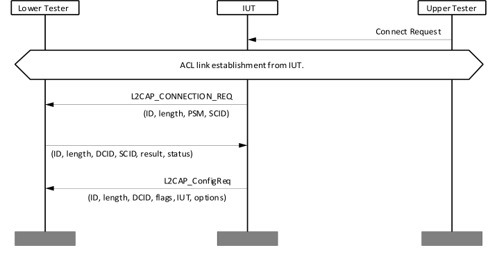

**Figure 4.1: L2CAP/COS/CED/BV-01-C [Request Connection]**

• Test Condition
The Lower Tester utilizes version L2CAP Basic Mode.
The Lower Tester’s Bluetooth device address BD_ADDR is defined. For parameters to send and receive, see [5].
The IUT acts as L2CAP initiator.
• Expected Outcome
Pass verdict
The IUT transmits L2CAP_CONNECTION_REQ over the signaling channel and dynamically allocates an SCID.
The IUT initiates the configuration process as indicated by the generation of an L2CAP_ConfigReq.
The IUT accepts configuration of the MTU=48 bytes.
• Test Purpose
Verify that the IUT can send DATA.
• Reference
[1] Table 6.1, Section 4
• Initial Condition
- The Lower Tester utilizes version L2CAP Basic Mode.
- The IUT is in the OPEN state for a data channel with assigned SCID and DCID. The IUT acts either as L2CAP initiator or as L2CAP acceptor.
• Test Procedure

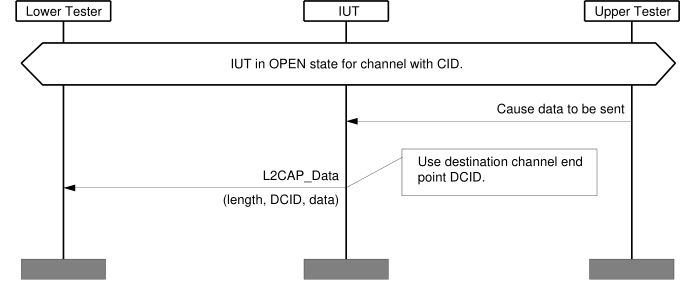

**Figure 4.2: L2CAP/COS/CED/BV-03-C [Send Data]**

• Expected Outcome
Pass verdict
The IUT transmits L2CAP_Data over the assigned channel with correct DCID assigned by the Lower Tester.
L2CAP/COS/CED/BV-04-C [Disconnect]
• Test Purpose
Verify that the IUT can disconnect the data channel.
• Reference
[1] Table 2.2, Table 6.1, 2.2, 4, 4.6
• Initial Condition
- The Lower Tester utilizes version L2CAP Basic Mode.
- The IUT is in the OPEN state for a data channel with assigned SCID and DCID. The IUT acts either as L2CAP initiator or as L2CAP acceptor.
• Test Procedure

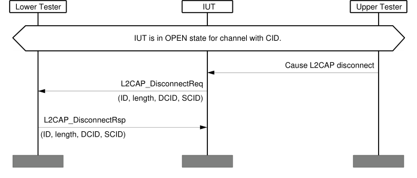

**Figure 4.3: L2CAP/COS/CED/BV-04-C [Disconnect]**

• Expected Outcome
Pass verdict
The IUT transmits a correct L2CAP_DisconnectReq.
L2CAP/COS/CED/BV-05-C [Accept Connection]
• Test Purpose
Verify that the IUT can receive and handle a request for connection establishment and configuration of an L2CAP data channel.
• Reference
[1] Table 6.1, 2.2, 4.2, 4.3
• Initial Condition
- The Lower Tester utilizes version L2CAP Basic Mode.
- The IUT is in CLOSED state. No ACL link exists. The IUT acts as L2CAP acceptor.
• Test Procedure
The Lower Tester imposes 48 byte MTU for both configuration directions.

| Lower Tester IUT Upper Tester ACL link establishment tester. L2CAP CONNECTION REQ _ _ (ID, length, PSM, SCID) L2CAP CONNECTION RSP _ _ (ID, length, DCID, SCID, result, status) L2CAP ConfigReq _ (ID, length, DCID, flags, MTU=48) L2CAP ConfigRsp _ (ID, length, SCID, flags, result=success, IUT options) L2CAP ConfigReq _ (ID, length, DCID, flags, IUT, options) L2CAP ConfigRsp _ (ID, length, SCID, flags, Result=success, MTU=48) |  |
| --- | --- |
|  |  |

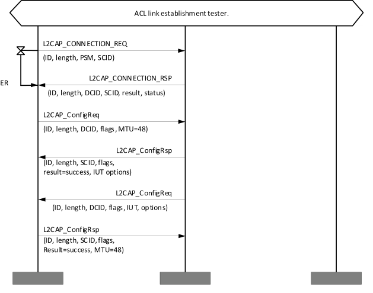

**Figure 4.4: L2CAP/COS/CED/BV-05-C [Accept Connection]**

• Expected Outcome
Pass verdict
The IUT sends a correct L2CAP_CONNECT_RSP before the RTX timer expires. The IUT responds with L2CAP_ConfigRsp to a received L2CAP_ConfigReq.
• Notes
The Lower Tester’s RTX timer is set to maximum allowed initial value.
L2CAP/COS/CED/BV-07-C [Accept Disconnect]
• Test Purpose
Verify that the IUT can respond to the request to disconnect the data channel.
• Reference
[1] Table 2.2, Table 6.1, 2.2, 4, 4.4, 4.5
• Initial Condition
- The Lower Tester utilizes version L2CAP Basic Mode.
- The IUT is in OPEN state for a data channel with assigned CID. The IUT acts either as L2CAP initiator or as L2CAP acceptor.
• Test Procedure

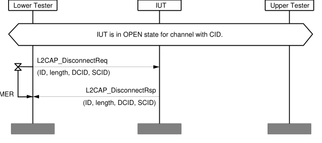

**Figure 4.5: L2CAP/COS/CED/BV-07-C [Accept Disconnect]**

• Expected Outcome
Pass verdict
The IUT sends a correct L2CAP_DisconnectRsp before the RTX timer expires.
• Notes
The Lower Tester’s RTX timer is set to maximum allowed initial value.
L2CAP/COS/CED/BV-08-C [Disconnect on Timeout]
• Test Purpose
Verify that the IUT disconnects the data channel and shuts down this channel if no response occurs.
• Reference
[1] 4.6, 4.7, 6.2.1
• Initial Condition
- The Lower Tester utilizes version L2CAP Basic Mode.
- The IUT is in WAIT CONFIG state for a data channel with assigned CID.
- The IUT acts either as L2CAP initiator or as L2CAP acceptor.
• Test Procedure

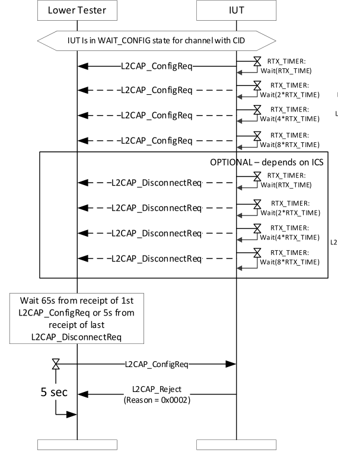

**Figure 4.6: L2CAP/COS/CED/BV-08-C [Disconnect on Timeout]**

The Lower Tester transmits L2CAP_ConfigReq 5 seconds after receiving the last L2CAP_DisconnectReq or 65 seconds after receiving the first L2CAP ConfigReq.
The IUT sends an L2CAP_Reject with reason 0x0002 “Invalid CID in request” in response to the L2CAP_ConfigReq received.
The supplier may be required to state the number of L2CAP_DisconnectReq retransmissions that the IUT performs.
Following the expiration of the RTX timer (at any timer reset), it is possible that the IUT terminates the ACL – in this case the test stops.
• Expected Outcome
Pass verdict
The IUT sends a correctly formatted L2CAP_ConfigReq to the Lower Tester.
If the IUT retransmits the L2CAP_ConfigReq more than once, each subsequent delay is at least twice the previous delay.
If the IUT sends an L2CAP_DisconnectReq, it is correctly formatted.
If the IUT retransmits the L2CAP_DisconnectReq more than once, each subsequent delay is at least twice the previous delay.
The IUT may terminate the ACL at the expiration of the RTX timer.
If the IUT does not terminate the ACL:
- The IUT does not transmit an L2CAP_ConfigRsp to the Lower Tester within 5 seconds of the L2CAP_ConfigReq sent by the Lower Tester.
- The IUT sends an L2CAP_Reject with reason 0x0002 “Invalid CID in request” in response to the L2CAP_ConfigReq received.
L2CAP/COS/CED/BV-09-C [Receive Multi-Command Packet]
• Test Purpose
Verify that the IUT can receive more than one signaling command in one L2CAP packet.
• Reference
[1] 4
• Initial Condition
- Either the IUT initiated the connection or the Lower Tester initiated the connection and the IUT is in CONFIG state for a data channel with assigned CID. The IUT may act as either L2CAP initiator or L2CAP acceptor. Either the initiator or responder can send the first L2CAP_ConfigReq.
• Test Procedure

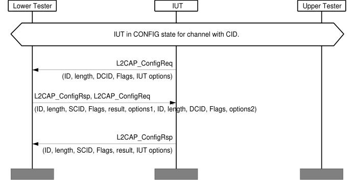

**Figure 4.7: L2CAP/COS/CED/BV-09-C [Receive Multi-Command Packet]**

• Expected Outcome
Pass verdict
ALT1:
The IUT sends a correctly formatted L2CAP_ConfigReq to the Lower Tester, the first on the CID, and, having received an L2CAP_ConfigRsp and an L2CAP_ConfigReq in a single L2CAP packet from the Lower Tester, sends a correctly formatted L2CAP_ConfigRsp to the Lower Tester within 60s.
The IUT, having received the first L2CAP_ConfigReq from the Lower Tester and having sent a correctly formatted L2CAP_ConfigRsp to the Lower Tester, sends a correctly formatted L2CAP_ConfigReq to the Lower Tester and, upon reception of an L2CAP_ConfigRsp and an L2CAP_EchoReq in a single L2CAP packet from the Lower Tester, sends an L2CAP_EchoRsp to the Lower Tester within 60s.
L2CAP/COS/CED/BV-10-C [Transmit I-frames]
• Test Purpose
Verify that IUT can transmit I-frames including correct CRC.
• Reference
[1] 5.4, 7.4
• Initial Condition
- The IUT is in OPEN state for data channel with assigned CID. L2CAP connection configured as Flow Control only mode.
• Test Procedure

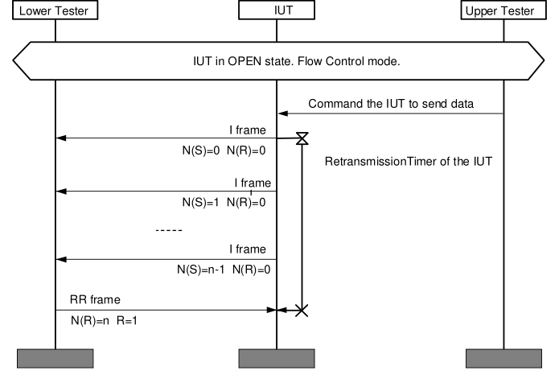

**Figure 4.8: L2CAP/COS/CED/BV-10-C [Transmit I-frames]**

• Expected Outcome
Pass verdict
The IUT sends I-frames until TxWindow is full.
Data in the I-frames matches that provided by the Upper Tester. CRC value is set per the specification.
• Test Purpose
Verify that the IUT can configure the supported MTU size.
• Reference
[1] 5
• Initial Condition
- Maximum supported MTU size set in TSPX_l2ca_inmtu.
- The IUT acts either as L2CAP initiator or as L2CAP acceptor.
• Test Procedure

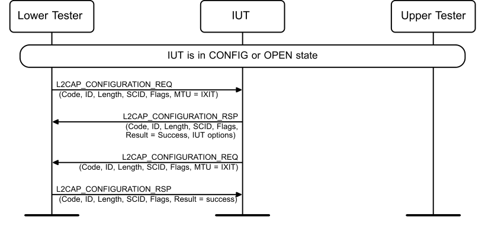

**Figure 4.9: L2CAP/COS/CED/BV-11-C [Configure MTU Size]**

• Expected Outcome
Pass verdict
The IUT sends a correct L2CAP_ConfigRsp to the Lower Tester accepting the MTU.
The IUT sends a correct L2CAP_ConfigReq to the Lower Tester indicating maximum supported MTU.
• Notes
The MTU size option may be omitted from the L2CAP_ConfigReq if TSPX_l2ca_inmtu.
L2CAP/COS/CED/BV-12-C [Recombination of Signaling Packets]
• Test Purpose
Verify that the IUT correctly handles fragmented L2CAP signaling PDUs.
• Reference
[1] 3.1, 4.2, 4.3, 7.2.2
• Initial Condition
- The Lower Tester utilizes version L2CAP Basic Mode.
- The IUT is in CLOSED state. No ACL link is established. The IUT acts as L2CAP acceptor.
• Test Procedure
The testing procedure is executed similar to L2CAP/COS/CED/BV-05-C [Accept Connection], with the exception that each transmission (C-frame) from the Lower Tester is fragmented into two fragments.
The IUT waits for all the fragments of each C-frame before interpreting the latter, i.e., until the received size of the C-frame equals the value of the PDU Length field of the C-frame + length of the L2CAP header (4 octets).

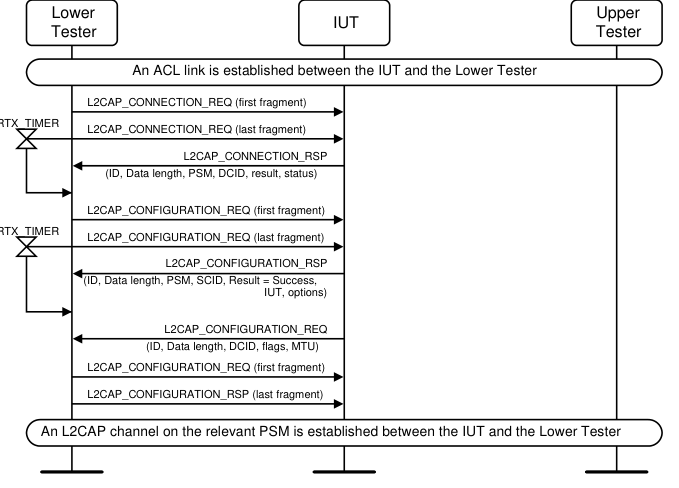

**Figure 4.10: L2CAP/COS/CED/BV-12-C [Recombination of Signaling Packets]**

• Expected Outcome
Pass verdict
The IUT sends correct L2CAP signaling PDUs before the RTX timer expires in response to the correctly recombined L2CAP PDUs sent by the Lower Tester.
• Notes
The Lower Tester’s RTX timer is set to maximum allowed initial value.
It is allowed for the IUT to fragment its signaling packets, as well.
L2CAP/COS/CED/BV-13-C [Recombination of Data Packets]
• Test Purpose
Verify that the IUT correctly handles fragmented L2CAP data PDUs.
• Reference
[1] 3.1, 7.2.2
• Initial Condition
- The Lower Tester utilizes L2CAP Basic Mode.
- The IUT is in the OPEN state for a data channel with assigned SCID and DCID. The IUT acts as L2CAP acceptor.
• Test Procedure
The Lower Tester sends Basic information frames (B-frame) on the established CID, with PDU Length equal to 10 bytes, fragmented into two fragments.

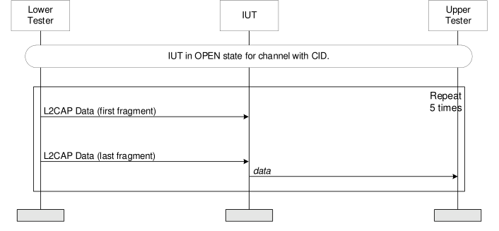

**Figure 4.11: L2CAP/COS/CED/BV-13-C [Recombination of Data Packets]**

• Expected Outcome
Pass verdict
The IUT receives and correctly recombines the B-frames and sends the data to the Upper Tester. The data sent to the Upper Tester matches the data sent by the Lower Tester, for each transmission.
L2CAP/COS/CED/BI-02-C [Incorrect Size Signaling Packets]
• Test Purpose
Verify that the IUT properly handles L2CAP signaling PDUs that have invalid length.
• Reference
[1] 3.1, 4.2, 4.3, 7.2.2
• Initial Condition
- The Lower Tester utilizes version L2CAP Basic Mode.
- No security is used in this test case.
- The appropriate signaling channel for the transport is used.
- The IUT is in CLOSED state. The IUT acts as an L2CAP acceptor.
• Test Procedure

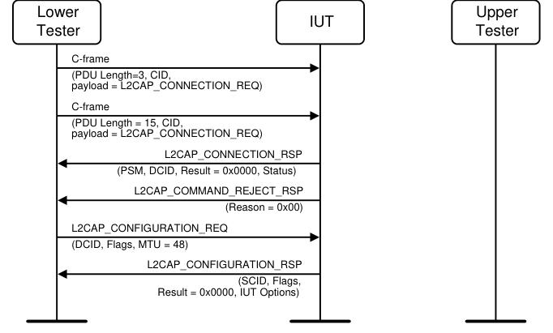

**Figure 4.12: L2CAP/COS/CED/BI-02-C [Incorrect Size Signaling Packets]**

1. The Lower Tester sends a C-frame to the IUT with PDU Length smaller than the signaling
packet’s actual size, Channel ID set to the correct signaling channel for the logical link, and the Information payload containing a correct L2CAP_CONNECTION_REQ packet (of length 12 bytes). 2. The IUT discards the frame. 3. The Lower Tester sends a C-frame to the IUT with PDU Length = 15, Channel ID set to the
correct signaling channel for the logical link, and the Information payload containing a correct L2CAP_CONNECTION_REQ packet (of length 12 bytes), padded with “0”s. 4. The IUT sends a correctly formatted L2CAP_CONNECTION_RSP to the Lower Tester and an
L2CAP_COMMAND_REJECT_RSP rejecting the partial packet, with Reason = 0x0000 (“Command not understood”). 5. The Lower Tester sends a correctly formatted C-frame to the IUT with valid PDU Length and
Channel ID set to the correct signaling channel for the logical link. 6. The Information payload contains the signaling packet L2CAP_CONFIGURATION_REQ. 7. The IUT sends the respective valid response packet to the Lower Tester.
• Expected Outcome
Pass verdict
In step 4, the IUT sends an L2CAP_CONNECTION_RSP only in response to the second C-frame.
In step 5, the IUT correctly handles the received C-frame, sending the correctly formatted proper response to the Lower Tester.

#### 4.10.2 Encryption Key Size

Tests for insufficient encryption key size require an encrypted link with a key size less than the size required by an L2CAP channel. The encryption key size requirements of attributes are determined by the associated profile.
Preamble procedure:
Establish an encrypted link over the LE transport between the IUT and the Lower Tester. For example, see test SM/CEN/EKS/BV-01-C or SM/PER/EKS/BV-02-C in [16] for LE transport, or LMP/ENC/BV-01-C
or LMP/ENC/BV-05-C in [17] for BR/EDR transport. The key size is less than the size required by the security requirements of the L2CAP channel.

#### 4.10.3 Configuration of Data Channel CFD

Verify the procedures for configuration of a data channel.
L2CAP/COS/CFD/BV-01-C [Continuation Flag]
• Test Purpose
Verify that the IUT can receive configuration requests that have the continuation flag set.
• Reference
[1] Table 6.1, 4.4, 4.5, 5
• Initial Condition
- The IUT is in CONFIG state for a data channel with assigned CID. The IUT’s request path is already configured. The connection was initiated from the Lower Tester.
• Test Procedure

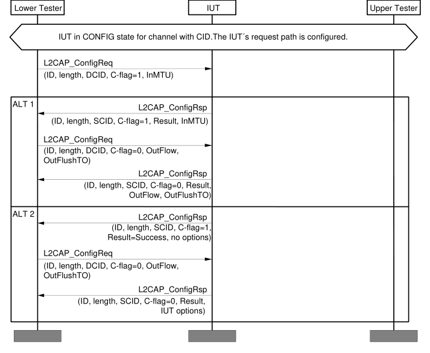

**Figure 4.13: L2CAP/COS/CFD/BV-01-C [Continuation Flag]**

• Test Condition
Acceptable configuration parameter values are supplied by the manufacturer.
• Expected Outcome
Pass verdict
The IUT responds to each L2CAP_ConfigReq message with an L2CAP_ConfigRsp message indicating "success". The response to the first message has the continuation flag set. The final response has the continuation flag cleared. One of the two responses indicates an MTU size equal to that in the request.
• Notes
The Lower Tester sets the most significant bit of the type parameter to '1', indicating a "hint", for the optional parameters Quality of Service, and Retransmission and Flow Control. If the IUT supports the optional parameter, it accepts the default value; if it does not support an optional parameter, it should ignore the hint and take no additional action.
L2CAP/COS/CFD/BV-02-C [Negotiation with Reject]
• Test Purpose
Verify that the IUT can perform negotiation while the Lower Tester rejects the proposed configuration parameter values.
• Reference
[1] Table 6.1, 4.4, 4.5
• Initial Condition
- The Lower Tester utilizes version L2CAP Basic Mode.
- The IUT is in CONFIG state for a data channel with assigned CID. The IUT acts either as L2CAP initiator or as L2CAP acceptor.
• Test Procedure

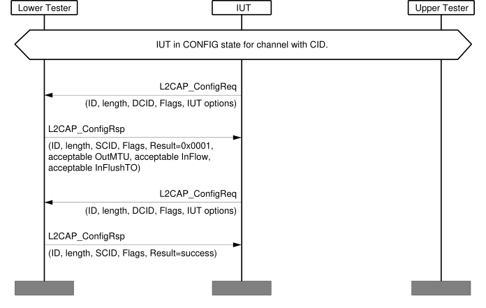

**Figure 4.14: L2CAP/COS/CFD/BV-02-C [Negotiation with Reject]**

• Test Condition
Acceptable configuration parameter values have to be stated by the manufacturer.
• Expected Outcome
Pass verdict
The IUT sends an L2CAP_ConfigReq with acceptable values received in the L2CAP_ConfigRsp with Result= Failure – unacceptable parameters or the L2CAP_ConfigReq contains no options.
or
The IUT closes the channel.
L2CAP/COS/CFD/BV-03-C [Send Requested Options]
• Test Purpose
Verify that the IUT can receive a configuration request with no options and send the requested options to the Lower Tester.
• Reference
[1] Table 6.1, 4.4, 4.5
• Initial Condition
- The Lower Tester utilizes version L2CAP Basic Mode.
- The IUT is in CONFIG state for data channel with assigned CID. The IUT acts either as L2CAP initiator or as L2CAP acceptor.
• Test Procedure

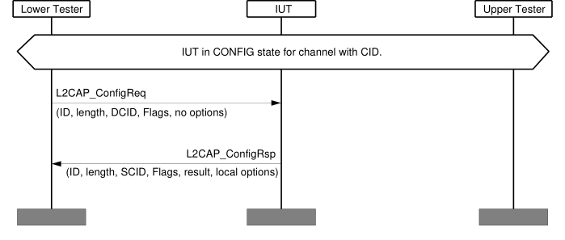

**Figure 4.15: L2CAP/COS/CFD/BV-03-C [Send Requested Options]**

• Expected Outcome
Pass verdict
The IUT sends an L2CAP_ConfigRsp before expiration of RTX timer.
• Notes
The Lower Tester uses maximum value for RTX timer.
L2CAP/COS/CFD/BV-08-C [Non-blocking Config Response]
• Test Purpose
Verify that the IUT does not block transmitting L2CAP_ConfigRsp while waiting for L2CAP_ConfigRsp from the Lower Tester.
• Reference
[1] 4.4, 4.5
• Initial Condition
- The Lower Tester utilizes version L2CAP Basic Mode.
- The IUT is in CONFIG state for a channel with CID. The IUT acts as L2CAP initiator.
• Test Procedure

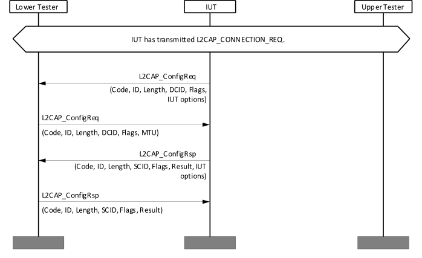

**Figure 4.16: L2CAP/COS/CFD/BV-08-C [Non-blocking Config Response]**

• Expected Outcome
Pass verdict
After receiving L2CAP_ConfigReq from the Lower Tester, the IUT transmits L2CAP_ConfigRsp to the Lower Tester.
• Notes
The Lower Tester uses an MTU value not exceeding what is transmitted from the IUT in the L2CAP_ConfigReq. Other options have default or accepted values, and hence, need not be transmitted. It is implementation dependent which options are transmitted by the IUT.
L2CAP/COS/CFD/BV-09-C [Mandatory 48 Byte MTU]
• Test Purpose
Verify that the IUT can support mandatory 48 byte MTU.
• Reference
[1] 5.1, 7.1
• Initial Condition
- The IUT is in CONFIG state for a channel with CID.
- The IUT acts as L2CAP initiator.
• Test Procedure
Lower Tester IUT

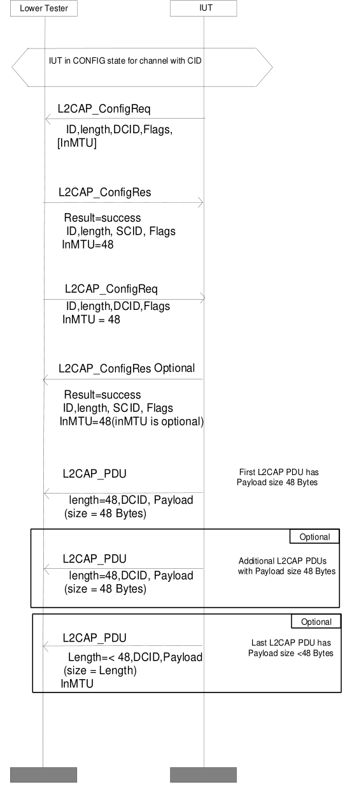

**Figure 4.17: L2CAP/COS/CFD/BV-09-C [Mandatory 48 Byte MTU]**

• Expected Outcome
Pass verdict
The IUT transmits a configuration request containing InMTU or omit the InMTU. Regardless of indicated MTU, when the Lower Tester responds with MTU=48 the configuration completes successfully without further negotiation.
The IUT responds with MTU=48 or omit the MTU in its configuration response. The configuration completes successfully without further negotiation.
• Notes
In part 1) the IUT may request any MTU > 48.
L2CAP/COS/CFD/BV-10-C [Retransmission Mode Negotiation]
• Test Purpose
Verify that the IUT can negotiate L2CAP F+E for Retransmission mode.
• Reference
[1] 5.3, 7.4
• Initial Condition
- The IUT is in CONFIG state for a data channel with assigned CID.
• Test Procedure

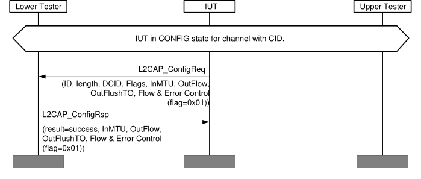

**Figure 4.18: L2CAP/COS/CFD/BV-10-C [Retransmission Mode Negotiation]**

• Expected Outcome
Pass verdict
The IUT sends an L2CAP_ConfigReq with L2CAP Flow and Error control option for Retransmission mode.
L2CAP/COS/CFD/BV-11-C [Negotiation of Unsupported Parameter]
• Test Purpose
Verify that the IUT can negotiate when the Lower Tester proposes an unsupported configuration parameter value.
• Reference
[1] 4.4, 4.5
• Initial Condition
- The IUT is in CONFIG state. Unsupported configuration options values that result in a 0x0001 Response are given as the TSPX_unsupported_config_options IXIT.
• Test Procedure
The Lower Tester proposes configuration parameter values the IUT does not support.
The IUT acts either as L2CAP initiator or as L2CAP acceptor.

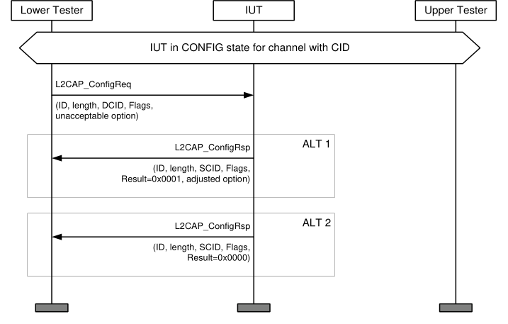

**Figure 4.19: L2CAP/COS/CFD/BV-11-C [Negotiation of Unsupported Parameter]**

• Expected Outcome
Pass verdict
The IUT negotiates the configuration parameters to supported values (ALT 1). If NO unacceptable options are possible (as stated in the IXIT), the IUT may respond as shown in ALT 2.
L2CAP/COS/CFD/BV-12-C [Unknown Option Response]
• Test Purpose
Verify that the IUT can give the appropriate error code when the Lower Tester proposes any number of unknown options that are optional.
• Reference
[1] 4.4, 4.5
• Initial Condition
- The IUT is in CONFIG state. Supported configuration option types are given as IXIT.
- The IUT either acts as L2CAP initiator or as L2CAP acceptor.
• Test Procedure
Repeat the steps for each round in Table 4.3.
The Lower Tester transmits a configuration request with a number of options as specified in Table 4.3 where the option types are not supported by the IUT and all have the MSB set to 1.

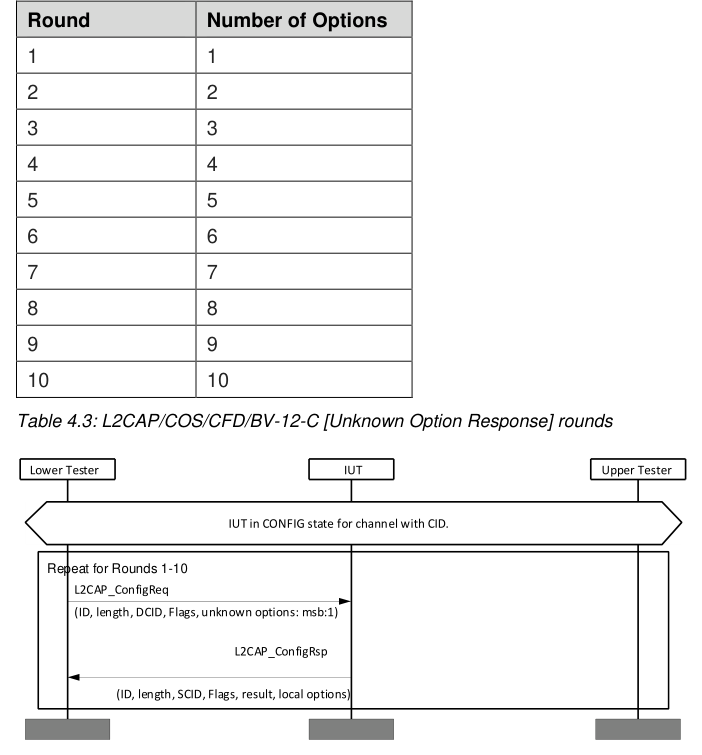

**Figure 4.20: L2CAP/COS/CFD/BV-12-C [Unknown Option Response]**

• Expected Outcome
Pass verdict
The IUT transmits L2CAP_ConfigRsp before expiration of RTX timer.
L2CAP/COS/CFD/BV-13-C [Flow Control Mode Negotiation]
• Test Purpose
Verify that the IUT can negotiate L2CAP F+E for Flow Control only mode.
• Reference
[1] 5.4, 7.4
• Initial Condition
- The IUT is in CONFIG state for a data channel with assigned CID.
• Test Procedure

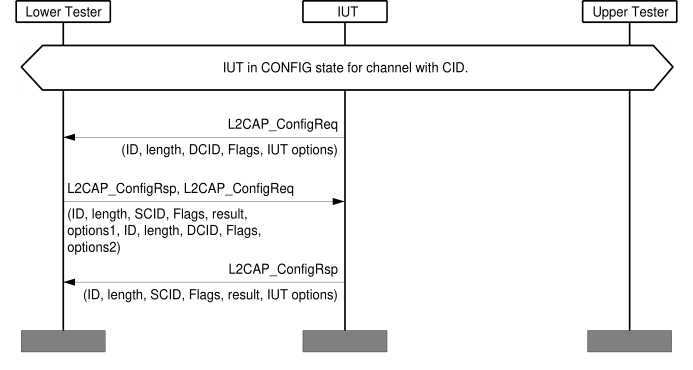

**Figure 4.21: L2CAP/COS/CFD/BV-13-C [Flow Control Mode Negotiation]**

• Expected Outcome
Pass verdict
The IUT sends an L2CAP_ConfigReq with L2CAP Flow and Error control option for Flow Control only mode.
L2CAP/COS/CFD/BV-14-C [Unknown Mandatory Options Request]
• Test Purpose
Verify that the IUT can give the appropriate error code when the Lower Tester proposes any number of unknown options where at least one is mandatory.
• Reference
[1] 4.4, 4.5
• Initial Condition
- The IUT is in CONFIG state. Supported configuration option types are given as IXIT.
- The IUT acts either as L2CAP initiator or as L2CAP acceptor.
• Test Procedure
The Lower Tester transmits a configuration request with a number of options as specified in Table 4.4 where the option types are not supported by the IUT and have the MSBs set as specified in Table 4.4.

| Round |  |  | Number of Options |  |  | MSB value |  |
| --- | --- | --- | --- | --- | --- | --- | --- |
| 1 |  | 1 |  |  | All set to 0 |  |  |
| 2 |  | 2 |  |  | All set to 1, except the last one set to 0 |  |  |
| 3 |  | 3 |  |  | All set to 0 |  |  |
| 4 |  | 4 |  |  | Two at random set to 0, the rest set to 1 |  |  |
| 5 |  | 5 |  |  | All set to 1, except the last one set to 0 |  |  |
| 6 |  | 6 |  |  | Two at random set to 0, the rest set to 1 |  |  |
| 7 |  | 7 |  |  | All set to 0 |  |  |

| Round |  |  | Number of Options |  |  | MSB value |  |
| --- | --- | --- | --- | --- | --- | --- | --- |
| 8 |  | 8 |  |  | All set to 1, except the last one set to 0 |  |  |
| 9 |  | 9 |  |  | Two at random set to 0, the rest set to 1 |  |  |
| 10 |  | 10 |  |  | All set to 1, except the last one set to 0 |  |  |

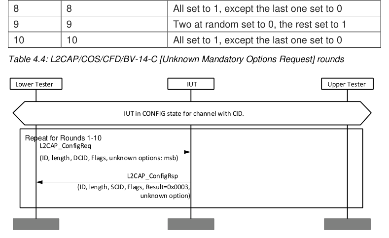

**Figure 4.22: L2CAP/COS/CFD/BV-14-C [Unknown Mandatory Options Request]**

• Expected Outcome
Pass verdict
The IUT transmits an L2CAP_ConfigRsp with Result=0x0003 and specifying one of the unsupported options that has the MSB set to 0.

#### 4.10.4 Implementation Specific Information Exchange IEX

Verify the implementation specific information exchange feature.
L2CAP/COS/IEX/BV-01-C [Query for 1.2 Features]
• Test Purpose
Verify that the IUT transmits an information request command to solicit if the remote device supports Specification 1.2 features.
• Reference
[1] 4.10, 4.11
• Initial Condition
- The IUT is in any state.
• Test Procedure

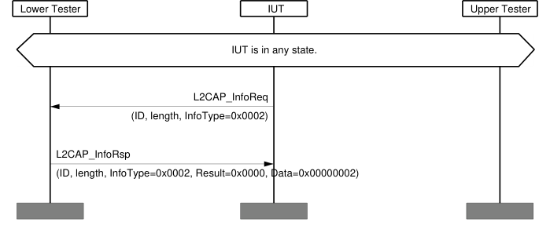

**Figure 4.23: L2CAP/COS/IEX/BV-01-C [Query for 1.2 Features]**

• Expected Outcome
Pass verdict
The IUT transmits L2CAP_InfoReq with InfoType=0x0002.
L2CAP/COS/IEX/BV-02-C [Respond with 1.2 Features]
• Test Purpose
Verify that the IUT responds to an information request command soliciting for Specification 1.2 features.
• Reference
[1] 4.10, 4.11, 4.12
• Initial Condition
- The IUT is in any state.
• Test Procedure

| Lower Tester |  |
| --- | --- |
|  |  |
|  | IUT in a L2CAP InfoReq _ |
|  | (ID, length, InfoType=0x0002) L2CAP InfoRsp _ |
|  |  |

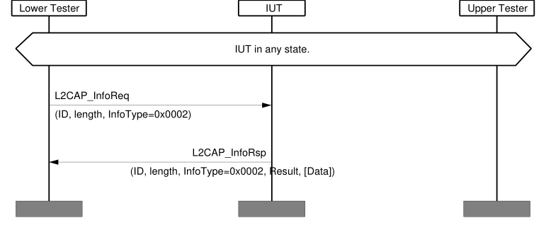

**Figure 4.24: L2CAP/COS/IEX/BV-02-C [Respond with 1.2 Features]**

• Expected Outcome
Pass verdict
The IUT transmits L2CAP_InfoRsp with InfoType=0x0002.
If the IUT supports any extended features:
The Result=Success and Data is formatted correctly for an Extended Feature Mask.
Otherwise:
The Result=Success, and Data is set to 0x0000 0000, OR
The Result=Not Supported, and Data is not present.

#### 4.10.5 Echo Handling ECH

Verify the procedures for echo handling, which means link testing and passing of vendor specific information with the ECHO_REQUEST and ECHO_RESPONSE signaling command.
L2CAP/COS/ECH/BV-01-C [Respond to Echo Request]
• Test Purpose
Verify that the IUT responds to an echo request.
• Reference
[1] Table 6.1, 4.8, 4.9
• Initial Condition
- The Lower Tester utilizes version L2CAP Basic Mode.
- The IUT is in CLOSED state for data channel. No ACL link is established. The IUT  acts as L2CAP acceptor.
• Test Procedure

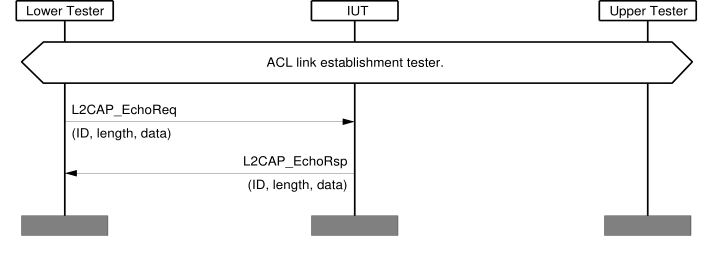

**Figure 4.25: L2CAP/COS/ECH/BV-01-C [Respond to Echo Request]**

• Expected Outcome
Pass verdict
The IUT sends an L2CAP_EchoRsp before expiration of RTX timer.
• Notes
The Lower Tester uses maximum value for RTX timer.
• Test Purpose
Verify that the IUT sends an echo request.
• Reference
[1] Table 6.1, 4.8, 4.9
• Initial Condition
- The Lower Tester utilizes version L2CAP Basic Mode.
- The IUT is in CLOSED state for data channel. No ACL link is established. The IUT acts as L2CAP initiator.
• Test Procedure
ACL link establishment is part of the test case.

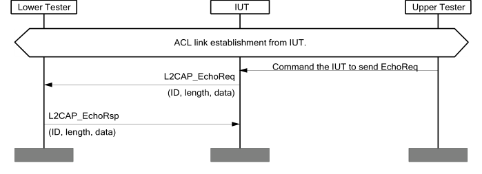

**Figure 4.26: L2CAP/COS/ECH/BV-02-C [Send Echo Request]**

• Test Condition
It must be possible to send an echo request from the Upper Tester to the Lower Tester.
• Expected Outcome
Pass verdict
The IUT sends an L2CAP_EchoReq.

#### 4.10.6 LE Credit Based Flow Control Mode

Verify the correct implementation of the data channel in LE Credit Based Flow Control mode.
L2CAP/COS/CFC/BV-01-C [Segmentation]
• Test Purpose
Verify that the IUT can send data segments that are larger than the K-frame payload size.
• Reference
[12] 3.4
• Initial Condition
- The appropriate signaling channel for the transport is used.
- An LE Data Channel is established on the SPSM declared via IXIT with credits returned to the IUT by the Lower Tester.
- The role of the IUT is indicated in the IXIT.
- The MTU and MPS of the Lower Tester are indicated in the IXIT.
- The Upper Tester can command the IUT to send data.
• Test Procedure

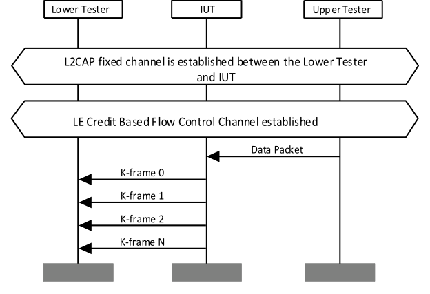

**Figure 4.27: L2CAP/COS/CFC/BV-01-C [Segmentation]**

The Upper Tester sends a data packet to the IUT which is larger than or equal to the Lower Tester’s MPS and smaller than or equal to the Lower Tester’s MTU.
• Expected Outcome
Pass verdict
The IUT sends at least one K-frame containing data to the Lower Tester.
If the Upper Test sends a data packet to the IUT which is larger than the Lower Tester’s MPS and smaller than the Lower Tester’s MTU, the IUT segments the K-frames correctly.
The data sent by the IUT to the Lower Tester matches the data sent to the IUT by the Upper Tester.
L2CAP/COS/CFC/BV-02-C [No Segmentation]
• Test Purpose
Verify that the IUT can send data segments that do not require segmentation.
• Reference
[12] 3.4
• Initial Condition
- The appropriate signaling channel for the transport is used.
- An LE Data Channel is established on the SPSM declared via IXIT with credits returned to the IUT by the Lower Tester.
- The role of the IUT is indicated in the IXIT.
• Test Procedure

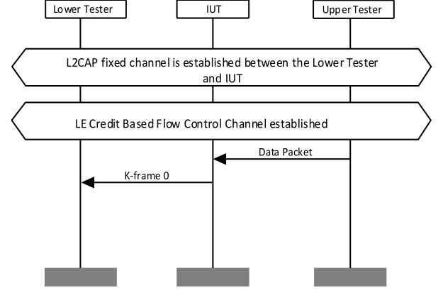

**Figure 4.28: L2CAP/COS/CFC/BV-02-C [No Segmentation]**

The Upper Tester sends a data packet of one octet to the IUT.
• Expected Outcome
Pass verdict
The IUT send a K-frame containing the data to the Lower Tester.
The data sent by the IUT to the Lower Tester matches the data sent to the IUT by the Upper Tester.
L2CAP/COS/CFC/BV-03-C [Reassembling]
• Test Purpose
Verify that the IUT can correctly reassemble data received from the Lower Tester where the L2CAP SDU Length is greater than the IUT K-frame payload size.
• Reference
[12] 3.4
• Initial Condition
- The appropriate signaling channel for the transport is used.
- An LE Data Channel is established on the SPSM declared via IXIT.
- The role of the IUT is indicated in the IXIT.
• Test Procedure

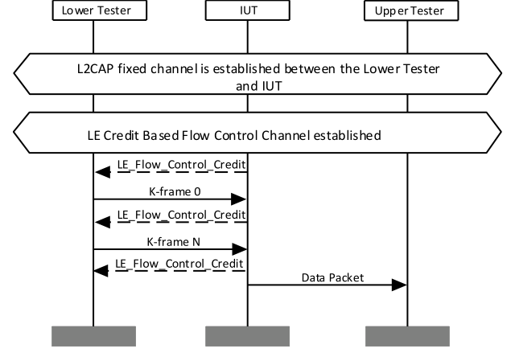

**Figure 4.29: L2CAP/COS/CFC/BV-03-C [Reassembling]**

(Optional) If the channel was created with zero credits, the Upper Tester issues a command to the IUT to send credits.
The Lower Tester sends data in a series of K-frames to the IUT with the L2CAP SDU Length smaller than the IUT MTU.
• Expected Outcome
Pass verdict
The IUT correctly reassembles the data received from the Lower Tester and sends it to the Upper Tester.
The data sent to the Upper Tester matches the data sent by the Lower Tester.
L2CAP/COS/CFC/BV-04-C [Data Receiving]
• Test Purpose
Verify that the IUT can receive unsegmented data correctly.
• Reference
[12] 3.4
• Initial Condition
- The appropriate signaling channel for the transport is used.
- An LE Data Channel is established on the SPSM declared via IXIT.
- The role of the IUT is indicated in the IXIT.
• Test Procedure

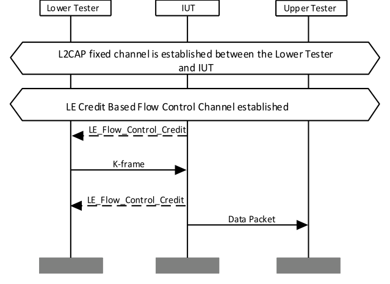

**Figure 4.30: L2CAP/COS/CFC/BV-04-C [Data Receiving]**

(Optional) If the channel was created with zero credits, the Upper Tester issues a command to the IUT to send credits.
The Lower Tester sends data in a single K-frame to the IUT. The SDU length is less than or equal to the length of the K-frame - 2.
• Expected Outcome
Pass verdict
The IUT sends the received data to the Upper Tester
The data sent to the Upper Tester by the IUT matches the data sent by the Lower Tester to the IUT
L2CAP/COS/CFC/BV-05-C [Multiple Channels with Interleaved Data Streams]
• Test Purpose
Verify that an IUT can create multiple channels and receives data streams on the channels when the streams are interleaved.
• Reference
[12] 4.22
• Initial Condition
- The appropriate signaling channel for the transport is used.
- The LE Data Channel is established using the SPSM declared via IXIT.
- The role of the IUT is indicated in the IXIT.
• Test Procedure

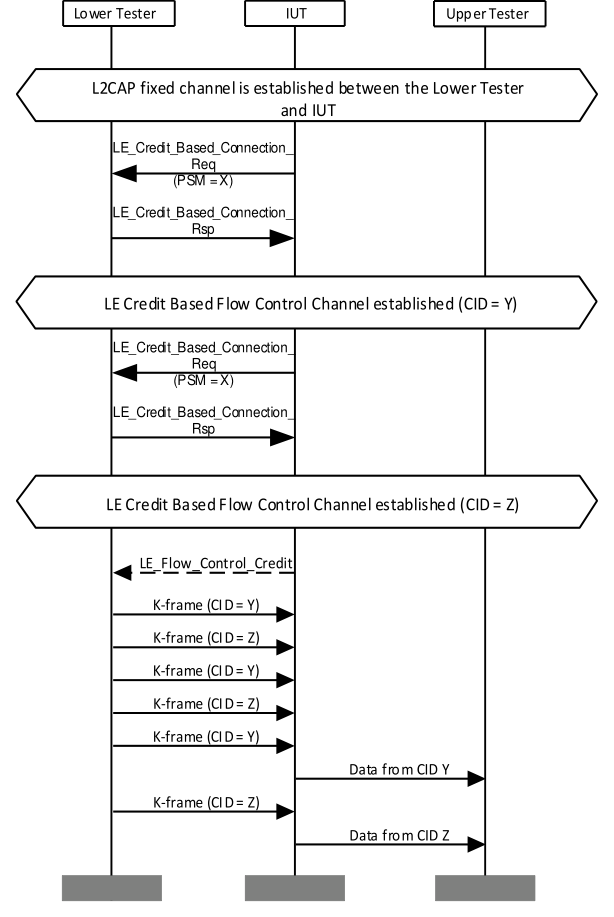

**Figure 4.31: L2CAP/COS/CFC/BV-05-C [Multiple Channels with Interleaved Data Streams]**

(Optional) If the channel was created with zero credits, the Upper Tester issues a command to the IUT to send credits.
The Lower Tester sends data on the different channels interleaved.
• Expected Outcome
Pass verdict
The IUT sends the received data to the Upper Tester.
The data sent to the Upper Tester matches the data sent by the Lower Tester.
• Test Purpose
Verify that the IUT correctly handles fragmented L2CAP signaling PDUs.
• Initial Condition
- The signaling channel specified in Table 4.5 is used.
- An SPSM for the desired Credit Based or Enhanced Credit Based Flow Control based channel is declared via IXIT.
• Test Case Configuration

| Test Case ID | Reference |  | Signaling |  | L2CAP Command |
| --- | --- | --- | --- | --- | --- |
|  |  |  | Channel |  |  |
| L2CAP/LE/CFC/BV-30-C [Recombination of Signaling Packets] | [1] 4.22, 4.23 | 0x0005 |  |  | L2CAP LE CREDIT BASED CONNECTION REQ/RSP _ _ _ _ _ |
| L2CAP/ECFC/BV-39-C [Recombination of Signaling Packets - LE] | [1] 4.25, 4.26 | 0x0005 |  |  | L2CAP CREDIT BASED CONNECTION REQ/RSP _ _ _ _ |
| L2CAP/ECFC/BV-40-C [Recombination of Signaling Packets – BR/EDR] | [1] 4.25, 4.26 | 0x0001 |  |  | L2CAP CREDIT BASED CONNECTION REQ/RSP _ _ _ _ |

Table 4.5: Recombination of Signaling Packets test cases
• Test Procedure

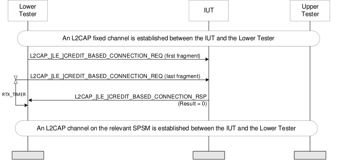

**Figure 4.32: Recombination of Signaling Packets**

The L2CAP Credit Based Connection Request/Response commands are specified in Table 4.5.
The Lower Tester sends a valid connection request command, with nonzero credits to the IUT on the SPSM specified in the initial condition, fragmented into two fragments.
The IUT responds with a connection request response and establishes the credit-based channel.
• Expected Outcome
Pass verdict
The IUT sends a correct connection request response in response to the connection request command received in the recombined C-frame.
• Note
It is allowed for the IUT to fragment its signaling packets, as well.

##### 4.10.6.2 Recombination of Data Packets

• Test Purpose
Verify that the IUT correctly handles fragmented L2CAP data PDUs.
• Reference
[12] 3.4
• Initial Condition
- The signaling channel specified in Table 4.6 is used.
- A Data Channel over the relevant bearer is established on the SPSM declared via IXIT using the commands specified in Table 4.6.
- The role of the IUT is indicated in the IXIT.
• Test Case Configuration

| Test Case ID | Reference |  | Signaling |  | L2CAP Command |
| --- | --- | --- | --- | --- | --- |
|  |  |  | Channel |  |  |
| L2CAP/LE/CFC/BV-31-C [Recombination of Data Packets] | [1] 3.4, 7.2.2 | 0x0005 |  |  | L2CAP LE CREDIT BASED CONNECTION REQ/RSP _ _ _ _ _ |
| L2CAP/ECFC/BV-41-C [Recombination of Data Packets] | [1] 3.4, 7.2.2 | 0x0005 |  |  | L2CAP CREDIT BASED CONNECTION REQ/RSP _ _ _ _ |
| L2CAP/ECFC/BV-42-C [Recombination of Data Packets] | [1] 3.4, 7.2.2 | 0x0001 |  |  | L2CAP CREDIT BASED CONNECTION REQ/RSP _ _ _ _ |

Table 4.6: Recombination of Data Packets test cases
• Test Procedure
(Optional, for LE Credit-based) If the channel has been created with zero credits, the Upper Tester issues a command to the IUT to send credits to the Lower Tester.
The Lower Tester sends Credit-based frames (K-frame) on the established CID, with PDU Length equal to 10 bytes, fragmented into two fragments.
The IUT recombines the fragments and sends the received data to the Upper Tester.

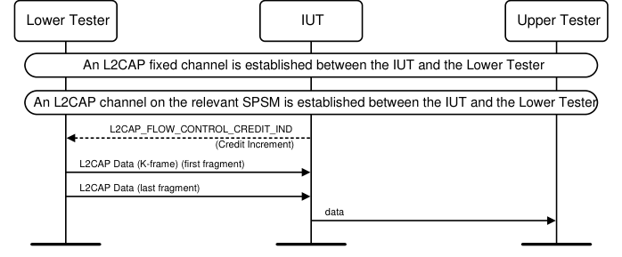

**Figure 4.33: Recombination of Data Packets**

• Expected Outcome
Pass verdict
The IUT receives the fragments and recombines them into correctly formatted K-frames and sends the data to the Upper Tester. The data sent to the Upper Tester matches the data sent by the Lower Tester.

##### 4.10.6.3 Incorrect Size Signaling Packets

• Test Purpose
Verify that the IUT properly handles L2CAP signaling PDUs that have invalid PDU length.
• Initial Condition
- The signaling channel specified in Table 4.7 is used.
- An SPSM for the desired Credit Based or Enhanced Credit Based Flow Control based channel is declared via IXIT.
• Test Case Configuration

| Test Case ID | Reference |  | Signaling |  | L2CAP Command |
| --- | --- | --- | --- | --- | --- |
|  |  |  | Channel |  |  |
| L2CAP/LE/CFC/BI-02-C [Incorrect Size Signaling Packets] | [1] 4.22, 4.23 | 0x0005 |  |  | L2CAP LE CREDIT BASED CONNECTION REQ/RSP _ _ _ _ _ |
| L2CAP/ECFC/BI-08-C [Incorrect Size Signaling Packets] | [1] 4.25, 4.26 | 0x0005 |  |  | L2CAP CREDIT BASED CONNECTION REQ/RSP _ _ _ _ |

Table 4.7: Incorrect Size Signaling Packets test cases
• Test Procedure
The L2CAP Credit Based Connection Request/Response commands are specified in Table 4.7.

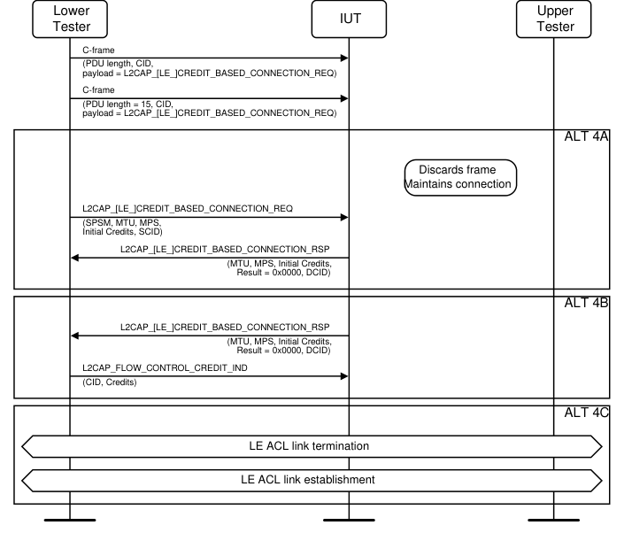

**Figure 4.34: Incorrect Size Signaling Packets**

1. The Lower Tester sends a C-frame to the IUT with PDU Length smaller than the signaling
packet’s actual size, Channel ID set to the correct signaling channel for the logical link, and the Information payload containing a correct connection request command packet. The connection request command packet contains only one SCID. 2. The IUT discards the frame. 3. The Lower Tester sends a C-frame to the IUT with PDU Length = 21, Channel ID set to the
correct signaling channel for the logical link, and the Information payload containing a correct connection request command packet padded with “0”s. The connection request command packet contains only one SCID. 4. Perform alternative 4A, 4B, or 4C depending on how the IUT responds to the L2CAP packet:
Alternative 4A (The IUT discards the frame):
4A.1 The IUT discards the frame. 4A.2 The Lower Tester sends a correctly formatted C-frame to the IUT with valid PDU Length and Channel ID set to the correct signaling channel for the logical link. The Information payload contains the signaling connection request command. 4A.3 The IUT sends a correctly formatted connection request response packet.
4B.1 The IUT sends a correctly formatted connection request response packet. 4B.2 The Lower Tester sends a correctly formatted C-frame to the IUT with valid PDU Length and Channel ID set to the correct signaling channel for the logical link. The Information payload contains the signaling packet L2CAP_FLOW_CONTROL_CREDIT_IND. Alternative 4C (The IUT terminates the link):
4C.1 The IUT terminates the link. 4C.2 Re-establish the connection and stop the test. • Expected Outcome
Pass verdict
In steps 4A.3 and 4B.2, the IUT correctly handles the received C-frame.
In step 4C.1, the IUT allows the connection to be re-established.
L2CAP/ECFC/BI-09-C [Incorrect Size Signaling Packets, BR/EDR]
• Test Purpose
Verify that the IUT properly handles L2CAP signaling PDUs that have invalid length over BR/EDR.
• Initial Condition
- The appropriate signaling channel for the transport is used.
- No security is used in this test case.
- An SPSM for the desired Credit Based Flow Control based channel is declared via IXIT.
• Test Procedure

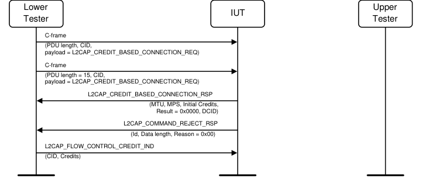

**Figure 4.35: L2CAP/ECFC/BI-09-C [Incorrect Size Signaling Packets]**

1. The Lower Tester sends a C-frame to the IUT with PDU Length smaller than the signaling
packet’s actual size, Channel ID set to the correct signaling channel for the logical link, and the Information payload containing a correct L2CAP_CREDIT_BASED_CONNECTION_REQ packet. The L2CAP_CREDIT_BASED_CONNECTION_REQ packet contains only one SCID. 2. The IUT discards the frame. 3. The Lower Tester sends a C-frame to the IUT with PDU Length = 15, Channel ID set to the
correct signaling channel for the logical link, and the Information payload containing a correct L2CAP_CREDIT_BASED_CONNECTION_REQ packet (of length 13 bytes), padded with “0”s. The L2CAP_CREDIT_BASED_CONNECTION_REQ packet contains only one SCID.
Lower Tester and an L2CAP_COMMAND_REJECT_RSP rejecting the partial packet, with Reason = 0x0000 (“Command not understood”). 5. The Lower Tester sends a correctly formatted C-frame to the IUT with valid PDU Length and
Channel ID set to the correct signaling channel for the logical link.
• Expected Outcome
Pass verdict
The IUT sends an L2CAP_CREDIT_BASED_CONNECTION_RSP only in response to the second C-frame.
In step 5, the IUT correctly handles the received C-frame.

#### 4.10.7 Enhanced Credit Based Flow Control Mode

Verify the correct implementation of the data channel in Enhanced Credit Based Flow Control mode.

##### 4.10.7.1 Segmentation

• Test Purpose
Verify that the IUT can send data segments that are larger than the K-frame payload size.
• Reference
[13] 3.4
• Initial Condition
- The signaling channel specified in Table 4.8 is used.
- An SPSM for the desired Enhanced Credit Based Flow Control channel is declared via IXIT.
- A Data Channel as specified in Table 4.8 is established on the SPSM declared via IXIT with credits returned to the IUT by the Lower Tester.
- The role of the IUT is indicated in the IXIT.
- The MTU and MPS of the Lower Tester are indicated in the IXIT.
- The Upper Tester can command the IUT to send data.
• Test Case Configuration

|  | Test Case ID |  |  | Signaling Channel |  |
| --- | --- | --- | --- | --- | --- |
| L2CAP/COS/ECFC/BV-01-C [Segmentation, LE] |  |  | 0x0005 |  |  |
| L2CAP/COS/ECFC/BV-05-C [Segmentation, BR/EDR] |  |  | 0x0001 |  |  |

Table 4.8: Segmentation test cases
• Test Procedure
Same as for L2CAP/COS/CFC/BV-01-C [Segmentation].
• Expected Outcome
Pass verdict
The IUT sends at least one K-frame containing data to the Lower Tester.
If the Upper Test sends a data packet to the IUT larger than the Lower Tester’s MPS and smaller than the Lower Tester’s MTU, the IUT segments the K-frames correctly.

##### 4.10.7.2 Reassembling

• Test Purpose
Verify that the IUT can correctly reassemble data received from the Lower Tester where the L2CAP SDU Length is greater than the IUT K-frame payload size.
• Reference
[13] 3.4
• Initial Condition
- The signaling channel specified in Table 4.9 is used.
- An SPSM for the desired Enhanced Credit Based Flow Control channel is declared via IXIT.
- A Data Channel as specified in Table 4.9 is established on the SPSM declared via IXIT with credits returned to the IUT by the Lower Tester.
- The role of the IUT is indicated in the IXIT.
• Test Case Configuration

|  | Test Case ID |  |  | Signaling Channel |  |
| --- | --- | --- | --- | --- | --- |
| L2CAP/COS/ECFC/BV-02-C [Reassembling, LE] |  |  | 0x0005 |  |  |
| L2CAP/COS/ECFC/BV-06-C [Reassembling, BR/EDR] |  |  | 0x0001 |  |  |

Table 4.9: Reassembling test cases
• Test Procedure
Same as for L2CAP/COS/CFC/BV-03-C [Reassembling].
• Expected Outcome
Pass verdict
The IUT correctly reassembles the data received from the Lower Tester and sends it to the Upper Tester.
The data sent to the Upper Tester matches the data sent by the Lower Tester.

##### 4.10.7.3 Multiple Channels with Interleaved Data Streams

• Test Purpose
Verify that an IUT can create multiple channels and receives data streams on the channels when the streams are interleaved.
• Reference
[13] 4.25
• Initial Condition
- The signaling channel specified in Table 4.10 is used.
- The role of the IUT is indicated in the IXIT.
- An SPSM for the desired Enhanced Credit Based Flow Control channel is declared via IXIT.
- The Upper Tester can command the IUT to create a credit based channel on the SPSM declared via IXIT, send data and credits.
• Test Case Configuration

|  | Test Case ID |  |  | Signaling Channel |  |
| --- | --- | --- | --- | --- | --- |
| L2CAP/COS/ECFC/BV-03-C [Multiple Channels with Interleaved Data Streams, LE] |  |  | 0x0005 |  |  |
| L2CAP/COS/ECFC/BV-07-C [Multiple Channels with Interleaved Data Streams, BR/EDR] |  |  | 0x0001 |  |  |

Table 4.10: Multiple Channels with Interleaved Data Streams test cases
• Test Procedure

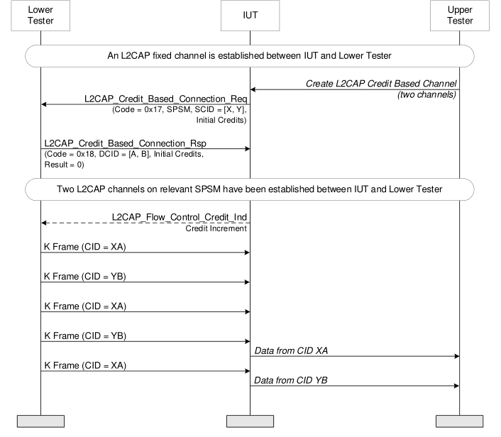

**Figure 4.36: Multiple Channels with Interleaved Data Streams**

1. The Upper Tester commands the IUT to send a connection request on the SPSM, with two
channels. 2. The IUT sends an L2CAP Credit Based Connection Request (Code = 0x17) to the Lower Tester,
with two valid CIDs, on the SPSM.
establishing all channels. 4. The Lower Tester sends K-Frames to the IUT, alternatively on the two established channels.
• Expected Outcome
Pass verdict
The IUT sends the received data to the Upper Tester.
The data sent to the Upper Tester matches the data sent by the Lower Tester.

##### 4.10.7.4 Reassembling

• Test Purpose
Verify that the IUT can correctly report data received from the Lower Tester when MTU = MPS in the direction from the Lower Tester to the IUT and the data received length = MTU.
• Reference
[13] 3.4
• Initial Condition
- The signaling channel specified in Table 4.11 is used.
- An SPSM for the Enhanced Credit Based Flow Control channel is declared via IXIT.
- A Data Channel as specified in Table 4.11 is established on SPSM declared via IXIT with credits returned to the IUT by the Lower Tester.
- The role of the IUT is indicated in the IXIT.
- The minimum and maximum incoming MTU size for a credit based connection supported by the IUT is indicated in the IXIT.
• Test Case Configuration

|  | Test Case ID |  |  | Signaling Channel |  |
| --- | --- | --- | --- | --- | --- |
| L2CAP/COS/ECFC/BV-04-C [Reassembling, LE] |  |  | 0x0005 |  |  |
| L2CAP/COS/ECFC/BV-08-C [Reassembling, BR/EDR] |  |  | 0x0001 |  |  |

Table 4.11: Reassembling test cases
• Test Procedure
Same as for L2CAP/COS/CFC/BV-04-C [Data Receiving]. The Credit Based Connection Request includes the MTU and MPS parameters set to the same value that is between the minimum and maximum MTU IXIT values. The length of the data sent by the Lower Tester is the same size as the MTU/MPS parameters in the Credit Based Connection Request.
• Expected Outcome
Pass verdict
The IUT correctly reports the data received from the Lower Tester to the Upper Tester.
The data sent to the Upper Tester matches the data sent by the Lower Tester.

### 4.11 Connection Oriented Retransmission/Flow Control/Streaming

Modes
Verify the correct implementation of the features of the Retransmission, Flow Control, and Streaming modes of the connection oriented L2CAP service.

#### 4.11.1 Flow Control

Verify the correct implementation of the Flow Control feature.
L2CAP/COS/FLC/BV-01-C [Flow Control without Acks]
• Test Purpose
Verify that the IUT does not transmit packets with sequence numbers higher than flow control window when no acknowledgment is received.
• Reference
[1] 5.4, 7.4
• Initial Condition
- The IUT is in OPEN state for data channel with assigned CID. L2CAP connection configured as Flow Control only mode.
• Test Procedure

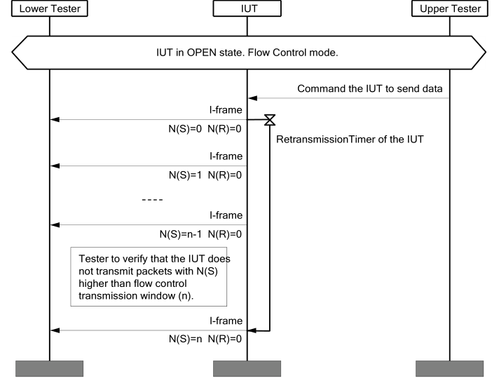

**Figure 4.37: L2CAP/COS/FLC/BV-01-C [Flow Control without Acks]**

• Expected Outcome
Pass verdict
The IUT does not send any I-frames when the TxWindow is full until the RetransmissionTimer, which has been started with the sending of the first I-frame (N(S)=0), expires.
• Test Purpose
Verify that the IUT resumes transmission on reception of acknowledgment in an RR frame.
• Reference
[1] 5.4, 7.4
• Initial Condition
- The IUT is in OPEN state for data channel with assigned CID. L2CAP connection configured as Flow Control only mode.
• Test Procedure

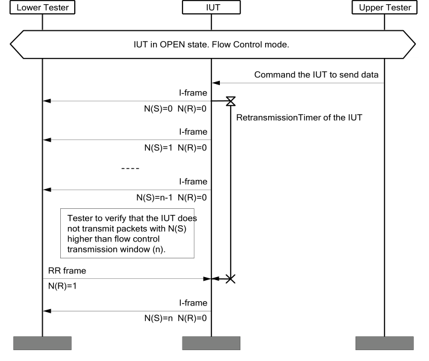

**Figure 4.38: L2CAP/COS/FLC/BV-02-C [Resume Flow on RR Frame Ack]**

• Expected Outcome
Pass verdict
The IUT does not send any I-frames when the TxWindow is full and the IUT RetransmissionTimer, which has been started with the sending of the first I-frame (N(S)=0), has not expired yet.
The IUT resumes transmission when it receives acknowledgment for the first I-frame in a RR frame before IUT Retransmission time-out.
L2CAP/COS/FLC/BV-03-C [Resume Flow on I-frame Ack]
• Test Purpose
Verify that the IUT resumes transmission on the reception of acknowledgment in an I-frame.
• Reference
[1] 5.4, 7.4
• Initial Condition
- The IUT is in OPEN state for data channel with assigned CID. L2CAP connection configured as Flow Control only mode.
• Test Procedure

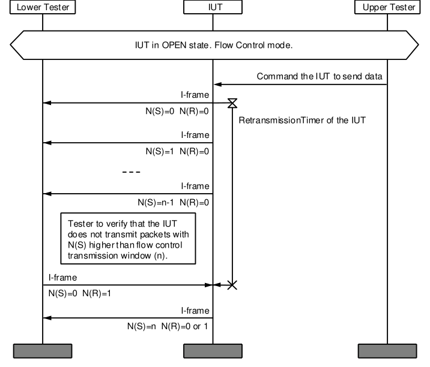

**Figure 4.39: L2CAP/COS/FLC/BV-03-C [Resume Flow on I-frame Ack]**

• Expected Outcome
Pass verdict
The IUT does not send any I-frames when the TxWindow is full and the RetransmissionTimer, which has been started with the sending of the first I-frame (N(S)=0), has not expired yet.
The IUT resumes transmission when it receives an acknowledgment for the first I-frame in an I-frame sent by the Lower Tester before IUT Retransmission time-out.
L2CAP/COS/FLC/BV-04-C [Transmit RR Frame on Monitor Timeout]
• Test Purpose
Verify that the IUT transmits an RR frame after Monitor time-out.
• Reference
[1] 5.4, 7.4
• Initial Condition
- The IUT is in OPEN state for data channel with assigned CID. L2CAP connection configured as Flow Control only mode.
• Test Procedure

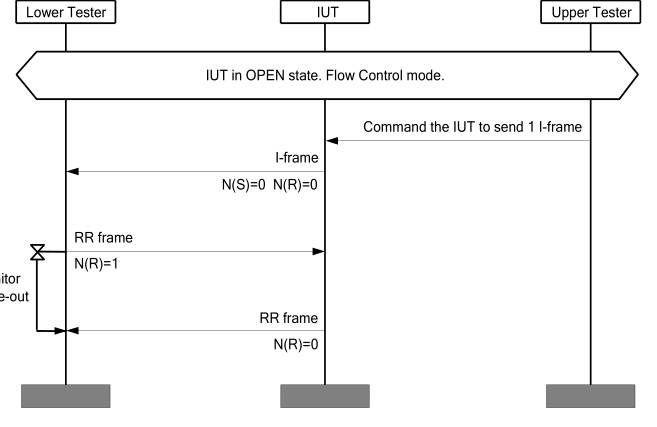

**Figure 4.40: L2CAP/COS/FLC/BV-04-C [Transmit RR Frame on Monitor Timeout]**

• Expected Outcome
Pass verdict
The Lower Tester receives the IUT’s RR frame within the timing window, [Monitor Time-out (+/- 10%)], after transmission of its own RR frame.
• Notes
The 10 percent timing window is to account for timing differences between IUT and Lower Tester, as well as minor measurement error.

#### 4.11.2 Retransmission

Verify the correct implementation of the retransmission feature.
L2CAP/COS/RTX/BV-01-C [No Retransmission with R=1]
• Test Purpose
Verify that the IUT does not retransmit packets when the retransmission flag is set to R=1.
• Reference
[1] 5.3, 7.4
• Initial Condition
- The IUT is in OPEN state for data channel with assigned CID. L2CAP connection configured as Retransmission mode.
• Test Procedure

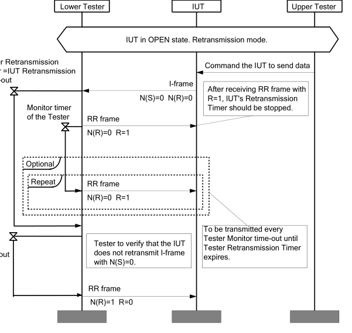

**Figure 4.41: L2CAP/COS/RTX/BV-01-C [No Retransmission with R=1]**

• Expected Outcome
Pass verdict
The IUT does not retransmit an I-frame with sequence number N(S)=0 after IUT Retransmission time- out when the latest received R bit in a RR frame is 1.
L2CAP/COS/RTX/BV-02-C [Retransmission with R=0 in RR frame]
• Test Purpose
Verify that the IUT retransmits packets after retransmission time-out when the retransmission flag is set to R=0 received in a RR frame.
• Reference
[1] 5.3, 7.4
• Initial Condition
- The IUT is in OPEN state for data channel with assigned CID. L2CAP connection configured as Retransmission mode.
• Test Procedure

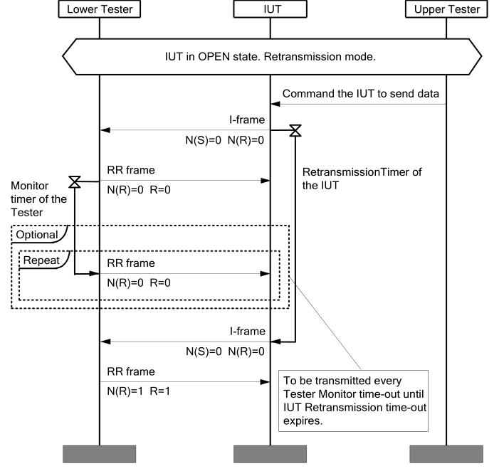

**Figure 4.42: L2CAP/COS/RTX/BV-02-C [Retransmission with R=0 in RR frame]**

• Expected Outcome
Pass verdict
The IUT retransmits an I-frame with sequence number N(S)=0 after IUT Retransmission time-out when the latest received R bit in a RR frame is 0.
L2CAP/COS/RTX/BV-03-C [Retransmission with R=0 in I-frame]
• Test Purpose
Verify that the IUT retransmits packets after retransmission time-out when retransmission flag is set to R=0 received in an I-frame.
• Reference
[1] 5.3, 7.4
• Initial Condition
- The IUT is in OPEN state for data channel with assigned CID. L2CAP connection configured as Retransmission mode.
• Test Procedure

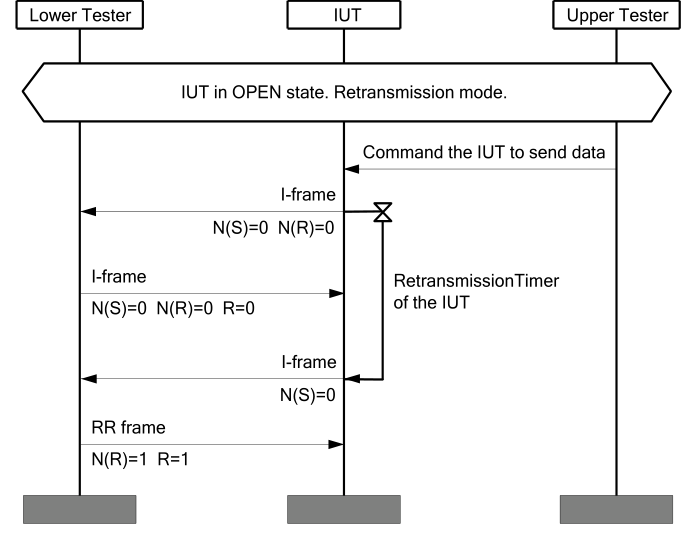

**Figure 4.43: L2CAP/COS/RTX/BV-03-C [Retransmission with R=0 in I-frame]**

• Expected Outcome
Pass verdict
The IUT retransmits I-frame with sequence number N(S)=0 after IUT Retransmission time-out when latest received R bit in a I-frame is 0.

#### 4.11.3 Extended Features (EXF)

Verify the correct implementation of the extended features information requests and responses of the L2CAP layer.
L2CAP/EXF/BV-07-C [Extended Features Information Response]
• Test Purpose
Verify that the IUT can format an Information Response for the information type of Extended Features.
• Reference
[1] 4.10, 4.11, 4.12
• Initial Condition
- An ACL connection has been established by the Lower Tester.
• Test Procedure

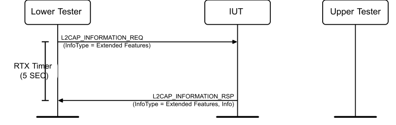

**Figure 4.44: L2CAP/EXF/BV-07-C [Extended Features Information Response]**

• Expected Outcome
Pass verdict
The IUT sends Information Response [InfoType = Extended Features] and with a result code of Success and containing extended features supported defined by the ICS as mapped by Table 3.1 in [5].

#### 4.11.4 Channel Mode Configuration (CMC)

Verify the configuration of L2CAP channels using the various L2CAP supported modes.
L2CAP/CMC/BV-01-C [IUT Initiated Configuration of Enhanced Retransmission Mode]
• Test Purpose
Verify that the IUT can send a Configuration Request command containing the F&EC option that specifies Enhanced Retransmission Mode.
• Reference
[1] 4.4, 4.5, 5.4, 6.1.4, 7.1
• Initial Condition
- The IUT has established that the peer L2CAP entity supports Enhanced Retransmission Mode (using the Information Request/Response [Extended Features] mechanism).
- The channel connection has been established by the Lower Tester.
• Test Procedure

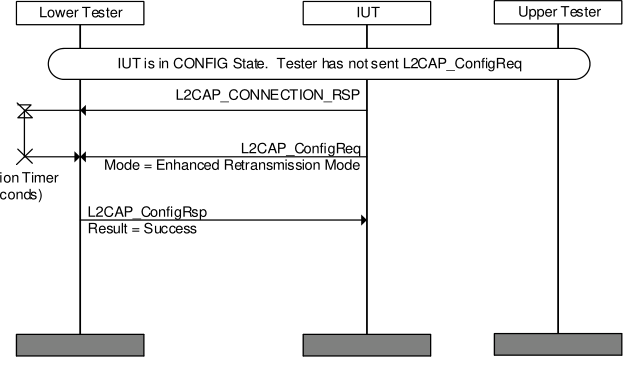

**Figure 4.45: L2CAP/CMC/BV-01-C [IUT Initiated Configuration of Enhanced Retransmission Mode]**

• Expected Outcome
Pass verdict
The IUT sends a correctly formatted L2CAP Configure Request for Enhanced Retransmission Mode before the Lower Tester configuration timer (120 seconds) expires.
L2CAP/CMC/BV-02-C [Lower Tester Initiated Configuration of Enhanced Retransmission Mode]
• Test Purpose
Verify that the IUT can accept a Configuration Request from the Lower Tester containing an F&EC option that specifies Enhanced Retransmission Mode.
• Reference
[1] 4.4, 4.5, 5.4, 6.1.4, 7.1
• Initial Condition
- Test L2CAP/CMC/BV-01-C [IUT Initiated Configuration of Enhanced Retransmission Mode] has been performed successfully.
• Test Procedure

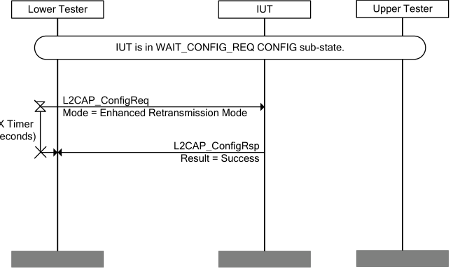

**Figure 4.46: L2CAP/CMC/BV-02-C [Lower Tester Initiated Configuration of Enhanced Retransmission Mode]**

• Expected Outcome
Pass verdict
The IUT sends an L2CAP_ConfigRsp before the Lower Tester RTX timer expires with a result code of “Success.”
L2CAP/CMC/BV-03-C [Failed Configuration of Enhanced Retransmission Mode when use of the Mode is Optional]
• Test Purpose
When configuring a PSM that can optionally support ERTM, verify that the IUT can handle receipt (renegotiate the channel mode in accordance with the specification) of a Configure Response indicating the peer L2CAP entity doesn’t wish to use Enhanced Retransmission Mode (Configure Response Result = Reject Unacceptable Parameters).
• Reference
[1] 4.4, 4.5, 5.4, 6.1.4, 7.1
• Initial Condition
- The IUT has established that the peer L2CAP entity supports Enhanced Retransmission Mode (using the Information Request/Response [Extended Features] mechanism).
- The channel connection has completed.
• Test Procedure

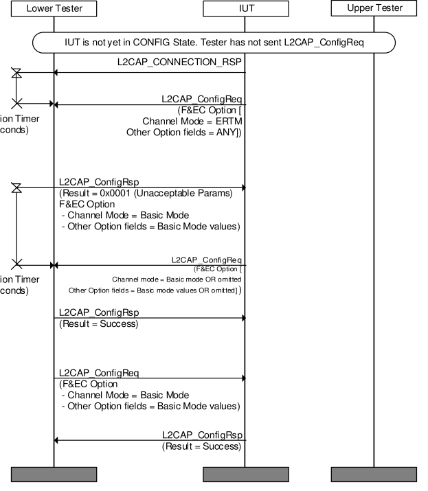

**Figure 4.47: L2CAP/CMC/BV-03-C [Failed Configuration of Enhanced Retransmission Mode when use of the Mode is Optional]**

• Expected Outcome
Pass verdict
The channel is successfully configured to Basic Mode.
L2CAP/CMC/BV-04-C [IUT Initiated Configuration of Streaming Mode]
• Test Purpose
Verify that the IUT can send a Configuration Request command containing the F&EC option that specifies Streaming Mode.
• Reference
[1] 4.4, 4.5, 5.4, 6.1.4, 7.1
• Initial Condition
- The IUT has established that the peer L2CAP entity supports the Streaming Mode (using the Information Request/Response [Extended Features] mechanism).
- The channel connection has been established by the Lower Tester.
• Test Procedure

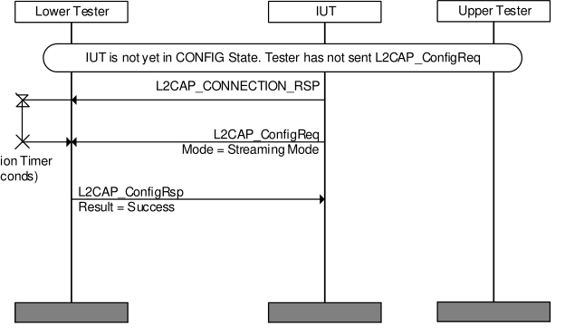

**Figure 4.48: L2CAP/CMC/BV-04-C [IUT Initiated Configuration of Streaming Mode]**

• Expected Outcome
Pass verdict
The IUT sends a correctly formatted L2CAP Configure Request for Streaming Mode before the Lower Tester Configuration Timer (120 seconds) expires.
L2CAP/CMC/BV-05-C [Lower Tester Initiated Configuration of Streaming Mode]
• Test Purpose
Verify that the IUT can accept a Configuration Request from the Lower Tester containing an F&EC option that specifies Streaming Mode.
• Reference
[1] 4.4, 4.5, 5.4, 6.1.4, 7.1
• Initial Condition
- Test L2CAP/CMC/BV-04-C [IUT Initiated Configuration of Streaming Mode] has been performed successfully.
• Test Procedure

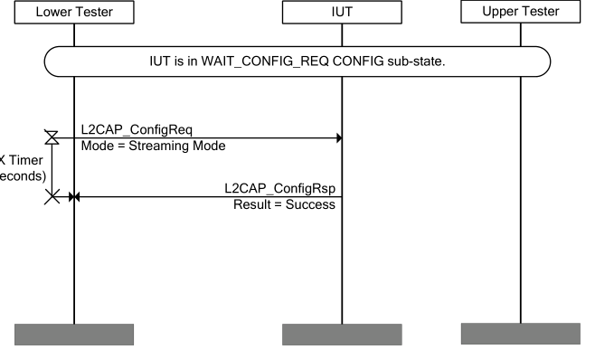

**Figure 4.49: L2CAP/CMC/BV-05-C [Lower Tester Initiated Configuration of Streaming Mode]**

• Expected Outcome
Pass verdict
The IUT sends an L2CAP_ConfigRsp before the Lower Tester RTX timer expires with a result code of “Success.”
L2CAP/CMC/BV-06-C [Failed Configuration of Streaming Mode when use of the Mode is Optional]
• Test Purpose
When configuring a PSM that can optionally support Streaming Mode, verify that the IUT can handle receipt (renegotiate the channel mode in accordance with the specification) of a Configure Response indicating the peer L2CAP entity does not wish to use the tested mode (Configure Response Result = Reject Unacceptable Parameters).
• Reference
[1] 4.4, 4.5, 5.4, 6.1.4, 7.1
• Initial Condition
- The IUT has established that the peer L2CAP entity supports Streaming Mode (using the Information Request/Response [Extended Features] mechanism).
- The channel connection has completed.
• Test Procedure

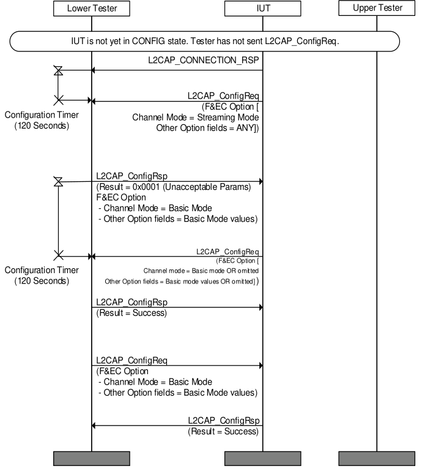

**Figure 4.50: L2CAP/CMC/BV-06-C [Failed Configuration of Streaming Mode when use of the Mode is Optional]**

• Expected Outcome
Pass verdict
The channel is successfully configured to Basic Mode.
L2CAP/CMC/BV-07-C [Configuration Mode mismatch when use of Enhanced Retransmission Mode is Optional]
• Test Purpose
When configuring a PSM that can optionally support the use of ERTM, verify that the IUT renegotiates the channel mode to Basic Mode if the Lower Tester attempts to configure Basic Mode.
• Reference
[1] 4.4, 4.5, 5.4, 6.1.4, 7.1
• Initial Condition
- The IUT has established that the peer L2CAP entity supports Enhanced Retransmission Mode (using the Information Request/Response [Extended Features] mechanism).
- The channel connection has completed.
• Test Procedure

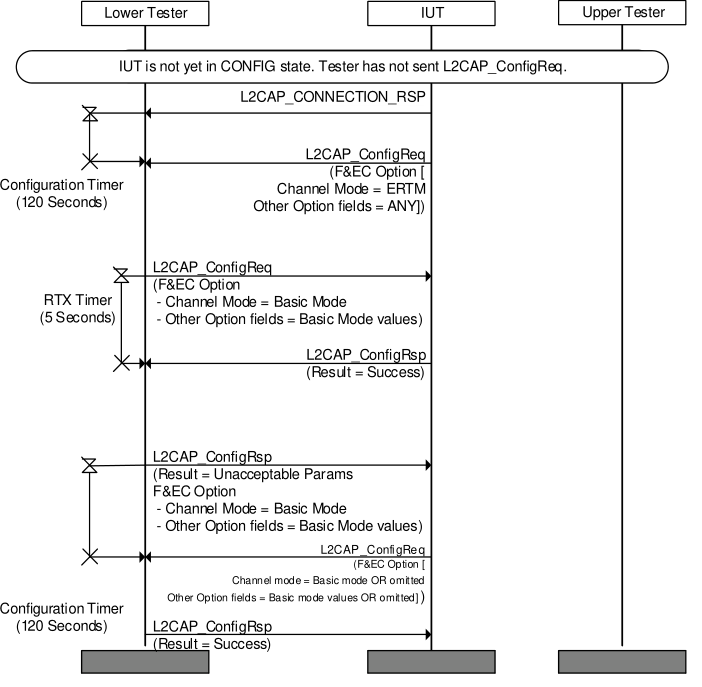

**Figure 4.51: L2CAP/CMC/BV-07-C [Configuration Mode mismatch when use of Enhanced Retransmission Mode is Optional]**

• Expected Outcome
Pass verdict
The channel is successfully configured to Basic Mode.
L2CAP/CMC/BV-08-C [Configuration Mode Mismatch when use of Streaming Mode is Optional]
• Test Purpose
When configuring a PSM that can optionally support the use of Streaming Mode, verify that the IUT renegotiates the channel mode to Basic Mode if the Lower Tester attempts to configure Basic Mode.
• Reference
[1] 4.4, 4.5, 5.4, 6.1.4, 7.1
• Initial Condition
- The IUT has established that the peer L2CAP entity supports Streaming Mode (using the Information Request/Response [Extended Features] mechanism).
- The channel connection has completed.
• Test Procedure

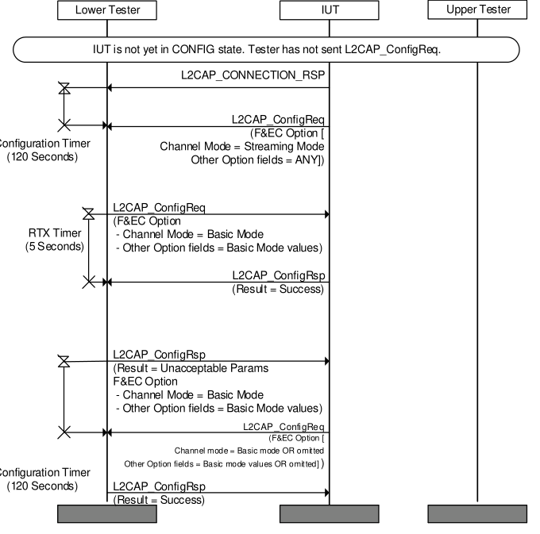

**Figure 4.52: L2CAP/CMC/BV-08-C [Configuration Mode Mismatch when use of Streaming Mode is Optional]**

• Expected Outcome
Pass verdict
The channel is successfully configured to Basic Mode.
L2CAP/CMC/BV-09-C [Configuration to Basic Mode by the IUT]
• Test Purpose
The IUT wishes to use Basic Mode when configuring a PSM that can optionally support the use of ERTM or Streaming Mode. Verify that the IUT correctly rejects the request for ERTM or Streaming Mode from the Lower Tester.
• Reference
[1] 4.4, 4.5, 5.4, 6.1.4, 7.1
• Initial Condition
- The Lower Tester has determined which Enhanced L2CAP Mode the IUT supports (using the Information Request/Response [Extended Features] mechanism). If the IUT supports both, the Lower Tester attempts to configure ERTM.
- The channel connection has completed.
• Test Procedure

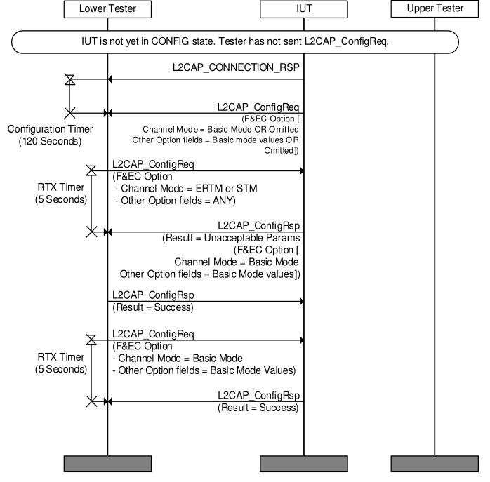

**Figure 4.53: L2CAP/CMC/BV-09-C [Configuration to Basic Mode by the IUT]**

• Expected Outcome
Pass verdict
The IUT sends a Configure Response with result code of Unacceptable Parameters to the request from the Lower Tester for ERTM or STM.
The channel is successfully configured for Basic Mode.
L2CAP/CMC/BI-01-C [Failed Configuration of Enhanced Retransmission Mode when use of the Mode is Mandatory]
• Test Purpose
When creating a connection for a PSM that mandates the use of ERTM, verify that the IUT can handle receipt (close the channel in accordance with the specification) of a Configure Response indicating the peer L2CAP entity does not wish to use Enhanced Retransmission Mode (Configure Response Result = Reject Unacceptable Parameters).
• Reference
[1] 4.4, 4.5, 5.4, 6.1.4, 7.1
• Initial Condition
- The IUT has established that the peer L2CAP entity supports Enhanced Retransmission Mode (using the Information Request/Response [Extended Features] mechanism).
- The channel connection has completed.
• Test Procedure

**Figure 4.54: L2CAP/CMC/BI-01-C [Failed Configuration of Enhanced Retransmission Mode when use of the Mode is Mandatory]**

• Expected Outcome
Pass verdict
The IUT initiates closure of the channel.
L2CAP/CMC/BI-02-C [Configuration Mode mismatch when use of Enhanced Retransmission Mode is Mandatory]
• Test Purpose
When creating a connection for a PSM that mandates the use of ERTM, verify that the IUT closes the channel if the Lower Tester attempts to configure Basic Mode.
• Reference
[1] 4.4, 4.5, 5.4, 6.1.4, 7.1
• Initial Condition
- The IUT has established that the peer L2CAP entity supports Enhanced Retransmission Mode (using the Information Request/Response [Extended Features] mechanism).
- The channel connection has completed.
• Test Procedure

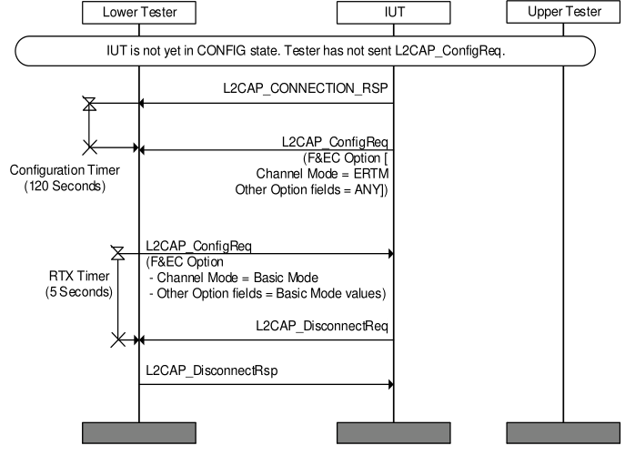

**Figure 4.55: L2CAP/CMC/BI-02-C [Configuration Mode mismatch when use of Enhanced Retransmission Mode is Mandatory]**

• Expected Outcome
Pass verdict
The IUT initiates closure of the channel.
L2CAP/CMC/BI-03-C [Failed Configuration of Streaming Mode when use of the Mode is Mandatory]
• Test Purpose
When creating a connection for a PSM that mandates the use of Streaming Mode, verify that the IUT can handle receipt (close the channel in accordance with the specification) of a Configure Response indicating the peer L2CAP entity does not wish to use Streaming Mode (Configure Response Result = Reject Unacceptable Parameters).
• Reference
[1] 4.4, 4.5, 5.4, 6.1.4, 7.1
• Initial Condition
- The IUT has established that the peer L2CAP entity supports Streaming Mode (using the Information Request/Response [Extended Features] mechanism).
- The channel connection has completed.
• Test Procedure

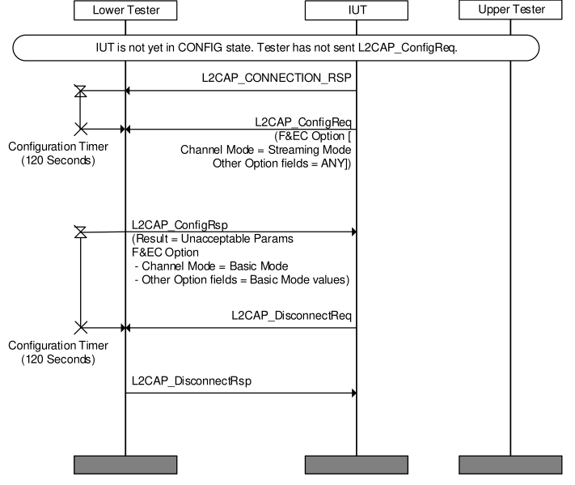

**Figure 4.56: L2CAP/CMC/BI-03-C [Failed Configuration of Streaming Mode when use of the Mode is Mandatory]**

• Expected Outcome
Pass verdict
The IUT initiates closure of the channel.
L2CAP/CMC/BI-04-C [Configuration Mode mismatch when use of Streaming Mode is Mandatory]
• Test Purpose
When creating a connection for a PSM that mandates the use of Streaming Mode, verify that the IUT closes the channel if the Lower Tester attempts to configure Basic Mode.
• Reference
[1] 4.4, 4.5, 5.4, 6.1.4, 7.1
• Initial Condition
- The IUT has established that the peer L2CAP entity supports Streaming Mode (using the Information Request/Response [Extended Features] mechanism).
- The channel connection has completed.
• Test Procedure

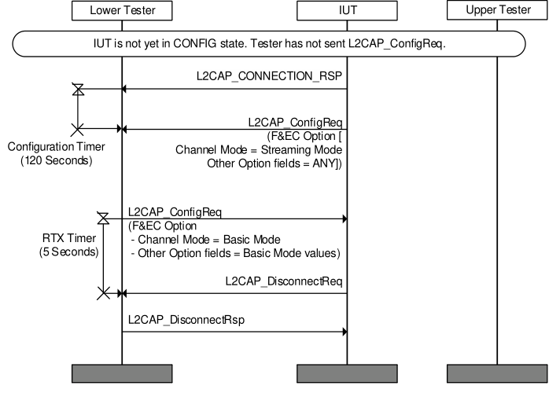

**Figure 4.57: L2CAP/CMC/BI-04-C [Configuration Mode mismatch when use of Streaming Mode is Mandatory]**

• Expected Outcome
Pass verdict
The IUT initiates closure of the channel.
L2CAP/CMC/BI-05-C [Failed Configuration to Basic Mode by the IUT]
• Test Purpose
The IUT wishes to use Basic Mode when configuring a PSM that can optionally support the use of ERTM or Streaming Mode. Verify that the IUT initiates channel closure if the Lower Tester refuses to negotiate the channel to Basic Mode.
• Reference
[1] 4.4, 4.5, 5.4, 6.1.4, 7.1
• Initial Condition
- The Lower Tester has determined which Enhanced L2CAP Mode the IUT supports (using the Information Request/Response [Extended Features] mechanism). If the IUT supports both, the Lower Tester attempts to configure ERTM.
- The channel connection has completed.
• Test Procedure

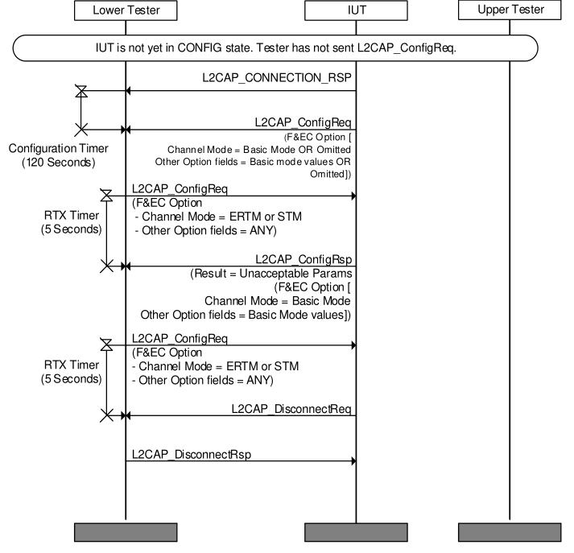

**Figure 4.58: L2CAP/CMC/BI-05-C [Failed Configuration to Basic Mode by the IUT]**

• Expected Outcome
Pass verdict
The IUT sends a Configure Response with result code of Unacceptable Parameters to the request from the Lower Tester for ERTM.
The IUT initiates closure of the channel when it receives the second Configure Request for ERTM from the Lower Tester.
L2CAP/CMC/BI-06-C [Configuration to Basic Mode Rejected by the Lower Tester]
• Test Purpose
The IUT wishes to use Basic Mode when configuring a PSM that can optionally support the use of ERTM or Streaming Mode. Verify that the IUT initiates channel closure if the Lower Tester rejects the IUT configure request for Basic Mode.
• Reference
[1] 4.4, 4.5, 5.4, 6.1.4, 7.1
• Initial Condition
- The Lower Tester has determined which Enhanced L2CAP Mode the IUT supports (using the Information Request/Response [Extended Features] mechanism). If the IUT supports both, the Lower Tester attempts to configure ERTM.
- The channel connection has completed.
• Test Procedure

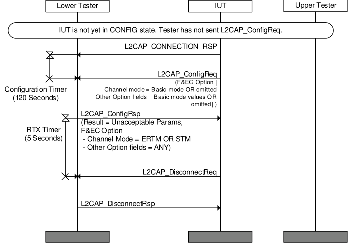

**Figure 4.59: L2CAP/CMC/BI-06-C [Configuration to Basic Mode Rejected by the Lower Tester]**

• Expected Outcome
Pass verdict
The IUT initiates closure of the channel when it receives the Configure Response rejecting Basic Mode from the Lower Tester.
L2CAP/CMC/BV-10-C [ERTM Not Supported by Lower Tester for Optional ERTM Channel]
• Test Purpose
The IUT is initiating connection of a L2CAP channel that can optionally support use of ERTM. Verify that the IUT attempts to configure Basic Mode if the Lower Tester does not indicate support for ERTM in the Information Response [Extended Features].
• Reference
[1] 4.4, 4.5, 4.10, 4.11, 4.12, 5.4, 6.1.4, 7.1
• Initial Condition
- An ACL connection has been established by the Lower Tester.
• Test Procedure

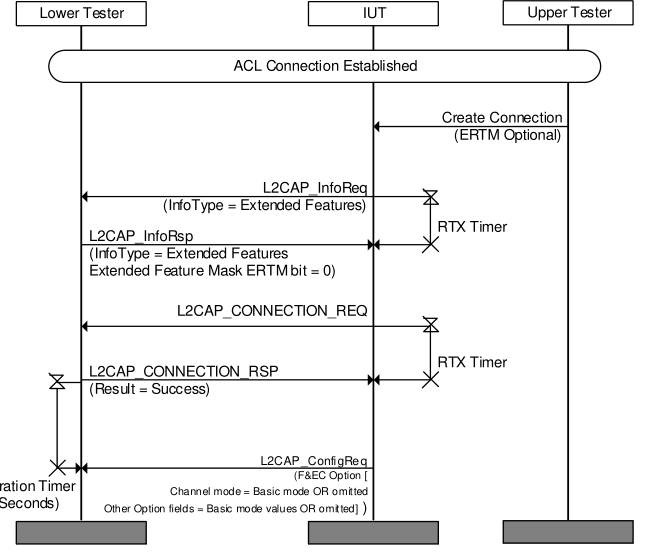

**Figure 4.60: L2CAP/CMC/BV-10-C [ERTM Not Supported by Lower Tester for Optional ERTM Channel]**

• Expected Outcome
Pass verdict
The IUT sends an L2CAP Information Request for the Extended Features of the Lower Tester.
The IUT opens the L2CAP channel to the Lower Tester.
The IUT attempts to configure the channel to Basic Mode.
L2CAP/CMC/BV-11-C [Streaming Mode not supported by Lower Tester for Optional Streaming Mode Channel]
• Test Purpose
The IUT is initiating connection of an L2CAP channel that can optionally support use of STM. Verify that the IUT attempts to configure Basic Mode if the Lower Tester does not indicate support for STM in the Information Response [Extended Features].
• Reference
[1] 4.4, 4.5, 4.10, 4.11, 4.12, 5.4, 6.1.4, 7.1
• Initial Condition
- An ACL connection has been established by the Lower Tester
• Test Procedure

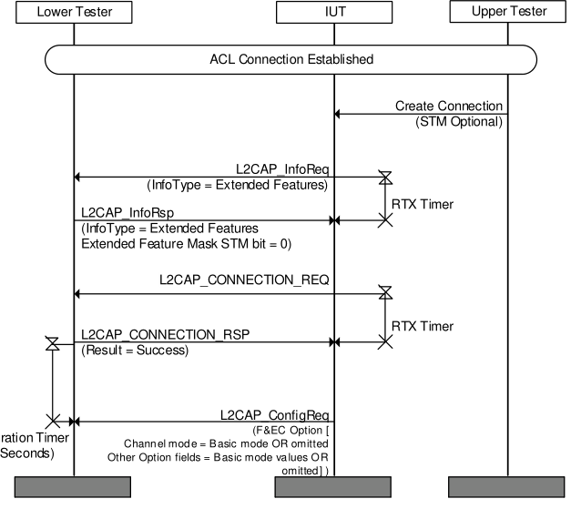

**Figure 4.61: L2CAP/CMC/BV-11-C [Streaming Mode not supported by Lower Tester for Optional Streaming Mode Channel]**

• Expected Outcome
Pass verdict
The IUT sends an L2CAP Information Request for the Extended Features of the Lower Tester.
The IUT opens the L2CAP channel to the Lower Tester.
The IUT attempts to configure the channel to Basic Mode.
L2CAP/CMC/BV-12-C [ERTM Not Supported by Lower Tester for Mandatory ERTM channel]
• Test Purpose
The IUT is initiating connection of an L2CAP channel that mandates use of ERTM. Verify that the IUT does not attempt to configure the connection to ERTM if the Lower Tester has not indicated support for ERTM in the Information Response [Extended Features].
• Reference
[1] 4.4, 4.5, 4.10, 4.11, 4.12, 5.4, 6.1.4, 7.1
• Initial Condition
- An ACL connection has been established by the Lower Tester.
• Test Procedure

**Figure 4.62: L2CAP/CMC/BV-12-C [ERTM Not Supported by Lower Tester for Mandatory ERTM channel]**

• Expected Outcome
Pass verdict
The IUT sends an L2CAP Information Request for the Extended Features of the Lower Tester.
The IUT does not attempt to configure the connection to the unsupported mode of the Lower Tester and informs the Upper Tester that the connection has failed.
L2CAP/CMC/BV-13-C [Streaming Mode not supported by Lower Tester for Mandatory Streaming Mode Channel]
• Test Purpose
The IUT is initiating connection of an L2CAP channel that mandates use of STM. Verify that the IUT does not attempt to configure the connection to STM if the Lower Tester has not indicated support for STM in the Information Response [Extended Features].
• Reference
[1] 4.4, 4.5, 4.10, 4.11, 4.12, 5.4, 6.1.4, 7.1
• Initial Condition
- An ACL connection has been established by the Lower Tester.
• Test Procedure

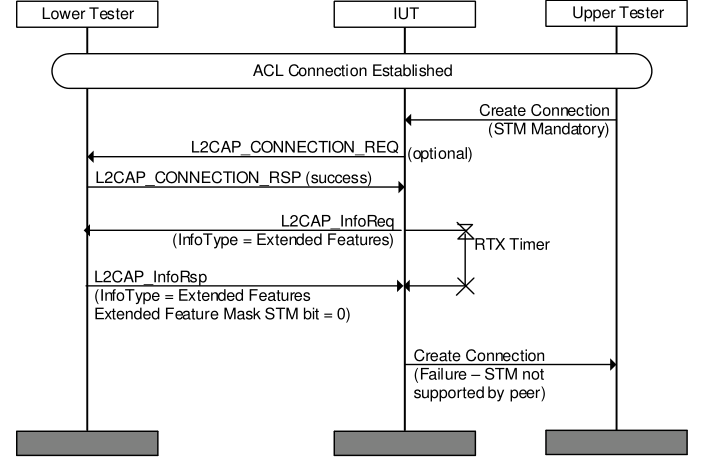

**Figure 4.63: L2CAP/CMC/BV-13-C [Streaming Mode not supported by Lower Tester for Mandatory Streaming Mode Channel]**

• Expected Outcome
Pass verdict
The IUT sends an L2CAP Information Request for the Extended Features of the Lower Tester.
The IUT does not attempt to configure the connection to the unsupported mode of the Lower Tester and informs the Upper Tester that the connection has failed.
L2CAP/CMC/BV-14-C [Failed Configuration of Streaming Mode when use of the mode is optional and ERTM is proposed by the Lower Tester]
• Test Purpose
When configuring a PSM that can optionally support Streaming Mode, verify that the IUT can handle receipt (renegotiate the channel mode in accordance with the specification) of a Configure Response indicating the peer L2CAP entity wishes to use ERTM (Configure Response Result = Reject Unacceptable Parameters).
• Reference
[1] 4.4, 4.5, 5.4, 6.1.4, 7.1
• Initial Condition
- The IUT has established that the peer L2CAP entity supports Streaming Mode (using the Information Request/Response [Extended Features] mechanism).
- The channel connection has completed.
• Test Procedure

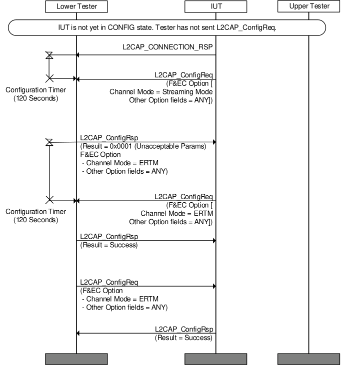

**Figure 4.64: L2CAP/CMC/BV-14-C [Failed Configuration of Streaming Mode when use of the mode is optional and ERTM is proposed by the Lower Tester]**

• Expected Outcome
Pass verdict
The channel is successfully configured to Enhanced Retransmission Mode.
L2CAP/CMC/BV-15-C [Configuration Mode Mismatch when use of Streaming Mode is Optional and ERTM is proposed by the Lower Tester]
• Test Purpose
When configuring a PSM that can optionally support the use of Streaming Mode, verify that the IUT renegotiates the channel mode to ERTM if the Lower Tester attempts to configure ERTM.
• Reference
[1] 4.4, 4.5, 5.4, 6.1.4, 7.1
• Initial Condition
- The IUT has established that the peer L2CAP entity supports Streaming Mode (using the Information Request/Response [Extended Features] mechanism).
- The channel connection has completed.
• Test Procedure

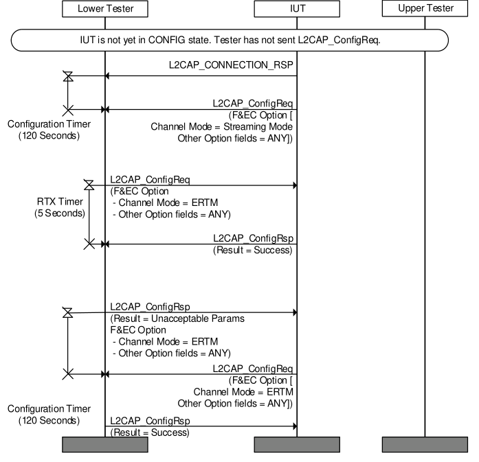

**Figure 4.65: L2CAP/CMC/BV-15-C [Configuration Mode Mismatch when use of Streaming Mode is Optional and ERTM is proposed by the Lower Tester]**

• Expected Outcome
Pass verdict
The channel is successfully configured to Enhanced Retransmission Mode.

#### 4.11.5 Frame Check Sequence (FCS) Option Configuration (FOC)

Verify the configuration of the FCS option of the L2CAP layer.

##### 4.11.5.1 IUT Initiated Configuration of the FCS Option, IUT No FCS

• Test Purpose
Verify that an IUT that does not support FCS sends S-frame or I-frame PDUs with or without FCS depending on the Lower Tester FCS support.
• Reference
[1] 4.4, 4.5, 5.5, 6.1.4, 7.1
• Initial Condition
- The initiator IUT has established that the peer L2CAP entity supports configuration of the Optional FCS option (using the Information Request/Response [Extended Features] mechanism).
• Test Case Configuration

| Test Case |  | FCS Type |  |  |  | IUT S/I-Frame FCS |
| --- | --- | --- | --- | --- | --- | --- |
|  | IUT | IUT |  | Lower |  |  |
|  |  |  |  | Tester |  |  |
| L2CAP/FOC/BV-01-C [IUT Initiated Configuration of the FCS Option, IUT No FCS Option, Lower Tester No FCS Option] | No |  | No |  |  | No |
| L2CAP/FOC/BV-02-C [IUT Initiated Configuration of the FCS Option, IUT No FCS Option, Lower Tester Yes FCS Option] | No |  | Yes |  |  | Yes |
| L2CAP/FOC/BV-03-C [IUT Initiated Configuration of the FCS Option, IUT No FCS Option, Lower Tester Omitted FCS Option] | No |  | Omitted |  |  | Yes |

Table 4.12: IUT Initiated Configuration of the FCS Option, IUT No FCS test cases
• Test Procedure

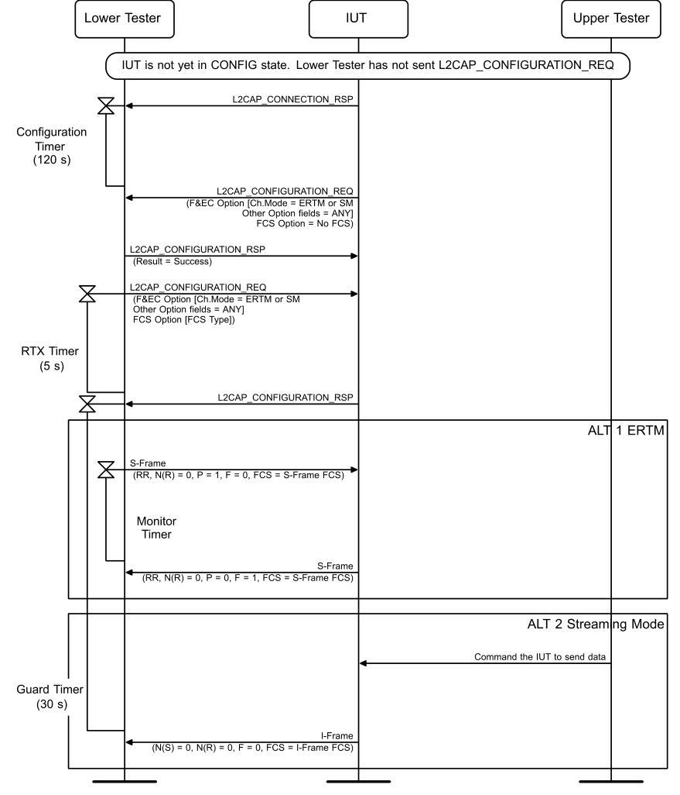

**Figure 4.66: IUT Initiated Configuration of the FCS Option, IUT No FCS**

• Expected Outcome
Pass verdict
The channel is established.
The IUT sends an S-frame (in response to the S-frame [POLL] from the sender) or an I-frame with or without the FCS field as specified in Table 4.12.
• Test Purpose
Verify that the IUT sends I/S-frames with the FCS field present when the IUT either supports or omits the FCS type and the Lower Tester supports, does not support, or omits the FCS Type.
• Reference
[1] 4.4, 4.5, 5.5, 6.1.4, 7.1
• Initial Condition
- The initiator IUT has established that the peer L2CAP entity supports configuration of the Optional FCS option (using the Information Request/Response [Extended Features] mechanism).
• Test Procedure

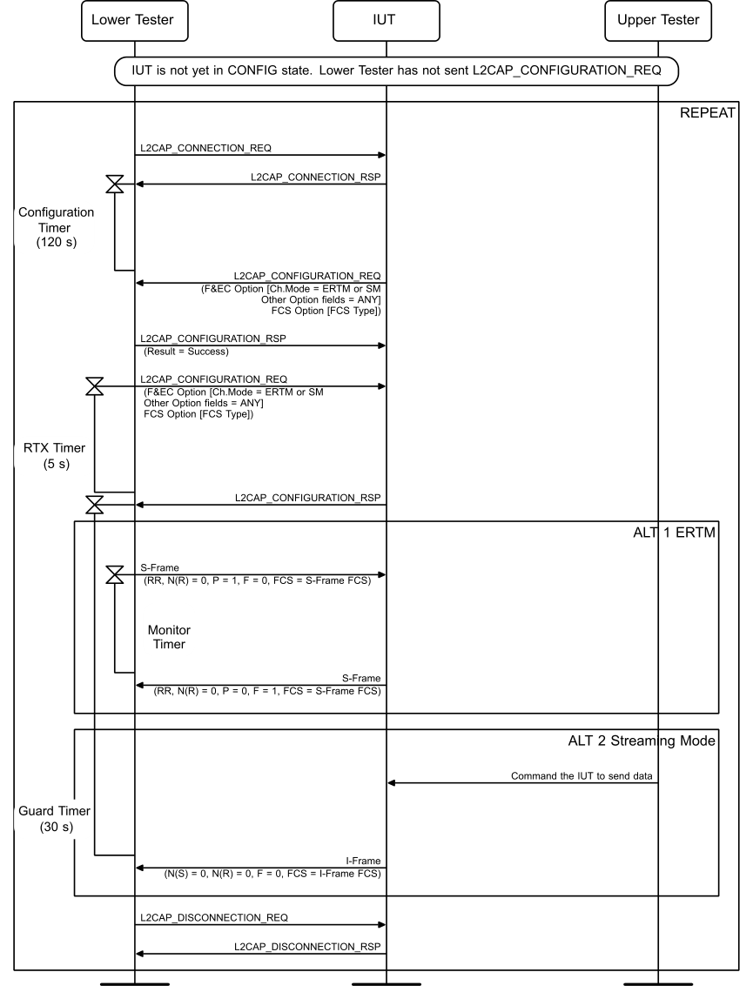

**Figure 4.67: L2CAP/FOC/BV-04-C [IUT Initiated Configuration of the FCS Option, IUT FCS or Omitted]**

| Rounds |  | FCS Type |  |  |  |  |
| --- | --- | --- | --- | --- | --- | --- |
|  |  | IUT |  |  | Lower Tester |  |
| 1 | Yes |  |  | No |  |  |
| 2 | Yes |  |  | Yes |  |  |
| 3 | Yes |  |  | Omitted |  |  |
| 4 | Omitted |  |  | No |  |  |
| 5 | Omitted |  |  | Yes |  |  |
| 6 | Omitted |  |  | Omitted |  |  |

Table 4.13: IUT Initiated Configuration of the FCS Option, IUT FCS or Omitted rounds
• Expected Outcome
Pass verdict
The channel is established.
The IUT sends an S-frame (in response to the S-frame [POLL] from the sender) or an I-frame with the FCS field present.
L2CAP/FOC/BV-05-C [IUT Responder, Configuration of the FCS Option]
• Test Purpose
Verify that the IUT can respond to a channel configuration. The IUT is configured to support, not support, or omit the FCS type as specified in Table 4.14 in I/S-frames and will send I/S-frames with the FCS field as specified in Table 4.14.
• Reference
[1] 4.4, 4.5, 5.5, 6.1.4, 7.1
• Initial Condition
- The responder IUT has established that the peer L2CAP entity supports configuration of the Optional FCS option (using the Information Request/Response [Extended Features] mechanism).
• Test Procedure

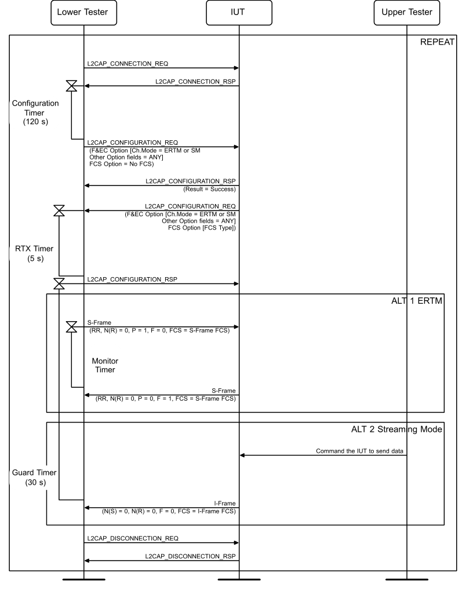

**Figure 4.68: L2CAP/FOC/BV-05-C [IUT Responder, Configuration of the FCS Option]**

| Rounds | Rounds | FCS Type IUT Low Test |
| --- | --- | --- |
| 1 |  | No No |
| 2 |  | No Yes |
| 3 |  | No Omit |
| 4 |  | Yes No |

| Rounds |  | FCS Type |  |  |  | IUT S/I-Frame FCS |
| --- | --- | --- | --- | --- | --- | --- |
|  | IUT | IUT |  | Lower |  |  |
|  |  |  |  | Tester |  |  |
| 5 | Yes |  | Yes |  |  | Yes |
| 6 | Yes |  | Omitted |  |  | Yes |
| 7 | Omitted |  | No |  |  | Yes |
| 8 | Omitted |  | Yes |  |  | Yes |
| 9 | Omitted |  | Omitted |  |  | Yes |

Table 4.14: IUT Responder, Configuration of the FCS Option rounds
• Expected Outcome
Pass verdict
The channel is established.
The IUT sends an S-frame (in response to the S-frame [POLL] from the sender) or an I-frame with the FCS field as specified in Table 4.14.

#### 4.11.6 Optional FCS (OFS)

Verify the correct implementation of the Optional FCS feature.
L2CAP/OFS/BV-01-C [Sending I-Frames without FCS for ERTM]
• Test Purpose
Verify that the IUT does not include the FCS in I-frames.
• Reference
[1] 3.3.5, 8.6
• Initial Condition
- The channel is configured to not include FCS in I/S-frames.
- The channel is configured to use ERTM.
• Test Procedure

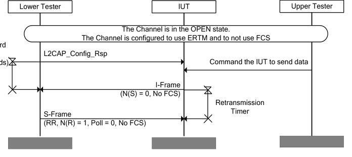

**Figure 4.69: L2CAP/OFS/BV-01-C [Sending I-Frames without FCS for ERTM]**

• Expected Outcome
Pass verdict
The IUT sends an I-frame without the FCS field.
L2CAP/OFS/BV-02-C [Receiving Frames without FCS for ERTM]
• Test Purpose
Verify that the IUT can handle I-frames that do not contain the FCS.
• Reference
[1] 3.3.5, 8.6
• Initial Condition
- The channel is configured to not include FCS in I/S-frames.
- The channel is configured to use ERTM.
• Test Procedure

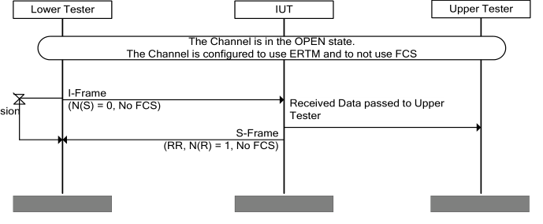

**Figure 4.70: L2CAP/OFS/BV-02-C [Receiving Frames without FCS for ERTM]**

• Expected Outcome
Pass verdict
The IUT passes the received data to the Upper Tester.
The IUT acknowledges the received I-frame before the Retransmission timer of the Lower Tester expires.
L2CAP/OFS/BV-03-C [Sending I-Frames without FCS for Streaming Mode]
• Test Purpose
Verify that the IUT does not include the FCS in I-frames.
• Reference
[1] 3.3.5, 8.7
• Initial Condition
- The channel is configured to not include FCS in I/S-frames.
- The channel is configured to use Streaming Mode.
• Test Procedure

**Figure 4.71: L2CAP/OFS/BV-03-C [Sending I-Frames without FCS for Streaming Mode]**

• Expected Outcome
Pass verdict
The IUT sends an I-frame without the FCS field.
L2CAP/OFS/BV-04-C [Receiving Frames without FCS for Streaming Mode]
• Test Purpose
Verify that the IUT can handle I-frames that do not contain the FCS.
• Reference
[1] 3.3.5, 8.7
• Initial Condition
- The channel is configured to not include FCS in I/S-frames.
- The channel is configured to use Streaming Mode.
• Test Procedure
Upper Tester IUT Lower Tester

| The Channel is in th The Channel is configured to use Stre | e OPEN state. aming Mode and to not use FCS |
| --- | --- |
| I-Frame | Received Data passed to Upper Tester |
|  | Received Data passed to Upper Tester |

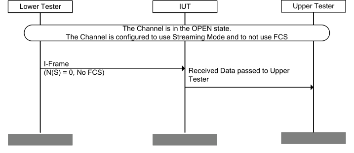

**Figure 4.72: L2CAP/OFS/BV-04-C [Receiving Frames without FCS for Streaming Mode]**

• Expected Outcome
Pass verdict
The IUT passes the received data to the Upper Tester.
• Test Purpose
Verify that the IUT does include the FCS in I-frames.
• Reference
[1] 3.3.5, 8.6
• Initial Condition
- The channel is configured to include FCS in I/S-frames.
- The channel is configured to use ERTM.
• Test Procedure

**Figure 4.73: L2CAP/OFS/BV-05-C [Sending I-Frames with FCS for ERTM]**

• Expected Outcome
Pass verdict
The IUT sends an I-frame with the correct FCS included.
L2CAP/OFS/BV-06-C [Receiving Frames with FCS for ERTM]
• Test Purpose
Verify that the IUT can handle I-frames that do contain the FCS.
• Reference
[1] 3.3.5, 8.6
• Initial Condition
- The channel is configured to include FCS in I/S-frames.
- The channel is configured to use ERTM.
• Test Procedure

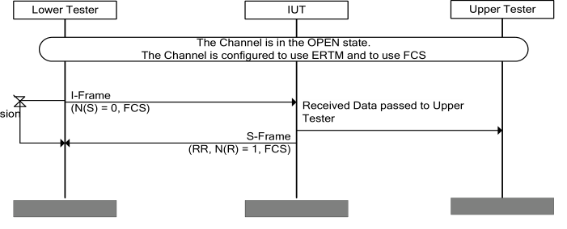

**Figure 4.74: L2CAP/OFS/BV-06-C [Receiving Frames with FCS for ERTM]**

• Expected Outcome
Pass verdict
The IUT passes the received data to the Upper Tester.
The IUT acknowledges the received I-frame before the Retransmission timer of the Lower Tester expires.
L2CAP/OFS/BV-07-C [Sending I-Frames with FCS for Streaming Mode]
• Test Purpose
Verify that the IUT does include the FCS in I-frames.
• Reference
[1] 3.3.5, 8.7
• Initial Condition
- The channel is configured to include FCS in I/S-frames.
- The channel is configured to use Streaming Mode.
• Test Procedure

| Lower Tester |  |  |
| --- | --- | --- |
|  |  |  |
|  | The Channel is in th The Channel is configured to use St | e OPEN state. reaming Mode and to use FCS |
|  | L2CAP Config Rsp _ _ | Command the IUT to send data |
|  |  |  |
|  | I-Frame |  |
|  |  |  |

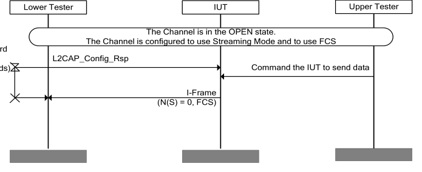

**Figure 4.75: L2CAP/OFS/BV-07-C [Sending I-Frames with FCS for Streaming Mode]**

• Expected Outcome
Pass verdict
The IUT sends an I-frame with the FCS field.
L2CAP/OFS/BV-08-C [Receiving Frames with FCS for Streaming Mode]
• Test Purpose
Verify that the IUT can handle I-frames that do contain the FCS.
• Reference
[1] 3.3.5, 8.7
• Initial Condition
- The channel is configured to include FCS in I/S-frames.
- The channel is configured to use Streaming Mode.
• Test Procedure

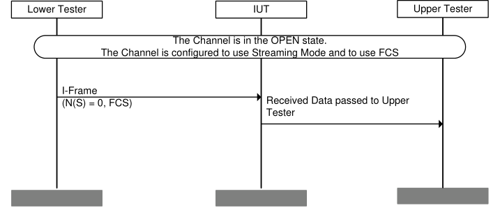

**Figure 4.76: L2CAP/OFS/BV-08-C [Receiving Frames with FCS for Streaming Mode]**

• Expected Outcome
Pass verdict
The IUT passes the received data to the Upper Tester.

#### 4.11.7 Enhanced Retransmission Mode (ERM)

Verify the correct implementation of the Enhanced Retransmission Mode of L2CAP.
L2CAP/ERM/BV-01-C [Transmit I-frames]
• Test Purpose
Verify that the IUT can send correctly formatted sequential I-frames with valid values for the enhanced control fields (SAR, F-bit, ReqSeq, TxSeq).
• Reference
[1] 3.3.2, 8.6
• Initial Condition
- The IUT is in the INFO_TRANSFER state for a data channel with assigned CID.
- The connection is configured as ERTM.
- I(out) outgoing I-frames and I(in) incoming I-frames have been sent and received by the IUT over the channel after it was opened and before the test is executed.
• Test Procedure
Figure 4.77 assumes I(out) and I(in) are 0. The actual values of N(S) and N(R) for both incoming and outgoing traffic must take the number of previously sent and received I-frames into account.

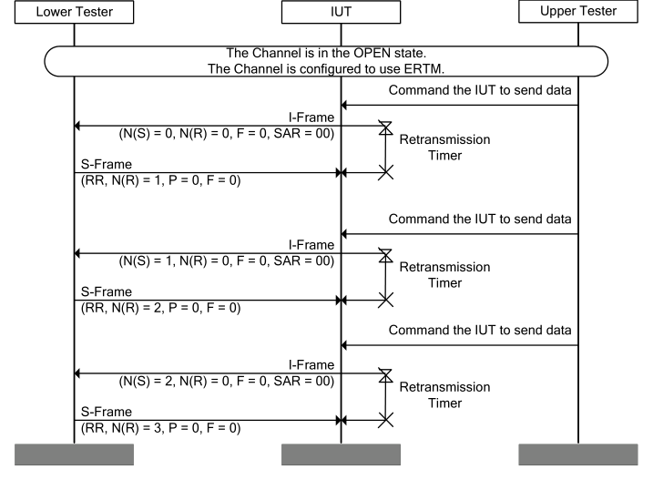

**Figure 4.77: L2CAP/ERM/BV-01-C [Transmit I-frames]**

• Expected Outcome
Pass verdict
The IUT sends I-frame(s) to the Lower Tester.
Data in the I-frame(s) match that provided by the Upper Tester.
SAR bits are set per the Specification in [8].
F-bit is set to 0.
L2CAP/ERM/BV-02-C [Receive I-Frames]
• Test Purpose
Verify that the IUT can receive in-sequence valid I-frames and deliver L2CAP SDUs to the Upper Tester.
• Reference
[1] 3.3.2, 8.6
• Initial Condition
- The IUT is in the INFO_TRANSFER state for a data channel with assigned CID.
- The connection is configured as ERTM.
- I(out) outgoing I-frames and I(in) incoming I-frames have been sent and received by the IUT over the channel after it was opened and before the test is executed.
- The IUT has configured an MPS size that is equal to 48 bytes.
• Test Procedure
Figure 4.78 assumes I(out) and I(in) are 0. The actual values of N(S) and N(R) for both incoming and outgoing traffic must take the number of previously sent and received I-frames into account.

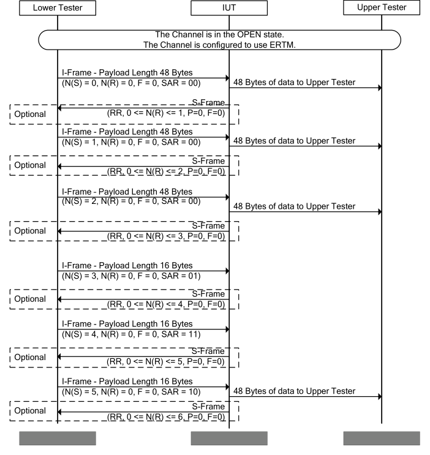

**Figure 4.78: L2CAP/ERM/BV-02-C [Receive I-Frames]**

• Expected Outcome
Pass verdict
Data in the received I-frame(s) match that sent by the Lower Tester.
SAR bits are set per specification.
F-bit is set to 0.
Complete SDU is sent to the Upper Tester.
• Test Purpose
Verify that the IUT sends S-frame [RR] with the Poll bit not set to acknowledge data received from the Lower Tester.
• Reference
[1] 3.3.2, 8.6.1.1
• Initial Condition
- The IUT is in the INFO_TRANSFER state for a data channel with assigned CID. The connection is configured as ERTM.
- I(out) outgoing I-frames and I(in) incoming I-frames have been sent and received by the IUT over the channel after it was opened and before the test is executed.
• Test Procedure
Figure 4.79 assumes I(out) and I(in) are 0. The actual values of N(S) and N(R) for both incoming and outgoing traffic must take the number of previously sent and received I-frames into account.

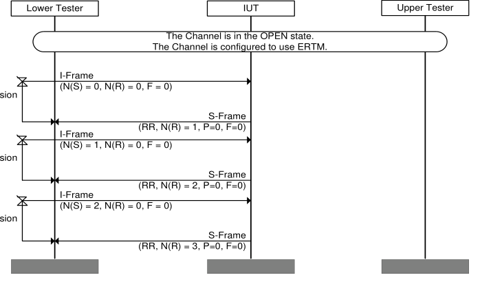

**Figure 4.79: L2CAP/ERM/BV-03-C [Acknowledging Received I-Frames]**

• Expected Outcome
Pass verdict
The IUT sends a Supervisory Frame with S=RR, LastAckedReqSeq < ReqSeq <= last received I- frame’s TxSeq+1, F=0, P=0, Reserved bits = 0.
L2CAP/ERM/BV-05-C [Resume Transmitting I-Frames when an S-Frame [RR] is Received]
• Test Purpose
Verify that the IUT ceases transmission of I-frames when the negotiated TxWindow is full. Verify that the IUT resumes transmission of I-frames when an S-frame [RR] is received that acknowledges previously sent I-frames.
• Reference
[1] 3.3.2, 8.6.4
• Initial Condition
- The IUT is in the INFO_TRANSFER state for a data channel with assigned CID. The connection is configured as ERTM.
- I(out) outgoing I-frames and I(in) incoming I-frames have been sent and received by the IUT over the channel after it was opened and before the test is executed.
- The Lower Tester specifies a TxWindow size of 1 in the Configuration Request it sends to the IUT.
• Test Procedure
Figure 4.80 assumes I(out) and I(in) are 0. The actual values of N(S) and N(R) for both incoming and outgoing traffic must take the number of previously sent and received I-frames into account.

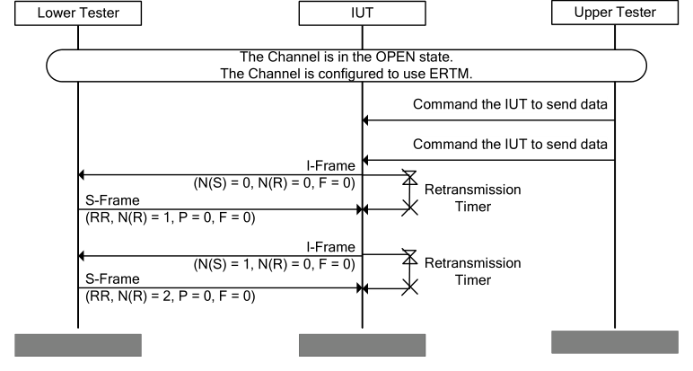

**Figure 4.80: L2CAP/ERM/BV-05-C [Resume Transmitting I-Frames when an S-Frame [RR] is Received]**

• Expected Outcome
Pass verdict
The IUT sends I-frames until TxWindow is full.
The IUT does not send any I-frame when the TxWindow is full.
The IUT sends the outstanding I-frame when it receives the acknowledgment of the first I-frame from the Lower Tester.
L2CAP/ERM/BV-06-C [Resume Transmitting I-Frames when an I-Frame is Received]
• Test Purpose
Verify that the IUT ceases transmission of I-frames when the negotiated TxWindow is full. Verify that the IUT resumes transmission of I-frames when an I-frame is received that acknowledges previously sent I-frames.
• Reference
[1] 3.3.2, 8.6.4
• Initial Condition
- The IUT is in the INFO_TRANSFER state for a data channel with assigned CID. The connection is configured as ERTM.
- I(out) outgoing I-frames and I(in) incoming I-frames have been sent and received by the IUT over the channel after it was opened and before the test is executed.
- The Lower Tester specifies a TxWindow size of 1 in the Configuration Request it sends to the IUT.
• Test Procedure
Figure 4.81 assumes I(out) and I(in) are 0. The actual values of N(S) and N(R) for both incoming and outgoing traffic must take the number of previously sent and received I-frames into account.

**Figure 4.81: L2CAP/ERM/BV-06-C [Resume Transmitting I-Frames when an I-Frame is Received]**

• Expected Outcome
Pass verdict
The IUT sends I-frames until TxWindow is full.
The IUT does not send any I-frame when the TxWindow is full.
The IUT sends the outstanding I-frame when it receives the acknowledgment of the first I-frame from the Lower Tester.
L2CAP/ERM/BV-07-C [Send S-Frame [RNR]]
• Test Purpose
Verify that the IUT sends an S-frame [RNR] when it detects a Local Busy condition.
• Reference
[1] 3.3.2, 8.6.1.3, 8.6.4
• Initial Condition
- The channel is in the OPEN state and configured to use ERTM.
- I(out) outgoing I-frames and I(in) incoming I-frames have been sent and received by the IUT over the channel after it was opened and before the test is executed.
- Whether the IUT has the capability to set the Local Busy condition from the Upper Tester is specified in the L2CAP IXIT.
• Test Procedure
Figure 4.82 assumes I(out) and I(in) are 0. The actual values of N(S) and N(R) for both incoming and outgoing traffic must take the number of previously sent and received I-frames into account.
The Lower Tester sends as many I-frames as are permitted by the IUT TxWindow to trigger the Local Busy condition at the IUT. Once the Lower Tester receives the RNR from the IUT it will stop sending I-frames.

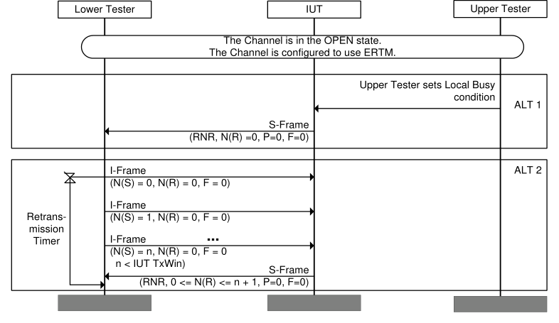

**Figure 4.82: L2CAP/ERM/BV-07-C [Send S-Frame [RNR]]**

• Expected Outcome
Pass verdict
ALT 1: The IUT immediately sends an S-frame with function RNR after the Local Busy condition is set by the Upper Tester.
ALT 2: The IUT sends an S-frame with function RNR after receiving I-frame(s) from the Lower Tester when the Local Busy condition is reached.
L2CAP/ERM/BV-08-C [Send S-Frame [RR] with Poll Bit Set]
• Test Purpose
Verify that the IUT sends an S-frame [RR] with the Poll bit set when its retransmission timer expires.
• Reference
[1] 3.3.2, 8.6.1.4, 8.6.4
• Initial Condition
- The channel is in the OPEN state and configured to use ERTM.
- I(out) outgoing I-frames and I(in) incoming I-frames have been sent and received by the IUT over the channel after it was opened and before the test is executed.
• Test Procedure
Figure 4.83 assumes I(out) and I(in) are 0. The actual values of N(S) and N(R) for both incoming and outgoing traffic must take the number of previously sent and received I-frames into account.

**Figure 4.83: L2CAP/ERM/BV-08-C [Send S-Frame [RR] with Poll Bit Set]**

• Expected Outcome
Pass verdict
The IUT sends an S-frame with the POLL bit set after the IUT Retransmission Timer (as specified by Lower Tester during configuration) expires.
The IUT does not retransmit the I-frame after receiving an S-frame from the Lower Tester that acknowledges the previously sent I-frame.
L2CAP/ERM/BV-09-C [Send S-frame [RR] with Final Bit Set]
• Test Purpose
Verify that the IUT responds with an S-frame [RR] with the Final bit set after receiving an S-frame [RR] with the Poll bit set.
• Reference
[1] 3.3.2, 8.6.1.4, 8.6.4
• Initial Condition
- The channel is in the OPEN state and configured to use ERTM.
- I(out) outgoing I-frames and I(in) incoming I-frames have been sent and received by the IUT over the channel after it was opened and before the test is executed.
• Test Procedure
Figure 4.84 assumes I(out) and I(in) are 0. The actual values of N(S) and N(R) for both incoming and outgoing traffic must take the number of previously sent and received I-frames into account.

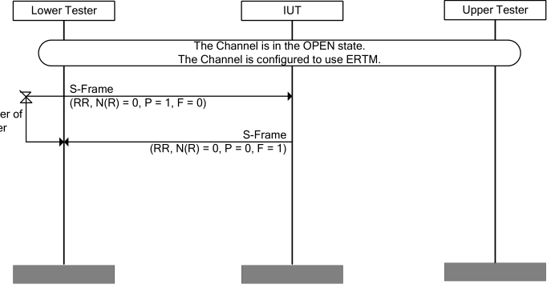

**Figure 4.84: L2CAP/ERM/BV-09-C [Send S-frame [RR] with Final Bit Set]**

• Expected Outcome
Pass verdict
The IUT sends an S-frame with the Final bit set before the Monitor Timer of the Lower Tester expires.
L2CAP/ERM/BV-10-C [Retransmit S-Frame [RR] with Poll Bit Set]
• Test Purpose
Verify that the IUT will retransmit the S-frame [RR] with the Poll bit set when the Monitor Timer expires.
• Reference
[1] 3.3.2, 8.6.1.4, 8.6.4
• Initial Condition
- The channel is in the OPEN state and configured to use ERTM.
- I(out) outgoing I-frames and I(in) incoming I-frames have been sent and received by the IUT over the channel after it was opened and before the test is executed.
- The MaxTransmit for the IUT is set to a value greater than 1.
• Test Procedure
Figure 4.85 assumes I(out) and I(in) are 0. The actual values of N(S) and N(R) for both incoming and outgoing traffic must take the number of previously sent and received I-frames into account.

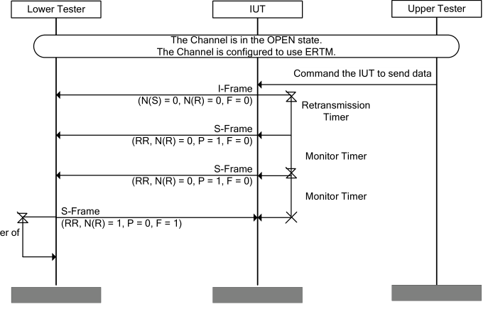

**Figure 4.85: L2CAP/ERM/BV-10-C [Retransmit S-Frame [RR] with Poll Bit Set]**

• Expected Outcome
Pass verdict
The IUT retransmits the S-frame with the POLL bit set after the Monitor Timer expires.
The IUT does not retransmit the S-frame with the POLL bit set after receiving the S-frame acknowledgment of the previously sent I-frame.
L2CAP/ERM/BV-11-C [S-Frame Transmissions Exceed MaxTransmit]
• Test Purpose
Verify that the IUT closes the channel when the Monitor Timer expires.
• Reference
[1] 3.3.2, 5.4, 8.6.4
• Initial Condition
- The channel is in the OPEN state and configured to use ERTM.
- I(out) outgoing I-frames and I(in) incoming I-frames have been sent and received by the IUT over the channel after it was opened and before the test is executed.
- The MaxTransmit for the IUT is set to 1.
• Test Procedure
Figure 4.86 assumes I(out) and I(in) are 0. The actual values of N(S) and N(R) for both incoming and outgoing traffic must take the number of previously sent and received I-frames into account.

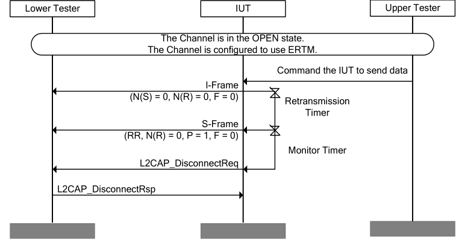

**Figure 4.86: L2CAP/ERM/BV-11-C [S-Frame Transmissions Exceed MaxTransmit]**

• Expected Outcome
Pass verdict
The IUT initiates closure of the L2CAP channel when the Monitor Timer expires.
L2CAP/ERM/BV-12-C [I-Frame Transmissions Exceed MaxTransmit]
• Test Purpose
Verify that the IUT closes the channel when it receives an S-frame [RR] with the final bit set that does not acknowledge the previous I-frame sent by the IUT.
• Reference
[1] 3.3.2, 5.4, 8.6.4
• Initial Condition
- The channel is in the OPEN state and configured to use ERTM.
- I(out) outgoing I-frames and I(in) incoming I-frames have been sent and received by the IUT over the channel after it was opened and before the test is executed.
- The MaxTransmit for the IUT is set to 1.
• Test Procedure
Figure 4.87 assumes I(out) and I(in) are 0. The actual values of N(S) and N(R) for both incoming and outgoing traffic must take the number of previously sent and received I-frames into account.

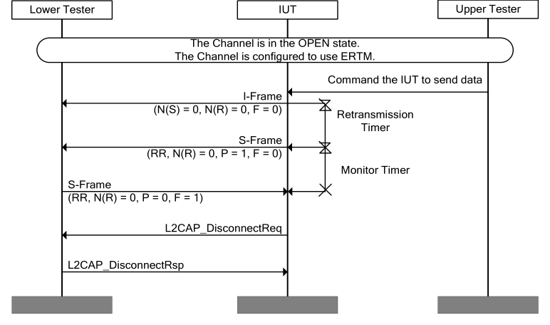

**Figure 4.87: L2CAP/ERM/BV-12-C [I-Frame Transmissions Exceed MaxTransmit]**

• Expected Outcome
Pass verdict
The IUT initiates closure of the L2CAP channel when it receives the S-frame from the Lower Tester that does not acknowledge the previously sent I-frame.
L2CAP/ERM/BV-13-C [Respond to S-Frame [REJ]]
• Test Purpose
Verify that the IUT retransmits I-frames starting from the sequence number specified in the S-frame [REJ].
• Reference
[1] 3.3.2, 8.6.1.2, 8.6.4
• Initial Condition
- The channel is in the OPEN state and configured to use ERTM.
- I(out) outgoing I-frames and I(in) incoming I-frames have been sent and received by the IUT over the channel after it was opened and before the test is executed.
- The MaxTransmit for the IUT is set to a value greater than 1.
- The Lower Tester has specified a value for TxWin that is greater than 1 in the Configure Request sent to the IUT.
• Test Procedure
Figure 4.88 assumes I(out) and I(in) are 0. The actual values of N(S) and N(R) for both incoming and outgoing traffic must take the number of previously sent and received I-frames into account.

| Lower Tester IUT Upper Tester The Channel is in the OPEN state. The Channel is configured to use ERTM. Command the IUT to send data Command the IUT to send data I-Frame (N(S) = 0, N(R) = 0, F = 0) Retransmission I-Frame Timer (N(S) = 1, N(R) = 0, F = 0) S-Frame (REJ, N(R) = 0, P = 0, F = 0) of I-Frame (N(S) = 0, N(R) = 0, F = 0) n Retransmission T I-Frame Timer (N(S) = 1, N(R) = 0, F = 0) S-Frame (RR, N(R) = 2, P = 0, F = 0) |  |
| --- | --- |
|  |  |

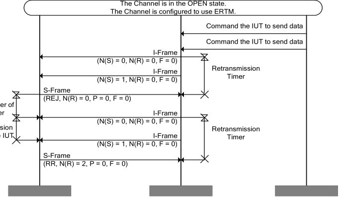

**Figure 4.88: L2CAP/ERM/BV-13-C [Respond to S-Frame [REJ]]**

• Expected Outcome
Pass verdict
The IUT retransmits the first I-frame requested in the REJ from the Lower Tester before the Monitor Timer of the Lower Tester expires.
The IUT retransmits the second I-frame requested in the REJ from the Lower Tester before the IUT Retransmission Timer expires.
L2CAP/ERM/BV-14-C [Respond to S-Frame [SREJ] POLL Bit Set]
• Test Purpose
Verify that the IUT responds with the correct I-frame when sent an SREJ frame. Verify that the IUT processes the acknowledgment of previously unacknowledged I-frames.
• Reference
[1] 3.3.2, 8.6.1.3, 8.6.4
• Initial Condition
- The channel is in the OPEN state and configured to use ERTM.
- I(out) outgoing I-frames and I(in) incoming I-frames have been sent and received by the IUT over the channel after it was opened and before the test is executed.
- The MaxTransmit for the IUT is set to a value greater than 1.
- The Lower Tester has specified a value for TxWin of 3 in the Configure Request sent to the IUT.
• Test Procedure
Figure 4.89 assumes I(out) and I(in) are 0. The actual values of N(S) and N(R) for both incoming and outgoing traffic must take the number of previously sent and received I-frames into account.

| Lower Tester IUT Upper Tester The Channel is in the OPEN state. The Channel is configured to use ERTM. Command the IUT to send data Command the IUT to send data Command the IUT to send data Command the IUT to send data I-Frame (N(S) = 0, N(R) = 0, F = 0) Retransmission I-Frame Timer (N(S) = 1, N(R) = 0, F = 0) I-Frame (N(S) = 2, N(R) = 0, F = 0) S-Frame (SREJ, N(R) = 1, P = 1, F = 0) of I-Frame (N(S) = 1, N(R) = 0, F = 1) I-Frame Retransmission (N(S) = 3, N(R) = 0, F = 0) Timer S-Frame (RR, N(R) = 2, P = 0, F = 0) |  |
| --- | --- |
|  |  |

**Figure 4.89: L2CAP/ERM/BV-14-C [Respond to S-Frame [SREJ] POLL Bit Set]**

• Expected Outcome
Pass verdict
The IUT retransmits the I-frame requested in the SREJ from the Lower Tester before the Monitor Timer of the Lower Tester expires.
The I-frame retransmitted by the IUT has the Final bit = 1.
The IUT processes the acknowledgment of the first I-frame (N(S) = 0) from the SREJ received and consequently send the pending I-frame (N(S) = 3).
L2CAP/ERM/BV-15-C [Respond to S-Frame [SREJ] POLL bit clear]
• Test Purpose
Verify that the IUT responds with the correct I-frame when sent an SREJ frame.
• Reference
[1] 3.3.2, 8.6.1.3, 8.6.4
• Initial Condition
- The channel is in the OPEN state and configured to use ERTM.
- I(out) outgoing I-frames and I(in) incoming I-frames have been sent and received by the IUT over the channel after it was opened and before the test is executed.
- The MaxTransmit for the IUT is set to a value greater than 1.
- The Lower Tester has specified a value for TxWin of 3 in the Configure Request sent to the IUT.
• Test Procedure
Figure 4.90 assumes I(out) and I(in) are 0. The actual values of N(S) and N(R) for both incoming and outgoing traffic must take the number of previously sent and received I-frames into account.

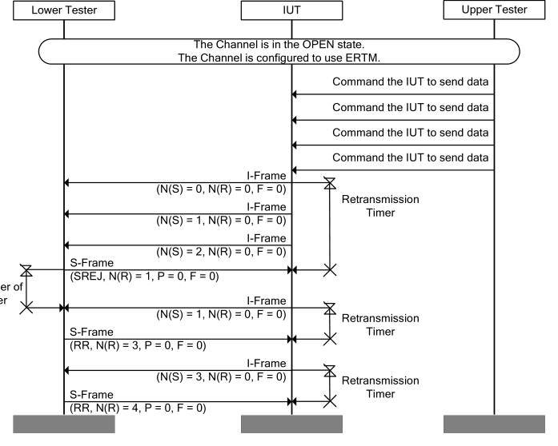

**Figure 4.90: L2CAP/ERM/BV-15-C [Respond to S-Frame [SREJ] POLL bit clear]**

• Expected Outcome
Pass verdict
The IUT retransmits the I-frame requested in the SREJ from the Lower Tester before the Monitor Timer of the Lower Tester expires.
The IUT does not transmit I-frame (N(S) = 3) as a result of receiving the SREJ from the Lower Tester.
L2CAP/ERM/BV-16-C [Send S-Frame [REJ]]
• Test Purpose
Verify that the IUT can send an S-frame [REJ] after receiving out of sequence I-frames.
• Reference
[1] 3.3.2, 8.6.1.2, 8.6.4
• Initial Condition
- The TxWindow size of the Lower Tester must be greater than 2 and should be the largest value that can be supported by the IUT.
- The channel is in the OPEN state and configured to use ERTM.
- I(out) outgoing I-frames and I(in) incoming I-frames have been sent and received by the IUT over the channel after it was opened and before the test is executed.
• Test Procedure
Figure 4.91 assumes I(out) and I(in) are 0. The actual values of N(S) and N(R) for both incoming and outgoing traffic must take the number of previously sent and received I-frames into account.

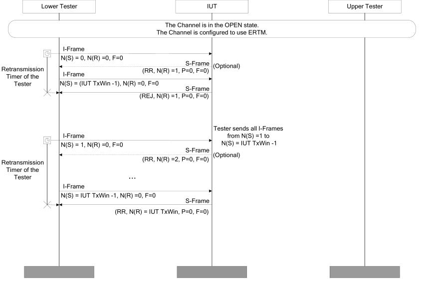

**Figure 4.91: L2CAP/ERM/BV-16-C [Send S-Frame [REJ]]**

• Expected Outcome
Pass verdict
The IUT sends an S-frame REJ requesting I-frames with N(S) >= 1 prior to the Retransmission timer of the Lower Tester expiring.
The IUT acknowledges all the I-frames that are sent by the Lower Tester after the S-frame REJ is sent.
L2CAP/ERM/BV-17-C [Send S-Frame [SREJ]]
• Test Purpose
Verify that the IUT can send an S-frame [SREJ] after receiving out of sequence I-frames.
• Reference
[1] 3.3.2, 8.6.1.3, 8.6.4
• Initial Condition
- The TxWindow size of the Lower Tester must be greater than 2.
- The channel is in the OPEN state and configured to use ERTM.
- I(out) outgoing I-frames and I(in) incoming I-frames have been sent and received by the IUT over the channel after it was opened and before the test is executed.
• Test Procedure
Figure 4.92 assumes I(out) and I(in) are 0. The actual values of N(S) and N(R) for both incoming and outgoing traffic must take the number of previously sent and received I-frames into account.

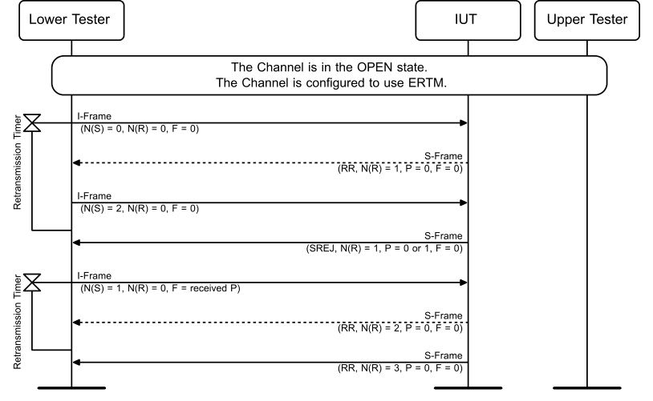

**Figure 4.92: L2CAP/ERM/BV-17-C [Send S-Frame [SREJ]]**

• Expected Outcome
Pass verdict
The IUT sends an S-frame SREJ requesting I-frame with N(S) = 1 prior to the Retransmission timer of the Lower Tester expiring.
The IUT acknowledges all the I-frames that are sent by the Lower Tester.
L2CAP/ERM/BV-18-C [Receive S-Frame [RR] Final Bit = 1]
• Test Purpose
Verify that the IUT retransmits any previously sent I-frames unacknowledged by receipt of an S- Frame [RR] with the Final Bit set.
• Reference
[1] 3.3.2, 8.6.1.4, 8.6.4
• Initial Condition
- The channel is in the OPEN state and configured to use ERTM.
- I(out) outgoing I-frames and I(in) incoming I-frames have been sent and received by the IUT over the channel after it was opened and before the test is executed.
- MaxTransmit for the IUT is set to a value greater than 1.
• Test Procedure
Figure 4.93 assumes I(out) and I(in) are 0. The actual values of N(S) and N(R) for both incoming and outgoing traffic must take the number of previously sent and received I-frames into account.

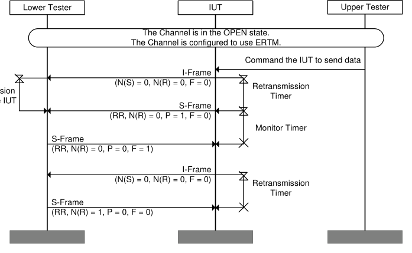

**Figure 4.93: L2CAP/ERM/BV-18-C [Receive S-Frame [RR] Final Bit = 1]**

• Expected Outcome
Pass verdict
The IUT retransmits the I-frame when it receives the S-frame from the Lower Tester that indicates that the previous transmission failed.
L2CAP/ERM/BV-19-C [Receive I-Frame Final Bit = 1]
• Test Purpose
Verify that the IUT retransmits any previously sent I-frames unacknowledged by receipt of an I-frame with the final bit set.
• Reference
[1] 3.3.2, 8.6.1.4, 8.6.4
• Initial Condition
- The channel is in the OPEN state and configured to use ERTM.
- I(out) outgoing I-frames and I(in) incoming I-frames have been sent and received by the IUT over the channel after it was opened and before the test is executed.
- MaxTransmit for the IUT is set to a value greater than 1.
• Test Procedure
Figure 4.94 assumes I(out) and I(in) are 0. The actual values of N(S) and N(R) for both incoming and outgoing traffic must take the number of previously sent and received I-frames into account.

| Lower Tester IUT Upper Tester The Channel is in the OPEN state. The Channel is configured to use ERTM. Command the IUT to send data I-Frame (N(S) = 0, N(R) = 0, F = 0) Retransmission n S-Frame Timer T (RR, N(R) = 0, P = 1, F = 0) I-Frame Monitor Timer (N(S) = 0, N(R) = 0, F = 1) I-Frame (N(S) = 0, N(R) = 0 OR 1, F = 0) S-Frame Retransmission Optional) (RR, N(R) = 1, P = 0, F = 0) Timer S-Frame (RR, N(R) = 1, P = 0, F = 0) |  |
| --- | --- |
|  |  |

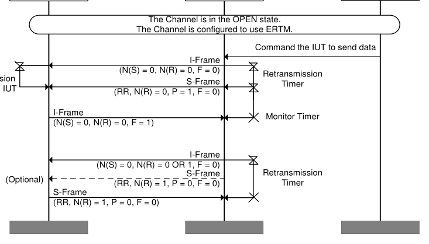

**Figure 4.94: L2CAP/ERM/BV-19-C [Receive I-Frame Final Bit = 1]**

• Expected Outcome
Pass verdict
The IUT retransmits the I-frame when it receives the I-frame from the Lower Tester that indicates that the previous transmission failed.
L2CAP/ERM/BV-20-C [Enter Remote Busy Condition]
• Test Purpose
Verify that the IUT does not retransmit any I-frames when it receives a remote busy indication from the Lower Tester (S-frame [RNR]).
• Reference
[1] 3.3.2, 8.6.4
• Initial Condition
- The channel is in the OPEN state and configured to use ERTM.
- I(out) outgoing I-frames and I(in) incoming I-frames have been sent and received by the IUT over the channel after it was opened and before the test is executed.
- MaxTransmit for the IUT is set to a value greater than 1.
• Test Procedure
Figure 4.95 assumes I(out) and I(in) are 0. The actual values of N(S) and N(R) for both incoming and outgoing traffic must take the number of previously sent and received I-frames into account.

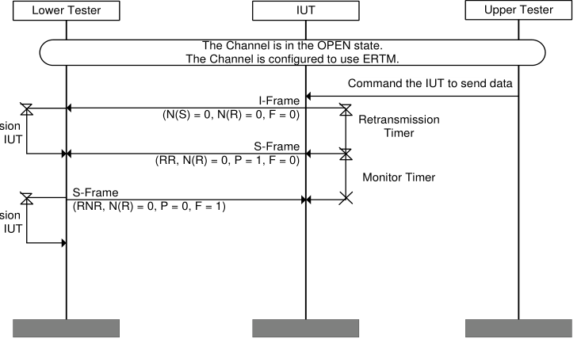

**Figure 4.95: L2CAP/ERM/BV-20-C [Enter Remote Busy Condition]**

• Expected Outcome
Pass verdict
The IUT does not retransmit the unacknowledged I-frame.
L2CAP/ERM/BV-22-C [Exit Local Busy Condition]
• Test Purpose
Verify that the IUT sends an S-frame [RR] Poll = 1 when the local busy condition is cleared.
• Reference
[1] 3.3.2, 8.6.4
• Initial Condition
- Run test L2CAP/ERM/BV-07-C [Send S-Frame [RNR]].
• Test Procedure

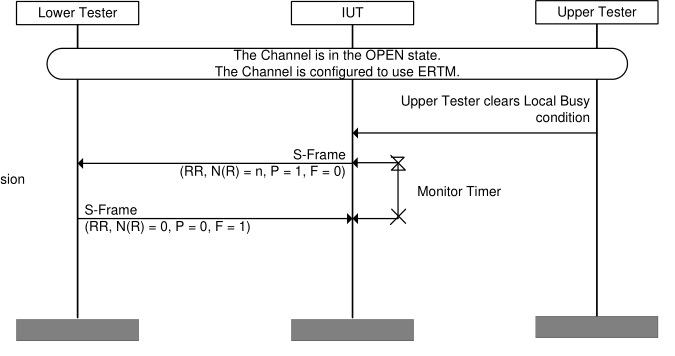

**Figure 4.96: L2CAP/ERM/BV-22-C [Exit Local Busy Condition]**

• Expected Outcome
Pass verdict
The IUT sends an S-frame RR with the POLL bit set.
L2CAP/ERM/BV-23-C [Transmit I-Frames using SAR]
• Test Purpose
Verify that the IUT can send correctly formatted sequential I-frames with valid values for the enhanced control fields (SAR, F-bit, ReqSeq, TxSeq) when performing SAR.
• Reference
[1] 3.3.2
• Initial Condition
- The connection is configured as ERTM.
- I(out) outgoing I-frames and I(in) incoming I-frames have been sent and received by the IUT over the channel after it was opened and before the test is executed.
- The Lower Tester has configured a value for the MPS that ensures that the IUT performs SAR (i.e., if the IUT has specified that it sends SDUs of N bytes the Lower Tester configures the MPS of the channel to be N / 3 bytes).
- The Lower Tester has configured a TxWindow size of 1.
• Test Procedure
Figure 4.97 assumes I(out) and I(in) are 0. The actual values of N(S) and N(R) for both incoming and outgoing traffic must take the number of previously sent and received I-frames into account.

**Figure 4.97: L2CAP/ERM/BV-23-C [Transmit I-Frames using SAR]**

• Expected Outcome
Pass verdict
The Lower Tester receives six correctly formatted I-frames from the IUT.
L2CAP/ERM/BI-01-C [S-Frame [REJ] Lost or Corrupted]
• Test Purpose
Verify that the IUT can handle receipt of an S-frame [RR] Poll = 1 if the S-frame [REJ] sent from the IUT is lost.
• Reference
[1] 3.3.2, 8.6.1.2, 8.6.4
• Initial Condition
- The TxWindow size of the Lower Tester must be greater than 2 and should be the largest value that can be supported by the IUT.
- The channel is in the OPEN state and configured to use ERTM.
- I(out) outgoing I-frames and I(in) incoming I-frames have been sent and received by the IUT over the channel after it was opened and before the test is executed.
• Test Procedure
Figure 4.98 assumes I(out) and I(in) are 0. The actual values of N(S) and N(R) for both incoming and outgoing traffic must take the number of previously sent and received I-frames into account.

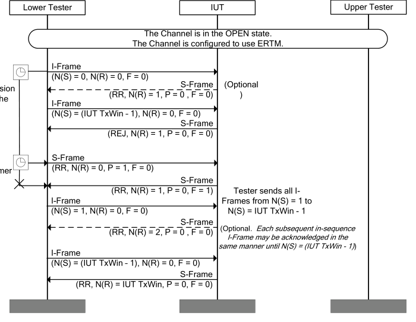

**Figure 4.98: L2CAP/ERM/BI-01-C [S-Frame [REJ] Lost or Corrupted]**

• Expected Outcome
Pass verdict
The IUT responds to the S-frame [RR] Poll = 1 with an S-frame [RR] Final = 1 that includes the TxSeq of the last received in sequence I-frame.
The IUT acknowledges all the I-frames that are sent by the Lower Tester after the S-frame REJ is sent.
L2CAP/ERM/BI-02-C [S-Frame [SREJ] Lost or Corrupted]
• Test Purpose
Verify that the IUT can handle receipt of an S-frame [RR] Poll = 1 if the S-frame [SREJ] sent from the IUT is lost.
• Reference
[1] 3.3.2, 8.6.1.3, 8.6.4
• Initial Condition
- The TxWindow size of the Lower Tester must be greater than 2.
- The channel is in the OPEN state and configured to use ERTM.
- I(out) outgoing I-frames and I(in) incoming I-frames have been sent and received by the IUT over the channel after it was opened and before the test is executed.
• Test Procedure
Figure 4.99 assumes I(out) and I(in) are 0. The actual values of N(S) and N(R) for both incoming and outgoing traffic must take the number of previously sent and received I-frames into account.

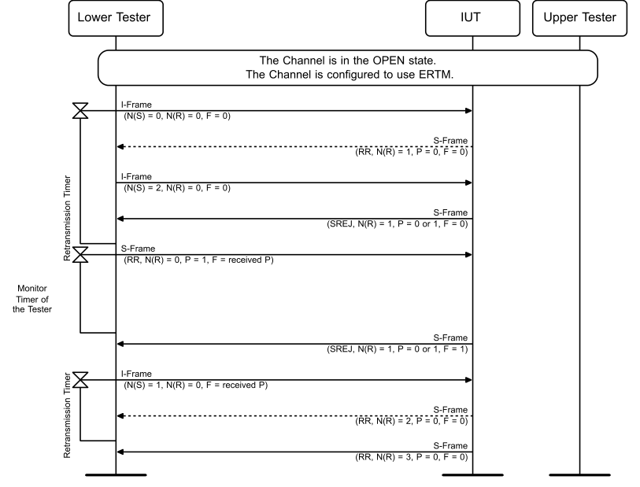

**Figure 4.99: L2CAP/ERM/BI-02-C [S-Frame [SREJ] Lost or Corrupted]**

• Expected Outcome
Pass verdict
The IUT responds to the S-frame [RR] Poll = 1 with an S-frame [SREJ] Final = 1 that includes the TxSeq of the missing I-frame (N(S) = 1).
The IUT acknowledges all the I-frames that are sent by the Lower Tester after the S-frame SREJ is sent.
L2CAP/ERM/BI-03-C [Handle Duplicate S-Frame [SREJ]]
• Test Purpose
Verify that the IUT only retransmits the requested I-frame once after receiving a duplicate SREJ.
• Reference
[1] 3.3.2, 8.6.1.3, 8.6.4
• Initial Condition
- The channel is in the OPEN state and configured to use ERTM.
- I(out) outgoing I-frames and I(in) incoming I-frames have been sent and received by the IUT over the channel after it was opened and before the test is executed.
- The MaxTransmit for the IUT is set to a value greater than 1.
- The Lower Tester has specified a value for TxWin > 1 in the Configure Request sent to the IUT.
• Test Procedure
Figure 4.100 assumes I(out) and I(in) are 0. The actual values of N(S) and N(R) for both incoming and outgoing traffic must take the number of previously sent and received I-frames into account.

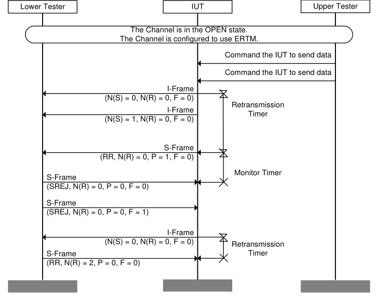

**Figure 4.100: L2CAP/ERM/BI-03-C [Handle Duplicate S-Frame [SREJ]]**

• Expected Outcome
Pass verdict
The IUT retransmits the I-frame requested in the SREJ from the Lower Tester only once.
L2CAP/ERM/BI-04-C [Handle Receipt of S-Frame [REJ] and S-Frame [RR, F=1] that Both Require Retransmission of the Same I-Frames]
• Test Purpose
Verify that the IUT only retransmits the requested I-frames once after receiving an S-frame [REJ] followed by an S-frame [RR] with the Final bit set that indicates the same I-frames should be retransmitted.
• Reference
[1] 3.3.2, 8.6.1.3, 8.6.4
• Initial Condition
- The channel is in the OPEN state and configured to use ERTM.
- I(out) outgoing I-frames and I(in) incoming I-frames have been sent and received by the IUT over the channel after it was opened and before the test is executed.
- The MaxTransmit for the IUT is set to a value greater than 1.
- The Lower Tester has specified a value for TxWin > 1 in the Configure Request sent to the IUT.
• Test Procedure
Figure 4.101 assumes I(out) and I(in) are 0. The actual values of N(S) and N(R) for both incoming and outgoing traffic must take the number of previously sent and received I-frames into account.

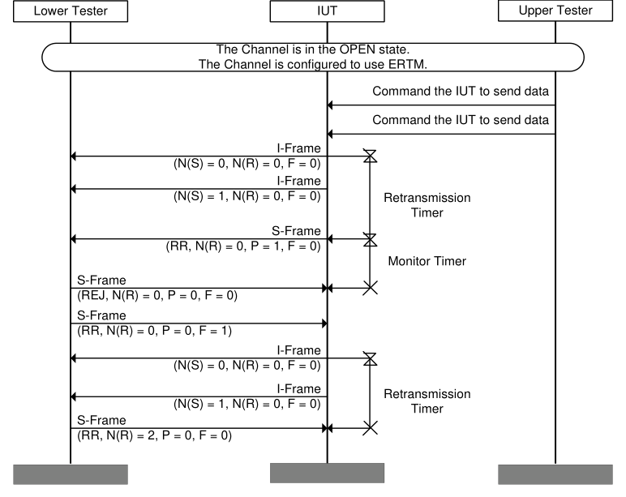

**Figure 4.101: L2CAP/ERM/BI-04-C [Handle Receipt of S-Frame [REJ] and S-Frame [RR, F=1] that Both Require Retransmission of the Same I-Frames]**

• Expected Outcome
Pass verdict
The IUT retransmits the I-frames requested in the REJ from the Lower Tester only once.
L2CAP/ERM/BI-05-C [Handle receipt of S-Frame [REJ] and I-Frame [F=1] that Both Require Retransmission of the Same I-Frames]
• Test Purpose
Verify that the IUT only retransmits the requested I-frames once after receiving an S-frame [REJ] followed by an I-frame with the Final bit set that indicates the same I-frames should be retransmitted.
• Reference
[1] 3.3.2, 8.6.1.3, 8.6.4
• Initial Condition
- The channel is in the OPEN state and configured to use ERTM.
- I(out) outgoing I-frames and I(in) incoming I-frames have been sent and received by the IUT over the channel after it was opened and before the test is executed.
- The MaxTransmit for the IUT is set to a value greater than 1.
- The Lower Tester has specified a value for TxWin > 1 in the Configure Request sent to the IUT.
• Test Procedure
Figure 4.102 assumes I(out) and I(in) are 0. The actual values of N(S) and N(R) for both incoming and outgoing traffic must take the number of previously sent and received I-frames into account.

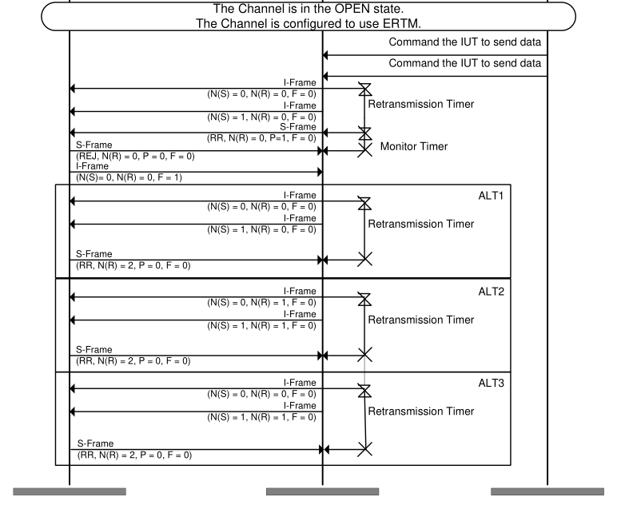

**Figure 4.102: L2CAP/ERM/BI-05-C [Handle receipt of S-Frame [REJ] and I-Frame [F=1] that Both Require Retransmission of the Same I-Frames]**

• Expected Outcome
Pass verdict
The IUT retransmits the I-frames requested in the REJ from the Lower Tester only once.

#### 4.11.8 Streaming Mode (STM)

Verify the correct implementation of Streaming Mode in the IUT.
L2CAP/STM/BV-01-C [Streaming Mode Source]
• Test Purpose
Verify that the IUT can send correctly formatted sequential I-frames with valid values for the Control fields (SAR, F-bit, ReqSeq, and TxSeq).
• Reference
[1] 3.3.2, 8.7
• Initial Condition
- The channel is in the OPEN state and configured to use Streaming Mode.
- No I-frames have been sent from the IUT or the Lower Tester.
• Test Procedure

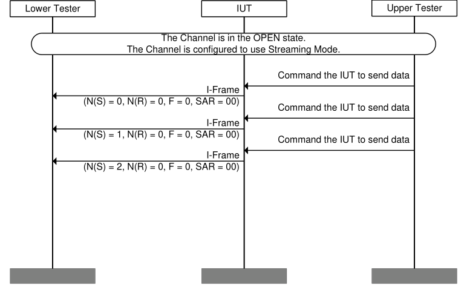

**Figure 4.103: L2CAP/STM/BV-01-C [Streaming Mode Source]**

• Expected Outcome
Pass verdict
The Lower Tester receives three correctly formatted I-frames from the IUT.
L2CAP/STM/BV-02-C [Streaming Mode Sink]
• Test Purpose
Verify that the IUT receives I-frames and handles SAR correctly.
• Reference
[1] 3.3.2, 8.7
• Initial Condition
- The channel is in the OPEN state and configured to use Streaming Mode.
- No I-frames have been sent from the IUT or the Lower Tester.
- The IUT has configured a MTU and MPS size that is greater or equal to 48 bytes.
• Test Procedure

**Figure 4.104: L2CAP/STM/BV-02-C [Streaming Mode Sink]**

• Expected Outcome
Pass verdict
The IUT passes the received data correctly to the Upper Tester.
L2CAP/STM/BV-03-C [Streaming Mode Source using SAR]
• Test Purpose
Verify that the IUT can send correctly formatted sequential I-frames with valid values for the Control fields (SAR, F-bit, ReqSeq, TxSeq) while performing SAR.
• Reference
[1] 3.3.2, 8.7
• Initial Condition
- The channel is in the OPEN state and configured to use Streaming Mode.
- No I-frames have been sent from the IUT or Lower Tester.
- The Lower Tester has configured a value for the MPS that ensures that the IUT performs SAR (i.e., if the IUT has specified that it sends SDUs of N bytes the Lower Tester  configures the MPS of the channel to be N / 3 bytes).
• Test Procedure

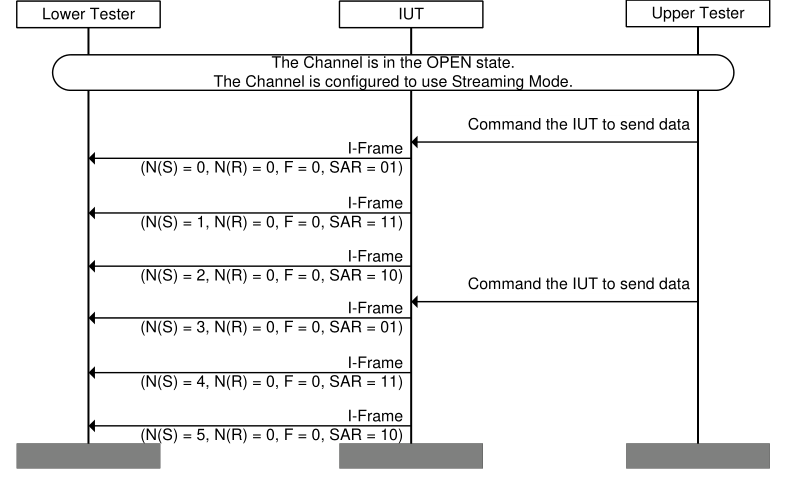

**Figure 4.105: L2CAP/STM/BV-03-C [Streaming Mode Source using SAR]**

• Expected Outcome
Pass verdict
The Lower Tester receives six correctly formatted I-frames from the IUT.

#### 4.11.9 Fixed Channel Support (FIX)

Verify the correct implementation of fixed channels information response in L2CAP.
L2CAP/FIX/BV-01-C [Fixed Channels Supported Information Request]
• Test Purpose
Verify that the IUT can send an Information Request for the information type of Fixed Channels Supported.
• Reference
[1] 4.10, 4.11, 4.12, 4.13
• Initial Condition
- The IUT has established that the Lower Tester supports Fixed Channels with an Info Request with Info Type set to Extended Features.
• Test Procedure

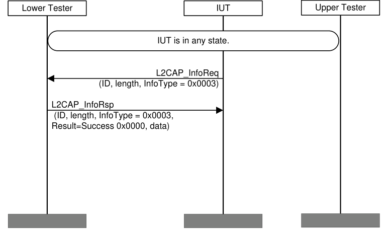

**Figure 4.106: L2CAP/FIX/BV-01-C [Fixed Channels Supported Information Request]**

• Expected Outcome
Pass verdict
The IUT sends Information Request [InfoType = Fixed Channels].
L2CAP/FIX/BV-02-C [AMP Manager Channel Supported]
• Test Purpose
Verify that the IUT can send an Information Response for the information type of Fixed Channels Supported that contains the map of supported fixed channels with the AMP Manager Protocol Channel (bit-3 of octet 0) set to 1.
• Reference
[1] 4.10, 4.11, 4.12, 4.13
• Initial Condition
- The Lower Tester has established that the IUT supports Fixed Channels by using an Info Request with the Info Type set to 0x0002 (Extended Features).
• Test Procedure

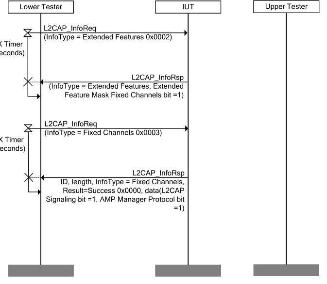

**Figure 4.107: L2CAP/FIX/BV-02-C [AMP Manager Channel Supported]**

• Expected Outcome
Pass verdict
The IUT sends Information Response [InfoType = Fixed Channels] and a result code of “Success.”
The Fixed Channel Mask bit for L2CAP Signaling channel is set to 1.
The Fixed Channel Mask bit for AMP Manager Protocol channel is set to 1.

#### 4.11.10 Extended Window Size Configuration (EWC)

Verify the configuration of the Extended Window size option of L2CAP.
L2CAP/EWC/BV-01-C [IUT Initiated Extended Window Size Option]
• Test Purpose
Verify that the IUT can configure a channel to use the Extended Window size option.
• Reference
[1] 4.4, 4.5, 5.5, 6.1.4, 7.1
• Initial Condition
- The IUT has established that the peer L2CAP entity supports configuration of the Extended Window Size option (using the Information Request/Response [Extended Features] mechanism).
• Test Procedure

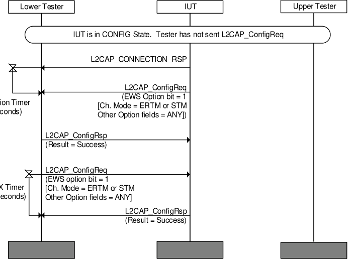

**Figure 4.108: L2CAP/EWC/BV-01-C [IUT Initiated Extended Window Size Option]**

• Expected Outcome
Pass verdict
The channel is established.
The IUT sends an L2CAP_ConfigReq including the Extended Feature Mask bit for Extended Window size option before the Configuration timer expires.
The IUT responds with Success to the Lower Tester sending an L2CAP_ConfigReq including the Extended Window size option.
L2CAP/EWC/BV-02-C [Lower Tester Requests Extended Window Size]
• Test Purpose
Verify that the IUT uses the Extended Control Field in I/S-frames if the Lower Tester requests that Extended Window Size is used.
• Reference
[1] 3.3.2, 4.4, 4.5, 5.7, 6.1.4, 7.1, 8.2 (CSA1)
• Initial Condition
- L2CAP/EWC/BV-01-C [IUT Initiated Extended Window Size Option] test case was completed successfully.
• Test Procedure

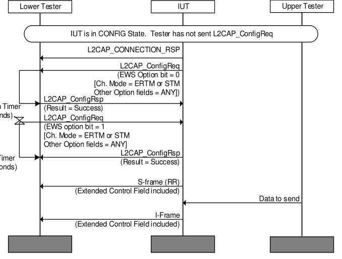

**Figure 4.109: L2CAP/EWC/BV-02-C [Lower Tester Requests Extended Window Size]**

• Expected Outcome
Pass verdict
The channel is established.
The IUT accepts the EWS option while configuring.
The IUT includes ECF in S-frames sent to the Lower Tester.
The IUT includes ECF in I-frames sent to the Lower Tester.
L2CAP/EWC/BV-03-C [Extended Window Size Option Not Supported by Lower Tester]
• Test Purpose
Verify that the IUT does not include an Extended Window Size option when configuring the channel if the Lower Tester does not indicate support for the Extended Windows Size option in the Information Response [Extended Features].
• Reference
[1] 4.4, 4.5, 5.5, 6.1.4, 7.1.3
• Initial Condition
- An ACL connection has been established by the Lower Tester.
• Test Procedure

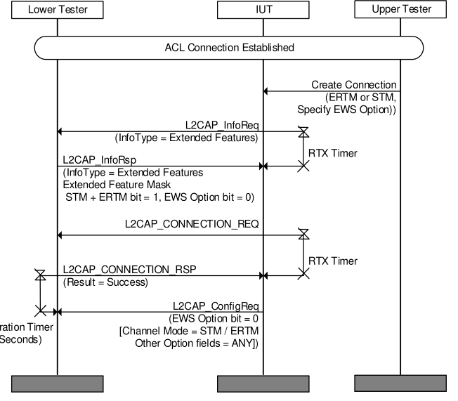

**Figure 4.110: L2CAP/EWC/BV-03-C [Extended Window Size Option Not Supported by Lower Tester]**

• Expected Outcome
Pass verdict
The IUT sends L2CAP_ConfigReq before Configuration Timer expires, with EWS option bit = 0.

#### 4.11.11 Lock Step Configuration (LSC)

Verify the correct implementation of the Lock Step configuration Process.
L2CAP/LSC/BV-01-C [Normal Lock Step Configuration Process for Best Effort, BR/EDR ERTM Channel]
• Test Purpose
Verify that the IUT performs the Lock-step Configuration process including sending a properly formatted Enhanced Flow Specification option for service type “Best Effort”.
• Reference
[8] 7.1.3
• Initial Condition
- An ACL connection has been established by the Lower Tester.
- The IUT has established that the peer L2CAP entity supports Lockstep Configuration Process using the Information Request/Response [Extended Features] mechanism.
- L2CAP channel is established over BR/EDR using ERTM with the Extended Flow Specification bit set in the IUT’s Extended Features Mask.
- The IUT is in CONFIG state.
• Test Procedure

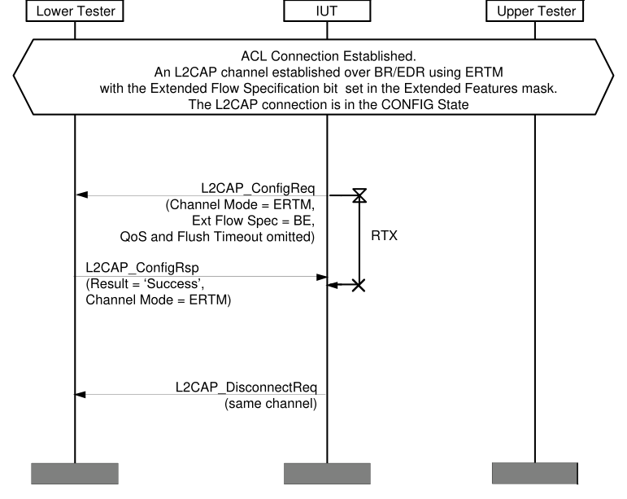

**Figure 4.111: L2CAP/LSC/BV-01-C [Normal Lock Step Configuration Process for Best Effort, BR/EDR ERTM Channel]**

• Expected Outcome
Pass verdict
The IUT sends an L2CAP_ConfigReq packet with Extended Flow Spec options for BE.
The IUT responds to an L2CAP_ConfigReq packet, including Extended Flow Spec options for BE, with status pending before its RTX timer expires.
The IUT sends an L2CAP_ConfigRsp packet with status success after reception of L2CAP_ConfigRsp with status.
L2CAP/LSC/BV-02-C [Normal Lock Step Configuration Process for Guaranteed, BR/EDR ERTM Channel]
• Test Purpose
Verify that the IUT performs the Lock-step Configuration process including sending a properly formatted Enhanced Flow Specification option for service type “Guaranteed”.
• Reference
[8] 7.1.3
• Initial Condition
- An ACL connection has been established by the Lower Tester.
- The IUT has established that the peer L2CAP entity supports Lockstep Configuration Process using the Information Request/Response [Extended Features] mechanism.
- L2CAP channel is established over BR/EDR using ERTM with the Extended Flow Specification bit set in the IUT’s Extended Features Mask.
- The IUT is in CONFIG state.
• Test Procedure

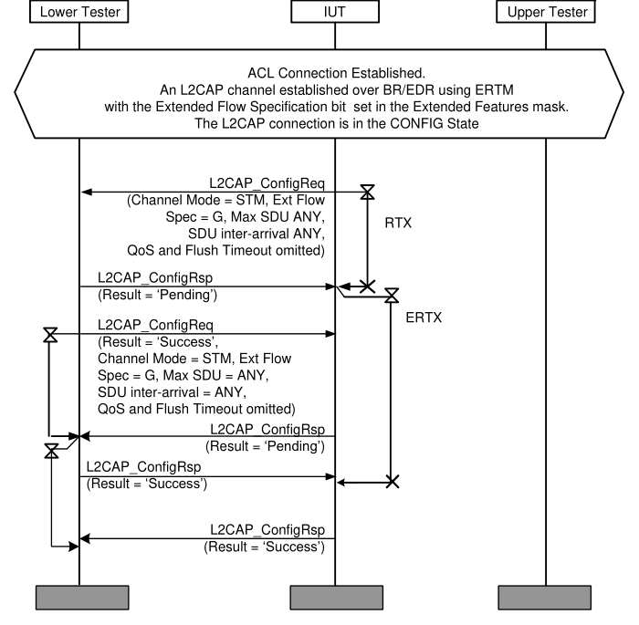

**Figure 4.112: L2CAP/LSC/BV-02-C [Normal Lock Step Configuration Process for Guaranteed, BR/EDR ERTM Channel]**

• Expected Outcome
Pass verdict
The channel is established.
The IUT sends an L2CAP_ConfigReq packet with Extended Flow Spec options for Guaranteed.
The IUT responds to an L2CAP_ConfigReq packet with Extended Flow Spec options for Guaranteed, with status “pending” before its RTX timer expires.
The IUT sends an L2CAP_ConfigRsp packet with status “success” after reception of L2CAP_ConfigRsp with status pending before its ERTX timer expires.
L2CAP/LSC/BV-03-C [Premature Success in Configuration Response, BR/EDR ERTM Channel]
• Test Purpose
Verify that the IUT closes the channel if it receives a Configuration response packet with result “success” before receiving a Configuration response packet with result “pending”.
• Reference
[8] 7.1.3
• Initial Condition
- An ACL connection has been established by the Lower Tester.
- L2CAP channel is established over BR/EDR using ERTM with the Extended Flow Specification bit set in the IUT’s Extended Features Mask.
- The IUT is in CONFIG state.
• Test Procedure

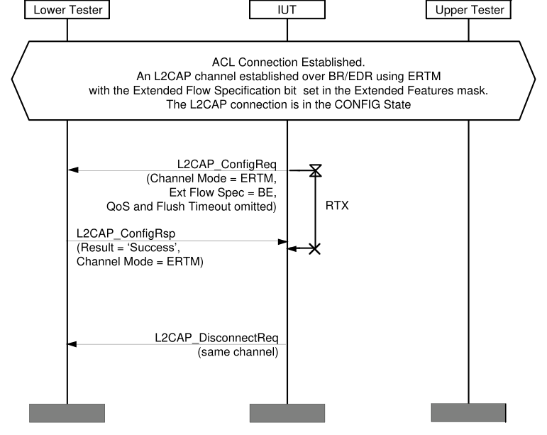

**Figure 4.113: L2CAP/LSC/BV-03-C [Premature Success in Configuration Response, BR/EDR ERTM Channel]**

• Expected Outcome
Pass verdict
The IUT stays in CONFIG state after receiving L2CAP_ConfigRsp with results before receiving L2CAP_ConfigRsp with “pending” status.
The IUT sends L2CAP_DisconnectReq with the same channel specified.
• Test Purpose
Verify that the IUT closes the channel if it sends a Configuration request containing an Extended Flow Specification with service type “Best Effort” and receives a Configuration request packet with an Extended Flow Specification containing service type “Guaranteed”. See test case L2CAP/LSC/BV-03- C [Premature Success in Configuration Response, BR/EDR ERTM Channel].
• Reference
[8] 7.1.3
• Initial Condition
- An ACL connection has been established by the Lower Tester.
- L2CAP channel is established over BR/EDR using ERTM with the Extended Flow Specification bit set in the IUT’s Extended Features Mask.
- The IUT is in CONFIG state.
• Test Procedure

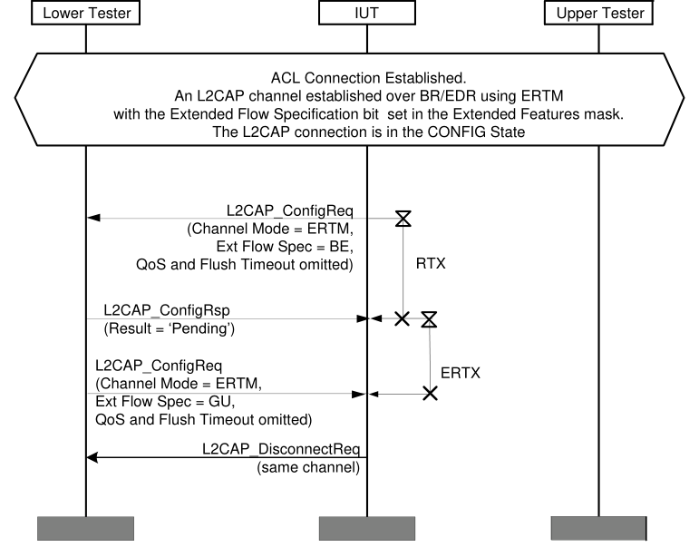

**Figure 4.114: L2CAP/LSC/BI-04-C [Mismatched Service Type, Best Effort, BR/EDR ERTM Channel]**

• Expected Outcome
Pass verdict
The IUT rejects mismatched L2CAP_ConfigRsp by sending an L2CAP_DisconnectReq.
• Test Purpose
Verify that the IUT closes the channel if it sends a Configuration request containing an Extended Flow Specification with service type “Guaranteed” and receives a Configuration response packet with an Extended Flow Specification containing service type “Best Effort”.
See test case L2CAP/LSC/BV-03-C [Premature Success in Configuration Response, BR/EDR ERTM Channel].
• Reference
[8] 7.1.3
• Initial Condition
- An ACL connection has been established by the Lower Tester.
- L2CAP channel is established over BR/EDR using ERTM with the Extended Flow Specification bit set in the IUT’s Extended Features Mask.
- The IUT is in CONFIG state.
• Test Procedure

**Figure 4.115: L2CAP/LSC/BI-05-C [Mismatched Service Type, Guaranteed, BR/EDR ERTM Channel]**

• Expected Outcome
Pass verdict
The IUT rejects mismatched L2CAP_ConfigRsp by sending an L2CAP_DisconnectReq.
• Test Purpose
Verify that the IUT closes the channel if it sends a Configuration request containing an Extended Flow Specification with service type “Guaranteed” and after receiving a Configuration Response with result “Pending” it receives a Configuration request packet with a “Failure” result.
See test case L2CAP/LSC/BV-03-C [Premature Success in Configuration Response, BR/EDR ERTM Channel].
• Reference
[8] 7.1.3
• Initial Condition
- An ACL connection has been established by the Lower Tester.
- L2CAP channel is established over BR/EDR using ERTM with the Extended Flow Specification bit set in the IUT’s Extended Features Mask.
- The IUT is in CONFIG state.
• Test Procedure

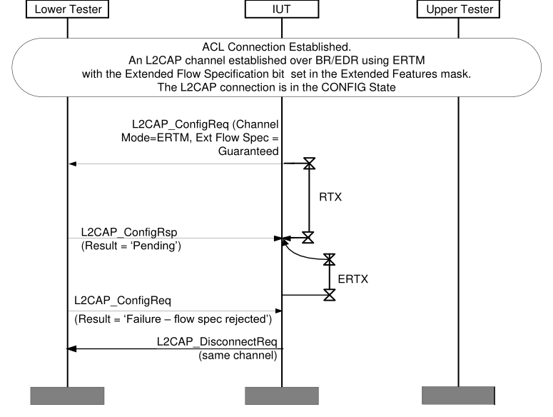

**Figure 4.116: L2CAP/LSC/BV-06-C [Remote Failed on Guaranteed, BR/EDR ERTM Channel]**

• Expected Outcome
Pass verdict
The IUT detects L2CAP_ConfigRsp indicating ‘no resources’ (failure) by sending an L2CAP_DisconnectReq.
L2CAP/LSC/BV-07-C [Normal Lock Step Configuration Process for Best Effort, AMP Channel]
• Test Purpose
Verify that the IUT performs the Lock-step Configuration process including sending a properly formatted Enhanced Flow Specification option for service type “Best Effort”.
• Reference
[8] 7.1.3
• Initial Condition
- An ACL connection has been established by the Lower Tester.
- The IUT has established that the peer L2CAP entity supports Lockstep Configuration Process using the Information Request/Response [Extended Features] mechanism.
- L2CAP channel is connected over an AMP controller which can support guaranteed logical links.
- The IUT is in CONFIG state.
• Test Procedure

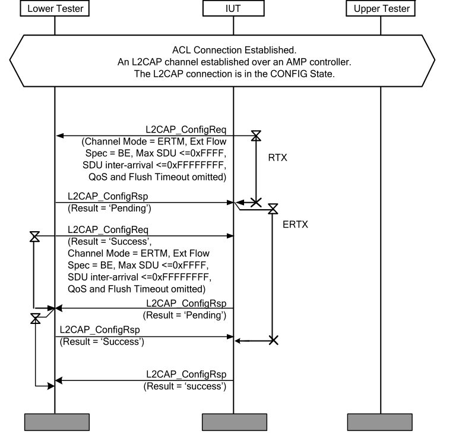

**Figure 4.117: L2CAP/LSC/BV-07-C [Normal Lock Step Configuration Process for Best Effort, AMP Channel]**

• Expected Outcome
Pass verdict
The IUT sends an L2CAP_ConfigReq packet with Extended Flow Spec options for BE.
The IUT responds to an L2CAP_ConfigReq packet, including Extended Flow Spec options for BE, with status pending and can correctly receive a configuration response from the Lower Tester with the result = “Pending” before its RTX timer expires.
The IUT sends an L2CAP_ConfigRsp packet with status success after reception of L2CAP_ConfigRsp with status pending can correctly receive the configuration response from the Lower Tester with the result = “Success” before its ERTX timer expires.
L2CAP/LSC/BV-08-C [Normal Lock Step Configuration Process for Guaranteed, AMP Channel]
• Test Purpose
Verify that the IUT performs the Lock-step Configuration process including sending a properly formatted Enhanced Flow Specification option for service type “Guaranteed”.
• Reference
[8] 7.1.3
• Initial Condition
- An ACL connection has been established by the Lower Tester.
- The IUT has established that the peer L2CAP entity supports Lockstep Configuration Process using the Information Request/Response [Extended Features] mechanism.
- L2CAP channel is connected over an AMP controller which can support guaranteed logical links.
- The IUT is in CONFIG state.
• Test Procedure

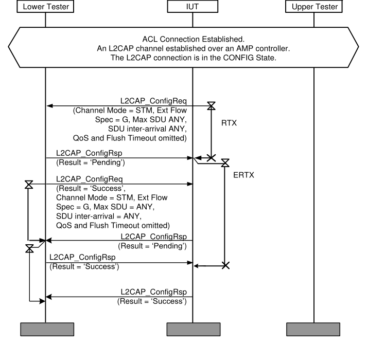

**Figure 4.118: L2CAP/LSC/BV-08-C [Normal Lock Step Configuration Process for Guaranteed, AMP Channel]**

• Expected Outcome
Pass verdict
The channel is established.
The IUT sends an L2CAP_ConfigReq packet with Extended Flow Spec options for guaranteed service type.
The IUT responds to an L2CAP_ConfigReq packet with status pending before its RTX timer expires.
The IUT sends an L2CAP_ConfigRsp packet with status success after reception of L2CAP_ConfigRsp with status pending can correctly receive the configuration response from the Lower Tester with the result = “Success” before its ERTX timer expires.
L2CAP/LSC/BV-09-C [Premature Success in Configuration Response, AMP Channel]
• Test Purpose
Verify that the IUT closes the channel if it receives a Configuration response packet with result “Success” before receiving a Configuration response packet with result “Pending”.
• Reference
[8] 7.1.3
• Initial Condition
- An ACL connection has been established by the Lower Tester.
- L2CAP channel is connected over an AMP controller which can support guaranteed logical links.
- The IUT is in CONFIG state.
• Test Procedure

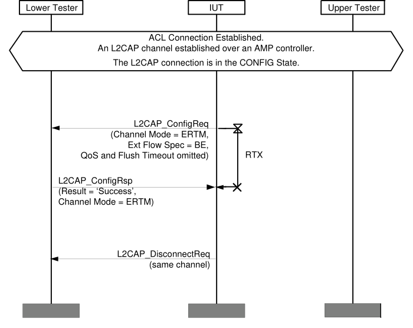

**Figure 4.119: L2CAP/LSC/BV-09-C [Premature Success in Configuration Response, AMP Channel]**

• Expected Outcome
Pass verdict
The IUT stays in CONFIG state after receiving L2CAP_ConfigRsp with results before receiving L2CAP_ConfigRsp with “Pending” status. IUT sends L2CAP_DisconnectReq with the same channel specified.
L2CAP/LSC/BI-10-C [Mismatched Service Type, Best Effort, AMP Channel]
• Test Purpose
Verify that the IUT closes the channel if it sends a Configuration request containing an Extended Flow Specification with service type “Best Effort” and receives a Configuration request packet with an Extended Flow Specification containing service type “Guaranteed”.
See test case L2CAP/LSC/BV-03-C [Premature Success in Configuration Response, BR/EDR ERTM Channel].
• Reference
[8] 7.1.3
• Initial Condition
- An ACL connection has been established by the Lower Tester.
- L2CAP channel is connected over an AMP controller which can support guaranteed logical links.
- The IUT is in CONFIG state.
• Test Procedure

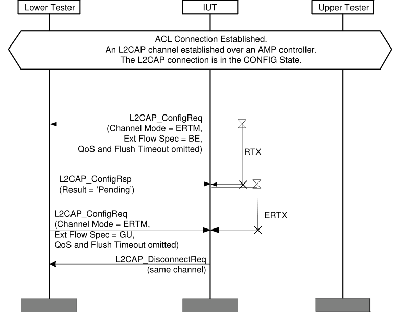

**Figure 4.120: L2CAP/LSC/BV-10-I [Mismatched Service Type, Best Effort, AMP Channel]**

• Expected Outcome
Pass verdict
The IUT rejects mismatched L2CAP_ConfigRsp by sending an L2CAP_DisconnectReq.
L2CAP/LSC/BI-11-C [Mismatched Service Type, Guaranteed, AMP Channel]
• Test Purpose
Verify that the IUT closes the channel if it sends a Configuration request containing an Extended Flow Specification with service type “Guaranteed” and receives a Configuration request packet with an Extended Flow Specification containing service type “Best Effort”.
See test case L2CAP/LSC/BV-03-C [Premature Success in Configuration Response, BR/EDR ERTM Channel].
• Reference
[8] 7.1.3
• Initial Condition
- An ACL connection has been established by the Lower Tester.
- L2CAP channel is connected over an AMP controller which can support guaranteed logical links.
- The IUT is in CONFIG state.
• Test Procedure

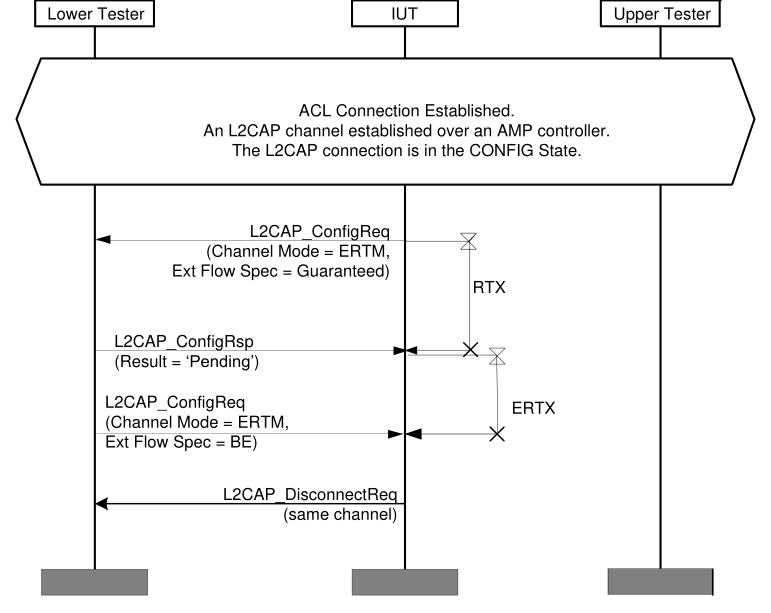

**Figure 4.121: L2CAP/LSC/BI-11-C [Mismatched Service Type, Guaranteed, AMP Channel]**

• Expected Outcome
Pass verdict
The IUT rejects mismatched L2CAP_ConfigRsp by sending an L2CAP_DisconnectReq.
L2CAP/LSC/BV-12-C [Remote Failed on Guaranteed, AMP Channel]
• Test Purpose
Verify that the IUT closes the channel if it sends a Configuration request containing an Extended Flow Specification with service type “Guaranteed” and after receiving a Configuration Response with result “Pending” it receives a Configuration request packet with a “Failure” result.
See test case L2CAP/LSC/BV-03-C [Premature Success in Configuration Response, BR/EDR ERTM Channel].
• Reference
[8] 7.1.3
• Initial Condition
- An ACL connection has been established by the Lower Tester.
- L2CAP channel is connected over an AMP controller which can support guaranteed logical links.
- The IUT is in CONFIG state.
• Test Procedure

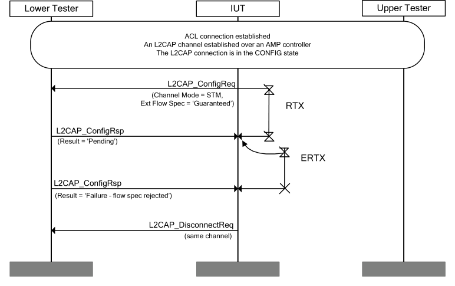

**Figure 4.122: L2CAP/LSC/BV-12-C [Remote Failed on Guaranteed, AMP Channel]**

• Expected Outcome
Pass verdict
The IUT detects L2CAP_ConfigRsp indicating ‘no resources’ (failure) by sending an L2CAP_DisconnectReq.

#### 4.11.12 Create Channel (CCH)

Verify the correct implementation of the create channel request and response of the L2CAP layer.
L2CAP/CCH/BV-01-C [Create Channel Request for an AMP Physical Link]
• Test Purpose
Verify that the IUT can request the creation of an L2CAP channel to run over an existing AMP physical link.
• Reference
[1] 4.14, 4.15
[8] 6.1, Figure 6.3
• Initial Condition
- The AMP Physical Link for the Controller ID exists.
• Test Procedure

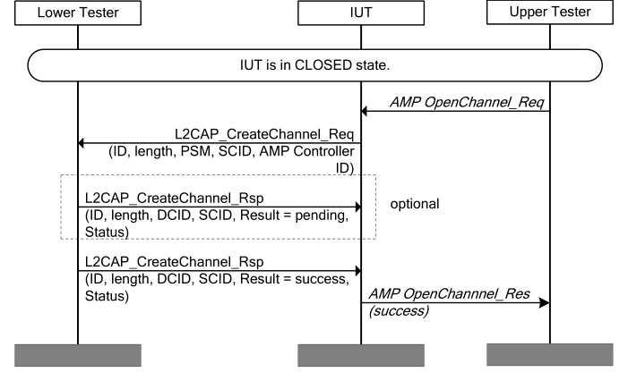

**Figure 4.123: L2CAP/CCH/BV-01-C [Create Channel Request for an AMP Physical Link]**

• Expected Outcome
Pass verdict
The IUT transmits L2CAP_CreateChannel_Req over the signaling channel using a dynamically allocated SCID, a valid PSM value, and the Controller ID matching the ID for the existing AMP channel.
The IUT enters the OPEN state.
L2CAP/CCH/BV-02-C [Create Channel Request for an AMP Physical Link – Refused]
• Test Purpose
Verify that the IUT can request the creation of an L2CAP channel to run over an existing AMP physical link, and to recover if the request is refused by the Lower Tester (L2CAP create channel response).
• Reference
[1] 4.14, 4.15
[8] 6.1, Figure 6.3
• Initial Condition
- The AMP Physical Link for the Controller ID exists.
• Test Procedure
The ‘Connection Refused’ code sent by the Lower Tester may include: PSM not supported; Security Block; No Resources; Controller ID not supported.

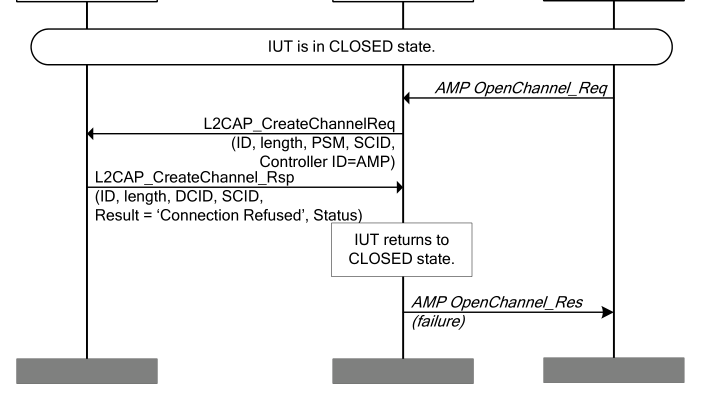

**Figure 4.124: L2CAP/CCH/BV-02-C [Create Channel Request for an AMP Physical Link – Refused]**

• Expected Outcome
Pass verdict
The IUT transmits L2CAP_CreateChanAMP_Req over the signaling channel using a dynamically allocated SCID, a valid PSM value, and the Controller ID matching the ID for the existing AMP channel.
The IUT returns to the CLOSED state.
The IUT indicates failure to the Upper Tester.
L2CAP/CCH/BV-03-C [Create Channel Request for an AMP Physical Link – Failed]
• Test Purpose
Verify that the IUT can request the creation of an L2CAP channel to run over an existing AMP physical link, and to recover if the request is accepted (L2CAP create channel response = “Pending”) by the Lower Tester but is failed after initiation.
• Reference
[1] 4.14, 4.15
[8] 6.1, Figure 6.3
• Initial Condition
- The AMP Physical Link for the Controller ID exists.
• Test Procedure
The ‘Connection Refused’ code sent by the Lower Tester may include: PSM not supported; Security Block; No Resources; Controller ID not supported.

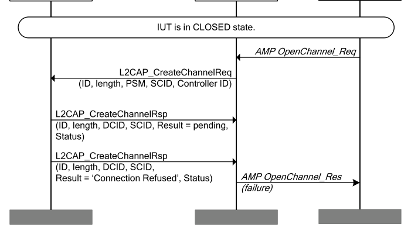

**Figure 4.125: L2CAP/CCH/BV-03-C [Create Channel Request for an AMP Physical Link – Failed]**

• Expected Outcome
Pass verdict
The IUT transmits L2CAP_CreateChannelReq over the signaling channel using a dynamically allocated SCID, a valid PSM value, and the Controller ID matching the ID for the existing AMP channel.
The IUT returns to the CLOSED state.
The IUT indicates failure to the Upper Tester.
L2CAP/CCH/BV-04-C [Create Channel Response for an AMP Physical Link]
• Test Purpose
Verify that the IUT can receive and handle a request for connection establishment and configuration of an L2CAP channel to run over an existing AMP physical link.
• Reference
[1] 4.14, 4.15
• Initial Condition
- The AMP Physical Link for the Controller ID exists.
• Test Procedure

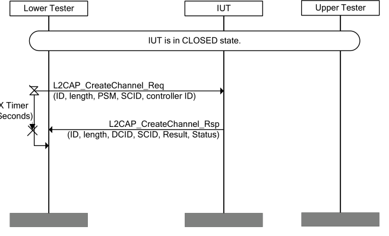

**Figure 4.126: L2CAP/CCH/BV-04-C [Create Channel Response for an AMP Physical Link]**

• Expected Outcome
Pass verdict
The IUT transmits an L2CAP_CreateChannelRsp with a result code of “Connection Successful” (0x0000) or “Connection Pending” (0x0001) before the Lower Tester RTX timer expires. If the result code = “Connection Pending”, the status code is 0x0000 - 0x0002.
The SCID in the response is equal to the SCID code in the request.

#### 4.11.13 Move Channel (MCH)

Verify the correct implementation of the Move Channel request and response of the L2CAP layer.
L2CAP/MCH/BV-01-C [Move ERTM Channel Request for BR/EDR to AMP – Success]
• Test Purpose
Verify that the IUT can request the move of an L2CAP ERTM channel from a BR/EDR link to an AMP link. If the operation is successful, the channel is in state OPEN over the AMP link.
• Reference
[1] 4.16, 4.17, 4.18, 9.2
• Initial Condition
- An L2CAP ERTM channel exists between the IUT and the Lower Tester in OPEN state.
- The AMP Physical Link exists.
- I(out) outgoing I-frames and I(in) incoming I-frames have been sent and received by the IUT over the channel after it was opened and before the test is executed.
• Test Procedure
Figure 4.127 assumes I(out) and I(in) are 0. The actual values of N(S) and N(R) for both incoming and outgoing traffic must take the number of previously sent and received I-frames into account.

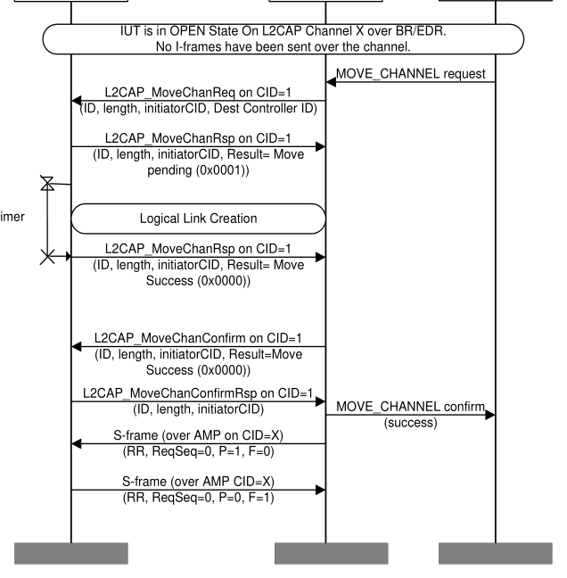

**Figure 4.127: L2CAP/MCH/BV-01-C [Move ERTM Channel Request for BR/EDR to AMP – Success]**

• Test Condition
The Lower Tester responds with a result field = “Move Pending” and configures the new AMP channel so the channel can be move from BR/EDR to AMP.
• Expected Outcome
Pass verdict
The IUT transmits an L2CAP_MoveChanConfirm with a result code = “Move Success” (0x0000). After it receives the L2CAP_MoveChanConfirmRsp from the Lower Tester, it sends a Receiver Ready message over the new AMP link on the same CID as before the move. The IUT does not transmit any I-frames between the Move Channel Request and RR packets.
L2CAP/MCH/BV-02-C [Move ERTM Channel Request for BR/EDR to AMP – Refused]
• Test Purpose
Verify that the IUT can request the move of a L2CAP ERTM channel from a BR/EDR link to an AMP link, and recover if the Lower Tester refuses the move. In this case the channel remains in state OPEN over the BR link.
• Reference
[1] 4.16, 4.17, 4.18, 9.2
• Initial Condition
- An L2CAP ERTM channel exists between the IUT and the Lower Tester in OPEN state.
- The AMP Physical Link exists.
- I(out) outgoing I-frames and I(in) incoming I-frames have been sent and received by the IUT over the channel after it was opened and before the test is executed.
• Test Procedure
Figure 4.128 assumes I(out) and I(in) are 0. The actual values of N(S) and N(R) for both incoming and outgoing traffic must take the number of previously sent and received I-frames into account.
The ‘Move Refused’ result code sent by the Lower Tester may include: Controller ID not supported; new Controller ID is same as old Controller ID; configuration not supported; channel not allowed to be moved.

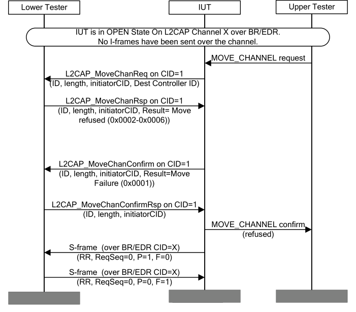

**Figure 4.128: L2CAP/MCH/BV-02-C [Move ERTM Channel Request for BR/EDR to AMP – Refused]**

• Test Condition
The Lower Tester responds with result= “Move Refused” so that the Move Channel Request from the IUT fails.
• Expected Outcome
Pass verdict
The IUT transmits an L2CAP_MoveChanConfirm packet with a result code of “Move failure – one or both sides refuse” (0x0001) and it sends a Receiver Ready message over the BR/EDR link on the same CID as before the move attempt. The IUT does not transmit any I-frames between the Move Channel Request and RR packets.
• Test Purpose
Verify that the IUT can request the move of a L2CAP channel from a BR/EDR link to an AMP link, and recover if the AMP channel creation fails. In this case the channel remains in state OPEN over the BR link.
• Reference
[1] 4.16, 4.17, 4.18, 9.2
• Initial Condition
- An L2CAP channel exists between the IUT and the Lower Tester in OPEN state.
- The AMP Physical Link exists.
- I(out) outgoing I-frames and I(in) incoming I-frames have been sent and received by the IUT over the channel after it was opened and before the test is executed.
• Test Procedure
Figure 4.129 assumes I(out) and I(in) are 0. The actual values of N(S) and N(R) for both incoming and outgoing traffic must take the number of previously sent and received I-frames into account.
The channel move is not successful. The IUT and the Lower Tester return to the BR/EDR channel after the unsuccessful move attempt.

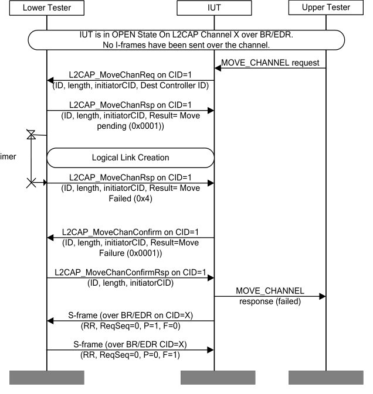

**Figure 4.129: L2CAP/MCH/BV-03-C [Move ERTM Channel Request for BR/EDR to AMP – AMP Fail]**

• Test Condition
The Lower Tester responds with a result field = “Move Pending” and configures the new AMP channel so the channel can be move from BR/EDR to AMP. However, the AMP channel configuration fails, so the Lower Tester replies with a failure indication.
• Expected Outcome
Pass verdict
The IUT transmits an L2CAP_MoveChanConfirm packet with a result code of “Move failure – one or both sides refuse” (0x0001) and it sends a Receiver Ready message over the BR/EDR link on the same CID as before the move attempt. The IUT does not transmit any I-frames between the Move Channel Request and RR packets.
L2CAP/MCH/BV-04-C [Move ERTM Channel Request for AMP to BR/EDR – Success]
• Test Purpose
Verify that the IUT can request the move of a L2CAP ERTM channel from an AMP link to a BR link.
If the operation is successful, the channel has to be in state OPEN over the BR link.
• Reference
[1] 4.16, 4.17, 9.2
• Initial Condition
- The IUT is in OPEN state.
- I(out) outgoing I-frames and I(in) incoming I-frames have been sent and received by the IUT over the channel after it was opened and before the test is executed.
• Test Procedure
Figure 4.130 assumes I(out) and I(in) are 0. The actual values of N(S) and N(R) for both incoming and outgoing traffic must take the number of previously sent and received I-frames into account.
The IUT and the Lower Tester move to the new BR/EDR channel successfully.

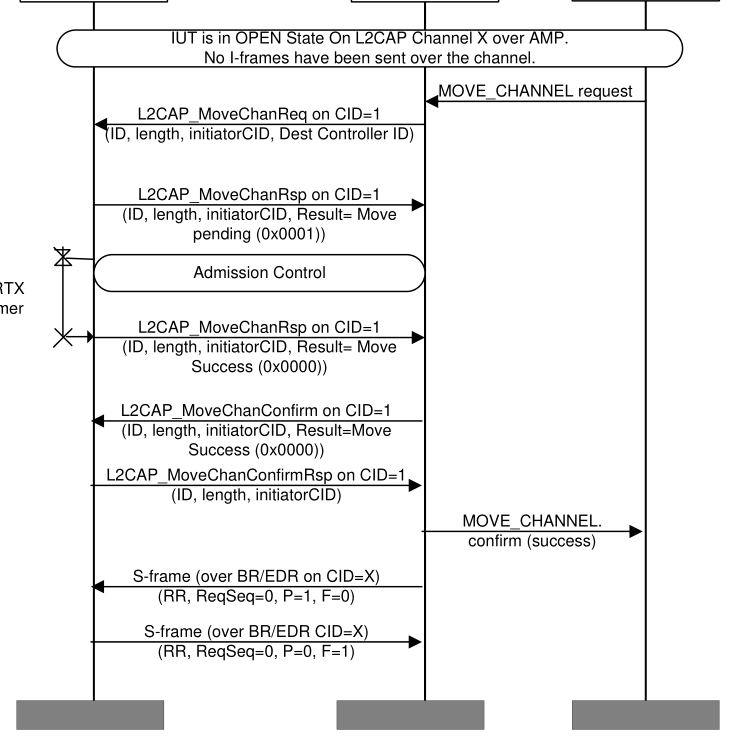

**Figure 4.130: L2CAP/MCH/BV-04-C [Move ERTM Channel Request for AMP to BR/EDR – Success]**

• Expected Outcome
Pass verdict
The IUT transmits an L2CAP_MoveChanConfirm with a result code of “Move Success” (0x0000). After it receives an L2CAP_MoveChanConfirmRsp from the Lower Tester, it sends a Receiver Ready message over the new BR/EDR link on the same CID as before the move.
The IUT does not transmit any I-frames between the Move Channel Request and RR packets.
L2CAP/MCH/BV-05-C [Move ERTM Channel Request for AMP to BR/EDR – Refused]
• Test Purpose
Verify that the IUT can request the move of a L2CAP channel from an AMP link to a BR link.
If the operation is refused by the Lower Tester, the channel remains in state OPEN over the AMP link.
• Reference
[1] 4.16, 4.17, 9.2
• Initial Condition
- The IUT is in OPEN state.
- I(out) outgoing I-frames and I(in) incoming I-frames have been sent and received by the IUT over the channel after it was opened and before the test is executed.
• Test Procedure
Figure 4.131 assumes I(out) and I(in) are 0. The actual values of N(S) and N(R) for both incoming and outgoing traffic must take the number of previously sent and received I-frames into account.
The channel move is not successful refused by the Lower Tester. The IUT and the Lower Tester return to the AMP channel after the unsuccessful move attempt.

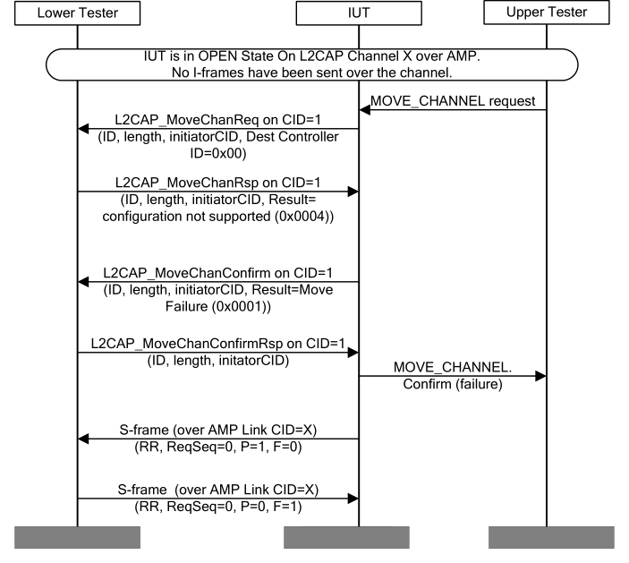

**Figure 4.131: L2CAP/MCH/BV-05-C [Move ERTM Channel Request for AMP to BR/EDR – Refused]**

• Test Condition
The AMP channel requires service not available on BR/EDR, e.g. much more bandwidth.
• Expected Outcome
Pass verdict
The IUT transmits an L2CAP_MoveChanConfirm packet with a result code of “Move refused - Configuration not supported” (0x0004).
The IUT does not transmit any I-frames between the Move Channel Request and RR packets.
• Test Purpose
Verify that the IUT can receive and handle a request to move a L2CAP channel from a BR/EDR link to an AMP link.
• Reference
[1] 4.16, 4.17, 9.2
• Initial Condition
- An L2CAP channel exists between the IUT and the Lower Tester in OPEN state.
- The AMP Physical Link exists.
- I(out) outgoing I-frames and I(in) incoming I-frames have been sent and received by the IUT over the channel after it was opened and before the test is executed.
• Test Procedure
Figure 4.132 assumes I(out) and I(in) are 0. The actual values of N(S) and N(R) for both incoming and outgoing traffic must take the number of previously sent and received I-frames into account.

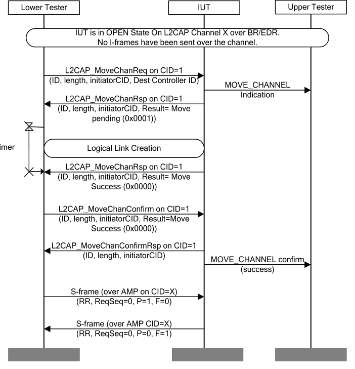

**Figure 4.132: L2CAP/MCH/BV-06-C [Move ERTM Channel Response for BR/EDR to AMP – Success]**

• Expected Outcome
Pass verdict
The IUT transmits an L2CAP_MoveChanRsp with a result code of “Move Success” (0x0000) and responds to the RR(P=1) with an RR(F=1, ReqSeq = 0) on the AMP link.
L2CAP/MCH/BV-07-C [Move ERTM Channel Response for BR/EDR to AMP – Failure]
• Test Purpose
Verify that the IUT can receive and handle a request to move a L2CAP channel from a BR/EDR link to an AMP link where the move operation fails.
• Reference
[1] 4.16, 4.17, 9.2
• Initial Condition
- An L2CAP channel exists between the IUT and the Lower Tester in OPEN state.
- The AMP Physical Link exists.
- I(out) outgoing I-frames and I(in) incoming I-frames have been sent and received by the IUT over the channel after it was opened and before the test is executed.
• Test Procedure
Figure 4.133 assumes I(out) and I(in) are 0. The actual values of N(S) and N(R) for both incoming and outgoing traffic must take the number of previously sent and received I-frames into account.

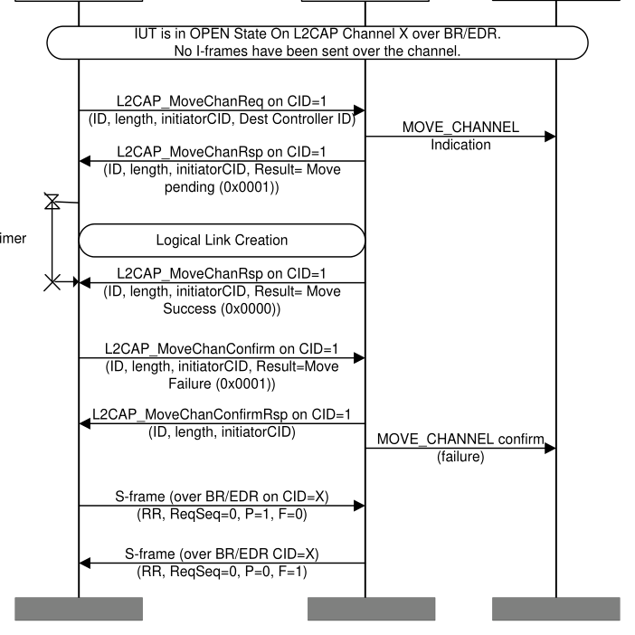

**Figure 4.133: L2CAP/MCH/BV-07-C [Move ERTM Channel Response for BR/EDR to AMP – Failure]**

• Expected Outcome
Pass verdict
The IUT transmits an L2CAP_MoveChanRsp a result code of “Move Success” (0x0000) and responds to the RR(P=1) with an RR(F=1, ReqSeq = 0) over the BR/EDR link.
L2CAP/MCH/BV-08-C [Move ERTM Channel Response for AMP to BR/EDR – Success]
• Test Purpose
Verify that the IUT can receive and handle a request to move a L2CAP channel from an AMP link to a BR/EDR link.
• Reference
[1] 4.16, 4.17, 9.2
• Initial Condition
- An L2CAP channel exists between the IUT and the Lower Tester in OPEN state.
- The BR/EDR Physical Link exists.
- I(out) outgoing I-frames and I(in) incoming I-frames have been sent and received by the IUT over the channel after it was opened and before the test is executed.
• Test Procedure
Figure 4.134 assumes I(out) and I(in) are 0. The actual values of N(S) and N(R) for both incoming and outgoing traffic must take the number of previously sent and received I-frames into account.

**Figure 4.134: L2CAP/MCH/BV-08-C [Move ERTM Channel Response for AMP to BR/EDR – Success]**

• Expected Outcome
Pass verdict
The IUT transmits an L2CAP_MoveChanRsp with result code success (0) and the IUT responds to the RR(P=1) with an RR(F=1, ReqSeq = 0) over the AMP link.
L2CAP/MCH/BV-09-C [Move ERTM Channel Response for AMP to BR/EDR – Failure]
• Test Purpose
Verify that the IUT can receive and handle a request to move a L2CAP channel from an AMP link to a BR/EDR link where the move operation fails.
• Reference
[1] 4.16, 4.17, 9.2
• Initial Condition
- An L2CAP channel exists between the IUT and the Lower Tester in OPEN state.
- The BR/EDR Physical Link exists.
- I(out) outgoing I-frames and I(in) incoming I-frames have been sent and received by the IUT over the channel after it was opened and before the test is executed.
• Test Procedure
Figure 4.135 assumes I(out) and I(in) are 0. The actual values of N(S) and N(R) for both incoming and outgoing traffic must take the number of previously sent and received I-frames into account.

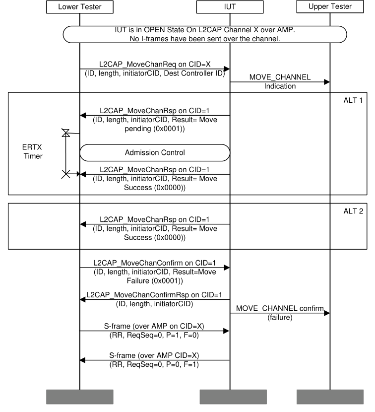

**Figure 4.135: L2CAP/MCH/BV-09-C [Move ERTM Channel Response for AMP to BR/EDR – Failure]**

• Expected Outcome
Pass verdict
The IUT transmits an L2CAP_MoveChanRsp with result code of “Move Success” (0x0000) and responds to the RR(P=1) with an RR(F=1, ReqSeq = 0) over the AMP link.
L2CAP/MCH/BV-10-C [Data Transfer while Moving ERTM Channel from BR/EDR to AMP]
• Test Purpose
Verify that the IUT can move the active L2CAP ERTM channel from a BR/EDR link to an AMP link with no data loss above L2CAP.
• Reference
[1] 4.16, 4.17, 9.2
• Initial Condition
- A BR/EDR L2CAP ERTM channel exists between the IUT and the Lower Tester. There has been data transfer on the channel.
- The AMP Physical Link exists.
- I(out) outgoing I-frames and I(in) incoming I-frames have been sent and received by the IUT over the channel after it was opened and before the test is executed.
• Test Procedure
Figure 4.136 assumes I(out) and I(in) are 0. The actual values of N(S) and N(R) for both incoming and outgoing traffic must take the number of previously sent and received I-frames into account.

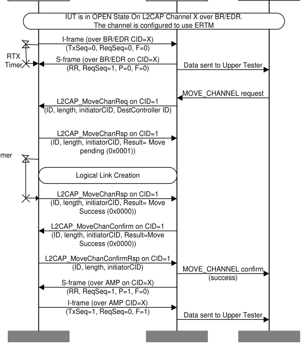

**Figure 4.136: L2CAP/MCH/BV-10-C [Data Transfer while Moving ERTM Channel from BR/EDR to AMP]**

• Expected Outcome
Pass verdict
The move operation is successful, the IUT transmits a Receiver Ready packet over the new AMP channel at the end of the move with ReqSeq = 1.
L2CAP/MCH/BV-11-C [Data Transfer while Moving ERTM Channel from BR/EDR to AMP – Unacknowledged Data]
• Test Purpose
Verify that the IUT can move the active L2CAP channel from a BR/EDR link to an AMP link with no data loss above L2CAP, and recover from data sent before the move but not yet acknowledged by the Lower Tester.
• Reference
[1] 4.16, 4.17, 9.2
• Initial Condition
- A BR/EDR L2CAP ERTM channel exists between the IUT and the Lower Tester. There has been data transfer on the channel.
- The AMP Physical Link exists.
- I(out) outgoing I-frames and I(in) incoming I-frames have been sent and received by the IUT over the channel after it was opened and before the test is executed.
• Test Procedure
Figure 4.137 assumes I(out) and I(in) are 0. The actual values of N(S) and N(R) for both incoming and outgoing traffic must take the number of previously sent and received I-frames into account.

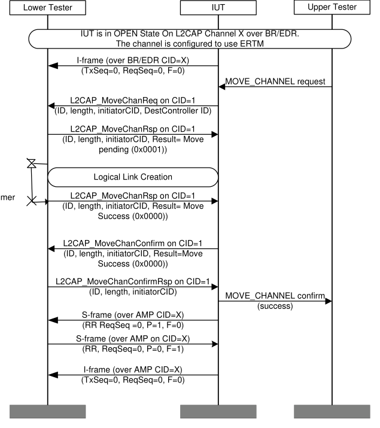

**Figure 4.137: L2CAP/MCH/BV-11-C [Data Transfer while Moving ERTM Channel from BR/EDR to AMP – Unacknowledged Data]**

• Expected Outcome
Pass verdict
The move operation is successful, the IUT transmits an RR(P=1, ReqSeq = 0) over the new AMP channel at the end of the move and it retransmits the I-frame over the new AMP channel when told by the Lower Tester.
• Test Purpose
Verify that the IUT can move the active L2CAP channel from an AMP link to a BR/EDR link with no data loss above L2CAP.
• Reference
[1] 4.16, 4.17, 9.2
• Initial Condition
- An AMP L2CAP ERTM channel exists between the IUT and the Lower Tester. There has been data transfer on the channel.
- The AMP Physical Link exists.
- I(out) outgoing I-frames and I(in) incoming I-frames have been sent and received by the IUT over the channel after it was opened and before the test is executed.
• Test Procedure
Figure 4.138 assumes I(out) and I(in) are 0. The actual values of N(S) and N(R) for both incoming and outgoing traffic must take the number of previously sent and received I-frames into account.
Upper Tester IUT Lower Tester

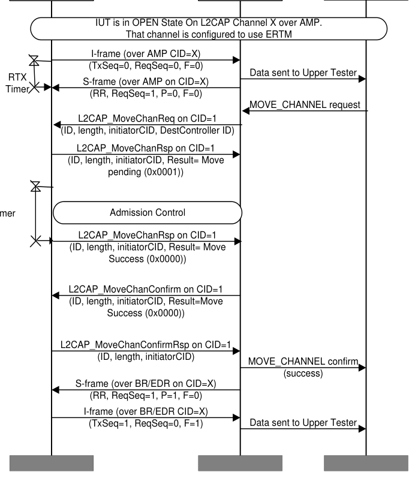

**Figure 4.138: L2CAP/MCH/BV-12-C [Data Transfer while Moving ERTM Channel from AMP to BR/EDR]**

• Test Condition
In order for the Lower Tester to send an I-frame in response to the RR(P=1) at the end of the test it must be pending before the RR(P=1) is received.
• Expected Outcome
Pass verdict
The move operation is successful, the IUT sends an RR(P=1, ReqSeq=0) over the BR/EDR link at the end of the move and passes received data to the Upper Tester.
L2CAP/MCH/BV-13-C [Data Transfer while Moving ERTM Channel from AMP to BR/EDR – Unacknowledged Data]
• Test Purpose
Verify that the IUT can move the active L2CAP channel from an AMP link to a BR/EDR link with no data loss above L2CAP, and recover from data sent before the move but not yet acknowledged by the Lower Tester.
• Reference
[1] 4.16, 4.17, 9.2
• Initial Condition
- An AMP L2CAP channel exists between the IUT and the Lower Tester. There has been data transfer on the channel.
- The AMP Physical Link exists.
- I(out) outgoing I-frames and I(in) incoming I-frames have been sent and received by the IUT over the channel after it was opened and before the test is executed.
• Test Procedure
Figure 4.139 assumes I(out) and I(in) are 0. The actual values of N(S) and N(R) for both incoming and outgoing traffic must take the number of previously sent and received I-frames into account.

**Figure 4.139: L2CAP/MCH/BV-13-C [Data Transfer while Moving ERTM Channel from AMP to BR/EDR – Unacknowledged Data]**

• Expected Outcome
Pass verdict
The move operation is successful, the IUT sends an RR(P=1, ReqSeq = 0) over the BR/EDR link at the end of the move operation and retransmits the I-frame over the BR/EDR channel when requested by the Lower Tester.
L2CAP/MCH/BV-14-C [Move Collision – ERTM]
• Test Purpose
Verify that the IUT can properly handle a move collision when both the IUT and Lower Tester attempt to move an ERTM channel from the BR/EDR link to an AMP link simultaneously.
• Reference
[1] 4.16, 4.17, 9.2
• Initial Condition
- An L2CAP ERTM channel exists between the IUT and the Lower Tester. There has been no data transfer on the channel.
- The AMP Physical Link Exists.
- I(out) outgoing I-frames and I(in) incoming I-frames have been sent and received by the IUT over the channel after it was opened and before the test is executed.
• Test Procedure
Figure 4.140 assumes I(out) and I(in) are 0. The actual values of N(S) and N(R) for both incoming and outgoing traffic must take the number of previously sent and received I-frames into account.

| Lower Tester IUT Upper Tester IUT is in OPEN State On L2CAP Channel X over BR/EDR. No I-frames have been sent over the channel. MOVE CHANNEL request _ L2CAP MoveChanReq on CID=1 _ (ID, length, initiatorCID, Dest Controller ID) L2CAP MoveChanReq on CID=1 _ (ID, length, initiatorCID, Dest Controller ID) |  |  | Upper Tester |  |
| --- | --- | --- | --- | --- |
|  |  |  |  |  |
|  | IUT is in OPEN State On L2CAP Cha No I-frames have been sent ov | nnel X over BR/EDR. er the channel. |  |  |
|  | L2CAP MoveChanReq on CID=1 _ (ID, length, initiatorCID, Dest Controller ID) L2CAP MoveChanReq on CID=1 _ (ID, length, initiatorCID, Dest Controller ID) | MOVE CHANNEL request _ |  |  |
| ERTX Timer | L2CAP MoveChanRsp on CID=1 _ (ID, length, initiatorCID, Result= Move Refused collision (0x0005)) L2CAP MoveChanRsp on CID=1 _ (ID, length, initiatorCID, Result= Move pending (0x0001)) Logical Link Creation L2CAP MoveChanRsp on CID=1 _ (ID, length, initiatorCID, Result= Move Success (0x0000)) L2CAP MoveChanConfirm on CID=1 _ (ID, length, initiatorCID, Result=Move Success (0x0000)) L2CAP MoveChanConfirmRsp on CID=1 _ (ID, length, initiatorCID) S-frame (over AMP on CID=X) (RR, ReqSeq=0, P=1, F=0) S-frame (over AMP CID=X) (RR, ReqSeq=0, P=0, F=1) | MOVE CHANNEL confirm _ (success) |  | ALT 1 |
|  |  |  |  |  |
| ERTX Timer | L2CAP MoveChanRsp on CID=1 _ (ID, length, initiatorCID, Result= Move Refused collision (0x0005)) L2CAP MoveChanRsp on CID=1 _ (ID, length, initiatorCID, Result= Move pending (0x0001)) Logical Link Creation L2CAP MoveChanRsp on CID=1 _ (ID, length, initiatorCID, Result= Move Success (0x0000)) L2CAP MoveChanConfirm on CID=1 _ (ID, length, initiatorCID, Result=Move Success (0x0000)) L2CAP MoveChanConfirmRsp on CID=1 _ (ID, length, initiatorCID) S-frame (over AMP on CID=X) (RR, ReqSeq=0, P=1, F=0) S-frame (over AMP CID=X) (RR, ReqSeq=0, P=0, F=1) | MOVE CHANNEL confirm _ (success) |  | ALT 2 |
|  |  |  |  |  |
|  |  |  |  |  |

• Expected Outcome
Pass verdict
Move operation is successful.
ALT1: The IUT’s BD_ADDR is larger than the Lower Tester’s BD_ADDR so the IUT sends L2CAP_MoveChannelRsp with result code “Move refused – Move Channel collision” (0x0005). It sends RR(P=1, ReqSeq = 0) at the end of the move operation over the AMP link.
ALT2: The IUT’s BD_ADDR is smaller than the Lower Tester’s BD_ADDR so the IUT sends L2CAP_MoveChannelRsp with result code of “Move Pending” (0x0001). It responds to the RR(P=1) from the Lower Tester with RR(F=1) over the AMP link.
L2CAP/MCH/BV-15-C [Move Channel Request for BR/EDR to AMP (STM Source) – Success]
• Test Purpose
Verify that the IUT can request the move of a L2CAP Streaming Mode channel where the IUT is the data source from a BR/EDR link to an AMP link. If the operation is successful, the channel is in state OPEN over the AMP link.
• Reference
[1] 4.16, 4.17, 4.18, 9.2
• Initial Condition
- An L2CAP Streaming Mode channel exists where the IUT is the data source between the IUT and the Lower Tester in OPEN state.
- The AMP Physical Link exists.
- I(out) outgoing I-frames and I(in) incoming I-frames have been sent and received by the IUT over the channel after it was opened and before the test is executed.
• Test Procedure
Figure 4.141 assumes I(out) and I(in) are 0. The actual values of N(S) and N(R) for both incoming and outgoing traffic must take the number of previously sent and received I-frames into account.

**Figure 4.141: L2CAP/MCH/BV-15-C [Move Channel Request for BR/EDR to AMP (STM Source) – Success]**

• Test Condition
The Lower Tester responds with result= Move Pending and create the new AMP logical link so the channel can be move from BR/EDR to AMP.
• Expected Outcome
Pass verdict
The IUT transmits an L2CAP_MoveChanConfirm with a result code of “Move Success” (0x0000). After receiving the L2CAP_MoveChanConfirmRsp from the Lower Tester, it sends an I-frame.
L2CAP/MCH/BV-16-C [Move Channel Request for BR/EDR to AMP (STM Sink) – Success]
• Test Purpose
Verify that the IUT can request the move of an L2CAP Streaming Mode channel where the IUT is the data sink from a BR/EDR link to an AMP link. If the operation is successful, the channel is in state OPEN over the AMP link.
• Reference
[1] 4.16, 4.17, 4.18, 9.2
• Initial Condition
- An L2CAP Streaming Mode channel exists where the IUT is the data sink between the IUT and the Lower Tester in OPEN state.
- The AMP Physical Link exists.
- I(out) outgoing I-frames and I(in) incoming I-frames have been sent and received by the IUT over the channel after it was opened and before the test is executed.
• Test Procedure
Figure 4.142 assumes I(out) and I(in) are 0. The actual values of N(S) and N(R) for both incoming and outgoing traffic must take the number of previously sent and received I-frames into account.

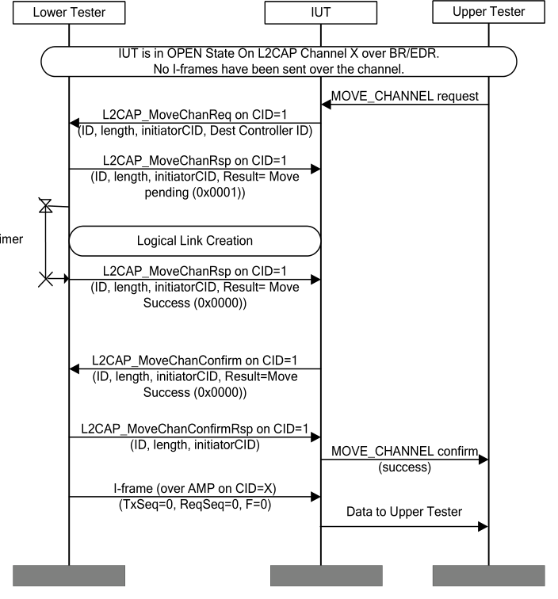

**Figure 4.142: L2CAP/MCH/BV-16-C [Move Channel Request for BR/EDR to AMP (STM Sink) – Success]**

• Expected Outcome
Pass verdict
The IUT transmits an L2CAP_MoveChanConfirm with a result code of “Move Success” (0x0000). IUT receives an I-frame on the AMP and passes data up to the Upper Tester.
L2CAP/MCH/BV-17-C [Move Channel Request for BR/EDR to AMP (STM Source) – Refused]
• Test Purpose
Verify that the IUT can request the move of a L2CAP Streaming Mode channel where the IUT is the data source from a BR/EDR link to an AMP link, and recover if the Lower Tester refuses the move. In this case the channel remains in state OPEN over the BR/EDR link.
• Reference
[1] 4.16, 4.17, 4.18, 9.2
• Initial Condition
- An L2CAP Streaming Mode channel exists where the IUT is the data source between the IUT and the Lower Tester in OPEN state.
- The AMP Physical Link exists.
- I(out) outgoing I-frames and I(in) incoming I-frames have been sent and received by the IUT over the channel after it was opened and before the test is executed.
• Test Procedure
Figure 4.143 assumes I(out) and I(in) are 0. The actual values of N(S) and N(R) for both incoming and outgoing traffic must take the number of previously sent and received I-frames into account.
The channel move is not successful. The IUT and the Lower Tester return to the BR/EDR link after the unsuccessful move attempt.

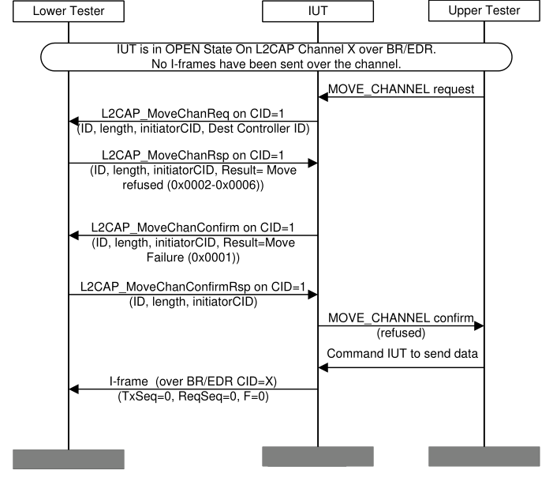

**Figure 4.143: L2CAP/MCH/BV-17-C [Move Channel Request for BR/EDR to AMP (STM Source) – Refused]**

• Expected Outcome
Pass verdict
The IUT transmits an L2CAP_MoveChanConfirm packet with a result code of “Move failure – one or both sides refuse” (0x0001) and it sends an I-frame over the BR/EDR link on the same CID as before the move attempt.
L2CAP/MCH/BV-18-C [Move Channel Request for BR/EDR to AMP (STM Sink) – Refused]
• Test Purpose
Verify that the IUT can request the move of a L2CAP Streaming Mode channel where the IUT is the data sink from a BR/EDR link to an AMP link, and recover if the Lower Tester refuses the move. In this case the channel remains in state OPEN over the BR link.
• Reference
[1] 4.16, 4.17, 4.18, 9.2
• Initial Condition
- An L2CAP Streaming Mode channel exists where the IUT is the data sink between the IUT and the Lower Tester in OPEN state.
- The AMP Physical Link exists.
- I(out) outgoing I-frames and I(in) incoming I-frames have been sent and received by the IUT over the channel after it was opened and before the test is executed.
• Test Procedure
Figure 4.144 assumes I(out) and I(in) are 0. The actual values of N(S) and N(R) for both incoming and outgoing traffic must take the number of previously sent and received I-frames into account.
The channel move is not successful. The IUT and the Lower Tester return to the BR/EDR link after the unsuccessful move attempt.

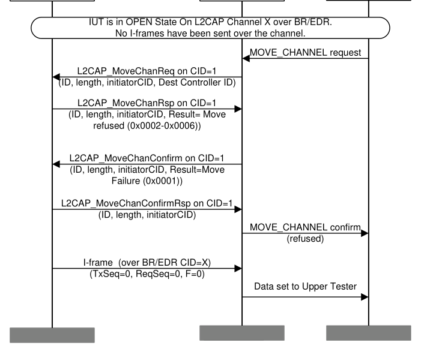

**Figure 4.144: L2CAP/MCH/BV-18-C [Move Channel Request for BR/EDR to AMP (STM Sink) – Refused]**

• Expected Outcome
Pass verdict
The IUT transmits an L2CAP_MoveChanConfirm packet with a result code of Failure (0x0001) and it passes received data to the Upper Tester.
L2CAP/MCH/BV-19-C [Move Channel Request for BR/EDR to AMP (STM Source) – AMP Fail]
• Test Purpose
Verify that the IUT can request the move of a L2CAP Streaming Mode channel where the IUT is the data source from a BR/EDR link to an AMP link, and recover if the AMP logical link creation fails. In this case the channel remains in state OPEN over the BR link.
• Reference
[1] 4.16, 4.17, 4.18, 9.2
• Initial Condition
- An L2CAP Streaming Mode channel exists where the IUT is the data source between the IUT and the Lower Tester in OPEN state.
- The AMP Physical Link exists.
- I(out) outgoing I-frames and I(in) incoming I-frames have been sent and received by the IUT over the channel after it was opened and before the test is executed.
• Test Procedure
Figure 4.145 assumes I(out) and I(in) are 0. The actual values of N(S) and N(R) for both incoming and outgoing traffic must take the number of previously sent and received I-frames into account.
The channel move is not successful. The IUT and the Lower Tester return to the BR/EDR link after the unsuccessful move attempt.

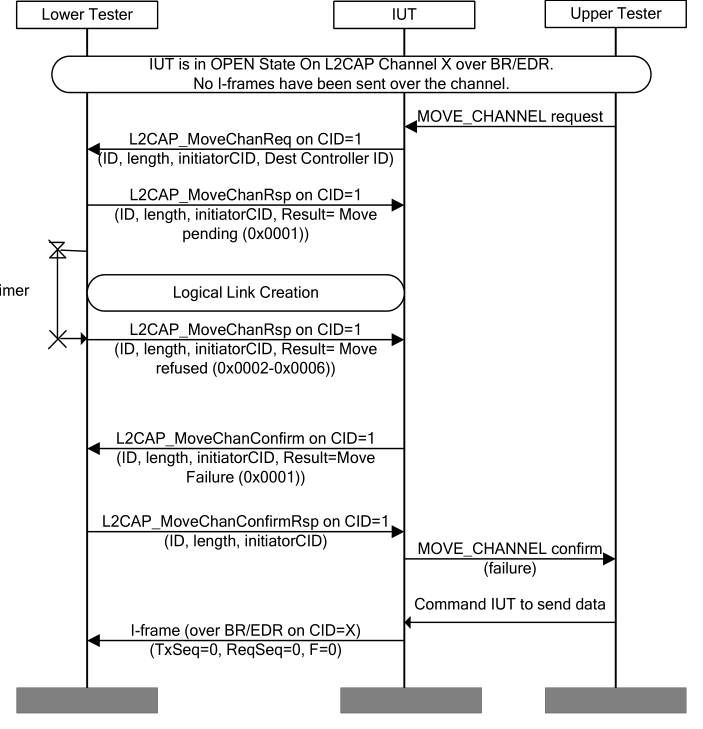

**Figure 4.145: L2CAP/MCH/BV-19-C [Move Channel Request for BR/EDR to AMP (STM Source) – AMP Fail]**

• Expected Outcome
Pass verdict
The IUT transmits an L2CAP_MoveChanConfirm packet with a result code of “Move Failure – one or both sides refuse” (0x0001) and sends an I-frame over the BR/EDR link on the same CID as before the move attempt.
L2CAP/MCH/BV-20-C [Move Channel Request for BR/EDR to AMP (STM Sink) – AMP Failed]
• Test Purpose
Verify that the IUT can request the move of a L2CAP Streaming Mode channel where the IUT is the data sink from a BR/EDR link to an AMP link, and recover if the AMP Logical Link creation fails. In this case the channel remains in state OPEN over the BR link.
• Reference
[1] 4.16, 4.17, 4.18, 9.2
• Initial Condition
- An L2CAP Streaming Mode channel exists where the IUT is the data sink between the IUT and the Lower Tester in OPEN state.
- The AMP Physical Link exists.
- I(out) outgoing I-frames and I(in) incoming I-frames have been sent and received by the IUT over the channel after it was opened and before the test is executed.
• Test Procedure
Figure 4.146 assumes I(out) and I(in) are 0. The actual values of N(S) and N(R) for both incoming and outgoing traffic must take the number of previously sent and received I-frames into account.
The channel move is not successful. The IUT and the Lower Tester return to the BR/EDR channel after the unsuccessful move attempt.

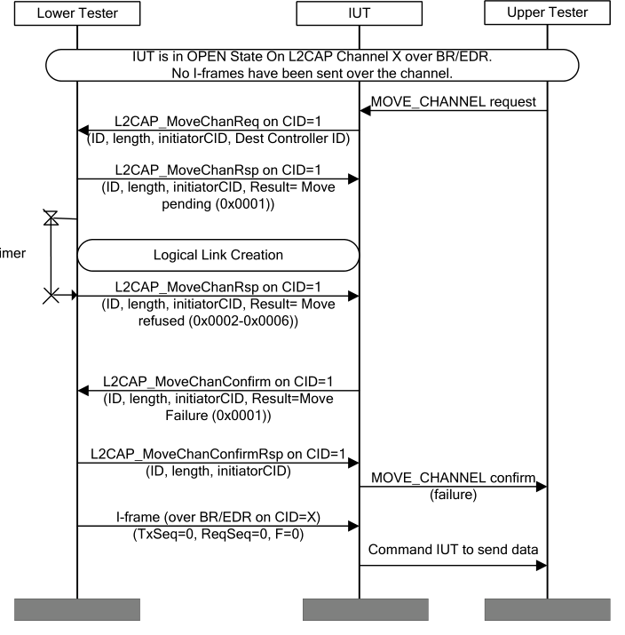

**Figure 4.146: L2CAP/MCH/BV-20-C [Move Channel Request for BR/EDR to AMP (STM Sink) – AMP Failed]**

• Expected Outcome
Pass verdict
The IUT transmits an L2CAP_MoveChanConfirm packet with a result code of “Move Failure – one or both sides refuse” (0x0001) and passes the received data to the Upper Tester.
L2CAP/MCH/BV-21-C [Move Channel Request for AMP to BR/EDR (STM Source) – Success]
• Test Purpose
Verify that the IUT can request the move of a L2CAP Streaming Mode channel where the IUT is the data source from a BR/EDR link to an AMP link. If the operation is successful, the channel is in state OPEN over the AMP link.
• Reference
[1] 4.16, 4.17, 4.18, 9.2
• Initial Condition
- An L2CAP Streaming Mode channel exists where the IUT is the data source between the IUT and the Lower Tester in OPEN state.
- The AMP Physical Link exists with a guaranteed logical link. The requirements for that AMP channel does not exceed the capabilities of EDR.
- I(out) outgoing I-frames and I(in) incoming I-frames have been sent and received by the IUT over the channel after it was opened and before the test is executed.
• Test Procedure
Figure 4.147 assumes I(out) and I(in) are 0. The actual values of N(S) and N(R) for both incoming and outgoing traffic must take the number of previously sent and received I-frames into account.

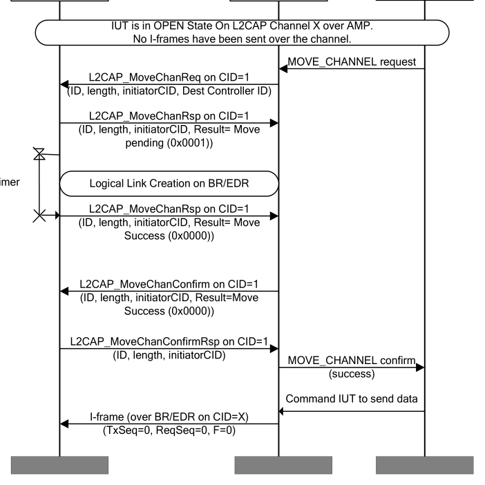

**Figure 4.147: L2CAP/MCH/BV-21-C [Move Channel Request for AMP to BR/EDR (STM Source) – Success]**

• Expected Outcome
Pass verdict
The IUT transmits an L2CAP_MoveChanConfirm with a result code of “Move Success” (0x0000). After receiving the L2CAP_MoveChanConfirmRsp from the Lower Tester, it sends an I-frame over BR/EDR.
L2CAP/MCH/BV-22-C [Move Channel Request for AMP to BR/EDR (STM Sink) – Success]
• Test Purpose
Verify that the IUT can request the move of an L2CAP Streaming Mode channel where the IUT is the data sink from an AMP link to a BR/EDR link. If the operation is successful, the channel is in state OPEN over the BR/EDR link.
• Reference
[1] 4.16, 4.17, 4.18, 9.2
• Initial Condition
- An L2CAP Streaming Mode channel exists where the IUT is the data sink between the IUT and the Lower Tester in OPEN state.
- The BR/EDR Physical Link exists.
- I(out) outgoing I-frames and I(in) incoming I-frames have been sent and received by the IUT over the channel after it was opened and before the test is executed.
• Test Procedure
Figure 4.148 assumes I(out) and I(in) are 0. The actual values of N(S) and N(R) for both incoming and outgoing traffic must take the number of previously sent and received I-frames into account.

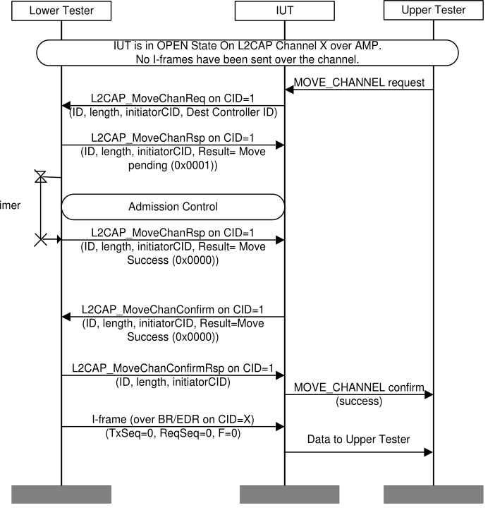

**Figure 4.148: L2CAP/MCH/BV-22-C [Move Channel Request for AMP to BR/EDR (STM Sink) – Success]**

• Expected Outcome
Pass verdict
The IUT transmits an L2CAP_MoveChanConfirm with a result code of “Move Success” (0x0000). IUT receives I-frame on BR/EDR and passes data up to the Upper Tester.
L2CAP/MCH/BV-23-C [Move Channel Request for AMP to BR/EDR (STM Source) – Refused]
• Test Purpose
Verify that the IUT can request the move of a L2CAP Streaming Mode channel where the IUT is the data source from an AMP link to a BR/EDR link, and recover if the Lower Tester refuses the move. In this case the channel remains in state OPEN over the AMP link.
• Reference
[1] 4.16, 4.17, 4.18, 9.2
• Initial Condition
- An L2CAP Streaming Mode channel exists where the IUT is the data source between the IUT and the Lower Tester in OPEN state.
- The BR/EDR Physical Link exists.
- I(out) outgoing I-frames and I(in) incoming I-frames have been sent and received by the IUT over the channel after it was opened and before the test is executed.
• Test Procedure
Figure 4.149 assumes I(out) and I(in) are 0. The actual values of N(S) and N(R) for both incoming and outgoing traffic must take the number of previously sent and received I-frames into account.
The channel move is not successful. The IUT and the Lower Tester return to the AMP link after the unsuccessful move attempt.
Upper Tester IUT Lower Tester

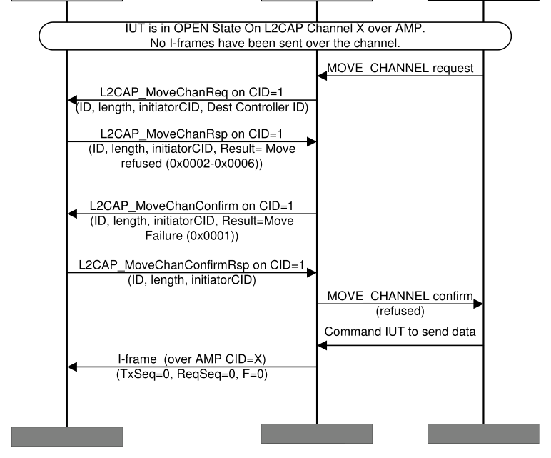

**Figure 4.149: L2CAP/MCH/BV-23-C [Move Channel Request for AMP to BR/EDR (STM Source) – Refused]**

• Expected Outcome
Pass verdict
The IUT transmits an L2CAP_MoveChanConfirm packet with a result code of “Move failure – one or both sides refuse” (0x0001) and it sends an I-frame over the AMP link on the same CID as before the move attempt.
L2CAP/MCH/BV-24-C [Move Channel Request for AMP to BR/EDR (STM Sink) – Refused]
• Test Purpose
Verify that the IUT can request the move of a L2CAP Streaming Mode channel where the IUT is the data sink from an AMP link to a BR/EDR link, and recover if the Lower Tester refuses the move. In this case the channel remains in state OPEN over the AMP link.
• Reference
[1] 4.16, 4.17, 4.18, 9.2
• Initial Condition
- An L2CAP Streaming Mode channel exists where the IUT is the data sink between the IUT and the Lower Tester in OPEN state.
- The BR/EDR Physical Link exists.
- I(out) outgoing I-frames and I(in) incoming I-frames have been sent and received by the IUT over the channel after it was opened and before the test is executed.
• Test Procedure
Figure 4.150 assumes I(out) and I(in) are 0. The actual values of N(S) and N(R) for both incoming and outgoing traffic must take the number of previously sent and received I-frames into account.
The channel move is not successful. The IUT and the Lower Tester return to the AMP channel after the unsuccessful move attempt.

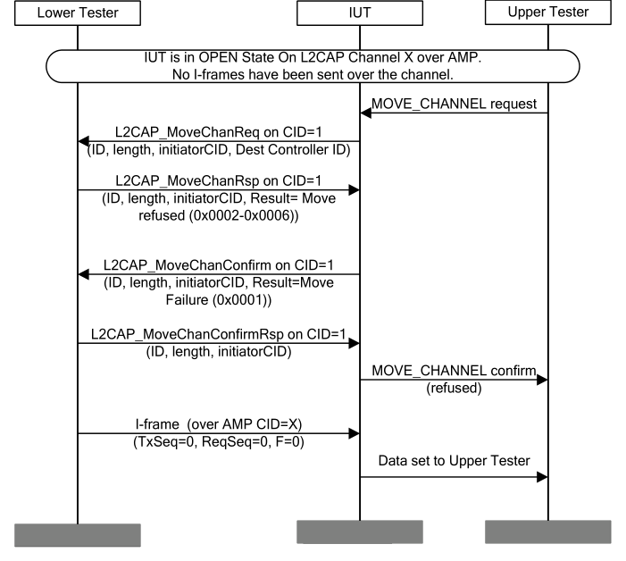

**Figure 4.150: L2CAP/MCH/BV-24-C [Move Channel Request for AMP to BR/EDR (STM Sink) – Refused]**

• Expected Outcome
Pass verdict
The IUT transmits an L2CAP_MoveChanConfirm packet with a result code of “Move Failure – one or both side refuse” (0x0001) and it passes received data to the Upper Tester.
L2CAP/MCH/BV-25-C [Move Channel Request for AMP to BR/EDR (STM Source) – AMP Fail]
• Test Purpose
Verify that the IUT can request the move of a L2CAP Streaming Mode channel where the IUT is the data source from an AMP link to a BR/EDR link, and recover if the admission control fails. In this case the channel remains in state OPEN over the AMP link.
• Reference
[1] 4.16, 4.17, 4.18, 9.2
• Initial Condition
- An L2CAP Streaming Mode channel exists where the IUT is the data source between the IUT and the Lower Tester in OPEN state.
- The BR/EDR Physical Link exists.
- I(out) outgoing I-frames and I(in) incoming I-frames have been sent and received by the IUT over the channel after it was opened and before the test is executed.
• Test Procedure
Figure 4.151 assumes I(out) and I(in) are 0. The actual values of N(S) and N(R) for both incoming and outgoing traffic must take the number of previously sent and received I-frames into account.
The channel move is not successful. The IUT and the Lower Tester return to the AMP link after the unsuccessful move attempt.

**Figure 4.151: L2CAP/MCH/BV-25-C [Move Channel Request for AMP to BR/EDR (STM Source) – AMP Fail]**

• Expected Outcome
Pass verdict
The IUT transmits an L2CAP_MoveChanConfirm packet with a result code of “Move failure – one or both sides refuse” (0x0001) and sends an I-frame over the AMP link on the same CID as before the move attempt.
L2CAP/MCH/BV-26-C [Move Channel Request for AMP to BR/EDR (STM Sink) – AMP Failed]
• Test Purpose
Verify that the IUT can request the move of a L2CAP Streaming Mode channel where the IUT is the data sink from an AMP link to a BR/EDR link, and recover if the Admission Control fails. In this case the channel remains in state OPEN over the AMP link.
• Reference
[1] 4.16, 4.17, 4.18, 9.2
• Initial Condition
- An L2CAP Streaming Mode channel exists where the IUT is the data sink between the IUT and the Lower Tester in OPEN state.
- The BR/EDR Physical Link exists.
- I(out) outgoing I-frames and I(in) incoming I-frames have been sent and received by the IUT over the channel after it was opened and before the test is executed.
• Test Procedure
Figure 4.152 assumes I(out) and I(in) are 0. The actual values of N(S) and N(R) for both incoming and outgoing traffic must take the number of previously sent and received I-frames into account.
The channel move is not successful. The IUT and the Lower Tester return to the AMP link after the unsuccessful move attempt.
Upper Tester IUT Lower Tester

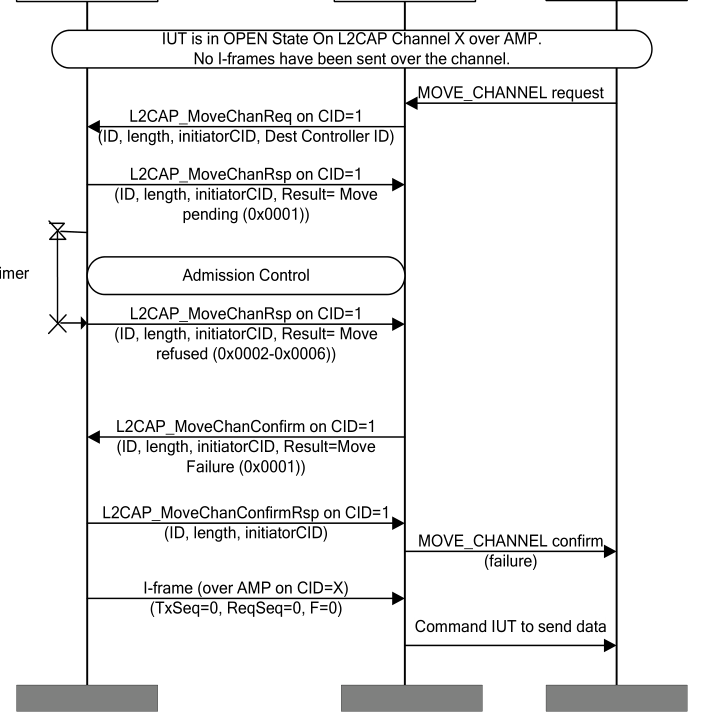

**Figure 4.152: L2CAP/MCH/BV-26-C [Move Channel Request for AMP to BR/EDR (STM Sink) – AMP Failed]**

• Expected Outcome
Pass verdict
The IUT transmits an L2CAP_MoveChanConfirm packet with a result code of “Move failure – one or both sides refuse” (0x0001) and passes the received data to the Upper Tester.
L2CAP/MCH/BV-27-C [Move Channel Response for BR/EDR to AMP (STM Source) – Success]
• Test Purpose
Verify that the IUT can respond to a move request of an L2CAP Streaming Mode channel where the IUT is the data source from a BR/EDR link to an AMP link. If the operation is successful, the channel is in state OPEN over the AMP link.
• Reference
[1] 4.16, 4.17, 4.18, 9.2
• Initial Condition
- An L2CAP Streaming Mode channel exists where the IUT is the data source between the IUT and the Lower Tester in OPEN state.
- The AMP Physical Link exists.
- I(out) outgoing I-frames and I(in) incoming I-frames have been sent and received by the IUT over the channel after it was opened and before the test is executed.
• Test Procedure
Figure 4.153 assumes I(out) and I(in) are 0. The actual values of N(S) and N(R) for both incoming and outgoing traffic must take the number of previously sent and received I-frames into account.

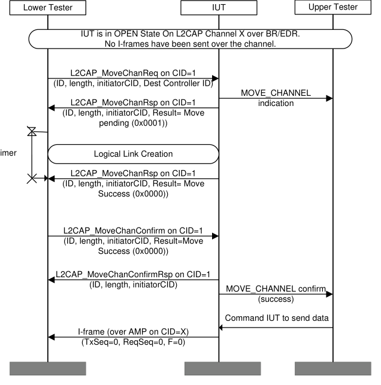

**Figure 4.153: L2CAP/MCH/BV-27-C [Move Channel Response for BR/EDR to AMP (STM Source) – Success]**

• Expected Outcome
Pass verdict
The channel is moved successfully and the IUT sends an I-frame over the AMP link after the move completes.
L2CAP/MCH/BV-28-C [Move Channel Response for BR/EDR to AMP (STM Sink) – Success]
• Test Purpose
Verify that the IUT can respond to a move request of an L2CAP Streaming Mode channel where the IUT is the data sink from a BR/EDR link to an AMP link. If the operation is successful, the channel is in state OPEN over the AMP link.
• Reference
[1] 4.16, 4.17, 4.18, 9.2
• Initial Condition
- An L2CAP Streaming Mode channel exists where the IUT is the data sink between the IUT and the Lower Tester in OPEN state.
- The AMP Physical Link exists.
- I(out) outgoing I-frames and I(in) incoming I-frames have been sent and received by the IUT over the channel after it was opened and before the test is executed.
• Test Procedure
Figure 4.154 assumes I(out) and I(in) are 0. The actual values of N(S) and N(R) for both incoming and outgoing traffic must take the number of previously sent and received I-frames into account.

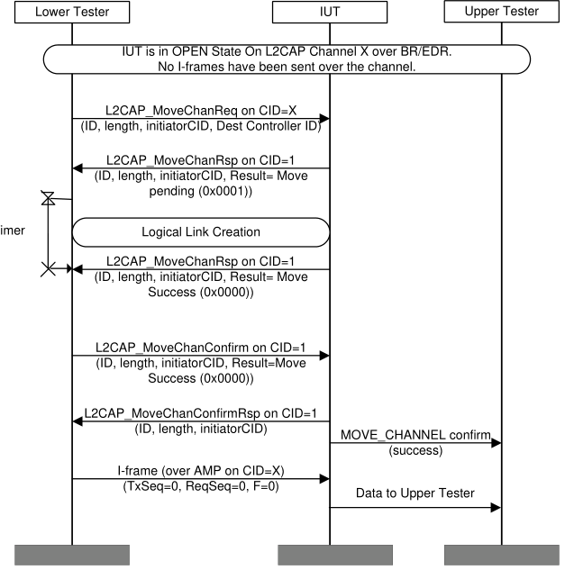

**Figure 4.154: L2CAP/MCH/BV-28-C [Move Channel Response for BR/EDR to AMP (STM Sink) – Success]**

• Expected Outcome
Pass verdict
The channel is successfully moved from the BR/EDR link to the AMP link and the received data is passed to the Upper Tester.
L2CAP/MCH/BV-29-C [Move Channel Response for AMP to BR/EDR (STM Source) – Success]
• Test Purpose
Verify that the IUT can respond to a move request of an L2CAP Streaming Mode channel where the IUT is the data source. The channel is moved from an AMP to a BR/EDR link. If the operation is successful, the channel is in state OPEN over the BR/EDR link.
• Reference
[1] 4.16, 4.17, 4.18, 9.2
• Initial Condition
- An L2CAP Streaming Mode channel exists where the IUT is the data source between the IUT and the Lower Tester in OPEN state.
- The BR/EDR Physical Link exists.
- I(out) outgoing I-frames and I(in) incoming I-frames have been sent and received by the IUT over the channel after it was opened and before the test is executed.
• Test Procedure
Figure 4.155 assumes I(out) and I(in) are 0. The actual values of N(S) and N(R) for both incoming and outgoing traffic must take the number of previously sent and received I-frames into account.

|  | Lower Tester |  |  | Upper Tester |  |  |
| --- | --- | --- | --- | --- | --- | --- |
|  |  |  |  |  |  |  |
| ERTX Timer |  | L2CAP MoveChanRsp on CID=1 _ (ID, length, initiatorCID, Result= Move pending (0x0001)) Admission Control L2CAP MoveChanRsp on CID=1 _ (ID, length, initiatorCID, Result= Move Success (0x0000)) |  |  | ALT | 1 |
|  |  |  |  |  |  |  |
|  |  | L2CAP MoveChanRsp on CID=1 _ (ID, length, initiatorCID, Result= Move Success (0x0000)) |  |  | ALT | 2 |
|  |  |  | MOVE CHANNEL confirm _ (success) Command IUT to send data |  |  |  |
|  |  |  |  |  |  |  |

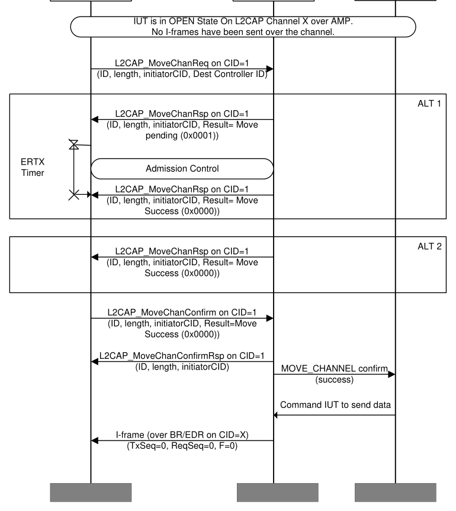

**Figure 4.155: L2CAP/MCH/BV-29-C [Move Channel Response for AMP to BR/EDR (STM Source) – Success]**

• Test Condition
The channel’s Extended Flow Specification is valid for a BR/EDR link.
• Expected Outcome
Pass verdict
The channel is moved successfully and the IUT sends an I-frame over the BR/EDR link after the move completes.
L2CAP/MCH/BV-30-C [Move Channel Response for AMP to BR/EDR (STM Sink) – Success]
• Test Purpose
Verify that the IUT can respond to a move request for an L2CAP Streaming Mode channel where the IUT is the data sink. The channel is moved from an AMP link to a BR/EDR link. If the operation is successful, the channel is in state OPEN over the BR/EDR link.
• Reference
[1] 4.16, 4.17, 4.18, 9.2
• Initial Condition
- An L2CAP Streaming Mode channel exists where the IUT is the data sink between the IUT and the Lower Tester in OPEN state.
- The BR/EDR Physical Link exists.
- I(out) outgoing I-frames and I(in) incoming I-frames have been sent and received by the IUT over the channel after it was opened and before the test is executed.
• Test Procedure
Figure 4.156 assumes I(out) and I(in) are 0. The actual values of N(S) and N(R) for both incoming and outgoing traffic must take the number of previously sent and received I-frames into account.

|  | Lower Tester |  |  | Upper Tester |  |  |
| --- | --- | --- | --- | --- | --- | --- |
|  |  |  |  |  |  |  |
| ERTX Timer |  | L2CAP MoveChanRsp on CID=1 _ (ID, length, initiatorCID, Result= Move pending (0x0001)) Admission Control L2CAP MoveChanRsp on CID=1 _ (ID, length, initiatorCID, Result= Move Success (0x0000)) |  |  | ALT 1 |  |
|  |  |  |  |  |  |  |
|  |  | L2CAP MoveChanRsp on CID=1 _ (ID, length, initiatorCID, Result= Move Success (0x0000)) |  |  | ALT 2 |  |
|  |  |  |  |  |  |  |
|  |  |  |  |  |  |  |

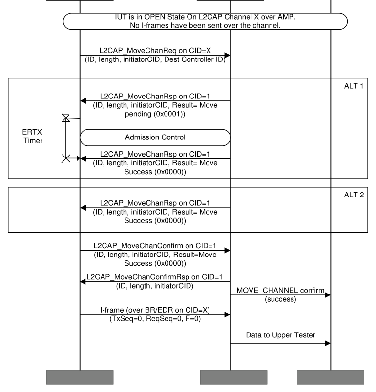

**Figure 4.156: L2CAP/MCH/BV-30-C [Move Channel Response for AMP to BR/EDR (STM Sink) – Success]**

• Test Condition
The channel’s Extended Flow Specification is valid for a BR/EDR link.
• Expected Outcome
Pass verdict
The channel is successfully moved from the AMP link to the BR/EDR link and the received data is passed to the Upper Tester.
L2CAP/MCH/BV-31-C [Move Channel Response for BR/EDR to AMP (STM Source) – Failed]
• Test Purpose
Verify that the IUT can respond to a move request of an L2CAP Streaming Mode channel where the IUT is the data source and is able to recover when the move operation fails. The channel is to be moved from a BR/EDR link to an AMP link but move operation fails.
• Reference
[1] 4.16, 4.17, 4.18, 9.2
• Initial Condition
- An L2CAP Streaming Mode channel exists where the IUT is the data source between the IUT and the Lower Tester in OPEN state.
- The AMP Physical Link exists.
- I(out) outgoing I-frames and I(in) incoming I-frames have been sent and received by the IUT over the channel after it was opened and before the test is executed.
• Test Procedure
Figure 4.157 assumes I(out) and I(in) are 0. The actual values of N(S) and N(R) for both incoming and outgoing traffic must take the number of previously sent and received I-frames into account.

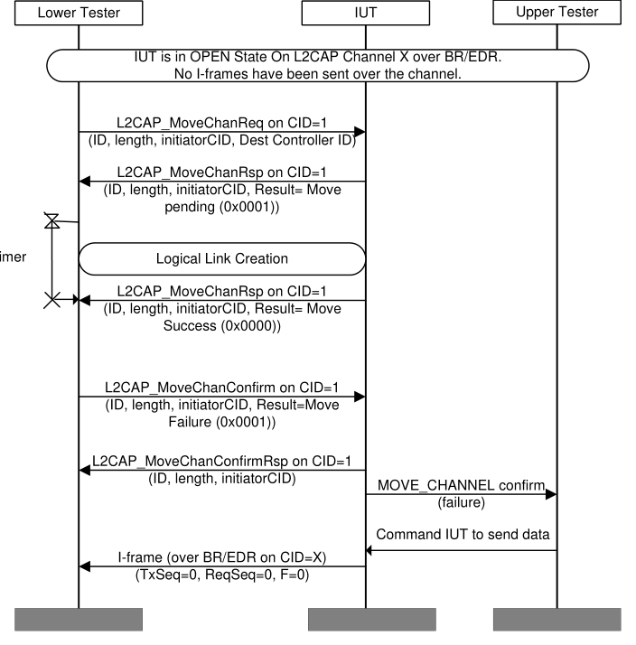

**Figure 4.157: L2CAP/MCH/BV-31-C [Move Channel Response for BR/EDR to AMP (STM Source) – Failed]**

• Expected Outcome
Pass verdict
The IUT sends an I-frame over the BR/EDR link after the failed move operation completes.
• Test Purpose
Verify that the IUT can respond to a move request of an L2CAP Streaming Mode channel where the IUT is the data sink and recover when the move operation fails. The channel is to not be moved from a BR/EDR link to an AMP link, but instead remains in the BR/EDR link.
• Reference
[1] 4.16, 4.17, 4.18, 9.2
• Initial Condition
- An L2CAP Streaming Mode channel exists where the IUT is the data sink between the IUT and the Lower Tester in OPEN state.
- The AMP Physical Link exists.
- I(out) outgoing I-frames and I(in) incoming I-frames have been sent and received by the IUT over the channel after it was opened and before the test is executed.
• Test Procedure
Figure 4.158 assumes I(out) and I(in) are 0. The actual values of N(S) and N(R) for both incoming and outgoing traffic must take the number of previously sent and received I-frames into account.

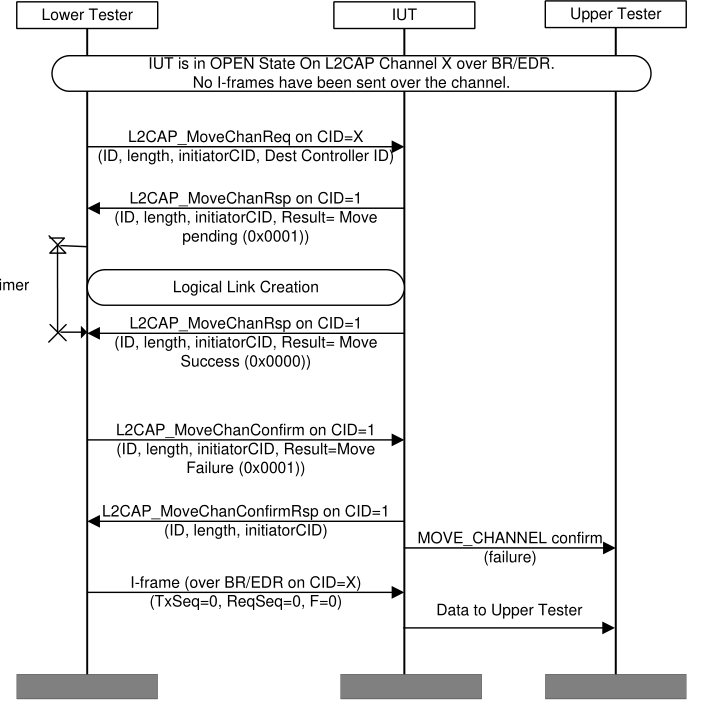

**Figure 4.158: L2CAP/MCH/BV-32-C [Move Channel Response for BR/EDR to AMP (STM Sink) – Failed]**

• Expected Outcome
Pass verdict
The IUT passed received data to the Upper Tester after the failed move operation completes.
L2CAP/MCH/BV-33-C [Move Channel Response for AMP to BR/EDR (STM Source) – Failed]
• Test Purpose
Verify that the IUT can respond to a move request of an L2CAP Streaming Mode channel where the IUT is the data source and recover when the move operation fails. The channel is not to be moved from an AMP to a BR/EDR link, but instead remains on the AMP.
• Reference
[1] 4.16, 4.17, 4.18, 9.2
• Initial Condition
- An L2CAP Streaming Mode channel exists where the IUT is the data source between the IUT and the Lower Tester in OPEN state.
- The BR/EDR Physical Link exists.
- I(out) outgoing I-frames and I(in) incoming I-frames have been sent and received by the IUT over the channel after it was opened and before the test is executed.
• Test Procedure
Figure 4.159 assumes I(out) and I(in) are 0. The actual values of N(S) and N(R) for both incoming and outgoing traffic must take the number of previously sent and received I-frames into account.

|  | Lower Tester |  |  | Upper Tester |  |  |
| --- | --- | --- | --- | --- | --- | --- |
|  |  |  |  |  |  |  |
| ERTX Timer |  | L2CAP MoveChanRsp on CID=1 _ (ID, length, initiatorCID, Result= Move pending (0x0001)) Admission Control L2CAP MoveChanRsp on CID=1 _ (ID, length, initiatorCID, Result= Move Success (0x0000)) |  |  | ALT | 1 |
|  |  |  |  |  |  |  |
|  |  | L2CAP MoveChanRsp on CID=1 _ (ID, length, initiatorCID, Result= Move Success (0x0000)) |  |  | ALT | 2 |
|  |  |  |  |  |  |  |
|  |  |  |  |  |  |  |

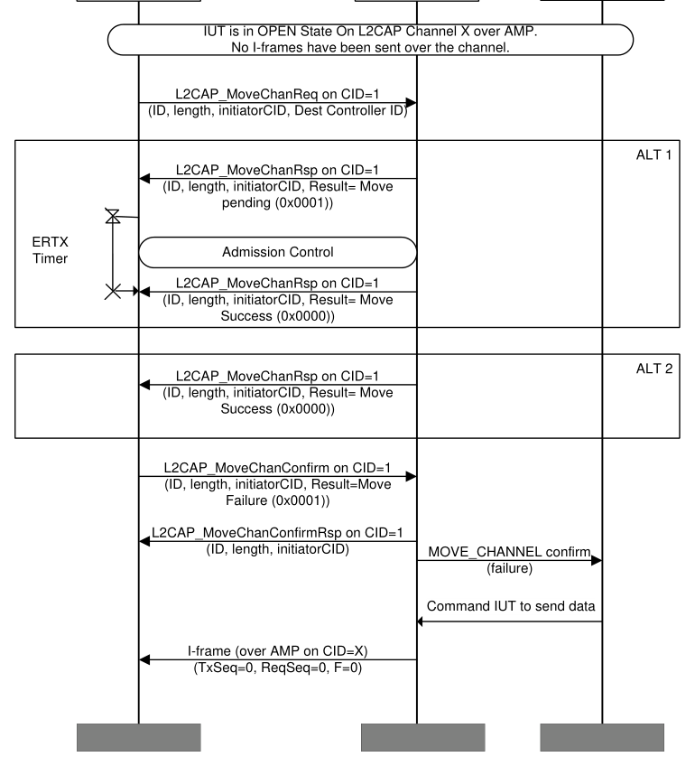

**Figure 4.159: L2CAP/MCH/BV-33-C [Move Channel Response for AMP to BR/EDR (STM Source) – Failed]**

• Test Condition
The channel’s Extended Flow Specification is valid for a BR/EDR link.
• Expected Outcome
Pass verdict
The IUT sends an I-frame over the AMP link after the failed move operation completes.
L2CAP/MCH/BV-34-C [Move Channel Response for AMP to BR/EDR (STM Sink) – Failed]
• Test Purpose
Verify that the IUT can respond to a move request for an L2CAP Streaming Mode channel where the IUT is the data sink and recover when the move operation fails. The channel is not to be moved from an AMP link to a BR/EDR link, but instead remains on the AMP link.
• Reference
[1] 4.16, 4.17, 4.18, 9.2
• Initial Condition
- An L2CAP Streaming Mode channel exists where the IUT is the data sink between the IUT and the Lower Tester in OPEN state.
- The BR/EDR Physical Link exists.
- I(out) outgoing I-frames and I(in) incoming I-frames have been sent and received by the IUT over the channel after it was opened and before the test is executed.
• Test Procedure
Figure 4.160 assumes I(out) and I(in) are 0. The actual values of N(S) and N(R) for both incoming and outgoing traffic must take the number of previously sent and received I-frames into account.

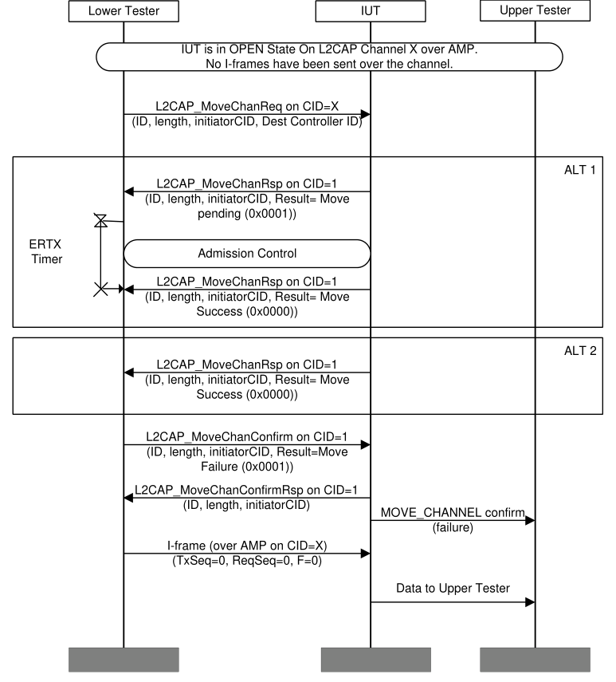

**Figure 4.160: L2CAP/MCH/BV-34-C [Move Channel Response for AMP to BR/EDR (STM Sink) – Failed]**

• Test Condition
The channel’s Extended Flow Specification is valid for a BR/EDR link.
• Expected Outcome
Pass verdict
The IUT passes received data to the Upper Tester after the failed moved operation completes.
L2CAP/MCH/BV-35-C [Move Collision – STM Source]
• Test Purpose
Verify that the IUT can properly handle a move collision when both the IUT and Lower Tester attempt to move a Streaming Mode channel from the BR/EDR link to an AMP link at the same time where the IUT is the data source.
• Reference
[1] 4.16, 4.17, 9.2
• Initial Condition
- An L2CAP Streaming Mode channel exists between the IUT and the Lower Tester. There has been no data transfer on the channel.
- The AMP Physical Link Exists.
- I(out) outgoing I-frames and I(in) incoming I-frames have been sent and received by the IUT over the channel after it was opened and before the test is executed.
• Test Procedure
Figure 4.161 assumes I(out) and I(in) are 0. The actual values of N(S) and N(R) for both incoming and outgoing traffic must take the number of previously sent and received I-frames into account.

| Lower Tester IUT Upper Tester IUT is in OPEN State On L2CAP Channel X over BR/EDR. No I-frames have been sent over the channel. MOVE CHANNEL request _ L2CAP MoveChanReq on CID=1 _ (ID, length, initiatorCID, Dest Controller ID) L2CAP MoveChanReq on CID=1 _ (ID, length, initiatorCID, Dest Controller ID) |  |  | Upper Tester |  |
| --- | --- | --- | --- | --- |
|  |  |  |  |  |
|  | IUT is in OPEN State On L2CAP Cha No I-frames have been sent ove | nnel X over BR/EDR. r the channel. |  |  |
|  | L2CAP MoveChanReq on CID=1 _ (ID, length, initiatorCID, Dest Controller ID) L2CAP MoveChanReq on CID=1 _ (ID, length, initiatorCID, Dest Controller ID) | MOVE CHANNEL request _ |  |  |
| ERTX Timer | L2CAP MoveChanRsp on CID=1 _ (ID, length, initiatorCID, Result= Move Refused collision (0x0005)) L2CAP MoveChanRsp on CID=1 _ (ID, length, initiatorCID, Result= Move pending (0x0001)) Logical Link Creation L2CAP MoveChanRsp on CID=1 _ (ID, length, initiatorCID, Result= Move Success (0x0000)) L2CAP MoveChanConfirm on CID=1 _ (ID, length, initiatorCID, Result=Move Success (0x0000)) L2CAP MoveChanConfirmRsp on CID=1 _ (ID, length, initiatorCID) |  |  | ALT 1 |
|  |  |  |  |  |
| ERTX Timer | L2CAP MoveChanRsp on CID=1 _ (ID, length, initiatorCID, Result= Move Refused collision (0x0005)) L2CAP MoveChanRsp on CID=1 _ (ID, length, initiatorCID, Result= Move pending (0x0001)) Logical Link Creation L2CAP MoveChanRsp on CID=1 _ (ID, length, initiatorCID, Result= Move Success (0x0000)) L2CAP MoveChanConfirm on CID=1 _ (ID, length, initiatorCID, Result=Move Success (0x0000)) L2CAP MoveChanConfirmRsp on CID=1 _ (ID, length, initiatorCID) |  |  | ALT 2 |
| MOVE CHANNEL confirm _ (success) Command IUT to send data I-frame (over AMP on CID=X) (TxSeq=0, ReqSeq=0, F=0) |  | MOVE CHANNEL confirm _ (success) Command IUT to send data |  |  |
|  |  |  |  |  |

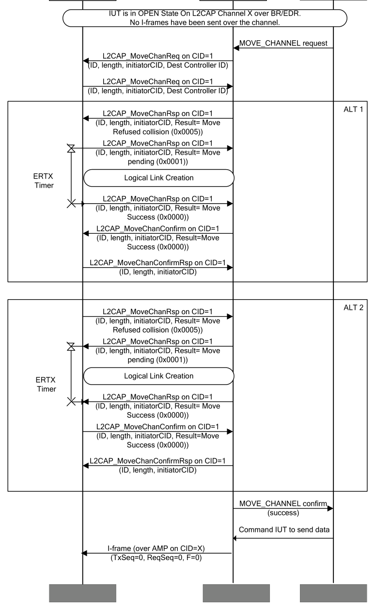

**Figure 4.161: L2CAP/MCH/BV-35-C [Move Collision – STM Source]**

• Expected Outcome
Pass verdict
Move operation is successful.
ALT1: The IUT’s BD_ADDR is larger than the Lower Tester’s BD_ADDR so the IUT sends L2CAP_MoveChannelRsp with result code of “Move refused – Move Channel collision” (0x0005). It sends an I-frame at the end of the move operation over the AMP link.
ALT2: The IUT’s BD_ADDR is smaller than Lower Tester’s BD_ADDR so IUT sends L2CAP_MoveChannelRsp with result code of “Move Pending” (0x0001). It sends an I-frame at the end of the move operation over the AMP link.
L2CAP/MCH/BV-36-C [Move Collision – STM Sink]
• Test Purpose
Verify that the IUT can properly handle a move collision when both the IUT and Lower Tester attempt to move a Streaming Mode channel from the BR/EDR link to an AMP link at the same time where the IUT is the data sink.
• Reference
[1] 4.16, 4.17, 9.2
• Initial Condition
- An L2CAP Streaming Mode channel exists between the IUT and the Lower Tester. There has been no data transfer on the channel.
- The AMP Physical Link Exists.
- I(out) outgoing I-frames and I(in) incoming I-frames have been sent and received by the IUT over the channel after it was opened and before the test is executed.
• Test Procedure
Figure 4.162 assumes I(out) and I(in) are 0. The actual values of N(S) and N(R) for both incoming and outgoing traffic must take the number of previously sent and received I-frames into account.

| Lower Tester IUT Upper Tester IUT is in OPEN State On L2CAP Channel X over BR/EDR. No I-frames have been sent over the channel. MOVE CHANNEL request _ L2CAP MoveChanReq on CID=1 _ (ID, length, initiatorCID, Dest Controller ID) L2CAP MoveChanReq on CID=1 _ (ID, length, initiatorCID, Dest Controller ID) |  |  | Upper Tester |  |
| --- | --- | --- | --- | --- |
|  |  |  |  |  |
|  | IUT is in OPEN State On L2CAP Cha No I-frames have been sent ove | nnel X over BR/EDR. r the channel. |  |  |
|  | L2CAP MoveChanReq on CID=1 _ (ID, length, initiatorCID, Dest Controller ID) L2CAP MoveChanReq on CID=1 _ (ID, length, initiatorCID, Dest Controller ID) | MOVE CHANNEL request _ |  |  |
| ERTX Timer | L2CAP MoveChanRsp on CID=1 _ (ID, length, initiatorCID, Result= Move Refused collision (0x0005)) L2CAP MoveChanRsp on CID=1 _ (ID, length, initiatorCID, Result= Move pending (0x0001)) Logical Link Creation L2CAP MoveChanRsp on CID=1 _ (ID, length, initiatorCID, Result= Move Success (0x0000)) L2CAP MoveChanConfirm on CID=1 _ (ID, length, initiatorCID, Result=Move Success (0x0000)) L2CAP MoveChanConfirmRsp on CID=1 _ (ID, length, initiatorCID) |  |  | ALT 1 |
|  |  |  |  |  |
| ERTX Timer | L2CAP MoveChanRsp on CID=1 _ (ID, length, initiatorCID, Result= Move Refused collision (0x0005)) L2CAP MoveChanRsp on CID=1 _ (ID, length, initiatorCID, Result= Move pending (0x0001)) Logical Link Creation L2CAP MoveChanRsp on CID=1 _ (ID, length, initiatorCID, Result= Move Success (0x0000)) L2CAP MoveChanConfirm on CID=1 _ (ID, length, initiatorCID, Result=Move Success (0x0000)) L2CAP MoveChanConfirmRsp on CID=1 _ (ID, length, initiatorCID) |  |  | ALT 2 |
| MOVE CHANNEL confirm _ (success) I-frame (over AMP on CID=X) (TxSeq=0, ReqSeq=0, F=0) Data to Upper Tester |  |  |  |  |
|  |  |  |  |  |

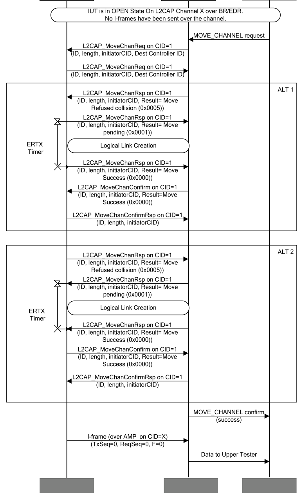

**Figure 4.162: L2CAP/MCH/BV-36-C [Move Collision – STM Sink]**

• Expected Outcome
Pass verdict
Move operation is successful.
ALT1: The IUT’s BD_ADDR is larger than Lower Tester’s BD_ADDR so IUT sends L2CAP_MoveChannelRsp with result code refused - collision (0x0005). It passes the received data to the Upper Tester at the end of the move operation.
ALT 2: The IUT’s BD_ADDR is smaller than the Lower Tester’s BD_ADDR so the IUT sends L2CAP_MoveChannelRsp with result code of “Move Pending” (0x0001). It passes the received data to the Upper Tester at the end of the move operation.

#### 4.11.14 Enhanced Retransmission Mode with Extended Control Field (ECF)

Verify the correct implementation of the Extended Control Field with Enhanced Retransmission Mode.
L2CAP/ECF/BV-01-C [Receive I-Frames with Extended Control Field]
• Test Purpose
Verify that the IUT can receive in-sequence valid I-frames with the Extended Control Field and deliver L2CAP SDUs to the Upper Tester.
• Reference
[1] 3.3.2, 8.6
• Initial Condition
- The IUT is in the INFO_TRANSFER state for a data channel with assigned CID.
- The connection is configured as ERTM.
- No I-frames have been received from the Lower Tester.
- The IUT has configured a MTU and MPS size that is greater or equal to 48 bytes.
- I(out) outgoing I-frames and I(in) incoming I-frames have been sent and received by the IUT over the channel after it was opened and before the test is executed.
• Test Procedure
Figure 4.163 assumes I(out) and I(in) are 0. The actual values of N(S) and N(R) for both incoming and outgoing traffic must take the number of previously sent and received I-frames into account.

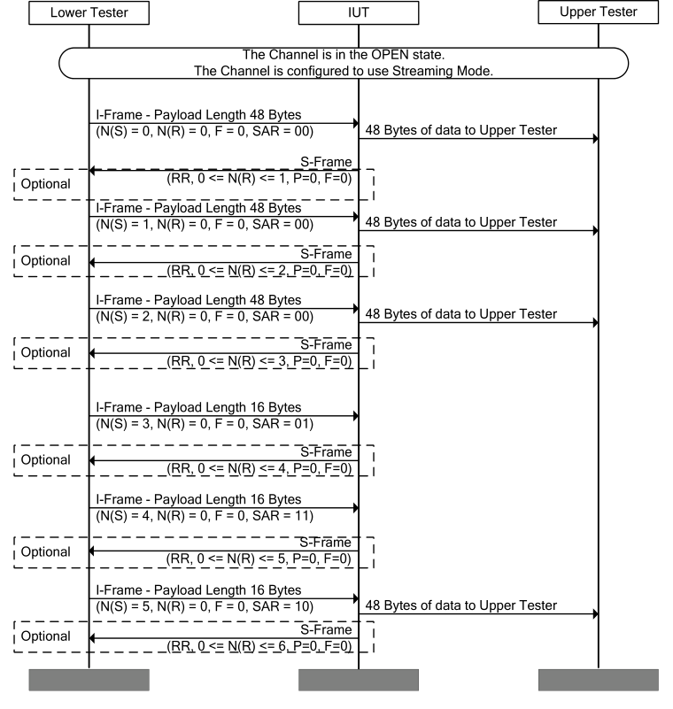

**Figure 4.163: L2CAP/ECF/BV-01-C [Receive I-Frames with Extended Control Field]**

• Expected Outcome
Pass verdict
Data in the received I-frame(s) match that sent by the Lower Tester.
SAR bits are set per specification.
F-bit is set to 0.
Complete SDU is sent to the Upper Tester.
All S-frames from the IUT contain the Extended Control Field.
• Test Purpose
Verify that the IUT can send correctly formatted sequential I-frames with valid values for the Extended Control Fields (SAR, F-bit, ReqSeq, TxSeq).
• Reference
[1] 3.3.2, 8.6
• Initial Condition
- The IUT is in the INFO_TRANSFER state for a data channel with assigned CID.
- The connection is configured as ERTM.
- I(out) outgoing I-frames and I(in) incoming I-frames have been sent and received by the IUT over the channel after it was opened and before the test is executed.
• Test Procedure
Figure 4.164 assumes I(out) and I(in) are 0. The actual values of N(S) and N(R) for both incoming and outgoing traffic must take the number of previously sent and received I-frames into account.

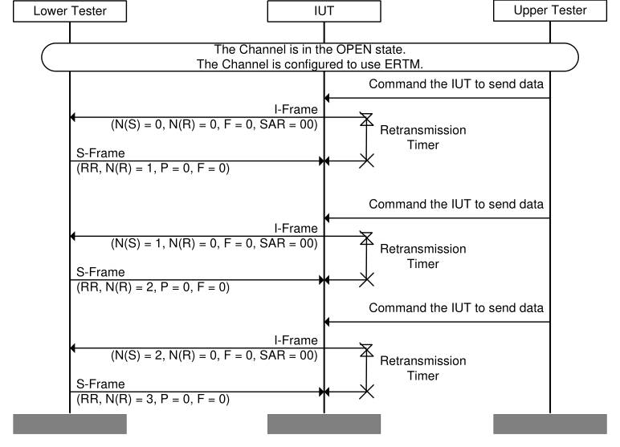

**Figure 4.164: L2CAP/ECF/BV-02-C [Transmit I-Frames with Extended Control Field]**

• Expected Outcome
Pass verdict
The IUT sends I-frame(s) to the Lower Tester containing Extended Control Field.
Data in the I-frame(s) match that which was provided by the Upper Tester.
SAR bits are set per specification.
F-bit is set to 0.
• Test Purpose
Verify that the IUT sends S-frame [RR] with Extended Control field and the Poll bit not set to acknowledge data received from the Lower Tester.
• Reference
[1] 3.3.2, 8.6.1.1
• Initial Condition
- The IUT is in the INFO_TRANSFER state for a data channel with assigned CID. The connection is configured as ERTM. No I-frames have been received from the Lower Tester.
- I(out) outgoing I-frames and I(in) incoming I-frames have been sent and received by the IUT over the channel after it was opened and before the test is executed.
• Test Procedure
Figure 4.165 assumes I(out) and I(in) are 0. The actual values of N(S) and N(R) for both incoming and outgoing traffic must take the number of previously sent and received I-frames into account.

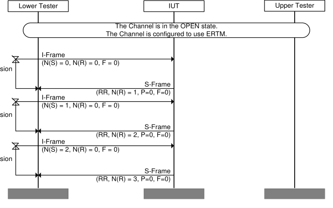

**Figure 4.165: L2CAP/ECF/BV-03-C [Acknowledging Received I-Frames with Extended Control Field]**

• Expected Outcome
Pass verdict
The IUT sends a Supervisory frame with S=RR, LastAckedReqSeq < ReqSeq <= last received I- frame’s TxSeq+1, F=0, P=0, Reserved bits = 0 and Extended Control Field.
L2CAP/ECF/BV-04-C [Send S-Frame [RR] with Extended Control Field and Poll Bit Set]
• Test Purpose
Verify that the IUT sends an S-frame [RR] with the Extended Control field and the Poll bit set when its retransmission timer expires.
• Reference
• Initial Condition
- The channel is in the OPEN state and configured to use ERTM.
- I(out) outgoing I-frames and I(in) incoming I-frames have been sent and received by the IUT over the channel after it was opened and before the test is executed.
• Test Procedure
Figure 4.166 assumes I(out) and I(in) are 0. The actual values of N(S) and N(R) for both incoming and outgoing traffic must take the number of previously sent and received I-frames into account.

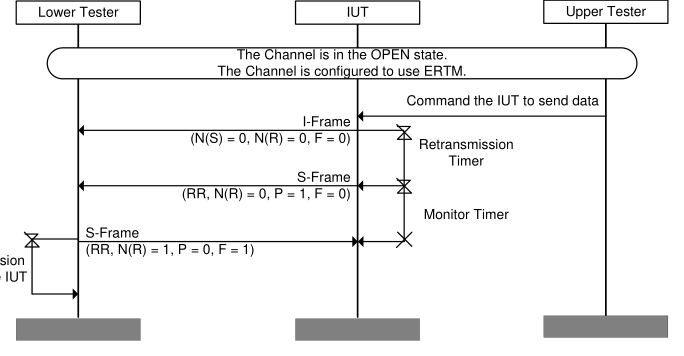

**Figure 4.166: L2CAP/ECF/BV-04-C [Send S-Frame [RR] with Extended Control Field and Poll Bit Set]**

• Expected Outcome
Pass verdict
The IUT sends an S-frame with Extended Control Field and with the POLL bit set after the IUT Retransmission Timer (as specified by Lower Tester during configuration) expires.
The IUT does not retransmit the I-frame after receiving an S-frame from the Lower Tester that acknowledges the previously sent I-frame.
L2CAP/ECF/BV-05-C [Respond to S-Frame [REJ] with Extended Control Field]
• Test Purpose
Verify that the IUT retransmits I-frames with Extended Control Field starting from the sequence number specified in the S-frame [REJ] with an Extended Control Field.
• Reference
[1] 3.3.2, 8.6.1.2, 8.6.4
• Initial Condition
- The channel is in the OPEN state and configured to use ERTM.
- I(out) outgoing I-frames and I(in) incoming I-frames have been sent and received by the IUT over the channel after it was opened and before the test is executed.
- The MaxTransmit for the IUT is set to a value greater than 1.
- The Lower Tester has specified a value for TxWin that is greater than 1 in the Configure Request sent to the IUT.
• Test Procedure
Figure 4.167 assumes I(out) and I(in) are 0. The actual values of N(S) and N(R) for both incoming and outgoing traffic must take the number of previously sent and received I-frames into account.

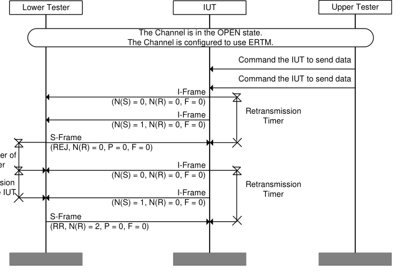

**Figure 4.167: L2CAP/ECF/BV-05-C [Respond to S-Frame [REJ] with Extended Control Field]**

• Expected Outcome
Pass verdict
The IUT retransmits the first I-frame requested in the REJ from the Lower Tester before the Monitor Timer of the Lower Tester expires, including the Extended Control Field.
The IUT retransmits the second I-frame requested in the REJ from the Lower Tester before the IUT Retransmission Timer expires.
L2CAP/ECF/BV-06-C [Respond to S-Frame [SREJ] with Extended Control Field and POLL bit Set]
• Test Purpose
Verify that the IUT responds with the correct I-frame when sent an SREJ frame with an Extended Control Field. Verify that the IUT processes the acknowledgment of previously unacknowledged I- frames.
• Reference
[1] 3.3.2, 8.6.1.3, 8.6.4
• Initial Condition
- The channel is in the OPEN state and configured to use ERTM.
- I(out) outgoing I-frames and I(in) incoming I-frames have been sent and received by the IUT over the channel after it was opened and before the test is executed.
- The MaxTransmit for the IUT is set to a value greater than 1.
- The Lower Tester has specified a value for TxWin of 3 in the Configure Request sent to the IUT.
• Test Procedure
Figure 4.168 assumes I(out) and I(in) are 0. The actual values of N(S) and N(R) for both incoming and outgoing traffic must take the number of previously sent and received I-frames into account.

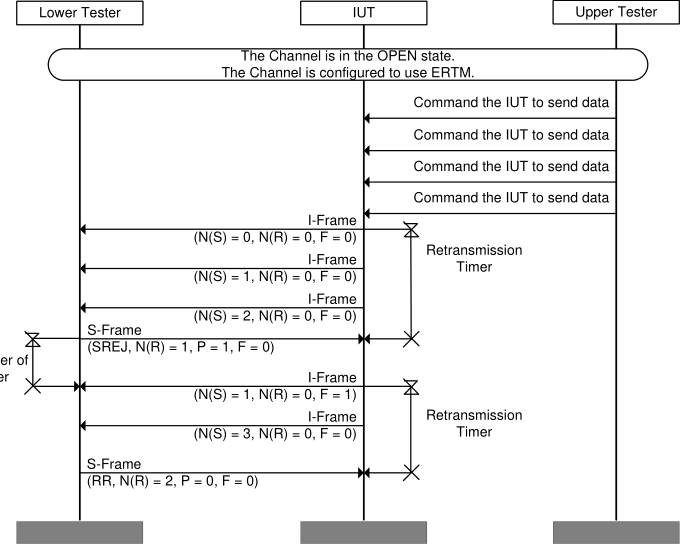

**Figure 4.168: L2CAP/ECF/BV-06-C [Respond to S-Frame [SREJ] with Extended Control Field and POLL bit Set]**

• Expected Outcome
Pass verdict
The IUT retransmits the I-frame requested in the SREJ from the Lower Tester before the Monitor Timer of the Lower Tester expires.
The I-frame retransmitted by the IUT has the Final bit = 1, and the Extended Control Field.
The IUT processes the acknowledgment of the first I-frame (N(S) = 0) from the SREJ received and consequently send the pending I-frame (N(S) = 3).
L2CAP/ECF/BV-07-C [Respond to S-Frame [SREJ] with Extended Control Field and POLL Bit Clear]
• Test Purpose
Verify that the IUT responds with the correct I-frame when sent an SREJ frame with an Extended Control Field.
• Reference
[1] 3.3.2, 8.6.1.3, 8.6.4
• Initial Condition
- The channel is in the OPEN state and configured to use ERTM.
- I(out) outgoing I-frames and I(in) incoming I-frames have been sent and received by the IUT over the channel after it was opened and before the test is executed.
- The MaxTransmit for the IUT is set to a value greater than 1.
- The Lower Tester has specified a value for TxWin of 3 in the Configure Request sent to the IUT.
• Test Procedure
Figure 4.169 assumes I(out) and I(in) are 0. The actual values of N(S) and N(R) for both incoming and outgoing traffic must take the number of previously sent and received I-frames into account.

**Figure 4.169: L2CAP/ECF/BV-07-C [Respond to S-Frame [SREJ] with Extended Control Field and POLL Bit Clear]**

• Expected Outcome
Pass verdict
The IUT retransmits the I-frame, including an Extended Control Field, requested in the SREJ from the Lower Tester before the Monitor Timer of the Lower Tester expires.
The IUT does not transmit I-frame (N(S) = 3) as a result of receiving the SREJ from the Lower Tester.
L2CAP/ECF/BV-08-C [Transmit I-Frames using Extended Control Field and SAR]
• Test Purpose
Verify that the IUT can send correctly formatted sequential I-frames with valid values for the extended control fields (SAR, F-bit, ReqSeq, TxSeq) when performing SAR.
• Reference
[1] 3.3.2
• Initial Condition
- The connection is configured as ERTM.
- I(out) outgoing I-frames and I(in) incoming I-frames have been sent and received by the IUT over the channel after it was opened and before the test is executed.
- The Lower Tester has configured a value for the MPS that ensures that the IUT performs SAR (i.e., if the IUT has specified that it sends SDUs of N bytes the Lower Tester configures the MPS of the channel to be N / 3 bytes).
- The Lower Tester has configured a TxWindow size of 1.
• Test Procedure
Figure 4.170 assumes I(out) and I(in) are 0. The actual values of N(S) and N(R) for both incoming and outgoing traffic must take the number of previously sent and received I-frames into account.

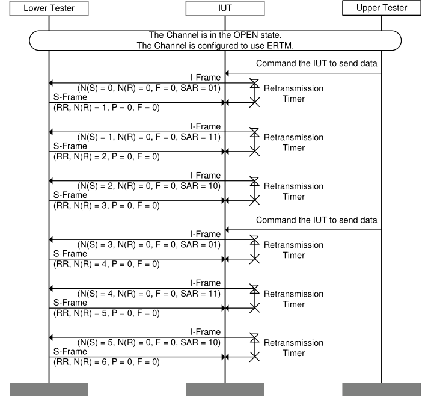

**Figure 4.170: L2CAP/ECF/BV-08-C [Transmit I-Frames using Extended Control Field and SAR]**

• Expected Outcome
Pass verdict
The Lower Tester receives six correctly formatted I-frames from the IUT including an Extended Control Field.

#### 4.11.15 Streaming Mode with Extended Control Field (STM)

Verify the correct implementation of the Extended Control Field with Streaming Mode.
L2CAP/STM/BV-11-C [Streaming Mode Source with Extended Control Field]
• Test Purpose
Verify that the IUT can send correctly formatted sequential I-frames with valid values for the Extended Control fields (SAR, F-bit, ReqSeq, TxSeq).
• Reference
[1] 3.3.2, 8.7
• Initial Condition
- The channel is in the OPEN state and configured to use Streaming Mode.
- I(out) outgoing I-frames and I(in) incoming I-frames have been sent and received by the IUT over the channel after it was opened and before the test is executed.
• Test Procedure
Figure 4.171 assumes I(out) and I(in) are 0. The actual values of N(S) and N(R) for both incoming and outgoing traffic must take the number of previously sent and received I-frames into account.

**Figure 4.171: L2CAP/STM/BV-01-C [Streaming Mode Source with Extended Control Field]**

• Expected Outcome
Pass verdict
The Lower Tester receives three correctly formatted I-frames from the IUT including Extended Control Fields.
L2CAP/STM/BV-12-C [Streaming Mode Sink with Extended Control Field]
• Test Purpose
Verify that the IUT receives I-frames with Extended Control Field and handles SAR correctly.
• Reference
[1] 3.3.2, 8.7
• Initial Condition
- The channel is in the OPEN state and configured to use Streaming Mode.
- I(out) outgoing I-frames and I(in) incoming I-frames have been sent and received by the IUT over the channel after it was opened and before the test is executed.
- The IUT has configured a MTU and MPS size that is greater or equal to 48 bytes.
• Test Procedure
Figure 4.172 assumes I(out) and I(in) are 0. The actual values of N(S) and N(R) for both incoming and outgoing traffic must take the number of previously sent and received I-frames into account.

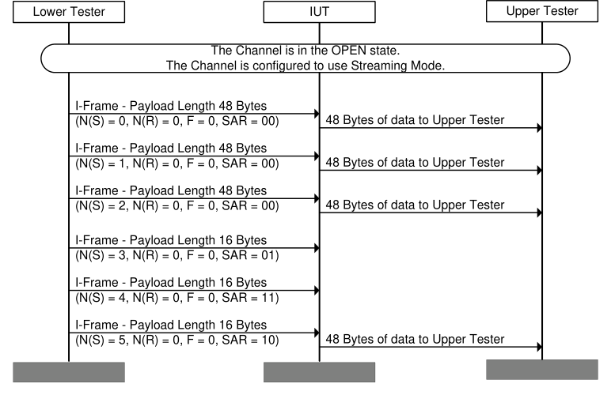

**Figure 4.172: L2CAP/STM/BV-02-C [Streaming Mode Sink with Extended Control Field]**

• Expected Outcome
Pass verdict
The IUT passes the received data correctly to the Upper Tester.
L2CAP/STM/BV-13-C [Streaming Mode Source using Extended Control Field and SAR]
• Test Purpose
Verify that the IUT can send correctly formatted sequential I-frames with valid values for the Extended Control fields (SAR, F-bit, ReqSeq, TxSeq) while performing SAR.
• Reference
[1] 3.3.2, 8.7
• Initial Condition
- The channel is in the OPEN state and configured to use Streaming Mode.
- I(out) outgoing I-frames and I(in) incoming I-frames have been sent and received by the IUT over the channel after it was opened and before the test is executed.
- The Lower Tester has configured a value for the MPS that ensures the IUT performs SAR (if the IUT has specified that it sends SDUs of N bytes the Lower Tester configures the MPS of the channel to be N / 3 bytes).
• Test Procedure
Figure 4.173 assumes I(out) and I(in) are 0. The actual values of N(S) and N(R) for both incoming and outgoing traffic must take the number of previously sent and received I-frames into account.

**Figure 4.173: L2CAP/STM/BV-03-C [Streaming Mode Source using Extended Control Field and SAR]**

• Expected Outcome
Pass verdict
The Lower Tester receives six correctly formatted I-frames from the IUT, including Extended Control Fields.

### 4.12 Low Energy System tests

Verify the correct implementation of the LE features of L2CAP.

#### 4.12.1 Connection Parameter Update

Verify the correct implementation of the LE connection parameter update feature.
L2CAP/LE/CPU/BV-01-C [Send Connection Parameter Update Request]
• Test Purpose
Verify that the IUT can send the connection parameter update Request to Lower Tester when acting as a Peripheral device.
• Reference
[11] Table 2.1, Table 6.1, 4.20
• Initial Condition
- The Lower Tester acts as a connection initiator and the IUT acts as an advertiser.
- The IUT is in CLOSED state for data channel. No ACL link is established.
- The Lower Tester's LL feature mask indicates that it does not support the Connection Parameters Request Procedure.
- The Lower Tester becomes a Central device and the IUT becomes a Peripheral device after the connection is established.
- For the parameters to send and receive, see [5].
• Test Procedure
1. ACL link is established. 2. The IUT sends L2CAP_CONNECTION_PARAMETER_UPDATE_REQ.

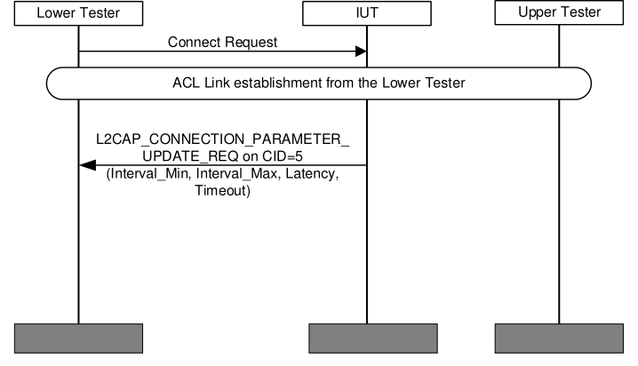

**Figure 4.174: L2CAP/LE/CPU/BV-01-C [Send Connection Parameter Update Request]**

• Expected Outcome
Pass verdict
The IUT transmits L2CAP_CONNECTION_PARAMETER_UPDATE_REQ over the LE signaling channel.
L2CAP/LE/CPU/BV-02-C [Accept Connection Parameter Update Request]
• Test Purpose
Verify that the IUT can receive and handle a request for connection parameter update when acting as a Central device.
• Reference
[11] Table 6.1, 4.20, 4.21
• Initial Condition
- The IUT is in CLOSED state. No ACL link exists. The IUT acts as L2CAP initiator.
• Test Procedure
ACL link establishment is part of the test case.

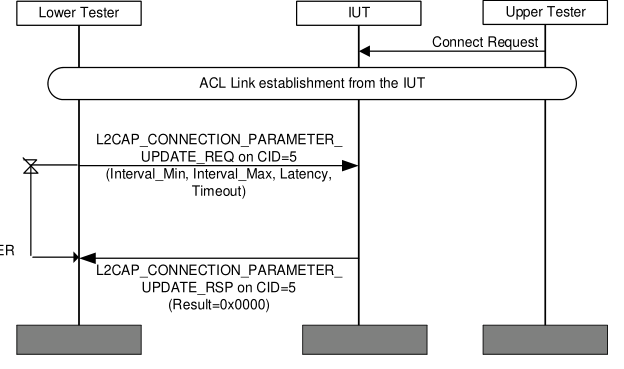

**Figure 4.175: L2CAP/LE/CPU/BV-02-C [Accept Connection Parameter Update Request]**

• Test Condition
The IUT’s Bluetooth device address BD_ADDR is defined. For parameter to send and receive, see [5].
The IUT works as connection initiator, therefore, the IUT becomes a Central device and the Lower Tester acts as a Peripheral device after the connection is established.
• Expected Outcome
Pass verdict
The IUT sends a correct L2CAP_CONNECTION_PARAMETER_UPDATE_RSP over LE signaling channel before RTX timer expires with result code 0x0000.
• Notes
The Lower Tester’s RTX timer is set to maximum allowed initial value.
L2CAP/LE/CPU/BI-01-C [Reject Connection Parameter Update Parameters]
• Test Purpose
Verify that the IUT can reject a request for connection parameter update with illegal parameters.
• Reference
[11] Table 6.1, 4.20, 4.21
• Initial Condition
- The IUT is in CLOSED state. No ACL link exists. The IUT acts as L2CAP initiator.
• Test Procedure
ACL link establishment is part of the test case.
The Lower Tester sends a Latency of larger than 500 in ConnectionParameterUpdateReq.
The IUT returns result of reject in ConnectionParameterUpdateRsp.

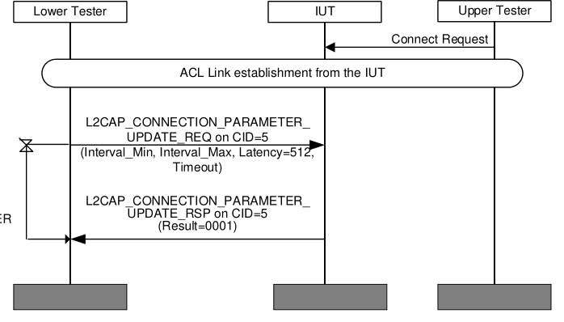

**Figure 4.176: L2CAP/LE/CPU/BI-01-C [Reject Connection Parameter Update Parameters]**

• Test Condition
The IUT’s Bluetooth device address BD_ADDR is defined. For parameter to send and receive, see [5].
The IUT works as connection initiator, therefore the IUT becomes a Central device and the Lower Tester as a Peripheral device after the connection is established.
• Expected Outcome
Pass verdict
The IUT sends a correct L2CAP_CONNECTION_PARAMETER_UPDATE_RSP with result code 0x0001 over LE signaling channel before RTX timer expires.
• Notes
The Lower Tester’s RTX timer is set to maximum allowed initial value.
L2CAP/LE/CPU/BI-02-C [Reject Connection Parameter Update Request]
• Test Purpose
Verify that the IUT can reject a request for connection parameter update in Peripheral mode.
• Reference
[11] Table 6.1, 4.20, 4.21
• Initial Condition
- The IUT is in CLOSED state. No ACL link exists. The IUT acts as L2CAP acceptor.
• Test Procedure
ACL link establishment is part of the test case.
The Lower Tester sends ConnectionParameterUpdateReq over the LE signaling channel.

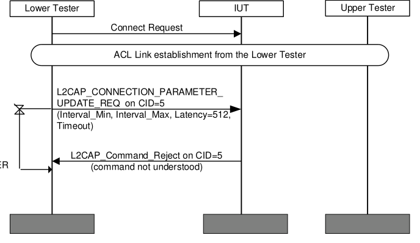

**Figure 4.177: L2CAP/LE/CPU/BI-02-C [Reject Connection Parameter Update Request]**

• Test Condition
The IUT’s Bluetooth device address BD_ADDR is defined. For parameter to send and receive, see [5].
The Lower Tester acts as connection initiator, therefore the IUT becomes a Peripheral device and the Lower Tester acts as a Central device after the connection is established.
• Expected Outcome
Pass verdict
The IUT sends L2CAP Command_Reject with reason “Command not understood” over the LE signaling channel before RTX timer expires.
• Notes
The Lower Tester’s RTX timer is set to maximum allowed initial value.

#### 4.12.2 Command Reject

Verify the correct implementation of the command reject.

##### 4.12.2.1 Reject Unknown Command

• Test Purpose
Verify that the IUT can reject reserved and unknown commands.
• Reference
[11] 4.10
[12] 4, Table 4.2
• Initial Condition
- The appropriate signaling channel for the transport is used as specified in Table 4.15.
• Test Case Configuration

| Test Case | Test Case | Signali Chann | Signali | ng R el C C | FU ommand odes | Unsupported Command Codes |
| --- | --- | --- | --- | --- | --- | --- |
|  |  |  | Chann |  |  |  |
| L2CAP/COS/CED/BI-01-C [Reject Unknown Command BR/EDR] |  | 0x0001 , |  | 0x1B to 0xFF |  | 0x0C to 0x15 0x06 and 0x07 IF NOT L2CAP 2/45 0x08 and 0x09 IF NOT L2CAP 2/4 0x0A and 0x0B IF NOT L2CAP 2/6 0x16 to 0x1A IF NOT L2CAP 2/48a |
| L2CAP/LE/REJ/BI-02-C [Reject Unknown Command – LE] |  | 0x0005 |  | 0x1B to 0xFF |  | 0x02 to 0x05 0x08 to 0x11 0x06 and 0x07 IF NOT L2CAP 2/45a 0x12 and 0x13 IF NOT L2CAP 2/42 0x14 and 0x15 IF NOT L2CAP 2/46 0x16 IF NOT (L2CAP 2/46 OR L2CAP 2/48b) 0x17 to 0x1A IF NOT L2CAP 2/48b |

Table 4.15: Reject Unknown Command test cases
• Test Procedure

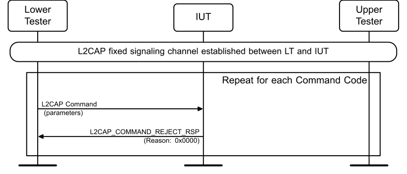

**Figure 4.178: Reject Unknown Command**

Repeat steps 1 and 2 for every Unsupported Command Code based on the ICS support of the IUT in Table 4.15, for the first three RFU Command Codes in Table 4.15, and for three other RFU Command Codes in Table 4.15 selected at random.
1. The Lower Tester sends an L2CAP command with the Command Codes defined in Table 4.15. 2. The IUT responds with a command reject.
• Expected Outcome
Pass verdict
The IUT sends a correct L2CAP_COMMAND_REJECT_RSP packet with reason “Command not understood” and no Reason Data field over the transport and signaling channel as specified in Table 4.15.

### 4.13 Connectionless Basic L2CAP Mode

Verify the correct implementation of the connectionless services of the L2CAP layer.

#### 4.13.1 Connectionless Reception Channel CLR

Verify the procedures for data exchange over the connectionless channel with the subgroups send data, receive data, disable and enable connectionless traffic.
L2CAP/CLS/CLR/BV-01-C [Data Over Connectionless Channel]
• Test Purpose
Verify that the IUT can send data over the connectionless channel.
• Reference
[12] 3.2
• Initial Condition
- The Lower Tester utilizes version L2CAP Basic Mode.
- The IUT works as Central, a group has been created, and the Lower Tester has been added as member in the group.
• Test Procedure

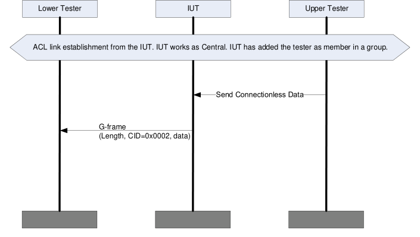

**Figure 4.179: L2CAP/CLS/CLR/BV-01-C [Data Over Connectionless Channel]**

• Expected Outcome
Pass verdict
The IUT sends connectionless G-frame to the Lower Tester.
L2CAP/CLS/UCD/BV-01-C [Data Reception over Unicast Connectionless Channel]
• Test Purpose
Verify that the IUT has the UCD bit set in the L2CAP Extended Features Mask to indicate support for reception of unicast connectionless data. Also verify that the IUT can receive data over the connectionless channel.
• Reference
[12] 3.2 and 7.6
• Initial Condition
- An ACL connection exists between the Lower Tester and the IUT.
• Test Procedure
The Lower Tester requests Extended Features Mask using L2CAP Information Request. The Lower Tester then transmits a G-frame over the air to the IUT.

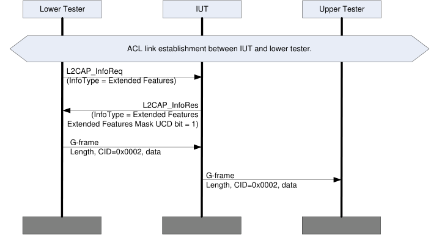

**Figure 4.180: L2CAP/CLS/UCD/BV-01-C [Data Reception over Unicast Connectionless Channel]**

• Expected Outcome
Pass verdict
The following conditions are met:
- The L2CAP Extended Features Mask is successfully retrieved.
- The Unicast Connectionless Data Reception bit in the L2CAP Extended Features Mask is set.
- The IUT sends a connectionless G-frame to the Upper Tester.
L2CAP/CLS/UCD/BV-02-C [Unencrypted data transmission over unicast connectionless channel]
• Test Purpose
Verify that the IUT can send unencrypted data over the connectionless channel.
Verify that the IUT can correctly send unencrypted G-frames to the Lower Tester.
• Reference
[12] 7.6
• Initial Condition
- An ACL connection exists between the Lower Tester and the IUT.
• Test Procedure

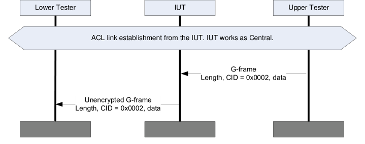

**Figure 4.181: L2CAP/CLS/UCD/BV-02-C [Unencrypted data transmission over unicast connectionless channel]**

• Expected Outcome
Pass verdict
The IUT sends an unencrypted connectionless G-frame to the Lower Tester.
L2CAP/CLS/UCD/BV-03-C [Encrypted Data Transmission over Unicast Connectionless Channel]
• Test Purpose
Verify that the IUT can send data over the connectionless channel.
• Reference
[12] 7.6
• Initial Condition
- An unencrypted ACL connection exists between the Lower Tester and the IUT.
• Test Procedure

|  | Lower Tester IUT Upper Tester |  |  | Upper Tester |  |  |
| --- | --- | --- | --- | --- | --- | --- |
|  |  |  |  |  |  |  |
|  |  | ACL link establishment from t | he IUT. IUT works as Central. |  |  |  |
|  |  |  |  |  |  |  |
|  |  | IUT initiates authenti | cation of Lower Tester. |  |  |  |
|  |  |  |  |  |  |  |
|  |  | Encryptio | n enabled. |  |  |  |
|  |  |  |  |  |  |  |
|  |  |  |  |  |  |  |

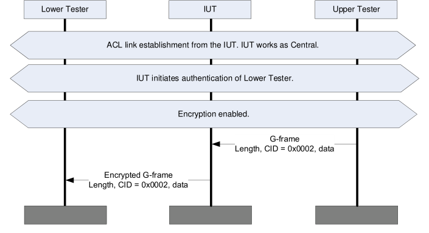

**Figure 4.182: L2CAP/CLS/UCD/BV-03-C [Encrypted Data Transmission over Unicast Connectionless Channel]**

• Expected Outcome
Pass verdict
The IUT performs the following in the specified order:
1. Authenticates the link.
2. Enables encryption.
3. Sends an encrypted connectionless G-frame to the Lower Tester.

### 4.14 Channel Identifiers (CID)

Tests that L2CAP in the IUT handles CIDs correctly on the connections to the same remote device.
L2CAP/LE/CID/BV-01-C [Receiving DCID over BR/EDR and LE]
• Test Purpose
Test that the L2CAP entity can receive the same DCID in L2CAP connect responses on both the BR/EDR and LE links.
• Reference
[12] 2.1
• Initial Condition
- An ACL-U logical link exists between the IUT and Lower Tester.
- An LE–U logical link exists between the IUT and Lower Tester.
- The IUT has determined from IXIT, or SDP and GATT, available PSMs and SPSMs on the Lower Tester.
- The Lower Tester has the same public Bluetooth address on the BR/EDR and LE physical transports.
• Test Procedure
1. The Upper Tester commands the IUT to create an L2CAP connection on the ACL-U logical link to
the Lower Tester. 2. The IUT issues an L2CAP Connection Request over the ACL-U logical link to a known PSM on
the Lower Tester, using any allowable dynamically allocated CID in the range 0x0040–0xFFFF for the SCID. 3. The Lower Tester sends an L2CAP Connection Response and assigns any allowable dynamically
allocated CID in the range 0x0040–0xFFFF for the DCID to complete the L2CAP connection. 4. The Upper Tester commands the IUT to create an L2CAP connection on the LE-U logical link to
the Lower Tester. 5. The IUT issues an L2CAP LE Credit Based Connection Request over the LE-U logical link to a
known SPSM on the Lower Tester, using any allowable dynamically allocated CID in the range 0x0040–0x007F for the SCID. 6. The Lower Tester sends an LE Credit Based Connection Response and assigns the same CID
used in step 3 for the DCID to complete the LE L2CAP connection. 7. The Upper Tester commands the IUT to transfer data, of different content, over both L2CAP
connections.
was transferred over. 9. The Lower Tester issues an L2CAP Disconnection Request over the ACL-U logical link. 10. The Lower Tester issues an L2CAP Disconnection Request over the LE-U logical link.
• Expected Outcome
Pass verdict
Both L2CAP connections complete successfully.
Correct data for each channel is transferred successfully over both connections.
Both L2CAP connections disconnect successfully.
L2CAP/LE/CID/BV-02-C [Receiving SCID over BR/EDR and LE]
• Test Purpose
Test that the L2CAP entity can receive the same SCID in L2CAP connect requests on both the BR/EDR and LE links.
• Reference
[12] 2.1
• Initial Condition
- An ACL-U logical link exists between the IUT and Lower Tester.
- An LE–U logical link exists between the IUT and Lower Tester.
- The IUT has made known to the Lower Tester via IXIT, or SDP and GATT, available PSMs and SPSMs on the IUT.
- The Lower Tester has the same public Bluetooth address on the BR/EDR and LE physical transports
• Test Procedure
1. The Upper Tester commands the IUT to accept L2CAP connections on both BR/EDR and LE
transports 2. The Lower Tester issues an L2CAP Connection Request, using any allowable dynamically
allocated CID in the range 0x0040–0x007F for the SCID, over the ACL-U logical link, to a known PSM on the IUT. 3. The IUT sends an L2CAP Connection Response, accepting the SCID proposed by the Lower
Tester and using any allowable dynamically allocated CID in the range 0x0040–0x007F for the DCID, to complete the L2CAP connection. 4. The Lower Tester issues an L2CAP LE Credit Based Connection Request over the LE-U logical
link to a known SPSM on the IUT, using the same CID used in step 2 for the SCID. 5. The IUT sends an LE Credit Based Connection Response, accepting the SCID proposed by the
Lower Tester and using any allowable dynamically allocated CID in the range 0x0040–0x007F for the DCID, to complete the L2CAP connection. 6. The Upper Tester commands the IUT to transfer data, of different content, over both L2CAP
connections. 7. The Lower Tester issues an L2CAP Disconnection Request over the ACL-U logical link. 8. The Lower Tester issues an L2CAP Disconnection Request over the LE-U logical link.
• Expected Outcome
Pass verdict
Both L2CAP connections complete successfully.
Correct data for each channel is transferred successfully over both connections.
Both L2CAP connections disconnect successfully.
L2CAP/LE/CID/BV-03-C [Receiving same DCID over BR/EDR and LE]
• Test Purpose
Test that the L2CAP entity can receive the same DCID in L2CAP connect responses on both the BR/EDR and LE links, when operating in Enhanced Credit Based Flow Control Mode.
• Reference
[13] 2.1
• Initial Condition
- An ACL-U logical link exists between the IUT and the Lower Tester.
- An LE-U logical link exists between the IUT and the Lower Tester.
- The IUT has determined from the IXIT, or SDP and GATT, available PSMs and SPSMs on the Lower Tester.
- The Lower Tester has the same public Bluetooth address on the BR/EDR and LE physical transports.
• Test Procedure
Same as for L2CAP/LE/CID/BV-01-C [Receiving DCID over BR/EDR and LE], with the remark that the IUT and the Lower Tester uses an Enhanced Credit Based Flow Control channel SPSM as declared via IXIT.
• Expected Outcome
Pass verdict
Both L2CAP connections complete successfully.
Correct data for each channel is transferred successfully over both connections.
Both L2CAP connections disconnect successfully.
L2CAP/LE/CID/BV-04-C [Receiving same SCID over BR/EDR and LE]
• Test Purpose
Test that the L2CAP entity can receive the same SCID in L2CAP connect responses on both the BR/EDR and LE links, when operating in Enhanced Credit Based Flow Control Mode.
• Reference
[13] 2.1
• Initial Condition
- An ACL-U logical link exists between the IUT and the Lower Tester.
- The IUT has determined from the IXIT, or SDP and GATT, available PSMs and SPSMs on the Lower Tester.
- The Lower Tester has the same public Bluetooth address on the BR/EDR and LE physical transports.
• Test Procedure
Same as for L2CAP/LE/CID/BV-02-C [Receiving SCID over BR/EDR and LE], with the remark that the IUT and the Lower Tester uses an Enhanced Credit Based Flow Control channel SPSM as declared via IXIT.
• Expected Outcome
Pass verdict
Both L2CAP connections complete successfully.
Correct data for each channel is transferred successfully over both connections.
Both L2CAP connections disconnect successfully.

#### 4.14.1 Ignore Unsupported CIDs

• Test Purpose
Test that the L2CAP entity ignores unsupported CIDs in a logical link.
• Reference
[13] 2.1
• Initial Condition
- A logical link as specified in Table 4.16 exists between the IUT and the Lower Tester.
- The Upper Tester can command the IUT to send data.
• Test Case Configuration

|  | Test Case ID |  |  | Logical Link |  |  | PDU CIDs |  |
| --- | --- | --- | --- | --- | --- | --- | --- | --- |
| L2CAP/COS/CID/BI-01-C [Ignore Unsupported CIDs, ACL] |  |  | ACL |  |  | 0x0004, 0x0005, 0x0006, 0x0008, 0x003E |  |  |
| L2CAP/LE/CID/BI-01-C [Ignore Unsupported CIDs, LE] |  |  | LE-U |  |  | 0x0001, 0x0002, 0x0003, 0x0007, 0x0019, 0x003F, 0x0100, 0xFFFF |  |  |

Table 4.16: Ignore Unsupported CIDs
• Test Procedure

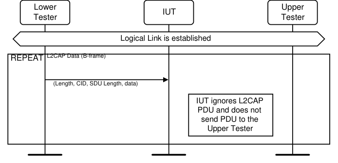

**Figure 4.183: Ignore Unsupported CIDs**

Repeat steps 1 and 2 for each PDU CID in Table 4.16.
1. The Lower Tester sends an L2CAP Data (B-frame) PDU on the established logical link with the
Channel ID of the PDU as specified in Table 4.16. 2. The IUT does not send the L2CAP data to the Upper Tester.
• Expected Outcome
Pass verdict
In step 2, the IUT ignores the L2CAP Data (B-frame) PDU from step 1 and does not send the data to the Upper Tester.
L2CAP/CLS/CID/BV-01-C [Ignore Unsupported CIDs, APB]
• Test Purpose
Test that the L2CAP entity ignores unsupported CIDs in a BR/EDR APB logical link.
• Reference
[13] 2.1
• Initial Condition
- An ACL connection exists between the Lower Tester and the IUT.
• Test Procedure
The Lower Tester requests Extended Features Mask using an L2CAP Information Request. The Lower Tester then transmits a G-frame over the air to the IUT.

|  | Lo Te | wer ster |  | Up Te | per ster |  |
| --- | --- | --- | --- | --- | --- | --- |
|  |  |  |  |  |  |  |
|  |  | Logical Link is | established |  |  |  |
|  |  | L2CAP INFORMATION REQ _ _ (InfoType = Extended Features) L2CAP INFORMATION RSP _ _ (InfoType = Extended Features Extended Features Mask UCD bit = 1) L2CAP ECHO REQ _ _ The IUT does not send an L2CAP ECHO RSP to the Lower _ _ Tester L2CAP CONNECTIONREQ _ _ (Source CID) L2CAP CONNECTIONRSP _ _ (Source CID, Destination CID) Connectionless Data (Source CID, ACL) Connectionless Data (Source CID, Broadcast) L2CAP DISCONNECTREQ _ _ (Source CID, Destination CID) L2CAP DISCONNECTRSP _ _ (Source CID, Destination CID) | Create Connection Connection Complete Event Data Packet (Length, CID, data) The IUT does not send data to the Upper Tester Disconnect Connection Disconnection Complete Event |  |  |  |
|  |  | G-frame (Length, CID, data) G-frame (Length, CID=0x0002, data) | The IUT does not send data to the Upper Tester Data Packet (Length, CID=0x0002, data) |  | REPE | AT |
|  |  |  |  |  |  |  |

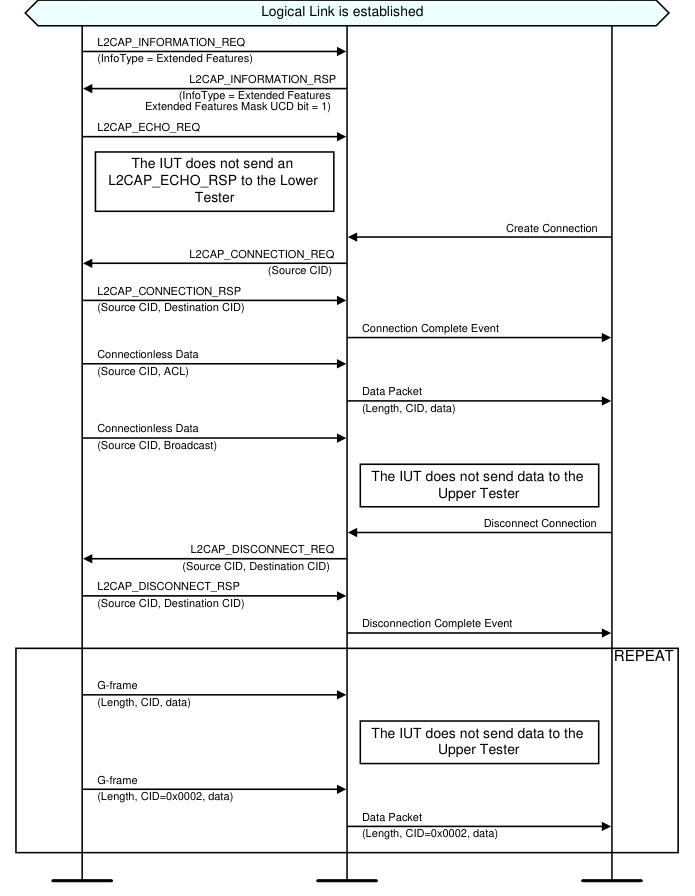

**Figure 4.184: L2CAP/CLS/CID/BV-01-C [Ignore Unsupported CIDs, APB]**

1. The Lower Tester sends an L2CAP Info Request to the IUT with InfoType set to
ExtendedFeatures. 2. The IUT sends an L2CAP Info Response to the IUT with InfoType set to ExtendedFeatures and
the Extended Features Mask UCD bit set to 1. 3. The Lower Tester sends an L2CAP_ECHO_REQ to the IUT on CID 0x0001 via Active Broadcast. 4. The IUT does not send an L2CAP_ECHO_RSP to the Lower Tester. 5. The Upper Tester commands the IUT to create a dynamic L2CAP channel. 6. The IUT sends an L2CAP_CONNECTION_REQ to the Lower Tester with Source CID set to a
dynamic CID. 7. The Lower Tester sends a successful L2CAP_CONNECTION_RSP with Source CID Set to the
CID received in step 6 and a Destination CID. 8. The IUT sends a successful Connection_Complete event to the Upper Tester.
connection. 10. The IUT sends the data received in step 9 to the Upper Tester. 11. The Lower Tester sends a data packet to the IUT on the Source CID channel received from
step 6 over Active Broadcast. 12. The IUT does not send the packet received in step 11 to the Upper Tester. 13. The Upper Tester commands the IUT to disconnect the channel created in step 6. 14. The IUT sends an L2CAP_DISCONNECTION_REQ to the IUT to disconnect the connection
created in step 6. 15. The Lower Tester sends a successful L2CAP_DISCONNECTION_RSP to the IUT with
Destination CID and Source CID set to the values received in step 14. 16. The IUT sends a disconnect event to the Upper Tester. 17. Repeat steps 18–21 for CID values 0x0001, 0x0003, 0x00FF, 0xFFFF, and 2 random invalid
CIDs from 0x0004–0x00FE. 18. The Lower Tester sends a connectionless G-frame via Active Broadcast on the CID from step 17
to the IUT. 19. The IUT does not send a data packet to the Upper Tester. 20. The Lower Tester sends a connectionless G-frame via Active Broadcast on the CID set to 0x0002
to the IUT. 21. The IUT sends a data packet to the Upper Tester.
• Expected Outcome
Pass verdict
- In step 4, the IUT does not send an L2CAP_ECHO_RSP to the Lower Tester.
- In step 10, the IUT sends a data packet to the Upper Tester.
- In step 12, the IUT does not send a data packet to the Upper Tester.
- In step 19, the IUT does not send a data packet to the Upper Tester.
- In step 21, the IUT sends a data packet to the Upper Tester.

### 4.15 Credit Based Flow Control Mode

#### 4.15.1 Enhanced Credit Based Flow Control Mode

##### 4.15.1.1 L2CAP Credit Based Connection Request – Legacy Peer

• Test Purpose
Verify that an IUT sending an L2CAP Credit Based Connection Request to a legacy peer and receiving an L2CAP Command Reject does not establish any channel.
• Reference
[13] 4.25
• Initial Condition
- An SPSM for the Enhanced Credit Based Flow Control channel is declared via IXIT.
- The signaling channel specified in Table 4.17 is used.
• Test Case Configuration

|  | Test Case ID |  |  | Signaling Channel |  |
| --- | --- | --- | --- | --- | --- |
| L2CAP/ECFC/BV-01-C [L2CAP Credit Based Connection Request – Legacy Peer, LE] |  |  | 0x0005 |  |  |
| L2CAP/ECFC/BV-45-C [L2CAP Credit Based Connection Request – Legacy Peer, BR/EDR] |  |  | 0x0001 |  |  |

Table 4.17: L2CAP Credit Based Connection Request – Legacy Peer test cases
• Test Procedure

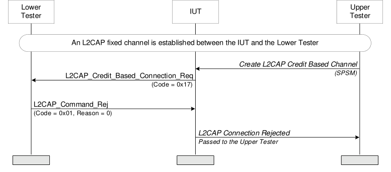

**Figure 4.185: L2CAP Credit Based Connection Request – Legacy Peer**

1. The IUT sends an L2CAP Credit Based Connection Request (Code = 0x17) on the SPSM
declared via IXIT. 2. The Lower Tester responds with an L2CAP Command Reject (Code = 0x01).
• Expected Outcome
Pass verdict
After receiving the Command Reject from the Lower Tester, the IUT informs the Upper Tester.

##### 4.15.1.2 L2CAP Credit Based Connection Request on Supported PSM

• Test Purpose
Verify that an IUT sending an L2CAP Credit Based Connection Request to a peer establishes all the channels upon receiving the L2CAP Credit Based Connection Response.
• Reference
[13] 4.25
• Initial Condition
- The signaling channel specified in Table 4.18 is used.
- An SPSM for the Enhanced Credit Based Flow Control channel is declared via IXIT.
- The Upper Tester can command the IUT to create a credit based channel on the SPSM declared via IXIT and send credits.
• Test Case Configuration

|  | Test Case ID |  |  | Signaling Channel |  |
| --- | --- | --- | --- | --- | --- |
| L2CAP/ECFC/BV-02-C [L2CAP Credit Based Connection Request on Supported PSM, LE] |  |  | 0x0005 |  |  |
| L2CAP/ECFC/BV-46-C [L2CAP Credit Based Connection Request on Supported PSM, BR/EDR] |  |  | 0x0001 |  |  |

Table 4.18: L2CAP Credit Based Connection Request on Supported PSM test cases
• Test Procedure

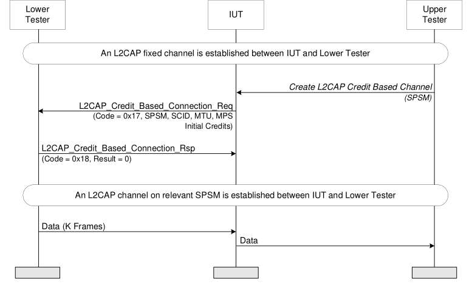

**Figure 4.186: L2CAP Credit Based Connection Request on Supported PSM**

1. The IUT sends an L2CAP Credit Based Connection Request (Code = 0x17) on the SPSM
declared via IXIT. 2. The Lower Tester responds with an L2CAP Credit Based Connection Response (Code = 0x18)
packet. 3. The Lower Tester sends data on the established channel.
• Expected Outcome
Pass verdict
The IUT receives the data sent by the Lower Tester on the correct channel. The data is passed to the Upper Tester.

##### 4.15.1.3 L2CAP Credit Based Connection Response on Supported PSM

• Test Purpose
Verify that an IUT receiving a valid L2CAP Credit Based Connection Request from a peer sends an L2CAP Credit Based Connection Response and establishes the channels.
• Reference
[13] 4.26
• Initial Condition
- The signaling channel specified in Table 4.19 is used.
- An SPSM for the Enhanced Credit Based Flow Control channel is declared via IXIT.
- The Upper Tester can command the IUT to send data and credits.
• Test Case Configuration

|  | Test Case ID |  |  | Signaling Channel |  |
| --- | --- | --- | --- | --- | --- |
| L2CAP/ECFC/BV-03-C [L2CAP Credit Based Connection Response on Supported PSM, LE] |  |  | 0x0005 |  |  |
| L2CAP/ECFC/BV-47-C [L2CAP Credit Based Connection Response on Supported PSM, BR/EDR] |  |  | 0x0001 |  |  |

Table 4.19: L2CAP Credit Based Connection Response on Supported PSM test cases
• Test Procedure

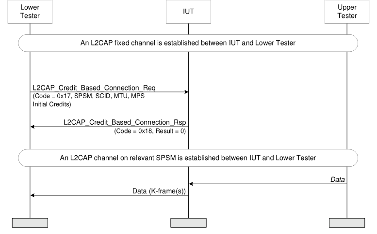

**Figure 4.187: L2CAP Credit Based Connection Response on Supported PSM**

1. The Lower Tester sends an L2CAP Credit Based Connection Request (Code = 0x17) to the IUT
on the SPSM specified in the initial conditions. 2. The IUT responds with an L2CAP Credit Based Connection Response (Code = 0x18). 3. The Upper Tester commands the IUT to send data on the data channel.
• Expected Outcome
Pass verdict
The IUT sends one or more correctly formatted K-frames on the correct channel to the Lower Tester.
The data sent by the IUT to the Lower Tester matches the data sent by the Upper Tester to the IUT.
• Test Purpose
Verify that an IUT sending an L2CAP Credit Based Connection Request on an unsupported PSM does not establish any channel upon receiving an L2CAP Credit Based Connection Response refusing the connection.
• Reference
[13] 4.25
• Initial Condition
- The signaling channel specified in Table 4.20 is used.
- An SPSM for the Enhanced Credit Based Flow Control channel is declared via IXIT.
- The Upper Tester can command the IUT to create a credit based channel on the SPSM declared via IXIT.
• Test Case Configuration

|  | Test Case ID |  |  | Signaling Channel |  |
| --- | --- | --- | --- | --- | --- |
| L2CAP/ECFC/BV-04-C [L2CAP Credit Based Connection Request on an Unsupported PSM, LE] |  |  | 0x0005 |  |  |
| L2CAP/ECFC/BV-48-C [L2CAP Credit Based Connection Request on an Unsupported PSM, BR/EDR] |  |  | 0x0001 |  |  |

Table 4.20: L2CAP Credit Based Connection Request on an Unsupported PSM test cases
• Test Procedure

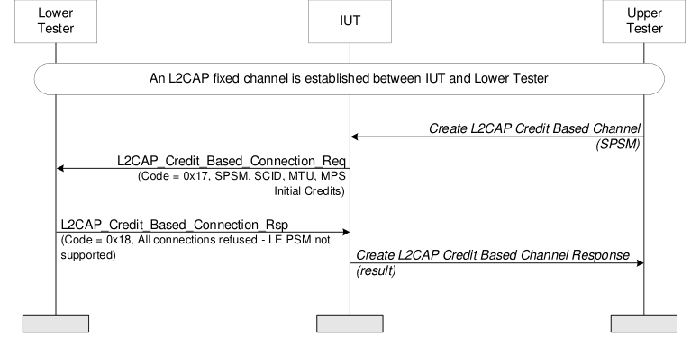

**Figure 4.188: L2CAP Credit Based Connection Request on an Unsupported PSM**

1. The IUT sends an L2CAP Credit Based Connection Request (Code = 0x17) packet on the SPSM
specified in the initial conditions which is not supported by the Lower Tester. 2. The Lower Tester sends an L2CAP Credit Based Connection Response (Code = 0x18) with
result "0x0002 – All connections refused - LE PSM not supported".
• Expected Outcome
Pass verdict
The IUT receives an L2CAP Credit Based Connection Response packet with result “0x0002 – All connections refused – LE PSM not supported” from the Lower Tester. This is indicated to the Upper Tester.

##### 4.15.1.5 Credit Exchange – Receiving Incremental Credits

• Test Purpose
Verify that the IUT handles flow control correctly, by handling the L2CAP Flow Control Credit Indication sent by the peer.
• Reference
[13] 4.24
• Initial Condition
- The signaling channel specified in Table 4.21 is used.
- An SPSM for the Enhanced Credit Based Flow Control channel is declared via IXIT.
- An LE or BR/EDR Data Channel is established on the SPSM.
- The role of the IUT is indicated in the IXIT.
- The Upper Tester can command the IUT to send data.
• Test Case Configuration

|  | Test Case ID |  |  | Signaling Channel |  |
| --- | --- | --- | --- | --- | --- |
| L2CAP/ECFC/BV-06-C [Credit Exchange – Receiving Incremental Credits, LE] |  |  | 0x0005 |  |  |
| L2CAP/ECFC/BV-49-C [Credit Exchange – Receiving Incremental Credits, BR/EDR] |  |  | 0x0001 |  |  |

Table 4.21: Credit Exchange – Receiving Incremental Credits test cases
• Test Procedure

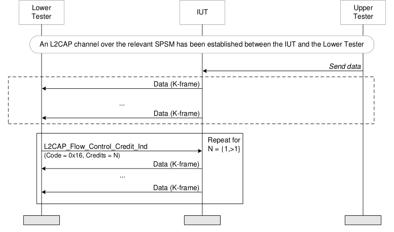

**Figure 4.189: Credit Exchange – Receiving Incremental Credits**

1. The Upper Tester requests the IUT to send data packets to the Lower Tester. 2. The IUT sends K-frames containing data to the Lower Tester, as many as the initial credit count. 3. The Lower Tester sends an L2CAP Flow Control Credit Indication (Code = 0x16) packet with
Credit Value N to the IUT on the CID. 4. The IUT sends K-frames containing data to the Lower Tester. 5. After receiving N K-frames from the IUT and ensuring that no more K-frames are received, the
Lower Tester sends a new L2CAP Flow Control Credit Indication packet with a Credits Value of N on the CID. The IUT sends N K-frames containing data to the Lower Tester. 6. The Test Procedure steps 3–5 are repeated with credit increment N = {1,>1} without
disconnecting the channel.
• Expected Outcome
Pass verdict
After receiving N credits, the IUT sends N correctly formatted K-frames containing data to the Lower Tester.
The IUT stops sending K-frames to the Lower Tester when the credit count reaches zero.

##### 4.15.1.6 Credit Exchange – Sending Credits

• Test Purpose
Verify that the IUT sends Flow Control Credit Indication to the peer.
• Reference
[13] 4.24
• Initial Condition
- The signaling channel specified in Table 4.22 is used.
- An SPSM for the Enhanced Credit Based Flow Control channel is declared via IXIT.
- The role of the IUT is indicated in the IXIT.
- The Upper Tester can command the IUT to send credits.
• Test Case Configuration

|  | Test Case ID |  |  | Signaling Channel |  |
| --- | --- | --- | --- | --- | --- |
| L2CAP/ECFC/BV-07-C [Credit Exchange – Sending Credits, LE] |  |  | 0x0005 |  |  |
| L2CAP/ECFC/BV-50-C [Credit Exchange – Sending Credits, BR/EDR] |  |  | 0x0001 |  |  |

Table 4.22: Credit Exchange – Sending Credits test cases
• Test Procedure

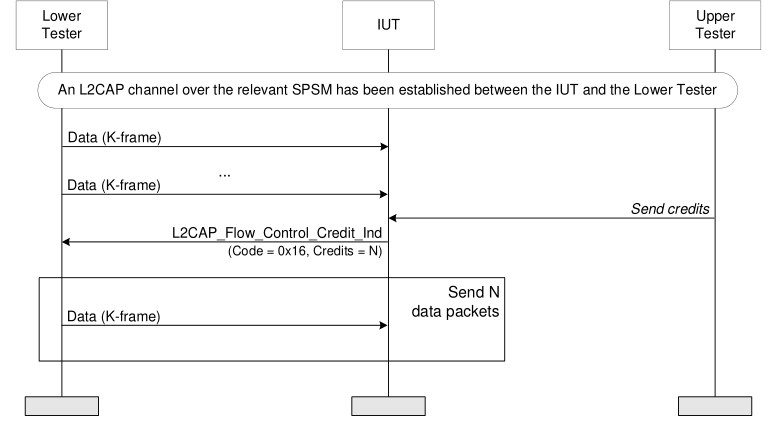

**Figure 4.190: Credit Exchange – Sending Credits**

1. The Lower Tester sends data packets to the IUT until it gets credits returned, i.e., the data to
send could consume more than the current credits available on the channel. 2. When the Lower Tester remains without credits, the Upper Tester commands the IUT to send N
credits to the Lower Tester. 3. The IUT sends an L2CAP Flow Control Credit Indication (Code = 0x16) packet containing Credits
= N to the Lower Tester. 4. The Lower Tester starts sending data packets to the IUT and sends N packets.
• Expected Outcome
Pass verdict
The IUT sends a correctly formatted L2CAP Flow Control Credit Indication (Code = 0x16) packet to the Lower Tester at least once doing the data transfer.

##### 4.15.1.7 Credit Exchange – Zero Credits and Exceed Maximum Credits

• Test Purpose
Verify that the IUT ignores an L2CAP Flow Control Credit Indication packet with credit value set to zero and disconnects the Data Channel created through Enhanced Credit Based Flow Control Mode when the credit count exceeds 65535.
• Reference
[13] 4.24
• Initial Condition
- The signaling channel specified in Table 4.23 is used.
- An SPSM for the Enhanced Credit Based Flow Control channel is declared via IXIT.
- An LE or BR/EDR Data Channel is established on the SPSM.
- The role of the IUT is indicated in the IXIT.
- The initial credit on the LE or BR/EDR Data Channel set by the Lower Tester is more than 1.
• Test Case Configuration

|  | Test Case ID |  |  | Signaling Channel |  |
| --- | --- | --- | --- | --- | --- |
| L2CAP/ECFC/BI-01-C [Credit Exchange – Zero Credits and Exceed Maximum Credits, LE] |  |  | 0x0005 |  |  |
| L2CAP/ECFC/BI-10-C [Credit Exchange – Zero Credits and Exceed Maximum Credits, BR/EDR] |  |  | 0x0001 |  |  |

Table 4.23: Credit Exchange – Zero Credits and Exceed Maximum Credits test cases
• Test Procedure

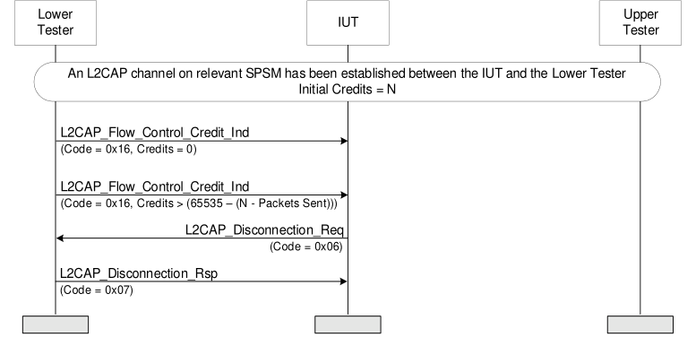

**Figure 4.191: Credit Exchange – Zero Credits and Exceed Maximum Credits**

1. The Lower Tester sends an L2CAP Flow Control Credit Indication (Code = 0x16) packet to the
IUT, with Credits = 0. 2. The IUT silently discards the packet and does not modify its credit count. 3. The Lower Tester sends an L2CAP Flow Control Credit Indication packet containing a credit so
large that it together with the remaining credits on the IUT exceeds 65535. 4. The IUT sends an L2CAP Disconnection Request (Code = 0x06) packet to the Lower Tester, for
the CID with exceeding credits. 5. The Lower Tester sends an L2CAP Disconnection Response (Code = 0x07) to the IUT.
• Expected Outcome
Pass verdict
The IUT ignores the L2CAP Flow Control Credit Indication packet with credit value set to zero, in step 1.
Upon receiving a credit overflow, the IUT disconnects the Data Channel.

##### 4.15.1.8 Credit Exchange – No Credits

• Test Purpose
Verify that the IUT disconnects the Data Channel created through Enhanced Credit Based Flow Control Mode when receiving a K-frame from the peer device that has the credit count of 0 (zero).
• Reference
[13] 4.24
• Initial Condition
- The signaling channel specified in Table 4.24 is used.
- An SPSM for the Enhanced Credit Based Flow Control channel is declared via IXIT.
- An LE or BR/EDR Data Channel is established on the SPSM declared via IXIT.
- The role of the IUT is indicated in the IXIT.
- The initial credit on the LE Data Channel for the Lower Tester is 1.
- The Upper Tester can command the IUT to send credits.
• Test Case Configuration

|  | Test Case ID |  | Signaling Channel |  |
| --- | --- | --- | --- | --- |
| L2CAP/ECFC/BI-02-C [Credit Exchange – No Credits, LE] |  |  | 0x0005 |  |
| L2CAP/ECFC/BI-11-C [Credit Exchange – No Credits, BR/EDR] |  |  | 0x0001 |  |

Table 4.24: Credit Exchange – No Credits test cases
• Test Procedure

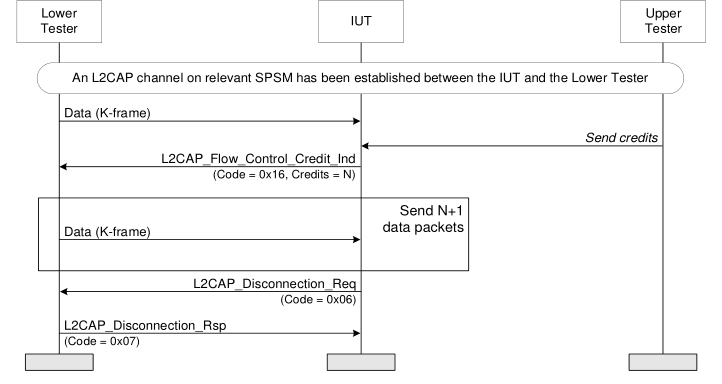

**Figure 4.192: Credit Exchange – No Credits**

1. The Lower Tester sends 1 (one) data packet to the IUT and is left with no credits. 2. The Upper Tester commands the IUT to send N credits to the Lower Tester. 3. The IUT sends an L2CAP Flow Control Credit Indication (Code = 0x16) packet containing
Credits = N to the Lower Tester. 4. The Lower Tester starts sending data packets to the IUT and sends N+1 packets. 5. When the IUT receives the N+1st packet, it discards it and send L2CAP Disconnection Request
(Code = 0x06) to the Lower Tester. 6. The Lower Tester sends L2CAP Disconnection Response (Code = 0x07) to the IUT.
• Expected Outcome
Pass verdict
Upon receiving the N+1st packet in step 4, the IUT disconnects the Data Channel, sending L2CAP Disconnection Request to the Lower Tester.
L2CAP/ECFC/BV-11-C [Security – Insufficient Authentication – Responder, LE]
• Test Purpose
Verify that an IUT refuses to create any connection upon reception of an L2CAP Credit Based Connection Request which fails to satisfy authentication requirements.
• Reference
[13] 4.25
• Initial Condition
- An LE ACL connection is established between the IUT and the Lower Tester.
- An SPSM for the Enhanced Credit Based Flow Control channel is declared via IXIT.
- An authentication requirement exists for the SPSM channel declared via IXIT.
- Either no LTK exists or an Unauthenticated LTK exists between the IUT and the Lower Tester.
• Test Procedure

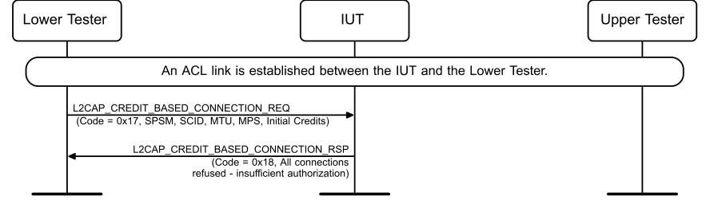

**Figure 4.193: Security – Insufficient Authentication – Responder, LE**

1. The Lower Tester sends an L2CAP Credit Based Connection Request (Code = 0x17) on the
SPSM specified in the initial conditions which requires authentication. 2. The IUT detects either there was no LTK or LTK with insufficient security level and sends an
L2CAP Credit Based Connection Response (Code = 0x18), rejecting the connection request with error code “All connections refused – insufficient authentication”.
• Expected Outcome
Pass verdict
Upon reception of an L2CAP Credit Based Connection Request from the Lower Tester which fails to satisfy the authentication requirements, the IUT sends a correctly formatted L2CAP Credit Based Connection Response with Result 0x0005 (“All connections refused – insufficient authentication”) to the Lower Tester.

##### 4.15.1.9 Security – Insufficient Encryption Key Size – Initiator

• Test Purpose
Verify that the IUT does not establish any channel upon receipt of an L2CAP Credit Based Connection Response indicating the connections were refused with Result 0x0007 (“All connections refused – insufficient encryption key size”).
• Reference
[13] 4.25
• Initial Condition
- The signaling channel specified in Table 4.25 is used.
- An SPSM for the Enhanced Credit Based Flow Control channel is declared via IXIT.
- The Upper Tester can command the IUT to create a credit based channel on the SPSM declared via IXIT.
- Either an Unauthenticated or Authenticated LTK exists between the IUT and the Lower Tester.
• Test Case Configuration

|  | Test Case ID |  |  | Signaling Channel |  |
| --- | --- | --- | --- | --- | --- |
| L2CAP/ECFC/BV-14-C [Security – Insufficient Encryption Key Size – Initiator, LE] |  |  | 0x0005 |  |  |
| L2CAP/ECFC/BV-52-C [Security – Insufficient Encryption Key Size – Initiator, BR/EDR] |  |  | 0x0001 |  |  |

Table 4.25: Security – Insufficient Encryption Key Size – Initiator test cases
• Test Procedure

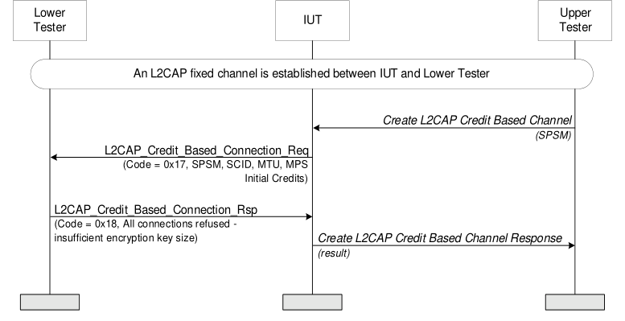

**Figure 4.194: Security – Insufficient Encryption Key Size – Initiator**

1. The Upper Tester commands the IUT to send a connection request. 2. The IUT sends an L2CAP Credit Based Connection Request (Code = 0x17). 3. The Lower Tester sends an L2CAP Credit Based Connection Response (Code = 0x18) with
result 0x0007 (“All connections refused - insufficient encryption key size"), refusing the connection request.
• Expected Outcome
Pass verdict
The IUT informs the Upper Tester about the rejection.

##### 4.15.1.10 L2CAP Credit Based Connection Response – refused due to insufficient resources

• Test Purpose
Verify that an IUT receiving an L2CAP Credit Based Connection Request for several channels refuses the connections for which it doesn’t have sufficient resources with result 0x0004 (“Some connections refused – insufficient resources available").
• Reference
[13] 4.25
• Initial Condition
- An SPSM for the Enhanced Credit Based Flow Control channel is declared via IXIT.
- An IXIT statement gives the maximum number of L2CAP channels for the SPSM declared via IXIT that the IUT supports.
- The signaling channel specified in Table 4.26 is used.
- A number of LE or BR/EDR Data Channels are established on the SPSM declared via IXIT, such that this number is less than the maximum number previously stated in the IXIT, with at most 4.
• Test Case Configuration

|  | Test Case ID |  | Signaling Channel |  |
| --- | --- | --- | --- | --- |
| L2CAP/ECFC/BV-17-C [L2CAP Credit Based Connection Response – refused due to insufficient resources, LE] |  | 0x0005 |  |  |
| L2CAP/ECFC/BV-53-C [L2CAP Credit Based Connection Response – refused due to insufficient resources, BR/EDR] |  | 0x0001 |  |  |

Table 4.26: L2CAP Credit Based Connection Response – refused due to insufficient resources test cases
• Test Procedure

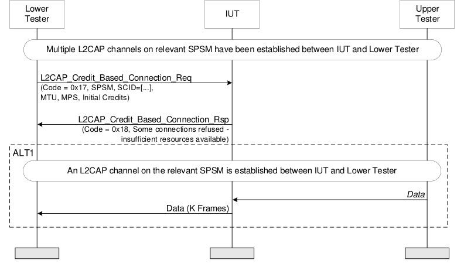

**Figure 4.195: L2CAP Credit Based Connection Response – refused due to insufficient resources**

1. The Lower Tester sends an L2CAP Credit Based Connection Request on different CIDs than the
existing ones, to reach the maximum number of channels + 1. 2. Either the IUT establishes the new channels, up to the maximum supported, and sends a
correctly formatted L2CAP Credit Based Connection Response to the Lower Tester with Result 0x0004 (“Some connections refused – insufficient resources available”) as in ALT 1, or if the IUT can support the maximum number of channels, then according to ALT 2, the new L2CAP channels are established. 3. The IUT sends data on at least one of the newly created channels.
• Expected Outcome
Pass verdict
In step 2, the IUT follows either ALT 1 or ALT 2:
ALT 1: The IUT sends a correctly formatted L2CAP Credit Based Connection Response to the Lower Tester with result 0x0004 (“Some connections refused – insufficient resources available”).
ALT 2: The IUT can establish the maximum number of channels, and the new L2CAP channels are successfully established. The IUT sends a correctly formatted L2CAP Credit Based Connection Response to the Lower Tester with result 0x0000 (“All connections successful”). The IUT sends at least one data packet on one of the newly created channels.

##### 4.15.1.11 L2CAP Credit Based Connection Request – refused due to Invalid Source CID

• Test Purpose
Verify that an IUT sending an L2CAP Credit Based Connection Request does not establish some of the requested channels upon receiving an L2CAP Credit Based Connection Response refusing the connections with result 0x0009 (“Some connections refused – Invalid Source CID").
• Reference
[13] 4.25
• Initial Condition
- The signaling channel specified in Table 4.27 is used.
- An SPSM for the Enhanced Credit Based Flow Control channel is declared via IXIT.
- The Upper Tester can command the IUT to create a credit based channel on the SPSM declared via IXIT.
• Test Case Configuration

|  | Test Case ID |  |  | Signaling Channel |  |
| --- | --- | --- | --- | --- | --- |
| L2CAP/ECFC/BV-18-C [L2CAP Credit Based Connection Request – refused due to Invalid Source CID, LE] |  |  | 0x0005 |  |  |
| L2CAP/ECFC/BV-54-C [L2CAP Credit Based Connection Request – refused due to Invalid Source CID, BR/EDR] |  |  | 0x0001 |  |  |

Table 4.27: L2CAP Credit Based Connection Request – refused due to Invalid Source CID test cases
• Test Procedure

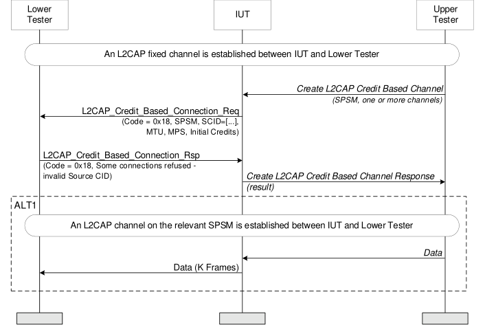

**Figure 4.196: L2CAP Credit Based Connection Request – refused due to Invalid Source CID**

1. The Upper Tester commands the IUT to send a connection request. 2. The IUT sends an L2CAP Credit Based Connection Request (Code = 0x17).
result 0x0009 (“Some connections refused - invalid Source CID”), refusing the connection request. 4. (ALT1) If the connection request was performed with more than one SCID and some of the
channels were created, the Upper Tester commands the IUT to send data on the accepted CIDs.
• Expected Outcome
Pass verdict
The IUT informs the Upper Tester that some connections were refused.
(ALT1) The data sent by the IUT in step 3 must be the same as that received by the Lower Tester.
The IUT does not send any data to the Lower Tester on the refused CID(s).

##### 4.15.1.12 L2CAP Credit Based Connection Request – refused due to Source CID already allocated

• Test Purpose
Verify that an IUT sending an L2CAP Credit Based Connection Request does not establish some of the requested channels upon receiving an L2CAP Credit Based Connection Response refusing some of the connections with result 0x000A (“Some connections refused – Source CID already allocated").
• Reference
[13] 4.25
• Initial Condition
- The signaling channel specified in Table 4.28 is used.
- An SPSM for the Enhanced Credit Based Flow Control channel is declared via IXIT.
- The Upper Tester can command the IUT to create a credit based channel on the SPSM declared via IXIT.
• Test Case Configuration

|  | Test Case ID |  |  | Signaling Channel |  |
| --- | --- | --- | --- | --- | --- |
| L2CAP/ECFC/BV-19-C [L2CAP Credit Based Connection Request – refused due to Source CID already allocated, LE] |  |  | 0x0005 |  |  |
| L2CAP/ECFC/BV-55-C [L2CAP Credit Based Connection Request – refused due to Source CID already allocated, BR/EDR] |  |  | 0x0001 |  |  |

Table 4.28: L2CAP Credit Based Connection Request – refused due to Source CID already allocated test cases
• Test Procedure

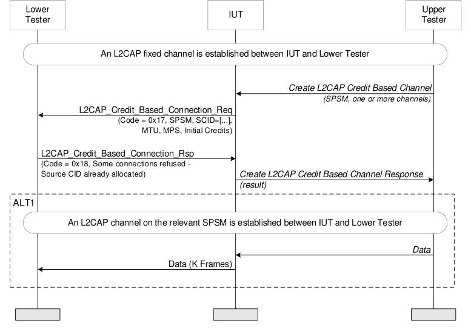

**Figure 4.197: L2CAP Credit Based Connection Request – refused due to Source CID already allocated**

1. The Upper Tester commands the IUT to send a connection request. 2. The IUT sends an L2CAP Credit Based Connection Request (Code = 0x17). 3. The Lower Tester sends an L2CAP Credit Based Connection Response (Code = 0x18) with
result 0x000A (“Some connections refused – Source CID already allocated”), refusing the connection request. 4. (ALT1) If the connection request was performed with more than one SCID and some of the
channels were created, the Upper Tester commands the IUT to send data on the accepted CIDs.
• Expected Outcome
Pass verdict
The IUT informs the Upper Tester that the connection was refused.
(ALT1) The data send by the IUT in step 3 must be the same as that received by the Lower Tester.
The IUT does not send any data to the Lower Tester on the refused CID(s).

##### 4.15.1.13 L2CAP Credit Based Connection Response – refused due to Source CID already allocated

• Test Purpose
Verify that an IUT receiving an L2CAP Credit Based Connection Request for several channels refuses some of the connections with result 0x000A (“Some connections refused – Source CID already allocated”) if it receives a Source CID which is already in use.
• Reference
[13] 4.25
• Initial Condition
- The signaling channel specified in Table 4.29 is used.
- An SPSM for the Enhanced Credit Based Flow Control channel is declared via IXIT.
- One LE or BR/EDR Data channel is established on the SPSM declared via IXIT.
• Test Case Configuration

|  | Test Case ID |  |  | Signaling Channel |  |
| --- | --- | --- | --- | --- | --- |
| L2CAP/ECFC/BV-20-C [L2CAP Credit Based Connection Response – refused due to Source CID already allocated, LE] |  |  | 0x0005 |  |  |
| L2CAP/ECFC/BV-56-C [L2CAP Credit Based Connection Response – refused due to Source CID already allocated, BR/EDR] |  |  | 0x0001 |  |  |

Table 4.29: L2CAP Credit Based Connection Response – refused due to Source CID already allocated test cases
• Test Procedure

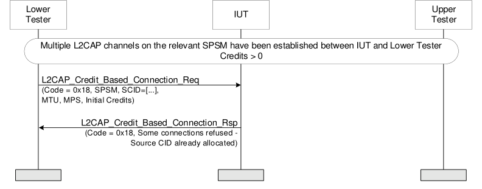

**Figure 4.198: L2CAP Credit Based Connection Response – refused due to Source CID already allocated**

1. The Lower Tester sends an L2CAP Credit Based Connection Request (Code = 0x17) using the
same CID as the previously established channel. 2. The IUT sends an L2CAP Credit Based Connection Response (Code = 0x18) to the Lower Tester
with result 0x000A (“Some connections refused – Source CID already allocated”).
• Expected Outcome
Pass verdict
The IUT sends a correctly formatted L2CAP Credit Based Connection Response to the Lower Tester with result 0x000A (“Some connections refused – Source CID already allocated”).

##### 4.15.1.14 L2CAP Credit Based Connection Request – refused due to Unacceptable Parameters

• Test Purpose
Verify that an IUT sending an L2CAP Credit Based Connection Request does not establish any channel upon receiving an L2CAP Credit Based Connection Response refusing the connections with result 0x000B (“All connections refused – unacceptable parameters”).
• Reference
[13] 4.25
• Initial Condition
- The signaling channel specified in Table 4.30 is used.
- An SPSM for the Enhanced Credit Based Flow Control channel is declared via IXIT.
- The Upper Tester can command the IUT to create a credit based channel on the SPSM declared via IXIT.
• Test Case Configuration

|  | Test Case ID |  |  | Signaling Channel |  |
| --- | --- | --- | --- | --- | --- |
| L2CAP/ECFC/BV-21-C [L2CAP Credit Based Connection Request – refused due to Unacceptable Parameters, LE] |  |  | 0x0005 |  |  |
| L2CAP/ECFC/BV-57-C [L2CAP Credit Based Connection Request – refused due to Unacceptable Parameters, BR/EDR] |  |  | 0x0001 |  |  |

Table 4.30: L2CAP Credit Based Connection Request – refused due to Unacceptable Parameters test cases
• Test Procedure

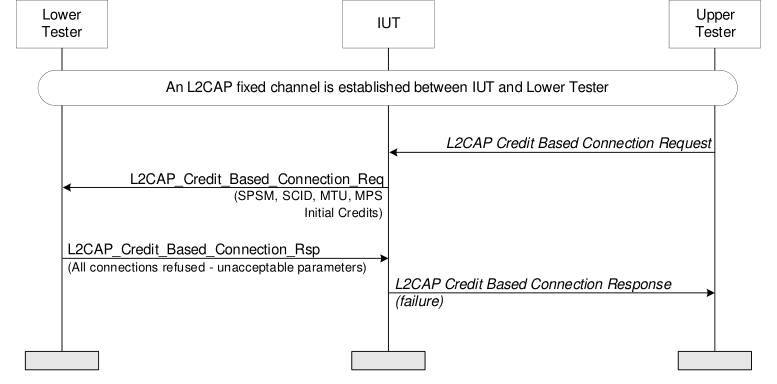

**Figure 4.199: L2CAP Credit Based Connection Request – refused due to Unacceptable Parameters**

1. The Upper Tester commands the IUT to send a connection request. 2. The IUT sends an L2CAP Credit Based Connection Request (Code = 0x17). 3. The Lower Tester sends an L2CAP Credit Based Connection Response (Code = 0x18) with
result 0x000B (“All connections refused – unacceptable parameters”), refusing the connection request.
• Expected Outcome
Pass verdict
The IUT informs the Upper Tester that the connection was refused.
• Test Purpose
Verify that the IUT sending an L2CAP Credit Based Reconfigure Request can reconfigure the Maximum Transmission Unit (MTU) for the indicated channels, being able to receive larger SDUs.
• Reference
[13] 4.27
• Initial Condition
- The maximum supported MTU size is defined by the TSPX_l2ca_cbmtu_max IXIT entry.
- The minimum supported MTU size is defined by the TSPX_l2ca_cbmtu_min IXIT entry.
- The signaling channel specified in Table 4.31 is used.
- An SPSM for the Enhanced Credit Based Flow Control channel is declared via IXIT.
• Test Case Configuration

|  | Test Case ID |  |  | Signaling Channel |  |
| --- | --- | --- | --- | --- | --- |
| L2CAP/ECFC/BV-22-C [Renegotiate MTU – Initiator, LE] |  |  | 0x0005 |  |  |
| L2CAP/ECFC/BV-58-C [Renegotiate MTU – Initiator, BR/EDR] |  |  | 0x0001 |  |  |

Table 4.31: Renegotiate MTU – Initiator test cases
• Test Procedure

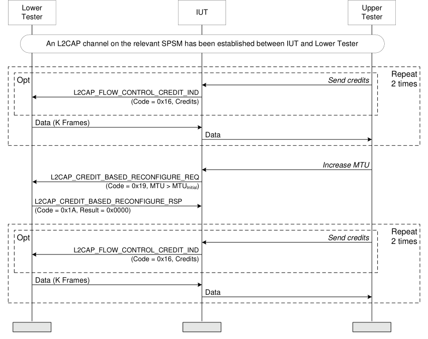

**Figure 4.200: Renegotiate MTU – Initiator**

1. If the minimum supported MTU size equals the maximum supported MTU size or the current MTU
size equals the maximum supported MTU size, the test ends with a Pass verdict. 2. The Lower Tester continuously transmits SDUs of a size that the MTU negotiated at channel
initialization, at a minimum rate of two packets per second, over the L2CAP channel. Transmit at least 2 SDUs. 3. The Upper Tester commands the IUT to increase the MTU size for the opened channel. 4. The IUT sends an L2CAP_CREDIT_BASED_RECONFIGURE_REQ (Code = 0x19) packet to the
Lower Tester, with the MTU field greater than the one in the initial configuration of the channel. 5. The Lower Tester sends an L2CAP_CREDIT_BASED_RECONFIGURE_RSP (Code = 0x1A)
packet to the IUT, with the Result field equal to 0x0000 (Reconfiguration successful). 6. The Lower Tester transmits SDUs of a size equal to the MTU in step 3 to the IUT. Transmit at
least 2 SDUs.
• Expected Outcome
Pass verdict
Complete SDUs are sent to the Upper Tester, for steps 3 and 6.

##### 4.15.1.16 Renegotiate MTU – Responder

• Test Purpose
Verify that the IUT receiving an L2CAP Credit Based Reconfigure Request can reconfigure the Maximum Transmission Unit (MTU) for an indicated channel, being able to send larger SDUs.
• Reference
[13] 4.28
• Initial Condition
- The maximum supported MTU size is defined by the TSPX_l2ca_cbmtu_max IXIT entry.
- The minimum supported MTU size is defined by the TSPX_l2ca_cbmtu_min IXIT entry.
- The role of the IUT is indicated in the IXIT.
- The signaling channel specified in Table 4.32 is used.
- An SPSM for the Enhanced Credit Based Flow Control channel is declared via IXIT.
- The Lower Tester’s initial MTU is equal to the IUT’s minimum MTU size from IXIT.
• Test Case Configuration

|  | Test Case ID |  |  | Signaling Channel |  |
| --- | --- | --- | --- | --- | --- |
| L2CAP/ECFC/BV-23-C [Renegotiate MTU – Responder, LE] |  |  | 0x0005 |  |  |
| L2CAP/ECFC/BV-59-C [Renegotiate MTU – Responder, BR/EDR] |  |  | 0x0001 |  |  |

Table 4.32: Renegotiate MTU – Responder test cases
• Test Procedure

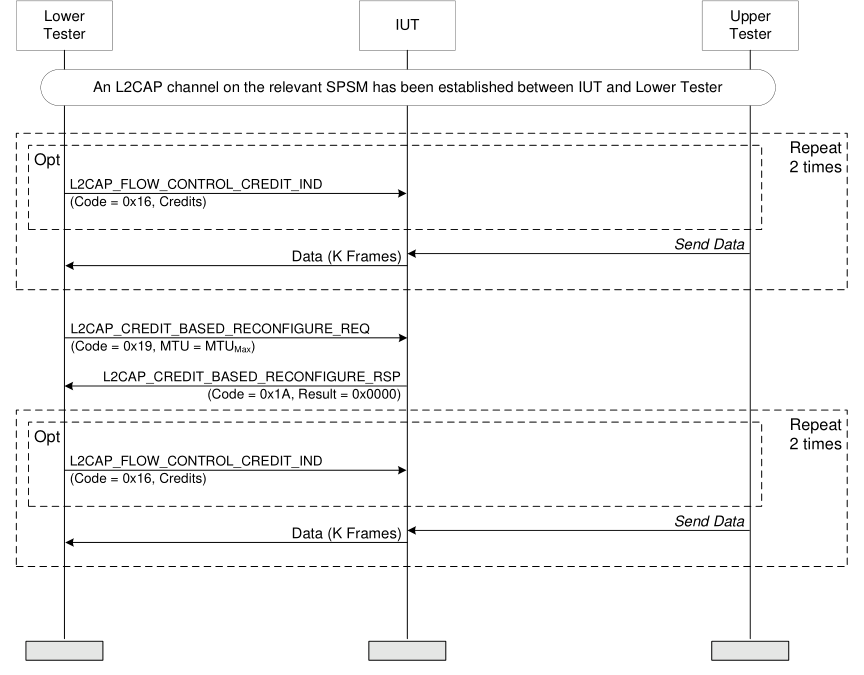

**Figure 4.201: Renegotiate MTU – Responder**

size equals the maximum supported MTU size, the test ends with a Pass verdict. 2. The Upper Tester commands the IUT to continuously transmit SDUs of a size equal to the MTU
negotiated at channel initialization over the L2CAP channel at a minimum rate of two packets per second. Transmit at least 2 SDUs. 3. The Lower Tester sends an L2CAP_CREDIT_BASED_RECONFIGURE_REQ (Code = 0x19)
packet to the IUT, with the MTU field set to the IUT’s maximum MTU size from IXIT. 4. The IUT sends an L2CAP_CREDIT_BASED_RECONFIGURE_RSP (Code = 0x1A) packet to the
Lower Tester, with the Result field equal to 0x0000 (Reconfiguration successful). 5. The Upper Tester commands the IUT to transmit SDUs of a size equal to the MTU in step 3 to the
Lower Tester. Transmit at least 2 SDUs.
• Expected Outcome
Pass verdict
Complete SDUs are sent to the Upper Tester, for steps 2 and 5.

##### 4.15.1.17 Renegotiate MTU – MTU value is decreased

• Test Purpose
Verify that the IUT refuses the MTU reconfiguration request for a Data Channel created through Enhanced Credit Based Flow Control Mode when receiving an L2CAP Credit Based Reconfigure Request with a lower MTU value than the existing one.
• Reference
[13] 4.27
• Initial Condition
- The signaling channel specified in Table 4.33 is used.
- An SPSM for the Enhanced Credit Based Flow Control channel is declared via IXIT.
- An LE or BR/EDR Data Channel is established on the SPSM declared via IXIT, with the MTU on the Lower Tester side of at least 65 octets.
• Test Case Configuration

|  | Test Case ID |  |  | Signaling Channel |  |
| --- | --- | --- | --- | --- | --- |
| L2CAP/ECFC/BI-03-C [Renegotiate MTU – MTU value is decreased, LE] |  |  | 0x0005 |  |  |
| L2CAP/ECFC/BI-12-C [Renegotiate MTU – MTU value is decreased, BR/EDR] |  |  | 0x0001 |  |  |

Table 4.33: Renegotiate MTU – MTU value is decreased test cases
• Test Procedure

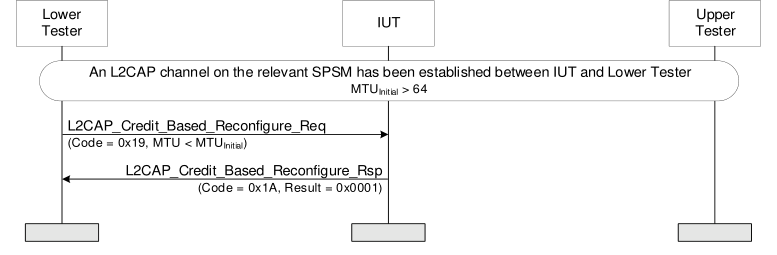

**Figure 4.202: Renegotiate MTU – MTU value is decreased**

1. The Lower Tester sends an L2CAP Credit Based Reconfigure Request (Code = 0x19) packet to
the IUT, with the MTU field lower than the one in the channel initial configuration. 2. The IUT does not disconnect the channel. The IUT sends an L2CAP Credit Based Reconfigure
Response (Code = 0x1A) packet to the Lower Tester, with the Result field equal to 0x0001 (Reconfiguration failed - reduction in size of MTU not allowed).
• Expected Outcome
Pass verdict
In step 2, the IUT sends a correctly formatted L2CAP Credit Based Reconfigure Response packet, with Result = 0x0001 (Reconfiguration failed - reduction in size of MTU not allowed).

##### 4.15.1.18 Renegotiate MPS – Initiator

• Test Purpose
Verify that the IUT sending an L2CAP Credit Based Reconfigure Request can receive differently sized L2CAP PDUs on the indicated channels.
• Reference
[13] 4.27
• Initial Condition
- The signaling channel specified in Table 4.34 is used.
- An SPSM for the Enhanced Credit Based Flow Control channel is declared via IXIT.
- The minimum supported IUT MPS size is defined by the TSPX_l2ca_cbmps_min IXIT entry.
- The maximum supported IUT MPS size is defined by the TSPX_l2ca_cbmps_max IXIT entry.
• Test Case Configuration

|  | Test Case ID |  |  | Signaling Channel |  |
| --- | --- | --- | --- | --- | --- |
| L2CAP/ECFC/BV-24-C [Renegotiate MPS – Initiator, LE] |  |  | 0x0005 |  |  |
| L2CAP/ECFC/BV-60-C [Renegotiate MPS – Initiator, BR/EDR] |  |  | 0x0001 |  |  |

Table 4.34: Renegotiate MPS – Initiator test cases
• Test Procedure

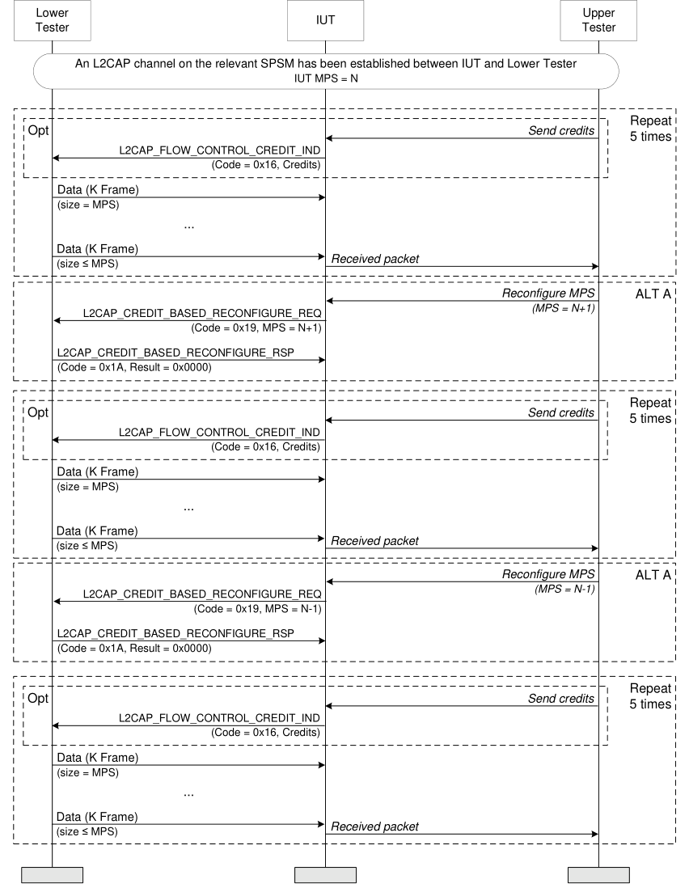

**Figure 4.203: Renegotiate MPS – Initiator**

1. If TSPX_l2ca_cbmps_min equals TSPX_l2ca_cbmps_max, the test ends with a Pass verdict. 2. The IUT configures a value N for the MPS. If TSPX_l2ca_cbmps_max equals
TSPX_l2ca_cbmps_min plus 1, then N equals TSPX_l2ca_cbmps_min. Otherwise, N is greater than TSPX_l2ca_cbmps_min and lower than TSPX_l2ca_cbmps_max. The Lower Tester chooses, for the remaining steps, an SDU size that ensures that the Lower Tester performs segmentation.
second, segmented into data packets with payload of size N over the L2CAP channel. Transmit at least 5 SDUs. 4. The IUT sends an L2CAP Credit Based Reconfigure Request (Code = 0x19) packet to the Lower
Tester, with MPS = N + 1 bytes. 5. The Lower Tester sends an L2CAP Credit Based Reconfigure Response (Code = 0x1A) packet
to the IUT, with the Result field equal to 0x0000 (Reconfiguration successful). 6. The Lower Tester transmits SDUs (SDU size in step 2), segmented into data packets with
payload of size N + 1 to the IUT. Transmit at least 5 SDUs. If N = TSPX_l2ca_cbmps_min, skip to step 9. 7. The IUT sends an L2CAP_CREDIT_BASED_RECONFIGURE_REQ packet to the Lower Tester,
with MPS = N – 1 bytes. 8. The Lower Tester sends an L2CAP_CREDIT_BASED_RECONFIGURE_RSP packet to the IUT,
with the Result field equal to 0x0000 (Reconfiguration successful). 9. The Lower Tester transmits SDUs (SDU size in step 2), segmented into data packets with
payload of size N – 1 to the IUT. Transmit at least 5 SDUs.
• Expected Outcome
Pass verdict
Complete SDUs are sent to the Upper Tester in steps 3, 6, and 9.

##### 4.15.1.19 Renegotiate MPS – Responder

• Test Purpose
Verify that the IUT receiving an L2CAP Credit Based Reconfigure Request can send differently sized L2CAP PDUs on the indicated channel.
• Reference
[13] 4.28
• Initial Condition
- The minimum supported IUT MPS size is defined by the TSPX_l2ca_cbmps_min IXIT entry.
- The maximum supported IUT MPS size is defined by the TSPX_l2ca_cbmps_max IXIT entry.
- The signaling channel specified in Table 4.35 is used.
- An SPSM for the Enhanced Credit Based Flow Control channel is declared via IXIT.
- The Lower Tester’s initial MTU is equal to the IUT’s maximum MTU size from IXIT.
- The Lower Tester has configured a value N for the MPS, higher than TSPX_l2ca_cbmps_min and lower than TSPX_l2ca_cbmps_max, and the IUT chooses for transmitting an SDU size that, along with N, ensures that the IUT performs segmentation unless the IUT’s max SDU size is the same as the MPS size.
• Test Case Configuration

|  | Test Case ID |  |  | Signaling Channel |  |
| --- | --- | --- | --- | --- | --- |
| L2CAP/ECFC/BV-25-C [Renegotiate MPS – Responder, LE] |  |  | 0x0005 |  |  |
| L2CAP/ECFC/BV-61-C [Renegotiate MPS – Responder, BR/EDR] |  |  | 0x0001 |  |  |

Table 4.35: Renegotiate MPS – Responder test cases
• Test Procedure

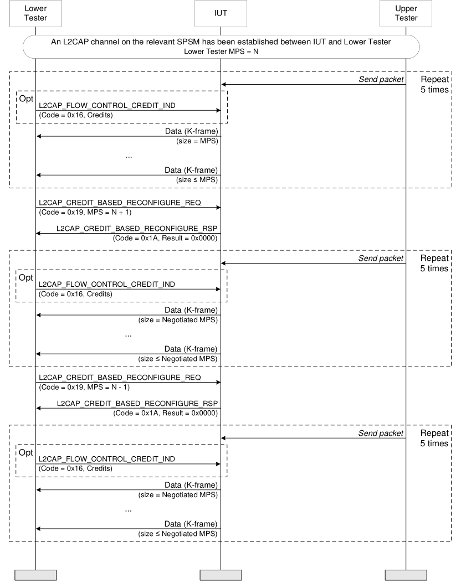

**Figure 4.204: Renegotiate MPS – Responder**

1. If the minimum supported MPS size equals TSPX_l2ca_cbmps_max, the test ends with a Pass
verdict. 2. If the MTU size equals MPS size, the test ends with a Pass verdict. 3. The Upper Tester commands the IUT to continuously transmits data packets (SDU size in Initial
Condition) over the L2CAP channel at a minimum rate of 2 packets per second. Transmit at least 5 SDUs.
MPS). 5. The Lower Tester sends an L2CAP_CREDIT_BASED_RECONFIGURE_REQ (Code = 0x19)
packet to the IUT, with MPS = N + 1. 6. The IUT sends an L2CAP_CREDIT_BASED_RECONFIGURE_RSP (Code = 0x1A) packet to the
Lower Tester, with the Result field equal to 0x0000 (Reconfiguration successful). 7. The Upper Tester commands the IUT to transmit data packets (SDU size in Initial Condition) to
the Lower Tester. Transmit at least 5 SDUs. 8. The IUT performs segmentation and transmit K-frames with payload equal to N+1 unless N+1
exceeds TSPX_l2ca_cbmps_max from IXIT. If N = TSPX_l2ca_cbmps_min, then the test ends with a Pass verdict. 9. The Lower Tester sends an L2CAP_CREDIT_BASED_RECONFIGURE_REQ packet to the IUT,
with MPS = N – 1 bytes. 10. The IUT sends an L2CAP_CREDIT_BASED_RECONFIGURE_RSP packet to the Lower Tester,
with the Result field equal to 0x0000 (Reconfiguration successful). 11. The Upper Tester commands the IUT to transmit data packets (SDU size in Initial Condition) to
the Lower Tester. Transmit at least 5 SDUs. 12. The IUT performs segmentation and transmit K-frames with payload equal to N – 1 unless N – 1
is lower than TSPX_l2ca_cbmps_min.
• Expected Outcome
Pass verdict
For each of the steps 3, 8, and 12, the IUT segments the SDUs to a length no greater than the previously negotiated MPS size and send correct frames to the Lower Tester.

##### 4.15.1.20 Renegotiate MPS – MPS value is decreased

• Test Purpose
Verify that the IUT refuses the MPS reconfiguration request for multiple Data Channels created through Enhanced Credit Based Flow Control Mode, when receiving an L2CAP Credit Based Reconfigure Request with lower MPS value than the existing one for multiple channels and when receiving an L2CAP Credit Based Reconfigure Request with an MPS value between other existing MPS values for multiple channels.
• Reference
[15] 4.27
• Initial Condition
- An IXIT statement gives the minimum and maximum supported IUT MPS size.
- The signaling channel specified in Table 4.36 is used.
- An SPSM for the Credit Based Flow Control channel is declared via IXIT.
• Test Case Configuration

|  | Test Case ID |  |  | Signaling Channel |  |
| --- | --- | --- | --- | --- | --- |
| L2CAP/ECFC/BI-04-C [Renegotiate MPS – MPS value is decreased, LE] |  |  | 0x0005 |  |  |
| L2CAP/ECFC/BI-13-C [Renegotiate MPS – MPS value is decreased, BR/EDR] |  |  | 0x0001 |  |  |

Table 4.36: Renegotiate MPS – MPS value is decreased test cases
• Test Procedure

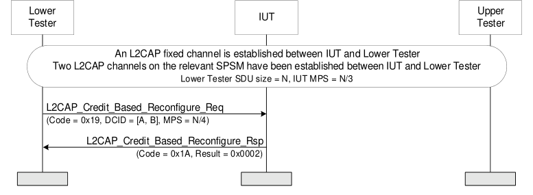

**Figure 4.205: Renegotiate MPS – MPS value is decreased**

1. The Lower Tester sends an L2CAP Credit Based Reconfigure Request packet to the IUT, with
Destination CID containing the list of CIDs of the opened channels and with a lower MPS value (in octets) than what was negotiated in the channel’s establishment. The lower MPS value must be at least 1 octet lower than the previous value. 2. The IUT sends an L2CAP Credit Based Reconfigure Response (Code = 0x1A) packet to the
Lower Tester, with the Result field equal to 0x0002 (Reconfiguration failed - reduction in size of MPS not allowed for more than one channel at a time). The IUT does not disconnect any of the channels requested in step 1. 3. The Lower Tester sends an L2CAP Credit Based Reconfigure Request packet to the IUT, with
Destination CID containing the list of CIDs of the opened channels and with an MPS value (in octets) that is between the minimum MPS value of the Destination CIDs and the maximum MPS value of the Destination CIDs that were negotiated for in each of the channels established. 4. The IUT sends an L2CAP Credit Based Reconfigure Response (Code = 0x1A) packet to the
Lower Tester, with the Result field set to any valid error code. The IUT does not disconnect any of the channels requested in step 3.
• Expected Outcome
Pass verdict
In step 2, the IUT sends a correctly formatted L2CAP Credit Based Reconfigure Response packet, with Result = 0x0002 (Reconfiguration failed - reduction in size of MPS not allowed for more than one channel at a time).
In step 4, the IUT sends a correctly formatted L2CAP Credit Based Reconfigure Response packet, with Result set to any valid error code.

##### 4.15.1.21 L2CAP Credit Based Connection Response – refused due to Invalid Parameters

• Test Purpose
Verify that an IUT does not establish any of the requested channels upon receiving an L2CAP Credit Based Connection Request containing a parameter with a value outside specifications and responds with result 0x000C (“All connections refused – invalid parameters”).
• Reference
[13] 4.26
• Initial Condition
- The signaling channel specified in Table 4.37 is used.
- An SPSM for the Enhanced Credit Based Flow Control channel is declared via IXIT.
• Test Case Configuration

|  | Test Case ID |  |  | Signaling Channel |  |
| --- | --- | --- | --- | --- | --- |
| L2CAP/ECFC/BV-26-C [L2CAP Credit Based Connection Response – refused due to Invalid Parameters, LE] |  |  | 0x0005 |  |  |
| L2CAP/ECFC/BV-62-C [L2CAP Credit Based Connection Response – refused due to Invalid Parameters, BR/EDR] |  |  | 0x0001 |  |  |

Table 4.37: L2CAP Credit Based Connection Response – refused due to Invalid Parameters test cases
• Test Procedure

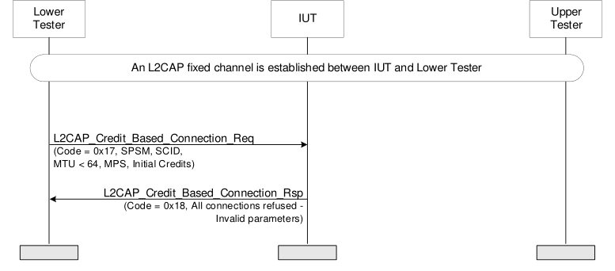

**Figure 4.206: L2CAP Credit Based Connection Response – refused due to Invalid Parameters**

1. The Lower Tester sends an L2CAP Credit Based Connection Request (Code = 0x17) with the
SPSM declared via IXIT and an MTU value less than 64. 2. The IUT rejects the connection request sending an L2CAP Credit Based Connection Response
(Code = 0x18) to the Lower Tester with Result 0x000C (“All connections refused – invalid parameters”).
• Expected Outcome
Pass verdict
In step 2, the IUT sends a correctly formatted L2CAP Credit Based Connection Response to the Lower Tester with result 0x000C (“All connections refused – Invalid parameters”).

##### 4.15.1.22 L2CAP Credit Based Connection Response – refused due to Unacceptable Parameters

• Test Purpose
Verify that an IUT does not establish any of the requested channels upon receiving an L2CAP Credit Based Connection Request containing a parameter with a value unacceptable for the Host and responds with result 0x000B (“All connections refused – unacceptable parameters”).
• Reference
[13] 4.26
• Initial Condition
- TSPX_l2ca_cbmtu_min in the IXIT statement [3] is used to give the minimum peer MTU size that the IUT can accept on L2CAP Credit Based channels. The IXIT entry TSPX_l2ca_cbmtu_min should not be set to 64 if the IUT can accept peer MTU size larger than 64 octets for Credit Based Connection Requests.
- The signaling channel specified in Table 4.38 is used.
- An SPSM for the Enhanced Credit Based Flow Control channel is declared via IXIT.
• Test Case Configuration

|  | Test Case ID |  |  | Signaling Channel |  |
| --- | --- | --- | --- | --- | --- |
| L2CAP/ECFC/BV-27-C [L2CAP Credit Based Connection Response – refused due to Unacceptable Parameters, LE] |  |  | 0x0005 |  |  |
| L2CAP/ECFC/BV-63-C [L2CAP Credit Based Connection Response – refused due to Unacceptable Parameters, BR/EDR] |  |  | 0x0001 |  |  |

Table 4.38: L2CAP Credit Based Connection Response – refused due to Unacceptable Parameters test cases
• Test Procedure

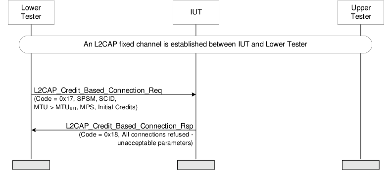

**Figure 4.207: L2CAP Credit Based Connection Response – refused due to Unacceptable Parameters**

1. Perform alternative 1A or 1B depending on TSPX_l2ca_cbmtu_min.
Alternative 1A (TSPX_l2ca_cbmtu_min is greater than 64):
1A.1. The Lower Tester sends an L2CAP Credit Based Connection Request (Code = 0x17) with the SPSM declared via IXIT and an MTU value lower than TSPX_l2ca_cbmtu_min. 1A.2. The IUT rejects the connection request sending an L2CAP Credit Based Connection Response (Code = 0x18) to the Lower Tester with Result 0x000B (“All connections refused – unacceptable parameters”).
Alternative 1B (TSPX_l2ca_cbmtu_min is 64):
1B.1. The Lower Tester sends an L2CAP Credit Based Connection Request (Code = 0x17) with the SPSM declared via IXIT and an MTU value equal to 64. 1B.2. The channel is successfully established.
• Expected Outcome
Pass verdict
In step 1A.2, the IUT sends a correctly formatted L2CAP Credit Based Connection Response to the Lower Tester with result 0x000B (“All connections refused – unacceptable parameters”).
In step 1B.2, the channel is successfully established. The IUT sends a correctly formatted L2CAP Credit Based Connection Response to the Lower Tester with result 0x0000 (“All connections successful”).

##### 4.15.1.23 Reconfigure – refused due to invalid Destination CID

• Test Purpose
Verify that the IUT refuses a reconfiguration request for a Data Channel created through Enhanced Credit Based Flow Control Mode, when receiving an L2CAP Credit Based Reconfigure Request with invalid Destination CID.
• Reference
[13] 4.27
• Initial Condition
- An IXIT statement gives the minimum and maximum supported IUT MPS size.
- The signaling channel specified in Table 4.39 is used.
- An SPSM for the Credit Based Flow Control channel is declared via IXIT.
• Test Case Configuration

|  | Test Case ID |  |  | Signaling Channel |  |
| --- | --- | --- | --- | --- | --- |
| L2CAP/ECFC/BI-05-C [Reconfigure – refused due to invalid Destination CID, LE] |  |  | 0x0005 |  |  |
| L2CAP/ECFC/BI-14-C [Reconfigure – refused due to invalid Destination CID, BR/EDR] |  |  | 0x0001 |  |  |

Table 4.39: Reconfigure – refused due to invalid Destination CID test cases
• Test Procedure

**Figure 4.208: Reconfigure – refused due to invalid Destination CID**

Destination CID containing one invalid CID and with valid MPS. 2. The IUT sends an L2CAP Credit Based Reconfigure Response (Code = 0x1A) packet to the
Lower Tester, with the Result field equal to 0x0003 (Reconfiguration failed – one or more Destination CIDs invalid).
• Expected Outcome
Pass verdict
In step 2, the IUT sends a correctly formatted L2CAP Credit Based Reconfigure Response packet, with Result = 0x0003 (Reconfiguration failed – one or more Destination CIDs invalid).

##### 4.15.1.24 Reconfigure – other unacceptable parameters

• Test Purpose
Verify that the IUT refuses the MPS reconfiguration request for a Data Channel created through Enhanced Credit Based Flow Control Mode, when receiving an L2CAP Credit Based Reconfigure Request with an unacceptable MPS value.
• Reference
[13] 4.28
• Initial Condition
- An IXIT statement gives the minimum supported IUT MPS size.
- The signaling channel specified in Table 4.40 is used.
- An SPSM for the Credit Based Flow Control channel is declared via IXIT.
• Test Case Configuration

|  | Test Case ID |  |  | Signaling Channel |  |
| --- | --- | --- | --- | --- | --- |
| L2CAP/ECFC/BI-06-C [Reconfigure – other unacceptable parameters, LE] |  |  | 0x0005 |  |  |
| L2CAP/ECFC/BI-15-C [Reconfigure – other unacceptable parameters, BR/EDR] |  |  | 0x0001 |  |  |

Table 4.40: Reconfigure – other unacceptable parameters test cases
• Test Procedure

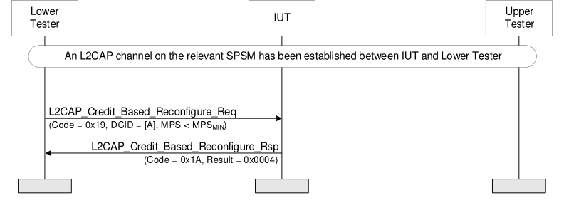

**Figure 4.209: Reconfigure – other unacceptable parameters**

opened channel, with MPS < MPSMIN (minimum supported IUT MPS, as described in the IXIT). 2. The IUT sends an L2CAP Credit Based Reconfigure Response (Code = 0x1A) packet to the
Lower Tester, with the Result field equal to 0x0004 (“Reconfiguration failed – other unacceptable parameters”).
• Expected Outcome
Pass verdict
In step 2, the IUT sends a correctly formatted L2CAP Credit Based Reconfigure Response packet, with Result = 0x0004 (Reconfiguration failed – other unacceptable parameters).

##### 4.15.1.25 L2CAP Credit Based Connection Response – Duplicate DCID

• Test Purpose
Verify that an IUT receiving an L2CAP_CREDIT_BASED_CONNECTION_RSP having a duplicate DCID detects the duplicate DCID and does not continue to use either the original channel or the new channel.
• Reference
[13] 4.26
• Initial Condition
- The signaling channel specified in Table 4.41 is used.
- An SPSM for the Enhanced Credit Based Flow Control channel is declared via IXIT. A Data Channel is established on the SPSM declared via IXIT.
• Test Case Configuration

|  | Test Case ID |  |  | Signaling Channel |  |
| --- | --- | --- | --- | --- | --- |
| L2CAP/ECFC/BV-29-C [L2CAP Credit Based Connection Response – Duplicate DCID, LE] |  |  | 0x0005 |  |  |
| L2CAP/ECFC/BV-64-C [L2CAP Credit Based Connection Response – Duplicate DCID, BR/EDR] |  |  | 0x0001 |  |  |

Table 4.41: L2CAP Credit Based Connection Response – Duplicate DCID test cases
• Test Procedure

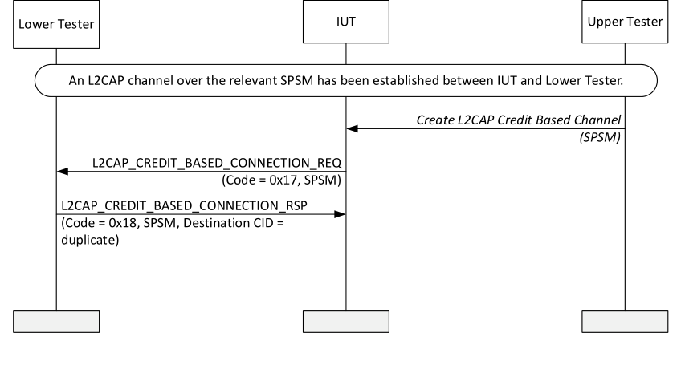

**Figure 4.210: L2CAP Credit Based Connection Response – Duplicate DCID**

1. The Upper Tester commands the IUT to send a connection request on the SPSM declared via
IXIT. 2. The IUT sends an L2CAP_CREDIT_BASED_CONNECTION_REQ (Code = 0x17) to the Lower
Tester. 3. The Lower Tester sends an L2CAP_CREDIT_BASED_CONNECTION_RSP (Code = 0x18)
having a duplicate DCID to the IUT. 4. The IUT detects the duplicate Destination CID and does not continue to use the original channel
or the new channel. If a mechanism is available, the Upper Tester attempts to send data over each channel to verify this.
• Expected Outcome
Pass verdict
The IUT does not continue to use either the original channel or the new channel with the duplicate Destination CID.

##### 4.15.1.26 Renegotiate MPS – MPS value is decreased, Multiple Channels

• Test Purpose
Verify that the IUT refuses the MPS reconfiguration request for multiple Data Channels created through Enhanced Credit Based Flow Control mode when receiving an L2CAP Credit Based Reconfigure Request with an MPS value between other existing MPU values for multiple channels.
• Reference
[15] 4.27
• Initial Condition
- The signaling channel specified in Table 4.42 is used.
- An SPSM for the Enhanced Credit Based Flow Control channel is declared via IXIT.
- A Data Channel is established on the SPSM declared via IXIT, with the MPS on the Lower Tester side of at least 65 octets.
• Test Case Configuration

| Test Case ID |  |  | Signaling Channel |  |
| --- | --- | --- | --- | --- |
| L2CAP/ECFC/BI-07-C [L2CAP Credit Based Connection Response – Duplicate DCID, LE] |  | 0x0005 |  |  |
| L2CAP/ECFC/BI-16-C [L2CAP Credit Based Connection Response – Duplicate DCID, BR/EDR] |  | 0x0001 |  |  |

Table 4.42: L2CAP Credit Based Connection Response – Duplicate DCID test cases
• Test Procedure

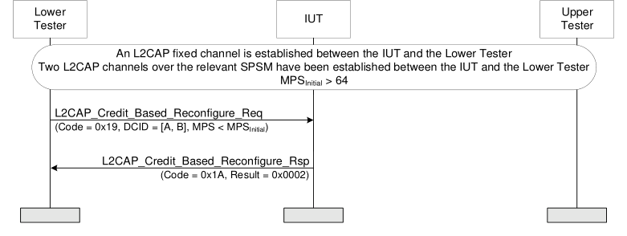

**Figure 4.211: Renegotiate MPS – MPS value is decreased, Multiple Channels**

1. The Lower Tester sends an L2CAP Credit Based Reconfigure Request (Code = 0x19) packet to
the IUT, with Destination CID containing the list of CIDs of the opened channels and with the MPS field value lower than the MPS value for one of the Destination CIDs that was negotiated during initial configuration. 2. The IUT does not disconnect the channel. The IUT sends an L2CAP Credit Based Reconfigure
Response (Code = 0x1A) packet to the Lower Tester, with the Result field equal to 0x0002 (Reconfiguration failed - reduction in size of MPS not allowed for more than one channel at a time).
• Expected Outcome
Pass verdict
In step 2, the IUT sends a correctly formatted L2CAP Credit Based Reconfigure Response packet, with Result = 0x0002 (Reconfiguration failed - reduction in size of MPS not allowed for more than one channel at a time).

#### 4.15.2 LE Credit Based Flow Control Mode

L2CAP/LE/CFC/BV-01-C [LE Credit Based Connection Request - Legacy Peer]
• Test Purpose
Verify that an IUT sending an LE Credit Based Connection Request to a legacy peer and receiving a Command Reject does not establish the channel.
• Reference
[12] 4.22
• Initial Condition
- The appropriate signaling channel for the transport is used.
- An SPSM for the desired LE Credit Based Flow Control based Channel is declared via IXIT.
• Test Procedure

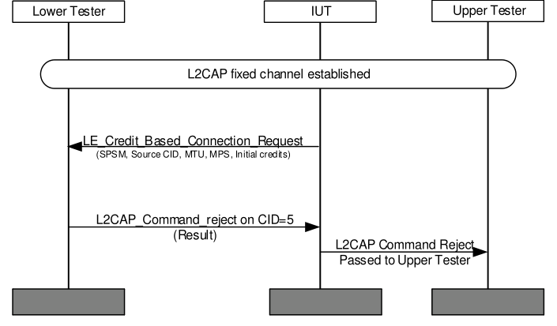

**Figure 4.212: L2CAP/LE/CFC/BV-01-C [LE Credit Based Connection Request - Legacy Peer]**

The IUT sends an LE Credit Based Connection Request on an SPSM indicated in the IXIT.
The Lower Tester responds with a Command Reject.
• Expected Outcome
Pass verdict
After receiving the Command Reject from the Lower Tester, the IUT inform the Upper Tester.
L2CAP/LE/CFC/BV-02-C [LE Credit Based Connection Request on Supported SPSM]
• Test Purpose
Verify that an IUT sending an LE Credit Based Connection Request to a peer establishes the channel upon receiving the LE Credit Based Connection Response.
• Reference
[12] 4.22
• Initial Condition
- The appropriate signaling channel for the transport is used.
- An SPSM for the desired LE Credit Based Flow Control based Channel is declared in IXIT.
- The Upper Tester can command the IUT to send credits.
• Test Procedure

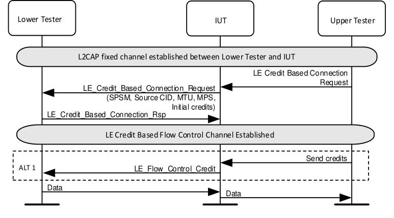

**Figure 4.213: L2CAP/LE/CFC/BV-02-C [LE Credit Based Connection Request on Supported SPSM]**

The IUT sends an LE Credit Based Connection Request on the SPSM declared in IXIT.
The Lower Tester responds with an LE Credit Based Connection response PDU.
(ALT1) If the channel was created with zero credits, the Upper Tester issues a command to the IUT to send credits.
The Lower Tester sends data on the established channel.
• Expected Outcome
Pass verdict
The IUT receives the data send by the Lower Tester on the correct channel. The data is passed to the Upper Tester.
L2CAP/LE/CFC/BV-03-C [LE Credit Based Connection Response on Supported SPSM]
• Test Purpose
Verify that an IUT receiving a valid LE Credit Based Connection Request from a peer sends an LE Credit Based Connection Response and establishes the channel.
• Reference
[12] 4.23
• Initial Condition
- The appropriate signaling channel for the transport is used.
- An SPSM for the desired LE Credit Based Flow Control based channel is declared via IXIT.
- The Upper Tester can command the IUT to send data.
• Test Procedure

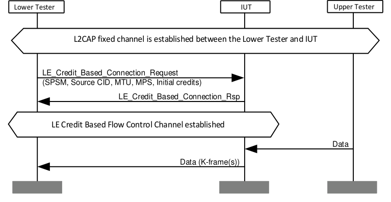

**Figure 4.214: L2CAP/LE/CFC/BV-03-C [LE Credit Based Connection Response on Supported SPSM]**

The Lower Tester sends an LE Credit Based Connection Request with nonzero credits to the IUT on the SPSM specified in initial conditions.
The IUT responds with an LE Credit Based Connection Response.
The IUT is commanded to send data on the LE data channel by the Upper Tester.
• Expected Outcome
Pass verdict
The IUT sends one or more correctly formatted K-frames on the correct channel to the Lower Tester.
The data sent by the IUT to the Lower Tester matches the data sent by the Upper Tester to the IUT.
L2CAP/LE/CFC/BV-04-C [LE Credit Based Connection Request on an unsupported SPSM]
• Test Purpose
Verify that an IUT sending an LE Credit Based Connection Request on an unsupported SPSM does not establish a channel upon receiving an LE Credit Based Connection Response refusing the connection.
• Reference
[12] 4.22
• Initial Condition
- The appropriate signaling channel for the transport is used.
- An SPSM for an unsupported LE Credit Based Flow Control based channel is declared via IXIT.
• Test Procedure

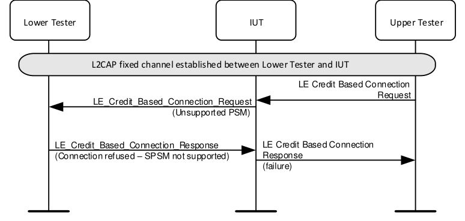

**Figure 4.215: L2CAP/LE/CFC/BV-04-C [LE Credit Based Connection Request on an unsupported SPSM]**

The IUT sends an LE Credit Based Connection Request PDU on the SPSM specified in the initial conditions which is not supported by the Lower Tester.
The Lower Tester responds with an LE Credit Based Connection Response with result “0x0002 – Connection Refused – SPSM not supported”.
• Expected Outcome
Pass verdict
The IUT receives an LE Credit Based Connection Response PDU with result “0x0002 – Connection Refused – SPSM not supported” from the Lower Tester. This is indicated to the Upper Tester.
L2CAP/LE/CFC/BV-05-C [LE Credit Based Connection Request - unsupported SPSM]
• Test Purpose
Verify that an IUT receiving an LE Credit Based Connection Request on an unsupported SPSM responds with an LE Credit Based Connection Response refusing the connection.
• Reference
[12] 4.23
• Initial Condition
- The appropriate signaling channel for the transport is used.
- An SPSM for an unsupported LE Credit Based Flow Control based channel is declared via IXIT.
• Test Procedure

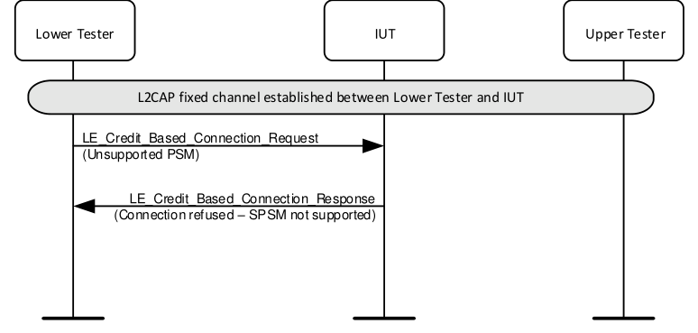

**Figure 4.216: L2CAP/LE/CFC/BV-05-C [LE Credit Based Connection Request - unsupported SPSM]**

The Lower Tester sends an LE Credit Based Connection Request on the SPSM specified in initial conditions.
• Expected Outcome
Pass verdict
Upon receiving an LE Credit Based Connection Request containing an unsupported SPSM, the IUT sends a correctly formatted LE Credit Based Connection Response to the Lower Tester with Result “0x0002 – Connection Refused – SPSM not supported.
L2CAP/LE/CFC/BV-06-C [Credit Exchange – Receiving Incremental Credits]
• Test Purpose
Verify that the IUT handles flow control correctly, by handling the LE Flow Control Credit sent by the peer.
• Reference
[12] 4.24
• Initial Condition
- The appropriate signaling channel for the transport is used.
- An LE Data Channel is established on an SPSM indicated in the IXIT.
- The role of the IUT is indicated in the IXIT.
- The initial credit on the LE Data Channel set by the Lower Tester is 0.
- The Upper Tester can command the IUT to send data.
• Test Procedure

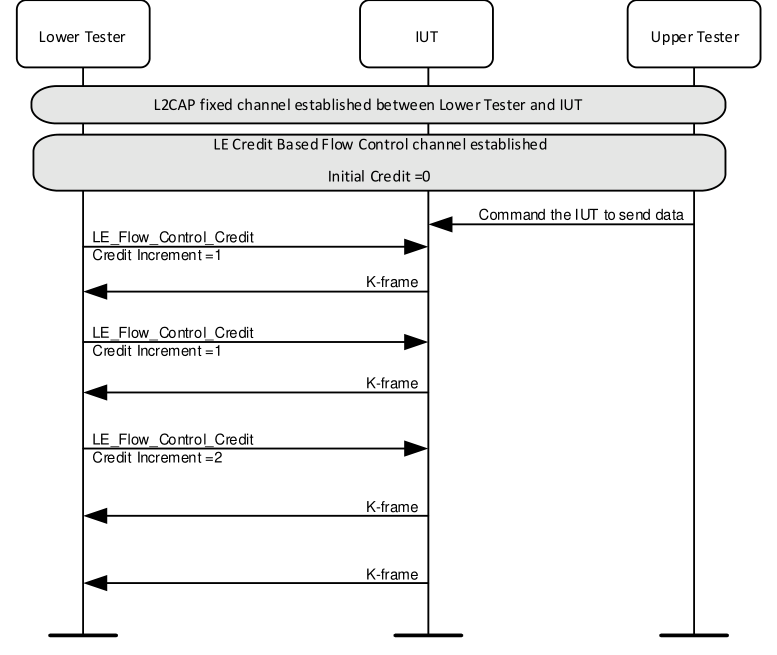

**Figure 4.217: L2CAP/LE/CFC/BV-06-C [Credit Exchange – Receiving Incremental Credits]**

1. The Upper Tester requests the IUT to send data packets to the Lower Tester. 2. The Lower Tester sends an LE Flow Control Credit Packet with Credit Value X to the IUT on the
CID. 3. The IUT now sends K-frames containing data to the Lower Tester. 4. After receiving X K-frames from the IUT and ensuring that no more K-frames are received, the
Lower Tester sends a new LE Flow Control Credit packet with a Credits value of X on the CID. The IUT sends X K-frames containing data to the Lower Tester. 5. The Test Procedure steps 2–4 are repeated with credit increment X ={1,>1} without disconnecting
the channel.
• Expected Outcome
Pass verdict
After receiving X credits, the IUT sends X correctly formatted K-frames containing data to the Lower Tester.
The IUT stops sending K-frames to the Lower Tester after the credit count X reaches zero.
After receiving X credits, the IUT sends (X) correctly formatted K-frames containing data to the Lower Tester.
The IUT stops sending K-frames to the Lower Tester after the credit count X reaches zero.
• Test Purpose
Verify that the IUT sends LE Flow Control Credit to the peer.
• Reference
[12] 4.24
• Initial Condition
- The appropriate signaling channel for the transport is used.
- An LE Data Channel is established on the SPSM declared via IXIT.
- The role of the IUT is indicated in the IXIT.
- The Upper Tester can command the IUT to send credits.
• Test Procedure

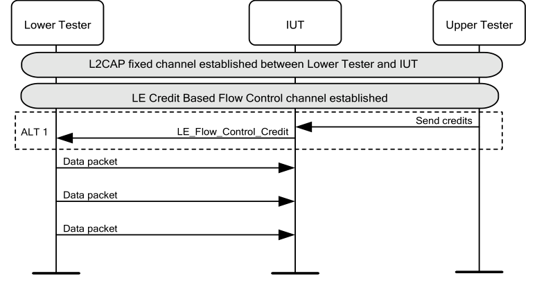

**Figure 4.218: L2CAP/LE/CFC/BV-07-C [Credit Exchange – Sending Credits]**

(ALT1) If the channel was created with zero credits, the Upper Tester issues a command to the IUT to send credits.
The Lower Tester sends data packets to the IUT until it gets credits returned i.e., the data to send could consume more than the current credits available on the channel.
• Expected Outcome
Pass verdict
The IUT sends a correctly formatted LE Flow Control Credit packet to the Lower Tester minimum ones doing the data transfer.
• Test Purpose
Verify that the IUT disconnects the LE Data Channel when the credit count exceeds 65535.
• Reference
[12] 4.24, 10.1
• Initial Condition
- The appropriate signaling channel for the transport is used.
- An LE Data Channel is established on an SPSM indicated in the IXIT.
- The role of the IUT is indicated in the IXIT.
- The initial credit on the LE Data Channel set by the Lower Tester is more than 1.
• Test Procedure

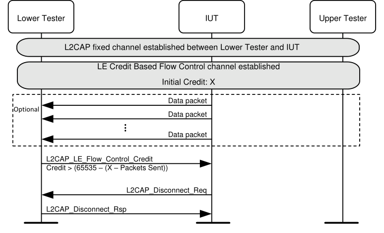

**Figure 4.219: L2CAP/LE/CFC/BI-01-C [Credit Exchange – Exceed Initial Credits]**

(Optional) The IUT sends data packets to the Lower Tester.
The Lower Tester sends an LE Flow Control Credit PDU packet containing a credit so large that it together with the remaining credits on the IUT exceeds 65535.
• Expected Outcome
Pass verdict
Upon receiving a credit overflow, the IUT disconnects the LE Data Channel.
• Test Purpose
Verify that an IUT refuses to create a connection upon reception of an LE Credit Based Connection Request which fails to satisfy authentication requirements.
• Reference
[12] 4.22
• Initial Condition
- The appropriate signaling channel for the transport is used.
- An SPSM for the desired LE Credit Based Flow Control based Channel with authentication requirements is declared via IXIT.
- No authentication procedure has been performed between the IUT and the Lower Tester.
• Test Procedure

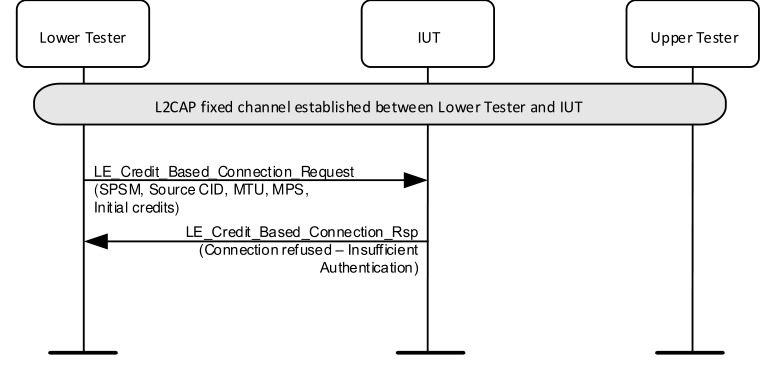

**Figure 4.220: L2CAP/LE/CFC/BV-11-C [Security - Insufficient Authentication – Responder]**

1. The Lower Tester sends an LE Credit Based Connection Request on the SPSM specified in the
initial conditions that requires authentication. 2. The IUT rejects the connection request with error code “Insufficient Authentication”.
• Expected Outcome
Pass verdict
Upon reception of an LE Credit Based Connection Request from the Lower Tester which fails to satisfy the authentication requirements, the IUT sends a correctly formatted LE Credit Based Connection Response with Result “0x0005 – Connection Refused – Insufficient Authentication” to the Lower Tester.
• Test Purpose
Verify that the IUT does not establish the channel upon receipt of an LE Credit Based Connection Response indicating the connection was refused with Result “0x0007 – Connection Refused – Insufficient Encryption Key Size”.
• Reference
[12] 4.22
• Initial Condition
- The appropriate signaling channel for the transport is used.
- The Upper Tester can command the IUT to create a connection.
- Either an Unauthenticated or Authenticated LTK exists between the IUT and Lower Tester.
• Test Procedure

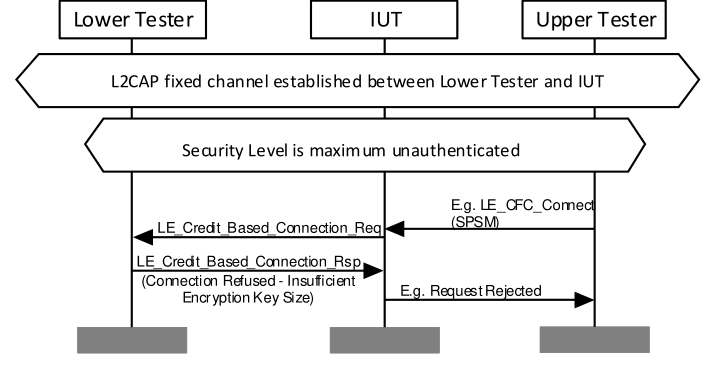

**Figure 4.221: L2CAP/LE/CFC/BV-14-C [Security - Insufficient Encryption Key Size – Initiator]**

The Upper Tester commands the IUT to create a connection on an SPSM.
The Lower Tester refuses the Connection Request with result “0x0007 - Connection Refused - Insufficient Encryption Key Size”.
• Expected Outcome
Pass verdict
The IUT informs the Upper Tester about the rejection.
L2CAP/LE/CFC/BV-17-C [LE Credit Based Connection Response - refused due to insufficient resources - Responder]
• Test Purpose
Verify that an IUT receiving an LE Credit Based Connection Request for a second channel refuses the connection with result "0x0004 - Connection refused – no resources available" if it does not support multiple simultaneous channels.
• Reference
[12] 4.22
• Initial Condition
- The appropriate signaling channel for the transport is used.
- One LE Data channel is established on an SPSM declared via IXIT.
• Test Procedure

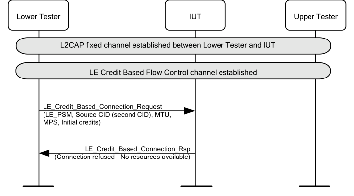

**Figure 4.222: L2CAP/LE/CFC/BV-17-C [LE Credit Based Connection Response - refused due to insufficient resources - Responder]**

The Lower Tester sends an LE Credit Based Connection Request on a different CID to than the first.
• Expected Outcome
Pass verdict
Upon receiving an LE Credit Based Connection Request from the Lower Tester on a different CID than the previously-established channel, the IUT sends a correctly formatted LE Credit Based Connection Response to the Lower Tester with Result “0x0004 – Connection Refused – no resources available”.
L2CAP/LE/CFC/BV-18-C [LE Credit Based Connection Request - refused due to Invalid Source CID - Initiator]
• Test Purpose
Verify that an IUT sending an LE Credit Based Connection Request does not establish the channel upon receiving an LE Credit Based Connection Response refusing the connection with result "0x0009 – Connection refused – Invalid Source CID".
• Reference
[12] 4.22
• Initial Condition
- The appropriate signaling channel for the transport is used.
- The Upper Tester can command the IUT to create a connection.
• Test Procedure

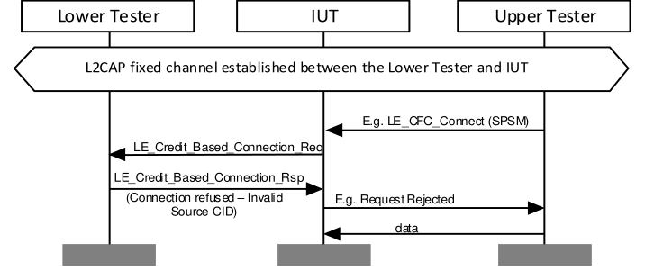

**Figure 4.223: L2CAP/LE/CFC/BV-18-C [LE Credit Based Connection Request - refused due to Invalid Source CID - Initiator]**

The Upper Tester commands the IUT to create a connection on an SPSM.
The Lower Tester Refuses the Connection Request with an LE Credit Based Connection Response with result “0x0009 – Connection Refused – Invalid Source CID”.
The Upper Tester commands the IUT to send data on the refused CID.
• Expected Outcome
Pass verdict
The IUT informs the Upper Tester the connection was refused.
The Lower Tester does not receive any data from the IUT on the refused CID.
L2CAP/LE/CFC/BV-19-C [LE Credit Based Connection Request - refused due to source CID already allocated - Initiator]
• Test Purpose
Verify that an IUT sending an LE Credit Based Connection Request does not establish the channel upon receiving an LE Credit Based Connection Response refusing the connection with result "0x000A – Connection refused – Source CID already allocated".
• Reference
[12] 4.22
• Initial Condition
- The appropriate signaling channel for the transport is used.
- The Upper Tester can command the IUT to create a connection.
• Test Procedure

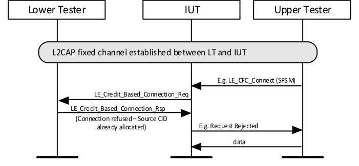

**Figure 4.224: L2CAP/LE/CFC/BV-19-C [LE Credit Based Connection Request - refused due to source CID already allocated - Initiator]**

The Upper Tester commands the IUT to create a connection on an SPSM.
The Lower Tester Refuses the Connection Request with an LE Credit Based Connection Response with result “0x000A – Connection Refused – Source CID already allocated”.
The Upper Tester commands the IUT to send data on the refused CID.
• Expected Outcome
Pass verdict
The IUT informs the Upper Tester the connection was refused.
The Lower tester does not receive any data from the IUT on the refused CID.
L2CAP/LE/CFC/BV-20-C [LE Credit Based Connection Response - refused due to Source CID already allocated - Responder]
• Test Purpose
Verify that an IUT receiving an LE Credit Based Connection Request for a second channel refuses the connection with result "0x000A - Connection refused – Source CID already allocated" if it receives a Source CID which is already in use.
• Reference
[12] 4.23
• Initial Condition
- The appropriate signaling channel for the transport is used.
- One LE Data channel is established on an SPSM declared via IXIT.
• Test Procedure

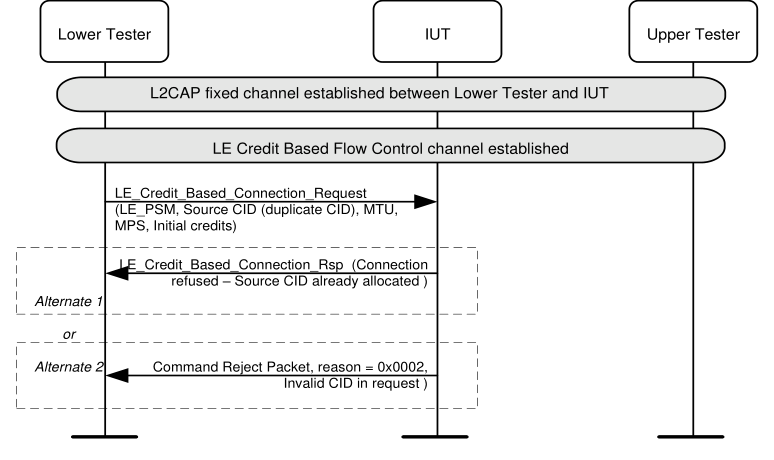

**Figure 4.225: L2CAP/LE/CFC/BV-20-C [LE Credit Based Connection Response - refused due to Source CID already allocated - Responder]**

The Lower Tester sends an LE Credit Based Connection Request using the same CID as the previously established channel.
• Expected Outcome
Pass verdict
ALT1: Upon receipt of an LE Credit Based Connection Request using the same CID as the previously established channel, the IUT sends a correctly formatted LE Credit Based Connection Response to the Lower Tester with Result=0x000A - Connection Refused – Source CID already allocated.
ALT2: The IUT sends a correctly formatted Command Reject to the Lower Tester with Reason=0x0002 – Invalid CID in request.
L2CAP/LE/CFC/BV-21-C [LE Credit Based Connection Request - refused due to Unacceptable Parameters - Initiator]
• Test Purpose
Verify that an IUT sending an LE Credit Based Connection Request does not establish the channel upon receiving an LE Credit Based Connection Response refusing the connection with result “0x000B – Connection refused – Unacceptable Parameters”.
• Reference
[12] 4.22
• Initial Condition
- The appropriate signaling channel for the transport is used.
- The Upper Tester can command the IUT to create a connection.
• Test Procedure

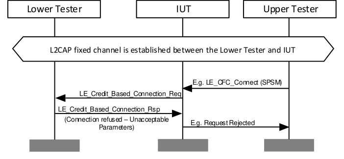

**Figure 4.226: L2CAP/LE/CFC/BV-21-C [LE Credit Based Connection Request - refused due to Unacceptable Parameters - Initiator]**

The Upper Tester commands the IUT to create a connection on an SPSM.
The Lower Tester refuses the Connection Request with an LE Credit Based Connection Response with result “0x000B – Connection Refused – Unacceptable Parameters”.
The Upper Tester commands the IUT to send data on the refused CID.
• Expected Outcome
Pass verdict
The IUT informs the Upper Tester the connection was refused.
The Lower Tester does not receive any data from the IUT on the refused CID.

##### 4.15.2.1 Credit Based Connection Request Dynamically Allocated Source CID

• Test Purpose
Verify that an IUT sending a Credit Based Connection Request to a peer allocates the Source CID from a dynamically allocated range and does not allocate one already in use.
• Reference
[12] 4.22
• Initial Condition
- The signaling channel specified in Table 4.43 is used.
- An SPSM for the desired LE Credit Based or Enhanced Credit Based Flow Control based Channel is declared in the IXIT.
- The Upper Tester can command the IUT to send credits.
- A value for the number of concurrent Credit Based Connections is defined by the TSPX_l2ca_num_concurrent_credit_based_connections IXIT value.
• Test Case Configuration

| Test Case ID |  | Signaling |  | L2CAP Command |
| --- | --- | --- | --- | --- |
|  |  | Channel |  |  |
| L2CAP/ECFC/BV-38-C [Credit Based Connection Request Dynamically Allocated Source CID – LE] | 0x0005 |  |  | L2CAP CREDIT BASED CONNECTION REQ _ _ _ _ L2CAP CREDIT BASED CONNECTION RSP _ _ _ _ |
| L2CAP/LE/CFC/BV-29-C [Credit Based Connection Request Dynamically Allocated Source CID] | 0x0005 |  |  | L2CAP LE CREDIT BASED CONNECTION REQ _ _ _ _ _ L2CAP LE CREDIT BASED CONNECTION RSP _ _ _ _ _ |
| L2CAP/ECFC/BV-79-C [Credit Based Connection Request Dynamically Allocated Source CID – BR/EDR] | 0x0001 |  |  | L2CAP CREDIT BASED CONNECTION REQ _ _ _ _ L2CAP CREDIT BASED CONNECTION RSP _ _ _ _ |

Table 4.43: Credit Based Connection Request Dynamically Allocated Source CID test cases
• Test Procedure

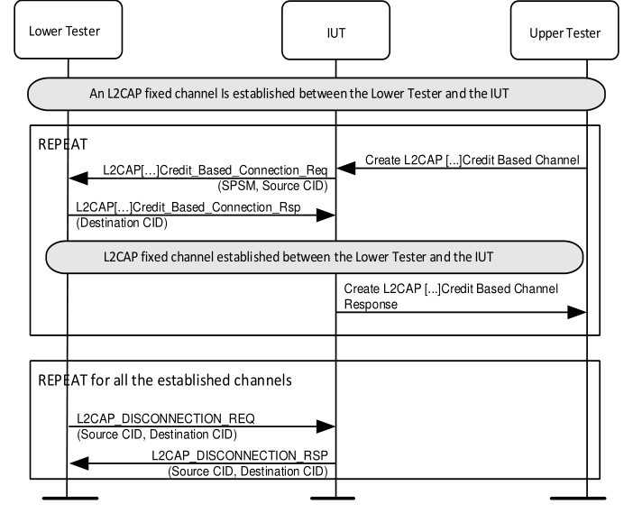

**Figure 4.227: Credit Based Connection Request Dynamically Allocated Source CID**

1. Perform steps 2–6 a total of TSPX_l2ca_num_concurrent_credit_based_connections times. 2. The Upper Tester commands the IUT to create an L2CAP connection to the Lower Tester. 3. The IUT sends an L2CAP request command as specified in Table 4.43 to the Lower Tester on
the SPSM as specified in Table 4.43 with a Source CID. 4. The Lower Tester confirms that the Source CID received in step 3 is within the range 0x0040–
0x007F and is not the same as any of the Source CIDs received during this test procedure. 5. The Lower Tester sends an L2CAP response command as specified in Table 4.43 to the IUT with
a Destination CID.
from step 3 and the Destination CID received in step 5. 7. Repeat steps 8 and 9 for all established channels. 8. The Lower Tester sends an L2CAP_DISCONNECTION_REQ PDU to the IUT with the Source
CID and the Destination CIDs from steps 2–6. 9. The IUT sends an L2CAP_DISCONNECTION_RSP PDU to the Lower Tester with the Source
CID and the Destination CIDs set as received in step 8.
• Expected Outcome
Pass verdict
In step 3, the Source CID in the L2CAP request command is in the range of 0x40–0x7F.
In each iteration of step 3, the Source CID is not the same as any Source CID of an existing connection.

#### 4.15.3 All Credit Based Flow Control Mode

##### 4.15.3.1 Disconnection Request

• Test Purpose
Verify that the IUT can disconnect the channel.
• Initial Condition
- The signaling channel specified in Table 4.44 is used.
- A Data Channel as specified in Table 4.44 is established on the SPSM declared via IXIT using the commands specified in Table 4.44.
- The role of the IUT is indicated in the IXIT.
• Test Case Configuration

| Test Case ID | Reference |  | Signaling |  | L2CAP Command |
| --- | --- | --- | --- | --- | --- |
|  |  |  | Channel |  |  |
| L2CAP/LE/CFC/BV-08-C [Disconnection Request] | [12] 4.6 | 0x0005 |  |  | L2CAP LE CREDIT BASED CONNECTION REQ/RSP _ _ _ _ _ |
| L2CAP/ECFC/BV-08-C [Disconnection Request, LE] | [13] 4.6 | 0x0005 |  |  | L2CAP CREDIT BASED CONNECTION REQ/RSP _ _ _ _ |
| L2CAP/ECFC/BV-65-C [Disconnection Request, BR/EDR] | [13] 4.6 | 0x0001 |  |  | L2CAP CREDIT BASED CONNECTION REQ/RSP _ _ _ _ |

Table 4.44: Disconnection Request test cases
Lower Tester
IUT
Upper Tester

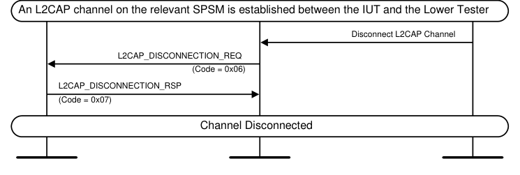

**Figure 4.228: Disconnection Request**

1. The Upper Tester commands the IUT to disconnect the channel. 2. The IUT sends L2CAP Disconnection Request (Code = 0x06) to the Lower Tester. 3. The Lower Tester sends an L2CAP Disconnection Response (Code = 0x07).
• Expected Outcome
Pass verdict
The IUT sends a correctly formatted L2CAP_Disconnect_Req to the Lower Tester.

##### 4.15.3.2 Disconnection Response

• Test Purpose
Verify that the IUT responds correctly to reception of a Disconnection Request.
• Initial Condition
- The signaling channel specified in Table 4.45 is used.
- A Data Channel as specified in Table 4.45 is established on the SPSM declared via IXIT using the commands specified in Table 4.45.
- The role of the IUT is indicated in the IXIT.
• Test Case Configuration

| Test Case ID | Reference |  | Signaling |  | L2CAP Command |
| --- | --- | --- | --- | --- | --- |
|  |  |  | Channel |  |  |
| L2CAP/LE/CFC/BV-09-C [Disconnection Response] | [12] 4.7 | 0x0005 |  |  | L2CAP LE CREDIT BASED CONNECTION REQ/RSP _ _ _ _ _ |
| L2CAP/ECFC/BV-09-C [Disconnection Response, LE] | [13] 4.7 | 0x0005 |  |  | L2CAP CREDIT BASED CONNECTION REQ/RSP _ _ _ _ |
| L2CAP/ECFC/BV-66-C [Disconnection Response, BR/EDR] | [13] 4.7 | 0x0001 |  |  | L2CAP CREDIT BASED CONNECTION REQ/RSP _ _ _ _ |

Table 4.45: Disconnection Response test cases
• Test Procedure

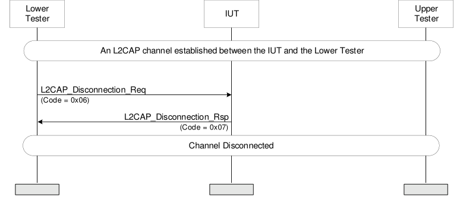

**Figure 4.229: Disconnect Response**

1. The Lower Tester sends an L2CAP Disconnection Request (Code = 0x06) to the IUT. 2. The IUT sends an L2CAP Disconnection Response (Code = 0x07) to the Lower Tester.
• Expected Outcome
Pass verdict
The IUT responds to the request to disconnect the channel with a correctly formatted L2CAP_Disconnection Response.

##### 4.15.3.3 Security – Insufficient Authentication – Initiator

• Test Purpose
Verify that the IUT does not establish any channel upon receipt of an L2CAP LE Credit Based Connection Response / L2CAP Credit Based Connection Response indicating the connections were refused with Result 0x0005 (“All connections refused – insufficient authentication”).
• Initial Condition
- The signaling channel specified in Table 4.46 is used.
- The Upper Tester can command the IUT to create a credit based channel on an SPSM declared via IXIT.
• Test Case Configuration

| Test Case ID | Reference |  | Signaling |  | Signaling Commands | Result |
| --- | --- | --- | --- | --- | --- | --- |
|  |  |  | Channel |  |  |  |
| L2CAP/LE/CFC/BV-10-C [Security – Insufficient Authentication – Initiator] | [12] 4.22 | 0x0005 |  |  | L2CAP LE Credit Based Connection Request (Code = 0x14) L2CAP LE Credit Based Connection Response (Code = 0x15) | 0x0005 – Connection refused – insufficient authentication |
| L2CAP/ECFC/BV-10-C [Security – Insufficient Authentication – Initiator, LE] | [13] 4.25 | 0x0005 |  |  | L2CAP Credit Based Connection Request (Code = 0x17) L2CAP Credit Based Connection Response (Code = 0x18) | 0x0005 – All connections refused – insufficient authentication |
| L2CAP/ECFC/BV-67-C [Security – Insufficient Authentication – Initiator, BR/EDR] | [13] 4.25 | 0x0001 |  |  | L2CAP Credit Based Connection Request (Code = 0x17) L2CAP Credit Based Connection Response (Code = 0x18) | 0x0005 – All connections refused – insufficient authentication |

Table 4.46: Security – Insufficient Authentication – Initiator test cases
• Test Procedure

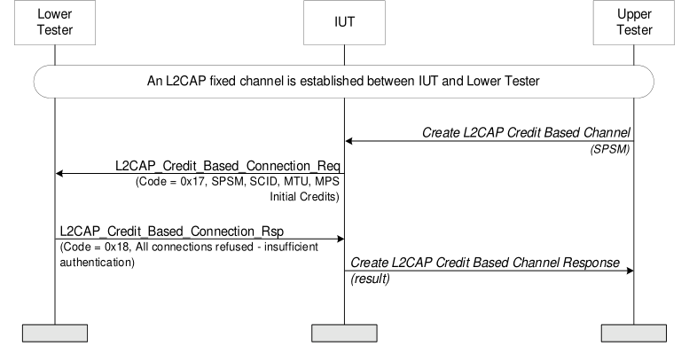

**Figure 4.230: Security – Insufficient Authentication – Initiator**

1. The Upper Tester commands the IUT to send a connection request. 2. The IUT sends an L2CAP LE Credit Based Connection Request (Code = 0x14) / L2CAP Credit
Based Connection Request (Code = 0x17), as in Table 4.46. 3. The Lower Tester sends an L2CAP LE Credit Based Connection Response (Code = 0x15) /
L2CAP Credit Based Connection Response (Code = 0x18) with result 0x0005, as in Table 4.46, refusing the channel creation request.
• Expected Outcome
Pass verdict
The IUT informs the Upper Tester about the rejection.

##### 4.15.3.4 Security – Insufficient Authorization – Initiator

• Test Purpose
Verify that the IUT does not establish any channel upon receipt of an L2CAP LE Credit Based Connection Response / L2CAP Credit Based Connection Response indicating the connections were refused with Result 0x0006.
• Initial Condition
- The signaling channel specified in Table 4.47 is used.
- An SPSM for the Enhanced Credit Based Flow Control channel is declared via IXIT.
- The Upper Tester can command the IUT to create a credit based channel on the SPSM declared via IXIT.
• Test Case Configuration

| Test Case ID | Reference |  | Signaling |  | Signaling Commands | Result |
| --- | --- | --- | --- | --- | --- | --- |
|  |  |  | Channel |  |  |  |
| L2CAP/LE/CFC/BV-12-C [Security – Insufficient Authorization – Initiator] | [12] 4.22 | 0x0005 |  |  | L2CAP LE Credit Based Connection Request (Code = 0x14) L2CAP LE Credit Based Connection Response (Code = 0x15) | 0x0006 – Connection refused – insufficient authorization |
| L2CAP/ECFC/BV-12-C [Security – Insufficient Authorization – Initiator, LE] | [13] 4.25 | 0x0005 |  |  | L2CAP Credit Based Connection Request (Code = 0x17) L2CAP Credit Based Connection Response (Code = 0x18) | 0x0006 – All connections refused – insufficient authorization |
| L2CAP/ECFC/BV-68-C [Security – Insufficient Authorization – Initiator, BR/EDR] | [13] 4.25 | 0x0001 |  |  | L2CAP Credit Based Connection Request (Code = 0x17) L2CAP Credit Based Connection Response (Code = 0x18) | 0x0006 – All connections refused – insufficient authorization |

Table 4.47: Security – Insufficient Authorization – Initiator test cases
• Test Procedure

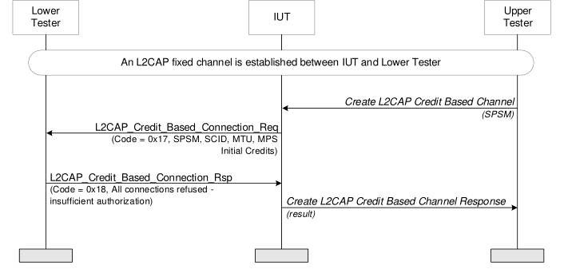

**Figure 4.231: Security – Insufficient Authorization – Initiator**

1. The Upper Tester commands the IUT to send a connection request. 2. The IUT sends an L2CAP LE Credit Based Connection Request (Code = 0x14) / L2CAP Credit
Based Connection Request (Code = 0x17), as in Table 4.47. 3. The Lower Tester sends an L2CAP LE Credit Based Connection Response (Code = 0x15) /
L2CAP Credit Based Connection Response (Code = 0x18) with result 0x0006, as in Table 4.47, refusing the connection request.
• Expected Outcome
Pass verdict
The IUT informs the Upper Tester about the rejection.

##### 4.15.3.5 Security – Insufficient Authorization – Responder

• Test Purpose
Verify that an IUT refuses to create any connection upon reception of an L2CAP LE Credit Based Connection Request / L2CAP Credit Based Connection Request which fails to satisfy authorization requirements.
• Initial Condition
- An LE ACL connection is established between the IUT and the Lower Tester.
- An SPSM for the Enhanced Credit Based Flow Control channel is declared via IXIT.
- An authorization requirement exists for the SPSM declared via IXIT.
- No authorization procedure has been performed between the IUT and the Lower Tester.
• Test Case Configuration

|  | Test Case ID |  |  | Reference |  |  | Signaling Commands |  |  | Result |  |
| --- | --- | --- | --- | --- | --- | --- | --- | --- | --- | --- | --- |
| L2CAP/LE/CFC/BV-13-C [Security – Insufficient Authorization – Responder] |  |  | [12] 4.22 |  |  | L2CAP LE Credit Based Connection Request (Code = 0x14) L2CAP LE Credit Based Connection Response (Code = 0x15) |  |  | 0x0006 – Connection refused – insufficient authorization |  |  |
| L2CAP/ECFC/BV-13-C [Security – Insufficient Authorization – Responder, LE] |  |  | [13] 4.25 |  |  | L2CAP Credit Based Connection Request (Code = 0x17) L2CAP Credit Based Connection Response (Code = 0x18) |  |  | 0x0006 – All connections refused – insufficient authorization |  |  |

Table 4.48: Security – Insufficient Authorization – Responder test cases
• Test Procedure

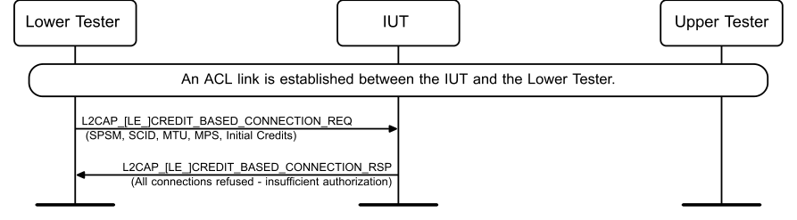

**Figure 4.232: Security – Insufficient Authorization – Responder**

1. The Lower Tester sends an L2CAP LE Credit Based Connection Request (Code = 0x14) / L2CAP
Credit Based Connection Request (Code = 0x17). 2. The IUT detects the authorization requirement and sends an L2CAP LE Credit Based Connection
Response (Code = 0x15) / L2CAP Credit Based Connection Response (Code = 0x18), rejecting the connection request with result 0x0006, as in Table 4.48.
• Expected Outcome
Pass verdict
Upon reception of an L2CAP LE Credit Based Connection Request / L2CAP Credit Based Connection Request from the Lower Tester which fails to satisfy the authorization requirements, the IUT sends a correctly formatted L2CAP LE Credit Based Connection Response / L2CAP Credit Based Connection Response with Result 0x0006 to the Lower Tester.

##### 4.15.3.6 Security – Insufficient Encryption Key Size – Responder

• Test Purpose
Verify that an IUT refuses to create any connection upon receipt of an L2CAP LE Credit Based Connection Request / L2CAP Credit Based Connection Request which fails to satisfy Encryption Key Size requirements.
• Initial Condition
- The signaling channel specified in Table 4.49 is used.
- An SPSM for the Enhanced Credit Based Flow Control channel is declared via IXIT.
- An encrypted link over the transport is established between the IUT and the Lower Tester. The minimum key size required for the SPSM is declared via IXIT. If it is greater than the minimum encryption key size defined by the specification, then the encryption key size used by the Lower Tester is less than the minimum encryption key size, otherwise the Lower Tester uses an encryption key size that is equal to the minimum encryption key size defined by the specification.
- A preamble procedure defined in Section 4.10.2 is used to set up an encrypted link.
• Test Case Configuration

| Test Case ID | Reference |  | Signaling |  | Signaling Commands | Result |
| --- | --- | --- | --- | --- | --- | --- |
|  |  |  | Channel |  |  |  |
| L2CAP/LE/CFC/BV-15-C [Security – Insufficient Encryption Key Size – Responder] | [12] 4.22 | 0x0005 |  |  | L2CAP LE Credit Based Connection Request (Code = 0x14) L2CAP LE Credit Based Connection Response (Code = 0x15) | 0x0007 – Connection refused – insufficient encryption key size |
| L2CAP/ECFC/BV-15-C [Security – Insufficient Encryption Key Size – Responder, LE] | [13] 4.25 | 0x0005 |  |  | L2CAP Credit Based Connection Request (Code = 0x17) L2CAP Credit Based Connection Response (Code = 0x18) | 0x0007 – All connections refused – insufficient encryption key size |
| L2CAP/ECFC/BV-70-C [Security – Insufficient Encryption Key Size – Responder, BR/EDR] | [13] 4.25 | 0x0001 |  |  | L2CAP Credit Based Connection Request (Code = 0x17) L2CAP Credit Based Connection Response (Code = 0x18) | 0x0007 – All connections refused – insufficient encryption key size |

Table 4.49: Security – Insufficient Encryption Key Size – Responder test cases
• Test Procedure

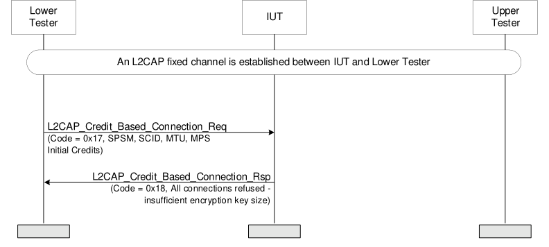

**Figure 4.233: Security – Insufficient Encryption Key Size – Responder**

1. The Lower Tester sends an L2CAP LE Credit Based Connection Request (Code = 0x14) / L2CAP
Credit Based Connection Request (Code = 0x17). 2. If the minimum encryption key size for the PSM is greater than the minimum encryption key size
defined by the specification: ALT 1 is followed and the IUT detects the encryption key size too short for the requirement and sends an L2CAP LE Credit Based Connection Response (Code = 0x15) / L2CAP Credit Based Connection Response (Code = 0x18), rejecting the connection request with Result = 0x0007, as in Table 4.49. If the minimum encryption key size for the PSM is equal to the minimum encryption key size defined by the specification: ALT 2 is followed, and the connection is successful.
• Expected Outcome
Pass verdict
Upon reception of an L2CAP LE Credit Based Connection Request / L2CAP Credit Based Connection Request from the Lower Tester which fails to satisfy the encryption key size requirements, the IUT sends a correctly formatted L2CAP LE Credit Based Connection Request / L2CAP Credit Based Connection Response with Result 0x0007 to the Lower Tester.
If the minimum encryption key size for the PSM is equal to the minimum encryption key size defined by the specification, the request from the Lower Tester does not fail to satisfy the encryption key size requirement, and the connection is successful.

##### 4.15.3.7 L2CAP Credit Based Connection Request – refused due to insufficient resources

• Test Purpose
Verify that an IUT sending an L2CAP LE Credit Based Connection Request / L2CAP Credit Based Connection Request does not establish some of the requested channels upon receiving an L2CAP LE Credit Based Connection Request / L2CAP Credit Based Connection Response refusing the connection with result 0x0004.
• Initial Condition
- The signaling channel specified in Table 4.50 is used.
- An SPSM for the Enhanced Credit Based Flow Control channel is declared via IXIT.
- The Upper Tester can command the IUT to create a credit based channel on the SPSM declared via IXIT.
• Test Case Configuration

| Test Case ID | Reference |  | Signaling |  | Signaling Commands | Result |
| --- | --- | --- | --- | --- | --- | --- |
|  |  |  | Channel |  |  |  |
| L2CAP/LE/CFC/BV-16-C [L2CAP LE Credit Based Connection Request – refused due to insufficient resources] | [12] 4.22 | 0x0005 |  |  | L2CAP LE Credit Based Connection Request (Code = 0x14) L2CAP LE Credit Based Connection Response (Code = 0x15) | 0x0004 – Connection refused – insufficient resources available |
| L2CAP/ECFC/BV-16-C [L2CAP Credit Based Connection Request – refused due to insufficient resources, LE] | [13] 4.25 | 0x0005 |  |  | L2CAP Credit Based Connection Request (Code = 0x17) L2CAP Credit Based Connection Response (Code = 0x18) | 0x0004 – Some connections refused – insufficient resources available |
| L2CAP/ECFC/BV-71-C [L2CAP Credit Based Connection Request – refused due to insufficient resources, BR/EDR] | [13] 4.25 | 0x0001 |  |  | L2CAP Credit Based Connection Request (Code = 0x17) L2CAP Credit Based Connection Response (Code = 0x18) | 0x0004 – Some connections refused – insufficient resources available |

Table 4.50: L2CAP Credit Based Connection Request – refused due to insufficient resources test cases
• Test Procedure

**Figure 4.234: L2CAP Credit Based Connection Request – refused due to insufficient resources**

1. The Upper Tester commands the IUT to send a connection request. 2. The Lower Tester sends an L2CAP LE Credit Based Connection Response (0x15) / L2CAP
Credit Based Connection Response (Code = 0x18) with result 0x0004, as in Table 4.50, refusing the connection request. 3. (ALT1) If run over an Enhanced Credit Based Flow Control channel and the connection request
was performed with more than one SCID and some of the channels were created, the Upper Tester commands the IUT to send data on the accepted CIDs.
• Expected Outcome
Pass verdict
The IUT informs the Upper Tester about the rejection.
(ALT1) The data sent by the IUT in step 3 must be the same as that received by the Lower Tester.
The IUT does not send any data to the Lower Tester on the refused CID(s).

##### 4.15.3.8 L2CAP Credit Based Connection Response on Unsupported SPSM

• Test Purpose
Verify that an IUT receiving L2CAP_CREDIT_BASED_CONNECTION_REQ on an unsupported SPSM responds with L2CAP_CREDIT_BASED_CONNECTION_RSP refusing the connection.
• Initial Condition
- The signaling channel specified in Table 4.51 is used.
• Test Case Configuration

| Test Case ID | Reference |  | Signaling |  | Result | L2CAP Command |
| --- | --- | --- | --- | --- | --- | --- |
|  |  |  | Channel |  |  |  |
| L2CAP/LE/CFC/BV-22-C [L2CAP LE Credit Based Connection Response on Unsupported SPSM] | [13] 4.23 | 0x0005 |  |  | 0x0002 – Connection refused – SPSM not supported | L2CAP LE CREDIT BASED CONNECTION REQ/RSP _ _ _ _ _ |
| L2CAP/ECFC/BV-28-C [L2CAP Credit Based Connection Response on Unsupported SPSM, LE] | [13] 4.26 | 0x0005 |  |  | 0x0002 – All connections refused – SPSM not supported | L2CAP CREDIT BASED CONNECTION REQ/RSP _ _ _ _ |
| L2CAP/ECFC/BV-72-C [L2CAP Credit Based Connection Response on Unsupported SPSM, BR/EDR] | [13] 4.26 | 0x0001 |  |  | 0x0002 – All connections refused – SPSM not supported | L2CAP CREDIT BASED CONNECTION REQ/RSP _ _ _ _ |

Table 4.51: L2CAP Credit Based Connection Response on Unsupported SPSM test cases
• Test Procedure
The L2CAP Credit Based Connection Request/Response commands are specified in Table 4.51.

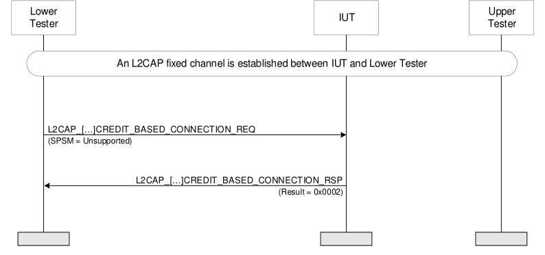

**Figure 4.235: L2CAP Credit Based Connection Response on Unsupported SPSM**

1. The Lower Tester sends a connection request command on an unsupported SPSM. 2. The IUT responds with a connection request response, with the Result in Table 4.51.
• Expected Outcome
Pass verdict
Upon receiving a connection request command containing an unsupported SPSM, the IUT sends a correctly formatted connection request response to the Lower Tester with the Result in Table 4.51.

##### 4.15.3.9 Disconnect Request – DCID not recognized

• Test Purpose
Verify that an IUT receiving Disconnect Request from the Lower Tester for which DCID is not recognized by the IUT responds L2CAP_COMMAND_REJECT_RSP with an “invalid CID” result code.
• Reference
[13] 4.1, 4.6
• Initial Condition
- The signaling channel specified in Table 4.52 is used.
- An LE or BR/EDR Data Channel is established on the SPSM declared via IXIT using the commands specified in Table 4.51.
• Test Case Configuration

| Test Case ID |  | Signaling |  | L2CAP Command |
| --- | --- | --- | --- | --- |
|  |  | Channel |  |  |
| L2CAP/LE/CFC/BV-23-C [Disconnect Request – DCID not recognized] | 0x0005 |  |  | L2CAP LE CREDIT BASED CONNECTION REQ/RSP _ _ _ _ _ |
| L2CAP/ECFC/BV-30-C [Disconnection Response, LE] | 0x0005 |  |  | L2CAP CREDIT BASED CONNECTION REQ/RSP _ _ _ _ |
| L2CAP/ECFC/BV-73-C [Disconnection Response, BR/EDR] | 0x0001 |  |  | L2CAP CREDIT BASED CONNECTION REQ/RSP _ _ _ _ |

Table 4.52: Disconnect Request – DCID not recognized test cases
• Test Procedure

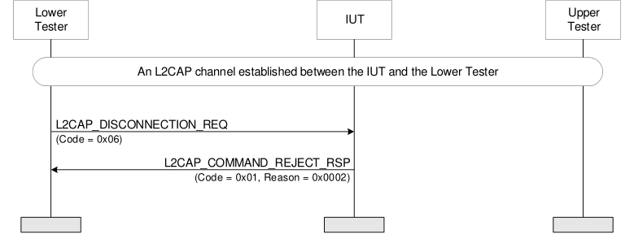

**Figure 4.236: Disconnect Request – DCID not recognized**

1. The Lower Tester sends an L2CAP_DISCONNECTION_REQ (Code = 0x06) to the IUT on the
PSM as specified in Table 4.52, with a DCID not recognized by the IUT. 2. The IUT sends an L2CAP_COMMAND_REJECT_RSP packet (Code = 0x01) to the Lower
Tester, with Reason “0x0002 – Invalid CID in request”.
• Expected Outcome
Pass verdict
The IUT responds to the request to disconnect the channel with a correctly formatted L2CAP_COMMAND_REJECT_RSP message.

##### 4.15.3.10 Security – Insufficient Encryption – Initiator

• Test Purpose
Verify that the IUT does not establish any channel upon receipt of an L2CAP_CREDIT_BASED_CONNECTION_RSP indicating that the connections were refused with Result 0x0008 (“All connections refused – insufficient encryption”).
• Initial Condition
- The signaling channel specified in Table 4.53 is used.
- Either an LTK or STK exists between the IUT and the Lower Tester, but encryption is not enabled.
- An SPSM for the Enhanced Credit Based Flow Control channel is declared via IXIT.
• Test Case Configuration

| Test Case ID | Reference |  | Signaling |  | Result | L2CAP Command |
| --- | --- | --- | --- | --- | --- | --- |
|  |  |  | Channel |  |  |  |
| L2CAP/LE/CFC/BV-24-C [Security – Insufficient Encryption – Initiator] | [13] 4.22 | 0x0005 |  |  | 0x0008 (“Connection refused – insufficient encryption”) | L2CAP LE CREDIT BASED CONNECTION REQ/RSP _ _ _ _ _ |
| L2CAP/ECFC/BV-31-C [Security – Insufficient Encryption – Initiator, LE] | [13] 4.25 | 0x0005 |  |  | 0x0008 (“All connections refused – insufficient encryption”) | L2CAP CREDIT BASED CONNECTION REQ/RSP _ _ _ _ |

Table 4.53: Security – Insufficient Encryption – Initiator test cases
• Test Procedure
The L2CAP Credit Based Connection Request/Response commands are specified in Table 4.53.

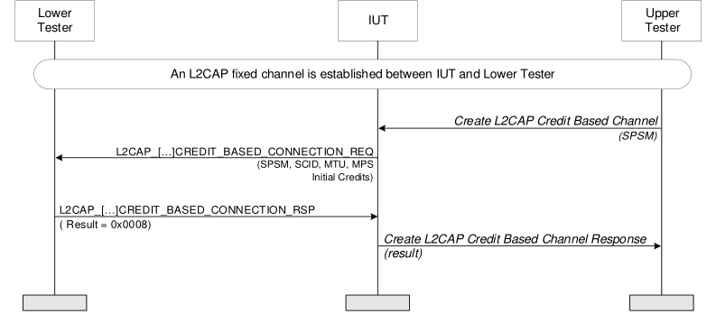

**Figure 4.237: Security – Insufficient Encryption – Initiator**

1. The Upper Tester commands the IUT to send a connection request on an SPSM as specified in
Table 4.53. 2. The IUT sends an L2CAP_CREDIT_BASED_CONNECTION_REQ for the specified SPSM. 3. The Lower Tester sends an L2CAP_CREDIT_BASED_CONNECTION_RSP with Result 0x0008
(Table 4.53), refusing the channel creation request.
• Expected Outcome
Pass verdict
The IUT informs the Upper Tester about the rejection.

##### 4.15.3.11 Security – Insufficient Encryption – Responder

• Test Purpose
Verify that an IUT refuses to create any connection upon reception of an L2CAP_CREDIT_BASED_CONNECTION_REQ that fails to satisfy encryption requirements.
• Initial Condition
- The signaling channel specified in Table 4.54 is used.
- Either an LTK or STK exists between the IUT and the Lower Tester, but encryption is not enabled.
- An SPSM for the Enhanced Credit Based Flow Control channel is declared via IXIT.
- Encryption requirement exists for the SPSM in use.
• Test Case Configuration

| Test Case ID | Reference |  | Signaling |  | Result | L2CAP Command |
| --- | --- | --- | --- | --- | --- | --- |
|  |  |  | Channel |  |  |  |
| L2CAP/LE/CFC/BV-25-C [Security – Insufficient Encryption – Responder] | [13] 4.22 | 0x0005 |  |  | 0x0008 (“Connection refused – insufficient encryption”) | L2CAP LE CREDIT BASED CONNECTION REQ/RSP _ _ _ _ _ |
| L2CAP/ECFC/BV-32-C [Security – Insufficient Encryption – Responder, LE] | [13] 4.25 | 0x0005 |  |  | 0x0008 (“All connections refused – insufficient encryption”) | L2CAP CREDIT BASED CONNECTION REQ/RSP _ _ _ _ |

Table 4.54: Security – Insufficient Encryption – Responder test cases
• Test Procedure
The L2CAP Credit Based Connection Request/Response commands for the test are specified in Table 4.54.

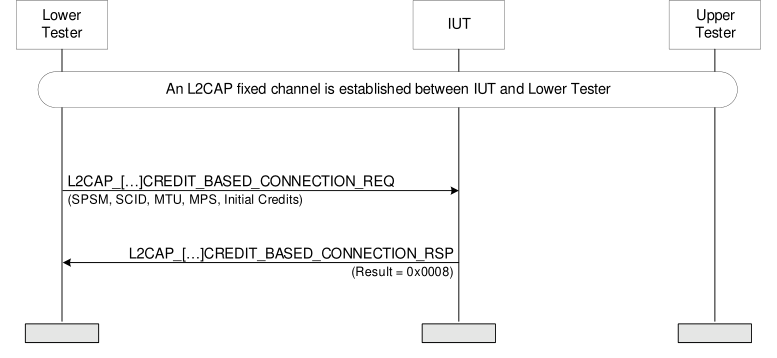

**Figure 4.238: Security – Insufficient Encryption – Responder**

1. The Lower Tester sends an L2CAP_CREDIT_BASED_CONNECTION_REQ to the IUT for the
specified SPSM. 2. The IUT sends an L2CAP_CREDIT_BASED_CONNECTION_RSP to the Lower Tester with
Result 0x0008 (Table 4.54), refusing the channel creation request.
• Expected Outcome
Pass verdict
Upon reception of an L2CAP_CREDIT_BASED_CONNECTION_REQ from the Lower Tester that fails to satisfy the authentication requirements, the IUT sends a correctly formatted L2CAP_CREDIT_BASED_CONNECTION_RSP with Result 0x0008 (Table 4.54) to the Lower Tester.

##### 4.15.3.12 K-frame – SDU length greater than MTU of IUT

• Test Purpose
Verify that an IUT receiving a K-frame from the Lower Tester with ‘L2CAP SDU Length’ field set to a value greater than the MTU of the IUT on L2CAP Credit Based Channel sends an L2CAP Disconnect Request for that channel.
• Reference
[13] 3.4.3
• Initial Condition
- The signaling channel specified in Table 4.55 is used.
- A Data Channel is established on the SPSM declared via IXIT using the commands specified in Table 4.55.
• Test Case Configuration

| Test Case ID |  | Signaling |  | L2CAP Command |
| --- | --- | --- | --- | --- |
|  |  | Channel |  |  |
| L2CAP/LE/CFC/BV-26-C [K-frame – SDU length greater than MTU of IUT] | 0x0005 |  |  | L2CAP LE CREDIT BASED CONNECTION REQ/RSP _ _ _ _ _ |
| L2CAP/ECFC/BV-33-C [K-frame – SDU length greater than MTU of IUT, LE] | 0x0005 |  |  | L2CAP CREDIT BASED CONNECTION REQ/RSP _ _ _ _ |
| L2CAP/ECFC/BV-76-C [K-frame – SDU length greater than MTU of IUT, BR/EDR] | 0x0001 |  |  | L2CAP CREDIT BASED CONNECTION REQ/RSP _ _ _ _ |

Table 4.55: K-frame - SDU length greater than MTU of IUT – test cases
• Test Procedure

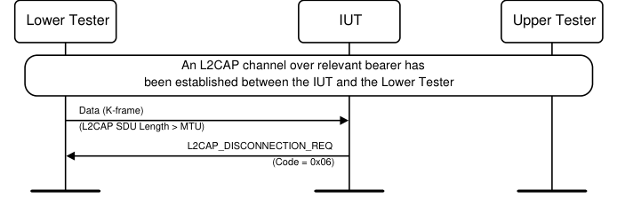

**Figure 4.239: K-frame - SDU length greater than MTU of IUT**

1. The Lower Tester sends a K-frame to the IUT with ‘L2CAP SDU Length’ field set to a value
greater than the MTU of the IUT on L2CAP Credit Based Channel.
• Expected Outcome
Pass verdict
The IUT terminates the channel and sends a correctly formatted L2CAP_DISCONNECT_REQ PDU (Code = 0x06) to the Lower Tester.

##### 4.15.3.13 K-frame – Information Payload length greater than MPS of IUT

• Test Purpose
Verify that an IUT receiving a K-frame from the Lower Tester with the length of ‘Information Payload’ field greater than the MPS of the IUT on L2CAP Credit Based Channel sends an L2CAP Disconnect Request for that channel.
• Reference
[13] 3.4.3
• Initial Condition
- The signaling channel specified in Table 4.56 is used.
- A Data Channel is established on the SPSM declared via IXIT using the commands specified in Table 4.56.
• Test Case Configuration

| Test Case ID |  | Signaling |  | L2CAP Command |
| --- | --- | --- | --- | --- |
|  |  | Channel |  |  |
| L2CAP/LE/CFC/BV-27-C [K-frame – Information Payload length greater than MPS of IUT] | 0x0005 |  |  | L2CAP LE CREDIT BASED CONNECTION REQ/RSP _ _ _ _ _ |
| L2CAP/ECFC/BV-34-C [K-frame – Information Payload length greater than MPS of IUT, LE] | 0x0005 |  |  | L2CAP CREDIT BASED CONNECTION REQ/RSP _ _ _ _ |
| L2CAP/ECFC/BV-77-C [K-frame – Information Payload length greater than MPS of IUT, BR/EDR] | 0x0001 |  |  | L2CAP CREDIT BASED CONNECTION REQ/RSP _ _ _ _ |

Table 4.56: K-frame – Information Payload length greater than MPS of IUT test cases
• Test Procedure

**Figure 4.240: K-frame – Information Payload length greater than MPS of IUT**

1. The Lower Tester sends a K-frame to the IUT with the length of ‘Information Payload’ field greater
than the MPS of the IUT on L2CAP Credit Based Channel.
• Expected Outcome
Pass verdict
The IUT terminates the channel and sends a correctly formatted L2CAP_DISCONNECT_REQ PDU (Code = 0x06) to the Lower Tester.

##### 4.15.3.14 Total length of segments greater than SDU length specified in first K-frame

• Test Purpose
Verify that an IUT receiving segmented K-frames from the Lower Tester on L2CAP Credit Based Channel with total length of the segmented payloads greater than ‘L2CAP SDU Length’ field specified in the first K-frame sends an L2CAP Disconnect Request for that channel.
• Reference
[13] 3.4.3
• Initial Condition
- The signaling channel specified in Table 4.57 is used.
- A Data Channel is established on the SPSM declared via IXIT.
• Test Case Configuration

| Test Case ID |  | Signaling |  | L2CAP Command |
| --- | --- | --- | --- | --- |
|  |  | Channel |  |  |
| L2CAP/LE/CFC/BV-28-C [Total length of segments greater than SDU length specified in first K-frame] | 0x0005 |  |  | L2CAP CREDIT BASED CONNECTION REQ/RSP _ _ _ _ |
| L2CAP/ECFC/BV-35-C [Total length of segments greater than SDU length specified in first K-frame, LE] | 0x0005 |  |  | L2CAP CREDIT BASED CONNECTION REQ/RSP _ _ _ _ |
| L2CAP/ECFC/BV-78-C [Total length of segments greater than SDU length specified in first K-frame, BR/EDR] | 0x0001 |  |  | L2CAP CREDIT BASED CONNECTION REQ/RSP _ _ _ _ |

Table 4.57: Total length of segments greater than SDU length specified in first K-frame test cases
• Test Procedure
Same as for L2CAP/COS/CFC/BV-03-C [Reassembling], but in the last segment, the Lower Tester sends an Information Payload longer (at least one byte) than the correct size, such that the total length of segmented payloads is greater than ‘L2CAP SDU Length’ field specified in first K-frame.
• Expected Outcome
Pass verdict
The IUT terminates the channel and sends a correctly formatted L2CAP_DISCONNECT_REQ PDU (Code = 0x06) to the Lower Tester.
L2CAP/ECFC/BV-43-C [Security – Authentication Pending – Responder, BR/EDR]
• Test Purpose
Verify that the IUT sends the correct response to an L2CAP Credit Based Connection Request if the security is not good enough.
• Reference
[15] 4.26
• Initial Condition
- An unencrypted BR/EDR ACL connection exists between the Lower Tester and the IUT.
- An SPSM for the Enhanced Credit Based Flow Control channel is declared via IXIT.
• Test Procedure

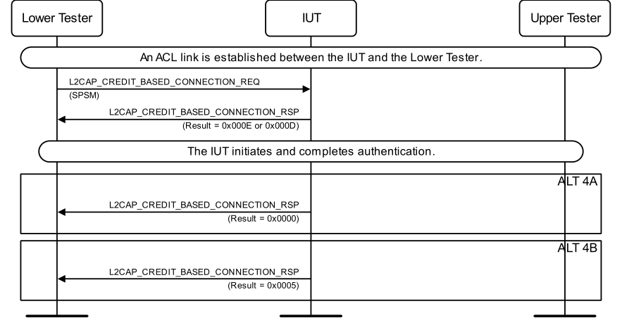

**Figure 4.241: L2CAP/ECFC/BV-43-C [Security – Authentication Pending – Responder, LE]**

1. The Lower Tester sends an L2CAP_CREDIT_BASED_CONNECTION_REQ (Code= 0x17) PDU
to the IUT with SPSM set to the SPSM declared via IXIT. 2. The IUT sends an L2CAP_CREDIT_BASED_CONNECTION_RSP (Code = 0x18) PDU to the
Lower Tester with result 0x000E (“All connections pending – authentication pending”) or 0x000D (“All connections pending – no further information available”).
3. The IUT starts the Authentication procedure. 4. Perform either step 4A or 4B depending on if the IUT successfully completes the Authentication
procedure. Alternative 4A (The IUT completes the Authentication procedure)
4A.1 The IUT sends a successful L2CAP_CREDIT_BASED_CONNECTION_RSP to the Lower Tester. Alternative 4B (The IUT does not complete the Authentication procedure)
4B.1 The IUT sends an L2CAP_CREDIT_BASED_CONNECTION_RSP to the Lower Tester with result set to 0x0005 (“All Connections refused – insufficient authentication”). • Expected Outcome
Pass verdict
In step 2, the IUT sends an L2CAP_CREDIT_BASED_CONNECTION_RSP (Code = 0x18) with result 0x000E (“All connections pending – authentication pending”) or 0x000D (“All connections pending – no further information available”) to the Lower Tester.
L2CAP/ECFC/BV-69-C [Security – Authorization Pending – Responder, BR/EDR]
• Test Purpose
Verify that the IUT sends the correct response to an L2CAP Credit Based Connection Request when authorization is required for the connection.
• Reference
[15] 4.26
• Initial Condition
- An unencrypted BR/EDR ACL connection exists between the Lower Tester and the IUT.
- An SPSM for the Enhanced Credit Based Flow Control channel is declared via IXIT.
- An authorization requirement exists for the SPSM declared via IXIT.
• Test Procedure

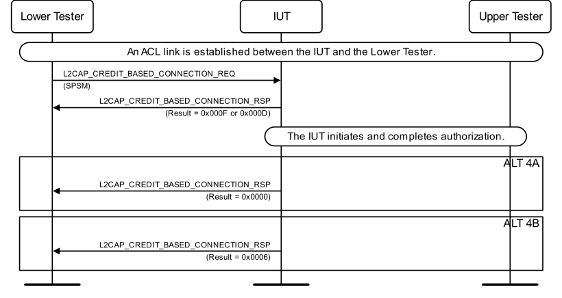

**Figure 4.242: L2CAP/ECFC/BV-69-C [Security –Authorization Pending – Responder, BR/EDR]**

to the IUT with SPSM set to the SPSM declared via IXIT. 2. The IUT sends an L2CAP_CREDIT_BASED_CONNECTION_RSP (Code = 0x18) PDU to the
Lower Tester with result 0x000F (“All connections pending – authorization pending”) or 0x000D (“All connections pending – no further information available”). 3. The IUT signals the Upper Tester for user authorization. 4. Perform either alternative 4A or 4B depending on the IUT response to the user authorization:
Alternative 4A (The user authorizes the credit based connection):
4A.1 The IUT sends an L2CAP_CREDIT_BASED_CONNECTION_RSP (Code = 0x18) PDU to the Lower Tester with result 0x0000 (“All connections successful”). Alternative 4B (The user does not authorize the credit based connection):
4B.1 The IUT sends an L2CAP_CREDIT_BASED_CONNECTION_RSP (Code = 0x18) PDU to the Lower Tester with result 0x0006 (“All connections refused – insufficient authorization”). • Expected Outcome
Pass verdict
In step 2, the IUT sends an L2CAP_CREDIT_BASED_CONNECTION_RSP (Code = 0x18) PDU to the Lower Tester with result 0x000F (“All connections pending – authorization pending”) or 0x000D (“All connections pending – no further information available”).

### 4.16 Generic Attribute Timing tests

Check that the IUT respects the GATT timings.

#### 4.16.1 Back-off on Connection Request Collision

• Test Purpose
Verify that an IUT in a Peripheral role that initiates an L2CAP connection request and encounters a collision uses an appropriate back-off timer before initiating a retry.
• Reference
[13] 4.3, 4.26
[14] 5.3.2, 5.4
• Initial Condition
- The IUT acts in the Peripheral role.
- For EATT, an encrypted ACL link between the IUT and the Lower Tester is established.
- An L2CAP channel over the transport with the PSM/SPSM is set up as specified in Table 4.58.
- For the tests in Table 4.58 that use EATT as the bearer, the following also apply:
▪ The Server Supported Features characteristic is present and states that it supports Enhanced ATT bearers, on both the IUT and Lower Tester sides.
▪ (TSPX_l2ca_eatt_channels – 1) LE or BR/EDR Data Channels are established on the EATT SPSM (the maximum number of EATT supported channels declared in the IXIT, minus 1).
• Test Case Configuration

| Test Case | Transport | Code |  | PSM/ |  | Min Back-off |
| --- | --- | --- | --- | --- | --- | --- |
|  |  |  |  | SPSM |  |  |
| L2CAP/TIM/BV-01-C [Back-off on Connection Request Collision, BR/EDR, Dynamic] | BR/EDR | 0x02 | ATT |  |  | 100 ms |
| L2CAP/TIM/BV-02-C [Back-off on Connection Request Collision, BR/EDR, EATT] | BR/EDR | 0x17 | EATT |  |  | 100 ms |
| L2CAP/TIM/BV-03-C [Back-off on Connection Request Collision, LE, EATT] | LE | 0x17 | EATT |  |  | Max(100 ms, 2 × (connPeripheralLatency + 1) × connInterval) |

Table 4.58: Back-off on Connection Request Collision test cases
• Test Procedure

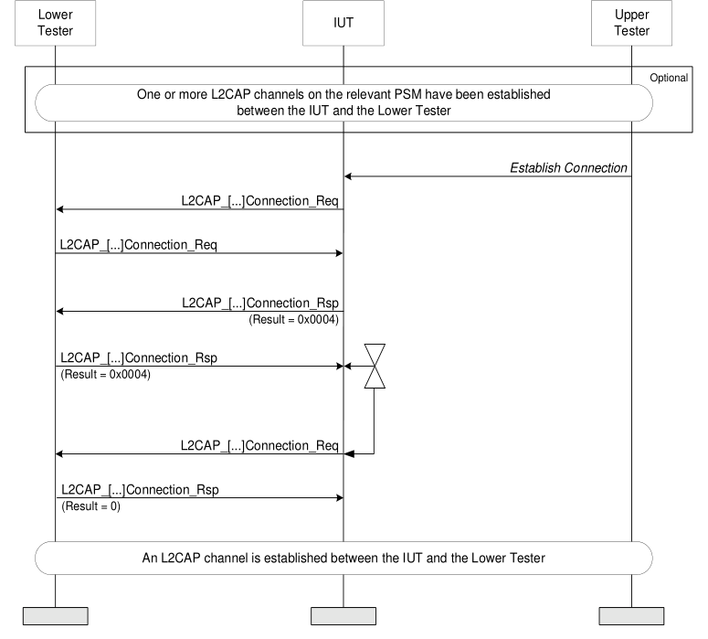

**Figure 4.243: Back-off on Connection Request Collision**

1. The Upper Tester commands the IUT to establish a connection to the Lower Tester. 2. The IUT sends an L2CAP Connection Request packet to the Lower Tester, in order to establish
an L2CAP channel. 3. The Lower Tester sends an L2CAP Connection Request packet to the IUT (code as specified in
Table 4.58). 4. The IUT sends the Lower Tester the response corresponding to the request sent in step 3 with
Result = 0x0004. 5. The Lower Tester sends the IUT the response corresponding to the request sent in step 2 with
Result = 0x0004. 6. The IUT waits for at least the time specified in Table 4.58. The Lower Tester does not send any
packet during this time. 7. The IUT sends an L2CAP Connection Request packet to the Lower Tester, to establish an
L2CAP channel. 8. The Lower Tester accepts the request, creates an L2CAP channel of the type described in
Table 4.58, and responds with an L2CAP Connection Response packet with Result = 0x0000.
• Expected Outcome
Pass verdict
The IUT sends the L2CAP Connection Request to the Lower Tester, in step 8, after at least the time listed in Table 4.58.
In step 4, the IUT accepts the connection request from the Lower Tester and creates an L2CAP channel of the type described in Table 4.58.
• Note
The L2CAP packets exchanged between the IUT and the Lower Tester are of the type corresponding to the transport and bearer in Table 4.58 (L2CAP_CONNECTION_REQ / L2CAP_CONNECTION_RSP and, respectively, L2CAP_CREDIT_BASED_CONNECTION_REQ / L2CAP_CREDIT_BASED_CONNECTION_RSP).

## 5 Test case mapping

The Test Case Mapping Table (TCMT) maps test cases to specific requirements in the ICS. The IUT is tested in all roles for which support is declared in the ICS document.
The columns for the TCMT are defined as follows:
Item: Contains a logical expression based on specific entries from the associated ICS document. Contains a logical expression (using the operators AND, OR, NOT as needed) based on specific entries from the applicable ICS document(s). The entries are in the form of y/x references, where y corresponds to the table number and x corresponds to the feature number as defined in the ICS document for L2CAP [5].
Feature: A brief, informal description of the feature being tested.
Test Case(s): The applicable test case identifiers are required for Bluetooth Qualification if the corresponding y/x references defined in the Item column are supported. Further details about the function of the TCMT are elaborated in [10].
For the purpose and structure of the ICS/IXIT, refer to [10].

|  | Item |  |  | Feature |  |  | Test Case(s) |  |
| --- | --- | --- | --- | --- | --- | --- | --- | --- |
|  | General Operation |  |  |  |  |  |  |  |
| L2CAP 2/1 |  |  | Signaling channel |  |  | L2CAP/COS/CED/BV-07-C L2CAP/COS/CED/BV-08-C L2CAP/COS/CED/BV-09-C |  |  |
| L2CAP 2/1 AND L2CAP 2/41 |  |  | Reject Unknown Command – BR/EDR |  |  | L2CAP/COS/CED/BI-01-C |  |  |
| L2CAP 2/2 |  |  | Configuration process |  |  | L2CAP/COS/CFD/BV-01-C L2CAP/COS/CFD/BV-02-C L2CAP/COS/CFD/BV-03-C L2CAP/COS/CFD/BV-11-C L2CAP/COS/CFD/BV-12-C L2CAP/COS/CFD/BV-14-C |  |  |
| L2CAP 1/1 AND L2CAP 2/2 |  |  | Configuration process – Initiator |  |  | L2CAP/COS/CFD/BV-08-C |  |  |
| L2CAP 2/3 |  |  | Connection oriented data channel |  |  | L2CAP/COS/CED/BV-03-C L2CAP/COS/CED/BV-13-C |  |  |
| L2CAP 2/45 |  |  | Send Disconnect Request |  |  | L2CAP/COS/CED/BV-04-C |  |  |
| L2CAP 2/4 |  |  | Command echo request |  |  | L2CAP/COS/ECH/BV-02-C |  |  |
| L2CAP 2/5 |  |  | Echo response |  |  | L2CAP/COS/ECH/BV-01-C |  |  |
| L2CAP 2/6 |  |  | Command information request |  |  | L2CAP/COS/IEX/BV-01-C |  |  |
| L2CAP 2/7 |  |  | Information response |  |  | L2CAP/COS/IEX/BV-02-C L2CAP/EXF/BV-07-C |  |  |
| L2CAP 2/9 |  |  | Connectionless data channel |  |  | L2CAP/CLS/CLR/BV-01-C |  |  |
| L2CAP 2/10 |  |  | Retransmission Mode |  |  | L2CAP/COS/CFD/BV-10-C L2CAP/COS/RTX/BV-01-C L2CAP/COS/RTX/BV-02-C L2CAP/COS/RTX/BV-03-C |  |  |

|  | Item |  |  | Feature |  |  | Test Case(s) |  |
| --- | --- | --- | --- | --- | --- | --- | --- | --- |
| L2CAP 2/11 |  |  | Flow Control Mode |  |  | L2CAP/COS/CED/BV-10-C L2CAP/COS/FLC/BV-01-C L2CAP/COS/FLC/BV-02-C L2CAP/COS/FLC/BV-03-C L2CAP/COS/FLC/BV-04-C L2CAP/COS/CFD/BV-13-C |  |  |
| L2CAP 2/12 |  |  | Enhanced Retransmission Mode |  |  | L2CAP/CMC/BV-01-C L2CAP/CMC/BV-02-C L2CAP/ERM/BV-01-C L2CAP/ERM/BV-02-C L2CAP/ERM/BV-03-C L2CAP/ERM/BV-08-C L2CAP/ERM/BV-09-C L2CAP/ERM/BV-10-C L2CAP/ERM/BV-11-C L2CAP/ERM/BV-12-C L2CAP/ERM/BV-18-C L2CAP/ERM/BV-19-C L2CAP/ERM/BV-20-C |  |  |
| L2CAP 2/13 |  |  | Streaming Mode |  |  | L2CAP/CMC/BV-04-C L2CAP/CMC/BV-05-C L2CAP/STM/BV-01-C L2CAP/STM/BV-02-C |  |  |
| L2CAP 2/13 AND L2CAP 2/33 AND L2CAP 2/44 |  |  | Streaming Mode, STM source over AMP |  |  | L2CAP/STM/BV-11-C |  |  |
| L2CAP 2/13 AND L2CAP 2/23 AND L2CAP 2/34 AND L2CAP 2/44 |  |  | Streaming Mode, Send data using SAR. STM sink over AMP |  |  | L2CAP/STM/BV-12-C |  |  |
| L2CAP 2/13 AND L2CAP 2/23 AND L2CAP 2/33 AND L2CAP 2/44 |  |  | Streaming Mode, Send data using SAR. STM source over AMP |  |  | L2CAP/STM/BV-13-C |  |  |
| L2CAP 2/14 |  |  | FCS Option |  |  | L2CAP/FOC/BV-01-C L2CAP/FOC/BV-02-C L2CAP/FOC/BV-03-C L2CAP/FOC/BV-04-C L2CAP/FOC/BV-05-C |  |  |
| L2CAP 2/12 AND L2CAP 2/14 |  |  | ERTM with FCS Option |  |  | L2CAP/OFS/BV-01-C L2CAP/OFS/BV-02-C L2CAP/OFS/BV-05-C L2CAP/OFS/BV-06-C |  |  |
| L2CAP 2/13 AND L2CAP 2/14 |  |  | Streaming with FCS Option |  |  | L2CAP/OFS/BV-03-C L2CAP/OFS/BV-04-C L2CAP/OFS/BV-07-C L2CAP/OFS/BV-08-C |  |  |

|  | Item |  |  | Feature |  |  | Test Case(s) |  |
| --- | --- | --- | --- | --- | --- | --- | --- | --- |
| L2CAP 2/15 |  |  | Can Generate Local Busy Condition |  |  | L2CAP/ERM/BV-07-C L2CAP/ERM/BV-22-C |  |  |
| L2CAP 2/16 |  |  | Can Send Reject |  |  | L2CAP/ERM/BV-16-C L2CAP/ERM/BI-01-C |  |  |
| L2CAP 2/17 |  |  | Can Send Selective Reject |  |  | L2CAP/ERM/BV-17-C L2CAP/ERM/BI-02-C |  |  |
| L2CAP 2/18 |  |  | Supports mandatory use of ERTM |  |  | L2CAP/CMC/BI-01-C L2CAP/CMC/BI-02-C L2CAP/CMC/BV-12-C |  |  |
| L2CAP 2/19 |  |  | Supports mandatory use of Streaming Mode |  |  | L2CAP/CMC/BI-03-C L2CAP/CMC/BI-04-C L2CAP/CMC/BV-13-C |  |  |
| L2CAP 2/20 |  |  | Supports optional use of ERTM |  |  | L2CAP/CMC/BV-03-C L2CAP/CMC/BV-07-C L2CAP/CMC/BV-10-C |  |  |
| L2CAP 2/21 |  |  | Supports optional use of Streaming Mode |  |  | L2CAP/CMC/BV-06-C L2CAP/CMC/BV-08-C L2CAP/CMC/BV-11-C |  |  |
| L2CAP 2/22 |  |  | Can send data using SAR in ERTM |  |  | L2CAP/ERM/BV-23-C |  |  |
| L2CAP 2/23 |  |  | Can send data using SAR in Streaming Mode |  |  | L2CAP/STM/BV-03-C |  |  |
| L2CAP 2/24 |  |  | Can actively request Basic Mode for a PSM that supports the use of ERTM or Streaming Mode |  |  | L2CAP/CMC/BV-09-C L2CAP/CMC/BI-05-C L2CAP/CMC/BI-06-C |  |  |
| L2CAP 2/25 |  |  | Supports performing L2CAP channel mode configuration fallback from STM to ERTM |  |  | L2CAP/CMC/BV-14-C L2CAP/CMC/BV-15-C |  |  |
| L2CAP 2/26 |  |  | Supports sending more than one unacknowledged I-frame when operating in ERTM |  |  | L2CAP/ERM/BV-05-C L2CAP/ERM/BV-06-C L2CAP/ERM/BV-13-C L2CAP/ERM/BI-03-C L2CAP/ERM/BI-04-C L2CAP/ERM/BI-05-C |  |  |
| L2CAP 2/27 |  |  | Supports sending more than three unacknowledged I-frames when operating in ERTM |  |  | L2CAP/ERM/BV-14-C L2CAP/ERM/BV-15-C |  |  |
| L2CAP 2/38 AND L2CAP 3/14 |  |  | Extended Flow Specification for ERTM over BR/EDR |  |  | L2CAP/LSC/BV-01-C L2CAP/LSC/BV-03-C L2CAP/LSC/BI-04-C |  |  |
| L2CAP 2/38 AND L2CAP 3/15 |  |  | Extended Flow Specification for STM over BR/EDR |  |  | L2CAP/LSC/BV-02-C L2CAP/LSC/BI-05-C L2CAP/LSC/BV-06-C |  |  |
| L2CAP 2/39 |  |  | Extended Window Size |  |  | L2CAP/EWC/BV-01-C L2CAP/EWC/BV-02-C L2CAP/EWC/BV-03-C |  |  |

|  | Item |  |  | Feature |  |  | Test Case(s) |  |
| --- | --- | --- | --- | --- | --- | --- | --- | --- |
| L2CAP 2/12 AND L2CAP 2/39 |  |  | ERTM, EWS and Extended Control Field |  |  | L2CAP/ECF/BV-01-C L2CAP/ECF/BV-02-C L2CAP/ECF/BV-03-C L2CAP/ECF/BV-04-C L2CAP/ECF/BV-05-C L2CAP/ECF/BV-06-C L2CAP/ECF/BV-07-C L2CAP/ECF/BV-08-C |  |  |
|  | Configurable Parameters |  |  |  |  |  |  |  |
| L2CAP 3/3 AND L2CAP 1/1 |  |  | MTU size 48 bytes, Initiator |  |  | L2CAP/COS/CFD/BV-09-C L2CAP/COS/CED/BV-01-C |  |  |
| L2CAP 3/3 AND L2CAP 1/2 |  |  | MTU size 48 bytes, Acceptor |  |  | L2CAP/COS/CED/BV-05-C L2CAP/COS/CED/BV-12-C L2CAP/COS/CED/BI-02-C |  |  |
| L2CAP 3/4 |  |  | MTU size larger than 48 bytes |  |  | L2CAP/COS/CED/BV-11-C |  |  |
|  | AMP Parameters |  |  |  |  |  |  |  |
| L2CAP 2/32 AND L2CAP 2/44 AND L2CAP 3/14 |  |  | ERTM over AMP with Extended Flow Specification – service type “Best Effort” |  |  | L2CAP/LSC/BV-07-C L2CAP/LSC/BV-09-C L2CAP/LSC/BI-10-C |  |  |
| L2CAP 2/32 AND L2CAP 2/44 AND L2CAP 3/15 |  |  | ERTM over AMP with Extended Flow Specification – service type “Guaranteed” |  |  | L2CAP/LSC/BI-11-C |  |  |
| L2CAP 2/33 AND L2CAP 2/34 AND L2CAP 2/44 AND L2CAP 3/15 |  |  | Streaming Mode over AMP with Extended Flow Specification – service type “Guaranteed” |  |  | L2CAP/LSC/BV-08-C |  |  |
| L2CAP 2/33 AND L2CAP 2/44 AND L2CAP 3/15 |  |  | Streaming Mode over AMP with Extended Flow Specification – service type “Guaranteed” |  |  | L2CAP/LSC/BV-12-C |  |  |
| L2CAP 2/30 |  |  | Fixed Channel Support |  |  | L2CAP/FIX/BV-01-C |  |  |
| L2CAP 2/30 AND L2CAP 2/31 |  |  | Fixed Channel and AMP Manager Support |  |  | L2CAP/FIX/BV-02-C |  |  |
| L2CAP 2/31 AND L2CAP 2/38 |  |  | AMP Manager and Extended Flow Specification Support |  |  | L2CAP/CCH/BV-01-C L2CAP/CCH/BV-02-C L2CAP/CCH/BV-03-C L2CAP/CCH/BV-04-C |  |  |

|  | Item |  |  | Feature |  |  | Test Case(s) |  |
| --- | --- | --- | --- | --- | --- | --- | --- | --- |
| L2CAP 2/32 |  |  | ERTM over AMP |  |  | L2CAP/MCH/BV-01-C L2CAP/MCH/BV-02-C L2CAP/MCH/BV-03-C L2CAP/MCH/BV-04-C L2CAP/MCH/BV-05-C L2CAP/MCH/BV-06-C L2CAP/MCH/BV-07-C L2CAP/MCH/BV-08-C L2CAP/MCH/BV-09-C L2CAP/MCH/BV-10-C L2CAP/MCH/BV-11-C L2CAP/MCH/BV-14-C |  |  |
| L2CAP 2/33 |  |  | Streaming Mode Source over AMP Support |  |  | L2CAP/MCH/BV-15-C L2CAP/MCH/BV-17-C L2CAP/MCH/BV-19-C L2CAP/MCH/BV-21-C L2CAP/MCH/BV-23-C L2CAP/MCH/BV-27-C L2CAP/MCH/BV-29-C L2CAP/MCH/BV-31-C L2CAP/MCH/BV-33-C L2CAP/MCH/BV-35-C |  |  |
| L2CAP 2/34 |  |  | Streaming Mode Sink over AMP Support |  |  | L2CAP/MCH/BV-16-C L2CAP/MCH/BV-18-C L2CAP/MCH/BV-20-C L2CAP/MCH/BV-22-C L2CAP/MCH/BV-24-C L2CAP/MCH/BV-28-C L2CAP/MCH/BV-30-C L2CAP/MCH/BV-32-C L2CAP/MCH/BV-34-C L2CAP/MCH/BV-36-C |  |  |
| L2CAP 2/38 AND L2CAP 2/31 |  |  |  |  |  | L2CAP/MCH/BV-12-C L2CAP/MCH/BV-13-C L2CAP/MCH/BV-25-C L2CAP/MCH/BV-26-C |  |  |
|  | UCD Parameters |  |  |  |  |  |  |  |
| L2CAP 2/35 |  |  | Unicast connectionless data reception |  |  | L2CAP/CLS/UCD/BV-01-C L2CAP/CLS/CID/BV-01-C |  |  |
| L2CAP 2/36 |  |  | Transmission of unencrypted unicast connectionless data |  |  | L2CAP/CLS/UCD/BV-02-C |  |  |
| L2CAP 2/37 |  |  | Transmission of encrypted unicast connectionless data |  |  | L2CAP/CLS/UCD/BV-03-C |  |  |
|  | Low Energy Operation |  |  |  |  |  |  |  |
| L2CAP 2/42 |  |  | Support of Connection Parameter Update Request |  |  | L2CAP/LE/CPU/BV-01-C L2CAP/LE/CPU/BI-02-C |  |  |

|  | Item |  |  | Feature |  |  | Test Case(s) |  |
| --- | --- | --- | --- | --- | --- | --- | --- | --- |
| L2CAP 2/43 |  |  | Support of Connection parameter update Response |  |  | L2CAP/LE/CPU/BV-02-C L2CAP/LE/CPU/BI-01-C |  |  |
|  | Credit Based Flow Control channels |  |  |  |  |  |  |  |
| L2CAP 1/5 AND L2CAP 2/46 |  |  | LE Credit Based Flow Control Channel Initiator |  |  | L2CAP/LE/CFC/BV-01-C L2CAP/LE/CFC/BV-02-C L2CAP/LE/CFC/BV-04-C L2CAP/LE/CFC/BV-16-C L2CAP/LE/CFC/BV-18-C L2CAP/LE/CFC/BV-21-C L2CAP/LE/CFC/BV-22-C L2CAP/LE/CFC/BV-24-C L2CAP/LE/CFC/BV-29-C |  |  |
| L2CAP 1/6 AND L2CAP 2/46 |  |  | LE Credit Based Flow Control Channel Responder |  |  | L2CAP/LE/CFC/BV-03-C L2CAP/LE/CFC/BV-05-C L2CAP/LE/CFC/BV-25-C L2CAP/LE/CFC/BV-30-C L2CAP/LE/CFC/BI-02-C |  |  |
| L2CAP 2/40 AND L2CAP 2/41 |  |  | Reject Unknown Command – LE |  |  | L2CAP/LE/REJ/BI-02-C |  |  |
| L2CAP 1/5 AND L2CAP 2/46 AND L2CAP 4/1 |  |  | LE Credit Based Flow Control Channel Initiator with Authentication |  |  | L2CAP/LE/CFC/BV-10-C |  |  |
| L2CAP 1/5 AND L2CAP 2/46 AND L2CAP 4/2 |  |  | LE Credit Based Flow Control Channel Initiator with Authorization |  |  | L2CAP/LE/CFC/BV-12-C |  |  |
| L2CAP 1/5 AND L2CAP 2/46 AND L2CAP 4/3 |  |  | LE Credit Based Flow Control Channel Initiator with Encryption |  |  | L2CAP/LE/CFC/BV-14-C |  |  |
| L2CAP 1/6 AND L2CAP 2/46 AND L2CAP 4/1 |  |  | LE Credit Based Flow Control Channel Responder with Authentication |  |  | L2CAP/LE/CFC/BV-11-C |  |  |
| L2CAP 1/6 AND L2CAP 2/46 AND L2CAP 4/2 |  |  | LE Credit Based Flow Control Channel Responder with Authorization |  |  | L2CAP/LE/CFC/BV-13-C |  |  |
| L2CAP 1/6 AND L2CAP 2/46 AND L2CAP 4/3 |  |  | LE Credit Based Flow Control Channel Responder with Encryption |  |  | L2CAP/LE/CFC/BV-15-C |  |  |

|  | Item |  |  | Feature |  |  | Test Case(s) |  |
| --- | --- | --- | --- | --- | --- | --- | --- | --- |
| L2CAP 2/46 |  |  | LE Credit Based Flow Control Channel - Data |  |  | L2CAP/COS/CFC/BV-01-C L2CAP/COS/CFC/BV-02-C L2CAP/COS/CFC/BV-03-C L2CAP/COS/CFC/BV-04-C L2CAP/LE/CFC/BV-06-C L2CAP/LE/CFC/BV-07-C L2CAP/LE/CFC/BI-01-C L2CAP/LE/CFC/BV-09-C L2CAP/LE/CFC/BV-23-C L2CAP/LE/CFC/BV-26-C L2CAP/LE/CFC/BV-27-C L2CAP/LE/CFC/BV-28-C L2CAP/LE/CFC/BV-31-C |  |  |
| L2CAP 2/46 AND L2CAP 2/45a |  |  | LE Credit Based Flow Control Channel – Send Disconnect |  |  | L2CAP/LE/CFC/BV-08-C |  |  |
| L2CAP 1/6 AND NOT L2CAP 3/16 |  |  | Multiple Simultaneous LE Credit Based Flow Control Channels - Reject |  |  | L2CAP/LE/CFC/BV-17-C |  |  |
| L2CAP 3/16 |  |  | Multiple Simultaneous LE Credit Based Flow Control Channels |  |  | L2CAP/COS/CFC/BV-05-C |  |  |
| L2CAP 1/5 AND L2CAP 3/16 |  |  | Connection Request refused due to source CID already allocated - Initiator |  |  | L2CAP/LE/CFC/BV-19-C |  |  |
| L2CAP 1/6 AND L2CAP 3/16 |  |  | Connection Request refused due to source CID already allocated - Responder |  |  | L2CAP/LE/CFC/BV-20-C |  |  |
| L2CAP 1/5 AND L2CAP 2/48b |  |  | Enhanced Credit Based Flow Control Channel Initiator, LE |  |  | L2CAP/ECFC/BV-01-C L2CAP/ECFC/BV-02-C L2CAP/ECFC/BV-04-C L2CAP/ECFC/BV-16-C L2CAP/ECFC/BV-18-C L2CAP/ECFC/BV-19-C L2CAP/ECFC/BV-21-C L2CAP/ECFC/BV-22-C L2CAP/ECFC/BV-24-C L2CAP/ECFC/BV-28-C L2CAP/ECFC/BV-31-C L2CAP/ECFC/BV-38-C |  |  |
| L2CAP 1/1 AND L2CAP 2/48a |  |  | Enhanced Credit Based Flow Control Channel Initiator, BR/EDR |  |  | L2CAP/ECFC/BV-45-C L2CAP/ECFC/BV-46-C L2CAP/ECFC/BV-48-C L2CAP/ECFC/BV-52-C L2CAP/ECFC/BV-54-C L2CAP/ECFC/BV-55-C L2CAP/ECFC/BV-57-C L2CAP/ECFC/BV-58-C L2CAP/ECFC/BV-60-C L2CAP/ECFC/BV-71-C L2CAP/ECFC/BV-72-C L2CAP/ECFC/BV-79-C |  |  |

|  | Item |  |  | Feature |  |  | Test Case(s) |  |
| --- | --- | --- | --- | --- | --- | --- | --- | --- |
| L2CAP 1/6 AND L2CAP 2/48b |  |  | Enhanced Credit Based Flow Control Channel Responder, LE |  |  | L2CAP/ECFC/BI-03-C L2CAP/ECFC/BI-04-C L2CAP/ECFC/BI-05-C L2CAP/ECFC/BI-06-C L2CAP/ECFC/BI-07-C L2CAP/ECFC/BI-08-C L2CAP/ECFC/BV-03-C L2CAP/ECFC/BV-15-C L2CAP/ECFC/BV-17-C L2CAP/ECFC/BV-20-C L2CAP/ECFC/BV-23-C L2CAP/ECFC/BV-25-C L2CAP/ECFC/BV-26-C L2CAP/ECFC/BV-27-C L2CAP/ECFC/BV-29-C L2CAP/ECFC/BV-32-C L2CAP/ECFC/BV-39-C |  |  |
| L2CAP 1/2 AND L2CAP 2/48a |  |  | Enhanced Credit Based Flow Control Channel Responder – BR/EDR |  |  | L2CAP/ECFC/BI-09-C L2CAP/ECFC/BV-40-C L2CAP/ECFC/BV-47-C L2CAP/ECFC/BV-53-C L2CAP/ECFC/BV-56-C L2CAP/ECFC/BV-59-C L2CAP/ECFC/BI-12-C L2CAP/ECFC/BV-61-C L2CAP/ECFC/BI-13-C L2CAP/ECFC/BV-62-C L2CAP/ECFC/BV-63-C L2CAP/ECFC/BI-14-C L2CAP/ECFC/BI-15-C L2CAP/ECFC/BV-64-C L2CAP/ECFC/BI-16-C L2CAP/ECFC/BV-70-C |  |  |
| L2CAP 1/5 AND L2CAP 2/48b AND L2CAP 4/1 |  |  | Enhanced Credit Based Flow Control Channel Initiator with Authentication, LE |  |  | L2CAP/ECFC/BV-10-C |  |  |
| L2CAP 1/1 AND L2CAP 2/48a AND L2CAP 5/1 |  |  | Enhanced Credit Based Flow Control Channel Initiator with Authentication, BR/EDR |  |  | L2CAP/ECFC/BV-67-C |  |  |
| L2CAP 1/5 AND L2CAP 2/48b AND L2CAP 4/2 |  |  | Enhanced Credit Based Flow Control Channel Initiator with Authorization, LE |  |  | L2CAP/ECFC/BV-12-C |  |  |
| L2CAP 1/1 AND L2CAP 2/48a AND L2CAP 5/2 |  |  | Enhanced Credit Based Flow Control Channel Initiator with Authorization, BR/EDR |  |  | L2CAP/ECFC/BV-68-C |  |  |
| L2CAP 1/5 AND L2CAP 2/48b AND L2CAP 4/3 |  |  | Enhanced Credit Based Flow Control Channel Initiator with Encryption, LE |  |  | L2CAP/ECFC/BV-14-C |  |  |

|  | Item |  |  | Feature |  |  | Test Case(s) |  |
| --- | --- | --- | --- | --- | --- | --- | --- | --- |
| L2CAP 1/6 AND L2CAP 2/48b AND L2CAP 4/1 |  |  | Enhanced Credit Based Flow Control Channel Responder with Authentication, LE |  |  | L2CAP/ECFC/BV-11-C |  |  |
| L2CAP 1/2 AND L2CAP 2/48a AND L2CAP 2/49 AND L2CAP 5/1 |  |  | Enhanced Credit Based Flow Control Channel Responder with Authentication Pending, BR/EDR |  |  | L2CAP/ECFC/BV-43-C |  |  |
| L2CAP 1/6 AND L2CAP 2/48b AND L2CAP 4/2 |  |  | Enhanced Credit Based Flow Control Channel Responder with Authorization, LE |  |  | L2CAP/ECFC/BV-13-C |  |  |
| L2CAP 1/2 AND L2CAP 2/48a AND L2CAP 2/49 AND L2CAP 5/2 |  |  | Enhanced Credit Based Flow Control Channel Responder with Authorization Pending, BR/EDR |  |  | L2CAP/ECFC/BV-69-C |  |  |
| L2CAP 2/48b |  |  | Enhanced Credit Based Flow Control Channel - Data, LE |  |  | L2CAP/COS/ECFC/BV-01-C L2CAP/COS/ECFC/BV-02-C L2CAP/COS/ECFC/BV-03-C L2CAP/COS/ECFC/BV-04-C L2CAP/ECFC/BI-01-C L2CAP/ECFC/BI-02-C L2CAP/ECFC/BV-06-C L2CAP/ECFC/BV-07-C L2CAP/ECFC/BV-09-C L2CAP/ECFC/BV-30-C L2CAP/ECFC/BV-33-C L2CAP/ECFC/BV-34-C L2CAP/ECFC/BV-35-C L2CAP/ECFC/BV-41-C |  |  |
| L2CAP 2/48a |  |  | Enhanced Credit Based Flow Control Channel – Data, BR/EDR |  |  | L2CAP/ECFC/BV-42-C L2CAP/ECFC/BV-49-C L2CAP/ECFC/BV-50-C L2CAP/ECFC/BI-10-C L2CAP/ECFC/BI-11-C L2CAP/ECFC/BV-66-C L2CAP/ECFC/BV-73-C L2CAP/ECFC/BV-76-C L2CAP/ECFC/BV-77-C L2CAP/ECFC/BV-78-C L2CAP/COS/ECFC/BV-05-C L2CAP/COS/ECFC/BV-06-C L2CAP/COS/ECFC/BV-07-C L2CAP/COS/ECFC/BV-08-C |  |  |
| L2CAP 2/48b AND L2CAP 2/45a |  |  | Enhanced Credit Based Flow Control Channel – Send Disconnect, LE |  |  | L2CAP/ECFC/BV-08-C |  |  |
| L2CAP 2/48a AND L2CAP 2/45 |  |  | Enhanced Credit Based Flow Control Channel – Send Disconnect, BR/EDR |  |  | L2CAP/ECFC/BV-65-C |  |  |

|  | Item |  |  | Feature |  |  | Test Case(s) |  |
| --- | --- | --- | --- | --- | --- | --- | --- | --- |
|  | CID |  |  |  |  |  |  |  |
| (GAP 44/1 OR GAP 44/2 OR GAP 45/1 OR GAP 45/2) AND L2CAP 1/5 |  |  | LE Data Channel Initiator - Simultaneous BR/EDR and LE Transports |  |  | L2CAP/LE/CID/BV-01-C |  |  |
| (GAP 44/1 OR GAP 44/2 OR GAP 45/1 OR GAP 45/2) AND L2CAP 1/6 |  |  | LE Data Channel Acceptor - Simultaneous BR/EDR and LE Transports |  |  | L2CAP/LE/CID/BV-02-C |  |  |
| (GAP 44/1 OR GAP 44/2 OR GAP 45/1 OR GAP 45/2) AND L2CAP 2/48a AND L2CAP 2/48b |  |  | LE Data Channel Initiator – Simultaneous BR/EDR and LE Transports – Enhanced Credit Based Flow Control Mode |  |  | L2CAP/LE/CID/BV-03-C |  |  |
| (GAP 44/1 OR GAP 44/2 OR GAP 45/1 OR GAP 45/2) AND L2CAP 2/48a AND L2CAP 2/48b |  |  | LE Data Channel Acceptor – Simultaneous BR/EDR and LE Transports – Enhanced Credit Based Flow Control Mode |  |  | L2CAP/LE/CID/BV-04-C |  |  |
| L2CAP 0/1 OR L2CAP 0/3 |  |  | BR/EDR Invalid CID |  |  | L2CAP/COS/CID/BI-01-C |  |  |
| L2CAP 0/2 OR L2CAP 0/3 |  |  | LE Invalid CID |  |  | L2CAP/LE/CID/BI-01-C |  |  |
|  | TIM |  |  |  |  |  |  |  |
| (GATT 1a/2 AND GATT 1a/4) AND L2CAP 1/1 AND L2CAP 1/2 |  |  | L2CAP Collision Mitigation, BR/EDR, ATT |  |  | L2CAP/TIM/BV-01-C |  |  |
| (GATT 1a/2 AND GATT 1a/4) AND L2CAP 1/1 AND L2CAP 1/2 AND L2CAP 2/48a AND GATT 2/3b |  |  | L2CAP Collision Mitigation, BR/EDR, EATT |  |  | L2CAP/TIM/BV-02-C |  |  |
| (GATT 1a/1 AND GATT 1a/3) AND L2CAP 1/4 AND L2CAP 1/5 AND L2CAP 1/6 AND L2CAP 2/48b AND GATT 2/3a |  |  | L2CAP Collision Mitigation, LE, EATT |  |  | L2CAP/TIM/BV-03-C |  |  |

Table 5.1 Test case mapping

## 6 Revision history and acknowledgments

Revision History

|  | Publication |  |  | Revision |  | Date |  |  | Comments |  |  |
| --- | --- | --- | --- | --- | --- | --- | --- | --- | --- | --- | --- |
|  | Number |  |  | Number |  |  |  |  |  |  |  |
|  |  |  |  | D5r3 |  |  | 2003-11-05 |  |  | Original Release |  |
|  |  |  | D10R00 | D10R00 |  | 2004-03-03 | 2004-03-03 |  |  | Re-partitioned to match Main Specification |  |
|  |  |  |  |  |  |  |  |  |  | Volume/Part partitioning. TSE 472, 473, 474, 475, 476, |  |
|  |  |  |  |  |  |  |  |  |  | 477, 478, 482, and 485 incorporated |  |
|  |  |  | D12r01-02 |  |  | 2004-03-23 |  |  |  | Editorial changes. Changed reference and document |  |
|  |  |  |  |  |  |  |  |  |  | numbering to D12 to reflect applicable Bluetooth |  |
|  |  |  |  |  |  |  |  |  |  | version. |  |
| 0 |  |  | 1.2.1 |  |  | 2004-03-25 |  |  |  | Editorial changes. Changed document numbering and |  |
|  |  |  |  |  |  |  |  |  |  | revision number to conform to legacy system. |  |
| 1 |  |  | 1.2.2 |  |  | 2004-07-01 |  |  |  | Changed page numbering to begin part with page 1 |  |
|  |  |  |  |  |  |  |  |  |  | and made editorial changes to accommodate Vol. 1, |  |
|  |  |  |  |  |  |  |  |  |  | Part A. |  |
| 2 |  |  | 1.2.3 |  |  | 2004-08-24 |  |  |  | TSE 549 affecting TP/COS/CED/BV-01-C |  |
|  |  |  |  |  |  |  |  |  |  | TSE 554 affecting the TCMT |  |
|  |  |  |  |  |  |  |  |  |  | TSE 576 affecting TP/COS/IEX/BV-02-C |  |
|  |  |  |  |  |  |  |  |  |  | TSE 611 affecting TP/COS/CED/BV-08-C |  |
| 3 |  |  | 1.2.4 |  |  | 2005-03-23 |  |  |  | TSE 564 : TP/COS/CFD/BV-09-C. |  |
|  |  |  |  |  |  |  |  |  |  | TSE 595 : TCMT. |  |
|  |  |  |  |  |  |  |  |  |  | TSE 597 : TP/COS/RTX/BV-01-C. |  |
|  |  |  |  |  |  |  |  |  |  | TSE 602 : TP/COS/CED/BV-10-C. |  |
|  |  |  |  |  |  |  |  |  |  | TSE 630 : TP/COS/ECH/BV-02-C. |  |
|  |  |  |  |  |  |  |  |  |  | TSE 635 : TP/COS/CFD/BV-02-C. |  |
|  |  |  |  |  |  |  |  |  |  | TSE 637 : TP/COS/CFD/BV-03-C. |  |
|  |  |  |  |  |  |  |  |  |  | TSE 698 : TP/COS/CED/BV-08-C. |  |
| 4 |  |  | 1.2.5 |  |  | 2005-10-21 |  |  |  | TSE 746 : TP/COS/CED/BV-08-C; change timer value |  |
|  |  |  |  |  |  |  |  |  |  | TSE 790 : TP/COS/CFD/BV-11-C |  |
|  |  |  |  |  |  |  |  |  |  | TSE 816 : TP/CLS/GRH/BV03\|:04-C |  |
|  |  |  |  |  |  |  |  |  |  | TSE 817 : TP/COS/CFD/BV-09: update MSC |  |
|  |  |  |  |  |  |  |  |  |  | TSE 791 : TP/COS/CFD/BV-01 |  |
|  |  |  |  |  |  |  |  |  |  | Removed all references to GRH, including an entry in |  |
|  |  |  |  |  |  |  |  |  |  | the table in 5.1.2, line in the test mapping table. |  |
|  |  |  |  |  |  |  |  |  |  | TSE 746: Update TP/COS/CED/BV-08-C per last TSE |  |
|  |  |  |  |  |  |  |  |  |  | comment |  |
| 5 |  |  | 1.2.6 |  |  | 2006-06-05 |  |  |  | TSE 851: TP/COS/CED/BV-11-C: add note to P/F |  |
|  |  |  |  |  |  |  |  |  |  | verdicts |  |
|  |  |  |  |  |  |  |  |  |  | TSE 870: TP/COS/CED.BV-10-C Change MMI to |  |
|  |  |  |  |  |  |  |  |  |  | Upper Tester in Pass verdict |  |
|  |  |  |  |  |  |  |  |  |  | --Removed Inconclusive verdicts and Uncertainties |  |
|  |  |  |  |  |  |  |  |  |  | with ‘N/A.’ |  |

|  | Publication |  |  | Revision |  | Date |  |  | Comments |  |  |
| --- | --- | --- | --- | --- | --- | --- | --- | --- | --- | --- | --- |
|  | Number |  |  | Number |  |  |  |  |  |  |  |
| 6 | 6 |  | 1.2.7 | 1.2.7 |  | 2006-10-06 |  |  |  | Update TCMT for TP/COS/CFD/BV-09-C |  |
|  |  |  |  |  |  |  |  |  |  | Added new TC TP/COS/CFD/BV-13 |  |
|  |  |  |  |  |  |  |  |  |  | TSE 1728: TP/COS/RTX/BV-01-C |  |
|  |  |  |  |  |  |  |  |  |  | TSE 1834: Remove stmt “The Lower Tester acts as a |  |
|  |  |  |  |  |  |  |  |  |  | device...” Added sentence The Lower Tester utilizes |  |
|  |  |  |  |  |  |  |  |  |  | version 1.2 Basic Mode. |  |
|  |  |  |  |  |  |  |  |  |  | TP/COS/CED/BV-01-C, TP/COS/CED/BV-03-C, |  |
|  |  |  |  |  |  |  |  |  |  | TP/COS/CED/BV-04-C, TP/COS/CED/BV-05-C, |  |
|  |  |  |  |  |  |  |  |  |  | TP/COS/CED/BV-07-C, TP/COS/CED/BV-08-C, |  |
|  |  |  |  |  |  |  |  |  |  | TP/COS/CFD/BV-02-C, TP/COS/CFD/BV-03-C, |  |
|  |  |  |  |  |  |  |  |  |  | TP/COS/CFD/BV-08-C, TP/COS/ECH/BV-01-C, |  |
|  |  |  |  |  |  |  |  |  |  | TP/COS/ECH/BV-02-C, TP/CLS/CLR/BV-01-C |  |
| 7 |  |  | 2.1.E.0 |  |  | 2006-12-28 |  |  |  | Removed page numbers as part of references |  |
|  |  |  |  |  |  |  |  |  |  | TSE: 1437: TP/COS/CFD/BV-09-C: Remove 3rd |  |
|  |  |  |  |  |  |  |  |  |  | L2CAP ConfigReq in MSC _ |  |
|  |  |  |  |  |  |  |  |  |  | TSE 2012: TP/COS/CFD/BV-09-C: MSC: Make last |  |
|  |  |  |  |  |  |  |  |  |  | payload optional. |  |
| 8 |  |  | 2.1.E.1 |  |  | 2007-08-23 |  |  |  | TSE 1987: TP/COS/CFD/BV-01-C; Fail verdict and |  |
|  |  |  |  |  |  |  |  |  |  | MSC |  |
| 9 |  |  | 2.1.E.2 |  |  | 2008-04-18 |  |  |  | TSE 2220: TP/COS/CFD/BV-09-C: TP, Pass verdict, |  |
|  |  |  |  |  |  |  |  |  |  | fail verdict |  |
|  | 10 |  |  | 2.1.E.3 |  |  | 2008-04-19 |  |  | Add new test cases for enhanced L2CAP |  |
|  |  |  | 21.E.4r0 | 21.E.4r0 |  | 2008-10-08 | 2008-10-08 |  |  | TSE 2431:TP/COS/CFD/BV-09-C, MSC, pass verdict |  |
|  |  |  |  |  |  |  |  |  |  | TSE 2583: TP/COS/CFD/BV-01-C graphic replaced. |  |
|  | 11 |  |  | 21.E.4 |  |  | 2008-12-12 |  |  | Prepare for publication. |  |
|  |  |  | 2.1.E.5r0 | 2.1.E.5r0 |  | 2009-02-20 | 2009-02-20 |  |  | Incorporate Unicast connectionless data test cases |  |
|  |  |  |  |  |  |  |  |  |  | and new L2CAP test case. |  |
| 12 |  |  |  | 3.0.H.0/ |  | 2009-04-14 |  |  | Prepare for publication. | Prepare for publication. |  |
|  |  |  |  | 2.1.E.5 |  |  |  |  |  |  |  |
| 13 |  |  | 3.0.H.1 | 3.0.H.1 |  | 2009-08-16 |  |  |  | TSE 2741: TP/ERM/BV-07-C MSC update |  |
|  |  |  |  |  |  |  |  |  |  | TSE 2756: TP/ERM/BV-19-C MSC update to I-frame |  |
|  |  |  |  |  |  |  |  |  |  | TSE 2758: TP/ERM/BV-16-C, TP/ERM/BV-17-C, |  |
|  |  |  |  |  |  |  |  |  |  | TP/ERM/BI-02-C , TP/ERM/BI-01-C: MSC update to S- |  |
|  |  |  |  |  |  |  |  |  |  | frame |  |
|  |  |  |  |  |  |  |  |  |  | TSE 2759: TP/ERM/BV-02-C: update MSC init. |  |
|  |  |  |  |  |  |  |  |  |  | condition |  |
|  |  |  |  |  |  |  |  |  |  | TSE 2787: TP/CMC/BV-04-C: Pass verdict |  |
|  |  |  |  |  |  |  |  |  |  | TSE 2785: Update caption for TP/CMC/BV-02-C |  |
|  |  |  |  |  |  |  |  |  |  | TSE 2662: TP/ERM/BV-06-C: Updated MSC. |  |
|  | 14 |  |  | 3.0.H.2r0 |  |  | 2010-04-16 |  |  | TSE 3463: TP/ERM/BI-05-C: Updated MSC. |  |
|  |  |  | 4.0.0d1 to 4.0.d5 | 4.0.0d1 to |  | 2010-05-10 to 2010-06- 23 | 2010-05-10 |  |  | Merged document with L2CAP TS for LE |  |
|  |  |  |  | 4.0.d5 |  |  | to 2010-06- |  |  | Adding the following TCs for LE operation |  |
|  |  |  |  |  |  |  | 23 |  |  | TP/LE/CPU/BV-01-C, TP/LE/CPU/BI-02-C, |  |
|  |  |  |  |  |  |  |  |  |  | TP/LE/CPU/BV-02-C, TP/LE/CPU/BV-01-C, |  |
|  |  |  |  |  |  |  |  |  |  | TP/LE/REJ/BI-01-C |  |
|  |  |  |  |  |  |  |  |  |  | Updated TCMT to map with first L2CAP.ICS merged |  |
|  |  |  |  |  |  |  |  |  |  | version (L2CAP.ICS.4.0.0d1) |  |

|  | Publication |  |  | Revision |  | Date |  |  | Comments |  |  |
| --- | --- | --- | --- | --- | --- | --- | --- | --- | --- | --- | --- |
|  | Number |  |  | Number |  |  |  |  |  |  |  |
|  |  |  |  |  |  |  |  |  |  | BTI review feedback addressed |  |
|  |  |  |  |  |  |  |  |  |  | TP/LE/CPU/BV-02-C in verdict |  |
|  |  |  |  |  |  |  |  |  |  | L2CAP ConnecionParametertRsp changed to |  |
|  |  |  |  |  |  |  |  |  |  | _ L2CAP ConnectionParameterUpdateRsp _ |  |
|  |  |  |  |  |  |  |  |  |  | Figure 4.1 obsolete, removed |  |
|  |  |  |  |  |  |  |  |  |  | Sections 5.2.1.1, 5.2.2.1, 5.2.4.1, 5.4.1.1, 5.2.1.11 |  |
|  |  |  |  |  |  |  |  |  |  | removed as they repeated what is once defined in |  |
|  |  |  |  |  |  |  |  |  |  | 4.4.2 |  |
|  |  |  |  |  |  |  |  |  |  | Updated Conformance (section 4.2.6) |  |
|  |  |  |  |  |  |  |  |  |  | TSE 3490, labeling of MSC figure 5.111 corrected. |  |
|  |  |  |  |  |  |  |  |  |  | TSE 2778 initial condition for TP/COS/ECH/BV-02-C |  |
|  |  |  |  |  |  |  |  |  |  | corrected |  |
|  |  |  |  |  |  |  |  |  |  | TSE 3059 Test purpose of TP/MCH/BV-30-C corrected |  |
|  |  |  |  |  |  |  |  |  |  | TSE 3061 Test purpose of TP/MCH/BV-32-C corrected |  |
|  |  |  |  |  |  |  |  |  |  | TSE 3066 Test purpose of TP/MCH/BV-33-C corrected |  |
|  |  |  |  |  |  |  |  |  |  | TSE 3067 Test purpose of TP/MCH/BV-34-C corrected |  |
|  |  |  |  |  |  |  |  |  |  | TSE 3130 Pass verdicts of corrected |  |
|  |  |  |  |  |  |  |  |  |  | TSE 3223 Updated fail verdicts for TP/CMC/BV-09-C |  |
|  |  |  |  |  |  |  |  |  |  | and , TP/CMC/BI-05-C |  |
|  |  |  |  |  |  |  |  |  |  | TSE 3225 Re-added missing Figure 5.73 in |  |
|  |  |  |  |  |  |  |  |  |  | TP/ERM/BV-03-C |  |
|  |  |  |  |  |  |  |  |  |  | TSE 3305 Corrected TCMT for missing TP/CCH/BV- |  |
|  |  |  |  |  |  |  |  |  |  | 02-C and TP/CCH/BV-03-C. |  |
|  |  |  |  |  |  |  |  |  |  | TSE 3344 Corrected TCMT for |  |
|  |  |  |  |  |  |  |  |  |  | TP/OFS/BV-01-C, TP/OFS/BV-02-C, TP/OFS/BV-05-C |  |
|  |  |  |  |  |  |  |  |  |  | TP/OFS/BV-06-C (L2CAP, 2/12 AND 2/14) |  |
|  |  |  |  |  |  |  |  |  |  | TP/OFS/BV-03-C TP/OFS/BV-04-C TP/OFS/BV-07-C |  |
|  |  |  |  |  |  |  |  |  |  | TP/OFS/BV-08-C (L2CAP, 2/13 AND 2/14) |  |
|  |  |  |  |  |  |  |  |  |  | TSE 3799 addressing duplicate TC-identifiers, second |  |
|  |  |  |  |  |  |  |  |  |  | instance of TP/STM/BV-01-C and TP/STM/BV-02-C, |  |
|  |  |  |  |  |  |  |  |  |  | renamed to TP/STM/BV-11-C and TP/STM/BV-12-C. |  |
|  |  |  |  |  |  |  |  |  |  | New TCMT for TP/STM/BV-11-C, TP/STM/BV-12-C |  |
|  |  |  |  |  |  |  |  |  |  | and TP/STM/BV-13-C |  |
|  |  |  |  |  |  |  |  |  |  | TSE 3422 updated TCMT for TP/LSC/BV-07-C, |  |
|  |  |  |  |  |  |  |  |  |  | TP/LSC/BV-09-C, TP/LSC/BI-10-C, TP/LSC/BI-11-C, |  |
|  |  |  |  |  |  |  |  |  |  | TP/LSC/BV-08-C, TP/LSC/BV-12-C |  |
|  |  |  |  |  |  |  |  |  |  | TSE 3805 editorial note in TP/LSC/BV-08-C test |  |
|  |  |  |  |  |  |  |  |  |  | purpose removed |  |
|  |  |  |  |  |  |  |  |  |  | TSE 3804 editorial note in TP/LSC/BV-02-C test |  |
|  |  |  |  |  |  |  |  |  |  | purpose removed |  |
|  |  |  |  |  |  |  |  |  |  | TSE 3803 editorial note in TP/EXF/BV-05-C fail verdict |  |
|  |  |  |  |  |  |  |  |  |  | removed |  |
|  |  |  |  |  |  |  |  |  |  | TSE 2980 IUT role clarified in initial conditions for |  |
|  |  |  |  |  |  |  |  |  |  | TP/COS/CFD/BV-09-C, TP/COS/ECH/BV-02-C, |  |
|  |  |  |  |  |  |  |  |  |  | TP/COS/CED/BV-11-C, TP/COS/CFD/BV-11-C, |  |
|  |  |  |  |  |  |  |  |  |  | TP/COS/CFD/BV-12-C |  |
|  |  |  |  |  |  |  |  |  |  | TSE 3382 TCMT corrected for TP/MCH/BV-25-C and |  |
|  |  |  |  |  |  |  |  |  |  | TP/MCH/BV-26-C |  |
|  |  |  |  |  |  |  |  |  |  | Editorial corrections |  |
|  |  |  |  |  |  |  |  |  |  | TSE 3130 edits backed out |  |
|  | 15 |  |  | 4.0.0 |  |  | 2010-06-30 |  |  | Publication. |  |

|  | Publication |  |  | Revision |  | Date | Comments |  |  |
| --- | --- | --- | --- | --- | --- | --- | --- | --- | --- |
|  | Number |  |  | Number |  |  |  |  |  |
|  |  |  | 4.0.1r0 | 4.0.1r0 |  | 2010-11-01 – 2010-11-30 |  | TSE 2734: TP/CMC/BV-03-C:Update MSC |  |
|  |  |  |  |  |  |  |  | TSE 2942: TP/CMC/BV-03-C, TP/CMC/BV-06-C, |  |
|  |  |  |  |  |  |  |  | TP/CMC/BV-07-C, TP/CMC/BV-08-C, TP/CMC/BV-09- |  |
|  |  |  |  |  |  |  |  | C,TP/CMC/BI-05-C, TP/CMC/BI-06-C, TP/CMC/BV- |  |
|  |  |  |  |  |  |  |  | 10-C, TP/CMC/BV-11-C: update MSC |  |
|  |  |  |  |  |  |  |  | TSE 3052: TP/MCH/BV-03-C: update MSC |  |
|  |  |  |  |  |  |  |  | TSE 3057: TP/ERM/BV-21-C: update MSC |  |
|  |  |  |  |  |  |  |  | TSE 3070: TP/MCH/BV-36-C: update MCS |  |
|  |  |  |  |  |  |  |  | TSE 3109: TP/ERM/BV-21-C; updated MSC |  |
|  |  |  |  |  |  |  |  | TSE 3293: TP/LSC/BV-06-C, TP/LSC/BV-12-C: |  |
|  |  |  |  |  |  |  |  | update MSC. |  |
|  |  |  |  |  |  |  |  | TSE 3463: TP/ERM/BI-05-C: updated MSC (redone) |  |
|  |  |  |  |  |  |  |  | TSE 3475: TP/ERM/BV-02-C: specify 48-byte MTU |  |
|  |  |  |  |  |  |  |  | TSE 3539: TP/ERM/BV-19-C: updated MSC |  |
|  |  |  |  |  |  |  |  | TSE 3714: TP/CMC/BV-12-C, TP/CMC/BV-13-C |  |
|  |  |  |  |  |  |  |  | TSE 3731: TP/FOC/BV-04-C: Revised test procedure |  |
|  |  |  |  |  |  |  |  | TSE 4079: TP/CMC/BV-03-C - 09-C, TP/CMC/BI-01 - |  |
|  |  |  |  |  |  |  |  | 06-C, TP/CMC/BV-14,15-C, TP/FOC/BV-01 - 03-C, |  |
|  |  |  |  |  |  |  |  | TP/EWC/BV-01-C, TP/EWC/BV-02-C: Change |  |
|  |  |  |  |  |  |  |  | Preamble in MSCs |  |
|  |  |  |  |  |  |  |  | TSE 4082: TP/LE/CPU/BI-01-C: TCMT: add entry |  |
|  |  |  |  |  |  |  |  | TSE 4164: TP/LE/CPU/BI-02-C: fix typos |  |
|  |  |  | 4.0.1r1-r6 |  |  | 2011-01-31- 2011-05-11 |  | Input reviewer’s comments, |  |
|  |  |  |  |  |  |  |  | TSE 3475: TP/ER/BV-02-C: edit MSC Figure 5.72 |  |
|  |  |  |  |  |  |  |  | TSE 3714: TP/CMC/BV-12-C, TP/CMC/BV-13-C:edit |  |
|  |  |  |  |  |  |  |  | text per change tracking |  |
|  |  |  |  |  |  |  |  | TSE 3731: TP/FOC/BV-04-C: edited text per change |  |
|  |  |  |  |  |  |  |  | tracking |  |
|  |  |  |  |  |  |  |  | TSE 4079: Edit MSC preambles in the following |  |
|  |  |  |  |  |  |  |  | figures: |  |
|  |  |  |  |  |  |  |  | Fig. 5.43 - 5.51 and Fig 5.57-Fig 5.62, & Fig. 5.107 for |  |
|  |  |  |  |  |  |  |  | TP/CMC/BV-06-C to TP/CMC/BV-09-C, TP/CMC/BI- |  |
|  |  |  |  |  |  |  |  | 01-C to TP/CMC/BI-04-C, TP/CMC/BI-06-C, |  |
|  |  |  |  |  |  |  |  | TP/CMC/BV-14-C, TP/CMC/BV-15-C, TP/FOC/BV-01- |  |
|  |  |  |  |  |  |  |  | C to TP/FOC/BV-04-C, and TP/EWC/BV-02-C |  |
|  |  |  |  |  |  |  |  | TSE 4164: Changed wording per change tracking. |  |
|  |  |  |  |  |  |  |  | TSE 4038: TCMT: add selection expressions for |  |
|  |  |  |  |  |  |  |  | TP/EXF/BV-04-C, TP/EXF/BV-05-C, TP/EXF/BV-06-C, |  |
|  |  |  |  |  |  |  |  | TP/EWC/BV-01-C, TP/EWC/BV-02-C, TP/EWC/BV- |  |
|  |  |  |  |  |  |  |  | 03-C, TP/LSC/BV-01-C , TP/LSC/BV-02-C , |  |
|  |  |  |  |  |  |  |  | TP/LSC/BV-03-C , TP/LSC/BI-04-C , TP/LSC/BI-05-C , |  |
|  |  |  |  |  |  |  |  | TP/LSC/BV-06-C , TP/ECF/BV-01-C , TP/ECF/BV-02- |  |
|  |  |  |  |  |  |  |  | C , TP/ECF/BV-03-C , TP/ECF/BV-04-C , TP/ECF/BV- |  |
|  |  |  |  |  |  |  |  | 05-C , TP/ECF/BV-06-C , TP/ECF/BV-07-C , |  |
|  |  |  |  |  |  |  |  | TP/ECF/BV-08-C |  |
|  |  |  |  |  |  |  |  | More review comments: |  |
|  |  |  |  |  |  |  |  | TSE 3714: TP/CMC/BV-13-C: Pass verdict update |  |
|  |  |  |  |  |  |  |  | TSE 3731: TP/FOC/BV-04-C: typo in MSC |  |
|  |  |  |  |  |  |  |  | TSE 4079: Fig. 5.43 - 5.52 and Fig 5.57-Fig 5.62, & |  |
|  |  |  |  |  |  |  |  | Fig. 5.107 for TP/CMC/BV-06-C to TP/CMC/BV-09-C, |  |
|  |  |  |  |  |  |  |  | TP/CMC/BI-01-C to TP/CMC/BI-04-C, TP/CMC/BI-06- |  |

|  | Publication |  |  | Revision |  | Date |  |  | Comments |  |  |  |  |
| --- | --- | --- | --- | --- | --- | --- | --- | --- | --- | --- | --- | --- | --- |
|  | Number |  |  | Number |  |  |  |  |  |  |  |  |  |
|  |  |  |  |  |  |  |  |  |  | C, TP/CMC/BV-14-C, TP/CMC/BV-15-C, TP/FOC/BV- |  |  |  |
|  |  |  |  |  |  |  |  |  |  | 01-C to TP/FOC/BV-04-C, and TP/EWC/BV-02-C |  |  |  |
|  |  |  |  |  |  |  |  |  |  | TSE 4164: MSC and Pass verdict edits for all, |  |  |  |
|  |  |  |  |  |  |  |  |  |  | additional corrections for TP/LE/CPU/BI-01-C, |  |  |  |
|  |  |  |  |  |  |  |  |  |  | TP/LE/CPU/BI-02-C |  |  |  |
|  |  |  |  |  |  |  |  |  |  | Further revisions to Figs 5.43-5.52, 5.57-5.61, 5.107: |  |  |  |
|  |  |  |  |  |  |  |  |  |  | Change “sub-state” to “state” |  |  |  |
|  |  |  |  |  |  |  |  |  |  | Edit TSE 4164: TP/LE/CPU/BV-01-C and |  |  |  |
|  |  |  |  |  |  |  |  |  |  | TP/LE/CPU/BV-02-C change Request to Req in MSCs |  |  |  |
|  |  |  |  |  |  |  |  |  |  | TSE 4192, TSE 4367 TCMT for TP/FIX/BV-02-C |  |  |  |
|  | 16 |  |  | 4.0.1 |  |  | 2011-07-15 |  |  | Prepare for publication. |  |  |  |
|  |  |  | 4.0.2r0 | 4.0.2r0 |  | 2011-11-07 | 2011-11-07 |  |  | TSE 3490: Correct MSC figure 5.111 label. Done in |  |  |  |
|  |  |  |  |  |  |  |  |  |  | 4.0.1 |  |  |  |
|  |  |  |  |  |  |  |  |  |  | TSE 4073: TP/MCH/BV-12-C, TP/MCH/BV-13-C |  |  |  |
|  |  |  |  |  |  |  |  |  |  | TCMT change |  |  |  |
|  |  |  |  |  |  |  |  |  |  | TSE 4279: TP/MCH/BV-26-C: TCMT change per TSE |  |  |  |
|  |  |  |  |  |  |  |  |  |  | 3382. |  |  |  |
|  |  |  |  |  |  |  |  |  |  | TSE 4341: TP/CMC/BI-03-C: Remove in TCMT |  |  |  |
|  |  |  |  |  |  |  |  |  |  | TSE 4373: TP/ERM/BV-21-C: Initial Condition, Pass |  |  |  |
|  |  |  |  |  |  |  |  |  |  | verdict, Fail verdict |  |  |  |
|  |  |  |  |  |  |  |  |  |  | TSE 3422, ID: 9030: Fixed TP/LSC/BV-07-C, |  |  |  |
|  |  |  |  |  |  |  |  |  |  | TP/LSC/BV-08-C, TP/LSC/BV-09-C, TP/LSC/BI-10-C, |  |  |  |
|  |  |  |  |  |  |  |  |  |  | TP/LSC/BI-11-C, TP/LSC/BI-11-C in TCMT |  |  |  |
|  |  |  |  |  |  |  |  |  |  | TSE 4398: TP/CCH/BV-01-C, TP/CCH/BV-02-C, |  |  |  |
|  |  |  |  |  |  |  |  |  |  | TP/CCH/BV-03-C, TP/CCH/BV-04-C: TP/MCH/BV-01- |  |  |  |
|  |  |  |  |  |  |  |  |  |  | C, TP/MCH/BV-06-C, TP/MCH/BV-04-C, TP/MCH/BV- |  |  |  |
|  |  |  |  |  |  |  |  |  |  | 08-C, TP/MCH/BV-10-C, TP/MCH/BV-12-C: update |  |  |  |
|  |  |  |  |  |  |  |  |  |  | TCMT |  |  |  |
|  |  |  |  |  |  |  |  |  |  | TSE 4486: TP/STM/BV-11-C,TP/STM/BV-12-C, |  |  |  |
|  |  |  |  |  |  |  |  |  |  | TP/STM/BV-13-C: Add to TCMT |  |  |  |
|  |  |  |  |  |  |  |  |  |  | TSE 4509: TP/ERM/BV-19-C: Update MSC and Pass |  |  |  |
|  |  |  |  |  |  |  |  |  |  | verdict |  |  |  |
|  |  |  |  |  |  |  |  |  |  | TSE 4530: TP/OFS/BV-08-C: Update MSC |  |  |  |
|  |  |  |  |  |  |  |  |  |  | TSE 4548: TP/EXF/BV-05-C: Pass verdict |  |  |  |
|  |  |  |  |  |  |  |  |  |  | TSE 4562: TP/LE/REJ/BI-01-C: TCMT |  |  |  |
| 17 |  |  | 4.0.2r1 |  |  | 2012-01-24 |  |  |  | From JN’s review; changes to TCMT for 4073 |  |  |  |
|  |  |  |  |  |  |  |  |  |  | TSE 4584: Clarification of TSE 3422/Rejection of TSE |  |  |  |
|  |  |  |  |  |  |  |  |  |  | 4378 |  |  |  |
|  |  |  | 4.0.3r0 |  |  | 2012-09-20 |  |  |  | TSE 4817: Update to MSC for TP/ERM/BI-05-C |  |  |  |
|  |  |  |  |  |  |  |  |  |  | TSE 4811: Update to MSC for TP/ | ERM/BV-19-C |  |  |
|  | 18 |  |  | 4.0.3 |  |  | 2012-11-12 |  |  | Prepare for Publication |  |  |  |
|  |  |  | 4.0.4r1 | 4.0.4r1 |  | 2013-05-31 | 2013-05-31 |  |  | TSE 4839: |  |  |  |
|  |  |  |  |  |  |  |  |  |  | Updated initial condition, pass and fail verdict, and |  |  |  |
|  |  |  |  |  |  |  |  |  |  | MSC for TP/COS/CED/BV-09-C. |  |  |  |
|  |  |  |  |  |  |  |  |  |  | Updated TCMT mapping for TP/COS/CFD/BV-09-C |  |  |  |
|  |  |  |  |  |  |  |  |  |  | and TP/COS/CED/BV-01-C to add “AND L2CAP 1/1” |  |  |  |
|  |  |  |  |  |  |  |  |  |  | and remove TP/COS/CED/BV-05-C. |  |  |  |
|  |  |  |  |  |  |  |  |  |  | Added TP/COS/CED/BV-05-C to TCMT in a new row. |  |  |  |
|  |  |  |  |  |  |  |  |  |  | TSE 5027: Updated purpose, initial condition, MSC |  |  |  |
|  |  |  |  |  |  |  |  |  |  | and pass and fail verdicts for TP/ERM/BV-21-C. |  |  |  |

|  | Publication |  |  | Revision |  | Date | Comments |  |  |
| --- | --- | --- | --- | --- | --- | --- | --- | --- | --- |
|  | Number |  |  | Number |  |  |  |  |  |
|  |  |  | 4.0.4r2 | 4.0.4r2 |  | 2013-06-08 |  | BTI Review, Alicia and Magnus: |  |
|  |  |  |  |  |  |  |  | Re-organized items ins 4 and 5 to align with the |  |
|  |  |  |  |  |  |  |  | current template for Test Suite Structure/Test Strategy |  |
|  |  |  |  |  |  |  |  | and Test Purposes. |  |
|  |  |  |  |  |  |  |  | Added the test naming for the LE test groups in the TP |  |
|  |  |  |  |  |  |  |  | naming conventions. |  |
|  |  |  |  |  |  |  |  | Regrouped the test cases in the Test Spec according |  |
|  |  |  |  |  |  |  |  | to the main groupings - CONNECTION ORIENTED |  |
|  |  |  |  |  |  |  |  | basic L2CAP mode; CONNECTION ORIENTED |  |
|  |  |  |  |  |  |  |  | retransmission/flow control/streaming modes; |  |
|  |  |  |  |  |  |  |  | CONNECTIONLESS basic L2CAP mode. |  |
|  |  |  |  |  |  |  |  | Applied some heading styles tos as needed. |  |
|  |  |  |  |  |  |  |  | Added missing test group objectives. |  |
|  |  |  |  |  |  |  |  | Regrouped the tests in the TCMT for the test groups. |  |
|  |  |  |  |  |  |  |  | Added missing features to the TCMT rows. |  |
|  |  |  |  |  |  |  |  | Corrected some type-o’s consistently applied Lower |  |
|  |  |  |  |  |  |  |  | Tester and Upper Tester and result codes as well as |  |
|  |  |  |  |  |  |  |  | other test naming/spelling capitalization conventions |  |
|  |  |  |  |  |  |  |  | per the L2CAP specification. |  |
|  |  |  |  |  |  |  |  | Inserted reference tags and updated fields in the test |  |
|  |  |  |  |  |  |  |  | case text. |  |
|  |  |  |  |  |  |  |  | Regenerated the Table of Contents. |  |
|  |  |  | 4.0.4r3 |  |  | 2013-06-10 |  | BTI review, Magnus: TSE 4839 TCMT changes were |  |
|  |  |  |  |  |  |  |  | not included originally. Updated. |  |
|  |  |  | 4.0.4r1 |  |  | 2013-05-31 |  | TSE 4839: |  |
|  |  |  |  |  |  |  |  | Updated initial condition, pass and fail verdict, and |  |
|  |  |  |  |  |  |  |  | MSC for TP/COS/CED/BV-09-C. |  |
|  |  |  |  |  |  |  |  | Updated TCMT mapping for TP/COS/CFD/BV-09-C |  |
|  |  |  |  |  |  |  |  | and TP/COS/CED/BV-01-C to add “AND L2CAP 1/1” |  |
|  |  |  |  |  |  |  |  | and remove TP/COS/CED/BV-05-C. |  |
|  |  |  |  |  |  |  |  | Added TP/COS/CED/BV-05-C to TCMT in a new row. |  |
|  |  |  |  |  |  |  |  | TSE 5027: Updated purpose, initial condition, MSC |  |
|  |  |  |  |  |  |  |  | and pass and fail verdicts for TP/ERM/BV-21-C. |  |

|  | Publication |  |  | Revision |  | Date |  |  | Comments |  |  |
| --- | --- | --- | --- | --- | --- | --- | --- | --- | --- | --- | --- |
|  | Number |  |  | Number |  |  |  |  |  |  |  |
|  |  |  | 4.0.4r2 | 4.0.4r2 |  | 2013-06-08 |  |  |  | BTI Review, Alicia and Magnus: |  |
|  |  |  |  |  |  |  |  |  |  | Re-organized items ins 4 and 5 to align with the |  |
|  |  |  |  |  |  |  |  |  |  | current template for Test Suite Structure/Test Strategy |  |
|  |  |  |  |  |  |  |  |  |  | and Test Purposes. |  |
|  |  |  |  |  |  |  |  |  |  | Added the test naming for the LE test groups in the TP |  |
|  |  |  |  |  |  |  |  |  |  | naming conventions. |  |
|  |  |  |  |  |  |  |  |  |  | Regrouped the test cases in the Test Spec according |  |
|  |  |  |  |  |  |  |  |  |  | to the main groupings - CONNECTION ORIENTED |  |
|  |  |  |  |  |  |  |  |  |  | basic L2CAP mode; CONNECTION ORIENTED |  |
|  |  |  |  |  |  |  |  |  |  | retransmission/flow control/streaming modes; |  |
|  |  |  |  |  |  |  |  |  |  | CONNECTIONLESS basic L2CAP mode. |  |
|  |  |  |  |  |  |  |  |  |  | Applied some heading styles tos as needed. |  |
|  |  |  |  |  |  |  |  |  |  | Added missing test group objectives. |  |
|  |  |  |  |  |  |  |  |  |  | Regrouped the tests in the TCMT for the test groups. |  |
|  |  |  |  |  |  |  |  |  |  | Added missing features to the TCMT rows. |  |
|  |  |  |  |  |  |  |  |  |  | Corrected some type-o’s consistently applied Lower |  |
|  |  |  |  |  |  |  |  |  |  | Tester and Upper Tester and result codes as well as |  |
|  |  |  |  |  |  |  |  |  |  | other test naming/spelling capitalization conventions |  |
|  |  |  |  |  |  |  |  |  |  | per the L2CAP specification. |  |
|  |  |  |  |  |  |  |  |  |  | Inserted reference tags and updated fields in the test |  |
|  |  |  |  |  |  |  |  |  |  | case text. |  |
|  |  |  |  |  |  |  |  |  |  | Regenerated the Table of Contents. |  |
|  |  |  | 4.0.4r3 |  |  | 2013-06-10 |  |  |  | BTI review, Magnus: TSE 4839 TCMT changes were |  |
|  |  |  |  |  |  |  |  |  |  | not included originally. Updated. |  |
|  | 19 |  |  | 4.0.4 |  |  | 2013-07-02 |  |  | Prepare for Publication |  |
|  |  |  | 4.0.5rT | 4.0.5rT |  | 2013-07-03 | 2013-07-03 |  |  | Template Conversion: |  |
|  |  |  |  |  |  |  |  |  |  | - Update of language to match BTI approved wording |  |
|  |  |  |  |  |  |  |  |  |  | (example, fail verdicts) |  |
|  |  |  |  |  |  |  |  |  |  | - Removal of Test Subgroup Objectives |  |
|  |  |  |  |  |  |  |  |  |  | - Removal of s marked “N/A” |  |
|  |  |  | 4.0.5rTr3 |  |  | 2013-08-01 |  |  |  | Updated MSC per TSE 1662 in TP/COS/CFD/BV-11- |  |
|  |  |  |  |  |  |  |  |  |  | C. |  |
|  |  |  | 4.0.5rTr4 |  |  | 2013-10-03 |  |  |  | Template Conversion Finalization |  |
|  |  |  |  |  |  |  |  |  |  | - Fail Verdicts Removed |  |
|  |  |  |  |  |  |  |  |  |  | - New Pass/Fail Verdict Criteria added |  |
|  |  |  |  |  |  |  |  |  |  | - Definitions/Abbreviationss removed, added to |  |
|  |  |  |  |  |  |  |  |  |  | References preamble. |  |
|  |  |  | 4.0.5rTr5 |  |  | 2013-10-03 |  |  |  | Template Review Comment Resolution & Changes |  |
|  |  |  |  |  |  |  |  |  |  | Accepted |  |
|  |  |  | 4.1.0r01 |  |  | 2013-10-07 |  |  |  | TSE 4840: Updated Initial Condition, MSC and Pass |  |
|  |  |  |  |  |  |  |  |  |  | Verdict for TP/COS/CED/BV-08-C and updated TCMT |  |
|  |  |  |  |  |  |  |  |  |  | for TP/COS/CED/BV-04-C. |  |
|  |  |  |  |  |  |  |  |  |  | TSE 5244: Updated MSC and Pass Verdict for |  |
|  |  |  |  |  |  |  |  |  |  | TP/FOC/BV-04-C. |  |
|  |  |  |  |  |  |  |  |  |  | TSE 5291: Updated MSCs so the F-bit equals 0 for the |  |
|  |  |  |  |  |  |  |  |  |  | I-Frame in ALT 2 of TP/FOC/BV-01-C, TP/FOC/BV-02- |  |
|  |  |  |  |  |  |  |  |  |  | C, and TP/FOC/BV-03-C. |  |
|  |  |  |  | 4.1.0r02 |  |  | 2013-10-11 |  |  | LE L2CAP Connection Oriented Channels CR |  |

|  | Publication |  |  | Revision |  | Date |  |  | Comments |  |  |
| --- | --- | --- | --- | --- | --- | --- | --- | --- | --- | --- | --- |
|  | Number |  |  | Number |  |  |  |  |  |  |  |
|  |  |  | 4.1.0r03 | 4.1.0r03 |  | 2013-10-31 |  |  |  | Erratum 5392: Addition of two new test cases, |  |
|  |  |  |  |  |  |  |  |  |  | TP/LE/CID/BV-01-C and TP/LE/CID/BV-02-C. |  |
|  | 20 |  |  | 4.1.0 |  |  | 2013-12-03 |  |  | Prepare for Publication |  |
|  |  |  | 4.1.1r00 | 4.1.1r00 |  | 2014-01-23 | 2014-01-23 |  |  | TSE 5406: Removed duplicates in TCMT for |  |
|  |  |  |  |  |  |  |  |  |  | TP/LE/CFC/BV-08-C, TP/MCH/BV-01-C, TP/MCH/BV- |  |
|  |  |  |  |  |  |  |  |  |  | 04-C, TP/MCH/BV-06-C, TP/MCH/BV-10-C, and |  |
|  |  |  |  |  |  |  |  |  |  | TP/MCH/BV-12-C. |  |
|  |  |  | 4.1.1r01 |  |  | 2014-04-08 |  |  |  | TSE 5371: Revision in MCH for Initial Conditions and |  |
|  |  |  |  |  |  |  |  |  |  | Test Procedures to clarify MSCs. |  |
|  |  |  |  |  |  |  |  |  |  | TSE 5409: Updated Mapping for TP/MCH/BV-12-C, |  |
|  |  |  |  |  |  |  |  |  |  | TP/MCH/BV-13-C, TP/MCH/BV-25-C, and |  |
|  |  |  |  |  |  |  |  |  |  | TP/MCH/BV-26-C. |  |
|  |  |  |  |  |  |  |  |  |  | TSE 5519: Updated Test Case Description and added |  |
|  |  |  |  |  |  |  |  |  |  | 5.5 as a reference for TP/FOC/BV-04-C. |  |
|  |  |  |  |  |  |  |  |  |  | SEE update to TSE 5519 in revision 4.1.1r04 |  |
|  |  |  | 4.1.1r02 |  |  | 2014-04-21 |  |  |  | TSE 5580: Updated MSC for TP/LE/CFC/BV-01-C, |  |
|  |  |  |  |  |  |  |  |  |  | TP/LE/CFC/BV-03-C; Updated MSC, Test Procedure |  |
|  |  |  |  |  |  |  |  |  |  | and Pass verdict for TP/LE/CFC/BV-02-C; Numbered |  |
|  |  |  |  |  |  |  |  |  |  | the Test Procedure for TP/LE/CFC/BV-06-C; Updated |  |
|  |  |  |  |  |  |  |  |  |  | Test Procedure for TP/LE/CFC/BV-07-C and |  |
|  |  |  |  |  |  |  |  |  |  | TP/LE/CFC/BV-12-C; Updated Initial Condition of |  |
|  |  |  |  |  |  |  |  |  |  | TP/LE/CFC/BV-10-C and TP/LE/CFC/BV-14-C; |  |
|  |  |  |  |  |  |  |  |  |  | Updated Initial Condition and Test Procedure of |  |
|  |  |  |  |  |  |  |  |  |  | TP/LE/CFC/BV-11-C. |  |
|  |  |  |  | 4.1.1r04 |  |  | 2014-06-21 |  |  | Update to TSE 5519: Removed TP/FOC/BV-04-C. |  |
|  | 21 |  |  | 4.1.1 |  |  | 2014-07-07 |  |  | TCRL 2014-1 Publication |  |
|  |  |  | 4.1.2r00 | 4.1.2r00 |  | 2014-10-21 | 2014-10-21 |  |  | TSE 5787: Added TC descriptions to TP/LE/CID/BV- |  |
|  |  |  |  |  |  |  |  |  |  | 01-C and TP/LE/CID/BV-02-I. |  |
|  |  |  |  |  |  |  |  |  |  | TSE 5920: Corrected MSC for TP/COS/CED/BI-01-C. |  |
|  |  |  |  |  |  |  |  |  |  | TSE 5810: Updated CID numbers in TP/LE/CID/BV- |  |
|  |  |  |  |  |  |  |  |  |  | 01-C and TP/LE/CID/BV-02-I. Updated TP/CID/BV-02- |  |
|  |  |  |  |  |  |  |  |  |  | I to a conformance test, TP/CID/BV-02-C. Updated |  |
|  |  |  |  |  |  |  |  |  |  | TCMT for the –I to –C change. |  |
|  |  |  |  |  |  |  |  |  |  | Updated PIXIT to IXIT, and MMI to Upper Tester. |  |
|  |  |  | 4.2.0r00 |  |  | 2014-11-17 |  |  |  | Revved version to align with Core Specification |  |
|  |  |  |  |  |  |  |  |  |  | Version 4.2 Release. |  |
|  |  |  |  | 4.2.0r01 |  |  | 2014-11-25 |  |  | BTI Review, Alicia, minor editorial corrections. |  |
|  | 22 |  |  | 4.2.0 |  |  | 2014-12-04 |  |  | Prepare for TCRL 2014-2 publication |  |
|  |  |  | 4.2.1r00 | 4.2.1r00 |  | 2015-05-05 | 2015-05-05 |  |  | TSE 6093: Updated TCMT to correct mapping for |  |
|  |  |  |  |  |  |  |  |  |  | TP/COS/CED/BV-04-C & TP/LE/CFC/BV-08-C (items |  |
|  |  |  |  |  |  |  |  |  |  | L2CAP 2/45 & 2/46) |  |
|  |  |  |  |  |  |  |  |  |  | TSE 6335: Updated TP/ERM/BV-07-C to enable |  |
|  |  |  |  |  |  |  |  |  |  | testing of both scenarios in PTS (via IXIT). |  |
|  |  |  |  |  |  |  |  |  |  | TSE 5520: Deleted test TP/ERM/BV-21-C and |  |
|  |  |  |  |  |  |  |  |  |  | removed it from TCMT. |  |
|  |  |  | 4.2.1r01 |  |  | 2015-06-03 |  |  |  | Updated date conventions and formatting in revision |  |
|  |  |  |  |  |  |  |  |  |  | history table. |  |
|  |  |  | 4.2.1r02 |  |  | 2015-06-15 |  |  |  | TSE 6434: Added feature descriptions to TCMT for |  |
|  |  |  |  |  |  |  |  |  |  | TP/LE/CID/BV-01-C and TP/LE/CID/BV-02-C. |  |

|  | Publication |  |  | Revision |  | Date |  |  | Comments |  |  |
| --- | --- | --- | --- | --- | --- | --- | --- | --- | --- | --- | --- |
|  | Number |  |  | Number |  |  |  |  |  |  |  |
|  | 23 |  |  | 4.2.1 |  |  | 2015-07-14 |  |  | Prepared for TCRL 2015-1 publication |  |
|  |  |  | 4.2.2r00 | 4.2.2r00 |  | 2015-10-07 | 2015-10-07 |  |  | TSE 6400: Added clarifying text to TP/FIX/BV-02-C |  |
|  |  |  |  |  |  |  |  |  |  | initial conditions and corrected InfoType in MSC for |  |
|  |  |  |  |  |  |  |  |  |  | TP/FIX/BV-02-C. |  |
|  |  |  | 4.2.2r01 |  |  | 2015-10-23 |  |  |  | Reviewed by Alicia Courtney. Updated terminology in |  |
|  |  |  |  |  |  |  |  |  |  | 3.1 from “Host Subsystem” to “Host”. |  |
|  | 24 |  |  | 4.2.2 |  |  | 2015-12-22 |  |  | Prepared for TCRL 2015-2 publication. |  |
|  |  |  | 4.2.3r00 | 4.2.3r00 |  | 2016-02-16 | 2016-02-16 |  |  | TSE 6812: MSCs updated for test cases |  |
|  |  |  |  |  |  |  |  |  |  | TP/COS/CFC/BV-01-C, TP/COS/CFC/BV-02-C, |  |
|  |  |  |  |  |  |  |  |  |  | TP/COS/CFC/BV-03-C, TP/COS/CFC/BV-04-C, |  |
|  |  |  |  |  |  |  |  |  |  | TP/COS/CFC/BV-05-C, TP/LE/CFC/BV-03-C. "LE |  |
|  |  |  |  |  |  |  |  |  |  | Data Channel established"/"Channel Established" |  |
|  |  |  |  |  |  |  |  |  |  | changed to "LE Credit Based Flow Control Channel |  |
|  |  |  |  |  |  |  |  |  |  | established". |  |
|  |  |  | 4.2.3r01 |  |  | 2016-02-22 |  |  |  | TSE 6725: Typo in I-frame at last sequence corrected: |  |
|  |  |  |  |  |  |  |  |  |  | “N(R)=0” changed to “N(R)=0 or 1” |  |
|  |  |  | 4.2.3r02 |  |  | 2016-03-02 |  |  |  | TSE 6680: Added new four new test procedures |  |
|  |  |  |  |  |  |  |  |  |  | (Sections 4.4.3.19–22) and test cases to TCMT: |  |
|  |  |  |  |  |  |  |  |  |  | TP/LE/CFC/BV-18-C – 21-C. |  |
|  |  |  | 4.2.3r03 |  |  | 2016-04-28 |  |  |  | Reviewed by BTI, Alicia. Editorial corrections. Some |  |
|  |  |  |  |  |  |  |  |  |  | MSCs updated. |  |
|  | 25 |  |  | 4.2.3 |  |  | 2015-07-13 |  |  | Prepared for TCRL 2016-1 publication. |  |
|  |  |  | 5.0.0r00 | 5.0.0r00 |  | 2016-08-17 | 2016-08-17 |  |  | TSE 7266: Updated Initial Condition and Test |  |
|  |  |  |  |  |  |  |  |  |  | Procedure for test case TP/LE/CID/BV-01-C and |  |
|  |  |  |  |  |  |  |  |  |  | TP/LE/CID/BV-02-C. |  |
|  |  |  | 5.0.0r01 |  |  | 2016-11-20 |  |  |  | Five test cases added back into TCMT which were |  |
|  |  |  |  |  |  |  |  |  |  | erroneously deleted after integration of TSE 5406: |  |
|  |  |  |  |  |  |  |  |  |  | TP/MCH/BV-01-C, TP/MCH/BV-04-C, TP/MCH/BV-06- |  |
|  |  |  |  |  |  |  |  |  |  | C, TP/MCH/BV-08-C, TP/MCH/BV-10-C |  |
| 26 |  |  | 5.0.0 |  |  | 2016-12-13 |  |  |  | Approved by BTI. Prepared for TCRL 2016-2 |  |
|  |  |  |  |  |  |  |  |  |  | publication. |  |
|  |  |  | 5.0.1r00 |  |  | 2017-03-27 |  |  |  | TSE 7691: Reworded the pass verdict for |  |
|  |  |  |  |  |  |  |  |  |  | L2CAP/COS/CFC/BV-01-C. |  |
|  |  |  |  |  |  |  |  |  |  | TSE 8527: Updated TCMT item to “L2CAP 2/45” for |  |
|  |  |  |  |  |  |  |  |  |  | L2CAP/COS/CED/BV-04-C. Updated TCMT item to |  |
|  |  |  |  |  |  |  |  |  |  | “L2CAP 2/46 AND L2CAP 2/45a” for |  |
|  |  |  |  |  |  |  |  |  |  | L2CAP/LE/CFC/BV-08-C. |  |
|  |  |  | 5.0.1r01 |  |  | 2017-05-22 |  |  |  | Converted to new Test Case ID conventions as |  |
|  |  |  |  |  |  |  |  |  |  | defined in TSTO v4.1. |  |
| 27 |  |  | 5.0.1 |  |  | 2017-07-05 |  |  |  | Approved by BTI. Prepared for TCRL 2017-1 |  |
|  |  |  |  |  |  |  |  |  |  | publication. |  |
|  |  |  | 5.0.2r00 |  |  | 2017-08-17 |  |  |  | TSE 9506: Revised TCMT for L2CAP/COS/CFD/BV- |  |
|  |  |  |  |  |  |  |  |  |  | 08-C to “L2CAP 1/1 AND L2CAP 2/2”. |  |
|  |  |  | 5.0.2r01 |  |  | 2017-09-05 |  |  |  | TSE 9751: Revised text in the Channel Identifiers |  |
|  |  |  |  |  |  |  |  |  |  | (CID) test group objective and revised test procedure |  |
|  |  |  |  |  |  |  |  |  |  | steps for L2CAP/LE/CID/BV-01-C and |  |
|  |  |  |  |  |  |  |  |  |  | L2CAP/LE/CID/BV-02-C. |  |
| 28 |  |  | 5.0.2 |  |  | 2017-12-07 |  |  |  | Approved by BTI. Prepared for TCRL 2017-2 |  |
|  |  |  |  |  |  |  |  |  |  | publication. |  |

|  | Publication |  |  | Revision |  | Date | Comments |  |  |  |
| --- | --- | --- | --- | --- | --- | --- | --- | --- | --- | --- |
|  | Number |  |  | Number |  |  |  |  |  |  |
|  |  |  | 5.1.0r00 | 5.1.0r00 |  | 2018-11-13 |  | Updated revision number to 5.1.0 to align with the |  |  |
|  |  |  |  |  |  |  |  | adoption of Core Specification version 5.1. |  |  |
| 29 |  |  | 5.1.0 |  |  | 2018-12-07 |  | Approved by BTI. Prepared for TCRL 2018-2 |  |  |
|  |  |  |  |  |  |  |  | publication. |  |  |
|  |  |  | 5.1.1r00–r02 |  |  | 2019-04-15– 2019-06-13 |  | TSE 11717 (rating 1): Updated text in the first |  |  |
|  |  |  |  |  |  |  |  | paragraph of the Test Strategy in the Test Suite |  |  |
|  |  |  |  |  |  |  |  | Structure (TSS) to address an issue with redundant |  |  |
|  |  |  |  |  |  |  |  | PDUs. |  |  |
|  |  |  |  |  |  |  |  | Editorial: rephrased “The Lower Tester utilizes version |  |  |
|  |  |  |  |  |  |  |  | 1.2 Basic Mode” to “The Lower Tester utilizes version |  |  |
|  |  |  |  |  |  |  |  | L2CAP Basic Mode” throughout and moved statement |  |  |
|  |  |  |  |  |  |  |  | from test purpose to initial condition in those instances |  |  |
|  |  |  |  |  |  |  |  | where it existed. |  |  |
| 30 |  |  | 5.1.1 |  |  | 2019-08-01 |  | Approved by BTI. Prepared for TCRL 2019-1 |  |  |
|  |  |  |  |  |  |  |  | publication. |  |  |
|  |  |  | p31r00–r08 |  |  | 2019-08-21 – 2019-11-22 |  | Added test groups to accommodate adoption of Core |  |  |
|  |  |  |  |  |  |  |  | Specification v5.2 with regard to EATT CR r07. |  |  |
|  |  |  |  |  |  |  |  | Updated References with new Core Specification. |  |  |
|  |  |  |  |  |  |  |  | Updated Test Groups with new terminology. Updated |  |  |
|  |  |  |  |  |  |  |  | TCID Conventions table with new abbreviation. |  |  |
|  |  |  |  |  |  |  |  | Updated Connection Oriented Basic L2CAP Mode |  |  |
|  |  |  |  |  |  |  |  | with new test cases L2CAP/COS/ECFC/BV-01-C – - |  |  |
|  |  |  |  |  |  |  |  | 03-C; deleteds for test cases L2CAP/LE/CFC/BV-08- |  |  |
|  |  |  |  |  |  |  |  | C – -10-C, -12-C, -13-C, -15-C, and -17-C (TCIDs |  |  |
|  |  |  |  |  |  |  |  | added to tables under news); added Connection |  |  |
|  |  |  |  |  |  |  |  | Oriented Enhanced L2CAP Mode, including addition |  |  |
|  |  |  |  |  |  |  |  | of test cases L2CAP/ECFC/BV-01-C – -04-C, -06-C – |  |  |
|  |  |  |  |  |  |  |  | -27-C and BI-01-C – -04-C; added new test cases |  |  |
|  |  |  |  |  |  |  |  | L2CAP/LE/CID/BV-03-C and -04-C to Channel |  |  |
|  |  |  |  |  |  |  |  | Identifiers (CID). Updated TCMT accordingly. |  |  |
|  |  |  |  |  |  |  |  | Issue 12289 (CR r03 file from comment 48454). |  |  |
|  |  |  |  |  |  |  |  | Replaced MSCs for test cases |  |  |
|  |  |  |  |  |  |  |  | L2CAP/COS/ECFC/BV-03-C, L2CAP/ECFC/BV-02-C |  |  |
|  |  |  |  |  |  |  |  | – -04-C, L2CAP/ECFC/BV-10-C – -21-C; replaced |  |  |
|  |  |  |  |  |  |  |  | MSCs and edited test step one for test cases |  |  |
|  |  |  |  |  |  |  |  | L2CAP/ECFC/BV -26-C and -27-C; edited initial |  |  |
|  |  |  |  |  |  |  |  | condition for test cases L2CAP/LE/CID/BV-03-C and - |  |  |
|  |  |  |  |  |  |  |  | 04-C. |  |  |
|  |  |  |  |  |  |  |  | Issue 12307 (CR from comment 48456). Updated |  |  |
|  |  |  |  |  |  |  |  | MSC and test step 4 for test case L2CAP/ECFC/BV- |  |  |
|  |  |  |  |  |  |  |  | 22-C; updated MSC and test step 3 for test case |  |  |
|  |  |  |  |  |  |  |  | L2CAP/ECFC/BV-23-C; updated MSC, added new |  |  |
|  |  |  |  |  |  |  |  | test step 2, and updated the pass verdict for test case |  |  |
|  |  |  |  |  |  |  |  | L2CAP/ECFC/BI-03-C; updated MSC and test steps |  |  |
|  |  |  |  |  |  |  |  | 3 and 6 for test case L2CAP/ECFC/BV-24-C; updated |  |  |
|  |  |  |  |  |  |  |  | MSC and test steps 4 and 7 for test case |  |  |
|  |  |  |  |  |  |  |  | L2CAP/ECFC/BV-25-C; updated MSC and updated |  |  |
|  |  |  |  |  |  |  |  | test steps and pass verdict for test case |  |  |
|  |  |  |  |  |  |  |  | L2CAP/ECFC/BI-04-C. |  |  |

|  | Publication |  |  | Revision |  | Date | Comments |  |  |  |
| --- | --- | --- | --- | --- | --- | --- | --- | --- | --- | --- |
|  | Number |  |  | Number |  |  |  |  |  |  |
|  |  |  |  |  |  |  |  | Issue 12411 (CR from comment 49159). Updated test |  |  |
|  |  |  |  |  |  |  |  | purpose, replaced MSC, updated test step 2 |  |  |
|  |  |  |  |  |  |  |  | (additional text to Issue 12307) and deleted test step |  |  |
|  |  |  |  |  |  |  |  | 4 (was step 3 before Issue 12307), and modified |  |  |
|  |  |  |  |  |  |  |  | Pass Verdict (same text as Issue 12307 for that |  |  |
|  |  |  |  |  |  |  |  | paragraph) for test case L2CAP/ECFC/BI-03-C; |  |  |
|  |  |  |  |  |  |  |  | updated test purpose, replaced MSC, added text to |  |  |
|  |  |  |  |  |  |  |  | test step 2 (additional text to Issue 12307) and |  |  |
|  |  |  |  |  |  |  |  | deleted step 4 (was step 3 before Issue 12307), and |  |  |
|  |  |  |  |  |  |  |  | modified Pass Verdict (same text as Issue 12307 for |  |  |
|  |  |  |  |  |  |  |  | that paragraph) for test case L2CAP/ECFC/BI-04-C. |  |  |
|  |  |  |  |  |  |  |  | Issue 12484 (CR from comment 49740). Added |  |  |
|  |  |  |  |  |  |  |  | “Notes” heading to Test Cases tables and replaced |  |  |
|  |  |  |  |  |  |  |  | text in PSM column for the first item in those tables |  |  |
|  |  |  |  |  |  |  |  | for the “Connection Oriented Enhanced L2CAP |  |  |
|  |  |  |  |  |  |  |  | Modes’s subsections as follows: “Disconnection |  |  |
|  |  |  |  |  |  |  |  | Request”, “Disconnection Response”, “Security – |  |  |
|  |  |  |  |  |  |  |  | Insufficient Authentication – Initiator”, “Security – |  |  |
|  |  |  |  |  |  |  |  | Insufficient Authorization – Initiator”, “Security - |  |  |
|  |  |  |  |  |  |  |  | Insufficient Authorization – Responder”, “Security – |  |  |
|  |  |  |  |  |  |  |  | Insufficient Encryption Key Size – Responder”, and |  |  |
|  |  |  |  |  |  |  |  | “L2CAP Credit Based Connection Request – refused |  |  |
|  |  |  |  |  |  |  |  | due to insufficient resources”; didn’t make change for |  |  |
|  |  |  |  |  |  |  |  | “L2CAP Credit Based Connection Request – refused |  |  |
|  |  |  |  |  |  |  |  | due to Invalid Source CID” because those test cases |  |  |
|  |  |  |  |  |  |  |  | are still in two separates. |  |  |
|  |  |  |  |  |  |  |  | TSE 12429 (rating 1): Already incorporated into |  |  |
|  |  |  |  |  |  |  |  | LL.TS.Milan r00 as part of the EATT CR integration. |  |  |
|  |  |  |  |  |  |  |  | _ Affected test cases L2CAP/LE/CFC/BV-08-C – -10-C, |  |  |
|  |  |  |  |  |  |  |  | -12-C, -13-C, -15-C, and -16-C. |  |  |
|  |  |  |  |  |  |  |  | Issue 12522 (CR from comment 50029): Added test |  |  |
|  |  |  |  |  |  |  |  | case L2CAP/ECFC/BI-05-C; updated TCMT entry per |  |  |
|  |  |  |  |  |  |  |  | email from Cloud2Gnd (Virgil Dragomir, 2019-09-25). |  |  |
|  |  |  |  |  |  |  |  | Issue 12626 (CR from comment 51183): Updated |  |  |
|  |  |  |  |  |  |  |  | TCMT to clear references to TBDs. |  |  |
|  |  |  |  |  |  |  |  | Issue 12630 (CR from comment 51702): Updated |  |  |
|  |  |  |  |  |  |  |  | Reference, Initial Condition, MSC, and test steps, and |  |  |
|  |  |  |  |  |  |  |  | added an Inconclusive Verdict for test cases |  |  |
|  |  |  |  |  |  |  |  | L2CAP/ECFC/BV-24-C and -25-C (for -25-C, also |  |  |
|  |  |  |  |  |  |  |  | updated Pass Verdict). |  |  |
|  |  |  |  |  |  |  |  | Issue 12729 (CR from comment 51741): Added new |  |  |
|  |  |  |  |  |  |  |  | test case L2CAP/ECFC/BI-06-C and updated TCMT |  |  |
|  |  |  |  |  |  |  |  | accordingly. |  |  |
|  |  |  |  |  |  |  |  | TSE 11162 (rating 3): For test case |  |  |
|  |  |  |  |  |  |  |  | L2CAP/COS/CFD/BV-12-C, updated test purpose, |  |  |
|  |  |  |  |  |  |  |  | test procedure (added rounds table), MSC, and pass |  |  |
|  |  |  |  |  |  |  |  | verdict. Added new test case L2CAP/COS/CFD/BV- |  |  |
|  |  |  |  |  |  |  |  | 14-C and updated the TCMT accordingly. |  |  |
|  |  |  |  |  |  |  |  | Replaced .X and Milan references to real numbers. |  |  |
|  |  |  |  |  |  |  |  | Revised document numbering convention, setting last |  |  |
|  |  |  |  |  |  |  |  | release publication of 5.1.1 as p30; added publication |  |  |
|  |  |  |  |  |  |  |  | number column to Revision History. |  |  |
| 31 |  |  | p31 |  |  | 2020-01-07 |  | Approved by BTI on 2019-12-22. Prepared for TCRL |  |  |
|  |  |  |  |  |  |  |  | 2019-2 publication. |  |  |

|  | Publication |  |  | Revision |  | Date | Comments |  |  |
| --- | --- | --- | --- | --- | --- | --- | --- | --- | --- |
|  | Number |  |  | Number |  |  |  |  |  |
|  |  |  | p32r00–r28 | p32r00–r28 |  | 2020-01-24 – 2021-06-09 |  | TSE 12837 (rating 4): To address E12684 regarding |  |
|  |  |  |  |  |  |  |  | adding an L2CAP test on potential deadlock on |  |
|  |  |  |  |  |  |  |  | collision, added a reference to the GAP spec, added |  |
|  |  |  |  |  |  |  |  | “TIM” to the TCID identifier table (and editorially |  |
|  |  |  |  |  |  |  |  | cleaned up table), and added new TCs |  |
|  |  |  |  |  |  |  |  | L2CAP/TIM/BV-01-C – -03-C. Updated TCMT |  |
|  |  |  |  |  |  |  |  | accordingly. |  |
|  |  |  |  |  |  |  |  | TSE 12929 (rating 2): Updated TCMT to account for |  |
|  |  |  |  |  |  |  |  | new Security Aspects table in ICS document. |  |
|  |  |  |  |  |  |  |  | TSE 12937 (rating 1): Updated “LE PSM” to “SPSM” |  |
|  |  |  |  |  |  |  |  | _ to align with an erratum that was filed for EATT, |  |
|  |  |  |  |  |  |  |  | affecting test cases L2CAP/COS/CFC/BV-01-C – -05- |  |
|  |  |  |  |  |  |  |  | C; L2CAP/LE/CFC/BV-01-C – -07-C, -11-C, -14-C, and |  |
|  |  |  |  |  |  |  |  | -17-C – 21-C; L2CAP/LE/CFC/BI-01-C; and |  |
|  |  |  |  |  |  |  |  | L2CAP/LE/CID/BV-01-C and -02-C. |  |
|  |  |  |  |  |  |  |  | TSE 13027 (rating 2): Updated test procedure and |  |
|  |  |  |  |  |  |  |  | replaced MSC for test cases L2CAP/ECFC/BV-22-C |  |
|  |  |  |  |  |  |  |  | and -23-C to improve test time. |  |
|  |  |  |  |  |  |  |  | TSE 13214 (rating 2): Updated initial condition, MSC, |  |
|  |  |  |  |  |  |  |  | and test step for test case L2CAP/ECFC/BI-04-C, and |  |
|  |  |  |  |  |  |  |  | updated test purpose, initial condition, MSC, and test |  |
|  |  |  |  |  |  |  |  | step for test case L2CAP/ECFC/BI-05-C. |  |
|  |  |  |  |  |  |  |  | TSE 13220 (rating 4): Added new tests to |  |
|  |  |  |  |  |  |  |  | accommodate additional L2CAP ECBFC Conformance |  |
|  |  |  |  |  |  |  |  | Tests. New test cases: L2CAP/ECFC/BV-28-C – -35-C |  |
|  |  |  |  |  |  |  |  | and L2CAP/LE/CFC/BV-22-C – -28-C. Updated TCMT |  |
|  |  |  |  |  |  |  |  | accordingly. |  |
|  |  |  |  |  |  |  |  | TSE 13405 (rating 1): Fixed typo in TCMT. |  |
|  |  |  |  |  |  |  |  | TSE 13577 (rating 1): Removed inconclusive verdict |  |
|  |  |  |  |  |  |  |  | for test case L2CAP/ECFC/BI-03-C to better align with |  |
|  |  |  |  |  |  |  |  | spec. |  |
|  |  |  |  |  |  |  |  | TSE 14659 (rating 1): Updated MSCs (and in some |  |
|  |  |  |  |  |  |  |  | cases pass verdicts) for test cases |  |
|  |  |  |  |  |  |  |  | L2CAP/COS/CED/BV-01-C and -05-C; |  |
|  |  |  |  |  |  |  |  | L2CAP/COS/CFD/BV-08-C; L2CAP/CMC/BV-01-C, - |  |
|  |  |  |  |  |  |  |  | 03-C, -04-C, and -06-C – -15-C; L2CAP/CMC/BI-01-C |  |
|  |  |  |  |  |  |  |  | – -06-C; L2CAP/FOC/BV-01-C – -03-C; |  |
|  |  |  |  |  |  |  |  | L2CAP/EWC/BV-01-C – -03-C; L2CAP/LE/CPU/BV- |  |
|  |  |  |  |  |  |  |  | 01-C and -02-C; and L2CAP/LE/CPU/BI-01-C and -02- |  |
|  |  |  |  |  |  |  |  | C to accommodate a PDU name change per Erratum |  |
|  |  |  |  |  |  |  |  | 13186. |  |
|  |  |  |  |  |  |  |  | TSE 14672 (rating 4): To address an issue with |  |
|  |  |  |  |  |  |  |  | missing L2CAP tests for fragmentation and |  |
|  |  |  |  |  |  |  |  | reassembly, added new TCs L2CAP/COS/CED/BV-12- |  |
|  |  |  |  |  |  |  |  | C and -13-C and /BI-02-C; L2CAP/ECFC/BV-39-C – - |  |
|  |  |  |  |  |  |  |  | 42-C and /BI-08-C and -09-C; and L2CAP/LE/CFC/BV- |  |
|  |  |  |  |  |  |  |  | 30-C and -31-C and /BI-02-C. Updated TCMT |  |
|  |  |  |  |  |  |  |  | accordingly. |  |
|  |  |  |  |  |  |  |  | TSE 14675 (rating 2): Updated initial condition and test |  |
|  |  |  |  |  |  |  |  | steps for test case L2CAP/ECFC/BV-24-C to correct |  |
|  |  |  |  |  |  |  |  | language about the SDU size. |  |
|  |  |  |  |  |  |  |  | TSE 14697 (ratings 1 and 3): Moved “LE Credit Based |  |
|  |  |  |  |  |  |  |  | Flow Control Mode” section from a subsection of 4.10 |  |
|  |  |  |  |  |  |  |  | to a subsection of 4.13, moved all multiple mode tests |  |

|  | Publication |  |  | Revision |  | Date | Comments |  |  |
| --- | --- | --- | --- | --- | --- | --- | --- | --- | --- |
|  | Number |  |  | Number |  |  |  |  |  |
|  |  |  |  |  |  |  |  | (table-based test case config) to a new “All Credit |  |
|  |  |  |  |  |  |  |  | Based Flow Control Mode” section (including those |  |
|  |  |  |  |  |  |  |  | added for TSE 13220), and made other edits to |  |
|  |  |  |  |  |  |  |  | existing tests as per red text in CR under “[New |  |
|  |  |  |  |  |  |  |  | Section]” categorization. Category 1 change for test |  |
|  |  |  |  |  |  |  |  | cases L2CAP/ECFC/BV-10-C, -12-C, -13-C, -15-C, - |  |
|  |  |  |  |  |  |  |  | 16-C. Category 3 change for test cases |  |
|  |  |  |  |  |  |  |  | L2CAP/LE/CFC/BV-10-C, -12-C, -13-C, -15-C, -16-C. |  |
|  |  |  |  |  |  |  |  | TSE 14759 (rating 2): For test case L2CAP/ECFC/BV- |  |
|  |  |  |  |  |  |  |  | 17-C, replaced MSC, updated test steps, updated |  |
|  |  |  |  |  |  |  |  | pass verdict, and deleted inconclusive verdict. For test |  |
|  |  |  |  |  |  |  |  | case L2CAP/ECFC/BV-21-C, deleted an initial |  |
|  |  |  |  |  |  |  |  | condition, updated test steps, and deleted inconclusive |  |
|  |  |  |  |  |  |  |  | verdict. For test case L2CAP/ECFC/BI-03-C, deleted |  |
|  |  |  |  |  |  |  |  | an initial condition, updated test steps. For test case |  |
|  |  |  |  |  |  |  |  | L2CAP/ECFC/BV-24-C, updated initial condition, |  |
|  |  |  |  |  |  |  |  | replaced MSC, updated test steps, updated pass |  |
|  |  |  |  |  |  |  |  | verdict, and deleted inconclusive verdict. For test case |  |
|  |  |  |  |  |  |  |  | L2CAP/ECFC/BV-25-C, deleted inconclusive verdict. |  |
|  |  |  |  |  |  |  |  | For test case L2CAP/ECFC/BV-27-C, replaced MSC, |  |
|  |  |  |  |  |  |  |  | updated test steps, updated pass verdict, and deleted |  |
|  |  |  |  |  |  |  |  | inconclusive verdict. |  |
|  |  |  |  |  |  |  |  | TSE 14994 (rating 2): For section containing test |  |
|  |  |  |  |  |  |  |  | cases L2CAP/LE/CFC/BV-15-C and L2CAP/ECFC/BV- |  |
|  |  |  |  |  |  |  |  | 15-C, updated initial condition, replaced MSC, updated |  |
|  |  |  |  |  |  |  |  | test steps, updated pass verdict. Updated |  |
|  |  |  |  |  |  |  |  | L2CAP/ECFC/BV-15-C to Category D in the TCRL |  |
|  |  |  |  |  |  |  |  | (L2CAP/LE/CFC/BV-15-C was already Category D). |  |
|  |  |  |  |  |  |  |  | TSE 15077 (rating 3): For test case |  |
|  |  |  |  |  |  |  |  | L2CAP/COS/CED/BV-08-C, replaced MSC, updated |  |
|  |  |  |  |  |  |  |  | test procedure, updated pass verdict. |  |
|  |  |  |  |  |  |  |  | TSE 15410 (rating 2): To address an issue with the |  |
|  |  |  |  |  |  |  |  | incorrect MTU value being sent, updated initial |  |
|  |  |  |  |  |  |  |  | condition, MSC, test steps, and pass verdict for TC |  |
|  |  |  |  |  |  |  |  | L2CAP/ECFC/BV-27-C (NOTE: overwrites changes |  |
|  |  |  |  |  |  |  |  | made under TSE 14759 for this TC only). Updated |  |
|  |  |  |  |  |  |  |  | reference [3] from “no longer used” to refer to the |  |
|  |  |  |  |  |  |  |  | Core.IXIT. |  |
|  |  |  |  |  |  |  |  | TSE 15450 (rating 1): Editorials to address Erratum |  |
|  |  |  |  |  |  |  |  | 15353, globally change “Master” to “Central” and |  |
|  |  |  |  |  |  |  |  | “Slave” to “Peripheral.” |  |
|  |  |  |  |  |  |  |  | TSE 15612 (rating 4): To address E15554, L2CAP |  |
|  |  |  |  |  |  |  |  | Credit Based Reconfigure Request - MPS greater or |  |
|  |  |  |  |  |  |  |  | equal to all destination CIDs, added new TC |  |
|  |  |  |  |  |  |  |  | L2CAP/ECFC/BI-07-C and updated TC |  |
|  |  |  |  |  |  |  |  | L2CAP/ECFC/BI-04-C. Updated TCMT accordingly. |  |
|  |  |  |  |  |  |  |  | TSE 15868 (rating 4): To address E15833, Ignore |  |
|  |  |  |  |  |  |  |  | PDUs on a CID that is not assigned or RFU, updated |  |
|  |  |  |  |  |  |  |  | the Channel Identifiers test group objectives and |  |
|  |  |  |  |  |  |  |  | added new TCs L2CAP/COS/CID/BI-01-C, |  |
|  |  |  |  |  |  |  |  | L2CAP/LE/CID/BI-01-C, and L2CAP/CLS/CID/BV-01- |  |
|  |  |  |  |  |  |  |  | C. Updated TCMT accordingly. |  |
|  |  |  |  |  |  |  |  | TSE 15918 (rating 4): To address E15323, regarding |  |
|  |  |  |  |  |  |  |  | “Source, Destination CID dynamically changed”, |  |

|  | Publication |  |  | Revision |  | Date | Comments |  |  |
| --- | --- | --- | --- | --- | --- | --- | --- | --- | --- |
|  | Number |  |  | Number |  |  |  |  |  |
|  |  |  |  |  |  |  |  | added new section “Credit Based Connection Request |  |
|  |  |  |  |  |  |  |  | Dynamically Allocated Source CID” which includes |  |
|  |  |  |  |  |  |  |  | new TCs L2CAP/ECFC/BV-38-C and |  |
|  |  |  |  |  |  |  |  | L2CAP/LE/CFC/BV-29-C. Updated TCMT accordingly. |  |
|  |  |  |  |  |  |  |  | TSE 16021 (rating 1): To address parameter name |  |
|  |  |  |  |  |  |  |  | changes from E15944, updated MSCs for TCs |  |
|  |  |  |  |  |  |  |  | L2CAP/LE/CPU/BV-01-C and -02-C and |  |
|  |  |  |  |  |  |  |  | L2CAP/LE/CPU/BI-01-C and -02-C. |  |
|  |  |  |  |  |  |  |  | TSE 16088 (rating 1): Corrected Opcode in test step |  |
|  |  |  |  |  |  |  |  | for TC L2CAP/ECFC/BI-03-C. |  |
|  |  |  |  |  |  |  |  | TSE 16149 (rating 3): To address an issue with |  |
|  |  |  |  |  |  |  |  | needing to encrypt a link before sending an |  |
|  |  |  |  |  |  |  |  | LE Credit Based Connection Request, updated |  |
|  |  |  |  |  |  |  |  | _ _ _ _ references to include line items for the SM.TS and the |  |
|  |  |  |  |  |  |  |  | LMP.TS; added a Setup Preambles/Encryption Key |  |
|  |  |  |  |  |  |  |  | Size section; and updated TC L2CAP/LE/CFC/BV-11- |  |
|  |  |  |  |  |  |  |  | C, the section containing TCs L2CAP/LE/CFC/BV-13- |  |
|  |  |  |  |  |  |  |  | C and L2CAP/ECFC/BV-13-C, and the section |  |
|  |  |  |  |  |  |  |  | containing TCs L2CAP/LE/CFC/BV-15-C and |  |
|  |  |  |  |  |  |  |  | L2CAP/ECFC/BV-15-C. |  |
|  |  |  |  |  |  |  |  | TSE 16953 (rating 2): Updated step 17 of TC |  |
|  |  |  |  |  |  |  |  | L2CAP/CLS/CID/BV-01-C. |  |
|  |  |  |  |  |  |  |  | TSE 16955 (rating 2): Updated step 3 of section |  |
|  |  |  |  |  |  |  |  | containing TCs L2CAP/LE/CFC/BI-02-C and |  |
|  |  |  |  |  |  |  |  | L2CAP/ECFC/BI-08-C. |  |
|  |  |  |  |  |  |  |  | TSE 16964 (rating 1): Updated MSC and test step for |  |
|  |  |  |  |  |  |  |  | section containing TCs L2CAP/LE/CFC/BV-25-C and |  |
|  |  |  |  |  |  |  |  | L2CAP/ECFC/BV-32-C. |  |
|  |  |  |  |  |  |  |  | Template-related editorials. |  |
| 32 |  |  | p32 |  |  | 2021-07-13 |  | Approved by BTI on 2021-06-27. Prepared for TCRL |  |
|  |  |  |  |  |  |  |  | 2021-1 publication. |  |
|  |  |  | p33r00–r07 |  |  | 2021-08-17 – 2021-12-16 |  | TSE 15271 (rating 4): To address E14605, added new |  |
|  |  |  |  |  |  |  |  | TCs L2CAP/ECFC/BV-43-C and -44-C; updated TCMT |  |
|  |  |  |  |  |  |  |  | accordingly. Updated TCMT item entries for TCs |  |
|  |  |  |  |  |  |  |  | L2CAP/ECFC/BV-10-C – -15-C. |  |
|  |  |  |  |  |  |  |  | TSE 15582 (rating 2): To address an issue with initial |  |
|  |  |  |  |  |  |  |  | conditions and/or test procedures not being consistent |  |
|  |  |  |  |  |  |  |  | for all IUTs, updated initial conditions, test procedures, |  |
|  |  |  |  |  |  |  |  | MSCs, and Pass verdicts for L2CAP/ECFC/BV-22-C – |  |
|  |  |  |  |  |  |  |  | -25-C. |  |
|  |  |  |  |  |  |  |  | TSE 16083 (rating 4): Added new TC |  |
|  |  |  |  |  |  |  |  | L2CAP/COS/ECFC/BV-04-C; updated TCMT |  |
|  |  |  |  |  |  |  |  | accordingly. |  |
|  |  |  |  |  |  |  |  | TSE 16780 (rating 2): To avoid forcing EATT PSM, |  |
|  |  |  |  |  |  |  |  | updated the initial condition (and in many cases the |  |
|  |  |  |  |  |  |  |  | MSC, test steps, and/or TC Config table) for the |  |
|  |  |  |  |  |  |  |  | following TCs: L2CAP/COS/ECFC/BV-01-C – -03-C; |  |
|  |  |  |  |  |  |  |  | L2CAP/ECFC/BV-01-C – -04-C and -06-C – -35-C, |  |
|  |  |  |  |  |  |  |  | and -38-C – -44-C; L2CAP/ECFC/BI-01-C – -08-C; |  |
|  |  |  |  |  |  |  |  | L2CAP/LE/CFC/BV-08-C – -10-C and -12-C, -13-C, - |  |
|  |  |  |  |  |  |  |  | 15-C, -16-C, and -22-C – -31-C; L2CAP/LE/CFC/BI- |  |
|  |  |  |  |  |  |  |  | 02-C; and L2CAP/LE/CID/BV-03-C and -04-C. |  |

|  | Publication |  |  | Revision |  | Date | Comments |  |  |
| --- | --- | --- | --- | --- | --- | --- | --- | --- | --- |
|  | Number |  |  | Number |  |  |  |  |  |
|  |  |  |  |  |  |  |  | TSE 16954 (rating 3): Updated CID column, MSC, test |  |
|  |  |  |  |  |  |  |  | steps, and Pass verdict for section containing TCs |  |
|  |  |  |  |  |  |  |  | L2CAP/ECFC/BV-38-C and L2CAP/LE/CFC/BV-29-C. |  |
|  |  |  |  |  |  |  |  | TSE 16995 (rating 3): Corrected the initial condition, |  |
|  |  |  |  |  |  |  |  | MSC, test steps, and Pass verdict for TC |  |
|  |  |  |  |  |  |  |  | L2CAP/LE/CID/BI-01-C. |  |
|  |  |  |  |  |  |  |  | TSE 17086 (rating 2): Replaced the MSC for TC |  |
|  |  |  |  |  |  |  |  | L2CAP/ECFC/BV-29-C and updated the code number |  |
|  |  |  |  |  |  |  |  | in step 2 for the section containing TCs |  |
|  |  |  |  |  |  |  |  | L2CAP/LE/CFC/BV-23-C and L2CAP/ECFC/BV-30-C. |  |
|  |  |  |  |  |  |  |  | TSE 17340 (rating 2): Replaced MSCs for TCs |  |
|  |  |  |  |  |  |  |  | L2CAP/COS/CED/BV-12-C and -13-C and for sections |  |
|  |  |  |  |  |  |  |  | containing TCs L2CAP/LE/CFC/BV-30-C, |  |
|  |  |  |  |  |  |  |  | L2CAP/ECFC/BV-39-C, and -40-C and |  |
|  |  |  |  |  |  |  |  | L2CAP/LE/CFC/BV-31-C and L2CAP/ECFC/BV-41-C |  |
|  |  |  |  |  |  |  |  | and -42-C. |  |
|  |  |  |  |  |  |  |  | TSE 17401 (rating 2): Updated TCMT entry for |  |
|  |  |  |  |  |  |  |  | L2CAP/LE/CID/BI-01-C. Updated TCMT intro text to |  |
|  |  |  |  |  |  |  |  | align with latest template. |  |
|  |  |  |  |  |  |  |  | TSE 17463 (rating 4): Split ECFC tests by transport |  |
|  |  |  |  |  |  |  |  | where they are not currently specified as supported by |  |
|  |  |  |  |  |  |  |  | a single transport. Corrected the TCMT for the new |  |
|  |  |  |  |  |  |  |  | and updated ICS items for Enhanced Credit Based |  |
|  |  |  |  |  |  |  |  | Flow Control Mode – BR/EDR and LE transports. |  |
|  |  |  |  |  |  |  |  | Affected test cases: L2CAP/COS/ECFC/BV-01-C – - |  |
|  |  |  |  |  |  |  |  | 04-C; L2CAP/ECFC/BV-01-C – -04-C, -06-C – -35-C, - |  |
|  |  |  |  |  |  |  |  | 43-C, and -44-C; L2CAP/ECFC/BI-01-C – -07-C. New |  |
|  |  |  |  |  |  |  |  | test cases: L2CAP/COS/ECFC/BV-05-C – -08-C; |  |
|  |  |  |  |  |  |  |  | L2CAP/ECFC/BV-45-C – -79-C; and L2CAP/ECFC/BI- |  |
|  |  |  |  |  |  |  |  | 10-C – -16-C. Updated TCMT accordingly. |  |
|  |  |  |  |  |  |  |  | TSE 17581 (rating 2): Updated the MSC, test steps, |  |
|  |  |  |  |  |  |  |  | and pass verdict for the section containing |  |
|  |  |  |  |  |  |  |  | L2CAP/ECFC/BV-38-C and L2CAP/LE/CFC/BV-29-C. |  |
|  |  |  |  |  |  |  |  | TSE 17905 (rating 1): Combined TCMT entries for |  |
|  |  |  |  |  |  |  |  | L2CAP/COS/CED/BV-03-C and -13-C. |  |
|  |  |  |  |  |  |  |  | Performed template-related formatting fixes. Updated |  |
|  |  |  |  |  |  |  |  | the introduction text before the TCMT to align with the |  |
|  |  |  |  |  |  |  |  | template and the copyright page to align with v2 of the |  |
|  |  |  |  |  |  |  |  | DNMD. |  |
| 33 |  |  | p33 |  |  | 2022-01-25 |  | Approved by BTI on 2021-12-27. Prepared for TCRL |  |
|  |  |  |  |  |  |  |  | 2021-2 publication. |  |
|  |  |  | p33ed2r00– r01 |  |  | 2022-02-15 – 2022-03-07 |  | TSE 18240 (rating 1): Changed “LE-frame” and “LE |  |
|  |  |  |  |  |  |  |  | frame” to “K-frame” globally, including in descriptions |  |
|  |  |  |  |  |  |  |  | for TCs L2CAP/LE/CFC/BV-26-C – -28-C, |  |
|  |  |  |  |  |  |  |  | L2CAP/ECFC/BV-33-C – -35-C, and -76C – -78-C. |  |
|  |  |  |  |  |  |  |  | TSE 18241 (rating 1): Changed “Kframe” and “K- |  |
|  |  |  |  |  |  |  |  | Frame” to “K-frame” globally. |  |
|  |  |  |  |  |  |  |  | Performed template-related formatting fixes. Updated |  |
|  |  |  |  |  |  |  |  | the introduction text before the TCMT to align with the |  |
|  |  |  |  |  |  |  |  | revised template. |  |
|  |  |  | p33 edition 2 |  |  | 2022-03-07 |  | Approved by BTI on 2022-03-07. Prepared for |  |
|  |  |  |  |  |  |  |  | edition 2 publication. |  |

|  | Publication |  |  | Revision |  | Date | Comments |  |  |
| --- | --- | --- | --- | --- | --- | --- | --- | --- | --- |
|  | Number |  |  | Number |  |  |  |  |  |
|  |  |  | p34r00–r04 | p34r00–r04 |  | 2022-03-07 – 2022-05-04 |  | TSE 17725 (rating 2): Updated the MSC, test |  |
|  |  |  |  |  |  |  |  | procedure, and expected outcome for |  |
|  |  |  |  |  |  |  |  | L2CAP/CLS/CID/BV-01-C. |  |
|  |  |  |  |  |  |  |  | TSE 17728 (rating 3): Deleted test case |  |
|  |  |  |  |  |  |  |  | L2CAP/COS/CID/BI-01-C as a standalone test; |  |
|  |  |  |  |  |  |  |  | combined it with L2CAP/LE/CID/BI-01-C to create a |  |
|  |  |  |  |  |  |  |  | table-driven test. Updated the test header, test |  |
|  |  |  |  |  |  |  |  | purpose, initial condition, MSC, test procedure, and |  |
|  |  |  |  |  |  |  |  | expected outcome and added a test case configuration |  |
|  |  |  |  |  |  |  |  | table for TCs L2CAP/COS/CID/BI-01-C and |  |
|  |  |  |  |  |  |  |  | L2CAP/LE/CID/BI-01-C. Updated TCMT items for |  |
|  |  |  |  |  |  |  |  | L2CAP/COS/CID/BI-01-C and L2CAP/LE/CID/BI-01-C. |  |
|  |  |  |  |  |  |  |  | TSE 18192 (rating 2): Updated test procedures (and in |  |
|  |  |  |  |  |  |  |  | some cases MSCs or test purposes) for test cases |  |
|  |  |  |  |  |  |  |  | L2CAP/COS/CED/BV-12-C and -13-C, |  |
|  |  |  |  |  |  |  |  | L2CAP/COS/CED/BI-02-C, L2CAP/COS/CFC/BV-01-C |  |
|  |  |  |  |  |  |  |  | and -03-C, L2CAP/LE/CFC/BV-31-C, |  |
|  |  |  |  |  |  |  |  | L2CAP/ECFC/BV-41-C and -42-C, |  |
|  |  |  |  |  |  |  |  | L2CAP/LE/CFC/BI-02-C, L2CAP/ECFC/BI-08-C and |  |
|  |  |  |  |  |  |  |  | -09-C, L2CAP/ERM/BI-01-C, and |  |
|  |  |  |  |  |  |  |  | L2CAP/COS/ECFC/BV-01-C, -02-C, -05-C, and -06-C |  |
|  |  |  |  |  |  |  |  | to eliminate ambiguities per Erratum 16187. |  |
|  |  |  |  |  |  |  |  | TSE 18242 (rating 2): Added a test case configuration |  |
|  |  |  |  |  |  |  |  | table and updated the test procedure for |  |
|  |  |  |  |  |  |  |  | L2CAP/LE/CFC/BV-30-C, L2CAP/ECFC/BV-39-C, and |  |
|  |  |  |  |  |  |  |  | -40-C. Added a TCC table and updated the initial |  |
|  |  |  |  |  |  |  |  | condition and MSC for L2CAP/LE/CFC/BV-31-C, |  |
|  |  |  |  |  |  |  |  | L2CAP/ECFC/BV-41-C, and -42-C. Added a TCC table |  |
|  |  |  |  |  |  |  |  | and updated the test procedure for L2CAP/LE/CFC/BI- |  |
|  |  |  |  |  |  |  |  | 02-C and L2CAP/ECFC/BI-08-C. Added a new TCC |  |
|  |  |  |  |  |  |  |  | table and updated the existing TCC table, initial |  |
|  |  |  |  |  |  |  |  | condition, and MSC for L2CAP/LE/CFC/BV-08-C, |  |
|  |  |  |  |  |  |  |  | L2CAP/ECFC/BV-08-C, and -65-C. Added a new TCC |  |
|  |  |  |  |  |  |  |  | table and updated the initial condition for |  |
|  |  |  |  |  |  |  |  | L2CAP/LE/CFC/BV-09-C, L2CAP/ECFC/BV-09-C, and |  |
|  |  |  |  |  |  |  |  | -66-C. Added a TCC table and updated the test |  |
|  |  |  |  |  |  |  |  | procedure for L2CAP/LE/CFC/BV-22-C, |  |
|  |  |  |  |  |  |  |  | L2CAP/ECFC/BV-28-C, and -72-C. Added a new TCC |  |
|  |  |  |  |  |  |  |  | table and updated the initial condition for |  |
|  |  |  |  |  |  |  |  | L2CAP/LE/CFC/BV-23-C, L2CAP/ECFC/BV-30-C, and |  |
|  |  |  |  |  |  |  |  | -73-C. Added a new TCC table and updated the test |  |
|  |  |  |  |  |  |  |  | procedure for L2CAP/LE/CFC/BV-24-C, |  |
|  |  |  |  |  |  |  |  | L2CAP/ECFC/BV-31-C, and -74-C. Added a new TCC |  |
|  |  |  |  |  |  |  |  | table and updated the test procedure for |  |
|  |  |  |  |  |  |  |  | L2CAP/LE/CFC/BV-25-C, L2CAP/ECFC/BV-32-C, and |  |
|  |  |  |  |  |  |  |  | -75-C. Added a new TCC table and updated the initial |  |
|  |  |  |  |  |  |  |  | condition and MSC for L2CAP/LE/CFC/BV-26-C, |  |
|  |  |  |  |  |  |  |  | L2CAP/ECFC/BV-33-C, and -76-C. Added a new TCC |  |
|  |  |  |  |  |  |  |  | table and updated the initial condition and MSC for |  |
|  |  |  |  |  |  |  |  | L2CAP/LE/CFC/BV-27-C, L2CAP/ECFC/BV-34-C, and |  |
|  |  |  |  |  |  |  |  | -77-C. Added a new TCC table for L2CAP/LE/CFC/BV- |  |
|  |  |  |  |  |  |  |  | 28-C, L2CAP/ECFC/BV-35-C, and -78-C. |  |
|  |  |  |  |  |  |  |  | TSE 18295 (rating 2): Updated the initial condition and |  |
|  |  |  |  |  |  |  |  | test procedure and deleted the test conditions for |  |
|  |  |  |  |  |  |  |  | L2CAP/LE/CPU/BV-01-C. |  |

|  | Publication |  |  | Revision |  | Date | Comments |  |  |  |
| --- | --- | --- | --- | --- | --- | --- | --- | --- | --- | --- |
|  | Number |  |  | Number |  |  |  |  |  |  |
|  |  |  |  |  |  |  |  | TSE 18297 (rating 2): Updated the TCMT item for |  |  |
|  |  |  |  |  |  |  |  | L2CAP/ECFC/BV-68-C to replace L2CAP 1/5 AND |  |  |
|  |  |  |  |  |  |  |  | L2CAP 2/48b AND L2CAP 4/2 with L2CAP 1/1 AND |  |  |
|  |  |  |  |  |  |  |  | L2CAP 2/48a AND L2CAP 5/2. |  |  |
|  |  |  |  |  |  |  |  | TSE 18301 (rating 2): Updated the TCMT item for |  |  |
|  |  |  |  |  |  |  |  | L2CAP/LE/CID/BV-04-C to replace L2CAP 2/48 with |  |  |
|  |  |  |  |  |  |  |  | L2CAP 2/48a AND L2CAP 2/48b. |  |  |
|  |  |  |  |  |  |  |  | TSE 18384 (rating 2): Added new Sections 4.9, |  |  |
|  |  |  |  |  |  |  |  | Common Packet Contents, and 4.91, Fields and Bits |  |  |
|  |  |  |  |  |  |  |  | Reserved for Future Use. |  |  |
|  |  |  |  |  |  |  |  | TSE 18441 (rating 2): Modified initial condition of |  |  |
|  |  |  |  |  |  |  |  | L2CAP/COS/CFD/BV-11-C, adding a new IXIT value. |  |  |
|  |  |  |  |  |  |  |  | TSE 18544 (rating 1): Removed L2CAP/ECFC/BV-74- |  |  |
|  |  |  |  |  |  |  |  | C and -75-C; updated the TCMT and TCRL |  |  |
|  |  |  |  |  |  |  |  | accordingly. |  |  |
|  |  |  |  |  |  |  |  | Performed template-related formatting fixes. Made |  |  |
|  |  |  |  |  |  |  |  | consistency checker editorials. |  |  |
| 34 |  |  | p34 |  |  | 2022-06-28 |  | Approved by BTI on 2022-05-31. Prepared for TCRL |  |  |
|  |  |  |  |  |  |  |  | 2022-1 publication. |  |  |
|  |  |  | p34ed2 r00–r01 |  |  | 2022-07-19 – 2022-08-17 |  | TSE 18915 (rating 1): Standardized the various ways |  |  |
|  |  |  |  |  |  |  |  | ACL connections are described in the Initial Conditions |  |  |
|  |  |  |  |  |  |  |  | section for the following test cases: |  |  |
|  |  |  |  |  |  |  |  | L2CAP/COS/CED/BI-02-C; L2CAP/COS/CFC/BV-01-C |  |  |
|  |  |  |  |  |  |  |  | – -05-C; L2CAP/LE/CFC/BV-01-C – -31-C; |  |  |
|  |  |  |  |  |  |  |  | L2CAP/ECFC/BV-01-C – -04-C, |  |  |
|  |  |  |  |  |  |  |  | -06-C – -35-C, -38-C, -39-C, -42-C, -45-C – -73-C, |  |  |
|  |  |  |  |  |  |  |  | -76-C – -79-C; L2CAP/LE/CFC/BI-01-C and -02-C; |  |  |
|  |  |  |  |  |  |  |  | L2CAP/ECFC/BI-01-C – -16-C; |  |  |
|  |  |  |  |  |  |  |  | L2CAP/COS/ECFC/BV-01-C – -08-C; and |  |  |
|  |  |  |  |  |  |  |  | L2CAP/LE/REJ/BI-02-C. |  |  |
|  |  |  |  |  |  |  |  | Template-related editorials. |  |  |
|  |  |  | p34 edition 2 |  |  | 2022-08-23 |  | Approved by BTI on 2022-08-22. Prepared for |  |  |
|  |  |  |  |  |  |  |  | edition 2 publication. |  |  |
|  |  |  | p35r00 |  |  | 2022-08-24 |  | TSE 18813 (rating 2): Deleted a test step for the |  |  |
|  |  |  |  |  |  |  |  | section containing L2CAP/ECFC/BI-03-C and -12-C. |  |  |
|  |  |  |  |  |  |  |  | TSE 18837 (rating 2): Updated the TCMT entries for |  |  |
|  |  |  |  |  |  |  |  | L2CAP/TIM/BV-02-C and -03-C. |  |  |
| 35 |  |  | p35 |  |  | 2023-02-07 |  | Approved by BTI on 2022-12-28. Prepared for |  |  |
|  |  |  |  |  |  |  |  | TCRL 2022-2 publication. |  |  |
|  |  |  | p36r00 |  |  | 2023-04-03 |  | TSE 19049 (rating 3): Updated the Test Purpose, |  |  |
|  |  |  |  |  |  |  |  | Initial Condition, MSC, test steps, and Pass verdict for |  |  |
|  |  |  |  |  |  |  |  | the section containing L2CAP/ECFC/BV-29-C and - |  |  |
|  |  |  |  |  |  |  |  | 64-C. |  |  |
|  |  |  |  |  |  |  |  | TSE 22286 (rating 2): Updated a Reference and |  |  |
|  |  |  |  |  |  |  |  | added an Initial Condition for the section containing |  |  |
|  |  |  |  |  |  |  |  | L2CAP/TIM/BV-01-C – -03-C. |  |  |
| 36 |  |  | p36 |  |  | 2023-06-29 |  | Approved by BTI on 2023-06-05. Prepared for |  |  |
|  |  |  |  |  |  |  |  | TCRL 2023-1 publication. |  |  |

|  | Publication |  |  | Revision |  | Date |  |  | Comments |  |  |  |
| --- | --- | --- | --- | --- | --- | --- | --- | --- | --- | --- | --- | --- |
|  | Number |  |  | Number |  |  |  |  |  |  |  |  |
|  |  |  | p37r00–r06 | p37r00–r06 |  | 2023-10-05 – 2024-05-12 |  |  |  | TSE 17840 (rating 2): Corrected the TCMT entries for |  |  |
|  |  |  |  |  |  |  |  |  |  | L2CAP/TIM/BV-01-C – -03-C. |  |  |
|  |  |  |  |  |  |  |  |  |  | TSE 18351 (rating 3): Deleted L2CAP/ECFC/BV-44-C |  |  |
|  |  |  |  |  |  |  |  |  |  | and -51-C, revised L2CAP/ECFC/BV-69-C to also |  |  |
|  |  |  |  |  |  |  |  |  |  | cover what was previously covered under -44-C, |  |  |
|  |  |  |  |  |  |  |  |  |  | revised L2CAP/ECFC/BV-11-C to a standalone test, |  |  |
|  |  |  |  |  |  |  |  |  |  | revised the section containing L2CAP/LE/CFC/BV-13- |  |  |
|  |  |  |  |  |  |  |  |  |  | C and L2CAP/ECFC/BV-13-C, and revised |  |  |
|  |  |  |  |  |  |  |  |  |  | L2CAPECFC/BV-43-C. Updated the TCMT |  |  |
|  |  |  |  |  |  |  |  |  |  | accordingly. |  |  |
|  |  |  |  |  |  |  |  |  |  | TSE 22166 (rating 4): Deleted L2CAP/EXF/BV-01-C |  |  |
|  |  |  |  |  |  |  |  |  |  | – -06-C. Added new test L2CAP/EXP/BV-01-C. |  |  |
|  |  |  |  |  |  |  |  |  |  | Updated the TCMT accordingly. |  |  |
|  |  |  |  |  |  |  |  |  |  | TSE 23052 (rating 4): Per E23048, to address how |  |  |
|  |  |  |  |  |  |  |  |  |  | the absence of the FCS Option bit is handled, |  |  |
|  |  |  |  |  |  |  |  |  |  | combined L2CAP/FOC/BV-01-C – -03-C into one |  |  |
|  |  |  |  |  |  |  |  |  |  | table-based test section, updating the test purpose, |  |  |
|  |  |  |  |  |  |  |  |  |  | initial condition, MSC, and Pass verdict to align. |  |  |
|  |  |  |  |  |  |  |  |  |  | TSE 24849 (rating 2): Updated the description of |  |  |
|  |  |  |  |  |  |  |  |  |  | L2CAP/ECFC/BI-09-C to include BR/EDR and |  |  |
|  |  |  |  |  |  |  |  |  |  | updated the TCMT entry for L2CAP/LE/REJ/BI-01-C. |  |  |
|  |  |  |  |  |  |  |  |  |  | TSE 24929 (rating 2): Updated the MSCs for |  |  |
|  |  |  |  |  |  |  |  |  |  | L2CAP/ERM/BV-17-C and /BI-02-C. Added new TCs |  |  |
|  |  |  |  |  |  |  |  |  |  | L2CAP/FOC/BV-04-C and -05-C. Updated the TCMT |  |  |
|  |  |  |  |  |  |  |  |  |  | accordingly. |  |  |
|  |  |  |  |  |  |  |  |  |  | TSE 24933 (rating 3): Combined |  |  |
|  |  |  |  |  |  |  |  |  |  | L2CAP/COS/CED/BI-01 and L2CAP/LE/REJ/BI-02-C |  |  |
|  |  |  |  |  |  |  |  |  |  | into one section with a test case configuration table. |  |  |
|  |  |  |  |  |  |  |  |  |  | Updated the TCMT accordingly. |  |  |
|  |  |  |  |  |  |  |  |  |  | Updated the document to align with latest standards. |  |  |
| 37 |  |  | p37 |  |  | 2024-07-01 |  |  |  | Approved by BTI on 2024-05-22. Prepared for TCRL |  |  |
|  |  |  |  |  |  |  |  |  |  | 2024-1 publication. |  |  |
|  |  |  | p38r00 |  |  | 2024-07-19 |  |  |  | TSE 24934 (rating 1): Per E24985, deleted |  |  |
|  |  |  |  |  |  |  |  |  |  | L2CAP/LE/REJ/BI-01-C and updated the TCMT |  |  |
|  |  |  |  |  |  |  |  |  |  | accordingly. |  |  |
|  |  |  |  |  |  |  |  |  |  | TSE 25417 (rating 1): Corrected the IXIT reference |  |  |
|  |  |  |  |  |  |  |  |  |  | for L2CAP/COS/CED/BV-11-C in the initial condition, |  |  |
|  |  |  |  |  |  |  |  |  |  | MSC, and Notes. |  |  |
|  |  |  |  |  |  |  |  |  |  | TSE 25764 (rating 1): Corrected an ICS reference in |  |  |
|  |  |  |  |  |  |  |  |  |  | the Test Case Configuration table for |  |  |
|  |  |  |  |  |  |  |  |  |  | L2CAP/LE/REJ/BI-02-C. |  |  |
| 38 |  |  | p38 |  |  |  | 2024-09-04 |  |  | Approved by BTI on 2024-08-14. Prepared for TCRL |  |  |
|  |  |  |  |  |  |  |  |  |  | 2024-2 publication. |  |  |

Acknowledgments

|  | Name |  |  | Company |  |
| --- | --- | --- | --- | --- | --- |
|  | Virgil Dragomir |  |  | Bluetooth SIG, Inc. |  |
|  | Alicia Courtney |  |  | Broadcom |  |
|  | Leonid Eidelman |  |  | Broadcom |  |
|  | Ash Kapur |  |  | Broadcom |  |

|  | Name |  |  | Company |  |
| --- | --- | --- | --- | --- | --- |
|  | Angel Polo |  |  | Broadcom |  |
|  | Mayank Batra |  |  | CSR |  |
|  | Chris Church |  |  | CSR |  |
|  | Giriraj Goyal |  |  | CSR |  |
|  | Robin Heydon |  |  | CSR |  |
|  | Tim Howes |  |  | CSR |  |
|  | Neil Stewart |  |  | CSR |  |
|  | Harish Balasubramaniam |  |  | Intel |  |
|  | Magnus Eriksson |  |  | Intel |  |
|  | Oren Haggai |  |  | Intel |  |
|  | Marcel Holtmann |  |  | Intel |  |
|  | Robert Hughes |  |  | Intel |  |
|  | Yao Wang |  |  | IVT |  |
|  | Josselin De La Broise |  |  | Marvell |  |
|  | Anindya Bakshi |  |  | Mindtree |  |
|  | Shwetha Madadik |  |  | Mindtree |  |
|  | Krishna Singala |  |  | Mindtree |  |
|  | Niclas Granqvist |  |  | Polar |  |
|  | Joel Linsky |  |  | Qualcomm Atheros |  |
|  | Brian A. Redding |  |  | Qualcomm Atheros |  |
|  | Magnus Sommansson |  |  | Qualcomm Technologies International, Ltd. |  |
|  | Jean-Philippe Lambert |  |  | RivieraWaves |  |
|  | Rasmus Abildgren |  |  | Samsung Electronics |  |
|  | Jason Hillyard |  |  | Wicentric |  |
