# LL.TS.p24

> Source: PDF converted via PyMuPDF.

---

Link Layer (LL)
Bluetooth® Test Suite
▪ Revision: LL.TS.p24 ▪ Revision Date: 2024-09-04 ▪ Prepared By: BTI ▪ Published during TCRL: TCRL.2024-2
This document, regardless of its title or content, is not a Bluetooth Specification as defined in the Bluetooth Patent/Copyright License Agreement (“PCLA”) and Bluetooth Trademark License Agreement. Use of this document by members of Bluetooth SIG is governed by the membership and other related agreements between Bluetooth SIG Inc. (“Bluetooth SIG”) and its members, including the PCLA and other agreements posted on Bluetooth SIG’s website located at www.bluetooth.com.
THIS DOCUMENT IS PROVIDED “AS IS” AND BLUETOOTH SIG, ITS MEMBERS, AND THEIR AFFILIATES MAKE NO REPRESENTATIONS OR WARRANTIES AND DISCLAIM ALL WARRANTIES, EXPRESS OR IMPLIED, INCLUDING ANY WARRANTY OF MERCHANTABILITY, TITLE, NON-INFRINGEMENT, FITNESS FOR ANY PARTICULAR PURPOSE, THAT THE CONTENT OF THIS DOCUMENT IS FREE OF ERRORS.
TO THE EXTENT NOT PROHIBITED BY LAW, BLUETOOTH SIG, ITS MEMBERS, AND THEIR AFFILIATES DISCLAIM ALL LIABILITY ARISING OUT OF OR RELATING TO USE OF THIS DOCUMENT AND ANY INFORMATION CONTAINED IN THIS DOCUMENT, INCLUDING LOST REVENUE, PROFITS, DATA OR PROGRAMS, OR BUSINESS INTERRUPTION, OR FOR SPECIAL, INDIRECT, CONSEQUENTIAL, INCIDENTAL OR PUNITIVE DAMAGES, HOWEVER CAUSED AND REGARDLESS OF THE THEORY OF LIABILITY, AND EVEN IF BLUETOOTH SIG, ITS MEMBERS, OR THEIR AFFILIATES HAVE BEEN ADVISED OF THE POSSIBILITY OF SUCH DAMAGES.
This document is proprietary to Bluetooth SIG. This document may contain or cover subject matter that is intellectual property of Bluetooth SIG and its members. The furnishing of this document does not grant any license to any intellectual property of Bluetooth SIG or its members.
This document is subject to change without notice.
Copyright © 2009–2024 by Bluetooth SIG, Inc. The Bluetooth word mark and logos are owned by Bluetooth SIG, Inc. Other third-party brands and names are the property of their respective owners.
Contents

## 1 Scope

This Bluetooth document contains the Test Suite Structure (TSS) and test cases to test the implementation of the Bluetooth Low Energy Link Layer (LL) layer with the objective to provide a high probability of air interface interoperability between the tested implementation and other manufacturers’ Bluetooth devices.

## 2 References, definitions, and abbreviations

### 2.1 References

This document incorporates provisions from other publications by dated or undated reference. These references are cited at the appropriate places in the text, and the publications are listed hereinafter. Additional definitions and abbreviations can be found in [1], [2], and [3].
[1] Specification of the Bluetooth System, Versions 4.0 or later
[2] Test Strategy and Terminology Overview
[3] Specification of the Bluetooth System, Volume 6, Part B (Link Layer Protocol Specification), Version 4.0
[4] ICS Proforma for Bluetooth Low Energy Link Layer Protocol Specification
[5] ITU-T X.290 series, OSI CONFORMANCE TESTING METHODOLOGY AND FRAMEWORK PROTOCOL RECOMMENDATIONS FOR ITU-T APPLICATIONS, ITU Recommendation X.290 series (equivalent to ISO 9646)
[6] Federal Information Processing Standards Publication 197, ADVANCED ENCRYPTION STANDARD (AES), FIPS, 2001
[7] Bluetooth Test Suite for RFPHY
[8] Specification of the Bluetooth System, Volume 6, Part B (Link Layer Protocol Specification), Version 4.2 or later
[9] Bluetooth Core IXIT proforma
[10] Specification of the Bluetooth System, Volume 6, Part B (Link Layer Protocol Specification), Version 5.0 or later
[11] Specification of the Bluetooth System, Volume 2, Part E (Versions 1.2 to 5.1) or Volume 4, Part E (Version 5.2 and higher) Host Controller Interface (HCI)
[12] Specification of the Bluetooth System, Volume 3, Part A, Logical Link Control and Adaptation Protocol (L2CAP) Specification
[13] Specification of the Bluetooth System, Volume 6, Part B (Link Layer Protocol Specification), Version 5.1 or later
[14] Specification of the Bluetooth System, Volume 6, Part B (Link Layer Protocol Specification), Version 5.2 or later
[15] Specification of the Bluetooth System, Volume 2, Part E (Versions 1.2 to 5.1) or Volume 4, Part E (Version 5.2 and higher) (Host Controller Interface Functional Specification), Version 5.2 or later
[16] Specification of the Bluetooth System, Volume 6, Part D (Message Sequence Charts), Version 5.2 or later
[17] Specification of the Bluetooth System, Volume 6, Part G (Isochronous Adaptation Layer), Version 5.2 or later
[18] Core Specification Supplement (CSS), Part A, Current Version
[19] Specification of the Bluetooth System, Volume 6, Part B (Link Layer Protocol Specification), Version 5.3 or later
[20] Specification of the Bluetooth System, Volume 4, Part E (Host Controller Interface (HCI)), Version 5.3 or later
[21] Specification of the Bluetooth System, Volume 3, Part H (Host Specification), Version 5.2 or later
[22] Appropriate Language Mapping Tables document
[23] Specification of the Bluetooth System, Volume 6, Part B (Link Layer Protocol Specification), Version 5.4 or later
[24] Specification of the Bluetooth System, Volume 4, Part E (Host Controller Interface (HCI)), Version 5.4 or later
[25] Specification of the Bluetooth System, Volume 6, Part B (Link Layer Protocol Specification), Version 6.0 or later
[26] Specification of the Bluetooth System, Volume 4, Part E (Host Controller Interface Specification), Version 6.0 or later
[27] Specification of the Bluetooth System, Volume 2, Part E (Versions 1.2 to 5.1) or Volume 4, Part E (Version 6.0 and higher) Host Controller Interface (HCI)
[28] Specification of the Bluetooth System, Volume 6, Part C (Sample Data), Version 6.0 or later

### 2.2 Definitions

In this Bluetooth document, the definitions from [1], [2], and [3] apply.
Certain terms that were identified as inappropriate have been replaced. For a list of the original terms and their replacement terms, see the Appropriate Language Mapping Tables document [22].

### 2.3 Acronyms and abbreviations

In this Bluetooth document, the definitions, acronyms, and abbreviations from [1], [2], and [3] apply.

| Acronyms and abbreviations | Definition |
| --- | --- |
| CEAP | Common Extended Advertising Payload |

Table 2.1: Acronyms and abbreviations

## 3 Test Suite Structure (TSS)

### 3.1 References

This document incorporates provisions from other publications by dated or undated reference. These references are cited at the appropriate places in the text, and the publications are listed hereinafter. Additional definitions and abbreviations can be found in [1], [2], and [3].
[1] Specification of the Bluetooth System, Versions 4.0 or later
[2] Test Strategy and Terminology Overview
[3] Specification of the Bluetooth System, Volume 6, Part B (Link Layer Protocol Specification), Version 4.0
[4] ICS Proforma for Bluetooth Low Energy Link Layer Protocol Specification
[5] ITU-T X.290 series, OSI CONFORMANCE TESTING METHODOLOGY AND FRAMEWORK PROTOCOL RECOMMENDATIONS FOR ITU-T APPLICATIONS, ITU Recommendation X.290 series (equivalent to ISO 9646)
[6] Federal Information Processing Standards Publication 197, ADVANCED ENCRYPTION STANDARD (AES), FIPS, 2001
[7] Bluetooth Test Suite for RFPHY
[8] Specification of the Bluetooth System, Volume 6, Part B (Link Layer Protocol Specification), Version 4.2 or later
[9] Bluetooth Core IXIT proforma
[10] Specification of the Bluetooth System, Volume 6, Part B (Link Layer Protocol Specification), Version 5.0 or later
[11] Specification of the Bluetooth System, Volume 2, Part E (Versions 1.2 to 5.1) or Volume 4, Part E (Version 5.2 and higher) Host Controller Interface (HCI)
[12] Specification of the Bluetooth System, Volume 3, Part A, Logical Link Control and Adaptation Protocol (L2CAP) Specification
[13] Specification of the Bluetooth System, Volume 6, Part B (Link Layer Protocol Specification), Version 5.1 or later
[14] Specification of the Bluetooth System, Volume 6, Part B (Link Layer Protocol Specification), Version 5.2 or later
[15] Specification of the Bluetooth System, Volume 2, Part E (Versions 1.2 to 5.1) or Volume 4, Part E (Version 5.2 and higher) (Host Controller Interface Functional Specification), Version 5.2 or later
[16] Specification of the Bluetooth System, Volume 6, Part D (Message Sequence Charts), Version 5.2 or later
[17] Specification of the Bluetooth System, Volume 6, Part G (Isochronous Adaptation Layer), Version 5.2 or later
[18] Core Specification Supplement (CSS), Part A, Current Version
[19] Specification of the Bluetooth System, Volume 6, Part B (Link Layer Protocol Specification), Version 5.3 or later
[20] Specification of the Bluetooth System, Volume 4, Part E (Host Controller Interface (HCI)), Version 5.3 or later
[21] Specification of the Bluetooth System, Volume 3, Part H (Host Specification), Version 5.2 or later
[22] Appropriate Language Mapping Tables document
[23] Specification of the Bluetooth System, Volume 6, Part B (Link Layer Protocol Specification), Version 5.4 or later
[24] Specification of the Bluetooth System, Volume 4, Part E (Host Controller Interface (HCI)), Version 5.4 or later
[25] Specification of the Bluetooth System, Volume 6, Part B (Link Layer Protocol Specification), Version 6.0 or later
[26] Specification of the Bluetooth System, Volume 4, Part E (Host Controller Interface Specification), Version 6.0 or later
[27] Specification of the Bluetooth System, Volume 2, Part E (Versions 1.2 to 5.1) or Volume 4, Part E (Version 6.0 and higher) Host Controller Interface (HCI)
[28] Specification of the Bluetooth System, Volume 6, Part C (Sample Data), Version 6.0 or later

### 3.2 Test Strategy

The objective of testing is to verify interoperability and functionality of the [2] implementations by conformance tests.
Conformance tests will be realized in test equipment providing a testing configuration with a Lower and Upper Tester ([6], General Concepts, p. 27).
The intent is to test mandatory and optional LL requirements and their combinations, in the protocol specification as applicable by the ICS proforma in [4] and [6]. Static conformance requirements such as device addressing and correct packet formats are verified with the tests for the dynamic requirements.
The bullet points in Section 3.3 outline the test functionality grouped according to protocol procedures, orthogonal functions, and testing objectives. Features and roles subject to testing appear in the groups as subgroups or functions.

### 3.3 Test Suite Structure

• Device Discovery
o Advertising
 Non connectable Events  Connectable Events  Device Filtering  Advertising Data  Invalid Request Packets  Continuous Advertising  Combining Roles and Advertising o Scanning
 Passive  Active  Device Filtering  Invalid Advertising Packets  Continuous Scanning  Combining Roles and Scanning • Connection Handling
o Advertising
 Accepting Connections  Invalid Packets from Initiators o Initiating
 Initiating  Invalid Packets from Advertisers and Peripheral  Addressing o Peripheral
 Acknowledgement Scheme  Event Handling  Addressing  Invalid Packets from Central  Data Transfer  Accepting Parameter Update  Termination  Combining Peripheral Role  Initiate and Accept Parameter Request o Central
 Acknowledgement Scheme  Addressing  Invalid Packets from Peripheral  Data Transfer  Parameter Update  Termination  Combining Central Role  Initiate and Accept Parameter Request • Timing in Active and Low Power Modes • Radio Frame Encoding
o Incorrect Frames • Frequency Hopping • Packet Formats • Security
o Private Addressing o Encryption Mode Change • Isochronous Streams
o Connected Isochronous Stream o Broadcast Isochronous Stream o Isochronous Test Mode • Power Control • Channel Sounding
The test grouping reflects the protocol procedures (behavior for device discovery, connection handling, and security) as well as testing for specific aspects (timing, formats, frequency hopping) in any of the protocol procedures.
Testing and qualification of the Angle of Arrival / Angle of Departure functionality is limited to the packet format, control procedures, Constant Tone Extension presence, and that the Controller generates IQ samples and delivers them to the Host. Verification of the validity of the IQ values and antenna performance is not included.
Isochronous streams functionality includes testing features for qualification purposes. Section 4.1.6.7.3 Optional Test Steps, Test Command Generated Isochronous SDUs Optional Test Steps and Test Command Received Isochronous SDUs Optional Test Steps provide approaches that may be employed when the Upper Tester may not be capable of meeting the bandwidth requirements of a given test procedure. Separately, the HCI_LE_Set_CIG_Parameters_Test and HCI_LE_Create_BIG_Test commands allow the Upper Tester to specify over-the-air parameters that cannot be guaranteed when using their non-test equivalents.

### 3.4 Test groups

The groups for the protocol procedures are for testing requirements with parameter variation, timing variation without drift, acknowledgements, CRC checking and addressing. As timing, radio frame encoding and packet formats are grouped in the protocol requirements and may apply to all protocol functions they are also separated to their own top level groups in the testing objectives.

#### 3.4.1 Device Discovery

Test the device discovery procedures: Advertising and scanning modes between multiple devices, verifying correct addressing of devices and the correct content and checksums in packets. Test device filtering and data transfer in the procedures. Measure the timing for advertising events and packets.

#### 3.4.2 Connection Handling

Test the connection setup, flow control and acknowledgement schemes and terminating connections. Test the addressing used in the procedures and the correct content of packets. Measure the timing of connection events and packets using timing parameters between the minimum and maximum Peripheral latencies supported.
Test updating the connection parameters with parameters supported by the IUT.
Test data transfer with connections using positive and negative acknowledgements and flow control and checksums for multiple devices. Test different payload lengths.
Test explicit termination and termination by supervision timers for the protocol roles.

#### 3.4.3 Timing

Test procedures during connections, varying timing within allowed clock drift against the IUT, observing connection parameters for the different roles. That timing deviation by the IUT is within clock drift and jitter is verified in measurements done in the tests in the groups ‘DDI’ and ‘CON’.

#### 3.4.4 Radio Frame Encoding

Test rejection of packets with an invalid preamble or access address, i.e. incorrect content in LL packet sections other than the PDU and CRC.

#### 3.4.5 Frequency Hopping

Test the data channel selection algorithm.

#### 3.4.6 Packet Formats

Test rejection of packets with invalid logical structure for dependencies or content.

#### 3.4.7 Security

Test the encryption mode change operation. Test encrypted address usage during device discovery and encryption of packets in connected operation.

#### 3.4.8 Connected Isochronous Stream

Test one or multiple point-to-point isochronous logical transports. Variable flushing periods for payloads, variable size data contents in packets, and variable number of events that allow a range of isochronous bit rates, latencies, and re-transmissions are tested.

#### 3.4.9 Broadcast Isochronous Stream

Test logical transports that transmit one or more isochronous data streams to in-range scanning devices.

#### 3.4.10 Isochronous Test Mode

Test the Isochronous test mode for testing the Connected or Broadcast Isochronous Stream transmission and reception of isochronous data.

#### 3.4.11 Power Control

Test procedures to control the transmit power of remote device and requesting path loss monitoring.

#### 3.4.12 Channel Sounding

Test procedures to verify setup and execution of CS procedures.

### 3.5 Behavior tests

The tests include both valid and invalid behavior as described by the protocol requirements. In valid behavior tests the IUT is triggered with valid message sequences and is expected to perform the protocol function. In invalid behavior tests the IUT is triggered with sequences containing invalid messages, missing messages, messages of incorrect type or content and is expected to recover and resume the protocol function.

#### 3.5.1 Valid Behavior (BV) tests

These tests verify that the IUT reacts in conformity with the specification when receiving with valid message sequences.

#### 3.5.2 Invalid Behavior (BI) tests

These tests verify that the IUT reacts in conformity with the specification when receiving sequences containing invalid messages, missing messages, messages of incorrect type or content and is expected to recover and resume the protocol function.

### 3.6 Test Realization

An Upper Tester interface is required in the conformance testing configuration. A subset of the HCI [11] is used as the TCI. In test realization, an Implementation under Test (“IUT”) is assumed to implement the HCI commands and events either explicitly or implicitly referenced in a supported procedure requirement in the protocol specification.

### 3.7 HCI Command and Event Version

If a command or event has more than one version and the test does not explicitly say otherwise:
- A reference to a command specifying the version number means that that version or any higher- numbered version supported by the IUT may be used.
- A reference to an event specifying the version number means that that version or at least one higher-numbered version supported by the IUT is unmasked (other versions, including lower-
numbered versions, may also be unmasked) and the IUT sends the highest unmasked version, whether or not that is the one specified.
- A reference to a command or event that does not specify the version number is equivalent to specifying [v1].

## 4 Test cases (TC)

### 4.1 Introduction

#### 4.1.1 References

This document incorporates provisions from other publications by dated or undated reference. These references are cited at the appropriate places in the text, and the publications are listed hereinafter. Additional definitions and abbreviations can be found in [1], [2], and [3].
[1] Specification of the Bluetooth System, Versions 4.0 or later
[2] Test Strategy and Terminology Overview
[3] Specification of the Bluetooth System, Volume 6, Part B (Link Layer Protocol Specification), Version 4.0
[4] ICS Proforma for Bluetooth Low Energy Link Layer Protocol Specification
[5] ITU-T X.290 series, OSI CONFORMANCE TESTING METHODOLOGY AND FRAMEWORK PROTOCOL RECOMMENDATIONS FOR ITU-T APPLICATIONS, ITU Recommendation X.290 series (equivalent to ISO 9646)
[6] Federal Information Processing Standards Publication 197, ADVANCED ENCRYPTION STANDARD (AES), FIPS, 2001
[7] Bluetooth Test Suite for RFPHY
[8] Specification of the Bluetooth System, Volume 6, Part B (Link Layer Protocol Specification), Version 4.2 or later
[9] Bluetooth Core IXIT proforma
[10] Specification of the Bluetooth System, Volume 6, Part B (Link Layer Protocol Specification), Version 5.0 or later
[11] Specification of the Bluetooth System, Volume 2, Part E (Versions 1.2 to 5.1) or Volume 4, Part E (Version 5.2 and higher) Host Controller Interface (HCI)
[12] Specification of the Bluetooth System, Volume 3, Part A, Logical Link Control and Adaptation Protocol (L2CAP) Specification
[13] Specification of the Bluetooth System, Volume 6, Part B (Link Layer Protocol Specification), Version 5.1 or later
[14] Specification of the Bluetooth System, Volume 6, Part B (Link Layer Protocol Specification), Version 5.2 or later
[15] Specification of the Bluetooth System, Volume 2, Part E (Versions 1.2 to 5.1) or Volume 4, Part E (Version 5.2 and higher) (Host Controller Interface Functional Specification), Version 5.2 or later
[16] Specification of the Bluetooth System, Volume 6, Part D (Message Sequence Charts), Version 5.2 or later
[17] Specification of the Bluetooth System, Volume 6, Part G (Isochronous Adaptation Layer), Version 5.2 or later
[18] Core Specification Supplement (CSS), Part A, Current Version
[19] Specification of the Bluetooth System, Volume 6, Part B (Link Layer Protocol Specification), Version 5.3 or later
[20] Specification of the Bluetooth System, Volume 4, Part E (Host Controller Interface (HCI)), Version 5.3 or later
[21] Specification of the Bluetooth System, Volume 3, Part H (Host Specification), Version 5.2 or later
[22] Appropriate Language Mapping Tables document
[23] Specification of the Bluetooth System, Volume 6, Part B (Link Layer Protocol Specification), Version 5.4 or later
[24] Specification of the Bluetooth System, Volume 4, Part E (Host Controller Interface (HCI)), Version 5.4 or later
[25] Specification of the Bluetooth System, Volume 6, Part B (Link Layer Protocol Specification), Version 6.0 or later
[26] Specification of the Bluetooth System, Volume 4, Part E (Host Controller Interface Specification), Version 6.0 or later
[27] Specification of the Bluetooth System, Volume 2, Part E (Versions 1.2 to 5.1) or Volume 4, Part E (Version 6.0 and higher) Host Controller Interface (HCI)
[28] Specification of the Bluetooth System, Volume 6, Part C (Sample Data), Version 6.0 or later

#### 4.1.2 Test case identification conventions

Test cases are assigned unique identifiers per the conventions in [2]. The convention used here is: <spec abbreviation>/<IUT role>/<class>/<feat>/<func>/<subfunc>/<cap>/<xx>-<nn>-<y>.

|  | Identifier Abbreviation |  |  | Spec Abbreviation Identifier <spec abbreviation> |  |
| --- | --- | --- | --- | --- | --- |
| LL |  |  | Link Layer |  |  |
|  | Identifier Abbreviation |  |  | Feature Identifier <feat> |  |
| BIS |  |  | Broadcast Isochronous Stream |  |  |
| CIS |  |  | Connected Isochronous Stream |  |  |
| CON |  |  | Connection Handling |  |  |
| CS |  |  | Channel Sounding |  |  |
| DDI |  |  | Device Discovery |  |  |
| ENC |  |  | Radio Frame Encoding |  |  |
| FRH |  |  | Frequency Hopping |  |  |
| IST |  |  | Isochronous Testing |  |  |
| PAC |  |  | Packet Formats |  |  |
| PCL |  |  | Power Control |  |  |
| SEC |  |  | Security |  |  |
| TIM |  |  | Timing |  |  |
|  | Identifier Abbreviation |  |  | Function Identifier <func> |  |
| ADV |  |  | Advertiser role |  |  |
| CEN |  |  | Central role |  |  |
| INI |  |  | Initiator role |  |  |
| PER |  |  | Peripheral role |  |  |
| SCN |  |  | Scanner role |  |  |

|  | Identifier Abbreviation |  |  | SubFunction Identifier <subfunc> |  |
| --- | --- | --- | --- | --- | --- |
| REF |  |  | Reflector CS role |  |  |

Table 4.1-1: LL TC feature naming conventions

#### 4.1.3 Conformance

When conformance is claimed for a particular specification, all capabilities are to be supported in the specified manner. The mandated tests from this Test Suite depend on the capabilities to which conformance is claimed.
The Bluetooth Qualification Program may employ tests to verify implementation robustness. The level of implementation robustness that is verified varies from one specification to another and may be revised for cause based on interoperability issues found in the market.
Such tests may verify:
• That claimed capabilities may be used in any order and any number of repetitions not excluded by the specification
• That capabilities enabled by the implementations are sustained over durations expected by the use case
• That the implementation gracefully handles any quantity of data expected by the use case
• That in cases where more than one valid interpretation of the specification exists, the implementation complies with at least one interpretation and gracefully handles other interpretations
• That the implementation is immune to attempted security exploits
A single execution of each of the required tests is required to constitute a Pass verdict. However, it is noted that to provide a foundation for interoperability, it is necessary that a qualified implementation consistently and repeatedly pass any of the applicable tests.
In any case, where a member finds an issue with the test plan generated by the Bluetooth SIG qualification tool, with the test case as described in the Test Suite, or with the test system utilized, the member is required to notify the responsible party via an erratum request such that the issue may be addressed.

#### 4.1.4 Common Packet Contents

Contents of radio frames (LL packet sections other than the PDU and CRC) from the IUT are expected to match the descriptions. The bit ordering when defining fields within the packet or Protocol Data Unit (PDU) in the Link Layer specification follows the Little Endian format. The following rules apply:
• The Least Significant Bit (LSB) corresponds to b0.
• The LSB is the first bit sent over the air.
• In illustrations, the LSB is shown on the left side.

##### 4.1.4.1 Access Address Used

When the IUT is in the advertising state or Peripheral role, the default value for the data channel access address is 0x456789AB. With the same convention the advertising channel access address (see below) is expressed with a hexadecimal number as 0x8E89BED6.
Where an invalid access address is used for a frame, it is corrupted by inverting a single bit and the test procedure steps will by repetition reflect the probability of the error being reverted. The corruption is done
alternating from the last bit before the PDU and from the second bit after the preamble, such that the addresses used are invalid data for the tests but still according to the protocol transfer syntax.

##### 4.1.4.2 Fields and Bits Reserved for Future Use

Unless a specific test states otherwise, all fields within packets and all bits within fields that are described as reserved for future use are set to 0 in packets sent by the Upper and Lower Testers.

##### 4.1.4.3 ACK and NAK

Where this specification refers to an “ACK”, it means any packet that has an NESN field and where that field has the opposite value to the SN field of the last packet sent in the opposite direction; i.e., the sender of the ACK is indicating that it successfully received the last packet sent in the opposite direction.
Where this specification refers to a “NAK”, it means any packet that has an NESN field and where that field has the same value as the SN field of the last packet sent in the opposite direction; i.e., the sender of the NAK is indicating that it failed to receive the last packet sent in the opposite direction.
A requirement in a test to send an ACK or a NAK is a requirement to send a packet with the relevant NESN value. If the test requires an ACK or a NAK followed by another PDU sent by the same device, these can be sent in a single packet unless the test explicitly requires two packets. For example, the test step of a NAK being sent followed by an LL_XXX command may be a single PDU with the NESN indicating a NAK and LL_XXX in the payload.

#### 4.1.5 Common Message Contents

Contents of PDU and CRC parts of packets from the IUT are expected to match the descriptions common for the procedures of a group of tests.
Strings are enclosed in quotes and character strings in double quotes.

##### 4.1.5.1 Checksums Used

Where an invalid CRC is used for a PDU, the checksum is corrupted by negating all of the bits in order to have a small probability of the error being reverted in a test.

##### 4.1.5.2 Device Addresses Used

When the IUT is in advertising state or Peripheral role, a default value for the scanning, initiating, or Central address used is 0x123456789ABC. When the IUT is in scanning state, initiating state, or Central role, a default value for the address used for the state of advertising or the role of Peripheral is 0x456789ABCDEF.
When the Lower Tester address is required to differ from the IUT address in the most significant octet, this is done by XORing the address with 0xA50000_000000. When the Lower Tester address is required to differ from the IUT address in the least significant octet, this is done by XORing the address with 0x000000_00005A. When the Lower Tester address is required to differ from the IUT address in both the most and least significant octets, this is done by XORing the address with 0x5A0000_0000A5.

#### 4.1.6 Common Initial and Final Conditions

A test procedure description by test steps assumes sets of initial and final conditions of the protocol implementation. In addition, each test procedure may be parameterized for purposes of varying test inputs, or by IUT specific values to indicate e.g., supported ranges to the test.
Common parameters to tests are listed below. Each test may specify additional parameters. ICS and IXIT parameters are identified in [5]. Test procedures use typical parameter values from the protocol specification for illustration. The values supported by the IUT and indicated by IXIT entries, e.g., for timing
intervals may be used instead in order to execute a test. Note that the verdict criteria may have to be adjusted in cases where the input parameters are essential for the verdict criteria.
Parameter: All tests include the parameters that indicate the address of the IUT: LL_device_address.
Parameter: For the device discovery tests where a device name is transmitted in LL packets, use “LT” for the Lower Tester and “IUT for the IUT.
The initial state for an IUT before a test procedure can be executed is stated in each test. This state is typically equivalent to that after the execution of a list of preamble steps. Preamble steps used in multiple tests are defined on group level in order to avoid re-specifying them in each applying test.
If a test does not mention unmasking events, the IUT unmasks all events mentioned in that test before the test procedure is executed.
If a test covers optional features and does not mention the feature exchange procedure, the IUT performs the feature exchange procedure before the test procedure is executed.
It is assumed that the IUT will begin all new connections using the LE 1M PHY in both directions.
A precondition in addition to the test-specific preamble steps is that it is assumed that the IUT is powered on and active. This is equivalent to being initialized with execution of the following preamble steps:

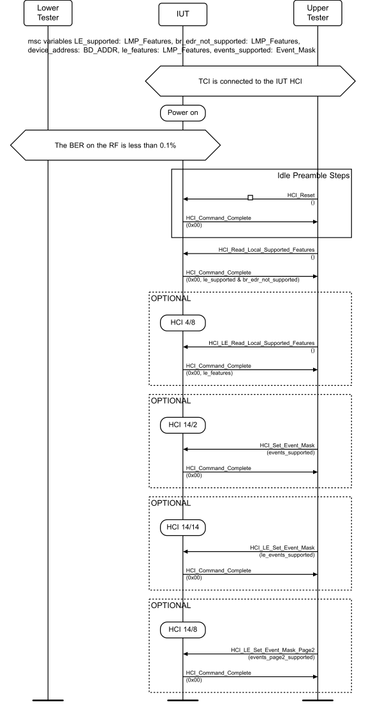

**Figure 4.1-1: Standby preamble steps**

The preamble steps do not have to be executed in case a previous test case execution is completed with all post-amble steps. Otherwise at least a part of the above steps might have to be executed.

**Figure 4.1-2: Device Address Set preamble steps**

The preamble steps above read or set an address supported by the IUT.
The HCI commands to set the IUT to apply filtering to specific devices with the parameters of a list of device addresses are displayed in the sequence chart below.

**Figure 4.1-3: Specific in the Filter Accept List preamble steps**

Step 2 is optional when the preamble steps are used only to set the filter policy. The preamble steps do not include getting the maximum count of Filter Accept List entries, since the tests use only one entry at a time.
The HCI commands to determine the usage of LE or BR+EDR data buffers for tests transferring data are displayed in the sequence chart below:

**Figure 4.1-4: Buffer Size Read preamble steps**

The outcome of the preamble steps is the information about data primitives and parameters supported by the IUT as well as the configuration of the data primitive parameters supported by the Upper Tester to the IUT.
The common initial states of the advertising state.
State: Advertising Parameters Set
The HCI commands to set the parameters’ advertising interval and advertising channel map are displayed in the sequence chart below.

**Figure 4.1-5: Advertising Parameters Set preamble steps**

The HCI commands to set the IUT to advertise in non-connectable mode with parameters are displayed in the sequence chart below.

**Figure 4.1-6: Non-Connectable Advertising preamble steps**

The HCI commands to set the IUT to advertise in connectable undirected mode with parameters are displayed in the sequence chart below.

**Figure 4.1-7: Undirected Advertising preamble steps**

The HCI commands to set the IUT to advertise in discoverable undirected mode with parameters are displayed in the sequence chart below.

**Figure 4.1-8: Discoverable Advertising preamble steps**

The HCI commands to set the IUT to advertise in periodic advertising mode with parameters as displayed in the sequence chart below.

**Figure 4.1-9: Periodic Advertising preamble steps**

Periodic Advertising msc variables: primary_adv_interval_min: Adv_Interval, primary_adv_interval_max: Adv_Interval, own_address_type: Address_Type, periodic_adv_interval_min: Adv_Interval, periodic_adv_interval_max: Adv_Interval
The HCI commands to set the IUT to advertise using directed advertising with parameters events are displayed in the Figure 4.1-10.

**Figure 4.1-10: Directed Advertising preamble steps**

The HCI commands to set the IUT to advertise using extended advertising with parameters as displayed in the sequence chart below.

**Figure 4.1-11: Extended Advertising preamble steps**

Extended Advertising msc variables: prim_adv_int_min: Adv_Interval, prim_adv_int_max: Adv_Interval, prim_adv_phy: PHY, sec_adv_max_skip: Secondary_Advertising_Max_Skip, sec_adv_phy: PHY
The common initial states of the scanning state.
State: Passive Scanning
The HCI commands to set the IUT to scan in the passive mode with the parameters filtering policy, scan interval, and scan window are displayed in the sequence chart below.

**Figure 4.1-12: Passive Scanning preamble steps**

State: Active Scanning
The sequence chart below displays the HCI commands to set the IUT to scan in the active mode with the parameters of filtering policy, scan interval and scan window.

**Figure 4.1-13: Active Scanning preamble steps**

The HCI commands to set the IUT to advertising using Low Duty Cycle Directed Advertising with parameters are displayed in Figure 4.1-14.

**Figure 4.1-14: Low Duty Cycle Direct Advertising preamble steps**

The common initial states of the initiating state.
State: Initiating
The HCI commands to set the IUT to initiate a connection with parameters are displayed in Figure 4.1-15.

**Figure 4.1-15: Initiating preamble steps**

Note: peer_address is an address used by the Lower Tester.
State: Connection Setup in the Filter Accept List

**Figure 4.1-16: Connection Setup in the Filter Accept List preamble steps**

The initiator device filtering uses only the Filter Accept Listing mechanism.
The common initial states of the Peripheral role.
State: Connected Peripheral
The HCI commands to set the IUT to accept a connection and start maintaining it in the Peripheral role with parameters are displayed in Figure 4.1-17.

**Figure 4.1-17: Connected Peripheral preamble steps**

The preamble steps for undirected advertising require the parameters to first start undirected advertising, then for the Lower Tester to initiate the connection setup to the IUT. The parameter values supplied to the IUT for the advertising are not significant in these tests, but the connection parameters may be. The test procedure steps for accepting connections are performed once in these preamble steps using the parameter values, in order to complete the connection setup procedure.
In each test where a Peripheral device is connected but connection termination is not a part of the test objective, a postamble is added to the test procedure steps. The objective with the postamble steps is to bring the IUT to the standby state.

**Figure 4.1-18: Peripheral Connection Terminated postamble steps**

The asterisk denoting the packet type in step 1 above means that only the acknowledgement scheme is followed in the steps and the packet types are not observed.
The HCI commands to connect the IUT to the Lower Tester on a secondary advertising channel with parameters as displayed in the sequence chart below.

**Figure 4.1-19: Peripheral Connected on Secondary Advertising Physical Channel preamble steps**

Extended Advertising msc variables: prim_adv_int_min: Adv_Interval, prim_adv_int_max: Adv_Interval, prim_adv_phy: PHY, sec_adv_max_skip: Secondary_Advertising_Max_Skip, sec_adv_phy: PHY
State: Peripheral Connected with Connection Subrating
The commands to enable Connection Subrating Feature support, connect the IUT to the Lower Tester, the Lower Tester initiates a Connection Subrating change as displayed in the sequence chart below.

**Figure 4.1-20: Peripheral Connected with Connection Subrating preamble steps**

The common initial states of the Central role.
State: Connected Central
The HCI commands to have the IUT maintain a connection in the Central role with parameters are displayed in the sequence chart below.

**Figure 4.1-21: Connected Central preamble steps**

The preamble steps for initiating require the parameters, but every value may not be significant in the tests for the connected Central. The test procedure steps for connection initiation are performed once in these preamble steps, in order to complete the connection setup.
In each test where a Central device is connected but connection termination is not a part of the test objective, a postamble is added to the test procedure steps. The objective with the postamble steps is to bring the IUT to the standby state.

**Figure 4.1-22: Central Connection Terminated postamble steps**

The asterisk denoting the packet type in step 1 above means that only the acknowledgement scheme is followed in the steps and the packet types are not observed.
The HCI commands to connect the IUT to the Lower Tester on a secondary advertising channel with parameters as displayed in the sequence chart below.

**Figure 4.1-23: Central Connected on Secondary Advertising Physical Channel preamble steps**

Central Connected on Secondary Advertising Physical Channel msc variables: init_phys: PHY, scan_int[ ]: Scan_Interval, scan_win[ ]: Scan_Window, conn_int_mn: Connection_Interval, conn_int_mx: Connection_Interval, max_latency[ ]: Max_Latency, sup_timeout[ ]: Supervision_Timeout, mn_ce_len[ ]: Minimum_CE_Length, mx_ce_len[ ]: Maximum_CE_Length
The commands to enable Connection Subrating Feature support, connect the IUT to the Lower Tester, initiate a feature exchange by the IUT, and the IUT to initiate a Connection Subrating change as displayed in the sequence chart below.

**Figure 4.1-24: Central Connected with Connection Subrating preamble steps**

The commands to enable Connection Subrating Feature support, connect the IUT to the Lower Tester, and the Lower Tester to initiate a Connection Subrating request as displayed in the sequence chart below.

**Figure 4.1-25: Central Connected with Connection Subrating preamble steps**

State: Encrypted Address Calculated

**Figure 4.1-26: Random Address Calculated preamble steps**

The random address generation behavior is an extract from GAP [1] Section 2.1.2 and represents here the typical HCI sequences required from a Controller. The identity resolving key ‘irk’ is used in the test procedures in group ‘SEC’.

**Figure 4.1-27: Encrypted Address Calculated preamble steps**

State: Encrypted Peripheral Connection (ir: Key, er: Key, adv_interval_min: Adv_Interval, adv_interval_max: Adv_Interval, address_type: Address_Type, adv_channel_map: Adv_Channel_Map, conn_interval: Conn_Interval, conn_latency: Conn_Latency, conn_timeout: Conn_Timeout, sca: SCA)
State: Encrypted Central Connection (ir: Key, er: Key, scan_interval: Scan_Interval, scan_window: Scan_Window, address_type_peer: Address_Type, peer_address: Peer_Address, address_type_own: Address_Type, conn_interval: Conn_Interval, conn_latency: Conn_Latency, conn_timeout: Conn_Timeout
Encryption keys are input to a Controller from [1] (part H, Section 2.4.2). The keys to generate random addresses are obtained from the identity root “IR”. The IR is referred to as ‘ir’ and has the default value 0x112233445566778899AABBCCDDEEFF00. The encryption root, ER, is referred to as ‘er’ and has the same default value. The key to encrypt LL data is referred to as ‘ltk’.
The common Test Procedure steps section describes alternative optional test steps that a device may invoke at will during the execution of Test Procedure steps when the test would otherwise end with an Inconclusive verdict.

###### 4.1.6.7.1 Recovery Actions in Test Steps

The test procedure steps typically outline the correct behavior that leads to execute the test procedure successfully but are not a full implementation description for a test system. In the evaluation of the IUT behavior against a test procedure description, some provision is needed for failures in a testing configuration with a test system and an IUT. Below are sample behaviors that may occur in execution of a test procedure:
• Step for expecting a packet, but receiving none:
Repeat the step expecting the packet a number of times to reflect the confidence in the verdict to assign. The test procedure may fail to execute after the repetition count or time interval, or a Fail verdict may be assigned with a total number of missing packets.
• Step for expecting a packet, but receiving a different packet with a correct CRC:
If the packet is from the IUT and matches the contents expected (advertising channels) or the timing and synchronization word (data channels), assume the IUT has sent the packet and assign a Pass verdict.
If there are no alternatives for the test procedure step and the testing limitations do not describe otherwise, assign a Fail verdict.
• Step for expecting a packet and receiving one with an incorrect CRC:
If the packet is from the IUT and matches the timing, repeat the step expecting the packet a number of times to reflect the confidence in the verdict to assign (Assuming that a packet from the IUT is corrupted). Stop the test procedure execution after the repetition count.
• Step for expecting no packet, but receiving one with a correct CRC:
If the packet received is from the IUT fail the test procedure step (Assuming the IUT has sent an inopportune packet).
• Step for expecting no packet, but receiving one with an incorrect CRC:
If the packet is from the IUT and matches the timing, fail the test procedure step (Assuming the IUT has sent an inopportune packet).

###### 4.1.6.7.2 Test Step Repetition Count

In steps repeating a test procedure in order to assign a verdict, the phrase ‘a number of times’ is used. The actual repetition count is based on the failure or success probability of the particular protocol function that is executed in the test. In the case of a particular operation (e.g., correct one-way reception, transmission and reception) the repetition count is based on the bit error rate verified for an IUT in the RF PHY tests [7].
The confidence level is proportional to the repetition count of the test.

###### 4.1.6.7.3 Optional Test Steps

Note that the IUT may use these procedures in a way that the resulting trace of the Test Procedure does not exactly match the test description alone; however, taking into account the optional tests steps, it may still match the verdict criteria.
• Connection Update and Connection Parameters Request Procedures Optional Test Steps

**Figure 4.1-28: Connection Update and Connection Parameters Request Procedure optional test steps**

The IUT may request a change to the connection parameters, using either the Connection Update Procedure or the Connection Parameters Request Procedure, only if:
- The test does not mention the Connection Update Procedure or the Connection Parameters Request Procedure, or
- The procedure is carried out before the first step of the Test Procedure and the Initial Condition mentioned in the test are still respected.
• Channel Map Update Procedure Optional Test Steps

**Figure 4.1-29: Channel Map Update Procedure optional test steps**

The IUT may request a channel map update when Central only if:
- The test does not mention the Channel Map Update Procedure, or
- The procedure is carried out before the first step of the Test Procedure and the Initial Condition mentioned in the test are still respected.
• Version Exchange Procedure Optional Test Steps

**Figure 4.1-30: Version Exchange Procedure optional test steps**

The IUT or the Lower Tester may initiate a Version Exchange Procedure before or during the Test Procedure as long as the test does not mention this procedure in the Test Procedure.
The Lower Tester may initiate this procedure to reset/flush any version information that the IUT may have cached from a previous connection with it.
• Feature Exchange Procedure Optional Test Steps

**Figure 4.1-31: Feature Exchange Procedure optional test steps**

The Lower Tester may initiate this procedure during initial setup, provided that the procedure is not mentioned in the test, to reset/flush any feature information that the IUT may have cached from a previous connection with it.
• Data Length Update Procedure Optional Test Steps

**Figure 4.1-32: Data Length Update Procedure optional test steps**

The IUT may initiate a Data Length Update Procedure only if:
- The test does not mention the Data Length Update Procedure, or
- The procedure is carried out before the first step of the Test Procedure and the Initial Condition mentioned in the test are still respected.
• LE Ping Procedure Optional Test Steps

**Figure 4.1-33: LE Ping Procedure optional test steps**

The IUT may initiate an LE Ping Procedure only if:
- The test does not mention the LE Ping Procedure, or
- The procedure is carried out before the first step of the Test Procedure and the Initial Condition mentioned in the test are still respected.
• LE PHY Update Procedure Optional Test Steps

**Figure 4.1-34: LE PHY Update Procedure optional test steps**

If the test procedure involves the Upper Tester issuing an HCI_LE_Set_PHY command that is not intended to change the PHY (e.g., one with ALL_PHYS = 0x03), then the IUT may optionally initiate a PHY Update Procedure which is not described in the test procedure by issuing an LL_PHY_REQ PDU to the Lower Tester. If the Lower Tester is the Central, it responds with an LL_PHY_UPDATE_IND that does not change either PHY. If the Lower Tester is the Peripheral, it responds with an LL_PHY_RSP PDU that specifies the current PHYs in both directions. In the latter case, if the IUT does not respond with an LL_PHY_UPDATE_IND that does not change either PHY, assign a Fail verdict. The HCI_LE_PHY_Update_Complete event in the test procedure always follows this optional procedure.
• LE PHY Update Procedure (LE Coded Switch) Optional Test Steps

**Figure 4.1-35: LE PHY Update Procedure (LE Coded Switch) optional test steps**

If the test procedure involves the Upper Tester issuing an HCI_LE_Set_PHY command that is intended to change the PHY to or from LE Coded PHY, a change to either the maximum Payload length or the maximum transmission time of packets for the IUT may occur. Optionally, the IUT may initiate a Data Length Update Procedure after the PHY change. If both or either of the cases occur, the IUT notifies the Upper Tester with at least one HCI_LE_Data_Length_Change event before or after the HCI_LE_PHY_Update_Complete event.
• Test Command Generated Isochronous SDUs Optional Test Steps

**Figure 4.1-36: Test Command Generated Isochronous SDUs optional test steps**

An isochronous IUT may utilize an Upper Tester that meets one of the following conditions:
1. The Upper Tester cannot provide isochronous data SDUs to the IUT. 2. The Upper Tester and/or its associated HCI transport do not support sufficient bandwidth to support transmission of isochronous SDUs in a given isochronous test procedure.
In such cases, it is permissible for the Upper Tester to utilize the HCI_LE_ISO_Transmit_Test command to generate the SDUs required for a given test procedure as shown in Figure 4.1-36. The transmit test command is terminated at the end of the test procedure as shown.
The SDUs generated by the ISO Transmit Test command have a specific, fixed format that cannot be altered by the Upper Tester. Some test procedures call out specific payload contents to confirm correct operation. In those cases, a Lower Tester may need to analyze the contents of any received PDUs generated using the ISO Transmit Test command differently than defined in a given isochronous test procedure.
• Test Command Received Isochronous SDUs Optional Test Steps

**Figure 4.1-37: Test Command Received Isochronous SDUs optional test steps**

An isochronous IUT may utilize an Upper Tester that meets one of the following conditions:
1. The Upper Tester cannot receive isochronous data SDUs from the IUT. 2. The Upper Tester and/or its associated HCI transport do not support sufficient bandwidth to support reception of isochronous SDUs in a given isochronous test procedure.
In such cases, it is permissible for the Upper Tester to utilize the HCI_LE_ISO_Receive_Test and HCI_LE_ISO_Read_Test_Counters commands to receive the SDUs required for a given test procedure as shown in Figure 4.1-37. The receive test command is terminated at the end of the test procedure as shown.
As the actual contents of the isochronous data cannot be processed by the Upper Tester, the received data cannot be considered for pass/fail criteria, only the successful or unsuccessful reception of the data as defined in a given isochronous test procedure.
• BIG Termination Procedure Optional Test Steps

**Figure 4.1-38: BIG Termination optional test steps**

If the test procedure mandates that an IUT in the isochronous broadcaster role terminate its BIG, the IUT must provide six consecutive BIG_TERMINATE_IND PDUs prior to the instant when the BIG is to be terminated. Additional BIG_TERMINATE_IND PDUs may be broadcast prior to the instant, though they need not be consecutive.
• Minimum Number of Used Channels Procedure Optional Test Steps

**Figure 4.1-39: Minimum Number of Used Channels Procedure optional test steps**

The IUT may request a change in the minimum number of channels be used on the indicated PHY, only if:
- The test does not mention a Minimum Number of Used Channels Procedure, or
- The procedure is carried out before the first step of the Test Procedure, and the Initial Condition mentioned in the test are still respected.
• LE Power Change Indication Procedure Optional Test Steps

**Figure 4.1-40: LE Power Change Indication Procedure optional test steps**

The IUT may initiate an LE Power Change Indication Procedure only if:
- The test does not mention the Power Change Indication Procedure, or
- The procedure is carried out before the first step of the Test Procedure and the Initial Condition mentioned in the test are still respected.

###### 4.1.6.7.4 Autonomous Feature Exchange

**Figure 4.1-41: Autonomous Feature Exchange optional test steps**

The IUT may initiate an autonomous feature exchange at any time. If the IUT is Central, the Lower Tester completes the feature exchange. If the IUT is Peripheral then, unless the test says otherwise, the Lower Tester rejects the feature exchange with an LL_UNKNOWN_RSP PDU.
If the IUT as Central performs a feature exchange autonomously after connection establishment, this can cause some tests to have an Inconclusive verdict. If it only does this feature exchange in some circumstances (e.g., depending on the connection interval), then it is recommended that the behavior be disabled or the tests be run in a way that ensures the feature exchange does not happen, so that the full behavior can be tested.

##### 4.1.6.8 Pass/Inconclusive/Fail verdict conventions

Each test case has an Expected Outcome section. The IUT is granted the Pass verdict when all the detailed pass criteria conditions within the Expected Outcome section are met.
Certain test cases also have an Inconclusive verdict defined. If the conditions for this verdict are met, then the test provides evidence that the IUT neither meets nor violates the test case; instead, it means that the test case was not applicable to the IUT, and therefore a Pass verdict is not required in order to achieve Qualification of the IUT. Implementers are encouraged to provide mechanisms to avoid the behavior leading to an Inconclusive condition during testing.
The convention in this Test Suite is that, unless there is a specific set of fail conditions outlined in the test case, the IUT fails the test case as soon as one of the pass criteria conditions cannot be met. If this occurs, then the outcome of the test is a Fail verdict.
For an Inconclusive verdict, all the pass criteria conditions apply up to the point in the test procedure where an Inconclusive verdict is identified. If one of the pass criteria in a step prior to the Inconclusive verdict cannot be met, then the outcome of the test is the Fail verdict and not the Inconclusive verdict.
State: Connected Isochronous Stream, Central, Test
The sequence for the IUT as Central to establish a CIS with the Lower Tester as Peripheral using the HCI_LE_Set_CIG_Parameters_Test command.

**Figure 4.1-42: Connected Isochronous Stream, Central, Connection test steps**

Connected Isochronous Stream, Central, Test msc variables: sdu_int_c_to_p: SDU_Interval, sdu_int_p_to_c: SDU_Interval, ft_c_to_p: Flush_Timeout, ft_p_to_c: Flush_Timeout, iso_int: ISO_Interval, packing: Packing, framing: Framing, cis_cnt: CIS_Count, nse[ ]: NSE, mx_sdu_c_to_p[ ]: Data_Len, mx_sdu_p_to_c[ ]: Data_Len, mx_pdu_c_to_p[ ]: Data_Len, mx_pdu_p_to_c[ ]: Data_Len, phy_c_to_p[ ]: PHY, phy_p_to_c[ ]: PHY, bn_c_to_p[ ]: Burst_Number, bn_p_to_c[ ]: Burst_Number
The sequence for the IUT as Peripheral to accept a CIS with the Lower Tester as Central.

**Figure 4.1-43: Connected Isochronous Stream, Peripheral Accept Connection test steps**

Connected Isochronous Steam, Peripheral, Lower Tester variables: sdu_int_c_to_p: SDU_Interval, sdu_int_p_to_c: SDU_Interval, ft_c_to_p: Flush_Timeout, ft_p_to_c: Flush_Timeout, iso_int: ISO_Interval, packing: Packing, framing: Framing, cis_cnt: CIS_Count, nse[ ]: NSE, mx_sdu_c_to_p[ ]: Data_Len, mx_sdu_p_to_c[ ]: Data_Len, mx_pdu_c_to_p[ ]: Data_Len, mx_pdu_p_to_c[ ]: Data_Len, phy_c_to_p[ ]: PHY, phy_p_to_c[ ]: PHY, bn_c_to_p[ ]: Burst_Number, bn_p_to_c[ ]: Burst_Number
The sequence for the IUT to enter the Isochronous Broadcasting State using the HCI_LE_Create_BIG_Test command.

**Figure 4.1-44: Isochronous Broadcasting test steps**

Isochronous Broadcasting, Test msc variables: num_bis: Num_BIS, sdu_int: SDU_Interval, iso_int: ISO_Interval, nse: NSE, mx_sdu: Data_Len, mx_pdu: Data_Len, phy: PHY, packing: Packing, framing: Framing, bn: Burst_Number, irc: IRC, pto: PTO, encryption: Encryption, broadcast_code: Broadcast_Code
The sequence for the IUT in the Synchronization state to synchronize to a Broadcast Isochronous Stream.

**Figure 4.1-45: Synchronized to a Broadcast Isochronous Stream test steps**

Synchronized to a Broadcast Isochronous Stream msc variables: sync_timeout: Sync_Timeout, adv_phy: PHY, padv_interval: Adv_Interval, big_sync_timeout: BIG_Sync_Timeout, num_bis: Num_BIS, encryption: Encryption, iso_int: ISO_Interval, nse: NSE, packing: Packing, framing: Framing, bn: Burst_Number, irc: IRC, pto: PTO, broadcast_code: Broadcast_Code

#### 4.1.7 Data Fragmentation over HCI

When a test case involves data being sent from the Lower Tester to the IUT and then reported to the Upper Tester, or vice versa, then the following requirements are met.
• The data bytes received have the same values, in the same order, as those sent.
• The number and location of “start flags” within the received data are the same as those in the sent data. A “start flag” occurs immediately before the first byte of a Link Layer packet with LLID set to 0x02 or an HCI data packet with Packet_Boundary_Flag set to 0x00 or 0x02, and nowhere else. Note that packets containing no data could result in more than one start flag at the same location.
Provided that these requirements are met, the specific fragmentation of the data is not part of the pass criteria for a test case.

#### 4.1.8 Data PDUs and Empty PDUs

The test procedures and message sequence charts of tests may expect empty packets or data PDUs from and to the IUT. In these places, any valid data channel PDU is also permitted, provided that the contents of data packets conform to Section 4.1.7 and that control packets only appear where permitted by Section 4.1.6.7.3 and not forbidden by the Core Specification (e.g., during a conflicting ongoing procedure).

#### 4.1.9 Outstanding Commands Prior to Disconnection

In test cases where the IUT is in either the Central or Peripheral role, if there are outstanding commands relating to the connection, and the connection gets disconnected (the disconnection may be initiated either by the IUT or the Lower Tester), then the Upper Tester ensures that:
• If the IUT completes those outstanding commands, then it does that with a nonzero status and before returning the HCI_Disconnection_Complete event.
• The IUT does not send any events for that connection handle after sending the HCI_Disconnection_Complete event.

#### 4.1.10 Both Connected Roles

Tests in the Both Connected Roles sections start with the IUT in a connection with the Lower Tester. If the test case ID (TCID) begins with LL/<feat>/CEN/, where <feat> is defined in Table 4.1-1, the IUT is in the Central role. If the TCID begins with LL/<feat>/PER/, the IUT is in the Peripheral role.

### 4.2 DDI

Test of the device discovery procedures.

#### 4.2.1 References

This document incorporates provisions from other publications by dated or undated reference. These references are cited at the appropriate places in the text, and the publications are listed hereinafter. Additional definitions and abbreviations can be found in [1], [2], and [3].
[1] Specification of the Bluetooth System, Versions 4.0 or later
[2] Test Strategy and Terminology Overview
[3] Specification of the Bluetooth System, Volume 6, Part B (Link Layer Protocol Specification), Version 4.0
[4] ICS Proforma for Bluetooth Low Energy Link Layer Protocol Specification
[5] ITU-T X.290 series, OSI CONFORMANCE TESTING METHODOLOGY AND FRAMEWORK PROTOCOL RECOMMENDATIONS FOR ITU-T APPLICATIONS, ITU Recommendation X.290 series (equivalent to ISO 9646)
[6] Federal Information Processing Standards Publication 197, ADVANCED ENCRYPTION STANDARD (AES), FIPS, 2001
[7] Bluetooth Test Suite for RFPHY
[8] Specification of the Bluetooth System, Volume 6, Part B (Link Layer Protocol Specification), Version 4.2 or later
[9] Bluetooth Core IXIT proforma
[10] Specification of the Bluetooth System, Volume 6, Part B (Link Layer Protocol Specification), Version 5.0 or later
[11] Specification of the Bluetooth System, Volume 2, Part E (Versions 1.2 to 5.1) or Volume 4, Part E (Version 5.2 and higher) Host Controller Interface (HCI)
[12] Specification of the Bluetooth System, Volume 3, Part A, Logical Link Control and Adaptation Protocol (L2CAP) Specification
[13] Specification of the Bluetooth System, Volume 6, Part B (Link Layer Protocol Specification), Version 5.1 or later
[14] Specification of the Bluetooth System, Volume 6, Part B (Link Layer Protocol Specification), Version 5.2 or later
[15] Specification of the Bluetooth System, Volume 2, Part E (Versions 1.2 to 5.1) or Volume 4, Part E (Version 5.2 and higher) (Host Controller Interface Functional Specification), Version 5.2 or later
[16] Specification of the Bluetooth System, Volume 6, Part D (Message Sequence Charts), Version 5.2 or later
[17] Specification of the Bluetooth System, Volume 6, Part G (Isochronous Adaptation Layer), Version 5.2 or later
[18] Core Specification Supplement (CSS), Part A, Current Version
[19] Specification of the Bluetooth System, Volume 6, Part B (Link Layer Protocol Specification), Version 5.3 or later
[20] Specification of the Bluetooth System, Volume 4, Part E (Host Controller Interface (HCI)), Version 5.3 or later
[21] Specification of the Bluetooth System, Volume 3, Part H (Host Specification), Version 5.2 or later
[22] Appropriate Language Mapping Tables document
[23] Specification of the Bluetooth System, Volume 6, Part B (Link Layer Protocol Specification), Version 5.4 or later
[24] Specification of the Bluetooth System, Volume 4, Part E (Host Controller Interface (HCI)), Version 5.4 or later
[25] Specification of the Bluetooth System, Volume 6, Part B (Link Layer Protocol Specification), Version 6.0 or later
[26] Specification of the Bluetooth System, Volume 4, Part E (Host Controller Interface Specification), Version 6.0 or later
[27] Specification of the Bluetooth System, Volume 2, Part E (Versions 1.2 to 5.1) or Volume 4, Part E (Version 6.0 and higher) Host Controller Interface (HCI)
[28] Specification of the Bluetooth System, Volume 6, Part C (Sample Data), Version 6.0 or later

#### 4.2.2 Common PDU Contents

The packet descriptions for advertising channel packets sent and accepted by the Lower Tester are displayed below. The addresses used in tests vary for the Lower Tester, in case of the IUT the address is expected to match the registered IXIT value. The data used in tests varies from no advertising data to data with different length and content. Unless otherwise specified, duplicate Periodic Advertising filtering is not enabled and ADI is not included in the AUX_SYNC_IND PDU.

##### 4.2.2.1 Legacy Advertising

ADV_NONCONN_IND PDU:

|  | Header |  |  |  |  |  |  |  |  |  |  |  |  |  |  |  | Payload |  |  |  |  |
| --- | --- | --- | --- | --- | --- | --- | --- | --- | --- | --- | --- | --- | --- | --- | --- | --- | --- | --- | --- | --- | --- |
|  | lsb msb |  |  |  |  |  |  |  |  |  |  |  |  |  |  |  | LSO MSO |  |  |  |  |
|  |  |  |  |  |  |  |  |  |  |  | lsb msb |  |  |  |  |  | lsb msb |  |  | lsb msb |  |
|  | Type ‘0100’ | RFU ‘00’ |  |  | TxAdd |  |  | RFU |  |  | Length |  |  | RFU |  |  | AdvA |  |  | AdvData |  |
|  |  |  |  |  | ‘0’ |  |  | ‘0’ |  |  | (6 bits) |  |  | ‘00’ |  |  | (6 octets) |  |  | (variable) |  |

ADV_IND PDU:

|  | Header |  |  |  |  |  |  |  |  |  |  |  | Payload |  |  |  |  |
| --- | --- | --- | --- | --- | --- | --- | --- | --- | --- | --- | --- | --- | --- | --- | --- | --- | --- |
|  | lsb msb |  |  |  |  |  |  |  |  | lsb msb |  |  | LSO MSO |  |  |  |  |
|  |  |  |  |  |  |  |  |  |  |  |  |  | lsb msb |  |  | lsb msb |  |
|  | Type ‘0000’ | RFU ‘0’ |  |  | ChSel ‘0’ | TxAdd ‘0’ |  |  | RFU ‘0’ | Length (8 bits) |  |  | AdvA |  |  | AdvData |  |
|  |  |  |  |  |  |  |  |  |  |  |  |  | (6 octets) |  |  | (variable) |  |

ADV_DIRECT_IND PDU:

|  | Header |  |  |  |  |  |  |  |  |  |  |  | Payload |  |  |  |  |
| --- | --- | --- | --- | --- | --- | --- | --- | --- | --- | --- | --- | --- | --- | --- | --- | --- | --- |
|  | lsb msb |  |  |  |  |  |  |  |  | lsb msb |  |  | LSO MSO |  |  | LSO MSO |  |
|  |  |  |  |  |  |  |  |  |  |  |  |  | lsb msb |  |  | lsb msb |  |
|  | Type ‘1000’ | RFU ‘0’ |  |  | ChSel ‘0’ | TxAdd ‘0’ |  |  | RxAdd ‘0’ | Length ‘00110000’ |  |  | AdvA |  |  | TargetA |  |
|  |  |  |  |  |  |  |  |  |  |  |  |  | (6 octets) |  |  | (6 octets) |  |

|  | Header |  |  |  |  |  |  |  |  |  |  |  |  |  |  |  |  | Payload |  |  |  |  |
| --- | --- | --- | --- | --- | --- | --- | --- | --- | --- | --- | --- | --- | --- | --- | --- | --- | --- | --- | --- | --- | --- | --- |
|  |  |  |  |  |  |  |  |  |  |  |  |  |  |  |  |  |  | LSO MSO |  |  |  |  |
|  | lsb msb |  |  |  |  |  |  |  |  |  |  | lsb msb |  |  |  |  |  | lsb msb |  |  | lsb msb |  |
|  | Type |  |  | RFU |  | TxAdd |  |  | RFU |  |  | Length |  |  | RFU |  |  | AdvA |  |  | AdvData |  |
|  | ‘0110’ |  |  | ‘00’ |  | ‘0’ |  |  | ‘0’ |  |  | (6 bits) |  |  | ‘00’ |  |  | (6 octets) |  |  | (variable) |  |

SCAN_REQ PDU:

|  | Header |  |  |  |  |  |  |  |  |  |  |  |  |  |  |  |  | Payload |  |  |  |  |
| --- | --- | --- | --- | --- | --- | --- | --- | --- | --- | --- | --- | --- | --- | --- | --- | --- | --- | --- | --- | --- | --- | --- |
|  |  |  |  |  |  |  |  |  |  |  |  |  |  |  |  |  |  | LSO MSO |  |  | LSO MSO |  |
|  | lsb msb |  |  |  |  |  |  |  |  |  |  | lsb msb |  |  |  |  |  | lsb msb |  |  | lsb msb |  |
|  | Type |  |  | RFU |  | TxAdd |  |  | RxAdd |  |  | Length |  |  | RFU |  |  | ScanA |  |  | AdvA |  |
|  | ‘1100’ |  |  | ‘00’ |  | ‘0’ |  |  | ‘0’ |  |  | ‘001100’ |  |  | ‘00’ |  |  | (6 octets) |  |  | (6 octets) |  |

SCAN_RSP PDU:

|  | Header |  |  |  |  |  |  |  |  |  |  |  |  | Payload |  |  |  |  |
| --- | --- | --- | --- | --- | --- | --- | --- | --- | --- | --- | --- | --- | --- | --- | --- | --- | --- | --- |
|  |  |  |  |  |  |  |  |  |  |  |  |  |  | LSO MSO |  |  |  |  |
|  | lsb msb |  |  |  |  |  |  | lsb msb |  |  |  |  |  | lsb msb |  |  | lsb msb |  |
| Type ‘0010’ | Type |  | RFU ‘00’ | RFU | TxAdd (1 bit) | RFU ‘0’ |  | Length |  | RFU ‘00’ |  |  | AdvA (6 octets) | AdvA |  | ScanRspData (3 to 31 octets) | ScanRspData |  |
|  | ‘0010’ |  |  | ‘00’ |  |  |  | ‘110100’ |  |  |  |  |  | (6 octets) |  |  | (3 to 31 octets) |  |
|  |  |  |  |  |  |  |  | Or |  |  |  |  |  |  |  |  |  |  |
|  |  |  |  |  |  |  |  | ‘001100’ |  |  |  |  |  |  |  |  |  |  |

##### 4.2.2.2 Extended Advertising

In all tests where the IUT is transmitting ADV_EXT_IND and possibly AUX_ADV_IND extended advertising PDUs to the Lower Tester, the Lower Tester makes the following checks, which form part of the Pass verdict:
• If the Upper Tester specified anonymous advertising, then neither the ADV_EXT_IND PDU nor the AUX_ADV_IND PDU includes an AdvA field. Otherwise, exactly one includes an AdvA field. (Note: the Upper Tester will not specify anonymous advertising if no, or zero length, advertising data is specified.)
• If the Upper Tester specified directed advertising, then either the ADV_EXT_IND PDU or the AUX_ADV_IND PDU, but not both, includes a TargetA field. Otherwise, neither includes a TargetA field.
• If an ADV_EXT_IND PDU has an AdvMode field containing 0b01 (connectable) or 0b10 (scannable), it does not include an AdvA or TargetA field.
• If an ADV_EXT_IND PDU is sent on the LE Coded PHY and includes an AuxPtr field, it does not include an AdvA or TargetA field.
• If a PDU includes an AdvA field, it contains the IUT's Advertising Address specified by the Upper Tester during the test procedure.
• If a PDU includes a TargetA field, it contains the Lower Tester’s Device Address specified by the Upper Tester during the test procedure.

#### 4.2.3 ADV

Tests that the IUT behaves according to the device discovery procedures in the advertiser role.

##### 4.2.3.1 Common PDU Contents

The advertising channel packet contents that are sent by the Upper Tester sent or expected by the Lower Tester to be received are defined in Section 4.2.2.
If a test uses the LE Set Extended Advertising Parameters command and does not specify values for the Primary_Advertising_PHY_Options and Secondary_Advertising_PHY_Options parameters, these parameters are set to 0x00.

##### 4.2.3.2 Common Advertising Address Type

The Upper Tester enables advertising with either a public or static address type.
If the Lower Tester receives an advertising PDU from the IUT that contains an AdvA field that is neither a public nor a static address, the test ends in a Fail verdict.
LL/DDI/ADV/BV-01-C [Non-Connectable Advertising Events]
• Test Purpose
Test that an advertiser IUT sends the advertising packets of non-connectable event type, with correct contents and with correct event timing.
The Lower Tester observes the event timing and packet contents on the selected advertising channel.
• Reference
[4] 4.4.2.6, 4.4.2.2
• Initial Condition
- Parameters: LL_advertiser_advInterval_MIN, LL_advertiser_advInterval_MAX, LL_advertiser_Adv_Channel_Map.
- State: Non-Connectable Advertising (selected Adv_Interval_Min, selected Adv_Interval_Max, supported type of own address, selected advertising channel)
• Test Procedure

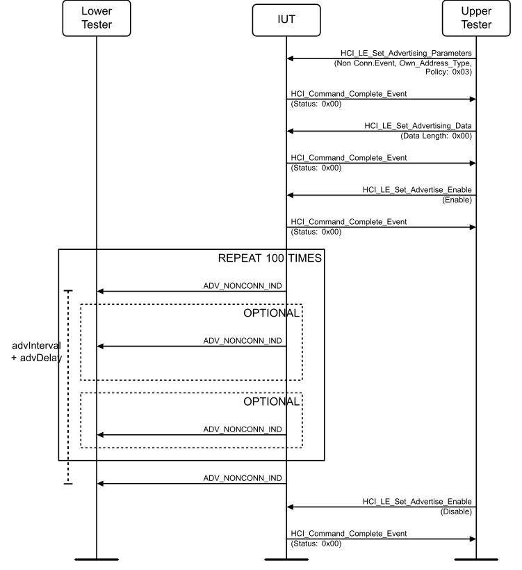

**Figure 4.2-1: LL/DDI/ADV/BV-01-C [Non-Connectable Advertising Events] MSC**

1. Configure the Lower Tester to monitor advertising packets from the IUT. 2. The Upper Tester enables non-connectable advertising in the IUT using a selected advertising channel and a selected advertising interval between the minimum and maximum advertising intervals. 3. Expect the IUT to send ADV_NONCONN_IND on the selected advertising channel. 4. Expect the following event to start one advertising interval after the start of the first packet. 5. Repeat steps 3–4 until a number of advertising intervals (100) have been detected. 6. The Upper Tester sends an HCI_LE_Set_Advertising_Enable command to disable advertising in the IUT and receives an HCI_Command_Complete event from the IUT.
• Expected Outcome
Pass verdict
The test procedure completes using the selected advertising interval for all supported advertising channels.
The timing range detected for advertising events is from TSPX_adv_interval_min to TSPX_adv_interval_min + 10.0 ms (calculated for the minimum advertising interval specified in [9]).
• Notes
The required accuracy for advertising event intervals is a microsecond, from the interval setting granularity of 625 µs. The delay applied is regarded as a range of up to 10.000 ms, making the timing observation a question of whether the measured range is within the advertising interval plus any delay selected. Taking into account the clock drift of 500 ppm of the low power mode at the minimum advertising interval, tens of microseconds are affected in the accuracy. Jitter for low power mode (16 µs) has the same effect on the accuracy. The clock drift would affect tens of milliseconds at the maximum advertising interval. The 16µs requirement applies to the advertising and periodic advertising intervals, the advDelay value, all intervals between packets in the same extended advertising event or periodic advertising event, and all offsets specified by the AuxPtr and SyncInfo fields of advertising PDUs.
The minimum actual time interval between any two events required is therefore the interval specified plus negative drift plus negative jitter: (0.625 ms * Adv_Interval) – (0.625 ms * Adv_Interval * 500 ppm) – 0.032 ms from the previous event. The maximum actual time interval is
(0.625 ms * Adv_Interval + 10.000 ms) * (1 + 500 ppm) + 0.032 ms from the previous event.
Since repeated measurements close to the maximum advertising interval of seconds is not feasible because of test time accumulation (over a minute to repeat 10 times), the accuracy of timing is tested with supported values in the lower interval range.
The order of deviation allowed as result of drift and jitter is the minimum measurement accuracy. Measurement results are rounded to the next decimal after calculations for comparison with the requirements. For the maximum advertising interval, this gives accuracy of 0.01 s and for the minimum advertising interval 0.1 ms.
The total time the test procedure is attempted is based on the probability of detecting 2 consequent advertising events and resolves to around 100 events, after which the test procedure is stopped.
LL/DDI/ADV/BV-02-C [Undirected Advertising Events]
• Test Purpose
Test that an advertiser IUT sends advertising packets of an event with correct contents on a selected advertising channel with correct event timing.
The Lower Tester observes the packet and event timing and packet contents on the selected advertising channel.
• Reference
[3] 4.4.2.3
• Initial Condition
- Parameters: LL_advertiser_advInterval_MIN, LL_advertiser_advInterval_MAX, LL_advertiser_Adv_Channel_Map
- State: Undirected Advertising (selected Adv_Interval_Min, selected Adv_Interval_Max, supported type of own address, selected advertising channel, length of device name used, common device name)
• Test Procedure

**Figure 4.2-2: LL/DDI/ADV/BV-02-C [Undirected Advertising Events] MSC**

1. Configure the Lower Tester to monitor advertising packets from the IUT. 2. The Upper Tester enables undirected advertising in the IUT using a selected advertising channel and a selected advertising interval between the minimum and maximum advertising intervals. 3. The Lower Tester expects the IUT to send ADV_IND packets on the selected advertising channel. 4. Expect the next event to start after advertising interval time calculated from the start of the first packet. 5. Repeat steps 3–4 until a number of advertising intervals (100) have been detected. 6. The Upper Tester sends an HCI_LE_Set_Advertising_Enable command to disable advertising in the IUT and receives an HCI_Command_Complete event from the IUT.
• Expected Outcome
Pass verdict
The test procedure completes using the selected advertising interval.
The test procedure completes the selected advertising channel.
The timing range detected for advertising events is from (TSPX_adv_interval_min) ms to (TSPX_adv_interval_min + 10) ms.
• Notes
The notes in the section containing test case LL/DDI/ADV/BV-01-C [Non-Connectable Advertising Events] describe the reasoning of the timing measurements and test result criteria.
LL/DDI/ADV/BV-03-C [Advertising Data: Non-Connectable]
• Test Purpose
Test that an advertiser IUT sends advertising packets of a non-connectable event type with data on a selected advertising channel.
The Upper Tester submits data to the IUT and the Lower Tester observes the IUT including data to the selected advertising packets on the advertising channel.
• Reference
[3] 4.4.2.6
• Initial Condition
- Parameters: LL_advertiser_advInterval_MIN, LL_advertiser_advInterval_MAX, LL_advertiser_Adv_Channel_Map
- State: Advertising Parameters Set (selected Adv_Interval_Min, selected Adv_Interval_Max, selected type of advertising events, supported type of own address, selected advertising channel)
• Test Procedure
Execute the test procedure using non-connectable advertising events with a selected advertising interval between the minimum and maximum advertising intervals supported using the selected advertising channel, with default data lengths of 1 and 31. If the IUT has a maximum data length of less than 31 bytes, this may be specified via an IXIT value.

**Figure 4.2-3: LL/DDI/ADV/BV-03-C [Advertising Data: Non-Connectable] MSC**

1. Configure the Lower Tester to monitor advertising packets from the IUT. 2. The Upper Tester configures non-connectable advertising in the IUT using a selected advertising channel and a selected advertising interval between the minimum and maximum advertising intervals. 3. The Upper Tester sends an HCI_LE_Set_Advertising_Data command to the IUT and receives an HCI_Command_Complete in response. The data element used in the command is the length of the data field. The data length is 1 byte. 4. The Upper Tester sends an HCI_LE_Set_Advertising_Enable command to the IUT to enable advertising and receives an HCI_Command_Complete event in response. 5. The Lower Tester expects the IUT to send ADV_NONCONN_IND packets including the data submitted in step 3 starting an event on the selected advertising channel. 6. Expect the following event to start after advertising interval time calculating from the start of the first packet. 7. Repeat steps 5–6 until a number of advertising intervals (50) have been detected. 8. The Upper Tester sends an HCI_LE_Set_Advertising_Enable command to the IUT to disable advertising function and receives an HCI_Command_Complete event in response. 9. The Upper Tester sends an HCI_LE_Set_Advertising_Data to configure the IUT to send advertising packets without advertising data and receives an HCI_Command_Complete event in response. 10. The Upper Tester sends an HCI_LE_Set_Advertising_Enable command to the IUT to enable advertising and receives an HCI_Command_Complete event in response. 11. The Lower Tester expects the IUT to send ADV_NONCONN_IND packets including no advertising data starting an event on the selected advertising channel. 12. Expect the next event to start after advertising interval time calculating from the start of the first packet. 13. Repeat steps 11–12 until a number of advertising intervals (50) have been detected. 14. The Upper Tester sends an HCI_LE_Set_Advertising_Enable command to the IUT to disable advertising and receives an HCI_Command_Complete event in response. 15. The Upper Tester sends an HCI_LE_Set_Advertising_Data command to the IUT and receives an HCI_Command_Complete in response. The data element is a number indicating the length of the data field in the first octet encoded unsigned least significant bit first and the rest of the octets zeroes. The data length is either 31 bytes by default or it may be specified by IXIT value if less than 31 bytes. 16. Repeat steps 4–14.
• Expected Outcome
Pass verdict
The test procedure executes with the IUT advertising using non-connectable event type.
The IUT transmits data as submitted in the HCI commands.
LL/DDI/ADV/BV-04-C [Advertising Data: Undirected]
• Test Purpose
Tests that an advertiser IUT sends advertising packets of an undirected type of event with data on a selected advertising channel.
The Upper Tester submits data to the IUT and the Lower Tester observes the IUT including data to the advertising packets on the selected advertising channel.
• Reference
• Initial Condition
- Parameters: LL_advertiser_advInterval_MIN, LL_advertiser_advInterval_MAX, LL_advertiser_Adv_Channel_Map
- State: Advertising Parameters Set (selected Adv_Interval_Min, selected Adv_Interval_Max, selected type of advertising events, supported type of own address, selected advertising channel)
• Test Procedure
Execute the test procedure using undirected advertising events with a selected advertising interval between the minimum and maximum advertising intervals supported using the selected advertising channel, with data lengths of 1 and 31.

**Figure 4.2-4: LL/DDI/ADV/BV-04-C [Advertising Data: Undirected] MSC**

1. Configure the Lower Tester to monitor advertising packets from the IUT. 2. The Upper Tester configures undirected advertising in the IUT using a selected advertising channel and a selected advertising interval between the minimum and maximum advertising intervals. 3. The Upper Tester sends an HCI_LE_Set_Advertising_Data command to the IUT and receives an HCI_Command_Complete in response. The data element used in the command is the length of the data field. The data length is 1 byte. 4. The Upper Tester sends an HCI_LE_Set_Advertising_Enable command to the IUT to enable advertising and receives an HCI_Command_Complete event in response. 5. The Lower Tester expects the IUT to send ADV_IND packets including the data submitted in step 3 starting an event on the selected advertising channel. 6. Expect the following event to start after advertising interval time calculating from the start of the first packet. 7. Repeat steps 5–6 until a number of advertising intervals (50) have been detected. 8. The Upper Tester sends an HCI_LE_Set_Advertising_Enable command to the IUT to disable advertising function and receives an HCI_Command_Complete event in response. 9. The Upper Tester sends an HCI_LE_Set_Advertising_Data to configure the IUT to send advertising packets without advertising data and receives an HCI_Command_Complete event in response. 10. The Upper Tester sends an HCI_LE_Set_Advertising_Enable command to the IUT to enable advertising and receives an HCI_Command_Complete event in response. 11. The Lower Tester expects the IUT to send ADV_IND packets including no advertising data starting an event on the selected advertising channel. 12. Expect the next event to start after advertising interval time calculating from the start of the first packet. 13. Repeat steps 11–12 until a number of advertising intervals (50) have been detected. 14. The Upper Tester sends an HCI_LE_Set_Advertising_Enable command to the IUT to disable advertising and receives an HCI_Command_Complete event in response. 15. The Upper Tester sends an HCI_LE_Set_Advertising_Data command to the IUT and receives an HCI_Command_Complete in response. The data element is a number indicating the length of the data field in the first octet encoded unsigned least significant bit first and the rest of the octets zeroes. The data length is 31 bytes. 16. Repeat steps 4–14.
• Expected Outcome
Pass verdict
The test procedure executes with the IUT advertising using undirected connectable event type,
The IUT transmits data as submitted in the HCI commands.
LL/DDI/ADV/BV-05-C [Scan Request: Undirected Connectable]
• Test Purpose
Tests that an advertiser IUT responds to a scan request and continues advertising after the response.
The Lower Tester requests information from the IUT, receives a response, then checks that the advertising resumes.
• Reference
[3] 4.4.2.3, 4.3.2
• Initial Condition
- Parameters: LL_advertiser_advInterval_MIN, LL_advertiser_advInterval_MAX, LL_advertiser_Adv_Channel_Map.
- State for all IUTs: Undirected Advertising (selected Adv_Interval_Min, selected Adv_Interval_Max, supported type of own address, selected advertising channels, length of device name used, selected name) AND Filter Accept List All Unknown Devices (Allow Scan Request from Any, Allow Connect Request from Any (0x00)).
• Test Procedure
Execute the test procedure using the selected advertising interval.

**Figure 4.2-5: LL/DDI/ADV/BV-05-C [Scan Request: Undirected Connectable] MSC**

1. The Upper Tester configures undirected advertising in the IUT using all supported advertising channels and a selected advertising interval between the minimum and maximum advertising intervals. 2. Configure the Lower Tester to monitor the advertising and scan response procedures of the IUT. The Lower Tester will send a SCAN_REQ packet on a selected supported advertising channel (defined as an IXIT) and using a common public device address as parameter. 3. Configure Scan Response Data in the IUT using device name length of 0 as response data. 4. The Lower Tester sends a SCAN_REQ packet on the selected advertising channel after receiving an ADV_IND packet from IUT on the advertising channel configured in step 3. The SCAN_REQ is sent T_IFS after the end of an ADV_IND packet. 5. The Lower Tester receives a SCAN_RSP packet from the IUT addressed to the Lower Tester T_IFS after the end of the request packet. 6. Repeat steps 4–5 30 times or until IUT sends a SCN_RSP. 7. Configure Scan Response Data in the IUT using device name length of 31 as response data. 8. Repeat steps 4–6. 9. Configure the Lower Tester to monitor the advertising and scan response procedures of the IUT. The Lower Tester will send a SCAN_REQ packet on a selected supported advertising channel (defined as an IXIT) and using a public device address that differs from the IUT address in the most significant octet. 10. Configure Scan Response Data in the IUT using device name length of 0 as response data. 11. Repeat steps 4–6. 12. Configure Scan Response Data in the IUT using device name length of 31 as response data. 13. Repeat steps 4–6. 14. Configure the Lower Tester to monitor the advertising and scan response procedures of the IUT. The Lower Tester will send a SCAN_REQ packet on a selected supported advertising channel (defined as an IXIT) and using a public device address that differs from the IUT address in the most and least significant octets. 15. Repeat steps 4–6. 16. Configure Scan Response Data in the IUT using device name length of 31 as response data. 17. Repeat steps 4–6.
• Expected Outcome
Pass verdict
The test procedure completes using the selected advertising interval.
The test procedure completes with the IUT responding on each advertising channel.
The IUT responds in each case of different scanner address used.
The timing deviations detected for packets in active mode are within the 2 µs range around T_IFS.
• Notes
The notes in the section containing test case LL/DDI/ADV/BV-01-C [Non-Connectable Advertising Events] describe the reasoning of the timing measurements and test result criteria.
LL/DDI/ADV/BV-06-C [Connection Request]
• Test Purpose
Tests that an advertiser IUT receives a connection request and stops advertising after its reception.
The Lower Tester requests a connection from the IUT, and then checks that advertising has stopped.
• Reference
[3] 4.4.2.3, 4.3.2
• Initial Condition
- Parameters: LL_advertiser_advInterval_MIN, LL_advertiser_advInterval_MAX, LL_advertiser_Adv_Channel_Map.
- State for all IUTs: Undirected Advertising (selected Adv_Interval_Min, selected Adv_Interval_Max, supported type of own address, all supported advertising channels, Length of device name used, common device name) AND Filter Accept List All Unknown Devices (Allow Scan Request from Any, Allow Connect Request from Any (0x00)).
• Test Procedure

**Figure 4.2-6: LL/DDI/ADV/BV-06-C [Connection Request] MSC**

1. The Upper Tester enables undirected advertising in the IUT using all supported advertising channels and a selected advertising interval between the minimum and maximum advertising intervals. 2. Configure the Lower Tester to monitor the advertising and connection procedures of the IUT and send a CONNECT_IND packet on the first supported advertising channel. 3. Configure the Lower Tester to use a public device address as parameter of CONNECT_IND. 4. The Lower Tester receives an ADV_IND packet from the IUT and responds with a CONNECT_IND packet T_IFS after the end of the advertising packet. 5. The Lower Tester receives no ADV_IND packet after the advertising interval from the IUT. Wait for a time equal to 4 advertising intervals to check that no ADV_IND is received. 6. The Upper Tester receives an HCI_LE_Connection_Complete event from the IUT including the parameters sent to the IUT in step 4. 7. The Upper Tester sends an HCI_Disconnect command to the IUT with the Connection_Handle and receives a successful HCI_Command_Status event in return. 8. The IUT sends an HCI_Disconnect_Complete event to the Upper Tester. 9. Configure the Lower Tester to use a public device address that differs from the IUT address in the most significant octet as parameter of CONNECT_IND. 10. Repeat steps 4–8. 11. Configure the Lower Tester to use a public device address that differs from the IUT address in the least significant octet as parameter of CONNECT_IND. 12. Repeat steps 4–8. 13. Configure the Lower Tester to use a public device address that differs from the IUT address in the most and least significant octets as parameter of CONNECT_IND. 14. Repeat steps 4–8. 15. Configure the Lower Tester to monitor the advertising and connection procedures of the IUT and send a CONNECT_IND packet on the second supported advertising channel. 16. Repeat steps 3–14. 17. Configure the Lower Tester to monitor the advertising and connection procedures of the IUT and send a CONNECT_IND packet on the third supported advertising channel. 18. Repeat steps 3–14.
• Expected Outcome
Pass verdict
The test procedure completes with the IUT stopping advertising using an advertising interval between the minimum and maximum on all of the supported advertising channels,
The IUT reports the requested connection with an HCI event for all address variants applied.
• Notes
The notes in the section containing test case LL/DDI/ADV/BV-01-C [Non-Connectable Advertising Events] describe the reasoning of the timing measurements and test result criteria.
LL/DDI/ADV/BV-07-C [Scan Request Connection Request]
• Test Purpose
Test that the IUT accepts a scan request immediately followed by a connection request.
The Lower Tester first acts in the active scanning state sending scan requests to the IUT, then after receiving a scan response from the IUT, it switches to initiating state to send a connection request to the IUT.
• Reference
[3] 4.4.2.3
• Initial Condition
- Parameters: LL_advertiser_advInterval_MIN, LL_advertiser_advInterval_MAX, LL_advertiser_Adv_Channel_Map.
- State: Undirected Advertising (selected Adv_Interval_Min, selected Adv_Interval_Max, supported type of own address, selected advertising channels, Length of device name used, common device name).
• Test Procedure

**Figure 4.2-7: LL/DDI/ADV/BV-07-C [Scan Request Connection Request] MSC**

1. The Upper Tester enables undirected advertising in the IUT using all supported advertising channels, a selected advertising interval between the minimum and maximum advertising intervals, and filtering policy set to ‘Allow Scan Request from Any, Allow Connect Request from Any (Default) (0x00)’. 2. The Upper Tester sends an HCI_LE_Set_Scan_Response_Data command with data set to “IUT” and receives an HCI_Command_Complete event from the IUT.
3. Configure the Lower Tester to monitor the advertising, scan response and connection procedures of the IUT, sending a SCAN_REQ and a CONNECT_IND packet on a supported advertising channel (defined as an IXIT). 4. The Lower Tester receives an ADV_IND packet from the IUT on the selected advertising channel and responds with an SCAN_REQ packet on the selected advertising channel T_IFS after the end of an advertising packet. 5. The Lower Tester receives an SCAN_RSP packet from the IUT addressed to the Lower Tester T_IFS after the end of the request packet. 6. Repeat steps 4–5 30 times or until IUT sends SCAN_RSP. 7. The Lower Tester receives an ADV_IND packet from the IUT on the selected advertising channel and responds with a CONNECT_IND packet T_IFS after the end of the advertising packet. 8. The Lower Tester receives no ADV_IND packet after advertising interval from the IUT after sending the connection request to indicate that the IUT has stopped advertising. 9. The Upper Tester receives an HCI_LE_Connection_Complete event from the IUT including the parameters sent to the IUT. 10. Peripheral Connection Terminated (connection interval, Peripheral latency, timeout, channel map, un-encrypted, connection handle from step 9).
• Expected Outcome
Pass verdict
The test procedure completes when the IUT responds to the scan request and connection is successful.
LL/DDI/ADV/BV-08-C [Scan Request Device Filtering]
• Test Purpose
Tests that an advertiser IUT filters scanners according to the Filter Accept List and filtering policy set.
The Lower Tester transmits scan requests to the IUT using addresses and address types that either pass or fail the filter, then observes the response from the IUT on the advertising channels used.
• Reference
[3] 4.3.2, 4.4.2.3
• Initial Condition
- Parameters: LL_advertiser_advInterval_MIN, LL_advertiser_advInterval_MAX, LL_advertiser_Adv_Channel_Map.
• Test Procedure

**Figure 4.2-8: LL/DDI/ADV/BV-08-C [Scan Request Device filtering] MSC**

1. The Upper Tester sends an HCI_LE_Add_Device_To_Filter_Accept_List command to the IUT with a selected Lower Tester address with Address_Type specified in Table 4.2-1 and receives an HCI_Command_Complete event from the IUT. 2. The Upper Tester enables undirected advertising in the IUT using public address type, an advertising interval between the minimum and maximum advertising intervals, and filtering policy as specified in Table 4.2-1. 3. The Upper Tester sends an HCI_LE_Set_Scan_Response_Data command with data set to “IUT” and receives an HCI_Command_Complete event from the IUT. 4. Configure the Lower Tester to monitor the advertising and scan response procedures of the IUT and send a SCAN_REQ packet on a randomly selected advertising channel with an address that differs from the address added in the Filter Accept List in the least significant octet. 5. The Lower Tester receives an ADV_IND packet from the IUT and responds with a SCAN_REQ packet with the address selected in step 4 on the selected advertising channel T_IFS after the end of an advertising packet. 6. The Lower Tester receives no response from the IUT. 7. Repeat steps 5–6 30 times. 8. Repeat steps 4–7 with an address in the Filter Accept List and an incorrect address type. 9. Configure the Lower Tester to monitor the advertising and scan response procedures of the IUT and send a SCAN_REQ packet on a randomly selected advertising channel with an address in the Filter Accept List in the policy applied and correct address type. 10. The Lower Tester receives an ADV_IND packet from the IUT and responds with an SCAN_REQ packet with an address in the Filter Accept List in the policy applied using correct address type, on the selected advertising channel T_IFS after the end of an advertising packet. 11. Repeat step 10 a maximum of 30 times or until the Lower Tester receives a SCAN_RSP packet from the IUT addressed to the Lower Tester T_IFS after the end of the request packet. 12. The Upper Tester sends an HCI_LE_Set_Advertising_Enable command to the IUT to disable advertising and receives an HCI_Command_Complete event in response. 13. The Upper Tester sends an HCI_LE_Clear_Filter_Accept_List to the IUT and receives an HCI_Command_Complete event from the IUT. 14. Repeat steps 1–11 for each round in Table 4.2-1.

|  | Round |  |  | Filter Policy |  |  | Address Type |  |
| --- | --- | --- | --- | --- | --- | --- | --- | --- |
| 1 | 1 |  |  | Allow Scan Request from Filter Accept List, Allow |  | Random Address Type | Random Address Type |  |
|  |  |  |  | Connect Request from Filter Accept List (0x03) |  |  |  |  |
| 2 |  |  |  | Allow Scan Request from Filter Accept List, Allow |  | Public Address Type |  |  |
|  |  |  |  | Connect Request from Filter Accept List (0x03) |  |  |  |  |
| 3 |  |  |  | Allow Scan Request from Filter Accept List, Allow |  | Random Address Type |  |  |
|  |  |  |  | Connect Request from Any (0x01) |  |  |  |  |
| 4 |  |  |  | Allow Scan Request from Filter Accept List, Allow |  | Public Address Type |  |  |
|  |  |  |  | Connect Request from Any (0x01) |  |  |  |  |

Table 4.2-1: LL/DDI/ADV/BV-08-C [Scan Request Device Filtering] rounds
• Test Condition
The Lower Tester scans only on the selected advertising channel.
• Expected Outcome
Pass verdict
The test procedure completes using an interval between the minimum and maximum advertising intervals.
The IUT does not respond to the advertising packets with the addresses in the Filter Accept List and incorrect address types.
The IUT does respond to the advertising packets with the addresses in the Filter Accept List and correct address types.
The test procedure completes using the filtering policies to only allow scan requests from devices from the Filter Accept List.
• Notes
The notes in the section containing test case LL/DDI/ADV/BV-01-C [Non-Connectable Advertising Events] describe the reasoning of the timing measurements and test result criteria.
LL/DDI/ADV/BV-09-C [Connection Request Device Filtering]
• Test Purpose
Tests that an advertiser IUT filters initiators according to the Filter Accept List and filtering policy set.
The Lower Tester transmits connection requests to the IUT using addresses and address types that either pass or fail the filter, then observes the IUT response on the advertising channels used.
• Reference
[3] 4.3.2, 4.4.2.3
• Initial Condition
- Parameters: LL_advertiser_advInterval_MIN, LL_advertiser_advInterval_MAX, LL_advertiser_Adv_Channel_Map.
• Test Procedure

**Figure 4.2-9: LL/DDI/ADV/BV-09-C [Connection Request Device Filtering] MSC**

1. The Upper Tester sends an HCI_LE_Add_Device_To_Filter_Accept_List command to the IUT with a selected Lower Tester address with Address_Type specified in Table 4.2-2 and receives an HCI_Command_Complete event from the IUT. 2. The Upper Tester enables undirected advertising in the IUT, all supported advertising channels, and filtering policy set as specified in Table 4.2-2. 3. The Upper Tester sends an HCI_LE_Set_Scan_Response_Data command with data set to “IUT” and receives an HCI_Command_Complete event from the IUT. 4. Configure the Lower Tester to monitor the advertising and connection procedures of the IUT and send a CONNECT_IND packet on a randomly selected advertising channel in response to connectable advertisements. The initiator’s address in the CONNECT_IND PDU is formed by using the same address type as the entry on the IUT’s Filter Accept List but changing the most significant octet of the address to ensure a mismatch. 5. The Lower Tester receives an ADV_IND packet from the IUT and responds with a CONNECT_IND packet with the selected address on the selected advertising channel T_IFS after the end of an advertising packet. 6. The Lower Tester expects the IUT to continue advertising. 7. Repeat steps 4–6 30 times. 8. Repeat steps 4–6 30 times with an address in the Filter Accept List and an incorrect address type. 9. Configure the Lower Tester to monitor the advertising and connection procedures of the IUT and send a CONNECT_IND packet on a randomly selected advertising channel with an address in the Filter Accept List in the policy applied and correct address type. 10. The Lower Tester receives an ADV_IND packet from the IUT and responds with a CONNECT_IND packet with the selected address on the selected advertising channel T_IFS after the end of an advertising packet. Repeat a maximum of 20 times while the IUT continues to send ADV_IND packets. 11. The Lower Tester receives no ADV_IND packet after advertising interval from the IUT after sending the connection request to indicate that the IUT has stopped advertising. Wait for a time equal to four advertising intervals to check that no ADV_IND is received. 12. The Upper Tester receives an HCI_LE_Connection_Complete event from the IUT including the parameters sent to the IUT. 13. Peripheral Connection Terminated (connection interval, Peripheral latency, timeout, channel map, un-encrypted, connection handle). 14. The Upper Tester sends an HCI_LE_Clear_Filter_Accept_List to the IUT and receives an HCI_Command_Complete event from the IUT.
Repeat steps 1–14 for rounds 1–4 in Table 4.2-2.
15. The Upper Tester sends an HCI_LE_Add_Device_To_Filter_Accept_List command to the IUT with a selected Lower Tester address with Public Address_Type and receives an HCI_Command_Complete event from the IUT. 16. The Upper Tester enables undirected advertising in the IUT using all supported advertising channels and minimum advertising interval and filtering policy as specified in Table 4.2-3. 17. Configure the Lower Tester to monitor the advertising and connection procedures of the IUT and send a CONNECT_IND packet on the advertising channel specified in Table 4.2-3 in response to connectable advertisements. The initiator’s address in the CONNECT_IND PDU is an address as specified in Table 4.2-3. 18. The Lower Tester receives an ADV_IND packet from the IUT and responds with a CONNECT_IND packet T_IFS after the end of the advertising packet. 19. The Lower Tester verifies that the IUT has started to maintain a connection by responding with correctly formatted LL Data Channel PDUs to the Lower Tester’s corrected formatted LL Data
Packets on the data channels. If no data packets are received, repeat steps 18 and 19 up to 20 times or until the IUT stops advertising. 20. The Lower Tester receives no ADV_IND packet after advertising interval from the IUT after sending the connection request. Wait for a time equal to four advertising intervals to check that no ADV_IND is received. 21. The Upper Tester receives an HCI_LE_Connection_Complete event from the IUT including the parameters sent to the IUT in step 18 and as postamble: Peripheral Connection Terminated (connection interval, Peripheral latency, timeout, channel map, un-encrypted, connection handle). 22. The Upper Tester sends an HCI_LE_Clear_Filter_Accept_List to the IUT and receives an HCI_Command_Complete event from the IUT.
Repeat steps 15–22 for rounds 5–17 in Table 4.2-3.

|  | Round |  |  | Filter Policy |  |  | Address Type |  |
| --- | --- | --- | --- | --- | --- | --- | --- | --- |
| 1 | 1 |  |  | Allow Scan Request from Filter Accept List, Allow |  | Random Address Type | Random Address Type |  |
|  |  |  |  | Connect Request from Filter Accept List (0x03) |  |  |  |  |
| 2 |  |  |  | Allow Scan Request from Filter Accept List, Allow |  | Public Address Type |  |  |
|  |  |  |  | Connect Request from Filter Accept List (0x03) |  |  |  |  |
| 3 |  |  |  | Allow Scan Request from Any, Allow Connect |  | Random Address Type |  |  |
|  |  |  |  | Request from Filter Accept List (0x02) |  |  |  |  |
| 4 |  |  |  | Allow Scan Request from Any, Allow Connect |  | Public Address Type |  |  |
|  |  |  |  | Request from Filter Accept List (0x02) |  |  |  |  |

Table 4.2-2: LL/DDI/ADV/BV-09-C [Connection Request Device Filtering] rounds

|  | Round |  |  | Address |  |  | Filter Policy |  |  | Channel |  |
| --- | --- | --- | --- | --- | --- | --- | --- | --- | --- | --- | --- |
| 5 | 5 |  | Address on Filter Accept List | Address on Filter Accept List |  |  | Allow Scan Request from Filter |  | 1 | 1 |  |
|  |  |  |  |  |  |  | Accept List, Allow Connect Request |  |  |  |  |
|  |  |  |  |  |  |  | from Any (0x01) |  |  |  |  |
| 6 |  |  | Address on Filter Accept List |  |  |  | Allow Scan Request from Filter |  | 2 |  |  |
|  |  |  |  |  |  |  | Accept List, Allow Connect Request |  |  |  |  |
|  |  |  |  |  |  |  | from Any (0x01) |  |  |  |  |
| 7 |  |  | Address on Filter Accept List |  |  |  | Allow Scan Request from Filter |  | 3 |  |  |
|  |  |  |  |  |  |  | Accept List, Allow Connect Request |  |  |  |  |
|  |  |  |  |  |  |  | from Any (0x01) |  |  |  |  |
| 8 |  |  |  | Address on Filter Accept List |  |  | Allow Scan Request from Filter |  | 1 |  |  |
|  |  |  |  | with most significant octet |  |  | Accept List, Allow Connect Request |  |  |  |  |
|  |  |  |  | changed |  |  | from Any (0x01) |  |  |  |  |
| 9 |  |  |  | Address on Filter Accept List |  |  | Allow Scan Request from Filter |  | 2 |  |  |
|  |  |  |  | with most significant octet |  |  | Accept List, Allow Connect Request |  |  |  |  |
|  |  |  |  | changed |  |  | from Any (0x01) |  |  |  |  |
| 10 |  |  |  | Address on Filter Accept List |  |  | Allow Scan Request from Filter |  | 3 |  |  |
|  |  |  |  | with most significant octet |  |  | Accept List, Allow Connect Request |  |  |  |  |
|  |  |  |  | changed |  |  | from Any (0x01) |  |  |  |  |
| 11 |  |  |  | Address on Filter Accept List |  |  | Allow Scan Request from Filter |  | 1 |  |  |
|  |  |  |  | with least significant octet |  |  | Accept List, Allow Connect Request |  |  |  |  |
|  |  |  |  | changed |  |  | from Any (0x01) |  |  |  |  |
| 12 |  |  |  | Address on Filter Accept List |  |  | Allow Scan Request from Filter |  | 2 |  |  |
|  |  |  |  | with least significant octet |  |  | Accept List, Allow Connect Request |  |  |  |  |
|  |  |  |  | changed |  |  | from Any (0x01) |  |  |  |  |

|  | Round |  |  | Address |  |  | Filter Policy |  |  | Channel |  |
| --- | --- | --- | --- | --- | --- | --- | --- | --- | --- | --- | --- |
| 13 | 13 |  |  | Address on Filter Accept List |  |  | Allow Scan Request from Filter |  | 3 | 3 |  |
|  |  |  |  | with least significant octet |  |  | Accept List, Allow Connect Request |  |  |  |  |
|  |  |  |  | changed |  |  | from Any (0x01) |  |  |  |  |
| 14 |  |  |  | Address on Filter Accept List |  |  | Allow Scan Request from Filter |  | 1 |  |  |
|  |  |  |  | with most and least significant |  |  | Accept List, Allow Connect Request |  |  |  |  |
|  |  |  |  | octet changed |  |  | from Any (0x01) |  |  |  |  |
| 15 |  |  |  | Address on Filter Accept List |  |  | Allow Scan Request from Filter |  | 2 |  |  |
|  |  |  |  | with most and least significant |  |  | Accept List, Allow Connect Request |  |  |  |  |
|  |  |  |  | octet changed |  |  | from Any (0x01) |  |  |  |  |
| 16 |  |  |  | Address on Filter Accept List |  |  | Allow Scan Request from Filter |  | 3 |  |  |
|  |  |  |  | with most and least significant |  |  | Accept List, Allow Connect Request |  |  |  |  |
|  |  |  |  | octet changed |  |  | from Any (0x01) |  |  |  |  |
| 17 |  |  | Address on Filter Accept List | Address on Filter Accept List |  |  | Allow Scan Request from Any, Allow |  | Random |  |  |
|  |  |  |  |  |  |  | Connect Request from Any (Default) |  |  |  |  |
|  |  |  |  |  |  |  | (0x00) |  |  |  |  |

Table 4.2-3: LL/DDI/ADV/BV-09-C [Connection Request Device Filtering] additional rounds
• Test Condition
The Lower Tester scans only on the selected advertising channel.
• Expected Outcome
Pass verdict
The test procedure completes using the filtering policies not allowing all unknown devices when the policy specifies and the IUT responds to scan requests from unknown devices when allowed.
The IUT reports the connection request packet with an address in the Filter Accept List with an HCI event when the policy allows.
In step 13, the IUT sends an HCI_LE_Connection_Complete event to the Lower Tester including the parameters sent to the IUT.
LL/DDI/ADV/BV-11-C [Directed Advertising Events]
• Test Purpose
Tests that an advertiser IUT sends advertising packets with the directed advertising events’ timing and channel sequence for the maximum time allowed, and accepts a connection request to these packets. The IUT is using High Duty Cycle Connectable Directed Advertising.
The Lower Tester observes the packet and event timing and packet contents from the IUT and requests a connection on the advertising channels used.
• Reference
[3] 4.4.2.4
• Initial Condition
- Parameters: LL_advertiser_Adv_Channel_Map
- State: Directed Advertising (supported type of own address, public initiator address, Lower Tester address, selected advertising channels) AND process scan and connection requests only from devices in the Filter Accept List, which contains one public device address.
• Test Procedure
Execute the test procedure using the common connection request packet with the IUT address as the advertiser address.

**Figure 4.2-10: LL/DDI/ADV/BV-11-C [Directed Advertising Events] MSC**

1. Configure the Lower Tester to start passive scanning. 2. The Upper Tester enables high duty cycle directed advertising in the IUT using all supported advertising channels. 3. The Lower Tester expects the IUT to send ADV_DIRECT_IND packets: A packet starting an event on an applicable advertising channel with the lowest advertising channel index, then optionally following packets on applicable advertising channels with increasing advertising
channel indexes. Expect the intervals between starts of packet on any single channel to be equal to or below 3.75 ms. 4. Repeat until the IUT stops advertising and verify that it stops after 1.28 s. For each advertising channel, verify that at least 30 of the intervals between starts of packets on that channel are equal to or below 3.75 ms. 5. The Upper Tester receives an HCI_LE_Connection_Complete event from the IUT with status parameter set to ‘directed advertising timeout’. 6. Configure the Lower Tester to initiate a connection. 7. The Upper Tester enables directed advertising in the IUT using all supported advertising channels. 8. The Lower Tester receives an ADV_DIRECT_IND packet from the IUT on the selected advertising channel (defined as an IXIT), then responds with a CONNECT_IND packet T_IFS after the end of the advertising packet and does not send any data packets to the IUT. 9. The Lower Tester receives no ADV_DIRECT_IND packets from the IUT after the advertising interval. 10. Repeat steps 8–9 until the IUT stops advertising. 11. The Upper Tester receives an HCI_LE_Connection_Complete event from the IUT including the parameters sent to the IUT in step 8. 12. The Upper Tester receives an HCI_LE_Disconnection_Complete event from the IUT with the reason parameter indicating ‘connection failed to be established’, with the connection handle parameter matching to step 8.
• Expected Outcome
Pass verdict
The test procedure completes with the IUT stopping advertising to a connection request on each advertising channel.
The number of time intervals measured less than or equal to 3.75 ms between the beginnings of advertising packets on each particular channel is at least 30.
The advertising packets are received over a time period less than or equal to 1.28 s.
The IUT reports the conclusion of advertising with an HCI event.
• Notes
For the total time of advertising, the expression 1.28 s requires a measurement accuracy of 0.013 s. Drift in the total directed advertising time is not significant to this measurement. Note that the total time measured may still be up to 1.293 s (expressed in the measurement accuracy).
LL/DDI/ADV/BV-15-C [Discoverable Advertising Events]
• Test Purpose
Tests that an advertiser IUT sends advertising packets of a discoverable undirected event type with correct contents on the selected advertising channel with correct event timing.
The Lower Tester observes the packet and event timing and packet contents on the selected advertising channel.
• Reference
[3] 4.4.2.5
• Initial Condition
- Parameters: LL_advertiser_advInterval_MIN, LL_advertiser_advInterval_MAX, LL_advertiser_Adv_Channel_Map
- State: Discoverable Advertising (selected Adv_Interval_Min, selected Adv_Interval_Max, supported type of own address, selected advertising channel, length of device name used, common device name)
• Test Procedure

**Figure 4.2-11: LL/DDI/ADV/BV-15-C [Discoverable Advertising Events] MSC**

1. Configure the Lower Tester to monitor advertising packets from the IUT. 2. The Upper Tester enables discoverable undirected advertising in the IUT using a selected advertising channel and a selected advertising interval between the minimum and maximum advertising. 3. The Lower Tester expects the IUT to send ADV_SCAN_IND packets starting an event on the selected advertising channel. 4. Expect the next event to start after advertising interval time calculated from the start of the first packet. 5. Repeat steps 3–4 until a number of advertising intervals (100) on the selected channel have been detected. 6. The Upper Tester sends an HCI_LE_Set_Advertising_Enable command to disable advertising in the IUT and receives an HCI_Command_Complete event from the IUT.
• Test Condition
The Lower Tester scans only on the selected advertising channel.
• Expected Outcome
Pass verdict
The test procedure completes using the selected advertising interval.
The test procedure completes using the selected advertising channel.
The timing range detected for advertising events is from (TSPX_adv_interval_min) ms to (TSPX_adv_interval_min + 10) ms.
• Notes
The notes in the section containing test case LL/DDI/ADV/BV-01-C [Non-Connectable Advertising Events] describe the reasoning of the timing measurements and test result criteria.
LL/DDI/ADV/BV-16-C [Advertising Data: Discoverable]
• Test Purpose
Tests that an advertiser IUT sends advertising packets of discoverable undirected event type with data on the selected advertising channel.
The Upper Tester submits data to the IUT and the Lower Tester observes the IUT including data to the advertising packets on the selected advertising channel.
• Reference
[3] 4.4.2.5
• Initial Condition
- Parameters: LL_advertiser_advInterval_MIN, LL_advertiser_advInterval_MAX, LL_advertiser_Adv_Channel_Map
- State: Advertising Parameters Set (selected Adv_Interval_Min, selected Adv_Interval_Max, selected type of advertising events, supported type of own address, selected advertising channel)
• Test Procedure
Execute the test procedure using discoverable undirected advertising event type with a selected advertising interval between the minimum and maximum advertising intervals supported using a selected advertising channel, with data lengths of 1 and 31.

**Figure 4.2-12: LL/DDI/ADV/BV-16-C [Advertising Data: Discoverable] MSC**

1. The Upper Tester enables discoverable undirected advertising in the IUT using a selected advertising channel and a selected advertising interval between the minimum and maximum advertising intervals. 2. The Upper Tester sends an HCI_LE_Set_Advertising_Data command to the IUT and receives an HCI_Command_Complete in response. The data element used in the command is a number indicating the length of the data. The data length is 1 byte. 3. The Upper Tester sends an HCI_LE_Set_Advertising_Enable command to the IUT to enable advertising and receives an HCI_Command_Complete event in response. 4. The Lower Tester expects the IUT to send ADV_SCAN_IND packets including the data submitted in step 3 starting an event on the selected advertising channel. 5. Expect the following event to start after advertising interval time calculating from the start of the first packet. 6. Repeat steps 5–6 until a number of advertising intervals (50) have been detected. 7. The Upper Tester sends an HCI_LE_Set_Advertising_Enable command to the IUT to disable advertising function and receives an HCI_Command_Complete event in response. 8. The Upper Tester sends an HCI_LE_Set_Advertising_Data to configure the IUT to send advertising packets without advertising data and receives an HCI_Command_Complete event in response. 9. The Upper Tester sends an HCI_LE_Set_Advertising_Enable command to the IUT to enable advertising and receives an HCI_Command_Complete event in response. 10. The Lower Tester expects the IUT to send ADV_SCAN_IND packets including no advertising data starting an event on the selected advertising channel. 11. Expect the next event to start after advertising interval time calculating from the start of the first packet. 12. Repeat steps 11–12 until a number of advertising intervals (50) have been detected. 13. The Upper Tester sends an HCI_LE_Set_Advertising_Enable command to the IUT to disable advertising and receives an HCI_Command_Complete event in response. 14. The Upper Tester sends an HCI_LE_Set_Advertising_Data command to the IUT and receives an HCI_Command_Complete in response. The data element is a number indicating the length of the data field in the first octet encoded unsigned least significant bit first and the rest of the octets zeroes. The data length is 31 bytes. 15. Repeat steps 4–14.
• Expected Outcome
Pass verdict
The test procedure executes with the IUT advertising using the discoverable undirected event type,
The IUT transmits data as submitted in the HCI commands.
LL/DDI/ADV/BV-17-C [Scan Request: Discoverable]
• Test Purpose
Tests that an advertiser IUT, advertising with the discoverable undirected event type, responds to a scan request and continues advertising after the response.
The Lower Tester requests information from the IUT, receives a response, then checks that the advertising resumes.
• Reference
[3] 4.4.2.5, 4.4.3.2
• Initial Condition
- Parameters: LL_advertiser_advInterval_MIN, LL_advertiser_advInterval_MAX, LL_advertiser_Adv_Channel_Map.
- State for all IUTs Discoverable Advertising (selected Adv_Interval_Min, selected Adv_Interval_Max, supported type of own address, selected advertising channels, length of device name used, selected name) AND Filter Accept List All Unknown Devices (Allow Scan Request from Any, Allow Connect Request from Any (0x00)).
• Test Procedure
Execute the test procedure using the selected advertising interval.

**Figure 4.2-13: LL/DDI/ADV/BV-17-C [Scan Request: Discoverable] MSC**

1. The Upper Tester enables discoverable undirected advertising in the IUT using all supported advertising channels and a selected advertising interval between the minimum and maximum advertising. 2. Configure the Lower Tester to monitor the advertising and scan response procedures of the IUT. The Lower Tester will send an SCAN_REQ packet on a selected supported advertising channel (defined as an IXIT) and using a common public device address as parameter. 3. Configure Scan Response Data in the IUT using device name length of 0 as response data. 4. The Lower Tester sends a SCAN_REQ packet on the selected advertising channel after receiving an ADV_SCAN_IND packet from IUT on the advertising channel configured in step 3. The SCAN_REQ is sent T_IFS after the end of an ADV_SCAN_IND packet. 5. The Lower Tester receives a SCAN_RSP packet from the IUT addressed to the Lower Tester T_IFS after the end of the request packet. 6. Repeat steps 4–5 30 times. 7. Configure Scan Response Data in the IUT using device name length of 31 as response data. 8. Repeat steps 4–6. 9. Configure the Lower Tester to monitor the advertising and scan response procedures of the IUT. The Lower Tester will send an SCAN_REQ packet on a selected supported advertising channel (defined as an IXIT) and using a public device address that differs from the IUT address in the most significant octet as parameter. 10. Configure Scan Response Data in the IUT using device name length of 0 as response data. 11. Repeat steps 4–6. 12. Configure Scan Response Data in the IUT using device name length of 31 as response data. 13. Repeat steps 4–6. 14. Configure the Lower Tester to monitor the advertising and scan response procedures of the IUT. The Lower Tester will send an SCAN_REQ packet on a selected supported advertising channel (defined as an IXIT) and using a public device address with address that differs from the IUT address in the most and least significant octets as parameter. 15. Configure Scan Response Data in the IUT using device name length of 0 as response data. 16. Repeat steps 4–6. 17. Configure Scan Response Data in the IUT using device name length of 31 as response data. 18. Repeat steps 4–6.
• Expected Outcome
Pass verdict
The test procedure completes using the selected advertising interval.
The test procedure completes with the IUT responding on each advertising channel.
The IUT responds in each case of different scanner address used.
The timing deviations detected for packets in active mode are within the 2 µs range around T_IFS.
• Notes
The notes in the section containing test case LL/DDI/ADV/BV-01-C [Non-Connectable Advertising Events] describe the reasoning of the timing measurements and test result criteria.
LL/DDI/ADV/BV-18-C [Device Filtering: Discoverable]
• Test Purpose
Tests that an advertiser IUT advertising with the discoverable undirected event type filters scanners according to the Filter Accept List and filtering policy set.
The Lower Tester transmits scan requests to the IUT using addresses and address types that either pass or fail the filter, then observes the response from the IUT on the advertising channels used.
• Reference
[3] 4.3.2, 4.4.2.5
• Initial Condition
- Parameters: LL_advertiser_advInterval_MIN, LL_advertiser_advInterval_MAX, LL_advertiser_Adv_Channel_Map.
- State: Discoverable Advertising (selected Adv_Interval_Min, selected Adv_Interval_Max, supported type of own address, selected advertising channels, length of device name used, common device name) AND process scan and connection requests only from devices in the Filter Accept List, which contains one public device address.
• Test Procedure

**Figure 4.2-14: LL/DDI/ADV/BV-18-C [Device Filtering: Discoverable] MSC**

1. The Upper Tester sends an HCI_LE_Add_Device_To_Filter_Accept_List command to the IUT with a selected Lower Tester address with Address_Type specified in Table 4.2-4 and receives an HCI_Command_Complete event from the IUT. 2. The Upper Tester enables discoverable undirected advertising in the IUT, all supported advertising channels, an advertising interval between the minimum and maximum advertising intervals, and filtering policy as specified in Table 4.2-4. The Upper Tester sends an HCI_LE_Set_Scan_Response_Data command with data set to “IUT” and receives an HCI_Command_Complete event from the IUT. 3. Configure the Lower Tester to monitor the advertising and scan response procedures of the IUT and send a SCAN_REQ packet on a randomly selected advertising channel with an address that differs from the IUT address in the least significant octet. 4. The Lower Tester receives an ADV_SCAN_IND packet from the IUT and responds with a SCAN_REQ packet with the selected address on the selected advertising channel T_IFS after the end of an advertising packet. 5. The Lower Tester receives no response from the IUT. 6. Repeat steps 4–5 30 times. 7. Repeat steps 3–6 with an address in the Filter Accept List and an incorrect address type. 8. Configure the Lower Tester to monitor the advertising and scan response procedures of the IUT and send a SCAN_REQ packet on a randomly selected advertising channel with an address in the Filter Accept List in the policy applied and correct address type. 9. The Lower Tester receives an ADV_SCAN_IND packet from the IUT and responds with a SCAN_REQ packet with an address in the Filter Accept List on the selected advertising channel T_IFS after the end of an advertising packet. 10. The Lower Tester receives a SCAN_RSP packet from the IUT addressed to the Lower Tester T_IFS after the end of the request packet. 11. The Upper Tester sends an HCI_LE_Set_Advertising_Enable command to the IUT to disable advertising and receives an HCI_Command_Complete event in response. 12. The Upper Tester enables sends an HCI_LE_Clear_Filter_Accept_List to the IUT and receives an HCI_Command_Complete event from the IUT.
Repeat steps 1–12 for each round in Table 4.2-4.

|  | Round |  |  | Filter Policy |  |  | Address Type |  |
| --- | --- | --- | --- | --- | --- | --- | --- | --- |
| 1 | 1 |  |  | Allow Scan Request from Filter Accept List, Allow |  | Random Address Type | Random Address Type |  |
|  |  |  |  | Connect Request from Filter Accept List (0x03) |  |  |  |  |
| 2 |  |  |  | Allow Scan Request from Filter Accept List, Allow |  | Public Address Type |  |  |
|  |  |  |  | Connect Request from Filter Accept List (0x03) |  |  |  |  |
| 3 |  |  |  | Allow Scan Request from Filter Accept List, Allow |  | Random Address Type |  |  |
|  |  |  |  | Connect Request from Any (0x01)’ |  |  |  |  |
| 4 |  |  |  | Allow Scan Request from Filter Accept List, Allow |  | Public Address Type |  |  |
|  |  |  |  | Connect Request from Any (0x01)’ |  |  |  |  |

Table 4.2-4: LL/DDI/ADV/BV-18-C [Device Filtering: Discoverable] rounds
• Test Condition
The Lower Tester scans only on the selected advertising channel.
• Expected Outcome
Pass verdict
The test procedure completes using an interval between the minimum and maximum advertising intervals.
The IUT does not respond to the advertising packets with addresses not contained in the Filter Accept List.
The IUT does not respond to the advertising packets with the addresses in the Filter Accept List and incorrect address types.
The IUT does respond to the advertising packets with the addresses in the Filter Accept List and correct address types.
The test procedure completes using the filtering policies not allowing all unknown devices and to allow scan requests from devices in the Filter Accept List.
• Notes
The notes in the section containing test case LL/DDI/ADV/BV-01-C [Non-Connectable Advertising Events] describe the reasoning of the timing measurements and test result criteria.
LL/DDI/ADV/BI-01-C [Scan Request Invalid CRC]
• Test Purpose
Tests that an advertiser IUT ignores a scan request with an invalid checksum and continues advertising.
The Lower Tester sends the invalid scan request and observes the IUT continuing advertising.
• Reference
[3] 3.1, 4.4.2.3
• Initial Condition
- Parameters: LL_advertiser_advInterval_MIN, LL_advertiser_advInterval_MAX, LL_advertiser_Adv_Channel_Map.
- State: Undirected Advertising (selected Adv_Interval_Min, selected Adv_Interval_Max, supported type of own address, all advertising channels, Length of device name used, common device name).
• Test Procedure
Execute the test procedure with an advertising interval between the minimum and maximum advertising intervals. For an IUT supporting device filtering, apply the policy of Filter Accept Listing all devices (apply the filtering policy of allowing scan request, connect request from any (0x00).

**Figure 4.2-15: LL/DDI/ADV/BI-01-C [Scan Request Invalid CRC] MSC**

1. Configure the Lower Tester to start an active scanning but sending SCAN_REQ packets with invalid CRC. 2. The Upper Tester enables undirected advertising in the IUT using all supported advertising channels. 3. The Lower Tester receives an ADV_IND packet from the IUT and responds with a SCAN_REQ packet with an invalid CRC on a randomly selected advertising channel T_IFS after the end of an advertising packet. 4. The Lower Tester expects the IUT to continue advertising, not responding to the SCAN_REQ packet. 5. Repeat steps 3–4 30 times. 6. The Upper Tester sends an HCI_LE_Set_Advertising_Enable command to the IUT to disable advertising and receives an HCI_Command_Complete event in response.
• Test Condition
The Lower Tester scans only on the selected advertising channel.
• Expected Outcome
Pass verdict
The test procedure completes using an interval between the minimum and maximum advertising intervals, using a random primary advertising channel.
• Notes
The notes in the section containing test case LL/DDI/ADV/BV-01-C [Non-Connectable Advertising Events] describe the reasoning of the timing measurements and test result criteria.
LL/DDI/ADV/BI-02-C [Connection Request Invalid CRC]
• Test Purpose
Tests that an advertiser IUT ignores connection requests with an invalid CRC.
The Lower Tester sends the connection request and observes the IUT continuing advertising.
• Reference
[3] 3.1, 4.4.2.3
• Initial Condition
- Parameters: LL_advertiser_advInterval_MIN, LL_advertiser_advInterval_MAX, LL_advertiser_Adv_Channel_Map.
- State: Undirected Advertising (selected Adv_Interval_Min, selected Adv_Interval_Max, supported type of own address, selected advertising channels, Length of device name used, common device name)
• Test Procedure
Execute the test procedure with an advertising interval between the minimum and maximum advertising intervals. Apply the policy of Filter Accept Listing all devices (apply the filtering policy of allowing scan request, connect request from any (0x00)) for an IUT supporting device filtering. The connection request packet contents are defined in Section 4.3.2, Common PUD Contents.

**Figure 4.2-16: LL/DDI/ADV/BI-02-C [Connection Request Invalid CRC] MSC**

1. Configure the Lower Tester to initiate a connection but sending CONNECT_IND packets with invalid CRC. 2. The Upper Tester enables undirected advertising in the IUT using all supported advertising channels. 3. The Lower Tester receives an ADV_IND packet from the IUT and responds with a CONNECT_IND packet with an invalid CRC on a randomly selected advertising channel T_IFS after the end of an advertising packet. 4. The Lower Tester expects the IUT to continue advertising. 5. Repeat steps 3–4 30 times. 6. The Upper Tester sends an HCI_LE_Set_Advertising_Enable command to disable advertising and receives an HCI_Command_Complete event in response.
• Test Condition
The Lower Tester scans only on the selected advertising channel.
• Expected Outcome
Pass verdict
The test procedure completes using an interval between the minimum and maximum advertising intervals on all of the supported advertising channels.
• Notes
The notes in the section containing test case LL/DDI/ADV/BV-01-C [Non-Connectable Advertising Events] describe the reasoning of the timing measurements and test result criteria.
LL/DDI/ADV/BV-19-C [Low Duty Cycle Directed Advertising Events]
• Test Purpose
Test that an advertiser IUT sends advertising packets of the low duty cycle directed advertising event type with correct contents on a selected advertising channel with correct event timing, and accepts a connection request to these packets.
The Lower Tester observes the packet and event timing and packet contents on the selected advertising channel. The Lower Tester also solicits a connection on the selected advertising channel.
• Reference
[3] 4.4.2.4
• Initial Condition
- Parameters: LL_advertiser_advInterval_Min, LL_advertiser_advInterval_Max, LL_advertiser_Adv_Channel_Map
- State: Low Duty Cycle Directed Advertising (selected Adv_Interval_Min, selected Adv_Interval_Max, supported type of own address, public initiator address, Lower Tester address, selected advertising channel)
• Test Procedure

**Figure 4.2-17: LL/DDI/ADV/BV-19-C [Low Duty Cycle Directed Advertising Events] MSC**

1. Configure the Lower Tester to start scanning and monitor advertising packets from the IUT. 2. The Upper Tester enables low duty cycle directed advertising in the IUT using a selected advertising channel and a selected advertising interval between the minimum and maximum advertising. 3. The Lower Tester expects the IUT to send ADV_DIRECT_IND packets starting an event on the selected advertising channel. 4. Expect the next event to start after the advertising interval time calculated from the start of the first packet. 5. Repeat steps 3–4 until the number of advertising intervals (100) have been detected. 6. Configure the Lower Tester to initiate a connection. 7. The Lower Tester receives an ADV_DIRECT_IND packet from the IUT on the selected advertising channel (defined as an IXIT), then responds with a CONNECT_IND packet T_IFS after the end of the advertising packet and does not send any data packets to the IUT. 8. The Lower Tester receives no ADV_DIRECT_IND packets from the IUT after the advertising interval. 9. Repeat steps 7–8 until the IUT stops advertising.
10. The Upper Tester receives an HCI_LE_Connection_Complete event from the IUT including the parameters sent to the IUT in step 7. 11. The Upper Tester receives an HCI_Disconnection_Complete event from the IUT once the Establishment Timeout has expired.
• Test Condition
The Lower Tester scans only on the selected advertising channel.
• Expected Outcome
Pass verdict
The test procedure completes using the selected advertising interval.
The timing range detected for advertising events is from (TSPX_adv_interval_min) ms to (TSPX_adv_interval_min + 10) ms.
The test procedure completes with the IUT stopping advertising after receiving a connection request on the selected advertising channel.
The IUT reports the conclusion of advertising with an HCI event.
• Notes
The notes in the section containing test case LL/DDI/ADV/BV-01-C [Non-Connectable Advertising Events] describe the reasoning of the timing measurements and the test result criteria.
LL/DDI/ADV/BV-20-C [Advertising Always Using the LE 1M PHY]
• Test Purpose
Test that an advertiser IUT sends advertising packets of an event with correct contents on all applicable advertising channels using the LE 1M PHY, even when the host has indicated that it prefers the LE 2M PHY.
The Lower Tester observes the packet and event timing and packet contents on the advertising channels used and confirms they can be received using the LE 1M PHY.
• Reference
[10] 2.3
• Initial Condition
- Parameters: LL_advertiser_advInterval_MIN, LL_advertiser_advInterval_MAX, LL_advertiser_Adv_Channel_Map
- State: Undirected Advertising (selected Adv_Interval_Min, selected Adv_Interval_Max, supported type of own address, selected advertising channel, length of device name used, common device name)
• Test Procedure

**Figure 4.2-18: LL/DDI/ADV/BV-20-C [Advertising Always Using the LE 1M PHY] MSC**

1. Configure the Lower Tester to monitor advertising packets from the IUT. The Lower Tester will only accept advertising packets sent using the LE 1M PHY setting. The Lower Tester will scan for at least 30 advertising intervals on each advertising channel (for example, scan on channel 37 for the first 30 intervals, then on channel 38 for another 30 intervals, then finally on channel 39 for the last 30 intervals). 2. The Upper Tester sends a LE_Set_Default_PHY command to the IUT, with the ALL_PHYS field set to zero, and the TX_PHYS and RX_PHYS fields both set to prefer the LE 2M PHY. 3. The Upper Tester enables undirected advertising in the IUT using all supported advertising channels and minimum advertising interval. 4. The Lower Tester expects the IUT to send ADV_IND packets starting an event on an applicable advertising channel using the LE 1M PHY.
5. Repeat step 4 until at least 90 advertising packets have been detected, i.e., at least 30 packets on each channel. 6. The Upper Tester sends an HCI_LE_Set_Advertising_Enable command to disable advertising in the IUT and receives an HCI_Command_Complete event from the IUT.
• Expected Outcome
Pass verdict
All advertising events are transmitted using the LE 1M PHY and are received properly by the Lower Tester using the LE 1M PHY.
LL/DDI/ADV/BV-21-C [Extended Advertising, Legacy PDUs, Non-Connectable]
• Test Purpose
Tests that an advertiser IUT sends advertising packets of a non-connectable event type with data on a selected primary advertising channel using legacy PDU types and extended advertising HCI commands.
The Upper Tester submits data to the IUT, and the Lower Tester observes the IUT including data in the advertising packets on the selected primary advertising channel.
• Reference
[10] 4.4.2.6
• Initial Condition
- Parameters: LL_advertiser_advInterval_MIN, LL_advertiser_advInterval_MAX, LL_advertiser_Adv_Channel_Map
- State: Advertising Parameters Set (selected Adv_Interval_Min, selected Adv_Interval_Max, selected type of advertising events, supported type of own address, selected advertising channel)
• Test Procedure
Execute the test procedure using non-connectable advertising events with a selected advertising interval between the minimum and maximum advertising intervals supported using a selected primary advertising channel, with data lengths of 1, 0, and 31.

**Figure 4.2-19: LL/DDI/ADV/BV-21-C [Extended Advertising, Legacy PDUs, Non-Connectable] MSC**

1. Configure the Lower Tester to monitor advertising packets from the IUT. 2. The Upper Tester sends an HCI_LE_Set_Extended_Advertising_Parameters command to the IUT using a selected primary advertising channel and minimum advertising interval. The Advertising_Event_Properties parameter is set to 0b00010000 (ADV_NONCONN_IND legacy PDU).
For each round from 1–3 based on Table 4.2-5:
3. The Upper Tester sends an HCI_LE_Set_Extended_Advertising_Data command to the IUT with values according to Table 4.2-5 and receives an HCI_Command_Complete in response.
4. The Upper Tester sends an HCI_LE_Set_Extended_Advertising_Enable command to the IUT to enable advertising and receives an HCI_Command_Complete event in response. 5. The Lower Tester expects the IUT to send ADV_NONCONN_IND packets including the data submitted in step 3 starting an event on the selected primary advertising channel. 6. Expect the following event to start after advertising interval time calculating from the start of the first packet. 7. Repeat steps 5–6 until a number of advertising intervals (50) have been detected. 8. The Upper Tester sends an HCI_LE_Set_Extended_Advertising_Enable command to the IUT to disable advertising function and receives an HCI_Command_Complete event in response. 9. Repeat steps 3–8 for each Round shown in Table 4.2-5.

| Round |  |  |  | HCI LE Set Extended Advertising Data _ _ _ _ _ |  |  |  |  |
| --- | --- | --- | --- | --- | --- | --- | --- | --- |
|  |  |  |  | (Step 3) |  |  |  |  |
|  |  |  |  | Data Length |  |  | Data Element |  |
|  | 1 |  |  | 1 |  |  | 0x01 |  |
|  | 2 |  |  | 0 |  |  | No data |  |
|  | 3 |  |  | 31 |  |  | 0xF8, [0x00]… |  |

Table 4.2-5: Payload contents for each case variation
• Expected Outcome
Pass verdict
The test procedure executes with the IUT advertising using non-connectable event type. The ADV_NONCONN_IND PDU is utilized.
The IUT transmits data as submitted in the HCI commands.

##### 4.2.3.3 Extended Advertising, Legacy PDUs, Undirected

• Test Purpose
Tests that an advertiser IUT sends advertising packets of an undirected type of event with data on all advertising channels using legacy PDU types and extended advertising HCI commands.
The Upper Tester submits data to the IUT, and the Lower Tester observes the IUT including data in the advertising packets on the advertising channels used. The Lower Tester confirms the IUT sets ChSel as specified in Table 4.2-6 in the legacy PDU.
• Reference
[10] 4.4.2.3
• Initial Condition
- Parameters: LL_advertiser_advInterval_MIN, LL_advertiser_advInterval_MAX, LL_advertiser_Adv_Channel_Map
- State: Advertising Parameters Set (selected Adv_Interval_Min, selected Adv_Interval_Max, selected type of advertising events, supported type of own address, selected advertising channel map)
• Test Case Configuration

|  | Test Case ID |  | ChSel |  |
| --- | --- | --- | --- | --- |
| LL/DDI/ADV/BV-22-C [Extended Advertising, Legacy PDUs, Undirected, CSA #2] |  | 1 |  |  |
| LL/DDI/ADV/BV-50-C [Extended Advertising, Legacy PDUs, Undirected, CSA #1] |  | 0 |  |  |

Table 4.2-6: Extended Advertising, Legacy PDUs, Undirected test cases
• Test Procedure
Execute the test procedure using undirected advertising events with a selected advertising interval between the minimum and maximum advertising intervals supported using all supported advertising channels, with data lengths of 1, 0, and 31.

**Figure 4.2-20: Extended Advertising, Legacy PDUs, Undirected MSC**

1. Configure the Lower Tester to monitor advertising packets from the IUT. 2. The Upper Tester sends an HCI_LE_Set_Extended_Advertising_Parameters command to the IUT using all supported advertising channels and minimum advertising interval. The Advertising_Event_Properties parameter is set to 0b00010011 (ADV_IND legacy PDU).
3. The Upper Tester sends an HCI_LE_Set_Extended_Advertising_Data command to the IUT with values according to Table 4.2-7 and receives an HCI_Command_Complete in response. 4. The Upper Tester sends an HCI_LE_Set_Extended_Advertising_Enable command to the IUT to enable advertising with Duration[0] set to 0x0000 (continue advertising until disabled), and receives an HCI_Command_Complete event in response. 5. The Lower Tester scans on a single primary advertising channel as indicated in Table 4.2-7 and expects the IUT to send ADV_IND packets, with ChSel set as specified in Table 4.2-6, including the data submitted in step 3 starting an event on the applicable primary advertising channel. 6. Repeat step 5 until a number of advertising intervals (50) have been detected. 7. The Upper Tester sends an HCI_LE_Set_Extended_Advertising_Enable command to the IUT to disable advertising function and receives an HCI_Command_Complete event in response. 8. Repeat steps 3–7 for each Round shown in Table 4.2-7.

| Round |  |  |  | HCI LE Set Extended Advertising Data _ _ _ _ _ |  |  |  |  |  |  |  |
| --- | --- | --- | --- | --- | --- | --- | --- | --- | --- | --- | --- |
|  |  |  |  | (Step 3) |  |  |  |  |  |  |  |
|  |  |  | Data Length | Data Length |  | Data Element |  |  |  | Primary Advertising Channel |  |
|  |  |  |  |  |  |  |  |  |  | scanned by the Lower Tester |  |
|  | 1 |  |  | 1 |  |  | 0x01 |  |  | 37 |  |
|  | 2 |  |  | 0 |  |  | No data |  |  | 38 |  |
|  | 3 |  |  | 31 |  |  | 0xF8, [0x00]… |  |  | 39 |  |

Table 4.2-7: Payload contents for each case variation
• Expected Outcome
Pass verdict
The test procedure executes with the IUT advertising using Connectable Undirected event type. The ADV_IND PDU is utilized, with ChSel set as specified in Table 4.2-6.
The IUT transmits data as submitted in the HCI commands.

##### 4.2.3.4 Extended Advertising, Non-Connectable

• Test Purpose
Tests that an advertiser IUT sends non-connectable ADV_EXT_IND PDUs with the AuxPtr field referring to a valid AUX_ADV_IND PDU on the secondary advertising channel with the correct payload fields, timing, and channel sequence for the maximum time allowed. Advertisements with and without data, along with chaining, are tested. Undirected and Directed events are tested.
The Upper Tester submits data to the IUT, and the Lower Tester observes the IUT including data in the advertising packets on the advertising channels used.
• Reference
[10] 4.4.2.6, 4.4.2.10
• Initial Condition
- Parameters: LL_advertiser_advInterval_MIN, LL_advertiser_advInterval_MAX, LL_advertiser_Adv_Channel_Map
- State: Advertising Parameters Set (selected Adv_Interval_Min, selected Adv_Interval_Max, selected type of advertising events, supported type of own address, selected advertising channel map)
- If Additional Initial Condition is specified in Table 4.2-8, the Upper Tester sets the Advertising Coding Selection (Host Support) feature bit using the HCI_LE_Set_Host_Feature command.
• Test Case Configuration

| Test Case | Additional Initial Condition |  | PHYs used in step 3 |  |  |  |  |
| --- | --- | --- | --- | --- | --- | --- | --- |
|  |  |  | Primary Advertising |  |  | Primary Advertising |  |
|  |  |  | _ _ PHY |  |  | _ _ PHY Options _ |  |
| LL/DDI/ADV/BV-47-C [Extended Advertising, Non- Connectable – LE 1M PHY] | No | 0x01 (LE 1M PHY) |  |  | 0x00 (No coding preference) |  |  |
| LL/DDI/ADV/BV-48-C [Extended Advertising, Non- Connectable – LE Coded PHY] | No | 0x03 (LE Coded PHY) |  |  | 0x00 (No coding preference) |  |  |
| LL/DDI/ADV/BV-49-C [Extended Advertising, Non- Connectable – LE 2M PHY] | No | 0x01 (LE 1M PHY) |  |  | 0x00 (No coding preference) |  |  |
| LL/DDI/ADV/BV-81-C [Extended Advertising, Non- Connectable – LE Coded PHY, No Coding Preference] | Yes | 0x03 (LE Coded PHY) |  |  | 0x00 (No coding preference) |  |  |
| LL/DDI/ADV/BV-82-C [Extended Advertising, Non- Connectable – LE Coded PHY, Recommended, Primary S=2, Secondary S=8] | Yes | 0x03 (LE Coded PHY) |  |  | 0x01 (prefer S=2) |  |  |
| LL/DDI/ADV/BV-83-C [Extended Advertising, Non- Connectable – LE Coded PHY, Recommended, Primary S=8, Secondary S=2] | Yes | 0x03 (LE Coded PHY) |  |  | 0x02 (prefer S=8) |  |  |
| LL/DDI/ADV/BV-84-C [Extended Advertising, Non- Connectable – LE Coded PHY, Required, Primary S=2, Secondary S=8] | Yes | 0x03 (LE Coded PHY) |  |  | 0x03 (require S=2) |  |  |
| LL/DDI/ADV/BV-85-C [Extended Advertising, Non- Connectable – LE Coded PHY, Required, Primary S=8, Secondary S=2] | Yes | 0x03 (LE Coded PHY) |  |  | 0x04 (require S=8) |  |  |

Table 4.2-8: Extended Advertising, Non-Connectable test cases (part 1)

| Test Case |  | PHYs used in step 3 |  |  |  |
| --- | --- | --- | --- | --- | --- |
|  | Secondary Advertising PHY _ _ | Secondary Advertising PHY _ _ |  | Secondary Advertising PHY _ _ _ |  |
|  |  |  |  | Options |  |
| LL/DDI/ADV/BV-47-C [Extended Advertising, Non-Connectable – LE 1M PHY] | 0x01 (LE 1M PHY) |  | 0x00 (No coding preference) |  |  |
| LL/DDI/ADV/BV-48-C [Extended Advertising, Non-Connectable – LE Coded PHY] | 0x03 (LE Coded PHY) |  | 0x00 (No coding preference) |  |  |
| LL/DDI/ADV/BV-49-C [Extended Advertising, Non-Connectable – LE 2M PHY] | 0x02 (LE 2M PHY) |  | 0x00 (No coding preference) |  |  |
| LL/DDI/ADV/BV-81-C [Extended Advertising, Non-Connectable – LE Coded PHY, No Coding Preference] | 0x03 (LE Coded PHY) |  | 0x00 (No coding preference) |  |  |
| LL/DDI/ADV/BV-82-C [Extended Advertising, Non-Connectable – LE Coded PHY, Recommended, Primary S=2, Secondary S=8] | 0x03 (LE Coded PHY) |  | 0x02 (prefer S=8) |  |  |
| LL/DDI/ADV/BV-83-C [Extended Advertising, Non-Connectable – LE Coded PHY, Recommended, Primary S=8, Secondary S=2] | 0x03 (LE Coded PHY) |  | 0x01 (prefer S=2) |  |  |
| LL/DDI/ADV/BV-84-C [Extended Advertising, Non-Connectable – LE Coded PHY, Required, Primary S=2, Secondary S=8] | 0x03 (LE Coded PHY) |  | 0x04 (require S=8) |  |  |
| LL/DDI/ADV/BV-85-C [Extended Advertising, Non-Connectable – LE Coded PHY, Required, Primary S=8, Secondary S=2] | 0x03 (LE Coded PHY) |  | 0x03 (require S=2) |  |  |

Table 4.2-9: Extended Advertising, Non-Connectable test cases (part 2)
• Test Procedure
The following test procedure applies to the test cases listed in Table 4.2-8, the only change is the variation of the PHYs used.
Execute the test procedure using non-connectable advertising events with a selected advertising interval between the minimum and maximum advertising intervals supported using all supported advertising channels.

**Figure 4.2-21: Extended Advertising, Secondary Channel, Non-Connectable MSC**

1. The Upper Tester sends an HCI_LE_Read_Maximum_Advertising_Data_Length command to the IUT and expects the IUT to return a Maximum_Advertising_Data_Length between 0x001F and 0x0672. The Upper Tester stores the Maximum_Advertising_Data_Length for future use.
For each round based on Table 4.2-10:
2. If the Data Length listed in Table 4.2-10 for the current Round is less than or equal to the Maximum_Advertising_Data_Length proceed to step 3, otherwise skip to step 14. 3. The Upper Tester sends an HCI_LE_Set_Extended_Advertising_Parameters command version specified in Table 4.2-10 to the IUT using all supported advertising channels and a selected advertising interval between the minimum and maximum advertising intervals supported. Advertising_Event_Properties parameter is set to the value specified in Table 4.2-10 for this round. The Primary_Advertising_PHY and Secondary_Advertising_PHY is set to the values specified in Table 4.2-8. If the Advertising_Event_Properties value for this Round specifies directed advertising, the Peer_Address_Type is set to 0x00 (Public Device Address), and the Peer_Address is set to the Lower Tester’s address. The Primary_Advertising_PHY_Options and Secondary_Advertising_PHY_Options are set as specified in Table 4.2-9. If Primary_Advertising_PHY_Options and Secondary_Advertising_PHY_Options are both set to zero, the Upper Tester may use any version of the HCI_LE_Set_Extended_Advertising_Parameters command. Otherwise, the Upper Tester uses v2. 4. The Upper Tester sends one or more HCI_LE_Set_Extended_Advertising_Data commands to the IUT with values according to Table 4.2-10 and using random octets from 1 to 254 as the payload. If the Data Length is greater than 251 the Upper Tester sends multiple commands using one Operation 0x01 (First fragment) command, followed by zero or more Operation 0x00 (Intermediate Fragment) commands, and a final Operation 0x02 (Last fragment) command. In round 2, the Upper Tester sends multiple commands using one Operation 0x01 (First fragment) command with one data octet, followed by 29 x Operation 0x00 (Intermediate Fragment) commands with one data octet each and a final Operation 0x02 (Last fragment) command with one data octet. Otherwise, the Upper Tester sends a single command using Operation 0x03 (Complete Data). 5. The Upper Tester enables advertising using the HCI_LE_Set_Extended_Advertising_Enable command. The Duration[0] parameter is set to the value specified in Table 4.2-10 for this round. The Max_Extended_Advertising_Events[0] parameter is set to the value specified in Table 4.2-10 for this round. 6. The Lower Tester receives an ADV_EXT_IND packet from the IUT with AdvMode set to 0b00. The ADV_EXT_IND PDU does not include the SuppInfo, SyncInfo, TxPower, ACAD, or AdvData fields. If advertising data was set in step 4, the ADV_EXT_IND PDU includes the AuxPtr field; otherwise, the ADV_EXT_IND PDU may include the AuxPtr field. If the AuxPtr field is included, the ADV_EXT_IND PDU also includes the ADI field with the SID set to the value used in step 3; otherwise, that field is not included. If Primary_Advertising_PHY_Options in Table 4.2-8 is either 0x03 or 0x04, the Lower Tester verifies that the ADV_EXT_IND packet uses the specified coding. Otherwise, the packet may use either coding. 7. If the AuxPtr is absent, skip to step 10. 8. The Lower Tester utilizes the AuxPtr field to listen for an AUX_ADV_IND PDU on the secondary advertising channel with the AdvMode field set to 0b00. The AUX_ADV_IND PDU does not include the SuppInfo, SyncInfo, or TxPower fields. The AUX_ADV_IND PDU includes the ADI field matching the ADI field from step 6. If the AUX_ADV_IND PDU does not contain all the data submitted in step 4 (if any), it includes an AuxPtr field. If Secondary_Advertising_PHY_Options in Table 4.2-9 is either 0x03 or 0x04, the Lower Tester verifies that the AUX_ADV_IND packet uses the specified coding. Otherwise, the packet may use either coding.
9. If the AUX_ADV_IND PDU contains an AuxPtr field, the Lower Tester utilizes it to listen for an AUX_CHAIN_IND PDU with the AdvMode field set to 0b00. The AUX_CHAIN_IND PDU includes the ADI field matching the ADI field from step 6 and the AdvData field containing additional data submitted in step 4. The AUX_CHAIN_IND PDU does not include the AdvA, TargetA, SuppInfo, TxPower, or SyncInfo fields. If the AUX_CHAIN_IND PDU contains an AuxPtr field this step is repeated until an AUX_CHAIN_IND PDU is received with no AuxPtr field and all data has been received. If Secondary_Advertising_PHY_Options in Table 4.2-9 is either 0x03 or 0x04, the Lower Tester verifies that each AUX_CHAIN_IND packet uses the specified coding. Otherwise, the packet may use either coding. 10. If the Max_Extended_Advertising_Events was set to a value different than 0, repeat steps 6–9 until the IUT stops advertising. Afterwards, the Lower Tester confirms that the IUT did not send more than Max_Extended_Advertising_Events advertising events. The Upper Tester receives LE Advertising Set Terminated event with ErrorCode 0x43. Skip to step 13. 11. Otherwise, if Duration was set to a value different than 0, repeat steps 6–9 until the amount of time specified for Duration has elapsed. Afterwards, the Lower Tester confirms that the IUT does not start any additional advertising events. The Upper Tester receives LE Advertising Set Terminated event with ErrorCode 0x3C. Skip to step 13. 12. Otherwise, repeat steps 6–9 until a number of advertising intervals (10) have been detected. 13. The Upper Tester disables advertising using the HCI_LE_Set_Extended_Advertising_Enable command. 14. Repeat steps 2–13 for each Round shown in Table 4.2-10.

| Round |  |  |  | HCI LE Set _ _ _ |  | HCI LE Set Extended _ _ _ _ Advertising Data _ (Step 4) |  |  |  |  |  | HCI LE Set Extended _ _ _ _ Advertising Enable _ (Step 5) |  |  |  |  |  |
| --- | --- | --- | --- | --- | --- | --- | --- | --- | --- | --- | --- | --- | --- | --- | --- | --- | --- |
|  |  |  |  | Extended Advertising _ _ |  |  |  |  |  |  |  |  |  |  |  |  |  |
|  |  |  |  | Parameters |  |  |  |  |  |  |  |  |  |  |  |  |  |
|  |  |  |  | (Step 3) |  |  |  |  |  |  |  |  |  |  |  |  |  |
|  |  |  | Advertising Event _ _ Properties | Advertising Event _ _ |  | Data Length |  |  | Fragment _ Preference |  |  | Duration |  |  |  | Max Extended _ _ |  |
|  |  |  |  | Properties |  |  |  |  |  |  |  |  |  |  |  | Advertising _ |  |
|  |  |  |  |  |  |  |  |  |  |  |  |  |  |  |  | Events |  |
|  | 1 |  |  | 0x0000 |  |  | 0 |  |  | 0x00 |  |  | 0x0000 |  |  | 0x00 |  |
|  | 2 |  |  | 0x0000 |  |  | 31 |  |  | 0x00 |  |  | 0x0000 |  |  | 0x00 |  |
|  | 3 |  |  | 0x0000 |  |  | 474 |  |  | 0x00 |  |  | 0x0000 |  |  | 0x00 |  |
|  | 4 |  |  | 0x0000 |  |  | 711 |  |  | 0x00 |  |  | 0x0000 |  |  | 0x00 |  |
|  | 5 |  |  | 0x0000 |  |  | 948 |  |  | 0x00 |  |  | 0x0000 |  |  | 0x00 |  |
| 6 | 6 |  | 0x0000 | 0x0000 |  |  | Maximum _ |  | 0x00 | 0x00 |  | 0x0000 | 0x0000 |  | 0x00 | 0x00 |  |
|  |  |  |  |  |  |  | Advertising |  |  |  |  |  |  |  |  |  |  |
|  |  |  |  |  |  |  | _ Data Length _ |  |  |  |  |  |  |  |  |  |  |
| 7 |  |  | 0x0000 |  |  |  | Maximum _ |  | 0x01 |  |  | 0x0000 |  |  | 0x00 |  |  |
|  |  |  |  |  |  |  | Advertising |  |  |  |  |  |  |  |  |  |  |
|  |  |  |  |  |  |  | _ Data Length _ |  |  |  |  |  |  |  |  |  |  |
|  | 8 |  |  | 0x0004 |  |  | 0 |  |  | 0x00 |  |  | 0x0000 |  |  | 0x00 |  |
|  | 9 |  |  | 0x0004 |  |  | 251 |  |  | 0x00 |  |  | 0x0000 |  |  | 0x00 |  |
| 10 | 10 |  | 0x0004 | 0x0004 |  |  | Maximum _ |  | 0x00 | 0x00 |  | 0x0000 | 0x0000 |  | 0x00 | 0x00 |  |
|  |  |  |  |  |  |  | Advertising |  |  |  |  |  |  |  |  |  |  |
|  |  |  |  |  |  |  | _ Data Length _ |  |  |  |  |  |  |  |  |  |  |
|  | 11 |  |  | 0x0000 |  |  | 0 |  |  | 0x00 |  |  | 0x01F4 (5 s) |  |  | 0x00 |  |
|  | 12 |  |  | 0x0004 |  |  | 0 |  |  | 0x00 |  |  | 0x01F4 (5 s) |  |  | 0x00 |  |

| Round |  |  |  | HCI LE Set _ _ _ |  | HCI LE Set Extended _ _ _ _ Advertising Data _ (Step 4) |  |  |  |  |  | HCI LE Set Extended _ _ _ _ Advertising Enable _ (Step 5) |  |  |  |  |  |
| --- | --- | --- | --- | --- | --- | --- | --- | --- | --- | --- | --- | --- | --- | --- | --- | --- | --- |
|  |  |  |  | Extended Advertising _ _ |  |  |  |  |  |  |  |  |  |  |  |  |  |
|  |  |  |  | Parameters |  |  |  |  |  |  |  |  |  |  |  |  |  |
|  |  |  |  | (Step 3) |  |  |  |  |  |  |  |  |  |  |  |  |  |
|  |  |  | Advertising Event _ _ Properties | Advertising Event _ _ |  | Data Length |  |  | Fragment _ Preference |  |  | Duration |  |  |  | Max Extended _ _ |  |
|  |  |  |  | Properties |  |  |  |  |  |  |  |  |  |  |  | Advertising _ |  |
|  |  |  |  |  |  |  |  |  |  |  |  |  |  |  |  | Events |  |
|  | 13 |  |  | 0x0000 |  |  | 0 |  |  | 0x00 |  |  | 0x0000 |  |  | 0x32 |  |
|  | 14 |  |  | 0x0004 |  |  | 0 |  |  | 0x00 |  |  | 0x0000 |  |  | 0x32 |  |

Table 4.2-10: Payload contents for each case variation
• Expected Outcome
The following test procedure applies to the test cases listed in Table 4.2-8, the only change is the variation of the PHYs used.
Pass verdict
The IUT returns a Maximum_Advertising_Data_Length between 0x001F and 0x0672.
For all rounds described in the test procedure, the following condition occurs:
- The IUT sends an ADV_EXT_IND PDU on the primary advertising channel.
- If advertising data was specified for the round, the ADV_EXT_IND PDU includes the AuxPtr field referring to an AUX_ADV_IND PDU on the secondary channel.
- If Primary_Advertising_PHY_Options in Table 4.2-8 is either 0x03 or 0x04, the IUT sends the ADV_EXT_IND packet using the specified coding.
- The time between a PDU containing an AuxPtr field and the PDU to which it refers is greater than or equal to T_MAFS.
- If the advertising was directed, the TargetA field containing the Lower Tester’s address specified in the HCI_LE_Set_Extended_Advertising_Parameters command is included in either the ADV_EXT_IND PDU or the AUX_ADV_IND PDU, but not both.
- [LL/DDI/ADV/BV-48-C only] If the advertising was directed and the ADV_EXT_IND PDU contained an AuxPtr, the TargetA field is included in the AUX_ADV_IND PDU.
- The SuppInfo, SyncInfo, TxPower, ACAD, and AdvData fields are not included in the ADV_EXT_IND PDU.
- The SuppInfo, SyncInfo, and TxPower fields are not included in the AUX_ADV_IND PDU.
- If the ADV_EXT_IND PDU includes the AuxPtr field, the ADV_EXT_IND and AUX_ADV_IND PDUs and any AUX_CHAIN_IND PDUs contain the ADI field with the SID set to the value specified in the HCI_LE_Set_Extended_Advertising_Parameters command and the same DID value.
- If advertising data was specified for the round, the Lower Tester receives all the data sent in step 4, and no further data, in the AUX_ADV_IND PDU and zero or more AUX_CHAIN_IND PDUs. If no data was specified, any AUX_ADV_IND and AUX_CHAIN_IND PDUs do not contain any data.
- If Secondary_Advertising_PHY_Options in Table 4.2-9 is either 0x03 or 0x04, the IUT sends the AUX_ADV_IND and AUX_CHAIN_IND packets using the specified coding.
- If one or more AUX_CHAIN_IND PDUs were sent, each includes the ADI field matching the ADI field included in the AUX_ADV_IND PDU, and none of them include the AdvA, TargetA, SuppInfo, TxPower, or SyncInfo fields.
- When the Duration parameter is set, the IUT does not start any new advertising events after the time specified for Duration has elapsed. An HCI LE Advertising Set Terminated event is received with the correct error code.
- When the Max_Extended_Advertising_Events parameter is set, the IUT does not start more than the Max_Extended_Advertising_Events. An HCI LE Advertising Set Terminated event is received with correct error code.
• Notes
The minimum actual advertising duration required is the duration specified plus negative drift plus negative jitter: (10 ms * Duration) - (10 ms * Duration * 500 ppm) - 0.016 ms.
The maximum actual duration is (10 ms * Duration + 10.000 ms) * (1 + 500 ppm) + 0.016 ms.
The notes in LL/DDI/ADV/BV-01-C [Non-Connectable Advertising Events] describe the reasoning of the timing measurements and test result criteria.

##### 4.2.3.5 Extended Advertising, Scannable

• Test Purpose
Tests that an advertiser IUT sends scannable ADV_EXT_IND PDUs with the AuxPtr field referring to a valid AUX_ADV_IND PDU on the secondary advertising channel with the correct payload fields, timing, and channel sequence for the maximum time allowed. Tests that an advertiser IUT responds to a scan request on the secondary channel and continues advertising after the response. Scan response data chaining is tested. Undirected and Directed events are tested.
The Lower Tester requests information from the IUT, receives a response, then checks that the advertising resumes.
• Reference
[10] 4.4.2.5.2, 4.4.2.8
[13] 2.3.2.3
• Initial Condition
- Parameters: LL_advertiser_advInterval_MIN, LL_advertiser_advInterval_MAX, LL_advertiser_Adv_Channel_Map.
- State: Scannable Advertising (selected Adv_Interval_Min, selected Adv_Interval_Max, supported type of own address, selected advertising channels, length of device name used, selected name).
• Test Case Configuration

| Test Case |  |  | ADI Field |  |  |  | PHYs |  |  |  |  |
| --- | --- | --- | --- | --- | --- | --- | --- | --- | --- | --- | --- |
|  |  |  |  |  |  |  | Primary |  |  | Secondary |  |
|  |  |  |  |  |  |  | Advertising PHY |  |  | Advertising PHY |  |
|  | LL/DDI/ADV/BV-25-C [Extended |  | Not Present |  |  | 0x01 (LE 1M PHY) | 0x01 (LE 1M PHY) |  | 0x01 (LE 1M PHY) | 0x01 (LE 1M PHY) |  |
|  | Advertising, Scannable – ADI not |  |  |  |  |  |  |  |  |  |  |
|  | allowed in scan response] |  |  |  |  |  |  |  |  |  |  |
|  | LL/DDI/ADV/BV-45-C [Extended |  |  | Not Present or ADI |  | 0x01 (LE 1M PHY) |  |  | 0x01 (LE 1M PHY) |  |  |
|  | Advertising, Scannable – ADI |  |  | Field in |  |  |  |  |  |  |  |
|  | allowed in scan response] |  |  | AUX ADV IND PDU _ _ |  |  |  |  |  |  |  |
|  | LL/DDI/ADV/BV-51-C [Extended |  | Not Present | Not Present |  | 0x01 (LE 1M PHY) |  |  | 0x02 (LE 2M PHY) |  |  |
|  | Advertising, Scannable – ADI not |  |  |  |  |  |  |  |  |  |  |
|  | allowed in scan response – LE 2M |  |  |  |  |  |  |  |  |  |  |
|  | PHY] |  |  |  |  |  |  |  |  |  |  |
|  | LL/DDI/ADV/BV-52-C [Extended |  | Not Present or ADI Field in AUX ADV IND PDU _ _ |  |  | 0x01 (LE 1M PHY) |  |  | 0x02 (LE 2M PHY) |  |  |
|  | Advertising, Scannable – ADI |  |  |  |  |  |  |  |  |  |  |
|  | allowed in scan response – LE 2M |  |  |  |  |  |  |  |  |  |  |
|  | PHY] |  |  |  |  |  |  |  |  |  |  |
|  | LL/DDI/ADV/BV-53-C [Extended |  | Not Present |  |  | 0x03 (LE Coded PHY) |  |  | 0x03 (LE Coded PHY) |  |  |
|  | Advertising, Scannable – ADI not |  |  |  |  |  |  |  |  |  |  |
|  | allowed in scan response – LE |  |  |  |  |  |  |  |  |  |  |
|  | Coded PHY] |  |  |  |  |  |  |  |  |  |  |
|  | LL/DDI/ADV/BV-54-C [Extended |  | Not Present or ADI Field in AUX ADV IND PDU _ _ |  |  | 0x03 (LE Coded PHY) |  |  | 0x03 (LE Coded PHY) |  |  |
|  | Advertising, Scannable – ADI |  |  |  |  |  |  |  |  |  |  |
|  | allowed in scan response – LE |  |  |  |  |  |  |  |  |  |  |
|  | Coded PHY] |  |  |  |  |  |  |  |  |  |  |

Table 4.2-11: Extended Advertising, Scannable test cases
• Test Procedure
Execute the test procedure with a selected advertising interval between the minimum and maximum advertising intervals supported using all supported advertising channels.

**Figure 4.2-22: Extended Advertising, Secondary Channel, Scannable MSC**

1. The Upper Tester sends an HCI_LE_Read_Maximum_Advertising_Data_Length command to the IUT and expects the IUT to return a Maximum_Advertising_Data_Length between 0x001F and 0x0672. The Upper Tester stores the Maximum_Advertising_Data_Length for future use.
For each round 1–11 based on Table 4.2-12:
2. If the Data Length listed in Table 4.2-12 for the current Round is less than or equal to the Maximum_Advertising_Data_Length proceed to step 3, otherwise skip to step 13. 3. The Upper Tester sends an HCI_LE_Set_Extended_Advertising_Parameters command to the IUT using all supported advertising channels and a selected advertising interval between the minimum and maximum advertising intervals supported. Advertising_Event_Properties and Scan_Response_Notification_Enable parameters are set to the value specified in Table 4.2-12 for this round. The Primary_Advertising_PHY and Secondary_Advertising_PHY are set as specified in Table 4.2-12. If the Advertising_Event_Properties value for this Round specifies directed advertising, the Peer_Address_Type is set to 0x00 (Public Device Address), and the Peer_Address is set to the Lower Tester’s address. 4. The Upper Tester sends one or more HCI_LE_Set_Extended_Scan_Response_Data commands to the IUT with values according to Table 4.2-12 and using random octets from 1 to 254 as the payload. If the Data Length is greater than 251 the Upper Tester sends multiple commands using one Operation 0x01 (First fragment) command, followed by zero or more Operation 0x00 (Intermediate Fragment) commands, and a final Operation 0x02 (Last fragment) command. In round 2, the Upper Tester sends multiple commands using one Operation 0x01 (First fragment) command with one data octet, followed by 29 x Operation 0x00 (Intermediate Fragment) commands with one data octet each and a final Operation 0x02 (Last fragment) command with one data octet. Otherwise, the Upper Tester sends a single command using Operation 0x03 (Complete Data). 5. The Upper Tester enables advertising using the HCI_LE_Set_Extended_Advertising_Enable command. The Duration[0] parameter is set to 0x0000 (No Advertising Duration). 6. The Lower Tester receives an ADV_EXT_IND packet from the IUT with AdvMode set to 0b10 with the AuxPtr Extended Header field present. The ADV_EXT_IND PDU includes the ADI field with the SID set to the value used in step 3. The ADV_EXT_IND PDU does not include the SuppInfo, SyncInfo, TxPower, ACAD, or TxPower fields. 7. The Lower Tester utilizes the AuxPtr field to listen for an AUX_ADV_IND PDU on the secondary
advertising channel with the AdvMode field set to 0b10. The AUX_ADV_IND PDU includes the ADI field matching the ADI field from step 6. The AUX_ADV_IND PDU does not include the SuppInfo, AuxPtr, SyncInfo, TxPower, or AdvData fields. 8. The Lower Tester responds with an AUX_SCAN_REQ PDU T_IFS after the end of the AUX_ADV_IND PDU on the secondary advertising channel with ScanA set to the Lower Tester’s address and AdvA set as shown in Table 4.2-12. 9. If the AUX_SCAN_REQ PDU has an AdvA not equal to the IUT’s address, the Lower Tester receives no AUX_SCAN_RSP packet from the IUT. Skip to step 12. 10. The Lower Tester receives an AUX_SCAN_RSP packet from the IUT T_IFS after the end of the AUX_SCAN_REQ PDU with AdvMode set to 0b00, AdvA set to the IUT’s advertising address from step 3, TargetA and SuppInfo not present, and ADI as specified in Table 4.2-11. If the AUX_SCAN_RSP PDU does not contain all the data submitted in step 4 (if any), it includes an AuxPtr field. 11. If the AUX_SCAN_RSP PDU contains an AuxPtr field, the Lower Tester utilizes it to listen for an AUX_CHAIN_IND PDU with the AdvMode field set to 0b00. The AUX_CHAIN_IND PDU includes the AdvData field containing additional data submitted in step 4. The AUX_CHAIN_IND PDU does not include the AdvA, TargetA, SuppInfo, TxPower, or SyncInfo fields. If the AUX_CHAIN_IND PDU contains an AuxPtr field this step is repeated until an AUX_CHAIN_IND PDU is received with no AuxPtr field and all data has been received.
12. If the Scan_Response_Notification_Parameter value specified for step 3 in this round was 0x01 (notifications enabled), the Upper Tester receives an HCI_LE_Scan_Request_Received event from the IUT with the advertising handle used in steps 3–5 and the Lower Tester’s address from step 8. 13. The Upper Tester disables advertising using the HCI_LE_Set_Extended_Advertising_Enable command. 14. Repeat steps 2–13 for each Round shown in Table 4.2-12.

| Round |  |  |  | HCI LE Set Extended Advertising _ _ _ _ |  |  |  |  |  | HCI LE Set Extended Scan _ _ _ _ |  |  |  |  |  | AUX SCAN REQ _ _ |  |
| --- | --- | --- | --- | --- | --- | --- | --- | --- | --- | --- | --- | --- | --- | --- | --- | --- | --- |
|  |  |  |  | Parameters _ |  |  |  |  |  | Response Data _ _ |  |  |  |  |  | PDU |  |
|  |  |  |  | (Step 3) |  |  |  |  |  | (Step 4) |  |  |  |  |  | (Step 8) |  |
|  |  |  |  | Advertising _ |  |  | Scan Response _ |  | Data Length | Data Length |  | Fragment _ Preference | Fragment _ |  | AdvA | AdvA |  |
|  |  |  |  | Event _ |  |  | Notification _ _ |  |  |  |  |  | Preference |  |  |  |  |
|  |  |  |  | Properties |  |  | Enable |  |  |  |  |  |  |  |  |  |  |
|  | 1 |  |  | 0x0002 |  |  | 0x00 |  |  | 1 |  |  | 0x00 |  |  | IUT |  |
|  | 2 |  |  | 0x0002 |  |  | 0x00 |  |  | 31 |  |  | 0x00 |  |  | IUT |  |
|  | 3 |  |  | 0x0002 |  |  | 0x00 |  |  | 474 |  |  | 0x00 |  |  | IUT |  |
|  | 4 |  |  | 0x0002 |  |  | 0x00 |  |  | 711 |  |  | 0x00 |  |  | IUT |  |
|  | 5 |  |  | 0x0002 |  |  | 0x00 |  |  | 948 |  |  | 0x00 |  |  | IUT |  |
| 6 | 6 |  | 0x0002 | 0x0002 |  | 0x00 | 0x00 |  |  | Maximum _ |  | 0x00 | 0x00 |  | IUT | IUT |  |
|  |  |  |  |  |  |  |  |  |  | Advertising |  |  |  |  |  |  |  |
|  |  |  |  |  |  |  |  |  |  | _ Data Length _ |  |  |  |  |  |  |  |
| 7 |  |  | 0x0002 |  |  | 0x01 |  |  |  | Maximum _ |  | 0x01 |  |  | IUT |  |  |
|  |  |  |  |  |  |  |  |  |  | Advertising |  |  |  |  |  |  |  |
|  |  |  |  |  |  |  |  |  |  | _ Data Length _ |  |  |  |  |  |  |  |
|  | 8 |  |  | 0x0002 |  |  | 0x00 |  |  | 31 |  |  | 0x00 |  |  | Not IUT |  |
|  | 9 |  |  | 0x0006 |  |  | 0x00 |  |  | 1 |  |  | 0x00 |  |  | IUT |  |
|  | 10 |  |  | 0x0006 |  |  | 0x00 |  |  | 251 |  |  | 0x00 |  |  | IUT |  |
| 11 | 11 |  | 0x0006 | 0x0006 |  | 0x00 | 0x00 |  |  | Maximum _ |  | 0x00 | 0x00 |  | IUT | IUT |  |
|  |  |  |  |  |  |  |  |  |  | Advertising |  |  |  |  |  |  |  |
|  |  |  |  |  |  |  |  |  |  | _ Data Length _ |  |  |  |  |  |  |  |
|  | 12 |  |  | 0x0006 |  |  | 0x00 |  |  | 31 |  |  | 0x00 |  |  | Not IUT |  |

Table 4.2-12: Payload contents for each case variation
• Expected Outcome
Pass verdict
The IUT returns a Maximum_Advertising_Data_Length between 0x001F and 0x0672.
For all rounds described in the test procedure, the following condition occurs:
- The IUT sends an ADV_EXT_IND PDU on the primary advertising channel with an AuxPtr field referring to an AUX_ADV_IND PDU on the secondary advertising channel.
- The IUT responds to the AUX_SCAN_REQ within the 2 µs range around T_IFS.
- The time between a PDU containing an AuxPtr field and the PDU to which it refers is greater than or equal to T_MAFS.
- The ADV_EXT_IND PDU does not include the SuppInfo, SyncInfo, TxPower, ACAD, or TxPower fields.
- The AUX_ADV_IND PDU does not include the SuppInfo, AuxPtr, SyncInfo, TxPower, or AdvData fields.
- The ADV_EXT_IND and AUX_ADV_IND PDUs both contain the ADI field with the SID set to the value specified in the HCI_LE_Set_Extended_Advertising_Parameters command.
- If scan response data was specified for the round, the Lower Tester receives all the data sent in step 4, and no further data, in the AUX_SCAN_RSP PDU and zero or more AUX_CHAIN_IND PDUs. If no data was specified, the AUX_SCAN_RSP PDU and any AUX_CHAIN_IND PDUs do not contain any data.
- If the scan request notifications were enabled for the round, the Upper Tester receives an HCI_LE_Scan_Request_Received event from the IUT with the advertising handle and the Lower Tester’s address.
- If the AUX_SCAN_REQ PDU has an AdvA not equal to the IUT’s address then the IUT does not respond.
- The AUX_SCAN_RSP PDU includes or excludes the fields as specified in step 10.
- If one or more AUX_CHAIN_IND PDUs were sent, none of them include the AdvA, TargetA, SuppInfo, ADI, TxPower, or SyncInfo fields.
• Notes
The notes in the section containing test case LL/DDI/ADV/BV-01-C [Non-Connectable Advertising Events] describe the reasoning of the timing measurements and test result criteria.

##### 4.2.3.6 Extended Advertising, Periodic Advertising

• Test Purpose
Tests that an advertiser IUT sends ADV_EXT_IND PDUs with the AuxPtr field referring to a valid AUX_ADV_IND PDU containing a SyncInfo field that further refers to AUX_SYNC_IND PDUs on the secondary advertising channel with the correct payload fields, timing, and channel sequence. Advertisements with and without data, along with chaining, are tested. The Lower Tester confirms that Channel Selection Algorithm #2 is utilized for the periodic advertisements.
The Upper Tester submits data of varying lengths to the IUT for periodic advertising, and the Lower Tester observes the IUT performing periodic advertising of the data.
• Reference
[10] 4.4.2.13.1
• Initial Condition
- Parameters: LL_advertiser_advInterval_MIN, LL_advertiser_advInterval_MAX, LL_advertiser_Adv_Channel_Map
- State: Advertising Parameters Set (selected Adv_Interval_Min, selected Adv_Interval_Max, selected type of advertising events, supported type of own address, selected advertising channel map)
• Test Case Configuration

| Test Case |  |  |  | PHYs |  |  |
| --- | --- | --- | --- | --- | --- | --- |
|  |  |  |  | Primary Advertis | ing PHY Secondary Advertising PHY |  |
|  | LL/DDI/ADV/BV-26-C [Extended |  | 0x01 (LE 1M PHY | 0x01 (LE 1M PHY | ) 0x01 (LE 1M PHY) |  |
|  | Advertising, Periodic Advertising |  |  |  |  |  |
|  | – LE 1M PHY] |  |  |  |  |  |
|  | LL/DDI/ADV/BV-55-C [Extended |  | 0x01 (LE 1M PHY | 0x01 (LE 1M PHY | ) 0x02 (LE 2M PHY) |  |
|  | Advertising, Periodic Advertising |  |  |  |  |  |
|  | – LE 2M PHY] |  |  |  |  |  |
|  | LL/DDI/ADV/BV-56-C [Extended |  | 0x03 (LE Coded P | 0x03 (LE Coded P | HY) 0x03 (LE Coded PHY) |  |
|  | Advertising, Periodic Advertising |  |  |  |  |  |
|  | – LE Coded PHY] |  |  |  |  |  |

Table 4.2-13: Extended Advertising, Periodic Advertising test cases
• Test Procedure
Execute the test procedure using periodic advertising events with a selected periodic advertising interval between the minimum and maximum advertising intervals supported using all supported advertising channels. Confirm that the IUT continues periodic advertising when extended advertising is disabled.

**Figure 4.2-23: Extended Advertising, Periodic Advertising MSC – Page 1 of 2**

**Figure 4.2-24: Extended Advertising, Periodic Advertising MSC – Page 2 of 2**

1. The Upper Tester sends an HCI_LE_Read_Maximum_Advertising_Data_Length command to the IUT and receives a successful HCI_Command_Complete event in response with Maximum_Advertising_Data_Length between 0x001F and 0x0672 in return. The Upper Tester stores the Maximum_Advertising_Data_Length for future use.
For each round from 1–6 based on Table 4.2-14:
2. If the Data Length listed in Table 4.2-14 for the current Round is less than or equal to the Maximum_Advertising_Data_Length proceed to step 3, otherwise skip to step 17. 3. The Upper Tester sends an HCI_LE_Set_Extended_Advertising_Parameters command to the IUT using all supported advertising channels and a selected advertising interval between the
minimum and maximum advertising intervals supported. Advertising_Event_Properties parameter is set to 0x0000. The Primary_Advertising_PHY and Secondary_Advertising_PHY are set to the values specified in Table 4.2-13. The IUT sends a successful HCI_Command_Complete event in response. 4. The Upper Tester sends an HCI_LE_Set_Periodic_Advertising_Parameters command to the IUT using a selected periodic interval. Periodic_Advertising_Properties parameter is set to 0x0000. The IUT sends a successful HCI_Command_Complete event in response. 5. The Upper Tester sends one or more HCI_LE_Set_Periodic_Advertising_Data commands to the IUT with values according to Table 4.2-14 and using random octets from 1 to 254 as the payload. If the Data Length is greater than 252, the Upper Tester sends multiple commands using one Operation 0x01 (First fragment) command, followed by zero or more Operation 0x00 (Intermediate Fragment) commands, and a final Operation 0x02 (Last fragment) command. In round 7, the Upper Tester sends multiple commands using one Operation 0x01 (First fragment) command with one data octet, followed by 29 x Operation 0x00 (Intermediate Fragment) commands with one data octet each and a final Operation 0x02 (Last fragment) command with one data octet. Otherwise, the Upper Tester sends a single command using Operation 0x03 (Complete Data). The IUT sends a successful HCI_Command_Complete event in response to each HCI_LE_Set_Periodic_Advertising_Data command. 6. The Upper Tester enables periodic advertising using the HCI_LE_Set_Periodic_Advertising_Enable command with the Enable parameter set to 0x01 (Periodic Advertising) and receives a successful HCI_Command_Complete event in response. 7. The Upper Tester enables advertising using the HCI_LE_Set_Extended_Advertising_Enable command. The Duration[0] parameter is set to 0x0000 (No Advertising Duration) and receives a successful HCI_Command_Complete event in response. 8. The Lower Tester receives an ADV_EXT_IND packet from the IUT with AdvMode set to 0b00 with the AuxPtr Extended Header field present. 9. The Lower Tester utilizes the AuxPtr field to listen for an AUX_ADV_IND PDU on the secondary advertising channel with the AdvMode field set to 0b00 and the SyncInfo Extended Header fields present. 10. The Lower Tester utilizes the SyncInfo field to listen for an AUX_SYNC_IND PDU on the secondary advertising channel using the index selected by the LE Channel Selection Algorithm #2 and synchronizes with the periodic advertisements. The AUX_SYNC_IND PDU has the AdvMode field set to 0b00 with no ADI field. If the AUX_SYNC_IND PDU AdvData field does not contain all the data submitted in step 5 (if any), it includes an AuxPtr field. 11. If the AUX_SYNC_IND PDU contains an AuxPtr field, the Lower Tester utilizes it to listen for an AUX_CHAIN_IND PDU with the AdvMode field set to 0b00 and containing additional data submitted in step 5. If the AUX_CHAIN_IND PDU contains an AuxPtr field this step is repeated until an AUX_CHAIN_IND PDU is received with no AuxPtr field and all data has been received. 12. Repeat steps 8–11 100 times. 13. The Upper Tester disables extended advertising by sending an HCI_LE_Set_Extended_Advertising_Enable command to the IUT and receives a successful HCI_Command_Complete event in response, but maintains periodic advertising. 14. The Lower Tester confirms that periodic advertising continues when extended advertising is disabled by repeating steps 10–11 100 times. 15. The Upper Tester disables periodic advertising by sending an HCI_LE_Set_Periodic_Advertising_Enable command to the IUT and receives a successful HCI_Command_Complete event in response. 16. The Upper Tester clears the advertising configuration by sending an HCI_LE_Clear_Advertising_Sets command to the IUT and receives a successful HCI_Command_Complete event in response. 17. Repeat steps 2–16 for each Round shown in Table 4.2-14.

| Round |  |  |  | HCI LE Set Periodic Advertising Data _ _ _ _ _ |  |  |  |  |
| --- | --- | --- | --- | --- | --- | --- | --- | --- |
|  |  |  |  | (Step 5) |  |  |  |  |
|  |  |  |  | Data Length |  |  |  |  |
|  | 1 |  |  | 0 |  |  |  |  |
|  | 2 |  |  | 252 |  |  |  |  |
|  | 3 |  |  | 474 |  |  |  |  |
|  | 4 |  |  | 711 |  |  |  |  |
|  | 5 |  |  | 948 |  |  |  |  |
|  | 6 |  |  | Maximum Advertising Data Length _ _ _ |  |  |  |  |
|  | 7 |  |  | 31 |  |  |  |  |

Table 4.2-14: Payload contents for each case variation
• Expected Outcome
Pass verdict
The IUT returns a Maximum_Advertising_Data_Length between 0x001F and 0x0672.
For all rounds described in the test procedure, the following condition occurs:
- The IUT sends an ADV_EXT_IND with an AuxPtr field referring to an AUX_ADV_IND on the secondary advertising channel.
- The AUX_ADV_IND includes a SyncInfo field containing synchronization information for the periodic AUX_SYNC_IND advertisements.
- The time between a PDU containing an AuxPtr field and the PDU to which it refers is greater than or equal to T_MAFS.
- The IUT sends AUX_SYNC_IND PDUs on the secondary advertising channel using indices selected by the Channel Selection Algorithm #2.
- The IUT sends AUX_SYNC_IND PDUs with no ADI field.
- If periodic advertising data was specified for the round, the Lower Tester receives all the data sent in step 5, and no further data, in the AUX_SYNC_IND PDU and zero or more AUX_CHAIN_IND PDUs. If no data was specified, any AUX_SYNC_IND and AUX_CHAIN_IND PDUs do not contain any data.
• Notes
- The notes in the section containing test case LL/DDI/ADV/BV-01-C [Non-Connectable Advertising Events] describe the reasoning of the timing measurements and test result criteria.
- The periodic advertising interval used in the test needs to be large enough to allow the Controller to transmit all the data in each of the advertising sets.
LL/DDI/ADV/BV-27-C [Extended Advertising, Host Modifying Data and ADI]
• Test Purpose
Tests that an advertiser IUT sends non-connectable undirected advertising packets with the ADV_EXT_IND PDU on the primary advertising channel with the correct payload fields, timing, and channel sequence for the maximum time allowed. The Upper Tester modifies the data to be advertised each round and the Lower Tester confirms the data is modified. The ADI field is present and the Lower Tester confirms the Data ID changes if the data changes. Data chaining is also tested.
The Upper Tester submits data to the IUT, and the Lower Tester observes the IUT including data in the advertising packets on the advertising channels used.
• Reference
[10] 4.4.2.6, 2.3.4.4
• Initial Condition
- Parameters: LL_advertiser_advInterval_MIN, LL_advertiser_advInterval_MAX, LL_advertiser_Adv_Channel_Map
- State: Advertising Parameters Set (selected Adv_Interval_Min, selected Adv_Interval_Max, selected type of advertising events, supported type of own address, selected advertising channel map)
• Test Procedure
Execute the test procedure using non-connectable advertising events with a selected advertising interval between the minimum and maximum advertising intervals supported using all supported advertising channels.

**Figure 4.2-25: LL/DDI/ADV/BV-27-C [Extended Advertising, Host Modifying Data and ADI] MSC**

1. The Upper Tester sends a LE_Read_Maximum_Advertising_Data_Length command to the IUT and expects the IUT to return a Maximum_Advertising_Data_Length between 0x001F and 0x0672. The Upper Tester stores the Maximum_Advertising_Data_Length for future use.
2. The Upper Tester sends an HCI_LE_Set_Extended_Advertising_Parameters command to the IUT using all supported advertising channels and a selected advertising interval between the minimum and maximum advertising intervals supported. Advertising_Event_Properties parameter is set to 0x0000. The Primary_Advertising_PHY is set to 0x01 (LE 1M). The Secondary_Advertising_PHY is set to 0x01 (LE 1M).
For each round from 1–3 based on Table 4.2-15:
3. If the Data Length listed in Table 4.2-15 for the current Round is less than or equal to the Maximum_Advertising_Data_Length proceed to step 4, otherwise skip to step 10. 4. The Upper Tester sends one or more HCI_LE_Set_Extended_Advertising_Data commands to the IUT with values according to Table 4.2-15 and using random octets from 1 to 254 as the payload. If the Data Length is greater than 251, the Upper Tester sends multiple commands using one Operation 0x01 (First fragment) command, followed by zero or more Operation 0x00 (Intermediate Fragment) commands, and a final Operation 0x02 (Last fragment) command. Otherwise, the Upper Tester sends a single command using Operation 0x03 (Complete Data). 5. On Round 1 only the Upper Tester enables advertising using the HCI_LE_Set_Extended_Advertising_Enable command. The Duration[0] parameter is set to 0x0000 (No Advertising Duration). 6. The Lower Tester receives an ADV_EXT_IND packet from the IUT with AdvMode set to 0b00 with the AuxPtr Extended Header field present. The ADI field is present and contain the Advertising Set ID (SID) used by the Upper Tester in step 3 and an Advertising Data ID. 7. The Lower Tester utilizes the AuxPtr field to listen for an AUX_ADV_IND PDU on the secondary advertising channel using the LE 1M PHY with the AdvMode field set to 0b00 and an ADI field matching the ADI field of the ADV_EXT_IND in step 6. If the AUX_ADV_IND PDU does not contain all the data submitted in step 4, it includes an AuxPtr field. 8. If the AUX_ADV_IND PDU contains an AuxPtr field, the Lower Tester utilizes it to listen for an AUX_CHAIN_IND PDU with the AdvMode field set to 0b00 and containing additional data submitted in step 4. If the AUX_CHAIN_IND PDU contains an AuxPtr field this step is repeated until an AUX_CHAIN_IND PDU is received with no AuxPtr field and all data has been received. 9. Except for the first advertisement in round 1, the Lower Tester compares the data in the AUX_ADV_IND and any AUX_CHAIN_IND PDUs with that from the previous advertisement (the data is concatenated together and the boundaries between PDUs ignored). If the data is not the same but the Advertising Data ID field has not changed, a Fail verdict is recorded. 10. Repeat steps 6–9 10 times. 11. Repeat steps 3–10 for each Round shown in Table 4.2-15. 12. The Upper Tester disables advertising using the HCI_LE_Set_Extended_Advertising_Enable command.

| Round |  |  |  | HCI LE Set Extended Advertising Data _ _ _ _ _ |  |  |  |  |
| --- | --- | --- | --- | --- | --- | --- | --- | --- |
|  |  |  |  | (Step 4) |  |  |  |  |
|  |  |  |  | Data Length |  |  |  |  |
|  | 1 |  |  | Maximum Advertising Data Length _ _ _ |  |  |  |  |
|  | 2 |  |  | 1 |  |  |  |  |
|  | 3 |  |  | 251 |  |  |  |  |

Table 4.2-15: Payload contents for each case variation
• Expected Outcome
Pass verdict
The IUT returns a Maximum_Advertising_Data_Length between 0x001F and 0x0672.
For all rounds described in the test procedure, the following condition occurs:
- The IUT sends an ADV_EXT_IND with an AuxPtr field referring to an AUX_ADV_IND on the secondary advertising channel. The ADI field is present and contain the Advertising Set ID (SID) used by the Upper Tester in step 2 and an Advertising Data ID.
- The time between a PDU containing an AuxPtr field and the PDU to which it refers is greater than or equal to T_MAFS.
- The Lower Tester receives all the data sent in step 4, and no further data, in the AUX_ADV_IND PDU and zero or more AUX_CHAIN_IND PDUs when only reading data from PDUs with a new DID. The DID changes every time the data advertised changes.
- The Advertising Data ID changes whenever the data changes.
• Notes
The notes in the section containing test case LL/DDI/ADV/BV-01-C [Non-Connectable Advertising Events] describe the reasoning of the timing measurements and test result criteria.
LL/DDI/ADV/BV-28-C [Extended Advertising, Overlapping Extended Advertising Events]
• Test Purpose
Tests that an advertiser IUT sends ADV_EXT_IND PDUs with the AuxPtr field referring to a valid AUX_ADV_IND PDU on the secondary advertising channel. Proper handling of the Secondary_Advertising_Max_Skip parameter is tested.
The Lower Tester observes the event timing and packet contents on the advertising channels in use.
• Reference
[10] 4.4.2.2.2, 2.3.4.5
• Initial Condition
- Parameters: LL_advertiser_advInterval_MIN, LL_advertiser_advInterval_MAX, LL_advertiser_Adv_Channel_Map
- State: Advertising Parameters Set (selected Adv_Interval_Min, selected Adv_Interval_Max, selected type of advertising events, supported type of own address, selected advertising channel map)
• Test Procedure

**Figure 4.2-26: LL/DDI/ADV/BV-28-C [Extended Advertising, Overlapping Extended Advertising Events] MSC**

For each round from 1–6 based on Table 4.2-16:
1. The Upper Tester sends an HCI_LE_Set_Extended_Advertising_Parameters command to the IUT using all supported advertising channels and a selected advertising interval between the minimum and maximum advertising intervals supported. Advertising_Event_Properties is set according to Table 4.2-16. The Primary_Advertising_PHY is set to 0x01 (LE 1M). The Secondary_Advertising_PHY is set to 0x01 (LE 1M). Secondary_Advertising_Max_Skip is set according to Table 4.2-16. 2. The Upper Tester sends an HCI_LE_Set_Extended_Advertising_Data command to the IUT with length 1 and using a random octet from 1 to 254 as the payload. 3. The Upper Tester enables advertising using the HCI_LE_Set_Extended_Advertising_Enable command. The Duration[0] parameter is set to 0x0000 (No Advertising Duration). 4. The Lower Tester receives advertising events consisting of ADV_EXT_IND packets from the IUT with the AuxPtr Extended Header field present and the AdvMode set according to expected properties in Table 4.2-16.
5. The Lower Tester utilizes the AuxPtr’s Aux Offset and Offset Units to calculate the expected time when the IUT will send an AUX_ADV_IND PDU on the secondary advertising channel. 6. Repeat steps 4–5 until the target time from step 5 is reached, recalculating the target time each round, expecting all target times to be within one Offset Unit of each other. 7. The Lower Tester utilizes the AuxPtr field to listen for an AUX_ADV_IND PDU on the secondary advertising channel using the LE 1M PHY with the AdvMode field set according to expected properties in Table 4.2-16. 8. The Lower Tester records the total number of advertising events in which the IUT skipped sending an AUX_ADV_IND PDU. 9. Repeat steps 4–8 the number of times specified in Table 4.2-16. 10. The Upper Tester disables advertising using the HCI_LE_Set_Extended_Advertising_Enable command. 11. Repeat steps 1–10 for each Round shown in Table 4.2-16.

| Round |  |  | Advertising Event Properties _ _ (Step 1) |  |  | Secondary Advertising Max Skip _ _ _ (Step 1) |  |  |  | Repeat |  |
| --- | --- | --- | --- | --- | --- | --- | --- | --- | --- | --- | --- |
|  |  |  |  |  |  |  |  |  |  | count |  |
|  |  |  |  |  |  |  |  |  |  | (Step 9) |  |
|  | 1 |  |  | 0x0000 |  |  | 0x01 |  |  | 100 |  |
|  | 2 |  |  | 0x0000 |  |  | 0x0F |  |  | 50 |  |
|  | 3 |  |  | 0x0000 |  |  | 0xFF |  |  | 10 |  |
|  | 4 |  |  | 0x0001 |  |  | 0x08 |  |  | 50 |  |
|  | 5 |  |  | 0x0004 |  |  | 0x08 |  |  | 50 |  |
|  | 6 |  |  | 0x0005 |  |  | 0x08 |  |  | 50 |  |

Table 4.2-16: Advertising properties for each case variation
• Expected Outcome
Pass verdict
For all rounds described in the test procedure, the following condition occurs:
- The IUT sends ADV_EXT_IND PDUs with the AuxPtr field referring to an AUX_ADV_IND on the secondary advertising channel.
- The time between a PDU containing an AuxPtr field and the PDU to which it refers is greater than or equal to T_MAFS.
- The AuxPtrs in each ADV_EXT_IND PDU sent in overlapping extended advertising events have Aux Offset and Offset Units values that refer to the same time within one Offset Unit.
- The total number of advertising events in which the IUT skipped sending an AUX_ADV_IND PDU is less than or equal to Secondary_Advertising_Max_Skip. No more than Secondary_Advertising_Max_Skip+1 extended advertising events overlap.
• Notes
The notes in the section containing test case LL/DDI/ADV/BV-01-C [Non-Connectable Advertising Events] describe the reasoning of the timing measurements and test result criteria.
LL/DDI/ADV/BV-29-C [Extended Advertising, Multiple Sets, Single PHY, LE 1M PHY]
• Test Purpose
Tests that an advertiser IUT can support multiple advertising sets using the LE 1M PHY with the correct payload fields, timing, and channel sequence for the maximum time allowed. Advertisements with and without data are tested.
The Upper Tester submits data to the IUT, and the Lower Tester observes the IUT including data in the advertising packets on the advertising channels used.
• Reference
[10] 4.4.2.6
• Initial Condition
- Parameters: LL_advertiser_advInterval_MIN, LL_advertiser_advInterval_MAX, LL_advertiser_Adv_Channel_Map
- State: Advertising Parameters Set (selected Adv_Interval_Min, selected Adv_Interval_Max, selected type of advertising events, supported type of own address, selected advertising channel map)
• Test Procedure
Execute the test procedure using multiple types of advertising events with a selected advertising interval between the minimum and maximum advertising intervals supported using all supported advertising channels.

**Figure 4.2-27: LL/DDI/ADV/BV-29-C [Extended Advertising, Multiple Sets, Single PHY, LE 1M PHY] MSC – Page 1 of 2**

**Figure 4.2-28: LL/DDI/ADV/BV-29-C [Extended Advertising, Multiple Sets, Single PHY, LE 1M PHY] MSC – Page 2 of 2**

1. The Upper Tester sends a LE_Read_Maximum_Advertising_Data_Length command to the IUT and expects the IUT to return a Maximum_Advertising_Data_Length between 0x001F and 0x0672. The Upper Tester stores the Maximum_Advertising_Data_Length for future use.
For each round from 1–7 based on Table 4.2-17:
2. If the Data Length listed in Table 4.2-17 for the current Round is less than or equal to the Maximum_Advertising_Data_Length proceed to step 3, otherwise skip to step 12. 3. The Upper Tester sends an HCI_LE_Set_Extended_Advertising_Parameters command to the IUT using all supported advertising channels and a selected advertising interval between the minimum and maximum advertising intervals supported. Advertising_Event_Properties parameter
is set according to the First Set column in Table 4.2-17. The Primary_Advertising_PHY is set to 0x01 (LE 1M). The Secondary_Advertising_PHY is set to 0x01 (LE 1M). 4. The Upper Tester sends an HCI_LE_Set_Extended_Advertising_Parameters command to the IUT using all supported advertising channels and a selected advertising interval between the minimum and maximum advertising intervals supported. Advertising_Event_Properties parameter is set according to the Second Set column in Table 4.2-17. The Own_Address_Type is set to 0x00 (Public Device Address). The Primary_Advertising_PHY is set to 0x01 (LE 1M). The Secondary_Advertising_PHY is set to 0x01 (LE 1M). 5. The Upper Tester sends one or more HCI_LE_Set_Extended_Advertising_Data commands to the IUT for each advertising set, with values according to Table 4.2-17 and using random octets from 1 to 254 as the payload. If the Data Length is greater than 251 for a given set, the Upper Tester sends multiple commands using one Operation 0x01 (First fragment) command, followed by zero or more Operation 0x00 (Intermediate Fragment) commands, and a final Operation 0x02 (Last fragment) command. Otherwise, the Upper Tester sends a single command using Operation 0x03 (Complete Data). 6. The Upper Tester enables both advertising sets using one HCI_LE_Set_Extended_Advertising_Enable command. For each set i, the Duration[i] parameter is set to 0x0000 (No Advertising Duration). 7. The Lower Tester receives interlaced advertising events for each set, consisting of ADV_EXT_IND packets from the IUT with the AdvMode set according to expected properties in Table 4.2-17 for each set. 8. If an AuxPtr field is present, the Lower Tester utilizes the AuxPtr field to listen for an AUX_ADV_IND PDU on the secondary advertising channel using the LE 1M PHY with the AdvMode field set according to expected properties in Table 4.2-17 for the set. If the AUX_ADV_IND PDU does not contain all the data submitted in step 5 for the set (if any), it includes an AuxPtr field. 9. If the AUX_ADV_IND PDU contains an AuxPtr field, the Lower Tester utilizes it to listen for an AUX_CHAIN_IND PDU with the AdvMode field set to 0b00 and containing additional data submitted in step 5 for the set. If the AUX_CHAIN_IND PDU contains an AuxPtr field this step is repeated until an AUX_CHAIN_IND PDU is received with no AuxPtr field and all data has been received for the set. 10. Repeat steps 7–9 10 times. 11. The Upper Tester disables both advertising sets using one HCI_LE_Set_Extended_Advertising_Enable command. 12. The Upper Tester clears the advertising sets using one HCI_LE_Clear_Advertising_Sets command. 13. Repeat steps 2–12 for each Round shown in Table 4.2-17.

| Round |  |  |  | HCI LE Set _ _ _ |  |  | HCI LE Set _ _ _ |  | HCI LE Set Extended _ _ _ _ Advertising Data _ (Step 5) First Advertising Set |  |  |  |  |  | HCI LE Set Extended _ _ _ _ Advertising Data _ (Step 5) Second Advertising Set |  |  |  |  |  |
| --- | --- | --- | --- | --- | --- | --- | --- | --- | --- | --- | --- | --- | --- | --- | --- | --- | --- | --- | --- | --- |
|  |  |  |  | Extended _ |  |  | Extended _ |  |  |  |  |  |  |  |  |  |  |  |  |  |
|  |  |  |  | Advertising |  |  | Advertising |  |  |  |  |  |  |  |  |  |  |  |  |  |
|  |  |  |  | _ Parameters |  |  | _ Parameters |  |  |  |  |  |  |  |  |  |  |  |  |  |
|  |  |  |  | (Step 3) |  |  | (Step 4) |  |  |  |  |  |  |  |  |  |  |  |  |  |
|  |  |  |  | First Advertising Set |  |  | Second Advertising Set |  |  |  |  |  |  |  |  |  |  |  |  |  |
|  |  |  |  | Advertising _ |  |  | Advertising _ |  | Data Length |  |  |  |  |  | Data Length |  |  |  |  |  |
|  |  |  |  | Event _ |  |  | Event _ |  |  |  |  |  |  |  |  |  |  |  |  |  |
|  |  |  |  | Properties |  |  | Properties |  |  |  |  |  |  |  |  |  |  |  |  |  |
|  | 1 |  |  | 0x0000 |  |  | 0x0001 |  |  | 0 |  |  |  |  |  | 0 |  |  |  |  |
|  | 2 |  |  | 0x0001 |  |  | 0x0000 |  |  | 0 |  |  |  |  |  | 191 |  |  |  |  |
|  | 3 |  |  | 0x0000 |  |  | 0x0005 |  |  | 191 |  |  |  |  |  | 0 |  |  |  |  |
|  | 4 |  |  | 0x0000 |  |  | 0x0000 |  |  | 191 |  |  |  |  |  | 191 |  |  |  |  |
|  | 5 |  |  | 0x0000 |  |  | 0x0004 |  |  | 251 |  |  |  |  |  | 251 |  |  |  |  |

| Round |  |  |  | HCI LE Set _ _ _ |  |  | HCI LE Set _ _ _ |  | HCI LE Set Extended _ _ _ _ Advertising Data _ (Step 5) First Advertising Set |  |  |  |  |  | HCI LE Set Extended _ _ _ _ Advertising Data _ (Step 5) Second Advertising Set |  |  |  |  |  |
| --- | --- | --- | --- | --- | --- | --- | --- | --- | --- | --- | --- | --- | --- | --- | --- | --- | --- | --- | --- | --- |
|  |  |  |  | Extended _ |  |  | Extended _ |  |  |  |  |  |  |  |  |  |  |  |  |  |
|  |  |  |  | Advertising |  |  | Advertising |  |  |  |  |  |  |  |  |  |  |  |  |  |
|  |  |  |  | _ Parameters |  |  | _ Parameters |  |  |  |  |  |  |  |  |  |  |  |  |  |
|  |  |  |  | (Step 3) |  |  | (Step 4) |  |  |  |  |  |  |  |  |  |  |  |  |  |
|  |  |  |  | First Advertising Set |  |  | Second Advertising Set |  |  |  |  |  |  |  |  |  |  |  |  |  |
|  |  |  |  | Advertising _ |  |  | Advertising _ |  | Data Length |  |  |  |  |  | Data Length |  |  |  |  |  |
|  |  |  |  | Event _ |  |  | Event _ |  |  |  |  |  |  |  |  |  |  |  |  |  |
|  |  |  |  | Properties |  |  | Properties |  |  |  |  |  |  |  |  |  |  |  |  |  |
|  | 6 |  |  | 0x0000 |  |  | 0x0001 |  |  | 253 |  |  |  |  |  | 0 |  |  |  |  |
|  | 7 |  |  | 0x0000 |  |  | 0x0000 |  |  | 474 |  |  |  |  |  | 0 |  |  |  |  |

Table 4.2-17: Payload contents for each case variation
• Expected Outcome
Pass verdict
The IUT returns a Maximum_Advertising_Data_Length between 0x001F and 0x0672.
For all rounds described in the test procedure, the following condition occurs:
- The IUT interlaces multiple advertising events for each set. Each set consists of ADV_EXT_IND PDUs with an optional AuxPtr field referring to an AUX_ADV_IND on the secondary advertising channel.
- The time between a PDU containing an AuxPtr field and the PDU to which it refers is greater than or equal to T_MAFS.
- For each set, if advertising data was specified for the round, the Lower Tester receives all the data sent in step 5, and no further data, in the AUX_ADV_IND PDUs and zero or more AUX_CHAIN_IND PDUs. If no data was specified, any AUX_ADV_IND and AUX_CHAIN_IND PDUs do not contain any data.
• Notes
The notes in the section containing test case LL/DDI/ADV/BV-01-C [Non-Connectable Advertising Events] describe the reasoning of the timing measurements and test result criteria.
LL/DDI/ADV/BV-30-C [Extended Advertising, Multiple Sets, Single PHY, LE Coded PHY]
• Test Purpose
Tests that an advertiser IUT can support multiple advertising sets using the LE Coded PHY with the correct payload fields, timing, and channel sequence for the maximum time allowed. Advertisements with and without data are tested.
The Upper Tester submits data to the IUT, and the Lower Tester observes the IUT including data in the advertising packets on the advertising channels used.
• Reference
[10] 4.4.2.6
• Initial Condition
- Parameters: LL_advertiser_advInterval_MIN, LL_advertiser_advInterval_MAX, LL_advertiser_Adv_Channel_Map
- State: Advertising Parameters Set (selected Adv_Interval_Min, selected Adv_Interval_Max, selected type of advertising events, supported type of own address, selected advertising channel map)
• Test Procedure
Execute the test procedure using multiple types of advertising events with a selected advertising interval between the minimum and maximum advertising intervals supported using all supported advertising channels.

**Figure 4.2-29: LL/DDI/ADV/BV-30-C [Extended Advertising, Multiple Sets, Single PHY, LE Coded PHY] MSC – Page 1 of 2**

**Figure 4.2-30: LL/DDI/ADV/BV-30-C [Extended Advertising, Multiple Sets, Single PHY, LE Coded PHY] MSC – Page 2 of 2**

1. The Upper Tester sends a LE_Read_Maximum_Advertising_Data_Length command to the IUT and expects the IUT to return a Maximum_Advertising_Data_Length between 0x001F and 0x0672. The Upper Tester stores the Maximum_Advertising_Data_Length for future use.
For each round from 1–7 based on Table 4.2-18:
2. If the Data Length listed in Table 4.2-18 for the current Round is less than or equal to the Maximum_Advertising_Data_Length proceed to step 3, otherwise skip to step 12. 3. The Upper Tester sends an HCI_LE_Set_Extended_Advertising_Parameters command to the IUT using all supported advertising channels and a selected advertising interval between the
minimum and maximum advertising intervals supported. Advertising_Event_Properties parameter is set according to the First Set column in Table 4.2-18. The Primary_Advertising_PHY is set to 0x03 (LE Coded). The Secondary_Advertising_PHY is set to 0x03 (LE Coded). 4. The Upper Tester sends an HCI_LE_Set_Extended_Advertising_Parameters command to the IUT using all supported advertising channels and a selected advertising interval between the minimum and maximum advertising intervals supported. Advertising_Event_Properties parameter is set according to the Second Set column in Table 4.2-18. The Own_Address_Type is set to 0x00 (Public Device Address). The Primary_Advertising_PHY is set to 0x03 (LE Coded). The Secondary_Advertising_PHY is set to 0x03 (LE Coded). 5. The Upper Tester sends one or more HCI_LE_Set_Extended_Advertising_Data commands to the IUT for each advertising set, with values according to Table 4.2-18 and using random octets from 1 to 254 as the payload. If the Data Length is greater than 251 for a given set, the Upper Tester sends multiple commands using one Operation 0x01 (First fragment) command, followed by zero or more Operation 0x00 (Intermediate Fragment) commands, and a final Operation 0x02 (Last fragment) command. Otherwise, the Upper Tester sends a single command using Operation 0x03 (Complete Data). 6. The Upper Tester enables both advertising sets using one HCI_LE_Set_Extended_Advertising_Enable command. For each set i, the Duration[i] parameter is set to 0x0000 (No Advertising Duration). 7. The Lower Tester receives interlaced advertising events for each set, consisting of ADV_EXT_IND packets from the IUT with the AdvMode set according to expected properties in Table 4.2-18 for each set using the LE Coded PHY. 8. If an AuxPtr field is present, the Lower Tester utilizes the AuxPtr field to listen for an AUX_ADV_IND PDU on the secondary advertising channel using the LE 1M PHY with the AdvMode field set according to expected properties in Table 4.2-18 for the set. If the AUX_ADV_IND PDU does not contain all the data submitted in step 5 for the set (if any), it includes an AuxPtr field. 9. If the AUX_ADV_IND PDU contains an AuxPtr field, the Lower Tester utilizes it to listen for an AUX_CHAIN_IND PDU with the AdvMode field set to 0b00 and containing additional data submitted in step 5 for the set. If the AUX_CHAIN_IND PDU contains an AuxPtr field this step is repeated until an AUX_CHAIN_IND PDU is received with no AuxPtr field and all data has been received for the set. 10. Repeat steps 7–9 10 times. 11. The Upper Tester disables both advertising sets using one HCI_LE_Set_Extended_Advertising_Enable command. 12. The Upper Tester clears the advertising sets using one HCI_LE_Clear_Advertising_Sets command. 13. Repeat steps 2–12 for each Round shown in Table 4.2-18.

| Round |  |  |  | HCI LE Set _ _ _ |  | HCI LE Set Extended _ _ _ _ Advertising Parameters _ (Step 4) Second Advertising Set |  |  | HCI LE Set Extended _ _ _ _ Advertising Data _ (Step 5) First Advertising Set |  |  |  |  |  | HCI LE Set Extended _ _ _ _ Advertising Data _ (Step 5) Second Advertising Set |  |  |  |  |  |
| --- | --- | --- | --- | --- | --- | --- | --- | --- | --- | --- | --- | --- | --- | --- | --- | --- | --- | --- | --- | --- |
|  |  |  |  | Extended Advertising _ |  |  |  |  |  |  |  |  |  |  |  |  |  |  |  |  |
|  |  |  |  | Parameters _ |  |  |  |  |  |  |  |  |  |  |  |  |  |  |  |  |
|  |  |  |  | (Step 3) |  |  |  |  |  |  |  |  |  |  |  |  |  |  |  |  |
|  |  |  |  | First Advertising Set |  |  |  |  |  |  |  |  |  |  |  |  |  |  |  |  |
|  |  |  |  | Advertising _ |  |  | Advertising _ |  |  | Data |  |  |  |  |  | Data |  |  |  |  |
|  |  |  |  | Event Properties _ |  |  | Event Properties _ |  |  | Length |  |  |  |  |  | Length |  |  |  |  |
|  | 1 |  |  | 0x0000 |  |  | 0x0001 |  |  | 0 |  |  |  |  |  | 0 |  |  |  |  |
|  | 2 |  |  | 0x0001 |  |  | 0x0000 |  |  | 0 |  |  |  |  |  | 191 |  |  |  |  |
|  | 3 |  |  | 0x0000 |  |  | 0x0005 |  |  | 191 |  |  |  |  |  | 0 |  |  |  |  |
|  | 4 |  |  | 0x0000 |  |  | 0x0000 |  |  | 191 |  |  |  |  |  | 191 |  |  |  |  |
|  | 5 |  |  | 0x0000 |  |  | 0x0004 |  |  | 251 |  |  |  |  |  | 251 |  |  |  |  |

| Round |  |  |  | HCI LE Set _ _ _ |  | HCI LE Set Extended _ _ _ _ Advertising Parameters _ (Step 4) Second Advertising Set |  |  | HCI LE Set Extended _ _ _ _ Advertising Data _ (Step 5) First Advertising Set |  |  |  |  |  | HCI LE Set Extended _ _ _ _ Advertising Data _ (Step 5) Second Advertising Set |  |  |  |  |  |
| --- | --- | --- | --- | --- | --- | --- | --- | --- | --- | --- | --- | --- | --- | --- | --- | --- | --- | --- | --- | --- |
|  |  |  |  | Extended Advertising _ |  |  |  |  |  |  |  |  |  |  |  |  |  |  |  |  |
|  |  |  |  | Parameters _ |  |  |  |  |  |  |  |  |  |  |  |  |  |  |  |  |
|  |  |  |  | (Step 3) |  |  |  |  |  |  |  |  |  |  |  |  |  |  |  |  |
|  |  |  |  | First Advertising Set |  |  |  |  |  |  |  |  |  |  |  |  |  |  |  |  |
|  |  |  |  | Advertising _ |  |  | Advertising _ |  |  | Data |  |  |  |  |  | Data |  |  |  |  |
|  |  |  |  | Event Properties _ |  |  | Event Properties _ |  |  | Length |  |  |  |  |  | Length |  |  |  |  |
|  | 6 |  |  | 0x0000 |  |  | 0x0001 |  |  | 253 |  |  |  |  |  | 0 |  |  |  |  |
|  | 7 |  |  | 0x0000 |  |  | 0x0000 |  |  | 474 |  |  |  |  |  | 0 |  |  |  |  |

Table 4.2-18: Payload contents for each case variation
• Expected Outcome
Pass verdict
The IUT returns a Maximum_Advertising_Data_Length between 0x001F and 0x0672.
For all rounds described in the test procedure, the following condition occurs:
- The IUT interlaces multiple advertising events for each set. Each set consists of ADV_EXT_IND PDUs with an optional AuxPtr field referring to an AUX_ADV_IND on the secondary advertising channel using the LE Coded PHY.
- The time between a PDU containing an AuxPtr field and the PDU to which it refers is greater than or equal to T_MAFS.
- For each set, if advertising data was specified for the round, the Lower Tester receives all the data sent in step 5, and no further data, in the AUX_ADV_IND PDUs and zero or more AUX_CHAIN_IND PDUs for each set using the LE Coded PHY. If no data was specified, any AUX_ADV_IND and AUX_CHAIN_IND PDUs do not contain any data.
• Notes
The notes in the section containing test case LL/DDI/ADV/BV-01-C [Non-Connectable Advertising Events] describe the reasoning of the timing measurements and test result criteria.
LL/DDI/ADV/BV-31-C [Extended Advertising, Multiple Sets, Multiple PHYs, LE 1M and LE Coded PHYs]
• Test Purpose
Tests that an advertiser IUT can support multiple advertising sets using both the LE 1M and the LE Coded PHYs with the correct payload fields, timing, and channel sequence for the maximum time allowed. Advertisements with and without data are tested.
The Upper Tester submits data to the IUT, and the Lower Tester observes the IUT including data in the advertising packets on the advertising channels used.
• Reference
[10] 4.4.2.6
• Initial Condition
- Parameters: LL_advertiser_advInterval_MIN, LL_advertiser_advInterval_MAX, LL_advertiser_Adv_Channel_Map
- State: Advertising Parameters Set (selected Adv_Interval_Min, selected Adv_Interval_Max, selected type of advertising events, supported type of own address, selected advertising channel map)
• Test Procedure
Execute the test procedure using multiple types of advertising events with a selected advertising interval between the minimum and maximum advertising intervals supported using all supported advertising channels.

**Figure 4.2-31: LL/DDI/ADV/BV-31-C [Extended Advertising, Multiple Sets, Multiple PHYs, LE 1M and LE Coded PHYs] MSC – Page 1 of 2**

**Figure 4.2-32: LL/DDI/ADV/BV-31-C [Extended Advertising, Multiple Sets, Multiple PHYs, LE 1M and LE Coded PHYs] MSC – Page 2 of 2**

1. The Upper Tester sends a LE_Read_Maximum_Advertising_Data_Length command to the IUT and expects the IUT to return a Maximum_Advertising_Data_Length between 0x001F and 0x0672. The Upper Tester stores the Maximum_Advertising_Data_Length for future use.
2. If the Data Length listed in Table 4.2-19 for the current Round is less than or equal to the Maximum_Advertising_Data_Length proceed to step 3, otherwise skip to step 12. 3. The Upper Tester sends an HCI_LE_Set_Extended_Advertising_Parameters command to the IUT using all supported advertising channels and a selected advertising interval between the minimum and maximum advertising intervals supported. Advertising_Event_Properties parameter is set according to the First Set column in Table 4.2-19. The Primary_Advertising_PHY is set to 0x01 (LE 1M). The Secondary_Advertising_PHY is set to 0x01 (LE 1M). 4. The Upper Tester sends an HCI_LE_Set_Extended_Advertising_Parameters command to the IUT using all supported advertising channels and a selected advertising interval between the minimum and maximum advertising intervals supported. Advertising_Event_Properties parameter is set according to the Second Set column in Table 4.2-19. The Own_Address_Type is set to 0x00 (Public Device Address). The Primary_Advertising_PHY is set to 0x03 (LE Coded). The Secondary_Advertising_PHY is set to 0x03 (LE Coded). 5. The Upper Tester sends one or more HCI_LE_Set_Extended_Advertising_Data commands to the IUT for each advertising set, with values according to Table 4.2-19 and using random octets from 1 to 254 as the payload. If the Data Length is greater than 251 for a given set, the Upper Tester sends multiple commands using one Operation 0x01 (First fragment) command, followed by zero or more Operation 0x00 (Intermediate Fragment) commands, and a final Operation 0x02 (Last fragment) command. Otherwise, the Upper Tester sends a single command using Operation 0x03 (Complete Data). 6. The Upper Tester enables both advertising sets using one HCI_LE_Set_Extended_Advertising_Enable command. For each set i, the Duration[i] parameter is set to 0x0000 (No Advertising Duration). 7. The Lower Tester receives interlaced advertising events for each set, consisting of ADV_EXT_IND packets from the IUT with the AdvMode set according to expected properties in Table 4.2-19. The first set uses the LE 1M PHY and the second set uses the LE Coded PHY. 8. If an AuxPtr field is present, the Lower Tester utilizes the AuxPtr field to listen for an AUX_ADV_IND PDU on the secondary advertising channel using the appropriate PHY with the AdvMode field set according to expected properties in Table 4.2-19 for the set. If the AUX_ADV_IND PDU does not contain all the data submitted in step 5 for the set (if any), it includes an AuxPtr field. 9. If the AUX_ADV_IND PDU contains an AuxPtr field, the Lower Tester utilizes it to listen for an AUX_CHAIN_IND PDU with the AdvMode field set to 0b00 and containing additional data submitted in step 5 for the set. If the AUX_CHAIN_IND PDU contains an AuxPtr field this step is repeated until an AUX_CHAIN_IND PDU is received with no AuxPtr field and all data has been received for the set. 10. Repeat steps 7–9 10 times. 11. The Upper Tester both disables advertising sets using one HCI_LE_Set_Extended_Advertising_Enable command. 12. The Upper Tester clears the advertising sets using one HCI_LE_Clear_Advertising_Sets command. 13. Repeat steps 2–12 for each Round shown in Table 4.2-19.

| Round |  |  |  | HCI LE Set _ _ _ |  | HCI LE Set Extended _ _ _ _ Advertising Parameters _ (Step 4) Second Advertising Set |  |  | HCI LE Set Extended _ _ _ _ Advertising Data _ (Step 5) First Advertising Set |  |  |  |  |  | HCI LE Set Extended _ _ _ _ Advertising Data _ (Step 5) Second Advertising Set |  |  |  |  |  |
| --- | --- | --- | --- | --- | --- | --- | --- | --- | --- | --- | --- | --- | --- | --- | --- | --- | --- | --- | --- | --- |
|  |  |  |  | Extended Advertising _ |  |  |  |  |  |  |  |  |  |  |  |  |  |  |  |  |
|  |  |  |  | Parameters _ |  |  |  |  |  |  |  |  |  |  |  |  |  |  |  |  |
|  |  |  |  | (Step 3) |  |  |  |  |  |  |  |  |  |  |  |  |  |  |  |  |
|  |  |  |  | First Advertising Set |  |  |  |  |  |  |  |  |  |  |  |  |  |  |  |  |
|  |  |  |  | Advertising _ |  |  | Advertising _ |  |  | Data |  |  |  |  |  | Data |  |  |  |  |
|  |  |  |  | Event Properties _ |  |  | Event Properties _ |  |  | Length |  |  |  |  |  | Length |  |  |  |  |
|  | 1 |  |  | 0x0000 |  |  | 0x0001 |  |  | 0 |  |  |  |  |  | 0 |  |  |  |  |
|  | 2 |  |  | 0x0001 |  |  | 0x0000 |  |  | 0 |  |  |  |  |  | 191 |  |  |  |  |
|  | 3 |  |  | 0x0000 |  |  | 0x0005 |  |  | 191 |  |  |  |  |  | 0 |  |  |  |  |
|  | 4 |  |  | 0x0000 |  |  | 0x0000 |  |  | 191 |  |  |  |  |  | 191 |  |  |  |  |
|  | 5 |  |  | 0x0000 |  |  | 0x0004 |  |  | 251 |  |  |  |  |  | 251 |  |  |  |  |
|  | 6 |  |  | 0x0000 |  |  | 0x0001 |  |  | 253 |  |  |  |  |  | 0 |  |  |  |  |
|  | 7 |  |  | 0x0000 |  |  | 0x0000 |  |  | 474 |  |  |  |  |  | 0 |  |  |  |  |

Table 4.2-19: Payload contents for each case variation
• Expected Outcome
Pass verdict
The IUT returns a Maximum_Advertising_Data_Length between 0x001F and 0x0672.
For all rounds described in the test procedure, the following condition occurs:
- The IUT interlaces multiple advertising events for each set. Each set consists of ADV_EXT_IND PDUs with an optional AuxPtr field referring to an AUX_ADV_IND on the secondary advertising channel. The first set uses the LE 1M PHY and the second set uses the LE Coded PHY.
- The time between a PDU containing an AuxPtr field and the PDU to which it refers is greater than or equal to T_MAFS.
- For each set, if advertising data was specified for the round, the Lower Tester receives all the data sent in step 5, and no further data, in the AUX_ADV_IND PDUs and zero or more AUX_CHAIN_IND PDUs for each set using the appropriate PHY. If no data was specified, any AUX_ADV_IND and AUX_CHAIN_IND PDUs do not contain any data.
• Notes
The notes in the section containing test case LL/DDI/ADV/BV-01-C [Non-Connectable Advertising Events] describe the reasoning of the timing measurements and test result criteria.
LL/DDI/ADV/BV-32-C [Extended Advertising, Multiple Sets, Legacy and Extended]
• Test Purpose
Tests that an advertiser IUT can support multiple advertising sets using both legacy and extended advertising PDUs in parallel with the correct payload fields, timing, and channel sequence for the maximum time allowed. Advertisements with and without data are tested.
The Upper Tester submits data to the IUT, and the Lower Tester observes the IUT including data in the advertising packets on the advertising channels used.
• Reference
[10] 4.4.2.6
• Initial Condition
- Parameters: LL_advertiser_advInterval_MIN, LL_advertiser_advInterval_MAX, LL_advertiser_Adv_Channel_Map
- State: Advertising Parameters Set (selected Adv_Interval_Min, selected Adv_Interval_Max, selected type of advertising events, supported type of own address, selected advertising channel map)
• Test Procedure
Execute the test procedure using multiple types of advertising events with a selected advertising interval between the minimum and maximum advertising intervals supported using all supported advertising channels.

**Figure 4.2-33: LL/DDI/ADV/BV-32-C [Extended Advertising, Multiple Sets, Legacy and Extended] MSC – Page 1 of 2**

**Figure 4.2-34: LL/DDI/ADV/BV-32-C [Extended Advertising, Multiple Sets, Legacy and Extended] MSC – Page 2 of 2**

1. The Upper Tester sends a LE_Read_Maximum_Advertising_Data_Length command to the IUT and expects the IUT to return a Maximum_Advertising_Data_Length between 0x001F and 0x0672. The Upper Tester stores the Maximum_Advertising_Data_Length for future use.
2. If the Data Length listed in Table 4.2-20 for the current Round is less than or equal to the Maximum_Advertising_Data_Length proceed to step 3, otherwise skip to step 12. 3. The Upper Tester sends an HCI_LE_Set_Extended_Advertising_Parameters command to the IUT using all supported advertising channels and a selected advertising interval between the minimum and maximum advertising intervals supported. Advertising_Event_Properties parameter is set according to the First Set column in Table 4.2-20. The Primary_Advertising_PHY is set to 0x01 (LE 1M). The Secondary_Advertising_PHY is set to 0x01 (LE 1M). 4. The Upper Tester sends an HCI_LE_Set_Extended_Advertising_Parameters command to the IUT using all supported advertising channels and a selected advertising interval between the minimum and maximum advertising intervals supported. Advertising_Event_Properties parameter is set according to the Second Set column in Table 4.2-20. The Own_Address_Type is set to 0x00 (Public Device Address). The Primary_Advertising_PHY is set to 0x01 (LE 1M). The Secondary_Advertising_PHY is set to 0x01 (LE 1M). 5. The Upper Tester sends zero or more HCI_LE_Set_Extended_Advertising_Data commands to the IUT for each advertising set, with values according to Table 4.2-20 and using random octets from 1 to 254 as the payload. If the Data Length is zero for a given set, the Upper Tester does nothing for that set. If the Data Length is greater than 251 for a given set, the Upper Tester sends multiple commands using one Operation 0x01 (First fragment) command, followed by zero or more Operation 0x00 (Intermediate Fragment) commands, and a final Operation 0x02 (Last fragment) command. Otherwise, the Upper Tester sends a single command using Operation 0x03 (Complete Data). 6. The Upper Tester enables both advertising sets using one HCI_LE_Set_Extended_Advertising_Enable command. For each set i, if the Advertising_Event_Properties parameter was set to 0x1D in step 3 or 4, then Duration[i] is set to 0x0080 (1280 ms); otherwise, the Duration[i] parameter is set to 0x0000 (No Advertising Duration). 7. The Lower Tester receives interlaced advertising events for each set, consisting of either legacy PDUs or ADV_EXT_IND PDUs from the IUT with the AdvMode set according to expected properties in Table 4.2-20 for each set. 8. If an AuxPtr field is present, the Lower Tester utilizes the AuxPtr field to listen for an AUX_ADV_IND PDU on the secondary advertising channel using the LE 1M PHY with the AdvMode field set according to expected properties in Table 4.2-20 for the set. If the AUX_ADV_IND PDU does not contain all the data submitted in step 5 for the set (if any), it includes an AuxPtr field. 9. If the AUX_ADV_IND PDU contains an AuxPtr field, the Lower Tester utilizes it to listen for an AUX_CHAIN_IND PDU with the AdvMode field set to 0b00 and containing additional data submitted in step 5 for the set. If the AUX_CHAIN_IND PDU contains an AuxPtr field this step is repeated until an AUX_CHAIN_IND PDU is received with no AuxPtr field and all data has been received for the set. 10. Repeat steps 7–9 10 times. 11. The Upper Tester disables both advertising sets using one HCI_LE_Set_Extended_Advertising_Enable command. 12. The Upper Tester clears the advertising sets using one HCI_LE_Clear_Advertising_Sets command. 13. Repeat steps 2–11 for each Round shown in Table 4.2-20.

| Round |  |  |  | HCI LE Set _ _ _ |  | HCI LE Set Extended _ _ _ _ Advertising Parameters _ (Step 4) Second Advertising Set |  |  | HCI LE Set Extended _ _ _ _ Advertising Data _ (Step 5) First Advertising Set |  |  |  |  |  | HCI LE Set Extended _ _ _ _ Advertising Data _ (Step 5) Second Advertising Set |  |  |  |  |  |
| --- | --- | --- | --- | --- | --- | --- | --- | --- | --- | --- | --- | --- | --- | --- | --- | --- | --- | --- | --- | --- |
|  |  |  |  | Extended Advertising _ |  |  |  |  |  |  |  |  |  |  |  |  |  |  |  |  |
|  |  |  |  | Parameters _ |  |  |  |  |  |  |  |  |  |  |  |  |  |  |  |  |
|  |  |  |  | (Step 3) |  |  |  |  |  |  |  |  |  |  |  |  |  |  |  |  |
|  |  |  |  | First Advertising Set |  |  |  |  |  |  |  |  |  |  |  |  |  |  |  |  |
|  |  |  |  | Advertising _ |  |  | Advertising _ |  |  | Data |  |  |  |  |  | Data |  |  |  |  |
|  |  |  |  | Event Properties _ |  |  | Event Properties _ |  |  | Length |  |  |  |  |  | Length |  |  |  |  |
|  | 1 |  |  | 0x0000 |  |  | 0x0010 |  |  | 0 |  |  |  |  |  | 0 |  |  |  |  |
|  | 2 |  |  | 0x0013 |  |  | 0x0000 |  |  | 0 |  |  |  |  |  | 191 |  |  |  |  |
|  | 3 |  |  | 0x0000 |  |  | 0x0013 |  |  | 191 |  |  |  |  |  | 31 |  |  |  |  |
|  | 4 |  |  | 0x0013 |  |  | 0x0010 |  |  | 31 |  |  |  |  |  | 31 |  |  |  |  |
|  | 5 |  |  | 0x0015 |  |  | 0x0004 |  |  | 0 |  |  |  |  |  | 251 |  |  |  |  |
|  | 6 |  |  | 0x0000 |  |  | 0x001D |  |  | 253 |  |  |  |  |  | 0 |  |  |  |  |
|  | 7 |  |  | 0x0000 |  |  | 0x0012 |  |  | 474 |  |  |  |  |  | 0 |  |  |  |  |

Table 4.2-20: Payload contents for each case variation
• Expected Outcome
Pass verdict
The IUT returns a Maximum_Advertising_Data_Length between 0x001F and 0x0672.
For all rounds described in the test procedure, the following condition occurs:
- The IUT interlaces multiple advertising events for each set. If the set utilizes legacy PDUs, the IUT sends the appropriate legacy PDU, otherwise each set consists of ADV_EXT_IND PDUs with an optional AuxPtr field referring to an AUX_ADV_IND on the secondary advertising channel.
- The time between a PDU containing an AuxPtr field and the PDU to which it refers is greater than or equal to T_MAFS.
- For each set, if advertising data was specified for the round, the Lower Tester receives all the data sent in step 5, and no further data, in the AUX_ADV_IND PDUs and zero or more AUX_CHAIN_IND PDUs for each set, or using legacy PDUs if expected for the given set. If no data was specified, any AUX_ADV_IND and AUX_CHAIN_IND PDUs or legacy PDUs do not contain any data.
• Notes
The notes in the section containing test case LL/DDI/ADV/BV-01-C [Non-Connectable Advertising Events] describe the reasoning of the timing measurements and test result criteria.
LL/DDI/ADV/BV-33-C [Extended Advertising, Periodic Advertising, Multiple Sets, Multiple PHYs (All Supported PHYs)]
• Test Purpose
Tests that an advertiser IUT can support multiple periodic advertising sets on the same PHY or different PHYs.
The Lower Tester observes the event timing and packet contents on the advertising channels in use. The Lower Tester confirms that Channel Selection Algorithm #2 is utilized for the periodic advertisements.
• Reference
[10] 4.4.2.2.2, 2.3.4.5
• Initial Condition
- Parameters: LL_advertiser_advInterval_MIN, LL_advertiser_advInterval_MAX, LL_advertiser_Adv_Channel_Map
- State: Advertising Parameters Set (selected Adv_Interval_Min, selected Adv_Interval_Max, selected type of advertising events, supported type of own address, selected advertising channel map)
- The number of simultaneous advertising sets supported is specified in the “Supported Simultaneous Advertising Sets” IXIT parameter.
• Test Procedure

**Figure 4.2-35: LL/DDI/ADV/BV-33-C [Extended Advertising, Periodic Advertising, Multiple Sets, Multiple PHYs (All Supported PHYs)] MSC – Page 1 of 2**

**Figure 4.2-36: LL/DDI/ADV/BV-33-C [Extended Advertising, Periodic Advertising, Multiple Sets, Multiple PHYs (All Supported PHYs)] MSC – Page 2 of 2**

For each applicable round in Table 4.2-21 below:
1. The Upper Tester sends HCI_LE_Set_Extended_Advertising_Parameters commands to the IUT to create the specified number of advertising sets using all supported advertising channels and 50 ms advertising interval. Advertising_Event_Properties parameter is set to 0x0000. The PHY for primary and secondary advertising channels are as specified in the table. The Upper Tester receives an HCI_Command_Complete event from the IUT for each command with Status set to 0x00 (Success). 2. For each set, the Upper Tester sends an HCI_LE_Set_Periodic_Advertising_Parameters command to the IUT. Periodic_Advertising_Properties parameter is set to 0x0000. For each round, the advertising intervals for the first, second, and third sets are set to, respectively, 15 ms, 20 ms, and 22.5 ms. The Upper Tester receives an HCI_Command_Complete event from the IUT for each command with Status set to 0x00 (Success). 3. For each set, the Upper Tester enables periodic advertising using the HCI_LE_Set_Periodic_Advertising_Enable command with the Enable parameter set to 0x01 (Periodic Advertising).
4. The Upper Tester enables each advertising set using one HCI_LE_Set_Extended_Advertising_Enable command. For each set i, the Duration[i] parameter is set to 0x0000 (No Advertising Duration). 5. The Lower Tester scans for each advertising PHY supported by the IUT. For each set, the Lower Tester receives interlaced advertising events from the IUT using the Primary Advertising PHY for which that set was configured in step 1, consisting of ADV_EXT_IND packets with AdvMode set to 0b00 with the AuxPtr Extended Header field present. 6. For each set, the Lower Tester utilizes the AuxPtr field to listen for an AUX_ADV_IND PDU on the secondary advertising channel using the Secondary Advertising PHY for which that set was configured in step 1, with the AdvMode field set to 0b00 and the SyncInfo Extended Header fields present. 7. Repeat steps 5–6 100 times. At the same time, for each set, the Lower Tester utilizes the SyncInfo field to listen for AUX_SYNC_IND PDUs on the secondary advertising using the indices selected by the LE Channel Selection Algorithm #2 using the Secondary Advertising PHY for which that set was configured in step 1 and synchronizes with the periodic advertisements. The AUX_SYNC_IND PDUs have the AdvMode field set to 0b00. 8. The Upper Tester disables extended advertising for the first set using the HCI_LE_Set_Extended_Advertising_Enable command but maintains synchronization with the IUT’s periodic advertising. 9. The Lower Tester confirms that periodic advertising continues for the first set and that both extended advertising and periodic advertising continue for the remaining set(s) by repeating steps 5–7, except that in steps 5–6, the Lower Tester only receives advertising PDUs for the remaining set(s). 10. The Upper Tester disables extended advertising for the remaining set(s) using the HCI_LE_Set_Extended_Advertising_Enable command but maintains synchronization with the IUT’s periodic advertising. 11. For both sets on each supported advertising PHY, the Lower Tester maintains synchronization to periodic advertising and receives at least 100 AUX_SYNC_IND PDUs on the secondary advertising using the indices selected by the LE Channel Selection Algorithm #2 using the Secondary Advertising PHY for which that set was configured in step 1. 12. The Upper Tester disables periodic advertising on all sets using the HCI_LE_Set_Periodic_Advertising_Enable command.
Table 4.2-21 specifies the rounds to be carried out based on the supported PHYs and the maximum number of supported advertising sets. Round 1 is always carried out; the remaining rounds are only carried out if a PHY other than LE 1M is supported.

| Round |  |  |  | Supported PHYs and max sets |  |  |  |  |  |  |  |  |  |  |  | First set |  |  |  |  |  | Second set |  |  |  |  |  | Third set |  |  |  |  |
| --- | --- | --- | --- | --- | --- | --- | --- | --- | --- | --- | --- | --- | --- | --- | --- | --- | --- | --- | --- | --- | --- | --- | --- | --- | --- | --- | --- | --- | --- | --- | --- | --- |
|  |  |  |  | 2M |  |  | Coded |  |  | Both |  |  | Both |  |  | Primary |  |  | Secon’y |  |  | Primary |  |  | Secon’y |  |  | Primary |  |  | Secon’y |  |
|  |  |  |  | ≥ 2 |  |  | ≥ 2 |  |  | 2 |  |  | ≥ 3 |  |  | PHY |  |  | PHY |  |  | PHY |  |  | PHY |  |  | PHY |  |  | PHY |  |
|  | 1 |  | • |  |  | • |  |  | • |  |  | • |  |  | 1M |  |  | 1M |  |  | 1M |  |  | 1M |  |  |  |  |  |  |  |  |
|  | 2 |  | • |  |  |  |  |  | • |  |  | • |  |  | 1M |  |  | 2M |  |  | 1M |  |  | 2M |  |  |  |  |  |  |  |  |
|  | 3 |  |  |  |  | • |  |  | • |  |  | • |  |  | Coded |  |  | Coded |  |  | Coded |  |  | Coded |  |  |  |  |  |  |  |  |
|  | 4 |  | • |  |  |  |  |  | • |  |  |  |  |  | 1M |  |  | 1M |  |  | 1M |  |  | 2M |  |  |  |  |  |  |  |  |
|  | 5 |  | • |  |  |  |  |  | • |  |  |  |  |  | 1M |  |  | 2M |  |  | 1M |  |  | 1M |  |  |  |  |  |  |  |  |
|  | 6 |  |  |  |  | • |  |  | • |  |  |  |  |  | 1M |  |  | 1M |  |  | Coded |  |  | Coded |  |  |  |  |  |  |  |  |
|  | 7 |  |  |  |  | • |  |  | • |  |  |  |  |  | Coded |  |  | Coded |  |  | 1M |  |  | 1M |  |  |  |  |  |  |  |  |
|  | 8 |  |  |  |  |  |  |  | • |  |  |  |  |  | 1M |  |  | 2M |  |  | Coded |  |  | Coded |  |  |  |  |  |  |  |  |
|  | 9 |  |  |  |  |  |  |  | • |  |  |  |  |  | Coded |  |  | Coded |  |  | 1M |  |  | 2M |  |  |  |  |  |  |  |  |

| Round |  |  |  | Supported PHYs and max sets |  |  |  |  |  |  |  |  |  |  |  | First set |  |  |  |  |  | Second set |  |  |  |  |  | Third set |  |  |  |  |
| --- | --- | --- | --- | --- | --- | --- | --- | --- | --- | --- | --- | --- | --- | --- | --- | --- | --- | --- | --- | --- | --- | --- | --- | --- | --- | --- | --- | --- | --- | --- | --- | --- |
|  |  |  |  | 2M |  |  | Coded |  |  | Both |  |  | Both |  |  | Primary |  |  | Secon’y |  |  | Primary |  |  | Secon’y |  |  | Primary |  |  | Secon’y |  |
|  |  |  |  | ≥ 2 |  |  | ≥ 2 |  |  | 2 |  |  | ≥ 3 |  |  | PHY |  |  | PHY |  |  | PHY |  |  | PHY |  |  | PHY |  |  | PHY |  |
|  | 10 |  |  |  |  |  |  |  |  |  |  | • |  |  | 1M |  |  | 1M |  |  | 1M |  |  | 2M |  |  | Coded |  |  | Coded |  |  |
|  | 11 |  |  |  |  |  |  |  |  |  |  | • |  |  | 1M |  |  | 2M |  |  | Coded |  |  | Coded |  |  | 1M |  |  | 1M |  |  |
|  | 12 |  |  |  |  |  |  |  |  |  |  | • |  |  | Coded |  |  | Coded |  |  | 1M |  |  | 1M |  |  | 1M |  |  | 2M |  |  |

Table 4.2-21: Specification of rounds for LL/DDI/ADV/BV-33-C
• Expected Outcome
Pass verdict
For each advertising set specified in the test procedure, the following condition occurs:
- The IUT sends an ADV_EXT_IND with an AuxPtr field referring to an AUX_ADV_IND on the secondary advertising channel using the advertising PHY for which that set was configured.
- The AUX_ADV_IND includes a SyncInfo field containing synchronization information for the periodic AUX_SYNC_IND advertisements.
- The IUT sends AUX_SYNC_IND PDUs with correct timings on the secondary advertising channel using indices selected by the Channel Selection Algorithm #2.
Inconclusive verdict
The IUT fails to set extended advertising parameters or periodic advertising parameters for any of the specified advertising sets and returns a Memory Capacity Exceeded Error.
• Notes
The notes in the section containing test case LL/DDI/ADV/BV-01-C [Non-Connectable Advertising Events] describe the reasoning of the timing measurements and test result criteria.
LL/DDI/ADV/BV-34-C [Extended Advertising, TX Power with RF Path Compensation]
• Test Purpose
Tests that an advertiser IUT can report the TX Power in advertisements with RF path compensation using correct payload fields, timing, and channel sequence for the maximum time allowed.
• Reference
[10] 2.3.4.7, 4.4.2.6
• Initial Condition
- Parameters: LL_advertiser_advInterval_MIN, LL_advertiser_advInterval_MAX, LL_advertiser_Adv_Channel_Map
- State: Non-Connectable Advertising (selected Adv_Interval_Min, selected Adv_Interval_Max, supported type of own address, selected advertising channel map)
• Test Procedure

**Figure 4.2-37: LL/DDI/ADV/BV-34-C [Extended Advertising, TX Power with RF Path Compensation] MSC**

1. The Upper Tester sends an HCI_LE_Read_RF_Path_Compensation command to the IUT and receives an HCI_Command_Complete event with the default RF_TX_Path_Compensation_Value. This value is the default value that will be used in step 2. 2. The Upper Tester sends an HCI_LE_Write_RF_Path_Compensation command to the IUT and receives a successful HCI_Command_Complete event in return. The RF_Tx_Path_Compensation_Value is set as shown in Table 4.2-22 for the current Round. 3. The Upper Tester sends an HCI_LE_Set_Extended_Advertising_Parameters command to the IUT using all supported advertising channels and a selected advertising interval between the minimum and maximum advertising intervals supported. Advertising_Event_Properties parameter bit 6 (Include TxPower in the advertising PDU) is set and all other bits cleared. The Primary_Advertising_PHY is set to 0x01 (LE 1M). The IUT responds with the HCI_Command_Complete event with Status = 0 and the Selected_Tx_Power parameters.
4. The Upper Tester enables advertising using the HCI_LE_Set_Extended_Advertising_Enable command and receives a successful HCI_Command_Complete event in return. The Duration[0] parameter is set to 0x0000 (No Advertising Duration). 5. The Lower Tester expects the IUT to send ADV_EXT_IND on the first supported advertising channel. The AdvMode is set to 0b00. If an AuxPtr field is present, the Lower Tester expects the IUT to send an AUX_ADV_IND on the specified secondary channel with the AdvMode set to 0b00 and that has a TxPower field present; otherwise, the ADV_EXT_IND has a TxPower field present. 6. Repeat step 3 until 100 advertising events have been detected. 7. The Upper Tester sends an HCI_LE_Set_Extended_Advertising_Enable command to disable advertising in the IUT and receives an HCI_Command_Complete event from the IUT. 8. Repeat steps 2–7 for each Round shown in Table 4.2-22.

|  | Round |  |  | HCI LE Write RF Path Compensation (Step 2) _ _ _ _ _ |  |
| --- | --- | --- | --- | --- | --- |
|  |  |  |  | RF Tx Path Compensation Value |  |
|  | 1 |  |  | Default |  |
|  | 2 |  |  | Default +5 dB |  |
|  | 3 |  |  | Default -5 dB |  |
|  | 4 |  |  | Default |  |

Table 4.2-22: RF Tx Path Compensation values
• Expected Outcome
Pass verdict
For all rounds described in the test procedure, the following condition occurs:
- The Lower Tester receives an ADV_EXT_IND with a Tx Power field.
LL/DDI/ADV/BV-35-C [Extended Advertising, Multiple Sets, Maximum Supported Sets]
• Test Purpose
Tests that an advertiser IUT can support multiple advertising sets with the correct payload fields, timing, and channel sequence for the maximum time allowed. Advertisements with the minimum data required to be supported are tested.
The Upper Tester submits data to the IUT, and the Lower Tester observes the IUT including data in the advertising packets on the advertising channels used.
• Reference
[10] 4.4.2.6
• Initial Condition
- Parameters: LL_advertiser_advInterval_MIN, LL_advertiser_advInterval_MAX, LL_advertiser_Adv_Channel_Map
- State: Advertising Parameters Set (selected Adv_Interval_Min, selected Adv_Interval_Max, selected type of advertising events, supported type of own address, selected advertising channel map)
• Test Procedure
Execute the test procedure with a selected advertising interval between the minimum and maximum advertising intervals supported using all supported advertising channels.

**Figure 4.2-38: LL/DDI/ADV/BV-35-C [Extended Advertising, Multiple Sets, Maximum Supported Sets] MSC**

1. The Upper Tester sends TSPX_adv_sets_max HCI_LE_Set_Extended_Advertising_Parameters commands to the IUT using all supported advertising channels and a selected advertising interval between the minimum and maximum advertising intervals supported. Advertising_Event_Properties parameter is set to 0x0000. The Primary_Advertising_PHY is set to 0x01 (LE 1M). The Secondary_Advertising_PHY is set to 0x01 (LE 1M). The Advertising_SID is set to a random value, [0x00 ... 0x0F], for each set. 2. The Upper Tester sends an HCI_LE_Set_Extended_Advertising_Data command to the IUT for each advertising set, with length 31 and using random octets from 1 to 254 as the payload. 3. The Upper Tester enables advertising using the HCI_LE_Set_Extended_Advertising_Enable command for each set. The Duration parameter is set to 0x0000 (No Advertising Duration). 4. The Lower Tester receives interlaced advertising events for each set, consisting of ADV_EXT_IND PDUs from the IUT. The ADV_EXT_IND PDUs contains an AuxPtr field. 5. The Lower Tester utilizes the AuxPtr field to listen for an AUX_ADV_IND PDU on the secondary advertising channel using the LE 1M PHY. If the AUX_ADV_IND PDU does not contain all the data submitted in step 2 for the set, it includes an AuxPtr field.
6. If the AUX_ADV_IND PDU contains an AuxPtr field, the Lower Tester utilizes it to listen for an AUX_CHAIN_IND PDU containing additional data submitted in step 2 for the set. If the AUX_CHAIN_IND PDU contains an AuxPtr field this step is repeated until an AUX_CHAIN_IND PDU is received with no AuxPtr field and all data has been received for the set. 7. Repeat steps 4–6 10 times. 8. The Upper Tester disables advertising using the HCI_LE_Set_Extended_Advertising_Enable command for each set.
• Expected Outcome
Pass verdict
The IUT interlaces multiple advertising events for each set. Each set consists of ADV_EXT_IND PDUs with an AuxPtr field referring to an AUX_ADV_IND on the secondary advertising channel.
The time between a PDU containing an AuxPtr field and the PDU to which it refers is greater than or equal to T_MAFS.
For each set, the Lower Tester receives all the data sent in step 2, and no further data, in the AUX_ADV_IND PDUs and zero or more AUX_CHAIN_IND PDUs for each set.
• Notes
The notes in the section containing test case LL/DDI/ADV/BV-01-C [Non-Connectable Advertising Events] describe the reasoning of the timing measurements and test result criteria.

##### 4.2.3.7 AoD Connectionless CTE Advertising

• Test Purpose
Tests that an advertiser IUT can send advertising packets with the AoD Connectionless Constant Tone Extension included with correct contents and with the correct event timing when utilizing a public device address. Advertisements without data, along with chaining, are tested.
The Lower Tester is configured to scan for an AoD Connectionless Constant Tone Extension. The Upper Tester configures the IUT to generate a Connectionless Constant Tone Extension data. The Lower Tester observes the event timing and packet contents on the advertising channels in use.
• Reference
[13] 2.5.2, 2.5.3
• Initial Condition
- Parameters: LL_advertiser_advInterval_MIN, LL_advertiser_advInterval_MAX, LL_advertiser_Adv_Channel_Map
- State: Advertising Parameters Set (selected Adv_Interval, selected Adv_Interval, selected type of advertising events, supported type of own address, selected advertising channel map)
- The maximum number of packets with CTE to be transmitted in a periodic advertising event is defined by the TSPX_max_CTE_count IXIT entry and the corresponding periodic advertising interval is defined by the TSPX_per_adv_interval IXIT entry.
• Test Case Configuration

|  | Test Case |  |  | Secondary Advertising PHY |  |  | CTE Type |  |
| --- | --- | --- | --- | --- | --- | --- | --- | --- |
|  | LL/DDI/ADV/BV-36-C [AoD |  | 0x01 (LE 1M PHY) | 0x01 (LE 1M PHY) |  | 0x02 (2 µs slots) | 0x02 (2 µs slots) |  |
|  | Connectionless CTE Advertising – LE 1M |  |  |  |  |  |  |  |
|  | PHY, 2 µs slots] |  |  |  |  |  |  |  |

|  | Test Case Secondary | Advertising PHY CTE Type |  |
| --- | --- | --- | --- |
|  | LL/DDI/ADV/BV-57-C [AoD 0x02 (LE 2M Connectionless CTE Advertising – LE 2M PHY, 2 µs slots] | PHY) 0x02 (2 µs slots) |  |
|  | LL/DDI/ADV/BV-58-C [AoD 0x01 (LE 1M Connectionless CTE Advertising – LE 1M PHY, 1 µs slots] | PHY) 0x01 (1 µs slots) |  |
|  | LL/DDI/ADV/BV-59-C [AoD 0x02 (LE 2M Connectionless CTE Advertising – LE 2M PHY, 1 µs slots] | PHY) 0x01 (1 µs slots) |  |

Table 4.2-23: AoD Connectionless CTE Advertising test cases
• Test Procedure

**Figure 4.2-39: AoD Connectionless CTE Advertising MSC – Page 1 of 2**

**Figure 4.2-40: AoD Connectionless CTE Advertising MSC – Page 2 of 2**

1. The Upper Tester sends an HCI_LE_Read_Antenna_Information command to the IUT and the IUT returns a Num_Antennae between 0x01 and 0x4B, Max_Switching_Pattern_Length between 0x02 and 0x4B, and a Max_CTE_Length between 0x02 and 0x14. The Upper Tester stores the Max_Switching_Pattern_Length and the Max_CTE_Length for future use.
For each round 1–3 based on Table 4.2-24:

| Round |  |  |  | CTETime |
| --- | --- | --- | --- | --- |
|  |  |  |  | (Step 5) |
|  | 1 |  |  | 0x02 |
|  | 2 |  |  | 0x0A |
|  | 3 |  |  | Max CTE Length from step 1 _ _ |

Table 4.2-24: Parameter values for each case variation
2. If the CTETime listed in Table 4.2-24 for this round is less than or equal to the Max_CTE_Length proceed to step 3; otherwise skip to step 17. 3. The Upper Tester sends an HCI_LE_Set_Extended_Advertising_Parameters command to the IUT using all supported advertising channels and minimum advertising interval.
Advertising_Event_Properties parameter is set to 0x0000. The Primary_Advertising_PHY is set to 0x01 (LE 1M and the Secondary_Advertising_PHY are set to the value as specified in Table 4.2-23. 4. The Upper Tester sends an HCI_LE_Set_Periodic_Advertising_Parameters command to the IUT using a periodic advertising interval set to TSPX_per_adv_interval. Periodic_Advertising_Properties parameter is set to 0x0000. 5. The Upper Tester sends an HCI_LE_Set_Connectionless_CTE_Transmit_Parameters command to the IUT. Advertising_Handle is set to the handle used in step 4. Switching_Pattern_Length is set to Max_Switching_Pattern_Length. Antenna_IDs[0] through Antenna_IDs[Switching_Pattern_Length – 1] are set to the pattern 0, 1, …, Num_Antennae - 1, with the pattern repeated and truncated as necessary to specify Antenna_IDs[ ] values. CTE_Type is set as specified in Table 4.2-23. CTE_Length is set to the value specified in Table 4.2-24. CTE_Count is set to TSPX_max_CTE_count. 6. The Upper Tester enables Connectionless CTE Transmission using the HCI_LE_Set_Connectionless_CTE_Transmit_Enable command with the CTE_Enable parameter set to 0x01 (enabled). 7. The Upper Tester enables periodic advertising using the HCI_LE_Set_Periodic_Advertising_Enable command with the Enable parameter set to 0x01 (enabled). 8. The Upper Tester enables advertising using the HCI_LE_Set_Extended_Advertising_Enable command. The Duration parameter is set to 0x0000 (No Advertising Duration). 9. The Lower Tester receives an ADV_EXT_IND PDU from the IUT on the primary advertising channel. The ADV_EXT_IND PDU contains the AuxPtr field and does not contain the CTEInfo field. 10. The Lower Tester utilizes the AuxPtr field to listen for an AUX_ADV_IND PDU on the secondary advertising channel. The AUX_ADV_IND PDU contains the SyncInfo field and does not contain the CTEInfo field. 11. The Lower Tester utilizes the SyncInfo field to listen for a packet containing an AUX_SYNC_IND PDU on the secondary advertising channel and synchronizes with the periodic advertisements. The AUX_SYNC_IND PDU contains the CTEInfo field, with CTETime set to the CTE_Length value from step 5, RFU set to ‘0’, and the CTEType set as specified in Table 4.2-23. The packet containing the AUX_SYNC_IND PDU contains the Constant Tone Extension field, a constantly modulated series of unwhitened 1s, following the CRC of length matching the time specified in CTE_Length from step 5. 12. If the AUX_SYNC_IND PDU contains an AuxPtr field, the Lower Tester utilizes it to listen for an AUX_CHAIN_IND PDU with the AdvMode field set to 0b00. The AUX_CHAIN_IND PDU contains the CTEInfo field, with CTETime set to the CTE_Length value from step 5, RFU set to ‘0’, and the CTEType as specified in Table 4.2-23. The packet containing the AUX_CHAIN_IND PDU contains the Constant Tone Extension field, a constantly modulated series of unwhitened 1s, following the CRC of length matching the time specified in CTE_Length from step 5. If the AUX_CHAIN_IND PDU contains an AuxPtr field this step is repeated until an AUX_CHAIN_IND PDU is received with no AuxPtr field. 13. The Upper Tester disables extended advertising using the HCI_LE_Set_Extended_Advertising_Enable command. 14. The Lower Tester confirms that periodic advertising continues with CTE Transmission when extended advertising is disabled by repeating steps 11 and 12. 15. The Upper Tester disables CTE Transmission using the HCI_LE_Set_Connectionless_CTE_Transmit_Enable command. 16. The Lower Tester confirms that periodic advertising continues without CTE Transmission when CTE Transmission is disabled by repeating steps 11 and 12, except that the packet containing
the AUX_SYNC_IND PDU does not contain the Constant Tone Extension field and the AUX_SYNC_IND PDU does not contain the CTEInfo field or the AuxPtr field. 17. The Upper Tester disables periodic advertising using the HCI_LE_Set_Periodic_Advertising_Enable command. 18. Repeat steps 2–17 for each round shown in Table 4.2-24.
• Expected Outcome
Pass verdict
For all rounds described in the test procedure, the following condition occurs:
The IUT accepts the CTE transmit parameters.
The IUT sends an ADV_EXT_IND with an AuxPtr field referring to an AUX_ADV_IND on the secondary advertising channel.
The AUX_ADV_IND includes a SyncInfo field containing synchronization information for the periodic AUX_SYNC_IND advertisements.
When CTE Transmission is enabled, the packets containing AUX_SYNC_IND PDUs or AUX_CHAIN_IND PDUs include the Constant Tone Extension field, and the AUX_SYNC_IND PDUs and AUX_CHAIN_IND PDUs include the CTEInfo field.
When CTE Transmission is disabled, the packets containing AUX_SYNC_IND PDUs do not include the Constant Tone Extension field, and the AUX_SYNC_IND PDUs do not include the CTEInfo field or the AuxPtr field.
The IUT sends a number of CTE_Count packets containing a Constant Tone Extension in each periodic advertising event.

##### 4.2.3.8 AoA Connectionless CTE Advertising

• Test Purpose
Tests that an advertiser IUT can send advertising packets with the AoA Connectionless Constant Tone Extension included with correct contents and with the correct event timing when utilizing a public device address. Advertisements without data, along with chaining, are tested.
The Lower Tester is configured to scan for an AoA Connectionless Constant Tone Extension. The Upper Tester configures the IUT to generate a Connectionless Constant Tone Extension. The Lower Tester observes the event timing and packet contents on the advertising channels in use.
• Reference
[13] 2.5.2, 2.5.3
• Initial Condition
- Parameters: LL_advertiser_advInterval_MIN, LL_advertiser_advInterval_MAX, LL_advertiser_Adv_Channel_Map
- State: Advertising Parameters Set (selected Adv_Interval, selected Adv_Interval, selected type of advertising events, supported type of own address, selected advertising channel map)
- The maximum number of packets with CTE to be transmitted in a periodic advertising event is defined by the TSPX_max_CTE_count IXIT entry and the corresponding periodic advertising interval is defined by the TSPX_per_adv_interval IXIT entry.
• Test Case Configuration

| Test Case | Test Case |  | Secondary |  |
| --- | --- | --- | --- | --- |
|  |  |  | Advertising PHY |  |
|  | LL/DDI/ADV/BV-37-C [AoA Connectionless CTE Advertising | – LE 1M PHY] | 0x01 (LE 1M PHY) |  |
|  | LL/DDI/ADV/BV-60-C [AoA Connectionless CTE Advertising | – LE 2M PHY] | 0x02 (LE 2M PHY) |  |

Table 4.2-25: AoD Connectionless CTE Advertising test cases
• Test Procedure

**Figure 4.2-41: AoA Connectionless CTE Advertising MSC – Page 1 of 2**

**Figure 4.2-42: AoA Connectionless CTE Advertising MSC – Page 2 of 2**

1. The Upper Tester sends an HCI_LE_Read_Antenna_Information command to the IUT and expects the IUT to return a Max_CTE_Length between 0x02 and 0x14. The Upper Tester stores the Max_CTE_Length for future use.
For each round from 1–3 based on Table 4.2-26:

| Round | Round |  |
| --- | --- | --- |
|  | 1 |  |
|  | 2 |  |
|  | 3 |  |

Table 4.2-26: Parameter values for each case variation
2. If the CTETime listed in Table 4.2-26 for this round is less than or equal to the Max_CTE_Length proceed to step 3; otherwise skip to step 17. 3. The Upper Tester sends an HCI_LE_Set_Extended_Advertising_Parameters command to the IUT using all supported advertising channels and minimum advertising interval. Advertising_Event_Properties parameter is set to 0x0000. The Primary_Advertising_PHY is set to 0x01 (LE 1M) and the Secondary_Advertising_PHY is set to the value specified in Table 4.2-25. 4. The Upper Tester sends an HCI_LE_Set_Periodic_Advertising_Parameters command to the IUT using a periodic advertising interval set to TSPX_per_adv_interval. Periodic_Advertising_Properties parameter is set to 0x0000.
5. The Upper Tester sends an HCI_LE_Set_Connectionless_CTE_Transmit_Parameters command to the IUT. Advertising_Handle is set to the handle used in step 4. CTE_Type is set to 0x00 (AoA Constant Tone Extension). CTE_Length is set to the value specified in Table 4.2-26. CTE_Count is set to TSPX_max_CTE_count. Switching_Pattern_Length and Antenna_IDs are set to any valid values. 6. The Upper Tester enables Connectionless CTE Transmission using the HCI_LE_Set_Connectionless_CTE_Transmit_Enable command with the CTE_Enable parameter set to 0x01 (enabled). 7. The Upper Tester enables periodic advertising using the HCI_LE_Set_Periodic_Advertising_Enable command with the Enable parameter set to 0x01 (enabled). 8. The Upper Tester enables advertising using the HCI_LE_Set_Extended_Advertising_Enable command. The Duration parameter is set to 0x0000 (No Advertising Duration). 9. The Lower Tester receives an ADV_EXT_IND PDU from the IUT on the primary advertising channel. The ADV_EXT_IND PDU contains the AuxPtr field and does not contain the CTEInfo field. 10. The Lower Tester utilizes the AuxPtr field to listen for an AUX_ADV_IND PDU on the secondary advertising channel. The AUX_ADV_IND PDU contains the SyncInfo field and does not contain the CTEInfo field. 11. The Lower Tester utilizes the SyncInfo field to listen for a packet containing an AUX_SYNC_IND PDU on the secondary advertising channel and synchronizes with the periodic advertisements. The AUX_SYNC_IND PDU contains the CTEInfo field, with CTETime set to the CTE_Length value from step 5, RFU set to ‘0’, and the CTEType set to 0 (AoA Constant Tone Extension). The packet containing the AUX_SYNC_IND PDU contains the Constant Tone Extension field, a constantly modulated series of unwhitened 1s, following the CRC of length matching the time specified in CTE_Length from step 5. 12. If the AUX_SYNC_IND PDU contains an AuxPtr field, the Lower Tester utilizes it to listen for an AUX_CHAIN_IND PDU with the AdvMode field set to 0b00. The AUX_CHAIN_IND PDU contains the CTEInfo field, with CTETime set to the CTE_Length value from step 5, RFU set to ‘0’, and the CTEType set to 0 (AoA Constant Tone Extension). The packet containing the AUX_CHAIN_IND PDU contains the Constant Tone Extension field, a constantly modulated series of unwhitened 1s, following the CRC of length matching the time specified in CTE_Length from step 5. If the AUX_CHAIN_IND PDU contains an AuxPtr field this step is repeated until an AUX_CHAIN_IND PDU is received with no AuxPtr field. 13. The Upper Tester disables extended advertising using the HCI_LE_Set_Extended_Advertising_Enable command. 14. The Lower Tester confirms that periodic advertising continues with CTE Transmission when extended advertising is disabled by repeating steps 11 and 12. 15. The Upper Tester disables CTE Transmission using the HCI_LE_Set_Connectionless_CTE_Transmit_Enable command. 16. The Lower Tester confirms that periodic advertising continues without CTE Transmission when CTE Transmission is disabled by repeating steps 11 and 12, except that the packet containing the AUX_SYNC_IND PDU does not contain the Constant Tone Extension field and the AUX_SYNC_IND PDU does not contain the CTEInfo field or the AuxPtr field. 17. The Upper Tester disables periodic advertising using the HCI_LE_Set_Periodic_Advertising_Enable command. 18. Repeat steps 2–17 for each round shown in Table 4.2-26.
• Expected Outcome
Pass verdict
For all rounds described in the test procedure, the following condition occurs:
The IUT accepts the CTE transmit parameters.
The IUT sends an ADV_EXT_IND with an AuxPtr field referring to an AUX_ADV_IND on the secondary advertising channel.
The AUX_ADV_IND includes a SyncInfo field containing synchronization information for the periodic AUX_SYNC_IND advertisements.
When CTE Transmission is enabled, the packets containing AUX_SYNC_IND PDUs or AUX_CHAIN_IND PDUs include the Constant Tone Extension field, and the AUX_SYNC_IND PDUs and AUX_CHAIN_IND PDUs include the CTEInfo field.
When CTE Transmission is disabled, the packets containing AUX_SYNC_IND PDUs do not include the Constant Tone Extension field, and the AUX_SYNC_IND PDUs do not include the CTEInfo field or the AuxPtr field.
The IUT sends a number of CTE_Count packets containing a Constant Tone Extension in each periodic advertising event.
LL/DDI/ADV/BV-39-C [Connectionless CTE Advertising – Maintain CTE Configuration]
• Test Purpose
Tests that an advertiser IUT configured to send advertising packets with Constant Tone Extension and with disabled periodic advertisements starts sending Constant Tone Extensions after periodic advertisements are re-enabled.
The Lower Tester is configured to scan for Connectionless Constant Tone Extension. The Upper Tester configures the IUT to generate a Connectionless Constant Tone Extension.
• Reference
[13] 2.5.2, 2.5.3
• Initial Condition
- Parameters: LL_advertiser_advInterval_MIN, LL_advertiser_advInterval_MAX, LL_advertiser_Adv_Channel_Map
- State: Advertising Parameters Set (selected Adv_Interval, selected Adv_Interval, selected type of advertising events, supported type of own address, selected advertising channel map)
• Test Procedure

**Figure 4.2-43: LL/DDI/ADV/BV-39-C [Connectionless CTE Advertising - Maintain CTE Configuration] MSC – Page 1 of 2**

**Figure 4.2-44: LL/DDI/ADV/BV-39-C [Connectionless CTE Advertising - Maintain CTE Configuration] MSC – Page 2 of 2**

1. The Upper Tester sends an HCI_LE_Read_Antenna_Information command to the IUT and expects the IUT to return a Max_CTE_Length between 0x02 and 0x14. 2. The Upper Tester sends an HCI_LE_Set_Extended_Advertising_Parameters command to the IUT using all supported advertising channels and minimum advertising interval. Advertising_Event_Properties parameter is set to 0x0000. The Primary_Advertising_PHY is set to 0x01 (LE 1M). The Secondary_Advertising_PHY is set to 0x01 (LE 1M). 3. The Upper Tester sends one HCI_LE_Set_Extended_Advertising_Data command to the IUT using a random number of octets from 1 to 254 as the payload and Operation set to 0x03 (Complete Data). 4. The Upper Tester sends an HCI_LE_Set_Periodic_Advertising_Parameters command to the IUT using the minimum advertising interval. Periodic_Advertising_Properties parameter is set to 0x0000.
5. The Upper Tester sends an HCI_LE_Set_Connectionless_CTE_Transmit_Parameters command to the IUT. Advertising_Handle is set to the handle used in step 4. CTE_Type and CTE_Length are set to a valid value supported by the IUT. Switching_Pattern_Length and Antenna_IDs are set to any valid values. 6. The Upper Tester enables Connectionless CTE Transmission using the HCI_LE_Set_Connectionless_CTE_Transmit_Enable command with the CTE_Enable parameter set to 0x01 (enabled). 7. The Upper Tester enables periodic advertising using the HCI_LE_Set_Periodic_Advertising_Enable command with the Enable parameter set to 0x01 (enabled). 8. The Upper Tester enables advertising using the HCI_LE_Set_Extended_Advertising_Enable command. The Duration parameter is set to 0x0000 (No Advertising Duration). 9. The Lower Tester receives an ADV_EXT_IND PDU from the IUT on the primary advertising channel. The ADV_EXT_IND PDU contains the AuxPtr field and does not contain the CTEInfo field. 10. The Lower Tester utilizes the AuxPtr field to listen for an AUX_ADV_IND PDU on the secondary advertising channel. The AUX_ADV_IND PDU contains the SyncInfo field and does not contain the CTEInfo field. 11. The Lower Tester utilizes the SyncInfo field to listen for a packet containing an AUX_SYNC_IND PDU on the secondary advertising channel and synchronizes with the periodic advertisements. The AUX_SYNC_IND PDU contains the CTEInfo field, with CTETime set to the CTE_Length value from step 5, RFU set to ‘0’, and the CTEType set to the CTE_Type value from step 5. The packet containing the AUX_SYNC_IND PDU contains the Constant Tone Extension field, a constantly modulated series of unwhitened 1s, following the CRC of length matching the time specified in CTE_Length from step 5. 12. The Upper Tester disables periodic advertising using the HCI_LE_Set_Periodic_Advertising_Enable command. 13. The Lower Tester confirms that extended advertising continues by repeating step 9. 14. The Lower Tester utilizes the AuxPtr field to listen for an AUX_ADV_IND PDU on the secondary advertising channel. The AUX_ADV_IND PDU does not contain the SyncInfo or the CTEInfo field. 15. The Upper Tester enables periodic advertising using the HCI_LE_Set_Periodic_Advertising_Enable command with the Enable parameter set to 0x01 (enabled). 16. The Lower Tester confirms that extended advertising continues by repeating steps 9–11. 17. The Upper Tester disables periodic advertising using the HCI_LE_Set_Periodic_Advertising_Enable command. 18. The Upper Tester disables extended advertising using the HCI_LE_Set_Extended_Advertising_Enable command.
• Expected Outcome
Pass verdict
For all rounds described in the test procedure, the following condition occurs:
The IUT accepts the CTE transmit parameters.
The IUT sends an ADV_EXT_IND with an AuxPtr field referring to an AUX_ADV_IND on the secondary advertising channel.
When periodic advertisement is enabled, the AUX_ADV_IND includes a SyncInfo field containing synchronization information for the periodic AUX_SYNC_IND.
The packets containing AUX_SYNC_IND PDUs include the Constant Tone Extension field, and the AUX_SYNC_IND PDUs include the CTEInfo field.
LL/DDI/ADV/BV-43-C [Periodic Advertising validating SyncInfo fields]
• Test Purpose
Tests that the AA and CRCInit fields are the same for all SyncInfo fields describing the same periodic advertising. Non-Connectable and Non-Scannable advertisements are tested. The Lower Tester confirms that the AA and CRCInit fields in all SyncInfo fields for the same periodic advertising train are identical.
• Reference
[10] 4.2.2.24
• Initial Condition
- State: Advertising Parameters Set (supported type of own address, selected advertising channel map)
• Test Procedure
Execute the test procedure using non-connectable and non-scannable periodic advertising events with a selected periodic advertising interval.  Confirm that the AUX_ADV_IND packets received by the Lower Tester have identical AA and CRCInit fields in the SyncInfo parameter.

**Figure 4.2-45: LL/DDI/ADV/BV-43-C [Periodic Advertising validating SyncInfo fields] MSC**

1. The Upper Tester sends an HCI_LE_Set_Extended_Advertising_Parameters command to the IUT using all supported advertising channels. Advertising_Event_Properties parameter is set to 0x0000. The Own_Address_Type is set to 0x00 (Public Device Address). The Primary_Advertising_PHY is set to 0x01 (LE 1M). The Secondary_Advertising_PHY is set to 0x01 (LE 1M). 2. The Upper Tester sends an HCI_LE_Set_Periodic_Advertising_Parameters command to the IUT using the minimum advertising interval. Periodic_Advertising_Properties parameter is set to 0x0000. 3. The Upper Tester sends one HCI_LE_Set_Periodic_Advertising_Data command to the IUT with a data length of 0x01 and value of 0x00. 4. The Upper Tester enables periodic advertising using the HCI_LE_Set_Periodic_Advertising_Enable command with the Enable parameter set to 0x01 (Periodic Advertising). 5. The Upper Tester enables advertising using the HCI_LE_Set_Extended_Advertising_Enable command. The Duration[0] parameter is set to 0x0000 (No Advertising Duration).
6. The Lower Tester receives an ADV_EXT_IND packet from the IUT with AdvMode set to 0b00 with the AuxPtr Extended Header field present. 7. The Lower Tester utilizes the AuxPtr field to listen for an AUX_ADV_IND PDU on the secondary advertising channel with the AdvMode field set to 0b00 and the SyncInfo Extended Header fields present. Note: There can be AUX_SYNC_IND PDUs transmitted forming the periodic advertising. 8. Repeat steps 6–7 10 times.
• Expected Outcome
Pass verdict
The Lower Tester confirms the AA and CRCInit fields in the SyncInfo extended payload are identical for each SyncInfo field in each AUX_ADV_IND PDU.
LL/DDI/ADV/BI-05-C [Disallow Extended Advertising PDU sizes for Legacy Advertising when advertising enabled]
• Test Purpose
Verify that a supported legacy command yields a Command Complete event with status ‘Invalid HCI Command Parameters’ in return when sending PDU sizes larger than legacy advertising PDU after advertising has been enabled.
• Reference
[1] 7.8.54, 7.8.56
• Initial Condition
- State: Advertising Parameters Set (selected Adv_Interval_Min, selected Adv_Interval_Max, selected type of advertising events, supported type of own address, selected advertising channel map)
• Test Procedure

**Figure 4.2-46: LL/DDI/ADV/BI-05-C [Disallow Extended Advertising PDU sizes for Legacy Advertising when advertising enabled] MSC**

1. The Upper Tester sends an HCI_LE_Set_Extended_Advertising_Parameters command with Advertising_Event_Properties set to “Use legacy advertising PDUs”. 2. The Upper Tester sends an HCI_LE_Set_Extended_Advertising_Data command with Data Length equal to 31 to the IUT. The IUT sends a Command Complete event with Status set to 0x00. 3. The Upper Tester sends an HCI_LE_Set_Extended_Advertising_Enable to the IUT. The IUT is expected to return an HCI_Command_Complete event with Error Code 0x00 (Success). 4. The Upper Tester sends an HCI_LE_Set_Extended_Advertising_Data command with Data Length equal to 32 to the IUT. The IUT sends a Command Complete event with Status set to 0x12.
• Expected Outcome
Pass verdict
The IUT returns an HCI Command Complete event with Status = Invalid HCI Command Parameters after the HCI_LE_Set_Extended_Advertising_Data command in step 4 is received.
LL/DDI/ADV/BI-06-C [Disallow Extended Advertising PDU sizes for Scannable Legacy Advertising when advertising enabled]
• Test Purpose
Verify that the HCI_LE_Set_Extended_Scan_Response_Data command yields a Command Complete event with status ‘Invalid HCI Command Parameters’ in return when sending scannable legacy PDU sizes larger than legacy advertising PDU after advertising has been enabled.
• Reference
[1] 7.8.55, 7.8.56
• Initial Condition
- State: Advertising Parameters Set (selected Adv_Interval_Min, selected Adv_Interval_Max, selected type of advertising events, supported type of own address, selected advertising channel map)
• Test Procedure

**Figure 4.2-47: LL/DDI/ADV/BI-06-C [Disallow Extended PDU sizes for Scannable Legacy Advertising when advertising enabled] MSC**

1. The Upper Tester sends an HCI_LE_Set_Extended_Advertising_Parameters command with Advertising_Event_Properties set to “Scannable Legacy advertising” and “Use legacy advertising PDUs”. 2. The Upper Tester sends an HCI_LE_Set_Extended_Scan_Response_Data command with Data Length equal to 31 to the IUT. The IUT sends a Command Complete event with Status set to 0x00. 3. The Upper Tester sends an HCI_LE_Set_Extended_Advertising_Enable to the IUT. The IUT is expected to return an HCI_Command_Complete event with Error Code 0x00 (Success). 4. The Upper Tester sends an HCI_LE_Set_Extended_Scan_Response_Data command with Data Length equal to 32 to the IUT. The IUT sends a Command Complete event with Status set to 0x12.
• Expected Outcome
Pass verdict
The IUT returns an HCI Command Complete event with Status = Invalid HCI Command Parameters after the HCI_LE_Set_Scan_Response_Data command in step 4 is received.
LL/DDI/ADV/BV-61-C [Extended Advertising, Periodic Advertising with TxPower]
• Test Purpose
Tests that an advertiser IUT correctly reports the TxPower in periodic advertisements.
• Reference
[10] 2.3.4.7, 4.4.2.6, 4.4.2.12
• Initial Condition
- Parameters: LL_advertiser_advInterval_MIN, LL_advertiser_advInterval_MAX, LL_advertiser_Adv_Channel_Map
- State: Standby
• Test Procedure

**Figure 4.2-48: LL/DDI/ADV/BV-61-C [Extended Advertising, Periodic Advertising with TxPower] MSC – Page 1 of 2**

**Figure 4.2-49: LL/DDI/ADV/BV-61-C [Extended Advertising, Periodic Advertising with TxPower] MSC – Page 2 of 2**

1. The Upper Tester sends an HCI_LE_Set_Extended_Advertising_Parameters command to the IUT using all supported advertising channels and a selected advertising interval between the minimum and maximum advertising intervals supported. The Advertising_Event_Properties parameter is set to 0. The Primary_Advertising_PHY is set to 0x01 (LE 1M). 2. The Upper Tester sends an HCI_LE_Set_Periodic_Advertising_Parameters command to the IUT using the minimum advertising interval. The Periodic_Advertising_Properties parameter bit 6 (Include TxPower in the advertising PDU) is set and all other bits cleared.
3. The Upper Tester sends an HCI_LE_Read_Maximum_Advertising_Data_Length command to the IUT and expects the IUT to return a Maximum_Advertising_Data_Length between 0x001F and 0x0672. The Upper Tester stores the Maximum_Advertising_Data_Length for future use. 4. The Upper Tester sends enough HCI_LE_Set_Periodic_Advertising_Data commands to the IUT to the minimum between the size to ensure that the IUT will need to send at least one AUX_CHAIN_IND PDU and Maximum_Advertising_Data_Length. 5. The Upper Tester enables periodic advertising using the HCI_LE_Set_Periodic_Advertising_Enable command with the Enable parameter set to 0x01 (Periodic Advertising). 6. The Upper Tester enables advertising using the HCI_LE_Set_Extended_Advertising_Enable command. The Duration[0] parameter is set to 0x0000 (No Advertising Duration). 7. The Lower Tester expects the IUT to send ADV_EXT_IND on the first supported advertising channel. The AdvMode is set to 0b00. 8. The Lower Tester utilizes the AuxPtr field to listen for an AUX_ADV_IND PDU on the secondary advertising channel with the AdvMode field set to 0b00 and the SyncInfo Extended Header fields present. 9. The Lower Tester utilizes the SyncInfo field to listen for an AUX_SYNC_IND PDU on the secondary advertising channel using the index selected by the LE Channel Selection Algorithm #2 and synchronizes with the periodic advertisements. The AUX_SYNC_IND PDU has the AdvMode field set to 0b00 and includes a TxPower field. If the data set in step 4 is greater than or equal to 255, the AUX_SYNC_IND PDU contains an AuxPtr. If the AuxPtr is not present, skip to step 11. 10. The Lower Tester utilizes the previous AuxPtr field to listen for an AUX_CHAIN_IND PDU with the AdvMode field set to 0b00 and containing additional data submitted in step 4. The Lower Tester expects the AUX_CHAIN_IND PDU not to contain a TxPower field. This step is repeated until an AUX_CHAIN_IND PDU is received with no AuxPtr field and all data has been received. 11. Repeat steps 7–10 10 times. 12. The Upper Tester disables extended advertising using the HCI_LE_Set_Extended_Advertising_Enable command but maintains synchronization with the IUT’s periodic advertising. 13. The Lower Tester confirms that periodic advertising with the expected TxPower field continues when extended advertising is disabled by repeating steps 7–10 10 times. 14. The Upper Tester disables periodic advertising using the HCI_LE_Set_Periodic_Advertising_Enable command.
• Expected Outcome
Pass verdict
The Lower Tester receives all AUX_SYNC_IND PDUs with a TxPower field.
The Lower Tester receives all AUX_CHAIN_IND PDUs without a TxPower field.
LL/DDI/ADV/BV-62-C [Periodic Advertising, Channel Map Update]
• Test Purpose
Tests that an advertiser IUT sending periodic advertisements correctly provides the channel map update indication.
• Reference
[10] 4.4.2.13.1
[18] 1.20
• Initial Condition
- Parameters: LL_advertiser_advInterval_MIN, LL_advertiser_advInterval_MAX, LL_advertiser_Adv_Channel_Map
- State: Advertising Parameters Set (selected Adv_Interval_Min, selected Adv_Interval_Max, selected type of advertising events, supported type of own address, selected advertising channel map)
- All primary and secondary channels are enabled in the channel map.
• Test Procedure
Execute the test procedure using periodic advertising events with a selected periodic advertising interval between the minimum and maximum advertising intervals supported.

**Figure 4.2-50: LL/DDI/ADV/BV-62-C [Periodic Advertising, Channel Map Update] MSC**

1. The Upper Tester sends an HCI_LE_Set_Host_Channel_Classification command to the IUT, setting the channel map to only use odd channels. The Upper Tester receives an HCI_Command_Complete event from the IUT in response. 2. The Upper Tester sends an HCI_LE_Set_Extended_Advertising_Parameters command to the IUT using all supported advertising channels and a selected advertising interval between the minimum and maximum advertising intervals supported. Advertising_Event_Properties parameter is set to 0x0000. The Primary_Advertising_PHY and Secondary_Advertising_PHY are set to the LE 1M PHY. 3. The Upper Tester sends an HCI_LE_Set_Periodic_Advertising_Parameters command to the IUT using a selected periodic interval. Periodic_Advertising_Properties parameter is set to 0x0000. 4. The Upper Tester sends an HCI_LE_Set_Periodic_Advertising_Data command to the IUT with Advertising_Data_Length set to 31. The payload consists of random octets from 1 to 254. 5. The Upper Tester enables periodic advertising using the HCI_LE_Set_Periodic_Advertising_Enable command with the Enable parameter set to 0x01 (Periodic Advertising). 6. The Upper Tester enables advertising using the HCI_LE_Set_Extended_Advertising_Enable command. The Duration[0] parameter is set to 0x0000 (No Advertising Duration). 7. The Lower Tester receives an ADV_EXT_IND packet from the IUT with AdvMode set to 0b00 with the AuxPtr Extended Header field present. 8. The Lower Tester utilizes the AuxPtr field to listen for an AUX_ADV_IND PDU on the secondary advertising channel with the AdvMode field set to 0b00 and the SyncInfo Extended Header fields present. The SyncInfo contains a ChannelMap where all even channels are disabled. 9. The Lower Tester utilizes the SyncInfo field to listen for an AUX_SYNC_IND PDU on the secondary advertising channel using the index selected by the LE Channel Selection Algorithm #2 and synchronizes with the periodic advertisements. The AUX_SYNC_IND PDU has the AdvMode field set to 0b00. 10. The Lower Tester receives data as specified in step 4. 11. The Upper Tester sends an HCI_LE_Set_Host_Channel_Classification command to the IUT setting the channel map to only use even channels. 12. If the command succeeds, then the IUT sends an HCI_Command_Complete event to the Upper Tester with Status 0x00. Otherwise, repeat step 11 with a different value of the Channel_Map parameter up to 20 times, with at least 5 seconds between repeats, or until the command succeeds. 13. The Lower Tester receives AUX_SYNC_IND PDUs with the Channel Map Update Indication data present only in the extended header prior to the instant. 14. The Lower Tester continues to receive periodic data using channelMapNEW after the instant.
• Expected Outcome
Pass verdict
The IUT provides channelMapNEW in the extended header a minimum of 6 AUX_SYNC_IND PDUs before the instant occurs. The new map is not required to be the same as the one sent by the Host.
The Lower Tester receives data from the IUT utilizing the new channel map from the instant.
Inconclusive verdict
The IUT accepts the HCI_LE_Set_Host_Channel_Classification command but chooses not to update the channel map and no Channel Map Update indication is provided.
In step 12, the HCI_LE_Set_Host_Channel_Classification command fails 20 times.
• Test Purpose
Tests that the advertiser IUT sends periodic advertising with different Advertising DIDs in the advertising set and the associated periodic advertising.
• Reference
[19] 2.3.1.7, 4.6.34
[23] 2.3.1.9
• Initial Condition
- Parameters: LL_advertiser_advInterval_MIN, LL_advertiser_advInterval_MAX, LL_advertiser_Adv_Channel_Map
- State: Advertising Parameters Set (selected Adv_Interval_Min, selected Adv_Interval_Max, selected type of advertising events, supported type of own address, selected advertising channel map)
- The Upper Tester has not performed the HCI_LE_Set_Default_Periodic_Advertising_Sync_Transfer_Parameters command since last being reset. –
• Test Case Configuration

|  | TCID |  |  | Advertising PDU |  |
| --- | --- | --- | --- | --- | --- |
| LL/DDI/ADV/BV-63-C |  |  |  | AUX SYNC IND _ _ |  |
| LL/DDI/ADV/BV-87-C |  |  |  | AUX SYNC SUBEVENT IND _ _ _ |  |

Table 4.2-27: ADI in Periodic Advertising when supporting Periodic Advertising Filtering test cases
• Test Procedure

**Figure 4.2-51: ADI in Periodic Advertising when supporting Periodic Advertising Filtering MSC – Page 1 of 2**

**Figure 4.2-52: ADI in Periodic Advertising when supporting Periodic Advertising Filtering MSC – Page 2 of 2**

1. The Upper Tester sends an HCI_LE_Set_Extended_Advertising_Parameters command to the IUT using all supported advertising channels and a selected advertising interval between the minimum and maximum advertising intervals supported and receives a successful HCI_Command_Complete event in return. Advertising_Event_Properties parameter is set to 0x0000, Primary_Advertising_PHY is set to 0x01 (LE 1M), and Secondary_Advertising_PHY is set to 0x01 (LE 1M). 2. Perform either alternative 2A or 2B depending on the Advertising PDU specified in Table 4.2-27.
Alternative 2A (AUX_SYNC_IND PDUs):
2A.1 The Upper Tester sends an HCI_LE_Set_Periodic_Advertising_Parameters command to the IUT and receives a successful HCI_Command_Complete event in response.
2A.2 The Upper Tester sends an HCI_LE_Set_Periodic_Advertising_Data command to the IUT with Advertising_Data_Length set to 100 using 100 random octets from 1 to 254 as the payload and receives a successful HCI_Command_Complete event in response. 2A.3 The Upper Tester enables periodic advertising with Periodic Advertising Filtering using the HCI_LE_Set_Periodic_Advertising_Enable command with bit 0 (Enable periodic advertising) and bit 1 (Include the ADI field in AUX_SYNC_IND PDUs) set to 1 and receives an HCI_Command_Complete event in response. 2A.4 The Upper Tester enables advertising using the HCI_LE_Set_Extended_Advertising_Enable command and receives a successful HCI_Command_Complete event in response. The Duration[0] parameter is set to 0x0000 (No Advertising Duration). Alternative 2B (AUX_SYNC_SUBEVENT_IND PDUs):
2B.1 The Upper Tester sends an HCI_LE_Set_Periodic_Advertising_Parameters [v2] command to the IUT with Num_Subevents set to 10, Subevent_Interval set to 0x50 (100 ms), Response_Slot_Delay set to 0x01 (1.25 ms), Response_Slot_Spacing set to 0x0A (1.25 ms), and Num_Response_Slots set to 0x05 and receives a successful HCI_Command_Complete event in response. 2B.2 The Upper Tester enables periodic advertising with Periodic Advertising Filtering using the HCI_LE_Set_Periodic_Advertising_Enable command with bit 0 (Enable periodic advertising) and bit 1 (Include the ADI field in AUX_SYNC_SUBEVENT_IND PDUs) set to 1 and receives an HCI_Command_Complete event in response. 2B.3 The Upper Tester enables advertising using the HCI_LE_Set_Extended_Advertising_Enable command, the Duration[0] parameter is set to 0x0000 (No Advertising Duration), and receives an HCI_Command_Complete event in response. 2B.4 The IUT sends an HCI_LE_Periodic_Advertising_Subevent_Data_Request event to the Upper Tester with Subevent_Start and Subevent_Data_Count. 2B.5 The Upper Tester sends an HCI_LE_Set_Periodic_Advertising_Subevent_Data command to the IUT with Num_Subevents_With_Data set to 1, Subevent set to Subevent_Start from step 2B.4, and receives a successful HCI_Command_Complete event in response. 3. The IUT sends an ADV_EXT_IND packet to the Lower Tester with AdvMode set to 0b00 with the AuxPtr Extended Header field present. 4. The Lower Tester utilizes the AuxPtr field to listen for an AUX_ADV_IND PDU on the secondary advertising channel with the AdvMode field set to 0b00, the SyncInfo Extended Header field present, and ADI set to a random value. If the Advertising PDU specified in Table 4.2-27 is AUX_SYNC_IND, the AUX_ADV_IND PDU does not contain Periodic Advertising Response Timing Information. If the Advertising PDU specified in Table 4.2-27 is AUX_SYNC_SUBEVENT_IND, the AUX_ADV_IND PDU contains Periodic Advertising Response Timing Information with the subeventInterval, responseSlotDelay, and responseSlotSpacing matching the values set in step 2B.1, and RspAA is a valid Access Address. 5. The Lower Tester utilizes the SyncInfo field to listen for an Advertising PDU as specified in Table 4.2-27 on the secondary advertising channel using the index selected by the LE Channel Selection Algorithm #2 and synchronizes with the periodic advertisements. If the Advertising PDU is AUX_SYNC_SUBEVENT_IND, the Lower Tester utilizes the Periodic Advertising Response Timing Information ACAD to listen to AUX_SYNC_SUBEVENT_IND PDUs. The Advertising PDU specified in Table 4.2-27 has the ADI DID subfield set to a random value that is different from the AUX_ADV_IND ADI DID subfield in step 4, the AA field is the same as the value in the SyncInfo field in the AUX_ADV_IND PDU, and the ADI SID subfield is the same as the AUX_ADV_IND
SID subfield in step 4. If the ADI DID subfield in the Advertising PDU is the same as the AUX_ADV_IND ADI DID subfield in step 4, then the test is rerun exactly one time. 6. If the Advertising PDU specified in Table 4.2-27 is AUX_SYNC_IND, repeat step 5 for nine periodic advertising intervals. 7. Perform either alternative 7A or 7B depending on the Advertising PDU specified in Table 4.2-27.
Alternative 7A (AUX_SYNC_IND PDUs):
7A.1 The Upper Tester sends an HCI_LE_Set_Periodic_Advertising_Data command to the IUT with Operation set to 0x04 and receives a successful HCI_Command_Complete in return. Alternative 7B (AUX_SYNC_SUBEVENT_IND PDUs):
7B.1 The IUT sends an HCI_LE_Periodic_Advertising_Subevent_Data_Request event to the Upper Tester with Subevent_Start and Subevent_Data_Count. 7B.2 The Upper Tester sends an HCI_LE_Set_Periodic_Advertising_Subevent_Data command to the IUT with Num_Subevents_With_Data set to 1, Subevent set to Subevent_Start from step 7B.1, and receives a successful HCI_Command_Complete event in return. 8. The IUT sends an Advertising PDU as specified in Table 4.2-27 with an ADI DID subfield set to a random value that is different from the value in step 5 and an ADI SID subfield that is the same as the value in step 5. If the ADI DID subfield in the Advertising PDU is the same as the AUX_ADV_IND ADI DID subfield in step 4 then the test is rerun exactly one time. If the Advertising PDU is the AUX_SYNC_SUBEVENT_IND, the advertising data is the same as the data in step 7B.2. 9. If the Advertising PDU specified in Table 4.2-27 is AUX_SYNC_IND, the IUT sends Advertising PDUs as specified in Table 4.2-27 with an ADI DID and SID subfields set to the same values as in step 8. 10. Perform either alternative 10A or 10B depending on the Advertising PDU specified in Table 4.2-27. Alternative 10A (AUX_SYNC_IND PDUs):
10A.1 Repeat step 9 for nine periodic advertising intervals. Alternative 10B (AUX_SYNC_SUBEVENT_IND PDUs):
10B.1 Repeat steps 7B.1–8 for nine periodic advertising intervals.
• Expected Outcome
Pass verdict
The ADI DID subfield in the AUX_ADV_IND PDU in step 4 and the ADI DID subfield in the Advertising PDU specified in Table 4.2-27 in step 5 are different.
The ADI SID subfield in the AUX_ADV_IND PDU in step 4 and the ADI SID subfield in the Advertising PDU specified in Table 4.2-27 in step 5 are the same.
In steps 5 and 8, the Advertising PDU specified in Table 4.2-27 is set between syncPacketWindowOffset after the start of the AUX_ADV_IND PDU and syncPacketWindowOffset + one Offset units after the start of the AUX_ADV_IND PDU.
In step 4, the AUX_ADV_IND PDU does not contain Periodic Advertising Response Timing Information ACAD.
In step 4, the AUX_ADV_SUBEVENT_IND PDU has the same subeventInterval, responseSlotDelay, and responseSlotSpacing in Periodic Advertising Response Timing Information ACAD as in step 2B.1.
In step 8, the ADI DID subfield is different from the ADI DID subfield in step 5.
In steps 8 and 9, when the Advertising PDU is AUX_SYNC_SUBEVENT_IND, the ADI DID subfield is different from the ADI DID subfield in step 5.
In step 8, the ADI SID subfield is the same as the ADI SID subfield in step 5.
In step 8, the AUX_SYNC_SUBEVENT_IND PDU has the same advertising data as set in step 7B.2.
In step 9, the ADI DID and SID subfields are the same as the subfields in step 8.
Fail verdict
The DID subfields are the same in either step 5 or step 8 when the test is run a second time.
• Note
If the IUT returns the error code 0x46 (Too Late) to the HCI_LE_Set_Periodic_Advertising_Subevent_Data command, then the Upper Tester may wait for another HCI_LE_Periodic_Advertising_Subevent_Data_Request and attempt the command again.
LL/DDI/ADV/BI-07-C [Connection Request Invalid Hop Increment]
• Test Purpose
Tests that an advertiser IUT receiving connection requests with invalid hop increments either ignores the connection request and continues to advertise or completes the connection and stops advertising.
• Reference
[3] 3.1, 4.4.2.3
• Initial Condition
- Parameters: LL_advertiser_advInterval_MIN, LL_advertiser_advInterval_MAX, LL_advertiser_Adv_Channel_Map
- State: Undirected Advertising (selected Adv_Interval_Min, selected Adv_Interval_Max, supported type of own address, selected advertising channel, Length of device name used, common device name)
• Test Procedure
Execute the test procedure with an advertising interval between the minimum and maximum advertising intervals. Apply the policy of filter accept listing all devices (apply the filtering policy of allowing scan request, connect request from any (0x00)) for an IUT supporting device filtering. The connection request packet contents are defined in Section 4.3.2, Common PDU Contents.

**Figure 4.2-53: LL/DDI/ADV/BI-07-C [Connection Request Invalid hopIncrement] MSC – Page 1 of 2**

**Figure 4.2-54: LL/DDI/ADV/BI-07-C [Connection Request Invalid hopIncrement] MSC – Page 2 of 2**

1. The Upper Tester sends an HCI_LE_Set_Advertising_Parameters command to the IUT with Advertising_Type set to 0x00, Advertising_Channel_Map set to 0b001, and Advertising_Filter_Policy set to 0x00 and receives a successful HCI_Command_Complete event in response. 2. Repeat steps 3–24 for hopIncrement set to 0 – 4 and 17 – 31. 3. Configure the Lower Tester to initiate a connection but sending CONNECT_IND packets with hopIncrement as specified in step 2. 4. The Upper Tester enables undirected advertising in the IUT using all supported advertising channels. 5. The Lower Tester receives an ADV_IND packet from the IUT and responds with a CONNECT_IND packet with the specified hopIncrement on the selected advertising channel T_IFS after the end of an advertising packet. 6. The IUT either ignores the CONNECT_IND or connects to the Lower Tester. 7. If the IUT ignores the CONNECT_IND, execute steps 9–14 and skip steps 15–24. 8. If the IUT connects to the Lower Tester, skip steps 9–14 and execute steps 15–24. 9. The IUT continues advertising. 10. The Lower Tester receives an ADV_IND packet from the IUT and responds with a CONNECT_IND packet with the specified hopIncrement on the selected advertising channel T_IFS after the end of an advertising packet. 11. The Lower Tester sends 6 data packets using the connection interval in the CONNECT_IND PDU in step 10. 12. The IUT does not respond to any of the packets in step 11. 13. Repeat steps 9–12 five times.
14. The Upper Tester sends an HCI_LE_Set_Advertising_Enable command to disable advertising and receives a successful HCI_Command_Complete event in response. 15. The IUT sends the Upper Tester an HCI_LE_Connection_Complete event. 16. Step 17 and steps 18–20 are executed in parallel. 17. The Lower Tester receives no ADV_IND packets after the advertising interval from the IUT. Wait for a time equal to 4 advertising intervals to check that no ADV_IND is received. 18. The Lower Tester sends data packets to the IUT at each connection event. Each data packet is sent on a channel that is the current hop increment from the previous one. 19. The IUT acknowledges each data packet received in step 18. 20. Steps 18 and 19 are repeated for 10 connection events. 21. The Upper Tester sends an HCI_Disconnect command to the IUT and receives a successful HCI_Command_Status event in return. 22. The IUT sends an LL_TERMINATE_IND PDU to the Lower Tester. 23. The IUT sends an HCI_Disconnect_Complete command to the Upper Tester.
• Expected Outcome
Pass verdict
The test procedure completes between the minimum and maximum advertising intervals on all of the supported advertising channels.
In step 9, the IUT ignores the received CONNECT_IND and continues to advertise.
In step 12, the IUT does not respond to the data packets received from the Lower Tester.
In step 15, the IUT completes the connection to the Lower Tester and notifies the Upper Tester with an HCI_LE_Connection_Complete event.
In step 19, the IUT acknowledges each of the data packets received by the Lower Tester.
• Notes
The notes in test case LL/DDI/ADV/BV-01-C [Non-Connectable Advertising Events] describe the reasoning of the timing measurements and test result criteria.

##### 4.2.3.10 Extended Advertising, Multiple Sets, Legacy and Extended, Primary Advertising PDU

• Test Purpose
Verify that only one PDU type is used on the primary advertising channel in the same advertising event. Advertisements without data are tested.
• Reference
[19] 4.4.2
• Initial Condition
- Parameters: LL_advertiser_advInterval_MIN, LL_advertiser_advInterval_MAX, LL_advertiser_Adv_Channel_Map
- State: Advertising Parameters Set (selected Adv_Interval_Min, selected Adv_Interval_Max, selected type of advertising events, supported type of own address, selected advertising channel map)
- TSPX_supported_advertising_channels defines the used or unused advertising channels as defined per [9] IXIT.
• Test Case Configuration

| Test Case ID | Advertising Event _ _ Properties |  | Primary Advertising |  | Duration |
| --- | --- | --- | --- | --- | --- |
|  |  |  | Legacy PDU Type |  |  |
|  |  |  | Expected |  |  |
| LL/DDI/ADV/BV-64-C [Non- Connectable and Non- Scannable Undirected] | 0x0010 | ADV NONCONN IND _ _ |  |  | 0x00 |
| LL/DDI/ADV/BV-65-C [Connectable and Scannable Undirected] | 0x0013 | ADV IND _ |  |  | 0x00 |
| LL/DDI/ADV/BV-66-C [Connectable Directed – High Duty Cycle] | 0x001D | ADV DIRECT IND _ _ |  |  | 0x7D (1.25 s) |
| LL/DDI/ADV/BV-67-C [Connectable Directed – Low Duty Cycle] | 0x0015 | ADV DIRECT IND _ _ |  |  | 0x00 |
| LL/DDI/ADV/BV-68-C [Scannable Undirected] | 0x0012 | ADV SCAN IND _ _ |  |  | 0x00 |

Table 4.2-28: Extended Advertising, Multiple Sets, Legacy and Extended, Primary Advertising PDU test cases
• Test Procedure
Execute the test procedure using multiple types of advertising events with a selected advertising interval between the minimum and maximum advertising intervals supported using all supported advertising channels.

**Figure 4.2-55: Extended Advertising, Multiple Sets, Legacy and Extended, Primary Advertising PDU MSC – Page 1 of 2**

**Figure 4.2-56: Extended Advertising, Multiple Sets, Legacy and Extended, Primary Advertising PDU MSC – Page 2 of 2**

1. The Upper Tester sends an HCI_LE_Set_Extended_Advertising_Parameters command to the IUT using all supported advertising channels and a selected advertising interval between the minimum and maximum advertising intervals supported, Advertising_Event_Properties parameter set to 0x0000, Primary_Advertising_PHY set to 0x01 (LE 1M), Primary_Advertising_Interval_Min and Primary_Advertising_Interval_Max set to 20 ms (0x000020), and Secondary_Advertising_PHY set to 0x01 (LE 1M).
2. The Upper Tester sends an HCI_LE_Set_Extended_Advertising_Parameters command to the IUT using all supported advertising channels and a selected advertising interval between the minimum and maximum advertising intervals supported, Advertising_Event_Properties set as specified in Table 4.2-28, Primary_Advertising_PHY set to 0x01 (LE 1M), Secondary_Advertising_PHY set to 0x01 (LE 1M), Primary_Advertising_Interval_Min and Primary_Advertising_Interval_Max set to 50 ms (0x000050), and Advertising_SID set to a different value from step 1. 3. If the Advertising_Event_Properties specified in Table 4.2-28 is ADV_DIRECT_IND, skip to step 6. 4. The Upper Tester sends an HCI_LE_Set_Advertising_Data command to the IUT with Advertising_Handle set to the value in step 1, Advertising_Data_Length set to 5, and Advertising_Data set to 5 random octets (Advertising_Dataset_1). 5. The Upper Tester sends an HCI_LE_Set_Advertising_Data command to the IUT with Advertising_Handle set to the value in step 2, Advertising_Data_Length set to 5, and Advertising_Data set to 5 random octets that are different than the data in step 4 (Advertising_Dataset_2). 6. The Upper Tester enables both advertising sets by sending an HCI_LE_Set_Extended_Advertising_Enable command to the Lower Tester with Num_Sets set to 2 and Advertising_Handle and Duration set for each advertising set. For each set, the Duration parameter is set as specified in Table 4.2-28. 7. The Lower Tester receives interlaced advertising events for each set, consisting of legacy PDUs or ADV_EXT_IND PDUs according to the expected Advertising_Event_Properties in Table 4.2-28 for each set. The Lower Tester verifies that only the expected PDU types as specified in Table 4.2-28 for the event are received on the supported primary advertising channels. 8. If an AuxPtr field is present in the primary channel advertising packet, the Lower Tester utilizes the AuxPtr field to listen for an AUX_ADV_IND PDU on the secondary advertising channel using the LE 1M PHY. 9. Repeat steps 4 and 5 a total of 10 times. 10. The Upper Tester disables both advertising sets using one HCI_LE_Set_Extended_Advertising_Enable command for each advertising set. 11. The Upper Tester clears the advertising sets using one HCI_LE_Clear_Advertising_Sets command.
• Expected Outcome
Pass verdict
In step 7, the IUT sends only the expected primary advertising PDUs for the events on the supported advertising channels with the first advertising set at 20 ms intervals and the second advertising set at 50 ms intervals.
In step 7, if the Advertising_Event_Properties specified in Table 4.2-28 is not ADV_DIRECT_IND, the IUT receives the correct advertising data for each advertising set.

##### 4.2.3.11 Advertising Data, New RPA on Change Reasons

• Test Purpose
Test that an advertiser IUT has the correct behavior for all Change_Reason values, that the IUT only changes the RPA when the data indicated by the Change_Reason has been modified, and that the IUT retains the previous Change_Reasons when advertising has been disabled and re-enabled.
The Lower Tester observes the AdvA field in the advertising packets change when appropriate.
• Reference
[3] 4.4.2.6
• Initial Condition
- Parameters: LL_advertiser_advInterval_MIN, LL_advertiser_advInterval_MAX, LL_advertiser_Adv_Channel_Map.
- State: Advertising Parameters Set (selected Adv_Interval_Min, selected Adv_Interval_Max, selected type of advertising events, selected advertising channel map).
- The IUT is using a resolvable private address (0x02 or 0x03). The IUT and the Lower Tester have previously distributed their IRKs.
• Test Case Configuration

| TCID | Type |  | Advertising Type / |  | PDU |
| --- | --- | --- | --- | --- | --- |
|  |  |  | Advertising Event |  |  |
|  |  |  | Properties |  |  |
| LL/DDI/ADV/BV-69-C [3] 4.4.2.6 | Legacy | Non-Connectable Undirected (0x03) |  |  | ADV NONCONN IND _ _ |
| LL/DDI/ADV/BV-70-C [3] 4.4.2.3 | Legacy | Connectable and Scannable Undirected (0x00) |  |  | ADV IND _ |
| LL/DDI/ADV/BV-71-C [3] 4.4.2.5 | Legacy | Scannable Undirected (0x02) |  |  | ADV SCAN IND _ _ |
| LL/DDI/ADV/BV-72-C [3] 4.4.2.6 | Extended | Non-Connectable Undirected (0b00010000) |  |  | ADV NONCONN IND _ _ |
| LL/DDI/ADV/BV-73-C [3] 4.4.2.3 | Extended | Connectable and Scannable Undirected (0b00010011) |  |  | ADV IND _ |
| LL/DDI/ADV/BV-74-C [3] 4.4.2.5 | Extended | Scannable Undirected (0b00010010) |  |  | ADV SCAN IND _ _ |

Table 4.2-29: Advertising Data, New RPA on AdvData Change test cases
• Test Procedure
Execute the test procedure using non-connectable advertising events with a selected advertising interval between the minimum and maximum advertising intervals supported using the selected advertising channel.
If the test is an Extended Advertising Type, the HCI advertising commands are the Extended Advertising versions.

**Figure 4.2-58: Advertising Data, New RPA on AdvData Change MSC – Page 2 of 2**

Repeat steps 2–19 for each round in Table 4.2-30.
2. The Upper Tester sends an HCI_LE_Set_Advertising_Parameters command as specified in
Table 4.2-29 to the IUT using a selected primary advertising channel and selected advertising interval between the minimum and maximum advertising intervals and receives a successful HCI_Command_Complete event in return. The Advertising Type is set as specified in Table 4.2-29. For extended advertising, the same Advertising_Handle is used in all rounds. 3. The Upper Tester sends an HCI_LE_Set_Advertising_Data command to the IUT and receives a successful HCI_Command_Complete in response. The data element used in the command is the length of the data field. The data length and data are set as specified in Table 4.2-30. In rounds other than the first, the data is not the same as was left after the previous round. 4. Perform either alternative 4A or 4B depending on the order of commands specified in Table 4.2-30. Alternative 4A (LE Set Data Related Address Changes command sent first):
4A.1 The Upper Tester sends an HCI_LE_Set_Data_Related_Address_Changes command to the IUT with Advertising_Handle set to a random value for legacy commands or the set configured in step 2 for extended commands and Change_Reasons set as specified in Table 4.2-30, and receives a successful HCI_Command_Complete in return. 4A.2 The Upper Tester sends an HCI_LE_Set_Advertising_Enable command to the IUT to enable advertising and receives a successful HCI_Command_Complete event in response. Alternative 4B (LE Set Advertising Enable command sent first):
4B.1 The Upper Tester sends an HCI_LE_Set_Advertising_Enable command to the IUT to enable advertising and receives a successful HCI_Command_Complete event in response. 4B.2 The Upper Tester sends an HCI_LE_Set_Data_Related_Address_Changes command to the IUT with Advertising_Handle set to a random value for legacy commands or the set configured in step 2 for extended commands, Change_Reasons set as specified in Table 4.2-30, and receives a successful HCI_Command_Complete in return. 4B.3 The Lower Tester receives five advertising PDUs. 5. If the Advertising PDU specified in Table 4.2-29 is scannable, the Upper Tester sends an HCI_LE_Set_Scan_Response_Data command to the IUT with Scan_Response_Data_Length set to 1 and Scan_Response_Data set to one random octet, and receives a successful HCI_Command_Complete event in response. In rounds other than the first, the data is not the same as was left after the previous round. 6. The IUT starts sending Advertising PDUs as specified in Table 4.2-29 to the Lower Tester with AdvA set to the RPA, including the data submitted in step 3 starting an event on the selected advertising channel. 7. The Lower Tester receives 10 Advertising PDUs and notes the AdvA. 8. The Upper Tester sends an HCI_LE_Set_Advertising_Data to the IUT with Advertising_Data_Length and Advertising_Data set as specified in Table 4.2-30 with advertising data different than in step 3 and receives a successful HCI_Command_Complete event in response. 9. The Lower Tester receives 10 Advertising PDUs and notes the AdvA. 10. If the Advertising PDU specified in Table 4.2-29 is scannable, the Upper Tester sends an HCI_LE_Set_Scan_Response_Data command to the IUT with Scan_Response_Data_Length set to 1 and Scan_Response_Data set to one random octet that is different than the one in step 5, and receives a successful HCI_Command_Complete event in response.
11. The Lower Tester receives 10 Advertising PDUs and notes the AdvA. 12. The Upper Tester sends an HCI_LE_Set_Advertising_Enable command to the IUT to disable advertising and receives a successful HCI_Command_Complete event in response. 13. The Upper Tester sends an HCI_LE_Set_Advertising_Enable command to the IUT to enable advertising and receives a successful HCI_Command_Complete event in response. 14. The IUT starts sending Advertising PDUs as specified in Table 4.2-29 to the Lower Tester with AdvA set to the RPA starting an event on the selected advertising channel. 15. If the Advertising PDU specified in Table 4.2-29 is scannable, the Upper Tester sends an HCI_LE_Set_Scan_Response_Data command to the IUT with Scan_Response_Data_Length set to 1 and Scan_Response_Data set to one random octet that is different than the one in step 10, and receives a successful HCI_Command_Complete event in response. 16. The Lower Tester receives 10 Advertising PDUs and notes the AdvA. 17. The Upper Tester sends an HCI_LE_Set_Advertising_Data to the IUT with Advertising_Data_Length and Advertising_Data set as specified in Table 4.2-30 with advertising data the same as in step 8 except that one random bit is toggled, and receives a successful HCI_Command_Complete event in response. 18. The Lower Tester receives 10 Advertising PDUs and notes the AdvA. 19. The Upper Tester sends an HCI_LE_Set_Advertising_Enable command to the IUT to disable advertising and receives a successful HCI_Command_Complete event in response.
• Test Condition
If the test uses extended advertising with a non-scannable type, steps 5, 10, 11, 15, and 16 are omitted.

| Round |  | Data |  |  | Data in |  | Data in Step 8 | Order of Commands in Step 4 | Change Reason _ |
| --- | --- | --- | --- | --- | --- | --- | --- | --- | --- |
|  |  | Length |  |  | Step 3 |  |  |  |  |
| 1 | 1 |  |  | Random Octet |  |  | Random Octet | HCI LE Set Data Related Address Changes _ _ _ _ _ _ HCI LE Set Advertising Enable _ _ _ _ | 0x01 |
| 2 | 31 |  |  | 31 Random Octets |  |  | Same as step 3 except that one random bit is toggled | HCI LE Set Data Related Address Changes _ _ _ _ _ _ HCI LE Set Advertising Enable _ _ _ _ | 0x01 |
| 3 | 1 |  |  | Random Octet |  |  | Random Octet | HCI LE Set Advertising Enable _ _ _ _ HCI LE Set Data Related Address Changes _ _ _ _ _ _ | 0x00 |
| 4 | 1 |  |  | Random Octet |  |  | Random Octet | HCI LE Set Advertising Enable _ _ _ _ HCI LE Set Data Related Address Changes _ _ _ _ _ _ | 0x01 |
| 5 | 1 |  |  | Random Octet |  |  | Random Octet | HCI LE Set Advertising Enable _ _ _ _ HCI LE Set Data Related Address Changes _ _ _ _ _ _ | 0x02 |
| 6 | 1 |  |  | Random Octet |  |  | Random Octet | HCI LE Set Advertising Enable _ _ _ _ HCI LE Set Data Related Address Changes _ _ _ _ _ _ | 0x03 |

Table 4.2-30: Advertising Data, New RPA on AdvData Change rounds
Where the data in step 8 is “Random Octet”, it differs from the data in step 3.
• Expected Outcome
Pass verdict
The Lower Tester verifies that all RPAs received from the IUT can be resolved using the provided key.
- Steps 9 and 18 in rounds where bit 0 of Change_Request is 1.
- Steps 6, 11, and 16 in rounds where bit 1 of Change_Request is 1 and the Advertising PDU specified in Table 4.2-29 is scannable.
- Step 6 in rounds where bit 0 of Change_Request was 1 in the previous round.
In addition, the AdvA field may change at the start of step 13.
LL/DDI/ADV/BV-75-C [Extended Advertising, New RPA on Change Reasons]
• Test Purpose
Test that an advertiser IUT has the correct behavior for Change_Reason values, that the IUT only changes the RPA when the data indicated by the Change_Reason has been modified, and that the IUT retains the previous Change_Reasons when advertising has been disabled and re-enabled.
The Lower Tester observes the AdvA field in the advertising packets change when appropriate.
• Reference
[10] 4.4.2.6, 4.4.2.10
• Initial Condition
- Same as LL/DDI/ADV/BV-74-C [Advertising Data, New RPA on AdvData Change]
• Test Procedure
Execute the LL/DDI/ADV/BV-74-C test case, except that:
The Advertising PDUs have advertising Event Properties set to 0b00000000 with ADV_EXT_IND PDUs with the AuxPtr field referring to a valid AUX_ADV_IND PDU on the secondary advertising channel with the correct payload fields, timing, and channel sequence. The AdvA field may be in either PDU in each advertising event.
• Expected Outcome
Pass verdict
Same as LL/DDI/ADV/BV-74-C [Advertising Data, New RPA on AdvData Change]
LL/DDI/ADV/BV-76-C [Extended Scannable Advertising, New RPA on Change Reasons]
• Test Purpose
Test that an advertiser IUT has the correct behavior for all Change_Reason values, that the IUT only changes the RPA when the data indicated by the Change_Reason has been modified, and that the IUT retains the previous Change_Reasons when advertising has been disabled and re-enabled.
The Lower Tester observes the AdvA field in the advertising packets change when appropriate.
• Reference
[3] 4.4.2.6
• Initial Condition
- Parameters: LL_advertiser_advInterval_MIN, LL_advertiser_advInterval_MAX, LL_advertiser_Adv_Channel_Map.
- State: Advertising Parameters Set (selected Adv_Interval_Min, selected Adv_Interval_Max, selected type of advertising events, selected advertising channel map)
- The IUT is using a resolvable private address (0x02 or 0x03). The IUT and the Lower Tester have previously distributed their IRKs.
• Test Procedure
Execute the test procedure using scannable undirected advertising events with a selected advertising interval between the minimum and maximum advertising intervals supported using the selected advertising channel.
The HCI advertising commands are the Extended Advertising versions.

**Figure 4.2-59: LL/DDI/ADV/BV-76-C [Extended Scannable Advertising, New RPA on Change Reasons] MSC – Page 1 of 2**

**Figure 4.2-60: LL/DDI/ADV/BV-76-C [Extended Scannable Advertising, New RPA on Change Reasons] MSC – Page 2 of 2**

1. Configure the Lower Tester to monitor advertising packets from the IUT.
Repeat steps 2–16 for each round in Table 4.2-31.
2. The Upper Tester sends an HCI_LE_Set_Extended_Advertising_Parameters command to the IUT with Advertising_Event_Properties set to Scannable Undirected (0b00000010) using a
selected primary advertising channel and selected advertising interval between the minimum and maximum advertising intervals, and receives a successful HCI_Command_Complete event in return. For extended advertising, the same Advertising_Handle is used in all rounds. 3. In the first round, the Upper Tester sends an HCI_LE_Set_Extended_Scan_Response_Data command to the IUT with Scan_Response_Data_Length set to 1 and Scan_Response_Data set to one random octet, and receives a successful HCI_Command_Complete event in response. In rounds other than the first, the step is skipped. 4. Perform either alternative 4A or 4B depending on the order of commands specified in Table 4.2-31. Alternative 4A (LE Set Data Related Address Changes command sent first):
4A.1 The Upper Tester sends an HCI_LE_Set_Data_Related_Address_Changes command to the IUT with Advertising_Handle set to configured in step 2 and Change_Reasons set as specified in Table 4.2-31, and receives a successful HCI_Command_Complete in return. 4A.2 The Upper Tester sends an HCI_LE_Set_Extended_Advertising_Enable command to the IUT to enable advertising and receives a successful HCI_Command_Complete event in response. Alternative 4B (LE Set Advertising Enable command sent first):
4B.1 The Upper Tester sends an HCI_LE_Set_Extended_Advertising_Enable command to the IUT to enable advertising and receives a successful HCI_Command_Complete event in response. 4B.2 The Upper Tester sends an HCI_LE_Set_Data_Related_Address_Changes command to the IUT with the Advertising_Handle configured in step 2, Change_Reasons set as specified in Table 4.2-31, and receives a successful HCI_Command_Complete in return. 4B.3 The Lower Tester receives five advertising PDUs. 5. The Upper Tester sends an HCI_LE_Set_Extended_Scan_Response_Data command to the IUT with Scan_Response_Data_Length set to 1 and Scan_Response_Data set to one random octet, and receives a successful HCI_Command_Complete event in response. In the first round, the data is not the same as step 3. In rounds other than the first, the data is not the same as was left after the previous round. 6. The IUT starts sending ADV_EXT_IND PDUs to the Lower Tester with AdvMode set to 0b10 with the AuxPtr Extended Header field present and AUX_ADV_IND PDUs to the Lower Tester with AdvMode set to 0b10. 7. The Lower Tester receives 10 ADV_EXT_IND and AUX_ADV_IND PDUs and notes the AdvA in the AUX_ADV_IND PDU. 8. The Upper Tester sends an HCI_LE_Set_Extended_Scan_Response_Data command to the IUT with Scan_Response_Data_Length set to 1 and Scan_Response_Data set to one random octet that is different than the one in step 5, and receives a successful HCI_Command_Complete event in response. 9. The Lower Tester receives 10 ADV_EXT_IND and AUX_ADV_IND PDUs and notes the AdvA in the AUX_ADV_IND PDU. 10. The Upper Tester sends an HCI_LE_Set_Extended_Advertising_Enable command to the IUT to disable advertising and receives a successful HCI_Command_Complete event in response. 11. The Upper Tester sends an HCI_LE_Set_Extended_Advertising_Enable command to the IUT to enable advertising and receives a successful HCI_Command_Complete event in response. 12. The IUT starts sending ADV_EXT_IND PDUs to the Lower Tester with AdvMode set to 0b10 with the AuxPtr Extended Header field present and AUX_ADV_IND PDUs to the Lower Tester with AdvMode set to 0b10. 13. The Upper Tester sends an HCI_LE_Set_Extended_Scan_Response_Data command to the IUT with Scan_Response_Data_Length set to 1 and Scan_Response_Data set to one random octet
that is different than the one in step 8, and receives a successful HCI_Command_Complete event in response. 14. The Lower Tester receives 10 ADV_EXT_IND and AUX_ADV_IND PDUs and notes the AdvA in the AUX_ADV_IND PDU. 15. The Upper Tester sends an HCI_LE_Set_Extended_Advertising_Enable command to the IUT to disable advertising and receives a successful HCI_Command_Complete event in response.

|  | Round |  |  | Data Length |  |  | Order of Commands in Step 4 |  |  | Change Reason _ |  |
| --- | --- | --- | --- | --- | --- | --- | --- | --- | --- | --- | --- |
| 1 |  |  | 1 |  |  | HCI LE Set Data Related Address Changes _ _ _ _ _ _ HCI LE Set Extended Advertising Enable _ _ _ _ _ |  |  | 0x01 |  |  |
| 2 |  |  | 31 |  |  | HCI LE Set Data Related Address Changes _ _ _ _ _ _ HCI LE Set Extended Advertising Enable _ _ _ _ _ |  |  | 0x01 |  |  |
| 3 |  |  | 1 |  |  | HCI LE Set Extended Advertising Enable _ _ _ _ _ HCI LE Set Data Related Address Changes _ _ _ _ _ _ |  |  | 0x00 |  |  |
| 4 |  |  | 1 |  |  | HCI LE Set Extended Advertising Enable _ _ _ _ _ HCI LE Set Data Related Address Changes _ _ _ _ _ _ |  |  | 0x01 |  |  |
| 5 |  |  | 1 |  |  | HCI LE Set Extended Advertising Enable _ _ _ _ _ HCI LE Set Data Related Address Changes _ _ _ _ _ _ |  |  | 0x02 |  |  |
| 6 |  |  | 1 |  |  | HCI LE Set Extended Advertising Enable _ _ _ _ _ HCI LE Set Data Related Address Changes _ _ _ _ _ _ |  |  | 0x03 |  |  |

Table 4.2-31: LL/DDI/ADV/BV-76-C [Extended Scannable Advertising, New RPA on Change Reasons] rounds
• Expected Outcome
Pass verdict
The Lower Tester verifies that all RPAs received from the IUT can be resolved using the provided key.
The AdvA field remains the same except that it must change at the start of steps 6, 9, and 14 in rounds where bit 1 of Change_Reason is 1. In addition, it may change at the start of step 7 in rounds where bit 0 of Change_Reason is 1, at the start of step 11 in any round, and between each round.

##### 4.2.3.12 Extended Advertising, Multiple Sets, New RPA on AdvData Change

• Test Purpose
Test that an advertiser IUT has the correct behavior for Change_Reason values, that the IUT only changes the RPA when the data indicated by the Change_Reason has been modified, and that the IUT retains the previous Change_Reasons when advertising has been disabled and re-enabled.
An advertiser IUT sends multiple sets of extended advertising with correct payload fields, timing, and channel sequence for the maximum time allowed using the LE 1M PHY.
Each advertising set uses a resolvable private address (0x02 or 0x03). The IUT and the Lower Tester have previously distributed their IRKs. Each set will use a different IRK.
• Reference
[10] 4.4.2.6, 4.4.2.10
• Initial Condition
- Parameters: LL_advertiser_advInterval_MIN, LL_advertiser_advInterval_MAX, LL_advertiser_Adv_Channel_Map
- State: Advertising Parameters Set (selected Adv_Interval_Min, selected Adv_Interval_Max, selected type of advertising events, selected advertising channel map)
• Test Case Configuration

|  | TCID |  |  | Advertising Set A |  |  | Advertising Set B |  |
| --- | --- | --- | --- | --- | --- | --- | --- | --- |
| LL/DDI/ADV/BV-77-C |  |  | Non-Connectable, Non-Scannable (0b00000000) |  |  | Non-Connectable, Non-Scannable (0b00000000) |  |  |
| LL/DDI/ADV/BV-78-C |  |  | Scannable (0b00000010) |  |  | Scannable (0b00000010) |  |  |
| LL/DDI/ADV/BV-79-C |  |  | Non-Connectable, Non-Scannable (0b00000000) |  |  | Scannable (0b00000010) |  |  |

Table 4.2-32: Extended Advertising Data, Multiple Sets, New RPA on AdvData Change test cases
• Test Procedure
Execute the test procedure advertising events with a selected advertising interval between the minimum and maximum advertising intervals supported using all supported advertising channels.

**Figure 4.2-61: Extended Advertising, Multiple Sets, New RPA on AdvData Change MSC – Page 1 of 4**

**Figure 4.2-62: Extended Advertising, Multiple Sets, New RPA on AdvData Change MSC – Page 2 of 4**

**Figure 4.2-63: Extended Advertising, Multiple Sets, New RPA on AdvData Change MSC – Page 3 of 4**

**Figure 4.2-64: Extended Advertising, Multiple Sets, New RPA on AdvData Change MSC – Page 4 of 4**

1. Repeat steps 2–32 for each round in Table 4.2-33. 2. Repeat steps 3–6 for each advertising set in Table 4.2-32.
3. The Upper Tester sends an HCI_LE_Set_Extended_Advertising_Parameters command to the IUT with a unique Advertising_Handle (the same handle in all rounds), using all supported advertising channels, and a selected advertising interval between the minimum and maximum advertising intervals supported, and receives a successful HCI_Command_Complete event in return. The Advertising_Event_Properties parameter is set as specified in Table 4.2-32, the Own_Address_Type is set to 0x02 or 0x03, and the Primary_Advertising_PHY and Secondary_Advertising_PHY is set to 0x01 (LE 1M PHY). 4. The Upper Tester sends an HCI_LE_Set_Data_Related_Address_Changes command to the IUT with Advertising_Handle set to the value in step 3 and Change_Reasons set to the value in Table 4.2-33, and receives a successful HCI_Command_Complete in return. 5. If the Advertising PDU specified in Table 4.2-32 is not scannable, the Upper Tester sends an HCI_LE_Set_Extended_Advertising_Data command to the IUT with Advertising_Handle set to the value in step 3, Advertising_Data_Length set to 1, Advertising_Data set to a random octet, Fragment_Preference set to 0x00, and Operation set to 0x03 (Complete Data), and receives a successful HCI_Command_Complete event in return. 6. If the Advertising PDU specified in Table 4.2-32 is scannable, the Upper Tester sends an HCI_LE_Set_Extended_Scan_Response_Data command to the IUT with Advertising_Handle set to the value in step 3, Scan_Response_Data_Length set to 1, and Scan_Response_Data set to a random octet, and receives a successful HCI_Command_Complete event in return. 7. The Upper Tester enables advertising using the HCI_LE_Set_Extended_Advertising_Enable command with Num_Sets set to 2 and Advertising_Handle, Duration set to 0x0000, and Max_Extended_Advertising_Events set to 0x00 for each advertising set, and receives a successful HCI_Command_Complete event in return. 8. The Lower Tester receives an ADV_EXT_IND packet from the IUT for each advertising set with AdvMode set according to the advertising type, and the AuxPtr field, and notes the AdvA if present. 9. If the AdvA was not present in step 8, the Lower Tester utilizes the AuxPtr field to listen for an AUX_ADV_IND PDU for each advertising set on the secondary advertising channel with the AdvMode field set according to the advertising type, and notes the AdvA. 10. Repeat steps 8 and 9 until 10 advertising intervals have been detected on each set. 11. If advertising set A is scannable, proceed to step 14. 12. The Upper Tester sends an HCI_LE_Set_Extended_Advertising_Data command to the IUT with Advertising_Handle set to advertising set A, Advertising_Data_Length set to 2, Advertising_Data set to two random octets, Fragment_Preference set to 0x00, and Operation set to 0x03 (Complete Data), and receives a successful HCI_Command_Complete event in return. 13. Repeat steps 8–10. 14. If advertising set B is scannable, proceed to step 17. 15. The Upper Tester sends an HCI_LE_Set_Extended_Advertising_Data command to the IUT with Advertising_Handle set to advertising set B, Advertising_Data_Length set to 2, Advertising_Data set to two random octets, Fragment_Preference set to 0x00, and Operation set to 0x03 (Complete Data), and receives a successful HCI_Command_Complete event in return. 16. Repeat steps 8–10. 17. If advertising set B is not scannable, proceed to step 20. 18. The Upper Tester sends an HCI_LE_Set_Extended_Scan_Response_Data to the IUT with Advertising_Handle set to the handle for set B, Scan_Response_Data_Length set to 2, and Scan_Response_Data set to two random octets, and receives an HCI_Command_Complete event in return. 19. Repeat steps 8–10. 20. If advertising set A is not scannable, proceed to step 23. 21. The Upper Tester sends an HCI_LE_Set_Extended_Scan_Response_Data to the IUT with Advertising_Handle set to the handle for set A, Scan_Response_Data_Length set to 2, and
Scan_Response_Data set to two random octets, and receives an HCI_Command_Complete event in return. 22. Repeat steps 8–10. 23. The Upper Tester disables advertising using an HCI_LE_Set_Extended_Advertising_Enable command with Num_Sets set to 2 and Advertising_Handle set for each advertising handle and receives a successful HCI_Command_Complete event in return. 24. The Upper Tester enables advertising using an HCI_LE_Set_Extended_Advertising_Enable command with Num_Sets set to 2 and Advertising_Handle set for each advertising handle and receives a successful HCI_Command_Complete event in return. 25. Repeat steps 8–10. 26. If advertising set A is scannable, proceed to step 28. 27. The Upper Tester sends an HCI_LE_Set_Extended_Advertising_Data command to the IUT with Advertising_Handle set to advertising set A, Advertising_Data_Length set to 3, Advertising_Data set to three random octets, Fragment_Preference set to 0x00, and Operation set to 0x03 (Complete Data), and receives a successful HCI_Command_Complete event in return. 28. If advertising set B is scannable, proceed to step 30. 29. The Upper Tester sends an HCI_LE_Set_Extended_Advertising_Data command to the IUT with Advertising_Handle set to advertising set B, Advertising_Data_Length set to 3, Advertising_Data set to three random octets, Fragment_Preference set to 0x00, and Operation set to 0x03 (Complete Data), and receives a successful HCI_Command_Complete event in return. 30. If advertising set A is scannable, the Upper Tester sends an HCI_LE_Set_Extended_Scan_Response_Data to the IUT with Advertising_Handle set to the handle for set A, Scan_Response_Data_Length set to 3, and Scan_Response_Data set to three random octets, and receives an HCI_Command_Complete event in return. 31. If advertising set B is scannable, the Upper Tester sends an HCI_LE_Set_Extended_Scan_Response_Data to the IUT with Advertising_Handle set to the handle for set B, Scan_Response_Data_Length set to 3, and Scan_Response_Data set to three random octets, and receives an HCI_Command_Complete event in return. 32. Repeat steps 8–10. 33. The Upper Tester disables advertising using an HCI_LE_Set_Extended_Advertising_Enable command with Num_Sets set to 2 and Advertising_Handle set to each advertising handle and receives an HCI_Command_Complete event in return.

|  | Round |  |  | Advertising Set A Change Reason |  |  | Advertising Set B Change Reason |  |
| --- | --- | --- | --- | --- | --- | --- | --- | --- |
| 1 |  |  | 0x00 |  |  | 0x00 |  |  |
| 2 |  |  | 0x00 |  |  | 0x01 |  |  |
| 3 |  |  | 0x00 |  |  | 0x02 |  |  |
| 4 |  |  | 0x00 |  |  | 0x03 |  |  |
| 5 |  |  | 0x01 |  |  | 0x00 |  |  |
| 6 |  |  | 0x01 |  |  | 0x01 |  |  |
| 7 |  |  | 0x01 |  |  | 0x02 |  |  |
| 8 |  |  | 0x01 |  |  | 0x03 |  |  |
| 9 |  |  | 0x02 |  |  | 0x00 |  |  |
| 10 |  |  | 0x02 |  |  | 0x01 |  |  |
| 11 |  |  | 0x02 |  |  | 0x02 |  |  |
| 12 |  |  | 0x02 |  |  | 0x03 |  |  |
| 13 |  |  | 0x03 |  |  | 0x00 |  |  |
| 14 |  |  | 0x03 |  |  | 0x01 |  |  |

|  | Round |  |  | Advertising Set A Change Reason |  |  | Advertising Set B Change Reason |  |
| --- | --- | --- | --- | --- | --- | --- | --- | --- |
| 15 |  |  | 0x03 |  |  | 0x02 |  |  |
| 16 |  |  | 0x03 |  |  | 0x03 |  |  |

Table 4.2-33: Extended Advertising, Multiple Sets, New RPA on AdvData Change rounds
• Expected Outcome
Pass verdict
The Lower Tester verifies that all RPAs received from the IUT can be resolved using the key.
The Lower Tester verifies that each advertising set has different RPAs.
For advertising set A, the AdvA field remains the same except that it changes at the start of the following steps:
- Steps 9 (compared to previous round), 13, and 32 in rounds where bit 0 of Change_Request is 1 and set A is not scannable.
- Steps 9 (compared to previous round), 19, and 32 in rounds where bit 1 of Change_Request is 1 and set A is scannable.
In addition, the AdvA field may change at the start of step 24.
For advertising set B, the AdvA field remains the same except that it changes at the start of the following steps:
- Steps 9 (compared to previous round), 16, and 32 in rounds where bit 0 of Change_Request is 1 and set B is not scannable.
- Steps 9 (compared to previous round), 22, and 32 in rounds where bit 1 of Change_Request is 1 and set B is scannable.
In addition, the AdvA field may change at the start of step 24.
The AdvA field for advertising sets A and B may change between each round.
LL/DDI/ADV/BV-80-C [High Duty Cycle Connectable Directed Advertising, No Connection]
• Test Purpose
Verify that the IUT properly responds when high duty connectable advertising times out without a connection being completed with the Lower Tester.
• Reference
[19] 4.4.2.4
[11] 7.8.56
• Initial Condition
- Parameters: LL_advertiser_advInterval_MIN, LL_advertiser_advInterval_MAX, LL_advertiser_Adv_Channel_Map
- State: Advertising Parameters Set (selected Adv_Interval_Min, selected Adv_Interval_Max, selected type of advertising events, supported type of own address, selected advertising channel map)
- TSPX_supported_advertising_channels defines the used or unused advertising channels as defined per [9] IXIT.
• Test Procedure

**Figure 4.2-65: LL/DDI/ADV/BV-80-C [High Duty Cycle Connectable Directed Advertising, No Connection] MSC**

1. Configure the Lower Tester to start passive scanning. 2. The Upper Tester sends an HCI_LE_Set_Extended_Advertising_Parameters to the IUT using all supported advertising channels and a selected advertising interval between the minimum and maximum advertising intervals supported, Advertising_Event_Properties set to 0b00011101, Peer_Address set to the Lower Tester address, and receives a successful HCI_Command_Complete event in return. 3. The Upper Tester sends an HCI_LE_Set_Extended_Advertising_Enable command to the IUT with Enable set to 0x01, Num_Sets set to 0x01, Advertising_Handle[0] set to the Advertising_Handle from step 2, Duration[0] set to 0x000C (1.2 seconds), and receives a successful HCI_Command_Complete event in return. 4. The IUT sends ADV_DIRECT_IND PDUs to the Lower Tester.
5. The Lower Tester does not attempt to connect to the IUT for 5 seconds. 6. Execute Alternatives 6A, 6B, or 6C depending on the IUT response.
Alternative 6A (LE Connection Complete event):
6A.1 The IUT sends an HCI_LE_Connection_Complete or HCI_LE_Enhanced_Connection_Complete event to the Upper Tester with Status set to Advertising Timeout (0x3C). Alternative 6B (LE Advertising Set Terminated event):
6B.1 The IUT sends an HCI_LE_Advertising_Set_Terminated event to the Upper Tester. Alternative 6C (Both LE Connection Complete and LE Advertising Set Terminated events):
6C.1 Execute 6C.2 and 6C.3 in any order. 6C.2 The IUT sends an HCI_LE_Connection_Complete or HCI_LE_Enhanced_Connection_Complete event to the Upper Tester with Status set to Advertising Timeout (0x3C). 6C.3 The IUT sends an HCI_LE_Advertising_Set_Terminated event to the Upper Tester.
• Expected Outcome
Pass verdict
After step 5, the IUT does not complete the connection by executing either steps 6A.1, 6B.1, or 6C.2/6C.3.
LL/DDI/ADV/BV-86-C [Extended Advertising, Non-Connectable, Advertising Coding Selection]
• Test Purpose
Tests that an advertiser IUT can change the coding of non-connectable ADV_EXT_IND PDUs (disabling the advertising to do so).
• Reference
[10] 4.4.2.6, 4.4.2.10
• Initial Condition
- Parameters: LL_advertiser_advInterval_MIN, LL_advertiser_advInterval_MAX, LL_advertiser_Adv_Channel_Map
- State: Advertising Parameters Set (selected Adv_Interval_Min, selected Adv_Interval_Max, selected type of advertising events, supported type of own address, selected advertising channel map)
- The Upper Tester sets the Advertising Coding Selection (Host Support) feature bit using the HCI_LE_Set_Host_Feature command.
• Test Procedure
Execute the test procedure using non-connectable advertising events with a selected advertising interval between the minimum and maximum advertising intervals supported using all supported advertising channels.

**Figure 4.2-66: Extended Advertising, Non-Connectable, Advertising Coding Selection MSC – Page 1 of 2**

**Figure 4.2-67: Extended Advertising, Non-Connectable, Advertising Coding Selection MSC – Page 2 of 2**

1. The Upper Tester sends an HCI_LE_Read_Maximum_Advertising_Data_Length command to the IUT and expects the IUT to return a Maximum_Advertising_Data_Length between 0x001F and 0x0672. The Upper Tester stores the Maximum_Advertising_Data_Length for future use. 2. The Upper Tester sends an HCI_LE_Set_Extended_Advertising_Parameters [v2] command to the IUT using all supported advertising channels and a selected advertising interval between the minimum and maximum advertising intervals supported, Advertising_Event_Properties parameter set to 0x0000, Own_Address_Type set to 0x00 (Public Device Address), Primary_Advertising_PHY and Secondary_Advertising_PHY set to 0x03 (LE Coded PHY), Primary_Advertising_PHY_Options and Secondary_Advertising_PHY_Options set to 0x03 (S=2). 3. The Upper Tester sends one or more HCI_LE_Set_Extended_Advertising_Data commands to the IUT with a payload with random octets with a length of Maximum_Advertising_Data_Length. If the Data Length is greater than 251, the Upper Tester sends multiple commands using one Operation 0x01 (First fragment) command, followed by zero or more Operation 0x00 (Intermediate Fragment) commands, and a final Operation 0x02 (Last fragment) command. Otherwise, the Upper Tester sends a single command using Operation 0x03 (Complete Data).
4. The Upper Tester enables advertising using the HCI_LE_Set_Extended_Advertising_Enable command. 5. The Lower Tester receives an ADV_EXT_IND packet from the IUT with AdvMode set to 0b00. The ADV_EXT_IND PDU includes the AuxPtr field. The Lower Tester verifies that the ADV_EXT_IND packet is received on the LE Coded PHY with S=2 coding. 6. The Lower Tester utilizes the AuxPtr field to listen for an AUX_ADV_IND PDU on the secondary advertising channel with the AdvMode field set to 0b00. If the AUX_ADV_IND PDU does not contain all the data submitted in step 3 (if any), it includes an AuxPtr field. The Lower Tester verifies that the AUX_ADV_IND packet is received on the LE Coded PHY with S=2 coding. 7. If the AUX_ADV_IND PDU contains an AuxPtr field, the Lower Tester utilizes it to listen for an AUX_CHAIN_IND PDU with the AdvMode field set to 0b00. If the AUX_CHAIN_IND PDU contains an AuxPtr field, this step is repeated until an AUX_CHAIN_IND PDU is received with no AuxPtr field and all data has been received. The Lower Tester verifies that the AUX_CHAIN_IND packet is received on the LE Coded PHY with S=2 coding. 8. The Upper Tester disables advertising using the HCI_LE_Set_Extended_Advertising_Enable command. 9. The Upper Tester sends an HCI_LE_Set_Extended_Advertising_Parameters [v2] command to the IUT with the same advertising handle as in steps 2–4 using all supported advertising channels and a selected advertising interval between the minimum and maximum advertising intervals supported, Advertising_Event_Properties parameter set to 0x0000, Own_Address_Type set to 0x00 (Public Device Address), Primary_Advertising_PHY and Secondary_Advertising_PHY set to 0x03 (LE Coded PHY), Primary_Advertising_PHY_Options and Secondary_Advertising_PHY_Options set to 0x04 (S=8). 10. The Upper Tester enables advertising using the HCI_LE_Set_Extended_Advertising_Enable command. 11. The Lower Tester receives an ADV_EXT_IND packet from the IUT with AdvMode set to 0b00. The ADV_EXT_IND PDU includes the AuxPtr field. The Lower Tester verifies that the ADV_EXT_IND packet is received on the LE Coded PHY with S=8 coding. 12. The Lower Tester utilizes the AuxPtr field to listen for an AUX_ADV_IND PDU on the secondary advertising channel with the AdvMode field set to 0b00. If the AUX_ADV_IND PDU does not contain all the data submitted in step 3, it includes an AuxPtr field. The Lower Tester verifies that the AUX_ADV_IND packet is received on the LE Coded PHY with S=8 coding. 13. If the AUX_ADV_IND PDU contains an AuxPtr field, the Lower Tester utilizes it to listen for an AUX_CHAIN_IND PDU with the AdvMode field set to 0b00. If the AUX_CHAIN_IND PDU contains an AuxPtr field, this step is repeated until an AUX_CHAIN_IND PDU is received with no AuxPtr field and all data has been received. The Lower Tester verifies that the AUX_CHAIN_IND packet is received on the LE Coded PHY with S=8 coding.
• Expected Outcome
Pass verdict
In steps 5, 6, and 7, the IUT sends the advertising PDUs on the LE Coded PHY with S=2 coding.
In steps 11, 12, and 13, the IUT sends the advertising PDUs on the LE Coded PHY with S=8 coding.
LL/DDI/ADV/BV-88-C [Transmit Periodic Advertising with Responses]
• Test Purpose
Verify that the IUT configures periodic advertising to include multiple subevents on the LE 1M PHY. The Lower Tester sends responses during the specified subevent and response slot.
• Reference
[23] 2.3.1.9
[24] 7.7, 7.8
• Initial Condition
- Parameters: LL_advertiser_advInterval_MIN, LL_advertiser_advInterval_MAX, LL_advertiser_Adv_Channel_Map
- State: Advertising Parameters Set (selected Adv_Interval_Min, selected Adv_Interval_Max, selected type of advertising events, supported type of own address, selected advertising channel map)
• Test Procedure

**Figure 4.2-68: Transmit Periodic Advertising with Responses MSC**

1. The Upper Tester sends an HCI_LE_Set_Extended_Advertising_Parameters command to the IUT using all supported advertising channels and a selected advertising interval between the minimum and maximum advertising intervals supported and receives an HCI_Command_Complete event in response. Advertising_Event_Properties parameter is set to 0x0000. The Own_Address_Type is set to 0x00 (Public Device Address). Both Primary_Advertising_PHY and Secondary_Advertising_PHY are set to 0x01 (LE 1M). 2. The Upper Tester sends an HCI_LE_Set_Periodic_Advertising_Parameters [v2] command to the IUT with Num_Subevents set to 10, Subevent_Interval set to 0x50 (100 ms), Response_Slot_Delay set to 0x08 (10 ms), Response_Slot_Spacing set as specified in Table 4.2-34, Num_Response_Slots set to 0x19 and receives an HCI_Command_Complete event in response. 3. The Upper Tester enables periodic advertising using the HCI_LE_Set_Periodic_Advertising_Enable command with the Enable parameter set to 0x01 (Periodic Advertising) and receives an HCI_Command_Complete event in response. 4. The Upper Tester enables advertising using the HCI_LE_Set_Extended_Advertising_Enable command. The Duration[0] parameter is set to 0x0000 (No Advertising Duration) and receives an HCI_Command_Complete event in response. 5. The Lower Tester receives an ADV_EXT_IND packet from the IUT with AdvMode set to 0b00 with the AuxPtr Extended Header field present. 6. The Lower Tester utilizes the AuxPtr field to listen for an AUX_ADV_IND PDU on the secondary advertising channel with the AdvMode field set to 0b00 and the SyncInfo Extended Header fields present. The Lower Tester verifies that the ACAD field contains the Periodic Advertising Response Timing Information AD Type with values from step 2. 7. The IUT sends an HCI_LE_Periodic_Advertising_Subevent_Data_Request event to the Upper Tester with Subevent_Start and Subevent_Data_Count. 8. The Upper Tester sends one or more HCI_LE_Set_Periodic_Advertising_Subevent_Data commands to the IUT when Subevent(s) with Data in Table 4.2-34 is within the subevents from step 7 with Subevent_Data_Length as specified in Table 4.2-34, values using random octets from 1 to 254 as the payload, and receives an HCI_Command_Complete event in response. 9. The IUT sends AUX_SYNC_SUBEVENT_IND PDUs to the Lower Tester with the data from step 8 and may contain the ADI, ACAD, and TxPower fields. 10. The Lower Tester utilizes the SyncInfo field and may utilize the Periodic Advertising Response Timing Information ACAD to listen for an AUX_SYNC_SUBEVENT_IND PDU containing additional data submitted in step 8. 11. The Lower Tester sends an AUX_SYNC_SUBEVENT_RSP with a random amount of data in a random number of slot responses, with Response Slot between 0 and 24. 12. For each AUX_SYNC_SUBEVENT_RSP sent in step 11, the IUT sends the Upper Tester an HCI_LE_Periodic_Advertising_Response_Report event with Response_Slot set to the response slot in step 11. If the AUX_SYNC_SUBEVENT_RSP in step 11 was not sent, then Data_Status is set to 0xFF and TX_Status is set to 0x01; otherwise, Data_Status is set to 0x00 and TX_Status is set to 0x00. 13. Repeat steps 7–12 ten (10) times. 14. The Upper Tester disables extended advertising using the HCI_LE_Set_Extended_Advertising_Enable command but maintains periodic advertising and receives an HCI_Command_Complete event in response. 15. The IUT continues periodic advertising when extended advertising is disabled by repeating steps 7–12 ten (10) times. The Lower Tester continues to receive periodic advertising PDUs.
16. The Upper Tester disables periodic advertising using the HCI_LE_Set_Periodic_Advertising_Enable command and receives an HCI_Command_Complete event in response. 17. The Upper Tester clears the advertising configuration using the HCI_LE_Clear_Advertising_Sets command and receives an HCI_Command_Complete event in response.

|  | Round |  |  | Response Slot Spacing |  |  | Subevent(s) With Data |  |  | Data Length |  |
| --- | --- | --- | --- | --- | --- | --- | --- | --- | --- | --- | --- |
|  | 1 |  |  | 0x0A (1.25 ms) |  |  | 0 |  |  | 1 |  |
|  | 2 |  |  | 0x0A (1.25 ms) |  |  | 1, 3 |  |  | 25 |  |
|  | 3 |  |  | 0x0A (1.25 ms) |  |  | 3 |  |  | 50 |  |
|  | 4 |  |  | 0x0F (1.875 ms) |  |  | 9 |  |  | 127 |  |
|  | 5 |  |  | 0x0A (1.25 ms) |  |  | 3, 4, 5 |  |  | 25 |  |
|  | 6 |  |  | 0x19 (3.125 ms) |  |  | 0, 9 |  |  | 249 |  |

Table 4.2-34: Report the Periodic Advertising Response Data rounds
• Expected Outcome
Pass verdict
In step 6, the ACAD field in the AUX_ADV_IND PDU contains the Periodic Advertising Response Timing Information AD Type with subeventInterval set to 0x50, responseSlotDelay set to 0x08, and responseSlotSpacing set as specified in Table 4.2-34.
In step 7, the IUT sends an LE Set Periodic Advertising Subevent Data Request event to the Upper Tester requesting data for each of the subevents.
In step 9, the IUT sends each AUX_SYNC_SUBEVENT_IND PDU with a Periodic Advertising Subevent Interval between each PDU.
In step 9, the IUT sends AUX_SYNC_SUBEVENT_IND PDUs to the Lower Tester for each of the subevents.
In step 9, the IUT sends data in an AUX_SYNC_SUBEVENT_IND PDU only once per subevent.
In step 12, the IUT sends an LE Periodic Advertising Response Report event to the Upper Tester with Data_Status set to 0x00 for at least 95% of the subevent responses sent by the Lower Tester over the 10 iterations of each round.
• Note
If the IUT returns the error code 0x46 (Too Late) to the HCI_LE_Set_Periodic_Advertising_Subevent_Data command, then the Upper Tester may wait for another HCI_LE_Periodic_Advertising_Subevent_Data_Request and attempt the command again.
LL/DDI/ADV/BV-89-C [Reconnect with a Synchronized Device using Periodic Advertising with Responses]
• Test Purpose
Verify that the IUT is able to initiate a connection request with a synchronized device using Periodic Advertising with Responses. The Create Connection command is performed twice, with and without subevent data.
• Reference
[23] 2.3.1.10
[24] 7.7.65.37
• Initial Condition
- Parameters: LL_advertiser_advInterval_MIN, LL_advertiser_advInterval_MAX, LL_advertiser_Adv_Channel_Map
- State: Advertising Parameters Set (selected Adv_Interval_Min, selected Adv_Interval_Max, selected type of advertising events, supported type of own address, selected advertising channel map)
• Test Procedure

**Figure 4.2-69: Reconnect with a Synchronized Device using Periodic Advertising with Responses MSC – Page 1 of 3**

**Figure 4.2-70: Reconnect with a Synchronized Device using Periodic Advertising with Responses MSC – Page 2 of 3**

**Figure 4.2-71: Reconnect with a Synchronized Device using Periodic Advertising with Responses MSC – Page 3 of 3**

1. The Upper Tester sends an HCI_LE_Set_Extended_Advertising_Parameters command to the IUT using all supported advertising channels and a selected advertising interval between the minimum and maximum advertising intervals supported and receives an HCI_Command_Complete event in response. The Advertising_Event_Properties parameter is set to 0x0000, and Own_Address_Type is set to 0x00 (Public Device Address). Both Primary_Advertising_PHY and Secondary_Advertising_PHY are set to 0x01 (LE 1M). 2. The Upper Tester sends an HCI_LE_Set_Periodic_Advertising_Parameters [v2] command to the IUT with the selected periodic interval, Num_Subevents set to 10, Subevent_Interval set to 0x34 (65 ms), Response_Slot_Delay set to 0x01 (1.25 ms), Response_Slot_Spacing set to 0x0A
(1.25 ms), and Num_Response_Slots set to 0x19 and receives an HCI_Command_Complete event in response. 3. The Upper Tester enables periodic advertising using the HCI_LE_Set_Periodic_Advertising_Enable command with the Enable parameter set to 0x01 (Periodic Advertising) and receives an HCI_Command_Complete event in response. 4. The Upper Tester enables advertising using the HCI_LE_Set_Extended_Advertising_Enable command and receives an HCI_Command_Complete event in response. The Duration[0] parameter is set to 0x0000 (No Advertising Duration). 5. The Lower Tester receives an ADV_EXT_IND packet from the IUT with AdvMode set to 0b00 with the AuxPtr Extended Header field present. 6. The Lower Tester utilizes the AuxPtr field to listen for an AUX_ADV_IND PDU on the secondary advertising channel with the AdvMode field set to 0b00 and the SyncInfo Extended Header fields present. The Lower Tester verifies that the ACAD field contains the Periodic Advertising Response Timing Information AD Type with values from step 2. 7. The Lower Tester utilizes the SyncInfo field and may utilize the Periodic Advertising Response Timing Information ACAD to listen for an AUX_SYNC_SUBEVENT_IND PDU. 8. After waiting 10 seconds, the Upper Tester sends an HCI_LE_Extended_Create_Connection [v2] command to the IUT with Advertising_Handle set to the advertising handle, Subevent set to 5, Initiator_Filter_Policy set to 0x00, Initiating_PHYs set to 0x01, Scan_Interval[0] set to 0x1111, and Scan_Window[0] set to 0x1111 and receives a successful HCI_Command_Status event in response. 9. The Lower Tester listens for an AUX_SYNC_SUBEVENT_IND PDU until subevent 5. 10. At subevent 5, the IUT sends an AUX_CONNECT_REQ PDU to the Lower Tester. 11. The Lower Tester does not send an AUX_CONNECT_RSP PDU to the IUT for 10 connection intervals. 12. The IUT sends an HCI_LE_Enhanced_Connection_Complete [v2] event to the Upper Tester with Status set to 0x3E (Connection Failed to be Established / Synchronization Timeout). 13. The Upper Tester sends an HCI_LE_Extended_Create_Connection [v2] command to the IUT with Advertising_Handle set to the advertising handle, Subevent set to 5 and receives a successful HCI_Command_Status event in response. 14. At subevent 5, the IUT sends an AUX_CONNECT_REQ PDU to the Lower Tester. 15. The Lower Tester sends an AUX_CONNECT_RSP PDU to the IUT. 16. The IUT sends an HCI_LE_Enhanced_Connection_Complete [v2] event to the Upper Tester with Advertising_Handle set to a valid value and Sync_Handle set to 0xFFFF. 17. The Lower Tester verifies that the IUT is still sending Advertising and Periodic Advertising PDUs to the Lower Tester. 18. The Upper Tester sends an HCI_LE_Read_Remote_Features_Page_0 command to the IUT and receives a successful HCI_Command_Status in response. 19. The IUT sends an LL_FEATURE_REQ to the Lower Tester with FeatureSet set to the IUT supported features. 20. The Lower Tester sends an LL_FEATURE_RSP to the IUT with FeatureSet set to the Lower Tester supported features. 21. The IUT sends an HCI_LE_Read_Remote_Features_Page_0_Complete event to the Upper Tester. 22. The Upper Tester sends an HCI_Disconnect command to the IUT and receives a successful HCI_Command_Status in response. 23. The IUT sends an LL_TERMINATE_IND PDU to the Lower Tester. 24. The IUT sends a successful HCI_Disconnection_Complete event to the Upper Tester. 25. The IUT sends an HCI_LE_Periodic_Advertising_Subevent_Data_Request to the Upper Tester where Subevent_Start and Subevent_Data_Count includes subevent 5.
26. The Upper Tester sends an HCI_LE_Set_Periodic_Advertising_Subevent_Data command to the IUT with Num_Subevents set to 1, Subevent[0] set to 5, Subevent_Data_Length[0] set to 1, and Subevent_Data[0] set to a random byte and receives a successful HCI_Command_Complete event in response. 27. The Upper Tester sends an HCI_LE_Extended_Create_Connection [v2] command to the IUT with Advertising_Handle set to the advertising handle, Subevent set to 5 and receives a successful HCI_Command_Status event in response. 28. At subevent 5, the IUT sends an AUX_CONNECT_REQ PDU to the Lower Tester. 29. The Lower Tester sends an AUX_CONNECT_RSP PDU to the IUT. 30. The IUT sends an HCI_LE_Enhanced_Connection_Complete [v2] event to the Upper Tester with Advertising_Handle set to a valid value and Sync_Handle set to 0xFFFF. 31. The Upper Tester disables extended advertising using the HCI_LE_Set_Extended_Advertising_Enable command but maintains periodic advertising and receives an HCI_Command_Complete event in response. 32. The Upper Tester disables periodic advertising using the HCI_LE_Set_Periodic_Advertising_Enable command and receives an HCI_Command_Complete event in response.
• Expected Outcome
Pass verdict
In step 6, the ACAD field in the AUX_ADV_IND PDU contains the Periodic Advertising Response Timing Information AD Type with subeventInterval set to 0x34, responseSlotDelay set to 0x01, and responseSlotSpacing set to 0x0A.
In step 10, the IUT sends the AUX_CONNECT_REQ PDU at the correct Subevent.
In steps 16 and 30, the IUT sends an HCI_LE_Enhanced_Connection_Complete event to the Upper Tester with Advertising_Handle set to a valid value and Sync_Handle set to 0xFFFF.
In step 17, the IUT is sending Advertising PDUs to the Lower Tester.
In step 21, the IUT verifies that the ACL connection is still active by sending an HCI_LE_Read_Remote_Features_Page_0_Complete event to the Lower Tester.
LL/DDI/ADV/BI-08-C [Ignore Periodic Advertising Response Data, Incorrect Response Slot]
• Test Purpose
Verify that the IUT properly ignores periodic advertising response data sent in the incorrect response slot.
• Reference
[23] 4.4.2.2.4
• Initial Condition
- Parameters: LL_advertiser_advInterval_MIN, LL_advertiser_advInterval_MAX, LL_advertiser_Adv_Channel_Map
- State: Advertising Parameters Set (selected Adv_Interval_Min, selected Adv_Interval_Max, selected type of advertising events, supported type of own address, selected advertising channel map)
• Test Procedure

**Figure 4.2-72: Ignore Periodic Advertising Response Data, Incorrect Response Slot MSC**

1. The Upper Tester sends an HCI_LE_Set_Extended_Advertising_Parameters command to the IUT using all supported advertising channels and a selected advertising interval between the minimum and maximum advertising intervals supported and receives an HCI_Command_Complete event in response. The Advertising_Event_Properties parameter is set to 0x0000 and Own_Address_Type is set to 0x00 (Public Device Address). Both Primary_Advertising_PHY and Secondary_Advertising_PHY are set to 0x01 (LE 1M). 2. The Upper Tester sends an HCI_LE_Set_Periodic_Advertising_Parameters [v2] command to the IUT with Num_Subevents set to 10, Subevent_Interval set to 0x34 (65 ms), Response_Slot_Delay set to 0x01 (1.25 ms), Response_Slot_Spacing set to 0x0A (1.25 ms), and Num_Response_Slots set to 0x19 and receives an HCI_Command_Complete event in response. 3. The Upper Tester enables periodic advertising using the HCI_LE_Set_Periodic_Advertising_Enable command with the Enable parameter set to 0x01 (Periodic Advertising) and receives an HCI_Command_Complete event in response. 4. The Upper Tester enables advertising using the HCI_LE_Set_Extended_Advertising_Enable command and receives an HCI_Command_Complete event in response. The Duration[0] parameter is set to 0x0000 (No Advertising Duration). 5. The Lower Tester receives an ADV_EXT_IND packet from the IUT with AdvMode set to 0b00 with the AuxPtr Extended Header field present. 6. The Lower Tester utilizes the AuxPtr field to listen for an AUX_ADV_IND PDU on the secondary advertising channel with the AdvMode field set to 0b00 and the SyncInfo Extended Header fields present. The Lower Tester verifies that the ACAD field contains the Periodic Advertising Response Timing Information AD Type with values from step 2. 7. The IUT sends an HCI_LE_Periodic_Advertising_Subevent_Data_Request event to the Upper Tester with Subevent_Start and Subevent_Data_Count. 8. The Upper Tester sends one HCI_LE_Set_Periodic_Advertising_Subevent_Data command to the IUT with Subevent_Start set to the value from step 7, Subevent_Data_Count set to 1, Response_Slot_Start set to 3, Response_Slot_Count set to 1, with Subevent_Data_Length set to 10 using 10 random octets from 1 to 254 as the payload and receives an HCI_Command_Complete event in response. 9. The IUT sends AUX_SYNC_SUBEVENT_IND PDUs to the Lower Tester with the data from step 8 and may contain the ADI, ACAD, and TxPower fields. 10. The Lower Tester utilizes the SyncInfo field and may utilize the Periodic Advertising Response Timing Information ACAD to listen for an AUX_SYNC_SUBEVENT_IND PDU containing additional data submitted in step 8. 11. When the Lower Tester receives the AUX_SYNC_SUBEVENT_IND PDU, the Lower Tester sends an AUX_SYNC_SUBEVENT_RSP PDU with a random amount of data in Response Slot 2. 12. The IUT may send an HCI_LE_Periodic_Advertising_Response_Report event to the Upper Tester with Data_Status set to 0xFF. 13. Repeat steps 7–12 for 5 periodic advertising intervals with a random Response Slot in step 11 between 0 and 19 except Slot 3.
• Expected Outcome
Pass verdict
In step 6, the ACAD field in the AUX_ADV_IND PDU contains the Periodic Advertising Response Timing Information AD Type with subeventInterval set to 0x0C, responseSlotDelay set to 0x01, and responseDuration set to 0x02.
In step 12, the IUT may send an HCI_LE_Periodic_Advertising_Response_Report event to the Upper Tester.
• Note
If the IUT returns the error code 0x46 (Too Late) to the HCI_LE_Set_Periodic_Advertising_Subevent_Data command, then the Upper Tester may wait for another HCI_LE_Periodic_Advertising_Subevent_Data_Request and attempt the command again.
LL/DDI/ADV/BI-09-C [Reject Connection Request When Connected to a Peer, Periodic Advertising with Responses]
• Test Purpose
Verify that the IUT rejects a connection request by the Upper Tester when the IUT is connected to the Peer device.
• Reference
[23] 2.3.1.10
[24] 7.8.66
• Initial Condition
- Parameters: LL_advertiser_advInterval_MIN, LL_advertiser_advInterval_MAX, LL_advertiser_Adv_Channel_Map
- State: Advertising Parameters Set (selected Adv_Interval_Min, selected Adv_Interval_Max, selected type of advertising events, supported type of own address, selected advertising channel map)
- The IUT and the Lower Tester have an existing LE connection.
• Test Procedure

**Figure 4.2-73: Reject Connection Request When Connected to a Peer, Periodic Advertising with Responses MSC**

1. The Upper Tester sends an HCI_LE_Set_Extended_Advertising_Parameters command to the IUT using all supported advertising channels and a selected advertising interval between the minimum and maximum advertising intervals supported and receives an HCI_Command_Complete event in response. The Advertising_Event_Properties parameter is set to 0x0000, and Own_Address_Type is set to 0x00 (Public Device Address). Both Primary_Advertising_PHY and Secondary_Advertising_PHY are set to 0x01 (LE 1M). 2. The Upper Tester sends an HCI_LE_Set_Periodic_Advertising_Parameters [v2] command to the IUT with the selected periodic interval, Num_Subevents set to 10, Subevent_Interval set to 0x34 (65 ms), Response_Slot_Delay set to 0x01 (1.25 ms), Response_Slot_Spacing set to 0x0A (1.25 ms), and Num_Response_Slots set to 0x19 and receives an HCI_Command_Complete event in response. 3. The Upper Tester enables periodic advertising using the HCI_LE_Set_Periodic_Advertising_Enable command with the Enable parameter set to 0x01 (Periodic Advertising) and receives an HCI_Command_Complete event in response. 4. The Upper Tester enables advertising using the HCI_LE_Set_Extended_Advertising_Enable command and receives an HCI_Command_Complete event in response. The Duration[0] parameter is set to 0x0000 (No Advertising Duration). 5. The IUT sends an HCI_LE_Periodic_Advertising_Subevent_Data_Request event to the Upper Tester with Subevent_Start and Subevent_Data_Count. 6. The Upper Tester sends an HCI_LE_Set_Periodic_Advertising_Subevent_Data command to the IUT with Num_Subevents_With_Data set to 1, Subevent set to Subevent_Start from step 5 and receives a successful HCI_Command_Complete event in response. 7. The IUT sends an ADV_EXT_IND packet from the IUT with AdvMode set to 0b00 with the AuxPtr Extended Header field present. 8. The Lower Tester utilizes the AuxPtr field to listen for an AUX_ADV_IND PDU on the secondary advertising channel with the AdvMode field set to 0b00 and the SyncInfo Extended Header fields present. 9. The Lower Tester utilizes the SyncInfo field and may utilize the Periodic Advertising Response Timing Information ACAD to listen for and sync with an AUX_SYNC_SUBEVENT_IND PDU. 10. After waiting 10 seconds, the Upper Tester sends an HCI_LE_Extended_Create_Connection [v2] command to the IUT with Advertising_Handle set to the advertising handle, Subevent set to 5, Initiator_Filter_Policy set to 0x01, Initiating_PHYs set to 0x02, Scan_Interval[0] set to 0x1111, and Scan_Window[0] set to 0x1111. 11. Perform either alternative 11A or 11B depending on the HCI_Command_Status response.
Alternative 11A (Successful HCI_Command_Status event):
11A.1 The IUT sends a successful HCI_Command_Status event to the Upper Tester. 11A.2 The IUT sends an HCI_LE_Enhanced_Connection_Complete event to the Upper Tester with Status > 0. Alternative 11B (HCI_Command_Status event with an error):
11B.1 The IUT sends an HCI_Command_Status event to the Upper Tester with Status > 0.
• Expected Outcome
Pass verdict
In step 11A.2 or 11B.1, the IUT sends an error event to the Upper Tester.
• Note
If the IUT returns the error code 0x46 (Too Late) to the HCI_LE_Set_Periodic_Advertising_Subevent_Data command, then the Upper Tester may wait for another HCI_LE_Periodic_Advertising_Subevent_Data_Request and attempt the command again.
LL/DDI/ADV/BV-90-C [AUX_SYNC_SUBEVENT_IND PDU with Channel Map Update Indication]
• Test Purpose
Verify that the IUT includes the Channel Map Update Indication in the Extended Header of the AUX_SYNC_SUBEVENT_IND PDU.
• Reference
[23] 2.3.1.9
• Initial Condition
- Parameters: LL_advertiser_advInterval_MIN, LL_advertiser_advInterval_MAX, LL_advertiser_Adv_Channel_Map
- State: Advertising Parameters Set (selected Adv_Interval_Min, selected Adv_Interval_Max, selected type of advertising events, supported type of own address, selected advertising channel map)
- The IUT is set up to use even channels in the channel map.
• Test Procedure

**Figure 4.2-74: AUX_SYNC_SUBEVENT_IND PDU with Channel Map Update Indication MSC**

1. The Upper Tester sends an HCI_LE_Set_Extended_Advertising_Parameters command to the IUT using all supported advertising channels and a selected advertising interval between the minimum and maximum advertising intervals supported and receives an HCI_Command_Complete event in response. The Advertising_Event_Properties parameter is set to 0x0000. The Own_Address_Type is set to 0x00 (Public Device Address). Both Primary_Advertising_PHY and Secondary_Advertising_PHY are set to 0x01 (LE 1M). 2. The Upper Tester sends an HCI_LE_Set_Periodic_Advertising_Parameters [v2] command to the IUT with Num_Subevents set to 10, Subevent_Interval set to 0x50 (100 ms), Response_Slot_Delay set to 0x08 (10 ms), Response_Slot_Spacing set to 0x0A, and Num_Response_Slots set to 0x19 and receives a successful HCI_Command_Complete event in response. 3. The Upper Tester enables periodic advertising using the HCI_LE_Set_Periodic_Advertising_Enable command with the Enable parameter set to 0x01 (Periodic Advertising) and receives an HCI_Command_Complete event in response. 4. The Upper Tester enables advertising using the HCI_LE_Set_Extended_Advertising_Enable command. The Duration[0] parameter is set to 0x0000 (No Advertising Duration) and receives an HCI_Command_Complete event in response. 5. The Lower Tester receives an ADV_EXT_IND packet from the IUT with AdvMode set to 0b00 with the AuxPtr Extended Header field present. 6. The Lower Tester utilizes the AuxPtr field to listen for an AUX_ADV_IND PDU on the secondary advertising channel with the AdvMode field set to 0b00 and the SyncInfo Extended Header fields present. The Lower Tester verifies that the ACAD field contains the Periodic Advertising Response Timing Information AD Type with values from step 2. 7. The IUT sends an HCI_LE_Periodic_Advertising_Subevent_Data_Request event to the Upper Tester with Subevent_Start and Subevent_Data_Count. 8. The Upper Tester sends one or more HCI_LE_Set_Periodic_Advertising_Subevent_Data commands to the IUT when Subevent 0 is within the subevents from step 7 with Subevent_Data of 1 random octet from 1 to 254 as the payload and receives an HCI_Command_Complete event in response. 9. The IUT sends AUX_SYNC_SUBEVENT_IND PDUs to the Lower Tester with the data from step 8 and may contain the ADI, ACAD, and TxPower fields.
Repeat steps 10–12 for each round in Table 4.2-35.
10. The Upper Tester sends an HCI_LE_Set_Host_Channel_Classification command to the IUT with the ChannelMap set to the channel map in Table 4.2-35. 11. If the command succeeds, then the IUT sends an HCI_Command_Complete event to the Upper Tester with Status 0x00. Otherwise, repeat step 10 with a different value of the Channel_Map parameter up to 20 times, with at least 5 seconds between repeats, or until the command succeeds. 12. The IUT sends AUX_SYNC_SUBEVENT_IND PDUs to the Lower Tester and may contain the ADI, ACAD, and TxPower fields. The Extended Header contains the Channel Map Update Indication data type. If the Extended Header does not contain the Channel Map Update Indication data type, the test ends in an Inconclusive verdict. 13. The Upper Tester disables extended advertising using the HCI_LE_Set_Extended_Advertising_Enable command but maintains periodic advertising and receives an HCI_Command_Complete event in response. 14. The Upper Tester disables periodic advertising using the HCI_LE_Set_Periodic_Advertising_Enable command and receives an HCI_Command_Complete event in response. 15. The Upper Tester clears the advertising configuration using the HCI_LE_Clear_Advertising_Sets command and receives an HCI_Command_Complete event in response.

|  | Round |  |  | Channel Map Update |  |
| --- | --- | --- | --- | --- | --- |
|  | 1 |  |  | Odd Channels |  |
|  | 2 |  |  | Even Channels |  |
|  | 3 |  |  | Odd Channels |  |
|  | 4 |  |  | Even Channels |  |

Table 4.2-35: Report the Periodic Advertising Response Data rounds
• Expected Outcome
Pass verdict
In step 12, the IUT sends AUX_SYNC_SUBEVENT_IND PDUs to the Lower Tester with the Channel Map Update Indication data type in the Extended Header.
Inconclusive verdict
In step 11, the HCI_LE_Set_Host_Channel_Classification command fails 20 times.
In step 12, the IUT does not include the Channel Map Update Indication data type in the Extended Header.
• Note
If the IUT returns the error code 0x46 (Too Late) to the HCI_LE_Set_Periodic_Advertising_Subevent_Data command, then the Upper Tester may wait for another HCI_LE_Periodic_Advertising_Subevent_Data_Request and attempt the command again.
LL/DDI/ADV/BV-91-C [Receive Subevent Response Data in Future Subevent, Advertiser]
• Test Purpose
Verify that an advertiser IUT properly receives response data sent in a future subevent.
• Reference
[23] 2.3.1.9
[24] 7.7, 7.8
• Initial Condition
- Parameters: LL_advertiser_advInterval_MIN, LL_advertiser_advInterval_MAX, LL_advertiser_Adv_Channel_Map
- State: Standby
• Test Procedure

**Figure 4.2-75: Receive Subevent Response Data in Future Subevent, Advertiser MSC – Page 1 of 2**

**Figure 4.2-76: Receive Subevent Response Data in Future Subevent, Advertiser MSC – Page 2 of 2**

For each round in Table 4.2-36:
1. The Upper Tester sends an HCI_LE_Set_Extended_Advertising_Parameters command to the IUT using all supported advertising channels and a selected advertising interval between the minimum and maximum advertising intervals supported and receives an HCI_Command_Complete event in response. The Advertising_Event_Properties parameter is set to 0x0000. The Own_Address_Type is set to 0x00 (Public Device Address). Both Primary_Advertising_PHY and Secondary_Advertising_PHY are set to 0x01 (LE 1M). 2. The Upper Tester sends an HCI_LE_Set_Periodic_Advertising_Parameters [v2] command to the IUT with Num_Subevents set to 5, Subevent_Interval set to 0xFF (318.75 ms), Response_Slot_Delay set to 0xFE (317.5 ms), Response_Slot_Spacing set to 0x02 (250 µs), Num_Response_Slots set to 4 and receives an HCI_Command_Complete event in response.
3. The Upper Tester enables periodic advertising using the HCI_LE_Set_Periodic_Advertising_Enable command with the Enable parameter set to 0x01 (Periodic Advertising) and receives an HCI_Command_Complete event in response. 4. The Upper Tester enables advertising using the HCI_LE_Set_Extended_Advertising_Enable command. The Duration[0] parameter is set to 0x0000 (No Advertising Duration) and receives an HCI_Command_Complete event in response. 5. The Lower Tester receives an ADV_EXT_IND packet from the IUT with AdvMode set to 0b00 with the AuxPtr Extended Header field present. 6. The Lower Tester utilizes the AuxPtr field to listen for an AUX_ADV_IND PDU on the secondary advertising channel with the AdvMode field set to 0b00 and the SyncInfo Extended Header fields present. The Lower Tester verifies that the ACAD field contains the Periodic Advertising Response Timing Information AD Type with values from step 2. 7. The IUT sends one or more HCI_LE_Periodic_Advertising_Subevent_Data_Request events to the Upper Tester with Subevent_Start and Subevent_Data_Count until Subevent 2 is in the window requested. 8. The Upper Tester sends one or more (depending on whether both Subevent 2 and the one in
Table 4.2-36 are in the window) HCI_LE_Set_Periodic_Advertising_Subevent_Data commands to the IUT with Num_Subevents set to 2, Subevent [0] set to 2, Response_Slot_Start[0] set to 0, Response_Slot_Count[0] set to 4, Subevent_Data_Length[0] set to 3, and Subevent_Data[0] set to 3 random octets from 1 to 254 as the payload, Subevent[1] set to the Subevent in Table 4.2-36, Response_Slot_Start[1] set to 0, Response_Slot_Count[1] set to 4, and Subevent_Data_Length[1] set to 0, and receives an HCI_Command_Complete event in response. 9. The IUT sends AUX_SYNC_SUBEVENT_IND PDUs to the Lower Tester with the data from step 8 and may contain the ADI, ACAD, and TxPower fields. 10. The Lower Tester utilizes the SyncInfo field and may utilize the Periodic Advertising Response Timing Information ACAD to listen for an AUX_SYNC_SUBEVENT_IND PDU containing additional data submitted in step 8. 11. The Lower Tester sends an AUX_SYNC_SUBEVENT_RSP PDU with a random byte of data in a random number of slot responses, with Response Slot between 0 and 3. The AUX_SYNC_SUBEVENT_RSP PDU is sent in the Subevent and the Periodic Advertising Interval specified in Table 4.2-36. 12. The IUT sends to the Upper Tester an HCI_LE_Periodic_Advertising_Response_Report event with Response_Slot set to the response slot in step 11 and the data sent by the Lower Tester in step 11. 13. The Upper Tester disables extended advertising using the HCI_LE_Set_Extended_Advertising_Enable command but maintains periodic advertising and receives an HCI_Command_Complete event in response. 14. The Upper Tester disables periodic advertising using the HCI_LE_Set_Periodic_Advertising_Enable command and receives an HCI_Command_Complete event in response. 15. The Upper Tester clears the advertising configuration using the HCI_LE_Clear_Advertising_Sets command and receives an HCI_Command_Complete event in response.

|  | Round |  |  | Lower Tester Response Subevent |  |
| --- | --- | --- | --- | --- | --- |
|  | 1 |  |  | 4 (same periodic advertising interval event) |  |
|  | 2 |  |  | 1 (next periodic advertising interval event) |  |

Table 4.2-36: Report the Periodic Advertising Response Data rounds
• Expected Outcome
Pass verdict
In step 12, the IUT sends an LE Periodic Advertising Response Report event to the Upper Tester for each received subevent response specified in Table 4.2-36.
• Note
If the IUT returns the error code 0x46 (Too Late) to the HCI_LE_Set_Periodic_Advertising_Subevent_Data command, then the Upper Tester may wait for another HCI_LE_Periodic_Advertising_Subevent_Data_Request and attempt the command again.

##### 4.2.3.13 Decision-Based Advertisements, Set Before and After Extended Advertising Enabled

• Test Purpose
Verify that an IUT advertises using decision PDUs. The decision data is set by the Upper Tester before and after Extended Advertising is enabled.
• Reference
[25] 2.3.1.11
[26] 7.8.144
• Initial Condition
- Parameters: LL_advertiser_advInterval_MIN, LL_advertiser_advInterval_MAX, LL_advertiser_Adv_Channel_Map
- State: Advertising Parameters Set (selected Adv_Interval_Min, selected Adv_Interval_Max, selected type of advertising events, supported type of own address, selected advertising channel map)
• Test Case Configuration

| Test Case ID | PHY |  | Advertising Type |  |  | AdvA |  |  | ADI |  |  | Advertising Event |  |
| --- | --- | --- | --- | --- | --- | --- | --- | --- | --- | --- | --- | --- | --- |
|  |  |  | (AdvMode) |  |  | (Bit 8) |  |  | (Bit 9) |  |  | Properties |  |
| LL/DDI/ADV/BV-92-C | LE 1M | Connectable Undirected (0b01) |  |  | N |  |  | N |  |  | 0b00000000 10000001 _ |  |  |
| LL/DDI/ADV/BV-93-C | LE 1M | Non-Connectable and Non-Scannable Undirected (0b00) |  |  | N |  |  | N |  |  | 0b00000000 10000000 _ |  |  |
| LL/DDI/ADV/BV-94-C | LE 1M | Scannable Undirected (0b10) |  |  | N |  |  | N |  |  | 0b00000000 10000010 _ |  |  |
| LL/DDI/ADV/BV-95-C | LE Coded | Connectable Undirected (0b01) |  |  | N |  |  | N |  |  | 0b00000000 10000001 _ |  |  |
| LL/DDI/ADV/BV-96-C | LE Coded | Non-Connectable and Non-Scannable Undirected (0b00) |  |  | N |  |  | N |  |  | 0b00000000 10000000 _ |  |  |
| LL/DDI/ADV/BV-97-C | LE Coded | Scannable Undirected (0b10) |  |  | N |  |  | N |  |  | 0b00000000 10000010 _ |  |  |
| LL/DDI/ADV/BV-98-C | LE 1M | Connectable Undirected (0b01) |  |  | Y |  |  | N |  |  | 0b00000001 10000001 _ |  |  |
| LL/DDI/ADV/BV-99-C | LE 1M | Non-Connectable and Non-Scannable Undirected (0b00) |  |  | Y |  |  | N |  |  | 0b00000001 10000000 _ |  |  |
| LL/DDI/ADV/BV-100-C | LE 1M | Scannable Undirected (0b10) |  |  | Y |  |  | N |  |  | 0b00000001 10000010 _ |  |  |
| LL/DDI/ADV/BV-101-C | LE 1M | Connectable Undirected (0b01) |  |  | N |  |  | Y |  |  | 0b00000010 10000001 _ |  |  |
| LL/DDI/ADV/BV-102-C | LE 1M | Non-Connectable and Non-Scannable Undirected (0b00) |  |  | N |  |  | Y |  |  | 0b00000010 10000000 _ |  |  |
| LL/DDI/ADV/BV-103-C | LE 1M | Scannable Undirected (0b10) |  |  | N |  |  | Y |  |  | 0b00000010 10000010 _ |  |  |

Table 4.2-37: Decision-Based Advertisements, Set Before and After Extended Advertising Enabled test cases
• Test Procedure

**Figure 4.2-77: Decision-Based Advertisements, Set Before and After Extended Advertising Enabled MSC**

Repeat steps 1–6 for each round in Table 4.2-38:
1. The Upper Tester sends an HCI_LE_Set_Extended_Advertising_Parameters command to the IUT with the Advertising Event Properties set as specified in Table 4.2-37 and the Primary_Advertising_PHY and Secondary_Advertising_PHY set to the value indicated in the PHY column in Table 4.2-37 and receives an HCI_Command_Complete event in response. 2. The Upper Tester sends the HCI_LE_Set_Decision_Data command to the IUT with Decision_Type_Flags set as specified in Table 4.2-38, Decision_Data_Length and Decision_Data set as specified in Table 4.2-38, and receives a successful HCI_Command_Complete event in response.
3. The Upper Tester sends the HCI_LE_Set_Extended_Advertising_Enable command with Enable set to 0x01 and receives a successful HCI_Command_Complete event in response. 4. The IUT starts sending ADV_DECISION_IND PDUs to the Lower Tester with the AdvMode as specified in Table 4.2-37, with the AuxPtr Extended Header field present, and the Decision Type Flags and Decision Data fields set as specified in Table 4.2-38, and the AdvA and ADI Extended Header field as specified in Table 4.2-37. The IUT also sends AUX_ADV_IND PDUs as specified by the AuxPtr field. 5. The Upper Tester sends the HCI_LE_Set_Decision_Data command to the IUT with Decision_Type_Flags set to 0x00, Decision_Data_Length set to 1, Decision_Data set to a single random octet, and receives a successful HCI_Command_Complete event in response. 6. The IUT starts sending ADV_DECISION_IND PDUs to the Lower Tester with the AdvMode as specified in Table 4.2-37, with the AuxPtr Extended Header field present, the Decision Type Flags and Decision Data fields set to the value in step 5, and the AdvA and ADI Extended Header field as specified in Table 4.2-37. The IUT also sends AUX_ADV_IND PDUs as specified by the AuxPtr field. 7. The Upper Tester sends the HCI_LE_Set_Extended_Advertising_Enable command with Enable set to 0x00 and receives a successful HCI_Command_Complete event in response. 8. The IUT stops advertising AUX_DECISION_IND PDUs.

|  | Round |  |  | Decision Type Flags |  |  | Decision Data |  |
| --- | --- | --- | --- | --- | --- | --- | --- | --- |
| 1 |  |  | 0x01 |  |  | 6 octets of random data |  |  |
| 2 |  |  | 0x01 |  |  | 7 octets of random data |  |  |
| 3 |  |  | 0x00 |  |  | 5 octets of random data |  |  |
| 4 |  |  | 0x00 |  |  | 8 octets of random data |  |  |
| 5 |  |  | 0x00 |  |  | No data |  |  |

Table 4.2-38: Decision-Based Advertisements, Set Before and After Extended Advertising Enabled rounds
• Expected Outcome
Pass verdict
In step 4, the IUT sends Decision PDUs to the Lower Tester with the AdvMode bit set and other fields included as specified in Table 4.2-37, with Decision Type flags and Decision Data set as specified in Table 4.2-38. If the Advertising_Event_Properties bit 8 in Table 4.2-37 is 1, then the Extended Header of the ADV_DECISION_IND PDU includes the AdvA. If the Advertising_Event_Properties bit 9 in Table 4.2-37 is 1, then the Extended Header of the ADV_DECISION_IND PDU includes the ADI.
In step 6, the first ADV_DECISION_IND PDU after step 5 has the new Decision Data set to the value in step 5.
LL/DDI/ADV/BV-104-C [Decision-Based Advertisements, Scannable]
• Test Purpose
Test that an IUT sends Scannable Decision PDUs and responds to a Lower Tester scan request.
• Reference
[25] 2.3.1.11, 4.4.2.5
[26] 7.8.144, 7.8.145
• Initial Condition
- Parameters: LL_advertiser_advInterval_MIN, LL_advertiser_advInterval_MAX, LL_advertiser_Adv_Channel_Map
- State: Scannable Advertising (selected Adv_Interval_Min, selected Adv_Interval_Max, supported type of own address, selected advertising channels, length of device name used, selected name)
• Test Procedure
Execute the test procedure with a selected advertising interval between the minimum and maximum advertising intervals supported using one advertising channel.

**Figure 4.2-78: Decisions-Based Advertisements, Scannable MSC**

1. The Upper Tester sends an HCI_LE_Set_Extended_Advertising_Parameters command to the IUT with the Advertising Event Properties field set to 0b00000000_10000010, Primary_Advertising_Channel_Map set to a random primary advertising channel, and a selected advertising interval between the minimum and maximum advertising intervals supported and receives a successful HCI_Command_Complete event in response. 2. The Upper Tester sends an HCI_LE_Set_Extended_Scan_Response_Data command to the IUT with Operation set to 0x03, Scan_Response_Data_Length set to 1, and Scan_Response_Data set to 0x01 and receives a successful HCI_Command_Complete event in response. 3. The Upper Tester sends the HCI_LE_Set_Decision_Data command to the IUT to set the decision data to 8 random octets and receives a successful HCI_Command_Complete event in response.
4. The Upper Tester sends the HCI_LE_Set_Extended_Advertising_Enable command with Enable set to 0x01 and receives a successful HCI_Command_Complete event in response. 5. The IUT sends an ADV_DECISION_IND packet to the Lower Tester with AdvMode set to 0b10 and with the AuxPtr Extended Header field present. 6. The Lower Tester uses the AuxPtr field to listen for an AUX_ADV_IND PDU on the secondary advertising channel. 7. The Lower Tester sends an AUX_SCAN_REQ PDU to the IUT T_IFS after the end of the AUX_ADV_IND PDU on the secondary advertising channel. 8. The IUT sends an AUX_SCAN_RSP packet to the Lower Tester T_IFS after the end of the AUX_SCAN_REQ PDU.
• Expected Outcome
Pass verdict
In step 5, the IUT sends ADV_DECISION_IND PDUs with AdvMode and AuxPtr properly set and decision data set to the data set in step 3.
In step 8, the IUT sends an AUX_SCAN_RSP PDU, containing the data set in step 2, in response to the AUX_SCAN_REQ PDU.
LL/DDI/ADV/BV-105-C [Decision-Based Advertisements With No Data, Enable Extended Advertisement]
• Test Purpose
Verify that the IUT advertises Decision PDUs with no data when Extended Advertisements are enabled with no decision data provided.
• Reference
[25] 2.3.1.11, 4.4.2.5
[26] 7.8.56, 7.8.144
• Initial Condition
- Parameters: LL_advertiser_advInterval_MIN, LL_advertiser_advInterval_MAX, LL_advertiser_Adv_Channel_Map
- State: Scannable Advertising (selected Adv_Interval_Min, selected Adv_Interval_Max, supported type of own address, selected advertising channels, length of device name used, selected name)
• Test Procedure

**Figure 4.2-79: Decision Advertisements With No Data, Enable Extended Advertisement MSC**

1. The Upper Tester sends an HCI_LE_Set_Extended_Advertising_Parameters command to the IUT with the Advertising Event Properties bit 7 set to 1 and Event Type set to a supported type and receives an HCI_Command_Complete event in response. 2. The Upper Tester sends an HCI_LE_Set_Extended_Advertising_Enable command to the IUT with Enable set to 0x01 and receives a successful HCI_Command_Complete event in response. 3. The IUT advertises ADV_DECISION_IND PDUs with no Decision Data.
• Expected Outcome
Pass verdict
In step 3, the IUT sends ADV_DECISION_IND PDUs with no Decision Data.
LL/DDI/ADV/BV-106-C [Advertising on Selected Channels]
• Test Purpose
Test that an advertiser IUT sends advertising packets on specific advertising channels.
The Lower Tester observes on all advertising channels for the packet and event timing and packet contents on the selected advertising channel.
• Reference
[3] 4.4.2.3
• Initial Condition
- Parameters: LL_advertiser_advInterval_MIN, LL_advertiser_advInterval_MAX, LL_advertiser_Adv_Channel_Map
- State: Undirected Advertising (selected Adv_Interval_Min, selected Adv_Interval_Max, supported type of own address, selected advertising channels, length of device name used, common device name)
• Test Procedure

**Figure 4.2-80: LL/DDI/ADV/BV-106-C [Advertising on Selected Channels]**

Repeat steps 1–6 for each round in Table 4.2-39.
1. The Upper Tester sends an HCI_LE_Set_Advertising_Parameters command to the IUT with Advertising_Type set to 0x00 and Advertising_Channel_Map set as specified in Table 4.2-39 and receives a successful HCI_Command_Complete event in response. 2. The Upper Tester sends an HCI_LE_Set_Advertising_Data command to the IUT with Advertising_Data_Length set to 0 and receives a successful HCI_Command_Complete event in response. 3. The Upper Tester sends an HCI_LE_Set_Advertising_Enable command to the IUT with Advertising_Enable set to 0x01 and receives a successful HCI_Command_Complete event in response. 4. The IUT sends ADV_IND packets on the selected advertising channels until step 5 is completed. 5. The Lower Tester is configured to monitor advertising packets from the IUT on each of the three advertising channels in turn (in any order) for at least 50 advertising events per channel.
6. The Upper Tester sends an HCI_LE_Set_Advertising_Enable command to the IUT with Advertising_Enable set to 0x00 and receives a successful HCI_Command_Complete event in response.

|  | Round |  |  | Advertising Channels |  |
| --- | --- | --- | --- | --- | --- |
| 1 |  |  | 0x01 (Channel 37) |  |  |
| 2 |  |  | 0x02 (Channel 38) |  |  |
| 3 |  |  | 0x03 (Channels 37 and 38) |  |  |
| 4 |  |  | 0x04 (Channel 39) |  |  |
| 5 |  |  | 0x05 (Channels 37 and 39) |  |  |
| 6 |  |  | 0x06 (Channels 38 and 39) |  |  |
| 7 |  |  | 0x07 (Channels 37, 38, and 39) |  |  |

Table 4.2-39: LL/DDI/ADV/BV-106-C [Advertising on Selected Channel] rounds
• Expected Outcome
Pass verdict
In step 5, for each advertising channel:
- If the channel was specified for the round in Table 4.2-39, then the Lower Tester receives at least 45 ADV_IND PDUs on that channel.
- Otherwise, the Lower Tester does not receive any ADV_IND PDUs on that channel.

#### 4.2.4 SCN

Tests that the IUT behaves according to the device discovery procedures in the scanner role.

##### 4.2.4.1 Common PDU Contents

The default advertising channel packet contents for the Lower Tester sent and Upper Tester accepted packets are defined in Section 4.2.2.
The addresses used vary per test and the data is typically a count of the events transmitted by the Lower Tester. The Lower Tester uses the device name “LT” in scan response packets.
LL/DDI/SCN/BV-01-C [Passive Scanning: Non-connectable]
• Test Purpose
Tests that a scanner IUT detects and reports advertising packets correctly.
The Lower Tester advertises using non-connectable advertising events on one channel at a time and expects the IUT to report the advertising by the Lower Tester. The advertising packets’ payload is a sequence numbering of the packets.
• Reference
[3] 4.4.3.1
• Initial Condition
- Parameters: LL_scanner_scanInterval_MIN, LL_scanner_scanInterval_MAX, LL_scanner_scanWindow_MIN, LL_scanner_scanWindow_MAX, LL_scanner_Adv_Channel_Map.
- State: Passive Scanning (selected scan interval, selected scan window) AND filtering policy to allow all devices (accept all advertising packets (0x00)).
• Test Procedure
Execute the test procedure using the minimum advertising interval, the minimum scan interval and maximum scan window supported, such that the scan interval is 3 times the length of the average advertising interval.

**Figure 4.2-81: LL/DDI/SCN/BV-01-C [Passive Scanning: Non-connectable] MSC**

1. Configure the Lower Tester as advertiser using a first supported advertising channel and a common public address. 2. The Upper Tester enables passive scanning in the IUT. 3. The Lower Tester sends ADV_NONCONN_IND packets with the event count as data, each advertising event on the selected advertising channel only using the selected advertising interval until 20 scan intervals have passed. 4. The Upper Tester receives an HCI_LE_Advertising_Report event from the IUT with advertising event type matching the type sent in step 3 and data included in one of the advertising packets. 5. The Upper Tester sends an HCI_LE_Set_Scan_Enable to the IUT to disable scanning and receives an HCI_Command_Complete event in response. 6. Configure the Lower Tester as advertiser using the second supported advertising channel and a common public address that differs from the IUT address in the least significant octet. 7. Repeat steps 2–5.
8. Configure the Lower Tester as advertiser using the third supported advertising channel using a common public address that differs from the IUT address in the most significant octet and a random address type. 9. Repeat steps 2–5.
• Expected Outcome
Pass verdict
The test procedure completes using each supported advertising channel separately, with the IUT recognizing each advertising packet type.
LL/DDI/SCN/BV-02-C [Passive Scanning Device Filtering]
• Test Purpose
Tests that a scanner IUT is able to scan for a specific advertiser using device filtering.
The Lower Tester advertises using non-connectable events on one channel and expects the IUT to report the information in the advertising packets. The advertising packets’ payload is a sequence numbering of the packets sent.
• Reference
[3] 4.3.3, 4.4.3.1
• Initial Condition
- Parameters: LL_scanner_scanInterval_MIN, LL_scanner_scanInterval_MAX, LL_scanner_scanWindow_MIN, LL_scanner_scanWindow_MAX.
- State: Passive Scanning (selected scan interval, selected scan window) AND filtering policy set to basic filtered; Filter Accept List contains one public device address.
• Test Procedure
Execute the test procedure using the minimum advertising interval and the minimum scan interval and maximum scan window supported, such that the scan interval is 3 times the length of the average advertising interval. The filtering policy is set to filter out unknown devices.

**Figure 4.2-82: LL/DDI/SCN/BV-02-C [Passive Scanning Device Filtering] MSC**

1. The Upper Tester enables passive scanning in the IUT with the filtering policy set to ‘Ignore advertising packets from devices not in the Filter Accept List Only (0x01)’. 2. Configure the Lower Tester as advertiser, using a selected supported advertising channel (defined as an IXIT), the device address in the Filter Accept List and a public address type. 3. The Lower Tester sends ADV_NONCONN_IND packets each advertising event on the selected advertising channel only. Repeat until 20 scan intervals have passed or step 4 executes. 4. The Upper Tester receives an HCI_LE_Advertising_Report event from the IUT which indicates use of non-connectable advertising events, a public address type, and the device address in the Filter Accept List. 5. Disable advertising in the Lower Tester. 6. Configure the Lower Tester as advertiser using a selected supported advertising channel (defined as an IXIT), the device address in the Filter Accept List and a random address type. 7. The Lower Tester sends ADV_NONCONN_IND packets each advertising event on the selected advertising channel only. Repeat until 20 scan intervals have passed. 8. Disable advertising in the Lower Tester. 9. Configure the Lower Tester as advertiser using a selected supported advertising channel (defined as an IXIT), a device address other than the device address in the Filter Accept List and a public address type. The device address differs from the IUT address in the least significant octet. 10. Repeat steps 7–8. 11. Configure the Lower Tester as advertiser using a selected supported advertising channel (defined as an IXIT), a device address other than the device address in the Filter Accept List and a random address type. The device address differs from the IUT address in the most and least significant octets. 12. Repeat steps 7–8. 13. Issue an HCI_LE_Write_Scan_Enable to the IUT to stop the scanning function and receive an HCI_Command_Complete event in response.
• Expected Outcome
Pass verdict
The test procedure completes using a specific advertising channel with the timing combination.
The IUT reports the device address matching the Filter Accept List both for the address and type with an HCI event.
The IUT does not report the device address matching the Filter Accept List for the address but mismatching the type with an HCI event.
The IUT does not report the device addresses mismatching the  address in the Filter Accept List with an HCI event.
LL/DDI/SCN/BV-03-C [Active Scanning]
• Test Purpose
Tests that a scanner IUT detects and requests additional information from advertisers and reports the results from the Controller.
The Lower Tester advertises using connectable undirected events on one channel at a time, acting as multiple advertisers, expects the IUT to send the request, then responds to the IUT. The advertising packets’ payload is a sequence numbering of the packets sent. The Lower Tester observes the packets and timing of the IUT, as well as the HCI events reporting scan results.
• Reference
[3] 4.4.3.2
• Initial Condition
- Parameters: LL_scanner_scanInterval_MIN, LL_scanner_scanInterval_MAX, LL_scanner_scanWindow_MIN, LL_scanner_scanWindow_MAX, LL_scanner_Adv_Channel_Map.
- State: Active Scanning (public address, selected scan interval, selected scan window) AND filtering policy set to basic filtered; Filter Accept List contains one public device address.
• Test Procedure
Execute the test procedure advertising on a selected advertising channel at a time, using the minimum advertising interval, the minimum scan interval and maximum scan window supported, such that the scan interval is 3 times the length of the average advertising interval.

**Figure 4.2-83: LL/DDI/SCN/BV-03-C [Active Scanning] MSC**

1. Configure the Lower Tester advertising channel map using the first supported advertising channel. 2. Configure the Lower Tester as advertiser using a common device address and a public address type.
3. The Upper Tester enables active scanning with filtering policy set to ‘Accept all advertising packets (0x00)’ in the IUT. 4. The Lower Tester sends ADV_IND packets with event count as data encoded unsigned least significant bit first, each advertising event on the selected advertising channel only, using the selected advertising interval. Repeat up to a number of scan intervals (20) or step 5 executes. 5. The Lower Tester receives a SCAN_REQ packet T_IFS after any of the ADV_IND packets. The Lower Tester sends a SCAN_RSP packet containing the selected address T_IFS after of the SCAN_REQ packet. 6. Interleave with step 4: The Upper Tester receives an HCI_LE_Advertising_Report containing the information used in the ADV_IND packets. 7. Interleave with step 5: The Upper Tester receives an HCI_LE_Advertising_Report event containing the scan response information sent in step 5. 8. The Upper Tester sends an HCI_LE_Set_Scan_Enable to the IUT to disable scanning and receives an HCI_Command_Complete event in response. 9. Configure the Lower Tester as advertiser using a device address that differs from the IUT address in the most significant octet and a public address type. 10. Repeat steps 3–8. 11. Configure the Lower Tester as advertiser using a device address that differs from the IUT address in the least significant octet and a public address type. 12. Repeat steps 3–8. 13. Configure the Lower Tester as advertiser using a device address that differs from the IUT address in the most and least significant octets and a public address type. 14. Repeat steps 3–8. 15. Configure the Lower Tester advertising channel map using the second supported advertising channel. 16. Repeat steps 2–14. 17. Configure the Lower Tester advertising channel map using the third supported advertising channel. 18. Repeat steps 2–14.
• Expected Outcome
Pass verdict
The test procedure completes using each supported advertising channel separately with the IUT sending a scan request to each advertiser device,
The IUT reports the advertisers with both HCI events,
The timing deviations detected for packets in active mode are within the 2 µs range around T_IFS.
• Notes
Note that neither the order nor composition with which the advertising packets are reported by the scanner is fixed.
The Controller may queue the advertising reports and some information during a scan in one HCI LE Advertising Report event.
The test procedure may be executed with filtering set to accept only the Lower Tester address or with the filtering set to Filter Accept List all unknown devices. In the latter case test realization has to allow detection of other devices than the test configuration.
LL/DDI/SCN/BV-04-C [Active Scanning Device Filtering]
• Test Purpose
Tests that a scanner IUT detects, requests and reports additional information about a single advertiser according to the filtering policy and type of advertising event used.
The Lower Tester advertises using connectable undirected events on one channel at a time, expects the IUT to send the request, then when applicable responds to the IUT. The advertising packets’ payload is a sequence numbering of the packets sent.
• Reference
[3] 4.3.3, 4.4.3.2
• Initial Condition
- Parameters: LL_scanner_scanInterval_MIN, LL_scanner_scanInterval_MAX, LL_scanner_scanWindow_MIN, LL_scanner_scanWindow_MAX, LL_scanner_Adv_Channel_Map.
- State: Active Scanning (public address, selected scan interval, selected scan window) AND filtering policy set to basic filtered; Filter Accept List contains one public device address.
• Test Procedure
Execute the test procedure using the minimum advertising interval, the minimum scan interval and maximum scan window supported, such that the scan interval is 3 times the length of the average advertising interval.

**Figure 4.2-84: LL/DDI/SCN/BV-04-C [Active Scanning: Device Filtering] MSC**

1. The Upper Tester enables active scanning with filtering policy set to ‘Ignore advertising packets from devices not in the Filter Accept List Only (0x01)’ in the IUT. 2. Configure the Lower Tester advertising channel map using the first supported advertising channel. 3. Configure the Lower Tester as advertiser using the device address in the Filter Accept List and a public address type. Scan response is also configured in the Lower Tester. 4. The Lower Tester sends ADV_IND packets each advertising event using the selected advertising channel only, using the selected advertising interval. Repeat up to a number of scan intervals (20) or until step 4 executes. 5. The Lower Tester receives a SCAN_REQ packet T_IFS after any of the ADV_IND packets and sends an SCAN_RSP packet to the IUT T_IFS after the SCAN_REQ. 6. Interleave with step 3: The Upper Tester receives an HCI_LE_Advertising_Report containing the information used in the advertising packets. 7. Interleave with step 4: The Upper Tester receives an HCI_LE_Advertising_Report containing the response sent in step 4. 8. Configure the Lower Tester as advertiser using a device address other than the device address in the Filter Accept List and a public address type. The device address differs from the IUT address in the least significant octet. Scan response is also configured in the Lower Tester. 9. The Lower Tester sends ADV_IND packets each advertising event using the selected advertising channel only, using the selected advertising interval. Repeat up to a number of scan intervals (20). 10. Expect no SCAN_REQ in response after T_IFS to any of the packets. 11. Configure the Lower Tester as advertiser using a device address other than the device address in the Filter Accept List and a public address type. The device address differs from the IUT address in the most and least significant octets. Scan response is also configured in the Lower Tester. 12. Repeat steps 8–9 13. Issue an HCI_LE_Write_Scan_Enable to the IUT to stop the scanning function and receive an HCI_Command_Complete event in response. 14. Configure the Lower Tester advertising channel map using the second supported advertising channel. 15. Repeat steps 2–13. 16. Configure the Lower Tester advertising channel map using the third supported advertising channel. 17. Repeat steps 2–13.
• Expected Outcome
Pass verdict
The test procedure completes using each supported advertising channel with the timing combination, with the IUT sending a request to the devices in the Filter Accept List.
The IUT reports the information in the advertising packets of the devices in the Filter Accept List.
LL/DDI/SCN/BV-05-C [Scanning For Advertiser Types]
• Test Purpose
Tests that a scanner IUT detects devices using different types advertising events when scanning actively and not filtering devices.
The Lower Tester sends advertising packets using several device addresses on multiple channels, using different responses and types of advertising events and observes the IUT reporting the advertisers. Some of the advertising packets include data.
• Reference
[3] 4.4.3.1, 4.4.3.2
• Initial Condition
- Parameters: LL_scanner_scanInterval_MIN, LL_scanner_scanInterval_MAX, LL_scanner_scanWindow_MIN, LL_scanner_scanWindow_MAX, LL_scanner_Adv_Channel_Map.
- State: Active Scanning (public address, selected scan interval, selected scan window) AND filtering policy set to basic filtered; Filter Accept List contains one public device address.
• Test Procedure
Execute the test advertising using the minimum advertising interval, the minimum scan interval and maximum scan window supported, such that the scan interval is 3 times the length of the average advertising interval.
If device filtering is supported, use the filtering policy to Filter Accept List all unknown devices (accept all advertising packets (0x00)).
1. The Upper Tester enables active scanning in the IUT. 2. Configure the Lower Tester advertising channel map using the first supported advertising channel, a public device address that differs from the IUT address in the most significant octet and non-connectable advertising packet type. 3. The Lower Tester sends ADV_NONCONN_IND packets each advertising event. Repeat up to a number of scan intervals (20) or step 4 is executed. 4. The Upper Tester receives at least one HCI_LE_Advertising_Report Event containing the information used in the ADV_NONCONN_IND packets. 5. Configure the Lower Tester advertising channel map using the second supported advertising channel, a public device address that differs from the IUT address in the least significant octet and undirected advertising packet type. 6. The Lower Tester sends ADV_SCAN_IND packets in each advertising event using the selected advertising interval. Repeat until step 7 or up to a number of scan intervals (30). 7. The Lower Tester receives a SCAN_REQ packet T_IFS after any of the ADV_SCAN_IND packets. The Lower Tester sends a SCAN_RSP packet to the IUT T_IFS after the SCAN_REQ. 8. Interleave with step 6: The Upper Tester receives an HCI_LE_Advertising_Report Event containing the advertising packet information. 9. Interleave with step 7: The Upper Tester receives an HCI_LE_Advertising_Report Event containing the Lower Tester address in the response sent in step 7. 10. Configure the Lower Tester advertising channel map using the third supported advertising channel, a public device address that differs from the IUT address in the most and least significant octets and directed advertising packet type 11. The Lower Tester sends ADV_DIRECT_IND packets with the IUT device address for TargetA, each advertising event using the directed advertising packet interval. Repeat up to a number of scan intervals (15) or step 8 is executed. 12. The Upper Tester receives an HCI_LE_Advertising_Report Event containing the advertising packet information. 13. The Upper Tester sends an HCI_LE_Set_Scan_Enable to the IUT to disable scanning and receives an HCI_Command_Complete event in response.
• Expected Outcome
Pass verdict
The test procedure completes applying each advertiser address and advertising event type.
The IUT reports the packet information for the non-connectable and directed and undirected connectable packets to which a response packet was not sent.
The IUT reports the connectable packets to which a response packet was sent.
• Notes
The test procedure may be executed with filtering set to accept only the Lower Tester address or with the filtering set to Filter Accept List all unknown devices. In the latter case, test realization has to allow detection of other devices than the test configuration.
LL/DDI/SCN/BV-10-C [Passive Scanning: Undirected Events]
• Test Purpose
Tests that a scanner IUT detects and reports advertising packets correctly.
The Lower Tester advertises using undirected advertising events on one channel at a time and expects the IUT to report the advertising by the Lower Tester. The advertising packets’ payload is a sequence numbering of the packets.
• Reference
[3] 4.4.3.1
• Initial Condition
- Parameters: LL_scanner_scanInterval_MIN, LL_scanner_scanInterval_MAX, LL_scanner_scanWindow_MIN, LL_scanner_scanWindow_MAX, LL_scanner_Adv_Channel_Map.
- State: Passive Scanning (selected scan interval, selected scan window) AND All in the Filter Accept List (policy for scanner)
• Test Procedure
Execute the test procedure using the minimum advertising interval, the minimum scan interval and maximum scan window supported, such that the scan interval is 3 times the length of the average advertising interval.

**Figure 4.2-86: LL/DDI/SCN/BV-10-C [Passive Scanning: Undirected events] MSC**

1. Configure the Lower Tester as advertiser using a first supported advertising channel and a common public address. 2. The Upper Tester enables passive scanning in the IUT. 3. The Lower Tester sends ADV_IND packets with the event count as data, each advertising event on the selected advertising channel only using the selected advertising interval until 20 scan intervals have passed. 4. The Upper Tester receives an HCI_LE_Advertising_Report event from the IUT with advertising event type matching the type sent in step 3 and data included in one of the advertising packets.
5. The Upper Tester sends an HCI_LE_Set_Scan_Enable to the IUT to disable scanning and receives an HCI_Command_Complete event in response. 6. Configure the Lower Tester as advertiser using the second supported advertising channel and a public device address that differs from the IUT address in the least significant octet. 7. Repeat steps 2–5. 8. Configure the Lower Tester as advertiser using the third supported advertising channel using an address that differs from the IUT address in the most significant octet and a random address type. 9. Repeat steps 2–5.
• Expected Outcome
Pass verdict
The test procedure completes using each supported advertising channel separately, with the IUT recognizing the advertising packet type.
LL/DDI/SCN/BV-11-C [Passive Scanning: Directed Events]
• Test Purpose
Tests that a scanner IUT detects and reports advertising packets correctly.
The Lower Tester advertises using directed advertising events on one channel at a time and expects the IUT to report the advertising by the Lower Tester.
• Reference
[3] 4.4.3.1
• Initial Condition
- Parameters: LL_scanner_scanInterval_MIN, LL_scanner_scanInterval_MAX, LL_scanner_scanWindow_MIN, LL_scanner_scanWindow_MAX, LL_scanner_Adv_Channel_Map.
- State: Device Address Set (supported type of address, any address) AND Passive Scanning (selected scan interval, selected scan window) AND Specific in the Filter Accept List (policy for scanner)
• Test Procedure
Execute the test procedure using the minimum advertising interval, the minimum scan interval and maximum scan window supported, such that the scan interval is three times the length of the average advertising interval.

**Figure 4.2-87: LL/DDI/SCN/BV-11-C [Passive Scanning: Directed events] MSC**

1. Configure the Lower Tester as advertiser using a first supported advertising channel, directed advertising with the TargetA set to the IUT’s address, and the AdvA set to a common public address in the IUT’s Filter Accept List with a value that could be a valid random address (most significant bit is set to 0 or following bit is set to 1). 2. The Upper Tester enables passive scanning in the IUT. 3. The Lower Tester sends ADV_DIRECT_IND packets, each advertising event on the selected advertising channel only using the selected advertising interval until 20 scan intervals have passed. 4. The Upper Tester receives an HCI_LE_Advertising_Report event from the IUT with advertising event type matching the type sent in step 3. 5. The Upper Tester sends an HCI_LE_Set_Scan_Enable to the IUT to disable scanning and receives an HCI_Command_Complete event in response.
6. Configure the Lower Tester as advertiser using the second supported advertising channel, directed advertising with the TargetA set to the IUT’s address, and the AdvA set to a public address not in the IUT’s Filter Accept List. 7. Repeat steps 2–5, except that in step 4, the Upper Tester does not receive an HCI_LE_Advertising_Report event. 8. Configure the Lower Tester as advertiser using the third supported advertising channel, directed advertising with the TargetA set to the IUT’s address, and the AdvA set to a random address with the same 48-bit value as used in step 1. 9. Repeat steps 2–5, except that in step 4, the Upper Tester does not receive an HCI_LE_Advertising_Report event.
• Expected Outcome
Pass verdict
The test procedure completes using a specific advertising channel with the timing combination.
The IUT reports advertising for the device address matching the address in the Filter Accept List both for the address and type with an HCI event,
The IUT does not report the device addresses mismatching the address in the Filter Accept List with an HCI event.
The IUT does not report advertising for the device address matching the address in the Filter Accept List for the address but mismatching the type with an HCI event.
LL/DDI/SCN/BV-12-C [Passive Scanning: Discoverable Events]
• Test Purpose
Tests that a scanner IUT detects and reports advertising packets correctly.
The Lower Tester advertises using discoverable undirected advertising events on one channel at a time and expects the IUT to report the advertising by the Lower Tester. The advertising packets’ payload is a sequence numbering of the packets.
• Reference
[3] 4.4.3.1
• Initial Condition
- Parameters: LL_scanner_scanInterval_MIN, LL_scanner_scanInterval_MAX, LL_scanner_scanWindow_MIN, LL_scanner_scanWindow_MAX, LL_scanner_Adv_Channel_Map.
- State: Device Address Set (supported type of address, any address) AND Passive Scanning (selected scan interval, selected scan window) AND All in the Filter Accept List (policy for scanner)
• Test Procedure
Execute the test procedure using the minimum advertising interval, the minimum scan interval and maximum scan window supported, such that the scan interval is three times the length of the average advertising interval.

**Figure 4.2-88: LL/DDI/SCN/BV-12-C [Passive Scanning: Discoverable events] MSC**

1. Configure the Lower Tester as advertiser using a first supported advertising channel and a common public address. 2. The Upper Tester enables passive scanning in the IUT. 3. The Lower Tester sends ADV_SCAN_IND packets with the event count as data, each advertising event on the selected advertising channel only using the selected advertising interval until 20 scan intervals have passed. 4. The Upper Tester receives an HCI_LE_Advertising_Report event from the IUT with advertising event type matching the type sent in step 3 and data included in one of the advertising packets. 5. The Upper Tester sends an HCI_LE_Set_Scan_Enable to the IUT to disable scanning and receives an HCI_Command_Complete event in response. 6. Configure the Lower Tester as advertiser using the second supported advertising channel and a public device address that differs from the IUT address in the least significant octet. 7. Repeat steps 2–5. 8. Configure the Lower Tester as advertiser using the third supported advertising channel using an address that differs from the IUT address in the most significant octet and a random address type. 9. Repeat steps 2–5.
• Expected Outcome
Pass verdict
The test procedure completes using a specific advertising channel with the timing combination.
The IUT reports the device address matching the Filter Accept List both for the address and type with an HCI event.
The IUT does not report the device address matching the Filter Accept List for the address and but mismatching the type with an HCI event.
The IUT does not report the device addresses mismatching the  address in the Filter Accept List with an HCI event.
LL/DDI/SCN/BV-13-C [Network Privacy – Passive Scanning, Peer IRK]
• Test Purpose
Verify that the IUT, when doing passive scanning and using the Resolving List, reports advertising from the Lower Tester. The Lower Tester is doing non-connectable advertising and uses a resolvable private address for the AdvA field, i.e., the Lower Tester has distributed its own IRK.
Verify that the IUT, when doing passive scanning and address resolution, is disabled and does not resolve the advertising address of the Lower Tester.
• Reference
[3] 4.4.3.1
• Initial Condition
- Parameters: LL_scanner_scanInterval_MIN, LL_scanner_scanInterval_MAX, LL_scanner_scanWindow_MIN, LL_scanner_scanWindow_MAX, LL_scanner_Adv_Channel_Map.
- State: Passive Scanning (selected scan interval, selected scan window) AND if filtering is supported filtering policy to allow all devices (accept all advertising packets (0x00)).
- The IUT is using a resolvable private address (0x02 or 0x03).
• Test Procedure

**Figure 4.2-89: LL/DDI/SCN/BV-13-C [Network Privacy – Passive Scanning, Peer IRK] MSC**

1. The Upper Tester populates the IUT resolving list with the peer IRK and identity address. 2. The Upper Tester enables passive scanning in the IUT. 3. Configure the Lower Tester to start advertising. The Lower Tester uses a resolvable private address in the AdvA field. 4. The Lower Tester sends an ADV_NONCONN_IND packet each advertising event using the selected advertising channel only. Repeat for at least 20 advertising intervals. 5. The Upper Tester receives at least one HCI_LE_Advertising_Report reporting the advertising packets sent by the Lower Tester. The address in the report is resolved by the IUT using the distributed IRK. 6. The Upper Tester sends an HCI_LE_Set_Scan_Enable to the IUT to stop the scanning function and receives an HCI_Command_Complete event in response. 7. The Upper Tester disables address resolution. 8. The Upper Tester enables passive scanning in the IUT. 9. The Lower Tester sends an ADV_NONCONN_IND packet each advertising event using the selected advertising channel only. Repeat for at least 20 advertising intervals. 10. The IUT does not resolve the Lower Tester’s address and reports it unresolved (as received in the advertising PDU) in the advertising report events to the Upper Tester. 11. The Upper Tester sends an HCI_LE_Set_Scan_Enable to the IUT to stop the scanning function and receives an HCI_Command_Complete event in response.
• Expected Outcome
Pass verdict
The IUT receives and reports advertising with a resolvable private address in the AdvA field from the Lower Tester.
The IUT does not resolve the address of the Lower Tester and reports it unresolved in the advertising report events to the Upper Tester when address resolution is disabled.
LL/DDI/SCN/BV-14-C [Network Privacy - Passive Scanning: Directed Events to an address different from the scanner’s address]
• Test Purpose
Verify that a scanner IUT detects and reports directed advertising packets correctly, when the Upper Tester has set the scan filter policy to 0x02. The Upper Tester sets the own address to a resolvable private address, the Lower Tester sends connectable directed advertising packets to the IUT with TargetA set to a resolvable private address that is different from the address that the Upper Tester has provided to the IUT. The IUT reports the directed advertising packets to the Upper Tester.
• Reference
[3] 4.4.3.1, 4.3.3
• Initial Condition
- Parameters: LL_scanner_scanInterval_MIN, LL_scanner_scanInterval_MAX, LL_scanner_scanWindow_MIN, LL_scanner_scanWindow_MAX, LL_scanner_Adv_Channel_Map.
- State: Passive Scanning (selected scan interval, selected scan window) AND extended filtering policy to process all advertising packets (0x02)
- The IUT is using a resolvable private address (0x02 or 0x03).
- The Lower Tester is also using a resolvable private address.
• Test Procedure

**Figure 4.2-90: LL/DDI/SCN/BV-14-C [Network Privacy - Passive Scanning: Directed Events to an address different from the scanner’s address] MSC**

1. The Upper Tester sets a resolvable private address for the IUT to use. 2. The Upper Tester enables passive scanning using filter policy 0x02 in the IUT. 3. Configure the Lower Tester to start advertising. The Lower Tester uses a resolvable private address type in the AdvA field. The TargetA field also contains a resolvable private address, which does not match the address set by the Upper Tester in the IUT. 4. The Lower Tester sends an ADV_DIRECT_IND packet each advertising event using the selected advertising channel only. Repeat for at least 20 advertising intervals. 5. The Upper Tester receives at least one HCI_LE_Direct_Advertising_Report reporting the advertising packets sent by the Lower Tester. 6. The Upper Tester sends an HCI_LE_Set_Scan_Enable to the IUT to stop the scanning function and receives an HCI_Command_Complete event in response.
• Expected Outcome
Pass verdict
The IUT receives directed advertising with a resolvable private address different from the IUT address in the TargetA field from the Lower Tester. The advertising packets are reported to the Upper Tester.
LL/DDI/SCN/BV-15-C [Network Privacy – Active Scanning, no Local IRK, no Peer IRK]
• Test Purpose
Verify that the IUT when doing active scanning reports the Lower Tester and sends SCAN_REQs to the Lower Tester with a non-resolvable private address for the ScanA field. The Lower Tester is doing scannable undirected advertising. The Lower Tester has not distributed its own IRK.
• Reference
[3] 4.4.3.2, 6.3, 6.5
• Initial Condition
- Parameters: LL_initiator_scanInterval_MIN, LL_initiator_scanInterval_MAX, LL_initiator_scanWindow_MIN, LL_initiator_scanWindow_MAX, LL_initiator_Adv_Channel_Map, LL_initiator_Channel_Map
- State: Active Scanning (resolvable private address, selected scan interval, selected scan window) AND filtering policy set to basic filtered; Filter Accept List contains one public device address.
• Test Procedure

**Figure 4.2-91: LL/DDI/SCN/BV-15-C [Network Privacy – Active Scanning, no Local IRK, no Peer IRK] MSC**

1. Configure the Lower Tester to start advertising. 2. Configure the Lower Tester as an advertiser using a random static address in the AdvA field. 3. Configure the IUT with a non-resolvable private address using the HCI_LE_Set_Random_Address command. 4. The Upper Tester enables address resolution with all zero IRKs and random static peer address and random peer address type. 5. The Upper Tester enables active scanning with filtering policy set to ‘Accept all advertising packets (0x00)’ in the IUT. The Own_Address_Type is set to 0x03. 6. The Lower Tester sends an ADV_SCAN_IND packet each advertising event using the selected advertising channel only. Repeat for at least 20 advertising intervals or until step 7 occurs. 7. The Lower Tester receives a SCAN_REQ packet T_IFS after any of the ADV_IND packets. The The Lower Tester sends a SCAN_RSP packet containing the selected address T_IFS after the SCAN_REQ packet. The ScanA field in the SCAN_REQ packet should use a non-resolvable private address. 8. The Upper Tester receives an HCI_LE_Advertising_Report containing the information used in the ADV_SCAN_IND packets. 9. The Upper Tester sends an HCI_LE_Set_Scan_Enable to the IUT to disable scanning and receives an HCI_Command_Complete event in response.
• Expected Outcome
Pass verdict
The IUT receives undirected advertising using a private address in the AdvA field from the Lower Tester.
The IUT responds to the advertising with a SCAN_REQ to the Lower Tester using a non-resolvable private address in the ScanA field.
IUT stops scanning and sends HCI_Command_Complete event to the Upper Tester.
LL/DDI/SCN/BV-16-C [Network Privacy – Active Scanning, Local IRK, no Peer IRK]
• Test Purpose
Verify that the IUT, when doing active scanning and using the Resolving List, reports the Lower Tester and sends SCAN_REQs to the Lower Tester with a resolvable private address for the ScanA field. The Lower Tester is doing scannable undirected advertising and uses a public or static random address for the AdvA field. The Lower Tester has not distributed its own IRK.
• Reference
[3] 4.4.3.2
• Initial Condition
- Parameters: LL_initiator_scanInterval_MIN, LL_initiator_scanInterval_MAX, LL_initiator_scanWindow_MIN, LL_initiator_scanWindow_MAX, LL_initiator_Adv_Channel_Map, LL_initiator_Channel_Map
- State: Active Scanning (resolvable private address, selected scan interval, selected scan window) AND filtering policy set to basic filtered; Filter Accept List contains one public device address.
• Test Procedure

**Figure 4.2-92: LL/DDI/SCN/BV-16-C [Network Privacy – Active Scanning, Local IRK, no Peer IRK] MSC**

1. The Upper Tester sends an HCI_LE_Set_Random_Address to the IUT with a random static address. 2. Configure the Lower Tester as an advertiser using its device identity address in the AdvA field. 3. The Upper Tester adds the peer device to the resolving list with a valid local IRK and no peer IRK. 4. The Upper Tester enables active scanning with filtering policy set to ‘Accept all advertising packets (0x00)’ in the IUT. 5. The Lower Tester sends an ADV_SCAN_IND packet each advertising event using the selected advertising channel only. Repeat for at least 20 advertising intervals or until step 6 completes. 6. The Lower Tester receives a SCAN_REQ packet T_IFS after any of the ADV_SCAN_IND packets. The Lower Tester sends a SCAN_RSP packet containing the selected address T_IFS after the SCAN_REQ packet. The ScanA field in the SCAN_REQ packet should use a resolvable private address. 7. The Upper Tester receives an HCI_LE_Advertising_Report containing the information used in the ADV_SCAN_IND packets. 8. The Upper Tester restarts the scanning session on the IUT. 9. Wait for address refresh timeout starting from the first SCAN_REQ received and repeat steps 5 and 6 to verify that the ScanA field in the SCAN_REQ packet has now changed to a new resolvable private address. 10. The Upper Tester sends an HCI_LE_Set_Scan_Enable to the IUT to disable scanning and receives an HCI_Command_Complete event in response.
• Expected Outcome
Pass verdict
The IUT receives undirected advertising using the Lower Tester’s Identity Address in the AdvA field from the Lower Tester.
The IUT responds to the advertising with a SCAN_REQ to the Lower Tester using a resolvable private address in the ScanA field. The ScanA field should contain a new resolvable private address after the address refresh timeout.
IUT stops scanning and sends HCI_Command_Complete event to the Upper Tester.
LL/DDI/SCN/BV-17-C [Network Privacy – Active Scanning, no Local IRK, Peer IRK]
• Test Purpose
Verify that the IUT, when doing active scanning and using the Resolving List, reports the Lower Tester and sends SCAN_REQs to the Lower Tester with a non-resolvable private address for the ScanA field. The Lower Tester is doing scannable undirected advertising and uses a resolvable private address for the AdvA field. The Lower Tester has distributed its own IRK.
• Reference
[3] 4.4.3.2
• Initial Condition
- Parameters: LL_initiator_scanInterval_MIN, LL_initiator_scanInterval_MAX, LL_initiator_scanWindow_MIN, LL_initiator_scanWindow_MAX, LL_initiator_Adv_Channel_Map, LL_initiator_Channel_Map
- State: Active Scanning (resolvable private address, selected scan interval, selected scan window) AND filtering policy set to basic filtered; Filter Accept List contains one public device address.
• Test Procedure

**Figure 4.2-93: LL/DDI/SCN/BV-17-C [Network Privacy – Active Scanning, no Local IRK, Peer IRK] MSC**

1. The Upper Tester sends an HCI_LE_Set_Random_Address to the IUT with a non-resolvable private address. 2. Configure the Lower Tester advertising channel map using the first supported advertising channel. 3. Configure the Lower Tester as an advertiser using a resolvable private address in the AdvA field.
4. The Upper Tester adds peer identity and IRK information to resolving list. 5. The Upper Tester enables active scanning with filtering policy set to ‘Accept all advertising packets (0x00)’ in the IUT. 6. The Lower Tester sends an ADV_SCAN_IND packet each advertising event using the selected advertising channel only. Repeat for at least 20 advertising intervals or until step 7 occurs. 7. The Lower Tester receives a SCAN_REQ packet T_IFS after any of the ADV_SCAN_IND packets. The Lower Tester sends a SCAN_RSP packet containing the selected address T_IFS after the SCAN_REQ packet. The ScanA field in the SCAN_REQ packet should use a non- resolvable private address. 8. The Upper Tester receives an HCI_LE_Advertising_Report event containing the ADV_SCAN_IND response information sent in step 7.
• Expected Outcome
Pass verdict
The IUT receives scannable undirected advertising using a resolvable private address in the AdvA field from the Lower Tester.
The IUT responds to the advertising with a SCAN_REQ to the Lower Tester using a non-resolvable private address in the ScanA field.
LL/DDI/SCN/BV-18-C [Network Privacy – Active Scanning, Local IRK, Peer IRK]
• Test Purpose
Verify that the IUT when doing active scanning and using the Resolving List reports the Lower Tester and sends SCAN_REQs to the Lower Tester with a resolvable private address for the ScanA field. The Lower Tester is doing scannable undirected advertising and uses a resolvable private address for the AdvA field i.e., the IUT and the Lower Tester has distributed its Device Identities.
• Reference
[3] 4.4.3.2
• Initial Condition
- Parameters: LL_initiator_scanInterval_MIN, LL_initiator_scanInterval_MAX, LL_initiator_scanWindow_MIN, LL_initiator_scanWindow_MAX, LL_initiator_Adv_Channel_Map, LL_initiator_Channel_Map
- State: Active Scanning (resolvable private address, selected scan interval, selected scan window) AND filtering policy set to basic filtered; Filter Accept List contains one public device address.
• Test Procedure

**Figure 4.2-94: LL/DDI/SCN/BV-18-C [Network Privacy – Active Scanning, Local IRK, Peer IRK] MSC**

1. The Upper Tester sends an HCI_LE_Set_Random_Address to the IUT with a random static address. 2. Configure the Lower Tester as an advertiser using a resolvable private address in the AdvA field. 3. The Upper Tester adds peer device identity and local IRK information to resolving list. 4. The Upper Tester enables active scanning with filtering policy set to ‘Accept all advertising packets (0x00)’ in the IUT. 5. The Lower Tester sends an ADV_SCAN_IND packet each advertising event using the selected advertising channel only. Repeat for at least 20 advertising intervals or until step 7 occurs.
6. The Lower Tester receives a SCAN_REQ packet T_IFS after any of the ADV_SCAN_IND packets. The ScanA field in the SCAN_REQ packet uses the same resolvable private address. 7. The Lower Tester sends a SCAN_RSP packet T_IFS after the SCAN_REQ packet. The AdvA field in the SCAN_RSP packet should use the resolvable private address that was used in the SCAN_REQ packet. 8. Interleave with step 6: The Upper Tester receives an HCI_LE_Advertising_Report containing the information used in the ADV_SCAN_IND packets. 9. Interleave with step 7: The Upper Tester receives an HCI_LE_Advertising_Report event containing the scan response information.
• Expected Outcome
Pass verdict
The IUT receives scannable undirected advertising using a resolvable private address in the AdvA field from the Lower Tester. The IUT successfully resolves the address.
The IUT responds to the advertising with a SCAN_REQ to the Lower Tester using a resolvable private address in the ScanA field. The Lower Tester successfully resolves the address.
IUT stops scanning and sends HCI_Command_Complete event to the Upper Tester.

##### 4.2.4.2 Extended Scanning, Passive

• Test Purpose
Verify that a scanner IUT detects and reports advertising packets received correctly, including legacy and extended PDUs. The Lower Tester advertises using non-connectable and non-scannable advertising events on the primary and secondary advertising channels and expects the IUT to report the advertising to the Upper Tester. Both directed and undirected advertising events are tested, with and without data.
• Reference
[10] 4.4.3.1
• Initial Condition
- Parameters: LL_scanner_scanInterval_MIN, LL_scanner_scanInterval_MAX, LL_scanner_scanWindow_MIN, LL_scanner_scanWindow_MAX, LL_scanner_Adv_Channel_Map.
- State: Passive Scanning (selected scan interval, selected scan window) AND filtering policy to allow all devices (accept all advertising packets (0x00)).
- The maximum number of octets the IUT can receive during scanning is defined in the Scan_Max_Data IXIT parameter.
- If required in Table 4.2-40, the Upper Tester sets the Advertising Coding Selection (Host Support) feature bit using the HCI_LE_Set_Host_Feature command.
• Test Case Configuration

| Test Case |  |  |  | Advertising |  |  | PHYs |  |  |  |  |  |
| --- | --- | --- | --- | --- | --- | --- | --- | --- | --- | --- | --- | --- |
|  |  |  |  | Coding |  | Scanning PHY | Scanning | Primary Advertising PHY | Secondary Advertising PHY | Rounds to be Executed | Rounds to |  |
|  |  |  |  | Selection (Host |  |  |  |  |  |  |  |  |
|  |  |  |  |  |  |  | PHY |  |  |  | be |  |
|  |  |  |  | Support) |  |  |  |  |  |  |  |  |
|  |  |  |  | Feature Bit Set |  |  |  |  |  |  | Executed |  |
|  | LL/DDI/SCN/BV-19-C |  | No | No |  | 0x01 (LE 1M PHY) |  | LE 1M PHY | LE 1M PHY | 1–18 |  |  |
|  | [Extended Scanning, |  |  |  |  |  |  |  |  |  |  |  |
|  | Passive – LE 1M PHY] |  |  |  |  |  |  |  |  |  |  |  |
|  | LL/DDI/SCN/BV-42-C |  | No |  |  | 0x01 (LE 1M PHY) |  | LE 1M PHY | LE 2M PHY | 10–18 |  |  |
|  | [Extended Scanning, |  |  |  |  |  |  |  |  |  |  |  |
|  | Passive – LE 2M PHY] |  |  |  |  |  |  |  |  |  |  |  |
|  | LL/DDI/SCN/BV-43-C |  | No |  |  | 0x04 (LE Coded PHY) |  | LE Coded PHY | LE Coded PHY | 10–18 |  |  |
|  | [Extended Scanning, |  |  |  |  |  |  |  |  |  |  |  |
|  | Passive – LE Coded PHY] |  |  |  |  |  |  |  |  |  |  |  |
|  | LL/DDI/SCN/BV-91-C |  | Yes |  |  | 0x04 (LE Coded PHY) |  | LE Coded PHY | LE Coded PHY | 10–18 |  |  |
|  | [Extended Scanning, |  |  |  |  |  |  |  |  |  |  |  |
|  | Passive – LE Coded PHY, |  |  |  |  |  |  |  |  |  |  |  |
|  | Advertising Coding |  |  |  |  |  |  |  |  |  |  |  |
|  | Selection (Host Support) |  |  |  |  |  |  |  |  |  |  |  |
|  | bit set] |  |  |  |  |  |  |  |  |  |  |  |

Table 4.2-40: Extended Scanning, Passive test cases
• Test Procedure
Execute the test procedure using the minimum advertising interval and continuous passive scanning.

**Figure 4.2-95: Extended Scanning, Passive MSC**

For each round as specified in Table 4.2-40 based on Table 4.2-41:
1. The Upper Tester sends an HCI_LE_Set_Extended_Scan_Parameters command to the IUT. The Scanning_PHYs parameter is set as specified in Table 4.2-40, Scan_Type[0] set to 0x00 (Passive Scanning), Scan_Interval[0] set to 0x0010, and Scan_Window[0] set to 0x0010. Own_Address_Type is set to 0x00 (Public Device Address), and Scanning_Filter_Policy is set to 0x00 (Accept All) and receives a successful HCI_Command_Complete event in response.
2. The Upper Tester sends an HCI_LE_Set_Extended_Scan_Enable command to the IUT to enable scanning and receives a successful HCI_Command_Complete event in response. Filter_Duplicates and Period is set to zero. The Duration parameter is set to the value specified in Table 4.2-41 for this round. 3. The Lower Tester begins advertising using the PDU Type specified in Table 4.2-41 for this round and the advertising PHYs specified in Table 4.2-40. If advertising on the LE Coded PHY, the odd- numbered rounds use the S=2 coding and the even-numbered rounds use the S=8 coding. If AUX_ADV_IND is included in the round, the ADV_EXT_IND includes an AuxPtr that refers to the AUX_ADV_IND, and all fields specified should be included with the AUX_ADV_IND only. If AdvA is specified the appropriate PDU includes the field, where “LT” equals the Lower Tester address. If InitA/TargetA is specified the appropriate PDU includes the field, where “IUT” equals the IUT address and “Not IUT” equals a random address other than the IUT address.  If AdvData is specified the PDU includes the field populated with random octets of the specified count. If the AdvData is greater in length than will fit in one PDU, the Lower Tester includes an AuxPtr field and send one or more AUX_CHAIN_IND PDUs containing the remaining data. Each PDU except the last contains as much AdvData as can fit. If Duration is set to 0x0000, repeat for at least 20 advertising intervals, otherwise repeat until the end of the round. If AUX_ADV_IND or ADV_EXT_IND is specified, then the advertising PDU does not contain a TxPower field. 4. For undirected advertisements or advertisements directed at the IUT, the Upper Tester receives one or more HCI_LE_Extended_Advertising_Report events from the IUT with an advertising event type matching the type sent in step 3, Periodic_Advertising_Interval set to 0, and the Primary_PHY set as specified in Table 4.2-40. If the advertisements used extended PDUs, the Secondary_PHY is set as specified in Table 4.2-40; otherwise, the Secondary_PHY is set to 0x00. If the advertising is on the LE Coded PHY, then: • If the Advertising Coding Selection (Host Support) Feature Bit is set, then the Primary PHY and Secondary PHY have the values 0x03 and 0x04 as appropriate to indicate the coding used. • If the Advertising Coding Selection (Host Support) Feature Bit is not set, then the Primary PHY and Secondary PHY have the value 0x03 irrespective of the coding used. If AdvData was included in the advertisement, the Upper Tester receives the data included in one or more of the advertising packets. If AdvData is sent to the Upper Tester in multiple reports, the Data Status in the Event_Type field for each report except the last is set to “Incomplete, more data to come”, 0b01. The Event_Type field for the last report sent with advertisement data is set to “Complete”, 0b00. If the advertisement was directed at the IUT, the Upper Tester receives the Direct Address Type and Direct Address used to direct the advertisement at the IUT. TX_Power is set to 0x7F. 5. Perform step 5A or 5B depending on the value of Duration.
Alternative 5A (If the Duration was set to 0x0000 (No Scanning Duration)):
5A.1 Repeat step 4 until a number of advertising reports (10) have been generated. Each time the Upper Tester receives a report, the Lower Tester changes the AdvData, if any. If the round uses extended advertising PDUs, it also changes the DID sub-field of the ADI field to a new value. 5A.2 The Upper Tester sends an HCI_LE_Set_Scan_Enable to the IUT to disable scanning and receives an HCI_Command_Complete event in response. Alternative 5B (If the Duration was not set to 0x0000):
5B.1 Repeat step 4 until the amount of time specified for Duration has elapsed. Afterwards, the Upper Tester receives an HCI_Scan_Timeout event from the IUT.

| Round |  |  |  | LE Set Extended |  | Lower Tester Advertising PDUs |  |  |  |  |  |  |  |  |  |  |  |
| --- | --- | --- | --- | --- | --- | --- | --- | --- | --- | --- | --- | --- | --- | --- | --- | --- | --- |
|  |  |  |  | Scan Enable |  |  |  |  |  |  |  |  |  |  |  |  |  |
|  |  |  |  | (Step 2) |  |  |  |  |  |  |  |  |  |  |  |  |  |
|  |  |  | Duration | Duration |  | PDU Type (AdvMode) |  |  | AdvA |  |  |  | InitA or |  | AdvData |  |  |
|  |  |  |  |  |  |  |  |  |  |  |  |  | TargetA |  |  |  |  |
|  | 1 |  |  | 0x0000 |  |  | ADV IND _ |  |  | LT |  |  | - |  |  | None |  |
|  | 2 |  |  | 0x0000 |  |  | ADV IND _ |  |  | LT |  |  | - |  |  | 31 octets |  |
|  | 3 |  |  | 0x0000 |  |  | ADV DIRECT IND _ _ |  |  | LT |  |  | IUT |  |  | - |  |
|  | 4 |  |  | 0x0000 |  |  | ADV DIRECT IND _ _ |  |  | LT |  |  | Not IUT |  |  | - |  |
|  | 5 |  |  | 0x0000 |  |  | ADV NONCONN IND _ _ |  |  | LT |  |  | - |  |  | None |  |
|  | 6 |  |  | 0x0000 |  |  | ADV NONCONN IND _ _ |  |  | LT |  |  | - |  |  | 31 octets |  |
|  | 7 |  |  | 0x0000 |  |  | ADV EXT IND (0b00) _ _ |  |  | LT |  |  | - |  |  | - |  |
|  | 8 |  |  | 0x0000 |  |  | ADV EXT IND (0b00) _ _ |  |  | LT |  |  | IUT |  |  | - |  |
|  | 9 |  |  | 0x0000 |  |  | ADV EXT IND (0b00) _ _ |  |  | LT |  |  | Not IUT |  |  | - |  |
| 10 | 10 |  | 0x0000 | 0x0000 |  |  | ADV EXT IND (0b00) _ _ |  |  | - |  |  | - |  |  | - |  |
|  |  |  |  |  |  |  | AUX ADV IND (0b00) _ _ |  |  | LT |  |  | - |  |  | None |  |
| 11 |  |  | 0x0000 |  |  |  | ADV EXT IND (0b00) _ _ |  |  | - |  |  | - |  |  | - |  |
|  |  |  |  |  |  |  | AUX ADV IND (0b00) _ _ |  |  | LT |  |  | IUT |  |  | None |  |
| 12 |  |  | 0x0000 |  |  |  | ADV EXT IND (0b00) _ _ |  |  | - |  |  | - |  |  | - |  |
|  |  |  |  |  |  |  | AUX ADV IND (0b00) _ _ |  |  | LT |  |  | Not IUT |  |  | None |  |
| 13 |  |  | 0x0000 |  |  |  | ADV EXT IND (0b00) _ _ |  |  | - |  |  | - |  |  | - |  |
|  |  |  |  |  |  |  | AUX ADV IND (0b00) _ _ |  |  | LT |  |  | - |  |  | 191 |  |
| 14 |  |  | 0x0000 |  |  |  | ADV EXT IND (0b00) _ _ |  | - LT | - |  | - - | - |  | - 382 | - |  |
|  |  |  |  |  |  |  | AUX ADV IND (0b00) _ _ |  |  | LT |  |  | - |  |  | 382 |  |
|  |  |  |  |  |  |  | AUX CHAIN IND (0b00) _ _ |  |  |  |  |  |  |  |  |  |  |
| 15 |  |  | 0x0000 |  |  |  | ADV EXT IND (0b00) _ _ |  | - LT |  |  | - - |  |  | - Scan Max Data _ _ |  |  |
|  |  |  |  |  |  |  | AUX ADV IND (0b00) _ _ |  |  |  |  |  |  |  |  |  |  |
|  |  |  |  |  |  |  | AUX CHAIN IND (0b00) _ _ |  |  |  |  |  |  |  |  |  |  |
|  | 16 |  |  | 0x01F4 (5 s) |  |  | ADV EXT IND (0b00) _ _ |  |  | LT |  |  | IUT |  |  | - |  |
| 17 | 17 |  | 0x0000 | 0x0000 |  |  | ADV EXT IND (0b00) _ _ |  |  | LT |  |  | - |  |  | - |  |
|  |  |  |  |  |  |  | AUX ADV IND (0b00) _ _ |  |  | - |  |  | - |  |  | 31 |  |
| 18 |  |  | 0x0000 |  |  |  | ADV EXT IND (0b00) _ _ |  |  | - |  |  | - |  |  | - |  |
|  |  |  |  |  |  |  | AUX ADV IND (0b00) _ _ |  |  | LT |  |  | - |  |  | 242 |  |
|  |  |  |  |  |  |  | AUX CHAIN IND (0b00) _ _ |  |  | - |  |  | - |  |  | 1403 |  |

Table 4.2-41: PDU payload contents for each case variation
• Expected Outcome
Pass verdict
For all rounds described in the test procedure, the following condition occurs:
- For undirected advertisements or advertisements directed at the IUT, the IUT generates one or more HCI_LE_Extended_Advertising_Report events with an advertising event type matching the type sent in step 3, the Address and Address_Type fields match the Lower Tester address, the Primary_PHY set correctly, and if the advertisements used extended PDUs, the Secondary_PHY
is set correctly. If the advertising is on the LE Coded PHY, the values used to report the PHYs depend on the coding used and the value of the Advertising Coding Selection (Host Support) feature bit.
- If AdvData was included in the advertisement, the Upper Tester receives the correct data in the Data field, in one or more HCI_LE_Extended_Advertising_Report events. Either the whole of the data is reported, the data is reported in multiple events, or the data is truncated. In the case of data reported in multiple events, the Data Status in the Event_Type[i] field is set to “Incomplete, more data to come”, 0b01, except the last event has an Event_Type[i] specifying ”Complete”. In the case of truncated data, the point of truncation is at the start of one of the AUX_CHAIN_IND PDUs (i.e., not within the contents of a single PDU) and the last event has an Event_Type[i] specifying “Incomplete, data truncated, no more to come”. The preceding events have an Event_Type[i] specifying “Incomplete, more data to come”. For each round, if the data length is no more than Scan_Max_Data, then at least once the IUT does not truncate the data in the advertising reports.
- If the advertisement was directed at the IUT, the Upper Tester receives the Direct Address Type and Direct Address used to direct the advertisement at the IUT.
- For directed advertisements not directed to the IUT, the IUT does NOT generate an HCI_LE_Extended_Advertising_Report event or receive the data.
- If a nonzero Duration was specified, the IUT generates an LE Scan Timeout event after the duration has elapsed and stops scanning.
- In the HCI_LE_Extended_Advertising_Report event received by the Upper Tester in step 4, the Advertising_SID value in the event is the value in the ADI field of the advertising transmitted in step 3, or 0xFF if that advertising does not include an ADI field.

##### 4.2.4.3 Extended Scanning, Active

• Test Purpose
Verify that a scanner IUT detects and requests additional information from advertisements received and reports the results from the Controller. The Lower Tester advertises using scannable extended advertising events on one channel at a time and expects the IUT to report the advertising to the Upper Tester. Both directed and undirected advertising events are tested.
• Reference
[10] 4.4.3.2
• Initial Condition
- Parameters: LL_scanner_scanInterval_MIN, LL_scanner_scanInterval_MAX, LL_scanner_scanWindow_MIN, LL_scanner_scanWindow_MAX, LL_scanner_Adv_Channel_Map.
- State: Active Scanning (Active, selected scan interval, selected scan window) AND filtering policy to allow all devices (accept all advertising packets (0x00)).
- The maximum number of octets the IUT can receive during scanning is defined in the Scan_Max_Data IXIT parameter.
• Test Case Configuration

| Test Case |  |  |  | PHYs |  |  |  |  |  |  |  |  |  | Advertising SID |  |  |
| --- | --- | --- | --- | --- | --- | --- | --- | --- | --- | --- | --- | --- | --- | --- | --- | --- |
|  |  |  | Scanning PHY | Scanning |  | Primary |  |  | Secondary |  |  | Rounds |  |  |  |  |
|  |  |  |  | PHY |  | Advertising |  |  | Advertising |  |  | to be |  |  |  |  |
|  |  |  |  |  |  | PHY |  |  | PHY |  |  | Executed |  |  |  |  |
|  | LL/DDI/SCN/BV-20-C |  | 0x01 (LE 1M PHY) |  | 0x01 (LE 1M PHY) | 0x01 (LE 1M |  | 0x01 (LE 1M PHY) | 0x01 (LE 1M |  | 1–11 | 1–11 |  |  | 0xFF or the |  |
|  | [Extended Scanning, |  |  |  |  | PHY) |  |  | PHY) |  |  |  |  |  | advertising SID from |  |
|  | Active – LE 1M PHY, |  |  |  |  |  |  |  |  |  |  |  |  |  | the AUX ADV IND |  |
|  | Core 5.0] |  |  |  |  |  |  |  |  |  |  |  |  |  | _ _ PDU |  |
|  | LL/DDI/SCN/BV-44-C |  | 0x01 (LE 1M PHY) |  | 0x01 (LE 1M PHY) |  |  | 0x02 (LE 2M PHY) |  |  | 5–8 |  |  |  | 0xFF or the |  |
|  | [Extended Scanning, |  |  |  |  |  |  |  |  |  |  |  |  |  | advertising SID from |  |
|  | Active – LE 2M Phy, |  |  |  |  |  |  |  |  |  |  |  |  |  | the AUX ADV IND |  |
|  | Core 5.0] |  |  |  |  |  |  |  |  |  |  |  |  |  | _ _ PDU |  |
|  | LL/DDI/SCN/BV-45-C |  | 0x04 (LE Coded PHY) |  | 0x03 (LE Coded PHY) |  |  | 0x03 (LE Coded PHY) |  |  | 5–8 |  |  |  | 0xFF or the |  |
|  | [Extended Scanning, |  |  |  |  |  |  |  |  |  |  |  |  |  | advertising SID from |  |
|  | Active – LE Coded |  |  |  |  |  |  |  |  |  |  |  |  |  | the AUX ADV IND |  |
|  | PHY, Core 5.0] |  |  |  |  |  |  |  |  |  |  |  |  |  | _ _ PDU |  |
|  | LL/DDI/SCN/BV-64-C |  | 0x01 (LE 1M PHY) |  | 0x01 (LE 1M PHY) |  |  | 0x01 (LE 1M PHY) |  |  | 1–10 |  |  |  | Advertising SID from |  |
|  | [Extended Scanning, |  |  |  |  |  |  |  |  |  |  |  |  |  | the AUX SCAN RSP _ _ |  |
|  | Active – LE 1M PHY, |  |  |  |  |  |  |  |  |  |  |  |  |  | PDU or, if absent, the |  |
|  | Core 5.1] |  |  |  |  |  |  |  |  |  |  |  |  |  | AUX ADV IND PDU _ _ |  |
|  | LL/DDI/SCN/BV-65-C |  | 0x01 (LE 1M PHY) |  | 0x01 (LE 1M PHY) |  |  | 0x02 (LE 2M PHY) |  |  | 5–8 |  |  |  | Advertising SID from |  |
|  | [Extended Scanning, |  |  |  |  |  |  |  |  |  |  |  |  |  | the AUX SCAN RSP _ _ |  |
|  | Active – LE 2M Phy, |  |  |  |  |  |  |  |  |  |  |  |  |  | PDU or, if absent, the |  |
|  | Core 5.1] |  |  |  |  |  |  |  |  |  |  |  |  |  | AUX ADV IND PDU _ _ |  |
|  | LL/DDI/SCN/BV-66-C |  | 0x04 (LE Coded PHY) |  | 0x03 (LE Coded PHY) |  |  | 0x03 (LE Coded PHY) |  |  | 5–8 |  |  |  | Advertising SID from |  |
|  | [Extended Scanning, |  |  |  |  |  |  |  |  |  |  |  |  |  | the AUX SCAN RSP _ _ |  |
|  | Active – LE Coded |  |  |  |  |  |  |  |  |  |  |  |  |  | PDU or, if absent, the |  |
|  | PHY, Core 5.1] |  |  |  |  |  |  |  |  |  |  |  |  |  | AUX ADV IND PDU _ _ |  |

Table 4.2-42: Extended Scanning, Active test cases
• Test Procedure
Execute the test procedure using the minimum advertising interval and continuous active scanning.

**Figure 4.2-96: Extended Scanning, Active MSC**

1. For each round as specified in Table 4.2-42 based on Table 4.2-43, if ScanData Length is less than or equal to the “Scan Max Data” then perform steps 2–8 and otherwise omit this round. 2. The Upper Tester sends an HCI_LE_Set_Extended_Scan_Parameters command to the IUT. The Scanning_PHYs parameter is set as specified in Table 4.2-42, Scan_Type[0] set to 0x01 (Active Scanning), Scan_Interval[0] set to 0x0010, and Scan_Window[0] set to 0x0010. Own_Address_Type is set to 0x00 (Public Device Address), and Scanning_Filter_Policy is set to 0x00 (Accept All) and receives a successful HCI_Command_Complete. 3. The Upper Tester sends an HCI_LE_Set_Extended_Scan_Enable command to the IUT to enable scanning. Filter_Duplicates, Duration, and Period are all set to zero and receive a successful HCI_Command_Complete. 4. The Lower Tester begins advertising on the channel as specified in Table 4.2-42 using the PDU Type specified in Table 4.2-43 for this round. If AUX_ADV_IND is included in the round, the ADV_EXT_IND includes an AuxPtr that refers to the AUX_ADV_IND on the PHY as specified in Table 4.2-42, and all fields specified should be included with the AUX_ADV_IND only. If AdvA is specified, the appropriate PDU includes the field, where “LT” equals the Lower Tester address. If TargetA is specified, the appropriate PDU includes the field, where “IUT” equals the IUT address and “Not IUT” equals a random address other than the IUT address. Repeat for at least 20 advertising intervals or until step 5 occurs. 5. For undirected advertisements or advertisements directed at the IUT, the Lower Tester receives either a SCAN_REQ (if advertising with legacy PDUs) or an AUX_SCAN_REQ (if advertising with extended PDUs) on the appropriate advertising channel. The ScanA field is set to the IUT’s address, and the AdvA address is set to the Lower Tester’s address. The Upper Tester receives an HCI_LE_Extended_Advertising_Report event from the IUT with an Event_Type where bit 3 (Scan response) is not set, the Data Status in the Event_Type field is set to Complete (0b00), Periodic_Advertising_Interval is set to 0, and no advertising data. If the advertisements were directed but TargetA is not the IUT, skip to step 8. 6. Perform step 6A or 6B depending on the PDU sent by the IUT in step 5.
Alternative 6A (The IUT sent a SCAN_REQ in step 5):
6A.1 The Lower Tester responds with a SCAN_RSP packet to the IUT T_IFS after the end of the SCAN_REQ PDU. If ScanData is specified, the SCAN_RSP PDU includes the field populated with random octets from 1 to 254 of the specified count.
Alternative 6B (The IUT sent an AUX_SCAN_REQ in step 5):
6B.1 The Lower Tester responds with an AUX_SCAN_RSP packet to the IUT T_IFS after the end of the AUX_SCAN_REQ PDU with an AdvMode of 0b00. If ScanData is specified, the AUX_SCAN_RSP PDU includes the AdvData field populated with random octets from 1 to 254 of the specified count. If the ScanData is greater in length than will fit in one PDU, the Lower Tester includes an AuxPtr field and sends one or more AUX_CHAIN_IND PDUs containing the remaining data. Each PDU except the last contains as much AdvData as can fit.
7. If the Lower Tester sent a scan response in step 6, the Upper Tester receives one or more HCI_LE_Extended_Advertising_Report events from the IUT with an Event_Type where bit 3 (Scan response) is set, and Periodic_Advertising_Interval is set to 0. If ScanData was included in the response, the Upper Tester receives the data included in one of the advertising packets. If ScanData is sent to the Upper Tester in multiple reports, the Data Status in the Event_Type field for each report except the last is set to “Incomplete, more data to come”, 0b01. The Event_Type field for the last report sent with advertisement data is set to “Complete”, 0b00. 8. The Upper Tester sends an HCI_LE_Set_Scan_Enable to the IUT to disable scanning and receives an HCI_Command_Complete event in response.

|  | Round |  |  | Lower Tester Advertising PDUs |  |  |  |  |  |  |  |  |  |  |
| --- | --- | --- | --- | --- | --- | --- | --- | --- | --- | --- | --- | --- | --- | --- |
|  |  |  |  | PDU Type (AdvMode) |  |  | AdvA |  |  | TargetA |  |  | ScanData |  |
|  | 1 |  |  | ADV IND _ |  |  | LT |  |  | - |  |  | None |  |
|  | 2 |  |  | ADV IND _ |  |  | LT |  |  | - |  |  | 31 octets |  |
|  | 3 |  |  | ADV SCAN IND _ _ |  |  | LT |  |  | - |  |  | None |  |
|  | 4 |  |  | ADV SCAN IND _ _ |  |  | LT |  |  | - |  |  | 31 octets |  |
| 5 | 5 |  |  | ADV EXT IND (0b10) _ _ |  |  | - |  |  | - |  |  | - |  |
|  |  |  |  | AUX ADV IND (0b10) _ _ |  |  | LT |  |  | - |  |  | 1 |  |
| 6 |  |  |  | ADV EXT IND (0b10) _ _ |  |  | - |  |  | - |  |  | - |  |
|  |  |  |  | AUX ADV IND (0b10) _ _ |  |  | LT |  |  | IUT |  |  | 1 |  |
| 7 |  |  |  | ADV EXT IND (0b10) _ _ |  |  | - |  |  | - |  |  | - |  |
|  |  |  |  | AUX ADV IND (0b10) _ _ |  |  | LT |  |  | Not IUT |  |  | 1 |  |
| 8 |  |  |  | ADV EXT IND (0b10) _ _ |  |  | - |  |  | - |  |  | - |  |
|  |  |  |  | AUX ADV IND (0b10) _ _ |  |  | LT |  |  | - |  |  | 191 |  |
| 9 |  |  |  | ADV EXT IND (0b10) _ _ |  |  | - |  |  | - |  |  | - |  |
|  |  |  |  | AUX ADV IND (0b10) _ _ |  |  | LT |  |  | - |  |  | 382 |  |
|  |  |  |  | AUX CHAIN IND (0b00) _ _ |  |  | - |  |  | - |  |  |  |  |
| 10 |  |  |  | ADV EXT IND (0b10) _ _ |  |  | - |  |  | - |  | - Scan Max Data _ _ | - |  |
|  |  |  |  | AUX ADV IND (0b10) _ _ |  |  | LT |  |  | - |  |  | Scan Max Data _ _ |  |
|  |  |  |  | AUX CHAIN IND (0b00) _ _ |  |  | - |  |  | - |  |  |  |  |
| 11 |  |  |  | ADV EXT IND (0b10) _ _ |  |  | - |  |  | - |  |  | - |  |
|  |  |  |  | AUX ADV IND (0b10) _ _ |  |  | LT |  |  | - |  |  | 244 |  |
|  |  |  |  | AUX CHAIN IND (0b00) _ _ |  |  | - |  |  | - |  |  | 1403 |  |

Table 4.2-43: PDU payload contents for each case variation
• Expected Outcome
Pass verdict
For all rounds described in the test procedure, the following condition occurs:
- For undirected advertisements or advertisements directed at the IUT, the IUT sends a scan request PDU to the LT.
- For scan responses received by the IUT, the IUT generates one or more HCI_LE_Extended_Advertising_Report events with an advertising event type matching the type sent in step 4. If ScanData was included in the advertisement, either the whole of the data is reported, the data is reported in multiple events, or the data is truncated. In the case of whole data, the event has an Event_Type[i] specifying “Complete”. In the case of multiple report events, the Data Status in the Event_Type[i] field is set to “Incomplete, more data to come”, 0b01, except the last event is to have Event_Type[i] specifying “Complete”. In the case of truncated data, the point of truncation is at the start of one of the AUX_CHAIN_IND PDUs (i.e., not within the contents of a single PDU), and the last event has an Event_Type[i] specifying “Incomplete, data truncated, no more to come”. The preceding events have an Event_Type[i] specifying “Incomplete, more data to come”. For each round, if the data length is no more than Scan_Max_Data, then at least once the IUT does not truncate the data in the advertising reports.
- If the advertisement was directed at the IUT, the Upper Tester receives the Direct Address Type and Direct Address used to direct the advertisement at the IUT.
- For directed advertisements not directed to the IUT, the IUT does NOT send a scan request or generate an HCI_LE_Extended_Advertising_Report event.
- In the HCI_LE_Extended_Advertising_Report event received by the Upper Tester in step 5, the Advertising_SID value in the event is the value in the ADI field of the advertising transmitted in step 4, or 0xFF if that advertising does not include an ADI field.
- In the HCI_LE_Extended_Advertising_Report event received by the Upper Tester in response to an AUX_SCAN_RSP packet, the Advertising_SID value in the event is the value specified in Table 4.2-42.

##### 4.2.4.4 Extended Scanning, Passive, Reporting TX Power

• Test Purpose
Verify that a scanner IUT reports the TX Power parameter based on the last advertising packet received in the current advertisement in the LE Extended Advertising Report. The Lower Tester advertises using non-connectable and non-scannable advertising events on the primary and secondary advertising channels and expects the IUT to report the advertising to the Upper Tester.
• Reference
[20] 7.7.65.13
[10] 4.4.3.1
• Initial Condition
- Parameters: LL_scanner_scanInterval_MIN, LL_scanner_scanInterval_MAX, LL_scanner_scanWindow_MIN, LL_scanner_scanWindow_MAX, LL_scanner_Adv_Channel_Map
- State: Passive Scanning (selected scan interval, selected scan window) AND filtering policy to allow all devices (accept all advertising packets (0x00))
- The maximum number of octets the IUT can receive during scanning is defined in the Scan_Max_Data IXIT parameter.
• Test Case Configuration

| Test Case |  |  |  | PHYs |  |  |  |  |  |  |
| --- | --- | --- | --- | --- | --- | --- | --- | --- | --- | --- |
|  |  |  | Scanning PHY | Scanning PHY |  | Primary |  |  | Secondary |  |
|  |  |  |  |  |  | Advertising PHY |  |  | Advertising PHY |  |
|  | LL/DDI/SCN/BV-75-C [Extended |  | 0x01 (LE 1M PHY) |  | 0x01 (LE 1M PHY) | 0x01 (LE 1M PHY) |  | 0x01 (LE 1M PHY) | 0x01 (LE 1M PHY) |  |
|  | Scanning, Passive, Reporting TX |  |  |  |  |  |  |  |  |  |
|  | Power – LE 1M PHY] |  |  |  |  |  |  |  |  |  |
|  | LL/DDI/SCN/BV-76-C [Extended |  | 0x04 (LE Coded PHY) |  | 0x03 (LE Coded PHY) |  |  | 0x03 (LE Coded PHY) |  |  |
|  | Scanning, Passive, Reporting TX |  |  |  |  |  |  |  |  |  |
|  | Power – LE Coded PHY] |  |  |  |  |  |  |  |  |  |

Table 4.2-44: Extended Scanning, Passive test cases
• Test Procedure
Execute the test procedure using the minimum advertising interval and continuous passive scanning.

**Figure 4.2-97: Extended Scanning, Passive, Reporting TX Power MSC**

1. The Upper Tester sends an HCI_LE_Set_Extended_Scan_Parameters command to the IUT with the Scanning_PHYs parameter set as specified in Table 4.2-44, Scan_Type[0] set to 0x00 (Passive Scanning), Scanning_Filter_Policy set to 0x00 (Accept All), and all other parameters set to valid values and receives a successful HCI_Command_Complete event in return. 2. The Upper Tester sends an HCI_LE_Set_Extended_Scan_Enable command to the IUT to enable scanning with Period and Duration set to 0x0000 and receives a successful HCI_Command_Complete event in return. 3. The Lower Tester begins advertising using ADV_EXT_IND PDUs, which includes an AuxPtr field that refers to the AUX_ADV_IND PDU. The AUX_ADV_IND PDU includes the AuxPtr field that refers to the first AUX_CHAIN_IND PDU and does not include advertising data. 4. The Lower Tester sends four AUX_CHAIN_IND PDUs to the IUT. The AdvData specified for each AUX_CHAIN_IND PDU is populated with random octets of the specified count. The AdvData is the min (100, Scan_Max_Data divided by 4) octets in length for each AUX_CHAIN_IND PDU. The TxPower value of the AUX_ADV_IND PDU and the first, second, and third AUX_CHAIN_IND
PDUs are set to Power1. The fourth AUX_CHAIN_IND PDU TX_Power field is set to Power2. Power1 is different than Power2. 5. The IUT sends multiple HCI_LE_Extended_Advertising_Report events to the Upper Tester with Periodic_Advertising_Interval set to 0, Data Status in the Event_Type[i] field set to 0b01 (Incomplete, more data to come) for any report with the exception of the last report to be sent, which is set to 0b00 (Complete). Any report sent before the last AUX_CHAIN_IND has the TX_Power field set to Power1. The last report has the TX_Power field set to Power2. Any other report has the TX_Power field set to either Power1 or Power2.
• Expected Outcome
Pass verdict
The IUT sends multiple HCI_LE_Extended_Advertising_Report events to the Upper Tester with Data Status in the Event_Type[i] field set to 0b01 (Incomplete, more data to come) for any report with the exception of the last report to be sent, which has the value 0b00 (Complete). Any report sent before the last AUX_CHAIN_IND with data and status set to “Incomplete, more data to come” has the TX_Power field set to Power1. The last report has the TX_Power field set to Power2. Any other report has the TX_Power field set to either Power1 or Power2.

##### 4.2.4.5 Extended Scanning, Active, Reporting TX Power

• Test Purpose
Verify that a scanner IUT detects and requests additional information from advertisements received and reports the results from the Controller. The Lower Tester advertises using scannable undirected extended advertising events on one channel at a time and expects the IUT to report the advertising to the Upper Tester.
• Reference
[20] 7.7.65.13
[10] 4.4.3.2
• Initial Condition
- Parameters: LL_scanner_scanInterval_MIN, LL_scanner_scanInterval_MAX, LL_scanner_scanWindow_MIN, LL_scanner_scanWindow_MAX, LL_scanner_Adv_Channel_Map
- State: Active Scanning (Active, selected scan interval, selected scan window) AND filtering policy to allow all devices (accept all advertising packets (0x00))
- The maximum number of octets the IUT can receive during scanning is defined in the Scan_Max_Data IXIT parameter.
• Test Case Configuration

| Test Case |  |  |  | PHYs |  |  |  |  |  |  |
| --- | --- | --- | --- | --- | --- | --- | --- | --- | --- | --- |
|  |  |  | Scanning PHY | Scanning PHY |  | Primary |  |  | Secondary |  |
|  |  |  |  |  |  | Advertising PHY |  |  | Advertising PHY |  |
|  | LL/DDI/SCN/BV-77-C [Extended |  | 0x01 (LE 1M PHY) |  | 0x01 (LE 1M PHY) | 0x01 (LE 1M PHY) |  | 0x01 (LE 1M PHY) | 0x01 (LE 1M PHY) |  |
|  | Scanning, Active, Reporting TX |  |  |  |  |  |  |  |  |  |
|  | Power – LE 1M PHY] |  |  |  |  |  |  |  |  |  |

| Test Case |  |  | PHYs |  |  |  |
| --- | --- | --- | --- | --- | --- | --- |
|  |  |  | Scanning PHY | Primary | Secondary Advertising PHY |  |
|  |  |  |  | Advertising PHY |  |  |
|  | LL/DDI/SCN/BV-78-C [Extended | 0 P | x04 (LE Coded HY) | 0x03 (LE Coded | 0x03 (LE Coded PHY) |  |
|  | Scanning, Active, Reporting TX |  |  | PHY) |  |  |
|  | Power – LE Coded PHY] |  |  |  |  |  |

Table 4.2-45: Extended Scanning, Active, Reporting TX Power test case configurations
• Test Procedure
Execute the test procedure using the minimum advertising interval and continuous active scanning.

**Figure 4.2-98: Extended Scanning, Active, Reporting TX Power MSC**

1. The Upper Tester sends an HCI_LE_Set_Extended_Scan_Parameters command to the IUT with Scanning_PHYs set as specified in Table 4.2-45, Scan_Type[0] set to 0x01 (Active Scanning), Scan_Interval[0] set to 0x0010, Scan_Window[0] set to 0x0010, Own_Address_Type set to 0x00 (Public Device Address), and Scanning_Filter_Policy set to 0x00 (Accept All) and receives a successful HCI_Command_Complete event in return. 2. The Upper Tester sends an HCI_LE_Set_Extended_Scan_Enable command to the IUT to enable scanning with Filter_Duplicates, Duration, and Period set to zero and receives a successful HCI_Command_Complete event in return. 3. The Lower Tester begins advertising using scannable undirected ADV_EXT_IND PDUs, which include an AuxPtr field that refers to the AUX_ADV_IND PDU. The AUX_ADV_IND PDU does not include advertising data. 4. The IUT sends an HCI_LE_Extended_Advertising_Report event to the Upper Tester with Event_Type[i] set to 0b0000010 (Scannable undirected, data status complete). 5. The IUT sends an AUX_SCAN_REQ PDU to the Lower Tester with AdvA set to the address of the Lower Tester and ScanA set to the address of the IUT. 6. The Lower Tester sends an AUX_SCAN_RSP PDU to the IUT with AdvA set to the address of the Lower Tester, the TX_POWER value set to Power1, AuxPtr set to the value that points to the additional AUX_CHAIN_IND PDUs and AdvData set to 229 octets in length of random data. The PDUs should be sent as far apart as practical. 7. The Lower Tester sends three AUX_CHAIN_IND PDUs to the IUT. The AdvData specified for each AUX_CHAIN_IND PDU is populated with random octets of the specified count. The AdvData is 229 octets of random data for each AUX_CHAIN_IND PDU. The TxPower of the three AUX_CHAIN_IND PDUs is Power2, Power3, and Power 4. Power1, Power2, Power3, and Power4 are all different. 8. The IUT sends multiple HCI_LE_Extended_Advertising_Report events to the Upper Tester with Periodic_Advertising_Interval set to 0, bits 0–4 of the Event_Type[i] field set to 0b01010, and Data Status in the Event_Type[i] field set to 0b01 (Incomplete, more data to come) for all reports with the exception of the last report, which will be set to 0b00 (Complete). The TX_Power is set to the TX_Power of the last PDU received as specified in steps 6 and 7.
• Expected Outcome
Pass verdict
In step 8, the IUT sends multiple HCI_LE_Extended_Advertising_Report events to the Upper Tester with bits 0–4 of the Event_Type[i] field set to 0b01010, and Data Status in the Event_Type[i] field set to 0b01 (Incomplete, more data to come) for all reports with the exception of the last report, which will be set to 0b00 (Complete). TX_Power is set to the TX_Power of the last PDU received.
Inconclusive verdict
If ScanData Length is greater than the Scan_Max_Data IXIT parameter value, then the test is inconclusive.

##### 4.2.4.6 Extended Scanning, Passive, Periodic Advertising Report, RSSI, TX_Power, Data Status

• Test Purpose
Verify that a passive scanner IUT can report the periodic advertising RSSI, TX_Power, and Data Status parameters to the Upper Tester. The Lower Tester advertises using non-connectable and non- scannable extended advertising events.
• Reference
[20] 7.7.65.15
[10] 4.4.2.13.1, 4.4.3.4
• Initial Condition
- Parameters: LL_scanner_scanInterval_MIN, LL_scanner_scanInterval_MAX, LL_scanner_scanWindow_MIN, LL_scanner_scanWindow_MAX, LL_scanner_Adv_Channel_Map
- State: Passive Scanning (selected scan interval, selected scan window) AND filtering policy to allow all devices (accept all advertising packets (0x00))
- The maximum number of octets the IUT can receive during scanning is defined in the Scan_Max_Data IXIT parameter.
- In the test steps, N = min(100, Scan_Max_Data / 3)
• Test Case Configuration

| Test Case |  |  |  | PHYs |  |  |  |  |  |  |
| --- | --- | --- | --- | --- | --- | --- | --- | --- | --- | --- |
|  |  |  | Scanning PHY | Scanning |  | Primary |  |  | Secondary |  |
|  |  |  |  | PHY |  | Advertising |  |  | Advertising |  |
|  |  |  |  |  |  | PHY |  |  | PHY |  |
|  | LL/DDI/SCN/BV-79-C [Extended Scanning, |  | 0x01 (LE 1M PHY) |  | 0x01 (LE 1M PHY) | 0x01 (LE 1M |  | 0x01 (LE 1M PHY) | 0x01 (LE 1M |  |
|  | Passive, Periodic Advertising Report, RSSI, |  |  |  |  | PHY) |  |  | PHY) |  |
|  | TX Power, Data Status – LE 1M PHY] _ |  |  |  |  |  |  |  |  |  |
|  | LL/DDI/SCN/BV-80-C [Extended Scanning, |  | 0x04 (LE Coded PHY) |  | 0x03 (LE Coded PHY) |  |  | 0x03 (LE Coded PHY) |  |  |
|  | Passive, Periodic Advertising Report, RSSI, |  |  |  |  |  |  |  |  |  |
|  | TX Power, Data Status – LE Coded PHY] _ |  |  |  |  |  |  |  |  |  |

Table 4.2-46: Extended Scanning, Passive, Periodic Advertising Report, RSSI and TX_Power test case configurations
• Test Procedure
Execute the test procedure with the IUT synchronizing to periodic advertisements generated by the Lower Tester.
1. The Upper Tester sends an HCI_LE_Set_Extended_Scan_Parameters command to the IUT with Scanning_PHYs set as specified in Table 4.2-46, Scan_Type[0] set to 0x00 (Passive Scanning), Scan_Interval[0] set to 0x0010, Scan_Window[0] set to 0x0010, Own_Address_Type set to 0x00 (Public Device Address), and Scanning_Filter_Policy is set to 0x00 (Accept All) and receives a successful HCI_Command_Complete event in return. 2. The Upper Tester sends an HCI_LE_Set_Extended_Scan_Enable command to the IUT to enable scanning with Filter_Duplicates, Duration, and Period are set to zero and receives a successful HCI_Command_Complete event in return. 3. The Lower Tester begins advertising using ADV_EXT_IND and AUX_ADV_IND PDUs. The ADV_EXT_IND PDUs include an AuxPtr that refers to the AUX_ADV_IND PDU on the secondary advertising channel. The AUX_ADV_IND PDUs include the AdvA field containing the Lower Tester address, and the SyncInfo field referring to the AUX_SYNC_IND PDU. The Lower Tester continues advertising until directed to stop in the test procedure. 4. The IUT sends an HCI_LE_Extended_Advertising_Report event to the Upper Tester containing a nonzero Periodic_Advertising_Interval, Data Status in the Event_Type[i] field set to the value 0b00 (Complete), and RSSI[i] set to a valid value. 5. The Upper Tester sends an HCI_LE_Periodic_Advertising_Create_Sync command to the IUT to synchronize with the Lower Tester’s periodic advertisements with Options set to 0x00 (Do not Use List), Advertising_SID set to the Advertising_SID from step 3, Advertiser_Address_Type set to 0x00 (Public Device Address), Advertiser_Address set to the Lower Tester’s address, Skip set to the value 0x0003, Sync_Timeout set to (Skip + 3) x Periodic_Advertising_Interval from step 4, and Sync_CTE_Type set to 0x00 and receives a successful HCI_Command_Complete event in return. 6. The Lower Tester generates an AUX_SYNC_IND PDU on the secondary advertising channel with AuxPtr set to a value referring to the first AUX_CHAIN_IND PDU in the train, TxPower set to Power1, and AdvData set to N octets of random data. 7. The IUT sends a successful HCI_LE_Periodic_Advertising_Sync_Established event to the Upper Tester containing a Status of 0x00 (Success), Sync_Handle set to a valid value, and the Advertising_SID received in step 3. 8. The Lower Tester sends two AUX_CHAIN_IND PDUs to the IUT with AdvData set to min(249, (Scan_Max_Data – N) / 2) octets of random data for each AUX_CHAIN_IND PDU. The first should have an AuxPtr field referring to the second; the second should not have an AuxPtr field. The PDUs should be sent as far apart as practical. 9. The IUT sends multiple HCI_LE_Periodic_Advertising_Report events to the Upper Tester (these may start before step 8). All except the last should have the Data_Status set to 0x01 (Incomplete, more data to come). The last should have Data_Status set to 0x00 (complete). All the reports should have TX_Power set to Power1 and RSSI set to a valid value; reports except the first can instead have the TX_Power field set to 0x7F.
• Expected Outcome
Pass verdict
In step 9, the IUT sends multiple HCI_LE_Periodic_Advertising_Report events to the Upper Tester. All except the last should have the Data_Status set to 0x01 (Incomplete, more data to come). The last should have Data_Status set to 0b00 (complete). All the reports should have TX_Power set to Power1 and RSSI set to a valid value; reports except the first can instead have the TX_Power field set to 0x7F.
• Test Purpose
Verify that a scanner IUT detects advertising events with the Connectionless Constant Tone Extensions and sends HCI LE Connectionless IQ Report events to the Upper Tester after sending the HCI LE Periodic Advertising Report event.
• Reference
[20] 7.7.65.21
[13] 2.5.2, 2.5.4
• Initial Condition
- Parameters: LL_scanner_scanInterval_MIN, LL_scanner_scanInterval_MAX, LL_scanner_scanWindow_MIN, LL_scanner_scanWindow_MAX, LL_scanner_Adv_Channel_Map
- State: Passive Scanning (selected scan interval, selected scan window) AND filtering policy to allow all devices (accept all advertisement packets (0x00))
• Test Case Configuration

|  | Test Case ID |  |  | Sync CTE Type (Step 5) _ _ |  |  | CTEType (Step 6) |  |
| --- | --- | --- | --- | --- | --- | --- | --- | --- |
| LL/DDI/SCN/BV-83-C [AoD Connectionless CTE Scanning, Connectionless IQ Report] |  |  | 0x03 |  |  | 0b10 |  |  |
| LL/DDI/SCN/BV-84-C [AoA Connectionless CTE Scanning, Connectionless IQ Report] |  |  | 0x01 |  |  | 0b00 |  |  |

Table 4.2-47: Connectionless CTE Scanning, Connectionless IQ Report test cases
• Test Procedure

**Figure 4.2-100: Connectionless CTE Scanning, Connectionless IQ Report MSC – Page 1 of 2**

**Figure 4.2-101: Connectionless CTE Scanning, Connectionless IQ Report MSC – Page 2 of 2**

| Round | Lower Tester Advertising PDUs |  |
| --- | --- | --- |
|  | PDU Type (AdvMode) AdvDat | a (Octets) |
| 1 | AUX SYNC IND (0b00) 1 _ _ AUX CHAIN IND (0b00) 1 _ _ AUX CHAIN IND (0b00) min(50, _ _ |  |
|  |  |  |
|  |  | Scan Max Data – 2) _ _ |
| 2 | AUX SYNC IND (0b00) 1 _ _ AUX CHAIN IND (0b00) min(50, _ _ AUX CHAIN IND (0b00) 0 _ _ |  |
|  |  | Scan Max Data – 1) _ _ |
|  |  |  |

| Round |  | Lower Tester Advertising PDUs |  |  |  |  |
| --- | --- | --- | --- | --- | --- | --- |
|  |  | PDU Type (AdvMode) |  |  | AdvData (Octets) |  |
| 3 |  | AUX SYNC IND (0b00) _ _ |  |  | Min(200, Scan Max Data / 3 ) _ _ |  |
|  |  | AUX CHAIN IND (0b00) _ _ |  |  | Min(200, Scan Max Data / 3 ) _ _ |  |
|  |  | AUX CHAIN IND (0b00) _ _ |  |  | Min(200, Scan Max Data / 3 ) _ _ |  |
| 4 |  | AUX SYNC IND (0b00) _ _ |  |  | Min(200, Scan Max Data / 2 ) _ _ |  |
|  |  | AUX CHAIN IND (0b00) _ _ |  |  | Min(200, Scan Max Data / 2 ) _ _ |  |
|  |  | AUX CHAIN IND (0b00) _ _ |  |  | 0 |  |
| 5 |  | AUX SYNC IND (0b00) _ _ |  |  | Min(200, Scan Max Data ) _ _ |  |
|  |  | AUX CHAIN IND (0b00) _ _ |  |  | 0 |  |
|  |  | AUX CHAIN IND (0b00) _ _ |  |  | 0 |  |

Table 4.2-48: PDU payload contents for each case variation
1. The Upper Tester sends an HCI_LE_Read_Antenna_Information command to the IUT and receives a successful HCI_Command_Complete in response with Num_Antennae between 0x01 and 0x4B and a Max_Switching_Pattern_Length between 0x02 and 0x4B. The Upper Tester stores the Max_Switching_Pattern_Length and Num_Antennae for future use. 2. The Upper Tester sends an HCI_LE_Set_Extended_Scan_Parameters command to the IUT with Scanning_PHYs set to 0x01 (LE 1M), Scan_Type[0] set to 0x00 (Passive Scanning), and Scanning_Filter_Policy[0] set to 0x00 (Accept All) and receives a successful HCI_Command_Complete event in return. All other parameters are set to valid values. 3. The Upper Tester sends an HCI_LE_Set_Extended_Scan_Enable command to the IUT with Enable set to Enable (0x01), Filter_Duplicates, Duration, and Period set to zero and receives a successful HCI_Command_Complete event in return. 4. The Lower Tester begins advertising using ADV_EXT_IND and AUX_ADV_IND PDUs. The ADV_EXT_IND PDUs include an AuxPtr that refers to the AUX_ADV_IND PDUs on the secondary advertising channel. The AUX_ADV_IND PDUs include the AdvA field containing the Lower Tester address, SyncInfo field referring to the AUX_SYNC_IND PDUs, and no AdvData. The Lower Tester continues advertising until directed to stop in the test procedure. 5. The IUT sends an HCI_LE_Set_Extended_Advertising_Report event to the Upper Tester with the Advertising_SID and Periodic_Advertising_Interval received in the AUX_SYNC_IND PDU in step 3. 6. The Upper Tester sends an HCI_LE_Periodic_Advertising_Create_Sync command to the IUT with the Advertising_SID received in step 4, Sync_CTE_Type set to the value in the Sync_CTE_Type column in Table 4.2-47 and receives an HCI_Command_Complete event in return. 7. The Lower Tester generates AUX_SYNC_IND PDUs on the secondary advertising channel as specified in Table 4.2-48. The AUX_SYNC_IND PDUs contain the CTEInfo field, with CTETime set to 0b00010, RFU set to ‘0’, and CTEType set to the value in the CTEType column in Table 4.2-47. The AUX_SYNC_IND PDU includes random AdvData of the length indicated in Table 4.2-48 for the round. Each packet containing an AUX_SYNC_IND PDU contains the Constant Tone Extension field, a constantly modulated series of unwhitened 1s, following the CRC of length matching the CTETime of 16µs. While transmitting the Constant Tone Extension field, the Lower Tester switches antennae and slot durations. The Lower Tester includes an AuxPtr in the AUX_SYNC_IND PDU, which refers to one or more AUX_CHAIN_IND PDUs. 8. The IUT sends an HCI_LE_Periodic_Advertising_Sync_Established event to the Upper Tester with Status set to 0x00, Sync_Handle set to a valid value, and Advertising_SID set to the value received in step 4.
9. The IUT may send an HCI_LE_Periodic_Advertising_Report event to the Upper Tester with Sync_Handle set to the value in step 7, CTE_Type set to 0x00 if AoA is used or 0x02 if AoD with 2µs slots is used, Data_Status set to 0x01 (data incomplete, more data to come), and the advertisement data. 10. The Upper Tester sends an HCI_LE_Set_Connectionless_IQ_Sampling_Enable command to the IUT with Sampling_Enable set to 0x01 (enabled), Max_Sampled_CTEs set to 0x00 (Sample and report all available Constant Tone Extensions), Sync_Handle set to the Sync_Handle from step 4, Switching_Pattern_Length is set to Max_Switching_Pattern_Length, Antenna_IDs[0] through Antenna_IDs[Switching_Pattern_Length – 1] is set to the pattern 0, 1, …, Num_Antennae - 1, with the pattern repeated and truncated as necessary to specify Switching_Pattern_Length values, and Slot_Durations is set as specified in Table 4.2-48 and receives a successful HCI_Command_Complete in return with Sync_Handle set to the value in step 4. 11. The Lower Tester generates an AUX_CHAIN_IND PDU on the secondary advertising channel. The AUX_CHAIN_IND PDU includes random AdvData of the length specified in Table 4.2-48 for the first AUX_CHAIN_IND PDU and an AuxPtr field that refers to the next AUX_CHAIN_IND PDU to be sent. The packet containing an AUX_CHAIN_IND PDU contains the Constant Tone Extension field, a constantly modulated series of unwhitened 1s, following the CRC of length matching the CTETime of 16µs. While transmitting the Constant Tone Extension field, the Lower Tester switches antennae using slot durations. The Lower Tester continues periodic advertising until directed to stop in the test procedure. 12. The IUT may send an HCI_LE_Periodic_Advertising_Report event to the Upper Tester containing the Sync_Handle, CTE_Type, Data_Status of 0b01 (Data incomplete, more data to come), and the data received in step 10. 13. The IUT may send an HCI_LE_Connectionless_IQ_Report event to the Upper Tester with Sync_Handle set to the value in step 7, CTE_Type set to 0x02 (AoD), and I_Sample[0] through I_Sample[Sample_Count - 1] and Q_Sample[0] through Q_Sample[Sample_Count - 1] each set to a signed integer. 14. The Lower Tester generates an AUX_CHAIN_IND PDU on the secondary advertising channel. The AUX_CHAIN_IND PDU includes random AdvData of the length specified in Table 4.2-48 for the second AUX_CHAIN_IND PDU. No AuxPtr field is present in the PDU. The packet containing an AUX_CHAIN_IND PDU contains the Constant Tone Extension field, a constantly modulated series of unwhitened 1s, following the CRC of length matching the CTETime of 16µs. While transmitting the Constant Tone Extension field, the Lower Tester switches antennae using slot durations. The Lower Tester continues periodic advertising until directed to stop in the test procedure. 15. The IUT sends an HCI_LE_Periodic_Advertising_Report event to the Upper Tester containing the Sync_Handle, CTE_Type, Data_Status of 0b00 (Data complete), and the data received in step 13. 16. The IUT sends an HCI_LE_Connectionless_IQ_Report event to the Upper Tester with Sync_Handle set to step 7, CTE_Type set to 0x00 if AoA is used or 0x02 if AoD with 2 µs slots is used, and I_Sample[0] through I_Sample[Sample_Count - 1] and Q_Sample[0] through Q_Sample[Sample_Count - 1] each set to a signed integer. 17. The Upper Tester sends an HCI_LE_Set_Connectionless_IQ_Sampling_Enable command to the IUT with Sampling_Enable set to 0x00 (Disable), Sync_Handle set to the Sync_Handle from step 4 and receives a successful HCI_Command_Complete event in response with Sync_Handle set to the value in step 4. 18. The Upper Tester sends an HCI_LE_Periodic_Advertising_Terminate_Sync command to the IUT with Sync_Handle set to the value in step 4 and receives a successful HCI_Command_Complete event in return.
19. The Upper Tester sends an HCI_LE_Set_Extended_Scan_Enable command to the IUT with Enable set to Disable (0x00) and receives a successful HCI_Command_Complete event in return. 20. Perform steps 1–18 for each round in Table 4.2-48.
• Expected Outcome
Pass verdict
For all rounds described in the test procedure, the following condition occurs:
- The IUT sends HCI_LE_Periodic_Advertising_Report events before any HCI_LE_Connectionless_IQ_Report events.

##### 4.2.4.8 Extended Scanning, Periodic Advertising Reception

• Test Purpose
Tests that a scanner IUT can locate and receive periodic advertising events and reports the results from the Controller. The Lower Tester advertises using non-connectable and non-scannable extended advertising events with an AuxPtr field referring to a PDU on the secondary channel indicating the existence of periodic advertising and expects the IUT to report the periodic advertising data by the Upper Tester. Confirms the IUT receives periodic advertisement PDUs sent using the Channel Selection Algorithm #2.
• Reference
[10] 4.4.2.13.1, 4.4.3.4
• Initial Condition
- Parameters: LL_scanner_scanInterval_MIN, LL_scanner_scanInterval_MAX, LL_scanner_scanWindow_MIN, LL_scanner_scanWindow_MAX, LL_scanner_Adv_Channel_Map.
- State: Passive Scanning (selected scan interval, selected scan window) AND filtering policy to allow all devices (accept all advertising packets (0x00)).
- The maximum number of octets the IUT can receive during scanning is defined in the Scan_Max_Data IXIT parameter.
• Test Case Configuration

| Test Case |  |  |  | PHYs |  |  |  |  |  |  |  |  |  |
| --- | --- | --- | --- | --- | --- | --- | --- | --- | --- | --- | --- | --- | --- |
|  |  |  | Scanning PHY | Scanning |  | Primary |  |  | Secondary |  | Rounds to be Executed | Rounds to |  |
|  |  |  |  | PHY |  | Advertising |  |  | Advertising |  |  | be Executed |  |
|  |  |  |  |  |  | PHY |  |  | PHY |  |  |  |  |
|  | LL/DDI/SCN/BV-21-C [Extended |  | 0x01 (LE 1M PHY) |  | 0x01 (LE 1M PHY) | 0x01 (LE 1M |  | 0x01 (LE 1M PHY) | 0x01 (LE 1M |  | 1–9 |  |  |
|  | Scanning, Periodic Advertising |  |  |  |  | PHY) |  |  | PHY) |  |  |  |  |
|  | Reception – LE 1M PHY] |  |  |  |  |  |  |  |  |  |  |  |  |
|  | LL/DDI/SCN/BV-46-C [Extended |  | 0x01 (LE 1M PHY) |  | 0x01 (LE 1M PHY) |  |  | 0x02 (LE 2M PHY) |  |  | 1–6, 9 |  |  |
|  | Scanning, Periodic Advertising |  |  |  |  |  |  |  |  |  |  |  |  |
|  | Reception – LE 2M PHY] |  |  |  |  |  |  |  |  |  |  |  |  |
|  | LL/DDI/SCN/BV-47-C [Extended |  | 0x04 (LE Coded PHY) |  | 0x03 (LE Coded PHY) |  |  | 0x03 (LE Coded PHY) |  |  | 1–6, 9 |  |  |
|  | Scanning, Periodic Advertising |  |  |  |  |  |  |  |  |  |  |  |  |
|  | Reception – LE Coded PHY] |  |  |  |  |  |  |  |  |  |  |  |  |

Table 4.2-49: Extended Scanning, Periodic Advertising Reception test cases
• Test Procedure
Execute the test procedure with the IUT synchronizing to periodic advertisements generated by the Lower Tester.
1. The Upper Tester sends an HCI_LE_Set_Extended_Scan_Parameters command to the IUT. The Scanning_PHYs parameter is set as specified in Table 4.2-49, Scan_Type[0] set to 0x00 (Passive Scanning), Scan_Interval[0] set to 0x0010, and Scan_Window[0] set to 0x0010. Own_Address_Type is set to 0x00 (Public Device Address), and Scanning_Filter_Policy is set to 0x00 (Accept All) and receives a successful HCI_Command_Complete event in response. 2. The Upper Tester sends an HCI_LE_Set_Extended_Scan_Enable command to the IUT to enable scanning and receives a successful HCI_Command_Complete event in response. Filter_Duplicates, Duration, and Period are all set to zero. 3. The Lower Tester begins advertising using ADV_EXT_IND and AUX_ADV_IND PDUs using the values as specified in Table 4.2-49. The ADV_EXT_IND PDUs include an AuxPtr that refers to the AUX_ADV_IND PDUs on the secondary advertising channel. The AUX_ADV_IND PDUs include the AdvA field containing the Lower Tester address and a SyncInfo field referring to the AUX_SYNC_IND PDUs. The Lower Tester continues advertising until directed to stop in the test procedure. 4. The Lower Tester generates AUX_SYNC_IND PDUs on the secondary advertising channel using the indices selected by the LE Channel Selection Algorithm #2 as specified in the SyncInfo in step 3. If the Periodic Data Length column in Table 4.2-50 for this Round is non-zero, the AUX_SYNC_IND PDUs contain an AdvData field where the first 2 octets contain a 16-bit counter which is initially 0 and is incremented at each periodic event, and the remainder contain random octets, up to Periodic Data Length in Table 4.2-50 or the maximum that can fit in the PDU. If all the data cannot fit in a single AUX_SYNC_IND PDU, the Lower Tester includes an AuxPtr in the AUX_SYNC_IND PDU which refers to one or more AUX_CHAIN_IND PDUs containing the remaining data. Each PDU except the last contains as much AdvData as can fit. The Lower Tester continues periodic advertising until directed to stop in the test procedure. 5. The Upper Tester receives an HCI_LE_Extended_Advertising_Report event from the IUT containing a nonzero Periodic_Advertising_Interval. 6. The Upper Tester sends an HCI_LE_Periodic_Advertising_Create_Sync command to the IUT to synchronize with the Lower Tester’s periodic advertisements. Options are set to 0x00 (Don’t Use List). Advertising_SID is set to the Advertising_SID from step 5. Advertiser_Address_Type is set to 0x00 (Public Device Address). Advertiser_Address is set to the Lower Tester’s address. Skip is set to the Skip value in Table 4.2-50. Sync_Timeout is set to (Skip + 3) x Periodic_Advertising_Interval from step 5. Sync_CTE_Type is set to 0x00. The Upper Tester receives an HCI_Command_Status event in response. 7. The Upper Tester receives an HCI_LE_Periodic_Advertising_Sync_Established event from the IUT containing a Status of 0x00 (Success) and other fields matching the advertisements generated by the Lower Tester. 8. The Upper Tester receives one or more HCI_LE_Periodic_Advertising_Report events from the IUT. If AdvData is being advertised, the Upper Tester receives the data included in the advertising packet(s) sent to the Upper Tester in one or more events. Unused is set to 0xFF. 9. Repeat step 8 until at least 30 HCI_LE_Periodic_Advertising_Report events if current round is round 7, and 5 events for other rounds have been received. 10. The Lower Tester ceases extended advertising but continues periodic advertising. 11. The Upper Tester continues to receive HCI_LE_Periodic_Advertising_Report events from the IUT as in step 8. 12. Repeat step 11 until at least 30 events have been received if current round is round 7, and until at least 5 events have been received for other rounds. 13. The Upper Tester sends an HCI_LE_Periodic_Advertising_Terminate_Sync command to the IUT to terminate periodic advertising reception and receives an HCI_Command_Complete event in response.
14. The Upper Tester sends an HCI_LE_Set_Scan_Enable to the IUT to disable scanning and receives an HCI_Command_Complete event in response. 15. The Lower Tester ceases periodic advertising. 16. Repeat steps 1–15 for each Round shown in Table 4.2-50.

| Round |  |  |  | Lower Tester |  |  | HCI LE Periodic Advertising Create Sync _ _ _ _ _ |  |
| --- | --- | --- | --- | --- | --- | --- | --- | --- |
|  |  |  |  | Periodic Advertisements (Step 4) |  |  | (Steps 4 and 6) |  |
|  |  |  |  | Periodic Data Length |  |  | Skip |  |
|  | 1 |  |  | None |  |  | 0x0000 |  |
|  | 2 |  |  | 31 octets |  |  | 0x0000 |  |
|  | 3 |  |  | 191 octets |  |  | 0x0000 |  |
|  | 4 |  |  | 382 octets |  |  | 0x0000 |  |
|  | 5 |  |  | Scan Max Data _ _ |  |  | 0x0000 |  |
|  | 6 |  |  | Scan Max Data _ _ |  |  | 0x0001 |  |
|  | 7 |  |  | Scan Max Data _ _ |  |  | 0x00F9 |  |
|  | 8 |  |  | Scan Max Data _ _ |  |  | 0x01F3 |  |
|  | 9 |  |  | 31 octets |  |  | 0x000F |  |

Table 4.2-50: PDU payload contents and Skip value for each case variation
• Expected Outcome
Pass verdict
For all rounds described in the test procedure, the following condition occurs:
- The IUT generates HCI_LE_Periodic_Advertising_Sync_Established event containing a Status of 0x00 (Success) and synchronizes with the Lower Tester advertisements using the Channel Selection Algorithm #2.
- If AdvData was included in the advertisement, the Upper Tester receives the correct data in the Data field, in one or more HCI_LE_Periodic_Advertising_Report events. Either the whole of the data is reported or the data is truncated. In the former case, the last event has an Event_Type[i] specifying “Complete”. In the latter case, the point of truncation is at the start of one of the AUX_CHAIN_IND PDUs (i.e., not within the contents of a single PDU) and the last event has an Event_Type[i] specifying “Incomplete, data truncated, no more to come”. In either case, the preceding events have an Event_Type[i] specifying “Incomplete, more data to come”. For each round, if the data length is no more than Scan_Max_Data, then at least once the IUT does not truncate the data in the advertising reports.
- The IUT maintains synchronization with the Lower Tester periodic advertisement PDUs even after the Lower Tester ceases extended advertising.
- The IUT terminates periodic advertising reception when the Upper Tester sends an HCI_LE_Periodic_Advertising_Terminate_Sync command.
- In each round, there is a complete report for at least 80% of the advertising events.
- In each round where the periodic advertising data contains a counter, the difference between the counter value in consecutive reports is less than or equal to Skip + 1 in at least 95 percent (rounded down) of the cases.
- In the HCI_LE_Extended_Advertising_Report event received by the Upper Tester in step 5, the Advertising_SID value in the event is the value sent by the Lower Tester in step 3.
LL/DDI/SCN/BV-23-C [Extended Scanning, Multiple Sets, Passive, Multiple PHYs (All Supported PHYs)]
• Test Purpose
Tests that a scanner IUT detects and reports advertising packets received on all supported PHYs correctly. Using all PHYs, the Lower Tester advertises using non-connectable and non-scannable extended advertising events on one channel at a time and expects the IUT to report the advertising to the Upper Tester.
• Reference
[10] 4.4.3.1
• Initial Condition
- Parameters: LL_scanner_scanInterval_MIN, LL_scanner_scanInterval_MAX, LL_scanner_scanWindow_MIN, LL_scanner_scanWindow_MAX, LL_scanner_Adv_Channel_Map.
- State: Passive Scanning (selected scan interval, selected scan window) AND filtering policy to allow all devices (accept all advertising packets (0x00)).
- The maximum number of octets the IUT can receive during scanning is defined in the Scan_Max_Data IXIT parameter.
• Test Procedure
Execute the test procedure using the minimum advertising interval and continuous passive scanning on all supported PHYs.

**Figure 4.2-103: LL/DDI/SCN/BV-23-C [Extended Scanning, Multiple Sets, Passive, Multiple PHYs (All Supported PHYs)] MSC**

For each round in Table 4.2-51:
1. The Upper Tester sends an HCI_LE_Set_Extended_Scan_Parameters command to the IUT. The Scanning_PHYs parameter is set to all supported PHYs. For each supported PHY i, Scan_Type[i] is set to 0x00 (Passive Scanning), Scan_Interval[i] set to (0x0010 * number of bits set in
Scanning_PHY), and Scan_Window[i] set to 0x0010. Own_Address_Type is set to 0x00 (Public Device Address), and Scanning_Filter_Policy is set to 0x00 (Accept All) and receives a successful HCI_Command_Complete event in response. 2. The Upper Tester sends an HCI_LE_Set_Extended_Scan_Enable command to the IUT to enable scanning and receives a successful HCI_Command_Complete event in response. Filter_Duplicates, Duration, and Period are all set to zero. 3. The Lower Tester begins advertising six advertising sets; the advertising_set ID is different for each set. The first two sets use the LE 1M PHY for both primary and secondary advertising channels, the next two sets use the LE Coded PHY for both primary and secondary advertising channels, and the last two sets use the LE 1M PHY for the primary advertising channel and the LE 2M PHY for the secondary advertising channel. Each set uses ADV_EXT_IND PDUs as specified in Table 4.2-51 for this round with the AuxPtr field referencing the AUX_ADV_IND with all fields specified included with the AUX_ADV_IND only. If AdvA is specified, then the appropriate PDU includes the field, where “LT” equals the Lower Tester address. If AdvData is specified, then the PDU includes the field populated with random octets of the specified count. If the AdvData is greater in length than will fit in one PDU, the Lower Tester includes an AuxPtr field and send one or more AUX_CHAIN_IND PDUs containing the remaining data. Each PDU except the last contains as much AdvData as can fit. Repeat for at least 20 advertising intervals or until step 4 occurs. 4. For each set of advertisements using a PHY the IUT supports, the Upper Tester receives one or more HCI_LE_Extended_Advertising_Report events from the IUT with Periodic_Advertising_Interval set to 0, an advertising event type matching the type sent in step 3 and the Primary_PHY and Secondary_PHY set to the PHYs used for the advertising set. If AdvData was included in the advertisement, the Upper Tester receives the data included in one or more of the advertising packets. 5. The Upper Tester sends an HCI_LE_Set_Scan_Enable to the IUT to disable scanning and receives an HCI_Command_Complete event in response.

| Round | Advertising Sets |  | Lower Tester Advertising PDUs |  |  |  |  |  |  |  |
| --- | --- | --- | --- | --- | --- | --- | --- | --- | --- | --- |
|  |  |  | PDU Type (AdvMode) |  |  | AdvA |  |  | AdvData |  |
| 1 | 1 & 2 (LE 1M, LE 1M) | ADV EXT IND (0b00) _ _ AUX ADV IND (0b00) _ _ |  |  | - LT |  |  | - 191 |  |  |
|  | 3 & 4 (LE Coded, LE Coded) | ADV EXT IND (0b00) _ _ AUX ADV IND (0b00) _ _ |  |  | - LT |  |  | - 191 |  |  |
|  | 5 & 6 (LE 1M, LE 2M) | ADV EXT IND (0b00) _ _ AUX ADV IND (0b00) _ _ |  |  | - LT |  |  | - 191 |  |  |
| 2 | 1 & 2 (LE 1M, LE 1M) | ADV EXT IND (0b00) _ _ AUX ADV IND (0b00) _ _ AUX CHAIN IND (0b00) _ _ |  |  | - LT |  |  | - Scan Max Data _ _ |  |  |
|  | 3 & 4 (LE Coded, LE Coded) | ADV EXT IND (0b00) _ _ AUX ADV IND (0b00) _ _ AUX CHAIN IND (0b00) _ _ |  |  | - LT - |  |  | - Scan Max Data _ _ |  |  |
|  | 5 & 6 (LE 1M, LE 2M) | ADV EXT IND (0b00) _ _ AUX ADV IND (0b00) _ _ AUX CHAIN IND (0b00) _ _ |  |  | - LT |  |  | - Scan Max Data _ _ |  |  |

Table 4.2-51: PDU payload contents for each case variation
• Expected Outcome
Pass verdict
For all rounds described in the test procedure, the following condition occurs:
- For advertisements using PHYs the IUT does not support, the IUT does NOT generate an HCI_LE_Extended_Advertising_Report event or receive the data.
- For advertisements using a PHY the IUT supports, the IUT generates one or more HCI_LE_Extended_Advertising_Report events with an advertising event type and advertising set ID matching the type and set ID sent in step 3 and the Primary_PHY and Secondary_PHY set to the PHYs used for the advertising set. Either the whole of the data is reported or the data is truncated. In the former case, the last event has an Event_Type[i] specifying “Complete”. In the latter case, the point of truncation is at the start of one of the AUX_CHAIN_IND PDUs (i.e., not within the contents of a single PDU) and the last event has an Event_Type[i] specifying “Incomplete, data truncated, no more to come”. In either case, the preceding events have an Event_Type[i] specifying “Incomplete, more data to come”. For each round, if the data length is no more than Scan_Max_Data, then at least once, the IUT does not truncate the data in the advertising reports.
- In the HCI_LE_Extended_Advertising_Report event received by the Upper Tester in step 4, the Advertising_SID value in the event is the value transmitted by the Lower Tester in step 3.

##### 4.2.4.9 Extended Scanning, Multiple Sets, Active, Multiple PHYs (All Supported PHYs)

• Test Purpose
Tests that a scanner IUT detects and requests additional information from advertising packets received on all supported PHYs, where the scan requests are sent on the secondary channel, and reports the results from the Controller. Using all PHYs, the Lower Tester advertises using scannable extended advertising events with an AuxPtr field referring to a PDU on the secondary channel and expects the IUT to report the advertising to the Upper Tester.
• Reference
[10] 4.4.3.2
• Initial Condition
- Parameters: LL_scanner_scanInterval_MIN, LL_scanner_scanInterval_MAX, LL_scanner_scanWindow_MIN, LL_scanner_scanWindow_MAX, LL_scanner_Adv_Channel_Map.
- State: Active Scanning (Active, selected scan interval, selected scan window) AND filtering policy to allow all devices (accept all advertising packets (0x00)).
- The maximum number of octets the IUT can receive during scanning is defined in the Scan_Max_Data IXIT parameter.
• Test Case Configuration

|  | Test Case | Advertising SID |  |
| --- | --- | --- | --- |
| LL/DDI/SCN/BV-24-C [Extended Scanning, Multiple Sets, Active, Multiple PHYs (All Supported PHYs), Core 5.0] |  | 0xFF or the Advertising SID from the first octet of the scan response data. |  |
| LL/DDI/SCN/BV-62-C [Extended Scanning, Multiple Sets, Active, Multiple PHYs (All Supported PHYs), Core 5.1] |  | Advertising SID from the first octet of the scan response data. |  |

Table 4.2-52: Extended Scanning, Secondary Channel, Earliest Transmission to Scanner, LE Coded PHY test cases
• Test Procedure
Execute the test procedure using the minimum advertising interval and continuous active scanning on all supported PHYs.

**Figure 4.2-104: Extended Scanning, Multiple Sets, Active, Multiple PHYs (All Supported PHYs) MSC**

1. The Upper Tester sends an HCI_LE_Set_Extended_Scan_Parameters command to the IUT. The Scanning_PHYs parameter is set to all supported PHYs. For each supported PHY i, Scan_Type[i] is set to 0x01 (Active Scanning), Scan_Interval[i] set to (0x0010 * number of bits set in Scanning_PHY), and Scan_Window[i] set to 0x0010. Own_Address_Type is set to 0x00 (Public Device Address), and Scanning_Filter_Policy is set to 0x00 (Accept All) and receives a successful HCI_Command_Complete event in response. 2. The Upper Tester sends an HCI_LE_Set_Extended_Scan_Enable command to the IUT to enable scanning and receives a successful HCI_Command_Complete event in response. Filter_Duplicates, Duration, and Period are all set to zero. 3. The Lower Tester begins advertising six advertising sets; the advertising_set ID is different for each set. The first two sets use the LE 1M PHY for both primary and secondary advertising channels, the next two sets use the LE Coded PHY for both primary and secondary advertising channels, and the last two sets use the LE 1M PHY for the primary advertising channel and the LE 2M PHY for the secondary advertising channel. Each set uses ADV_EXT_IND PDUs as specified in Table 4.2-53 for this round with the AuxPtr field referencing the AUX_ADV_IND with all fields specified included with the AUX_ADV_IND only. If AdvA is specified, then the appropriate PDU includes the field, where “LT” equals the Lower Tester address. Repeat for at least 20 advertising intervals or until step 4 occurs. 4. For each set of advertisements using a PHY the IUT supports, the Lower Tester receives an AUX_SCAN_REQ on the appropriate advertising channel using the appropriate PHY. The ScanA field is set to the IUT’s address and the AdvA address set to the Lower Tester’s address. 5. The Lower Tester responds to each AUX_SCAN_REQ PDU with an AUX_SCAN_RSP packet to the IUT T_IFS after the end of the AUX_SCAN_REQ PDU with an AdvMode of 0b00. The AUX_SCAN_RSP PDU includes the AdvData field populated with random octets from 1–254, of the specified count, except that the first octet is the advertising_set ID for the relevant advertising set. Although Optional, the AdvDataInfo field is not present in the AUX_SCAN_RSP PDU. If the ScanRspData is greater in length than will fit in one PDU, the Lower Tester includes an AuxPtr field and send one or more AUX_CHAIN_IND PDUs containing the remaining data. Each PDU except the last contains as much AdvData as can fit. 6. For each scan response the Lower Tester sent, the Upper Tester receives one or more HCI_LE_Extended_Advertising_Report events from the IUT with Periodic_Advertising_Interval set to 0, an Event_Type where bit 3 (Scan response) is set. If ScanData was included in the response, the Upper Tester receives the data included in one or more of the advertising packets. 7. The Upper Tester sends an HCI_LE_Set_Scan_Enable to the IUT to disable scanning and receives an HCI_Command_Complete event in response.

| Round | Advertising Sets |  | Lower Tester Advertising PDUs |  |  |  |  |  |  |  |
| --- | --- | --- | --- | --- | --- | --- | --- | --- | --- | --- |
|  |  |  | PDU Type (AdvMode) |  |  | AdvA |  |  | ScanData |  |
| 1 | 1 & 2 (LE 1M, LE 1M) | ADV EXT IND (0b10) _ _ AUX ADV IND (0b10) _ _ |  |  | - LT |  |  | - 191 |  |  |
|  | 3 & 4 (LE Coded, LE Coded) | ADV EXT IND (0b10) _ _ AUX ADV IND (0b10) _ _ |  |  | - LT |  |  | - 191 |  |  |
|  | 5 & 6 (LE 1M, LE 2M) | ADV EXT IND (0b10) _ _ AUX ADV IND (0b10) _ _ |  |  | - LT |  |  | - 191 |  |  |

| Round | Advertising Sets |  | Lower Tester Advertising PDUs |  |  |  |  |  |  |  |
| --- | --- | --- | --- | --- | --- | --- | --- | --- | --- | --- |
|  |  |  | PDU Type (AdvMode) |  |  | AdvA |  |  | ScanData |  |
| 2 | 1 & 2 (LE 1M, LE 1M) | ADV EXT IND (0b10) _ _ AUX ADV IND (0b10) _ _ AUX CHAIN IND (0b00) _ _ |  |  | - LT |  |  | - Scan Max Data _ _ |  |  |
|  | 3 & 4 (LE Coded, LE Coded) | ADV EXT IND (0b10) _ _ AUX ADV IND (0b10) _ _ AUX CHAIN IND (0b00) _ _ |  |  | - LT - |  |  | - Scan Max Data _ _ |  |  |
|  | 5 & 6 (LE 1M, LE 2M) | ADV EXT IND (0b10) _ _ AUX ADV IND (0b10) _ _ AUX CHAIN IND (0b00) _ _ |  |  | - LT |  |  | - Scan Max Data _ _ |  |  |

Table 4.2-53: PDU payload contents for each case variation
• Expected Outcome
Pass verdict
For all rounds described in the test procedure, the following condition occurs:
- For advertisements using PHYs the IUT does not support, the IUT does NOT generate an HCI_LE_Extended_Advertising_Report event or send a scan request.
- For advertisements using a PHY the IUT supports, for each set using that PHY, the IUT sends a scan request PDU to the LT.
- For scan responses received by the IUT, the IUT generates one or more HCI_LE_Extended_Advertising_Report events to the Upper Tester with an advertising event type indicating Scannable advertising and Scan response (b4b3b2b1b0 = 0b01010) and the advertising set ID matching the set ID sent in step 3. Either the whole of the data is reported or the data is truncated. In the former case, the last event has an Event_Type[i] specifying “Complete” (b6b5 = 0b00). In the latter case, the point of truncation is at the start of one of the AUX_CHAIN_IND PDUs (i.e., not within the contents of a single PDU) and the last event has an Event_Type[i] specifying “Incomplete, data truncated, no more to come”. In either case, the preceding events have an Event_Type[i] specifying “Incomplete, more data to come” (b6b5 = 0b10). For each round, if the data length is no more than Scan_Max_Data, then at least once the IUT does not truncate the data in the advertising reports.
- In the HCI_LE_Extended_Advertising_Report event received by the Upper Tester in step 6, the Advertising_SID value in the event is the value as specified in Table 4.2-52.
LL/DDI/SCN/BV-25-C [Extended Scanning, Multiple Sets, Periodic Advertising Reception, Multiple PHYs (All Supported PHYs)]
• Test Purpose
Tests that a scanner IUT can locate and receive periodic advertising events on all supported PHYs and reports the results from the Controller. Using all PHYs, the Lower Tester advertises using non- connectable and non-scannable extended advertising events with an AuxPtr field referring to a PDU on the secondary channel indicating the existence of periodic advertising and expects the IUT to report the periodic advertising data to the Upper Tester.
• Reference
[10] 4.4.2.13.1, 4.4.3.4
• Initial Condition
- Parameters: LL_scanner_scanInterval_MIN, LL_scanner_scanInterval_MAX, LL_scanner_scanWindow_MIN, LL_scanner_scanWindow_MAX, LL_scanner_Adv_Channel_Map.
- State: Passive Scanning (selected scan interval, selected scan window) AND filtering policy to allow all devices (accept all advertising packets (0x00)).
- The maximum number of octets the IUT can receive during scanning is defined in the Scan_Max_Data IXIT parameter.
• Test Procedure
Execute the test procedure with the IUT synchronizing to periodic advertisements generated by the Lower Tester using all supported PHYs.

**Figure 4.2-105: LL/DDI/SCN/BV-25-C [Extended Scanning, Multiple Sets, Periodic Advertising Reception, Multiple PHYs (All Supported PHYs)] MSC**

1. The Upper Tester sends an HCI_LE_Set_Extended_Scan_Parameters command to the IUT. The Scanning_PHYs parameter is set to all supported PHYs. For each supported PHY i, Scan_Type[i] is set to 0x00 (Passive Scanning), Scan_Interval[i] set to (0x0010 * number of bits set in Scanning_PHY), and Scan_Window[i] set to 0x0010. Own_Address_Type is set to 0x00 (Public Device Address), and Scanning_Filter_Policy is set to 0x00 (Accept All) and receives a successful HCI_Command_Complete event in response. 2. The Upper Tester sends an HCI_LE_Set_Extended_Scan_Enable command to the IUT to enable scanning and receives a successful HCI_Command_Complete event in response. Filter_Duplicates, Duration, and Period are all set to zero. 3. The Lower Tester begins advertising six advertising sets using ADV_EXT_IND and AUX_ADV_IND PDUs. The first two sets use the LE 1M PHY for both primary and secondary advertising channels, the next two sets use the LE Coded PHY for both primary and secondary advertising channels, and the last two sets use the LE 1M PHY for the primary advertising channel and the LE 2M PHY for the secondary advertising channel. For each advertising set, the ADV_EXT_IND PDUs includes an AuxPtr that refers to the AUX_ADV_IND PDUs on the secondary advertising channel. The AUX_ADV_IND PDUs include the AdvA field containing the Lower Tester address and a SyncInfo field referring to the AUX_SYNC_IND PDUs. The Lower Tester continues advertising until directed to stop in the test procedure. 4. For each advertising set, the Lower Tester generates ADV_SYNC_IND PDUs on the secondary advertising channel as specified in the SyncInfo in step 3. If the Data Length column in Table 4.2-54 for this Round is non-zero, the AUX_SYNC_IND PDUs contain an AdvData field containing random octets from 1 to 254, up to Data Length in Table 4.2-54 or the maximum that can fit in the PDU. If all the data cannot fit in a single AUX_SYNC_IND PDU, then the Lower Tester includes an AuxPtr in the AUX_SYNC_IND PDU which refers to one or more AUX_CHAIN_IND PDUs containing the remaining data. Each PDU except the last contains as much AdvData as can fit. The Lower Tester continues periodic advertising until directed to stop in the test procedure. 5. For each set using a PHY the IUT supports, the Upper Tester receives an HCI_LE_Extended_Advertising_Report event from the IUT containing an Advertising_SID and a nonzero Periodic_Advertising_Interval. The first time that such an event is received for each set, steps 6–12 are performed for that set while continuing to wait for other such events. Only one instance of step 6 is carried out at a time but multiple instances of steps 7–12 may be performed in parallel with each other and with the one instance of step 6. 6.
a. The Upper Tester sends an HCI_LE_Periodic_Advertising_Create_Sync command to the IUT to synchronize with the Lower Tester’s periodic advertisements. Options is set to 0x00 (Don’t Use List). Advertising_SID is set to the Advertising_SID from step 5. Advertiser_Address_Type is set to 0x00 (Public Device Address). Advertiser_Address is set to the Lower Tester’s address. Sync_Timeout is set to 10 x Periodic_Advertising_Interval from the event in step 5. Unused is set to 0x00. b. The Upper Tester receives an HCI_Command_Status event in response. c. The Upper Tester waits for an HCI_LE_Periodic_Advertising_Sync_Established event from the IUT containing a Status of 0x00 (Success) and other fields matching the advertisements generated by the Lower Tester. d. If either the HCI_Command_Status event or the HCI_LE_Periodic_Advertising_Sync_Established event indicates that the command failed because the IUT has a limitation on the number of periodic advertisements it can synchronize to at one time, this step is repeated when step 12 completes for another advertising set.
7. The Upper Tester receives one or more HCI_LE_Periodic_Advertising_Report events from the IUT. If AdvData is being advertised, the Upper Tester receives the data included in the advertising packet(s) sent to the Upper Tester in one or more events. Unused is set to 0xFF. 8. Repeat step 7 until at least 100 events have been received. 9. The Lower Tester ceases extended advertising on this advertising set but continues periodic advertising. 10. The Upper Tester continues to receive HCI_LE_Periodic_Advertising_Report events from the IUT as in step 7. 11. Repeat step 10 until at least 100 events have been received. 12. The Upper Tester sends an HCI_LE_Periodic_Advertising_Terminate_Sync command to the IUT to terminate periodic advertising reception and receives an HCI_Command_Complete event in response. 13. When step 12 has completed for all sets using a PHY the IUT supports, the Upper Tester sends an HCI_LE_Set_Extended_Scan_Enable to the IUT to disable scanning and receives an HCI_Command_Complete event in response. 14. The Lower Tester ceases periodic advertising on all advertising sets. 15. Repeat steps 1–14 for each Round shown in Table 4.2-54.

| Round |  |  |  | Lower Tester |  |
| --- | --- | --- | --- | --- | --- |
|  |  |  |  | Periodic Advertisements |  |
|  |  |  |  | (Step 4) |  |
|  |  |  |  | Periodic Data Length |  |
|  | 1 |  |  | None |  |
|  | 2 |  |  | 31 octets |  |
|  | 3 |  |  | 191 octets |  |
|  | 4 |  |  | 382 octets |  |
|  | 5 |  |  | Scan Max Data _ _ |  |

Table 4.2-54: PDU payload contents for each case variation
• Expected Outcome
Pass verdict
For all rounds described in the test procedure, the following condition occurs:
- For each set using a PHY the IUT supports, the IUT generates HCI_LE_Periodic_Advertising_Sync_Established event containing a Status of 0x00 (Success) and synchronizes with the Lower Tester advertisements.
- If AdvData was included in the advertisement, the Upper Tester receives the correct data in the Data field, in one or more HCI_LE_Extended_Advertising_Report events. Either the whole of the data is reported or the data is truncated. In the former case, the last event has an Event_Type[i] specifying “Complete”. In the latter case, the point of truncation is at the start of one of the AUX_CHAIN_IND PDUs (i.e., not within the contents of a single PDU) and the last event has an Event_Type[i] specifying “Incomplete, data truncated, no more to come”. In either case, the preceding events have an Event_Type[i] specifying “Incomplete, more data to come”. For each round, if the data length is no more than Scan_Max_Data, then at least once the IUT does not truncate the data in the advertising reports.
- For each set using a PHY the IUT supports, the IUT maintains synchronization with the Lower Tester periodic advertisement PDUs even after the Lower Tester ceases extended advertising.
- For each set using a PHY the IUT supports, the IUT terminates periodic advertising reception when the Upper Tester sends an HCI_LE_Periodic_Advertising_Terminate_Sync command.
- For PHYs the IUT does not support, the IUT does not generate HCI_LE_Periodic_Advertising_Report events.
- In the HCI_LE_Extended_Advertising_Report event received by the Upper Tester in step 5, the Advertising_SID value in the event is the value sent by the Lower Tester in step 4.
LL/DDI/SCN/BV-26-C [Network Privacy – Passive Scanning, Peer IRK, Ignore Identity Address]
• Test Purpose
Verify that the IUT, when doing passive scanning and using the Resolving List, does not report advertising from the Lower Tester using its device identity address when the identity address and an associated IRK are in the resolving list using network privacy mode. The Lower Tester has distributed an IRK, but the Lower Tester is doing non-connectable advertising using its device identity address for the AdvA field.
• Reference
[3] 4.4.3.1
• Initial Condition
- Parameters: LL_scanner_scanInterval_MIN, LL_scanner_scanInterval_MAX, LL_scanner_scanWindow_MIN, LL_scanner_scanWindow_MAX, LL_scanner_Adv_Channel_Map.
- State: Passive Scanning (selected scan interval, selected scan window) AND if filtering is supported filtering policy to allow all devices (accept all advertisement packets (0x00)).
- The IUT is using a resolvable private address (0x02 or 0x03).
- The IUT is not using the Lower Tester Identity Address in Device Privacy Mode.
• Test Procedure

**Figure 4.2-106: LL/DDI/SCN/BV-26-C [Network Privacy – Passive Scanning, Peer IRK, Ignore Identity Address] MSC**

1. The Upper Tester populates the IUT resolving list with the peer IRK and identity address. 2. The Upper Tester enables passive scanning in the IUT. 3. Configure the Lower Tester to start advertising. The Lower Tester uses its device identity address in the AdvA field. 4. The Lower Tester sends an ADV_NONCONN_IND packet each advertising event using the selected advertising channel only. Repeat for at least 20 advertising intervals. 5. The Upper Tester receives no HCI_LE_Advertising_Report events from the IUT. 6. The Upper Tester sends an HCI_LE_Set_Scan_Enable to the IUT to stop the scanning function and receives an HCI_Command_Complete event in response.
• Expected Outcome
Pass verdict
The IUT does not report advertising with the device identity address in the AdvA field from the Lower Tester, when the device identity address and an associated IRK are in the resolving list using network privacy mode.
LL/DDI/SCN/BV-28-C [Device Privacy – Passive Scanning, Peer IRK, Accept Identity Address]
• Test Purpose
Verify that the IUT, when doing passive scanning and using the Resolving List, reports advertising from the Lower Tester using its device identity address when the identity address and an associated IRK are in the resolving list using device privacy mode. The Lower Tester has distributed an IRK, but the Lower Tester is doing non-connectable advertising using its device identity address for the AdvA field.
• Reference
[3] 4.4.3.1
• Initial Condition
- Parameters: LL_scanner_scanInterval_MIN, LL_scanner_scanInterval_MAX, LL_scanner_scanWindow_MIN, LL_scanner_scanWindow_MAX, LL_scanner_Adv_Channel_Map.
- State: Passive Scanning (selected scan interval, selected scan window) AND if filtering is supported filtering policy to allow all devices (accept all advertisement packets (0x00)).
• Test Procedure

**Figure 4.2-107: LL/DDI/SCN/BV-28-C [Device Privacy – Passive Scanning, Peer IRK, Accept Identity Address] MSC**

1. The Upper Tester populates the IUT resolving list with the peer IRK and identity address and sets the entry to device privacy mode. 2. The Upper Tester enables passive scanning in the IUT. 3. Configure the Lower Tester to start advertising. The Lower Tester uses its device identity address in the AdvA field.
4. The Lower Tester sends an ADV_NONCONN_IND packet each advertising event using the selected advertising channel only. Repeat for at least 20 advertising intervals. 5. The Upper Tester receives at least one HCI_LE_Advertising_Report reporting the advertising packets sent by the Lower Tester. The address in the report is the Lower Tester’s identity address. 6. The Upper Tester sends an HCI_LE_Set_Scan_Enable to the IUT to stop the scanning function and receives an HCI_Command_Complete event in response.
• Expected Outcome
Pass verdict
The IUT receives and reports advertising with the device identity address in the AdvA field from the Lower Tester, when the device identity address and an associated IRK are in the resolving list using device privacy mode.

##### 4.2.4.10 Connectionless CTE Scanning

• Test Purpose
Tests that a scanner IUT detects and reports advertising events with the AoA and AoD Connectionless Constant Tone Extensions included when advertiser is utilizing a public device address.
The Lower Tester is advertising with AoA and AoD Connectionless Constant Tone Extensions, using a public device address. The Upper Tester configures the IUT to scan for Connectionless Constant Tone Extension from the Lower Tester. The Upper Tester observes the IQ report events generated.
• Reference
[13] 2.5.2, 2.5.4
• Initial Condition
- Parameters: LL_scanner_scanInterval_MIN, LL_scanner_scanInterval_MAX, LL_scanner_scanWindow_MIN, LL_scanner_scanWindow_MAX, LL_scanner_Adv_Channel_Map.
- State: Passive Scanning (selected scan interval, selected scan window) AND filtering policy to allow all devices (accept all advertisement packets (0x00)).
• Test Case Configuration

| Test Case |  |  | Direction Finding | Secondary Advertising PHY |  | CTE Type |  |  |  |  |  |  |  |
| --- | --- | --- | --- | --- | --- | --- | --- | --- | --- | --- | --- | --- | --- |
|  |  |  |  |  |  | Step 5 |  |  | Step 8 |  |  | Step 12 |  |
|  | LL/DDI/SCN/BV-29-C [AoD |  | AoD | 0x01 (LE 1M PHY) | 0x02 | 0x02 |  | 0x13 | 0x13 |  | 0x02 | 0x02 |  |
|  | Connectionless CTE Scanning – |  |  |  |  |  |  |  |  |  |  |  |  |
|  | LE 1M PHY, 2 µs slots] |  |  |  |  |  |  |  |  |  |  |  |  |
|  | LL/DDI/SCN/BV-30-C [AoA |  | AoA | 0x01 (LE 1M PHY) | 0x00 |  |  | 0x16 |  |  | 0x00 |  |  |
|  | Connectionless CTE Scanning – |  |  |  |  |  |  |  |  |  |  |  |  |
|  | LE 1M PHY, 2 µs slots] |  |  |  |  |  |  |  |  |  |  |  |  |
|  | LL/DDI/SCN/BV-48-C [AoD |  | AoD | 0x02 (LE 2M PHY) | 0x02 |  |  | 0x13 |  |  | 0x02 |  |  |
|  | Connectionless CTE Scanning – |  |  |  |  |  |  |  |  |  |  |  |  |
|  | LE 2M PHY, 2 µs slots] |  |  |  |  |  |  |  |  |  |  |  |  |
|  | LL/DDI/SCN/BV-49-C [AoD |  | AoD | 0x01 (LE 1M PHY) | 0x01 |  |  | 0x15 |  |  | 0x01 |  |  |
|  | Connectionless CTE Scanning – |  |  |  |  |  |  |  |  |  |  |  |  |
|  | LE 1M PHY, 1 µs slots] |  |  |  |  |  |  |  |  |  |  |  |  |

| Test Case |  |  | Direction Finding | Secondary Advertising PHY |  | CTE Type |  |  |  |  |  |  |  |
| --- | --- | --- | --- | --- | --- | --- | --- | --- | --- | --- | --- | --- | --- |
|  |  |  |  |  |  | Step 5 |  |  | Step 8 |  |  | Step 12 |  |
|  | LL/DDI/SCN/BV-50-C [AoD |  | AoD | 0x02 (LE 2M PHY) | 0x01 | 0x01 |  | 0x15 | 0x15 |  | 0x01 | 0x01 |  |
|  | Connectionless CTE Scanning – |  |  |  |  |  |  |  |  |  |  |  |  |
|  | LE 2M PHY, 1 µs slots] |  |  |  |  |  |  |  |  |  |  |  |  |
|  | LL/DDI/SCN/BV-51-C [AoA |  | AoA | 0x02 (LE 2M PHY) | 0x00 |  |  | 0x16 |  |  | 0x00 |  |  |
|  | Connectionless CTE Scanning – |  |  |  |  |  |  |  |  |  |  |  |  |
|  | LE 2M PHY, 2 µs slots] |  |  |  |  |  |  |  |  |  |  |  |  |
|  | LL/DDI/SCN/BV-52-C [AoA |  | AoA | 0x01 (LE 1M PHY) | 0x00 |  |  | 0x16 |  |  | 0x00 |  |  |
|  | Connectionless CTE Scanning – |  |  |  |  |  |  |  |  |  |  |  |  |
|  | LE 1M PHY, 1 µs slots] |  |  |  |  |  |  |  |  |  |  |  |  |
|  | LL/DDI/SCN/BV-53-C [AoA |  | AoA | 0x02 (LE 2M PHY) | 0x00 |  |  | 0x16 |  |  | 0x00 |  |  |
|  | Connectionless CTE Scanning – |  |  |  |  |  |  |  |  |  |  |  |  |
|  | LE 2M PHY, 1 µs slots] |  |  |  |  |  |  |  |  |  |  |  |  |

Table 4.2-55: Connectionless CTE Scanning test cases 1

| Test Case |  |  |  | LT Antenna Switching/ |  |  |  |  | Sample Count |
| --- | --- | --- | --- | --- | --- | --- | --- | --- | --- |
|  |  |  |  | Slot Durations |  |  |  |  |  |
|  |  |  |  | Steps 5 and 6 |  |  | Steps 11 and 12 |  |  |
|  | LL/DDI/SCN/BV-29-C [AoD |  | 0x02 (2 µs slots) | 0x02 (2 µs slots) |  | N/A | N/A |  | 8 + (8 x CTETime - 12) / 4 |
|  | Connectionless CTE Scanning – |  |  |  |  |  |  |  |  |
|  | LE 1M PHY, 2 µs slots] |  |  |  |  |  |  |  |  |
|  | LL/DDI/SCN/BV-30-C [AoA |  | N/A |  |  | 0x02 (2 µs slots) |  |  | 8 + (8 x CTETime - 12) / 4 |
|  | Connectionless CTE Scanning – |  |  |  |  |  |  |  |  |
|  | LE 1M PHY, 2 µs slots] |  |  |  |  |  |  |  |  |
|  | LL/DDI/SCN/BV-48-C [AoD |  | 0x02 (2 µs slots) |  |  | N/A |  |  | 8 + (8 x CTETime - 12) / 4 |
|  | Connectionless CTE Scanning – |  |  |  |  |  |  |  |  |
|  | LE 2M PHY, 2 µs slots] |  |  |  |  |  |  |  |  |
|  | LL/DDI/SCN/BV-49-C [AoD |  | 0x01 (1 µs slots) |  |  | N/A |  |  | 8 + (8 x CTETime - 12) / 2 |
|  | Connectionless CTE Scanning – |  |  |  |  |  |  |  |  |
|  | LE 1M PHY, 1 µs slots] |  |  |  |  |  |  |  |  |
|  | LL/DDI/SCN/BV-50-C [AoD |  | 0x01 (1 µs slots) |  |  | N/A |  |  | 8 + (8 x CTETime - 12) / 2 |
|  | Connectionless CTE Scanning – |  |  |  |  |  |  |  |  |
|  | LE 2M PHY, 1 µs slots] |  |  |  |  |  |  |  |  |
|  | LL/DDI/SCN/BV-51-C [AoA |  | N/A |  |  | 0x02 (2 µs slots) |  |  | 8 + (8 x CTETime - 12) / 4 |
|  | Connectionless CTE Scanning – |  |  |  |  |  |  |  |  |
|  | LE 2M PHY, 2 µs slots] |  |  |  |  |  |  |  |  |
|  | LL/DDI/SCN/BV-52-C [AoA |  | N/A |  |  | 0x01 (1 µs slots) |  |  | 8 + (8 x CTETime - 12) / 2 |
|  | Connectionless CTE Scanning – |  |  |  |  |  |  |  |  |
|  | LE 1M PHY, 1 µs slots] |  |  |  |  |  |  |  |  |
|  | LL/DDI/SCN/BV-53-C [AoA |  | N/A |  |  | 0x01 (1 µs slots) |  |  | 8 + (8 x CTETime - 12) / 2 |
|  | Connectionless CTE Scanning – |  |  |  |  |  |  |  |  |
|  | LE 2M PHY, 1 µs slots] |  |  |  |  |  |  |  |  |

Table 4.2-56: Connectionless CTE Scanning test cases 2
• Test Procedure

**Figure 4.2-108: Connectionless CTE Scanning MSC**

1. The Upper Tester sends an HCI_LE_Read_Antenna_Information command to the IUT and the IUT returns a Num_Antennae between 0x01 and 0x4B, Max_Switching_Pattern_Length between 0x02 and 0x4B. The Upper Tester stores the Max_Switching_Pattern_Length and Num_Antennae for future use.
For each round 1–3 based on Table 4.2-57:

| Round |  |  |  | CTETime |  |
| --- | --- | --- | --- | --- | --- |
|  |  |  |  | (Step 5) |  |
|  | 1 |  |  | 0x02 |  |
|  | 2 |  |  | 0x0A |  |
|  | 3 |  |  | 0x14 |  |

Table 4.2-57: Parameter values for each case variation
2. The Upper Tester sends an HCI_LE_Set_Extended_Scan_Parameters command to the IUT. The Scanning_PHYs parameter is set as specified in Table 4.2-55, Scan_Type[0] set to 0x00 (Passive Scanning), Scan_Interval[0] set to 0x0010, Scan_Window[0] set to 0x0010, Own_Address_Type[0] set to 0x00 (Public Device Address), and Scanning_Filter_Policy[0] set to 0x00 (Accept All). The IUT responds with an HCI_Command_Complete event with the Status set to 0x00 to the Upper Tester. 3. The Upper Tester sends an HCI_LE_Set_Extended_Scan_Enable command to the IUT to enable scanning and receives a successful HCI_Command_Complete event in response. Filter_Duplicates, Duration, and Period are all set to 0. The IUT responds with an HCI_Command_Complete event with the Status set to 0x00 to the Upper Tester. 4. The Lower Tester begins advertising using ADV_EXT_IND PDUs on the primary advertising channel set to LE 1M Phy (0x01) and AUX_ADV_IND PDUs on the secondary advertising channel as specified in Table 4.2-55. The ADV_EXT_IND PDUs include an AuxPtr that refers to the AUX_ADV_IND PDUs on the secondary advertising channel. The AUX_ADV_IND PDUs include the AdvA field containing the Lower Tester address, a SyncInfo field referring to the AUX_SYNC_IND PDUs and does not include the AdvData field. The Lower Tester continues advertising until directed to stop in the test procedure. 5. The Lower Tester generates AUX_SYNC_IND PDUs on the secondary advertising channel as specified in Table 4.2-55. The AUX_SYNC_IND PDUs contain the CTEInfo field, with CTETime set to the value specified in Table 4.2-57, RFU set to ‘0’, and CTEType set as specified in Table 4.2-56. The AUX_SYNC_IND_PDUs do not include the AdvData field. Each packet containing an AUX_SYNC_IND PDU contains the Constant Tone Extension field, a constantly modulated series of unwhitened 1s, following the CRC of length matching the CTETime specified in Table 4.2-57. If the Direction Finding method as specified in Table 4.2-55 is AoD, while transmitting the Constant Tone Extension field, the Lower Tester switches antennae and slot durations as specified in Table 4.2-56. The Lower Tester includes an AuxPtr in the AUX_SYNC_IND PDU which refers to three AUX_CHAIN_IND PDUs. 6. The Lower Tester generates three AUX_CHAIN_IND PDUs on the secondary advertising channel as specified in Table 4.2-55. The AUX_CHAIN _IND_PDUs do not include the AdvData field. Each packet containing an AUX_CHAIN_IND PDU contains the Constant Tone Extension field, a constantly modulated series of unwhitened 1s, following the CRC of length matching the CTETime specified in Table 4.2-57. If the Direction Finding method as specified in Table 4.2-55 is AoD, while transmitting the Constant Tone Extension field, the Lower Tester switches antennae using slot durations as specified in Table 4.2-56. The Lower Tester continues periodic advertising until directed to stop in the test procedure.
7. The Upper Tester receives an HCI_LE_Extended_Advertising_Report event from the IUT containing an Advertising_SID and a nonzero Periodic_Advertising_Interval. 8. The Upper Tester sends an HCI_LE_Periodic_Advertising_Create_Sync command to the IUT to synchronize with the Lower Tester’s periodic advertisements. Options is set to 0x00 (Don’t Use List). Advertising_SID is set to the Advertising_SID from step 7. Advertiser_Address_Type is set to 0x00 (Public Device Address). Advertiser_Address is set to the Lower Tester’s address. Sync_Timeout is set to 3 x Periodic_Advertising_Interval from step 7. CTE_Type is set as specified in Table 4.2-55. The Upper Tester receives an HCI_Command_Status event in response. 9. The Upper Tester receives an HCI_LE_Periodic_Advertising_Sync_Established event from the IUT containing a Status of 0x00 (Success) and other fields matching the advertisements generated by the Lower Tester. 10. The Upper Tester receives between one and four HCI_LE_Periodic_Advertising_Report events from the IUT. The last event has the Data_Status set to “Data complete”; any other events have the Data_Status set to “Data incomplete, more to come”. The RSSI is set to a value in the range of -127 – 20 dBm. CTE_Type is set as specified in Table 4.2-55. 11. The Upper Tester sends an HCI_LE_Set_Connectionless_IQ_Sampling_Enable command to the IUT. Sampling_Enable is set to 0x01 (enabled). Max_Sampled_CTEs are set to 0x00 (Sample and report all available Constant Tone Extensions). Sync_Handle is set to the Sync_Handle from step 9. If the Direction Finding method as specified in Table 4.2-55 is AoA, then Switching_Pattern_Length is set to Max_Switching_Pattern_Length, Antenna_IDs[0] through Antenna_IDs[Switching_Pattern_Length – 1] is set to the pattern 0, 1, …, Num_Antennae - 1, with the pattern repeated and truncated as necessary to specify Antenna_IDs[ ] values, and Slot_Durations is set as specified in Table 4.2-56. The Upper Tester receives an HCI_Command_Complete event from the IUT with Status set to 0x00 (Success) and Sync_Handle set to the Sync_Handle from step 9. 12. Perform either alternative 12A or 12B depending on the IUT’s available resources:
Alternative 12A (The IUT has sufficient resources for sampling):
12A.1 The Upper Tester receives HCI_LE_Periodic_Advertising_Report events as in step 10 and four successful HCI_LE_Connectionless_IQ_Report events from the IUT. The Sync_Handle is set to a value in the range of 0x0000 - 0x0EFF. The Channel_Index is set to a value in the range of 0x00 - 0x24. The Packet_Status is set to 0x00 (CRC was correct). If the Direction Finding method as specified in Table 4.2-55 is AoA, then the RSSI_Antenna_ID is set to a value from the Antenna_IDs array at step 11 and Slot_Durations is set as specified in Table 4.2-56. The CTE_Type is set as specified in Table 4.2-55. The paEventCounter is set to the PeriodicEventCounter value from the SyncInfo field of the AUX_SYNC_IND. Sample_Count is set as specified in Table 4.2-56. I_Sample[0] through I_Sample[Sample_Count - 1] and Q_Sample[0] through Q_Sample[Sample_Count - 1] are each set to a signed integer. Alternative 12B (The IUT does not have sufficient resources for sampling):
12B.1 The Upper Tester receives HCI_LE_Periodic_Advertising_Report events as in step 10 and one to three successful HCI_LE_Connectionless_IQ_Report events followed by another with Packet_Status set to 0xFF (Insufficient Resources for Sampling). The successful events should have the same contents as in step 12A.1. 13. The Lower Tester ceases extended advertising but continues periodic advertising. 14. Repeat step 12 three times. Repeats where the first HCI_LE_Connectionless_IQ_Report event has Packet_Status set to 0xFF (insufficient resources to sample) are not an error but don't count toward the three repeats. 15. The Upper Tester sends an HCI_LE_Set_Connectionless_IQ_Sampling_Enable command to the IUT to disable sampling. The IUT responds with an HCI_Command_Complete event with the Status set to 0x00 to the Upper Tester.
16. The Upper Tester sends an HCI_LE_Periodic_Advertising_Terminate_Sync command to the IUT to terminate periodic advertising reception. 17. The Upper Tester sends an HCI_LE_Set_Extended_Scan_Enable command to the IUT to disable scanning and receives a successful HCI_Command_Complete event in response. 18. Repeat steps 2–17 for each round shown in Table 4.2-57.
• Expected Outcome
Pass verdict
For all rounds described in the test procedure, the following condition occurs:
The IUT generates the correct number of HCI_LE_Connectionless_IQ_Report events as specified in steps 12 and 14. HCI_LE_Connectionless_IQ_Report events are sent for packets received with AUX_SYNC_IND PDUs or AUX_CHAIN_IND PDUs.
The IUT maintains synchronization with the Lower Tester’s periodic advertisement PDUs and continues IQ sampling even after the Lower Tester ceases extended advertising.
The IUT terminates IQ sampling when the Upper Tester sends an HCI_LE_Set_Connectionless_IQ_Sampling_Enable command.
- In the HCI_LE_Extended_Advertising_Report event received by the Upper Tester in step 7, the Advertising_SID value in the event is the value sent by the Lower Tester in step 4.
- The IUT terminates periodic advertising reception when the Upper Tester sends an HCI_LE_Periodic_Advertising_Terminate_Sync command.

##### 4.2.4.11 AoD Connectionless CTE Scanning, Incorrect CRC

• Test Purpose
Tests that a scanner IUT detects and reports advertising events with the AoD Connectionless Constant Tone Extension included when receiving packets with incorrect CRCs.
The Lower Tester is advertising with an AoD Connectionless Constant Tone Extension, using incorrect CRCs. The Upper Tester configures the IUT to scan for Connectionless Constant Tone Extension from the Lower Tester. The Upper Tester observes the IQ report events generated.
• Reference
[13] 2.5.2, 2.5.4
• Initial Condition
- Parameters: LL_scanner_scanInterval_MIN, LL_scanner_scanInterval_MAX, LL_scanner_scanWindow_MIN, LL_scanner_scanWindow_MAX, LL_scanner_Adv_Channel_Map.
- State: Passive Scanning (selected scan interval, selected scan window) AND filtering policy to allow all devices (accept all advertisement packets (0x00)).
• Test Case Configuration

|  | Test Case |  |  | Test Case to Execute |  |  | CTE Type _ |  |
| --- | --- | --- | --- | --- | --- | --- | --- | --- |
|  | LL/DDI/SCN/BV-31-C [AoD |  | LL/DDI/SCN/BV-29-C [AoD Connectionless CTE Scanning – LE 1M PHY, 2 µs slots] |  |  |  | 0x02 (AoD Constant |  |
|  | Connectionless CTE Scanning, Incorrect |  |  |  |  |  | Tone Extension with |  |
|  | CRC – LE 1M PHY, 2 µs slots] |  |  |  |  |  | 2 μs slots) |  |
|  | LL/DDI/SCN/BV-54-C [AoD |  | LL/DDI/SCN/BV-48-C [AoD Connectionless CTE Scanning – LE 2M PHY, 2 µs slots] |  |  |  | 0x02 (AoD Constant |  |
|  | Connectionless CTE Scanning, Incorrect |  |  |  |  |  | Tone Extension with |  |
|  | CRC – LE 2M PHY, 2 µs slots] |  |  |  |  |  | 2 μs slots) |  |
|  | LL/DDI/SCN/BV-55-C [AoD |  | LL/DDI/SCN/BV-49-C [AoD Connectionless CTE Scanning – LE 1M PHY, 1 µs slots] |  |  |  | 0x01 (AoD Constant |  |
|  | Connectionless CTE Scanning, Incorrect |  |  |  |  |  | Tone Extension with |  |
|  | CRC – LE 1M PHY, 1 µs slots] |  |  |  |  |  | 1 μs slots) |  |
|  | LL/DDI/SCN/BV-56-C [AoD |  | LL/DDI/SCN/BV-50-C [AoD Connectionless CTE Scanning – LE 2M PHY, 1 µs slots] |  |  |  | 0x01 (AoD Constant |  |
|  | Connectionless CTE Scanning, Incorrect |  |  |  |  |  | Tone Extension with |  |
|  | CRC – LE 2M PHY, 1 µs slots] |  |  |  |  |  | 1 μs slots) |  |

Table 4.2-58: AoD Connectionless CTE Scanning, Incorrect CRC test cases
• Test Procedure
Execute the Test Case as specified in Table 4.2-58 (AoD Connectionless CTE Scanning), except that:
In step 5, the Lower Tester transmits the packet without the Constant Tone Extension field.
In step 6, the Lower Tester transmits the packet containing the Constant Tone Extension field using an incorrect CRC.
In step 8, the Upper Tester sends the command with CTE_Type set to 0x00 (Accept All).
In step 10, execute either 10A or 10B depending on the number of data packets sent by the IUT.
Alternative 10A.1 (The IUT sends two HCI_LE_Periodic_Advertising_Report events):
10A.1 The Upper Tester receives from the IUT one HCI_LE_Periodic_Advertising_Report event with the Data_Status set to 0x01 (Data incomplete, more data to come) and CTE_Type set as specified in Table 4.2-58 and one HCI_LE_Periodic_Advertising_Report event with the Data_Status of 0x02 (Data incomplete, data truncated, no more to come) and CTE_Type set as specified in Table 4.2-58 or 0xFF (No Constant Tone Extension), and RSSI may be 0x7F. Alternative 10B.1 (The IUT sends one HCI_LE_Periodic_Advertising_Report event):
10B.1 The Upper Tester receives from the IUT one HCI_LE_Periodic_Advertising_Report event with the Data_Status set to 0x02 (Data incomplete, data truncated, no more to come) and CTE_Type set to 0x02 (AoD Constant Tone Extension with 2 µs slots) or 0xFF (No Constant Tone Extension), and RSSI may be 0x7F.
In step 12, the Upper Tester receives from the IUT zero or more HCI_LE_Connectionless_IQ_Report events with Packet_Status set to 0x01 or 0x02 or 0xFF.
In step 14, the Upper Tester receives from the IUT zero or more HCI_LE_Connectionless_IQ_Report events with Packet_Status set to 0x01 or 0x02 or 0xFF.
• Expected Outcome
Pass verdict
Whenever the CRC was incorrect, the IUT either generates an HCI_LE_Connectionless_IQ_Report event with Packet_Status set to indicate that the CRC was incorrect or does not generate any HCI_LE_Connectionless_IQ_Report event.
When the CRC was incorrect, the IUT only generates an HCI_LE_Connectionless_IQ_Report event with Packet_Status that does not indicate that the CRC was incorrect.

##### 4.2.4.12 AoA Connectionless CTE Scanning, Incorrect CRC

• Test Purpose
Tests that a scanner IUT detects and reports advertising events with the AoA Connectionless Constant Tone Extension included when receiving packets with incorrect CRCs.
The Lower Tester is advertising with an AoA Connectionless Constant Tone Extension, using incorrect CRCs. The Upper Tester configures the IUT to scan for Connectionless Constant Tone Extension from the Lower Tester. The Upper Tester observes the IQ report events generated.
• Reference
[13] 2.5.2, 2.5.4
• Initial Condition
- Parameters: LL_scanner_scanInterval_MIN, LL_scanner_scanInterval_MAX, LL_scanner_scanWindow_MIN, LL_scanner_scanWindow_MAX, LL_scanner_Adv_Channel_Map.
- State: Passive Scanning (selected scan interval, selected scan window) AND filtering policy to allow all devices (accept all advertisement packets (0x00)).
• Test Case Configuration

|  | Test Case |  |  | Test Case to Execute |  |
| --- | --- | --- | --- | --- | --- |
|  | LL/DDI/SCN/BV-32-C [AoA Connectionless CTE |  |  | LL/DDI/SCN/BV-30-C [AoA Connectionless |  |
|  | Scanning, Incorrect CRC – LE 1M PHY, 2 µs slots] |  |  | CTE Scanning – LE 1M PHY, 2 µs slots] |  |
|  | LL/DDI/SCN/BV-57-C [AoA Connectionless CTE |  |  | LL/DDI/SCN/BV-51-C [AoA Connectionless |  |
|  | Scanning, Incorrect CRC – LE 2M PHY, 2 µs slots] |  |  | CTE Scanning – LE 2M PHY, 2 µs slots] |  |
|  | LL/DDI/SCN/BV-58-C [AoA Connectionless CTE |  |  | LL/DDI/SCN/BV-52-C [AoA Connectionless |  |
|  | Scanning, Incorrect CRC – LE 1M PHY, 1 µs slots] |  |  | CTE Scanning – LE 1M PHY, 1 µs slots] |  |
|  | LL/DDI/SCN/BV-59-C [AoA Connectionless CTE |  |  | LL/DDI/SCN/BV-53-C [AoA Connectionless |  |
|  | Scanning, Incorrect CRC – LE 2M PHY, 1 µs slots] |  |  | CTE Scanning – LE 2M PHY, 1 µs slots] |  |

Table 4.2-59: AoA Connectionless CTE Scanning, Incorrect CRC test cases
• Test Procedure
Execute the test case as specified in Table 4.2-59 (AoA Connectionless CTE Scanning), except that:
In step 5, the Lower Tester transmits the packet without the Constant Tone Extension field.
In step 6, the Lower Tester transmits the packet containing the Constant Tone Extension field using an incorrect CRC.
In step 8, the Upper Tester sends the command with CTE_Type set to 0x00 (Accept All).
In step 10, execute either 10A or 10B depending on the number of packets sent by the IUT.
Alternative 10A.1 (The IUT sends two HCI_LE_Periodic_Advertising_Report events):
10A.1 The Upper Tester receives from the IUT one HCI_LE_Periodic_Advertising_Report event with the Data_Status set to 0x01 (Data incomplete, more data to come) and CTE_Type set to 0x00 (AoA Constant Tone Extension), and one HCI_LE_Periodic_Advertising_Report event with the Data_Status of 0x02 (Data
incomplete, data truncated, no more to come) and CTE_Type set to 0x00 (AoA Constant Tone Extension) or 0xFF (No Constant Tone Extension), and RSSI may be 0x7F. Alternative 10A.2 (The IUT sends one HCI_LE_Periodic_Advertising_Report event):
10A.2 The Upper Tester receives from the IUT one HCI_LE_Periodic_Advertising_Report event with the Data_Status set to 0x02 (Data incomplete, data truncated, no more to come) and CTE_Type set to 0x00 (AoA Constant Tone Extension) or 0xFF (No Constant Tone Extension).
In step 12, the Upper Tester receives from the IUT zero or more HCI_LE_Connectionless_IQ_Report events with Packet_Status set to 0x01 or 0x02 or 0xFF.
In step 14, the Upper Tester receives from the IUT zero or more HCI_LE_Connectionless_IQ_Report events with Packet_Status set to 0x01 or 0x02 or 0xFF.
• Expected Outcome
Pass verdict
Whenever the CRC was incorrect, the IUT either generates an HCI_LE_Connectionless_IQ_Report event with Packet_Status set to indicate that the CRC was incorrect or does not generate any HCI_LE_Connectionless_IQ_Report_event.
Fail verdict
When the CRC was incorrect, the IUT generates an HCI_LE_Connectionless_IQ_Report event with Packet_Status that does not indicate that the CRC was incorrect.

##### 4.2.4.13 Privacy - Extended Scanning, Active

• Test Purpose
Tests that a scanner IUT detects and reports a directed scannable advertising packet according to the scan filter policy set by the Upper Tester. The IUT also responds with a scan request and reports the scan response.
• Reference
[10] 6.3, 4.4.2.8
• Initial Condition
- The Upper Tester configures the Resolvable Private Address Timeout to the value defined in the IXIT.
- Parameters: LL_scanner_scanInterval_MIN, LL_scanner_scanInterval_MAX, LL_scanner_scanWindow_MIN, LL_scanner_scanWindow_MAX, LL_scanner_Adv_Channel_Map.
- State: Active Scanning (selected scan interval, selected scan window) AND All in the Filter Accept List (policy for scanner).
- The IUT is using a resolvable private address (0x02 or 0x03).
- The Lower Tester is also using a resolvable private address in the AdvA field of the advertising packets.
- The Lower Tester has previously distributed its IRK to the IUT.
• Test Case Configuration

|  | Test Case |  |  | Advertising SID |  |
| --- | --- | --- | --- | --- | --- |
| LL/DDI/SCN/BV-33-C [Privacy - Extended Scanning, Active, Core 5.0] |  |  | 0xFF or the Advertising SID from the AUX ADV IND PDU _ _ |  |  |
| LL/DDI/SCN/BV-63-C [Privacy - Extended Scanning, Active, Core 5.1] |  |  | Advertising SID from the AUX SCAN RSP _ _ PDU or, if absent, the AUX ADV IND PDU _ _ |  |  |

Table 4.2-60: Privacy - Extended Scanning, Active test cases
• Test Procedure
Execute the test procedure using the minimum advertising interval and continuous active scanning.

**Figure 4.2-109: Privacy - Extended Scanning, Active MSC**

1. The Upper Tester adds public address of the Lower Tester to the Filter Accept List. 2. The Upper Tester adds peer device identity and local IRK information to resolving list. 3. The Upper Tester sends an HCI_LE_Set_Extended_Scan_Parameters command to the IUT. The Scanning_PHYs parameter is set to 0x01 (LE 1M), Scan_Type[0] set to 0x01 (Active Scanning), Scan_Interval[0] set to 0x0010, and Scan_Window[0] set to 0x0010. Own_Address_Type is set to 0x02 or 0x03 (Resolvable Private Address), and Scanning_Filter_Policy is set to 0x01 (Accept only advertising packets from devices where the advertiser’s address is in the Filter Accept List). 4. The Upper Tester sends an HCI_LE_Set_Extended_Scan_Enable command to the IUT to enable scanning and receives a successful HCI_Command_Complete event in response. Filter_Duplicates, Duration, and Period are all set to zero. 5. The Lower Tester begins advertising using the ADV_EXT_IND PDU on the LE 1M PHY with
AdvMode field set to 0b10 (“Scannable”) and the AuxPtr field referencing the AUX_ADV_IND on the LE 1M PHY. The AUX_ADV_IND PDU includes the AdvMode field set to 0b10 (“Scannable”), the AdvA field with a valid resolvable private address, and the TargetA field using a resolvable private address generated from a random IRK different from the one distributed to the IUT. 6. The IUT tries to resolve the address in the TargetA field by checking against its resolving list and does not find a match. 7. Repeat steps 5–6 for at least 20 advertising intervals 8. The Lower Tester begins advertising again with the TargetA field using a resolvable private address generated from the correct IRK. 9. Repeat step 8 for at least 20 advertising intervals or until step 11. 10. The Upper Tester receives one HCI_LE_Extended_Advertising_Report event from the IUT with Periodic_Advertising_Interval set to 0, and an Event_Type where: - Bit 1 (“Scannable advertising”) and bit 2 (“Directed Advertising”) are set. - Bit 0 (“Connectable advertising”) and bit 4 (“Legacy advertising PDUs used”) are cleared. - Other bits may have any value. 11. The Lower Tester receives an AUX_SCAN_REQ on the appropriate advertising channel. The ScanA field is set to the IUT’s address and the AdvA address set to the Lower Tester’s address. The Upper Tester receives the Direct Address Type and Direct Address used to direct the advertisement at the IUT. 12. The Lower Tester responds with an AUX_SCAN_RSP packet to the IUT T_IFS after the end of the AUX_SCAN_REQ PDU with an AdvMode of 0b00. 13. The Upper Tester receives one HCI_LE_Extended_Advertising_Report event from the IUT with Periodic_Advertising_Interval set to 0, and an Event_Type where: - Bit 1 (“Scannable advertising”), bit 2 (“Directed Advertising”) and bit 3 (“Scan response”) are set. - Bit 0 (“Connectable advertising”), bit 4 (“Legacy advertising PDUs used”) and bits 5-6 (“Data Status”) are cleared. - Other bits may have any value. 14. The Upper Tester sends an HCI_LE_Set_Scan_Enable to the IUT to disable scanning and receives an HCI_Command_Complete event in response.
• Expected Outcome
Pass verdict
The IUT receives scannable directed advertising with a resolvable private address in the AdvA field and an invalid or valid resolvable private address in the TargetA field from the Lower Tester.
For advertisements where TargetA address does not match the resolving list, the IUT does NOT generate a scan request and an HCI_LE_Extended_Advertising_Report event.
For advertisements where TargetA address matches the resolving list, the IUT generates a scan request and an HCI_LE_Extended_Advertising_Report event.
In the HCI_LE_Extended_Advertising_Report event received by the Upper Tester in step 10, the Advertising_SID value in the event is the value sent by the Lower Tester in step 5.
In the HCI_LE_Extended_Advertising_Report event received by the Upper Tester in step 13, the Advertising_SID value in the event is the value as specified in Table 4.2-60.
LL/DDI/SCN/BV-34-C [Extended Scanning, Periodic Advertising Reception, Filter Policies]
• Test Purpose
Tests that a scanner IUT can synchronize to periodic advertising events using both periodic sync establishment filter policy settings, and ignoring the scanning filter policy.
• Reference
[10] 4.3.5, 4.4.3.4
• Initial Condition
- Parameters: LL_scanner_scanInterval_MIN, LL_scanner_scanInterval_MAX, LL_scanner_scanWindow_MIN, LL_scanner_scanWindow_MAX, LL_scanner_Adv_Channel_Map.
- State: Idle.
- The maximum number of octets the IUT can receive during scanning is defined in the “Scan Max Data” IXIT parameter.
• Test Procedure

**Figure 4.2-110: LL/DDI/SCN/BV-34-C [Extended Scanning, Periodic Advertising Reception, Filter Policies] MSC – Page 1 of 2**

**Figure 4.2-111: LL/DDI/SCN/BV-34-C [Extended Scanning, Periodic Advertising Reception, Filter Policies] MSC – Page 2 of 2**

1. The Upper Tester sends an HCI_LE_Add_Device_To_Filter_Accept_List command to the IUT, containing a randomly generated device address that is different than the Lower Tester’s address and receives an HCI_Command_Complete event in response. 2. The Upper Tester sends an HCI_LE_Set_Extended_Scan_Parameters command to the IUT. The Scanning_PHYs parameter is set to 0x01 (LE 1M), Scan_Type[0] set to 0x00 (Passive Scanning), Scan_Interval[0] set to 0x0010, and Scan_Window[0] set to 0x0010. Own_Address_Type is set to 0x00 (Public Device Address), and Scanning_Filter_Policy is set to 0x01 (use Filter Accept List). The Upper Tester receives an HCI_Command_Complete event in response. 3. The Upper Tester sends an HCI_LE_Set_Extended_Scan_Enable command to the IUT to enable scanning. Filter_Duplicates, Duration, and Period are all set to 0. The Upper Tester receives an HCI_Command_Complete event in response. 4. The Lower Tester begins non-connectable, non-scannable, undirected advertising using ADV_EXT_IND and AUX_ADV_IND PDUs, on the LE 1M PHY. The ADV_EXT_IND PDUs include an AuxPtr that refers to the AUX_ADV_IND PDUs on the secondary advertising channel. The AUX_ADV_IND PDUs include the AdvA field containing the Lower Tester’s address and a SyncInfo field referring to the AUX_SYNC_IND PDUs. The Lower Tester continues advertising until directed to stop in the test procedure. 5. The Lower Tester generates AUX_SYNC_IND PDUs on the secondary advertising channel using the indices selected by the LE Channel Selection Algorithm #2 as specified in the SyncInfo in step 3. The advertising data is chosen to fit in a single AUX_SYNC_IND PDU. The Lower Tester continues periodic advertising until directed to stop in the test procedure. 6. The Upper Tester sends an HCI_LE_Periodic_Advertising_Create_Sync command to the IUT to synchronize with the Lower Tester’s periodic advertisements. Bit 0 of the Options parameter is set to 0 (Don’t Use List). Advertising_SID is set to the value used by the Lower Tester in the periodic advertisements. Advertiser_Address_Type and Advertiser_Address are set to match the Lower Tester’s address. Skip is set to 0x0000. Sync_Timeout is set to three times the periodic advertising interval. Unused is set to 0x00. The Upper Tester receives an HCI_Command_Status event in response. 7. The Upper Tester receives an HCI_LE_Periodic_Advertising_Sync_Established event from the IUT containing a Status of 0x00 (Success) and other fields matching the advertisements generated by the Lower Tester. 8. The Upper Tester receives one or more HCI_LE_Periodic_Advertising_Report events from the IUT. The Upper Tester receives the data included in the advertising packet(s) sent to the Upper Tester in one or more events. Unused is set to 0xFF. 9. The Upper Tester sends an HCI_LE_Periodic_Advertising_Terminate_Sync command to the IUT to terminate periodic advertising reception and receives an HCI_Command_Complete event in response. 10. The Upper Tester sends an HCI_LE_Clear_Periodic_Advertiser_List command, followed by an HCI_LE_Add_Device_To_Periodic_Advertiser_List command containing the Lower Tester’s address and the Advertising SID used in the periodic advertisements. The Upper Tester receives an HCI_Command_Complete event in response to each command. 11. Repeat steps 6–9, but in step 6 the bit 0 of the Options parameter is set to 1 (Use Advertiser List). 12. Repeat step 10 using a different advertiser address. 13. Repeat step 6 with bit 0 of the Options parameter set to 1. The Upper Tester expects the IUT not to synchronize with the periodic advertisements of the Lower Tester. 14. The Upper Tester sends an HCI_LE_Periodic_Advertising_Create_Sync_Cancel command and receives an HCI_Command_Complete event in response (indicating success). 15. Repeat step 10 using the correct advertiser address but a different Advertising SID.
16. Repeat step 6 with bit 0 of the Options parameter set to 1. The Upper Tester expects the IUT not to synchronize with the periodic advertisements of the Lower Tester. 17. The Upper Tester sends an HCI_LE_Periodic_Advertising_Create_Sync_Cancel command and receives an HCI_Command_Complete event in response (indicating success).
• Expected Outcome
Pass verdict
After the first and second times that step 6 is executed, the IUT is able to synchronize to the periodic advertisements. After the third and fourth times, the IUT does not synchronize to the periodic advertisements.
Fail verdict
The IUT generates extended advertising reports at any time throughout the test.

##### 4.2.4.14 Connectionless CTE Scanning, Filter Wrong CTE Types on Synchronization

• Test Purpose
Tests that a scanner IUT applies the filtering policy while attempting synchronization with the periodic advertising, when the Lower Tester uses a wrong Constant Tone Extension type of the periodic advertisements.
• Reference
[13] 2.5.2, 2.5.4
[23] 2.3.1.9
• Initial Condition
- Parameters: LL_scanner_scanInterval_MIN, LL_scanner_scanInterval_MAX, LL_scanner_scanWindow_MIN, LL_scanner_scanWindow_MAX, LL_scanner_Adv_Channel_Map
- State: Passive Scanning (selected scan interval, selected scan window) AND filtering policy to allow all devices (accept all advertisement packets (0x00))
• Test Case Configuration

|  | TCID |  |  | Advertising PDU |  |
| --- | --- | --- | --- | --- | --- |
| LL/DDI/SCN/BV-35-C |  |  |  | AUX SYNC IND _ _ |  |
| LL/DDI/SCN/BV-92-C |  |  |  | AUX SYNC SUBEVENT IND _ _ _ |  |

Table 4.2-61: Connectionless CTE Scanning, Filter Wrong CTE Types on Synchronization test cases
• Test Procedure

**Figure 4.2-112: Connectionless CTE Scanning, Filter Wrong CTE Types on Synchronization MSC**

1. The Upper Tester sends an HCI_LE_Set_Extended_Scan_Parameters command to the IUT and receives a successful HCI_Command_Complete event in return. The Scanning_PHYs parameter is set to 0x01 (LE 1M), Scan_Type[0] is set to 0x00 (Passive Scanning), Scan_Interval[0] is set to 0x0010, Scan_Window[0] is set to 0x0010, Own_Address_Type[0] is set to 0x00 (Public Device Address), and Scanning_Filter_Policy[0] is set to 0x00 (Accept All). 2. The Upper Tester sends an HCI_LE_Set_Extended_Scan_Enable command to the IUT to enable scanning. Filter_Duplicates, Duration, and Period are all set to 0 and receives a successful HCI_Command_Complete event in return. 3. The Lower Tester begins advertising using ADV_EXT_IND PDUs on the primary advertising channel and AUX_ADV_IND PDUs on the secondary advertising channel. The ADV_EXT_IND PDUs include an AuxPtr that refers to the AUX_ADV_IND PDUs on the secondary advertising channel. The AUX_ADV_IND PDUs include the AdvA field containing the Lower Tester address and a SyncInfo field referring to the Advertising PDUs specified in Table 4.2-61. The Lower Tester continues advertising until directed to stop in the test procedure. If the Advertising PDU in Table 4.2-61 is AUX_SYNC_SUBEVENT_IND, the Lower Tester includes the ACAD type for the Periodic Advertising Response Timing Information with subeventInterval set to 0x0C (15 ms), responseSlotDelay set to 0x01 (1.25 ms), and responseSlotSpacing set to 0x0A (1.25 ms) in the AUX_ADV_IND PDU. 4. The Lower Tester generates Advertising PDUs as specified in Table 4.2-61 on the secondary advertising channel. The Advertising PDUs specified in Table 4.2-61 contain the CTEInfo field, with CTETime set to any valid value, RFU set to ‘0’, and CTEType set to a valid value for a CTE type that the IUT supports. Each packet containing an Advertising PDUs specified in Table 4.2-61 contains the Constant Tone Extension field, a constantly modulated series of unwhitened 1s, following the CRC of length. The Lower Tester continues periodic advertising until directed to stop in the test procedure. 5. The Upper Tester receives an HCI_LE_Extended_Advertising_Report event from the IUT containing an Advertising_SID and a nonzero Periodic_Advertising_Interval. 6. The Upper Tester sends an HCI_LE_Periodic_Advertising_Create_Sync command to the IUT to synchronize with the Lower Tester’s periodic advertisements. Options bit 0 is set to 0 (Don’t Use List). Advertising_SID is set to the Advertising_SID from step 5. Advertiser_Address_Type is set to 0x00 (Public Device Address). Advertiser_Address is set to the Lower Tester’s address. Sync_Timeout is set to 3 x Periodic_Advertising_Interval from step 5. CTE_Type is set to a value that specifies not to synchronize to packets with a CTE type from step 4. The Upper Tester receives an HCI_Command_Status event in response. 7. The Upper Tester receives an HCI_LE_Periodic_Advertising_Sync_Established event from the IUT containing a Status of 0x1A (Unsupported Remote Feature). 8. The Upper Tester does not receive any HCI_LE_Periodic_Advertising_Report events from the IUT. 9. The Upper Tester sends an HCI_LE_Add_Device_To_Periodic_Advertiser_List command. Advertiser_Address_Type is set to 0x00 (Public Device Address). Advertiser_Address is set to a valid address other than the Lower Tester’s address. Advertising_SID is set to a valid value other than the Advertising_SID from step 5. The Upper Tester receives an HCI_Command_Status event in response. 10. Repeat step 6 with Options bit 0 set to 1 (Use List). 11. The Upper Tester does not receive any HCI_LE_Periodic_Advertising_Sync_Established event containing a Status of 0x00 (Success) or HCI_LE_Periodic_Advertising_Report events from the IUT.
12. The Upper Tester send an HCI_LE_Periodic_Advertising_Create_Sync_Cancel command to the IUT to cancel the pending HCI_LE_Periodic_Advertising_Create_Sync command and receives an HCI_Command_Complete event in response. 13. The Upper Tester sends an HCI_LE_Set_Extended_Scan_Enable command to the IUT to disable scanning and receives a successful HCI_Command_Complete event in response.
• Expected Outcome
Pass verdict
For all rounds described in the test procedure, the following conditions occur:
The IUT does not synchronize with the Lower Tester’s periodic advertisement PDUs.
When the Options bit 0 is set to 1, the IUT continues synchronization until the procedure is canceled by the Upper Tester.
When the Options bit 0 is set to 0, the IUT stops the synchronization procedure.
- In the HCI_LE_Extended_Advertising_Report event received by the Upper Tester in step 5, the Advertising_SID value in the event is the value sent by the Lower Tester in step 3.
LL/DDI/SCN/BV-36-C [Connectionless CTE Scanning, CTE Type Change]
• Test Purpose
Tests that a scanner IUT maintains synchronization with the periodic advertising, when the Lower Tester changes the Constant Tone Extension type or does not transmit any Constant Tone Extension of in the periodic advertisements.
• Reference
[13] 2.5.2, 2.5.4
• Initial Condition
- Parameters: LL_scanner_scanInterval_MIN, LL_scanner_scanInterval_MAX, LL_scanner_scanWindow_MIN, LL_scanner_scanWindow_MAX, LL_scanner_Adv_Channel_Map.
- State: Passive Scanning (selected scan interval, selected scan window) AND filtering policy to allow all devices (accept all advertisement packets (0x00)).
• Test Procedure

**Figure 4.2-113: LL/DDI/SCN/BV-36-C [Connectionless CTE Scanning, CTE Type Change] MSC**

1. The Upper Tester sends an HCI_LE_Set_Extended_Scan_Parameters command to the IUT. The Scanning_PHYs parameter is set to 0x01 (LE 1M), Scan_Type[0] set to 0x00 (Passive Scanning), Scan_Interval[0] set to 0x0010, Scan_Window[0] set to 0x0010, Own_Address_Type[0] set to 0x00 (Public Device Address), and Scanning_Filter_Policy[0] set to 0x00 (Accept All) and receives a successful HCI_Command_Complete event in response. 2. The Upper Tester sends an HCI_LE_Set_Extended_Scan_Enable command to the IUT to enable scanning and receives a successful HCI_Command_Complete event in response. Filter_Duplicates, Duration, and Period are all set to 0. 3. The Lower Tester begins advertising using ADV_EXT_IND PDUs on the primary advertising channel and AUX_ADV_IND PDUs on the secondary advertising channel. The ADV_EXT_IND PDUs include an AuxPtr that refers to the AUX_ADV_IND PDUs on the secondary advertising channel. The AUX_ADV_IND PDUs include the AdvA field containing the Lower Tester address and a SyncInfo field referring to the AUX_SYNC_IND PDUs. The Lower Tester continues advertising until directed to stop in the test procedure. 4. The Lower Tester generates AUX_SYNC_IND PDUs on the secondary advertising channel. The AUX_SYNC_IND PDUs contain the CTEInfo field, with CTETime set to any valid value, RFU set to ‘0’, and CTEType set to a valid value for a CTE type that the IUT supports. Each packet containing an AUX_SYNC_IND PDU contains the Constant Tone Extension field, a constantly modulated series of unwhitened 1s, following the CRC of length. The Lower Tester continues periodic advertising until directed to stop in the test procedure. 5. The Upper Tester receives an HCI_LE_Extended_Advertising_Report event from the IUT containing an Advertising_SID and a nonzero Periodic_Advertising_Interval. 6. The Upper Tester sends an HCI_LE_Periodic_Advertising_Create_Sync command to the IUT to synchronize with the Lower Tester’s periodic advertisements. Options bit 0 is set to 0 (Don’t Use List). Advertising_SID is set to the Advertising_SID from step 5. Advertiser_Address_Type is set to 0x00 (Public Device Address). Advertiser_Address is set to the Lower Tester’s address. Sync_Timeout is set to 3 x Periodic_Advertising_Interval from step 5. CTE_Type is set to a value that specifies to synchronize to packets with a CTE type from step 4. The Upper Tester receives an HCI_Command_Status event in response. 7. The Upper Tester receives an HCI_LE_Periodic_Advertising_Sync_Established event from the IUT containing a Status of 0x00 (Success) and other fields matching the advertisements generated by the Lower Tester. 8. The Upper Tester receives one or more HCI_LE_Periodic_Advertising_Report events from the IUT. CTE_Type is set to a valid value for a CTE type that the IUT supports. 9. The Lower Tester ceases extended advertising but continues periodic advertising. 10. The Upper Tester continues to receive HCI_LE_Periodic_Advertising_Report from the IUT as in step 8. 11. The Lower Tester generates AUX_SYNC_IND PDUs as in step 4, but with CTE_Type set to a valid value for a CTE type other than the value from step 4. 12. The Upper Tester receives one or more HCI_LE_Periodic_Advertising_Report events from the IUT. CTE_Type is set to the same value from step 11. 13. The Lower Tester generates AUX_SYNC_IND PDUs as in step 4, but without a CTEInfo field and a Constant Tone Extension. 14. The Upper Tester receives one or more HCI_LE_Periodic_Advertising_Report events from the IUT. CTE_Type is set to 0xFF (No Constant Tone Extension). 15. Repeat step 4. The Upper Tester continues to receive HCI_LE_Periodic_Advertising_Report from the IUT as in step 8. 16. The Upper Tester sends an HCI_LE_Set_Extended_Scan_Enable command to the IUT to disable scanning and receives a successful HCI_Command_Complete event in response.
• Expected Outcome
Pass verdict
The IUT maintains synchronization with the Lower Tester’s periodic advertisement PDUs even after the Lower Tester ceases extended advertising.
The IUT maintains synchronization with the Lower Tester’s periodic advertisement PDUs after the Lower Tester or changes the Constant Tone Extension Type for the AUX_SYNC_IND PDUs or ceases transmitting a Constant Tone Extension with the AUX_SYNC_IND packet.
In the HCI_LE_Extended_Advertising_Report event received by the Upper Tester in step 5, the Advertising_SID value in the event is the value sent by the Lower Tester in step 3.
LL/DDI/SCN/BV-37-C [First AUX_SYNC_IND Never Received]
• Test Purpose
Tests that synchronization will fail on the IUT when an AUX_SYNC_IND PDU is not received within 6 periodic advertising events after the first advertising event received by the IUT.
• Reference
[10] 4.4.3.4
• Initial Condition
- Parameters: LL_scanner_scanInterval_MIN, LL_scanner_scanInterval_MAX, LL_scanner_scanWindow_MIN, LL_scanner_scanWindow_MAX, LL_scanner_Adv_Channel_Map.
- State: Passive Scanning (selected scan interval, selected scan window) AND filtering policy to allow all devices (accept all advertising packets (0x00)).
- The maximum number of octets the IUT can receive during scanning is defined in the “Scan Max Data” IXIT parameter.
• Test Procedure
Execute the test procedure with the IUT synchronizing to periodic advertisements generated by the Lower Tester.
1. The Upper Tester sends an HCI_LE_Set_Extended_Scan_Parameters command to the IUT. The Scanning_PHYs parameter is set to 0x01 (LE 1M), Scan_Type[0] set to 0x00 (Passive Scanning), Scan_Interval[0] set to 0x0010, and Scan_Window[0] set to 0x0010. Own_Address_Type is set to 0x00 (Public Device Address), and Scanning_Filter_Policy is set to 0x00 (Accept All) and receives a successful HCI_Command_Complete event in response. 2. The Upper Tester sends an HCI_LE_Periodic_Advertising_Create_Sync command to the IUT. Options bit 0 is set to 0 (Don’t Use List). Advertising_SID, Advertiser Address_Type and Advertiser_Address are set to those of the Lower Tester. Skip is set to a valid Skip value. Sync_Timeout is set to (Skip + 3) x Periodic_Advertising_Interval. Sync_CTE_Type is set to 0x00. The Upper Tester receives an HCI_Command_Status event in response. 3. The Upper Tester sends an HCI_LE_Set_Extended_Scan_Enable command to the IUT to enable scanning and receives a successful HCI_Command_Complete event in response. Filter_Duplicates, Duration, and Period are all set to 0. 4. The Lower Tester begins advertising using ADV_EXT_IND and AUX_ADV_IND PDUs using the LE 1M PHY with a Periodic Advertising Interval of 150 ms and Advertising Interval of 50 ms. The ADV_EXT_IND PDUs include an AuxPtr that refers to the AUX_ADV_IND PDUs on the secondary advertising channel. The AUX_ADV_IND PDUs include the AdvA field containing the Lower Tester address and a SyncInfo field referring to a valid sequence of AUX_SYNC_IND PDUs. The Lower Tester does not transmit the AUX_SYNC_IND PDUs initially. The Lower Tester continues advertising until directed to stop in the test procedure. 5. The Upper Tester receives an HCI_LE_Extended_Advertising_Report event from the IUT containing a nonzero Periodic_Advertising_Interval, when it first receives and AUX_ADV_IND from the Lower Tester, also indicating when the synchronization attempt begins. 6. The Lower Tester sends AUX_SYNC_IND PDUs starting with the 6th periodic advertising event after the Upper Tester receives the HCI_LE_Extended_Advertising_Report event. 7. The Upper Tester receives an HCI_LE_Periodic_Advertising_Sync_Established event with Status set to 0x3E (Connection Failed To Be Established / Synchronization Timeout).
• Expected Outcome
Pass verdict

| The IUT sends HCI LE Periodic Advertising Sync Established event ceasing attempt to _ _ _ _ _ |  |  |
| --- | --- | --- |
| synchronize after sending the HCI LE Extended Advertising Report event in step 5 and reports to _ _ _ _ |  |  |
| the Upper Tester. |  |  |

In the HCI_LE_Extended_Advertising_Report event received by the Upper Tester in step 4, the Advertising_SID value in the event is the value sent by the Lower Tester in step 3.
Fail verdict
The IUT successfully synchronizes to the periodic advertising sent in step 6.

##### 4.2.4.15 Extended Scanning, Periodic Advertising Reception, Reporting Initially Disabled

• Test Purpose
Tests that a scanner IUT can locate and receive periodic advertising events when reporting is initially disabled. The Lower Tester advertises using non-connectable and non-scannable extended advertising events with an AuxPtr field referring to a PDU on the secondary channel indicating the existence of periodic advertising, and the Upper Tester expects the IUT to report sync establishment without generating periodic advertising reports until reporting is enabled and stops generating reports after reporting is disabled.
• Reference
[13] 4.4.2.13.1, 4.4.3.4
• Initial Condition
- Parameters: LL_scanner_scanInterval_MIN, LL_scanner_scanInterval_MAX, LL_scanner_scanWindow_MIN, LL_scanner_scanWindow_MAX, LL_scanner_Adv_Channel_Map.
- State: Passive Scanning (selected scan interval, selected scan window) AND filtering policy to allow all devices (accept all advertising packets (0x00)).
• Test Case Configuration

| Test Case |  |  |  | PHYs |  |  |  |  |  |  |
| --- | --- | --- | --- | --- | --- | --- | --- | --- | --- | --- |
|  |  |  | Scanning PHY | Scanning PHY |  | Primary |  |  | Secondary |  |
|  |  |  |  |  |  | Advertising PHY |  |  | Advertising PHY |  |
|  | LL/DDI/SCN/BV-38-C [Extended |  | 0x01 (LE 1M PHY) |  | 0x01 (LE 1M PHY) | 0x01 (LE 1M PHY) |  | 0x01 (LE 1M PHY) | 0x01 (LE 1M PHY) |  |
|  | Scanning, Periodic Advertising |  |  |  |  |  |  |  |  |  |
|  | Reception, Reporting Initially |  |  |  |  |  |  |  |  |  |
|  | Disabled – LE 1M PHY] |  |  |  |  |  |  |  |  |  |
|  | LL/DDI/SCN/BV-60-C [Extended |  | 0x01 (LE 1M PHY) |  | 0x01 (LE 1M PHY) |  |  | 0x02 (LE 2M PHY) |  |  |
|  | Scanning, Periodic Advertising |  |  |  |  |  |  |  |  |  |
|  | Reception, Reporting Initially |  |  |  |  |  |  |  |  |  |
|  | Disabled – LE 2M PHY] |  |  |  |  |  |  |  |  |  |
|  | LL/DDI/SCN/BV-61-C [Extended |  | 0x04 (LE Coded PHY) |  | 0x03 (LE Coded PHY) |  |  | 0x03 (LE Coded PHY) |  |  |
|  | Scanning, Periodic Advertising |  |  |  |  |  |  |  |  |  |
|  | Reception, Reporting Initially |  |  |  |  |  |  |  |  |  |
|  | Disabled – LE Coded PHY] |  |  |  |  |  |  |  |  |  |

Table 4.2-62: Extended Scanning, Periodic Advertising Reception, Reporting Initially Disabled test cases
• Test Procedure
Execute the test procedure with the IUT synchronizing to periodic advertisements generated by the Lower Tester.

**Figure 4.2-115: Extended Scanning, Periodic Advertising Reception, Reporting Initially Disabled MSC**

1. The Upper Tester sends an HCI_LE_Set_Extended_Scan_Parameters command to the IUT with Scanning_PHYs set as specified in Table 4.2-62, Scan_Type[0] set to 0x00 (Passive Scanning), Scan_Interval[0] set to 0x0010, and Scan_Window[0] set to 0x0010. Own_Address_Type is set to 0x00 (Public Device Address), and Scanning_Filter_Policy is set to 0x00 (Accept All). 2. The Upper Tester sends an HCI_LE_Set_Extended_Scan_Enable command to the IUT to enable scanning. Filter_Duplicates, Duration, and Period are all set to 0. 3. The Lower Tester begins advertising using ADV_EXT_IND and AUX_ADV_IND PDUs using the PHY as specified in Table 4.2-62. The ADV_EXT_IND PDUs includes an AuxPtr that refers to the AUX_ADV_IND PDUs on the secondary advertising channel. The AUX_ADV_IND PDUs includes
the AdvA field containing the Lower Tester address and a SyncInfo field referring to the AUX_SYNC_IND PDUs. The Lower Tester continues advertising until directed to stop in the test procedure. 4. The Lower Tester generates ADV_SYNC_IND PDUs on the secondary advertising channel as specified in Table 4.2-62 using the indices selected by the LE Channel Selection Algorithm #2 as specified in the SyncInfo in step 3. The Lower Tester continues periodic advertising until directed to stop in the test procedure. 5. The Upper Tester receives an HCI_LE_Extended_Advertising_Report event from the IUT containing a nonzero Periodic_Advertising_Interval. 6. The Upper Tester sends an HCI_LE_Periodic_Advertising_Create_Sync command to the IUT to synchronize with the Lower Tester’s periodic advertisements. Options bit 0 is set to 0 and bit 2 is set to 1 (Don't Use List, Reporting Initially Disabled)”. Advertising_SID is set to the Advertising_SID from step 5. Advertiser_Address_Type is set to 0x00 (Public Device Address). Advertiser_Address is set to the Lower Tester’s address. Skip is set to 0. Sync_Timeout is set to 3 x Periodic_Advertising_Interval from step 5. CTE_Type is set to 0x00 (don’t care). The Upper Tester receives an HCI_Command_Status event in response. 7. The Upper Tester receives an HCI_LE_Periodic_Advertising_Sync_Established event from the IUT containing a Status of 0x00 (Success) and other fields matching the advertisements generated by the Lower Tester. 8. The Upper Tester receives no HCI_LE_Periodic_Advertising_Report events from the IUT for at least 10 periodic advertising intervals. 9. The Upper Tester sends an HCI_LE_Set_Periodic_Advertising_Receive_Enable command to the IUT with Enable set to 0x01 (Reporting enabled) and receives an HCI_Command_Complete with Status set to 0x00 (Success) in response. 10. The Upper Tester receives one or more HCI_LE_Periodic_Advertising_Report events from the IUT. 11. Repeat step 10 until at least 30 HCI_LE_Periodic_Advertising_Report events have been received. 12. The Upper Tester sends an HCI_LE_Set_Periodic_Advertising_Receive_Enable command to the IUT with Enable set to 0x00 (Reporting disabled) and receives an HCI_Command_Complete with Status set to 0x00 (Success) in response. 13. The Upper Tester receives no HCI_LE_Periodic_Advertising_Report events from the IUT for at least 10 periodic advertising intervals. 14. The Upper Tester sends an HCI_LE_Periodic_Advertising_Terminate_Sync command to the IUT to terminate periodic advertising reception and receives an HCI_Command_Complete event in response. 15. The Upper Tester sends an HCI_LE_Set_Scan_Enable to the IUT to disable scanning and receives an HCI_Command_Complete event in response. 16. The Lower Tester ceases periodic advertising.
• Expected Outcome
Pass verdict
For all rounds described in the test procedure, the following conditions occur:
The IUT generates HCI_LE_Periodic_Advertising_Sync_Established event containing a Status of 0x00 (Success) and synchronizes with the Lower Tester advertisements using the Channel Selection Algorithm #2.
The IUT does not generate HCI_LE_Periodic_Advertising_Report events when reporting is disabled.
The IUT generates HCI_LE_Periodic_Advertising_Report events when reporting is enabled.
The IUT terminates periodic advertising reception when the Upper Tester sends an HCI_LE_Periodic_Advertising_Terminate_Sync command.
In the HCI_LE_Extended_Advertising_Report event received by the Upper Tester in step 5, the Advertising_SID value in the event is the value sent by the Lower Tester in step 3.
LL/DDI/SCN/BI-01-C [Active Scanning Invalid CRC]
• Test Purpose
Tests that a scanner IUT ignores advertising indication packets with invalid CRCs.
The Lower Tester sends advertising packets with invalid CRCs and checks that the IUT does not send a scan request. The Lower Tester sends also scan response packets with invalid CRCs and observes the HCI events from the IUT.
• Reference
[3] 3.1, 4.4.3.2
• Initial Condition
- Parameters: LL_scanner_scanInterval_MIN, LL_scanner_scanInterval_MAX, LL_scanner_scanWindow_MIN, LL_scanner_scanWindow_MAX, LL_scanner_Adv_Channel_Map.
- State: Active Scanning (public address, selected scan interval, selected scan window) AND filtering policy set to basic filtered; Filter Accept List contains one public device address.
• Test Procedure
Execute the test procedure using the minimum advertising interval and the minimum scan interval and maximum scan window supported, such that the scan interval is 3 times the length of the average advertising interval.

**Figure 4.2-116: LL/DDI/SCN/BI-01-C [Active Scanning: Invalid CRC] MSC**

1. The Upper Tester enables active scanning in the IUT. 2. Configure the Lower Tester advertising channel map using the first supported advertising channel. 3. Configure the Lower Tester as advertiser using a common device address with invalid checksum.
4. The Lower Tester sends ADV_IND packets with an invalid checksum, each advertising event, using the selected advertising interval. Repeat until the time exceeds a number of scan intervals (20). 5. The Lower Tester receives no SCAN_REQ packets T_IFS after any of the ADV_IND packets. 6. The Upper Tester receives no HCI_LE_Advertising_Report Event reporting the advertising packets sent by the Lower Tester in step 4. 7. Configure the Lower Tester as advertiser using a common device address (different than device address used in step2) with correct checksum. 8. The Lower Tester sends ADV_IND packets with correct checksum, each advertising event, using the selected advertising interval. Repeat until the time exceeds a number of scan intervals (20) or step 9 executes. 9. The Lower Tester receives a SCAN_REQ packet T_IFS after any of the ADV_IND packets. 10. The Lower Tester sends a SCAN_RSP packet with an invalid checksum to the IUT T_IFS after the SCAN_REQ packet. 11. Interleave with step 8, the Upper Tester receives an HCI_LE_Advertising_Report Event containing the advertising packets information. 12. Interleave with step 10. The Upper Tester receives no HCI_LE_Advertising_Report Event for the response sent in step 10. 13. The Upper Tester sends an HCI_LE_Set_Scan_Enable to the IUT to disable scanning and receives an HCI_Command_Complete event in response. 14. Configure the Lower Tester advertising channel map using the second supported advertising channel. 15. Repeat steps 3–13. 16. Configure the Lower Tester advertising channel map using the third supported advertising channel. 17. Repeat steps 3–13.
• Expected Outcome
Pass verdict
The test procedure completes using each supported advertising channel with the timing combination, with the IUT ignoring the invalid advertising channel packets.
• Notes
In order to avoid interference, the test procedure uses the filtering policy not allowing all unknown devices (0x01) if device filtering is supported. The features are assumed to be independent therefore the test can be executed without the filtering in conditions with LE traffic.
LL/DDI/SCN/BI-02-C [Passive Scanning Invalid CRC]
• Test Purpose
Tests that a scanner IUT ignores data in advertising packets with invalid checksums.
The Lower Tester sends advertising packets on several channels, expecting the IUT not to report the data with invalid checksums.
• Reference
[3] 3.1, 4.4.3.1
• Initial Condition
- Parameters: LL_scanner_scanInterval_MIN, LL_scanner_scanInterval_MAX, LL_scanner_scanWindow_MIN, LL_scanner_scanWindow_MAX, LL_scanner_Adv_Channel_Map.
- State: Passive Scanning (selected scan interval, selected scan window) AND filtering policy set to basic filtered; Filter Accept List contains one public device address.
• Test Procedure
Execute the test procedure with a minimum scan interval and maximum scan window supported, such that the scan interval is 3 times the length of the average advertising interval. If device filtering is supported, use the filtering policy to Filter Accept List all unknown devices (accept all advertising packets (0x00)).

**Figure 4.2-117: LL/DDI/SCN/BI-02-C [Passive Scanning: Invalid CRC] MSC**

1. The Upper Tester enables passive scanning in the IUT. 2. Configure the Lower Tester advertising channel map using the first supported advertising channel. 3. Configure the Lower Tester as advertiser using a common device address with invalid checksum. 4. The Lower Tester sends ADV_NONCONN_IND packets with an invalid checksum, each advertising event. Repeat for a time that exceeds a number of scan intervals (20). 5. The Upper Tester receives no HCI_LE_Advertising_Report events containing the advertising packets information used in step 4. 6. Configure the Lower Tester advertising channel map using the second supported advertising channel. 7. Configure the Lower Tester as advertiser using a common device address with invalid checksum. 8. Repeat steps 4–6. 9. Configure the Lower Tester advertising channel map using the third supported advertising channel. 10. Configure the Lower Tester as advertiser using a common device address with invalid checksum. 11. Repeat steps 4–6. 12. Issue an HCI_LE_Write_Scan_Enable to the IUT to stop the scanning function and receive an HCI_Command_Complete event in response.
• Expected Outcome
Pass verdict
The test procedure completes using each supported advertising channel separately.
• Notes
In order to avoid interference, the test procedure uses the filtering policy not allowing all unknown devices (0x01) if device filtering is supported. The features are assumed to be independent and the test can be executed without the filtering in conditions with LE traffic.
LL/DDI/SCN/BI-03-C [Privacy – Active Scanning, Wrong AdvA in Response]
• Test Purpose
Verify that the IUT when doing active scanning ignores a SCAN_RSP that does not contain the same AdvA used in the SCAN_REQ.
• Reference
[3] 4.4.3.2
• Initial Condition
- Parameters: LL_initiator_scanInterval_MIN, LL_initiator_scanInterval_MAX, LL_initiator_scanWindow_MIN, LL_initiator_scanWindow_MAX, LL_initiator_Adv_Channel_Map, LL_initiator_Channel_Map
- State: Active Scanning (resolvable private address, selected scan interval, selected scan window) AND filtering policy set to basic filtered; Filter Accept List contains one public device address.
• Test Procedure

**Figure 4.2-118: LL/DDI/SCN/BI-03-C [Privacy – Active Scanning, Local IRK, Peer IRK] MSC**

1. Configure the Lower Tester as an advertiser using a resolvable private address in the AdvA field. 2. The Upper Tester adds peer device identity and local IRK information to resolving list. Using the HCI_LE_Add_Device_To_Resolving_List and HCI_LE_Set_Address_Resolution_Enable commands.
3. The Upper Tester adds the address of the Lower Tester to the Filter Accept List. 4. The Upper Tester enables active scanning with filtering policy set to ‘Accept only advertising packets from devices where the advertiser’s address is in the Filter Accept List (0x01)’ in the IUT. 5. The Lower Tester sends an ADV_SCAN_IND packet each advertising event using the selected advertising channel only. Repeat for at least 20 advertising intervals or until step 7 occurs. 6. The Lower Tester receives a SCAN_REQ packet T_IFS after any of the ADV_SCAN_IND packets. The ScanA field in the SCAN_REQ packet uses a resolvable private address. 7. The Lower Tester sends a SCAN_RSP packet T_IFS after the SCAN_REQ packet. The AdvA field in the SCAN_RSP packet uses a resolvable private address that does not match the one used in the SCAN_REQ packet. The AdvA field in the SCAN_RSP is generated using an IRK different from the IUT’s IRK. The Upper Tester does not expect the IUT to send an HCI_LE_Advertising_Report event containing the information in the SCAN_RSP packet. 8. The Lower Tester optionally receives an additional SCAN_REQ packet from the IUT. 9. Interleave with step 5: The Upper Tester receives an HCI_LE_Advertising_Report containing the information used in the ADV_SCAN_IND packets. 10. The Upper Tester disables scanning.
• Expected Outcome
Pass verdict
The IUT receives scannable undirected advertising using a resolvable private address in the AdvA field from the Lower Tester. The IUT successfully resolves the address.
The IUT responds to the advertising with a SCAN_REQ to the Lower Tester using a resolvable private address in the ScanA field. The Lower Tester successfully resolves the address.
The IUT receives a SCAN_RSP packet with an AdvA field that does not match the address from the SCAN_REQ packet. The IUT is expected not to send an HCI_LE_Advertising_Report event to the Upper Tester.
IUT stops scanning and sends HCI_Command_Complete event to the Upper Tester.
LL/DDI/SCN/BV-67-C [Periodic Advertising Reception, Channel Map Update]
• Test Purpose
Tests that a scanner IUT can locate and receive periodic advertising events, report the results from the Controller, and follow a Channel Map Update Indication provided by the Lower Tester.
• Reference
[10] 4.4.2.13.1, 4.4.3.4
[18] 1.20
• Initial Condition
- Parameters: LL_scanner_scanInterval_MIN, LL_scanner_scanInterval_MAX, LL_scanner_scanWindow_MIN, LL_scanner_scanWindow_MAX, LL_scanner_Adv_Channel_Map.
- State: Passive Scanning (selected scan interval, selected scan window) AND filtering policy to allow all devices (accept all advertising packets (0x00)).
- All primary and secondary channels are enabled in the channel map.
• Test Procedure
Execute the test procedure with the IUT synchronizing to periodic advertisements generated by the Lower Tester.

**Figure 4.2-119: LL/DDI/SCN/BV-67-C [Periodic Advertising Reception, Channel Map Update] MSC**

1. The Upper Tester sends an HCI_LE_Set_Extended_Scan_Parameters command to the IUT. The Scanning_PHYs parameter is set to the LE 1M PHY. Scan_Type[0] is set to 0x00 (Passive Scanning), Scan_Interval[0] is set to 0x0010, and Scan_Window[0] is set to 0x0010. Own_Address_Type is set to 0x00 (Public Device Address), and Scanning_Filter_Policy is set to 0x00 (Accept All) and receives a successful HCI_Command_Complete event in response. 2. The Upper Tester sends an HCI_LE_Set_Extended_Scan_Enable command to the IUT to enable scanning and receives a successful HCI_Command_Complete event in response. Filter_Duplicates, Duration, and Period are all set to 0. 3. The Lower Tester begins advertising using ADV_EXT_IND and AUX_ADV_IND PDUs. All advertising is transmitted on the LE 1M PHY. The ADV_EXT_IND PDUs include an AuxPtr that refers to the AUX_ADV_IND PDUs on the secondary advertising channel. The AUX_ADV_IND PDUs include the AdvA field containing the Lower Tester address and a SyncInfo field referring to the AUX_SYNC_IND PDUs. The Lower Tester continues advertising until directed to stop in the test procedure. 4. The Lower Tester generates AUX_SYNC_IND PDUs on the secondary advertising channel using the indices selected by the LE Channel Selection Algorithm #2 as specified in the SyncInfo in step 3. The AUX_SYNC_IND PDUs contain an AdvData field of length 31 octets consisting of random octets from 1 to 254. 5. The Upper Tester receives an HCI_LE_Extended_Advertising_Report event from the IUT. 6. The Upper Tester sends an HCI_LE_Periodic_Advertising_Create_Sync command to the IUT to synchronize with the Lower Tester’s periodic advertisements. Options bit 0 is set to 0 (Don’t Use List). Advertising_SID is set to the Advertising_SID from step 5. Advertiser_Address_Type is set to 0x00 (Public Device Address). Advertiser_Address is set to the Lower Tester’s address. Skip is set to 0x0000. Sync_Timeout is set to 3 x Periodic_Advertising_Interval from step 5. Sync_CTE_Type is set to 0x00. The Upper Tester receives an HCI_Command_Status event in response. 7. The Upper Tester receives an HCI_LE_Periodic_Advertising_Sync_Established event from the IUT containing a Status of 0x00 (Success) and other fields matching the advertisements generated by the Lower Tester. 8. The Upper Tester receives an HCI_LE_Periodic_Advertising_Report event from the IUT. 9. The Lower Tester ceases extended advertising but continues periodic advertising. 10. The Lower Tester begins sending AUX_SYNC_IND PDUs with an extended header that contains a Channel Map Update Indication with a channelMapNEW that only uses even channels, for a minimum of 6 events prior to the instant. 11. At the instant, the Lower Tester begins using channelMapNEW and continues periodic advertising. 12. The Upper Tester continues to receive HCI_LE_Periodic_Advertising_Report events from the IUT as in step 8.
• Expected Outcome
Pass verdict
The IUT maintains synchronization with the Lower Tester periodic advertisement PDUs after the Channel Map Update Indication instant.

##### 4.2.4.16 Scanner not supporting Periodic Advertising ADI accepts Advertising PDU with ADI Set

• Test Purpose
Tests that a scanner IUT that doesn’t support Periodic Advertising ADI ignores the ADI field when an Advertising PDU as specified in Table 4.2-63 is received and sends Periodic Advertising events to the Upper Tester.
• Reference
[19] 2.3.1.7, 4.6.34
[23] 2.3.1.9
• Initial Condition
- Parameters: LL_scanner_scanInterval_MIN, LL_scanner_scanInterval_MAX, LL_scanner_scanWindow_MIN, LL_scanner_scanWindow_MAX, LL_scanner_Adv_Channel_Map
- State: Passive Scanning (selected scan interval, selected scan window) AND filtering policy to allow all devices (accept all advertising packets (0x00))
- The IUT has not performed the HCI_LE_Set_Default_Periodic_Advertising_Sync_Transfer_Parameters command since last being reset.
• Test Case Configuration

|  | TCID |  |  | Advertising PDU |  |
| --- | --- | --- | --- | --- | --- |
| LL/DDI/SCN/BV-68-C |  |  |  | AUX SYNC IND _ _ |  |
| LL/DDI/SCN/BV-93-C |  |  |  | AUX SYNC SUBEVENT IND _ _ _ |  |

Table 4.2-63: Scanner not supporting Periodic Advertising ADI accepts Advertising PDU with ADI Set test cases
• Test Procedure

**Figure 4.2-120: Scanner not supporting Periodic Advertising ADI accepts Advertising PDU with ADI Set MSC**

1. The Upper Tester sends an HCI_LE_Set_Extended_Scan_Parameters command to the IUT and receives a successful HCI_Command_Complete event in return. The Scanning_PHYs parameter set to 0x01 (LE 1M), Scan_Type[0] set to 0x00 (Passive Scanning), Scan_Interval[0] set to 0x0010, Scan_Window[0] set to 0x0010, Own_Address_Type set to 0x00 (Public Device Address), and Scanning_Filter_Policy set to 0x00 (Accept All). 2. The Upper Tester sends an HCI_LE_Set_Extended_Scan_Enable command to the IUT to enable scanning. Filter_Duplicates, Duration, and Period all set to 0 and receives a successful HCI_Command_Complete event in return. 3. The Lower Tester begins advertising using ADV_EXT_IND and AUX_ADV_IND PDUs using the LE 1M PHY. The ADV_EXT_IND PDUs include an AuxPtr that refers to the AUX_ADV_IND PDUs on the secondary advertising channel. The AUX_ADV_IND PDUs include the AdvA field containing the Lower Tester address and a SyncInfo field referring to the Advertising PDUs as specified in Table 4.2-63. The Lower Tester continues advertising until directed to stop in the test procedure. If the Advertising PDU in Table 4.2-63 is AUX_SYNC_SUBEVENT_IND, the Lower Tester includes the ACAD type for the Periodic Advertising Response Timing Information with subeventInterval set to 0x0C (15 ms), responseSlotDelay set to 0x01 (1.25 ms), and responseSlotSpacing set to 0x0A (1.25 ms) in the AUX_ADV_IND PDU. 4. The Lower Tester generates Advertising PDUs as specified in Table 4.2-63 on the secondary advertising channel using the indices selected by the LE Channel Selection Algorithm #2 as specified in the SyncInfo in step 3, the Data Length is set to 100, the AdvData field is set to 100 random octets, and the ADI DID subfield is set to a random value. 5. The IUT sends an HCI_LE_Extended_Advertising_Report event to the Upper Tester containing a nonzero Periodic_Advertising_Interval. 6. The Upper Tester sends an HCI_LE_Periodic_Advertising_Create_Sync command to the IUT to synchronize with the Lower Tester’s periodic advertisements. Options is set to 0x00 (Don’t Use List, Reporting Initially Enabled, Duplicate Filtering Disabled), Advertising_SID is set to the Advertising_SID from step 5, Advertiser_Address_Type is set to 0x00 (Public Device Address), Advertiser_Address is set to the Lower Tester’s address, and receives a successful HCI_Command_Status event in response. 7. The IUT sends an HCI_LE_Periodic_Advertising_Sync_Established event to the Upper Tester containing a Status of 0x00 (Success) and other fields matching the advertisements generated by the Lower Tester. 8. Perform either step 8A or 8B depending on the Advertising PDU specified in Table 4.2-63.
Alternative 8A (AUX_SYNC_IND PDU):
8A.1 The IUT sends an HCI_LE_Periodic_Advertising_Report event to the Upper Tester. 8A.2 Repeat step 8A.1 for 9 periodic advertising intervals. Alternative 8B (AUX_SYNC_SUBEVENT_IND PDU):
8B.1 The Upper Tester sends an HCI_LE_Periodic_Sync_Subevent command to the IUT with Num_Subevents set to 2 and Subevent[0] set to 1 and Subevent[1] set to 4 and receives a successful HCI_Command_Complete event in response. 8B.2 The IUT sends an HCI_LE_Periodic_Advertising_Report [v2] event to the Upper Tester with Subevent set to 1 and Periodic_Event_Counter set to the event counter of the received AUX_SYNC_SUBEVENT_IND. 8B.3 The IUT sends an HCI_LE_Periodic_Advertising_Report [v2] event to the Upper Tester with Subevent set to 4 and Periodic_Event_Counter set to the event counter of the received AUX_SYNC_SUBEVENT_IND. 8B.4 Repeat steps 8B.2 and 8B.3 for 9 periodic advertising intervals. 9. The Lower Tester generates Advertising PDUs as specified in Table 4.2-63 with the same data as in step 4 but with a different ADI DID subfield and the same SID subfield.
Alternative 10A (AUX_SYNC_IND PDU):
10A.1 The IUT sends an HCI_LE_Periodic_Advertising_Report event to the Upper Tester. 10A.2 Repeat step 10A.1 for 9 periodic advertising intervals. Alternative 10B (AUX_SYNC_SUBEVENT_IND PDU):
10B.1 The IUT sends an HCI_LE_Periodic_Advertising_Report [v2] event to the Upper Tester with Subevent set to 1 and Periodic_Event_Counter set to the event counter of the received AUX_SYNC_SUBEVENT_IND. 10B.2 The IUT sends an HCI_LE_Periodic_Advertising_Report [v2] event to the Upper Tester with Subevent set to 4 and Periodic_Event_Counter set to the event counter of the received AUX_SYNC_SUBEVENT_IND. 10B.3 Repeat steps 10B.1 and 10B.2 for 9 periodic advertising intervals. 11. The Lower Tester stops advertising.
• Expected Outcome
Pass verdict
In steps 8A.1, 8B.2, 8B.3, 10A.1, and 10B.2, the Upper Tester receives the HCI_LE_Periodic_Advertising_Report event specified for each Advertising PDU specified in Table 4.2-63 received by the IUT.
LL/DDI/SCN/BV-69-C [Scanner supporting Periodic Advertising Filtering accepts AUX_SYNC_IND with ADI]
• Test Purpose
Tests that a scanner IUT that supports Periodic Advertising Filtering receives AUX_SYNC_IND PDUs and sends Periodic Advertising events to the Upper Tester.
• Reference
[19] 2.3.1.7, 4.6.34
• Initial Condition
- Parameters: LL_scanner_scanInterval_MIN, LL_scanner_scanInterval_MAX, LL_scanner_scanWindow_MIN, LL_scanner_scanWindow_MAX, LL_scanner_Adv_Channel_Map.
- State: Passive Scanning (selected scan interval, selected scan window) AND filtering policy to allow all devices (accept all advertising packets (0x00)).
- The IUT has not performed the HCI_LE_Set_Default_Periodic_Advertising_Sync_Transfer_Parameters command since last being reset.
• Test Procedure

**Figure 4.2-121: LL/DDI/SCN/BV-69-C [Scanner supporting Periodic Advertising Filtering accepts AUX_SYNC_IND with ADI] MSC**

1. The Upper Tester sends an HCI_LE_Set_Extended_Scan_Parameters command to the IUT. The Scanning_PHYs parameter is set to 0x01 (LE 1M), Scan_Type[0] is set to 0x00 (Passive Scanning), Scan_Interval[0] is set to 0x0010, Scan_Window[0] is set to 0x0010, Own_Address_Type is set to 0x00 (Public Device Address), and Scanning_Filter_Policy is set to 0x00 (Accept All) and receives a successful HCI_Command_Complete event in response. 2. The Upper Tester sends an HCI_LE_Set_Extended_Scan_Enable command to the IUT with Filter_Duplicates set to 0x01 to enable scanning. Duration and Period all set to 0 and receives a successful HCI_Command_Complete event in response. 3. The Lower Tester begins advertising using ADV_EXT_IND and AUX_ADV_IND PDUs using the LE 1M PHY. The ADV_EXT_IND PDUs include an AuxPtr that refers to the AUX_ADV_IND PDUs on the secondary advertising channel. The AUX_ADV_IND PDUs include the AdvA field containing the Lower Tester address and a SyncInfo field referring to the AUX_SYNC_IND PDUs. The Lower Tester continues advertising until directed to stop in the test procedure. 4. The Lower Tester generates AUX_SYNC_IND PDUs on the secondary advertising channel using the indices selected by the LE Channel Selection Algorithm #2 as specified in the SyncInfo in step 3, the Data Length is set to 100, the AdvData field is set to 100 random octets, and the ADI DID subfield is set to a random value. 5. The IUT sends an HCI_LE_Extended_Advertising_Report event to the Upper Tester containing a nonzero Periodic_Advertising_Interval. 6. The Upper Tester sends an HCI_LE_Periodic_Advertising_Create_Sync command to the IUT to synchronize with the Lower Tester’s periodic advertisements. Bit 0 of the Options parameter is set to 0 (Don’t Use List), Advertising_SID is set to the Advertising_SID from step 5, Advertiser_Address_Type is set to 0x00 (Public Device Address), Advertiser_Address is set to the Lower Tester’s address, Options bit 2 is set to 1 to enable duplicate filtering. The Upper Tester receives a successful HCI_Command_Status event in response. 7. The IUT sends an HCI_LE_Periodic_Advertising_Sync_Established event to the Upper Tester containing a Status of 0x00 (Success) and other fields matching the advertisements generated by the Lower Tester. 8. The IUT receives an AUX_SYNC_IND PDU from the Lower Tester. 9. The IUT sends an HCI_LE_Periodic_Advertising_Report event to the Upper Tester. 10. The IUT receives an AUX_SYNC_IND PDU from the Lower Tester with the same ADI DID subfield value as in step 8 and does not send an HCI_LE_Periodic_Advertising_Report event to the Upper Tester. 11. Repeat step 10 for 9 periodic advertising intervals. 12. The Lower Tester generates AUX_SYNC_IND PDUs on the secondary advertising channel using the indices selected by the LE Channel Selection Algorithm #2 as specified in the SyncInfo in step 3, the Data Length is set to 100, the AdvData field is set to 100 random octets that are different than the AdvData field from step 4, and the ADI DID subfield is set to a random value. 13. The IUT receives an AUX_SYNC_IND PDU from the Lower Tester with a different ADI DID subfield. 14. The IUT sends an HCI_LE_Periodic_Advertising_Report event to the Upper Tester. 15. The IUT receives AUX_SYNC_IND PDUs from the Lower Tester with the same ADI DID subfield in step 13 and does not send an HCI_LE_Periodic_Advertising_Report event to the Upper Tester. 16. Repeat step 15 for 9 periodic advertising intervals.
• Expected Outcome
Pass verdict
The IUT sends an HCI_LE_Periodic_Advertising_Report event to the Upper Tester in step 9.
After step 10 the IUT does not send an HCI_LE_Periodic_Advertising_Report event to the Upper Tester.
After step 15, the IUT does not send an HCI_LE_Periodic_Advertising_Report event to the Upper Tester.
LL/DDI/SCN/BV-70-C [Scanner enables Duplicate Filtering after initially disabled]
• Test Purpose
Tests that a scanner IUT that has Duplicate Filtering disabled properly stops the LE Periodic Advertising Report event after enabling Duplicate Filtering.
• Reference
[19] 2.3.1.7, 4.6.34
• Initial Condition
- Parameters: LL_scanner_scanInterval_MIN, LL_scanner_scanInterval_MAX, LL_scanner_scanWindow_MIN, LL_scanner_scanWindow_MAX, LL_scanner_Adv_Channel_Map.
- State: Passive Scanning (selected scan interval, selected scan window) AND filtering policy to allow all devices (accept all advertising packets (0x00)).
- The IUT has not performed the HCI_LE_Set_Default_Periodic_Advertising_Sync_Transfer_Parameters command since last being reset.
• Test Procedure

**Figure 4.2-122: LL/DDI/SCN/BV-70-C [Scanner enables Duplicate Filtering after initially disabled] MSC – Page 1 of 2**

**Figure 4.2-123: LL/DDI/SCN/BV-70-C [Scanner enables Duplicate Filtering after initially disabled] MSC – Page 2 of 2**

1. The Upper Tester sends an HCI_LE_Set_Extended_Scan_Parameters command to the IUT. The Scanning_PHYs parameter is set to 0x01 (LE 1M), Scan_Type[0] is set to 0x00 (Passive Scanning), Scan_Interval[0] is set to 0x0010, Scan_Window[0] is set to 0x0010,
Own_Address_Type is set to 0x00 (Public Device Address), and Scanning_Filter_Policy is set to 0x00 (Accept All) and receives a successful HCI_Command_Complete event in response. 2. The Upper Tester sends an HCI_LE_Set_Extended_Scan_Enable command to the IUT to enable scanning. Filter_Duplicates, Duration, and Period are all set to 0 and receives a successful HCI_Command_Complete event in response. 3. The Lower Tester begins advertising using ADV_EXT_IND and AUX_ADV_IND PDUs using the LE 1M PHY. The ADV_EXT_IND PDUs include an AuxPtr that refers to the AUX_ADV_IND PDUs on the secondary advertising channel. The AUX_ADV_IND PDUs include the AdvA field containing the Lower Tester address and a SyncInfo field referring to the AUX_SYNC_IND PDUs. The Lower Tester continues advertising until directed to stop in the test procedure. 4. The Lower Tester generates AUX_SYNC_IND PDUs on the secondary advertising channel using the indices selected by the LE Channel Selection Algorithm #2 as specified in the SyncInfo in step 3, the Data Length is set to 100, the AdvData field is set to 100 random octets, and the ADI DID subfield is set to a random value. 5. The IUT sends an HCI_LE_Extended_Advertising_Report event to the Upper Tester containing a nonzero Periodic_Advertising_Interval. 6. The Upper Tester sends an HCI_LE_Periodic_Advertising_Create_Sync command to the IUT to synchronize with the Lower Tester’s periodic advertisements, bit 0 of the Options parameter is set to 0 (Don’t Use List), Advertising_SID is set to the Advertising_SID from step 5, Advertiser_Address_Type is set to 0x00 (Public Device Address), Advertiser_Address is set to the Lower Tester’s address, Options bit 2 is set to 0, and the Upper Tester receives a successful HCI_Command_Status event in response. 7. The IUT sends an HCI_LE_Periodic_Advertising_Sync_Established event to the Upper Tester containing a Status of 0x00 (Success) and other fields matching the advertisements generated by the Lower Tester. 8. The IUT sends an HCI_LE_Periodic_Advertising_Report event to the Upper Tester for the AUX_SYNC_IND PDU received from the Lower Tester. 9. Repeat step 8 for 9 events. 10. The Upper Tester sends an HCI_LE_Set_Periodic_Advertising_Receive_Enable command to the IUT with Sync_Handle set to the Sync_Handle received in step 7 and Enable set to 0x03 to enable Duplicate filtering and receives a successful HCI_Command_Complete event in return. 11. The IUT may send an HCI_LE_Periodic_Advertising_Report event to the Upper Tester for the AUX_SYNC_IND PDU received from the Lower Tester with the same Advertising DID subfield as the AUX_SYNC_IND PDU received starting in step 4. 12. The IUT receives an AUX_SYNC_IND PDU from the Lower Tester that contains the same Advertising DID subfield as the AUX_SYNC_IND PDU received starting in step 4 and does not send an HCI_LE_Periodic_Advertising_Report event to the Upper Tester. 13. Repeat step 12 for 9 periodic advertising intervals. 14. The Lower Tester generates AUX_SYNC_IND PDUs with the same data as in step 4 but with a different ADI DID subfield and the same SID subfield. 15. The IUT sends an HCI_LE_Periodic_Advertising_Report event to the Upper Tester. 16. The IUT receives an AUX_SYNC_IND PDU from the Lower Tester that contains the same Advertising DID subfield as the AUX_SYNC_IND PDU received in step 14 and does not send an HCI_LE_Periodic_Advertising_Report event to the Upper Tester. 17. Repeat step 16 for 9 periodic advertising intervals. 18. The Upper Tester sends an HCI_LE_Set_Periodic_Advertising_Receive_Enable command to the IUT with Sync_Handle set to the Sync_Handle received in step 7 and Enable set to 0x01 to disable Duplicate filtering and receives a successful HCI_Command_Complete event in return. 19. The IUT receives an AUX_SYNC_IND PDU from the Lower Tester that contains the same Advertising DID subfield as the AUX_SYNC_IND PDU received in step 14.
20. The IUT sends an HCI_LE_Periodic_Advertising_Report event to the Upper Tester for each AUX_SYNC_IND PDU received from the Lower Tester. 21. Repeat steps 19 and 20 for 9 events. 22. The Lower Tester stops advertising.
• Expected Outcome
Pass verdict
In step 8, the Upper Tester receives an HCI_LE_Periodic_Advertising_Report event for each AUX_SYNC_IND PDU received by the IUT.
In step 12, the Upper Tester does not receive an HCI_LE_Periodic_Advertising_Report event for each AUX_SYNC_IND PDU received by the IUT.
In step 15, the Upper Tester receives an HCI_LE_Periodic_Advertising_Report event.
In step 16, the Upper Tester does not receive an HCI_LE_Periodic_Advertising_Report event for each AUX_SYNC_IND PDU received by the IUT.
In step 20, the Upper Tester receives an HCI_LE_Periodic_Advertising_Report event.

##### 4.2.4.17 Extended Scanning, Passive, Scanning Filter Policy, Resolvable Private Addresses

• Test Purpose
Tests that a scanner IUT using the Resolving List detects and reports advertising packets received correctly using the scanning filter as specified in Table 4.2-64. The Lower Tester advertises using non-connectable and non-scannable directed advertising events on the primary advertising channels and expects the IUT to report the advertising to the Upper Tester using a correct address for the Direct_Address parameter.
• Reference
[10] 4.4.3.1
[10] 4.4.2.9
• Initial Condition
- Parameters: LL_Scanner_Adv_Channel_Map.
- The maximum number of octets the IUT can receive during scanning is defined in the “Scan Max Data” IXIT parameter.
- The Lower Tester is using its Identity Address (IA) in the AdvA field of the advertisement packets.
- The IUT’s Public Device Address or Random Static Address (depending on the case) is known to the Lower Tester.
- The Lower Tester and the IUT have previously distributed their Identity Resolving Keys (IRK) and Identity Addresses to each other.
- The Lower Tester’s address is added to the IUT’s Filter Accept List, as described in Table 4.2-64.
• Test Case Configuration

**Figure 4.2-124: Extended Scanning, Passive, Scanning Filter Policy, Resolvable Private Addresses**

• Test Procedure
Execute the test procedure using the minimum advertising interval and continuous passive scanning.

**Figure 4.2-125: Extended Scanning, Passive, Scanning Filter Policy, Resolvable Private Addresses MSC**

1. Execute steps 2–9 for each round in Table 4.2-64. 2. The Upper Tester sends an HCI_LE_Set_Random_Address command to the IUT. The IUT responds with an HCI_Command_Complete event to the Upper Tester.
3. The Upper Tester clears the IUT resolving list and then populates it with the local IRK and identity address, as (and if) specified in Table 4.2-64, column 3. 4. The Upper Tester sends HCI LE Set Address Resolution Enable with Address_Resolution_Enable field set to 0x01. 5. The Upper Tester sends an HCI_LE_Set_Extended_Scan_Parameters command to the IUT. The Scanning_PHYs parameter is set to 0x01 (LE 1M PHY), Scan_Type[0] set to 0x00 (Passive Scanning), Scan_Interval[0] set to 0x0010, and Scan_Window[0] set to 0x0010. Own_Address_Type and Scanning_Filter_Policy are set as specified in Table 4.2-64. 6. Configure the Lower Tester to advertise non-connectable and non-scannable directed advertising events, without auxiliary packets, with TargetA as address type specified in Table 4.2-64. 7. The Upper Tester sends an HCI_LE_Set_Extended_Scan_Enable command to the IUT to enable scanning and receives a successful HCI_Command_Complete event in response. Filter_Duplicates and Period are set to zero. 8. The Lower Tester begins advertising using ADV_EXT_IND with AdvA equal to the Lower Tester Address. Repeat for at least 20 advertising intervals. 9. If the “Direct Address Type, Direct Address” column in Table 4.2-64 specifies that an event is not reported, then no advertising report is expected by the Upper Tester. 10. Otherwise, the Upper Tester expects one or more HCI_LE_Extended_Advertising_Report events from the IUT with Periodic_Advertising_Interval set to 0, and an advertising event type matching the event type received in step 7. In this case, the Direct_Address_Type and the Direct_Address are set as specified in Table 4.2-64. 11. The Upper Tester sends an HCI_LE_Set_Scan_Enable to the IUT to disable scanning and expects an HCI_Command_Complete event in response.

| Round | TargetA |  | Local IRK and |  | Lower Tester IA in Filter Accept List | Own Address Type | Scanning Filter Policy | Direct Address Type, Direct Address |
| --- | --- | --- | --- | --- | --- | --- | --- | --- |
|  |  |  | Lower Tester IA |  |  |  |  |  |
|  |  |  | in Resolving |  |  |  |  |  |
|  |  |  | List |  |  |  |  |  |
| 1 | Public Address | N/A |  |  | N/A | 0x00 | 0x02 | 0x00, TargetA |
| 2 | Random Static Address | N/A |  |  | N/A | 0x01 | 0x02 | 0x01, TargetA |
| 3 | RPA | Yes |  |  | N/A | 0x01 | 0x02 | 0x03, Local Random Device Address OR TargetA |
| 4 | RPA | Yes |  |  | N/A | 0x02 | 0x02 | 0x02, Local Public Address OR TargetA |
| 5 | RPA | Yes |  |  | N/A | 0x03 | 0x02 | 0x03, Local Random Device Address OR TargetA |
| 6 | RPA | No |  |  | N/A | (any supported type) | 0x02 | 0xFE, TargetA |
| 7 | Public Address | N/A |  |  | Yes | 0x00 | 0x03 | 0x00, TargetA |
| 8 | Random Static Address | N/A |  |  | Yes | 0x01 | 0x03 | 0x01, TargetA |
| 9 | RPA | Yes |  |  | Yes | 0x01 | 0x03 | 0x03, Local Random Device Address OR TargetA |
| 10 | RPA | Yes |  |  | Yes | 0x02 | 0x03 | 0x02, Local Public Address OR TargetA |

| Round | TargetA |  | Local IRK and |  | Lower Tester IA in Filter Accept List | Own Address Type | Scanning Filter Policy | Direct Address Type, Direct Address |
| --- | --- | --- | --- | --- | --- | --- | --- | --- |
|  |  |  | Lower Tester IA |  |  |  |  |  |
|  |  |  | in Resolving |  |  |  |  |  |
|  |  |  | List |  |  |  |  |  |
| 11 | RPA | Yes |  |  | Yes | 0x03 | 0x03 | 0x03, Local Random Device Address OR TargetA |
| 12 | RPA | No |  |  | Yes | (any supported type) | 0x03 | 0xFE, TargetA |
| 13 | Public | N/A |  |  | N/A | 0x00 | 0x00 | 0x00, TargetA |
| 14 | Random Static Address | N/A |  |  | Yes | 0x01 | 0x00 | 0x01, TargetA |
| 15 | RPA | Yes |  |  | N/A | 0x01 | 0x00 | 0x03, Local Random Device Address OR TargetA |
| 16 | RPA | Yes |  |  | N/A | 0x02 | 0x00 | 0x02, Local Public Address OR TargetA |
| 17 | RPA | Yes |  |  | N/A | 0x03 | 0x00 | 0x03, Local Random Device Address OR TargetA |
| 18 | RPA | No |  |  | N/A | (any supported type) | 0x00 | Not reported |
| 19 | Public | N/A |  |  | Yes | 0x00 | 0x01 | 0x00, TargetA |
| 20 | Random Static Address | N/A |  |  | Yes | 0x00 | 0x01 | Not reported |
| 21 | RPA | Yes |  |  | Yes | 0x01 | 0x01 | 0x03, Local Random Device Address OR TargetA |
| 22 | RPA | Yes |  |  | Yes | 0x02 | 0x01 | 0x02, Local Public Address OR TargetA |
| 23 | RPA | Yes |  |  | Yes | 0x03 | 0x01 | 0x03, Local Random Device Address OR TargetA |
| 24 | RPA | No |  |  | Yes | (any supported type) | 0x01 | Not reported |
| 25 | Random Static Address | N/A |  |  | Yes | 0x01 | 0x01 | 0x01, TargetA |

Table 4.2-64: Extended Scanning, Passive, Scanning Filter Policy rounds
• Expected Outcome
Pass verdict
In those rounds where Table 4.2-64 states “not reported”, the IUT does not send any advertising report event to the Upper Tester.
In all other rounds, the IUT generates one or more HCI_LE_Extended_Advertising_Report events with an advertising event type matching the event type received in step 7. The Direct_Address_Type and the Direct_Address are set correctly.
• Test Purpose
Tests that a scanner IUT can sync with periodic advertising with a Lower Tester using an RPA. The Lower Tester advertises using non-connectable and non-scannable extended advertising events with an AuxPtr field referring to a PDU on the secondary channel indicating the existence of periodic advertising.
• Reference
[10] 4.4.2.13.1, 4.4.3.4, 6.6.1
• Initial Condition
- Parameters: LL_scanner_scanInterval_MIN, LL_scanner_scanInterval_MAX, LL_scanner_scanWindow_MIN, LL_scanner_scanWindow_MAX, LL_scanner_Adv_Channel_Map
- State: Passive Scanning (selected scan interval, selected scan window)
- The maximum number of octets the IUT can receive during scanning is defined in the Scan_Max_Data IXIT parameter.
- The Lower Tester is advertising using an RPA as specified in Table 4.2-65.
• Test Case Configuration

| Test Case ID |  |  | Address Type | Advertiser Address |  |  |  | LE Extended |  |
| --- | --- | --- | --- | --- | --- | --- | --- | --- | --- |
|  |  |  |  |  |  |  |  | Advertising Report |  |
|  |  |  |  |  |  |  |  | Address Type |  |
|  | LL/DDI/SCN/BV-72-C [Extended |  | 0x00 | Public Identity Address |  |  | 0x02 | 0x02 |  |
|  | Scanning, Periodic Advertising Reception |  |  |  |  |  |  |  |  |
|  | – Public Identity Address] |  |  |  |  |  |  |  |  |
|  | LL/DDI/SCN/BV-73-C [Extended |  | 0x01 |  | Random |  | 0x03 |  |  |
|  | Scanning, Periodic Advertising Reception |  |  |  | (static) Identity |  |  |  |  |
|  | – Random Identity Address] |  |  |  | Address |  |  |  |  |

Table 4.2-65: Extended Scanning, Periodic Advertising Reception, Identity Address test cases
• Test Procedure
Execute the test procedure with the IUT synchronizing to periodic advertisements generated by the Lower Tester.

**Figure 4.2-126: Extended Scanning, Periodic Advertising Reception, Identity Address MSC**

1. The Upper Tester populates the IUT resolving list with the peer identity address. 2. The Upper Tester sends an HCI_LE_Set_Address_Resolution_Enable command to the IUT with the Address_Resolution_Enable field set to 0x01 and receives an HCI_Command_Complete event in return. 3. The Upper Tester adds the Lower Tester’s address to the Filter Accept List. 4. The Upper Tester sends an HCI_LE_Set_Extended_Scan_Parameters command to the IUT. The Scanning_PHYs parameter is set to 0x01, Scan_Type[0] set to 0x00 (Passive Scanning),
Scan_Interval[0] set to 0x0010, and Scan_Window[0] set to 0x0010. Own_Address_Type is set to 0x00 (Public Device Address), and Scanning_Filter_Policy is set to 0x01 (use Filter Accept List). 5. The Upper Tester sends an HCI_LE_Set_Extended_Scan_Enable command to the IUT to enable scanning and receives a successful HCI_Command_Complete event in response. Filter_Duplicates, Duration, and Period are all set to 0. 6. The Lower Tester begins advertising using ADV_EXT_IND and AUX_ADV_IND PDUs on the LE 1M PHY. The ADV_EXT_IND PDUs include an AuxPtr that refers to the AUX_ADV_IND PDUs on the secondary advertising channel. The AUX_ADV_IND PDUs include the AdvA field containing the Lower Tester RPA and a SyncInfo field referring to the AUX_SYNC_IND PDUs. The Lower Tester continues advertising until directed to stop in the test procedure. 7. The Lower Tester generates AUX_SYNC_IND PDUs on the secondary advertising channel using the indices selected by the LE Channel Selection Algorithm #2 as specified in the SyncInfo in step 6. The Lower Tester continues periodic advertising until directed to stop in the test procedure. 8. The Upper Tester receives an HCI_LE_Extended_Advertising_Report event from the IUT containing a nonzero Periodic_Advertising_Interval with Address Type set as specified in Table 4.2-65 and Identity Address as set in step 1. 9. The Upper Tester sends an HCI_LE_Periodic_Advertising_Create_Sync command to the IUT to synchronize with the Lower Tester’s periodic advertisements. Options is set to 0x00 (Don’t Use List). Advertising_SID is set to the Advertising_SID from step 8. Advertiser_Address_Type is set as specified in Table 4.2-65. Skip is set to 0x00. Sync_Timeout is set to 3 x Periodic_Advertising_Interval from step 8. Sync_CTE_Type is set to 0x00. The Upper Tester receives an HCI_Command_Status event in response. 10. The Upper Tester receives an HCI_LE_Periodic_Advertising_Sync_Established event from the IUT containing a Status of 0x00 (Success) and other fields matching the advertisements generated by the Lower Tester.
• Expected Outcome
Pass verdict
In the HCI_LE_Extended_Advertising_Report event received by the Upper Tester in step 8, the Address value in the event is the Identity Address sent by the Upper Tester in step 1.
The IUT generates an HCI_LE_Periodic_Advertising_Sync_Established event containing a Status of 0x00 (Success) and synchronizes with the Lower Tester advertisements using the Channel Selection Algorithm #2.

##### 4.2.4.19 Passive Scanning, Invalid or Unsupported PHY

• Test Purpose
Verify that a scanner IUT properly handles an invalid or unsupported PHY set in an Extended Advertising PDU.
• Reference
[19] 4.4.3
• Initial Condition
- Parameters: LL_scanner_scanInterval_MIN, LL_scanner_scanInterval_MAX, LL_scanner_scanWindow_MIN, LL_scanner_scanWindow_MAX, LL_scanner_Adv_Channel_Map
- State: Passive Scanning (selected scan interval, selected scan window) AND All in the Filter Accept List (policy for scanner)
• Test Case Configuration

|  | Test Case ID |  |  | AUX PHY Value |  |  | Condition | AUX ADV IND PHY _ _ |  |
| --- | --- | --- | --- | --- | --- | --- | --- | --- | --- |
| LL/DDI/SCN/BI-04-C |  |  | 0b010 | 0b010 |  |  | LE Coded PHY Not | 0b010 |  |
|  |  |  |  |  |  |  | Supported |  |  |
| LL/DDI/SCN/BI-05-C |  |  |  | 0b001 |  |  | LE 2M PHY Not Supporte | d 0b001 |  |
| LL/DDI/SCN/BI-06-C |  |  |  | 0b100 |  |  | RFU Bits Specified | 0b000 |  |

Table 4.2-66: Passive Scanning, Invalid or Unsupported PHY test cases
• Test Procedure

**Figure 4.2-127: Passive Scanning, Invalid or Unsupported PHY MSC**

1. The Upper Tester sends an HCI_LE_Set_Extended_Scan_Parameters command to the IUT enabling passive scanning and receives an HCI_Command_Complete event indicating success in response. 2. The Upper Tester sends an HCI_LE_Set_Extended_Scan_Enable command to the IUT and receives an HCI_Command_Complete event indicating success in response. 3. The Lower Tester sends ADV_EXT_IND packets to the IUT with the AUX PHY field set to the value in Table 4.2-66. 4. The Lower Tester sends an AUX_ADV_IND PDU to the IUT with the AUX_ADV_IND PHY field set to the value in Table 4.2-66. 5. The IUT does not send an HCI_LE_Extended_Advertising_Report event to the Upper Tester. 6. Repeat steps 3–5 a total of 5 times.
• Expected Outcome
Pass verdict
The IUT does not send an HCI_LE_Extended_Advertising_Report to the Upper Tester.
LL/DDI/SCN/BV-74-C [Legacy Scanning Ignore Extended Advertising Packets]
• Test Purpose
Tests that a scanner IUT detects and reports advertising packets correctly.
The Lower Tester advertises using non-connectable advertising events on one channel at a time and expects the IUT to report the advertising by the Lower Tester. The advertising packets’ payload is a sequence numbering of the packets.
• Reference
[3] 4.4.3.1
[20] 7.8.1
• Initial Condition
- Parameters: LL_scanner_scanInterval_MIN, LL_scanner_scanInterval_MAX, LL_scanner_scanWindow_MIN, LL_scanner_scanWindow_MAX, LL_scanner_Adv_Channel_Map.
- State: Passive Scanning (selected scan interval, selected scan window) AND filtering policy to allow all devices (accept all advertising packets (0x00)).
• Test Procedure
Execute the test procedure using the minimum advertising interval and the minimum scan interval and maximum scan window supported, such that the scan interval is 3 times the length of the average advertising interval.

**Figure 4.2-128: LL/DDI/SCN/BV-74-C [Legacy Scanning Ignore Extended Advertising Packets] MSC**

1. Configure the Lower Tester as advertiser using a first supported advertising channel and a common public address. 2. The Upper Tester sends an HCI_LE_Set_Scan_Parameters command to the IUT with LE_Scan_Type set to 0x00 and Policy set to 0x00 and receives a successful HCI_Command_Complete event in return. 3. The Upper Tester sends an HCI_LE_Set_Scan_Enable command to the IUT with Enable set to 0x01 and receives a successful HCI_Command_Complete event in return. 4. The Lower Tester sends ADV_NONCONN_IND packets with the event count as data, each advertising event on the selected advertising channel only using the selected advertising interval until 20 scan intervals have passed. 5. The IUT sends an HCI_LE_Advertising_Report event to the Upper Tester with advertising event type matching the type sent in step 4 and data included in one of the advertising packets.
6. The Lower Tester sends an ADV_EXT_IND PDU to the IUT with AuxPtr pointing to the AUX_ADV_IND PDU in step 7. 7. The Lower Tester sends an AUX_ADV_IND PDU to the IUT. 8. The IUT does not send an HCI_LE_Extended_Advertising_Report event with the Address field matching the address of the Lower Tester to the Upper Tester. 9. Repeat steps 6–8 ten times. 10. The Lower Tester sends ADV_NONCONN_IND packets with the event count as data, each advertising event on the selected advertising channel only using the selected advertising interval until 20 scan intervals have passed. 11. The IUT sends an HCI_LE_Advertising_Report event to the Upper Tester with advertising event type matching the type sent in step 10 and data included in one of the advertising packets.
• Expected Outcome
Pass verdict
In step 5, the IUT sends an HCI_LE_Advertising_Report event to the Upper Tester with advertising event type matching the type sent in step 4 and data included in one of the advertising packets.
In step 11, the IUT sends an HCI_LE_Advertising_Report event to the Upper Tester with advertising event type matching the type sent in step 10 and data included in one of the advertising packets.
In step 8, the IUT never sends an HCI_LE_Extended_Advertising_Report event to the Upper Tester.

##### 4.2.4.20 Legacy Scanning, Properly Ignore RFU Fields, Legacy Advertising

• Test Purpose
Verify that a scanner IUT properly ignores the RFU fields in received Legacy Advertising and Scanning PDUs. The Lower Tester advertises using Legacy Advertising events on one channel at a time and expects the IUT to report the advertising to the Upper Tester.
• Reference
[10] 2.3, 4.4.3.2
• Initial Condition
- Parameters: LL_scanner_scanInterval_MIN, LL_scanner_scanInterval_MAX, LL_scanner_scanWindow_MIN, LL_scanner_scanWindow_MAX, LL_scanner_Adv_Channel_Map
- State: Standby
- The maximum number of octets that the IUT can receive during scanning is defined in the “Scan Max Data” IXIT parameter.
• Test Case Configuration

|  | TCID |  |  | LE Scan Type _ _ |  |  | Perform steps 5–7 |  |
| --- | --- | --- | --- | --- | --- | --- | --- | --- |
| LL/DDI/SCN/BV-85-C [Legacy Scanning, Passive, Properly Ignore RFU Fields] |  |  | 0x00 (Passive) |  |  | No |  |  |
| LL/DDI/SCN/BV-86-C [Legacy Scanning, Active, Properly Ignore RFU Fields] |  |  | 0x01 (Active) |  |  | Rounds 1 and 2 only |  |  |

Table 4.2-67: Legacy Scanning, Properly Ignore RFU Fields, Legacy Advertising test cases
• Test Procedure
Execute the test procedure using the minimum advertising interval and continuous active scanning.

**Figure 4.2-129: Legacy Scanning, Properly Ignore RFU Fields, Legacy Advertising MSC**

|  | Round |  |  | PDU Type (AdvMode) |  |  | TargetA |  |  | Perform step 4 |  |
| --- | --- | --- | --- | --- | --- | --- | --- | --- | --- | --- | --- |
| 1 |  |  | ADV SCAN IND _ _ |  |  | - |  |  | No |  |  |
| 2 |  |  | ADV IND _ |  |  | - |  |  | No |  |  |
| 3 |  |  | ADV DIRECT IND _ _ |  |  | IUT |  |  | Yes |  |  |
| 4 |  |  | ADV NONCONN IND _ _ |  |  | - |  |  | Yes |  |  |

Table 4.2-68: Legacy Scanning, Properly Ignore RFU Fields, Legacy Advertising, rounds
For each round in Table 4.2-68:
1. The Upper Tester sends an HCI_LE_Set_Scan_Parameters command to the IUT. The LE_Scan_Type parameter is set according to Table 4.2-67, LE_Scan_Interval set to 0x0010, and LE_Scan_Window set to 0x0010. Own_Address_Type is set to 0x00 (Public Device Address), and Scanning_Filter_Policy is set to 0x00 (Accept All). 2. The Upper Tester sends an HCI_LE_Set_Scan_Enable command to the IUT to enable scanning. Filter_Duplicates is set to zero.
3. The Lower Tester begins advertising on the LE 1M PHY using the PDU Type and TargetA specified in Table 4.2-68 for this round, AdvA is the Lower Tester address, and the RFU Header bit is 1. For each received undirected advertisement and advertisement targeted at the IUT, the IUT sends to the Upper Tester an HCI_LE_Advertising_Report_Event. Repeat for at least 20 advertising intervals or until step 6 occurs. 4. If this step is performed and the Lower Tester receives a SCAN_REQ PDU, then the test ends in a Fail verdict. 5. If this step is not performed, jump to step 8.
The Lower Tester expects to receive a SCAN_REQ PDU. The ScanA field is set to the IUT’s address, and the AdvA address is set to the Lower Tester’s address. 6. The Lower Tester responds with a SCAN_RSP packet to the IUT T_IFS after the end of the SCAN_REQ PDU. 7. The Upper Tester expects one or more HCI_LE_Advertising_Report events from the IUT with an Event_Type of 4 (Scan response). If ScanData was included in the response, then the Upper Tester expects to receive the data included in one of the advertising packets. 8. The Upper Tester sends an HCI_LE_Set_Scan_Enable to the IUT to disable scanning and expects an HCI_Command_Complete event in response.
• Expected Outcome
Pass verdict
In step 3, the Upper Tester receives an HCI_LE_Advertising_Report event for each Lower Tester advertising event that is undirected or directed at the IUT.
The RFU fields are ignored when the Upper Tester receives one or more HCI_LE_Advertising_Report events.
Fail verdict
In step 4, after the Lower Tester sends a PDU Type ADV_DIRECT_IND, the Lower Tester receives a SCAN_REQ PDU.
In step 4, after the Lower Tester sends a PDU Type ADV_NONCONN_IND, the Lower Tester doesn’t receive a SCAN_REQ PDU.
In step 4, after the Lower Tester sends a PDU Type ADV_IND or ADV_SCAN_IND, Table 4.2-67 indicates if a SCAN_REQ is received.

##### 4.2.4.21 Extended Scanning, Properly Ignore RFU Fields, Extended Advertising

• Test Purpose
Verify that a scanner IUT properly ignores the RFU fields in received Advertising and Scanning PDUs. The Lower Tester advertises using extended advertising events on one channel at a time and expects the IUT to report the advertising to the Upper Tester.
• Reference
[10] 2.3, 4.4.3.2
• Initial Condition
- Parameters: LL_scanner_scanInterval_MIN, LL_scanner_scanInterval_MAX, LL_scanner_scanWindow_MIN, LL_scanner_scanWindow_MAX, LL_scanner_Adv_Channel_Map
- The maximum number of octets that the IUT can receive during scanning is defined in the “Scan Max Data” IXIT parameter.
• Test Case Configuration

| TCID | Scan Type[0] _ |  | Steps 5–7 and |  |
| --- | --- | --- | --- | --- |
|  |  |  | rounds 12–15 |  |
| LL/DDI/SCN/BV-87-C [Extended Scanning, Passive, Properly Ignore RFU Fields] | 0x00 (Passive) | Not performed |  |  |
| LL/DDI/SCN/BV-88-C [Extended Scanning, Active, Properly Ignore RFU Fields] | 0x01 (Active) | Performed |  |  |

Table 4.2-69: Extended Scanning, Properly Ignore RFU Fields, Extended Advertising test cases
• Test Procedure
Execute the test procedure using the minimum advertising interval and continuous active scanning.

**Figure 4.2-130: Extended Scanning, Properly Ignore RFU Fields, Extended Advertising MSC**

| Round | RFU Fields | Event Type | PDU Type (AdvMode) |  | Scan |  |
| --- | --- | --- | --- | --- | --- | --- |
|  |  |  |  |  | Data |  |
| 1 | RFU Header bit = 1 | Non-Connectable and Non-Scannable Undirected without auxiliary packet | ADV EXT IND (0b00) _ _ |  |  |  |
| 2 | Bit 7 in Extended Header Flags = 1 | Non-Connectable and Non-Scannable Undirected without auxiliary packet | ADV EXT IND (0b00) _ _ |  |  |  |
| 3 | Valid Data in all ‘X’ Fields in CEAP format for Extended Advertising Type | Non-Connectable and Non-Scannable Undirected without auxiliary packet | ADV EXT IND (0b00) _ _ |  |  |  |
| 4 | Valid Data in all ‘X’ Fields in CEAP format for Extended Advertising Type | Non-Connectable and Non-Scannable Undirected with auxiliary packet | ADV EXT IND (0b00) _ _ AUX ADV IND (0b00) _ _ |  |  |  |
| 5 | Valid Data in all RFU Fields in CEAP format for Extended Advertising Type | Non-Connectable and Non-Scannable Undirected with auxiliary packet | ADV EXT IND (0b00) _ _ AUX ADV IND (0b00) _ _ AUX CHAIN IND (0x00) _ _ |  |  |  |
| 6 | Valid Data in all RFU Fields in CEAP format for Extended Advertising Type | Non-Connectable and Non-Scannable Directed without auxiliary packet | ADV EXT IND (0b00) _ _ |  |  |  |
| 7 | Valid Data in all RFU Fields in CEAP format for Extended Advertising Type | Non-Connectable and Non-Scannable Directed with auxiliary packet | ADV EXT IND (0b00) _ _ AUX ADV IND (0b00) _ _ |  |  |  |
| 8 | Valid Data in all RFU Fields in CEAP format for Extended Advertising Type | Connectable Undirected | ADV EXT IND (0b01) _ _ AUX ADV IND (0b01) _ _ |  |  |  |
| 9 | Valid Data in all RFU Fields in CEAP format for Extended Advertising Type | Connectable Directed | ADV EXT IND (0b01) _ _ AUX ADV IND (0b01) _ _ |  |  |  |
| 10 | Valid Data in all RFU Fields in CEAP format for Extended Advertising Type | Scannable Undirected | ADV EXT IND (0b10) _ _ AUX ADV IND (0b10) _ _ | 1 |  |  |
| 11 | Valid Data in all RFU Fields in CEAP format for Extended Advertising Type | Scannable Directed | ADV EXT IND (0b10) _ _ AUX ADV IND (0b10) _ _ | 1 |  |  |
| 12 | Valid Data in all RFU Fields in CEAP format for Extended Advertising Type | Scannable Undirected | ADV EXT IND (0b10) _ _ AUX ADV IND (0b10) _ _ | 191 |  |  |

| Round | RFU Fields | Event Type | PDU Type (AdvMode) |  | Scan |  |
| --- | --- | --- | --- | --- | --- | --- |
|  |  |  |  |  | Data |  |
| 13 | Valid Data in all RFU Fields in CEAP format for Extended Advertising Type | Scannable Directed | ADV EXT IND (0b10) _ _ AUX ADV IND (0b10) _ _ | 191 |  |  |
| 14 | Valid Data in all RFU Fields in CEAP format for Extended Advertising Type | Scannable Undirected | ADV EXT IND (0b10) _ _ AUX ADV IND (0b10) _ _ | 382 |  |  |
| 15 | Valid Data in all RFU Fields in CEAP format for Extended Advertising Type | Scannable Directed | ADV EXT IND (0b10) _ _ AUX ADV IND (0b10) _ _ | 382 |  |  |

Table 4.2-70: Extended Scanning, Properly Ignore RFU Fields, Extended Advertising rounds
For each round specified in Table 4.2-70:
1. The Upper Tester sends an HCI_LE_Set_Extended_Scan_Parameters command to the IUT. The Scanning_PHYs parameter is set to 0x01 (LE 1M), Scan_Type[0] is set as specified in Table 4.2-69, Scan_Interval[0] is set to 0x0010, and Scan_Window[0] is set to 0x0010. Own_Address_Type is set to 0x00 (Public Device Address), and Scanning_Filter_Policy is set to 0x00 (Accept All) and receives a successful HCI_Command_Complete event in response. 2. The Upper Tester sends an HCI_LE_Set_Extended_Scan_Enable command to the IUT to enable scanning and receives a successful HCI_Command_Complete event in response. Filter_Duplicates, Duration, and Period are all set to zero. 3. The Lower Tester begins advertising on the LE 1M PHY using the PDU Type and setting the RFU fields as specified in Table 4.2-70. If Scan Data is mentioned in Table 4.2-70, then all RFU fields specified in Table 4.2-70 should be included only in the last PDU of the Scan Response. Otherwise, all RFU fields specified in Table 4.2-70 should be included only in the last PDU Type mentioned in Table 4.2-70. If AUX_CHAIN_IND is included in the round, the AUX_ADV_IND includes an AuxPtr that refers to the AUX_CHAIN_IND. If AUX_ADV_IND is included in the round, the ADV_EXT_IND includes an AuxPtr that refers to the AUX_ADV_IND on the LE 1M PHY. AdvA is set to the address of the Lower Tester. If the advertising is directed, TargetA is set to the address of the IUT; otherwise, it is not set. For each received undirected advertisement and advertisement targeted at the IUT, the IUT sends to the Upper Tester an HCI_LE_Extended_Advertising_Report_Event. Repeat for at least 20 advertising intervals or until step 6 occurs. 4. If the event type is not scannable or if Scan_Type[0] is passive and the Lower Tester receives a SCAN_REQ PDU, the test ends in a Fail verdict. 5. If the event type is not scannable or this step is not performed, skip to step 8. The Lower Tester expects to receive an AUX_SCAN_REQ at T_IFS after the end of the AUX_ADV_IND packet in step 4 on the appropriate advertising channel. The ScanA field is set to the IUT’s address, and the AdvA address is set to the Lower Tester’s address. If the advertisement was directed at the IUT, the Upper Tester expects to receive the Direct Address Type and Direct Address used to direct the advertisement at the IUT. If the advertisements were not directed at the IUT, skip to step 8. 6. The Lower Tester responds with an AUX_SCAN_RSP packet to the IUT T_IFS after the end of the AUX_SCAN_REQ PDU with an AdvMode of 0b00. The AUX_SCAN_RSP PDU includes the AdvData field populated with random octets from 1–255 of the specified count. If the ScanData is
greater in length than will fit in one PDU, then the Lower Tester includes an AuxPtr field and sends one or more AUX_CHAIN_IND PDUs containing the remaining data. 7. The Upper Tester expects one or more HCI_LE_Extended_Advertising_Report events from the IUT with an Event_Type where bit 3 (Scan response) is set. If ScanData was included in the response, the Upper Tester expects to receive the data included in one of the advertising packets. 8. The Upper Tester sends an HCI_LE_Set_Extended Scan_Enable to the IUT to disable scanning and expects an HCI_Command_Complete event in response.
• Expected Outcome
Pass verdict
The RFU fields are ignored when the Upper Tester receives one or more HCI_LE_Extended_Advertising_Report events.
In step 3, the Upper Tester receives an HCI_LE_Advertising_Report event for each Lower Tester advertising event that is undirected or directed at the IUT.
LL/DDI/SCN/BV-89-C [Extended Scanning, Periodic Advertising, Properly Ignore RFU Fields]
• Test Purpose
Verify that a scanner IUT properly ignores the RFU fields in received Periodic Advertising. The Lower Tester advertises using non-connectable and non-scannable extended advertising events with an AuxPtr field referring to a PDU on the secondary channel indicating the existence of periodic advertising and expects the IUT to report the periodic advertising data by the Upper Tester.
• Reference
[10] 2.3, 4.4.2.13.1, 4.4.3.4
• Initial Condition
- Parameters: LL_scanner_scanInterval_MIN, LL_scanner_scanInterval_MAX, LL_scanner_scanWindow_MIN, LL_scanner_scanWindow_MAX, LL_scanner_Adv_Channel_Map
- State: Standby
- The maximum number of octets that the IUT can receive during scanning is defined in the “Scan Max Data” IXIT parameter.
• Test Procedure
Execute the test procedure with the IUT synchronizing to periodic advertisements generated by the Lower Tester.

**Figure 4.2-131: LL/DDI/SCN/BV-89-C [Extended Scanning, Periodic Advertising, Properly Ignore RFU Fields] MSC**

1. The Upper Tester sends an HCI_LE_Set_Extended_Scan_Parameters command to the IUT. The Scanning_PHYs parameter is set to 0x01 (LE 1M), Scan_Type[0] is set to 0x00 (Passive Scanning), Scan_Interval[0] is set to 0x0010, and Scan_Window[0] is set to 0x0010. Own_Address_Type is set to 0x00 (Public Device Address), and Scanning_Filter_Policy is set to 0x00 (Accept All) and receives a successful HCI_Command_Complete event in response. 2. The Upper Tester sends an HCI_LE_Set_Extended_Scan_Enable command to the IUT to enable scanning and receives a successful HCI_Command_Complete event in response. Filter_Duplicates, Duration, and Period are all set to zero. 3. The Lower Tester begins advertising using ADV_EXT_IND and AUX_ADV_IND PDUs using the LE 1M PHY. The ADV_EXT_IND PDUs include an AuxPtr that refers to the AUX_ADV_IND PDUs on the secondary advertising channel and all RFU fields containing data. The AUX_ADV_IND PDUs include the AdvA field containing the Lower Tester address, a SyncInfo field referring to the AUX_SYNC_IND PDUs, and all RFU fields containing data. The Lower Tester continues advertising until directed to stop in the test procedure. 4. The Lower Tester generates AUX_SYNC_IND PDUs on the secondary advertising channel using the indices selected by the LE Channel Selection Algorithm #2 as specified in the SyncInfo in step 3 and all RFU fields containing data. The Lower Tester continues periodic advertising until directed to stop in the test procedure. 5. The Upper Tester expects an HCI_LE_Extended_Advertising_Report event from the IUT containing a nonzero Periodic_Advertising_Interval. 6. The Upper Tester sends an HCI_LE_Periodic_Advertising_Create_Sync command to the IUT to synchronize with the Lower Tester’s periodic advertisements. Filter_Policy is set to 0x00 (Don’t Use List). Advertising_SID is set to the Advertising_SID from step 5. Advertiser_Address_Type is set to 0x00 (Public Device Address). Advertiser_Address is set to the Lower Tester’s address. Sync_Timeout is set to 3 x Periodic_Advertising_Interval from step 5. Unused is set to 0x00. The Upper Tester expects an HCI_Command_Status event in response. 7. The Upper Tester expects an HCI_LE_Periodic_Advertising_Sync_Established event from the IUT containing a Status of 0x00 (Success) and other fields matching the advertisements generated by the Lower Tester. 8. The Upper Tester expects one or more HCI_LE_Periodic_Advertising_Report events from the IUT. If AdvData is being advertised, the Upper Tester expects to receive the data included in the advertising packet(s) sent to the Upper Tester in one or more events. 9. Repeat step 8 until at least five events have been received. 10. The Lower Tester ceases extended advertising. 11. The Upper Tester sends an HCI_LE_Periodic_Advertising_Terminate_Sync command to the IUT to terminate periodic advertising reception and expects an HCI_Command_Complete event in response. 12. The Upper Tester sends an HCI_LE_Set_Scan_Enable to the IUT to disable scanning and expects an HCI_Command_Complete event in response. 13. The Lower Tester ceases periodic advertising.
• Expected Outcome
Pass verdict
If the RFU fields are properly ignored, the following conditions occur:
- The IUT generates an HCI_LE_Periodic_Advertising_Sync_Established event containing a Status of 0x00 (Success) and synchronizes with the Lower Tester advertisements using the Channel Selection Algorithm #2.
- The IUT generates one or more HCI_LE_Periodic_Advertising_Report events.
- The IUT terminates periodic advertising reception when the Upper Tester sends an HCI_LE_Periodic_Advertising_Terminate_Sync command.
LL/DDI/SCN/BV-90-C [Ignore Directed Advertising, Address Not In Filter Accept List]
• Test Purpose
Tests that a scanner IUT ignores directed advertising when the AdvA is not in the Filter Accept List.
• Reference
[3] 4.4.3.1
• Initial Condition
- Parameters: LL_scanner_scanInterval_MIN, LL_scanner_scanInterval_MAX, LL_scanner_scanWindow_MIN, LL_scanner_scanWindow_MAX, LL_scanner_Adv_Channel_Map
- State: Device Address Set (supported type of address, any address)
• Test Procedure
Execute the test procedure using the minimum advertising interval and the minimum scan interval and maximum scan window supported, such that the scan interval is 3 times the length of the average advertising interval.

**Figure 4.2-132: LL/DDI/SCN/BV-90-C [Ignore Directed Advertising, Address Not In Filter Accept List] MSC**

1. Configure the Lower Tester as advertiser sending directed advertising with the TargetA set to the IUT’s address and the AdvA set to a public address. 2. The Upper Tester sends an HCI_LE_Add_Device_To_Filter_Accept_List command to the IUT with Address_Type set to 0x00 and Address set to the Lower Tester address in step 1 and receives a successful HCI_Command_Complete in return. 3. The Upper Tester sends an HCI_LE_Set_Scan_Parameters to the IUT with LE_Scan_Type set to 0x00 and Scanning_Filter_Policy set to 0x01 and receives a successful HCI_Command_Complete in return. 4. The Upper Tester sends an HCI_LE_Set_Scan_Enable to the IUT to enable scanning and receives an HCI_Command_Complete event in response.
5. The Lower Tester sends ADV_DIRECT_IND packets, each advertising event on the selected advertising channel only using the selected advertising interval until 20 scan intervals have passed. 6. The Upper Tester receives an HCI_LE_Advertising_Report event from the IUT with advertising event type matching the type sent in step 5. 7. The Upper Tester sends an HCI_LE_Set_Scan_Enable to the IUT to disable scanning and receives an HCI_Command_Complete event in response. 8. Configure the Lower Tester as advertiser sending directed advertising with the TargetA set to the IUT’s address and the AdvA set to a public address not in the IUT’s Filter Accept List. 9. Repeat steps 4–7, except that in step 6, the Upper Tester does not receive an HCI_LE_Advertising_Report event.
• Expected Outcome
Pass verdict
In step 6, the Upper Tester receives LE Advertising Report events.
After the Lower Tester reconfigures the advertising to use an address that is not in the Filter Accept List, in step 6, the Upper Tester does not receive LE Advertising Report events.
LL/DDI/SCN/BV-94-C [Sync with a Periodic Advertiser and Listen for the Assigned Subevent]
• Test Purpose
Verify that a scanner IUT can sync with the Periodic Advertiser. The Host sets Response Data for the IUT at a response slot, and the IUT sends LE Periodic Advertising Reports for each subevent.
• Reference
[23] 2.3.1.9
[24] 7.7, 7.8
• Initial Condition
- Parameters: LL_scanner_scanInterval_MIN, LL_scanner_scanInterval_MAX, LL_scanner_scanWindow_MIN, LL_scanner_scanWindow_MAX, LL_scanner_Adv_Channel_Map
- State: Passive Scanning (selected scan interval, selected scan window) AND filtering policy to allow all devices (accept all advertising packets (0x00))
• Test Procedure
Execute the test procedure with the IUT synchronizing to periodic advertisements generated by the Lower Tester.

**Figure 4.2-133: Sync with a Periodic Advertiser and Listen for the Assigned Subevent MSC**

1. The Upper Tester sends an HCI_LE_Set_Extended_Scan_Parameters command to the IUT and receives a successful HCI_Command_Complete event in return. The Scanning_PHYs parameter is set to 0x01 (LE 1M), Scan_Type[0] is set to 0x00 (Passive Scanning), Scan_Interval[0] is set to 0x0010, Scan_Window[0] is set to 0x0010, Own_Address_Type is set to 0x00 (Public Device Address), and Scanning_Filter_Policy is set to 0x00 (Accept All). 2. The Upper Tester sends an HCI_LE_Set_Extended_Scan_Enable command to the IUT to enable scanning and receives a successful HCI_Command_Complete event in return. Filter_Duplicates, Duration, and Period are all set to zero. 3. The Lower Tester begins advertising using ADV_EXT_IND and AUX_ADV_IND PDUs using the LE 1M PHY. The ADV_EXT_IND PDUs include an AuxPtr that refers to the AUX_ADV_IND PDUs on the secondary advertising channel. The AUX_ADV_IND PDUs may include the AdvA field containing the Lower Tester address, a SyncInfo field referring to the AUX_SYNC_SUBEVENT_IND PDUs, and the ACAD type for the Periodic Advertising Response Timing Information with subeventInterval set to 0xFF, responseSlotDelay set to 0xFE, and responseSlotSpacing set as specified in Table 4.2-71. The Lower Tester continues advertising until directed to stop in the test procedure. 4. The Lower Tester is advertising using 5 Subevents, generating AUX_SYNC_SUBEVENT_IND PDUs on the secondary advertising channel using the indices selected by the LE Channel Selection Algorithm #2 as specified in the SyncInfo in step 3. 5. The IUT sends an HCI_LE_Extended_Advertising_Report event to the Upper Tester containing a non-zero Periodic_Advertising_Interval. 6. The Upper Tester sends an HCI_LE_Periodic_Advertising_Create_Sync command to the IUT to synchronize with the Lower Tester’s periodic advertisements and receives an HCI_Command_Status event in response. Options are set to 0x00 (Don’t Use List, Reporting Initially Disabled, Duplicate Filtering Disabled), Advertising_SID is set to the Advertising_SID from step 5, Advertiser_Address_Type is set to 0x00 (Public Device Address), Advertiser_Address is set to the Lower Tester’s address. 7. The IUT sends an HCI_LE_Periodic_Advertising_Sync_Established [v2] event to the Upper Tester containing a Status of 0x00 (Success) and other fields matching the advertisements generated by the Lower Tester. 8. The Upper Tester sends an HCI_LE_Set_Periodic_Sync_Subevent command to the IUT to synchronize with the Lower Tester’s periodic advertisements, with the Subevent field set to the Subevent with Data value from Table 4.2-71, and the Upper Tester receives a successful HCI_Command_Complete event in response. 9. The Lower Tester generates AUX_SYNC_SUBEVENT_IND PDUs with the random Subevent data for the PDU corresponding to the Subevent with Data specified in Table 4.2-71. 10. The IUT sends an HCI_LE_Periodic_Advertising_Report [v2] event to the Upper Tester with Subevent set to the subevent of the received AUX_SYNC_SUBEVENT_IND PDU and Periodic_Event_Counter set to the event counter of the received AUX_SYNC_SUBEVENT_IND. 11. For the report that contains Data_length > 0, the Upper Tester sends an HCI_LE_Set_Periodic_Advertising_Response_Data command to the IUT with Request_Event set to Periodic_Event_Counter from step 10, Request_Subevent set to Subevent from step 10, Response_Subevent set to the Subevent in step 10, Response_Slot set to the Response Slot in Table 4.2-71, Response_Data_Length set to 2, and Response_Data set to 2 random octets. 12. The IUT sends an AUX_SYNC_SUBEVENT_RSP to the Lower Tester in the response slot and with the response data from step 11.
13a. The Upper Tester sends an HCI_LE_Set_Periodic_Sync_Subevent command to the IUT to synchronize with the Lower Tester’s periodic advertisements, with the Subevent field set to 4, and the Upper Tester receives a successful HCI_Command_Complete event in response. 13b. The IUT does not send an HCI_LE_Periodic_Advertising_Report [v2] event to the Upper Tester for Subevent 3. 13c. The IUT sends an HCI_LE_Periodic_Advertising_Report [v2] event to the Upper Tester with Subevent set to 4 and Periodic_Event_Counter set to the event counter of the received AUX_SYNC_SUBEVENT_IND. 13d. The Lower Tester stops sending AUX_SYNC_SUBEVENT_IND PDUs. 13e. The IUT sends an HCI_LE_Periodic_Advertising_Report [v2] event to the Upper Tester with Subevent set to 4 and Data_Status set to 0xFF. 14. The Upper Tester sends an HCI_LE_Periodic_Advertising_Terminate_Sync command to the IUT. 15. The Upper Tester sends an HCI_LE_Set_Extended_Scan_Enable command to the IUT with Enable set to 0 and receives a successful HCI_Command_Complete event in return. 16. The Lower Tester stops advertising.

|  | Round |  |  | Response Slot Spacing |  |  | Subevent with Data |  |  | Response Slot |  |
| --- | --- | --- | --- | --- | --- | --- | --- | --- | --- | --- | --- |
|  | 1 |  |  | 1.25 ms (0x0A) |  |  | 1 |  |  | 0 |  |
|  | 2 |  |  | 0.375 ms (0x03) |  |  | 3 |  |  | 2 |  |
|  | 3 |  |  | 0.375 ms (0x03) |  |  | 3 |  |  | 1 |  |

Table 4.2-71: Sync With a Periodic Advertiser and Listen for the Assigned Subevent rounds
• Expected Outcome
Pass verdict
In step 5, the Periodic_Advertising_Interval field in the HCI_LE_Extended_Advertising_Report event is the same as the value in step 3.
In step 10, the IUT sends an HCI_LE_Periodic_Advertising_Subevent_Report [v2] event with Subevent set to the subevent of the received AUX_SYNC_SUBEVENT_IND PDU. This subevent matches the Subevent in step 8.
In step 12, the IUT sends the AUX_SYNC_SUBEVENT_RSP in the response slot from step 11. The spacing between the AUX_SYNC_SUBEVENT_IND PDU in step 10 and the AUX_SYNC_SUBEVENT_RSP PDUs in response slot 4 is (response slot delay from step 3 + response slot * responseSlotSpacing in Table 4.2-71).
In step 13b, the IUT is not synchronized with subevent 3 and does not send an HCI_LE_Periodic_Advertising_Report [v2] to the Upper Tester.
In step 13e, the IUT sends an HCI_LE_Periodic_Advertising_Report[v2] event with Data_Status set to 0xFF.
LL/DDI/SCN/BV-95-C [Synchronized Device Reconnects with an Advertiser using Periodic Advertising with Responses]
• Test Purpose
Verify that a scanner IUT can reconnect with an Advertiser.
• Reference
[23] 2.3.1.9
[24] 7.7, 7.8
• Initial Condition
- Parameters: LL_scanner_scanInterval_MIN, LL_scanner_scanInterval_MAX, LL_scanner_scanWindow_MIN, LL_scanner_scanWindow_MAX, LL_scanner_Adv_Channel_Map
- State: Standby or Device Address Set
• Test Procedure
Execute the test procedure with the IUT synchronizing to periodic advertisements generated by the Lower Tester.

**Figure 4.2-134: Synchronized Device Reconnects with an Advertiser using Periodic Advertising with Responses MSC – Page 1 of 2**

**Figure 4.2-135: Synchronized Device Reconnects with an Advertiser using Periodic Advertising with Responses MSC – Page 2 of 2**

1. The Upper Tester sends an HCI_LE_Set_Extended_Scan_Parameters command to the IUT and receives a successful HCI_Command_Complete event in return. The Scanning_PHYs parameter is set to 0x01 (LE 1M), Scan_Type[0] is set to 0x00 (Passive Scanning), Scan_Interval[0] is set to 0x0010, Scan_Window[0] is set to 0x0010, Own_Address_Type is set to 0x00 (Public Device Address), and Scanning_Filter_Policy is set to 0x00 (Accept All). 2. The Upper Tester sends an HCI_LE_Set_Extended_Scan_Enable command to the IUT to enable scanning and receives a successful HCI_Command_Complete event in return. Filter_Duplicates, Duration, and Period are all set to zero.
3. The Lower Tester begins advertising using ADV_EXT_IND and AUX_ADV_IND PDUs using the LE 1M PHY. The ADV_EXT_IND PDUs include an AuxPtr that refers to the AUX_ADV_IND PDUs on the secondary advertising channel. The AUX_ADV_IND PDUs include the AdvA field containing the Lower Tester address, a SyncInfo field referring to the AUX_SYNC_SUBEVENT_IND PDUs, and includes the ACAD type for the Periodic Advertising Response Timing Information with subeventInterval set to 0x0C (15 ms), responseSlotDelay set to 0x01 (1.25 ms), and responseSlotSpacing set to 0x0A (1.25 ms). The Lower Tester continues advertising until directed to stop in the test procedure. 4. The Lower Tester generates AUX_SYNC_SUBEVENT_IND PDUs on the secondary advertising channel using the indices selected by the LE Channel Selection Algorithm #2 as specified in the SyncInfo in step 3. 5. The IUT sends an HCI_LE_Extended_Advertising_Report event to the Upper Tester containing a non-zero Periodic_Advertising_Interval. 6. The Upper Tester waits 10 seconds. 7. The Upper Tester sends an HCI_LE_Periodic_Advertising_Create_Sync command to the IUT to synchronize with the Lower Tester’s periodic advertisements and receives an HCI_Command_Status event in response. Options is set to 0x00 (Don’t Use List, Reporting Initially Enabled, Duplicate Filtering Disabled), Advertising_SID is set to the Advertising_SID from step 5, Advertiser_Address_Type is set to 0x00 (Public Device Address), Advertiser_Address is set to the Lower Tester’s address. 8. The IUT sends an HCI_LE_Periodic_Advertising_Sync_Established [v2] event to the Upper Tester containing a Status of 0x00 (Success) and other fields matching the advertisements generated by the Lower Tester. 9. The Upper Tester sends an HCI_LE_Set_Periodic_Sync_Subevent command to the IUT to synchronize with the Lower Tester’s periodic advertisements, with the Subevent field set to 5, and receives a successful HCI_Command_Complete event in response. 10. The Lower Tester sends an AUX_SYNC_SUBEVENT_IND PDU for each of the Subevents configured with the Subevent_Data_Length set to 100, the Subevent_Data set to 100 random octets for subevent 5. 11. The IUT receives an AUX_SYNC_SUBEVENT_IND PDU from the Lower Tester. 12. The IUT sends an HCI_LE_Periodic_Advertising_Report [v2] event with Periodic_Event_Counter set to the event counter of the received AUX_SYNC_SUBEVENT_IND to the Upper Tester for the AUX_SYNC_SUBEVENT_IND PDU received from the Lower Tester. 13. The Lower Tester sends an AUX_CONNECT_REQ PDU to the IUT in subevent 6. 14. The IUT does not send an AUX_CONNECT_RSP to the Lower Tester. 15. The Lower Tester sends an AUX_CONNECT_REQ PDU to the IUT in subevent 5. 16. The IUT sends an AUX_CONNECT_RSP PDU to the Lower Tester with AA set to the AA field in SyncInfo in step 3. 17. The IUT sends an HCI_LE_Enhanced_Connection_Complete [v2] event to the Upper Tester with Sync_Handle set to a valid value and Advertising_Handle set to 0xFF. 18. The Lower Tester is still generating the Advertising PDUs from steps 3 and 4. 19. The IUT sends an HCI_LE_Periodic_Advertising_Report [v2] event with Periodic_Event_Counter set to the event counter of the received AUX_SYNC_SUBEVENT_IND to the Upper Tester for the AUX_SYNC_SUBEVENT_IND PDU received from the Lower Tester. 20. The Lower Tester sends an LL_FEATURE_REQ PDU to the IUT with FeatureSet set to the Lower Tester supported features. 21. The IUT sends an LL_FEATURE_RSP to the Lower Tester with FeatureSet set to the IUT supported features. 22. The Lower Tester disconnects the LE ACL connection. 23. The Upper Tester sends an HCI_LE_Set_Extended_Scan_Enable command to the IUT to disable scanning and receives a successful HCI_Command_Complete event in return.
• Expected Outcome
Pass verdict
In step 16, the IUT sends an AUX_CONNECT_RSP PDU to the Lower Tester with AA set to the AdvA field in step 3.
In step 17, the IUT reconnects with the Lower Tester after receiving an AUX_CONNECT_REQ PDU.
In step 17, the IUT sends an HCI_LE_Enhanced_Connection_Complete event to the Upper Tester with Sync_Handle set to a valid value and Advertising_Handle set to 0xFF.
In step 19, the IUT sends an HCI_LE_Periodic_Advertising_Report [v2] event to the Upper Tester.
In step 21, the IUT verifies that the ACL connection is still active by sending an LL_FEATURE_RSP PDU to the Lower Tester.
LL/DDI/SCN/BI-07-C [Transition to Standby State, no AUX_SYNC_SUBEVENT_IND]
• Test Purpose
Verify that a scanner IUT in the synchronizing sub-state transitions to the standby state when the controller doesn’t receive any AUX_SYNC_SUBEVENT_IND PDUs within 6 periodic advertising events.
• Reference
[23] 4.4.5.1.2
• Initial Condition
- Parameters: LL_scanner_scanInterval_MIN, LL_scanner_scanInterval_MAX, LL_scanner_scanWindow_MIN, LL_scanner_scanWindow_MAX, LL_scanner_Adv_Channel_Map
- State: Passive Scanning (selected scan interval, selected scan window) AND filtering policy to allow all devices (accept all advertising packets (0x00))
• Test Procedure
Execute the test procedure with the IUT synchronizing to periodic advertisements generated by the Lower Tester.

**Figure 4.2-136: Transition to Standby State, no AUX_SYNC_SUBEVENT_IND MSC**

1. The Upper Tester sends an HCI_LE_Set_Extended_Scan_Parameters command to the IUT and receives a successful HCI_Command_Complete event in return. The Scanning_PHYs parameter is set to 0x01 (LE 1M), Scan_Type[0] is set to 0x00 (Passive Scanning), Scan_Interval[0] is set to 0x0010, Scan_Window[0] is set to 0x0010, Own_Address_Type is set to 0x00 (Public Device Address), and Scanning_Filter_Policy is set to 0x00 (Accept All). 2. The Upper Tester sends an HCI_LE_Set_Extended_Scan_Enable command to the IUT to enable scanning and receives a successful HCI_Command_Complete event in return. Filter_Duplicates, Duration, and Period are all set to zero. 3. The Lower Tester begins advertising using ADV_EXT_IND and AUX_ADV_IND PDUs using the LE 1M PHY. The ADV_EXT_IND PDUs include an AuxPtr that refers to the AUX_ADV_IND PDUs on the secondary advertising channel. The AUX_ADV_IND PDUs include the AdvA field
containing the Lower Tester address and include the ACAD type for the Periodic Advertising Response Timing Information with subeventInterval set to 0x0C (15 ms), responseSlotDelay set to 0x01 (1.25 ms), and responseSlotSpacing set to 0x0A (1.25 ms), and a SyncInfo field referring to the AUX_SYNC_SUBEVENT_IND PDUs, but the Lower Tester doesn’t transmit the AUX_SYNC_SUBEVENT_IND PDUs. The Lower Tester continues advertising until directed to stop in the test procedure. 4. The IUT sends at least one HCI_LE_Extended_Advertising_Report event to the Upper Tester containing a non-zero Periodic_Advertising_Interval and an Advertising_SID. 5. The Upper Tester sends an HCI_LE_Periodic_Advertising_Create_Sync command to the IUT to synchronize with the Lower Tester’s periodic advertisements. Options is set to 0x00 (Don’t Use List, Reporting Initially Enabled, Duplicate Filtering Disabled), Advertising_SID is set to the Advertising_SID from step 4, Advertiser_Address_Type is set to 0x00 (Public Device Address), Advertiser_Address is set to the Lower Tester’s address and receives a successful HCI_Command_Status event in response. 6. The IUT waits 6 periodic advertising intervals. 7. The IUT sends an HCI_LE_Periodic_Advertising_Sync_Established [v2] event to the Upper Tester with an error code.
• Expected Outcome
Pass verdict
In step 7, the IUT sends an HCI_LE_Periodic_Advertising_Sync_Established [v2] event to the Upper Tester with an error code.
LL/DDI/SCN/BI-08-C [Periodic Advertising with Responses, Invalid Parameters]
• Test Purpose
Verify that a scanner IUT properly handles when the advertiser sends a Periodic Sync with Responses indication with invalid subeventInterval, responseSlotDelay, and responseSlotSpacing parameters in the LL_PERIODIC_SYNC_WR_IND PDU.
• Reference
[23] 4.4.5.1.2
• Initial Condition
- Parameters: LL_scanner_scanInterval_MIN, LL_scanner_scanInterval_MAX, LL_scanner_scanWindow_MIN, LL_scanner_scanWindow_MAX, LL_scanner_Adv_Channel_Map
- State: Passive Scanning (selected scan interval, selected scan window) AND filtering policy to allow all devices (accept all advertising packets (0x00))
• Test Procedure
Execute the test procedure with the IUT synchronizing to periodic advertisements generated by the Lower Tester.

**Figure 4.2-137: Periodic Advertising with Responses, Invalid Parameters MSC**

1. The Upper Tester configures the IUT to connect to the Lower Tester on the LE 1M PHY, and the Lower Tester connects with the IUT on the LE 1M PHY.
2. The Lower Tester begins advertising using ADV_EXT_IND and AUX_ADV_IND PDUs using the LE 1M PHY. The ADV_EXT_IND PDUs include an AuxPtr that refers to the AUX_ADV_IND PDUs on the secondary advertising channel. The AUX_ADV_IND PDUs include the AdvA field containing the Lower Tester address, a SyncInfo field referring to the AUX_SYNC_SUBEVENT_IND PDUs and includes the ACAD type for the Periodic Advertising Response Timing Information with subeventInterval set to 0x0C (15 ms), responseSlotDelay set to 0x01 (1.25 ms), and responseSlotSpacing set to 0x0A (1.25 ms). The Lower Tester continues advertising until directed to stop in the test procedure. 3. The Lower Tester advertises using 10 Subevents generating AUX_SYNC_SUBEVENT_IND PDUs on the secondary advertising channel using the indices selected by the LE Channel Selection Algorithm #2 as specified in the SyncInfo in step 2, the Subevent_Data_Length is set to 100, and the Subevent_Data is set to 100 random octets. 4. The IUT sends an HCI_LE_Extended_Advertising_Report event to the Upper Tester containing a non-zero Periodic_Advertising_Interval. 5. The Upper Tester sends an HCI_LE_Set_Periodic_Advertising_Sync_Transfer_Parameters command to the IUT with the connection handle of the connection, Mode set to 0x02, and receives a successful HCI_Command_Complete event in response. 6. The Upper Tester waits 10 seconds to receive all Extended Advertising Reports.
Repeat steps 7 and 8 for each round in Table 4.2-72.
7. The Lower Tester sends an LL_PERIODIC_SYNC_WR_IND PDU to the IUT with subeventInterval, responseSlotDelay, and responseSlotSpacing set as specified in Table 4.2-72 and other fields set to valid values. 8. Perform either step 8A, 8B, or 8C depending on the IUT response.
Alternative 8A (The IUT sends a successful event to the Upper Tester):
8A.1 The IUT sends an HCI_LE_Periodic_Advertising_Sync_Transfer_Received [v2] event to the Upper Tester with Status set to 0 and Subevent_Interval, Response_Slot_Delay, and Response_Slot_Spacing set to the values from step 7. 8A.2 The Upper Tester sends an HCI_LE_Periodic_Advertising_Terminate_Sync command to the IUT and receives a successful HCI_Command_Complete event in response. Alternative 8B (The IUT sends an unsuccessful event to the Upper Tester):
8B.1 The IUT sends an HCI_LE_Periodic_Advertising_Sync_Transfer_Received [v2] event to the Upper Tester with Status set to a non-zero value. Alternative 8C (The IUT sends an LL_UNKNOWN_RSP PDU to the Lower Tester):
8C.1 The IUT sends an LL_UNKNOWN_RSP PDU to the Lower Tester with UnknownType set to the OpCode for LL_PERIODIC_SYNC_WR_IND. 9. The Lower Tester sends an LL_PERIODIC_SYNC_WR_IND PDU to the IUT with fields set to valid values from step 2. 10. The IUT sends an HCI_LE_Periodic_Advertising_Sync_Transfer_Received [v2] event to the Upper Tester with Subevent_Interval, Response_Slot_Delay, and Response_Slot_Spacing set as in step 9.

|  | Round |  |  | subeventInterval |  |  | responseSlotDelay |  |  | responseSlotSpacing |  |  | Invalid Condition |  |
| --- | --- | --- | --- | --- | --- | --- | --- | --- | --- | --- | --- | --- | --- | --- |
|  | 1 |  |  | 6 (7.5 ms) |  |  | 13 (8.125 ms) |  |  | 5 (0.625 ms) |  |  | responseSlotDelay >= subeventInterval |  |
|  | 2 |  |  | 5 (6.25 ms) |  |  | 1 (1.25 ms) |  |  | 5 (0.625 ms) |  |  | subeventInterval < 7.5 ms |  |
|  | 3 |  |  | 6 (7.5 ms) |  |  | 0 (0 ms) |  |  | 5 (0.625 ms) |  |  | responseSlotDelay < 1.25 ms |  |
|  | 4 |  |  | 6 (7.5 ms) |  |  | 1 (1.25 ms) |  |  | 0 (0 ms) |  |  | responseSlotSpacing < 0.625 ms |  |

Table 4.2-72: Periodic Advertising with Responses, Invalid Parameters rounds
• Expected Outcome
Pass verdict
In step 8, the IUT either sends a successful HCI_LE_Periodic_Advertising_Sync_Transfer_Received [v2] event to the Upper Tester with valid values or Status set to a non-zero value, or the IUT sends an LL_UNKNOWN_RSP PDU to the Lower Tester.

##### 4.2.4.22 Periodic Advertising with Responses Trains, Do Not Synchronize with Same Address, Address Type, Advertising SID

• Test Purpose
Verify that the IUT does not attempt to synchronize with the same address, address type, and Advertising SID as the periodic advertising train the IUT is already synchronized to.
• Reference
[23] 4.4.5.1.2
• Initial Condition
- Parameters: LL_scanner_scanInterval_MIN, LL_scanner_scanInterval_MAX, LL_scanner_scanWindow_MIN, LL_scanner_scanWindow_MAX, LL_scanner_Adv_Channel_Map
- State: Standby or Device Address Set
• Test Case Configuration

|  | TCID |  |  | Advertising PDU |  |
| --- | --- | --- | --- | --- | --- |
| LL/DDI/SCN/BV-96-C |  |  |  | AUX SYNC IND _ _ |  |
| LL/DDI/SCN/BV-97-C |  |  |  | AUX SYNC SUBEVENT IND _ _ _ |  |

Table 4.2-73: Periodic Advertising with Responses Trains, Do Not Synchronize with Same Address, Address Type, Advertising SID test cases
• Test Procedure

**Figure 4.2-138: Periodic Advertising with Responses Trains, Do Not Synchronize with Same Address, Address Type, Advertising SID MSC**

1. The Upper Tester sends an HCI_LE_Set_Extended_Scan_Parameters command to the IUT and receives a successful HCI_Command_Complete event in return. The Scanning_PHYs parameter is set to 0x01 (LE 1M), Scan_Type[0] is set to 0x00 (Passive Scanning), Scan_Interval[0] is set to 0x0010, Scan_Window[0] is set to 0x0010, Own_Address_Type is set to 0x00 (Public Device Address), and Scanning_Filter_Policy is set to 0x00 (Accept All). 2. The Upper Tester sends an HCI_LE_Set_Extended_Scan_Enable command to the IUT with Filter_Duplicates set to 0x01 to enable scanning and receives a successful HCI_Command_Complete event in return. Duration and Period are set to zero. 3. The Lower Tester begins advertising using ADV_EXT_IND and AUX_ADV_IND PDUs using the LE 1M PHY. The ADV_EXT_IND PDUs include an AuxPtr that refers to the AUX_ADV_IND PDUs on the secondary advertising channel. The AUX_ADV_IND PDUs include the AdvA field containing the Lower Tester address and a SyncInfo field referring to the Advertising PDUs as specified in Table 4.2-73. The Lower Tester continues advertising until directed to stop in the test procedure. If the IUT uses AUX_SYNC_SUBEVENT_IND in Table 4.2-73, the Lower Tester includes the ACAD type for the Periodic Advertising Response Timing Information with subeventInterval set to 0x0C (15 ms), responseSlotDelay set to 0x01 (1.25 ms), and responseSlotSpacing set to 0x0A (1.25 ms) in the AUX_ADV_IND PDU. 4. The Lower Tester generates Advertising PDUs as specified in Table 4.2-73 on the secondary advertising channel using the indices selected by the LE Channel Selection Algorithm #2 as specified in the SyncInfo in step 3. 5. The IUT sends an HCI_LE_Extended_Advertising_Report event to the Upper Tester containing a non-zero Periodic_Advertising_Interval. 6. The Upper Tester sends an HCI_LE_Periodic_Advertising_Create_Sync command to the IUT to synchronize with the Lower Tester’s periodic advertisements. Options is set to 0x00 (Don’t Use List, Reporting Initially Enabled, Duplicate Filtering Disabled), Advertising_SID is set to the Advertising_SID from step 5, Advertiser_Address_Type is set to 0x00 (Public Device Address), Advertiser_Address is set to the Lower Tester’s address. The Upper Tester receives a successful HCI_Command_Status event in response. 7. The IUT sends an HCI_LE_Periodic_Advertising_Sync_Established event to the Upper Tester containing a Status of 0x00 (Success) and other fields matching the advertisements generated by the Lower Tester. 8. After 10 Periodic Advertising Intervals, the Upper Tester sends an HCI_LE_Periodic_Advertising_Create_Sync command to the IUT to synchronize with the Lower Tester’s periodic advertisements. Options is set to 0x00 (Don’t Use List, Reporting Initially Enabled, Duplicate Filtering Disabled), Advertising_SID is set to the Advertising_SID from step 5, Advertiser_Address_Type is set to 0x00 (Public Device Address), Advertiser_Address is set to the Lower Tester’s address. 9. Perform either alternative 9A or 9B depending on the HCI_Command_Status response.
Alternative 9A.1 (The IUT sends an HCI_Command_Status event with a valid error code):
9A.1 The IUT sends an HCI_Command_Status event to the Upper Tester with a valid error code. Alternative 9B.1 (The IUT sends a successful HCI_Command_Status event):
9B.1 The IUT sends a successful HCI_Command_Status event to the Upper Tester. 9B.2 The IUT sends an HCI_LE_Periodic_Advertising_Sync_Established event to the Upper Tester with a valid error code.
• Expected Outcome
Pass verdict
In step 9A.1 or 9B.2, the IUT does not sync again and sends an event with a valid error code.
LL/DDI/SCN/BV-98-C [Sync with a Periodic Advertiser, Send Response Data in Future Subevent, Scanner]
• Test Purpose
Verify that a scanner IUT can sync with the Periodic Advertiser. The Host sets Response Data for the IUT at a subevent that is in the future.
• Reference
[23] 2.3.1.9
[24] 7.7, 7.8
• Initial Condition
- Parameters: LL_scanner_scanInterval_MIN, LL_scanner_scanInterval_MAX, LL_scanner_scanWindow_MIN, LL_scanner_scanWindow_MAX, LL_scanner_Adv_Channel_Map
- State: Standby or Device Address Set
• Test Procedure
Execute the test procedure with the IUT synchronizing to periodic advertisements generated by the Lower Tester.

**Figure 4.2-139: Sync with a Periodic Advertiser, Send Response Data in Future Subevent, Scanner MSC – Page 1 of 2**

**Figure 4.2-140: Sync with a Periodic Advertiser, Send Response Data in Future Subevent, Scanner MSC – Page 2 of 2**

1. The Upper Tester sends an HCI_LE_Set_Extended_Scan_Parameters command to the IUT and receives a successful HCI_Command_Complete event in return. The Scanning_PHYs parameter is set to 0x01 (LE 1M), Scan_Type[0] is set to 0x00 (Passive Scanning), Scan_Interval[0] is set to 0x0010, Scan_Window[0] is set to 0x0010, Own_Address_Type is set to 0x00 (Public Device Address), and Scanning_Filter_Policy is set to 0x00 (Accept All). 2. The Upper Tester sends an HCI_LE_Set_Extended_Scan_Enable command to the IUT to enable scanning and receives a successful HCI_Command_Complete event in return. Filter_Duplicates, Duration, and Period are all set to zero. 3. The Lower Tester begins advertising using ADV_EXT_IND and AUX_ADV_IND PDUs using the LE 1M PHY. The ADV_EXT_IND PDUs include an AuxPtr that refers to the AUX_ADV_IND PDUs on the secondary advertising channel. The AUX_ADV_IND PDUs include the AdvA field containing the Lower Tester address, a SyncInfo field referring to the AUX_SYNC_SUBEVENT_IND PDUs, and the ACAD type for the Periodic Advertising Response Timing Information with subeventInterval set to 318.75 ms (0xFF), responseSlotDelay set to 317.5 ms (0xFE), and responseSlotSpacing set to 250µs (0x02). The Lower Tester continues advertising until directed to stop in the test procedure. 4. The Lower Tester is advertising using 5 Subevents, generating AUX_SYNC_SUBEVENT_IND PDUs on the secondary advertising channel using the indices selected by the LE Channel Selection Algorithm #2 as specified in the SyncInfo in step 3. 5. The IUT sends an HCI_LE_Extended_Advertising_Report event to the Upper Tester containing a non-zero Periodic_Advertising_Interval. 6. The Upper Tester sends an HCI_LE_Periodic_Advertising_Create_Sync command to the IUT to synchronize with the Lower Tester’s periodic advertisements and receives an HCI_Command_Status event in response. Options is set to 0x00 (Don’t Use List, Reporting Initially Enabled, Duplicate Filtering Disabled), Advertising_SID is set to the Advertising_SID from step 5, Advertiser_Address_Type is set to 0x00 (Public Device Address), Advertiser_Address is set to the Lower Tester’s address. 7. The IUT sends an HCI_LE_Periodic_Advertising_Sync_Established [v2] to the Upper Tester containing a Sync_Handle, a Status of 0x00 (Success), and other fields matching the advertisements generated by the Lower Tester. 8. The Upper Tester sends an HCI_LE_Set_Periodic_Sync_Subevent command to the IUT to synchronize with the Lower Tester’s periodic advertisements, with Num_Subevents_To_Sync set to 2, the Subevent field array set to [2, 4], and the Upper Tester receives a successful HCI_Command_Complete event in response.
Repeat steps 9–12 for each round in Table 4.2-74.
9. The Lower Tester generates AUX_SYNC_SUBEVENT_IND PDUs with 10 bytes of random Subevent data for the PDU corresponding to Subevent 2. 10. The IUT sends an HCI_LE_Periodic_Advertising_Report [v2] event with Periodic_Event_Counter set to the event counter specified in Table 4.2-74 to the Upper Tester with Subevent set to the subevent of the received AUX_SYNC_SUBEVENT_IND PDU. 11. For the report that contains Data_Length > 0, the Upper Tester sends an HCI_LE_Set_Periodic_Advertising_Response_Data command to the IUT in the Periodic Advertising Event specified in Table 4.2-74 with Response_Slot set to 3, Response_Subevent set to the value specified in Table 4.2-74, Request_Event set to Periodic_Event_Counter from step 10, Request_Subevent set to Subevent from step 10, and valid Response_Data_Length and Response_Data.
12. Perform alternative 12A or 12B depending on whether Table 4.2-74 specifies that the IUT sends a response. Alternative 12A (The table specifies that the IUT sends the Subevent Response PDU):
12A.1 The Upper Tester receives a successful HCI_Command_Complete event. 12A.2 The IUT sends an AUX_SYNC_SUBEVENT_RSP to the Lower Tester in the Subevent specified in Table 4.2-74 and Response Slot 3 with the response data from step 11 and AdvA set to the IUT Address. The AUX_SYNC_SUBEVENT_RSP is sent within the Periodic Advertising Interval after the AUX_SYNC_SUBEVENT_IND PDU from step 9. Alternative 12B (The table specifies that the IUT does not send the Subevent Response PDU):
12B.1 The Upper Tester receives an HCI_Command_Complete event with the Too Late (0x46) error code. 12B.2 The IUT does not send an AUX_SYNC_SUBEVENT_RSP to the Lower Tester. 13. The Upper Tester sends an HCI_LE_Periodic_Advertising_Terminate_Sync command to the IUT with Sync_Handle set to the value from step 7. 14. The Lower Tester stops advertising.

|  | Round |  |  | Subevent |  |  | Periodic Event |  |  | Send Subevent Response PDU |  |
| --- | --- | --- | --- | --- | --- | --- | --- | --- | --- | --- | --- |
| 1 |  |  | 4 |  |  | Current |  |  | Yes |  |  |
| 2 |  |  | 1 |  |  | Next |  |  | Yes |  |  |
| 3 |  |  | 2 |  |  | Next after subevent 2 has passed |  |  | No |  |  |

Table 4.2-74: Sync with a Periodic Advertiser, Send Response Data in Future Subevent, Scanner rounds
• Expected Outcome
Pass verdict
In step 10, the IUT sends an HCI_LE_Periodic_Advertising_Subevent_Report [v2] event with Subevent set to the subevent of the received AUX_SYNC_SUBEVENT_IND PDU. This subevent matches the Subevent in step 8.
In step 12A.2, the IUT sends the AUX_SYNC_SUBEVENT_RSP in subevent 4 and response slot 3 within the Periodic Advertising Interval after the AUX_SYNC_SUBEVENT_IND PDU from step 9.
Fail verdict
In step 12B.2, the IUT sends the AUX_SYNC_SUBEVENT_RSP PDU to the Lower Tester.

##### 4.2.4.23 Reject Connection Request When Connected to a Peer, Periodic Advertising with Responses

• Test Purpose
Verify that the IUT rejects a connection request by the Lower Tester when the IUT is connected to the Peer device.
• Reference
[23] 2.3.1.10, 2.3.3.1
• Initial Condition
- Parameters: LL_scanner_scanInterval_MIN, LL_scanner_scanInterval_MAX, LL_scanner_scanWindow_MIN, LL_scanner_scanWindow_MAX, LL_scanner_Adv_Channel_Map.
- State: Passive Scanning (selected scan interval, selected scan window) AND filtering policy to allow all devices (accept all advertising packets (0x00)).
- The IUT is in the role specified in Table 4.2-75.
- The IUT and the Lower Tester have an existing LE connection.
• Test Case Configuration

|  | TCID |  |  | Role |  |
| --- | --- | --- | --- | --- | --- |
| LL/DDI/SCN/BI-09-C |  |  |  | Central |  |
| LL/DDI/SCN/BI-10-C |  |  |  | Peripheral |  |

Table 4.2-75: Reject Connection Request When Connected to a Peer, Periodic Advertising with Responses test cases
• Test Procedure
Execute the test procedure with the IUT synchronizing to periodic advertisements generated by the Lower Tester.

**Figure 4.2-141: Reject Connection Request When Connected to a Peer, Periodic Advertising with Responses MSC**

1. The Upper Tester sends an HCI_LE_Set_Extended_Scan_Parameters command to the IUT and receives a successful HCI_Command_Complete event in return. The Scanning_PHYs parameter is set to 0x01 (LE 1M), Scan_Type[0] is set to 0x00 (Passive Scanning), Scan_Interval[0] is set to 0x0010, Scan_Window[0] is set to 0x0010, Own_Address_Type is set to 0x00 (Public Device Address), and Scanning_Filter_Policy is set to 0x00 (Accept All). 2. The Upper Tester sends an HCI_LE_Set_Extended_Scan_Enable command to the IUT to enable scanning and receives a successful HCI_Command_Complete event in return. Filter_Duplicates, Duration, and Period are all set to zero. 3. The Lower Tester begins advertising using ADV_EXT_IND and AUX_ADV_IND PDUs using the LE 1M PHY. The ADV_EXT_IND PDUs include an AuxPtr that refers to the AUX_ADV_IND PDUs on the secondary advertising channel. The AUX_ADV_IND PDUs include the AdvA field containing the Lower Tester address, a SyncInfo field referring to the AUX_SYNC_SUBEVENT_IND PDUs and includes the ACAD type for the Periodic Advertising Response Timing Information with subeventInterval set to 0x0C (15 ms), responseSlotDelay set to 0x01 (1.25 ms), and responseSlotSpacing set to 0x0A (1.25 ms). The Lower Tester continues advertising until directed to stop in the test procedure. 4. The Lower Tester generates AUX_SYNC_SUBEVENT_IND PDUs on the secondary advertising channel using the indices selected by the LE Channel Selection Algorithm #2 as specified in the SyncInfo in step 3. 5. The IUT sends an HCI_LE_Extended_Advertising_Report event to the Upper Tester containing a non-zero Periodic_Advertising_Interval. 6. The Upper Tester waits 10 seconds. 7. The Upper Tester sends an HCI_LE_Periodic_Advertising_Create_Sync command to the IUT to synchronize with the Lower Tester’s periodic advertisements and receives an HCI_Command_Status event in response. Options is set to 0x02 (Don’t Use List, Reporting Initially Disabled, Duplicate Filtering Disabled), Advertising_SID is set to the Advertising_SID from step 5, Advertiser_Address_Type is set to 0x00 (Public Device Address), Advertiser_Address is set to the Lower Tester’s address. 8. The IUT sends an HCI_LE_Periodic_Advertising_Sync_Established [v2] event to the Upper Tester containing a Status of 0x00 (Success) and other fields matching the advertisements generated by the Lower Tester. 9. The Upper Tester sends an HCI_LE_Set_Periodic_Sync_Subevent command to the IUT to synchronize with the Lower Tester’s periodic advertisements, with the Subevent field set to 0, and receives a successful HCI_Command_Complete event in response. 10. The Upper Tester sends an HCI_LE_Set_Periodic_Advertising_Receive_Enable command to the IUT with Sync_Handle set to the Sync_Handle received in step 7 and Enable set to 0x01 to enable reporting and receives a successful HCI_Command_Complete event in return. 11. The Lower Tester sends an AUX_SYNC_SUBEVENT_IND PDU for each of the Subevents configured with the Subevent_Data_Length set to 100, the Subevent_Data set to 100 random octets for subevent 0. 12. The IUT sends an HCI_LE_Periodic_Advertising_Report [v2] event to the Upper Tester for the AUX_SYNC_SUBEVENT_IND PDU received from the Lower Tester with Subevent set to 0. 13. The Lower Tester sends an AUX_CONNECT_REQ PDU to the IUT in subevent 0. 14. The IUT does not send an AUX_CONNECT_RSP to the Lower Tester.
• Expected Outcome
Pass verdict
In step 14, the IUT does not send a response to the AUX_CONNECT_REQ PDU from step 13.
LL/DDI/SCN/BV-99-C [Ignore a Connection Request, Periodic Advertising with Responses Not Supported]
• Test Purpose
Verify that a scanner IUT controller that does not support Periodic Advertising with Responses ignores connection requests from an Advertiser as part of Periodic Advertising with Responses.
• Reference
[23] 4.4.2.12.2
• Initial Condition
- Parameters: LL_scanner_scanInterval_MIN, LL_scanner_scanInterval_MAX, LL_scanner_scanWindow_MIN, LL_scanner_scanWindow_MAX, LL_scanner_Adv_Channel_Map
- State: Passive Scanning (selected scan interval, selected scan window) AND filtering policy to allow all devices (accept all advertising packets (0x00))
• Test Procedure
Execute the test procedure with the IUT synchronizing to periodic advertisements generated by the Lower Tester.

**Figure 4.2-142: Ignore a Connection Request, Periodic Advertising with Responses Not Supported MSC – Page 1 of 2**

**Figure 4.2-143: Ignore a Connection Request, Periodic Advertising with Responses Not Supported MSC – Page 2 of 2**

1. The Upper Tester sends an HCI_LE_Set_Extended_Scan_Parameters command to the IUT and receives a successful HCI_Command_Complete event in return. The Scanning_PHYs parameter is set to 0x01 (LE 1M), Scan_Type[0] is set to 0x00 (Passive Scanning), Scan_Interval[0] is set to 0x0010, Scan_Window[0] is set to 0x0010, Own_Address_Type is set to 0x00 (Public Device Address), and Scanning_Filter_Policy is set to 0x00 (Accept All). 2. The Upper Tester sends an HCI_LE_Set_Extended_Scan_Enable command to the IUT to enable scanning and receives a successful HCI_Command_Complete event in return. Filter_Duplicates, Duration, and Period are all set to zero. 3. The Lower Tester begins advertising using ADV_EXT_IND and AUX_ADV_IND PDUs using the LE 1M PHY. The ADV_EXT_IND PDUs include an AuxPtr that refers to the AUX_ADV_IND
PDUs on the secondary advertising channel. The AUX_ADV_IND PDUs include the AdvA field containing the Lower Tester address, a SyncInfo field referring to the AUX_SYNC_SUBEVENT_IND PDUs, and the ACAD type for the Periodic Advertising Response Timing Information with numSubevents set to 3, subeventInterval set to 300 ms (0xF0), responseSlotDelay set to 12.5 ms (0x0A), and responseSlotSpacing set to 31.75 ms (0xFE). The Lower Tester continues advertising until directed to stop in the test procedure. 4. The Lower Tester begins advertising using 3 Subevents, generating AUX_SYNC_SUBEVENT_IND PDUs on the secondary advertising channel using the indices selected by the LE Channel Selection Algorithm #2 as specified in the SyncInfo in step 3. 5. The IUT sends an HCI_LE_Extended_Advertising_Report event to the Upper Tester containing a non-zero Periodic_Advertising_Interval. 6. The Upper Tester sends an HCI_LE_Periodic_Advertising_Create_Sync command to the IUT to synchronize with the Lower Tester’s periodic advertisements and receives an HCI_Command_Status event in response. Options is set to 0x00 (Don’t Use List, Reporting Initially Enabled, Duplicate Filtering Disabled), Advertising_SID is set to the Advertising_SID from step 5, Advertiser_Address_Type is set to 0x00 (Public Device Address), Advertiser_Address is set to the Lower Tester’s address. 7. The Lower Tester advertises an AUX_SYNC_SUBEVENT_IND PDU in Subevent 1 with Subevent_Data_Length set to 10 and 10 data octets of “0x01”. 8. The IUT does not send an HCI_LE_Periodic_Sync_Established [v1] event to the Upper Tester. 9. The Lower Tester advertises an AUX_SYNC_SUBEVENT_IND PDU in Subevent 2 with Subevent_Data_Length set to 10 and 10 data octets of “0x02”. 10. The IUT does not send an HCI_LE_Periodic_Sync_Established [v1] event to the Upper Tester. 11. The Lower Tester advertises an AUX_SYNC_SUBEVENT_IND PDU in Subevent 0 with Subevent_Data_Length set to 10 and 10 data octets of “0x00”. 12. The IUT sends an HCI_LE_Periodic_Advertising_Sync_Established [v1] event to the Upper Tester containing a Status of 0x00 (Success) and other fields matching the advertisements generated by the Lower Tester. 13. The IUT sends an HCI_LE_Periodic_Advertising_Report [v1] event to the Upper Tester with 10 octets of “0x00” data. 14. The Lower Tester advertises an AUX_SYNC_SUBEVENT_IND PDU in Subevent 1 with Subevent_Data_Length set to 10 and 10 data octets of “0x01”. 15. The IUT does not send an HCI_LE_Periodic_Advertising_Report [v1] event to the Upper Tester. 16. The Lower Tester advertises an AUX_SYNC_SUBEVENT_IND PDU in Subevent 2 with Subevent_Data_Length set to 10 and 10 data octets of “0x02”. 17. The IUT does not send an HCI_LE_Periodic_Advertising_Report [v1] event to the Upper Tester. 18. The Lower Tester sends an AUX_CONNECT_REQ PDU to the IUT in Subevent 0. 19. The IUT does not send an AUX_CONNECT_RSP PDU to the Lower Tester. 20. The Lower Tester advertises an AUX_SYNC_SUBEVENT_IND PDU in Subevent 1 with Subevent_Data_Length set to 10 and 10 data octets of “0x01”. 21. The IUT does not send an HCI_LE_Periodic_Advertising_Report [v1] event to the Upper Tester. 22. The Lower Tester advertises an AUX_SYNC_SUBEVENT_IND PDU in Subevent 2 with Subevent_Data_Length set to 10 and 10 data octets of “0x02”. 23. The IUT does not send an HCI_LE_Periodic_Advertising_Report [v1] event to the Upper Tester. 24. The Lower Tester sends an AUX_SYNC_SUBEVENT_IND PDU to the IUT in Subevent 0 with Subevent_Data_Length set to 10 and 10 data octets of “0x00”. 25. The IUT sends an HCI_LE_Periodic_Advertising_Report [v1] event to the Upper Tester with 10 octets of “0x00” data.
• Expected Outcome
Pass verdict
In steps 8 and 10, the IUT does not send an HCI_LE_Periodic_Sync_Established event to the Upper Tester.
In step 12, the IUT sends an HCI_LE_Periodic_Sync_Established event to the Upper Tester.
In steps 13 and 25, the IUT sends an HCI_LE_Periodic_Advertising_Subevent_Report [v1] event to the Upper Tester with 10 octets of “0x00” data.
In steps 15, 17, 21, and 23, the IUT does not send an HCI_LE_Periodic_Advertising_Subevent_Report [v1] event to the Upper Tester.
In step 19, the IUT does not send an AUX_CONNECT_RSP PDU to the Lower Tester.
LL/DDI/SCN/BV-101-C [Decision-Based Advertisements, Test Flags]
• Test Purpose
Verify that an IUT properly passes or fails the check for a Test Flag for a received advertisement.
• Reference
[25] 4.4.3.6
[26] 7.8.145
• Initial Condition
- Parameters: LL_scanner_scanInterval_MIN, LL_scanner_scanInterval_MAX, LL_scanner_scanWindow_MIN, LL_scanner_scanWindow_MAX, LL_scanner_Adv_Channel_Map
- State: Passive Scanning (selected scan interval, selected scan window) AND filtering policy to allow all devices (accept all advertising packets (0x00))
- The IUT shares a key with the Lower Tester for resolving the RPAs in rounds 56–67.
- The IUT Filter Accept List is set to contain the random static identity address used in rounds 50– 55 and 62–67 but no other address.
• Test Procedure

**Figure 4.2-144: Decision-Based Advertisements, Test Flags MSC**

1. The Upper Tester sends an HCI_LE_Set_Extended_Scan_Parameters command to the IUT and receives an HCI_Command_Complete event in return. The Scanning_PHYs parameter is set to 0x01, Scan_Type[0] is set to 0x00 (Passive Scanning), Scan_Interval[0] is set to 0x0010, and Scan_Window[0] is set to 0x0010. Own_Address_Type is set to 0x00 (Public Device Address), and Scanning_Filter_Policy is set to 0b0100 (basic unfiltered, all PDUs). 2. The Upper Tester sends an HCI_LE_Set_Extended_Scan_Enable command to the IUT to enable scanning and receives an HCI_Command_Complete event in return. Filter_Duplicates and Period are set to zero. 3. Repeat steps 4–8 for each round in Table 4.2-77. 4. The Lower Tester sends ADV_DECISION_IND PDUs to the IUT with the AuxPtr field pointing to an AUX_ADV_IND PDU and Payload data as specified in Table 4.2-77. Except where stated
otherwise in that table, Decision_Type_Flags is set to 0x0. The Lower Tester also sends AUX_ADV_IND PDUs as specified by the AuxPtr field. 5. For 10 random outer rounds, repeat steps 6–8 for each inner round in Table 4.2-76; otherwise, repeat steps 6–8 for inner rounds 2, 3, and 5 in Table 4.2-76. 6. The Upper Tester sends an HCI_LE_Set_Decision_Instructions command to the IUT with Num_Tests set to 1, the Test_Flags[0] bit 0 set to 1, Test_Flags[0] bits 1–3 set as specified in Table 4.2-76, and Test Field[i] and Test Parameters[i] set as specified in Table 4.2-77, and receives a successful HCI_Command_Complete event in response. 7. The IUT sends an HCI_LE_Extended_Advertising_Report event to the Upper Tester only if the Inner Round results in Table 4.2-76 specify that the test passes (for each outer round, the Result column in Table 4.2-77 indicates which of the three columns in Table 4.2-76 is used in this step; the same column is used for all the inner rounds in an outer round). 8. Repeat step 7 for 10 scanner intervals.

| Inner Round | Inner |  | Test Flags Bits _ |  |  |  |  |  |  |  | Results |  |  |  |  |  |  |  |
| --- | --- | --- | --- | --- | --- | --- | --- | --- | --- | --- | --- | --- | --- | --- | --- | --- | --- | --- |
|  | Round |  | 1 |  |  | 2 |  | 3 |  |  | Field Absent (A) |  |  | Check Fails (F) |  |  | Check Passes (P) |  |
| 1 |  | 0 |  |  | 0 |  |  | 0 |  | Fail |  |  | Fail |  |  | Fail |  |  |
| 2 |  | 0 |  |  | 0 |  |  | 1 |  | Pass |  |  | Fail |  |  | Fail |  |  |
| 3 |  | 0 |  |  | 1 |  |  | 0 |  | Fail |  |  | Pass |  |  | Fail |  |  |
| 4 |  | 0 |  |  | 1 |  |  | 1 |  | Pass |  |  | Pass |  |  | Fail |  |  |
| 5 |  | 1 |  |  | 0 |  |  | 0 |  | Fail |  |  | Fail |  |  | Pass |  |  |
| 6 |  | 1 |  |  | 0 |  |  | 1 |  | Pass |  |  | Fail |  |  | Pass |  |  |
| 7 |  | 1 |  |  | 1 |  |  | 0 |  | Fail |  |  | Pass |  |  | Pass |  |  |
| 8 |  | 1 |  |  | 1 |  |  | 1 |  | Pass |  |  | Pass |  |  | Pass |  |  |

Table 4.2-76: Decision-Based Advertisements, Test_Flags inner rounds

|  | Outer |  | Decision |  | Test Field | Test Parameters |  | Lower Tester Payload |  | Result |
| --- | --- | --- | --- | --- | --- | --- | --- | --- | --- | --- |
|  | Round |  | Advertisement |  |  |  |  | Data |  |  |
| 1 |  |  | Resolvable Tag Present – correct key |  | 0 | 0x00110233 04550677 _ _ 08990ABB 0CDD0EFF _ | Decision Type Flags _ _ (0x1) Decision Data (Resolvable Tag that resolves for the key in the test parameters followed by 0, 1, or 2 octets (chosen at random) of Arbitrary Data) |  |  | P |
| 2 |  |  | Resolvable Tag Present – wrong key |  | 0 | 0xDEADBEAF 30455067 _ _ 08990ABB 0CDD0EFF _ | Decision Type Flags _ _ (0x1) Decision Data (Resolvable Tag that resolves for the key in the test parameters of round 1 followed by 0, 1, or 2 octets (chosen at random) of Arbitrary Data) |  |  | F |
| 3 |  |  | Resolvable Tag Not Present – Valid Data |  | 0 | 0x00110233 04550677 _ _ 08990ABB 0CDD0EFF _ | Decision Data (6, 7, or 8 octets (chosen at random) of Arbitrary Data) |  |  | A |
| 4 |  |  | Arbitrary Data Fail – Field 19 |  | 19 | 0xFF 0xFF 0xF0 0x00 0x00 0x00 0x00 0x00 0x4A 0x4B 0x40 0x00 0x00 0x00 0x00 0x00 | 0x4A 0x4B 0x50 0x00 |  |  | A |
| 5 |  |  | Arbitrary Data Pass – Field 19 |  | 19 | 0xFF 0xFF 0xF0 0x00 0x00 0x00 0x00 0x00 0x4A 0x4B 0x40 0x00 0x00 0x00 0x00 0x00 | 0x4A 0x4B 0x4C 0x4D |  |  | A |

|  | Outer |  |  | Decision |  | Test Field | Test Parameters |  | Lower Tester Payload |  | Result |
| --- | --- | --- | --- | --- | --- | --- | --- | --- | --- | --- | --- |
|  | Round |  |  | Advertisement |  |  |  |  | Data |  |  |
| 6 |  |  | Arbitrary Data Fail – Field 20 |  |  | 20 | 0xFF 0xFF 0xF0 0x00 0x00 0x00 0x00 0x00 0x4A 0x4B 0x40 0x00 0x00 0x00 0x00 0x00 | 0x4A 0x4B 0x50 0x00 |  |  | F |
| 7 |  |  | Arbitrary Data Pass – Field 20 |  |  | 20 | 0xFF 0xFF 0xF0 0x00 0x00 0x00 0x00 0x00 0x4A 0x4B 0x40 0x00 0x00 0x00 0x00 0x00 | 0x4A 0x4B 0x4C 0x4D |  |  | P |
| 8 |  |  | Arbitrary Data Fail – Field 21 |  |  | 21 | 0xFF 0xFF 0xF0 0x00 0x00 0x00 0x00 0x00 0x4A 0x4B 0x40 0x00 0x00 0x00 0x00 0x00 | 0x4A 0x4B 0x50 0x00 |  |  | A |
| 9 |  |  | Arbitrary Data Pass – Field 21 |  |  | 21 | 0xFF 0xFF 0xF0 0x00 0x00 0x00 0x00 0x00 0x4A 0x4B 0x40 0x00 0x00 0x00 0x00 0x00 | 0x4A 0x4B 0x4C 0x4D |  |  | A |
| 10 |  |  | Arbitrary Data Fail – Field 35 |  |  | 35 | 0xFF 0xFF 0xF0 0x00 0x00 0x00 0x00 0x00 0x4A 0x4B 0x40 0x00 0x00 0x00 0x00 0x00 | 0x4A 0x4B 0x50 0x00 |  |  | F |
| 11 |  |  | Arbitrary Data Pass – Field 35 |  |  | 35 | 0xFF 0xFF 0xF0 0x00 0x00 0x00 0x00 0x00 0x4A 0x4B 0x40 0x00 0x00 0x00 0x00 0x00 | 0x4A 0x4B 0x4C 0x4D |  |  | P |
| 12 |  |  | Arbitrary Data Fail – Field 36 |  |  | 36 | 0xFF 0xFF 0xF0 0x00 0x00 0x00 0x00 0x00 0x4A 0x4B 0x40 0x00 0x00 0x00 0x00 0x00 | 0x4A 0x4B 0x50 0x00 |  |  | F |
| 13 |  |  | Arbitrary Data Pass – Field 36 |  |  | 36 | 0xFF 0xFF 0xF0 0x00 0x00 0x00 0x00 0x00 0x4A 0x4B 0x40 0x00 0x00 0x00 0x00 0x00 | 0x4A 0x4B 0x4C 0x4D |  |  | P |
| 14 |  |  | Arbitrary Data Fail – Field 37 |  |  | 37 | 0xFF 0xFF 0xF0 0x00 0x00 0x00 0x00 0x00 0x4A 0x4B 0x40 0x00 0x00 0x00 0x00 0x00 | 0x4A 0x4B 0x50 0x00 |  |  | A |
| 15 |  |  | Arbitrary Data Pass – Field 37 |  |  | 37 | 0xFF 0xFF 0xF0 0x00 0x00 0x00 0x00 0x00 0x4A 0x4B 0x40 0x00 0x00 0x00 0x00 0x00 | 0x4A 0x4B 0x4C 0x4D |  |  | A |
| 16 |  |  | Arbitrary Data Fail – Field 51 |  |  | 51 | 0xFF 0xFF 0xF0 0x00 0x00 0x00 0x00 0x00 0x4A 0x4B 0x40 0x00 0x00 0x00 0x00 0x00 | 0x4A 0x4B 0x50 0x00 |  |  | A |
| 17 |  |  | Arbitrary Data Pass – Field 51 |  |  | 51 | 0xFF 0xFF 0xF0 0x00 0x00 0x00 0x00 0x00 0x4A 0x4B 0x40 0x00 0x00 0x00 0x00 0x00 | 0x4A 0x4B 0x4C 0x4D |  |  | A |
| 18 |  |  | Arbitrary Data Fail – Field 52 |  |  | 52 | 0xFF 0xFF 0xF0 0x00 0x00 0x00 0x00 0x00 0x4A 0x4B 0x40 0x00 0x00 0x00 0x00 0x00 | 0x4A 0x4B 0x50 0x00 |  |  | F |
| 19 |  |  | Arbitrary Data Pass – Field 52 |  |  | 52 | 0xFF 0xFF 0xF0 0x00 0x00 0x00 0x00 0x00 0x4A 0x4B 0x40 0x00 0x00 0x00 0x00 0x00 | 0x4A 0x4B 0x4C 0x4D |  |  | P |
| 20 |  |  | Arbitrary Data Fail – Field 53 |  |  | 53 | 0xFF 0xFF 0xF0 0x00 0x00 0x00 0x00 0x00 0x4A 0x4B 0x40 0x00 0x00 0x00 0x00 0x00 | 0x4A 0x4B 0x50 0x00 |  |  | F |

|  | Outer |  |  | Decision |  | Test Field | Test Parameters |  | Lower Tester Payload |  | Result |
| --- | --- | --- | --- | --- | --- | --- | --- | --- | --- | --- | --- |
|  | Round |  |  | Advertisement |  |  |  |  | Data |  |  |
| 21 |  |  | Arbitrary Data Pass – Field 53 |  |  | 53 | 0xFF 0xFF 0xF0 0x00 0x00 0x00 0x00 0x00 0x4A 0x4B 0x40 0x00 0x00 0x00 0x00 0x00 | 0x4A 0x4B 0x4C 0x4D |  |  | P |
| 22 |  |  | AdvMode field (0b00) |  |  | 6 | 0x00 0x00 0x00 0x00 0x00 0x00 0x00 0x00 0x00 0x00 0x00 0x00 0x00 0x00 0x00 0x00 | No data |  |  | F |
| 23 |  |  | AdvMode field (0b00) |  |  | 6 | 0x01 0x00 0x00 0x00 0x00 0x00 0x00 0x00 0x00 0x00 0x00 0x00 0x00 0x00 0x00 0x00 | No data |  |  | P |
| 24 |  |  | AdvMode field (0b00) |  |  | 6 | 0x02 0x00 0x00 0x00 0x00 0x00 0x00 0x00 0x00 0x00 0x00 0x00 0x00 0x00 0x00 0x00 | No data |  |  | F |
| 25 |  |  | AdvMode field (0b00) |  |  | 6 | 0x03 0x00 0x00 0x00 0x00 0x00 0x00 0x00 0x00 0x00 0x00 0x00 0x00 0x00 0x00 0x00 | No data |  |  | P |
| 26 |  |  | AdvMode field (0b00) |  |  | 6 | 0x04 0x00 0x00 0x00 0x00 0x00 0x00 0x00 0x00 0x00 0x00 0x00 0x00 0x00 0x00 0x00 | No data |  |  | F |
| 27 |  |  | AdvMode field (0b00) |  |  | 6 | 0x05 0x00 0x00 0x00 0x00 0x00 0x00 0x00 0x00 0x00 0x00 0x00 0x00 0x00 0x00 0x00 | No data |  |  | P |
| 28 |  |  | AdvMode field (0b00) |  |  | 6 | 0x06 0x00 0x00 0x00 0x00 0x00 0x00 0x00 0x00 0x00 0x00 0x00 0x00 0x00 0x00 0x00 | No data |  |  | F |
| 29 |  |  | AdvMode field (0b00) |  |  | 6 | 0x07 0x00 0x00 0x00 0x00 0x00 0x00 0x00 0x00 0x00 0x00 0x00 0x00 0x00 0x00 0x00 | No data |  |  | P |
| 30 |  |  | AdvMode field (0b01) |  |  | 6 | 0x01 0x00 0x00 0x00 0x00 0x00 0x00 0x00 0x00 0x00 0x00 0x00 0x00 0x00 0x00 0x00 | No data |  |  | F |
| 31 |  |  | AdvMode field (0b01) |  |  | 6 | 0x02 0x00 0x00 0x00 0x00 0x00 0x00 0x00 0x00 0x00 0x00 0x00 0x00 0x00 0x00 0x00 | No data |  |  | P |
| 32 |  |  | AdvMode field (0b01) |  |  | 6 | 0x04 0x00 0x00 0x00 0x00 0x00 0x00 0x00 0x00 0x00 0x00 0x00 0x00 0x00 0x00 0x00 | No data |  |  | F |
| 33 |  |  | AdvMode field (0b01) |  |  | 6 | 0x06 0x00 0x00 0x00 0x00 0x00 0x00 0x00 0x00 0x00 0x00 0x00 0x00 0x00 0x00 0x00 | No data |  |  | P |
| 34 |  |  | AdvMode field (0b10) |  |  | 6 | 0x01 0x00 0x00 0x00 0x00 0x00 0x00 0x00 0x00 0x00 0x00 0x00 0x00 0x00 0x00 0x00 | No data |  |  | F |
| 35 |  |  | AdvMode field (0b10) |  |  | 6 | 0x02 0x00 0x00 0x00 0x00 0x00 0x00 0x00 0x00 0x00 0x00 0x00 0x00 0x00 0x00 0x00 | No data |  |  | F |

|  | Outer |  |  | Decision |  | Test Field | Test Parameters |  | Lower Tester Payload |  | Result |
| --- | --- | --- | --- | --- | --- | --- | --- | --- | --- | --- | --- |
|  | Round |  |  | Advertisement |  |  |  |  | Data |  |  |
| 36 |  |  | AdvMode field (0b10) |  |  | 6 | 0x04 0x00 0x00 0x00 0x00 0x00 0x00 0x00 0x00 0x00 0x00 0x00 0x00 0x00 0x00 0x00 | No data |  |  | P |
| 37 |  |  | AdvMode field (0b10) |  |  | 6 | 0x06 0x00 0x00 0x00 0x00 0x00 0x00 0x00 0x00 0x00 0x00 0x00 0x00 0x00 0x00 0x00 | No data |  |  | P |
| 38 |  |  | AdvA – Check 0 |  |  | 9 | 0x00 0x00 [All-zero address] 0x00 [All-zero address] 0x00 | No data, but AdvA set to a public identity address that is not in the IUT’s Filter Accept List |  |  | F |
| 39 |  |  | AdvA – Check 1 |  |  | 9 | 0x01 0x00 [Public Address] 0x00 [All-zero address] 0x00 | No data, but AdvA set to a public identity address that is not in the IUT’s Filter Accept List |  |  | P |
| 40 |  |  | AdvA – Check 1 |  |  | 9 | 0x01 0x01 [Static Address] 0x00 [All-zero address] 0x00 | No data, but AdvA set to a public identity address that is not in the IUT’s Filter Accept List |  |  | F |
| 41 |  |  | AdvA – Check 2 |  |  | 9 | 0x02 0x00 [Public Address] 0x01 [Static Address] 0x00 | No data, but AdvA set to a public identity address that is not in the IUT’s Filter Accept List |  |  | P |
| 42 |  |  | AdvA – Check 2 |  |  | 9 | 0x02 0x00 [Public Address] 0x01 [Random Non- Resolvable Address] 0x00 | No data, but AdvA set to a public identity address that is not in the IUT’s Filter Accept List |  |  | P |
| 43 |  |  | AdvA – Check 2 |  |  | 9 | 0x02 0x01 [Random Non- Resolvable Address] 0x01 [Static Address] 0x00 | No data, but AdvA set to a public identity address that is not in the IUT’s Filter Accept List |  |  | F |
| 44 |  |  | AdvA – Check 0 |  |  | 9 | 0x00 0x00 [All-zero address] 0x00 [All-zero address] 0x00 | No data, but AdvA set to a random static identity address that is in the IUT’s Filter Accept List |  |  | P |
| 45 |  |  | AdvA – Check 1 |  |  | 9 | 0x01 0x00 [Public Address] 0x00 [All-zero address] 0x00 | No data, but AdvA set to a random static identity address that is in the IUT’s Filter Accept List |  |  | F |
| 46 |  |  | AdvA – Check 1 |  |  | 9 | 0x01 0x01 [Static Address] 0x00 [All-zero address] 0x00 | No data, but AdvA set to a random static identity address that is in the IUT’s Filter Accept List |  |  | P |
| 47 |  |  | AdvA – Check 2 |  |  | 9 | 0x02 0x00 [Public Address] 0x01 [Static Address] 0x00 | No data, but AdvA set to a random static identity address that is in the IUT’s Filter Accept List |  |  | P |
| 48 |  |  | AdvA – Check 2 |  |  | 9 | 0x02 0x00 [Public Address] 0x01 [Random Non- Resolvable Address] 0x00 | No data, but AdvA set to a random static identity address that is in the IUT’s Filter Accept List |  |  | F |
| 49 |  |  | AdvA – Check 2 |  |  | 9 | 0x02 0x01 [Random Non- Resolvable Address] 0x01 [Static Address] 0x00 | No data, but AdvA set to a random static identity address that is in the IUT’s Filter Accept List |  |  | P |
| 50 |  |  | AdvA – Check 0 |  |  | 9 | 0x00 0x00 [All-zero address] 0x00 [All-zero address] 0x00 | No data, but AdvA set to an RPA that resolves to a public identity address that is not in the IUT’s Filter Accept List |  |  | F |

|  | Outer |  |  | Decision |  | Test Field | Test Parameters |  | Lower Tester Payload |  | Result |
| --- | --- | --- | --- | --- | --- | --- | --- | --- | --- | --- | --- |
|  | Round |  |  | Advertisement |  |  |  |  | Data |  |  |
| 51 |  |  | AdvA – Check 1 |  |  | 9 | 0x01 0x00 [Public Address] 0x00 [All-zero address] 0x00 | No data, but AdvA set to an RPA that resolves to a public identity address that is not in the IUT’s Filter Accept List |  |  | P |
| 52 |  |  | AdvA – Check 1 |  |  | 9 | 0x01 0x01 [Static Address] 0x00 [All-zero address] 0x00 | No data, but AdvA set to an RPA that resolves to a public identity address that is not in the IUT’s Filter Accept List |  |  | F |
| 53 |  |  | AdvA – Check 2 |  |  | 9 | 0x02 0x00 [Public Address] 0x01 [Static Address] 0x00 | No data, but AdvA set to an RPA that resolves to a public identity address that is not in the IUT’s Filter Accept List |  |  | P |
| 54 |  |  | AdvA – Check 2 |  |  | 9 | 0x02 0x00 [Public Address] 0x01 [Random Non- Resolvable Address] 0x00 | No data, but AdvA set to an RPA that resolves to a public identity address that is not in the IUT’s Filter Accept List |  |  | P |
| 55 |  |  | AdvA – Check 2 |  |  | 9 | 0x02 0x01 [Random Non- Resolvable Address] 0x01 [Static Address] 0x00 | No data, but AdvA set to an RPA that resolves to a public identity address that is not in the IUT’s Filter Accept List |  |  | F |
| 56 |  |  | AdvA – Check 0 |  |  | 9 | 0x00 0x00 [All-zero address] 0x00 [All-zero address] 0x00 | No data, but AdvA set to an RPA that resolves to a random static identity address is in the IUT’s Filter Accept List |  |  | P |
| 57 |  |  | AdvA – Check 1 |  |  | 9 | 0x01 0x00 [Public Address] 0x00 [All-zero address] 0x00 | No data, but AdvA set to an RPA that resolves to a random static identity address is in the IUT’s Filter Accept List |  |  | F |
| 58 |  |  | AdvA – Check 1 |  |  | 9 | 0x01 0x01 [Static Address] 0x00 [All-zero address] 0x00 | No data, but AdvA set to an RPA that resolves to a random static identity address is in the IUT’s Filter Accept List |  |  | P |
| 59 |  |  | AdvA – Check 2 |  |  | 9 | 0x02 0x00 [Public Address] 0x01 [Static Address] 0x00 | No data, but AdvA set to an RPA that resolves to a random static identity address is in the IUT’s Filter Accept List |  |  | P |
| 60 |  |  | AdvA – Check 2 |  |  | 9 | 0x02 0x00 [Public Address] 0x01 [Random Non- Resolvable Address] 0x00 | No data, but AdvA set to an RPA that resolves to a random static identity address is in the IUT’s Filter Accept List |  |  | F |
| 61 |  |  | AdvA – Check 2 |  |  | 9 | 0x02 0x01 [Random Non- Resolvable Address] 0x01 [Static Address] 0x00 | No data, but AdvA set to an RPA that resolves to a random static identity address is in the IUT’s Filter Accept List |  |  | P |
| 62 |  |  | AdvA absent |  |  | 9 | 0x02 0x00 [Public Address] 0x01 [Static Address] 0x00 | No data, no AdvA |  |  | A |

Table 4.2-77: Decision-Based Advertisements, Test Flags outer rounds
Note: The same two identity addresses can be used throughout in rounds 38–62.
• Expected Outcome
Pass verdict
The IUT sends an HCI_LE_Extended_Advertising_Report event in the inner rounds where Table 4.2-76 indicates a pass and does not send one in the inner rounds where Table 4.2-76 indicates a fail, in each case using the Result column indicated in Table 4.2-77 for the appropriate outer round.
LL/DDI/SCN/BV-102-C [Decision-Based Advertisements, RSSI and Path Loss]
• Test Purpose
Verify that an IUT properly passes or fails the check for the RSSI and Path Loss Test Flags.
• Reference
[25] 4.4.3.6
[26] 7.8.145
• Initial Condition
- Parameters: LL_scanner_scanInterval_MIN, LL_scanner_scanInterval_MAX, LL_scanner_scanWindow_MIN, LL_scanner_scanWindow_MAX, LL_scanner_Adv_Channel_Map
- State: Passive Scanning (selected scan interval, selected scan window) AND filtering policy to allow all devices (accept all advertising packets (0x00))
• Test Procedure

**Figure 4.2-145: Decision-Based Advertisements, RSSI and Path Loss MSC**

1. The Upper Tester sends an HCI_LE_Set_Extended_Scan_Parameters command to the IUT and receives an HCI_Command_Complete event in return. The Scanning_PHYs parameter is set to 0x01, Scan_Type[0] is set to 0x00 (Passive Scanning), Scan_Interval[0] is set to 0x0010, and Scan_Window[0] is set to 0x0010. Own_Address_Type is set to 0x00 (Public Device Address), and Scanning_Filter_Policy is set to 0b0100 (basic unfiltered, all PDUs). 2. The Upper Tester sends an HCI_LE_Set_Decision_Instructions command to the IUT with Num_Tests set to 1, Test_Flags[0] set to 0b1111, and Test_Field[0] and Test Parameters[i] set to all 0, and receives a successful HCI_Command_Complete event in response. The Upper Tester sends an HCI_LE_Set_Extended_Scan_Enable command to the IUT to enable scanning and receives an HCI_Command_Complete event in return. Filter_Duplicates and Period are set to zero.
3. The Lower Tester sends ADV_DECISION_IND PDUs to the IUT with AuxPtr field pointing to an AUX_ADV_IND PDU with no Payload and a known power level (Default_Power). 4. The IUT sends an HCI_LE_Extended_Advertising_Report event to the Upper Tester with an RSSI. This is saved as the Default_RSSI and is used in the following rounds.
Repeat steps 5–8 for each round in Table 4.2-78.
5. The Lower Tester sends ADV_DECISION_IND PDUs to the IUT with the AuxPtr field pointing to an AUX_ADV_IND PDU and Payload data as specified in Table 4.2-78. Except where stated otherwise in that table, Decision_Type_Flags is set to 0x0. The Lower Tester also sends AUX_ADV_IND PDUs as specified by the AuxPtr field. The power level of the Advertising PDUs is specified in Table 4.2-78, and the TxPower field is set to 5 dBm. 6. The Upper Tester sends an HCI_LE_Set_Decision_Instructions command to the IUT with Num_Tests set to 1, Test_Flags[0] set to 0b0011, and Test Field[0] and Test Parameters[0] as specified in Table 4.2-78, and receives a successful HCI_Command_Complete event in response. 7. The IUT sends an HCI_LE_Extended_Advertising_Report event to the Upper Tester only if the test passes as indicated by the Result column in Table 4.2-78. 8. Repeat step 7 for 10 scanner intervals.

| Round |  | Decision |  |  | Test |  | Test parameters | Lower Tester Configuration | Result |
| --- | --- | --- | --- | --- | --- | --- | --- | --- | --- |
|  |  | Advertisement |  |  | Field |  |  |  |  |
| 1 | RSSI Fail (too low) |  |  | 7 |  |  | [Default RSSI - 30dB] _ [Default RSSI - 10dB] _ 0x00 0x00 0x00 0x00 0x00 0x00 0x00 0x00 0x00 0x00 0x00 0x00 0x00 0x00 | LT Transmit Power Level = Default Power - 40dB _ | Fail |
| 2 | RSSI Fail (too high) |  |  | 7 |  |  | [Default RSSI - 30dB] _ [Default RSSI - 10dB] _ 0x00 0x00 0x00 0x00 0x00 0x00 0x00 0x00 0x00 0x00 0x00 0x00 0x00 0x00 | LT Transmit Power Level = Default Power _ | Fail |
| 3 | RSSI Pass |  |  | 7 |  |  | [Default RSSI - 30dB] _ [Default RSSI - 10dB] _ 0x00 0x00 0x00 0x00 0x00 0x00 0x00 0x00 0x00 0x00 0x00 0x00 0x00 0x00 | LT Transmit Power Level = Default Power - 20dB _ | Pass |
| 4 | Path Loss Fail (too low) |  |  | 8 |  |  | [5dBm - Default RSSI + _ 10 dB] [5dBm - Default RSSI + 30 dB] _ 0x00 0x00 0x00 0x00 0x00 0x00 0x00 0x00 0x00 0x00 0x00 0x00 0x00 0x00 | LT Transmit Power Level = Default Power _ | Fail |
| 5 | Path Loss Fail (too high) |  |  | 8 |  |  | [5dBm - Default RSSI + _ 10 dB] [5dBm - Default RSSI + 30 dB] _ 0x00 0x00 0x00 0x00 0x00 0x00 0x00 0x00 0x00 0x00 0x00 0x00 0x00 0x00 | Transmit Power Level = Default Power - 40dB _ | Fail |

| Round |  | Decision |  |  | Test |  | Test parameters | Lower Tester Configuration | Result |
| --- | --- | --- | --- | --- | --- | --- | --- | --- | --- |
|  |  | Advertisement |  |  | Field |  |  |  |  |
| 6 | Path Loss Pass |  |  | 8 |  |  | [5dBm - Default RSSI + _ 10 dB] [5dBm - Default RSSI + 30 dB] _ 0x00 0x00 0x00 0x00 0x00 0x00 0x00 0x00 0x00 0x00 0x00 0x00 0x00 0x00 | Transmit Power Level = Default Power - 20dB _ | Pass |

Table 4.2-78: Decision-Based Advertisements, RSSI and Path Loss rounds
• Expected Outcome
Pass verdict
In step 7, the IUT sends an HCI_LE_Extended_Advertising_Report event in each round where the Result specified in Table 4.2-78 is a Pass.
LL/DDI/SCN/BV-103-C [Decision-Based Advertisements, Test Groups]
• Test Purpose
Test that an IUT properly passes or fails the check for multiple test types in test groups.
• Reference
[25] 4.4.3.6
[26] 7.8.144, 7.8.145
• Initial Condition
- Parameters: LL_scanner_scanInterval_MIN, LL_scanner_scanInterval_MAX, LL_scanner_scanWindow_MIN, LL_scanner_scanWindow_MAX, LL_scanner_Adv_Channel_Map
- State: Passive Scanning (selected scan interval, selected scan window) AND filtering policy to allow all devices (accept all advertising packets (0x00))
• Test Procedure

**Figure 4.2-146: Decision-Based Advertisements, Test Groups MSC**

1. The Upper Tester sends an HCI_LE_Set_Extended_Scan_Parameters command to the IUT and receives a successful HCI_Command_Complete event in return. The Scanning_PHYs parameter is set to 0x01, Scan_Type[0] is set to 0x00 (Passive Scanning), Scan_Interval[0] is set to 0x0010, and Scan_Window[0] is set to 0x0010. Own_Address_Type is set to 0x00 (Public Device Address), and Scanning_Filter_Policy is set to 0b0100 (basic unfiltered, all PDUs). 2. The Upper Tester sends an HCI_LE_Set_Extended_Scan_Enable command to the IUT to enable scanning and receives a successful HCI_Command_Complete event in return. Filter_Duplicates and Period are set to zero.
Repeat steps 3–6 for each round in Table 4.2-80.
3. The Upper Tester sends an HCI_LE_Set_Decision_Instructions command to the IUT with the parameters specified in Table 4.2-79 and receives a successful HCI_Command_Complete event in response. 4. The Lower Tester sends ADV_DECISION_IND PDUs to the IUT with the AuxPtr field pointing to an AUX_ADV_IND PDU and the contents as specified in Table 4.2-80. The Lower Tester also sends AUX_ADV_IND PDUs as specified by the AuxPtr field.
5. For each ADV_DECISION_IND PDU received, the IUT sends an HCI_LE_Extended_Advertising_Report event to the Upper Tester if the Check Result column in Table 4.2-80 contains “Pass” for the round and does not send an event if it contains “Fail” for the round. 6. Repeat step 5 for 10 scanner intervals. 7. The Upper Tester sends an HCI_LE_Set_Extended_Scan_Enable command to the IUT with Enable set to 0 and receives a successful HCI_Command_Complete event in return. 8. Repeat the test, but in step 1, Scanning_Filter_Policy is set to 0b1100 (Decision-Only Mode, Basic filtered scanning policy).

| Round |  | Decision Instructions |  |  |  |  |  |  |  |
| --- | --- | --- | --- | --- | --- | --- | --- | --- | --- |
|  | Index | Index |  | Test |  | Test Field | Test Parameters | Test Parameters |  |
|  |  |  |  | Flags |  |  |  |  |  |
| 1 | 0 |  | 0b0011 |  |  | 0 | Key |  |  |
|  | 1 |  | 0b0010 |  |  | 6 | 0x01 0x00 0x00 0x00 0x00 0x00 0x00 0x00 0x00 0x00 0x00 0x00 0x00 0x00 0x00 0x00 |  |  |
| 2 | 0 |  | 0b0011 |  |  | 0 | Key |  |  |
|  | 1 |  | 0b0010 |  |  | 6 | 0x02 0x00 0x00 0x00 0x00 0x00 0x00 0x00 0x00 0x00 0x00 0x00 0x00 0x00 0x00 0x00 |  |  |
| 3 | 0 |  | 0b0011 |  |  | 0 | Key |  |  |
|  | 1 |  | 0b0010 |  |  | 6 | 0x04 0x00 0x00 0x00 0x00 0x00 0x00 0x00 0x00 0x00 0x00 0x00 0x00 0x00 0x00 0x00 |  |  |
| 4 | 0 |  | 0b0011 |  |  | 0 | Key |  |  |
|  | 1 |  | 0b0010 |  |  | 6 | 0x01 0x00 0x00 0x00 0x00 0x00 0x00 0x00 0x00 0x00 0x00 0x00 0x00 0x00 0x00 0x00 |  |  |
| 5–16 | 0 |  | 0b1001 |  |  | 0 | Ignored |  |  |
|  | 1 |  | 0b0010 |  |  | 6 | 0x04 0x00 0x00 0x00 0x00 0x00 0x00 0x00 0x00 0x00 0x00 0x00 0x00 0x00 0x00 0x00 |  |  |
|  | 2 |  | 0b0010 |  |  | 36 | 0xFF 0xFF 0xFF 0xFF 0x00 0x00 0x00 0x00 0x41 0x42 0x43 0x44 0x00 0x00 0x00 0x00 |  |  |
|  | 3 |  | 0b0011 |  |  | 0 | Key |  |  |
|  | 4 |  | 0b0010 |  |  | 18 | 0xDF 0xDF 0x00 0x00 0x00 0x00 0x00 0x00 0x42 0x54 0x00 0x00 0x00 0x00 0x00 0x00 |  |  |

Table 4.2-79: Decision-Based Advertisements, Test Groups rounds

| Round | Lower Tester data |  |  | Check Result |
| --- | --- | --- | --- | --- |
|  | Resolvable Tag | Arbitrary Data | AdvMode |  |
| 1 | Resolves against the key | None | 0b00 | Pass |
| 2 | Resolves against the key | None | 0b01 | Pass |
| 3 | Resolves against the key | None | 0b10 | Pass |
| 4 | Does not resolve against the key | None | 0b00 | Fail |
| 5 | None | 0x41 0x42 0x43 0x44 0x45 0x46 (“ABCDEF”) | 0b10 | Pass |
| 6 | None | 0x61 0x62 0x63 0x64 0x65 0x66 (“abcdef”) | 0b10 | Fail |
| 7 | Does not resolve against the key | None | 0b10 | Fail |
| 8 | None | 0x62 0x54 (“bT”) | 0b00 | Fail |

| Round | Lower Tester data |  |  | Check Result |
| --- | --- | --- | --- | --- |
|  | Resolvable Tag | Arbitrary Data | AdvMode |  |
| 9 | None | 0x62 0x74 (“bt”) | 0b00 | Fail |
| 10 | None | 0x54 0x62 (“Tb”) | 0b00 | Fail |
| 11 | Resolves against the key | 0x62 0x54 (“bT”) | 0b00 | Pass |
| 12 | Resolves against the key | 0x62 0x74 (“bt”) | 0b00 | Pass |
| 13 | Resolves against the key | 0x54 0x62 (“Tb”) | 0b00 | Fail |
| 14 | Does not resolve against the key | 0x62 0x54 (“bT”) | 0b00 | Fail |
| 15 | Does not resolve against the key | 0x62 0x74 (“bt”) | 0b00 | Fail |
| 16 | Does not resolve against the key | 0x54 0x62 (“Tb”) | 0b00 | Fail |

Table 4.2-80: Decision-Based Advertisements, Test Groups rounds
• Expected Outcome
Pass verdict
The IUT properly passes or fails the checks for each of the rounds.

##### 4.2.4.24 Decision-Based Advertisements Ignored

• Test Purpose
Test that an IUT ignores received Decision PDUs when the IUT either does not support the Decision- Based Advertising feature or the Upper Tester has not set any decision instructions.
• Reference
[25] 4.4.3.6
• Initial Condition
- Parameters: LL_scanner_scanInterval_MIN, LL_scanner_scanInterval_MAX, LL_scanner_scanWindow_MIN, LL_scanner_scanWindow_MAX, LL_scanner_Adv_Channel_Map
- State: Passive Scanning (selected scan interval, selected scan window) AND filtering policy to allow all devices (accept all advertising packets (0x00))
• Test Case Configuration

|  | Test Case ID |  |  | DBAF Feature |  |  | Decision Data |  |
| --- | --- | --- | --- | --- | --- | --- | --- | --- |
| LL/DDI/SCN/BV-104-C |  |  | Feature Not Supported |  |  | Valid Decision Data |  |  |
| LL/DDI/SCN/BV-105-C |  |  | No Instructions Set |  |  | Decision Data Length = 0 _ _ |  |  |

Table 4.2-81: Decision-Based Advertisements Ignored test cases
• Test Procedure

**Figure 4.2-147: Decision-Based Advertisements Ignored MSC**

1. The Lower Tester begins advertising AUX_DECISION_IND PDUs with Decision Type Flags set to 0b00001 and Decision Data set as specified in Table 4.2-81 with an AuxPtr field pointing to an AUX_ADV_IND PDU. 2. The Upper Tester sends an HCI_LE_Set_Extended_Scan_Parameters command to the IUT with Scanning_PHYs set to 0x01 (LE 1M PHY), Scan_Type[0] set to 0x00 (Passive Scanning), Scan_Interval[0] set to 0x0010, and Scan_Window[0] set to 0x0010 and receives a successful HCI_Command_Complete in return. 3. The Upper Tester sends an HCI_LE_Set_Extended_Scan_Enable command to the IUT with Enable set to 0x01 (Enable) and receives a successful HCI_Command_Complete event in return. 4. For 10 seconds, the IUT does not send an HCI_LE_Extended_Advertising_Report event to the Upper Tester.
• Expected Outcome
Pass verdict
In step 4, the IUT does not send LE Extended Advertising Report events.
LL/DDI/SCN/BV-106-C [Decision-Based Advertisements Ignored, Disabled Scanning]
• Test Purpose
Test that an IUT ignores received Decision PDUs when the Upper Tester has disabled scanning.
• Reference
[25] 4.4.3.6
[26] 7.8.144, 7.8.145
• Initial Condition
- Parameters: LL_scanner_scanInterval_MIN, LL_scanner_scanInterval_MAX, LL_scanner_scanWindow_MIN, LL_scanner_scanWindow_MAX, LL_scanner_Adv_Channel_Map
- State: Passive Scanning (selected scan interval, selected scan window) AND filtering policy to allow all devices (accept all advertising packets (0x00))
• Test Procedure

**Figure 4.2-148: Decision-Based Advertisements Ignored, Disabled Scanning MSC**

1. The Lower Tester begins advertising AUX_DECISION_IND PDUs with Decision Type Flags set to 0b00001 and valid Decision Data with an AuxPtr field pointing to an AUX_ADV_IND PDU. 2. The Upper Tester sends an HCI_LE_Set_Extended_Scan_Parameters command to the IUT with Scanning_PHYs set to 0x01 (LE 1M PHY), Scan_Type[0] set to 0x00 (Passive Scanning), Scan_Interval[0] set to 0x0010, and Scan_Window[0] set to 0x0010 and receives a successful HCI_Command_Complete in return. 3. The Upper Tester sends an HCI_LE_Set_Decision_Instructions to the IUT with Num_Tests set to 1 and Test_Flags[0] set to 0b1111, Test_Parameters[0] set to all zero octets, and receives a successful HCI_Command_Complete in return. 4. The Upper Tester sends an HCI_LE_Set_Extended_Scan_Enable command to the IUT with Enable set to 0x01 (Enable) and receives a successful HCI_Command_Complete event in return. 5. The IUT sends an HCI_LE_Extended_Advertising_Report event to the Upper Tester. 6. Repeat step 5 for 10 scanner intervals.
7. The Upper Tester sends an HCI_LE_Set_Extended_Scan_Enable command to the IUT with Enable set to 0x00 (Disable) and receives a successful HCI_Command_Complete event in return. 8. The IUT does not send an HCI_LE_Extended_Advertising_Report event to the Upper Tester. 9. Repeat step 8 for 10 scanner intervals.
• Expected Outcome
Pass verdict
In step 8, the IUT does not send an HCI_LE_Extended_Advertising_Report event to the Upper Tester.
LL/DDI/SCN/BV-107-C [Decision-Based Advertisements, Ignore Non-Decision PDUs]
• Test Purpose
Test that a scanner IUT filters properly using the Scanning_Filter_Policy decision filter policy.
• Reference
[25] 4.4.3.6
[26] 7.8.64
• Initial Condition
- Parameters: LL_scanner_scanInterval_MIN, LL_scanner_scanInterval_MAX, LL_scanner_scanWindow_MIN, LL_scanner_scanWindow_MAX, LL_scanner_Adv_Channel_Map
- State: Passive Scanning (selected scan interval, selected scan window) AND filtering policy to allow all devices (accept all advertising packets (0x00))
• Test Procedure

**Figure 4.2-149: Decision-Based Advertisements, Ignore Non-Decision PDUs MSC**

1. The Lower Tester begins two advertising sets, one using normal ADV_EXT_IND PDUs, and another using ADV_DECISION_IND PDUs, each pointing to their own AUX_ADV_IND PDUs. In the ADV_EXT_IND and ADV_DECISION_IND PDUs, the AdvA field is the address that is also in the Filter Accept List. 2. The Upper Tester sends an HCI_LE_Add_Device_To_Filter_Accept_List command to the IUT with Address set to the AdvA value in step 1 and receives a successful HCI_Command_Complete event in response.
Repeat steps 3–8 for each round in Table 4.2-82.
3. The Upper Tester sends an HCI_LE_Set_Extended_Scan_Parameters command to the IUT with Scanning_PHYs set to 0x01 (LE 1M PHY), Scanning_Filter_policy[0] set as specified in Table 4.2-82, Scan_Interval[0] set to 0x0010, and Scan_Window[0] set to 0x0010 and receives a successful HCI_Command_Complete in return. 4. The Upper Tester sends an HCI_LE_Set_Decision_Instructions to the IUT with Num_Tests set to 1 and Test_Flags[0] set to 0b1111 and receives a successful HCI_Command_Complete in return. 5. The Upper Tester sends an HCI_LE_Set_Extended_Scan_Enable command to the IUT with Enable set to 0x01 (Enable) and receives a successful HCI_Command_Complete event in return. 6. The IUT sends HCI_LE_Extended_Advertising_Report events to the Upper Tester as specified in the Expected Behavior column in Table 4.2-82. 7. The Upper Tester waits 10 scanner intervals. 8. The Upper Tester sends an HCI_LE_Set_Extended_Scan_Enable command to the IUT with Enable set to 0x00 (Disable) and receives a successful HCI_Command_Complete event in return.

|  | Round |  |  | Scanning Filter Policy _ _ |  |  | Expected Behavior |  |
| --- | --- | --- | --- | --- | --- | --- | --- | --- |
| 1 |  |  | 0b0011 |  |  | HCI LE Extended Advertising Report events are _ _ _ _ sent only for ADV EXT IND PDUs _ _ |  |  |
| 2 |  |  | 0b0111 |  |  | HCI LE Extended Advertising Report events are _ _ _ _ sent for both PDUs |  |  |
| 3 |  |  | 0b1111 |  |  | HCI LE Extended Advertising Report events are _ _ _ _ sent only for ADV DECISION IND PDUs _ _ |  |  |

Table 4.2-82: Decision-Based Advertisements, Ignore Non-Decision PDUs rounds
• Expected Outcome
Pass verdict
In step 6, the IUT has the Expected Behavior as specified in Table 4.2-82 for each round.
LL/DDI/SCN/BV-108-C [Decision-Based Advertisements, Arbitrary Data Test Flags]
• Test Purpose
Verify that an IUT properly passes or fails the check for an Arbitrary Data Test Flag for a received advertisement.
• Reference
[25] 4.4.3.6
[26] 7.8.64
• Initial Condition
- Parameters: LL_scanner_scanInterval_MIN, LL_scanner_scanInterval_MAX, LL_scanner_scanWindow_MIN, LL_scanner_scanWindow_MAX, LL_scanner_Adv_Channel_Map
- State: Passive Scanning (selected scan interval, selected scan window) AND filtering policy to allow all devices (accept all advertising packets (0x00))
• Test Procedure

**Figure 4.2-150: Decision-Based Advertisements, Arbitrary Data Test Flags MSC**

1. The Upper Tester sends an HCI_LE_Set_Extended_Scan_Parameters command to the IUT and receives an HCI_Command_Complete event in return. The Scanning_PHYs parameter is set to 0x01, Scan_Type[0] is set to 0x00 (Passive Scanning), Scan_Interval[0] is set to 0x0010, and
Scan_Window[0] is set to 0x0010. Own_Address_Type is set to 0x00 (Public Device Address), and Scanning_Filter_Policy is set to 0b0100 (basic unfiltered, all PDUs). 2. The Upper Tester sends an HCI_LE_Set_Extended_Scan_Enable command to the IUT to enable scanning and receives an HCI_Command_Complete event in return. Filter_Duplicates and Period are set to zero. 3. Perform steps 4–9 for each round in Table 4.2-83. 4. The Lower Tester sends ADV_DECISION_IND PDUs to the IUT with the AuxPtr field pointing to an AUX_ADV_IND PDU and Payload data as specified in Table 4.2-83. The Lower Tester also sends AUX_ADV_IND PDUs as specified by the AuxPtr field. 5. Perform steps 6–8 for each value of Test_Field[0] from 17 to 24, 33 to 40, and 49 to 56 (a total of 24 repeats). 6. The Upper Tester sends an HCI_LE_Set_Decision_Instructions command to the IUT with Num_Tests set to 1, Test_Flags[0] set to 0b0000_0111, Test Field[0] as specified in step 5, and Test Parameters[0] set to 16 zero octets and receives a successful HCI_Command_Complete event in response. 7. The IUT sends an HCI_LE_Extended_Advertising_Report event to the Upper Tester if and only if
Table 4.2-83 specifies that the Test_Field value passes. 8. Repeat step 7 for 10 scanner intervals. 9. Repeat step 5 except that Test_Flags[0] is set to 0b0000_1001 in step 6 and an event is sent in step 7 if and only if Table 4.2-83 does not specify that that Test_Field value passes.

| Round |  | Decision Type |  | Advertisement Data | Test Field values that pass _ |
| --- | --- | --- | --- | --- | --- |
|  |  | Flags |  |  |  |
| 1 | 0x00 |  |  | Arbitrary data with 3 octets | 19, 33, 34, 35, 51 to 56 |
| 2 | 0x01 |  |  | Resolvable Tag and 1 octet of arbitrary data (total 7 octets) | 17, 33, 49 to 56 |
| 3 | 0x01 |  |  | Resolvable Tag and no arbitrary data (total 6 octets) | none |

Table 4.2-83: Decision-Based Advertisements, Arbitrary Data Test Flags rounds
• Expected Outcome
Pass verdict
The IUT sends an HCI_LE_Extended_Advertising_Report event in the rounds where Table 4.2-83 indicates a pass and does not send one in any others.
In step 9, the IUT does not send the event in those rounds and Test_Field values where Table 4.2-83 indicates a pass and sends one in all others.
LL/DDI/SCN/BV-109-C [Decision-Based Advertisements, AdvA in Decision PDU]
• Test Purpose
Verify that an IUT properly processes Decision PDUs when they contain an advertising address in the AdvA field.
• Reference
[25] 4.4.3.6
[26] 7.8.64
• Initial Condition
- Parameters: LL_scanner_scanInterval_MIN, LL_scanner_scanInterval_MAX, LL_scanner_scanWindow_MIN, LL_scanner_scanWindow_MAX, LL_scanner_Adv_Channel_Map
- State: Passive Scanning (selected scan interval, selected scan window) AND filtering policy to allow all devices (accept all advertising packets (0x00))

**Figure 4.2-151: Decision-Based Advertisements, AdvA in Decision PDU MSC**

1. The Upper Tester sends an HCI_LE_Set_Extended_Scan_Parameters command to the IUT and receives an HCI_Command_Complete event in return. The Scanning_PHYs parameter is set to 0x01, Scan_Type[0] is set to 0x00 (Passive Scanning), Scan_Interval[0] is set to 0x0010, and Scan_Window[0] is set to 0x0010. Own_Address_Type is set to 0x00 (Public Device Address), and Scanning_Filter_Policy is set to 0b0100 (basic unfiltered, all PDUs), and receives an HCI_Command_Complete event in return.
2. The Upper Tester sends an HCI_LE_Set_Extended_Scan_Enable command to the IUT to enable scanning, Filter_Duplicates is set to zero, Period is set to zero, and receives an HCI_Command_Complete event in return. 3. The Lower Tester sends ADV_DECISION_IND PDUs to the IUT with the AuxPtr field pointing to an AUX_ADV_IND PDU, Decision Type Flag set to 0b0001, with arbitrary data, and AdvA set. The Lower Tester also sends AUX_ADV_IND PDUs as specified by the AuxPtr field. 4. The IUT sends a successful HCI_LE_Extended_Advertising_Report event to the Upper Tester. The Upper Tester verifies that the AdvA in step 3 is in the Address parameter. 5. The Lower Tester sends ADV_DECISION_IND PDUs to the IUT with the AuxPtr field pointing to an AUX_ADV_IND PDU, Decision Type Flag set to 0b0001, with arbitrary data, and AdvA not set. The Lower Tester also sends AUX_ADV_IND PDUs as specified by the AuxPtr field with AdvA set to a different address than in step 3. 6. The IUT sends a successful HCI_LE_Extended_Advertising_Report event to the Upper Tester. The Upper Tester verifies that the AdvA in step 5 in the AUX_ADV_IND PDU is in the Address parameter.
• Expected Outcome
Pass verdict
In step 4, the IUT sends an HCI_LE_Extended_Advertising_Report event to the Upper Tester with the received AdvA in step 3 in the Address parameter.
In step 6, the IUT sends an HCI_LE_Extended_Advertising_Report event to the Upper Tester with the received AdvA in step 5 in the Address parameter.

##### 4.2.4.25 Monitoring Advertisers

• Test Purpose
Verify that the IUT can enable monitoring advertisers and can create and modify the Monitored Advertisers List and correctly generate reports when RSSI values cross the low and high thresholds. The Lower Tester varies RSSI values to verify that the correct reports are generated.
• Reference
[25] 4.4.3.6
• Initial Condition
- Parameters: LL_scanner_scanInterval_MIN, LL_scanner_scanInterval_MAX, LL_scanner_scanWindow_MIN, LL_scanner_scanWindow_MAX, LL_scanner_Adv_Channel_Map
- State: Scanning (selected scan interval, selected scan window) AND filtering policy to allow all devices (accept all advertising packets (0x00))
• Test Case Configuration

| Test Case |  | Advertising |  | PDU Type | LE Scan Type _ _ |
| --- | --- | --- | --- | --- | --- |
|  |  | Type |  |  |  |
| LL/DDI/SCN/BV-111-C [Monitoring Advertisers, Legacy Advertising, Passive Scanning] | Legacy Advertising |  |  | ADV IND _ | 0x00 (Passive Scanning) |
| LL/DDI/SCN/BV-112-C [Monitoring Advertisers, Legacy Advertising, Active Scanning] | Legacy Advertising |  |  | ADV IND _ | 0x01 (Active Scanning) |
| LL/DDI/SCN/BV-113-C [Monitoring Advertisers, Extended Advertising, Passive Scanning] | Extended Advertising |  |  | ADV EXT IND _ _ | 0x00 (Passive Scanning) |
| LL/DDI/SCN/BV-114-C [Monitoring Advertisers, Extended Advertising, Active Scanning] | Extended Advertising |  |  | ADV EXT IND _ _ | 0x01 (Active Scanning) |

Table 4.2-84: Monitoring Advertisers test cases
• Test Procedure

**Figure 4.2-152: Monitoring Advertisers MSC – Page 1 of 2**

**Figure 4.2-153: Monitoring Advertisers MSC – Page 2 of 2**

Alternative 1A (If the advertising type is Legacy Advertising):
1A.1 The Upper Tester sends an HCI_LE_Set_Scan_Parameters command to the IUT. LE_Scan_Type is set to the value in Table 4.2-84, LE_Scan_Interval and LE_Scan_Window are set to 0x0010, and Scanning_Filter_Policy is set to 0x00 (Accept All). The Upper Tester receives a successful HCI_Command_Complete event in response. 1A.2 The Upper Tester sends an HCI_LE_Set_Scan_Enable command to the IUT with LE_Scan_Enable set to 0x01 to enable scanning. Filter_Duplicates is set to 0x00 (Disabled). The Upper Tester receives a successful HCI_Command_Complete event in response. Alternative 1B (If the advertising type is Extended Advertising):
1B.1 The Upper Tester sends an HCI_LE_Set_Extended_Scan_Parameters command to the IUT. Scanning_Filter_Policy is set to 0x00 (Accept All), Scanning_PHYs is set to 0x01 (LE 1M PHY), and Scan_Type[0] is set to the value in Table 4.2-84. Scan_Interval[0] and Scan_Window[0] are set to 0x0010. The Upper Tester receives a successful HCI_Command_Complete event in response. 1B.2 The Upper Tester sends an HCI_LE_Set_Extended_Scan_Enable command to the IUT with Enable set to 0x01 to enable scanning. Filter_Duplicates is set to 0x00, Duration and Period are set to 0x0000. The Upper Tester receives a successful HCI_Command_Complete event in response. 2. The Upper Tester sends an HCI_LE_Add_Device_To_Monitored_Advertisers_List command to the IUT. Address_Type is set to 0x00 (Public Device Address) and Address is set to the address of the Lower Tester. RSSI_Threshold_Low, RSSI_Threshold_High, and Timeout are set to valid values. 3. The IUT sends a successful HCI_Command_Complete event to the Upper Tester. 4. The Upper Tester sends an HCI_LE_Remove_Device_From_Monitored_Advertisers_List command to the IUT. Address_Type and Address are set to the values in step 2. 5. The IUT sends a successful HCI_Command_Complete event to the Upper Tester. 6. The Upper Tester sends an HCI_LE_Add_Device_To_Monitored_Advertisers_List command to the IUT. Address_Type is set to 0x00 (Public Device Address), Address is set to the address of the Lower Tester, and Timeout is set to 0x0A (10 seconds). RSSI_Threshold_Low and RSSI_Threshold_High are set to valid values. 7. The IUT sends a successful HCI_Command_Complete event to the Upper Tester. 8. The Lower Tester begins advertising on the LE 1M PHY using the PDU Type specified in Table 4.2-84 on an Advertising Interval of 100 ms with an RSSI value between RSSI_Threshold_Low and RSSI_Threshold_High. 9. The Upper Tester sends an HCI_LE_Enabled_Monitoring_Advertisers command to the IUT with Enable set to 0x01 (Enable). 10. The IUT sends a successful HCI_Command_Complete event to the Upper Tester. 11. Twenty advertising intervals after step 10, the Lower Tester sends advertisements with RSSI under the RSSI_Threshold_Low value. 12. Five seconds after step 11, the Lower Tester sends advertisements with RSSI above the RSSI_Threshold_Low value but under the RSSI_Threshold_High value. 13. For 10 seconds after step 11, the IUT does not send an HCI_LE_Monitored_Advertisers_Report event to the Upper Tester. 14. The Lower Tester sends advertisements with RSSI above the RSSI_Threshold_Low value but under the RSSI_Threshold_High value. 15. Ten advertising intervals after step 14, the Lower Tester sends advertisements with RSSI under the RSSI_Threshold_Low value.
16. Ten seconds after the last received advertisement from step 14, the IUT sends an HCI_LE_Monitored_Advertisers_Report event to the Upper Tester with Subevent_Code set to 0x3E, Address_Type set to 0x00 (Public Device Address), Address set to the Lower Tester’s address, and Condition set to 0x00 (Device below the low RSSI threshold for longer than the timeout period). 17. The Lower Tester continues sending advertisements with RSSI under the RSSI_Threshold_Low value. 18. Twenty advertising intervals after step 17, the Lower Tester sends advertisements with RSSI between RSSI_Threshold_Low and RSSI_Threshold_High values. 19. Twenty advertising intervals after step 18, the Lower Tester sends advertisements with RSSI above the RSSI_Threshold_High value. 20. After receiving the first advertisement from step 19, the IUT sends an HCI_LE_Monitored_Advertisers_Report event to the Upper Tester with Subevent_Code set to 0x3E, Address_Type set to 0x00 (Public Device Address), Address set to the Lower Tester’s address, and Condition set to 0x01 (Device above the high RSSI threshold). 21. The Lower Tester sends advertisements with RSSI between RSSI_Threshold_Low and RSSI_Threshold_High values. 22. Ten advertising intervals after step 21, the Lower Tester sends advertisements with RSSI above the RSSI_Threshold_High value. 23. The Upper Tester sends an HCI_LE_Enable_Monitoring_Advertisers command to the IUT with Enable set to 0x00 (Disable). 24. The IUT sends a successful HCI_Command_Complete event to the Upper Tester. 25. The Lower Tester then sends advertisements with RSSI under the RSSI_Threshold_Low value. 26. For 10 seconds after step 25, the IUT does not send an HCI_LE_Monitored_Advertisers_Report event to the Upper Tester. 27. The Upper Tester sends an HCI_LE_Clear_Monitored_Advertisers_List command to the IUT with no command parameters. 28. The IUT sends a successful HCI_Command_Complete event to the Upper Tester.
• Expected Outcome
Pass verdict
After steps 2 and 6, the IUT adds the Lower Tester to the Monitored Advertisers List.
After step 4, the IUT removes the Lower Tester from the Monitored Advertisers List.
In steps 3, 5, 7, 10, 24, and 28, the IUT generates HCI_Command_Complete events after each successful completion.
In steps 13 and 26, the IUT does not generate an HCI_LE_Monitored_Advertisers_Report event, and in steps 16 and 20, the IUT does generate an HCI_LE_Monitored_Advertisers_Report event.
After step 27, the IUT clears the Monitored Advertisers List.

##### 4.2.4.26 Monitoring Advertisers, Filter Accept List

• Test Purpose
Verify that the IUT handles the Monitoring Advertisers State and is not affected by the Filter Accept List.
• Reference
[25] 6.3, 4.4.2.8, 4.4.3.6
• Initial Condition
- Parameters: LL_scanner_scanInterval_MIN, LL_scanner_scanInterval_MAX, LL_scanner_scanWindow_MIN, LL_scanner_scanWindow_MAX, LL_scanner_Adv_Channel_Map
- State: Scanning (selected scan interval, selected scan window) AND filtering policy set to basic filtered
• Test Case Configuration

|  | Test Case |  |  | Advertising Type |  |  | Scanning |  |
| --- | --- | --- | --- | --- | --- | --- | --- | --- |
| LL/DDI/SCN/BV-115-C [Monitoring Advertisers, Filter Accept List, Legacy Advertising, Passive Scanning] |  |  | Legacy Advertising |  |  | Passive Scanning |  |  |
| LL/DDI/SCN/BV-116-C [Monitoring Advertisers, Filter Accept List, Legacy Advertising, Active Scanning] |  |  | Legacy Advertising |  |  | Active Scanning |  |  |
| LL/DDI/SCN/BV-117-C [Monitoring Advertisers, Filter Accept List, Extended Advertising, Passive Scanning] |  |  | Extended Advertising |  |  | Passive Scanning |  |  |
| LL/DDI/SCN/BV-118-C [Monitoring Advertisers, Filter Accept List, Extended Advertising, Active Scanning] |  |  | Extended Advertising |  |  | Active Scanning |  |  |

Table 4.2-85: Monitoring Advertisers, Filter Accept List test cases
• Test Procedure
1. The Upper Tester sends an HCI_LE_Clear_Filter_Accept_List command to the IUT and receives a successful HCI_Command_Complete event from the IUT. 2. Perform alternative 2A, 2B, 2C, or 2D depending on the advertising type and scanning type in
Table 4.2-85. Alternative 2A (If the advertising type is Legacy Advertising with Passive Scanning):
2A.1 Execute LL/DDI/SCN/BV-111-C [Monitoring Advertisers, Legacy Advertising, Passive Scanning], except in step 1A.1, Scanning_Filter_Policy is set to 0x01 (Basic filtered scanning filter policy). Alternative 2B (If the advertising type is Legacy Advertising with Active Scanning):
2B.1 Execute LL/DDI/SCN/BV-112-C [Monitoring Advertisers, Legacy Advertising, Active Scanning], except in step 1A.1, Scanning_Filter_Policy is set to 0x01 (Basic filtered scanning filter policy). Alternative 2C (If the advertising type is Extended Advertising with Passive Scanning):
2C.1 Execute LL/DDI/SCN/BV-113-C [Monitoring Advertisers, Extended Advertising, Passive Scanning], except in step 1B.1, Scanning_Filter_Policy is set to 0x01 (Basic filtered scanning filter policy). Alternative 2D (If the advertising type is Extended Advertising with Active Scanning):
2D.1 Execute LL/DDI/SCN/BV-114-C [Monitoring Advertisers, Extended Advertising, Active Scanning], except in step 1B.1, Scanning_Filter_Policy is set to 0x01 (Basic filtered scanning filter policy).
• Expected Outcome
Pass verdict
In step 2, the IUT generates the correct HCI_LE_Monitored_Advertisers_Report events.
• Test Purpose
Verify that the IUT resolves addresses while Monitoring Advertisers. The test will not Monitor Advertisers when the Lower Tester is not added to the Resolving List and will monitor advertisers after adding the Lower Tester to the Resolving List.
• Reference
[25] 4.4.3.6
• Initial Condition
- Parameters: LL_scanner_scanInterval_MIN, LL_scanner_scanInterval_MAX, LL_scanner_scanWindow_MIN, LL_scanner_scanWindow_MAX, LL_scanner_Adv_Channel_Map
- State: Scanning (selected scan interval, selected scan window) AND filtering policy to allow all devices (accept all advertising packets (0x00))
- The Lower Tester is using a resolvable private address in the AdvA field of the advertising packets.
- The Lower Tester has previously distributed its IRK to the IUT.
• Test Case Configuration

|  | Test Case |  |  | Advertising Type |  |  | Scanning |  |
| --- | --- | --- | --- | --- | --- | --- | --- | --- |
| LL/DDI/SCN/BV-119-C [Monitoring Advertisers, Resolvable Addresses, Legacy Advertising, Passive Scanning] |  |  | Legacy Advertising |  |  | Passive Scanning |  |  |
| LL/DDI/SCN/BV-120-C [Monitoring Advertisers, Resolvable Addresses, Legacy Advertising, Active Scanning] |  |  | Legacy Advertising |  |  | Active Scanning |  |  |
| LL/DDI/SCN/BV-121-C [Monitoring Advertisers, Resolvable Addresses, Extended Advertising, Passive Scanning] |  |  | Extended Advertising |  |  | Passive Scanning |  |  |
| LL/DDI/SCN/BV-122-C [Monitoring Advertisers, Resolvable Addresses, Extended Advertising, Active Scanning] |  |  | Extended Advertising |  |  | Active Scanning |  |  |

Table 4.2-86: Monitoring Advertisers, Resolvable Addresses test cases
• Test Procedure

**Figure 4.2-154: Monitoring Advertisers, Resolvable Addresses MSC**

1. The Upper Tester sends an HCI_LE_Clear_Resolving_List command to the IUT and receives a successful HCI_Command_Complete event from the IUT. 2. The Upper Tester sends an HCI_LE_Set_Address_Resolution_Enable command to the IUT with Address_Resolution_Enable set to 0x01 and receives a successful HCI_Command_Complete event from the IUT. 3. Perform alternative 3A, 3B, 3C, or 3D depending on the advertising type and scanning type in
Table 4.2-86. Alternative 3A (If the advertising type is Legacy Advertising with Passive Scanning):
3A.1 Execute LL/DDI/SCN/BV-111-C [Monitoring Advertisers, Legacy Advertising, Passive Scanning]. 3A.2 The Upper Tester sends an HCI_LE_Set_Scan_Enable command to the IUT with LE_Scan_Enable set to 0x00 to disable scanning. Filter_Duplicates is set to 0x00 (Disabled). The Upper Tester receives a successful HCI_Command_Complete event in response. Alternative 3B (If the advertising type is Legacy Advertising with Active Scanning):
3B.1 Execute LL/DDI/SCN/BV-112-C [Monitoring Advertisers, Legacy Advertising, Active Scanning]. 3B.2 The Upper Tester sends an HCI_LE_Set_Scan_Enable command to the IUT with LE_Scan_Enable set to 0x00 to disable scanning. Filter_Duplicates is set to 0x00 (Disabled). The Upper Tester receives a successful HCI_Command_Complete event in response. Alternative 3C (If the advertising type is Extended Advertising with Passive Scanning):
3C.1 Execute LL/DDI/SCN/BV-113-C [Monitoring Advertisers, Extended Advertising, Passive Scanning]. 3C.2 The Upper Tester sends an HCI_LE_Set_Extended_Scan_Enable command to the IUT with Enable set to 0x00 to disable scanning. Filter_Duplicates is set to 0x00, Duration and Period are set to 0x0000. The Upper Tester receives a successful HCI_Command_Complete event in response. Alternative 3D (If the advertising type is Extended Advertising with Active Scanning):
3D.1 Execute LL/DDI/SCN/BV-114-C [Monitoring Advertisers, Extended Advertising, Active Scanning]. 3D.2 The Upper Tester sends an HCI_LE_Set_Extended_Scan_Enable command to the IUT with Enable set to 0x00 to disable scanning. Filter_Duplicates is set to 0x00, Duration and Period are set to 0x0000. The Upper Tester receives a successful HCI_Command_Complete event in response. 4. The Upper Tester sends an HCI_LE_Set_Address_Resolution_Enable command to the IUT with Address_Resolution_Enable set to 0x00 and receives a successful HCI_Command_Complete event from the IUT. 5. The Upper Tester sends an HCI_LE_Add_Device_To_Resolving_List command to the IUT with Peer_Identity_Address_Type set to 0x00, Peer_Identity_Address set to the address of the Lower Tester, Peer_IRK set to the Lower Tester’s IRK, and Local_IRK set to all zeroes. The Upper Tester receives a successful HCI_Command_Complete event from the IUT. 6. The Upper Tester sends an HCI_LE_Set_Address_Resolution_Enable command to the IUT with Address_Resolution_Enable set to 0x01 and receives a successful HCI_Command_Complete event from the IUT. 7. Perform alternative 7A, 7B, 7C, or 7D depending on the advertising type and scanning type in
Table 4.2-86. Alternative 7A (If the advertising type is Legacy Advertising with Passive Scanning):
7A.1 Execute LL/DDI/SCN/BV-111-C [Monitoring Advertisers, Legacy Advertising, Passive Scanning].
7B.1 Execute LL/DDI/SCN/BV-112-C [Monitoring Advertisers, Legacy Advertising, Active Scanning]. Alternative 7C (If the advertising type is Extended Advertising with Passive Scanning):
7C.1 Execute LL/DDI/SCN/BV-113-C [Monitoring Advertisers, Extended Advertising, Passive Scanning]. Alternative 7D (If the advertising type is Extended Advertising with Active Scanning):
7D.1 Execute LL/DDI/SCN/BV-114-C [Monitoring Advertisers, Extended Advertising, Active Scanning].
• Expected Outcome
Pass verdict
In step 3, the IUT does not generate the correct HCI_LE_Monitored_Advertisers_Report events.
In step 7, the IUT generates the correct HCI_LE_Monitored_Advertisers_Report events.

##### 4.2.4.28 Monitoring Advertisers, Clear List

• Test Purpose
Verify that the IUT can clear the Monitored Advertisers List while monitoring advertisers is enabled and does not generate reports after the clear even if a high RSSI advertisement is received during the loss of signal event.
• Reference
[25] 4.4.3.6
• Initial Condition
- Parameters: LL_scanner_scanInterval_MIN, LL_scanner_scanInterval_MAX, LL_scanner_scanWindow_MIN, LL_scanner_scanWindow_MAX, LL_scanner_Adv_Channel_Map
- State: Scanning (selected scan interval, selected scan window) AND filtering policy to allow all devices (accept all advertising packets (0x00))
• Test Case Configuration

| Test Case |  | Advertising |  | PDU Type | LE Scan Type _ _ |
| --- | --- | --- | --- | --- | --- |
|  |  | Type |  |  |  |
| LL/DDI/SCN/BV-123-C [Monitoring Advertisers, Clear List, Legacy Advertising, Passive Scanning] | Legacy Advertising |  |  | ADV IND _ | 0x00 (Passive Scanning) |
| LL/DDI/SCN/BV-124-C [Monitoring Advertisers, Clear List, Legacy Advertising, Active Scanning] | Legacy Advertising |  |  | ADV IND _ | 0x01 (Active Scanning) |
| LL/DDI/SCN/BV-125-C [Monitoring Advertisers, Clear List, Extended Advertising, Passive Scanning] | Extended Advertising |  |  | ADV EXT IND _ _ | 0x00 (Passive Scanning) |
| LL/DDI/SCN/BV-126-C [Monitoring Advertisers, Clear List, Extended Advertising, Active Scanning] | Extended Advertising |  |  | ADV EXT IND _ _ | 0x01 (Active Scanning) |

Table 4.2-87: Monitoring Advertisers, Clear List test cases
• Test Procedure

**Figure 4.2-155: Monitoring Advertisers, Clear List MSC – Page 1 of 2**

**Figure 4.2-156: Monitoring Advertisers, Clear List MSC – Page 2 of 2**

1. Perform alternative 1A or 1B depending on the advertising type in Table 4.2-87.
Alternative 1A (If the advertising type is Legacy Advertising):
1A.1 The Upper Tester sends an HCI_LE_Set_Scan_Parameters command to the IUT. LE_Scan_Type is set to the value in Table 4.2-87, LE_Scan_Interval and LE_Scan_Window are set to 0x0010, and Scanning_Filter_Policy is set to 0x00 (Accept All). The Upper Tester receives a successful HCI_Command_Complete event in response. 1A.2 The Upper Tester sends an HCI_LE_Set_Scan_Enable command to the IUT with LE_Scan_Enable set to 0x01 to enable scanning. Filter_Duplicates is set to 0x00 (Disabled). The Upper Tester receives a successful HCI_Command_Complete event in response. Alternative 1B (If the advertising type is Extended Advertising):
1B.1 The Upper Tester sends an HCI_LE_Set_Extended_Scan_Parameters command to the IUT. Scanning_Filter_Policy is set to 0x00 (Accept All), Scanning_PHYs is set to 0x01 (LE 1M PHY), and Scan_Type[0] is set to the value in Table 4.2-87.
Scan_Interval[0] and Scan_Window[0] are set to 0x0010. The Upper Tester receives a successful HCI_Command_Complete event in response. 1B.2 The Upper Tester sends an HCI_LE_Set_Extended_Scan_Enable command to the IUT with Enable set to 0x01 to enable scanning. Filter_Duplicates is set to 0x00, Duration and Period are set to 0x0000. The Upper Tester receives a successful HCI_Command_Complete event in response. 2. The Upper Tester sends an HCI_LE_Add_Device_To_Monitored_Advertisers_List command to the IUT. Address_Type is set to 0x00 (Public Device Address), Address is set to the address of the Lower Tester, and Timeout is set to 0x0A (10 seconds). RSSI_Threshold_Low and RSSI_Threshold_High are set to valid values. 3. The IUT sends a successful HCI_Command_Complete event to the Upper Tester. 4. The Upper Tester sends another HCI_LE_Add_Device_To_Monitored_Advertisers_List command to the IUT. Address_Type is set to 0x00 (Public Device Address), Address is set to the address of the Lower Tester, and Timeout is set to 0x0A (10 seconds). RSSI_Threshold_Low and RSSI_Threshold_High are set to valid values. 5. The IUT sends a successful HCI_Command_Complete event to the Upper Tester. 6. The Lower Tester begins advertising on the LE 1M PHY using the PDU Type specified in Table 4.2-87 on an Advertising Interval of 100 ms with an RSSI value between RSSI_Threshold_Low and RSSI_Threshold_High. 7. The Upper Tester sends an HCI_LE_Enable_Monitoring_Advertisers command to the IUT with Enable set to 0x01 (Enable). 8. The IUT sends a successful HCI_Command_Complete event to the Upper Tester. 9. The Lower Tester sends advertisements with RSSI under the RSSI_Threshold_Low value. 10. Ten seconds after the last received advertisement from step 6, the IUT sends an HCI_LE_Monitored_Advertisers_Report event to the Upper Tester with Subevent_Code set to 0x3E, Address_Type set to 0x00 (Public Device Address), Address set to the Lower Tester’s address, and Condition set to 0x00 (Device below the low RSSI threshold for longer than the timeout period). 11. The Lower Tester sends advertisements with RSSI above the RSSI_Threshold_Low value but under the RSSI_Threshold_High value. 12. The Upper Tester sends an HCI_LE_Clear_Monitored_Advertisers_List command to the IUT with no command parameters. 13. The IUT sends a successful HCI_Command_Complete event to the Upper Tester. 14. The Lower Tester sends advertisements with RSSI above the RSSI_Threshold_High value. 15. The IUT does not send an HCI_LE_Monitored_Advertisers_Report event to the Upper Tester. 16. The Lower Tester sends advertisements with RSSI above the RSSI_Threshold_Low value but under the RSSI_Threshold_High value for 20 advertising intervals.
• Expected Outcome
Pass verdict
In steps 3, 5, 8, and 13, the IUT generates HCI_Command_Complete events after each successful completion.
In step 12, the IUT clears the Monitored Advertisers List.
After step 14, the IUT does not generate an HCI_LE_Monitored_Advertisers_Report event.
LL/DDI/SCN/BV-127-C [Active Scanning, Duplicate Filtering]
• Test Purpose
Tests that a scanner IUT properly filters duplicate advertising data and scan responses from the Lower Tester.
The Lower Tester advertises using connectable undirected events on one channel at a time, acting as multiple advertisers, expects the IUT to send the request, then responds to the IUT.
• Reference
[3] 4.4.3.2
• Initial Condition
- Parameters: LL_scanner_scanInterval_MIN, LL_scanner_scanInterval_MAX, LL_scanner_scanWindow_MIN, LL_scanner_scanWindow_MAX, LL_scanner_Adv_Channel_Map
- State: Active Scanning (public address, selected scan interval, selected scan window) AND filtering policy set to basic filtered; Filter Accept List contains one public device address
• Test Procedure
Execute the test procedure advertising on one selected advertising channel at a time, using the minimum advertising interval, the minimum scan interval, and maximum scan window supported, such that the scan interval is three times the length of the average advertising interval.

**Figure 4.2-157: LL/DDI/SCN/BV-127-C [Active Scanning, Duplicate Filtering] MSC**

1. Configure the Lower Tester advertising channel map using the first supported advertising channel. 2. Configure the Lower Tester as advertiser using a common device address and a public address type. 3. The Upper Tester sends an HCI_LE_Set_Scan_Parameters command to the IUT with LE_Scan_Type set to 0x01, Scanning_Filter_Policy set to 0x00, and receives a successful HCI_Command_Complete event in response.
4. The Upper Tester sends an HCI_LE_Set_Scan_Enable command to the IUT with LE_Scan_Enable set to 0x01 and Filter_Duplicates set to 0x01 and receives a successful HCI_Command_Complete event in response. 5. The Lower Tester sends ADV_IND PDUs on each advertising event on the selected advertising channel only, using the selected advertising interval. 6. The IUT sends only one HCI_LE_Advertising_Report event to the Upper Tester with Event_Type set to 0x01 and Address set to the Lower Tester. 7. The IUT sends a SCAN_REQ PDU to the Lower Tester in response to the ADV_IND PDUs from step 5. 8. The Lower Tester does not send a SCAN_RSP PDU to the IUT. 9. The IUT does not send an HCI_LE_Advertising_Report event to the Upper Tester with Address[i] set to the address of the Lower Tester. 10. After 10 scan intervals, the Lower Tester responds to the next SCAN_REQ from the IUT by sending a SCAN_RSP PDU to the IUT with AdvData set to ‘A’. 11. The IUT sends only one HCI_LE_Advertising_Report event to the Upper Tester with Event_Type set to 0x04, Address[i] set to the address of the Lower Tester, Data_Length[i] set to 1, and Data[i] set to ‘A’. 12. If the IUT sends another SCAN_REQ PDU, then execute step 12 for 128 scan intervals.
12.A The IUT sends a SCAN_REQ PDU to the Lower Tester in response to the ADV_IND PDU from step 5. 12.B The Lower Tester sends a SCAN_RSP PDU to the IUT with AdvData set to ‘A’. 12.C The IUT does not send an HCI_LE_Advertising_Report event to the Upper Tester with Address[i] set to the address of the Lower Tester.
• Expected Outcome
Pass verdict
In step 6, the IUT sends only one HCI_LE_Advertising_Report event to the Upper Tester with Event_Type set to 0x00 with Address[i] set to the address of the Lower Tester.
In step 11, the IUT sends only one HCI_LE_Advertising_Report event to the Upper Tester with Event_Type set to 0x04 with Address[i] set to the address of the Lower Tester.
LL/DDI/SCN/BV-128-C [Extended Scanning, Active, Duplicate Filtering]
• Test Purpose
Verify that a scanner IUT properly filters duplicate advertising data and scan responses from the Lower Tester.
The Lower Tester advertises using scannable extended advertising events on one channel at a time and expects the IUT to report the advertising only once to the Upper Tester.
• Reference
[10] 4.4.3.2
• Initial Condition
- Parameters: LL_scanner_scanInterval_MIN, LL_scanner_scanInterval_MAX, LL_scanner_scanWindow_MIN, LL_scanner_scanWindow_MAX, LL_scanner_Adv_Channel_Map.
- State: Active Scanning (Active, selected scan interval, selected scan window) AND filtering policy to allow all devices (accept all advertising packets (0x00).
- The maximum number of octets the IUT can receive during scanning is defined in the Scan_Max_Data IXIT parameter.
• Test Procedure
Execute the test procedure using the minimum advertising interval and continuous active scanning.

**Figure 4.2-158: LL/DDI/SCN/BV-128-C [Extended Scanning, Active, Duplicate Filtering] MSC**

1. The Upper Tester sends an HCI_LE_Set_Extended_Scan_Parameters command to the IUT with Scan_Type[0] set to 0x01 (Active Scanning), Scan_Interval[0] set to 0x0010, Scan_Window[0] set to 0x0010, Own_Address_Type set to 0x00 (Public Device Address), and Scanning_Filter_Policy set to 0x00 (Accept All) and receives a successful HCI_Command_Complete event in response. 2. The Upper Tester sends an HCI_LE_Set_Extended_Scan_Enable command to the IUT to enable scanning with Filter_Duplicates set to 0x01 and receives a successful HCI_Command_Complete event in response. 3. The Lower Tester begins advertising ADV_EXT_IND PDUs on the LE 1M PHY with an AuxPtr that refers to the AUX_ADV_IND. 4. The IUT sends only one HCI_LE_Extended_Advertising_Report event to the Upper Tester with Event_Type set to 0x03 with Address[i] set to the address of the Lower Tester. 5. For each undirected advertisement received from step 3, the IUT sends an AUX_SCAN_REQ to the Lower Tester. 6. The Lower Tester does not send an AUX_SCAN_RSP PDU to the IUT. 7. The IUT does not send an HCI_LE_Extended_Advertising_Report event to the Upper Tester with Address[i] set to the address of the Lower Tester. 8. Repeat steps 5–7 for five advertising intervals. 9. The Lower Tester sends an AUX_SCAN_RSP PDU to the IUT with AdvA set to ‘A’. 10. The IUT sends an HCI_LE_Extended_Advertising_Report event to the Upper Tester with Event_Type set to 0x0A, Address[i] set to the address of the Lower Tester, Data_Length[i] set to 1, and Data[i] set to ‘A’. 11. If the IUT sends another AUX_SCAN_REQ PDU, then execute step 11 for 128 scan intervals.
11A. The IUT sends an AUX_SCAN_REQ PDU to the Lower Tester. 11B. The Lower Tester sends an AUX_SCAN_RSP PDU to the IUT with AdvA set to ‘A’. 11C. The IUT does not send an HCI_LE_Extended_Advertising_Report event to the Upper Tester with Address[i] set to the address of the Lower Tester.
• Expected Outcome
Pass verdict
In step 4, the IUT sends only one HCI_LE_Extended_Advertising_Report event to the Upper Tester with Event_Type set to 0x03 with Address[i] set to the address of the Lower Tester.
In step 10, the IUT sends only one HCI_LE_Extended_Advertising_Report event to the Upper Tester with Event_Type set to 0x0A, Address[i] set to the address of the Lower Tester, Data_Length[i] set to 1, and Data[i] set to ‘A’.

### 4.3 CON

Tests that the IUT behaves according to the connection setup and connection procedures.

#### 4.3.1 References

This document incorporates provisions from other publications by dated or undated reference. These references are cited at the appropriate places in the text, and the publications are listed hereinafter. Additional definitions and abbreviations can be found in [1], [2], and [3].
[1] Specification of the Bluetooth System, Versions 4.0 or later
[2] Test Strategy and Terminology Overview
[3] Specification of the Bluetooth System, Volume 6, Part B (Link Layer Protocol Specification), Version 4.0
[4] ICS Proforma for Bluetooth Low Energy Link Layer Protocol Specification
[5] ITU-T X.290 series, OSI CONFORMANCE TESTING METHODOLOGY AND FRAMEWORK PROTOCOL RECOMMENDATIONS FOR ITU-T APPLICATIONS, ITU Recommendation X.290 series (equivalent to ISO 9646)
[6] Federal Information Processing Standards Publication 197, ADVANCED ENCRYPTION STANDARD (AES), FIPS, 2001
[7] Bluetooth Test Suite for RFPHY
[8] Specification of the Bluetooth System, Volume 6, Part B (Link Layer Protocol Specification), Version 4.2 or later
[9] Bluetooth Core IXIT proforma
[10] Specification of the Bluetooth System, Volume 6, Part B (Link Layer Protocol Specification), Version 5.0 or later
[11] Specification of the Bluetooth System, Volume 2, Part E (Versions 1.2 to 5.1) or Volume 4, Part E (Version 5.2 and higher) Host Controller Interface (HCI)
[12] Specification of the Bluetooth System, Volume 3, Part A, Logical Link Control and Adaptation Protocol (L2CAP) Specification
[13] Specification of the Bluetooth System, Volume 6, Part B (Link Layer Protocol Specification), Version 5.1 or later
[14] Specification of the Bluetooth System, Volume 6, Part B (Link Layer Protocol Specification), Version 5.2 or later
[15] Specification of the Bluetooth System, Volume 2, Part E (Versions 1.2 to 5.1) or Volume 4, Part E (Version 5.2 and higher) (Host Controller Interface Functional Specification), Version 5.2 or later
[16] Specification of the Bluetooth System, Volume 6, Part D (Message Sequence Charts), Version 5.2 or later
[17] Specification of the Bluetooth System, Volume 6, Part G (Isochronous Adaptation Layer), Version 5.2 or later
[18] Core Specification Supplement (CSS), Part A, Current Version
[19] Specification of the Bluetooth System, Volume 6, Part B (Link Layer Protocol Specification), Version 5.3 or later
[20] Specification of the Bluetooth System, Volume 4, Part E (Host Controller Interface (HCI)), Version 5.3 or later
[21] Specification of the Bluetooth System, Volume 3, Part H (Host Specification), Version 5.2 or later
[22] Appropriate Language Mapping Tables document
[23] Specification of the Bluetooth System, Volume 6, Part B (Link Layer Protocol Specification), Version 5.4 or later
[24] Specification of the Bluetooth System, Volume 4, Part E (Host Controller Interface (HCI)), Version 5.4 or later
[25] Specification of the Bluetooth System, Volume 6, Part B (Link Layer Protocol Specification), Version 6.0 or later
[26] Specification of the Bluetooth System, Volume 4, Part E (Host Controller Interface Specification), Version 6.0 or later
[27] Specification of the Bluetooth System, Volume 2, Part E (Versions 1.2 to 5.1) or Volume 4, Part E (Version 6.0 and higher) Host Controller Interface (HCI)
[28] Specification of the Bluetooth System, Volume 6, Part C (Sample Data), Version 6.0 or later

#### 4.3.2 Common PDU Contents

The packet descriptions for advertising and data channel packets sent and accepted by the Lower Tester are displayed below.
The addresses used in tests may vary for the Lower Tester.
The device address for the IUT is expected to match the IXIT value entered or set in the test preambles.
CONNECT_IND PDU:

|  | Header |  |  |  |  |  |  | Length |  |  |  | Payload |  |  |
| --- | --- | --- | --- | --- | --- | --- | --- | --- | --- | --- | --- | --- | --- | --- |
| lsb msb |  |  |  |  |  |  | lsb msb |  |  |  | LSO MSO lsb msb |  |  |  |
| Type ‘1010’ |  | RFU ‘0’ | ChSel ‘0’ | TxAdd ‘0’ | RxAdd ‘0’ |  | Len ‘01000100’ |  |  |  | Add (16 octets) |  | LLData (18 octets) |  |

CONNECT_IND Payload Add Field:

|  | LSO MSO |  |  | LSO MSO |  | LSO MSO lsb msb |  |
| --- | --- | --- | --- | --- | --- | --- | --- |
|  | lsb msb |  |  | lsb msb |  |  |  |
| InitA (6 octets) |  |  | AdvA (6 octets) |  |  | AA (4 octets) |  |

|  | LSO |  | lsb msb |  | LSO |  |  | LSO |  |  | LSO |  |  | LSO |  |  | LSO |  | lsb msb |  | lsb |  |
| --- | --- | --- | --- | --- | --- | --- | --- | --- | --- | --- | --- | --- | --- | --- | --- | --- | --- | --- | --- | --- | --- | --- |
|  | MSO |  |  |  | MSO |  |  | MSO |  |  | MSO |  |  | MSO |  |  | MSO |  |  |  | ms |  |
|  | lsb msb |  |  |  | lsb msb |  |  | lsb msb |  |  | lsb msb |  |  | lsb msb |  |  | lsb msb |  |  |  | b |  |
| CRCInit (3 octets) |  |  | WinSize ‘11100000’ | WinOffset ‘11100000 00000000’ |  |  | Interval ‘00010000 00000000’ |  |  | Latency ‘00000000 00000000’ |  |  | Timeout ‘01111000 00000000’ |  |  | ChM ‘10000000 00000000 00000000 00000000 00000’ |  |  | Hop ‘10100’ | SCA ’000’ |  |  |

The connection supervision timer value of 300 ms is based on the close to zero probability that an empty data packet would be received incorrectly around 10 (or more) times, with a Peripheral device listening for every 3rd Central transmission, given the BER of 0.1%.
CONNECTION_UPDATE_IND CtrData:

|  | LSO MSO |  |  | LSO MSO |  |  | LSO MSO |  |  | LSO MSO |  |  | LSO MSO |  |  | LSO MSO |  |
| --- | --- | --- | --- | --- | --- | --- | --- | --- | --- | --- | --- | --- | --- | --- | --- | --- | --- |
|  | lsb msb |  |  | lsb msb |  |  | lsb msb |  |  | lsb msb |  |  | lsb msb |  |  | lsb msb |  |
| WinSize (1 octet) |  |  | WinOffset (2 octets) |  |  | Interval (2 octets) |  |  | Latency (2 octets) |  |  | Timeout (2 octets) |  |  | Instant (2 octets) |  |  |

FEATURE_REQ CtrData:

|  | LSO MSO |  |
| --- | --- | --- |
|  | lsb msb |  |
| FeatureSet (8 octets) |  |  |

FEATURE_RSP CtrData:

|  | LSO MSO |  |
| --- | --- | --- |
|  | lsb msb |  |
| FeatureSet (8 octets) |  |  |

FEATURE_EXT_REQ CtrData:

|  | LSO MSO |  |  | LSO MSO |  |  | LSO MSO |  |
| --- | --- | --- | --- | --- | --- | --- | --- | --- |
|  | lsb msb |  |  | lsb msb |  |  | lsb msb |  |
| MaxPage (1 octet) |  |  | PageNumber (1 octet) |  |  | FeaturePage (24 octets) |  |  |

FEATURE_EXT_RSP CtrData:

|  | LSO MSO |  |  | LSO MSO |  |  | LSO MSO |  |
| --- | --- | --- | --- | --- | --- | --- | --- | --- |
|  | lsb msb |  |  | lsb msb |  |  | lsb msb |  |
| MaxPage (1 octet) |  |  | PageNumber (1 octet) |  |  | FeaturePage (24 octets) |  |  |

The default connection supervision timeout parameter 500 ms is based on a subrate factor of 5 and allows data packets incorrectly received 10 or more times. The default connection interval is 10 ms.
SUBRATE_IND PDU CtrData:
The default connection supervision timeout parameter 500 ms is based on a subrate factor of 5 and allows data packets incorrectly received 10 or more times. The default connection interval is 10 ms.

#### 4.3.3 ADV

Tests that the IUT behaves according to the connection setup procedures as an advertiser.

##### 4.3.3.1 Common PDU Contents

CONNECT_IND Payload LL Data Field:

|  | LSO MSO |  | lsb msb | lsb msb | lsb msb |  | LSO MSO |  |  |
| --- | --- | --- | --- | --- | --- | --- | --- | --- | --- |
|  | lsb msb |  |  |  |  |  | lsb msb |  |  |
| CRCInit ‘10001001 00010001 10011000’ |  |  | Interval ‘00010000’ | Hop ‘10100’ | SCA ‘000’ | ChM ‘10000000 00000000 00000000 00000000 00000’ |  |  | RFU ‘000’ |

##### 4.3.3.2 Common Variables

Central and Peripheral roles in the connection handling tests use variables indicating the state of acknowledgements:

|  | Name |  |  | Initial Value |  |  | Constraints |  |  | Description |  |
| --- | --- | --- | --- | --- | --- | --- | --- | --- | --- | --- | --- |
| current SN |  |  | Assigned from the SN in a packet sent. |  |  | The range is modulo 2. |  |  | The sequence number matching a packet sent. |  |  |
| current NESN |  |  | Assigned from the NESN in a packet sent. |  |  | The range is modulo 2. |  |  | The next expected sequence number to match a packet to be received. |  |  |
| next SN |  |  | 0 |  |  | The range is modulo 2, value current SN + 1. |  |  | The next sequence number to be sent. |  |  |
| next NESN |  |  | 0 |  |  | The range is modulo 2, value current NESN + 1. |  |  | The next expected sequence number to be sent. |  |  |

The current values reflect a packet sent to the IUT. The values assigned to a packet are dependent on the test and the response packets from the IUT.
LL/CON/ADV/BV-01-C [Accepting Connections]
• Test Purpose
Tests that an advertiser IUT receives a connection request, stops advertising after the reception and starts to maintain a connection in the Peripheral role.
The Lower Tester acts first in the initiating state, sending the connection request to the IUT, then starts to maintain a connection in the Central role, observing the packets and timing from the IUT.
• Reference
[3] 4.5.5
• Initial Condition
- Parameters: LL_advertiser_advInterval_MIN, LL_advertiser_advInterval_MAX, LL_advertiser_Adv_Channel_Map
- State: Undirected Advertising (selected Adv_Interval_Min, selected Adv_Interval_Max, supported type of own address, selected advertising channels, Length of device name used, common device name) AND process scan and connection requests only from devices in the Filter Accept List, which contains one public device address.
• Test Procedure
Execute the test procedure using the common data channel selection parameters and connection parameters to set up the connection.

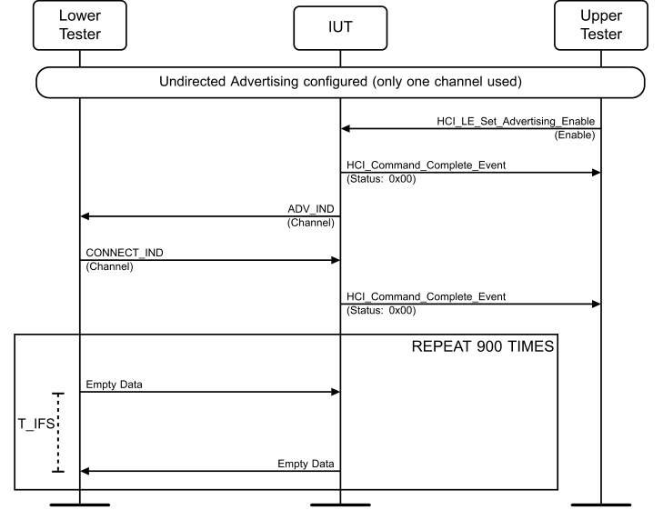

**Figure 4.3-1: LL/CON/ADV/BV-01-C [Accepting Connections] MSC**

1. Configure the Lower Tester to initiate a connection. 2. The Upper Tester enables advertising in the IUT using the first supported advertising channel. 3. The Lower Tester expects the IUT to send ADV_IND packets, on the selected advertising channel only, using the selected advertising interval. 4. Repeat 20 times or until the IUT stops advertising: The Lower Tester receives an ADV_IND packet from the IUT on the selected advertising channel and responds with a CONNECT_IND packet T_IFS after the end of the advertising packet. 5. The Lower Tester sends a correctly formatted LL Data Channel PDU starting the first event at connection interval after the connection request using the common data channel selection parameters. 6. The Lower Tester receives a correctly formatted LL Data Channel PDU from the IUT T_IFS after the PDU sent on the same data channel. The Lower Tester continues sending correctly formatted
LL Data Channel PDUs until receiving a number of responses (100) to conclude the timing accuracy or up to 900 events transmitted. 7. Interleave with step 6: The Upper Tester receives an HCI_LE_Connection_Complete event from the IUT including the parameters sent to the IUT in step 4. 8. Peripheral Connection Terminated (connection interval, Peripheral latency, timeout, channel map, un-encrypted, connection handle from step 4). 9. Configure the Lower Tester to initiate a connection. 10. The Upper Tester enables advertising in the IUT using the second supported advertising channel. 11. Repeat steps 3–8. 12. Configure the Lower Tester to initiate a connection. 13. The Upper Tester enables advertising in the IUT using the third supported advertising channel. 14. Repeat steps 3–8.
• Expected Outcome
Pass verdict
The test procedure completes with the IUT stopping advertising by a connection requested from all advertising channels, moving to the data channel and responding in the connection events,
The number of timing measurements for the reply packets from the IUT is at least 100 and the timing deviations detected for packets in active mode are within the 2 µs range around T_IFS,
The IUT reports the connection setup with an HCI event.
The IUT maintains the connection using the Channel Selection Algorithm #1.
• Notes
The timing observation criterion takes into account active mode requirements. For the Peripheral device the low power mode requirement is not tested here. The active mode timing in packet exchange is listed in the Pass verdict to be within the 2 µs range around T_IFS.
The accuracy required is 1 µs, from the expressions 150 µs and 2 µs. Drift does not affect measurements in exchanges of single data packets. Measurement accuracy is at least 0.1 µs and rounding is done to microseconds.
In order to avoid interference, the test procedure uses the filtering policy to Allow Scan Request from Filter Accept List, Allow Connect Request from Filter Accept List if device filtering is supported. The features are assumed to be independent and the test can be executed without the filtering in conditions with low LE traffic.
LL/CON/ADV/BV-02-C [Accepting Connections Timeout]
• Test Purpose
Tests that an advertiser IUT receives a connection request, stops advertising after the reception and after receiving no Central transmission before connection supervision timer expiration, reports the connection setup failed.
The Lower Tester acts in the initiating state, sending the connection request to the IUT then does not begin to maintain the connection and observes the IUT reports in HCI events.
• Reference
[3] 4.5.5
• Initial Condition
- Parameters: LL_advertiser_advInterval_MIN, LL_advertiser_advInterval_MAX, LL_advertiser_Adv_Channel_Map.
- State: Undirected Advertising (selected Adv_Interval_Min, selected Adv_Interval_Max, supported type of own address, selected advertising channels, Length of device name used, common device name) AND process scan and connection requests only from devices in the Filter Accept List, which contains one public device address.
• Test Procedure
Execute the test procedure using the common data channel selection parameters and the common connection parameters to set up the connection.

**Figure 4.3-2: LL/CON/ADV/BV-02-C [Accepting Connections Timeout] MSC**

1. Configure the Lower Tester to initiate a connection. 2. The Upper Tester enables advertising in the IUT using a selected supported advertising channel (defined as an IXIT). 3. Repeat 20 times or until the IUT stops advertising: The Lower Tester receives an ADV_IND packet from the IUT on the selected advertising channel and responds with a CONNECT_IND packet T_IFS after the end of the advertising packet. 4. The Lower Tester stops sending packets after CONNECT_IND packet and waits until connection supervision timeout timer expires. 5. Interleave with step 4: The Upper Tester receives an HCI_LE_Connection_Complete event from the IUT including the parameters sent to the IUT in step 3. 6. The Upper Tester receives an HCI_Disconnection_Complete event from the IUT with the reason parameter indicating ‘connection failed to be established’, with the connection handle parameter matching to step 5.
• Expected Outcome
Pass verdict
In step 6, the IUT sends the HCI_Disconnection_Complete event to the Upper Tester no earlier than time T2 if T2 occurs before T1. Time T1 occurs at the end of the sixth connection event reception window. Time T2 occurs at the end of the connection event reception window immediately before the first connection event reception window that starts at least 6×connInterval after the end of the CONNECT_IND packet received in step 3.
The test procedure completes with the IUT stopping advertising and reporting the failure to establish connection.
LL/CON/ADV/BV-03-C [Central Missing Peripheral Packets]
• Test Purpose
Tests that an advertiser IUT after accepting a connection request, starts to maintain a connection in the Peripheral role not taking Peripheral latency into use before receiving an acknowledgement from the Central.
The Lower Tester acts first in the initiating state, sending the connection request to the IUT, and then starts to maintain a connection in the Central role. The Lower Tester first sends a number of negative acknowledgements to the IUT, then changes to observe the acknowledgement scheme.
• Reference
[3] 4.5.5, 4.5.9
• Initial Condition
- Parameters: LL_advertiser_advInterval_MIN, LL_advertiser_advInterval_MAX, LL_advertiser_Adv_Channel_Map
- State: Undirected Advertising (selected Adv_Interval_Min, selected Adv_Interval_Max, supported type of own address, selected advertising channels, Length of device name used, common device name) AND process scan and connection requests only from devices in the Filter Accept List, which contains one public device address.
• Test Procedure
Execute the test procedure using the common data channel selection parameters and the common connection parameters to set up the connection, use a latency parameter value of 5.
If device filtering is supported, use the filtering policy to Filter Accept List all unknown devices (apply the filtering policy of allowing scan request, connect request from any).

**Figure 4.3-3: LL/CON/ADV/BV-03-C [Central Missing Peripheral Packets] MSC**

1. Configure the Lower Tester to initiate a connection. 2. The Upper Tester enables advertising in the IUT using a selected supported advertising channel (defined as an IXIT). 3. The Lower Tester expects the IUT to send ADV_IND packets, on the selected advertising channel only and responds with a CONNECT_IND packet T_IFS after the end of the advertising packet.
4. The Lower Tester sends a correctly formatted LL Data Channel PDU, not acknowledging the Peripheral packets, starting the first event using the common connection interval timing after the connection request. 5. The Lower Tester receives a correctly formatted LL Data Channel PDU from the IUT, T_IFS after the PDU sent on the same data channel. The Lower Tester continues sending correctly formatted LL Data Channel PDUs with the default timing. 6. Repeat steps 4–5 for a number of events (30). 7. The Lower Tester sends a correctly formatted LL Data Channel PDU acknowledging the Peripheral packets, using the common connection interval timing and the common data channel selection parameters. 8. The Lower Tester receives a correctly formatted LL Data Channel PDU from the IUT, T_IFS after the PDU sent on the same data channel, for events between the common Peripheral latency parameter 9. Repeat steps 7–8 for a number of events (30). 10. Interleave with steps 4–5: The Upper Tester receives an HCI_LE_Connection_Complete event from the IUT including the parameters sent to the IUT in step 3. 11. Peripheral Connection Terminated (connection interval, Peripheral latency, timeout, channel map, un-encrypted, connection handle from 10).
• Expected Outcome
Pass verdict
The test procedure completes with the IUT stopping advertising, moving to the data channel and responding in the connection events,
The IUT responds in at least 9 out of 30 connection events until the first Central packet acknowledging the Peripheral transmissions,
• Notes
The figure for the percentage of responses required is based on the correctly formatted LL Data Channel PDUs transmitted to and from the Peripheral (around 85% probability of correct receptions).
LL/CON/ADV/BV-04-C [Directed Advertising Connection]
• Test Purpose
Tests that an advertiser IUT upon receiving a connection request to the directed advertising indications, stops advertising after the reception and starts to maintain a connection in the Peripheral role.
The Lower Tester acts first in the initiating state, sending the connection request to the IUT, and then starts to maintain a connection in the Central role.
• Reference
[3] 4.4.2.4
• Initial Condition
- Parameters: LL_advertiser_Adv_Channel_Map
- State: Directed Advertising (supported type of own address, public initiator address, Lower Tester address, selected advertising channels)
• Test Procedure

**Figure 4.3-4: LL/CON/ADV/BV-04-C [Directed Advertising Connection] MSC**

1. Configure the Lower Tester to initiate a connection using a mismatching init address. 2. The Upper Tester enables directed advertising in the IUT using all supported advertising channels. 3. The Lower Tester receives an ADV_DIRECT_IND packet from the IUT and responds with a CONNECT_IND packet (with the mismatching init address) T_IFS after the end of the advertising packet. 4. The Lower Tester receives ADV_DIRECT_IND packets after the connection request. Repeat up to a period of time (1.28 s) or until the IUT stops advertising. 5. The Upper Tester receives an HCI_LE_Connection_Complete event from the IUT with status parameter set to ‘directed advertising timeout’.
6. Configure the Lower Tester to initiate a connection. 7. The Upper Tester enables directed advertising in the IUT using all supported advertising channels. 8. The Lower Tester receives a ADV_DIRECT_IND packet from the IUT and responds with a CONNECT_IND packet (with a matching init address) T_IFS after the end of the advertising packet. 9. The Upper Tester receives an HCI_LE_Connection_Complete event from the IUT including the parameters sent to the IUT in step 8. 10. The Lower Tester sends a correctly formatted LL Data Channel PDU starting the first event at connection interval after the connection request using the common data channel selection parameters. 11. The Lower Tester receives a correctly formatted LL Data Channel PDU from the IUT, T_IFS after the correctly formatted LL Data Channel PDU sent on the same data channel and continues sending correctly formatted LL Data Channel PDUs until receiving a number of responses (900).
• Expected Outcome
Pass verdict
The test procedure executes successfully, with the IUT first rejecting, then accepting the connection request and maintaining the connection in the Peripheral role,
The IUT reports the connection created with an HCI event.
The IUT maintains the connection using the Channel Selection Algorithm #1.

##### 4.3.3.3 Extended Advertising, Accepting Connections

• Test Purpose
Tests that an advertiser IUT, using connectable advertising, receives a connection request on the secondary channel, stops advertising after the reception, and starts to maintain a connection in the Peripheral role. The Lower Tester acts first in the initiating state, sending the connection request to the IUT on the secondary channel, and then starts to maintain a connection in the Central role, observing the packets and timing from the IUT. The Lower Tester confirms the Channel Selection Algorithm #2 is used for the connection. The Upper Tester confirms the LE Channel Selection Algorithm Event is generated.
The Lower Tester requests a connection from the IUT, and then checks that advertising has stopped.
• Reference
[10] 4.4.2.3, 4.3.2, 4.4.2.8, 4.4.2
• Initial Condition
- Parameters: LL_advertiser_advInterval_MIN, LL_advertiser_advInterval_MAX, LL_advertiser_Adv_Channel_Map
- State: Advertising (selected Adv_Interval_Min, selected Adv_Interval_Max, supported type of own address, all supported advertising channels, Length of device name used, common device name)
• Test Case Configuration

| Test Case |  |  |  | PHYs |  |  |  |  | PDU Type |
| --- | --- | --- | --- | --- | --- | --- | --- | --- | --- |
|  |  |  |  | Primary |  |  | Secondary |  |  |
|  |  |  |  | Advertising PHY |  |  | Advertising PHY |  |  |
|  | LL/CON/ADV/BV-05-C |  | 0x01 (LE 1M PHY) | 0x01 (LE 1M PHY) |  | 0x01 (LE 1M PHY) | 0x01 (LE 1M PHY) |  | ADV EXT IND _ _ |
|  | [Extended Advertising, |  |  |  |  |  |  |  |  |
|  | Accepting Connections – |  |  |  |  |  |  |  |  |
|  | LE 1M PHY] |  |  |  |  |  |  |  |  |
|  | LL/CON/ADV/BV-12-C |  | 0x01 (LE 1M PHY) |  |  | 0x02 (LE 2M PHY) |  |  | ADV EXT IND _ _ |
|  | [Extended Advertising, |  |  |  |  |  |  |  |  |
|  | Accepting Connections – |  |  |  |  |  |  |  |  |
|  | LE 2M PHY] |  |  |  |  |  |  |  |  |
|  | LL/CON/ADV/BV-13-C |  | 0x03 (LE Coded PHY) |  |  | 0x03 (LE Coded PHY) |  |  | ADV EXT IND _ _ |
|  | [Extended Advertising, |  |  |  |  |  |  |  |  |
|  | Accepting Connections – |  |  |  |  |  |  |  |  |
|  | LE Coded PHY] |  |  |  |  |  |  |  |  |
|  | LL/CON/ADV/BV-17-C |  | 0x01 (LE 1M PHY) |  |  | 0x01 (LE 1M PHY) |  |  | ADV DECISION IND _ _ |
|  | [Decision-Based |  |  |  |  |  |  |  |  |
|  | Advertising, Accepting |  |  |  |  |  |  |  |  |
|  | Connections – LE 1M PHY] |  |  |  |  |  |  |  |  |
|  | LL/CON/ADV/BV-18-C |  | 0x01 (LE 1M PHY) |  |  | 0x02 (LE 2M PHY) |  |  | ADV DECISION IND _ _ |
|  | [Decision-Based |  |  |  |  |  |  |  |  |
|  | Advertising, Accepting |  |  |  |  |  |  |  |  |
|  | Connections – LE 2M PHY] |  |  |  |  |  |  |  |  |
|  | LL/CON/ADV/BV-19-C |  | 0x03 (LE Coded PHY) |  |  | 0x03 (LE Coded PHY) |  |  | ADV DECISION IND _ _ |
|  | [Decision-Based |  |  |  |  |  |  |  |  |
|  | Advertising, Accepting |  |  |  |  |  |  |  |  |
|  | Connections – LE Coded |  |  |  |  |  |  |  |  |
|  | PHY] |  |  |  |  |  |  |  |  |

Table 4.3-1: Extended Advertising, Accepting Connections test cases
• Test Procedure

**Figure 4.3-5: Extended Advertising, Accepting Connections MSC**

For each round in Table 4.3-2 where the PDU type in Table 4.3-1 matches the PDU type in Table 4.3-2:
1. The Upper Tester sends an HCI_LE_Set_Extended_Advertising_Parameters command to the IUT using all supported advertising channels and minimum advertising interval and receives a successful HCI_Command_Complete event in response. The Advertising_Event_Properties parameter is set to the value specified in Table 4.3-2 for this round. The Own_Address_Type is set to 0x00 (Public Device Address). The Primary_Advertising_PHY and Secondary_Advertising_PHY are set as specified in Table 4.3-1. The Advertising_Filter_Policy is set to 0x00 (accept connection requests from all devices). 2. If the PDU type in Table 4.3-1 is the ADV_DECISION_IND PDU, then the Upper Tester sends an HCI_LE_Set_Decision_Data command to the IUT with Decision_Type_Flags set to 0x00, Decision_Data_Length set to 6, and Decision_Data set to 6 random octets and receives a successful HCI_Command_Complete event in response. 3. The Upper Tester enables advertising using the HCI_LE_Set_Extended_Advertising_Enable command. The Duration[0] parameter is set to 0x0000 (No Advertising Duration) and receives a successful HCI_Command_Complete event in response. The Max_Extended_Advertising_Events[0] parameter is set to 0x00 (No Max). 4. The Lower Tester receives the advertising PDU specified in Table 4.3-2 from the IUT with
AdvMode set to 0b01 with only the AuxPtr Extended Header field. 5. The Lower Tester utilizes the AuxPtr field to listen for an AUX_ADV_IND PDU on the secondary
advertising channel with the AdvMode field set to 0b01 and with the AdvA Extended Header field present. The AdvA field contains the IUT’s Advertising Address. If this round used directed advertising, then AUX_ADV_IND PDU also includes the TargetA Extended Header field set to the Lower Tester’s Public Device Address. The Lower Tester responds with an AUX_CONNECT_REQ PDU on the secondary advertising channel T_IFS after receiving the AUX_ADV_IND PDU. The InitA field is set to the Lower Tester’s address. The AdvA field is set as shown in Table 4.3-2 for the current Round. 6. If the AUX_CONNECT_REQ PDU has an AdvA not equal to the IUT’s address, the Lower Tester receives no AUX_CONNECT_RSP packet from the IUT. The Upper Tester disables advertising using the HCI_LE_Set_Extended_Advertising_Enable command and receives a successful HCI_Command_Complete event in response. Skip to step 16. 7. The Lower Tester receives an AUX_CONNECT_RSP PDU from the IUT on the secondary advertising channel T_IFS after sending the AUX_CONNECT_REQ. If no AUX_CONNECT_RSP PDU is received, repeat steps 4–7 up to 20 times. If the Lower Tester does not receive that PDU after 20 times, this test case ends with a Fail verdict. After receiving an AUX_CONNECT_RSP PDU, verify that the IUT has started to maintain a connection by responding to the Lower Tester's LL data packets. 8. The Lower Tester receives no further advertising PDUs after the advertising interval from the IUT. The Lower Tester continues scanning for advertising packets during the free time while maintaining the connection in steps 11–14. If the Lower Tester receives a further advertising packet, the test ends with a Fail verdict. 9. The Upper Tester receives an HCI_LE_Connection_Complete event from the IUT and as postamble: Peripheral Connection (connection interval, Peripheral latency, timeout, channel map, un-encrypted, connection handle). Immediately after, the Upper Tester receives an HCI_LE_Channel_Selection_Algorithm event from the IUT with Channel_Selection_Algorithm set to 0x01 (LE Channel Selection Algorithm #2 is used). 10. The Upper Tester receives an HCI_LE_Advertising_Set_Terminated event from the IUT with the Status set to 0x00, the Advertising_Handle from step 1, and the Connection_Handle from step 9. 11. The Lower Tester sends a correctly formatted LL Data Channel PDU on the data channel using the index selected by the LE Channel Selection Algorithm #2.
12. The Lower Tester receives a correctly formatted LL Data Channel PDU using the acknowledgement scheme, from the IUT on the same data channel. 13. The Lower Tester sends correctly formatted LL Data Channel PDUs on subsequent data channels at connection intervals. 14. Repeat steps 11–13 for a number of events (100 events). 15. The Upper Tester terminates the connection.

| Round |  |  | PDU Type |  |  |  | HCI LE Set Extended Advertising _ _ _ _ _ |  |  | AUX CONNECT REQ _ _ |  |
| --- | --- | --- | --- | --- | --- | --- | --- | --- | --- | --- | --- |
|  |  |  |  |  |  |  | Parameters |  |  | PDU |  |
|  |  |  |  |  |  |  | (Step 1) |  |  | (Step 5) |  |
|  |  |  |  |  |  |  | Advertising Event Properties _ _ |  |  | AdvA |  |
|  | 1 |  |  | ADV EXT IND _ _ |  |  | 0x0001 |  |  | IUT |  |
|  | 2 |  |  | ADV EXT IND _ _ |  |  | 0x0001 |  |  | Not IUT |  |
|  | 3 |  |  | ADV EXT IND _ _ |  |  | 0x0005 |  |  | IUT |  |
|  | 4 |  |  | ADV EXT IND _ _ |  |  | 0x0005 |  |  | Not IUT |  |
|  | 5 |  |  | ADV DECISION IND _ _ |  |  | 0x0081 |  |  | IUT |  |
|  | 6 |  |  | ADV DECISION IND _ _ |  |  | 0x0081 |  |  | Not IUT |  |

Table 4.3-2: Payload contents for each case variation
• Expected Outcome
Pass verdict
For all rounds described in the test procedure, the following condition occurs:
- The IUT sends an advertising PDU specified in Table 4.3-2 with an AuxPtr field referring to an AUX_ADV_IND on the secondary advertising channel.
- The AdvMode in the AUX_ADV_IND PDU is the same as the AdvMode in the parent advertising PDU specified in Table 4.3-2.
- If the advertising was directed, the AUX_ADV_IND has a TargetA field containing the Lower Tester’s address.
- The IUT responds to the AUX_CONNECT_REQ within the 2 µs range around T_IFS.
- The time between a PDU containing an AuxPtr field and the PDU to which it refers is greater than or equal to T_MAFS.
- If the AUX_CONNECT_REQ PDU has an AdvA not equal to the IUT’s address, then the IUT does not respond.
- The test procedure completes with the IUT stopping advertising using an advertising interval between the minimum and maximum on all of the supported advertising channels.
- The IUT reports the requested connection with an HCI LE Connection Complete event.
- The IUT reports termination of advertising with an HCI LE Advertising Set Terminated event.
- The IUT reports the channel selection algorithm used for the connection with an HCI LE Channel Selection Algorithm Event.
- The IUT sends and receives data on the expected PHY selected in step 1.
LL/CON/ADV/BV-06-C [Extended Advertising, Legacy PDUs, Accepting Connections]
• Test Purpose
Tests that an advertiser IUT, using undirected connectable advertising with legacy PDUs, receives a connection indication on the primary channel, stops advertising after the reception, and starts to maintain a connection in the Peripheral role. The Lower Tester acts first in the initiating state, sending the connection request to the IUT on the primary channel, and then starts to maintain a connection in the Central role. The Lower Tester confirms the Channel Selection Algorithm #2 is used for the connection. The Upper Tester confirms the LE Channel Selection Algorithm Event is generated.
The Lower Tester requests a connection from the IUT, and then checks that advertising has stopped.
• Reference
[10] 4.4.2.3, 4.3.2
• Initial Condition
- Parameters: LL_advertiser_advInterval_MIN, LL_advertiser_advInterval_MAX, LL_advertiser_Adv_Channel_Map.
- State: Connectable Undirected Advertising (selected Adv_Interval_Min, selected Adv_Interval_Max, supported type of own address, all supported advertising channels, Length of device name used, common device name)
• Test Procedure

**Figure 4.3-6: LL/CON/ADV/BV-06-C [Extended Advertising, Legacy PDUs, Accepting Connections] MSC – Page 1 of 2**

**Figure 4.3-7: LL/CON/ADV/BV-06-C [Extended Advertising, Legacy PDUs, Accepting Connections] MSC – Page 2 of 2**

1. The Upper Tester sends an HCI_LE_Set_Extended_Advertising_Parameters command to the IUT using all supported advertising channels and minimum advertising interval. Advertising_Event_Properties parameter is set to 0b00010011 (ADV_IND legacy PDU). The Own_Address_Type is set to 0x00 (Public Device Address). The Primary_Advertising_PHY is set to 0x01 (LE 1M). The Advertising_Filter_Policy is set to 0x00 (accept connection requests from all devices). 2. The Upper Tester enables advertising using the HCI_LE_Set_Extended_Advertising_Enable command. The Duration[0] parameter is set to 0x0000 (No Advertising Duration). The Max_Extended_Advertising_Events[0] parameter is set to 0x00 (No Max). 3. The Lower Tester expects the IUT to send ADV_IND, with ChSel set to 1 (Channel Selection Algorithm #2), on the advertising channel. The AdvA field contains the IUT’s Advertising Address. 4. The Lower Tester responds with a CONNECT_IND PDU, with ChSel set to 1 (Channel Selection Algorithm #2), on the primary advertising channel. The InitA field is set to the Lower Tester’s address. The AdvA field is set to the IUT’s address. 5. The Upper Tester receives an HCI_LE_Connection_Complete event from the IUT and as postamble: Peripheral Connection (connection interval, Peripheral latency, timeout, channel map, un-encrypted, connection handle). If the Upper Tester does not receive the event, repeat steps 3– 5 up to 20 times. If the Upper Tester does not receive the event after 20 times, this test case ends with a Fail verdict. 6. The Lower Tester continues scanning for advertising packets during the free time while maintaining the connection in steps 9–10. If the Lower Tester receives a further advertising packet, the test ends with a Fail verdict. 7. Immediately after receiving the HCI_LE_Connection_Complete event, the Upper Tester receives an HCI_LE_Channel_Selection_Algorithm event from the IUT with Channel_Selection_Algorithm set to 0x01 (LE Channel Selection Algorithm #2 is used).
8. The Upper Tester receives an HCI_LE_Advertising_Set_Terminated event from the IUT with the Status set to 0x00, the Advertising_Handle from step 1, and the Connection_Handle from step 5. 9. The Lower Tester sends correctly formatted LL Data Channel PDUs on subsequent data channels at connection intervals. 10. Repeat step 9 for a number of events (100 events). 11. The Upper Tester terminates the connection. 12. Repeat steps 1–4, except that in step 4 the AdvA field is set to an address other than the IUT's address. 13. The Lower Tester expects the IUT to continue sending ADV_IND PDUs for at least 5 advertising intervals and responds with a CONNECT_IND PDU each time.
• Expected Outcome
Pass verdict
For all rounds described in the test procedure, the following condition occurs:
- In step 4, the IUT sends an ADV_IND, with ChSel set to 1, on the primary advertising channel using the LE 1M PHY.
- In step 5, the IUT reports the requested connection with an HCI LE Connection Complete event.
- In step 7, the IUT reports the channel selection algorithm used for the connection with an HCI LE Channel Selection Algorithm Event.
- In step 8, the IUT reports termination of advertising with an HCI LE Advertising Set Terminated event.
- In step 9, the IUT sends and receives data using the LE 1M PHY.
- In step 13, if the CONNECT_IND PDU has an AdvA not equal to the IUT’s address then the IUT does not respond.
LL/CON/ADV/BV-07-C [Accepting Connections, Channel Selection Algorithm #1]
• Test Purpose
Tests that an advertiser IUT receives a connection request, stops advertising after the reception and starts to maintain a connection in the Peripheral role when the connection request indicates no support for Channel Selection Algorithm #2. The Lower Tester acts first in the initiating state, sending the connection request to the IUT with ChSel set to zero (0), then starts to maintain a connection in the Central role, observing the packets and timing from the IUT to confirm the IUT is using the Channel Selection Algorithm #1. The Upper Tester confirms the LE Channel Selection Algorithm Event is generated.
• Reference
[10] 4.4.2.3, 4.3.2
• Initial Condition
- Parameters: LL_advertiser_advInterval_MIN, LL_advertiser_advInterval_MAX, LL_advertiser_Adv_Channel_Map.
- State: Connectable Undirected Advertising (selected Adv_Interval_Min, selected Adv_Interval_Max, supported type of own address, all supported advertising channels, Length of device name used, common device name)
• Test Procedure

**Figure 4.3-8: LL/CON/ADV/BV-07-C [Accepting Connections, Channel Selection Algorithm #1] MSC**

1. The Upper Tester sends an HCI_LE_Set_Advertising_Parameters command to the IUT using all supported advertising channels and minimum advertising interval. Advertising_Type is set to 0x00 (ADV_IND). The Own_Address_Type is set to 0x00 (Public Device Address). The Advertising_Filter_Policy is set to 0x00 (accept connection requests from all devices). 2. The Upper Tester enables advertising using the HCI_LE_Set_Advertising_Enable command. 3. The Lower Tester expects the IUT to send ADV_IND PDUs with ChSel set to 1 on the advertising channel. The AdvA field contains the IUT’s Advertising Address. 4. The Lower Tester responds with a CONNECT_IND PDU with ChSel set to 0. The InitA field is set to the Lower Tester’s address, and the AdvA field is set to the IUT’s Advertising Address. 5. The Lower Tester verifies that the IUT has started to maintain a connection by responding with correctly formatted LL Data Channel PDUs to the Lower Tester’s correctly formatted LL Data
Packets on the data channels selected by LE Channel Selection Algorithm #1. If no data packets are received, repeat steps 4–5 up to 20 times or until the IUT stops advertising. 6. The Upper Tester receives an HCI_LE_Connection_Complete event from the IUT and as postamble: Peripheral Connection (connection interval, Peripheral latency, timeout, channel map, un-encrypted, connection handle). Immediately after, the Upper Tester receives an HCI_LE_Channel_Selection_Algorithm event from the IUT with Channel_Selection_Algorithm set to 0x00 (LE Channel Selection Algorithm #1 is used). 7. The Lower Tester sends a correctly formatted LL Data Channel PDU on the data channel using the index selected by the LE Channel Selection Algorithm #1. 8. The Lower Tester receives a correctly formatted LL Data Channel PDU using the acknowledgement scheme, from the IUT on the same data channel. 9. The Lower Tester sends correctly formatted LL Data Channel PDUs on subsequent data channels at connection intervals. 10. Repeat steps 7–9 for a number of events (100 events).
• Expected Outcome
Pass verdict
For all rounds described in the test procedure, the following condition occurs:
- The IUT sends ADV_IND PDUs with ChSel set to 1 on the primary advertising channel.
- The test procedure completes with the IUT stopping advertising using an advertising interval between the minimum and maximum on all of the supported advertising channels.
- The IUT reports the requested connection with an HCI LE Connection Complete event.
- The IUT reports the channel selection algorithm used for the connection with an HCI LE Channel Selection Algorithm Event.
- The IUT sends and receives data using data channel indices selected by the Channel Selection Algorithm #1.
LL/CON/ADV/BV-08-C [Directed Advertising Connection, Channel Selection Algorithm #1]
• Test Purpose
Tests that an advertiser IUT receives a connection request to the directing advertising indication, stops advertising after the reception and starts to maintain a connection in the Peripheral role when the connection request indicates no support for Channel Selection Algorithm #2. The Lower Tester acts first in the initiating state, sending the connection request to the IUT with ChSel set to zero (0), then starts to maintain a connection in the Central role, observing the packets and timing from the IUT to confirm the IUT is using the Channel Selection Algorithm #1. The Upper Tester confirms the LE Channel Selection Algorithm Event is generated.
• Reference
[10] 4.4.2.4, 4.3.2
• Initial Condition
- Parameters: LL_advertiser_advInterval_MIN, LL_advertiser_advInterval_MAX, LL_advertiser_Adv_Channel_Map.
- State: Directed Advertising (selected Adv_Interval_Min, selected Adv_Interval_Max, supported type of own address, all supported advertising channels, Length of device name used, common device name)
• Test Procedure

**Figure 4.3-9: LL/CON/ADV/BV-08-C [Directed Advertising Connection, Channel Selection Algorithm #1] MSC**

1. The Upper Tester sends an HCI_LE_Set_Advertising_Parameters command to the IUT using all supported advertising channels and minimum advertising interval. Advertising_Type is set to 0x01 (ADV_DIRECT_IND). The Own_Address_Type is set to 0x00 (Public Device Address). The Peer_Address_Type is set to 0x00 (Public Device Address). The Peer_Address is set to the Lower Tester’s address. The Advertising_Filter_Policy is set to 0x00 (accept connection requests from all devices). 2. The Upper Tester enables advertising using the HCI_LE_Set_Advertising_Enable command. 3. The Lower Tester expects the IUT to send ADV_DIRECT_IND PDUs with ChSel set to 1 on the primary advertising channel. The AdvA field contains the IUT’s Advertising Address. The TargetA field contains the Lower Tester’s address.
4. The Lower Tester responds with a CONNECT_IND PDU with ChSel set to 0. The InitA field is set to the Lower Tester’s address, and the AdvA field is set to the IUT’s Advertising Address. 5. The Lower Tester verifies that the IUT has started to maintain a connection by responding with correctly formatted LL Data Channel PDUs to the Lower Tester’s correctly formatted LL Data Packets on the data channels selected by LE Channel Selection Algorithm #1. If no data packets are received, repeat steps 4–5 up to 20 times or until the IUT stops advertising. 6. The Upper Tester receives an HCI_LE_Connection_Complete event from the IUT and as postamble: Peripheral Connection (connection interval, Peripheral latency, timeout, channel map, un-encrypted, connection handle). Immediately after, the Upper Tester receives an HCI_LE_Channel_Selection_Algorithm event from the IUT with Channel_Selection_Algorithm set to 0x00 (LE Channel Selection Algorithm #1 is used). 7. The Lower Tester sends a correctly formatted LL Data Channel PDU on the data channel using the index selected by the LE Channel Selection Algorithm #1. 8. The Lower Tester receives a correctly formatted LL Data Channel PDU using the acknowledgement scheme, from the IUT on the same data channel. 9. The Lower Tester sends correctly formatted LL Data Channel PDUs on subsequent data channels at connection intervals. 10. Repeat steps 7–9 for a number of events (100 events).
• Expected Outcome
Pass verdict
For all rounds described in the test procedure, the following condition occurs:
- The IUT sends ADV_DIRECT_IND PDUs with ChSel set to 1 on the primary advertising channel.
- The test procedure completes with the IUT stopping advertising using an advertising interval between the minimum and maximum on all of the supported advertising channels.
- The IUT reports the requested connection with an HCI LE Connection Complete event.
- The IUT reports the channel selection algorithm used for the connection with an HCI LE Channel Selection Algorithm Event.
- The IUT sends and receives data using data channel indices selected by the Channel Selection Algorithm #1.
LL/CON/ADV/BV-09-C [Accepting Connections, Channel Selection Algorithm #2]
• Test Purpose
Tests that an advertiser IUT receives a connection request, stops advertising after the reception and starts to maintain a connection in the Peripheral role when the connection request indicates support for Channel Selection Algorithm #2. The Lower Tester acts first in the initiating state, sending the connection request to the IUT with ChSel set to one (1), then starts to maintain a connection in the Central role, observing the packets and timing from the IUT to confirm the IUT is using the Channel Selection Algorithm #2. The Upper Tester confirms the LE Channel Selection Algorithm Event is generated.
• Reference
[10] 4.4.2.3, 4.3.2
• Initial Condition
- Parameters: LL_advertiser_advInterval_MIN, LL_advertiser_advInterval_MAX, LL_advertiser_Adv_Channel_Map.
- State: Connectable Undirected Advertising (selected Adv_Interval_Min, selected Adv_Interval_Max, supported type of own address, all supported advertising channels, Length of device name used, common device name)
• Test Procedure

**Figure 4.3-10: LL/CON/ADV/BV-09-C [Accepting Connections, Channel Selection Algorithm #2] MSC**

1. The Upper Tester sends an HCI_LE_Set_Advertising_Parameters command to the IUT using all supported advertising channels and minimum advertising interval. Advertising_Type is set to 0x00 (ADV_IND). The Own_Address_Type is set to 0x00 (Public Device Address). The Advertising_Filter_Policy is set to 0x00 (accept connection requests from all devices). 2. The Upper Tester enables advertising using the HCI_LE_Set_Advertising_Enable command. 3. The Lower Tester expects the IUT to send ADV_IND PDUs with ChSel set to 1 on the primary advertising channel. The AdvA field contains the IUT’s Advertising Address. 4. The Lower Tester responds with a CONNECT_IND PDU with ChSel set to 1. The InitA field is set to the Lower Tester’s address, and the AdvA field is set to the IUT’s Advertising Address. 5. The Lower Tester verifies that the IUT has started to maintain a connection by responding with correctly formatted LL Data Channel PDUs to the Lower Tester’s correctly formatted LL Data Packets on the data channels selected by LE Channel Selection Algorithm #2. If no data packets are received, repeat steps 4–5 up to 20 times or until the IUT stops advertising. 6. The Upper Tester receives an HCI_LE_Connection_Complete event from the IUT and as postamble: Peripheral Connection (connection interval, Peripheral latency, timeout, channel map, un-encrypted, connection handle). Immediately after, the Upper Tester receives an HCI_LE_Channel_Selection_Algorithm event from the IUT with Channel_Selection_Algorithm set to 0x01 (LE Channel Selection Algorithm #2 is used). 7. The Lower Tester sends a correctly formatted LL Data Channel PDU on the data channel using the index selected by the LE Channel Selection Algorithm #2. 8. The Lower Tester receives a correctly formatted LL Data Channel PDU using the acknowledgement scheme, from the IUT on the same data channel. 9. The Lower Tester sends correctly formatted LL Data Channel PDUs on subsequent data channels at connection intervals. 10. Repeat steps 7–9 for a number of events (100 events).
• Expected Outcome
Pass verdict
For all rounds described in the test procedure, the following condition occurs:
- The IUT sends ADV_IND PDUs with ChSel set to 1 on the primary advertising channel.
- The test procedure completes with the IUT stopping advertising using an advertising interval between the minimum and maximum on all of the supported advertising channels.
- The IUT reports the requested connection with an HCI LE Connection Complete event.
- The IUT reports the channel selection algorithm used for the connection with an HCI LE Channel Selection Algorithm Event.
- The IUT sends and receives data using data channel indices selected by the Channel Selection Algorithm #2.
LL/CON/ADV/BV-10-C [Directed Advertising Connection, Channel Selection Algorithm #2]
• Test Purpose
Tests that an advertiser IUT receives a connection request to the directing advertising indication, stops advertising after the reception and starts to maintain a connection in the Peripheral role when the connection request indicates support for Channel Selection Algorithm #2. The Lower Tester acts first in the initiating state, sending the connection request to the IUT with ChSel set to one (1), then starts to maintain a connection in the Central role, observing the packets and timing from the IUT to confirm the IUT is using the Channel Selection Algorithm #2. The Upper Tester confirms the LE Channel Selection Algorithm Event is generated.
• Reference
[10] 4.4.2.4, 4.3.2
• Initial Condition
- Parameters: LL_advertiser_advInterval_MIN, LL_advertiser_advInterval_MAX, LL_advertiser_Adv_Channel_Map.
- State: Directed Advertising (selected Adv_Interval_Min, selected Adv_Interval_Max, supported type of own address, all supported advertising channels, Length of device name used, common device name)
• Test Procedure

**Figure 4.3-11: LL/CON/ADV/BV-10-C [Directed Advertising Connection, Channel Selection Algorithm #2] MSC**

1. The Upper Tester sends an HCI_LE_Set_Advertising_Parameters command to the IUT using all supported advertising channels and minimum advertising interval. Advertising_Type is set to 0x01 (ADV_DIRECT_IND). The Own_Address_Type is set to 0x00 (Public Device Address). The Peer_Address_Type is set to 0x00 (Public Device Address). The Peer_Address is set to the Lower Tester’s address. The Advertising_Filter_Policy is set to 0x00 (accept connection requests from all devices). 2. The Upper Tester enables advertising using the HCI_LE_Set_Advertising_Enable command. 3. The Lower Tester expects the IUT to send ADV_DIRECT_IND PDUs with ChSel set to 1 on the primary advertising channel. The AdvA field contains the IUT’s Advertising Address. The TargetA field contains the Lower Tester’s address. 4. The Lower Tester responds with a CONNECT_IND PDU with ChSel set to 1. The InitA field is set to the Lower Tester’s address, and the AdvA field is set to the IUT’s Advertising Address. 5. The Lower Tester verifies that the IUT has started to maintain a connection by responding with correctly formatted LL Data Channel PDUs to the Lower Tester’s corrected formatted LL Data Packets on the data channels selected by LE Channel Selection Algorithm #2. If no data packets are received, repeat steps 4–5 up to 20 times or until the IUT stops advertising. 6. The Upper Tester receives an HCI_LE_Connection_Complete event from the IUT and as postamble: Peripheral Connection (connection interval, Peripheral latency, timeout, channel map, un-encrypted, connection handle). Immediately after, the Upper Tester receives an HCI_LE_Channel_Selection_Algorithm event from the IUT with Channel_Selection_Algorithm set to 0x01 (LE Channel Selection Algorithm #2 is used). 7. The Lower Tester sends a correctly formatted LL Data Channel PDU on the data channel using the index selected by the LE Channel Selection Algorithm #2. 8. The Lower Tester receives a correctly formatted LL Data Channel PDU using the acknowledgement scheme, from the IUT on the same data channel. 9. The Lower Tester sends correctly formatted LL Data Channel PDUs on subsequent data channels at connection intervals. 10. Repeat steps 7–9 for a number of events (100 events).
• Expected Outcome
Pass verdict
For all rounds described in the test procedure, the following condition occurs:
- The IUT sends ADV_DIRECT_IND PDUs with ChSel set to 1 on the primary advertising channel.
- The test procedure completes with the IUT stopping advertising using an advertising interval between the minimum and maximum on all of the supported advertising channels.
- The IUT reports the requested connection with an HCI LE Connection Complete event.
- The IUT reports the channel selection algorithm used for the connection with an HCI LE Channel Selection Algorithm Event.
- The IUT sends and receives data using data channel indices selected by the Channel Selection Algorithm #2.
LL/CON/ADV/BI-01-C [Connection Supervision Timeout during Fail Connection Setup]
• Test Purpose
Verifies that an advertiser IUT correctly implements the connection supervision timeout, under a condition where it expires during connection setup.
The Lower Tester acts first in the initiating state, sending the connection request to the IUT, and then starts to maintain a connection in the Central role but with packets with invalid checksums.
• Reference
[3] 4.5.5, 4.5.9
• Initial Condition
- Parameters: LL_advertiser_advInterval_MIN, LL_advertiser_advInterval_MAX, LL_advertiser_Adv_Channel_Map.
- State: Undirected Advertising (selected Adv_Interval_Min, selected Adv_Interval_Max, supported type of own address, selected advertising channels, Length of device name used, common device name) AND process scan and connection requests only from devices in the Filter Accept List, which contains one public device address.
• Test Procedure
Execute the test procedure using the common data channel selection parameters and the common connection interval to maintain the connection.

**Figure 4.3-12: LL/CON/ADV/BI-01-C [Connection Supervision Timeout during fail connection setup] MSC**

1. Configure the Lower Tester to initiate a connection and send packets with incorrect CRC after CONNECT_IND packet. 2. The Upper Tester enables undirected advertising in the IUT using all supported advertising channels. 3. The Lower Tester expects the IUT to send ADV_IND packets, on the selected advertising channel only. 4. The Lower Tester responds with a CONNECT_IND packet T_IFS after the end of the advertising packet.
5. The Upper Tester receives an HCI_LE_Connection_Complete event from the IUT including the parameters sent to the IUT in step 4. 6. The Lower Tester sends a correctly formatted LL Data Channel PDU with an invalid checksum, starting the first event using the common connection interval timing after the connection request and using the common data channel selection parameters. 7. The Lower Tester receives a correctly formatted LL Data Channel PDU, not acknowledging the invalid packet, from the IUT, T_IFS after the PDU sent on the same data channel. 8. Repeat steps 6–7 until connection supervision timer expires. 9. The Upper Tester receives an HCI_Disconnection_Complete event from the IUT, with status parameter set to ’connection timeout’ and with the connection handle matching to step 5.
• Expected Outcome
Pass verdict
The IUT responds to the Central transmissions in at least 95% of the Data PDUs in step 6.
In step 9, the IUT sends an HCI_Disconnection_Complete event to the Upper Tester with Status set to 0x08 (Connection Timeout).
LL/CON/ADV/BV-11-C [Accepting Connections, IUT Channel Selection Algorithm #1, Lower Tester Channel Selection Algorithm #2]
• Test Purpose
Tests that an advertiser IUT that only supports Channel Selection Algorithm #1 receives a connection request from a Lower Tester that supports Channel Selection Algorithm #2. The IUT stops advertising after the reception and starts to maintain a connection in the Peripheral role with Channel Selection Algorithm #1. The Lower Tester acts first in the initiating state, sending the connection request to the IUT with ChSel set to one (1), then starts to maintain a connection in the Central role.  The IUT observes the packets and timing from the Lower Tester to confirm the Lower Tester is using the Channel Selection Algorithm #1.
• Reference
[10] 4.4.2.3, 4.3.2
• Initial Condition
- Parameters: LL_advertiser_advInterval_MIN, LL_advertiser_advInterval_MAX, LL_advertiser_Adv_Channel_Map.
- State: Connectable Undirected Advertising (selected Adv_Interval_Min, selected Adv_Interval_Max, supported type of own address, all supported advertising channels, Length of device name used, common device name)
• Test Procedure

**Figure 4.3-13: LL/CON/ADV/BV-11-C [Accepting Connections, Channel Selection Algorithm #1] MSC**

1. The Upper Tester sends an HCI_LE_Set_Advertising_Parameters command to the IUT using all supported advertising channels and minimum advertising interval. Advertising_Type is set to 0x00 (ADV_IND). The Own_Address_Type is set to 0x00 (Public Device Address). The Advertising_Filter_Policy is set to 0x00 (accept connection requests from all devices). 2. The Upper Tester enables advertising using the HCI_LE_Set_Advertising_Enable command. 3. The Lower Tester expects the IUT to send ADV_IND PDUs with ChSel set to 0 on the advertising channel. The AdvA field contains the IUT’s Advertising Address. 4. The Lower Tester responds with a CONNECT_IND PDU with ChSel set to 1. The InitA field is set to the Lower Tester’s address, and the AdvA field is set to the IUT’s Advertising Address. 5. The Lower Tester verifies that the IUT has started to maintain a connection by responding with correctly formatted LL Data Channel PDUs to the Lower Tester’s correctly formatted LL Data Packets on the data channels selected by LE Channel Selection Algorithm #1. If no data packets are received, repeat steps 4–5 up to 20 times or until the IUT stops advertising.
6. The Upper Tester receives an HCI_LE_Connection_Complete event from the IUT and as postamble: Peripheral Connection (connection interval, Peripheral latency, timeout, channel map, un-encrypted, connection handle). 7. The Lower Tester sends a correctly formatted LL Data Channel PDU on the data channel using the index selected by the LE Channel Selection Algorithm #1. 8. The Lower Tester receives a correctly formatted LL Data Channel PDU using the acknowledgement scheme, from the IUT on the same data channel. 9. The Lower Tester sends correctly formatted LL Data Channel PDUs on subsequent data channels at connection intervals. 10. Repeat steps 7–9 for a number of events (100 events).
• Expected Outcome
Pass verdict
For all rounds described in the test procedure, the following condition occurs:
- The IUT sends ADV_IND PDUs with ChSel set to 0 on the primary advertising channel.
- The IUT receives CONNECT_IND PDUs with ChSel set to 1.
- The test procedure completes with the IUT stopping advertising using an advertising interval between the minimum and maximum on all of the supported advertising channels.
- The IUT reports the requested connection with an HCI LE Connection Complete event.
- The IUT sends and receives data using data channel indices selected by the Channel Selection Algorithm #1.

##### 4.3.3.4 Extended Advertising, Accepting Connections with Random address

• Test Purpose
Tests that an advertiser IUT, using connectable advertising, receives a connection request on the secondary channel, stops advertising after the reception, and starts to maintain a connection in the Peripheral role. The Lower Tester verifies this procedure with different types of random addresses used in the InitA field of the AUX_CONNECT_REQ.
• Reference
[10] 4.4.2.3, 4.3.2, 4.4.2.8, 4.4.2
• Initial Condition
- Parameters: LL_advertiser_advInterval_MIN, LL_advertiser_advInterval_MAX, LL_advertiser_Adv_Channel_Map.
- State: Advertising (selected Adv_Interval_Min, selected Adv_Interval_Max, supported type of own address, all supported advertising channels, Length of device name used, common device name)
• Test Case Configuration

|  | Test Case |  |  | PHY |  |
| --- | --- | --- | --- | --- | --- |
| LL/CON/ADV/BV-14-C |  |  | LE 1M PHY |  |  |
| LL/CON/ADV/BV-15-C |  |  | LE 2M PHY |  |  |
| LL/CON/ADV/BV-16-C |  |  | LE Coded PHY |  |  |

Table 4.3-3: Test case PHY configuration
• Test Procedure

**Figure 4.3-14: Extended Advertising, Accepting Connections MSC – Page 1 of 2**

**Figure 4.3-15: Extended Advertising, Accepting Connections MSC – Page 2 of 2**

For each round 1–3 based on Table 4.3-4:
1. The Upper Tester sends an HCI_LE_Set_Extended_Advertising_Parameters command to the IUT using all supported advertising channels and minimum advertising interval. Advertising_Event_Properties parameter is set to 0x0001 (Connectable advertising). The Own_Address_Type is set to 0x00 (Public Device Address). The Primary_Advertising_PHY and the Secondary_Advertising_PHY are set to the PHY specified in Table 4.3-3. The Advertising_Filter_Policy is set to 0x00 (accept connection requests from all devices). 2. The Upper Tester enables advertising using the HCI_LE_Set_Extended_Advertising_Enable command. The Duration[0] parameter is set to 0x0000 (No Advertising Duration). The Max_Extended_Advertising_Events[0] parameter is set to 0x00 (No Max). 3. The Lower Tester receives an ADV_EXT_IND packet from the IUT with AdvMode set to 0b01 with only the AuxPtr Extended Header field. 4. The Lower Tester utilizes the AuxPtr field to listen for an AUX_ADV_IND PDU on the secondary
advertising channel with the AdvMode field set to 0b01 and with the AdvA Extended Header field present. The AdvA field contains the IUT’s Advertising Address. The Lower Tester responds with an AUX_CONNECT_REQ PDU on the secondary advertising channel T_IFS after receiving the AUX_ADV_IND PDU. The InitA field is set as shown in Table 4.3-4 for the current Round. 5. The Lower Tester receives an AUX_CONNECT_RSP PDU from the IUT on the secondary advertising channel T_IFS after sending the AUX_CONNECT_REQ with RxAdd = 1 (random address) and a valid TargetA address. If no AUX_CONNECT_RSP PDU is received, repeat steps 3–5 up to 20 times. If the Lower Tester does not receive that PDU after 20 times, this test case ends with a Fail verdict. After receiving an AUX_CONNECT_RSP PDU, verify that the IUT has started to maintain a connection by responding to the Lower Tester's LL data packets. 6. The Upper Tester receives an HCI_LE_Connection_Complete event from the IUT. Immediately after, the Upper Tester receives an HCI_LE_Channel_Selection_Algorithm event from the IUT with Channel_Selection_Algorithm set to 0x01 (LE Channel Selection Algorithm #2 is used). 7. The Lower Tester sends a correctly formatted LL Data Channel PDU on the data channel using the index selected by the LE Channel Selection Algorithm #2. 8. The Lower Tester receives a correctly formatted LL Data Channel PDU using the acknowledgement scheme, from the IUT on the same data channel. 9. The Upper Tester terminates the connection. 10. Repeat steps 1–9 for each Round shown in Table 4.3-4.

| Round |  |  |  | AUX CONNECT REQ PDU _ _ |  |
| --- | --- | --- | --- | --- | --- |
|  |  |  |  | (Step 4) |  |
|  |  |  |  | InitA |  |
|  | 1 |  |  | Random (static) address |  |
|  | 2 |  |  | Random (non-resolvable private) address |  |
|  | 3 |  |  | Random (resolvable private) address |  |

Table 4.3-4: Payload contents for each case variation
• Expected Outcome
Pass verdict
For all rounds described in the test procedure, the following condition occurs:
- The IUT sends an ADV_EXT_IND with an AuxPtr field referring to an AUX_ADV_IND on the secondary advertising channel.
- The IUT responds to the AUX_CONNECT_REQ within the 2 µs range around T_IFS.
- The time between a PDU containing an AuxPtr field and the PDU to which it refers is greater than or equal to T_MAFS.
- The IUT reports the requested connection with an HCI LE Connection Complete event.
- The IUT sends and receives data on the expected PHY selected in step 1.
- The AUX_CONNECT_RSP uses correct address and address type values.
Fail verdict
For all rounds described in the test procedure, the following condition occurred:
- The Lower Tester does not receive the PDU after 20 times in step 5.
LL/CON/ADV/BI-02-C [Reject Existing Connection Request]
• Test Purpose
Verify that an advertiser IUT ignores a connection request from an initiator that it is already connected to.
The Lower Tester acts first in the initiating state, sending the connection request to the IUT, then it starts to maintain a connection in the Central role, observing the packets and timing from the IUT.
• Reference
[19] 4.5
• Initial Condition
- Parameters: LL_advertiser_advInterval_MIN, LL_advertiser_advInterval_MAX, LL_advertiser_Adv_Channel_Map
- State: Undirected Advertising (selected Adv_Interval_Min, selected Adv_Interval_Max, supported type of own address, selected advertising channels, Length of device name used, common device name) AND process scan and connection requests only from devices in the Filter Accept List, which contains one public device address.
• Test Procedure

**Figure 4.3-16: LL/CON/ADV/BI-02-C [Reject Existing Connection Request] MSC**

1. Configure the Lower Tester to initiate a connection. 2. The Upper Tester enables advertising in the IUT using the first supported advertising channel. 3. The IUT sends ADV_IND PDUs to the Lower Tester, on the selected advertising channel only, using the selected advertising interval. 4. The Lower Tester sends a CONNECT_IND PDU to the IUT with Connection Interval set to 50 ms at a time T_IFS after the end of the advertising packet. 5. The IUT sends an HCI_LE_Connection_Complete event to the Upper Tester including the parameters sent to the IUT in step 4. 6. To maintain the connection, the Lower Tester continuously sends empty Data packets to the IUT over the ACL connection. The IUT sends empty Data packets to the Lower Tester in response. 7. The Upper Tester enables advertising in the IUT using the first supported advertising channel. 8. The IUT sends ADV_IND PDUs to the Lower Tester, on the selected advertising channel only, using the selected advertising interval. 9. The Lower Tester sends a CONNECT_IND PDU to the IUT at a time T_IFS after the end of the advertising packet with the Connection Interval set to 50 ms, WinSize to 5 ms, and WinOffset set to a value that will make the start of the window as close as possible to 25 ms after a connection event anchor point for the connection created in step 4. 10. The IUT does not send an HCI_LE_Connection_Complete event to the Upper Tester. 11. The IUT keeps sending ADV_IND PDUs to the Lower Tester. 12. The Lower Tester sends empty Data packets on the connection events for the connection created in step 4 and for the connection created in step 9 (using the appropriate access address in each case). 13. The IUT sends empty Data packets in response to the Data packets for the connection events in the connection created in step 4 but not for the connection events in the connection created in step 9. 14. Steps 12 and 13 continue for at least 5 seconds.
• Expected Outcome
Pass verdict
In step 13, the IUT responds with empty Data packets to the received Data packets in step 11 for the connection created in step 4.
In step 10, the IUT does not send an HCI_LE_Connection_Complete event to the Upper Tester.
After step 10, the IUT keeps sending ADV_IND PDUs to the Lower Tester.
In steps 12 and 13, the IUT continues sending ADV_IND packets to the Lower Tester after receiving the CONNECT_IND packet in step 9.
Fail verdict
In step 13, the IUT responds with empty Data packets to the received Data packets in step 12 for the connection created in step 9.

#### 4.3.4 INI

Tests that the IUT behaves according to the connection setup procedures as an initiator.
In all INI test cases where a connection gets created, the timing of the first packet from the Central meets the requirements for clock accuracy. Specifically:
• Let t be the time, measured by the Lower Tester, from the end of the packet containing the CONNECT_IND or AUX_CONNECT_REQ PDU creating the connection to the start of the first data packet received from the Central at the start of the connection.
• Let c be the connection event counter for that packet (normally c will equal 0, but if the Lower Tester misses the first packet from the IUT then it will be nonzero).
• Let a = transmitWindowDelay + transmitWindowOffset + connectionInterval * c.
• Let d = (centralSCA + peripheralSCA) / 1000000.
Then t meets the requirement that: a * (1 - d) - 16 ≤ t ≤ (a + transmitWindowSize) * (1 + d) + 16
The time intervals between connection events meet the requirements for clock accuracy. Specifically:
• Let ti be the time of the i-th data packet received from the Central at the start of a connection event (i.e., ignoring subsequent packets in connection events).
• Let ci be the connection event counter for that packet.
• Let vi = connectionInterval * ((ci - ci-1) modulo 65536) be the nominal spacing between the relevant anchor points.
• Let di = (centralSCA + peripheralSCA) / 1000000.
Then for every packet except the first, the timing of packet i meets the requirement that: vi * (1 - di) - 16 ≤ ti - t i-1 ≤ vi * (1 + di) + 16
Note: while the packets will normally be on consecutive connection events, this requirement allows for the case that one or more packets from the IUT are not received by the Lower Tester.
LL/CON/INI/BV-01-C [Connection Initiation]
• Test Purpose
Tests that an initiator IUT sends a connection request to an advertiser and starts to maintain a connection in the Central role. Test that the IUT responds with Command Disallowed to an LE Set Random Address command when initiating.
The Lower Tester first acts in the advertising state, then accepts the connection and starts to maintain the IUT in the Peripheral role, observing the packets and timing from the IUT.
• Reference
[3] 1.3, 4.5.3, 4.5.4
• Initial Condition
- Parameters: LL_initiator_scanInterval_MIN, LL_initiator_scanInterval_MAX, LL_initiator_scanWindow_MIN, LL_initiator_scanWindow_MAX, LL_initiator_Adv_Channel_Map, LL_initiator_Channel_Map
- State: Initiating (selected scan interval, selected scan window, Filter Accept List is not used, public peer address, Lower Tester address, supported type of own address, common connection interval, common connection interval, common Peripheral latency, common timeout)
• Test Procedure
Execute the test procedure using a selected scan interval and window. Use the common data channel selection parameters and the common connection interval, latency and timeout to maintain the connection.

**Figure 4.3-17: LL/CON/INI/BV-01-C [Connection Initiation] MSC**

1. Configure the Lower Tester to use first supported advertising channel using a correct public address. 2. The Upper Tester enables the initiator state in the IUT with the peer address and address type equal to the ones used by the Lower Tester. The Upper Tester receives an HCI_Command_Status_Event in response from the IUT with a Status of “success” (0x00). 3. The Upper Tester sends an HCI_LE_Set_Random_Address command to set the IUT random address and receives an HCI_Command_Complete event from the IUT with a Status of 0x0C. 4. The Lower Tester sends ADV_IND packets, each advertising event on the selected advertising channel, using the selected advertising interval. The Lower Tester repeats until the time exceeds 4 * scanInterval + 3 * scanWindow or step 5 executes. 5. The Lower Tester receives a CONNECT_IND packet T_IFS after any of the ADV_IND packets. 6. The Upper Tester receives an HCI_LE_Connection_Complete event from the IUT including the Lower Tester address and the connection interval selected.
7. After the CONNECT_IND packet has been received the Lower Tester receives the first correctly formatted LL Data Channel PDU on the data channel in the range of maximum/minimum deviation of the allowed transmitWindowOffset and transmitWindowSize. 8. The Lower Tester sends a correctly formatted LL Data Channel PDU using the acknowledgement scheme, to the IUT on the same data channel. 9. The Lower Tester receives correctly formatted LL Data Channel PDUs on subsequent data channels at connection intervals, calculated for the connection interval used. 10. Repeat a number of events (100 events) to conclude the timing accuracy. 11. Central Connection Terminated (connection interval, Peripheral latency, timeout, channel map, un-encrypted, connection handle from step 6). 12. Configure the Lower Tester to use first supported advertising channel and a public device address that differs from the IUT address in the most significant octet. 13. Repeat steps 2–11. 14. Configure the Lower Tester to use the first supported advertising channel and a public device address that differs from the IUT address in the least significant octet. 15. Repeat steps 2–11. 16. Configure the Lower Tester to use the first supported advertising channel and a public device address that differs from the IUT address in the most and least significant octets. 17. Repeat steps 2–11. 18. Configure the Lower Tester to use second supported advertising channel using a correct public address. 19. Repeat steps 2–11. 20. Configure the Lower Tester to use the second supported advertising channel and a public device address that differs from the IUT address in the most significant octet. 21. Repeat steps 2–11. 22. Configure the Lower Tester to use the second supported advertising channel and a public device address that differs from the IUT address in the least significant octet. 23. Repeat steps 2–11. 24. Configure the Lower Tester to use the second supported advertising channel and a public device address that differs from the IUT address in the most and least significant octets. 25. Repeat steps 2–11. 26. Configure the Lower Tester to use the third supported advertising channel and a public device address that differs from the IUT address in the most significant octet. 27. Repeat steps 2–11. 28. Configure the Lower Tester to use the third supported advertising channel and a public device address that differs from the IUT address in the least significant octet. 29. Repeat steps 2–11. 30. Configure the Lower Tester to use the third supported advertising channel and a public device address that differs from the IUT address in the most and least significant octets. 31. Repeat steps 2–11.
• Expected Outcome
Pass verdict
The test procedure completes using each advertising channel and device address with the IUT sending a connection request and maintaining the connection,
The IUT rejects the HCI_LE_Set_Random_Address command.
The first event starts within maximum deviation of the allowed transmitWindowOffset and transmitWindowSize, in the table below.
The number of timing measurements for event starts from the IUT is at least 100.
The connection events’ time intervals are within the range expressed for the sleep clock accuracy value.
The difference between the sum of the measured connection events’ time intervals and the sum calculated without any drift is equal to or below the limit expressed for the sleep clock accuracy value.
The IUT reports the connection setup with the HCI event.
The access address used by the IUT meets the requirements for access addresses.
The IUT maintains the connection using the Channel Selection Algorithm #1.
• Notes
The state ‘Connected Central’, which refers to the test procedure contents above, is used as an initial state in the connection handling tests.
Accuracy required for connection events is 0.01 ms. Jitter may contribute to the measurements on a low repetition count. The measurement accuracy is at least 0.001 ms. Drift for the common connection interval of 30 ms used in the test varies on the SCA applied by the IUT from 0.0006 ms to 0.015 ms resulting in the following ranges accepted:

|  | LL SCA _ |  |  | Event time interval accepted |  |  | Limit for drift accepted / 100 intervals |  |
| --- | --- | --- | --- | --- | --- | --- | --- | --- |
| 500 ppm |  |  | 29.98 ms to 30.02 ms |  |  | 1.50 ms |  |  |
| 250 ppm |  |  | 29.99 ms to 30.01 ms |  |  | 0.75 ms |  |  |
| 150 ppm |  |  | 29.99 ms to 30.01 ms |  |  | 0.45 ms |  |  |
| 100 ppm |  |  | 29.99 ms to 30.01 ms |  |  | 0.30 ms |  |  |
| 75 ppm |  |  | 29.99 ms to 30.01 ms |  |  | 0.23 ms |  |  |
| 50 ppm |  |  | 29.99 ms to 30.01 ms |  |  | 0.15 ms |  |  |
| 30 ppm |  |  | 29.99 ms to 30.01 ms |  |  | 0.09 ms |  |  |
| 20 ppm |  |  | 29.99 ms to 30.01 ms |  |  | 0.06 ms |  |  |

Table 4.3-5: Timing requirements
LL/CON/INI/BV-02-C [Connecting to Directed Advertising]
• Test Purpose
Tests that an initiator IUT sends a connection request to an advertiser using directed advertising events and starts to maintain a connection in the Central role.
The Lower Tester first acts in the advertising state using directed advertising events, then accepts the connection and starts to maintain it in the Peripheral role.
• Reference
[3] 4.5.4
• Initial Condition
- Parameters: LL_initiator_scanInterval_MIN, LL_initiator_scanInterval_MAX, LL_initiator_scanWindow_MIN, LL_initiator_scanWindow_MAX, LL_initiator_Adv_Channel_Map, LL_initiator_Channel_Map
- State: Initiating (selected scan interval, selected scan window, Filter Accept List not used, public peer address, Lower Tester address, supported type of own address, common connection interval, common connection interval, common Peripheral latency, common timeout).
• Test Procedure
Execute the test procedure using a selected scan interval and window. Use the common data channel selection parameters and the common connection interval, latency and timeout to maintain the connection.

**Figure 4.3-18: LL/CON/INI/BV-02-C [Connecting to Directed Advertising] MSC**

1. Configure the Lower Tester as advertiser using all supported advertising channel with the interval between packets at most 0.5 ms and a common public address. 2. The Upper Tester enables initiator state in the IUT. 3. The Lower Tester sends ADV_DIRECT_IND packets, each advertising event using the selected advertising interval. The Lower Tester repeats until the time exceeds 4 * scanInterval + 3 * scanWindow or step 4 executes. 4. The Lower Tester receives a CONNECT_IND packet T_IFS after any of the ADV_DIRECT_IND packets. 5. The Upper Tester receives an HCI_LE_Connection_Complete event from the IUT including the Lower Tester address and connection interval selected. 6. After the CONNECT_IND has been received, the Lower Tester receives the first correctly formatted LL Data Channel PDU on the data channel in the range of maximum/minimum deviation of the allowed transmitWindowOffset and transmitWindowSize.
7. The Lower Tester sends a correctly formatted LL Data Channel PDU to the IUT on the same data channel using the acknowledgement scheme. 8. The Lower Tester receives correctly formatted LL Data Channel PDUs on subsequent data channels at connection intervals, calculated for the connection interval used. 9. Repeat a number of events (at least 1000 events) to conclude the timing accuracy. 10. Central Connection Terminated (connection interval, Peripheral latency, timeout, channel map, un-encrypted, connection handle from step 5).
• Expected Outcome
Pass verdict
The test procedure completes with the IUT sending a connection request and maintaining the connection,
The connection events’ time intervals are within the range expressed for the sleep clock accuracy value,
The IUT reports the connection setup with the HCI event.
The access address used by the IUT meets the requirements for access addresses.
The IUT maintains the connection using the Channel Selection Algorithm #1.
LL/CON/INI/BV-03-C [Connection Initiation Missed Replies]
• Test Purpose
Tests that an initiator IUT sends a connection request to an advertiser and after missing some reply transmissions from the Peripheral, still manages to setup a connection in the Central role. This test case reflects a typical scenario which the IUT must manage.
The Lower Tester first acts in the advertising state, accepting a connection request from the IUT, and then begins to maintain the connection after omitting some events above the Peripheral latency figure.
• Reference
[3] 4.5.4
• Initial Condition
- Parameters: LL_initiator_scanInterval_MIN, LL_initiator_scanInterval_MAX, LL_initiator_scanWindow_MIN, LL_initiator_scanWindow_MAX, LL_initiator_Adv_Channel_Map, LL_initiator_Channel_Map.
- State: Initiating (selected scan interval, selected scan window, Filter Accept List not used, public peer address, Lower Tester address, supported type of own address, common connection interval, common connection interval, common Peripheral latency, common timeout)
• Test Procedure
Execute the test procedure using a selected scan interval and window and using the common device address. Use the common data channel selection parameters and the common connection interval, latency and timeout to maintain the connection.

**Figure 4.3-19: LL/CON/INI/BV-03-C [Connection Initiation Missed Replies] MSC**

1. Configure the Lower Tester as advertiser using a selected supported advertising channel (defined as an IXIT) and a common public address. 2. The Upper Tester enables initiator state in the IUT. 3. The Lower Tester sends ADV_IND packets, each advertising event on the selected advertising channel only using the selected advertising interval. The Lower Tester repeats until the time exceeds 4 * scanInterval + 3 * scanWindow or step 4 executes. 4. The Lower Tester receives a CONNECT_IND packet T_IFS after any of the ADV_IND packets. 5. The Upper Tester receives an HCI_LE_Connection_Complete event from the IUT including the Lower Tester address and connection interval selected. 6. After the CONNECT_IND packet has been received, the Lower Tester receives the first correctly formatted LL Data Channel PDU on the data channel in the range of maximum/minimum deviation of the allowed transmitWindowOffset and transmitWindowSize. 7. The Lower Tester does not reply to the correctly formatted LL Data Channel PDU and receives following correctly formatted LL Data Channel PDUs on subsequent data channels at connection intervals of minus (latest plus) maximum clock drift according to the drift rate indicated in the connection request, calculated for the connection interval used. Repeat for half the time required for the connection supervision timer to expire, then stop.
8. The Lower Tester receives a correctly formatted LL Data Channel PDU and sends a correctly formatted LL Data Channel PDU to the IUT on the same data channel using the acknowledgement scheme. 9. Repeat a number of events (at least 10 events). 10. Central Connection Terminated (connection interval, Peripheral latency, timeout, channel map, un-encrypted, connection handle from step 5).
• Expected Outcome
Pass verdict
The test procedure completes with the IUT sending a connection request, then continuing Central transmissions until and after receiving the Peripheral transmissions,
The IUT reports the connection setup with the HCI event.
The access address used by the IUT meets the requirements for access addresses.
LL/CON/INI/BV-04-C [Connection Initiation Timeout]
• Test Purpose
Tests that an initiator IUT, after sending a connection request to an advertiser and missing reply transmissions from the Peripheral until the connection supervision timer expires, considers the connection setup failed.
The Lower Tester first acts in the advertising state, accepting a connection request from the IUT, then does not start to maintain the connection, but observes the IUT reports in HCI events.
• Reference
[3] 4.5.4
• Initial Condition
- Parameters: LL_initiator_scanInterval_MIN, LL_initiator_scanInterval_MAX, LL_initiator_scanWindow_MIN, LL_initiator_scanWindow_MAX, LL_initiator_Adv_Channel_Map, LL_initiator_Channel_Map
- State: Initiating (selected scan interval, selected scan window, Filter Accept List not used, public peer address, Lower Tester address, supported type of own address, common connection interval, common connection interval, 0 Peripheral latency, 100 ms timeout)
• Test Procedure
Execute the test procedure using a selected scan interval and window using a single device address. Use the common data channel selection parameters and the common connection interval, to maintain the connection. Use a zero Peripheral latency AND a timeout parameter of 100 ms.

**Figure 4.3-20: LL/CON/INI/BV-04-C [Connection Initiation Timeout] MSC**

1. Configure the Lower Tester as advertiser using a selected supported advertising channel (defined as an IXIT) and a common public address. 2. The Upper Tester enables initiator state in the IUT. 3. The Lower Tester sends ADV_IND packets, each advertising event on the selected advertising channel only using the selected advertising interval. The Lower Tester repeats until the time exceeds 4 * scanInterval + 3 * scanWindow or step 4 executes. 4. The Lower Tester receives a CONNECT_IND packet T_IFS after any of the ADV_IND packets. 5. The Upper Tester receives an HCI_LE_Connection_Complete event from the IUT including the Lower Tester address and connection interval selected. 6. After the CONNECT_IND packet has been received, the Lower Tester receives the first correctly formatted LL Data Channel PDU on the data channel, in the range of maximum/minimum deviation of the allowed transmitWindowOffset and transmitWindowSize. 7. The Lower Tester does not reply to the packet and receives correctly formatted LL Data Channel PDUs on subsequent data channels. 8. Repeat step 7 until the IUT stops.
9. The Upper Tester receives an HCI_Disconnection_Complete event from the IUT with the reason parameter set to ‘connection failed to be established’ and with the connection handle matching to step 5.
• Expected Outcome
Pass verdict
The IUT transmits a connection request.
The IUT then continues Central transmissions for no more than 6 connection events. The IUT transmits on all of the first 6 connection events whose anchor points are less than 6×connInterval after the end of the CONNECT_IND packet that the IUT sent in step 4.
If the IUT does not transmit on a connection event, then it does not transmit on any subsequent connection events.
The IUT reports failure to establish a connection with an HCI event.
LL/CON/INI/BV-06-C [Initiation Device Filtering: Undirected]
• Test Purpose
Tests that an initiator IUT sends connection requests correctly filtering advertiser devices.
The Lower Tester acts in the advertising state using undirected advertising events, observing the connection request packets from the IUT.
• Reference
[3] 4.5.4, 4.3.4
• Initial Condition
- Parameters: LL_initiator_scanInterval_MIN, LL_initiator_scanInterval_MAX, LL_initiator_scanWindow_MIN, LL_initiator_scanWindow_MAX, LL_initiator_Adv_Channel_Map, LL_initiator_Channel_Map,
- State: Initiating (selected scan interval, selected scan window, Filter Accept List is used, selected type of peer address, Lower Tester address, supported type of own address, common connection interval, common connection interval, common Peripheral latency, common timeout) AND Connection Setup in the Filter Accept List (Lower Tester address, selected type of peer address)
• Test Procedure

**Figure 4.3-21: LL/CON/INI/BV-06-C [Initiation Device Filtering: Undirected] MSC**

1. Configure the Filter Accept List of the IUT: public address type and a common device address. 2. Configure the Lower Tester as advertiser using a selected supported advertising channel (defined as an IXIT), a device address in the Filter Accept List and a random address type. 3. The Upper Tester enables initiator state in the IUT using a public address type and the device address in the Filter Accept List. 4. The Lower Tester sends ADV_IND packets each advertising event, using as advertising data the event sequence numbering and using the selected advertising interval. The Lower Tester repeats until the time exceeds 4 * scanInterval + 3 * scanWindow. 5. The Lower Tester receives no CONNECT_IND after any of the ADV_IND packets. 6. Configure the Lower Tester as advertiser using a selected supported advertising channel (defined as an IXIT), a device address other than the device address in the Filter Accept List and a public address type. 7. Repeat steps 4–5. 8. Configure the Lower Tester as advertiser using a selected supported advertising channel (defined as an IXIT), the device address in the Filter Accept List and a public address type. 9. The Lower Tester sends ADV_IND packets, with event count as data encoded unsigned least significant bit first. The Lower Tester sends the ADV_IND packet search advertising event using the selected advertising interval. The Lower Tester repeats until the time exceeds 4 * scanInterval + 3 * scanWindow or step 13 executes. 10. The Lower Tester receives a CONNECT_IND packet T_IFS after any of the ADV_IND packets. 11. The Upper Tester receives an HCI_LE_Connection_Complete event from the IUT including the Lower Tester address and connection interval selected. 12. Central Connection Terminated (connection interval, Peripheral latency, timeout, channel map, un-encrypted, connection handle from step 4). 13. Repeat steps 1–12 changing public address type to random address type.
• Expected Outcome
Pass verdict
The IUT sends a connection request to an advertiser in the Filter Accept List with the address and address type of the initiator in the advertising packet.
The IUT does not send a connection request to an advertiser not in the Filter Accept List with the address of the initiator in the advertising packet.
The IUT reports the connection requested with an HCI event.
The access address used by the IUT meets the requirements for access addresses.
LL/CON/INI/BV-07-C [Initiation Device Filtering: Directed]
• Test Purpose
Tests that an initiator IUT sends connection requests correctly filtering advertiser devices.
The Lower Tester acts in the advertising state using directed advertising events, observing the connection request packets from the IUT.
• Reference
[3] 4.5.4, 4.3.4
• Initial Condition
- Parameters: LL_initiator_scanInterval_MIN, LL_initiator_scanInterval_MAX, LL_initiator_scanWindow_MIN, LL_initiator_scanWindow_MAX, LL_initiator_Adv_Channel_Map, LL_initiator_Channel_Map,
- State: Initiating (selected scan interval, selected scan window, Filter Accept List is used, selected type of peer address, Lower Tester address, supported type of own address, common connection interval, common connection interval, common Peripheral latency, common timeout) AND Connection Setup in the Filter Accept List (Lower Tester address, selected type of peer address)
• Test Procedure

**Figure 4.3-22: LL/CON/INI/BV-07-C [Initiation Device Filtering: Directed] MSC**

1. Configure the Filter Accept List of the IUT: public address type and a common device address. 2. Configure the Lower Tester as advertiser using a selected supported advertising channel (defined as an IXIT), a device address in the Filter Accept List and a random address type. 3. The Upper Tester enables initiator state in the IUT using a public address type and the device address in the Filter Accept List. 4. The Lower Tester sends ADV_DIRECT_IND packets each advertising event, using the selected advertising interval. The Lower Tester repeats until the time exceeds 4 * scanInterval + 3 * scanWindow. 5. The Lower Tester receives no CONNECT_IND after any of the ADV_DIRECT_IND packets. 6. Configure the Lower Tester as advertiser using a selected supported advertising channel (defined as an IXIT), a device address other than the device address in the Filter Accept List and a public address type. 7. Repeat steps 4–5. 8. Configure the Lower Tester as advertiser using a selected supported advertising channel (defined as an IXIT), the device address in the Filter Accept List and a public address type. 9. The Lower Tester sends ADV_DIRECT_IND packets, each advertising event using the selected advertising interval. The Lower Tester repeats until the time exceeds 4 * scanInterval + 3 * scanWindow or step 13 executes. 10. The Lower Tester receives a CONNECT_IND packet T_IFS after any of the ADV_DIRECT_IND packets. 11. The Upper Tester receives an HCI_LE_Connection_Complete event from the IUT including the Lower Tester address and connection interval selected. 12. Central Connection Terminated (connection interval, Peripheral latency, timeout, channel map, un-encrypted, connection handle from step 4). 13. Repeat steps 1–12 changing public address type to random address type.
• Expected Outcome
Pass verdict
The IUT does not respond to connection requests from the Lower Tester in steps 4–8.
The IUT sends a connection request to the Lower Tester advertiser in the Filter Accept List with the correct address and address type of the initiator in the advertising packet.
The IUT reports the connection requested with an HCI event.
LL/CON/INI/BV-08-C [Network Privacy – Connection Establishment responding to connectable undirected advertising, Initiator]
• Test Purpose
Verify that the IUT, when initiating connection establishment with the resolving list only containing a local IRK, uses the AdvA field received from the Lower Tester in the connectable undirected advertising event and generates a resolvable private address for the InitA field in the connect request packet.
• Reference
[3] 1.3, 4.5.4
• Initial Condition
- Parameters: LL_initiator_scanInterval_MIN, LL_initiator_scanInterval_MAX, LL_initiator_scanWindow_MIN, LL_initiator_scanWindow_MAX, LL_initiator_Adv_Channel_Map, LL_initiator_Channel_Map
- State: Initiating (selected scan interval, selected scan window, Filter Accept List is not used, public peer address, Lower Tester address, supported type of own address, common connection interval, common connection interval, common Peripheral latency, common timeout)
• Test Procedure
Execute the test procedure using a selected scan interval and window. Use the common data channel selection parameters and the common connection interval, latency and timeout to maintain the connection.

**Figure 4.3-23: LL/CON/INI/BV-08-C [Network Privacy – Connection Establishment responding to connectable undirected advertising, Initiator] MSC**

1. Configure the Lower Tester to advertise using a valid public or static random address (identity address). 2. The Upper Tester adds the Identity Address of the Lower Tester to the Resolving List with all zero peer IRK, and with a local IRK. 3. The Upper Tester enables the initiator state in the IUT. 4. The Lower Tester sends ADV_IND packets, each advertising event on the selected advertising channel, using the selected advertising interval.
5. The Lower Tester receives a CONNECT_IND packet T_IFS after any of the ADV_IND packets. The InitA field contains a resolvable private address from the IUT. 6. The Upper Tester receives an HCI_LE_Enhanced_Connection_Complete event from the IUT including the Lower Tester address and connection interval selected. 7. After the CONNECT_IND has been received, the Lower Tester receives the first correctly formatted LL Data Channel PDU on the data channel. 8. The Lower Tester sends a correctly formatted LL Data Channel PDU to the IUT on the same data channel using the acknowledgement scheme.
• Expected Outcome
Pass verdict
The test procedure completes with the IUT sending a connection request.
The IUT reports the connection setup with the HCI event.
The InitA field in the connection request uses a properly generated resolvable private address.
LL/CON/INI/BV-09-C [Network Privacy – Connection Establishment using resolving list, Initiator]
• Test Purpose
Verify that the IUT when initiating connection establishment only connects to devices that are in the resolving list. The Lower Tester uses connectable undirected advertising.
• Reference
[3] 1.3, 4.5.4
• Initial Condition
- Parameters: LL_initiator_scanInterval_MIN, LL_initiator_scanInterval_MAX, LL_initiator_scanWindow_MIN, LL_initiator_scanWindow_MAX, LL_initiator_Adv_Channel_Map, LL_initiator_Channel_Map
- State: Initiating (selected scan interval, selected scan window, Filter Accept List is not used, public peer address, Lower Tester address, supported type of own address, common connection interval, common connection interval, common Peripheral latency, common timeout)
- The Lower Tester is using a resolvable private address in the AdvA field of the advertising packets.
- The Lower Tester has previously distributed its IRK to the IUT.
• Test Procedure

**Figure 4.3-24: LL/CON/INI/BV-09-C [Network Privacy – Connection Establishment using resolving list, Initiator] MSC**

1. Configure the Lower Tester to start advertising with a resolvable private address generated from a random IRK. 2. The Upper Tester adds the Lower Tester to the resolving list using a different IRK than in step 1. 3. The Upper Tester enables the initiator state in the IUT.
4. The Lower Tester sends ADV_IND packets, each advertising event, using the selected advertising interval. The Lower Tester repeats until the time exceeds 4 * scanInterval + 3 * scanWindow. 5. The IUT compares the address by checking against its resolving list and does not find a match. 6. The Lower Tester receives no CONNECT_IND after any of the ADV_IND packets. 7. The Lower Tester stops advertising. 8. The Lower Tester begins advertising again using the correct resolvable address, which matches the one in the IUT resolving list. The Lower Tester repeats until the time exceeds 4 * scanInterval + 3 * scanWindow, or step 9 occurs. 9. The Lower Tester receives a CONNECT_IND packet T_IFS after any of the ADV_IND packets. 10. The Upper Tester receives an HCI_LE_Enhanced_Connection_Complete event from the IUT including the Lower Tester’s RPA and Identity address and connection interval selected. 11. After the CONNECT_IND has been received, the Lower Tester receives the first correctly formatted LL Data Channel PDU on the data channel. 12. The Lower Tester sends a correctly formatted LL Data Channel PDU to the IUT on the same data channel using the acknowledgement scheme. 13. The Lower Tester receives correctly formatted LL Data Channel PDUs on subsequent data channels at connection intervals, calculated for the connection interval used. 14. Repeat a number of events (at least 100 events) to verify that the connection is maintained. 15. The Upper Tester terminates the connection.
• Expected Outcome
Pass verdict
The IUT receives and ignores connectable advertising with a resolvable private address which is not in the resolving list.
The IUT then receives a resolvable private address in the AdvA field from the Lower Tester which is in the resolving list.
The test procedure completes with the IUT sending a connection request and maintaining the connection.
The IUT reports the connection setup with an HCI event.
LL/CON/INI/BV-10-C [Network Privacy – Connection Establishment using directed advertising and resolving list, Initiator]
• Test Purpose
Verify that the IUT when initiating connection establishment with the resolving list connects only to peer devices that are in the resolving list. The Lower Tester uses directed advertising. The IUT may use a public or static random device address.
• Reference
[3] 1.3, 4.5.4
• Initial Condition
- Parameters: LL_initiator_scanInterval_MIN, LL_initiator_scanInterval_MAX, LL_initiator_scanWindow_MIN, LL_initiator_scanWindow_MAX, LL_initiator_Adv_Channel_Map, LL_initiator_Channel_Map
- State: Initiating (selected scan interval, selected scan window, Filter Accept List is not used, public peer address, Lower Tester address, supported type of own address, common connection interval, common connection interval, common Peripheral latency, common timeout)
• Test Procedure

**Figure 4.3-25: LL/CON/INI/BV-10-C [Network Privacy – Connection Establishment using directed advertising and resolving list, Initiator] MSC**

1. Configure the Lower Tester to use the first supported advertising channel and a valid resolvable private address in the AdvA field, which is not known by the IUT (not in the resolving list). 2. The Upper Tester adds the Lower Tester to the resolving list using a different IRK than in step 1. 3. The Upper Tester enables the initiator state in the IUT. 4. The Lower Tester sends ADV_DIRECT_IND packets directed to the IUT, each advertising event on the selected advertising channel, using the selected advertising interval. 5. The IUT resolves and compares the address in the AdvA field by checking against its resolving list and does not find a match. 6. Repeat the advertising steps 4–5 for at least 20 advertising intervals. 7. The Lower Tester stops advertising.
8. The Lower Tester begins advertising again using the correct resolvable address, which matches the one stored in the IUT’s resolving list. 9. The Lower Tester receives a CONNECT_IND packet T_IFS after any of the ADV_DIRECT_IND packets. The AdvA field is the same as the one received in the ADV_DIRECT_IND. 10. The Upper Tester receives an HCI_LE_Enhanced_Connection_Complete event from the IUT including the Lower Tester address and connection interval selected. 11. After the CONNECT_IND has been received, the Lower Tester receives the first correctly formatted LL Data Channel PDU on the data channel. 12. The Lower Tester sends a correctly formatted LL Data Channel PDU to the IUT on the same data channel using the acknowledgement scheme. 13. The Lower Tester receives correctly formatted LL Data Channel PDUs on subsequent data channels at connection intervals, calculated for the connection interval used. 14. Repeat a number of events (at least 100 events) to verify that the connection is maintained. 15. The Upper Tester terminates the connection.
• Expected Outcome
Pass verdict
The IUT receives directed advertising with a resolvable private address in the AdvA field from the Lower Tester.
The first AdvA address used does not match the resolving list and is ignored.
The 2nd AdvA address used matches the resolving list and is accepted.
The IUT uses the identity address in the InitA field of the connect request packet.
The test procedure completes with the IUT sending correctly formatted LL Data Channel PDUs and maintaining the connection.
LL/CON/INI/BV-11-C [Network Privacy – Connection Establishment using directed advertising with wrong address and resolving list, Initiator]
• Test Purpose
Verify that the IUT when initiating connection establishment with the resolving list connects only to directed advertisements that are addressed to the IUT.
• Reference
[3] 1.3, 4.5.4
• Initial Condition
- Parameters: LL_initiator_scanInterval_MIN, LL_initiator_scanInterval_MAX, LL_initiator_scanWindow_MIN, LL_initiator_scanWindow_MAX, LL_initiator_Adv_Channel_Map, LL_initiator_Channel_Map
- State: Initiating (selected scan interval, selected scan window, Filter Accept List is not used, public peer address, Lower Tester address, supported type of own address, common connection interval, common connection interval, common Peripheral latency, common timeout)
• Test Procedure

**Figure 4.3-26: LL/CON/INI/BV-11-C [Network Privacy – Connection Establishment using directed advertising with wrong address and resolving list, Initiator] MSC**

1. Configure the Lower Tester to start directed advertising using a valid resolvable private address in the AdvA field. 2. The Upper Tester adds the Lower Tester to the resolving list with both peer Identity (IRK and Identity Address) and local IRK. 3. The Upper Tester enables the initiator state in the IUT. 4. The Lower Tester sends ADV_DIRECT_IND packets, each advertising event, using the selected advertising interval and with a resolvable private address in the InitA field generated from a random IRK different from the one distributed to the IUT. 5. The IUT tries to resolve the address in the InitA field by checking against its resolving list and does not find a match. 6. Repeat the advertising steps 4–5 for at least 20 advertising intervals.
7. The Lower Tester stops advertising. 8. The Lower Tester begins advertising again using the correct resolvable address, which resolves with the IUT’s local IRK. 9. The Lower Tester receives a CONNECT_IND packet T_IFS after any of the ADV_DIRECT_IND packets. The InitA field contains a resolvable private address generated by the IUT. The address should be different from the address received in the ADV_DIRECT_IND packet. 10. The Upper Tester receives an HCI_LE_Enhanced_Connection_Complete event from the IUT including the Lower Tester address and connection interval selected. 11. After the CONNECT_IND has been received, the Lower Tester receives the first correctly formatted LL Data Channel PDU on the data channel. 12. The Lower Tester sends a correctly formatted LL Data Channel PDU to the IUT on the same data channel using the acknowledgement scheme. 13. The Lower Tester receives correctly formatted LL Data Channel PDUs on subsequent data channels at connection intervals, calculated for the connection interval used. 14. Repeat a number of events (at least 100 events) to verify that the connection is maintained. 15. The IUT (Central) maintains the link for the address refresh timeout before terminating the connection. 16. Repeat steps 3–10 to see that the InitA field of the CONNECT_IND have been refreshed. 17. The Upper Tester terminates the connection.
• Expected Outcome
Pass verdict
The IUT receives directed advertising with a resolvable private address in the AdvA field and an invalid resolvable private address in the InitA field from the Lower Tester.
The first InitA address used does not match the resolving list and is ignored.
The second InitA address used matches the resolving list and is accepted.
The IUT sends a resolvable private address in the InitA field of the connect request packet.
The IUT address is verified against the resolving list.
The Upper Tester then disconnects after the address refresh timeout has passed and reconnects to see that the IUT generates a new resolvable private address.
The test procedure completes with the IUT sending correctly formatted LL Data Channel PDUs and maintaining the connection.
LL/CON/INI/BV-12-C [Network Privacy – Connection Establishment using directed advertising with identity address and resolving list, Initiator]
• Test Purpose
Verify that the IUT, when initiating private connection establishment with the resolving list, does not connect to directed advertisements that are addressed to the IUT using its identity address.
• Reference
[3] 1.3, 4.5.4
• Initial Condition
- Parameters: LL_initiator_scanInterval_MIN, LL_initiator_scanInterval_MAX, LL_initiator_scanWindow_MIN, LL_initiator_scanWindow_MAX, LL_initiator_Adv_Channel_Map, LL_initiator_Channel_Map
- State: Initiating (selected scan interval, selected scan window, Filter Accept List is not used, public peer address, Lower Tester address, supported type of own address, common connection interval, common connection interval, common Peripheral latency, common timeout)
• Test Procedure

**Figure 4.3-27: LL/CON/INI/BV-12-C [Network Privacy – Connection Establishment using directed advertising with identity address and resolving list, Initiator] MSC**

1. The Upper Tester adds the address of the Lower Tester to the resolving list with the peer IRK. 2. The Upper Tester enables the initiator state in the IUT using a private address. 3. Configure the Lower Tester to start directed advertising using a valid resolvable private address in the AdvA field and the identity address of the IUT (either the public address or the static random address configured in the Initial Condition).
4. The Lower Tester sends ADV_DIRECT_IND packets, each advertising event, using the selected advertising interval and with public address of the IUT in the InitA. 5. The IUT sees its own public address in the ADV_DIRECT_IND, but ignores it since it is initiating using a private address. 6. Repeat steps 4–5 for at least 20 advertising intervals. 7. The Lower Tester starts advertising again using a resolvable private address generated using the IUT IRK in the InitA field. 8. The Lower Tester receives a CONNECT_IND packet T_IFS after any of the ADV_DIRECT_IND packets. The InitA field contains a resolvable private address generated by the IUT. The address should be different from the address received in the ADV_DIRECT_IND packet. 9. The Upper Tester receives an HCI_LE_Enhanced_Connection_Complete event from the IUT including the Lower Tester address and connection interval selected. 10. After the CONNECT_IND has been received, the Lower Tester receives the first correctly formatted LL Data Channel PDU on the data channel. 11. The Lower Tester sends a correctly formatted LL Data Channel PDU to the IUT on the same data channel using the acknowledgement scheme. 12. The Lower Tester receives correctly formatted LL Data Channel PDUs on subsequent data channels at connection intervals, calculated for the connection interval used. 13. Repeat a number of events (at least 100 events) to verify that the connection is maintained. 14. The IUT (Central) maintains the link for the address refresh timeout before terminating the connection. 15. Repeat steps 3–9 to see that the InitA field of the CONNECT_IND have been refreshed. 16. The Upper Tester terminates the connection.
• Expected Outcome
Pass verdict
The IUT receives directed advertising with a resolvable private address in the AdvA field and the identity address in the InitA field from the Lower Tester.
The first InitA address used does not match the own_address_type to use only Resolvable Private Address and is ignored.
The second InitA address used matches the resolving list and is accepted.
The IUT sends a resolvable private address in the InitA field of the connect request.
The IUT address is verified against the resolving list.
The Upper Tester then disconnects after the address refresh timeout has passed and reconnects to see that the IUT generates a new resolvable private address.
The test procedure completes with the IUT sending correctly formatted LL Data Channel PDUs and maintaining the connection.

##### 4.3.4.1 Extended Scanning, Connection Initiation

• Test Purpose
Tests that an initiator IUT sends a connection request to an advertiser on the secondary advertising channel and starts to maintain a connection in the Central role. The Lower Tester first acts in the extended advertising state, then accepts the connection and starts to maintain the IUT in the Peripheral role, observing the packets and timing from the IUT. The Lower Tester confirms the Channel Selection Algorithm #2 is used for the connection. The Upper Tester confirms the LE Channel Selection Algorithm Event is generated.
• Reference
[10] 4.3.4, 4.4.4, 4.5.3, 4.5.4
• Initial Condition
- Parameters: LL_initiator_scanInterval_MIN, LL_initiator_scanInterval_MAX, LL_initiator_scanWindow_MIN, LL_initiator_scanWindow_MAX, LL_initiator_Adv_Channel_Map, LL_initiator_Channel_Map
- State: Initiating (selected scan interval, selected scan window, Filter Accept List is not used, public peer address, Lower Tester address, supported type of own address, common connection interval, common connection interval, common Peripheral latency, common timeout)
• Test Case Configuration

| Test Case |  |  |  | PHYs |  |  |  |  |  |  | ADV |
| --- | --- | --- | --- | --- | --- | --- | --- | --- | --- | --- | --- |
|  |  |  | Initiating PHY | Initiating PHY |  | Primary |  |  | Secondary |  |  |
|  |  |  |  |  |  | Advertising |  |  | Advertising |  |  |
|  |  |  |  |  |  | PHY |  |  | PHY |  |  |
|  | LL/CON/INI/BV-13-C |  | 0x01 (LE 1M PHY) |  | 0x01 (LE 1M PHY) | 0x01 (LE 1M |  | 0x01 (LE 1M PHY) | 0x01 (LE 1M |  | ADV EXT IND _ _ |
|  | [Extended Scanning, |  |  |  |  | PHY) |  |  | PHY) |  |  |
|  | Connection Initiation – LE |  |  |  |  |  |  |  |  |  |  |
|  | 1M PHY] |  |  |  |  |  |  |  |  |  |  |
|  | LL/CON/INI/BV-25-C |  | 0x01 (LE 1M PHY) |  | 0x01 (LE 1M PHY) |  |  | 0x02 (LE 2M PHY) |  |  | ADV EXT IND _ _ |
|  | [Extended Scanning, |  |  |  |  |  |  |  |  |  |  |
|  | Connection Initiation – LE |  |  |  |  |  |  |  |  |  |  |
|  | 2M PHY] |  |  |  |  |  |  |  |  |  |  |
|  | LL/CON/INI/BV-26-C |  | 0x04 (LE Coded PHY) |  | 0x03 (LE Coded PHY) |  |  | 0x03 (LE Coded PHY) |  |  | ADV EXT IND _ _ |
|  | [Extended Scanning, |  |  |  |  |  |  |  |  |  |  |
|  | Connection Initiation – LE |  |  |  |  |  |  |  |  |  |  |
|  | Coded PHY] |  |  |  |  |  |  |  |  |  |  |
|  | LL/CON/INI/BV-30-C |  | 0x01 (LE 1M PHY) |  | 0x01 (LE 1M PHY) |  |  | 0x01 (LE 1M PHY) |  |  | ADV DECISION IND _ _ |
|  | [Extended Scanning, |  |  |  |  |  |  |  |  |  |  |
|  | Connection Initiation – LE |  |  |  |  |  |  |  |  |  |  |
|  | 1M PHY, Decision-Based |  |  |  |  |  |  |  |  |  |  |
|  | Advertising] |  |  |  |  |  |  |  |  |  |  |
|  | LL/CON/INI/BV-31-C |  | 0x01 (LE 1M PHY) |  | 0x01 (LE 1M PHY) |  |  | 0x02 (LE 2M PHY) |  |  | ADV DECISION IND _ _ |
|  | [Extended Scanning, |  |  |  |  |  |  |  |  |  |  |
|  | Connection Initiation – LE |  |  |  |  |  |  |  |  |  |  |
|  | 2M PHY, Decision-Based |  |  |  |  |  |  |  |  |  |  |
|  | Advertising] |  |  |  |  |  |  |  |  |  |  |
|  | LL/CON/INI/BV-32-C |  | 0x04 (LE Coded PHY) |  | 0x03 (LE Coded PHY) |  |  | 0x03 (LE Coded PHY) |  |  | ADV DECISION IND _ _ |
|  | [Extended Scanning, |  |  |  |  |  |  |  |  |  |  |
|  | Connection Initiation – LE |  |  |  |  |  |  |  |  |  |  |
|  | Coded PHY, Decision- |  |  |  |  |  |  |  |  |  |  |
|  | Based Advertising] |  |  |  |  |  |  |  |  |  |  |

Table 4.3-6: Extended Scanning, Connection Initiation test cases
• Test Procedure
Execute the test procedure using a selected scan interval and window. Use the common data channel selection parameters and the common connection interval, latency and timeout to maintain the connection.

**Figure 4.3-28: Extended Scanning, Connection Initiation MSC**

1. If the advertising PDU in Table 4.3-6 is ADV_DECISION_IND, then the Upper Tester sends an HCI_LE_Set_Decision_Instructions command to the IUT with Num_Tests set to 1, Test_Flags[0] set to 0x0F, Test_Field[0] set to 0, and Test_Parameters[0] set to 16 random octets and receives a successful HCI_Command_Complete in return. 2. The Upper Tester sends an HCI_LE_Extended_Create_Connection command to the IUT. The Initiating_PHYs parameter is set as specified in Table 4.3-6, Scan_Interval[0] set to 0x0010, and Scan_Window[0] set to 0x0010. Initiator_Filter_Policy is set to 0x00 (use Peer_Address_Type and Peer_Address) if the advertising PDU in Table 4.3-6 is ADV_EXT_IND and is set to 0x02 (decision PDUs only) if the advertising PDU is ADV_DECISION_IND, and Own_Address_Type is set to 0x00 (Public Device Address). The peer address and address type are set to the ones used by the Lower Tester. The Upper Tester receives an HCI_Command_Status event in response. 3. The Lower Tester begins advertising using the advertising PDU in Table 4.3-6 on the PHY as specified in Table 4.3-6 with the AuxPtr field referencing the AUX_ADV_IND. If the advertising PDU in Table 4.3-6 is ADV_DECISION_IND, then the Decision Type Flags is set to 0x00 and the Decision Data is set to 6 random octets. 4. The Lower Tester receives an AUX_CONNECT_REQ PDU on the secondary advertising channel as specified in Table 4.3-6 T_IFS after sending any of the AUX_ADV_IND PDUs. 5. The Lower Tester sends an AUX_CONNECT_RSP PDU from the IUT on the secondary advertising channel as specified in Table 4.3-6 T_IFS after receiving the AUX_CONNECT_REQ. 6. The Upper Tester receives an HCI_LE_Enhanced_Connection_Complete event from the IUT including the Lower Tester address and the connection interval selected. Immediately after, the Upper Tester receives an HCI_LE_Channel_Selection_Algorithm event from the IUT with Channel_Selection_Algorithm set to 0x01 (LE Channel Selection Algorithm #2 is used). 7. After the AUX_CONNECT_RSP has been sent, the Lower Tester receives the first correctly formatted LL Data Channel PDU on the data channel using the index selected by the LE Channel Selection Algorithm #2 in the range of maximum/minimum deviation of the allowed transmitWindowOffset and transmitWindowSize from AUX_CONNECT_REQ. 8. The Lower Tester sends a correctly formatted LL Data Channel PDU using the acknowledgement scheme, to the IUT on the same data channel. 9. The Lower Tester receives correctly formatted LL Data Channel PDUs on subsequent data channels at connection intervals, calculated for the connection interval used. 10. Repeat a number of events (100 events) to conclude the timing accuracy. 11. Central Connection Terminated (connection interval, Peripheral latency, timeout, channel map, un-encrypted, connection handle from step 6). 12. Repeat steps 2–11, except instead of step 5, the Lower Tester does not respond to the first AUX_CONNECT_REQ PDU, continues advertising, and expects the IUT to retry the connection request following the backoff algorithm by sending a second AUX_CONNECT_REQ PDU on the secondary advertising channel on the PHY as specified in Table 4.3-6 T_IFS after any of the AUX_ADV_IND PDUs.
• Expected Outcome
Pass verdict
The test procedure completes with the IUT sending a connection request and maintaining the connection.
The first event starts within maximum deviation of the allowed transmitWindowOffset and transmitWindowSize, in Table 4.3-7, below.
The number of timing measurements for event starts from the IUT is at least 100.
The timing deviations detected for packets in active mode are within the 2 μs range around T_IFS.
The connection events’ time intervals are within the range expressed for the sleep clock accuracy value.
The difference between the sum of the measured connection events’ time intervals and the sum calculated without any drift is equal to or below the limit expressed for the sleep clock accuracy value.
The IUT reports the connection setup with the HCI event.
The IUT reports the channel selection algorithm used for the connection with an HCI LE Channel Selection Algorithm Event.
When a connection request receives no response, the IUT retries according to the backoff algorithm.
The access address used by the IUT meets the requirements for access addresses.
• Notes
Accuracy required for connection events is 0.01 ms. Jitter may contribute to the measurements on a low repetition count. The measurement accuracy is at least 0.001 ms. Drift for the common connection interval of 30 ms used in the test varies on the SCA applied by the IUT from 0.0006 ms to 0.015 ms resulting in the following ranges accepted:

|  | LL SCA _ |  |  | Event time interval accepted |  |  | Limit for drift accepted / 100 intervals |  |
| --- | --- | --- | --- | --- | --- | --- | --- | --- |
|  | 500 ppm |  |  | 29.98 ms to 30.02 ms |  |  | 1.50 ms |  |
|  | 250 ppm |  |  | 29.99 ms to 30.01 ms |  |  | 0.75 ms |  |
|  | 150 ppm |  |  | 29.99 ms to 30.01 ms |  |  | 0.45 ms |  |
|  | 100 ppm |  |  | 29.99 ms to 30.01 ms |  |  | 0.30 ms |  |
|  | 75 ppm |  |  | 29.99 ms to 30.01 ms |  |  | 0.23 ms |  |
|  | 50 ppm |  |  | 29.99 ms to 30.01 ms |  |  | 0.15 ms |  |
|  | 30 ppm |  |  | 29.99 ms to 30.01 ms |  |  | 0.09 ms |  |
|  | 20 ppm |  |  | 29.99 ms to 30.01 ms |  |  | 0.06 ms |  |

Table 4.3-7: Timing requirements
LL/CON/INI/BV-14-C [Connection Initiation, Channel Selection Algorithm #1]
• Test Purpose
Tests that an initiator IUT sends a connection request to an advertiser and starts to maintain a connection in the Central role when the advertisement indicates no support of Channel Selection Algorithm #2. The Lower Tester first acts in the advertising state with ChSel set to zero (0), then accepts the connection and starts to maintain it in the Peripheral role, observing the packet and timing from the IUT. The Lower Tester confirms the Channel Selection Algorithm #1 is used for the connection. The Upper Tester confirms the LE Channel Selection Algorithm Event is generated.
• Reference
[10] 4.3.4, 4.4.4, 4.5.3, 4.5.4
• Initial Condition
- Parameters: LL_initiator_scanInterval_MIN, LL_initiator_scanInterval_MAX, LL_initiator_scanWindow_MIN, LL_initiator_scanWindow_MAX, LL_initiator_Adv_Channel_Map, LL_initiator_Channel_Map.
- State: Initiating (selected scan interval, selected scan window, Filter Accept List is not used, public peer address, Lower Tester address, supported type of own address, common connection interval, common connection interval, common Peripheral latency, common timeout)
• Test Procedure
Execute the test procedure using a selected scan interval and window. Use the common data channel selection parameters and the common connection interval, latency and timeout to maintain the connection.

**Figure 4.3-29: LL/CON/INI/BV-14-C [Connection Initiation, Channel Selection Algorithm #1] MSC**

1. The Upper Tester sends an HCI_LE_Create_Connection command, with the peer address and address type equal to the ones used by the Lower Tester and the Initiator_Filter_Policy set to 0x00 (use Peer_Address_Type and Peer_Address). The Upper Tester receives an HCI_Command_Status event in response. 2. The Lower Tester begins advertising using ADV_IND PDUs with ChSel set to 0. 3. The Lower Tester receives a CONNECT_IND PDU with ChSel set to 0 or 1 T_IFS after sending any of the ADV_IND PDUs. 4. The Upper Tester receives an HCI_LE_Connection_Complete event from the IUT including the Lower Tester address and the connection interval selected. Immediately after, the Upper Tester receives an HCI_LE_Channel_Selection_Algorithm event from the IUT with Channel_Selection_Algorithm set to 0x00 (LE Channel Selection Algorithm #1 is used).
5. The Lower Tester receives the first correctly formatted LL Data Channel PDU on the data channel using the index selected by the LE Channel Selection Algorithm #1 in the range of maximum/minimum deviation of the allowed transmitWindowOffset and transmitWindowSize from CONNECT_IND. 6. The Lower Tester sends a correctly formatted LL Data Channel PDU using the acknowledgement scheme, to the IUT on the same data channel. 7. The Lower Tester receives correctly formatted LL Data Channel PDUs on subsequent data channels at connection intervals, calculated for the connection interval used. 8. Repeat a number of events (100 events) to conclude the timing accuracy. 9. Central Connection Terminated (connection interval, Peripheral latency, timeout, channel map, un-encrypted, connection handle from step 4).
• Expected Outcome
Pass verdict
The test procedure completes with the IUT sending a connection request and maintaining the connection.
The first event starts within maximum deviation of the allowed transmitWindowOffset and transmitWindowSize, in Table 4.3-8, below.
The number of timing measurements for event starts from the IUT is at least 100.
The timing deviations detected for packets in active mode are within the 2 μs range around T_IFS.
The connection events’ time intervals are within the range expressed for the sleep clock accuracy value.
The difference between the sum of the measured connection events’ time intervals and the sum calculated without any drift is equal to or below the limit expressed for the sleep clock accuracy value.
The IUT reports the connection setup with the HCI event.
The IUT reports the channel selection algorithm used for the connection with an HCI LE Channel Selection Algorithm Event.
The access address used by the IUT meets the requirements for access addresses.
The IUT sends and receives data using data channel indices selected by the Channel Selection Algorithm #1.
• Notes
Accuracy required for connection events is 0.01 ms. Jitter may contribute to the measurements on a low repetition count. The measurement accuracy is at least 0.001 ms. Drift for the common connection interval of 30 ms used in the test varies on the SCA applied by the IUT from 0.0006 ms to 0.015 ms resulting in the following ranges accepted:

|  | LL SCA _ |  |  | Event time interval accepted |  |  | Limit for drift accepted / 100 intervals |  |
| --- | --- | --- | --- | --- | --- | --- | --- | --- |
|  | 500 ppm |  |  | 29.98 ms to 30.02 ms |  |  | 1.50 ms |  |
|  | 250 ppm |  |  | 29.99 ms to 30.01 ms |  |  | 0.75 ms |  |
|  | 150 ppm |  |  | 29.99 ms to 30.01 ms |  |  | 0.45 ms |  |
|  | 100 ppm |  |  | 29.99 ms to 30.01 ms |  |  | 0.30 ms |  |
|  | 75 ppm |  |  | 29.99 ms to 30.01 ms |  |  | 0.23 ms |  |
|  | 50 ppm |  |  | 29.99 ms to 30.01 ms |  |  | 0.15 ms |  |

|  | LL SCA _ |  |  | Event time interval accepted |  |  | Limit for drift accepted / 100 intervals |  |
| --- | --- | --- | --- | --- | --- | --- | --- | --- |
|  | 30 ppm |  |  | 29.99 ms to 30.01 ms |  |  | 0.09 ms |  |
|  | 20 ppm |  |  | 29.99 ms to 30.01 ms |  |  | 0.06 ms |  |

Table 4.3-8: Timing requirements
LL/CON/INI/BV-15-C [Connecting to Directed Advertising, Channel Selection Algorithm #1]
• Test Purpose
Tests that an initiator IUT sends a connection request to an advertiser using directed advertising and starts to maintain a connection in the Central role when the advertisement indicates no support of Channel Selection Algorithm #2. The Lower Tester first acts in the advertising state with ChSel set to zero (0), then accepts the connection and starts to maintain it in the Peripheral role, observing the packets and timing from the IUT. The Lower Tester confirms the Channel Selection Algorithm #1 is used for the connection. The Upper Tester confirms the LE Channel Selection Algorithm Event is generated.
• Reference
[10] 4.3.4, 4.4.4, 4.5.3, 4.5.4
• Initial Condition
- Parameters: LL_initiator_scanInterval_MIN, LL_initiator_scanInterval_MAX, LL_initiator_scanWindow_MIN, LL_initiator_scanWindow_MAX, LL_initiator_Adv_Channel_Map, LL_initiator_Channel_Map.
- State: Initiating (selected scan interval, selected scan window, Filter Accept List is not used, public peer address, Lower Tester address, supported type of own address, common connection interval, common connection interval, common Peripheral latency, common timeout)
• Test Procedure
Execute the test procedure using a selected scan interval and window. Use the common data channel selection parameters and the common connection interval, latency and timeout to maintain the connection.

**Figure 4.3-30: LL/CON/INI/BV-15-C [Connecting to Directed Advertising, Channel Selection Algorithm #1] MSC**

1. The Upper Tester sends an HCI_LE_Create_Connection command, with the peer address and address type equal to the ones used by the Lower Tester and the Initiator_Filter_Policy set to 0x00 (use Peer_Address_Type and Peer_Address). The Upper Tester receives an HCI_Command_Status event in response. 2. The Lower Tester begins advertising using ADV_DIRECT_IND PDUs with ChSel set to 0. 3. The Lower Tester receives a CONNECT_IND PDU with ChSel set to 0 or 1 T_IFS after sending any of the ADV_DIRECT_IND PDUs. 4. The Upper Tester receives an HCI_LE_Connection_Complete event from the IUT including the Lower Tester address and the connection interval selected. Immediately after, the Upper Tester receives an HCI_LE_Channel_Selection_Algorithm event from the IUT with Channel_Selection_Algorithm set to 0x00 (LE Channel Selection Algorithm #1 is used). 5. The Lower Tester receives the first correctly formatted LL Data Channel PDU on the data channel using the index selected by the LE Channel Selection Algorithm #1 in the range of maximum/minimum deviation of the allowed transmitWindowOffset and transmitWindowSize from CONNECT_IND.
6. The Lower Tester sends a correctly formatted LL Data Channel PDU using the acknowledgement scheme, to the IUT on the same data channel. 7. The Lower Tester receives correctly formatted LL Data Channel PDUs on subsequent data channels at connection intervals, calculated for the connection interval used. 8. Repeat a number of events (100 events) to conclude the timing accuracy. 9. Central Connection Terminated (connection interval, Peripheral latency, timeout, channel map, un-encrypted, connection handle from step 4).
• Expected Outcome
Pass verdict
The test procedure completes with the IUT sending a connection request and maintaining the connection.
The first event starts within maximum deviation of the allowed transmitWindowOffset and transmitWindowSize, in Table 4.3-9, below.
The number of timing measurements for event starts from the IUT is at least 100.
The timing deviations detected for packets in active mode are within the 2 μs range around T_IFS.
The connection events’ time intervals are within the range expressed for the sleep clock accuracy value.
The difference between the sum of the measured connection events’ time intervals and the sum calculated without any drift is equal to or below the limit expressed for the sleep clock accuracy value.
The IUT reports the connection setup with the HCI event.
The IUT reports the channel selection algorithm used for the connection with an HCI LE Channel Selection Algorithm Event.
The access address used by the IUT meets the requirements for access addresses.
The IUT sends and receives data using data channel indices selected by the Channel Selection Algorithm #1.
• Notes
Accuracy required for connection events is 0.01 ms. Jitter may contribute to the measurements on a low repetition count. The measurement accuracy is at least 0.001 ms. Drift for the common connection interval of 30 ms used in the test varies on the SCA applied by the IUT from 0.0006 ms to 0.015 ms resulting in the following ranges accepted:

|  | LL SCA _ |  |  | Event time interval accepted |  |  | Limit for drift accepted / 100 intervals |  |
| --- | --- | --- | --- | --- | --- | --- | --- | --- |
|  | 500 ppm |  |  | 29.98 ms to 30.02 ms |  |  | 1.50 ms |  |
|  | 250 ppm |  |  | 29.99 ms to 30.01 ms |  |  | 0.75 ms |  |
|  | 150 ppm |  |  | 29.99 ms to 30.01 ms |  |  | 0.45 ms |  |
|  | 100 ppm |  |  | 29.99 ms to 30.01 ms |  |  | 0.30 ms |  |
|  | 75 ppm |  |  | 29.99 ms to 30.01 ms |  |  | 0.23 ms |  |
|  | 50 ppm |  |  | 29.99 ms to 30.01 ms |  |  | 0.15 ms |  |
|  | 30 ppm |  |  | 29.99 ms to 30.01 ms |  |  | 0.09 ms |  |
|  | 20 ppm |  |  | 29.99 ms to 30.01 ms |  |  | 0.06 ms |  |

Table 4.3-9: Timing requirements
LL/CON/INI/BV-16-C [Connection Initiation, Channel Selection Algorithm #2]
• Test Purpose
Tests that an initiator IUT sends a connection request to an advertiser and starts to maintain a connection in the Central role when the advertisement indicates support of Channel Selection Algorithm #2. The Lower Tester first acts in the advertising state with ChSel set to one (1), then accepts the connection and starts to maintain it in the Peripheral role, observing the packets and timing from the IUT. The Lower Tester confirms the Channel Selection Algorithm #2 is used for the connection. The Upper Tester confirms the LE Channel Selection Algorithm Event is generated.
• Reference
[10] 4.3.4, 4.4.4, 4.5.3, 4.5.4
• Initial Condition
- Parameters: LL_initiator_scanInterval_MIN, LL_initiator_scanInterval_MAX, LL_initiator_scanWindow_MIN, LL_initiator_scanWindow_MAX, LL_initiator_Adv_Channel_Map, LL_initiator_Channel_Map.
- State: Initiating (selected scan interval, selected scan window, Filter Accept List is not used, public peer address, Lower Tester address, supported type of own address, common connection interval, common connection interval, common Peripheral latency, common timeout)
• Test Procedure
Execute the test procedure using a selected scan interval and window. Use the common data channel selection parameters and the common connection interval, latency and timeout to maintain the connection.

**Figure 4.3-31: LL/CON/INI/BV-16-C [Connection Initiation, Channel Selection Algorithm #2] MSC**

1. The Upper Tester sends an HCI_LE_Create_Connection command, with the peer address and address type equal to the ones used by the Lower Tester and the Initiator_Filter_Policy set to 0x00 (use Peer_Address_Type and Peer_Address). The Upper Tester receives an HCI_Command_Status event in response. 2. The Lower Tester begins advertising using ADV_IND PDUs with ChSel set to 1. 3. The Lower Tester receives a CONNECT_IND PDU with ChSel set to 1 T_IFS after sending any of the ADV_IND PDUs. 4. The Upper Tester receives an HCI_LE_Connection_Complete event from the IUT including the Lower Tester address and the connection interval selected. Immediately after, the Upper Tester receives an HCI_LE_Channel_Selection_Algorithm event from the IUT with Channel_Selection_Algorithm set to 0x01 (LE Channel Selection Algorithm #2 is used). 5. The Lower Tester receives the first correctly formatted LL Data Channel PDU on the data channel using the index selected by the LE Channel Selection Algorithm #2 in the range of maximum/minimum deviation of the allowed transmitWindowOffset and transmitWindowSize from CONNECT_IND.
6. The Lower Tester sends a correctly formatted LL Data Channel PDU using the acknowledgement scheme, to the IUT on the same data channel. 7. The Lower Tester receives correctly formatted LL Data Channel PDUs on subsequent data channels at connection intervals, calculated for the connection interval used. 8. Repeat a number of events (100 events) to conclude the timing accuracy. 9. Central Connection Terminated (connection interval, Peripheral latency, timeout, channel map, un-encrypted, connection handle from step 4).
• Expected Outcome
Pass verdict
The test procedure completes with the IUT sending a connection request and maintaining the connection.
The first event starts within maximum deviation of the allowed transmitWindowOffset and transmitWindowSize, in Table 4.3-10, below.
The number of timing measurements for event starts from the IUT is at least 100.
The timing deviations detected for packets in active mode are within the 2 μs range around T_IFS.
The connection events’ time intervals are within the range expressed for the sleep clock accuracy value.
The difference between the sum of the measured connection events’ time intervals and the sum calculated without any drift is equal to or below the limit expressed for the sleep clock accuracy value.
The IUT reports the connection setup with the HCI event.
The IUT reports the channel selection algorithm used for the connection with an HCI LE Channel Selection Algorithm Event.
The access address used by the IUT meets the requirements for access addresses.
The IUT sends and receives data using data channel indices selected by the Channel Selection Algorithm #2.
• Notes
Accuracy required for connection events is 0.01 ms. Jitter may contribute to the measurements on a low repetition count. The measurement accuracy is at least 0.001 ms. Drift for the common connection interval of 30 ms used in the test varies on the SCA applied by the IUT from 0.0006 ms to 0.015 ms resulting in the following ranges accepted:

|  | LL SCA _ |  |  | Event time interval accepted |  |  | Limit for drift accepted / 100 intervals |  |
| --- | --- | --- | --- | --- | --- | --- | --- | --- |
|  | 500 ppm |  |  | 29.98 ms to 30.02 ms |  |  | 1.50 ms |  |
|  | 250 ppm |  |  | 29.99 ms to 30.01 ms |  |  | 0.75 ms |  |
|  | 150 ppm |  |  | 29.99 ms to 30.01 ms |  |  | 0.45 ms |  |
|  | 100 ppm |  |  | 29.99 ms to 30.01 ms |  |  | 0.30 ms |  |
|  | 75 ppm |  |  | 29.99 ms to 30.01 ms |  |  | 0.23 ms |  |
|  | 50 ppm |  |  | 29.99 ms to 30.01 ms |  |  | 0.15 ms |  |
|  | 30 ppm |  |  | 29.99 ms to 30.01 ms |  |  | 0.09 ms |  |
|  | 20 ppm |  |  | 29.99 ms to 30.01 ms |  |  | 0.06 ms |  |

Table 4.3-10: Timing requirements
LL/CON/INI/BV-17-C [Connecting to Directed Advertising, Channel Selection Algorithm #2]
• Test Purpose
Tests that an initiator IUT sends a connection request to an advertiser using directed advertising and starts to maintain a connection in the Central role when the advertisement indicates support of Channel Selection Algorithm #2. The Lower Tester first acts in the advertising state with ChSel set to one (1), then accepts the connection and starts to maintain it in the Peripheral role, observing the packets and timing from the IUT. The Lower Tester confirms the Channel Selection Algorithm #2 is used for the connection. The Upper Tester confirms the LE Channel Selection Algorithm Event is generated.
• Reference
[10] 4.3.4, 4.4.4, 4.5.3, 4.5.4
• Initial Condition
- Parameters: LL_initiator_scanInterval_MIN, LL_initiator_scanInterval_MAX, LL_initiator_scanWindow_MIN, LL_initiator_scanWindow_MAX, LL_initiator_Adv_Channel_Map, LL_initiator_Channel_Map.
- State: Initiating (selected scan interval, selected scan window, Filter Accept List is not used, public peer address, Lower Tester address, supported type of own address, common connection interval, common connection interval, common Peripheral latency, common timeout)
• Test Procedure
Execute the test procedure using a selected scan interval and window. Use the common data channel selection parameters and the common connection interval, latency and timeout to maintain the connection.

**Figure 4.3-32: LL/CON/INI/BV-17-C [Connecting to Directed Advertising, Channel Selection Algorithm #2] MSC**

1. The Upper Tester sends an HCI_LE_Create_Connection command, with the peer address and address type equal to the ones used by the Lower Tester and the Initiator_Filter_Policy set to 0x00 (use Peer_Address_Type and Peer_Address). The Upper Tester receives an HCI_Command_Status event in response. 2. The Lower Tester begins advertising using ADV_DIRECT_IND PDUs with ChSel set to 1. 3. The Lower Tester receives a CONNECT_IND PDU with ChSel set to 1 T_IFS after sending any of the ADV_DIRECT_IND PDUs. 4. The Upper Tester receives an HCI_LE_Connection_Complete event from the IUT including the Lower Tester address and the connection interval selected. Immediately after, the Upper Tester
receives an HCI_LE_Channel_Selection_Algorithm event from the IUT with Channel_Selection_Algorithm set to 0x01 (LE Channel Selection Algorithm #2 is used). 5. The Lower Tester receives the first correctly formatted LL Data Channel PDU on the data channel using the index selected by the LE Channel Selection Algorithm #2 in the range of maximum/minimum deviation of the allowed transmitWindowOffset and transmitWindowSize from CONNECT_IND. 6. The Lower Tester sends a correctly formatted LL Data Channel PDU using the acknowledgement scheme, to the IUT on the same data channel. 7. The Lower Tester receives correctly formatted LL Data Channel PDUs on subsequent data channels at connection intervals, calculated for the connection interval used. 8. Repeat a number of events (100 events) to conclude the timing accuracy. 9. Central Connection Terminated (connection interval, Peripheral latency, timeout, channel map, un-encrypted, connection handle from step 4).
• Expected Outcome
Pass verdict
The test procedure completes with the IUT sending a connection request and maintaining the connection.
The first event starts within maximum deviation of the allowed transmitWindowOffset and transmitWindowSize, in Table 4.3-11, below.
The number of timing measurements for event starts from the IUT is at least 100.
The timing deviations detected for packets in active mode are within the 2 μs range around T_IFS.
The connection events’ time intervals are within the range expressed for the sleep clock accuracy value.
The difference between the sum of the measured connection events’ time intervals and the sum calculated without any drift is equal to or below the limit expressed for the sleep clock accuracy value.
The IUT reports the connection setup with the HCI event.
The IUT reports the channel selection algorithm used for the connection with an HCI LE Channel Selection Algorithm Event.
The access address used by the IUT meets the requirements for access addresses.
The IUT sends and receives data using data channel indices selected by the Channel Selection Algorithm #2.
• Notes
Accuracy required for connection events is 0.01 ms. Jitter may contribute to the measurements on a low repetition count. The measurement accuracy is at least 0.001 ms. Drift for the common connection interval of 30 ms used in the test varies on the SCA applied by the IUT from 0.0006 ms to 0.015 ms resulting in the following ranges accepted:

|  | LL SCA _ |  |  | Event time interval accepted |  |  | Limit for drift accepted / 100 intervals |  |
| --- | --- | --- | --- | --- | --- | --- | --- | --- |
|  | 500 ppm |  |  | 29.98 ms to 30.02 ms |  |  | 1.50 ms |  |
|  | 250 ppm |  |  | 29.99 ms to 30.01 ms |  |  | 0.75 ms |  |
|  | 150 ppm |  |  | 29.99 ms to 30.01 ms |  |  | 0.45 ms |  |
|  | 100 ppm |  |  | 29.99 ms to 30.01 ms |  |  | 0.30 ms |  |
|  | 75 ppm |  |  | 29.99 ms to 30.01 ms |  |  | 0.23 ms |  |

|  | LL SCA _ |  |  | Event time interval accepted |  |  | Limit for drift accepted / 100 intervals |  |
| --- | --- | --- | --- | --- | --- | --- | --- | --- |
|  | 50 ppm |  |  | 29.99 ms to 30.01 ms |  |  | 0.15 ms |  |
|  | 30 ppm |  |  | 29.99 ms to 30.01 ms |  |  | 0.09 ms |  |
|  | 20 ppm |  |  | 29.99 ms to 30.01 ms |  |  | 0.06 ms |  |

Table 4.3-11: Timing requirements

##### 4.3.4.2 Network Privacy – Connection Establishment using resolving list, Initiator, Ignore Identity Address

• Test Purpose
Verify that the IUT when initiating connection establishment does not connect to a device advertising using its device identity address when the identity address and an associated IRK are in the resolving list using network privacy mode.
• Reference
[3] 1.3, 4.5.4
• Initial Condition
- Parameters: LL_initiator_scanInterval_MIN, LL_initiator_scanInterval_MAX, LL_initiator_scanWindow_MIN, LL_initiator_scanWindow_MAX, LL_initiator_Adv_Channel_Map, LL_initiator_Channel_Map
- State: Initiating (selected scan interval, selected scan window, Filter Accept List is not used, public peer address, Lower Tester address, supported type of own address, common connection interval, common connection interval, common Peripheral latency, common timeout)
- The Lower Tester is using its Identity Address in the AdvA field of the advertisement packets.
- The Lower Tester has previously distributed its IRK to the IUT.
- The IUT is not using the Lower Tester Identity Address in Device Privacy Mode.
• Test Case Configuration

|  | Test Case |  |  | Address Resolution |  |
| --- | --- | --- | --- | --- | --- |
| LL/CON/INI/BV-18-C [Network Privacy – Connection Establishment using resolving list, Initiator, Ignore Identity Address] |  |  | Enabled |  |  |
| LL/CON/INI/BV-24-C [Network Privacy - Connection Establishment using resolving list, Initiator, Ignore Identity Address, with address resolution disabled] |  |  | Disabled |  |  |

Table 4.3-12: Network Privacy – Connection Establishment using resolving list, Initiator, Ignore Identity Address test cases
• Test Procedure

**Figure 4.3-33: Network Privacy – Connection Establishment using resolving list, Initiator, Ignore Identity Address MSC**

1. Configure the Lower Tester to start advertising with its device identity address. 2. The Upper Tester adds the Lower Tester to the resolving list using an IRK. 3. The Upper Tester enables the initiator state in the IUT. 4. The Lower Tester sends ADV_IND packets, each advertising event, using the selected advertising interval. The Lower Tester repeats until the time exceeds 4 * scanInterval + 3 * scanWindow. 5. The IUT compares the address by checking against its resolving list and finds a match with network privacy mode. 6. The Lower Tester receives no CONNECT_IND after any of the ADV_IND packets. 7. The Lower Tester stops advertising.
• Expected Outcome
Pass verdict
The IUT receives and ignores connectable advertising with a device identity address when the identity address and an associated IRK are in the resolving list using network privacy mode.
LL/CON/INI/BV-19-C [Network Privacy – Connection Establishment using directed advertising and resolving list, Initiator, Ignore Identity Address]
• Test Purpose
Verify that the IUT when initiating connection establishment does not connect to a device advertising using its device identity address when the identity address and an associated IRK are in the resolving list using network privacy mode. The Lower Tester uses directed advertising. The IUT may use a public or static random device address.
• Reference
[3] 1.3, 4.5.4
• Initial Condition
- Parameters: LL_initiator_scanInterval_MIN, LL_initiator_scanInterval_MAX, LL_initiator_scanWindow_MIN, LL_initiator_scanWindow_MAX, LL_initiator_Adv_Channel_Map, LL_initiator_Channel_Map
- State: Initiating (selected scan interval, selected scan window, Filter Accept List is not used, public peer address, Lower Tester address, supported type of own address, common connection interval, common connection interval, common Peripheral latency, common timeout)
- The IUT is not using the Lower Tester Identity Address in Device Privacy Mode.
• Test Procedure

**Figure 4.3-34: LL/CON/INI/BV-19-C [Network Privacy – Connection Establishment using directed advertising and resolving list, Initiator, Ignore Identity Address] MSC**

1. Configure the Lower Tester to start directed advertising with its device identity address. 2. The Upper Tester adds the Lower Tester to the resolving list using an IRK. 3. The Upper Tester enables the initiator state in the IUT. 4. The Lower Tester sends ADV_DIRECT_IND packets directed to the IUT, each advertising event on the selected advertising channel, using the selected advertising interval. 5. The IUT resolves and compares the address in the AdvA field by checking against its resolving list and finds a match with network privacy mode. 6. The Lower Tester receives no CONNECT_IND after any of the ADV_DIRECT_IND packets. 7. Repeat the advertising steps 4–5 for at least 20 advertising intervals. 8. The Lower Tester stops advertising.
• Expected Outcome
Pass verdict
The IUT receives and ignores connectable advertising with a device identity address when the identity address and an associated IRK are in the resolving list using network privacy mode.
LL/CON/INI/BV-20-C [Device Privacy – Connection Establishment using resolving list, Initiator, Accept Identity Address]
• Test Purpose
Verify that the IUT when initiating connection establishment connects to a device advertising using its device identity address when the identity address and an associated IRK are in the resolving list using device privacy mode.
• Reference
[3] 1.3, 4.5.4
• Initial Condition
- Parameters: LL_initiator_scanInterval_MIN, LL_initiator_scanInterval_MAX, LL_initiator_scanWindow_MIN, LL_initiator_scanWindow_MAX, LL_initiator_Adv_Channel_Map, LL_initiator_Channel_Map
- State: Initiating (selected scan interval, selected scan window, Filter Accept List is not used, public peer address, Lower Tester address, supported type of own address, common connection interval, common connection interval, common Peripheral latency, common timeout)
- The Lower Tester is using its Identity Address in the AdvA field of the advertisement packets.
- The Lower Tester has previously distributed its IRK to the IUT.
• Test Procedure

**Figure 4.3-35: LL/CON/INI/BV-20-C [Device Privacy – Connection Establishment using resolving list, Initiator, Accept Identity Address] MSC**

1. Configure the Lower Tester to start advertising with its device identity address. 2. The Upper Tester adds the Lower Tester to the resolving list using an IRK and sets the entry to device privacy mode. 3. The Upper Tester enables the initiator state in the IUT. 4. The Lower Tester sends ADV_IND packets, each advertising event, using the selected advertising interval. The Lower Tester repeats until the time exceeds 4 * scanInterval + 3 * scanWindow, or step 5 occurs. 5. The Lower Tester receives a CONNECT_IND packet T_IFS after any of the ADV_IND packets.
6. The Upper Tester receives an HCI_LE_Enhanced_Connection_Complete event from the IUT including the Lower Tester’s Identity address and connection interval selected. 7. After the CONNECT_IND has been received, the Lower Tester receives the first correctly formatted LL Data Channel PDU on the data channel. 8. The Lower Tester sends a correctly formatted LL Data Channel PDU to the IUT on the same data channel using the acknowledgement scheme. 9. The Lower Tester receives correctly formatted LL Data Channel PDUs on subsequent data channels at connection intervals, calculated for the connection interval used. 10. Repeat a number of events (at least 100 events) to verify that the connection is maintained. 11. The Upper Tester commands the IUT (Central) to terminate the connection.
• Expected Outcome
Pass verdict
The IUT receives and creates a connection for connectable advertising with a device identity address when the identity address and an associated IRK are in the resolving list using device privacy mode.
The test procedure completes with the IUT sending a connection request and maintaining the connection.
The IUT reports the connection setup with an HCI event.
LL/CON/INI/BV-21-C [Device Privacy – Connection Establishment using directed advertising and resolving list, Initiator, Accept Identity Address]
• Test Purpose
Verify that the IUT when initiating connection establishment connects to a device advertising using its device identity address when the identity address and an associated IRK are in the resolving list using device privacy mode. The Lower Tester uses directed advertising. The IUT may use a public or static random device address.
• Reference
[3] 1.3, 4.5.4
• Initial Condition
- Parameters: LL_initiator_scanInterval_MIN, LL_initiator_scanInterval_MAX, LL_initiator_scanWindow_MIN, LL_initiator_scanWindow_MAX, LL_initiator_Adv_Channel_Map, LL_initiator_Channel_Map
- State: Initiating (selected scan interval, selected scan window, Filter Accept List is not used, public peer address, Lower Tester address, supported type of own address, common connection interval, common connection interval, common Peripheral latency, common timeout)
• Test Procedure

**Figure 4.3-36: LL/CON/INI/BV-21-C [Device Privacy – Connection Establishment using directed advertising and resolving list, Initiator, Accept Identity Address] MSC**

1. Configure the Lower Tester to start directed advertising with its device identity address. 2. The Upper Tester adds the Lower Tester to the resolving list using an IRK and sets the entry to device privacy mode. 3. The Upper Tester enables the initiator state in the IUT. 4. The Lower Tester sends ADV_DIRECT_IND packets directed to the IUT, each advertising event on the selected advertising channel, using the selected advertising interval. 5. The Lower Tester receives a CONNECT_IND packet T_IFS after any of the ADV_DIRECT_IND packets. The AdvA field is the same as the one received in the ADV_DIRECT_IND. 6. The Upper Tester receives an HCI_LE_Enhanced_Connection_Complete event from the IUT including the Lower Tester address and connection interval selected. 7. After the CONNECT_IND has been received, the Lower Tester receives the first correctly formatted LL Data Channel PDU on the data channel.
8. The Lower Tester sends a correctly formatted LL Data Channel PDU to the IUT on the same data channel using the acknowledgement scheme. 9. The Lower Tester receives correctly formatted LL Data Channel PDUs on subsequent data channels at connection intervals, calculated for the connection interval used. 10. Repeat a number of events (at least 100 events) to verify that the connection is maintained. 11. The Upper Tester commands the IUT (Central) to terminate the connection.
• Expected Outcome
Pass verdict
The IUT receives and creates a connection for directed advertising with a device identity address when the identity address and an associated IRK are in the resolving list using device privacy mode.
The test procedure completes with the IUT sending correctly formatted LL Data Channel PDUs and maintaining the connection.
LL/CON/INI/BI-01-C [Connection Initiation Invalid CRC]
• Test Purpose
Tests that an initiator IUT ignores advertising packets with an invalid checksum.
The Lower Tester acts in the advertising state transmitting packets with invalid checksums and observes whether the IUT makes a connection request, then stops the attempt to create a connection.
• Reference
[3] 4.5.4
• Initial Condition
- Parameters: LL_initiator_scanInterval_MIN, LL_initiator_scanInterval_MAX, LL_initiator_scanWindow_MIN, LL_initiator_scanWindow_MAX, LL_initiator_Adv_Channel_Map, LL_initiator_Channel_Map
- State: Initiating (selected scan interval, selected scan window, Filter Accept List not used, public peer address, Lower Tester address, supported type of own address, any connection interval, any connection interval, any Peripheral latency, any timeout)
• Test Procedure
Execute the test procedure advertising using a selected scan interval and window once using a common public device address.

**Figure 4.3-37: LL/CON/INI/BI-01-C [Connection Initiation Invalid CRC] MSC**

1. Configure the Lower Tester as advertiser using a selected supported advertising channel (defined as an IXIT) and a common public address. 2. The Upper Tester enables initiator state in the IUT. 3. The Lower Tester sends an ADV_IND packet with an invalid checksum, each advertising event using the selected advertising channel only, using the selected advertising interval. The Lower Tester repeats until the time exceeds 4 * scanInterval + 3 * scanWindow. 4. The Lower Tester receives no CONNECT_IND packet T_IFS after any of the ADV_IND packets. 5. The Upper Tester sends an HCI_LE_Create_Connection_Cancel command to the IUT to stop the connection setup and receives an HCI_Command_Complete event in response.
• Expected Outcome
Pass verdict
The test procedure completes without the IUT sending a connection request and stopping the connection setup procedure reporting it with the HCI event.
LL/CON/INI/BI-02-C [Peripheral Packets Invalid CRC]
• Test Purpose
Tests that an initiator IUT sends a connection request to an advertiser and receiving reply transmissions with invalid checksums from the Peripheral up to the point of expiring the connection supervision timer, considers the connection setup failed.
The Lower Tester first acts in the advertising state, accepting a connection request from the IUT, and then begins to maintain the connection in the Peripheral role but with packets with an invalid checksum.
• Reference
[3] 4.5.4, 4.51
• Initial Condition
- Parameters: LL_initiator_scanInterval_MIN, LL_initiator_scanInterval_MAX, LL_initiator_scanWindow_MIN, LL_initiator_scanWindow_MAX, LL_initiator_Adv_Channel_Map, LL_initiator_Channel_Map.
- State: Initiating (selected scan interval, selected scan window, Filter Accept List not used, public peer address, Lower Tester address, supported type of own address, common connection interval, common connection interval, 0 Peripheral latency, 100 ms timeout).
• Test Procedure
Execute the test procedure using a selected scan interval and window using a single device address. Use the common data channel selection parameters and the common connection interval to maintain the connection. Use Peripheral latency = 0 and timeout parameter of 100 ms.

**Figure 4.3-38: LL/CON/INI/BI-02-C [Peripheral packets Invalid CRC] MSC**

1. Configure the Lower Tester as advertiser using a selected supported advertising channel (defined as an IXIT) and a common public address. 2. The Upper Tester enables initiator state in the IUT. 3. The Lower Tester sends an ADV_IND packet with the selected address and 1 byte as data, each advertising event on the selected advertising channel only, using the selected advertising interval. The Lower Tester repeats until the time exceeds 4 * scanInterval + 3 * scanWindow or 4 executions. The Lower Tester receives a CONNECT_IND packet T_IFS after any of the ADV_IND packets. 4. The Upper Tester receives an HCI_LE_Connection_Complete event from the IUT including the Lower Tester address and connection interval selected. 5. After the CONNECT_IND packet has been received, the Lower Tester receives the first correctly formatted LL Data Channel PDU on the data channel in the range of transmitWindowOffset and transmitWindowSize. 6. The Lower Tester:
a) Sends a correctly formatted LL Data Channel PDU with an invalid checksum to the IUT on the same data channel, using the acknowledgement scheme. Receives a correctly formatted LL Data Channel PDU on the same data channel inside the same connection event. If this second Data Channel PDU in the connection event is received, the Lower Tester sends a correctly formatted LL Data Channel PDU with an invalid checksum to the IUT on the same data channel, using the acknowledgement scheme. b) Receives correctly formatted LL Data Channel PDU on subsequent data channel in the next connection interval of minus (latest plus) maximum clock drift according to the drift rate indicated in the connection request, calculated for the connection interval used. c) Sends a correctly formatted LL Data Channel PDU with an invalid checksum to the IUT on the same data channel, using the acknowledgement scheme. d) Receives a correctly formatted LL Data Channel PDU on the same connection event. If this second Data Channel PDU in the connect event is received, the Lower Tester sends a correctly formatted LL Data Channel PDU with an invalid checksum to the IUT on the same data channel using the acknowledgement scheme. 7. Repeat steps 6b–6c until IUT stops because of supervision timeout. 8. OR 9. Repeat steps 6b–6d until IUT stops because of supervision timeout. 10. The Upper Tester receives an HCI_Disconnection_Complete event from the IUT, indicating ‘CONNECTION TIMEOUT’ and with the connection handle matching step 6.
• Expected Outcome
Pass verdict
The test procedure completes with the IUT sending a connection request, then continuing Central transmissions until Connection Supervision expires.
The IUT reports the connection timeout with an HCI event.
LL/CON/INI/BV-22-C [Connection Initiation, IUT Channel Selection Algorithm #1, Lower Tester Channel Selection Algorithm #2]
• Test Purpose
Tests that an initiator IUT that only supports Channel Selection Algorithm #1 sends a connection request to an advertiser and starts to maintain a connection in the Central role when the advertisement indicates support of Channel Selection Algorithm #2. The Lower Tester first acts in the advertising state with ChSel set to one (1), then accepts the connection and starts to maintain it in the
Peripheral role, observing the packet and timing from the IUT. The IUT confirms the Channel Selection Algorithm #1 is used for the connection.
• Reference
[10] 4.3.4, 4.4.4, 4.5.3, 4.5.4
• Initial Condition
- Parameters: LL_initiator_scanInterval_MIN, LL_initiator_scanInterval_MAX, LL_initiator_scanWindow_MIN, LL_initiator_scanWindow_MAX, LL_initiator_Adv_Channel_Map, LL_initiator_Channel_Map.
- State: Initiating (selected scan interval, selected scan window, Filter Accept List is not used, public peer address, Lower Tester address, supported type of own address, common connection interval, common connection interval, common Peripheral latency, common timeout)
• Test Procedure
Execute the test procedure using a selected scan interval and window. Use the common data channel selection parameters and the common connection interval, latency and timeout to maintain the connection.

**Figure 4.3-39: LL/CON/INI/BV-22-C [Connection Initiation, Channel Selection Algorithm #1] MSC**

1. The Upper Tester sends an HCI_LE_Create_Connection command, with the peer address and address type equal to the ones used by the Lower Tester and the Initiator_Filter_Policy set to 0x00 (use Peer_Address_Type and Peer_Address). The Upper Tester receives an HCI_Command_Status event in response. 2. The Lower Tester begins advertising using ADV_IND PDUs with ChSel set to 1. 3. The Lower Tester receives a CONNECT_IND PDU with ChSel set to 0 T_IFS after sending any of the ADV_IND PDUs. 4. The Upper Tester receives an HCI_LE_Connection_Complete event from the IUT including the Lower Tester address and the connection interval selected. 5. The Lower Tester receives the first correctly formatted LL Data Channel PDU on the data channel using the index selected by the LE Channel Selection Algorithm #1 in the range of maximum/minimum deviation of the allowed transmitWindowOffset and transmitWindowSize from CONNECT_IND. 6. The Lower Tester sends a correctly formatted LL Data Channel PDU using the acknowledgement scheme, to the IUT on the same data channel. 7. The Lower Tester receives correctly formatted LL Data Channel PDUs on subsequent data channels at connection intervals, calculated for the connection interval used. 8. Repeat a number of events (100 events) to conclude the timing accuracy. 9. Central Connection Terminated (connection interval, Peripheral latency, timeout, channel map, un-encrypted, connection handle from step 4).
• Expected Outcome
Pass verdict
The test procedure completes with the IUT sending a connection request and maintaining the connection.
The first event starts within maximum deviation of the allowed transmitWindowOffset and transmitWindowSize, in Table 4.3-7 above.
The number of timing measurements for event starts from the IUT is at least 100.
The timing deviations detected for packets in active mode are within the 2 μs range around T_IFS.
The connection events’ time intervals are within the range expressed for the sleep clock accuracy value.
The difference between the sum of the measured connection events’ time intervals and the sum calculated without any drift is equal to or below the limit expressed for the sleep clock accuracy value.
The IUT reports the connection setup with the HCI event.
The access address used by the IUT meets the requirements for access addresses.
The IUT sends and receives data using data channel indices selected by the Channel Selection Algorithm #1.
• Notes
Accuracy required for connection events is 0.01 ms. Jitter may contribute to the measurements on a low repetition count. The measurement accuracy is at least 0.001 ms. Drift for the common connection interval of 30 ms used in the test varies on the SCA applied by the IUT from 0.0006 ms to 0.015 ms resulting in the following ranges accepted.
LL/CON/INI/BV-23-C [Network Privacy - Connection Establishment using Filter Accept List and resolving list with address resolution disabled]
• Test Purpose
Verify that the IUT when initiating connection establishment using Filter Accept List connects to a device advertising using its device identity address when the peer address is in the resolving list with valid local IRK and address resolution is disabled.
• Reference
[3] 6.4
• Initial Condition
- Parameters: LL_initiator_scanInterval_MIN, LL_initiator_scanInterval_MAX, LL_initiator_scanWindow_MIN, LL_initiator_scanWindow_MAX, LL_initiator_Adv_Channel_Map, LL_initiator_Channel_Map
- State: Initiating (selected scan interval, selected scan window, Filter Accept List is used, public peer address, Lower Tester address, supported type of own address, common connection interval, common connection interval, common Peripheral latency, common timeout)
- The Lower Tester is using its Identity Address in the AdvA field of the advertisement packets.
- The Peer IRK for IUT is set to zeros.
• Test Procedure

**Figure 4.3-40: LL/CON/INI/BV-23-C [Network Privacy – Connection Establishment using Filter Accept List and resolving list with address resolution disabled] MSC**

1. Configure the Lower Tester to start advertising with its device identity address. 2. The Upper Tester populates the resolving list with the Lower Tester’s address. The Upper Tester receives HCI_Command_Complete with status Success (0x00). 3. The Upper Tester adds 2 more nonzero resolving list entries not equal to the Lower Tester with different local IRK for each entry. The Upper Tester receives HCI_Command_Complete with status Success (0x00) or Memory Capacity Exceeded (0x07). 4. The Upper Tester adds the Lower Tester’s address to the Filter Accept Listalong with 2 other Filter Accept List entries.
5. The Upper Tester issues HCI_LE_Create_Connection command to the IUT with own address type set to 0x02, Initiator Filter policy set to 0x01 and peer address set to the Lower Tester address. 6. The Lower Tester sends adv packets, each advertising event on the selected advertising channel, using the selected advertising interval. 7. The IUT receives the adv packet, and sends connect request with own address set to RPA, generated from the resolving list populated for the peer address. 8. The Lower Tester receives a CONNECT_IND packet T_IFS after any of the ADV_IND packets. The AdvA field is the same as the one received in the ADV_ IND and INITA as RPA. 9. The Lower Tester resolves private address received from the IUT using assigned IRK. 10. The Upper Tester receives an HCI_LE_Enhanced_Connection_Complete event from the IUT including the Lower Tester address and connection interval selected. 11. After the CONNECT_IND has been received, the Lower Tester receives the first correctly formatted LL Data Channel PDU on the data channel. 12. The Lower Tester receives correctly formatted LL Data Channel PDUs on subsequent data channels at connection intervals, calculated for the connection interval used. 13. The Upper Tester terminates the connection.
• Expected Outcome
Pass verdict
IUT sends a Connection Indication PDU to the Lower Tester with Own Address set to RPA upon receiving an ADV_IND PDU from the Lower Tester advertising with Identity Address when IUT contains a matching entry for the Lower Tester Address in the Resolving List and Address Resolution is disabled at IUT.
The test procedure completes with the IUT sending a connection request with RPA and maintaining the connection.
The IUT reports the connection setup with an HCI event.
LL/CON/INI/BV-27-C [Connection Initiation with Valid Access Address]
• Test Purpose
Verify that the Access Address of an initiator IUT meets the requirements in Vol. 6, Part B, 2.1.2.
• Reference
[3] 2.1.2, 4.5
• Initial Condition
- Parameters: LL_initiator_scanInterval_MIN, LL_initiator_scanInterval_MAX, LL_initiator_scanWindow_MIN, LL_initiator_scanWindow_MAX, LL_initiator_Adv_Channel_Map, LL_initiator_Channel_Map
- State: Initiating (selected scan interval, selected scan window, Filter Accept List not used, public peer address, Lower Tester address, supported type of own address, common connection interval, common Peripheral latency, common timeout)
• Test Procedure
Execute the test procedure using a selected advertising channel, advertising on the selected advertising channel only, using a selected scan interval and window using a single device address. Use the common data channel selection parameters and the common connection interval, latency and timeout to set up the connection.

**Figure 4.3-41: LL/CON/INI/BV-27-C [Connection Initiation with Valid Access Address] MSC**

1. Configure the Lower Tester as advertiser using a selected supported advertising channel (defined as an IXIT) and a common public address. 2. The Upper Tester enables initiating in the IUT. 3. The Lower Tester sends ADV_IND packets and receives a CONNECT_IND packet T_IFS after any of the ADV_IND packets. 4. The Upper Tester receives an HCI_LE_Connection_Complete event from the IUT, including the Lower Tester address and connection interval selected. 5. The Upper Tester sends an HCI_Disconnect command to the IUT. 6. The IUT sends an HCI_Disconnection_Complete_Event to the Upper Tester. 7. Repeat steps 1–6 35 more times.
• Expected Outcome
Pass verdict
In step 3, the access address in the CONNECT_IND PDU meets the requirements for access addresses and all 36 access addresses are unique.
For each of the 32 bit positions in the access addresses in the CONNECT_IND PDU, each bit is set to 0 in at least three access addresses and set to 1 in at least three access addresses.
LL/CON/INI/BV-28-C [Parallel connection requests, incoming connect indication first]
• Test Purpose
Verify that an IUT in the Initializing state, that begins advertising, properly completes the pending connection command when a connection request is received first.
• Reference
[19] 1.3, 4.5.3, 4.5.4
• Initial Condition
- Parameters: LL_advertiser_advInterval_MIN, LL_advertiser_advInterval_MAX, LL_advertiser_Adv_Channel_Map, LL_initiator_scanInterval_MIN, LL_initiator_scanInterval_MAX, LL_initiator_scanWindow_MIN, LL_initiator_scanWindow_MAX, LL_initiator_Adv_Channel_Map, LL_initiator_Channel_Map
- State: IUT in Standby mode
• Test Procedure
Execute the test procedure using a selected scan interval and window. Use the common data channel selection parameters and the common connection interval, latency, and timeout to maintain the connection.

**Figure 4.3-42: LL/CON/INI/BV-28-C [Pending Connection Request] MSC**

1. Configure the Lower Tester 2 to monitor advertising packets from the IUT. 2. The Upper Tester sends an HCI_LE_Create_Connection command to the IUT with the peer address and address type set to the values for Lower Tester 1, Initiator_Filter_Policy set to 0x00, and all other parameters set to valid values. The Upper Tester receives a successful HCI_Command_Status event in return. 3. The Upper Tester sends an HCI_LE_Set_Advertising_Parameters command to the IUT with Advertising_Type set to 0x01, Advertising_Filter_Policy set to 0x00, and Peer_Address_Type and Peer_Address set to the address and address type of Lower Tester 2. All other parameters are set to valid values. The Upper Tester receives a successful HCI_Command_Complete event in return. 4. The Upper Tester sends an HCI_LE_Set_Advertising_Enable to the IUT to enable advertising and receives a successful HCI_Command_Complete event in response. 5. The IUT sends ADV_DIRECT_IND packets to Lower Tester 2. 6. Lower Tester 2 sends a CONNECT_IND PDU to the IUT.
7. The IUT sends a successful HCI_LE_Connection_Complete event to the Upper Tester with Peer_Address set to the address of Lower Tester 2, Role set to 0x01 for Peripheral role, and a valid Connection_Handle. 8. Lower Tester 1 sends ADV_IND packets to the IUT. 9. The IUT sends a CONNECT_IND PDU to Lower Tester 1. 10. The IUT sends a successful HCI_LE_Connection_Complete event to the Upper Tester with Peer_Address set to the address of Lower Tester 1, Role set to 0x00 for Central role, a valid Connection_Handle, and Peer_Address set to the address of Lower Tester 1.
• Expected Outcome
Pass verdict
In step 7, the IUT sends a successful HCI_LE_Connection_Complete event to the Upper Tester with Peer_Address set to the address of Lower Tester 2, Role set to 0x01, and a valid Connection_Handle.
In step 10, the IUT sends a successful HCI_LE_Connection_Complete event to the Upper Tester with Peer_Address set to the address of Lower Tester 1, Role set to 0x00, and a valid Connection_Handle.
LL/CON/INI/BV-29-C [Parallel connection requests, outgoing connection request first]
• Test Purpose
Verify that an IUT in the Initializing state, that begins advertising, properly completes the pending connection command when an outgoing connection request is sent first. The Lower Tester confirms that the advertisements are still sent by the IUT after the outgoing connection request is completed.
• Reference
[19] 1.3, 4.5.3, 4.5.4
• Initial Condition
- Parameters: LL_advertiser_advInterval_MIN, LL_advertiser_advInterval_MAX, LL_advertiser_Adv_Channel_Map, LL_initiator_scanInterval_MIN, LL_initiator_scanInterval_MAX, LL_initiator_scanWindow_MIN, LL_initiator_scanWindow_MAX, LL_initiator_Adv_Channel_Map, LL_initiator_Channel_Map
- State: IUT in Standby mode
• Test Procedure
Execute the test procedure using a selected scan interval and window. Use the common data channel selection parameters and the common connection interval, latency, and timeout to maintain the connection.

**Figure 4.3-43: LL/CON/INI/BV-29-C [Pending Connection Request] MSC**

1. Configure the Lower Tester to monitor advertising packets from the IUT. 2. The Upper Tester sends an HCI_LE_Create_Connection command to the IUT with the peer address and address type set to the values for Lower Tester 1, Initiator_Filter_Policy set to 0x00, and all other parameters set to valid values. The Upper Tester receives a successful HCI_Command_Status event in return. 3. The Upper Test sends an HCI_LE_Set_Advertising_Parameters command to the IUT with Advertising_Type set to 0x00 and Advertising_Filter_Policy set to 0x00. All other parameters are set to valid values. The Upper Tester receives a successful HCI_Command_Complete event in return. 4. The Upper Tester sends an HCI_LE_Set_Advertising_Data command to the IUT with Advertising_Data_Length set to 0x02 and Advertising_Data set to 0x0F0F and receives a success HCI_Command_Complete event in return. 5. The Upper Tester sends an HCI_LE_Set_Advertising_Enable to the IUT to enable advertising and receives a successful HCI_Command_Complete event in response. 6. The IUT sends ADV_IND packets to Lower Tester 2.
7. Lower Tester 1 sends ADV_IND packets to the IUT. 8. The IUT sends a CONNECT_IND PDU to Lower Tester 1. 9. The IUT sends a successful HCI_LE_Connection_Complete event to the Upper Tester with Peer_Address set to the address of Lower Tester 1, Role set to 0x00 for Central role, and a valid Connection_Handle and Peer_Address set to the address of Lower Tester 1. 10. The IUT continues to send ADV_IND packets to Lower Tester 2. 11. After Lower Tester 2 receives 5 ADV_IND packets, Lower Tester 2 sends a CONNECT_IND PDU to the IUT. 12. The IUT sends a successful HCI_LE_Connection_Complete event to the Upper Tester with Peer_Address set to the address of Lower Tester 2, Role set to 0x01 for Peripheral role, and a valid Connection_Handle.
• Expected Outcome
Pass verdict
In step 9, the IUT sends a successful HCI_LE_Connection_Complete event to the Upper Tester with Peer_Address set to the address of Lower Tester 2, Role set to 0x01, and a valid Connection_Handle.
In step 10, the IUT continues to send advertisements to Lower Tester 2.
In step 12, the IUT sends a successful HCI_LE_Connection_Complete event to the Upper Tester with Peer_Address set to the address of Lower Tester 1, Role set to 0x00, and a valid Connection_Handle.
LL/CON/INI/BI-03-C [Duplicate Connection Request]
• Test Purpose
Verify that an initiator IUT does not send a connection request to an advertiser that it is already connected to.
The Lower Tester first acts in the advertising state, then accepts the connection and starts to maintain the IUT in the Peripheral role, observing the packets and timing from the IUT.
• Reference
[19] 1.3, 4.5.3, 4.5.4
• Initial Condition
- Parameters: LL_initiator_scanInterval_MIN, LL_initiator_scanInterval_MAX, LL_initiator_scanWindow_MIN, LL_initiator_scanWindow_MAX, LL_initiator_Adv_Channel_Map, LL_initiator_Channel_Map
- State: Initiating (selected scan interval, selected scan window, Filter Accept list is not used, public peer address, Lower Tester address, supported type of own address, common connection interval, common connection interval, common Peripheral latency, common timeout)
• Test Procedure

**Figure 4.3-44: LL/CON/INI/BI-03-C [Duplicate Connection Request] MSC**

1. Configure the Lower Tester to advertise connectable undirected packets on all advertising channels. 2. The Upper Tester enables the initiator state in the IUT with the peer address and address type equal to those used by the Lower Tester. The Upper Tester receives an HCI_Command_Status_Event in response from the IUT with a Status of “success” (0x00). 3. The Lower Tester sends ADV_IND packets on each advertising event using the selected advertising interval. 4. The IUT sends a CONNECT_IND packet T_IFS after any of the ADV_IND packets to the Lower Tester. 5. The IUT sends an HCI_LE_Connection_Complete event to the Upper Tester including the Lower Tester address and the connection interval selected. 6. To maintain the connection, the Lower Tester continuously sends empty Data packets to the IUT over the ACL connection in response to the IUT’s Data packets. 7. The Lower Tester sends ADV_IND packets to each advertising channel and listens for a CONNECT_IND PDU T_IFS after each ADV_IND PDU. 8. The Upper Tester sends an HCI_LE_Create_Connection command to the IUT with the peer address and address type equal to those used by the Lower Tester. 9. The Lower Tester sends correctly formatted LL Data Channel PDUs to the IUT T_IFS after the PDU sent on the same data channel. The connection is maintained, and the advertising in step 7 continues for at least 5 seconds after the IUT sends the HCI event in step 10. 10. Perform either alternative 10A or 10B depending on selected IUT response to the command:
Alternative 10A (The IUT sends HCI_Command_Status event with a valid error code):
10A.1. The IUT sends an HCI_Command_Status event to the Upper Tester in response with a Status set to 0x0B (Connection Already Exists). Alternative 10B (The IUT sends HCI_LE_Connection_Complete with a valid error code):
10B.1. The IUT sends an HCI_Command_Status event to the Upper Tester in response with a Status of “success” (0x00). 10B.2. The IUT sends an HCI_LE_Connection_Complete event to the Upper Tester with Status set to 0x0B (Connection Already Exists). Alternative 10C (The IUT sends a successful HCI_Command_Status but does not send an HCI_LE_Connection_Complete):
10C.1. The IUT sends an HCI_Command_Status event to the Upper Tester in response with a Status of “success” (0x00). 10C.2. After 5 seconds, the Upper Tester sends an HCI_LE_Create_Connection_Cancel command. 10C.3. The IUT sends an HCI_Command_Complete event with Status 0x00 followed by an HCI_LE_Connection_Complete event with Status set to 0x02 (Unknown Connection Identifier).
• Expected Outcome
Pass verdict
In step 10A.1, the IUT sends an HCI_Command_Status event to the Upper Tester with error 0x0B.
In step 10B.2, the IUT sends an HCI_Connection_Complete event to the Upper Tester with error 0x0B.
In step 10C.3, the IUT sends an HCI_Command_Complete event to the Upper Tester with error 0x00 followed by an HCI_LE_Connection_Complete event to the Upper Tester with error set to 0x02.
The IUT sends a CONNECT_IND PDU to the Lower Tester at any time after step 5.
The IUT does not maintain the connection.
LL/CON/INI/BV-33-C [Extended Scanning, Connection Initiation, Decision-Based Advertising]
• Test Purpose
Tests that an initiator IUT does not initiate a connection request when the Decision-Based Advertising fails the check for the relevant field.
• Reference
[25] 4.4.3.6
• Initial Condition
- Parameters: LL_initiator_scanInterval_MIN, LL_initiator_scanInterval_MAX, LL_initiator_scanWindow_MIN, LL_initiator_scanWindow_MAX, LL_initiator_Adv_Channel_Map, LL_initiator_Channel_Map
- State: Initiating (selected scan interval, selected scan window, Filter Accept List is not used, public peer address, Lower Tester address, supported type of own address, common connection interval, common connection interval, common Peripheral latency, common timeout)
• Test Procedure
Execute the test procedure using a selected scan interval and window. Use the common data channel selection parameters and the common connection interval, latency, and timeout to maintain the connection.

**Figure 4.3-45: Extended Scanning, Connection Initiation, Decision-Based Advertising MSC**

Repeat steps 1–5 for each round in Table 4.3-13:
1. The Upper Tester sends an HCI_LE_Set_Decision_Instructions command to the IUT with General_Flags set to 0x00, Num_Tests set to 1, Test_Flags[0] set to 0x03, Test_Field[0] and Test_Parameters[0] as specified in Table 4.3-13 and receives a successful HCI_Command_Complete in return. 2. The Upper Tester sends an HCI_LE_Extended_Create_Connection command to the IUT. The Initiating_PHYs is set to 0x01 (LE 1M PHY), Scan_Interval[0] is set to 0x0010, and
Scan_Window[0] is set to 0x0010. Initiator_Filter_Policy is set to 0x02 (decision PDUs only), and Own_Address_Type is set to 0x00 (Public Device Address). The peer address and address type are set to the ones used by the Lower Tester. The Upper Tester receives an HCI_Command_Status event in response. 3. The Lower Tester begins advertising using the ADV_DECISION_IND PDU on the LE 1M PHY with the AuxPtr field referencing the AUX_ADV_IND and AdvMode set to 0x01 with payload as specified in Table 4.3-13. 4. Perform either alternative 4A or 4B depending on Connects as specified in Table 4.3-13:
Alternative 4A (The IUT connects to the Lower Tester)
4A.1 The IUT sends an AUX_CONNECT_REQ PDU to the Lower Tester. 4A.2 The Lower Tester does not send an AUX_CONNECT_RSP PDU and stops advertising. Alternative 4B (The IUT doesn’t connect to the Lower Tester)
4B.1 For ten advertising intervals, the IUT does not send the AUX_CONNECT_REQ PDU to the Lower Tester. 5. The Upper Tester sends an HCI_LE_Create_Connection_Cancel command to the IUT and receives a successful HCI_Command_Complete event in response followed by an HCI_LE_Enhanced_Connection_Complete event with non-zero status.

| Round |  | Decision |  |  | Test |  | Test Parameters |  | Lower Tester Payload |  | Connects |
| --- | --- | --- | --- | --- | --- | --- | --- | --- | --- | --- | --- |
|  |  | Advertisement |  |  | Field |  |  |  | Data |  |  |
| 1 | Resolvable Tag Present – correct key |  |  | 0 |  |  | 0x00110233 04550677 0 _ _ 8990ABB 0CDD0EFF _ | Decision Type Flags _ _ (0x1) Decision Data (Resolvable Tag that resolves for the key in the test parameters followed by 0, 1, or 2 octets (chosen at random) of Arbitrary Data) |  |  | Yes |
| 2 | Resolvable Tag Present – wrong key |  |  | 0 |  |  | 0xDEADBEAF 30455067 _ 08990ABB 0CDD0EFF _ _ | Decision Type Flags _ _ (0x1) Decision Data (Resolvable Tag that resolves for the key in the test parameters of round 1 followed by 0, 1, or 2 octets (chosen at random) of Arbitrary Data) |  |  | No |
| 3 | Resolvable Tag Not Present – Valid Data |  |  | 0 |  |  | 0x00110233 04550677 0 _ _ 8990ABB 0CDD0EFF _ | Decision Type Flags _ _ (0x0) Decision Data (6, 7, or 8 octets (chosen at random) of Arbitrary Data) |  |  | No |
| 4 | Arbitrary Data Fail – Field 19 |  |  | 20 |  |  | 0xFF 0xFF 0xF0 0x00 0x00 0x00 0x00 0x00 0x4A 0x4B 0x40 0x00 0x00 0x00 0x00 0x00 | 0x4A 0x4B 0x50 0x00 |  |  | No |
| 5 | Arbitrary Data Pass – Field 19 |  |  | 20 |  |  | 0xFF 0xFF 0xF0 0x00 0x00 0x00 0x00 0x00 0x4A 0x4B 0x40 0x00 0x00 0x00 0x00 0x00 | 0x4A 0x4B 0x4C 0x4D |  |  | Yes |
| 6 | Arbitrary Data Fail – Field 35 |  |  | 36 |  |  | 0xFF 0xFF 0xF0 0x00 0x00 0x00 0x00 0x00 0x4A 0x4B 0x40 0x00 0x00 0x00 0x00 0x00 | 0x4A 0x4B 0x50 0x00 |  |  | No |

| Round |  | Decision |  |  | Test |  | Test Parameters |  | Lower Tester Payload |  | Connects |
| --- | --- | --- | --- | --- | --- | --- | --- | --- | --- | --- | --- |
|  |  | Advertisement |  |  | Field |  |  |  | Data |  |  |
| 7 | Arbitrary Data Pass – Field 35 |  |  | 36 |  |  | 0xFF 0xFF 0xF0 0x00 0x00 0x00 0x00 0x00 0x4A 0x4B 0x40 0x00 0x00 0x00 0x00 0x00 | 0x4A 0x4B 0x4C 0x4D |  |  | Yes |
| 8 | Arbitrary Data Fail – Field 51 |  |  | 52 |  |  | 0xFF 0xFF 0xF0 0x00 0x00 0x00 0x00 0x00 0x4A 0x4B 0x40 0x00 0x00 0x00 0x00 0x00 | 0x4A 0x4B 0x50 0x00 |  |  | No |
| 9 | Arbitrary Data Pass – Field 51 |  |  | 52 |  |  | 0xFF 0xFF 0xF0 0x00 0x00 0x00 0x00 0x00 0x4A 0x4B 0x40 0x00 0x00 0x00 0x00 0x00 | 0x4A 0x4B 0x4C 0x4D |  |  | Yes |
| 10 | AdvMode field (0b01) |  |  | 6 |  |  | 0x02 0x00 0x00 0x00 0x00 0x00 0x00 0x00 0x00 0x00 0x00 0x00 0x00 0x00 0x00 0x00 | n/a |  |  | Yes |

Table 4.3-13: Extended Scanning, Connection Initiation, Decision-Based Advertising rounds
• Expected Outcome
Pass verdict
In step 4, the IUT either does or doesn’t attempt to connect to the Lower Tester (by sending an AUX_CONNECT_REQ PDU) as specified in Table 4.3-13.
LL/CON/INI/BV-34-C [Extended Scanning, Connection Initiation, Decision-Based Advertising, Initiator Filter Policy]
• Test Purpose
Tests that an initiator IUT properly evaluates the Initiator Filter Policy using the LE Extended Create Connection command.
• Reference
[25] 4.4.3.6
[26] 7.8.66
• Initial Condition
- Parameters: LL_initiator_scanInterval_MIN, LL_initiator_scanInterval_MAX, LL_initiator_scanWindow_MIN, LL_initiator_scanWindow_MAX, LL_initiator_Adv_Channel_Map, LL_initiator_Channel_Map
- State: Initiating (selected scan interval, selected scan window, Filter Accept List is not used, public peer address, Lower Tester address, supported type of own address, common connection interval, common connection interval, common Peripheral latency, common timeout)
• Test Procedure
Execute the test procedure using a selected scan interval and window. Use the common data channel selection parameters and the common connection interval, latency, and timeout to maintain the connection.

**Figure 4.3-46: Extended Scanning, Connection Initiation, Decision-Based Advertising, Initiator Filter Policy MSC**

1. The Upper Tester sends an HCI_LE_Clear_Filter_Accept_List command to the IUT and receives a successful HCI_Command_Complete event in response. 2. The Upper Tester sends an HCI_LE_Add_Device_To_Filter_Accept_List command to the IUT with the Filter Accept List entry specified in Table 4.3-14 and receives a successful HCI_Command_Complete event in response. 3. The Upper Tester sends an HCI_LE_Set_Decision_Instructions command to the IUT with General_Flags set to 0x00, Num_Tests set to 1, Test_Flags[0] set to 0b0011, Test_Field[0] set to 20, and Test_Parameters set to [0xFFFFFFFF00000000, 0x4142434400000000] and receives a successful HCI_Command_Complete in return. 4. The Upper Tester sends an HCI_LE_Extended_Create_Connection command to the IUT. The Initiating_PHYs is set to 0x01 (LE 1M PHY), Scan_Interval[0] is set to 0x0010, and Scan_Window[0] is set to 0x0010. Initiator_Filter_Policy is set to the value in Table 4.3-14, and Own_Address_Type is set to 0x00 (Public Device Address). The peer address and address type are set to the ones used by the Lower Tester. The Upper Tester receives an HCI_Command_Status event in response. 5. The Lower Tester begins advertising using the Advertising PDU specified in Table 4.3-14 on the LE 1M PHY with the AuxPtr field referencing the AUX_ADV_IND and AdvMode set to 0x01. If the Advertising PDU specified in Table 4.3-14 is the Decision PDU, then the Decision_Type_Flags is set to 0x00 and Decision Data is set to “ABCD”. 6. Perform either alternative 6A or 6B depending on Connect Request as specified in Table 4.3-14:
Alternative 6A (The IUT connects to the Lower Tester)
6A.1 The IUT sends an AUX_CONNECT_REQ PDU to the Lower Tester. 6A.2 The Lower Tester does not send an AUX_CONNECT_RSP PDU and stops advertising. Alternative 6B (The IUT doesn’t connect to the Lower Tester)
6B.1 For 10 advertising intervals, the IUT does not send the AUX_CONNECT_REQ PDU to the Lower Tester. 7. The Upper Tester sends an HCI_LE_Create_Connection_Cancel command to the IUT and receives a successful HCI_Command_Complete event in response followed by an HCI_LE_Enhanced_Connection_Complete event with non-zero status.

|  | Round |  |  | Filter Accept List Entry |  |  | Initiator Filter Policy |  |  | Advertising PDU |  |  | Connect Request |  |
| --- | --- | --- | --- | --- | --- | --- | --- | --- | --- | --- | --- | --- | --- | --- |
| 1 |  |  | Random Device Address |  |  | 0x02 |  |  | ADV EXT IND _ _ |  |  | No |  |  |
| 2 |  |  | Random Device Address |  |  | 0x02 |  |  | ADV DECISION IND _ _ |  |  | Yes |  |  |
| 3 |  |  | Random Device Address |  |  | 0x03 |  |  | ADV DECISION IND _ _ |  |  | No |  |  |
| 4 |  |  | Lower Tester Address |  |  | 0x03 |  |  | ADV EXT IND _ _ |  |  | Yes |  |  |
| 5 |  |  | Lower Tester Address |  |  | 0x03 |  |  | ADV DECISION IND _ _ |  |  | Yes |  |  |
| 6 |  |  | Random Device Address |  |  | 0x04 |  |  | ADV EXT IND _ _ |  |  | No |  |  |
| 7 |  |  | Lower Tester Address |  |  | 0x04 |  |  | ADV EXT IND _ _ |  |  | Yes |  |  |
| 8 |  |  | Random Device Address |  |  | 0x04 |  |  | ADV DECISION IND _ _ |  |  | Yes |  |  |
| 9 |  |  | Lower Tester Address |  |  | 0x04 |  |  | ADV DECISION IND _ _ |  |  | Yes |  |  |

Table 4.3-14: Extended Scanning, Connection Initiation, Decision-Based Advertising, Initiator Filter Policy rounds
• Expected Outcome
Pass verdict
In step 6A.1, the IUT sends a connect request if the Connect Request in Table 4.3-14 is Yes.
In step 6B.1, the IUT does not send a connect request if the Connect Request in Table 4.3-14 is No.
LL/CON/INI/BV-35-C [Network Privacy – Connection Establishment responding to connectable undirected advertising, Initiator, Ignore RPA]
• Test Purpose
Verify that the IUT when initiating connection establishment does not connect to a device advertising using its device RPA when the IUT peer IRK is all-zero although the device RPA address is in FAL.
• Reference
[3] 1.3, 4.5.4
• Initial Condition
Parameters: LL_initiator_scanInterval_MIN, LL_initiator_scanInterval_MAX, LL_initiator_scanWindow_MIN, LL_initiator_scanWindow_MAX, LL_initiator_Adv_Channel_Map, LL_initiator_Channel_Map
State: Initiating (selected scan interval, selected scan window, Resolving List is used, RPA peer address, Lower Tester address, supported type of own address, common connection interval, common connection interval, common peripheral latency, common timeout)
• Test Procedure

**Figure 4.3-47: LL/CON/INI/BV-35-C [Network Privacy – Connection Establishment responding to connectable undirected advertising, Initiator, Ignore RPA] MSC**

1. Configure the Lower Tester to start advertising with its device RPA (generated by an all zero IRK). 2. The Upper Tester adds the Lower Tester to the resolving list using a Peer IRK of all zero and adds the Lower Tester’s RPA to FAL (the RPA is the same as in step 1). 3. The Upper Tester enables resolution and the initiator state in the IUT.
4. The Lower Tester sends ADV_IND packets, each advertising event, using the selected advertising interval. 5. The IUT compares the address by checking against its resolving list and does not find a matching entry. 6. The Lower Tester receives no CONNECT_IND after any of the ADV_IND packets. 7. The Lower Tester stops advertising.
• Expected Outcome
Pass verdict
The IUT receives and ignores connectable advertising with an RPA address. The IUT cannot resolve the RPA from the peer, so the peer PDU is to be ignored/not accepted.
Fail verdict
The Lower Tester receives a CONNECT_IND PDU.

#### 4.3.5 PER

Tests that the IUT behaves according to the connection procedures as a Peripheral.
LL/CON/PER/BV-02-C [Peripheral Asymmetric Connections]
• Test Purpose
Tests that a Peripheral IUT responds in all events in a connection where the Peripheral latency parameter is not zero.
The Lower Tester acts in the Central role in the connection and observes the Peripheral packet timing and packet contents on the data channels in use.
• Reference
[3] 4.5
• Initial Condition
- Parameters: LL_peripheral_connPeripheralLatency_MIN
- State: Connected Peripheral (any advertising interval, any advertising interval, public address, any advertising channel map, common connection interval, up to LL_peripheral_connPeripheralLatency_MAX, selected timeout, any SCA value)
• Test Procedure
Execute the test procedure using the common connection parameters, with Peripheral latency of 5 and a timeout value of 200 ms.

**Figure 4.3-48: LL/CON/PER/BV-02-C [Peripheral asymmetric connections] MSC**

1. The Upper Tester sends HCI_LE_Read_Buffer_Size and receives an HCI_command_complete event. 2. Optional: The Upper Tester sends HCI_Read_Buffer_Size and receives an HCI_command_complete event. 3. The Lower Tester sends a DATA packet once a connection interval to the IUT using the data channel selection parameters. Observe the acknowledgement scheme by using the next SN for every packet to send where the NESN in the previous packet correctly received matches the next SN and by using the next NESN where the SN in the previous packet correctly received matches the current NESN. 4. The Upper Tester receives an HCI_LE_Data_Packet from the IUT containing a data element sent in 3 and with the Packet_Boundary_Flag flag set. 5. The Lower Tester receives an empty data packet T_IFS after each packet sent, with the SN matching the current NESN and the NESN matching the next SN. Allow mismatches for packets not received correctly. 6. Repeat steps 3–5 30 times. 7. Peripheral Connection Terminated (connection interval, Peripheral latency, timeout, channel map, un-encrypted, connection handle from the initial state).
• Test Condition
The parameters in this test are calculated for a BER of 0.1 percent or better.
• Expected Outcome
Pass verdict
The IUT responds to the Lower Tester according to latency value (at least 5 packets in 30).
• Notes
The error rate calculation considers only the access address resulting in that roughly 6 percent of symmetric events can be missed by a Peripheral device.
LL/CON/PER/BV-04-C [Peripheral Sending Data]
• Test Purpose
Tests that a Peripheral IUT is able to send data to a Central device.
The Lower Tester acts in the Central role in the connection, submits data from host of the IUT to transmit and using the acknowledgement scheme, observes the data in the packets from the IUT.
• Reference
[3] 4.5
• Initial Condition
- Parameters: LL_peripheral_payload_length_MIN, LL_peripheral_payload_length_MAX
- State: Connected Peripheral (any advertising interval, any advertising interval, public address, any advertising channel map, common connection interval, 0 Peripheral latency, common timeout, common channel map, any SCA value)
• Test Procedure
Execute the test procedure using the connection handle and data packet length from the execution of the preamble steps.

**Figure 4.3-49: LL/CON/PER/BV-04-C [Peripheral sending data] MSC**

1. Configure the Upper Tester to submit data elements to the IUT with the HCI_LE_Data_Packet command using the connection handle, including the Packet_Boundary_Flag flag equal to 0x00 set and data elements with the value 0x00, for a data total length of 10, until the selected number of octets (1000) are successfully submitted. It receives the appropriate HCI_Number_Of_Completed_Packets events from the IUT using the connection handle, indicating a number of packets completed. 2. The Lower Tester receives a DATA packet from the IUT, with the LLID field set to 0x02 and containing a data element submitted in step 1. 3. The Lower Tester sends an empty data packet once a connection interval to the IUT using the acknowledgement scheme and the data channel selection parameters. 4. Repeat steps 2 and 3 until all elements submitted in step 1 have been received. 5. Configure the Upper Tester to submit data elements to the IUT with the HCI_LE_Data_Packet command using the connection handle, including the Packet_Boundary_Flag flag equal to 0x01 and data elements with the value 0x00, for a data total length of 10, until the selected number of octets (1000) is successfully submitted. It receives the appropriate HCI_Number_Of_Completed_Packets events from the IUT using the connection handle, indicating a number of packets completed. 6. The Lower Tester receives a DATA packet from the IUT, with the LLID field set to 0x01 and containing a data element submitted in step 5. Send an empty data packet once a connection interval to the IUT using the acknowledgement scheme and the data channel selection parameters. 7. Repeat step 6 until all elements submitted in step 5have been received. 8. Configure the Upper Tester to submit data elements to the IUT with the HCI_LE_Data_Packet command using the connection handle, the data elements with the value 0x00, for a data total length of 10, with Packet_Boundary_Flag flag equal to 0x00 in the first packet and equal to 0x01 in the following packets until the selected number of octets (1000) are successfully submitted. It receives the appropriate HCI_Number_Of_Completed_Packets events from the IUT using the connection handle, indicating a number of packets completed. 9. The Lower Tester receives a DATA packet from the IUT, containing a data element submitted in step 8: with the LLID field set to 0x02 in the first packet with data and 0x01 in the following packets. Send an empty data packet once a connection interval to the IUT using the acknowledgement scheme and the data channel selection parameters. 10. Repeat step 9 until all data sent in step 8 have been reported. 11. If the devices has a data_packet_length (as defined in Figure 4.1-4, Buffer Size Read preamble steps) less than or equal to 27 octets, skip to step 14; otherwise continue with step 12. 12. Configure the Upper Tester to submit data elements to the IUT with the HCI_LE_Data_Packet command using the connection handle, including the Packet_Boundary_Flag flag equal to 0x00 and data elements with the value 0x00, using a data total length generated randomly within the interval from 28 to the data_packet_length (as defined in Figure 4.1-4, Buffer Size Read preamble steps), until the selected number of octets (1000) are successfully submitted. 13. For each HCI Data packet command sent by the Upper Tester in step 12, the Lower Tester receives two or more DATA packet from the IUT, with the LLID field set to 0x02 in the first packet with data and set to 0x01 in the following packets, until all the data elements sent to the IUT in step 12 have been received from the IUT. The Lower Tester sends an empty data packet once a connection interval to the IUT using the acknowledgement scheme and the data channel selection parameters. 14. Peripheral Connection Terminated (connection interval, Peripheral latency, timeout, channel map, un-encrypted, connection handle from the preamble step execution).
• Expected Outcome
Pass verdict
The test procedure completes with the IUT sending all of the data.
The IUT maintains correct sequence of the fragmentation flags as specified in Section 4.1.7, Data Fragmentation over HCI.
LL/CON/PER/BV-05-C [Peripheral Receiving Data]
• Test Purpose
Tests that a Peripheral IUT is able to receive data from a Central device.
The Lower Tester acts in the Central role in the connection, sends data to the IUT according to the acknowledgement scheme and observes the data reported to the host of the IUT.
• Reference
[3] 4.5
• Initial Condition
- State: Connected Peripheral (any advertising interval, any advertising interval, public address, any advertising channel map, common connection interval, common Peripheral latency, common timeout, common channel map, any SCA value).
• Test Procedure
Execute the test procedure using the connection handle and data packet length from the execution of the preamble steps.

**Figure 4.3-50: LL/CON/PER/BV-05-C [Peripheral receiving data] MSC**

1. Configure the Lower Tester to send 100 data packets with the LLID field set to 0x02 and using a payload length of 10 with the payload octets set to random values. 2. The Lower Tester sends a DATA packet once a connection interval to the IUT, using the acknowledgement scheme and the data channel selection parameters, with the LLID field set to 0x02, using a payload length of 10 with the payload octets from step 1. The Lower Tester receives a DATA packet in response from the IUT. 3. Repeat step 2 until all data sent in step 1 has been reported. 4. The Upper Tester receives an HCI_LE_Data_Packet event from the IUT containing a data element sent in step 1 with the Packet_Boundary_Flag flag set to 0x02. 5. Configure the Lower Tester to send 100 data packets with the LLID field set to 0x01 and using a payload length of 10 with the payload octets set to random values. 6. The Lower Tester sends a DATA packet once a connection interval to the IUT using the acknowledgement scheme and the data channel selection parameters, with the LLID field set to 0x01, using a payload length of 10 with the payload octets from step 5. Repeat until all data sent in step 5 have been reported. 7. The Upper Tester receives HCI_LE_Data_Packet events from the IUT containing the data element sent in step 6 with the Packet_Boundary_Flag flag set to 0x01. 8. Configure the Lower Tester to send 100 data packets with the LLID field set to 0x02 in the first packet and 0x01 in the following. Using a payload length of 10 with the payload octets set to random values. 9. The Lower Tester sends a DATA packet once a connection interval to the IUT using the acknowledgement scheme and the data channel selection parameters, with the LLID field set to 0x02 in the first packet with data and 0x01 in the following, and using a payload length of 10 with the payload octets from step 8. Repeat until all data sent in step 8 has been reported. 10. The Upper Tester receives an HCI_LE_Data_Packet event from the IUT with Packet_Boundary_Flag flag set to 0x02 and additional HCI_LE_Data_Packets events with Packet_Boundary_Flag flag set to 0x00. Payload octets is the same payload data sent by the Lower Tester. 11. Configure the Lower Tester to send 10 data packets with the LLID field set to 0x02 and using a payload length of 3 with the payload octets set to random values. Repeat until all the packets sent in step 10 have been acknowledged by the IUT. 12. The Lower Tester sends a DATA packet once per connection interval to the IUT, using the acknowledgment scheme and the data channel selection parameters, with the LLID field set to 0x02, using a payload length of 3 with the payload octets from step 11. The Lower Tester receives a DATA packet in response from the IUT. 13. The IUT sends an HCI_LE_Data_Packet event to the Upper Tester for each data packet in step 12 with Packet_Boundary_Flag set to 0b10.
• Expected Outcome
Pass verdict
The test procedure completes with the IUT acknowledging all the data sent,
The IUT reports all data correctly with HCI_Data_Packet events using the HCI fragmentation flags as specified in Section 4.1.7, Data Fragmentation over HCI. The data included in the HCI_Data_Packet events is the same as the data sent by the Lower Tester.
LL/CON/PER/BV-06-C [Peripheral Sending and Receiving Data]
• Test Purpose
Tests that a Peripheral IUT is able to send and receive data to/from a Central device.
The Lower Tester acts in the Central role in the connection, both submits data for the IUT to transmit and sends data to it according to the acknowledgement scheme and observes the data received and reported to the host of the IUT.
• Reference
[3] 4.5
• Initial Condition
- Parameters: LL_peripheral_payload_length_MIN, LL_peripheral_payload_length_MAX
- State: Connected Peripheral (any advertising interval, any advertising interval, public address, any advertising channel map, common connection interval, common Peripheral latency, common timeout, common channel map, any SCA value)
• Test Procedure
Execute the test procedure using the connection handle and data packet length from the execution of the preamble steps. The number of octets transferred is over the data packet length of the IUT, with a minimum of 1000 octets.

**Figure 4.3-51: LL/CON/PER/BV-06-C [Peripheral receiving data and receiving data] MSC**

1. The Upper Tester submits data elements to the IUT with the HCI_LE_Data_Packet command using the connection handle, including the Packet_Boundary_Flag flag set to 0x00 and data elements with the value 0x00, for a data total length of 10, until the selected number of octets (1000) are successfully submitted. 2. Configure the Lower Tester to send 100 data packets with the LLID field set to 0x02 and using a payload length of 10 with the payload octets set to random values. 3. The Lower Tester sends a DATA packet once a connection interval to the IUT using the acknowledgement scheme and the data channel selection parameters, with the LLID field set to 0x02, using a payload length of 10 with the payload octets from step 2.
4. The Lower Tester receives a DATA packet in response from the IUT, with the LLID field set to 0x02 and containing a data element submitted in step 1. 5. Repeat steps 3–4 until all data sent in step 1 and 2 have been received/reported 6. The Upper Tester receives an HCI_Data_Packet event from the IUT containing a data element sent in step 2: with the Packet_Boundary_Flag flag set to 0x02 until all data sent in 1 have been reported.
• Expected Outcome
Pass verdict
The test procedure completes with the IUT acknowledging all the data sent and reporting all data received.
The IUT sends the data preserving the fragmentation flags in the LLID field, as specified in Section 4.1.7, Data Fragmentation over HCI.
The IUT reports the data preserving the upper layer messages in HCI_Data_Packet events. The data included in the HCI_Data_Packet events is the same as the data sent by the Lower Tester.
LL/CON/PER/BV-10-C [Accepting Parameter Update]
• Test Purpose
Tests that a Peripheral IUT accepts a connection parameter update packet from a Central device and starts using the new parameters in the event requested.
The Lower Tester acts in the Central role in the connection, sending a connection parameter update packet to the IUT until it accepts it, then takes the new parameters into use. The Lower Tester observes the Peripheral responding in all events until the update.
• Reference
[3] 5.1.1
• Initial Condition
- Parameters: LL_peripheral_connInterval_MIN, LL_peripheral_connInterval_MAX, LL_peripheral_connPeripheralLatency_MIN, LL_peripheral_connPeripheralLatency_MAX, LL_connTimeout_MIN, LL_connTimeout_MAX.
- State: Connected Peripheral (any advertising interval, any advertising interval, public address, any advertising channel map, common connection interval, common Peripheral latency, common timeout, common channel map, any SCA value)
• Test Procedure
Execute the test procedure using the common data channel selection parameters. Make the event count value minimum when changing from a short interval and maximum when changing from a long interval:
An update from the common connection interval values to the intermediate values using an event count of 100
An update from intermediate connection values (100 ms interval, 2 Peripheral latency, 3 s connection supervision timeout) back to the common connection interval using an event count of 10

**Figure 4.3-52: LL/CON/PER/BV-10-C [Accepting parameter update] MSC**

1. The Lower Tester sends a CONNECTION_UPDATE_IND packet setting the connection parameters to the minimum connection interval, no latency, intermediate connection supervision timeout, and event count value maximum values. The Lower Tester receives a packet from the IUT acknowledging the connection update request. 2. The Lower Tester sends empty DATA packets to the IUT, receiving responses until the event count matches the indicated time of connection update: 3. At the time of the update start maintaining the connection with the new parameters. 4. Interleave with step 3: The Upper Tester receives an HCI_LE_Connection_Update_Complete event from the IUT containing the new connection parameters. 5. The Lower Tester sends a CONNECTION_UPDATE_IND packet setting the connection parameters to the maximum connection interval, no latency, intermediate connection supervision timeout, and event count value minimum values. Expect a packet from the IUT acknowledging the connection update request. 6. Repeat steps 2–4. 7. The Lower Tester sends a CONNECTION_UPDATE_IND packet setting the connection parameters to the minimum connection interval, no latency, intermediate connection supervision timeout, and event count value maximum values. Expect a packet from the IUT acknowledging the connection update request. 8. Repeat steps 2–4.
• Test Condition
The parameters in this test are calculated for a BER of 0.1 percent or better.
• Expected Outcome
Pass verdict
The test procedure is executed successfully, with the IUT acknowledging the connection update request and adopting the new parameters at the assigned event,
The IUT responds in at least 65 of the 100 events before the assigned event, when observed in the connection update from the short connection interval to the long interval,
The IUT reports the new connection parameters with an HCI event.
• Notes
The response rate (the specific percentage 88.7 %) from the IUT is assuming a BER of 0.1 % on the preamble and access address from the Lower Tester and the empty data packet from the IUT, for a length of 120 bits, with a near 100% confidence level in the test procedure gives around 65 out of 100. This accuracy is rough, it may be improved by:
- Increasing the number of events (the packet count) in the update, but this results in over 1 s testing time,
- Decreasing the reliability of the test case, making fewer repetitions under in conditions of interference.
- Neither of the above is desirable, therefore as the 80% is more than the Peripheral latency it is a satisfactory result.
LL/CON/PER/BV-11-C [Peripheral Sending Termination]
• Test Purpose
Tests that a Peripheral IUT is able to terminate a connection by sending the termination packet.
The Lower Tester acts in the Central role in the connection, receiving the termination packet from the IUT. The Lower Tester observes that there are no more packets from the Peripheral once the termination packet is acknowledged.
• Reference
[3] 5.1.6
• Initial Condition
- State: Connected Peripheral (any advertising interval, any advertising interval, public address, any advertising channel map, common connection interval, 0 Peripheral latency, 100 ms timeout, common channel map, any SCA value)
• Test Procedure
Execute the test procedure using 0 Peripheral latency and a 100 ms timeout.

**Figure 4.3-53: LL/CON/PER/BV-11-C [Peripheral sending termination] MSC**

1. The Upper Tester sends an HCI_Disconnect command to the IUT containing the connection handle from the preamble steps’ execution and receives an HCI_Command_Status in response. 2. The Lower Tester expects the IUT to respond to a Central transmission with a TERMINATE_IND packet. The Lower Tester acknowledges the termination packet with an empty DATA packet in the following event. 3. The Lower Tester sends empty DATA packets up to a time equal to the connection supervision timeout and receives no response to the Central transmissions: 4. Interleave with step 3: The Upper Tester receives an HCI_Disconnection_Complete event from the IUT indicating that the ACL termination procedure requested in step 1 was successful.
• Expected Outcome
Pass verdict
The test procedure executes successfully, with the IUT sending termination packets (success error code) until acknowledgement from the Lower Tester.
The IUT stops maintaining the connection once the TERMINATE_IND packet has been acknowledged by the Lower Tester.
The IUT reports the connection termination with an HCI event.
The IUT stops sending TERMINATE_IND packets when T_Terminate timer expires.
LL/CON/PER/BV-12-C [Peripheral Accepting Termination]
• Test Purpose
Test that a Peripheral IUT accepts the termination from the Central transmissions.
The Lower Tester acts in the Central role in the connection, sending the termination packets until receiving acknowledgement from the IUT.
• Reference
[3] 5.1.6
• Initial Condition
- State: Connected Peripheral (any advertising interval, any advertising interval, public address, any advertising channel map, common connection interval, common Peripheral latency, common timeout, common channel map, any SCA value)
• Test Procedure
Execute the test procedure using 0 Peripheral latency and a 100 ms timeout.

**Figure 4.3-54: LL/CON/PER/BV-12-C [Peripheral accepting termination] MSC**

1. The Lower Tester sends a TERMINATE_IND packet to the IUT and receives an empty DATA packet in response acknowledging the TERMINATE_IND packet.
2. The Lower Tester sends empty DATA packets up to a time equal to the connection supervision timeout and receives no response to the Central transmissions. 3. Interleave with step 2: The Upper Tester receives an HCI_Disconnection_Complete event from the IUT indicating termination requested by the peer device and containing the connection handle from the preamble.
• Expected Outcome
Pass verdict
The IUT acknowledges one termination packet, before T_Terminate timer expires.
The IUT stops maintaining the connection once it has acknowledged the TERMINATE_IND packet.
The IUT reports the connection termination with an HCI event.
LL/CON/PER/BV-13-C [Peripheral Supervision Timer]
• Test Purpose
Tests that a Peripheral IUT terminates the connection from the connection supervision timer.
The Lower Tester acts in the Central role in the connection, stops transmitting events and observes the IUT notifying that the connection has been terminated.
• Reference
[3] 4.5.2
• Initial Condition
- State: Connected Peripheral (any advertising interval, any advertising interval, public address, any advertising channel map, selected connection interval, 0 Peripheral latency, selected timeout, common channel map, any SCA value)
• Test Procedure

**Figure 4.3-55: LL/CON/PER/BV-13-C [Peripheral supervision timer] MSC**

1. The connection is established using the maximum connection supervision timer and connection interval values supported. 2. The Lower Tester stops maintaining the connection as a Central after a specific event. 3. The Upper Tester receives an HCI_Disconnection_Complete event from the IUT, indicating a connection supervision timeout and containing the connection handle used, after the last
connection event before the connection supervision timeout expires (time equal to the connection supervision timeout selected from the last event transmitted). 4. The connection is established using the minimum connection supervision timer and connection interval values supported. 5. Repeat steps 2–3.
• Expected Outcome
Pass verdict
The IUT produces the connection termination HCI event after the selected timeout values for the connSupervisionTimeout from the event.
• Notes
The required accuracy for the connection supervision timer is milliseconds. The drift with 50 ppm to the longest setting of connection supervision timeout, milliseconds is affected. Jitter does not affect the accuracy required.
The deviation by drift is in the order of 1 ms, making that the measurement accuracy required. Measurement results are rounded to tens of milliseconds for the maximum connection supervision timeout value and to milliseconds to the minimum.
LL/CON/PER/BV-14-C [Feature Setup Response]
• Test Purpose
Tests that a connected Peripheral IUT performs the feature setup procedure, activating the correct features when requested.
The Lower Tester acts in the Central role in a maintained connection, transmits the request to perform feature setup and observes the IUT responding.
• Reference
[3] 5.1.4
• Initial Condition
- State: Connected Peripheral (any advertising interval, any advertising interval, public address, any advertising channel map, selected connection interval, selected Peripheral latency, selected timeout, common channel map, any SCA value).
• Test Procedure

**Figure 4.3-56: LL/CON/PER/BV-14-C [Feature Setup response] MSC**

1. The Lower Tester sends an LL_FEATURE_REQ PDU including the Lower Tester’s feature set and waits for an LL_FEATURE_RSP PDU.
2. Peripheral Connection Terminated (connection interval, Peripheral latency, timeout, channel map, un-encrypted, connection handle from the preamble step execution).
• Expected Outcome
Pass verdict
All bits in the feature set marked as Masked to Peer received by the Lower Tester are cleared.
The test procedure is executed successfully, with the IUT responding with the feature information response, containing all the features supported, matching those defined by the LL ICS as mapped by Table 4.7 in [8].
The IUT sends the LL_FEATURE_RSP PDU with FeatureSet RFU bits set to 0.
LL/CON/PER/BV-15-C [Peripheral Retransmission Request]
• Test Purpose
Tests that a Peripheral IUT is able to maintain a connection observing the acknowledgement scheme while receiving invalid checksums in data packets.
The Lower Tester acts in the Central role, starting events using the default connection parameters, using invalid checksums to prompt a repeated retransmission request from the IUT.
• Reference
[3] 4.5.9
• Initial Condition
- State: Connected Peripheral (any advertising interval, any advertising interval, public address, any advertising channel map, common connection interval, common Peripheral latency, common timeout, common channel map, any SCA value)
• Test Procedure
Execute the test procedure using the common connection interval, Peripheral latency and timeout parameters. Use the common data channel selection parameters. The test uses the common current and next variables for SN and NESN, assigning from the next to the current variables conditional on the packet contents from the IUT.

**Figure 4.3-57: LL/CON/PER/BV-15-C [Peripheral retransmission request] MSC**

1. The Lower Tester sends a DATA packet with invalid checksum once a connection interval to the IUT using the data channel selection parameters. Observe the acknowledgement scheme by using the next SN for every packet to send where the NESN in the previous packet received is the next SN and by using the next NESN where the current NESN matches the SN in the previous packet correctly received. 2. In events where the IUT is required to listen, the Lower Tester receives a DATA packet T_IFS after the packet sent. The Lower Tester expects the IUT to indicate in packets received correctly that the previous packet was not received correctly by the SN matching the current NESN and the NESN matching the current SN. 3. Repeat steps 1–2 15 times. 4. Peripheral Connection Terminated (connection interval, Peripheral latency, timeout, channel map, un-encrypted, connection handle from the initial state).
• Expected Outcome
Pass verdict
The IUT transmits negative acknowledgements when sent a packet with an invalid CRC in 1.
LL/CON/PER/BV-16-C [Peripheral Retransmission]
• Test Purpose
Tests that a Peripheral IUT is able to maintain a connection observing the acknowledgement scheme and retransmit a data packet on a negative acknowledgement.
The Lower Tester acts in the Central role starting events using the default connection parameters and using negative acknowledgements prompts repeated retransmission requests from the IUT.
• Reference
[3] 4.5.9
• Initial Condition
- State: Connected Peripheral (any advertising interval, any advertising interval, public address, any advertising channel map, common connection interval, common Peripheral latency, common timeout, common channel map, any SCA value)
• Test Procedure
Execute the test procedure using the common connection interval, Peripheral latency and timeout parameters. Use the common data channel selection parameters. The test uses the common current and next variables for SN and NESN, assigning from the next to the current variables conditional on the packet contents from the IUT.

**Figure 4.3-58: LL/CON/PER/BV-16-C [Peripheral retransmission] MSC**

1. The Lower Tester sends an Empty DATA packet once a connection interval to the IUT using the data channel selection parameters has been previously established. Observe the acknowledgement scheme by using the next SN for every packet to send where the NESN in the previous packet received is the next SN, but omit acknowledgements by using the current NESN. 2. In events where the IUT is required to listen, the Lower Tester receives a DATA packet T_IFS after the packet sent. Expect packets received correctly from the IUT to retransmit the packet by the SN matching the current NESN and the NESN matching the next SN. 3. Repeat steps 1–2 15 times. 4. The Lower Tester terminates the connection.
• Expected Outcome
Pass verdict
The IUT retransmits the same SN and payload when asked for a retransmission.
LL/CON/PER/BV-17-C [Peripheral Acknowledgement Repetition]
• Test Purpose
Tests that a Peripheral IUT is able to maintain a connection observing the acknowledgement scheme and repeats a positive acknowledgement of a packet.
The Lower Tester acts in the Central role, starting events using the default connection parameters, using negative acknowledgements to prompt a retransmission of an acknowledgement from the IUT.
• Reference
[3] 4.5.9
• Initial Condition
- State: Connected Peripheral (any advertising interval, any advertising interval, public address, any advertising channel map, common connection interval, common Peripheral latency, common timeout, common channel map, any SCA value).
• Test Procedure
Execute the test procedure using the common connection interval, Peripheral latency, and timeout parameters. Use the common data channel selection parameters. The test uses the common current and next variables for SN and NESN, assigning from the next to the current variables conditional on the packet contents from the IUT.

**Figure 4.3-59: LL/CON/PER/BV-17-C [Peripheral acknowledgement repetition] MSC**

1. The Lower Tester sends a DATA packet (with SNTESTER) once a connection interval to the IUT using the data channel selection parameters. Not to recognize an acknowledgement, use the current SN where in the previous packet received the NESN is the next SN, but acknowledge packets correctly by using the next NESN where the current NESN matches the SN in the previous packet correctly received. 2. The IUT sends an acknowledgement (with SNIUT and NESNIUT=NEXT SNTESTER). 3. The Lower Tester does not recognize the acknowledgement and resend the DATA packet using the SNTESTER and payload equal to those of the previous packet sent by the Lower Tester. 4. The Lower Tester expects the IUT to repeat the acknowledgement (SNIUT =NEXT SNIUT, NESNIUT = NEXT SNTESTER). 5. Repeat steps 3–4 15 times. 6. The Lower Tester terminates the connection.
• Expected Outcome
Pass verdict
The IUT retransmits an acknowledgement when being retransmitted the same payload.
LL/CON/PER/BV-18-C [Peripheral Lost Negative Acknowledgement]
• Test Purpose
Tests that a Peripheral IUT is able to maintain a connection observing the acknowledgement scheme and preserve the packet sequence numbering in the case of a lost negative acknowledgement.
The Lower Tester acts in the Central role, starting events using the default connection parameters, moving to the next packet after a negative acknowledgement to prompt a repeated negative acknowledgement from the IUT.
• Reference
[3] 4.5.9
• Initial Condition
- State: Connected Peripheral (any advertising interval, any advertising interval, public address, any advertising channel map, common connection interval, common Peripheral latency, common timeout, common channel map, any SCA value)
• Test Procedure
Execute the test procedure using the common connection interval, Peripheral latency and timeout parameters. Use the common data channel selection parameters. The test uses the common current and next variables for SN and NESN, assigning from the next to the current variables conditional on the packet contents from the IUT.

**Figure 4.3-60: LL/CON/PER/BV-18-C [Peripheral lost negative acknowledgement] MSC**

1. The Lower Tester sends a DATA packet with a varying checksum once a connection interval to the IUT using the data channel selection parameters. To prompt the IUT to produce a negative acknowledgement, use the next SN for one packet to send with an invalid checksum, where the NESN in the previous packet received is the next SN, then if the following packet’s NESN is the current SN use the next SN with a valid checksum. The Lower Tester responds with a negative acknowledgment to the IUT's packet by using a NESN that matches the SN of the IUT's packet. 2. In events where the IUT is required to listen, the Lower Tester receives a DATA packet T_IFS after the packet sent. Expect the IUT to repeat the packet, with the SN matching the current NESN and the NESN matching the current SN.
3. Repeat steps 1–2 15 times. 4. Peripheral Connection Terminated (connection interval, Peripheral latency, timeout, channel map, un-encrypted, connection handle from the initial state).
• Expected Outcome
Pass verdict
The IUT retransmits a negative acknowledgement when being transmitted the next payload.
LL/CON/PER/BV-19-C [Peripheral Request Version]
• Test Purpose
Test that a connected Peripheral IUT requests and performs the Version Exchange procedure.
The Lower Tester acts in the Central role in a maintained connection and responds to the request from the IUT to perform version exchange.
• Reference
[3] 5.1.5
• Initial Condition
- State: Connected Peripheral (any advertising interval, any advertising interval, public address, any advertising channel map, common connection interval, common Peripheral latency, common timeout, common channel map, any SCA value)
• Test Procedure

**Figure 4.3-61: LL/CON/PER/BV-19-C [Peripheral Request Version] MSC**

1. Once connection is established, if the IUT has sent the Lower Tester a Version_Ind packet containing IUT version information by itself, the Lower Tester acknowledges the Version_Ind packet and sends a Version_Ind packet containing Tester version information. 2. If the IUT does not send the Lower Tester a Version_Ind packet containing IUT version information by itself, the Upper Tester sends an HCI_Read_Remote_Version_Information command and receives an HCI_Command_Status_Event. 3. The IUT sends to the Lower Tester a Version_Ind packet containing IUT version information. 4. The Lower Tester acknowledges the Version_Ind packet and sends a Version_Ind packet containing Tester version information. 5. The IUT sends to the Upper Tester the event HCI_Read_Remote_Version_Information_Complete_Event with Tester version information.
• Expected Outcome
Pass verdict
The test procedure is executed successfully, with the IUT requesting the version information and acknowledging the reply.
If the procedure was initiated by the Upper Tester as described in step 2, the IUT reports the version requested completed with an HCI event.
LL/CON/PER/BV-20-C [Peripheral Respond Version]
• Test Purpose
Test that a connected Peripheral IUT responds to the request from the Lower Tester to perform the version exchange procedure.
The Lower Tester acts in the Central role in a maintained connection and requests to perform version exchange.
• Reference
[3] 5.1.5
• Initial Condition
- State: Connected Peripheral (any advertising interval, any advertising interval, public address, any advertising channel map, common connection interval, common Peripheral latency, common timeout, common channel map, any SCA value)
• Test Procedure

**Figure 4.3-62: LL/CON/PER/BV-20-C [Peripheral Respond Version] MSC**

1. Configure the Lower Tester to send Version_Ind packet 2. The Lower Tester sends a Version_Ind packet containing Tester version information. 3. The IUT acknowledges the Version_Ind packet and sends a Version_Ind packet containing IUT version information to the Lower Tester.
• Expected Outcome
Pass verdict
The test procedure is executed successfully, with the IUT responding to the version information.
Inconclusive verdict
The IUT sends an LL_VERSION_IND PDU before the Lower Tester does.
LL/CON/PER/BV-21-C [Peripheral Acknowledgement Scheme]
• Test Purpose
Test that a Peripheral IUT is able to maintain a connection observing the acknowledgement scheme.
The Lower Tester acts in the Central role, maintaining the connection and checking that the IUT uses correctly the acknowledgement scheme.
• Reference
[3] 4.5.9
• Initial Condition
- State: Connected Peripheral (any advertising interval, any advertising interval, public address, any advertising channel map, common connection interval, common Peripheral latency, common timeout, common channel map, any SCA value)
• Test Procedure
Execute the test procedure using the common connection interval, Peripheral latency and timeout parameters. Use the common data channel selection parameters. The test uses the common current and next variables for SN and NESN, assigning from the next to the current variables conditional on the packet contents from the IUT.

**Figure 4.3-63: LL/CON/PER/BV-21-C [Peripheral Acknowledgement Scheme] MSC**

1. The Lower Tester sends a DATA packet once a connection interval to the IUT using the data channel selection parameters. Observe the acknowledgement scheme by using the next SN for every packet to send where the NESN in the previous packet correctly received matches the next SN and by using the next NESN where the SN in the previous packet correctly received matches the current NESN. 2. In events where the IUT is required to listen, the Lower Tester receives a DATA packet T_IFS after the packet sent, with the SN matching the current NESN and the NESN matching the next SN. 3. Repeat steps 1–2 15 times. 4. State: Peripheral Connection Terminated (connection interval, Peripheral latency, timeout, channel map, un-encrypted, connection handle from the initial state).
• Expected Outcome
Pass verdict
The test procedure executes successfully, with the IUT using the normal acknowledgement scheme operation.
The IUT ACKs at least to 10 out of 15 packets sent by the Lower Tester.
LL/CON/PER/BV-22-C [Initiate Feature Exchange]
• Test Purpose
Test that a connected Peripheral IUT requests and performs the feature exchange procedure, activating the correct features.
The Lower Tester acts in the Central role in a maintained connection and responds to the request from the IUT to perform feature exchange.
• Reference
[3] 5.1.4.2
• Initial Condition
- Parameters: LL_peripheral_connInterval_MIN, LL_peripheral_connInterval_MAX, LL_peripheral_connPeripheralLatency_MIN, LL_peripheral_connPeripheralLatency_MAX, LL_connTimeout_MIN, LL_connTimeout_MAX
- State: Connected Peripheral (any advertising interval, any advertising interval, supported type of own address, any advertising channel map, common connection interval, up to LL_peripheral_connPeripheralLatency_MAX, selected timeout, any SCA value)
• Test Procedure

**Figure 4.3-64: LL/CON/PER/BV-22-C [Initiate Feature Exchange] MSC**

1. The Upper Tester sends an HCI_LE_Read_Local_Supported_Features_Page_0 command and receives an HCI_Command_Complete event with the feature set value. 2. The Upper Tester sends an HCI_LE_Read_Remote_Features_Page_0 command and receives an HCI_Command_Status event. 3. The IUT may have autonomously sent an LL_PERIPHERAL_FEATURE_REQ prior to receiving the HCI command from the Upper Tester; otherwise, the IUT sends an LL_PERIPHERAL_FEATURE_REQ PDU, including the configured feature set and waits for an LL_FEATURE_RSP PDU from the Lower Tester. 4. The IUT sends the HCI_LE_Read_Remote_Features_Page_0_Complete event to the Upper Tester.
• Expected Outcome
Pass verdict
All bits in the feature set marked as Masked to Peer received by the Lower Tester are cleared.
The test procedure is executed successfully, with the IUT requesting the feature information and acknowledging the reply.
The IUT reports the feature exchange procedure completed with an HCI_LE_Read_Remote_Features_Page_0_Complete event.
The Features field in the HCI_Command_Complete event is set to a value containing all the features supported, matching those defined by the LL ICS as mapped by Table 4.7 in [8].
In the LL_PERIPHERAL_FEATURE_REQ PDU, the FeatureSet field is set to a value containing all the features supported, matching those defined by the LL ICS as mapped by Table 4.7 in [8].
The Features field in the HCI_LE_Read_Remote_Features_Page_0_Complete event match those in the LL_FEATURE_RSP PDU.

##### 4.3.5.1 Initiate Feature Exchange – Central does not support

• Test Purpose
Test that a Peripheral IUT requests and performs the feature exchange procedure when the Central does not support that procedure.
The Lower Tester acts in the Central role in the connection and responds to the request from the IUT with an LL_UNKNOWN_RSP.
• Reference
[3] 5.1.4.2
• Initial Condition
- Parameters: LL_peripheral_connInterval_MIN, LL_peripheral_connInterval_MAX, LL_peripheral_connPeripheralLatency_MIN, LL_peripheral_connPeripheralLatency_MAX, LL_connTimeout_MIN, LL_connTimeout_MAX
- State: Connected Peripheral (any advertising interval, any advertising interval, supported type of own address, any advertising channel map, common connection interval, up to LL_peripheral_connPeripheralLatency_MAX, selected timeout, any SCA value).
• Test Case Configuration

|  | Test Case ID |  |  | HCI Command |  |  | HCI Event |  |
| --- | --- | --- | --- | --- | --- | --- | --- | --- |
| LL/CON/PER/BV-23-C |  |  | HCI LE Read Remote _ _ _ _ Features Page 0 _ _ |  |  | HCI LE Read Remote _ _ _ _ Features Page 0 Complete _ _ _ |  |  |
| LL/CON/PER/BV-165-C |  |  | HCI LE Read All _ _ _ _ Remote Features _ |  |  | HCI LE Read All Remote _ _ _ _ _ Features Complete _ |  |  |

Table 4.3-15: Initiate Feature Exchange – Central does not support test cases
• Test Procedure

**Figure 4.3-65: Initiate Feature Exchange – Central does not support MSC**

1. The Upper Tester sends an HCI Command as specified in Table 4.3-15 and receives an HCI_Command_Status_Event. 2. The IUT may have autonomously sent an LL_PERIPHERAL_FEATURE_REQ prior to receiving the HCI command from the Upper Tester; otherwise, the IUT sends an LL_PERIPHERAL_FEATURE_REQ PDU, including the configured feature set and waits for an LL_FEATURE_RSP PDU from the Lower Tester. 3. The Lower Tester acknowledges the LL_PERIPHERAL_FEATURE_REQ PDU and sends an LL_UNKNOWN_RSP PDU in response. 4. The IUT sends the HCI Event as specified in Table 4.3-15 to the Upper Tester with the correct error code.
• Note
The Lower Tester must not initiate a feature exchange during the test procedure after the connection has been established.
• Expected Outcome
Pass verdict
The IUT sends an HCI Event as specified in Table 4.3-15 with Status 0x1A when the Lower Tester responds with an LL_UNKNOWN_RSP PDU.
LL/CON/PER/BV-24-C [Initiating Connection Parameter Request – Accept]
• Test Purpose
Test that a Peripheral IUT is able to perform the connection parameter request procedure when the remote device accepts the request.
The Lower Tester acts in the Central role maintaining a connection, the Upper Tester issues the HCI command to start the connection parameter request procedure as the Host of the IUT, and the Lower Tester then observes the procedure carried out by the IUT and accepts the IUT’s request. The actual parameters used by the IUT may be different from the parameters provided by the Upper Tester.
• Reference
[3] 5.1.7
• Initial Condition
- Parameters: LL_peripheral_connInterval_MIN, LL_peripheral_connInterval_MAX, LL_peripheral_connPeripheralLatency_MIN, LL_peripheral_connPeripheralLatency_MAX, LL_connTimeout_MIN, LL_connTimeout_MAX.
- State: Connected Peripheral (any advertising interval, any advertising interval, supported type of own address, any advertising channel map, connection interval greater than LL_peripheral_connPeripheralLatency_MIN up to LL_peripheral_connPeripheralLatency_MAX, selected timeout, any SCA value).
• Test Procedure
1. The Upper Tester sends an HCI_LE_Connection_Update command to the IUT setting the connection parameters to the minimum connection interval, no latency and intermediate connection supervision timeout (3 s) and receives an HCI_Command_Status event from the IUT in response. 2. The Lower Tester receives an LL_CONNECTION_PARAM_REQ control PDU from the IUT (the actual parameters in the LL_CONNECTION_PARAM_REQ PDU may be different from the parameters provided by the Upper Tester). The Lower Tester accepts the IUT’s request and responds with an LL_CONNECTION_UPDATE_IND PDU. The Lower Tester receives a packet from the IUT acknowledging the connection update request. 3. The Lower Tester sends empty DATA packets to the IUT, receiving acknowledgements until the event count matches the indicated time of connection update. 4. At the time of the update start maintaining the connection with the new parameters selected by the IUT. 5. The Upper Tester receives an HCI_LE_Connection_Update_Complete from the IUT containing the new connection parameters.
Case 2:
1. The Upper Tester sends an HCI_LE_Connection_Update command to the IUT setting the connection parameters to the maximum connection interval, no latency and maximum connection supervision timeout and receives an HCI_Command_Status event from the IUT in response. 2. The Lower Tester receives an LL_CONNECTION_PARAM_REQ control PDU from the IUT (the actual parameters in the LL_CONNECTION_PARAM_REQ PDU may be different from the parameters provided by the Upper Tester). The Lower Tester accepts the IUT’s request and responds with an LL_CONNECTION_UPDATE_IND PDU. The Lower Tester receives a packet from the IUT acknowledging the connection update request. 3. The Lower Tester sends empty DATA packets to the IUT, receiving acknowledgements until the event count matches the indicated time of connection update. 4. At the time of the update start maintaining the connection with the new parameters selected by the IUT. 5. The Upper Tester receives an HCI_LE_Connection_Update_Complete from the IUT containing the new connection parameters.
Case 3:
1. The Upper Tester sends an HCI_LE_Connection_Update command to the IUT setting the connection parameters to the minimum connection interval, no latency and intermediate connection supervision timeout (3 s) and receives an HCI_Command_Status event from the IUT in response. 2. The Lower Tester receives an LL_CONNECTION_PARAM_REQ control PDU from the IUT (the actual parameters in the LL_CONNECTION_PARAM_REQ PDU may be different from the parameters provided by the Upper Tester). The Lower Tester accepts the IUT’s request and responds with an LL_CONNECTION_UPDATE_IND PDU. The Lower Tester receives a packet from the IUT acknowledging the connection update request. 3. The Lower Tester sends empty DATA packets to the IUT, receiving acknowledgements until the event count matches the indicated time of connection update. 4. At the time of the update start maintaining the connection with the new parameters selected by the IUT. 5. The Upper Tester receives an HCI_LE_Connection_Update_Complete from the IUT containing the new connection parameters.
• Expected Outcome
Pass verdict
For all three cases described in the test procedure all the following three conditions occur:
- The IUT transmits the LL_CONNECTION_PARAM_REQ PDU to update connection parameters.
- The test procedure is executed successfully, with the IUT acknowledging the connection update request and uses the new parameters selected by the IUT at the assigned event.
- The IUT reports the selected new connection parameters with an HCI_LE_Connection_Update_Complete event.
LL/CON/PER/BV-25-C [Initiating Connection Parameter Request – Reject]
• Test Purpose
Test that a Peripheral IUT is able to perform the connection parameter request procedure when the remote device rejects the request.
The Lower Tester acts in the Central role maintaining a connection, the Upper Tester issues the HCI command to start the connection parameter request procedure as the Host of the IUT, and the Lower Tester then observes the procedure carried out by the IUT and rejects the IUT’s request.
• Reference
[3] 5.1.7
• Initial Condition
- Parameters: LL_peripheral_connInterval_MIN, LL_peripheral_connInterval_MAX, LL_peripheral_connPeripheralLatency_MIN, LL_peripheral_connPeripheralLatency_MAX, LL_connTimeout_MIN, LL_connTimeout_MAX.
- State: Connected Peripheral (any advertising interval, any advertising interval, supported type of own address, any advertising channel map, connection interval greater than LL_peripheral_connPeripheralLatency_MIN up to LL_peripheral_connPeripheralLatency_MAX, selected timeout, any SCA value).
• Test Procedure

**Figure 4.3-67: LL/CON/PER/BV-25-C [Initiating Connection Parameter Request – Reject] MSC**

1. The Upper Tester sends an HCI_LE_Connection_Update command to the IUT setting the connection parameters to the minimum connection interval, no latency and intermediate connection supervision timeout (3 s) and receives an HCI_Command_Status event from the IUT in response. 2. The Lower Tester receives an LL_CONNECTION_PARAM_REQ control PDU from the IUT (the actual parameters in the LL_CONNECTION_PARAM_REQ PDU may be different from the parameters provided by the Upper Tester) and the Lower Tester rejects the IUT’s request by issuing an LL_REJECT_EXT_IND PDU. The Lower Tester receives a packet from the IUT acknowledging the LL_REJECT_EXT_IND PDU. 3. The Upper Tester receives an HCI_LE_Connection_Update_Complete from the IUT containing the error code sent by the Lower Tester.
• Expected Outcome
Pass verdict
The IUT transmits the LL_CONNECTION_PARAM_REQ PDU to update connection parameters.
The IUT reports an HCI_LE_Connection_Update_Complete event containing the error code sent by the Lower Tester.
LL/CON/PER/BV-26-C [Initiating Connection Parameter Request – same procedure collision]
• Test Purpose
Test that a Peripheral IUT is able to perform the connection parameter request procedure when there is a procedure collision between the IUT’s connection parameter request and the Lower Tester’s connection parameter request.
The Lower Tester acts in the Central role maintaining a connection, the Upper Tester issues the HCI command to start the connection parameter request procedure as the Host of the IUT. The Lower Tester then observes the procedure carried out by the IUT and initiates a new connection parameter request procedure upon receiving the IUT’s connection parameter request to cause a procedure collision. The test case expects the IUT to respond to the Central’s connection parameter request procedure after the Central has rejected the IUT’s connection parameter request procedure.
• Reference
[3] 5.1.7
• Initial Condition
- Parameters: LL_peripheral_connInterval_MIN, LL_peripheral_connInterval_MAX, LL_peripheral_connPeripheralLatency_MIN, LL_peripheral_connPeripheralLatency_MAX, LL_connTimeout_MIN, LL_connTimeout_MAX.
- State: Connected Peripheral (any advertising interval, any advertising interval, supported type of own address, any advertising channel map, connection interval greater than LL_peripheral_connPeripheralLatency_MIN up to LL_peripheral_connPeripheralLatency_MAX, selected timeout, any SCA value).
• Test Procedure

**Figure 4.3-68: LL/CON/PER/BV-26-C [Initiating Connection Parameter Request – same procedure collision] MSC**

1. The Upper Tester sends an HCI_LE_Connection_Update command to the IUT setting the connection parameters to the minimum connection interval, no latency and intermediate connection supervision timeout (3 s) and receives an HCI_Command_Status event from the IUT in response. 2. The Lower Tester receives an LL_CONNECTION_PARAM_REQ control PDU from the IUT (the actual parameters in the LL_CONNECTION_PARAM_REQ PDU may be different from the parameters provided by the Upper Tester). The Lower Tester responds with an LL_CONNECTION_PARAM_REQ and rejects the IUT’s LL_CONNECTION_PARAM_REQ PDU using an LL_REJECT_EXT_IND with ErrorCode 0x23.
3. The IUT requests the Upper Tester to accept or reject the Lower Tester’s request. 4. At this point or later in the procedure, the IUT may optionally send an HCI_LE_Connection_Update_Complete event with reason code set to 0x23 to the Upper Tester. 5. The Upper Tester accepts the IUT’s request to accept or reject the Lower Tester’s request. 6. The IUT responds to the LL_CONNECTION_PARAM_REQ from the Lower Tester with an LL_CONNECTION_PARAM_RSP. 7. The Lower Tester responds with an LL_CONNECTION_UPDATE_IND PDU and receives a packet from the IUT acknowledging the connection update request. 8. The Lower Tester sends empty DATA packets to the IUT, receiving acknowledgements until the event count matches the indicated time of connection update. 9. At the time of the update start maintaining the connection with the new parameters. 10. The Upper Tester receives an HCI_LE_Connection_Update_Complete from the IUT containing the new connection parameters.
• Expected Outcome
Pass verdict
The IUT transmits the LL_CONNECTION_PARAM_REQ PDU to update connection parameters.
If the IUT reports an HCI_LE_Connection_Update_Complete event when the Lower Tester rejects the IUT’s request, then it has the correct error code (0x23).
The IUT responds positively to the Central initiated connection parameter request procedure.
The test procedure is executed successfully, with the IUT acknowledging the connection update request and adopting the new parameters at the assigned event.
The IUT reports the new connection parameters with an HCI_LE_Connection_Update_Complete event.
LL/CON/PER/BV-27-C [Initiating Connection Parameter Request – different procedure collision – channel map update]
• Test Purpose
Test that a Peripheral IUT is able to perform the connection parameter request procedure when there is a procedure collision between the IUT’s connection parameter request and the remote device’s channel map update.
The Lower Tester acts in the Central role maintaining a connection, the Upper Tester issues the HCI command to start the connection parameter request procedure as the Host of the IUT. The Lower Tester then observes the procedure carried out by the IUT and initiates a channel map update procedure upon receiving the IUT’s connection parameter request to cause a procedure collision. The test case expects the IUT to respond to the Central’s channel map update procedure after the Central has rejected the IUT’s connection parameter request procedure.
• Reference
[3] 5.1.7
• Initial Condition
- Parameters: LL_peripheral_connInterval_MIN, LL_peripheral_connInterval_MAX, LL_peripheral_connPeripheralLatency_MIN, LL_peripheral_connPeripheralLatency_MAX, LL_connTimeout_MIN, LL_connTimeout_MAX.
- State: Connected Peripheral (any advertising interval, any advertising interval, supported type of own address, any advertising channel map, connection interval greater than LL_peripheral_connPeripheralLatency_MIN up to LL_peripheral_connPeripheralLatency_MAX, selected timeout, any SCA value).
• Test Procedure

**Figure 4.3-69: LL/CON/PER/BV-27-C [Initiating Connection Parameter Request – different procedure collision – channel map update] MSC**

1. The Upper Tester sends an HCI_LE_Connection_Update command to the IUT setting the connection parameters to the minimum connection interval, no latency and intermediate connection supervision timeout (3 s) and receives an HCI_Command_Status event from the IUT in response. 2. The Lower Tester receives an LL_CONNECTION_PARAM_REQ control PDU from the IUT (the actual parameters in the LL_CONNECTION_PARAM_REQ PDU may be different from the parameters provided by the Upper Tester). The Lower Tester responds with an LL_CHANNEL_MAP_IND and rejects the IUT’s LL_CONNECTION_PARAM_REQ PDU using an LL_REJECT_EXT_IND. 3. The IUT sends the HCI_LE_Connection_Update_Complete event with reason code set to 0x2A to the Upper Tester. 4. The Lower Tester sends empty DATA packets to the IUT, receiving acknowledgements until the event count matches the indicated time of channel map update.
• Expected Outcome
Pass verdict
The IUT transmits the LL_CONNECTION_PARAM_REQ PDU to update connection parameters and reports an HCI_LE_Connection_Update_Complete event with the correct reason code (0x2A) when the Lower Tester rejects the IUT’s request.
The IUT responds positively to the Central initiated channel map request procedure.
The test procedure is executed successfully, with the IUT acknowledging the channel map request and adopting the new channel map at the assigned event.
The IUT maintains the connection with the Lower Tester after the channel map update completes.
LL/CON/PER/BV-28-C [Initiating Connection Parameter Request – different procedure collision – encryption]
• Test Purpose
Test that a Peripheral IUT is able to perform the connection parameter request procedure when there is a procedure collision between the IUT’s connection parameter request and the remote device’s encryption procedure.
The Lower Tester acts in the Central role maintaining a connection, the Upper Tester issues the HCI command to start the connection parameter request procedure as the Host of the IUT. The Lower Tester then observes the procedure carried out by the IUT and initiates an encryption start procedure upon receiving the IUT’s connection parameter request to cause a procedure collision. The test case expects the IUT to respond to the Central’s encryption start procedure and then complete the IUT’s connection parameter request procedure.
• Reference
[3] 5.1.7, 5.1.3.1
• Initial Condition
- Parameters: LL_peripheral_connInterval_MIN, LL_peripheral_connInterval_MAX, LL_peripheral_connPeripheralLatency_MIN, LL_peripheral_connPeripheralLatency_MAX, LL_connTimeout_MIN, LL_connTimeout_MAX.
- State: Connected Peripheral (any advertising interval, any advertising interval, supported type of own address, any advertising channel map, connection interval greater than LL_peripheral_connPeripheralLatency_MIN up to LL_peripheral_connPeripheralLatency_MAX, selected timeout, any SCA value).
• Test Procedure

**Figure 4.3-70: LL/CON/PER/BV-28-C [Initiating Connection Parameter Request – different procedure collision – encryption] MSC**

1. The Upper Tester sends an HCI_LE_Connection_Update command to the IUT setting the connection parameters to the minimum connection interval, no latency and intermediate connection supervision timeout (3 s) and receives an HCI_Command_Status event from the IUT in response. 2. The Lower Tester receives an LL_CONNECTION_PARAM_REQ control PDU from the IUT (the actual parameters in the LL_CONNECTION_PARAM_REQ PDU may be different from the parameters provided by the Upper Tester). The Lower Tester responds with an LL_ENC_REQ PDU. 3. The Lower Tester expects the IUT to respond with an LL_ENC_RSP. 4. The Upper Tester receives an HCI_LE_Long_Term_Key_Requested event from the IUT. 5. The Upper Tester sends and HCI_LE_Long_Term_Key_Requested_Reply to the IUT and receives an HCI_Command_Complete in response.
6. The Lower Tester receives an LL_START_ENC_REQ from the IUT which it acknowledges. 7. The Lower Tester sends an LL_START_ENC_RSP PDU to the IUT and receives an LL_START_ENC_RSP PDU from the IUT in response. 8. The Upper Tester receives an HCI_Encryption_Change event with encryption enable set to on. 9. The Lower Tester responds to the IUT’s connection parameter request with an LL_CONNECTION_UPDATE_IND PDU. The Lower Tester receives a packet from the IUT acknowledging the connection update request. 10. The Lower Tester sends empty DATA packets to the IUT, receiving acknowledgements until the event count matches the indicated time of connection update. 11. At the time of the update start maintaining the connection with the new parameters. 12. The Upper Tester receives an HCI_LE_Connection_Update_Complete from the IUT containing the new connection parameters.
• Expected Outcome
Pass verdict
The IUT transmits the LL_CONNECTION_PARAM_REQ PDU to update connection parameters.
The IUT sends its initialization vector and session key diversifier in a LL_ENC_RSP packet.
The IUT reports the encryption setup requested with the HCI event HCI_LE_Long_Term_Key_Requested.
The IUT sends a LL_START_ENC_REQ packet until acknowledged.
The IUT acknowledges the LL_START_ENC_RSP and responds with one.
The IUT successfully reports the encryption change with the HCI event HCI_Encryption_Change.
The IUT acknowledges the connection update request from the Lower Tester and adopts the new parameters selected by the IUT at the assigned event.
The IUT reports the selected new connection parameters with an HCI_LE_Connection_Update_Complete event.
• Notes
The Lower Tester and Upper Tester ensure that the encryption start procedure completes before the procedure response timeout for the connection parameter request procedure fires.
LL/CON/PER/BV-29-C [Accepting Connection Parameter Request – no Preferred_Periodicity]
• Test Purpose
Test that a Peripheral IUT is able to respond to a connection parameter request procedure from a Central device when the connection parameter request from the Central does not indicate any preferred periodicity.
• Reference
[3] 5.1.7
• Initial Condition
- Parameters: LL_peripheral_connInterval_MIN, LL_peripheral_connInterval_MAX, LL_peripheral_connPeripheralLatency_MIN, LL_peripheral_connPeripheralLatency_MAX, LL_connTimeout_MIN, LL_connTimeout_MAX.
- State: Connected Peripheral (any advertising interval, any advertising interval, supported type of own address, any advertising channel map, connection interval greater than LL_peripheral_connPeripheralLatency_MIN up to LL_peripheral_connPeripheralLatency_MAX, selected timeout, any SCA value).
• Test Procedure

**Figure 4.3-71: LL/CON/PER/BV-29-C [Accepting Connection Parameter Request – no Preferred_Periodicity] MSC**

1. The Lower Tester sends an LL_CONNECTION_PARAM_REQ PDU to the IUT setting the connection parameters to the minimum connection interval, no latency and intermediate connection supervision timeout (3 s) and Preferred_Periodicity set to zero. 2. The IUT requests the Upper Tester to accept or reject the Lower Tester’s request. The Upper Tester accepts the request. 3. The Lower Tester receives an LL_CONNECTION_PARAM_RSP control PDU from the IUT (the actual parameters in the LL_CONNECTION_PARAM_RSP PDU may be different from the parameters provided by the Upper Tester) and responds with an LL_CONNECTION_UPDATE_IND PDU. The Lower Tester receives a packet from the IUT acknowledging the connection update request. 4. The Lower Tester sends empty DATA packets to the IUT, receiving acknowledgements until the event count matches the indicated time of connection update. 5. At the time of the update the IUT starts maintaining the connection with the new parameters selected by the Lower Tester. 6. The Upper Tester receives an HCI_LE_Connection_Update_Complete from the IUT containing the new connection parameters.
Case 2:
1. The Lower Tester sends an LL_CONNECTION_PARAM_REQ PDU to the IUT setting the connection parameters to the maximum connection interval, no latency, and maximum connection supervision timeout and Preferred_Periodicity set to 0. 2. The IUT requests the Upper Tester to accept or reject the Lower Tester’s request. The Upper Tester accepts the request. 3. The Lower Tester receives an LL_CONNECTION_PARAM_RSP control PDU from the IUT (the actual parameters in the LL_CONNECTION_PARAM_RSP PDU may be different from the parameters provided by the Upper Tester) and responds with an LL_CONNECTION_UPDATE_IND PDU. The Lower Tester receives a packet from the IUT acknowledging the connection update request. 4. The Lower Tester sends empty DATA packets to the IUT, receiving acknowledgements until the event count matches the indicated time of connection update. 5. At the time of the update the IUT starts maintaining the connection with the new parameters selected by the Lower Tester. 6. The Upper Tester receives an HCI_LE_Connection_Update_Complete from the IUT containing the new connection parameters.
Case 3:
1. The Lower Tester sends an LL_CONNECTION_PARAM_REQ PDU to the IUT setting the connection parameters to the minimum connection interval, no latency and intermediate connection supervision timeout (3 s) and Preferred_Periodicity set to 0. 2. The IUT requests the Upper Tester to accept or reject the Lower Tester’s request. The Upper Tester accepts the request. 3. The Lower Tester receives an LL_CONNECTION_PARAM_RSP control PDU from the IUT (the actual parameters in the LL_CONNECTION_PARAM_RSP PDU may be different from the parameters provided by the Upper Tester) and responds with an LL_CONNECTION_UPDATE_IND PDU. The Lower Tester receives a packet from the IUT acknowledging the connection update request. 4. The Lower Tester sends empty DATA packets to the IUT, receiving acknowledgements until the event count matches the indicated time of connection update.
5. At the time of the update the IUT starts maintaining the connection with the new parameters selected by the Lower Tester. 6. The Upper Tester receives an HCI_LE_Connection_Update_Complete from the IUT containing the new connection parameters.
• Expected Outcome
Pass verdict
For all three cases described in the test procedure, the following conditions occur:
- The IUT responds positively to the Lower Tester’s request to update connection parameters.
- The test procedure is executed successfully, with the IUT acknowledging the connection update request and adopting the new parameters selected by the Lower Tester at the assigned event.
- The IUT reports the selected new connection parameters with an HCI_LE_Connection_Update_Complete event.
LL/CON/PER/BV-30-C [Accepting Connection Parameter Request – preferred anchor points only]
• Test Purpose
Test that a Peripheral IUT is able to respond to a connection parameter request procedure from a Central device when the connection parameter request from the Central only requests a change in anchor points.
• Reference
[3] 5.1.7
• Initial Condition
- Parameters: LL_peripheral_connInterval_MIN, LL_peripheral_connInterval_MAX, LL_peripheral_connPeripheralLatency_MIN, LL_peripheral_connPeripheralLatency_MAX, LL_connTimeout_MIN, LL_connTimeout_MAX.
- State: Connected Peripheral (any advertising interval, any advertising interval, supported type of own address, any advertising channel map, common connection interval, up to LL_peripheral_connPeripheralLatency_MAX, selected timeout, any SCA value).
• Test Procedure

**Figure 4.3-72: LL/CON/PER/BV-30-C [Accepting Connection Parameter Request – preferred anchor points only] MSC**

Case 1:
1. The Lower Tester sends an LL_CONNECTION_PARAM_REQ PDU to the IUT setting Offset0 to 1.25 ms, Offset1-5 to invalid and the connection interval, latency and supervision timeout unchanged. 2. The Lower Tester receives an LL_CONNECTION_PARAM_RSP control PDU from the IUT and responds with an LL_CONNECTION_UPDATE_IND PDU such that the new anchor points are 1.25 ms from the old anchor points. The Lower Tester receives a packet from the IUT acknowledging the connection update request. 3. The Lower Tester sends empty DATA packets to the IUT, receiving acknowledgements until the event count matches the indicated time of connection update. 4. At the time of the update start maintaining the connection with the new parameters.
1. The Lower Tester sends an LL_CONNECTION_PARAM_REQ PDU to the IUT setting Offset0 to (connection interval – 1.25 ms), Offset1-5 to invalid and the connection interval, latency and supervision timeout unchanged. 2. The Lower Tester receives an LL_CONNECTION_PARAM_RSP control PDU from the IUT and responds with an LL_CONNECTION_UPDATE_IND PDU such that the new anchor points are (connection interval - 1.25 ms) from the old anchor points. The Lower Tester receives a packet from the IUT acknowledging the connection update request. 3. The Lower Tester sends empty DATA packets to the IUT, receiving acknowledgements until the event count matches the indicated time of connection update. 4. At the time of the update start maintaining the connection with the new parameters.
Case 3:
1. The Lower Tester sends an LL_CONNECTION_PARAM_REQ PDU to the IUT setting Offset0 to 1.25 ms, Offset1 to 2.5 ms, Offset2-5 to invalid and the connection interval, latency and supervision timeout unchanged. 2. The Lower Tester receives an LL_CONNECTION_PARAM_RSP control PDU from the IUT and responds with an LL_CONNECTION_UPDATE_IND PDU such that the new anchor points are 1.25 ms from the old anchor points. The Lower Tester receives a packet from the IUT acknowledging the connection update request. 3. The Lower Tester sends empty DATA packets to the IUT, receiving acknowledgements until the event count matches the indicated time of connection update. 4. At the time of the update start maintaining the connection with the new parameters.
• Expected Outcome
Pass verdict
The IUT responds positively to the Lower Tester’s request to update connection parameters.
The test procedure is executed successfully, with the IUT acknowledging the connection update request and adopting the new parameters at the assigned event:
- In the first case, the anchor points are shifted by 1.25 ms.
- In the second case, the anchor points are shifted by (connection interval - 1.25 ms).
- In the third case, the anchor points are shifted by 1.25 ms.
LL/CON/PER/BV-31-C [Accepting Connection Parameter Request – Preferred_Periodicity]
• Test Purpose
Test that a Peripheral IUT is able to respond to a connection parameter request procedure from a Central device when the connection parameter request from the Central indicates a preferred periodicity.
• Reference
[3] 5.1.7
• Initial Condition
- Parameters: LL_peripheral_connInterval_MIN, LL_peripheral_connInterval_MAX, LL_peripheral_connPeripheralLatency_MIN, LL_peripheral_connPeripheralLatency_MAX, LL_connTimeout_MIN, LL_connTimeout_MAX.
- State: Connected Peripheral (any advertising interval, any advertising interval, supported type of own address, any advertising channel map, common connection interval, up to LL_peripheral_connPeripheralLatency_MAX, selected timeout, any SCA value).
• Test Procedure

**Figure 4.3-73: LL/CON/PER/BV-31-C [Accepting Connection Parameter Request – Preferred_Periodicity] MSC**

1. The Lower Tester sends an LL_CONNECTION_PARAM_REQ PDU to the IUT setting the connection parameters to a connection interval (with a nonzero range), no latency, intermediate connection supervision timeout (3 s) and a preferred periodicity such that there is at least one connection interval that is a multiple of the preferred periodicity within the connection interval range. 2. The IUT requests the Upper Tester to accept or reject the Lower Tester’s request. The Upper Tester accepts the request. 3. The Lower Tester receives an LL_CONNECTION_PARAM_RSP control PDU from the IUT (the actual parameters in the LL_CONNECTION_PARAM_RSP PDU may be different from the parameters provided by the Upper Tester) and responds with an LL_CONNECTION_UPDATE_IND PDU. The Lower Tester receives a packet from the IUT acknowledging the connection update request. 4. The Lower Tester sends empty DATA packets to the IUT, receiving acknowledgements until the event count matches the indicated time of connection update. 5. At the time of the update start maintaining the connection with the new parameters selected by the Lower Tester. 6. The Upper Tester receives an HCI_LE_Connection_Update_Complete from the IUT containing the new connection parameters.
• Expected Outcome
Pass verdict
The IUT responds positively to the Lower Tester’s request to update connection parameters.
The test procedure is executed successfully, with the IUT acknowledging the connection update request and adopting the new parameters selected by the Lower Tester at the assigned event.
The IUT reports the selected new connection parameters with an HCI_LE_Connection_Update_Complete event.
LL/CON/PER/BV-32-C [Accepting Connection Parameter Request – Preferred_Periodicity and preferred anchor points]
• Test Purpose
Test that a Peripheral IUT is able to respond to a connection parameter request procedure from a Central device when the connection parameter request from the Central indicates a preferred periodicity and preferred anchor points.
• Reference
[3] 5.1.7
• Initial Condition
- Parameters: LL_peripheral_connInterval_MIN, LL_peripheral_connInterval_MAX, LL_peripheral_connPeripheralLatency_MIN, LL_peripheral_connPeripheralLatency_MAX, LL_connTimeout_MIN, LL_connTimeout_MAX.
- State: Connected Peripheral (any advertising interval, any advertising interval, supported type of own address, any advertising channel map, common connection interval, up to LL_peripheral_connPeripheralLatency_MAX, selected timeout, any SCA value).
• Test Procedure

**Figure 4.3-74: LL/CON/PER/BV-32-C [Accepting Connection Parameter Request –Preferred_Periodicity and preferred anchor points] MSC**

1. The Lower Tester sends an LL_CONNECTION_PARAM_REQ PDU to the IUT setting the connection parameters to a connection interval (with a nonzero range), no latency, intermediate connection supervision timeout (3 s), a preferred periodicity such that there is at least one connection interval that is a multiple of the preferred periodicity within the connection interval range, a reference connection event counter and a valid Offset0 value such that the new connection event is 1.25 ms away from the old connection event at the reference connection event count (Offset1-5 are invalid). 2. The IUT requests the Upper Tester to accept or reject the Lower Tester’s request. The Upper Tester accepts the request. 3. The Lower Tester receives an LL_CONNECTION_PARAM_RSP control PDU from the IUT (the actual parameters in the LL_CONNECTION_PARAM_RSP PDU may be different from the parameters provided by the Upper Tester) and responds with an LL_CONNECTION_UPDATE_IND PDU. The Lower Tester receives a packet from the IUT acknowledging the connection update request. 4. The Lower Tester sends empty DATA packets to the IUT, receiving acknowledgements until the event count matches the indicated time of connection update. 5. At the time of the update the IUT starts maintaining the connection with the new parameters selected by the Lower Tester. 6. The Upper Tester receives an HCI_LE_Connection_Update_Complete from the IUT containing the new connection parameters.
• Expected Outcome
Pass verdict
The IUT responds positively to the Lower Tester’s request to update connection parameters.
The test procedure is executed successfully, with the IUT acknowledging the connection update request and adopting the new parameters selected by the Lower Tester at the assigned event,
The IUT reports the selected new connection parameters with an HCI_LE_Connection_Update_Complete event.
LL/CON/PER/BV-33-C [Accepting Connection Parameter Request – event masked]
• Test Purpose
Test that a Peripheral IUT is able to respond to a connection parameter request procedure from a Central device when the connection parameter request from the Central requires the Peripheral LL to request for approval from the Peripheral’s Host and the Peripheral’s Host has masked the LE Remote Connection Parameter Request Event.
• Reference
[3] 5.1.7
• Initial Condition
- Parameters: LL_peripheral_connInterval_MIN, LL_peripheral_connInterval_MAX, LL_peripheral_connPeripheralLatency_MIN, LL_peripheral_connPeripheralLatency_MAX, LL_connTimeout_MIN, LL_connTimeout_MAX.
- State: Connected Peripheral (any advertising interval, any advertising interval, supported type of own address, any advertising channel map, common connection interval, up to LL_peripheral_connPeripheralLatency_MAX, selected timeout, any SCA value).
• Test Procedure

**Figure 4.3-75: LL/CON/PER/BV-33-C [Accepting Connection Parameter Request – event masked] MSC**

1. The Upper Tester masks the LE Remote Connection Parameter Request event on the IUT. 2. The Lower Tester sends an LL_CONNECTION_PARAM_REQ PDU to the IUT setting the connection parameters to the minimum connection interval, no latency and intermediate connection supervision timeout (3 s). 3. The Lower Tester receives an LL_REJECT_EXT_IND control PDU from the IUT with ErrorCode 0x1A.
• Expected Outcome
Pass verdict
The IUT responds to the Lower Tester’s request to update connection parameters with an LL_REJECT_EXT_IND using the correct ErrorCode (0x1A).
LL/CON/PER/BV-34-C [Accepting Connection Parameter Request – Host rejects]
• Test Purpose
Test that a Peripheral IUT is able to respond to a connection parameter request procedure from a Central device when the Peripheral’s Host rejects the Central’s connection parameter request procedure.
• Reference
[3] 5.1.7
• Initial Condition
- Parameters: LL_peripheral_connInterval_MIN, LL_peripheral_connInterval_MAX, LL_peripheral_connPeripheralLatency_MIN, LL_peripheral_connPeripheralLatency_MAX, LL_connTimeout_MIN, LL_connTimeout_MAX.
- State: Connected Peripheral (any advertising interval, any advertising interval, supported type of own address, any advertising channel map, connection interval greater than LL_peripheral_connPeripheralLatency_MIN up to LL_peripheral_connPeripheralLatency_MAX, selected timeout, any SCA value).
• Test Procedure

**Figure 4.3-76: LL/CON/PER/BV-34-C [Accepting Connection Parameter Request – Host rejects] MSC**

1. The Lower Tester sends an LL_CONNECTION_PARAM_REQ PDU to the IUT setting the connection parameters to the minimum connection interval, no latency and intermediate connection supervision timeout (3 s). 2. The IUT requests the Upper Tester to accept or reject the Lower Tester’s request. The Upper Tester rejects the request using ErrorCode 0x3B. 3. The Lower Tester receives an LL_REJECT_EXT_IND control PDU from the IUT containing the ErrorCode provided by the Upper Tester.
• Expected Outcome
Pass verdict
The IUT responds to the Lower Tester’s request to update connection parameters with an LL_REJECT_EXT_IND using the ErrorCode provided by the Upper Tester.
LL/CON/PER/BV-40-C [Initiating PHY Update Procedure]
• Test Purpose
Test that a Peripheral IUT is able to perform the PHY update procedure. Test that the IUT can use all supported PHYs, including asymmetric settings. Test that the IUT successfully operates using the selected PHY(s).
The Lower Tester acts in the Central role maintaining a connection, the Upper Tester issues the HCI command to start the PHY update procedure as the Host of the IUT, and the Lower Tester then observes the procedure carried out by the IUT and accepts the IUT’s request.
• Reference
[10] 5.1.10
• Initial Condition
- State: Connected Peripheral (any advertising interval, any advertising interval, supported type of own address, any advertising channel map, common connection interval, up to LL_peripheral_connPeripheralLatency_MAX, selected timeout, any SCA value).
• Test Procedure

**Figure 4.3-77: LL/CON/PER/BV-40-C [Initiating PHY Update Procedure] MSC**

The following steps are carried out 2N times as follows, where N is the number of cases in Table 4.3-16:
• Firstly, using cases 1 to N from Table 4.3-16 in order;
• Then using the cases from Table 4.3-16 in a random order.
1. The Upper Tester sends an HCI_LE_Set_PHY command to the IUT with the payload defined in the HCI_LE_Set_PHY section of Table 4.3-16 and PHY_options set to 0x0000. 2. The Upper Tester receives an HCI_Command_Status event from the IUT in response. If any bits set in TX_PHYS or RX_PHYS correspond to unsupported PHYs, then the Status is set to “Unsupported Feature or Parameter Value (0x11)”. If the IUT does not support Asymmetric Connections, when ALL_PHYS is 0x00 and TX_PHYS does not equal RX_PHYS, the Status is set to “Unsupported Feature or Parameter Value (0x11)”. Otherwise, the Status is set to zero. 3. If the IUT does NOT initiate a PHY change, proceed to step 9 if the Status in step 2 was set to zero, or proceed to the next round if the Status in step 2 was set to a non-zero value. 4. The Lower Tester receives an LL_PHY_REQ control PDU from the IUT with at least one bit in each field (TX_PHYS, RX_PHYS) set. The Lower Tester responds with an LL_PHY_UPDATE_IND PDU with the values defined in the “Lower Tester preference” section of Table 4.3-16 bitwise ANDed against the value sent by the IUT in the LL_PHY_REQ PDU such that:
a. PHY_C_TO_P = (PHY_LTPREF_C_TO_P) & (LL_PHY_REQ RX_PHYS Field) b. PHY_P_TO_C = (PHY_LTPREF_P_TO_C) & (LL_PHY_REQ TX_PHYS Field)
c. If the IUT specifies the same single PHY in both the RX_PHYS and TX_PHYS fields, then the Lower Tester uses the PHY selected by the IUT for both directions or makes no change. This rule takes precedence over the values determined in rules (a) and (b). d. If any of rules (a) to (c) result in a PHY equal to the current PHY, then the corresponding field is set to zero rather than the bit corresponding to that PHY. e. If either PHY_C_TO_P or PHY_P_TO_C are non-zero, then (Instant – connEventCount) modulo 65536 is less than 32767 and greater than 6. If PHY_C_TO_P and PHY_P_TO_C are both zero, then the Instant is zero. 5. The Lower Tester receives a packet from the IUT acknowledging the LL_PHY_UPDATE_IND. 6. The Lower Tester sends empty DATA packets to the IUT, receiving acknowledgements until the event count matches the Instant indicated in the LL_PHY_UPDATE_IND packet. 7. At the Instant of the PHY change, start maintaining the connection with the new PHY(s) selected by the LL_PHY_UPDATE_IND PDU (or no change, if no change was specified in the LL_PHY_UPDATE_IND PDU). 8. The Lower Tester sends empty DATA packets to the IUT, receiving acknowledgements. If PHY has changed, then the Lower Tester uses the new PHY. 9. If the command was accepted in step 2 or at least one of the PHY fields in the LL_PHY_UPDATE_IND PDU was non-zero, the Upper Tester receives an LE_PHY_Update_Complete event from the IUT with a payload consistent with the PHY(s) indicated in the LL_PHY_UPDATE_IND PDU (or the prior PHY, in cases where a field in the LL_PHY_UPDATE_IND PDU was zero or the LL_PHY_UPDATE_IND PDU was not sent). Otherwise, the Upper Tester receives no event.

|  | Case |  |  | HCI LE Set PHY _ _ _ |  |  |  |  |  |  |  |  | Lower Tester preference |  |  |  |  |
| --- | --- | --- | --- | --- | --- | --- | --- | --- | --- | --- | --- | --- | --- | --- | --- | --- | --- |
|  |  |  |  | ALL PHYS _ |  |  | TX PHYS _ |  |  | RX PHYS _ |  |  | PHY LTPREF C TO P _ _ _ _ |  |  | PHY LTPREF P TO C _ _ _ _ |  |
|  | 1 |  |  | 0x00 |  |  | 0x01 |  |  | 0x03 |  |  | 0x02 |  |  | 0x00 |  |
|  | 2 |  |  | 0x00 |  |  | 0x02 |  |  | 0x05 |  |  | 0x01 |  |  | 0x02 |  |
|  | 3 |  |  | 0x00 |  |  | 0x04 |  |  | 0x02 |  |  | 0x02 |  |  | 0x04 |  |
|  | 4 |  |  | 0x00 |  |  | 0x02 |  |  | 0x01 |  |  | 0x00 |  |  | 0x02 |  |
|  | 5 |  |  | 0x00 |  |  | 0x01 |  |  | 0x04 |  |  | 0x04 |  |  | 0x00 |  |
|  | 6 |  |  | 0x00 |  |  | 0x06 |  |  | 0x03 |  |  | 0x02 |  |  | 0x02 |  |
|  | 7 |  |  | 0x00 |  |  | 0x01 |  |  | 0x01 |  |  | 0x01 |  |  | 0x01 |  |
|  | 8 |  |  | 0x00 |  |  | 0x03 |  |  | 0x04 |  |  | 0x00 |  |  | 0x01 |  |
|  | 9 |  |  | 0x00 |  |  | 0x01 |  |  | 0x05 |  |  | 0x00 |  |  | 0x00 |  |
|  | 10 |  |  | 0x00 |  |  | 0x02 |  |  | 0x04 |  |  | 0x04 |  |  | 0x02 |  |
|  | 11 |  |  | 0x00 |  |  | 0x07 |  |  | 0x03 |  |  | 0x01 |  |  | 0x00 |  |
|  | 12 |  |  | 0x00 |  |  | 0x06 |  |  | 0x06 |  |  | 0x02 |  |  | 0x04 |  |
|  | 13 |  |  | 0x00 |  |  | 0x02 |  |  | 0x03 |  |  | 0x02 |  |  | 0x02 |  |
|  | 14 |  |  | 0x00 |  |  | 0x06 |  |  | 0x01 |  |  | 0x01 |  |  | 0x04 |  |
|  | 15 |  |  | 0x00 |  |  | 0x06 |  |  | 0x05 |  |  | 0x01 |  |  | 0x04 |  |
|  | 16 |  |  | 0x00 |  |  | 0x05 |  |  | 0x04 |  |  | 0x04 |  |  | 0x01 |  |
|  | 17 |  |  | 0x00 |  |  | 0x05 |  |  | 0x01 |  |  | 0x01 |  |  | 0x00 |  |
|  | 18 |  |  | 0x00 |  |  | 0x03 |  |  | 0x05 |  |  | 0x01 |  |  | 0x02 |  |
|  | 19 |  |  | 0x00 |  |  | 0x04 |  |  | 0x06 |  |  | 0x02 |  |  | 0x04 |  |

|  | Case |  |  | HCI LE Set PHY _ _ _ |  |  |  |  |  |  |  |  | Lower Tester preference |  |  |  |  |
| --- | --- | --- | --- | --- | --- | --- | --- | --- | --- | --- | --- | --- | --- | --- | --- | --- | --- |
|  |  |  |  | ALL PHYS _ |  |  | TX PHYS _ |  |  | RX PHYS _ |  |  | PHY LTPREF C TO P _ _ _ _ |  |  | PHY LTPREF P TO C _ _ _ _ |  |
|  | 20 |  |  | 0x00 |  |  | 0x07 |  |  | 0x02 |  |  | 0x00 |  |  | 0x01 |  |
|  | 21 |  |  | 0x00 |  |  | 0x01 |  |  | 0x06 |  |  | 0x02 |  |  | 0x00 |  |
|  | 22 |  |  | 0x00 |  |  | 0x02 |  |  | 0x02 |  |  | 0x02 |  |  | 0x00 |  |
|  | 23 |  |  | 0x00 |  |  | 0x04 |  |  | 0x03 |  |  | 0x01 |  |  | 0x04 |  |
|  | 24 |  |  | 0x00 |  |  | 0x03 |  |  | 0x07 |  |  | 0x04 |  |  | 0x01 |  |
|  | 25 |  |  | 0x00 |  |  | 0x01 |  |  | 0x02 |  |  | 0x02 |  |  | 0x01 |  |
|  | 26 |  |  | 0x00 |  |  | 0x03 |  |  | 0x03 |  |  | 0x01 |  |  | 0x01 |  |
|  | 27 |  |  | 0x00 |  |  | 0x03 |  |  | 0x02 |  |  | 0x02 |  |  | 0x01 |  |
|  | 28 |  |  | 0x00 |  |  | 0x07 |  |  | 0x04 |  |  | 0x00 |  |  | 0x02 |  |
|  | 29 |  |  | 0x00 |  |  | 0x04 |  |  | 0x07 |  |  | 0x00 |  |  | 0x00 |  |
|  | 30 |  |  | 0x00 |  |  | 0x01 |  |  | 0x07 |  |  | 0x04 |  |  | 0x00 |  |
|  | 31 |  |  | 0x00 |  |  | 0x05 |  |  | 0x06 |  |  | 0x04 |  |  | 0x01 |  |
|  | 32 |  |  | 0x00 |  |  | 0x06 |  |  | 0x02 |  |  | 0x00 |  |  | 0x04 |  |
|  | 33 |  |  | 0x00 |  |  | 0x07 |  |  | 0x07 |  |  | 0x01 |  |  | 0x01 |  |
|  | 34 |  |  | 0x00 |  |  | 0x06 |  |  | 0x04 |  |  | 0x04 |  |  | 0x02 |  |
|  | 35 |  |  | 0x00 |  |  | 0x05 |  |  | 0x02 |  |  | 0x02 |  |  | 0x01 |  |
|  | 36 |  |  | 0x00 |  |  | 0x02 |  |  | 0x06 |  |  | 0x04 |  |  | 0x00 |  |
|  | 37 |  |  | 0x00 |  |  | 0x02 |  |  | 0x07 |  |  | 0x01 |  |  | 0x00 |  |
|  | 38 |  |  | 0x00 |  |  | 0x06 |  |  | 0x07 |  |  | 0x04 |  |  | 0x04 |  |
|  | 39 |  |  | 0x00 |  |  | 0x07 |  |  | 0x06 |  |  | 0x02 |  |  | 0x02 |  |
|  | 40 |  |  | 0x00 |  |  | 0x03 |  |  | 0x06 |  |  | 0x00 |  |  | 0x02 |  |
|  | 41 |  |  | 0x00 |  |  | 0x04 |  |  | 0x05 |  |  | 0x04 |  |  | 0x04 |  |
|  | 42 |  |  | 0x00 |  |  | 0x05 |  |  | 0x07 |  |  | 0x04 |  |  | 0x01 |  |
|  | 43 |  |  | 0x00 |  |  | 0x07 |  |  | 0x01 |  |  | 0x00 |  |  | 0x04 |  |
|  | 44 |  |  | 0x00 |  |  | 0x06 |  |  | 0x06 |  |  | 0x02 |  |  | 0x02 |  |
|  | 45 |  |  | 0x00 |  |  | 0x06 |  |  | 0x06 |  |  | 0x04 |  |  | 0x04 |  |
|  | 46 |  |  | 0x01 |  |  | 0x00 |  |  | 0x01 |  |  | 0x01 |  |  | 0x01 |  |
|  | 47 |  |  | 0x02 |  |  | 0x03 |  |  | 0x00 |  |  | 0x02 |  |  | 0x02 |  |
|  | 48 |  |  | 0x03 |  |  | 0x00 |  |  | 0x00 |  |  | 0x01 |  |  | 0x01 |  |
|  | 49 |  |  | 0x02 |  |  | 0x05 |  |  | 0x00 |  |  | 0x04 |  |  | 0x04 |  |
|  | 50 |  |  | 0x03 |  |  | 0x00 |  |  | 0x00 |  |  | 0x04 |  |  | 0x04 |  |
|  | 51 |  |  | 0x03 |  |  | 0x00 |  |  | 0x00 |  |  | 0x02 |  |  | 0x02 |  |
|  | 52 |  |  | 0x01 |  |  | 0x00 |  |  | 0x06 |  |  | 0x04 |  |  | 0x04 |  |
|  | 53 |  |  | 0x01 |  |  | 0x00 |  |  | 0x06 |  |  | 0x04 |  |  | 0x02 |  |
|  | 54 |  |  | 0x02 |  |  | 0x07 |  |  | 0x00 |  |  | 0x02 |  |  | 0x01 |  |

|  | Case |  |  | HCI LE Set PHY _ _ _ |  |  |  |  |  |  |  |  | Lower Tester preference |  |  |  |  |
| --- | --- | --- | --- | --- | --- | --- | --- | --- | --- | --- | --- | --- | --- | --- | --- | --- | --- |
|  |  |  |  | ALL PHYS _ |  |  | TX PHYS _ |  |  | RX PHYS _ |  |  | PHY LTPREF C TO P _ _ _ _ |  |  | PHY LTPREF P TO C _ _ _ _ |  |
|  | 55 |  |  | 0x02 |  |  | 0x06 |  |  | 0x00 |  |  | 0x02 |  |  | 0x02 |  |
|  | 56 |  |  | 0x01 |  |  | 0x00 |  |  | 0x08 |  |  | 0x02 |  |  | 0x02 |  |
|  | 57 |  |  | 0x01 |  |  | 0x00 |  |  | 0x11 |  |  | 0x01 |  |  | 0x00 |  |
|  | 58 |  |  | 0x01 |  |  | 0x00 |  |  | 0x20 |  |  | 0x02 |  |  | 0x01 |  |
|  | 59 |  |  | 0x01 |  |  | 0x00 |  |  | 0x41 |  |  | 0x01 |  |  | 0x01 |  |
|  | 60 |  |  | 0x01 |  |  | 0x00 |  |  | 0x80 |  |  | 0x01 |  |  | 0x02 |  |
|  | 61 |  |  | 0x01 |  |  | 0x00 |  |  | 0xFF |  |  | 0x00 |  |  | 0x01 |  |
|  | 62 |  |  | 0x02 |  |  | 0x08 |  |  | 0x00 |  |  | 0x00 |  |  | 0x00 |  |
|  | 63 |  |  | 0x02 |  |  | 0x11 |  |  | 0x00 |  |  | 0x02 |  |  | 0x00 |  |
|  | 64 |  |  | 0x02 |  |  | 0x20 |  |  | 0x00 |  |  | 0x00 |  |  | 0x02 |  |
|  | 65 |  |  | 0x02 |  |  | 0x41 |  |  | 0x00 |  |  | 0x01 |  |  | 0x01 |  |
|  | 66 |  |  | 0x02 |  |  | 0x80 |  |  | 0x00 |  |  | 0x02 |  |  | 0x02 |  |
|  | 67 |  |  | 0x02 |  |  | 0xFF |  |  | 0x00 |  |  | 0x01 |  |  | 0x01 |  |

Table 4.3-16: PDU payload contents for each case variation for both LE 2M PHY and LE Coded PHY supported
• Expected Outcome
Pass verdict
For all cases described in the test procedure all the following conditions occur:
- If the IUT transmits an LL_PHY_REQ PDU, then at least one bit is set in each field (TX_PHYS, RX_PHYS).
- If the IUT is symmetric only, then it always selects a single (symmetric) PHY in each LL_PHY_REQ PDU.
- If the IUT transmits an LL_PHY_REQ, then the change procedure is executed successfully, with the IUT acknowledging the LL_PHY_UPDATE_IND and using the PHY(s) selected by the LL_PHY_UPDATE_IND at the assigned event and thereafter.
- The IUT reports the currently selected PHY with a LE_PHY_Update_Complete event with the RX_PHY and TX_PHY fields consistent with the PHY(s) selected via the LL_PHY_UPDATE_IND PDU if either the command was accepted in step 2 or a PHY change occurred. If no change occurs, then the RX_PHY and TX_PHY fields reflect the previous PHY still in use.
- The IUT does not send a LE_PHY_Update_Complete event if the command was rejected in step 2 and either the IUT did not initiate the PHY Update Procedure or it initiated the procedure but no PHY change occurred.
Fail verdict
The IUT accepts the command in step 2 when a bit set in TX_PHYS or RX_PHYS corresponds to an unsupported PHY.
Inconclusive verdict
The IUT does not initiate at least one PHY Update Procedure during this test case.
LL/CON/PER/BV-42-C [Responding to PHY Update Procedure]
• Test Purpose
Test that a Peripheral IUT is able to respond to a PHY update procedure from a Central device. Test that the IUT can use all supported PHYs, including asymmetric settings. Test that the IUT successfully operates using the selected PHY(s).
The Lower Tester acts in the Central role maintaining a connection and initiates the PHY update procedure. IUT responds to the PHY change request and notifies the host of the change only when appropriate.
• Reference
[10] 5.1.10
• Initial Condition
- State: Connected Peripheral (any advertising interval, any advertising interval, supported type of own address, any advertising channel map, common connection interval, up to LL_peripheral_connPeripheralLatency_MAX, selected timeout, any SCA value).
• Test Procedure

**Figure 4.3-78: LL/CON/PER/BV-42-C [Responding to PHY Update Procedure] MSC**

1. The Upper Tester sends an HCI_LE_Set_PHY command to the IUT with the ALL_PHYS fields set to a value of 0x03. The Upper Tester receives an HCI_Command_Status event indicating success in response. 2. The Upper Tester receives an HCI_LE_PHY_Update_Complete event from the IUT.
Table 4.3-18, or Table 4.3-19 (selected based on the supported PHY(s)): ▪ Firstly, using cases 1 to N from the relevant table in order; ▪ Then using the cases from the relevant table in a random order. 4. The Lower Tester sends an LL_PHY_REQ PDU to the IUT to initiate a PHY change with the payload defined in the LL_PHY_REQ section of the relevant table. 5. The Lower Tester receives an LL_PHY_RSP control PDU from the IUT with at least one bit set in each field (TX_PHYS, RX_PHYS). 6. The Lower Tester responds with an LL_PHY_UPDATE_IND PDU with the payload defined by the following rules: a. PHY_C_TO_P = (LL_PHY_REQ TX_PHYS) & (LL_PHY_RSP RX_PHYS Field). If this value has 0 or 1 bit set, then use the value. If more than one bit is set, then the Lower Tester selects the bit listed in the PHY_LTPREF_C_TO_P column of the Lower Tester preference section of the relevant table; if this table lists more than one bit, then it selects the first bit (in the order given) that is set. b. PHY_P_TO_C = (LL_PHY_REQ RX_PHYS) & (LL_PHY_RSP TX_PHYS Field). If this value has 0 or 1 bit set, then use the value. If more than one bit is set, then the Lower Tester selects the bit listed in the PHY_LTPREF_P_TO_C column of the Lower Tester preference section of the relevant table; if this table lists more than one bit, then it selects the first bit (in the order given) that is set. c. If the IUT specifies the same single PHY in both the RX_PHYS and TX_PHYS fields, then the Lower Tester uses the PHY selected by the IUT for both directions (if allowed by the LL_PHY_REQ) or makes no change. This rule takes precedence over the values determined in rules (a) and (b). d. If any of rules (a) to (c) result in a PHY equal to the current PHY, then the corresponding field is set to zero rather than the bit corresponding to that PHY. e. If either PHY_C_TO_P or PHY_P_TO_C are nonzero, then (Instant – connEventCount) modulo 65536 is less than 32767 and greater than 6. If PHY_C_TO_P and PHY_P_TO_C are both zero, then the Instant is zero. 7. The Lower Tester receives a packet from the IUT acknowledging the LL_PHY_UPDATE_IND. If both the PHY_C_TO_P and PHY_P_TO_C fields of the LL_PHY_UPDATE_IND are zero, skip to step 11. 8. The Lower Tester sends empty DATA packets to the IUT, receiving acknowledgements until the event count matches the indicated Instant of the PHY change. 9. At the Instant of the PHY change the IUT starts maintaining the connection with the new PHY(s) selected by the Lower Tester. 10. The Lower Tester sends empty DATA packets to the IUT, receiving acknowledgements. If the PHY(s) have changed, then the Lower Tester uses the new PHY(s). 11. If the PHY(s) were changed, the Upper Tester receives a LE_PHY_Update_Complete event from the IUT containing the PHYs selected. If both PHYs were NOT changed, the Upper Tester does NOT receive a LE_PHY_Update_Complete event.

|  | Case |  |  | LL PHY REQ _ _ |  |  |  |  |  | Lower Tester preferences |  |  |  |  |
| --- | --- | --- | --- | --- | --- | --- | --- | --- | --- | --- | --- | --- | --- | --- |
|  |  |  |  | TX PHYS _ |  |  | RX PHYS _ |  |  | PHY LTPREF C TO P _ _ _ _ |  |  | PHY LTPREF P TO C _ _ _ _ |  |
|  | 1 |  |  | 0x02 |  |  | 0x02 |  |  | 0x02 |  |  | 0x02 |  |
|  | 2 |  |  | 0x01 |  |  | 0x02 |  |  | 0x01 |  |  | 0x02 |  |
|  | 3 |  |  | 0x02 |  |  | 0x01 |  |  | 0x02 |  |  | 0x01 |  |
|  | 4 |  |  | 0x01 |  |  | 0x01 |  |  | 0x01 |  |  | 0x01 |  |

|  | Case |  |  | LL PHY REQ _ _ |  |  |  |  |  | Lower Tester preferences |  |  |  |  |
| --- | --- | --- | --- | --- | --- | --- | --- | --- | --- | --- | --- | --- | --- | --- |
|  |  |  |  | TX PHYS _ |  |  | RX PHYS _ |  |  | PHY LTPREF C TO P _ _ _ _ |  |  | PHY LTPREF P TO C _ _ _ _ |  |
|  | 5 |  |  | 0x03 |  |  | 0x02 |  |  | 0x01 |  |  | 0x02 |  |
|  | 6 |  |  | 0x03 |  |  | 0x01 |  |  | 0x02 |  |  | 0x01 |  |
|  | 7 |  |  | 0x01 |  |  | 0x03 |  |  | 0x01 |  |  | 0x02 |  |
|  | 8 |  |  | 0x02 |  |  | 0x03 |  |  | 0x02 |  |  | 0x01 |  |
|  | 9 |  |  | 0x03 |  |  | 0x03 |  |  | 0x02 |  |  | 0x02 |  |

Table 4.3-17: PDU payload contents for each case variation for LE 2M PHY supported and LE Coded PHY not supported

|  | Case |  |  | LL PHY REQ _ _ |  |  |  |  |  | Lower Tester preferences |  |  |  |  |
| --- | --- | --- | --- | --- | --- | --- | --- | --- | --- | --- | --- | --- | --- | --- |
|  |  |  |  | TX PHYS _ |  |  | RX PHYS _ |  |  | PHY LTPREF C TO P _ _ _ _ |  |  | PHY LTPREF P TO C _ _ _ _ |  |
|  | 1 |  |  | 0x04 |  |  | 0x04 |  |  | 0x04 |  |  | 0x04 |  |
|  | 2 |  |  | 0x01 |  |  | 0x04 |  |  | 0x01 |  |  | 0x04 |  |
|  | 3 |  |  | 0x04 |  |  | 0x01 |  |  | 0x04 |  |  | 0x01 |  |
|  | 4 |  |  | 0x01 |  |  | 0x01 |  |  | 0x01 |  |  | 0x01 |  |
|  | 5 |  |  | 0x05 |  |  | 0x04 |  |  | 0x01 |  |  | 0x04 |  |
|  | 6 |  |  | 0x05 |  |  | 0x01 |  |  | 0x04 |  |  | 0x01 |  |
|  | 7 |  |  | 0x01 |  |  | 0x05 |  |  | 0x01 |  |  | 0x04 |  |
|  | 8 |  |  | 0x04 |  |  | 0x05 |  |  | 0x04 |  |  | 0x01 |  |
|  | 9 |  |  | 0x05 |  |  | 0x05 |  |  | 0x04 |  |  | 0x04 |  |

Table 4.3-18: PDU payload contents for each case variation for LE Coded PHY supported and LE 2M PHY not supported

|  | Case |  |  | LL PHY REQ _ _ |  |  |  |  |  | Lower Tester preferences |  |  |  |  |
| --- | --- | --- | --- | --- | --- | --- | --- | --- | --- | --- | --- | --- | --- | --- |
|  |  |  |  | TX PHYS _ |  |  | RX PHYS _ |  |  | PHY LTPREF C TO P _ _ _ _ |  |  | PHY LTPREF P TO C _ _ _ _ |  |
|  | 1 |  |  | 0x03 |  |  | 0x01 |  |  | 0x02 |  |  | 0x01 |  |
|  | 2 |  |  | 0x05 |  |  | 0x02 |  |  | 0x01 |  |  | 0x02 |  |
|  | 3 |  |  | 0x02 |  |  | 0x04 |  |  | 0x02 |  |  | 0x04 |  |
|  | 4 |  |  | 0x01 |  |  | 0x02 |  |  | 0x01 |  |  | 0x02 |  |
|  | 5 |  |  | 0x04 |  |  | 0x01 |  |  | 0x04 |  |  | 0x01 |  |
|  | 6 |  |  | 0x03 |  |  | 0x06 |  |  | 0x02 |  |  | 0x02 |  |
|  | 7 |  |  | 0x01 |  |  | 0x01 |  |  | 0x01 |  |  | 0x01 |  |
|  | 8 |  |  | 0x04 |  |  | 0x03 |  |  | 0x04 |  |  | 0x01 |  |
|  | 9 |  |  | 0x05 |  |  | 0x01 |  |  | 0x01 |  |  | 0x01 |  |
|  | 10 |  |  | 0x04 |  |  | 0x04 |  |  | 0x04 |  |  | 0x04 |  |
|  | 11 |  |  | 0x05 |  |  | 0x07 |  |  | 0x04 |  |  | 0x02, 0x04 |  |
|  | 12 |  |  | 0x05 |  |  | 0x05 |  |  | 0x04 |  |  | 0x01 |  |
|  | 13 |  |  | 0x04 |  |  | 0x02 |  |  | 0x04 |  |  | 0x02 |  |

|  | Case |  |  | LL PHY REQ _ _ |  |  |  |  |  | Lower Tester preferences |  |  |  |  |
| --- | --- | --- | --- | --- | --- | --- | --- | --- | --- | --- | --- | --- | --- | --- |
|  |  |  |  | TX PHYS _ |  |  | RX PHYS _ |  |  | PHY LTPREF C TO P _ _ _ _ |  |  | PHY LTPREF P TO C _ _ _ _ |  |
|  | 14 |  |  | 0x03 |  |  | 0x07 |  |  | 0x01 |  |  | 0x04, 0x01 |  |
|  | 15 |  |  | 0x06 |  |  | 0x06 |  |  | 0x02 |  |  | 0x04 |  |
|  | 16 |  |  | 0x03 |  |  | 0x02 |  |  | 0x02 |  |  | 0x02 |  |
|  | 17 |  |  | 0x01 |  |  | 0x06 |  |  | 0x01 |  |  | 0x04 |  |
|  | 18 |  |  | 0x05 |  |  | 0x06 |  |  | 0x01 |  |  | 0x04 |  |
|  | 19 |  |  | 0x04 |  |  | 0x05 |  |  | 0x04 |  |  | 0x01 |  |
|  | 20 |  |  | 0x01 |  |  | 0x05 |  |  | 0x01 |  |  | 0x04 |  |
|  | 21 |  |  | 0x05 |  |  | 0x03 |  |  | 0x01 |  |  | 0x02 |  |
|  | 22 |  |  | 0x01 |  |  | 0x04 |  |  | 0x01 |  |  | 0x04 |  |
|  | 23 |  |  | 0x01 |  |  | 0x03 |  |  | 0x01 |  |  | 0x02 |  |
|  | 24 |  |  | 0x03 |  |  | 0x05 |  |  | 0x02 |  |  | 0x01 |  |
|  | 25 |  |  | 0x06 |  |  | 0x04 |  |  | 0x02 |  |  | 0x04 |  |
|  | 26 |  |  | 0x02 |  |  | 0x07 |  |  | 0x02 |  |  | 0x01, 0x02 |  |
|  | 27 |  |  | 0x06 |  |  | 0x01 |  |  | 0x02 |  |  | 0x01 |  |
|  | 28 |  |  | 0x02 |  |  | 0x02 |  |  | 0x02 |  |  | 0x02 |  |
|  | 29 |  |  | 0x03 |  |  | 0x04 |  |  | 0x01 |  |  | 0x04 |  |
|  | 30 |  |  | 0x07 |  |  | 0x03 |  |  | 0x04, 0x01 |  |  | 0x01 |  |
|  | 31 |  |  | 0x02 |  |  | 0x01 |  |  | 0x02 |  |  | 0x01 |  |
|  | 32 |  |  | 0x03 |  |  | 0x03 |  |  | 0x01 |  |  | 0x01 |  |
|  | 33 |  |  | 0x02 |  |  | 0x03 |  |  | 0x02 |  |  | 0x01 |  |
|  | 34 |  |  | 0x04 |  |  | 0x07 |  |  | 0x04 |  |  | 0x02, 0x04 |  |
|  | 35 |  |  | 0x07 |  |  | 0x04 |  |  | 0x01, 0x04 |  |  | 0x04 |  |
|  | 36 |  |  | 0x07 |  |  | 0x01 |  |  | 0x04, 0x02 |  |  | 0x01 |  |
|  | 37 |  |  | 0x06 |  |  | 0x05 |  |  | 0x04 |  |  | 0x01 |  |
|  | 38 |  |  | 0x02 |  |  | 0x06 |  |  | 0x02 |  |  | 0x04 |  |
|  | 39 |  |  | 0x07 |  |  | 0x07 |  |  | 0x01, 0x02 |  |  | 0x01, 0x04 |  |
|  | 40 |  |  | 0x04 |  |  | 0x06 |  |  | 0x04 |  |  | 0x02 |  |
|  | 41 |  |  | 0x02 |  |  | 0x05 |  |  | 0x02 |  |  | 0x01 |  |
|  | 42 |  |  | 0x06 |  |  | 0x02 |  |  | 0x04 |  |  | 0x02 |  |
|  | 43 |  |  | 0x07 |  |  | 0x02 |  |  | 0x01, 0x02 |  |  | 0x02 |  |
|  | 44 |  |  | 0x07 |  |  | 0x06 |  |  | 0x04, 0x01 |  |  | 0x04 |  |
|  | 45 |  |  | 0x06 |  |  | 0x07 |  |  | 0x02 |  |  | 0x02, 0x01 |  |
|  | 46 |  |  | 0x06 |  |  | 0x03 |  |  | 0x02 |  |  | 0x02 |  |
|  | 47 |  |  | 0x05 |  |  | 0x04 |  |  | 0x04 |  |  | 0x04 |  |

|  | Case |  |  | LL PHY REQ _ _ |  |  |  |  |  | Lower Tester preferences |  |  |  |  |
| --- | --- | --- | --- | --- | --- | --- | --- | --- | --- | --- | --- | --- | --- | --- |
|  |  |  |  | TX PHYS _ |  |  | RX PHYS _ |  |  | PHY LTPREF C TO P _ _ _ _ |  |  | PHY LTPREF P TO C _ _ _ _ |  |
|  | 48 |  |  | 0x07 |  |  | 0x05 |  |  | 0x04, 0x02 |  |  | 0x01 |  |
|  | 49 |  |  | 0x01 |  |  | 0x07 |  |  | 0x01 |  |  | 0x04, 0x02 |  |

Table 4.3-19: PDU payload contents for each case variation for both LE 2M PHY and LE Coded PHY supported
• Expected Outcome
Pass verdict
For all cases described in the test procedure, the following conditions occur:
- The IUT responds to the Lower Tester’s LL_PHY_REQ with an LL_PHY_RSP PDU with at least one bit set for each field (TX_PHYS, RX_PHYS).
- The test procedure is executed successfully, with the IUT acknowledging the LL_PHY_UPDATE_IND and adopting the new PHY(s) selected by the Lower Tester at the assigned event if the PHY(s) are changed, or using the prior PHY(s) if the PHY(s) are NOT changed.
- If the PHY(s) are changed, the IUT reports the selected PHY with a LE_PHY_Update_Complete event. If both PHYs are NOT changed, the IUT does NOT send a LE_PHY_Update_Complete event. If a LE_PHY_Update_Complete event is sent, its fields are consistent with the PHY(s) indicated in the LL_PHY_UPDATE_IND PDU (or the prior PHY, in cases where a field in LL_PHY_UPDATE_IND was zero).
Inconclusive verdict
The PHY does not change (equivalently, step 9 is not carried out) at least once during this test case because of the rules in step 6.
LL/CON/PER/BV-43-C [Responding to PHY Update Procedure – Symmetric Only]
• Test Purpose
Test that a Peripheral IUT is able to respond to a PHY update procedure from a Central device when asymmetric links are not supported. Test that the IUT only requests symmetric PHY settings at a single rate. Test that the IUT successfully operates using the selected PHY(s).
The Lower Tester acts in the Central role maintaining a connection and initiates the PHY update procedure. IUT responds to the PHY change request and notifies the host only when a change occurs.
• Reference
[10] 5.1.10
• Initial Condition
- Same as LL/CON/PER/BV-42-C [Responding to PHY Update Procedure].
• Test Procedure
Same as LL/CON/PER/BV-42-C [Responding to PHY Update Procedure], except that the Lower Tester always selects a single (symmetric) PHY for both directions in the LL_PHY_UPDATE_IND PDU.
• Expected Outcome
Pass verdict
Same as LL/CON/PER/BV-42-C [Responding to PHY Update Procedure] except that the IUT only sets a single (symmetric) PHY in each LL_PHY_RSP PDU.
Inconclusive verdict
The IUT does not initiate at least one PHY Update Procedure during this test case because of the rules in step 4 of the test procedure in LL/CON/PER/BV-42-C [Responding to PHY Update Procedure].
LL/CON/PER/BV-44-C [Handling Protocol Collision – Same Procedure]
• Test Purpose
Test that a Peripheral IUT is able to perform the PHY update procedure when there is a procedure collision between the IUT’s PHY change request and the Lower Tester’s PHY change request.
The Lower Tester acts in the Central role maintaining a connection, the Upper Tester issues the HCI command to start the PHY update procedure as the Host of the IUT. The Lower Tester then observes the procedure carried out by the IUT and initiates a new PHY update procedure upon receiving the IUT’s PHY change to cause a procedure collision. The test case expects the IUT to respond to the Central’s PHY update procedure after the Central has rejected the IUT’s PHY update procedure.
• Reference
[10] 5.3
• Initial Condition
- State: Connected Peripheral (any advertising interval, any advertising interval, supported type of own address, any advertising channel map, common connection interval, up to LL_peripheral_connPeripheralLatency_MAX, selected timeout, any SCA value).
• Test Procedure

**Figure 4.3-79: LL/CON/PER/BV-44-C [Handling Protocol Collision – Same Procedure] MSC**

1. The Upper Tester sends an HCI_LE_Set_PHY command to the IUT with ALL_PHYS set to zero and RX_PHYS and TX_PHYS set to prefer PHY other than LE 1M, and PHY_options set to 0x0000, and receives an HCI_Command_Status event from the IUT in response. 2. The Lower Tester receives an LL_PHY_REQ PDU from the IUT. The Lower Tester responds with a LL_PHY_REQ with TX_PHYS and RX_PHYS set to prefer a PHY other than LE 1M and rejects the IUT’s LL_PHY_REQ PDU using a LL_REJECT_EXT_IND with ErrorCode 0x23 (LMP Error Transaction Collision). If the IUT does not send an LL_PHY_REQ PDU the test case ends with an Inconclusive verdict. 3. The IUT may send an HCI_LE_PHY_Update_Complete event with status set to 0x23 to the Upper Tester. 4. The IUT responds to the LL_PHY_REQ from the Lower Tester with a LL_PHY_RSP with at least one bit set in each field (RX_PHYS, TX_PHYS). 5. The Lower Tester responds with an LL_PHY_UPDATE_IND PDU with PHY_C_TO_P and PHY_P_TO_C fields set to a PHY other than LE 1M and with an Instant field set such that (Instant – connEventCount) modulo 65536 is less than 32767 and greater than 6. The Lower Tester receives a packet from the IUT acknowledging the LL_PHY_UPDATE_IND. 6. The Lower Tester sends empty DATA packets to the IUT, receiving acknowledgements until the event count matches the Instant indicated in the LL_PHY_UPDATE_IND packet. 7. At the Instant of the PHY change start maintaining the connection with the selected PHYs.
8. The Lower Tester sends empty DATA packets to the IUT, receiving acknowledgements. If PHY has changed, then the Lower Tester uses the new PHYs. 9. The Upper Tester receives an HCI_LE_PHY_Update_Complete from the IUT indicating that both RX_PHY and TX_PHY match the settings used in step 2.
• Expected Outcome
Pass verdict
The IUT transmits the LL_PHY_REQ PDU to update the selected PHYs.
If the IUT reports an HCI_LE_PHY_Update_Complete event when the Lower Tester rejects the IUT’s request, then it has the correct error code (0x23).
The IUT responds to the LL_PHY_REQ from the Lower Tester with a LL_PHY_RSP after receiving the LL_REJECT_EXT_IND.
The test procedure is executed successfully, with the IUT acknowledging the LL_PHY_UPDATE_IND and adopting the new rate at the assigned event.
The IUT reports the new PHY(s) to the host with an HCI_LE_PHY_Update_Complete event.
Inconclusive verdict
The IUT does not initiate a PHY Update Procedure by sending an LL_PHY_REQ PDU in step 2).
LL/CON/PER/BV-45-C [Protocol Timeout for PHY Update Procedure]
• Test Purpose
Test that a Peripheral IUT terminates the Link Layer connection if the Peripheral-initiated PHY update procedure is not completed before the procedure response timer expires.
The Lower Tester acts in the Central role in the connection and ensures that the procedure initiated by the IUT is not completed.
• Reference
[10] 5.2
• Initial Condition
- State: Connected Peripheral (any advertising interval, any advertising interval, supported type of own address, any advertising channel map, common connection interval, up to LL_peripheral_connPeripheralLatency_MAX, selected timeout, any SCA value).
• Test Procedure

**Figure 4.3-80: LL/CON/PER/BV-45-C [Protocol Timeout for PHY Update Procedure] MSC**

1. The Upper Tester sends an HCI_LE_Set_PHY with both fields (RX_PHYS, TX_PHYS) set to prefer a PHY other than LE 1M and PHY_options set to 0x0000 to the IUT and receives an HCI_Command_Status_Event. 2. The Lower Tester receives an LL_PHY_REQ PDU from the IUT. If the IUT does not send an LL_PHY_REQ PDU the test case ends with an Inconclusive verdict. 3. The Lower Tester acknowledges the LL_PHY_REQ PDU but does not send an LL_PHY_UPDATE_IND PDU. 4. The Upper Tester optionally expects the IUT to send an HCI_LE_PHY_Update_Complete event with a nonzero Status. 5. The IUT sends the HCI_Disconnect_Complete event with reason code set to 0x22 (LL Response Timeout) to the Upper Tester and the IUT stops maintaining the connection.
• Expected Outcome
Pass verdict
The IUT sends an HCI_Disconnection_Complete_Event (Reason: 0x22) when connection control transaction timer expires and the IUT stops maintaining the connection.
If the IUT sends an HCI_LE_PHY_Update_Complete event to the Upper Tester in step 4, then the status is nonzero.
Inconclusive verdict
The IUT does not initiate a PHY Update Procedure by sending an LL_PHY_REQ PDU in step 2).
LL/CON/PER/BV-46-C [Handling Protocol Collision – Different Procedure – Channel Map]
• Test Purpose
Test that a Peripheral IUT is able to perform the PHY update procedure when there is a procedure collision between the IUT’s PHY change request and the remote device’s channel map update.
The Lower Tester acts in the Central role maintaining a connection, the Upper Tester issues the HCI command to start the PHY update procedure as the Host of the IUT. The Lower Tester then observes the procedure carried out by the IUT and initiates channel map update procedure upon receiving the IUT’s PHY change to cause a procedure collision. The test case expects the IUT to respond to the Central’s channel map update procedure after the Central has rejected the IUT’s PHY update procedure.
• Reference
[10] 5.3
• Initial Condition
- State: Connected Peripheral (any advertising interval, any advertising interval, supported type of own address, any advertising channel map, common connection interval, up to LL_peripheral_connPeripheralLatency_MAX, selected timeout, any SCA value).
• Test Procedure

**Figure 4.3-81: LL/CON/PER/BV-46-C [Handling Protocol Collision – Different Procedure – Channel Map] MSC**

1. The Upper Tester sends an HCI_LE_Set_PHY command to the IUT with ALL_PHYS set to zero and RX_PHYS and TX_PHYS set to prefer a PHY other than LE 1M and PHY_options set to 0x0000, and receives an HCI_Command_Status event from the IUT in response. 2. The Lower Tester receives an LL_PHY_REQ PDU from the IUT. If the IUT does not send an LL_PHY_REQ PDU the test case ends with an Inconclusive verdict. 3. The Lower Tester responds with an LL_CHANNEL_MAP_IND and rejects the IUT’s LL_PHY_REQ PDU using an LL_REJECT_EXT_IND with ErrorCode 0x2A.
4. The IUT sends the HCI_LE_PHY_Update_Complete event with status set to 0x2A to the Upper Tester. 5. The Lower Tester sends empty DATA packets to the IUT, receiving acknowledgements until the event count matches the indicated time of channel map update.
• Expected Outcome
Pass verdict
The IUT transmits the LL_PHY_REQ PDU to update the PHY and reports an HCI_LE_PHY_Update_Complete event with the correct reason code (0x2A) when the Lower Tester rejects the IUT’s request. The IUT properly handles the Central initiated channel map request procedure.
The test procedure is executed successfully, with the IUT acknowledging the channel map request and adopting the new channel map at the assigned event.
The IUT maintains the connection with the Lower Tester after the channel map update completes.
Inconclusive verdict
The IUT does not initiate a PHY Update Procedure by sending an LL_PHY_REQ PDU in step 2).
LL/CON/PER/BV-47-C [Handling Protocol Collision – Different Procedure – Connection Parameters]
• Test Purpose
Test that a Peripheral IUT is able to perform the PHY update procedure when there is a procedure collision between the IUT’s PHY change request and the remote device’s connection parameters request.
The Lower Tester acts in the Central role maintaining a connection, the Upper Tester issues the HCI command to start the PHY update procedure as the Host of the IUT. The Lower Tester then observes the procedure carried out by the IUT and initiates a connection parameters request procedure upon receiving the IUT’s PHY change to cause a procedure collision. The test case expects the IUT to respond to the Central’s connection parameters request procedure after the Central has rejected the IUT’s PHY update procedure.
• Reference
[10] 5.3
• Initial Condition
- State: Connected Peripheral (any advertising interval, any advertising interval, supported type of own address, any advertising channel map, common connection interval, up to LL_peripheral_connPeripheralLatency_MAX, selected timeout, any SCA value).
• Test Procedure

**Figure 4.3-82: LL/CON/PER/BV-47-C [Handling Protocol Collision – Different Procedure – Connection Parameters] MSC**

1. The Upper Tester sends an HCI_LE_Set_PHY command to the IUT with ALL_PHYS set to zero and RX_PHYS and TX_PHYS set to prefer a PHY other than LE 1M and PHY_options set to 0x0000, and receives an HCI_Command_Status event from the IUT in response. 2. The Lower Tester receives an LL_PHY_REQ PDU from the IUT. If the IUT does not send an LL_PHY_REQ PDU the test case ends with an Inconclusive verdict. 3. The Lower Tester responds with an LL_CONNECTION_PARAM_REQ and rejects the IUT’s LL_PHY_REQ PDU using an LL_REJECT_EXT_IND with ErrorCode 0x2A. 4. The IUT requests the Upper Tester to accept or reject the Lower Tester’s parameter update request. 5. IUT sends the HCI_LE_PHY_Update_Complete event with status set to 0x2A to the Upper Tester. 6. The Upper Tester accepts the IUT’s request to accept or reject the Lower Tester’s parameter update request.
7. The IUT responds to the LL_CONNECTION_PARAM_REQ from the Lower Tester with an LL_CONNECTION_PARAM_RSP. 8. The Lower Tester responds with an LL_CONNECTION_UPDATE_IND PDU and receives a packet from the IUT acknowledging the connection update request. 9. The Lower Tester sends empty DATA packets to the IUT, receiving acknowledgements until the event count matches the indicated time of connection update. 10. At the time of the update start maintaining the connection with the new parameters. 11. The Upper Tester receives an HCI_LE_Connection_Update_Complete from the IUT containing the new connection parameters.
• Expected Outcome
Pass verdict
The IUT transmits the LL_PHY_REQ PDU to update the selected PHYs and reports an HCI_LE_PHY_Update_Complete event with the correct reason code (0x2A) when the Lower Tester rejects the IUT’s request.
The IUT responds positively to the Central initiated connection parameters request procedure.
The test procedure is executed successfully, with the IUT acknowledging the connection update and adopting the new parameters at the assigned event.
The IUT maintains the connection with the Lower Tester after the connection update completes.
The IUT reports the new connection parameters with an HCI_LE_Connection_Update_Complete event.
Inconclusive verdict
The IUT does not initiate a PHY Update Procedure by sending an LL_PHY_REQ PDU in step 2).
LL/CON/PER/BV-48-C [Handling Protocol Collision – Different Procedure – Connection Update]
• Test Purpose
Test that a Peripheral IUT is able to perform the PHY update procedure when there is a procedure collision between the IUT’s PHY change request and the remote device’s connection update request.
The Lower Tester acts in the Central role maintaining a connection, the Upper Tester issues the HCI command to start the PHY update procedure as the Host of the IUT. The Lower Tester then observes the procedure carried out by the IUT and initiates a connection update procedure upon receiving the IUT’s PHY change to cause a procedure collision. The test case expects the IUT to respond to the Central’s connection update request procedure after the Central has rejected the IUT’s PHY update procedure.
• Reference
[10] 5.3
• Initial Condition
- State: Connected Peripheral (any advertising interval, any advertising interval, supported type of own address, any advertising channel map, common connection interval, up to LL_peripheral_connPeripheralLatency_MAX, selected timeout, any SCA value).
• Test Procedure

**Figure 4.3-83: LL/CON/PER/BV-48-C [Handling Protocol Collision – Different Procedure – Connection Update] MSC**

1. The Upper Tester sends an HCI_LE_Set_PHY command to the IUT with ALL_PHYS set to zero and RX_PHYS and TX_PHYS set to prefer a PHY other than LE 1M and PHY_options set to 0x0000, and receives an HCI_Command_Status event from the IUT in response. 2. The Lower Tester receives an LL_PHY_REQ PDU from the IUT. If the IUT does not send an LL_PHY_REQ PDU the test case ends with an Inconclusive verdict. 3. The Lower Tester responds with an LL_CONNECTION_UPDATE_IND and rejects the IUT’s LL_PHY_REQ PDU using an LL_REJECT_EXT_IND with ErrorCode 0x2A. 4. The IUT sends the HCI_LE_PHY_Update_Complete event with status set to 0x2A to the Upper Tester. 5. The Lower Tester sends empty DATA packets to the IUT, receiving acknowledgements until the event count matches the indicated time of connection update. 6. At the time of the update start maintaining the connection with the new parameters. 7. The Upper Tester receives an HCI_LE_Connection_Update_Complete from the IUT containing the new connection parameters.
• Expected Outcome
Pass verdict
The IUT transmits the LL_PHY_REQ PDU to update the selected PHY(s) and reports an HCI_LE_PHY_Update_Complete event with the correct reason code (0x2A) when the Lower Tester rejects the IUT’s request.
The IUT responds positively to the Central initiated connection update request procedure.
The test procedure is executed successfully, with the IUT acknowledging the connection update and adopting the new parameters at the assigned event.
The IUT maintains the connection with the Lower Tester after the connection update completes.
The IUT reports the new connection parameters with an HCI_LE_Connection_Update_Complete event.
Inconclusive verdict
The IUT does not initiate a PHY Update Procedure by sending an LL_PHY_REQ PDU in step 2.
LL/CON/PER/BV-49-C [Initiating PHY Update Procedure – Packet Time Restrictions]
• Test Purpose
Tests that a Peripheral IUT follows packet time restrictions both during and after PHY change when it initiates the PHY update procedure.
The Lower Tester, in the Central role, maintains the connection.
A PHY update procedure is performed to set both direction to the LE 2M PHY and a data length update procedure is performed. The Upper Tester begins queuing data to the IUT then issues the HCI command to start the PHY update procedure as the Host of the IUT.
• Reference
[10] 5.1.10.1
• Initial Condition
- State: Connected Peripheral (any advertising interval, any advertising interval, supported type of own address, any advertising channel map, common connection interval, up to LL_peripheral_connPeripheralLatency_MAX, selected timeout, any SCA value).
• Test Procedure

**Figure 4.3-84: LL/CON/PER/BV-49-C [Initiating PHY Update Procedure – Packet Time Restrictions] MSC – Page 1 of 2**

**Figure 4.3-85: LL/CON/PER/BV-49-C [Initiating PHY Update Procedure – Packet Time Restrictions] MSC – Page 2 of 2**

1. The Upper Tester sends an HCI_LE_Set_PHY command to the IUT with ALL_PHYS set to 0x03, and receives an HCI_Command_Status event from the IUT in response. 2. The Upper Tester receives an HCI_LE_PHY_Update_Complete event from the IUT indicating both directions are operating using the LE 1M PHY. 3. The Lower Tester sends an LL_PHY_REQ PDU to the IUT to initiate a PHY update with ALL_PHYS set to zero and RX_PHYS and TX_PHYS set to prefer the LE 2M PHY. 4. The Lower Tester receives an LL_PHY_RSP control PDU from the IUT with at least one bit set in each field (TX_PHYS, RX_PHYS). The LE 2M PHY bit must be set in both fields by the IUT or the test case ends with an Inconclusive verdict. 5. The Lower Tester responds with an LL_PHY_UPDATE_IND PDU with the both the PHY_C_TO_P and PHY_P_TO_C fields set to select the LE 2M PHY and with an Instant field set such that (Instant – connEventCount) modulo 65536 is less than 32767 and greater than 6 and
completes the procedure. The Upper Tester receives an HCI_LE_PHY_Update_Complete event indicating both directions are operating using the LE 2M PHY. 6. The Upper Tester sends an HCI_LE_Set_Data_Length command to the IUT with TxTime set to 0x0148 and TxOctets set to 32 and receives an HCI_Command_Complete event from the IUT in response. 7. If the IUT initiates a data length update procedure, then the Lower Tester responds with RxTime set to 0x0148 and RxOctets set to 32. If the IUT does not initiate a data length update procedure, then the Lower Tester initiates the data length update procedure with RxTime set to 0x0148 and RxOctets set to 32 and receive a response from the IUT. If the IUT’s TxTime < 0x0148 or TxOctets < 32 then the test case ends with an Inconclusive verdict. 8. The Upper Tester begins to queue data packets to the IUT with a length of 32 octets and the LLID set to 0b10 (start). The Upper Tester continues to queue additional data packets throughout the remainder of the test case. 9. The Lower Tester receives un-fragmented data packets matching those queued by the Upper Tester. If the packets are fragmented the test case ends with an Inconclusive verdict. 10. The Upper Tester sends an HCI_LE_Set_PHY command to the IUT with ALL_PHYS set to zero and RX_PHYS and TX_PHYS both set to prefer the LE 1M PHY. 11. The Lower Tester receives an LL_PHY_REQ from the IUT which allows for selection of the LE 1M PHY. The Lower Tester responds with an LL_PHY_UPDATE_IND selecting the LE 1M PHY for both directions and with an Instant field set such that (Instant – connEventCount) modulo 65536 is less than 32767 and greater than 6. If the IUT does not allow selection of the LE 1M PHY for both directions the test case ends with an Inconclusive verdict. 12. The Lower Tester expects that all data packets received after the IUT sends the LL_PHY_REQ in step 11) must be 31 octets or less in length. If a larger packet is received the test case ends with a failed verdict. The Lower Tester receives data packets both before and after the PHY update procedure. 13. The Lower Tester and IUT complete the PHY update procedure with the Upper Tester continuing to queue data packets to the IUT with a length of 32 octets and the LLID set to 0b10 (start) and the Lower Tester receiving data packets. 14. At the Instant specified in the LL_PHY_UPDATE_IND the IUT begins to maintain the connection using the LE 1M PHY. 15. The Upper Tester receives an HCI_LE_PHY_Update_Complete event from the IUT indicating both directions are operating using the LE 1M PHY. 16.  The Upper Tester continues to queue data packets and the Lower Tester continues to receive data packets and confirm that they are 31 octets or less in length. This data exchange continues for at least 10 connection events after the Instant.
• Expected Outcome
Pass verdict
All data packets received by the Lower Tester before the IUT sends an LL_PHY_REQ in step 11) must have a length of 32 octets and be un-fragmented.
All data packets received by the Lower Tester after the IUT sends an LL_PHY_REQ in step 11) must have a length of less than or equal to 31 octets.
The IUT must transition to the LE 1M PHY at the Instant specified in the LL_PHY_UPDATE_IND PDU.
- Have a Payload Length less than or equal to the current value of connEffectiveMaxRxOctets for the connection, and
- Take a total time to receive less than or equal to the current value of connEffectiveMaxRxTime for the connection.
For the first two data packets received (including any retransmissions of those packets) after each Data Length Update Procedure is completed, the values of connEffectiveMaxRxOctets and connEffectiveMaxRxTime that apply are the greater of those in effect before and after the procedure was carried out.
Inconclusive verdict
One or more of the following:
- The IUT does not allow the Lower Tester to select the LE 2M PHY in step 4).
- The IUT specifies values of TxTime < 0x0148 or TxOctets < 32 in step 7).
- The IUT sends fragmented packets before the IUT sends an LL_PHY_REQ in step 11).
- The IUT does not allow the Lower Tester to select the LE 1M PHY in step 11).
LL/CON/PER/BV-50-C [Responding to PHY Update Procedure – Packet Time Restrictions]
• Test Purpose
Tests that a Peripheral IUT follows packet time restrictions both during and after PHY change when it responds to a PHY update procedure from a Central.
The Lower Tester, in the Central role, maintains the connection.
A PHY update procedure is performed to set both direction to the LE 2M PHY and a data length update procedure is performed. The Upper Tester begins queuing data to the IUT. The Lower Tester then initiates the PHY update procedure.
• Reference
[10] 5.1.10.1
• Initial Condition
- State: Connected Peripheral (any advertising interval, any advertising interval, supported type of own address, any advertising channel map, common connection interval, up to LL_peripheral_connPeripheralLatency_MAX, selected timeout, any SCA value).
• Test Procedure

**Figure 4.3-86: LL/CON/PER/BV-50-C [Responding to PHY Update Procedure – Packet Time Restrictions] MSC – Page 1 of 2**

**Figure 4.3-87: LL/CON/PER/BV-50-C [Responding to PHY Update Procedure – Packet Time Restrictions] MSC – Page 2 of 2**

1. The Upper Tester sends an HCI_LE_Set_PHY command to the IUT with ALL_PHYS set to 0x03, and receives an HCI_Command_Status event from the IUT in response. 2. The Upper Tester receives an HCI_LE_PHY_Update_Complete event from the IUT indicating both directions are operating using the LE 1M PHY. 3. The Lower Tester sends an LL_PHY_REQ PDU to the IUT to initiate a PHY update with ALL_PHYS set to zero and RX_PHYS and TX_PHYS set to prefer the LE 2M PHY. 4. The Lower Tester receives an LL_PHY_RSP control PDU from the IUT with at least one bit set in each field (TX_PHYS, RX_PHYS). The LE 2M PHY bit must be set in both fields by the IUT or the test case ends with an Inconclusive verdict. 5. The Lower Tester responds with an LL_PHY_UPDATE_IND PDU with the both the PHY_C_TO_P and PHY_P_TO_C fields set to select the LE 2M PHY and with an Instant field set such that (Instant – connEventCount) modulo 65536 is less than 32767 and greater than 6 and completes the procedure. The Upper Tester receives an HCI_LE_PHY_Update_Complete event indicating both directions are operating using the LE 2M PHY.
6. The Upper Tester sends an HCI_LE_Set_Data_Length command to the IUT with TxTime set to 0x0148 and TxOctets set to 32 and receives an HCI_Command_Complete event from the IUT in response. 7. If the IUT initiates a data length update procedure, then the Lower Tester responds with RxTime set to 0x0148 and RxOctets set to 32. If the IUT does not initiate a data length update procedure, then the Lower Tester initiates the data length update procedure with RxTime set to 0x0148 and RxOctets set to 32 and receives a response from the IUT. If the IUT’s TxTime < 0x0148 or TxOctets < 32, then the test case ends with an Inconclusive verdict. 8. The Upper Tester begins to queue data packets to the IUT with a length of 32 octets and the LLID set to 0b10 (start). The Upper Tester continues to queue additional data packets throughout the remainder of the test case. 9. The Lower Tester receives un-fragmented data packets matching those queued by the Upper Tester. If the packets are fragmented the test case ends with an Inconclusive verdict. 10. The Lower Tester sends an LL_PHY_REQ PDU to the IUT with the RX_PHYS and TX_PHYS field both set to 0x01. 11. The Lower Tester receives an LL_PHY_RSP from the IUT which allows for selection of the LE 1M PHY. The Lower Tester responds with an LL_PHY_UPDATE_IND selecting the LE 1M PHY for both directions and with an Instant field set such that (Instant – connEventCount) modulo 65536 is less than 32767 and greater than 6. If the IUT does not allow selection of the LE 1M PHY for both directions the test case ends with an Inconclusive verdict. 12. The Lower Tester expects that all data packets received after the IUT sends the LL_PHY_RSP in step 11) must be 31 octets or less in length. If a larger packet is received the test case ends with a failed verdict. The Lower Tester receives data packets both before and after the PHY update procedure. 13. The Lower Tester and IUT complete the PHY update procedure with the Upper Tester continuing to queue data packets to the IUT with a length of 32 octets and the LLID set to 0b10 (start) and the Lower Tester receiving data packets. 14. At the Instant specified in the LL_PHY_UPDATE_IND the IUT begins to maintain the connection using the LE 1M PHY. 15. The Upper Tester receives an HCI_LE_PHY_Update_Complete event from the IUT indicating both directions are operating using the LE 1M PHY. 16.  The Upper Tester continues to queue data packets and the Lower Tester continues to receive data packets and confirm that they are 31 octets or less in length. This data exchange continues for at least 10 connection events after the Instant.
• Expected Outcome
Pass verdict
All data packets received by the Lower Tester before the IUT sends an LL_PHY_RSP in step 11) must have a length of 32 octets and be un-fragmented.
All data packets received by the Lower Tester after the IUT sends an LL_PHY_RSP in step 11) must have a length of less than or equal to 31 octets.
The IUT must transition to the LE 1M PHY at the Instant specified in the LL_PHY_UPDATE_IND PDU.
All data packets received by the Lower Tester:
- Have a Payload Length less than or equal to the current value of connEffectiveMaxRxOctets for the connection, and
- Take a total time to receive less than or equal to the current value of connEffectiveMaxRxTime for the connection.
For the first two data packets received (including any retransmissions of those packets) after each Data Length Update Procedure is completed, the values of connEffectiveMaxRxOctets and connEffectiveMaxRxTime that apply are the greater of those in effect before and after the procedure was carried out.
Inconclusive verdict
One or more of the following:
- The IUT does not allow the Lower Tester to select the LE 2M PHY in step 4.
- The IUT specifies values of TxTime < 0x0148 or TxOctets < 32 in step 7.
- The IUT sends fragmented packets before the IUT sends an LL_PHY_RSP in step 11.
- The IUT does not allow the Lower Tester to select the LE 1M PHY in step 11.
LL/CON/PER/BV-51-C [Protocol Timeout for PHY Update Procedure – No Update Request]
• Test Purpose
Test that a Peripheral IUT terminates the Link Layer connection if Central-initiated PHY update procedure is not completed before the procedure response timer expires.
The Lower Tester acts in the Central role in the connection and ensures that the procedure initiated by the Lower Tester is not completed.
• Reference
[10] 5.2
• Initial Condition
- State: Connected Peripheral (any advertising interval, any advertising interval, supported type of own address, any advertising channel map, common connection interval, up to LL_peripheral_connPeripheralLatency_MAX, selected timeout, any SCA value).
• Test Procedure

**Figure 4.3-88: LL/CON/PER/BV-51-C [Protocol Timeout for PHY Update Procedure] MSC**

1. The Lower Tester sends an LL_PHY_REQ PDU with TX_PHYS and RX_PHYS both set to prefer a PHY other than LE 1M. 2. The Lower Tester receives an LL_PHY_RSP from the IUT, and acknowledges this packet, but does not send an LL_PHY_UPDATE_IND PDU. 3. The Upper Tester optionally expects the IUT to send an HCI_LE_PHY_Update_Complete event with a nonzero status. 4. IUT sends the HCI_Disconnect_Complete event with reason code set to 0x22 (LL Response Timeout) to the Upper Tester and the IUT stops maintaining the connection.
• Expected Outcome
Pass verdict
The IUT responds to the Lower Tester’s LL_PHY_REQ with an LL_PHY_RSP PDU with at least one bit set for each field (TX_PHYS, RX_PHYS).
The IUT sends an HCI_Disconnection_Complete_Event (Reason: 0x22) when connection control transaction timer expires and the IUT stops maintaining the connection.
If the IUT sends an HCI_LE_PHY_Update_Complete event to the Upper Tester in step 3, then the status is nonzero.
LL/CON/PER/BV-52-C [Initiating PHY Update Procedure – Packet Time Restrictions, No Change]
• Test Purpose
Tests that a Peripheral IUT follows all packet time restrictions when a PHY update procedure is initiated but no PHY change occurs.
The Lower Tester, in the Central role, maintains the connection.
A PHY update procedure is performed to set both direction to the LE 2M PHY and a data length update procedure is performed. The Upper Tester begins queuing data to the IUT then issues the HCI command to start the PHY update procedure as the Host of the IUT, but the Lower Tester does not allow it to result in a PHY change.
• Reference
[10] 5.1.10.1
• Initial Condition
- State: Connected Peripheral (any advertising interval, any advertising interval, supported type of own address, any advertising channel map, common connection interval, up to LL_peripheral_connPeripheralLatency_MAX, selected timeout, any SCA value).
• Test Procedure

**Figure 4.3-89: LL/CON/PER/BV-52-C [Initiating PHY Update Procedure – Packet Time Restrictions, No Change] MSC – Page 1 of 2**

**Figure 4.3-90: LL/CON/PER/BV-52-C [Initiating PHY Update Procedure – Packet Time Restrictions, No Change] MSC – Page 2 of 2**

1. The Upper Tester sends an HCI_LE_Set_PHY command to the IUT with ALL_PHYS set to 0x03, and receives an HCI_Command_Status event from the IUT in response. 2. The Upper Tester receives an HCI_LE_PHY_Update_Complete event from the IUT indicating both directions are operating using the LE 1M PHY. 3. The Lower Tester sends an LL_PHY_REQ PDU to the IUT to initiate a PHY update with ALL_PHYS set to zero and RX_PHYS and TX_PHYS set to prefer the LE 2M PHY. 4. The Lower Tester receives an LL_PHY_RSP control PDU from the IUT with at least one bit set in each field (TX_PHYS, RX_PHYS). The LE 2M PHY bit must be set in both fields by the IUT or the test case ends with an Inconclusive verdict. 5. The Lower Tester responds with an LL_PHY_UPDATE_IND PDU with both the PHY_C_TO_P and PHY_P_TO_C fields set to select the LE 2M PHY and with an Instant field set such that (Instant – connEventCount) modulo 65536 is less than 32767 and greater than 6 and completes the procedure. The Upper Tester receives an HCI_LE_PHY_Update_Complete event indicating both directions are operating using the LE 2M PHY. 6. The Upper Tester sends an HCI_LE_Set_Data_Length command to the IUT with TxTime set to 0x0148 and TxOctets set to 32. 7. If the IUT initiates a data length update procedure, the Lower Tester responds with RxTime set to 0x0148 and RxOctets set to 32. If the IUT does not initiate a data length update procedure, the Lower Tester initiates the data length update procedure with RxTime set to 0x0148 and RxOctets set to 32 and receives a response from the IUT. If the IUT’s TxTime < 0x0148 or TxOctets < 32 then the test case ends with an Inconclusive verdict. 8. The Upper Tester begins to queue data packets to the IUT with a length of 32 octets and the LLID set to 0b10 (start). The Upper Tester continues to queue additional data packets throughout the remainder of the test case. 9. The Lower Tester receives un-fragmented data packets matching those queued by the Upper Tester. If the packets are fragmented the test case ends with an Inconclusive verdict. 10. The Upper Tester sends an HCI_LE_Set_PHY command to the IUT with ALL_PHYS set to zero and RX_PHYS and TX_PHYS both set to prefer the LE 1M PHY. 11. The Lower Tester receives an LL_PHY_REQ from the IUT in which the TX_PHYS field has the 0x01 bit set. If the TX_PHYS field does not have the 0x01 bit set, the test ends with an
Inconclusive verdict. The Lower Tester continues to receive packets from the IUT and delays sending an LL_PHY_UPDATE_IND until at least 140 octets of data are received. If the IUT does not send 140 octets of data before the procedure timeout expire, the test ends with an Inconclusive verdict. 12. The Lower Tester expects that all data packets received after the IUT sends the LL_PHY_REQ in step 11) must be 31 octets or less in length. If a larger packet is received during this period, the test case ends with a failed verdict. 13. The Lower Tester responds with an LL_PHY_UPDATE_IND selecting no change to the PHY in either direction (all fields zero). 14. The Upper Tester receives an HCI_LE_PHY_Update_Complete event from the IUT indicating both directions are operating using the LE 2M PHY.
• Expected Outcome
Pass verdict
All data packets received by the Lower Tester before the IUT sends an LL_PHY_REQ in step 11 must have a length of 32 octets and be un-fragmented.
All data packets received by the Lower Tester after the IUT sends an LL_PHY_REQ in step 11 must have a length of less than or equal to 31 octets, until the Lower Tester sends the LL_PHY_UPDATE_IND in step 13.
All data packets received by the Lower Tester:
- Have a Payload Length less than or equal to the current value of connEffectiveMaxRxOctets for the connection, and
- Take a total time to receive less than or equal to the current value of connEffectiveMaxRxTime for the connection.
For the first two data packets received (including any retransmissions of those packets) after each Data Length Update Procedure is completed, the values of connEffectiveMaxRxOctets and connEffectiveMaxRxTime that apply are the greater of those in effect before and after the procedure was carried out.
Inconclusive verdict
One or more of the following:
- The IUT does not allow the Lower Tester to select the LE 2M PHY in step 4.
- The IUT specifies values of TxTime < 0x0148 or TxOctets < 32 in step 7.
- The IUT sends fragmented packets before the IUT sends an LL_PHY_REQ in step 11.
- The IUT does not set the 0x01 bit in the TX_PHYS field in step 11.
- The IUT does not send 140 octets of data before the procedure response supervision timeout expires.
LL/CON/PER/BV-53-C [Responding to PHY Update Procedure – Packet Time Restrictions, No Change]
• Test Purpose
Tests that a Peripheral IUT follows packet time restrictions both during and after PHY change when it responds to a PHY update procedure from a Central but no PHY change occurs.
The Lower Tester, in the Central role, maintains a connection.
A PHY update procedure is performed to set both direction to the LE 2M PHY and a data length update procedure is performed. The Upper Tester begins queuing data to the IUT. The Lower Tester then initiates the PHY update procedure but does not allow it to result in a PHY change.
• Reference
[10] 5.1.10.1
• Initial Condition
- State: Connected Peripheral (any advertising interval, any advertising interval, supported type of own address, any advertising channel map, common connection interval, up to LL_peripheral_connPeripheralLatency_MAX, selected timeout, any SCA value).
• Test Procedure

**Figure 4.3-91: LL/CON/PER/BV-53-C [Responding to PHY Update Procedure – Packet Time Restrictions, No Change] MSC – Page 1 of 2**

**Figure 4.3-92: LL/CON/PER/BV-53-C [Responding to PHY Update Procedure – Packet Time Restrictions, No Change] MSC – Page 2 of 2**

1. The Upper Tester sends an HCI_LE_Set_PHY command to the IUT with ALL_PHYS set to 0x03, and receives an HCI_Command_Status event from the IUT in response. 2. The Upper Tester receives an HCI_LE_PHY_Update_Complete event from the IUT indicating both directions are operating using the LE 1M PHY. 3. The Lower Tester sends an LL_PHY_REQ PDU to the IUT to initiate a PHY update with ALL_PHYS set to zero and RX_PHYS and TX_PHYS set to prefer the LE 2M PHY. 4. The Lower Tester receives an LL_PHY_RSP control PDU from the IUT with at least one bit set in each field (TX_PHYS, RX_PHYS). The LE 2M PHY bit must be set in both fields by the IUT or the test case ends with an Inconclusive verdict. 5. The Lower Tester responds with an LL_PHY_UPDATE_IND PDU with the both the PHY_C_TO_P and PHY_P_TO_C fields set to select the LE 2M PHY and with an Instant field set such that (Instant – connEventCount) modulo 65536 is less than 32767 and greater than 6 and completes the procedure. The Upper Tester receives an HCI_LE_PHY_Update_Complete event indicating both directions are operating using the LE 2M PHY. 6. The Upper Tester sends an HCI_LE_Set_Data_Length command to the IUT with TxTime set to 0x0148 and TxOctets set to 32 and receives an HCI_Command_Complete event from the IUT in response. 7. If the IUT initiates a data length update procedure, the Lower Tester responds with RxTime set to 0x0148 and RxOctets set to 32. If the IUT does not initiate a data length update procedure, the Lower Tester initiates the data length update procedure with RxTime set to 0x0148 and RxOctets set to 32 and receives a response from the IUT. If the IUT’s TxTime < 0x0148 or TxOctets < 32 then the test case ends with an Inconclusive verdict. 8. The Upper Tester begins to queue data packets to the IUT with a length of 32 octets and the LLID set to 0b10 (start). The Upper Tester continues to queue additional data packets throughout the remainder of the test case. 9. The Lower Tester receives un-fragmented data packets matching those queued by the Upper Tester. If the packets are fragmented the test case ends with an Inconclusive verdict. 10. The Lower Tester sends an LL_PHY_REQ PDU to the IUT with the RX_PHYS and TX_PHYS field both set to 0x03. 11. The Lower Tester receives an LL_PHY_RSP control PDU from the IUT with at least one bit set in each field (TX_PHYS, RX_PHYS). The LE 1M PHY bit must be set in the TX_PHYS field by the IUT or the test case ends with an Inconclusive verdict. The Lower Tester continues to receive
packets from the IUT and delays sending an LL_PHY_UPDATE_IND until at least 140 octets are received. If the IUT does not send 140 octets of data before the procedure timeout expire, the test ends with an Inconclusive verdict. 12. The Lower Tester expects that all data packets received after the IUT sends the LL_PHY_RSP in step 11) must be 31 octets or less in length. If a larger packet is received the test case ends with a failed verdict. 13. The Lower Tester responds with an LL_PHY_UPDATE_IND selecting no change to the PHY in either direction (all fields zero).
• Expected Outcome
Pass verdict
All data packets received by the Lower Tester before the IUT sends an LL_PHY_RSP in step 11 must have a length of 32 octets and be un-fragmented.
All data packets received by the Lower Tester after the IUT sends an LL_PHY_RSP in step 11 must have a length of less than or equal to 31 octets until the Lower Tester sends the LL_PHY_UPDATE_IND in step 13.
All data packets received by the Lower Tester:
- Have a Payload Length less than or equal to the current value of connEffectiveMaxRxOctets for the connection, and
- Take a total time to receive less than or equal to the current value of connEffectiveMaxRxTime for the connection.
For the first two data packets received (including any retransmissions of those packets) after each Data Length Update Procedure is completed, the values of connEffectiveMaxRxOctets and connEffectiveMaxRxTime that apply are the greater of those in effect before and after the procedure was carried out.
Inconclusive verdict
One or more of the following:
- The IUT does not allow the Lower Tester to select the LE 2M PHY in step 4.
- The IUT specifies values of TxTime < 0x0148 or TxOctets < 32 in step 7.
- The IUT sends fragmented packets before the IUT sends an LL_PHY_RSP in step 11.
- The IUT does not set the LE 1M PHY bit in the TX_PHYS field in step 11.
- The IUT does not send 140 octets of data before the procedure response supervision timeout expires.
LL/CON/PER/BV-54-C [Peripheral Receiving Data, LE Coded, CI Change]
• Test Purpose
Test that a Peripheral IUT is able to receive data from a Central device when the Central is transitioning between 125 kbit and 500 kbit coded rates. Confirm that IUT responds within the allowed T_IFS times for each packet at either coded rate. Test is performed with the IUT’s minimum and maximum supported packet lengths. A Data Length Update Procedure is performed if required.
The Lower Tester acts in the Central role in the connection, sends data to the IUT according to the acknowledgement scheme and observes the data reported to the host of the IUT.
• Reference
[10] 4.5
• Initial Condition
- State: Connected Peripheral (any advertising interval, any advertising interval, public address, any advertising channel map, maximum supported connection interval, common Peripheral latency, common timeout, common channel map, any SCA value).
• Test Procedure
Execute the test procedure using the connection handle and data packet length from the execution of the preamble steps.

**Figure 4.3-93: LL/CON/PER/BV-54-C [Peripheral Receiving Data, LE Coded, CI Change] MSC**

1. The Upper Tester sends an HCI_LE_Set_PHY command to the IUT with ALL_PHYS set to 0x03 and PHY_options set to 0x0000, and receives an HCI_Command_Status event from the IUT in response. 2. The Upper Tester receives an HCI_LE_PHY_Update_Complete event from the IUT indicating both directions are operating using the LE 1M PHY. 3. The Lower Tester sends an LL_PHY_REQ PDU to the IUT to initiate a PHY update with ALL_PHYS set to zero and RX_PHYS and TX_PHYS set to prefer the LE Coded PHY. 4. The Lower Tester receives an LL_PHY_RSP control PDU from the IUT with at least one bit set in each field (TX_PHYS, RX_PHYS). The LE Coded PHY bit must be set in both fields by the IUT or the test case ends with an Inconclusive verdict. 5. The Lower Tester responds with an LL_PHY_UPDATE_IND PDU with the both the PHY_C_TO_P and PHY_P_TO_C fields set to select LE Coded PHY and with an Instant field set such that (Instant – connEventCount) modulo 65536 is less than 32767 and greater than 6 and completes the procedure. The Upper Tester receives an HCI_LE_PHY_Update_Complete event indicating both directions are operating using the LE Coded PHY. 6. If (TSPX_TxOctets_Max > 27) OR (TSPX_TxTime_Max > 328) then the Upper Tester sends an HCI_LE_Set_Data_Length command to the IUT with TxTime set to TSPX_TxTime_Max and TxOctets set to TSPX_TxOctets_Max and receives an HCI_Command_Complete event from the IUT in response, otherwise go to step 8. 7. If the IUT initiates a Data Length Update Procedure, the Lower Tester responds with TxTime set to TSPX_RxTime_Max and TxOctets set to TSPX_RxOctets_Max. If the IUT does not initiate a Data Length Update Procedure, the Lower Tester initiates the Data Length Update Procedure TxTime set to TSPX_RxTime_Max and TxOctets set to TSPX_RxOctets_Max and receives a response from the IUT. 8. Configure the Lower Tester to send 288 data packets of length connEffectiveMaxTxOctets with all payload octets set to continuously incrementing values, starting with 0x00 in the first data packet (0x00, 0x01, 0x02, 0x03 … 0xFE, 0xFF, 0x00, 0x01, etc.). For each packet sent the CI field will alternate in the pattern below. Each number in the pattern represents the CI field for that particular packet to be sent.

## 2 8 2 8 2 8 2 8 2 8 2 8 2 8 2 8

## 2 8 2 8 2 8 2 8 2 8 2 8 2 8 2 8

## 2 2 2 2 2 2 2 2 8 8 8 8 8 8 8 8

## 2 2 2 2 2 2 2 2 8 2 2 2 2 2 2 2

## 2 8 8 8 8 8 8 8 8 2 8 8 8 8 8 8

## 8 8 8 8 8 8 8 8 8 8 2 2 2 2 2 2

## 2 2 2 2 2 2 2 2 2 2 8 2 2 2 2 2

## 2 2 2 2 2 2 2 2 2 2 2 8 8 8 8 8

## 8 8 8 8 8 8 8 8 8 8 8 2 8 8 8 8

## 8 8 8 8 8 8 8 8 8 8 8 8 8 2 2 2

## 8 8 8 2 2 2 8 8 8 2 8 8 2 2 2 8

## 2 8 2 2 8 2 8 8 8 8 8 2 8 2 8 2

## 8 2 2 2 2 8 2 8 8 2 8 8 8 8 2 2

## 8 8 8 2 2 8 2 8 2 8 8 2 2 8 8 2

## 2 2 2 2 8 8 2 8 8 2 8 2 8 8 8 2

## 2 2 2 8 2 2 8 2 2 8 8 2 8 2 2 8

## 8 8 8 2 8 8 8 2 2 2 2 8 8 8 8 8

9. The Lower Tester sends one or more DATA packets to the IUT, using the acknowledgement scheme and the data channel selection parameters. The Lower Tester receives an empty DATA packet in response from the IUT for each DATA packet sent by the Lower Tester, received with acceptable T_IFS timing (150 µs +/- 2 µs). 10. The Upper Tester receives an HCI_LE_Data_Packet event from the IUT containing one or more data elements sent in step 8. The received data should be in the form of continuously incrementing values, starting with 0x00 in the first data packet (0x00, 0x01, 0x02, 0x03 … 0xFE, 0xFF, 0x00, 0x01, etc.). 11. Repeat steps 8–10 until all data to be sent has been reported to the Upper Tester. 12. Repeat the entire data exchange procedure again from steps 8–11, but utilizing the minimum data payload size (27 bytes) instead of connEffectiveMaxTxOctets for each data packet.
• Expected Outcome
Pass verdict
The test procedure completes with the IUT acknowledging all the data sent.
The IUT reports all data correctly with HCI_LE_Data_Packet events containing continuously incrementing values, starting with 0x00 in the first data packet (0x00, 0x01, 0x02, 0x03 … 0xFE, 0xFF, 0x00, 0x01, etc.).
All responses from the IUT are received with acceptable T_IFS timing (150 µs +/- 2 µs).
LL/CON/PER/BV-55-C [Initiating PHY Update Procedure – Packet Time Restrictions, LE Coded]
• Test Purpose
Tests that a Peripheral IUT follows packet time restrictions both during and after PHY change when it initiates the PHY Update Procedure. In particular, test that the IUT does not queue a packet for transmission that would satisfy the requirements when queued but violate them if it is still waiting for retransmission after the PHY Update instant.
The Lower Tester, in the Central role, maintains a connection.
A Data Length Update Procedure is performed. The Upper Tester begins queuing data to the IUT then issues the HCI command to start the PHY Update Procedure as the Host of the IUT.
• Reference
[10] 5.1.10.1
• Initial Condition
- State: Connected Peripheral (any advertising interval, any advertising interval, supported type of own address, any advertising channel map, common connection interval, up to LL_peripheral_connPeripheralLatency_MAX, selected timeout, any SCA value).
• Test Procedure

**Figure 4.3-94: LL/CON/PER/BV-55-C [Initiating PHY Update Procedure – Packet Time Restrictions, LE Coded] MSC – Page 1 of 2**

**Figure 4.3-95: LL/CON/PER/BV-55-C [Initiating PHY Update Procedure – Packet Time Restrictions, LE Coded] MSC – Page 2 of 2**

1. The Upper Tester sends an HCI_LE_Set_PHY command to the IUT with ALL_PHYS set to 0x03 and PHY_options set to 0x0000, and receives an HCI_Command_Status event from the IUT in response. 2. The Upper Tester receives an HCI_LE_PHY_Update_Complete event from the IUT indicating both directions are operating using the LE 1M PHY. 3. The Upper Tester sends an HCI_LE_Set_Data_Length command to the IUT with TxTime set to 0x04D8 and TxOctets set to 141 and receives an HCI_Command_Complete event from the IUT in response.
4. If the IUT initiates a Data Length Update Procedure, the Lower Tester responds with RxTime set to 0x04D8 and RxOctets set to 141. If the IUT does not initiate a Data Length Update Procedure, the Lower Tester initiates the Data Length Update Procedure with RxTime set to 0x04D8 and RxOctets set to 141 and receives a response from the IUT. If the IUT’s TxTime < 0x04D8 or TxOctets < 141 then the test case ends with an Inconclusive verdict. 5. The Upper Tester begins to queue data packets to the IUT with a length of 141 octets and the LLID set to 0b10 (start). The Upper Tester continues to queue additional data packets throughout the remainder of the test case. 6. The Lower Tester receives un-fragmented data packets matching those queued by the Upper Tester. If the packets are fragmented the test case ends with an Inconclusive verdict. 7. The Upper Tester sends an HCI_LE_Set_PHY command to the IUT with ALL_PHYS set to zero, PHY_options set to 0x0000, and RX_PHYS and TX_PHYS both set to prefer LE Coded PHY. 8. The Lower Tester receives an LL_PHY_REQ from the IUT which allows for selection of the LE Coded PHY. The Lower Tester responds with an LL_PHY_UPDATE_IND selecting LE Coded PHY for both directions and with an Instant field set such that (Instant – connEventCount) modulo 65536 is less than 32767 and greater than 6. If the IUT does not allow selection of the LE Coded PHY for both directions, the test case ends with an Inconclusive verdict. 9. The Lower Tester expects that all data packets received after the IUT sends the LL_PHY_REQ in step 8 must be 140 octets or less in length. If a larger packet is received the test case ends with a failed verdict. The Lower Tester receives data packets both before and after the PHY Update Procedure. 10. The Lower Tester and IUT complete the PHY Update Procedure with the Upper Tester continuing to queue data packets to the IUT with a length of 141 octets and the LLID set to 0b10 (start) and the Lower Tester receiving data packets. 11. At the Instant specified in the LL_PHY_UPDATE_IND the IUT begins to maintain the connection using the LE Coded PHY. 12. The Upper Tester receives an HCI_LE_PHY_Update_Complete event from the IUT indicating both directions are operating using the LE Coded PHY. 13. The Upper Tester continues to queue data packets and the Lower Tester continues to receive data packets and confirm that they are 140 octets or less in length. This data exchange continues for at least 10 connection events after the Instant.
• Expected Outcome
Pass verdict
All data packets received by the Lower Tester before the IUT sends an LL_PHY_REQ in step 8 must have a length of 141 octets and be un-fragmented.
All data packets received by the Lower Tester after the IUT sends an LL_PHY_REQ in step 8 must have a length of less than or equal to 140 octets.
The IUT must transition to the LE Coded PHY at the Instant specified in the LL_PHY_UPDATE_IND PDU.
All data packets received by the Lower Tester have a Payload Length less than or equal to the current value of connEffectiveMaxRxOctets for the connection and take a total time to receive less than or equal to the current value of connEffectiveMaxRxTime for the connection.
For the first two data packets received (including any retransmissions of those packets) after each Data Length Update Procedure is completed, the values of connEffectiveMaxRxOctets and connEffectiveMaxRxTime that apply are the greater of those in effect before and after the procedure was carried out.
One of more of the following:
- The IUT specifies values of TxTime < 0x04D8 or TxOctets < 141 for the Data Length Update Procedure in step 4.
- The IUT sends fragmented packets before the IUT sends an LL_PHY_REQ in step 8.
- The IUT does not allow the Lower Tester to select the LE Coded PHY in step 8.
- The IUT sends autonomously an LL_LENGTH_REQ after the instant specified in the LL_PHY_UPDATE_IND in step 8.
LL/CON/PER/BV-56-C [Responding to PHY Update Procedure – Packet Time Restrictions, LE Coded]
• Test Purpose
Tests that a Peripheral IUT follows packet time restrictions both during and after PHY change when it responds to a PHY Update Procedure from a Central. In particular, test that the IUT does not queue a packet for transmission that would satisfy the requirements when queued but violate them if it is still waiting for retransmission after the PHY Update instant.
The Lower Tester, in the Central role, maintains a connection.
A Data Length Update Procedure is performed. The Upper Tester begins queuing data to the IUT. The Lower Tester then initiates the PHY Update Procedure.
• Reference
[10] 5.1.10.1
• Initial Condition
- State: Connected Peripheral (any advertising interval, any advertising interval, supported type of own address, any advertising channel map, common connection interval, up to LL_peripheral_connPeripheralLatency_MAX, selected timeout, any SCA value).
• Test Procedure

**Figure 4.3-96: LL/CON/PER/BV-56-C [Responding to PHY Update Procedure – Packet Time Restrictions, LE Coded] MSC – Page 1 of 2**

**Figure 4.3-97: LL/CON/PER/BV-56-C [Responding to PHY Update Procedure – Packet Time Restrictions, LE Coded] MSC – Page 2 of 2**

1. The Upper Tester sends an HCI_LE_Set_PHY command to the IUT with ALL_PHYS set to 0x03 and PHY_options set to 0x0000, and receives an HCI_Command_Status event from the IUT in response. 2. The Upper Tester receives an HCI_LE_PHY_Update_Complete event from the IUT indicating both directions are operating using the LE 1M PHY.
3. The Upper Tester sends an HCI_LE_Set_Data_Length command to the IUT with TxTime set to 0x04D8 and TxOctets set to 141 and receives an HCI_Command_Complete event from the IUT in response. 4. If the IUT initiates a Data Length Update Procedure, the Lower Tester responds with RxTime set to 0x04D8 and RxOctets set to 141. If the IUT does not initiate a Data Length Update Procedure, the Lower Tester initiates the Data Length Update Procedure with RxTime set to 0x04D8 and RxOctets set to 141 and receives a response from the IUT. If the IUT’s TxTime < 0x04D8 or TxOctets < 141 then the test case ends with an Inconclusive verdict. 5. The Upper Tester begins to queue data packets to the IUT with a length of 141 octets and the LLID set to 0b10 (start). The Upper Tester continues to queue additional data packets throughout the remainder of the test case. 6. The Lower Tester receives un-fragmented data packets matching those queued by the Upper Tester. If the packets are fragmented the test case ends with a Fail verdict. 7. The Lower Tester sends an LL_PHY_REQ PDU to the IUT with the RX_PHYS and TX_PHYS field both set to 0x04. 8. The Lower Tester receives an LL_PHY_RSP from the IUT which allows for selection of the LE Coded PHY. The Lower Tester responds with an LL_PHY_UPDATE_IND selecting LE Coded PHY for both directions and with an Instant field set such that (Instant – connEventCount) modulo 65536 is less than 32767 and greater than 6. If the IUT does not allow selection of the LE Coded PHY for both directions the test case ends with an Inconclusive verdict. 9. The Lower Tester expects that all data packets received after the IUT sends the LL_PHY_RSP in step 8 must be 140 octets or less in length. If a larger packet is received the test case ends with a failed verdict. The Lower Tester receives data packets both before and after the PHY Update Procedure. 10. The Lower Tester and IUT complete the PHY Update Procedure with the Upper Tester continuing to queue data packets to the IUT with a length of 141 octets and the LLID set to 0b10 (start) and the Lower Tester receiving data packets. 11. At the Instant specified in the LL_PHY_UPDATE_IND the IUT begins to maintain the connection using the LE Coded PHY. 12. The Upper Tester receives an HCI_LE_PHY_Update_Complete event from the IUT indicating both directions are operating using the LE Coded PHY. 13. The Upper Tester continues to queue data packets and the Lower Tester continues to receive data packets and confirm that they are 140 octets or less in length. This data exchange continues for at least 10 connection events after the Instant.
• Expected Outcome
Pass verdict
All data packets received by the Lower Tester before the IUT sends an LL_PHY_RSP in step 8 must have a length of 141 octets and be un-fragmented.
All data packets received by the Lower Tester after the IUT sends an LL_PHY_RSP in step 8 must have a length of less than or equal to 140 octets.
The IUT must transition to the LE Coded PHY at the Instant specified in the LL_PHY_UPDATE_IND PDU.
All data packets received by the Lower Tester have a Payload Length less than or equal to the current value of connEffectiveMaxRxOctets for the connection and take a total time to receive less than or equal to the current value of connEffectiveMaxRxTime for the connection.
For the first two data packets received (including any retransmissions of those packets) after each Data Length Update Procedure is completed, the values of connEffectiveMaxRxOctets and
connEffectiveMaxRxTime that apply are the greater of those in effect before and after the procedure was carried out.
Inconclusive verdict
One or more of the following:
- The IUT specifies values of TxTime < 0x04D8 or TxOctets < 141 for the Data Length Update Procedure in step 4.
- The IUT sends fragmented packets before the IUT sends an LL_PHY_RSP in step 8.
- The IUT does not allow the Lower Tester to select the LE Coded PHY in step 8.
- The IUT sends autonomously an LL_LENGTH_REQ after the instant specified in the LL_PHY_UPDATE_IND in step 8.
LL/CON/PER/BV-57-C [Mandatory Minimum PDU Length, LE Coded]
• Test Purpose
Tests that a Peripheral IUT still transmits data even when the TxTime and/or RxTime values for LE Coded PHY suggest a smaller possible data length than the minimum length data PDU (27 octets).
The Lower Tester, in the Central role, maintains a connection.
If a Data Length Update Procedure is performed, minimum settings are used. The Upper Tester begins queuing data to the IUT. The Lower Tester then initiates the PHY Update Procedure.
• Reference
[10] 5.1.9
• Initial Condition
- State: Connected Peripheral (any advertising interval, any advertising interval, supported type of own address, any advertising channel map, common connection interval, up to LL_peripheral_connPeripheralLatency_MAX, selected timeout, any SCA value).
• Test Procedure

**Figure 4.3-98: LL/CON/PER/BV-57-C [Mandatory Minimum PDU Length, LE Coded] MSC – Page 1 of 2**

**Figure 4.3-99: LL/CON/PER/BV-57-C [Mandatory Minimum PDU Length, LE Coded] MSC – Page 2 of 2**

1. The Upper Tester sends an HCI_LE_Set_PHY command to the IUT with ALL_PHYs set to 0x03 and PHY_options set to 0x0000, and receives an HCI_Command_Status event from the IUT in response. 2. The IUT may send an LL_PHY_REQ to the Lower Tester and the Lower Tester responds with an LL_PHY_UPDATE_IND with both PHY_C_TO_P and PHY_P_TO_C set to 0. 3. The Upper Tester receives an HCI_LE_PHY_Update_Complete event from the IUT indicating both directions are operating using the LE 1M PHY. 4. Optionally, if the IUT initiates a Data Length Update Procedure, the Lower Tester responds with RxTime set to 328 and RxOctets set to 27. 5. The Upper Tester begins to queue data packets to the IUT with a length of 27 octets and the LLID set to 0b10 (start). The Upper Tester continues to queue additional data packets throughout the remainder of the test case. 6. The Upper Tester sends an HCI_LE_Set_PHY command to the IUT with the RX_PHYS and TX_PHYS fields both set to 0x04, All_PHYs set to 0x00, and PHY_Options set to 0x0000, and receives a successful HCI_Command_Status in return. 7. The IUT sends an LL_PHY_REQ to the Lower Tester. 8. Perform either alternative 8A or 8B depending on the contents of the LL_PHY_REQ PDU.
Alternative 8A (the PDU allows selection of the LE Coded PHY for both directions):
8A.1 The Lower Tester responds with an LL_PHY_UPDATE_IND selecting LE Coded PHY for both directions and with an Instant field set such that (Instant – connEventCount) modulo 65536 is less than 32767 and greater than 6. Alternative 8B (the PDU does not allow selection of the LE Coded PHY for both directions):
8B.1 The Lower Tester responds with an LL_PHY_UPDATE_IND selecting the current PHYs. 8B.2 The Lower Tester sends an LL_PHY_REQ PDU to the IUT with the RX_PHYS and TX_PHYS fields both set to 0x04. 8B.3 The IUT sends an LL_PHY_RSP to the Lower Tester. If this does not allow selection of the LE Coded PHY for both directions, the test case ends with an Inconclusive verdict. 8B.4 The Lower Tester responds with an LL_PHY_UPDATE_IND selecting LE Coded PHY for both directions and with an Instant field set such that (Instant – connEventCount) modulo 65536 is less than 32767 and greater than 6. 9. The Lower Tester expects that the data packets received are less than or equal to 27 octets in length. 10. The Lower Tester and IUT complete the PHY Update Procedure with the Upper Tester continuing to queue data packets to the IUT with a length of 27 octets and the LLID set to 0b10 (start) and the Lower Tester receiving data packets. 11. At the Instant specified in the LL_PHY_UPDATE_IND the IUT begins to maintain the connection using the LE Coded PHY. 12. The Upper Tester receives an HCI_LE_PHY_Update_Complete event from the IUT indicating both directions are operating using the LE Coded PHY and, if LE Data Packet Length Extension feature is supported by the IUT, an HCI_LE_Data_Length_Change event with MaxTxOctets and MaxRxOctets set to 27 and MaxTxTime and MaxRxTime set to 2704. These events may be in either order. 13. The Upper Tester continues to queue data packets and the Lower Tester continues to receive data packets and confirm that they are less than or equal to 27 octets in length. This data exchange continues for at least 10 connection events after the Instant. 14. Repeat steps 6–13, except that in step 6, change 0x04 to 0x01; in steps 8, 11, and 12, change the LE Coded PHY to the LE 1M PHY; and in step 12, change 2704 to 328.
• Expected Outcome
Pass verdict
Data packets received by the Lower Tester after the IUT sends an LL_PHY_RSP (in steps 9 and 13) must have a length of 27 octets or less.
The IUT must transition to the LE Coded PHY and LE 1M PHY at the Instant specified in the LL_PHY_UPDATE_IND PDU.
If LE Data Packet Length Extension feature is supported by the IUT, the Upper Tester receives HCI_LE_Data_Length_Change events in step 12 with the correct values.
All data packets received by the Lower Tester have a Payload Length less than or equal to the current value of connEffectiveMaxRxOctets for the connection and take a total time to receive less than or equal to the current value of connEffectiveMaxRxTime for the connection.
For the first two data packets received (including any retransmissions of those packets) after each Data Length Update Procedure is completed, the values of connEffectiveMaxRxOctets and connEffectiveMaxRxTime that apply are the greater of those in effect before and after the procedure was carried out.
Inconclusive verdict
The IUT does not allow the Lower Tester to select the required PHY in step 8B.3.
The IUT sends autonomously an LL_LENGTH_REQ after the instant specified in the LL_PHY_UPDATE_IND in step 8A.1 or 8B.4.
LL/CON/PER/BV-58-C [Initiating PHY Update Procedure – Packet Time Restrictions, No Change, LE Coded]
• Test Purpose
Tests that a Peripheral IUT follows all packet time restrictions when a PHY Update Procedure is initiated but no PHY change occurs. In particular, test that the IUT does not queue a packet for transmission that would satisfy the requirements when queued but violate them if it is still waiting for retransmission after the PHY Update instant, even if no change occurs.
The Lower Tester acts in the Central role maintaining a connection.
A Data Length Update procedure is performed. The Upper Tester begins queuing data to the IUT then issues the HCI command to start the PHY Update Procedure as the Host of the IUT.
• Reference
[10] 5.1.10.1
• Initial Condition
- State: Connected Peripheral (any advertising interval, any advertising interval, supported type of own address, any advertising channel map, common connection interval, up to LL_peripheral_connPeripheralLatency_MAX, selected timeout, any SCA value).
• Test Procedure

**Figure 4.3-100: LL/CON/PER/BV-58-C [Initiating PHY Update Procedure – Packet Time Restrictions, No Change, LE Coded] MSC – Page 1 of 2**

**Figure 4.3-101: LL/CON/PER/BV-58-C [Initiating PHY Update Procedure – Packet Time Restrictions, No Change, LE Coded] MSC – Page 2 of 2**

1. The Upper Tester sends an HCI_LE_Set_PHY command to the IUT with ALL_PHYS set to 0x03 and PHY_options set to 0x0000, and receives an HCI_Command_Status event from the IUT in response. 2. The Upper Tester receives an HCI_LE_PHY_Update_Complete event from the IUT indicating both directions are operating using the LE 1M PHY. 3. The Upper Tester sends an HCI_LE_Set_Data_Length command to the IUT with TxTime set to 0x04D8 and TxOctets set to 141 and receives an HCI_Command_Complete event from the IUT in response. 4. If the IUT initiates a Data Length Update procedure, the Lower Tester responds with RxTime set to 0x04D8 and RxOctets set to 141. If the IUT does not initiate a Data Length Update procedure, the Lower Tester initiates the Data Length Update procedure with RxTime set to 0x04D8 and RxOctets set to 141 and receives a response from the IUT. If the IUT’s TxTime < 0x04D8 or TxOctets < 141 then the test case ends with an Inconclusive verdict. 5. The Upper Tester begins to queue data packets to the IUT with a length of 141 octets and the LLID set to 0b10 (start). The Upper Tester continues to queue additional data packets throughout the remainder of the test case. 6. The Lower Tester receives un-fragmented data packets matching those queued by the Upper Tester. If the packets are fragmented the test case ends with an Inconclusive verdict. 7. The Upper Tester sends an HCI_LE_Set_PHY command to the IUT with ALL_PHYS set to zero, PHY_options set to 0x0000, and RX_PHYS and TX_PHYS both set to prefer the LE Coded PHY. 8. The Lower Tester receives an LL_PHY_REQ from the IUT in which the TX_PHYS field has the 0x04 bit set. If the TX_PHYS field does not have the 0x04 bit set, the test ends with an Inconclusive verdict. The Lower Tester continues to receive packets from the IUT and delays sending an LL_PHY_UPDATE_IND until at least 423 octets of data are received. 9. The Lower Tester expects that all data packets received after the IUT sends the LL_PHY_REQ in step 8 must be 140 octets or less in length. If a larger packet is received during this period, the test case ends with a failed verdict. Otherwise, if the IUT does not send 423 octets of data before the procedure timeout expires, the test ends with an Inconclusive verdict.
10. The Lower Tester responds with an LL_PHY_UPDATE_IND selecting no change to the PHY in either direction (all fields zero). 11. The Upper Tester receives an HCI_LE_PHY_Update_Complete event from the IUT indicating both directions are operating using the LE 1M PHY.
• Expected Outcome
Pass verdict
All data packets received by the Lower Tester before the IUT sends an LL_PHY_REQ in step 8) must have a length of 141 octets and be un-fragmented.
All data packets received by the Lower Tester after the IUT sends an LL_PHY_REQ in step 8) must have a length of less than or equal to 140 octets, until the Lower Tester sends the LL_PHY_UPDATE_IND in step 10.
All data packets received by the Lower Tester have a Payload Length less than or equal to the current value of connEffectiveMaxRxOctets for the connection and take a total time to receive less than or equal to the current value of connEffectiveMaxRxTime for the connection.
For the first two data packets received (including any retransmissions of those packets) after each Data Length Update Procedure is completed, the values of connEffectiveMaxRxOctets and connEffectiveMaxRxTime that apply are the greater of those in effect before and after the procedure was carried out.
Inconclusive verdict
One or more of the following:
- The IUT specifies values of TxTime < 0x04D8 or TxOctets < 141 for the Data Length Update Procedure in step 4.
- The IUT sends fragmented packets before the IUT sends an LL_PHY_REQ in step 8.
- The IUT does not allow the Lower Tester to select the LE Coded PHY in step 8.
- The IUT does not send 423 octets of data before the procedure response supervision timeout expires.
LL/CON/PER/BV-59-C [Responding to PHY Update Procedure – Packet Time Restrictions, No Change, LE Coded]
• Test Purpose
Tests that a Peripheral IUT follows all packet time restrictions both during and after PHY change when it responds to a PHY Update Procedure from a Central device but no PHY change occurs. In particular, test that the IUT does not queue a packet for transmission that would satisfy the requirements when queued but violate them if it is still waiting for retransmission after the PHY Update instant, even when no change occurs.
The Lower Tester, in the Central role, maintains a connection. A Data Length Update procedure is performed. The Upper Tester begins queuing data to the IUT. The Lower Tester then initiates the PHY Update Procedure but does not allow it to result in a PHY change.
• Reference
[10] 5.1.10.1
• Initial Condition
- State: Connected Peripheral (any advertising interval, any advertising interval, supported type of own address, any advertising channel map, common connection interval, up to LL_peripheral_connPeripheralLatency_MAX, selected timeout, any SCA value).
• Test Procedure

**Figure 4.3-102: LL/CON/PER/BV-59-C [Responding to PHY Update Procedure – Packet Time Restrictions, No Change, LE Coded] MSC – Page 1 of 2**

**Figure 4.3-103: LL/CON/PER/BV-59-C [Responding to PHY Update Procedure – Packet Time Restrictions, No Change, LE Coded] MSC – Page 2 of 2**

1. The Upper Tester sends an HCI_LE_Set_PHY command to the IUT with ALL_PHYS set to 0x03 and PHY_options set to 0x0000, and receives an HCI_Command_Status event from the IUT in response. 2. The Upper Tester receives an HCI_LE_PHY_Update_Complete event from the IUT indicating both directions are operating using the LE 1M PHY. 3. The Upper Tester sends an HCI_LE_Set_Data_Length command to the IUT with TxTime set to 0x04D8 and TxOctets set to 141 and receives an HCI_Command_Complete event from the IUT in response. 4. If the IUT initiates a Data Length Update procedure, the Lower Tester responds with RxTime set to 0x04D8 and RxOctets set to 141. If the IUT does not initiate a Data Length Update procedure, the Lower Tester initiates the Data Length Update procedure with RxTime set to 0x04D8 and RxOctets set to 141 and receives a response from the IUT. If the IUT’s TxTime < 0x04D8 or TxOctets < 141 then the test case ends with an Inconclusive verdict. 5. The Upper Tester begins to queue data packets to the IUT with a length of 141 octets and the LLID set to 0b10 (start). The Upper Tester continues to queue additional data packets throughout the remainder of the test case. 6. The Lower Tester receives un-fragmented data packets matching those queued by the Upper Tester. If the packets are fragmented the test case ends with an Inconclusive verdict. 7. The Lower Tester sends an LL_PHY_REQ PDU to the IUT with the RX_PHYS and TX_PHYS field both set to 0x05. 8. The Lower Tester receives an LL_PHY_RSP control PDU from the IUT with at least one bit set in each field (TX_PHYS, RX_PHYS). The LE Coded PHY bit must be set in the TX_PHYS field by the IUT or the test case ends with an Inconclusive verdict. The Lower Tester continues to receive packets from the IUT and delays sending an LL_PHY_UPDATE_IND until at least 423 octets are received. 9. The Lower Tester expects that all data packets received after the IUT sends the LL_PHY_RSP in step 8 must be 140 octets or less in length. If a larger packet is received the test case ends with a failed verdict. Otherwise, if the IUT does not send 423 octets of data before the procedure timeout expires, the test ends with an Inconclusive verdict.
10. The Lower Tester responds with an LL_PHY_UPDATE_IND selecting no change to the PHY in either direction (all fields zero).
• Expected Outcome
Pass verdict
All data packets received by the Lower Tester before the IUT sends an LL_PHY_RSP in step 8 must have a length of 141 octets and be un-fragmented.
All data packets received by the Lower Tester after the IUT sends an LL_PHY_RSP in step 8 must have a length of less than or equal to 140 octets until the Lower Tester sends the LL_PHY_UPDATE_IND in step 10.
All data packets received by the Lower Tester have a Payload Length less than or equal to the current value of connEffectiveMaxRxOctets for the connection and take a total time to receive less than or equal to the current value of connEffectiveMaxRxTime for the connection.
For the first two data packets received (including any retransmissions of those packets) after each Data Length Update Procedure is completed, the values of connEffectiveMaxRxOctets and connEffectiveMaxRxTime that apply are the greater of those in effect before and after the procedure was carried out.
Inconclusive verdict
One or more of the following:
- The IUT specifies values of TxTime < 0x04D8 or TxOctets < 141 for the Data Length Update Procedure in step 4.
- The IUT sends fragmented packets before the IUT sends an LL_PHY_RSP in step 8.
- The IUT does not set the LE Coded PHY bit in the TX_PHYS field in step 8.
- The IUT does not send 423 octets of data before the procedure response supervision timeout expires.
LL/CON/PER/BV-77-C [Peripheral Data Length Update – Responding to Data Length Update Procedure; LE 1M PHY]
This test is identical to LL/CON/CEN/BV-73-C [Central Data Length Update – Responding to Data Length Update Procedure; LE 1M PHY] except that the IUT is in the Peripheral role.
LL/CON/PER/BV-78-C [Peripheral Data Length Update – Initiating Data Length Update Procedure; LE 1M PHY]
This test is identical to LL/CON/CEN/BV-74-C [Central Data Length Update – Initiating Data Length Update Procedure; LE 1M PHY] except that the IUT is in the Peripheral role.
LL/CON/PER/BV-79-C [Peripheral Data Length Update – Central does not support; LE 1M PHY]
This test is identical to LL/CON/CEN/BV-75-C [Central Data Length Update – Peripheral does not support; LE 1M PHY] except that the IUT is in the Peripheral role.
LL/CON/PER/BV-80-C [Peripheral Data Length Update – Responding to Data Length Update Procedure; LE 2M PHY]
This test is identical to LL/CON/CEN/BV-76-C [Central Data Length Update – Responding to Data Length Update Procedure; LE 2M PHY] except that the IUT is in the Peripheral role.
LL/CON/PER/BV-81-C [Peripheral Data Length Update – Initiating Data Length Update Procedure; LE 2M PHY]
This test is identical to LL/CON/CEN/BV-77-C [Central Data Length Update – Initiating Data Length Update Procedure; LE 2M PHY] except that the IUT is in the Peripheral role.
LL/CON/PER/BV-82-C [Peripheral Data Length Update – Responding to Data Length Update Procedure; LE Coded PHY]
This test is identical to LL/CON/CEN/BV-78-C [Central Data Length Update – Responding to Data Length Update Procedure; LE Coded PHY] except that the IUT is in the Peripheral role.
LL/CON/PER/BV-83-C [Peripheral Data Length Update – Initiating Data Length Update Procedure; LE Coded PHY]
This test is identical to LL/CON/CEN/BV-79-C [Central Data Length Update – Initiating Data Length Update Procedure; LE Coded PHY] except that the IUT is in the Peripheral role.
LL/CON/PER/BV-84-C [Peripheral Data Length Update – Central does not support; LE Coded PHY]
This test is identical to LL/CON/CEN/BV-80-C [Central Data Length Update – Peripheral does not support; LE Coded PHY] except that the IUT is in the Peripheral role.
LL/CON/PER/BV-85-C [Initiating Connection Parameter Request – Unsupported Without Feature Exchange]
• Test Purpose
Test that a Peripheral IUT returns an error when it attempts to perform the connection parameter request procedure when a feature exchange has not been performed but the remote device does not support the request.
The Lower Tester acts in the Central role maintaining a connection, the Upper Tester issues the HCI command to start the connection parameter request procedure as the Host of the IUT, and the Lower Tester then observes the procedure carried out by the IUT and sends an LL_UNKNOWN_RSP PDU in response to the IUT’s request.
• Reference
[3] 5.1.7
• Initial Condition
- Parameters: LL_peripheral_connInterval_MIN, LL_peripheral_connInterval_MAX, LL_peripheral_connPeripheralLatency_MIN, LL_peripheral_connPeripheralLatency_MAX, LL_connTimeout_MIN, LL_connTimeout_MAX.
- State: Connected Peripheral (any advertising interval, any advertising interval, supported type of own address, any advertising channel map, connection interval greater than LL_peripheral_connPeripheralLatency_MIN up to LL_peripheral_connPeripheralLatency_MAX, selected timeout, any SCA value).
• Test Procedure

**Figure 4.3-104: LL/CON/PER/BV-85-C [Initiating Connection Parameter Request – Unsupported Without Feature Exchange] MSC**

1. If the IUT autonomously initiates a feature exchange before step 3, the Lower Tester responds with an LL_UNKNOWN_RSP PDU to the IUT’s LL_PERIPHERAL_FEATURE_REQ. 2. The Upper Tester sends an HCI_LE_Connection_Update command to the IUT setting the connection parameters to the minimum connection interval, no latency and intermediate connection supervision timeout (3 s) and receives an HCI_Command_Status event from the IUT in response. 3. The Lower Tester receives an LL_CONNECTION_PARAM_REQ control PDU from the IUT (the actual parameters in the LL_CONNECTION_PARAM_REQ PDU may be different from the parameters provided by the Upper Tester) and the Lower Tester responds with an LL_UNKNOWN_RSP PDU with the Opcode field set to LL_CONNECTION_PARAM_REQ (0x0F). 4. The Upper Tester receives an HCI_LE_Connection_Update_Complete event from the IUT containing the error code Unsupported Remote Feature (0x1A).
5. The Upper Tester resends the same HCI_LE_Connection_Update command to the IUT and expects the IUT to respond with either: a. an HCI_Command_Status event containing the error code Unsupported Remote Feature (0x1A), or b. an HCI Command Status event indicating success and an HCI_LE_Connection_Update_Complete event containing the error code Unsupported Remote Feature (0x1A). If the IUT sends an LL_CONNECTION_PARAM_REQ PDU in this step, the test ends with a Fail verdict.
• Expected Outcome
Pass verdict
In step 3, the IUT transmits the LL_CONNECTION_PARAM_REQ PDU to update the connection parameters.
In step 4, the IUT reports an HCI_LE_Connection_Update_Complete event containing the error code Unsupported Remote Feature (0x1A).
In step 5, the IUT rejects the second command with the Unsupported Remote Feature (0x1A) error code.
LL/CON/PER/BV-86-C [Initiating Connection Parameter Request – Unsupported With Feature Exchange]
• Test Purpose
Test that a Peripheral IUT is able to reject the connection parameter request procedure after the feature exchange reveals that the remote device does not support the request.
The Lower Tester acts in the Central role maintaining a connection and initiates feature exchange, the Upper Tester issues the HCI command to start the connection parameter request procedure as the Host of the IUT.
• Reference
[3] 5.1.7
• Initial Condition
- Parameters: LL_peripheral_connInterval_MIN, LL_peripheral_connInterval_MAX, LL_peripheral_connPeripheralLatency_MIN, LL_peripheral_connPeripheralLatency_MAX, LL_connTimeout_MIN, LL_connTimeout_MAX.
- State: Connected Peripheral (any advertising interval, any advertising interval, supported type of own address, any advertising channel map, connection interval greater than LL_peripheral_connPeripheralLatency_MIN up to LL_peripheral_connPeripheralLatency_MAX, selected timeout, any SCA value).
• Test Procedure

**Figure 4.3-105: LL/CON/PER/BV-86-C [Initiating Connection Parameter Request – Unsupported With Feature Exchange] MSC**

1. The Lower Tester initiates a feature exchange, unless the IUT has already done so. The Lower Tester indicates that it does not support the Connection Parameter Request Procedure. 2. The Upper Tester sends an HCI_LE_Connection_Update command to the IUT setting the connection parameters to the minimum connection interval, no latency and intermediate connection supervision timeout (3 s) and expects the IUT to respond with either: a. an HCI_Command_Status event containing the error code Unsupported Remote Feature (0x1A), or b. an HCI Command Status event indicating success and an HCI_LE_Connection_Update_Complete event containing the error code Unsupported Remote Feature (0x1A). If the IUT sends an LL_CONNECTION_PARAM_REQ PDU in this step, the test ends with a Fail verdict.
• Expected Outcome
Pass verdict
The IUT rejects the command with the Unsupported Remote Feature (0x1A) error code.
LL/CON/PER/BI-01-C [Invalid CRC Anchor Point]
• Test Purpose
Test that a Peripheral IUT accepts the Central transmission at the beginning of an event as the anchor point, irrespective of the checksum result.
The Lower Tester acts in the Central role, starting all events after connection setup with packets with invalid checksums and observes the responses and packet contents from the IUT.
• Reference
[3] 4.5.5
• Initial Condition
- State: Connected Peripheral (any advertising interval, any advertising interval, public address, any advertising channel map, Lower Tester address, common connection interval, common Peripheral latency, common channel map, any SCA value).
• Test Procedure
Execute the test procedure using a connection timeout value of 3000 ms. The test uses the common current and next variables for SN and NESN.

**Figure 4.3-106: LL/CON/PER/BI-01-C [Invalid CRC Anchor Point] MSC**

1. The Lower Tester sends a DATA packet with an invalid checksum once a connection interval to the IUT, using the data channel selection parameters. 2. The Lower Tester receives a DATA packet after T_IFS in events where the IUT is required to listen. Allow mismatches for packets not received correctly. 3. Repeat steps 1–2 for a period longer than the connection supervision timeout value: 4. The Upper Tester receives an HCI_Disconnection_Complete event indicating loss of the link with connection handle matching that of the preamble steps and the error code indicating connection timeout (0x08).
• Test Condition
The parameters in this test are calculated for a BER of 0.1 percent or better.
• Expected Outcome
Pass verdict
The test procedure executes with the parameters selected,
The IUT responds in at least 65 of the connection events measured (300).
• Notes
The error rate for the preamble and access address for the BER is the same as for test LL/CON/PER/BV-10-C [Accepting Parameter Update], but the response rate required is divided by Peripheral latency plus 1.
LL/CON/PER/BI-02-C [Peripheral T_Terminate Timer]
• Test Purpose
Test the correct behavior of a Peripheral IUT when TERMINATE_IND packets are not acknowledged.
The Lower Tester acts in the Central role, receiving TERMINATE_IND packets from the IUT and not acknowledging them.
• Reference
[3] 5.1.6
• Initial Condition
- State: Connected Peripheral (any advertising interval, any advertising interval, public address, any advertising channel map, common connection interval, common Peripheral latency, selected timeout, common channel map, any SCA value)
• Test Procedure
Execute the test procedure using the common connection parameters.

**Figure 4.3-107: LL/CON/PER/BI-02-C [Peripheral T_Terminate Timer] MSC**

1. The Upper Tester sends an HCI_Disconnect command to the IUT containing the connection handle from the preamble steps’ execution and receives an HCI_Command_Status in response. 2. The Lower Tester expects the IUT to respond to a Central transmission with a TERMINATE_IND packet. Do not acknowledge the termination or any following packet but continue Central transmissions. 3. The Lower Tester sends an empty DATA packet to the IUT not acknowledging any responses. Repeat until T_Terminate timer expires.
4. The Upper Tester receives an HCI_Disconnection_Complete event including status of 0x00 (success), and a reason code of 0x16 ("Connection Terminated by Local Host") or 0x22 ("LL Response Timeout") from the IUT indicating loss of the link.
• Expected Outcome
Pass verdict
The IUT reports the connection termination with an HCI event.
The IUT keeps sending TERMINATE_IND packets until T_Terminate timer expires.
LL/CON/PER/BI-04-C [Rejecting Connection Change]
• Test Purpose
Test that a Peripheral IUT either terminates the connection or successfully maintains the connection upon receiving a control packet indicating a past event for the change.
The Lower Tester acts in the Central role in the connection, transmitting control packets with invalid event counter values and observes the IUT notifying that the connection has been terminated.
• Reference
[3] 5.1.1, 5.1.2
• Initial Condition
- State: Connected Peripheral (any advertising interval, any advertising interval, public address, any advertising channel map, common connection interval, common Peripheral latency, selected timeout, common channel map, any SCA value).
- The IUT is Peripheral and Lower Tester is Central.
• Test Procedure
Execute the test procedure using the common connection parameters.

**Figure 4.3-108: LL/CON/PER/BI-04-C [Rejecting Connection Change] MSC**

1. The Lower Tester sends an LL CONNECTION_UPDATE_IND packet setting the connection parameters to the intermediate values, but the event counter equal to or less than the present event. The IUT may send a packet acknowledging the connection update request. 2. The Upper Tester receives an HCI_Disconnection_Complete event indicating loss of the link with connection handle matching that of the preamble steps and the error code indicating instant passed (0x28). 3. A connection is established. 4. The Lower Tester sends an LL CHANNEL_MAP_IND packet with the event counter equal to or less than the present event to the IUT using the first selected channel map. Alternative 1: - The IUT may send an acknowledgement. - The Upper Tester receives an HCI_Disconnection_Complete event indicating loss of the link with connection handle matching that of the preamble steps and the error code indicating instant passed (0x28).
Alternative 2: - The IUT sends an acknowledgement. - The IUT does not send an HCI_Disconnection_Complete event to the Upper Tester and maintains the connection with the Lower Tester.
• Expected Outcome
Pass verdict
If alternative 1 is followed in step 4:
- The IUT stops maintaining the connection, at any time before a period equal to the connection supervision timeout value has passed from the invalid request.
- The IUT reports the connection failure with an HCI event.
If alternative 2 is followed in step 4, the IUT maintains the connection with the Lower Tester and does not report a connection failure.
LL/CON/PER/BI-05-C [Peripheral Connection Control Timer]
• Test Purpose
Test that a Peripheral device is able to recover from a control procedure failure.
The Lower Tester acts in the Central role, starting and interrupting a control procedure in order for the Peripheral connection control timer to expire.
The host is informed about the failure of a control procedure if the link is not disconnected before the completion of the control procedure.
The host should not be informed about the failure of a control procedure if the link is disconnected before the completion of the control procedure.
• Reference
[3] 5.2
• Initial Condition
- State: Connected Peripheral (any advertising interval, any advertising interval, public address, any advertising channel map, common connection interval, common Peripheral latency, selected timeout, common channel map, any SCA value)
• Test Procedure
Execute the test procedure using the common connection parameters.

**Figure 4.3-109: LL/CON/PER/BI-05-C [Peripheral Connection Control Timer] MSC**

1. Once connection is established, if the IUT has sent LL_VERSION_IND packet by itself, the Lower Tester acknowledges the version packet. The Lower Tester continues the Central transmissions but it never sends the LL_VERSION_IND packet. Then, continue on step 6. 2. If the IUT does not send LL_VERSION_IND packet by itself, the Upper Tester sends an HCI_Read_Remote_Version_Information command to the IUT containing the connection handle from the preamble steps’ execution and receives an HCI_Command_Status_Event in response. 3. The Lower Tester expects the IUT to respond to a Central transmission with a VERSION_IND packet. The Lower Tester acknowledges the version packet.
4. The Lower Tester sends empty DATA packets to the IUT until the connection control timeout value, or until step 5 executes. 5. The IUT sends to the Upper Tester the event HCI_Read_Remote_Version_Information_Complete_Event indicating loss of the link with connection handle matching that of the preamble steps and the error code indicating termination from LL response timeout. 6. The Upper Tester receives an HCI_Disconnection_Complete_Event from the IUT indicating loss of the link with connection handle matching that of the preamble steps and the error code indicating termination from connection control transaction timeout.
• Expected Outcome
Pass verdict
The test procedure executes successfully, with the IUT stopping to respond to the Central transmissions.
The IUT reports the connection termination with an HCI event.
LL/CON/PER/BI-07-C [Initiating Connection Parameter Request – Timeout]
• Test Purpose
Test that a Peripheral IUT is able to perform the connection parameter request procedure when the remote device does not respond to the request.
The Lower Tester acts in the Central role maintaining a connection, the Upper Tester issues the HCI command to start the connection parameter request procedure as the Host of the IUT, and the Lower Tester then observes the procedure carried out by the IUT and does not respond to the IUT’s request.
• Reference
[3] 5.1.7
• Initial Condition
- Parameters: LL_peripheral_connInterval_MIN, LL_peripheral_connInterval_MAX, LL_peripheral_connPeripheralLatency_MIN, LL_peripheral_connPeripheralLatency_MAX, LL_connTimeout_MIN, LL_connTimeout_MAX.
- State: Connected Peripheral (any advertising interval, any advertising interval, supported type of own address, any advertising channel map, common connection interval, up to LL_peripheral_connPeripheralLatency_MAX, selected timeout, any SCA value).
• Test Procedure

**Figure 4.3-110: LL/CON/PER/BI-07-C [Initiating Connection Parameter Request – Timeout] MSC**

1. The Upper Tester sends an HCI_LE_Connection_Update command to the IUT setting the connection parameters to the minimum connection interval, no latency and intermediate connection supervision timeout (3 s) and receives an HCI_Command_Status event from the IUT in response. 2. The Lower Tester receives an LL_CONNECTION_PARAM_REQ control PDU from the IUT (the actual parameters in the LL_CONNECTION_PARAM_REQ PDU may be different from the parameters provided by the Upper Tester). The Lower Tester acknowledges the LL_CONNECTION_PARAM_REQ PDU but does not respond to the LL_CONNECTION_PARAM_REQ. 3. The IUT sends the HCI_Disconnect_Complete event with reason code set to 0x22 (LL Response Timeout) to the Upper Tester and the IUT stops maintaining the connection.
• Expected Outcome
Pass verdict
The IUT sends HCI_Disconnection_Complete_Event (Reason: 0x22) when connection control transaction timer expires and the IUT stops maintaining the connection.
LL/CON/PER/BI-08-C [Accepting Connection Parameter Request – Illegal Parameters]
• Test Purpose
Test that a Peripheral IUT is able to respond to a connection parameter request procedure from a Central device when the connection parameter request from the Central contains illegal parameters.
• Reference
[3] 5.1.7
• Initial Condition
- Parameters: LL_peripheral_connInterval_MIN, LL_peripheral_connInterval_MAX, LL_peripheral_connPeripheralLatency_MIN, LL_peripheral_connPeripheralLatency_MAX, LL_connTimeout_MIN, LL_connTimeout_MAX.
- State: Connected Peripheral (any advertising interval, any advertising interval, supported type of own address, any advertising channel map, common connection interval, up to LL_peripheral_connPeripheralLatency_MAX, selected timeout, any SCA value).
• Test Procedure

**Figure 4.3-111: LL/CON/PER/BI-08-C [Accepting Connection Parameter Request – illegal parameters] MSC**

1. The Lower Tester sends an LL_CONNECTION_PARAM_REQ PDU to the IUT setting the connection interval min and max to outside the valid range i.e., 4 (6 ms). 2. The Lower Tester receives an LL_REJECT_EXT_IND control PDU from the IUT with ErrorCode 0x1E.
• Expected Outcome
Pass verdict
The IUT responds to the Lower Tester’s request to update connection parameters with an LL_REJECT_EXT_IND using the correct ErrorCode.
LL/CON/PER/BI-09-C [Responding to PHY Update Procedure – Instant In Past]
• Test Purpose
Tests a Peripheral IUT’s ability to cope when a Central-initiated PHY update procedure specifies an instant that is in the past.
• Reference
[10] 5.1.10
• Initial Condition
- State: Connected Peripheral (any advertising interval, any advertising interval, supported type of own address, any advertising channel map, common connection interval, up to LL_peripheral_connPeripheralLatency_MAX, selected timeout, any SCA value).
• Test Procedure

**Figure 4.3-112: LL/CON/PER/BI-09-C [Responding to PHY Update Procedure – Instant In the Past] MSC**

1. The Upper Tester sends an HCI_LE_Set_PHY command to the IUT with the ALL_PHYS fields set to a value of 0x03. The Upper Tester receives an HCI_Command_Status event AND AN HCl_PHY_UPDATE_COMPLETE EVENT indicating success in response. 2. The Lower Tester sends an LL_PHY_REQ PDU with TX_PHYS and RX_PHYS both set to prefer a PHY other than LE 1M. 3. The Lower Tester receives an LL_PHY_RSP control PDU from the IUT with at least one bit set in each field (TX_PHYS, RX_PHYS). A PHY other than LE 1M must be set in both fields by the IUT or the test case ends with an Inconclusive verdict. 4. The Lower Tester responds with an LL_PHY_UPDATE_IND PDU with the both the PHY_C_TO_P and PHY_P_TO_C fields set to select a PHY other than LE 1M and with an Instant field set such that (Instant – connEventCount) modulo 65536 is greater than or equal to 32767 and completes the procedure. Alternative 1: ▪ The Upper Tester optionally expects the IUT to send an HCI_LE_PHY_Update_Complete event with a non-zero status. ▪ The IUT sends an HCI_Disconnection_Complete_Event (Reason: 0x28) to the Upper Tester and the IUT stops maintaining the connection.
Alternative 2: ▪ The IUT sends an HCI_LE_PHY_Update_Complete with TX_PHYS and RX_PHYS both set to the PHYs specified in the LL_PHY_UPDATE_IND PDU. ▪ The IUT maintains the connection with the Lower Tester on those PHYs.
• Expected Outcome
Pass verdict
The IUT responds to the Lower Tester’s LL_PHY_REQ with an LL_PHY_RSP PDU with at least one bit set for each field (TX_PHYS, RX_PHYS).
If alternative 1 is followed in step 4:
- If the LL_PHY_UPDATE_IND PHY_C_TO_P or PHY_P_TO_C field is non-zero, the IUT sends an HCI_Disconnection_Complete_Event (Reason 0x28) and the IUT stops maintaining the connection.
- If the IUT sends an HCI_LE_PHY_Update_Complete event to the Upper Tester in step 5 the status is non-zero.
If alternative 2 is followed in step 4, the IUT sends an HCI_LE_PHY_Update_Complete with PHYS other than LE 1M, maintains the connection with the Lower Tester and does not report a connection failure.
Inconclusive verdict
The IUT does not select a PHY other than LE 1M in both fields in step 3).
LL/CON/PER/BV-137-C [Respond to a Subrate Change]
• Test Purpose
Verify that a Peripheral IUT responds to a subrate change request from the Lower Tester. Verify that the subrate change is applied after the acknowledgement is sent.
• Reference
[20] 7.7.65.35
[19] 2.4.2.37
• Initial Condition
- Parameters: LL_peripheral_connInterval_MIN, LL_peripheral_connInterval_MAX, LL_peripheral_connPeripheralLatency_MIN, LL_peripheral_connPeripheralLatency_MAX, LL_connTimeout_MIN, LL_connTimeout_MAX
- State: Connected Peripheral (any advertising interval, supported type of own address, any advertising channel map, selected timeout, any SCA value, Connection Interval = value selected by the Tester, connSubrateFactor = 1)
• Test Procedure

**Figure 4.3-113: LL/CON/PER/BV-137-C [Respond to a Subrate Change] MSC**

1. For each round in Table 4.3-20, perform steps 2–10. 2. The Upper Tester sends HCI LE Data packets to the IUT such that the IUT always has data. 3. The IUT listens for LL packets on all connection intervals. 4. The Lower Tester sends an LL_SUBRATE_IND to the IUT with SubrateFactor and SubrateBaseEvent set as specified in Table 4.3-20, Latency set to 0, and ContinuationNumber set to 0. 5. The IUT acknowledges the LL_SUBRATE_IND PDU received in step 4.
6. In rounds 1–7, the IUT sends an HCI_LE_Subrate_Change event to the Upper Tester with SubrateFactor set as specified in Table 4.3-20, Connection_Latency set to 0, and Continuation_Number set to 0. Otherwise, no HCI_LE_Subrate_Change event is sent by the IUT. 7. The Lower Tester sends an Empty PDU and listens for a response on every connection event for 5×connSubrateFactor connection events. The Lower Tester only exchanges one pair of packets with the IUT in every subrated event and closes each event after receiving an LL_DATA PDU from the IUT. The Lower Tester gives a warning if it received packets from the IUT in any event other than a subrated event. 8. The IUT starts listening for and sending LL packets when (connEventCount – connSubrateBaseEvent) is an integer multiple of SubrateFactor from step 4. The IUT sends LL packets to the Lower Tester at every connection event when (connEventCount – connSubrateBaseEvent) is an integer multiple of connSubrateFactor. The Lower Tester gives a warning if it received packets from the IUT in any event when (connEventCount – connSubrateBaseEvent) is not an integer multiple of connSubrateFactor.

|  | Round |  |  | Subrate Factor |  |  | Subrate Base Event |  |
| --- | --- | --- | --- | --- | --- | --- | --- | --- |
| 1 |  |  | 3 |  |  | Random between 0 and 65535 |  |  |
| 2 |  |  | 7 |  |  | Random between 0 and 65535 |  |  |
| 3 |  |  | 10 |  |  | Random between 0 and 65535 |  |  |
| 4 |  |  | 207 |  |  | Random between 0 and 65535 |  |  |
| 5 |  |  | 456 |  |  | Random between 0 and 65535 |  |  |
| 6 |  |  | 500 |  |  | Random between 0 and 65535 |  |  |
| 7 |  |  | 12 |  |  | 0 |  |  |
| 8 |  |  | 12 |  |  | 3 |  |  |
| 9 |  |  | 12 |  |  | 2 |  |  |
| 10 |  |  | 12 |  |  | 8 |  |  |
| 11 |  |  | 12 |  |  | 7 |  |  |
| 12 |  |  | 12 |  |  | Random multiple of 12 between 12 and 65520 |  |  |
| 13 |  |  | 12 |  |  | Different random multiple of 12 between 12 and 65520 |  |  |

Table 4.3-20: Respond to a Subrate Change
The Subrate Base Event satisfies the S15-14 = E15-14 requirement in [19] 5.1.19. Where a value is specified in the table, add the smallest multiple of the Subrate Factor that will satisfy the requirement (e.g., for round 7, use 0, 16392, 32772, or 49152 as appropriate).
• Expected Outcome
Pass verdict
In step 5, the IUT acknowledges the received LL_SUBRATE_IND PDU.
In step 6, the IUT sends an HCI_LE_Subrate_Change event to the Upper Tester with the new SubrateFactor, Connection_Latency set to 0, and Continuation_Number set to 0.
In step 8, the IUT starts sending LL packets on subrated connection events based on the new subrate factor and all the other values correct. The IUT does not send LL packets on connection events that are between subrated connection events based on the new subrate factors.
LL/CON/PER/BV-138-C [Send a Request for a Subrate Change, Accepted]
• Test Purpose
Verify that a Peripheral IUT sends a request for a subrate change that is accepted by the Lower Tester.
• Reference
[20] 7.7.65.35, 7.8.124
[19] 2.4.2.36, 2.4.2.37
• Initial Condition
- Parameters: LL_peripheral_connInterval_MIN, LL_peripheral_connInterval_MAX, LL_peripheral_connPeripheralLatency_MIN, LL_peripheral_connPeripheralLatency_MAX, LL_connTimeout_MIN, LL_connTimeout_MAX
- State: Connected Peripheral (any advertising interval, supported type of own address, any advertising channel map, selected timeout, any SCA value, Connection Interval = 100 ms, connSubrateFactor = 1)
• Test Procedure

**Figure 4.3-114: LL/CON/PER/BV-138-C [Send a Request for a Subrate Change, Accepted] MSC**

1. For each round in Table 4.3-21, repeat steps 2–11. 2. The Upper Tester sends HCI LE Data packets to the IUT such that the IUT always has data. 3. The IUT listens for LL packets using the connSubrateFactor. 4. The Upper Tester sends an HCI_LE_Subrate_Request command to the IUT with Subrate_Min, Subrate_Max, and Max_Latency set as specified in Table 4.3-21, and Continuation_Number set to 0, and receives a successful HCI_Command_Status event in response. 5. The IUT sends an LL_SUBRATE_REQ PDU to the Lower Tester with the SubrateFactorMin and SubrateFactorMax set to values between Subrate_Min and Subrate_Max in step 4 and SubrateFactorMin <= SubrateFactorMax, and Latency set to a value less than or equal to Max_Latency from step 4 and ContinuationNumber set to 0. 6. The Lower Tester sends an Empty PDU and listens for a response on every connection event for IUT packets sent on the current subrate factor for 5×connSubrateFactor connection events.
7. The Lower Tester sends an LL_SUBRATE_IND PDU to the IUT with SubrateFactor set to a value specified in Table 4.3-21, ContinuationNumber and Latency received in step 5, and random SubrateBaseEvent that satisfies the S15-14 = E15-14 requirement. 8. The IUT acknowledges the LL_SUBRATE_IND PDU received in step 7. 9. The IUT sends an HCI_LE_Subrate_Change event to the Upper Tester with the SubrateFactor, Connection_Latency, and Continuation_Number as specified in step 7. 10. The Lower Tester sends an Empty PDU and listens for a response on every connection event for 5×connSubrateFactor connection events. The Lower Tester only exchanges one pair of packets with the IUT in every subrated event and closes each event after receiving an LL_DATA PDU from the IUT. The Lower Tester gives a warning if it received packets from the IUT in any event other than a subrated event. 11. The IUT starts listening for and sending LL packets when (connEventCount – connSubrateBaseEvent) is an integer multiple of SubrateFactor from step 7. The IUT may skip up to the Latency number of subrated events. The Lower Tester gives a warning if it received packets from the IUT in any event other than a subrated event.

| Round |  | Min Subrate |  |  | Max Subrate |  | Latency | LL SUBRATE IND SubrateFactor _ _ |
| --- | --- | --- | --- | --- | --- | --- | --- | --- |
|  |  | Factor |  |  | Factor |  |  |  |
| 1 | 2 |  |  | 7 |  |  | 2 | Random between Min Subrate Factor and Max Subrate Factor |
| 2 | 4 |  |  | 9 |  |  | 2 | Random between Min Subrate Factor and Max Subrate Factor |
| 3 | 1 |  |  | 3 |  |  | 4 | Random between Min Subrate Factor and Max Subrate Factor |
| 4 | 3 |  |  | 4 |  |  | 3 | Random between SubrateFactorMin and SubrateFactorMax and different than round 3 |
| 5 | 5 |  |  | 5 |  |  | 3 | 5 |
| 6 | 3 |  |  | 10 |  |  | 1 | Random between Min Subrate Factor and Max Subrate Factor |
| 7 | 3 |  |  | 10 |  |  | 1 | Same as previous round |

Table 4.3-21: Send a Request for a Subrate Change, Accepted
• Expected Outcome
Pass verdict
In step 5, the IUT sends an LL_SUBRATE_REQ PDU to the Lower Tester with values set as specified in step 5.
In step 9, the IUT sends a successful HCI_LE_Subrate_Change event to the Upper Tester.
In step 11, the IUT starts sending LL packets to the Lower Tester on subrated connection events based on the new connSubrateFactor. The IUT may skip up to the Latency number of subrated events.
LL/CON/PER/BV-139-C [Subrate Factor set to 1 and Continuation Number set to 0 on Connection Interval change]
• Test Purpose
Verify that a Peripheral IUT doesn’t set the subrate factor to 1 and continuation number to 0 when a connection update request is received where the connection interval does not change. Also, when the Peripheral IUT receives a connection interval change in a connection update from the Lower Tester, the IUT communicates with the Lower Tester during every connection interval with a subrate factor set to 1 and continuation number set to 0.
• Reference
[19] 5.1.1
• Initial Condition
- Parameters: LL_peripheral_connInterval_MIN, LL_peripheral_connInterval_MAX, LL_peripheral_connPeripheralLatency_MIN, LL_peripheral_connPeripheralLatency_MAX, LL_connTimeout_MIN, LL_connTimeout_MAX
- State: Connected Peripheral (any advertising interval, supported type of own address, any advertising channel map, any SCA value, Connection Interval = 100 ms, Subrating = 6, Continuation Number = 1)
• Test Procedure

**Figure 4.3-115: LL/CON/PER/BV-139-C [Subrate Factor set to 1 and Continuation Number set to 0 on Connection Interval change] MSC – Page 1 of 2**

**Figure 4.3-116: LL/CON/PER/BV-139-C [Subrate Factor set to 1 and Continuation Number set to 0 on Connection Interval change] MSC – Page 2 of 2**

1. The IUT starts listening for and sending LL packets when (connEventCount – connSubrateBaseEvent) is an integer multiple of connSubrateFactor. The Upper Tester sends HCI LE Data Packets to the IUT before each subrated event such that the IUT always has data for the subrated event. The Lower Tester gives a warning if it received packets from the IUT in any event other than a subrated event. 2. The Lower Tester sends an LL_CONNECTION_UPDATE_IND PDU to the IUT, setting the Connection Interval to 100 ms (0x50) and targeting an Instant between 2 subrated events.
3. The Lower Tester verifies that the IUT listens at the connection event where connEventCount equals Instant and the connection event before it by checking that the IUT is responding to a Lower Tester packet. 4. The IUT does not send an HCI_LE_Connection_Update_Complete event to the Upper Tester. 5. The IUT continues to listen for and sends LL packets at the same subrate factor as step 1. The Lower Tester gives a warning if it received packets from the IUT in any event other than a subrated event. 6. At least 18 Connection Events after step 3, the Lower Tester sends an LL_CONNECTION_UPDATE_IND PDU to the IUT setting the Connection Interval to 75 ms (0x3C) and targeting an Instant between 2 subrated events. 7. The IUT sends an HCI_LE_Connection_Update_Complete event to the Upper Tester containing the new connection parameters. 8. The Lower Tester verifies that the IUT listens at the connection event where connEventCount equals Instant and the connection event before it by checking that the IUT is responding to a Lower Tester packet. 9. The Lower Tester sends an Empty PDU and listens for a response on every connection event for 5×connSubrateFactor connection events. 10. After the IUT receives the PDU in step 8, the IUT starts listening for and sends LL packets at every Connection Interval event with a Continuation Number set to 0.
• Expected Outcome
Pass verdict
In steps 3 and 8, the IUT responds to the Lower Tester packet in the connection event corresponding to the instant of the LL_CONNECTION_UPDATE_IND and the connection event before it.
In step 7, the IUT sends an HCI_LE_Connection_Update_Complete event to the Upper Tester.
In step 10, the IUT receives Empty PDU packets from the Lower Tester using a subrate factor of 1 and a continuation number of 0.
In step 10, the IUT sends LL packets using a subrate factor of 1 and a continuation number of 0.
LL/CON/PER/BV-140-C [SubrateFactor, Event Counter wrapping]
• Test Purpose
Verify that a Peripheral IUT uses the proper subrate factor when the event counter wraps around the Subrate Base Event.
• Reference
[20] 7.7.65.35
[19] 2.4.2.37
• Initial Condition
- Parameters: LL_peripheral_connInterval_MIN, LL_peripheral_connInterval_MAX, LL_peripheral_connPeripheralLatency_MIN, LL_peripheral_connPeripheralLatency_MAX, LL_connTimeout_MIN, LL_connTimeout_MAX
- State: Connected Peripheral (any advertising interval, supported type of own address, any advertising channel map, selected timeout, any SCA value, Connection Interval = 10 ms.
• Test Procedure

**Figure 4.3-117: LL/CON/PER/BV-140-C [Subrate Factor, Event Counter Wrapping] MSC**

1. The Lower Tester sends an LL_SUBRATE_IND to the IUT with SubrateFactor set to 29, SubrateBaseEvent set to 12345, Latency set to 0, and Continuation Number set to 0. 2. The IUT acknowledges the LL_SUBRATE_IND received in step 1. 3. The IUT sends an HCI_LE_Subrate_Change event to the Upper Tester containing the new connection parameters. 4. The IUT starts listening for and sending Empty PDUs when (connEventCount – connSubrateBaseEvent) is an integer multiple of subrateFactor from step 1. 5. The Lower Tester sends an Empty PDU and listens for a response on every connection event. The Lower Tester only exchanges one pair of packets with the IUT in every subrated event. The Lower Tester gives a warning if it received packets from the IUT in any event in steps 5–7 that is not a subrated event.
6. The IUT continues to send and receive Empty PDUs on the subrated events. The Lower Tester receives LL packets on each subrated event. 7. Repeat step 6 until there have been 10 subrated events after event counter wraps to 0. Connection Event 65502 and 65531 are the subrated events before the event counter wraps and after the event counter wraps continues to 24, 53, 82, 111, 140, 169, 198, 227, 256, and 285...
• Expected Outcome
Pass verdict
In step 3, the IUT sends an HCI_LE_Subrate_Change event to the Upper Tester.
In step 6, the IUT sends Empty PDUs on subrated events.
In step 7, the IUT sends LL packets on 10 subrated events after the event counter wraps to 0.
LL/CON/PER/BV-141-C [Subrate Change, Verify Sending Data, Continuation Number events]
• Test Purpose
Verify that a Peripheral IUT responds to a subrate change from the Lower Tester. Verify that the IUT properly sends data during continuation events.
• Reference
[20] 7.7.65.35
[19] 2.4.2.37
• Initial Condition
- Parameters: LL_peripheral_connInterval_MIN, LL_peripheral_connInterval_MAX, LL_peripheral_connPeripheralLatency_MIN, LL_peripheral_connPeripheralLatency_MAX, LL_connTimeout_MIN, LL_connTimeout_MAX
- State: Connected Peripheral (any advertising interval, supported type of own address, any advertising channel map, selected timeout, any SCA value, Selected Connection Interval, Subrate Factor = 2)
• Test Procedure

**Figure 4.3-118: LL/CON/PER/BV-141-C [Subrate Change, Verify Continuation Number events] MSC**

1. The IUT listens for LL packets using the current connSubrateFactor. 2. The Lower Tester sends an LL_SUBRATE_IND PDU to the IUT with SubrateFactor set to 6, a random SubrateBaseEvent that satisfies the S15-14 = E15-14 requirement, Latency set to 0, ContinuationNumber set to 3. 3. The IUT acknowledges the LL_SUBRATE_IND PDU received in step 2. 4. The IUT sends an HCI_LE_Subrate_Change event to the Upper Tester with the Subrate_Factor, Connection_Latency, and Continuation_Number as received in step 3. 5. The Lower Tester listens and sends an Empty PDU for a response on every connection interval for 5×connSubrateFactor connection events. The Lower Tester closes each event after receiving an LL_DATA PDU from the IUT. 6. Table 4.3-22 contains 4 subrate event patterns. Each pattern runs from a Subrated Event to the next Subrated Event, inclusive. Repeat step 7 ten times. The tester may stop the test as soon as each pattern has been executed once. The Upper Tester sends HCI LE Data packets to the IUT with correct timings in order to encourage the IUT to reproduce the pattern of Table 4.3-22. 7. Starting at the next subrated event, the IUT sends a packet when Table 4.3-22 says “Data” or “No Data”. A warning is given if the Lower Tester receives a packet from the IUT in any event when there is a dash. Figure 4.3-119 displays the timeline for 25 connection intervals and indicates continuation events. The IUT is allowed to use different transmission patterns. A warning is given if the Lower Tester receives a packet from the IUT in any event other than valid subrated and continuation events.

|  | Event |  |  | IUT |  |  | Status |  |
| --- | --- | --- | --- | --- | --- | --- | --- | --- |
| n = Next subrated event |  |  | Data Sent |  |  | Subrated Event |  |  |
| n+1 |  |  | No Data |  |  | Continuation |  |  |
| n+2 |  |  | Data |  |  | Continuation |  |  |
| n+3 |  |  | No Data |  |  | Continuation |  |  |
| n+4 |  |  | No Data |  |  | Continuation |  |  |
| n+5 |  |  | Data |  |  | Continuation |  |  |
| n+6 |  |  | Data |  |  | Subrated Event |  |  |
| n+7 |  |  | Data |  |  | Continuation |  |  |
| n+8 |  |  | No Data |  |  | Continuation |  |  |
| n+9 |  |  | No Data |  |  | Continuation |  |  |
| n+10 |  |  | No Data |  |  | Continuation |  |  |
| n+11 |  |  | - |  |  | Not Used |  |  |
| n+12 |  |  | Data |  |  | Subrated Event |  |  |
| n+13 |  |  | No Data |  |  | Continuation |  |  |
| n+14 |  |  | No Data |  |  | Continuation |  |  |
| n+15 |  |  | No Data |  |  | Continuation |  |  |
| n+16 |  |  | - |  |  | Not Used |  |  |
| n+17 |  |  | - |  |  | Not Used |  |  |
| n+18 |  |  | No Data |  |  | Subrated Event |  |  |
| n+19 |  |  | - |  |  | Not Used |  |  |
| n+20 |  |  | - |  |  | Not Used |  |  |
| n+21 |  |  | - |  |  | Not Used |  |  |
| n+22 |  |  | - |  |  | Not Used |  |  |
| n+23 |  |  | - |  |  | Not Used |  |  |
| n+24 |  |  | Data |  |  | Subrated Event |  |  |

**Figure 4.3-119: Continuation Interval Test Timeline**

• Expected Outcome
Pass verdict
In step 3, the IUT acknowledges the received LL_SUBRATE_IND PDU.
In step 4, the IUT sends an HCI_LE_Subrate_Change event to the Upper Tester with the new Subrate_Factor, Connection_Latency, and Continuation_Number.
In step 7, the IUT follows the continuation logic and sends a packet during a subrated or continuation event and does not respond to the Lower Tester when an event is not used.
Each subrate event pattern is executed at least one time.
Inconclusive verdict
In step 7, the IUT does not execute each of the subrate event patterns at least one time.
• Note
“No Data” is a data packet with zero length.
LL/CON/PER/BV-144-C [Receiving a Delayed Connection Change Update After the Event Counter Wraps]
• Test Purpose
Verify that a Peripheral IUT immediately uses the new subrate factor when a subrate change update is received after the Event Counter wraps with a Subrate Base Event value that is before the Event Counter Wrap.
• Reference
[20] 7.7.65.36
[19] 2.4.2.37
• Initial Condition
- Parameters: LL_peripheral_connInterval_MIN, LL_peripheral_connInterval_MAX, LL_peripheral_connPeripheralLatency_MIN, LL_peripheral_connPeripheralLatency_MAX, LL_connTimeout_MIN, LL_connTimeout_MAX
- State: Connected Peripheral (any advertising interval, supported type of own address, any advertising channel map, selected timeout, any SCA value, Supervision Timeout = 5000 ms, Connection Interval = 10 ms, connSubrateFactor = 10, connSubrateBaseEvent a multiple of 10)
• Test Procedure

**Figure 4.3-120: LL/CON/PER/BV-144-C [Receiving a Delayed Connection Change Update After the Event Counter Wraps] MSC – Page 1 of 2**

**Figure 4.3-121: LL/CON/PER/BV-144-C [Receiving a Delayed Connection Change Update After the Event Counter Wraps] MSC – Page 2 of 2**

1. The Lower Tester sends an Empty PDU and listens for a response on every connection event. The Lower Tester only exchanges one pair of packets with the IUT in every event and closes each event after receiving an LL_DATA PDU from the IUT. The Upper Tester sends HCI LE Data packets to the IUT such that the IUT always has data. 2. The IUT listens for and sends LL packets on connection events where connEventCount is a multiple of 10. A warning is given if the IUT sends a packet on a connection event where connEventCounter is not a multiple of 10. 3. The Lower Tester sends an LL_SUBRATE_IND PDU to the IUT when connEventCounter = 65531 with SubrateFactor set to 3, ContinuationNumber set to 0, Latency set to 0, and the SubrateBaseEvent set to 65500. It retransmits this on every connection event until acknowledged. A warning is given if the IUT acknowledges before connEventCounter = 4. 4. The IUT acknowledges the LL_SUBRATE_IND PDU. A warning is given if it does so on a connection event where connEventCount is neither a multiple of 10 plus 4 nor a multiple of 3. 5. The IUT sends an HCI_LE_Subrate_Change event to the Upper Tester with Subrate_Factor set to 3, Continuation_Number set to 0, and Connection_Latency set to 0 (this may happen before step 4). 6. Once the IUT has acknowledged the LL_SUBRATE_IND, a warning is given if it sends LL packets on connection events where connEventCount is not a multiple of 3.
• Expected Outcome
Pass verdict
In step 2, the IUT sends packets on the correct connection events.
LL/CON/PER/BI-13-C [Reject Invalid Subrate Updates]
• Test Purpose
Verify that a Peripheral IUT rejects invalid incoming Subrate Updates from the Lower Tester.
• Reference
[19] 2.4.2.37
• Initial Condition
- Parameters: LL_peripheral_connInterval_MIN, LL_peripheral_connInterval_MAX, LL_peripheral_connPeripheralLatency_MIN, LL_peripheral_connPeripheralLatency_MAX, LL_connTimeout_MIN, LL_connTimeout_MAX
- State: Connected Peripheral (any advertising interval, supported type of own address, any advertising channel map, selected timeout, any SCA value, Connection Interval = 10 ms, connSubrateFactor = 1)
• Test Procedure

**Figure 4.3-122: LL/CON/PER/BI-13-C [Reject Invalid Subrate Updates] MSC**

1. Repeat steps 2 and 3 for each round in Table 4.3-23. 2. The Lower Tester sends an LL_SUBRATE_IND PDU to the IUT with the parameters specified in
Table 4.3-23. 3. Perform alternatives 3A, 3B, or 3C depending on the IUT response to receiving an invalid LL_SUBRATE_IND PDU: Alternative 3A (The IUT ignores the LL_SUBRATE_IND PDU):
3A.1 No additional steps. Continue to step 4. Alternative 3B (The IUT rejects the LL_SUBRATE_IND PDU):
3B.1 The IUT sends an LL_REJECT_EXT_IND PDU to the Lower Tester. Alternative 3C (The IUT disconnects the Lower Tester):
3C.1 The IUT disconnects the connection to the Lower Tester. 3C.2 The Upper Tester reconnects to the Lower Tester.
4. The Upper Tester confirms that the IUT is still functioning properly by sending an HCI_LE_Connection_Update command to the IUT with Connection_Interval_Min set to 0x10 and Connection_Interval_Max set to 0x08. 5. Perform either alternative 5A or 5B depending on how the IUT rejects the HCI_LE_Connection_Update command. Alternative 5A (The IUT returns an HCI_Command_Status event with an error code):
5A.1 The IUT sends an HCI_Command_Status event to the Upper Tester with Status > 0x00. Alternative 5B (The IUT returns an HCI_LE_Connection_Update_Complete event with an error code):
5B.1 The IUT sends a successful HCI_Command_Status event to the Upper Tester, followed by an HCI_LE_Connection_Update_Complete event with Status > 0x00.

|  | Round |  |  | Parameter |  |
| --- | --- | --- | --- | --- | --- |
| 1 |  |  | SubrateFactor = 0 |  |  |
| 2 |  |  | SubrateFactor = 501 |  |  |
| 3 |  |  | SubrateFactor = 10 ContinuationNumber = 10 |  |  |
| 4 |  |  | Latency = 500 |  |  |
| 5 |  |  | SubrateFactor = 5 Latency = 10 Timeout = 100 ms |  |  |

Table 4.3-23: Reject Invalid Subrate Updates rounds
• Expected Outcome
Pass verdict
In step 3B.1, the IUT rejects the LL_SUBRATE_IND PDU sent by the Lower Tester in step 2.
In step 3C.1, the IUT disconnects the connection to the Lower Tester.
In step 5A.1, the IUT sends an HCI_Command_Status event to the Upper Tester with an error code.
In step 5B.1, the IUT sends a successful HCI_Command_Status event to the Upper Tester followed by an HCI_LE_Connection_Update_Complete event with an error code.
LL/CON/PER/BV-146-C [Version Exchange, IUT Requesting, Collision, Peripheral]
• Test Purpose
Test that a connected IUT properly handles the situation in which it triggers a Version Exchange procedure at the same time with its peer.
The IUT acts in the Peripheral role in a maintained connection and requests to perform version exchange.
• Reference
[3] 5.1.5
• Initial Condition
- State: Connected in the Peripheral role (any advertising interval, public address, any advertising channel map, connection interval > 2 seconds, common Peripheral latency, common timeout, common channel map, any SCA value)
• Test Procedure

**Figure 4.3-123: LL/CON/PER/BV-146-C [Version Exchange, IUT Requesting, Collision, Peripheral] MSC**

Repeat all steps until the IUT sends an LL_VERSION_IND PDU in step 4 in the same connection event as step 3. DELAY is the number of connection events that the Lower Tester waits after step 2 until executing step 3. DELAY starts with a value of 0 and increments with every fifth repeat. For each repeat, the Lower Tester and the IUT disconnect and reconnect using the Initial Conditions. If DELAY reaches 10, then terminate the test with an Inconclusive verdict.
1. Once the connection is established, if the IUT sends to the Lower Tester an LL_VERSION_IND PDU containing the IUT version information by itself in three consecutive repeats, then terminate the test with an Inconclusive verdict. 2. The Upper Tester sends to the IUT an HCI_Read_Remote_Version_Information command as close as possible after a connection event and receives an HCI_Command_Status event. 3. The Lower Tester waits for DELAY connection events and then sends an LL_VERSION_IND PDU. 4. As its response to the packet sent in step 3, the IUT sends an LL_VERSION_IND PDU to the Lower Tester containing the IUT version information and acknowledging the PDU received from the Lower Tester. 5. The Lower Tester acknowledges the PDU. 6. The IUT sends to the Upper Tester an HCI_Read_Remote_Version_Information_Complete event with the Lower Tester version information. 7. In the subsequent connection events (wait at least 10 consecutive connection events), the IUT does not send another LL_VERSION_IND PDU.
• Expected Outcome
Pass verdict
In step 4, the IUT responds to the packet sent in step 3 with the LL_VERSION_IND PDU.
In step 6, the IUT sends the HCI_Read_Remote_Version_Information_Complete event to the Upper Tester with the version information in step 3.
Once the connection is established, the IUT autonomously sends to the Lower Tester an LL_VERSION_IND PDU containing the IUT version information.
DELAY reaches the value 10.
Fail verdict
The IUT sends more than one LL_VERSION_IND PDU during a single repeat.
LL/CON/PER/BI-17-C [Invalid LLID]
• Test Purpose
Verify that a Peripheral IUT properly handles an LL Control PDU with an invalid LLID.
The Lower Tester is Central.
• Reference
[3] 2.4
• Initial Condition
- Parameters: LL_peripheral_connInterval_MIN, LL_peripheral_connInterval_MAX, LL_peripheral_connPeripheralLatency_MIN, LL_peripheral_connPeripheralLatency_MAX, LL_connTimeout_MIN, LL_connTimeout_MAX
• Test Procedure

**Figure 4.3-124: LL/CON/PER/BI-17-C [Invalid LLID] MSC**

1. The Lower Tester sends an LL_FEATURE_REQ PDU to the IUT with LLID set to 0b00. 2. The IUT acknowledges the PDU received in step 1 after no more than 4 retries. If it does not, the test fails. 3. The IUT does not send an LL_FEATURE_RSP PDU to the Lower Tester within the 4 s after step 1.
4. After 4 seconds after step 1, the Lower Tester sends an LL_FEATURE_REQ PDU to the IUT with LLID set to 0b11. 5. The IUT sends an LL_FEATURE_RSP PDU to the Lower Tester with a valid LLID and FeatureSet value.
• Expected Outcome
Pass verdict
In step 3, the IUT does not send an LL_FEATURE_RSP PDU to the Lower Tester in response to the invalid LL_FEATURE_REQ PDU.
In step 5, the IUT sends an LL_FEATURE_RSP PDU to the Lower Tester in response to the valid LL_FEATURE_REQ PDU.
Fail verdict
In step 2, the IUT does not acknowledge the PDU received in step 1.
LL/CON/PER/BV-142-C [Listen for Data on Subrated events]
• Test Purpose
Verify that a Peripheral IUT only listens for data on Subrated events.
• Reference
[19] 4.5.1
• Initial Condition
- Parameters: LL_connInterval_MIN, LL_connInterval_MAX, LL_connLatency_MIN, LL_connLatency_MAX, LL_connTimeout_MIN, LL_connTimeout_MAX
- State: Connected Peripheral (any advertising interval, supported type of own address, any advertising channel map, selected timeout, any SCA value, Connection Interval = 10 ms, Subrate Factor = 4, Continuation Number = 0, Latency = 0)
• Test Procedure

**Figure 4.3-125: LL/CON/PER/BV-142-C [Listen for Data on Subrated events] MSC**

1. The IUT listens for LL Data packets using the current connSubrateFactor. 2. The Lower Tester sends LL Data packets on every connection interval with Length set to 2 and the Payload set to 0x00 on the first data packet and incrementing by 1 with each data packet. 3. A warning is given if the IUT acknowledges an LL Data packet that is not on a Subrated event. 4. The IUT sends an HCI LE Data packet to the Upper Tester for each Lower Tester Data received every 4 connection intervals on a Subrated event. A warning is given if the IUT sends an HCI LE Data packet to the Upper Tester for any other Lower Tester data. 5. Repeat steps 2–4 for 15 Subrated events.
• Expected Outcome
Pass verdict
In step 3, the IUT acknowledges the LL Data packets on each Subrated event.
In step 4, the IUT sends an HCI LE Data packet to the Upper Tester for each Subrated event. Each payload received in step 4 is incremented by 4.
• Test Purpose
Verify that a Peripheral IUT properly handles a Central PHY update procedure with the PHY field set to an invalid or unsupported value.
• Reference
[19] 5.1.10
• Initial Condition
- The Lower Tester acts in the Central role maintaining a connection and initiates the PHY update procedure. The IUT responds to the PHY change request and notifies the host of the change only when appropriate.
- State: Connected Peripheral (any advertising interval, supported type of own address, any advertising channel map, common connection interval, up to LL_peripheral_connPeripheralLatency_MAX, selected timeout, any SCA value)
• Test Case Configuration

|  | Test Case ID |  |  | Round |  |  | PHY C TO P _ _ _ |  |  | PHY P TO C _ _ _ |  |  | Condition |  |
| --- | --- | --- | --- | --- | --- | --- | --- | --- | --- | --- | --- | --- | --- | --- |
| LL/CON/PER/BI-18-C |  |  | 1 |  |  |  | 0x04 |  |  | 0x04 |  |  | LE Coded PHY Not Supported |  |
|  |  |  | 2 |  |  |  | 0x04 |  |  | 0x01 |  |  | LE Coded PHY Not Supported |  |
|  |  |  | 3 |  |  |  | 0x01 |  |  | 0x04 |  |  | LE Coded PHY Not Supported |  |
| LL/CON/PER/BI-19-C |  |  | 1 |  |  |  | 0x02 |  |  | 0x02 |  |  | LE 2M PHY Not Supported |  |
|  |  |  | 2 |  |  |  | 0x02 |  |  | 0x01 |  |  | LE 2M PHY Not Supported |  |
|  |  |  | 3 |  |  |  | 0x01 |  |  | 0x02 |  |  | LE 2M PHY Not Supported |  |
| LL/CON/PER/BI-20-C |  |  | 1 |  |  |  | 0x03 |  |  | 0x03 |  |  | Multiple PHYs Specified |  |
|  |  |  | 2 |  |  |  | 0x03 |  |  | 0x01 |  |  | Multiple PHYs Specified |  |
|  |  |  | 3 |  |  |  | 0x01 |  |  | 0x03 |  |  | Multiple PHYs Specified |  |
| LL/CON/PER/BI-21-C |  |  | 1 |  |  |  | 0x80 |  |  | 0x80 |  |  | RFU Bits Specified |  |
|  |  |  | 2 |  |  |  | 0x80 |  |  | 0x01 |  |  | RFU Bits Specified |  |
|  |  |  | 3 |  |  |  | 0x01 |  |  | 0x80 |  |  | RFU Bits Specified |  |

Table 4.3-24: PHY Update Procedure, Invalid or Unsupported PHY, Central Initiated test cases
• Test Procedure

**Figure 4.3-126: Responding to PHY Update Procedure, Invalid or Unsupported PHY, Central Initiated MSC**

1. The Lower Tester sends an LL_PHY_REQ command to the IUT with TX_PHYS and RX_PHYS set to 0xFF. 2. The IUT sends an LL_PHY_RSP to the Lower Tester with TX_PHYS and RX_PHYS. 3. The Lower Tester sends an LL_PHY_UPDATE_IND PDU to the IUT to initiate a PHY change with the PHY_C_TO_P and PHY_P_TO_C set to the values defined in Table 4.3-24. 4. Perform either alternative 4A or 4B depending on the IUT response to the LL_PHY_REQ PDU.
Alternative 4A (The IUT disconnects the connection):
4A.1 The IUT sends an HCI_LE_Disconnection_Complete event to the Upper Tester. 4A.2 The connection is reestablished between the IUT and the Lower Tester. 4A.3 The IUT sends an HCI_LE_Connection_Complete event to the Upper Tester.
4B.1 The IUT does not send an HCI_LE_PHY_Update_Complete event to the Upper Tester indicating that the PHYs did not change. 4B.2 The Lower Tester sends an LL_FEATURE_REQ to the IUT on the active PHY with the Lower Tester’s feature set. 4B.3 The IUT sends an LL_FEATURE_RSP to the Lower Tester with the IUT’s feature set. 4B.4 If the PHY_C_TO_P field in Table 4.3-24 is an unsupported PHY and not an RFU bit, the Lower Tester sends data to the IUT on the unsupported PHY(s) to confirm that the IUT does not respond. 5. Repeat steps 1–4 for each round specified in Table 4.3-24.
• Expected Outcome
Pass verdict
In step 4B.1, the IUT does not send an LE_PHY_Update_Complete event to the Lower Tester.
In step 4B.3, the IUT sends an LL_FEATURE_RSP to the Lower Tester.
In step 4B.4, the IUT is not connected on the unsupported PHY, so it does not send data on the unsupported PHY.
LL/CON/PER/BV-150-C [Reject Constant Tone Extension Request Procedure for LE Coded PHY, IUT Responding, AoA, Peripheral]
• Test Purpose
Verify that a Peripheral IUT rejects a Constant Tone Extension Request Procedure initiated by a remote Lower Tester when changed to an LE Coded PHY.
The Lower Tester maintains a connection. The Upper Tester configures the IUT to enable Connection CTE Responses. The Lower Tester initiates a single CTE Request to the IUT and observes the IUT’s response for proper formatting.
• Reference
[19] 2.5, 5.1.12
• Initial Condition
- PER: Connected (LE 1M PHY, any advertising interval, public address, any advertising channel map, common connection interval, common Peripheral latency, common timeout, selected channel map, any SCA value)
• Test Procedure

**Figure 4.3-127: LL/CON/PER/BV-150-C [Reject Constant Tone Extension Request Procedure for LE Coded PHY, IUT Responding, AoA, Peripheral] MSC**

1. The Upper Tester sends an HCI_LE_Read_Antenna_Information command to the IUT and expects the IUT to return a Max_CTE_Length between 0x02 and 0x14. The Upper Tester stores the Max_CTE_Length for future use. 2. The Upper Tester sends an HCI_LE_Set_Connection_CTE_Transmit_Parameters command to the IUT. Connection_Handle is set to the handle of the connection. CTE_Types is set to Allow AoA CTE Response (0b00000001). Switching_Pattern_Length and Antenna_IDs are set to any valid value. The Upper Tester receives a successful HCI_Command_Complete event in return. 3. The Upper Tester sends an HCI_LE_Connection_CTE_Response_Enable command to the IUT. Connection_Handle is set to the handle of the connection. Enable is set to Enabled (0x01). The Upper Tester receives a successful HCI_Command_Complete event in return.
4. The Upper Tester sends an HCI_LE_Set_PHY command to the IUT with All_PHYs set to 0, PHY_Options set to 0x0000, and RX_PHYs and TX_PHYs both set to prefer LE Coded PHY. The Upper Tester receives a successful HCI_Command_Status event in return. 5. The IUT sends an LL_PHY_REQ PDU to the Lower Tester with bit 2 of TX_PHYS set. If this bit is not set, the test ends with an Inconclusive verdict. 6. The Lower Tester sends an LL_PHY_UPDATE_IND PDU to the IUT with PHY_P_TO_C set to 0b100, a valid PHY_C_TO_P, and Instant set to 6. 7. One connection event before the PHY Update instant, the Lower Tester sends an LL_CTE_REQ PDU. MinCTELenReq is set to the Max_CTE_Length from step 1, and CTETypeReq is set to 0 (AoA Constant Tone Extension).
Steps 8 and 9 can be executed in any order.
8. The IUT sends an HCI_LE_PHY_Update_Complete_Event to the Upper Tester with Subevent_Code set to 0x0C, Status set to 0x00, Connection_Handle set to the value of the current connection handle, TX_PHY set to LE Coded (0x04), and RX_PHY set to LE Coded (0x04). 9. The IUT sends an LL_REJECT_EXT_IND PDU to the Lower Tester with RejectOpcode set to LL_CTE_REQ and ErrorCode set to 0x2A or 0x1E. 10. The Lower Tester sends an LL_CTE_REQ PDU to the IUT. MinCTELenReq is set to the Max_CTE_Length from step 1, and CTETypeReq is set to 0 (AoA Constant Tone Extension). 11. The IUT sends an LL_REJECT_EXT_IND PDU to the Lower Tester with RejectOpcode set to LL_CTE_REQ and ErrorCode set to 0x1E or 0x20.
• Expected Outcome
Pass verdict
In step 9, the IUT rejects the CTE request with a 0x2A or 0x1E ErrorCode.
In step 11, the IUT rejects the CTE request with a 0x1E or 0x20 ErrorCode.
Inconclusive verdict
In step 5, the IUT does not set bit 2 of the TX_PHYS field.
LL/CON/PER/BV-158-C [Listening for Packet With Window Widening, ACL]
• Test Purpose
Test that a Peripheral IUT increases the listening time for receiving packets according to the window widening scheme.
The Lower Tester acts in the Central role and sends a connection update indication to change the connection interval and sends packets after the instant earlier than the expected anchor point.
• Reference
[19] 4.2.4
• Initial Condition
- Parameters: LL_peripheral_connInterval_MIN, LL_peripheral_connInterval_MAX, LL_peripheral_connPeripheralLatency_MIN, LL_peripheral_connPeripheralLatency_MAX, LL_connTimeout_MIN, LL_connTimeout_MAX
- State: Connected Peripheral (any advertising interval, supported type of own address, any advertising channel map, connection interval greater than LL_peripheral_connPeripheralLatency_MIN up to LL_peripheral_connPeripheralLatency_MAX, selected timeout, any SCA value)
- The Lower Tester uses a 500 ppm sleep clock accuracy.
• Test Procedure

**Figure 4.3-128: LL/CON/PER/BV-158-C [Listening for Packet With Window Widening, ACL] MSC**

1. Repeat steps 2–8 for each round in Table 4.3-25. 2. The Upper Tester sends an HCI_LE_Connection_Update command to the IUT setting the connection parameters to no latency and Supervision_Timeout set as specified in Table 4.3-25 and receives an HCI_Command_Status event from the IUT in response.
3. The IUT sends an LL_CONNECTION_PARAM_REQ control PDU to the Lower Tester (the actual parameters in the LL_CONNECTION_PARAM_REQ PDU may be different from the parameters provided by the Upper Tester). 4. The Lower Tester accepts the IUT’s request and sends an LL_CONNECTION_UPDATE_IND PDU to the IUT with an instant 50 connection events in the future and WinOffset set to 1. 5. The Lower Tester sends Empty Data PDUs to the IUT within the receive window, receiving acknowledgments until the event count matches the instant of the connection update. 6. For each received Empty Data PDU from step 5, the IUT sends an Empty Data PDU to the Lower Tester. 7. At the time of the update, the Lower Tester does not send any PDUs for 10 connection intervals. 8. The Lower Tester sends an Empty Data PDU to the IUT 0.5µs after the beginning edge of the window, with the window widening time indicated in Table 4.3-25. The window widening time is (500/1000000)*(receiveWindowEnd – anchor point of Empty Data PDU received in step 5) + 16. 9. The IUT receives the Empty DATA PDU from step 8 during the window widening time and responds with an Empty DATA PDU.

|  | Round |  |  | Connection Supervision Timeout |  |  | Packet Send Time |  |
| --- | --- | --- | --- | --- | --- | --- | --- | --- |
|  | 1 |  |  | 3 seconds |  |  | WindowWidening before receiveWindowStart |  |
|  | 2 |  |  | 2 seconds |  |  | WindowWidening after receiveWindowEnd |  |

Table 4.3-25: Listening for Packet With Window Widening, ACL rounds
• Expected Outcome
Pass verdict
In step 9, the IUT sends an Empty DATA PDU in response to the Empty Data PDU from step 8 within the windowWidening time.
LL/CON/PER/BV-166-C [LL Extended Feature Set Not Supported by the Peer, Lower Tester Initiates Feature Exchange]
• Test Purpose
Tests that an IUT correctly handles a feature request when the Peer does not support LL Extended Feature Set and initiates a feature exchange prior to the LE Read All Remote Features command.
• Reference
[25] 5.1.4.1
• Initial Condition
- Parameters: LL_peripheral_connInterval_MIN, LL_peripheral_connInterval_MAX, LL_peripheral_connPeripheralLatency_MIN, LL_peripheral_connPeripheralLatency_MAX, LL_connTimeout_MIN, LL_connTimeout_MAX
- State: Connected Peripheral (any advertising interval, supported type of own address, any advertising channel map, common connection interval, up to LL_peripheral_connPeripheralLatency_MAX, selected timeout, any SCA value)
- The Lower Tester does not have the Extended Feature Set feature bit (bit 63) set.
• Test Procedure

**Figure 4.3-129: LL/CON/PER/BV-166-C [LL Extended Feature Set Not Supported by the Peer, Lower Tester Initiates Feature Exchange] MSC**

1. The Lower Tester sends an LL_FEATURE_REQ PDU to the Lower Tester with bit 63 not set. 2. The IUT sends an LL_FEATURE_RSP to the IUT with feature bit 63 set. 3. The Upper Tester sends an HCI_LE_Read_All_Remote_Features command to the IUT with Pages_Requested set to 1 and receives a successful HCI_Command_Status in response. 4. The IUT sends a successful HCI_LE_Read_All_Remote_Features_Complete event to the Upper Tester with Max_Remote_Page set to 0, Max_Valid_Page set to 0, and LE_Features set to the feature bits from step 1 in page 0 and all other pages set to all zero bits.
• Expected Outcome
Pass verdict
In step 4, the IUT sends a successful HCI_LE_Read_All_Remote_Features_Complete event to the Upper Tester with the feature bits from step 1 in page 0 and all other pages set to all zero bits.
LL/CON/PER/BV-167-C [LL Extended Feature Set Not Supported by the Peer, Lower Tester does not Initiate Feature Exchange]
• Test Purpose
Tests that an IUT correctly handles a feature request when the Peer does not support LL Extended Feature Set and does not initiate a feature exchange prior to the LE Read All Remote Features command.
• Reference
[25] 5.1.4.2
• Initial Condition
- Parameters: LL_peripheral_connInterval_MIN, LL_peripheral_connInterval_MAX, LL_peripheral_connPeripheralLatency_MIN, LL_peripheral_connPeripheralLatency_MAX, LL_connTimeout_MIN, LL_connTimeout_MAX
- State: Connected Peripheral (any advertising interval, supported type of own address, any advertising channel map, common connection interval, up to LL_peripheral_connPeripheralLatency_MAX, selected timeout, any SCA value)
- The Lower Tester does not have the Extended Feature Set feature bit (bit 63) set.
• Test Procedure

**Figure 4.3-130: LL/CON/PER/BV-167-C [LL Extended Feature Set Not Supported by the Peer, Lower Tester does not initiate Feature Exchange] MSC**

1. The Upper Tester sends an HCI_LE_Read_All_Remote_Features command to the IUT with Pages_Requested set to 1 and receives a successful HCI_Command_Status in response. 2. The IUT sends an LL_FEATURE_PERIPHERAL_REQ to the Lower Tester. 3. The Lower Tester sends an LL_UNKNOWN_RSP PDU to the IUT. 4. The IUT sends an HCI_LE_Read_All_Remote_Features_Complete event to the Upper Tester with Status set to 0x1A (Unsupported Remote Feature).
If the IUT performs step 2 autonomously after the connection is established but before step 1 is completed, then the Lower Tester performs step 3 in response. In this case, steps 2 and 3 may be omitted (together) while performing the test.
• Expected Outcome
Pass verdict
In step 4, the IUT sends an HCI_LE_Read_All_Remote_Features_Complete event to the Upper Tester with a 0x1A error.

#### 4.3.6 CEN

Tests that the IUT behaves according to the connection procedures in the Central role.
LL/CON/CEN/BV-02-C [Events with Peripheral Latency]
• Test Purpose
Test that a Central IUT is able to maintain a connection when the Peripheral using the Peripheral latency mechanism.
The Lower Tester acts as a Peripheral and uses latencies up to the maximum supported by the IUT.
• Reference
[3] 4.5
• Initial Condition
- Parameters: LL_central_connPeripheralLatency_MAX
- State: Connected Central (any scan interval, any scan window, public peer address, Lower Tester address, supported type of own address, selected connection interval, up to LL_central_connPeripheralLatency_MAX, timeout, common channel map, not encrypted)
• Test Procedure
Execute the test procedure using a connection interval of 32 ms, a latency of 5 events and a connection timeout parameter of 32 s.

**Figure 4.3-131: LL/CON/CEN/BV-02-C [Events with Peripheral Latency] MSC**

1. Configure the Upper Tester to submit data elements to the IUT with the HCI_LE_Data_Packet command using the connection handle, the data elements with the value 0xFFFFFFFF, for a data total length of 4, with Packet_Boundary_Flag flag set. 2. The Lower Tester receives a DATA packet once a connection interval from the IUT on the data channel derived from the selection parameters. 3. The Lower Tester sends a DATA packet with in events required by the Peripheral latency parameter only, T_IFS after the packet from the IUT. Use only the initial values for SN and NESN. 4. The Upper Tester receives an HCI_LE_Data_Packet event from the IUT containing a data element sent in step 3 and with the Packet_Boundary_Flag flag set. 5. Expect the IUT to continue to repeat the acknowledgement or to indicate that no response was received, with the SN matching the current NESN and the NESN matching the current SN until the Lower Tester sends a DATA packet after Peripheral latency parameter. In case of flow control allow the IUT to updated SN without updating NESN in sent packet. 6. Repeat steps 1–5 600 times. 7. Central Connection Terminated (connection interval, Peripheral latency, timeout, channel map, un-encrypted, connection handle from the initial state).
• Expected Outcome
Pass verdict
The IUT maintains the connection with Peripheral latency in use,
The IUT observes the acknowledgement scheme taking into account possible flow control in the procedure steps,
The IUT clock drift between the events where the Peripheral is active is acceptable.
• Notes
The connection parameters are selected such that the probability that a connection will be terminated by the connection supervision timer expiring when the Peripheral is using the maximum latency is close to zero. Only the shorter connection interval is tested with Peripheral latency below the maximum possible. When the connection supervision timer is restricted only to (1 + connPeripheralLatency) * connInterval as in the connection setup parameter constraints, there is still about 0.5 percent probability that a connection terminates, which is expected to occur in a geometric distribution about once every 170 tries which is not acceptable for a repeatable test. The probabilities are calculated for empty data packets.
LL/CON/CEN/BV-03-C [Central Sending Data]
• Test Purpose
Test that a Central IUT is able to send data to a Peripheral device.
The Lower Tester acts in the Peripheral role in the connection, submits data for the Central to transmit and observes the data in the packets from the Central.
• Reference
[3] 4.5
• Initial Condition
- Parameters: LL_central_payload_length_MIN, LL_central_payload_length_MAX
- State: Connected Central (any scan interval, any scan window, public peer address, Lower Tester address, supported type of own address, connection interval, common Peripheral latency, common timeout)
• Test Procedure
Execute the test procedure using the connection handle and data packet length from the execution of the preamble steps.

**Figure 4.3-132: LL/CON/CEN/BV-03-C [Central Sending Data] MSC**

1. Configure the Upper Tester to submit data elements to the IUT with the HCI_LE_Data_Packet command using the connection handle, including the Packet_Boundary_Flag flag equal to 0x00 and data elements with the value 0x00, for a data total length of 10, until the selected number of octets (1000) are successfully submitted. 2. The Upper Tester receives the appropriate HCI_Number_Of_Completed_Packets event from the IUT using the connection handle, indicating a number of packets completed. 3. The Lower Tester receives a DATA packet from the IUT, with the LLID field set to 0x02 and containing a data element submitted in step 1. The Lower Tester sends an empty DATA packet in response using the acknowledgement scheme to the IUT on the same data channel.
4. Repeat steps 2–3 until all elements submitted in step 1 have been received. 5. Configure the Upper Tester to submit data elements to the IUT with the HCI_LE_Data_Packet command using the connection handle, including the Packet_Boundary_Flag flag equal to 0x01 and data elements with the value 0x00, for a data total length of 10, until the selected number of octets (1000) is successfully submitted. 6. The Upper Tester receives the appropriate HCI_Number_Of_Completed_Packets event from the IUT using the connection handle, indicating a number of packets completed. 7. The Lower Tester receives a DATA packet from the IUT, with the LLID field set to 0x01 and containing a data element submitted in step 5. Send an empty DATA packet in response using the acknowledgement scheme to the IUT on the same data channel. 8. Repeat steps 6–7 until all elements submitted in step 5 have been received. 9. Configure the Upper Tester to submit data elements to the IUT with the HCI_LE_Data_Packet command using the connection handle, the data elements with the value 0x00, for a data total length of 10, with Packet_Boundary_Flag flag equal to 0x00 in the first packet and equal to 0x01 in the following until the selected number of octets (1000) are successfully submitted. 10. The Upper Tester receives the appropriate HCI_Number_Of_Completed_Packets event from the IUT using the connection handle, indicating a number of packets completed. 11. The Lower Tester receives a DATA packet from the IUT, containing a data element submitted in step 9: with the LLID field set to 0x02 in the first packet with data and 0x01 in the following. 12. The Lower Tester responds with a DATA packet using the acknowledgement scheme to the IUT on the same data channel. 13. Repeat steps 10–12 until all data sent in step 9 have been reported.
Optional, for devices with a data_packet_length (as defined in Figure 4.1-4, Buffer Size Read preamble steps) over 27 octets.
14. Optional. Configure the Upper Tester to submit data elements to the IUT with the HCI_LE_Data_Packet command using the connection handle, including the Packet_Boundary_Flag flag equal to 0x00 and data elements with the value 0x00, using a data total length from 28 to the data_packet_length (as defined in Figure 4.1-4, Buffer Size Read preamble steps), until the selected number of octets (1000) are successfully submitted. It receives the appropriate HCI_Number_Of_Completed_Packets events from the IUT using the connection handle, indicating a number of packets completed. 15. Optional. The Lower Tester receives a DATA packet from the IUT, containing a data element submitted in step 10: with the LLID field set to 0x00. Send an empty data packet once a connection interval to the IUT using the acknowledgement scheme and the data channel selection parameters. 16. Optional. Repeat step 15 until all elements submitted in step 14 have been received. 17. Central Connection Terminated (connection interval, Peripheral latency, timeout, channel map, un-encrypted, connection handle from the preamble steps).
• Expected Outcome
Pass verdict
The test procedure completes with the IUT sending all of the data and maintaining the correct sequence of the fragmentation flags, as specified in Section 4.1.7, Data Fragmentation over HCI.
• Notes
The number of octets should correspond to a typical data length transmitted by a Host, here set to 1000.
LL/CON/CEN/BV-04-C [Central Receiving Data]
• Test Purpose
Test that a Central IUT is able to receive data from a Peripheral device.
The Lower Tester acts in the Peripheral role in the connection, sends data to the IUT according to the acknowledgement scheme and observes the data reported to the host of the IUT.
• Reference
[3] 4.5
• Initial Condition
- Parameters: LL_central_payload_length_MIN, LL_central_payload_length_MAX
- State: Connected Central (any scan interval, any scan window, public peer address, Lower Tester address, supported type of own address, connection interval, common Peripheral latency, common timeout).
• Test Procedure

**Figure 4.3-133: LL/CON/CEN/BV-04-C [Central Receiving Data] MSC**

1. Configure the Lower Tester to send 1000 data packets with the LLID field set to 0x02 and using a payload length of 10 with the payload octets set to random values. 2. The Lower Tester receives a DATA packet from the IUT and sends a DATA packet in response using the acknowledgement scheme to the IUT on the same data channel. Repeat until the selected number of octets (1000) is acknowledged by the IUT. 3. The Upper Tester receives an HCI_LE_Data_Packet event from the IUT containing a data element sent in step 2 and with the Packet_Boundary_Flag flag set to 0x02. Repeat until the
selected number of octets (1000) is received in HCI_LE_Data_Packet event and is the same as step 1. 4. Configure the Lower Tester to send 1000 data packets with the LLID field set to 0x01 and using a payload length of 10 with the payload octets set to random values. 5. Repeat step 2. 6. The Upper Tester receives HCI_LE_Data_Packets from the IUT containing the data sent in step 5 and with the Packet_Boundary_Flag flag set to 0x01. Repeat until the selected number of octets (1000) is received in HCI_LE_Data_Packet event and is the same as step 1. 7. Configure the Lower Tester to send one data packet with LLID field set to 0x02 and using a payload length of 10 with the payload octets set to random values. After, send 990 data packets with LLID field set to 0x01 and using a payload length of 10 with the payload octets set to random values. 8. Repeat step 2. 9. The Upper Tester receives HCI_LE_Data_Packets from the IUT containing the data sent in step 8. Repeat until the selected number of octets (1000) is received in HCI_LE_Data_Packet event and is the same as step 1. First HCI_LE_Data_Packet has the Packet_Boundary_Flag flag set to 0x02 and rest of HCI_LE_Data_Packet has the Packet_Boundary_Flag flag set to 0x01. 10. Configure the Lower Tester to send 10 data packets with the LLID field set to 0x02 and using a payload length of 3 with the payload octets set to random values. 11. The Lower Tester receives a DATA packet from the IUT and sends a DATA packet in response using the acknowledgment scheme to the IUT on the same data channel. Repeat until all the packets sent in step 10 have been acknowledged by the IUT. 12. The IUT sends an HCI_LE_Data_Packet event to the Upper Tester for each data packet in step 11 with Packet_Boundary_Flag set to 0b10, and the data is the same as in step 11. 13. Central Connection Terminated (connection interval, Peripheral latency, timeout, channel map, un-encrypted, connection handle from the preamble steps).
• Expected Outcome
Pass verdict
The test procedure completes with the IUT acknowledging all the data sent.
The IUT reports the data correctly using HCI_Data_Packet events and the HCI fragmentation flags, as specified in Section 4.1.7, Data Fragmentation over HCI. The data included in the HCI_Data_Packet events is the same as the data sent by the Lower Tester.
LL/CON/CEN/BV-05-C [Central Sending and Receiving Data]
• Test Purpose
Test that a Central IUT is able to send and receive data to/from a Peripheral device.
The Lower Tester acts in the Peripheral role in the connection, both submits data from the host of the IUT to transmit and sends data to the IUT according to the acknowledgement scheme and observes the data received and reported to the host of the IUT.
• Reference
[3] 4.5
• Initial Condition
- Parameters: LL_central_payload_length_MIN, LL_central_payload_length_MAX
- State: Connected Central (any scan interval, any scan window, public peer address, Lower Tester address, supported type of own address, connection interval, common Peripheral latency, common timeout)
• Test Procedure
Execute the test procedure using the connection handle and data packet length from the execution of the preamble steps.

**Figure 4.3-134: LL/CON/CEN/BV-05-C [Central Sending and Receiving Data] MSC**

1. Configure the Lower Tester to send 100 data packets with the LLID field set to 0x02 in the first packet and to 0x01 in the following and using a payload length of 10 with the payload octets set to random values. 2. Configure the Upper Tester to submit data elements to the IUT with the HCI_LE_Data_Packet command using the connection handle, the data elements with the value set to random values, for a data total length of 10, with Packet_Boundary_Flag flag set to 0x00 in the first packet and set to 0x01 in the following until the selected number of octets (1000) are successfully submitted. 3. Expect an HCI_Number_Of_Completed_Packets event from the IUT using the connection handle, indicating a number of packets completed. 4. Expect a DATA packet from the IUT, containing a data element submitted in 1: with the LLID field set to 0x02 in the first packet with data and 0x01 in the following. 5. Respond with a DATA packet using the acknowledgement scheme to the IUT on the same data channel. 6. Repeat steps 4–5 until all data sent in step 2 have been reported. 7. The Upper Tester receives HCI_LE_Data_Packets from the IUT containing the data sent in step 5 with the Packet_Boundary_Flag flag set to 0x02 in the first packet and set to 0x01 in the following. Payload octets match the data sent by the Lower Tester in step 1.
• Expected Outcome
Pass verdict
The test procedure completes with the IUT acknowledging all the data sent and reporting all data received matching the value in step 1, as specified in Section 4.1.7, Data Fragmentation over HCI.
LL/CON/CEN/BV-07-C [Requesting Parameter Update]
• Test Purpose
Test that a Central IUT is able to perform the connection parameter update procedure.
The Lower Tester acts in the Peripheral role maintaining a connection and submits HCI commands to start connection parameter update as the host of the IUT, and then observes the procedure carried out by the IUT.
• Reference
[3] 5.1.1
• Initial Condition
- Parameters: LL_central_connInterval_MIN, LL_central_connInterval_MAX, LL_central_connPeripheralLatency_MIN, LL_central_connPeripheralLatency_MAX, LL_connTimeout_MIN, LL_connTimeout_MAX
- State: Connected Central (any scan interval, any scan window, public peer address, Lower Tester address, supported type of own address, connection interval, common Peripheral latency, common timeout)
• Test Procedure

**Figure 4.3-135: LL/CON/CEN/BV-07-C [Requesting parameter update] MSC**

1. The Upper Tester sends an HCI_LE_Connection_Update command to the IUT, including parameters to use maximum connection interval and receives an HCI_Command_Status event from the IUT in response. 2. The Lower Tester receives a CONNECTION_UPDATE_IND control packet from the IUT, with the parameters submitted in 1. Send an empty DATA packet in response using the acknowledgement scheme to the IUT on the same data channel. Repeat until the IUT has sent the packet following the connection update request, or up to a number of events (15): 3. Maintain the connection using empty DATA packets until the event count matches the time indicated in the connection update request packet: 4. Once the event count matches the time, the new parameters will be in use and the time between the data packet and the next empty packet sent by the IUT is one new connection interval (considering jitter). 5. The Upper Tester receives an HCI_LE_Connection_Update_Complete event after the time of the update from the IUT containing the new connection parameters.
• Expected Outcome
Pass verdict
The IUT transmits the request to update connection parameters.
The IUT maintains the connection with the new parameters in use.
The IUT reports the new parameters with an HCI event.
LL/CON/CEN/BV-08-C [Central Sending Termination]
• Test Purpose
Test that a Central IUT is able to terminate a connection by sending the termination packet.
The Lower Tester acts in the Peripheral role in the connection, on receiving the termination packet from the IUT, acknowledges it and observes the Central stopping transmissions.
• Reference
[3] 5.1.6
• Initial Condition
- State: Connected Central (any scan interval, any scan window, public peer address, Lower Tester address, supported type of own address, connection interval, common Peripheral latency, common timeout)
• Test Procedure

**Figure 4.3-136: LL/CON/CEN/BV-08-C [Central Sending Termination] MSC**

1. The Upper Tester sends an HCI_Disconnect command to the IUT containing the connection handle from the preamble steps’ execution and receives an HCI_Command_Status event in response. 2. The Lower Tester expects the IUT to transmit a TERMINATE_IND packet. The Lower Tester acknowledges the termination packet with an empty DATA response packet in the same event. 3. The Lower Tester receives no Central transmissions from the IUT up to a time equal to the connection supervision timeout: 4. Interleave with step 3: The Upper Tester receives an HCI_Disconnection_Complete event from the IUT indicating that the ACL termination procedure requested in step 1 was successful.
• Expected Outcome
Pass verdict
The test procedure executes successfully, with the IUT sending termination packets until acknowledgement from the Lower Tester.
The IUT stops the Central transmissions after the termination packets have been acknowledged.
The IUT reports the connection termination with an HCI event.
LL/CON/CEN/BV-09-C [Central Accepting Termination]
• Test Purpose
Test that a Central IUT accepts connection termination by a Peripheral sending the termination packet.
The Lower Tester acts in the Peripheral role in the connection, sends the termination packet to the IUT and observes the Central acknowledgement and stopping transmissions.
• Reference
[3] 5.1.6
• Initial Condition
- State: Connected Central (any scan interval, any scan window, public peer address, Lower Tester address, supported type of own address, connection interval, common Peripheral latency, common timeout)
• Test Procedure

**Figure 4.3-137: LL/CON/CEN/BV-09-C [Central Accepting Termination] MSC**

1. The Lower Tester receives an empty DATA packet and transmits a TERMINATE_IND packet to the IUT in response. Expect an acknowledgement from the IUT in the following event. 2. The Lower Tester receives no Central transmissions from the IUT up to a time equal to the connection supervision timeout: 3. Interleave with step 2: The Upper Tester receives an HCI_Disconnection_Complete event from the IUT indicating termination requested by the peer device and containing the connection handle from the preamble.
• Expected Outcome
Pass verdict
The test procedure executes successfully, with the IUT acknowledging the termination packet before T_Terminate timer expires.
The IUT stops the Central transmissions after it has acknowledged the TERMINATE_IND packet.
The IUT reports the connection termination with an HCI event.
LL/CON/CEN/BV-10-C [Central Supervision Timer]
• Test Purpose
Test that a Central IUT terminates a connection by the supervision timer.
The Lower Tester acts in the Peripheral role in the connection, stops responding in events, and then observes the IUT stopping transmissions and reporting the connection termination.
• Reference
[3] 4.5.2
• Initial Condition
- Parameters: LL_central_connPeripheralLatency_MIN, LL_central_connPeripheralLatency_MAX, LL_connTimeout_MIN, LL_connTimeout_MAX
- State: Connected Central (any scan interval, any scan window, public peer address, Lower Tester address, supported type of own address, selected connection interval, 0 Peripheral latency, selected timeout, common channel map, not encrypted)
• Test Procedure

**Figure 4.3-138: LL/CON/CEN/BV-10-C [Central Supervision Timer] MSC**

1. The connection has been established with the maximum connection supervision timeout and connection interval values supported and use zero Peripheral latency. 2. The Lower Tester stops responding to the Central transmissions after a specific event and until connection timeout expires. 3. The Upper Tester receives an HCI_Disconnection_Complete event from the IUT, containing the connection handle and termination by timeout as the reason after a time no shorter than the connection supervision timeout value from the last event responded in. 4. Establish the connection with the minimum connection supervision timeout and connection interval values supported and use zero Peripheral latency. 5. Repeat steps 2–3.
• Expected Outcome
Pass verdict
The test procedure executes successfully, with the IUT reporting the connection termination event after the selected connSupervisionTimeout value.
LL/CON/CEN/BV-13-C [Feature Setup Request]
• Test Purpose
Test that a connected Central IUT requests and performs the feature setup procedure, activating the correct features.
The Lower Tester acts in the Peripheral role in a maintained connection and responds to the request from the IUT to perform feature setup.
• Reference
[3] 4.6, 5.1.4
• Initial Condition
- Parameters: Parameters: LL_central_connPeripheralLatency_MIN, LL_central_connPeripheralLatency_MAX, LL_connTimeout_MIN, LL_connTimeout_MAX
- State: Connected Central (any scan interval, any scan window, public peer address, Lower Tester address, supported type of own address, selected connection interval, selected Peripheral latency, selected timeout, common channel map, not encrypted)
• Test Procedure

**Figure 4.3-139: LL/CON/CEN/BV-13-C [Feature Setup Request] MSC**

1. The Upper Tester sends an HCI_LE_Read_Local_Supported_Features_Page_0 command and receives an HCI_Command_Complete_Event with the feature set value. 2. The Upper Tester sends an HCI_LE_Read_Remote_Features_Page_0 command.
3. The IUT sends an LL_FEATURE_REQ PDU including the configured feature set or may have autonomously sent an LL_FEATURE_REQ prior to receiving the HCI command from the Upper Tester. In either case the IUT waits for an LL_FEATURE_RSP PDU from the Lower Tester. 4. The IUT sends the HCI_LE_Read_Remote_Features_Page_0_Complete event to the Upper Tester.
• Expected Outcome
Pass verdict
All bits in the feature set marked as Masked to Peer received by the Lower Tester are cleared.
In the LL_FEATURE_REQ PDU, the FeatureSet field is set to a value containing all the features supported, matching those defined by the LL ICS as mapped by Table 4.7 in [8].
In the LL_FEATURE_REQ PDU, the FeatureSet RFU bits are set to 0.
The Features field in the HCI_Command_Complete event is set to a value containing all the features supported, matching those defined by the LL ICS as mapped by Table 4.7 in [8].
The Features field in the HCI_LE_Read_Remote_Features_Page_0_Complete event match those in the LL_FEATURE_RSP PDU.
The test procedure is executed successfully, with the IUT requesting the feature information and acknowledging the reply,
The IUT reports the feature setup procedure completed with an HCI event containing the correct used features for the connection.
• Notes
The command called LE Read Remote Features and the event called LE Read Remote Features Complete in this test and the 5.0 and later Core Specifications were called LE Read Remote Used Features and LE Read Remote Used Features Complete in the 4.2 Core Specification.
LL/CON/CEN/BV-14-C [Central Retransmission Request]
• Test Purpose
Test that a Central IUT is able to maintain a connection using the acknowledgement scheme.
The Lower Tester acts in the Peripheral role, using invalid checksums to prompt a repeated retransmission request from the IUT.
• Reference
[3] 4.5.9
• Initial Condition
- State: Connected Central (any scan interval, any scan window, public peer address, Lower Tester address, supported type of own address, common connection interval, common Peripheral latency, selected timeout, common channel map, not encrypted)
• Test Procedure
Execute the test procedure using the common connection interval and Peripheral latency.
Use a connection supervision timeout of 900 ms.
Use the common data channel selection parameters.
The test uses the common current and next variables for SN and NESN.

**Figure 4.3-140: LL/CON/CEN/BV-14-C [Central Retransmission Request] MSC**

1. Configure the Upper Tester to submit data elements to the IUT with the HCI_LE_Data_Packet command using the connection handle, one data elements with the value 0xFF with Packet_Boundary_Flag flag set. 2. The Lower Tester receives a DATA packet once a connection interval from the IUT on the data channel derived from the selection parameters and sends a LL DATA packet with an invalid checksum in response to every packet, T_IFS after the packet from the IUT. Repeat 15 times. 3. During the repetition procedure, observe the acknowledgement scheme by using the next SN for every packet to send where the NESN in the previous packet correctly received is the next SN and by using the next NESN where the NESN matches the current SN in the previous packet correctly received. 4. The Lower Tester expects the IUT to indicate in the following packets received correctly that the previous packet was not received correctly, with the SN matching the current NESN and the NESN matching the next SN. 5. Central Connection Terminated (connection interval, Peripheral latency, timeout, channel map, un-encrypted, connection handle from the initial state).
• Expected Outcome
Pass verdict
The IUT transmits negative acknowledgements when sent a packet with an invalid CRC.
LL/CON/CEN/BV-15-C [Central Retransmission]
• Test Purpose
Test that a Central IUT is able to maintain a connection using the acknowledgement scheme and retransmit a data packet on a negative acknowledgement.
The Lower Tester acts in the Peripheral role, using negative acknowledgements prompts repeated retransmission requests from the IUT.
• Reference
[3] 4.5.9
• Initial Condition
- State: Connected Central (any scan interval, any scan window, public peer address, Lower Tester address, supported type of own address, common connection interval, common Peripheral latency, selected timeout, common channel map, not encrypted).
• Test Procedure
Execute the test procedure using the common connection interval and Peripheral latency.
Use a connection supervision timeout of 900 ms.
Use the common data channel selection parameters.
The test uses the common current and next variables for SN and NESN.

**Figure 4.3-141: LL/CON/CEN/BV-15-C [Central Retransmission] MSC**

1. Configure the Upper Tester to submit data elements to the IUT with the HCI_LE_Data_Packet command using the connection handle, one data elements with the value 0xFF with Packet_Boundary_Flag flag set. 2. The Lower Tester receives a DATA packet once a connection interval from the IUT on the data channel derived from the selection parameters. The Lower Tester sends a DATA in response to every packet, T_IFS after the packet received from the IUT, not acknowledge the packet received by using the current NESN. Observe the acknowledgement scheme by using the next SN for every packet to send where the NESN in the previous packet correctly received is the current SN.
3. The Lower Tester expects the IUT to retransmit the packet in the following packets received correctly, with the SN matching the current NESN and the NESN matching the next SN. 4. Repeat steps 2–3 15 times. 5. Central Connection Terminated (connection interval, Peripheral latency, timeout, channel map, un-encrypted, connection handle from the initial state).
• Expected Outcome
Pass verdict
The IUT retransmits the same payload when asked for a retransmission.
LL/CON/CEN/BV-16-C [Central Acknowledgement Repetition]
• Test Purpose
Test that a Central IUT is able to maintain a connection using the acknowledgement scheme and repeats a positive acknowledgement of a packet.
The Lower Tester acts in the Peripheral role, using negative acknowledgements to prompt a retransmission of an acknowledgement from the IUT.
• Reference
[3] 4.5.9
• Initial Condition
- State: Connected Central (any scan interval, any scan window, public peer address, Lower Tester address, supported type of own address, common connection interval, common Peripheral latency, selected timeout, common channel map, not encrypted).
• Test Procedure
Execute the test procedure using the common connection interval and Peripheral latency.
Use a connection supervision timeout of 900 ms.
Use the common data channel selection parameters.
The test uses the common current and next variables for SN and NESN.

**Figure 4.3-142: LL/CON/CEN/BV-16-C [Central Acknowledgement Repetition] MSC**

1. Configure the Upper Tester to submit data elements to the IUT with the HCI_LE_Data_Packet command using the connection handle, one data elements with the value 0xFF with Packet_Boundary_Flag flag set. 2. The Lower Tester receives a DATA packet once a connection interval from the IUT on the data channel derived from the selection parameters. The Lower Tester sends a DATA packet in response to the IUT to every packet, T_IFS after the packet received from the IUT. Not to recognize an acknowledgement, use the current SN where in the previous packet received the NESN is the next SN, but acknowledge packets correctly with the next NESN where the current NESN matches the SN in the previous packet correctly received. 3. The Lower Tester expects the IUT to repeat the acknowledgement in the following packets received correctly, with the SN matching the current NESN and the NESN matching the next SN. 4. Repeat steps 2–3 15 times. 5. Central Connection Terminated (connection interval, Peripheral latency, timeout, channel map, un-encrypted, connection handle from the initial state).
• Expected Outcome
Pass verdict
The IUT retransmits acknowledgements when negative acknowledgements are received.
LL/CON/CEN/BV-17-C [Central Lost Negative Acknowledgement]
• Test Purpose
Test that a Central IUT is able to maintain a connection using the acknowledgement scheme and preserve the packet sequence numbering in the case of a lost negative acknowledgement.
The Lower Tester acts in the Peripheral role, moving to the next packet after a negative acknowledgement to prompt a repeated negative acknowledgement from the IUT.
• Reference
[3] 4.5.9
• Initial Condition
- State: Connected Central (any scan interval, any scan window, public peer address, Lower Tester address, supported type of own address, common connection interval, common Peripheral latency, selected timeout, common channel map, not encrypted)
• Test Procedure
Execute the test procedure using the common connection interval and Peripheral latency.
Use a connection supervision timeout of 900 ms.
Use the common data channel selection parameters.
The test uses the common current and next variables for SN and NESN.

**Figure 4.3-143: LL/CON/CEN/BV-17-C [Central Lost Negative Acknowledgement] MSC**

1. Configure the Upper Tester to submit data elements to the IUT with the HCI_LE_Data_Packet command using the connection handle, one data element with the value 0xFF with Packet_Boundary_Flag flag set. 2. The Lower Tester receives a DATA packet once a connection interval from the IUT on the data channel derived from the selection parameters. The Lower Tester sends a DATA packet with a varying checksum to every packet, T_IFS after the packet from the IUT. To prompt the IUT to produce a negative acknowledgement, use the next SN for one packet to send with an invalid checksum, where the NESN in the previous packet received correctly is the next SN. 3. The Lower Tester receives the IUT with negative acknowledgement and sends a DATA packet with a valid checksum but uses the SN equal to the SN in the previous Lower Tester packet. Acknowledge packets by using the next NESN where the current NESN matches the SN in the previous packet correctly received.
4. The Lower Tester expects the IUT to continue the negative acknowledgement in the following packets received correctly, with the NESN matching the current SN. 5. Repeat step 3–4 15 times. 6. Central Connection Terminated (connection interval, Peripheral latency, timeout, channel map, un-encrypted, connection handle from the initial state).
• Expected Outcome
Pass verdict
The IUT retransmits a negative acknowledgement when being transmitted the next payload.
LL/CON/CEN/BV-18-C [Central Latency Retransmission Request]
• Test Purpose
Test that a Central IUT is able to maintain a connection using the acknowledgement scheme with the Peripheral using latency.
The Lower Tester acts in the Peripheral role, using Peripheral latency and invalid checksums and observe the Central handling the latency and retransmission requests from the IUT.
• Reference
[3] 4.5.9
• Initial Condition
- State: Connected Central (any scan interval, any scan window, public peer address, Lower Tester address, supported type of own address, common connection interval, common Peripheral latency, selected timeout, common channel map, not encrypted)
• Test Procedure
Execute the test procedure using the common connection interval and Peripheral latency.
Use a connection supervision timeout as defined by the TSPX_conn_timeout_max IXIT entry.
Use the common data channel selection parameters.
The test uses the common current and next variables for SN and NESN.

**Figure 4.3-144: LL/CON/CEN/BV-18-C [Central Latency Retransmission Request] MSC**

1. Configure the Upper Tester to submit data elements to the IUT with the HCI_LE_Data_Packet command using the connection handle, one data element with the value 0xFF with Packet_Boundary_Flag flag set. 2. The Lower Tester receives a DATA packet once a connection interval from the IUT on the data channel derived from the selection parameters. The Lower Tester sends a DATA packet with an invalid checksum only in events required by the Peripheral latency parameter, T_IFS after the packet received from the IUT. Observe the acknowledgement scheme by using the next SN for every packet to send where the NESN in the previous packet correctly received is the current SN and by using the next NESN where the current NESN matches the current SN in the previous packet correctly received. 3. The Lower Tester expects the IUT to indicate in the following packets received correctly that the previous packet was not received correctly or no response was received, with the SN matching the current NESN and the NESN matching the current SN. 4. Repeat steps 2–3 15 times. 5. Central Connection Terminated (connection interval, Peripheral latency, timeout, channel map, un-encrypted, connection handle from the initial state).
• Expected Outcome
Pass verdict
The IUT uses retransmissions to handle Peripheral latency.
LL/CON/CEN/BV-19-C [Connection Control Timeout]
• Test Purpose
Test that a Central IUT terminates the link layer connection if a transaction is not completed before the connection control transaction timer expires.
The Lower Tester acts in the Peripheral role in the connection and avoids that a transaction is completed.
• Reference
[3] 5.2
• Initial Condition
- Parameters: LL_central_payload_length_MIN, LL_central_payload_length_MAX
- State: Standby
• Test Procedure

**Figure 4.3-145: LL/CON/CEN/BV-19-C [Connection Control Timeout] MSC**

1. Configure the Lower Tester to use first supported advertising channel using a public address. 2. The Upper Tester sends an HCI_LE_Create_Connection to the IUT with Peer_Address_Type set to 0x00 and Peer_Address set to the Lower Tester address and receives a successful HCI_Command_Status event in return. 3. The IUT sends an HCI_LE_Connection_Complete event to the Upper Tester.
If the IUT starts an autonomous feature exchange after connection—by sending an LL_FEATURE_REQ—before step 4 happens, then this must be treated as step 5 and the Upper Tester performs step 4 as soon as practical. Otherwise, steps 4 and 5 are performed in that order. In either case, steps 6 onwards are performed as described.
4. The Upper Tester sends an HCI_LE_Read_Remote_Features_Page_0 command to the IUT. 5. The IUT sends an LL_FEATURE_REQ PDU to the Lower Tester. 6. The Lower Tester acknowledges the LL_FEATURE_REQ PDU received by the IUT but does not send an LL_FEATURE_RSP PDU. 7. The IUT does not receive an LL_FEATURE_RSP PDU from the Lower Tester when the connection control transaction timer expires. 8. The IUT may send an HCI_LE_Read_Remote_Features_Page_0_Complete event to the Upper Tester with Status set to 0x22 (LL Response Timeout). 9. The IUT sends an HCI_Disconnection_Complete event to the Upper Tester with Reason set to 0x22 (LL Response Timeout).
• Expected Outcome
Pass verdict
The IUT sends HCI_Disconnection_Complete_Event (Reason: 0x22) when connection control transaction timer expires.
LL/CON/CEN/BV-20-C [Central Request Version]
• Test Purpose
Test that a connected Central IUT requests and performs the Version Exchange procedure.
The Lower Tester acts in the Peripheral role in a maintained connection and responds to the request from the IUT to perform version exchange.
• Reference
[3] 5.1.5
• Initial Condition
- Parameters: LL_central_payload_length_MIN, LL_central_payload_length_MAX
- State: Connected Central (any scan interval, any scan window, public peer address, Lower Tester address, supported type of own address, connection interval, common Peripheral latency, common timeout)
• Test Procedure

**Figure 4.3-146: LL/CON/CEN/BV-20-C [Central Request Version] MSC**

1. Once connection is established, if the IUT has sent the Lower Tester a Version_Ind packet containing IUT version information by itself, the Lower Tester acknowledges the Version_Ind packet and sends a Version_Ind packet containing Tester version information. 2. If the IUT does not send the Lower Tester a Version_Ind packet containing IUT version information by itself, the Upper Tester sends an HCI_Read_Remote_Version_Information command to the IUT and receives an HCI_Command_Status_Event as a response. 3. The IUT sends a Version_Ind packet containing IUT version information. 4. The Lower Tester acknowledges the Version_Ind packet and sends a Version_Ind packet containing Tester version information. 5. The IUT sends the event HCI_Read_Remote_Version_Information_Complete_Event with Tester version information to the Upper Tester.
• Expected Outcome
Pass verdict
The test procedure is executed successfully, with the IUT requesting the version information and acknowledging the reply.
If the procedure was initiated by the Upper Tester as described in step 2, the IUT reports the version requested completed with an HCI event.
LL/CON/CEN/BV-21-C [Central Respond Version]
• Test Purpose
Test that a connected Central IUT responds to the request from the Lower Tester to perform the version exchange procedure.
The Lower Tester acts in the Peripheral role in a maintained connection and requests to perform version exchange.
• Reference
[3] 5.1.5
• Initial Condition
- Parameters: LL_central_payload_length_MIN, LL_central_payload_length_MAX
- State: Connected Central (any scan interval, any scan window, public peer address, Lower Tester address, supported type of own address, connection interval, common Peripheral latency, common timeout)
• Test Procedure

**Figure 4.3-147: LL/CON/CEN/BV-21-C [Central Respond Version] MSC**

1. Configure the Lower Tester to send Version_Ind packet. 2. The Lower Tester sends a Version_Ind packet containing Tester version information. 3. The IUT acknowledges the Version_Ind packet and sends a Version_Ind packet containing IUT version information.
• Expected Outcome
Pass verdict
The test procedure is executed successfully, with the IUT responding to the version information.
Inconclusive verdict
The IUT sends an LL_VERSION_IND PDU before the Lower Tester does.
LL/CON/CEN/BV-22-C [Central Acknowledgement Scheme]
• Test Purpose
Test that a Central IUT is able to maintain a connection using the acknowledgement scheme.
The Lower Tester acts in the Peripheral role, maintaining the connection and checking that the IUT uses correctly the acknowledgement scheme.
• Reference
[3] 4.5.9
• Initial Condition
- State: Connected Central (any scan interval, any scan window, public peer address, Lower Tester address, supported type of own address, common connection interval, common Peripheral latency, selected timeout, common channel map, not encrypted)
• Test Procedure
Execute the test procedure using the common connection interval and Peripheral latency. Use a connection supervision timeout of 900 ms. Use the common data channel selection parameters. The test uses the common current and next variables for SN and NESN.

**Figure 4.3-148: LL/CON/CEN/BV-22-C [Central Acknowledgement Scheme] MSC**

1. Configure the Upper Tester to submit one data element to the IUT with the HCI_LE_Data_Packet command using the connection handle, the data elements with the value 0xFFFFFFFF, for a data total length of 4, with Packet_Boundary_Flag flag set. 2. Configure the Lower Tester to send one data packets with a payload length of 4 with the payload octet set to 0xFFFFFFFF. 3. The Lower Tester receives a DATA packet once a connection interval from the IUT on the data channel derived from the selection parameters. Expect the SN in a correctly received packet to match the current NESN and the NESN to match the next SN. 4. The Lower Tester sends a DATA packet in response to every packet, T_IFS after the packet from the IUT. Observe the acknowledgement scheme by using the next SN for every packet to send where the NESN in the packet correctly received is the next SN and by using the next NESN where the current NESN matches the SN in the packet correctly received.
5. The IUT sends the event HCI_LE_Data_Packet to the Upper Tester including the data sent by the Lower Tester. 6. Repeat steps 1–5 15 times. 7. Central Connection Terminated (connection interval, Peripheral latency, timeout, channel map, un-encrypted, connection handle from the initial state).
• Expected Outcome
Pass verdict
The test procedure executes successfully, with the IUT using the normal acknowledgement scheme operation.
LL/CON/CEN/BV-23-C [Responding to Feature Exchange]
• Test Purpose
Test that a connected Central IUT responds to the feature exchange procedure and activates the correct features when requested.
The Lower Tester acts in the Peripheral role in a maintained connection, transmits the request to perform feature exchange and observes the IUT responding.
• Reference
[8] 5.1.4.2
• Initial Condition
- Parameters: LL_central_connInterval_MIN, LL_central_connInterval_MAX, LL_central_connPeripheralLatency_MIN, LL_central_connPeripheralLatency_MAX, LL_connTimeout_MIN, LL_connTimeout_MAX
- State: Connected Central (any scan interval, any scan window, public peer address, Lower Tester address, supported type of own address, connection interval, common Peripheral latency, common timeout).
• Test Procedure

**Figure 4.3-149: LL/CON/CEN/BV-23-C [Responding to Feature Exchange] MSC**

1. The Lower Tester sends an LL_PERIPHERAL_FEATURE_REQ PDU including the Lower Tester’s feature set and waits for an LL_FEATURE_RSP PDU. 2. The IUT responds to the LL_PERIPHERAL_FEATURE_REQ PDU with an LL_FEATURE_RSP PDU.
• Expected Outcome
Pass verdict
All bits in the feature set marked as Masked to Peer received by the Lower Tester are cleared.
The test procedure is executed successfully, with the IUT responding with the feature response.
LL/CON/CEN/BV-24-C [Initiating Connection Parameter Request – Accept]
• Test Purpose
Verify that a Central IUT is able to perform the connection parameter request procedure when the remote device accepts the request.
The Lower Tester acts in the Peripheral role maintaining a connection, the Upper Tester issues the HCI command to start the connection parameter request procedure as the Host of the IUT, and the Lower Tester then observes the procedure carried out by the IUT and accepts the IUT’s request. The actual parameters used by the IUT may be different from the parameters provided by the Upper Tester.
• Reference
[8] 5.1.7
• Initial Condition
- Parameters: LL_central_connInterval_MIN, LL_central_connInterval_MAX, LL_central_connPeripheralLatency_MIN, LL_central_connPeripheralLatency_MAX, LL_connTimeout_MIN, LL_connTimeout_MAX
- State: Connected Central (any scan interval, any scan window, public peer address, Lower Tester address, supported type of own address, connection interval greater than LL_peripheral_connPeripheralLatency_MIN up to LL_peripheral_connPeripheralLatency_MAX, common Peripheral latency, common timeout)
• Test Procedure

**Figure 4.3-150: LL/CON/CEN/BV-24-C [Initiating Connection Parameter Request – Accept] MSC – Page 1 of 2**

**Figure 4.3-151: LL/CON/CEN/BV-24-C [Initiating Connection Parameter Request – Accept] MSC – Page 2 of 2**

Case 1:
1. The Upper Tester sends an HCI_LE_Connection_Update command to the IUT setting the connection parameters to the minimum connection interval, no latency and intermediate connection supervision timeout (3 s) and receives an HCI_Command_Status event from the IUT in response. 2. The Lower Tester receives an LL_CONNECTION_PARAM_REQ control PDU from the IUT (the actual parameters in the LL_CONNECTION_PARAM_REQ PDU may be different from the parameters provided by the Upper Tester). The Lower Tester accepts the IUT’s request and responds with an LL_CONNECTION_PARAM_RSP PDU. The Lower Tester receives a packet from the IUT acknowledging the connection parameter response followed by an LL_CONNECTION_UPDATE_IND. 3. Maintain the connection using empty DATA packets until the event count matches the time indicated in the connection update request packet. 4. Once the event count matches the time, the new parameters such as the new connection interval selected by the IUT will be used. 5. The Upper Tester receives an HCI_LE_Connection_Update_Complete from the IUT containing the new connection parameters.
Case 2:
1. The Upper Tester sends an HCI_LE_Connection_Update command to the IUT setting the connection parameters to the maximum connection interval, no latency and maximum connection supervision timeout and receives an HCI_Command_Status event from the IUT in response. 2. The Lower Tester receives an LL_CONNECTION_PARAM_REQ control PDU from the IUT (the actual parameters in the LL_CONNECTION_PARAM_REQ PDU may be different from the parameters provided by the Upper Tester). The Lower Tester accepts the IUT’s request and responds with an LL_CONNECTION_PARAM_RSP PDU. The Lower Tester receives a packet from the IUT acknowledging the connection parameter response followed by an LL_CONNECTION_UPDATE_IND. 3. Maintain the connection using empty DATA packets until the event count matches the time indicated in the connection update request packet. 4. Once the event count matches the time, the new parameters such as the new connection interval selected by the IUT will be used.
5. The Upper Tester receives an HCI_LE_Connection_Update_Complete from the IUT containing the new connection parameters.
Case 3:
1. The Upper Tester sends an HCI_LE_Connection_Update command to the IUT setting the connection parameters to the minimum connection interval, no latency and intermediate connection supervision timeout (3 s) and receives an HCI_Command_Status event from the IUT in response. 2. The Lower Tester receives an LL_CONNECTION_PARAM_REQ control PDU from the IUT (the actual parameters in the LL_CONNECTION_PARAM_REQ PDU may be different from the parameters provided by the Upper Tester). The Lower Tester accepts the IUT’s request and responds with an LL_CONNECTION_PARAM_RSP PDU. The Lower Tester receives a packet from the IUT acknowledging the connection parameter response followed by an LL_CONNECTION_UPDATE_IND. 3. Maintain the connection using empty DATA packets until the event count matches the time indicated in the connection update request packet. 4. Once the event count matches the time, the new parameters such as the new connection interval selected by the IUT will be used. 5. The Upper Tester receives an HCI_LE_Connection_Update_Complete from the IUT containing the new connection parameters.
Case 4:
1. The Upper Tester sends an HCI_LE_Connection_Update command to the IUT setting Connection_Interval_Min and Connection_Interval_Max to 0x0960 (3 s) or 0x0640 (2 s) if previously set to 0x0960, Supervision_Timeout set to the maximum value, and the connection latency unchanged. The IUT sends an successful HCI_Command_Status event to the Upper Tester in response. 2. The IUT sends an LL_CONNECTION_PARAM_REQ PDU to the Lower Tester with ReferenceConnEventCount set to a valid value (the actual parameters in the LL_CONNECTION_PARAM_REQ PDU may be different from the parameters provided by the Upper Tester). 3. The Lower Tester sends an LL_CONNECTION_PARAM_RSP to the IUT with ReferenceConnEventCount set to a valid value that is different than the value received in step 2. 4. The IUT sends an LL_CONNECTION_UPDATE_IND to the Lower Tester. 5. The IUT and the Lower Tester maintain the connection using empty DATA packets until the event count matches the Instant parameter in the LL_CONNECTION_UPDATE_IND PDU. 6. Once the event count matches the Instant, the new parameters such as the new connection interval selected by the IUT will be used. 7. The Upper Tester receives an HCI_LE_Connection_Update_Complete from the IUT containing the new connection parameters.
• Expected Outcome
Pass verdict
For cases 1–3 described in the test procedure, the following conditions occur:
- The IUT transmits the LL_CONNECTION_PARAM_REQ PDU to update connection parameters.
- The IUT maintains the connection with the new parameters selected by the IUT in use.
- The IUT reports the selected new connection parameters with an HCI_LE_Connection_Update_Complete event.
- The IUT maintains the connection with the Lower Tester until the event count matches the time indicated in the LL_CONNECTION_UPDATE_IND packet.
- The IUT reports the selected new connection parameters with an HCI_LE_Connection_Update_Complete event to the Upper Tester.
LL/CON/CEN/BV-25-C [Initiating Connection Parameter Request – Reject]
• Test Purpose
Test that a Central IUT is able to perform the connection parameter request procedure when the remote device rejects the request.
The Lower Tester acts in the Peripheral role maintaining a connection, the Upper Tester issues the HCI command to start the connection parameter request procedure as the Host of the IUT, and the Lower Tester then observes the procedure carried out by the IUT and rejects the IUT’s request.
• Reference
[8] 5.1.7
• Initial Condition
- Parameters: LL_central_connInterval_MIN, LL_central_connInterval_MAX, LL_central_connPeripheralLatency_MIN, LL_central_connPeripheralLatency_MAX, LL_connTimeout_MIN, LL_connTimeout_MAX
- State: Connected Central (any scan interval, any scan window, public peer address, Lower Tester address, supported type of own address, connection interval greater than LL_peripheral_connPeripheralLatency_MIN up to LL_peripheral_connPeripheralLatency_MAX, common Peripheral latency, common timeout)
• Test Procedure

**Figure 4.3-152: LL/CON/CEN/BV-25-C [Initiating Connection Parameter Request – Reject] MSC**

1. The Upper Tester sends an HCI_LE_Connection_Update command to the IUT setting the connection parameters to the minimum connection interval, no latency and intermediate connection supervision timeout (3 s) and receives an HCI_Command_Status event from the IUT in response. 2. The Lower Tester receives an LL_CONNECTION_PARAM_REQ control PDU from the IUT (the actual parameters in the LL_CONNECTION_PARAM_REQ PDU may be different from the parameters provided by the Upper Tester). The Lower Tester rejects the IUT’s request by issuing an LL_REJECT_EXT_IND PDU containing ErrorCode 0x3B. The Lower Tester receives a packet from the IUT acknowledging the LL_REJECT_EXT_IND PDU.
Alternative 1:
- The Upper Tester receives an HCI_LE_Connection_Update_Complete from the IUT containing the error code sent by the Lower Tester (0x3B).
- The Lower Tester receives an LL_CONNECTION_UPDATE_IND PDU from the IUT (the actual parameters in the LL_CONNECTION_UPDATE_IND PDU may be different from the parameters provided by the Upper Tester).
- Maintain the connection using empty DATA packets until the event count matches the time indicated in the connection update request packet.
- Once the event count matches the time, the new parameters such as the new connection interval selected by the IUT will be used.
- The Upper Tester receives an HCI_LE_Connection_Update_Complete from the IUT containing the new connection parameters.
• Expected Outcome
Pass verdict
The IUT transmits the LL_CONNECTION_PARAM_REQ PDU to update connection parameters.
The IUT either reports an HCI_LE_Connection_Update_Complete event containing the error code sent by the Lower Tester (0x3B) or reports the selected new connection parameters with an HCI_LE_Connection_Update_Complete event.
LL/CON/CEN/BV-26-C [Initiating Connection Parameter Request – same procedure collision]
• Test Purpose
Test that a Central IUT is able to perform the connection parameter request procedure when there is a procedure collision between the IUT’s connection parameter request and the remote device’s connection parameter request.
The Lower Tester acts in the Peripheral role maintaining a connection, the Upper Tester issues the HCI command to start the connection parameter request procedure as the Host of the IUT, and the Lower Tester then observes the procedure carried out by the IUT and initiates a new connection parameter request procedure upon receiving the IUT’s connection parameter request to cause a procedure collision. The test case expects the IUT to reject the Peripheral’s connection parameter request and then proceed with its own connection parameter request procedure.
• Reference
[8] 5.1.7
• Initial Condition
- Parameters: LL_central_connInterval_MIN, LL_central_connInterval_MAX, LL_central_connPeripheralLatency_MIN, LL_central_connPeripheralLatency_MAX, LL_connTimeout_MIN, LL_connTimeout_MAX
- State: Connected Central (any scan interval, any scan window, public peer address, Lower Tester address, supported type of own address, connection interval greater than LL_peripheral_connPeripheralLatency_MIN up to LL_peripheral_connPeripheralLatency_MAX, common Peripheral latency, common timeout).
• Test Procedure

**Figure 4.3-153: LL/CON/CEN/BV-26-C [Initiating Connection Parameter Request – same procedure collision] MSC**

1. The Upper Tester sends an HCI_LE_Connection_Update command to the IUT setting the connection parameters to the minimum connection interval, no latency and intermediate connection supervision timeout (3 s) and receives an HCI_Command_Status event from the IUT in response. 2. The Lower Tester receives an LL_CONNECTION_PARAM_REQ control PDU from the IUT (the actual parameters in the LL_CONNECTION_PARAM_REQ PDU may be different from the parameters provided by the Upper Tester). The Lower Tester responds with an LL_CONNECTION_PARAM_REQ. 3. The Lower Tester expects the IUT to reject the Lower Tester’s connection parameter request using an LL_REJECT_EXT_IND with reason code 0x23. 4. The Lower Tester responds to the IUT’s connection parameter request using an LL_CONNECTION_PARAM_RSP and expects the IUT to respond with an LL_CONNECTION_UPDATE_IND. 5. Maintain the connection using empty DATA packets until the event count matches the time indicated in the connection update request packet. 6. Once the event count matches the time, the new parameters such as the new connection interval selected by the IUT will be used. 7. At the time of the update start maintaining the connection with the new parameters.
8. The Upper Tester receives an HCI_LE_Connection_Update_Complete from the IUT containing the new connection parameters.
• Expected Outcome
Pass verdict
The IUT transmits the LL_CONNECTION_PARAM_REQ PDU to update connection parameters and rejects the Lower Tester’s request to update the connection parameters and then receives the connection parameter response from the Lower Tester.
The IUT maintains the connection with the new parameters selected by the IUT in use.
The IUT reports the selected new connection parameters with an HCI_LE_Connection_Update_Complete event.
LL/CON/CEN/BV-27-C [Initiating Connection Parameter Request – different procedure collision – channel map update]
• Test Purpose
Test that a Central IUT is able to perform the channel map update procedure when there is a procedure collision between the IUT’s channel map update and the Lower Tester’s connection parameter request.
The Lower Tester acts in the Peripheral role maintaining a connection, the Upper Tester issues the HCI command to start the channel map update procedure as the Host of the IUT, and the Lower Tester then observes the procedure carried out by the IUT and initiates a connection parameter request procedure upon receiving the IUT’s channel map update to cause a procedure collision. The test case expects the IUT to reject the Peripheral’s connection parameter request and then proceed with its own channel map update procedure.
• Reference
[8] 5.1.7
• Initial Condition
- Parameters: LL_central_connInterval_MIN, LL_central_connInterval_MAX, LL_central_connPeripheralLatency_MIN, LL_central_connPeripheralLatency_MAX, LL_connTimeout_MIN, LL_connTimeout_MAX
- State: Connected Central (any scan interval, any scan window, public peer address, Lower Tester address, supported type of own address, connection interval, common Peripheral latency, common timeout).
• Test Procedure

**Figure 4.3-154: LL/CON/CEN/BV-27-C [Initiating Connection Parameter Request – different procedure collision – channel map update] MSC**

1. The Upper Tester sends an HCI_LE_Set_Host_Channel_Classification command to the IUT attempting to set the channel map to use only even channels. 2. If the command succeeds, the IUT sends an HCI_Command_Complete event to the Upper Tester with Status 0x00. Otherwise, repeat step 1 with a different value of the Channel_Map parameter up to 20 times, with at least 5 seconds between repeats, or until the command succeeds. 3. If the HCI_LE_Set_Host_Channel_Classification command fails 20 times, then the test ends in an Inconclusive verdict. 4. The Lower Tester receives an LL_CHANNEL_MAP_IND control PDU from the IUT, with a new channel map (which need not be the one sent by the host). 5. The Lower Tester sends an LL_CONNECTION_PARAM_REQ PDU to the IUT with connection parameters set to the minimum connection interval, no latency and intermediate connection supervision timeout (3 s) as an acknowledgement packet to the LL_CHANNEL_MAP_IND PDU. 6. The Lower Tester expects the IUT to reject the LL_CONNECTION_PARAM_REQ PDU using an LL_REJECT_EXT_IND with ErrorCode 0x2A. 7. Maintain the connection using empty DATA packets. Repeat until the event count matches the time indicated in the channel map update request.
• Expected Outcome
Pass verdict
The IUT transmits the LL_CHANNEL_MAP_IND PDU to update the channel map and rejects the Lower Tester’s connection parameter request.
The IUT maintains the connection with the Lower Tester with the updated data channel selection parameters after the assigned event.
Inconclusive verdict
The IUT chooses not to update the channel map, and no Channel Map Update indication is provided.
In step 3, the HCI_LE_Set_Host_Channel_Classification command fails 20 times.
LL/CON/CEN/BV-28-C [Initiating Connection Parameter Request – different procedure collision – encryption]
• Test Purpose
Test that a Central IUT is able to perform the encryption start procedure when there is a procedure collision between the IUT’s encryption start procedure and the Lower Tester’s connection parameter request.
The Lower Tester acts in the Peripheral role maintaining a connection, the Upper Tester issues the HCI command to start the encryption procedure as the Host of the IUT, and the Lower Tester then observes the procedure carried out by the IUT and initiates a connection parameter request procedure upon receiving the IUT’s encryption start to cause a procedure collision. The test case expects the IUT and the Lower Tester to complete the encryption start procedure followed by completing the connection parameter request procedure.
• Reference
[8] 5.1.7, 5.1.3.1
• Initial Condition
- Parameters: LL_central_connInterval_MIN, LL_central_connInterval_MAX, LL_central_connPeripheralLatency_MIN, LL_central_connPeripheralLatency_MAX, LL_connTimeout_MIN, LL_connTimeout_MAX
- State: Connected Central (any scan interval, any scan window, public peer address, Lower Tester address, supported type of own address, connection interval greater than LL_peripheral_connPeripheralLatency_MIN up to LL_peripheral_connPeripheralLatency_MAX, common Peripheral latency, common timeout)
• Test Procedure

**Figure 4.3-155: LL/CON/CEN/BV-28-C [Initiating Connection Parameter Request – different procedure collision – encryption] MSC**

1. The Upper Tester sends an HCI_LE_Start_Encryption command to the IUT. Receive an HCI_Command_Status event from the IUT in response. 2. The Lower Tester receives an LL_ENC_REQ PDU from the IUT. 3. The Lower Tester sends an LL_CONNECTION_PARAM_REQ PDU to the IUT with connection parameters set to the minimum connection interval, no latency and intermediate connection supervision timeout (3 s) as an acknowledgement packet to the LL_ENC_REQ PDU. 4. The Lower Tester responds with an LL_ENC_RSP PDU.
5. The Lower Tester sends an LL_START_ENC_REQ to the IUT and expects the IUT to acknowledge it. 6. The Lower Tester receives an LL_START_ENC_RSP from the IUT and responds with an LL_START_ENC_RSP. 7. The Upper Tester receives an HCI_Encryption_Change event from the IUT. 8. At any time after step 3, and possibly interlaced with steps 4 to 7, the IUT requests the Upper Tester to accept or reject the Lower Tester’s request to update the connection parameters. The Upper Tester accepts the request. 9. The Lower Tester expects the IUT to send an LL_CONNECTION_UPDATE_IND (the actual parameters in the LL_CONNECTION_UPDATE_IND PDU may be different from the parameters provided by the Upper Tester). 10. Maintain the connection using empty DATA packets until the event count matches the time indicated in the connection update request packet. 11. Once the event count matches the time, the new parameters such as the new connection interval selected by the IUT will be used. 12. The Upper Tester receives an HCI_LE_Connection_Update_Complete from the IUT containing the new connection parameters.
• Expected Outcome
Pass verdict
The IUT sends the LL_ENC_REQ PDU.
The IUT sends an LL_START_ENC_RSP PDU until acknowledged.
The IUT successfully reports the encryption change with the HCI event HCI_Encryption_Change.
The IUT responds positively to the Lower Tester’s request to update connection parameters.
The IUT maintains the connection with the new parameters selected by the IUT in use.
The IUT reports the selected new connection parameters with an HCI_LE_Connection_Update_Complete event.
• Notes
The Lower Tester and Upper Tester ensure that the encryption start procedure completes before the procedure response timeout for the connection parameter request procedure fires.
LL/CON/CEN/BV-29-C [Initiating Connection Parameter Request – remote legacy host]
• Test Purpose
Test that a Central IUT is able to perform the connection parameter request procedure when the remote device’s host either does not support the connection parameter request procedure or has masked the remote connection parameters request event.
The Lower Tester acts in the Peripheral role maintaining a connection, the Upper Tester issues the HCI command to start the connection parameter request procedure as the Host of the IUT, and the Lower Tester then observes the procedure carried out by the IUT and rejects the IUT’s request.
• Reference
[8] 5.1.7
• Initial Condition
- Parameters: LL_central_connInterval_MIN, LL_central_connInterval_MAX, LL_central_connPeripheralLatency_MIN, LL_central_connPeripheralLatency_MAX, LL_connTimeout_MIN, LL_connTimeout_MAX
- State: Connected Central (any scan interval, any scan window, public peer address, Lower Tester address, supported type of own address, connection interval greater than LL_peripheral_connPeripheralLatency_MIN up to LL_peripheral_connPeripheralLatency_MAX, common Peripheral latency, common timeout)
• Test Procedure

**Figure 4.3-156: LL/CON/CEN/BV-29-C [Initiating Connection Parameter Request – remote legacy host] MSC**

1. The Upper Tester sends an HCI_LE_Connection_Update command to the IUT setting the connection parameters to the minimum connection interval, no latency and intermediate connection supervision timeout (3 s) and receives an HCI_Command_Status event from the IUT in response. 2. The Lower Tester receives an LL_CONNECTION_PARAM_REQ control PDU from the IUT (the actual parameters in the LL_CONNECTION_PARAM_REQ PDU may be different from the parameters provided by the Upper Tester). The Lower Tester rejects the IUT’s request by issuing an LL_REJECT_EXT_IND PDU containing ErrorCode 0x1A. The Lower Tester receives a packet from the IUT acknowledging the LL_REJECT_EXT_IND PDU. 3. The Lower Tester receives an LL_CONNECTION_UPDATE_IND control PDU from the IUT. 4. Maintain the connection using empty DATA packets until the event count matches the time indicated in the connection update request packet.
5. Once the event count matches the time, the new parameters such as the new connection interval selected by the IUT will be used. 6. The Upper Tester receives an HCI_LE_Connection_Update_Complete from the IUT containing the new connection parameters.
• Expected Outcome
Pass verdict
The IUT transmits the LL_CONNECTION_PARAM_REQ PDU to update connection parameters.
The IUT sends an LL_CONNECTION_UPDATE_IND PDU to the Lower Tester when the Lower Tester sends an LL_REJECT_EXT_IND PDU with ErrorCode 0x1A in response to the IUT’s LL_CONNECTION_PARAM_REQ PDU.
The IUT maintains the connection with the new parameters selected by the IUT in use.
The IUT reports the selected new connection parameters with an HCI_LE_Connection_Update_Complete event.
LL/CON/CEN/BV-30-C [Accepting Connection Parameter Request – no Preferred_Periodicity]
• Test Purpose
Test that a Central IUT is able to respond to a connection parameter request procedure from a Peripheral device when the connection parameter request from the Peripheral does not indicate any preferred periodicity.
• Reference
[8] 5.1.7
• Initial Condition
- Parameters: LL_central_connInterval_MIN, LL_central_connInterval_MAX, LL_central_connPeripheralLatency_MIN, LL_central_connPeripheralLatency_MAX, LL_connTimeout_MIN, LL_connTimeout_MAX
- State: Connected Central (any scan interval, any scan window, public peer address, Lower Tester address, supported type of own address, connection interval greater than LL_peripheral_connPeripheralLatency_MIN up to LL_peripheral_connPeripheralLatency_MAX, common Peripheral latency, common timeout)
• Test Procedure

**Figure 4.3-157: LL/CON/CEN/BV-30-C [Accepting Connection Parameter Request – no Preferred_Periodicity] MSC**

1. The Lower Tester sends an LL_CONNECTION_PARAM_REQ PDU to the IUT setting the connection parameters to the minimum connection interval, no latency and intermediate connection supervision timeout (3 s) and Preferred_Periodicity set to 0. 2. The IUT requests the Upper Tester to accept or reject the Lower Tester’s request. The Upper Tester accepts the request. 3. The Lower Tester receives an LL_CONNECTION_UPDATE_IND PDU from the IUT (the actual parameters in the LL_CONNECTION_UPDATE_IND PDU may be different from the parameters provided by the Upper Tester). The Lower Tester acknowledges the connection update request. 4. Maintain the connection using empty DATA packets until the event count matches the time indicated in the connection update request packet. 5. Once the event count matches the time, the new parameters such as the new connection interval selected by the IUT will be used. 6. At the time of the update start maintaining the connection with the new parameters. 7. The Upper Tester receives an HCI_LE_Connection_Update_Complete from the IUT containing the new connection parameters.
Case 2:
1. The Lower Tester sends an LL_CONNECTION_PARAM_REQ PDU to the IUT setting the connection parameters to the maximum connection interval, no latency, and maximum connection supervision timeout and Preferred_Periodicity set to 0. 2. The IUT requests the Upper Tester to accept or reject the Lower Tester’s request. The Upper Tester accepts the request. 3. The Lower Tester receives an LL_CONNECTION_UPDATE_IND PDU from the IUT (the actual parameters in the LL_CONNECTION_UPDATE_IND PDU may be different from the parameters provided by the Upper Tester). The Lower Tester acknowledges the connection update request. 4. Maintain the connection using empty DATA packets until the event count matches the time indicated in the connection update request packet. 5. Once the event count matches the time, the new parameters such as the new connection interval selected by the IUT will be used. 6. At the time of the update start maintaining the connection with the new parameters. 7. The Upper Tester receives an HCI_LE_Connection_Update_Complete from the IUT containing the new connection parameters.
Case 3:
1. The Lower Tester sends an LL_CONNECTION_PARAM_REQ PDU to the IUT setting the connection parameters to the minimum connection interval, no latency and intermediate connection supervision timeout (3 s) and Preferred_Periodicity set to 0. 2. The IUT requests the Upper Tester to accept or reject the Lower Tester’s request. The Upper Tester accepts the request. 3. The Lower Tester receives an LL_CONNECTION_UPDATE_IND PDU from the IUT (the actual parameters in the LL_CONNECTION_UPDATE_IND PDU may be different from the parameters provided by the Upper Tester). The Lower Tester acknowledges the connection update request. 4. Maintain the connection using empty DATA packets until the event count matches the time indicated in the connection update request packet. 5. Once the event count matches the time, the new parameters such as the new connection interval selected by the IUT will be used. 6. At the time of the update start maintaining the connection with the new parameters. 7. The Upper Tester receives an HCI_LE_Connection_Update_Complete from the IUT containing the new connection parameters.
• Expected Outcome
Pass verdict
For all the three cases described in the test procedure, the following conditions occur:
- The IUT responds positively to the Lower Tester’s request to update connection parameters.
- The IUT maintains the connection with the new parameters selected by the IUT in use.
- The IUT reports the selected new connection parameters with an HCI_LE_Connection_Update_Complete event.
LL/CON/CEN/BV-31-C [Accepting Connection Parameter Request – preferred anchor points only]
• Test Purpose
Test that a Central IUT is able to respond to a connection parameter request procedure from a Peripheral device when the connection parameter request from the Peripheral only requests a change in anchor points.
• Reference
[8] 5.1.7
• Initial Condition
- Parameters: LL_central_connInterval_MIN, LL_central_connInterval_MAX, LL_central_connPeripheralLatency_MIN, LL_central_connPeripheralLatency_MAX, LL_connTimeout_MIN, LL_connTimeout_MAX
- State: Connected Central (any scan interval, any scan window, public peer address, Lower Tester address, supported type of own address, connection interval, common Peripheral latency, common timeout)
• Test Procedure

**Figure 4.3-158: LL/CON/CEN/BV-31-C [Accepting Connection Parameter Request – preferred anchor points only] MSC**

Case 1:
1. The Lower Tester sends an LL_CONNECTION_PARAM_REQ PDU to the IUT setting Offset0 to 1.25 ms, Offset1-5 to invalid and the connection interval, latency and supervision timeout unchanged. 2. The Lower Tester receives an LL_CONNECTION_UPDATE_IND PDU from the IUT such that the new anchor points are 1.25 ms from the old anchor points. The Lower Tester acknowledges the connection update request. 3. Maintain the connection using empty DATA packets until the event count matches the time indicated in the connection update request packet. 4. Once the event count matches the time, the new parameters such as the new connection interval will be used.
1. The Lower Tester sends an LL_CONNECTION_PARAM_REQ PDU to the IUT setting Offset0 to (connection interval – 1.25 ms), Offset1-5 to invalid and the connection interval, latency and supervision timeout unchanged. 2. The Lower Tester receives an LL_CONNECTION_UPDATE_IND PDU from the IUT such that the new anchor points are (connection interval - 1.25 ms) from the old anchor points. The Lower Tester acknowledges the connection update request. 3. Maintain the connection using empty DATA packets until the event count matches the time indicated in the connection update request packet. 4. Once the event count matches the time, the new parameters such as the new connection interval will be used.
Case 3:
1. The Lower Tester sends an LL_CONNECTION_PARAM_REQ PDU to the IUT setting Offset0 to 1.25 ms, Offset1 to 2.5 ms, Offset2-5 to invalid and the connection interval, latency and supervision timeout unchanged. 2. The Lower Tester receives an LL_CONNECTION_UPDATE_IND PDU from the IUT such that the new anchor points are 1.25 ms from the old anchor points. The Lower Tester acknowledges the connection update request. 3. Maintain the connection using empty DATA packets until the event count matches the time indicated in the connection update request packet. 4. Once the event count matches the time, the new parameters such as the new connection interval will be used.
• Expected Outcome
Pass verdict
- The IUT responds positively to the Lower Tester’s request to update connection parameters.
- The IUT maintains the connection with the new parameters in use:
▪ In the first case, the connection events are shifted by 1.25 ms.
▪ In the second case, the connection events are shifted by (connection interval – 1.25 ms).
▪ In the third case, the connection events are shifted by 1.25 ms.

##### 4.3.6.1 Accepting Connection Parameter Request

• Test Purpose
Test that a Central IUT is able to respond to a connection parameter request procedure from a Peripheral device when the connection parameter request from the Peripheral indicates parameters as specified in Table 4.3-26.
• Reference
[8] 5.1.7
• Initial Condition
- Parameters: LL_central_connInterval_MIN, LL_central_connInterval_MAX, LL_central_connPeripheralLatency_MIN, LL_central_connPeripheralLatency_MAX, LL_connTimeout_MIN, LL_connTimeout_MAX
- State: Connected Central (any scan interval, any scan window, public peer address, Lower Tester address, supported type of own address, connection interval, common Peripheral latency, common timeout).
• Test Case Configuration

| Test Case ID | Test Case ID | Peripheral P Parameter Request | referred Periodicity | Offset0 |
| --- | --- | --- | --- | --- |
| LL/CON/CEN/BV-32-C [Accepting Connection Parameter Request – Preferred Periodicity] _ |  | Preferred Periodicity P th | referred periodicity within e connection interval range | 0 |
| LL/CON/CEN/BV-33-C [Accepting Connection Parameter Request – Preferred Periodicity and _ preferred anchor points] |  | Preferred Periodicity P and preferred anchor th points a c v c a e c ( | referred periodicity within e connection interval range, reference connection event ounter and a valid Offset0 alue such that the new onnection event is 1.25 ms way from the old connection vent at the reference onnection event count Offset1-5 are invalid) | Valid |

Table 4.3-26: Accepting Connection Parameter Request test cases
• Test Procedure

**Figure 4.3-159: Accepting Connection Parameter MSC**

1. The Lower Tester sends an LL_CONNECTION_PARAM_REQ PDU to the IUT setting the connection parameters to a connection interval (with a nonzero range), no latency, intermediate connection supervision timeout (3 s) and a preferred periodicity such that there is at least one connection interval that is a multiple of the preferred periodicity as specified in Table 4.3-26. 2. The IUT requests the Upper Tester to accept or reject the Lower Tester’s request. The Upper Tester accepts the request. 3. The Lower Tester receives an LL_CONNECTION_UPDATE_IND PDU from the IUT. The Lower Tester acknowledges the connection update request. 4. Maintain the connection using empty DATA packets until the event count matches the time indicated in the connection update request packet. 5. Once the event count matches the time, the new parameters such as the new connection interval selected by the IUT will be used. 6. The Upper Tester receives an HCI_LE_Connection_Update_Complete from the IUT containing the new connection parameters.
• Expected Outcome
Pass verdict
The IUT responds positively to the Lower Tester’s request to update connection parameters.
The IUT maintains the connection with the new parameters selected by the IUT in use.
The IUT reports the selected new connection parameters with an HCI_LE_Connection_Update_Complete event.
LL/CON/CEN/BV-34-C [Accepting Connection Parameter Request – event masked]
• Test Purpose
Test that a Central IUT is able to respond to a connection parameter request procedure from a Peripheral device when the connection parameter request from the Peripheral requires the Central LL to request for approval from the Central’s Host and the Central’s Host has masked the LE Remote Connection Parameter Request Event.
• Reference
[8] 5.1.7
• Initial Condition
- Parameters: LL_central_connInterval_MIN, LL_central_connInterval_MAX, LL_central_connPeripheralLatency_MIN, LL_central_connPeripheralLatency_MAX, LL_connTimeout_MIN, LL_connTimeout_MAX
- State: Connected Central (any scan interval, any scan window, public peer address, Lower Tester address, supported type of own address, connection interval greater than LL_peripheral_connPeripheralLatency_MIN up to LL_peripheral_connPeripheralLatency_MAX, common Peripheral latency, common timeout)
• Test Procedure

**Figure 4.3-160: LL/CON/CEN/BV-34-C [Accepting Connection Parameter Request – event masked] MSC**

1. The Upper Tester masks the LE Remote Connection Parameter Request event on the IUT. 2. The Lower Tester sends an LL_CONNECTION_PARAM_REQ PDU to the IUT setting the connection parameters to the minimum connection interval, no latency and intermediate connection supervision timeout (3 s). 3. The Lower Tester receives an LL_REJECT_EXT_IND control PDU from the IUT with ErrorCode 0x1A.
• Expected Outcome
Pass verdict
The IUT responds to the Lower Tester’s request to update connection parameters with an LL_REJECT_EXT_IND using the correct ErrorCode (0x1A).
LL/CON/CEN/BV-35-C [Accepting Connection Parameter Request – Host rejects]
• Test Purpose
Test that a Central IUT is able to respond to a connection parameter request procedure from a Peripheral device when the Central’s Host rejects the Peripheral’s connection parameter request procedure.
• Reference
[8] 5.1.7
• Initial Condition
- Parameters: LL_central_connInterval_MIN, LL_central_connInterval_MAX, LL_central_connPeripheralLatency_MIN, LL_central_connPeripheralLatency_MAX, LL_connTimeout_MIN, LL_connTimeout_MAX
- State: Connected Central (any scan interval, any scan window, public peer address, Lower Tester address, supported type of own address, connection interval greater than LL_peripheral_connPeripheralLatency_MIN up to LL_peripheral_connPeripheralLatency_MAX, common Peripheral latency, common timeout)
• Test Procedure

**Figure 4.3-161: LL/CON/CEN/BV-35-C [Accepting Connection Parameter Request – Host rejects] MSC**

1. The Lower Tester sends an LL_CONNECTION_PARAM_REQ PDU to the IUT setting the connection parameters to the minimum connection interval, no latency and intermediate connection supervision timeout (3 s). 2. The IUT requests the Upper Tester to accept or reject the Lower Tester’s request. The Upper Tester rejects the request using error code 0x3B. 3. The Lower Tester receives an LL_REJECT_EXT_IND control PDU from the IUT containing the ErrorCode provided by the Upper Tester.
• Expected Outcome
Pass verdict
The IUT responds to the Lower Tester’s request to update connection parameters with an LL_REJECT_EXT_IND using the correct ErrorCode provided by the Upper Tester.
LL/CON/CEN/BV-41-C [Initiating PHY Update Procedure]
• Test Purpose
Test that a Central IUT is able to perform the PHY update procedure. Test that the IUT can use all supported PHYs, including asymmetric settings. Test that the IUT successfully operates using the selected PHY(s).
The Lower Tester acts in the Peripheral role maintaining a connection, the Upper Tester issues the HCI command to start the PHY update procedure as the Host of the IUT, and the Lower Tester then observes the PHY update procedure carried out by the IUT and accepts the IUT’s request.
• Reference
[10] 5.1.10
• Initial Condition
- State: Connected Central (any scan interval, any scan window, public peer address, Lower Tester address, supported type of own address, connection interval, common Peripheral latency, common timeout).
• Test Procedure

**Figure 4.3-162: LL/CON/CEN/BV-41-C [Initiating PHY Update Procedure] MSC**

The following steps are carried out 2N times as follows, where N is the number of cases in Table 4.3-27 (selected based on the supported PHY(s)):
- Firstly, using cases 1 to N from Table 4.3-27 in order.
- Then, using the cases from Table 4.3-27 in a random order.
1. The Upper Tester sends an HCI_LE_Set_PHY command to the IUT with the payload defined in the HCI_LE_Set_PHY section of Table 4.3-27 and PHY_options set to 0x0000. 2. The Upper Tester receives an HCI_Command_Status event from the IUT in response. If any bits set in TX_PHYS or RX_PHYS correspond to unsupported PHYs, the Status is set to “Unsupported Feature or Parameter Value (0x11)”. Otherwise, the Status is set to zero. 3. If the IUT does not initiate a PHY change, proceed to step 9 if the Status in step 2 was set to zero or proceed to the next round if the Status in step 2 was set to a nonzero value. 4. The Lower Tester receives an LL_PHY_REQ control PDU from the IUT with at least one bit set in each field (RX_PHYS, TX_PHYS). The Lower Tester acknowledges the IUT’s request and responds with an LL_PHY_RSP PDU with the payload defined in the LL_PHY_RSP section of Table 4.3-27. 5. The Lower Tester receives an LL_PHY_UPDATE_IND with zero or one bits set in each field (PHY_C_TO_P, PHY_P_TO_C) and a selected PHY present in the payload sent in the LL_PHY_RSP PDU. If no bits are set in either field, proceed to step 8.
6. Maintain the connection using empty DATA packets until the event count matches the Instant indicated in the LL_PHY_UPDATE_IND packet. 7. Once the event count matches the time, the new PHY(s) selected by the IUT will be used. 8. IUT sends empty DATA packets to the Lower Tester, and the Lower Tester acknowledges these packets, using the selected PHY(s). 9. If the command was accepted in step 2 or at least one of the PHY fields in the LL_PHY_UPDATE_IND PDU was nonzero, the Upper Tester receives an LE_PHY_Update_Complete event from the IUT with a payload consistent with the PHY(s) indicated in the LL_PHY_UPDATE_IND PDU (or the prior PHY, in cases where a field in LL_PHY_UPDATE_IND was zero or LL_PHY_UPDATE_IND was not sent). Otherwise, the Upper Tester receives no event.

|  | Case |  |  | HCI LE Set PHY _ _ _ |  |  |  |  |  |  |  |  | LL PHY RSP _ _ |  |  |  |  |
| --- | --- | --- | --- | --- | --- | --- | --- | --- | --- | --- | --- | --- | --- | --- | --- | --- | --- |
|  |  |  |  | ALL PHYS _ |  |  | TX PHYS _ |  |  | RX PHYS _ |  |  | RX PHYS _ |  |  | TX PHYS _ |  |
|  | 1 |  |  | 0x00 |  |  | 0x02 |  |  | 0x02 |  |  | 0x02 |  |  | 0x02 |  |
|  | 2 |  |  | 0x00 |  |  | 0x01 |  |  | 0x02 |  |  | 0x01 |  |  | 0x02 |  |
|  | 3 |  |  | 0x00 |  |  | 0x02 |  |  | 0x01 |  |  | 0x02 |  |  | 0x01 |  |
|  | 4 |  |  | 0x00 |  |  | 0x01 |  |  | 0x01 |  |  | 0x01 |  |  | 0x01 |  |
|  | 5 |  |  | 0x00 |  |  | 0x03 |  |  | 0x02 |  |  | 0x03 |  |  | 0x02 |  |
|  | 6 |  |  | 0x00 |  |  | 0x03 |  |  | 0x01 |  |  | 0x03 |  |  | 0x01 |  |
|  | 7 |  |  | 0x00 |  |  | 0x01 |  |  | 0x03 |  |  | 0x01 |  |  | 0x03 |  |
|  | 8 |  |  | 0x00 |  |  | 0x02 |  |  | 0x03 |  |  | 0x02 |  |  | 0x03 |  |
|  | 9 |  |  | 0x00 |  |  | 0x03 |  |  | 0x03 |  |  | 0x03 |  |  | 0x03 |  |
|  | 10 |  |  | 0x01 |  |  | 0x00 |  |  | 0x02 |  |  | 0x03 |  |  | 0x03 |  |
|  | 11 |  |  | 0x02 |  |  | 0x02 |  |  | 0x00 |  |  | 0x03 |  |  | 0x03 |  |
|  | 12 |  |  | 0x03 |  |  | 0x00 |  |  | 0x00 |  |  | 0x03 |  |  | 0x03 |  |
|  | 13 |  |  | 0x00 |  |  | 0x04 |  |  | 0x04 |  |  | 0x04 |  |  | 0x04 |  |
|  | 14 |  |  | 0x00 |  |  | 0x01 |  |  | 0x04 |  |  | 0x01 |  |  | 0x04 |  |
|  | 15 |  |  | 0x00 |  |  | 0x04 |  |  | 0x01 |  |  | 0x04 |  |  | 0x01 |  |
|  | 16 |  |  | 0x00 |  |  | 0x01 |  |  | 0x01 |  |  | 0x01 |  |  | 0x01 |  |
|  | 17 |  |  | 0x00 |  |  | 0x05 |  |  | 0x04 |  |  | 0x05 |  |  | 0x04 |  |
|  | 18 |  |  | 0x00 |  |  | 0x05 |  |  | 0x01 |  |  | 0x05 |  |  | 0x01 |  |
|  | 19 |  |  | 0x00 |  |  | 0x01 |  |  | 0x05 |  |  | 0x01 |  |  | 0x05 |  |
|  | 20 |  |  | 0x00 |  |  | 0x04 |  |  | 0x05 |  |  | 0x04 |  |  | 0x05 |  |
|  | 21 |  |  | 0x00 |  |  | 0x05 |  |  | 0x05 |  |  | 0x05 |  |  | 0x05 |  |
|  | 22 |  |  | 0x01 |  |  | 0x00 |  |  | 0x04 |  |  | 0x05 |  |  | 0x05 |  |
|  | 23 |  |  | 0x02 |  |  | 0x04 |  |  | 0x00 |  |  | 0x05 |  |  | 0x05 |  |
|  | 24 |  |  | 0x03 |  |  | 0x00 |  |  | 0x00 |  |  | 0x05 |  |  | 0x05 |  |
|  | 25 |  |  | 0x00 |  |  | 0x06 |  |  | 0x06 |  |  | 0x02 |  |  | 0x02 |  |
|  | 26 |  |  | 0x00 |  |  | 0x06 |  |  | 0x06 |  |  | 0x04 |  |  | 0x04 |  |
|  | 27 |  |  | 0x00 |  |  | 0x06 |  |  | 0x06 |  |  | 0x02 |  |  | 0x02 |  |

|  | Case |  |  | HCI LE Set PHY _ _ _ |  |  |  |  |  |  |  |  | LL PHY RSP _ _ |  |  |  |  |
| --- | --- | --- | --- | --- | --- | --- | --- | --- | --- | --- | --- | --- | --- | --- | --- | --- | --- |
|  |  |  |  | ALL PHYS _ |  |  | TX PHYS _ |  |  | RX PHYS _ |  |  | RX PHYS _ |  |  | TX PHYS _ |  |
|  | 28 |  |  | 0x00 |  |  | 0x02 |  |  | 0x04 |  |  | 0x02 |  |  | 0x04 |  |
|  | 29 |  |  | 0x00 |  |  | 0x04 |  |  | 0x02 |  |  | 0x04 |  |  | 0x02 |  |
|  | 30 |  |  | 0x03 |  |  | 0x00 |  |  | 0x00 |  |  | 0x04 |  |  | 0x04 |  |
|  | 31 |  |  | 0x03 |  |  | 0x00 |  |  | 0x00 |  |  | 0x02 |  |  | 0x02 |  |
|  | 32 |  |  | 0x03 |  |  | 0x00 |  |  | 0x00 |  |  | 0x01 |  |  | 0x01 |  |

Table 4.3-27: PDU payload contents for each case variation
• Expected Outcome
Pass verdict
For all cases described in the test procedure, the following conditions occur:
- If the IUT transmits an LL_PHY_UPDATE_IND PDU to update the selected PHY, then the value chosen for PHY_C_TO_P and PHY_P_TO_C has a maximum of 1 bit set for each field. The PHY selected for each field must either be a PHY specified in both the LL_PHY_REQ and LL_PHY_RSP PDUs, or zero in the following cases: a. The LL_PHY_REQ and LL_PHY_RSP have no common PHY for that field. b. The LL_PHY_REQ and LL_PHY_RSP both specify the current PHY (no change). c. The LL_PHY_UPDATE_IND has a zero for both fields.
- If the IUT transmits an LL_PHY_UPDATE_IND PDU where either the PHY_C_TO_P or PHY_P_TO_C fields are nonzero, then the Instant has a valid value.
- The IUT maintains the connection with the PHY(s) selected by the LL_PHY_UPDATE_IND, only changing PHY(s) if LL_PHY_UPDATE_IND PDU was sent and a change was indicated in the PDU.
- The IUT reports the selected PHY(s) with a LE_PHY_Update_Complete event, even if the PHY(s) did not change, if the command was accepted in step 2. The contents of the LE_PHY_Update_Complete event are consistent with the LL_PHY_UPDATE_IND if the PHY changed or the prior PHY if no change occurred.
- The IUT does not send an LE_PHY_Update_Complete event if the command was rejected in step 2 and either the IUT did not initiate the PHY Update Procedure or it initiated the procedure but no PHY change occurred.
Fail verdict
The IUT accepts the command in step 2 when a bit set in TX_PHYS or RX_PHYS corresponds to an unsupported PHY.
Inconclusive verdict
The IUT does not initiate at least one PHY Update Procedure or does not select at least one PHY change during this test case.
LL/CON/CEN/BV-42-C [Initiating PHY Update Procedure – Symmetric Only]
• Test Purpose
Test that a Central IUT is able to perform the PHY update procedure when asymmetric links are not supported. Test that the IUT only requests symmetric PHY settings at a single rate. Test that the IUT successfully operates using the selected PHY(s).
The Lower Tester acts in the Peripheral role maintaining a connection, the Upper Tester issues the HCI command to start the PHY update procedure as the Host of the IUT, and the Lower Tester then observes the PHY update procedure carried out by the IUT and accepts the IUT’s request.
• Reference
[10] 5.1.10
• Initial Condition
- Same as LL/CON/CEN/BV-41-C [Initiating PHY Update Procedure].
• Test Procedure
Same as LL/CON/CEN/BV-41-C [Initiating PHY Update Procedure] except that, in step 1, when ALL_PHYS is 0x00 and TX_PHYS does not equal RX_PHYS, the IUT returns the error code Unsupported Feature or Parameter Value (0x11) to the Upper Tester (it may still initiate a PHY change).
• Expected Outcome
Pass verdict
Same as LL/CON/CEN/BV-41-C [Initiating PHY Update Procedure]. In addition:
- Each time the LL_PHY_REQ PDU is sent by the IUT, it has the same value in the TX_PHYS and RX_PHYS fields, and this value has exactly one bit set.
- Each time the LL_PHY_UPDATE_IND PDU is sent by the IUT, it has the same value in the PHY_C_TO_P and PHY_P_TO_C fields.
Inconclusive verdict
The IUT does not initiate at least one PHY Update Procedure or does not select at least one PHY change during this test case.
LL/CON/CEN/BV-43-C [Responding to PHY Update Procedure]
• Test Purpose
Test that a Central IUT is able to respond to a PHY update procedure from a Peripheral device. Test that the IUT can use all supported PHYs, including asymmetric settings. Test that the IUT successfully operates using the selected PHY(s).
• Reference
[10] 5.1.10
• Initial Condition
- State: Connected Central (any scan interval, any scan window, public peer address, Lower Tester address, supported type of own address, connection interval, common Peripheral latency, common timeout).
• Test Procedure

**Figure 4.3-163: LL/CON/CEN/BV-43-C [Responding to PHY Update Procedure] MSC**

1. The Upper Tester sends an HCI_LE_Set_PHY command to the IUT with the ALL_PHYS field set to a value of 0x03. The Upper Tester receives an HCI_Command_Status event indicating success in response. The controller may send a LL_PHY_REQ to the Lower Tester. In this case, the Lower Tester sends a LL_PHY_RSP specifying the current PHY in both directions in response and the IUT completes the transaction with an LL_PHY_UPDATE_IND. Whether or not the procedure is carried out with the Lower Tester, the Upper Tester receives an HCI_LE_PHY_Update_Complete event from the IUT indicating both directions are operating using the LE 1M PHY. 2. Perform steps 3–9 2N times as follows, where N is the number of cases in Table 4.3-28, Table 4.3-29, or Table 4.3-30 (selected based on the supported PHY(s)): ▪ Firstly, using cases 1 to N from the relevant table in order. ▪ Then, using the cases from the relevant table in a random order. 3. The Lower Tester sends an LL_PHY_REQ PDU to the IUT with the payload specified in the relevant table. 4. The Lower Tester receives an LL_PHY_UPDATE_IND PDU from the IUT with a value selected for PHY_C_TO_P and PHY_P_TO_C that is either a bit value present in the LL_PHY_REQ or
zero, with a maximum of 1 bit set for each field. If either the PHY_C_TO_P or PHY_P_TO_C fields are nonzero, then the Instant has a valid value. 5. Maintain the connection using empty DATA packets until the event count matches the Instant indicated in the LL_PHY_UPDATE_IND packet. 6. Once the event count matches the time, the PHY(s) selected by the IUT in the LL_PHY_UPDATE_IND packet will be used. 7. At the Instant of the PHY change start maintaining the connection with the selected PHY(s). 8. IUT sends empty DATA packets to the Lower Tester, and the Lower Tester acknowledges these packets, using the selected PHY(s). 9. If the PHY(s) were changed, the Upper Tester receives an LE_PHY_Update_Complete event from the IUT containing the PHY(s) selected. If both PHYs were NOT changed, the Upper Tester does NOT receive an LE_PHY_Update_Complete event.

|  | Case |  |  | LL PHY REQ _ _ |  |  |  |  |
| --- | --- | --- | --- | --- | --- | --- | --- | --- |
|  |  |  |  | TX PHYS _ |  |  | RX PHYS _ |  |
|  | 1 |  |  | 0x02 |  |  | 0x02 |  |
|  | 2 |  |  | 0x01 |  |  | 0x02 |  |
|  | 3 |  |  | 0x02 |  |  | 0x01 |  |
|  | 4 |  |  | 0x01 |  |  | 0x01 |  |
|  | 5 |  |  | 0x03 |  |  | 0x02 |  |
|  | 6 |  |  | 0x03 |  |  | 0x01 |  |
|  | 7 |  |  | 0x01 |  |  | 0x03 |  |
|  | 8 |  |  | 0x02 |  |  | 0x03 |  |
|  | 9 |  |  | 0x03 |  |  | 0x03 |  |

Table 4.3-28: PDU payload contents for each case variation for LE 2M PHY

|  | Case |  |  | LL PHY REQ _ _ |  |  |  |  |
| --- | --- | --- | --- | --- | --- | --- | --- | --- |
|  |  |  |  | TX PHYS _ |  |  | RX PHYS _ |  |
|  | 1 |  |  | 0x04 |  |  | 0x04 |  |
|  | 2 |  |  | 0x01 |  |  | 0x04 |  |
|  | 3 |  |  | 0x04 |  |  | 0x01 |  |
|  | 4 |  |  | 0x01 |  |  | 0x01 |  |
|  | 5 |  |  | 0x05 |  |  | 0x04 |  |
|  | 6 |  |  | 0x05 |  |  | 0x01 |  |
|  | 7 |  |  | 0x01 |  |  | 0x05 |  |
|  | 8 |  |  | 0x04 |  |  | 0x05 |  |
|  | 9 |  |  | 0x05 |  |  | 0x05 |  |

Table 4.3-29: PDU payload contents for each case variation for LE Coded PHY

|  | Case |  |  | LL PHY REQ _ _ |  |  |  |  |
| --- | --- | --- | --- | --- | --- | --- | --- | --- |
|  |  |  |  | TX PHYS _ |  |  | RX PHYS _ |  |
|  | 1 |  |  | 0x03 |  |  | 0x01 |  |
|  | 2 |  |  | 0x05 |  |  | 0x02 |  |
|  | 3 |  |  | 0x02 |  |  | 0x04 |  |
|  | 4 |  |  | 0x01 |  |  | 0x02 |  |
|  | 5 |  |  | 0x04 |  |  | 0x01 |  |
|  | 6 |  |  | 0x03 |  |  | 0x06 |  |
|  | 7 |  |  | 0x01 |  |  | 0x01 |  |
|  | 8 |  |  | 0x04 |  |  | 0x03 |  |
|  | 9 |  |  | 0x05 |  |  | 0x01 |  |
|  | 10 |  |  | 0x04 |  |  | 0x04 |  |
|  | 11 |  |  | 0x05 |  |  | 0x07 |  |
|  | 12 |  |  | 0x05 |  |  | 0x05 |  |
|  | 13 |  |  | 0x04 |  |  | 0x02 |  |
|  | 14 |  |  | 0x03 |  |  | 0x07 |  |
|  | 15 |  |  | 0x06 |  |  | 0x06 |  |
|  | 16 |  |  | 0x03 |  |  | 0x02 |  |
|  | 17 |  |  | 0x01 |  |  | 0x06 |  |
|  | 18 |  |  | 0x05 |  |  | 0x06 |  |
|  | 19 |  |  | 0x04 |  |  | 0x05 |  |
|  | 20 |  |  | 0x01 |  |  | 0x05 |  |
|  | 21 |  |  | 0x05 |  |  | 0x03 |  |
|  | 22 |  |  | 0x01 |  |  | 0x04 |  |
|  | 23 |  |  | 0x01 |  |  | 0x03 |  |
|  | 24 |  |  | 0x03 |  |  | 0x05 |  |
|  | 25 |  |  | 0x06 |  |  | 0x04 |  |
|  | 26 |  |  | 0x02 |  |  | 0x07 |  |
|  | 27 |  |  | 0x06 |  |  | 0x01 |  |
|  | 28 |  |  | 0x02 |  |  | 0x02 |  |
|  | 29 |  |  | 0x03 |  |  | 0x04 |  |
|  | 30 |  |  | 0x07 |  |  | 0x03 |  |
|  | 31 |  |  | 0x02 |  |  | 0x01 |  |
|  | 32 |  |  | 0x03 |  |  | 0x03 |  |
|  | 33 |  |  | 0x02 |  |  | 0x03 |  |
|  | 34 |  |  | 0x04 |  |  | 0x07 |  |
|  | 35 |  |  | 0x07 |  |  | 0x04 |  |

|  | Case |  |  | LL PHY REQ _ _ |  |  |  |  |
| --- | --- | --- | --- | --- | --- | --- | --- | --- |
|  |  |  |  | TX PHYS _ |  |  | RX PHYS _ |  |
|  | 36 |  |  | 0x07 |  |  | 0x01 |  |
|  | 37 |  |  | 0x06 |  |  | 0x05 |  |
|  | 38 |  |  | 0x02 |  |  | 0x06 |  |
|  | 39 |  |  | 0x07 |  |  | 0x07 |  |
|  | 40 |  |  | 0x04 |  |  | 0x06 |  |
|  | 41 |  |  | 0x02 |  |  | 0x05 |  |
|  | 42 |  |  | 0x06 |  |  | 0x02 |  |
|  | 43 |  |  | 0x07 |  |  | 0x02 |  |
|  | 44 |  |  | 0x07 |  |  | 0x06 |  |
|  | 45 |  |  | 0x06 |  |  | 0x07 |  |
|  | 46 |  |  | 0x06 |  |  | 0x03 |  |
|  | 47 |  |  | 0x05 |  |  | 0x04 |  |
|  | 48 |  |  | 0x07 |  |  | 0x05 |  |
|  | 49 |  |  | 0x01 |  |  | 0x07 |  |

Table 4.3-30: PDU payload contents for each case variation for LE 2M and LE Coded PHY
• Test Condition
The IUT may send an LL_PHY_REQ that is not specified in the test steps before step 3 or after the Instant specified in step 4.
- If the IUT is the Central and sends an LL_PHY_REQ, the Lower Tester sends an LL_PHY_RSP with TX_PHYS and RX_PHYS set to only specify the current PHY(s). The IUT then sends an LL_PHY_UPDATE_IND with PHY_C_TO_P and PHY_P_TO_C set to 0.
- If the IUT is the Peripheral and sends an LL_PHY_REQ, the Lower Tester sends an LL_UPDATE_IND with PHY_C_TO_P and PHY_P_TO_C set to 0.
If the IUT sends an LL_PHY_REQ that is not specified in the test steps at the same time as step 3:
- If the IUT is the Central, it sends an LL_REJECT_EXT_IND (otherwise the test fails). The Lower Tester sends an LL_PHY_RSP with TX_PHYS and RX_PHYS set to only specify the current PHY(s), and the Central IUT sends an LL_PHY_UPDATE_IND with PHY_C_TO_P and PHY_P_TO_C set to 0. The Lower Tester then repeats step 3.
- If the IUT is the Peripheral, the Lower Tester sends an LL_REJECT_EXT_IND and then continues the test procedure.
If the IUT sends an LL_PHY_REQ that is not specified in the test steps after step 3 and before the Instant specified in step 4, then the test ends with a Fail verdict.
• Expected Outcome
Pass verdict
For all cases described in the test procedure, the following conditions occur:
- If the IUT transmits an LL_PHY_UPDATE_IND PDU to update the selected PHY, then the value chosen for PHY_C_TO_P and PHY_P_TO_C has a maximum of 1 bit set for each field. The PHY
selected for each field must either be a PHY specified in the LL_PHY_REQ, or zero. In addition, if the two fields of the LL_PHY_REQ held the same value which only had a single bit set, then the PHY_C_TO_P and PHY_P_TO_C fields either both contain that value or are both zero.
- If the IUT transmits an LL_PHY_UPDATE_IND PDU where either the PHY_C_TO_P or PHY_P_TO_C fields are nonzero, then the Instant has a valid value.
- The IUT maintains the connection with the PHY(s) selected by the LL_PHY_UPDATE_IND payload.
- If the PHY(s) were changed, IUT sends a LE_PHY_Update_Complete event containing the PHY(s) selected in the LL_PHY_UPDATE_IND payload. If both PHYs were NOT changed, IUT does NOT send a LE_PHY_Update_Complete event.
Fail verdict
The IUT sends an LL_PHY_REQ that is not specified in the test steps after step 3 and before the instant specified in step 4.
Inconclusive verdict
The IUT does not initiate at least one PHY Update Procedure during this test case.
LL/CON/CEN/BV-44-C [Responding to PHY Update Procedure – Symmetric Only]
• Test Purpose
Test that a Central IUT is able to respond to a PHY update procedure from a Peripheral device when asymmetric links are not supported. Test that the IUT only requests symmetric PHY settings at a single rate. Test that the IUT successfully operates using the selected PHY(s).
• Reference
[10] 5.1.10
• Initial Condition
- Same as LL/CON/CEN/BV-43-C [Responding to PHY Update Procedure].
• Test Procedure
Same as LL/CON/CEN/BV-43-C [Responding to PHY Update Procedure].
• Expected Outcome
Pass verdict
Same as LL/CON/CEN/BV-43-C [Responding to PHY Update Procedure]. In addition:
- Each time the LL_PHY_UPDATE_IND PDU is sent by the IUT, it has the same value in the PHY_C_TO_P and PHY_P_TO_C fields.
Inconclusive verdict
The IUT does not initiate at least one PHY Update Procedure during this test case.
LL/CON/CEN/BV-45-C [Handling Protocol Collision – Same Procedure]
• Test Purpose
Test that a Central IUT is able to perform the PHY update procedure when there is a procedure collision between the IUT’s PHY change request and the remote device’s PHY change request.
The Lower Tester acts in the Peripheral role maintaining a connection, the Upper Tester issues the HCI command to start the PHY change request procedure as the Host of the IUT, and the Lower Tester then observes the procedure carried out by the IUT and initiates a new PHY change request procedure upon receiving the IUT’s PHY change request to cause a procedure collision. The test case expects the IUT to reject the Peripheral’s PHY change request and then proceed with its own PHY change request procedure.
• Reference
[10] 5.3
• Initial Condition
- State: Connected Central (any scan interval, any scan window, public peer address, Lower Tester address, supported type of own address, connection interval, common Peripheral latency, common timeout).
• Test Procedure

**Figure 4.3-164: LL/CON/CEN/BV-45-C [Handling Protocol Collision – Same Procedure] MSC**

1. The Upper Tester sends an HCI_LE_Set_PHY command to the IUT with ALL_PHYS set to zero and RX_PHYS and TX_PHYS set to prefer a PHY other than LE 1M and PHY_options set to 0x0000, and receives an HCI_Command_Status event from the IUT in response. 2. The Lower Tester receives an LL_PHY_REQ control PDU from the IUT with at least one bit set in each field (RX_PHYS, TX_PHYS). If the IUT does not send an LL_PHY_REQ PDU the test case ends with an Inconclusive verdict. 3. The Lower Tester responds with an LL_PHY_REQ with both fields (RX_PHYS, TX_PHYS) set to prefer a PHY other than LE 1M. 4. The Lower Tester expects the IUT to reject the Lower Tester’s LL_PHY_REQ using an LL_REJECT_EXT_IND with reason code 0x23. 5. The Lower Tester responds to the IUT’s LL_PHY_REQ using an LL_PHY_RSP PDU with both fields (RX_PHYS, TX_PHYS) set to prefer a PHY other than LE 1M and expects the IUT to respond with an LL_PHY_UPDATE_IND with a value selected for PHY_C_TO_P and PHY_P_TO_C that is either a bit value present in the LL_PHY_REQ or zero, with a maximum of 1 bit set for each field. If either the PHY_C_TO_P or PHY_P_TO_C fields are nonzero, then the Instant has a valid value. If both fields are zero the test case ends with an Inconclusive verdict. 6. Maintain the connection using empty DATA packets until the event count matches the Instant indicated in the LL_PHY_UPDATE_IND packet. 7. Once the event count matches the time, the PHY(s) selected by the IUT in the LL_PHY_UPDATE_IND will be used (or prior PHY(s) if no change specified). 8. At the Instant of the PHY change start maintaining the connection with the selected PHY(s). 9. IUT sends empty DATA packets to the Lower Tester, and the Lower Tester acknowledges these packets, using the selected PHY(s). 10. The Upper Tester receives an LE_PHY_Update_Complete from the IUT with values corresponding to the PHY(s) selected in the LL_PHY_UPDATE_IND PDU, or the prior PHY(s) if no change specified.
• Expected Outcome
Pass verdict
If the IUT transmits an LL_PHY_UPDATE_IND PDU to update the selected PHY, the value chosen for PHY_C_TO_P and PHY_P_TO_C has a maximum of 1 bit set for each field. The PHY selected for each field must either be a PHY specified in the LL_PHY_RSP, or zero in the following cases:
a. The LL_PHY_REQ and LL_PHY_RSP have no common PHY for that field. b. The LL_PHY_REQ and LL_PHY_RSP both specify the current PHY (no change). c. The LL_PHY_RSP had the same single PHY selected for both directions and the LL_PHY_UPDATE_IND has a zero for both fields.
If the IUT transmits an LL_PHY_UPDATE_IND PDU where either the PHY_C_TO_P or PHY_P_TO_C fields are nonzero, then the Instant has a valid value.
The IUT reports the selected PHY(s) with a LE_PHY_Update_Complete event to the host, even if no change occurs.
Inconclusive verdict
The IUT does not initiate the PHY Update Procedure by sending an LL_PHY_REQ PDU in step 2, or does not select a PHY change in step 5.
LL/CON/CEN/BV-46-C [Protocol Timeout for PHY Update Procedure]
• Test Purpose
Test that a Central IUT terminates the Link Layer connection if the Central-initiated PHY update procedure is not completed before the procedure response timer expires.
The Lower Tester acts in the Peripheral role in the connection and ensures that the procedure initiated by the IUT is not completed.
• Reference
[10] 5.2
• Initial Condition
- State: Connected Central (any scan interval, any scan window, public peer address, Lower Tester address, supported type of own address, connection interval, common Peripheral latency, common timeout).
• Test Procedure

**Figure 4.3-165: LL/CON/CEN/BV-46-C [Protocol Timeout for PHY Update Procedure] MSC**

1. The Upper Tester sends an HCI_LE_Set_PHY command to the IUT with both fields (TX_PHYS, RX_PHYS) set to prefer a PHY other than LE 1M and PHY_options set to 0x0000 and receives an HCI_Command_Status event. 2. The IUT sends an LL_PHY_REQ PDU with at least one bit set of each field (RX_PHYS, TX_PHYS). If the IUT does not send an LL_PHY_REQ PDU the test case ends with an Inconclusive verdict. 3. The Lower Tester acknowledges the LL_PHY_REQ PDU but does not send an LL_PHY_RSP PDU. 4. The Upper Tester optionally expects the IUT to send an HCI_LE_PHY_Update_Complete event with a nonzero status. 5. The IUT sends the HCI_Disconnect_Complete event with reason code set to 0x22 (LL Response Timeout) to the Upper Tester and the IUT stops maintaining the connection.
• Expected Outcome
Pass verdict
The IUT sends HCI_Disconnection_Complete event (Reason: 0x22) when connection control transaction timer expires and the IUT stops maintaining the connection.
If the IUT sends an HCI_LE_PHY_Update_Complete event to the Upper Tester in step 4 the status is nonzero.
Inconclusive verdict
The IUT does not initiate the PHY Update Procedure by sending an LL_PHY_REQ PDU in step 2.
LL/CON/CEN/BV-47-C [Handling Protocol Collision – Different Procedure – Channel Map]
• Test Purpose
Test that a Central IUT is able to perform the channel map update procedure when there is a procedure collision between the IUT’s channel map update and the Lower Tester’s PHY change request.
The Lower Tester acts in the Peripheral role maintaining a connection, the Upper Tester issues the HCI command to start the channel map update procedure as the Host of the IUT, and the Lower Tester then observes the procedure carried out by the IUT and initiates a new PHY change request procedure upon receiving the IUT’s channel map update to cause a procedure collision. The test case expects the IUT to reject the Peripheral’s PHY change request and then proceed with its own channel map update procedure.
• Reference
[10] 5.3
• Initial Condition
- State: Connected Central (any scan interval, any scan window, public peer address, Lower Tester address, supported type of own address, connection interval, common Peripheral latency, common timeout).
• Test Procedure

**Figure 4.3-166: LL/CON/CEN/BV-47-C [Handling Protocol Collision – Different Procedure – Channel Map] MSC**

1. The Upper Tester sends an HCI_LE_Set_Host_Channel_Classification command to the IUT setting the channel map to only use even channels. 2. If the command succeeds, then the IUT sends an HCI_Command_Complete event to the Upper Tester with Status 0x00. Otherwise, repeat step 1 with a different value of the Channel_Map parameter up to 20 times, with at least 5 seconds between repeats, or until the command succeeds. 3. The Lower Tester receives an LL_CHANNEL_MAP_IND control PDU from the IUT, with the parameters submitted in step 1. 4. The Lower Tester responds with an LL_PHY_REQ with both fields (RX_PHYS, TX_PHYS) set to prefer a PHY other than LE 1M. 5. The Lower Tester expects the IUT to reject the Lower Tester’s LL_PHY_REQ using an LL_REJECT_EXT_IND with reason code 0x2A. 6. Maintain the connection using empty DATA packets. Repeat until the event count matches the time indicated in the channel map update request.
• Expected Outcome
Pass verdict
The IUT transmits the LL_CHANNEL_MAP_IND PDU to update the channel map and rejects the Lower Tester’s request to update the selected PHY(s).
The IUT maintains the connection with the Lower Tester with the updated data channel selection parameters after the assigned event.
Inconclusive verdict
In step 2, the HCI_LE_Set_Host_Channel_Classification command fails 20 times.
LL/CON/CEN/BV-48-C [Handling Protocol Collision – Different Procedure – Connection Parameters]
• Test Purpose
Test that a Central IUT is able to perform the connection parameters request procedure when there is a procedure collision between the IUT’s connection parameters request and the Lower Tester’s PHY change request.
The Lower Tester acts in the Peripheral role maintaining a connection, the Upper Tester issues the HCI command to start the connection parameters request procedure as the Host of the IUT, and the Lower Tester then observes the procedure carried out by the IUT and initiates a new PHY change request procedure upon receiving the IUT’s connection parameters request to cause a procedure collision. The test case expects the IUT to reject the Peripheral’s PHY change request and then proceed with its own connection parameters request procedure.
• Reference
[10] 5.3
• Initial Condition
- State: Connected Central (any scan interval, any scan window, public peer address, Lower Tester address, supported type of own address, connection interval, common Peripheral latency, common timeout).
• Test Procedure

**Figure 4.3-167: LL/CON/CEN/BV-48-C [Handling Protocol Collision – Different Procedure – Connection Parameters] MSC**

1. The Upper Tester sends an HCI_LE_Connection_Update command to the IUT setting the connection parameters to the minimum connection interval, no latency and intermediate connection supervision timeout (3 s) and receives an HCI_Command_Status event from the IUT in response. 2. The Lower Tester receives an LL_CONNECTION_PARAM_REQ control PDU from the IUT (the actual parameters in the LL_CONNECTION_PARAM_REQ PDU may be different from the parameters provided by the Upper Tester). The Lower Tester responds with an LL_PHY_REQ with both fields (RX_PHYS, TX_PHYS) set to prefer a PHY other than LE 1M. 3. The Lower Tester expects the IUT to reject the Lower Tester’s LL_PHY_REQ using an LL_REJECT_EXT_IND with reason code 0x2A. 4. The Lower Tester responds to the IUT’s connection parameters request using an LL_CONNECTION_PARAM_RSP and expects the IUT to respond with an LL_CONNECTION_UPDATE_IND. 5. Maintain the connection using empty DATA packets. Repeat until the event count matches the time indicated in the connection update request packet. 6. Once the event count matches the time, the new parameters such as the new connection interval selected by the IUT will be used. 7. At the time of the update start maintaining the connection with the new parameters. 8. The Upper Tester receives an HCI_LE_Connection_Update_Complete from the IUT containing the new connection parameters.
• Expected Outcome
Pass verdict
The IUT transmits the LL_CONNECTION_PARAM_REQ PDU to update connection parameters and rejects the Lower Tester’s request to update the selected PHY(s).
The IUT maintains the connection with the new parameters selected by the IUT in use.
The IUT reports the selected new connection parameters with an HCI_LE_Connection_Update_Complete event.
LL/CON/CEN/BV-49-C [Initiating PHY Update Procedure – Packet Time Restrictions]
• Test Purpose
Test that a Central IUT follows all packet time restrictions both during and after PHY change when it initiates the PHY update procedure.
The Lower Tester acts in the Peripheral role maintaining a connection. A PHY update procedure is performed to set both direction to the LE 2M PHY and a data length update procedure is performed The Upper Tester begins queuing data to the IUT and issues the HCI command to start the PHY update procedure as the Host of the IUT. The Lower Tester observes the PHY update procedure carried out by the IUT and ensures that all packet time restrictions are followed both before and after the procedure.
• Reference
[10] 5.1.10.1
• Initial Condition
- State: Connected Central (any scan interval, any scan window, public peer address, Lower Tester address, supported type of own address, connection interval, common Peripheral latency, common timeout).
• Test Procedure

**Figure 4.3-168: LL/CON/CEN/BV-49-C [Initiating PHY Update Procedure – Packet Time Restrictions] MSC – Page 1 of 2**

**Figure 4.3-169: LL/CON/CEN/BV-49-C [Initiating PHY Update Procedure – Packet Time Restrictions] MSC – Page 2 of 2**

1. The Upper Tester sends an HCI_LE_Set_PHY command to the IUT with ALL_PHYS set to 0x03, and receives an HCI_Command_Status event from the IUT in response. 2. The Upper Tester receives an HCI_LE_PHY_Update_Complete event from the IUT indicating both directions are operating using the LE 1M PHY. 3. The Upper Tester sends an HCI_LE_Set_PHY command to the IUT with ALL_PHYS set to zero and RX_PHYS and TX_PHYS both set to prefer the LE 2M PHY and receives an HCI_Command_Status event from the IUT in response. 4. The Lower Tester receives an LL_PHY_REQ PDU from the IUT and responds with an LL_PHY_PSP with the RX_PHYS and TX_PHYS fields both set to 0x02.
5. The Lower Tester receives an LL_PHY_UPDATE_IND PDU from the IUT selecting the LE 2M PHY for both directions. If the IUT does not select the LE 2M PHY for both directions the test case ends with an Inconclusive verdict. 6. The Upper Tester receives an HCI_LE_PHY_Update_Complete event indicating both directions are operating using the LE 2M PHY. 7. The Upper Tester sends an HCI_LE_Set_Data_Length command to the IUT with TxTime set to 0x0148 and TxOctets set to 32 and receives an HCI_Command_Complete event from the IUT in response. 8. If the IUT initiates a data length update procedure, the Lower Tester responds with RxTime set to 0x0148 and RxOctets set to 32. If the IUT does not initiate a data length update procedure, the Lower Tester initiates the data length update procedure with RxTime set to 0x0148 and RxOctets set to 32 and receives a response from the IUT. If the IUT’s TxTime < 0x0148 or TxOctets < 32 then the test case ends with an Inconclusive verdict. 9. The Upper Tester begins to queue data packets to the IUT with a length of 32 octets and the LLID set to 0b10 (start). The Upper Tester continues to queue additional data packets throughout the remainder of the test case. 10. The Lower Tester receives un-fragmented data packets matching those queued by the Upper Tester. If the packets are fragmented the test case ends with an Inconclusive verdict. 11. The Upper Tester sends an HCI_LE_Set_PHY command to the IUT with ALL_PHYS set to zero and RX_PHYS and TX_PHYS both set to prefer the LE 1M PHY. 12. The Lower Tester receives an LL_PHY_REQ from the IUT and responds with an LL_PHY_RSP with the RX_PHYS and TX_PHYS fields both set to 0x01. 13. The Lower Tester receives an LL_PHY_UPDATE_IND from the IUT selecting the LE 1M PHY to be used in both directions. If the IUT does not select the LE 1M PHY for both directions the test case ends with an Inconclusive verdict. 14. The Lower Tester expects that all data packets received after the IUT sends the LL_PHY_UPDATE_IND in step 13 must be 31 octets or less in length. If a larger packet is received the test case ends with a failed verdict. The Lower Tester receives data packets both before and after the PHY update procedure. 15. The Lower Tester and IUT complete the PHY update procedure with the Upper Tester continuing to queue data packets to the IUT with a length of 32 octets and the LLID set to 0b10 (start) and the Lower Tester receiving data packets. 16. At the Instant specified in the LL_PHY_UPDATE_IND the IUT begins to maintain the connection using the LE 1M PHY. 17. The Upper Tester receives an HCI_LE_PHY_Update_Complete event from the IUT indicating both directions are operating using the LE 1M PHY. 18.  The Upper Tester continues to queue data packets and the Lower Tester continues to receive data packets and confirm that they are 31 octets or less in length. This data exchange continues for at least 10 connection events after the Instant.
• Expected Outcome
Pass verdict
All data packets received by the Lower Tester before the IUT sends an LL_PHY_UPDATE_IND in step 13) must have a length of 32 octets and be un-fragmented.
All data packets received by the Lower Tester after the IUT sends an LL_PHY_ LL_PHY_UPDATE_IND in step 13) must have a length of less than or equal to 31 octets.
The IUT must transition to the LE 1M PHY at the Instant specified in the LL_PHY_UPDATE_IND PDU.
- Have a Payload Length less than or equal to the current value of connEffectiveMaxRxOctets for the connection, and
- Take a total time to receive less than or equal to the current value of connEffectiveMaxRxTime for the connection.
For the first two data packets received (including any retransmissions of those packets) after each Data Length Update Procedure is completed, the values of connEffectiveMaxRxOctets and connEffectiveMaxRxTime that apply are the greater of those in effect before and after the procedure was carried out.
Inconclusive verdict
One or more of the following:
- The IUT does not select the LE 1M PHY for both directions in step 2.
- The IUT does not select the LE 2M PHY for both directions in step 5.
- The IUT specifies values of TxTime < 0x0148 or TxOctets < 32 in step 8.
- The IUT sends fragmented packets before the IUT sends an LL_PHY_UPDATE_IND in step 13.
- The IUT does not select the LE 1M PHY for both directions in step 13.
LL/CON/CEN/BV-50-C [Responding to PHY Update Procedure – Packet Time Restrictions]
• Test Purpose
Test that a Central IUT both during and after PHY change follows all packet time restrictions when it responds to a PHY update procedure from a Peripheral device.
The Lower Tester acts in the Peripheral role maintaining a connection. A PHY update procedure is performed to set both directions to the LE 2M PHY and a data length update procedure is performed. The Upper Tester begins queueing data to the IUT and starts the PHY update procedure. The Lower Tester observes the PHY update procedure carried out by the IUT and ensures that all packet time restrictions are followed both before and after the change.
• Reference
[10] 5.1.10.1
• Initial Condition
- State: Connected Central (any scan interval, any scan window, public peer address, Lower Tester address, supported type of own address, connection interval, common Peripheral latency, common timeout)
• Test Procedure

**Figure 4.3-170: LL/CON/CEN/BV-50-C [Responding to PHY Update Procedure – Packet Time Restrictions] MSC – Page 1 of 2**

**Figure 4.3-171: LL/CON/CEN/BV-50-C [Responding to PHY Update Procedure – Packet Time Restrictions] MSC – Page 2 of 2**

1. The Upper Tester sends an HCI_LE_Set_PHY command to the IUT with ALL_PHYS set to zero and RX_PHYS and TX_PHYS both set to prefer the LE 2M PHY and receives an HCI_Command_Status event from the IUT in response. 2. The Lower Tester receives an LL_PHY_REQ PDU from the IUT and responds with an LL_PHY_PSP with the RX_PHYS and TX_PHYS fields both set to 0x02. 3. The Lower Tester receives an LL_PHY_UPDATE_IND PDU from the IUT selecting the LE 2M PHY for both directions. If the IUT does not select the LE 2M PHY for both directions the test case ends with an Inconclusive verdict. 4. The Upper Tester receives an HCI_LE_PHY_Update_Complete event indicating both directions are operating using the LE 2M PHY.
5. The Upper Tester sends an HCI_LE_Set_Data_Length command to the IUT with TxTime set to 0x0148 and TxOctets set to 32 and receives an HCI_Command_Complete event from the IUT in response. 6. If the IUT initiates a data length update procedure, the Lower Tester responds with RxTime set to 0x0148 and RxOctets set to 32. If the IUT does not initiate a data length update procedure, the Lower Tester initiates the data length update procedure with RxTime set to 0x0148 and RxOctets set to 32 and receives a response from the IUT. If the IUT’s TxTime < 0x0148 or TxOctets < 32 then the test case ends with an Inconclusive verdict. 7. The Upper Tester begins to queue data packets to the IUT with a length of 32 octets and the LLID set to 0b10 (start). The Upper Tester continues to queue additional data packets throughout the remainder of the test case. 8. The Lower Tester receives un-fragmented data packets matching those queued by the Upper Tester. If the packets are fragmented the test case ends with an Inconclusive verdict. 9. The Upper Tester sends an HCI_LE_Set_PHY command to the IUT with ALL_PHYS set to 0x03, and receives an HCI_Command_Status event from the IUT in response. The controller may send a LL_PHY_REQ to the Lower Tester. In this case, the Lower Tester sends an LL_PHY_RSP specifying the current PHY in both directions in response and the IUT completes the transaction with an LL_PHY_UPDATE_IND. 10. The Upper Tester receives an HCI_LE_PHY_Update_Complete event from the IUT indicating both directions are operating using the LE 2M PHY. 11. The Lower Tester sends an LL_PHY_REQ PDU to the IUT with the RX_PHYS and TX_PHYS field both set to 0x01. 12. The Lower Tester receives an LL_PHY_UPDATE_IND selecting the LE 1M PHY for both directions. If the IUT does not select the LE 1M PHY for both directions the test case ends with an Inconclusive verdict. 13. The Lower Tester expects that all data packets received after the IUT sends the LL_PHY_UPDATE_IND in step 12 must be 31 octets or less in length. If a larger packet is received the test case ends with a failed verdict. The Lower Tester receives data packets both before and after the PHY update procedure. 14. The Lower Tester and IUT complete the PHY update procedure with the Upper Tester continuing to queue data packets to the IUT with a length of 32 octets and the LLID set to 0b10 (start) and the Lower Tester receiving data packets. 15. At the Instant specified in the LL_PHY_UPDATE_IND the IUT begins to maintain the connection using the LE 1M PHY. 16. The Upper Tester receives an HCI_LE_PHY_Update_Complete event from the IUT indicating both directions are operating using the LE 1M PHY. 17. The Upper Tester continues to queue data packets and the Lower Tester continues to receive data packets and confirm that they are 31 octets or less in length. This data exchange continues for at least 10 connection events after the Instant.
• Expected Outcome
Pass verdict
All data packets received by the Lower Tester before the IUT sends an LL_PHY_UPDATE_IND in step 12 must have a length of 32 octets and be un-fragmented.
All data packets received by the Lower Tester after the IUT sends an LL_PHY_UPDATE_IND in step 12 must have a length of less than or equal to 31 octets.
The IUT must transition to the LE 1M PHY at the Instant specified in the LL_PHY_UPDATE_IND PDU.
- Have a Payload Length less than or equal to the current value of connEffectiveMaxRxOctets for the connection, and
- Take a total time to receive less than or equal to the current value of connEffectiveMaxRxTime for the connection.
For the first two data packets received (including any retransmissions of those packets) after each Data Length Update Procedure is completed, the values of connEffectiveMaxRxOctets and connEffectiveMaxRxTime that apply are the greater of those in effect before and after the procedure was carried out.
Inconclusive verdict
One or more of the following:
- The IUT does not select the LE 2M PHY for both directions in step 3.
- The IUT specifies values of TxTime < 0x0148 or TxOctets < 32 in step 6.
- The IUT sends fragmented packets before the IUT sends an LL_PHY_UPDATE_IND in step 12.
- The IUT does not select the LE 1M PHY for both directions in step 12.
LL/CON/CEN/BV-51-C [Initiating PHY Update Procedure – No Common PHY]
• Test Purpose
Test that a Central IUT correctly handles the case where it initiates a PHY update procedure but no common PHYs are available.
The Lower Tester acts in the Peripheral role maintaining a connection, the Upper Tester issues the HCI command to start the PHY update procedure as the Host of the IUT, and the Lower Tester then observes the PHY update procedure carried out by the IUT.
• Reference
[10] 5.1.10
• Initial Condition
- State: Connected Central (any scan interval, any scan window, public peer address, Lower Tester address, supported type of own address, connection interval, common Peripheral latency, common timeout).
• Test Procedure

**Figure 4.3-172: LL/CON/CEN/BV-51-C [Initiating PHY Update Procedure – No Common PHY] MSC**

1. The Upper Tester sends an HCI_LE_Set_PHY command to the IUT with ALL_PHYS set to zero, RX_PHYS and TX_PHYS both set to prefer a single supported PHY other than LE 1M, and PHY_options set to 0x0000 and receives an HCI_Command_Status event from the IUT in response. 2. The Lower Tester receives an LL_PHY_REQ control PDU from the IUT with at least one bit set in each field (RX_PHYS, TX_PHYS). If the IUT does not send an LL_PHY_REQ the test case ends with an Inconclusive verdict. 3. The Lower Tester acknowledges the IUT’s request and responds with an LL_PHY_RSP PDU. For each field, the Lower Tester will select a value based on the following rules: a. If the IUT sets a single bit in a field of the LL_PHY_REQ, the Lower Tester will set a different bit in the corresponding field of the LL_PHY_RSP. The bit set must correspond to a PHY that the IUT supports. b. If the IUT sets more than one bit in a field of the LL_PHY_REQ, the Lower Tester will set the bit corresponding to the current PHY. 4. The Lower Tester receives an LL_PHY_UPDATE_IND with both the PHY_C_TO_P and PHY_P_TO_C fields set to zero. The Instant field must also be zero. 5. The Upper Tester receives an LE_PHY_Update_Complete event from the IUT with a payload consistent with the prior PHY(s) indicating no change has occurred.
• Expected Outcome
Pass verdict
For all cases described in the test procedure, the following conditions occur:
- The IUT transmits an LL_PHY_UPDATE_IND PDU where the PHY_C_TO_P and PHY_P_TO_C fields are both set to zero (no change). The Instant field is also set to zero.
- The IUT reports the prior PHY(s) with a LE_PHY_Update_Complete event indicating no change has occurred.
Inconclusive verdict
The IUT does not send an LL_PHY_REQ in step 2.
LL/CON/CEN/BV-52-C [Central Receiving Data, LE Coded, CI Change]
• Test Purpose
Test that a Central IUT is able to receive data from a Peripheral device when the Peripheral is transitioning between 125 kbit and 500 kbit coded rates. Confirm that IUT responds within the allowed T_IFS times for each packet at either coded rate. Test is performed with the IUT’s minimum and maximum supported packet length. A Data Length Update Procedure is performed if required.
The Lower Tester acts in the Peripheral role in the connection, sends data to the IUT according to the acknowledgement scheme and observes the data reported to the host of the IUT.
• Reference
[10] 4.5
• Initial Condition
- Parameters: LL_central_payload_length_MIN, LL_central_payload_length_MAX
- State: Connected Central (any scan interval, any scan window, public peer address, Lower Tester address, supported type of own address, maximum supported connection interval, common Peripheral latency, common timeout).
• Test Procedure
Execute the test procedure using the connection handle and data packet length from the execution of the preamble steps.

**Figure 4.3-173: LL/CON/CEN/BV-52-C [Central Receiving Data, LE Coded, CI Change] MSC**

1. The Upper Tester sends an HCI_LE_Set_PHY command to the IUT ALL_PHYS set to zero, RX_PHYS and TX_PHYS both set to prefer LE Coded PHY, and PHY_options set to 0x0000, and receives an HCI_Command_Status event from the IUT in response. 2. The Lower Tester receives an LL_PHY_REQ PDU from the IUT and responds with an LL_PHY_PSP with the RX_PHYS and TX_PHYS fields both set to prefer the LE Coded PHY. 3. The Lower Tester receives an LL_PHY_UPDATE_IND PDU from the IUT selecting the LE Coded PHY for both directions. If the IUT does not select the LE Coded PHY for both directions the test case ends with an Inconclusive verdict. 4. The Upper Tester receives an HCI_LE_PHY_Update_Complete event indicating both directions are operating using the LE Coded PHY. 5. If (TSPX_TxOctets_Max > 27) OR (TSPX_TxTime_Max > 328) then the Upper Tester sends an HCI_LE_Set_Data_Length command to the IUT with TxTime set to TSPX_TxTime_Max and TxOctets set to TSPX_TxOctets_Max and receives an HCI_Command_Complete event from the IUT in response, otherwise go to step 7. 6. If the IUT initiates a Data Length Update Procedure, the Lower Tester responds with TxTime set to TSPX_RxTime_Max and TxOctets set to TSPX_RxOctets_Max. If the IUT does not initiate a Data Length Update Procedure, then the Lower Tester initiates the Data Length Update Procedure TxTime set to TSPX_RxTime_Max and TxOctets set to TSPX_RxOctets_Max and receives a response from the IUT. 7. Configure the Lower Tester to send 288 data packets of length connEffectiveMaxTxOctets with all payload octets set to continuously incrementing values, starting with 0x00 in the first data packet (0x00, 0x01, 0x02, 0x03 … 0xFE, 0xFF, 0x00, 0x01, etc.). For each packet sent the CI field will alternate in the pattern below. Each number in the pattern represents the CI field for that particular packet to be sent.

## 2 8 2 8 2 8 2 8 2 8 2 8 2 8 2 8

## 2 8 2 8 2 8 2 8 2 8 2 8 2 8 2 8

## 2 2 2 2 2 2 2 2 8 8 8 8 8 8 8 8

## 2 2 2 2 2 2 2 2 8 2 2 2 2 2 2 2

## 2 8 8 8 8 8 8 8 8 2 8 8 8 8 8 8

## 8 8 8 8 8 8 8 8 8 8 2 2 2 2 2 2

## 2 2 2 2 2 2 2 2 2 2 8 2 2 2 2 2

## 2 2 2 2 2 2 2 2 2 2 2 8 8 8 8 8

## 8 8 8 8 8 8 8 8 8 8 8 2 8 8 8 8

## 8 8 8 8 8 8 8 8 8 8 8 8 8 2 2 2

## 8 8 8 2 2 2 8 8 8 2 8 8 2 2 2 8

## 2 8 2 2 8 2 8 8 8 8 8 2 8 2 8 2

## 8 2 2 2 2 8 2 8 8 2 8 8 8 8 2 2

## 8 8 8 2 2 8 2 8 2 8 8 2 2 8 8 2

## 2 2 2 2 8 8 2 8 8 2 8 2 8 8 8 2

## 8 2 2 2 8 8 2 2 8 2 2 2 8 2 2 2

## 2 2 2 8 2 2 8 2 2 8 8 2 8 2 2 8

## 8 8 8 2 8 8 8 2 2 2 2 8 8 8 8 8

8. The Lower Tester sends one or more DATA packets to the IUT, using the acknowledgement scheme and the data channel selection parameters. The Lower Tester receives an empty DATA packet in response from the IUT for each DATA packet sent by the Lower Tester, received with acceptable T_IFS timing (150 µs +/- 2 µs). 9. The Upper Tester receives an HCI_LE_Data_Packet event from the IUT containing one or more data elements sent in step 8. The received data should be in the form of continuously incrementing values, starting with 0x00 in the first data packet (0x00, 0x01, 0x02, 0x03 … 0xFE, 0xFF, 0x00, 0x01, etc.). Repeat steps 7–9 until all data to be sent has been reported to the Upper Tester. 10. Repeat the entire data exchange procedure again from steps 7–10, but utilizing the minimum data payload size (27 bytes) instead of connEffectiveMaxTxOctets for each data packet.
• Expected Outcome
Pass verdict
The test procedure completes with the IUT acknowledging all the data sent.
The IUT reports all data correctly with HCI_Data_Packet events containing continuously incrementing values, starting with 0x00 in the first data packet (0x00, 0x01, 0x02, 0x03 … 0xFE, 0xFF, 0x00, 0x01, etc.).
All responses from the IUT are received with acceptable T_IFS timing (150 µs +/- 2 µs).
LL/CON/CEN/BV-53-C [Initiating PHY Update Procedure – Packet Time Restrictions, LE Coded]
• Test Purpose
Test that a Central IUT follows all packet time restrictions both during and after PHY update when it initiates the PHY Update Procedure. In particular, test that the IUT does not queue a packet for transmission that would satisfy the requirements when queued but violate them if it is still waiting for retransmission after the PHY Update instant.
The Lower Tester acts in the Peripheral role maintaining a connection. A Data Length Update Procedure is performed. The Upper Tester begins queuing data to the IUT and issues the HCI command to start the PHY Update Procedure as the Host of the IUT. The Lower Tester observes the PHY Update Procedure carried out by the IUT and ensures that all packet time restrictions are followed both before and after the procedure.
• Reference
[10] 5.1.10.1
• Initial Condition
- State: Connected Central (any scan interval, any scan window, public peer address, Lower Tester address, supported type of own address, connection interval, common Peripheral latency, common timeout).
• Test Procedure

**Figure 4.3-174: LL/CON/CEN/BV-53-C [Initiating PHY Update Procedure – Packet Time Restrictions, LE Coded] MSC – Page 1 of 2**

**Figure 4.3-175: LL/CON/CEN/BV-53-C [Initiating PHY Update Procedure – Packet Time Restrictions, LE Coded] MSC – Page 2 of 2**

1. The Upper Tester sends an HCI_LE_Set_PHY command to the IUT with ALL_PHYS set to 0x03 and PHY_options set to 0x0000, and receives an HCI_Command_Status event from the IUT in response. 2. The Upper Tester receives an HCI_LE_PHY_Update_Complete event from the IUT indicating both directions are operating using the LE 1M PHY. 3. The Upper Tester sends an HCI_LE_Set_Data_Length command to the IUT with TxTime set to 0x04D8 and TxOctets set to 141 and receives an HCI_Command_Complete event from the IUT in response.
4. If the IUT initiates a Data Length Update Procedure, the Lower Tester responds with RxTime set to 0x04D8 and RxOctets set to 141. If the IUT does not initiate a Data Length Update Procedure, then the Lower Tester initiates the Data Length Update Procedure with RxTime set to 0x04D8 and RxOctets set to 141 and receives a response from the IUT. If the IUT’s TxTime < 0x04D8 or TxOctets < 141 then the test case ends with an Inconclusive verdict. 5. The Upper Tester begins to queue data packets to the IUT with a length of 141 octets and the LLID set to 0b10 (start). The Upper Tester continues to queue additional data packets throughout the remainder of the test case. 6. The Lower Tester receives un-fragmented data packets matching those queued by the Upper Tester. If the packets are fragmented the test case ends with an Inconclusive verdict. 7. The Upper Tester sends an HCI_LE_Set_PHY command to the IUT with ALL_PHYS set to zero, PHY_options set to 0x0000, and RX_PHYS and TX_PHYS both set to prefer LE Coded PHY. 8. The Lower Tester receives an LL_PHY_REQ from the IUT and responds with an LL_PHY_RSP with the RX_PHYS and TX_PHYS fields both set to 0x04. 9. The Lower Tester receives an LL_PHY_UPDATE_IND from the IUT selecting the LE Coded PHY to be used in both directions. If the IUT does not select the LE Coded PHY for both directions, the test case ends with an Inconclusive verdict. 10. The Lower Tester expects that all data packets received after the IUT sends the LL_PHY_UPDATE_IND in step 9 must be 140 octets or less in length. If a larger packet is received, the test case ends with a failed verdict. The Lower Tester receives data packets both before and after the PHY Update Procedure. 11. The Lower Tester and IUT complete the PHY Update Procedure with the Upper Tester continuing to queue data packets to the IUT with a length of 141 octets and the LLID set to 0b10 (start) and the Lower Tester receiving data packets. 12. At the Instant specified in the LL_PHY_UPDATE_IND the IUT begins to maintain the connection using the LE Coded PHY. 13. The Upper Tester receives an HCI_LE_PHY_Update_Complete event from the IUT indicating both directions are operating using the LE Coded PHY. 14. The Upper Tester continues to queue data packets and the Lower Tester continues to receive data packets and confirm that they are 140 octets or less in length. This data exchange continues for at least 10 connection events after the Instant.
• Expected Outcome
Pass verdict
All data packets received by the Lower Tester before the IUT sends an LL_PHY_UPDATE_IND in step 9 must have a length of 141 octets and be un-fragmented.
All data packets received by the Lower Tester after the IUT sends an LL_PHY_ LL_PHY_UPDATE_IND in step 9 must have a length of less than or equal to 140 octets.
The IUT must transition to the LE Coded PHY at the Instant specified in the LL_PHY_UPDATE_IND PDU.
All data packets received by the Lower Tester have a Payload Length less than or equal to the current value of connEffectiveMaxRxOctets for the connection and take a total time to receive less than or equal to the current value of connEffectiveMaxRxTime for the connection.
For the first two data packets received (including any retransmissions of those packets) after each Data Length Update Procedure is completed, the values of connEffectiveMaxRxOctets and connEffectiveMaxRxTime that apply are the greater of those in effect before and after the procedure was carried out.
One or more of the following:
- The IUT does not select the LE 1M PHY for both directions in step 2.
- The IUT specifies values of TxTime < 0x04D8 or TxOctets < 141 for the Data Length Update Procedure in step 4.
- The IUT sends fragmented packets before the IUT sends an LL_PHY_UPDATE_IND in step 9.
- The IUT does not select the LE Coded PHY for both directions in step 9.
- The IUT sends autonomously an LL_LENGTH_REQ after the instant specified in the LL_PHY_UPDATE_IND in step 9.
LL/CON/CEN/BV-54-C [Responding to PHY Update Procedure – Packet Time Restrictions, LE Coded]
• Test Purpose
Test that a Central IUT both during and after PHY update when it responds to a PHY Update Procedure from a Peripheral device. In particular, test that the IUT does not queue a packet for transmission that would satisfy the requirements when queued but violate them if it is still waiting for retransmission after the PHY Update instant.
The Lower Tester acts in the Peripheral role maintaining a connection. A Data Length Update Procedure is performed. The Upper Tester begins queueing data to the IUT and starts the PHY Update Procedure. The Lower Tester observes the PHY Update Procedure carried out by the IUT and ensures that all packet time restrictions are followed both before and after the change.
• Reference
[10] 5.1.10.1
• Initial Condition
- State: Connected Central (any scan interval, any scan window, public peer address, Lower Tester address, supported type of own address, connection interval, common Peripheral latency, common timeout).
• Test Procedure

**Figure 4.3-176: LL/CON/CEN/BV-54-C [Responding to PHY Update Procedure – Packet Time Restrictions, LE Coded] MSC – Page 1 of 2**

Lower Tester
Upper Tester IUT

**Figure 4.3-177: LL/CON/CEN/BV-54-C [Responding to PHY Update Procedure – Packet Time Restrictions, LE Coded] MSC – Page 2 of 2**

1. The Upper Tester sends an HCI_LE_Set_PHY command to the IUT with ALL_PHYS set to 0x03 and PHY_options set to 0x0000, and receives an HCI_Command_Status event from the IUT in response. 2. The Upper Tester receives an HCI_LE_PHY_Update_Complete event from the IUT indicating both directions are operating using the LE 1M PHY.
3. The Upper Tester sends an HCI_LE_Set_Data_Length command to the IUT with TxTime set to 0x04D8 and TxOctets set to 141 and receives an HCI_Command_Complete event from the IUT in response. 4. If the IUT initiates a Data Length Update Procedure, the Lower Tester responds with RxTime set to 0x04D8 and RxOctets set to 141. If the IUT does not initiate a Data Length Update Procedure, the Lower Tester initiates the Data Length Update Procedure with RxTime set to 0x04D8 and RxOctets set to 141 and receives a response from the IUT. If the IUT’s TxTime < 0x04D8 or TxOctets < 141 then the test case ends with an Inconclusive verdict. 5. The Upper Tester begins to queue data packets to the IUT with a length of 141 octets and the LLID set to 0b10 (start). The Upper Tester continues to queue additional data packets throughout the remainder of the test case. 6. The Lower Tester receives un-fragmented data packets matching those queued by the Upper Tester. If the packets are fragmented the test case ends with a Fail verdict. 7. The Lower Tester sends an LL_PHY_REQ PDU to the IUT with the RX_PHYS and TX_PHYS field both set to 0x04. 8. The Lower Tester receives an LL_PHY_UPDATE_IND selecting LE Coded PHY for both directions. If the IUT does not select the LE Coded PHY for both directions, the test case ends with an Inconclusive verdict. 9. The Lower Tester expects that all data packets received after the IUT sends the LL_PHY_UPDATE_IND in step 13 must be 140 octets or less in length. If a larger packet is received the test case ends with a failed verdict. The Lower Tester receives data packets both before and after the PHY Update Procedure. 10. The Lower Tester and IUT complete the PHY Update Procedure with the Upper Tester continuing to queue data packets to the IUT with a length of 141 octets and the LLID set to 0b10 (start) and the Lower Tester receiving data packets. 11. At the Instant specified in the LL_PHY_UPDATE_IND the IUT begins to maintain the connection using the LE Coded PHY. 12. The Upper Tester receives an HCI_LE_PHY_Update_Complete event from the IUT indicating both directions are operating using the LE Coded PHY. 13. The Upper Tester continues to queue data packets and the Lower Tester continues to receive data packets and confirm that they are 140 octets or less in length. This data exchange continues for at least 10 connection events after the Instant.
• Expected Outcome
Pass verdict
All data packets received by the Lower Tester before the IUT sends an LL_PHY_UPDATE_IND in step 8 must have a length of 141 octets and be un-fragmented.
All data packets received by the Lower Tester after the IUT sends an LL_PHY_ LL_PHY_UPDATE_IND in step 8 must have a length of less than or equal to 140 octets.
The IUT must transition to the LE Coded PHY at the Instant specified in the LL_PHY_UPDATE_IND PDU.
All data packets received by the Lower Tester have a Payload Length less than or equal to the current value of connEffectiveMaxRxOctets for the connection and take a total time to receive less than or equal to the current value of connEffectiveMaxRxTime for the connection.
For the first two data packets received (including any retransmissions of those packets) after each Data Length Update Procedure is completed, the values of connEffectiveMaxRxOctets and connEffectiveMaxRxTime that apply are the greater of those in effect before and after the procedure was carried out.
One or more of the following:
- The IUT does not select the LE 1M PHY for both directions in step 2.
- The IUT specifies values of TxTime < 0x04D8 or TxOctets < 141 for the Data Length Update Procedure in step 4.
- The IUT sends fragmented packets before the IUT sends an LL_PHY_UPDATE_IND in step 8.
The IUT does not select the LE Coded PHY for both directions in step 8.
LL/CON/CEN/BV-55-C [Mandatory Minimum PDU Length, LE Coded]
• Test Purpose
Test that a Central IUT still transmits data even when the TxTime and/or RxTime values for LE Coded PHY suggest a smaller possible data length than the minimum length data PDU (27 octets).
The Lower Tester acts in the Peripheral role maintaining a connection. If a Data Length Update Procedure is performed, minimum settings are used. The Upper Tester begins queuing data to the IUT. The Lower Tester then initiates the PHY Update Procedure. The Lower Tester observes the procedure carried out by the IUT and ensures PDUs are still transmitted after the procedure.
• Reference
[10] 5.1.9
• Initial Condition
- State: Connected Central (any scan interval, any scan window, public peer address, Lower Tester address, supported type of own address, connection interval, common Peripheral latency, common timeout).
• Test Procedure

**Figure 4.3-178: LL/CON/CEN/BV-55-C [Mandatory Minimum PDU Length, LE Coded] MSC – Page 1 of 2**

Upper Tester IUT
Lower Tester

**Figure 4.3-179: LL/CON/CEN/BV-55-C [Mandatory Minimum PDU Length, LE Coded] MSC – Page 2 of 2**

The test procedure and Expected Outcome are the same as test LL/CON/PER/BV-57-C [Mandatory Minimum PDU Length, LE Coded] except that step 6 is:
6. The Lower Tester receives an LL_PHY_UPDATE_IND selecting LE Coded PHY for both directions. If the IUT does not select the LE Coded PHY for both directions the test case ends with an Inconclusive verdict.
LL/CON/CEN/BV-73-C [Central Data Length Update – Responding to Data Length Update Procedure; LE 1M PHY]
• Test Purpose
Verify that the IUT as Central correctly handles reception of an LL_LENGTH_REQ PDU on the LE 1M PHY.
• Reference
[8] 5.1.9
[10] 4.5.10
• Initial Condition
- State: Connected Central. Values for maximum TxOctets supported (supportedMaxTxOctetsIUT), TxTime (supportedMaxTxTime IUT), RxOctets (supportedMaxRxOctets IUT) and RxTime (supportedMaxRxTime IUT) have been declared by the manufacturer via IXIT and are within the ranges specified in the Core Specification.
- Note: in this test, the following terms are used to refer to the minima and maxima in Volume 6 Part B Table 4.6 of the Core Specification:
▪ connMinOctetsLimitSpec = the minimum permitted value for parameters with names ending in “Octet”
▪ connMaxOctetsLimitSpec = the maximum permitted value for parameters with names ending in “Octet”
▪ connMinTimeLimitSpec = the minimum permitted value for parameters with names ending in “Time”
▪ connMaxTimeLimitSpec = the maximum permitted value for parameters with names ending in “Time”
- The values of these parameters will depend on the features supported by the IUT.
• Test Procedure

**Figure 4.3-180: LL/CON/CEN/BV-73-C [Central Data Length Update – Responding to Data Length Update Procedure; LE 1M PHY] MSC**

1. For each round in Table 4.3-31, perform steps 2–9. Note: if two or more rounds turn out to use the same values, all except the first may be omitted. 2. The Lower Tester sends an LL_LENGTH_REQ to the IUT with the payload specified for the relevant round. 3. The Lower Tester receives an LL_LENGTH_RSP from the IUT with a value selected for:
▪ connMaxTxOctetsIUT between connMinOctetsLimitSpec and supportedMaxTxOctetsIUT
▪ connMaxTxTimeIUT between connMinTimeLimitSpec and supportedMaxTxTimeIUT
▪ connMaxRxOctetsIUT between connMinOctetsLimitSpec and supportedMaxRxOctetsIUT
▪ connMaxRxTimeIUT between connMinTimeLimitSpec and supportedMaxRxTimeIUT
4. If the values in either the LL_LENGTH_REQ or LL_LENGTH_RSP PDUs mean the values of connEffectiveMaxTxOctets, connEffectiveMaxRxOctets, connEffectiveMaxTxTime, or
connEffectiveMaxRxTime have changed, the Upper Tester receives an HCI_LE_Data_Length_Change event from the IUT containing the new values. Otherwise it does not receive such an event. Note: in the very first round it might not be possible to determine whether the values have changed. 5. The Upper Tester sends the data to the IUT in the minimum possible number of HCI ACL DATA packets based on the TxOctets. If more than one packet is used, they are all sent together immediately after one connection event closes and before the next one opens; connection interval is made large enough to make that possible. 6. The Lower Tester receives DATA packets until all the data has been transmitted, with each packet having a payload length less than or equal to connEffectiveMaxTxOctets and taking no longer than connEffectiveMaxTxTime microseconds to transmit. 7. The data transmitted by the IUT to the Lower Tester matches the data sent by the Upper Tester in step 5. 8. The Lower Tester sends at least 20 DATA packets to the IUT with the payload length equal to smaller of the IUT’s connEffectiveMaxRxOctets and the maximum number of octets that can be included in a packet that can be transmitted on the current PHY in no longer than the IUT’s connEffectiveMaxRxTime microseconds. 9. The IUT sends one or more HCI ACL DATA packets to the Upper Tester. The Upper Tester expects the data transmitted by the IUT to match the data sent by the Lower Tester in step 8. 10. If the IUT supports the LE Coded PHY, then repeat steps 2–9 but only performing the rounds where either connMaxTxTimeTester or connMaxRxTimeTester is connMaxTimeLimitSpec and, in those rounds, replacing connMaxTimeLimitSpec by 2128 µs.

| Round | LL LENGTH REQ _ _ |  |  |  |
| --- | --- | --- | --- | --- |
|  | connMaxTxOctetsTester | connMaxTxTimeTester | connMaxRxOctetsTester | connMaxRxTimeTester |
| 1 | connMinOctetsLimitSpec | connMinTimeLimitSpec | connMinOctetsLimitSpec | connMinTimeLimitSpec |
| 2 | connMaxOctetsLimitSpec | connMaxTimeLimitSpec | connMaxOctetsLimitSpec | connMaxTimeLimitSpec |
| 3 | supportedMaxRxOctetsIUT | supportedMaxRxTimeIUT | supportedMaxTxOctetsIUT | supportedMaxTxTimeIUT |
| 4 | connMinOctetsLimitSpec | connMinTimeLimitSpec | supportedMaxTxOctetsIUT | supportedMaxTxTimeIUT |
| 5 | connMinOctetsLimitSpec | connMaxTimeLimitSpec | connMinOctetsLimitSpec | connMaxTimeLimitSpec |
| 6 | connMinOctetsLimitSpec | supportedMaxRxTimeIUT | connMaxOctetsLimitSpec | connMaxTimeLimitSpec |
| 7 | connMaxOctetsLimitSpec | connMinTimeLimitSpec | supportedMaxTxOctetsIUT | connMaxTimeLimitSpec |
| 8 | connMaxOctetsLimitSpec | connMaxTimeLimitSpec | connMinOctetsLimitSpec | connMinTimeLimitSpec |
| 9 | connMaxOctetsLimitSpec | supportedMaxRxTimeIUT | connMaxOctetsLimitSpec | connMinTimeLimitSpec |
| 10 | supportedMaxRxOctetsIUT | connMinTimeLimitSpec | supportedMaxTxOctetsIUT | connMinTimeLimitSpec |
| 11 | supportedMaxRxOctetsIUT | connMaxTimeLimitSpec | connMinOctetsLimitSpec | supportedMaxTxTimeIUT |
| 12 | supportedMaxRxOctetsIUT | supportedMaxRxTimeIUT | connMaxOctetsLimitSpec | supportedMaxTxTimeIUT |
| 13–16 | The connMaxTxOctetsTester and connMaxRxOctetsTester fields are each set to a randomly selected value greater than connMinOctetsLimitSpec, less than connMaxOctetsLimitSpec, and not equal to either supportedMaxTxOctetsTester or supportedMaxRxOctetsTester. The connMaxTxTimeTester and connMaxRxTimeTester fields are each set to a randomly selected value greater than connMinTimeLimitSpec, less than connMaxTimeLimitSpec, and not equal to either supportedMaxTxTimeTester or supportedMaxRxTimeTester. If no such value exists for a parameter then use the value from round 1 instead. |  |  |  |
|  |  |  |  |  |

Table 4.3-31: LL_LENGTH_REQ content
• Expected Outcome
Pass verdict
The test procedure is executed successfully, with the IUT responding to the Lower Tester’s LL_LENGTH_REQ PDU with an LL_LENGTH_RSP PDU.
The IUT sends an HCI_LE_Data_Length_Change event if at least one of connEffectiveMaxTxOctets, connEffectiveMaxRxOctets, connEffectiveMaxTxTime, or connEffectiveMaxRxTime has changed since the previous round and the event contains the correct values. The IUT does not send an event if none of the values have changed.
The IUT transmits DATA packets to the Upper and Lower Testers respecting Data Length limitations.
LL/CON/CEN/BV-74-C [Central Data Length Update – Initiating Data Length Update Procedure; LE 1M PHY]
• Test Purpose
Verify that a Central IUT is able to perform the Data Length Update Procedure by sending an LL_LENGTH_REQ PDU on the LE 1M PHY.
The Lower Tester acts in the Peripheral role maintaining a connection, the Upper Tester issues the HCI command to start the Data Length update procedure as the Host of the IUT, and the Lower Tester then observes the Data Length update procedure carried out by the IUT and accepts the IUT’s request.
• Reference
[8] 5.1.9
[10] [8] 4.5.10
• Initial Condition
- State: Connected Central. Values for maximum TxOctets supported (supportedMaxTxOctets IUT), TxTime (supportedMaxTxTime IUT), RxOctets (supportedMaxRxOctets IUT) and RxTime (supportedMaxRxTime IUT) have been declared by the manufacturer via IXIT and are within the ranges specified in the Core Specification.
- Note: in this test, the following terms are used to refer to the minima and maxima in Volume 6 Part B Table 4.6 of the Core Specification:
▪ connMinOctetsLimitSpec = the minimum permitted value for parameters with names ending in “Octet”
▪ connMaxOctetsLimitSpec = the maximum permitted value for parameters with names ending in “Octet”
▪ connMinTimeLimitSpec = the minimum permitted value for parameters with names ending in “Time”
▪ connMaxTimeLimitSpec = the maximum permitted value for parameters with names ending in “Time”
- The values of these parameters will depend on the features supported by the IUT.
• Test Procedure

**Figure 4.3-181: LL/CON/CEN/BV-74-C [Central Data Length Update – Initiating Data Length Update Procedure; LE 1M PHY] MSC**

1. For each round in Table 4.3-32, perform steps 2–10. Note: if two or more rounds turn out to use the same values, all except the first may be omitted. 2. The Upper Tester sends an HCI_LE_Set_Data_Length command to the IUT with the payload specified for the relevant round. 3. The Lower Tester receives an LL_LENGTH_REQ from the IUT with a value selected for:
▪ connMaxTxOctetsIUT between connMinOctetsLimitSpec and supportedMaxTxOctets IUT
▪ connMaxTxTimeIUT between connMinTimeLimitSpec and supportedMaxTxTime IUT
▪ connMaxRxOctetsIUT between connMinOctetsLimitSpec and supportedMaxRxOctets IUT
▪ connMaxRxTimeIUT between connMinTimeLimitSpec and supportedMaxRxTime IUT
If no such PDU is sent, skip to the start of the next round.
4. The Lower Tester responds with an LL_LENGTH_RSP PDU with the two octet fields set to connMinOctetsLimitSpec and the two time fields set to connMinTimeLimitSpec. 5. If the values in either the LL_LENGTH_REQ or LL_LENGTH_RSP PDUs mean the values of connEffectiveMaxTxOctets, connEffectiveMaxRxOctets, connEffectiveMaxTxTime, or connEffectiveMaxRxTime have changed, the Upper Tester receives an HCI_LE_Data_Length_Change event from the IUT containing the new values. Otherwise it does not receive such an event. Note: in the very first round it might not be possible to determine whether the values have changed. Note: the IUT might send two events if it makes an autonomous change and then the Lower Tester’s response also causes an event. 6. The Upper Tester sends the data to the IUT in the minimum possible number of HCI ACL DATA packets based on the TxOctets. If more than one packet is used, they are all sent together immediately after one connection event closes and before the next one opens; connection interval is made large enough to make that possible. 7. The Lower Tester receives DATA packets until all the data has been transmitted, with each packet having a payload length less than or equal to connEffectiveMaxTxOctets and taking no longer than connEffectiveMaxTxTime microseconds to transmit. 8. The data transmitted by the IUT to the Lower Tester matches the data sent by the Upper Tester in step 6. 9. The Lower Tester sends at least 20 DATA packets to the IUT with the payload length equal to smaller of the IUT’s connEffectiveMaxRxOctets and the maximum number of octets that can be included in a packet that can be transmitted on the current PHY in no longer than the IUT’s connEffectiveMaxRxTime microseconds. 10. The IUT sends one or more HCI ACL DATA packets to the Upper Tester. The Upper Tester expects the data transmitted by the IUT to match the data sent by the Lower Tester in step 9. 11. Repeat steps 1–10 but, in step 4, set the two octet fields to connMaxOctetsLimitSpec and the two time fields to connMaxTimeLimitSpec.

|  | Round |  |  | HCI LE Set Data Length _ _ _ _ |  |  |  |  |
| --- | --- | --- | --- | --- | --- | --- | --- | --- |
|  |  |  |  | TxOctets |  |  | TxTime |  |
|  | 1 |  | supportedMaxTxOctetsIUT |  |  | supportedMaxTxTimeIUT |  |  |
|  | 2 |  | connMinOctetsLimitSpec |  |  | supportedMaxTxTimeIUT |  |  |
|  | 3 |  | connMaxOctetsLimitSpec |  |  | supportedMaxTxTimeIUT |  |  |
|  | 4 |  | supportedMaxTxOctetsIUT |  |  | connMinTimeLimitSpec |  |  |
|  | 5 |  | connMinOctetsLimitSpec |  |  | connMinTimeLimitSpec |  |  |
|  | 6 |  | connMaxOctetsLimitSpec |  |  | connMinTimeLimitSpec |  |  |
|  | 7 |  | supportedMaxTxOctetsIUT |  |  | connMaxTimeLimitSpec |  |  |
|  | 8 |  | connMinOctetsLimitSpec |  |  | connMaxTimeLimitSpec |  |  |
|  | 9 |  | connMaxOctetsLimitSpec |  |  | connMaxTimeLimitSpec |  |  |
|  | 10 |  | supportedMaxTxOctetsIUT |  |  | 2120 µs |  |  |
|  | 11 |  | connMinOctetsLimitSpec |  |  | 2120 µs |  |  |
|  | 12 |  | connMaxOctetsLimitSpec |  |  | 2120 µs |  |  |
|  | 13 |  | supportedMaxTxOctetsIUT |  |  | 2128 µs |  |  |
|  | 14 |  | connMinOctetsLimitSpec |  |  | 2128 µs |  |  |
|  | 15 |  | connMaxOctetsLimitSpec |  |  | 2128 µs |  |  |

Table 4.3-32: HCI_LE_Set_Data_Length content
• Expected Outcome
Pass verdict
The test procedure is executed successfully, with the IUT transmitting an LL_LENGTH_REQ PDU to the Lower Tester.
The IUT sends an HCI_LE_Data_Length_Change event if at least one of connEffectiveMaxTxOctets, connEffectiveMaxRxOctets, connEffectiveMaxTxTime, or connEffectiveMaxRxTime has changed since the previous round and the event contains the correct values. The IUT does not send an event if none of the values have changed.
The IUT transmits DATA packets to the Upper and Lower Testers respecting Data Length limitations.
Inconclusive verdict
The IUT does not initiate at least one Data Length Update Procedure by sending an LL_LENGTH_REQ to the Lower Tester during this test case.
LL/CON/CEN/BV-75-C [Central Data Length Update – Peripheral does not support; LE 1M PHY]
• Test Purpose
Verify that the IUT as Central correctly handles communication with a Lower Tester that does not support the Data Length Update Procedure.
• Reference
[8] 5.1.9
• Initial Condition
- State: Connected Central. Values for maximum TxOctets supported (supportedMaxTxOctets IUT), TxTime (supportedMaxTxTime IUT), RxOctets (supportedMaxRxOctets IUT) and RxTime (supportedMaxRxTime IUT) have been declared by the manufacturer via IXIT and are within the ranges specified in the Core Specification.
- Note: in this test, the following terms are used to refer to the minima and maxima in Volume 6 Part B Table 4.6 of the Core Specification:
▪ connMinOctetsLimitSpec = the minimum permitted value for parameters with names ending in “Octet”
▪ connMaxOctetsLimitSpec = the maximum permitted value for parameters with names ending in “Octet”
▪ connMinTimeLimitSpec = the minimum permitted value for parameters with names ending in “Time”
▪ connMaxTimeLimitSpec = the maximum permitted value for parameters with names ending in “Time”
- The values of these parameters will depend on the features supported by the IUT.
• Test Procedure

**Figure 4.3-182: LL/CON/CEN/BV-75-C [Central Data Length Update – Peripheral does not support; LE 1M PHY] MSC**

1. Repeat step 2 until the Lower Tester receives an LL_LENGTH_REQ from the PDU or until it has been repeated 20 times. In the latter case, return an Inconclusive verdict. 2. The Upper Tester sends an HCI_LE_Set_Data_Length command to the IUT.
a. The first time, the TxOctets field is set to supportedMaxTxOctetsIUT and the TxTime field to supportedMaxTxTimeIUT.
b. The second time, the TxOctets field is set to the lesser of connMinOctetsLimitSpec + 1 and supportedMaxTxOctetsIUT and the TxTime field to the lesser of connMinTimeLimitSpec + 1 and supportedMaxTxTimeIUT. c. The remaining times, the TxOctets field is set to a random value between connMinOctetsLimitSpec and supportedMaxTxOctetsIUT inclusive and the TxTime field to a random value between connMinTimeLimitSpec and supportedMaxTxTimeIUT inclusive. 3. The Lower Tester checks that the LL_LENGTH_REQ PDU received from the IUT has a value selected for
▪ connMaxTxOctetsIUT between connMinOctetsLimitSpec and supportedMaxTxOctets IUT
▪ connMaxTxTimeIUT between connMinTimeLimitSpec and supportedMaxTxTime IUT
▪ connMaxRxOctetsIUT between connMinOctetsLimitSpec and supportedMaxRxOctets IUT
▪ connMaxRxTimeIUT between connMinTimeLimitSpec and supportedMaxRxTime IUT
4. The Lower Tester responds with an LL_UNKNOWN_RSP PDU with the Unknown type set to LL_LENGTH_REQ. 5. The Upper Tester sends the data to the IUT in the minimum possible number of HCI ACL DATA packets based on the TxOctets. If more than one packet is used, they are all sent together immediately after one connection event closes and before the next one opens; connection interval is made large enough to make that possible. 6. The Lower Tester receives DATA packets until all the data has been transmitted, with each packet having a payload length less than or equal to connEffectiveMaxTxOctets and taking no longer than connEffectiveMaxTxTime microseconds to transmit. 7. The data transmitted by the IUT to the Lower Tester matches the data sent by the Upper Tester in step 5. 8. The Lower Tester sends at least 20 DATA packets to the IUT with the payload length equal to smaller of the IUT’s connEffectiveMaxRxOctets and the maximum number of octets that can be included in a packet that can be transmitted on the current PHY in no longer than the IUT’s connEffectiveMaxRxTime microseconds. 9. The IUT sends one or more HCI ACL DATA packets to the Upper Tester. The Upper Tester expects the data transmitted by the IUT to match the data sent by the Lower Tester in step 8.
• Expected Outcome
Pass verdict
The test procedure is executed successfully, with the IUT transmitting an LL_LENGTH_REQ PDU to the Lower Tester.
The IUT transmits DATA packets to the Upper and Lower Testers respecting Data Length limitations.
Fail verdict
The IUT sends an HCI_LE_Data_Length_Change event to the Upper Tester.
Inconclusive verdict
The IUT does not initiate at least one Data Length Update Procedure by sending an LL_LENGTH_REQ to the Lower Tester during this test case.
LL/CON/CEN/BV-76-C [Central Data Length Update – Responding to Data Length Update Procedure; LE 2M PHY]
• Test Purpose
Verify that the IUT as Central correctly handles reception of an LL_LENGTH_REQ PDU on the LE 2M PHY.
• Test Procedure

**Figure 4.3-183: LL/CON/CEN/BV-76-C [Central Data Length Update – Responding to Data Length Update Procedure; LE 2M PHY] MSC**

This test is identical to LL/CON/CEN/BV-73-C [Central Data Length Update – Responding to Data Length Update Procedure; LE 1M PHY] except that, before step 1, execute this following step:
- The Upper Tester sends an HCI_LE_Set_PHY command to the IUT with ALL_PHYS set to zero and both TX_PHYS and RX_PHYS set to 0x02 (LE 2M PHY only). The Lower Tester and IUT then complete the PHY Update Procedure. The Upper Tester expects the IUT to send an HCI_LE_PHY_Update_Complete event. If the PHY in both directions is not changed to or left as the LE 2M PHY, return an Inconclusive verdict.
• Expected Outcome
The same as LL/CON/CEN/BV-73-C [Central Data Length Update – Responding to Data Length Update Procedure; LE 1M PHY] and add the following Inconclusive verdict:
Inconclusive verdict
The IUT does not change to the LE 2M PHY.
LL/CON/CEN/BV-77-C [Central Data Length Update – Initiating Data Length Update Procedure; LE 2M PHY]
• Test Purpose
Verify that a Central IUT is able to perform the Data Length Update Procedure by sending an LL_LENGTH_REQ PDU on the LE 2M PHY.
• Test Procedure

**Figure 4.3-184: LL/CON/CEN/BV77-C [Central Data Length Update – Initiating Data Length Update Procedure; LE 2M PHY] MSC**

This test is identical to LL/CON/CEN/BV-74-C [Central Data Length Update – Initiating Data Length Update Procedure; LE 1M PHY] except that, before step 1, execute this following step:
- The Upper Tester sends an HCI_LE_Set_PHY command to the IUT with ALL_PHYS set to zero and both TX_PHYS and RX_PHYS set to 0x02 (LE 2M PHY only). The Lower Tester and IUT then complete the PHY Update Procedure. The Upper Tester expects the IUT to send an HCI_LE_PHY_Update_Complete event. If the PHY in both directions is not changed to or left as the LE 2M PHY, return an Inconclusive verdict.
• Expected Outcome
The same as LL/CON/CEN/BV-74-C [Central Data Length Update – Initiating Data Length Update Procedure; LE 1M PHY] and add in the following Inconclusive verdict:
Inconclusive verdict
The IUT does not change to the LE 2M PHY.
LL/CON/CEN/BV-78-C [Central Data Length Update – Responding to Data Length Update Procedure; LE Coded PHY]
• Test Purpose
Verify that the IUT as Central correctly handles reception of an LL_LENGTH_REQ PDU on the LE Coded PHY.
• Test Procedure

**Figure 4.3-185: LL/CON/CEN/BV-78-C [Central Data Length Update – Responding to Data Length Update Procedure; LE Coded PHY] MSC**

This test is identical to LL/CON/CEN/BV-73-C [Central Data Length Update – Responding to Data Length Update Procedure; LE 1M PHY] except that, before step 1, execute this following step:
- The Upper Tester sends an HCI_LE_Set_PHY command to the IUT with ALL_PHYS set to zero and both TX_PHYS and RX_PHYS set to 0x04 (LE Coded PHY only). The Lower Tester and IUT then complete the PHY Update Procedure. The Upper Tester expects the IUT to send an HCI_LE_PHY_Update_Complete event. If the PHY in both directions is not changed to or left as the LE Coded PHY, return an Inconclusive verdict.
• Expected Outcome
The same as LL/CON/CEN/BV-73-C [Central Data Length Update – Responding to Data Length Update Procedure; LE 1M PHY] and add in the following Inconclusive verdict:
Inconclusive verdict
The IUT does not change to the LE Coded PHY.
LL/CON/CEN/BV-79-C [Central Data Length Update – Initiating Data Length Update Procedure; LE Coded PHY]
• Test Purpose
Verify that a Central IUT is able to perform the Data Length Update Procedure by sending an LL_LENGTH_REQ PDU on the LE Coded PHY.
• Test Procedure

**Figure 4.3-186: LL/CON/CEN/BV-79-C [Central Data Length Update – Initiating Data Length Update Procedure; LE Coded PHY] MSC**

This test is identical to LL/CON/CEN/BV-74-C [Central Data Length Update – Initiating Data Length Update Procedure; LE 1M PHY] except that, before step 1, execute this following step:
- The Upper Tester sends an HCI_LE_Set_PHY command to the IUT with ALL_PHYS set to zero and both TX_PHYS and RX_PHYS set to 0x04 (LE Coded PHY only). The Lower Tester and IUT then complete the PHY Update Procedure. The Upper Tester expects the IUT to send an HCI_LE_PHY_Update_Complete event. If the PHY in both directions is not changed to or left as the LE Coded PHY, return an Inconclusive verdict.
• Expected Outcome
The same as LL/CON/CEN/BV-74-C [Central Data Length Update – Initiating Data Length Update Procedure; LE 1M PHY] and add in the following Inconclusive verdict:
Inconclusive verdict
The IUT does not change to the LE Coded PHY.
LL/CON/CEN/BV-80-C [Central Data Length Update – Peripheral does not support; LE Coded PHY]
• Test Purpose
Verify that the IUT as Central correctly handles communication with a Lower Tester that does not support the Data Length Update Procedure on LE Coded PHY.
• Test Procedure

**Figure 4.3-187: LL/CON/CEN/BV-80-C [Central Data Length Update – Peripheral does not support; LE Coded PHY] MSC**

This test is identical to LL/CON/CEN/BV-75-C [Central Data Length Update – Peripheral does not support; LE 1M PHY] except that, before step 1, execute this following step:
- The Upper Tester sends an HCI_LE_Set_PHY command to the IUT with ALL_PHYS set to zero and both TX_PHYS and RX_PHYS set to 0x04 (LE Coded PHY only). The Lower Tester and IUT then complete the PHY Update Procedure. The Upper Tester expects the IUT to send an HCI_LE_PHY_Update_Complete event. If the PHY in both directions is not changed to or left as the LE Coded PHY, return an Inconclusive verdict.
• Expected Outcome
The same as LL/CON/CEN/BV-75-C [Central Data Length Update – Peripheral does not support; LE 1M PHY] and add in the following Inconclusive verdict:
Inconclusive verdict
The IUT does not change to the LE Coded PHY.
LL/CON/CEN/BV-81-C [Initiating Connection Parameter Request – Unsupported Without Feature Exchange]
• Test Purpose
Test that a Central IUT is able to perform the connection parameter request procedure when a feature exchange has not been performed and the remote device does not support the request.
The Lower Tester acts in the Peripheral role maintaining a connection, the Upper Tester issues the HCI command to start the connection parameter request procedure as the Host of the IUT, and the Lower Tester then observes the procedure carried out by the IUT and sends an LL_UNKNOWN_RSP PDU in response to the IUT’s request.
• Reference
[8] 5.1.7
• Initial Condition
- Parameters: LL_central_connInterval_MIN, LL_central_connInterval_MAX, LL_central_connPeripheralLatency_MIN, LL_central_connPeripheralLatency_MAX, LL_connTimeout_MIN, LL_connTimeout_MAX
- State: Connected Central (any scan interval, any scan window, public peer address, Lower Tester address, supported type of own address, connection interval greater than LL_peripheral_connPeripheralLatency_MIN up to LL_peripheral_connPeripheralLatency_MAX, common Peripheral latency, common timeout).
• Test Procedure

**Figure 4.3-188: LL/CON/CEN/BV-81-C [Initiating Connection Parameter Request – Unsupported Without Feature Exchange] MSC**

1. If the IUT autonomously initiates a feature exchange before step 3, the test ends with an Inconclusive verdict (see Section 4.1.6.7.4, Autonomous Feature Exchange). 2. The Upper Tester sends an HCI_LE_Connection_Update command to the IUT setting the connection parameters to the minimum connection interval, no latency and intermediate connection supervision timeout (3 s) and receives an HCI_Command_Status event from the IUT in response. 3. The Lower Tester receives an LL_CONNECTION_PARAM_REQ control PDU from the IUT (the actual parameters in the LL_CONNECTION_PARAM_REQ PDU may be different from the parameters provided by the Upper Tester). The Lower Tester responds with an LL_UNKNOWN_RSP PDU with the Opcode field set to LL_CONNECTION_PARAM_REQ (0x0F). 4. The Lower Tester receives an LL_CONNECTION_UPDATE_IND PDU from the IUT (the actual parameters in the LL_CONNECTION_UPDATE_IND PDU may be different from the parameters provided by the Upper Tester). 5. Maintain the connection using empty data packets until the event count matches the time indicated in the connection update request packet. 6. Once the event count matches the time, the new parameters such as the new connection interval selected by the IUT will be used. 7. The Upper Tester receives an HCI_LE_Connection_Update_Complete from the IUT containing the new connection parameters. 8. Repeat steps 2 and 4–7, using connection parameter values in step 2 different than in the first iteration. If the IUT sends an LL_CONNECTION_PARAM_REQ PDU in this step, the test ends with a Fail verdict.
• Expected Outcome
Pass verdict
The IUT transmits the LL_CONNECTION_PARAM_REQ PDU to update connection parameters, then it sends an LL_CONNECTION_UPDATE_IND PDU.
The IUT reports the selected new connection parameters with an HCI_LE_Connection_Update_Complete event.
In the second iteration, the IUT skips the LL_CONNECTION_PARAM_REQ PDU and sends an LL_CONNECTION_UPDATE_IND PDU.
LL/CON/CEN/BV-82-C [Initiating Connection Parameter Request – Unsupported With Feature Exchange]
• Test Purpose
Test that a Central IUT is able to perform the connection parameter request procedure after the feature exchange reveals that the remote device does not support the request.
The Lower Tester acts in the Peripheral role maintaining a connection and initiates feature exchange, the Upper Tester issues the HCI command to start the connection parameter request procedure as the Host of the IUT, and the Lower Tester then observes the procedure carried out by the IUT.
• Reference
[8] 5.1.7
• Initial Condition
- Parameters: LL_central_connInterval_MIN, LL_central_connInterval_MAX, LL_central_connPeripheralLatency_MIN, LL_central_connPeripheralLatency_MAX, LL_connTimeout_MIN, LL_connTimeout_MAX
- State: Connected Central (any scan interval, any scan window, public peer address, Lower Tester address, supported type of own address, connection interval greater than LL_peripheral_connPeripheralLatency_MIN up to LL_peripheral_connPeripheralLatency_MAX, common Peripheral latency, common timeout)
• Test Procedure

**Figure 4.3-189: LL/CON/CEN/BV-82-C [Initiating Connection Parameter Request – Unsupported With Feature Exchange] MSC**

1. The Lower Tester initiates a feature exchange, unless the IUT has already done so. The Lower Tester indicates that it does not support the Connection Parameter Request Procedure. 2. The Upper Tester sends an HCI_LE_Connection_Update command to the IUT setting the connection parameters to the minimum connection interval, no latency and intermediate connection supervision timeout (3 s) and receives an HCI_Command_Status event from the IUT in response. 3. The Lower Tester receives an LL_CONNECTION_UPDATE_IND PDU from the IUT (the actual parameters in the LL_CONNECTION_UPDATE_IND PDU may be different from the parameters provided by the Upper Tester). If the IUT sends an LL_CONNECTION_PARAM_REQ PDU instead of the LL_CONNECTION_UPDATE_IND PDU, the test ends with a Fail verdict. 4. Maintain the connection using empty DATA packets until the event count matches the time indicated in the connection update request packet. 5. Once the event count matches the time, the new parameters such as the new connection interval selected by the IUT will be used. 6. The Upper Tester receives an HCI_LE_Connection_Update_Complete from the IUT containing the new connection parameters.
• Expected Outcome
Pass verdict
The IUT transmits an LL_CONNECTION_UPDATE_IND PDU.
The IUT reports the selected new connection parameters with an HCI_LE_Connection_Update_Complete event.
LL/CON/CEN/BV-117-C [PHY Update Procedure – Central Requests Asymmetrical, Peripheral Symmetrical]
• Test Purpose
Test that a Central IUT does not change the PHY when it requests an asymmetrical PHY connection, but the Peripheral indicates it only supports a symmetrical connection.
The Lower Tester acts in the Peripheral role maintaining a connection, the Upper Tester issues the HCI command to start the PHY update procedure as the Host of the IUT, and the Lower Tester then observes the PHY update procedure carried out by the IUT.
• Reference
[10] 5.1.10
• Initial Condition
- State: Connected Central (any scan interval, any scan window, public peer address, Lower Tester address, supported type of own address, connection interval, common Peripheral latency, common timeout). All communications use the 1M PHY.
• Test Procedure

**Figure 4.3-190: LL/CON/CEN/BV-117-C [PHY Update Procedure – Central Requests Asymmetrical, Peripheral Symmetrical] MSC**

1. The Upper Tester sends an HCI_LE_Set_PHY command to the IUT with ALL_PHYS set to 0x00, TX_PHY set to 0x01, and RX_PHY set to 0x02. 2. The Upper Tester receives an HCI_Command_Status event from the IUT in response. 3. The IUT initiates a PHY change by issuing an LL_PHY_REQ command to the Lower Tester with TX_PHY set to 0x01 and RX_PHY set to 0x02. If the IUT does not send an LL_PHY_REQ PDU or sends LL_PHY_REQ PDU with different values in TX_PHY or RX_PHY, the test case ends with an Inconclusive verdict. 4. The Lower Tester responds with LL_PHY_RSP with TX_PHY set to 0x02 and TX_PHY set to 0x02.
5. The IUT sends an LL_PHY_UPDATE_IND to the Lower Tester with PHY_C_TO_P set to 0x00 and PHY_P_TO_C set to 0x00. 6. The Upper Tester receives an LE_PHY_Update_Complete event from the IUT with a payload indicating no change.
• Expected Outcome
Pass verdict
The IUT completes the sequence by issuing an LL_PHY_UPDATE_IND with PHY_C_TO_P set to 0x00 and PHY_P_TO_C set to 0x00, indicating no change.
Inconclusive verdict
The IUT does not initiate a PHY Update Procedure by sending an LL_PHY_REQ PDU or sends sending an LL_PHY_REQ PDU with TX_PHY not set to 0x01 and RX_PHY not set to 0x02 in step 3).
LL/CON/CEN/BI-02-C [Central T_Terminate Timer]
• Test Purpose
Test the correct behavior of a Central device when TERMINATE_IND packets are not acknowledged.
The Lower Tester acts in the Peripheral role, receives TERMINATE_IND packets from the IUT and does not acknowledge them, until T_Terminate expires.
• Reference
[3] 5.1.6
• Initial Condition
- State: Connected Central (any scan interval, any scan window, public peer address, Lower Tester address, supported type of own address, connection interval, common Peripheral latency, common timeout)
• Test Procedure
Execute the test procedure using the common connection parameters.

**Figure 4.3-191: LL/CON/CEN/BI-02-C [Central T_Terminate Timer] MSC**

1. The Upper Tester sends an HCI_Disconnect command to the IUT containing the connection handle from the preamble steps’ execution and receives an HCI_Command_Status in response. 2. The Lower Tester expects the IUT to transmit a TERMINATE_IND packet. The Lower Tester does not acknowledge the termination packet, but continues the Peripheral transmissions. 3. The Lower Tester expects the retransmission of TERMINATE_IND packet from the IUT and responds with an empty DATA packet not acknowledging the termination packet. Repeat until T_Terminate expires. 4. The Upper Tester receives an HCI_Disconnection_Complete event including status of 0x00 (success), and a reason code of 0x16 (“Connection Terminated by Local Host”) or 0x22 (“LL Response Timeout”) from the IUT indicating loss of the link.
• Expected Outcome
Pass verdict
The IUT reports the connection termination with an HCI event.
The IUT keeps sending TERMINATE_IND packets until T_Terminate timer expires.
LL/CON/CEN/BI-04-C [Central Connection Control Timer]
• Test Purpose
Test that a Peripheral device is able to recover from a control procedure failure.
The Lower Tester acts in the Peripheral role, failing to acknowledge a control procedure request in order to expire the Central connection control timer.
• Reference
[3] 5.2
• Initial Condition
- State: Connected Central (any scan interval, any scan window, public peer address, Lower Tester address, supported type of own address, connection interval, common Peripheral latency, common timeout)
• Test Procedure
Execute the test procedure using the common connection parameters.

|  | Lower Tester |  |  |  |  | Upper Tester |  |  |
| --- | --- | --- | --- | --- | --- | --- | --- | --- |
|  |  |  |  |  |  |  |  |  |
|  |  |  | Connection Establi |  | shed. IUT Central. |  |  |  |
|  |  |  |  |  |  |  |  |  |
| T |  |  | LL VERSION IND _ _ Empty Data Packet . . . Empty Data Packet |  | HCI Disconnection Complete Event _ _ _ (Reason: 0x22) |  | Alt | 1 |
|  | CONNECTION_CONTROL |  |  |  |  |  |  |  |
|  |  |  |  |  |  |  |  |  |
|  |  |  | Empty Data Packet Empty Data Packet . . . Empty Data Packet Optional |  | HCI Read Remote Version Informatio _ _ _ _ n HCI Command Status Event _ _ _ (Reason: 0x00) |  | Alt 2 |  |
|  | TCONNECTION_CONTROL |  |  |  |  |  |  |  |
|  |  |  |  |  |  |  |  |  |
|  |  |  |  | Optional | HCI Read Remote Version Informatio _ _ _ _ n Complete Event(Reason: 0x22) _ _ |  |  |  |
|  |  |  |  | Optional |  |  |  |  |
|  |  |  |  |  | HCI Disconnection Complete Event _ _ _ (Reason: 0x22) |  |  |  |
|  |  |  |  |  |  |  |  |  |
|  |  |  |  |  |  |  |  |  |

**Figure 4.3-192: LL/CON/CEN/BI-04-C [Central Connection Control Timer] MSC**

1. Once connection is established, if the IUT has sent LL_VERSION_IND packet by itself, the Lower Tester acknowledges the version packet. The Lower Tester continues the Peripheral transmissions but it never sends the LL_VERSION_IND packet. Then, continue on step 4. 2. If the IUT does not send LL_VERSION_IND packet by itself, the Upper Tester sends an HCI_Read_Remote_Version_Information command to the IUT containing the connection handle from the preamble steps’ execution and receives an HCI_Command_Status in response. 3. The Lower Tester expects the IUT to transmit a VERSION_IND packet. The Lower Tester acknowledges the version packet. 4. The Lower Tester continues sending empty DATA packet until the connection control timeout value, or until step 5 executes. 5. The Upper Tester receives an HCI_Disconnection_Complete event from the IUT indicating loss of the link with connection handle matching that of the preamble steps and the error code indicating termination from LL response timeout.
• Expected Outcome
Pass verdict
The test procedure executes successfully with the IUT using the connection control timer to recover from the failed control procedure.
LL/CON/CEN/BI-05-C [Initiating Connection Parameter Request – Timeout]
• Test Purpose
Test that a Central IUT is able to perform the connection parameter request procedure when the remote device does not respond to the request.
The Lower Tester acts in the Peripheral role maintaining a connection, the Upper Tester issues the HCI command to start the connection parameter request procedure as the Host of the IUT, and the Lower Tester then observes the procedure carried out by the IUT and does not respond to the IUT’s request.
• Reference
[3] 5.1.7
• Initial Condition
- Parameters: LL_central_connInterval_MIN, LL_central_connInterval_MAX, LL_central_connPeripheralLatency_MIN, LL_central_connPeripheralLatency_MAX, LL_connTimeout_MIN, LL_connTimeout_MAX
- State: Connected Central (any scan interval, any scan window, public peer address, Lower Tester address, supported type of own address, connection interval, common Peripheral latency, common timeout)
• Test Procedure

**Figure 4.3-193: LL/CON/CEN/BI-05-C [Initiating Connection Parameter Request – Timeout] MSC**

1. The Upper Tester sends an HCI_LE_Connection_Update command to the IUT setting the connection parameters to the minimum connection interval, no latency and intermediate
connection supervision timeout (3 s) and receives an HCI_Command_Status event from the IUT in response. 2. The Lower Tester receives an LL_CONNECTION_PARAM_REQ control PDU from the IUT (the actual parameters in the LL_CONNECTION_PARAM_REQ PDU may be different from the parameters provided by the Upper Tester). The Lower Tester acknowledges the LL_CONNECTION_PARAM_REQ PDU but does not respond to the LL_CONNECTION_PARAM_REQ. 3. The IUT sends the HCI_Disconnect_Complete event with reason code set to 0x22 (LL Response Timeout) to the Upper Tester and the IUT stops maintaining the connection.
• Expected Outcome
Pass verdict
The IUT sends HCI_Disconnection_Complete_Event (Reason: 0x22) when connection control transaction timer expires and the IUT stops maintaining the connection.
LL/CON/CEN/BI-06-C [Accepting Connection Parameter Request – illegal parameters]
• Test Purpose
Test that a Central IUT is able to respond to a connection parameter request procedure from a Peripheral device when the connection parameter request from the Peripheral contains illegal parameters.
• Reference
[3] 5.1.7
• Initial Condition
- Parameters: LL_central_connInterval_MIN, LL_central_connInterval_MAX, LL_central_connPeripheralLatency_MIN, LL_central_connPeripheralLatency_MAX, LL_connTimeout_MIN, LL_connTimeout_MAX
- State: Connected Central (any scan interval, any scan window, public peer address, Lower Tester address, supported type of own address, connection interval, common Peripheral latency, common timeout).
• Test Procedure

**Figure 4.3-194: LL/CON/CEN/BI-06-C [Accepting Connection Parameter Request – illegal parameters] MSC**

1. The Lower Tester sends an LL_CONNECTION_PARAM_REQ PDU to the IUT setting the connection interval min and max to outside the valid range, i.e., 4 (6 ms). 2. The Lower Tester receives an LL_REJECT_EXT_IND control PDU from the IUT with ErrorCode 0x1E.
• Expected Outcome
Pass verdict
The IUT responds to the Lower Tester’s request to update connection parameters with an LL_REJECT_EXT_IND using the correct ErrorCode.
LL/CON/CEN/BV-134-C [Change the Subrate of an Existing Connection]
• Test Purpose
Verify that a Central IUT can change the subrate of an existing connection. Verify that the subrate change is applied when the subrate acknowledgement is received.
• Reference
[20] 7.7.65.35, 7.8.124
[19] 2.4.2.37, 5.1.19
• Initial Condition
- Parameters: LL_central_connInterval_MIN, LL_central_connInterval_MAX, LL_central_connPeripheralLatency_MIN, LL_central_connPeripheralLatency_MAX, LL_connTimeout_MIN, LL_connTimeout_MAX
- State: Connected Central (any scan interval, any scan window, public peer address, Lower Tester address, supported type of own address, common Peripheral latency, common timeout, Connection Interval = 10 ms, Subrating = 2, Continuation Number = 0)
- The Upper Tester sets the Connection Subrating (Host Support) feature bit using the HCI_LE_Set_Host_Feature command.
- The Lower Tester has the Connection Subrating (Host Support) feature bit set.
- The IUT is using the best Sleep Clock Accuracy it supports.
- The Lower Tester has sent an LL_CLOCK_ACCURACY_REQ PDU to the IUT specifying a sleep clock accuracy of 20 ppm. An LL_UNKNOWN_RSP response from the IUT is not an error.
• Test Procedure

**Figure 4.3-195: LL/CON/CEN/BV-134-C [Change the Subrate of an Existing Connection] MSC**

1. For each round in Table 4.3-33, perform steps 2–14. 2. The Upper Tester sends HCI LE Data packets to the IUT such that the IUT always has data. 3. The Lower Tester listens for LL packets on all events. The test fails if the IUT sends a packet, other than a retransmission of an LL_SUBRATE_IND PDU, on an event that isn’t valid for the current subrating and continuation number. 4. The Upper Tester sends an HCI_LE_Connection_Update command to the IUT with Connection_Interval_Min and Connection_Interval_Max set to the Connection Interval specified in Table 4.3-33 and receives a successful HCI_Command_Status event. 5. The IUT may send an LL_SUBRATE_IND with SubrateFactor set to 1 and ContinuationNumber set to 0.
6. The IUT sends an LL_CONNECTION_UPDATE_IND PDU to the Lower Tester with Interval set as specified in Table 4.3-33. The LL_CONNECTION_UPDATE_IND PDU is optional if the connection interval is not changed. 7. The IUT sends an HCI_LE_Connection_Update_Complete event to the Upper Tester containing the new connection parameters. 8. If the IUT sent the LL_SUBRATE_IND in step 5 and the connection interval was not changed during the connection update procedure in step 6, then the IUT sends the LL_SUBRATE_IND to the Lower Tester with the same SubrateFactor and Continuation Number parameters as were in place at the start of the round and with the Latency and Timeout parameters set to the values in the LL_CONNECTION_UPDATE_IND PDU in step 6. Otherwise, no LL_SUBRATE_IND PDU is sent by the IUT. The IUT does not send an HCI_LE_Subrate_Change event to the Upper Tester. 9. The Upper Tester sends an HCI_LE_Subrate_Request command to the IUT with Subrate_Min, Subrate_Max, Max_Latency, and Supervision_Timeout set as specified in Table 4.3-33 and Continuation Number set to 0 and receives a successful HCI_Command_Status event in response. 10. At the next subrated event, the IUT sends an LL_SUBRATE_IND PDU to the Lower Tester with SubrateFactor set to a value between Subrate_Min and Subrate_Max as specified in Table 4.3-33, the SubrateBaseEvent set to the new base event number, Continuation Number set to 0, Latency set to a value less than or equal to Latency in Table 4.3-33, and Timeout as specified in Table 4.3-33. 11. The Lower Tester acknowledges the LL_SUBRATE_IND PDU. The IUT may make a further transmission in the same event. 12. The IUT sends an HCI_LE_Subrate_Change event to the Upper Tester with the Subrate_Factor, Connection_Latency, Continuation_Number, and Supervision_Timeout from step 10. 13. The Lower Tester listens on every connection event for 5×connSubrateFactor connection events. The Lower Tester only exchanges one pair of packets with the IUT in every subrated event. The test fails if the IUT sends a packet on an event that isn’t valid for the new subrating and continuation number, unless the first packet transmitted in the event is a retransmission of the LL_SUBRATE_IND PDU sent in step 10 and any subsequent transmission in the event follows the normal acknowledgement rules. 14. The IUT starts listening for and sending LL packets when (connEventCount – connSubrateBaseEvent) is an integer multiple of connSubrateFactor and using the Peripheral latency from step 10. The IUT only sends LL packets to the Lower Tester at every connection event when (connEventCount – connSubrateBaseEvent) is an integer multiple of connSubrateFactor. 15. If, during steps 13 and 14, the IUT terminates the connection and sends an HCI_LE_Disconnection_Complete event to the Upper Tester with error code Connection Timeout (0x08), then the connection is re-established and the round is repeated. If this happens three times for the round, the test moves on to the next round (if any). This only applies in rounds 7 and 8, only if the IUT is using a Sleep Clock Accuracy worse than 250 ppm, and only if the IUT responded to the LL_CLOCK_ACCURACY_REQ PDU sent during the Initial Condition with an LL_UNKNOWN_RSP PDU. Terminating the connection in any other situation causes the test to end with a Fail verdict.

| Round |  | Min Subrate |  |  | Max Subrate |  | Latency | Timeout | Connection Interval |
| --- | --- | --- | --- | --- | --- | --- | --- | --- | --- |
|  |  | Factor |  |  | Factor |  |  |  |  |
| 1 | 3 |  |  | 6 |  |  | 1 | 15000 ms | 100 ms (0x50) |
| 2 | 6 |  |  | 10 |  |  | 2 | 15000 ms | 100 ms (0x50) |
| 3 | 2 |  |  | 5 |  |  | 1 | 15000 ms | 100 ms (0x50) |

| Round |  | Min Subrate |  |  | Max Subrate |  | Latency | Timeout | Connection Interval |
| --- | --- | --- | --- | --- | --- | --- | --- | --- | --- |
|  |  | Factor |  |  | Factor |  |  |  |  |
| 4 | 4 |  |  | 6 |  |  | 1 | 15000 ms | 100 ms (0x50) |
| 5 | 5 |  |  | 5 |  |  | 2 | 15000 ms | 100 ms (0x50) |
| 6 | 207 |  |  | 207 |  |  | 1 | 32000 ms | 10 ms (0x08) |
| 7 | 456 |  |  | 456 |  |  | 0 | 32000 ms | 10 ms (0x08) |
| 8 | 500 |  |  | 500 |  |  | 0 | 32000 ms | 10 ms (0x08) |

Table 4.3-33: Change the Subrate of an Existing Connection
• Expected Outcome
Pass verdict
In step 8, the IUT sends the LL_SUBRATE_IND PDU to the Lower Tester to restore the previous subrate setting only if the IUT sent the LL_SUBRATE_IND PDU in step 5 and the connection interval did not change during the connection update procedure in step 6.
In step 10, the IUT sends the LL_SUBRATE_IND PDU to the Lower Tester to restore the previous subrate setting only if the IUT sent the LL_SUBRATE_IND PDU in step 5 and the connection interval did not change during the connection update procedure in step 6.
In step 10, the IUT sends an LL_SUBRATE_IND PDU to the Lower Tester with SubrateFactor set to a value between Subrate_Min and Subrate_Max, Latency is set to a value less than or equal to Latency in Table 4.3-33, ContinuationNumber set to 0, and SubrateBaseEvent15-14 = connEventCount15-14. However, if the value of connEventCount15-14 has changed between the last event where the Lower Tester received a PDU and the event where the Lower Tester first receives the LL_SUBRATE_IND PDU, then SubrateBaseEvent15-14 is allowed to have either of these values.
In step 12, the IUT sends an HCI_LE_Subrate_Change event to the Upper Tester after receiving an acknowledgement from the Lower Tester.
In step 14, the IUT starts sending LL packets to the Lower Tester only on subrated connection events based on the new connSubrateFactor. The IUT does not send LL packets on other connection events.
Fail verdict
The IUT terminates the connection in a circumstance other than that described in step 15.
LL/CON/CEN/BV-135-C [Accept an Incoming Subrate Change Request]
• Test Purpose
Verify that a Central IUT sends a subrate indication to the Lower Tester after receiving a subrate request from the Lower Tester and then sends data packets using the new subrate when the LL acknowledgement is received from the Lower Tester.
• Reference
[20] 7.7.65.35
[19] 2.4.2.36, 2.4.2.37
• Initial Condition
- Parameters: LL_initiator_scanInterval_MIN, LL_initiator_scanInterval_MAX, LL_initiator_scanWindow_MIN, LL_initiator_scanWindow_MAX, LL_initiator_Adv_Channel_Map, LL_initiator_Channel_Map
- State: Initiating (selected scan interval, selected scan window, Filter Accept List not used, public peer address, Lower Tester address, supported type of own address, common connection interval, common connection interval, common Peripheral latency, common timeout)
- The Upper Tester sets the Connection Subrating (Host Support) feature bit using the HCI_LE_Set_Host_Feature command.
- The Lower Tester has the Connection Subrating (Host Support) feature bit set.
• Test Procedure

**Figure 4.3-196: LL/CON/CEN/BV-135-C [Accept an Incoming Subrate Change Request] MSC**

1. The Upper Tester sends an HCI_LE_Set_Default_Subrate command to the IUT with Subrate_Min set to 1, Subrate_Max set to 500, Max_Latency set to 0, Continuation_Number set to 0, and Supervision_Timeout set to 20 s and receives a successful HCI_Command_Complete event in response.
2. Establish a connection between the IUT and the Lower Tester. 3. The Lower Tester listens for LL packets on all events. The test fails if the IUT sends a packet, other than a retransmission of an LL_SUBRATE_IND PDU, on an event that isn’t valid for the current subrating and continuation number. 4. The Upper Tester sends HCI LE Data packets to the IUT such that the IUT always has data. 5. The Lower Tester sends an LL_SUBRATE_REQ PDU to the IUT with SubrateFactorMin set to 2, SubrateFactorMax set to 4, Latency set to 0, and ContinuationNumber set to 0. 6. The IUT sends an LL_SUBRATE_IND PDU to the Lower Tester with SubrateFactor that is in between the SubrateFactorMin and SubrateFactorMax received in step 5, ContinuationNumber and Latency set to the values received in step 5. 7. The IUT sends an HCI_LE_Subrate_Change event to the Upper Tester with the Subrate_Factor, Connection_Latency, and Continuation_Number sent in step 6. 8. The Lower Tester listens on every connection event for 5×connSubrateFactor connection events. The Lower Tester only exchanges one pair of packets with the IUT in every subrated event. The test fails if the IUT sends a packet, other than a retransmission of an LL_SUBRATE_IND PDU, on an event that isn’t valid for the current subrating and continuation number. 9. After the acknowledgement in step 7, the IUT starts listening for and sending LL packets when (connEventCount – connSubrateBaseEvent) is an integer multiple of connSubrateFactor and using the Peripheral latency. The IUT only sends LL packets to the Lower Tester at every connection event when (connEventCount – connSubrateBaseEvent) is an integer multiple of connSubrateFactor. 10. The Lower Tester sends an LL_SUBRATE_REQ PDU to the IUT with SubrateFactorMin and SubrateFactorMax set to the SubrateFactor received in step 6, Latency, and ContinuationNumber set to the same values as in step 5. 11. The IUT sends an LL_SUBRATE_IND_PDU to the Lower Tester with SubrateFactor, ContinuationNumber, and Latency set to the same values as step 6. 12. The IUT does not send an HCI_LE_Subrate_Change event to the Upper Tester.
• Expected Outcome
Pass verdict
In step 6, the IUT sends an LL_SUBRATE_IND PDU in response to receiving the request in step 5.
In step 7, the IUT sends an HCI_LE_Subrate_Change event to the Upper Tester.
In step 9, the IUT starts sending LL packets to the Lower Tester only on subrated connection events based on the new connSubrateFactor. The IUT does not send LL packets on connection events that are between subrated connection events based on the new connSubrateFactor.
In step 12, the IUT does not send an HCI_LE_Subrate_Change event to the Upper Tester.
LL/CON/CEN/BI-10-C [Reject an Invalid Incoming Subrate Change Request]
• Test Purpose
Verify that a Central IUT rejects an invalid subrate request change from the Lower Tester and the subrating does not change. After the Upper Tester changes the Subrate, validate that the IUT rejects Lower Tester subrate change requests with out-of-range parameters.
• Reference
[20] 7.7.65.35, 7.8.124
[19] 2.4.2.36, 2.4.2.37
• Initial Condition
- Parameters: LL_central_connInterval_MIN, LL_central_connInterval_MAX, LL_central_connPeripheralLatency_MIN, LL_central_connPeripheralLatency_MAX, LL_connTimeout_MIN, LL_connTimeout_MAX
- State: Connected Central (any scan interval, any scan window, public peer address, Lower Tester address, supported type of own address, common Peripheral latency, common timeout, Connection Interval = 100 ms)
- The Upper Tester sets the Connection Subrating (Host Support) feature bit using the HCI_LE_Set_Host_Feature command.
- The Lower Tester has the Connection Subrating (Host Support) feature bit set.
• Test Procedure

**Figure 4.3-197: LL/CON/CEN/BI-10-C [Reject an Incoming Subrate Change Request] MSC**

1. The IUT listens for LL packets using the current connSubrateFactor. 2. The Upper Tester sends HCI LE Data packets to the IUT before each subrated event such that the IUT always has data for the subrated event.
3. The Upper Tester sends an HCI_LE_Subrate_Request command to the IUT with Subrate_Min set to 4, Subrate_Max set to 7, Max_Latency set to 7, Continuation_Number set to 3, and Supervision_Timeout set to 16800 ms and receives a successful HCI_Command_Status event in response. 4. The IUT sends an LL_SUBRATE_IND PDU to the Lower Tester with SubrateFactor set to a value between the Subrate_Min and the Subrate_Max, Latency set to a value less than or equal to Max_Latency, and ContinuationNumber set to Continuation_Number as received in step 3, and the Lower Tester acknowledges the change. 5. The IUT sends an HCI_LE_Subrate_Change event to the Upper Tester with the Subrate_Factor, Connection_Latency, and Continuation_Number as specified in step 3. 6. The IUT starts listening for and sending LL packets when (connEventCount – connSubrateBaseEvent) is an integer multiple of connSubrateFactor and using the Peripheral latency. The IUT only sends LL packets to the Lower Tester at every connection event when (connEventCount – connSubrateBaseEvent) is an integer multiple of connSubrateFactor or a continuation event. 7. Repeat steps 8–10 for each round in Table 4.3-34. 8. The Lower Tester sends an LL_SUBRATE_REQ PDU with SubrateFactorMin, SubrateFactorMax, Latency, ContinuationNumber, and Timeout set to the values in Table 4.3-34. 9. The IUT sends an LL_REJECT_EXT_IND PDU to the Lower Tester. 10. The IUT does not send an HCI_LE_Subrate_Change event to the Upper Tester. 11. The IUT continues to listen for LL packets using the SubrateFactor set in step 4.

| Round |  | Min |  |  | Max |  | Latency | Continuation Number | Timeout (ms) | Requirement Violated |
| --- | --- | --- | --- | --- | --- | --- | --- | --- | --- | --- |
|  |  | Subrate |  |  | Subrate |  |  |  |  |  |
|  |  | Factor |  |  | Factor |  |  |  |  |  |
| 1 | 8 |  |  | 8 |  |  | 1 | 3 | 5000 | Subrate _Minrequested ≤ Subrate _Maxacceptable |
| 2 | 1 |  |  | 2 |  |  | 1 | 3 | 5000 | Subrate _Maxrequested ≥ Subrate _Minacceptable |
| 3 | 4 |  |  | 6 |  |  | 8 | 3 | 12000 | Max _Latencyrequested ≤ Max _Latencyacceptable |
| 4 | 4 |  |  | 4 |  |  | 1 | 3 | 16810 | Supervision _Timeoutrequested ≤ Supervision _Timeoutacceptable |
| 5 | 4 |  |  | 2 |  |  | 1 | 3 | 5000 | Max ≥ Min |
| 6 | 6 |  |  | 6 |  |  | 1 | 3 | 2390 | (connIntervalcurrent × Subrate _Minrequested × (Max _Latencyrequested + 1))×2 < Supervision _Timeoutrequested |

Table 4.3-34: Reject an Invalid Incoming Subrate Change Request rounds
• Expected Outcome
Pass verdict
In step 6, the IUT follows the continuation logic and sends a packet only during a subrated or continuation event and does not respond to the Lower Tester when an event is not used.
In step 9, the IUT sends an LL_REJECT_EXT_IND PDU to the Lower Tester.
In step 10, the IUT does not send an HCI_LE_Subrate_Change event to the Upper Tester.
In step 11, the connSubrateFactor remains the new subrate set in step 3.
LL/CON/CEN/BV-136-C [Feature Exchange Before a Subrate Request]
• Test Purpose
Verify that a Central IUT performs a feature exchange with the Lower Tester before initiating a Connection Subrate Update.
• Reference
[20] 7.8.124
[19] 2.4.2.37, 5.1.19
• Initial Condition
- Parameters: LL_central_connInterval_MIN, LL_central_connInterval_MAX, LL_central_connPeripheralLatency_MIN, LL_central_connPeripheralLatency_MAX, LL_connTimeout_MIN, LL_connTimeout_MAX
- State: Connected Central (any scan interval, any scan window, public peer address, Lower Tester address, supported type of own address, common Peripheral latency, common timeout)
- The Lower Tester supports Connection Subrating.
- The Upper Tester sets the Connection Subrating (Host Support) feature bit using the HCI_LE_Set_Host_Feature command.
- The Lower Tester has the Connection Subrating (Host Support) feature bit set.
• Test Procedure

**Figure 4.3-198: LL/CON/CEN/BV-136-C [Feature Exchange Before a Subrate Request] MSC**

1. If the IUT autonomously initiates a feature exchange at connection establishment, the test ends with an Inconclusive verdict (see Section 4.1.6.7.4, Autonomous Feature Exchange). 2. The Upper Tester sends an HCI_LE_Subrate_Request command to the IUT with Subrate_Min, Subrate_Max, Max_Latency, Continuation_Number, and Supervision_Timeout and receives a successful HCI_Command_Status event in response. 3. The IUT sends an LL_FEATURE_REQ PDU to the Lower Tester with FeatureSet set to the set of features supported by the IUT. 4. The Lower Tester sends an LL_FEATURE_RSP PDU to the IUT.
5. The IUT sends an LL_SUBRATE_IND PDU to the Lower Tester with SubrateFactor set to a value between the Subrate_Min and the Subrate_Max received in step 2, Latency set to a value less than or equal to Max_Latency received in step 2, and ContinuationNumber set to a value equal to min(Continuation_Number from step 2, SubrateFactor – 1), and the Lower Tester acknowledges the change. 6. The IUT sends an HCI_LE_Subrate_Change event to the Upper Tester with the Subrate_Factor, Connection_Latency, and Continuation_Number as specified in step 5.
• Expected Outcome
Pass verdict
The test completes as described in steps 2–6 with a feature exchange.
LL/CON/CEN/BV-137-C [Set the Default Subrate Factor]
• Test Purpose
Verify that a Central IUT can set the default subrate factor and only accepts subrate requests within the default range.
• Reference
[20] 7.7.65.35, 7.8.123
[19] 2.4.2.37, 5.1.19
• Initial Condition
- State: IUT in standby mode
- The Upper Tester sets the Connection Subrating (Host Support) feature bit using the HCI_LE_Set_Host_Feature command.
- The Lower Tester has the Connection Subrating (Host Support) feature bit set.
• Test Procedure

**Figure 4.3-199: LL/CON/CEN/BV-137-C [Set the Default Subrate Factor] MSC**

Repeat steps 1–17 with each round in Table 4.3-35.
1. The Upper Tester sends an HCI_LE_Set_Default_Subrate command to the IUT with Subrate_Min, Subrate_Max, and Continuation_Number set as specified in Table 4.3-35, Max_Latency set to 1, and Supervision_Timeout set to 0x190 (4000 ms). 2. The IUT sends a successful HCI_Command_Complete event to the Upper Tester. 3. The IUT initiates a connection as a Central to the Lower Tester with Connection Interval set to 100 ms. 4. The Upper Tester sends HCI LE Data packets to the IUT before each subrated event such that the IUT always has data for the subrated event.
5. The IUT does not send an LL_SUBRATE_IND PDU to the Lower Tester. 6. Repeat steps 7 and 8 for each round in Table 4.3-34. 7. The Lower Tester sends an LL_SUBRATE_REQ PDU with SubrateFactorMin, SubrateFactorMax, Latency, ContinuationNumber, and Timeout set to values specified in Table 4.3-34. 8. The IUT sends an LL_REJECT_EXT_IND PDU to the Lower Tester and does not send an HCI_LE_Subrate_Change event to the Upper Tester. 9. The Lower Tester sends an LL_SUBRATE_REQ PDU with SubrateFactorMin, SubrateFactorMax, and ContinuationNumber set as specified in Table 4.3-35, Latency set to 0, and Timeout set to 0x190 (4000 ms). 10. The IUT sends an LL_SUBRATE_IND PDU with SubrateFactor set to a value between both Subrate_MinAcceptable and Subrate_MaxAcceptable received in step 1 and between the SubrateFactorMinRequested and SubrateFactorMaxRequested received in step 9, Latency set to 0, and Timeout set to the values received in step 9, and ContinuationNumber set to min(max(ContinuationNumber from step 9, Continuation_Number from step 1), SubrateFactor – 1). 11. The Lower Tester acknowledges the LL_SUBRATE_IND PDU received in step 10. 12. The IUT sends an HCI_LE_Subrate_Change event to the Upper Tester with the Subrate_Factor, Connection_Latency, and Continuation_Number, and Supervision_Timeout set to the values sent in step 10. 13. The Lower Tester listens on every connection event for 20×connSubrateFactor connection events. The Lower Tester only exchanges one pair of packets with the IUT in every subrated event. The test fails if the IUT sends a packet, other than a retransmission of an LL_SUBRATE_IND PDU, on an event that isn’t valid for the current subrating and continuation number. 14. The IUT only sends LL packets to the Lower Tester at every connection event when (connEventCount – connSubrateBaseEvent) is an integer multiple of connSubrateFactor or is a continuation event from step 10. 15. The Upper Tester disconnects the connection by sending an HCI_Disconnect command to the IUT with Reason set to 0x13 and receives a successful HCI_Command_Status event in return. 16. The IUT sends an LL_TERMINATE_IND to the Lower Tester with ErrorCode set to 0x13. 17. The IUT sends an HCI_Disconnection_Complete event to the Upper Tester with Reason set to 0x16.

| Round |  | HCI LE Set Default Subrate _ _ _ _ |  |  |  |  |  |  |  |  | LL SUBRATE REQ _ _ |  |  |  |  |  |  |  |  | LL SUBRATE IND _ _ |  |  |  |  |
| --- | --- | --- | --- | --- | --- | --- | --- | --- | --- | --- | --- | --- | --- | --- | --- | --- | --- | --- | --- | --- | --- | --- | --- | --- |
|  |  | Min |  |  | Max |  | Continuation Number | Continuation |  |  | Min |  |  | Max |  | Continuation Number | Continuation |  |  | Subrate |  |  | Valid |  |
|  |  | Subrate |  |  | Subrate |  |  | Number |  |  | Subrate |  |  | Subrate |  |  | Number |  |  | Factor |  |  | Continuation |  |
|  |  | Factor |  |  | Factor |  |  |  |  |  | Factor |  |  | Factor |  |  |  |  |  | Range |  |  | Numbers |  |
| 1 | 3 |  |  | 6 |  |  | 3 |  |  | 3 |  |  | 6 |  |  | 4 |  |  | 3 to 4 or 5 to 6 |  |  | F – 1 4 |  |  |
| 2 | 4 |  |  | 8 |  |  | 3 |  |  | 6 |  |  | 10 |  |  | 4 |  |  | 6 to 8 |  |  | 4 |  |  |
| 3 | 7 |  |  | 12 |  |  | 3 |  |  | 4 |  |  | 10 |  |  | 4 |  |  | 7 to 10 |  |  | 4 |  |  |
| 4 | 4 |  |  | 7 |  |  | 6 |  |  | 5 |  |  | 10 |  |  | 9 |  |  | 5 to 7 |  |  | F – 1 |  |  |
| 5 | 4 |  |  | 10 |  |  | 3 |  |  | 6 |  |  | 8 |  |  | 4 |  |  | 6 to 8 |  |  | 4 |  |  |
| 6 | 5 |  |  | 12 |  |  | 7 |  |  | 11 |  |  | 15 |  |  | 4 |  |  | 11 to 12 |  |  | 7 |  |  |
| 7 | 5 |  |  | 12 |  |  | 7 |  |  | 11 |  |  | 15 |  |  | 9 |  |  | 11 to 12 |  |  | 9 |  |  |
| 8 | 5 |  |  | 12 |  |  | 7 |  |  | 3 |  |  | 15 |  |  | 2 |  |  | 5 to 7 or 8 to 12 |  |  | F – 1 7 |  |  |

Table 4.3-35: Set the Default Subrate Factor rounds
• Expected Outcome
Pass verdict
In step 8, the IUT sends an LL_REJECT_EXT_IND PDU to the Lower Tester.
In step 8, the IUT does not send an HCI_LE_Subrate_Change event to the Upper Tester.
In step 10 the IUT sends an LL_SUBRATE_IND PDU with SubrateFactor set to one of the values in Subrate Factor Range as specified in Table 4.3-35 and ContinuationNumber set to the value in Valid Continuation Number as specified in Table 4.3-35 (“F – 1” means that ContinuationNumber is set to one less than SubrateFactor).
In step 14, the IUT starts sending LL packets to the Lower Tester only on subrated or continuation connection events based on the new connSubrateFactor and does not respond to the Lower Tester when an event is not used.
In step 8, the IUT follows the continuation logic and sends a packet only during a subrated or continuation event and does not respond to the Lower Tester when an event is not used.
LL/CON/CEN/BV-138-C [Central Retransmission on Old and New Subrated Connection Events when Connection Subrate Update Not Acknowledged]
• Test Purpose
Verify that a Central IUT retransmits on both the old and new subrated connection events when the connection subrate update is not acknowledged by the Lower Tester.
• Reference
[20] 7.7.65.35, 7.8.123
[19] 5.1.19
• Initial Condition
- Parameters: LL_central_connInterval_MIN, LL_central_connInterval_MAX, LL_central_connPeripheralLatency_MIN, LL_central_connPeripheralLatency_MAX, LL_connTimeout_MIN, LL_connTimeout_MAX
- State: Connected Central (any scan interval, any scan window, public peer address, Lower Tester address, supported type of own address, common Peripheral latency, common timeout, Connection Interval = 100 ms, Subrating = 10, Continuation Number = 0, Supervision Timeout = 25000 ms)
- The Upper Tester sets the Connection Subrating (Host Support) feature bit using the HCI_LE_Set_Host_Feature command.
- The Lower Tester has the Connection Subrating (Host Support) feature bit set.
• Test Procedure

**Figure 4.3-200: LL/CON/CEN/BV-138-C [Central Retransmission on Old and New Subrate when Connection Subrate Update Not Acknowledged] MSC**

1. For each round in Table 4.3-36, repeat steps 2–5. 2. The Upper Tester sends HCI LE Data packets to the IUT before each subrated event such that the IUT always has data for the subrated event. 3. The IUT listens for LL packets using the current connSubrateFactor. 4. The Upper Tester sends an HCI_LE_Subrate_Request command to the IUT with Subrate_Min and Subrate_Max set to Subrate, Max_Latency and Continuation_Number set as specified in Table 4.3-36, and Supervision_Timeout set to 0x9C4 (25000 ms) and receives a successful HCI_Command_Status event in response.
5. Perform 5A or 5B depending on the IUT response to the HCI_LE_Subrate_Request command in step 4. Table 4.3-36 indicates whether running step 5A is an option. Alternative 5A (The IUT returns a successful HCI_Subrate_Change event when the parameters are the same as the current subrate parameters):
5A.1 The IUT sends a successful HCI_Subrate_Change event to the Upper Tester with the current settings. Alternative 5B (The IUT sends a subrate change indication):
5B.1 At the next subrated event, the IUT sends an LL_SUBRATE_IND PDU to the Lower Tester with SubrateFactor set to a value between Subrate_Min and Subrate_Max as received in step 4, Continuation Number set to min(Continuation_Number as received in step 4, SubrateFactor – 1), and Timeout as received in step 4. 5B.2 The Lower Tester does not send a packet for the received LL_SUBRATE_IND PDU. 5B.3 The IUT resends the LL_SUBRATE_IND PDU to the Lower Tester with the same parameters as in step 5B.1 at the following intervals using the old supervision timeout: a. connSubrateBaseEvent + multiples of current connSubrateFactor. b. New connSubrateBaseEvent + multiples of new connSubrateFactor. c. If the new connContinuationNumber > 0, the PDU may be sent on any connection event. 5B.4 The Lower Tester acknowledges the LL_SUBRATE_IND PDU after 3 × Least Common Multiple of (current connSubrateFactor, new connSubrateFactor). 5B.5 The IUT sends an HCI_LE_Subrate_Change event to the Upper Tester with the Subrate_Factor, Connection_Latency, and Continuation_Number as specified in Table 4.3-36. 5B.6 The IUT starts listening for LL packets at the first connection event when (connEventCount – new connSubrateBaseEvent) is a multiple of the new connSubrateFactor after the acknowledgement in step 5B.4. 5B.7 The Lower Tester listens on every connection event for 5×connSubrateFactor connection events. The Lower Tester only exchanges one pair of packets with the IUT in every subrated event. The test fails if the IUT sends a packet, other than a retransmission of an LL_SUBRATE_IND PDU, on an event that isn’t valid for the current subrating and continuation number. 5B.8 The IUT only sends LL packets to the Lower Tester at every connection event when (connEventCount – connSubrateBaseEvent) is an integer multiple of connSubrateFactor or is a continuation event from step 5B.6.

|  | Round |  |  | Subrate Factor |  |  | Max Latency |  |  | Continuation Number |  |  | Option to Run Step 5A |  |
| --- | --- | --- | --- | --- | --- | --- | --- | --- | --- | --- | --- | --- | --- | --- |
| 1 |  |  | 7 |  |  | 0 |  |  | 0 |  |  | No |  |  |
| 2 |  |  | 9 |  |  | 0 |  |  | 0 |  |  | No |  |  |
| 3 |  |  | 3 |  |  | 3 |  |  | 1 |  |  | No |  |  |
| 4 |  |  | 6 |  |  | 4 |  |  | 0 |  |  | No |  |  |
| 5 |  |  | 6 |  |  | 4 |  |  | 0 |  |  | Yes |  |  |
| 6 |  |  | 4 |  |  | 2 |  |  | 3 |  |  | No |  |  |

Table 4.3-36: Change the Subrate of an Existing Connection
• Expected Outcome
Pass verdict
In step 5B.3, the IUT retransmits the LL_SUBRATE_IND PDU on both the old and new subrate connection events.
In step 5B.6, the IUT starts using the new connSubrateFactor.
In step 5B.8, the IUT only sends LL packets to the Lower Tester on the Subrated or Continuation events.
LL/CON/CEN/BV-139-C [Subrate Set to 1 After Requesting Connection Interval Change]
• Test Purpose
Verify that a Central IUT doesn’t set the subrate factor to 1 and continuation number to 0 when a connection update request is sent where the connection interval does not change. Also, when the Central IUT requests a connection interval change to the Lower Tester, the IUT communicates with the Lower Tester during every connection interval with a subrate factor set to 1 and continuation number set to 0.
• Reference
[19] 5.1.1
• Initial Condition
- Parameters: LL_central_connInterval_MIN, LL_central_connInterval_MAX, LL_central_connPeripheralLatency_MIN, LL_central_connPeripheralLatency_MAX, LL_connTimeout_MIN, LL_connTimeout_MAX
- State: Connected Central (any scan interval, any scan window, public peer address, Lower Tester address, supported type of own address, connection interval greater than LL_peripheral_connPeripheralLatency_MIN up to LL_peripheral_connPeripheralLatency_MAX, common Peripheral latency, common timeout, connSubrateFactor = 4, connContinuationNumber = 2, Connection Interval = 100 ms)
- The Upper Tester sets the Connection Subrating (Host Support) feature bit using the HCI_LE_Set_Host_Feature command.
- The Lower Tester has the Connection Subrating (Host Support) feature bit set.
• Test Procedure

**Figure 4.3-201: LL/CON/CEN/BV-139-C [Subrate Set to 1 After Requesting Connection Interval Change] MSC – Page 1 of 2**

| Factor Subrate R |  | Empty PDU IUT sends Empty PDUs only on current subrated and continuation connection events. Empty PDU | HCI LE Connection Update _ _ _ (Connection Interval Min, _ _ Connection Interval Max, Max Latency: 0, _ _ _ Supervision Timeout: 0x12C) _ HCI Command Status _ _ (Status: 0x00) OPTIONAL OPTIONAL Repeat until the Connection Interval matches Interval Min _ HCI LE Connection Update Complete _ _ _ _ |  |
| --- | --- | --- | --- | --- |
|  |  | LL SUBRATE IND _ _ (SubrateFactor: 1, ContinuationNumber:0) | OPTIONAL |  |
|  |  |  |  |  |
|  |  | LL CONNECTION PARAM REQ _ _ _ (Interval Min, Latency: 0, Timeout, 0x12C) _ LL CONNECTION PARAM RSP _ _ _ | OPTIONAL |  |
|  |  | LL CONNECTION UPDATE IND _ _ _ |  |  |
|  |  | Empty Data Empty Data | Repeat until the Connection Interval matches Interval Min _ |  |
|  |  |  |  |  |
|  | R | EPEAT FOR 100 CONNECTION INTERVALS Empty PDU Empty PDU Empty PDU Empty PDU | IUT sends Empty PDUs on every connection event. |  |
|  |  |  |  |  |

**Figure 4.3-202: LL/CON/CEN/BV-139-C [Subrate Set to 1 After Requesting Connection Interval Change] MSC – Page 2 of 2**

1. The IUT sends Empty PDUs using the current connSubrateFactor. 2. The Upper Tester sends an HCI_LE_Connection_Update command to the IUT with the Connection_Interval_Min and Connection_Interval_Max set to connInterval and the Supervision_Timeout set to a different value than connSupervisionTimeout. 3. The IUT may send an LL_SUBRATE_IND PDU to the Lower Tester with SubrateFactor set to 1 and ContinuationNumber set to 0. The IUT does not send an HCI_LE_Subrate_Change event to the Upper Tester. 4. The IUT optionally sends an LL_CONNECTION_PARAM_REQ control PDU to the Lower Tester (the actual parameters in the LL_CONNECTION_PARAM_REQ PDU may be different from the parameters provided by the Upper Tester).
5. In step 4, if the IUT sends the LL_CONNECTION_PARAM_REQ PDU to the Lower Tester, then the Lower Tester accepts the IUT’s request and responds with an LL_CONNECTION_PARAM_RSP PDU. 6. The IUT sends an LL_CONNECTION_UPDATE_IND PDU to the Lower Tester, setting the Interval and Timeout to the values from step 2. 7. The Upper Tester receives an HCI_LE_Connection_Update_Complete event from the IUT containing the new connection parameters. 8. If the IUT sent the LL_SUBRATE_IND in step 3 and the connection interval was not changed during the connection update procedure in step 6, then the IUT sends the LL_SUBRATE_IND to the Lower Tester with the same SubrateFactor and Continuation Number parameters as were in place at the start of the test and with the Latency and Timeout parameters set to the values in the LL_CONNECTION_UPDATE_IND PDU in step 6. Otherwise, no LL_SUBRATE_IND PDU is sent by the IUT. The IUT does not send an HCI_LE_Subrate_Change event to the Upper Tester. 9. The IUT continues to listen for and sends LL packets at the same subrate factor as step 1. 10. Sixteen (16) Connection Events after step 7, the Upper Tester sends an HCI_LE_Connection_Update command to the IUT setting Connection_Interval_Min and Connection_Interval_Max to the minimum connection interval, no latency and intermediate connection supervision timeout (3 s) and receives an HCI_Command_Status event from the IUT in response. 11. The IUT may send an LL_SUBRATE_IND PDU to the Lower Tester with SubrateFactor set to 1 and ContinuationNumber set to 0. 12. The IUT optionally sends an LL_CONNECTION_PARAM_REQ control PDU to the Lower Tester (the actual parameters in the LL_CONNECTION_PARAM_REQ PDU may be different from the parameters provided by the Upper Tester). 13. In step 12, if the IUT sends the LL_CONNECTION_PARAM_REQ PDU to the Lower Tester, then the Lower Tester accepts the IUT’s request and responds with an LL_CONNECTION_PARAM_RSP PDU. The IUT sends an LL_CONNECTION_UPDATE_IND to the Lower Tester. 14. Maintain the connection using empty DATA packets until the event count matches the time indicated in the connection update request packet. 15. Once the event count matches the time, the new parameters such as the new connection interval selected by the IUT will be used. 16. The Upper Tester receives an HCI_LE_Connection_Update_Complete from the IUT containing the new connection parameters. 17. The Lower Tester listens on every connection interval. The Lower Tester only exchanges one pair of packets with the IUT in every subrated event. 18. The IUT sends Empty PDUs to the Lower Tester for 100 connection intervals.
• Expected Outcome
Pass verdict
In step 11, the IUT may send an LL_SUBRATE_IND PDU to the Lower Tester with SubrateFactor set to 1 and ContinuationNumber set to 0.
In step 16, the IUT sends an HCI_LE_Connection_Update_Complete event to the Upper Tester.
In step 18, the IUT sends Empty PDUs to the Lower Tester for at least 95 of the 100 connection intervals.
LL/CON/CEN/BV-140-C [Reject Subrate Request When Feature Bit is not set]
• Test Purpose
Verify that when a Central IUT does not have the Connection Subrate Feature Request (Host) bit set and the IUT receives a Subrate Request from the Lower Tester, the IUT rejects the request.
• Reference
[19] 5.1.1
• Initial Condition
- Parameters: LL_central_connInterval_MIN, LL_central_connInterval_MAX, LL_central_connPeripheralLatency_MIN, LL_central_connPeripheralLatency_MAX, LL_connTimeout_MIN, LL_connTimeout_MAX
- State: Connected Central (any scan interval, any scan window, public peer address, Lower Tester address, supported type of own address, common Peripheral latency, common timeout)
- The Upper Tester clears the Connection Subrating (Host Support) feature bit using the HCI_LE_Set_Host_Feature command.
• Test Procedure

**Figure 4.3-203: LL/CON/CEN/BV-140-C [Reject Subrate Request when Feature Bit is not set] MSC**

1. The Lower Tester sends an LL_SUBRATE_REQ PDU to the IUT. 2. The IUT sends an LL_REJECT_EXT_IND PDU to the Lower Tester.
• Expected Outcome
Pass verdict
In step 2, the IUT sends an LL_REJECT_EXT_IND PDU to the Lower Tester.
LL/CON/CEN/BV-141-C [Subrate Factor, Event Counter wrapping]
• Test Purpose
Verify that a Central IUT uses the proper subrate factor when the event counter wraps around the Subrate Base Event.
• Reference
[20] 7.7.65.35, 7.8.124
[19] 2.4.2.37
• Initial Condition
- Parameters: LL_central_connInterval_MIN, LL_central_connInterval_MAX, LL_central_connPeripheralLatency_MIN, LL_central_connPeripheralLatency_MAX, LL_connTimeout_MIN, LL_connTimeout_MAX
- State: Connected Central (any scan interval, any scan window, public peer address, Lower Tester address, supported type of own address, common Peripheral latency, common timeout, Connection Interval = 10 ms)
- The Upper Tester sets the Connection Subrating (Host Support) feature bit using the HCI_LE_Set_Host_Feature command.
- The Lower Tester has the Connection Subrating (Host Support) feature bit set.
• Test Procedure

**Figure 4.3-204: LL/CON/CEN/BV-141-C [Subrate Factor, Event Counter Wrapping] MSC**

1. The IUT starts listening for and sending LL packets using the current connSubrateFactor. 2. The Upper Tester sends an HCI_LE_Subrate_Request command to the IUT with Subrate_Min and Subrate_Max set to 29, Max_Latency and Continuation_Number set to 0. 3. The IUT sends an LL_SUBRATE_IND to the Lower Tester with SubrateFactor set to 29, SubrateBaseEvent set to the subrate base event, Continuation Number, Latency, and Timeout set to the values received in step 2. 4. The Lower Tester verifies that bits 14 and 15 of the SubrateBaseEvent received in step 3 equal bits 14 and 15 of the current event counter and acknowledges the LL_SUBRATE_IND to the IUT.
5. The Lower Tester acknowledges the LL_SUBRATE_IND received in step 4. 6. The IUT sends an HCI_LE_Subrate_Change event to the Upper Tester containing the new connection parameters. 7. The IUT starts sending and listening for Empty PDUs when (connEventCount – connSubrateBaseEvent) is an integer multiple of connSubrateFactor and using the Peripheral latency from step 3. The Lower Tester is listening for LL packets at every connection event. 8. The Lower Tester is listening for LL packets at every connection event. The Lower Tester only exchanges one pair of packets with the IUT in every subrated event. 9. The IUT continues to send and receive Empty PDUs on the subrated events. The Lower Tester only receives LL packets on subrated events. 10. Repeat step 8 until there have been 10 subrated events after event counter wraps to 0. (Floor((65545 – SubrateBaseEvent)/29) * 29) + SubrateBaseEvent) is the last subrate factor before the counter wraps to 0. The first connection event after the count wraps to 0 is 29 – (65535 – last subrate factor before wrap to 0) – 1.
• Expected Outcome
Pass verdict
In step 4, the IUT sends the SubrateBaseEvent with bits 14 and 15 equal to bits 14 and 15 of the current event counter.
In step 6, the IUT sends an HCI_LE_Subrate_Change event to the Upper Tester.
In step 9, the IUT only sends Empty PDUs on subrated events.
In step 10, the IUT sends Empty PDUs on 8 of the 10 subrated events after the event counter wraps to 0.
LL/CON/CEN/BV-142-C [Change the Subrate of an Existing Connection, Verify Sending Data, Continuation Number events]
• Test Purpose
Verify that a Central IUT can change the subrate of an existing connection. Verify that the IUT properly sends data during continuation events.
• Reference
[20] 7.7.65.35, 7.8.124
[19] 2.4.2.37, 5.1.19
• Initial Condition
- Parameters: LL_central_connInterval_MIN, LL_central_connInterval_MAX, LL_central_connPeripheralLatency_MIN, LL_central_connPeripheralLatency_MAX, LL_connTimeout_MIN, LL_connTimeout_MAX
- State: Connected Central (any scan interval, any scan window, public peer address, Lower Tester address, supported type of own address, common Peripheral latency, common timeout, Selected Connection Interval, Subrating = 2, Continuation Number = 0)
- The Upper Tester sets the Connection Subrating (Host Support) feature bit using the HCI_LE_Set_Host_Feature command.
- The Lower Tester has the Connection Subrating (Host Support) feature bit set.
• Test Procedure

**Figure 4.3-205: LL/CON/CEN/BV-142-C [Change the Subrate of an Existing Connection, Verify Sending Data, Continuation Number events] MSC**

1. The Lower Tester listens for LL packets using the current connSubrateFactor. The test fails if the IUT sends a packet, other than a retransmission of an LL_SUBRATE_IND PDU, on an event that isn’t valid for the current subrating and continuation number. 2. The Upper Tester sends an HCI_LE_Subrate_Request command to the IUT with Subrate_Min set to 6, Subrate_Max set as 6, Max_Latency set to 0, and Continuation Number set to 3 and receives a successful HCI_Command_Status event in response. 3. The IUT sends an LL_SUBRATE_IND PDU to the Lower Tester with SubrateFactor set to 6, Latency set to 0, and ContinuationNumber set to 3 and receives an acknowledgement in return. 4. The IUT sends an HCI_LE_Subrate_Change event to the Upper Tester with the Subrate_Factor, Connection_Latency, and Continuation_Number as set in step 3. 5. The Upper Tester sends HCI LE Data packets to the IUT before each subrated event such that the IUT always has data for the subrated event. The Lower Tester listens on every connection interval for 20×connSubrateFactor connection events. The Lower Tester only exchanges one pair of packets with the IUT in every subrated event. The test fails if the IUT sends a packet, other than a retransmission of an LL_SUBRATE_IND PDU, on an event that isn’t valid for the current subrating and continuation number. 6. Table 4.3-22 contains four subrate event patterns. Each pattern runs from a Subrated Event to the next Subrated Event, inclusive. Repeat step 7 ten times. The tester may stop the test as soon as each pattern has been executed once. The Upper Tester sends HCI LE Data packets to the IUT with correct timings in order to encourage the IUT to reproduce the pattern of Table 4.3-22.
7. Starting at the next subrated event, the IUT sends a packet when Table 4.3-22 says “Data” or “No Data”, and does not respond to the Lower Tester when there is a dash; Figure 4.3-119 displays the timeline for 25 connection intervals and indicates continuation events. The IUT is allowed to use different transmission patterns but only sends data during valid subrated and continuation events.
• Expected Outcome
Pass verdict
In step 3, the IUT sends an LL_SUBRATE_IND PDU to the Lower Tester with SubrateFactor set to a value between Subrate_Min and Subrate_Max, Latency, and ContinuationNumber received in step 1.
In step 4, the IUT sends an HCI_LE_Subrate_Change event to the Upper Tester after receiving an acknowledgement from the Lower Tester.
In step 7, the IUT follows the continuation logic and only sends a packet during a subrated or continuation event and does not respond to the Lower Tester when an event is not used.
Each subrate event pattern is executed at least one time.
Inconclusive verdict
In step 6, the IUT does not execute each of the subrate event patterns at least one time.
• Note
“No Data” is a data packet with Zero Length.
LL/CON/CEN/BV-143-C [Reject Subrate Request when Peripheral Feature Bit is not set]
• Test Purpose
Verify that a Central IUT rejects a Subrate Request from the Upper Tester when the Peripheral does not have the Connection Subrate Feature Request (Host) bit set.
• Reference
[19] 5.1.1
• Initial Condition
- Parameters: LL_central_connInterval_MIN, LL_central_connInterval_MAX, LL_central_connPeripheralLatency_MIN, LL_central_connPeripheralLatency_MAX, LL_connTimeout_MIN, LL_connTimeout_MAX
- State: Connected Central (any scan interval, any scan window, public peer address, Lower Tester address, supported type of own address, common Peripheral latency, common timeout)
- The Upper Tester sets the Connection Subrating (Host Support) feature bit using the HCI_LE_Set_Host_Feature command.
- The Lower Tester Connection Subrating (Host Support) Feature Bit is not set.
• Test Procedure

**Figure 4.3-206: LL/CON/CEN/BV-143-C [Reject Subrate Request when Peripheral Feature Bit is not set] MSC**

1. The Upper Tester sends an HCI_LE_Subrate_Request command to the IUT. 2. Perform either steps 2A, 2B, or 2C depending on the IUT response. Alternative 2A is required if there has not been an autonomous feature exchange. Alternative 2A (The IUT starts a feature request):
2A.1 The IUT sends a successful HCI_Command_Status event to the Upper Tester. 2A.2 The IUT sends an LL_FEATURE_REQ PDU to the Lower Tester with FeatureSet set to the IUT’s feature set. 2A.3 The Lower Tester sends an LL_FEATURE_RSP PDU to the IUT with FeatureSet set to the Lower Tester’s feature set. 2A.4 The IUT sends an HCI_LE_Subrate_Change event to the Upper Tester with Status set to 0x1A. Alternative 2B (The IUT sends a subrate change event with an error code):
2B.1 The IUT sends a successful HCI_Command_Status event to the Upper Tester. 2B.2 The IUT sends an HCI_LE_Subrate_Change event to the Upper Tester with Status set to 0x1A. Alternative 2C (The IUT sends a command status event with an error code):
2C.1 The IUT sends an HCI_Command_Status event to the Upper Tester with Status set to 0x1A.
• Expected Outcome
Pass verdict
In steps 2A.4 and 2B.2, the IUT sends an HCI_Subrate_Change event to the Upper Tester with an Unsupported Remote Feature (0x1A) error status.
In step 2C.1, the IUT sends an HCI_Command_Status event to the Upper Tester with an Unsupported Remote Feature (0x1A) error status.
Fail verdict

**Figure 4.3-207: LL/CON/CEN/BI-14-C [Invalid LLID] MSC**

1. The Upper Tester sends an HCI_LE_Read_Remote_Features_Page_0 command to the IUT with Connection_Handle set to the current connection handle and receives a successful HCI_Command_Status event in response. 2. The IUT sends an LL_FEATURE_REQ PDU to the Lower Tester with LLID and FeatureSet set to valid values. 3. The Lower Tester sends an LL_FEATURE_RSP PDU to the IUT with LLID set to 0b00 and FeatureSet set to a valid value. 4. The IUT acknowledges the PDU received in step 3 after no more than 4 retries. If it does not, the test fails. 5. The IUT does not send an HCI_LE_Read_Remote_Features_Page_0_Complete event to the Upper Tester within the 4 s after step 3. 6. The Lower Tester sends an LL_FEATURE_RSP PDU to the IUT with LLID set to 0b11 and FeatureSet set to a valid value. 7. The IUT sends an HCI_LE_Read_Remote_Features_Page_0_Complete event to the Upper Tester with Status set to 0x00 and LE_Features set to a valid value.
• Test Condition
If the IUT does not generate an LL_FEATURE_REQ PDU in step 2 because it has already performed a feature exchange, then any other PDU with response (e.g., LL_PING_REQ) supported by the IUT can be used instead. In this case, in step 1 the Upper Tester sends the HCI command for the required TSPX_pdu_with_response PDU, in step 2 the required PDU is specified in the TSPX_pdu_with_response IXIT value, and in step 7 the IUT sends the HCI response event corresponding to the HCI command in step 1.
• Expected Outcome
Pass verdict
In step 5, the IUT does not send an HCI_LE_Read_Remote_Features_Page_0_Complete event.
In step 7, the IUT sends an HCI_LE_Read_Remote_Features_Page_0_Complete event to the Upper Tester with Status set to 0x00 and LE_Features set to a valid value.
Fail verdict
In step 4, the IUT does not acknowledge the PDU received in step 3.
LL/CON/CEN/BV-150-C [Reject Constant Tone Extension Request Procedure for LE Coded PHY, IUT Responding, AoA, Central]
• Test Purpose
Verify that a Central IUT rejects a Constant Tone Extension Request Procedure initiated by a remote Lower Tester when PHY is changed to an LE Coded PHY.
The Lower Tester maintains a connection. The Upper Tester configures the IUT to enable Connection CTE Responses. The Lower Tester initiates a single CTE Request to the IUT and observes the IUT’s response for proper formatting.
• Reference
[19] 2.5, 5.1.12
• Initial Condition
- CEN: Connected (LE 1M PHY, any advertising interval, public address, any advertising channel map, common connection interval, common Peripheral latency, common timeout, selected channel map, any SCA value)
• Test Procedure

**Figure 4.3-208: LL/CON/CEN/BV-150-C [Reject Constant Tone Extension Request Procedure for LE Coded PHY, IUT Responding, AoA, Central] MSC**

1. The Upper Tester sends an HCI_LE_Read_Antenna_Information command to the IUT and expects the IUT to return a Max_CTE_Length between 0x02 and 0x14. The Upper Tester stores the Max_CTE_Length for future use. The Upper Tester receives a successful HCI_Command_Complete event in return. 2. The Upper Tester sends an HCI_LE_Set_Connection_CTE_Transmit_Parameters command to the IUT. Connection_Handle is set to the handle of the connection. CTE_Types is set to Allow AoA CTE Response (0b00000001). Switching_Pattern_Length and Antenna_IDs are set to any valid value. The Upper Tester receives a successful HCI_Command_Complete event in return. 3. The Upper Tester sends an HCI_LE_Connection_CTE_Response_Enable command to the IUT. Connection_Handle is set to the handle of the connection. Enable is set to Enabled (0x01). The Upper Tester receives a successful HCI_Command_Complete event in return.
4. The Upper Tester sends an HCI_LE_Set_PHY command to the IUT with All_PHYs set to 0x00, PHY_Options set to 0x0000, and RX_PHYs and TX_PHYs both set to 0b100 and receives a successful HCI_Command_Status event in return. 5. The IUT sends an LL_PHY_REQ PDU to the Lower Tester with bit 2 of TX_PHYS set. If this bit is not set, the test ends with an Inconclusive verdict. 6. The Lower Tester responds with an LL_PHY_RSP PDU with TX_PHYS set to the RX_PHYS value sent in step 5 and RX_PHYS set to 0b100. 7. The IUT sends an LL_PHY_UPDATE_IND PDU to the Lower Tester with a valid PHY_P_TO_C, PHY_C_TO_P set to 0b100, and a valid Instant. If the value of PHY_C_TO_P is not equal to 0b100, the test ends with an Inconclusive verdict. 8. One connection event before the PHY Update instant, the Lower Tester sends an LL_CTE_REQ PDU. MinCTELenReq is set to the Max_CTE_Length from step 1, and CTETypeReq is set to 0 (AoA Constant Tone Extension).
Steps 9 and 10 can be executed in any order.
9. The IUT sends an HCI_LE_PHY_Update_Complete_Event to the Upper Tester with Subevent_Code set to 0x0C, Status set to 0x00, Connection_Handle set to the value of the current connection handle, TX_PHY set to LE Coded (0x04), and RX_PHY set to LE Coded (0x04). 10. The IUT sends an LL_REJECT_EXT_IND PDU to the Lower Tester with RejectOpcode set to LL_CTE_REQ and ErrorCode set to 0x2A or 0x1E. 11. The Lower Tester sends an LL_CTE_REQ PDU to the IUT. MinCTELenReq is set to the Max_CTE_Length from step 1, and CTETypeReq is set to 0 (AoA Constant Tone Extension). 12. The IUT sends an LL_REJECT_EXT_IND PDU to the Lower Tester with RejectOpcode set to LL_CTE_REQ and ErrorCode set to 0x1E.
• Expected Outcome
Pass verdict
In step 10, the IUT rejects the CTE request with a 0x2A or 0x1E ErrorCode.
In step 12, the IUT rejects the CTE request with a 0x1E ErrorCode.
Inconclusive verdict
In step 5, the IUT does not set bit 2 of the TX_PHYS field.
In step 7, the IUT does not set PHY_C_TO_P to 0b100.

#### 4.3.7 Both connected roles

##### 4.3.7.1 Constant Tone Extension Request Procedure, IUT Responding, Unsupported

• Test Purpose
Tests that the IUT responds correctly to a Constant Tone Extension Request Procedure initiated by the Lower Tester when the IUT does not support the proper CTE type or length. Test that the IUT generates an LL_REJECT_EXT_IND PDU.
The Upper Tester configures the IUT to enable Connection CTE Responses. The Lower Tester initiates a single CTE Request to the IUT for each parameter and confirms the IUT correctly sends an LL_REJECT_EXT_IND PDU.
• Reference
[10] 5.1.12
• Initial Condition
- CEN/PER: Connected (LE 1M PHY, any advertising interval, any advertising interval, public address, any advertising channel map, common connection interval, common Peripheral latency, common timeout, selected channel map, any SCA value).
• Test Case Configuration

|  | Test Case |  |
| --- | --- | --- |
| LL/CON/PER/BV-87-C [Constant Tone Extension Request Procedure, IUT Responding, Unsupported] |  |  |
| LL/CON/CEN/BV-83-C [Constant Tone Extension Request Procedure, IUT Responding, Unsupported] |  |  |

Table 4.3-37: Constant Tone Extension Request Procedure, IUT Responding, Unsupported test cases
• Test Procedure
Execute the test procedure for IUT as Central (if supported) and IUT as Peripheral (if supported).

**Figure 4.3-209: Constant Tone Extension Request Procedure, IUT Responding, Unsupported MSC**

1. The Upper Tester sends an HCI_LE_Read_Antenna_Information command to the IUT and expects the IUT to return Num_Antennae between 0x01 and 0x4B, Max_CTE_Length between 0x02 and 0x14, Max_Switching_Pattern_Length between 0x02 and 0x4B. The Upper Tester stores the Num_Antennae, Max_CTE_Length, and the Max_Switching_Pattern_Length for future use. 2. The Upper Tester sends an HCI_LE_Set_Connection_CTE_Transmit_Parameters command to the IUT. Connection_Handle is set to the handle of the connection. CTE_Types is set to 0x01. If AoD is selected, then Switching_Pattern_Length is set to Max_Switching_Pattern_Length. Antenna_IDs[0] through Antenna_IDs[Switching_Pattern_Length – 1] are set to the pattern 0, 1, …, Num_Antennae - 1, with the pattern repeated and truncated as necessary to specify Antenna_IDs[ ] values.
3. The Upper Tester sends an HCI_LE_Connection_CTE_Response_Enable command to the IUT. Connection_Handle is set to the handle of the connection. Enable is set to Enabled (0x01). 4. If the Max_CTE_Length value is equal to 0x14, skip to step 7. 5. The Lower Tester sends an LL_CTE_REQ PDU. MinCTELenReq is set to Max_CTE_Length + 1. CTETypeReq is set to 0x00. 6. The Lower Tester receives an LL_REJECT_EXT_IND PDU. RejectOpCode is set to LL_CTE_REQ. ErrorCode is set to 0x20 (Unsupported LMP Parameter Value/Unsupported LL Parameter Value). 7. The Lower Tester sends an LL_CTE_REQ PDU. MinCTELenReq is set to 0x02. CTETypeReq is set to 0x01. 8. The Lower Tester receives an LL_REJECT_EXT_IND PDU. RejectOpCode is set to LL_CTE_REQ. ErrorCode is set to 0x20 (Unsupported LMP Parameter Value/Unsupported LL Parameter Value). 9. The Upper Tester sends an HCI_LE_Connection_CTE_Response_Enable command to the IUT. Connection_Handle is set to the handle of the connection. Enable is set to Disabled (0x00).
• Expected Outcome
Pass verdict
The IUT accepts the CTE transmit parameters set by the Upper Tester.
The IUT sends an LL_REJECT_EXT_IND PDU with RejectOpCode set to LL_CTE_REQ and ErrorCode set to 0x20 (Unsupported LMP Parameter Value/ Unsupported LL Parameter Value).

##### 4.3.7.2 Periodic Advertising Sync Transfer Procedure, Advertising IUT Initiated

• Test Purpose
Tests that the IUT with periodic advertising enabled is able to initiate the Periodic Advertising Sync Transfer Procedure. Public addresses are tested. If the IUT supports controller-based privacy, then Resolvable Private addresses are tested as well. The test purpose is exercised over each supported PHY, including using different PHYs for the connection and periodic advertising. The case that the remote does not support the procedure is tested.
The Lower Tester verifies that the IUT continues periodic advertising and that the IUT transfers synchronization information that is valid for that periodic advertising. The Upper Tester commands the IUT to perform the procedure and observes the responses returned by the IUT.
• Reference
[13] 4.6.23
• Initial Condition
- CEN/PER: Connected (PHY as specified in Table 4.3-38, any advertising interval, public address, any advertising channel map, common connection interval, common Peripheral latency, common timeout, selected channel map, any SCA value). The IUT is not advertising. If the IUT supports controller-based privacy, then the IUT has been configured with a local IRK in the resolving list for advertising to the Lower Tester with a resolvable private address.
- CEN: The IUT initiates a feature exchange as specified in Section 4.1.6.7.3, Optional Test Steps.
- PER: The Lower Tester initiates a feature exchange as specified in Section 4.1.6.7.3, Optional Test Steps.
• Test Procedure and Test Case IDs
Execute the test procedure using the parameters indicated in Table 4.3-38 for each applicable Test Case ID.

| Test Case ID | Connection PHY |  |  | Primary ADV PHY | Secondary ADV PHY |  | Test Privacy |  |
| --- | --- | --- | --- | --- | --- | --- | --- | --- |
|  |  |  |  |  |  |  | and Unknown |  |
|  |  |  |  |  |  |  | Rsp |  |
|  |  | Initial |  | Step 1 | Step 1, Step 9 | Step 14 | Step 14 |  |
|  |  | Condition |  |  |  |  |  |  |
| LL/CON/PER/BV-88-C LL/CON/CEN/BV-84-C | LE 1M | LE 1M |  | 0x01 (LE 1M) | 0x01 (LE 1M) | Yes |  |  |
| LL/CON/PER/BV-89-C LL/CON/CEN/BV-85-C | LE 1M |  |  | 0x03 (LE Coded) | 0x03 (LE Coded) | No |  |  |
| LL/CON/PER/BV-90-C LL/CON/CEN/BV-86-C | LE 1M |  |  | 0x01 (LE 1M) | 0x02 (LE 2M) | No |  |  |
| LL/CON/PER/BV-91-C LL/CON/CEN/BV-87-C | LE Coded |  |  | 0x01 (LE 1M) | 0x01 (LE 1M) | No |  |  |
| LL/CON/PER/BV-92-C LL/CON/CEN/BV-88-C | LE 2M |  |  | 0x01 (LE 1M) | 0x01 (LE 1M) | No |  |  |

Table 4.3-38: Values for each test case ID
Lower Tester
Upper Tester IUT

**Figure 4.3-210: Periodic Advertising Sync Transfer Procedure, Advertising IUT Initiated MSC**

1. The Upper Tester sends an HCI_LE_Set_Extended_Advertising_Parameters command to the IUT. Advertising_Event_Properties parameter is set to 0x0000. Own_Address_Type is set to 0x00 (Public Address). The Primary_Advertising_PHY is set to the value indicated in the Primary ADV PHY column in Table 4.3-38. The Secondary_Advertising_PHY is set to the value indicated in the Secondary ADV PHY column in Table 4.3-38. 2. The Upper Tester sends an HCI_LE_Set_Periodic_Advertising_Parameters command to the IUT. Periodic_Advertising_Properties parameter is set to 0x0000. 3. The Upper Tester enables periodic advertising using the HCI_LE_Set_Periodic_Advertising_Enable command. 4. The Upper Tester enables advertising using the HCI_LE_Set_Extended_Advertising_Enable command.
5. The Lower Tester receives an ADV_EXT_IND PDU from the IUT with the AuxPtr Extended Header field present. 6. The Lower Tester utilizes the AuxPtr field to listen for an AUX_ADV_IND PDU on the secondary advertising channel with the SyncInfo Extended Header fields present. 7. The Lower Tester utilizes the SyncInfo field to listen for an AUX_SYNC_IND PDU on the secondary advertising channel and synchronizes with the periodic advertisements. 8. The Upper Tester sends an HCI_LE_Set_Periodic_Advertising_Set_Info_Transfer command to the IUT with the Advertising_Handle of the advertising configured in step 1, Service_Data set to any nonzero value, and the Connection_Handle of the connection and receives an HCI_Command_Complete with Status set to 0x00 (Success) in response. 9. The Lower Tester receives an LL_PERIODIC_SYNC_IND PDU from the IUT with ID set to the value used for Service_Data in step 8, SyncInfo and connEventCount set to valid values, SID set to match the advertising set ID representing the advertising in step 1, AType set to the address type used for the advertising in step 1, RFU set to 000, the PHY set to the value indicated in the Secondary ADV PHY column in Table 4.3-38, and the AdvA set to the IUT’s advertiser address used for the advertising in step 1. 10. The Lower Tester verifies that the IUT continues maintaining the connection. 11. The Lower Tester uses the SyncInfo and connEventCount values to verify that they allow synchronization to the periodic advertising as in step 7. 12. The Upper Tester disables extended advertising using the HCI_LE_Set_Extended_Advertising_Enable command. 13. The Upper Tester disables periodic advertising using the HCI_LE_Set_Periodic_Advertising_Enable command. 14. If the Test Privacy and Unknown Rsp column in Table 4.3-38 indicates No, then skip to step 17. 15. If the IUT supports controller-based privacy, then repeat steps 1–13, except that in step 1 the Own_Address_Type is set to 0x02 (Resolvable Private Address) and Peer_Address_Type and Peer_Address are set to values matching the Lower Tester’s address matching a local IRK in the resolving list, and that in step 9, the AdvA is set to the IUT’s unresolved advertising address used for the advertising in step 1. 16. Repeat steps 1–10 and 12–13, except that in step 9 the Lower Tester sends an LL_UNKNOWN_RSP PDU to the IUT with UnknownType set to LL_PERIODIC_SYNC_IND PDU and verifies that the IUT continues maintaining the connection. 17. Terminate the connection between the IUT and the Lower Tester.
• Expected Outcome
Pass verdict
CEN/PER: In each case, the IUT transfers synchronization information matching the periodic advertising and continues maintaining the connection.

##### 4.3.7.3 Periodic Advertising Sync Transfer Procedure, Synchronized IUT Initiated

• Test Purpose
Tests that the IUT with periodic advertising enabled is able to initiate the Periodic Advertising Sync Transfer Procedure. The test purpose is exercised over each supported PHY, including using different PHYs for the connection and periodic advertising. The case that the remote does not support the procedure is tested.
The Lower Tester verifies that the IUT continues periodic advertising and that the IUT transfers synchronization information that is valid for that periodic advertising. The Upper Tester commands the IUT to perform the procedure and observes the responses returned by the IUT.
• Reference
[13] 4.6.23
• Initial Condition
- CEN/PER: Connected (PHY as specified in Table 4.3-39, any advertising interval, public address, any advertising channel map, common connection interval, common Peripheral latency, common timeout, selected channel map, any SCA value). The IUT is not advertising. If the IUT supports controller-based privacy, then the IUT has been configured with peer IRKs for the resolvable private addresses from the Lower Tester.
- CEN: The IUT initiates a feature exchange as specified in Section 4.1.6.7.3, Optional Test Steps.
- PER: The Lower Tester initiates a feature exchange as specified in Section 4.1.6.7.3, Optional Test Steps.
- The Lower Tester uses an address type as specified in Table 4.3-39.
• Test Procedure and Test Case IDs
Execute the test procedure using the parameters indicated in Table 4.3-39 for each applicable Test Case ID.

| Test Case ID |  | Lower |  | Step 2 AdvA |  |  | Connection PHY |  |  | Primary ADV PHY | Secondary ADV PHY |  |  |
| --- | --- | --- | --- | --- | --- | --- | --- | --- | --- | --- | --- | --- | --- |
|  |  | Tester |  |  |  |  |  |  |  |  |  |  |  |
|  |  | Address |  |  |  |  |  |  |  |  |  |  |  |
|  |  | Type |  |  |  |  |  |  |  |  |  |  |  |
|  |  |  |  |  |  |  |  | Initial |  | Step 1, Step 3 |  | Step 1, Step |  |
|  |  |  |  |  |  |  |  | Condition |  |  |  | 10 |  |
| LL/CON/PER/BV-93-C LL/CON/CEN/BV-89-C | Public Address |  |  |  | Public Address, |  | LE 1M | LE 1M |  | 0x01 (LE 1M) | 0x01 (LE 1M) | 0x01 (LE 1M) |  |
|  |  |  |  |  | different than |  |  |  |  |  |  |  |  |
|  |  |  |  |  | Lower Tester |  |  |  |  |  |  |  |  |
| LL/CON/PER/BV-153-C LL/CON/CEN/BV-153-C | Public Address |  |  |  | Public Address, |  | LE 1M |  |  | 0x01 (LE 1M) | 0x01 (LE 1M) |  |  |
|  |  |  |  |  | same as Lower |  |  |  |  |  |  |  |  |
|  |  |  |  |  | Tester |  |  |  |  |  |  |  |  |
| LL/CON/PER/BV-154-C LL/CON/CEN/BV-154-C |  | RPA |  | RPA, different IRK than Lower Tester | RPA, different |  | LE 1M |  |  | 0x01 (LE 1M) | 0x01 (LE 1M) |  |  |
|  |  | matching |  |  | IRK than Lower |  |  |  |  |  |  |  |  |
|  |  | an IUT’s |  |  | Tester |  |  |  |  |  |  |  |  |
|  |  | IRK |  |  |  |  |  |  |  |  |  |  |  |
| LL/CON/PER/BV-155-C LL/CON/CEN/BV-155-C |  | Public |  | RPA |  |  | LE 1M |  |  | 0x01 (LE 1M) | 0x01 (LE 1M) |  |  |
|  |  | Address |  |  |  |  |  |  |  |  |  |  |  |
| LL/CON/PER/BV-156-C LL/CON/CEN/BV-156-C |  | RPA |  | Public Address |  |  | LE 1M |  |  | 0x01 (LE 1M) | 0x01 (LE 1M) |  |  |
|  |  | matching |  |  |  |  |  |  |  |  |  |  |  |
|  |  | an IUT’s |  |  |  |  |  |  |  |  |  |  |  |
|  |  | IRK |  |  |  |  |  |  |  |  |  |  |  |
| LL/CON/PER/BV-157-C LL/CON/CEN/BV-157-C |  | Public |  |  | Random Static |  | LE 1M |  |  | 0x01 (LE 1M) | 0x01 (LE 1M) |  |  |
|  |  | Address |  |  | Address |  |  |  |  |  |  |  |  |
| LL/CON/PER/BV-94-C LL/CON/CEN/BV-90-C | Public Address | Public |  |  | Public Address |  | LE 1M |  |  | 0x03 (LE Coded) | 0x03 (LE Coded) |  |  |
|  |  | Address |  |  | different than |  |  |  |  |  |  |  |  |
|  |  |  |  |  | Lower Tester |  |  |  |  |  |  |  |  |
| LL/CON/PER/BV-95-C LL/CON/CEN/BV-91-C | Public Address |  |  |  | Public Address |  | LE 1M |  |  | 0x01 (LE 1M) | 0x02 (LE 2M) |  |  |
|  |  |  |  |  | different than |  |  |  |  |  |  |  |  |
|  |  |  |  |  | Lower Tester |  |  |  |  |  |  |  |  |
| LL/CON/PER/BV-96-C LL/CON/CEN/BV-92-C | Public Address |  |  |  | Public Address |  | LE Coded |  |  | 0x01 (LE 1M) | 0x01 (LE 1M) |  |  |
|  |  |  |  |  | different than |  |  |  |  |  |  |  |  |
|  |  |  |  |  | Lower Tester |  |  |  |  |  |  |  |  |

| Test Case ID |  | Lower |  | Step 2 AdvA |  |  | Connection PHY |  |  | Primary ADV PHY | Secondary ADV PHY |  |  |
| --- | --- | --- | --- | --- | --- | --- | --- | --- | --- | --- | --- | --- | --- |
|  |  | Tester |  |  |  |  |  |  |  |  |  |  |  |
|  |  | Address |  |  |  |  |  |  |  |  |  |  |  |
|  |  | Type |  |  |  |  |  |  |  |  |  |  |  |
|  |  |  |  |  |  |  |  | Initial |  | Step 1, Step 3 |  | Step 1, Step |  |
|  |  |  |  |  |  |  |  | Condition |  |  |  | 10 |  |
| LL/CON/PER/BV-97-C LL/CON/CEN/BV-93-C | Public Address |  |  |  | Public Address |  | LE 2M | LE 2M |  | 0x01 (LE 1M) | 0x01 (LE 1M) | 0x01 (LE 1M) |  |
|  |  |  |  |  | different than |  |  |  |  |  |  |  |  |
|  |  |  |  |  | Lower Tester |  |  |  |  |  |  |  |  |

**Figure 4.3-211: Periodic Advertising Sync Transfer Procedure, Synchronized IUT Initiated MSC**

1. The Lower Tester begins extended advertising using the PHY indicated in the Primary ADV PHY column in Table 4.3-39 for the primary advertising PHY, and the PHY indicated in the Secondary ADV PHY column in Table 4.3-39 for the secondary advertising PHY, with AdvA set to the address in the “Step 1 AdvA” column of Table 4.3-39. 2. The Lower Tester begins periodic advertising for the extended advertising in step 1. 3. The Upper Tester sends an HCI_LE_Set_Extended_Scan_Parameters command to the IUT with the Scanning_PHYs parameter set to the PHY indicated in the Primary ADV PHY column in Table 4.3-39 and Scan_Type[0] set to 0x00 (Passive Scanning). 4. The Upper Tester sends an HCI_LE_Set_Extended_Scan_Enable command to the IUT to enable scanning. 5. The Upper Tester receives an HCI_LE_Extended_Advertising_Report event from the IUT containing a nonzero Periodic_Advertising_Interval. 6. The Upper Tester sends an HCI_LE_Periodic_Advertising_Create_Sync command to the IUT to synchronize with the Lower Tester’s periodic advertisements. 7. The Upper Tester receives an HCI_LE_Periodic_Advertising_Sync_Established event from the IUT containing a Status of 0x00 (Success) and other fields matching the advertisements generated by the Lower Tester. 8. The Upper Tester receives HCI_LE_Periodic_Advertising_Report events from the IUT. 9. The Upper Tester sends an HCI_LE_Periodic_Advertising_Sync_Transfer command to the IUT with the Sync_Handle of the Lower Tester’s periodic advertising, Service_Data set to any nonzero value, and the Connection_Handle of the connection and receives an HCI_Command_Complete with Status set to 0x00 (Success) in response. 10. The Lower Tester receives an LL_PERIODIC_SYNC_IND PDU from the IUT with ID set to the value used for Service_Data in step 9, SyncInfo and connEventCount set to valid values, SID set to match the advertising set ID representing the advertising in step 1, AType set to the address type used for the advertising in step 1, RFU set to 000, the PHY set to the value indicated in the Secondary ADV PHY column in Table 4.3-39, and the AdvA set to the Lower Tester’s advertiser address used for the advertising in step 1. If the AdvA in step 1 is an RPA, the AdvA is set to any RPA generated using the same IRK. 11. The Lower Tester verifies that the IUT continues maintaining the connection. 12. The Lower Tester uses the SyncInfo and connEventCount values to verify that they allow synchronization to the periodic advertising from step 2. 13. The Upper Tester sends an HCI_LE_Periodic_Advertising_Terminate_Sync command to the IUT to terminate synchronization to periodic advertising. 14. The Upper Tester sends an HCI_LE_Set_Extended_Scanning_Enable command to the IUT to disable scanning. 15. The Lower Tester stops both extended advertising and periodic advertising. 16. Terminate the connection between the IUT and the Lower Tester.
• Expected Outcome
Pass verdict
CEN/PER: In each case, the IUT transfers synchronization information matching the periodic advertising and continues maintaining the connection.
In the HCI_LE_Extended_Advertising_Report event received by the Upper Tester in step 5, the Advertising_SID value in the event is the value sent by the Lower Tester in step 1.
• Test Purpose
Tests that the IUT is able to accept the Periodic Advertising Sync Transfer Procedure for each combination of periodic advertising PHYs and connection PHYs.
For various PHYs, the Lower Tester transmits periodic advertising and transfers synchronization information for that periodic advertising, and the Upper Tester verifies that the IUT synchronizes successfully to that periodic advertising and reports that periodic advertising. Additionally, it is verified that the IUT ignores the Periodic Advertiser List.
• Reference
[13] 4.6.24
• Initial Condition
- CEN/PER: The IUT is not scanning, synchronized to periodic advertising, or maintaining any connections.
• Test Procedure and Test Case IDs
Execute the test procedure using the parameters indicated in Table 4.3-40 for each applicable Test Case ID.

| Test Case ID |  |  |  | Connection |  |  | Primary ADV |  |  | Secondary ADV |  |  | Test Periodic |  |
| --- | --- | --- | --- | --- | --- | --- | --- | --- | --- | --- | --- | --- | --- | --- |
|  |  |  |  | PHY |  |  | PHY |  |  | PHY |  |  | Advertiser List |  |
|  |  |  |  | Step 1 |  |  | Step 2 |  |  | Step 2, Step 4 |  |  | Step 8 |  |
| LL/CON/PER/BV-98-C LL/CON/CEN/BV-94-C |  |  | LE 1M | LE 1M |  | 0x01 (LE 1M) | 0x01 (LE 1M) |  | 0x01 (LE 1M) | 0x01 (LE 1M) |  | Yes | Yes |  |
| LL/CON/PER/BV-99-C LL/CON/CEN/BV-95-C |  |  | LE 1M |  |  | 0x03 (LE Coded) |  |  | 0x03 (LE Coded) |  |  | No |  |  |
| LL/CON/PER/BV-100-C LL/CON/CEN/BV-96-C |  |  | LE 1M |  |  | 0x01 (LE 1M) |  |  | 0x02 (LE 2M) |  |  | No |  |  |
| LL/CON/PER/BV-101-C LL/CON/CEN/BV-97-C |  |  | LE Coded |  |  | 0x01 (LE 1M) |  |  | 0x01 (LE 1M) |  |  | No |  |  |
| LL/CON/PER/BV-102-C LL/CON/CEN/BV-98-C |  |  | LE 2M |  |  | 0x01 (LE 1M) |  |  | 0x01 (LE 1M) |  |  | No |  |  |

Table 4.3-40: Values for each test case ID

| Lower Tester |  |  |  |  |
| --- | --- | --- | --- | --- |
|  |  |  |  |  |
|  |  | Es | tablish connection |  |
|  |  | AUX SYNC IND _ _ AUX SYNC IND _ _ AUX SYNC IND _ _ LL PERIODIC SYNC IND _ _ _ | HCI LE Set Periodic Advertising Sync Transfer _ _ _ _ _ _ Parameters _ HCI Command Complete Event _ _ _ (Status: 0x00) HCI LE Periodic Advertising Sync Transfer _ _ _ _ _ _ Received Event _ |  |
| Rep |  | eat until at least 10 HCI LE Periodic _ _ _ AUX SYNC IND _ _ | Advertising Report events have been received _ HCI LE Periodic Advertising Report Event _ _ _ _ _ |  |
|  |  |  | HCI LE Periodic Advertising Terminate Sync _ _ _ _ _ HCI Command Complete Event _ _ _ (Status: 0x00) |  |
|  |  | Te | rminate connection |  |
|  |  |  | HCI LE Add Device To Periodic Advertiser List _ _ _ _ _ _ _ HCI Command Complete Event _ _ _ (Status: 0x00) |  |
|  |  | Repeat steps 2-7, expecting | the IUT to ignore the Periodic Advertiser List |  |

**Figure 4.3-212: Periodic Advertising Sync Transfer Procedure, Accepting – Different PHYs MSC**

1. The Upper Tester configures the IUT to connect with the Lower Tester on the PHY indicated in the Connection PHY column in Table 4.3-40, and the Lower Tester connects with the IUT on that PHY. 2. The Lower Tester begins periodic advertising using the PHY indicated in the Secondary ADV PHY column in Table 4.3-40 and any periodic interval. The Lower Tester may begin extended advertising using the PHY indicated in the Primary ADV PHY column in Table 4.3-40 for the primary advertising PHY, and the PHY indicated in the Secondary ADV PHY column in Table 4.3-40 for the secondary advertising PHY, using a public address; if so, this refers to the periodic advertising. 3. The Upper Tester sends an HCI_LE_Set_Periodic_Advertising_Sync_Transfer_Parameters command to the IUT with the connection handle of the connection, Mode set to 0x02, Skip set to 0, and Sync_Timeout set to 3 times the periodic advertising interval and receives an HCI_Command_Complete with Status set to 0x00 (Success) in response. 4. The Lower Tester sends an LL_PERIODIC_SYNC_IND PDU to the IUT with ID set to any nonzero value, connEventCount and SyncInfo set to any values that would allow synchronization to the periodic advertising, SID set any valid value, AType set to the public address type, RFU set
to 000, the PHY set to the value indicated in the Secondary ADV PHY column in Table 4.3-40, and the AdvA set to the Lower Tester’s advertiser address used for the advertising in step 2. 5. The Upper Tester receives an HCI_LE_Periodic_Advertising_Sync_Transfer_Received event from the IUT containing a Status of 0x00 (Success), the connection handle of the connection, and other fields matching the LL_PERIODIC_SYNC_IND PDU and periodic advertisements generated by the Lower Tester, and the Upper Tester receives at least 10 HCI_LE_Periodic_Advertising_Report events from the IUT. 6. The Upper Tester sends an HCI_LE_Periodic_Advertising_Terminate_Sync command to the IUT to terminate periodic advertising reception and receives an HCI_Command_Complete event in response. 7. The Lower Tester stops periodic advertising and extended advertising (if started). 8. If the Test Periodic Advertiser List column in Table 4.3-40 indicates No, then skip to step 12. 9. The Upper Tester sends an HCI_LE_Add_Device_To_Periodic_Advertiser_List command to the IUT, containing an advertiser address different than the one used by the Lower Tester for periodic advertising, and receives an HCI_Command_Complete event in response. 10. Repeat steps 2–7, expecting the IUT to ignore the Periodic Advertiser List. 11. The Upper Tester sends an HCI_LE Clear_Periodic_Advertiser_List command to the IUT and receives an HCI_Command_Complete event in response. 12. Terminate the connection between the IUT and the Lower Tester.
• Expected Outcome
Pass verdict
CEN/PER: In each case, the IUT accepts periodic advertising sync information, synchronizes to periodic advertising, and generates reports after synchronization.

##### 4.3.7.5 Periodic Advertising Sync Transfer Procedure, Accepting – Skipping Events

• Test Purpose
Tests that the IUT is able to send reports for a periodic advertising after synchronization at least as often as allowed by the Skip value.
• Reference
[13] 4.6.24
• Initial Condition
- CEN/PER: The IUT is not scanning, synchronized to periodic advertising, or maintaining any connections.
• Test Case Configuration

|  | Test Case |  |
| --- | --- | --- |
| LL/CON/PER/BV-103-C [Periodic Advertising Sync Transfer Procedure, Accepting – Skipping Events] |  |  |
| LL/CON/CEN/BV-99-C [Periodic Advertising Sync Transfer Procedure, Accepting – Skipping Events] |  |  |

Table 4.3-41: Periodic Advertising Sync Transfer Procedure, Accepting – Skipping Events test cases
• Test Procedure
Lower Tester
Upper Tester IUT

**Figure 4.3-213: Periodic Advertising Sync Transfer Procedure, Accepting – Skipping Events MSC**

1. The Upper Tester configures the IUT to connect with the Lower Tester on the LE 1M PHY, and the Lower Tester connects with the IUT on the LE 1M PHY. 2. Execute steps 3–9 for each round shown in Table 4.3-42.

|  | Round |  |  | Skip |
| --- | --- | --- | --- | --- |
|  |  |  |  | Step 4 |
|  | 1 |  |  | 0x0000 |
|  | 2 |  |  | 0x0001 |
|  | 3 |  |  | 0x0013 |

Table 4.3-42: Values for each case variation
3. The Lower Tester begins periodic advertising using the LE 1M PHY and a periodic interval greater than: (the max offset describable in a SyncInfo) + 2 x (the connection interval). The periodic advertising data for each periodic advertising event contains the event number, to allow the Upper Tester to determine exactly which periodic advertising events the IUT is reporting. The Lower Tester may begin extended advertising using the LE 1M PHY for the primary advertising PHY and the LE 1M PHY for the secondary advertising PHY using a public address; if so, this refers to the periodic advertising. 4. The Upper Tester sends an HCI_LE_Set_Periodic_Advertising_Sync_Transfer_Parameters command to the IUT with the connection handle of the connection, Mode set to 0x02, Skip set to a value as specified in Table 4.3-42 for this round, and Sync_Timeout set to (Skip + 3) x the periodic advertising interval and receives an HCI_Command_Complete with Status set to 0x00 (Success) in response.
5. The Lower Tester sends an LL_PERIODIC_SYNC_IND PDU to the IUT with ID set to any nonzero value, connEventCount set to the nearest connection event for which a valid offset in the SyncInfo can be specified to point to the periodic advertising, SyncInfo set to the value that would allow synchronization to the periodic advertising, SID set any valid value, AType set to the public address type, RFU set to 000, the PHY set to LE 1M, and the AdvA set to the Lower Tester’s advertiser address used for the advertising in step 3. 6. The Upper Tester receives an HCI_LE_Periodic_Advertising_Sync_Transfer_Received event from the IUT containing a Status of 0x00 (Success), the connection handle of the connection, and other fields matching the LL_PERIODIC_SYNC_IND PDU and periodic advertisements generated by the Lower Tester. 7. The Upper Tester receives at least one HCI_LE_Periodic_Advertising_Report event from the IUT for every (1 + Skip) periodic events; repeat until at least 30 sets of (1+Skip) periodic events have passed. 8. The Upper Tester sends an HCI_LE_Periodic_Advertising_Terminate_Sync command to the IUT to terminate periodic advertising reception and receives an HCI_Command_Complete event in response. 9. The Lower Tester stops periodic advertising and extended advertising (if started). 10. Terminate the connection between the IUT and the Lower Tester.
• Expected Outcome
Pass verdict
CEN/PER: In each case, the IUT generates reports after synchronization at least as often as one report for every (1 + Skip) periodic events. The event numbers reported to the Upper Tester are no more than (1 + Skip) apart; two omissions out of the 30 repetitions are allowed, in order to account for packet loss.

##### 4.3.7.6 Periodic Advertising Sync Transfer Procedure, Accepting – Already Synchronized

• Test Purpose
Tests that the IUT synchronized to periodic advertising does not report synchronizing a second time if it receives synchronization information for the same periodic advertising.
• Reference
[13] 4.6.24
• Initial Condition
- CEN/PER: The IUT is not scanning, synchronized to periodic advertising, or maintaining any connections.
• Test Case Configuration

|  | Test Case |  |
| --- | --- | --- |
| LL/CON/PER/BV-104-C [Periodic Advertising Sync Transfer Procedure, Accepting – Already Synchronized] |  |  |
| LL/CON/CEN/BV-100-C [Periodic Advertising Sync Transfer Procedure, Accepting – Already Synchronized] |  |  |

Table 4.3-43: Periodic Advertising Sync Transfer Procedure, Accepting – Already Synchronized test cases
• Test Procedure
Lower Tester
Upper Tester IUT

**Figure 4.3-214: Periodic Advertising Sync Transfer Procedure, Accepting – Already Synchronized MSC**

1. The Upper Tester configures the IUT to connect with the Lower Tester on the LE 1M PHY, and the Lower Tester connects with the IUT on the LE 1M PHY. 2. The Lower Tester begins periodic advertising using the LE 1M PHY and any periodic interval. The Lower Tester may begin extended advertising using the LE 1M PHY for the primary advertising PHY and the LE 1M PHY for the secondary advertising PHY using a public address; if so, this refers to the periodic advertising. 3. The Upper Tester sends an HCI_LE_Set_Periodic_Advertising_Sync_Transfer_Parameters command to the IUT with the connection handle of the connection, Mode set to 0x02, Skip set to 0, and Sync_Timeout set to 3 times the periodic advertising interval and receives an HCI_Command_Complete with Status set to 0x00 (Success) in response. 4. The Lower Tester sends an LL_PERIODIC_SYNC_IND PDU to the IUT with ID set to any nonzero value, connEventCount and SyncInfo set to any values that would allow synchronization to the periodic advertising, SID set any valid value, AType set to the public address type, RFU set to 000, the PHY set to LE 1M, and the AdvA set to the Lower Tester’s advertiser address used for the advertising in step 2. 5. The Upper Tester receives an HCI_LE_Periodic_Advertising_Sync_Transfer_Received event from the IUT containing a Status of 0x00 (Success), the connection handle of the connection, and other fields matching the LL_PERIODIC_SYNC_IND PDU. 6. The Lower Tester continues to send periodic advertisements to the IUT. The Upper Tester receives at least 10 HCI_LE_Periodic_Advertising_Report events from the IUT.
7. Repeat step 4 two more times, with parameters describing the same periodic advertising. On each execution of this step, the Upper Tester does not receive any additional HCI_LE_Periodic_Advertising_Sync_Transfer_Received event. 8. The Lower Tester continues to send periodic advertisements to the IUT. The Upper Tester receives at least 10 more HCI_LE_Periodic_Advertising_Report events from the IUT. 9. The Upper Tester sends an HCI_LE_Periodic_Advertising_Terminate_Sync command to the IUT to terminate periodic advertising reception and receives an HCI_Command_Complete event in response. 10. The Lower Tester stops periodic advertising and extended advertising (if started). 11. Terminate the connection between the IUT and the Lower Tester.
• Expected Outcome
Pass verdict
CEN/PER: The IUT does not generate a second HCI_LE_Periodic_Advertising_Sync_Transfer_Received event for the same periodic advertising, but continues to generate HCI_LE_Periodic_Advertising_Report events with the same Sync_Handle.

##### 4.3.7.7 Periodic Advertising Sync Transfer Procedure, Accepting – Extreme Timings

• Test Purpose
Tests that the IUT is able to synchronize to periodic advertising using connEventCount values that represent short and large distances into the past and future.
• Reference
[13] 4.6.24
• Initial Condition
- CEN/PER: The IUT is not scanning, synchronized to periodic advertising, or maintaining any connections.
• Test Case Configuration

|  | Test Case |  |
| --- | --- | --- |
| LL/CON/PER/BV-105-C [Periodic Advertising Sync Transfer Procedure, Accepting – Extreme Timings] |  |  |
| LL/CON/CEN/BV-101-C [Periodic Advertising Sync Transfer Procedure, Accepting – Extreme Timings] |  |  |

Table 4.3-44: Periodic Advertising Sync Transfer Procedure, Accepting – Extreme Timings test cases
• Test Procedure
Lower Tester
Upper Tester IUT

**Figure 4.3-215: Periodic Advertising Sync Transfer Procedure, Accepting – Extreme Timings MSC**

1. The Upper Tester configures the IUT to connect with the Lower Tester on the LE 1M PHY, and the Lower Tester connects with the IUT on the LE 1M PHY. 2. Execute steps 3–9 for each round shown in Table 4.3-45.
Note: connEventCount does not need to be an event that has occurred.

|  | Round |  | Lower Tester’s Periodic Advertising Interval |  |  | connEventCount |  |
| --- | --- | --- | --- | --- | --- | --- | --- |
|  |  |  | Step 3 |  |  | Step 5 |  |
| 1 | 1 |  | greater than (the max offset describable in a SyncInfo) + 2 x connection interval |  |  | Minimum distance in the |  |
|  |  |  |  |  |  | future |  |
| 2 |  |  | greater than (the max offset describable in a SyncInfo) + 2 x connection interval |  |  | Maximum distance in the |  |
|  |  |  |  |  |  | future |  |
| 3 |  |  | greater than (the max offset describable in a SyncInfo) + 2 x connection interval |  | Minimum distance in the past | Minimum distance in the past |  |
| 4 |  |  | greater than (the max offset describable in a SyncInfo) + 2 x connection interval |  | Maximum distance in the past |  |  |
|  | 5 |  | less than half the connection interval |  |  | Maximum distance in the past |  |
| 6 | 6 |  | less than half the connection interval |  |  | Minimum distance in the |  |
|  |  |  |  |  |  | future |  |

Table 4.3-45: Values for each case variation
3. The Lower Tester begins periodic advertising using the LE 1M PHY and a periodic interval as specified in Table 4.3-45. The Lower Tester may begin extended advertising using the LE 1M PHY for the primary advertising PHY and the LE 1M PHY for the secondary advertising PHY
using a public address different from the address of the ACL connection of step 1; if so, this refers to the periodic advertising. 4. The Upper Tester sends an HCI_LE_Set_Periodic_Advertising_Sync_Transfer_Parameters command to the IUT with the connection handle of the connection, Mode set to 0x02, Skip set to 0, and Sync_Timeout set to 3 times the periodic advertising interval and receives an HCI_Command_Complete with Status set to 0x00 (Success) in response. 5. The Lower Tester sends an LL_PERIODIC_SYNC_IND PDU to the IUT with ID set to any nonzero value, SyncInfo and connEventCount set to valid values as specified in Table 4.3-45 for this round that would allow synchronization to its periodic advertising, SID set any valid value, AType set to the public address type, RFU set to 000, the PHY set to LE 1M, and the AdvA set to any valid public address different from the address of the ACL connection of step 1. In Table 4.3-45, “Minimum distance” means the nearest connection event, and “Maximum distance” means the furthest connection event, in the specified direction for which a valid offset in the SyncInfo can be specified to point to the periodic advertising. 6. The Upper Tester receives an HCI_LE_Periodic_Advertising_Sync_Transfer_Received event from the IUT containing a Status of 0x00 (Success), the connection handle of the connection, and other fields matching the LL_PERIODIC_SYNC_IND PDU. 7. The Lower Tester continues to send periodic advertisements to the IUT. The Upper Tester receives at least 10 HCI_LE_Periodic_Advertising_Report events from the IUT. 8. The Upper Tester sends an HCI_LE_Periodic_Advertising_Terminate_Sync command to the IUT to terminate periodic advertising reception and receives an HCI_Command_Complete event in response. 9. The Lower Tester stops periodic advertising and extended advertising (if started). 10. Terminate the connection between the IUT and the Lower Tester.
• Expected Outcome
Pass verdict
CEN/PER: In each case, the IUT accepts periodic advertising sync information, synchronizes to periodic advertising and generates reports after synchronization.

##### 4.3.7.8 Periodic Advertising Sync Transfer Procedure, Accepting – Synchronization Failure

• Test Purpose
Tests that the IUT is able to report synchronization failure in a timely manner.
• Reference
[13] 4.6.24
• Initial Condition
- CEN/PER: The IUT is not scanning, synchronized to periodic advertising, or maintaining any connections. If the IUT supports controller-based privacy, then the IUT has been configured with an IRK in the resolving list for resolving a resolvable private address used in advertising from the Lower Tester.
• Test Case Configuration

|  | Test Case |  |
| --- | --- | --- |
| LL/CON/PER/BV-106-C [Periodic Advertising Sync Transfer Procedure, Accepting – Synchronization Failure] |  |  |

|  | Test Case |  |
| --- | --- | --- |
| LL/CON/CEN/BV-102-C [Periodic Advertising Sync Transfer Procedure, Accepting – Synchronization Failure] |  |  |

Table 4.3-46: Periodic Advertising Sync Transfer Procedure, Accepting – Synchronization Failure test cases
• Test Procedure
Lower Tester
Upper Tester IUT

**Figure 4.3-216: Periodic Advertising Sync Transfer Procedure, Accepting – Synchronization Failure**

1. The Upper Tester configures the IUT to connect with the Lower Tester on the LE 1M PHY, and the Lower Tester connects with the IUT on the LE 1M PHY. The periodic advertising interval should be around three times the connection interval. 2. The Upper Tester sends an HCI_LE_Set_Periodic_Advertising_Sync_Transfer_Parameters command to the IUT with the connection handle of the connection, Mode set to 0x02, Skip set to 0, and Sync_Timeout set to at least 12 periodic advertising intervals, and receives an HCI_Command_Complete with Status set to 0x00 (Success) in response. 3. The Lower Tester sends an LL_PERIODIC_SYNC_IND PDU to the IUT with ID set to any nonzero value, SyncInfo and connEventCount set to valid values, SID set any valid value, AType set to the public address type, RFU set to 000, the PHY set to LE 1M, and the AdvA set to any valid public address. 4. After 6 periodic advertising intervals have passed, starting with the moment where the next periodic event would be expected, the Upper Tester receives an HCI_LE_Periodic_Advertising_Sync_Transfer_Received event from the IUT with Status set to Connection Failed to be Established / Synchronization Timeout (0x3E). 5. From the 7th periodic advertising event onwards, the Lower Tester sends AUX_SYNC_IND PDUs to the IUT at times corresponding to the data in the LL_PERIODIC_SYNC_IND PDU.
• Expected Outcome
Pass verdict
CEN/PER: The IUT reports a failure to synchronize after it does not receive any periodic advertising packet after 6 periodic advertising intervals.
Fail verdict
CEN/PER: The IUT sends an HCI_LE_Periodic_Advertising_Report event to the Upper Tester.

##### 4.3.7.9 Periodic Advertising Sync Transfer Procedure, Accepting – Different Modes and Addresses

• Test Purpose
Tests that the IUT is able to accept the Periodic Advertising Sync Transfer Procedure for each Periodic Advertising Sync Transfer Mode. Public addresses are tested. If the IUT supports controller- based privacy, then Resolvable Private addresses are tested as well.
The Lower Tester transmits periodic advertising and transfers synchronization information for that periodic advertising, and the Upper Tester verifies that the IUT synchronizes (when enabled) successfully to that periodic advertising and reports (when enabled) that periodic advertising. For transfer modes including synchronization, enabling and disabling of reporting is tested. It is tested that the IUT uses the configured transfer mode for the connection instead of the default transfer mode is tested.
• Reference
[13] 4.6.24
• Initial Condition
- CEN/PER: The IUT is not scanning, synchronized to periodic advertising, or maintaining any connections. If the IUT supports controller-based privacy, then the IUT has been configured with an IRK in the resolving list for resolving a resolvable private address used in advertising from the Lower Tester.
- The IUT has not performed the HCI_LE_Set_Default_Periodic_Advertising_Sync_Transfer_Parameters command since last being reset.
• Test Case Configuration

|  | Test Case |  |
| --- | --- | --- |
| LL/CON/PER/BV-107-C [Periodic Advertising Sync Transfer Procedure, Accepting – Different Modes and Addresses] |  |  |
| LL/CON/CEN/BV-103-C [Periodic Advertising Sync Transfer Procedure, Accepting – Different Modes and Addresses] |  |  |

Table 4.3-47: Periodic Advertising Sync Transfer Procedure, Accepting – Different Modes and Addresses test cases
• Test Procedure
Lower Tester
Upper Tester IUT

**Figure 4.3-217: Periodic Advertising Sync Transfer Procedure, Accepting – Different Modes and Addresses MSC – Page 1 of 2**

|  |  | The Upper Tester expects at least 10 events, then skip to step 17. STEP 14 Repeat two times STEP 17 The Upper Tester expects at least 10 events. STEP 23 |  |  |  |  |  |  |  |  |
| --- | --- | --- | --- | --- | --- | --- | --- | --- | --- | --- |
|  |  |  |  | The Upper Tester expects at least 10 events, then skip to step 17. |  |  | HCI LE Periodic Advertising Report Event _ _ _ _ _ |  |  |  |
|  |  |  |  | STEP 14 |  |  | The Upper Tester expects to receive no HCI LE Periodic Advertising Report Event _ _ _ _ _ for at least 10 periodic advertising intervals. |  |  |  |
|  |  |  |  |  |  |  | HCI LE Set Periodic Advertising Sync Transfer _ _ _ _ _ _ _ Parameters (Mode = 0x02) HCI Command Complete Event _ _ _ (Status: 0x00) The Upper Tester expects to receive no HCI LE Periodic Advertising Report Event _ _ _ _ _ for at least 10 periodic advertising intervals. |  |  |  |
|  |  |  | Repeat two times STEP 17 The Upper Tester expects at least 10 events. |  |  |  |  |  |  |  |
|  |  |  |  |  |  |  | HCI LE Set Periodic Advertising Receive Enable _ _ _ _ _ _ (Enable = 0x00) HCI Command Complete Event _ _ _ (Status: 0x00) |  |  |  |
|  |  |  |  |  |  |  | The Upper Tester expects to receive no HCI LE Periodic Advertising Report Event _ _ _ _ _ for at least 10 periodic advertising intervals. HCI LE Set Periodic Advertising Receive Enable _ _ _ _ _ _ (Enable = 0x01) HCI Command Complete Event _ _ _ |  |  |  |
|  |  |  |  |  |  |  |  |  |  |  |
|  |  |  |  | The Upper Tester expects at least 10 events. |  |  | (Status: 0x00) HCI LE Periodic Advertising Report Event _ _ _ _ _ |  |  |  |
|  |  |  |  |  |  |  |  |  |  |  |
|  |  |  |  |  |  |  | HCI LE Periodic Advertising Terminate Sync _ _ _ _ _ HCI Command Complete Event _ _ _ (Status: 0x00) |  |  |  |
|  |  |  |  |  |  |  | Lower Tester stops periodic and extended advertising |  |  |  |
|  |  |  |  |  |  |  | If the IUT supports controller-based privacy, Then repeat steps 3 – 11 using resolvable private addresses for the Lower Tester |  |  |  |
|  |  | T |  |  |  |  | erminate connection |  |  |  |
|  |  |  |  |  |  |  |  |  |  |  |

**Figure 4.3-218: Periodic Advertising Sync Transfer Procedure, Accepting – Different Modes and Addresses MSC – Page 2 of 2**

1. The Upper Tester configures the IUT to connect with the Lower Tester on the LE 1M PHY, and the Lower Tester connects with the IUT on the LE 1M PHY. 2. Execute steps 3–23 for each round shown in Table 4.3-48.

|  | Round |  |  | Default Mode |  |  | New connection |  |  | Specific Mode |  |  | Mode |  |
| --- | --- | --- | --- | --- | --- | --- | --- | --- | --- | --- | --- | --- | --- | --- |
|  |  |  |  | Step 4 |  |  | Step 5 |  |  | Step 6 |  |  | Steps 8 & 10 |  |
|  | 1 |  |  | - |  |  | No |  |  | No |  |  | 0x00 |  |
|  | 2 |  |  | 0x02 |  |  | No |  |  | No |  |  | 0x00 |  |
|  | 3 |  |  | - |  |  | Yes |  |  | No |  |  | 0x02 |  |

|  | Round |  |  | Default Mode |  |  | New connection |  |  | Specific Mode |  |  | Mode |  |
| --- | --- | --- | --- | --- | --- | --- | --- | --- | --- | --- | --- | --- | --- | --- |
|  |  |  |  | Step 4 |  |  | Step 5 |  |  | Step 6 |  |  | Steps 8 & 10 |  |
|  | 4 |  |  | - |  |  | No |  |  | Yes |  |  | 0x00 |  |
|  | 5 |  |  | - |  |  | No |  |  | Yes |  |  | 0x01 |  |
|  | 6 |  |  | - |  |  | No |  |  | Yes |  |  | 0x02 |  |

Table 4.3-48: Values for each case variation
3. The Lower Tester begins periodic advertising using the LE 1M PHY and any periodic interval. The Lower Tester may begin extended advertising using the LE 1M PHY for the primary advertising PHY and the LE 1M PHY for the secondary advertising PHY using a public address; if so, this refers to the periodic advertising. The Lower Tester uses a different advertising set ID for each round. 4. If a value is specified for Default Mode in Table 4.3-48 for this round, the Upper Tester sends an HCI_LE_Set_Default_Periodic_Advertising_Sync_Transfer_Parameters command to the IUT with Mode set to the value specified for Default Mode in Table 4.3-48 for this round, Skip set to 0, and Sync_Timeout set to 30 times the periodic advertising interval set in step 3, and receives an HCI_Command_Complete with Status set to 0x00 (Success) in response. 5. If “Yes” is specified for New Connection in Table 4.3-48 for this round, terminate the connection between the IUT and the Lower Tester and then re-create it as in step 1. 6. If “Yes” is specified for Specific Mode in Table 4.3-48 for this round, the Upper Tester sends an HCI_LE_Set_Periodic_Advertising_Sync_Transfer_Parameters command to the IUT with the connection handle of the connection, Mode set to the value specified for Mode in Table 4.3-48 for this round, Skip set to 0, and Sync_Timeout set to 30 times the periodic advertising interval, and receives an HCI_Command_Complete with Status set to 0x00 (Success) in response. 7. The Lower Tester sends an LL_PERIODIC_SYNC_IND PDU to the IUT with ID set to any nonzero value, SyncInfo and connEventCount set to valid values that would allow synchronization to its periodic advertising, SID set to the value used in step 4, AType set to the public address type, RFU set to 000, the PHY set to LE 1M, and the AdvA set to the address used for the extended advertising in step 3 (or any valid public address if the Lower Tester is not advertising). 8. If the Mode specified in Table 4.3-48 for this round is 0x00 (no synchronization), the Upper Tester receives no HCI_LE_Periodic_Advertising_Sync_Transfer_Received or HCI_LE_Periodic_Advertising_Report events from the IUT for at least 10 periodic advertising interval, then skip to step 23. 9. The Upper Tester receives an HCI_LE_Periodic_Advertising_Sync_Transfer_Received event from the IUT containing a Status of 0x00 (Success), the connection handle of the connection, and other fields matching the LL_PERIODIC_SYNC_IND PDU and periodic advertisements generated by the Lower Tester. 10. If the Mode specified in Table 4.3-48 for this round is 0x01 (synchronize with reporting initially disabled), skip to step 14. 11. The Upper Tester receives at least 10 HCI_LE_Periodic_Advertising_Report events from the IUT. 12. The Upper Tester sends an HCI_LE_Set_Periodic_Advertising_Sync_Transfer_Parameters command to the IUT with the connection handle of the connection, Mode set to 0x01, and all other parameters set to the values specified in step 6, and receives an HCI_Command_Complete with Status set to 0x00 (Success) in response. 13. The Upper Tester receives at least 10 HCI_LE_Periodic_Advertising_Report events from the IUT, then skip to step 17. 14. The Upper Tester receives no HCI_LE_Periodic_Advertising_Report events from the IUT for at least 10 periodic advertising intervals.
15. The Upper Tester sends an HCI_LE_Set_Periodic_Advertising_Sync_Transfer_Parameters command to the IUT with the connection handle of the connection, Mode set to 0x02, and all other parameters set to the values specified in step 6, and receives an HCI_Command_Complete with Status set to 0x00 (Success) in response. 16. The Upper Tester receives no HCI_LE_Periodic_Advertising_Report events from the IUT for at least 10 periodic advertising intervals. 17. The Upper Tester sends an HCI_LE_Set_Periodic_Advertising_Receive_Enable command to the IUT with Enable set to 0x00 and receives an HCI_Command_Complete with Status set to 0x00 (Success) in response. 18. The Upper Tester receives no further HCI_LE_Periodic_Advertising_Report events from the IUT for at least 10 periodic advertising intervals. 19. The Upper Tester sends an HCI_LE_Set_Periodic_Advertising_Receive_Enable command to the IUT with Enable set to 0x01 and receives an HCI_Command_Complete with Status set to 0x00 (Success) in response. 20. The Upper Tester receives at least 10 HCI_LE_Periodic_Advertising_Report events from the IUT. 21. Repeat steps 17–20. 22. The Upper Tester sends an HCI_LE_Periodic_Advertising_Terminate_Sync command to the IUT to terminate periodic advertising reception and receives an HCI_Command_Complete event in response. 23. The Lower Tester stops periodic advertising and extended advertising (if started). 24. If the IUT supports controller-based privacy, then repeat steps 3–11 using the values for round 6 in Table 4.3-48, except that in step 3 the Lower Tester uses a resolvable private address corresponding to a public identity address and matching an IRK in the IUT’s resolving list for the advertiser address in the extended advertising, if started, that in step 7 the AdvA is set to the Lower Tester’s unresolved advertising address, and that in step 9 the HCI_LE_Periodic_Advertising_Sync_Transfer_Received event the Advertiser_Address_Type is set to 0x02 (Public Identity Address (corresponds to Resolved Private Address)) and the Advertiser_Address is set to the Lower Tester’s resolved advertiser address. 25. The Upper Tester sends an HCI_LE_Periodic_Advertising_Terminate_Sync command to the IUT to terminate periodic advertising reception and receives an HCI_Command_Complete event in response. 26. If the IUT supports controller-based privacy, then repeat steps 3–11 using the values for round 6 in Table 4.3-48, except that in step 3 the Lower Tester uses a resolvable private address not matching an IRK in the IUT’s resolving list for the advertiser address in the extended advertising, if started, that in step 7 the AdvA is set to the Lower Tester’s unresolved advertising address, and that in step 9 the HCI_LE_Periodic_Advertising_Sync_Transfer_Received event the Advertiser_Address_Type is set to 0x01 (Random Device Address and the Advertiser_Address is set to the Lower Tester’s unresolved advertiser address. 27. The Upper Tester sends an HCI_LE_Periodic_Advertising_Terminate_Sync command to the IUT to terminate periodic advertising reception and receives an HCI_Command_Complete event in response. 28. Terminate the connection between the IUT and the Lower Tester.
• Expected Outcome
Pass verdict
CEN/PER: In each case, the IUT accepts periodic advertising sync information, synchronizes to periodic advertising only when configured by the transfer mode, and generates reports after synchronization only when configured by the transfer mode or when reporting is enabled.

##### 4.3.7.10 Periodic Advertising Sync Transfer Procedure, Accepting, Changing Transfer Mode During Synchronization

• Test Purpose
Tests that the IUT is able to accept the Periodic Advertising Sync Transfer Procedure and synchronize successfully when the Transfer Mode is changed while synchronization is in progress.
• Reference
[13] 4.6.24
• Initial Condition
- CEN/PER: The IUT is not scanning, synchronized to periodic advertising, or maintaining any connections.
• Test Case Configuration

|  | Test Case |  |
| --- | --- | --- |
| LL/CON/PER/BV-108-C [Periodic Advertising Sync Transfer Procedure, Accepting, Changing Transfer Mode During Synchronization] |  |  |
| LL/CON/CEN/BV-104-C [Periodic Advertising Sync Transfer Procedure, Accepting, Changing Transfer Mode During Synchronization] |  |  |

Table 4.3-49: Periodic Advertising Sync Transfer Procedure, Accepting, Changing Transfer Mode during Synchronization test cases
• Test Procedure
Lower Tester
Upper Tester IUT

**Figure 4.3-219: Periodic Advertising Sync Transfer Procedure, Accepting, Changing Transfer Mode during Synchronization MSC**

1. The Lower Tester begins periodic advertising using the LE 1M PHY with a periodic advertising interval large enough to support the timing requirements in steps 4–6. The Lower Tester may begin extended advertising using the LE 1M PHY for the primary advertising PHY and the LE 1M PHY for the secondary advertising PHY using a public address; if so, this refers to the periodic advertising. 2. The Upper Tester configures the IUT to connect with the Lower Tester on the LE 1M PHY, and the Lower Tester connects with the IUT on the LE 1M PHY. 3. The Upper Tester sends an HCI_LE_Set_Periodic_Advertising_Sync_Transfer_Parameters command to the IUT with Mode set to 0x01 (synchronize with reporting initially disabled), Skip set to 0, and Sync_Timeout set to any value and receives an HCI_Command_Complete with Status set to 0x00 (Success) in response. 4. At a time when the next periodic advertising event would occur far enough in the future to allow completing this step and step 6 before that periodic advertising event is started, the Lower Tester sends an LL_PERIODIC_SYNC_IND PDU to the IUT with ID set to any nonzero value, SyncInfo and connEventCount set to valid values that would allow synchronization to its periodic advertising, SID set any valid value, AType set to the public address type, RFU set to 000, the PHY set to LE 1M, and the AdvA set to any valid public address. The Lower Tester receives an LL data PDU from the IUT, acknowledging the receipt of the LL_PERIODIC_SYNC_IND PDU.
5. The Upper Tester sends an HCI_LE_Set_Periodic_Advertising_Sync_Transfer_Parameters command to the IUT with Mode set to 0x02 (synchronize with reporting initially enabled), Skip set to 0, and Sync_Timeout set to any value and receives an HCI_Command_Complete with Status set to 0x00 (Success) in response. 6. The Upper Tester receives an HCI_LE_Periodic_Advertising_Sync_Transfer_Received event from the IUT containing a Status of 0x00 (Success), the connection handle of the connection, and other fields matching the advertisements generated by the Lower Tester. 7. The Upper Tester receives no HCI_LE_Periodic_Advertising_Report events from the IUT for at least 10 periodic advertising intervals.
• Expected Outcome
Pass verdict
CEN/PER: The IUT accepts periodic advertising sync information and synchronizes to periodic advertising following the transfer mode used during reception of the periodic advertising sync information.

##### 4.3.7.11 Acknowledging Long Control PDUs

• Test Purpose
Tests that the IUT is able to receive a long LL Control PDU, acknowledge it, and continue maintaining the connection. The test purpose is exercised over each supported PHY.
• Reference
[13] 4.5.11
• Initial Condition
- CEN/PER: The IUT is not advertising or maintaining any connections. If the IUT supports controller-based privacy, then the IUT has been configured with a local IRK in the resolving list for advertising to the Lower Tester with a resolvable private address.
• Test Procedure and Test Case IDs
Execute the test procedure using the parameters indicated in Table 4.3-50 for each applicable Test Case ID.

|  | Test Case ID |  |  | Connection PHY |  |
| --- | --- | --- | --- | --- | --- |
|  |  |  |  | Step 1 |  |
| LL/CON/PER/BV-109-C LL/CON/CEN/BV-105-C |  |  | LE 1M | LE 1M |  |
| LL/CON/PER/BV-110-C LL/CON/CEN/BV-106-C |  |  | LE 2M |  |  |
| LL/CON/PER/BV-111-C LL/CON/CEN/BV-107-C |  |  | LE Coded |  |  |

Table 4.3-50: Values for each test case ID
Upper Tester IUT
Lower Tester

**Figure 4.3-220: Acknowledging Long Control PDUs MSC**

1. The Upper Tester configures the IUT to connect with the Lower Tester on the PHY indicated in the Connection PHY column in Table 4.3-50, and the Lower Tester connects with the IUT on that PHY. 2. If the IUT autonomously initiates the Data Length Update Procedure, the Lower Tester responds indicating it supports the minimum value (27 octets). 3. The Lower Tester transmits any LL Control PDU of a length supported by the IUT for reception that is greater than 27 octets. 4. The Lower Tester expects the IUT to send an LL acknowledgement and to continue maintaining the connection for at least 10 connection events. 5. Terminate the connection between the IUT and the Lower Tester.
• Expected Outcome
Pass verdict
CEN/PER: In each case, the IUT transfers synchronization information matching the periodic advertising and continues maintaining the connection.
• Notes
To determine the maximum LL Control PDU length supported by the IUT (for a received PDU), a value that is required in step 3 of the test procedure, the tester may perform an LL feature exchange procedure or it may use the information available in the ICS.

##### 4.3.7.12 Rejecting Request to Send Long Control PDUs before Feature Exchange and Data Length Update Procedure

• Test Purpose
Tests that the IUT does not send a long LL Control PDU before feature exchange. The test purpose is exercised over each supported PHY.
• Reference
[13] 4.5.11
• Initial Condition
- CEN/PER: The IUT is not maintaining any connections.
• Test Procedure and Test Case IDs
Execute the test procedure using the parameters indicated in Table 4.3-51 for each applicable Test Case ID.

**Figure 4.3-221: Rejecting Request to Send Long Control PDUs before Feature Exchange MSC**

1. The Upper Tester configures the IUT to connect with the Lower Tester on the PHY indicated in the Connection PHY column in Table 4.3-51, and the Lower Tester connects with the IUT on that PHY. If the IUT is Central, the supervision timeout must be at least 2 seconds. 2. Perform either alternative 2A or 2B depending on the IUT role.
Alternative 2A (IUT is Central):
2A.1 If the IUT autonomously initiates feature exchange at any time between step 1 and step 5, then the Lower Tester waits for 1 second and then sends a response indicating support for the feature requested in step 4. The test then ends with an Inconclusive verdict. Alternative 2B (IUT is Peripheral):
2B.1 If the IUT autonomously initiates feature exchange at any time between step 1 and step 5, then the Lower Tester rejects the exchange as described in Section 4.1.6.7.4, Autonomous Feature Exchange). 3. If the IUT autonomously initiates the Data Length Update Procedure, then the Lower Tester responds indicating that it supports the minimum values (27 octets and 328 µs). 4. The Upper Tester commands the IUT to initiate any supported procedure that involves the IUT transmitting a long LL Control PDU (i.e., one containing a CtrData field of 27 octets or larger) other than the Connected Isochronous Stream Creation procedure (ICS item LL 9/31). If the IUT is Central and the only such procedure that it supports is the Connected Isochronous Stream Creation procedure, then the test ends with an Inconclusive verdict.
5. The Upper Tester expects the IUT to reject the command. 6. Terminate the connection between the IUT and the Lower Tester.
• Expected Outcome
Pass verdict
CEN/PER: The IUT rejects commands to initiate procedures involving long LL Control PDUs before feature exchange.
Fail verdict
The IUT sends a long LL Control PDU to the Lower Tester at any time (except if the test ends because of step 2A.1).
Inconclusive verdict
The IUT is Central and autonomously initiates feature exchange at any time between step 1 and step 5.
In step 4, the IUT is Central and does not support any procedure that involves the IUT transmitting a long LL Control PDU other than the Connected Isochronous Stream Creation procedure.

##### 4.3.7.13 Rejecting Request to Send Long Control PDUs before Feature Exchange but after Data Length Update Procedure

• Test Purpose
Tests that the IUT does not send a long LL Control PDU before feature exchange when limits set by Data PDU Length Management allow sending LL Data PDUs of equal or greater length (if supported). The test purpose is exercised over each supported PHY.
• Reference
[13] 4.5.11
• Initial Condition
- CEN/PER: The IUT is not maintaining any connections.
• Test Procedure and Test Case IDs
Execute the test procedure using the parameters indicated in Table 4.3-52 for each applicable Test Case ID.

|  | Test Case ID |  |  | Connection PHY |  |
| --- | --- | --- | --- | --- | --- |
|  |  |  |  | Step 1 |  |
| LL/CON/PER/BV-162-C LL/CON/CEN/BV-161-C |  |  | LE 1M | LE 1M |  |
|  | LL/CON/PER/BV-163-C |  | LE 2M |  |  |
|  | LL/CON/CEN/BV-162-C |  |  |  |  |
|  | LL/CON/PER/BV-164-C |  | LE Coded |  |  |
|  | LL/CON/CEN/BV-163-C |  |  |  |  |

Table 4.3-52: Values for each test case ID

**Figure 4.3-222: Rejecting Request to Send Long Control PDUs before Feature Exchange but after Data Length Update Procedure MSC**

7. The Upper Tester configures the IUT to connect with the Lower Tester on the PHY indicated in the Connection PHY column in Table 4.3-52, and the Lower Tester connects with the IUT on that PHY. 8. Perform either alternative 2A or 2B depending on the IUT role.
Alternative 2A (IUT is Central):
2A.1 If the IUT autonomously initiates feature exchange at any time between step 1 and step 5, then the test ends with an Inconclusive verdict. Alternative 2B (IUT is Peripheral):
2B.1 If the IUT autonomously initiates feature exchange at any time between step 1 and step 5, then the Lower Tester rejects the exchange as described in Section 4.1.6.7.4, Autonomous Feature Exchange. 9. If the IUT autonomously initiates the Data Length Update Procedure, then the Lower Tester responds indicating that it supports the maximum values. Otherwise, the Lower Tester initiates the Data Length Update Procedure with the maximum values and expects the IUT to complete the procedure. 10. The Upper Tester commands the IUT to initiate any supported procedure that involves the IUT transmitting a long LL Control PDU of length equal to or less than the maximum length of LL Data PDU that the Lower Tester indicated support for reception in the previous step, other than the Connected Isochronous Stream Creation procedure (ICS item LL 9/31). If the IUT is Central and the only such procedure that it supports is the Connected Isochronous Stream Creation procedure, then the test ends with an Inconclusive verdict. 11. The Upper Tester expects the IUT to reject the command. 12. Terminate the connection between the IUT and the Lower Tester.
• Expected Outcome
Pass verdict
CEN/PER: The IUT rejects commands to initiate procedures involving long LL Control PDUs before feature exchange.
CEN/PER: The IUT does not support any suitable procedure in step 4.
Fail verdict
The IUT sends a long LL Control PDU to the Lower Tester at any time (except if the test ends because of step 2A.1).
The IUT is Central and autonomously initiates feature exchange at any time between step 1 and step 5.
In step 4, the IUT is Central and does not support any procedure that involves the IUT transmitting a long LL Control PDU other than the Connected Isochronous Stream Creation procedure.

##### 4.3.7.14 Rejecting Request to Send Long Control PDUs after Feature Exchange

• Test Purpose
Tests that the IUT does not send a long LL Control PDU after feature exchange indicating lack of support of any features using LL Control PDUs of that length or greater by the Lower Tester, including when limits set by Data PDU Length Management allow sending LL Data PDUs of equal or greater length (if supported). The test purpose is exercised over each supported PHY.
• Reference
[13] 4.5.11
• Initial Condition
- CEN/PER: The IUT is not maintaining any connections.
• Test Procedure and Test Case IDs
Execute the test procedure using the parameters indicated in Table 4.3-53 for each applicable Test Case ID.

|  | Test Case ID |  |  | Connection PHY |  |
| --- | --- | --- | --- | --- | --- |
|  |  |  |  | Step 1 |  |
| LL/CON/PER/BV-115-C LL/CON/CEN/BV-111-C |  |  | LE 1M | LE 1M |  |
| LL/CON/PER/BV-116-C LL/CON/CEN/BV-112-C |  |  | LE 2M |  |  |
| LL/CON/PER/BV-117-C LL/CON/CEN/BV-113-C |  |  | LE Coded |  |  |

Table 4.3-53: Values for each test case ID
Lower Tester
Upper Tester IUT

**Figure 4.3-223: Rejecting Request to Send Long Control PDUs after Feature Exchange MSC**

1. The Upper Tester configures the IUT to connect with the Lower Tester on the PHY indicated in the Connection PHY column in Table 4.3-53, and the Lower Tester connects with the IUT on that PHY. 2. The Lower Tester initiates feature exchange or responds to feature exchange, if autonomously initiated by the IUT, indicating no support for any procedures involving long LL Control PDUs. 3. If the IUT autonomously initiates the Data Length Update Procedure, the Lower Tester responds indicating it supports the minimum values (27 octets and 328 us). 4. The Upper Tester commands the IUT to initiate any supported procedure that involves the IUT transmitting a long LL Control PDU (containing a CtrData field of 27 octets or larger). 5. The Upper Tester expects the IUT to reject the command. 6. If the IUT does not support the Data Length Update Procedure, skip steps 7–9. 7. The Lower Tester initiates the Data Length Update Procedure with the maximum values and expects the IUT to complete the procedure. 8. The Upper Tester commands the IUT to initiate any supported procedure that involves the IUT transmitting a long LL Control PDU of length equal to or less than the maximum length of LL Data PDU that the Lower Tester indicated support for reception in the previous step. 9. The Upper Tester expects the IUT to reject the command with a nonzero error code. 10. Terminate the connection between the IUT and the Lower Tester.
• Expected Outcome
Pass verdict
CEN/PER: The IUT rejects commands to initiate procedures involving long LL Control PDUs after feature exchange indicating that the Lower Tester does not support any such procedures.
• Test Purpose
Tests that the IUT is able to send a long LL Control PDU after feature exchange indicating support of any features using LL Control PDUs of that length or greater by the Lower Tester, including when limits set by Data PDU Length Management disallow sending LL Data PDUs of that length, and continue maintaining the connection. The test purpose is exercised over each supported PHY.
• Reference
[13] 4.5.11
• Initial Condition
- CEN/PER: The IUT is not maintaining any connections.
• Test Procedure and Test Case IDs
Execute the test procedure using the parameters indicated in Table 4.3-54 for each applicable Test Case ID.

**Figure 4.3-224: Sending Long Control PDUs after Feature Exchange MSC**

1. The Upper Tester configures the IUT to connect with the Lower Tester on the PHY indicated in the Connection PHY column in Table 4.3-54, and the Lower Tester connects with the IUT on that PHY. 2. The Lower Tester initiates feature exchange or responds to feature exchange, if autonomously initiated by the IUT, indicating support for at least one procedure involving long LL Control PDUs that the IUT supports. 3. If the IUT autonomously initiates the Data Length Update Procedure, the Lower Tester responds indicating it supports the minimum value (27 octets). 4. The Upper Tester commands the IUT to initiate any procedure for which the Lower Tester indicated support that involves the IUT transmitting a long LL Control PDU (i.e., payload length larger than 27 octets). 5. The Lower Tester expects the IUT to initiate the procedure. 6. The Lower Tester continues the procedure at least until the IUT has sent the expected, valid long PDU. 7. Terminate the connection between the IUT and the Lower Tester.
• Expected Outcome
Pass verdict
CEN/PER: The IUT sends long LL Control PDUs after feature exchange indicating that the Lower Tester supports them.

##### 4.3.7.16 Constant Tone Extension Request Procedure, IUT Initiated, Unsupported

• Test Purpose
Tests that the IUT correctly handles the case where the remote does not support the Connection CTE Response feature.
The Upper Tester configures the IUT for CTE Requests, initiates a single CTE Request, and confirms the IUT correctly handles the LL_UNKNOWN_RSP PDU generated by the Lower Tester. When aware of the missing feature support on the remote Lower Tester, the IUT will not initiate a CTE Request Procedure.
• Reference
[10] 5.1.12
• Initial Condition
- CEN/PER: Connected (LE 1M PHY, any advertising interval, any advertising interval, public address, any advertising channel map, common connection interval, common Peripheral latency, common timeout, selected channel map, any SCA value).
• Test Case Configuration

|  | Test Case |  |
| --- | --- | --- |
| LL/CON/PER/BV-63-C [Constant Tone Extension Request Procedure, IUT Initiated, Unsupported] |  |  |
| LL/CON/CEN/BV-59-C [Constant Tone Extension Request Procedure, IUT Initiated, Unsupported] |  |  |

Table 4.3-55: Constant Tone Extension Request Procedure, IUT Initiated, Unsupported test cases
• Test Procedure
Execute the test procedure for IUT as Central (if supported) and IUT as Peripheral (if supported).

**Figure 4.3-225: Constant Tone Extension Request Procedure, IUT Initiated, Unsupported MSC**

1. The Upper Tester sends an HCI_LE_Read_Antenna_Information command to the IUT, and the IUT returns Num_Antennae between 0x01 and 0x4B and Max_Switching_Pattern_Length between 0x02 and 0x4B. The Upper Tester stores the Max_Switching_Pattern_Length and Num_Antennae for future use. 2. The Upper Tester sends an HCI_LE_Set_Connection_CTE_Receive_Parameters command to the IUT. Connection_Handle is set to the handle of the connection. Switching_Pattern_Length is set to Max_Switching_Pattern_Length. Antenna_IDs[0] through Antenna_IDs[Switching_Pattern_Length – 1] are set to the pattern 0, 1, …, Num_Antennae - 1, with the pattern repeated and truncated as necessary to specify Antenna_IDs[ ] values, and Slot_Durations is set to 0x02 (2 µs slots). Sampling_Enable is set to 0x01 (enable). 3. The Upper Tester sends an HCI_LE_Connection_CTE_Request_Enable command to the IUT. Connection_Handle is set to the handle of the connection. Enable is set to 0x01 (Enable). CTE_Request_Interval is set to 0x0000 (send LL_CTE_REQ at once). Requested_CTE_Length is set to 0x02. If the IUT supports AoA Constant Tone Extension reception, then Requested_CTE_Type is set to 0x00 (AoA Constant Tone Extension); otherwise, Requested_CTE_Type is set to 0x02 (AoD Constant Tone Extension with 2 µs slots). 4. The Lower Tester receives an LL_CTE_REQ PDU. 5. The Lower Tester sends an LL_UNKNOWN_RSP PDU. UnknownType is set to LL_CTE_REQ. 6. The Upper Tester receives an HCI_LE_CTE_Request_Failed event from the IUT. Status is set to 0x1A (Unsupported Remote Feature). 7. Repeat step 3.
• Expected Outcome
Pass verdict
On step 3, the IUT sends an LL_CTE_REQ PDU. The Upper Tester receives an HCI_LE_CTE_Request_Failed event with the Status set to 0x1A (Unsupported Remote Feature).
On step 7, The IUT does not send any LL_CTE_REQ PDU. The Upper Tester receives an HCI_Command_Complete event with the Status set to 0x1A (Unsupported Remote Feature).

##### 4.3.7.17 Unrequested Constant Tone Extension, IUT Receiving, AoD

• Test Purpose
Tests that an IUT can process an unrequested AoD Constant Tone Extension from a remote Lower Tester. Test that the IUT sends the appropriate event to the Upper Tester based on the Lower Tester’s Constant Tone Extension.
The Lower Tester maintains a connection and transmits an AoD Constant Tone Extension on a data packet. The Upper Tester observes the event returned by the IUT.
• Reference
[13] 2.5.4, 5.1.12
• Initial Condition
- Connected role as specified in Table 4.3-56 (PHY as specified in Table 4.3-56, any advertising interval, any advertising interval, public address, any advertising channel map, common connection interval, common Peripheral latency, common timeout, selected channel map, any SCA value)
• Test Case Configuration

|  | Test Case |  |  | Role |  |  | PHY |  |
| --- | --- | --- | --- | --- | --- | --- | --- | --- |
|  | LL/CON/CEN/BV-66-C [Unrequested Constant Tone Extension, |  | Central | Central |  | LE 1M PHY | LE 1M PHY |  |
|  | IUT Receiving, AoD – LE 1M PHY] |  |  |  |  |  |  |  |
|  | LL/CON/PER/BV-70-C [Unrequested Constant Tone Extension, |  | Peripheral |  |  | LE 1M PHY |  |  |
|  | IUT Receiving, AoD – LE 1M PHY] |  |  |  |  |  |  |  |
|  | LL/CON/CEN/BV-118-C [Unrequested Constant Tone Extension, |  | Central |  |  | LE 2M PHY |  |  |
|  | IUT Receiving, AoD – LE 2M PHY] |  |  |  |  |  |  |  |
|  | LL/CON/PER/BV-121-C [Unrequested Constant Tone Extension, |  | Peripheral |  |  | LE 2M PHY |  |  |
|  | IUT Receiving, AoD – LE 2M PHY] |  |  |  |  |  |  |  |

Table 4.3-56: Unrequested Constant Tone Extension, IUT Receiving, AoD test cases
• Test Procedure

**Figure 4.3-226: Unrequested Constant Tone Extension, IUT Receiving, AoD MSC**

For each round 1–3 based on Table 4.3-57:

| Round |  |  |  | CTETime |
| --- | --- | --- | --- | --- |
|  |  |  |  | (Step 1) |
|  | 1 |  |  | 0x02 |
|  | 2 |  |  | 0x0A |
|  | 3 |  |  | 0x14 |

Table 4.3-57: Parameter values for each case variation
1. The Upper Tester sends an HCI_LE_Read_Antenna_Information command to the IUT, and the IUT returns Num_Antennae between 0x01 and 0x4B and Max_Switching_Pattern_Length between 0x02 and 0x4B. The Upper Tester stores the Max_Switching_Pattern_Length and Num_Antennae for future use.
2. The Upper Tester sends an HCI_LE_Set_Connection_CTE_Receive_Parameters command to the IUT. Connection_Handle is set to the handle of the connection. Switching_Pattern_Length is set to Max_Switching_Pattern_Length. Antenna_IDs[0] through Antenna_IDs[Switching_Pattern_Length – 1] are set to the pattern 0, 1, …, Num_Antennae - 1, with the pattern repeated and truncated as necessary to specify Antenna_IDs[ ] values, and Slot_Durations is set to 0x02 (2 µs slots). Sampling_Enable is set to 0x01 (enable). 3. The Lower Tester sends a data channel PDU to the IUT. The data channel PDU contains the CTEInfo field, with CTETime set to the value specified in Table 4.3-57, RFU set to ‘0’, and the CTEType set to 2 (AoD Constant Tone Extension with 2 µs slots). The packet containing the data channel PDU contains the Constant Tone Extension field, a constantly modulated series of unwhitened 1s, following the CRC of length matching the specified CTETime. 4. The Upper Tester receives an HCI_LE_Connection_IQ_Report event from the IUT. Connection_Handle is set to the handle of the connection. RX_PHY and Data_Channel_Index are set to the correct values indicating how the data channel PDU was received, and RSSI is set to a valid value. The Packet_Status is set to 0x00 (CRC was correct). CTE_Type is set to 0x02 (AoD Constant Tone Extension with 2 µs slots). The connEventCounter is set to the connection event counter value of the data packet PDU. 5. Repeat steps 3–4 for each round shown in Table 4.3-57. 6. The Upper Tester sends an HCI_LE_Set_Connection_CTE_Receive_Parameters command to the IUT. Connection_Handle is set to the handle of the connection. Sampling_Enable is set to 0x00 (disable) and other parameters set to the values from step 2. 7. Repeat step 3. 8. The Upper Tester does not receive an HCI_LE_Connection_IQ_Report event from the IUT. 9. The Lower Tester expects the IUT to maintain the connection. 10. If the IUT supports 1 µs slots, repeat steps 2–5, except that in step 3 CTEType is set to 1 (AoD Constant Tone Extension with 1 µs slots) and that in step 4 CTE_Type is set to 0x01 (AoD Constant Tone Extension with 1 µs slots).
• Expected Outcome
Pass verdict
For all rounds described in the test procedure, the following condition occurs:
The IUT generates an HCI_LE_Connection_IQ_Report event when Sampling_Enable is set to 0x01.
The IUT does not generate an HCI_LE_Connection_IQ_Report event when Sampling_Enable is set to 0x00.
The IUT acknowledges the Data Channel PDUs containing a Constant Tone Extension sent by the Lower Tester.

##### 4.3.7.18 Constant Tone Extension Request Procedure, IUT Initiated, AoA

• Test Purpose
Tests that an IUT is able to initiate the Constant Tone Extension Request Procedure with a remote Lower Tester. Test that the IUT generates a single AoA CTE Request and returns appropriate response to the Upper Tester based on the Lower Tester response.
The Lower Tester maintains a connection and has enabled Connection CTE Responses. The Upper Tester configures the IUT for CTE Requests, initiates a single CTE Request, and observes the responses returned by the IUT.
• Reference
[10] 2.5, 5.1.12
• Initial Condition
- Connected role as specified in Table 4.3-58 (PHY as specified in Table 4.3-58, any advertising interval, any advertising interval, public address, any advertising channel map, common connection interval, common Peripheral latency, common timeout, selected channel map, any SCA value).
• Test Case Configuration

|  | Test Case |  |  | Role |  |  | PHY |  |
| --- | --- | --- | --- | --- | --- | --- | --- | --- |
|  | LL/CON/CEN/BV-56-C [Constant Tone Extension Request |  | Central | Central |  | LE 1M PHY | LE 1M PHY |  |
|  | Procedure, IUT Initiated, AoA – LE 1M PHY] |  |  |  |  |  |  |  |
|  | LL/CON/PER/BV-60-C [Constant Tone Extension Request |  | Peripheral |  |  | LE 1M PHY |  |  |
|  | Procedure, IUT Initiated, AoA – LE 1M PHY] |  |  |  |  |  |  |  |
|  | LL/CON/CEN/BV-119-C [Constant Tone Extension Request |  | Central |  |  | LE 2M PHY |  |  |
|  | Procedure, IUT Initiated, AoA – LE 2M PHY] |  |  |  |  |  |  |  |
|  | LL/CON/PER/BV-122-C [Constant Tone Extension Request |  | Peripheral |  |  | LE 2M PHY |  |  |
|  | Procedure, IUT Initiated, AoA – LE 2M PHY] |  |  |  |  |  |  |  |

Table 4.3-58: Constant Tone Extension Request Procedure, IUT Initiated, AoA test cases
• Test Procedure

**Figure 4.3-227: Constant Tone Extension Request Procedure, IUT Initiated, AoA MSC**

1. The Upper Tester sends an HCI_LE_Read_Antenna_Information command to the IUT and the IUT returns Num_Antennae between 0x01 and 0x4B, Max_Switching_Pattern_Length between 0x02 and 0x4B. The Upper Tester stores the Num_Antennae and Max_Switching_Pattern_Length for future use.
For each round from 1–3 based on Table 4.3-59:

| Round |  |  |  | Requested CTE Length _ _ |  |
| --- | --- | --- | --- | --- | --- |
|  |  |  |  | (Step 3, 5) |  |
|  | 1 |  |  | 0x02 |  |
|  | 2 |  |  | 0x0A |  |
|  | 3 |  |  | 0x14 |  |

Table 4.3-59: Parameter values for each case variation
2. The Upper Tester sends an HCI_LE_Set_Connection_CTE_Receive_Parameters command to the IUT. Connection_Handle is set to the handle of the connection. Switching_Pattern_Length is set to Max_Switching_Pattern_Length. Antenna_IDs[0] through Antenna_IDs[Switching_Pattern_Length – 1] is set to the pattern 0, 1, …, Num_Antennae - 1, with the pattern repeated and truncated as necessary to specify Antenna_IDs[ ] values. Slot_Durations is set to 0x02 (2 µs slots). Sampling_Enable is set to 0x01 (enable). 3. The Upper Tester sends an HCI_LE_Connection_CTE_Request_Enable command to the IUT. Connection_Handle is set to the handle of the connection. Enable is set to 0x01 (Enable). CTE_Request_Interval is set to 0x0000 (send LL_CTE_REQ at once). Requested_CTE_Length is set to the value specified in Table 4.3-59. Requested_CTE_Type is set to 0x00 (AoA Constant Tone Extension). 4. The Lower Tester receives an LL_CTE_REQ PDU. MinCTELenReq is set to the Requested_CTE_Length value from step 3. CTETypeReq is set to 0 (AoA Constant Tone Extension). 5. The Lower Tester sends an LL_CTE_RSP PDU. The LL_CTE_RSP PDU contains the CTEInfo field, with CTETime set to the MinCTELenReq value from step 4, RFU set to ‘0’, and the CTEType set to 0 (AoA Constant Tone Extension). The packet containing an LL_CTE_RSP PDU contains the Constant Tone Extension field, a constantly modulated series of unwhitened 1s, following the CRC of length matching the Requested_CTE_Length specified in Table 4.3-59. 6. The Upper Tester receives an HCI_LE_Connection_IQ_Report event from the IUT. Connection_Handle is set to the handle of the connection. RX_PHY and Data_Channel_Index are set to the correct values indicating how the LL_CTE_RSP PDU was received, and RSSI is set to a valid value. RSSI_Antenna_ID is set to a value from the Antenna_IDs array from step 2. The Packet_Status is set to 0x00 (CRC was correct). CTE_Type is set to 0x00 (AoA Constant Tone Extension). Slot_Durations is set to 0x02 (2 µs slots). The connEventCounter is set to the connection event counter value of the LL_CTE_RSP PDU. Sample_Count is set to 8 + (8 x CTETime - 12) / 4. I_Sample[0] through I_Sample[Sample_Count - 1] and Q_Sample[0] through Q_Sample[Sample_Count - 1] are each set to a signed integer. 7. Repeat steps 2–6 for each round shown in Table 4.3-59. 8. If the IUT supports 1 µs slots, repeat steps 2–7, except that in step 2 Slot_Durations is set to 0x01 (1 µs slots) and that in step 6 Slot_Durations is set to 0x01 (1 µs slots) and Sample_Count is set to 8 + (8 x CTETime - 12) / 2.
• Expected Outcome
Pass verdict
For all rounds described in the test procedure, the following condition occurs:
The IUT generates an HCI_LE_Connection_IQ_Report event.

##### 4.3.7.19 Constant Tone Extension Request Procedure, IUT Initiated, Periodic

• Test Purpose
Tests that an IUT is able to initiate the Constant Tone Extension Request Procedure with a remote Lower Tester when periodic requests are selected. Test that the IUT generates multiple CTE Requests at the correct interval and returns appropriate responses to the Upper Tester based on the Lower Tester responses.
The Lower Tester maintains a connection and has enabled Connection CTE Responses. The Upper Tester configures the IUT for CTE Requests, initiates periodic CTE Requests, and observes the responses returned by the IUT.
• Reference
[10] 2.5, 5.1.12
• Initial Condition
- CEN/PER: Connected (LE 1M PHY, any advertising interval, any advertising interval, public address, any advertising channel map, common connection interval, common Peripheral latency, common timeout, selected channel map, any SCA value).
- The Lower Tester enables “Extended Reject Indication”, “Connection CTE Request”, “Connection CTE Response”, “Antenna switching During CTE Transmission(AoD)” and “Antenna switching During CTE Reception(AoA)” in its feature bits.
• Test Case Configuration

|  | Test Case |  |
| --- | --- | --- |
| LL/CON/PER/BV-61-C [Constant Tone Extension Request Procedure, IUT Initiated, Periodic] |  |  |
| LL/CON/CEN/BV-57-C [Constant Tone Extension Request Procedure, IUT Initiated, Periodic] |  |  |

Table 4.3-60: Constant Tone Extension Request Procedure, IUT Initiated, Periodic
• Test Procedure

**Figure 4.3-228: Constant Tone Extension Request Procedure, IUT Initiated, Periodic MSC**

For each round 1–4 based on Table 4.3-61:

| Round |  |  |  | CTE Request Interval _ _ |  |
| --- | --- | --- | --- | --- | --- |
|  |  |  |  | (Step 3, 5) |  |
|  | 1 |  |  | 0x0001 |  |
|  | 2 |  |  | 0x0010 |  |
|  | 3 |  |  | 0x0167 |  |
| 4 | 4 |  |  | A randomly selected value between 0x0080 (ca 5 s) |  |
|  |  |  |  | and 0x0200 (ca 20 s) inclusive |  |

Table 4.3-61: Parameter values for each case variation
1. The Upper Tester sends an HCI_LE_Read_Antenna_Information command to the IUT, and the IUT returns Num_Antennae between 0x01 and 0x4B and Max_Switching_Pattern_Length between 0x02 and 0x4B. The Upper Tester stores the Max_Switching_Pattern_Length and Num_Antennae for future use. 2. The Upper Tester sends an HCI_LE_Set_Connection_CTE_Receive_Parameters command to the IUT. Connection_Handle is set to the handle of the connection. Switching_Pattern_Length is set to Max_Switching_Pattern_Length. Antenna_IDs[0] through Antenna_IDs[Switching_Pattern_Length – 1] are set to the pattern 0, 1, …, Num_Antennae - 1, with the pattern repeated and truncated as necessary to specify Antenna_IDs[ ] values, and Slot_Durations is set to 0x02 (2 µs slots). Sampling_Enable is set to 0x01 (enable).
3. The Upper Tester sends an HCI_LE_Connection_CTE_Request_Enable command to the IUT. Connection_Handle is set to the handle of the connection. Enable is set to 0x01 (Enable). CTE_Request_Interval is set to the value specified in Table 4.3-61. Requested_CTE_Length is set to 0x02. If the IUT supports AoA Constant Tone Extension reception, then Requested_CTE_Type is set to 0x00 (AoA Constant Tone Extension); otherwise, Requested_CTE_Type is set to 0x02 (AoD Constant Tone Extension with 2 µs slots). 4. The Lower Tester receives an LL_CTE_REQ PDU. 5. The Lower Tester sends an LL_CTE_RSP PDU. The packet containing an LL_CTE_RSP PDU contains the Constant Tone Extension field, a constantly modulated series of unwhitened 1s, following the CRC of length matching the Requested_CTE_Length specified in step 3. 6. The Upper Tester receives an HCI_LE_Connection_IQ_Report event from the IUT. 7. Repeat steps 4–6 until 5 Constant Tone Extensions have been transmitted. The Lower Tester receives each successive LL_CTE_REQ PDU after a number of connection events equal to or greater than the CTE_Request_Interval value in Table 4.3-61 since receiving the last such PDU. 8. The Upper Tester sends an HCI_LE_Connection_CTE_Request_Enable command to the IUT. Connection_Handle is set to the handle of the connection. Enable is set to 0x00 (Disable). 9. Repeat steps 2–8 for each round shown in Table 4.3-61. 10. If the IUT supports 1 µs slots, repeat steps 2–9, except that in step 1 Slot_Durations is set to 0x01 (1 µs slots) and that in step 6 Slot_Durations is set to 0x01 (1 µs slots).
• Expected Outcome
Pass verdict
For all rounds described in the test procedure, the following condition occurs:
The IUT periodically requests Constant Tone Extensions, with at least CTE_Request_Interval connection events between requests.
The IUT generates an HCI_LE_Connection_IQ_Report event.

##### 4.3.7.20 Constant Tone Extension Request Procedure, IUT Initiated, Responses Disabled

• Test Purpose
Tests that an IUT is able to initiate the Constant Tone Extension Request Procedure with a remote Lower Tester. Test that the IUT correctly handles the case where the remote Lower Tester has Connection CTE Responses disabled.
The Lower Tester maintains a connection and has disabled Connection CTE Responses. The Upper Tester configures the IUT for CTE Requests, initiates a single CTE Request, and confirms the IUT correctly handles an LL_REJECT_EXT_IND PDU.
• Reference
[10] 5.1.12
• Initial Condition
- CEN/PER: Connected (LE 1M PHY, any advertising interval, any advertising interval, public address, any advertising channel map, common connection interval, common Peripheral latency, common timeout, selected channel map, any SCA value).
- The Lower Tester enables “Extended Reject Indication”, “Connection CTE Request”, “Connection CTE Response”, “Antenna switching During CTE Transmission(AoD)” and “Antenna switching During CTE Reception(AoA)” in its feature bits.
• Test Case Configuration

|  | Test Case |  |
| --- | --- | --- |
| LL/CON/PER/BV-62-C [Constant Tone Extension Request Procedure, IUT Initiated, Responses Disabled] |  |  |
| LL/CON/CEN/BV-58-C [Constant Tone Extension Request Procedure, IUT Initiated, Responses Disabled] |  |  |

Table 4.3-62: Constant Tone Extension Request Procedure, IUT Initiated, Responses Disabled test cases
• Test Procedure

**Figure 4.3-229: Constant Tone Extension Request Procedure, IUT Initiated, Responses Disabled MSC**

1. The Upper Tester sends an HCI_LE_Read_Antenna_Information command to the IUT, and the IUT returns Num_Antennae between 0x01 and 0x4B and Max_Switching_Pattern_Length between 0x02 and 0x4B. The Upper Tester stores the Max_Switching_Pattern_Length and Num_Antennae for future use. 2. The Upper Tester sends an HCI_LE_Set_Connection_CTE_Receive_Parameters command to the IUT. Connection_Handle is set to the handle of the connection. Switching_Pattern_Length is set to Max_Switching_Pattern_Length. Antenna_IDs[0] through Antenna_IDs[Switching_Pattern_Length – 1] are set to the pattern 0, 1, …, Num_Antennae - 1, with the pattern repeated and truncated as necessary to specify Antenna_IDs[ ] values. Sampling_Enable is set to 0x01 (enable). 3. The Upper Tester sends an HCI_LE_Connection_CTE_Request_Enable command to the IUT. Connection_Handle is set to the handle of the connection. Enable is set to 0x01 (Enable). CTE_Request_Interval is set to 0x0000 (send LL_CTE_REQ at once). Requested_CTE_Length is set to 0x02. If the IUT supports AoA Constant Tone Extension reception, then Requested_CTE_Type is set to 0x00 (AoA Constant Tone Extension); otherwise, Requested_CTE_Type is set to 0x02 (AoD Constant Tone Extension with 2 µs slots). 4. The Lower Tester receives an LL_CTE_REQ PDU.
5. The Lower Tester sends an LL_REJECT_EXT_IND PDU. RejectOpCode is set to LL_CTE_REQ. ErrorCode is set to 0x20 (Unsupported LMP Parameter Value/Unsupported LL Parameter Value). 6. The Upper Tester receives an HCI_LE_CTE_Request_Failed event from the IUT. Status is set to 0x20 (Unsupported LMP Parameter Value/Unsupported LL Parameter Value).
• Expected Outcome
Pass verdict
The IUT generates an HCI_LE_CTE_Request_Failed event with the Status set to 0x20 (Unsupported LMP Parameter Value/Unsupported LL Parameter Value).

##### 4.3.7.21 Constant Tone Extension Request Procedure, IUT Initiated, Timeout

• Test Purpose
Tests that an IUT is able to initiate the Constant Tone Extension Request Procedure with a remote Lower Tester. Test that the IUT correctly handles the case where the remote Lower Tester does not respond and the procedure times out.
The Lower Tester maintains a connection. The Upper Tester configures the IUT for CTE Requests, initiates a single CTE Request. The Lower Tester ignores the request and allows the procedure to time out.
• Reference
[10] 5.1.12
• Initial Condition
- CEN/PER: Connected (LE 1M PHY, any advertising interval, any advertising interval, public address, any advertising channel map, common connection interval, common Peripheral latency, common timeout, selected channel map, any SCA value).
- The Lower Tester enables “Extended Reject Indication”, “Connection CTE Request”, “Connection CTE Response”, “Antenna switching During CTE Transmission(AoD)” and “Antenna switching During CTE Reception(AoA)” in its feature bits.
• Test Case Configuration

|  | Test Case |  |
| --- | --- | --- |
| LL/CON/PER/BV-64-C [Constant Tone Extension Request Procedure, IUT Initiated, Timeout] |  |  |
| LL/CON/CEN/BV-60-C [Constant Tone Extension Request Procedure, IUT Initiated, Timeout] |  |  |

Table 4.3-63: Constant Tone Extension Request Procedure, IUT Initiated, Timeout test cases
• Test Procedure

**Figure 4.3-230: Constant Tone Extension Request Procedure, IUT Initiated, Timeout MSC**

1. The Upper Tester sends an HCI_LE_Read_Antenna_Information command to the IUT, and the IUT returns Num_Antennae between 0x01 and 0x4B and Max_Switching_Pattern_Length between 0x02 and 0x4B. The Upper Tester stores the Max_Switching_Pattern_Length and Num_Antennae for future use. 2. The Upper Tester sends an HCI_LE_Set_Connection_CTE_Receive_Parameters command to the IUT. Connection_Handle is set to the handle of the connection. Switching_Pattern_Length is set to Max_Switching_Pattern_Length. Antenna_IDs[0] through Antenna_IDs[Switching_Pattern_Length – 1] are set to the pattern 0, 1, …, Num_Antennae - 1, with the pattern repeated and truncated as necessary to specify Antenna_IDs[ ] values. Sampling_Enable is set to 0x01 (enable). 3. The Upper Tester sends an HCI_LE_Connection_CTE_Request_Enable command to the IUT. Connection_Handle is set to the handle of the connection. Enable is set to 0x01 (Enable). CTE_Request_Interval is set to 0x0000 (send LL_CTE_REQ at once). Requested_CTE_Length is set to 0x02. If the IUT supports AoA Constant Tone Extension reception, then Requested_CTE_Type is set to 0x00 (AoA Constant Tone Extension); otherwise, Requested_CTE_Type is set to 0x02 (AoD Constant Tone Extension with 2 µs slots). 4. The Lower Tester receives an LL_CTE_REQ PDU. 5. The Lower Tester does not respond, allowing the procedure to time out. 6. The Upper Tester receives an HCI_Disconnect_Complete event from the IUT with reason code set to 0x22 (LL Response Timeout). 7. The Lower Tester expects the IUT to stop maintaining the connection.
• Expected Outcome
Pass verdict
The IUT disconnects the link after a procedure response timeout.
• Test Purpose
Tests that an IUT is able to respond to a Constant Tone Extension Request Procedure initiated by a remote Lower Tester when Connection CTE Responses are enabled. Test that the IUT generates a LL_CTE_RSP PDU with the correct Constant Tone Extension field format.
The Lower Tester maintains a connection. The Upper Tester configures the IUT to enable Connection CTE Responses. The Lower Tester initiates a single CTE Request to the IUT and observes the IUT’s response for proper formatting.
• Reference
[10] 2.5, 5.1.12
• Initial Condition
- CEN/PER: Connected (LE 1M PHY, any advertising interval, any advertising interval, public address, any advertising channel map, common connection interval, common Peripheral latency, common timeout, selected channel map, any SCA value).
• Test Case Configuration

**Figure 4.3-231: Constant Tone Extension Request Procedure, IUT Responding, AoA MSC**

1. The Upper Tester sends an HCI_LE_Read_Antenna_Information command to the IUT and expects the IUT to return a Max_CTE_Length between 0x02 and 0x14. The Upper Tester stores the Max_CTE_Length for future use.
For each round 1–3 based on Table 4.3-65:

| Round |  |  |  | Requested CTE Length _ _ |  |
| --- | --- | --- | --- | --- | --- |
|  |  |  |  | (Step 2, 5–6) |  |
|  | 1 |  |  | 0x02 |  |
|  | 2 |  |  | 0x0A |  |
|  | 3 |  |  | Max CTE Length _ _ |  |

Table 4.3-65: Parameter values for each case variation
2. If the CTETime listed in Table 4.3-65 for this round is less than or equal to the Max_CTE_Length proceed to step 3; otherwise skip to step 9. 3. The Upper Tester sends an HCI_LE_Set_Connection_CTE_Transmit_Parameters command to the IUT. Connection_Handle is set to the handle of the connection. CTE_Types is set to Allow AoA CTE Response (0b00000001). Switching_Pattern_Length and Antenna_IDs are set to any valid value. 4. The Upper Tester sends an HCI_LE_Connection_CTE_Response_Enable command to the IUT. Connection_Handle is set to the handle of the connection. Enable is set to Enabled (0x01). 5. The Lower Tester sends an LL_CTE_REQ PDU. MinCTELenReq is set to the Requested_CTE_Length value specified in Table 4.3-65. CTETypeReq is set to 0 (AoA Constant Tone Extension). 6. The Lower Tester receives an LL_CTE_RSP PDU. The LL_CTE_RSP PDU contains the CTEInfo field, with CTETime set to a value greater than or equal to the MinCTELenReq value from step 5, RFU set to ‘0’, and the CTEType set to 0 (AoA Constant Tone Extension). The packet containing an LL_CTE_RSP PDU contains the Constant Tone Extension field, a constantly modulated series of unwhitened 1s, following the CRC of length matching the CTETime. 7. The Lower Tester sends an Empty PDU to the IUT not acknowledging the LL_CTE_RSP PDU. 8. The Lower Tester receives an additional LL_CTE_RSP PDU with the same fields as in step 6. 9. The Upper Tester sends an HCI_LE_Connection_CTE_Response_Enable command to the IUT. Connection_Handle is set to the handle of the connection. Enable is set to Disabled (0x00). 10. Repeat steps 1–9 for each round shown in Table 4.3-65.
• Expected Outcome
Pass verdict
For all rounds described in the test procedure, the following condition occurs:
The IUT accepts the CTE transmit parameters set by the Upper Tester.
The Lower Tester receives the CTE Response.

##### 4.3.7.23 Constant Tone Extension Request Procedure, IUT Responding, Responses Disabled

• Test Purpose
Tests that an IUT responds correctly to a Constant Tone Extension Request Procedure initiated by a remote Lower Tester when Connection CTE Responses have been disabled. Test that the IUT generates an LL_REJECT_EXT_IND PDU.
The Lower Tester maintains a connection. The Upper Tester configures the IUT to disable Connection CTE Responses. The Lower Tester initiates a single CTE Request to the IUT and confirms the IUT correctly sends an LL_REJECT_EXT_IND PDU.
• Reference
[10] 5.1.12
• Initial Condition
- CEN/PER: Connected (LE 1M PHY, any advertising interval, any advertising interval, public address, any advertising channel map, common connection interval, common Peripheral latency, common timeout, selected channel map, any SCA value).
- The IUT does not have CTE Responses enabled for the connection.
• Test Case Configuration

|  | Test Case |  |
| --- | --- | --- |
| LL/CON/PER/BV-66-C [Constant Tone Extension Request Procedure, IUT Responding, Responses Disabled] |  |  |
| LL/CON/CEN/BV-62-C [Constant Tone Extension Request Procedure, IUT Responding, Responses Disabled] |  |  |

Table 4.3-66: Constant Tone Extension Request Procedure, IUT Responding, Responses Disabled
• Test Procedure

**Figure 4.3-232: Constant Tone Extension Request Procedure, IUT Responding, Responses Disabled MSC**

1. The Lower Tester sends an LL_CTE_REQ PDU. MinCTELenReq is set to the 0x02. If the IUT supports AoA CTE Transmission CTETypeReq is set to 0 (AoA Constant Tone Extension); otherwise CTETypeReq is set to 2 (AoD Constant Tone Extension with 2 us slots). 2. The Lower Tester receives an LL_REJECT_EXT_IND PDU. RejectOpCode is set to LL_CTE_REQ. ErrorCode is set to 0x20 (Unsupported LMP Parameter Value/Unsupported LL Parameter Value).
• Expected Outcome
Pass verdict
The IUT sends an LL_REJECT_EXT_IND PDU with RejectOpCode set to LL_CTE_REQ and ErrorCode set to 0x20 (Unsupported LMP Parameter Value/Unsupported LL Parameter Value).
• Test Purpose
Tests that an IUT is able to initiate the Constant Tone Extension Request Procedure with a remote Lower Tester. Test that the IUT generates a single AoD CTE Request and returns appropriate response to the Upper Tester based on the Lower Tester response.
The Lower Tester maintains a connection and has enabled Connection CTE Responses. The Upper Tester configures the IUT for CTE Requests, initiates a single CTE Request, and observes the responses returned by the IUT.
• Reference
[10] 2.5, 5.1.12
• Initial Condition
- Connected role as specified in Table 4.3-67 (PHY as specified in Table 4.3-67, any advertising interval, any advertising interval, public address, any advertising channel map, common connection interval, common Peripheral latency, common timeout, selected channel map, any SCA value).
• Test Case Configuration

|  | Test Case |  |  | Role |  |  | PHY |  |
| --- | --- | --- | --- | --- | --- | --- | --- | --- |
|  | LL/CON/CEN/BV-63-C [Constant Tone Extension Request |  | Central | Central |  | LE 1M PHY | LE 1M PHY |  |
|  | Procedure, IUT Initiated, AoD – LE 1M PHY] |  |  |  |  |  |  |  |
|  | LL/CON/PER/BV-67-C [Constant Tone Extension Request |  | Peripheral |  |  | LE 1M PHY |  |  |
|  | Procedure, IUT Initiated, AoD – LE 1M PHY] |  |  |  |  |  |  |  |
|  | LL/CON/CEN/BV-120-C [Constant Tone Extension Request |  | Central |  |  | LE 2M PHY |  |  |
|  | Procedure, IUT Initiated, AoD – LE 2M PHY] |  |  |  |  |  |  |  |
|  | LL/CON/PER/BV-123-C [Constant Tone Extension Request |  | Peripheral |  |  | LE 2M PHY |  |  |
|  | Procedure, IUT Initiated, AoD – LE 2M PHY] |  |  |  |  |  |  |  |

Table 4.3-67: Constant Tone Extension Request Procedure, IUT Initiated, AoD test cases
• Test Procedure

**Figure 4.3-233: Constant Tone Extension Request Procedure, IUT Initiated, AoD MSC**

For each round 1–3 based on Table 4.3-68:

| Round |  |  |  | Requested CTE Length _ _ |  |
| --- | --- | --- | --- | --- | --- |
|  |  |  |  | (Step 3, 5) |  |
|  | 1 |  |  | 0x02 |  |
|  | 2 |  |  | 0x0A |  |
|  | 3 |  |  | 0x14 |  |

Table 4.3-68: Parameter values for each case variation
1. The Upper Tester sends an HCI_LE_Read_Antenna_Information command to the IUT, and the IUT returns Num_Antennae between 0x01 and 0x4B and Max_Switching_Pattern_Length between 0x02 and 0x4B. The Upper Tester stores the Max_Switching_Pattern_Length and Num_Antennae for future use. 2. The Upper Tester sends an HCI_LE_Set_Connection_CTE_Receive_Parameters command to the IUT. Connection_Handle is set to the handle of the connection. Switching_Pattern_Length is set to Max_Switching_Pattern_Length. Antenna_IDs[0] through Antenna_IDs[Switching_Pattern_Length – 1] are set to the pattern 0, 1, …, Num_Antennae - 1, with the pattern repeated and truncated as necessary to specify Antenna_IDs[ ] values. Sampling_Enable is set to 0x01 (enable). 3. The Upper Tester sends an HCI_LE_Connection_CTE_Request_Enable command to the IUT. Connection_Handle is set to the handle of the connection. Enable is set to 0x01 (Enable). CTE_Request_Interval is set to 0x0000 (send LL_CTE_REQ at once). Requested_CTE_Length is set to the value specified in Table 4.3-68. Requested_CTE_Type is set to 0x02 (AoD Constant Tone Extension with 2 µs slots).
4. The Lower Tester receives an LL_CTE_REQ PDU. MinCTELenReq is set to the Requested_CTE_Length value from step 3. CTETypeReq is set to 2 (AoD Constant Tone Extension with 2 µs slots). 5. The Lower Tester sends an LL_CTE_RSP PDU. The LL_CTE_RSP PDU contains the CTEInfo field, with CTETime set to the MinCTELenReq value from step 4, RFU set to ‘0’, and the CTEType set to 2 (AoD Constant Tone Extension with 2 µs slots). The packet containing an LL_CTE_RSP PDU contains the Constant Tone Extension field, a constantly modulated series of unwhitened 1s, following the CRC of length matching the Requested_CTE_Length specified in Table 4.3-68. While transmitting the Constant Tone Extension field, the Lower Tester switches antennae using 2 µs slots. 6. The Upper Tester receives an HCI_LE_Connection_IQ_Report event from the IUT. Connection_Handle is set to the handle of the connection. RX_PHY and Data_Channel_Index are set to the correct values indicating how the LL_CTE_RSP PDU was received, and RSSI is set to a valid value. The Packet_Status is set to 0x00 (CRC was correct). CTE_Type is set to 0x02 (AoD Constant Tone Extension with 2 µs slots). The connEventCounter is set to the connection event counter value of the LL_CTE_RSP PDU. Sample_Count is set to 8 + (8 x CTETime - 12) / 4. I_Sample[0] through I_Sample[Sample_Count - 1] and Q_Sample[0] through Q_Sample[Sample_Count - 1] are each set to a signed integer. 7. Repeat steps 2–6 for each round shown in Table 4.3-68. 8. If the IUT supports 1 µs slots, repeat steps 2–7, except that in step 3 Requested_CTE_Type is set to 0x01 (AoD Constant Tone Extension with 1 µs slots), that in step 4 CTETypeReq is set to 1 (AoD Constant Tone Extension with 1 µs slots), that in step 5 CTEType is set to 1 (AoD Constant Tone Extension with 1 µs slots) and the Lower Tester switches antennae using 1 µs slots, and that in step 6 the CTE_Type is set to 0x01 (AoD Constant Tone Extension with 1 µs slots) and Sample_Count is set to 8 + (8 x CTETime - 12) / 2.
• Expected Outcome
Pass verdict
For all rounds described in the test procedure, the following condition occurs:
The IUT generates an HCI_LE_Connection_IQ_Report event.

##### 4.3.7.25 Constant Tone Extension Request Procedure, IUT Responding, AoD

• Test Purpose
Tests that an IUT is able to respond to a Constant Tone Extension Request Procedure initiated by a remote Lower Tester when Connection CTE Responses are enabled. Test that the IUT generates a LL_CTE_RSP PDU with the correct Constant Tone Extension field format.
The Lower Tester maintains a connection. The Upper Tester configures the IUT to enable Connection CTE Responses. The Lower Tester initiates a single CTE Request to the IUT and observes the IUT’s response for proper formatting.
• Reference
[10] 2.5, 5.1.12
• Initial Condition
- CEN/PER: Connected (LE 1M PHY, any advertising interval, any advertising interval, public address, any advertising channel map, common connection interval, common Peripheral latency, common timeout, selected channel map, any SCA value).
• Test Case Configuration

|  | Test Case |  |
| --- | --- | --- |
| LL/CON/PER/BV-68-C [Constant Tone Extension Request Procedure, IUT Responding, AoD] |  |  |
| LL/CON/CEN/BV-64-C [Constant Tone Extension Request Procedure, IUT Responding, AoD] |  |  |

Table 4.3-69: Constant Tone Extension Request Procedure, IUT Responding, AoD
• Test Procedure

**Figure 4.3-234: Constant Tone Extension Request Procedure, IUT Responding, AoD MSC**

1. The Upper Tester sends an HCI_LE_Read_Antenna_Information command to the IUT, and the IUT returns Num_Antennae between 0x01 and 0x4B, Max_Switching_Pattern_Length between 0x02 and 0x4B, and a Max_CTE_Length between 0x02 and 0x14. The Upper Tester stores Num_Antennae, Max_Switching_Pattern_Length and the Max_CTE_Length for future use.
For each round 1–3 based on Table 4.3-70:

| Round |  |  |  | Requested CTE Length _ _ |  |
| --- | --- | --- | --- | --- | --- |
|  |  |  |  | (Step 2, 5–6) |  |
|  | 1 |  |  | 0x02 |  |
|  | 2 |  |  | 0x0A |  |
|  | 3 |  |  | Max CTE Length _ _ |  |

Table 4.3-70: Parameter values for each case variation
2. If the CTETime listed in Table 4.3-70 for this round is less than or equal to the Max_CTE_Length proceed to step 3; otherwise skip to step 8.
3. The Upper Tester sends an HCI_LE_Set_Connection_CTE_Transmit_Parameters command to the IUT. Connection_Handle is set to the handle of the connection. Switching_Pattern_Length is set to Max_Switching_Pattern_Length. Antenna_IDs[0] through Antenna_IDs[Switching_Pattern_Length – 1] is set to the pattern 0, 1, …, Num_Antennae - 1, with the pattern repeated and truncated as necessary to specify Antenna_IDs[ ] values. CTE_Types is set to Allow AoD CTE Response with 2 µs slots (0b00000100). 4. The Upper Tester sends an HCI_LE_Connection_CTE_Response_Enable command to the IUT. Connection_Handle is set to the handle of the connection. Enable is set to Enabled (0x01). 5. The Lower Tester sends an LL_CTE_REQ PDU. MinCTELenReq is set to the Requested_CTE_Length value specified in Table 4.3-70. CTETypeReq is set to 2 (AoD Constant Tone Extension with 2 us slots). 6. The Lower Tester receives an LL_CTE_RSP PDU. The LL_CTE_RSP PDU contains the CTEInfo field, with CTETime set to a value greater than or equal to the MinCTELenReq value from step 5, RFU set to ‘0’, and the CTEType set to 2 (AoD Constant Tone Extension with 2 µs slots). The packet containing an LL_CTE_RSP PDU contains the Constant Tone Extension field, a constantly modulated series of unwhitened 1s, following the CRC of length matching the CTETime. 7. The Lower Tester sends an Empty PDU to the IUT not acknowledging the LL_CTE_RSP PDU. 8. The Lower Tester receives an additional LL_CTE_RSP PDU with the same fields as in step 6. 9. The Upper Tester sends an HCI_LE_Connection_CTE_Response_Enable command to the IUT. Connection_Handle is set to the handle of the connection. Enable is set to Disabled (0x00). 10. Repeat steps 1–9 for each round shown in Table 4.3-70. 11. If the IUT supports 1 µs slots, repeat steps 1–10, except that in step 3 CTE_Types is set to Allow
AoD CTE Response with 1 µs slots (0b00000010), that in step 5 the CTETypeReq is set to 1 (AoD Constant Tone Extension with 1 µs slots), and that in step 6 CTEType is set to 1 (AoD Constant Tone Extension with 1 µs slots).
• Expected Outcome
Pass verdict
For all rounds described in the test procedure, the following condition occurs:
The Lower Tester receives the CTE Response.

##### 4.3.7.26 Unrequested Constant Tone Extension, IUT Receiving, AoA

• Test Purpose
Tests that an IUT is process an unrequested AoA Constant Tone Extension from a remote Lower Tester. Test that the IUT sends the appropriate event to the Upper Tester based on the Lower Tester’s Constant Tone Extension.
The Lower Tester maintains a connection and transmits an AoA Constant Tone Extension on a data packet. The Upper Tester observes the event returned by the IUT.
• Reference
[10] 2.5, 5.1.12
• Initial Condition
- Connected role as specified in Table 4.3-71 (PHY as specified in Table 4.3-71, any advertising interval, any advertising interval, public address, any advertising channel map, common connection interval, common Peripheral latency, common timeout, selected channel map, any SCA value).
• Test Case Configuration

| Test Case |  |  | Role |  |  | PHY |  |
| --- | --- | --- | --- | --- | --- | --- | --- |
| LL/CON/CEN/BV-65-C [Unrequested Constant Tone Extension, |  | Central | Central |  | LE 1M PHY | LE 1M PHY |  |
| IUT Receiving, AoA – LE 1M PHY] |  |  |  |  |  |  |  |
| LL/CON/PER/BV-69-C [Unrequested Constant Tone Extension, |  | Peripheral |  |  | LE 1M PHY |  |  |
| IUT Receiving, AoA – LE 1M PHY] |  |  |  |  |  |  |  |
| LL/CON/CEN/BV-121-C [Unrequested Constant Tone Extension, |  | Central |  |  | LE 2M PHY |  |  |
| IUT Receiving, AoA – LE 2M PHY] |  |  |  |  |  |  |  |
| LL/CON/PER/BV-124-C [Unrequested Constant Tone Extension, |  | Peripheral |  |  | LE 2M PHY |  |  |
| IUT Receiving, AoA – LE 2M PHY] |  |  |  |  |  |  |  |

Table 4.3-71: Unrequested Constant Tone Extension, IUT Receiving, AoA test cases
• Test Procedure

**Figure 4.3-235: Unrequested Constant Tone Extension, IUT Receiving, AoA MSC**

| Round |  |  |  | CTETime |  |
| --- | --- | --- | --- | --- | --- |
|  |  |  |  | (Step 1) |  |
|  | 1 |  |  | 0x02 |  |
|  | 2 |  |  | 0x0A |  |
|  | 3 |  |  | 0x14 |  |

Table 4.3-72: Parameter values for each case variation
1. The Upper Tester sends an HCI_LE_Read_Antenna_Information command to the IUT, and the IUT returns Num_Antennae between 0x01 and 0x4B and Max_Switching_Pattern_Length between 0x02 and 0x4B. The Upper Tester stores the Max_Switching_Pattern_Length and Num_Antennae for future use. 2. The Upper Tester sends an HCI_LE_Set_Connection_CTE_Receive_Parameters command to the IUT. Connection_Handle is set to the handle of the connection. Switching_Pattern_Length is set to Max_Switching_Pattern_Length. Antenna_IDs[0] through Antenna_IDs[Switching_Pattern_Length – 1] are set to the pattern 0, 1, …, Num_Antennae - 1, with the pattern repeated and truncated as necessary to specify Antenna_IDs[ ] values. Slot_Durations is set to 0x02 (2 µs slots). Sampling_Enable is set to 0x01 (enable). 3. The Lower Tester sends a data channel PDU to the IUT. The data channel PDU contains the CTEInfo field, with CTETime set to the value specified in Table 4.3-72, RFU set to ‘0’, and the CTEType set to 0 (AoA Constant Tone Extension). The packet containing the data channel PDU contains the Constant Tone Extension field, a constantly modulated series of unwhitened 1s, following the CRC of length matching the specified CTETime. 4. The Upper Tester receives an HCI_LE_Connection_IQ_Report event from the IUT. Connection_Handle is set to the handle of the connection. RX_PHY and Data_Channel_Index are set to the correct values indicating how the data channel PDU was received, and RSSI is set to a valid value. RSSI_Antenna_ID is set to a value from the Antenna_IDs array from step 2. The Packet_Status is set to 0x00 (CRC was correct). CTE_Type is set to 0x00 (AoA Constant Tone Extension). The connEventCounter is set to the connection event counter value of the data packet PDU. 5. Repeat steps 3–4 for each round shown in Table 4.3-72. 6. The Upper Tester sends an HCI_LE_Set_Connection_CTE_Receive_Parameters command to the IUT. Connection_Handle is set to the handle of the connection. Sampling_Enable is set to 0x00 (disable) and other parameters set to the values from step 2. 7. Repeat step 3. 8. The Lower Tester expects the IUT to maintain the connection. 9. The Upper Tester does not receive an HCI_LE_Connection_IQ_Report event from the IUT.
• Expected Outcome
Pass verdict
For all rounds described in the test procedure, the following condition occurs:
The IUT generates an HCI_LE_Connection_IQ_Report event when Sampling_Enable is set to 0x01.
The IUT does not generate an HCI_LE_Connection_IQ_Report event when Sampling_Enable is set to 0x00.
The IUT acknowledges the Data Channel PDUs containing a Constant Tone Extension sent by the Lower Tester.

##### 4.3.7.27 Constant Tone Extension Request Procedure, IUT Initiated, AoA, Encrypted Connection

• Test Purpose
Tests that an IUT is able to initiate the Constant Tone Extension Request Procedure with a remote Lower Tester when the connection is encrypted. Test that the IUT generates a single AoA CTE Request and returns appropriate response to the Upper Tester based on the Lower Tester response.
The Lower Tester maintains an encrypted connection and has enabled Connection CTE Responses. The Upper Tester configures the IUT for CTE Requests, initiates a single CTE Request, and observes the responses returned by the IUT.
• Reference
[10] 2.5, 5.1.12
• Initial Condition
- Connected role as specified in Table 4.3-73 (PHY as specified in Table 4.3-73, any advertising interval, any advertising interval, public address, any advertising channel map, common connection interval, common Peripheral latency, common timeout, selected channel map, any SCA value).
• Test Case Configuration

|  | Test Case |  |  | Role |  |  | PHY |  |  | Test Case to Execute |  |
| --- | --- | --- | --- | --- | --- | --- | --- | --- | --- | --- | --- |
|  | LL/CON/CEN/BV-67-C [Constant |  | Central | Central |  | LE 1M PHY | LE 1M PHY |  |  | LL/CON/CEN/BV-56-C |  |
|  | Tone Extension Request Procedure, |  |  |  |  |  |  |  |  | [Constant Tone Extension |  |
|  | IUT Initiated, AoA, Encrypted |  |  |  |  |  |  |  |  | Request Procedure, IUT |  |
|  | Connection – LE 1M PHY] |  |  |  |  |  |  |  |  | Initiated, AoA – LE 1M PHY] |  |
|  | LL/CON/PER/BV-71-C [Constant |  | Peripheral |  |  | LE 1M PHY |  |  |  | LL/CON/PER/BV-60-C |  |
|  | Tone Extension Request Procedure, |  |  |  |  |  |  |  |  | [Constant Tone Extension |  |
|  | IUT Initiated, AoA, Encrypted |  |  |  |  |  |  |  |  | Request Procedure, IUT |  |
|  | Connection – LE 1M PHY] |  |  |  |  |  |  |  |  | Initiated, AoA – LE 1M PHY] |  |
|  | LL/CON/CEN/BV-122-C [Constant |  | Central |  |  | LE 2M PHY |  |  |  | LL/CON/CEN/BV-119-C |  |
|  | Tone Extension Request Procedure, |  |  |  |  |  |  |  |  | [Constant Tone Extension |  |
|  | IUT Initiated, AoA, Encrypted |  |  |  |  |  |  |  |  | Request Procedure, IUT |  |
|  | Connection – LE 2M PHY] |  |  |  |  |  |  |  |  | Initiated, AoA – LE 2M PHY] |  |
|  | LL/CON/PER/BV-125-C [Constant |  | Peripheral |  |  | LE 2M PHY |  |  |  | LL/CON/PER/BV-122-C |  |
|  | Tone Extension Request Procedure, |  |  |  |  |  |  |  |  | [Constant Tone Extension |  |
|  | IUT Initiated, AoA, Encrypted |  |  |  |  |  |  |  |  | Request Procedure, IUT |  |
|  | Connection – LE 2M PHY] |  |  |  |  |  |  |  |  | Initiated, AoA – LE 2M PHY] |  |

Table 4.3-73: Constant Tone Extension Request Procedure, IUT Initiated, AoA, Encrypted Connection test cases
• Test Procedure
Execute the steps in the test case as specified in Table 4.3-73.
• Expected Outcome
Pass verdict
Same as Constant Tone Extension Request Procedure, IUT Initiated, AoA.

##### 4.3.7.28 Constant Tone Extension Request Procedure, IUT Responding, AoA, Encrypted Connection

• Test Purpose
Tests that an IUT is able to respond to a Constant Tone Extension Request Procedure initiated by a remote Lower Tester on an encrypted connection when Connection CTE Responses are enabled. Test that the IUT generates a LL_CTE_RSP PDU with the correct Constant Tone Extension field format.
The Lower Tester maintains an encrypted connection. The Upper Tester configures the IUT to enable Connection CTE Responses. The Lower Tester initiates a single CTE Request to the IUT and observes the IUT’s response for proper formatting.
• Reference
[10] 2.5, 5.1.12
• Initial Condition
- CEN/PER: Connected (LE 1M PHY, any advertising interval, any advertising interval, public address, any advertising channel map, common connection interval, common Peripheral latency, common timeout, selected channel map, any SCA value).
• Test Case Configuration

|  | Test Case |  |
| --- | --- | --- |
| LL/CON/PER/BV-72-C [Constant Tone Extension Request Procedure, IUT Responding, AoA, Encrypted Connection] |  |  |
| LL/CON/CEN/BV-68-C [Constant Tone Extension Request Procedure, IUT Responding, AoA, Encrypted Connection] |  |  |

Table 4.3-74: Constant Tone Extension Request Procedure, IUT Responding, AoA, Encrypted Connection
• Test Procedure
Same as Constant Tone Extension Request Procedure, IUT Responding, AoA.
• Expected Outcome
Pass verdict
Same as Constant Tone Extension Request Procedure, IUT Responding, AoA.

##### 4.3.7.29 Constant Tone Extension Request Procedure, IUT Initiated, AoD, Encrypted Connection

• Test Purpose
Tests that an IUT is able to initiate the Constant Tone Extension Request Procedure with a remote Lower Tester when the connection is encrypted. Test that the IUT generates a single AoD CTE Request and returns appropriate response to the Upper Tester based on the Lower Tester response.
The Lower Tester maintains an encrypted connection and has enabled Connection CTE Responses. The Upper Tester configures the IUT for CTE Requests, initiates a single CTE Request, and observes the responses returned by the IUT.
• Reference
[10] 2.5, 5.1.12
• Initial Condition
- Connected role as specified in Table 4.3-75 (PHY as specified in Table 4.3-75, any advertising interval, any advertising interval, public address, any advertising channel map, common connection interval, common Peripheral latency, common timeout, selected channel map, any SCA value).
• Test Case Configuration

|  | Test Case |  |  | Role |  |  | PHY |  |  | Test Case to Execute |  |
| --- | --- | --- | --- | --- | --- | --- | --- | --- | --- | --- | --- |
|  | LL/CON/CEN/BV-69-C [Constant |  | Central | Central |  | LE 1M PHY | LE 1M PHY |  |  | LL/CON/CEN/BV-63-C |  |
|  | Tone Extension Request Procedure, |  |  |  |  |  |  |  |  | [Constant Tone Extension |  |
|  | IUT Initiated, AoD, Encrypted |  |  |  |  |  |  |  |  | Request Procedure, IUT |  |
|  | Connection – LE 1M PHY] |  |  |  |  |  |  |  |  | Initiated, AoD – LE 1M PHY] |  |
|  | LL/CON/PER/BV-73-C [Constant |  | Peripheral |  |  | LE 1M PHY |  |  |  | LL/CON/PER/BV-67-C |  |
|  | Tone Extension Request Procedure, |  |  |  |  |  |  |  |  | [Constant Tone Extension |  |
|  | IUT Initiated, AoD, Encrypted |  |  |  |  |  |  |  |  | Request Procedure, IUT |  |
|  | Connection – LE 1M PHY] |  |  |  |  |  |  |  |  | Initiated, AoD – LE 1M PHY] |  |
|  | LL/CON/CEN/BV-123-C [Constant |  | Central |  |  | LE 2M PHY |  |  |  | LL/CON/CEN/BV-120-C |  |
|  | Tone Extension Request Procedure, |  |  |  |  |  |  |  |  | [Constant Tone Extension |  |
|  | IUT Initiated, AoD, Encrypted |  |  |  |  |  |  |  |  | Request Procedure, IUT |  |
|  | Connection – LE 2M PHY] |  |  |  |  |  |  |  |  | Initiated, AoD – LE 2M PHY] |  |
|  | LL/CON/PER/BV-126-C [Constant |  | Peripheral |  |  | LE 2M PHY |  |  |  | LL/CON/PER/BV-123-C |  |
|  | Tone Extension Request Procedure, |  |  |  |  |  |  |  |  | [Constant Tone Extension |  |
|  | IUT Initiated, AoD, Encrypted |  |  |  |  |  |  |  |  | Request Procedure, IUT |  |
|  | Connection – LE 2M PHY] |  |  |  |  |  |  |  |  | Initiated, AoD – LE 2M PHY] |  |

Table 4.3-75: Constant Tone Extension Request Procedure, IUT Initiated, AoD, Encrypted Connection test cases
• Test Procedure
Execute the steps in the test case as specified in Table 4.3-75.
• Expected Outcome
Pass verdict
Same as Constant Tone Extension Request Procedure, IUT Initiated, AoD.

##### 4.3.7.30 Constant Tone Extension Request Procedure, IUT Responding, AoD, Encrypted Connection

• Test Purpose
Tests that an IUT is able to respond to a Constant Tone Extension Request Procedure initiated by a remote Lower Tester on an encrypted connection when Connection CTE Responses are enabled. Test that the IUT generates a LL_CTE_RSP PDU with the correct Constant Tone Extension field format.
The Lower Tester maintains an encrypted connection. The Upper Tester configures the IUT to enable Connection CTE Responses. The Lower Tester initiates a single CTE Request to the IUT and observes the IUT’s response for proper formatting.
• Reference
[10] 2.5, 5.1.12
• Initial Condition
- CEN/PER: Connected (LE 1M PHY, any advertising interval, any advertising interval, public address, any advertising channel map, common connection interval, common Peripheral latency, common timeout, selected channel map, any SCA value).
• Test Case Configuration

|  | Test Case |  |
| --- | --- | --- |
| LL/CON/PER/BV-74-C [Constant Tone Extension Request Procedure, IUT Responding, AoD, Encrypted Connection] |  |  |
| LL/CON/CEN/BV-70-C [Constant Tone Extension Request Procedure, IUT Responding, AoD, Encrypted Connection] |  |  |

Table 4.3-76: Constant Tone Extension Request Procedure, IUT Responding, AoD, Encrypted Connection test cases
• Test Procedure
Same as Constant Tone Extension Request Procedure, IUT Responding, AoD.
• Expected Outcome
Pass verdict
Same as Constant Tone Extension Request Procedure, IUT Responding, AoD.

##### 4.3.7.31 Constant Tone Extension Request Procedure, IUT Initiated, AoA, Incorrect CRC

• Test Purpose
Tests that an IUT is able to initiate the Constant Tone Extension Request Procedure with a remote Lower Tester. Test that the IUT generates a single AoA CTE Request and returns appropriate response to the Upper Tester based on the Lower Tester response.
The Lower Tester maintains a connection and has been configured to transmit Connection CTE Responses with incorrect CRCs. The Upper Tester configures the IUT for CTE Requests, initiates a single CTE Request, and observes the responses returned by the IUT.
• Reference
[10] 2.5, 5.1.12
• Initial Condition
- Connected role as specified in Table 4.3-77 (PHY as specified in Table 4.3-77, any advertising interval, any advertising interval, public address, any advertising channel map, common connection interval, common Peripheral latency, common timeout, selected channel map, any SCA value).
• Test Case Configuration

|  | Test Case |  |  | Role |  |  | PHY |  |  | Test Case to Execute |  |
| --- | --- | --- | --- | --- | --- | --- | --- | --- | --- | --- | --- |
|  | LL/CON/CEN/BV-71-C [Constant |  | Central | Central |  | LE 1M PHY | LE 1M PHY |  |  | LL/CON/CEN/BV-56-C |  |
|  | Tone Extension Request |  |  |  |  |  |  |  |  | [Constant Tone Extension |  |
|  | Procedure, IUT Initiated, AoA, |  |  |  |  |  |  |  |  | Request Procedure, IUT |  |
|  | Incorrect CRC – LE 1M PHY] |  |  |  |  |  |  |  |  | Initiated, AoA – LE 1M PHY] |  |

|  | Test Case |  |  | Role |  |  | PHY |  |  | Test Case to Execute |  |
| --- | --- | --- | --- | --- | --- | --- | --- | --- | --- | --- | --- |
|  | LL/CON/PER/BV-75-C [Constant |  | Peripheral | Peripheral |  | LE 1M PHY | LE 1M PHY |  |  | LL/CON/PER/BV-60-C |  |
|  | Tone Extension Request |  |  |  |  |  |  |  |  | [Constant Tone Extension |  |
|  | Procedure, IUT Initiated, AoA, |  |  |  |  |  |  |  |  | Request Procedure, IUT |  |
|  | Incorrect CRC – LE 1M PHY] |  |  |  |  |  |  |  |  | Initiated, AoA – LE 1M PHY] |  |
|  | LL/CON/CEN/BV-124-C [Constant |  | Central |  |  | LE 2M PHY |  |  |  | LL/CON/CEN/BV-119-C |  |
|  | Tone Extension Request |  |  |  |  |  |  |  |  | [Constant Tone Extension |  |
|  | Procedure, IUT Initiated, AoA, |  |  |  |  |  |  |  |  | Request Procedure, IUT |  |
|  | Incorrect CRC – LE 2M PHY] |  |  |  |  |  |  |  |  | Initiated, AoA – LE 2M PHY] |  |
|  | LL/CON/PER/BV-127-C [Constant |  | Peripheral |  |  | LE 2M PHY |  |  |  | LL/CON/PER/BV-122-C |  |
|  | Tone Extension Request |  |  |  |  |  |  |  |  | [Constant Tone Extension |  |
|  | Procedure, IUT Initiated, AoA, |  |  |  |  |  |  |  |  | Request Procedure, IUT |  |
|  | Incorrect CRC – LE 2M PHY] |  |  |  |  |  |  |  |  | Initiated, AoA – LE 2M PHY] |  |

Table 4.3-77: Constant Tone Extension Request Procedure, IUT Initiated, AoA, Incorrect CRC test cases
• Test Procedure
Execute the steps in the test case as specified in Table 4.3-77, except that in step 5, the Lower Tester transmits the packet containing the Constant Tone Extension field using an incorrect CRC, and that in step 6, the Upper Tester receives zero or one HCI_LE_Connection_IQ_Report events, of which the Packet_Status is set to 0x01 or 0x02.
Repeat step 5, so that the Lower Tester transmits the packet containing the Constant Tone Extension field using a valid CRC, and in step 6, the Upper Tester receives an HCI_LE_Connection_IQ_Report event, of which the Packet_Status is set to 0x00.
• Expected Outcome
Pass verdict
Whenever the CRC was incorrect, the IUT generates an HCI_LE_Connection_IQ_Report event with Packet_Status set to indicate that the CRC was incorrect or does not generate any HCI_LE_Connection_IQ_Report event.
Fail verdict
The IUT does not generate an HCI_LE_Connection_IQ_Report event with Packet_Status set to 0x00 (CRC was correct) when receiving a packet containing the Constant Tone Extension field with a valid CRC.
When the CRC was incorrect, the IUT generates an HCI_LE_Connectionless_IQ_Report event with Packet_Status that does not indicate that the CRC was incorrect.

##### 4.3.7.32 Constant Tone Extension Request Procedure, IUT Initiated, AoD, Incorrect CRC

• Test Purpose
Tests that an IUT is able to initiate the Constant Tone Extension Request Procedure with a remote Lower Tester. Test that the IUT generates a single AoD CTE Request and returns appropriate response to the Upper Tester based on the Lower Tester response.
The Lower Tester maintains a connection and has been configured to transmit Connection CTE Responses with incorrect CRCs. The Upper Tester configures the IUT for CTE Requests, initiates a single CTE Request, and observes the responses returned by the IUT.
• Reference
[10] 2.5, 5.1.12
• Initial Condition
- Connected role as specified in Table 4.3-78 (PHY as specified in Table 4.3-78, any advertising interval, any advertising interval, public address, any advertising channel map, common connection interval, common Peripheral latency, common timeout, selected channel map, any SCA value).
• Test Case Configuration

|  | Test Case |  |  | Role |  |  | PHY |  |  | Test Case to Execute |  |
| --- | --- | --- | --- | --- | --- | --- | --- | --- | --- | --- | --- |
|  | LL/CON/CEN/BV-72-C [Constant |  | Central | Central |  | LE 1M PHY | LE 1M PHY |  |  | LL/CON/CEN/BV-63-C |  |
|  | Tone Extension Request |  |  |  |  |  |  |  |  | [Constant Tone Extension |  |
|  | Procedure, IUT Initiated, AoD, |  |  |  |  |  |  |  |  | Request Procedure, IUT |  |
|  | Incorrect CRC – LE 1M PHY] |  |  |  |  |  |  |  |  | Initiated, AoD – LE 1M PHY] |  |
|  | LL/CON/PER/BV-76-C [Constant |  | Peripheral |  |  | LE 1M PHY |  |  |  | LL/CON/PER/BV-67-C |  |
|  | Tone Extension Request |  |  |  |  |  |  |  |  | [Constant Tone Extension |  |
|  | Procedure, IUT Initiated, AoD, |  |  |  |  |  |  |  |  | Request Procedure, IUT |  |
|  | Incorrect CRC – LE 1M PHY] |  |  |  |  |  |  |  |  | Initiated, AoD – LE 1M PHY] |  |
|  | LL/CON/CEN/BV-125-C [Constant |  | Central |  |  | LE 2M PHY |  |  |  | LL/CON/CEN/BV-120-C |  |
|  | Tone Extension Request |  |  |  |  |  |  |  |  | [Constant Tone Extension |  |
|  | Procedure, IUT Initiated, AoD, |  |  |  |  |  |  |  |  | Request Procedure, IUT |  |
|  | Incorrect CRC – LE 2M PHY] |  |  |  |  |  |  |  |  | Initiated, AoD – LE 2M PHY] |  |
|  | LL/CON/PER/BV-128-C [Constant |  | Peripheral |  |  | LE 2M PHY |  |  |  | LL/CON/PER/BV-123-C |  |
|  | Tone Extension Request |  |  |  |  |  |  |  |  | [Constant Tone Extension |  |
|  | Procedure, IUT Initiated, AoD, |  |  |  |  |  |  |  |  | Request Procedure, IUT |  |
|  | Incorrect CRC – LE 2M PHY] |  |  |  |  |  |  |  |  | Initiated, AoD – LE 2M PHY] |  |

Table 4.3-78: Constant Tone Extension Request Procedure, IUT Initiated, AoD, Incorrect CRC test cases
• Test Procedure
Execute the steps in the test case as specified in Table 4.3-78, except that in step 4, the Lower Tester transmits the packet containing the Constant Tone Extension field using an incorrect CRC, and that in step 5, the Upper Tester receives zero or one HCI_LE_Connection_IQ_Report events, of which the Packet_Status is set to 0x01 or 0x02.
Repeat step 4, so that the Lower Tester transmits the packet containing the Constant Tone Extension field using a valid CRC, and in step 5, the Upper Tester receives an HCI_LE_Connection_IQ_Report event, of which the Packet_Status is set to 0x00.
• Expected Outcome
Pass verdict
Whenever the CRC was incorrect, the IUT generates an HCI_LE_Connection_IQ_Report event with Packet_Status set to indicate that the CRC was incorrect or does not generate any HCI_LE_Connection_IQ_Report event.
Fail verdict
The IUT does not generate an HCI_LE_Connection_IQ_Report event with Packet_Status set to 0x00 (CRC was correct) when receiving a packet containing the Constant Tone Extension field with a valid CRC.
When the CRC was incorrect, the IUT generates an HCI_LE_Connectionless_IQ_Report event with Packet_Status that does not indicate that the CRC was incorrect.
• Test Purpose
Verify that the IUT preserves the data length parameters when transitioning between the LE 1M PHY and the PHY specified in Table 4.3-79 in the role specified.
• Reference
[8] 5.1.9
[10] 4.5.10
• Initial Condition
- State: Connected in the specified role on the LE 1M PHY. The values for the IUT’s maximum supported TxOctets (supportedMaxTxOctets) and supported maximum TxTime (supportedMaxTxTime) have been declared by the manufacturer via IXIT and are within the ranges specified in the Core Specification.
• Test Case Configuration

|  | Test Case ID |  |  | Role |  |  | PHY |  |
| --- | --- | --- | --- | --- | --- | --- | --- | --- |
| LL/CON/PER/BV-129-C |  |  | Peripheral |  |  | LE 2M PHY |  |  |
| LL/CON/PER/BV-130-C |  |  | Peripheral |  |  | LE Coded PHY |  |  |
| LL/CON/CEN/BV-126-C |  |  | Central |  |  | LE 2M PHY |  |  |
| LL/CON/CEN/BV-127-C |  |  | Central |  |  | LE Coded PHY |  |  |

Table 4.3-79: Central Data Length Update – Reset on Disconnect test cases
• Test Procedure

**Figure 4.3-236: Data Length Update – Preserve Parameters After a PHY Change MSC**

NOTE: At no time during this procedure does the Lower Tester initiate a Data Length Update procedure.
1. The Upper Tester sends an HCI_LE_Set_Data_Length command to the IUT with TxTime set to supportedMaxTxTime and TxOctets set to supportedMaxTxOctets. The Upper Tester receives a successful HCI_Command_Complete in response. 2. The IUT may send an LL_LENGTH_REQ PDU to the Lower Tester. 3. If the Lower Tester receives an LL_LENGTH_REQ PDU from the IUT, it sends an LL_LENGTH_RSP PDU to the IUT in response.
4. If the IUT initiated the Data Length Update procedure in step 2, then the Upper Tester receives an HCI_LE_Data_Length_Change event, and the Upper Tester notes the MaxTxTime, MaxTxOctets, MaxRxTime, and MaxRxOctets values. 5. If a Data Length Update procedure was not initiated, then repeat the previous steps. In the next iteration, set TxTime and TxOctets to intermediate values according to the following, ignoring any fractional portion of the result: TxTime = ((supportedMaxTxTime – 328) / 2) + 328 TxOctets = ((supportedMaxTxOctets - 27) / 2) + 27 If the IUT fails to generate a Data Length Update on the second attempt, then this test is inconclusive. 6. The Upper Tester sends an HCI_LE_Set_PHY setting the PHY for both transmit and receive to the PHY specified in Table 4.3-79 and receives a successful HCI_Command_Status in return. 7. The Upper Tester receives an LE_PHY_Update_Complete event indicating that one or both PHYs have changed. If the Tx PHY or Rx PHY has not changed, then this test is inconclusive. 8. If the Upper Tester receives an HCI_LE_Data_Length_Change event, then this test fails unless the PHY in step 6 was the LE Coded PHY and the only change is to increase MaxTxTime, MaxRxTime, or both to 2704. 9. Optionally, the IUT may perform the Data Length Update procedure:
a. The IUT sends an LL_LENGTH_REQ PDU to the Lower Tester. b. The Lower Tester sends an LL_LENGTH_RSP PDU to the IUT with its current parameters. c. If and only if the values used in step 9a mean that any of connEffectiveMaxTxOctets, connEffectiveMaxRxOctets, connEffectiveMaxTxTime, or connEffectiveMaxRxTime have changed, the IUT sends an HCI_LE_Data_Length_Change event to the Upper Tester. 10. The Upper Tester sends an HCI_LE_Set_PHY setting the PHY for both transmit and receive to the LE 1M PHY and receives a successful HCI_Command_Status in return. 11. The Upper Tester receives an LE_PHY_Update_Complete event indicating that one or both PHYs have changed. If the Tx PHY or Rx PHY has not changed, then this test is inconclusive. 12. If the Upper Tester receives an HCI_LE_Data_Length_Change event, then this test fails unless the PHY in step 10 was the LE Coded PHY and the only change is to revert MaxTxTime, MaxRxTime, or both to the values noted in step 4. 13. Optionally, the IUT may perform the Data Length Update procedure:
a. The IUT sends an LL_LENGTH_REQ PDU to the Lower Tester. b. The Lower Tester sends an LL_LENGTH_RSP PDU to the IUT with its current parameters. c. If and only if the values used in step 13a mean that any of connEffectiveMaxTxOctets, connEffectiveMaxRxOctets, connEffectiveMaxTxTime, or connEffectiveMaxRxTime have changed, the IUT sends an HCI_LE_Data_Length_Change event to the Upper Tester.
• Expected Outcome
Pass verdict
In step 8, the Upper Tester did not receive an HCI_LE_Data_Length_Change event, unless the PHY in step 6 was the LE Coded PHY and the only change was to increase MaxTxTime, MaxRxTime, or both to 2704.
In step 12, the Upper Tester did not receive an HCI_LE_Data_Length_Change event, unless the PHY in step 10 was the LE Coded PHY and the only change was to revert MaxTxTime, MaxRxTime, or both to the values noted in step 4.
Fail verdict
In step 8, the Upper Tester received an HCI_LE_Data_Length_Change event, unless the PHY in step 6 was the LE Coded PHY and the only change was to increase MaxTxTime, MaxRxTime, or both to 2704.
In step 12, the Upper Tester received an HCI_LE_Data_Length_Change event, unless the PHY in step 10 was the LE Coded PHY and the only change was to revert MaxTxTime, MaxRxTime, or both to the values noted in step 4.
Inconclusive verdict
The IUT does not initiate the Data Length Update procedure when the Upper Tester sends the HCI_LE_Set_Data_Length commands.
The Tx PHY does not change when requested.

##### 4.3.7.34 Data Length Update – Retransmission During an Update

• Test Purpose
Verify that the IUT acting in the role specified in Table 4.3-80 does not refragment a packet waiting for retransmission even when a data length update is received and the new parameters forbid the packet.
• Reference
[8] 5.1.9
[10] 4.5.10
• Initial Condition
- State: Connected in the specified role. Values for maximum TxOctets supported (supportedMaxTxOctets) and TxTime (supportedMaxTxTime) have been declared by the manufacturer via IXIT and are within the ranges specified in the Core Specification.
- Note: in this test, the following terms are used to refer to the minima in Volume 6 Part B Table 4.6 of the Core Specification:
▪ connMinOctetsLimitSpec = the minimum permitted value for parameters with names ending in “Octet”
▪ connMinTimeLimitSpec = the minimum permitted value for parameters with names ending in “Time”
- The values of these parameters will depend on the features supported by the IUT.
• Test Case Configuration

|  | Test Case ID |  |  | Role |  |
| --- | --- | --- | --- | --- | --- |
| LL/CON/PER/BV-131-C |  |  | Peripheral |  |  |
| LL/CON/CEN/BV-128-C |  |  | Central |  |  |

Table 4.3-80: Data Length Update – Retransmission During an Update test cases
• Test Procedure

**Figure 4.3-237: Data Length Update – Retransmission During an Update MSC**

1. The Upper Tester commands IUT to set TxOctets and TxTime to supportedMaxTxOctets and supportedMaxTxTime, respectively, via an HCI_LE_Set_Data_Length command. The Upper Tester receives a successful HCI_Command_Complete in response. 2. The IUT may send an LL_LENGTH_REQ to the Lower Tester with new values. 3. If the Lower Tester receives an LL_LENGTH_REQ PDU from the IUT, it sends an LL_LENGTH_RSP to the IUT accepting the values. It notes the IUT’s MaxTxOctets. 4. If the IUT initiated a Data Length Update procedure in step 2, then the IUT sends the Upper Tester an HCI_LE_Data_Length_Change event indicating values have been changed.
5. If a Data Length Update procedure was not initiated, then repeat the previous steps. In the next iteration, set TxTime and TxOctets to intermediate values according to the following, ignoring any fractional portion of the result: TxTime = ((supportedMaxTxTime – 328) / 2) + 328 TxOctets = ((supportedMaxTxOctets - 27) / 2) + 27 If the IUT fails to generate a Data Length Update on the second attempt, then this test is inconclusive. 6. The Upper Tester sends a stream of ACL data packets that are supportedMaxTxOctets in size. 7. The Lower Tester begins receiving data packets that are the IUT’s MaxTxOctets in size. 8. The Lower Tester refuses to acknowledge one of the data packets. 9. The Lower Tester immediately sends an LL_LENGTH_REQ specifying connMinOctetsLimitSpec and connMinTimeLimitSpec as the max octet and max time values, respectively, for both Rx and TX. 10. After 5 connection intervals, the Lower Tester receives a retransmitted data packet. The length remains the IUT’s MaxTxOctets in size.
• Expected Outcome
Pass verdict
After the delay, the Lower Tester receives the previous data packet and it is the IUT’s MaxTxOctets in size.
Inconclusive verdict
The IUT does not initiate the Data Length Update procedure when the Upper Tester sends the HCI_LE_Set_Data_Length commands.

##### 4.3.7.35 Data Length Update – Handling Invalid Data Length Responses

• Test Purpose
Verify that IUT role as specified in Table 4.3-81 correctly rejects reception of an LL_LENGTH_RSP PDU with invalid values on a PHY specified in Table 4.3-81 and continues to receive data packets from the Lower Tester.
• Reference
[8] 5.1.9
[10] 4.5.10
• Initial Condition
- State: Connected in the specified role using the specified PHY. Values for maximum TxOctets supported (supportedMaxTxOctets), TxTime (supportedMaxTxTime), RxOctets (supportedMaxRxOctets) and RxTime (supportedMaxRxTime) have been declared by the manufacturer via IXIT and are within the ranges specified in the Core Specification.
- Note: in this test, the following terms are used to refer to the minima and maxima in Volume 6 Part B Table 4.6 of the Core Specification:
▪ connMinOctetsLimitSpec = the minimum permitted value for parameters with names ending in “Octet” ▪ connMaxOctetsLimitSpec = the maximum permitted value for parameters with names ending in “Octet”
▪ connMinTimeLimitSpec = the minimum permitted value for parameters with names ending in “Time” ▪ connMaxTimeLimitSpec = the maximum permitted value for parameters with names ending in “Time”
- The values of these parameters will depend on the features supported by the IUT.
• Test Case Configuration

|  | Test Case ID |  |  | Role |  |  | PHY |  |
| --- | --- | --- | --- | --- | --- | --- | --- | --- |
| LL/CON/PER/BI-10-C |  |  | Peripheral |  |  | LE 1M PHY |  |  |
| LL/CON/PER/BI-11-C |  |  | Peripheral |  |  | LE 2M PHY |  |  |
| LL/CON/PER/BI-12-C |  |  | Peripheral |  |  | LE Coded PHY |  |  |
| LL/CON/CEN/BI-07-C |  |  | Central |  |  | LE 1M PHY |  |  |
| LL/CON/CEN/BI-08-C |  |  | Central |  |  | LE 2M PHY |  |  |
| LL/CON/CEN/BI-09-C |  |  | Central |  |  | LE Coded PHY |  |  |

Table 4.3-81: Central Data Length Update – Reset on Disconnect test cases
• Test Procedure

**Figure 4.3-238: Data Length Update – Handling Invalid Data Length Responses MSC**

1. For each round in Table 4.3-82, perform steps 2–9. 2. The Lower Tester sends an LL_LENGTH_REQ to the IUT with MaxRxOctets set between connMinRxOctetsLimitSpec and connMaxRxOctetsLimitSpec, MaxTxOctets set between connMinTxOctetsLimitSpec and connMaxTxOctetsLimitSpec, MinRxTime set between connMinRxTimeLimitSpec and connMaxRxTimeLimitSpec, and MinTxTime set between connMinTxTimeLimitSpec and connMaxTxTimeLimitSpec. 3. The IUT sends an LL_LENGTH_RSP to the Lower Tester with valid MaxRxOctets, MaxTxOctets, MaxRxTime, and MaxTxTime values.
4. The IUT may send an HCI_LE_Data_Length_Change event to the Upper Tester with Max_TX_Octets, Max_TX_Time, Max_RX_Octets, and Max_RX_Time set to the values from step 3. 5. The Upper Tester sends an HCI_LE_Set_Data_Length command with TxOctets set to a random value from connMinOctetsLimitSpec to supportedMaxTxOctets, and a TxTime set to a random value from connMinTimeLimitSpec to supportedMaxTxTime. The Upper Tester receives a successful HCI_Command_Complete in response. 6. The IUT may send an LL_LENGTH_REQ to the IUT. If the IUT does not, retry step 5 with new random values up to 10 additional times. If after 10 attempts the IUT has not issued an LL_LENGTH_REQ to the Lower Tester, the test is inconclusive. 7. The Lower Tester responds with an LL_LENGTH_RSP with the values specified in Table 4.3-82. 8. Perform either alternative 8A or 8B depending if the HCI_LE_Data_Length_Change event is sent.
Alternative 8A (The IUT does not send an HCI_LE_Data_Length_Change event to the Upper Tester):
8A.1 The Lower Tester sends PDU data packets with size that is the minimum of MaxTxOctets sent in step 2 and MaxRxOctets sent in step 6 or, if smaller, the maximum size that can be transmitted within the minimum of MaxTxTime sent in step 2 and MaxRxTime sent in step 6. Alternative 8B (The IUT sends an HCI_LE_Data_Length_Change event to the Upper Tester):
8B.1 The IUT sends an HCI_LE_Data_Length_Change event. If the IUT reports any invalid values, the test fails. 8B.2 The Lower Tester sends PDU data packets with the size specified by MaxRxOctets in the event in step 8B.1 or, if smaller, the maximum size that can be transmitted within MaxRxTime in that event. 9. The IUT sends the data packets to the Upper Tester.

| Round |  |  | LL LENGTH RSP _ _ |  |  |  |
| --- | --- | --- | --- | --- | --- | --- |
|  |  |  | MaxTxOctets | MaxTxTime | MaxRxOctets | MaxRxTime |
| 1 |  |  | connMinOctetsLimitSpec - 1 | connMinTimeLimitSpec | connMinOctetsLimitSpec | connMinTimeLimitSpec |
| 2 |  |  | connMinOctetsLimitSpec | connMinTimeLimitSpec - 1 | connMinOctetsLimitSpec | connMinTimeLimitSpec |
| 3 |  |  | connMinOctetsLimitSpec | connMinTimeLimitSpec | connMinOctetsLimitSpec - 1 | connMinTimeLimitSpec |
| 4 |  |  | connMinOctetsLimitSpec | connMinTimeLimitSpec | connMinOctetsLimitSpec | connMinTimeLimitSpec - 1 |
|  | 5 |  | supportedMaxRxOctets + 1 | connMinTimeLimitSpec | connMinOctetsLimitSpec | connMinTimeLimitSpec |
|  | 6 |  | connMinOctetsLimitSpec | supportedMaxRxTime + 1 | connMinOctetsLimitSpec | connMinTimeLimitSpec |
|  | 7 |  | connMinOctetsLimitSpec | connMinTimeLimitSpec | supportedMaxTxOctets + 1 | connMinTimeLimitSpec |
|  | 8 |  | connMinOctetsLimitSpec | connMinTimeLimitSpec | connMinOctetsLimitSpec | supportedMaxTxTime + 1 |
|  | 9 |  | connMaxOctetsLimitSpec + 1 | connMinTimeLimitSpec | connMinOctetsLimitSpec | connMinTimeLimitSpec |
|  | 10 |  | connMinOctetsLimitSpec | connMaxTimeLimitSpec + 1 | connMinOctetsLimitSpec | connMinTimeLimitSpec |
|  | 11 |  | connMinOctetsLimitSpec | connMinTimeLimitSpec | connMaxOctetsLimitSpec + 1 | connMinTimeLimitSpec |
|  | 12 |  | connMinOctetsLimitSpec | connMinTimeLimitSpec | connMinOctetsLimitSpec | connMaxTimeLimitSpec + 1 |

Note: Invalid value entry in italics.
Table 4.3-82: LL_LENGTH_RSP content
• Expected Outcome
Pass verdict
The IUT sends valid parameter values in steps 3, 4, and 8B.1.
The test procedure is executed successfully, and the IUT is able to receive data packets from the Lower Tester.
Inconclusive verdict
The IUT does not issue an LL_LENGTH_REQ.

##### 4.3.7.36 Data Length Update – Peer Does Not Support LE Coded PHY

• Test Purpose
Verify that if the IUT’s peer device does not support the LE Coded PHY feature, then the MaxRxTime and MaxTxTime fields in the LL_LENGTH_REQ and LL_LENGTH_RSP PDUs are set to a value less than or equal to 2128 microseconds.
• Reference
[8] 5.1.9
[10] 4.5.10
• Initial Condition
- State: Connected in the specified role on the LE 1M PHY.
- Note: in this test, the following term is used to refer to the minima in Volume 6 Part B Table 4.6 of the Core Specification:
▪ connMinOctetsLimitSpec = the minimum permitted value for parameters with names ending in “Octet”
- The Lower Tester is configured to not support the LE Coded PHY.
• Test Case Configuration

|  | Test Case ID |  |
| --- | --- | --- |
| LL/CON/PER/BV-132-C |  |  |
| LL/CON/CEN/BV-129-C |  |  |

Table 4.3-83: Data Length Update – Peer Does Not Support LE Coded PHY test cases
• Test Procedure

**Figure 4.3-239: Data Length Update – Peer Does Not Support LE Coded PHY MSC – Page 1 of 2**

**Figure 4.3-240: Data Length Update – Peer Does Not Support LE Coded PHY MSC – Page 2 of 2**

1. The Upper Tester sends an HCI_LE_Set_Data_Length command to the IUT with TxTime set to supportedMaxTxTime and TxOctets set to 27. The Upper Tester receives a successful HCI_Command_Complete in response. 2. The IUT may issue an LL_LENGTH_REQ to the Lower Tester. The Lower Tester responds with an LL_LENGTH_RSP. 3. If the IUT initiated a Data Length Update procedure in step 2 and if connEffectiveMax values have changed, then the Upper Tester receives an HCI_LE_Data_Length_Changed event. Otherwise, it does not receive such an event. 4. If an LL_LENGTH_REQ was not sent to the Lower Tester, then return to step 1 and increase TxOctets by 20. Repeat until the TxOctets value would exceed connMaxOctetsLimitSpec or 10 rounds, whichever comes first. If that limit is reached and no LL_LENGTH_REQ has been issued, then the test is inconclusive. 5. The Lower Tester sends PDU data packets of the size agreed upon in the Data Length Update Procedure. 6. The IUT sends the data packets to the Upper Tester. 7. If the IUT is in the Central role, perform steps 9–12 and skip steps 13–16. 8. If the IUT is in the Peripheral role, skip steps 9–12 and perform steps 13–16.
9. The Upper Tester sends an HCI_LE_Read_Remote_Features_Page_0 command to the IUT using the Connection_Handle for the connection to the Lower Tester and receives a successful HCI_Command_Status event in response. 10. If the IUT has previously sent an LL_FEATURE_REQ PDU, then steps 11 and 12 are optional. 11. The IUT sends an LL_FEATURE_REQ PDU to the Lower Tester. 12. The Lower Tester sends an LL_FEATURE_RSP PDU to the IUT indicating that it does not support the LE Coded PHY. 13. The Lower Tester sends an LL_FEATURE_REQ PDU to the IUT indicating that it does not support the LE Coded PHY. 14. The IUT sends an LL_FEATURE_RSP PDU to the Lower Tester. 15. The Upper Tester sends an HCI_LE_Read_Remote_Features_Page_0 command to the IUT using the Connection_Handle for the connection to the Lower Tester and receives a successful HCI_Command_Status event in response. 16. The IUT optionally sends an LL_PERIPHERAL_FEATURE_REQ to the Lower Tester and if so, receives an LL_ PERIPHERAL _FEATURE_RSP indicating that it does not support the LE Coded PHY in return. 17. The IUT sends an HCI_LE_Read_Remote_Features_Page_0_Complete event to the Upper Tester indicating that the Lower Tester does not support the LE Coded PHY. 18. The Upper Tester sends an HCI_LE_Set_Data_Length command to the IUT with TxTime set to supportedMaxTxTime and TxOctets set to 27. The Upper Tester receives a successful HCI_Command_Complete in response. 19. The IUT may issue an LL_LENGTH_REQ to the Lower Tester. If MaxRxTime or MaxTxTime are greater than 2128, then the test fails. The Lower Tester then responds with an LL_LENGTH_RSP. 20. If the IUT initiated a Data Length Update procedure in step 19, then the Upper Tester does not receive an HCI_LE_Data_Length_Changed event. If it does receive one, then the test fails. 21. If an LL_LENGTH_REQ was not sent to the Lower Tester, then return to step 18 and increase TxOctets by 20. Repeat until the TxOctets value would exceed connMaxOctetsLimitSpec or 10 rounds, whichever comes first. If that limit is reached and no LL_LENGTH_REQ has been issued, then the test is concluded. 22. The Lower Tester sends PDU data packets of the size agreed upon in the Data Length Update Procedure. 23. The IUT sends the data packets to the Upper Tester.
• Expected Outcome
Pass verdict
MaxRxTime or MaxTxTime are less than or equal to 2128.
The Upper Tester receives data packets from the IUT.
Inconclusive verdict
In step 4, the IUT does not issue an LL_LENGTH_REQ to the Lower Tester.

##### 4.3.7.37 Constant Tone Extension Disabled on PHY Change

• Test Purpose
Tests that an IUT stops sending CTE requests after changing to a PHY that doesn’t allow Constant Tone Extensions.
The Upper Tester configures the IUT for CTE Requests, initiates periodic CTE Requests, and observes the responses returned by the IUT. The Lower Tester requests a switch to a PHY that doesn’t allow Constant Tone Extensions.
• Reference
[10] 2.5, 5.1.12
• Initial Condition
- CEN/PER: Connected (LE 1M PHY, any advertising interval, public address, any advertising channel map, common connection interval, common Peripheral latency, common timeout, selected channel map, any SCA value).
• Test Case Configuration

**Figure 4.3-241: Constant Tone Extension Request Procedure, IUT Initiated, Periodic MSC – Page 1 of 2**

| Lower | Lower |  |  | Tester |  |  |  |  |
| --- | --- | --- | --- | --- | --- | --- | --- | --- |
| Repeat for LE C Opt 4 * E Request Interv _ _ |  |  |  | oded PHY and LE 1M PHY LL_PHY_REQ (TX_PHYS, RX_PHYS = 0x07) |  | UT: Central Peripheral |  |  |
|  |  |  |  | I LL_PHY_UPDATE_IND |  | UT: Central |  |  |
|  |  |  |  |  |  |  |  |  |
|  |  |  |  | IUT: LL_PHY_RSP (TX_PHYS) LL_PHY_UPDATE_IND |  | Peripheral |  |  |
|  |  |  |  |  |  |  |  |  |
|  |  | Opt |  | ional LL_PHY_REQ (TX_PHYS) |  | HCI_LE_Set_PHY (All_PHYS: 0x01, RX_PHYS) HCI_Command_Status (Status: 0x00) Central . eripheral |  |  |
|  |  |  |  | IUT: LL_PHY_RSP (TX_PHYS) LL_PHY_UPDATE_IND |  | Central . |  |  |
|  |  |  |  |  |  |  |  |  |
|  |  |  |  | IUT: P LL_PHY_UPDATE_IND |  | eripheral |  |  |
|  |  |  |  |  |  |  |  |  |
|  |  |  |  | al |  | HCI_LE_PHY_Update_Complete (TX_PHYS, RX_PHYS) |  |  |
|  |  |  |  |  |  | IUT does not send anymore CTE requests or Connection IQ Reports for 4 * CTE Request Interval |  |  |
|  |  |  |  |  |  |  |  |  |
|  |  |  |  |  |  | HCI_LE_Connection_CTE_Request_Enable (Disable) HCI_Command_Complete (Status: 0x00) |  |  |

**Figure 4.3-242: Constant Tone Extension Request Procedure, IUT Initiated, Periodic MSC – Page 2 of 2**

1. The Upper Tester sends an HCI_LE_Set_PHY command with ALL_PHYs set to 3 and receives an HCI_Command_Status event in reply. If the IUT initiates the PHY Update Procedure, then the Lower Tester takes part in such a way as to leave the connection using the LE 1M PHY in both directions. 2. The IUT sends an LE_PHY_Update_Complete event to the Upper Tester showing that the connection is using the LE 1M PHY in both directions. 3. The Upper Tester sends an HCI_LE_Set_Connection_CTE_Receive_Parameters command to the IUT. Connection_Handle is set to the handle of the connection. Switching_Pattern_Length is set to 0x02, Antenna_IDs[0] and Antenna_IDs[1] are set to the pattern 0, 0, and Slot_Durations is set to 0x02 (2 µs slots). Sampling_Enable is set to 0x01 (enable). 4. The Upper Tester sends an HCI_LE_Connection_CTE_Request_Enable command to the IUT. Connection_Handle is set to the handle of the connection. Enable is set to 0x01 (Enable). CTE_Request_Interval is set to 0x10. Requested_CTE_Length is set to 0x02. Requested_CTE_Type is set to a valid value for a CTE type that the IUT supports. 5. The IUT sends an LL_CTE_REQ PDU to the Lower Tester. 6. The Lower Tester sends an LL_CTE_RSP PDU. The packet containing an LL_CTE_RSP PDU contains the Constant Tone Extension field of length matching the Requested_CTE_Length specified in step 4.
7. The IUT sends an HCI_LE_Connection_IQ_Report event to the Upper Tester. 8. Repeat steps 5–7 until 5 Constant Tone Extensions have been transmitted. The Lower Tester receives each successive LL_CTE_REQ PDU after a number of connection events equal to or greater than the CTE_Request_Interval value in step 4 since receiving the last such PDU. These steps will continue to happen in parallel with the following steps until the Instant of the PHY Update Procedure is reached. 9. The Lower Tester sends an LL_PHY_REQ PDU to the IUT to initiate a PHY change to the LE Coded PHY. TX_PHYs are set to only specify the LE Coded PHY; RX_PHYs allow all PHYs. 10. The Lower Tester and IUT complete the PHY Update Procedure. If the Lower Tester is now transmitting on the LE Coded PHY, skip to step 13. 11. The Upper Tester sends an HCI_LE_Set_PHY command with ALL_PHYs set to 1 and RX_PHYs set to only prefer the LE Coded PHY and receives an HCI_Command_Status event in reply. 12. The IUT initiates a PHY Update Procedure with the Lower Tester that allows the Lower Tester to transmit on the LE Coded PHY. The Lower Tester and IUT complete the procedure. If the Lower Tester transmit PHY is not the LE Coded PHY, the test ends with an Inconclusive verdict. 13. The Upper Tester receives an LE_PHY_Update_Complete event showing that the RX_PHY is the LE Coded PHY. 14. After the Instant where the Lower Tester switches to transmitting on the LE Coded PHY, wait for at least 4 times the number of connection events specified at CTE_Request_Interval in step 4. During this time, the Lower Tester receives no LL_CTE_REQ PDUs and the Upper Tester receives no HCI_LE_Connection_IQ_Report events. 15. Repeat steps 9–14, except that “LE Coded PHY” is replaced by “LE 1M PHY” throughout. 16. The Upper Tester sends an HCI_LE_Connection_CTE_Request_Enable command to the IUT. Connection_Handle is set to the handle of the connection. Enable is set to 0x00 (Disable). The IUT responds with a successful HCI_Command_Complete event.
• Expected Outcome
Pass verdict
The IUT periodically requests Constant Tone Extensions, with at least CTE_Request_Interval connection events between requests.
The IUT generates HCI_LE_Connection_IQ_Report events.
The Lower Tester verifies that it stops receiving LL_CTE_REQ PDUs after the PHY changes to LE Coded PHY.
The Lower Tester verifies that it doesn’t receive LL_CTE_REQ PDUs after the PHY changes back to LE 1M PHY.
Inconclusive verdict
The IUT does not change its receive PHY (including because it does not initiate a PHY Update Procedure) to the LE Coded PHY in step 12 or to the LE 1M PHY in step 15.

##### 4.3.7.38 Periodic Advertising Sync Transfer Procedure, Accepting, Enabling Duplicate Filter when already synchronized

• Test Purpose
Tests that the IUT is able to Enable Duplicate Filtering of the Periodic Advertising Sync Transfer after already synchronized to periodic advertising.
• Reference
[13] 4.4.5.1
• Initial Condition
- The IUT is not scanning, synchronized to periodic advertising, or maintaining any connections.
- The IUT has not performed the HCI_LE_Set_Default_Periodic_Advertising_Sync_Transfer_Parameters command since last being reset.
• Test Case Configuration

|  | Test Case |  |  | IUT Role |  |  | LL PDU |  |  | Transfer Received Event |  |  | Advertising Report |  |
| --- | --- | --- | --- | --- | --- | --- | --- | --- | --- | --- | --- | --- | --- | --- |
|  | LL/CON/PER/BV-135-C |  | Peripheral | Peripheral |  | LL PERIODIC _ _ SYNC IND _ | LL PERIODIC |  | HCI LE Periodic Advertising _ _ _ _ Sync Transfer Received _ _ | HCI LE Periodic Advertising |  | HCI LE Periodic _ _ _ Advertising Report _ | HCI LE Periodic |  |
|  | [Periodic Advertising |  |  |  |  |  | _ _ SYNC IND _ |  |  | _ _ _ _ Sync Transfer Received _ _ |  |  | _ _ _ Advertising Report _ |  |
|  | Sync Transfer |  |  |  |  |  |  |  |  |  |  |  |  |  |
|  | Procedure, Accepting, |  |  |  |  |  |  |  |  |  |  |  |  |  |
|  | Enabling Duplicate Filter |  |  |  |  |  |  |  |  |  |  |  |  |  |
|  | when already |  |  |  |  |  |  |  |  |  |  |  |  |  |
|  | synchronized, |  |  |  |  |  |  |  |  |  |  |  |  |  |
|  | Peripheral, Periodic |  |  |  |  |  |  |  |  |  |  |  |  |  |
|  | Sync IND] |  |  |  |  |  |  |  |  |  |  |  |  |  |
|  | LL/CON/CEN/BV-132-C |  | Central |  |  | LL PERIODIC _ _ SYNC IND _ |  |  | HCI LE Periodic Advertising _ _ _ _ Sync Transfer Received _ _ |  |  | HCI LE Periodic _ _ _ Advertising Report _ |  |  |
|  | [Periodic Advertising |  |  |  |  |  |  |  |  |  |  |  |  |  |
|  | Sync Transfer |  |  |  |  |  |  |  |  |  |  |  |  |  |
|  | Procedure, Accepting, |  |  |  |  |  |  |  |  |  |  |  |  |  |
|  | Enabling Duplicate Filter |  |  |  |  |  |  |  |  |  |  |  |  |  |
|  | when already |  |  |  |  |  |  |  |  |  |  |  |  |  |
|  | synchronized, Central, |  |  |  |  |  |  |  |  |  |  |  |  |  |
|  | Periodic Sync IND] |  |  |  |  |  |  |  |  |  |  |  |  |  |
|  | LL/CON/PER/BV-159-C |  | Peripheral |  |  | LL PERIODIC _ _ SYNC WR IND _ _ |  |  | HCI LE Periodic Advertising _ _ _ _ Sync Transfer Received [V2] _ _ |  |  | HCI LE Periodic _ _ _ Advertising Report [V2] _ |  |  |
|  | [Periodic Advertising |  |  |  |  |  |  |  |  |  |  |  |  |  |
|  | Sync Transfer |  |  |  |  |  |  |  |  |  |  |  |  |  |
|  | Procedure, Accepting, |  |  |  |  |  |  |  |  |  |  |  |  |  |
|  | Enabling Duplicate Filter |  |  |  |  |  |  |  |  |  |  |  |  |  |
|  | when already |  |  |  |  |  |  |  |  |  |  |  |  |  |
|  | synchronized, |  |  |  |  |  |  |  |  |  |  |  |  |  |
|  | Peripheral, Periodic |  |  |  |  |  |  |  |  |  |  |  |  |  |
|  | Sync WR IND] |  |  |  |  |  |  |  |  |  |  |  |  |  |
|  | LL/CON/CEN/BV-158-C |  | Central |  |  | LL PERIODIC _ _ SYNC WR IND _ _ |  |  | HCI LE Periodic Advertising _ _ _ _ Sync Transfer Received [V2] _ _ |  |  | HCI LE Periodic _ _ _ Advertising Report [V2] _ |  |  |
|  | [Periodic Advertising |  |  |  |  |  |  |  |  |  |  |  |  |  |
|  | Sync Transfer |  |  |  |  |  |  |  |  |  |  |  |  |  |
|  | Procedure, Accepting, |  |  |  |  |  |  |  |  |  |  |  |  |  |
|  | Enabling Duplicate Filter |  |  |  |  |  |  |  |  |  |  |  |  |  |
|  | when already |  |  |  |  |  |  |  |  |  |  |  |  |  |
|  | synchronized, Central, |  |  |  |  |  |  |  |  |  |  |  |  |  |
|  | Periodic Sync WR IND] |  |  |  |  |  |  |  |  |  |  |  |  |  |

Table 4.3-85: Periodic Advertising Sync Transfer Procedure, Accepting, Enabling Duplicate Filter when already synchronized test cases
• Test Procedure

**Figure 4.3-243: Periodic Advertising Sync Transfer Procedure, Accepting, Enabling Duplicate Filter when already synchronized MSC – Page 1 of 2**

**Figure 4.3-244: Periodic Advertising Sync Transfer Procedure, Accepting, Enabling Duplicate Filter when already synchronized MSC – Page 2 of 2**

1. The Upper Tester configures the IUT to connect with the Lower Tester on the LE 1M PHY, and the Lower Tester connects with the IUT on the LE 1M PHY. 2. The Lower Tester begins periodic advertising using the LE 1M PHY with a periodic advertising interval large enough to support the timing requirements in steps 4–5. The Lower Tester may begin extended advertising using the LE 1M PHY for the primary advertising PHY and the LE 1M PHY for the secondary advertising PHY using a public address; if so, this refers to the periodic advertising. If LL_PERIODIC_SYNC_WR_IND is used, AUX_SYNC_SUBEVENT_IND is used and corresponding Periodic Advertising With Response Timing Information ACAD with numSubevents to 1. 3. The Upper Tester sends an HCI_LE_Set_Periodic_Advertising_Sync_Transfer_Parameters command to the IUT with Mode set to 0x02 (synchronize with reporting initially enabled and duplicate filtering disabled), Skip set to 0, and Sync_Timeout set to any value and receives an HCI_Command_Complete with Status set to 0x00 (Success) in response. 4. The Lower Tester sends an LL PDU as specified in Table 4.3-85 to the IUT with ID set to any nonzero value, SyncInfo and connEventCount set to valid values that would allow synchronization to its periodic advertising, SID set to any valid value, AType set to the public address type, RFU set to 000, the PHY set to LE 1M, and the AdvA set to any valid public address. The Lower Tester receives an LL data PDU from the IUT, acknowledging the receipt of the LL PDU as specified in Table 4.3-85. 5. The Upper Tester receives the Transfer Received event specified in Table 4.3-85 from the IUT containing a Status of 0x00 (Success), the connection handle of the connection, and other fields matching the advertisements generated by the Lower Tester. 6. Perform either alternative 6A or 6B depending on the LL PDU in Table 4.3-85.
Alternative 6A (LL_PERIODIC_SYNC_IND):
6A.1 The Upper Tester receives the Advertising event specified in Table 4.3-85 from the IUT for at least 10 periodic advertising intervals. Alternative 6B (LL_PERIODIC_SYNC_WR_IND):
Steps 6B.1 and 6B.2 can be executed in any order. 6B.1 The Upper Tester sends an HCI_LE_Periodic_Sync_Subevent command to the IUT with Num_Subevents set to 1 and Subevent[0] set to 1 and receives a successful HCI_Command_Complete event in response. 6B.2 The Upper Tester receives the Advertising event specified in Table 4.3-85 from the IUT for at least 10 periodic advertising intervals. 7. The Upper Tester sends an HCI_LE_Periodic_Advertising_Terminate_Sync command to the IUT to terminate periodic advertising reception and receives a successful HCI_Command_Complete event in response. 8. The Upper Tester sends an HCI_LE_Set_Periodic_Advertising_Sync_Transfer_Parameters command to the IUT with Mode set to 0x03 (synchronize with reporting initially enabled and duplicate filtering enabled), Skip set to 0, and Sync_Timeout set to any value and receives a successful HCI_Command_Complete with Status set to 0x00 (Success) in response. 9. The Lower Tester sends an LL PDU as specified in Table 4.3-85 to the IUT with ID set to any nonzero value, SyncInfo and connEventCount set to valid values that would allow synchronization to its periodic advertising, SID set to any valid value, AType set to the public address type, RFU set to 000, the PHY set to LE 1M, and the AdvA set to any valid public address. The Lower Tester receives an LL data PDU from the IUT, acknowledging the receipt of the LL PDU as specified in Table 4.3-85. 10. The Upper Tester receives a Transfer Received event from the IUT containing a Status of 0x00 (Success), the connection handle of the connection, and other fields matching the advertisements generated by the Lower Tester.
Alternative 11A (LL_PERIODIC_SYNC_IND):
11A.1 The Upper Tester receives the Advertising event specified in Table 4.3-85 from the IUT. Alternative 11B (LL_PERIODIC_SYNC_WR_IND):
Steps 11B.1 and 11B.2 can be executed in any order. 11B.1 The Upper Tester sends an HCI_LE_Periodic_Sync_Subevent command to the IUT with Num_Subevents set to 1 and Subevent[0] set to 1 and receives a successful HCI_Command_Complete event in response. 11B.2 The Upper Tester receives the Advertising event specified in Table 4.3-85 from the IUT for at least 10 periodic advertising intervals. 12. Following the HCI_LE_Periodic_Advertising_Report event in step 11, the Upper Tester does not receive HCI_LE_Periodic_Advertising_Report events from the IUT. 13. Repeat step 12 for 9 periodic advertising intervals. 14. The Lower Tester changes the periodic advertising Advertising DID subfield to a random value that is different than the value in step 1. 15. The Upper Tester receives an Advertising event from the IUT. 16. Following the Advertising event in step 15, the Upper Tester does not receive Advertising events from the IUT. 17. Repeat step 16 for nine periodic advertising intervals.
• Expected Outcome
Pass verdict
In steps 5 and 10, the IUT sends a Transfer Received Event that matches the advertisements generated by the Lower Tester.
In steps 6A.1 and 11A.1, the IUT sends HCI_LE_Periodic_Advertising_Report events to the Upper Tester for each received SYNC PDU.
In steps 6B.2 and 11B.2, the IUT sends HCI_LE_Periodic_Advertising_Report events to the Upper Tester for each received SYNC PDU.
In steps 12 and 16, the IUT does not send an HCI_LE_Periodic_Advertising_Report event to the Upper Tester.
In step 15, the IUT sends a single Advertising event to the Upper Tester.

##### 4.3.7.39 Periodic Advertising Sync Transfer Procedure, Accepting, Enabling Default Duplicate Filter

• Test Purpose
Tests that the IUT is able to Enable Duplicate Filtering of the Periodic Advertising Sync Transfer. The IUT will automatically send an HCI_LE_Periodic_Advertising_Sync_Transfer_Received event to the Upper Tester when periodic advertising synchronization information is received from the Lower Tester. The IUT will also automatically duplicate filtering.
• Reference
[13] 4.4.5.1
• Initial Condition
- The IUT is not scanning, synchronized to periodic advertising, or maintaining any connections.
- The IUT has not performed the HCI_LE_Set_Default_Periodic_Advertising_Sync_Transfer_Parameters command since last being reset.
• Test Case Configuration

|  | Test Case |  |  | LL PDU |  |
| --- | --- | --- | --- | --- | --- |
|  | LL/CON/PER/BV-136-C [Periodic Advertising Sync Transfer |  | LL PERIODIC SYNC IND _ _ _ | LL PERIODIC SYNC IND _ _ _ |  |
|  | Procedure, Accepting, Enabling Default Duplicate Filter, |  |  |  |  |
|  | Peripheral, Periodic Sync IND] |  |  |  |  |
|  | LL/CON/CEN/BV-133-C [Periodic Advertising Sync Transfer |  | LL PERIODIC SYNC IND _ _ _ |  |  |
|  | Procedure, Accepting, Enabling Default Duplicate Filter, |  |  |  |  |
|  | Central, Periodic Sync IND] |  |  |  |  |
|  | LL/CON/PER/BV-160-C [Periodic Advertising Sync Transfer |  | LL PERIODIC SYNC WR IND _ _ _ _ |  |  |
|  | Procedure, Accepting, Enabling Default Duplicate Filter, |  |  |  |  |
|  | Peripheral, Periodic Sync WR IND] |  |  |  |  |
|  | LL/CON/CEN/BV-159-C [Periodic Advertising Sync Transfer |  | LL PERIODIC SYNC WR IND _ _ _ _ |  |  |
|  | Procedure, Accepting, Enabling Default Duplicate Filter, |  |  |  |  |
|  | Central, Periodic Sync WR IND] |  |  |  |  |

Table 4.3-86: Periodic Advertising Sync Transfer Procedure, Accepting, Enabling Duplicate Filter test cases
• Test Procedure

**Figure 4.3-245: Periodic Advertising Sync Transfer Procedure, Accepting, Enabling Default Duplicate Filter MSC**

1. The Upper Tester sends an HCI_LE_Set_Default_Periodic_Advertising_Sync_Transfer command to the IUT with Mode set to 0x03 and receives a successful HCI_Command_Complete event in return. 2. The Upper Tester configures the IUT to connect with the Lower Tester on the LE 1M PHY, and the Lower Tester connects with the IUT on the LE 1M PHY. 3. The Lower Tester begins periodic advertising using the LE 1M PHY with a periodic advertising interval large enough to support the timing requirements in steps 4–5. The Lower Tester may begin extended advertising using the LE 1M PHY for the primary advertising PHY and the LE 1M PHY for the secondary advertising PHY using a public address; if so, this refers to the periodic advertising. If LL_PERIODIC_SYNC_WR_IND is used, AUX_SYNC_SUBEVENT_IND is used and corresponding Periodic Advertising With Response Timing Information ACAD with numSubevents to 1. 4. The Lower Tester sends an LL PDU as specified in Table 4.3-86 to the IUT with ID set to any nonzero value, SyncInfo and connEventCount set to valid values that would allow synchronization to its periodic advertising, SID set to any valid value, AType set to the public address type, RFU set to 000, the PHY set to LE 1M, and the AdvA set to any valid public address. The Lower Tester receives an LL data PDU from the IUT, acknowledging the receipt of the LL PDU as specified in Table 4.3-86. 5. Perform either alternative 5A or 5B depending on the LL PDU in Table 4.3-86.
Alternative 5A (LL_PERIODIC_SYNC_IND):
5A.1 The Upper Tester receives an HCI_LE_Periodic_Advertising_Sync_Transfer_Received event from the IUT containing a Status of 0x00 (Success), the connection handle of the connection, and other fields matching the advertisements generated by the Lower Tester. Alternative 5B (LL_PERIODIC_SYNC_WR_IND):
5B.1 The Upper Tester receives an HCI_LE_Periodic_Advertising_Sync_Transfer_Received [v2] event from the IUT containing a Status of 0x00 (Success), Num_Subevents set to 0, the connection handle of the connection, and other fields matching the advertisements generated by the Lower Tester. 6. Perform either alternative 6A or 6B depending on the LL PDU in Table 4.3-86.
Alternative 6A (The LL PDU is the LL_PERIODIC_IND PDU):
6A.1 The Upper Tester receives an HCI_LE_Periodic_Advertising_Report [v1] event from the IUT. Alternative 6B (The LL PDU is the LL_PERIODIC_WR_IND PDU):
Steps 6B.1 and 6B.2 can occur in any order. 6B.1 The Upper Tester sends an HCI_LE_Periodic_Sync_Subevent command to the IUT with Num_Subevents set to 1 and Subevent[0] set to 1 and receives a successful HCI_Command_Complete event in response. 6B.2 The IUT sends an HCI_LE_Periodic_Advertising_Report [v2] event to the Upper Tester. 7. Following the HCI_LE_Periodic_Advertising_Report event in step 6, the Upper Tester does not receive HCI_LE_Periodic_Advertising_Report events from the IUT. 8. Repeat step 7 for 9 periodic advertising intervals. 9. The Lower Tester changes the periodic advertising Advertising DID subfield to a random value that is different than the value in step 1. 10. The Upper Tester receives one HCI_LE_Periodic_Advertising_Report event from the IUT. 11. Following the HCI_LE_Periodic_Advertising_Report event in step 10, the Upper Tester does not receive HCI_LE_Periodic_Advertising_Report events from the IUT. 12. Repeat step 11 for nine periodic advertising intervals.
• Expected Outcome
Pass verdict
In step 5, the IUT sends an HCI_LE_Periodic_Advertising_Sync_Transfer_Received event to the Upper Tester. If the LL PDU specified in Table 4.3-86 is LL_PERIODIC_SYNC_WR_IND, the IUT sends an HCI_LE_Periodic_Advertising_Sync_Transfer_Received event to the Upper Tester with Num_Subevents set to 0.
In steps 6A.1 and 6B.2, the IUT sends a single HCI_LE_Periodic_Advertising_Report event to the Upper Tester.
Until step 10, the IUT does not send an HCI_LE_Periodic_Advertising_Report event to the Upper Tester.
In step 10, the IUT sends a single HCI_LE_Periodic_Advertising_Report event to the Upper Tester.
In step 11, the IUT does not send an HCI_LE_Periodic_Advertising_Report event to the Upper Tester.

##### 4.3.7.40 Receive Data on Continuation events

• Test Purpose
Verify that an IUT properly listens for data on Subrated and Continuation events.
• Reference
[19] 4.5.1
• Initial Condition
- Parameters: LL_connInterval_MIN, LL_connInterval_MAX, LL_connLatency_MIN, LL_connLatency_MAX, LL_connTimeout_MIN, LL_connTimeout_MAX
- State: Connected role (any advertising interval, supported type of own address, any advertising channel map, selected timeout, any SCA value, selected connection interval, Subrate Factor = 6, Continuation Number = 3, Latency = 0)
• Test Case Configuration

|  | Test Case |  |
| --- | --- | --- |
| LL/CON/PER/BV-143-C [Receive Data on Continuation events] |  |  |
| LL/CON/CEN/BV-145-C [Receive Data on Continuation events] |  |  |

Table 4.3-87: Receive Data on Continuation events
• Test Procedure

**Figure 4.3-246: Receive Data on Continuation events MSC**

1. The Lower Tester sends a data packet when Table 4.3-22 says “Data”, sends an Empty PDU when it says “No Data”, and does not send data when there is a dash. In Event n+9, the Lower Tester sends a data packet with an incorrect CRC. In Table 4.3-22, the IUT column indicates the Lower Tester send data packet type. Figure 4.3-119 displays the timeline for 25 connection intervals and indicates Continuation events. 2. Table 4.3-22 contains four subrate event patterns. Each pattern runs from a Subrated Event to the next Subrated Event, inclusive. Repeat step 1 ten times. The tester may stop the test as soon as each pattern has been executed once. 3. When the IUT receives an LL Data packet from the Lower Tester, the IUT sends an HCI_LE_Data_Packet event to the Upper Tester.
• Expected Outcome
Pass verdict
In step 1, the IUT does not send to the Lower Tester when there is a dash.
In step 1, the IUT follows the continuation logic and only sends a packet during a subrated or continuation event and does not respond to the Lower Tester when an event is not used.
In step 3, the IUT sends a data packet to the Upper Tester with the data received from the Lower Tester when Table 4.3-22 says “Data”.
Each subrate event pattern is executed at least one time.
Fail verdict (if IUT is Central) / Warnings (if IUT is Peripheral)
In step 1, the IUT sends to the Lower Tester when there is a dash.
In step 1, the IUT sends a packet during an event that is not a subrated or continuation event.
Inconclusive verdict
In step 1, the IUT does not execute each of the subrate event patterns at least one time.
• Test Purpose
Test that a connected IUT properly handles receiving the second LL_VERSION_IND PDU sent by the same device during the same connection.
The IUT acts in the indicated role in a maintained connection and requests to perform version exchange.
• Reference
[3] 5.1.5
• Initial Condition
- State: Connected in the relevant role (any advertising interval, public address, any advertising channel map, common connection interval, common Peripheral latency, common timeout, common channel map, any SCA value).
• Test Case Configuration

|  | Test Case |  |
| --- | --- | --- |
| LL/CON/PER/BI-14-C [Version Exchange, IUT Requesting] |  |  |
| LL/CON/CEN/BI-11-C [Version Exchange, IUT Requesting] |  |  |

Table 4.3-88: Version Exchange, IUT Requesting test cases
• Test Procedure

**Figure 4.3-247: Version Exchange, IUT Requesting MSC**

1. Once the connection is established, if the IUT sends to the Lower Tester an LL_VERSION_IND PDU containing the IUT version information by itself, skip to step 4. 2. If the IUT does not send to the Lower Tester an LL_VERSION_IND PDU containing IUT version information by itself, the Upper Tester sends to the IUT an HCI_Read_Remote_Version_Information command and receives an HCI_Command_Status event.
3. The IUT sends to the Lower Tester an LL_VERSION_IND PDU containing the IUT version information. 4. The Lower Tester sends to the IUT an LL_VERSION_IND PDU containing the Lower Tester version information in the packet that contains the acknowledgement for the PDU received from the IUT. 5. If step 2 was performed, then the IUT sends to the Upper Tester an HCI_Read_Remote_Version_Information_Complete event with the Lower Tester version information. 6. In the same connection event (t0 = T_IFS), the Lower Tester sends an LL_VERSION_IND PDU containing Tester version information. The IUT ignores the PDU. 7. After a time t1 = 50 * connInterval, the Lower Tester sends an LL_VERSION_IND PDU containing Tester version information. The IUT ignores the PDU.
• Expected Outcome
Pass verdict
The IUT requests the version information and acknowledges the reply.
The IUT doesn’t respond to the LL_VERSION_IND PDUs sent by the Lower Tester in steps 6 and 7.
If the procedure was initiated by the Upper Tester as described in step 2, the IUT reports the version request completed with an HCI event.

##### 4.3.7.42 Version Exchange, IUT Responding

• Test Purpose
Test that a connected IUT properly handles receiving the second LL_VERSION_IND PDU sent by the same device during the same connection.
The IUT acts in the indicated role in a maintained connection and responds to version exchange.
• Reference
[3] 5.1.5
• Initial Condition
- State: Connected in the relevant role (any advertising interval, public address, any advertising channel map, common connection interval, common Peripheral latency, common timeout, common channel map, any SCA value)
• Test Case Configuration

|  | Test Case |  |
| --- | --- | --- |
| LL/CON/PER/BI-15-C [Version Exchange, IUT Responding] |  |  |
| LL/CON/CEN/BI-12-C [Version Exchange, IUT Responding] |  |  |

Table 4.3-89: Version Exchange, IUT Responding test cases
• Test Procedure

**Figure 4.3-248: Version Exchange, IUT Responding MSC**

1. The Lower Tester sends an LL_VERSION_IND PDU containing the Lower Tester version information, which the IUT acknowledges. 2. Any time later, the IUT sends an LL_VERSION_IND PDU containing IUT version information. 3. In the same connection event (t0 = T_IFS), the Lower Tester sends an LL_VERSION_IND PDU to the IUT, containing the Lower Tester version information, in the packet that contains the acknowledgement for the PDU received from the IUT. The IUT interprets the acknowledgement but ignores the PDU. 4. After a time t1 = 50 * connInterval, the Lower Tester sends an LL_VERSION_IND PDU to the IUT, containing the Lower Tester version information. The IUT ignores the PDU.
• Expected Outcome
Pass verdict
The IUT correctly responds to the LL_VERSION_IND packet send in step 1.
The IUT doesn’t respond to the LL_VERSION_IND PDUs sent by the Lower Tester in steps 3 and 4.
Inconclusive verdict
The IUT sends an LL_VERSION_IND PDU before the Lower Tester does.

##### 4.3.7.43 Version Exchange, IUT Requesting, Collision

• Test Purpose
Test that a connected IUT properly handles the situation in which it triggers a Version Exchange procedure at the same time with its peer.
The IUT acts in the indicated role in a maintained connection and requests to perform version exchange.
• Reference
[3] 5.1.5
• Initial Condition
- State: Connected in the relevant role (any advertising interval, public address, any advertising channel map, common connection interval, common Peripheral latency, common timeout, common channel map, any SCA value)
• Test Case Configuration

|  | Test Case |  |
| --- | --- | --- |
| LL/CON/PER/BV-145-C [Version Exchange, IUT Requesting, Collision] |  |  |
| LL/CON/CEN/BV-146-C [Version Exchange, IUT Requesting, Collision] |  |  |

Table 4.3-90: Version Exchange, IUT Requesting, Collision test cases
• Test Procedure

**Figure 4.3-249: Version Exchange, IUT Requesting, Collision MSC**

1. Once the connection is established, if the IUT sends to the Lower Tester an LL_VERSION_IND PDU containing the IUT version information by itself, skip to step 4. 2. If the IUT does not send the Lower Tester an LL_VERSION_IND PDU containing IUT version information by itself, the Upper Tester sends to the IUT an HCI_Read_Remote_Version_Information command and receives an HCI_Command_Status event. 3. The IUT sends to the Lower Tester an LL_VERSION_IND PDU containing the IUT version information. 4. In the same connection event (t0 = T_IFS), the Lower Tester sends to the IUT an LL_VERSION_IND PDU containing the Lower Tester version information in the packet that contains the acknowledgement for the PDU received from the IUT. 5. The IUT acknowledges the PDU and does not send another LL_VERSION_IND PDU. 6. If step 2 was performed, then the IUT sends to the Upper Tester an HCI_Read_Remote_Version_Information_Complete event with the Lower Tester version information.
• Expected Outcome
Pass verdict
The IUT requests the version information and acknowledges the reply.
The IUT does not send an LL_VERSION_IND in response to receiving the Lower Tester’s PDU.
If step 2 was executed, the IUT reports the version requested completed with an HCI event after it receives the LL_VERSION_IND PDU from the Lower Tester.
Inconclusive verdict
If the IUT is Peripheral, it does not listen to the packet sent by the Lower Tester in step 4.

##### 4.3.7.44 Version Exchange, IUT Requesting, Delayed Response

• Test Purpose
Test that a connected IUT properly handles the situation in which it triggers a Version Exchange procedure and gets a delayed response from its peer.
The IUT acts in the indicated role in a maintained connection and requests to perform version exchange.
• Reference
[3] 5.1.5
• Initial Condition
- State: Connected in the relevant role (any advertising interval, public address, any advertising channel map, common connection interval, common Peripheral latency, common timeout, common channel map, any SCA value)
• Test Case Configuration

|  | Test Case |  |
| --- | --- | --- |
| LL/CON/PER/BV-147-C [Version Exchange, IUT Requesting, Delayed Response] |  |  |
| LL/CON/CEN/BV-147-C [Version Exchange, IUT Requesting, Delayed Response] |  |  |

Table 4.3-91: Version Exchange, IUT Requesting, Delayed Response test cases
• Test Procedure

**Figure 4.3-250: Version Exchange, IUT Requesting, Delayed Response MSC**

1. Once the connection is established, if the IUT sends to the Lower Tester an LL_VERSION_IND PDU containing the IUT version information by itself, skip to step 4. 2. If the IUT does not send the Lower Tester an LL_VERSION_IND PDU containing IUT version information by itself, the Upper Tester sends to the IUT an HCI_Read_Remote_Version_Information command and receives an HCI_Command_Status event. 3. The IUT sends to the Lower Tester an LL_VERSION_IND PDU containing the IUT version information. 4. The Lower Tester acknowledges the PDU received from the IUT. 5. After a time t0 = 10 connection events, the Lower Tester sends an LL_VERSION_IND PDU to the IUT, containing the Lower Tester version information. 6. The IUT acknowledges the PDU and does not send another LL_VERSION_IND PDU. 7. If step 2 was performed, then the IUT sends to the Upper Tester an HCI_Read_Remote_Version_Information_Complete event with the Lower Tester version information.
• Expected Outcome
Pass verdict
The IUT requests the version information and acknowledges the reply.
The IUT does not send an LL_VERSION_IND in response to receiving the Lower Tester’s PDU.
If step 2 was executed, the IUT reports the version requested completed with an HCI event after it receives the LL_VERSION_IND PDU from the Lower Tester.
Fail verdict
The IUT drops the connection during t0.
• Test Purpose
Tests that the IUT rejects an LL_CONNECTION_PARAM_REQ PDU when the Interval_Max < Interval_Min.
• Reference
[10] 2.4.2.16
• Initial Condition
- CEN/PER: Connected (LE 1M PHY, any advertising interval, public address, any advertising channel map, common connection interval, common Peripheral latency, common timeout, selected channel map, any SCA value)
• Test Case Configuration

|  | Test Case |  |
| --- | --- | --- |
| LL/CON/PER/BI-16-C [Reject Invalid Connection Parameter Request Parameters] |  |  |
| LL/CON/CEN/BI-13-C [Reject Invalid Connection Parameter Request Parameters] |  |  |

Table 4.3-92: Reject Invalid Connection Parameter Request Parameters test cases
• Test Procedure
Execute the test procedure for IUT as Central (if supported) and IUT as Peripheral (if supported).

**Figure 4.3-251: Reject Invalid Connection Parameter Request Parameters MSC**

1. The Lower Tester sends an LL_CONNECTION_PARAM_REQ PDU to the IUT with Interval_Max less than Interval_Min. 2. The IUT sends an LL_REJECT_EXT_IND PDU to the Lower Tester with RejectOpcode set to LL_CONNECTION_PARAM_REQ and ErrorCode set to Invalid LMP Parameters/Invalid LL Parameters (0x1E).
• Expected Outcome
Pass verdict
The IUT sends an LL_REJECT_EXT_IND PDU with RejectOpcode set to LL_CONNECTION_PARAM_REQ and ErrorCode set to 0x1E (Invalid LMP Parameter Value/Invalid LL Parameter Value).
• Test Purpose
Verify that the IUT ignores an LL_PERIODIC_SYNC_IND PDU with invalid or unsupported PHY values.
• Reference
[19] 5.1.13
• Initial Condition
- The IUT is not scanning, synchronized to periodic advertising, or maintaining any connections.
- IUT is in the role specified in Table 4.3-93.
• Test Case Configuration

|  | Test Case ID |  |  | Role |  |  | PHY |  |  | Configuration |  |
| --- | --- | --- | --- | --- | --- | --- | --- | --- | --- | --- | --- |
|  | LL/CON/PER/BI-22-C |  |  | Peripheral |  |  | 0x00 |  |  | No PHY Specified |  |
|  | LL/CON/CEN/BI-15-C |  |  | Central |  |  | 0x00 |  |  | No PHY Specified |  |
|  | LL/CON/PER/BI-23-C |  |  | Peripheral |  |  | 0x02 |  |  | LE 2M PHY Not Supported |  |
|  | LL/CON/CEN/BI-16-C |  |  | Central |  |  | 0x02 |  |  | LE 2M PHY Not Supported |  |
|  | LL/CON/PER/BI-24-C |  |  | Peripheral |  |  | 0x04 |  |  | LE Coded PHY Not Supported |  |
|  | LL/CON/CEN/BI-17-C |  |  | Central |  |  | 0x04 |  |  | LE Coded PHY Not Supported |  |
|  | LL/CON/PER/BI-25-C |  |  | Peripheral |  |  | 0x06 |  |  | Multiple PHYs Specified |  |
|  | LL/CON/CEN/BI-18-C |  |  | Central |  |  | 0x06 |  |  | Multiple PHYs Specified |  |
|  | LL/CON/PER/BI-26-C |  |  | Peripheral |  |  | 0x80 |  |  | RFU Specified |  |
|  | LL/CON/CEN/BI-19-C |  |  | Central |  |  | 0x80 |  |  | RFU Specified |  |

Table 4.3-93: Periodic Advertising Sync Transfer Procedure, Invalid or Unsupported PHY test cases
• Test Procedure
Lower Tester
Upper Tester IUT

**Figure 4.3-252: Periodic Advertising Sync Transfer Procedure, Invalid or Unsupported PHY MSC**

1. The Upper Tester configures the IUT to connect with the Lower Tester on the 1M PHY, and the Lower Tester connects with the IUT on that PHY. 2. The Lower Tester begins periodic advertising using any periodic interval. 3. The Upper Tester sends an HCI_LE_Set_Periodic_Advertising_Sync_Transfer_Parameters command to the IUT with the Connection_Handle set to the connection handle of the connection, Mode set to 0x01, and it receives an HCI_Command_Complete with Status set to 0x00 (Success) in response. 4. The Lower Tester sends an LL_PERIODIC_SYNC_IND PDU to the IUT with PHY set to the value indicated in Table 4.3-93. 5. The IUT does not send an HCI_LE_Periodic_Advertising_Sync_Transfer_Received event to the Upper Tester. 6. Five seconds after step 4, the Lower Tester sends an LL_PERIODIC_SYNC_IND PDU to the IUT with PHY set to 0x01. 7. The IUT sends a successful HCI_LE_Periodic_Advertising_Sync_Transfer_Received_Event to the Upper Tester.
• Expected Outcome
Pass verdict
In step 5, the IUT does not send an HCI_LE_Periodic_Advertising_Sync_Transfer_Received event to the Upper Tester.
In step 7, the IUT sends an HCI_LE_Periodic_Advertising_Sync_Transfer_Received event to the Upper Tester.
• Test Purpose
Verify that an IUT can receive LL Data PDUs with Constant Tone Extension that exceed a transmit time of connEffectiveMaxTxTime.
• Reference
[19] 2.5, 4.5.10
• Initial Condition
- CEN/PER: Connected (LE 1M PHY, any advertising interval, public address, any advertising channel map, common connection interval, common Peripheral latency, common timeout, selected channel map, any SCA value, MaxTxOctets = 27, MaxRxOctets = 27, MaxTxTime = 328 µs, MaxRxTime = 328 µs, not encrypted).
• Test Case Configuration

|  | Test Case |  |  | Role |  |  | CTE Types _ |  |
| --- | --- | --- | --- | --- | --- | --- | --- | --- |
| LL/CON/PER/BV-148-C |  |  | Peripheral |  |  | 0x01 (AoA) |  |  |
| LL/CON/CEN/BV-148-C |  |  | Central |  |  | 0x01 (AoA) |  |  |
| LL/CON/PER/BV-149-C |  |  | Peripheral |  |  | 0x04 (AoD with 2µs slots) |  |  |
| LL/CON/CEN/BV-149-C |  |  | Central |  |  | 0x04 (AoD with 2µs slots) |  |  |

Table 4.3-94: LL Data PDU size with Constant Tone Extension test cases
• Test Procedure

**Figure 4.3-253: LL Data PDU size with Constant Tone Extension MSC**

1. The Upper Tester sends an HCI_LE_Set_Connection_CTE_Receive_Parameters to the IUT with Sampling_Enable set to 0x01. 2. Perform either alternative 2A or 2B depending on the IUT role.
Alternative 2A (IUT is the Central role):
2A.1 The IUT sends an LL Data PDU to the Lower Tester. 2A.2 The Lower Tester sends an LL Data PDU to the IUT 27 bytes of random data. The LL Data PDU header has the CP bit set to 0b1 and CTEInfo set with CTETime set to 0x05 (40 µs) and the CTEType set to the value specified in Table 4.3-94. The LL Data PDU contains the Constant Tone Extension field, a constantly modulated series of unwhitened 1s, following the CRC length of 40 µs set in the CTEInfo. Alternative 2B (IUT is the Peripheral role):
2B.1 The Lower Tester sends an LL Data PDU to the IUT 27 bytes of random data. The LL Data PDU header has the CP bit set to 0b1 and CTEInfo set with CTETime set to 0x05 (40 µs) and the CTEType set to the value specified in Table 4.3-94. The LL Data PDU contains the Constant Tone Extension field, a constantly modulated series of unwhitened 1s, following the CRC length of 40 µs set in the CTEInfo. 2B.2 The IUT sends an ACK to the Lower Tester T_IFS after receiving the LL Data PDU in step 2B.1. 3. Steps 4 and 5 occur in any order. 4. The IUT sends an HCI ACL Data packet to the Upper Tester. 5. The IUT sends an HCI_LE_Connection_IQ_Report event to the Upper Tester. 6. Repeat steps 2–5 ten times.
• Expected Outcome
Pass verdict
In step 5, the IUT sends an HCI_LE_Connection_IQ_Report event to the Upper Tester.

##### 4.3.7.48 Periodic Advertising Sync Transfer Procedure, Synchronized IUT Initiated – Multiple Resolvable Private Addresses

• Test Purpose
Verify that the IUT sends a Resolvable Private Address used by a Broadcaster in the AdvA field of the LL_PERIODIC_SYNC_IND PDU during the Periodic Advertising Sync Transfer Procedure when multiple Resolvable Private Addresses have been provided by the Broadcaster.
The Upper Tester commands the IUT to perform the procedure and observes the responses returned by the IUT.
• Reference
[19] 2.4.2.27
• Initial Condition
- CEN/PER: The Lower Tester has two different identity addresses, one a public address and one a random static device address. The public identity address is used for setting up the connection with the IUT. The IUT is configured with a Peer IRK of the Lower Tester for the random static identity address.
- The Lower Tester is configured for controller-based privacy with a Local IRK in the resolving list.
• Test Case Configuration

|  | Test Case |  |
| --- | --- | --- |
| LL/CON/PER/BV-152-C [Periodic Advertising Sync Transfer Procedure, Synchronized IUT Initiated – Multiple Resolvable Private Addresses] |  |  |
| LL/CON/CEN/BV-152-C [Periodic Advertising Sync Transfer Procedure, Synchronized IUT Initiated – Multiple Resolvable Private Addresses] |  |  |

Table 4.3-95: Periodic Advertising Sync Transfer Procedure, Synchronized IUT Initiated – Multiple Resolvable Private Addresses test cases
• Test Procedure
Execute the test procedure using periodic advertising events with a selected periodic advertising interval.

**Figure 4.3-254: Periodic Advertising Sync Transfer Procedure, Synchronized IUT Initiated – Multiple Resolvable Private Addresses MSC**

1. The Upper Tester sends an HCI_LE_Set_Address_Resolution_Enable command to the IUT with Address_Resolution_Enable set to Enable (0x01) and receives a successful HCI_Command_Complete event in response. 2. The Upper Tester sends an HCI_LE_Set_Extended_Scan_Parameters command to the IUT with the Scanning_Filter_Policy set to 0x00, the Scanning_PHYs parameter set to 0x01 (LE 1M PHY), and Scan_Type[0] set to 0x00 (Passive Scanning), and receives a successful HCI_Command_Complete event in response. 3. The Upper Tester sends an HCI_LE_Set_Extended_Scan_Enable command to the IUT with Enable set to 0x01 (Enable) and receives a successful HCI_Command_Complete event in response. 4. The Lower Tester begins sending ADV_EXT_IND PDUs without an AdvA field to the IUT. 5. Repeat steps 6–15 for each round in Table 4.3-96. 6. The Lower Tester sends an AUX_ADV_IND PDU to the IUT with the AdvA field set to a Resolvable Private Address which either is or is not resolvable by the IUT as specified in Table 4.3-96, without advertisement data, and the SyncInfo and ADI fields are populated with valid values. A different RPA is used in each round. 7. The IUT sends an HCI_LE_Extended_Advertising_Report event to the Upper Tester containing a nonzero Periodic_Advertising_Interval, Advertising_SID, Address_Type[i] set to Random (0x01) if the address is unresolved and to Random Identity (0x03) if it is resolved, Address[i] set to the resolved or unresolved address received in step 6 and no advertisement data. 8. The Upper Tester sends an HCI_LE_Periodic_Advertising_Create_Sync command to the IUT with Options set to 0x00, Advertising_SID set to the value received in step 7, Advertiser_Address_Type set to Random (0x01), Advertiser_Address set to the value of Address[i] received in step 7, and all other parameters set to valid values, and receives a successful HCI_Command_Complete event in response. 9. The Lower Tester sends an AUX_SYNC_IND PDU to the IUT. 10. The IUT sends a successful HCI_LE_Periodic_Advertising_Sync_Established event to the Upper Tester with a valid Sync_Handle, Advertising_SID, Advertiser_Address_Type, Advertiser_Address, and Periodic_Advertising_Interval set to the values received in step 8. 11. The IUT sends an HCI_LE_Periodic_Advertising_Report event to the Upper Tester with the Sync_Handle set to the value from step 8, and all other parameters set to valid values. 12. The Upper Tester sends an HCI_LE_Periodic_Advertising_Sync_Transfer command to the IUT with the Sync_Handle set to the value from step 10, Service_Data set to any nonzero value, Connection_Handle set to the value of Connection_Handle created in the initial conditions, and receives a successful HCI_Command_Complete in response. 13. Perform either alternative 13A or 13B depending on the Address Type.
Alternative 13A (Address Type is a Resolvable Private Address corresponding to Peer IRK):
13A.1 The IUT sends an LL_PERIODIC_SYNC_IND PDU to the Lower Tester with ID set to the value used for Service_Data in step 12, SyncInfo set to the value received in step 6, connEventCount set to a valid value, SID set to match the advertising set ID representing the advertising in step 6, AType set to the address type used for the advertising in step 7, and RFU set to 000. The AdvA is set to any address received in step 6 resolved with the provided Peer IRK. Alternative 13B (Address Type is a Resolvable Private Address corresponding to a different IRK):
13B.1 The IUT sends an LL_PERIODIC_SYNC_IND PDU to the Lower Tester with ID set to the value used for Service_Data in step 12, SyncInfo set to the value received in step 6, connEventCount set to a valid value, SID set to match the advertising set ID representing the advertising in step 6, AType set to the address type used for the advertising in step 7, RFU set to 000, and AdvA set to the Lower Tester’s advertiser address used for the advertising in step 6. AdvA is not to equal a previously used RPA.
14. The Upper Tester sends an HCI_LE_Periodic_Advertising_Terminate_Sync command to the IUT with the Sync_Handle set to the value in step 10 and receives a successful HCI_Command_Complete event in response. 15. The Upper Tester sends an HCI_LE_Set_Extended_Scanning_Enable command to the IUT with Enable set to 0x00 (Disable) and receives a successful HCI_Command_Complete event in response.

|  | Round |  |  | Address Type |  |  | Resolved with Provided IRK? |  |
| --- | --- | --- | --- | --- | --- | --- | --- | --- |
| 1 |  |  | Resolvable Private Address (0x02) |  |  | Yes |  |  |
| 2 |  |  | Resolvable Private Address (0x02) |  |  | Yes |  |  |
| 3 |  |  | Resolvable Private Address (0x02) |  |  | No |  |  |
| 4 |  |  | Resolvable Private Address (0x02) |  |  | Yes |  |  |

Table 4.3-96: Periodic Advertising Sync Transfer Procedure, Synchronized IUT Initiated – Multiple Resolvable Private Addresses
• Expected Outcome
Pass verdict
In step 13A.1, the AdvA address in the LL_PERIODIC_SYNC_IND PDU matches the address of any of the RPA addresses received in step 6 in any previous round where the Address Type is an RPA.
In step 13B.1, the AdvA address in the LL_PERIODIC_SYNC_IND PDU does not match the address of any of the previously used RPA AdvAs received in step 6.

##### 4.3.7.49 Periodic Advertising Sync Transfer Procedure, Advertising IUT Initiated, Periodic Advertising with Responses

• Test Purpose
Tests that the IUT with periodic advertising with responses enabled is able to initiate the Periodic Advertising Sync Transfer Procedure. Public addresses are tested.
The Lower Tester verifies that the IUT continues periodic advertising and that the IUT transfers synchronization information that is valid for that periodic advertising. The Upper Tester commands the IUT to perform the procedure and observes the responses returned by the IUT.
• Reference
[13] 4.6.23
[23] 2.4.2.20
• Initial Condition
- The IUT is not advertising or maintaining any connections.
- CEN: The IUT initiates a feature exchange as specified in Section 4.1.6.7.3, Optional Test Steps.
- PER: The Lower Tester initiates a feature exchange as specified in Section 4.1.6.7.3, Optional Test Steps.
• Test Case Configuration

|  | Test Case |  |  | Role |  |
| --- | --- | --- | --- | --- | --- |
| LL/CON/PER/BV-161-C |  |  | Peripheral |  |  |
| LL/CON/CEN/BV-160-C |  |  | Central |  |  |

Table 4.3-97: Periodic Advertising Sync Transfer Procedure, Advertising IUT Initiated, Periodic Advertising with Responses test cases
• Test Procedure

**Figure 4.3-255: Periodic Advertising Sync Transfer Procedure, Advertising IUT Initiated, Periodic Advertising with Responses MSC**

1. The Upper Tester configures the IUT to connect with the Lower Tester on the LE 1M PHY, and the Lower Tester connects with the IUT on that PHY. 2. The Upper Tester sends an HCI_LE_Set_Extended_Advertising_Parameters command to the IUT. The Advertising_Event_Properties parameter is set to 0x0000, Own_Address_Type is set to 0x00 (Public Address), the Primary_Advertising_PHY and Secondary_Advertising_PHY are set to (0x01) LE 1M PHY, and receives a successful HCI_Command_Complete event in response. 3. The Upper Tester sends an HCI_LE_Set_Periodic_Advertising_Parameters [v2] command to the IUT with Num_Subevents set to 10, Subevent_Interval set to 0x34 (65 ms), Response_Slot_Delay set to 0x01 (1.25 ms), Response_Slot_Spacing set to 0x0A (1.25 ms), Num_Response_Slots set to 0x19, and receives a successful HCI_Command_Complete event in response. 4. The Upper Tester enables periodic advertising using the HCI_LE_Set_Periodic_Advertising_Enable command with bit 0 set (Enable periodic advertising) and receives an HCI_Command_Complete event in response. 5. The Upper Tester enables advertising using the HCI_LE_Set_Extended_Advertising_Enable command and receives a successful HCI_Command_Complete event in return. The Duration[0] parameter is set to 0x0000 (No Advertising Duration) and receives an HCI_Command_Complete event in response. 6. The IUT sends an HCI_LE_Periodic_Advertising_Subevent_Data_Request event to the Upper Tester with Subevent_Start and Subevent_Data_Count. 7. The Upper Tester sends an HCI_LE_Set_Periodic_Advertising_Subevent_Data command to the IUT with Num_Subevents_With_Data set to 1, Subevent set to Subevent_Start from step 6, and receives a successful HCI_Command_Complete event in response. 8. The IUT sends an ADV_EXT_IND PDU from the IUT with the AuxPtr Extended Header field present. 9. The Lower Tester utilizes the AuxPtr field to listen for an AUX_ADV_IND PDU on the secondary advertising channel with the AdvMode field set to 0b00, the SyncInfo Extended Header field present, and ACAD set to the Periodic Advertising Timing Information fields. 10. The Lower Tester utilizes the SyncInfo and Periodic_Advertising_Timing_Information fields to listen for an AUX_SYNC_SUBEVENT_IND PDU on the secondary advertising channel and synchronizes with the periodic advertisements. 11. The Upper Tester sends an HCI_LE_Set_Periodic_Advertising_Set_Info_Transfer command to the IUT with the Advertising_Handle of the advertising configured in step 2, Service_Data set to any non-zero value, and the Connection_Handle of the connection and receives an HCI_Command_Complete with Status set to 0x00 (Success) in response. 12. The IUT sends an LL_PERIODIC_SYNC_WR_IND PDU to the Lower Tester with ID set to the value used for Service_Data in step 11, SyncInfo and connEventCount set to valid values, Num_Subevents set to the value in step 3, SID set to match the advertising set ID representing the advertising in step 2, Atype set to the address type used for the advertising in step 2, RFU set to 000, the PHY set to 0x01, RspAA set to an address that is different from the access address in SyncInfo and the same as in Periodic_Advertising_Timing_Information ACAD from step 10, and the AdvA set to the IUT’s advertiser address used for the advertising in step 2. The subeventInterval, responseSlotDelay, and responseSlotSpacing are set to the values from step 3. 13. The Lower Tester verifies that the IUT continues maintaining the connection. 14. The Lower Tester uses the SyncInfo and connEventCount values to verify that they allow synchronization to the periodic advertising as in step 10. 15. The Upper Tester disables extended advertising using the HCI_LE_Set_Extended_Advertising_Enable command. 16. The Upper Tester disables periodic advertising using the HCI_LE_Set_Periodic_Advertising_Enable command. 17. Terminate the connection between the IUT and the Lower Tester.
• Expected Outcome
Pass verdict
In each case, the IUT transfers synchronization information matching the periodic advertising and continues maintaining the connection.
• Note
If the IUT returns the error code 0x46 (Too Late) to the HCI_LE_Set_Periodic_Advertising_Subevent_Data command, then the Upper Tester may wait for another HCI_LE_Periodic_Advertising_Subevent_Data_Request and attempt the command again.

##### 4.3.7.50 LL Extended Feature Set Response

• Test Purpose
Test that an IUT responds to an LL Extended Feature Set Request with the proper FeaturePage in the LL Extended Feature Set Response.
• Reference
[25] 5.1.4.3
• Initial Condition
- CEN/PER: Connected (any advertising interval, public address, any advertising channel map, selected connection interval, selected Peripheral latency, selected timeout, common channel map, any SCA value).
• Test Case Configuration

|  | Test Case | Role |  |
| --- | --- | --- | --- |
| LL/CON/PER/BV-168-C |  | Peripheral |  |
| LL/CON/CEN/BV-164-C |  | Central |  |

Table 4.3-98: LL Extended Feature Set Response test cases
• Test Procedure

**Figure 4.3-256: LL Extended Feature Set Response MSC**

1. The Lower Tester sends an LL_FEATURE_EXT_REQ PDU to the IUT with PageNumber set to the page value, MaxPage set to 10, and FeaturePage set to random bits. On page 10, at least one bit must be set. 2. The IUT sends an LL_FEATURE_EXT_RSP PDU to the Lower Tester with PageNumber set to the value from step 1. If PageNumber equals MaxPage, then FeaturePage must have at least one bit set to 1. If PageNumber > MaxPage, then all bits must be set to 0. FeaturePage must match the corresponding ICS entries mapped by Table 3.1 in [4].
• Expected Outcome
Pass verdict
In step 2, MaxPage is the same for every round.
In step 2 in each round, FeaturePage matches the corresponding ICS entries mapped by Table 3.1 in [4]. If FeaturePage equals MaxPage, then FeaturePage has at least one bit set to 1. If FeaturePage > MaxPage, then FeaturePage has all bits set to 0.

##### 4.3.7.51 LL Extended Feature Set Request

• Test Purpose
Test that an IUT properly sends an extended feature request to the Lower Tester.
• Reference
[25] 5.1.4.1, 5.1.4.2, 5.1.4.3
• Initial Condition
- CEN/PER: Connected (any advertising interval, public address, any advertising channel map, selected connection interval, selected Peripheral latency, selected timeout, common channel map, any SCA value).
- The Lower Tester sets one or more unused random bits in pages 1 and 3. If the round in Table 4.3-100 indicates a higher MaxPageLT, then a feature bit in MaxPageLT is also defined.
• Test Case Configuration

|  | Test Case |  |  | Role |  |
| --- | --- | --- | --- | --- | --- |
| LL/CON/PER/BV-169-C |  |  | Peripheral |  |  |
| LL/CON/CEN/BV-165-C |  |  | Central |  |  |

Table 4.3-99: LL Extended Feature Set Request test cases
• Test Procedure

**Figure 4.3-257: LL Extended Feature Set Request MSC**

1. Perform steps 2–10 for each round in Table 4.3-100. 2. Establish a connection between the IUT and the Lower Tester. The Lower Tester must have a different address for each round. 3. The Upper Tester sends an HCI_LE_Read_All_Remote_Features command to the IUT and receives a successful HCI_Command_Status in response. The Pages_Request parameter is set to MaxRequested from Table 4.3-100. 4. The IUT sends an LL_FEATURE_REQ (for CEN) or LL_PERIPHERAL_FEATURE_REQ (for PER) PDU to the Lower Tester. 5. The Upper Tester sends an HCI_LE_Read_All_Remote_Features command to the IUT. The Pages_Request parameter is set to MaxRequested from Table 4.3-100.
Alternative 6A (IUT sends a successful HCI_Command_Status):
6A.1 The IUT sends a successful HCI_Command_Status event to the Upper Tester. 6A.2 The IUT sends an HCI_LE_Read_All_Remote_Features_Complete event to the Upper Tester with Status set to 0x0C. Alternative 6B (IUT sends an HCI_Command_Status with an error code):
6B.1 The IUT sends an HCI_Command_Status event to the Upper Tester with Status set to 0x0C. 7. The Lower Tester sends an LL_FEATURE_RSP to the IUT with feature bit 63 set. 8. Repeat steps 9 and 10 until the IUT moves to step 11. In each round, “MP6” is the lesser of MaxPageLT and MaxRequested from Table 4.3-100. The IUT can perform any number of repeats so long as each of pages 1 to MP6 are requested at least once. The Lower Tester gives a warning if any page is requested more than once or if any page greater than MP6 is requested. 9. The IUT sends an LL_FEATURE_EXT_REQ PDU to the Lower Tester with MaxPage and a PageNumber and a FeaturePage. Note that MaxPage does not need to equal MaxPageLT. 10. The Lower Tester sends an LL_FEATURE_EXT_RSP to the IUT with PageNumber set to the same value as in step 9, Max_Page set to MaxPageLT from Table 4.3-100, and FeaturePage. If FeaturePage is less than or equal to Max_Page, then it contains random bits set. Page Max_Page must have at least one bit set. Pages greater than MaxPage must contain all bits set to 0. 11. The IUT sends a successful HCI_LE_Read_All_Remote_Features_Complete event to the Upper Tester with Max_Remote_Page set to MaxPageLT from Table 4.3-100, Max_Valid_Page set to a value between 3 and Max_Requested inclusive, and LE_Features set to the values that were received in steps 7 and 10 for pages less than or equal to MP9 and set to all bits 0 for pages greater than MP9, where MP9 is the minimum of MaxRemotePage and MaxValidPage in the event. 12. The Lower Tester terminates the connection.
If the IUT requests any page autonomously after the connection is established but before step 1 is completed, then the Lower Tester performs step 7 or 10 as appropriate. The IUT does not need to request that page again while performing the test.

|  | Round |  |  | MaxPageLT |  |  | MaxRequested |  |
| --- | --- | --- | --- | --- | --- | --- | --- | --- |
| 1 |  |  | 10 |  |  | 10 |  |  |
| 2 |  |  | 10 |  |  | 5 |  |  |
| 3 |  |  | 6 |  |  | 10 |  |  |
| 4 |  |  | 6 |  |  | 3 |  |  |
| 5 |  |  | 3 |  |  | 1 |  |  |

Table 4.3-100: LL Extended Feature Set Request rounds
• Expected Outcome
Pass verdict
In step 6, the IUT returns a 0x0C error code.
In step 7, the IUT sends the proper FeaturePage for feature bits 0–63.
In step 9, the IUT sends the proper FeaturePage for the PageNumber, MaxPage equals the number of the highest-numbered page containing at least one feature bit set to 1, and FeaturePage matches the ICS entries as mapped by Table 3.1 in [4].
In step 9, the value of MaxPage is the same throughout the test.
In step 11, the IUT sends the HCI_LE_Read_All_Remote_Features_Complete event to the Upper Tester with Max_Remote_Page set to MaxPageLT from Table 4.3-100, Max_Valid_Page set to a number greater than or equal to MaxRequested from Table 4.3-100, and LE_Features set to the values that were received in steps 7 and 10 for pages less than or equal to MP9 and set to all bits 0 for pages greater than MP9, where MP9 is defined in step 11.

##### 4.3.7.52 LL Extended Feature Set Not Supported by the Peer

• Test Purpose
Test that an IUT correctly handles a feature request when the peer does not support LL Extended Feature Set.
• Reference
[25] 5.1.4.1, 5.1.4.2, 5.1.4.3
• Initial Condition
- CEN/PER: Connected (any advertising interval, public address, any advertising channel map, selected connection interval, selected Peripheral latency, selected timeout, common channel map, any SCA value)
- The Lower Tester does not have the Extended Feature Set feature bit (bit 63) set.
- If the IUT initiates an autonomous feature exchange before the test can start, then the Lower Tester responds with a FeatureSet with the Extended Feature Set bit set to 0.
• Test Case Configuration

|  | Test Case |  |  | Role |  |
| --- | --- | --- | --- | --- | --- |
| LL/CON/PER/BV-170-C |  |  | Peripheral |  |  |
| LL/CON/CEN/BV-166-C |  |  | Central |  |  |

Table 4.3-101: LL Extended Feature Set Not Supported by the Peer test cases
• Test Procedure

**Figure 4.3-258: LL Extended Feature Set Not Supported by the Peer MSC**

1. The Upper Tester sends an HCI_LE_Read_All_Remote_Features command to the IUT with Pages_Requested set to 1 and receives a successful HCI_Command_Status in response.
Step 2 may be skipped and step 3 executed with cached values if the autonomous feature exchange was executed in the Initial Condition.
2. Perform alternative 2A or 2B depending on the LL PDU.
Alternative 2A (IUT sends an LL_FEATURE_REQ PDU):
2A.1 The IUT sends an LL_FEATURE_REQ (for CEN) or LL_PERIPHERAL_FEATURE_REQ (for PER) PDU to the Lower Tester with bit 63 set. 2A.2 The Lower Tester sends an LL_FEATURE_RSP to the IUT with feature bit 63 not set. Alternative 2B (IUT sends an LL_FEATURE_EXT_REQ PDU):
2B.1 The IUT sends an LL_FEATURE_EXT_REQ PDU to the Lower Tester with any valid contents. 2B.2 The Lower Tester sends an LL_UNKNOWN_RSP PDU to the IUT.
Repeat step 2 until step 3 is executed. A warning is issued if step 2 is executed more than once or if alternative 2B is executed once.
3. The IUT sends a successful HCI_LE_Read_All_Remote_Features_Complete event to the Upper Tester with Max_Remote_Page set to 0, Max_Valid_Page set to 0, and LE_Features set to the feature bits from step 3 in page 0 and all other pages set to all zero bits.
• Expected Outcome
Pass verdict
In step 3, the IUT sends a successful HCI_LE_Read_All_Remote_Features_Complete to the Upper Tester with the feature bits from step 3 in page 0 and all other pages set to all zero bits.
Fail verdict
Alternative 2B is executed more than one time.

### 4.4 TIM

Tests that the IUT behaves according to timing requirements in procedures where there may be variable timing. The timing requirements apply for event intervals when the IUT is in low power mode and for packet timing and intervals when the IUT is in active mode. Duplicate Periodic Advertising filtering is not enabled and ADI is not included in the AUX_SYNC_IND PDU.

#### 4.4.1 References

This document incorporates provisions from other publications by dated or undated reference. These references are cited at the appropriate places in the text, and the publications are listed hereinafter. Additional definitions and abbreviations can be found in [1], [2], and [3].
[1] Specification of the Bluetooth System, Versions 4.0 or later
[2] Test Strategy and Terminology Overview
[3] Specification of the Bluetooth System, Volume 6, Part B (Link Layer Protocol Specification), Version 4.0
[4] ICS Proforma for Bluetooth Low Energy Link Layer Protocol Specification
[5] ITU-T X.290 series, OSI CONFORMANCE TESTING METHODOLOGY AND FRAMEWORK PROTOCOL RECOMMENDATIONS FOR ITU-T APPLICATIONS, ITU Recommendation X.290 series (equivalent to ISO 9646)
[6] Federal Information Processing Standards Publication 197, ADVANCED ENCRYPTION STANDARD (AES), FIPS, 2001
[7] Bluetooth Test Suite for RFPHY
[8] Specification of the Bluetooth System, Volume 6, Part B (Link Layer Protocol Specification), Version 4.2 or later
[9] Bluetooth Core IXIT proforma
[10] Specification of the Bluetooth System, Volume 6, Part B (Link Layer Protocol Specification), Version 5.0 or later
[11] Specification of the Bluetooth System, Volume 2, Part E (Versions 1.2 to 5.1) or Volume 4, Part E (Version 5.2 and higher) Host Controller Interface (HCI)
[12] Specification of the Bluetooth System, Volume 3, Part A, Logical Link Control and Adaptation Protocol (L2CAP) Specification
[13] Specification of the Bluetooth System, Volume 6, Part B (Link Layer Protocol Specification), Version 5.1 or later
[14] Specification of the Bluetooth System, Volume 6, Part B (Link Layer Protocol Specification), Version 5.2 or later
[15] Specification of the Bluetooth System, Volume 2, Part E (Versions 1.2 to 5.1) or Volume 4, Part E (Version 5.2 and higher) (Host Controller Interface Functional Specification), Version 5.2 or later
[16] Specification of the Bluetooth System, Volume 6, Part D (Message Sequence Charts), Version 5.2 or later
[17] Specification of the Bluetooth System, Volume 6, Part G (Isochronous Adaptation Layer), Version 5.2 or later
[18] Core Specification Supplement (CSS), Part A, Current Version
[19] Specification of the Bluetooth System, Volume 6, Part B (Link Layer Protocol Specification), Version 5.3 or later
[20] Specification of the Bluetooth System, Volume 4, Part E (Host Controller Interface (HCI)), Version 5.3 or later
[21] Specification of the Bluetooth System, Volume 3, Part H (Host Specification), Version 5.2 or later
[22] Appropriate Language Mapping Tables document
[23] Specification of the Bluetooth System, Volume 6, Part B (Link Layer Protocol Specification), Version 5.4 or later
[24] Specification of the Bluetooth System, Volume 4, Part E (Host Controller Interface (HCI)), Version 5.4 or later
[25] Specification of the Bluetooth System, Volume 6, Part B (Link Layer Protocol Specification), Version 6.0 or later
[26] Specification of the Bluetooth System, Volume 4, Part E (Host Controller Interface Specification), Version 6.0 or later
[27] Specification of the Bluetooth System, Volume 2, Part E (Versions 1.2 to 5.1) or Volume 4, Part E (Version 6.0 and higher) Host Controller Interface (HCI)
[28] Specification of the Bluetooth System, Volume 6, Part C (Sample Data), Version 6.0 or later

#### 4.4.2 ADV

Tests that the IUT behaves according to timing constraints as an advertiser.
LL/TIM/ADV/BV-01-C [Earliest Transmission to Advertiser]
• Test Purpose
Test that an advertiser IUT responds to a scan request sent using the minimum timing between packets (T_IFS – 2 µsec).
The Lower Tester requests information from the IUT and receives a response.
• Reference
[3] 4.2, 4.4.2.3
• Initial Condition
- Parameters: LL_advertiser_advInterval_MIN, LL_advertiser_advInterval_MAX, LL_advertiser_Adv_Channel_Map
- State: Undirected Advertising (selected Adv_Interval_Min, selected Adv_Interval_Max, supported type of own address, selected advertising channels, Length of device name used, common device name)
• Test Procedure

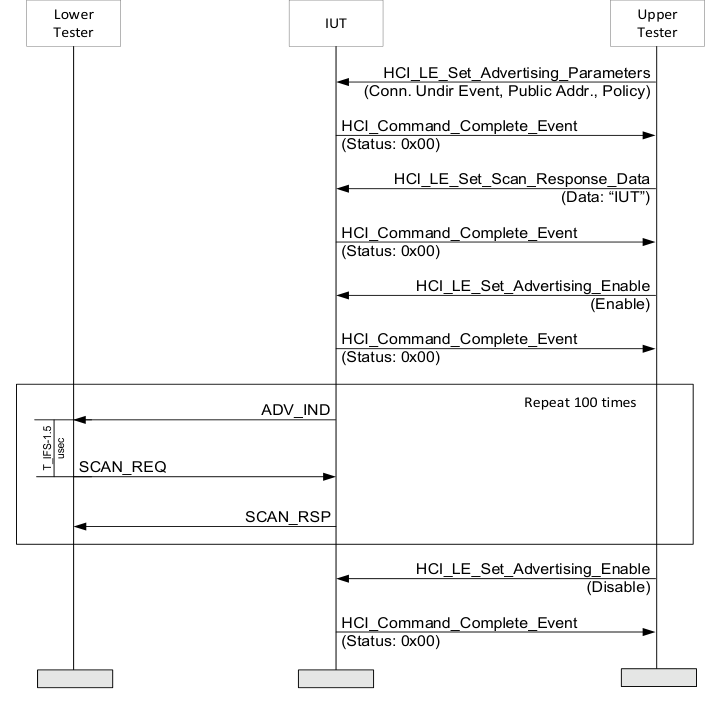

**Figure 4.4-1: LL/TIM/ADV/BV-01-C [Earliest transmission to Advertiser] MSC**

1. Configure the Lower Tester to start active scanning. 2. The Upper Tester enables undirected advertising in the IUT using all supported advertising channels. 3. The Lower Tester receives an ADV_IND packet from the IUT and responds with a SCAN_REQ packet, using the minimum time after the end of the advertising packet (T_IFS – 1.5 µsec). 4. The Lower Tester receives a SCAN_RSP packet from the IUT T_IFS after the SCAN_REQ. 5. Repeat steps 3–4 100 times.
• Expected Outcome
Pass verdict
The IUT responds at least to 95 percent of the SCAN_REQ packets sent by the Lower Tester in step 3.
• Notes
The Lower Tester is configured to use 1.5 µsec instead of 2 µsec. This difference is needed to assure that there is no loss of synchronization due to the Lower Tester timing resolution.
LL/TIM/ADV/BV-02-C [Latest Transmission to Advertiser]
• Test Purpose
Test that an advertiser IUT responds to a scan request sent using the maximum timing between packets (T_IFS + 2 µsec).
The Lower Tester requests information from the IUT and receives a response.
• Reference
[3] 4.2, 4.4.2.3
• Initial Condition
- Parameters: LL_advertiser_advInterval_MIN, LL_advertiser_advInterval_MAX, LL_advertiser_Adv_Channel_Map
- State: Undirected Advertising (selected Adv_Interval_Min, selected Adv_Interval_Max, supported type of own address, selected advertising channels, Length of device name used, common device name)
• Test Procedure

**Figure 4.4-2: LL/TIM/ADV/BV-02-C [Latest transmission to Advertiser] MSC**

1. Configure the Lower Tester to start active scanning. 2. The Upper Tester enables undirected advertising in the IUT using all supported advertising channels. 3. The Lower Tester receives an ADV_IND packet from the IUT and responds with a SCAN_REQ packet, using the maximum time after the end of the advertising packet (T_IFS + 1.5 µsec). 4. The Lower Tester receives a SCAN_RSP packet from the IUT T_IFS after the SCAN_REQ. 5. Repeat steps 3–4 100 times.
• Expected Outcome
Pass verdict
The IUT responds at least to 95 percent of the SCAN_REQ packets sent by the Lower Tester in step 3.
• Notes
The Lower Tester is configured to use 1.5 µsec instead of 2 µsec. This difference is needed to assure that there is no loss of synchronization due to the Lower Tester timing resolution.

##### 4.4.2.1 Extended Advertising, Secondary Channel, Earliest Transmission to Advertiser

• Test Purpose
Tests that an advertiser IUT sends scannable undirected ADV_EXT_IND with the AuxPtr field referring to a valid AUX_ADV_IND PDU on the secondary advertising channel. Tests that an advertiser IUT responds to a scan request on the secondary channel when scanner uses the minimum transmission time to advertiser.
• Reference
[10] 4.4.2.5.4
• Initial Condition
- Parameters: LL_advertiser_advInterval_MIN, LL_advertiser_advInterval_MAX, LL_advertiser_Adv_Channel_Map
- State: Scannable Undirected Advertising (any scan interval, any scan window, public peer address, Lower Tester address, supported type of own address, connection interval, common Peripheral latency, common timeout)
• Test Case Configuration

| Test Case |  |  |  | PHYs |  |  |  |  |
| --- | --- | --- | --- | --- | --- | --- | --- | --- |
|  |  |  |  | Primary Advertising PHY |  |  | Secondary Advertising PHY |  |
|  | LL/TIM/ADV/BV-03-C [Extended |  | 0x01 (LE 1M PHY) | 0x01 (LE 1M PHY) |  | 0x01 (LE 1M PHY) | 0x01 (LE 1M PHY) |  |
|  | Advertising, Secondary Channel, |  |  |  |  |  |  |  |
|  | Earliest Transmission to |  |  |  |  |  |  |  |
|  | Advertiser – LE 1M PHY] |  |  |  |  |  |  |  |
|  | LL/TIM/ADV/BV-05-C [Extended |  | 0x01 (LE 1M PHY) |  |  | 0x02 (LE 2M PHY) |  |  |
|  | Advertising, Secondary Channel, |  |  |  |  |  |  |  |
|  | Earliest Transmission to |  |  |  |  |  |  |  |
|  | Advertiser – LE 2M PHY] |  |  |  |  |  |  |  |

| Test Case |  |  |  | PHYs |  |  |  |  |
| --- | --- | --- | --- | --- | --- | --- | --- | --- |
|  |  |  |  | Primary Advertising PHY |  |  | Secondary Advertising PHY |  |
|  | LL/TIM/ADV/BV-06-C [Extended |  | 0x03 (LE Coded PHY) | 0x03 (LE Coded PHY) |  | 0x03 (LE Coded PHY) | 0x03 (LE Coded PHY) |  |
|  | Advertising, Secondary Channel, |  |  |  |  |  |  |  |
|  | Earliest Transmission to |  |  |  |  |  |  |  |
|  | Advertiser – LE Coded PHY] |  |  |  |  |  |  |  |

Table 4.4-1: Extended Advertising, Secondary Channel, Earliest Transmission to Advertiser test cases
• Test Procedure

**Figure 4.4-3: Extended Advertising, Secondary Channel, Earliest Transmission to Advertiser MSC**

1. The Upper Tester sends an HCI_LE_Set_Extended_Advertising_Parameters command to the IUT using all supported advertising channels and minimum advertising interval. Advertising_Event_Properties parameter bit 1 (Scannable Advertising) is set and all other bits cleared. The Own_Address_Type is set to 0x00 (Public Device Address). The Primary_Advertising_PHY and Secondary_Advertising_PHY are set as specified in Table 4.4-1. 2. The Upper Tester sends an HCI_LE_Set_Extended_Scan_Response_Data command to the IUT containing at least 1 octet of Scan Response Data. 3. The Upper Tester enables advertising using the HCI_LE_Set_Extended_Advertising_Enable command. The Duration[0] parameter is set to 0x0000 (No Advertising Duration).
4. The Lower Tester receives an ADV_EXT_IND PDU with the AuxPtr field referring to a valid AUX_ADV_IND PDU on the secondary advertising channel sent T_MAFS after the ADV_EXT_IND PDU or later. The Lower Tester sends an AUX_SCAN_REQ PDU the minimum time after the end of the AUX_ADV_IND PDU (T_IFS – 1.5 µsec). 5. The Lower Tester receives an AUX_SCAN_RSP packet from the IUT T_IFS (plus or minus 2 µsec) after the AUX_SCAN_REQ. 6. Repeat steps 4–5 100 times. 7. The Upper Tester sends an HCI_LE_Set_Extended_Advertising_Enable command to disable advertising in the IUT and receives an HCI_Command_Complete event from the IUT.
• Expected Outcome
Pass verdict
The IUT responds to at least 95 percent of the AUX_SCAN_REQ packets sent by the Lower Tester in step 4 within T_IFS (plus or minus 2 µsec).
The time between a PDU containing an AuxPtr field and the PDU to which it refers is greater than or equal to T_MAFS.
• Notes
The Lower Tester is configured to use 1.5 µsec instead of 2 µsec. This difference is needed to assure that there is no loss of synchronization due to the Lower Tester timing resolution.

##### 4.4.2.2 Extended Advertising, Secondary Channel, Latest Transmission to Advertiser

• Test Purpose
Tests that an advertiser IUT sends scannable undirected ADV_EXT_IND PDUs with the AuxPtr field referring to a valid AUX_ADV_IND PDU on the secondary advertising channel. Tests that an advertiser IUT responds to a scan request on the secondary channel when scanner uses the maximum transmission time to advertiser (T_IFS + 2 µsec).
• Reference
[10] 4.4.2.5.4
• Initial Condition
- Parameters: LL_advertiser_advInterval_MIN, LL_advertiser_advInterval_MAX, LL_advertiser_Adv_Channel_Map
- State: Scannable Undirected Advertising (any scan interval, any scan window, public peer address, Lower Tester address, supported type of own address, connection interval, common Peripheral latency, common timeout)
• Test Case Configuration

| Test Case |  |  |  | PHYs |  |  |  |  |
| --- | --- | --- | --- | --- | --- | --- | --- | --- |
|  |  |  |  | Primary Advertising PHY |  |  | Secondary Advertising PHY |  |
|  | LL/TIM/ADV/BV-04-C [Extended |  | 0x01 (LE 1M PHY) | 0x01 (LE 1M PHY) |  | 0x01 (LE 1M PHY) | 0x01 (LE 1M PHY) |  |
|  | Advertising, Secondary Channel, |  |  |  |  |  |  |  |
|  | Latest Transmission to Advertiser |  |  |  |  |  |  |  |
|  | – LE 1M PHY] |  |  |  |  |  |  |  |

| Test Case |  |  |  | PHYs |  |  |  |  |
| --- | --- | --- | --- | --- | --- | --- | --- | --- |
|  |  |  |  | Primary Advertising PHY |  |  | Secondary Advertising PHY |  |
|  | LL/TIM/ADV/BV-07-C [Extended |  | 0x01 (LE 1M PHY) | 0x01 (LE 1M PHY) |  | 0x02 (LE 2M PHY) | 0x02 (LE 2M PHY) |  |
|  | Advertising, Secondary Channel, |  |  |  |  |  |  |  |
|  | Latest Transmission to Advertiser |  |  |  |  |  |  |  |
|  | – LE 2M PHY] |  |  |  |  |  |  |  |
|  | LL/TIM/ADV/BV-08-C [Extended |  | 0x03 (LE Coded PHY) |  |  | 0x03 (LE Coded PHY) |  |  |
|  | Advertising, Secondary Channel, |  |  |  |  |  |  |  |
|  | Latest Transmission to Advertiser |  |  |  |  |  |  |  |
|  | – LE Coded PHY] |  |  |  |  |  |  |  |

Table 4.4-2: Extended Advertising, Secondary Channel, Latest Transmission to Advertiser test cases
• Test Procedure

**Figure 4.4-4: Extended Advertising, Secondary Channel, Latest Transmission to Advertiser MSC**

1. The Upper Tester sends an HCI_LE_Set_Extended_Advertising_Parameters command to the IUT using all supported advertising channels and minimum advertising interval. Advertising_Event_Properties parameter bit 1 (Scannable Advertising) is set and all other bits cleared. The Own_Address_Type is set to 0x00 (Public Device Address). The Primary_Advertising_PHY and Secondary_Advertising_PHY are set as specified in Table 4.4-2.
2. The Upper Tester sends an HCI_LE_Set_Extended_Scan_Response_Data command to the IUT containing at least 1 octet of Scan Response Data. 3. The Upper Tester enables advertising using the HCI_LE_Set_Extended_Advertising_Enable command. The Duration[0] parameter is set to 0x0000 (No Advertising Duration). 4. The Lower Tester receives an ADV_EXT_IND PDU with an AuxPtr field referring to a valid AUX_ADV_IND PDU on the secondary advertising channel sent T_MAFS after the ADV_EXT_IND PDU or later. The Lower Tester sends an AUX_SCAN_REQ PDU the maximum time after the end of the AUX_ADV_IND PDU (T_IFS + 1.5 µsec). 5. The Lower Tester receives an AUX_SCAN_RSP PDU from the IUT T_IFS after the AUX_SCAN_REQ. 6. Repeat steps 4–5 100 times. 7. The Upper Tester sends an HCI_LE_Set_Extended_Advertising_Enable command to disable advertising in the IUT and receives an HCI_Command_Complete event from the IUT.
• Expected Outcome
Pass verdict
The IUT responds to at least 95 percent of the AUX_SCAN_REQ packets sent by the Lower Tester in step 4.
The time between a PDU containing an AuxPtr field and the PDU to which it refers is greater than or equal to T_MAFS.
• Notes
The Lower Tester is configured to use 1.5 µsec instead of 2 µsec. This difference is needed to assure that there is no loss of synchronization due to the Lower Tester timing resolution.

#### 4.4.3 PER

Tests that the IUT behaves according to timing constraints in the Peripheral role. The Peripheral timing requirements apply both in low power and active mode.
LL/TIM/PER/BV-01-C [Adjusting Anchor Point]
• Test Purpose
Test that a Peripheral IUT on accepting a parameter update from the Central, adopts a new anchor point when starting to use the new parameters.
The Lower Tester acts in the Central role in the connection, sending a connection parameter update packet to the IUT until it accepts it, then takes the new parameters into use varying the time to the earliest and latest possible. The Lower Tester observes the Peripheral transmissions on the data channels used.
• Reference
[3] 5.1.1
• Initial Condition
- State: Connected Peripheral (any advertising interval, any advertising interval, public address, any advertising channel map, common connection interval, 0 Peripheral latency, 200 ms timeout, common channel map, any SCA value)
• Test Procedure
Execute the test procedure using a connection supervision timer parameter of 200 ms and zero Peripheral latency. Update using the same connection parameters.

**Figure 4.4-5: LL/TIM/PER/BV-01-C [Adjusting Anchor Point] MSC**

1. The Lower Tester sends a CONNECTION_UPDATE_IND packet setting the connection parameters to the maximum Transmission Window Size and to the minimum Transmission Offset and receives a packet from the IUT acknowledging the connection update request.
2. The Lower Tester sends an empty DATA packet to the IUT and receives a response in all events until the event count matches the indicated time of connection update. 3. Send an empty LL DATA packet starting the event at connection interval, using the common data channel selection parameters. Receive an empty LL DATA packet in response from the IUT, T_IFS after the data packet sent on the same data channel. Repeat up to 15 times. 4. Interleave with step 3: Receive no HCI_LE_Connection_Update_Complete event from the IUT. 5. The Lower Tester sends a CONNECTION_UPDATE_IND packet setting the connection parameters to the maximum Transmission Window Size and to the maximum Transmission Offset and receives a packet from the IUT acknowledging the connection update request. 6. Repeat step 2. 7. Repeat steps 3–4.
• Test Condition
The parameters in this test are calculated for a BER of 0.1 percent or better.
• Expected Outcome
Pass verdict
The test procedure executes successfully, with the IUT adopting the new anchor point and maintaining the connection.
The IUT produces no HCI event reporting the connection update.
• Notes
The calculations in the tests ‘Earliest/Latest Transmission Start to Peripheral’ can be used to define the connection parameters and test procedure details required. A difference in the parameter application is that the transmission window size is larger and the window offset is used.
LL/TIM/PER/BV-02-C [Earliest Transmission Start to Peripheral]
• Test Purpose
Test that the Peripheral IUT is able to establish and maintain a connection with a Central that uses the earliest possible timing for the first transmission.
The Lower Tester acts first in the initiating state, then times the first transmission in the data channel at the earliest time possible.
• Reference
[3] 4.5.5
• Initial Condition
- State: Undirected Advertising (selected Adv_Interval_Min, selected Adv_Interval_Max, supported type of own address, selected advertising channels, Length of device name used, common device name)
• Test Procedure
Execute the test using the common connection interval and data channel selection parameters, a connection supervision timer of 10 s and a zero Peripheral latency in the connection request packet using the minimum SCA for the most deviation by clock drift. Use a minimum transmission window size (1.25 ms) with 0 offset.

**Figure 4.4-6: LL/TIM/PER/BV-02-C [Earliest Transmission Start to Peripheral] MSC**

1. The Lower Tester receives an ADV_IND packet from the IUT on the selected advertising channel, respond with a CONNECT_IND packet T_IFS after the end of the advertising packet. 2. The Upper Tester receives an HCI_LE_Connection_Complete event from the IUT with the parameters sent in step 1. 3. The Lower Tester sends an empty LL DATA packet starting the first event at connection interval transmitting at the leading edge of the window, using the common data channel selection parameters. The Lower Tester receives an empty LL DATA packet in response from the IUT, T_IFS after the data packet sent on the same data channel. Repeat up to 10 times. 4. Peripheral Connection Terminated (connection interval, Peripheral latency, timeout, channel map, un-encrypted, connection handle from step 2).
• Test Condition
The parameters in this test are calculated for a BER of 0.1 percent or better.
• Expected Outcome
Pass verdict
The test procedure executes successfully, with the IUT starting Peripheral transmissions after the events skipped.
LL/TIM/PER/BV-03-C [Latest Transmission Start to Peripheral]
• Test Purpose
Test that the Peripheral IUT is able to establish a connection with a Central that uses the latest possible timing for the first transmission.
The Lower Tester acts first in the initiating state, then times the first transmission in the data channel at the latest time required.
• Reference
[3] 4.5.5
• Initial Condition
- State: Undirected Advertising (selected Adv_Interval_Min, selected Adv_Interval_Max, supported type of own address, selected advertising channels, Length of device name used, common device name)
• Test Procedure
Execute the test, using the common connection interval and data channel selection parameters. Use a connection supervision timer of 690 ms, zero Peripheral latency, the minimum SCA and a maximum transmission window and maximum transmission offset in the connection request packet.

**Figure 4.4-7: LL/TIM/PER/BV-03-C [Latest Transmission Start to Peripheral] MSC**

1. The Lower Tester receives an ADV_IND packet from the IUT on the selected advertising channel and responds with a CONNECT_IND packet T_IFS after the end of the advertising packet. 2. The Upper Tester receives an HCI_LE_Connection_Complete event from the IUT with the parameters sent in step 1. 3. The Lower Tester sends an empty LL DATA packet starting the first event at connection interval transmitting at the trailing edge of the window, using the common data channel selection parameters. 4. The Lower Tester receives an empty LL DATA packet in response from the IUT, T_IFS after the data packet sent on the same data channel. Repeat up to 10 times. 5. Peripheral Connection Terminated (connection interval, Peripheral latency, timeout, channel map, un-encrypted, connection handle from step 2).
• Test Condition
The parameters in this test are calculated for a BER of 0.1 percent or better.
• Expected Outcome
Pass verdict
The test procedure executes successfully, with the IUT setting up the connection by starting Peripheral transmissions after the skipped events.
LL/TIM/PER/BV-04-C [Shortest Connection Interval]
• Test Purpose
Test that a Peripheral IUT is able to maintain a connection with a Central using the minimum timing between events (ConnInterval – 16 µsec).
The Lower Tester acts in the Central role, maintaining the connection and sending data to the Peripheral using the minimum time required between events.
• Reference
[3] 4.2
• Initial Condition
- State: Connected Peripheral (any advertising interval, any advertising interval, public address, any advertising channel map, selected connection interval, 0 common Peripheral latency, selected timeout, common channel map, -20 ppm SCA value)
• Test Procedure
Execute the test using the common data channel selection parameters, a nominal connection interval of 10 ms and a connection supervision timer of 32 s in the connection request packet.

**Figure 4.4-8: LL/TIM/PER/BV-04-C [Earliest Transmission to Peripheral] MSC**

| ConnInterval 1 1' | ConnInterval 2 2' | Nominal conn Interval 3 | ConnInterval 1 1' | ConnInterval 2 2' |
| --- | --- | --- | --- | --- |
| 1 | 2 | 3 | 1 | 2 |
|  |  |  |  |  |

Central Peripheral

| 1 |  | 1' | 2 |  | 2' |  |  |  | 1 1' |  |  |  |  | 2 | 2' |  | ... | 10 | 10' |
| --- | --- | --- | --- | --- | --- | --- | --- | --- | --- | --- | --- | --- | --- | --- | --- | --- | --- | --- | --- |
|  | 1 |  | 2 |  | 2' |  |  |  |  | 1 |  | 1' |  | 2 | 2' |  |  | 10 | 10' |
|  |  |  | Nom In |  |  | n | N |  | Nomina Inter onn |  |  |  |  | Nom |  | n |  |  |  |

Packet not received by the Peripheral, Central re-start the sequence
Peripheral Rx
Tx Packet Rx Packet
Windows
ConnInterval=Nominal conn Interval - 15,5us

**Figure 4.4-9: LL/TIM/PER/BV-04-C Timing sequence**

1. The Lower Tester sends DATA packets once a connection interval to the IUT is made using the data channel selection. Connection Interval will be set to nominal ConnInterval – 15.5 µsec. Receive an empty DATA packet from the IUT T_IFS after each packet sent, with the SN matching the current NESN and the NESN matching the next SN. Repeat up to 10 times. If the IUT does not respond to one Lower Tester packet, next packet sent by the Lower Tester will be at nominal ConnInterval, according to Figure 4.4-9. 2. Repeat step 1 five times.
3. Peripheral Connection Terminated (connection interval, Peripheral latency, timeout, channel map, un-encrypted, connection handle from preamble.
• Expected Outcome
Pass verdict
The test procedure executes successfully, with the IUT maintaining the connection.
The IUT responds to all 10 packets sent by the Lower Tester in at least 3 of 5 repetitions.
• Notes
The Lower Tester is configured to use 15.5 µsec instead of 16 µsec. This difference is needed to assure that there is no loss of synchronization due to the Lower Tester timing resolution.
The parameters in this test are calculated for a BER of 0.1 percent or better.
LL/TIM/PER/BV-05-C [Longest Connection Interval]
• Test Purpose
Test that a Peripheral IUT is able to maintain a connection with a Central using the maximum timing between events (ConnInterval + 16 µsec).
The Lower Tester acts in the Central role, maintaining the connection and sending data to the Peripheral using the maximum time required between events.
• Reference
[3] 4.2
• Initial Condition
- State: Connected Peripheral (any advertising interval, any advertising interval, public address, any advertising channel map, selected connection interval, 0 common Peripheral latency, selected timeout, common channel map, 20 ppm SCA value).
• Test Procedure
Execute the test using the common data channel selection parameters, a nominal connection interval of 10 ms and a connection supervision timer of 32 s in the connection request packet.

**Figure 4.4-10: LL/TIM/PER/BV-05-C [Latest Transmission to Peripheral] MSC**

...
ConnInterval Nominal conn Interval ConnInterval
ConnInterval
Central Peripheral

## 1 2 1 2 10 3

1' 2' 1' 2' 10'

| 1 N |  | 1' |  | 2 | 2' |  |  | 1 |  | 1 | ' | 2 2' |  |  | ... |  | 10 10' |
| --- | --- | --- | --- | --- | --- | --- | --- | --- | --- | --- | --- | --- | --- | --- | --- | --- | --- |
|  | 1 |  | 1' |  |  |  |  |  |  |  |  | 2 | 2' |  |  |  | 10 |
|  |  |  |  |  |  | N con |  | al erval |  |  |  |  |  | nn |  |  |  |

Packet not received by the Peripheral, Central re-start the sequence
Peripheral Rx Windows
Tx Packet Rx Packet
ConnInterval=Nominal conn Interval + 15,5us

**Figure 4.4-11: LL/TIM/PER/BV-05-C Timing sequence**

1. The Lower Tester sends a DATA packet once a connection interval to the IUT, using the using the data channel selection parameters. Connection Interval will be set to nominal ConnInterval + 15.5 µsec. Receive an empty DATA packet from the IUT T_IFS after each packet sent, with the SN matching the current NESN and the NESN matching the next SN. Repeat up to 10 times. If the IUT does not respond to one Lower Tester packet, next packet sent by the Lower Tester will be at nominal ConnInterval, according to Figure 4.4-11. 2. Repeat step 1 five times.
3. Peripheral Connection Terminated (connection interval, Peripheral latency, timeout, channel map, un-encrypted, connection handle from the preamble.
• Expected Outcome
Pass verdict
The test procedure executes successfully, with the IUT maintaining the connection.
The IUT responds to all 10 packets sent by the Lower Tester in at least 3 of 5 repetitions.
• Notes
The Lower Tester is configured to used 15.5 µsec instead of 16 µsec. This difference is needed to assure that there is no loss of synchronization due to the Lower Tester timing resolution.
The parameters in this test are calculated for a BER of 0.1 percent or better.
LL/TIM/PER/BV-06-C [Earliest Transmissions to Peripheral]
• Test Purpose
Test that a Peripheral IUT is able to maintain a connection with a Central using the minimum timing between packets (T_IFS – 2 µsec).
The Lower Tester acts in the Central role, maintaining the connection and sending data to the Peripheral using the minimum time required between packets.
• Reference
[3] 4.2
• Initial Condition
- State: Connected Peripheral (any advertising interval, any advertising interval, public address, any advertising channel map, selected connection interval, 0 common Peripheral latency, selected timeout, common channel map, any SCA value)
• Test Procedure
Execute the test using the common data channel selection parameters, a connection interval of 10 ms and a connection supervision timer of 32 s in the connection request packet.

**Figure 4.4-12: LL/TIM/PER/BV-06-C [Earliest Transmissions to Peripheral] MSC**

1. The Lower Tester sends a DATA packet to the IUT at the beginning of the Connection Event, setting MD bit to 1. Receive an empty DATA packet from the IUT T_IFS after the packet sent. 2. The Lower Tester sends a second DATA packet in the same Connection Event, using the minimum time between packets (T_IFS – 1.5 µsec) and setting MD bit to 0. Receive an empty DATA packet from the IUT T_IFS after the packet sent. 3. Repeat up to 10 Connection Events. 4. Peripheral Connection Terminated (connection interval, Peripheral latency, timeout, channel map, un-encrypted, connection handle from preamble).
• Expected Outcome
Pass verdict
The test procedure executes successfully, with the IUT maintaining the connection.
The IUT responds at least to 95 percent of the packets sent by the Lower Tester in step 2.
• Notes
The Lower Tester is configured to use 1.5 µsec instead of 2 µsec. This difference is needed to assure that there is no loss of synchronization due to the Lower Tester timing resolution.
LL/TIM/PER/BV-07-C [Latest Transmissions to Peripheral]
• Test Purpose
Test that a Peripheral IUT is able to maintain a connection with a Central using the maximum timing between packets (T_IFS + 2 µsec).
The Lower Tester acts in the Central role, maintaining the connection and sending data to the Peripheral using the maximum time required between packets.
• Reference
[3] 4.2
• Initial Condition
- State: Connected Peripheral (any advertising interval, any advertising interval, public address, any advertising channel map, selected connection interval, 0 common Peripheral latency, selected timeout, common channel map, any SCA value)
• Test Procedure
Execute the test using the common data channel selection parameters, a connection interval of 10 ms and a connection supervision timer of 32 s in the connection request packet.

**Figure 4.4-13: LL/TIM/PER/BV-07-C [Latest Transmissions to Peripheral] MSC**

1. The Lower Tester sends a DATA packet to the IUT at the beginning of the Connection Event, setting MD bit to 1. Receive an empty DATA packet from the IUT T_IFS after the packet sent. 2. The Lower Tester sends a second DATA packet in the same Connection Event, using the maximum time between packets (T_IFS + 1.5 µsec) and setting MD bit to 0. Receive an empty DATA packet from the IUT T_IFS after the packet sent. 3. Repeat up to 10 Connection Events. 4. Peripheral Connection Terminated (connection interval, Peripheral latency, timeout, channel map, un-encrypted, connection handle from preamble).
• Expected Outcome
Pass verdict
The test procedure executes successfully, with the IUT maintaining the connection.
The IUT responds at least to 95 percent of the packets sent by the Lower Tester in step 2.
• Notes
The Lower Tester is configured to use 1.5 µsec instead of 2 µsec. This difference is needed to assure that there is no loss of synchronization due to the Lower Tester timing resolution.
LL/TIM/PER/BV-08-C [Initiate Sleep Clock Accuracy Update]
• Test Purpose
Test that the IUT initiates the Sleep Clock Accuracy Update procedure to change its Sleep Clock Accuracy. Verify that the connection remains active after the Sleep Clock Accuracy Update.
• Reference
[13] 4.6.25, 5.1.14
• Initial Condition
- State: Connected Peripheral (any advertising interval, public address, any advertising channel map, common connection interval, common Peripheral latency, common timeout, common channel map, centralSCA values not the worst accuracy supported)
• Test Procedure

**Figure 4.4-14: LL/TIM/PER/BV-08-C [Initiate Sleep Clock Accuracy Update] MSC**

1. The Upper Tester sends HCI_LE_Modify_Sleep_Clock_Accuracy to the IUT with the Action parameter set to 0x00 and receives an HCI_Command_Complete event with status set to 0 (Success) or 0x43 (Limit Reached). 2. The IUT optionally sends an LL_CLOCK_ACCURACY_REQ to the Lower Tester with either an accurate or more accurate Sleep Clock Accuracy and receives an LL_CLOCK_ACCURACY_RSP in return. 3. The Upper Tester sends an HCI_LE_Modify_Sleep_Clock_Accuracy command to the IUT with the Action parameter set to 0x01 and receives an HCI_Command_Complete event with zero status. 4. The IUT sends an LL_CLOCK_ACCURACY_REQ PDU with the PeripheralSCA value that is worse than the initial peripheralSCA from the connection process to the Lower Tester. 5. The Lower Tester sends an LL_CLOCK_ACCURACY_RSP PDU to the IUT. The accuracy is worse than that currently in use. 6. The Lower Tester sends a correctly formatted LL Data Channel PDU using the acknowledgement scheme, to the IUT on the same data channel. 7. The Lower Tester receives correctly formatted LL Data Channel PDUs on subsequent data channels at connection intervals, calculated for the connection interval used. 8. Repeat for a number of events (10 events) to conclude that the connection is active.
• Expected Outcome
Pass verdict
The IUT receives 90 percent of the LL Data Channel PDUs from the Lower Tester in step 8 to conclude the connection is active.
LL/TIM/PER/BV-09-C [Response to Sleep Clock Accuracy Update]
• Test Purpose
Test that the IUT responds to the Sleep Accuracy Update initiated by the Lower Tester. Verify that the connection remains active after the Sleep Clock Accuracy Update.
• Reference
[13] 4.6.25, 5.1.14
• Initial Condition
- State: Connected Peripheral (any advertising interval, public address, any advertising channel map, common connection interval, common Peripheral latency, common timeout, common channel map, centralSCA value is 0 to 20 ppm)
• Test Procedure

**Figure 4.4-15: LL/TIM/PER/BV-09-C [Response to Sleep Clock Accuracy Update] MSC**

1. The Lower Tester sends an LL_CLOCK_ACCURACY_REQ PDU to the IUT to update the sleep clock accuracy value to switch to a clock accuracy of 251 ppm to 500 ppm. 2. The IUT receives the LL_CLOCK_ACCURACY_REQ PDU to update the Sleep Clock Accuracy. The IUT switches to the updated Central Sleep Clock Accuracy value and sends the LL_CLOCK_ACCURACY_RSP PDU to the Lower Tester. 3. After the Lower Tester receives the LL_CLOCK_ACCURACY_RSP PDU the Lower Tester sends a correctly formatted LL Data Channel PDU using the acknowledgement scheme, to the IUT on the same data channel. The Lower Tester sends the packets within 2 µs of the edge of the timing window. 4. The Lower Tester receives correctly formatted LL Data Channel PDUs on subsequent data channels at connection intervals, calculated for the connection interval used. 5. Repeat for a number of events (100 events) to conclude that the connection is active. For each event the Lower Tester randomly selects the leading edge or the trailing edge in step 3.
• Expected Outcome
Pass verdict
The IUT receives at least 95 percent of the LL Data Channel PDUs from the Lower Tester in step 5 to conclude the connection is active.
LL/TIM/PER/BV-10-C [Response without Reducing the Sleep Clock Accuracy]
• Test Purpose
Test that the IUT responds to the Sleep Accuracy Update from the Lower Tester without reducing its Sleep Clock Accuracy.
• Reference
[13] 4.6.25, 5.1.14
• Initial Condition
- State: Connected Peripheral (any advertising interval, public address, any advertising channel map, common connection interval, common Peripheral latency, common timeout, common channel map, centralSCA value is 0 to 20 ppm)
• Test Procedure

**Figure 4.4-16: LL/TIM/PER/BV-10-C [Response without Reducing the Sleep Clock Accuracy] MSC**

1. The Upper Tester sends an HCI_LE_Modify_Sleep_Clock_Accuracy command to the IUT with the Action Parameter set to 0x00 and receives an HCI_Command_Complete event with status = 0x00 or 0x43. 2. The IUT may send an LL_CLOCK_ACCURACY_REQ PDU to the Lower Tester.
3. Perform either alternative 3A or 3B depending on if the IUT sent an LL_CLOCK_ACCURACY_REQ PDU in step 2. Alternative 3A (The IUT sent an LL_CLOCK_ACCURACY_REQ PDU)
3A.1 The Lower Tester responds with an LL_CLOCK_ACCURACY_RSP PDU. Alternative 3B (The IUT did not send an LL_CLOCK_ACCURACY_REQ PDU)
3B.1 The Lower Tester sends an LL_CLOCK_ACCURACY_REQ PDU to the IUT. 3B.2 The IUT responds with an LL_CLOCK_ACCURACY_RSP PDU. 4. The Upper Tester sends a command that will cause the IUT to initiate an LL procedure with the Lower Tester. The LL procedure must not be the Sleep Clock Accuracy procedure and must be one that requires a response. 5. The IUT sends the initial PDU of that procedure to the Lower Tester. 6. The Upper Tester sends HCI_LE_Modify_Sleep_Clock_Accuracy command to the IUT with the Action Parameter set to 0x01 and receives an HCI_Command_Complete event with zero status. 7. The Lower Tester sends an LL_CLOCK_ACCURACY_REQ PDU to the IUT to update the sleep clock accuracy value to switch to a clock accuracy of 251 ppm to 500 ppm. 8. The IUT sends the LL_CLOCK_ACCURACY_RSP PDU to the Lower Tester. If it has not done so within 20 connection intervals, the Lower Tester completes the procedure started in step 4 and then continues to wait for the LL_CLOCK_ACCURACY_RSP PDU.
• Expected Outcome
Pass verdict
The LL_CLOCK_ACCURACY_RSP PDU sent by the IUT in step 8 has the same or better sleep clock accuracy than that in the LL_CLOCK_ACCURACY_REQ in step 2 or the LL_CLOCK_ACCURACY_RSP sent in step 3.

##### 4.4.3.1 Initiate Inter Frame Space Change in the current ACL connection, Symmetric PHYs, Peripheral

• Test Purpose
Test that an IUT is able to initiate a change to the Inter Frame Space on the current ACL. The IUT sets the inter frame space using the specified PHY.
• Reference
[25] 2.4.2.54, 2.4.2.53
• Initial Condition
- Peripheral State: Connected Peripheral on the PHY specified in Table 4.4-3 (any scan interval, any scan window, public peer address, Lower Tester address, supported type of own address, common connection interval, common Peripheral latency, common timeout, common channel map, encryption as specified in Table 4.4-3, T_IFS_ACL_CP and T_IFS_ACL_PC = 150 µs)
- The minimum supported frame space is defined by the TSPX_frame_space_min IXIT value.
- The maximum supported frame space is defined by the TSPX_frame_space_max IXIT value.
• Test Case Configuration

|  | Test Case |  |  | PHY |  |  | Encryption |  |
| --- | --- | --- | --- | --- | --- | --- | --- | --- |
|  | LL/TIM/PER/BV-11-C [Initiate Inter Frame Space Change in the |  | LE 1M | LE 1M |  | No | No |  |
|  | current ACL connection, Symmetric PHYs, LE 1M PHY, |  |  |  |  |  |  |  |
|  | Peripheral, Unencrypted] |  |  |  |  |  |  |  |
|  | LL/TIM/PER/BV-12-C [Initiate Inter Frame Space Change in the |  | LE 2M |  |  | No |  |  |
|  | current ACL connection, Symmetric PHYs, LE 2M PHY, |  |  |  |  |  |  |  |
|  | Peripheral, Unencrypted] |  |  |  |  |  |  |  |
|  | LL/TIM/PER/BV-13-C [Initiate Inter Frame Space Change in the |  | LE Coded |  |  | No |  |  |
|  | current ACL connection, Symmetric PHYs, LE Coded PHY, |  |  |  |  |  |  |  |
|  | Peripheral, Unencrypted] |  |  |  |  |  |  |  |
|  | LL/TIM/PER/BV-14-C [Initiate Inter Frame Space Change in the |  | LE 1M |  |  | Yes |  |  |
|  | current ACL connection, Symmetric PHYs, LE 1M PHY, |  |  |  |  |  |  |  |
|  | Peripheral, Encrypted] |  |  |  |  |  |  |  |
|  | LL/TIM/PER/BV-15-C [Initiate Inter Frame Space Change in the |  | LE 2M |  |  | Yes |  |  |
|  | current ACL connection, Symmetric PHYs, LE 2M PHY, |  |  |  |  |  |  |  |
|  | Peripheral, Encrypted] |  |  |  |  |  |  |  |
|  | LL/TIM/PER/BV-16-C [Initiate Inter Frame Space Change in the |  | LE Coded |  |  | Yes |  |  |
|  | current ACL connection, Symmetric PHYs, LE Coded PHY, |  |  |  |  |  |  |  |
|  | Peripheral, Encrypted] |  |  |  |  |  |  |  |

Table 4.4-3: Initiate Inter Frame Space Change in the current ACL connection, Symmetric PHYs, Peripheral test cases
• Test Procedure

**Figure 4.4-17: Initiate Inter Frame Space Change in the current ACL connection, Symmetric PHYs, Peripheral MSC – Page 1 of 2**

**Figure 4.4-18: Initiate Inter Frame Space Change in the current ACL connection, Symmetric PHYs, Peripheral MSC – Page 2 of 2**

1. The Lower Tester sends the IUT an LL Data Channel PDU with no data and MD bit set to 1. 2. T_IFS_ACL_CP after step 1, the IUT sends the Lower Tester an LL Data Channel PDU. 3. T_IFS_ACL_PC after step 2, the Lower Tester sends the IUT an LL Data Channel PDU with no data and MD bit set to 1.
Repeat steps 2 and 3 for 20 connection intervals.
4. The Upper Tester sends an HCI_LE_Frame_Space_Update command to the IUT with Frame_Space_Min set to TSPX_frame_space_min, Frame_Space_Max set to 150 µs, PHYs set
to the PHY in Table 4.4-3, and Spacing_Type set to 0b00001 and receives a successful HCI_Command_Status in response. 5. The IUT sends an LL_FRAME_SPACE_REQ PDU to the Lower Tester with the parameters set as specified in step 4. 6. The Lower Tester sends the IUT an LL Data Channel PDU with no data and MD bit set to 1. 7. T_IFS_ACL_CP after step 6, the IUT sends the Lower Tester an LL Data Channel PDU. 8. The Lower Tester sends an LL_FRAME_SPACE_RSP PDU to the IUT with FS set to Frame_Space_Min in step 4 and other parameters set as specified in step 4. T_IFS_ACL_CP is now FS.
Steps 9 and 10 can occur in any order.
9. The IUT sends an HCI_LE_Frame_Space_Update_Complete event to the Upper Tester with the parameters from step 8. 10. The Lower Tester sends the IUT an LL Data Channel PDU with no data and MD bit set to 1. 11. The IUT sends the Lower Tester an LL Data Channel PDU with no data and MD bit set to 1. Within six connection events after step 8, the IUT starts sending the LL Data Channel PDUs T_IFS_ACL_CP after step 10.
Repeat steps 10 and 11 for 20 connection intervals.
12. The Upper Tester sends an HCI_LE_Frame_Space_Update command to the IUT with Frame_Space_Min set to TSPX_frame_space_min, Frame_Space_Max set to TSPX_frame_space_max, PHYs set to the PHY in Table 4.4-3, and Spacing_Type set to 0b00010 and receives a successful HCI_Command_Status in response. 13. The IUT sends an LL_FRAME_SPACE_REQ PDU to the Lower Tester at T_IFS_ACL_PC with the parameters set as specified in step 12. 14. The Lower Tester sends an LL_FRAME_SPACE_RSP PDU to the IUT with FS set to Frame_Space_Max in step 12 and different from the current frame space and other parameters set as specified in step 11. T_IFS_ACL_PC is now FS.
Steps 15 and 16 can occur in any order.
15. The IUT sends an HCI_LE_Frame_Space_Update_Complete event to the Upper Tester with the parameters from step 14. 16. The Lower Tester sends the IUT an LL Data Channel PDU with no data and MD bit set to 1. 17. T_IFS_ACL_CP after step 16, the IUT sends the Lower Tester an LL Data Channel PDU. 18. T_IFS_ACL_PC after step 17, the Lower Tester sends the IUT an LL Data Channel PDU with no data and MD bit set to 1.
Repeat steps 17 and 18 for 20 connection intervals.
19. The Upper Tester sends an HCI_LE_Frame_Space_Update command to the IUT with Frame_Space_Min and Frame_Space_Max set to 150, PHYs set to the PHY in Table 4.4-3, and Spacing_Type set to 0b00011 and receives a successful HCI_Command_Status in response. 20. The IUT sends an LL_FRAME_SPACE_REQ PDU to the Lower Tester at T_IFS_ACL_CP with the parameters set as specified in step 19. 21. The Lower Tester sends an LL_FRAME_SPACE_RSP PDU to the IUT with FS set to 150 µs and other parameters set as specified in step 19. T_IFS_ACL_CP and T_IFS_ACL_PC are now FS.
Steps 22 and 23 can occur in any order.
22. The IUT sends an HCI_LE_Frame_Space_Update_Complete event to the Upper Tester with the parameters from step 21. 23. The Lower Tester sends the IUT an LL Data Channel PDU with no data and MD bit set to 1. 24. 150 µs after step 23, the IUT sends the Lower Tester an LL Data Channel PDU.
25. 150 µs after step 24, the Lower Tester sends the IUT an LL Data Channel PDU with no data and MD bit set to 1. 26. Repeat steps 24 and 25 for 20 connection intervals.
• Expected Outcome
Pass verdict
In steps 5, 13, and 20, the IUT sends the LL_FRAME_SPACE_REQ PDU to the Lower Tester within the specified receive window.
In steps 9, 15, and 22, the IUT sends a successful HCI_LE_Frame_Space_Update_Complete event to the Upper Tester.
In steps 11, 17, and 24, the IUT uses the new FS frame space in the LL Data Channel PDU.
The IUT is able to receive the LL_FRAME_SPACE_RSP PDU that is spaced at the extremes of FS_Min and FS_Max.
Fail verdict
TSPX_frame_space_min and TSPX_frame_space_max are both greater than 145 but less than 155.
The IUT does not switch to the new Frame Space value within six connection intervals of receiving the LL_FRAME_SPACE_RSP PDU.

##### 4.4.3.2 Initiate Inter Frame Space Change in the current ACL connection, Asymmetric PHYs, Peripheral

• Test Purpose
Test that an IUT is able to initiate a change to the Inter Frame Space on the current asymmetric ACLs. The IUT sets the inter frame space using the specified PHYs.
• Reference
[25] 2.4.2.53, 2.4.2.54
• Initial Condition
- Peripheral State: Connected Peripheral (any scan interval, any scan window, public peer address, Lower Tester address, supported type of own address, common connection interval, common Peripheral latency, common timeout, common channel map, encryption as specified in Table 4.4-4, T_IFS_ACL_CP and T_IFS_ACL_PC = 150 µs)
- The minimum supported frame space is defined by the TSPX_frame_space_min IXIT value.
- The maximum supported frame space is defined by the TSPX_frame_space_max IXIT value.
• Test Case Configuration

|  | Test Case |  |  | TX PHY _ |  |  | RX PHY _ |  |  | Encryption |  |
| --- | --- | --- | --- | --- | --- | --- | --- | --- | --- | --- | --- |
|  | LL/TIM/PER/BV-17-C [Initiate Inter Frame Space |  | LE 1M | LE 1M |  | LE 2M | LE 2M |  | No | No |  |
|  | Change in the current ACL connection, |  |  |  |  |  |  |  |  |  |  |
|  | Asymmetric PHYs, LE 1M LE 2M PHY, |  |  |  |  |  |  |  |  |  |  |
|  | Peripheral, Unencrypted] |  |  |  |  |  |  |  |  |  |  |
|  | LL/TIM/PER/BV-18-C [Initiate Inter Frame Space |  | LE 1M |  |  | LE Coded |  |  | No |  |  |
|  | Change in the current ACL connection, |  |  |  |  |  |  |  |  |  |  |
|  | Asymmetric PHYs, LE 1M LE Coded PHY, |  |  |  |  |  |  |  |  |  |  |
|  | Peripheral, Unencrypted] |  |  |  |  |  |  |  |  |  |  |
|  | LL/TIM/PER/BV-19-C [Initiate Inter Frame Space |  | LE 1M |  |  | LE 2M |  |  | Yes |  |  |
|  | Change in the current ACL connection, |  |  |  |  |  |  |  |  |  |  |
|  | Asymmetric PHYs, LE 1M LE 2M PHY, |  |  |  |  |  |  |  |  |  |  |
|  | Peripheral, Encrypted] |  |  |  |  |  |  |  |  |  |  |
|  | LL/TIM/PER/BV-20-C [Initiate Inter Frame Space |  | LE 1M |  |  | LE Coded |  |  | Yes |  |  |
|  | Change in the current ACL connection, |  |  |  |  |  |  |  |  |  |  |
|  | Asymmetric PHYs, LE 1M LE Coded PHY, |  |  |  |  |  |  |  |  |  |  |
|  | Peripheral, Encrypted] |  |  |  |  |  |  |  |  |  |  |

Table 4.4-4: Initiate Inter Frame Space Change in the current ACL connection, Asymmetric PHYs, Peripheral test cases
• Test Procedure

**Figure 4.4-19: Initiate Inter Frame Space Change in the current ACL connection, Asymmetric PHYs, Peripheral MSC – Page 1 of 2**

**Figure 4.4-20: Initiate Inter Frame Space Change in the current ACL connection, Asymmetric PHYs, Peripheral MSC – Page 2 of 2**

1. The Upper Tester sends an HCI_LE_Set_PHY command to the IUT with TX_PHYs and RX_PHYs set as specified in Table 4.4-4 and receives a successful HCI_Command_Status in response.
2. The IUT sends an LL_PHY_REQ PDU to the Lower Tester with TX_PHYs and RX_PHYs set as specified in step 1. 3. The Lower Tester sends an LL_PHY_UPDATE_IND PDU to the IUT with PHY_C_TO_P set to the RX_PHY in Table 4.4-4 and PHY_P_TO_C set to the TX_PHY in Table 4.4-4. 4. The IUT sends an HCI_LE_PHY_Complete event to the Upper Tester with TX_PHY and RX_PHY set as specified in Table 4.4-4. 5. The Lower Tester sends the IUT an LL Data Channel PDU with no data and MD bit set to 1 on the RX_PHY. 6. T_IFS_ACL_CP after step 5, the IUT sends the Lower Tester an LL Data Channel PDU on the TX_PHY. 7. T_IFS_ACL_PC after step 6, the Lower Tester sends the IUT an LL Data Channel PDU with no data and MD bit set to 1 on the RX_PHY.
Repeat steps 6 and 7 for 20 connection intervals.
8. The Upper Tester sends an HCI_LE_Frame_Space_Update command to the IUT with Frame_Space_Min set to TSPX_frame_space_min, Frame_Space_Max set to 150 µs, PHYs set to the TX_PHY in Table 4.4-4, and Spacing_Type set to 0b00001 and receives a successful HCI_Command_Status in response. 9. The IUT sends an LL_FRAME_SPACE_REQ PDU to the Lower Tester at T_IFS_ACL_CP with the parameters set as specified in step 8. 10. The Lower Tester sends the IUT an LL Data Channel PDU with no data and MD bit set to 1. 11. T_IFS_ACL_CP after step 10, the IUT sends the Lower Tester an LL Data Channel PDU. 12. The Lower Tester sends an LL_FRAME_SPACE_RSP PDU to the IUT with FS set to Frame_Space_Min in step 8 and other parameters set as specified in step 8. T_IFS_ACL_CP is now FS.
Steps 13 and 14 can occur in any order.
13. The IUT sends an HCI_LE_Frame_Space_Update_Complete event to the Upper Tester with the parameters from step 12. 14. The Lower Tester sends the IUT an LL Data Channel PDU with no data and MD bit set to 1. 15. The IUT sends the Lower Tester an LL Data Channel PDU with no data. Within six connection events after step 12, the IUT starts sending the LL Data Channel PDUs T_IFS_ACL_CP after step 14.
Repeat steps 14 and 15 for 20 connection intervals.
16. The Upper Tester sends an HCI_LE_Frame_Space_Update command to the IUT with Frame_Space_Min set to TSPX_frame_space_min, Frame_Space_Max set to TSPX_frame_space_max, PHYs set to the RX_PHY in Table 4.4-4, and Spacing_Type set to 0b00010 and receives a successful HCI_Command_Status in response. 17. The IUT sends an LL_FRAME_SPACE_REQ PDU to the Lower Tester with the parameters set as specified in step 16. 18. The Lower Tester sends an LL_FRAME_SPACE_RSP PDU to the IUT with FS set to Frame_Space_Max in step 16 and other parameters set as specified in step 15. T_IFS_ACL_PC is now FS.
Steps 19 and 20 can occur in any order.
19. The IUT sends an HCI_LE_Frame_Space_Update_Complete event to the Upper Tester with the parameters from step 18. 20. The Lower Tester sends the IUT an LL Data Channel PDU with no data and MD bit set to 1. 21. T_IFS_ACL_CP after step 20, the IUT sends the Lower Tester an LL Data Channel PDU.
22. T_IFS_ACL_PC after step 21, the Lower Tester sends the IUT an LL Data Channel PDU with no data and MD bit set to 1.
Repeat steps 21 and 22 for 20 connection intervals.
23. The Upper Tester sends an HCI_LE_Frame_Space_Update command to the IUT with Frame_Space_Min and Frame_Space_Max set to 150, PHYs set to both the TX_PHY and RX_PHY in Table 4.4-4, and Spacing_Type set to 0b00011 and receives a successful HCI_Command_Status in response. 24. The IUT sends an LL_FRAME_SPACE_REQ PDU to the Lower Tester at T_IFS_ACL_CP with the parameters set as specified in step 23. 25. The Lower Tester sends an LL_FRAME_SPACE_RSP PDU to the IUT with FS set to 150 µs and other parameters set as specified in step 23. T_IFS_ACL_CP and T_IFS_ACL_PC are now FS.
Steps 26 and 27 can occur in any order.
26. The IUT sends an HCI_LE_Frame_Space_Update_Complete event to the Upper Tester with the parameters from step 25. 27. The Lower Tester sends the IUT an LL Data Channel PDU with no data and MD bit set to 1. 28. 150 µs after step 27, the IUT sends the Lower Tester an LL Data Channel PDU. 29. 150 µs after step 28, the Lower Tester sends the IUT an LL Data Channel PDU with no data and MD bit set to 1. 30. Repeat steps 28 and 29 for 20 connection intervals.
• Expected Outcome
Pass verdict
In steps 9, 17, and 24, the IUT sends the LL_FRAME_SPACE_REQ PDU to the Lower Tester within the specified receive window.
In steps 13, 19, and 26, the IUT sends a successful HCI_LE_Frame_Space_Update_Complete event to the Upper Tester.
In steps 15, 21, and 28, the IUT uses the new FS frame space in the LL Data Channel PDU.
The IUT is able to receive the LL_FRAME_SPACE_RSP PDU that is spaced at the extremes of FS_Min and FS_Max.
Fail verdict
TSPX_frame_space_min and TSPX_frame_space_max are both greater than 145 but less than 155.
The IUT does not switch to the new Frame Space value within six connection intervals of receiving the LL_FRAME_SPACE_RSP PDU.

##### 4.4.3.3 Respond to Inter Frame Space Change Request in the current ACL connection, Peripheral

• Test Purpose
Test that an IUT is able to change to the Inter Frame Space in the current ACL when requested by the peer device. The IUT sets the inter frame space using the specified PHY.
• Reference
[25] 2.4.2.53, 2.4.2.54
• Initial Condition
- Peripheral State: Connected Peripheral on the PHY specified in Table 4.4-5 (any scan interval, any scan window, public peer address, Lower Tester address, supported type of own address, common connection interval, common Peripheral latency, common timeout, common channel map, encryption as specified in Table 4.4-5, T_IFS_ACL_CP and T_IFS_ACL_PC = 150 µs)
- The minimum supported frame space is defined by the TSPX_frame_space_min IXIT value.
- The maximum supported frame space is defined by the TSPX_frame_space_max IXIT value.
• Test Case Configuration

|  | Test Case |  |  | PHY |  |  | Encryption |  |
| --- | --- | --- | --- | --- | --- | --- | --- | --- |
|  | LL/TIM/PER/BV-21-C [Respond to Inter Frame Space Change |  | LE 1M | LE 1M |  | No | No |  |
|  | Request in the current ACL connection, Symmetric PHYs, LE 1M |  |  |  |  |  |  |  |
|  | PHY, Peripheral, Central Transmit, Unencrypted] |  |  |  |  |  |  |  |
|  | LL/TIM/PER/BV-22-C [Respond to Inter Frame Space Change |  | LE 2M |  |  | No |  |  |
|  | Request in the current ACL connection, Symmetric PHYs, LE 2M |  |  |  |  |  |  |  |
|  | PHY, Peripheral, Central Transmit, Unencrypted] |  |  |  |  |  |  |  |
|  | LL/TIM/PER/BV-23-C [Respond to Inter Frame Space Change |  | LE Coded |  |  | No |  |  |
|  | Request in the current ACL connection, Symmetric PHYs, LE |  |  |  |  |  |  |  |
|  | Coded PHY, Peripheral, Central Transmit, Unencrypted] |  |  |  |  |  |  |  |
|  | LL/TIM/PER/BV-24-C [Respond to Inter Frame Space Change |  | LE 1M |  |  | Yes |  |  |
|  | Request in the current ACL connection, Symmetric PHYs, LE 1M |  |  |  |  |  |  |  |
|  | PHY, Peripheral, Central Transmit, Encrypted] |  |  |  |  |  |  |  |
|  | LL/TIM/PER/BV-25-C [Respond to Inter Frame Space Change |  | LE 2M |  |  | Yes |  |  |
|  | Request in the current ACL connection, Symmetric PHYs, LE 2M |  |  |  |  |  |  |  |
|  | PHY, Peripheral, Central Transmit, Encrypted] |  |  |  |  |  |  |  |
|  | LL/TIM/PER/BV-26-C [Respond to Inter Frame Space Change |  | LE Coded |  |  | Yes |  |  |
|  | Request in the current ACL connection, Symmetric PHYs, LE |  |  |  |  |  |  |  |
|  | Coded PHY, Peripheral, Central Transmit, Encrypted] |  |  |  |  |  |  |  |

Table 4.4-5: Respond to Inter Frame Space Change Request in the current ACL connection, Peripheral test cases
• Test Procedure

**Figure 4.4-21: Respond to Inter Frame Space Change Request in the current ACL connection, Peripheral MSC**

Execute the test procedure for each round in Table 4.4-6. The values T_IFS_ACL_CP and T_IFS_ACL_PC are always referring to the current values (the ones in use at the point where they are mentioned).
1. The Lower Tester sends an LL Data Channel PDU with no data and MD bit set to 1. 2. At T_IFS_ACL_CP after step 1, the IUT sends an LL Data Channel PDU. 3. Repeat steps 1–2 for 20 connection intervals with the Lower Tester waiting for a T_IFS_ACL_PC interval when sending its PDU after a PDU is received from the IUT. 4. The Lower Tester sends an LL_FRAME_SPACE_REQ PDU with PHYs set with the bit of the PHY indicated in Table 4.4-5 and another RFU bit set to 1 and all other bits set to 0, and with FS_Min, FS_Max, and Spacing_Type set to the value from Table 4.4-6 for the current round. 5. If the IUT responds with an LL_REJECT_EXT_IND PDU, then the test ends with a Fail verdict. Otherwise, continue with the next step. 6. The IUT responds with an LL_FRAME_SPACE_RSP PDU with FS set to a value between FS_Min and FS_Max from the request, PHYs set with only the bit of the PHY indicated in Table 4.4-5 set to 1 and all other bits set to 0, and with Spacing_Type set to the same value in Table 4.4-6 but with bit 15 flipped to 0. In round 3, bit 0 or bit 1 of Spacing_Type may also be flipped to 0. If bit 0 of Spacing_Type (T_IFS_ACL_CP) in the LL_FRAME_SPACE_REQ PDU is set to 1, then the IUT sends the LL_FRAME_SPACE_RSP PDU at FS after the previous LL PDU from the Lower Tester, confirming that T_IFS_ACL_CP has been updated to FS. 7. The IUT sends an HCI_LE_Frame_Space_Update_Complete event to the Upper Tester with the parameters from step 6.
8. If bit 1 of Spacing_Type (T_IFS_ACL_PC) from the previous step is set to 1, then the Lower Tester sends the next LL PDU after step 6 at either FS + 1 µs (if FS < previous T_IFS_ACL_PC) or FS – 1 µs (if FS > previous T_IFS_ACL_PC). 9. The IUT responds to the LL PDU from the previous step, confirming that it has widened the receive window correctly.

|  | Round |  |  | Spacing Type _ |  |  | FS Min |  |  | FS Max |  |
| --- | --- | --- | --- | --- | --- | --- | --- | --- | --- | --- | --- |
|  | 1 |  |  | 0x8001 |  |  | TSPX frame space min _ _ _ |  |  | Current |  |
|  | 2 |  |  | 0x8002 |  |  | TSPX frame space min _ _ _ |  |  | Current |  |
|  | 3 |  |  | 0x8003 |  |  | TSPX frame space max _ _ _ |  |  | TSPX frame space max _ _ _ |  |

Table 4.4-6: Respond to Inter Frame Space Change Request in the current ACL connection, Peripheral rounds
• Expected Outcome
Pass verdict
In step 6, the IUT sends the LL_FRAME_SPACE_RSP PDU with the PHY bit in Table 4.4-5 set and all other PHYs bits and RFU.
If T_IFS_ACL_CP is changed, then the IUT sends the LL_FRAME_SPACE_RSP PDU at the new value of T_IFS_ACL_CP.
In step 7, the IUT sends a successful HCI_LE_Frame_Space_Update_Complete event to the Upper Tester.
If T_IFS_ACL_PC is changed, then the IUT is able to receive the next PDU that is spaced close to the new T_IFS_ACL_PC.
Fail verdict
In step 5, the IUT rejects the IFS change request on the existing ACL connection.
TSPX_frame_space_min and TSPX_frame_space_max are both greater than 145 but less than 155.
LL/TIM/PER/BV-27-C [Handling Frame Space Request Collision – Same Procedure, Peripheral]
• Test Purpose
Test that an IUT properly handles an incoming LL_FRAME_SPACE_REQ PDU when the IUT has a queued LL_FRAME_SPACE_REQ PDU. The IUT accepts the Frame Space request sent by the Central Lower Tester and cancels the Frame Space request from the Host.
• Reference
[25] 2.4.2.53, 2.4.2.54
• Initial Condition
- Peripheral State: Connected Peripheral on the 1M PHY (any scan interval, any scan window, public peer address, Lower Tester address, supported type of own address, common connection interval, common Peripheral latency, common timeout, common channel map, not encrypted)
- The minimum supported frame space is defined by the TSPX_frame_space_min IXIT value.
- The maximum supported frame space is defined by the TSPX_frame_space_max IXIT value.
• Test Procedure

**Figure 4.4-22: LL/TIM/PER/BV-27-C [Handling Frame Space Request Collision – Same Procedure, Peripheral] MSC**

1. The Lower Tester sends the IUT an LL Data Channel PDU with no data and MD bit set to 1. 2. T_IFS_ACL_CP after step 1, the IUT sends the Lower Tester an LL Data Channel PDU. 3. T_IFS_ACL_PC after step 2, the Lower Tester sends the IUT an LL Data Channel PDU with no data and MD bit set to 1.
4. Repeat steps 1 and 2 for 20 connection intervals. 5. The Upper Tester sends an HCI_LE_Frame_Space_Update command with Frame_Space_Min set to TSPX_frame_space_min and Frame_Space_Max set to 150, Spacing_Type set to 0x03, and PHYs set to 0x01 and receives a successful HCI_Command_Status in response. 6. The IUT sends an LL_FRAME_SPACE_REQ PDU to the Lower Tester with FS_Min, FS_Max, PHYs, and Spacing_Type set to the values in step 5. 7. The Lower Tester sends an LL_FRAME_SPACE_REQ PDU to the IUT with FS_Min and FS_Max set to TSPX_frame_space_max, PHYs set to 0x01, and Spacing_Type set to 0x03.
Steps 8 and 9 can occur in any order.
8. The Lower Tester sends an LL_REJECT_EXT_IND PDU to the IUT with ErrorCode set to 0x23 (LL Procedure Collision). 9. The IUT sends an LL_FRAME_SPACE_RSP PDU to the Lower Tester with FS set to TSPX_frame_space_max, PHYs set to 0x01, and Spacing_Type set to 0x03.
Step 10 occurs anytime after step 8, and step 11 occurs anytime after step 9.
10. The IUT sends an HCI_LE_Frame_Space_Update_Complete event to the Upper Tester with Status set to 0x23 and Initiator set to 0x00. 11. The IUT sends an HCI_LE_Frame_Space_Update_Complete event with Status set to 0x00, Initiator set to 0x02, Frame_Space set to TSPX_frame_space_max, PHYs set to 0x01, and Spacing_Type set to 0x03. 12. The Lower Tester sends the IUT an LL Data Channel PDU with no data and MD bit set to 1. 13. TSPX_frame_space_max µs after step 12, the IUT sends the Lower Tester an LL Data Channel PDU. 14. TSPX_frame_space_max µs after step 13, the Lower Tester sends the IUT an LL Data Channel PDU with no data and MD bit set to 1. 15. Repeat steps 13 and 14 for 20 connection intervals.
• Expected Outcome
Pass verdict
In step 10, the IUT sends an HCI_LE_Frame_Space_Update_Complete command with Status set to 0x23.
In step 11, the IUT sends a successful HCI_LE_Frame_Space_Update_Complete event to the IUT.
In steps 13 and 14, the IUT uses a T_IFS of 200 µs when sending the LL Data Channel PDUs.
Fail verdict
TSPX_frame_space_min and TSPX_frame_space_max are both greater than 145 but less than 155.
LL/TIM/PER/BV-28-C [Handling Frame Space Request Collision with CIS Creation, Peripheral]
• Test Purpose
Test that an IUT properly handles an incoming CIS Creation request when the IUT has a queued LL_FRAME_SPACE_REQ PDU. The IUT accepts the CIS Creation request sent by the Central Lower Tester and cancels the Frame Space request from the Host.
• Reference
[25] 2.4.2.53, 2.4.2.54
• Initial Condition
- Peripheral State: Connected Peripheral on the LE 1M PHY (any scan interval, any scan window, public peer address, Lower Tester address, supported type of own address, common connection interval, common Peripheral latency, common timeout, common channel map, not encrypted)
- The minimum supported frame space is defined by the TSPX_frame_space_min IXIT value.
- The maximum supported frame space is defined by the TSPX_frame_space_max IXIT value.
• Test Procedure

**Figure 4.4-23: LL/TIM/PER/BV-28-C [Handling Frame Space Request Collision with CIS Creation, Peripheral] MSC**

1. The Lower Tester sends the IUT an LL Data Channel PDU with no data and MD bit set to 1. 2. T_IFS after step 1, the IUT sends the Lower Tester an LL Data Channel PDU. 3. T_IFS after step 2, the Lower Tester sends the IUT an LL Data Channel PDU with no data and MD bit set to 1. 4. Repeat steps 2 and 3 for 20 connection intervals.
5. The Lower Tester repeatedly sends LL Data Channel PDUs to the IUT with no data and MD bit set to 1. 6. The Upper Tester sends an HCI_LE_Frame_Space_Update command with Frame_Space_Min set to TSPX_frame_space_min and Frame_Space_Max set to 150, Spacing_Type set to 0x03, and PHYs set to 0x01 and receives a successful HCI_Command_Status in response. 7. The IUT sends an LL_FRAME_SPACE_REQ PDU to the Lower Tester with FS_Min, FS_Max, PHYs, and Spacing_Type set to the parameters from step 6. 8. The Lower Tester sends an LL_CIS_REQ PDU to the IUT with default values as specified in Section 4.10.2.3, Default Values for Set CIG Parameters Commands.
Steps 9 and 10 can occur in any order.
9. The Lower Tester sends an LL_REJECT_EXT_IND PDU to the IUT with ErrorCode set to 0x23 (LL Procedure Collision). 10. Execute steps 10A and 10B.
10A. The IUT sends an HCI_LE_CIS_Request event to the Upper Tester. 10B. The Upper Tester sends an HCI_LE_Accept_CIS_Request command to the IUT. 11. The IUT sends an LL_CIS_RSP PDU to the Lower Tester with valid values. 12. The Lower Tester sends an LL_CIS_IND PDU to the IUT. 13. The IUT sends an HCI_LE_Frame_Space_Update_Complete event to the Upper Tester with an error code. 14. The Upper Tester commands the IUT to send CIS data packets to the Lower Tester. 15. The Lower Tester sends CIS data PDUs to the IUT in each sub-event of the CIS. 16. T_IFS_CIS after step 15, the IUT sends CIS data PDUs to the Lower Tester in each sub-event of the CIS. 17. Repeat steps 14–16 for 50 connection intervals.
• Expected Outcome
Pass verdict
In step 11, the IUT sends an LL_CIS_RSP PDU to the Lower Tester to complete the CIS creating procedure.
In step 13, the IUT sends an HCI_LE_Frame_Space_Update_Complete event with an error code.
In steps 15 and 16, the IUT and the Lower Tester exchange CIS Data PDUs.
Fail verdict
TSPX_frame_space_min and TSPX_frame_space_max are both greater than 145 but less than 155.

##### 4.4.3.4 Initiate Inter Frame Space Change on a Different PHY, Peripheral

• Test Purpose
Test that a Peripheral IUT is able to initiate a change to the Inter Frame Space in a different PHY that is currently not being used. The IUT uses the new T_IFS when starting to use the new PHY.
• Reference
[25] 2.4.2.53, 2.4.2.54
• Initial Condition
- Peripheral State: Connected Peripheral on the original PHY specified in Table 4.4-7 (any scan interval, any scan window, public peer address, Lower Tester address, supported type of own address, common connection interval, common Peripheral latency, common timeout, common channel map, not encrypted, default T_IFS_ACL_CP and T_IFS_ACL_PC = 150 µs)
- The maximum supported frame space is defined by the TSPX_frame_space_max IXIT value.
• Test Case Configuration

|  | Test Case |  |  | Original PHY |  |  | New PHY |  |
| --- | --- | --- | --- | --- | --- | --- | --- | --- |
|  | LL/TIM/PER/BV-29-C [Initiate Inter Frame Space Change on a |  | LE 1M | LE 1M |  | LE 2M | LE 2M |  |
|  | Different PHY, Peripheral, LE 1M to LE 2M] |  |  |  |  |  |  |  |
|  | LL/TIM/PER/BV-30-C [Initiate Inter Frame Space Change on a |  | LE 1M |  |  | LE Coded |  |  |
|  | Different PHY, Peripheral, LE 1M to LE Coded] |  |  |  |  |  |  |  |
|  | LL/TIM/PER/BV-31-C [Initiate Inter Frame Space Change on a |  | LE 2M |  |  | LE 1M |  |  |
|  | Different PHY, Peripheral, LE 2M to LE 1M] |  |  |  |  |  |  |  |
|  | LL/TIM/PER/BV-32-C [Initiate Inter Frame Space Change on a |  | LE 2M |  |  | LE Coded |  |  |
|  | Different PHY, Peripheral, LE 2M to LE Coded] |  |  |  |  |  |  |  |
|  | LL/TIM/PER/BV-33-C [Initiate Inter Frame Space Change on a |  | LE Coded |  |  | LE 1M |  |  |
|  | Different PHY, Peripheral, LE Coded to LE 1M] |  |  |  |  |  |  |  |
|  | LL/TIM/PER/BV-34-C [Initiate Inter Frame Space Change on a |  | LE Coded |  |  | LE 2M |  |  |
|  | Different PHY, Peripheral, LE Coded to LE 2M] |  |  |  |  |  |  |  |

Table 4.4-7: Initiate Inter Frame Space Change on a Different PHY, Peripheral test cases
• Test Procedure

**Figure 4.4-24: Initiate Inter Frame Space Change on a Different PHY, Peripheral MSC**

1. The Lower Tester sends the IUT an LL Data Channel PDU with no data and MD bit set to 1. 2. 150 µs after step 1, the IUT sends the Lower Tester an LL Data Channel PDU on the original PHY. 3. 150 µs after step 2, the Lower Tester sends the IUT an LL Data Channel PDU with no data on the original PHY and MD bit set to 1. 4. Repeat steps 2 and 3 for 20 connection intervals. 5. The Upper Tester sends an HCI_LE_Frame_Space_Update command to the IUT with Frame_Space_Min set to TSPX_frame_space_min, Frame_Space_Max set to 150 µs, PHYs set to the new PHY in Table 4.4-7, and Spacing_Type set to 0b00011 and receives a successful HCI_Command_Status in response. 6. The IUT sends an LL_FRAME_SPACE_REQ PDU to the Lower Tester with the parameters set as specified in step 5. 7. The Lower Tester sends the IUT an LL Data Channel PDU with no data and MD bit set to 1. 8. 150 µs after step 7, the IUT sends the Lower Tester an LL Data Channel PDU. 9. The Lower Tester sends an LL_FRAME_SPACE_RSP PDU to the IUT with FS between Frame_Space_Min and Frame_Space_Max in step 5 and different from the current frame space and other parameters set as specified in step 5. T_IFS_ACL_PC and T_IFS_ACL_CP are the FS for the new PHY.
Steps 10 and 11 can occur in any order.
10. The IUT sends an HCI_LE_Frame_Space_Update_Complete event to the Upper Tester with the parameters from step 9. 11. The Lower Tester sends the IUT an LL Data Channel PDU with no data and MD bit set to 1. 12. The Upper Tester sends an HCI_LE_Set_PHY command to the IUT with TX_PHYs and RX_PHYs set to the new PHY specified in Table 4.4-7 and receives a successful HCI_Command_Status event in response. 13. The IUT sends an LL_PHY_REQ PDU to the Lower Tester with TX_PHYs and RX_PHYs set as specified in step 12. 14. The Lower Tester sends an LL_PHY_UPDATE_IND PDU to the IUT with PHY_C_TO_P and PHY_P_TO_C set to the new PHY in Table 4.4-7. 15. The IUT sends an HCI_LE_PHY_Update_Complete event to the Upper Tester with TX_PHY and RX_PHY set to the new PHY in Table 4.4-7.
Execute steps 16–18 on the new PHY.
16. The Lower Tester sends the IUT an LL Data Channel PDU with no data and MD bit set to 1. 17. T_IFS_ACL_CP after step 16, the IUT sends the Lower Tester an LL Data Channel PDU on the new PHY. 18. T_IFS_ACL_PC after step 17, the Lower Tester sends the IUT an LL Data Channel PDU with no data and MD bit set to 1 on the new PHY. 19. Repeat steps 17 and 18 for 20 connection intervals.
• Expected Outcome
Pass verdict
After the connection has changed to the new PHY in step 15, the IUT sends LL PDUs in step 17 using the new T_IFS_ACL_CP frame space specified in step 9.
Fail verdict
TSPX_frame_space_min and TSPX_frame_space_max are both greater than 145 but less than 155.
• Test Purpose
Test that a Peripheral IUT is able to change the Inter Frame Space when requested by a peer device on a different PHY. The IUT uses the new T_IFS when changing to the new PHY.
• Reference
[25] 2.4.2.53, 2.4.2.54
• Initial Condition
- Peripheral State: Connected Peripheral on the original PHY specified in Table 4.4-8 (any scan interval, any scan window, public peer address, Lower Tester address, supported type of own address, common connection interval, common Peripheral latency, common timeout, common channel map, not encrypted, T_IFS_ACL_CP and T_IFS_ACL_PC = 150 µs)
- The minimum supported frame space is defined by the TSPX_frame_space_min IXIT value.
- The maximum supported frame space is defined by the TSPX_frame_space_max IXIT value.
• Test Case Configuration

|  | Test Case |  |  | Original PHY |  |  | New PHY |  |
| --- | --- | --- | --- | --- | --- | --- | --- | --- |
|  | LL/TIM/PER/BV-35-C [Respond to Inter Frame Space Change |  | LE 1M | LE 1M |  | LE 2M | LE 2M |  |
|  | Request on a Different PHY, Peripheral, LE 1M to LE 2M PHY] |  |  |  |  |  |  |  |
|  | LL/TIM/PER/BV-36-C [Respond to Inter Frame Space Change |  | LE 1M |  |  | LE Coded |  |  |
|  | Request on a Different PHY, Peripheral, LE 1M to LE Coded PHY] |  |  |  |  |  |  |  |
|  | LL/TIM/PER/BV-37-C [Respond to Inter Frame Space Change |  | LE 2M |  |  | LE 1M |  |  |
|  | Request on a Different PHY, Peripheral, LE 2M to LE 1M PHY] |  |  |  |  |  |  |  |
|  | LL/TIM/PER/BV-38-C [Respond to Inter Frame Space Change |  | LE 2M |  |  | LE Coded |  |  |
|  | Request on a Different PHY, Peripheral, LE 2M to LE Coded PHY] |  |  |  |  |  |  |  |
|  | LL/TIM/PER/BV-39-C [Respond to Inter Frame Space Change |  | LE Coded |  |  | LE 1M |  |  |
|  | Request on a Different PHY, Peripheral, LE Coded to LE 1M PHY] |  |  |  |  |  |  |  |
|  | LL/TIM/PER/BV-40-C [Respond to Inter Frame Space Change |  | LE Coded |  |  | LE 2M |  |  |
|  | Request on a Different PHY, Peripheral, LE Coded to LE 2M PHY] |  |  |  |  |  |  |  |

Table 4.4-8: Respond to Inter Frame Space Change Request on a Different PHY, Peripheral test cases
• Test Procedure

**Figure 4.4-25: Respond to Inter Frame Space Change Request on a Different PHY, Peripheral MSC**

1. The Lower Tester sends the IUT an LL Data Channel PDU with no data and MD bit set to 1. 2. 150 µs after step 1, the IUT sends the Lower Tester an LL Data Channel PDU on the original PHY. 3. 150 µs after step 2, the Lower Tester sends the IUT an LL Data Channel PDU with no data on the original PHY and MD bit set to 1. 4. Repeat steps 1 and 2 for 20 connection intervals.
5. The Lower Tester sends an LL_FRAME_SPACE_REQ PDU to the IUT with PHYs set to the new PHY in Table 4.4-8, Spacing_Type set to 0b00011, and a Frame_Space_Min and Frame_Space_Max. 6. The IUT sends an LL_FRAME_SPACE_RSP PDU to the Lower Tester with FS between Frame_Space_Min and Frame_Space_Max.
Steps 7 and 8 can occur in any order.
7. The IUT sends an HCI_LE_Frame_Space_Update_Complete event to the Upper Tester with the parameters in step 6. T_IFS_PC_new and T_IFS_CP_new are set to FS for the new PHYs. 8. The Lower Tester sends the IUT an LL Data Channel PDU with no data and MD bit set to 1. 9. 150 µs after step 8, the IUT sends the Lower Tester an LL Data Channel PDU on the original PHY. 10. 150 µs after step 9, the Lower Tester sends the IUT an LL Data Channel PDU with no data and MD bit set to 1 on the original PHY. 11. Repeat steps 9 and 10 for 20 connection intervals. 12. The Lower Tester sends an LL_PHY_REQ PDU to the IUT with TX_PHYs and RX_PHYs set to the new PHY in Table 4.4-8. 13. The IUT sends an LL_PHY_RSP PDU to the Lower Tester with TX_PHYs and RX_PHYs set to the values in step 12. 14. The Lower Tester sends an LL_PHY_UPDATE_IND PDU to the IUT with PHY_C_TO_P and PHY_P_TO_C set to the new PHY in Table 4.4-8. 15. The IUT sends an HCI_LE_PHY_Update_Complete event to the Upper Tester with TX_PHY and RX_PHY set to the new PHY in Table 4.4-8.
Execute steps 16–18 on the new PHY.
16. The Lower Tester sends the IUT an LL Data Channel PDU with no data and MD bit set to 1. 17. T_IFS_CP_new after step 16, the IUT sends the Lower Tester an LL Data Channel PDU on the new PHY. 18. T_IFS_PC new after step 17, the Lower Tester sends the IUT an LL Data Channel PDU with no data and MD bit set to 1 on the new PHY. 19. Repeat steps 17 and 18 for 20 connection intervals.
• Expected Outcome
Pass verdict
After the connection has changed to the new PHY in step 15, the IUT sends LL PDUs in step 17 using the new T_IFS_ACL_CP frame space specified in step 7.
Fail verdict
TSPX_frame_space_min and TSPX_frame_space_max are both greater than 145 but less than 155.

##### 4.4.3.6 Initiate Inter Frame Space Change on a Different Asymmetric PHY for TX and RX, Peripheral

• Test Purpose
Test that a Peripheral IUT is able to initiate a change to the Inter Frame Space in a different PHY that is currently not being used. The IUT uses the new T_IFS when starting to use the new PHY.
• Reference
[25] 2.4.2.53, 2.4.2.54
• Initial Condition
- Peripheral State: Connected Peripheral on the PHYs in the directions specified in Table 4.4-9 (any scan interval, any scan window, public peer address, Lower Tester address, supported type of own address, common connection interval, common Peripheral latency, common timeout, common channel map, not encrypted, default T_IFS_ACL_CP and T_IFS_ACL_PC = 150 µs)
- The minimum supported frame space is defined by the TSPX_frame_space_min IXIT value.
- The maximum supported frame space is defined by the TSPX_frame_space_max IXIT value.
• Test Case Configuration

| Test Case |  |  |  | IUT Original PHY |  |  |  |  |  | New PHY |  |  |  |  |
| --- | --- | --- | --- | --- | --- | --- | --- | --- | --- | --- | --- | --- | --- | --- |
|  |  |  |  | Tx |  |  | Rx |  |  | Tx |  |  | Rx |  |
|  | LL/TIM/PER/BV-41-C [Initiate Inter Frame |  | LE 1M | LE 1M |  | LE 2M | LE 2M |  | LE 2M | LE 2M |  | LE 1M | LE 1M |  |
|  | Space Change on a Different Asymmetric |  |  |  |  |  |  |  |  |  |  |  |  |  |
|  | PHY for TX and RX, Peripheral, LE 1M to |  |  |  |  |  |  |  |  |  |  |  |  |  |
|  | LE 2M] |  |  |  |  |  |  |  |  |  |  |  |  |  |
|  | LL/TIM/PER/BV-42-C [Initiate Inter Frame |  | LE 1M |  |  | LE Coded |  |  | LE Coded |  |  | LE 2M |  |  |
|  | Space Change on a Different Asymmetric |  |  |  |  |  |  |  |  |  |  |  |  |  |
|  | PHY for TX and RX, Peripheral, LE 1M to |  |  |  |  |  |  |  |  |  |  |  |  |  |
|  | LE Coded] |  |  |  |  |  |  |  |  |  |  |  |  |  |
|  | LL/TIM/PER/BV-43-C [Initiate Inter Frame |  | LE 2M |  |  | LE 1M |  |  | LE 1M |  |  | LE 2M |  |  |
|  | Space Change on a Different Asymmetric |  |  |  |  |  |  |  |  |  |  |  |  |  |
|  | PHY for TX and RX, Peripheral, LE 2M to |  |  |  |  |  |  |  |  |  |  |  |  |  |
|  | LE 1M] |  |  |  |  |  |  |  |  |  |  |  |  |  |
|  | LL/TIM/PER/BV-44-C [Initiate Inter Frame |  | LE 2M |  |  | LE Coded |  |  | LE Coded |  |  | LE 1M |  |  |
|  | Space Change on a Different Asymmetric |  |  |  |  |  |  |  |  |  |  |  |  |  |
|  | PHY for TX and RX, Peripheral, LE 2M to |  |  |  |  |  |  |  |  |  |  |  |  |  |
|  | LE Coded] |  |  |  |  |  |  |  |  |  |  |  |  |  |
|  | LL/TIM/PER/BV-45-C [Initiate Inter Frame |  | LE Coded |  |  | LE 1M |  |  | LE 2M |  |  | LE Coded |  |  |
|  | Space Change on a Different Asymmetric |  |  |  |  |  |  |  |  |  |  |  |  |  |
|  | PHY for TX and RX, Peripheral, LE |  |  |  |  |  |  |  |  |  |  |  |  |  |
|  | Coded to LE 1M] |  |  |  |  |  |  |  |  |  |  |  |  |  |
|  | LL/TIM/PER/BV-46-C [Initiate Inter Frame |  | LE Coded |  |  | LE 2M |  |  | LE 1M |  |  | LE Coded |  |  |
|  | Space Change on a Different Asymmetric |  |  |  |  |  |  |  |  |  |  |  |  |  |
|  | PHY for TX and RX, Peripheral, LE |  |  |  |  |  |  |  |  |  |  |  |  |  |
|  | Coded to LE 2M] |  |  |  |  |  |  |  |  |  |  |  |  |  |

Table 4.4-9: Initiate Inter Frame Space Change on a Different Asymmetric PHY for TX and RX, Peripheral test cases
• Test Procedure

**Figure 4.4-26: Initiate Inter Frame Space Change on a Different Asymmetric PHY for TX and RX, Peripheral MSC – Page 1 of 2**

**Figure 4.4-27: Initiate Inter Frame Space Change on a Different Asymmetric PHY for TX and RX, Peripheral MSC – Page 2 of 2**

1. The Lower Tester sends the IUT an LL Data Channel PDU on the original Rx PHY specified in
Table 4.4-9 with no data and MD bit set to 1. 2. 150 µs after step 1, the IUT sends the Lower Tester an LL Data Channel PDU on the original Tx PHY specified in Table 4.4-9. 3. 150 µs after step 2, the Lower Tester sends the IUT an LL Data Channel PDU with no data on the original Rx PHY specified in Table 4.4-9 and MD bit set to 1. 4. Repeat steps 2 and 3 for 20 connection intervals. 5. The Upper Tester sends an HCI_LE_Frame_Space_Update command to the IUT with Frame_Space_Min set to TSPX_frame_space_min, Frame_Space_Max set to 150 µs, PHYs set to the new Tx PHY in Table 4.4-9, and Spacing_Type set to 0b0001 and receives a successful HCI_Command_Status in response. 6. The IUT sends an LL_FRAME_SPACE_REQ PDU to the Lower Tester with the parameters set as specified in step 5. 7. The Lower Tester sends an LL_FRAME_SPACE_RSP PDU to the IUT with FS between Frame_Space_Min and Frame_Space_Max in step 5 and different from the current frame space and other parameters set as specified in step 5. T_IFS_ACL_CP is the FS for the new Tx PHY. 8. The IUT sends an HCI_LE_Frame_Space_Update_Complete event to the Upper Tester with the parameters from step 7.
9. The Upper Tester sends an HCI_LE_Frame_Space_Update command to the IUT with Frame_Space_Min set to 150 µs, Frame_Space_Max set to TSPX_frame_space_max, PHYs set to the new Rx PHY in Table 4.4-9, and Spacing_Type set to 0b0010 and receives a successful HCI_Command_Status in response. 10. The IUT sends an LL_FRAME_SPACE_REQ PDU to the Lower Tester with the parameters set as specified in step 9. 11. The Lower Tester sends an LL_FRAME_SPACE_RSP PDU to the IUT with FS between Frame_Space_Min and Frame_Space_Max in step 9 and different from the current frame space and other parameters set as specified in step 9. T_IFS_ACL_PC is the FS for the new Rx PHY. 12. The IUT sends an HCI_LE_Frame_Space_Update_Complete event to the Upper Tester with the parameters from step 11. 13. The Upper Tester sends an HCI_LE_Set_PHY command to the IUT with TX_PHYs and RX_PHYs set to the new PHYs specified in Table 4.4-9 and receives a successful HCI_Command_Status event in response. 14. The IUT sends an LL_PHY_REQ PDU to the Lower Tester with TX_PHYs and RX_PHYs set as specified in step 13. 15. The Lower Tester sends an LL_PHY_UPDATE_IND PDU to the IUT with PHY_C_TO_P and PHY_P_TO_C set to the new PHY in Table 4.4-9. 16. The IUT sends an HCI_LE_PHY_Update_Complete event to the Upper Tester with TX_PHY and RX_PHY set to the new PHY in Table 4.4-9. 17. The Lower Tester sends the IUT an LL Data Channel PDU on the Rx PHY specified in Table 4.4-9 with no data and MD bit set to 1. 18. T_IFS_ACL_CP after step 17, the IUT sends the Lower Tester an LL Data Channel PDU on the new Tx PHY specified in Table 4.4-9. 19. T_IFS_ACL_PC after step 18, the Lower Tester sends the IUT an LL Data Channel PDU with no data and MD bit set to 1 on the new Rx PHY specified in Table 4.4-9. 20. Repeat steps 18 and 19 for 20 connection intervals.
• Expected Outcome
Pass verdict
After the connection has changed to the new PHYs in step 16, the IUT sends LL PDUs in step 18 using the new T_IFS_ACL_CP frame space specified in step 7.
Fail verdict
TSPX_frame_space_min and TSPX_frame_space_max are both greater than 145 but less than 155.

##### 4.4.3.7 Respond to Inter Frame Space Change Request on a Different Asymmetric PHY for TX and RX, Peripheral

• Test Purpose
Test that a Peripheral IUT is able to change the Inter Frame Space when requested by a peer device on a different PHY. The IUT uses the new T_IFS when changing to the new PHYs.
• Reference
[25] 2.4.2.53, 2.4.2.54
• Initial Condition
- Peripheral State: Connected Peripheral on the original PHYs in the directions specified in Table 4.4-10 (any scan interval, any scan window, public peer address, Lower Tester address, supported type of own address, common connection interval, common Peripheral latency, common timeout, common channel map, not encrypted, T_IFS_ACL_CP and T_IFS_ACL_PC = 150 µs)
- The minimum supported frame space is defined by the TSPX_frame_space_min IXIT value.
- The maximum supported frame space is defined by the TSPX_frame_space_max IXIT value.
• Test Case Configuration

| Test Case |  |  |  | IUT Original PHY |  |  |  |  |  | New PHY |  |  |  |  |
| --- | --- | --- | --- | --- | --- | --- | --- | --- | --- | --- | --- | --- | --- | --- |
|  |  |  |  | Tx |  |  | Rx |  |  | Tx |  |  | Rx |  |
|  | LL/TIM/PER/BV-47-C [Respond to Inter |  | LE 1M | LE 1M |  | LE 2M | LE 2M |  | LE 2M | LE 2M |  | LE 1M | LE 1M |  |
|  | Frame Space Change Request on a |  |  |  |  |  |  |  |  |  |  |  |  |  |
|  | Different Asymmetric PHY for TX and RX, |  |  |  |  |  |  |  |  |  |  |  |  |  |
|  | Peripheral, Tx: LE 1M Rx: LE 2M to Tx: |  |  |  |  |  |  |  |  |  |  |  |  |  |
|  | LE 2M Rx: LE 1M] |  |  |  |  |  |  |  |  |  |  |  |  |  |
|  | LL/TIM/PER/BV-48-C [Respond to Inter |  | LE 1M |  |  | LE Coded |  |  | LE Coded |  |  | LE 2M |  |  |
|  | Frame Space Change Request on a |  |  |  |  |  |  |  |  |  |  |  |  |  |
|  | Different Asymmetric PHY for TX and RX, |  |  |  |  |  |  |  |  |  |  |  |  |  |
|  | Peripheral, Tx: LE 1M Rx: LE Coded to |  |  |  |  |  |  |  |  |  |  |  |  |  |
|  | Tx: LE Coded Rx: LE 2M] |  |  |  |  |  |  |  |  |  |  |  |  |  |
|  | LL/TIM/PER/BV-49-C [Respond to Inter |  | LE 2M |  |  | LE 1M |  |  | LE 1M |  |  | LE 2M |  |  |
|  | Frame Space Change Request on a |  |  |  |  |  |  |  |  |  |  |  |  |  |
|  | Different Asymmetric PHY for TX and RX, |  |  |  |  |  |  |  |  |  |  |  |  |  |
|  | Peripheral, Tx: LE 2M Rx: LE 1M to Tx: |  |  |  |  |  |  |  |  |  |  |  |  |  |
|  | LE 1M Rx: LE 2M] |  |  |  |  |  |  |  |  |  |  |  |  |  |
|  | LL/TIM/PER/BV-50-C [Respond to Inter |  | LE 2M |  |  | LE Coded |  |  | LE Coded |  |  | LE 1M |  |  |
|  | Frame Space Change Request on a |  |  |  |  |  |  |  |  |  |  |  |  |  |
|  | Different Asymmetric PHY for TX and RX, |  |  |  |  |  |  |  |  |  |  |  |  |  |
|  | Peripheral, Tx: LE 2M Rx: LE Coded to |  |  |  |  |  |  |  |  |  |  |  |  |  |
|  | Tx: LE Coded Rx: LE 1M] |  |  |  |  |  |  |  |  |  |  |  |  |  |
|  | LL/TIM/PER/BV-51-C [Respond to Inter |  | LE Coded |  |  | LE 1M |  |  | LE 2M |  |  | LE Coded |  |  |
|  | Frame Space Change Request on a |  |  |  |  |  |  |  |  |  |  |  |  |  |
|  | Different Asymmetric PHY for TX and RX, |  |  |  |  |  |  |  |  |  |  |  |  |  |
|  | Peripheral, Tx: LE Coded Rx: LE 1M to |  |  |  |  |  |  |  |  |  |  |  |  |  |
|  | Tx: LE 2M Rx: LE Coded] |  |  |  |  |  |  |  |  |  |  |  |  |  |
|  | LL/TIM/PER/BV-52-C [Respond to Inter |  | LE Coded |  |  | LE 2M |  |  | LE 1M |  |  | LE Coded |  |  |
|  | Frame Space Change Request on a |  |  |  |  |  |  |  |  |  |  |  |  |  |
|  | Different Asymmetric PHY for TX and RX, |  |  |  |  |  |  |  |  |  |  |  |  |  |
|  | Peripheral, Tx: LE Coded Rx: LE 2M to |  |  |  |  |  |  |  |  |  |  |  |  |  |
|  | Tx: LE 1M Rx: LE Coded] |  |  |  |  |  |  |  |  |  |  |  |  |  |

Table 4.4-10: Respond to Inter Frame Space Change Request on a Different Asymmetric PHY for TX and RX, Peripheral test cases
• Test Procedure

**Figure 4.4-28: Respond to Inter Frame Space Change Request on a Different Asymmetric PHY for TX and RX, Peripheral MSC**

1. The Lower Tester sends the IUT an LL Data Channel PDU with no data and MD bit set to 1. 2. 150 µs after step 1, the IUT sends the Lower Tester an LL Data Channel PDU on the original PHY. 3. 150 µs after step 2, the Lower Tester sends the IUT an LL Data Channel PDU with no data on the original PHY and MD bit set to 1. 4. Repeat steps 1 and 2 for 20 connection intervals.
5. The Lower Tester sends an LL_FRAME_SPACE_REQ PDU to the IUT with PHYs set to the new Tx PHY in Table 4.4-10, Spacing_Type set to 0b0001, and a Frame_Space_Min and Frame_Space_Max. 6. The IUT sends an LL_FRAME_SPACE_RSP PDU to the Lower Tester with FS between Frame_Space_Min and Frame_Space_Max. 7. The IUT sends an HCI_LE_Frame_Space_Update_Complete event to the Upper Tester with the parameters in step 6. T_IFS_CP_new is set to FS for the new Tx PHY specified in Table 4.4-10. 8. The Lower Tester sends an LL_FRAME_SPACE_REQ PDU to the IUT with PHYs set to the new Rx PHY in Table 4.4-10, Spacing_Type set to 0b0010, and a Frame_Space_Min and Frame_Space_Max. 9. The IUT sends an LL_FRAME_SPACE_RSP PDU to the Lower Tester with FS between Frame_Space_Min and Frame_Space_Max. 10. The IUT sends an HCI_LE_Frame_Space_Update_Complete event to the Upper Tester with the parameters in step 9. T_IFS_PC_new is set to FS for the new Rx PHY specified in Table 4.4-10. 11. The Lower Tester sends an LL_PHY_REQ PDU to the IUT with TX_PHYs and RX_PHYs set to the new PHY in Table 4.4-10. 12. The IUT sends an LL_PHY_RSP PDU to the Lower Tester with TX_PHYs and RX_PHYs set to the values in step 11. 13. The Lower Tester sends an LL_PHY_UPDATE_IND PDU to the IUT with PHY_C_TO_P and PHY_P_TO_C set to the new PHY in Table 4.4-10. 14. The IUT sends an HCI_LE_PHY_Update_Complete event to the Upper Tester with TX_PHY and RX_PHY set to the new PHY in Table 4.4-10. 15. The Lower Tester sends the IUT an LL Data Channel PDU on the new Rx PHY specified in Table 4.4-10 with no data and MD bit set to 1. 16. T_IFS_CP_new after step 15, the IUT sends the Lower Tester an LL Data Channel PDU on the new Tx PHY specified in Table 4.4-10. 17. T_IFS_PC_new after step 16, the Lower Tester sends the IUT an LL Data Channel PDU with no data and MD bit set to 1 on the new Rx PHY specified in Table 4.4-10. 18. Repeat steps 16 and 17 for 20 connection intervals.
• Expected Outcome
Pass verdict
After the connection has changed to the new PHY in step 14, the IUT sends LL PDUs in step 16 using the new T_IFS_ACL_CP frame space specified in step 7.
Fail verdict
TSPX_frame_space_min and TSPX_frame_space_max are both greater than 145 but less than 155.

##### 4.4.3.8 Frame Space Change, Reject Frame Space Update When connIntervalUncodedMin Exceeds the Connection Interval

• Test Purpose
Test that an IUT rejects the Frame Space Update procedure for LE 1M PHY when connIntervalUncodedMin exceeds the connection interval.
• Reference
[25] 5.1.30
• Initial Condition
- Peripheral State: Connected Peripheral LE 1M PHY (any scan interval, any scan window, public peer address, Lower Tester address, supported type of own address, common connection interval, common Peripheral latency, common timeout, common channel map, not encrypted, connection interval = 7.5 ms)
- Central State: Connected Central LE 1M PHY (any scan interval, any scan window, public peer address, Lower Tester address, supported type of own address, common connection interval, common Peripheral latency, common timeout, common channel map, not encrypted, connection interval = 7.5 ms)
• Test Case Configuration

|  | Test Case | Role |  |
| --- | --- | --- | --- |
|  | LL/TIM/PER/BI-05-C [Frame Space Change, Reject Frame Space Update | Peripheral |  |
|  | When connIntervalUncodedMin Exceeds the Connection Interval, |  |  |
|  | Peripheral] |  |  |
|  | LL/TIM/CEN/BI-05-C [Frame Space Change, Reject Frame Space Update | Central |  |
|  | When connIntervalUncodedMin Exceeds the Connection Interval, Central] |  |  |

Table 4.4-11: Frame Space Change, Reject Frame Space Update When connIntervalUncodedMin Exceeds the Connection Interval test cases
• Test Procedure

**Figure 4.4-29: Frame Space Change, Reject Frame Space Update When connIntervalUncodedMin Exceeds the Connection Interval MSC**

1. The Lower Tester and the IUT exchange LL Data PDUs. The Lower Tester sends data PDUs that are 27 bytes in length. 2. The Upper Tester sends an HCI_LE_Frame_Space_Update command with Frame_Space_Min set to 6.8 ms, Frame_Space_Max set to 6.8 ms, and Spacing_Types set to 0x0001. 3. The IUT sends an HCI_Command_Status to the Upper Tester with Status set to 0x12. 4. The Lower Tester sends an LL_FRAME_SPACE_REQ PDU to the IUT with FS_Min set to 6.8 ms, FS_Max set to 6.8 ms, PHYs set to 0x01, and Spacing_Types set to 0x0001. 5. The IUT sends an LL_REJECT_EXT_IND PDU to the Lower Tester with Status set to 0x20.
• Expected Outcome
Pass verdict
In step 3, the IUT rejects the HCI_LE_Frame_Space_Update command with an 0x12 error code.
In step 5, the IUT rejects the LL_FRAME_SPACE_REQ PDU with an 0x20 error code.

#### 4.4.4 CEN

Tests that the IUT behaves according to timing constraints in the Central role. The Central timing requirements apply only in active mode.
LL/TIM/CEN/BV-01-C [Earliest Transmissions to Central]
• Test Purpose
Test that a Central IUT is able to maintain a connection with a Peripheral using the minimum inter- frame space in responses.
The Lower Tester acts in the Peripheral role, maintaining the connection and responding to the Central using the minimum time required to respond to packets from the Central. The Lower Tester applies the active mode timing requirements by using the maximum negative jitter for the Peripheral packet response transmissions.
• Reference
[3] 4.2
• Initial Condition
- State: Connected Central (any scan interval, any scan window, public peer address, Lower Tester address, supported type of own address, common connection interval, common Peripheral latency, common timeout, common channel map, not encrypted)
• Test Procedure
Execute the test procedure using the common connection interval, Peripheral latency and connection supervision timer.

**Figure 4.4-30: LL/TIM/CEN/BV-01-C [Earliest Transmission to Central] MSC**

1. The Lower Tester receives an empty DATA packet once a connection interval from the IUT on the data channel derived from the selection parameters. 2. In events where a response is required, the Lower Tester sends a DATA packet in events required by the Peripheral latency parameter only, using T_IFS=150-1.5 µs (maximum jitter value) and packet timing drift = -50 ppm (maximum positive clock drift) after the packet from the IUT. 3. Repeat steps 1–2 15 times. 4. Central Connection Terminated (connection interval, Peripheral latency, timeout, channel map, un-encrypted, connection handle from the initial state).
• Expected Outcome
Pass verdict
The test procedure executes successfully, with the IUT maintaining the connection.
• Notes
The Lower Tester is configured to use 1.5 µsec instead of 2 µsec. This difference is needed to assure that there is no loss of synchronization due to the Lower Tester timing resolution.
LL/TIM/CEN/BV-02-C [Latest Transmissions to Central]
• Test Purpose
Test that a Central IUT is able to maintain a connection with a Peripheral using the maximum inter- frame space in responses.
The Lower Tester acts in the Peripheral role, maintaining the connection and responding to the Central using the maximum time required to respond to packets from the Central. The Lower Tester applies the active mode timing requirements by using the peak jitter for the Peripheral packet response transmissions.
• Reference
[3] 4.2
• Initial Condition
- State: Connected Central (any scan interval, any scan window, public peer address, Lower Tester address, supported type of own address, common connection interval, common Peripheral latency, common timeout, common channel map, not encrypted)
• Test Procedure
Execute the test procedure using the common connection interval, Peripheral latency and connection supervision timer.

| Lower Tester |  |  |
| --- | --- | --- |
|  |  |  |
|  | Connection Esta | blished. IUT Central |
|  |  |  |
| T_IFS + 1.5usec | Empty Data Packet Data Packet (Data: ‘FF’O) Empty Data Packet (ACK) | REPEAT 15 TIMES |

**Figure 4.4-31: LL/TIM/CEN/BV-02-C [Latest Transmission to Central] MSC**

1. The Lower Tester receives an empty DATA packet once a connection interval from the IUT on the data channel derived from the selection parameters. 2. In events where a response is required, the Lower Tester sends a DATA packet in events required by the Peripheral latency parameter only, using T_IFS=150+1.5 µs (minimum jitter value) and packet timing drift = +50 ppm (maximum negative clock drift) after the packet from the IUT. 3. Repeat steps 1–2 15 times. 4. Central Connection Terminated (connection interval, Peripheral latency, timeout, channel map, un-encrypted, connection handle from the initial state).
• Expected Outcome
Pass verdict
The test procedure executes successfully, the IUT maintaining the connection.
• Notes
The Lower Tester is configured to use 1.5 µsec instead of 2 µsec. This difference is needed to assure that there is no loss of synchronization due to the Lower Tester timing resolution.
LL/TIM/CEN/BV-03-C [Initiate Sleep Clock Accuracy Update]
• Test Purpose
Test that the IUT initiates the Sleep Clock Accuracy Update procedure to change its sleep clock accuracy. Verify the accuracy of the timings of the connection event.
• Reference
[13] 4.6.25, 5.1.14
• Initial Condition
- State: Connected Central (any advertising interval, public address, any advertising channel map, common connection interval, common Peripheral latency, common timeout, common channel map, centralSCA value not the best accuracy supported)
• Test Procedure

**Figure 4.4-32: LL/TIM/CEN/BV-03-C [Initiate Sleep Clock Accuracy Update] MSC**

1. The Upper Tester sends an HCI_LE_Modify_Sleep_Clock_Accuracy command to the IUT with the Action parameter set to 0x00 and receives an HCI_Command_Complete event with zero status. 2. The IUT sends an LL_CLOCK_ACCURACY_REQ PDU with the centralSCA value that is better than the initial peripheralSCA from the connection process to the Lower Tester. 3. The Lower Tester sends an LL_CLOCK_ACCURACY_RSP PDU to the IUT. 4. The Lower Tester receives correctly formatted LL Data Channel PDUs on subsequent data channels at connection intervals, calculated for the connection interval used. 5. The Lower Tester sends a correctly formatted LL Data Channel PDU using the acknowledgement scheme, to the IUT on the same data channel. 6. Repeat for a number of events (10 events) to conclude the timing accuracy.
• Expected Outcome
Pass verdict
Verify that the connection event time intervals are within the timing range after the Sleep Clock Accuracy update.
LL/TIM/CEN/BV-04-C [Response to Sleep Clock Accuracy Update]
• Test Purpose
Test that the IUT responds to the Sleep Accuracy Update from the Lower Tester. Verify the accuracy of the timings of the connection events.
• Reference
[13] 4.6.25, 5.1.14
• Initial Condition
- State: Connected Central (any advertising interval, public address, any advertising channel map, common connection interval, common Peripheral latency, common timeout, common channel map, any centralSCA value)
• Test Procedure

**Figure 4.4-33: LL/TIM/CEN/BV-04-C [Response to Sleep Clock Accuracy Update] MSC**

1. The Lower Tester sends an LL_CLOCK_ACCURACY_REQ PDU to the IUT. 2. The IUT sends a LL_CLOCK_ACCURACY_RSP PDU to the Lower Tester. 3. After the Lower Tester receives the LL_CLOCK_ACCURACY_RSP PDU the Lower Tester sends a correctly formatted LL Data Channel PDU, using the acknowledgement scheme, to the IUT on the same data channel. 4. The Lower Tester receives correctly formatted LL Data Channel PDUs on subsequent data channels at connection intervals, calculated for the connection interval used. 5. Repeat for a number of events (10 events).
• Expected Outcome
Pass verdict
Verify that the connection event time intervals are within the timing range after the Sleep Clock Accuracy update.
Verify that the Lower Tester receives the LL_CLOCK_ACCURACY_RSP with the Central Sleep Clock Accuracy value.
The LL_CLOCK_ACCURACY_RSP PDU sent by the IUT has the same or better sleep clock accuracy than the IUT was using at the start of the test.
LL/TIM/CEN/BV-05-C [Response without Reducing the Sleep Clock Accuracy]
• Test Purpose
Test that the IUT responds to the Sleep Accuracy Update from the Lower Tester without reducing its Sleep Clock Accuracy.
• Reference
[13] 4.6.25, 5.1.14
• Initial Condition
- State: Connected Central (any advertising interval, public address, any advertising channel map, common connection interval, common Peripheral latency, common timeout, common channel map)
• Test Procedure

**Figure 4.4-34: LL/TIM/CEN/BV-05-C [Response without Reducing the Sleep Clock Accuracy] MSC**

1. The Upper Tester sends HCI_LE_Modify_Sleep_Clock_Accuracy to the IUT with the Action parameter set to 0x00 and receives an HCI_Command_Complete event with status set to 0 (Success) or 0x43 (Limit Reached). 2. The IUT optionally sends an LL_CLOCK_ACCURACY_REQ to the Lower Tester with either an accurate or more accurate Sleep Clock Accuracy and receives an LL_CLOCK_ACCURACY_RSP in return. 3. Repeat step 1 eight times or until the IUT returns error code 0x43 in step 1. 4. The Upper Tester sends a command that will cause the IUT to initiate an LL procedure with the Lower Tester. The LL procedure must not be the Sleep Clock Accuracy procedure and must be one that requires a response. 5. The IUT sends the initial PDU of that procedure to the Lower Tester. 6. The Upper Tester sends HCI_LE_Modify_Sleep_Clock_Accuracy to the IUT with the Action parameter set to 0x01 and receives an HCI_Command_Complete event with zero status. 7. The Lower Tester sends an LL_CLOCK_ACCURACY_REQ PDU to the IUT to update the sleep clock accuracy value to switch to a clock accuracy of 251 ppm to 500 ppm. 8. Perform either alternative 8A or 8B depending on when the IUT sends the LL_CLOCK_ACCURACY_RSP PDU. Alternative 8A (The IUT sends the LL_CLOCK_ACCURACY_RSP PDU before the Lower Tester completes the procedure):
8A.1 The IUT sends an LL_CLOCK_ACCURACY_RSP PDU to the Lower Tester within 20 connection intervals. 8A.2 The Lower Tester completes the procedure started in step 4. 8A.3 The IUT sends an LL_CLOCK_ACCURACY_REQ PDU to the Lower Tester. Alternative 8B (The IUT sends the LL_CLOCK_ACCURACY_RSP PDU after the Lower Tester completes the procedure):
8B.1 The Lower Tester waits at least 20 connection intervals and then completes the procedure started in step 4. 8B.2 The IUT sends an LL_CLOCK_ACCURACY_REQ PDU and an LL_CLOCK_ACCURACY_RSP PDU to the Lower Tester in either order. 9. The Lower Tester sends an LL_CLOCK_ACCURACY_RSP PDU to the IUT.
• Expected Outcome
Pass verdict
In steps 8A.1 and 8B.2, the LL_CLOCK_ACCURACY_RSP sent by the IUT has the same or better sleep clock accuracy than the IUT was using at the start of the test.
LL/TIM/CEN/BV-06-C [Change Accuracy after Update]
• Test Purpose
Test that when the sleep clock accuracy gets worse the accuracy updates after the Lower Tester responds with the LL_CLOCK_ACCURACY_RSP PDU.
• Reference
[13] 4.6.25, 5.1.14
• Initial Condition
- State: Connected Central (any advertising interval, public address, any advertising channel map, common connection interval, common Peripheral latency, common timeout, common channel map)
• Test Procedure
Execute the test procedure using a connection interval of less than 500 ms.
Lower Tester

**Figure 4.4-35: LL/TIM/CEN/BV-06-C [Change Accuracy after Update] MSC**

1. The Upper Tester sends HCI_LE_Modify_Sleep_Clock_Accuracy to the IUT with the Action parameter set to 0x00 and receives an HCI_Command_Complete event with status set to 0 (Success) or 0x43 (Limit Reached). 2. The IUT optionally sends an LL_CLOCK_ACCURACY_REQ to the Lower Tester with either an accurate or more accurate Sleep Clock Accuracy and receives an LL_CLOCK_ACCURACY_RSP in return. 3. Repeat step 1 eight times or until the IUT returns error code 0x43 in step 1. 4. The Upper Tester sends an HCI_LE_Modify_Sleep_Clock_Accuracy command to the IUT with the Action Parameter set to 0x01 and receives an HCI_Command_Complete event with a zero status. 5. The IUT sends an LL_CLOCK_ACCURACY_REQ PDU with the centralSCA value set to a worse accuracy.
6. The Lower Tester receives correctly formatted LL Data Channel PDUs on subsequent data channels at connection intervals, calculated for the connection interval used. 7. Repeat for a number of events (50 events) to conclude that the timing accuracy has not changed. 8. The Lower Tester sends an LL_CLOCK_ACCURACY_RSP PDU to the IUT. 9. The Lower Tester receives correctly formatted LL Data Channel PDUs on subsequent data channels at connection intervals, calculated for the connection interval used. 10. Repeat for a number of events (10 events).
• Expected Outcome
Pass verdict
Verify that the timing of packets in steps 5–8 is no worse than the accuracy set in the initial condition.
Verify that the timing of packets in steps 9 and 10 is no worse than the accuracy specified in the LL_CLOCK_ACCURACY_REQ PDU.
The IUT receives at least 90 percent of the LL Data Channel PDUs from the Lower Tester in step 10 to conclude the connection is active.
LL/TIM/CEN/BV-07-C [Change Accuracy before Update]
• Test Purpose
Test that when the sleep clock accuracy gets better the sleep clock accuracy is updated before the Lower Tester sends the LL_CLOCK_ACCURACY_RSP PDU.
• Reference
[13] 4.6.25, 5.1.14
• Initial Condition
- State: Connected Central (any advertising interval, public address, any advertising channel map, common connection interval, common Peripheral latency, common timeout, common channel map, centralSCA value the worst supported by the IUT)
- Note: The SCA read in CONNECT_IND is not necessarily the worst supported by the IUT.
• Test Procedure
Execute the test procedure using a connection interval of less than 500 ms.
Lower Tester
Upper Tester IUT

**Figure 4.4-36: LL/TIM/CEN/BV-07-C [Change Accuracy before Update] MSC**

1. The Upper Tester sends an HCI_LE_Modify_Sleep_Clock_Accuracy command to the IUT with the Action Parameter set to 0x00 and receives an HCI_Command_Complete event with zero status. 2. The IUT sends an LL_CLOCK_ACCURACY_REQ PDU with the centralSCA value set to a better accuracy. 3. The Lower Tester receives correctly formatted LL Data Channel PDUs on subsequent data channels at connection intervals, calculated for the connection interval used. 4. Repeat for a number of events (50 events) to conclude that the timing accuracy has changed. 5. The Lower Tester sends an LL_CLOCK_ACCURACY_RSP PDU to the IUT. 6. The Lower Tester receives correctly formatted LL Data Channel PDUs on subsequent data channels at connection intervals, calculated for the connection interval used. 7. Repeat for a number of events (10 events).
• Expected Outcome
Pass verdict
Verify that the timing of packets in steps 3–7 is no worse than the accuracy specified in step 2.
The IUT receives at least 90 percent of the LL Data Channel PDUs from the Lower Tester in step 7 to conclude the connection is active.

##### 4.4.4.1 Initiate Inter Frame Space Change in the current ACL connection, Symmetric PHYs, Central

• Test Purpose
Test that an IUT is able to initiate a change to the Inter Frame Space in the current ACL between two consecutive packets. The IUT sets the inter frame space using the specified PHY.
• Reference
[25] 2.4.2.53, 2.4.2.54
• Initial Condition
- Central State: Connected Central on PHY specified in Table 4.4-12 (any scan interval, any scan window, public peer address, Lower Tester address, supported type of own address, common connection interval, common Peripheral latency, common timeout, common channel map, encryption as specified in Table 4.4-12, T_IFS_ACL_CP and T_IFS_ACL_PC = 150 µs)
- The minimum supported frame space is defined by the TSPX_frame_space_min IXIT value.
- The maximum supported frame space is defined by the TSPX_frame_space_max IXIT value.
• Test Case Configuration

|  | Test Case |  |  | PHY |  |  | Encryption |  |
| --- | --- | --- | --- | --- | --- | --- | --- | --- |
|  | LL/TIM/CEN/BV-08-C [Initiate Inter Frame Space Change in the |  | LE 1M | LE 1M |  | No | No |  |
|  | current ACL connection, Symmetric PHYs, LE 1M PHY, Central, |  |  |  |  |  |  |  |
|  | Unencrypted] |  |  |  |  |  |  |  |
|  | LL/TIM/CEN/BV-09-C [Initiate Inter Frame Space Change in the |  | LE 2M |  |  | No |  |  |
|  | current ACL connection, Symmetric PHYs, LE 2M PHY, Central, |  |  |  |  |  |  |  |
|  | Unencrypted] |  |  |  |  |  |  |  |
|  | LL/TIM/CEN/BV-10-C [Initiate Inter Frame Space Change in the |  | LE Coded |  |  | No |  |  |
|  | current ACL connection, Symmetric PHYs, LE Coded PHY, |  |  |  |  |  |  |  |
|  | Central, Unencrypted] |  |  |  |  |  |  |  |
|  | LL/TIM/CEN/BV-11-C [Initiate Inter Frame Space Change in the |  | LE 1M |  |  | Yes |  |  |
|  | current ACL connection, Symmetric PHYs, LE 1M PHY, Central, |  |  |  |  |  |  |  |
|  | Encrypted] |  |  |  |  |  |  |  |
|  | LL/TIM/CEN/BV-12-C [Initiate Inter Frame Space Change in the |  | LE 2M |  |  | Yes |  |  |
|  | current ACL connection, Symmetric PHYs, LE 2M PHY, Central, |  |  |  |  |  |  |  |
|  | Encrypted] |  |  |  |  |  |  |  |
|  | LL/TIM/CEN/BV-13-C [Initiate Inter Frame Space Change in the |  | LE Coded |  |  | Yes |  |  |
|  | current ACL connection, Symmetric PHYs, LE Coded PHY, |  |  |  |  |  |  |  |
|  | Central, Encrypted] |  |  |  |  |  |  |  |

Table 4.4-12: Initiate Inter Frame Space Change in the current ACL connection, Symmetric PHYs, Central test cases
• Test Procedure

**Figure 4.4-37: Initiate Inter Frame Space Change in the current ACL connection, Symmetric PHYs, Central MSC**

Execute the test procedure for each round in Table 4.4-13. The values T_IFS_ACL_CP and T_IFS_ACL_PC are always referring to the current values (the ones in use at the point where they are mentioned).
1. The IUT sends an LL Data Channel PDU. 2. At T_IFS_ACL_CP after the PDU received from the IUT, the Lower Tester sends an LL Data Channel PDU with MD bit set to 1. 3. The IUT sends an LL Data Channel PDU at T_IFS_ACL_PC after the PDU received from the Lower Tester. 4. At T_IFS_ACL_CP after the PDU received from the IUT, the Lower Tester sends an LL Data Channel PDU with MD bit set to 1. 5. Repeat steps 1–4 for 20 connection intervals. 6. The Upper Tester sends an HCI_LE_Frame_Space_Update command to the IUT with Frame_Space_Min set to TSPX_frame_space_min, Frame_Space_Max set to
TSPX_frame_space_max, PHYs set to the PHY in Table 4.4-12, and Spacing_Type set to the value in Table 4.4-13 for this round, and receives a successful HCI_Command_Status in response. 7. The IUT sends an LL_FRAME_SPACE_REQ PDU to the Lower Tester at T_IFS_ACL_PC with the parameters set as specified in step 6. 8. At Frame_Space_Min + 1 µs, the Lower Tester sends an LL Data PDU with data and MD bit set to 1. 9. The IUT sends an LL Data PDU with no data. If the IUT does not acknowledge the PDU sent in step 8, then the Lower Tester resends step 8 until the IUT acknowledges the PDU, then the Lower Tester sends an LL_REJECT_EXT_IND PDU and then goes back to step 6. The IUT successfully acknowledges within 10 repeats. 10. At Frame_Space_Min +1 µs from step 8, the Lower Tester sends an LL_FRAME_SPACE_RSP PDU to the IUT with FS set to the value in Table 4.4-13, PHYs with only the bit from the request set, Spacing_Type set to the spacing from the request along with the highest RFU bit set, and all other bits set as in the request. If bit 0 of Spacing_Type (T_IFS_ACL_CP) is set to 1, then the Lower Tester sends the LL_FRAME_SPACE_RSP PDU at FS after the previous PDU from the IUT.
Steps 11 and 12 can occur in any order.
11. If bit 1 of Spacing_Type (T_IFS_ACL_PC) from the previous step is set to 1, then the IUT sends the next LL PDU at FS. 12. The IUT sends an HCI_LE_Frame_Space_Update_Complete event to the Upper Tester with the parameters from step 10.

|  | Round |  |  | Spacing Type _ |  |  | Frame Space |  |
| --- | --- | --- | --- | --- | --- | --- | --- | --- |
|  | 1 |  |  | 0b0001 |  |  | TSPX frame space min _ _ _ |  |
|  | 2 |  |  | 0b0010 |  |  | TSPX frame space max _ _ _ |  |
| 3 | 3 |  | 0b0011 | 0b0011 |  |  | Random value between TSPX frame space min and _ _ _ |  |
|  |  |  |  |  |  |  | TSPX frame space max _ _ _ |  |

Table 4.4-13: Initiate Inter Frame Space Change in an ACL connection, Symmetric PHYs, Central rounds
• Expected Outcome
Pass verdict
In step 8, the IUT is able to receive the LL_FRAME_SPACE_RSP PDU at the new value if T_IFS_ACL_CP is changed.
In step 11, the IUT sends LL PDUs using the correct spacing.
In step 12, the IUT sends a successful HCI_LE_Frame_Space_Update_Complete event to the Upper Tester.
Fail verdict
The IUT does not switch to the new Frame Space value within six connection intervals of receiving the LL_FRAME_SPACE_RSP PDU.
TSPX_frame_space_min and TSPX_frame_space_max are both greater than 145 but less than 155.

##### 4.4.4.2 Initiate Inter Frame Space Change Request in the current ACL connection, Asymmetric PHYs, Peripheral Transmit, Central

• Test Purpose
Test that an IUT is able to change the Inter Frame Space in the current asymmetric ACLs when requested by the peer device. The IUT sets the inter frame space using the specified PHY.
• Reference
[25] 2.4.2.53, 2.4.2.54
• Initial Condition
- Central State: Connected Central on PHY specified in Table 4.4-14 (any scan interval, any scan window, public peer address, Lower Tester address, supported type of own address, common connection interval, common Peripheral latency, common timeout, common channel map, encryption as specified in Table 4.4-14, T_IFS_ACL_CP and T_IFS_ACL_PC = 150 µs)
- The minimum supported frame space is defined by the TSPX_frame_space_min IXIT value.
- The maximum supported frame space is defined by the TSPX_frame_space_max IXIT value.
• Test Case Configuration

|  | Test Case |  |  | TX PHY _ |  |  | RX PHY _ |  |  | Encryption |  |
| --- | --- | --- | --- | --- | --- | --- | --- | --- | --- | --- | --- |
|  | LL/TIM/CEN/BV-14-C [Initiate Inter Frame Space |  | LE 1M | LE 1M |  | LE 2M | LE 2M |  | No | No |  |
|  | Change Request in the current ACL connection, |  |  |  |  |  |  |  |  |  |  |
|  | Asymmetric PHYs, Peripheral Transmit, LE 1M PHY, |  |  |  |  |  |  |  |  |  |  |
|  | Central, Unencrypted] |  |  |  |  |  |  |  |  |  |  |
|  | LL/TIM/CEN/BV-15-C [Initiate Inter Frame Space |  | LE 2M |  |  | LE Coded |  |  | No |  |  |
|  | Change Request in the current ACL connection, |  |  |  |  |  |  |  |  |  |  |
|  | Asymmetric PHYs, Peripheral Transmit, LE 2M PHY, |  |  |  |  |  |  |  |  |  |  |
|  | Central, Unencrypted] |  |  |  |  |  |  |  |  |  |  |
|  | LL/TIM/CEN/BV-16-C [Initiate Inter Frame Space |  | LE 1M |  |  | LE 2M |  |  | Yes |  |  |
|  | Change Request in the current ACL connection, |  |  |  |  |  |  |  |  |  |  |
|  | Asymmetric PHYs, Peripheral Transmit, LE 1M PHY, |  |  |  |  |  |  |  |  |  |  |
|  | Central, Encrypted] |  |  |  |  |  |  |  |  |  |  |
|  | LL/TIM/CEN/BV-17-C [Initiate Inter Frame Space |  | LE 2M |  |  | LE Coded |  |  | Yes |  |  |
|  | Change Request in the current ACL connection, |  |  |  |  |  |  |  |  |  |  |
|  | Asymmetric PHYs, Peripheral Transmit, LE 2M PHY, |  |  |  |  |  |  |  |  |  |  |
|  | Central, Encrypted] |  |  |  |  |  |  |  |  |  |  |

Table 4.4-14: Initiate Inter Frame Space Change Request in the current ACL connection, Asymmetric PHYs, Peripheral Transmit, Central test cases
• Test Procedure

**Figure 4.4-38: Initiate Inter Frame Space Change Request in the current ACL connection, Asymmetric PHYs, Peripheral Transmit, Central MSC – Page 1 of 2**

**Figure 4.4-39: Initiate Inter Frame Space Change Request in the current ACL connection, Asymmetric PHYs, Peripheral Transmit, Central MSC – Page of 2 of 2**

1. The Upper Tester sends an HCI_LE_Set_PHY command to the IUT with TX_PHYs and RX_PHYs set as specified in Table 4.4-14 and receives a successful HCI_Command_Status in response. 2. The IUT sends an LL_PHY_REQ PDU to the Lower Tester with TX_PHYs and RX_PHYs set as specified in step 1. 3. The Lower Tester sends an LL_PHY_RSP PDU to the IUT with PHY_C_TO_P set to the RX_PHY in Table 4.4-14 and PHY_P_TO_C set to the TX_PHY in Table 4.4-14. 4. The IUT sends an LL_PHY_IND PDU to the Lower Tester with parameters set from step 3. 5. The IUT sends an HCI_LE_PHY_Complete event to the Upper Tester with TX_PHY and RX_PHY set as specified in Table 4.4-14. 6. The IUT sends the Lower Tester an LL Data Channel PDU on the TX_PHY. 7. T_IFS_ACL_CP after step 6, the Lower Tester sends the IUT an LL Data Channel PDU with no data and MD bit set to 1 on the RX_PHY. 8. T_IFS_ACL_PC after step 7, the IUT sends the Lower Tester an LL Data Channel PDU on the TX_PHY.
Repeat steps 7 and 8 for 20 connection intervals.
9. The Upper Tester sends an HCI_LE_Frame_Space_Update command to the IUT with Frame_Space_Min set to TSPX_frame_space_min, Frame_Space_Max set to 150 µs, PHYs set to the TX_PHY in Table 4.4-14, and Spacing_Type set to 0b00010 and receives a successful HCI_Command_Status in response. 10. The IUT sends an LL_FRAME_SPACE_REQ PDU to the Lower Tester at T_IFS_ACL_CP with the parameters set as specified in step 9. 11. The IUT sends the Lower Tester an LL Data Channel PDU on the TX_PHY. 12. T_IFS_ACL_CP after step 11, the Lower Tester sends the IUT an LL Data Channel PDU with no data and MD bit set to 1 on the RX_PHY. 13. T_IFS_ACL_PC after step 12, the IUT sends the Lower Tester an LL Data Channel PDU on the TX_PHY. 14. The Lower Tester sends an LL_FRAME_SPACE_RSP PDU to the IUT with FS set to Frame_Space_Min in step 8 and other parameters set as specified in step 8. T_IFS_ACL_PC is now FS.
Steps 15 and 16 can occur in any order.
15. The IUT sends an HCI_LE_Frame_Space_Update_Complete event to the Upper Tester with the parameters from step 14. 16. The Lower Tester sends the IUT an LL Data Channel PDU with no data and MD bit set to 1. 17. The IUT sends the Lower Tester an LL Data Channel PDU with no data and MD bit set to 1. Within six connection events after step 14, the IUT starts sending the LL Data Channel PDUs T_IFS_ACL_CP after step 16.
Repeat steps 16 and 17 for 20 connection intervals.
18. The Upper Tester sends an HCI_LE_Frame_Space_Update command to the IUT with Frame_Space_Min set to TSPX_frame_space_min, Frame_Space_Max set to TSPX_frame_space_max, PHYs set to the RX_PHY in Table 4.4-14, and Spacing_Type set to 0b00001 and receives a successful HCI_Command_Status in response. 19. The Lower Tester sends the IUT an LL Data Channel PDU with no data and MD bit set to 1. 20. T_IFS_ACL_PC after step 18, the IUT sends an LL_FRAME_SPACE_REQ PDU to the Lower Tester with the parameters set as specified in step 18. 21. The Lower Tester sends an LL_FRAME_SPACE_RSP PDU to the IUT with FS set to Frame_Space_Max in step 17 and other parameters set as specified in step 18. T_IFS_ACL_CP is now FS.
22. The IUT sends an HCI_LE_Frame_Space_Update_Complete event to the Upper Tester with the parameters from step 21. 23. The Lower Tester sends the IUT an LL Data Channel PDU with no data and MD bit set to 1. 24. T_IFS_ACL_PC after step 23, the IUT sends the Lower Tester an LL Data Channel PDU. 25. T_IFS_ACL_CP after step 24, the Lower Tester sends the IUT an LL Data Channel PDU with no data and MD bit set to 1.
Repeat steps 24 and 25 for 20 connection intervals.
26. The Upper Tester sends an HCI_LE_Frame_Space_Update command to the IUT with Frame_Space_Min and Frame_Space_Max set to 150, PHYs set to the PHY in Table 4.4-14, and Spacing_Type set to 0b00011 and receives a successful HCI_Command_Status in response. 27. The IUT sends an LL_FRAME_SPACE_REQ PDU to the Lower Tester at T_IFS_ACL_PC with the parameters set as specified in step 26. 28. The Lower Tester sends an LL_FRAME_SPACE_RSP PDU to the IUT with FS set to 150 µs and other parameters set as specified in step 27. T_IFS_ACL_CP and T_IFS_ACL_PC are now FS.
Steps 29 and 30 can occur in any order.
29. The IUT sends an HCI_LE_Frame_Space_Update_Complete event to the Upper Tester with the parameters from step 28. 30. The Lower Tester sends the IUT an LL Data Channel PDU with no data and MD bit set to 1. 31. 150 µs after step 30, the IUT sends the Lower Tester an LL Data Channel PDU. 32. 150 µs after step 31, the Lower Tester sends the IUT an LL Data Channel PDU with no data and MD bit set to 1. 33. Repeat steps 31 and 32 for 20 connection intervals.
• Expected Outcome
Pass verdict
In steps 10, 20, and 27, the IUT sends the LL_FRAME_SPACE_REQ PDU to the Lower Tester within the specified receive window.
In steps 18, 22, and 29, the IUT sends a successful HCI_LE_Frame_Space_Update_Complete event to the Upper Tester.
In steps 20, 24, and 31, the IUT uses the new FS frame space in the LL Data Channel PDU.
The IUT is able to receive the LL_FRAME_SPACE_RSP PDU that is spaced at the extremes of FS_Min and FS_Max.
Fail verdict
The IUT does not switch to the new Frame Space value within six connection intervals of receiving the LL_FRAME_SPACE_RSP PDU.
TSPX_frame_space_min and TSPX_frame_space_max are both greater than 145 but less than 155.

##### 4.4.4.3 Respond to Inter Frame Space Change Request in the current ACL connection, Central

• Test Purpose
Test that an IUT is able to change to the Inter Frame Space in the current ACL when requested by the peer device. The IUT sets the inter frame space using the specified PHY.
• Reference
[25] 2.4.2.53, 2.4.2.54
• Initial Condition
- Central State: Connected Central on PHY specified in Table 4.4-15 (any scan interval, any scan window, public peer address, Lower Tester address, supported type of own address, common connection interval, common Peripheral latency, common timeout, common channel map, encryption as specified in Table 4.4-15, T_IFS_ACL_CP and T_IFS_ACL_PC = 150 µs)
- The minimum supported frame space is defined by the TSPX_frame_space_min IXIT value.
- The maximum supported frame space is defined by the TSPX_frame_space_max IXIT value.
• Test Case Configuration

|  | Test Case |  |  | PHY |  |  | Encryption |  |
| --- | --- | --- | --- | --- | --- | --- | --- | --- |
|  | LL/TIM/CEN/BV-18-C [Respond to Inter Frame Space Change |  | LE 1M | LE 1M |  | No | No |  |
|  | Request in the current ACL connection, LE 1M PHY, Central, |  |  |  |  |  |  |  |
|  | Peripheral Transmit, Unencrypted] |  |  |  |  |  |  |  |
|  | LL/TIM/CEN/BV-19-C [Respond to Inter Frame Space Change |  | LE 2M |  |  | No |  |  |
|  | Request in the current ACL connection, LE 2M PHY, Central, |  |  |  |  |  |  |  |
|  | Peripheral Transmit, Unencrypted] |  |  |  |  |  |  |  |
|  | LL/TIM/CEN/BV-20-C [Respond to Inter Frame Space Change |  | LE Coded |  |  | No |  |  |
|  | Request in the current ACL connection, LE Coded PHY, Central, |  |  |  |  |  |  |  |
|  | Peripheral Transmit, Unencrypted] |  |  |  |  |  |  |  |
|  | LL/TIM/CEN/BV-21-C [Respond to Inter Frame Space Change |  | LE 1M |  |  | Yes |  |  |
|  | Request in the current ACL connection, LE 1M PHY, Central, |  |  |  |  |  |  |  |
|  | Peripheral Transmit, Encrypted] |  |  |  |  |  |  |  |
|  | LL/TIM/CEN/BV-22-C [Respond to Inter Frame Space Change |  | LE 2M |  |  | Yes |  |  |
|  | Request in the current ACL connection, LE 2M PHY, Central, |  |  |  |  |  |  |  |
|  | Peripheral Transmit, Encrypted] |  |  |  |  |  |  |  |
|  | LL/TIM/CEN/BV-23-C [Respond to Inter Frame Space Change |  | LE Coded |  |  | Yes |  |  |
|  | Request in the current ACL connection, LE Coded PHY, Central, |  |  |  |  |  |  |  |
|  | Peripheral Transmit, Encrypted] |  |  |  |  |  |  |  |

Table 4.4-15: Respond to Inter Frame Space Change Request in the current ACL connection, Central test cases
• Test Procedure

**Figure 4.4-40: Respond to Inter Frame Space Change Request in the current ACL connection, Central MSC**

Execute the test procedure for each round in Table 4.4-16. The values T_IFS_ACL_CP and T_IFS_ACL_PC are always referring to the current values (the ones in use at the point where they are mentioned).
1. The IUT sends an LL Data Channel PDU. 2. At T_IFS_ACL_CP after the PDU received from the IUT, the Lower Tester sends an LL Data Channel PDU with MD bit set to 1. 3. The IUT sends an LL Data Channel PDU at T_IFS_ACL_PC after the PDU received from the Lower Tester. 4. At T_IFS_ACL_CP after the PDU received from the IUT, the Lower Tester sends an LL Data Channel PDU with MD bit set to 0. 5. Repeat steps 1–4 for 20 connection intervals. 6. The Lower Tester sends an LL_FRAME_SPACE_REQ PDU with FS_Min set to TSPX_frame_space_min, FS_Max set to TSPX_frame_space_max, PHYs set with the bit of the PHY indicated in Table 4.4-15 and another RFU bit set to 1 and all other bits set to 0, and with Spacing_Type set to the value from Table 4.4-16 for the current round. 7. If the IUT responds with an LL_REJECT_EXT_IND PDU, then the test ends with an Inconclusive verdict. Otherwise, continue with the next step. 8. The IUT responds with an LL_FRAME_SPACE_RSP PDU with FS set to a value between FS_Min and FS_Max from the request, PHYs set with only the bit of the PHY indicated in Table 4.4-15 set to 1 and all other bits set to 0, and with Spacing_Type set to the same value in Table 4.4-16 but with bit 15 flipped to 0. In round 3, bit 0 or bit 1 of Spacing_Type may also be flipped to 0. If bit 1 of Spacing_Type (T_IFS_ACL_CP) in the LL_FRAME_SPACE_RSP PDU is set to 1, then the IUT sends the LL_FRAME_SPACE_RSP PDU at FS after the previous LL PDU from the Lower Tester, confirming that T_IFS_ACL_PC has been updated to FS.
9. The IUT sends an HCI_LE_Frame_Space_Update_Complete event to the Upper Tester with parameters from step 7. 10. If bit 0 of Spacing_Type (T_IFS_ACL_CP) from the previous step is set to 1, then the Lower Tester sends the next LL PDU after step 6 at either FS + 1 µs (if FS < previous T_IFS_ACL_CP) or FS – 1 µs (if FS > previous T_IFS_ACL_CP). 11. The IUT responds to the LL PDU from the previous step, confirming that it has widened the receive window correctly.

|  | Round |  |  | Spacing Type _ |  |
| --- | --- | --- | --- | --- | --- |
|  | 1 |  |  | 0x8001 |  |
|  | 2 |  |  | 0x8002 |  |
|  | 3 |  |  | 0x8003 |  |

Table 4.4-16: Respond to Inter Frame Space Change Request in the current ACL connection, Central rounds
• Expected Outcome
Pass verdict
The IUT sends the LL_FRAME_SPACE_RSP PDU with PHYs bits set to 0 for RFU bits and for all other bits set to 0 in the PHYs field of the LL_FRAME_SPACE_REQ PDU.
If T_IFS_ACL_PC is changed, then the IUT sends the LL_FRAME_SPACE_RSP PDU at the new value of T_IFS_ACL_PC.
The IUT sends a successful HCI_LE_Frame_Space_Update_Complete event to the Upper Tester.
If T_IFS_ACL_CP is changed, then the IUT is able to receive the next PDU that is spaced close to the new T_IFS_ACL_CP.
Fail verdict
TSPX_frame_space_min and TSPX_frame_space_max are both greater than 145 but less than 155.
LL/TIM/CEN/BV-24-C [Handling Frame Space Request Collision – Same Procedure, Central]
• Test Purpose
Test that a Central IUT properly handles an incoming LL_FRAME_SPACE_REQ PDU when the IUT has a queued LL_FRAME_SPACE_REQ PDU. The IUT rejects the Frame Space request sent by the Lower Tester and proceeds with the Frame Space request from the Host.
• Reference
[25] 2.4.2.53, 2.4.2.54
• Initial Condition
- Central State: Connected Central (any scan interval, any scan window, public peer address, Lower Tester address, supported type of own address, common connection interval, common Peripheral latency, common timeout, common channel map, not encrypted)
- The minimum supported frame space is defined by the TSPX_frame_space_min IXIT value.
- The maximum supported frame space is defined by the TSPX_frame_space_max IXIT value.
• Test Procedure

**Figure 4.4-41: LL/TIM/CEN/BV-24-C [Handling Frame Space Request Collision – Same Procedure, Central] MSC**

1. The IUT sends the Lower Tester an LL Data Channel PDU. 2. T_IFS_ACL_CP after step 1, the Lower Tester sends the IUT an LL Data Channel PDU with no data and MD bit set to 1. 3. T_IFS_ACL_PC after step 2, the IUT sends the Lower Tester an LL Data Channel PDU. 4. Repeat steps 1 and 2 for 20 connection intervals. 5. The Upper Tester sends an HCI_LE_Frame_Space_Update command with Frame_Space_Min set to 150 and Frame_Space_Max set to TSPX_frame_space_max, Spacing_Type set to 0x03, and PHYs set to 0x01 and receives a successful HCI_Command_Status in response. 6. The IUT sends an LL_FRAME_SPACE_REQ PDU to the Lower Tester with FS_Min, FS_Max, PHYs, and Spacing_Type set to the values in step 5. 7. The Lower Tester sends an LL_FRAME_SPACE_REQ PDU to the IUT with FS_Min set to TSPX_frame_space_min, FS_Max set to 150, PHYs set to 0x01, and Spacing_Type set to 0x03.
8. The IUT sends an LL_REJECT_EXT_IND PDU to the Lower Tester with ErrorCode set to 0x23 (LL Procedure Collision). 9. The Lower Tester sends an LL_FRAME_SPACE_RSP PDU to the IUT with FS set to TSPX_frame_space_max, PHYs set to 0x01, and Spacing_Type set to 0x03. 10. The IUT sends an HCI_LE_Frame_Space_Update_Complete event to the Upper Tester with Status set to 0x00, Initiator set to 0x00, Frame_Space set to TSPX_frame_space_max, PHYs set to 0x01, and Spacing_Type set to 0x03. 11. The IUT sends the Lower Tester an LL Data Channel PDU. 12. TSPX_frame_space_max µs after step 1, the Lower Tester sends the IUT an LL Data Channel PDU with no data and MD bit set to 1. 13.  TSPX_frame_space_max µs after step 2, the IUT sends the Lower Tester an LL Data Channel PDU. 14. Repeat steps 12 and 13 for 20 connection intervals.
• Expected Outcome
Pass verdict
In step 10, the IUT sends a successful HCI_LE_Frame_Space_Update_Complete command to the IUT.
In steps 12 and 13, the IUT uses a T_IFS of TSPX_frame_space_max µs when sending the LL Data Channel PDUs.
Fail verdict
TSPX_frame_space_min and TSPX_frame_space_max are both greater than 145 but less than 155.

##### 4.4.4.4 Initiate Inter Frame Space Change on a Different PHY, Central

• Test Purpose
Test that a Central IUT is able to initiate a change to the Inter Frame Space in a different PHY. The IUT uses the new T_IFS when changing to the new PHY.
• Reference
[25] 2.4.2.53, 2.4.2.54
• Initial Condition
- Central State: Connected Central on the original PHY specified in Table 4.4-17 (any scan interval, any scan window, public peer address, Lower Tester address, supported type of own address, common connection interval, common Peripheral latency, common timeout, common channel map, not encrypted)
- The minimum supported frame space is defined by the TSPX_frame_space_min IXIT value.
- The maximum supported frame space is defined by the TSPX_frame_space_max IXIT value.
• Test Case Configuration

|  | Test Case |  |  | Original PHY |  |  | New PHY |  |
| --- | --- | --- | --- | --- | --- | --- | --- | --- |
|  | LL/TIM/CEN/BV-25-C [Initiate Inter Frame Space Change on a |  | LE 1M | LE 1M |  | LE 2M | LE 2M |  |
|  | Different PHY, Central, LE 1M to LE 2M] |  |  |  |  |  |  |  |
|  | LL/TIM/CEN/BV-26-C [Initiate Inter Frame Space Change on a |  | LE 1M |  |  | LE Coded |  |  |
|  | Different PHY, Central, LE 1M to LE Coded] |  |  |  |  |  |  |  |

|  | Test Case | Original PHY | New PHY |  |
| --- | --- | --- | --- | --- |
|  | LL/TIM/CEN/BV-27-C [Initiate Inter Frame Space Change on a | LE 2M | LE 1M |  |
|  | Different PHY, Central, LE 2M to LE 1M] |  |  |  |
|  | LL/TIM/CEN/BV-28-C [Initiate Inter Frame Space Change on a | LE 2M | LE Coded |  |
|  | Different PHY, Central, LE 2M to LE Coded] |  |  |  |
|  | LL/TIM/CEN/BV-29-C [Initiate Inter Frame Space Change on a | LE Coded | LE 1M |  |
|  | Different PHY, Central, LE Coded to LE 1M] |  |  |  |
|  | LL/TIM/CEN/BV-30-C [Initiate Inter Frame Space Change on a | LE Coded | LE 2M |  |
|  | Different PHY, Central, LE Coded to LE 2M] |  |  |  |

Table 4.4-17: Initiate Inter Frame Space Change on a Different PHY, Central test cases
• Test Procedure

**Figure 4.4-42: Initiate Inter Frame Space Change on a Different PHY, Central MSC – Page 1 of 2**

**Figure 4.4-43: Initiate Inter Frame Space Change on a Different PHY, Central MSC – Page 2 of 2**

1. The IUT sends the Lower Tester an LL Data Channel PDU. 2. 150 µs after step 1, the Lower Tester sends the IUT an LL Data Channel PDU with no data and MD bit set to 1 on the original PHY. 3. 150 µs after step 2, the IUT sends the Lower Tester an LL Data Channel PDU on the original PHY. 4. Repeat steps 1 and 2 for 20 connection intervals. 5. The Upper Tester sends an HCI_LE_Frame_Space_Update command with Frame_Space_Min set to TSPX_frame_space_min, Frame_Space_Max set to 150 µs, PHYs set to the new PHY in Table 4.4-17, and Spacing_Type set to 0b00011 and receives a successful HCI_Command_Status in response. 6. The IUT sends an LL_FRAME_SPACE_REQ PDU to the Lower Tester with the parameters set as specified in step 5. 7. The IUT sends the Lower Tester an LL Data Channel PDU. 8. 150 µs after step 7, the Lower Tester sends the IUT an LL Data Channel PDU with no data and MD bit set to 1 on the original PHY. 9. 150 µs after step 8, the IUT sends the Lower Tester an LL Data Channel PDU on the original PHY. 10. The Lower Tester selects a FrameSpace value between Frame_Space_Min and Frame_Space_Max to use in the LL_FRAME_SPACE_RSP PDU in step 12. FrameSpace µs after step 9, the Lower Tester sends the IUT an LL Data Channel PDU with no data and MD bit set to 1 on the original PHY. 11. 150 µs after step 10, the IUT sends the Lower Tester an LL Data Channel PDU on the original PHY.
12. The Lower Tester sends an LL_FRAME_SPACE_RSP PDU to the IUT with FS between Frame_Space_Min and Frame_Space_Max in step 5 and different from the current frame space and other parameters set as specified in step 5. T_IFS_ACL_PC and T_IFS_ACL_CP for the new PHY are set to FS.
Steps 13 and 14 can occur in any order.
13. The IUT sends an HCI_LE_Frame_Space_Update_Complete event to the Upper Tester with the parameters from step 9. 14. The IUT sends the Lower Tester an LL Data Channel PDU. 15. The Upper Tester sends an HCI_LE_Set_PHY command to the IUT with TX_PHYs and RX_PHYs with new PHY bits set and receives a successful HCI_Command_Status event in response. 16. The IUT sends an LL_PHY_REQ PDU to the Lower Tester with TX_PHYs and RX_PHYs set as specified in step 15. 17. The Lower Tester sends an LL_PHY_RSP PDU to the IUT with TX_PHYs and RX_PHYs set as specified in step 16. 18. The IUT sends an LL_PHY_UPDATE_IND PDU to the Lower Tester with PHY_C_TO_P and PHY_P_TO_C set as specified in step 16. 19. The IUT sends an HCI_LE_PHY_Update_Complete event to the Upper Tester with TX_PHY and RX_PHY set to the new PHY in Table 4.4-17.
Execute steps 20–22 on the new PHY.
20. The IUT sends the Lower Tester an LL Data Channel PDU. 21. T_IFS_ACL_CP after step 20, the Lower Tester sends the IUT an LL Data Channel PDU with no data and MD bit set to 1 on the new PHY. 22. T_IFS_ACL_PC after step 21, the IUT sends the Lower Tester an LL Data Channel PDU on the new PHY. 23. Repeat steps 21 and 22 for 20 connection intervals.
• Expected Outcome
Pass verdict
After the connection has changed to the new PHY in step 19, the IUT sends LL PDUs in step 22 using the new T_IFS_ACL_CP frame space specified in step 12.
Fail verdict
TSPX_frame_space_min and TSPX_frame_space_max are both greater than 145 but less than 155.

##### 4.4.4.5 Respond to Inter Frame Space Change Request on a Different PHY, Central

• Test Purpose
Test that a Central IUT is able to change the Inter Frame Space when requested by a peer device on a different PHY. The IUT uses the new T_IFS when changing to the new PHY.
• Reference
[25] 2.4.2.53, 2.4.2.54
• Initial Condition
- Central State: Connected Central on the original PHY specified in Table 4.4-18 (any scan interval, any scan window, public peer address, Lower Tester address, supported type of own address, common connection interval, common Peripheral latency, common timeout, common channel map, not encrypted, T_IFS_ACL_CP and T_IFS_ACL_PC = 150 µs)
- The maximum supported frame space is defined by the TSPX_frame_space_max IXIT value.
• Test Case Configuration

|  | Test Case |  |  | Original PHY |  |  | New PHY |  |
| --- | --- | --- | --- | --- | --- | --- | --- | --- |
|  | LL/TIM/CEN/BV-31-C [Respond to Inter Frame Space Change |  | LE 1M | LE 1M |  | LE 2M | LE 2M |  |
|  | Request on a Different PHY, LE 1M to LE 2M PHY, Central] |  |  |  |  |  |  |  |
|  | LL/TIM/CEN/BV-32-C [Respond to Inter Frame Space Change |  | LE 1M |  |  | LE Coded |  |  |
|  | Request on a Different PHY, LE 1M to LE Coded PHY, Central] |  |  |  |  |  |  |  |
|  | LL/TIM/CEN/BV-33-C [Respond to Inter Frame Space Change |  | LE 2M |  |  | LE 1M |  |  |
|  | Request on a Different PHY, LE 2M to LE 1M PHY, Central] |  |  |  |  |  |  |  |
|  | LL/TIM/CEN/BV-34-C [Respond to Inter Frame Space Change |  | LE 2M |  |  | LE Coded |  |  |
|  | Request on a Different PHY, LE 2M to LE Coded PHY, Central] |  |  |  |  |  |  |  |
|  | LL/TIM/CEN/BV-35-C [Respond to Inter Frame Space Change |  | LE Coded |  |  | LE 1M |  |  |
|  | Request on a Different PHY, LE Coded to LE 1M PHY, Central] |  |  |  |  |  |  |  |
|  | LL/TIM/CEN/BV-36-C [Respond to Inter Frame Space Change |  | LE Coded |  |  | LE 2M |  |  |
|  | Request on a Different PHY, LE Coded to LE 2M PHY, Central] |  |  |  |  |  |  |  |

Table 4.4-18: Respond to Inter Frame Space Change Request on a Different PHY, Central test cases
• Test Procedure

**Figure 4.4-44: Respond to Inter Frame Space Change Request on a Different PHY, Central MSC**

1. The IUT sends the Lower Tester an LL Data Channel PDU. 2. 150 µs after step 1, the Lower Tester sends the IUT an LL Data Channel PDU with no data and MD bit set to 1 on the original PHY. 3. 150 µs after step 2, the IUT sends the Lower Tester an LL Data Channel PDU on the original PHY. 4. Repeat steps 1 and 2 for 20 connection intervals.
5. The Lower Tester sends an LL_FRAME_SPACE_REQ PDU to the IUT with PHYs set to the new PHY in Table 4.4-18, Spacing_Type set to 0b00011, and a Frame_Space_Min and Frame_Space_Max. 6. The IUT sends an LL_FRAME_SPACE_RSP PDU to the Lower Tester with FS between Frame_Space_Min and Frame_Space_Max.
Steps 7 and 8 can occur in any order.
7. The IUT sends an HCI_LE_Frame_Space_Update_Complete event to the Upper Tester with the parameters in step 6. T_IFS_PC and T_IFS_CP are set to Frame_Space for the new PHYs. 8. The IUT sends the Lower Tester an LL Data Channel PDU. 9. 150 µs after step 8, the Lower Tester sends the IUT an LL Data Channel PDU with no data and MD bit set to 1 on the original PHY. 10. 150 µs after step 9, the IUT sends the Lower Tester an LL Data Channel PDU on the original PHY. 11. Repeat steps 9 and 10 for 20 connection intervals. 12. The Lower Tester sends an LL_PHY_REQ PDU to the IUT with TX_PHYs and RX_PHYs set to the new PHY in Table 4.4-18. 13. The IUT sends an LL_PHY_UPDATE_IND PDU to the Lower Tester with PHY_C_TO_P and PHY_P_TO_C set to the new PHY in Table 4.4-18. 14. The IUT sends an HCI_LE_PHY_Update_Complete event to the Upper Tester with TX_PHY and RX_PHY set to the new PHY in Table 4.4-18.
Execute steps 15–17 on the new PHY.
15. The IUT sends the Lower Tester an LL Data Channel PDU. 16. T_IFS_CP after step 15, the Lower Tester sends the IUT an LL Data Channel PDU with no data and MD bit set to 1 on the new PHY. 17. T_IFS_PC after step 16, the IUT sends the Lower Tester an LL Data Channel PDU on the new PHY. 18. Repeat steps 16 and 17 for 20 connection intervals.
• Expected Outcome
Pass verdict
After the connection has changed to the new PHY, the IUT sends LL PDUs in step 17 using a T_IFS_CP from step 7.
Fail verdict
TSPX_frame_space_min and TSPX_frame_space_max are both greater than 145 but less than 155.

##### 4.4.4.6 Initiate Inter Frame Space Change on a Different Asymmetric PHY for TX and RX, Central

• Test Purpose
Test that a Central IUT is able to initiate a change to the Inter Frame Space in a different PHY. The IUT uses the new T_IFS when changing to the new PHY.
• Reference
[25] 2.4.2.53, 2.4.2.54
• Initial Condition
- Central State: Connected Central on the original PHYs in the directions specified in Table 4.4-19 (any scan interval, any scan window, public peer address, Lower Tester address, supported type
of own address, common connection interval, common Peripheral latency, common timeout, common channel map, not encrypted)
- The minimum supported frame space is defined by the TSPX_frame_space_min IXIT value.
- The maximum supported frame space is defined by the TSPX_frame_space_max IXIT value.
• Test Case Configuration

| Test Case |  |  |  | IUT Original PHY |  |  |  |  |  | New PHY |  |  |  |  |
| --- | --- | --- | --- | --- | --- | --- | --- | --- | --- | --- | --- | --- | --- | --- |
|  |  |  |  | Tx |  |  | Rx |  |  | Tx |  |  | Rx |  |
|  | LL/TIM/CEN/BV-37-C [Initiate Inter Frame |  | LE 1M | LE 1M |  | LE 2M | LE 2M |  | LE 2M | LE 2M |  | LE 1M | LE 1M |  |
|  | Space Change on a Different Asymmetric |  |  |  |  |  |  |  |  |  |  |  |  |  |
|  | PHY for TX and RX, Central, Tx: LE 1M |  |  |  |  |  |  |  |  |  |  |  |  |  |
|  | Rx: LE 2M to Tx: LE 2M Rx: LE 1M] |  |  |  |  |  |  |  |  |  |  |  |  |  |
|  | LL/TIM/CEN/BV-38-C [Initiate Inter Frame |  | LE 1M |  |  | LE Coded |  |  | LE Coded |  |  | LE 2M |  |  |
|  | Space Change on a Different Asymmetric |  |  |  |  |  |  |  |  |  |  |  |  |  |
|  | PHY for TX and RX, Central, Tx: LE 1M |  |  |  |  |  |  |  |  |  |  |  |  |  |
|  | Rx: LE Coded to Tx: LE Coded Rx: LE |  |  |  |  |  |  |  |  |  |  |  |  |  |
|  | 2M] |  |  |  |  |  |  |  |  |  |  |  |  |  |
|  | LL/TIM/CEN/BV-39-C [Initiate Inter Frame |  | LE 2M |  |  | LE 1M |  |  | LE 1M |  |  | LE 2M |  |  |
|  | Space Change on a Different Asymmetric |  |  |  |  |  |  |  |  |  |  |  |  |  |
|  | PHY for TX and RX, Central, Tx: LE 2M |  |  |  |  |  |  |  |  |  |  |  |  |  |
|  | Rx: LE 1M to Tx: LE 1M Rx: LE 2M] |  |  |  |  |  |  |  |  |  |  |  |  |  |
|  | LL/TIM/CEN/BV-40-C [Initiate Inter Frame |  | LE 2M |  |  | LE Coded |  |  | LE Coded |  |  | LE 1M |  |  |
|  | Space Change on a Different Asymmetric |  |  |  |  |  |  |  |  |  |  |  |  |  |
|  | PHY for TX and RX, Central, Tx: LE 2M |  |  |  |  |  |  |  |  |  |  |  |  |  |
|  | Rx: LE Coded to Tx: LE Coded Rx: LE |  |  |  |  |  |  |  |  |  |  |  |  |  |
|  | 1M] |  |  |  |  |  |  |  |  |  |  |  |  |  |
|  | LL/TIM/CEN/BV-41-C [Initiate Inter Frame |  | LE Coded |  |  | LE 1M |  |  | LE 2M |  |  | LE Coded |  |  |
|  | Space Change on a Different Asymmetric |  |  |  |  |  |  |  |  |  |  |  |  |  |
|  | PHY for TX and RX, Central, Tx: LE |  |  |  |  |  |  |  |  |  |  |  |  |  |
|  | Coded Rx: LE 1M to Tx: LE 2M Rx: LE |  |  |  |  |  |  |  |  |  |  |  |  |  |
|  | Coded] |  |  |  |  |  |  |  |  |  |  |  |  |  |
|  | LL/TIM/CEN/BV-42-C [Initiate Inter Frame |  | LE Coded |  |  | LE 2M |  |  | LE 1M |  |  | LE Coded |  |  |
|  | Space Change on a Different Asymmetric |  |  |  |  |  |  |  |  |  |  |  |  |  |
|  | PHY for TX and RX, Central, Tx: LE |  |  |  |  |  |  |  |  |  |  |  |  |  |
|  | Coded Rx: LE 2M to Tx: LE 1M Rx: LE |  |  |  |  |  |  |  |  |  |  |  |  |  |
|  | Coded] |  |  |  |  |  |  |  |  |  |  |  |  |  |

Table 4.4-19: Initiate Inter Frame Space Change on a Different Asymmetric PHY for TX and RX, Central test cases
• Test Procedure

**Figure 4.4-45: Initiate Inter Frame Space Change on a Different Asymmetric PHY for TX and RX, Central MSC – Page 1 of 2**

**Figure 4.4-46: Initiate Inter Frame Space Change on a Different Asymmetric PHY for TX and RX, Central MSC – Page 2 of 2**

1. The IUT sends the Lower Tester an LL Data Channel PDU on the original Rx PHY specified in
Table 4.4-19. 2. 150 µs after step 1, the Lower Tester sends the IUT an LL Data Channel PDU with no data and MD bit set to 1 on the original Tx PHY specified in Table 4.4-19. 3. 150 µs after step 2, the IUT sends the Lower Tester an LL Data Channel PDU on the original Rx PHY specified in Table 4.4-19. 4. Repeat steps 1 and 2 for 20 connection intervals. 5. The Upper Tester sends an HCI_LE_Frame_Space_Update command with Frame_Space_Min set to TSPX_frame_space_min, Frame_Space_Max set to 150 µs, PHYs set to the new Tx PHY in Table 4.4-19, and Spacing_Type set to 0b0010 and receives a successful HCI_Command_Status in response. 6. The IUT sends an LL_FRAME_SPACE_REQ PDU to the Lower Tester with the parameters set as specified in step 5. 7. The Lower Tester sends an LL_FRAME_SPACE_RSP PDU to the IUT with FS between Frame_Space_Min and Frame_Space_Max in step 5 and different from the current frame space and other parameters set as specified in step 5. T_IFS_ACL_PC for the new PHY is set to FS.
8. The IUT sends an HCI_LE_Frame_Space_Update_Complete event to the Upper Tester with the parameters from step 7. 9. The Upper Tester sends an HCI_LE_Frame_Space_Update command with Frame_Space_Min set to 150 µs, Frame_Space_Max set to TSPX_frame_space_min, PHYs set to the new Rx PHY in Table 4.4-19, and Spacing_Type set to 0b0001 and receives a successful HCI_Command_Status in response. 10. The IUT sends an LL_FRAME_SPACE_REQ PDU to the Lower Tester with the parameters set as specified in step 9. 11. The Lower Tester sends an LL_FRAME_SPACE_RSP PDU to the IUT with FS between Frame_Space_Min and Frame_Space_Max in step 9 and different from the current frame space and other parameters set as specified in step 9. T_IFS_ACL_CP for the new PHY is set to FS. 12. The IUT sends an HCI_LE_Frame_Space_Update_Complete event to the Upper Tester with the parameters from step 11. 13. The Upper Tester sends an HCI_LE_Set_PHY command to the IUT with TX_PHYs and RX_PHYs with new PHY bits set and receives a successful HCI_Command_Status event in response. 14. The IUT sends an LL_PHY_REQ PDU to the Lower Tester with TX_PHYs and RX_PHYs set as specified in step 13. 15. The Lower Tester sends an LL_PHY_RSP PDU to the IUT with TX_PHYs and RX_PHYs set as specified in step 14. 16. The IUT sends an LL_PHY_UPDATE_IND PDU to the Lower Tester with PHY_C_TO_P and PHY_P_TO_C set as specified in step 15. 17. The IUT sends an HCI_LE_PHY_Update_Complete event to the Upper Tester with TX_PHY and RX_PHY set to the new PHY in Table 4.4-19. 18. The IUT sends the Lower Tester an LL Data Channel PDU on the new Rx PHY specified in Table 4.4-19. 19. T_IFS_ACL_CP after step 20, the Lower Tester sends the IUT an LL Data Channel PDU on the new Tx PHY specified in Table 4.4-19 with no data and MD bit set to 1 on the new PHY. 20. T_IFS_ACL_PC after step 21, the IUT sends the Lower Tester an LL Data Channel PDU on the new Rx PHY specified in Table 4.4-19. 21. Repeat steps 19 and 20 for 20 connection intervals.
• Expected Outcome
Pass verdict
After the connection has changed to the new Tx PHY in step 17, the IUT sends LL PDUs in step 20 using the new T_IFS_ACL_CP frame space specified in step 11 on the new Rx PHY.
Fail verdict
TSPX_frame_space_min and TSPX_frame_space_max are both greater than 145 but less than 155.

##### 4.4.4.7 Respond to Inter Frame Space Change Request on a Different Asymmetric PHY for TX and RX, Central

• Test Purpose
Test that a Central IUT is able to change the Inter Frame Space when requested by a peer device on a different PHY. The IUT uses the new T_IFS when changing to the new PHY.
• Reference
[25] 2.4.2.53, 2.4.2.54
• Initial Condition
- Central State: Connected Central on the original PHYs in the directions specified in Table 4.4-20 (any scan interval, any scan window, public peer address, Lower Tester address, supported type of own address, common connection interval, common Peripheral latency, common timeout, common channel map, not encrypted, T_IFS_ACL_CP and T_IFS_ACL_PC = 150 µs)
- The minimum supported frame space is defined by the TSPX_frame_space_min IXIT value.
- The maximum supported frame space is defined by the TSPX_frame_space_max IXIT value.
• Test Case Configuration

| Test Case |  |  |  | IUT Original PHY |  |  |  |  |  | New PHY |  |  |  |  |
| --- | --- | --- | --- | --- | --- | --- | --- | --- | --- | --- | --- | --- | --- | --- |
|  |  |  |  | Tx |  |  | Rx |  |  | Tx |  |  | Rx |  |
|  | LL/TIM/CEN/BV-43-C [Respond to Inter |  | LE 1M | LE 1M |  | LE 2M | LE 2M |  | LE 2M | LE 2M |  | LE 1M | LE 1M |  |
|  | Frame Space Change Request on a |  |  |  |  |  |  |  |  |  |  |  |  |  |
|  | Different Asymmetric PHY for TX and RX, |  |  |  |  |  |  |  |  |  |  |  |  |  |
|  | Tx: LE 1M Rx: LE 2M to Tx: LE 2M Rx: |  |  |  |  |  |  |  |  |  |  |  |  |  |
|  | LE 1M, Central] |  |  |  |  |  |  |  |  |  |  |  |  |  |
|  | LL/TIM/CEN/BV-44-C [Respond to Inter |  | LE 1M |  |  | LE Coded |  |  | LE Coded |  |  | LE 2M |  |  |
|  | Frame Space Change Request on a |  |  |  |  |  |  |  |  |  |  |  |  |  |
|  | Different Asymmetric PHY for TX and RX, |  |  |  |  |  |  |  |  |  |  |  |  |  |
|  | Tx: LE 1M Rx: LE Coded to Tx: LE Coded |  |  |  |  |  |  |  |  |  |  |  |  |  |
|  | Rx: LE 2M, Central] |  |  |  |  |  |  |  |  |  |  |  |  |  |
|  | LL/TIM/CEN/BV-45-C [Respond to Inter |  | LE 2M |  |  | LE 1M |  |  | LE 1M |  |  | LE 2M |  |  |
|  | Frame Space Change Request on a |  |  |  |  |  |  |  |  |  |  |  |  |  |
|  | Different Asymmetric PHY for TX and RX, |  |  |  |  |  |  |  |  |  |  |  |  |  |
|  | Tx: LE 2M Rx: LE 1M to Tx: LE 1M Rx: |  |  |  |  |  |  |  |  |  |  |  |  |  |
|  | LE 2M, Central] |  |  |  |  |  |  |  |  |  |  |  |  |  |
|  | LL/TIM/CEN/BV-46-C [Respond to Inter |  | LE 2M |  |  | LE Coded |  |  | LE Coded |  |  | LE 1M |  |  |
|  | Frame Space Change Request on a |  |  |  |  |  |  |  |  |  |  |  |  |  |
|  | Different Asymmetric PHY for TX and RX, |  |  |  |  |  |  |  |  |  |  |  |  |  |
|  | Tx: LE 2M Rx: LE Coded to Tx: LE Coded |  |  |  |  |  |  |  |  |  |  |  |  |  |
|  | Rx: LE 1M, Central] |  |  |  |  |  |  |  |  |  |  |  |  |  |
|  | LL/TIM/CEN/BV-47-C [Respond to Inter |  | LE Coded |  |  | LE 1M |  |  | LE 2M |  |  | LE Coded |  |  |
|  | Frame Space Change Request on a |  |  |  |  |  |  |  |  |  |  |  |  |  |
|  | Different Asymmetric PHY for TX and RX, |  |  |  |  |  |  |  |  |  |  |  |  |  |
|  | Tx: LE Coded Rx: LE 1M to Tx: LE 2M |  |  |  |  |  |  |  |  |  |  |  |  |  |
|  | Rx: LE Coded, Central] |  |  |  |  |  |  |  |  |  |  |  |  |  |
|  | LL/TIM/CEN/BV-48-C [Respond to Inter |  | LE Coded |  |  | LE 2M |  |  | LE 1M |  |  | LE Coded |  |  |
|  | Frame Space Change Request on a |  |  |  |  |  |  |  |  |  |  |  |  |  |
|  | Different Asymmetric PHY for TX and RX, |  |  |  |  |  |  |  |  |  |  |  |  |  |
|  | Tx: LE Coded Rx: LE 2M to Tx: LE 1M |  |  |  |  |  |  |  |  |  |  |  |  |  |
|  | Rx: LE Coded, Central] |  |  |  |  |  |  |  |  |  |  |  |  |  |

Table 4.4-20: Respond to Inter Frame Space Change Request on a Different Asymmetric PHY for TX and RX, Central test cases
• Test Procedure

**Figure 4.4-47: Respond to Inter Frame Space Change Request on a Different Asymmetric PHY for TX and RX, Central MSC**

1. The IUT sends the Lower Tester an LL Data Channel PDU on the original Tx PHY specified in
Table 4.4-20. 2. 150 µs after step 1, the Lower Tester sends the IUT an LL Data Channel PDU with no data and MD bit set to 1 on the original Rx PHY specified in Table 4.4-20. 3. 150 µs after step 2, the IUT sends the Lower Tester an LL Data Channel PDU on the original Tx PHY specified in Table 4.4-20. 4. Repeat steps 1 and 2 for 20 connection intervals.
5. The Lower Tester sends an LL_FRAME_SPACE_REQ PDU to the IUT with PHYs set to the new Tx PHY in Table 4.4-20, Spacing_Type set to 0b0010, and a Frame_Space_Min and Frame_Space_Max. 6. The IUT sends an LL_FRAME_SPACE_RSP PDU to the Lower Tester with FS between Frame_Space_Min and Frame_Space_Max. 7. The IUT sends an HCI_LE_Frame_Space_Update_Complete event to the Upper Tester with the parameters in step 6. T_IFS_PC is set to Frame_Space for the new Tx PHY. 8. The Lower Tester sends an LL_FRAME_SPACE_REQ PDU to the IUT with PHYs set to the new Rx PHY in Table 4.4-20, Spacing_Type set to 0b0001, and a Frame_Space_Min and Frame_Space_Max. 9. The IUT sends an LL_FRAME_SPACE_RSP PDU to the Lower Tester with FS between Frame_Space_Min and Frame_Space_Max. 10. The IUT sends an HCI_LE_Frame_Space_Update_Complete event to the Upper Tester with the parameters in step 6. T_IFS_CP is set to Frame_Space for the new Rx PHY. 11. The Lower Tester sends an LL_PHY_REQ PDU to the IUT with TX_PHYs and RX_PHYs set to the new PHY in Table 4.4-20. 12. The IUT sends an LL_PHY_UPDATE_IND PDU to the Lower Tester with PHY_C_TO_P and PHY_P_TO_C set to the new PHY in Table 4.4-20. 13. The IUT sends an HCI_LE_PHY_Update_Complete event to the Upper Tester with TX_PHY and RX_PHY set to the new PHY in Table 4.4-20. 14. The IUT sends the Lower Tester an LL Data Channel PDU on the new Tx PHY specified in Table 4.4-20. 15. T_IFS_CP after step 14, the Lower Tester sends the IUT an LL Data Channel PDU with no data and MD bit set to 1 on the new Rx PHY specified in Table 4.4-20. 16. T_IFS_PC after step 15, the IUT sends the Lower Tester an LL Data Channel PDU on the new Tx PHY specified in Table 4.4-20. 17. Repeat steps 15 and 16 for 20 connection intervals.
• Expected Outcome
Pass verdict
After the connection has changed to the new Tx PHY, the IUT sends LL PDUs in step 16 using a T_IFS_PC from step 7.
Fail verdict
TSPX_frame_space_min and TSPX_frame_space_max are both greater than 145 but less than 155.
LL/TIM/CEN/BV-54-C [Frame Space Change, Connection Update, insufficient time]
• Test Purpose
Test that an IUT rejects the Connection Update procedure for LE 1M PHY when connIntervalUncodedMin exceeds the connection interval.
• Reference
[25] 5.1.1
• Initial Condition
- Connected LE 1M PHY, IUT as Central, Connection interval = 15 ms, T_IFS_ACL_CP = 6.8 ms (any scan interval, any scan window, public peer address, Lower Tester address, supported type of own address, common Peripheral latency, common timeout, common channel map, not encrypted)
- The IUT and the Lower Tester have carried out a feature exchange. The Lower Tester indicates that it does not support the Connection Parameters Request feature (feature bit 1).

**Figure 4.4-48: Frame Space Change, Connection Update, insufficient time MSC**

1. The Upper Tester sends an HCI_LE_Connection_Update command to the IUT with Connection_Interval_Min and Connection_Interval_Max both set to 7.5 ms. 2. The Upper Tester receives an HCI_Command_Status event from the IUT with a non-zero status. 3. Wait at least 50 connection events.
• Expected Outcome
Pass verdict
In step 2, the status is non-zero.
In steps 2 and 3, the IUT does not send an LL_CONNECTION_UPDATE_IND PDU to the Lower Tester.
LL/TIM/CEN/BV-55-C [Frame Space Change, Connection Parameters Request, insufficient time]
• Test Purpose
Test that an IUT rejects the Connection Update procedure for LE 1M PHY when connIntervalUncodedMin exceeds the connection interval.
• Reference
[25] 5.1.1
• Initial Condition
- Connected LE 1M PHY, IUT as Central, Connection interval = 15 ms, T_IFS_ACL_CP = 6.8 ms (any scan interval, any scan window, public peer address, Lower Tester address, supported type of own address, common Peripheral latency, common timeout, common channel map, not encrypted)
• Test Procedure

**Figure 4.4-49: Frame Space Change, Connection Parameters Request, insufficient time MSC**

1. The Lower Tester sends an LL_CONNECTION_PARAM_REQ PDU to the IUT with Interval_Min and Interval_Max both set to 7.5 ms. 2. If the Lower Tester receives an LL_REJECT_EXT_IND PDU from the IUT, the test ends with a Pass verdict. 3. If the Upper Tester receives an HCI_LE_Remote_Connection_Parameter_Request PDU from the IUT, then perform step 4. Otherwise skip to step 5. 4. The Upper Tester sends an HCI_LE_Remote_Parameter_Connection_Request_Reply command to the IUT with Interval_Min and Interval_Max both set to 7.5 ms and receives a successful HCI_Command_Complete event in reply. 5. The Lower Tester receives an LL_CONNECTION_UPDATE_IND PDU from the IUT with Interval set to a value greater than or equal to connIntervalUncodedMin. 6. If step 4 was performed, then the Upper Tester receives a successful HCI_Connnection_Update_Complete event from the IUT.
• Expected Outcome
Pass verdict
In step 4, if performed, the Upper Tester receives a successful HCI_Command_Complete event.
In step 5, the Lower Tester receives an LL_CONNECTION_UPDATE_IND PDU from the IUT with Interval set to a value greater than or equal to connIntervalUncodedMin.
In step 6, the Upper Tester receives a successful HCI_Connnection_Update_Complete event from the IUT.

#### 4.4.5 Both connected roles

##### 4.4.5.1 Initiate a Frame Space Change in a CIS

• Test Purpose
Test that an IUT is able to initiate a change to the frame space in a new CIS connection on the same ACL. The IUT sets the Inter Frame Space and the minimum subevent space using the specified PHY.
• Reference
[25] 2.4.2.53, 2.4.2.54
• Initial Condition
- Peripheral State: Connected Peripheral (any scan interval, any scan window, public peer address, Lower Tester address, supported type of own address, common connection interval, common Peripheral latency, common timeout, common channel map, not encrypted, T_IFS_CIS and T_MSS_CIS = 150 µs)
- Central State: Connected Central (any scan interval, any scan window, public peer address, Lower Tester address, supported type of own address, common connection interval, common Peripheral latency, common timeout, common channel map, not encrypted, T_IFS_CIS and T_MSS_CIS = 150 µs)
- The minimum supported frame space is defined by the TSPX_frame_space_min IXIT value.
- The maximum supported frame space is defined by the TSPX_frame_space_max IXIT value.
• Test Case Configuration

|  | Test Case |  |  | Role |  |
| --- | --- | --- | --- | --- | --- |
|  | LL/TIM/PER/BV-53-C [Initiate a Frame Space Change in a CIS, Peripheral] |  |  | Peripheral |  |
|  | LL/TIM/CEN/BV-49-C [Initiate a Frame Space Change in a CIS, Central] |  |  | Central |  |

Table 4.4-21: Initiate a Frame Space Change in a CIS test cases
• Test Procedure

**Figure 4.4-50: Initiate a Frame Space Change in a CIS MSC**

1. Perform either alternative 1A or 1B depending on the IUT role.
Alternative 1A (IUT is Central):
1A.1 Execute test LL/CIS/CEN/BV-01-C to create a CIS with ISO_Interval set to 10 ms and CIG_ID set to 1. Alternative 1B (IUT is Peripheral):
1B.1 Execute test LL/CIS/PER/BV-01-C to respond to the Lower Tester creating a CIS with ISO_Interval set to 10 ms and CIG_ID set to 1.
2. The IUT and the Lower Tester exchange ISO Data Packets for 20 ISO intervals with T_IFS_CIS between Central and Peripheral ISO packets and T_MSS_CIS spacing before each Central ISO packet.
Repeat steps 3–11 for each round in Table 4.4-22.
3. The Upper Tester sends an HCI_LE_Frame_Space_Update command to the IUT with Frame_Space_Min and Frame_Space_Max set to the values in Table 4.4-22, PHYs set to the PHY in use, and Spacing_Type as defined in Table 4.4-22 for this round and receives a successful HCI_Command_Status in response. 4. The IUT sends an LL_FRAME_SPACE_REQ PDU to the Lower Tester with the parameters set as specified in the previous step. 5. The Lower Tester sends an LL_FRAME_SPACE_RSP PDU to the IUT with FS between Frame_Space_Min and Frame_Space_Max from the request, and PHYs and Spacing_Type set as in the request. Either T_IFS_CIS_2 or T_MSS_CIS_2 is set to FS depending on the round in Table 4.4-22. T_IFS_CIS_2 and T_MSS_CIS_2 are used in step 11 for the timing of the ISO Packets. 6. The IUT sends an HCI_LE_Frame_Space_Update_Complete event to the Upper Tester with the parameters from step 3. 7. The Upper Tester sends an HCI_Disconnect command to the IUT with the handle of the CIS and receives a successful HCI_Command_Status in response. 8. The IUT sends an LL_CIS_TERMINATE_IND PDU to the Lower Tester. 9. The IUT sends an HCI_Disconnect_Complete event to the Upper Tester. 10. Create a CIS between the IUT and the Lower Tester by executing step 1. 11. The IUT and the Lower Tester exchange ISO Data Packets for 20 ISO intervals. The T_IFS between CIS Central and CIS Peripheral ISO packets is T_IFS_CIS_2. The T_MSS before the CIS Central ISO packet is T_MSS_CIS_2. 12. The Upper Tester sends the HCI_Disconnect command to the IUT with Connection_Handle set to the value saved in step 10 and Reason set to a valid value and receives a successful HCI_Command_Status in response. 13. The IUT sends an LL_CIS_TERMINATE_IND PDU to the Lower Tester with values set in step 8. 14. The IUT sends a successful HCI_Disconnect_Complete event to the Upper Tester.

|  | Round |  |  | Spacing Type _ |  |  | FS Min |  |  | FS Max |  |
| --- | --- | --- | --- | --- | --- | --- | --- | --- | --- | --- | --- |
|  | 1 |  |  | 0x0008 (T IFS CIS) _ _ |  |  | TSPX frame space min _ _ _ |  |  | Current |  |
|  | 2 |  |  | 0x0010 (T MSS CIS) _ _ |  |  | TSPX frame space min _ _ _ |  |  | Current |  |
|  | 3 |  |  | 0x0018 (T IFS CIS & T MSS CIS) _ _ _ _ |  |  | TSPX frame space max _ _ _ |  |  | TSPX frame space max _ _ _ |  |

Table 4.4-22: Initiate a Frame Space Change in a CIS rounds
• Expected Outcome
Pass verdict
In step 6, the IUT sends a successful HCI_LE_Frame_Space_Update_Complete event to the Upper Tester.
In step 11, the T_IFS_CIS and T_MSS_CIS for each CIS 1 ISO packet use the correct timing and the T_IFS_CIS and T_MSS_CIS for each CIS 2 ISO packet use the T_IFS_CIS_2 and T_MSS_CIS_2 values.
Fail verdict
TSPX_frame_space_min and TSPX_frame_space_max are both greater than 145 but less than 155.
• Test Purpose
Test that an IUT is able to respond to a change to the frame space when requested by a peer device in an existing CIS connection and a new CIS connection on the same ACL. The IUT sets the Inter Frame Space and the minimum subevent space using the specified PHY.
• Reference
[25] 2.4.2.53, 2.4.2.54
• Initial Condition
- Peripheral State: Connected Peripheral (any scan interval, any scan window, public peer address, Lower Tester address, supported type of own address, common connection interval, common Peripheral latency, common timeout, common channel map, not encrypted)
- Central State: Connected Central (any scan interval, any scan window, public peer address, Lower Tester address, supported type of own address, common connection interval, common Peripheral latency, common timeout, common channel map, not encrypted)
- The minimum supported frame space is defined by the TSPX_frame_space_min IXIT value.
- The maximum supported frame space is defined by the TSPX_frame_space_max IXIT value.
• Test Case Configuration

|  | Test Case |  |  | Role |  |
| --- | --- | --- | --- | --- | --- |
|  | LL/TIM/PER/BV-54-C [Respond to a Frame Space Change Request in a CIS, |  | Peripheral | Peripheral |  |
|  | Peripheral] |  |  |  |  |
|  | LL/TIM/CEN/BV-50-C [Respond to a Frame Space Change Request in a CIS, |  | Central |  |  |
|  | Central] |  |  |  |  |

Table 4.4-23: Respond to a Frame Space Change Request in a CIS test cases
• Test Procedure

**Figure 4.4-51: Respond to a Frame Space Change Request in a CIS MSC**

Execute the test procedure for each round defined in Table 4.4-24.
1. Perform either alternative 1A or 1B depending on the IUT role.
Alternative 1A (IUT is Central):
1A.1 Execute test LL/CIS/CEN/BV-01-C to create a CIS with ISO_Interval set to 10 ms and CIG_ID set to 1. The Connection_Handle is stored for future use. Alternative 1B (IUT is Peripheral):
1B.1 Execute test LL/CIS/PER/BV-01-C to respond to the Lower Tester creating a CIS with ISO_Interval set to 10 ms and CIG_ID set to 1. The Connection_Handle is stored for future use.
2. The IUT and the Lower Tester exchange ISO Data Packets for 20 ISO intervals with T_IFS_CIS between Central and Peripheral ISO packets and T_MSS_CIS spacing before each Central ISO packet.
Repeat steps 3–11 for each round in Table 4.4-24.
3. The Lower Tester sends an LL_FRAME_SPACE_REQ PDU to the IUT with Frame_Space_Min and Frame_Space_Max set to the values from Table 4.4-24, PHYs set to the PHY in use, and Spacing_Type defined in Table 4.4-24 for this round. 4. The IUT sends an LL_FRAME_SPACE_RSP PDU to the IUT with FS between Frame_Space_Min and Frame_Space_Max from the request, and PHYs and Spacing_Type set as in the request. T_IFS_CIS_2 and/or T_MSS_CIS_2 is set to FS depending on the round in Table 4.4-24. 5. The IUT sends an HCI_LE_Frame_Space_Update_Complete event to the Upper Tester with the parameters from step 3. 6. The IUT and the Lower Tester exchange ISO Data Packets for 20 ISO intervals with T_IFS_CIS between Central and Peripheral ISO packets and T_MSS_CIS spacing before each Central ISO packet. 7. The Upper Tester sends the HCI_Disconnect command to the IUT with Connection_Handle set to the value saved in step 1 and Reason set to a valid value and receives a successful HCI_Command_Status in response. 8. The IUT sends an LL_CIS_TERMINATE_IND PDU to the Lower Tester. 9. The IUT sends a successful HCI_Disconnect_Complete event to the Upper Tester. 10. Create a CIS by executing step 1. 11. The IUT and the Lower Tester exchange ISO Data Packets for 20 ISO intervals. The T_IFS between CIS Central and CIS Peripheral ISO packets is T_IFS_CIS_2. The T_MSS before the CIS Central ISO packet is T_MSS_CIS_2. 12. The Upper Tester sends the HCI_Disconnect command to the IUT with Connection_Handle set to the value saved in step 10 and Reason set to a valid value and receives a successful HCI_Command_Status in response. 13. The IUT sends an LL_CIS_TERMINATE_IND PDU to the Lower Tester with values set in step 8. 14. The IUT sends a successful HCI_Disconnect_Complete event to the Upper Tester.

|  | Round |  |  | Spacing Type _ |  |  | FS Min |  |  | FS Max |  |
| --- | --- | --- | --- | --- | --- | --- | --- | --- | --- | --- | --- |
|  | 1 |  |  | 0x0008 (T IFS CIS) _ _ |  |  | TSPX frame space min _ _ _ |  |  | Current |  |
|  | 2 |  |  | 0x0010 (T MSS CIS) _ _ |  |  | TSPX frame space min _ _ _ |  |  | Current |  |
|  | 3 |  |  | 0x0018 (T IFS CIS & T MSS CIS) _ _ _ _ |  |  | TSPX frame space max _ _ _ |  |  | TSPX frame space max _ _ _ |  |

Table 4.4-24: Respond to a Frame Space Change Request in a CIS rounds
• Expected Outcome
Pass verdict
In step 5, the IUT sends a successful HCI_LE_Frame_Space_Update_Complete event to the Upper Tester.
In step 11, the T_IFS_CIS_2 and T_MSS_CIS_2 for each CIS ISO packet uses the correct timing.
Fail verdict
TSPX_frame_space_min and TSPX_frame_space_max are both greater than 145 but less than 155.
• Test Purpose
Test that a responder IUT rejects an incoming frame space change request and an incoming frame space change response with invalid parameters. The test includes parameters that are out of range as well as a response that sets a PHY bit that is not set in the request.
• Reference
[25] 2.4.2.53, 2.4.2.54
• Initial Condition
- Connected LE 1M PHY (any scan interval, any scan window, public peer address, Lower Tester address, supported type of own address, common connection interval, common Peripheral latency, common timeout, common channel map, not encrypted, T_IFS = 150 μs)
- The minimum supported frame space is defined by the TSPX_frame_space_min IXIT value.
- The maximum supported frame space is defined by the TSPX_frame_space_max IXIT value.
• Test Case Configuration

|  | Test Case |  |  | Role |  |
| --- | --- | --- | --- | --- | --- |
|  | LL/TIM/PER/BI-01-C [Frame Space Change, Invalid Parameters, Peripheral] |  |  | Peripheral |  |
|  | LL/TIM/CEN/BI-01-C [Frame Space Change, Invalid Parameters, Central] |  |  | Central |  |

Table 4.4-25: Frame Space Change, Invalid Parameters test cases
• Test Procedure

**Figure 4.4-52: Frame Space Change, Invalid Parameters MSC**

1. The Lower Tester sends an LL_FRAME_SPACE_REQ PDU to the IUT with the Parameters specified in Table 4.4-26 and all other parameters valid. 2. The IUT sends an LL_REJECT_EXT_IND PDU to the Lower Tester with Error Code > 0. 3. The Upper Tester sends an HCI_LE_Frame_Space_Update command to the IUT with PHY set to 0x01, Spacing_Type set to 0x01, Frame_Space_Min set to TSPX_frame_space_min, and Frame_Space_Max set to TSPX_frame_space_max and receives a successful HCI_Command_Status in response. 4. The IUT sends an LL_FRAME_SPACE_REQ PDU to the Lower Tester with the parameters in step 3. 5. The Lower Tester sends an LL_FRAME_SPACE_RSP PDU to the IUT with PHY set to 0x02, Spacing_Type set to 0x03, and FS set to a value between Frame_Space_Min and Frame_Space_Max and different from the current frame space. 6. Perform alternative 6A or 6B depending on the IUT response.
Alternative 6A (The IUT ignores the LL_FRAME_SPACE_RSP):
6A.1 To maintain the connection, the Lower Tester and the IUT exchange empty data packets. 6A.2 For 10 connection intervals, the IUT does not send the HCI_LE_Frame_Space_Update_Complete event to the Upper Tester. Alternative 6B (The IUT disconnects the connection):
6B.1 The IUT disconnects the connection. 6B.2 The IUT and the Lower Tester reconnect. 7. Repeat steps 3–6 with Spacing_Type set to 0x02, PHY set to 0x01, and FS set to a valid value. 8. The Lower Tester sends an LL_FRAME_SPACE_REQ PDU to the IUT with FS_Min set to 150 and FS_Max set to 10001 and all other parameters valid. 9. Perform alternative 9A, 9B, or 9C depending on the IUT’s response.
Alternative 9A (The IUT ignores the LL_FRAME_SPACE_REQ PDU):
9A.1 To maintain the connection, the Lower Tester and the IUT exchange empty data packets. 9A.2 The IUT does not send the LL_FRAME_SPACE_RSP PDU. 9A.3 The IUT disconnects from the Lower Tester at the Link Supervision Timeout. Alternative 9B (The IUT disconnects the connection):
9B.1 The IUT disconnects the connection. 9B.2 The IUT and the Lower Tester reconnect. Alternative 9C (The IUT sends an LL_FRAME_SPACE_RSP PDU):
9C.1 The IUT sends an LL_FRAME_SPACE_RSP PDU to the Lower Tester with FS >= FS_Min from step 8. 9C.2 The IUT sends an HCI_LE_Frame_Space_Update_Complete event to the Upper Tester with Frame_Space set to the value in step 9C.1. 9C.3 The Lower Tester and the IUT exchange empty data packets using the new frame space.

|  | Round |  |  | Parameters |  |
| --- | --- | --- | --- | --- | --- |
| 1 |  |  | FS Min = TSPX frame space max, FS Max = TSPX frame space max – 1 _ _ _ _ _ _ _ _ |  |  |
| 2 |  |  | FS Min = 151, FS Max = 150 _ _ |  |  |
| 3 |  |  | Spacing Type = 0x0000 _ |  |  |
| 4 |  |  | PHYs = 0x00 |  |  |

Table 4.4-26: Frame Space Change, Invalid Parameters rounds
• Expected Outcome
Pass verdict
In step 2, the IUT rejects the LL_FRAME_SPACE_REQ PDU with any valid error code.
In step 6, the IUT either ignores the frame space request or disconnects the connection.
In step 9, the IUT either ignores the frame space request, disconnects the connection, or completes the frame space procedure with a valid Frame Space.
Fail verdict
TSPX_frame_space_min and TSPX_frame_space_max are both greater than 145 but less than 155.

##### 4.4.5.4 Frame Space Change, CIS not supported

• Test Purpose
Test that an IUT that does not support CIS rejects the received Frame Space Update procedure.
• Reference
[25] 5.1.30
• Initial Condition
- Connected LE 1M PHY (any scan interval, any scan window, public peer address, Lower Tester address, supported type of own address, common connection interval, common Peripheral latency, common timeout, common channel map, not encrypted)
- The minimum supported frame space is defined by the TSPX_frame_space_min IXIT value.
- The maximum supported frame space is defined by the TSPX_frame_space_max IXIT value.
• Test Case Configuration

**Figure 4.4-53: Frame Space Change, CIS not supported MSC**

1. The Lower Tester sends an LL_FRAME_SPACE_REQ PDU to the IUT with PHY set to 0x01, FS_Min set to TSPX_frame_space_min, FS_Max set to TSPX_frame_space_max, and Spacing_Type set to 0x08.
2. The IUT sends an LL_REJECT_EXT_IND PDU to the Lower Tester with an ErrorCode set to 0x1A (Unsupported Remote Feature).
• Expected Outcome
Pass verdict
In step 2, the IUT rejects the LL_FRAME_SPACE_REQ PDU with error code set to 0x1A.
Fail verdict
TSPX_frame_space_min and TSPX_frame_space_max are both greater than 145 but less than 155.

##### 4.4.5.5 Frame Space Change, PHY not supported

• Test Purpose
Test that an IUT rejects the Frame Space Update procedure for an unsupported PHY.
• Reference
[25] 5.1.30
• Initial Condition
- Peripheral State: Connected Peripheral LE 1M PHY (any scan interval, any scan window, public peer address, Lower Tester address, supported type of own address, common connection interval, common Peripheral latency, common timeout, common channel map, not encrypted)
- Central State: Connected Central LE 1M PHY (any scan interval, any scan window, public peer address, Lower Tester address, supported type of own address, common connection interval, common Peripheral latency, common timeout, common channel map, not encrypted)
- The minimum supported frame space is defined by the TSPX_frame_space_min IXIT value.
- The maximum supported frame space is defined by the TSPX_frame_space_max IXIT value.
• Test Case Configuration

|  | Test Case |  |  | Role |  |  | PHY |  |
| --- | --- | --- | --- | --- | --- | --- | --- | --- |
|  | LL/TIM/PER/BI-03-C [Frame Space Change, PHY not supported, |  | Peripheral | Peripheral |  | LE 2M | LE 2M |  |
|  | Peripheral, LE 2M PHY] |  |  |  |  |  |  |  |
|  | LL/TIM/PER/BI-04-C [Frame Space Change, PHY not supported, |  | Peripheral |  |  | LE Coded |  |  |
|  | Peripheral, LE Coded PHY] |  |  |  |  |  |  |  |
|  | LL/TIM/CEN/BI-03-C [Frame Space Change, PHY not supported, |  | Central |  |  | LE 2M |  |  |
|  | Central, LE 2M PHY] |  |  |  |  |  |  |  |
|  | LL/TIM/CEN/BI-04-C [Frame Space Change, PHY not supported, |  | Central |  |  | LE Coded |  |  |
|  | Central, LE Coded PHY] |  |  |  |  |  |  |  |

Table 4.4-28: Frame Space Change, PHY not supported test cases
• Test Procedure

**Figure 4.4-54: Frame Space Change, PHY not supported MSC**

1. The Lower Tester sends an LL_FRAME_SPACE_REQ PDU to the IUT with PHY set to the value in Table 4.4-28, FS_Min set to TSPX_frame_space_min, FS_Max set to TSPX_frame_space_max, and Spacing_Type set to 0x03. 2. The IUT sends an LL_REJECT_EXT_IND PDU to the Lower Tester with an error code.
• Expected Outcome
Pass verdict
In step 2, the IUT rejects the LL_FRAME_SPACE_REQ PDU with an error code.
Fail verdict
TSPX_frame_space_min and TSPX_frame_space_max are both greater than 145 but less than 155.

##### 4.4.5.6 Frame Space Change, remote device does not support

• Test Purpose
Test that an IUT correctly rejects a Frame Space Update where the remote device does not support the feature.
• Reference
[26] 7.8.151
• Initial Condition
- Connected LE 1M PHY (any scan interval, any scan window, public peer address, Lower Tester address, supported type of own address, common connection interval, common Peripheral latency, common timeout, common channel map, not encrypted)
- The minimum supported frame space is defined by the TSPX_frame_space_min IXIT value.
- The maximum supported frame space is defined by the TSPX_frame_space_max IXIT value.
- If the IUT initiates a feature exchange at any point in the test, the Lower Tester indicates that it does not support the LE 2M PHY, the LE Coded PHY, or CISes in either role (feature bits 8, 11, 28, and 29).
• Test Case Configuration

**Figure 4.4-55: Frame Space Change, remote device does not support MSC**

1. The Upper Tester sends an HCI_LE_Frame_Space_Update command to the IUT with the PHYs and Spacing_Types parameters set to the values in Table 4.4-29 and the other parameters set to valid values and receives an HCI_Command_Status event in response. 2. If the returned status is non-zero, then the test ends with a Pass verdict if the status is 0x1A (Unsupported Remote Feature) and a Fail verdict otherwise. 3. The Lower Tester receives an LL_FRAME_SPACE_REQ PDU from the IUT with the PHYs and Spacing_Types fields set to the values in step 1. 4. The Lower Tester sends an LL_REJECT_EXT_IND PDU to the IUT with ErrorCode set to 0x1A (Unsupported Remote Feature). 5. The Upper Tester receives an HCI_LE_Frame_Space_Update_Complete event from the IUT with status set to 0x1A (Unsupported Remote Feature).
• Expected Outcome
Pass verdict
In step 2 or 5, the status is set to set to 0x1A.
In step 4, the ErrorCode is set to 0x1A.
Fail verdict
In step 2, the status is a non-zero value other than 0x1A.

#### 4.4.6 SCN

Tests that the IUT behaves according to timing constraints as a scanner.

##### 4.4.6.1 Extended Scanning, Secondary Channel, Earliest Transmission to Scanner

• Test Purpose
Tests that a scanner IUT can receive and process AUX_ADV_IND PDUs from an advertiser when the PDU is sent at the minimum allowed timing (T_MAFS) on the secondary channel.
• Reference
[10] 4.4.2.5.4
• Initial Condition
- Parameters: LL_advertiser_advInterval_MIN, LL_advertiser_advInterval_MAX, LL_advertiser_Adv_Channel_Map
- State: Scannable Undirected Advertising (any scan interval, any scan window, public peer address, Lower Tester address, supported type of own address, connection interval, common Peripheral latency, common timeout)
• Test Case Configuration

| Test Case |  |  |  | PHYs |  |  |  |  | Advertising SID |
| --- | --- | --- | --- | --- | --- | --- | --- | --- | --- |
|  |  |  |  | Primary Advertising |  |  | Secondary |  |  |
|  |  |  |  | PHY |  |  | Advertising PHY |  |  |
|  | LL/TIM/SCN/BV-01-C |  | 0x01 (LE 1M PHY) | 0x01 (LE 1M PHY) |  | 0x01 (LE 1M PHY) | 0x01 (LE 1M PHY) |  | 0xFF or the Advertising SID from the AUX ADV IND _ _ PDU |
|  | [Extended Scanning, |  |  |  |  |  |  |  |  |
|  | Secondary Channel, |  |  |  |  |  |  |  |  |
|  | Earliest Transmission to |  |  |  |  |  |  |  |  |
|  | Scanner – LE 1M PHY, |  |  |  |  |  |  |  |  |
|  | Core 5.0] |  |  |  |  |  |  |  |  |
|  | LL/TIM/SCN/BV-04-C |  | 0x01 (LE 1M PHY) |  |  | 0x02 (LE 2M PHY) |  |  | 0xFF or the Advertising SID from the AUX ADV IND _ _ PDU |
|  | [Extended Scanning, |  |  |  |  |  |  |  |  |
|  | Secondary Channel, |  |  |  |  |  |  |  |  |
|  | Earliest Transmission to |  |  |  |  |  |  |  |  |
|  | Scanner – LE 2M PHY, |  |  |  |  |  |  |  |  |
|  | Core 5.0] |  |  |  |  |  |  |  |  |
|  | LL/TIM/SCN/BV-05-C |  | 0x01 (LE 1M PHY) |  |  | 0x01 (LE 1M PHY) |  |  | Advertising SID from the AUX SCAN RSP _ _ PDU or, if absent, the AUX ADV IND PDU _ _ |
|  | [Extended Scanning, |  |  |  |  |  |  |  |  |
|  | Secondary Channel, |  |  |  |  |  |  |  |  |
|  | Earliest Transmission to |  |  |  |  |  |  |  |  |
|  | Scanner – LE 1M PHY, |  |  |  |  |  |  |  |  |
|  | Core 5.1] |  |  |  |  |  |  |  |  |
|  | LL/TIM/SCN/BV-06-C |  | 0x01 (LE 1M PHY) |  |  | 0x02 (LE 2M PHY) |  |  | Advertising SID from the AUX SCAN RSP _ _ PDU or, if absent, the AUX ADV IND PDU _ _ |
|  | [Extended Scanning, |  |  |  |  |  |  |  |  |
|  | Secondary Channel, |  |  |  |  |  |  |  |  |
|  | Earliest Transmission to |  |  |  |  |  |  |  |  |
|  | Scanner – LE 2M PHY, |  |  |  |  |  |  |  |  |
|  | Core 5.1] |  |  |  |  |  |  |  |  |

Table 4.4-30: Extended Scanning, Secondary Channel, Earliest Transmission to Scanner test cases
• Test Procedure

**Figure 4.4-56: Extended Scanning, Secondary Channel, Earliest Transmission to Scanner MSC**

1. Configure the Lower Tester to start scannable advertising using PHY under test on the primary and secondary advertising channels, with only channel 39 used for the primary advertising channel. 2. The Upper Tester enables active scanning IUT with the Scanning PHYs field set as specified in
Table 4.4-30. 3. The Lower Tester sends ADV_EXT_IND PDUs with an AuxPtr field referring to a valid AUX_ADV_IND PDU on the secondary advertising channel sent the minimum time after the end of the ADV_EXT_IND PDU. The Aux Offset in the AuxPtr is the smallest representable value that is at least the length of the packet plus T_MAFS, and the AUX_ADV_IND is transmitted at the represented time, which may be between 300 and 329 µs after the end of the packet. For each extended advertising event, the Lower Tester changes the DID value of ADI field.
4. The Lower Tester receives an AUX_SCAN_REQ PDU from the IUT and responds with an AUX_SCAN_RSP PDU the minimum time after the end of the AUX_SCAN_REQ PDU (T_IFS – 1.5 µsec). 5. The Upper Tester receives one or more HCI_LE_Extended_Advertising_Report_Events with Periodic_Advertising_Interval set to 0, and containing the Address_Type and Address of the Lower Tester with an Event_Type where bit 3 (Scan response) is set. 6. Repeat steps 3–5 until the Lower Tester has received 100 AUX_SCAN_REQ PDUs from the IUT. 7. The Upper Tester sends an HCI_LE_Set_Scan_Enable to the IUT to disable scanning and receives an HCI_Command_Complete event in response.
• Expected Outcome
Pass verdict
For each AUX_SCAN_REQ PDU received and responded to by the Lower Tester, the Upper Tester receives one or more HCI_LE_Extended_Advertising_Report_Events containing the Address_Type and Address of the Lower Tester with an Event_Type where bit 3 (Scan response) is set.
In the HCI_LE_Extended_Advertising_Report event received by the Upper Tester, the Advertising_SID value in the event is the value as specified in Table 4.4-30.

##### 4.4.6.2 Extended Scanning, Secondary Channel, Earliest Transmission to Scanner, LE Coded PHY

• Test Purpose
Tests that a scanner IUT can receive and process AUX_ADV_IND PDUs from an advertiser when the PDU is sent at the minimum allowed timing (T_MAFS) and AUX_SCAN_RSP PDUs when the PDU is sent at the minimum allowed timing (T_IFS - 2 µs) using the LE Coded PHY on the secondary channel.
• Reference
[10] 4.4.2.5.4
• Initial Condition
- Parameters: LL_advertiser_advInterval_MIN, LL_advertiser_advInterval_MAX, LL_advertiser_Adv_Channel_Map
- State: Scannable Undirected Advertising (any scan interval, any scan window, public peer address, Lower Tester address, supported type of own address, connection interval, common Peripheral latency, common timeout)
• Test Case Configuration

|  | Test Case |  |  | Advertising SID |  |
| --- | --- | --- | --- | --- | --- |
| LL/TIM/SCN/BV-02-C [Extended Scanning, Secondary Channel, Earliest Transmission to Scanner, LE Coded PHY, Core 5.0] |  |  | 0xFF or the Advertising SID from the AUX ADV IND PDU _ _ |  |  |
| LL/TIM/SCN/BV-07-C [Extended Scanning, Secondary Channel, Earliest Transmission to Scanner, LE Coded PHY, Core 5.1] |  |  | Advertising SID from the AUX SCAN RSP PDU or, if absent, _ _ the AUX ADV IND PDU _ _ |  |  |

Table 4.4-31: Extended Scanning, Secondary Channel, Earliest Transmission to Scanner, LE Coded PHY test cases
• Test Procedure

**Figure 4.4-57: Extended Scanning, Secondary Channel, Earliest Transmission to Scanner, LE Coded PHY MSC**

1. Configure the Lower Tester to start scannable advertising using the LE Coded PHY on the primary and secondary advertising channels, with only channel 39 used for the primary advertising channel. 2. The Upper Tester enables active scanning IUT with the Scanning PHYs field set to 0x04 (LE Coded PHY). 3. The Lower Tester sends ADV_EXT_IND PDUs with an AuxPtr field referring to a valid AUX_ADV_IND PDU on the secondary advertising channel sent the minimum time after the end of the ADV_EXT_IND PDU. The Aux Offset in the AuxPtr is the smallest representable value that is at least the length of the packet plus T_MAFS, and the AUX_ADV_IND is transmitted at the represented time, which may be between 300 and 329 µs after the end of the packet. For each extended advertising event, the Lower Tester changes the DID value of ADI field. 4. The Lower Tester receives an AUX_SCAN_REQ PDU from the IUT and responds with an AUX_SCAN_RSP PDU the minimum time after the end of the AUX_SCAN_REQ PDU (T_IFS - 1.5 µs).
5. The Upper Tester receives one or more HCI_LE_Extended_Advertising_Report_Events with Periodic_Advertising_Interval set to 0, and containing the Address_Type and Address of the Lower Tester with an Event_Type where bit 3 (Scan response) is set. 6. Repeat steps 3–5 until the Lower Tester has received 100 AUX_SCAN_REQ PDUs from the IUT. 7. The Upper Tester sends an HCI_LE_Set_Scan_Enable to the IUT to disable scanning and receives an HCI_Command_Complete event in response.
• Expected Outcome
Pass verdict
For each AUX_SCAN_REQ PDU received and responded to by the Lower Tester, the Upper Tester receives one or more HCI_LE_Extended_Advertising_Report_Events containing the Address_Type and Address of the Lower Tester with an Event_Type where bit 3 (Scan response) is set.
In the HCI_LE_Extended_Advertising_Report event received by the Upper Tester in step 5, the Advertising_SID value in the event is the value as specified in Table 4.4-31.
• Notes
The Lower Tester is configured to use 1.5 µs instead of 2 µs. This difference is needed to assure that there is no loss of synchronization due to the Lower Tester timing resolution.

##### 4.4.6.3 Extended Scanning, Secondary Channel, Latest Transmission to Scanner, LE Coded PHY

• Test Purpose
Tests that a scanner IUT can receive and process AUX_ADV_IND PDUs from an advertiser when the PDU is sent at the maximum allowed timing (Aux Offset + 1 Offset Unit) and AUX_SCAN_RSP PDUs when the PDU is sent at the maximum allowed timing (T_IFS + 2 µs + simulated range delay) using the LE Coded PHY on the secondary channel.
• Reference
[10] 4.2.3, 4.4.2.5.4
• Initial Condition
- Parameters: LL_advertiser_advInterval_MIN, LL_advertiser_advInterval_MAX, LL_advertiser_Adv_Channel_Map
- State: Scannable Undirected Advertising (any scan interval, any scan window, public peer address, Lower Tester address, supported type of own address, connection interval, common Peripheral latency, common timeout)
• Test Case Configuration

|  | Test Case |  |  | Advertising SID |  |
| --- | --- | --- | --- | --- | --- |
| LL/TIM/SCN/BV-03-C [Extended Scanning, Secondary Channel, Latest Transmission to Scanner, LE Coded PHY, Core 5.0] |  |  | 0xFF or the Advertising SID from the AUX ADV IND PDU _ _ |  |  |
| LL/TIM/SCN/BV-08-C [Extended Scanning, Secondary Channel, Latest Transmission to Scanner, LE Coded PHY, Core 5.1] |  |  | Advertising SID from the AUX SCAN RSP PDU or, if absent, _ _ the AUX ADV IND PDU _ _ |  |  |

Table 4.4-32: Extended Scanning, Secondary Channel, Latest Transmission to Scanner, LE Coded PHY test cases
• Test Procedure

**Figure 4.4-58: Extended Scanning, Secondary Channel, Latest Transmission to Scanner, LE Coded PHY MSC**

1. Configure the Lower Tester to start scannable advertising using the LE Coded PHY on the primary and secondary advertising channels, with only channel 39 used for the primary advertising channel. 2. The Upper Tester enables active scanning IUT with the Scanning PHYs field set to 0x04 (LE Coded PHY). 3. The Lower Tester sends ADV_EXT_IND PDUs with an AuxPtr field referring to a valid AUX_ADV_IND PDU on the secondary advertising channel sent the maximum time after the end of the ADV_EXT_IND PDU (Aux Offset + Offset Unit - 0.5 µs). For each extended advertising event, the Lower Tester changes the DID value of ADI field. 4. The Lower Tester receives an AUX_SCAN_REQ PDU from the IUT and responds with an AUX_SCAN_RSP PDU the maximum time after the end of the AUX_SCAN_REQ PDU (T_IFS + 1.5 µs + simulated range delay), where simulated range delay is calculated as 2 * TSPX_scan_max_coded_range * 4 ns with the result floored to the nearest multiple of 0.5 µs that is less than or equal to the result.
5. The Upper Tester receives one or more HCI_LE_Extended_Advertising_Report_Events with Periodic_Advertising_Interval set to 0, and containing the Address_Type and Address of the Lower Tester with an Event_Type where bit 3 (Scan response) is set. 6. Repeat steps 3–5 until the Lower Tester has received 100 AUX_SCAN_REQ PDUs from the IUT. 7. The Upper Tester sends an HCI_LE_Set_Scan_Enable to the IUT to disable scanning and receives an HCI_Command_Complete event in response.
• Expected Outcome
Pass verdict
For each AUX_SCAN_REQ PDU received and responded to by the Lower Tester, the Upper Tester receives one or more HCI_LE_Extended_Advertising_Report_Events containing the Address_Type and Address of the Lower Tester with an Event_Type where bit 3 (Scan response) is set.
In the HCI_LE_Extended_Advertising_Report event received by the Upper Tester in step 5, the Advertising_SID value in the event is the value as specified in Table 4.4-32.
• Notes
The Lower Tester is configured to use 1.5 µs instead of 2 µs and Offset Unit - 0.5 µs instead of Offset Unit. This difference is needed to assure that there is no loss of synchronization due to the Lower Tester timing resolution.

### 4.5 ENC

Tests that the IUT rejects packets with an invalid preamble or access address.
There is a possibility that the error injected in the access address is reverted on the radio path, for this the tests transmit the packet with the invalid access address more than once and typically reject behavior where the IUT responds over a particular count. Note that the pass criteria rely on a particular bit error rate for verdict assignment.
The access addresses used in the tests, while invalid data for the scenarios, are still formulated according to the access address formulation rules.

#### 4.5.1 References

This document incorporates provisions from other publications by dated or undated reference. These references are cited at the appropriate places in the text, and the publications are listed hereinafter. Additional definitions and abbreviations can be found in [1], [2], and [3].
[1] Specification of the Bluetooth System, Versions 4.0 or later
[2] Test Strategy and Terminology Overview
[3] Specification of the Bluetooth System, Volume 6, Part B (Link Layer Protocol Specification), Version 4.0
[4] ICS Proforma for Bluetooth Low Energy Link Layer Protocol Specification
[5] ITU-T X.290 series, OSI CONFORMANCE TESTING METHODOLOGY AND FRAMEWORK PROTOCOL RECOMMENDATIONS FOR ITU-T APPLICATIONS, ITU Recommendation X.290 series (equivalent to ISO 9646)
[6] Federal Information Processing Standards Publication 197, ADVANCED ENCRYPTION STANDARD (AES), FIPS, 2001
[7] Bluetooth Test Suite for RFPHY
[8] Specification of the Bluetooth System, Volume 6, Part B (Link Layer Protocol Specification), Version 4.2 or later
[9] Bluetooth Core IXIT proforma
[10] Specification of the Bluetooth System, Volume 6, Part B (Link Layer Protocol Specification), Version 5.0 or later
[11] Specification of the Bluetooth System, Volume 2, Part E (Versions 1.2 to 5.1) or Volume 4, Part E (Version 5.2 and higher) Host Controller Interface (HCI)
[12] Specification of the Bluetooth System, Volume 3, Part A, Logical Link Control and Adaptation Protocol (L2CAP) Specification
[13] Specification of the Bluetooth System, Volume 6, Part B (Link Layer Protocol Specification), Version 5.1 or later
[14] Specification of the Bluetooth System, Volume 6, Part B (Link Layer Protocol Specification), Version 5.2 or later
[15] Specification of the Bluetooth System, Volume 2, Part E (Versions 1.2 to 5.1) or Volume 4, Part E (Version 5.2 and higher) (Host Controller Interface Functional Specification), Version 5.2 or later
[16] Specification of the Bluetooth System, Volume 6, Part D (Message Sequence Charts), Version 5.2 or later
[17] Specification of the Bluetooth System, Volume 6, Part G (Isochronous Adaptation Layer), Version 5.2 or later
[18] Core Specification Supplement (CSS), Part A, Current Version
[19] Specification of the Bluetooth System, Volume 6, Part B (Link Layer Protocol Specification), Version 5.3 or later
[20] Specification of the Bluetooth System, Volume 4, Part E (Host Controller Interface (HCI)), Version 5.3 or later
[21] Specification of the Bluetooth System, Volume 3, Part H (Host Specification), Version 5.2 or later
[22] Appropriate Language Mapping Tables document
[23] Specification of the Bluetooth System, Volume 6, Part B (Link Layer Protocol Specification), Version 5.4 or later
[24] Specification of the Bluetooth System, Volume 4, Part E (Host Controller Interface (HCI)), Version 5.4 or later
[25] Specification of the Bluetooth System, Volume 6, Part B (Link Layer Protocol Specification), Version 6.0 or later
[26] Specification of the Bluetooth System, Volume 4, Part E (Host Controller Interface Specification), Version 6.0 or later
[27] Specification of the Bluetooth System, Volume 2, Part E (Versions 1.2 to 5.1) or Volume 4, Part E (Version 6.0 and higher) Host Controller Interface (HCI)
[28] Specification of the Bluetooth System, Volume 6, Part C (Sample Data), Version 6.0 or later

#### 4.5.2 ADV

Tests that the IUT rejects packets with an invalid preamble or access address as an advertiser.
LL/ENC/ADV/BI-01-C [Scan Request Invalid Address]
• Test Purpose
Test that an advertiser IUT ignores a scan request with an invalid advertising channel synchronization word and continues advertising.
The Lower Tester sends the invalid scan request and observes the IUT continuing advertising.
• Reference
[3] 2.1.2, 4.4.2, 3.1
• Initial Condition
- Parameters: LL_advertiser_advInterval_MIN, LL_advertiser_advInterval_MAX, LL_advertiser_Adv_Channel_Map.
- State: Undirected Advertising (selected Adv_Interval_Min, selected Adv_Interval_Max, supported type of own address, selected advertising channels, Length of device name used, common device name) AND All Filter Accept List (policy for advertiser)
• Test Procedure
Execute the test procedure with an advertising interval between the minimum and maximum advertising intervals.

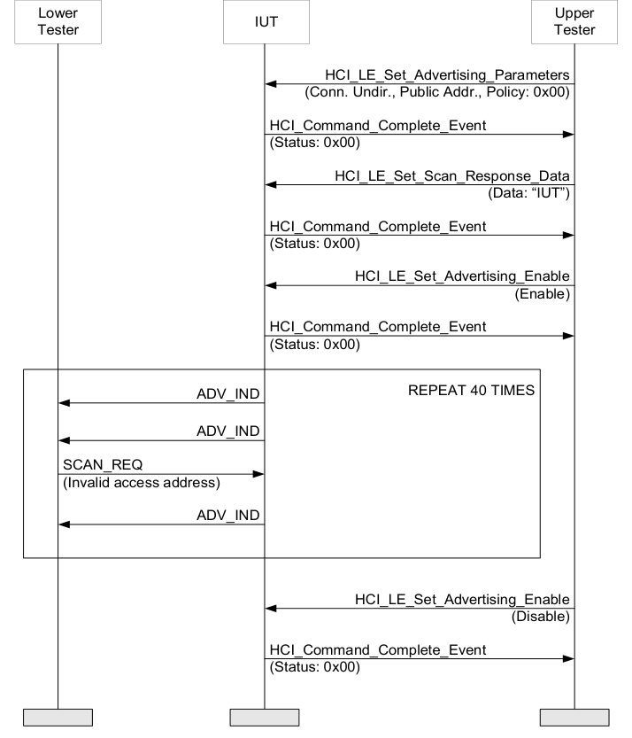

**Figure 4.5-1: LL/ENC/ADV/BI-01-C [Scan Request Invalid Address]**

1. The Upper Tester enables undirected advertising in the IUT using all supported advertising channels, minimum advertising intervals and filtering policy set to ‘Allow Scan Request from Any, Allow Connect Request from Any (Default) (0x00)’ if filtering policy is supported. 2. Configure the Lower Tester to monitor the advertising and scan response procedures of the IUT. 3. The Lower Tester sends a SCAN_REQ packet on a selected supported advertising channel (defined as an IXIT) and using a device address in the Filter Accept List as parameter with an invalid access address from corrupting a single bit in the access address after receiving an ADV_IND packet from the IUT on the advertising channel configured in step 2. The SCAN_REQ packet is sent T_IFS after the end of an ADV_IND packet. 4. The Lower Tester expects the IUT to continue advertising with no response to the SCAN_REQ packet. 5. Repeat steps 3–4 40 times, each time changing the position of the bit which is corrupted in the access address as follows. For the first 20 SCAN_REQ packets sent in step 3, the Lower Tester
corrupts bits 1 to 20 in that order; for the other 20 SCAN_REQ packets, it corrupts bits 31 to 12 in that order. 6. The Upper Tester sends an HCI_LE_Set_Advertising_Enable command to the IUT to disable advertising and receives an HCI_Command_Complete event in response.
• Test Condition
The parameters in this test are calculated for a BER of 0.1 percent or better.
• Expected Outcome
Pass verdict
The test procedure completes with the IUT responding to not more than 8 of the 40 SCAN_REQ packets sent by the Lower Tester in step 3.
• Notes
This test verifies the reverse of a positive requirement.
The count of responses (more than 8 out of 40) representing the single bit error reverting and the rest of the packet intact is calculated not to occur in practice using a binomial distribution.
Bit 0 is the first bit transmitted over the air.
LL/ENC/ADV/BI-02-C [Central Packets Invalid Address]
• Test Purpose
Test that an advertiser IUT receives a connection request, stops advertising after reception and after transmissions with an access address different from the connection request from the Central until the connection supervision timer expires, considers the connection setup failed.
The Lower Tester acts first in the initiating state, sending the connection request to the IUT, then starts to maintain a connection in the Central role but with packets with a mismatching access address.
• Reference
[3] 2.1.2, 4.4.4, 3.1
• Initial Condition
- Parameters: LL_advertiser_advInterval_MIN, LL_advertiser_advInterval_MAX, LL_advertiser_Adv_Channel_Map.
- State: Undirected Advertising (selected Adv_Interval_Min, selected Adv_Interval_Max, supported type of own address, selected advertising channels, Length of device name used, common device name) AND All in the Filter Accept List (policy for advertiser)
• Test Procedure
Execute the test procedure using the common data channel selection parameters, zero Peripheral latency and a connection interval one tenth of the connection supervision timeout value (10 ms and 100 ms) in the connection request.

**Figure 4.5-2: LL/ENC/ADV/BI-02-C [Central Packets Invalid Address]**

1. The Upper Tester enables undirected advertising in the IUT using one selected advertising channel (defined as an IXIT) and filtering policy set to ‘Allow Scan Request from Any, Allow Connect Request from Any (Default) (0x00)’ if filtering policy is supported. 2. Configure the Lower Tester to initiate a connection. 3. The Lower Tester receives an ADV_IND packet from the IUT on the selected advertising channel and responds with a CONNECT_IND packet T_IFS after the end of the advertising packet. 4. The Upper Tester receives an HCI_LE_Connection_Complete event from the IUT including the parameters sent to the IUT in step 3.
5. The Lower Tester sends an empty DATA packet with an access address different from the connection request (corrupting a single bit), starting the first event using the common connection interval timing after the connection request. 6. The Lower Tester receives no response from the IUT. 7. Repeat steps 5–6 until a time period equal to twice the connection supervision timeout value or until step 8 executes: 8. The Upper Tester receives an HCI_Disconnection_Complete event indicating that creation of the connection failed (connection has failed to be established), with the connection handle parameter matching to step 4. 9. Repeat steps 1–8 40 times, each time changing the position of the bit which is corrupted in the access address as follows: In the first 20 iterations, the Lower Tester corrupts bits 1 to 20 in that order; for the other 20 iterations, it corrupts bits 31 to 12 in that order.
• Test Condition
The parameters in this test are calculated for a BER of 0.1 percent or better.
• Expected Outcome
Pass verdict
For each of the 40 connection attempts, the test procedure completes with the IUT stopping advertising, moving to the data channel and reporting the failure to maintain the connection. The acceptable success rate is 32 out of 40, i.e., that the HCI_Disconnection_Complete_Event with reason code 0x3E is received in at least 32 of 40 connection attempts.
• Notes
The advertising channel used for the connection setup is assumed not to influence the access address recognition in the data channels.
The probability calculations describing the range of responses to expect are described in the test LL/ENC/PER/BI-01-C [Packets to another Peripheral].

#### 4.5.3 SCN

Tests that the IUT rejects packets with an invalid preamble or Access Address as a scanner.
LL/ENC/SCN/BI-01-C [Passive Scanning Invalid Address]
• Test Purpose
Test that a passive scanner IUT ignores advertising indication packets with invalid channel addresses.
The Lower Tester sends advertising packets with an invalid advertising channel synchronization word and checks that the IUT does not react to them.
• Reference
[3] 2.1.2, 4.4.3.1, 3.1
• Initial Condition
- Parameters: LL_scanner_scanInterval_MIN, LL_scanner_scanInterval_MAX, LL_scanner_scanWindow_MIN, LL_scanner_scanWindow_MAX, LL_scanner_Adv_Channel_Map.
- State: Passive Scanning (selected scan interval, selected scan window) AND All in the Filter Accept List (policy for scanner)
• Test Procedure
Execute the test procedure with a timing combination using the minimum scan interval and maximum scan window supported, such that the scan interval is 3 times the length of the average advertising interval. If device filtering is supported, use the filtering policy to Filter Accept List all unknown devices (accept all advertising packets (0x00)).

**Figure 4.5-3: LL/ENC/SCN/BI-01-C [Passive Scanning Invalid Address]**

1. The Upper Tester enables passive scanning in the IUT. 2. Configure the Lower Tester as advertiser using a selected supported advertising channel (defined as an IXIT), and a device address in the Filter Accept List. 3. The Lower Tester sends an ADV_NONCONN_IND packet with an invalid access address, each advertising event using the selected advertising channel only, timing the events to match the scan interval. 4. The Upper Tester receives no HCI_LE_Advertising_Report reporting the advertising packets sent by the Lower Tester. 5. Repeat steps 3–4 for a time that exceeds a number of scan intervals (40), each time changing the position of the bit which is corrupted in the access address as follows. For the first 20 ADV_NONCONN_IND packets sent in step 3, the Lower Tester corrupts bits 1 to 20 of the access address in that order. For the other 20 ADV_NONCONN_IND packets, it corrupts bits 31 to 12 of the access address in that order. 6. The Upper Tester sends an HCI_LE_Set_Scan_Enable to the IUT to stop the scanning function and receives an HCI_Command_Complete event in response.
• Test Condition
The parameters in this test are calculated for a BER of 0.1 percent or better.
• Expected Outcome
Pass verdict
The test procedure completes with the IUT reporting not more than 8 of the 40 advertising packets sent in step 3.
• Notes
Bit 0 is the first bit transmitted over the air.
The possibility for a scanner device to respond to an invalid radio frame (probability calculations described in the test LL/ENC/PER/BI-01-C [Packets to another Peripheral] provide for the case that an error injected into the access address is reverted. While not likely, such a bit error may occur in test execution, which would make a test not accepting any scan reports unreliable. Because the probability for the scanner to be listening the frequency of the advertising packet is unknown, this is ignored in the calculations. This test fails implementations not checking all the bits in the access address.
LL/ENC/SCN/BI-02-C [Active Scanning Invalid Address]
• Test Purpose
Test that an active scanner IUT ignores advertising indication packets with invalid channel addresses.
The Lower Tester sends advertising packets with an invalid access address and checks that the IUT does not react to them.
• Reference
[3] 2.1.2, 4.4.3.2, 3.1
• Initial Condition
- Parameters: LL_scanner_scanInterval_MIN, LL_scanner_scanInterval_MAX, LL_scanner_scanWindow_MIN, LL_scanner_scanWindow_MAX, LL_scanner_Adv_Channel_Map.
- State: Active Scanning (public address, selected scan interval, selected scan window) AND All in the Filter Accept List (policy for scanner)
• Test Procedure
Execute the test procedure using a scan interval 3 times the length of the average advertising interval. If device filtering is supported, use the filtering policy to Filter Accept List all unknown devices (accept all advertising packets (0x00)).

**Figure 4.5-4: LL/ENC/SCN/BI-02-C [Active Scanning Invalid Address]**

1. The Upper Tester enables active scanning in the IUT. 2. Configure the Lower Tester as advertiser using a selected supported advertising channel (defined as an IXIT), undirected advertising, and a device address in the Filter Accept List. 3. The Lower Tester sends an ADV_IND packet with an invalid access address, each advertising event using the selected advertising channel only, using the selected advertising interval. 4. The Lower Tester receives no SCAN_REQ packet after T_IFS in response to any of the ADV_IND packets. 5. The Upper Tester receives no HCI_LE_Advertising_Report reporting the advertising packets sent by the Lower Tester. 6. Repeat steps 3–5 until the time exceeds a number of scan intervals (40), each time changing the position of the bit which is corrupted in the access address as follows. For the first 20 ADV_IND packets sent in step 3, the Lower Tester corrupts bits 1 to 20 of the access address in that order. For the other 20 ADV_IND packets, it corrupts bits 31 to 12 of the access address in that order. 7. The Upper Tester sends an HCI_LE_Set_Scan_Enable to the IUT to disable scanning and receives an HCI_Command_Complete event in response.
• Test Condition
The parameters in this test are calculated for a BER of 0.1 percent or better.
• Expected Outcome
Pass verdict
The test procedure completes with the IUT reporting not more than 8 of the 40 advertising indications sent in step 3.
• Notes
Bit 0 is the first bit transmitted over the air.

#### 4.5.4 INI

Test that an initiator IUT sends a connection request to an advertiser and receiving reply transmissions with an access address different from the connection request for 6 connection intervals, considers the connection setup failed.
Note that there is no initiator test for advertising packets as the device class dependencies require that the scanner role is also implemented in a Controller with the initiator role.
LL/ENC/INI/BI-01-C [Peripheral Packets Invalid Address]
• Test Purpose
Test that an initiator IUT sends a connection request to an advertiser and receives reply transmissions with an access address different from the connection request for six (6) connection intervals, and considers the connection setup failed.
The Lower Tester first acts in the advertising state, accepting a connection request from the IUT, then begins to maintain the connection but with packets using a mismatching address.
• Reference
[3] 2.1.2, 4.5, 3.1
• Initial Condition
- Parameters: LL_initiator_scanInterval_MIN, LL_initiator_scanInterval_MAX, LL_initiator_scanWindow_MIN, LL_initiator_scanWindow_MAX, LL_initiator_Adv_Channel_Map, LL_initiator_Channel_Map.
- State: Initiating (selected scan interval, selected scan window, Filter Accept List not used, public peer address, Lower Tester address, supported type of own address, common connection interval, common connection interval, common Peripheral latency, common timeout)
• Test Procedure
Execute the test procedure using a selected advertising channel, advertising on the selected advertising channel only, using a selected scan interval and window using a single device address. Use the common data channel selection parameters and the common connection interval, latency and timeout to set up the connection.

**Figure 4.5-5: LL/ENC/INI/BI-01-C [Peripheral Packets Invalid Address]**

1. Configure the Lower Tester as advertiser using a selected supported advertising channel (defined as an IXIT) and a common public address. 2. The Upper Tester enables initiating in the IUT. 3. The Lower Tester sends ADV_IND packets and receives a CONNECT_IND packet T_IFS after any of the ADV_IND packets. 4. The Upper Tester receives an HCI_LE_Connection_Complete event from the IUT including the Lower Tester address and connection interval selected. 5. After the CONNECT_IND packet, receive the first empty DATA packet from the IUT on the data channel in the range of maximum/minimum deviation of the allowed transmitWindowOffset and transmitWindowSize.
6. The Lower Tester sends an empty DATA packet with an access address different from the one in the connection request (corrupting a single bit in the access address), using the acknowledgement scheme, to the IUT on the same data channel. 7. The Lower Tester receives following empty DATA packets on subsequent data channels. 8. Repeat steps 6–7 until the IUT stops. 9. The Upper Tester receives an HCI_Disconnection_Complete event from the IUT, indicating that a connection has failed to be established and with the connection handle matching to the one used in the connection. 10. Repeat steps 1–9 40 times, with each iteration through the loop changing the bit position of the corrupted bit in the access address as follows. For the first 20 iterations, the Lower Tester corrupts bits 1 to 20 in that order. For the other 20 iterations, the Lower Tester corrupts bits 31 to 12 in that order.
• Test Condition
The parameters in this test are calculated for a BER of 0.1 percent or better.
• Expected Outcome
Pass verdict
The test procedure completes the iterations using each access address with the IUT sending a connection request, then continuing Central transmissions for no more than six (6) connection events. The IUT transmits on all of the first 6 connection events whose anchor points are less than 6×connInterval after the end of the CONNECT_IND packet that the IUT sent in step 3 in at least 32 out of 40 attempts. If the IUT does not transmit on a connection event after 6×connInterval after the end of the CONNECT_IND packet, then it does not transmit on any subsequent connection events.
The IUT reports the failure to setup the connection with an HCI_Disconnection_Complete_Event with reason code 0x3E.
The acceptable success rate is 32 out of 40, i.e., that the HCI_Disconnection_Complete event with reason code 0x3E is received in at least 32 of 40 connection attempts.
• Notes
Bit 0 is the first bit transmitted over the air.

#### 4.5.5 PER

Tests that the IUT rejects packets with an invalid preamble or access address as a Peripheral.
LL/ENC/PER/BI-01-C [Packets to another Peripheral]
• Test Purpose
Tests that a Peripheral IUT ignores a packet starting an event belonging to a different connection.
The Lower Tester acts in the Central role in the connection, first setting up the connection with valid packets then changing the access address and observes the Peripheral packets on the data channels in use.
• Reference
[3] 2.1.2, 4.5, 3.1
• Initial Condition
- Parameters: LL_peripheral_connPeripheralLatency_MIN
- State: Connected Peripheral (common connection interval, 0 Peripheral latency, common timeout, common channel map, any SCA value)
• Test Procedure

**Figure 4.5-6: LL/ENC/PER/BI-01-C [Packets to another Peripheral]**

1. The Lower Tester prepares a DATA packet, corrupting the second bit in the access address. 2. The Lower Tester sends the DATA packet to the IUT using the data channel selection parameters. 3. The Lower Tester receives no DATA packet T_IFS after the packet sent. 4. The Lower Tester prepares a DATA packet, corrupting the next bit in sequence (increasing bit number) in the access address. 5. Repeat steps 2–4 until a total of 20 DATA packets have been sent in consecutive connection intervals. 6. The Lower Tester stops sending DATA packets and allows a connection supervision timeout. 7. The Upper Tester receives an HCI_Disconnection_Complete event from the IUT, indicating connection supervision timeout and containing the handle of the connection used. 8. A connection is established (the IUT acts as Peripheral). 9. The Lower Tester prepares a DATA packet, corrupting the last bit in the access address. 10. The Lower Tester the DATA packet to the IUT using the data channel selection parameters. 11. The Lower Tester receives no DATA packet T_IFS after the packet sent. 12. The Lower Tester prepares a DATA packet, corrupting the next bit in sequence (decreasing bit number) in the access address. 13. Repeat steps 10–12 until a total of 20 DATA packets have been sent in consecutive connection intervals. 14. The Lower Tester stops sending DATA packets and allows a connection supervision timeout. 15. The Upper Tester receives an HCI_Disconnection_Complete event from the IUT, indicating connection supervision timeout and containing the handle of the connection used.
• Expected Outcome
Pass verdict
For each sequence of 20 DATA packets, the IUT responds in no more than 4 of the 20 connection events.
• Notes
The test allows the single bit error reverting by observing a time period longer than the connection supervision timeout. With the probability of receiving the preamble and access address correctly around 96% and the relation of the connection interval to the connection supervision timeout value giving 10 attempts before failing, the test procedure does, in practice, not terminate to connection supervision timeout value under the bit error rate conditions required for an IUT not using the entire access address.
The probability of the error in the access address reverted is around 0.1 percent, so for 10 events received correctly and none incorrectly, the probability using binomial distribution is around 99 percent. Using geometric distribution to represent the number of attempts before an occurrence of 10 correctly received invalid access addresses in a row, the expected value for the repetition count is below 1 (around 0.01), so 20 events are sufficient to conclude the test procedure. This means that an IUT using the entire access address will terminate the connection.

#### 4.5.6 CEN

Tests that the IUT rejects packets with an invalid preamble or access address procedures in the Central role.
LL/ENC/CEN/BI-01-C [Packets to another Central]
• Test Purpose
Tests that a Central IUT ignores packets not belonging to the connection transmitted using a different access address.
The Lower Tester acts as a Peripheral maintaining a connection, then starts to respond with packets using an invalid access address.
• Reference
[3] 2.1.2, 4.5, 3.1
• Initial Condition
- Parameters: LL_central_connPeripheralLatency_MIN
- State: Connected Central (any scan interval, any scan window, public peer address, Lower Tester address, supported type of own address, connection interval, common Peripheral latency, common timeout)
• Test Procedure

**Figure 4.5-7: LL/ENC/CEN/BI-01-C [Packets to another Central]**

1. A connection is established (the IUT acts as Central). 2. The Lower Tester receives a DATA packet, once a connection interval from the IUT on the data channel derived from the selection parameters. 3. The Lower Tester sends a DATA packet with an incorrect access address by corrupting a single bit in the access address. 4. Repeat steps 1–2 for a time period equal to 2 times the connection supervision timeout value from the last valid packet sent to which an acknowledgement was received. 5. The Upper Tester receives an HCI_Disconnection_Complete event from the IUT, indicating connection supervision timeout and containing the handle of the connection used. 6. Repeat steps 1–5 40 times, with each iteration through the loop changing the bit position of the corrupted bit in the access address as follows. For the first 20 iterations, the Lower Tester corrupts bits 1 to 20 in that order. For the next 20 iterations, the Lower Tester corrupts bits 31 to 12 in that order.
• Expected Outcome
Pass verdict
Each test procedure iteration executes with the parameters selected, with the connection terminated within the time period of 2 times the connection supervision timeout value from the last valid packet sent.
The acceptable success rate is 32 out of 40, i.e., that the HCI_Disconnection_Complete_Event with reason code 0x08 is received in at least 32 of 40 connections.
• Notes
Bit 0 is the first bit transmitted over the air.

### 4.6 FRH

Tests that the IUT behaves according to the data channel selection requirements.

#### 4.6.1 References

This document incorporates provisions from other publications by dated or undated reference. These references are cited at the appropriate places in the text, and the publications are listed hereinafter. Additional definitions and abbreviations can be found in [1], [2], and [3].
[1] Specification of the Bluetooth System, Versions 4.0 or later
[2] Test Strategy and Terminology Overview
[3] Specification of the Bluetooth System, Volume 6, Part B (Link Layer Protocol Specification), Version 4.0
[4] ICS Proforma for Bluetooth Low Energy Link Layer Protocol Specification
[5] ITU-T X.290 series, OSI CONFORMANCE TESTING METHODOLOGY AND FRAMEWORK PROTOCOL RECOMMENDATIONS FOR ITU-T APPLICATIONS, ITU Recommendation X.290 series (equivalent to ISO 9646)
[6] Federal Information Processing Standards Publication 197, ADVANCED ENCRYPTION STANDARD (AES), FIPS, 2001
[7] Bluetooth Test Suite for RFPHY
[8] Specification of the Bluetooth System, Volume 6, Part B (Link Layer Protocol Specification), Version 4.2 or later
[9] Bluetooth Core IXIT proforma
[10] Specification of the Bluetooth System, Volume 6, Part B (Link Layer Protocol Specification), Version 5.0 or later
[11] Specification of the Bluetooth System, Volume 2, Part E (Versions 1.2 to 5.1) or Volume 4, Part E (Version 5.2 and higher) Host Controller Interface (HCI)
[12] Specification of the Bluetooth System, Volume 3, Part A, Logical Link Control and Adaptation Protocol (L2CAP) Specification
[13] Specification of the Bluetooth System, Volume 6, Part B (Link Layer Protocol Specification), Version 5.1 or later
[14] Specification of the Bluetooth System, Volume 6, Part B (Link Layer Protocol Specification), Version 5.2 or later
[15] Specification of the Bluetooth System, Volume 2, Part E (Versions 1.2 to 5.1) or Volume 4, Part E (Version 5.2 and higher) (Host Controller Interface Functional Specification), Version 5.2 or later
[16] Specification of the Bluetooth System, Volume 6, Part D (Message Sequence Charts), Version 5.2 or later
[17] Specification of the Bluetooth System, Volume 6, Part G (Isochronous Adaptation Layer), Version 5.2 or later
[18] Core Specification Supplement (CSS), Part A, Current Version
[19] Specification of the Bluetooth System, Volume 6, Part B (Link Layer Protocol Specification), Version 5.3 or later
[20] Specification of the Bluetooth System, Volume 4, Part E (Host Controller Interface (HCI)), Version 5.3 or later
[21] Specification of the Bluetooth System, Volume 3, Part H (Host Specification), Version 5.2 or later
[22] Appropriate Language Mapping Tables document
[23] Specification of the Bluetooth System, Volume 6, Part B (Link Layer Protocol Specification), Version 5.4 or later
[24] Specification of the Bluetooth System, Volume 4, Part E (Host Controller Interface (HCI)), Version 5.4 or later
[25] Specification of the Bluetooth System, Volume 6, Part B (Link Layer Protocol Specification), Version 6.0 or later
[26] Specification of the Bluetooth System, Volume 4, Part E (Host Controller Interface Specification), Version 6.0 or later
[27] Specification of the Bluetooth System, Volume 2, Part E (Versions 1.2 to 5.1) or Volume 4, Part E (Version 6.0 and higher) Host Controller Interface (HCI)
[28] Specification of the Bluetooth System, Volume 6, Part C (Sample Data), Version 6.0 or later

#### 4.6.2 Common PDU Contents

The packet descriptions for Lower Tester sent and Lower Tester accepted data channel packets are below.
CHANNEL_MAP_IND CtrData:

|  | LSO MSO |  |  | LSO MSO |  |
| --- | --- | --- | --- | --- | --- |
|  | lsb msb |  |  | lsb msb |  |
| ChM (5 octets) |  |  | Instant (2 octets) |  |  |

#### 4.6.3 ADV

Tests that the IUT behaves according to the data channel selection procedure during connection setup procedure in the advertiser role.
LL/FRH/ADV/BV-01-C [Accepting Connections with Hop Lengths]
• Test Purpose
Test that an advertiser IUT receives a connection request, stops advertising after the reception and starts to maintain a connection in the Peripheral role using the correct data channel sequence.
The Lower Tester acts first in the initiating state, sending the connection request to the IUT, then starts to maintain a connection in the Central role.
• Reference
[3] 4.5.8
• Initial Condition
- Parameters: LL_advertiser_advInterval_MIN, LL_advertiser_advInterval_MAX, LL_advertiser_Adv_Channel_Map
- State: Undirected Advertising (selected Adv_Interval_Min, selected Adv_Interval_Max, supported type of own address, selected advertising channels, Length of device name used, common device name)
• Test Procedure

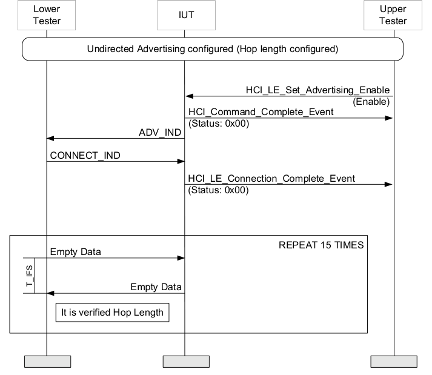

**Figure 4.6-1: LL/FRH/ADV/BV-01-C [Accepting Connections with Hop Lengths] MSC**

1. Configure the Lower Tester to initiate a connection. 2. The Upper Tester enables advertising in the IUT using one advertising channel (defined as an IXIT). 3. The Lower Tester receives an ADV_IND packet from the IUT on the selected advertising channel and responds with a CONNECT_IND packet, T_IFS after the end of the advertising packet, using a maximum hop length parameter. 4. The Upper Tester receives an HCI_LE_Connection_Complete event from the IUT including the parameters sent to the IUT in step 3. 5. The Lower Tester sends an empty LL DATA packet every connection interval, using the data channel selection parameters. 6. The Lower Tester receives an empty LL DATA packet from the IUT T_IFS after the data packet sent on the same data channel. The Lower Tester continues sending empty data packets using the acknowledgement scheme. 7. Repeat step 5–6 until receiving a response per each channel in use, or until the channel has been in use 15 times with no response. 8. Peripheral Connection Terminated (connection interval, Peripheral latency, timeout, channel map, un-encrypted, connection handle from step 4). 9. Repeat steps 1–2.
10. The Lower Tester receives an ADV_IND packet from the IUT on the selected advertising channel and responds with a CONNECT_IND packet using a minimum hop length parameter, T_IFS after the end of the advertising packet. 11. Repeat steps 4–8.
• Expected Outcome
Pass verdict
The test procedure executes successfully with the data channel selection input variations.
The IUT maintains the connection.
The IUT responds on all channels at least once.

#### 4.6.4 PER

Tests that the IUT behaves according to the data channel selection procedure in the Peripheral role.
LL/FRH/PER/BV-01-C [Accepting Channel Map Update]
• Test Purpose
Test that a Peripheral IUT accepts a channel map update request from the Central and adopts the new channel map at the correct time is able to maintain the connection.
The Lower Tester acts as a Central. It maintains the connection and requests a new channel map to be taken into use. It then observes the IUT accepting and adopting the channel map.
• Reference
[3] 4.5.8, 5.1.2
• Initial Condition
- State: Connected Peripheral (any advertising interval, any advertising interval, public address, any advertising channel map, common connection interval, common Peripheral latency, common timeout, selected channel map, any SCA value)
• Test Procedure

**Figure 4.6-2: LL/FRH/PER/BV-01-C [Accepting Channel Map Update] MSC**

1. The Lower Tester sends a CHANNEL_MAP_IND packet to the IUT using every second channels used as channel map and using an event count of 100. Receive an acknowledgement from the IUT. 2. The Lower Tester sends an empty DATA packet to the IUT and receives a response in all events until the time of the update. Repeat until the event count matches the indicated time of connection update. 3. At the time of the update start maintaining the connection with the new parameters.
4. The Lower Tester sends an empty LL DATA packet every connection interval, using the data channel selection parameters. Receive an empty LL DATA packet from the IUT, T_IFS after the data packet sent on the same data channel. The Lower Tester continues to send empty data packets using the acknowledgement scheme. Repeat until receiving a response per each channel in use, or until the channel has been in use 15 times. 5. The Lower Tester sends a CHANNEL_MAP_IND packet to the IUT using all channels used as channel map and using an event count of 100. Receive an acknowledgement from the IUT. 6. Repeat steps 2–4. 7. Peripheral Connection Terminated (connection interval, Peripheral latency, timeout, channel map, un-encrypted, connection handle from the preamble step execution).
• Expected Outcome
Pass verdict
The test procedure executes successfully, with the IUT acknowledging the channel map update requests and adopting the updated data channel selection parameters at the assigned event,
The IUT responds in 65 of the 100 events between the channel map request and the assigned event to adopt the updated data channel selection parameters,
• Notes
The channels applied in this test are not parameterized, assuming that the test inputs will select any channels not used.
LL/FRH/PER/BV-02-C [Accepting Channel Map Update, Channel Selection Algorithm #2]
• Test Purpose
Tests that a Peripheral IUT accepts a channel map update request from the Central while using Channel Selection Algorithm #2, adopts the new channel map at the correct time, and maintains the connection.
The Lower Tester acts as Central. It maintains the connection, requests a new channel map to be taken into use, and observes the IUT accepting and adopting the new channel map.
• Reference
[10] 4.5.8, 5.1.2
• Initial Condition
- State: Connected Peripheral (Channel Selection Algorithm #2, any advertising interval, public address, any advertising channel map, common connection interval, common Peripheral latency, common timeout, selected channel map, any SCA value)
• Test Procedure

**Figure 4.6-3: LL/FRH/PER/BV-02-C [Accepting Channel Map Update, Channel Selection Algorithm #2] MSC**

1. The Lower Tester sends a CHANNEL_MAP_IND packet to the IUT, with the ChM field set to use every second channel (every other channel bit set to ‘1’, others set to ‘0’) and the Instant field set to 100 connection events ahead. 2. The Lower Tester sends an empty LL DATA packet to the IUT every connection interval and receives a response using the acknowledgement scheme. Repeat until the event count matches the indicated time of connection update. 3. Upon connection update, the Lower Tester switches to selecting data channel indices using Channel Selection Algorithm #2 with the new channel map. 4. The Lower Tester sends an empty LL Data packet to the IUT every connection interval and receives a response using the acknowledgement scheme. Repeat until the Lower Tester has receives a response for each channel in use, or until a channel has been used 15 times. 5. Repeat steps 1–4, except in step 1, the ChM field is set to use all channels.
• Expected Outcome
Pass verdict
The test procedure executes successfully, with the IUT accepting the channel map update request and maintaining the connection using Channel Selection Algorithm #2 with the new channel map.
The IUT sends and receives data each connection event using data channel indices selected by the Channel Selection Algorithm #2 using the new channel map.
LL/FRH/PER/BV-03-C [Send Channel Status Update]
• Test Purpose
Verify that a Peripheral IUT properly sends channel status messages to the Lower Tester when enabled by the Upper Tester and that it does so within the proper interval.
• Reference
[19] 2.4.2.38, 2.4.2.39, 5.1.21, 5.1.22
• Initial Condition
- State: Connected Peripheral (any advertising interval, public address, any advertising channel map, common connection interval, common Peripheral latency = 0, common timeout, selected channel map, any SCA value).
- Channel classification is enabled on the Lower Tester.
- Channel classification is not enabled on the IUT.
- The Upper Tester disables via HCI the local channel assessment capabilities of the IUT using the HCI_Write_AFH_Channel_Assessment_Mode Command.
• Test Procedure

**Figure 4.6-4: LL/FRH/PER/BV-03-C [Send Channel Status Update] – MSC Page 1 of 2**

**Figure 4.6-5: LL/FRH/PER/BV-03-C [Send Channel Status Update] – MSC Page 2 of 2**

1. The Upper Tester sends an HCI_LE_Set_Host_Channel_Classification command to the IUT with a Channel_Map and receives a successful HCI_Command_Complete event in response. 2. The IUT does not send an LL_CHANNEL_STATUS_IND PDU to the Lower Tester. 3. Five seconds after step 1, the Lower Tester sends an LL_CHANNEL_REPORTING_IND PDU to the IUT with Enable set to 0x01 and Min_Spacing set to 5 (1 second) and Max_Delay set to 25 (5 s). 4. The IUT may send an LL_CHANNEL_STATUS_IND PDU to the Lower Tester with Channel_Classification at a time less than the first connection event after the Max_Delay after receiving the LL_CHANNEL_REPORTING_IND PDU in step 3. 5. The Upper Tester sends an HCI_LE_Set_Host_Channel_Classification command to the IUT with a Channel_Map that is different than the channel map in step 1. 6. The IUT sends a successful HCI_Command_Complete event to the Upper Tester. 7. The IUT sends an LL_CHANNEL_STATUS_IND PDU to the Lower Tester with Channel_Classification set to a value different than the one sent in step 4 (if a PDU was sent). The PDU is sent no later than the first connection event that is more than Max_Delay (from step 3) after step 5 but, if a PDU was sent in step 4, is at least Min_Spacing (from step 3) after that PDU was sent. 8. The Lower Tester sends an LL_CHANNEL_MAP_IND PDU to the IUT. 9. The Upper Tester sends an HCI_LE_Set_Host_Channel_Classification command to the IUT with a Channel_Map that is the same as the channel map in step 5 and receives a successful HCI_Command_Complete event in response. 10. The IUT does not send an LL_CHANNEL_STATUS_IND PDU to the Lower Tester. 11. The Lower Tester sends an LL_CHANNEL_REPORTING_IND PDU to the IUT with Enable set to 0x00 and Min_Spacing set to 5 (1 second) and Max_Delay set to 25 (5 s).
12. The Upper Tester sends an HCI_LE_Set_Host_Channel_Classification command to the IUT with a Channel_Map that is different than the channel map in step 9 and receives a successful HCI_Command_Complete event in response. 13. The IUT does not send an LL_CHANNEL_STATUS_IND PDU to the Lower Tester. 14. The Upper Tester sends an HCI_LE_Set_Host_Channel_Classification command to the IUT with a Channel_Map that is different than the channel map in step 12 and receives a successful HCI_Command_Complete event in response. 15. The IUT does not send an LL_CHANNEL_STATUS_IND PDU to the Lower Tester.
• Expected Outcome
Pass verdict
In steps 2, 10, 13, and 15, the IUT does not send an LL_CHANNEL_STATUS_IND PDU to the Lower Tester.
In steps 4 and 7, the IUT sends an LL_CHANNEL_STATUS_IND PDU to the Lower Tester at a time less than the first connection event after the Max_Delay in step 3.
In step 7, the IUT sends an LL_CHANNEL_STATUS_IND PDU to the Lower Tester at a time greater than or equal to the Min_Spacing in step 3.
LL/FRH/PER/BI-01-C [Properly Handle Invalid Enable Channel Classification Parameters]
• Test Purpose
Verify that a Peripheral IUT properly handles Channel Classification Enable PDUs with invalid parameters.
• Reference
[19] 2.4.2.38, 2.4.2.39, 5.1.21, 5.1.22
• Initial Condition
- State: Connected Peripheral.
- Channel classification is not enabled on the IUT.
• Test Procedure
Upper Tester IUT Lower Tester

|  | Connection Establish | ed. IUT is Peripheral. |
| --- | --- | --- |
|  |  |  |
|  | LL CHANNEL REPORTING IND _ _ _ (Enable, Min Spacing, Max Delay) _ _ | REPEAT FOR EACH ROUND OPTIONAL |
|  | LL UNKNOWN RSP _ _ (UnknownType: 0x28) | OPTIONAL |
|  |  |  |

LL_FEATURE_REQ
LL_FEATURE_RSP
1. Repeat steps 2 and 3 for each round in Table 4.6-1. 2. The Lower Tester sends an LL_CHANNEL_REPORTING_IND PDU to the IUT with Enable, Min_Spacing, and Max_Delay set as specified in Table 4.6-1. 3. The IUT may send an LL_UNKNOWN_RSP to the Lower Tester with UnknownType set to 0x28. 4. The Lower Tester sends an LL_FEATURE_REQ PDU to the IUT. 5. The IUT sends an LL_FEATURE_RSP PDU to the Lower Tester.

|  | Round |  |  | Enable |  |  | Min Spacing _ |  |  | Max Delay _ |  |
| --- | --- | --- | --- | --- | --- | --- | --- | --- | --- | --- | --- |
| 1 |  |  | 0x01 |  |  | 4 |  |  | 5 |  |  |
| 2 |  |  | 0x01 |  |  | 151 |  |  | 150 |  |  |
| 3 |  |  | 0x01 |  |  | 5 |  |  | 151 |  |  |
| 4 |  |  | 0x01 |  |  | 10 |  |  | 5 |  |  |
| 5 |  |  | 0x02 |  |  | 5 |  |  | 10 |  |  |

Table 4.6-1: Reject Invalid Enable Channel Classification Parameters rounds
• Expected Outcome
Pass verdict
In step 5, the IUT continues to function properly and sends an LL_FEATURE_RSP PDU to the Lower Tester.

#### 4.6.5 CEN

Tests that the IUT behaves according to the data channel selection procedure in the Central role.
LL/FRH/CEN/BV-01-C [Requesting Channel Map Update]
• Test Purpose
Test that a Central IUT performs the channel map updating procedure.
The Lower Tester acts in the Peripheral role, requests the IUT through the HCI to perform the updating procedure, accepts the request sent by the IUT and adopts the new channel map.
• Reference
[3] 4.5.8, 5.1.2
• Initial Condition
- Parameters: LL_central_Channel_Map
- State: Connected Central (any scan interval, any scan window, public peer address, Lower Tester address, supported type of own address, connection interval, common Peripheral latency, common timeout).
• Test Procedure

**Figure 4.6-7: LL/FRH/CEN/BV-01-C [Requesting Channel Map Update] MSC**

1. The Upper Tester sends an HCI_LE_Set_Host_Channel_Classification command to the IUT, including ‘supported even channels’ data channel selection parameters. Receive an HCI_Command_Complete event from the IUT in response. 2. The Lower Tester receives an LL_CHANNEL_MAP_IND control packet from the IUT, with a channel map different than the one currently in use but not necessarily matching the parameters submitted in step 1, and sends an empty DATA packet to the IUT on the same data channel using the acknowledgement scheme. If the Lower Tester does not receive the LL_CHANNEL_MAP_IND, skip steps 3–5. 3. Maintain the connection using empty DATA packets. Repeat until the event count matches the instant indicated in the channel map update request. 4. Upon the instant, take the new parameters in use. 5. The Lower Tester receives an empty LL DATA packet from the IUT and sends an empty LL DATA packet every connection interval Continue to send empty data packets using the acknowledgement scheme. Repeat until receiving a response per each channel in use. If any channel has been used 15 times without receiving a response on that channel, this test ends in a Fail verdict. 6. Repeat steps 1–5, except that in step 1, the Upper Tester includes ‘all channels used’ data channel selection parameters.
• Expected Outcome
Pass verdict
The test procedure executes successfully, with the IUT requesting the channel map update, maintaining the connection using the original data channel selection parameters before the instant, and maintaining the connection with the updated data channel selection parameters after the instant.
For both iterations, either the IUT does not send an LL_CHANNEL_MAP_IND PDU in step 2 or the map in the PDU is the same as the one currently in use.
LL/FRH/CEN/BV-02-C [Requesting Channel Map Update, Channel Selection Algorithm #2]
• Test Purpose
Tests that a Central IUT performs the channel map update procedure while using Channel Selection Algorithm #2.
The Lower Tester acts in the Peripheral role, requests the IUT through the HCI to perform the updating procedure, accepts the request sent by the IUT, and adopts the new channel map using Channel Selection Algorithm #2.
• Reference
[10] 4.5.8, 5.1.2
• Initial Condition
- Parameters: LL_central_Channel_Map
- State: Connected Central (Channel Selection Algorithm #2, any scan interval, any scan window, public peer address, Lower Tester address, supported type of own address, connection interval, common Peripheral latency, common timeout).
• Test Procedure

**Figure 4.6-8: LL/FRH/CEN/BV-02-C [Requesting Channel Map Update, Channel Selection Algorithm #2] MSC**

1. The Upper Tester sends an HCI_LE_Set_Host_Channel_Classification command to the IUT with Channel_Map set to mark only supported even channels as unknown (supported even channel bits set to ‘1’, others set to ‘0’) and receives an HCI_Command_Complete event in response. 2. The Lower Tester receives an LL_CHANNEL_MAP_IND packet from the IUT, with a channel map different than the one currently in use but not necessarily matching the parameters submitted in step 1, and sends an empty LL DATA packet to the IUT on the same channel using the
acknowledgement scheme. If the Lower Tester does not receive the LL_CHANNEL_MAP_IND, skip steps 3–5. 3. The Lower Tester maintains the connection using empty LL DATA packets. Repeat until the event count matches the instant indicated in the channel map update request. 4. Upon the instant, the Lower Tester switches to selecting data channel indices using Channel Selection Algorithm #2 with the new channel map. 5. The Lower Tester receives LL DATA packets from the IUT and sends empty LL DATA packets every connection interval using the acknowledgement scheme. Repeat until the Lower Tester has received a response for each channel in use. If any channel has been used 15 times without receiving a response on that channel, this test ends in a Fail verdict. 6. Repeat steps 1–5, except in step 1, the Channel_Map is set to mark all supported channels as unknown (supported channel bits set to ‘1’, others set to ‘0’).
• Expected Outcome
Pass verdict
The test procedure executes successfully, with the IUT requesting the channel map update, maintaining the connection using Channel Selection Algorithm #2 with the original data channel selection parameters before the instant, and maintaining the connection using Channel Selection Algorithm #2 with the updated data channel selection parameters after the instant.
The IUT sends and receives data each connection event using data channel indices selected by the Channel Selection Algorithm #2 using the new channel map.
Inconclusive verdict
For both iterations, either the IUT does not send an LL_CHANNEL_MAP_IND PDU in step 2 or the map in the PDU is the same as the one currently in use.
LL/FRH/CEN/BV-03-C [Accepting Minimum Number of Used Channels]
• Test Purpose
Tests that a Central IUT performs the Minimum Number of Used Channels Procedure.
The Lower Tester acts in the Peripheral role, sending the request to the IUT and maintaining the connection.
• Reference
[10] 5.1.11
• Initial Condition
- Parameters: LL_central_Channel_Map
- State: Connected Central (any scan interval, any scan window, public peer address, Lower Tester address, supported type of own address, connection interval, common Peripheral latency, common timeout).
• Test Procedure

**Figure 4.6-9: LL/FRH/CEN/BV-03-C [Accepting Minimum Number of Used Channels] MSC**

1. The Lower Tester sends an LL_MIN_USED_CHANNELS_IND PDU to the IUT. For each PHY the IUT supports, the matching bit in the PHYS field is set to ‘1’. The MinUsCh field is set to 0x25 (37 channels). 2. The Lower Tester receives an LL Data packet from the IUT every connection interval and sends a response using the acknowledgement scheme. Repeat 10 times.
• Expected Outcome
Pass verdict
The test procedure executes successfully, with the IUT receiving the LL_MIN_USED_CHANNELS_IND PDU and maintaining the connection.
LL/FRH/CEN/BI-01-C [Channel Classification Disabled, Ignore Channel Classification PDU]
• Test Purpose
Verify that a Central IUT functions properly, by initiating a connection update, if a Channel Status PDU is received when Channel Reporting has not been enabled.
• Reference
[19] 2.4.2.38, 2.4.2.39, 5.1.21, 5.1.22
• Initial Condition
- State: Connected Central (any advertising interval, public address, any advertising channel map, common connection interval, common Peripheral latency = 0, common timeout, selected channel map, any SCA value)
• Test Procedure

**Figure 4.6-10: LL/FRH/CEN/BI-01-C [Channel Classification Disabled, Ignore Channel Classification PDU] MSC**

1. The Lower Tester sends an LL_CHANNEL_STATUS_IND PDU to the IUT within the first 2 s. 2. The IUT may send an LL_CHANNEL_MAP_IND PDU to the Lower Tester. 3. The Upper Tester sends an HCI_LE_Connection_Update command to the IUT with Connection_Interval_Min set to 0x08 and receives a successful HCI_Command_Status event in response. 4. The IUT may send an LL_CONNECTION_PARAM_REQ PDU to the Lower Tester with Interval_Min set to 0x08. 5. If the IUT sends an LL_CONNECTION_PARAM_REQ PDU in step 4, then the Lower Tester sends an LL_CONNECTION_PARAM_RSP PDU to the IUT. 6. The IUT sends an LL_CONNECTION_UPDATE_IND PDU to the Lower Tester with Interval set to 0x08. 7. The IUT sends a successful HCI_LE_Connection_Update_Complete event to the Upper Tester.
• Expected Outcome
Pass verdict
In step 2, the IUT may send an LL_CHANNEL_MAP_IND PDU to the Lower Tester.
In step 4, the IUT continues to function properly and may send an LL_CONNECTION_PARAM_REQ PDU to the Lower Tester.
LL/FRH/CEN/BI-02-C [Channel Classification Enabled, Packets Received Less than Min_Spacing]
• Test Purpose
Verify that a Central IUT properly handles Channel Classification Status packets received less than Min_Spacing apart.
• Reference
[19] 2.4.2.38, 2.4.2.39, 5.1.21, 5.1.22
• Initial Condition
- State: Connected Central (any advertising interval, public address, any advertising channel map, common connection interval that is less than 50 ms, common Peripheral latency = 0, common timeout, selected channel map, any SCA value).
- Channel Classification is enabled on the Lower Tester.
• Test Procedure

**Figure 4.6-11: LL/FRH/CEN/BI-02-C [Channel Classification Enabled, Packets Received Less than Min_Spacing] MSC**

1. The Lower Tester waits 2 s from the end of the HCI_LE_Connection_Complete or HCI_LE_Enhanced_Connection_Complete event for the IUT to send an LL_CHANNEL_REPORTING_IND PDU to the Lower Tester with Enabled set to 0x01. If the LL_CHANNEL_REPORTING_IND PDU isn’t sent within 2 s, then the test ends with an Inconclusive verdict. 2. The Lower Tester sends an LL_CHANNEL_STATUS_IND PDU to the IUT with a Channel_Classification at a time less than or equal to Max_Delay in step 1. 3. The IUT may send an LL_CHANNEL_MAP_IND PDU to the Lower Tester. If the PDU is sent, it can be sent before or after step 4.
4. The Lower Tester sends an LL_CHANNEL_STATUS_IND PDU to the IUT with a Channel_Classification that is different than in step 2 and at a time that is less than 1 second after step 2. 5. The Lower Tester waits for 5 s while the IUT may send an LL_CHANNEL_MAP_IND PDU to the Lower Tester. 6. The Upper Tester sends an HCI_LE_Connection_Update command to the IUT with Connection_Interval_Min set to 0x08 and receives a successful HCI_Command_Status event in response. 7. The IUT may send an LL_CONNECTION_PARAM_REQ PDU to the Lower Tester with Interval_Min set to 0x08. 8. If the IUT sends an LL_CONNECTION_PARAM_REQ PDU in step 7, the Lower Tester sends an LL_CONNECTION_PARAM_RSP PDU to the IUT. 9. The IUT sends an LL_CONNECTION_UPDATE_IND PDU to the Lower Tester with Interval set to 0x08. 10. The IUT sends a successful HCI_LE_Connection_Update_Complete event to the Upper Tester.
Pass verdict
In step 3, the IUT may send an LL_CHANNEL_MAP_IND PDU to the Lower Tester.
In step 5, the IUT may send an LL_CHANNEL_MAP_IND PDU to the Lower Tester.
In step 9, the IUT sends an LL_CONNECTION_UPDATE_IND PDU to the Lower Tester.
Inconclusive verdict
In step 1, the IUT does not send the LL_CHANNEL_REPORTING_IND to the Lower Tester.

### 4.7 PAC

Tests that the IUT rejects packets with invalid encoding contents.

#### 4.7.1 References

This document incorporates provisions from other publications by dated or undated reference. These references are cited at the appropriate places in the text, and the publications are listed hereinafter. Additional definitions and abbreviations can be found in [1], [2], and [3].
[1] Specification of the Bluetooth System, Versions 4.0 or later
[2] Test Strategy and Terminology Overview
[3] Specification of the Bluetooth System, Volume 6, Part B (Link Layer Protocol Specification), Version 4.0
[4] ICS Proforma for Bluetooth Low Energy Link Layer Protocol Specification
[5] ITU-T X.290 series, OSI CONFORMANCE TESTING METHODOLOGY AND FRAMEWORK PROTOCOL RECOMMENDATIONS FOR ITU-T APPLICATIONS, ITU Recommendation X.290 series (equivalent to ISO 9646)
[6] Federal Information Processing Standards Publication 197, ADVANCED ENCRYPTION STANDARD (AES), FIPS, 2001
[7] Bluetooth Test Suite for RFPHY
[8] Specification of the Bluetooth System, Volume 6, Part B (Link Layer Protocol Specification), Version 4.2 or later
[9] Bluetooth Core IXIT proforma
[10] Specification of the Bluetooth System, Volume 6, Part B (Link Layer Protocol Specification), Version 5.0 or later
[11] Specification of the Bluetooth System, Volume 2, Part E (Versions 1.2 to 5.1) or Volume 4, Part E (Version 5.2 and higher) Host Controller Interface (HCI)
[12] Specification of the Bluetooth System, Volume 3, Part A, Logical Link Control and Adaptation Protocol (L2CAP) Specification
[13] Specification of the Bluetooth System, Volume 6, Part B (Link Layer Protocol Specification), Version 5.1 or later
[14] Specification of the Bluetooth System, Volume 6, Part B (Link Layer Protocol Specification), Version 5.2 or later
[15] Specification of the Bluetooth System, Volume 2, Part E (Versions 1.2 to 5.1) or Volume 4, Part E (Version 5.2 and higher) (Host Controller Interface Functional Specification), Version 5.2 or later
[16] Specification of the Bluetooth System, Volume 6, Part D (Message Sequence Charts), Version 5.2 or later
[17] Specification of the Bluetooth System, Volume 6, Part G (Isochronous Adaptation Layer), Version 5.2 or later
[18] Core Specification Supplement (CSS), Part A, Current Version
[19] Specification of the Bluetooth System, Volume 6, Part B (Link Layer Protocol Specification), Version 5.3 or later
[20] Specification of the Bluetooth System, Volume 4, Part E (Host Controller Interface (HCI)), Version 5.3 or later
[21] Specification of the Bluetooth System, Volume 3, Part H (Host Specification), Version 5.2 or later
[22] Appropriate Language Mapping Tables document
[23] Specification of the Bluetooth System, Volume 6, Part B (Link Layer Protocol Specification), Version 5.4 or later
[24] Specification of the Bluetooth System, Volume 4, Part E (Host Controller Interface (HCI)), Version 5.4 or later
[25] Specification of the Bluetooth System, Volume 6, Part B (Link Layer Protocol Specification), Version 6.0 or later
[26] Specification of the Bluetooth System, Volume 4, Part E (Host Controller Interface Specification), Version 6.0 or later
[27] Specification of the Bluetooth System, Volume 2, Part E (Versions 1.2 to 5.1) or Volume 4, Part E (Version 6.0 and higher) Host Controller Interface (HCI)
[28] Specification of the Bluetooth System, Volume 6, Part C (Sample Data), Version 6.0 or later

#### 4.7.2 Common PDU Contents

UNKNOWN_RSP CtrData:

|  | LSO MSO |  |
| --- | --- | --- |
|  | lsb msb |  |
| UnknownType (1 octet) |  |  |

#### 4.7.3 Both connected roles

##### 4.7.3.1 Unknown Control PDUs

• Test Purpose
Tests that the IUT rejects unknown control PDUs.
Tests that an IUT responds with the unknown response PDU to a device transmitting a control PDU not in the supported specification or not supported by the IUT.
The Lower Tester acts in the peer role and sends a control PDU with an opcode not used in the supported specification, then observes the IUT’s response. The Lower Tester repeats this test for all opcodes that are not supported by the IUT.
• Reference
[3] 2.4.2, 2.4.2.8
• Initial Condition
- Parameters: <The feature set supported by the IUT, if the specification features are not selectable for this test.>
- State: Connected in the relevant role (any advertising interval, supported type of own address, any advertising channel map, common connection interval, zero Peripheral latency, common timeout, common channel map, any SCA value)
• Test Case Configuration

|  | Test Case |  |
| --- | --- | --- |
| LL/PAC/PER/BV-01-C [Unknown Control PDUs, Peripheral] |  |  |
| LL/PAC/CEN/BV-01-C [Unknown Control PDUs, Central] |  |  |

Table 4.7-1: Unknown Control PDUs test cases
• Test Procedure

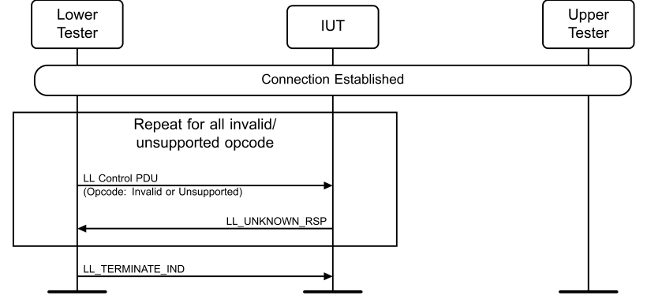

**Figure 4.7-1: Unknown Control PDUs MSC**

1. Repeat steps 2 and 3 for each invalid opcode or opcode not supported by the IUT as mapped by Table 3.1 in [4]. If the CtrData field for the PDU is specified to be more than 26 octets, then it is truncated to 26 octets. 2. The Lower Tester receives a DATA packet from the IUT (possibly empty) and sends a control PDU with an invalid opcode or an opcode not supported by the IUT to the IUT. 3. The Lower Tester receives an LL_UNKNOWN_RSP PDU from the IUT with an error code different than success. 4. The Lower Tester sends an LL_TERMINATE_IND PDU to disconnect the IUT.
• Expected Outcome
Pass verdict
The IUT sends an LL_UNKNOWN_RSP PDU upon reception of each control PDU with the UnknownType field of the LL_UNKNOWN_RSP PDU set to the Opcode in step 2.

##### 4.7.3.2 Control PDUs not permitted in the current role

• Test Purpose
Tests that the IUT rejects control PDUs not permitted in the current role.
Test that an IUT responds with the unknown response PDU to a device transmitting a control PDU supported by the IUT but not permitted in the current role.
The Lower Tester acts in the peer role and sends a control PDU with an opcode that is supported but not permitted in the current role, then observes the IUT’s response. The Lower Tester repeats this test for all opcodes that are supported by the IUT but not permitted in the current role.
• Reference
[3] 2.4.2, 2.4.2.8
• Initial Condition
- Parameters: <The feature set supported by the IUT, if the specification features are not selectable for this test.>
- State: Connected in the relevant role (any advertising interval, supported type of own address, any advertising channel map, common connection interval, zero Peripheral latency, common timeout, common channel map, any SCA value)
• Test Case Configuration

|  | Test Case |
| --- | --- |
| LL/PAC/PER/BV-02-C [Control PDUs not permitted in the current role, Peripheral] |  |
| LL/PAC/CEN/BV-02-C [Control PDUs not permitted in the current role, Central] |  |

Table 4.7-2: Control PDUs not permitted in the current role test cases
• Test Procedure
Figure 4.7 2: Control PDUs not permitted in the current role MSC
1. Repeat steps 2 and 3 for each opcode supported by the IUT but not permitted in the current role as mapped by Table 3.1 in [4]. If the CtrData field for the PDU is specified to be more than 26 octets, then it is truncated to 26 octets. 2. The Lower Tester receives a DATA packet from the IUT (possibly empty) and sends a control PDU with an Opcode supported by the IUT but not permitted in the current role to the IUT (e.g., LL_CONNECTION_UPDATE_IND or LL_CHANNEL_MAP_IND sent to a Central IUT or LL_PERIPHERAL_FEATURE_REQ sent to a Peripheral IUT). 3. The Lower Tester receives an LL_UNKNOWN_RSP, LL_REJECT_EXT_IND, or LL_REJECT_IND PDU packet from the IUT with an error code different than success. 4. The Lower Tester sends an LL_TERMINATE_IND PDU to disconnect the IUT.
• Expected Outcome
Pass verdict
The IUT sends an unknown response or reject PDU upon reception of each control PDU with the UnknownType field of the LL_UNKNOWN_RSP PDU or the RejectOpcode field of the LL_REJECT_EXT_IND PDU set to the Opcode in step 2.

##### 4.7.3.3 Control PDUs with Invalid Length

• Test Purpose
Tests that the IUT correctly handles invalid LL Control PDUs.
The Lower Tester sends invalid LL Control PDUs to the IUT and checks that it replies with a valid response.
• Reference
[3] 2.4.2, 2.4.2.8
• Initial Condition
- State: Connected in the relevant role (any advertising interval, supported type of own address, any advertising channel map, common connection interval, 0 Peripheral latency, common timeout, common channel map, any SCA value)
• Test Case Configuration

|  | Test Case |  |
| --- | --- | --- |
| LL/PAC/PER/BI-01-C [Control PDUs with Invalid Length, Peripheral] |  |  |
| LL/PAC/CEN/BI-01-C [Control PDUs with Invalid Length, Central] |  |  |

Table 4.7-3: Control PDUs with Invalid Length
• Test Procedure

**Figure 4.7-2: Control PDUs with Invalid CtrData**

1. Execute steps 2–9 for each LL Control PDU opcode supported by the IUT. 2. If the valid length of CtrData for the current opcode is greater than 0, execute steps 5–9 for CtrData length equal to 0 and for CtrData length equal to (the valid length - 1). 3. If the valid length of CtrData for the current opcode is less than 26, execute steps 5–9 for CtrData length equal to (the valid length + 1) and for CtrData length equal to 26.
4. Execute steps 5–9 for additional random and unique invalid CtrData lengths until 6 different invalid lengths have been used for the current opcode. 5. The Lower Tester sends an LL Control PDU to the IUT with the current opcode and length of CtrData, using random octets for the CtrData. 6. The Lower Tester expects one of the following to happen, as specified in Table 4.7-4:
a. The Lower Tester receives an LL_UNKNOWN_RSP PDU from the IUT specifying the opcode of the PDU sent in step 5. b. The Lower Tester receives an LL_REJECT_IND or LL_REJECT_EXT_IND PDU from the IUT, in the latter case specifying the opcode of the PDU sent in step 5. c. The Lower Tester receives a PDU from the IUT that would be a response to the opcode sent in step 5 with valid parameters. d. The Lower Tester does not receive an LL Control PDU from the IUT for 20 seconds (i.e., half the procedure response timeout). 7. If case (c) occurs in step 6, the Lower Tester completes the relevant procedure with the IUT. 8. If case (d) occurs in step 6, the Lower Tester sends an LL_PING_REQ to the IUT and receives an LL_PING_RSP or LL_UNKNOWN_RSP PDU in reply. If continuing the procedure leads to a breakdown of the connection (e.g., the IUT and the Lower Tester using different PHY, interval, or channel map), the Lower Tester may return an Inconclusive verdict. 9. If the PDU sent in step 5 was the LL_TERMINATE_IND PDU and the IUT exits the connection state, the Upper and Lower Testers carry out the procedures necessary to re-establish the connection.
• Expected Outcome
Pass verdict
In step 6, the IUT behaves as specified in Table 4.7-4 based on the LL Control PDU sent by the Lower Tester.
If the IUT can process Invalid CtrData, then the Lower Tester verifies that the IUT sends a valid response.
If the IUT rejects Invalid CtrData, then the IUT sends the Lower Tester an LL_UNKNOWN_RSP PDU, LL_REJECT_IND, or LL_REJECT_EXT_IND PDU specifying the correct opcode.

|  | LL Control PDU |  |  | Expected Results of Step 6 |  |
| --- | --- | --- | --- | --- | --- |
|  | LL CONNECTION UPDATE IND _ _ _ |  |  | Option (a) or (d) |  |
|  | LL CHANNEL MAP IND _ _ _ |  |  | Option (a) or (d) |  |
|  | LL TERMINATE IND _ _ |  |  | Option (a) or (d) |  |
|  | LL ENC REQ _ _ |  |  | Option (a) or (b) or (c) |  |
|  | LL ENC RSP _ _ |  |  | Option (a) or (b) or (d) |  |
|  | LL START ENC REQ _ _ _ |  |  | Option (a) or (b) or (c) |  |
|  | LL START ENC RSP _ _ _ |  |  | Option (a) or (b) or (d) |  |
|  | LL UNKNOWN RSP _ _ |  |  | Option (a) or (d) |  |
|  | LL FEATURE REQ _ _ |  |  | Option (a) or (c) |  |
|  | LL FEATURE RSP _ _ |  |  | Option (a) or (d) |  |
|  | LL PAUSE ENC REQ _ _ _ |  |  | Option (a) or (c) |  |
|  | LL PAUSE ENC RSP _ _ _ |  |  | Option (a) or (d) |  |
|  | LL VERSION IND _ _ |  |  | Option (a) or (c) or (d) |  |
|  | LL REJECT IND _ _ |  |  | Option (a) or (d) |  |

|  | LL Control PDU |  |  | Expected Results of Step 6 |  |
| --- | --- | --- | --- | --- | --- |
|  | LL PERIPHERAL FEATURE REQ _ _ _ |  |  | Option (a) or (c) |  |
|  | LL CONNECTION PARAM REQ _ _ _ |  |  | Option (a) or (c) |  |
|  | LL CONNECTION PARAM RSP _ _ _ |  |  | Option (a) or (b) or (d) |  |
|  | LL REJECT EXT IND _ _ _ |  |  | Option (a) or (d) |  |
|  | LL PING REQ _ _ |  |  | Option (a) or (c) |  |
|  | LL PING RSP _ _ |  |  | Option (a) or (d) |  |
|  | LL LENGTH REQ _ _ |  |  | Option (a) or (c) |  |
|  | LL LENGTH RSP _ _ |  |  | Option (a) or (d) |  |
|  | LL PHY REQ _ _ |  |  | Option (a) or (b) or (c) |  |
|  | LL PHY RSP _ _ |  |  | Option (a) or (d) |  |
|  | LL PHY UPDATE IND _ _ _ |  |  | Option (a) or (d) |  |
|  | LL MIN USED CHANNELS IND _ _ _ _ |  |  | Option (a) or (d) |  |
|  | LL CTE REQ _ _ |  |  | Option (a) or (b) or (c) |  |
|  | LL CTE RSP _ _ |  |  | Option (a) or (d) |  |
|  | LL PERIODIC SYNC IND _ _ _ |  |  | Option (a) or (d) |  |
|  | LL CLOCK ACCURACY REQ _ _ _ |  |  | Option (a) or (c) |  |
|  | LL CLOCK ACCURACY RSP _ _ _ |  |  | Option (a) or (d) |  |
|  | LL CIS REQ _ _ |  |  | Option (a) or (b) or (c) |  |
|  | LL CIS RSP _ _ |  |  | Option (a) or (b) or (d) |  |
|  | LL CIS IND _ _ |  |  | Option (a) or (d) |  |
|  | LL CIS TERMINATE IND _ _ _ |  |  | Option (a) or (d) |  |
|  | LL POWER CONTROL REQ _ _ _ |  |  | Option (a) or (b) or (c) |  |
|  | LL POWER CONTROL RSP _ _ _ |  |  | Option (a) or (d) |  |
|  | LL POWER CHANGE IND _ _ _ |  |  | Option (a) or (d) |  |
|  | LL SUBRATE REQ _ _ |  |  | Option (a) or (b) or (c) |  |
|  | LL SUBRATE IND _ _ |  |  | Option (a) or (d) |  |
|  | LL CHANNEL REPORTING IND _ _ _ |  |  | Option (a) or (c) |  |
|  | LL CHANNEL STATUS IND _ _ _ |  |  | Option (a) or (d) |  |
|  | LL PERIODIC SYNC WR IND _ _ _ _ |  |  | Option (a) or (d) |  |

Table 4.7-4: Expected Results of Step 6 for Section 4.7.3.3 “Control PDUs with Invalid Length”
Inconclusive verdict
In step 8, if continuing the procedure leads to a breakdown of the connection (e.g., the IUT and the Lower Tester using different PHY, interval, or channel map), then the Lower Tester may return an Inconclusive verdict.

### 4.8 SEC

Tests whether the IUT behaves according to the requirements for the security procedures. The security function specific abbreviations used are defined in [3].

#### 4.8.1 References

This document incorporates provisions from other publications by dated or undated reference. These references are cited at the appropriate places in the text, and the publications are listed hereinafter. Additional definitions and abbreviations can be found in [1], [2], and [3].
[1] Specification of the Bluetooth System, Versions 4.0 or later
[2] Test Strategy and Terminology Overview
[3] Specification of the Bluetooth System, Volume 6, Part B (Link Layer Protocol Specification), Version 4.0
[4] ICS Proforma for Bluetooth Low Energy Link Layer Protocol Specification
[5] ITU-T X.290 series, OSI CONFORMANCE TESTING METHODOLOGY AND FRAMEWORK PROTOCOL RECOMMENDATIONS FOR ITU-T APPLICATIONS, ITU Recommendation X.290 series (equivalent to ISO 9646)
[6] Federal Information Processing Standards Publication 197, ADVANCED ENCRYPTION STANDARD (AES), FIPS, 2001
[7] Bluetooth Test Suite for RFPHY
[8] Specification of the Bluetooth System, Volume 6, Part B (Link Layer Protocol Specification), Version 4.2 or later
[9] Bluetooth Core IXIT proforma
[10] Specification of the Bluetooth System, Volume 6, Part B (Link Layer Protocol Specification), Version 5.0 or later
[11] Specification of the Bluetooth System, Volume 2, Part E (Versions 1.2 to 5.1) or Volume 4, Part E (Version 5.2 and higher) Host Controller Interface (HCI)
[12] Specification of the Bluetooth System, Volume 3, Part A, Logical Link Control and Adaptation Protocol (L2CAP) Specification
[13] Specification of the Bluetooth System, Volume 6, Part B (Link Layer Protocol Specification), Version 5.1 or later
[14] Specification of the Bluetooth System, Volume 6, Part B (Link Layer Protocol Specification), Version 5.2 or later
[15] Specification of the Bluetooth System, Volume 2, Part E (Versions 1.2 to 5.1) or Volume 4, Part E (Version 5.2 and higher) (Host Controller Interface Functional Specification), Version 5.2 or later
[16] Specification of the Bluetooth System, Volume 6, Part D (Message Sequence Charts), Version 5.2 or later
[17] Specification of the Bluetooth System, Volume 6, Part G (Isochronous Adaptation Layer), Version 5.2 or later
[18] Core Specification Supplement (CSS), Part A, Current Version
[19] Specification of the Bluetooth System, Volume 6, Part B (Link Layer Protocol Specification), Version 5.3 or later
[20] Specification of the Bluetooth System, Volume 4, Part E (Host Controller Interface (HCI)), Version 5.3 or later
[21] Specification of the Bluetooth System, Volume 3, Part H (Host Specification), Version 5.2 or later
[22] Appropriate Language Mapping Tables document
[23] Specification of the Bluetooth System, Volume 6, Part B (Link Layer Protocol Specification), Version 5.4 or later
[24] Specification of the Bluetooth System, Volume 4, Part E (Host Controller Interface (HCI)), Version 5.4 or later
[25] Specification of the Bluetooth System, Volume 6, Part B (Link Layer Protocol Specification), Version 6.0 or later
[26] Specification of the Bluetooth System, Volume 4, Part E (Host Controller Interface Specification), Version 6.0 or later
[27] Specification of the Bluetooth System, Volume 2, Part E (Versions 1.2 to 5.1) or Volume 4, Part E (Version 6.0 and higher) Host Controller Interface (HCI)
[28] Specification of the Bluetooth System, Volume 6, Part C (Sample Data), Version 6.0 or later

#### 4.8.2 Common PDU Contents

The packet descriptions for Lower Tester sent and Lower Tester accepted data channel packets are below.
LL_ENC_REQ CtrData:

|  | LSO MSO |  |  | LSO MSO |  |  | LSO MSO |  |  | LSO MSO |  |
| --- | --- | --- | --- | --- | --- | --- | --- | --- | --- | --- | --- |
|  | lsb msb |  |  | lsb msb |  |  | lsb msb |  |  | lsb msb |  |
| Rand (8 octets) |  |  | EDIV (2 octets) |  |  | SKD C _ (8 octets) |  |  | IV C _ (4 octets) |  |  |

LL_ENC_RSP CtrData:

|  | LSO MSO |  |  | LSO MSO |  |
| --- | --- | --- | --- | --- | --- |
|  | lsb msb |  |  | lsb msb |  |
| SKD P _ (8 octets) |  |  | IV P _ (4 octets) |  |  |

Encrypted DATA PDU:

|  | LSO MSO |  |  | LSO MSO |  |  | MSO LSO |  |
| --- | --- | --- | --- | --- | --- | --- | --- | --- |
|  | lsb msb |  |  | lsb msb |  |  | msb lsb |  |
| Header (2 octets) |  |  | Payload (1-27 octets) |  |  | MIC (4 octets) |  |  |

#### 4.8.3 ADV

Tests that the IUT behaves according to the security procedures in the advertiser role.
LL/SEC/ADV/BV-01-C [Advertising With Static Address]
• Test Purpose
Test that an advertiser IUT is able to advertise using a static address and performs the scan response procedure with filtering settings allowing scan requests for devices supporting filtering.
The Upper Tester generates a static address, assigns it to the IUT, and then the Lower Tester acts as an active scanner, observing the advertising packets and the static address included. Test that the IUT responds with Command Disallowed to an LE Set Random Address command when advertising is enabled.
• Reference
[3] 4.4.2
• Initial Condition
- Parameters: LL_advertiser_advInterval_MIN, LL_advertiser_advInterval_MAX, LL_advertiser_Adv_Channel_Map
- State: Generate a static address AND Undirected Advertising (selected Adv_Interval_Min, selected Adv_Interval_Max, private own address, selected advertising channels, Length of device name used, common device name) AND All in the Filter Accept List (policy for advertiser)
• Test Procedure
Execute the test procedure using a static address as the advertiser address.
Lower Tester
Upper Tester IUT

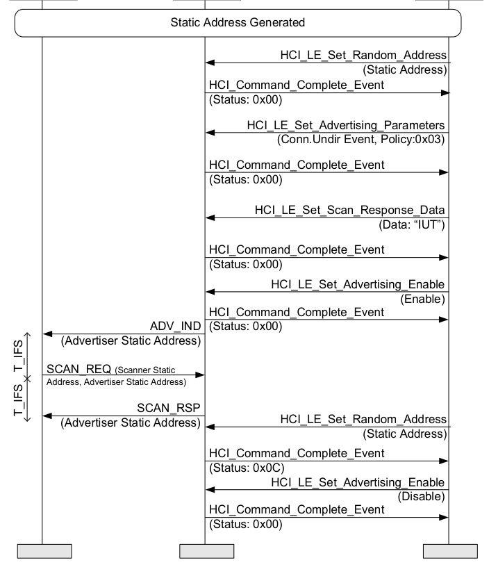

**Figure 4.8-1: LL/SEC/ADV/BV-01-C [Advertising With Static Address] MSC**

1. The Upper Tester sends an HCI_LE_Set_Random_Address command to set the IUT static address. 2. The Upper Tester enables undirected advertising and sets scan response data in the IUT. 3. Configure the Lower Tester to start active scanning. 4. The Lower Tester receives an ADV_IND packet from the IUT using the advertising static address. 5. The Lower Tester responds with a SCAN_REQ packet using the Lower Tester static address and the IUT static address on the selected advertising channel T_IFS after the end of an advertising packet. 6. The Lower Tester receives a SCAN_RSP packet from the IUT addressed to the Lower Tester after T_IFS from the end of the request packet. 7. The Upper Tester sends an HCI_LE_Set_Random_Address command to set the IUT static address and receives an HCI_Command_Complete event from the IUT with a Status of 0x0C. 8. The Upper Tester sends an HCI_LE_Set_Advertising_Enable command to disable advertising in the IUT and receives an HCI_Command_Complete event from the IUT.
• Expected Outcome
Pass verdict
The test procedure is executed successfully, with the advertiser using a static address in advertising packets.
The IUT responds to the scan requests.
The IUT rejects the second HCI_LE_Set_Random_Address command.
LL/SEC/ADV/BV-02-C [Privacy – Non-connectable Undirected Advertising, non-resolvable private address]
• Test Purpose
Verify that an advertiser IUT is able to advertise non-connectable events using a non-resolvable private address.
The Upper Tester generates a non-resolvable private address, assigns it to the IUT. The Lower Tester then observes the packet contents on the advertising channel with the non-resolvable private address included.
• Reference
[3] 4.4.2.6
• Initial Condition
- Parameters: LL_advertiser_advInterval_MIN, LL_advertiser_advInterval_MAX, LL_advertiser_Adv_Channel_Map
- State: Non-Connectable Advertising (selected Adv_Interval_Min, selected Adv_Interval_Max, supported type of own address, selected advertising channel map)
• Test Procedure
Execute the test procedure using a single non-resolvable private address as the advertiser address and a selected advertising interval between the minimum and maximum advertising intervals supported using all supported advertising channels.

**Figure 4.8-2: LL/SEC/ADV/BV-02-C [Privacy – Non-connectable Undirected Advertising, non- resolvable private address] MSC**

1. Configure the Lower Tester to monitor advertising packets from the IUT. 2. The Upper Tester assigns a non-resolvable private address to the IUT for use in the advertising packets AdvA field. 3. The Upper Tester enables non-connectable advertising in the IUT using all supported advertising channels and a selected advertising interval between the minimum and maximum advertising intervals.
4. The Lower Tester expects the IUT to send ADV_NONCONN_IND packets on an applicable advertising channel. 5. Repeat steps 4 until 100 advertising events have been detected. 6. The Upper Tester disables non-connectable advertising.
• Expected Outcome
Pass verdict
The test procedure is executed successfully, with the advertiser using a non-resolvable private address and using it in non-connectable advertising packets.
The advertiser’s address received by the Lower Tester matches the address set by the Upper Tester.
LL/SEC/ADV/BV-03-C [Privacy - Non-connectable Undirected Advertising, Resolvable Private Address]
• Test Purpose
Verify that an advertiser IUT is able to advertise non-connectable events using a resolvable private address and that the address is refreshed.
The Lower Tester observes the packet contents on the advertising channel including the resolvable private address. The resolvable private address is refreshed within the Resolvable Private Address timeout.
• Reference
[3] 4.4.2.6
• Initial Condition
- The Upper Tester configures the Resolvable Private Address Timeout to the value defined in the IXIT.
- Parameters: LL_advertiser_advInterval_MIN, LL_advertiser_advInterval_MAX, LL_advertiser_Adv_Channel_Map
- State: Device Address Set (supported type of address, any address)
- Execute the test procedure using a single local IRK.
• Test Procedure

**Figure 4.8-3: LL/SEC/ADV/BV-03-C [Privacy - Non-connectable Undirected Advertising, Resolvable Private Address] MSC**

1. Configure the Lower Tester to monitor advertising packets from the IUT. 2. The Upper Tester assigns an IRK to the IUT to be used in generating a resolvable private address for use in the advertising packet’s AdvA field. The Lower Tester is assigned the same IRK to be used during address resolution. 3. The Upper Tester enables non-connectable advertising in the IUT using all supported advertising channels, a selected advertising interval between the minimum and maximum advertising intervals, and sets the Own_Address_Type to either 0x02 or 0x03 according to the IUT address set in initial condition. 4. The Lower Tester expects the IUT to send ADV_NONCONN_IND packets on an applicable advertising channel. 5. The Lower Tester resolves private address received from the IUT using assigned IRK. 6. The Lower Tester waits for address refresh timeout and resolves another ADV_NONCONN_IND packet verifying that a different address is used that resolves with the same IRK. 7. The Upper Tester disables non-connectable advertising.
• Expected Outcome
Pass verdict
The test procedure is executed successfully, with the advertiser using a resolvable private address generated from the assigned IRK, using it in advertising and refreshing the address within the defined timeout period.
LL/SEC/ADV/BV-04-C [Network Privacy - Scannable Advertising, non-resolvable private address]
• Test Purpose
Verify that an advertiser IUT is able to advertise scannable undirected events using a non-resolvable private address.
The Upper Tester generates a non-resolvable private address, assigns it to the IUT. The Lower Tester then observes the packet contents on the advertising channel with the non-resolvable private address included.
• Reference
[3] 4.4.2.5
• Initial Condition
- Parameters: LL_advertiser_advInterval_MIN, LL_advertiser_advInterval_MAX, LL_advertiser_Adv_Channel_Map
- State: Scannable undirected advertising (selected Adv_Interval_Min, selected Adv_Interval_Max, supported type of own address, selected advertising channel map, length of device name used, common device name)
- Execute the test procedure using a single non-resolvable private address as the advertiser address.
• Test Procedure

**Figure 4.8-4: LL/SEC/ADV/BV-04-C [Network Privacy - Scannable Advertising, non-resolvable private address] MSC**

1. Configure the Lower Tester to active scan for advertising packets from the IUT. 2. The Upper Tester enables scannable undirected advertising in the IUT using all supported advertising channels and a selected advertising interval between the minimum and maximum advertising intervals. 3. The Upper Tester assigns a non-resolvable private address to the IUT for use in the advertising packet's AdvA field.
4. The Lower Tester expects the IUT to send ADV_SCAN_IND packets on an applicable advertising channel. The Lower Tester sends a SCAN_REQ packet for every received ADV_SCAN_IND packet from the IUT. The Lower Tester uses a non-resolvable private address in the SCAN_REQ packet. 5. The Lower Tester expects the IUT to send SCAN_RSP packets in response to the SCAN_REQ. 6. Repeat steps 4–5 until 100 advertising events have been detected. 7. The Upper Tester disables scannable undirected advertising.
• Expected Outcome
Pass verdict
The test procedure is executed successfully, with the advertiser using a non-resolvable private address and using it in the AdvA field of scannable undirected advertising packets.
The advertiser address matches the address received by the Lower Tester.
LL/SEC/ADV/BV-05-C [Network Privacy - Scannable Advertising, resolvable private address]
• Test Purpose
Verify that an advertiser IUT is able to advertise scannable undirected events using a resolvable private address. The resolvable private address is refreshed within the Resolvable Private Address timeout.
The Lower Tester observes the packet contents on the advertising channel, and resolves the IUT’s resolvable private address. The Lower Tester then responds with a scan request using a resolvable private address and receives a scan response packet in return.
Verify that when the IUT’s address resolution is disabled, it no longer responds to the scan request.
• Reference
[3] 4.4.2.5
• Initial Condition
- The Upper Tester configures the Resolvable Private Address Timeout to the value defined in the IXIT
- Parameters: LL_advertiser_advInterval_MIN, LL_advertiser_advInterval_MAX, LL_advertiser_Adv_Channel_Map
- State: Scannable Undirected Advertising (selected Adv_Interval_Min, selected Adv_Interval_Max, supported type of own address, selected advertising channel map, length of device name used, common device name)
- Execute the test procedure using a single local IRK.
• Test Procedure

**Figure 4.8-5: LL/SEC/ADV/BV-05-C [Network Privacy - Scannable Advertising, resolvable private address] MSC**

1. Configure the Lower Tester to monitor advertising packets from the IUT. 2. The Upper Tester enables scannable undirected advertising in the IUT using all supported advertising channels and a selected advertising interval between the minimum and maximum advertising intervals. 3. The Upper Tester adds the Lower Tester’s Identity Address to the Filter Accept List. 4. The Upper Tester assigns an IRK to the IUT to be used in generating a resolvable private address for use in the advertising packets AdvA field. The Lower Tester is assigned the same IRK to be used during address resolution. 5. The Upper Tester enables scannable undirected advertising with Advertising_Filter_Policy set to 0x01. 6. The Lower Tester expects the IUT to send ADV_SCAN_IND packets on an applicable advertising channel. The Lower Tester resolves the private address received from the IUT using assigned IRK. 7. The Lower Tester sends a SCAN_REQ packet for every received ADV_SCAN_IND packet from the IUT. 8. The IUT resolves the private address received from the Lower Tester using assigned IRK. The Lower Tester expects the IUT to send SCAN_RSP packets in response to the SCAN_REQ. 9. The Lower Tester waits for address refresh timeout and resolves another ADV_SCAN_IND packet verifying that a different address is used that resolves with the same IRK. 10. The Upper Tester disables non-connectable advertising. 11. The Upper Tester disables address resolution. 12. The Upper Tester enables scannable undirected advertising. 13. Repeat steps 14–16 at least 20 times. 14. The Lower Tester expects the IUT to send ADV_SCAN_IND packets on an applicable advertising channel. The Lower Tester resolves the private address received from the IUT using assigned IRK. 15. The Lower Tester sends a SCAN_REQ packet for every received ADV_SCAN_IND packet from the IUT, setting the ScanA field to an address generated using its IRK. 16. The IUT does not resolve the private address received from the Lower Tester. The Lower Tester does not receive SCAN_RSP packets in response to the SCAN_REQ. 17. The Upper Tester disables the advertising.
• Expected Outcome
Pass verdict
The test procedure is executed successfully, with the advertiser using a resolvable private address generated from the assigned IRK, using it in scannable advertising and refreshing the address within the defined timeout period.
The Lower Tester and the IUT successfully resolved the peer’s address and send the SCAN_REQ and SCAN_RSP, respectively.
The IUT does not respond to the SCAN_REQ when address resolution is disabled.
LL/SEC/ADV/BV-06-C [Network Privacy - Undirected Connectable Advertising no Local IRK, no peer IRK]
• Test Purpose
Verify that an advertiser IUT can connect while using non-resolvable private address in the AdvA field.
• Reference
[3] 4.4.2.3
• Initial Condition
- Parameters: LL_advertiser_advInterval_MIN, LL_advertiser_advInterval_MAX, LL_advertiser_Adv_Channel_Map
- State: Undirected Advertising (selected Adv_Interval_Min, selected Adv_Interval_Max, supported type of own address, selected advertising channel map)
• Test Procedure

**Figure 4.8-6: LL/SEC/ADV/BV-06-C [Network Privacy - Undirected Connectable Advertising no Local IRK, no peer IRK] MSC**

1. Configure the Lower Tester to initiate a connection while using a Public Address. 2. The Upper Tester assigns a non-resolvable private address to the IUT for use in the advertising packets AdvA field. 3. The Upper Tester enables connectable advertising in the IUT using all supported advertising channels and a selected advertising interval between the minimum and maximum advertising intervals. 4. The Lower Tester expects the IUT to send ADV_IND packets on an applicable advertising channel.
5. The Lower Tester connects to the IUT. The Lower Tester sends empty LL DATA packets starting with the first event one connection interval after the connection request using the common data channel selection parameters. 6. The Upper Tester terminates the connection. 7. Repeat steps 1–6 an additional 2 times, but configure the Lower Tester with a Static Address and Non-Resolvable Private Address, respectively.
• Expected Outcome
Pass verdict
The test procedure is executed successfully, with the advertiser using a non-resolvable private address in connectable advertising, connecting to the Lower Tester.

##### 4.8.3.1 Network Privacy – Undirected Connectable Advertising with Local IRK, no peer IRK

• Test Purpose
Verify that an advertiser IUT can connect while using the Resolving List and using a resolvable private address in the AdvA field. The peer has not distributed its IRK. The Device Identity (IRK and Identity Address) of the IUT is known by the peer.
The Lower Tester has not distributed its own IRK and uses a Public or Static Address (Identity Address) for the InitA field, the identity address is stored in the IUT’s Filter Accept List.
• Reference
[3] 4.4.2.3
• Initial Condition
- The Upper Tester configures the Resolvable Private Address Timeout to the value defined in the IXIT
- Parameters: LL_advertiser_advInterval_MIN, LL_advertiser_advInterval_MAX, LL_advertiser_Adv_Channel_Map
- State: Undirected Advertising (selected Adv_Interval_Min, selected Adv_Interval_Max, supported type of own address, selected advertising channel map)
• Test Case Configuration

| Test Case ID |  | Advertising |  | Connection Request |  | Connection |  |
| --- | --- | --- | --- | --- | --- | --- | --- |
|  |  | Type |  |  |  | Response |  |
| LL/SEC/ADV/BV-07-C [Network Privacy – Undirected Connectable Advertising with Local IRK, no peer IRK, CONNECT IND] _ | Basic |  |  | CONNECT IND _ | None |  |  |
| LL/SEC/ADV/BV-23-C [Network Privacy – Undirected Connectable Advertising with Local IRK, no peer IRK, AUX CONNECT REQ] _ _ | Extended |  |  | AUX CONNECT REQ _ _ | AUX CONNECT RSP _ _ |  |  |

Table 4.8-1: Network Privacy – Undirected Connectable Advertising with Local IRK, no peer IRK test cases
• Test Procedure
Lower Tester
Upper Tester IUT

**Figure 4.8-7: Network Privacy – Undirected Connectable Advertising with Local IRK, no peer IRK MSC**

1. Configure the Lower Tester to initiate a connection while using the Identity Address. 2. The Upper Tester adds the Lower Tester’s Identity Address to the Filter Accept List. 3. The Upper Tester adds the Lower Tester’s Device Identity (IRK and Identity Address) to the IUT resolving list. 4. The Upper Tester enables connectable advertising in the IUT using all supported advertising channels and a selected advertising interval between the minimum and maximum advertising intervals.
5. The Lower Tester expects the IUT to send ADV_IND packets on an applicable advertising channel. 6. The Lower Tester resolves the AdvA address and identifies the IUT. The Lower Tester sends a connection request as specified in Table 4.8-1 with the AdvA address of the ADV_IND and the InitA identical to its Identity Address. 7. The IUT verifies the AdvA and the InitA address of the connection request. If a Connection Response is specified in Table 4.8-1, then the IUT sends the Connection Response to the Lower Tester. 8. The IUT sends an HCI_LE_Enhanced_Connection_Complete event to the Upper Tester with Local_Resolvable_Private_Address set to the IUT’s RPA and Peer_Resolvable_Private_Address set to the Lower Tester’s Identity Address. 9. The Lower Tester sends empty LL DATA packets starting with the first event one connection interval after the connection request using the common data channel selection parameters. 10. The Upper Tester terminates the connection.
• Test Condition
If Table 4.8-1 specifies a Basic Advertising Type, the following commands and PDUs are used:
▪ HCI_LE_Set_Advertising_Parameters
▪ HCI_LE_Set_Advertising_Data
▪ HCI_LE_Set_Advertising_Enable
▪ ADV_IND
If Table 4.8-1 specifies an Extended Advertising Type, the following commands and PDUs are used:
▪ HCI_LE_Set_Extended_Advertising_Parameters
▪ HCI_LE_Set_Extended_Advertising_Data
▪ HCI_LE_Set_Extended_Advertising_Enable
▪ ADV_EXT_IND
▪ AUX_ADV_IND
• Expected Outcome
Pass verdict
The test procedure is executed successfully, with the advertiser generating a resolvable private address, using it in connectable advertising, and connecting to the Lower Tester.
The IUT connects to the Lower Tester when the Lower Tester uses either a public or a static address.

##### 4.8.3.2 Network Privacy – Undirected Connectable Advertising with Local IRK and Peer IRK

• Test Purpose
Verify that the IUT, when transmitting undirected connectable advertising events, using the Resolving List and using a resolvable private address for AdvA field, connects to the Lower Tester. The Lower Tester uses a resolvable private address for the InitA field, i.e., the Lower Tester has distributed its own device identity (IRK and Identity Address) and uses resolvable private addresses. The IUT and the Lower Tester validate the address used towards the device identities.
Verify that when address resolution is disabled on the IUT, the Lower Tester resolvable private address is not resolved, and therefore a connection is not established.
• Reference
[3] 4.4.2.3
• Initial Condition
- The Upper Tester configures the Resolvable Private Address Timeout to the value defined in the IXIT
- Parameters: LL_advertiser_advInterval_MIN, LL_advertiser_advInterval_MAX, LL_advertiser_Adv_Channel_Map
- State: Undirected Advertising (selected Adv_Interval_Min, selected Adv_Interval_Max, supported type of own address, selected advertising channel map)
• Test Case Configuration

| Test Case ID |  | Advertising |  | Connection Request |  | Connection |  |
| --- | --- | --- | --- | --- | --- | --- | --- |
|  |  | Type |  |  |  | Response |  |
| LL/SEC/ADV/BV-08-C [Network Privacy - Undirected Connectable Advertising with Local IRK and Peer IRK, CONNECT IND] _ | Basic |  |  | CONNECT IND _ | None |  |  |
| LL/SEC/ADV/BV-24-C [Network Privacy - Undirected Connectable Advertising with Local IRK and Peer IRK, AUX CONNECT REQ] _ _ | Extended |  |  | AUX CONNECT REQ _ _ | AUX CONNECT RSP _ _ |  |  |

Table 4.8-2: Network Privacy - Undirected Connectable Advertising with Local IRK and Peer IRK test cases
• Test Procedure

**Figure 4.8-8: Network Privacy - Undirected Connectable Advertising with Local IRK and Peer IRK MSC – Page 1 of 2**

|  |  |  | AT LEAST ONCE HCI Disconnect _ HCI Command Status Event _ _ _ (Status: 0x00) HCI Disconnection Complete Event _ _ _ (Status: 0x00) HCI LE Set Address Resolution Enable _ _ _ _ _ (Disable) HCI Command Complete Event _ _ _ (Status: 0x00) HCI LE Set Advertise Enable _ _ _ _ (Enable) HCI Command Complete Event _ _ _ (Status: 0x00) |  |
| --- | --- | --- | --- | --- |
|  | Empty Data Empty Data |  | AT LEAST ONCE |  |
|  |  |  |  |  |
|  | ADV IND _ Connection Request (initiator address) _ |  | REPEAT 20 TIMES |  |
|  |  |  | NO CONNECTION EVENT |  |
|  |  |  |  |  |
| HCI LE Set Advertise Enable _ _ _ _ (Disable) HCI Command Complete Event _ _ _ (Status: 0x00) |  |  |  |  |

**Figure 4.8-9: Network Privacy - Undirected Connectable Advertising with Local IRK and Peer IRK MSC – Page 2 of 2**

1. Configure the Lower Tester to initiate a connection while using a resolvable private address. 2. The Upper Tester populates the resolving list with the device identity (IRK and Identity Address) of the Lower Tester and the local IRK. The IUT uses this when generating a resolvable private address for use in the advertising packet’s AdvA field. 3. The Upper Tester adds the Lower Tester’s Identity Address to the Filter Accept List. 4. The Upper Tester enables connectable advertising in the IUT using all supported advertising channels and a selected advertising interval between the minimum and maximum advertising intervals. 5. The Lower Tester expects the IUT to send ADV_IND packets on an applicable advertising channel. 6. The Lower Tester resolves the AdvA address and identifies the IUT. The Lower Tester sends a connection request from Table 4.8-2 with the AdvA address of the ADV_IND and the InitA generated based on its IRK. 7. The IUT verifies the AdvA field and resolves the address in the InitA field. If a Connection Response is specified in Table 4.8-2, then the IUT sends the Connection Response to the Lower Tester.
8. The IUT sends an HCI_LE_Enhanced_Connection_Complete event to the Upper Tester with Local_Resolvable_Private_Address set to the IUT’s RPA and Peer_Resolvable_Private_Address set to the Lower Tester’s RPA. 9. The Lower Tester sends empty LL DATA packets starting with the first event one connection interval after the connection request using the common data channel selection parameters. 10. The Upper Tester terminates the connection. 11. The Upper Tester disables address resolution in the IUT. 12. The Upper Tester enables connectable advertising in the IUT using all supported advertising channels and a selected advertising interval between the minimum and maximum advertising intervals. 13. Repeat steps 14–15 at least 20 times. 14. The Lower Tester expects the IUT to send ADV_IND packets on an applicable advertising channel. The Lower Tester resolves the AdvA address and identifies the IUT. 15. The Lower Tester sends the connection request from Table 4.8-2 with the AdvA address of the ADV_IND and the InitA generated based on its IRK. The IUT does not resolve the address in the InitA field. No connection event is sent to the Upper Tester. 16. The Upper Tester disables advertising on the IUT.
• Test Condition
If Table 4.8-2 specifies a Basic Advertising Type, the following commands and PDUs are used:
▪ HCI_LE_Set_Advertising_Parameters
▪ HCI_LE_Set_Advertising_Data
▪ HCI_LE_Set_Advertising_Enable
▪ ADV_IND
If Table 4.8-2 specifies an Extended Advertising Type, the following commands and PDUs are used:
▪ HCI_LE_Set_Extended_Advertising_Parameters
▪ HCI_LE_Set_Extended_Advertising_Data
▪ HCI_LE_Set_Extended_Advertising_Enable
▪ ADV_EXT_IND
▪ AUX_ADV_IND
• Expected Outcome
Pass verdict
The test procedure is executed successfully, with the advertiser generating a resolvable private address, using it in connectable advertising, and connecting to the Lower Tester.
The Lower Tester also uses a resolvable private address during the connections and the IUT correctly resolves the address.
A connection is not established when address resolution is disabled.
LL/SEC/ADV/BV-09-C [Network Privacy - Undirected Connectable Advertising without Local IRK and with peer IRK]
• Test Purpose
Verify that the IUT connects to the Lower Tester when transmitting undirected connectable advertising events and using the Resolving List with a public or random static address for AdvA field. The Lower Tester has distributed its Device Identity (IRK and Identity Address) and uses a resolvable private address for the InitA field.
• Reference
[3] 4.4.2.3
• Initial Condition
- Parameters: LL_advertiser_advInterval_MIN, LL_advertiser_advInterval_MAX, LL_advertiser_Adv_Channel_Map
- State: Undirected Advertising (selected Adv_Interval_Min, selected Adv_Interval_Max, supported type of own address (0x02 or 0x03), selected advertising channel map)
- The Upper Tester host has not provided an IRK for the IUT.
• Test Procedure

**Figure 4.8-10: LL/SEC/ADV/BV-09-C [Network Privacy - Undirected Connectable Advertising without Local IRK and with peer IRK] MSC**

1. Configure the Lower Tester to initiate a connection while using a resolvable private address. 2. The Upper Tester adds the Lower Tester’s Identity Address to the Filter Accept List. 3. The Upper Tester populates the resolving list with the device identity of the Lower Tester and a local IRK value of all zeros. 4. The Upper Tester enables connectable advertising in the IUT using all supported advertising channels and a selected advertising interval between the minimum and maximum advertising intervals. The AdvA value is set to the IUT’s Identity Address. 5. The Lower Tester expects the IUT to send ADV_IND packets on an applicable advertising channel. 6. The Lower Tester identifies the IUT. The Lower Tester sends a CONNECT_IND with the AdvA address of the ADV_IND and the InitA generated based on its Device Identity. The IUT resolves the InitA Address and identifies the Lower Tester. 7. The Lower Tester sends empty LL DATA packets starting with the first event one connection interval after the connection request using the common data channel selection parameters. 8. The Upper Tester terminates the connection.
• Expected Outcome
Pass verdict
The IUT advertises with a Public or Static address in the AdvA field.
The IUT is able to use the resolving list to connect to the Lower Tester.
LL/SEC/ADV/BV-10-C [Network Privacy - Undirected Connectable Advertising using Resolving List and Peer Device Identity not in the List]
• Test Purpose
Verify that the IUT, when transmitting undirected connectable advertising events and using the Resolving List, connects to the devices that are only resolved and on the Filter Accept List. The IUT should only connect to the Lower Tester upon successful resolution of the peer’s resolvable private address.
• Reference
[3] 4.4.2.3
• Initial Condition
- The Upper Tester configures the Resolvable Private Address Timeout to the value defined in the IXIT
- Parameters: LL_advertiser_advInterval_MIN, LL_advertiser_advInterval_MAX, LL_advertiser_Adv_Channel_Map
- State: Undirected Advertising (selected Adv_Interval_Min, selected Adv_Interval_Max, supported type of own address, selected advertising channel map)
• Test Procedure

**Figure 4.8-11: LL/SEC/ADV/BV-10-C [Network Privacy - Undirected Connectable Advertising using Resolving List and Peer Device Identity not in the List] MSC**

1. The Lower Tester adds the Device Identity of the IUT to its resolving list. 2. The Upper Tester adds the Lower Tester’s Identity Address to the Filter Accept List. 3. Configure the Lower Tester to initiate a connection while using a resolvable private address. 4. The Upper Tester populates the resolving list with device identities not equal to the one of the Lower Tester connected with the local device identity. 5. The IUT use its device identity when generating a resolvable private address for use in the advertising packet’s AdvA field.
6. The Upper Tester enables connectable advertising in the IUT using all supported advertising channels and a selected advertising interval between the minimum and maximum advertising intervals. 7. The Lower Tester expects the IUT to send ADV_IND packets on an applicable advertising channel. 8. The Lower Tester sends a CONNECT_IND using the advertiser’s address for AdvA field. The InitA field uses a resolvable private address based on the device identity of the Lower Tester. 9. The Lower Tester repeats step 7 ten times.
• Expected Outcome
Pass verdict
The IUT advertises with a resolvable private address in the AdvA field.
The IUT ignores the connect requests from addresses which are not in the resolving list.
LL/SEC/ADV/BV-11-C [Network Privacy - Directed Connectable Advertising using local and remote IRK]
• Test Purpose
Verify that the IUT, when transmitting directed connectable advertising events, is using resolvable private addresses for AdvA and InitA fields when the Lower Tester has distributed its own IRK.
Verify that when address resolution is disabled on the IUT, the Lower Tester resolvable private address is not resolved, and therefore a connection is not established.
• Reference
[3] 4.4.2.4
• Initial Condition
- The Upper Tester configures the Resolvable Private Address Timeout to the value defined in the IXIT
- Parameters: LL_advertiser_Adv_Channel_Map
- State: Directed Advertising (supported type of own address, public initiator address, Lower Tester address, selected advertising channels)
- The Lower Tester is using a resolvable private address and has previously distributed its IRK.
- The IUT is using a resolvable private address.
• Test Procedure

**Figure 4.8-12: LL/SEC/ADV/BV-11-C [Network Privacy - Directed Connectable Advertising using local and remote IRK] MSC**

1. The Lower Tester adds the Device Identity of the IUT to its resolving list. 2. Configure the Lower Tester to initiate a connection while using a resolvable private address. 3. The Upper Tester populates the resolving list with the device identity of the Lower Tester connected with the local device identity. The IUT use these when generating resolvable private addresses for use in the advertising packet’s AdvA and InitA fields. 4. The Upper Tester enables resolving list and directed connectable advertising in the IUT. 5. The Lower Tester expects the IUT to send ADV_DIRECT_IND packets on an applicable advertising channel. 6. The Lower Tester identifies the IUT. The Lower Tester sends a CONNECT_IND with the AdvA address of the ADV_DIRECT_IND and the InitA generated based on its Device Identity. The IUT verifies AdvA and resolves the InitA Address and identifies the Lower Tester. 7. The Lower Tester connects to the IUT. The Lower Tester sends empty LL DATA packets starting with the first event one connection interval after the connection request using the common data channel selection parameters. 8. The Upper Tester terminates the connection. 9. The Upper Tester disables address resolution in the IUT. 10. Repeat steps 11–14 at least 20 times. 11. The Upper Tester enables directed connectable advertising in the IUT. 12. The Lower Tester expects the IUT to send ADV_DIRECT_IND packets on an applicable advertising channel. The Lower Tester resolves the AdvA address and identifies the IUT. 13. The Lower Tester sends a CONNECT_IND with the AdvA address of the ADV_IND and the InitA set to a different address than the last CONNECT_IND. The IUT does not resolve the address in the InitA field. No connection event is sent to the Upper Tester. 14. The Upper Tester receives an HCI_LE_Connection_Complete event or an HCI_LE_Enhanced_Connection_Complete event with the Status code set to Advertising Timeout (0x3C).
• Expected Outcome
Pass verdict
The IUT advertises with directed advertising using resolvable private addresses in the AdvA and InitA fields.
The IUT verifies the AdvA address and resolves the InitA address in the CONNECT_IND packet and accepts the connection.
A connection is not established when address resolution is disabled.

##### 4.8.3.3 Network Privacy - Directed Connectable Advertising with local IRK but without remote IRK

• Test Purpose
Verify that the IUT, when transmitting directed connectable advertising events, is using resolvable private address for AdvA field and a Public or Static Address (Identity Address) for the InitA field when the Lower Tester has not distributed its own IRK.
• Reference
[3] 4.4.2.4
• Initial Condition
- The Upper Tester configures the Resolvable Private Address Timeout to the value defined in the IXIT.
- Parameters: LL_advertiser_Adv_Channel_Map
- State: Directed Advertising (supported type of own address, public initiator address, Lower Tester address, selected advertising channels)
The IUT is using a resolvable private address.
The Lower Tester is using a public or static address (Identity Address) and has not distributed its IRK.
• Test Case Configuration

| Test Case ID |  | Advertising |  | Connection Request |  | Connection |  |
| --- | --- | --- | --- | --- | --- | --- | --- |
|  |  | Type |  |  |  | Response |  |
| LL/SEC/ADV/BV-12-C [Network Privacy - Directed Connectable Advertising with local IRK but without remote IRK, CONNECT IND] _ | Basic |  |  | CONNECT IND _ | None |  |  |
| LL/SEC/ADV/BV-25-C [Network Privacy - Directed Connectable Advertising with local IRK but without remote IRK, AUX CONNECT REQ] _ _ | Extended |  |  | AUX CONNECT REQ _ _ | AUX CONNECT RSP _ _ |  |  |

Table 4.8-3: Network Privacy - Directed Connectable Advertising with local IRK but without remote IRK test cases
• Test Procedure

**Figure 4.8-13: Network Privacy - Directed Connectable Advertising with local IRK but without remote IRK MSC**

1. The Lower Tester adds the Device Identity of the IUT to its resolving list. 2. Configure the Lower Tester to initiate a connection while using a Public Address. 3. The Upper Tester populates the resolving list with the identity address of the Lower Tester connected with the local device identity. The Lower Tester’s IRK is set to all zeros. The IUT uses these when generating resolvable private addresses for use in the advertising packet’s AdvA field. 4. The Upper Tester enables directed connectable advertising in the IUT. 5. The Lower Tester expects the IUT to send ADV_DIRECT_IND packets on an applicable advertising channel. 6. The Lower Tester resolved the identity of the IUT. The Lower Tester sends a connection request from Table 4.8-3 with the AdvA address of the ADV_IND and the InitA being its Public or Static Random Device Address. 7. The IUT verifies the AdvA address and resolves the InitA address to identify the Lower Tester. If a Connection Response is specified in Table 4.8-3, then the IUT sends the Connection Response to the Lower Tester. 8. The IUT sends an HCI_LE_Enhanced_Connection_Complete event to the Upper Tester with Local_Resolvable_Private_Address set to the IUT’s RPA and Peer_Resolvable_Private_Address set to the Lower Tester’s Identity Address. 9. The Lower Tester sends empty LL DATA packets starting with the first event one connection interval after the connection request using the common data channel selection parameters. 10. The Upper Tester terminates the connection. 11. The IUT has generated a new resolvable private address for the AdvA field. 12. The Upper Tester enables connectable directed advertising in the IUT. 13. The Lower Tester expects the IUT to send ADV_DIRECT_IND packets on an applicable advertising channel.
• Test Condition
If Table 4.8-3 specifies a Basic Advertising Type, the following commands and PDUs are used:
▪ HCI_LE_Set_Advertising_Parameters
▪ HCI_LE_Set_Advertising_Data
▪ HCI_LE_Set_Advertising_Enable
▪ ADV_DIRECT_IND
If Table 4.8-3 specifies an Extended Advertising Type, the following commands and PDUs are used:
▪ HCI_LE_Set_Extended_Advertising_Parameters
▪ HCI_LE_Set_Extended_Advertising_Data
▪ HCI_LE_Set_Extended_Advertising_Enable
▪ ADV_EXT_IND
▪ AUX_ADV_IND
• Expected Outcome
Pass verdict
The IUT advertises with directed advertising using resolvable private address in the AdvA field.
The IUT accepts connection.
The IUT refreshes the advertiser address after the disconnection.
LL/SEC/ADV/BV-13-C [Network Privacy - Directed Connectable Advertising without local IRK but with remote IRK]
• Test Purpose
Verify the IUT when transmitting directed connectable advertising events using a public or static address for the AdvA field and a resolvable private address for the InitA field when the Lower Tester has distributed its own IRK.
• Reference
[3] 4.4.2.4
• Initial Condition
- The Upper Tester configures the Resolvable Private Address Timeout to the value defined in the IXIT.
- Parameters: LL_advertiser_Adv_Channel_Map
- State: Directed Advertising (supported type of own address, public initiator address, Lower Tester address, selected advertising channels)
- The Lower Tester is using a resolvable private address and has distributed its IRK.
- The IUT is using a public or static address.
• Test Procedure

**Figure 4.8-14: LL/SEC/ADV/BV-13-C [Network Privacy - Directed Connectable Advertising without local IRK but with remote IRK] MSC**

1. Configure the Lower Tester to initiate a connection while using a resolvable private address. 2. The Upper Tester populates the resolving list with the device identity of the Lower Tester connected with a local all zero IRK. The IUT uses this when generating a resolvable private address for use in the advertising packet’s InitA field. 3. The Upper Tester enables resolving list and directed connectable advertising in the IUT using Own_Address_Type to ResolvableOrPublic (0x02) or ResolvableOrRandom (0x03) according to the IUT address (public or static random). 4. The Lower Tester expects the IUT to send ADV_DIRECT_IND packets on an applicable advertising channel with TargetA as resolvable private address. 5. The Lower Tester identifies the IUT. The Lower Tester sends a CONNECT_IND with the AdvA of the ADV_DIRECT_IND and an InitA address generated based on the Lower Tester’s IRK. The IUT resolves the InitA Address and identifies the Lower Tester. 6. The Lower Tester sends empty LL DATA packets starting with the first event one connection interval after the connection request using the common data channel selection parameters. 7. The Upper Tester terminates the connection and waits for the RPA Timeout. 8. The IUT has generated a new resolvable private address for the InitA and AdvA field. 9. The Upper Tester enables connectable directed advertising in the IUT. 10. The Lower Tester expects the IUT to send ADV_DIRECT_IND packets on an applicable advertising channel.
• Expected Outcome
Pass verdict
The IUT advertises with directed advertising using identity address in the AdvA and RPA in the initA address.
The IUT accepts the connection.
The IUT refreshes the initiator address after the private address refresh timeout.
LL/SEC/ADV/BV-14-C [Network Privacy - Directed Connectable Advertising using Resolving List and Peer Device Identity not in the List]
• Test Purpose
Verify that the IUT, when transmitting directed connectable advertising events and using the Resolving List, connects to the devices that are only in the resolving list. The IUT should only connect to a Lower Tester upon successful resolution of the peer’s resolvable private address.
• Reference
[3] 4.4.2.4
• Initial Condition
- The Upper Tester configures the Resolvable Private Address Timeout to the value defined in the IXIT.
- Parameters: LL_advertiser_Adv_Channel_Map
- State: Directed Advertising (supported type of own address, public initiator address, Lower Tester address, selected advertising channels)
- The Lower Tester is using a resolvable private address and has distributed its IRK.
- The IUT is using a public or static address.
• Test Procedure

**Figure 4.8-15: LL/SEC/ADV/BV-14-C [Network Privacy - Directed Connectable Advertising using Resolving List and Peer Device Identity not in the List] MSC**

1. Configure the Lower Tester to initiate a connection while using a Resolvable Private Address. 2. The Upper Tester populates the resolving list with device identities not equal to the one of the Lower Tester connected with the local device identity. 3. The IUT use its device identity when generating a resolvable private address for use in the advertising packet’s AdvA field and the device identity in the resolving list for the InitA field. 4. The Upper Tester enables directed connectable advertising in the IUT.
5. The Lower Tester expects the IUT to send ADV_DIRECT_IND packets on an applicable advertising channel. 6. The Lower Tester sends a CONNECT_IND using the advertiser’s address for AdvA field. The InitA field uses a resolvable private address based on the device identity of the Lower Tester (an IRK that is not the same as the one distributed to the Upper Tester).
• Expected Outcome
Pass verdict
The IUT advertises with a resolvable private address in the AdvA field.
The IUT ignores the connect requests from addresses which are not in the resolving list.
The IUT advertises with directed advertising using resolvable private addresses in the AdvA and InitA fields.
The IUT resolves the InitA address in the CONNECT_IND packet and does not accept the connection.
LL/SEC/ADV/BV-15-C [Network Privacy - Scannable Advertising, resolvable private address, Ignore Identity Address]
• Test Purpose
Verify that an advertiser IUT does not respond to a scan request with the scanner’s identity address when the IUT has that address and an associated IRK in the resolving list using network privacy mode.
• Reference
[3] 4.4.2.5
• Initial Condition
- The Upper Tester configures the Resolvable Private Address Timeout to the value defined in the IXIT.
- Parameters: LL_advertiser_advInterval_MIN, LL_advertiser_advInterval_MAX, LL_advertiser_Adv_Channel_Map
- State: Scannable Undirected Advertising (selected Adv_Interval_Min, selected Adv_Interval_Max, supported type of own address, selected advertising channel map, length of device name used, common device name)
- Execute the test procedure using a single local IRK.
- The IUT is not using the Lower Tester Identity Address in Device Privacy Mode.
• Test Procedure

**Figure 4.8-16: LL/SEC/ADV/BV-15-C [Network Privacy - Scannable Advertising, resolvable private address, Ignore Identity Address] MSC**

1. Configure the Lower Tester to monitor advertising packets from the IUT. 2. The Upper Tester enables scannable undirected advertising in the IUT using all supported advertising channels and a selected advertising interval between the minimum and maximum advertising intervals. The Advertising_Filter_Policy is set to 0x01 (Process connection requests from all devices and only scan requests from devices that are in the Filter Accept List). 3. The Upper Tester adds the Lower Tester’s Identity Address to the Filter Accept List. 4. The Upper Tester assigns an IRK to the IUT to be used in generating a resolvable private address for use in the advertisement packets AdvA field. The Lower Tester is assigned the same IRK to be used during address resolution. 5. The Upper Tester enables scannable undirected advertising.
6. The Lower Tester expects the IUT to send ADV_SCAN_IND packets on an applicable advertising channel. The Lower Tester resolves the private address received from the IUT using assigned IRK. 7. The Lower Tester sends a SCAN_REQ packet for every received ADV_SCAN_IND packet from the IUT with ScanA set to the Lower Tester’s device identity address. 8. The IUT compares the address by checking against its resolving list and finds a match with network privacy mode. 9. The Lower Tester expects that the IUT does not send SCAN_RSP packets in response to the SCAN_REQ. 10. The Upper Tester disables advertising.
• Expected Outcome
Pass verdict
The test procedure is executed successfully, with the advertiser using a resolvable private address generated from the assigned IRK, using it in scannable advertising.
The Lower Tester and the IUT successfully resolved the peer’s address.
The IUT does not respond to the SCAN_REQ with the Lower Tester’s device identity address.
LL/SEC/ADV/BV-16-C [Network Privacy - Undirected Connectable Advertising with Local IRK and Peer IRK, Ignore Identity Address]
• Test Purpose
Verify that the IUT, when transmitting undirected connectable advertising events, does not connect in response to connect requests with the initiator’s identity address when the IUT has that address and an associated IRK in the resolving list using network privacy mode.
• Reference
[3] 4.4.2.3
• Initial Condition
- The Upper Tester configures the Resolvable Private Address Timeout to the value defined in the IXIT.
- Parameters: LL_advertiser_advInterval_MIN, LL_advertiser_advInterval_MAX, LL_advertiser_Adv_Channel_Map
- State: Undirected Advertising (selected Adv_Interval_Min, selected Adv_Interval_Max, supported type of own address, selected advertising channel map)
- The IUT is not using the Lower Tester Identity Address in Device Privacy Mode.
• Test Procedure

**Figure 4.8-17: LL/SEC/ADV/BV-16-C [Network Privacy - Undirected Connectable Advertising with Local IRK and Peer IRK, Ignore Identity Address] MSC**

1. Configure the Lower Tester to initiate a connection while using its device identity address. 2. The Upper Tester populates the resolving list with the device identity (IRK and Identity Address) of the Lower Tester and the local IRK. The IUT uses this when generating a resolvable private address for use in the advertisement packet’s AdvA field. 3. The Upper Tester adds the Lower Tester’s Identity Address to the Filter Accept List. 4. The Upper Tester enables connectable advertising in the IUT using all supported advertising channels and a selected advertising interval between the minimum and maximum advertising intervals. 5. The Lower Tester expects the IUT to send ADV_IND packets on an applicable advertising channel. 6. The Lower Tester resolves the AdvA address and identifies the IUT. The Lower Tester sends a CONNECT_IND with the AdvA address of the ADV_IND and the InitA set to its device identity address.
7. The Lower Tester sends empty LL DATA packets starting with the first event one connection interval after the connection request using the common data channel selection parameters. 8. The Lower Tester expects the IUT to ignore the CONNECT_IND and expects the IUT not to maintain the connection. 9. The Upper Tester disables advertising.
• Expected Outcome
Pass verdict
The test procedure is executed successfully, with the advertiser generating a resolvable private address and using it in connectable advertising.
The IUT ignores the CONNECT_IND and does not maintain the connection.
LL/SEC/ADV/BV-17-C [Network Privacy - Directed Connectable Advertising using local and remote IRK, Ignore Identity Address]
• Test Purpose
Verify that the IUT, when transmitting directed connectable advertising events, does not connect in response to connect requests with the initiator’s identity address when the IUT has that address and an associated IRK in the resolving list using network privacy mode.
• Reference
[3] 4.4.2.4
• Initial Condition
- The Upper Tester configures the Resolvable Private Address Timeout to the value defined in the IXIT.
- Parameters: LL_advertiser_Adv_Channel_Map
- State: Directed Advertising (supported type of own address, public initiator address, Lower Tester address, selected advertising channels)
- The Lower Tester is using its identity and has previously distributed its IRK.
- The IUT is using a resolvable private address.
- The IUT is not using the Lower Tester Identity Address in Device Privacy Mode.
• Test Procedure

**Figure 4.8-18: LL/SEC/ADV/BV-17-C [Network Privacy - Directed Connectable Advertising using local and remote IRK, Ignore Identity Address] MSC**

1. The Lower Tester adds the Device Identity of the IUT to its resolving list. 2. Configure the Lower Tester to initiate a connection while using its device identity address. 3. The Upper Tester populates the resolving list with the device identity of the Lower Tester connected with the local device identity. The IUT uses this when generating resolvable private addresses for use in the advertisement packet’s AdvA and InitA fields. 4. The Upper Tester enables resolving list and directed connectable advertising in the IUT. 5. The Lower Tester expects the IUT to send ADV_DIRECT_IND packets on an applicable advertising channel. 6. The Lower Tester resolves the AdvA address and identifies the IUT. The Lower Tester sends a CONNECT_IND with the AdvA address of the ADV_DIRECT_IND and the InitA set to its device identity address. 7. The Lower Tester sends empty LL DATA packets starting with the first event one connection interval after the connection request using the common data channel selection parameters.
8. The Lower Tester expects the IUT to ignore the CONNECT_IND and expects the IUT not to maintain the connection. 9. The Upper Tester disables advertising.
• Expected Outcome
Pass verdict
The IUT advertises with directed advertising using resolvable private addresses in the AdvA and InitA fields.
The IUT ignores the CONNECT_IND and does not maintain the connection.
LL/SEC/ADV/BV-18-C [Device Privacy - Scannable Advertising, resolvable private address, Accept Identity Address]
• Test Purpose
Verify that an advertiser IUT responds to a scan request with the scanner’s identity address when the IUT has that address and an associated IRK in the resolving list using device privacy mode.
• Reference
[3] 4.4.2.5
• Initial Condition
- The Upper Tester configures the Resolvable Private Address Timeout to the value defined in the IXIT.
- Parameters: LL_advertiser_advInterval_MIN, LL_advertiser_advInterval_MAX, LL_advertiser_Adv_Channel_Map
- State: Scannable Undirected Advertising (selected Adv_Interval_Min, selected Adv_Interval_Max, supported type of own address, selected advertising channel map, length of device name used, common device name)
- Execute the test procedure using a single local IRK.
• Test Procedure

**Figure 4.8-19: LL/SEC/ADV/BV-18-C [Device Privacy - Scannable Advertising, resolvable private address, Accept Identity Address] MSC**

1. Configure the Lower Tester to monitor advertising packets from the IUT. 2. The Upper Tester enables scannable undirected advertising in the IUT using all supported advertising channels and a selected advertising interval between the minimum and maximum advertising intervals. 3. The Upper Tester adds the Lower Tester’s Identity Address to the Filter Accept List.
4. The Upper Tester assigns an IRK to the IUT to be used in generating a resolvable private address for use in the advertisement packets AdvA field. The Lower Tester is assigned the same IRK to be used during address resolution. 5. The Upper Tester enables scannable undirected advertising. 6. The Lower Tester expects the IUT to send ADV_SCAN_IND packets on an applicable advertising channel. The Lower Tester resolves the private address received from the IUT using assigned IRK. 7. The Lower Tester sends a SCAN_REQ packet for every received ADV_SCAN_IND packet from the IUT with ScanA set to the Lower Tester’s device identity address. 8. The IUT compares the address by checking against its resolving list and finds a match with device privacy mode. 9. The Lower Tester expects the IUT to send a SCAN_RSP packet in response to the SCAN_REQ. 10. The Upper Tester disables advertising.
• Expected Outcome
Pass verdict
The test procedure is executed successfully, with the advertiser using a resolvable private address generated from the assigned IRK, using it in scannable advertising.
The IUT responds to the SCAN_REQ with the advertiser RPA.

##### 4.8.3.4 Device Privacy - Undirected Connectable Advertising with Local IRK and Peer IRK, Accept Identity Address

• Test Purpose
Verify that the IUT, when transmitting undirected connectable advertising events, connects in response to connect requests with the initiator’s identity address when the IUT has that address and an associated IRK in the resolving list using device privacy mode.
• Reference
[3] 4.4.2.3
• Initial Condition
- The Upper Tester configures the Resolvable Private Address Timeout to the value defined in the IXIT.
- Parameters: LL_advertiser_advInterval_MIN, LL_advertiser_advInterval_MAX, LL_advertiser_Adv_Channel_Map
- State: Undirected Advertising (selected Adv_Interval_Min, selected Adv_Interval_Max, supported type of own address, selected advertising channel map)
• Test Case Configuration

| Test Case ID |  | Advertising |  | Connection Request |  | Connection |  |
| --- | --- | --- | --- | --- | --- | --- | --- |
|  |  | Type |  |  |  | Response |  |
| LL/SEC/ADV/BV-19-C [Device Privacy - Undirected Connectable Advertising with Local IRK and Peer IRK, Accept Identity Address, CONNECT IND] _ | Basic |  |  | CONNECT IND _ | None |  |  |
| LL/SEC/ADV/BV-26-C [Device Privacy - Undirected Connectable Advertising with Local IRK and Peer IRK, Accept Identity Address, AUX CONNECT REQ] _ _ | Extended |  |  | AUX CONNECT REQ _ _ | AUX CONNECT RSP _ _ |  |  |

Table 4.8-4: Device Privacy - Undirected Connectable Advertising with Local IRK and Peer IRK, Accept Identity Address test cases
• Test Procedure

**Figure 4.8-20: Device Privacy - Undirected Connectable Advertising with Local IRK and Peer IRK, Accept Identity Address MSC**

1. Configure the Lower Tester to initiate a connection while using its device identity address. 2. The Upper Tester populates the resolving list with the device identity (IRK and Identity Address) of the Lower Tester and the local IRK and sets the entry to device privacy mode. The IUT uses this when generating a resolvable private address for use in the advertisement packet’s AdvA field. 3. The Upper Tester adds the Lower Tester’s Identity Address to the Filter Accept List. 4. The Upper Tester enables connectable advertising in the IUT using all supported advertising channels and a selected advertising interval between the minimum and maximum advertising intervals. 5. The Lower Tester expects the IUT to send ADV_IND packets on an applicable advertising channel. 6. The Lower Tester resolves the AdvA address and identifies the IUT. The Lower Tester sends a connection request from Table 4.8-4 with the AdvA address of the ADV_IND and the InitA set to its device identity address. 7. The IUT verifies the AdvA field and compares the InitA address by checking against its resolving list and finds a match with device privacy mode. If a Connection Response is specified in Table 4.8-4, then the IUT sends the Connection Response to the Lower Tester. 8. The IUT sends an HCI_LE_Enhanced_Connection_Complete event to the Upper Tester with Local_Resolvable_Private_Address set to the IUT’s RPA and Peer_Resolvable_Private_Address set to all zeroes. 9. The Lower Tester sends empty LL DATA packets starting with the first event one connection interval after the connection request using the common data channel selection parameters. 10. The connection is maintained for a time interval greater than or equal to the timeout value for the private address refresh. 11. The IUT terminates the connection.
• Test Condition
If Table 4.8-4 specifies a Basic Advertising Type, the following commands and PDUs are used:
▪ HCI_LE_Set_Advertising_Parameters
▪ HCI_LE_Set_Advertising_Data
▪ HCI_LE_Set_Advertising_Enable
▪ ADV_IND
If Table 4.8-4 specifies an Extended Advertising Type, the following commands and PDUs are used:
▪ HCI_LE_Set_Extended_Advertising_Parameters
▪ HCI_LE_Set_Extended_Advertising_Data
▪ HCI_LE_Set_Extended_Advertising_Enable
▪ ADV_EXT_IND
▪ AUX_ADV_IND
• Expected Outcome
Pass verdict
The test procedure is executed successfully, with the advertiser generating a resolvable private address, using it in connectable advertising, and connecting to the Lower Tester.
LL/SEC/ADV/BV-20-C [Device Privacy - Directed Connectable Advertising using local and remote IRK, Accept Identity Address]
• Test Purpose
Verify that the IUT, when transmitting directed connectable advertising events, connects in response to connect requests with the initiator’s identity address when the IUT has that address and an associated IRK in the resolving list using device privacy mode.
• Reference
[3] 4.4.2.4
• Initial Condition
- The Upper Tester configures the Resolvable Private Address Timeout to the value defined in the IXIT.
- Parameters: LL_advertiser_Adv_Channel_Map
- State: Directed Advertising (supported type of own address, public initiator address, Lower Tester address, selected advertising channels)
- The Lower Tester is using its identity address and has previously distributed its IRK.
- The IUT is using a resolvable private address.
• Test Procedure

**Figure 4.8-21: LL/SEC/ADV/BV-20-C [Device Privacy - Directed Connectable Advertising using local and remote IRK, Accept Identity Address] MSC**

1. The Lower Tester adds the Device Identity of the IUT to its resolving list. 2. Configure the Lower Tester to initiate a connection while using its device identity address. 3. The Upper Tester populates the resolving list with the device identity of the Lower Tester connected with the local device identity and sets the entry to device privacy mode. The IUT uses this when generating resolvable private addresses for use in the advertisement packet’s AdvA and InitA fields. 4. The Upper Tester enables resolving list and directed connectable advertising in the IUT. 5. The Lower Tester expects the IUT to send ADV_DIRECT_IND packets on an applicable advertising channel. 6. The Lower Tester identifies the IUT. The Lower Tester sends a CONNECT_IND with the AdvA address of the ADV_DIRECT_IND and the InitA set to its device identity address. 7. The Lower Tester connects to the IUT. The Lower Tester sends empty LL DATA packets starting with the first event one connection interval after the connection request using the common data channel selection parameters. 8. The IUT terminates the connection.
• Expected Outcome
Pass verdict
The IUT advertises with directed advertising using resolvable private addresses in the AdvA and InitA fields.
The IUT verifies the AdvA address and compares the InitA address in the CONNECT_IND packet by checking against its resolving list and finds a match with device privacy mode and accepts the connection.
LL/SEC/ADV/BV-21-C [Network Privacy - Scannable Advertising, resolvable private address, Ignore scanner RPA]
• Test Purpose
Verify that an advertiser IUT does not respond to a scan request with the scanner’s RPA when the IUT has that address and an associated IRK in the resolving list using network privacy mode but address resolution is not enabled.
• Reference
[3] 4.4.2.5
• Initial Condition
- The Upper Tester configures the Resolvable Private Address Timeout to the value defined in the IXIT.
- Parameters: LL_advertiser_advInterval_MIN, LL_advertiser_advInterval_MAX, LL_advertiser_Adv_Channel_Map
- State: Scannable Undirected Advertising (selected Adv_Interval_Min, selected Adv_Interval_Max, supported type of own address, selected advertising channel map, length of device name used, common device name)
- Execute the test procedure using a single local IRK.
• Test Procedure

**Figure 4.8-22: LL/SEC/ADV/BV-21-C [Network Privacy - Scannable Advertising, resolvable private address, Ignore scanner RPA] MSC**

1. Configure the Lower Tester to monitor advertising packets from the IUT. 2. The Upper Tester assigns a valid Local IRK to the IUT to be used in generating a resolvable private address for use in the advertisement packets AdvA field using add device to resolving list command. 3. The Upper Tester adds the Lower Tester’s Identity Address to the Filter Accept List. 4. The Upper Tester enables scannable undirected advertising in the IUT using all supported advertising channels and a selected advertising interval between the minimum and maximum advertising intervals. The Advertising_Filter_Policy is set to 0x03 (Process scan requests and connect requests from devices that are in the Filter Accept List). 5. The Lower Tester expects the IUT to send ADV_SCAN_IND packets on an applicable advertising channel. The Lower Tester resolves the private address received from the IUT using assigned IRK. 6. The Lower Tester sends a SCAN_REQ packet for every received ADV_SCAN_IND packet from the IUT with ScanA set to the Lower Tester’s RPA. 7. The IUT compares the Lower Tester’s address and does not try to resolve the Lower Tester’s RPA. 8. The Lower Tester expects that the IUT does not send SCAN_RSP packets in response to the SCAN_REQ. 9. The Upper Tester disables advertising.
• Expected Outcome
Pass verdict
The test procedure is executed successfully, with the advertiser using a resolvable private address generated from the assigned IRK, using it in scannable advertising.
The IUT does not respond to the SCAN_REQ with the Lower Tester’s RPA.
LL/SEC/ADV/BV-22-C [Network Privacy – Directed Connectable Advertising using Target RPA as InitA]
• Test Purpose
Verify that the IUT, when transmitting directed connectable advertising events using a resolvable private address (RPA) for the InitA field, connects when the Lower Tester uses the same InitA RPA in the CONNECT_IND.
• Reference
[3] 4.4.2.4, 6.4
• Initial Condition
- The Upper Tester configures the Resolvable Private Address Timeout to the value defined in the IXIT.
- Parameters: LL_advertiser_Adv_Channel_Map
- State: Directed Advertising (supported type of own address, public initiator address, Lower Tester address, selected advertising channels)
- The Lower Tester is using a resolvable private address and has distributed its IRK.
- The IUT is using a public or static address.
• Test Procedure

**Figure 4.8-23: LL/SEC/ADV/BV-22-C [Network Privacy – Directed Connectable Advertising using Target RPA as InitA] MSC**

1. Configure the Lower Tester to initiate a connection while using a resolvable private address. 2. The Upper Tester populates the resolving list with the device identity of the Lower Tester connected with a local all zero IRK. The IUT uses this when generating a resolvable private address for use in the advertising packet’s InitA field.
3. The Upper Tester enables resolving list and directed connectable advertising in the IUT using Own_Address_Type to ResolvableOrPublic (0x02) or ResolvableOrRandom (0x03) according to the IUT address (public or static random). 4. The Lower Tester expects the IUT to send ADV_DIRECT_IND packets on an applicable advertising channel with initA as resolvable private address. 5. The Lower Tester identifies the IUT. The Lower Tester sends a CONNECT_IND with the AdvA and InitA matching the AdvA and TargetA of the ADV_DIRECT_IND, respectively. The IUT resolves the InitA Address and identifies the Lower Tester. 6. The Lower Tester sends empty LL DATA packets starting with the first event one connection interval after the connection request using the common data channel selection parameters. 7. The Upper Tester terminates the connection.
• Expected Outcome
Pass verdict
The IUT advertises with directed advertising using identity address in the AdvA and RPA in the TargetA address.
The IUT accepts the connection with the CONNECT_IND InitA matching the ADV_DIRECT_IND TargetA.

#### 4.8.4 SCN

Tests that the IUT handles random addresses in the scanner role.

##### 4.8.4.1 Random Address Scanning

• Test Purpose
Test that a scanner IUT is able to calculate and use random addresses. Test that the IUT responds with Command Disallowed to an LE Set Random Address command when scanning is enabled.
• Reference
[3] 5.1.3, 4.4.3.2
• Initial Condition
- State: Random Address Calculated (common ir) AND Active Scanning (random address, selected scan interval, selected scan window) AND All in the Filter Accept List (policy for scanner)
• Test Case Configuration

|  | Test Case |  |  | Execute Step 11 |  |
| --- | --- | --- | --- | --- | --- |
| LL/SEC/SCN/BV-01-C |  |  | Yes |  |  |
| LL/SEC/SCN/BV-02-C |  |  | No |  |  |

Table 4.8-5: Random Address Scanning test cases
• Test Procedure
Execute the test procedure using a single random address as the advertiser address. The test uses the common variable ‘ir’ to encrypt and resolve random addresses. The preambles steps calculate the identity resolving key (variable ‘irk’).

**Figure 4.8-24: LL/SEC/SCN/BV-01-C [Random Address Scanning] MSC**

1. The Upper Tester sends an HCI_LE_Set_Random_Address command to set the IUT random address. 2. The Upper Tester enables active scanning in the IUT. 3. Configure the Lower Tester the advertising with random device address. 4. The Lower Tester sends an ADV_IND packet with the private address, each advertising event on the selected advertising channel only, using the selected advertising interval. 5. The Lower Tester receives a SCAN_REQ with the Lower Tester random address and the IUT random address in response after T_IFS to any of the packets.
6. The Lower Tester sends a SCAN_RSP containing the random address to the IUT T_IFS after of the response. 7. The Upper Tester receives an HCI_LE_Advertising_Report event containing the advertising packet information. 8. The Upper Tester receives an HCI_LE_Advertising_Report event from the IUT containing the address in the response sent in step 6. 9. The Upper Tester sends an HCI_LE_Set_Random_Address command to set the IUT random address and receives an HCI_Command_Complete event from the IUT with a Status of 0x0C. 10. The Upper Tester sends an HCI_LE_Set_Scan_Enable to the IUT to disable scanning and receives an HCI_Command_Complete event in response. 11. Execute if specified by Table 4.8-5. The Upper Tester sends an HCI_LE_Encrypt command to the IUT with the parameters ‘irk’ and 3 least significant octets of the advertiser address received. Receive an HCI_Command_Complete event in response with the result parameter matching to the three most significant octets of the advertiser address received.
• Expected Outcome
Pass verdict
The IUT generates a random address.
The IUT uses the random address in the SCAN_REQ packets.
The IUT resolves a random address received in the ADV_IND packets.
The IUT rejects the second HCI_LE_Set_Random_Address command.

#### 4.8.5 INI

Tests that the IUT behaves according to the security procedures in the initiator role.

#### 4.8.6 PER

Tests that the IUT behaves according to the security procedures in the Peripheral role.
LL/SEC/PER/BV-01-C [Peripheral Encryption Mode Setup]
• Test Purpose
Test that a Peripheral IUT can perform the encryption mode change procedure, using the correct encryption.
The Lower Tester acts as a Central, maintaining a connection, then initiates the encryption mode setup.
• Reference
[3] 5.1.3
• Initial Condition
- State: Connected Peripheral (any advertising interval, any advertising interval, any supported type of address, any advertising channel map, common connection interval, common timeout, any SCA value)
- State for executing with random addresses: Random Address Calculated (common ir) AND Connected Peripheral (any advertising interval, any advertising interval, private address, any advertising channel map, common connection interval, common timeout, any SCA value)
• Test Procedure
Execute the test procedure with the common connection parameters and using the common variables for the encryption keys (common variables ‘er’ and ‘ir’).
The test procedure uses the common variables ‘ir’ and ‘er’ to calculate a diversifier hiding key (‘dhk’), to derive an encrypted diversifier (‘ediv’), to check the diversifier and finally to derive a long term key (‘ltk’) to set to the Peripheral device.

**Figure 4.8-25: LL/SEC/PER/BV-01-C [Peripheral Encryption Mode Setup] MSC**

1. In the preamble steps (connection establishment use public address type for the Lower Tester and a supported type of address for the IUT. 2. Configure the Upper Tester to submit data elements to the IUT with the HCI_LE_Data_Packet command using the connection handle, including the Packet_Boundary_Flag flag set and data elements with the value 0x00, for a data total length of 10, until the selected number of octets (1000) are successfully submitted. 3. The Lower Tester sends empty DATA packet once a connection interval to the IUT and receives a DATA packet in response from the IUT until all data sent in 2 have been received.
4. In the Lower Tester, calculate the Central portions of the session key diversifier, the initialization vector and a random number. 5. The Lower Tester sends an LL_ENC_REQ packet, containing the random number, ‘ediv’ and Central portions of the session key diversifier and the initialization vector to the IUT, receives an LL_ENC_RSP in response. Continue the Central transmissions. 6. The Upper Tester receives an HCI_LE_Long_Term_Key_Requested event from the IUT, containing the random number and ‘ediv’ parameters sent in step 5. 7. The Upper Tester sends an HCI_LE_Long_Term_Key_Requested_Reply with ‘ltk’ to the IUT and receives an HCI_Command_Complete in response. 8. The Lower Tester receives an LL_START_ENC_REQ packet in response to the Central transmissions and acknowledges this packet. 9. The Lower Tester sends an LL_START_ENC_RSP packet encrypted to the IUT and receives an LL_START_ENC_RSP packet encrypted in response. 10. The Upper Tester receives an HCI_Encryption_Enable event with encryption enable set to on. 11. Configure the Upper Tester to submit data elements to the IUT with the HCI_LE_Data_Packet command using the connection handle, including the Packet_Boundary_Flag flag set and data elements with the value 0x00, for a data total length of 10, until the selected number of octets (1000) are successfully submitted. 12. The Lower Tester sends empty DATA packet once a connection interval to the IUT and expects the DATA packets from the IUT to contain encrypted payloads with matching MIC fields until all data sent in step 11 has been received. 13. Peripheral Connection Terminated (connection interval, Peripheral latency, timeout, channel map, un-encrypted, connection handle). 14. In the preamble steps (connection establishment use random address type for the Lower Tester and a random type of address for the IUT. 15. Repeat steps 2–13.
• Expected Outcome
Pass verdict
The test procedure executes successfully, with the data correctly transmitted and reported by the IUT.
The IUT sends its initialization vector and session key diversifier in a LL_ENC_RSP packet.
The IUT reports the encryption mode setup requested with the HCI event.
The IUT sends a LL_START_ENC_REQ packet until acknowledged.
The IUT acknowledges the LL_START_ENC_RSP and responds with one.
The IUT reports the encryption mode setup with the HCI event.
LL/SEC/PER/BV-02-C [Peripheral Pause Encryption]
• Test Purpose
Test that a Peripheral IUT can perform the encryption pause procedure.
The Lower Tester acts as a Central, maintaining a connection, then initiates the encryption pause procedure.
• Reference
[3] 5.1.3.2
• Initial Condition
- State: Connected Peripheral (any advertising interval, any advertising interval, any supported type of address, any advertising channel map, common connection interval, common timeout, any SCA value)
- State for executing with random addresses: Random Address Calculated (common ir) AND Connected Peripheral (any advertising interval, any advertising interval, private address, any advertising channel map, common connection interval, common timeout, any SCA value)
• Test Procedure

**Figure 4.8-26: LL/SEC/PER/BV-02-C [Peripheral Pause Encryption] MSC**

1. As preamble: an encrypted connection is established (the IUT acts as Peripheral). 2. The Lower Tester sends an encrypted LL_PAUSE_ENC_REQ packet and receives an encrypted LL_PAUSE_ENC_RSP packet in response. 3. When the Lower Tester receives the LL_PAUSE_ENC_RSP packet, it responds with an unencrypted LL_PAUSE_ENC_RSP. The connection is not encrypted at this point. 4. The Lower Tester sends an LL_ENC_REQ packet to re-enable encryption using a new session key and receives an LL_ENC_RSP packet in response. 5. The Upper Tester receives an HCI_LE_Long_Term_Key_Requested event from the IUT, containing the random number and ‘ediv’ parameters sent in step 4.
6. The Upper Tester sends an HCI_LE_Long_Term_Key_Requested_Reply with ‘ltk’ to the IUT and receives an HCI_Command_Complete in response. 7. The Lower Tester receives an LL_START_ENC_REQ in response to the Central transmissions and acknowledges the packet. 8. The Lower Tester sends an LL_START_ENC_RSP packet encrypted to the IUT and receives an LL_START_ENC_RSP packet encrypted in response. 9. The Upper Tester receives an HCI_Encryption_Key_Refresh_Complete_Event event with encryption enable set to on. 10. Peripheral Connection Terminated (connection interval, Peripheral latency, timeout, channel map, un-encrypted, connection handle).
• Expected Outcome
Pass verdict
The IUT pauses encryption.
The IUT sends LL_START_ENC_REQ packet.
The IUT sends HCI_Encryption_Key_Refresh_Complete_Event once encryption is resumed.
LL/SEC/PER/BV-03-C [Peripheral Pause Encryption Sending Data]
• Test Purpose
Test that a Peripheral IUT does not send any data packet during the encryption pause procedure.
The Lower Tester acts as a Central, maintaining a connection, then initiates the encryption pause procedure and submits data for the Peripheral to transmit. The IUT should not send the data packet until encryption is resumed.
• Reference
[3] 5.1.3.2
• Initial Condition
- State: Connected Peripheral (any advertising interval, any advertising interval, any supported type of address, any advertising channel map, common connection interval, common timeout, any SCA value) State for executing with encrypted private addresses: Encrypted Address Calculated (common ir) AND Connected Peripheral (any advertising interval, any advertising interval, private address, any advertising channel map, common connection interval, common timeout, any SCA value).
• Test Procedure

**Figure 4.8-27: LL/SEC/PER/BV-03-C [Peripheral Pause Encryption Sending Data] MSC**

1. As preamble: an encrypted connection is established (the IUT acts as Peripheral). 2. The Lower Tester sends an encrypted LL_PAUSE_ENC_REQ packet and receives an encrypted LL_PAUSE_ENC_RSP packet in response. 3. When the Lower Tester receives the LL_PAUSE_ENC_RSP packet, responds unencrypted LL_PAUSE_ENC_RSP and now the connection is not encrypted. 4. Configure the Upper Tester to submit data elements to the IUT with the HCI_LE_Data_Packet command using the connection handle, including the Packet_Boundary_Flag flag set and one data elements with the value 0xFF. 5. The Lower Tester sends an LL_ENC_REQ packet to re-enable encryption using a new session key and receives an LL_ENC_RSP packet in response. 6. The Upper Tester receives an HCI_LE_Long_Term_Key_Requested event from the IUT, containing the random number and ‘ediv’ parameters sent in step 4. 7. The Upper Tester sends an HCI_LE_Long_Term_Key_Requested_Reply command with ‘ltk’ to the IUT and receives an HCI_Command_Complete in response. 8. The Lower Tester receives an LL_START_ENC_REQ packet in response to the Central transmissions. Acknowledge the packet.
9. The Lower Tester sends an LL_START_ENC_RSP packet encrypted to the IUT and receives an LL_START_ENC_RSP packet encrypted in response. 10. The Upper Tester receives an HCI_Encryption_Key_Refresh_Complete event with encryption enable set to on. 11. The Lower Tester sends an empty DATA packet once a connection interval to the IUT and expects the DATA packet from the IUT to contain an encrypted payload with matching MIC field. 12. Peripheral Connection Terminated (connection interval, Peripheral latency, timeout, channel map, un-encrypted, connection handle).
• Expected Outcome
Pass verdict
The IUT sends the data packet once encryption is resumed.
LL/SEC/PER/BV-04-C [Peripheral Sending LL_REJECT_IND]
• Test Purpose
Test that, while executing the Encryption Start Procedure, a Peripheral IUT sends a correct LL_REJECT_IND control packet if the Host does not provide a Long Term Key.
The Lower Tester acts as Central, maintaining a connection, then initiates the encryption procedure, failing to provide a Long Term Key to the Peripheral IUT.
• Reference
[3] 5.1.3.1
• Initial Condition
- State: Connected Peripheral (any advertising interval, any advertising interval, private address, any advertising channel map, common connection interval, common timeout, any SCA value).
- The Lower Tester does not support LL_REJECT_EXT_IND.
• Test Procedure
Execute the test procedure with the common connection parameters and using the common variables for the encryption keys (variables ‘er’ and ‘ir’).

**Figure 4.8-28: LL/SEC/PER/BV-04-C [Peripheral Sending LL_REJECT_IND] MSC**

1. In the preamble steps (connection establishment) use public address type for the Lower Tester and a supported type of address for the IUT. 2. The Upper Tester sends an HCI_LE_Encrypt command to the IUT, with the key ‘ir’ and number 2 and receives an HCI_Command_Complete containing the ‘dhk’ in response. 3. The Lower Tester sends an LL_ENC_REQ packet, containing the random number, ‘ediv’ and Central portions of the session key diversifier and the initialization vector to the IUT. Receive an LL_ENC_RSP packet in response and continue the Central transmissions. 4. The Upper Tester receives an HCI_LE_Long_Term_Key_Requested event from the IUT, containing the random number and ‘ediv’ parameters sent in step 3. 5. The Upper Tester sends an HCI_LE_Long_Term_Key_Requested_Negative_Reply command to the IUT and receives an HCI_Command_Complete in response. 6. The Lower Tester receives an LL_REJECT_IND packet from the IUT with ErrorCode indicating “PIN or Key missing”.
• Expected Outcome
Pass verdict
The Lower Tester receives an LL_ENC_RSP packet in response to the LL_ENC_REQ packet it had previously sent to the IUT.
The Upper Tester receives an HCI_Command_Complete event with the Status parameter set to ‘Success’ in response to the HCI_LE_Long_Term_Key_Requested_Negative_Reply command.
The Lower Tester receives an LL_REJECT_IND packet from the IUT with ErrorCode indicating ‘PIN or key missing’.
LL/SEC/PER/BV-05-C [Peripheral Receiving Encrypted Data]
• Test Purpose
Test that a Peripheral IUT can receive encrypted data.
The Lower Tester acts as a Central, maintaining an encrypted connection, then initiates sending encrypted data packets without fragmentation.
• Reference
[3] 5.1.3
• Initial Condition
- State: Connected Peripheral (any advertising interval, any supported type of address, any advertising channel map, common connection interval, common timeout, any SCA value)
- State for executing with random addresses: Random Address Calculated (common ir) AND Connected Peripheral (any advertising interval, private address, any advertising channel map, common connection interval, common timeout, any SCA value)
• Test Procedure

**Figure 4.8-29: LL/SEC/PER/BV-05-C [Peripheral Receiving Encrypted Data] MSC**

1. Configure the Lower Tester to send 1000 encrypted data packets with the LLID field set to 0x02 and using a payload length of 10 with the payload octets set to random values. 2. The Lower Tester sends a DATA packet once a connection interval to the IUT, using the acknowledgement scheme and the data channel selection parameters, with the LLID field set to 0x02, using a payload length of 10 with the payload octets from step 1. The Lower Tester receives an empty DATA packet in response from the IUT. 3. The Upper Tester receives an HCI_LE_Data_Packet event from the IUT containing a data element sent in step 1 with the Packet_Boundary_Flag flag set to 0x02. 4. Repeat steps 2–3 until all data sent in step 1 has been reported.
• Expected Outcome
Pass verdict
The test procedure completes with the IUT acknowledging all the data sent.
The IUT reports all data correctly with HCI_LE_Data_Packet events using the HCI fragmentation flags, as specified in Section 4.1.7, Data Fragmentation over HCI. The data included in the HCI_LE_Data_Packet events is the same as the data sent by the Lower Tester.
LL/SEC/PER/BV-06-C [Initiate LE Ping procedure when encryption is enabled]
• Test Purpose
Verify that the IUT as Peripheral sends an LL_PING_REQ, when a packet containing valid MIC is not received from the Lower Tester for time less than default value of LE Authenticated Payload Timeout, in order to force the Lower Tester to transmit an LE ACL packet (LL_PING_RSP). The IUT has LE Authenticated Payload Timeout Timer set to default value of 30 s.
The Lower Tester acts in the Central role in a maintained connection and responds to the request from the IUT to combat forged acknowledgements.
• Reference
[3] 5.1.8
• Initial Condition
- State: Connected Peripheral (any advertising interval, any advertising interval, supported type of own address, any advertising channel map, common connection interval, up to LL_peripheral_connPeripheralLatency_MAX, selected timeout, any SCA value)
- The connection is encrypted.
- The connection is kept idle i.e. no LE-U or LE-C traffic is exchanged.
• Test Procedure
Central Peripheral

**Figure 4.8-30: LL/SEC/PER/BV-06-C [Initiate LE Ping procedure when encryption is enabled] MSC**

1. The IUT transmits the PDU LL_PING_REQ less than 30 s after receiving a LL_PING_RSP. 2. The Lower Tester responds with LL_PING_RSP.
• Expected Outcome
Pass verdict
The IUT transmits the PDU LL_PING_REQ to trigger a LL_PING_RSP over the air before the 30 s Payload Authentication Timeout expires.
• Notes
The Lower Tester should attempt to not transmit any packets that contain a MIC. However, if this is not possible and the Lower Tester autonomously transmits a data packet that contains a MIC, the Lower Tester should wait another 30 s.
LL/SEC/PER/BV-07-C [Responding to LL_PING_REQ]
• Test Purpose
Verify that the IUT as Peripheral responds to an LL_PING_REQ sent by the Lower Tester.
• Reference
[3] 5.1.8
• Initial Condition
- State: Connected Peripheral (any advertising interval, any advertising interval, supported type of own address, any advertising channel map, common connection interval, up to LL_peripheral_connPeripheralLatency_MAX, selected timeout, any SCA value)
- The connection is encrypted.
- The connection is kept idle i.e., no LE-U or LE-C traffic is exchanged.
• Test Procedure
Central Peripheral

**Figure 4.8-31: LL/SEC/PER/BV-07-C [Responding to LL_PING_REQ] MSC**

1. The Lower Tester transmits the PDU LL_PING_REQ. 2. The IUT responds to the LL_PING_REQ with an LL_PING_RSP.
• Expected Outcome
Pass verdict
The IUT responds to the LL_PING_REQ with an LL_PING_RSP.
LL/SEC/PER/BV-08-C [No response to LL_PING_REQ]
• Test Purpose
Verify that the IUT as Peripheral generates the HCI Authenticated Payload Timeout Expired event when the Lower Tester doesn’t send a packet containing a valid MIC to the IUT within the Authenticated_Payload_Timeout interval.
• Reference
[3] 5.1.8
• Initial Condition
- State: Connected Peripheral (any advertising interval, any advertising interval, supported type of own address, any advertising channel map, common connection interval, up to LL_peripheral_connPeripheralLatency_MAX, selected timeout, any SCA value)
- The connection is encrypted.
• Test Procedure
Central Peripheral

**Figure 4.8-32: LL/SEC/PER/BV-08-C [No response to LL_PING_REQ] MSC**

1. The Upper Tester sets the Authenticated_Payload_Timeout (defined as an IXIT). 2. The Upper Tester unmasks the HCI Authenticated Payload Timeout Expired event. 3. The Lower Tester sends a data packet containing valid MIC. 4. The LE ACL connection is kept idle i.e. no LE-U or LE-C traffic is exchanged. 5. The IUT transmits the PDU LL_PING_REQ to the Lower Tester. 6. The Lower Tester does not respond with LL_PING_RSP. 7. The IUT sends an HCI Authenticated Payload Timeout Expired event to the Upper Tester Authenticated_Payload_Timeout (defined as an IXIT) after the last packet that contained a MIC was received by the IUT from the Lower Tester.
• Expected Outcome
Pass verdict
The IUT transmits the PDU LL_PING_REQ to the Lower Tester and sends an HCI Authenticated Payload Timeout Expired event to the Upper Tester when the Lower Tester doesn’t respond with an LL_PING_RSP.
LL/SEC/PER/BV-09-C [Modified Authentication Payload Timeout]
• Test Purpose
Verify that the IUT as Peripheral uses the correct value of the Authenticated Payload Timeout (greater than 100 s or less than 5 s) set by the Upper Tester.
• Reference
[3] 5.1.8
• Initial Condition
- State: Connected Peripheral (any advertising interval, any advertising interval, supported type of own address, any advertising channel map, common connection interval, up to LL_peripheral_connPeripheralLatency_MAX, selected timeout, any SCA value)
• Test Procedure
Central Peripheral

**Figure 4.8-33: LL/SEC/PER/BV-09-C [Modified Authentication Payload Timeout] MSC**

1. The Upper Tester writes Authenticated_Payload_Timeout (defined as an IXIT) less than 5 s. 2. The Lower Tester sends a data packet containing valid MIC. 3. The LE ACL connection is kept idle i.e., no LE-U or LE-C traffic is exchanged for time greater than Authenticated_Payload_Timeout (defined as an IXIT). 4. The IUT transmits the PDU LL_PING_REQ before time which is less than Authenticated_Payload_Timeout (defined as an IXIT). 5. The Lower Tester responds with LL_PING_RSP. The time between the two packets from the Lower Tester containing a MIC is not greater than Authenticated_Payload_Timeout (defined as an IXIT).
• Expected Outcome
Pass verdict
The IUT transmits the PDU LL_PING_REQ and receives the resulting LL_PING_RSP PDU within the time defined in the IXIT for Authenticated_Payload_Timeout after receiving a packet containing a valid MIC from the Lower Tester.
• Notes
The Lower Tester should attempt to not transmit any packets that contain a MIC. However, if this is not possible and the Lower Tester autonomously transmits a data packet that contains a MIC, the Lower Tester should wait another Authenticated_Payload_Timeout time.
LL/SEC/PER/BV-10-C [Initiate LE Ping procedure when the other side does not support the procedure]
• Test Purpose
Verify that the IUT as Peripheral sends an LL_PING_REQ, when a packet containing valid MIC is not received from the Lower Tester for time less than default value of LE Authenticated Payload Timeout, in order to force the Lower Tester to transmit an LE ACL packet (LL_UNKNOWN_RSP). The IUT has LE Authenticated Payload Timeout Timer set to default value of 30 s.
The Lower Tester acts in the Central role in a maintained connection and responds to the request from the IUT to combat forged acknowledgements.
• Reference
[3] 5.1.8
• Initial Condition
- State: Connected Peripheral (any advertising interval, any advertising interval, supported type of own address, any advertising channel map, common connection interval, up to LL_peripheral_connPeripheralLatency_MAX, selected timeout, any SCA value)
- The Lower Tester does not support LE Ping Procedure.
- The connection is encrypted.
- The connection is kept idle, i.e., no LE-U or LE-C traffic is exchanged.
• Test Procedure
Central Peripheral

**Figure 4.8-34: LL/SEC/PER/BV-10-C [Initiate LE Ping procedure when the other side does not support the procedure] MSC**

1. The IUT transmits the PDU LL_PING_REQ less than 30 s after receiving a LL_UNKNOWN_RSP. 2. The Lower Tester responds with LL_UNKNOWN_RSP.
• Expected Outcome
Pass verdict
The IUT transmits the PDU LL_PING_REQ to trigger a LL_PING_RSP over the air before the 30 s Payload Authentication Timeout expires.
• Notes
The Lower Tester should attempt to not transmit any packets that contain a MIC. However, if this is not possible and the Lower Tester autonomously transmits a data packet that contains a MIC, the Lower Tester should wait another 30 s.
LL/SEC/PER/BV-11-C [Peripheral Sending LL_REJECT_EXT_IND]
• Test Purpose
Test that, while executing the Encryption Start Procedure, a Peripheral IUT sends a correct LL_REJECT_IND or LL_REJECT_EXT_IND control packet if the Host does not provide a Long Term Key.
The Lower Tester acts as Central, maintaining a connection, then initiates the encryption procedure and the Upper Tester fails to provide a Long Term Key to the Peripheral IUT.
• Reference
[3] 5.1.3.1
• Initial Condition
- Parameters: LL_peripheral_connInterval_MIN, LL_peripheral_connInterval_MAX, LL_peripheral_connPeripheralLatency_MIN, LL_peripheral_connPeripheralLatency_MAX, LL_connTimeout_MIN, LL_connTimeout_MAX.
- State: Connected Peripheral (any advertising interval, any advertising interval, supported type of own address, any advertising channel map, common connection interval, up to LL_peripheral_connPeripheralLatency_MAX, selected timeout, any SCA value).
• Test Procedure
Execute the test procedure with the common connection parameters and using the common variables for the encryption keys (variables ‘er’ and ‘ir’).

**Figure 4.8-35: LL/SEC/PER/BV-11-C [Peripheral Sending LL_REJECT_EXT_IND] MSC**

1. In the preamble steps (connection establishment) use public address type for the Lower Tester and a supported type of address for the IUT. The Lower Tester initiates a features exchange procedure. 2. The Lower Tester sends an LL_ENC_REQ packet, containing the random number, ‘ediv’ and Central portions of the session key diversifier and the initialization vector to the IUT. Receive an LL_ENC_RSP packet in response and continue the Central transmissions. 3. The Upper Tester receives an HCI_LE_Long_Term_Key_Requested event from the IUT, containing the random number and ‘ediv’ parameters sent in step 3. 4. The Upper Tester sends an HCI_LE_Long_Term_Key_Requested_Negative_Reply command to the IUT and receives an HCI_Command_Complete in response. 5. The Lower Tester receives an LL_REJECT_IND or LL_REJECT_EXT_IND PDU from the IUT with the RejectOpcode set to “LL_ENC_REQ” and ErrorCode indicating “PIN or Key missing”.
• Expected Outcome
Pass verdict
The Lower Tester receives an LL_ENC_RSP packet in response to the LL_ENC_REQ packet it had previously sent to the IUT.
The Upper Tester receives an HCI_Command_Complete event with the Status parameter set to ‘Success’ in response to the HCI_LE_Long_Term_Key_Requested_Negative_Reply command.
The Lower Tester receives an LL_REJECT_IND or LL_REJECT_EXT_IND PDU from the IUT with the RejectOpcode set to “LL_ENC_REQ” and ErrorCode indicating “PIN or Key missing”.
LL/SEC/PER/BI-01-C [Peripheral Encryption Setup: Missing Response]
• Test Purpose
Test that a Peripheral IUT can perform the encryption mode change procedure and recover from a Central device failing to send a start encryption response packet.
The Lower Tester acts as a Central, maintaining a connection, then initiates the encryption mode setup, failing before the setup is complete.
• Reference
[3] 5.1.3
• Initial Condition
- State: Connected Peripheral (any advertising interval, any advertising interval, private address, any advertising channel map, common connection interval, common timeout, any SCA value).
• Test Procedure
Execute the test procedure with the common connection parameters and using the common variables for the encryption keys (variables ‘er’ and ‘ir’).

**Figure 4.8-36: LL/SEC/PER/BI-01-C [Peripheral Encryption Setup: Missing Response] MSC**

1. In the preamble steps (connection establishment) use public address type for the Lower Tester and a supported type of address for the IUT. 2. The Lower Tester calculates the Central portions of the session key diversifier, the initialization vector and a random number. 3. The Lower Tester sends an LL_ENC_REQ packet, containing the random number, ‘ediv’ and Central portions of the session key diversifier and the initialization vector to the IUT. Receive an LL_ENC_RSP packet in response and continue the Central transmissions. 4. The Upper Tester receives an HCI_LE_Long_Term_Key_Requested event from the IUT, containing the random number and ‘ediv’ parameters sent in step 3. 5. The Upper Tester sends an HCI_LE_Long_Term_Key_Requested_Reply command with ‘ltk’ to the IUT and receives an HCI_Command_Complete in response. 6. The Lower Tester receives an LL_START_ENC_REQ packet in response to the Central transmissions. Acknowledge the packet. 7. The Lower Tester continues the Central transmissions, but does not send a LL_START_ENC_RSP packet to the IUT. 8. The Lower Tester expects the IUT to stop Peripheral transmissions when the connection control timer expires. 9. Interleave with step 8: the Upper Tester receives an HCI_Disconnection_Complete event from the IUT, indicating termination from LL Response Timeout (0x22).
• Expected Outcome
Pass verdict
The test procedure executes successfully, with the IUT stopping Peripheral transmissions,
The IUT reports the termination of the connection with an HCI event.
LL/SEC/PER/BI-03-C [Peripheral MIC Failure: Corrupted MIC]
• Test Purpose
Test that a Peripheral IUT terminates an encrypted connection upon a MIC failure in a packet received from the Central device.
The Lower Tester acts in the Central role, maintaining an encrypted connection and transferring data, then causes connection termination by corrupting the data packet contents.
• Reference
[3] 3.1, 5.1.3
• Initial Condition
- State: Encrypted Peripheral Connection (common identity root, common encryption root, any advertising interval, any advertising interval, any supported type of address, any advertising channel map, common connection interval, common timeout, any SCA value)
• Test Procedure

**Figure 4.8-37: LL/SEC/PER/BI-03-C [Peripheral MIC Failure: Corrupted MIC] MSC**

1. Preamble: starting from an encrypted connection setup using the common connection parameters and encryption key variables. 2. The Lower Tester sends a DATA packet with 10 bytes of data, flipping a single bit in the MIC after calculation, but using a correct CRC for the invalid encrypted packet. 3. The Upper Tester receives an HCI_Disconnection_Complete event from the IUT, with the reason code indicating MIC failure. 4. Repeat step 2 receiving no response from the IUT up to a time equal to the connection supervision timeout value.
• Expected Outcome
Pass verdict
The test procedure executes successfully, with the IUT terminating the connection after having tried to authenticate a corrupted data packet.
The IUT does not report to the Upper Tester any of the corrupted data packets received from the Lower Tester.
The IUT reports the connection termination with an HCI event.
LL/SEC/PER/BI-04-C [Peripheral MIC Failure: Corrupted Header]
• Test Purpose
Test that a Peripheral IUT terminates an encrypted connection upon a MIC failure in a packet received from the Central device.
The Lower Tester acts in the Central role, maintaining an encrypted connection and transferring data, then causes connection termination by corrupting the data packet contents.
• Reference
[3] 3.1, 5.1.3
• Initial Condition
- State: Encrypted Peripheral Connection (common identity root, common encryption root, any advertising interval, any advertising interval, any supported type of address, any advertising channel map, common connection interval, common timeout, any SCA value)
• Test Procedure
Execute the test procedure starting from an encrypted connection setup using the common connection parameters and encryption key variables.

**Figure 4.8-38: LL/SEC/PER/BI-04-C [Peripheral MIC Failure: Corrupted Header] MSC**

1. The Lower Tester sends a DATA packet with 10 bytes of data, flipping a single bit in the header (LLID or RFU) after MIC calculation, but using a correct CRC for the invalid encrypted packet. 2. The Upper Tester receives an HCI_Disconnection_Complete event from the IUT, with the reason code indicating MIC failure. 3. Repeat step 1 receiving no response from the IUT, up to a time equal to the connection supervision timeout value.
• Expected Outcome
Pass verdict
The test procedure executes successfully, with the IUT terminating the connection after having tried to authenticate a corrupted data packet received from the Lower Tester.
The IUT does not report to the Upper Tester any of the corrupted data packets received from the Lower Tester.
The IUT reports the connection termination with an HCI event.

##### 4.8.6.1 Peripheral Receiving unexpected PDU during encryption start

• Test Purpose
Test that a Peripheral IUT which has started the encryption procedure does not respond to an LL PDU as specified in Table 4.8-6 but instead drops the link.
The Lower Tester acts as a Central.
• Reference
[3] 5.1.3.1
• Initial Condition
- State: Connected Peripheral (any advertising interval, any supported type of address, any advertising channel map, common connection interval, common timeout, any Worst_Case_SCA value)
• Test Case Configuration

|  | Test Case ID |  |  | LL PDU |  |
| --- | --- | --- | --- | --- | --- |
| LL/SEC/PER/BI-05-C |  |  | LL VERSION IND _ _ |  |  |
| LL/SEC/PER/BI-07-C |  |  | Unencrypted Data PDU |  |  |

Table 4.8-6: Peripheral Receiving unexpected PDU during encryption start test cases
• Test Procedure
Execute the test procedure with the common connection parameters and using the common variables for the encryption keys (variables ‘er’ and ‘ir’).

**Figure 4.8-39: Peripheral Receiving unexpected Data Channel PDU during encryption start MSC**

1. In the preamble steps (connection establishment) use public address type for the Lower Tester and a supported type of address for the IUT. 2. The Lower Tester calculates the Central portions of the session key diversifier, the initialization vector, and a random number. 3. The Lower Tester sends an LL_ENC_REQ packet, containing the random number, ‘ediv’ and Central portions of the session key diversifier and the initialization vector to the IUT. 4. The LL_ENC_REQ packet is immediately followed by the LL PDU packet in Table 4.8-6 from the Lower Tester (in the same connection event if possible). 5. [Optional] The IUT may send LL_ENC_RSP. 6. The IUT should terminate the connection on receiving the LL PDU packet.
7. The Upper Tester receives an HCI_Disconnection_Complete event from the IUT, indicating termination from “Connection Terminated Due to MIC Failure” (0x3D).
• Expected Outcome
Pass verdict
The IUT terminates the connection upon receiving the unexpected LL PDU packet.

#### 4.8.7 CEN

Tests that the IUT behaves according to the security procedures in the Central role.
LL/SEC/CEN/BV-01-C [Central Encryption Mode Setup]
• Test Purpose
Test that a Central IUT is able to request encryption mode setup from a Peripheral Controller, correctly encrypting the packets and performing the procedure.
The Lower Tester acts in the Peripheral role, accepts the encryption mode setup request from the IUT.
• Reference
[3] 5.1.3
• Initial Condition
- State: Encryption Keys Calculated (common identity root, common encryption root) AND Connected Central (any scan interval, any scan window, selected type of peer address, Lower Tester address, selected type of own address, connection interval, common Peripheral latency, common timeout)
• Test Procedure
Execute the test procedure with the common connection parameters and using the common variables for the encryption roots (variables ‘er’, and ’ir’).

| Lower Tester |  |  |  |  |  | Upper Tester |  |  |
| --- | --- | --- | --- | --- | --- | --- | --- | --- |
|  |  |  |  |  |  |  |  |  |
|  |  |  | Encrypted Address Calcul |  | ated. Connection Established. IUT Central |  |  |  |
|  |  |  |  |  |  |  |  |  |
|  |  |  | REPEAT UNTIL 1000 DATA B Data Packet _ (LLID: ‘10’B, Data Length: 10, Data: ‘00000000000000000000’O) |  | YTES HAVE BEEN SENT HCI LE Data Packet _ _ _ (PB Flag: 0x00, Data Length: 10, Data: ‘00000000000000000000’O) |  |  |  |
|  |  |  | LL ENC REQ _ _ (Random Number, ediv) LL ENC RSP _ _ Empty Data Packet LL START ENC REQ _ _ _ LL START ENC RSP _ _ _ LL START ENC RSP _ _ _ |  | HCI LE Start Encryption _ _ _ (Random Number, ediv, ltk) HCI Command Status Event _ _ _ (Status: 0x00) HCI Encryption Change Event _ _ _ (Status: 0x00) |  |  |  |
|  |  |  | REPEAT UNTIL 1000 DATA B Data Packet _ (LLID: ‘10’B, Data Length: 10, Data: ‘00000000000000000000’O) |  | YTES HAVE BEEN SENT HCI LE Data Packet _ _ _ (PB Flag: 0x00, Data Length: 10, Data: ‘00000000000000000000’O) |  |  |  |
|  |  |  |  |  |  |  |  |  |
|  |  |  |  |  |  |  |  |  |

**Figure 4.8-40: LL/SEC/CEN/BV-01-C [Central Encryption Mode Setup] MSC**

1. In the preamble steps: connection establishment use public address type for the Lower Tester and a supported type of address for the IUT. 2. Configure the Upper Tester to submit data elements to the IUT with the HCI_LE_Data_Packet command using the connection handle, including the Packet_Boundary_Flag flag set and data elements with the value 0x00, for a data total length of 10, until the selected number of octets (1000) are successfully submitted. 3. The Lower Tester receives DATA packets from the IUT, including the data sent in step 2 and sends empty DATA packets to the IUT until all data sent in 2 has been received. 4. The Lower Tester calculates the Peripheral portions of the session key diversifier, the initialization vector and a random number. 5. The Upper Tester sends an HCI_LE_Start_Encryption command to the IUT including the connection handle, the random number and ‘ediv’ from the preamble steps’ execution and ‘ltk’. Receive an HCI_Command_Status event in response. 6. The Lower Tester receives an LL_ENC_REQ packet including the parameters from 5: with the Central portions of the session key diversifier and the initialization vector. Acknowledge the encryption request and respond with an LL_ENC_RSP packet with the Peripheral portions of the session key diversifier and the initialization vector. 7. Configure the Lower Tester calculating the session key diversifier and initialization vector from the parameters exchanged in step 6. Calculate the diversifier, using ‘dhk’ and the parameters received in step 6. Calculate the ‘ltk’ from the diversifier using ‘er’. Check the ltk to match the calculations in the preamble steps. Calculate the session key using the session key diversifier. 8. The Lower Tester receives an empty DATA packet from the IUT and responds with an LL_START_ENC_REQ packet. 9. The Lower Tester expects an LL_START_ENC_RSP packet encrypted from the IUT and responds with an LL_START_ENC_RSP packet encrypted. 10. The Upper Tester receives an HCI_ Encryption_Change event from the IUT, containing the connection handle from the preamble steps’ execution.
11. Configure the Upper Tester to submit data elements to the IUT with the HCI_LE_Data_Packet command using the connection handle, including the Packet_Boundary_Flag flag set and data elements with the value 0x00, for a data total length of 10, until the selected number of octets (1000) are successfully submitted. 12. The Lower Tester expects the DATA packets received from the IUT to be encrypted with matching MIC fields and sends empty DATA packets in response until all data sent in step 2 have been received. 13. Central Connection Terminated (connection interval, Peripheral latency, timeout, channel map, un-encrypted, connection handle). 14. In the preamble steps (connection establishment use random address type for the Lower Tester and a random type of address for the IUT). 15. Repeat steps 2–13.
• Expected Outcome
Pass verdict
The test procedure executes successfully, with the data transmitted correctly reported by the IUT.
The IUT sends its initialization vector and session key diversifier in an LL_ENC_REQ packet.
The IUT sends a LL_START_ENC_RSP packet until acknowledged.
The IUT reports the encryption mode setup with the HCI event.
LL/SEC/CEN/BV-02-C [Central Pause Encryption]
• Test Purpose
Test that a Central IUT can perform the encryption pause procedure.
The Lower Tester acts in the Peripheral role, accepting the encryption pause request from the IUT.
• Reference
[3] 5.1.3.2
• Initial Condition
- State: Encryption Keys Calculated (common identity root, common encryption root) AND Connected Central (any scan interval, any scan window, selected type of peer address, Lower Tester address, selected type of own address, connection interval, common Peripheral latency, common timeout)
• Test Procedure

**Figure 4.8-41: LL/SEC/CEN/BV-02-C [Central Pause Encryption] MSC**

1. As preamble: an encrypted connection is established (the IUT acts as Central). 2. The Upper Tester sends an HCI_LE_Start_Encryption and receives an HCI_Command_Status in response. 3. The Lower Tester receives an encrypted LL_PAUSE_ENC_REQ packet and sends an encrypted LL_PAUSE_ENC_RSP packet in response. 4. The Lower Tester receives an unencrypted LL_PAUSE_ENC_RSP packet from the IUT. At this point the connection stops being encrypted. 5. The Lower Tester receives an ENC_REQ packet to re-enable encryption using a new session key and send an LL_ENC_RSP packet in response. 6. The Lower Tester sends an LL_START_ENC_REQ packet in response to the Central transmissions and receives acknowledgement of the packet. 7. The Lower Tester receives an LL_START_ENC_RSP packet encrypted from the IUT and sends a LL_START_ENC_RSP packet encrypted in response. 8. The Upper Tester receives an HCI_Encryption_Key_Refresh event. 9. Central Connection Terminated (connection interval, Peripheral latency, timeout, channel map, un-encrypted, connection handle).
• Expected Outcome
Pass verdict
The IUT starts the encryption pause procedure upon reception of HCI_LE_Start_Encryption.
The IUT sends the LL_ENC_REQ packet.
The IUT sends the event HCI_Encryption_Key_Refresh_Complete_Event once encryption is resumed.
LL/SEC/CEN/BV-03-C [Central Receiving LL_REJECT_IND]
• Test Purpose
Test that, while executing the Encryption Start Procedure, a Central IUT receives an LL_REJECT_IND control packet and notifies it to the Host.
The Lower Tester acts as Peripheral, maintaining a connection, then sends an LL_REJECT_IND packet to the Central IUT.
• Reference
[3] 5.1.3.1
• Initial Condition
- State: Connected Central (any advertising interval, any advertising interval, private address, any advertising channel map, common connection interval, common timeout, any SCA value).
• Test Procedure
Execute the test procedure with the common connection parameters and using the common variables for the encryption keys (variables ‘er’ and ‘ir’).

**Figure 4.8-42: LL/SEC/CEN/BV-03-C [Central Receiving Reject_Ind] MSC**

1. In the preamble steps (connection establishment) use public address type for the Lower Tester and a supported type of address for the IUT. 2. The Upper Tester sends an HCI_LE_Start_Encryption command to the IUT and receives an HCI_Command_Status event in response. 3. The Lower Tester receives an LL_ENC_REQ packet, containing the random number, ‘ediv’ and Central portions of the session key diversifier and the initialization vector from the IUT.
4. The Lower Tester sends an LL_REJECT_IND packet to the IUT with ErrorCode indicating “Unsupported Remote Feature”. 5. The Upper Tester receives an HCI_Encryption_Change event from the IUT with error code indicating “Unsupported Remote Feature”.
• Expected Outcome
Pass verdict
The Lower Tester receives an LL_ENC_REQ packet, containing the random number ‘ediv’, from the IUT.
The Upper Tester receives an HCI_ Encryption Change event with the ‘Status’ parameter set to ‘Unsupported Remote Feature’ from the IUT.
LL/SEC/CEN/BV-04-C [Central Encryption: Sending Data before LL_ENC_RSP]
• Test Purpose
Test, during the encryption start procedure, that a Central IUT reports data received after Central sends LL_ENC_REQ and before Central receives LL_ENC_RSP and does not terminate the established connection.
The Lower Tester acts as in the Peripheral role, first receiving the encryption mode setup request from the IUT, then sends a data packet before sending LL_ENC_RSP.
• Reference
[3] 5.1.3
• Initial Condition
- State: Encryption Keys Calculated (common identity root, common encryption root) AND Connected Central (any scan interval, any scan window, selected type of peer address, Lower Tester address, public own address, common connection interval, common Peripheral latency, common timeout)
• Test Procedure

**Figure 4.8-43: LL/SEC/CEN/BV-04-C [Central Encryption: Sending Data before LL_ENC_RSP] MSC**

1. The Upper Tester sends an HCI_LE_Start_Encryption command to the IUT including the connection handle, the random number and ‘ediv’ from the preamble steps’ execution. Receive an HCI_Command_Status event in response. 2. The Lower Tester receives a LL_ENC_REQ packet including the parameters from step 1. 3. The Lower Tester sends a DATA packet with 0xFF as data. 4. The Upper Tester receives an HCI_LE_Data_Packet with 0xFF as data. 5. The Lower Tester sends an LL_ENC_RSP packet. 6. The Lower Tester sends an LL_START_ENC_REQ packet. 7. The Lower Tester receives an LL_START_ENC_RSP packet encrypted from the IUT and responds with an LL_START_ENC_RSP packet encrypted. 8. The Upper Tester receives an HCI_Encryption_Change event from the IUT, containing the connection handle from the preamble steps’ execution. 9. The Lower Tester sends a data packet with encrypted (0x11) as data. 10. The Upper Tester receives an HCI_LE_Data_Packet with 0x11 as data.
• Expected Outcome
Pass verdict
The IUT does not send a LL_TERMINATE.
The IUT sends an HCI_LE_Data_Packet, with data 0xFF, before sending HCI_Encryption_Change event.
The IUT sends an HCI_Encryption_Change event with status set to “SUCCESS” (0x00)
The IUT sends an HCI_LE_Data_Packet, with data 0x11 after sending HCI_Encryption_Change event.
The IUT does not send an HCI_Disconnection_Complete event
LL/SEC/CEN/BV-05-C [Central Pause Encryption: Sending Data before LL_PAUSE_ENC_RSP]
• Test Purpose
Tests that, during the encryption resume procedure, a Central IUT reports data received after Central sends LL_PAUSE_ENC_REQ and before Central receives LL_PAUSE_ENC_RSP and does not terminate the established connection.
The Lower Tester acts as in the Peripheral role, first accepting the encryption pause request from the IUT, then sends a data packet before sending LL_PAUSE_ENC_RSP.
• Reference
[3] 5.1.3.2
• Initial Condition
- State: Encryption Keys Calculated (common identity root, common encryption root) AND Connected Central (any scan interval, any scan window, selected type of peer address, Lower Tester address, public own address, common connection interval, common Peripheral latency, common timeout)
• Test Procedure

**Figure 4.8-44: LL/SEC/CEN/BV-05-C [Central Pause Encryption: Sending Data before LL_PAUSE_ENC_RSP] MSC**

1. The Upper Tester sends an HCI_LE_Start_Encryption command to the IUT including the connection handle, the random number and ‘ediv’ from the preamble steps’ execution. Receive an HCI_Command_Status event in response. 2. The Lower Tester receives an encrypted LL_PAUSE_ENC_REQ packet. 3. The Lower Tester sends a data packet with encrypted (0xFF) as data. 4. The Upper Tester receives an HCI_LE_Data_Packet with 0xFF as data. 5. The Lower Tester sends an encrypted LL_PAUSE_ENC_RSP packet. 6. The Lower Tester receives an unencrypted LL_PAUSE_ENC_RSP packet from the IUT. At this point the connection stops being encrypted. 7. The Lower Tester receives an LL_ENC_REQ packet to re-enable encryption using a new session key, and sends an LL_ENC_RSP packet in response. 8. The Lower Tester sends an LL_START_ENC_REQ packet. 9. The Lower Tester receives an LL_START_ENC_RSP packet encrypted from the IUT and responds with an LL_START_ENC_RSP packet encrypted. 10. The Upper Tester receives an HCI_Encryption_Key_Refresh event from the IUT. 11. The Lower Tester sends a data packet with encrypted (0x11) as data. 12. The Upper Tester receives an HCI_LE_Data_Packet with 0x11 as data.
• Expected Outcome
Pass verdict
The IUT does not send a LL_TERMINATE_IND.
The IUT sends an HCI_LE_Data_Packet, with data 0xFF, before sending HCI_Encryption_Change event.
The IUT sends an HCI_Encryption_Key_Refresh event with status set to “SUCCESS” (0x00)
The IUT sends an HCI_LE_Data_Packet, with data 0x11 after sending HCI_Encryption_Change event.
The IUT does not send an HCI_Disconnection_Complete event.
LL/SEC/CEN/BV-06-C [Initiate LE Ping procedure when encryption is enabled]
• Test Purpose
Verify that the IUT as Central sends an LL_PING_REQ, when a packet containing valid MIC is not received from the Lower Tester for time less than default value of LE Authenticated Payload Timeout, in order to force the Lower Tester to transmit an LE ACL packet (LL_PING_RSP). The IUT has LE Authenticated Payload Timeout Timer set to default value of 30 s.
The Lower Tester acts in the Central role in a maintained connection and responds to the request from the IUT to combat forged acknowledgements.
• Reference
[3] 5.1.8
• Initial Condition
- State: Connected Central (any advertising interval, any advertising interval, supported type of own address, any advertising channel map, common connection interval, up to LL_peripheral_connPeripheralLatency_MAX, selected timeout, any SCA value)
- The connection is encrypted.
- The connection is kept idle i.e., no LE-U or LE-C traffic is exchanged.
• Test Procedure
Peripheral Central

**Figure 4.8-45: LL/SEC/CEN/BV-06-C [Initiate LE Ping procedure when encryption is enabled] MSC**

1. The IUT transmits the PDU LL_PING_REQ less than 30 s after receiving a LL_PING_RSP. 2. The Lower Tester responds with LL_PING_RSP.
• Expected Outcome
Pass verdict
The IUT transmits the PDU LL_PING_REQ to trigger a LL_PING_RSP over the air before the 30 s Payload Authentication Timeout expires.
• Notes
The Lower Tester should attempt to not transmit any packets that contain a MIC. However, if this is not possible and the Lower Tester autonomously transmits a data packet that contains a MIC, the Lower Tester should wait another 30 s.
LL/SEC/CEN/BV-07-C [Responding to LL_PING_REQ]
• Test Purpose
Verify that the IUT as Central responds to an LL_PING_REQ sent by the Lower Tester.
• Reference
[3] 5.1.8
• Initial Condition
- State: Connected Central (any advertising interval, any advertising interval, supported type of own address, any advertising channel map, common connection interval, up to LL_peripheral_connPeripheralLatency_MAX, selected timeout, any SCA value)
- The connection is kept idle i.e., no LE-U or LE-C traffic is exchanged.
• Test Procedure
Peripheral Central

**Figure 4.8-46: LL/SEC/CEN/BV-07-C [Responding to LL_PING_REQ] MSC**

1. The Lower Tester transmits the PDU LL_PING_REQ. 2. The IUT responds to the LL_PING_REQ with an LL_PING_RSP.
• Expected Outcome
Pass verdict
The IUT responds to the LL_PING_REQ with an LL_PING_RSP.
LL/SEC/CEN/BV-08-C [No response to LL_PING_REQ]
• Test Purpose
Verify that the IUT as Central generates the HCI Authenticated Payload Timeout Expired event when the Lower Tester doesn’t send a packet containing a valid MIC to the IUT within the Authenticated_Payload_Timeout interval.
• Reference
[3] 5.1.8
• Initial Condition
- State: Connected Central (any advertising interval, any advertising interval, supported type of own address, any advertising channel map, common connection interval, up to LL_peripheral_connPeripheralLatency_MAX, selected timeout, any SCA value)
- The connection is encrypted.
• Test Procedure
Peripheral Central

**Figure 4.8-47: LL/SEC/CEN/BV-08-C [No response to LL_PING_REQ] MSC**

1. The Upper Tester sets the Authenticated_Payload_Timeout (defined as an IXIT). 2. The Upper Tester unmasks the HCI Authenticated Payload Timeout Expired event. 3. The Lower Tester sends a data packet containing valid MIC. 4. The LE ACL connection is kept idle i.e., no LE-U or LE-C traffic is exchanged. 5. The IUT transmits the PDU LL_PING_REQ to the Lower Tester. 6. The Lower Tester does not respond with LL_PING_RSP. 7. The IUT sends an HCI Authenticated Payload Timeout Expired event to the Upper Tester Authenticated_Payload_Timeout (defined as an IXIT) after the last packet that contained a MIC was received by the IUT from the Lower Tester.
• Expected Outcome
Pass verdict
The IUT transmits the PDU LL_PING_REQ to the Lower Tester and sends an HCI Authenticated Payload Timeout Expired event to the Upper Tester when the Lower Tester doesn’t respond with an LL_PING_RSP.
LL/SEC/CEN/BV-09-C [Modified Authentication Payload Timeout]
• Test Purpose
Verify that the IUT as Central uses the correct value of the Authenticated Payload Timeout (greater than 100 s or less than 5 s) set by the Upper Tester.
• Reference
[3] 5.1.8
• Initial Condition
- State: Connected Central (any advertising interval, any advertising interval, supported type of own address, any advertising channel map, common connection interval, up to LL_peripheral_connPeripheralLatency_MAX, selected timeout, any SCA value)
• Test Procedure
Peripheral Central

**Figure 4.8-48: LL/SEC/CEN/BV-09-C [Modified Authentication Payload Timeout] MSC**

1. The Upper Tester writes Authenticated_Payload_Timeout (defined as an IXIT) less than 5 s. 2. The Lower Tester sends a data packet containing valid MIC. 3. The LE ACL connection is kept idle i.e., no LE-U or LE-C traffic is exchanged for time greater than Authenticated_Payload_Timeout (defined as an IXIT). 4. The IUT transmits the PDU LL_PING_REQ before time which is less than Authenticated_Payload_Timeout (defined as an IXIT). 5. The Lower Tester responds with LL_PING_RSP. The time between the two packets from the Lower Tester containing a MIC is not greater than Authenticated_Payload_Timeout (defined as an IXIT).
• Expected Outcome
Pass verdict
The IUT transmits the PDU LL_PING_REQ and receives the resulting LL_PING_RSP PDU within the time defined in the IXIT for Authenticated_Payload_Timeout after receiving a packet containing a valid MIC from the Lower Tester.
• Notes
The Lower Tester should attempt to not transmit any packets that contain a MIC. However, if this is not possible and the Lower Tester autonomously transmits a data packet that contains a MIC, the Lower Tester should wait another Authenticated_Payload_Timeout time.
LL/SEC/CEN/BV-10-C [Initiate LE Ping procedure when the other side does not support the procedure]
• Test Purpose
Verify that the IUT as Central sends an LL_PING_REQ, when a packet containing valid MIC is not received from the Lower Tester for time less than default value of LE Authenticated Payload Timeout, in order to force the Lower Tester to transmit an LE ACL packet (LL_UNKNOWN_RSP). The IUT has LE Authenticated Payload Timeout Timer set to default value of 30 s.
The Lower Tester acts in the Central role in a maintained connection and responds to the request from the IUT to combat forged acknowledgements.
• Reference
[3] 5.1.8
• Initial Condition
- State: Connected Central (any advertising interval, any advertising interval, supported type of own address, any advertising channel map, common connection interval, up to LL_peripheral_connPeripheralLatency_MAX, selected timeout, any SCA value)
- The Lower Tester does not support LE Ping Procedure.
- The connection is encrypted.
- The connection is kept idle, i.e., no LE-U or LE-C traffic is exchanged.
• Test Procedure
Peripheral Central

**Figure 4.8-49: LL/SEC/CEN/BV-10-C [Initiate LE Ping procedure when the other side does not support the procedure] MSC**

1. The IUT transmits the PDU LL_PING_REQ less than 30 s after the establishment of an encrypted connection. 2. The Lower Tester responds with LL_UNKNOWN_RSP. 3. The IUT transmits the PDU LL_PING_REQ less than 30 s after receiving the LL_UNKNOWN_RSP. 4. The Lower Tester responds with LL_UNKNOWN_RSP.
• Expected Outcome
Pass verdict
The IUT transmits the LL_PING_REQ PDU to trigger an LL_UNKNOWN_RSP PDU over the air before the 30 s Payload Authentication Timeout expires.
• Notes
The Lower Tester should attempt to not transmit any packets that contain a MIC. However, if this is not possible and the Lower Tester autonomously transmits a data packet that contains a MIC, the Lower Tester should wait another 30 s.
LL/SEC/CEN/BV-11-C [Central Receiving LL_REJECT_EXT_IND]
• Test Purpose
Tests that, while executing the Encryption Start Procedure, a Central IUT receives an LL_REJECT_EXT_IND control packet and notifies it to the Host.
The Lower Tester acts as Peripheral, maintaining a connection, then sends an LL_REJECT_EXT_IND packet to the Central IUT.
• Reference
[3] 5.1.3.1
• Initial Condition
- Parameters: LL_central_connInterval_MIN, LL_central_connInterval_MAX, LL_central_connPeripheralLatency_MIN, LL_central_connPeripheralLatency_MAX, LL_connTimeout_MIN, LL_connTimeout_MAX
- State: Connected Central (any scan interval, any scan window, public peer address, Lower Tester address, supported type of own address, connection interval, common Peripheral latency, common timeout)
• Test Procedure
Execute the test procedure with the common connection parameters and using the common variables for the encryption keys (variables ‘er’ and ‘ir’).

**Figure 4.8-50: LL/SEC/CEN/BV-11-C [Central receiving LL_REJECT_EXT_IND] MSC**

1. The Upper Tester sends an HCI_LE_Start_Encryption command to the IUT and receives an HCI_Command_Status event in response. 2. The Lower Tester receives an LL_ENC_REQ packet, containing the random number, ‘ediv’ and Central portions of the session key diversifier and the initialization vector from the IUT. Send an ENC_RSP packet in response. 3. The Lower Tester sends an LL_REJECT_EXT_IND PDU to the IUT with RejectOpcode set to “LL_ENC_REQ” and ErrorCode set to ‘0x06’ indicating “PIN or Key missing”. 4. The Upper Tester receives an HCI_Encryption_Change event from the IUT with the ‘Status’ parameter set to ‘0x06’ indicating “PIN or key missing”.
• Expected Outcome
Pass verdict
The Lower Tester receives an LL_ENC_REQ packet, containing the random number ‘ediv’, from the IUT.
The Upper Tester receives an HCI_ Encryption Change event with the ‘Status’ parameter set to ‘0x06’ indicating “PIN or key missing” from the IUT.
LL/SEC/CEN/BV-12-C [Central Start Encryption: Overlapping Procedure]
• Test Purpose
Tests that an IUT as Central can complete the encryption start procedure correctly if an unexpected data channel PDU is received.
• Reference
[3] 5.1.3.1
• Initial Condition
- Encryption Keys Calculated (common identity root, common encryption root) AND Connected Central (any scan interval, any scan window, any type of peer address, Lower Tester address, public own address, connection interval, common Peripheral latency, common timeout)
• Test Procedure
Execute the test procedure with the common connection parameters and using the common variables for the encryption keys (variables ‘er’ and ‘ir’).

**Figure 4.8-51: LL/SEC/CEN/BV-12-C [Central Start Encryption: Overlapping Procedure] MSC**

1. The Upper Tester sends an HCI_LE_Start_Encryption command to the IUT including the connection handle, the random number and ‘ediv’ from the preamble steps’ execution. Receive an HCI_Command_Status event in response.
2. The IUT sends an LL_ENC_REQ packet including the parameters from step 1. 3. The Lower Tester sends a LL_VERSION_IND packet to the IUT followed by the LL_ENC_RSP.
Alternative 1:
1. The IUT should queue the response for the LL_VERSION_IND. 2. The encryption start procedure completes normally and the Upper Tester receives the HCI_Encryption_Change_Event. 3. The IUT sends the queued response to LL_VERSION_IND.
Alternative 2:
1. The IUT should ignore the LL_VERSION_IND as the version information has already been exchanged prior to the start of the test procedure. 2. The encryption start procedure completes normally and the Upper Tester receives the HCI_Encryption_Change_Event.
• Expected Outcome
Pass verdict
Alternative 1: The IUT sends a queued response to the LL_VERSION_IND packet after the encryption start procedure has completed.
Alternative 2: The IUT ignores the LL_VERSION_IND from step 3 as the version information has already been exchanged.
Alternatives 1 and 2: The Upper Tester receives the Encryption_Change_Event from the IUT.
LL/SEC/CEN/BV-13-C [Central Start Encryption: Overlapping Procedure with LL_PERIPHERAL_FEATURE_REQ]
• Test Purpose
Tests that an IUT as Central can complete the encryption start procedure correctly if an unexpected data channel PDU is received.
• Reference
[3] 5.1.3.1
• Initial Condition
- Encryption Keys Calculated (common identity root, common encryption root) AND Connected Central (any scan interval, any scan window, any type of peer address, Lower Tester address, public own address, connection interval, common Peripheral latency, common timeout)
- The IUT must be capable of processing the LL_PERIPHERAL_FEATURE_REQ command.
• Test Procedure
Execute the test procedure with the common connection parameters and using the common variables for the encryption keys (variables ‘er’ and ‘ir’).

**Figure 4.8-52: LL/SEC/CEN/BV-13-C [Central Start Encryption: Overlapping Procedure] MSC**

1. The Upper Tester sends an HCI_LE_Start_Encryption command to the IUT including the connection handle, the random number and ‘ediv’ from the preamble steps’ execution. Receive an HCI_Command_Status event in response. 2. The IUT sends an LL_ENC_REQ packet including the parameters from step 1. 3. The Lower Tester sends an LL_PERIPHERAL_FEATURE_REQ packet to the IUT followed by the LL_ENC_RSP. 4. The IUT should queue the response for the LL_PERIPHERAL_FEATURE_REQ packet. 5. The encryption start procedure completes normally and the Upper Tester receives the HCI_Encryption_Change_Event. 6. The IUT sends the queued response to LL_PERIPHERAL_FEATURE_REQ.
• Expected Outcome
Pass verdict
The IUT sends a queued LL_FEATURE_RSP packet after the encryption start procedure has completed.
The Upper Tester receives the Encryption_Change_Event from the IUT.
LL/SEC/CEN/BV-14-C [Central Receiving unexpected PDU during encryption start]
• Test Purpose
Test that a Central IUT which has started the encryption procedure does not respond to an LL_VERSION_IND but instead drops the link.
The Lower Tester acts as a Peripheral.
• Reference
[3] 5.1.3.1
• Initial Condition
- State: Connected Central (any advertising interval, any supported type of address, any advertising channel map, common connection interval, common timeout, any SCA value).
• Test Procedure
Execute the test procedure with the common connection parameters and using the common variables for the encryption keys (variables ‘er’ and ‘ir’).

**Figure 4.8-53: LL/SEC/CEN/BV-14-C [Central Receiving unexpected Data Channel PDU during encryption start] MSC**

1. In the preamble steps (connection establishment) use public address type for the Upper Tester and a supported type of address for the Lower Tester. 2. The Upper Tester calculates the Central portions of the session key diversifier, the initialization vector and a random number. 3. The Upper Tester sends an HCI_Start_Encryption command, containing the random number, ‘ediv’ of Central portions of the session key diversifier and the initialization vector to the Lower Tester. Receive an HCI_Command_Status_Event in response. 4. The Lower Tester sends LL_ENC_RSP packet, with the Peripheral portions of the session key diversifier and the initialization vector. 5. The ENC_RSP packet is immediately followed by a LL_VERSION_IND packet from the Lower Tester. (In the same connection event if possible). 6. The IUT terminates the connection on receiving the LL_VERSION_IND packet.
7. The Upper Tester receives an HCI_Disconnection_Complete event from the IUT, indicating termination from “Connection Terminated Due to MIC Failure (0x3D).
• Expected Outcome
Pass verdict
The IUT terminates the connection upon receiving the unexpected LL_VERSION_IND packet.
LL/SEC/CEN/BI-01-C [Central Encryption Setup: Missing Response]
• Test Purpose
Test that a Central IUT is able to request encryption mode change from a Peripheral Controller and recover from a Peripheral device failing to send an encryption response packet.
The Lower Tester acts in the Peripheral role, accepts the encryption mode setup request from the IUT, and then omits packets from the setup sequence.
• Reference
[3] 5.1.3
• Initial Condition
- State: Encryption Keys Calculated (common identity root, common encryption root) AND Connected Central (any scan interval, any scan window, any type of peer address, Lower Tester address, public own address, connection interval, common Peripheral latency, common timeout)
• Test Procedure
Execute the test procedure with the common connection parameters and using the common variables for the encryption keys (variables ‘er’ and ‘’ir’).

**Figure 4.8-54: LL/SEC/CEN/BI-01-C [Central Encryption Setup: Missing Response] MSC**

1. The Upper Tester sends an HCI_LE_Start_Encryption command to the IUT including the connection handle, the random number and ‘ediv’ from the preamble steps’ execution. Receive an HCI_Command_Status event in response. 2. The Lower Tester receives an LL_ENC_REQ packet including the parameters from step 1.
3. The Lower Tester acknowledges the encryption request, but does not respond with an LL_ENC_RSP packet. 4. The IUT sends empty data packets until the connection control timer expires. 5. The Upper Tester receives an HCI_Disconnection_Complete event from the IUT, indicating termination due to LL Response Timeout (0x22).
• Expected Outcome
Pass verdict
The test procedure executes successfully, with the IUT stopping to maintain the connection.
LL/SEC/CEN/BI-03-C [Central Encryption Setup: Missing Request]
• Test Purpose
Test that a Central IUT is able to request encryption mode change from a Peripheral Controller and recover from a Peripheral device failing to send a start encryption request packet.
The Lower Tester acts in the Peripheral role, accepts the encryption mode setup request from the IUT, and then omits packets from the setup sequence.
• Reference
[3] 5.1.3
• Initial Condition
- State: Encryption Keys Calculated (common identity root, common encryption root) AND Connected Central (any scan interval, any scan window, any type of peer address, Lower Tester address, public own address, connection interval, common Peripheral latency, common timeout)
• Test Procedure
Execute the test procedure with the common connection parameters and using the common variables for the encryption keys (variables ‘ltk’ and ‘ir’).

**Figure 4.8-55: LL/SEC/CEN/BI-03-C [Central Encryption Setup: Missing Request] MSC**

1. The Upper Tester sends an HCI_LE_Start_Encryption command to the IUT including the connection handle, the random number and ‘ediv’ from the preamble steps’ execution. Receive an HCI_Command_Status event in response. 2. The Lower Tester receives an LL_ENC_REQ packet including the parameters from step 1: with the Central portions of the session key diversifier and the initialization vector. 3. The Lower Tester acknowledges the encryption request and responds with an LL_ENC_RSP packet with the Peripheral portions of the session key diversifier and the initialization vector. 4. The Lower Tester does not send LL_START_ENC_REQ packet, but respond to transmissions with Peripheral transmissions using the acknowledgement scheme. 5. The Upper Tester receives an HCI_Disconnection_Complete event from the IUT, indicating termination due to LL Response Timeout (0x22).
• Expected Outcome
Pass verdict
The test procedure executes successfully, with the IUT stopping to maintain the connection.
LL/SEC/CEN/BI-04-C [Central Encryption Setup: Missing Acknowledgement]
• Test Purpose
Tests that a Central IUT is able to request encryption mode change from a Peripheral Controller and recover from a Peripheral device failing to send the second start encryption response packet.
The Lower Tester acts in the Peripheral role, accepts the encryption mode setup request from the IUT, and then omits packets from the setup sequence.
• Reference
[3] 5.1.3
• Initial Condition
- State: Encryption Keys Calculated (common identity root, common encryption root) AND Connected Central (any scan interval, any scan window, any type of peer address, Lower Tester address, public own address, connection interval, common Peripheral latency, common timeout)
• Test Procedure
Execute the test procedure with the common connection parameters and using the common variables for the encryption keys (variables ‘ltk’ and ‘ir’).

**Figure 4.8-56: LL/SEC/CEN/BI-04-C [Central Encryption Setup: Missing Acknowledgement] MSC**

1. The Upper Tester sends an HCI_LE_Start_Encryption command to the IUT including the connection handle, the random number and ‘ediv’ from the preamble steps’ execution. Receive an HCI_Command_Status event in response. 2. The Lower Tester receives an LL_ENC_REQ packet including the parameters from step 1: with the Central portions of the session key diversifier and the initialization vector. The Lower Tester acknowledges the encryption request and responds with an LL_ENC_RSP packet with the Peripheral portions of the session key diversifier and the initialization vector. 3. The Lower Tester calculates the session key diversifier and initialization vector. Calculates the diversifier, using the parameters received in step 2. Calculates the long term key from the diversifier using the diversifier hiding key. 4. The Lower Tester receives an empty DATA packet from the IUT and responds with an LL_START_ENC_REQ packet. 5. The Lower Tester receives an LL_START_ENC_RSP packet encrypted from the IUT. Once the packet is received acknowledges the packet but does not respond with an LL_START_ENC_RSP packet. 6. The Lower Tester sends empty data packet. The IUT responds to transmissions with Peripheral transmissions using the acknowledgement scheme until the connection control timer expires. 7. The Upper Tester receives an HCI_Disconnection_Complete event from the IUT, indicating termination due to LL Response Timeout (0x22).
• Expected Outcome
Pass verdict
The test procedure executes successfully, with the IUT stopping to maintain the connection.
LL/SEC/CEN/BI-05-C [Central MIC Failure: Corrupt MIC]
• Test Purpose
Tests that a Central IUT terminates a connection upon a MIC failure in a packet received from a Peripheral device.
The Lower Tester acts in the Peripheral role in an encrypted connection, first transferring data with valid packets, then corrupts the packet contents to cause termination.
• Reference
[3] 3.1, 5.1.3
• Initial Condition
- State: Encrypted Central Connection (common identity root, common encryption root, any scan interval, any scan window, any type of peer address, Lower Tester address, public own address, connection interval, common Peripheral latency, common timeout)
• Test Procedure
Execute the test procedure starting from an encrypted connection setup using the common connection parameters and encryption key variables.

**Figure 4.8-57: LL/SEC/CEN/BI-05-C [Central MIC Failure: Corrupt MIC] MSC**

1. The Lower Tester receives a DATA packet from the IUT and sends a DATA packet in response with 10 bytes of data, flipping a bit in the MIC calculated from the unencrypted packet. 2. The Upper Tester receives an HCI_Disconnection_Complete event from the IUT, with the reason code indicating MIC failure. 3. The Lower Tester continues Peripheral transmissions. 4. Repeat step 3 until the IUT stops Central transmissions up to a time equal to the connection supervision timeout value.
• Expected Outcome
Pass verdict
The test procedure executes successfully, with the IUT terminating the connection.
LL/SEC/CEN/BI-06-C [Central MIC Failure: Corrupt Header]
• Test Purpose
Test that a Central IUT terminates a connection upon a MIC failure in a packet received from a Peripheral device.
The Lower Tester acts in the Peripheral role in an encrypted connection, first transferring data with valid packets, then corrupts the packet contents to cause termination.
• Reference
[3] 3.1, 5.1.3
• Initial Condition
- State: Encrypted Central Connection (common identity root, common encryption root, any scan interval, any scan window, any type of peer address, Lower Tester address, public own address, connection interval, common Peripheral latency, common timeout)
• Test Procedure
Execute the test procedure starting from an encrypted connection setup using the common connection parameters and encryption key variables.

**Figure 4.8-58: LL/SEC/CEN/BI-06-C [Central MIC Failure: Corrupt Header] MSC**

1. The Lower Tester receives a DATA packet from the IUT and transmits a DATA packet in response with 10 bytes of data, flipping a single bit in the header (LLID or RFU) after MIC calculation from the unencrypted packet. The Upper Tester receives an HCI_Disconnection_Complete event from the IUT, with the reason code indicating MIC failure. 2. The Lower Tester continues Peripheral transmissions. 3. Repeat step 2 until the IUT stops Central transmissions up to a time equal to the connection supervision timeout value.
• Expected Outcome
Pass verdict
The test procedure executes successfully, with the IUT terminating the connection,
The IUT reports the termination with an HCI event.
LL/SEC/CEN/BI-07-C [Central Pause Encryption Sending Data]
• Test Purpose
Test that a Central IUT terminates the established connection when a data packet is received during the encryption pause procedure.
The Lower Tester acts as in the Peripheral role in an encrypted connection, first accepting the encryption pause request from the IUT, then sends a data packet during the encryption pause procedure to cause termination.
• Reference
[3] 5.1.3
• Initial Condition
- State: Encryption Keys Calculated (common identity root, common encryption root) AND Connected Central (any scan interval, any scan window, selected type of peer address, Lower Tester address, selected type of own address, connection interval, common Peripheral latency, common timeout).
• Test Procedure
Upper Tester IUT
Lower Tester
Encrypted Connection Established. IUT Central
HCI_LE_Start_Encryption
HCI_Command_Status_Event (Status: 0x00)
LL_PAUSE_ENC_REQ
LL_PAUSE_ENC_RSP
LL_PAUSE_ENC_RSP
LL_ENC_REQ
LL_ENC_RSP
Empty Data Packet
Data Packet (Data:0xFF)
HCI_Disconnection_Complete_Event (Reason: 0x3D)
1. As preamble: an encrypted connection is established (the IUT acts as Central). 2. The Upper Tester sends an HCI_LE_Start_Encryption command and receives an HCI_Command_Status in response. 3. The Lower Tester receives an encrypted PAUSE_ENC_REQ packet and sends an encrypted PAUSE_ENC_RSP packet in response. 4. The Lower Tester receives an unencrypted PAUSE_ENC_RSP packet from the IUT. At this point the connection stops being encrypted. 5. The Lower Tester receives an LL_ENC_REQ packet to re-enable encryption using a new session key. 6. The Lower Tester sends an LL_ENC_RSP packet. 7. Configure the Lower Tester to send a DATA packet to the IUT containing a byte as data (0xFF). 8. The Upper Tester receives an HCI_Disconnection_Complete event with status set to “Connection Terminated Due to MIC Failure”.
An IUT that conforms to Core Specification v4.0 may send a TERMINATE_IND PDU with error code “Connection Terminated Due to MIC Failure (0x3D)” to the Lower Tester between steps 7 and 8.
• Expected Outcome
Pass verdict
The IUT sends an HCI_Disconnection_Complete event with status set to “Connection Terminated Due to MIC Failure”.
LL/SEC/CEN/BI-08-C [Central Encryption: Sending Data and Not Response]
• Test Purpose
Test that a Central IUT terminates the established connection when the procedure response timeout timer expires during encryption setup process.
The Lower Tester acts as in the Peripheral role, first accepting the encryption mode setup request from the IUT, then sends a data packet during the encryption start procedure and then never sending LL_ENC_RSP packet, thus triggering connection termination due to procedure response timeout timer expiring on the IUT.
• Reference
[3] 5.1.3
• Initial Condition
- State: Encryption Keys Calculated (common identity root, common encryption root) AND Connected Central (any scan interval, any scan window, selected type of peer address, Lower Tester address, public own address, common connection interval, common Peripheral latency, common timeout).
• Test Procedure

**Figure 4.8-60: LL/SEC/CEN/BI-08-C [Central Encryption: Sending Data and Not Response] MSC**

1. The Upper Tester sends an HCI_LE_Start_Encryption command to the IUT including the connection handle, the random number and ‘ediv’ from the preamble steps’ execution. Receive an HCI_Command_Status event in response. 2. The Lower Tester receives an ENC_REQ packet including the parameters from step 1. 3. The Lower Tester acknowledges the encryption request, but does not respond with an ENC_RSP packet. 4. Configure the Lower Tester to send a DATA packet to the IUT containing a byte as data (0xFF). 5. The Upper Tester receives an HCI_Disconnection_Complete event with status set to “LL response timeout”.
• Expected Outcome
Pass verdict
The IUT sends an HCI_Disconnection_Complete event with status set to “LL response timeout”.
LL/SEC/CEN/BI-09-C [Central Encryption: Sending Data and Not Request]
• Test Purpose
Test that a Central IUT terminates the established connection when a data packet is received during the encryption start procedure instead of a start encryption request packet.
The Lower Tester acts as in the Peripheral role, first accepting the encryption mode setup request from the IUT, then sends a data packet during the setup sequence.
• Reference
[3] 5.1.3
• Initial Condition
- State: Encryption Keys Calculated (common identity root, common encryption root) AND Connected Central (any scan interval, any scan window, selected type of peer address, Lower Tester address, public own address, common connection interval, common Peripheral latency, common timeout).
• Test Procedure

**Figure 4.8-61: LL/SEC/CEN/BI-09-C [Central Encryption: Sending Data and Not Request] MSC**

1. The Upper Tester sends an HCI_LE_Start_Encryption command to the IUT including the connection handle, the random number and ‘ediv’ from the preamble steps’ execution. Receive an HCI_Command_Status event in response. 2. The Lower Tester receives an ENC_REQ packet including the parameters from step 1. 3. The Lower Tester acknowledges the encryption request and responds with an ENC_RSP packet. 4. Configure the Lower Tester to send a DATA packet to the IUT containing a byte as data (0xFF). 5. The Upper Tester receives an HCI_Disconnection_Complete event with status set to “Connection Terminated Due to MIC Failure”.
An IUT that conforms to Core Specification v4.0 may send a TERMINATE_IND PDU with error code “Connection Terminated Due to MIC Failure (0x3D)” to the Lower Tester between steps 4 and 5.
• Expected Outcome
Pass verdict
The IUT sends an HCI_Disconnection_Complete event with status set to “Connection Terminated Due to MIC Failure”.

### 4.9 Data Flow

#### 4.9.1 References

This document incorporates provisions from other publications by dated or undated reference. These references are cited at the appropriate places in the text, and the publications are listed hereinafter. Additional definitions and abbreviations can be found in [1], [2], and [3].
[1] Specification of the Bluetooth System, Versions 4.0 or later
[2] Test Strategy and Terminology Overview
[3] Specification of the Bluetooth System, Volume 6, Part B (Link Layer Protocol Specification), Version 4.0
[4] ICS Proforma for Bluetooth Low Energy Link Layer Protocol Specification
[5] ITU-T X.290 series, OSI CONFORMANCE TESTING METHODOLOGY AND FRAMEWORK PROTOCOL RECOMMENDATIONS FOR ITU-T APPLICATIONS, ITU Recommendation X.290 series (equivalent to ISO 9646)
[6] Federal Information Processing Standards Publication 197, ADVANCED ENCRYPTION STANDARD (AES), FIPS, 2001
[7] Bluetooth Test Suite for RFPHY
[8] Specification of the Bluetooth System, Volume 6, Part B (Link Layer Protocol Specification), Version 4.2 or later
[9] Bluetooth Core IXIT proforma
[10] Specification of the Bluetooth System, Volume 6, Part B (Link Layer Protocol Specification), Version 5.0 or later
[11] Specification of the Bluetooth System, Volume 2, Part E (Versions 1.2 to 5.1) or Volume 4, Part E (Version 5.2 and higher) Host Controller Interface (HCI)
[12] Specification of the Bluetooth System, Volume 3, Part A, Logical Link Control and Adaptation Protocol (L2CAP) Specification
[13] Specification of the Bluetooth System, Volume 6, Part B (Link Layer Protocol Specification), Version 5.1 or later
[14] Specification of the Bluetooth System, Volume 6, Part B (Link Layer Protocol Specification), Version 5.2 or later
[15] Specification of the Bluetooth System, Volume 2, Part E (Versions 1.2 to 5.1) or Volume 4, Part E (Version 5.2 and higher) (Host Controller Interface Functional Specification), Version 5.2 or later
[16] Specification of the Bluetooth System, Volume 6, Part D (Message Sequence Charts), Version 5.2 or later
[17] Specification of the Bluetooth System, Volume 6, Part G (Isochronous Adaptation Layer), Version 5.2 or later
[18] Core Specification Supplement (CSS), Part A, Current Version
[19] Specification of the Bluetooth System, Volume 6, Part B (Link Layer Protocol Specification), Version 5.3 or later
[20] Specification of the Bluetooth System, Volume 4, Part E (Host Controller Interface (HCI)), Version 5.3 or later
[22] Appropriate Language Mapping Tables document
[23] Specification of the Bluetooth System, Volume 6, Part B (Link Layer Protocol Specification), Version 5.4 or later
[24] Specification of the Bluetooth System, Volume 4, Part E (Host Controller Interface (HCI)), Version 5.4 or later
[25] Specification of the Bluetooth System, Volume 6, Part B (Link Layer Protocol Specification), Version 6.0 or later
[26] Specification of the Bluetooth System, Volume 4, Part E (Host Controller Interface Specification), Version 6.0 or later
[27] Specification of the Bluetooth System, Volume 2, Part E (Versions 1.2 to 5.1) or Volume 4, Part E (Version 6.0 and higher) Host Controller Interface (HCI)
[28] Specification of the Bluetooth System, Volume 6, Part C (Sample Data), Version 6.0 or later

#### 4.9.2 Both connected roles

##### 4.9.2.1 Transmit Fragmented L2CAP Header

• Test Purpose
Test that the IUT correctly transmits packets with fragmented L2CAP headers.
• Reference
[11] 5.4.2
[12] 7.2.1
• Initial Condition
- State: Connected in the relevant role (any scan interval, any scan window, public peer address, lower tester address, supported type of own address, connection interval, common Peripheral latency, common timeout) to the Lower Tester
• Test Case Configuration

|  | Test Case |  |
| --- | --- | --- |
| LL/DFL/PER/BV-01-C [Transmit Fragmented L2CAP Header] |  |  |
| LL/DFL/CEN/BV-01-C [Transmit Fragmented L2CAP Header] |  |  |

Table 4.9-1: Transmit Fragmented L2CAP Header test cases
• Test Procedure

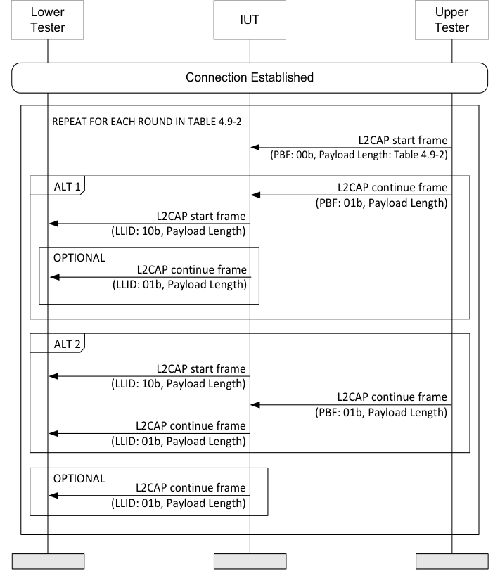

**Figure 4.9-1: Transmit Fragmented L2CAP Header MSC**

1. The Upper Tester sends a L2CAP frame of 28 octets to the IUT with the start fragment containing a Payload length according to Table 4.9-2 and the rest in one or more continue fragments.

|  | Round |  |  | Payload Length (octets) (Step b) |  |
| --- | --- | --- | --- | --- | --- |
|  | 1 |  | 0 |  |  |
|  | 2 |  | 1 |  |  |
|  | 3 |  | 2 |  |  |
|  | 4 |  | 3 |  |  |
|  | 5 |  | 4 |  |  |
|  | 6 |  | 5 |  |  |

Table 4.9-2: Payload length for each round
2. The Lower Tester receives the L2CAP frame unaltered, possibly unfragmented or fragmented differently.
• Expected Outcome
Pass verdict
The Lower Tester receives the L2CAP frame unaltered, irrespective of fragmentation.

##### 4.9.2.2 Receive Fragmented L2CAP Header

• Test Purpose
Test that the IUT correctly receives packets with fragmented L2CAP headers.
• Reference
[11] 5.4.2
[12] 7.2.1
• Initial Condition
- State: Connected in the relevant role (any scan interval, any scan window, public peer address, lower tester address, supported type of own address, connection interval, common Peripheral latency, common timeout) to the Lower Tester
• Test Case Configuration

|  | Test Case |  |
| --- | --- | --- |
| LL/DFL/PER/BV-02-C [Receive Fragmented L2CAP Header] |  |  |
| LL/DFL/CEN/BV-02-C [Receive Fragmented L2CAP Header] |  |  |

Table 4.9-3: Receive Fragmented L2CAP Header test cases
• Test Procedure

**Figure 4.9-2: Receive Fragmented L2CAP Header MSC**

1. The Lower Tester sends an L2CAP frame of 28 octets to the IUT with the start fragment containing a Payload length according to Table 4.9-4 and the rest in a single continue fragment.

|  | Round |  |  | Payload Length (octets) (Step b) |  |
| --- | --- | --- | --- | --- | --- |
|  | 1 |  | 1 |  |  |
|  | 2 |  | 2 |  |  |
|  | 3 |  | 3 |  |  |
|  | 4 |  | 4 |  |  |
|  | 5 |  | 5 |  |  |

Table 4.9-4: Payload length for each round
2. The Upper Tester receives the L2CAP frame unaltered, possibly unfragmented or fragmented differently.
• Expected Outcome
Pass verdict
The Upper Tester receives the L2CAP frame unaltered, irrespective of fragmentation.

### 4.10 CIS

Tests that the IUT behaves according to the CIS setup and CIS procedures.

#### 4.10.1 References

This document incorporates provisions from other publications by dated or undated reference. These references are cited at the appropriate places in the text, and the publications are listed hereinafter. Additional definitions and abbreviations can be found in [1], [2], and [3].
[1] Specification of the Bluetooth System, Versions 4.0 or later
[2] Test Strategy and Terminology Overview
[3] Specification of the Bluetooth System, Volume 6, Part B (Link Layer Protocol Specification), Version 4.0
[4] ICS Proforma for Bluetooth Low Energy Link Layer Protocol Specification
[5] ITU-T X.290 series, OSI CONFORMANCE TESTING METHODOLOGY AND FRAMEWORK PROTOCOL RECOMMENDATIONS FOR ITU-T APPLICATIONS, ITU Recommendation X.290 series (equivalent to ISO 9646)
[6] Federal Information Processing Standards Publication 197, ADVANCED ENCRYPTION STANDARD (AES), FIPS, 2001
[7] Bluetooth Test Suite for RFPHY
[8] Specification of the Bluetooth System, Volume 6, Part B (Link Layer Protocol Specification), Version 4.2 or later
[9] Bluetooth Core IXIT proforma
[10] Specification of the Bluetooth System, Volume 6, Part B (Link Layer Protocol Specification), Version 5.0 or later
[11] Specification of the Bluetooth System, Volume 2, Part E (Versions 1.2 to 5.1) or Volume 4, Part E (Version 5.2 and higher) Host Controller Interface (HCI)
[12] Specification of the Bluetooth System, Volume 3, Part A, Logical Link Control and Adaptation Protocol (L2CAP) Specification
[13] Specification of the Bluetooth System, Volume 6, Part B (Link Layer Protocol Specification), Version 5.1 or later
[14] Specification of the Bluetooth System, Volume 6, Part B (Link Layer Protocol Specification), Version 5.2 or later
[15] Specification of the Bluetooth System, Volume 2, Part E (Versions 1.2 to 5.1) or Volume 4, Part E (Version 5.2 and higher) (Host Controller Interface Functional Specification), Version 5.2 or later
[16] Specification of the Bluetooth System, Volume 6, Part D (Message Sequence Charts), Version 5.2 or later
[17] Specification of the Bluetooth System, Volume 6, Part G (Isochronous Adaptation Layer), Version 5.2 or later
[18] Core Specification Supplement (CSS), Part A, Current Version
[19] Specification of the Bluetooth System, Volume 6, Part B (Link Layer Protocol Specification), Version 5.3 or later
[20] Specification of the Bluetooth System, Volume 4, Part E (Host Controller Interface (HCI)), Version 5.3 or later
[21] Specification of the Bluetooth System, Volume 3, Part H (Host Specification), Version 5.2 or later
[22] Appropriate Language Mapping Tables document
[23] Specification of the Bluetooth System, Volume 6, Part B (Link Layer Protocol Specification), Version 5.4 or later
[24] Specification of the Bluetooth System, Volume 4, Part E (Host Controller Interface (HCI)), Version 5.4 or later
[25] Specification of the Bluetooth System, Volume 6, Part B (Link Layer Protocol Specification), Version 6.0 or later
[26] Specification of the Bluetooth System, Volume 4, Part E (Host Controller Interface Specification), Version 6.0 or later
[27] Specification of the Bluetooth System, Volume 2, Part E (Versions 1.2 to 5.1) or Volume 4, Part E (Version 6.0 and higher) Host Controller Interface (HCI)
[28] Specification of the Bluetooth System, Volume 6, Part C (Sample Data), Version 6.0 or later

#### 4.10.2 Common Variables, Timing, and Procedures

##### 4.10.2.1 Acknowledgement Sequence

Central and Peripheral roles in the CIS tests use variables indicating the state of acknowledgement:

|  | When sending |  |  | SN has value of |  |  | NESN has value of |  |  | NPI has value of |  |
| --- | --- | --- | --- | --- | --- | --- | --- | --- | --- | --- | --- |
| Data PDU |  |  | transmitSeqNum |  |  | nextExpectedSeqNum |  |  | 0b0 |  |  |
| Null PDU |  |  | 0 |  |  | nextExpectedSeqNum |  |  | 0b1 |  |  |

Whether the local variables transmitSeqNum and nextExpectedSeqNum are changed or not changed are determined by the comparison result of the SN/NESN in the Header of the PDU received and the values of current local variables transmitSeqNum and nextExpectedSeqNum.

| When |  | Local variable |  |  | Local variable |  |
| --- | --- | --- | --- | --- | --- | --- |
|  |  | transmitSeqNum |  |  | nextExpectedSeqNum |  |
| Initial value | 0 |  |  | 0 |  |  |
| Flush timeout occurs in the transmitter | transmitSeqNum + 1 |  |  | No change |  |  |
| Flush timeout occurs in the receiver | No change |  |  | nextExpectedSeqNum + 1 |  |  |
| Received SN = local nextExpectedSeqNum | No change |  |  | current nextExpectedSeqNum + 1 |  |  |
| Received SN != local nextExpectedSeqNum | transmitSeqNum + 1, when flush timeout occurs |  |  | nextExpectedSeqNum + 1, when flush timeout occurs |  |  |
| Received NESN = local transmitSeqNum | transmitSeqNum + 1, when flush timeout occurs. Need to re-transmit last sent PDU. |  |  | Need to retransmit last sent PDU except when the flush timeout is reached, then nextExpectedSeqNum = nextExpectedSeqNum + 1. |  |  |
| Received NESN != local transmitSeqNum | current transmitSeqNum + 1 |  |  | No change |  |  |

| When |  | Local variable |  |  | Local variable |  |
| --- | --- | --- | --- | --- | --- | --- |
|  |  | transmitSeqNum |  |  | nextExpectedSeqNum |  |
| Received SN = SN in last received PDU | No change. PDU is ignored. |  |  |  |  |  |
| Invalid CRC match | transmitSeqNum + 1, when flush timeout occurs |  |  | No change except when flush timeout is reached, then nextExpectSeqNum = nextExpectSeqNum + 1 |  |  |

##### 4.10.2.2 Timing Requirements

The connSupervisionTimeout for an ACL with associated CISes is greater than twice that of the ISO_Intervals of the associated CISes.
When verifying the timing requirements, the following requirements must be met:
1. When the Link Layer uses the active clock accuracy during a connected isochronous event to transmit a packet, even if they are in different CISes or in different subevents, or to time intervals between an advertising packet and a packet containing a SCAN_REQ, AUX_SCAN_REQ, CONNECT_IND or AUX_CONNECT_REQ PDU, the instantaneous timings do not deviate more than 2 μs from the average timing. That is, the start of a packet is transmitted 150±2 μs after the end of the previous packet. 2. When the Link layer uses the sleep clock accuracy to transmit, the instantaneous timing of the anchor point does not deviate more than 16 μs from the average timing. That is, the tolerance allowed on either side of the anchor point is sleep clock accuracy plus 16 μs. 3. The clock used to time packet reception may have any accuracy, but the receiving device will need to allow for this, and adjust the time when it starts and continues listening for packets accordingly.

##### 4.10.2.3 Default Values for Set CIG Parameters Commands

When using either the HCI_LE_Set_CIG_Parameters or HCI_LE_Set_CIG_Parameters_Test commands, the following table defines common default parameters for this section. The test case may specify different values.

|  | Set CIG Parameters |  | Set CIG |  | Default Value |
| --- | --- | --- | --- | --- | --- |
|  |  |  | Parameters |  |  |
|  |  |  | Test |  |  |
| SDU Interval C TO P _ _ _ _ | Yes | Yes |  |  | 20 ms |
| SDU Interval P TO C _ _ _ _ | Yes | Yes |  |  | 20 ms |
| ISO Interval _ |  | Yes |  |  | 20 ms |
| CIS Count _ | Yes | Yes |  |  | 1 |
| Worst Case SCA _ _ | Yes | Yes |  |  | 0 |
| Packing | Yes | Yes |  |  | Sequential (0x00) |
| Framing | Yes | Yes |  |  | Unframed (0x00) |
| NSE |  | Yes |  |  | Note 2 |
| Max SDU C TO P _ _ _ _ | Yes | Yes |  |  | Note 1 |
| Max SDU P TO C _ _ _ _ | Yes | Yes |  |  | Note 1 |
| Max PDU C TO P _ _ _ _ |  | Yes |  |  | 251 |
| Max PDU P TO C _ _ _ _ |  | Yes |  |  | 251 |
| PHY C TO P _ _ _ | Yes | Yes |  |  | LE 1M PHY |
| PHY P TO C _ _ _ | Yes | Yes |  |  | LE 1M PHY |

|  | Set CIG Parameters |  | Set CIG |  | Default Value |
| --- | --- | --- | --- | --- | --- |
|  |  |  | Parameters |  |  |
|  |  |  | Test |  |  |
| FT C TO P _ _ _ |  | Yes |  |  | 1 |
| FT P TO C _ _ _ |  | Yes |  |  | 1 |
| BN C TO P _ _ _ |  | Yes |  |  | 1 |
| BN P TO C _ _ _ |  | Yes |  |  | 1 |
| Max Transport Latency C TO P _ _ _ _ _ | Yes |  |  |  | 40 ms |
| Max Transport Latency P TO C _ _ _ _ _ | Yes |  |  |  | 40 ms |
| RTN C TO P _ _ _ | Yes |  |  |  | 3 |
| RTN P TO C _ _ _ | Yes |  |  |  | 3 |

Note 1: Set to the maximum SDU size as defined by the bandwidth requirements specified in [17] Section 2.1 for unframed PDUs and Section 2.2 for framed PDUs, or MAX SDU Length defined in IXIT, whichever is smaller. (Note that these requirements may result in the SDU size being the same as the PDU size when using unframed PDUs.)
Note 2: Set to 3 or the Max Supported CIS NSE defined in IXIT, whichever is less.

##### 4.10.2.4 Configuring the ISO Data Path for HCI

The HCI_LE_Setup_ISO_Data_Path is always configured to use the HCI for input and output. Input_Data_Path is set to 0x00 (HCI transport), and likewise, Output_Data_Path is set to 0x00 (HCI transport).

##### 4.10.2.5 Identification of CISes

When the notation CIS(n) is used to refer to a CIS within its CIG, n refers to the order of the CIS within its CIG.
When creating CISes, the Upper Tester assigns the CIS_ID of each CIS in the order it is created, starting with 1. When referring to a CIS by its creation order, it can be referred to using the notation “CIS with CIS_ID = i ”, where i refers to the creation order. For example, the CIS with CIS_ID = 1 is the first CIS created, while the CIS with CIS_ID = 3 is the third CIS created.

#### 4.10.3 CEN

Tests that the IUT behaves according to the Connected Isochronous Stream Central creation procedures.

##### 4.10.3.1 CIS Setup Procedure, Central Initiated

• Test Purpose
Verify that a Central IUT can set up a Connected Isochronous Stream and maintain a connection with a Peripheral device while sending data packets in the Connected Isochronous Stream.
• Reference
[14] 5.1.15
• Initial Condition
- The Isochronous Channels (Host Support) FeatureSet bit is set.
- An ACL connection has been established between the IUT and Lower Tester with a valid Connection Handle on the PHY specified in Table 4.10-1.
- The Lower Tester acts in the Peripheral role.
- TSPX_max_cis_nse is the maximum supported NSE on a CIS as specified in the IXIT [9] entry.
- TSPX_max_sdu_length is the maximum ISOAL SDU length as specified in the IXIT [9] entry.
• Test Case Configuration

| Test Case |  | C TO P _ _ |  |  |  | Payl Note T | oad 1 | P TO C _ _ |  |  |  |  |  | Payload Note 1 |
| --- | --- | --- | --- | --- | --- | --- | --- | --- | --- | --- | --- | --- | --- | --- |
|  |  | PHY |  | BN | F |  |  | PHY | BN |  | F | T |  |  |
| LL/CIS/CEN/BV-01-C | LE 1M PHY |  | 2 1 |  |  | 130 | LE 1M PHY |  | 2 |  | 1 |  |  | 130 |
| LL/CIS/CEN/BV-02-C | LE 2M PHY |  | 2 2 |  |  | 251 | LE 2M PHY |  | 2 |  | 1 |  |  | 251 |
| LL/CIS/CEN/BV-25-C | LE Coded PHY |  | 1 1 |  |  | 50 | LE Coded PHY |  | 1 |  | 1 |  |  | 50 |
| LL/CIS/CEN/BV-31-C | LE 2M PHY |  | 2 1 |  |  | 130 | LE 1M PHY |  | 2 |  | 1 |  |  | 130 |
| LL/CIS/CEN/BV-32-C | LE 1M PHY |  | 1 1 |  |  | 50 | LE Coded PHY, S=8 |  | 0 |  | 1 |  |  | 0 |
| LL/CIS/CEN/BV-39-C | LE 2M PHY |  | 1 1 |  |  | 130 | LE 2M PHY |  | 1 |  | 1 |  |  | 50 |

Table 4.10-1: Central test case direction specific configurations

| Test Case |  | Nominal NSE |  | SDU Interval C T _ _ _ | O P SDU Interval P TO C _ _ _ _ _ | ISO Interval _ |
| --- | --- | --- | --- | --- | --- | --- |
|  |  | or see Note 1 |  |  |  |  |
| LL/CIS/CEN/BV-01-C | 4 |  |  | 10 ms (0x2710) | 10 ms (0x2710) | 20 ms (0x10) |
| LL/CIS/CEN/BV-02-C | 4 |  |  | 20 ms (0x4E20) | 10 ms (0x2710) | 20 ms (0x10) |
| LL/CIS/CEN/BV-25-C | 2 |  |  | 40 ms (0x9C40) | 40 ms (0x9C40) | 40 ms (0x20) |
| LL/CIS/CEN/BV-31-C | 4 |  |  | 10 ms (0x2710) | 10 ms (0x2710) | 20 ms (0x10) |
| LL/CIS/CEN/BV-32-C | 2 |  |  | 40 ms (0x9C40) | 40 ms (0x9C40) | 40 ms (0x20) |
| LL/CIS/CEN/BV-39-C | 1 |  |  | 20 ms (0x4E20) | 20 ms (0x4E20) | 20 ms (0x10) |

Table 4.10-2: Central test case additional configurations
• Test Procedure

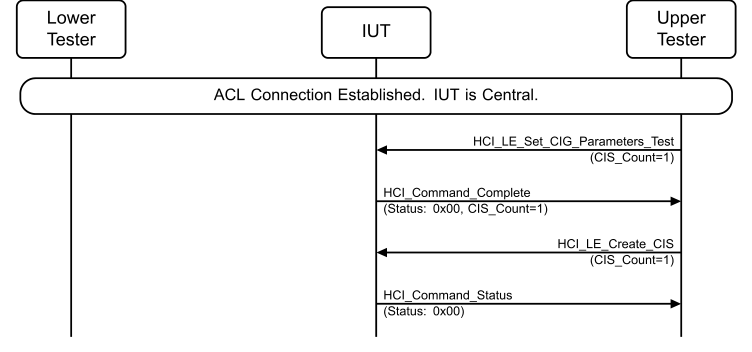

**Figure 4.10-1: CIS Setup Procedure, Central Initiated MSC – Page 1 of 2**

**Figure 4.10-2: CIS Setup Procedure, Central Initiated MSC – Page 2 of 2**

1. The Upper Tester sends an HCI_LE_Set_CIG_Parameters_Test command to the IUT with CIS_Count set to 1, BN, FT, NSE, PHY_C_TO_P[ ], PHY_P_TO_C[ ] and ISO_Interval to be set to the values specified in Table 4.10-1 and Table 4.10-2. Any remaining values are assigned the default values as specified in Section 4.10.2.3 Default Values for Set CIG Parameters Commands. The Upper Tester receives a successful HCI_Command_Complete event with a valid Connection_Handle from the IUT and CIS_Count = 1. 2. The Upper Tester sends an HCI_LE_Create_CIS command to the IUT with the ACL_Connection_Handle of the established ACL connection and CIS_Count set to 1. The Upper Tester receives a Status of Success from the IUT. 3. The Lower Tester receives an LL_CIS_REQ PDU from the IUT with all fields set to valid values. CIS_Offset_Min is a value between 500µs and TSPX_conn_interval, CIS_Offset_Max is a value between CIS_Offset_Min and the CIS_Offset_Max value as calculated in [14] Section 2.4.2.29 using TSPX_conn_interval as the value of connInterval, and connEventCount is the reference event anchor point for which the offsets applied.
4. The Lower Tester sends an LL_CIS_RSP PDU to the IUT. 5. The Lower Tester receives an LL_CIS_IND from the IUT where the CIS_Offset is the time (ms) from the start of the ACL connection event in connEvent Count to the first CIS anchor point, the CIS_Sync_Delay is CIG_Sync_Delay minus the offset from the CIG reference point to the CIS anchor point in µs, and the connEventCount is the CIS_Offset reference point. 6. Perform either 6A, 6B, or 6C depending on the IUT’s response. Repeat step 6 until the IUT executes either step 6A or 6C. These exchanges will continue until data is exchanged between the IUT and the Lower Tester in later steps. Alternative 6A (IUT sends a CIS NULL PDU):
6A.1 The IUT sends a CIS NULL PDU to the Lower Tester. 6A.2 The Lower Tester sends a CIS NULL PDU to the IUT. Alternative 6B (IUT doesn’t send in the subevent):
6B.1 The IUT does not respond in the current subevent. 6B.2 The Lower Tester does not respond in the current subevent. Alternative 6C (IUT sends an empty Data PDU):
6C.1 The IUT sends an empty Data PDU to the Lower Tester. 6C.2 The Lower Tester ACKs the empty Data PDU. 7. The Upper Tester receives a successful HCI_LE_CIS_Established event with the NSE, BN, FT, and Max_PDU parameters as set in step 1 from the IUT, after the first CIS packet sent by the LT. The Connection_Handle parameter is set to the value provided in the HCI_LE_Create_CIS command. 8. The Upper Tester sends payloads to the IUT at regular intervals. 9. The Lower Tester receives CIS data PDUs from the IUT in each sub-event of the CIS and acknowledges those PDUs. 10. Repeat step 9 for 50 ÷ BN isochronous events starting with the first event where a CIS data PDU with nonzero payload is received.
• Expected Outcome
Pass verdict
In step 1, the Upper Tester receives a successful HCI_Command_Complete event with a valid Connection_Handle from the IUT and CIS_Count = 1.
In step 3, the Lower Tester receives an LL_CIS_REQ PDU from the IUT with all the fields set to valid values, including valid values for CIS_Offset_Min and CIS_Offset_Max as specified.
In step 7, the Upper Tester receives a successful HCI_LE_CIS_Established. The Connection_Handle parameter is set to the value provided in the HCI_LE_Create_CIS command.
In step 10, the Lower Tester receives at least 48 of the CIS data PDUs sent by the IUT in the CIS. The length of the data sent by the IUT matches that specified in Table 4.10-2.
LL/CIS/CEN/BV-03-C [CIS Setup Procedure, Central Initiated, Rejected]
• Test Purpose
Tests that a Central IUT can initiate the Connected Isochronous Stream setup procedure and correctly handles the case where the Peripheral rejects the LL_CIS_REQ PDU.
• Reference
[14] 5.1.15
• Initial Condition
- The Isochronous Channels (Host Support) FeatureSet bit is set.
- An ACL connection has been established between the IUT and Lower Tester with a valid Connection Handle.
- The Lower Tester acts in the Peripheral role.
- If the IUT does a feature exchange with the Lower Tester, the Lower Tester indicates support for Connected Isochronous Streams.
• Test Procedure

**Figure 4.10-3: LL/CIS/CEN/BV-03-C [CIS Setup Procedure, Central Initiated, Rejected] MSC**

1. The Upper Tester sends an HCI_LE_Set_CIG_Parameters command to the IUT with valid parameters and receives a successful HCI_Command_Complete event. 2. The Upper Tester sends an HCI_LE_Create_CIS command with the ACL_Connection_Handle of the established ACL and valid Connection_Handle from the IUT received in step 1. 3. The Lower Tester receives an LL_CIS_REQ PDU from the IUT with all fields set to valid values. 4. The Lower Tester sends an LL_REJECT_EXT_IND to the IUT with an error code not equal to 0x00. 5. The Upper Tester receives an HCI_LE_CIS_Established event from the IUT with a status failure. The Status field has the same value as the LL_REJECT_EXT_IND PDU in step 4.
• Expected Outcome
Pass verdict
- In step 1, the IUT sends a successful HCI_Command_Complete event.
- In step 3, the IUT sends an LL_CIS_REQ to the Lower Tester with valid values.
- In step 5, the IUT send an HCI_LE_CIS_Established event with a status failure that is the same value from the LL_REJECT_EXT_IND PDU that the IUT received from the Lower Tester.
• Test Purpose
Tests that the IUT updates the channel map for a CIS when the channel map for the connection is updated.
• Reference
[14] 5.1.2, 2.4.2.2
• Initial Condition
- A CIS has been established using BN_C_TO_P, NSE and SDU_Interval_C_TO_P as specified in Table 4.10-3, and BN_P_TO_C = 0. All other values as specified in Section 4.10.2.3 Default Values for Set CIG Parameters Commands.
- The initial channel map is 0x1FFFFFFFFF (i.e., all channels enabled).
- The Lower Tester acts in the Peripheral role.
- TSPX_max_cis_nse is the maximum supported NSE on a CIS as specified in the IXIT [9] entry.
• Test Case Configuration

|  | Test Case | BN C TO P _ _ _ | SDU Interval C TO P _ _ _ _ |  |  | NSE |  |
| --- | --- | --- | --- | --- | --- | --- | --- |
| LL/CIS/CEN/BV-04-C |  | 2 | 10 ms |  | 3, Note 1 |  |  |
| LL/CIS/CEN/BV-40-C |  | 1 | 20 ms |  | 1 |  |  |

Table 4.10-3: Central test cases
• Test Procedure

**Figure 4.10-4: New Channel Map MSC**

1. The Upper Tester sends an HCI_LE_Set_Host_Channel_Classification command with the Channel_Map parameter set to 0x1249249249 to the IUT. 2. If the command succeeds, then the IUT sends an HCI_Command_Complete event to the Upper Tester with Status 0x00. Otherwise, repeat step 1 with a different value of the Channel_Map parameter up to 20 times, with at least 5 seconds between repeats, or until the command succeeds. 3. The Lower Tester receives an LL_CHANNEL_MAP_IND command with the instant field equal to connEventCount. 4. The Upper Tester orders the IUT to send data packets to the Lower Tester. 5. The Lower Tester acknowledges the data packets sent by the IUT in the CIS. 6. Repeat steps 4 and 5 for 25 ISO Intervals after the channel map update instant.
• Expected Outcome
Pass verdict
In step 1, the IUT sends an HCI_Command_Complete event with success status.
In step 3, the IUT sends an LL_CHANNEL_MAP_IND command with a 2-octet value in the instant field.
The IUT correctly updates its channel Map and sends packets on correct channels after the instant is reached.
In step 5, the Lower Tester receives at least 95% of the data packets from the IUT.
Inconclusive verdict
In step 2, the HCI_LE_Set_Host_Channel_Classification command fails 20 times.
In step 3, the IUT does not send the LL_CHANNEL_MAP_IND PDU to the Lower Tester.

##### 4.10.3.3 Sending and Receiving Data in Multiple CISes, Single CIG, Multiple Connections, Interleaved CIG

• Test Purpose
Test that a Central IUT can send and receive data on multiple CISes in an interleaved arrangement on a single CIG across multiple connections. The Sub_Interval and Anchor point for each CIS on each connection are verified to refer to the same instant in time.
• Reference
[14] 4.5.14.2
• Initial Condition
- Connected Isochronous Streams have been established between the IUT and Lower Tester 1 and Lower Tester 2 according to the following initial state and in the same CIG:
- Note: “default” refers to values specified in Section 4.10.2.3 Default Values for Set CIG Parameters Commands.
- TSPX_max_cis_nse is the maximum supported NSE on a CIS as specified in the IXIT [9] entry.
- TSPX_max_cis_bn is the maximum supported BN on a CIS as specified in the IXIT [9] entry.
- State: Connected Isochronous Stream, Central, Test (values as specified in Table 4.10-4)

|  | State Variable |  |  | Value(s) |  |
| --- | --- | --- | --- | --- | --- |
| sdu int c to p _ _ _ _ |  |  | See Table 4.10-5 |  |  |
| sdu int p to c _ _ _ _ |  |  | See Table 4.10-5 |  |  |
| ft c to p _ _ _ |  |  | 1 |  |  |
| ft p to c _ _ _ |  |  | 1 |  |  |
| iso int _ |  |  | 0xF0 (300 ms) |  |  |
| packing |  |  | 0x01 (Interleaved) |  |  |
| framing |  |  | default |  |  |
| cis cnt _ |  |  | 2 |  |  |
| nse[ ] |  |  | See Table 4.10-5 |  |  |
| mx sdu c to p[ ] _ _ _ _ |  |  | default, default |  |  |
| mx sdu p to c[ ] _ _ _ _ |  |  | default, default |  |  |
| mx pdu c to p[ ] _ _ _ _ |  |  | default, default |  |  |
| mx pdu p to c[ ] _ _ _ _ |  |  | default, default |  |  |
| phy c to p[ ] _ _ _ |  |  | 0x01, 0x01 |  |  |
| phy p to c[ ] _ _ _ |  |  | 0x01, 0x01 |  |  |
| bn c to p[ ] _ _ _ |  |  | See Table 4.10-5 |  |  |
| bn p to c[ ] _ _ _ |  |  | See Table 4.10-5 |  |  |

Table 4.10-4: State variable values
Two Lower Testers (or instances) are set up acting as the two Peripheral devices.
The Lower Testers act in the Peripheral role.
• Test Case Configuration

|  | Test Case |  |  | BN |  |  | SDU Interval _ |  |  | NSE |  |
| --- | --- | --- | --- | --- | --- | --- | --- | --- | --- | --- | --- |
| LL/CIS/CEN/BV-10-C |  |  | 3 |  |  | 100 ms |  |  | 4, Note 1 |  |  |
| LL/CIS/CEN/BV-41-C |  |  | 2 |  |  | 150 ms |  |  | 2 |  |  |
| LL/CIS/CEN/BV-42-C |  |  | 1 |  |  | 300 ms |  |  | 1 |  |  |

Table 4.10-5: Central test cases
• Test Procedure

**Figure 4.10-5: Sending and Receiving Data in Multiple CISes, Single CIG, Multiple Connections, Interleaved CIG MSC**

1. The Upper Tester orders the IUT to send a payload of the specified length to the Lower Testers. 2. Lower Tester 1 receives the payload PDU in the first subevent on CIS(1). 3. Lower Tester 1 sends an ACK T_IFS after receiving the payload PDU. 4. Lower Tester 2 receives the payload PDU in the first subevent on CIS(2). 5. Lower Tester 2 sends an ACK T_IFS after receiving the payload PDU. 6. If Table 4.10-5 specifies a BN of 2 or 3, when CIS(1) subevent interval ends, repeat steps 1–3 in the next subevent. 7. If Table 4.10-5 specifies a BN of 2 or 3, when CIS(2) subevent interval ends, repeat steps 4 and 5 in the next subevent. 8. If Table 4.10-5 specifies a BN of 3, when CIS(1) subevent interval ends, repeat steps 1–3 in the next subevent. 9. If Table 4.10-5 specifies a BN of 3, when CIS(2) subevent interval ends, repeat steps 4 and 5 in the next subevent. 10. The time between the ACL connection event for the first received CIS and the start of the first subevent on the same CIS is the observed CIS_Offset(a). The Lower Tester validates that CIS_Offset(a) = CIS_Offset in the LL_CIS_IND associated with CIS sent during setup of the CISes. 11. The time between the ACL connection event for the second received CIS and the start of the first subevent on the same CIS is the observed CIS_Offset(b). The Lower Tester validates that the CIS_Offset(b) = CIS_Offset in the LL_CIS_IND associated with CIS sent during setup of the CISes. 12. When CIS(1) interval ends, repeat steps 1–3 for CIS(1) in the next isochronous event. 13. When CIS(2) interval ends, repeat steps 4 and 5 for CIS(2) in the next isochronous event. 14. If Table 4.10-5 specifies a BN of 2 or 3, when CIS(1) subevent interval ends, repeat steps 1–3 in the next subevent.
15. If Table 4.10-5 specifies a BN of 2 or 3, when CIS(2) subevent interval ends, repeat steps 4 and 5 in the next subevent. 16. If Table 4.10-5 specifies a BN of 3, when CIS(1) subevent interval ends, repeat steps 1–3 in the next subevent. 17. If Table 4.10-5 specifies a BN of 3, when CIS(2) subevent interval ends, repeat steps 4 and 5 in the next subevent.
• Expected Outcome
Pass verdict
In step 2, the IUT sends the payload PDU at CIS(1) Offset from ACL1.
In step 4, the IUT sends the payload PDU at CIS(2) Offset from ACL2.
In steps 6, 7, 8, and 9, the results repeat, when specified.
CIS_Offset(a) and CIS_Offset(b) are correct as validated in steps 8 and 9.
In steps 12 and 13, the results repeat.
In steps 14, 15, 16, and 17, the results repeat, when specified.
Inconclusive verdict
The nominal BN value is 3, and TSPX_max_cis_bn or TSPX_max_cis_nse are less than 3.
When setting up the initial condition, the IUT uses the sequential arrangement.
LL/CIS/CEN/BV-11-C [Sending Data in Multiple CISes, Single CIG, Multiple Connections, Sequential]
• Test Purpose
Test that a Central IUT can send data in multiple CISes in a sequential arrangement on a single CIG across multiple connections. The Sub_Interval and Anchor point for each CIS on each connection are verified to refer to the same instant in time.
• Reference
[14] 4.5.14.2
• Initial Condition
- An ACL connection has been established between the IUT and Lower Tester with a valid Connection Handle.
- The Lower Testers 1 and 2 both act in the Peripheral role representing Peripheral 1 and 2, respectively, observes the data in the packets from the Central IUT, and sends response back. The Upper Tester submits data for the Central IUT to transmit and observes the timing of the CIS subevents.
- Each CIS is set according to the following Initial State:
- Note: “default” refers to values specified in Section 4.10.2.3 Default Values for Set CIG Parameters Commands.
- TSPX_max_sdu_length is the maximum ISOAL SDU length as specified in the IXIT [9] entry.
- State: Connected Isochronous Stream, Central, Test (values as specified in Table 4.10-6)

|  | State Variable |  |  | Value(s) |  |
| --- | --- | --- | --- | --- | --- |
| sdu int c to p _ _ _ _ |  |  | 0xC350 (50 ms) |  |  |
| sdu int p to c _ _ _ _ |  |  | 0x186A0 (100 ms) |  |  |
| ft c to p _ _ _ |  |  | 1 |  |  |
| ft p to c _ _ _ |  |  | 1 |  |  |
| iso int _ |  |  | 0x50 (100 ms) |  |  |
| packing |  |  | 0x00 (Sequential) |  |  |
| framing |  |  | default |  |  |
| cis cnt _ |  |  | 2 |  |  |
| nse[ ] |  |  | 0x02 |  |  |
| mx sdu c to p[ ] _ _ _ _ |  |  | default |  |  |
| mx sdu p to c[ ] _ _ _ _ |  |  | 0 |  |  |
| mx pdu c to p[ ] _ _ _ _ |  |  | default |  |  |
| mx pdu p to c[ ] _ _ _ _ |  |  | 0 |  |  |
| phy c to p[ ] _ _ _ |  |  | 0x01 |  |  |
| phy p to c[ ] _ _ _ |  |  | 0x01 |  |  |
| bn c to p[ ] _ _ _ |  |  | 0x02 |  |  |
| bn p to c[ ] _ _ _ |  |  | 0x00 |  |  |

Table 4.10-6: State variable values
• Test Procedure

**Figure 4.10-6: LL/CIS/CEN/BV-11-C [Sending Data in Multiple CISes, Single CIG, Multiple Connections, Sequential] MSC**

1. The Upper Tester orders the IUT to send payloads of the specified length to the Lower Tester. 2. Lower Tester 1 receives the payload PDU in the first subevent on CIS(1).
3. Lower Tester 1 sends an ACK, T_IFS after receiving the payload PDU. 4. Lower Tester 1 receives the second payload PDU in the second subevent on CIS(1) and sends an ACK. 5. Repeat steps 1–4 for Lower Tester 2 using CIS(2). 6. The time between the ACL connection event for the first received CIS and the start of the first subevent on the same CIS is the observed CIS_Offset(a). The Lower Tester validates that the CIS_Offset(a) = CIS_Offset in the LL_CIS_IND in the associated CIS. 7. The time between the ACL connection event for the second received CIS and the start of the first subevent on the same CIS is the observed CIS_Offset(b). The Lower Tester validates that the CIS_Offset(b) = CIS_Offset in the LL_CIS_IND in the associated CIS. 8. Check that the CIS(2) anchor point is later than the CIS(1) anchor point + (CIS(1) NSE * CIS(1) Sub_Interval).
• Expected Outcome
Pass verdict
In step 2, the IUT sends the payload PDU at CIS(1) Offset from ACL1.
In step 4, the IUT sends the second payload PDU when CIS(1) subevent 1 CIS interval 1 ends or when CIS(1)’s second subevent interval starts.
In step 6, Lower Tester verifies that CIS_Offset(a) = CIS_Offset in the LL_CIS_IND associated with CIS sent in step 1 or step 2.
In step 7, Lower Tester verifies that CIS_Offset(b) = CIS_Offset in the LL_CIS_IND associated with CIS sent in step 1 or step 2.
In step 8, Lower Tester verifies that CIS(2) anchor point is later than the CIS(1) anchor point + (CIS(1) NSE * CIS(1) Sub_Interval).
Inconclusive verdict
When setting up the initial condition, the IUT uses the interleaved arrangement.
LL/CIS/CEN/BV-20-C [Set Encryption After CIS Established]
• Test Purpose
Tests that the IUT returns an error if the HCI_LE_Start_Encryption command is sent after a CIS has been established.
• Reference
[15] Vol. 2, Part E, Section 7.8.24
[14] Vol. 6, Part B, Section 5.1.3.1
[16] Vol. 6, Part D, Section 6.6
• Initial Condition
- Note: “default” refers to values specified in Section 4.10.2.3 Default Values for Set CIG Parameters Commands, except for default values for cis_offset_mn and cis_offset_mx. The latter values are specified in Section 4.10.2.2 Timing Requirements.
- State: Connected Isochronous Stream, Central, Test (values as specified in Table 4.10-7)

|  | State Variable |  |  | Value(s) |  |
| --- | --- | --- | --- | --- | --- |
| sdu int c to p _ _ _ _ |  |  | 0x4E20 (20 ms) |  |  |
| sdu int p to c _ _ _ _ |  |  | 0x4E20 (20 ms) |  |  |
| ft c to p _ _ _ |  |  | 1 |  |  |
| ft p to c _ _ _ |  |  | 1 |  |  |
| iso int _ |  |  | 0x10 (20 ms) |  |  |
| packing |  |  | default |  |  |
| framing |  |  | default |  |  |
| cis cnt _ |  |  | 1 |  |  |
| nse[ ] |  |  | 0x01 |  |  |
| mx sdu c to p[ ] _ _ _ _ |  |  | Note 1 |  |  |
| mx sdu p to c[ ] _ _ _ _ |  |  | Note 1 |  |  |
| mx pdu c to p[ ] _ _ _ _ |  |  | 130 |  |  |
| mx pdu p to c[ ] _ _ _ _ |  |  | 130 |  |  |
| phy c to p[ ] _ _ _ |  |  | 0x01 |  |  |
| phy p to c[ ] _ _ _ |  |  | 0x01 |  |  |
| bn c to p[ ] _ _ _ |  |  | 0x01 |  |  |
| bn p to c[ ] _ _ _ |  |  | 0x01 |  |  |

Table 4.10-7: State variable values
• Test Procedure

**Figure 4.10-7: LL/CIS/CEN/BV-20-C [Set Encryption After CIS Established] MSC**

1. The Upper Tester sends an HCI_LE_Start_Encryption command with valid parameters to the IUT. 2. The Upper Tester receives the error code Command Disallowed (0x0C).
• Expected Outcome
Pass verdict
In step 2, the IUT sends an error code Command Disallowed (0x0C).
• Test Purpose
Verify that a Central IUT can set up a Connected Isochronous Stream using the LE Set CIG Parameters Command and maintain a connection with a Peripheral device while sending data packets in the Connected Isochronous Stream. Verify that a Central IUT can set up and maintain a unidirectional Connected Isochronous Stream with a Peripheral device.
• Reference
[15] 7.8.97
[20] 7.7.65.25
• Initial Condition
- An ACL connection has been established between the IUT and Lower Tester with a valid Connection Handle.
- The IUT uses the PHY as specified in Table 4.10-8.
- The Lower Tester acts in the Peripheral role.
• Test Case Configuration

| Test Case | PHY |  | CIS Framing |  |  | Max Transport Latency C To P _ _ _ _ _ |  |
| --- | --- | --- | --- | --- | --- | --- | --- |
|  |  |  | Mode |  |  | Max Transport Latency P To C _ _ _ _ _ |  |
| LL/CIS/CEN/BV-26-C | LE 1M PHY | Segmentable or Unsegmented mode |  |  | 60 ms |  |  |
| LL/CIS/CEN/BV-27-C | LE 2M PHY | Segmentable or Unsegmented mode |  |  | 60 ms |  |  |
| LL/CIS/CEN/BV-28-C | LE Coded PHY | Segmentable or Unsegmented mode |  |  | 80 ms |  |  |
| LL/CIS/CEN/BV-59-C | LE 2M PHY | Unsegmented mode |  |  | 17 ms |  |  |

Table 4.10-8: Central test cases
• Test Procedure

**Figure 4.10-8: Connected Isochronous Stream Using Non-Test Command, Central Initiated – MSC Page 1 of 2**

| Lower | Tester IU LL CIS REQ _ _ LL CIS RSP _ _ (CIS Of f set Min, CIS Of f set Max) _ _ _ _ LL CIS IND _ _ ISO Data Packet (empty ) LL ACK | T Upper HCI LE Set CIG Parameters _ _ _ _ (Valid Def ault Parameters, Max PDU P To C _ _ _ _ HCI Command Status _ _ (Status: 0x00, CIS Count = 1) _ HCI LE Create CIS _ _ _ (CIS Count = 1) _ HCI Command Status _ _ (Status: 0x00) HCI LE CIS Established _ _ _ (Connection Handle) _ HCI LE Setup ISO Data Path _ _ _ _ _ (Connection Handle, _ Data Path Direction = Output) _ _ HCI Command Complete _ _ (Status: 0x00, Connection Handle) _ 50 times | Tester |
| --- | --- | --- | --- |
|  | Repeat CIS Null PDU ISO Data Packet | 50 times |  |
|  |  |  |  |

**Figure 4.10-9: Connected Isochronous Stream Using Non-Test Command, Central Initiated – MSC Page 2 of 2**

1. The Upper Tester sends an HCI_LE_Set_CIG_Parameters command to the IUT with Max_SDU_C_To_P and Max_SDU_P_To_C both set to 16, other parameters set to default, but with PHY and latency specified in Table 4.10-8 and HCI Framing set to 0x01. The Upper Tester receives a success response from the IUT with CIS_Count = 1. 2. The Upper Tester sends an HCI_LE_Create_CIS command to create a single CIS and receives a success response from the IUT. 3. The Lower Tester receives an LL_CIS_REQ PDU from the IUT with all fields set to valid values. CIS_Offset_Min is a value between 500µs and TSPX_conn_interval, CIS_Offset_Max is a value between CIS_Offset_Min and the CIS_Offset_Max value as calculated in [14] Section 2.4.2.29 using TSPX_conn_interval as the value of connInterval, and connEventCount is the reference event anchor point for which the offsets applied. 4. The Lower Tester sends an LL_CIS_RSP PDU to the IUT. 5. The Lower Tester receives an LL_CIS_IND from the IUT where the CIS_Offset is the time (ms) from the start of the ACL connection event in connEvent Count to the first CIS anchor point, the CIS_Sync_Delay is CIG_Sync_Delay minus the offset from the CIG reference point to the CIS anchor point in µs, and the connEventCount is the CIS_Offset reference point. 6. The Upper Tester receives an HCI_LE_CIS_Established event indicating success, after the first CIS packet sent by the Lower Tester. The Connection_Handle parameter is set to the value provided in the HCI_LE_Create_CIS command. 7. The Upper Tester sends an HCI_LE_Setup_ISO_Data_Path command and receives a success response from the IUT.
8. The Upper Tester sends HCI ISO data packets over the CIS and the Lower Tester receives ISO data with CIS Framing Mode as specified in Table 4.10-8. 9. The Upper Tester sends an HCI_Disconnect command to the IUT with Reason set to any valid value and Connection_Handle set to the connection handle of the active CIS and receives a successful HCI_Command_Status event in response. 10. The IUT sends an LL_CIS_TERMINATE_IND PDU to the Lower Tester, and the ErrorCode field in the CrtData matches the Reason code value that the Upper Tester sent in step 9. 11. The Lower Tester sends an LL ACK to the IUT. 12. The IUT sends an HCI_Disconnection_Complete event to the Upper Tester. 13. The Upper Tester sends an HCI_LE_Remove_CIG command to the IUT with CIG_ID set to the value of the current inactive CIG. 14. The IUT sends an HCI_Command_Complete event to the Upper Tester with Status set to 0x00 and CIG_ID set to the CIG_ID value in step 13. 15. The Upper Tester sends an HCI_LE_Set_CIG_Parameters command to the IUT with default parameters but with Max_SDU_C_To_P set to 0 and receives a success response from the IUT with CIS_Count = 1. 16. The Upper Tester sends an HCI_LE_Create_CIS command to create a single CIS and receives a success response from the IUT. 17. The IUT sends an LL_CIS_REQ PDU to the Lower Tester with all fields set to valid values. 18. The value of Max_SDU_C_To_P and BN_C_To_P in the CrtData of the LL_CIS_REQ PDU are verified to be equal to 0. The test fails if the values are not equal to 0. 19. The Lower Tester sends an LL_CIS_RSP PDU to the IUT. 20. The IUT sends an LL_CIS_IND to the Lower Tester. 21. The IUT sends an empty ISO Data Packet to the Lower Tester. 22. The Lower Tester sends an LL ACK to the IUT. 23. The IUT sends an HCI_LE_CIS_Established event to the Upper Tester. The Connection_Handle parameter is set to the value provided in step 16. 24. The Upper Tester sends an HCI_LE_Setup_ISO_Data_Path command to the IUT with Connection_Handle set to the value provided in step 16 and Data_Path_Direction set to Output. 25. The IUT sends a successful HCI_Command_Complete event to the Upper Tester. 26. Perform either alternative 26A or 26B depending on the IUT’s response.
Alternative 26A (IUT sends a CIS NULL PDU):
26A.1 The IUT sends a CIS Null PDU to the Lower Tester. 26A.2 The Lower Tester sends an ISO Data Packet to the IUT. Alternative 26B (IUT does not send a CIS NULL PDU):
26B.1 The IUT does not respond in the current subevent. 26B.2 The Lower Tester does not respond in the current subevent. 27. Repeat step 26 until step 26A is executed at least 50 times.
• Expected Outcome
Pass verdict
In step 1, the Upper Tester receives a success response from the IUT and CIS_Count = 1.
In step 2, the Upper Tester receives a success response from the IUT.
In step 3, the Lower Tester receives an LL_CIS_REQ PDU from the IUT with all fields set to valid values, including valid values for CIS_Offset_Min and CIS_Offset_Max as specified. All RFU field bits are clear. BN_C_To_P and BN_P_To_C are less than or equal to NSE.
In step 5, the Lower Tester receives an LL_CIS_IND from the IUT as described.
In step 6, the Upper Tester receives an HCI_LE_CIS_Established event indicating success. The Connection_Handle parameter is set to the value provided in the HCI_LE_Create_CIS command.
Transport_Latency_C_To_P does not exceed Max_Transport_Latency_C_To_P and Transport_Latency_P_To_C does not exceed Max_Transport_Latency_P_To_C.
In step 7, the Upper Tester receives a success response from the IUT.
In step 8, the Lower Tester receives ISO data with CIS Framing Mode as specified in Table 4.10-8. The RFU bit in the CIS PDUs is clear.
In step 9, the IUT sends a successful HCI_Command_Status event to the Upper Tester.
In step 12, the IUT sends an HCI_Disconnection_Complete event to the Upper Tester.
In step 14, the IUT sends an HCI_Command_Complete event to the Upper Tester with Status set to 0x00 and CIG_ID set to the CIG_ID value in step 13.
In step 15, the IUT sends a successful HCI_Command_Complete to the Upper Tester with CIS_Count = 1.
In step 16, the IUT sends a successful HCI_Command_Status to the Upper Tester.
In step 18, the value of the fields Max_PDU_C_To_P and BN_C_To_P in the CtrData of the LL_CIS_REQ PDU sent in step 17 are equal to 0. BN_P_To_C is less than or equal to NSE.
In step 23, the IUT sends a successful HCI_LE_CIS_Established event to the Upper Tester.
In step 25, the IUT sends a successful HCI_Command_Complete event to the Upper Tester.
In step 26, the IUT either sends a CIS Null PDU or does not transmit in the subevent to the Lower Tester.
The calculated transport latencies of all the CISes as defined in [17] Section 3.2.1 is less than or equal to the maximum transport latencies specified in the HCI_LE_Set_CIG_Parameters command.
The bandwidth of the data transmitted by the IUT is greater than or equal to the bandwidth of data sent by the Upper Tester. This requirement is met if the following inequality is true:
BN × (Max_PDU - 2) ≥ ceil(F) × 5 + ceil(F × Max_SDU)
where F = (1 + MaxDrift) × ISO_Interval ÷ SDU_Interval
Otherwise, the settings chosen by the IUT will need to be validated separately, including allowing for maximum clock drift in either direction.
LL/CIS/CEN/BV-30-C [Isochronous Channels Host Support Feature Bit]
• Test Purpose
Tests that a Central IUT only creates a CIS when the Isochronous Channels (Host Support) feature bit is set.
• Reference
[14] 5.1.15
• Initial Condition
- The Isochronous Channels (Host Support) feature bit is in its power on reset value and has not been set or cleared.
- The Lower Tester acts in the Peripheral role.
• Test Procedure

**Figure 4.10-10: LL/CIS/CEN/BV-30-C [Isochronous Channels Host Support Feature Bit] MSC**

1. The Upper Tester sends an HCI_LE_Set_Host_Feature with Bit_Number set to 30 (not a host controlled feature bit) and Bit_Value set to 0b1. The Upper Tester receives an HCI_Command_Complete response with an error code Unsupported Feature or Parameter Value (0x11). 2. The IUT establishes an ACL connection with the Lower Tester as Peripheral (see “State: Connected Central” in Section 4.1.6.5, CEN). 3. The Upper Tester sends an HCI_LE_Set_Host_Feature with Bit_Number set to 32 (Isochronous Channels feature bit) and Bit_Value set to 0b1. The Upper Tester receives an HCI_Command_Complete response with an error code Command Disallowed (0x0C).
4. The IUT disconnects the ACL connection from the Lower Tester (see “State: Central Connection Terminated” in Section 4.1.6.5, CEN). 5. Repeat steps 6–13 for each round specified in Table 4.10-9. 6. If the table indicates “Set Feature Enable” is true for this round, then the Upper Tester sends an HCI_LE_Set_Host_Feature command to the IUT with the Bit_Number set to 32 (Isochronous Channels) and the Bit_Value set to the value specified in the table. The Upper Tester receives an HCI_Command_Complete event from the IUT. 7. The IUT establishes an ACL connection with the Lower Tester as Peripheral (see “State: Connected Central” in Section 4.1.6.5, CEN). 8. The Upper Tester sends an HCI_LE_Set_CIG_Parameters command to the IUT using the default parameters specified in Section 4.10.2.3 Default Values for Set CIG Parameters Commands and receives a successful HCI_Command_Complete event. 9. The Upper Tester sends an HCI_LE_Create_CIS command with the ACL_Connection_Handle of the established ACL and valid Connection_Handle.
Table indicates a CIS is created this round
10. The Upper Tester receives a successful HCI_Command_Status event. 11. The IUT establishes a CIS with the Lower Tester.
Table indicates a CIS is not created this round
10. The Upper Tester receives an HCI_Command_Status event with the Status set to error code Command Disallowed (0x0C). 12. The IUT disconnects the ACL connection from the Lower Tester (see “State: Central Connection Terminated” in Section 4.1.6.5, CEN). 13. If the table indicates that a CIS is created this round, then the Upper Tester sends an HCI_LE_Remove_CIG command to the IUT with the CIG_ID set to the CIG_ID in step 8 and receives a successful HCI_Command_Complete event.

|  | Round |  |  | Set Feature Enable |  |  | Bit Value _ |  |  | CIS Created |  |
| --- | --- | --- | --- | --- | --- | --- | --- | --- | --- | --- | --- |
| 1 |  |  | False |  |  | n/a |  |  | No |  |  |
| 2 |  |  | True |  |  | 0b1 |  |  | Yes |  |  |
| 3 |  |  | True |  |  | 0b0 |  |  | No |  |  |

Table 4.10-9: Num_BIS values
• Expected Outcome
Pass verdict
In step 1, the Upper Tester receives an HCI_Command_Complete response with an error code Unsupported Feature or Parameter Value (0x11).
In step 3, the Upper Tester receives an HCI_Command_Complete response with an error code Command Disallowed (0x0C).
In rounds 2 and 3 and in step 6, the IUT accepts the HCI_LE_Set_Host_Feature command.
In rounds 1 and 3, the IUT returns error code Command Disallowed (0x0C) when the Upper Tester attempts to create a CIS.
In round 2, the IUT successfully creates a CIS with the Lower Tester.
When the IUT disconnects the ACL connection from the Lower Tester, no LL_CIS_TERMINATE_IND PDUs are generated by the IUT.

##### 4.10.3.5 Sending and Receiving Data in Multiple CISes, Single CIG, Single Connection, Interleaved CIG, Central

• Test Purpose
Test that the Central IUT can send and receive data on multiple CISes in an interleaved arrangement on a single CIG on a single connection.
• Reference
[14] 4.5.14.2
• Initial Condition
- Connected in the Central role as defined in the following initial state:
- Note: “default” refers to values specified in Section 4.10.2.3 Default Values for Set CIG Parameters Commands, except for default values for cis_offset_mn and cis_offset_mx. The latter values are specified in Section 4.10.2.2 Timing Requirements.
- TSPX_max_cis_nse is the maximum supported NSE on a CIS as specified in the IXIT [9] entry.
- State: Connected Isochronous Stream, Central, Test (values as specified in Table 4.10-10)

|  | State Variable |  |  | Value(s) |  |
| --- | --- | --- | --- | --- | --- |
| sdu int c to p _ _ _ _ |  |  | See Table 4.10-11 |  |  |
| sdu int p to c _ _ _ _ |  |  | See Table 4.10-11 |  |  |
| ft c to p _ _ _ |  |  | 1 |  |  |
| ft p to c _ _ _ |  |  | 1 |  |  |
| iso int _ |  |  | 0x50 (100 ms) |  |  |
| packing |  |  | 0x01 (Interleaved) |  |  |
| framing |  |  | default |  |  |
| cis cnt _ |  |  | 2 |  |  |
| nse[ ] |  |  | See Table 4.10-11 |  |  |
| mx sdu c to p[ ] _ _ _ _ |  |  | default |  |  |
| mx sdu p to c[ ] _ _ _ _ |  |  | default |  |  |
| mx pdu c to p[ ] _ _ _ _ |  |  | default |  |  |
| mx pdu p to c[ ] _ _ _ _ |  |  | default |  |  |
| phy c to p[ ] _ _ _ |  |  | 0x01 |  |  |
| phy p to c[ ] _ _ _ |  |  | 0x01 |  |  |
| bn c to p[ ] _ _ _ |  |  | See Table 4.10-11 |  |  |
| bn p to c[ ] _ _ _ |  |  | See Table 4.10-11 |  |  |

Table 4.10-10: State variable values
• Test Case Configuration

|  | Test Case |  |  | BN |  |  | SDU Interval _ |  |  | NSE |  |
| --- | --- | --- | --- | --- | --- | --- | --- | --- | --- | --- | --- |
| LL/CIS/CEN/BV-08-C |  |  | 2 |  |  | 50 ms |  |  | 4 |  |  |
| LL/CIS/CEN/BV-43-C |  |  | 1 |  |  | 100 ms |  |  | 1 |  |  |

Table 4.10-11: Central test cases
• Test Procedure

**Figure 4.10-11: Sending and Receiving Data in Multiple CISes, Single CIG, Single Connection, Interleaved CIG, Central MSC**

Note: ISO payloads within a CIS must be sent to the Upper Tester in the order received. However, the order in which each CIS payload is sent to the Upper Tester relative to payloads from other CISes is neither specified nor tested. In the following steps, when the IUT sends a payload to the Upper Tester, it may be sent at some point after the step specified.
1. The Upper Tester sends 4 HCI ISO Data packets to the IUT, two for each CIS, for the BN = 2 case. For the BN = 1 case, 2 HCI ISO Data packets are sent, one for each CIS. 2. The IUT sends the first CIS(1) payload PDU to the Lower Tester on CIS(1). Note the CIS_ID of CIS(1). 3. The Lower Tester sends an ACK after receiving the payload PDU from the IUT on CIS(1). If BN = 1, the Lower Tester sends its CIS(1) payload PDU to the IUT on CIS(1). 4. The IUT sends the first CIS(2) payload PDU to the Lower Tester on CIS(2). Note the CIS_ID of CIS(2). 5. The Lower Tester sends an ACK after receiving the payload PDU from the IUT on CIS(2). If BN = 1, the Lower Tester sends its CIS(2) payload PDU to the IUT on CIS(2). 6. If BN is 2, the IUT sends the second CIS(1) payload PDU to the Lower Tester on CIS(1). 7. If BN is 2, the Lower Tester sends its first CIS(1) payload PDU to the IUT on CIS(1) after receiving the payload PDU. 8. The IUT receives the payload PDU 1 from the Lower Tester on CIS(1). The IUT sends the payload to the Upper Tester. 9. If BN is 2, the IUT sends the second CIS(2) payload to the Lower Tester on CIS(2). 10. If BN is 2, the Lower Tester sends its first CIS(2) payload to the IUT on CIS(2). 11. The IUT receives the payload PDU 1 from the Lower Tester on CIS(2). The IUT sends the payload to the Upper Tester. 12. If BN is 2, the IUT sends an ACK to the Lower Tester on CIS(1). 13. If BN is 2, the Lower Tester sends its second CIS(1) payload to the IUT on CIS(1). 14. If BN is 2, the IUT receives the payload PDU 2 from the Lower Tester on CIS(1). The IUT sends the payload to the Upper Tester. 15. If BN is 2, the IUT sends an ACK to the Lower Tester on CIS(2). 16. If BN is 2, the Lower Tester sends its second CIS(2) payload to the IUT on CIS(2). 17. If BN is 2, the IUT receives the payload PDU 2 from the Lower Tester on CIS(2). The IUT sends the payload to the Upper Tester. 18. If BN is 2, the IUT sends an ACK to the Lower Tester on CIS(1). 19. If BN is 2, the IUT sends an ACK to the Lower Tester on CIS(2). 20. Repeat all prior steps three times.
• Expected Outcome
Pass verdict
In step 2, the IUT sends a CIS payload PDU to the Lower Tester on CIS(1). The payload is one of the first payloads provided by the Upper Tester for a CIS to the IUT.
In step 4, the IUT sends a CIS payload PDU to the Lower Tester on CIS(2). The payload is the other first payload provided by the Upper Tester for a CIS to the IUT.
If BN is 2, in step 6, the IUT sends a second CIS payload PDU to the Lower Tester on CIS(1). The payload is the second payload provided by the Upper Tester for the CIS with the CIS_ID in step 2.
In step 8, the IUT receives the payload PDU from the Lower Tester on CIS(1). The IUT sends the payload to the Upper Tester.
If BN is 2, in step 9, the IUT sends a second CIS payload to the Lower Tester on CIS(2). The payload is the second payload provided by the Upper Tester for the CIS with the CIS_ID in step 4.
In step 11, the IUT receives the payload PDU from the Lower Tester on CIS(2). The IUT sends the payload to the Upper Tester.
If BN is 2, in step 12, the IUT sends an ACK to the Lower Tester on CIS(1).
If BN is 2, in step 14, the IUT receives the payload PDU from the Lower Tester on CIS(1). The IUT sends the payload to the Upper Tester.
If BN is 2, in step 15, the IUT sends an ACK to the Lower Tester on CIS(2).
If BN is 2, in step 17, the IUT receives the payload PDU from the Lower Tester on CIS(2). The IUT sends the payload to the Upper Tester.
If BN is 2, in step 18, the IUT sends an ACK to the Lower Tester on CIS(1).
If BN is 2, in step 19, the IUT sends an ACK to the Lower Tester on CIS(2).
The prior results in steps 1–19 repeat three times.
Inconclusive verdict
BN is 2, but TSPX_max_cis_nse is less than 4.
When setting up the initial condition, the IUT uses the sequential arrangement.
LL/CIS/CEN/BV-09-C [Sending and Receiving Data in Multiple CISes, Single CIG, Single Connection, Sequential, Central]
• Test Purpose
Test that the Central IUT can send and receive data on multiple CISes in a sequential arrangement in a single Connected Isochronous Group on a single connection.
• Reference
[14] 4.5.14.2
• Initial Condition
- Connected in the Central role as defined in the following initial state:
- Note: “default” refers to values specified in Section 4.10.2.3 Default Values for Set CIG Parameters Commands, except for default values for cis_offset_mn and cis_offset_mx. The latter values are specified in Section 4.10.2.2 Timing Requirements.
- TSPX_max_cis_nse is the maximum supported NSE on a CIS as specified in the IXIT [9] entry.
- State: Connected Isochronous Stream, Central, Test (values as specified in Table 4.10-12)

|  | State Variable |  |  | Value(s) |  |
| --- | --- | --- | --- | --- | --- |
| sdu int c to p _ _ _ _ |  |  | 0x0C350 (50 ms) |  |  |
| sdu int p to c _ _ _ _ |  |  | 0x186A0 (100 ms) |  |  |
| ft c to p _ _ _ |  |  | 1 |  |  |
| ft p to c _ _ _ |  |  | 1 |  |  |
| iso int _ |  |  | 0x50 (100 ms) |  |  |
| packing |  |  | 0x00 (Sequential) |  |  |
| framing |  |  | default |  |  |
| cis cnt _ |  |  | 2 |  |  |
| nse[ ] |  |  | Note 1 |  |  |
| mx sdu c to p[ ] _ _ _ _ |  |  | default |  |  |
| mx sdu p to c[ ] _ _ _ _ |  |  | default |  |  |
| mx pdu c to p[ ] _ _ _ _ |  |  | default |  |  |

|  | State Variable |  | Value(s) |  |
| --- | --- | --- | --- | --- |
| mx pdu p to c[ ] _ _ _ _ |  | default |  |  |
| phy c to p[ ] _ _ _ |  | 0x01 |  |  |
| phy p to c[ ] _ _ _ |  | 0x01 |  |  |
| bn c to p[ ] _ _ _ |  | 0x02 |  |  |
| bn p to c[ ] _ _ _ |  | 0x01 |  |  |

Table 4.10-12: State variable values
• Test Procedure

**Figure 4.10-12: LL/CIS/CEN/BV-09-C [Sending and Receiving Data in Multiple CISes, Single CIG, Single Connection, Sequential, Central] MSC**

Note: ISO payloads within a CIS must be sent to the Upper Tester in the order received. However, the order in which each CIS payload is sent to the Upper Tester relative to payloads from other CISes is neither specified nor tested.
1. The Upper Tester orders the IUT to send two payload PDUs to the Lower Tester to be sent on CIS(1). 2. The Lower Tester receives a payload PDU on CIS(1). 3. The Lower Tester sends an ACK and a payload PDU T_IFS after receiving the payload PDU from the IUT. 4. The IUT sends an ACK and the second payload PDU, after receiving the payload PDU from the Lower Tester on CIS(1). 5. The Lower Tester sends an ACK T_IFS after receiving a second payload PDU from the IUT. 6. When CIS(1) interval ends, repeat steps 1–5 on CIS(2). 7. Repeat steps 1–6.
• Expected Outcome
Pass verdict
In step 2, the IUT sends a payload PDU at CIS(1).
In step 3, the IUT receives and ACK the payload PDU at CIS(1).
In step 4, the IUT sends a second payload PDU at CIS(1)’s subevent 2.
In step 6, the IUT sends the payload PDU on CIS(2) and sends the second payload PDU at CIS(2)’s subevent 2.
In steps 1–6, the results repeat.
Inconclusive verdict
When setting up the initial condition, the IUT uses the interleaved arrangement.

##### 4.10.3.6 Acknowledgement Scheme, Central

• Test Purpose
Test that the Central IUT can use the acknowledgement scheme.
• Reference
[14] 4.5.9
• Initial Condition
- Connected in the Central role.
- Note: “default” refers to values specified in Section 4.10.2.3 Default Values for Set CIG Parameters Commands, except for default values for cis_offset_mn and cis_offset_mx. The latter values are specified in Section 4.10.2.2 Timing Requirements.
- TSPX_max_cis_nse is the maximum supported NSE on a CIS as specified in the IXIT [9] entry.
- State: Connected Isochronous Stream, Central, Test (values as specified in Table 4.10-13)

|  | State Variable |  |  | Value(s) |  |
| --- | --- | --- | --- | --- | --- |
| sdu int c to p _ _ _ _ |  |  | 0x4E20 (20 ms) |  |  |
| sdu int p to c _ _ _ _ |  |  | 0x4E20 (20 ms) |  |  |
| ft c to p _ _ _ |  |  | 0x02 |  |  |
| ft p to c _ _ _ |  |  | 0x02 |  |  |

|  | State Variable |  |  | Value(s) |  |
| --- | --- | --- | --- | --- | --- |
| iso int _ |  |  | 0x10 (20 ms) |  |  |
| packing |  |  | 0x00 (Sequential) |  |  |
| framing |  |  | default |  |  |
| cis cnt _ |  |  | 1 |  |  |
| nse[ ] |  |  | 0x04 |  |  |
| mx sdu c to p[ ] _ _ _ _ |  |  | Note 1 |  |  |
| mx sdu p to c[ ] _ _ _ _ |  |  | 0 |  |  |
| mx pdu c to p[ ] _ _ _ _ |  |  | 130 |  |  |
| mx pdu p to c[ ] _ _ _ _ |  |  | 0 |  |  |
| phy c to p[ ] _ _ _ |  |  | 0x01 |  |  |
| phy p to c[ ] _ _ _ |  |  | 0x01 |  |  |
| bn c to p[ ] _ _ _ |  |  | 0x02 |  |  |
| bn p to c[ ] _ _ _ |  |  | 0x00 |  |  |

Table 4.10-13: State variable values
• Test Case Configuration

|  | Test Case |  |  | Encryption |  |
| --- | --- | --- | --- | --- | --- |
| LL/CIS/CEN/BV-13-C |  |  | Disabled |  |  |
| LL/CIS/CEN/BV-29-C |  |  | Enabled |  |  |

Table 4.10-14: Acknowledgement Scheme, Central test cases
• Test Procedure

**Figure 4.10-13: Acknowledgement Scheme, Central MSC**

Note: Since this is the initial state, no CIS data PDUs should have been sent by the IUT.
1. The Upper Tester orders the IUT to send four separate payload PDUs to the Lower Tester. 2. The Lower Tester receives the first payload PDU. The value of SN in this first payload PDU is saved and named X in the following steps. 3. The Lower Tester sends a CIS null PDU T_IFS after receiving the payload PDU from the IUT. This PDU has NESN set to (not X). 4. Repeat steps 2–3 for the second and third payload PDUs. In step 3, NESN is set to X after the second payload PDU is received and to (not X) after the third payload PDU is received. 5. The Lower Tester receives the fourth payload PDU from the IUT. 6. The Lower Tester sends a CIS null PDU T_IFS after receiving the payload PDU from the IUT. This PDU has NESN set to (not X). 7. Repeat steps 5–6 until the flush timeout of the fourth payload PDU. 8. The Lower Tester receives another CIS PDU.
• Expected Outcome
Pass verdict
In steps 2 and 5, the received PDU has NPI set to 0. The first and third payload PDUs have SN set to X and the second payload PDU has SN set to (not X) where X is the SN of the payload PDU received in step 2.
In step 5, the fourth payload PDU has SN set to (not X).
In step 8, the received PDU either has NPI set to 1 or has SN set to X.
Inconclusive verdict
TSPX_max_cis_nse is less than 4.
LL/CIS/CEN/BV-17-C [Flushing of Packets in CIS, Central]
• Test Purpose
Test that the Central IUT flushes data packets when the flush timeout has occurred.
• Reference
[14] 4.5.13.5
• Initial Condition
- Connected in the Central role as defined in the following initial state:
- Note: “default” refers to values specified in Section 4.10.2.3 Default Values for Set CIG Parameters Commands, except for default values for cis_offset_mn and cis_offset_mx. The latter values are specified in Section 4.10.2.2 Timing Requirements.
- State: Connected Isochronous Stream, Central, Test (values as specified in Table 4.10-15)

|  | State Variable |  |  | Value(s) |  |
| --- | --- | --- | --- | --- | --- |
| sdu int c to p _ _ _ _ |  |  | IUT supported value |  |  |
| sdu int p to c _ _ _ _ |  |  | 0x186A0 (100 ms) |  |  |
| ft c to p _ _ _ |  |  | 1 |  |  |
| ft p to c _ _ _ |  |  | 1 |  |  |
| iso int _ |  |  | 0x50 (100 ms) |  |  |
| packing |  |  | default |  |  |
| framing |  |  | default |  |  |
| cis cnt _ |  |  | 1 |  |  |
| nse[ ] |  |  | bn c to p × 2 – 1 _ _ _ |  |  |
| mx sdu c to p[ ] _ _ _ _ |  |  | IUT supported value |  |  |
| mx sdu p to c[ ] _ _ _ _ |  |  | 0 |  |  |
| mx pdu c to p[ ] _ _ _ _ |  |  | IUT supported value |  |  |
| mx pdu p to c[ ] _ _ _ _ |  |  | 0 |  |  |
| phy c to p[ ] _ _ _ |  |  | 0x01 |  |  |
| phy p to c[ ] _ _ _ |  |  | 0x01 |  |  |
| bn c to p[ ] _ _ _ |  |  | supported BN |  |  |
| bn p to c[ ] _ _ _ |  |  | 0x00 |  |  |

Table 4.10-15: State variable values
• Test Procedure

**Figure 4.10-14: LL/CIS/CEN/BV-17-C [Flushing of Packets in CIS, Central] MSC**

1. The Upper Tester submits payload data packets for the IUT to send to the Lower Tester. 2. The Lower Tester receives the first payload PDU from the IUT. 3. The Lower Tester does not send an ACK in response to any payload PDU received from the IUT. 4. The Lower Tester receives bn_c_to_p – 1 of the same payload PDUs before subevent bn_c_to_p elapses and the IUT payload is flushed. The Upper Tester observes that the FT endpoint is at the end of subevent bn_c_to_p of the FT. 5. The Lower Tester receives a new payload PDU from the IUT at subevent bn_c_to_p+1.
• Expected Outcome
Pass verdict
In step 2, the IUT begins sending payload PDUs.
In step 4, the IUT sends the first payload PDU bn_c_to_p – 1 more times and flushes the PDU at the end of subevent bn_c_to_p of the FT.
In step 5, the IUT sends the second PDU at subevent bn_c_to_p+1 of the CIS Interval 1.
Inconclusive verdict
The IUT does not support values for BN and NSE that satisfy the initial condition.
LL/CIS/CEN/BV-18-C [Bursting of Payloads in CIS, Central]
• Test Purpose
Test that the Central IUT sends data payloads in a burst when Burst Number (BN) is greater than 1.
• Reference
[14] 4.5.13.3
• Initial Condition
- Connected in the Central role.
- Note: “default” refers to values specified in Section 4.10.2.3 Default Values for Set CIG Parameters Commands, except for default values for cis_offset_mn and cis_offset_mx. The latter values are specified in Section 4.10.2.2 Timing Requirements.
- TSPX_max_cis_nse is the maximum supported NSE on a CIS as specified in the IXIT [9] entry.
- State: Connected Isochronous Stream, Central, Test (values as specified in Table 4.10-16)

|  | State Variable |  |  | Value(s) |  |
| --- | --- | --- | --- | --- | --- |
| sdu int c to p _ _ _ _ |  |  | 0x4E20 (20 ms) |  |  |
| sdu int p to c _ _ _ _ |  |  | 0x4E20 (20 ms) |  |  |
| ft c to p _ _ _ |  |  | 1 |  |  |
| ft p to c _ _ _ |  |  | 1 |  |  |
| iso int _ |  |  | 0x20 (40 ms) |  |  |
| packing |  |  | default |  |  |
| framing |  |  | default |  |  |
| cis cnt _ |  |  | 1 |  |  |
| nse[ ] |  |  | Note 1 |  |  |
| mx sdu c to p[ ] _ _ _ _ |  |  | Note 2 |  |  |
| mx sdu p to c[ ] _ _ _ _ |  |  | 0 |  |  |
| mx pdu c to p[ ] _ _ _ _ |  |  | 130 |  |  |
| mx pdu p to c[ ] _ _ _ _ |  |  | 0 |  |  |
| phy c to p[ ] _ _ _ |  |  | 0x01 |  |  |
| phy p to c[ ] _ _ _ |  |  | 0x01 |  |  |
| bn c to p[ ] _ _ _ |  |  | 0x02 |  |  |
| bn p to c[ ] _ _ _ |  |  | 0x00 |  |  |

Note 2: Set to 130, or TSPX_max_sdu_length, whichever is smaller. Not to exceed the maximum SDU size as defined by the bandwidth requirements specified in [17] Section 2.1 for unframed PDUs.
Table 4.10-16: State variable values
• Test Procedure

**Figure 4.10-15: LL/CIS/CEN/BV-18-C [Bursting of Payloads in CIS, Central] MSC**

1. The Upper Tester continuously sends HCI ISO data packets to the IUT. 2. The Lower tester receives the first payload PDU in a CIS event (CIS Event 1) and sends an ACK in response. 3. If TSPX_max_cis_nse > 2, the Lower Tester receives the second payload on subevent 2 in CIS Event 1 and does not send an ACK. 4. If TSPX_max_cis_nse > 3, the Lower Tester receives the second payload on subevent 3 in CIS Event 1 and does not send an ACK. 5. The Lower Tester receives the second payload on the last subevent in CIS Event 1 and sends an ACK. 6. The Lower Tester receives payload three on subevent 1 in the next CIS event (CIS Event 2) and sends an ACK. 7. The Lower Tester receives payload four on subevent 2 in CIS Event 2 and sends an ACK. 8. The Lower Tester does not receive any more payloads from the IUT.
• Expected Outcome
Pass verdict
In step 2, the IUT sends first payload on subevent 1 CIS Event 1.
If TSPX_max_cis_nse > 2, in step 3, the IUT sends the second payload on subevent 2 in CIS Event 1.
If TSPX_max_cis_nse > 3, in step 4, the IUT sends the same payload in step 4 on subevent 3 in CIS Event 1.
In step 5, the IUT sends the second payload on the last subevent in CIS Event 1.
In step 6, the IUT sends third payload PDU on subevent 1 in CIS Event 2.
In step 7, the IUT sends fourth payload PDU on subevent 2 in CIS Event 2.
In step 8, the IUT does not send any more payloads to the Lower Tester.
LL/CIS/CEN/BV-19-C [Deterministic Packet Transmission in CIS, Central]
• Test Purpose
Test that the Central IUT meets FLOOR (NSE/BN) number of transmissions for each data packet in the last channel interval before they are flushed.
• Reference
[14] 4.5.13.5
• Initial Condition
- Connected in the Central role as defined in the following initial state:
- Note: “default” refers to values specified in Section 4.10.2.3 Default Values for Set CIG Parameters Commands, except for default values for cis_offset_mn and cis_offset_mx. The latter values are specified in Section 4.10.2.2 Timing Requirements.
- TSPX_max_cis_nse is the maximum supported NSE on a CIS as specified in the IXIT [9] entry.
- State: Connected Isochronous Stream, Central, Test (values as specified in Table 4.10-17)

|  | State Variable |  |  | Value(s) |  |
| --- | --- | --- | --- | --- | --- |
| sdu int c to p _ _ _ _ |  |  | 0xC350 (50 ms) |  |  |
| sdu int p to c _ _ _ _ |  |  | 0xC350 (50 ms) |  |  |
| ft c to p _ _ _ |  |  | 1 |  |  |
| ft p to c _ _ _ |  |  | 1 |  |  |
| iso int _ |  |  | 0x50 (100 ms) |  |  |
| packing |  |  | default |  |  |
| framing |  |  | default |  |  |
| cis cnt _ |  |  | 1 |  |  |
| nse[ ] |  |  | 0x04 |  |  |
| mx sdu c to p[ ] _ _ _ _ |  |  | default |  |  |
| mx sdu p to c[ ] _ _ _ _ |  |  | 0 |  |  |
| mx pdu c to p[ ] _ _ _ _ |  |  | default |  |  |
| mx pdu p to c[ ] _ _ _ _ |  |  | 0 |  |  |

|  | State Variable |  |  | Value(s) |  |
| --- | --- | --- | --- | --- | --- |
| phy c to p[ ] _ _ _ |  |  | 0x01 |  |  |
| phy p to c[ ] _ _ _ |  |  | 0x01 |  |  |
| bn c to p[ ] _ _ _ |  |  | 0x02 |  |  |
| bn p to c[ ] _ _ _ |  |  | 0x00 |  |  |

Table 4.10-17: State variable values
• Test Procedure

**Figure 4.10-16: LL/CIS/CEN/BV-19-C [Deterministic Packet Transmission in CIS, Central] MSC**

1. The Upper Tester continuously sends HCI ISO data packets to the IUT. 2. The Lower Tester receives payload one on subevent 1 in a CIS event (CIS Event 1) and sends an ACK in response. 3. The Lower Tester receives payload two on subevent 2 in CIS Event 1 but doesn’t send an ACK. 4. The Lower Tester receives the same payload two on subevent 3 in CIS Event 1 but doesn’t send an ACK. 5. The Lower Tester receives the same payload two on subevent 4 in CIS Event 1 but doesn’t send an ACK. 6. The Lower Tester receives payload three on subevent 1 in the next CIS event (CIS Event 2) and sends a NAK. 7. The Lower Tester receives the same payload three on subevent 2 in CIS Event 2 and sends a NAK. 8. The Lower Tester receives payload four on subevent 3 in CIS Event 2 and sends a NAK. 9. The Lower Tester receives the same payload four on subevent 4 in CIS Event 2 and sends a NAK. 10. The Lower Tester receives payload five on subevent 1 in the next CIS event (CIS Event 3) and sends an ACK.
• Expected Outcome
Pass verdict
In step 2, the IUT sends payload one on subevent 1 in CIS Event 1.
In step 3, the IUT sends payload two on subevent 2 in CIS Event 1.
In step 4, the IUT sends the same payload two on subevent 3 in CIS Event 1.
In step 5, the IUT sends the same payload two on subevent 4 in CIS Event 1.
In step 6, the IUT sends payload three on subevent 1 in CIS Event 2.
In step 7, the IUT sends the same payload three on subevent 2 in CIS Event 2.
In step 8, the IUT sends a new payload four on subevent 3 in CIS Event 2.
In step 9, the IUT sends the same payload four on subevent 4 in CIS Event 2.
In step 10, the IUT sends a new payload five on subevent 1 in CIS Event 3.
Inconclusive verdict
TSPX_max_cis_nse is less than 4.
LL/CIS/CEN/BV-33-C [CIS Considered Lost before Establishment, Central]
• Test Purpose
Verify that the Central IUT sends correct events to the Upper Tester when a CIS is considered lost prior to establishment, the associated ACL is not affected, and no further PDUs related to the CIS are sent on the ACL connection.
• Reference
[20] 7.7.65.25, 7.8.99
[14] 2.4.2.29
• Initial Condition
- An ACL connection has been established between the IUT and Lower Tester with a valid Connection Handle. IUT is Central.
• Test Procedure

**Figure 4.10-17: LL/CIS/CEN/BV-33-C [CIS Considered Lost before Establishment, Central] MSC**

1. The Upper Tester sends an HCI_LE_Set_CIG_Parameters command to the IUT with default parameters as specified in Section 4.10.2.3 Default Values for Set CIG Parameters Commands and receives a success response from the IUT. 2. The Upper Tester sends an HCI_LE_Create_CIS command to the IUT with the ACL_Connection_Handle of the established ACL and valid CIS Connection_Handle from the IUT received in step 1. The Upper Tester receives a successful HCI_Command_Status event in response.
3. The IUT sends an LL_CIS_REQ PDU to the Lower Tester. 4. The Lower Tester sends an LL_CIS_RSP PDU to the IUT. 5. The IUT sends an LL_CIS_IND PDU to the Lower Tester. 6. The Lower Tester does not send CIS PDUs to the IUT. 7. After the TCISSupervision timer expires, the IUT sends an HCI_LE_CIS_Established event to the Upper Tester with Status set to a valid error code. 8. The IUT maintains the ACL connection with the Lower Tester. 9. No further PDUs related to the CIS are sent on the ACL connection from the IUT to the Lower Tester. 10. The Upper Tester sends an HCI_LE_Create_CIS command to the IUT with the ACL_Connection_Handle of the established ACL and valid Connection_Handle from the IUT received in step 1. The Upper Tester receives an HCI_Command_Status event in response. 11. IUT sends an LL_CIS_REQ PDU to the Lower Tester. 12. The Lower Tester sends an LL_CIS_RSP PDU to the IUT. 13. The IUT sends an LL_CIS_IND PDU to the Lower Tester. 14. The IUT sends an HCI_LE_CIS_Established event to the Upper Tester with Status set to 0x00. 15. The Lower Tester and the IUT begin exchanging CIS data.
• Expected Outcome
In step 1, the IUT sends a successful HCI_Command_Complete to the Upper Tester.
In step 2, the IUT sends a successful HCI_Command_Status to the Upper Tester.
In step 3, the IUT sends an LL_CIS_REQ PDU to the Lower Tester.
In step 5, the IUT sends an LL_CIS_IND PDU to the Lower Tester.
In step 7, the IUT sends an HCI_LE_CIS_Established event to the Upper Tester with Status set to a valid error code.
After step 7, the IUT maintains the ACL connection with the Lower Tester.
Before creating a new CIS, no PDUs related to the previous CIS attempt are sent on the ACL connection from the IUT to the Lower Tester.
The IUT is able to establish a new CIS with the Lower Tester, and the Lower Tester and the IUT exchange CIS data.

##### 4.10.3.7 Connected Isochronous Stream Using Non-Test Command, Force Framed PDUs

• Test Purpose
Verify that a Central IUT can set up a Connected Isochronous Stream and use Framed PDUs when the requirements for using unframed PDUs are not met, but unframed PDUs were requested.
• Reference
[15] 7.8.97
[17] 2.2
[20] 7.7.65.25
• Initial Condition
- An ACL connection has been established between the IUT and Lower Tester with a valid Connection Handle.
- The IUT uses the PHY as specified in Table 4.10-18.
- The Lower Tester acts in the Peripheral role.
• Test Case Configuration

|  | Test Case |  |  | PHY |  |
| --- | --- | --- | --- | --- | --- |
| LL/CIS/CEN/BV-36-C |  |  | LE 1M PHY |  |  |
| LL/CIS/CEN/BV-37-C |  |  | LE 2M PHY |  |  |
| LL/CIS/CEN/BV-38-C |  |  | LE Coded PHY |  |  |

Table 4.10-18: Central test cases
• Test Procedure

**Figure 4.10-18: Connected Isochronous Stream Using Non-Test Command, Force Framed PDUs MSC**

1. The Upper Tester sends an HCI_LE_Set_CIG_Parameters command to the IUT with SDU_Interval set to 10.884 ms, Max_SDU_C_To_P and Max_SDU_P_To_C set to 0x20, RTN_C_To_P and RTN_P_To_C set to 0x03, Max_Transport_Latency_C_To_P and Max_Transport_Latency_P_To_C set to 40 ms, Framing set to Unframed (0x00), and PHY_C_To_P[ ] and PHY_P_To_C[ ] to be set to the values specified in Table 4.10-18. Any remaining values are assigned the default values as specified in Section 4.10.2.3, Default Values for Set CIG Parameters Commands. 2. The Upper Tester sends an HCI_LE_Create_CIS command to create a single CIS and receives a success response from the IUT. 3. The Lower Tester receives an LL_CIS_REQ PDU from the IUT with all fields set to valid values. 4. The Lower Tester sends an LL_CIS_RSP PDU to the IUT. 5. The Lower Tester receives an LL_CIS_IND from the IUT. 6. The Upper Tester receives an HCI_LE_CIS_Established event indicating success, after the first CIS packet sent by the Lower Tester. The Connection_Handle parameter is set to the value provided in the HCI_LE_Create_CIS command. 7. The Upper Tester sends an HCI_LE_Setup_ISO_Data_Path command and receives a success response from the IUT. 8. The Upper Tester sends HCI ISO data packets over the CIS, and the Lower Tester receives framed ISO data.
• Expected Outcome
Pass verdict
In step 1, the Upper Tester receives a success response from the IUT and CIS_Count = 1.
In step 2, the Upper Tester receives a success response from the IUT.
In step 3, the Lower Tester receives an LL_CIS_REQ PDU from the IUT with all fields set to valid values, including Framed set to 1.
In step 5, the Lower Tester receives an LL_CIS_IND from the IUT as described.
In step 6, the Upper Tester receives an HCI_LE_CIS_Established event indicating success. The Connection_Handle parameter is set to the value provided in the HCI_LE_Create_CIS command. Transport_Latency_C_To_P does not exceed Max_Transport_Latency_C_To_P and Transport_Latency_P_To_C does not exceed Max_Transport_Latency_P_To_C.
In step 7, the Upper Tester receives a success response from the IUT.
In step 8, the Lower Tester receives framed ISO data.
The calculated transport latencies of all the CISes as defined in [17] Section 3.2.1 is less than or equal to the maximum transport latencies specified in the HCI_LE_Set_CIG_Parameters command.
The bandwidth of the data transmitted by the IUT is greater than or equal to the bandwidth of data sent by the Upper Tester. This requirement is met if the following inequality is true:
BN × (Max_PDU - 2) ≥ ceil(F) × 5 + ceil(F × Max_SDU)
where F = (1 + MaxDrift) × ISO_Interval ÷ SDU_Interval
Otherwise, the settings chosen by the IUT will need to be validated separately, including allowing for maximum clock drift in either direction.
LL/CIS/CEN/BV-44-C [Sending and Receiving Data in Multiple CISes, Single CIG, Single Connection, Interleaved CIG, Central, BN > 1, NSE = 2]
• Test Purpose
Test that the Central IUT can send and receive data on multiple CISes in an interleaved arrangement on a single CIG on a single connection when a BN greater than 1 is supported and NSE is 2.
• Reference
[14] 4.5.14.2
• Initial Condition
- Connected in the Central role as defined in the following initial state:
- Note: “default” refers to values specified in Section 4.10.2.3 Default Values for Set CIG Parameters Commands, except for default values for cis_offset_mn and cis_offset_mx. The latter values are specified in Section 4.10.2.2 Timing Requirements.
- State: Connected Isochronous Stream, Central, Test (values as specified in Table 4.10-19)

|  | State Variable |  |  | Value(s) |  |
| --- | --- | --- | --- | --- | --- |
| sdu int c to p _ _ _ _ |  |  | 0x0C350 (50 ms) |  |  |
| sdu int p to c _ _ _ _ |  |  | 0x0C350 (50 ms) |  |  |
| ft c to p _ _ _ |  |  | 1 |  |  |
| ft p to c _ _ _ |  |  | 1 |  |  |
| iso int _ |  |  | 0x50 (100 ms) |  |  |
| packing |  |  | 0x01 (Interleaved) |  |  |
| framing |  |  | default |  |  |
| cis cnt _ |  |  | 2 |  |  |
| nse[ ] |  |  | 0x02 |  |  |
| mx sdu c to p[ ] _ _ _ _ |  |  | 251 |  |  |
| mx sdu p to c[ ] _ _ _ _ |  |  | 251 |  |  |
| mx pdu c to p[ ] _ _ _ _ |  |  | 251 |  |  |
| mx pdu p to c[ ] _ _ _ _ |  |  | 251 |  |  |
| phy c to p[ ] _ _ _ |  |  | 0x01 |  |  |
| phy p to c[ ] _ _ _ |  |  | 0x01 |  |  |
| bn c to p[ ] _ _ _ |  |  | 0x02 |  |  |
| bn p to c[ ] _ _ _ |  |  | 0x02 |  |  |

Table 4.10-19: State variable values
• Test Procedure

**Figure 4.10-19: LL/CIS/CEN/BV-44-C [Sending and Receiving Data in Multiple CISes, Single CIG, Single Connection, Interleaved CIG, Central, BN > 1, NSE = 2] MSC**

NOTE: ISO payloads within a CIS must be sent to the Upper Tester in the order received. However, the order in which each CIS payload is sent to the Upper Tester relative to payloads from other CISes is neither specified nor tested. In the following steps, when the IUT sends a payload to the Upper Tester, it may be sent at some point after the step specified.
1. The Upper Tester sends 4 HCI ISO Data packets to the IUT, two for each CIS. 2. The IUT sends the first CIS(1) payload PDU to the Lower Tester on CIS(1). Note the CIS_ID of CIS(1). 3. The Lower Tester sends its first CIS(1) payload PDU after receiving the payload PDU from the IUT on CIS(1). 4. The IUT receives the payload PDU 1 from the Lower Tester on CIS(1). The IUT sends the payload to the Upper Tester. 5. The IUT sends the first CIS(2) payload PDU to the Lower Tester on CIS(2). Note the CIS_ID of CIS(2). 6. The Lower Tester sends its first CIS(2) payload PDU after receiving the payload PDU from the IUT on CIS(2).
7. The IUT receives the payload PDU 1 from the Lower Tester on CIS(2). The IUT sends the payload to the Upper Tester. 8. The IUT sends the second CIS(1) payload to the Lower Tester on CIS(1). 9. The Lower Tester sends its second CIS(1) payload PDU to the IUT on CIS(1) after receiving the payload PDU. 10. The IUT receives the payload PDU 2 from the Lower Tester on CIS(1). The IUT sends the payload to the Upper Tester. 11. The IUT sends the second CIS(2) payload to the Lower Tester on CIS(2). 12. The Lower Tester sends its second CIS(2) payload to the IUT on CIS(2). 13. The IUT receives the payload PDU 2 from the Lower Tester on CIS(2). The IUT sends the payload to the Upper Tester. 14. Repeat all prior steps three times.
• Expected Outcome
Pass verdict
In step 2, the IUT sends a CIS payload PDU to the Lower Tester on CIS(1). The payload is one of the first payloads provided by the Upper Tester for a CIS to the IUT.
In step 4, the IUT receives the payload PDU from the Lower Tester on CIS(1). The IUT sends the payload to the Upper Tester.
In step 5, the IUT sends a CIS payload PDU to the Lower Tester on CIS(2). The payload is the other first payload provided by the Upper Tester for a CIS to the IUT.
In step 7, the IUT receives the payload PDU from the Lower Tester on CIS(2). The IUT sends the payload to the Upper Tester.
In step 8, the IUT sends a second CIS payload PDU to the Lower Tester on CIS(1). The payload is the second payload provided by the Upper Tester for the CIS with the CIS_ID in step 2.
In step 10, the IUT receives the payload PDU from the Lower Tester on CIS(1). The IUT sends the payload to the Upper Tester.
In step 11, the IUT sends a second CIS payload to the Lower Tester on CIS(2). The payload is the second payload provided by the Upper Tester for the CIS with the CIS_ID in step 5.
In step 13, the IUT receives the payload PDU from the Lower Tester on CIS(2). The IUT sends the payload to the Upper Tester.
The prior results in steps 1–13 repeat three times.
Inconclusive verdict
When setting up the initial condition, the IUT uses the sequential arrangement.
LL/CIS/CEN/BV-49-C [Flushing of Packets in CIS, Central, BN = 1]
• Test Purpose
Test that the Central IUT flushes data packets when the flush timeout has occurred, BN = 1 and FT = 2.
• Reference
[14] 4.5.13.5
• Initial Condition
- Connected in the Central role as defined in the following initial state:
- Note: “default” refers to values specified in Section 4.10.2.3 Default Values for Set CIG Parameters Commands, except for default values for cis_offset_mn and cis_offset_mx. The latter values are specified in Section 4.10.2.2 Timing Requirements. Timeout values may be extended, if required, to avoid timeouts during extended periods of no acknowledgements from the Lower Tester.
- State: Connected Isochronous Stream, Central, Test (values as specified in Table 4.10-20)

|  | State Variable |  |  | Value(s) |  |
| --- | --- | --- | --- | --- | --- |
| sdu int c to p _ _ _ _ |  |  | 0x186A0 (100 ms) |  |  |
| sdu int p to c _ _ _ _ |  |  | 0x186A0 (100 ms) |  |  |
| ft c to p _ _ _ |  |  | 2 |  |  |
| ft p to c _ _ _ |  |  | 1 |  |  |
| iso int _ |  |  | 0x50 (100 ms) |  |  |
| packing |  |  | default |  |  |
| framing |  |  | default |  |  |
| cis cnt _ |  |  | 1 |  |  |
| nse[ ] |  |  | 0x02 |  |  |
| mx sdu c to p[ ] _ _ _ _ |  |  | default |  |  |
| mx sdu p to c[ ] _ _ _ _ |  |  | 0 |  |  |
| mx pdu c to p[ ] _ _ _ _ |  |  | default |  |  |
| mx pdu p to c[ ] _ _ _ _ |  |  | 0 |  |  |
| phy c to p[ ] _ _ _ |  |  | 0x01 |  |  |
| phy p to c[ ] _ _ _ |  |  | 0x01 |  |  |
| bn c to p[ ] _ _ _ |  |  | 0x01 |  |  |
| bn p to c[ ] _ _ _ |  |  | 0x00 |  |  |

Table 4.10-20: State variable values
• Test Procedure

**Figure 4.10-20: LL/CIS/CEN/BV-49-C [Flushing of Packets in CIS, Central, BN = 1] MSC**

1. The Upper Tester submits payload data packets for the IUT to send to the Lower Tester, as required. 2. The Lower Tester receives the first payload PDU from the IUT. 3. The Lower Tester does not send an ACK in response to any payload PDU received from the IUT. 4. The IUT sends the same payload to the Lower Tester three additional times. The first time in the second subevent of the first CIS event, and twice in the second CIS event. 5. The IUT sends a new payload PDU to the Lower Tester in the first subevent of the third CIS event.
• Expected Outcome
Pass verdict
The IUT sends the first payload 4 times across the first and second CIS events.
The IUT sends a new payload in the first subevent of the third CIS event.
LL/CIS/CEN/BV-50-C [Connected Isochronous Stream, Central, CIS Offset]
• Test Purpose
Verify that a Central IUT can set up a Connected Isochronous Stream and negotiate the CIS anchor point.
• Reference
[1] 2.4.2.29, 5.1.15
[14] 4.5.13
• Initial Condition
- An ACL connection has been established between the IUT and Lower Tester with a valid Connection Handle and with Connection Interval set to 100 ms.
- The Lower Tester acts in the Peripheral role.
• Test Procedure

**Figure 4.10-21: LL/CIS/CEN/BV-50-C [Connected Isochronous Stream, Central, CIS Offset] MSC**

1. The Upper Tester sends an HCI_LE_Set_CIG_Parameters_Test command to the IUT with default values in Section 4.10.2.3 Default Values for Set CIG Parameters Commands except ISO interval is set to 20 ms and receives a success response from the IUT. 2. The Upper Tester sends an HCI_LE_Create_CIS command to create a new CIS from the configured CISes and receives a success response from the IUT. 3. The IUT sends an LL_CIS_REQ PDU to the Lower Tester with all fields set to valid values. The parameters connEventCount, CIS_Offset_Min, CIS_Offset_Max, and ISO_Interval are saved and identified as connEventCount_1, CIS_Offset_Min_1, CIS_Offset_Max_1, and ISO_Interval_1, respectively, in the following steps. 4. The Lower Tester sends an LL_CIS_RSP PDU to the IUT with connEventCount, CIS_Offset_Min, and CIS_Offset_Max set to the values specified for the round in Table 4.10-21. The value of CIS_Offset_Min is increased, and the value of CIS_Offset_Max is decreased, by the minimum amount necessary to ensure that the CIS_Offset window provided by the Lower Tester lies within an equivalent window provided by the IUT in step 3 and that both parameters have valid values. 5. The IUT sends an LL_CIS_IND PDU to the Lower Tester. 6. The IUT sends an empty ISO Data PDU to the Lower Tester. 7. The Lower Tester sends an LL ACK to the IUT. 8. The IUT sends an HCI_LE_CIS_Established event to the Upper Tester with Connection_Handle set to the value provided in the HCI_LE_Create_CIS command. 9. The Lower Tester sends LL_CIS_TERMINATE_IND to Terminate the CIS. 10. The Upper Tester sends an HCI_LE_Remove_CIG command to the IUT with the CIG_ID set to the CIG_ID in step 1 and receives a successful HCI_Command_Complete event. 11. Repeat steps 1–10 for each round in Table 4.10-21.
• Expected Outcome

| Round |  | connEventCount |  | CIS Offset Min _ _ | CIS Offset Max _ _ |
| --- | --- | --- | --- | --- | --- |
|  |  | Value |  |  |  |
| 1 | connEventCount 1 + 2 _ |  |  | CIS Offset Min 1 _ _ _ | CIS Offset Max 1 _ _ _ |
| 2 | connEventCount 1 _ |  |  | CIS Offset Min 1 + (2 * (1250 * _ _ _ ISO Interval 1)) _ _ | CIS Offset Max 1 + (2 * (1250 * _ _ _ ISO Interval 1)) _ _ |
| 3 | connEventCount 1 _ |  |  | CIS Offset Min 1 + (1 * (1250 * _ _ _ ISO Interval 1)) _ _ | CIS Offset Max 1 + (1 * (1250 * _ _ _ ISO Interval 1)) _ _ |
| 4 | connEventCount 1 _ |  |  | CIS Offset Min 1 – (1 * (1250 * _ _ _ ISO Interval 1)) _ _ | CIS Offset Max 1 – (1 * (1250 * _ _ _ ISO Interval 1)) _ _ |
| 5 | connEventCount 1 _ |  |  | CIS Offset Min 1 + _ _ _ (CIS Offset Max 1 - _ _ _ CIS Offset Min 1) / 4 _ _ _ | CIS Offset Max 1 - _ _ _ (CIS Offset Max 1 - _ _ _ CIS Offset Min 1) / 4 _ _ _ |
| 6 | connEventCount 1 – 2 _ |  |  | CIS Offset Min 1 + _ _ _ (CIS Offset Max 1 - _ _ _ CIS Offset Min 1) / 4 _ _ _ | CIS Offset Max 1 - _ _ _ (CIS Offset Max 1 - _ _ _ CIS Offset Min 1) / 4 _ _ _ |
| 7 | connEventCount 1 _ |  |  | CIS Offset Min 1 + (1 * (1250 * _ _ _ ISO Interval 1)) + _ _ (CIS Offset Max 1 - _ _ _ CIS Offset Min 1) / 4 _ _ _ | CIS Offset Max 1 + (1 * (1250 * _ _ _ ISO Interval 1)) - _ _ (CIS Offset Max 1 - _ _ _ CIS Offset Min 1) / 4 _ _ _ |
| 8 | connEventCount 1 _ |  |  | CIS Offset Min 1 – (1 * (1250 * _ _ _ ISO Interval 1)) + _ _ (CIS Offset Max 1 - _ _ _ CIS Offset Min 1) / 4 _ _ _ | CIS Offset Max 1 – (1 * (1250 * _ _ _ ISO Interval 1))- _ _ (CIS Offset Max 1 - _ _ _ CIS Offset Min 1) / 4 _ _ _ |

Table 4.10-21: Value set parameters
In step 1, the IUT sends a successful HCI_Command_Complete event to the Upper Tester.
In step 2, the IUT sends a successful HCI_Command_Status to the Upper Tester.
In step 3, the IUT sends an LL_CIS_REQ PDU to the Lower Tester with valid values.
In step 5, the IUT sends an LL_CIS_IND PDU to the Lower Tester with valid values that comply with the CIS offset window proposed by the Lower Tester.
In step 6, the IUT sends an empty ISO Data PDU to the Lower Tester.
In step 8, the IUT sends an HCI_LE_CIS_Established event to the Upper Tester.
LL/CIS/CEN/BV-51-C [CIS Setup Procedure, Central Initiated, CIG ID Reuse]
• Test Purpose
Verify that a Central IUT creates new Connected Isochronous Streams when using a previous CIG ID.
• Reference
[14] 2.4.2.29, 2.4.2.31
[15] 7.8.97
• Initial Condition
- State: Connected Isochronous Stream, Central (CIS_Count is set to 2, all other values as specified in Section 4.10.2.3, Default Values for Set CIG Parameters Commands)
- The Lower Tester is configured as Peripheral.
• Test Procedure

**Figure 4.10-22: LL/CIS/CEN/BV-51-C [CIS Setup Procedure, Central Initiated, CIG ID Reuse] MSC – Page 1 of 2**

Upper Tester IUT
Lower Tester

**Figure 4.10-23: LL/CIS/CEN/BV-51-C [CIS Setup Procedure, Central Initiated, CIG ID Reuse] MSC – Page 2 of 2**

1. The Connection Handles, CIS_IDs, and Access Address for each current CIS will be saved and referenced as Connection_Handle_1, Connection_Handle_2, CIS_ID_1, CIS_ID_2, AA_1, and AA_2 in the following steps. The CIG_ID parameter will be saved and referenced as CIG_ID_1. 2. The Upper Tester sends an HCI_Disconnect command to the IUT with Connection_Handle_1 and Reason Code set to any valid value. 3. The IUT sends a successful HCI_Command_Status event to the Upper Tester. 4. The IUT sends an LL_CIS_TERMINATE_IND PDU to the Lower Tester with the ErrorCode field in the CtrData field set to match the Reason Code value in step 2. 5. The Lower Tester sends an ACK to the IUT.
6. The IUT sends a successful HCI_Disconnection_Complete event to the Upper Tester with Connection_Handle_1 and Reason Code set to Connection Terminated by Local Host (0x16). 7. The Upper Tester sends an HCI_LE_Create_CIS command to the IUT with CIS_Count set to 1 and Connection_Handle set to the value of Connection_Handle_1 and receives a successful HCI_Command_Status event from the IUT. 8. The IUT sends an LL_CIS_REQ PDU to the Lower Tester with CIG_ID set to CIG_ID_1 and CIS_ID set to CIS_ID_1. The re-created CIS may be different from the CIS disconnected previously using Connection_Handle_1, but it still complies with the parameters specified in Section 4.10.2.3, Default Values for Set CIG Parameters Commands. 9. The Lower Tester sends an LL_CIS_RSP PDU to the IUT. 10. The IUT sends an LL_CIS_IND PDU to the Lower Tester. The Access Address provided in CtrData is different from AA_1. The new Access Address is identified as AA_1new. 11. The IUT sends an ISO Data Packet to the Lower Tester. 12. The Lower Tester sends an LL ACK to the IUT. 13. The IUT sends an HCI_LE_CIS_Established event to the Upper Tester with Status set to 0x00 and Connection_Handle set to Connection_Handle_1. 14. The Upper Tester sends an HCI_Disconnect command to the IUT with Connection_Handle_1 and Reason Code set to any valid value. 15. The IUT sends a successful HCI_Command_Status event to the Upper Tester. 16. The IUT sends an LL_CIS_TERMINATE_IND PDU to the Lower Tester with the ErrorCode field in the CtrData field set to match the Reason Code value in step 14. 17. The Lower Tester sends an ACK to the IUT. 18. The IUT sends a successful HCI_Disconnection_Complete event to the Upper Tester with Connection_Handle_1 and Reason Code set to Connection Terminated by Local Host (0x16). 19. The Upper Tester sends an HCI_Disconnect command to the IUT with Connection_Handle_2 and Reason Code set to any valid value. 20. The IUT sends a successful HCI_Command_Status event to the Upper Tester. 21. The IUT sends an LL_CIS_TERMINATE_IND PDU to the Lower Tester with the ErrorCode field in the CtrData field set to match the Reason code value the Upper Tester sent in step 19. 22. The Lower Tester sends an ACK to the IUT. 23. The IUT sends a successful HCI_Disconnection_Complete event to the Upper Tester with Connection_Handle_2 and Reason Code set to Connection Terminated by Local Host (0x16). 24. The Upper Tester sends an HCI_LE_Remove_CIG command to the IUT with CIG_ID set to the value of CIG_ID_1 and receives a successful HCI_Command_Complete event from the IUT in response. 25. The Upper Tester sends an HCI_LE_Set_CIG_Parameters command to the IUT with values as specified in Section 4.10.2.3, Default Values for Set CIG Parameters Commands. The CIG_ID is to be set to CIG_ID_1 in step 1, CIS_ID is set to CIS_ID_1. 26. The IUT sends a successful HCI_Command_Complete event to the Upper Tester with CIG_ID set to CIG_ID_1, CIS_Count set to 1, and the connection handle for CIS_ID_1, which is saved and referenced as Connection_Handle_3 in the following steps. 27. The Upper Tester sends an HCI_LE_Create_CIS command to the IUT with CIS_Count set to 1 and Connection_Handle set to Connection_Handle_3 from step 26, and it receives a successful HCI_Command_Status in response. 28. The IUT sends an LL_CIS_REQ PDU to the Lower Tester with CIG_ID set to CIG_ID_1 and CIS_ID set to CIS_ID_3. 29. The Lower Tester sends an LL_CIS_RSP PDU to the IUT. 30. The IUT sends an LL_CIS_IND PDU to the Lower Tester. The Access Address provided in CtrData is different from AA_1, AA_1new, and AA_2. 31. The IUT sends an ISO Data Packet to the Lower Tester. 32. The Lower Tester sends an LL ACK to the IUT.
33. The IUT sends an HCI_LE_CIS_Established event to the Upper Tester with Status set to 0x00 and Connection_Handle set to Connection_Handle_3. 34. Perform either alternative 34A, 34B, or 34C depending on the value of Connection_Handle_3:
Alternative 34A (The value of Connection_Handle_3 equals the value of Connection_Handle_1):
34A.1 The Upper Tester sends an HCI_LE_Create_CIS command to the IUT with CIS_Count set to 1, ACL_Connection_Handle set to the current ACL Connection Handle value, and CIS_Connection_Handle set to Connection_Handle_2. 34A.2 The IUT sends an HCI_Command_Status event to the Upper Tester with Status set to Unknown Connection Identifier (0x02). Alternative 34B (The value of Connection_Handle_3 equals the value of Connection_Handle_2):
34B.1 The Upper Tester sends an HCI_LE_Create_CIS command to the IUT with CIS_Count set to 1, ACL_Connection_Handle set to the current ACL Connection Handle value, and CIS_Connection_Handle set to the value of Connection_Handle_1. 34B.2 The IUT sends an HCI_Command_Status event to the Upper Tester with Status set to Unknown Connection Identifier (0x02). Alternative 34C (The value of Connection_Handle is different than Connection_Handle_1 or Connection_Handle_2):
34C.1 The test ends with a Pass verdict.
• Expected Outcome
Pass verdict
In step 3, the IUT sends a successful HCI_Command_Status event to the Upper Tester.
In step 6, the IUT sends a successful HCI_Disconnection_Complete event to the Upper Tester with Connection_Handle set to Connection_Handle_1 and Reason Code set to Connection Terminated by Local Host (0x16).
In step 7, the IUT sends a successful HCI_Command_Status event to the Upper Tester.
In step 8, the re-created CIS complies with the parameters specified in Section 4.10.2.3, Default Values for Set CIG Parameters Commands.
In step 10, the IUT sends an LL_CIS_IND PDU to the Lower Tester with a different access address than AA_1.
In step 13, the IUT sends an HCI_LE_CIS_Established event to the Upper Tester with Status set to 0x00 and Connection_Handle set to Connection_Handle_1.
In step 15, the IUT sends a successful HCI_Command_Status event to the Upper Tester.
In step 18, the IUT sends an HCI_Disconnection_Complete event to the Upper Tester with Connection_Handle set to Connection_Handle_1 and Reason Code set to Connection Terminated by Local Host (0x16).
In step 20, the IUT sends a successful HCI_Command_Complete event to the Upper Tester.
In step 23, the IUT sends a successful HCI_Disconnection_Complete event to the Upper Tester with Connection_Handle set to Connection_Handle_2 and Reason Code set to Connection Terminated by Local Host (0x16).
In step 24, the IUT sends a successful HCI_Command_Complete event to the Upper Tester.
In step 26, the IUT sends a successful HCI_Command_Complete event to the Upper Tester with CIG_ID set to CIG_ID_1, CIS_Count set to 1, and Connection_Handle set to Connection_Handle_3.
In step 27, the IUT sends a successful HCI_Command_Status event to the Upper Tester.
In step 30, the IUT sends an LL_CIS_IND PDU to the Lower Tester with a different access address than AA_1, AA_1new, or AA_2.
In step 33, the IUT sends an HCI_LE_CIS_Established event to the Upper Tester with Status set to 0x00 and Connection_Handle set to Connection_Handle_3.
In step 34A.2, the IUT sends an HCI_Command_Status to the Upper Tester with Status set to Unknown Connection Identifier (0x02).
In step 34B.2, the IUT sends an HCI_Command_Status to the Upper Tester with Status set to Unknown Connection Identifier (0x02).
In step 34C.1, the test ends with a Pass verdict.
LL/CIS/CEN/BV-56-C [Feature Exchange Before a CIS Connect Request]
• Test Purpose
Verify that a Central IUT performs a feature exchange with the Lower Tester before initiating a CIS Connect Request.
• Reference
[20] 7.8.99
[19] 2.4.2.29, 5.1.15
• Initial Condition
- Parameters: LL_central_connInterval_MIN, LL_central_connInterval_MAX, LL_central_connPeripheralLatency_MIN, LL_central_connPeripheralLatency_MAX, LL_connTimeout_MIN, LL_connTimeout_MAX
- State: Connected Central (any scan interval, any scan window, public peer address, Lower Tester address, supported type of own address, common Peripheral latency, common timeout)
- The Upper Tester sets the Connected Isochronous Stream – Central feature bit using the HCI_LE_Set_Host_Feature command.
- The Lower Tester has the Connected Isochronous Stream – Peripheral feature bit set.
• Test Procedure

**Figure 4.10-24 LL/CIS/CEN/BV-56-C [Feature Exchange Before a CIS Connect Request] MSC**

1. If the IUT autonomously initiates a feature exchange at connection establishment, the test ends with an Inconclusive verdict (see Section 4.1.6.7.4, Autonomous Feature Exchange). 2. The Upper Tester sends an HCI_LE_Set_CIG_Parameters command to the IUT with valid parameters and receives a successful HCI_Command_Complete event. 3. The Upper Tester sends an HCI_LE_Create_CIS command to the IUT with CIS_Count set to 1, a valid CIS_Connection_Handle[0], and ACL_Connection_Handle[0] set to the ACL Connection Handle. 4. The IUT sends a successful HCI_Command_Status event to the Upper Tester. 5. The IUT sends an LL_FEATURE_REQ PDU to the Lower Tester with FeatureSet set to the set of features supported by the IUT. 6. The Lower Tester sends an LL_FEATURE_RSP PDU to the IUT. 7. The IUT sends an LL_CIS_REQ PDU to the Lower Tester. 8. The Lower Tester sends an LL_CIS_RSP PDU to the IUT. 9. The IUT sends an LL_CIS_IND PDU to the Lower Tester. 10. The IUT sends an HCI_LE_CIS_Established event to the Upper Tester.
• Expected Outcome
Pass verdict
In step 4, the feature exchange occurs before sending the LL_CIS_REQ PDU.
LL/CIS/CEN/BV-60-C [Max PDU Value, Framed, Unsegmented Mode]
• Test Purpose
Verify that a Central IUT properly sets the Max_PDU parameter.
• Reference
[25] 4.6.44
• Initial Condition
- An ACL connection has been established between the IUT and the Lower Tester with a valid Connection Handle.
- The IUT acts in the Central role.
- The Lower Tester acts in the Peripheral role.
• Test Procedure

**Figure 4.10-25: Max PDU Value, Framed, Unsegmented Mode MSC**

Repeat steps 1–8 for each round in Table 4.10-22.
1. The Upper Tester sends an HCI_LE_Set_CIG_Parameters_Test command to the IUT with CIS_Count set to 1, Framing set to 0x02, and with SDU_Interval_C_To_P, SDU_Interval_P_To_C, ISO_Interval, BN_C_To_P, BN_P_To_C, Max_SDU_C_To_P, Max_SDU_P_To_C, Max_PDU_C_To_P, and Max_PDU_P_To_C set as specified in Table 4.10-22 and receives a successful HCI_Command_Complete event in response. 2. The Upper Tester sends an HCI_LE_Create_CIS command to the IUT with CIS_Count set to 1 and receives a successful HCI_Command_Status event in response. 3. The IUT sends an LL_CIS_REQ PDU to the Lower Tester with Framed set to 0b1, Framing_Mode set to 0b1, SDU_Interval_C_To_P, BN_C_To_P, Max_SDU_C_To_P, and Max_PDU_C_To_P set to the values from step 1. 4. The Lower Tester sends an LL_CIS_RSP PDU to the IUT. 5. The IUT sends an HCI_LE_CIS_Established event to the Upper Tester. 6. The Upper Tester starts sending HCI ISO Data packets to the IUT with SDU size of Max_SDU from Table 4.10-22.
7. The IUT sends Framed, Unsegmented mode CIS PDUs with the data from step 6. 8. Repeat steps 6 and 7 twenty times.

|  | Round |  |  | SDU Interval _ |  |  | ISO Interval _ |  |  | BN |  |  | Max SDU _ |  |  | Max PDU _ |  |
| --- | --- | --- | --- | --- | --- | --- | --- | --- | --- | --- | --- | --- | --- | --- | --- | --- | --- |
| 1 |  |  | 10 ms |  |  | 7.5 ms |  |  | 1 |  |  | 40 |  |  | 45 |  |  |
| 2 |  |  | 10 ms |  |  | 10 ms |  |  | 2 |  |  | 246 |  |  | 251 |  |  |
| 3 |  |  | 7.5 ms |  |  | 7.5 ms |  |  | 2 |  |  | X >121 |  |  | X+5 |  |  |
| 4 |  |  | 10 ms |  |  | 40 ms |  |  | 1 |  |  | 35 |  |  | 200 |  |  |

Table 4.10-22: Max PDU Value, Framed, Unsegmented Mode rounds
• Expected Outcome
Pass verdict
The IUT sends the LL_CIS_REQ with Max_PDU set as specified in Table 4.10-22.
In step 7, each CIS PDU Packet is Framed, Unsegmented mode with a length of Max_PDU and is in a single PDU.
• Notes
In Unsegmented Mode, the Max_PDU = (ISO_Interval ÷ SDU_Interval × (1 + MaxDrift) ÷ BN)× (5 + Max_SDU).

#### 4.10.4 PER

Tests that the IUT behaves according to the CIS setup and CIS procedures as a Peripheral.

##### 4.10.4.1 CIS Setup Response Procedure, Peripheral

• Test Purpose
Test that a Peripheral IUT sets up a CIS when requested by the Central and maintains the connection in the Peripheral role acknowledging data packets in the CIS. Verify that a Peripheral IUT maintains a unidirectional Connected Isochronous Stream with a Central device.
• Reference
[14] 5.1.15
• Initial Condition
- The Isochronous Channels (Host Support) FeatureSet bit is set.
- An ACL connection has been established between the IUT and Lower Tester with a valid Connection Handle on the PHY specified in Table 4.10-23.
- The Lower Tester sets the parameters specified in Table 4.10-23 and Table 4.10-24. Any otherwise unspecified values are specified in Section 4.10.2.3 Default Values for Set CIG Parameters Commands, except for default values for cis_offset_mn and cis_offset_mx. The CIS offset values are specified in Section 4.10.2.2 Timing Requirements.
- The Lower Tester is configured as the Central.
- TSPX_max_sdu_length is the maximum ISOAL SDU length as specified in the IXIT [9] entry.
- TSPX_max_cis_nse is the maximum supported NSE on a CIS as specified in the IXIT [9] entry.
- TSPX_max_cis_ft is the maximum supported FT on a CIS as specified in the IXIT [9] entry.
• Test Case Configuration

| Test Case |  | C To P _ _ |  |  |  |  |  |  |  | Payload Note 1 |  | P To C _ _ |  |  |  |  |  |  |  | Payload Note 1 |
| --- | --- | --- | --- | --- | --- | --- | --- | --- | --- | --- | --- | --- | --- | --- | --- | --- | --- | --- | --- | --- |
|  |  | PHY |  |  | BN |  |  | FT |  |  |  | PHY |  |  | BN |  |  | FT |  |  |
| LL/CIS/PER/BV-01-C | LE 1M PHY |  |  | 1 |  |  | 1 |  |  | 160 | LE 1M PHY |  |  | 1 |  |  | 1 |  |  | 160 |
| LL/CIS/PER/BV-19-C | LE 2M PHY |  |  | 3 |  |  | 3 |  |  | 200 | LE 2M PHY |  |  | 1 |  |  | 2 |  |  | 200 |
| LL/CIS/PER/BV-20-C | LE Coded PHY |  |  | 1 |  |  | 2 |  |  | 80 | LE Coded PHY |  |  | 1 |  |  | 3 |  |  | 80 |
| LL/CIS/PER/BV-23-C | LE 2M PHY |  |  | 3 |  |  | 3 |  |  | 100 | LE 1M PHY |  |  | 2 |  |  | 2 |  |  | 100 |
| LL/CIS/PER/BV-24-C | LE 1M PHY |  |  | 2 |  |  | 2 |  |  | 100 | LE Coded PHY |  |  | 0 |  |  | 2 |  |  | 0 |
| LL/CIS/PER/BV-29-C | LE 2M PHY |  |  | 1 |  |  | 1 |  |  | 128 | LE 2M PHY |  |  | 1 |  |  | 1 |  |  | 128 |
| LL/CIS/PER/BV-30-C | LE Coded PHY |  |  | 1 |  |  | 1 |  |  | 64 | LE Coded PHY |  |  | 1 |  |  | 1 |  |  | 64 |
| LL/CIS/PER/BV-40-C | LE 1M PHY |  |  | 1 |  |  | 1 |  |  | 160 | LE 1M PHY |  |  | 0 |  |  | 1 |  |  | 0 |

Table 4.10-23: Peripheral test case direction specific configurations
Note 1: SDU size set to value specified, or TSPX_max_sdu_length, whichever is smaller. Max_PDU in indicated direction set to value specified.

|  | Test Case |  |  | NSE |  |  | SDU Interval C to P _ _ _ _ |  |  | SDU Interval P To C _ _ _ _ |  |  | ISO Interval _ |  |
| --- | --- | --- | --- | --- | --- | --- | --- | --- | --- | --- | --- | --- | --- | --- |
| LL/CIS/PER/BV-01-C |  |  | 2 |  |  | 7.5 ms (0x1D4C) |  |  | 7.5 ms (0x1D4C) |  |  | 7.5 ms (0x06) |  |  |
| LL/CIS/PER/BV-19-C |  |  | 4 |  |  | 11.25 ms (0x2BF2) |  |  | 11.25 ms (0x2BF2) |  |  | 11.25 ms (0x09) |  |  |
| LL/CIS/PER/BV-20-C |  |  | 2 |  |  | 31.25 ms (0x7A12) |  |  | 31.25 ms (0x7A12) |  |  | 31.25 ms (0x19) |  |  |
| LL/CIS/PER/BV-23-C |  |  | 4 |  |  | 11.25 ms (0x2BF2) |  |  | 11.25 ms (0x2BF2) |  |  | 11.25 ms (0x09) |  |  |
| LL/CIS/PER/BV-24-C |  |  | 2 |  |  | 31.25 ms (0x7A12) |  |  | 31.25 ms (0x7A12) |  |  | 31.25 ms (0x19) |  |  |
| LL/CIS/PER/BV-29-C |  |  | 1 |  |  | 10 ms (0x2710) |  |  | 10 ms (0x2710) |  |  | 10 ms (0x08) |  |  |
| LL/CIS/PER/BV-30-C |  |  | 1 |  |  | 30 ms (0x7530) |  |  | 30 ms (0x7530) |  |  | 30 ms (0x18) |  |  |
| LL/CIS/PER/BV-40-C |  |  | 2 |  |  | 7.5 ms (0x1D4C) |  |  | 7.5 ms (0x1D4C) |  |  | 7.5 ms (0x06) |  |  |

Table 4.10-24: Peripheral test case additional configurations
• Test Procedure

**Figure 4.10-26: CIS Setup Procedure, Peripheral Responding MSC**

1. The Upper Tester sends an HCI_LE_Set_Event_Mask command with all events enabled, including the HCI_LE_CIS_Request event. The IUT sends a successful HCI_Command_Complete in response. 2. The Lower Tester sends an LL_CIS_REQ to the IUT with the contents specified in Table 4.10-23. All bits in the RFU fields in the LL_CIS_REQ are set. 3. The IUT sends an HCI_LE_CIS_Request event to the Upper Tester and the parameters include CIS_Connection_Handle assigned by the IUT. 4. The Upper Tester sends an HCI_LE_Accept_CIS_Request command to the IUT, with the Connection_Handle field set to the value of the CIS_Connection_Handle received in step 3. 5. The IUT sends a successful Command Status to the Upper Tester. 6. The IUT sends an LL_CIS_RSP PDU to the Upper Tester. In the message, the CIS_Offset_Min field and the CIS_Offset_Max field are equal to or a subset of the values received in the LL_CIS_REQ sent in step 2. 7. The Lower Tester sends an LL_CIS_IND where the CIS_Offset is the time (ms) from the start of the ACL connection event in connEvent Count to the first CIS anchor point, the CIS_Sync_Delay
is CIG_Sync_Delay minus the offset from the CIG reference point to the CIS anchor point in µs, and the connEventCount is the CIS_Offset reference point. 8. The IUT sends a successful HCI_LE_CIS_Established event to the Upper Tester, after the first CIS packet sent by the Lower Tester. The Connection_Handle parameter is the CIS_Connection_Handle value provided in the HCI_LE_CIS_Request event. 9. The Upper Tester sends an HCI_LE_Setup_ISO_Data_Path command to the IUT with the output path enabled and receives a successful HCI_Command_Complete in response. 10. The Lower Tester sends data packets to the IUT. 11. The IUT sends an ISO data packet to the Upper Tester. 12. Perform either Alternative 12A or 12B depending on whether P_To_C Payload (PDU) in Table 4.10-23 is 0: Alternative 12A (P_To_C Payload (PDU) is not equal to 0):
12A.1 The IUT sends an ACK to the Lower Tester. Alternative 12B (P_To_C Payload (PDU) is equal to 0):
12B.1 The IUT either sends a CIS Null PDU or does not transmit in the subevent to the Lower Tester. 13. Repeat steps 10–12 a total of 50 times.
• Expected Outcome
Pass verdict
In step 1, the IUT sends a successful HCI_Command_Complete.
In step 3, the IUT sends an HCI_LE_CIS_Request event and the parameters include CIS_Connection_Handle assigned by the IUT.
In step 5, the IUT sends a successful Command Status.
In step 6, the IUT sends an LL_CIS_RSP PDU and in the message, the CIS_Offset_Min field and the CIS_Offset_Max field are equal to or a subset of the values received in the LL_CIS_REQ sent in step 1.
In step 8, the IUT sends a successful HCI_LE_CIS_Established event. The Connection_Handle parameter is the CIS_Connection_Handle value provided in the HCI_LE_CIS_Request event.
The Upper Tester successfully enables the ISO Data Path.
The Upper Tester receives ISO data from the IUT.
In step 12A.1, the IUT acknowledges at least 48 of the 50 data packets sent by the Lower Tester in the CIS. The RFU bit in the CIS PDUs from the IUT is clear.
In step 12B.1, the IUT either sends a CIS NULL PDU or does not transmit in the subevent in each subevent.
Inconclusive verdict
The specified NSE is greater than TSPX_max_cis_nse, the specified BN is greater than TSPX_max_cis_bn, or the specified FT is greater than TSPX_max_cis_ft.
LL/CIS/PER/BV-39-C [CIS Peripheral Accepts All Supported NSE Values]
• Test Purpose
Verify that a Peripheral IUT supports all NSE values equal to BN up to its maximum supported BN.
• Reference
[14] 4.5.13.1
• Initial Condition
- The Isochronous Channels (Host Support) FeatureSet bit is set.
- An ACL connection has been established between the IUT and the Lower Tester with a valid Connection Handle. The Lower Tester may change the ACL interval at the beginning of each round as necessary to avoid any scheduling conflict.
- On the IUT, all events are enabled, including the HCI_LE_CIS_Request event.
- The Lower Tester is configured as the Central.
- TSPX_max_sdu_length is the maximum ISOAL SDU length as specified in the IXIT [9] entry.
- TSPX_max_cis_bn is the maximum supported BN on a CIS as specified in the IXIT [9] entry.
• Test Procedure

**Figure 4.10-27: LL/CIS/PER/BV-39-C [CIS Peripheral Accepts All Supported NSE Values] MSC**

1. Test_BN represents the BN and NSE values for each round, and its initial value is 1. 2. The Lower Tester sends an LL_CIS_REQ to the IUT with BN_C_To_P, BN_P_To_C, and NSE set to Test_BN. FT_C_To_P and FT_P_To_C are 1. ISO_Interval is a valid value and at least 200 ms. All other values are valid values, and Max_SDU_C_To_P and Max_SDU_P_To_C are no greater than TSPX_max_sdu_length. The parameters are configured such that each PDU contains a single SDU. 3. The Upper Tester receives an HCI_LE_CIS_Request event from the IUT, and the parameters include CIS_Connection_Handle assigned by the IUT. 4. The Upper Tester sends an HCI_LE_Accept_CIS_Request command to the IUT, with the Connection_Handle field set to the value of the CIS_Connection_Handle received in step 3. 5. The IUT sends a successful Command Status to the Upper Tester.
6. The Lower Tester receives an LL_CIS_RSP PDU from the IUT. In the message, the CIS_Offset_Min field and the CIS_Offset_Max field are equal to or a subset of the values received in the LL_CIS_REQ sent in step 2. 7. The Lower Tester sends an LL_CIS_IND and begins exchanging empty PDUs with the IUT over the CIS. 8. The Upper Tester receives a successful HCI_LE_CIS_Established event from the IUT, after the first CIS packet sent by the Lower Tester. The Connection_Handle parameter is the CIS_Connection_Handle value provided in the HCI_LE_CIS_Request event. 9. The Upper Tester sends an HCI_LE_Setup_ISO_Data_Path command to the IUT with the output path enabled (Data_Path_Direction = 0x01) and receives a successful HCI_Command_Complete in response. 10. The Upper Tester sends an HCI_LE_Setup_ISO_Data_Path command to the IUT with the input path enabled (Data_Path_Direction = 0x00) and receives a successful HCI_Command_Complete in response. 11. The Lower Tester sends data packets to the IUT. All data packets contain data, and there are no zero length data packets. 12. The Upper Tester receives ISO data from the IUT. 13. The Upper Tester sends ISO data to the IUT sufficient to ensure that all data PDUs contain data and there are no zero length PDUs. 14. The Lower Tester receives ISO data from the IUT. 15. Repeat steps 11–15 for 20 ISO intervals. 16. The Lower Tester sends an LL_CIS_TERMINATE_IND PDU to the IUT and receives an ACK from the IUT. 17. The Upper Tester receives an HCI_Disconnection_Complete event from the IUT. 18. Test_BN is incremented by 1. If Test_BN exceeds TSPX_max_cis_bn, then the test is complete. If not, go to step 2 to execute the next round.
• Expected Outcome
Pass verdict
In step 3, the Upper Tester receives an HCI_LE_CIS_Request event from the IUT.
In step 5, the IUT sends a successful Command Status to the Upper Tester.
In step 6, the Lower Tester receives an LL_CIS_RSP PDU from the IUT. In the message, the CIS_Offset_Min field and the CIS_Offset_Max field are equal to or a subset of the values received in the LL_CIS_REQ sent in step 2.
In step 8, the Upper Tester receives a successful HCI_LE_CIS_Established event from the IUT. The Connection_Handle parameter is the CIS_Connection_Handle value provided in the HCI_LE_CIS_Request event.
In steps 9 and 10, the IUT sends successful HCI_Command_Complete responses when the Upper Tester sends HCI_LE_Setup_ISO_Data_Path commands.
The Upper Tester receives ISO data from the IUT. BN SDUs are received for each event. This is true for at least 18 of 20 ISO intervals.
The Lower Tester receives ISO data from the IUT. BN packets are sent by the IUT. This is true for at least 18 of 20 ISO intervals.
The IUT sends an ACK to the Lower Tester in response to its LL_CIS_TERMINATE_IND PDU.
The Upper Tester receives an HCI_Disconnection_Complete event from the IUT.
All steps are successfully executed up to TSPX_max_cis_bn.
LL/CIS/PER/BV-02-C [CIS Setup Response Procedure, Peripheral, Reject Response]
• Test Purpose
Test that a Peripheral IUT rejects the request to set up a CIS.
• Reference
[14] 5.1.15
• Initial Condition
- The Isochronous Channels (Host Support) FeatureSet bit is set.
- An ACL connection has been established between the IUT and Lower Tester with a valid Connection Handle.
- The Lower Tester acts in the Central role.
• Test Procedure

**Figure 4.10-28: LL/CIS/PER/BV-02-C [CIS Setup Procedure, Peripheral Responding, Reject Response] MSC**

1. The Upper Tester sends an HCI_LE_Set_Event_Mask command with all events enabled, including the HCI_LE_CIS_Request event. The IUT sends a successful HCI_Command_Complete in response. 2. The Lower Tester sends an LL_CIS_REQ PDU with valid data as specified for the Set CIG Parameters command in Section 4.10.2.3 Default Values for Set CIG Parameters Commands to the IUT. 3. The Upper Tester receives an HCI_LE_CIS_Request event from the IUT. 4. The Upper Tester sends an HCI_LE_Reject_CIS_Request command to the IUT with a valid reason code and receives a successful return status. 5. The Upper Tester receives an HCI_Command_Complete event from the IUT. 6. The Lower Tester receives an LL_REJECT_EXT_IND from the IUT with a valid reason code.
• Expected Outcome
Pass verdict
In step 1, the IUT sends a successful HCI_Command_Complete.
In step 3, the IUT sends an HCI_LE_CIS_Request event.
In step 4, the IUT sends a successful return status.
In step 6, the IUT sends an LL_REJECT_EXT_IND with a valid reason code.

##### 4.10.4.2 CIS Map Update

• Test Purpose
Tests that the IUT updates the channel map for a CIS when the channel map for the connection is updated.
• Reference
[16] 6.3
[14] 5.1.2, 2.4.2.2
• Initial Condition
- A unidirectional CIG has been established with the Peripheral IUT receiving isochronous data from the Lower Tester. BN_P_TO_C, Max_SDU_P_TO_C, and Max_PDU_P_TO_C are 0x00, and ISO_Interval is 100 ms (0x50). SDU_Interval_C_TO_P, BN_C_TO_P, and NSE as specified in Table 4.10-25. All other values as specified in Section 4.10.2.3 Default Values for Set CIG Parameters Commands.
- The initial channel map is 0x1FFFFFFFFF (i.e., all channels enabled).
- The Lower Tester acts in the Central role.
• Test Case Configuration

|  | Test Case |  | BN C TO P _ _ _ |  |  | NSE |  |  | SDU Interval C TO P _ _ _ _ |  |
| --- | --- | --- | --- | --- | --- | --- | --- | --- | --- | --- |
| LL/CIS/PER/BV-03-C |  | 0x01 |  |  | 0x01 |  |  | 100 ms (0x186A0) |  |  |
| LL/CIS/PER/BV-37-C |  | 0x02 |  |  | 0x02 |  |  | 50 ms (0xC350) |  |  |

Table 4.10-25: CIS Map Update test cases
• Test Procedure

**Figure 4.10-29: CIS Map Update MSC**

1. The Lower Tester sends an LL_CHANNEL_MAP_IND command to the IUT with the ChM field in CtrData field value 0x1249249249 and a valid instant field value. 2. After the instant has passed, the Upper Tester sends an HCI_LE_Read_Channel_Map command to IUT. 3. The Upper Tester receives the return parameter Channel_Map, which has the value 0x1249249249. 4. The Lower Tester sends data packets to the IUT. 5. The IUT sends an ACK to the Lower Tester. 6. Repeat steps 4 and 5 for at least 50 events.
• Expected Outcome
Pass verdict
In step 3, the IUT sends return parameter with value 0x1249249249.
In step 5, the IUT sends acks for at least 95% of the data packets received from the Lower Tester.
LL/CIS/PER/BV-22-C [CIS Request Event Not Set]
• Test Purpose
Confirm that the IUT does not generate an HCI_LE_CIS_Request event when the event is masked.
• Reference
[15] 7.7.65.26
• Initial Condition
- The Isochronous Channels (Host Support) FeatureSet bit is clear.
- An ACL connection has been established between the IUT and Lower Tester with the IUT acting as the Peripheral.
• Test Procedure

**Figure 4.10-30: LL/CIS/PER/BV-22-C [CIS Request Event Not Set] MSC**

1. The Lower Tester sends an LL_CIS_REQ to the IUT with the contents specified per Section 4.10.2.3 Default Values for Set CIG Parameters Commands. 2. The IUT responds to the Lower Tester with an LL_REJECT_EXT_IND with error code Unsupported Remote Feature (0x1A). 3. The IUT disconnects the ACL connection from the Lower Tester (see “State: Central Connection Terminated” in Section 4.1.6.5, CEN). 4. The Upper Tester sends an HCI_LE_Set_Host_Feature command to the IUT with the Bit_Number set to 32 (Isochronous Channels) and the Bit_Value set to 0b1. The Upper Tester receives an HCI_Command_Complete event from the IUT. 5. The IUT establishes an ACL connection with the Lower Tester as Peripheral (see “State: Connected Central” in Section 4.1.6.5, CEN). 6. The Upper Tester sends an HCI_LE_Set_Event_Mask command with all events enabled except the HCI_LE_CIS_Request event. The IUT sends a successful HCI_Command_Complete in response. 7. Repeat step 1. 8. The IUT responds to the Lower Tester with an LL_REJECT_EXT_IND with a valid reason code. 9. The Upper Tester does not receive an HCI_LE_CIS_Request event. Confirm for at least 5 seconds.
10. The Upper Tester sends an HCI_LE_Set_Event_Mask command with all events enabled including the HCI_LE_CIS_Request event. The IUT sends a successful HCI_Command_Complete in response. 11. Repeat step 1. 12. The Upper Tester receives an HCI_LE_CIS_Request event.
• Expected Outcome
Pass verdict
In step 2, the IUT responds with LL_REJECT_EXT_IND and error code Unsupported Remote Feature (0x1A).
In steps 4, 6, and 10, the IUT sends a successful HCI_Command_Complete.
In step 9, the Upper Tester does not receive an HCI_LE_CIS_Request event.
In step 12, the Upper Tester receives an HCI_LE_CIS_Request event.
LL/CIS/PER/BV-07-C [Sending and Receiving Data in Multiple CISes, Single CIG, Single Connection, Interleaved CIG, Peripheral]
• Test Purpose
Test that the Peripheral IUT can send and receive data on multiple CISes in an interleaved arrangement on a single CIG on a single connection.
• Reference
[14] 4.5.14.2
• Initial Condition
- Connected in the Peripheral role as defined in the following initial state:
- Note: “default” refers to values specified in Section 4.10.2.3 Default Values for Set CIG Parameters Commands.
- TSPX_max_cis_nse is the maximum supported NSE on a CIS as specified in the IXIT [9] entry.
- State: Connected Isochronous Stream, Peripheral (values as specified in Table 4.10-26)

|  | State Variable |  |  | Value(s) |  |
| --- | --- | --- | --- | --- | --- |
| sdu int c to p _ _ _ _ |  |  | 0x0C350 (50 ms) |  |  |
| sdu int p to c _ _ _ _ |  |  | 0x0C350 (50 ms) |  |  |
| ft c to p _ _ _ |  |  | 1 |  |  |
| ft p to c _ _ _ |  |  | 1 |  |  |
| iso int _ |  |  | 0x50 (100 ms) |  |  |
| packing |  |  | 0x01 (Interleaved) |  |  |
| framing |  |  | default |  |  |
| cis cnt _ |  |  | 2 |  |  |
| nse[ ] |  |  | Note 1 |  |  |
| mx sdu c to p[ ] _ _ _ _ |  |  | default |  |  |
| mx sdu p to c[ ] _ _ _ _ |  |  | default |  |  |
| mx pdu c to p[ ] _ _ _ _ |  |  | default |  |  |
| mx pdu p to c[ ] _ _ _ _ |  |  | default |  |  |

| State Variable |  |  | Value(s) |  |
| --- | --- | --- | --- | --- |
| hy c to p[ ] _ _ _ |  | 0x01 |  |  |
| hy p to c[ ] _ _ _ |  | 0x01 |  |  |
| n c to p[ ] _ _ _ |  | 0x02 |  |  |
| n p to c[ ] _ _ _ |  | 0x02 |  |  |

Table 4.10-26: State variable values
• Test Procedure

**Figure 4.10-31: LL/CIS/PER/BV-07-C [Sending and Receiving Data in Multiple CISes, Single CIG, Single Connection, Interleaved CIG, Peripheral] MSC**

1. The Upper Tester Sends four HCI ISO Data Packets to the IUT, two for each CIS. 2. The Lower Tester sends a Null PDU to the IUT on CIS(1). 3. The IUT sends the first CIS(1) payload to the Lower Tester on CIS(1). Note the CIS_ID of CIS(1).
4. The Lower Tester sends a Null PDU to the IUT on CIS(2). 5. The IUT sends the first CIS(2) payload to the Lower Tester on CIS(2). Note the CIS_ID of CIS(2). 6. The Lower Tester sends its first CIS(1) payload to the IUT on CIS(1). 7. The IUT receives the PDU 1 from the Lower Tester on CIS(1). The IUT sends the payload to the Upper Tester. 8. The IUT sends the second CIS(1) payload to the Lower Tester on CIS(1). 9. The Lower Tester sends its first CIS(2) payload to the IUT on CIS(2). 10. The IUT receives the PDU 1 from the Lower Tester on CIS(2). The IUT sends the payload to the Upper Tester. 11. The IUT sends the second CIS(2) payload to the Lower Tester on CIS(2). 12. The Lower Tester sends its second CIS(1) payload on CIS(1). 13. The IUT receives the PDU 2 from the Lower Tester on CIS(1). The IUT sends the payload to the Upper Tester. 14. The IUT sends an ACK on CIS(1). 15. The Lower Tester sends its second CIS(2) payload to the Lower Tester on CIS(2). 16. The IUT receives the PDU 2 from the Lower Tester on CIS(2). The IUT sends the payload to the Upper Tester. 17. The IUT sends an ACK to the Lower Tester on CIS(2). 18. Repeat all prior steps 3 times.
• Expected Outcome
Pass verdict
In step 3, the IUT sends a CIS payload to the Lower Tester on CIS(1). The payload is one of the first payloads provided by the Upper Tester for a CIS to the IUT.
In step 5, the IUT sends a CIS payload to the Lower Tester on CIS(2). The payload is the other first payload provided by the Upper Tester for a CIS to the IUT.
In step 7, the IUT receives the PDU from the Lower Tester on CIS(1). The IUT sends the payload to the Upper Tester.
In step 8, the IUT sends a second CIS payload to the Lower Tester on CIS(1). The payload is the second payload provided by the Upper Tester for the CIS with the CIS_ID in step 3.
In step 10, the IUT receives the PDU from the Lower Tester on CIS(2). The IUT sends the payload to the Upper Tester.
In step 11, the IUT sends a second CIS payload to the Lower Tester on CIS(2). The payload is the second payload provided by the Upper Tester for the CIS with the CIS_ID in step 5.
In step 13, the IUT receives the PDU from the Lower Tester on CIS(1). The IUT sends the payload to the Upper Tester.
In step 14, the IUT sends an ACK on CIS(1).
In step 16, the IUT receives the PDU from the Lower Tester on CIS(2). The IUT sends the payload to the Upper Tester.
In step 17, the IUT sends an ACK to the Lower Tester on CIS(2).
The prior results in steps 1–17 repeat 3 times.
Inconclusive verdict
TSPX_max_cis_nse is 2.
LL/CIS/PER/BV-08-C [Sending and Receiving Data in Multiple CISes, Single CIG, Single Connection, Sequential, Peripheral]
• Test Purpose
Test that the Peripheral IUT can send and receive data on multiple CISes in a sequential arrangement in a single Connected Isochronous Group on a single connection.
• Reference
[14] 4.5.14.2
• Initial Condition
- Connected in the Peripheral role as defined in the following initial state:
- Note: “default” refers to values specified in Section 4.10.2.3 Default Values for Set CIG Parameters Commands.
- TSPX_max_cis_nse is the maximum supported NSE on a CIS as specified in the IXIT [9] entry.
- State: Connected Isochronous Stream, Peripheral (values as specified in Table 4.10-27)

|  | State Variable |  |  | Value(s) |  |
| --- | --- | --- | --- | --- | --- |
| sdu int c to p _ _ _ _ |  |  | 0x186A0 (100 ms) |  |  |
| sdu int p to c _ _ _ _ |  |  | 0x0C350 (50 ms) |  |  |
| ft c to p _ _ _ |  |  | 1 |  |  |
| ft p to c _ _ _ |  |  | 1 |  |  |
| iso int _ |  |  | 0x50 (100 ms) |  |  |
| packing |  |  | 0x00 (Sequential) |  |  |
| framing |  |  | default |  |  |
| cis cnt _ |  |  | 2 |  |  |
| nse[ ] |  |  | Note 1 |  |  |
| mx sdu c to p[ ] _ _ _ _ |  |  | default |  |  |
| mx sdu p to c[ ] _ _ _ _ |  |  | default |  |  |
| mx pdu c to p[ ] _ _ _ _ |  |  | default |  |  |
| mx pdu p to c[ ] _ _ _ _ |  |  | default |  |  |
| phy c to p[ ] _ _ _ |  |  | 0x01 |  |  |
| phy p to c[ ] _ _ _ |  |  | 0x01 |  |  |
| bn c to p[ ] _ _ _ |  |  | 0x01 |  |  |
| bn p to c[ ] _ _ _ |  |  | 0x02 |  |  |

Table 4.10-27: State variable values
• Test Procedure

**Figure 4.10-32: LL/CIS/PER/BV-08-C [Sending and Receiving Data in Multiple CISes, Single CIG, Single Connection, Sequential, Peripheral] MSC**

Note: The order in which the IUT sends data to the Upper Tester and sends PDUs to the Lower Tester may not be in the relative order described.
1. The Upper Tester orders the IUT to send two payload PDUs to the Lower Tester to be sent on CIS(1). 2. The Lower Tester sends a payload PDU to the IUT on CIS(1). 3. The IUT sends the isochronous data to the Upper Tester. 4. The IUT sends a payload PDU and an ACK on CIS(1) to the Lower Tester T_IFS after receiving the Lower Tester’s payload PDU. 5. The Lower Tester sends an ACK on CIS(1). 6. The IUT sends a payload PDU on CIS(1) to the Lower Tester T_IFS after receiving the Lower Tester’s ACK. 7. When CIS(1) interval ends, repeat steps 1–6 on CIS(2). 8. Repeat steps 1–7.
• Expected Outcome
Pass verdict
In step 3, the IUT sends the isochronous data to the Upper Tester.
In step 4, the IUT sends a payload PDU at CIS(1) and Acks the Lower Tester’s payload.
In step 6, the IUT sends a payload PDU at CIS(1)’s subevent 2.
In step 7, the IUT sends the isochronous data to the Upper Tester, sends the payload PDU on CIS(2), and sends the second payload PDU at CIS(2)’s subevent 2.
In steps 1–7, the results repeat.

##### 4.10.4.3 Acknowledgement Scheme, Peripheral

• Test Purpose
Test that the Peripheral IUT can use the acknowledgement scheme.
• Reference
[14] 4.5.9
• Initial Condition
- Connected in the Peripheral role.
- Note: “default” refers to values specified in Section 4.10.2.3 Default Values for Set CIG Parameters Commands.
- TSPX_max_sdu_length is the maximum ISOAL SDU length as specified in the IXIT [9] entry.
- TSPX_max_cis_nse is the maximum supported NSE on a CIS as specified in the IXIT [9] entry.
- State: Connected Isochronous Stream, Peripheral (values as specified in Table 4.10-28)

|  | State Variable |  |  | Value(s) |  |
| --- | --- | --- | --- | --- | --- |
| sdu int c to p _ _ _ _ |  |  | 0x4E20 (20 ms) |  |  |
| sdu int p to c _ _ _ _ |  |  | 0x4E20 (20 ms) |  |  |
| ft c to p _ _ _ |  |  | 0x02 |  |  |
| ft p to c _ _ _ |  |  | 0x02 |  |  |
| iso int _ |  |  | 0x10 (20 ms) |  |  |
| packing |  |  | 0x00 (Sequential) |  |  |
| framing |  |  | default |  |  |
| cis cnt _ |  |  | 1 |  |  |
| nse[ ] |  |  | 0x04 |  |  |
| mx sdu c to p[ ] _ _ _ _ |  |  | 0 |  |  |
| mx sdu p to c[ ] _ _ _ _ |  |  | Note 1 |  |  |
| mx pdu c to p[ ] _ _ _ _ |  |  | 0 |  |  |
| mx pdu p to c[ ] _ _ _ _ |  |  | 130 |  |  |
| phy c to p[ ] _ _ _ |  |  | 0x01 |  |  |
| phy p to c[ ] _ _ _ |  |  | 0x01 |  |  |

|  | State Variable |  | Value(s) |  |
| --- | --- | --- | --- | --- |
| bn c to p[ ] _ _ _ |  |  | 0x00 |  |
| bn p to c[ ] _ _ _ |  |  | 0x02 |  |

Table 4.10-28: State variable values
• Test Case Configuration

|  | Test Case |  | Encryption |  |
| --- | --- | --- | --- | --- |
| LL/CIS/PER/BV-10-C |  |  | Disabled |  |
| LL/CIS/PER/BV-21-C |  |  | Enabled |  |

Table 4.10-29: Acknowledgement Scheme, Peripheral test cases
• Test Procedure

**Figure 4.10-33: Acknowledgement Scheme, Peripheral MSC**

Note: Since this is the initial state, no CIS data PDUs should have been sent by the IUT.
1. The Upper Tester orders the IUT to send four separate payload PDUs to the Lower Tester. 2. The Lower Tester sends a CIS NULL PDU to the IUT. 3. The Lower Tester receives the first payload PDU. The value of SN in this first payload PDU is saved and named X in the following steps. 4. Repeat steps 2–3 for the second and third payload PDUs. In step 2, NESN is set to (not X) after the first payload PDU is received and to X after the second payload PDU is received. 5. The Lower Tester sends a CIS NULL PDU to the IUT with NESN set to (not X).
6. The Lower Tester receives the fourth payload PDU. 7. Repeat steps 5–6 until the flush timeout of the fourth payload PDU. 8. The Lower Tester sends another CIS NULL PDU to the IUT with NESN set to (not X). 9. The Lower Tester receives another CIS PDU.
• Expected Outcome
Pass verdict
In steps 3 and 6, the received PDU has NPI set to 0. The first and third payload PDUs have SN set to X, and the second payload PDU has SN set to (not X).
In step 6, the fourth payload PDU has SN set to (not X).
In step 9, the received PDU either has NPI set to 1 or has SN set to X.
Inconclusive verdict
TSPX_max_cis_nse is less than 4.
LL/CIS/PER/BV-14-C [Flushing of Packets in CIS, Peripheral]
• Test Purpose
Test that the IUT flushes data packets when the flush timeout has occurred, and the packets are not acknowledged by the Lower Tester.
• Reference
[14] 4.5.13.5
• Initial Condition
- Connected in the Peripheral role as defined in the following initial state:
- Note: “default” refers to values specified in Section 4.10.2.3 Default Values for Set CIG Parameters Commands.
- TSPX_max_cis_nse is the maximum supported NSE on a CIS as specified in the IXIT [9] entry.
- TSPX_max_cis_bn is the maximum supported BN on a CIS as specified in the IXIT [9] entry.
- State: Connected Isochronous Stream, Peripheral (values as specified in Table 4.10-30)

|  | State Variable |  |  | Value(s) |  |
| --- | --- | --- | --- | --- | --- |
| sdu int c to p _ _ _ _ |  |  | 0x186A0 (100 ms) |  |  |
| sdu int p to c _ _ _ _ |  |  | 0x186A0 (100 ms) |  |  |
| ft c to p _ _ _ |  |  | 1 |  |  |
| ft p to c _ _ _ |  |  | 1 |  |  |
| iso int _ |  |  | 0x50 (100 ms) |  |  |
| packing |  |  | default |  |  |
| framing |  |  | default |  |  |
| cis cnt _ |  |  | 1 |  |  |
| nse[ ] |  |  | Note 1 |  |  |
| mx sdu c to p[ ] _ _ _ _ |  |  | 0 |  |  |
| mx sdu p to c[ ] _ _ _ _ |  |  | default |  |  |
| mx pdu c to p[ ] _ _ _ _ |  |  | 0 |  |  |

|  | State Variable |  | Value(s) |  |
| --- | --- | --- | --- | --- |
| mx pdu p to c[ ] _ _ _ _ |  | default |  |  |
| phy c to p[ ] _ _ _ |  | 0x01 |  |  |
| phy p to c[ ] _ _ _ |  | 0x01 |  |  |
| bn c to p[ ] _ _ _ |  | 0x00 |  |  |
| bn p to c[ ] _ _ _ |  | Note 2 |  |  |

Note 2: TSPX_max_cis_bn, TSPX_max_cis_nse – 1, or 0x05, whichever is less
Table 4.10-30: State variable values
• Test Procedure

**Figure 4.10-34: LL/CIS/PER/BV-14-C [Flushing of Packets in CIS, Peripheral] MSC**

1. The Upper Tester submits BN payload data packets for the IUT to send to the Lower Tester. 2. Lower Tester sends a Null PDU to the IUT. The Lower Tester then receives the first payload PDU from the IUT. 3. The Lower Tester sends a NAK in response to any payload PDU received from the IUT. 4. The Lower Tester receives the same payload PDU repeatedly until the flush point subevent as specified in [14] Section 4.5.13.5 elapses and the IUT payload is flushed. 5. The Lower Tester receives a new payload PDU from the IUT after the flush point subevent.
• Expected Outcome
Pass verdict
In step 2, the IUT sends a payload PDU.
In step 4, the IUT sends the first payload PDU until the flush point subevent.
In step 5, the IUT sends the second PDU after the flush point subevent of the CIS Interval 1.
Inconclusive verdict
TSPX_max_cis_nse is less than 3.
LL/CIS/PER/BV-15-C [Bursting of Payloads in CIS, Peripheral]
• Test Purpose
Test that the Peripheral IUT sends data payloads in a burst when Burst Number (BN) is greater than 1.
• Reference
[14] 4.5.13.3
• Initial Condition
- Connected in the Peripheral role.
- Note: “default” refers to values specified in Section 4.10.2.3 Default Values for Set CIG Parameters Commands.
- TSPX_max_cis_nse is the maximum supported NSE on a CIS as specified in the IXIT [9] entry.
- State: Connected Isochronous Stream, Peripheral (values as specified in Table 4.10-31)

|  | State Variable |  |  | Value(s) |  |
| --- | --- | --- | --- | --- | --- |
| sdu int c to p _ _ _ _ |  |  | 0x4E20 (20 ms) |  |  |
| sdu int p to c _ _ _ _ |  |  | 0x4E20 (20 ms) |  |  |
| ft c to p _ _ _ |  |  | 1 |  |  |
| ft p to c _ _ _ |  |  | 1 |  |  |
| iso int _ |  |  | 0x20 (40 ms) |  |  |
| packing |  |  | default |  |  |
| framing |  |  | default |  |  |
| cis cnt _ |  |  | 1 |  |  |
| nse[ ] |  |  | 0x04 |  |  |
| mx sdu c to p[ ] _ _ _ _ |  |  | 0 |  |  |
| mx sdu p to c[ ] _ _ _ _ |  |  | Note 1 |  |  |
| mx pdu c to p[ ] _ _ _ _ |  |  | 0 |  |  |
| mx pdu p to c[ ] _ _ _ _ |  |  | 130 |  |  |
| phy c to p[ ] _ _ _ |  |  | 0x01 |  |  |
| phy p to c[ ] _ _ _ |  |  | 0x01 |  |  |
| bn c to p[ ] _ _ _ |  |  | 0x00 |  |  |
| bn p to c[ ] _ _ _ |  |  | 0x02 |  |  |

Table 4.10-31: State variable values
• Test Procedure

**Figure 4.10-35: LL/CIS/PER/BV-15-C [Bursting of Payloads in CIS, Peripheral] MSC**

1. The Upper Tester continuously sends HCI ISO data packets to the IUT. 2. The Lower sends a Null PDU on subevent 1 in a CIS event (CIS Event 1) and in response the IUT sends Payload 1. 3. The Lower Tester sends an ACK in subevent 2 in CIS Event 1 and in response the IUT sends the second payload. 4. The Lower Tester sends a NAK in subevent 3 in CIS Event 1 and in response the IUT resends the second payload. 5. The Lower Tester sends a NAK in subevent 4 in CIS Event 1 and in response the IUT resends the second payload. 6. The Lower Tester sends a Null PDU on subevent 1 in the next CIS event (CIS Event 2) and in response the IUT sends payload three.
7. The Lower Tester sends an ACK on subevent 2 in CIS Event 2 and in response the IUT sends payload four. 8. The Lower Tester sends an ACK on subevent 3 in CIS Event 2. 9. The Lower Tester does not receive any more payloads from the IUT.
• Expected Outcome
Pass verdict
In step 2, the IUT sends first payload on subevent 1 CIS Event 1.
In step 3, the IUT sends second payload on subevent 2 in CIS Event 1.
In step 4, the IUT sends the same payload in step 4 on subevent 3 in CIS Event 1.
In step 5, the IUT sends the same payload in step 4 on subevent 4 in CIS Event 1.
In step 6, the IUT sends third payload PDU on subevent 1 in CIS Event 2.
In step 7, the IUT sends fourth payload PDU on subevent 2 in CIS Event 2.
In step 9, the IUT does not send any more payloads to the Lower Tester.
Inconclusive verdict
TSPX_max_cis_nse is less than 4.
LL/CIS/PER/BV-16-C [Deterministic Packet Transmission in CIS, Peripheral]
• Test Purpose
Test that the Peripheral IUT meets FLOOR (NSE/BN) number of transmissions for each data packet in the last channel interval before they are flushed.
• Reference
[14] 4.5.13.3
• Initial Condition
- Connected in the Peripheral role as defined in the following initial state:
- Note: “default” refers to values specified in Section 4.10.2.3 Default Values for Set CIG Parameters Commands.
- TSPX_max_cis_nse is the maximum supported NSE on a CIS as specified in the IXIT [9] entry.
- State: Connected Isochronous Stream, Peripheral (values as specified in Table 4.10-32)

|  | State Variable |  |  | Value(s) |  |
| --- | --- | --- | --- | --- | --- |
| sdu int c to p _ _ _ _ |  |  | 0xC350 (50 ms) |  |  |
| sdu int p to c _ _ _ _ |  |  | 0xC350 (50 ms) |  |  |
| ft c to p _ _ _ |  |  | 1 |  |  |
| ft p to c _ _ _ |  |  | 1 |  |  |
| iso int _ |  |  | 0x50 (100 ms) |  |  |
| packing |  |  | default |  |  |
| framing |  |  | default |  |  |
| cis cnt _ |  |  | 1 |  |  |
| nse[ ] |  |  | 0x04 |  |  |

|  | State Variable |  |  | Value(s) |  |
| --- | --- | --- | --- | --- | --- |
| mx sdu c to p[ ] _ _ _ _ |  |  | 0 |  |  |
| mx sdu p to c[ ] _ _ _ _ |  |  | default |  |  |
| mx pdu c to p[ ] _ _ _ _ |  |  | 0 |  |  |
| mx pdu p to c[ ] _ _ _ _ |  |  | default |  |  |
| phy c to p[ ] _ _ _ |  |  | 0x01 |  |  |
| phy p to c[ ] _ _ _ |  |  | 0x01 |  |  |
| bn c to p[ ] _ _ _ |  |  | 0x00 |  |  |
| bn p to c[ ] _ _ _ |  |  | 0x02 |  |  |

Table 4.10-32: State variable values
• Test Procedure

**Figure 4.10-36: LL/CIS/PER/BV-16-C [Deterministic Packet Transmission in CIS, Peripheral] MSC**

1. The Upper Tester submits five HCI ISO data packets for the IUT to send to the Lower Tester. 2. Each subevent of the two full, and one partial, CIS events is described in Table 4.10-33. The Lower Tester, acting as Central, sends the NESN value as indicated. The Peripheral IUT sends the SN value with the PDU payload number as indicated.

|  | Event |  |  | Subevent |  |  | NESN from Lower Tester |  |  | SN from IUT |  |  | PDU Payload Number |  |
| --- | --- | --- | --- | --- | --- | --- | --- | --- | --- | --- | --- | --- | --- | --- |
| n |  |  | 1 |  |  | 0b0 |  |  | 0b0 |  |  | 2n+0 |  |  |
| n |  |  | 2 |  |  | 0b1 |  |  | 0b1 |  |  | 2n+1 |  |  |
| n |  |  | 3 |  |  | 0b1 |  |  | 0b1 |  |  | 2n+1 |  |  |
| n |  |  | 4 |  |  | 0b1 |  |  | 0b1 |  |  | 2n+1 |  |  |

|  | Event |  |  | Subevent |  |  | NESN from Lower Tester |  |  | SN from IUT |  |  | PDU Payload Number |  |
| --- | --- | --- | --- | --- | --- | --- | --- | --- | --- | --- | --- | --- | --- | --- |
| n+1 |  |  | 1 |  |  | 0b0 |  |  | 0b0 |  |  | 2n+2 |  |  |
| n+1 |  |  | 2 |  |  | 0b0 |  |  | 0b0 |  |  | 2n+2 |  |  |
| n+1 |  |  | 3 |  |  | 0b1 |  |  | 0b1 |  |  | 2n+3 |  |  |
| n+1 |  |  | 4 |  |  | 0b1 |  |  | 0b1 |  |  | 2n+3 |  |  |
| n+2 |  |  | 1 |  |  | 0b0 |  |  | 0b0 |  |  | 2n+4 |  |  |

Table 4.10-33: Expected behavior in each CIS subevent
• Expected Outcome
Pass verdict
The IUT sends the indicated payload with the specified SN value in Table 4.10-33 in the event and subevents indicated.
Inconclusive verdict
TSPX_max_cis_nse is less than 4.
LL/CIS/PER/BV-25-C [CIS Considered Lost before Establishment, Peripheral]
• Test Purpose
Verify that the Peripheral IUT sends correct events to the Upper Tester when a CIS is considered lost prior to establishment, the associated ACL is not affected, and no further PDUs related to the CIS are sent on the ACL connection.
• Reference
[20] 7.7.65.25, 7.7.65.26, 7.8.101
[14] 2.4.2.29, 2.4.2.30
• Initial Condition
- An ACL connection has been established between the IUT and Lower Tester with a valid Connection Handle. IUT is Peripheral.
- Peripheral Latency set to 0.
• Test Procedure

**Figure 4.10-37: LL/CIS/PER/BV-25-C [CIS Considered Lost before Establishment, Peripheral] MSC**

1. The Lower Tester sends an LL_CIS_REQ PDU to the IUT with default parameters as specified in Section 4.10.2.3 Default Values for Set CIG Parameters Commands. 2. The IUT sends an HCI_LE_CIS_Request to the Upper Tester. 3. The Upper Tester sends an HCI_LE_Accept_CIS_Request command to the IUT. The IUT sends a successful HCI_Command_Status in response. 4. The IUT sends an LL_CIS_RSP PDU to the Lower Tester. 5. The Lower Tester sends an LL_CIS_IND PDU to the IUT. 6. No CIS data packets are to be sent from the Lower Tester to the IUT. 7. After the TCISSupervision timer expires, the IUT sends an HCI_LE_CIS_Established event to the Upper Tester with Status set to a valid error code. 8. The IUT maintains the ACL connection with the Lower Tester. 9. No further PDUs related to the CIS are sent on the ACL connection from the IUT to the Lower Tester.
10. The Lower Tester sends an LL_CIS_REQ PDU to the IUT with default parameters as specified in Section 4.10.2.3 Default Values for Set CIG Parameters Commands. The Lower Tester uses the same CIS_ID as the CIS_ID used in step 1. 11. The IUT sends an HCI_LE_CIS_Request to the Upper Tester. 12. The Upper Tester sends an HCI_LE_Accept_CIS_Request command to the IUT. The IUT sends a successful HCI_Command_Status in response. 13. The IUT sends an LL_CIS_RSP PDU to the Lower Tester. 14. The Lower Tester sends an LL_CIS_IND PDU to the IUT. 15. The Lower Tester sends ISO Data packets to the IUT. 16. The IUT sends an ACK PDU to the Lower Tester. 17. The IUT sends an HCI_LE_CIS_Established event with Status set to 0x00 to the Upper Tester.
• Expected Outcome
In step 2, the IUT sends an HCI_LE_CIS_Request to the Upper Tester.
In step 3, the IUT sends a successful HCI_Command_Status in response to the Upper Tester’s HCI_LE_Accept_CIS_Request command.
In step 4, the IUT sends an LL_CIS_RSP PDU to the Lower Tester.
In step 7, the IUT sends an HCI_LE_CIS_Established event to the Upper Tester with Status set to a valid error code.
After step 7, the IUT maintains the ACL connection with the Lower Tester, and it sends no further PDUs related to the CIS to the Lower Tester over the ACL connection.
In step 11, the IUT sends an HCI_LE_CIS_Request to the Upper Tester.
In step 12, the IUT sends a successful HCI_Command_Status in response to the Upper Tester’s HCI_LE_Accept_CIS_Request command.
In step 13, the IUT sends an LL_CIS_RSP PDU to the Lower Tester.
In step 16, the Lower Tester receives an ACK from the IUT.
In step 17, the Upper Tester receives an HCI_LE_CIS_Established event with Status set to 0x00.
LL/CIS/PER/BV-28-C [CIS Peripheral Response, No PDU Received in Subevent]
• Test Purpose
Verify that a Peripheral IUT does not send a PDU in a subevent if the Central does not send a PDU.
• Reference
[14] 4.5.13.2
• Initial Condition
- The Lower Tester is configured as the Central.
- The Maximum supported burst number is specified by the TSPX_max_tx_bn IXIT value.
- State: Connected Isochronous Stream, Peripheral (values as specified in Section 4.10.2.3 Default Values for Set CIG Parameters Commands with bn_c2p = 0; nse = 5 or the Max Supported CIS NSE defined in IXIT, whichever is less; Max_PDU_c2p = 0; and MaxSdu_c2p = 0)
• Test Procedure

**Figure 4.10-38: LL/CIS/PER/BV-28-C [CIS Peripheral Response, No PDU Received in Subevent] MSC**

1. Repeat steps 2 and 3 for 50 events. 2. The Upper Tester sends data to the IUT for each sub-event. 3. Perform either step 3A or 3B depending on the event and sub-event.
Alternative 3A (even-numbered sub-event on even-numbered event or odd-numbered sub-event on odd-numbered event):
3A.1 The Lower Tester sends CIS data to the IUT nacking the IUT’s previous packet.
3A.2 The IUT sends CIS data to the Lower Tester.
Alternative 3B (even-numbered sub-event on odd-numbered event or odd-numbered sub-event on even-numbered event):
3B.1 The Lower Tester listens during a window on the correct frequency that lasts from the margin before the start of the sub-event and ends MPT_C+T_IFS+Margin after the end of the sub-event. The margin is the length of a Prelude, AA, and header for the current PHY.
3B.2 The IUT does not transmit during the window the Lower Tester listens in.
• Expected Outcome
Pass verdict
In step 3B.2, the IUT does not transmit CIS data when the Lower Tester does not send CIS data in step 3B.1.
Inconclusive verdict
Max Supported CIS NSE defined in IXIT is 1.
LL/CIS/PER/BV-31-C [Sending and Receiving Data in Multiple CISes, Single CIG, Single Connection, Interleaved CIG, Peripheral, NSE=2]
• Test Purpose
Test that the Peripheral IUT can send and receive data on multiple CISes in an interleaved arrangement on a single CIG on a single connection when BN and NSE values of 2 are supported.
• Reference
[14] 4.5.14.2
• Initial Condition
- Connected in the Peripheral role as defined in the following initial state:
- Note: “default” refers to values specified in Section 4.10.2.3 Default Values for Set CIG Parameters Commands.
- State: Connected Isochronous Stream, Peripheral (values as specified in Table 4.10-34)

|  | State Variable |  |  | Value(s) |  |
| --- | --- | --- | --- | --- | --- |
| sdu int c to p _ _ _ _ |  |  | 0x0C350 (50 ms) |  |  |
| sdu int p to c _ _ _ _ |  |  | 0x0C350 (50 ms) |  |  |
| ft c to p _ _ _ |  |  | 1 |  |  |
| ft p to c _ _ _ |  |  | 1 |  |  |
| iso int _ |  |  | 0x50 (100 ms) |  |  |
| packing |  |  | 0x01 (Interleaved) |  |  |
| framing |  |  | default |  |  |
| cis cnt _ |  |  | 2 |  |  |
| nse[ ] |  |  | 0x02 |  |  |
| mx sdu c to p[ ] _ _ _ _ |  |  | 251 |  |  |
| mx sdu p to c[ ] _ _ _ _ |  |  | 251 |  |  |
| mx pdu c to p[ ] _ _ _ _ |  |  | 251 |  |  |
| mx pdu p to c[ ] _ _ _ _ |  |  | 251 |  |  |
| phy c to p[ ] _ _ _ |  |  | 0x01 |  |  |
| phy p to c[ ] _ _ _ |  |  | 0x01 |  |  |
| bn c to p[ ] _ _ _ |  |  | 0x02 |  |  |
| bn p to c[ ] _ _ _ |  |  | 0x02 |  |  |

Table 4.10-34: State variable values
• Test Procedure

**Figure 4.10-39: LL/CIS/PER/BV-31-C [Sending and Receiving Data in Multiple CISes, Single CIG, Single Connection, Interleaved CIG, Peripheral, NSE=2] MSC**

1. The Upper Tester Sends four HCI ISO Data packets to the IUT, two for each CIS. 2. The Lower Tester sends its first CIS(1) payload to the IUT on CIS(1). 3. The IUT receives the PDU 1 from the Lower Tester on CIS(1). The IUT sends the payload to the Upper Tester. 4. The IUT sends the first CIS(1) payload to the Lower Tester on CIS(1). Note the CIS_ID of CIS(1). 5. The Lower Tester sends its first CIS(2) payload to the IUT on CIS(2). 6. The IUT receives the PDU 1 from the Lower Tester on CIS(2). The IUT sends the payload to the Upper Tester. 7. The IUT sends the first CIS(2) payload to the Lower Tester on CIS(2). Note the CIS_ID of CIS(2). 8. The Lower Tester sends its second CIS(1) payload to the IUT on CIS(1). 9. The IUT receives the PDU 2 from the Lower Tester on CIS(1). The IUT sends the payload to the Upper Tester. 10. The IUT sends the second CIS(1) payload to the Lower Tester on CIS(1). 11. The Lower Tester sends its second CIS(2) payload to the IUT on CIS(2). 12. The IUT receives the PDU 2 from the Lower Tester on CIS(2). The IUT sends the payload to the Upper Tester. 13. The IUT sends the second CIS(2) payload to the Lower Tester on CIS(2). 14. Repeat all prior steps 3 times.
• Expected Outcome
Pass verdict
In step 3, the IUT receives the PDU from the Lower Tester on CIS(1). The IUT sends the payload to the Upper Tester.
In step 4, the IUT sends a CIS payload to the Lower Tester on CIS(1). The payload is one of the first payloads provided by the Upper Tester for a CIS to the IUT.
In step 6, the IUT receives the PDU from the Lower Tester on CIS(2). The IUT sends the payload to the Upper Tester.
In step 7, the IUT sends a CIS payload to the Lower Tester on CIS(2). The payload is the other first payload provided by the Upper Tester for a CIS to the IUT.
In step 9, the IUT receives the PDU from the Lower Tester on CIS(1). The IUT sends the payload to the Upper Tester.
In step 10, the IUT sends a second CIS payload to the Lower Tester on CIS(1). The payload is the second payload provided by the Upper Tester for the CIS with the CIS_ID in step 4.
In step 12, the IUT receives the PDU from the Lower Tester on CIS(2). The IUT sends the payload to the Upper Tester.
In step 11, the IUT sends a second CIS payload to the Lower Tester on CIS(2). The payload is the second payload provided by the Upper Tester for the CIS with the CIS_ID in step 7.
The prior results in steps 1–13 repeat 3 times.
LL/CIS/PER/BV-32-C [Sending and Receiving Data in Multiple CISes, Single CIG, Single Connection, Peripheral, BN=1]
• Test Purpose
Test that the Peripheral IUT can send and receive data on multiple CISes on a single CIG on a single connection with BN and NSE values of 1.
• Reference
[14] 4.5.14.2
• Initial Condition
- Connected in the Peripheral role as defined in the following initial state:
- Note: “default” refers to values specified in Section 4.10.2.3 Default Values for Set CIG Parameters Commands.
- State: Connected Isochronous Stream, Peripheral (values as specified in Table 4.10-35)

|  | State Variable |  |  | Value(s) |  |
| --- | --- | --- | --- | --- | --- |
| sdu int c to p _ _ _ _ |  |  | 0x0C350 (50 ms) |  |  |
| sdu int p to c _ _ _ _ |  |  | 0x0C350 (50 ms) |  |  |
| ft c to p _ _ _ |  |  | 1 |  |  |
| ft p to c _ _ _ |  |  | 1 |  |  |
| iso int _ |  |  | 0x28 (50 ms) |  |  |
| packing |  |  | 0x01 (Interleaved) |  |  |
| framing |  |  | default |  |  |

|  | State Variable |  |  | Value(s) |  |
| --- | --- | --- | --- | --- | --- |
| cis cnt _ |  |  | 2 |  |  |
| nse[ ] |  |  | 0x01 |  |  |
| mx sdu c to p[ ] _ _ _ _ |  |  | 251 |  |  |
| mx sdu p to c[ ] _ _ _ _ |  |  | 251 |  |  |
| mx pdu c to p[ ] _ _ _ _ |  |  | 251 |  |  |
| mx pdu p to c[ ] _ _ _ _ |  |  | 251 |  |  |
| phy c to p[ ] _ _ _ |  |  | 0x01 |  |  |
| phy p to c[ ] _ _ _ |  |  | 0x01 |  |  |
| bn c to p[ ] _ _ _ |  |  | 0x01 |  |  |
| bn p to c[ ] _ _ _ |  |  | 0x01 |  |  |

Table 4.10-35: State variable values
• Test Procedure

**Figure 4.10-40: LL/CIS/PER/BV-32-C [Sending and Receiving Data in Multiple CISes, Single CIG, Single Connection, Interleaved CIG, Peripheral, BN=1] MSC**

1. The Upper Tester sends two HCI ISO Data packets to the IUT, one for each CIS. 2. The Lower Tester sends its CIS(1) payload to the IUT on CIS(1). 3. The IUT receives the PDU from the Lower Tester on CIS(1). The IUT sends the payload to the Upper Tester. 4. The IUT sends its CIS(1) payload to the Lower Tester on CIS(1). 5. The Lower Tester sends its CIS(2) payload to the IUT on CIS(2). 6. The IUT receives the PDU from the Lower Tester on CIS(2). The IUT sends the payload to the Upper Tester. 7. The IUT sends its CIS(2) payload to the Lower Tester on CIS(2). 8. Repeat all prior steps 3 times.
• Expected Outcome
Pass verdict
In step 3, the IUT receives the PDU from the Lower Tester on CIS(1). The IUT sends the payload to the Upper Tester.
In step 4, the IUT sends a CIS payload to the Lower Tester on CIS(1).
In step 6, the IUT receives the PDU from the Lower Tester on CIS(2). The IUT sends the payload to the Upper Tester.
In step 7, the IUT sends a CIS payload to the Lower Tester on CIS(2).
The prior results in steps 1–7 repeat 3 times.
LL/CIS/PER/BV-38-C [Connected Isochronous Stream, Peripheral, CIS Offset]
• Test Purpose
Verify that a Peripheral IUT can accept a Connected Isochronous Stream and negotiate the CIS anchor point.
• Reference
[14] 4.5.13
• Initial Condition
- An ACL connection has been established between the IUT and the Lower Tester with a valid Connection Handle and with Connection Interval set to 100 ms.
- The Lower Tester acts in the Central role.
• Test Procedure
Lower Tester
Upper Tester IUT

|  | ACL Connection | Established. IUT is Peripheral. |  |
| --- | --- | --- | --- |
|  |  | HCI LE Set Event Mask _ _ _ _ (All Events: 0b1) HCI Command Complete _ _ (Status: 0x00) |  |
|  | Repeat for each round LL CIS REQ PDU _ _ LL CIS RSP PDU _ _ (connEventCount, CIS Offset Min) _ _ LL CIS IND _ _ (connEventCount, CIS Offset) _ ISO Data Packet (empty) LL ACK LL TERMINATE IND _ _ (ErrorCode) | HCI LE CIS Request Event _ _ _ (CISConnection Handle) _ _ HCI LE Accept CIS Request _ _ _ _ (Connection Handle=CIS Connection Handle) _ _ _ HCI Command Status _ _ (Status: 0x00) HCI LE CIS Established event _ _ _ (Connection Handle=CIS Connection Handle) _ _ _ |  |

1. The Upper Tester sends an HCI_LE_Set_Event_Mask command with all events enabled, including the HCI_LE_CIS_Request event. The IUT sends a successful HCI_Command_Complete in response. 2. The Lower Tester sends an LL_CIS_REQ PDU to the IUT with ISO_Interval set to 20 ms, CIS_Offset_Min set to 500 us and all remaining fields set to valid values. The parameter ISO_Interval is saved as ISO_Interval_1 in the Lower Tester. 3. The IUT sends an HCI_LE_CIS_Request event to the Upper Tester. The CIS_Connection_Handle parameter is assigned by the IUT. 4. The Upper Tester sends an HCI_LE_Accept_CIS_Request command to the IUT, with the Connection_Handle field set to the value of the CIS_Connection_Handle received in step 3. 5. The IUT sends a successful HCI_Command_Status event to the Upper Tester. 6. The IUT sends an LL_CIS_RSP PDU to the Lower Tester. The parameters connEventCount and CIS_Offset_Min are saved in the Lower Tester and named connEventCount_1 and CIS_Offset_Min_1, respectively, in the following steps. 7. The Lower Tester sends an LL_CIS_IND to the IUT with connEventCount and CIS_Offset set to the values specified for the round in Table 4.10-36. The Cis_Offset provided by the Lower Tester lies within the window provided by the IUT in step 3 and remain valid values. 8. The Lower Tester sends an empty ISO Data Packet to the IUT. 9. The IUT sends an LL ACK to the Lower Tester. 10. The IUT sends a successful HCI_LE_CIS_Established event to the Upper Tester with the Connection_Handle set to the value received in step 3. 11. The Lower Tester send LL_TERMINATE_IND to terminate the CIS. 12. Repeat steps 2–11 for each round in Table 4.10-36.
• Expected Outcome

| Round |  | connEventCount |  | CIS Offset _ |
| --- | --- | --- | --- | --- |
|  |  | Value |  |  |
| 1 | connEventCount 1 + 2 _ |  |  | CIS Offset Min 1 _ _ _ |
| 2 | connEventCount 1 _ |  |  | CIS Offset Min 1 + (2 * (1250 * ISO Interval 1)) _ _ _ _ _ |
| 3 | connEventCount 1 - 2 _ |  |  | CIS Offset Min 1 + (1 * (1250 * ISO Interval 1)) _ _ _ _ _ |
| 4 | connEventCount 1 + 1 _ |  |  | CIS Offset Min 1 - (1 * (1250 * ISO Interval 1)) _ _ _ _ _ |
| 5 | connEventCount 1 - 2 _ |  |  | CIS Offset Min 1 + (CIS Offset Max 1 - CIS Offset Min 1) / 4 _ _ _ _ _ _ _ _ _ |

Table 4.10-36: connEventCount values
Pass verdict
In step 1, the IUT sends a successful HCI_Command_Complete event to the Upper Tester.
In step 3, the IUT sends an HCI_LE_CIS_Request event to the Upper Tester.
In step 5, the IUT sends a successful HCI_Command_Status event to the Upper Tester.
In step 6, the IUT sends an LL_CIS_RSP PDU to the Lower Tester with valid parameters that comply with the CIS offset window proposed by the Lower Tester.
In step 9, the IUT sends an LL ACK to the Lower Tester.
In step 10, the IUT sends a successful HCI_LE_CIS_Established event to the Upper Tester with the Connection_Handle set to the value received in step 3.
• Test Purpose
Verify that a Peripheral IUT rejects an LL_CIS_REQ PDU with invalid or unsupported PHY values.
• Reference
[19] 5.1.15
• Initial Condition
- An ACL connection has been established between the IUT and the Lower Tester with a valid Connection Handle on a valid PHY.
- The IUT is configured as the Peripheral.
• Test Case Configurations

|  | Test Case ID | Round |  |  | PHY C To P _ _ _ |  |  | PHY P To C _ _ _ |  |  | Condition |  |
| --- | --- | --- | --- | --- | --- | --- | --- | --- | --- | --- | --- | --- |
| LL/CIS/PER/BI-02-C |  | 1 |  |  | 0x04 |  |  | 0x04 |  | LE Coded PHY Not Supported | LE Coded PHY Not |  |
|  |  | 2 |  |  | 0x04 |  |  | 0x01 |  |  | Supported |  |
|  |  | 3 |  |  | 0x01 |  |  | 0x04 |  |  |  |  |
| LL/CIS/PER/BI-03-C |  | 1 |  |  | 0x02 |  |  | 0x02 |  | LE 2M PHY Not Supported |  |  |
|  |  | 2 |  |  | 0x02 |  |  | 0x01 |  |  |  |  |
|  |  | 3 |  |  | 0x01 |  |  | 0x02 |  |  |  |  |
| LL/CIS/PER/BI-04-C |  | 1 |  |  | 0x03 |  |  | 0x03 |  | Multiple PHY Specified |  |  |
|  |  | 2 |  |  | 0x03 |  |  | 0x01 |  |  |  |  |
|  |  | 3 |  |  | 0x01 |  |  | 0x03 |  |  |  |  |
| LL/CIS/PER/BI-05-C |  | 1 |  |  | 0x80 |  |  | 0x80 |  | RFU Bits Specified |  |  |
|  |  | 2 |  |  | 0x80 |  |  | 0x01 |  |  |  |  |
|  |  | 3 |  |  | 0x01 |  |  | 0x80 |  |  |  |  |
| LL/CIS/PER/BI-06-C |  | 1 |  |  | 0x00 |  |  | 0x00 |  | No PHY Specified |  |  |
|  |  | 2 |  |  | 0x00 |  |  | 0x01 |  |  |  |  |
|  |  | 3 |  |  | 0x01 |  |  | 0x00 |  |  |  |  |

Table 4.10-37: CIS Setup Response Procedure, Peripheral, Invalid or Unsupported PHY test cases
• Test Procedure
Lower Tester
Upper Tester IUT

|  | ACL Connection E | stablished. IUT is Peripheral. |  |
| --- | --- | --- | --- |
|  |  |  |  |
|  | Repeat for each round. LL CIS REQ _ _ (PHY) | HCI LE Set Event Mask _ _ _ _ (All Supported Events: 0b1) HCI Command Complete _ _ (Status: 0x00) |  |

1. The Upper Tester sends an HCI_LE_Set_Event_Mask command with all supported events enabled, including the HCI_LE_CIS_Request event, and receives a successful HCI_Command_Complete in response. 2. The Lower Tester sends an LL_CIS_REQ PDU to the IUT with PHY_C_To_P and PHY_P_To_C set to the values specified in Table 4.10-37. 3. The IUT does not send an HCI_LE_CIS_Request to the Upper Tester. 4. The IUT sends an LL_REJECT_EXT_IND PDU to the Lower Tester with any valid ErrorCode. 5. Repeat steps 1–4 for each round in Table 4.10-37.
• Expected Outcome
Pass verdict
In step 3, the IUT does not send an HCI_LE_CIS_Request to the Upper Tester.
In step 4, the IUT sends an LL_REJECT_EXT_IND PDU to the Lower Tester with any valid ErrorCode.
LL/CIS/PER/BV-45-C [Listening for Packet With Window Widening, CIS]
• Test Purpose
Test that the Peripheral IUT increases the listening time for window widening for receiving isochronous CIS packets.
• Reference
[14] 4.2.4, 4.5.13, 4.5.13.3
• Initial Condition
- The Lower Tester uses a 500 ppm sleep clock accuracy.
- Connected in the relevant role as defined in the following initial states:
- An ISO Data Path for HCI has been configured on the IUT as specified in Section 4.10.2.4 Configuring the ISO Data Path for HCI.
- Note: “default” refers to values specified in Section 4.10.2.3 Default Values for Set CIG Parameters Commands.
- State: Connected Isochronous Stream, Peripheral (values as specified in Table 4.10-38)

|  | State Variable |  |  | Value(s) |  |
| --- | --- | --- | --- | --- | --- |
| sdu int c to p _ _ _ _ |  |  | 0x186A0 (100 ms) |  |  |
| sdu int p to c _ _ _ _ |  |  | 0x186A0 (100 ms) |  |  |
| ft c to p _ _ _ |  |  | 1 |  |  |
| ft p to c _ _ _ |  |  | 1 |  |  |
| iso int _ |  |  | 0x50 (100 ms) |  |  |
| packing |  |  | default |  |  |
| framing |  |  | default |  |  |
| cis cnt _ |  |  | 1 |  |  |
| nse[ ] |  |  | 0x01 |  |  |
| mx sdu c to p[ ] _ _ _ _ |  |  | 1 |  |  |
| mx sdu p to c[ ] _ _ _ _ |  |  | default |  |  |
| mx pdu c to p[ ] _ _ _ _ |  |  | 1 |  |  |

|  | State Variable |  | Value(s) |
| --- | --- | --- | --- |
| mx pdu p to c[ ] _ _ _ _ |  |  |  |
| phy c to p[ ] _ _ _ |  |  |  |
| phy p to c[ ] _ _ _ |  |  |  |
| bn c to p[ ] _ _ _ |  |  |  |
| bn p to c[ ] _ _ _ |  |  |  |

Table 4.10-38: State Variable values
• Test Procedure

**Figure 4.10-43: LL/CIS/PER/BV-45-C [Listening for Packet With Window Widening, CIS] MSC**

1. The Lower Tester sends an ISO Payload Data with 1 byte to the IUT. 2. The IUT sends a CIS Null PDU to the Lower Tester and sends the ISO Payload Data from step 1 to the Upper Tester. 3. Repeat steps 1 and 2 ten times. 4. The Lower Tester does not send CIS Null PDUs for 10 CIS subevents. 5. The Lower Tester sends an ISO Payload Data with 1 byte to the IUT at windowWidening before the time of the scheduled CIS event, where window widening time is (500/1000000) x (receiveWindowEnd – start of the last received CIS Null PDU in step 1) + 16.
6. The IUT sends a CIS Null PDU to the Lower Tester and sends the ISO Payload Data from step 5 to the Upper Tester. 7. Repeat steps 1–6 except that, in step 5, the PDU is sent windowWidening after the time of the scheduled CIS event.
• Expected Outcome
Pass verdict
In step 2, the IUT sends the ISO Payload Data from step 1 to the Upper Tester.
In step 6, the IUT sends the ISO Payload Data from step 5 to the Upper Tester.
LL/CIS/PER/BV-48-C [CIS Setup Response Procedure, Peripheral]
• Test Purpose
Test that a Peripheral IUT sets up a CIS when requested by the Central and maintains the connection in the Peripheral role acknowledging data packets when the CIS_Offset_Max is larger than the recommendation in [23] 2.4.2.29. Verify that a Peripheral IUT maintains a bi-directional Connected Isochronous Stream with a Central device.
• Reference
[23] 2.4.2.29, 5.1.15
• Initial Condition
- The Isochronous Channels (Host Support) FeatureSet bit is set.
- An ACL connection has been established between the IUT and the Lower Tester with a valid Connection Handle on the LE 1M PHY with a 10 ms connection interval.
- The Lower Tester sets the parameters specified in Table 4.10-39. Any otherwise unspecified values are specified in Section 4.10.2.3 Default Values for Set CIG Parameters Commands, except for default values for cis_offset_mn and cis_offset_mx. The CIS offset values are specified in Section 4.10.2.2 Timing Requirements.
- The Lower Tester is configured as the Central.
• Test Procedure

**Figure 4.10-44: LL/CIS/PER/BV-48-C [CIS Setup Response Procedure, Peripheral] MSC**

1. The Upper Tester sends an HCI_LE_Set_Event_Mask command with all events enabled, including the HCI_LE_CIS_Request event and receives a successful HCI_Command_Complete in response. 2. The Lower Tester sends an LL_CIS_REQ to the IUT with the parameters set as specified in
Table 4.10-39 and both CIS_Offset_Min and CIS_Offset_Max set to 5470 µs. All bits in the RFU fields in the LL_CIS_REQ are set to zero. 3. The IUT sends an HCI_LE_CIS_Request event to the Upper Tester, and the parameters include CIS_Connection_Handle assigned by the IUT. If the IUT does not send an HCI_LE_CIS_Request event to the Upper Tester, the test ends with an Inconclusive verdict. 4. The Upper Tester sends an HCI_LE_Accept_CIS_Request command to the IUT, with the Connection_Handle field set to the value of the CIS_Connection_Handle received in step 3. 5. The IUT sends a successful Command Status to the Upper Tester. 6. The IUT sends an LL_CIS_RSP PDU to the Upper Tester. In the message, the CIS_Offset_Min field and the CIS_Offset_Max field are equal to or a subset of the values received in the LL_CIS_REQ sent in step 2. 7. The Lower Tester sends an LL_CIS_IND where the CIS_Offset is the time (ms) from the start of the ACL connection event in connEventCount to the first CIS anchor point, the CIS_Sync_Delay is CIG_Sync_Delay minus the offset from the CIG reference point to the CIS anchor point in µs, and the connEventCount is the CIS_Offset reference point. 8. The IUT sends a successful HCI_LE_CIS_Established event to the Upper Tester, after the first CIS packet sent by the Lower Tester. The Connection_Handle parameter is the CIS_Connection_Handle value provided in the HCI_LE_CIS_Request event.

| SDU Interval C TO P _ _ _ _ | 20 ms |
| --- | --- |
| SDU Interval P TO C _ _ _ _ | 20 ms |
| ISO Interval _ | 20 ms |
| MAX SDU C TO P _ _ _ _ | 251 |
| MAX SDU P TO C _ _ _ _ | 251 |
| MAX PDU C TO P _ _ _ _ | 251 |
| MAX PDU P TO C _ _ _ _ | 251 |
| PHY C TO P _ _ _ | LE 1M PHY |
| PHY P TO C _ _ _ | LE 1M PHY |
| FT C TO P _ _ _ | 1 |
| FT P TO C _ _ _ | 1 |
| BN C TO P _ _ _ | 1 |
| BN P TO C _ _ _ | 1 |
| NSE | 1 |

Table 4.10-39: LL_CIS_REQ Parameters
• Expected Outcome
Pass verdict
In step 8, the IUT sends a successful HCI_LE_CIS_Established event. The Connection_Handle parameter is the CIS_Connection_Handle value provided in the HCI_LE_CIS_Request event.
Inconclusive verdict
In step 3, the IUT does not send an HCI_LE_CIS_Request event to the Upper Tester.
LL/CIS/PER/BV-49-C [Connected Isochronous Streams, ACL Event Between CIS Subevents]
• Test Purpose
Test that the Peripheral IUT can send and receive data on a CIS when the ACL anchor point is between CIS subevents. The Lower Tester sends a Connection Update to change the ACL anchor point between CIS subevents.
• Reference
[14] 4.5.13
• Initial Condition
- Connected in the Peripheral role as defined in the following initial state:
- Connection Interval 20 ms
- Note: “default” refers to values specified in Section 4.10.2.3, Default Values for Set CIG Parameters Commands.
- State: Connected Isochronous Stream, Peripheral (NSE = 2, Subevent Interval = 10 ms, ISO Interval = 20 ms, SDU Interval = 10 ms, Packing = 0x00, BN = 2, Flush timeout = 1, CIS Offset = 5 ms)
• Test Procedure

**Figure 4.10-45: LL/CIS/PER/BV-49-C [Connected Isochronous Streams, ACL Event Between CIS Subevents] MSC**

1. The Lower Tester sends ACL DATA packets to the IUT with data length set to 1 and data set to one random octet. 2. The Lower Tester sends ISO Data packets to the IUT with data length set to 1 and data set to one random octet. 3. The IUT sends one HCI ACL Data packet event to the Upper Tester every 20 ms. 4. The IUT sends two ISO SDUs to the Upper Tester every 20 ms.
Repeat steps 1–4 for 5 seconds.
5. The Lower Tester sends an LL_CONNECTION_UPDATE_IND PDU to the IUT with WinOffset set to 10 ms (0x08) and Instant set to a time six events (120 ms) in the future.
6. At the Instant in step 5, the Lower Tester starts sending an ISO Data packet, an ACL DATA packet, and then the ISO Data packet. The ACL Data packet is sent 5 ms after the ISO Data packet. 7. The Lower Tester sends ISO Data and ACL DATA packets as specified in step 6 for 5 seconds.
• Expected Outcome
Pass verdict
The IUT keeps sending both HCI ACL Data packets and ISO SDUs to the Upper Tester after the Instant in step 5. At least 95% of the ISO SDUs are received and sent to the Upper Tester.
LL/CIS/PER/BV-50-C [Reject Request when Framed, Unsegmented Mode is not supported]
• Test Purpose
Verify that a Peripheral IUT rejects a CIS Request when Unsegmented Framed Mode is unsupported.
• Reference
[25] 5.1.15
• Initial Condition
- The IUT acts in the Peripheral role.
- The Lower Tester acts in the Central role.
• Test Procedure
1. The Lower Tester sends an LL_CIS_REQ PDU to the IUT with Framed set to 0b1 and Framing_Mode set to 0b1. 2. The IUT sends an LL_REJECT_EXT_IND PDU to the Lower Tester with RejectOpcode set to 0x1F and an ErrorCode > 0.
• Expected Outcome
Pass verdict
In step 2, the IUT rejects an LL_CIS_REQ PDU from the Lower Tester for the Framed, Unsegmented Mode.
LL/CIS/PER/BI-07-C [CIS Request, Invalid Parameters]
• Test Purpose
Test that a Peripheral IUT rejects the request to set up a CIS with invalid parameters.
• Reference
[14] 2.4.2.29
• Initial Condition
- The Isochronous Channels (Host Support) FeatureSet bit is set.
- An ACL connection has been established between the IUT and the Lower Tester with a valid Connection Handle.
- The Lower Tester acts in the Central role.
• Test Procedure

**Figure 4.10-46: LL/CIS/PER/BI-07-C [CIS Request, Invalid Parameters] MSC**

Repeat steps 1 and 2 for each round in Table 4.10-40.
1. The Lower Tester sends an LL_CIS_REQ PDU with the parameter(s) set as specified in Table 4.10-40 and the remaining parameters set to valid values as specified in Section 4.10.2.3 Default Values for Set CIG Parameters Commands to the IUT. If BN_C_To_P or BN_P_To_C is not specified, it is non-zero. 2. The IUT sends an LL_REJECT_EXT_IND PDU to the Lower Tester with ErrorCode set to Invalid LL Parameters (0x1E). 3. The Lower Tester sends an LL_CIS_REQ PDU with CIS_Offset_Min set to 499 and the remaining parameters set to valid values as specified in Section 4.10.2.3 Default Values for Set CIG Parameters Commands to the IUT. 4. Perform either alternative 4A or 4B depending on the IUT’s response.
Alternative 4A (IUT sends a reject):
4A.1 The IUT sends an LL_REJECT_EXT_IND PDU to the Lower Tester with ErrorCode set to Invalid LL Parameters (0x1E).
4B.1 The IUT sends an LL_CIS_RSP PDU to the Lower Tester with CIS_Offset_Min and CIS_Offset_Max set to valid values. 4B.2 The Lower Tester sends an LL_REJECT_EXT_IND PDU to the Lower Tester with ErrorCode set to Invalid LL Parameters (0x1E). 5. Repeat steps 3 and 4 using CIS_Offset_Max set to connInterval and CIS_Offset_Min set to 500.

|  | Round |  |  | Parameter |  |
| --- | --- | --- | --- | --- | --- |
| 1 |  |  | SDU Interval C To P = 254 _ _ _ _ |  |  |
| 2 |  |  | SDU Interval P To C = 254 _ _ _ _ |  |  |
| 3 |  |  | Max PDU C To P = 252 _ _ _ _ |  |  |
| 4 |  |  | Max PDU P To C = 252 _ _ _ _ |  |  |
| 5 |  |  | Max PDU C To P = 1 _ _ _ _ BN C To P = 0 _ _ _ |  |  |
| 6 |  |  | Max PDU P To C = 1 _ _ _ _ BN P To C = 0 _ _ _ |  |  |
| 7 |  |  | NSE = 0 |  |  |
| 8 |  |  | NSE = 32 |  |  |
| 9 |  |  | Sub Interval = 399 _ |  |  |
| 10 |  |  | Sub Interval = ISO Interval _ _ |  |  |
| 11 |  |  | Sub Interval = 400 _ NSE = 1 |  |  |
| 12 |  |  | FT C To P = 0 _ _ _ |  |  |
| 13 |  |  | FT P To C = 0 _ _ _ |  |  |
| 14 |  |  | ISO Interval = 3 _ |  |  |
| 15 |  |  | ISO Interval = 3201 _ |  |  |

Table 4.10-40: LL/CIS/PER/BV-07-C [CIS Request, Invalid Parameters] rounds
• Expected Outcome
Pass verdict
In step 2, the IUT rejects the PDU with an 0x1E error code.
In step 4, the IUT either rejects the PDU or sends an LL_CIS_RSP PDU with valid values to the Lower Tester.

#### 4.10.5 Both connected roles

##### 4.10.5.1 Sending data in Unidirectional CIS

• Test Purpose
Test that the IUT can send data to a device in the Connected Isochronous Group.
• Reference
[14] 4.5.13, 4.5.13.3
• Initial Condition
- Connected in the relevant role as defined in the following initial states:
- Note: “default” refers to values specified in Section 4.10.2.3 Default Values for Set CIG Parameters Commands.
- TSPX_max_cis_nse is the maximum supported NSE on a CIS as specified in the IXIT [9] entry.
- TSPX_max_cis_bn is the maximum supported BN on a CIS as specified in the IXIT [9] entry.
- State: Connected Isochronous Stream, Central, Test (values as specified in Table 4.10-42)
• Test Case Configuration

|  | Test Case |  |
| --- | --- | --- |
| LL/CIS/CEN/BV-05-C [Sending data in Unidirectional CIS] |  |  |
| LL/CIS/PER/BV-04-C [Sending data in Unidirectional CIS] |  |  |

Table 4.10-41: Sending data in Unidirectional CIS test cases

|  | State Variable |  |  | Value(s) |  |
| --- | --- | --- | --- | --- | --- |
| sdu int c to p _ _ _ _ |  |  | 0x88B8 (35 ms) |  |  |
| sdu int p to c _ _ _ _ |  |  | 0x88B8 (35 ms) |  |  |
| ft c to p _ _ _ |  |  | 1 |  |  |
| ft p to c _ _ _ |  |  | 1 |  |  |
| iso int _ |  |  | 0x54 (105 ms) |  |  |
| packing |  |  | default |  |  |
| framing |  |  | default |  |  |
| cis cnt _ |  |  | 1 |  |  |
| nse[ ] |  |  | Note 1 |  |  |
| mx sdu c to p[ ] _ _ _ _ |  |  | default |  |  |
| mx sdu p to c[ ] _ _ _ _ |  |  | 0 |  |  |
| mx pdu c to p[ ] _ _ _ _ |  |  | default |  |  |
| mx pdu p to c[ ] _ _ _ _ |  |  | 0 |  |  |
| phy c to p[ ] _ _ _ |  |  | 0x01 |  |  |
| phy p to c[ ] _ _ _ |  |  | 0x01 |  |  |
| bn c to p[ ] _ _ _ |  |  | 0x03 |  |  |
| bn p to c[ ] _ _ _ |  |  | 0x00 |  |  |

Table 4.10-42: State variable values State: Connected Isochronous Stream, Peripheral (values as specified in Table 4.10-43)

|  | State Variable |  |  | Value(s) |  |
| --- | --- | --- | --- | --- | --- |
| sdu int c to p _ _ _ _ |  |  | 0x88B8 (35 ms) |  |  |
| sdu int p to c _ _ _ _ |  |  | 0x88B8 (35 ms) |  |  |
| ft c to p _ _ _ |  |  | 1 |  |  |
| ft p to c _ _ _ |  |  | 1 |  |  |
| iso int _ |  |  | 0x54 (105 ms) |  |  |

|  | State Variable |  |  | Value(s) |  |
| --- | --- | --- | --- | --- | --- |
| packing |  |  | default |  |  |
| framing |  |  | default |  |  |
| cis cnt _ |  |  | 1 |  |  |
| nse[ ] |  |  | Note 1 |  |  |
| mx sdu c to p[ ] _ _ _ _ |  |  | 0 |  |  |
| mx sdu p to c[ ] _ _ _ _ |  |  | default |  |  |
| mx pdu c to p[ ] _ _ _ _ |  |  | 0 |  |  |
| mx pdu p to c[ ] _ _ _ _ |  |  | default |  |  |
| phy c to p[ ] _ _ _ |  |  | 0x01 |  |  |
| phy p to c[ ] _ _ _ |  |  | 0x01 |  |  |
| bn c to p[ ] _ _ _ |  |  | 0x00 |  |  |
| bn p to c[ ] _ _ _ |  |  | 0x03 |  |  |

Table 4.10-43: State variable values
• Test Procedure

**Figure 4.10-47: Sending data in Unidirectional CIS MSC**

1. The Upper Tester continuously sends payload PDUs to the Lower Tester. 2. The Lower Tester receives the first payload (PDU 0) on subevent n on a CIS event of the Lower Tester’s choosing. The size in octets of the PDU received doesn't exceed the Payload_C_TO_P in LL_CIS_REQ when the CIS is created. In the PDU header, the LLID field contains the Logical Link Identifier and has value 0b00, and the CIE field contains the Close Isochronous event bit and has value 0b0, the NPI field has value 0b0, and the Length field contains the size of the payload in octets in the range of 0 to 255. The Lower Tester notes the value of SN. a. If the IUT is in the Peripheral role, the Lower Tester sends a NULL PDU before it receives the first payload. b. If the IUT is in the Central role, the Lower Tester sends a NULL PDU after it receives the first payload. 3. The IUT sends the second payload of the event (PDU 1) to the Lower Tester.
a. If the IUT is in the Peripheral role, the Lower Tester sends a NULL PDU before it receives the second payload.
b. If the IUT is in the Central role, the Lower Tester sends a NULL PDU after it receives the first payload. 4. The Lower Tester receives the second payload of the event (PDU 1) from the IUT on the subevent n+1. In the PDU header, the LLID field is 0b00, and the CIE field is 0b0. 5. The IUT sends the third payload PDU of the event to the Lower Tester. The Lower Tester receives the new payload (PDU 2) from the IUT on the subevent n+2. In the PDU header, the LLID field is 0b00, the NESN field is 0b0, and the CIE field is 0b0. a. If the IUT is in the Peripheral role, the Lower Tester sends a NULL PDU before the IUT sends the new payload (PDU 2). 6. The Lower Tester does not ACK the payload (PDU 2) transmission if the IUT is Central, and Nacks the payload if the IUT is Peripheral. The Lower Tester receives the same payload (PDU 2) from the IUT on the next subevent.
• Expected Outcome
Pass verdict
In step 2, the IUT sends the first payload PDU. The size in octets of the payload in the payload PDU received doesn't exceed the Frame_Size_C_TO_P in LL_CIS_REQ when the CIS is created.
In step 2, the Lower Tester validates the LLID field, the NESN field, and the CIE field in the PDU header.
In step 3, the IUT sends the second payload PDU 1 on the next subevent and in the PDU header and the LLID field, the NESN field, and the CIE field have the values as specified in step 4. If SN was 0b0 in subevent n, it is 0b1. If SN was 0b1 in subevent n, it is 0b0.
In step 4, the Lower Tester validates the LLID field, the NESN field, the SN field, and the CIE field in the PDU header.
In step 5, the IUT sends the third payload PDU 2 on the n+2 subevent. In the PDU header, the LLID field is 0b00, the NESN field is 0b0, and the CIE field is 0b0. If SN was 0b0 in subevent n+1, it is 0b1. If SN was 0b1 in subevent n+1, it is 0b0.
In step 6, the IUT sends the same payload PDU 2 on the next subevent.
The IUT sends the appropriate HCI_Number_Of_Completed_Packets events to the Upper Tester using the connection handle and indicating a number of packets completed.
Inconclusive verdict
TSPX_max_cis_nse is less than 0x04 or TSPX_max_cis_bn is less than 0x03.

##### 4.10.5.2 Receiving data in Unidirectional CIS

• Test Purpose
Test that the IUT can receive data sent by a device in the CIS.
• Reference
[14] 4.5.13, 4.5.13.3
• Initial Condition
- Connected in the relevant role as defined in the following initial states:
- Note: “default” refers to values specified in Section 4.10.2.3 Default Values for Set CIG Parameters Commands.
- State: Connected Isochronous Stream, Central, Test (values as specified in Table 4.10-45)
• Test Case Configuration

|  | Test Case |  |
| --- | --- | --- |
| LL/CIS/CEN/BV-06-C [Receiving data in Unidirectional CIS] |  |  |
| LL/CIS/PER/BV-05-C [Receiving data in Unidirectional CIS] |  |  |

Table 4.10-44: Receiving data in Unidirectional CIS test cases

|  | State Variable |  |  | Value(s) |  |
| --- | --- | --- | --- | --- | --- |
| sdu int c to p _ _ _ _ |  |  | 0xC350 (50 ms) |  |  |
| sdu int p to c _ _ _ _ |  |  | 0xC350 (50 ms) |  |  |
| ft c to p _ _ _ |  |  | 1 |  |  |
| ft p to c _ _ _ |  |  | 1 |  |  |
| iso int _ |  |  | 0x50 (100 ms) |  |  |
| packing |  |  | default |  |  |
| framing |  |  | default |  |  |
| cis cnt _ |  |  | 1 |  |  |
| nse[ ] |  |  | Note 1 |  |  |
| mx sdu c to p[ ] _ _ _ _ |  |  | 0 |  |  |
| mx sdu p to c[ ] _ _ _ _ |  |  | default |  |  |
| mx pdu c to p[ ] _ _ _ _ |  |  | 0 |  |  |
| mx pdu p to c[ ] _ _ _ _ |  |  | default |  |  |
| phy c to p[ ] _ _ _ |  |  | 0x01 |  |  |
| phy p to c[ ] _ _ _ |  |  | 0x01 |  |  |
| bn c to p[ ] _ _ _ |  |  | 0x00 |  |  |
| bn p to c[ ] _ _ _ |  |  | 0x02 |  |  |

Table 4.10-45: State variable values
State: Connected Isochronous Stream, Peripheral (values as specified in Table 4.10-46)

|  | State Variable |  |  | Value(s) |  |
| --- | --- | --- | --- | --- | --- |
| sdu int c to p _ _ _ _ |  |  | 0xC350 (50 ms) |  |  |
| sdu int p to c _ _ _ _ |  |  | 0xC350 (50 ms) |  |  |
| ft c to p _ _ _ |  |  | 1 |  |  |
| ft p to c _ _ _ |  |  | 1 |  |  |
| iso int _ |  |  | 0x50 (100 ms) |  |  |
| packing |  |  | default |  |  |
| framing |  |  | default |  |  |
| cis cnt _ |  |  | 1 |  |  |
| nse[ ] |  |  | Note 1 |  |  |
| mx sdu c to p[ ] _ _ _ _ |  |  | default |  |  |

|  | State Variable |  |  | Value(s) |  |
| --- | --- | --- | --- | --- | --- |
| mx sdu p to c[ ] _ _ _ _ |  |  | 0 |  |  |
| mx pdu c to p[ ] _ _ _ _ |  |  | default |  |  |
| mx pdu p to c[ ] _ _ _ _ |  |  | 0 |  |  |
| phy c to p[ ] _ _ _ |  |  | 0x01 |  |  |
| phy p to c[ ] _ _ _ |  |  | 0x01 |  |  |
| bn c to p[ ] _ _ _ |  |  | 0x02 |  |  |
| bn p to c[ ] _ _ _ |  |  | 0x00 |  |  |

Table 4.10-46: State variable values
• Test Procedure

**Figure 4.10-48: Receiving data in Unidirectional CIS MSC**

1. The Lower Tester is set to send two separate payload PDUs to the IUT. 2. The Lower Tester sends the first payload (PDU 0) on subevent n. In the PDU header, the LLID field contains the Logical Link Identifier and has value 0b00, and the CIE field contains the Close Isochronous Event bit and has value 0b0, the NPI field has value 0b0, and the Length field contains the size of the payload in octets in range of 0 to 255. a. If the IUT is in the Central role, then the IUT sends a NULL PDU followed by the Lower Tester sending the payload. b. If the IUT is in the Peripheral role, then the IUT sends a NULL PDU after the Lower Tester sends the payload. 3. The IUT sends the received ISO Data to the Upper Tester. 4. The Lower Tester sends the second payload PDU to the IUT.
5. The IUT receives the second payload (PDU 1) from the Lower Tester on the subevent n+1. In the PDU header, the LLID field is 0b00. a. If the IUT is in the Central role, then the IUT sends a NULL PDU followed by the Lower Tester sending the payload. b. If the IUT is in the Peripheral role, then the IUT sends a NULL PDU after the Lower Tester sends the payload. 6. The IUT sends the received ISO Data to the Upper Tester.
• Expected Outcome
Pass verdict
The IUT sends the first ISO Data to the Upper Tester.
The IUT sends the second ISO Data to the Upper Tester.

##### 4.10.5.3 Sending and Receiving Data in Bidirectional CIS

• Test Purpose
Test that the IUT can send and receive data on a CIS.
• Reference
[14] 4.5.13, 4.5.13.3
• Initial Condition
- Connected in the relevant role as defined in Table 4.10-48 as described in the following initial states:
- An ACL connection has been established between the IUT and Lower Tester with a valid Connection Handle.
- Note: “default” refers to values specified in Section 4.10.2.3 Default Values for Set CIG Parameters Commands.
- TSPX_max_cis_nse is the maximum supported NSE on a CIS as specified in the IXIT [9] entry.
- TSPX_max_cis_bn is the maximum supported BN on a CIS as specified in the IXIT [9] entry.
- State: Connected Isochronous Stream, Central, Test (values as specified in Table 4.10-47)

|  | State Variable |  |  | Value(s) |  |
| --- | --- | --- | --- | --- | --- |
| sdu int c to p _ _ _ _ |  |  | 0x186A0 (100 ms) |  |  |
| sdu int p to c _ _ _ _ |  |  | 0x186A0 (100 ms) |  |  |
| ft c to p _ _ _ |  |  | 1 |  |  |
| ft p to c _ _ _ |  |  | 1 |  |  |
| iso int _ |  |  |  | 0xA0 (100 ms) if TSPX max cis bn = 1 |  |
|  |  |  |  | _ _ _ 0xA0 (200 ms) if TSPX max cis bn = 2 |  |
|  |  |  |  | _ 0xF0 (300 ms) otherwise |  |
| packing |  |  | default |  |  |
| framing |  |  | unframed |  |  |
| cis cnt _ |  |  | 1 |  |  |
| nse[ ] |  |  | Note 1 |  |  |
| mx sdu c to p[ ] _ _ _ _ |  |  | default |  |  |
| mx sdu p to c[ ] _ _ _ _ |  |  | default |  |  |

|  | State Variable |  | Value(s) |  |
| --- | --- | --- | --- | --- |
| mx pdu c to p[ ] _ _ _ _ |  | default |  |  |
| mx pdu p to c[ ] _ _ _ _ |  | default |  |  |
| phy c to p[ ] _ _ _ |  | 0x01 |  |  |
| phy p to c[ ] _ _ _ |  | 0x01 |  |  |
| bn c to p[ ] _ _ _ |  | Note 2 |  |  |
| bn p to c[ ] _ _ _ |  | Note 2 |  |  |

Note 2: TSPX_max_cis_bn, or 0x03, whichever is less.
Table 4.10-47: State variable values
State: Connected Isochronous Stream, Peripheral (values as specified in Table 4.10-47)
• Test Case Configuration

|  | Test Case |  | Role |  |  | Encryption |  |
| --- | --- | --- | --- | --- | --- | --- | --- |
| LL/CIS/CEN/BV-07-C |  | Central |  |  | Disabled |  |  |
| LL/CIS/PER/BV-06-C |  | Peripheral |  |  | Disabled |  |  |
| LL/CIS/CEN/BV-35-C |  | Central |  |  | Enabled |  |  |
| LL/CIS/PER/BV-27-C |  | Peripheral |  |  | Enabled |  |  |

Table 4.10-48: Sending and Receiving Data in Bidirectional CIS test cases
• Test Procedure

**Figure 4.10-49: Sending and Receiving Data in Bidirectional CIS MSC**

1. The Upper Tester submits BN separate payload data packets for the IUT to send to the Lower Tester. Note: If the role of the IUT is Central, proceed to step 2 then step 3. If the role of the IUT is Peripheral, proceed with step 3 then step 2.
a. When IUT is Central, the size in octets of the PDU received doesn’t exceed the Payload_C_TO_P in LL_CIS_REQ when the CIS is created. In the PDU header, the LLID field has the value 0b00, the NESN and SN fields both have the value 0b0 in the initial subevent and follow the Acknowledgement Sequence afterwards, and the CIE field has the value 0b0. If the CIE field has the value 0b1 and there are subevents remaining in the event, then the Lower Tester listens to the IUT in the following subevent to make sure that the IUT does not transmit any further packets in that event. b. When IUT is Peripheral, the size in octets of the PDU received doesn’t exceed the Payload_P_TO_C in LL_CIS_REQ when the CIS is created. In the PDU header, the LLID field has the value 0b00, the NESN and SN fields both follow the Acknowledgement Sequence, and the CIE field has the value 0b0. If the CIE field has the value 0b1 and there are subevents remaining in the event, then the Lower Tester transmits a packet to the IUT in the following subevent to make sure that the IUT does not transmit any further packets in that event. 3. The Lower Tester sends, and the IUT receives, a payload PDU. In the PDU header, the LLID field is set to 0b00, the CIE field is set to 0b0, and the NESN and SN fields are set to the values according to the Acknowledgement Sequence. 4. The IUT sends the PDU to the Upper Tester. 5. Repeat steps 2–4 until the IUT can schedule BN payload PDUs in a single ISO event. The formula for the Sub_Interval for these PDUs can vary.
a. For the second payload PDU, the subevent 1 interval between the start of subevent 1 and the start of subevent 2 is at Sub_interval + drift (see [14] Section 4.5.13.1 for calculation). b. For the third payload PDU, subevent 2 interval between the start of subevent 2 and the start of subevent 3 is at Sub_Interval + drift. The CIE field has the value 0b0. If encryption is enabled, the test continues as follows:
6. The Upper Tester, IUT, and Lower Tester continue exchanging bidirectional data. 7. The Lower Tester injects authentication errors into its CIS data packets. 8. The IUT considers the CIS lost and notifies the Upper Tester by sending an HCI_Disconnection_Complete event with the Reason set to Error Code Connection Terminated due to MIC Failure (0x3D).
• Expected Outcome
Pass verdict
In step 2, the size in octets of the payload in the payload PDU received from the IUT doesn't exceed the Payload_Size_C_TO_P in LL_CIS_REQ when the CIS is created when the IUT is Central. The size in octets of the payload in the payload PDU received doesn't exceed the Payload_Size_P_TO_C in LL_CIS_REQ when the CIS is created when the IUT is Peripheral. If the CIE field has the value 0b1, then the IUT does not transmit any further packets in that event.
In step 2, in the PDU header, the LLID field has the value 0b00, the NESN and SN fields both have the value 0b0 in the initial subevent and follow the Acknowledgement Sequence afterwards, and the CIE field has the value 0b0. If the CIE is set to the value 0b1, the IUT does not transmit any further packets in that event.
In step 4, the IUT reports the received data to the host and in the HCI Isochronous Data packet.
In step 5a, for BN values of 2 or 3, the IUT sends the second payload PDU on the second subevent. In the PDU header, the LLID field has the value 0b00, and the NESN and SN fields have the values according to the Acknowledgement Sequence. The subevent 1 interval between the start of subevent 1 and the start of subevent 2 is the calculated value of Sub_Interval. If the CIE field has the value
0b1, then in step 2, the IUT won’t send a PDU. The IUT sends the received data to the host and in the HCI Isochronous Data packet.
In step 5b, for BN values of 3, the IUT sends the third payload PDU on the third subevent. In the PDU header, the LLID field has the value 0b00, and the NESN and SN fields set to the values according to the Acknowledgement Sequence. The subevent 2 interval between the start of subevent 2 and the start of subevent 3 is between Sub_Interval_Min and Sub_Interval, inclusive. The IUT sends the received data to the host and in the HCI Isochronous Data packet. The CIE field has the value 0b0.
If encryption is enabled:
- In step 8, the IUT sends an HCI_Disconnection_Complete event with the Reason set to Error Code Connection Terminated due to MIC Failure (0x3D) to the Upper Tester.

##### 4.10.5.4 Retransmissions

• Test Purpose
Test that the IUT correctly uses the acknowledgment scheme and retransmits a data packet on a negative acknowledgment.
• Reference
[14] 4.5.9
• Initial Condition
- Connected in the relevant role as defined in the following initial states:
- Note: “default” refers to values specified in Section 4.10.2.3 Default Values for Set CIG Parameters Commands.
- TSPX_max_sdu_length is the maximum ISOAL SDU length as specified in the IXIT [9] entry.
- State: Connected Isochronous Stream, Central, Test (values as specified in Table 4.10-50)
• Test Case Configuration

|  | Test Case |  |
| --- | --- | --- |
| LL/CIS/CEN/BV-14-C [Retransmissions] |  |  |
| LL/CIS/PER/BV-11-C [Retransmissions] |  |  |

Table 4.10-49: Retransmissions test cases

|  | State Variable |  |  | Value(s) |  |
| --- | --- | --- | --- | --- | --- |
| sdu int c to p _ _ _ _ |  |  | 0x4E20 (20 ms) |  |  |
| sdu int p to c _ _ _ _ |  |  | 0x4E20 (20 ms) |  |  |
| ft c to p _ _ _ |  |  | 0x01 |  |  |
| ft p to c _ _ _ |  |  | 0x01 |  |  |
| iso int _ |  |  | 0x10 (20 ms) |  |  |
| packing |  |  | default |  |  |
| framing |  |  | default |  |  |
| cis cnt _ |  |  | 1 |  |  |
| nse[ ] |  |  | 0x02 |  |  |
| mx sdu c to p[ ] _ _ _ _ |  |  | Note 1 |  |  |
| mx sdu p to c[ ] _ _ _ _ |  |  | 0 |  |  |

|  | State Variable |  |  | Value(s) |  |
| --- | --- | --- | --- | --- | --- |
| mx pdu c to p[ ] _ _ _ _ |  |  | 130 |  |  |
| mx pdu p to c[ ] _ _ _ _ |  |  | 0 |  |  |
| phy c to p[ ] _ _ _ |  |  | 0x01 |  |  |
| phy p to c[ ] _ _ _ |  |  | 0x01 |  |  |
| bn c to p[ ] _ _ _ |  |  | 0x01 |  |  |
| bn p to c[ ] _ _ _ |  |  | 0x00 |  |  |

Table 4.10-50: State variable values
State: Connected Isochronous Stream, Peripheral (values as specified in Table 4.10-51)

|  | State Variable |  |  | Value(s) |  |
| --- | --- | --- | --- | --- | --- |
| sdu int c to p _ _ _ _ |  |  | 0x4E20 (20 ms) |  |  |
| sdu int p to c _ _ _ _ |  |  | 0x4E20 (20 ms) |  |  |
| ft c to p _ _ _ |  |  | 0x01 |  |  |
| ft p to c _ _ _ |  |  | 0x01 |  |  |
| iso int _ |  |  | 0x10 (20 ms) |  |  |
| packing |  |  | default |  |  |
| framing |  |  | default |  |  |
| cis cnt _ |  |  | 1 |  |  |
| nse[ ] |  |  | 0x02 |  |  |
| mx sdu c to p[ ] _ _ _ _ |  |  | 0 |  |  |
| mx sdu p to c[ ] _ _ _ _ |  |  | Note 1 |  |  |
| mx pdu c to p[ ] _ _ _ _ |  |  | 0 |  |  |
| mx pdu p to c[ ] _ _ _ _ |  |  | 130 |  |  |
| phy c to p[ ] _ _ _ |  |  | 0x01 |  |  |
| phy p to c[ ] _ _ _ |  |  | 0x01 |  |  |
| bn c to p[ ] _ _ _ |  |  | 0x00 |  |  |
| bn p to c[ ] _ _ _ |  |  | 0x01 |  |  |

Table 4.10-51: State variable values
• Test Procedure

**Figure 4.10-50: Retransmissions MSC**

1. The Upper Tester submits two data packets for the IUT to send to the Lower Tester. 2. The Lower Tester receives the first payload PDU from the IUT. 3. The Lower Tester does not send an ACK or sends a NAK in response to the payload PDU in step 2. 4. The Lower Tester receives the same payload PDU with the same SN and NESN fields in the subevent 2 of the CIS Interval 1. 5. The Lower Tester sends an ACK after receiving the payload PDU in step 4. 6. The Lower Tester receives the second payload PDU from the IUT at subevent 1 of the CIS Interval 2.
• Expected Outcome
Pass verdict
In step 2, the IUT sends the first payload PDU.
In step 4, the IUT sends the first payload PDU on subevent 2 of CIS Interval 1.
In step 5, the IUT sends the second payload PDU at the subevent 1 of CIS Interval 2.

##### 4.10.5.5 CIS Terminate Procedure, Initiated

• Test Purpose
Verify that the IUT can terminate a CIS by sending the termination packet and verify that a Central IUT can recreate the terminated CIS using the same Connection_Handle. Also test the error case for the HCI_LE_Remove_CIG command.
• Reference
[14] 2.4.2.32, 5.1.16
[15] 7.8.100
• Initial Condition
- Connected in the relevant role as defined in the following initial states:
- Note: “default” refers to values specified in Section 4.10.2.3 Default Values for Set CIG Parameters Commands.
- State: Connected Isochronous Stream, Central, Test (values as specified in Table 4.10-53)
• Test Case Configuration

|  | Test Case |  |
| --- | --- | --- |
| LL/CIS/CEN/BV-15-C [CIS Terminate Procedure, Initiated] |  |  |
| LL/CIS/PER/BV-12-C [CIS Terminate Procedure, Initiated] |  |  |

Table 4.10-52: CIS Terminate Procedure, Initiated test cases

|  | State Variable |  |  | Value(s) |  |
| --- | --- | --- | --- | --- | --- |
| sdu int c to p _ _ _ _ |  |  | 0x4E20 (20 ms) |  |  |
| sdu int p to c _ _ _ _ |  |  | 0x4E20 (20 ms) |  |  |
| ft c to p _ _ _ |  |  | 1 |  |  |
| ft p to c _ _ _ |  |  | 1 |  |  |
| iso int _ |  |  | 0x10 (20 ms) |  |  |
| packing |  |  | default |  |  |
| framing |  |  | default |  |  |
| cis cnt _ |  |  | 1 |  |  |
| nse[ ] |  |  | 0x01 |  |  |
| mx sdu c to p[ ] _ _ _ _ |  |  | Note 1 |  |  |
| mx sdu p to c[ ] _ _ _ _ |  |  | Note 1 |  |  |
| mx pdu c to p[ ] _ _ _ _ |  |  | 130 |  |  |
| mx pdu p to c[ ] _ _ _ _ |  |  | 130 |  |  |
| phy c to p[ ] _ _ _ |  |  | 0x01 |  |  |
| phy p to c[ ] _ _ _ |  |  | 0x01 |  |  |
| bn c to p[ ] _ _ _ |  |  | 0x01 |  |  |
| bn p to c[ ] _ _ _ |  |  | 0x01 |  |  |

Table 4.10-53: State variable values
State: Connected Isochronous Stream, Peripheral (values as specified in Table 4.10-53)
• Test Procedure

**Figure 4.10-51: CIS Terminate Procedure, Initiated MSC**

1. A payload PDU and ACK is sent between the IUT and Lower Tester. 2. If IUT is Peripheral, skip to step 5. 3. The Upper Tester sends an HCI_LE_Remove_CIG command with the CIG_ID value obtained when the CIG was established. 4. The Upper Tester receives an HCI_Command_Complete event with error code Command Disallowed (0x0C). 5. The Upper Tester sends an HCI_Disconnect command to the IUT with the Connection_Handle of the CIS and Reason code, and receives a successful HCI_Command_Status event from the IUT in response. 6. The Lower Tester receives an LL_CIS_TERMINATE_IND PDU from the IUT and the ErrorCode field in the CtrData field matches the Reason code value the Upper Tester sent in step 5. 7. The Lower Tester sends an ACK to the IUT. 8. The Upper Tester receives an HCI_Disconnection_Complete event from the IUT. 9. If IUT is Central, proceed to step 10. If IUT is Peripheral, test is complete.
10. The Upper Tester sends an HCI_LE_Create_CIS command to the IUT with the CIS Connection_Handle in step 5 and receives a successful HCI_Command_Status event from the IUT in response. 11. The IUT sends an LL_CIS_REQ PDU to the Lower Tester with all fields set to valid values. 12. The Lower Tester sends an LL_CIS_RSP PDU to the IUT. 13. The IUT sends an LL_CIS_IND PDU to the Lower Tester. 14. The IUT sends a Null ISO Data packet to the Lower Tester. 15. The Lower Tester sends an LL ACK to the IUT. 16. The IUT sends an HCI_LE_CIS_Established event to the Upper Tester with the CIS_Connection_Handle set to the value in step 10. 17. The Upper Tester begins providing data to the IUT to send to the Lower Tester. 18. The IUT sends the data to the Lower Tester. 19. The Lower Tester sends isochronous data to the IUT. 20. The IUT provides the Lower Tester’s isochronous data to the Upper Tester.
• Expected Outcome
Pass verdict
In step 4, the IUT sends error code Command Disallowed (0x0C) to the Upper Tester.
In step 5, the IUT sends the Upper Tester a successful HCI_Command_Status event.
In step 6, the IUT sends an LL_CIS_TERMINATE_IND PDU and the ErrorCode field in the CtrData field matches the Reason code value in step 5.
In step 7, the IUT receives an ACK from the Lower Tester.
In step 8, the Upper Tester receives an HCI_Disconnection_Complete event from the IUT.
In step 10, the IUT sends a successful HCI_Command_Status event to the Upper Tester with the CIS Connection_Handle set to the value in step 5.
In step 11, the IUT sends an LL_CIS_REQ PDU to the Lower Tester.
In step 13, the IUT sends an LL_CIS_IND PDU to the Lower Tester.
In step 16, the IUT sends an HCI_LE_CIS_Established event to the Upper Tester with CIS_Connection_Handle set to the value in step 10.
The IUT sends isochronous data from the Upper Tester to the Lower Tester, and the IUT receives isochronous data from the Lower Tester and sends it to the Upper Tester.

##### 4.10.5.6 CIS Terminate Procedure, Accepting

• Test Purpose
Test that the IUT accepts CIS termination PDU from the Lower Tester.
• Reference
[14] 2.4.2.32, 5.1.16
[15] 7.7.5
• Initial Condition
- Connected in the relevant role as defined in the following initial states:
- Note: “default” refers to values specified in Section 4.10.2.3 Default Values for Set CIG Parameters Commands.
- State: Connected Isochronous Stream, Central, Test (values as specified in Table 4.10-55)
• Test Case Configuration

|  | Test Case |  |
| --- | --- | --- |
| LL/CIS/CEN/BV-16-C [CIS Terminate Procedure, Accepting] |  |  |
| LL/CIS/PER/BV-13-C [CIS Terminate Procedure, Accepting] |  |  |

Table 4.10-54: CIS Terminate Procedure, Accepting test cases

|  | State Variable |  |  | Value(s) |  |
| --- | --- | --- | --- | --- | --- |
| sdu int c to p _ _ _ _ |  |  | 0x4E20 (20 ms) |  |  |
| sdu int p to c _ _ _ _ |  |  | 0x4E20 (20 ms) |  |  |
| ft c to p _ _ _ |  |  | 1 |  |  |
| ft p to c _ _ _ |  |  | 1 |  |  |
| iso int _ |  |  | 0x10 (20 ms) |  |  |
| packing |  |  | default |  |  |
| framing |  |  | default |  |  |
| cis cnt _ |  |  | 1 |  |  |
| nse[ ] |  |  | 0x01 |  |  |
| mx sdu c to p[ ] _ _ _ _ |  |  | Note 1 |  |  |
| mx sdu p to c[ ] _ _ _ _ |  |  | Note 1 |  |  |
| mx pdu c to p[ ] _ _ _ _ |  |  | 130 |  |  |
| mx pdu p to c[ ] _ _ _ _ |  |  | 130 |  |  |
| phy c to p[ ] _ _ _ |  |  | 0x01 |  |  |
| phy p to c[ ] _ _ _ |  |  | 0x01 |  |  |
| bn c to p[ ] _ _ _ |  |  | 0x01 |  |  |
| bn p to c[ ] _ _ _ |  |  | 0x01 |  |  |

Table 4.10-55: State variable values
State: Connected Isochronous Stream, Peripheral (values as specified in Table 4.10-55)
• Test Procedure

**Figure 4.10-52: CIS Terminate Procedure, Accepting MSC**

1. A payload PDU and ACK is sent between the IUT and Lower Tester. 2. The Lower Tester sends an LL_CIS_TERMINATE_IND PDU to the IUT and receives an ACK from the IUT. 3. The Upper Tester receives an HCI_Disconnection_Complete event from the IUT.
• Expected Outcome
Pass verdict
In step 2, the IUT sends an ACK.
In step 3, the IUT sends an HCI_Disconnection_Complete event to the Upper Tester.
The Lower Tester does not receive any payload PDUs from the IUT after step 3.

##### 4.10.5.7 CIS Updating Peer Clock Accuracy

• Test Purpose
Verify that an IUT can update the Peer Clock Accuracy.
• Reference
[14] 5.1.14
[15] 7.8.108
• Initial Condition
- Connected in the relevant role.
- An ACL connection has been established between the IUT and Lower Tester with a valid Connection Handle.
• Test Case Configuration

|  | Test Case |  |
| --- | --- | --- |
| LL/CIS/CEN/BV-24-C [CIS Updating Peer Clock Accuracy] |  |  |
| LL/CIS/PER/BV-18-C [CIS Updating Peer Clock Accuracy] |  |  |

Table 4.10-56: CIS Updating Peer Clock Accuracy test cases
• Test Procedure

**Figure 4.10-53: CIS Updating SCA MSC**

1. The Upper Tester sends an HCI_LE_Request_Peer_SCA command to the IUT with a valid Connection_Handle. 2. The Upper Tester receives the Command Status event. 3. The Lower Tester receives an LL_CLOCK_ACCURACY_REQ PDU from the IUT and sends back an LL_CLOCK_ACCURACY_RSP PDU with a valid Peer_Clock_Accuracy value. 4. The Upper Tester receives an HCI_LE_Request_Peer_SCA_Complete event with the Connection_Handle of the ACL and the Peer_Clock_Accuracy parameter when the HCI_LE_Request_Peer_SCA command completes. 5. The Upper Tester sends an HCI_LE_Request_Peer_SCA command to the IUT with a valid, but non-existent Connection_Handle and receives the error code Unknown Connection Identifier (0x02).
• Expected Outcome
Pass verdict
In step 2, the IUT sends a Command Status event.
In step 3, the IUT sends an LL_CLOCK_ACCURACY_REQ command.
In step 4, the IUT sends an HCI_LE_Request_Peer_SCA_Complete event with the Connection_Handle of the ACL and the Peer_Clock_Accuracy parameter.
In step 5, the IUT sends the error code Unknown Connection Identifier (0x02).

##### 4.10.5.8 Error Updating Peer Clock Accuracy

• Test Purpose
Verify that the IUT returns an error when the Upper Tester requests the Peer_Clock_Accuracy to an IUT and the peer does not support the Sleep Clock Accuracy Update feature.
• Reference
[14] 5.1.14
[15] 7.8.108
• Initial Condition
- Connected in the relevant role.
- An ACL connection has been established between the IUT and Lower Tester with a valid Connection Handle.
- The Lower Tester does not have the Sleep Clock Accuracy Updates feature bit set.
• Test Case Configuration

**Figure 4.10-54: Error Updating Peer_Clock_Accuracy MSC**

1. If a feature exchange has been autonomously executed by the IUT before starting the test procedure, skip to step 5. 2. The Upper Tester sends an HCI_LE_Request_Peer_SCA command to the IUT with a valid Connection_Handle and receives a successful HCI_Command_Status event in return.
Alternative 3A (the IUT sends an LL_FEATURE_REQ PDU):
3A.1 The IUT sends an LL_FEATURE_REQ PDU or an LL_PERIPHERAL_FEATURE_REQ PDU (depending on the role) to the Lower Tester with FeatureSet set to the set of features supported by the IUT and receives an LL_FEATURE_RSP PDU in response.
Alternative 3B (the IUT sends an LL_CLOCK_ACCURACY_REQ PDU):
3B.1 The IUT sends an LL_CLOCK_ACCURACY_REQ PDU to the Lower Tester and receives an LL_UNKNOWN_RSP PDU in response.
4. The IUT sends an HCI_LE_Request_Peer_SCA_Complete event to the Upper Tester with the error code Unsupported Feature or Parameter Value (0x11). 5. The Upper Tester sends an HCI_LE_Request_Peer_SCA command to the IUT with a valid Connection_Handle. 6. Perform alternative 6A or 6B depending on the error response:
Alternative 6A (the IUT sends an HCI_LE_Command_Status event with an error code):
6A.1 The IUT sends an HCI_LE_Command_Status event to the Upper Tester with an Unsupported Remote Feature (0x1A) error code. Alternative 6B (the IUT sends a successful HCI_LE_Command_Status event):
6B.1 The IUT sends a successful HCI_LE_Command_Status event to the Upper Tester. 6B.2 The IUT sends an HCI_LE_Request_Peer_SCA_Complete event with Status set to Unsupported Remote Feature (0x1A).
• Expected Outcome
Pass verdict
If step 4 is executed, in step 4, the IUT sends error code Unsupported Feature or Parameter Value (0x11).
In step 6A.1 or step 6B.2, the IUT responds with an Unsupported Remote Feature (0x1A) status.

##### 4.10.5.9 CIS Connection Loss

• Test Purpose
Verify that the IUT terminates the established CIS when the connection is considered lost.
• Reference
[14] 4.5.12
• Initial Condition
- Connected in the relevant role as defined in the following initial states:
- State: Connected Isochronous Stream, Central, Test (values as specified in Section 4.10.2.3 Default Values for Set CIG Parameters Commands.
- State: Connected Isochronous Stream, Peripheral, Test (values as specified in Section 4.10.2.3 Default Values for Set CIG Parameters Commands.
• Test Case Configuration

|  | Test Case |  |
| --- | --- | --- |
| LL/CIS/CEN/BV-34-C [CIS Connection Loss] |  |  |
| LL/CIS/PER/BV-26-C [CIS Connection Loss] |  |  |

Table 4.10-58: CIS Connection Loss test cases
• Test Procedure

**Figure 4.10-55: CIS Connection Loss MSC**

1. The Lower Tester stops transmitting CIS PDUs to the IUT. 2. After TCISSupervision expires, the IUT sends the HCI_Disconnection_Complete event with Reason set to 0x08 (Connection Timeout) and the Connection_Handle of the CIS.
• Expected Outcome
After the CIS times out, the IUT sends the HCI_Disconnection_Complete event with Reason set to 0x08 (Connection Timeout) and the Connection_Handle of the CIS.

##### 4.10.5.10 Sending Data in Unidirectional CIS, BN = 1

• Test Purpose
Test that the IUT can send data to a device in the Connected Isochronous Group with a BN of 1.
• Reference
[14] 4.5.13, 4.5.13.3
• Initial Condition
- Connected in the relevant role as defined in the following initial states:
- Note: “default” refers to values specified in Section 4.10.2.3 Default Values for Set CIG Parameters Commands.
- State: Connected Isochronous Stream, Central, Test (values as specified in Table 4.10-60)
• Test Case Configuration

|  | Test Case |  |
| --- | --- | --- |
| LL/CIS/CEN/BV-45-C [Sending Data in Unidirectional CIS, BN = 1] |  |  |
| LL/CIS/PER/BV-33-C [Sending Data in Unidirectional CIS, BN = 1] |  |  |

Table 4.10-59: Sending Data in Unidirectional CIS, BN = 1 test cases

|  | State Variable |  |  | Value(s) |  |
| --- | --- | --- | --- | --- | --- |
| sdu int c to p _ _ _ _ |  |  | 0x186A0 (100 ms) |  |  |
| sdu int p to c _ _ _ _ |  |  | 0x186A0 (100 ms) |  |  |
| ft c to p _ _ _ |  |  | 1 |  |  |
| ft p to c _ _ _ |  |  | 1 |  |  |
| iso int _ |  |  | 0x50 (100 ms) |  |  |
| packing |  |  | default |  |  |
| framing |  |  | default |  |  |
| cis cnt _ |  |  | 1 |  |  |
| nse[ ] |  |  | 0x01 |  |  |
| mx sdu c to p[ ] _ _ _ _ |  |  | default |  |  |
| mx sdu p to c[ ] _ _ _ _ |  |  | 0 |  |  |
| mx pdu c to p[ ] _ _ _ _ |  |  | default |  |  |
| mx pdu p to c[ ] _ _ _ _ |  |  | 0 |  |  |
| phy c to p[ ] _ _ _ |  |  | 0x01 |  |  |
| phy p to c[ ] _ _ _ |  |  | 0x01 |  |  |
| bn c to p[ ] _ _ _ |  |  | 0x01 |  |  |
| bn p to c[ ] _ _ _ |  |  | 0x00 |  |  |

Table 4.10-60: State variable values
State: Connected Isochronous Stream, Peripheral (values as specified in Table 4.10-61)

|  | State Variable |  |  | Value(s) |  |
| --- | --- | --- | --- | --- | --- |
| sdu int c to p _ _ _ _ |  |  | 0x186A0 (100 ms) |  |  |
| sdu int p to c _ _ _ _ |  |  | 0x186A0 (100 ms) |  |  |
| ft c to p _ _ _ |  |  | 1 |  |  |
| ft p to c _ _ _ |  |  | 1 |  |  |
| iso int _ |  |  | 0x50 (100 ms) |  |  |
| packing |  |  | default |  |  |
| framing |  |  | default |  |  |
| cis cnt _ |  |  | 1 |  |  |

|  | State Variable |  |  | Value(s) |  |
| --- | --- | --- | --- | --- | --- |
| nse[ ] |  |  | 0x01 |  |  |
| mx sdu c to p[ ] _ _ _ _ |  |  | 0 |  |  |
| mx sdu p to c[ ] _ _ _ _ |  |  | default |  |  |
| mx pdu c to p[ ] _ _ _ _ |  |  | 0 |  |  |
| mx pdu p to c[ ] _ _ _ _ |  |  | default |  |  |
| phy c to p[ ] _ _ _ |  |  | 0x01 |  |  |
| phy p to c[ ] _ _ _ |  |  | 0x01 |  |  |
| bn c to p[ ] _ _ _ |  |  | 0x00 |  |  |
| bn p to c[ ] _ _ _ |  |  | 0x01 |  |  |

Table 4.10-61: State variable values
• Test Procedure

**Figure 4.10-56: Sending Data in Unidirectional CIS, BN = 1 MSC**

1. The Upper Tester orders the IUT to send one payload PDU to the Lower Tester. 2. The Lower Tester receives the first payload on the first subevent. The size in octets of the PDU received does not exceed the Payload_C_TO_P in LL_CIS_REQ when the CIS is created. In the PDU header, the LLID field contains the Logical Link Identifier and has the value 0b00, the NPI field has the value 0b0, and the Length field contains the size of the payload in octets in the range of 0 to 255. a. If the IUT is in the Peripheral role, the Lower Tester sends a NULL PDU before the IUT sends the payload. b. If the IUT is in the Central role, the Lower Tester sends a NULL PDU after it receives the payload from the IUT.
• Expected Outcome
Pass verdict
In step 2, the IUT sends the first payload PDU. The size in octets of the payload in the payload PDU received does not exceed the Frame_Size_C_TO_P in LL_CIS_REQ when the CIS is created.
In step 2, the LLID field, the NESN field, and the SN field in the PDU header match the values specified.
The IUT sends the appropriate HCI_Number_Of_Completed_Packets events to the Upper Tester using the connection handle and indicating a number of packets completed.

##### 4.10.5.11 Receiving Data in Unidirectional CIS, BN = 1

• Test Purpose
Test that the IUT can receive data sent by a device in the CIS, BN = 1.
• Reference
[14] 4.5.13, 4.5.13.3
• Initial Condition
- Connected in the relevant role as defined in the following initial states:
- Note: “default” refers to values specified in Section 4.10.2.3 Default Values for Set CIG Parameters Commands.
- State: Connected Isochronous Stream, Central, Test (values as specified in Table 4.10-63)
• Test Case Configuration

|  | Test Case |  |
| --- | --- | --- |
| LL/CIS/CEN/BV-46-C [Receiving Data in Unidirectional CIS, BN = 1] |  |  |
| LL/CIS/PER/BV-34-C [Receiving Data in Unidirectional CIS, BN = 1] |  |  |

Table 4.10-62: Receiving Data in Unidirectional CIS, BN = 1 test cases

|  | State Variable |  |  | Value(s) |  |
| --- | --- | --- | --- | --- | --- |
| sdu int c to p _ _ _ _ |  |  | 0x186A0 (100 ms) |  |  |
| sdu int p to c _ _ _ _ |  |  | 0x186A0 (100 ms) |  |  |
| ft c to p _ _ _ |  |  | 1 |  |  |
| ft p to c _ _ _ |  |  | 1 |  |  |
| iso int _ |  |  | 0x50 (100 ms) |  |  |
| packing |  |  | default |  |  |
| framing |  |  | default |  |  |
| cis cnt _ |  |  | 1 |  |  |
| nse[ ] |  |  | 0x01 |  |  |
| mx sdu c to p[ ] _ _ _ _ |  |  | 0 |  |  |
| mx sdu p to c[ ] _ _ _ _ |  |  | 251 |  |  |
| mx pdu c to p[ ] _ _ _ _ |  |  | 0 |  |  |
| mx pdu p to c[ ] _ _ _ _ |  |  | 251 |  |  |
| phy c to p[ ] _ _ _ |  |  | 0x01 |  |  |
| phy p to c[ ] _ _ _ |  |  | 0x01 |  |  |
| bn c to p[ ] _ _ _ |  |  | 0x00 |  |  |
| bn p to c[ ] _ _ _ |  |  | 0x01 |  |  |

Table 4.10-63: State variable values

|  | State Variable |  | Value(s) |  |
| --- | --- | --- | --- | --- |
| sdu int c to p _ _ _ _ |  | 0x186A0 (100 ms) |  |  |
| sdu int p to c _ _ _ _ |  | 0x186A0 (100 ms) |  |  |
| ft c to p _ _ _ |  | 1 |  |  |
| ft p to c _ _ _ |  | 1 |  |  |
| iso int _ |  | 0x50 (100 ms) |  |  |
| Packing |  | default |  |  |
| Framing |  | default |  |  |
| cis cnt _ |  | 1 |  |  |
| nse[ ] |  | 0x01 |  |  |
| mx sdu c to p[ ] _ _ _ _ |  | 251 |  |  |
| mx sdu p to c[ ] _ _ _ _ |  | 0 |  |  |
| mx pdu c to p[ ] _ _ _ _ |  | 251 |  |  |
| mx pdu p to c[ ] _ _ _ _ |  | 0 |  |  |
| phy c to p[ ] _ _ _ |  | 0x01 |  |  |
| phy p to c[ ] _ _ _ |  | 0x01 |  |  |
| bn c to p[ ] _ _ _ |  | 0x01 |  |  |
| bn p to c[ ] _ _ _ |  | 0x00 |  |  |

Table 4.10-64: State variable values
• Test Procedure

**Figure 4.10-57: Receiving Data in Unidirectional CIS MSC**

1. The Lower Tester is set to send a payload PDU to the IUT. 2. The Lower Tester sends the payload to the IUT on the first subevent. In the PDU header, the LLID field contains the Logical Link Identifier and has the value 0b00, the NPI field has value 0b0, and the Length field contains the size of the payload in octets in the range of 0 to 255. a. If the IUT is in the Central role, then the IUT sends a NULL PDU followed by the Lower Tester sending the payload to the IUT.
b. If the IUT is in the Peripheral role, then the Lower Tester sends the payload followed by the IUT sending a NULL PDU. 3. The IUT sends the received ISO Data to the Upper Tester.
• Expected Outcome
Pass verdict
In step 2, the IUT sends a NULL PDU in accordance with its role.
The IUT sends the first ISO Data to the Upper Tester.

##### 4.10.5.12 Sending and Receiving Data in Bidirectional CIS, BN = 1

• Test Purpose
Test that the IUT can send and receive data on a CIS, BN = 1.
• Reference
[14] 4.5.13, 4.5.13.3
• Initial Condition
- Connected in the relevant role as defined in Table 4.10-66.
- An ACL connection has been established between the IUT and Lower Tester with a valid Connection Handle.
- Encryption enabled or disabled as defined in Table 4.10-66.
- Note: “default” refers to values specified in Section 4.10.2.3 Default Values for Set CIG Parameters Commands.
- State: Connected Isochronous Stream, Central, Test (values as specified in Table 4.10-65)

|  | State Variable |  |  | Value(s) |  |
| --- | --- | --- | --- | --- | --- |
| sdu int c to p _ _ _ _ |  |  | 0x186A0 (100 ms) |  |  |
| sdu int p to c _ _ _ _ |  |  | 0x186A0 (100 ms) |  |  |
| ft c to p _ _ _ |  |  | 1 |  |  |
| ft p to c _ _ _ |  |  | 1 |  |  |
| iso int _ |  |  | 0xF0 (100 ms) |  |  |
| packing |  |  | default |  |  |
| framing |  |  | default |  |  |
| cis cnt _ |  |  | 1 |  |  |
| nse[ ] |  |  | 0x01 |  |  |
| mx sdu c to p[ ] _ _ _ _ |  |  | default |  |  |
| mx sdu p to c[ ] _ _ _ _ |  |  | default |  |  |
| mx pdu c to p[ ] _ _ _ _ |  |  | default |  |  |
| mx pdu p to c[ ] _ _ _ _ |  |  | default |  |  |
| phy c to p[ ] _ _ _ |  |  | 0x01 |  |  |
| phy p to c[ ] _ _ _ |  |  | 0x01 |  |  |
| bn c to p[ ] _ _ _ |  |  | 0x01 |  |  |
| bn p to c[ ] _ _ _ |  |  | 0x01 |  |  |

Table 4.10-65: State variable values
• Test Case Configuration

|  | Test Case |  | Role |  | Encryption |  |
| --- | --- | --- | --- | --- | --- | --- |
| LL/CIS/CEN/BV-47-C |  | Central |  |  | Disabled |  |
| LL/CIS/PER/BV-35-C |  | Peripheral |  |  | Disabled |  |
| LL/CIS/CEN/BV-48-C |  | Central |  |  | Enabled |  |
| LL/CIS/PER/BV-36-C |  | Peripheral |  |  | Enabled |  |

Table 4.10-66: Test cases
• Test Procedure

**Figure 4.10-58: Sending and Receiving Data in Bidirectional CIS, BN = 1 MSC**

1. The Upper Tester submits a payload data packet for the IUT to send to the Lower Tester with random payload octets. Note: If the role of the IUT is Central, proceed to step 2 then step 3. If the role of the IUT is Peripheral, proceed with step 3 then step 2. 2. The IUT sends its payload PDU to the Lower Tester. The size in octets of the PDU does not exceed Payload_C_TO_P when IUT is Central, or Payload_P_TO_C when IUT is Peripheral, in LL_CIS_REQ when the CIS was created. In the PDU header, the LLID field has the value 0b00. The payload contents (after decryption, if they were encrypted) match the payload in step 1. 3. The Lower Tester sends a payload PDU to the IUT with random payload octets. In the PDU header, the LLID field is set to 0b00. 4. The IUT sends the Lower Tester’s PDU to the Upper Tester with ISO Payload containing the payload contents (before any encryption) in step 3. 5. Repeat steps 1–4 for 50 isochronous intervals.
• Expected Outcome
Pass verdict
In step 2, the IUT sends its payload PDU. The size in octets of the PDU does not exceed Payload_C_TO_P when IUT is Central, or Payload_P_TO_C when IUT is Peripheral, in LL_CIS_REQ when the CIS was created. In the PDU header, the LLID field has the value 0b00. The contents of the PDU consist of all octets sent in step 1, and the PDU is the expected length.
The Lower Tester receives at least 95% of the PDUs sent by the Upper Tester.
In step 4, the IUT sends the Lower Tester’s PDU to the Upper Tester with the payload from step 3.
If the payloads were encrypted, then they have a valid MIC.

##### 4.10.5.13 transmitSeqNum and nextExpectedSeqNum Increments at Flushpoint in Bidirectional CIS

• Test Purpose
Test that the IUT correctly increments transmitSeqNum and nextExpectedSeqNum after a payload’s flushpoint when the payload is not acknowledged.
• Reference
[19] 4.5.9
• Initial Condition
- Connected in the relevant role as defined in Table 4.10-67 as described in the following initial states:
▪ TSPX_max_sdu_length is the maximum SDU length as specified in the IXIT [9] entry.
▪ TSPX_max_cis_nse is the maximum supported CIS NSE as specified in the IXIT [9] entry.
▪ State: Connected Isochronous Stream, Central, Test (values as specified in Table 4.10-67 and Table 4.10-68).
▪ State: Connected Isochronous Stream, Peripheral (values as specified in Table 4.10-67 and Table 4.10-68).
• Test Case Configuration

| Test Case | Role |  | BN C To P _ _ _ |  |  | FT C To P _ _ _ |  | NSE |  | SDU Interval C To P _ _ _ _ |  |
| --- | --- | --- | --- | --- | --- | --- | --- | --- | --- | --- | --- |
|  |  |  | BN P To C _ _ _ |  |  | FT P To C _ _ _ |  |  |  | SDU Interval P To C _ _ _ _ |  |
| LL/CIS/CEN/BV-52-C | Central | 1 |  |  | 1 |  |  | 1 | 100 ms (0x186A0) |  |  |
| LL/CIS/PER/BV-41-C | Peripheral |  |  |  |  |  |  |  |  |  |  |
| LL/CIS/CEN/BV-53-C | Central | 2 |  |  | 1 |  |  | 2 | 50 ms (0xC350) |  |  |
| LL/CIS/PER/BV-42-C | Peripheral |  |  |  |  |  |  |  |  |  |  |
| LL/CIS/CEN/BV-54-C | Central | 1 |  |  | 2 |  |  | 2 | 100 ms (0x186A0) |  |  |
| LL/CIS/PER/BV-43-C | Peripheral |  |  |  |  |  |  |  |  |  |  |
| LL/CIS/CEN/BV-55-C | Central | 2 |  |  | 2 |  |  | 3 | 50 ms (0xC350) |  |  |
| LL/CIS/PER/BV-44-C | Peripheral |  |  |  |  |  |  |  |  |  |  |

Table 4.10-67: Test cases
• Test Procedure

**Figure 4.10-59: transmitSeqNum Increments at Flushpoint in Bidirectional CIS MSC**

1. The Upper Tester provides BN payloads (see Table 4.10-67) in time for each isochronous event, and each payload sent by the Upper Tester is different. 2. Which device transmits first in steps 3, 5, 7, and 9 depends on the roles of the devices. 3. The IUT transmits a CIS Data PDU to the Lower Tester containing payload N with transmitSeqNum and nextExpectedSeqNum both set to bit 0 of N. The Lower Tester transmits a CIS Null PDU to the IUT with nextExpectedSeqNum set to bit 0 of N. 4. Repeat step 3 until the flush timeout of payload N is reached. 5. The IUT transmits a CIS Data PDU to the Lower Tester containing payload N+1 with transmitSeqNum and nextExpectedSeqNum both set to bit 0 of N+1. The Lower Tester transmits a CIS Null PDU to the IUT with nextExpectedSeqNum set to bit 0 of N+1. 6. Repeat step 5 until the flush timeout of payload N+1 is reached. 7. The IUT transmits a CIS Data PDU to the Lower Tester containing payload N+2 with transmitSeqNum and nextExpectedSeqNum both set to bit 0 of N+2. The Lower Tester transmits a CIS Data PDU to the IUT with transmitSeqNum set to bit 0 of N+2 and nextExpectedSeqNum set to bit 0 of N+3 (except for the first occurrence of this step if the Lower Tester is the Central, in which case nextExpectedSeqNum is set to bit 0 of N+2) and a CRC error. If the IUT is the Peripheral, it might not respond to the Lower Tester. 8. Repeat step 7 until the flush timeout of payload N+2 is reached. 9. The IUT transmits a CIS Data PDU to the Lower Tester containing payload N+3 with transmitSeqNum and nextExpectedSeqNum both set to bit 0 of N+3. The Lower Tester transmits a CIS Data PDU to the IUT with transmitSeqNum set to bit 0 of N+3 and nextExpectedSeqNum set to bit 0 of N+4 (except for the first occurrence of this step if the Lower Tester is the Central, in which case nextExpectedSeqNum is set to bit 0 of N+3) and a CRC error. If the IUT is the Peripheral, it might not respond to the Lower Tester. 10. Repeat step 9 until the flush timeout of payload N+3 is reached.

|  | Parameter |  |  | Value |  |
| --- | --- | --- | --- | --- | --- |
| CIG ID _ |  |  | 0x01 |  |  |
| CIS Count _ |  |  | 0x01 |  |  |
| ISO Interval _ |  |  | 100 ms (0x50) |  |  |
| Worst Case SCA _ _ |  |  | 0x00 |  |  |
| Max PDU C To P _ _ _ _ |  |  | 32 |  |  |
| Max PDU P To C _ _ _ _ |  |  | 32 |  |  |
| Max SDU C To P _ _ _ _ |  |  | See Note 1 |  |  |
| Max SDU P To C _ _ _ _ |  |  | See Note 1 |  |  |
| Packing |  |  | Interleaved (0x01) |  |  |
| Framing |  |  | Unframed (0x00) |  |  |
| PHY C To P _ _ _ |  |  | 0x01 |  |  |
| PHY P To C _ _ _ |  |  | 0x01 |  |  |

Table 4.10-68: Common parameter values
• Expected Outcome
Pass verdict
transmitSeqNum and nextExpectedSeqNum sent by the IUT have the values specified in the test procedure.
The IUT sends the same payload data when resending the CIS Data PDU and sends different payload data after the flush timeout.
Inconclusive verdict
NSE exceeds TSPX_max_cis_nse.

##### 4.10.5.14 CIS ACK Scheme and FlushTimeout

• Test Purpose
Test that the IUT correctly handles acknowledgments after a payloads flushpoint has been reached when sent by the Lower Tester.
• Reference
[19] 4.5.9
• Initial Condition
- Connected in the relevant role as defined in Table 4.10-69 as described in the following initial states:
▪ TSPX_max_sdu_length is the maximum SDU length as specified in the IXIT [9] entry.
▪ TSPX_max_cis_nse is the maximum supported CIS NSE as specified in the IXIT [9] entry.
▪ State: Connected Isochronous Stream, Central, Test (values as specified in Table 4.10-69 and Table 4.10-70).
▪ State: Connected Isochronous Stream, Peripheral (values as specified in Table 4.10-69 and Table 4.10-70).
• Test Case Configuration

| Test Case | Role |  | BN C To P _ _ _ |  |  | FT C To P _ _ _ |  | NSE |  | SDU Interval C To P _ _ _ _ |  |
| --- | --- | --- | --- | --- | --- | --- | --- | --- | --- | --- | --- |
|  |  |  | BN P To C _ _ _ |  |  | FT P To C _ _ _ |  |  |  | SDU Interval P To C _ _ _ _ |  |
| LL/CIS/CEN/BV-57-C | Central | 1 |  |  | 2 |  |  | 2 | 100 ms (0x186A0) |  |  |
| LL/CIS/PER/BV-46-C | Peripheral |  |  |  |  |  |  |  |  |  |  |
| LL/CIS/CEN/BV-58-C | Central | 2 |  |  | 2 |  |  | 3 | 50 ms (0xC350) |  |  |
| LL/CIS/PER/BV-47-C | Peripheral |  |  |  |  |  |  |  |  |  |  |

Table 4.10-69: CIS ACK Scheme and FlushTimeout test cases
• Test Procedure

**Figure 4.10-60: CIS ACK Scheme and FlushTimeout MSC**

1. The Upper Tester sends payloads to the IUT at regular intervals. 2. Which device transmits first in steps 3 and 5 depends on the roles of the devices. 3. The Lower Tester transmits a CIS Data PDU to the IUT containing payload N with transmitSeqNum set to bit 0 of N. The IUT transmits a CIS Data PDU to the Lower Tester with nextExpectedSeqNum set to bit 0 of N+1. 4. Repeat step 3 until the flush timeout of payload N is reached. 5. The Lower Tester transmits a CIS Data PDU to the IUT containing payload N+1 with transmitSeqNum set to bit 0 of N+1. The IUT transmits a CIS Data PDU to the Lower Tester with nextExpectedSeqNum set to bit 0 of N+2. 6. Repeat step 5 until the flush timeout of payload N+1 is reached.

|  | Parameter |  |  | Value |  |
| --- | --- | --- | --- | --- | --- |
| CIG ID _ |  |  | 0x01 |  |  |
| CIS Count _ |  |  | 0x01 |  |  |
| ISO Interval _ |  |  | 100 ms (0x50) |  |  |
| Worst Case SCA _ _ |  |  | 0x00 |  |  |
| Max PDU C To P _ _ _ _ |  |  | 32 |  |  |
| Max PDU P To C _ _ _ _ |  |  | 32 |  |  |
| Max SDU C To P _ _ _ _ |  |  | See Note 1 |  |  |
| Max SDU P To C _ _ _ _ |  |  | See Note 1 |  |  |
| Packing |  |  | Interleaved (0x01) |  |  |
| Framing |  |  | Unframed (0x00) |  |  |
| PHY C To P _ _ _ |  |  | 0x01 |  |  |
| PHY P To C _ _ _ |  |  | 0x01 |  |  |

Table 4.10-70: Common parameter values
• Expected Outcome
Pass verdict
transmitSeqNum and nextExpectedSeqNum sent by the IUT have the values specified in the test procedure.
Inconclusive verdict
NSE exceeds TSPX_max_cis_nse.

##### 4.10.5.15 CIS Sending Data, Incoming Data Path Setup

• Test Purpose
Verify that an IUT can set up a Connected Isochronous Stream, creates a bidirectional CIS, and starts sending data to the Lower Tester, or receiving data from the Lower Tester, when the Upper Tester hasn’t configured the data path for the other direction.
• Reference
[14] 5.1.15
• Initial Condition
- The Isochronous Channels (Host Support) FeatureSet bit is set.
- An ACL connection has been established between the IUT and the Lower Tester with a valid Connection Handle on the LE 1M PHY. The IUT has the role specified in Table 4.10-71 and the Lower Tester has the other role.
• Test Case Configuration

|  | Test Case |  |  | IUT Role |  |
| --- | --- | --- | --- | --- | --- |
| LL/CIS/CEN/BV-61-C [CIS Sending Data, Incoming Data Path Setup, Central] |  |  | Central |  |  |
| LL/CIS/PER/BV-51-C [CIS Sending Data, Incoming Data Path Setup, Peripheral] |  |  | Peripheral |  |  |

Table 4.10-71: CIS Sending Data, Incoming Data Path Setup test cases
• Test Procedure

**Figure 4.10-61: Incoming Data Path Setup MSC – Page 1 of 2**

**Figure 4.10-62: Incoming Data Path Setup MSC – Page 2 of 2**

1. The IUT and the Lower Tester establish a CIG containing a single CIS using the parameters in
Table 4.10-72. 2. The Upper Tester sends an HCI_LE_Setup_ISO_Data_Path command to the IUT with Data_Path_Direction set to 0x00, Connection_Handle identifying the CIS, and the remaining parameters setting up a suitable data source, and receives a successful HCI_Command_Complete event in response. 3. The Upper Tester starts sending data to the IUT over the configured path. 4. The Lower Tester starts sending CIS data PDUs to the IUT. 5. For the next 50 isochronous events, the Lower Tester receives CIS data PDUs from the IUT corresponding to the data sent in step 3, but the Upper Tester does not receive any data from the IUT. 6. The Upper Tester sends an HCI_LE_Setup_ISO_Data_Path command to the IUT with Data_Path_Direction set to 0x01, Connection_Handle identifying the CIS, and the remaining parameters setting up a suitable data sink, and receives a successful HCI_Command_Complete event in response. 7. For the next 50 isochronous events, the Lower Tester receives CIS data PDUs from the IUT corresponding to the data sent in step 3, and the Upper Tester receives data from the IUT corresponding to the data sent by the Lower Tester. 8. The IUT and the Lower Tester disconnect the CIS. 9. The IUT and the Lower Tester establish a CIG containing a single CIS using the parameters in
Table 4.10-72. 10. The Upper Tester sends an HCI_LE_Setup_ISO_Data_Path command to the IUT with Data_Path_Direction set to 0x01, Connection_Handle identifying the CIS, and the remaining parameters setting up a suitable data sink, and receives a successful HCI_Command_Complete event in response.
11. The Upper Tester starts sending data to the IUT but the IUT ignores it because no path is configured. 12. The Lower Tester starts sending CIS data PDUs to the IUT. 13. For the next 50 isochronous events, the Upper Tester receives data from the IUT corresponding to the data sent by the Lower Tester but the Lower Tester does not receive any CIS data PDUs containing data from the IUT (it may receive CIS null PDUs or empty CIS data PDUs). 14. The Upper Tester sends an HCI_LE_Setup_ISO_Data_Path command to the IUT with Data_Path_Direction set to 0x00, Connection_Handle identifying the CIS, and the remaining parameters setting up a suitable data source, and receives a successful HCI_Command_Complete event in response. 15. For the next 50 isochronous events, the Lower Tester receives CIS data PDUs from the IUT corresponding to the data sent in step 11, and the Upper Tester receives data from the IUT corresponding to the data sent by the Lower Tester. 16. The IUT and the Lower Tester disconnect the CIS.

|  | State Variable |  |  | Value(s) |  |
| --- | --- | --- | --- | --- | --- |
| sdu int c to p _ _ _ _ |  |  | Same as iso int _ |  |  |
| sdu int p to c _ _ _ _ |  |  | Same as iso int _ |  |  |
| ft c to p _ _ _ |  |  | 1 |  |  |
| ft p to c _ _ _ |  |  | 1 |  |  |
| iso int _ |  |  | Any supported value |  |  |
| packing |  |  | default |  |  |
| framing |  |  | unframed |  |  |
| cis cnt _ |  |  | 1 |  |  |
| nse[] |  |  | 1 |  |  |
| mx sdu c to p[] _ _ _ _ |  |  | default |  |  |
| mx sdu p to c[] _ _ _ _ |  |  | default |  |  |
| mx pdu c to p[] _ _ _ _ |  |  | default |  |  |
| mx pdu p to c[] _ _ _ _ |  |  | default |  |  |
| phy c to p[] _ _ _ |  |  | 0x01 |  |  |
| phy p to c[] _ _ _ |  |  | 0x01 |  |  |
| bn c to p[] _ _ _ |  |  | 1 |  |  |
| bn p to c[] _ _ _ |  |  | 1 |  |  |

Table 4.10-72: CIS parameters
• Expected Outcome
Pass verdict
In step 5, the IUT does not send CIS data to the Upper Tester.
In steps 5 and 7, the IUT sends CIS data PDUs to the Lower Tester for 48 of the 50 repeats.
In step 7, the IUT does send CIS data to the Upper Tester.
In step 13, the IUT does not send CIS data PDUs to the Lower Tester.
In steps 13 and 15, the IUT sends CIS data to the Upper Tester for 48 of the 50 repeats.
In step 15, the IUT does send CIS data PDUs to the Lower Tester.

### 4.11 BIS

Tests that the IUT behaves according to the Broadcast Isochronous Stream (BIS) setup and BIS procedures.

#### 4.11.1 References

This document incorporates provisions from other publications by dated or undated reference. These references are cited at the appropriate places in the text, and the publications are listed hereinafter. Additional definitions and abbreviations can be found in [1], [2], and [3].
[1] Specification of the Bluetooth System, Versions 4.0 or later
[2] Test Strategy and Terminology Overview
[3] Specification of the Bluetooth System, Volume 6, Part B (Link Layer Protocol Specification), Version 4.0
[4] ICS Proforma for Bluetooth Low Energy Link Layer Protocol Specification
[5] ITU-T X.290 series, OSI CONFORMANCE TESTING METHODOLOGY AND FRAMEWORK PROTOCOL RECOMMENDATIONS FOR ITU-T APPLICATIONS, ITU Recommendation X.290 series (equivalent to ISO 9646)
[6] Federal Information Processing Standards Publication 197, ADVANCED ENCRYPTION STANDARD (AES), FIPS, 2001
[7] Bluetooth Test Suite for RFPHY
[8] Specification of the Bluetooth System, Volume 6, Part B (Link Layer Protocol Specification), Version 4.2 or later
[9] Bluetooth Core IXIT proforma
[10] Specification of the Bluetooth System, Volume 6, Part B (Link Layer Protocol Specification), Version 5.0 or later
[11] Specification of the Bluetooth System, Volume 2, Part E (Versions 1.2 to 5.1) or Volume 4, Part E (Version 5.2 and higher) Host Controller Interface (HCI)
[12] Specification of the Bluetooth System, Volume 3, Part A, Logical Link Control and Adaptation Protocol (L2CAP) Specification
[13] Specification of the Bluetooth System, Volume 6, Part B (Link Layer Protocol Specification), Version 5.1 or later
[14] Specification of the Bluetooth System, Volume 6, Part B (Link Layer Protocol Specification), Version 5.2 or later
[15] Specification of the Bluetooth System, Volume 2, Part E (Versions 1.2 to 5.1) or Volume 4, Part E (Version 5.2 and higher) (Host Controller Interface Functional Specification), Version 5.2 or later
[16] Specification of the Bluetooth System, Volume 6, Part D (Message Sequence Charts), Version 5.2 or later
[17] Specification of the Bluetooth System, Volume 6, Part G (Isochronous Adaptation Layer), Version 5.2 or later
[18] Core Specification Supplement (CSS), Part A, Current Version
[19] Specification of the Bluetooth System, Volume 6, Part B (Link Layer Protocol Specification), Version 5.3 or later
[20] Specification of the Bluetooth System, Volume 4, Part E (Host Controller Interface (HCI)), Version 5.3 or later
[21] Specification of the Bluetooth System, Volume 3, Part H (Host Specification), Version 5.2 or later
[22] Appropriate Language Mapping Tables document
[23] Specification of the Bluetooth System, Volume 6, Part B (Link Layer Protocol Specification), Version 5.4 or later
[24] Specification of the Bluetooth System, Volume 4, Part E (Host Controller Interface (HCI)), Version 5.4 or later
[25] Specification of the Bluetooth System, Volume 6, Part B (Link Layer Protocol Specification), Version 6.0 or later
[26] Specification of the Bluetooth System, Volume 4, Part E (Host Controller Interface Specification), Version 6.0 or later
[27] Specification of the Bluetooth System, Volume 2, Part E (Versions 1.2 to 5.1) or Volume 4, Part E (Version 6.0 and higher) Host Controller Interface (HCI)
[28] Specification of the Bluetooth System, Volume 6, Part C (Sample Data), Version 6.0 or later

#### 4.11.2 Common Parameters

The following table defines common default values for this section. The test case may specify different values.

|  | Name |  |  | Value |  |  | Description |  |
| --- | --- | --- | --- | --- | --- | --- | --- | --- |
| Default TxNumBIS _ |  |  | min(5, TSPX max tx bises _ _ _ in IXIT) |  |  | Default number of transmit BISes supported by an Isochronous Broadcaster unless otherwise specified |  |  |
| Default RxNumBIS _ |  |  | min(2, TSPX max rx bises in _ _ _ IXIT) |  |  | Default number of receive BISes supported by a Synchronized Receiver unless otherwise specified |  |  |
| NumDataPDUs |  |  | 20 |  |  | Number of ISO Data PDUs to send and/or receive as part of a test procedure |  |  |
| Default RTN _ |  |  | 2 |  |  | Default explicit or implicit value of RTN |  |  |
| Default NSE _ |  |  | Note 1 |  |  | Default number of subevents when explicitly set |  |  |
| Default IRC _ |  |  | Note 1 |  |  | Default Immediate Repetition Count |  |  |
| Default PTO _ |  |  | 0 |  |  | Default Pretransmission Offset |  |  |
| Default BN _ |  |  | 2 |  |  | Default Burst Number when explicitly set |  |  |
| Default Max Transport Latency _ _ _ |  |  | 20 ms |  |  | Default max transport latency |  |  |
| Default SDU Interval _ _ |  |  | 10 ms |  |  | Default SDU Interval |  |  |
| Default ISO Interval _ _ |  |  | 10 ms |  |  | Default ISO Interval |  |  |
| Default BIG Sync Timeout _ _ _ |  |  | max(100 ms, three times the ISO Interval) |  |  | Default BIG Sync timeout |  |  |
| Default Data Size, Unframed _ _ (Max SDU, Max PDU) _ _ |  |  | Max PDU = 32 _ Max SDU = Note 2 _ |  |  | Default data size of a BIS packet unless otherwise specified |  |  |

|  | Name |  |  | Value |  |  | Description |  |
| --- | --- | --- | --- | --- | --- | --- | --- | --- |
| Default Data Size, Framed _ _ |  |  | Max PDU = 32 _ Max SDU = Note 3 _ |  |  | Default SDU data size and Max PDU when framed. _ |  |  |
| Default Data _ |  |  | any |  |  | When not otherwise specified, each data octet sent as data can have any value. |  |  |
| Default PHY _ |  |  | 0x01 |  |  | LE 1M PHY |  |  |
| Default Packing _ |  |  | 0x00 |  |  | Sequential |  |  |
| Default Framing _ |  |  | 0x00 |  |  | Unframed |  |  |
| Default Encryption _ |  |  | 0x00 |  |  | Unencrypted |  |  |
| Default PADV Interval _ _ |  |  | 20 ms, or twice the ISO Interval when the ISO Interval is not 10 ms |  |  | Multiple of ISO interval |  |  |
| Default Sync Timeout _ _ |  |  | max(100 ms, three times the PADV interval) |  |  | Default for PADV timeouts |  |  |

Note 1: NSE is 4 and IRC is 2, unless TSPX_max_tx_nse defined in IXIT is less than 4, in which case NSE is 2 and IRC is 1.
Note 2: Set to 32, or the Max Supported TX Payload_Size for an Isochronous Broadcaster defined in IXIT, or Max Supported RX Payload_Size for a Synchronized Receiver defined in IXIT, whichever is smaller.
Note 3: Max_SDU = min(24, the Max Supported TX Payload_Size  for an Isochronous Broadcaster defined in IXIT, Max Supported RX Payload_Size for a Synchronized Receiver defined in IXIT).
Table 4.11-1: BIS common parameters

##### 4.11.2.1 Common Parameters, BN = 1

The following table defines common default values for this section for an IUT that only supports a BN of 1. The test case may specify different values.

|  | Name |  |  | Value |  |  | Description |  |
| --- | --- | --- | --- | --- | --- | --- | --- | --- |
| Default TxNumBIS _ |  |  | 1 |  |  | Default number of transmit BISes supported by an Isochronous Broadcaster unless otherwise specified |  |  |
| Default RxNumBIS _ |  |  | 1 |  |  | Default number of receive BISes supported by a Synchronized Receiver unless otherwise specified |  |  |
| NumDataPDUs |  |  | 20 |  |  | Number of ISO Data PDUs to send and/or receive as part of a test procedure |  |  |
| Default RTN _ |  |  | Note 1 |  |  | Default explicit or implicit value of RTN |  |  |
| Default NSE _ |  |  | Note 1 |  |  | Default number of subevents when explicitly set |  |  |
| Default IRC _ |  |  | Note 1 |  |  | Default Immediate Repetition Count |  |  |
| Default PTO _ |  |  | 0 |  |  | Default Pretransmission Offset |  |  |
| Default BN _ |  |  | 1 |  |  | Default Burst Number when explicitly set |  |  |
| Default Transport Latency _ _ |  |  | 20 ms |  |  | Default transport latency |  |  |
| Default SDU Interval _ _ |  |  | 10 ms |  |  | Default SDU Interval |  |  |
| Default ISO Interval _ _ |  |  | 10 ms |  |  | Default ISO Interval |  |  |

|  | Name |  |  | Value |  |  | Description |  |
| --- | --- | --- | --- | --- | --- | --- | --- | --- |
| Default BIG Sync Timeout _ _ _ |  |  | max(100 ms, three times the ISO Interval) |  |  | Default BIG Sync timeout |  |  |
| Default Data Size, Unframed _ _ (Max SDU, Max PDU) _ _ |  |  | Max PDU = 32 _ Max SDU = Note 2 _ |  |  | Default data size of a BIS packet unless otherwise specified |  |  |
| Default Data Size, Framed _ _ |  |  | Max PDU = 37 _ Max SDU = Note 3 _ |  |  | Default SDU data size and Max PDU when _ framed |  |  |
| Default Data _ |  |  | any |  |  | When not otherwise specified, each data octet sent as data can have any value. |  |  |
| Default PHY _ |  |  | 0x01 |  |  | LE 1M PHY |  |  |
| Default Packing _ |  |  | 0x00 |  |  | Sequential |  |  |
| Default Framing _ |  |  | 0x00 |  |  | Unframed |  |  |
| Default Encryption _ |  |  | 0x00 |  |  | Unencrypted |  |  |
| Default PADV Interval _ _ |  |  | 20 ms, or twice the ISO Interval when the ISO Interval is not 10 ms |  |  | Multiple of ISO interval |  |  |
| Default Sync Timeout _ _ |  |  | max(100 ms, three times the PADV interval) |  |  | Default for PADV timeouts |  |  |

Note 1: Set to 3, or TSPX_max_tx_nse defined in IXIT for an Isochronous Broadcaster, or TSPX_max_rx_nse defined in IXIT for a Synchronized Receiver, whichever is smaller.
Note 2: Set to 32, or the Max Supported TX Payload_Size for an Isochronous Broadcaster defined in IXIT, or Max Supported RX Payload_Size for a Synchronized Receiver defined in IXIT, whichever is smaller.
Note 3: Max_SDU = min(19, the Max Supported TX Payload_Size  for an Isochronous Broadcaster defined in IXIT, Max Supported RX Payload_Size for a Synchronized Receiver defined in IXIT).
Table 4.11-2: BIS common parameters, BN = 1

##### 4.11.2.2 Configuring the ISO Data Path for HCI

The HCI_LE_Setup_ISO_Data_Path is always configured to use the HCI for input and output. Input_Data_Path is set to 0x00 (HCI transport), and likewise, Output_Data_Path is set to 0x00 (HCI transport).

##### 4.11.2.3 Timing Requirements

When verifying the timing requirements, the following requirements must be met:
1. When the Link layer uses the active clock accuracy during a broadcast isochronous event to transmit a packet, even if they are in different BISes or in different subevents, the instantaneous timings do not deviate more than 2 μs from the average timing. That is, the start of a packet is transmitted 150±2 μs after the end of the previous packet. 2. When the Link layer uses the sleep clock accuracy to transmit, the instantaneous timing of the anchor point does not deviate more than 16 μs from the average timing. That is, the tolerance allowed on either side of the anchor point is sleep clock accuracy plus 16 μs. 3. The clock used to time packet reception may have any accuracy, but the receiving device will need to allow for this, and adjust the time when it starts and continues listening for packets accordingly.

#### 4.11.3 Common PDU Contents

The packet descriptions for BIS PDUs sent and accepted by the tester are displayed below. The addresses used in tests vary for the tester. The data used in tests varies.
AUX_SYNC_IND PDU ACAD Parameters (BIGInfo with Encryption Mode Enabled)

| BIGInfo |  |  |  |  |
| --- | --- | --- | --- | --- |
| LSB |  |  |  |  |
| BIG Offset _ (14 bits) | BIG Offset Units _ _ (1 bit) | ISO Interval _ (12 bits) | Num BIS _ (5 bits) | NSE (5 bits) |

| BIGInfo (continued) |  |  |  |  |
| --- | --- | --- | --- | --- |
| BN (3 bits) | Sub Interval _ (20 bits) | PTO (4 bits) | BIS Spacing _ (20 bits) | IRC (4 bits) |

| BIGInfo (continued) |  |  |  |  |  |
| --- | --- | --- | --- | --- | --- |
| Max PDU _ (8 bits) | RFU (7 bits) | Framing Mode _ (1 bit) | SeedAccessAddress (32 bits) | SDU Interval _ (20 bits) | Max SDU _ (12 bits) |

| BIGInfo (continued) |  |  |  |  |
| --- | --- | --- | --- | --- |
| BaseCRCInit (16 bits) | ChM (37 bits) | PHY (3 bits) | bisPayloadCount (39 bits) | Framed (1 bit) |

| BIGInfo (continued) |  |
| --- | --- |
| MSB |  |
| GIV (8 octets) | GSKD (16 octets) |

AUX_SYNC_IND PDU ACAD Parameters (BIGInfo with Encryption Mode Disabled)

| BIGInfo |  |  |  |  |
| --- | --- | --- | --- | --- |
| LSB |  |  |  |  |
| BIG Offset _ (14 bits) | BIG Offset Units _ _ (1 bit) | ISO Interval _ (12 bits) | Num BIS _ (5 bits) | NSE (5 bits) |

| BIGInfo (continued) |  |  |  |  |
| --- | --- | --- | --- | --- |
| BN (3 bits) | Sub Interval _ (20 bits) | PTO (4 bits) | BIS Spacing _ (20 bits) | IRC (4 bits) |

| BIGInfo (continued) |  |  |  |  |  |
| --- | --- | --- | --- | --- | --- |
| Max PDU _ (8 bits) | RFU (7 bits) | Framing Mode _ (1 bit) | SeedAccessAddress (32 bits) | SDU Interval _ (20 bits) | Max SDU _ (12 bits) |

| BIGInfo (continued) |  |  |  |  |
| --- | --- | --- | --- | --- |
| MSB |  |  |  |  |
| BaseCRCInit (16 bits) | ChM (37 bits) | PHY (3 bits) | bisPayloadCount (39 bits) | Framed (1 bit) |

|  | Broadcast Isochronous PDU Header |  |  |  |  |  |  |  | Payload |  |
| --- | --- | --- | --- | --- | --- | --- | --- | --- | --- | --- |
| lsb msb |  | lsb msb |  |  | lsb msb |  |  |  |  |  |
| LLID ’00’ or ‘01’ |  | CSSN (3 bits) | CSTF (1 bit) | RFU ‘00’ |  | Length |  | Encrypted Data |  |  |
|  |  |  |  |  |  | (includes MIC) |  |  |  |  |
|  |  |  |  |  |  | (8 bits) |  |  |  |  |

|  | Broadcast Isochronous PDU Header |  |  |  |  |  |  |  |  |  |  |  |  | Payload |  |
| --- | --- | --- | --- | --- | --- | --- | --- | --- | --- | --- | --- | --- | --- | --- | --- |
|  |  | lsb msb |  |  |  |  |  |  |  | lsb msb |  |  |  |  |  |
|  | LLID ’00’ | CSSN (3 bits) |  |  | CSTF |  |  | RFU |  |  | Length |  | Unencrypted Data |  |  |
|  |  |  |  |  | (1 bit) |  |  | ‘00’ |  |  | (8 bits) |  |  |  |  |

|  | Broadcast Isochronous PDU Header |  |  |  |  |  |  |  |  |  |  |  |  | Payload |  |  |  |  |
| --- | --- | --- | --- | --- | --- | --- | --- | --- | --- | --- | --- | --- | --- | --- | --- | --- | --- | --- |
|  |  | lsb msb |  |  |  |  |  |  |  | lsb msb |  |  | LSO MSO lsb msb |  |  | LSO MSO lsb msb |  |  |
|  | LLID ’11’ | CSSN |  |  | CSTF |  |  | RFU |  |  | Length |  |  | ChM |  |  | Instant |  |
|  |  | (3 bits) |  |  | (1 bit) |  |  | ‘00’ |  |  | (8 bits) |  |  | (5 octets) |  |  | (2 octets) |  |

|  | Broadcast Isochronous PDU Header |  |  |  |  |  |  |  |  |  |  |  | Payload |  |  |  |  |
| --- | --- | --- | --- | --- | --- | --- | --- | --- | --- | --- | --- | --- | --- | --- | --- | --- | --- |
|  |  |  |  |  |  |  |  |  | lsb msb |  |  | lsb msb |  |  | LSO MSO lsb msb |  |  |
|  | LLID ’11’ | CSSN (3 bits) |  | CSTF (1 bit) |  | ‘ | RFU |  |  | Length |  |  | Reason |  |  | Instant |  |
|  |  |  |  |  |  |  | 00’ |  |  | (8 bits) |  |  | (1 octet) |  |  | (2 octets) |  |

#### 4.11.4 BRD

Verify the behavior of the IUT acting as a BIS Isochronous Broadcaster when performing BIS setup and BIS procedures.

##### 4.11.4.1 Broadcast Isochronous Stream Setup

• Test Purpose
Test that an IUT acting as an Isochronous Broadcaster correctly sets up a BIS by sending synchronization information of the BIS using periodic advertising trains.
• Reference
[14] 4.4.6
• Initial Condition
- State: Periodic Advertising type specified in Table 4.11-4 (selected primary_adv_interval_min, selected primary_adv_interval_max, supported type of own_address_type, selected periodic_adv_interval_min, selected periodic_adv_interval_max)
- The Lower Tester is configured to monitor advertising packets from the IUT.
- TSPX_broadcast_code is the 4–16 character Broadcast Code as defined in the IXIT [9] entry.
- TSPX_max_tx_nse is the maximum supported TX NSE as defined in the IXIT [9] entry.
• Test Case Configuration

| Test Case |  | BIG |  | Encryption | BIGInfo Encryption Fields |
| --- | --- | --- | --- | --- | --- |
|  |  | Parameters |  |  |  |
| LL/BIS/BRD/BV-01-C | Default |  |  | Disabled | No encryption fields |
| LL/BIS/BRD/BV-02-C | Default |  |  | Enabled | Encryption fields (GSKD, GIV, bisPacketCounter) Reference [14] Section 4.4.6.10 |
| LL/BIS/BRD/BV-23-C | Default, BN=1 |  |  | Disabled | No encryption fields |
| LL/BIS/BRD/BV-24-C | Default, BN=1 |  |  | Enabled | Encryption fields (GSKD, GIV, bisPacketCounter) Reference [14] Section 4.4.6.10 |
| LL/BIS/BRD/BV-34-C | Default, BN=1 |  |  | Disabled | No encryption fields |

Table 4.11-3: Broadcast Isochronous Stream Setup test cases

|  | Test Case |  |  | Periodic Advertising Type |  |
| --- | --- | --- | --- | --- | --- |
| LL/BIS/BRD/BV-01-C |  |  | Periodic Advertising without Responses/AUX SYNC IND _ _ |  |  |
| LL/BIS/BRD/BV-02-C |  |  | Periodic Advertising without Responses/AUX SYNC IND _ _ |  |  |
| LL/BIS/BRD/BV-23-C |  |  | Periodic Advertising without Responses/AUX SYNC IND _ _ |  |  |
| LL/BIS/BRD/BV-24-C |  |  | Periodic Advertising without Responses/AUX SYNC IND _ _ |  |  |
| LL/BIS/BRD/BV-34-C |  |  | Periodic Advertising with Responses/AUX SYNC SUBEVENT IND _ _ _ |  |  |

Table 4.11-4: Broadcast Isochronous Stream Setup
• Test Procedure

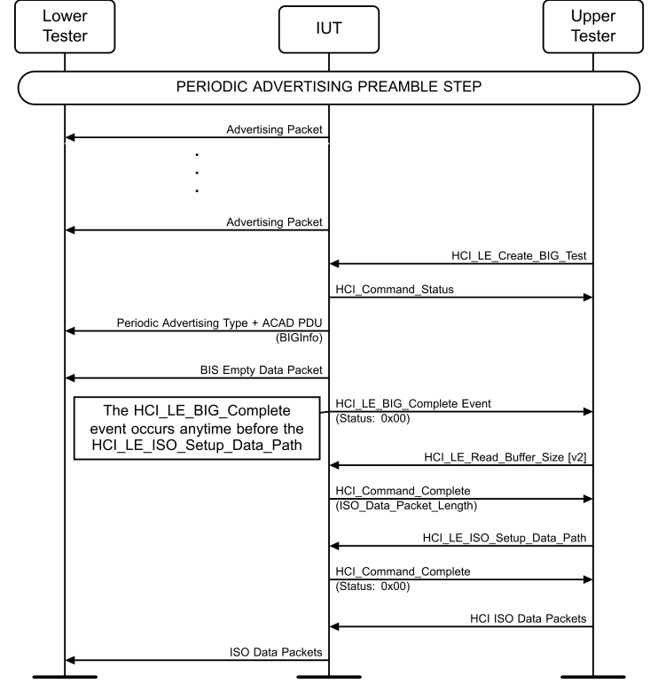

**Figure 4.11-1: Broadcast Isochronous Stream Setup MSC**

1. The Upper Tester sends an HCI_LE_Create_BIG_Test command to the IUT to establish a single BIS using the default values specified in Table 4.11-3 and the IUT responds with an HCI_Command_Status event. If encryption is enabled, then the Upper Tester provides a Broadcast_Code derived from TSPX_broadcast_code. Framing is 0x00 (Unframed). 2. Any time before step 7, the IUT sends an HCI_LE_Create_BIG_Complete event to the Upper Tester with the NSE, BN, PTO, IRC, and Max_PDU parameters as set in step 1 from the IUT. The PHY matches the PHY used to create the BIG. 3. The IUT inserts BIGInfo from the established BIG into the ACAD field of the extended header. BIG_Offset is equal to or greater than 600 µs. The BIG_Offset_Units bit is not set if the BIG_Offset is less than 491,460 µs. The value of BisPayloadCounter increments by one for each new Data PDU transmitted in the BIS. If specified in Table 4.11-3, BIGInfo includes the indicated encryption data; otherwise, the encryption fields are excluded. 4. The Lower Tester receives periodic advertising packets from the IUT containing BIGInfo and it matches the criteria specified in step 3. 5. The Lower Tester receives an advertising PDU (Advertising PDU specified in Table 4.11-4+ACAD) from the IUT and a BIS Empty Data Packet.
6. The Upper Tester sends an HCI_LE_Read_Buffer_Size [v2] command and the IUT responds with an HCI_Command_Complete event providing an ISO_Data_Packet_Length that matches the IXIT ISO Data Packet Length. 7. The Upper Tester sets up Isochronous data paths on the IUT by sending an HCI_LE_ISO_Setup_Data_Path command to the IUT. 8. The Upper Tester begins sending HCI ISO Data Packets to the IUT. If specified in Table 4.11-3, the data is encrypted. The data consists of random octets. The data size is the lesser of Default_Data_Size and the maximum buffer size as previously read from the IUT. 9. The Lower Tester receives BIS Data Packets from the IUT, for at least 50 isochronous events, containing the data sent in step 8. The BIS meets the following criteria: a. There is a BIS PDU in every subevent. b. The value of the Sub_Interval for a single BIS is greater than or equal to (Tx time of the Max_PDU of BIS Data PDU + T_MSS) and less than ISO_Interval. c. All subsequent subevents after the first subevent in every ISO_Interval use a physical channel using the subevent mapping part of the Channel Selection Algorithm #2. d. The BIS event closes at least T_IFS before the anchor point of the next BIS event. e. The offset from the Advertising PDU specified in Table 4.11-4 containing BIGInfo and the BIG anchor point matches BIG Offset. The BIG Offset may point to the next BIG anchor point or any subsequent one. f. The Constant Tone Extension field is not to be present in any packets.
• Expected Outcome
Pass verdict
The IUT sends synchronization information for the BIS using periodic advertising PDUs (Advertising PDU specified in Table 4.11-4). The BIGInfo is received with the fields as indicated.
In step 2, the Upper Tester receives an HCI_LE_Create_BIG_Complete event from the IUT. The PHY field matches the PHY used to create the BIG.
In step 4, BIGInfo matches the specified criteria.
In step 7, the IUT responds with error code Unknown Connection Identifier (0x02).
In step 9, the Lower Tester receives at least 95% of the PDUs sent by the Upper Tester.
The IUT provides an ISO_Data_Packet_Length to the Upper Tester that matches the IXIT ISO Data Packet Length.
BIS data is received by the Lower Tester and contains the expected data and meets all the specified criteria. If the BIS was encrypted, then the Lower Tester decrypts the data before comparing the data.
If the BIS was encrypted, then the BIS PDUs contain valid MIC fields.
The IUT sends the appropriate HCI_Number_Of_Completed_Packets events to the Upper Tester using the connection handle and indicating a number of packets completed.

##### 4.11.4.2 Data Transmission in Multiple Broadcast Isochronous Streams

• Test Purpose
Test that an IUT acting as an Isochronous Broadcaster correctly sends data packets on multiple BISes over a Broadcast Isochronous Group (when TSPX_max_tx_bises > 1), and either an interleaved or sequential arrangement when NSE > 1. Verify the correct values of CSSN and CSTF.
• Reference
[14] 4.4.6, 4.4.6.4, 4.4.6.5
• Initial Condition
- Note: “default” refers to Default Parameters specified in Table 4.11-6.
- TSPX_max_tx_bises is the maximum number of supported transmit BIS by an Isochronous Broadcaster as defined in the IXIT [9] entry.
- TSPX_max_sdu_length is the maximum ISOAL SDU length as specified in the IXIT [9] entry.
- State: Isochronous Broadcasting, Test (values as specified in Table 4.11-5)

|  | State Variable |  |  | Value(s) |  |
| --- | --- | --- | --- | --- | --- |
| num bis _ |  |  | Table 4.11-7 Num BIS _ |  |  |
| sdu int _ |  |  | Table 4.11-7 ISO Interval _ |  |  |
| iso int _ |  |  | Table 4.11-7 ISO Interval _ |  |  |
| nse |  |  | default |  |  |
| mx sdu _ |  |  | Table 4.11-7 Payload Size |  |  |
| mx pdu _ |  |  | Table 4.11-7 Payload Size |  |  |
| phy |  |  | LE 1M PHY, then as specified |  |  |
| packing |  |  | Specified in Table 4.11-6 |  |  |
| framing |  |  | 0x00 (Unframed) |  |  |
| bn |  |  | default |  |  |
| irc |  |  | default |  |  |
| pto |  |  | default |  |  |
| encryption |  |  | 0x00 |  |  |
| broadcast code _ |  |  | n/a |  |  |

Table 4.11-5: State variable values
• Test Case Configuration

|  | Test Case |  |  | Default Parameters |  |  | Packing |  |  | Num BIS _ |  |
| --- | --- | --- | --- | --- | --- | --- | --- | --- | --- | --- | --- |
| LL/BIS/BRD/BV-04-C [Data Transmission in Multiple Broadcast Isochronous Streams, Interleaved BIG] |  |  | Section 4.11.2 Common Parameters |  |  | Interleaved |  |  | Default TxNumBIS _ as specified per Default Parameters column. |  |  |
| LL/BIS/BRD/BV-25-C [Data Transmission in Multiple Broadcast Isochronous Streams, BN = 1] |  |  | Section 4.11.2.1 Common Parameters, BN = 1 |  |  | Interleaved |  |  | min(3, TSPX max tx bises) _ _ _ |  |  |
| LL/BIS/BRD/BV-05-C [Data Transmission in Multiple Broadcast Isochronous Streams, Sequential] |  |  | Section 4.11.2 Common Parameters |  |  | Sequential |  |  | Default TxNumBIS _ as specified per Default Parameters column. |  |  |

Table 4.11-6: Data Transmission in Multiple Broadcast Isochronous Streams test case configuration
• Test Procedure

**Figure 4.11-2: Data Transmission in Multiple BISes MSC**

1. The Upper Tester sends the HCI_LE_BIG_Create_Sync command to the IUT and receives successful HCI_Command_Status and HCI_LE_BIG_Sync_Established events from the IUT in response. The BIG is configured according to the Default Parameters specified in Table 4.11-6. 2. The Upper Tester continuously sends HCI ISO Data Packets. Each data packet is filled with the BIS_Number of its respective BIS. The payload size is specified in Table 4.11-7 for each iteration.
3. The IUT transmits Broadcast Isochronous Data PDUs over multiple BISes using the packing specified in Table 4.11-6 when NSE > 1. The Data PDUs are transmitted in compliance with the default specified BN and IRC values. 4. The Lower Tester receives data packets from the IUT in the packing specified in Table 4.11-6 when NSE > 1. It receives a minimum of NumDataPDUs ISO Data Packets for each BIS. 5. The IUT sends a BIG_TERMINATE_IND BIG Control PDU to the Lower Tester in each of the six consecutive BIG events. 6. When the Instant is reached, the IUT stops transmitting isochronous data PDUs and sends a successful HCI_LE_Terminate_BIG_Complete event to the Upper Tester. 7. Repeat steps 1–6 with each round in Table 4.11-7. 8. Repeat steps 1–7 for each PHY supported by the IUT.

| Round | Num BIS _ |  | Payload Size |  | ISO Interval _ |
| --- | --- | --- | --- | --- | --- |
|  |  |  | Note 1 |  |  |
| 1 | 2 | 24 |  |  | 40 milliseconds |
| 2 | Num BIS in Table 4.11-6 _ | 16 |  |  | 70 milliseconds |
| 3 | TSPX max tx bises _ _ _ | 8 |  |  | 250 milliseconds |

Note 1: SDU_Max and SDU payload size are the specified value in the table, or Max Supported TX Payload_Size, whichever is smaller. PDU_Max is the specified value in the table.
Table 4.11-7: Num_BIS values
• Expected Outcome
Pass verdict
The IUT transmits data packets in the correct order on multiple BISes in the packing specified in Table 4.11-6 when NSE > 1 and TSPX_max_tx_bises > 1. The Data PDUs are transmitted in compliance with the specified BN and IRC values and expected timing. The data matches the expected pattern.
All PDUs in each event have the same value of CSSN.
All BIS Data PDUs in each event have the same value of CSTF. If the value of CSTF is 0, then no BIG Control PDU is sent at the end of the event and CSSN has the same value as in the previous event (if any). If the value of CSTF is 1, then a BIG Control PDU is sent at the end of the event and CSSN either has the same value as in the previous event (if any) or that value plus 1.
All BIG Control PDUs have CSTF=0.
The IUT ceases broadcasting isochronous data at the instant after being commanded to terminate the BIG by the Upper Tester.
The IUT sends the appropriate HCI_Number_Of_Completed_Packets events to the Upper Tester using the connection handle and indicating a number of packets completed.
LL/BIS/BRD/BV-07-C [Bursting of Packets in Broadcast Isochronous Stream]
• Test Procedure
Test that an IUT acting as an Isochronous Broadcaster sends data packets in a burst when Burst Number (BN) is greater than 1.
• Reference
[14] 4.4.6.6
• Initial Condition
- Note: “default” refers to values specified in Section 4.11.2 Common Parameters.
- TSPX_max_tx_nse is the maximum supported TX NSE as defined in the IXIT [9] entry.
- TSPX_max_tx_bn is the maximum supported TX BN as defined in the IXIT [9] entry.
- State: Isochronous Broadcasting, Test (values as specified in Table 4.11-8)

| State Variable |  |  | Value(s) |  |
| --- | --- | --- | --- | --- |
| num bis _ |  | Default TxNumBIS _ |  |  |
| sdu int _ |  | 100 ms |  |  |
| iso int _ |  | 100 ms |  |  |
| nse |  | Table 4.11-9 NSE |  |  |
| mx sdu _ |  | default |  |  |
| mx pdu _ |  | default |  |  |
| phy |  | LE 1M PHY, then as specified |  |  |
| packing |  | 0x00 (Sequential) |  |  |
| framing |  | 0x00 (Unframed) |  |  |
| bn |  | Table 4.11-9 Burst Number (BN) |  |  |
| irc |  | Table 4.11-9 IRC |  |  |
| pto |  | default |  |  |
| encryption |  | 0x00 |  |  |
| broadcast code _ |  | n/a |  |  |

Table 4.11-8: State variable values
• Test Procedure

**Figure 4.11-3: LL/BIS/BRD/BV-07-C [Bursting of Packets in Broadcast Isochronous Stream] MSC**

1. The Lower Tester synchronizes with the IUT and begins listening on multiple BISes. 2. The Upper Tester submits HCI ISO data packets to the IUT to be distributed on multiple BISes in a sequential arrangement. 3. After sending each Isochronous Data PDU, the Upper Tester sends an HCI_LE_Read_ISO_TX_Sync command. The Upper Tester receives an HCI_Command_Complete event that includes the Time_Offset. The Upper Tester expects the value of Time_Offset to be 0 on every read. 4. The Lower Tester receives data packets from the IUT on multiple BISes in a sequential arrangement, such that every BIS subevent data is broadcast exactly once before being repeated within an ISO_Interval. The Lower Tester receives a minimum of NumDataPDUs data packets. 5. The Upper Tester sends an HCI_LE_Terminate_BIG command to the IUT and receives an HCI_Command_Status event in response. 6. The Upper Tester receives an HCI_LE_Terminate_BIG_Complete event. 7. Repeat steps 1–6 with the values for BIS_Parameters fields in Table 4.11-9. If the corresponding value in the table exceeds either TSPX_max_tx_nse or TSPX_max_tx_bn or if IUT rejects the creation of the BIG due to unsupported configuration, that round is skipped.

|  | Round |  |  | Burst Number (BN) |  |  | NSE |  |  | IRC |  |
| --- | --- | --- | --- | --- | --- | --- | --- | --- | --- | --- | --- |
| 1 |  |  | 2 |  |  | 2 |  |  | 1 |  |  |
| 2 |  |  | 2 |  |  | 4 |  |  | 2 |  |  |
| 3 |  |  | 3 |  |  | 6 |  |  | 2 |  |  |

Table 4.11-9: Values for BN, NSE, and IRC
• Expected Outcome
Pass verdict
The IUT sends the correct number of new data packets for each BIS interval.
In step 3, the value of Time_Offset is 0 on every read.
At least one round has been executed successfully.
LL/BIS/BRD/BV-08-C [Pre-transmissions in Broadcast Isochronous Stream]
• Test Purpose
Test that an IUT acting as an Isochronous Broadcaster correctly retransmits data packets in a Broadcast Isochronous Stream using the pre-transmission schemes according to the PTO and IRC parameters.
• Reference
[14] 4.4.6.6
• Initial Condition
- State: Periodic Advertising (selected primary_adv_interval_min, selected primary_adv_interval_max, supported type of own_address_type, selected periodic_adv_interval_min, selected periodic_adv_interval_max)
- TSPX_max_sdu_length is the maximum size of an SDU packet as defined in the IXIT [9] entry.
- TSPX_max_tx_bn is the maximum supported TX BN as defined in the IXIT [9] entry.
- TSPX_max_tx_pto is the maximum supported pre-transmission offset defined in the IXIT [9] entry.
- TSPX_max_tx_nse is the maximum supported TX NSE as defined in the IXIT [9] entry.
• Test Procedure

**Figure 4.11-4: LL/BIS/BRD/BV-08-C [Pre-transmissions in Broadcast Isochronous Stream] MSC**

1. For each round in Table 4.11-10, perform the following steps. If the values in the table exceed the corresponding values of TSPX_max_tx_bn, TSPX_max_tx_pto, or TSPX_max_tx_nse, then that round is skipped. 2. Establish a single Broadcast ISO Stream using the established periodic advertising handle. Set the BN, IRC, PTO, NSE, and ISO_Interval values as specified in Table 4.11-10. If the IUT rejects the HCI_LE_Create_BIG_Test command with error code Unsupported Feature or Parameter Value (0x11), skip to the next round. 3. The Lower Tester begins listening for advertising from the IUT (AUX_SYNC_IND+ACAD PDUs). 4. The Lower Tester performs the synchronization procedure with the IUT and successfully synchronizes with the BIS. 5. The Upper Tester continuously sends HCI ISO data packets to the IUT, sending at least NumDataPDUs packets, where NumDataPDUs is 20 × BN + 2 × PTO × NSE (using the values for the round). Each packet is filled with octets with value S, where S is the sequence number of the data packet (starting at zero) modulo 256. NOTE: This aids in confirming that the pre- transmission packets are offset as specified.
6. There are BN consecutive payloads associated with each isochronous event. For the first BN × IRC sub-events of an event, sub-event S contains payload S modulo BN, counting from zero, of those associated with that event. For the remaining sub-events (if any), sub-event S contains payload S modulo BN of those associated with the event PTO × (S ÷ BN - IRC + 1) events after that event. 7. After the Upper Tester sends half of the Isochronous Data SDUs and once again after sending all Isochronous Data SDUs, the Upper Tester sends an HCI_LE_Read_ISO_TX_Sync command. The Upper Tester receives an HCI_Command_Complete event that includes the Packet_Sequence_Number and a TX_Time_Stamp. The Packet_Sequence_Number increments by at least 1 for each Isochronous Data PDU sent, and the TX_Time_Stamp advances by an amount that is expected and within acceptable limits. 8. The Upper Tester sends an HCI_LE_Terminate_BIG command to the IUT and receives an HCI_Command_Status event in response. 9. The Upper Tester receives an HCI_LE_Terminate_BIG_Complete event.

|  | Round |  |  | BN |  |  | IRC |  |  | PTO |  |  | NSE |  |  | ISO Interval _ |  |
| --- | --- | --- | --- | --- | --- | --- | --- | --- | --- | --- | --- | --- | --- | --- | --- | --- | --- |
| 1 |  |  | 1 |  |  | 2 |  |  | 3 |  |  | 5 |  |  | 5 ms |  |  |
| 2 |  |  | 2 |  |  | 2 |  |  | 2 |  |  | 10 |  |  | 8.75 ms |  |  |
| 3 |  |  | 1 |  |  | 2 |  |  | 1 |  |  | 5 |  |  | 7.5 ms |  |  |
| 4 |  |  | 2 |  |  | 3 |  |  | 4 |  |  | 8 |  |  | 10 ms |  |  |
| 5 |  |  | 2 |  |  | 5 |  |  | 4 |  |  | 12 |  |  | 20 ms |  |  |
| 6 |  |  | 1 |  |  | 3 |  |  | 6 |  |  | 6 |  |  | 11.25 ms |  |  |
| 7 |  |  | 1 |  |  | 1 |  |  | 1 |  |  | 2 |  |  | 10 ms |  |  |

Table 4.11-10: BN, IRC, PTO, and NSE values
• Expected Outcome
Pass verdict
The IUT sends Broadcast Isochronous Data PDUs in the BIS according to the pre-transmission scheme.
For each of the sub-event numbers from 1 to NSE, the Lower Tester receives the correct data in at least 16 isochronous events.
In step 7, the Upper Tester receives an HCI_Command_Complete event that includes the Packet_Sequence_Number and a TX_Time_Stamp. The Packet_Sequence_Number increments by at least 1 for each Isochronous Data PDU sent, and the TX_Time_Stamp advances by an amount that is expected and within acceptable limits.
In steps 8 and 9, the BIS is successfully terminated.
At least one round has been executed successfully.
Fail verdict
The Lower Tester receives the wrong data (with a correct CRC) in any sub-event.
• Test Purpose
Test that an IUT acting as an Isochronous Broadcaster correctly updates the channel map for the BIG.
• Reference
[14] 5.6.1
• Initial Condition
- State: Isochronous Broadcasting, Test (num_bis: 1, encryption: 0, broadcast_code: n/a, all other values as specified in Section 4.11.2.1 Common Parameters, BN = 1). If indicated in Table 4.11-11, then the BIS is encrypted. The Lower Tester may read the Broadcast Code from TSPX_broadcast_code in IXIT. The Upper Tester may obtain its Broadcast Code by any means.
• Test Case Configuration

|  | Test Case |  |  | Encryption |  |
| --- | --- | --- | --- | --- | --- |
| LL/BIS/BRD/BV-09-C |  |  | Not encrypted |  |  |
| LL/BIS/BRD/BV-17-C |  |  | Encrypted |  |  |

Table 4.11-11: Broadcast Isochronous Group Channel Map Update Procedure, Broadcaster test cases
• Test Procedure

**Figure 4.11-5: Broadcast Isochronous Group Channel Map Update Procedure MSC**

1. The Upper Tester continuously sends HCI ISO Data Packets per the default settings specified in Section 4.11.2.1 Common Parameters, BN = 1. 2. The Upper Tester commands the IUT to disable the periodic advertising associated with the BIG by sending an HCI_LE_Set_Periodic_Advertising_Enable command with Enable set to 0x00 and the appropriate Advertising_Handle, and receives a successful HCI_Command_Complete in response. 3. The Upper Tester sends an HCI_LE_Set_Host_Channel_Classification command with the Channel_Map parameter set to 0x0AAAAAAAAA to the IUT. 4. If the command succeeds, the IUT sends an HCI_Command_Complete event to the Upper Tester with Status 0x00. Otherwise, repeat step 3 with a different value of the Channel_Map parameter up to 20 times, with at least 5 seconds between repeats, or until the command succeeds. 5. If the HCI_LE_Set_Host_Channel_Classification command fails 20 times, then the test ends in an Inconclusive verdict.
6. The Lower Tester receives the BIG_CHANNEL_MAP_IND PDU with an instant in the Control subevent from the IUT. 7. The Lower Tester receives six consecutive BIG_CHANNEL_MAP_IND PDUs before the channel map update. Additional BIG_CHANNEL_MAP_IND PDUs may be sent after the six consecutive PDUs and prior to the channel map update as described in [14] Section 5.6. The Control PDUs have the Length field set to 8 to match the fixed size of a BIG_CHANNEL_MAP_IND Control PDU. The Instant is greater than or equal to currEventCount + 6 (currEventCount is the value of the BIS event counter when the transmission of the BIG Control PDU takes place for the first time). The value of CSSN increments by 1 with each new Control PDU (not a retransmission of a previous Control PDU) and the value of CSSN is the same in every BIS PDU in the same event. The CSTF bit is 1 in the header of every BIS Data PDU sent in that same BIG event as the Control PDU, and CSTF is set to 0 in every BIG Control PDU. 8. The Lower Tester expects to correctly receive BIS packets after channel map update instant occurred. 9. The Upper Tester commands the IUT to enable the periodic advertising associated with the BIG by sending an HCI_LE_Set_Periodic_Advertising_Enable command with Enable set to 0x01 and the appropriate Advertising_Handle, and receives a successful HCI_Command_Complete in response. 10. The Lower Tester expects the ChM field in the BIGInfo data in the associated periodic advertising chain to change to the map sent in step 7. 11. The Upper Tester commands the IUT to terminate the BIS, and the BIS is terminated (see the “BIG Termination Procedure Optional Test Steps” procedure in Section 4.1.6.7.3, Optional Test Steps).
• Expected Outcome
Pass verdict
The IUT transmits a BIG_CHANNEL_MAP_IND PDU that matches the criteria specified in step 6.
After sending at least six BIG Control PDUs, the IUT begins transmitting PDUs over the new channel(s) at the instant specified. Tester receives at least 95% of all BIS packets on the first 20 ISO intervals after channel map update instant.
For all BIG events before the first one containing a BIG_CHANNEL_MAP_IND, all the PDUs have CSSN=N (where N can be any value between 0 and 7) and CSTF=0.
For all BIG events containing a BIG_CHANNEL_MAP_IND, all the PDUs have CSSN=N+1. The data PDUs have CSTF=1 while the BIG_CHANNEL_MAP_IND has CSTF=0.
For any BIG events after the first BIG_CHANNEL_MAP_IND but not containing one, all the PDUs have CSSN=N+1 and CSTF=0.
The ChM field in the BIGInfo data in the associated periodic advertising chain changed to the map sent in step 7.
For all BIG events containing a BIG_TERMINATE_IND, all the PDUs have CSSN=N+2. The data PDUs have CSTF=1 while the BIG_CHANNEL_MAP_IND has CSTF=0.
If the BIS was encrypted, the BIS PDUs contain valid MIC fields.
Inconclusive verdict
In step 4, the HCI_LE_Set_Host_Channel_Classification command fails 20 times.
• Test Purpose
Test that an IUT acting as an Isochronous Broadcaster correctly terminates an active BIS.
• Reference
[14] 4.4.6.7, 5.6.2
• Initial Condition
- State: Isochronous Broadcasting, Test (num_bis: 1, encryption: 0, broadcast_code: n/a, all other values as specified in Section 4.11.2.1 Common Parameters, BN = 1). If indicated in Table 4.11-12, then the BIS is encrypted. The Lower Tester may read the Broadcast Code from TSPX_broadcast_code in IXIT. The Upper Tester may obtain its Broadcast Code by any means.
• Test Case Configuration

|  | Test Case |  |  | Encryption |  |
| --- | --- | --- | --- | --- | --- |
| LL/BIS/BRD/BV-10-C |  |  | Not encrypted |  |  |
| LL/BIS/BRD/BV-18-C |  |  | Encrypted |  |  |

Table 4.11-12: Isochronous Broadcaster Terminates BIS Stream test cases
• Test Procedure

**Figure 4.11-6: Isochronous Broadcaster Terminates BIS Stream MSC**

1. The Upper Tester sends an HCI_LE_Terminate_BIG command to the IUT and receives an HCI_Command_Status event in response. 2. The IUT transmits six consecutive BIG_TERMINATE_IND PDUs in the Control subevents. Additional BIG_TERMINATE_IND commands may be sent after the six consecutive commands and prior to termination of the BIG as described in [14] Section 5.6. The following conditions are met: a. The Reason field is set to a valid Error Code to inform the Lower Tester why the BIG is about to be terminated. b. The Instant field is set to indicate the instant when the BIG will be terminated. c. The access address of the Broadcast Control logical link is derived as defined in [14] Section 2.1.2. d. The Control subevent is scheduled BIG_Control_Offset from the BIG anchor point. e. The Control subevent uses the channel index derived using the bigEventCounter in the Channel Selection algorithm #2. f. The value of the bisPayloadCounter for a BIG Control PDU is equal to the value of the bisPayloadCounter in the first subevent in the same ISO_Interval. 3. The Lower Tester observes that the termination of the BIG occurs at the Instant specified in the Control Subevent. 4. The Upper Tester receives an HCI_LE_Terminate_BIG_Complete event. The Reason parameter is set to the value Connection Terminated by Local Host (0x16). 5. After at least six BIS events from the IUT, the IUT sends an AUX_SYNC_IND PDU that does not contain an ACAD field containing BIGInfo to the Lower Tester.
• Expected Outcome
Pass verdict
The IUT transmits BIG_TERMINATE_IND PDUs. If the BIS was encrypted, the PDUs contain valid MIC fields.
After the IUT transmits the BIG_TERMINATE_IND PDU sequence, the IUT sends an AUX_SYNC_IND PDU that does not contain BIGInfo. The Control PDU is correctly formatted and meets the requirements specified in step 2.
The IUT reports the HCI_LE_Terminate_BIG_Complete event with a Reason of 0x00. The Reason parameter is set to the value Connection Terminated by Local Host (0x16).

##### 4.11.4.5 Broadcast Isochronous Stream Using Non-Test Command

• Test Purpose
Verify that the IUT correctly executes the LE Create BIG Command.
• Reference
[15] 7.8.103
[20] 7.7.65.27
• Initial Condition
- State: Periodic Advertising (selected primary_adv_interval_min, selected primary_adv_interval_max, supported type of own_address_type, selected periodic_adv_interval_min, selected periodic_adv_interval_max)
• Test Case Configuration

|  | Test Case |  |  | PHY |  |  | BIS Framing Mode |  |  | Max Transport Latency _ _ |  |
| --- | --- | --- | --- | --- | --- | --- | --- | --- | --- | --- | --- |
| LL/BIS/BRD/BV-13-C |  |  | LE 1M PHY |  |  | Segmentable mode |  |  | 30 ms |  |  |
| LL/BIS/BRD/BV-14-C |  |  | LE 2M PHY |  |  | Segmentable mode |  |  | 30 ms |  |  |
| LL/BIS/BRD/BV-15-C |  |  | LE Coded PHY |  |  | Segmentable mode |  |  | Default Transport Latency X _ _ 8 |  |  |
| LL/BIS/BRD/BV-28-C |  |  | LE 1M PHY |  |  | Segmentable mode or Unsegmented mode |  |  | 30 ms |  |  |
| LL/BIS/BRD/BV-29-C |  |  | LE 2M PHY |  |  | Unsegmented mode |  |  | 17 ms |  |  |
| LL/BIS/BRD/BV-30-C |  |  | LE 2M PHY |  |  | Segmentable mode or Unsegmented mode |  |  | 30 ms |  |  |

Table 4.11-13: Broadcast Isochronous Stream Using Non-Test Command test cases
• Test Procedure

**Figure 4.11-7: Broadcast Isochronous Stream Using Non-Test Command – MSC Page 1 of 2**

Upper Tester IUT
Lower Tester

**Figure 4.11-8: Broadcast Isochronous Stream Using Non-Test Command – MSC Page 2 of 2**

1. The Upper Tester sends an HCI_LE_Create_BIG command using the correct Advertising_Handle obtained previously and the Max_Transport_Latency as specified in the Test Case Configuration table. Only a single PHY bit is set as specified in the Test Case Configuration table. The frame bit is set to 0b0, RTN is set to 1, and encryption is disabled. The Upper Tester receives an HCI_Command_Status event in return. 2. The Upper Tester receives an HCI_LE_Create_BIG_Complete event from the IUT. The PHY matches the PHY used to create the BIG. 3. The Lower Tester receives advertising PDUs (AUX_SYNC_IND+ACAD) from the IUT and BIS Empty Data Packets on the PHY specified previously. BN is not 0. The value of NSE is a multiple of BN for a BIS, and is not 0. The IRC value is not set to 0. The ISO_Interval is a multiple of 1.25 milliseconds in the range of 5 milliseconds to 4 seconds. Max_PDU is between 1 and 251. 4. The Upper Tester sends an HCI_LE_Read_Buffer_Size [v2] command and the IUT responds with an HCI_Command_Complete event providing an ISO_Data_Packet_Length. 5. If the IUT responds with an ISO_Data_Packet_Length of 0x00, indicating that it does not support dedicated ISO transmit buffer(s), then the Upper Tester sends an HCI_Read_Buffer_Size command to determine the length of the transmit buffer(s). 6. The Upper Tester sets up Isochronous data paths on the IUT by sending an HCI_LE_ISO_Setup_Data_Path command to the IUT. 7. The Upper Tester begins sending HCI ISO Data Packets to the IUT. The data consists of alternating values of 0x81 and 0x16. The data size is the lesser of Default_Data_Size and the maximum buffer size as previously read from the IUT.
8. The Lower Tester receives BIS Data Packets from the IUT containing alternating values of 0x81 and 0x16. The data packets use unframed or may use the BIS Framing Mode specified in Table 4.11-13. 9. The Upper Tester commands the IUT to open a second periodic advertising train per the periodic advertising preamble. 10. The Upper Tester sends an HCI_LE_Terminate_BIG command using the BIG_Handle of the existing BIG to the IUT and receives an HCI_Command_Status event in response. 11. The IUT transmits six consecutive BIG_TERMINATE_IND PDUs in the Control subevents. Additional BIG_TERMINATE_IND PDUs may be sent after the six consecutive PDUs and prior to termination of the BIG as described in [14] Section 5.6. 12. The Upper Tester receives an HCI_LE_Terminate_BIG_Complete event. 13. The Upper Tester sends an HCI_LE_Create_BIG command using the Advertising_Handle obtained for the second periodic advertising train and the Max_Transport_Latency as specified in the Test Case Configuration table. Only a single PHY bit is set as specified in the Test Case Configuration table. The frame bit is set to 0b1, RTN is set to 1, and encryption is disabled. The Upper Tester receives a successful HCI_Command_Status in return. 14. The Upper Tester sets up Isochronous data paths on the IUT by sending an HCI_LE_ISO_Setup_Data_Path command to the IUT. 15. The Upper Tester begins sending HCI ISO Data Packets to the IUT. The data consists of alternating values of 0xFA and 0xED. The data size is the lesser of Default_Data_Size and the maximum buffer size as previously read from the IUT. 16. The Lower Tester receives BIS Data Packets from the IUT containing alternating values of 0xFA and 0xED on the PHY specified previously. The data packets use the BIS Framing Mode specified in Table 4.11-13. 17. The Upper Tester sends an HCI_LE_Terminate_BIG command using the BIG_Handle of the existing BIG to the IUT and receives an HCI_Command_Status event in response. 18. The IUT transmits six consecutive BIG_TERMINATE_IND PDUs in the Control subevents. Additional BIG_TERMINATE_IND PDUs may be sent after the six consecutive PDUs and prior to termination of the BIG as described in [14] Section 5.6. 19. The Upper Tester receives an HCI_LE_Terminate_BIG_Complete event.
• Expected Outcome
Pass verdict
In step 2, the Upper Tester receives an HCI_LE_Create_BIG_Complete event from the IUT. The PHY field matches the PHY used to create the BIG. Transport_Latency_BIG does not exceed Max_Transport_Latency.
In step 3, the IUT broadcasts BIS Empty Data Packets on the PHY specified in the Test Case Configuration table. The parameters match the criteria specified.
In step 8, the IUT transmits BIS Data Packets containing alternating values of 0x81 and 0x16. The data packets are Unframed, Unsegmented Framed, or Segmentable Framed. The bits in the RFU field are all clear.
In step 11, the Lower Tester receives six consecutive BIG_TERMINATE_IND PDUs in Control subevents.
In step 16, the IUT transmits BIS Data Packets containing alternating values of 0xFA and 0xED on the PHY specified in the Test Case Configuration table. The data packets are Unsegmented Framed or Segmentable Framed.
In step 17, the Upper Tester receives an HCI_Command_Status event in response.
In step 18, the Lower Tester receives six consecutive BIG_TERMINATE_IND PDUs in Control subevents.
In step 19, the Upper Tester receives an HCI_LE_Terminate_BIG_Complete event.
The calculated transport latencies of all the BISes as defined in [17] Section 3.2.1 is less than or equal to the Max_Transport_Latency value in Table 4.11-13.

##### 4.11.4.6 Maximum Supported Broadcast Isochronous Groups

• Test Purpose
Verify that the IUT correctly generates its maximum supported Broadcast Isochronous Groups.
• Reference
[14] 4.4.6.2
• Initial Condition
- TSPX_broadcast_code is the 4–16 character Broadcast Code as defined in the IXIT [9] entry.
- TSPX_max_sdu_length is the maximum ISOAL SDU length as specified in the IXIT [9] entry.
- Establish TSPX_max_tx_bigs (defined in IXIT) in the state described as follows:
- Note: “default” refers to values specified in Section 4.11.2 Common Parameters.
- State: Isochronous Broadcasting, Test (values as specified in Table 4.11-14)

|  | State Variable |  |  | Value(s) |  |
| --- | --- | --- | --- | --- | --- |
| num bis _ |  |  | 1 |  |  |
| sdu int _ |  |  | 101.25 ms |  |  |
| iso int _ |  |  | 101.25 ms |  |  |
| nse |  |  | 1 |  |  |
| mx sdu _ |  |  | Note 1 |  |  |
| mx pdu _ |  |  | 16 |  |  |
| phy |  |  | default |  |  |
| packing |  |  | default |  |  |
| framing |  |  | 0x00 (Unframed) |  |  |
| bn |  |  | 1 |  |  |
| irc |  |  | 1 |  |  |
| pto |  |  | default |  |  |
| encryption |  |  | 0x01 if encrypted, otherwise 0x00. See Table 4.11-15. |  |  |
| broadcast code _ |  |  | TSPX broadcast code _ _ |  |  |

Table 4.11-14: State variable values
• Test Case Configuration

| Test Case |  |  | Encryption |  |
| --- | --- | --- | --- | --- |
| LL/BIS/BRD/BV-16-C |  | Disabled |  |  |
| LL/BIS/BRD/BV-19-C |  | Enabled |  |  |

Table 4.11-15: Maximum Supported Broadcast Isochronous Groups test cases
• Test Procedure

**Figure 4.11-9: Maximum Supported Broadcast Isochronous Groups MSC**

1. The Upper Tester continuously sends HCI ISO Data Packets for all of the created BISs. The data for each BIS consists of the numbering of the associated BIG repeated in every octet.
2. The Lower Tester receives AUX_SYNC_IND PDUs containing BIGInfo for each respective BIG. For all BIGs, the value of bits SAA15-0 in SeedAccessAddress differs in at least two bits. 3. The Lower Tester synchronizes to all BISes. All Access Addresses meet the requirements specified in [14] Section 2.1.2. The data content is as previously specified. For encrypted broadcasts, every GIV and GSKD for each BIG is unique from each other. 4. The Upper Tester sends an HCI_LE_Terminate_BIG command to the IUT for the first BIG created and receives an HCI_Command_Status event in response. 5. The IUT transmits six consecutive BIG_TERMINATE_IND PDUs in the Control subevents. Additional BIG_TERMINATE_IND PDUs may be sent after the six consecutive PDUs and prior to termination of the BIG as described in [14] Section 5.6. 6. The Lower Tester observes that the termination of the BIG occurs at the Instant specified in the Control Subevent. 7. The Upper Tester receives an HCI_LE_Terminate_BIG_Complete event. 8. The Upper Tester sends an HCI_LE_Terminate_BIG command to the IUT for the same BIG as in step 4. The Upper Tester receives the error code Unknown Advertising Identifier (0x42). 9. The IUT terminates the remaining BIGs.
• Expected Outcome
Pass verdict
In step 2, the SeedAccessAddress bit meets the criteria specified.
In step 3, all Access Addresses meet the requirements specified. The data content is as specified. For encrypted broadcasts, every GIV and GSKD for each BIG is unique from each other.
In step 5, the Lower Tester receives six consecutive BIG_TERMINATE_IND PDUs in the Control subevents.
In step 6, the Lower Tester observes that the termination of the BIG occurs at the Instant specified in the Control Subevent.
In step 7, the Upper Tester receives an HCI_LE_Terminate_BIG_Complete event.
In step 8, the IUT sends the error code Unknown Advertising Identifier (0x42).
In step 9, the remaining BIGs are terminated.

##### 4.11.4.7 Broadcast Isochronous Stream Setup, Force Framed PDUs

• Test Purpose
Verify that an Isochronous Broadcaster IUT can set up a Broadcast Isochronous Stream and use Framed PDUs when the requirements for using Unframed PDUs are not met, but unframed PDUs were requested.
• Reference
[15] 7.8.103
[17] 2.2
[20] 7.7.65.27
• Initial Condition
- State: Periodic Advertising (selected primary_adv_interval_min, selected primary_adv_interval_max, supported type of own_address_type, selected periodic_adv_interval_min, selected periodic_adv_interval_max).
- The Lower Tester is configured to monitor advertising packets from the IUT.
• Test Case Configuration

|  | Test Case PHY |
| --- | --- |
| LL/BIS/BRD/BV-20-C LE 1M PHY |  |
| LL/BIS/BRD/BV-21-C LE 2M PHY |  |
| LL/BIS/BRD/BV-22-C LE Coded PHY |  |

Table 4.11-16: Broadcast Isochronous Stream Setup, Force Framed PDUs test cases
• Test Procedure

**Figure 4.11-10: Broadcast Isochronous Stream Setup, Force Framed PDUs MSC**

1. The Upper Tester sends an HCI_LE_Create_BIG command with SDU_Interval set to 87.072 ms, RTN set to 0x03, Max_Transport_Latency set to 800 ms, Max_SDU set to 0x20. Only a single PHY bit is set as specified in Table 4.11-16. The frame bit is set to Unframed (0x00). All remaining values as specified in Section 4.11.2 Common Parameters. The Upper Tester receives an HCI_Command_Status event in return. 2. The Upper Tester receives an HCI_LE_Create_BIG_Complete event from the IUT. The PHY matches the PHY used to create the BIG. 3. The Lower Tester receives advertising PDUs (AUX_SYNC_IND+ACAD) from the IUT and BIS Empty Data packets on the PHY specified previously. BN is not 0. The value of NSE is a multiple of BN for a BIS and is not 0. The IRC value is not set to 0. The ISO_Interval is a multiple of 1.25 milliseconds in the range of 5 milliseconds to 4 seconds. Max_PDU is between 1 and 251. 4. The Upper Tester sends an HCI_LE_Read_Buffer_Size [v2] command, and the IUT responds with an HCI_Command_Complete event providing an ISO_Data_Packet_Length. 5. If the IUT responds with an ISO_Data_Packet_Length of 0x00, indicating that it does not support dedicated ISO transmit buffer(s), then the Upper Tester sends an HCI_Read_Buffer_Size command to determine the length of the transmit buffer(s). 6. The Upper Tester sets up Isochronous data paths on the IUT by sending an HCI_LE_ISO_Setup_Data_Path command to the IUT. 7. The Upper Tester begins sending HCI ISO Data packets to the IUT. The data consists of alternating values of 0x7C and 0xDE. The data size is the lesser of Default_Data_Size and the maximum buffer size as previously read from the IUT. 8. The Lower Tester receives BIS Data packets from the IUT containing alternating values of 0x7C and 0xDE. The data packets are framed.
• Expected Outcome
Pass verdict
In step 2, the Upper Tester receives an HCI_LE_Create_BIG_Complete event from the IUT. The PHY field matches the PHY used to create the BIG. Transport_Latency_BIG does not exceed Max_Transport_Latency.
In step 3, the IUT broadcasts BIS Empty Data packets on the PHY specified in Table 4.11-16. The parameters match the criteria specified.
In step 8, the IUT transmits BIS Data packets containing alternating values of 0x7C and 0xDE. The data packets are framed.
The transport latencies of all the BISes as defined in [17] Section 3.2.1 are less than or equal to the Max_Transport_Latency value of 80 ms.
LL/BIS/BRD/BV-26-C [Pre-transmissions in Broadcast Isochronous Stream, Verify LLID]
• Test Purpose
Verify that an Isochronous Broadcaster IUT maintains the LLID value of retransmitted data packets in a Broadcast Isochronous Stream when Pre-transmission is enabled.
• Reference
[19] 4.4.6.6
• Initial Condition
- TSPX_max_sdu_length is the maximum size of an SDU packet as defined in the IXIT [9] entry.
- TSPX_max_tx_nse is the maximum supported number of TX subevents for an Isochronous Broadcaster as defined in the IXIT [9] entry.
- State: Isochronous Broadcasting (PTO: 1, BN: 2, IRC: 2, NSE: 6, Num_BIS: 1, framing: 0x00, Max_SDU is 64 or TSPX_max_sdu_length (whichever is less), Max_PDU = ceil(Max_SDU/2), all other values as specified in Section 4.11.2 Common Parameters)
• Test Procedure

**Figure 4.11-11: LL/BIS/BRD/BV-26-C [Pre-transmissions in Broadcast Isochronous Stream, Verify LLID] MSC**

If TSPX_max_tx_nse < 6, then refer to the Inconclusive verdict.
1. The Upper Tester continuously sends HCI ISO data packets to the IUT of size max_sdu_size. The Upper Tester numbers the outgoing buffers, starting at 0x00 and wrapping back to 0x00 after 0xFF is reached. This value fills every octet of the outgoing data buffer. NOTE: This aids in confirming that the pre-transmission packets are offset as specified. 2. The Lower Tester observes the data stream for a point in which the data from the IUT includes all the expected data, including the pre-transmission data.
• Expected Outcome
Pass verdict
In all observed events, the LLID of subevents 1, 3, and 5 are 0b01. The LLID of subevents 2, 4, and 6 are 0b00. If TSPX_max_sdu_length = 1, then subevents 1, 3, and 5 are 0b00, and subevents 2, 4, and 6 are 0b01.
The payload in subevents 1, 2, 3, and 4 are identical within all observed events.
In all observed events, the payload in subevent 5 is identical to the payload in the next event, subevent 1. The payload in subevent 6 is identical to the payload in the next event, subevent 2.
Inconclusive verdict
TSPX_max_tx_nse < 6
LL/BIS/BRD/BV-27-C [Immediate Repetition Count in Broadcast Isochronous Stream, Verify LLID]
• Test Purpose
Verify that an Isochronous Broadcaster IUT maintains the LLID value of retransmitted data packets in a Broadcast Isochronous Stream with an Immediate Repetition Count greater than 1.
• Reference
[19] 4.4.6.6
• Initial Condition
- TSPX_max_sdu_length is the maximum size of an SDU packet as defined in the IXIT [9] entry.
- TSPX_max_tx_nse is the maximum supported number of TX subevents for an Isochronous Broadcaster as defined in the IXIT [9] entry.
- State: Isochronous Broadcasting (Num_BIS: 1, framing: 0x00, Max_SDU is 64 or TSPX_max_sdu_length (whichever is less), Max_PDU = ceil(Max_SDU/2), default values as specified in Section 4.11.2 Common Parameters)
• Test Procedure

**Figure 4.11-12: LL/BIS/BRD/BV-27-C [Immediate Repetition Count in Broadcast Isochronous Stream, Verify LLID] MSC**

If TSPX_max_tx_nse < 4, then refer to the Inconclusive verdict.
1. The Upper Tester continuously sends HCI ISO data packets to the IUT of size max_sdu_size. 2. The Lower Tester observes the data stream for a point in which the data from the IUT includes all the expected data, including the immediate repetition data.
• Expected Outcome
Pass verdict
In all observed events, the LLID of subevents 1 and 3 are 0b01. The LLID of subevents 2 and 4 are 0b00. If TSPX_max_sdu_length = 1, then subevents 1 and 3 are 0b00, and subevents 2 and 4 are 0b01.
The payload in subevents 1, 2, 3, and 4 are identical within all observed events.
Inconclusive verdict
TSPX_max_tx_nse < 4.
• Test Purpose
Verify that a Broadcaster IUT sets the Framing bit parameters to the correct value for the specified framing mode.
• Reference
[25] 4.4.6.11
• Initial Condition
- State: Periodic Advertising (selected primary_adv_interval_min, selected primary_adv_interval_max, supported type of own_address_type, selected periodic_adv_interval_min, selected periodic_adv_interval_max)
- The IUT acts in the Isochronous Broadcaster role.
- The Lower Tester acts in the Synchronized Receiver role and is configured to monitor advertising packets from the IUT.
- TSPX_broadcast_code is the 4–16 character Broadcast Code as defined in the IXIT [9] entry.
- TSPX_max_tx_nse is the maximum supported TX NSE as defined in the IXIT [9] entry.
- The ISO_Interval and SDU_Interval are 20 ms.
• Test Case Configuration

|  | Test Case |  |  | Framing (HCI) |  |  | Framed |  |  | Framing Mode _ |  |
| --- | --- | --- | --- | --- | --- | --- | --- | --- | --- | --- | --- |
| LL/BIS/BRD/BV-31-C |  |  | Unframed (0x00) |  |  | 0b0 |  |  | 0b0 |  |  |
| LL/BIS/BRD/BV-32-C |  |  | Framed, Segmentable mode (0x01) |  |  | 0b1 |  |  | 0b0 |  |  |
| LL/BIS/BRD/BV-33-C |  |  | Framed, Unsegmented mode (0x02) |  |  | 0b1 |  |  | 0b1 |  |  |

Table 4.11-17: LE Create BIG Test Framing Parameter test cases
• Test Procedure

**Figure 4.11-13: LE Create BIG Test Framing Parameter MSC**

1. The Upper Tester sends an HCI_LE_Create_BIG_Test command to the IUT with Framing set to the value in Table 4.11-17, ISO_Interval and SDU_Interval set to 20 ms, and the remaining parameters set to the default values with Encryption Disabled and receives a successful HCI_Command_Status in response. 2. The IUT sends an HCI_LE_Create_BIG_Complete event to the Upper Tester with Status set to 0x00. 3. The IUT inserts BIGInfo from the established BIG into the ACAD field of the extended header with Framed and Framing_Mode set as specified in Table 4.11-17. 4. The Lower Tester verifies that the received Periodic Advertising packets contain Framed and Framing_Mode set as specified in Table 4.11-17. 5. The Upper Tester sends an HCI_LE_Read_Buffer_Size [v2] command to the IUT. 6. The IUT sends an HCI_Command_Complete event with an ISO_Data_Packet_Length. 7. The Upper Tester sends an HCI_LE_ISO_Setup_Data_Path command to the IUT and receives a successful HCI_Command_Complete event in response. 8. The Upper Tester starts sending unsegmented framed data to the IUT with random data with data length equal to the ISO_Data_Packet_Length from step 6.
9. The IUT broadcasts isochronous data using the Framed and Framing_Mode specified in Table 4.11-17 to the Lower Tester with the same data as in step 8.
• Expected Outcome
Pass verdict
In step 3, the IUT correctly sets the Framed and Framing_Mode parameters in the ACAD field of the extended headers of the periodic advertising packets.
In step 9, the IUT sends ISO data using the Framed and Framing_Mode specified in Table 4.11-17 to the Lower Tester with the same data from step 8.

#### 4.11.5 SNC

Tests that the IUT behaves according to the BIS setup and BIS procedures as a Synchronized Receiver.

##### 4.11.5.1 Broadcast Isochronous Stream Synchronization Setup

• Test Purpose
Verify that an IUT acting as a Synchronized Receiver can synchronize with an Isochronous Broadcaster’s BIS using the BIG_Info information of the BIS in periodic advertising trains.
The Lower Tester acts as an Isochronous Broadcaster, sending BIS synchronization information in the AUX_SYNC_IND PDUs. The IUT gets synchronized to the BIS and informs the Upper Tester with the LE BIG Sync Established event.
Test that the IUT can accept a BIG_Offset to a BIG event that is either the next one or a later one.
• Reference
[14] 4.4.6
• Initial Condition
- TSPX_broadcast_code is the 4–16 character Broadcast Code as defined in the IXIT [9] entry.
- State: Passive Scanning (selected scan interval, selected scan window AND All in the Filter Accept List (policy for scanner)).
- The Lower Tester provides a periodic advertising stream with dummy data.
• Test Case Configuration

| Test Case |  | BIG |  | Encryption | BIGInfo Encryption Fields |
| --- | --- | --- | --- | --- | --- |
|  |  | Parameters |  |  |  |
| LL/BIS/SNC/BV-01-C | Default |  |  | Broadcast Code _ invalid | No encryption fields |
| LL/BIS/SNC/BV-02-C | Default |  |  | Broadcast Code _ valid | Encryption fields (GSKD, GIV, bisPacketCounter) Reference [14] Section 4.4.6.10 |
| LL/BIS/SNC/BV-15-C | Default, BN = 1 |  |  | Broadcast Code _ invalid | No encryption fields |
| LL/BIS/SNC/BV-16-C | Default, BN = 1 |  |  | Broadcast Code _ valid | Encryption fields (GSKD, GIV, bisPacketCounter) Reference [14] Section 4.4.6.10 |

Table 4.11-18: Broadcast Isochronous Stream Synchronization Setup test cases
• Test Procedure

**Figure 4.11-14: Broadcast Isochronous Stream Synchronization Setup MSC**

1. The Upper Tester receives an HCI_LE_Extended_Advertising_Report event from the IUT. 2. The Lower Tester establishes a BIG with a single BIS and begins sending periodic advertising trains with BIGInfo in the ACAD field of the AUX_SYNC_IND PDU. If encryption is enabled, the Lower Tester provides a 128-bit representation of the Broadcast_Code derived from TSPX_broadcast_code. The BIG is configured using the default values specified in Table 4.11-18 (the BIG_Offset will need to be updated for each AUX_SYNC_IND PDU). The data in the BIS consists of random octets. 3. The Upper Tester sends an HCI_LE_Periodic_Advertising_Create_Sync command and receives an HCI_Command_Status event in response, ordering the IUT to monitor periodic advertising packets from the Lower Tester. 4. The IUT reports the reception of periodic advertising PDUs by providing an HCI_LE_Periodic_Advertising_Sync_Established event to the Upper Tester. The event returns a Sync_Handle as one of its parameters. 5. The IUT sends an HCI_LE_Periodic_Advertising_Report event to the Upper Tester. 6. Immediately following sending an HCI_LE_Periodic_Advertising_Report to the Upper Tester, the IUT sends an HCI_LE_BIGInfo_Advertising_Report event. 7. The Upper Tester orders the IUT to synchronize to the Lower Tester’s BIG by sending an HCI_LE_BIG_Create_Sync command using the Sync_Handle returned in the HCI_LE_Periodic_Advertising_Sync_Established event and receives an HCI_Command_Status event in response. If Encryption in Table 4.11-18 indicates that Broadcast_Code is valid, then Broadcast_Code in the HCI_LE_BIG_Create_Sync command is the 128-bit value derived from TSPX_broadcast_code; otherwise, all bits of Broadcast_Code are zero. 8. The IUT synchronizes to the BIG and the Upper Tester receives an HCI_LE_BIG_Sync_Established event. 9. The Upper Tester attempts to create an ISO input data path by sending an HCI_LE_Setup_Data_Path command with the input path enabled to the IUT. The IUT responds with error code Command Disallowed (0x0C). 10. The Upper Tester sends an HCI_LE_Setup_ISO_Data_Path command to the IUT and receives an HCI_Command_Complete event in response. 11. The Lower Tester transmits Broadcast ISO Data PDUs. The BIG_Offset in the BIGInfo in each AUX_SYNC_IND PDU is set to point to the first BIG event after that PDU is transmitted. If Encryption is enabled in Table 4.11-18, then the data is encrypted. 12. The IUT begins providing isochronous data packets from the BIS to the Upper Tester, and the data matches the data sent in step 11 (if Encryption is enabled in Table 4.11-18, this refers to the original unencrypted data).
Repeat steps 11 and 12 for 50 isochronous intervals.
13. Execute alternative 13A or 13B depending on the Encryption state in Table 4.11-18.
Alternative 13A (Encryption Disabled):
13A.1 The Upper Tester sends an HCI_LE_BIG_Terminate_Sync to the IUT and receives a successful HCI_Command_Complete event in response. Alternative 13B (Encryption Enabled):
13B.1 The Lower Tester injects authentication errors into the BIS data packets. 13B.2 The IUT stops synchronization with the BIS and notifies the Upper Tester by sending an HCI_LE_BIG_Sync_Lost event with the Reason set to Error Code Connection Terminated due to MIC Failure (0x3D). 14. Repeat steps 1–13 one time. In step 11, the BIG_Offset in the BIGInfo in each AUX_SYNC_IND PDU is set to point to the second BIG event after that PDU is transmitted.
• Expected Outcome
Pass verdict
The IUT synchronizes with the Lower Tester and sends an HCI_LE_BIG_Sync_Established event.
In step 6, the IUT sends an HCI_LE_BIGInfo_Advertising_Report event to the Upper Tester, immediately following the HCI_LE_Periodic_Advertising_Report event. All of the parameters provided in the report match the values of the BIG.
In step 9, the IUT responds with error code Command Disallowed (0x0C).
At least 95% of the BIS data is received by the Upper Tester. All the data received by the Upper Tester in step 12 matches the data sent by the Lower Tester in step 11 (if Encryption is enabled in Table 4.11-18, this refers to the original unencrypted data).
If encryption is enabled, the IUT sends an HCI_LE_Sync_Lost event when authentication fails and stops synchronization with the Reason set to Error Code Connection Terminated due to MIC Failure (0x3D).
LL/BIS/SNC/BV-18-C [BIS SNC Accepts All Supported NSE Values]
• Test Purpose
Verify that a Synchronized Receiver IUT supports all NSE values equal to BN up to its maximum supported BN.
• Reference
[14] 4.4.6.3
• Initial Condition
- State: Passive Scanning (selected scan interval, selected scan window) AND All in the Filter Accept List (policy for scanner).
- The Lower Tester provides a periodic advertising stream with dummy data.
- TSPX_max_sdu_length is the maximum ISOAL SDU length as specified in the IXIT [9] entry.
- TSPX_max_rx_bn is the maximum supported RX BN as defined in the IXIT [9] entry.
• Test Procedure

**Figure 4.11-15: LL/BIS/SNC/BV-18-C [BIS SNC Accepts All Supported NSE Values] MSC**

1. Test_BN represents the BN and NSE values for each round, and its initial value is 1. 2. The Upper Tester receives an HCI_LE_Extended_Advertising_Report event from the IUT. 3. The Lower Tester establishes a BIG with a single BIS. BN and NSE are set to Test_BN. All other values are valid values, and Max_SDU is no greater than TSPX_max_sdu_length. The parameters are configured such that each PDU contains a single SDU. 4. The Lower Tester begins sending periodic advertising trains with BIGInfo in the ACAD field of the AUX_SYNC_IND PDU. 5. In the first round, the Upper Tester sends an HCI_LE_Periodic_Advertising_Create_Sync command and receives an HCI_Command_Status event in response, ordering the IUT to monitor periodic advertising packets from the Lower Tester. In subsequent rounds, the IUT is already monitoring periodic advertising from the Lower Tester, and the event in step 6 has already occurred, so proceed to step 7.
6. The IUT reports the reception of periodic advertising PDUs by providing an HCI_LE_Periodic_Advertising_Sync_Established event to the Upper Tester. The event returns a Sync_Handle as one of its parameters. 7. The IUT sends an HCI_LE_Periodic_Advertising_Report event to the Upper Tester. 8. Immediately following sending an HCI_LE_Periodic_Advertising_Report to the Upper Tester, the IUT sends an HCI_LE_BIGInfo_Advertising_Report event. 9. The Upper Tester orders the IUT to synchronize to the Lower Tester’s BIG by sending an HCI_LE_BIG_Create_Sync command using the Sync_Handle returned in the HCI_LE_Periodic_Advertising_Sync_Established event and receives an HCI_Command_Status event in response. 10. The IUT synchronizes to the BIG, and the Upper Tester receives an HCI_LE_BIG_Sync_Established event. 11. The Upper Tester sends an HCI_LE_Setup_ISO_Data_Path command with the output path enabled (Data_Path_Direction = 0x01) to the IUT and receives an HCI_Command_Complete event in response. 12. The Lower Tester transmits Broadcast ISO Data PDUs. All data PDUs contain data, and there are no zero length data PDUs. 13. The IUT begins providing SDUs from the BIS to the Upper Tester. 14. The Lower Tester transmits 6 consecutive BIG_TERMINATE_IND PDUs, including an Instant field, and stops transmitting the ACAD field of AUX_SYNC_IND PDUs in its periodic advertising trains for the BIS. 15. The Lower Tester terminates the BIS at the specified Instant. 16. The IUT sends an HCI_LE_BIG_Sync_Lost event with Error Code Remote User Terminated Connection (0x13) in the Reason field to the Upper Tester. 17. Test_BN is incremented by 1. If Test_BN exceeds TSPX_max_rx_bn, then the test is complete. If not, go to step 3 to execute the next round.
• Expected Outcome
Pass verdict
In step 2, the Upper Tester receives an HCI_LE_Extended_Advertising_Report event from the IUT.
In step 5 and on the first round, the Upper Tester sends an HCI_LE_Periodic_Advertising_Create_Sync command and receives an HCI_Command_Status event in response from the IUT.
In step 6 and on the first round, the IUT reports the reception of periodic advertising PDUs by providing an HCI_LE_Periodic_Advertising_Sync_Established event to the Upper Tester. The event returns a Sync_Handle as one of its parameters.
In step 7, the IUT sends an HCI_LE_Periodic_Advertising_Report event to the Upper Tester.
In step 8 and immediately following sending an HCI_LE_Periodic_Advertising_Report to the Upper Tester, the IUT sends an HCI_LE_BIGInfo_Advertising_Report event.
In step 10, the IUT synchronizes to the BIG, and the Upper Tester receives an HCI_LE_BIG_Sync_Established event.
In step 11, the Upper Tester sends an HCI_LE_Setup_ISO_Data_Path command with the output path enabled (Data_Path_Direction = 0x01) to the IUT and receives an HCI_Command_Complete event in response from the IUT.
In step 13, the IUT begins providing SDUs from the BIS to the Upper Tester. BN SDUs are received for each event.
In step 16, the IUT sends an HCI_LE_BIG_Sync_Lost event with Error Code Remote User Terminated Connection (0x13) in the Reason field to the Upper Tester.
All steps are successfully executed up to TSPX_max_rx_bn.

##### 4.11.5.2 Data Reception in Multiple Broadcast Isochronous Streams

• Test Purpose
Test that an IUT acting as a Synchronized Receiver correctly receives data packets in two interleaved BISes of a Broadcast Isochronous Group.
• Reference
[14] 4.4.6, 4.4.6.5
• Initial Condition
- TSPX_broadcast_code is the Broadcast Code as specified in the IXIT [9] entry.
- TSPX_max_rx_bises is the maximum number of supported receive BIS by the IUT as specified in the IXIT [9] entry.
- State: Synchronized to a periodic advertising train that includes BIGInfo describing a Broadcast Isochronous Stream with interleaving arrangement, num_bis = 2, encryption 0x01 if encryption is supported, and broadcast_code = TSPX_broadcast_code, 0x00 otherwise; all other values as specified in Table 4.11-19.
• Test Case Configuration

|  | Test Case |  |  | Default Parameters |  |
| --- | --- | --- | --- | --- | --- |
| LL/BIS/SNC/BV-04-C [Data Reception in Multiple Broadcast Isochronous Streams] |  |  | Section 4.11.2 Common Parameters |  |  |
| LL/BIS/SNC/BV-17-C [Data Reception in Multiple Broadcast Isochronous Streams, BN = 1] |  |  | Section 4.11.2.1 Common Parameters, BN = 1 |  |  |

Table 4.11-19: Data Reception in Multiple Broadcast Isochronous Streams test cases
• Test Procedure

**Figure 4.11-16: Data Reception in Multiple Broadcast Isochronous Streams MSC**

1. The Lower Tester transmits Broadcast Isochronous Data PDUs to the IUT in the two BISes in the Broadcast Isochronous Group. In the first stream, the data repeats 1, 2, 3, 4, 5. In the second stream, the data repeats 6, 7, 8, 9, 10. 2. The Upper Tester sends an HCI_LE_BIG_Create_Sync command to the IUT with the Num_BIS parameter set to 2 and receives a successful HCI_Command_Status in response. 3. The IUT sends an HCI_LE_BIG_Sync_Established event to the Upper Tester with Num_BIS Set to 2 and two connection handles.
4. The Upper Tester sends an HCI_LE_Setup_ISO_Data_Path command to the IUT with Connection_Handle set to the first connection handle in step 3 and receives a successful HCI_Command_Complete event in response. 5. The Upper Tester sends an HCI_LE_Setup_ISO_Data_Path command to the IUT with Connection_Handle set to the second connection handle in step 3 and receives a successful HCI_Command_Complete event in response. 6. For each Broadcast ISO data packet, the IUT sends the data to the Upper Tester. 7. The Upper Tester verifies that the IUT sent two sets of broadcast data, the first (from step 4) is “1, 2, 3, 4, 5” repeating and the other (from step 5) is “6, 7, 8, 9, 10” repeating. 8. Repeat steps 6 and 7 fifty (50) times. 9. The Upper Tester sends an HCI_LE_Remove_ISO_Data_Path command to the IUT with Connection_Handle set to the first connection handle in step 3. 10. The IUT sends the data to the Upper Tester only for the second Broadcast ISO data packet. 11. The Upper Tester verifies that the IUT sends “6, 7, 8, 9, 10” repeating. 12. Repeat steps 10 and 11 fifty (50) times.
• Expected Outcome
Pass verdict
In step 7, the IUT sends two sets of broadcast data, “1, 2, 3, 4, 5” repeating and “6, 7, 8, 9, 10” repeating at least 45 of the 50 times.
In step 11, the IUT sends one set of broadcast data, “6, 7, 8, 9, 10” repeating at least 45 of the 50 times.
LL/BIS/SNC/BV-07-C [Bursting of Packets in Broadcast Isochronous Stream]
• Test Purpose
Test that an IUT acting as a Synchronized Receiver correctly receives data packets sent in bursts in a Broadcast Isochronous Group.
The Lower Tester acts as an Isochronous Broadcaster sending data packets in a BIS with BN > 1. The Upper Tester observes the IUT presenting the data received from the IUT to the host in the correct order.
• Reference
[14] 4.4.6.6
• Initial Condition
- Note: “default” refers to values specified in Section 4.11.2 Common Parameters.
- TSPX_max_rx_nse is the maximum supported RX NSE as defined in the IXIT [9] entry.
- TSPX_max_rx_bn is the maximum supported RX BN as defined in the IXIT [9] entry.
- State: Synchronized to a Broadcast Isochronous Stream (values as specified in Table 4.11-20)

|  | State Variable |  |  | Value(s) |  |
| --- | --- | --- | --- | --- | --- |
| sync timeout _ |  |  | default |  |  |
| padv interval _ |  |  | default |  |  |
| big sync timeout _ _ |  |  | default |  |  |
| adv phy _ |  |  | default |  |  |
| num bis _ |  |  | 1 |  |  |

|  | State Variable |  |  | Value(s) |  |
| --- | --- | --- | --- | --- | --- |
| sdu int _ |  |  | default |  |  |
| iso int _ |  |  | default |  |  |
| nse |  |  | Table 4.11-21 NSE |  |  |
| mx sdu _ |  |  | default |  |  |
| mx pdu _ |  |  | default |  |  |
| packing |  |  | default |  |  |
| framing |  |  | default |  |  |
| bn |  |  | Table 4.11-21 Burst Number (BN) |  |  |
| irc |  |  | 0x02 |  |  |
| pto |  |  | Table 4.11-21 IRC |  |  |
| encryption |  |  | 0x00 |  |  |
| broadcast code _ |  |  | n/a |  |  |

Table 4.11-20: State variable values
• Test Procedure

**Figure 4.11-17: LL/BIS/SNC/BV-07-C [Bursting of Packets in Broadcast Isochronous Stream] MSC**

1. The Lower Tester sends data using the values of BN and NSE from Table 4.11-21. The data consists of alternating values of 0x54 and 0xD1. 2. The Upper Tester expects the IUT to report the reception of data from the Lower Tester. 3. The Lower Tester terminates the BIS. 4. Repeat steps 1–4 for each row of values for BN and NSE in Table 4.11-21. If the corresponding values in the table exceed either TSPX_max_rx_nse or TSPX_max_rx_bn, that round is skipped.

|  | Round |  |  | Burst Number (BN) |  |  | NSE |  |  | IRC |  |
| --- | --- | --- | --- | --- | --- | --- | --- | --- | --- | --- | --- |
| 1 |  |  | 2 |  |  | 4 |  |  | 2 |  |  |
| 2 |  |  | 3 |  |  | 6 |  |  | 2 |  |  |
| 3 |  |  | 4 |  |  | 8 |  |  | 2 |  |  |

|  | Round |  |  | Burst Number (BN) |  |  | NSE |  |  | IRC |  |
| --- | --- | --- | --- | --- | --- | --- | --- | --- | --- | --- | --- |
| 4 |  |  | 5 |  |  | 10 |  |  | 2 |  |  |
| 5 |  |  | 2 |  |  | 2 |  |  | 1 |  |  |

Table 4.11-21: BN, NSE, and IRC values
• Expected Outcome
Pass verdict
The IUT receives the data from the Lower Tester and presents the data to the Upper Tester.
LL/BIS/SNC/BV-08-C [Pre-transmissions in Broadcast Isochronous Stream]
• Test Purpose
Test that an IUT acting as a Synchronized Receiver correctly receives data packets when the pre- transmission scheme is used in a Broadcast Isochronous Group.
The Lower Tester acts as an Isochronous Broadcaster sending data packets on a BIS with PTO > 1 and IRC > 1. The Upper Tester observes the IUT receiving the data packets send by the IUT and presenting them to the host in the correct order.
• Reference
[14] 4.4.6.6
• Initial Condition
- State: Passive Scanning (selected scan interval, selected scan window AND All in the Filter Accept List (policy for scanner)).
- TSPX_max_tx_bn is the maximum supported TX BN as defined in the IXIT [9] entry.
- TSPX_max_rx_pto is the maximum supported RX PTO as defined in the IXIT [9] entry.
- TSPX_max_rx_nse is the maximum supported RX NSE as defined in the IXIT [9] entry.
- Note: “default” refers to values specified in Section 4.11.2 Common Parameters.
- State: Synchronized to a Broadcast Isochronous Stream (values as specified in Table 4.11-22)

|  | State Variable |  |  | Value(s) |  |
| --- | --- | --- | --- | --- | --- |
| sync timeout _ |  |  | default |  |  |
| padv interval _ |  |  | default |  |  |
| big sync timeout _ _ |  |  | default |  |  |
| adv phy _ |  |  | default |  |  |
| num bis _ |  |  | 1 |  |  |
| sdu int _ |  |  | Note 1 |  |  |
| iso int _ |  |  | Table 4.11-10 ISO Interval _ |  |  |
| nse |  |  | Table 4.11-10 NSE |  |  |
| mx sdu _ |  |  | default |  |  |
| mx pdu _ |  |  | default |  |  |
| packing |  |  | default |  |  |
| framing |  |  | default |  |  |

| State Variable |  |  | Value(s) |  |
| --- | --- | --- | --- | --- |
| bn |  | Table 4.11-10 BN |  |  |
| irc |  | Table 4.11-10 IRC |  |  |
| pto |  | Lesser of IXIT Max Supported RX PTO and Table 4.11-10 PTO |  |  |
| encryption |  | 0x00 |  |  |
| broadcast code _ |  | n/a |  |  |

Table 4.11-22: State variable values
• Test Procedure

**Figure 4.11-18: LL/BIS/SNC/BV-08-C [Pre-transmissions in Broadcast Isochronous Stream] MSC**

1. For each round in Table 4.11-10, perform the following steps. If the values in the table exceed the corresponding values of TSPX_max_rx_bn, TSPX_max_rx_pto, or TSPX_max_rx_nse, then that round is skipped. 2. The Lower Tester sends data using the values from Table 4.11-10. The Lower Tester numbers the outgoing buffers, starting at 0x00 and wrapping back to 0x00 after 0xFF is reached. This value fills every octet of the outgoing data buffer. NOTE: This aids in confirming that the pre- transmission packets are offset as specified. 3. The Upper Tester expects the IUT to report the reception of data from the Lower Tester. The Upper Tester receives a minimum of NumDataPDUs before continuing. 4. The Lower Tester terminates the BIS. 5. The Upper Tester receives the HCI_LE_BIG_Sync_Lost event with Error Code Remote User Terminated Connection (0x13) returned in the Reason field.
• Expected Outcome
Pass verdict
The IUT receives the correct data from the Lower Tester and presents it in the correct order to the Upper Tester according to the pre-transmission scheme over the BIS.
At least one round has been executed successfully.
• Test Purpose
Test that an IUT acting as a Synchronized Receiver correctly handles the Channel Map Update Indication and BIG Channel Map Update procedures.
The Lower Tester acts as an Isochronous Broadcaster, sending control information in the Control subevent.
• Reference
[14] 5.6.1
• Initial Condition
- Note: “default” refers to values specified in Section 4.11.2 Common Parameters.
- State: Synchronized to a Broadcast Isochronous Stream (num_bis: 1, all other values as specified in Section 4.11.2.1 Common Parameters, BN = 1). If indicated in Table 4.11-23, then the BIS is encrypted. The Lower Tester may read the Broadcast Code from TSPX_broadcast_code in IXIT. The Upper Tester may obtain its Broadcast Code by any means.
• Test Case Configuration

|  | Test Case |  |  | Encryption |  |
| --- | --- | --- | --- | --- | --- |
| LL/BIS/SNC/BV-09-C |  |  | Not encrypted |  |  |
| LL/BIS/SNC/BV-13-C |  |  | Encrypted |  |  |

Table 4.11-23: Broadcast Isochronous Group Channel Map Update Procedure, Synchronized Receiver test cases
• Test Procedure

**Figure 4.11-19: Broadcast Isochronous Group Channel Map Update Procedure, Synchronized Receiver MSC**

1. The Lower Tester maintains a continuous stream of periodic advertising and BIS data throughout this procedure, unless as noted for the encrypted case. The periodic advertising payloads consist of all octets set to 0xC5 and have a length of 31 octets. The BIS payloads consist of all octets set to 0xBA.
2. The Lower Tester ceases extended advertising. It continues periodic advertising in the unencrypted case but ceases in the encrypted case.
Note: Ceasing periodic advertising in the encrypted case ensures that the IUT updates its channel map based on the encrypted BIG_CHANNEL_MAP_IND PDU and not via the Channel Map Update Indication.
Steps 3–5 and steps 6–8 occur in parallel for the unencrypted case. Steps 3–5 do not occur in the encrypted case.
3. The Lower Tester begins sending AUX_SYNC_IND PDUs with an extended header that contains a Channel Map Update Indication with a channelMapNEW of 0x1939393939, for a minimum of 6 events prior to the instant. 4. At the instant, the Lower Tester begins using channelMapNEW. 5. The IUT maintains the sync with the periodic advertising after the channel map change and continues to provide the expected data to the Upper Tester. 6. The Lower Tester transmits a BIG_CHANNEL_MAP_IND PDU with the Channel_Map parameter set to 0x1AAAAAAAAA containing an Instant field indicating when the channel map update will apply. The instant is the closest instant following the instant the periodic advertising switches to the new channel map. 7. The Lower Tester sends at least six consecutive BIG_CHANNEL_MAP_IND PDUs before transmitting over the changed channel. Additional BIG_CHANNEL_MAP_IND PDUs may be sent after the six consecutive PDUs and prior to termination of the BIG as described in [14] Section 5.6. The Instant is greater than currEventCount + 6 (currEventCount is the value of the BIS event counter when the transmission of the BIG Control PDU takes place for the first time). 8. The IUT maintains the sync after the channel map change and continues to provide the expected data to the Upper Tester.
• Expected Outcome
Pass verdict
The IUT maintains the periodic advertising and BIS syncs, and the Upper Tester receives the expected data throughout execution of the test.

##### 4.11.5.4 Broadcast Isochronous Stream Termination

• Test Purpose
Test that an IUT acting as a Synchronized Receiver correctly handles termination of an active BIS, either from the Isochronous Broadcaster or commanded by the local host.
The Lower Tester terminates a BIS.
• Reference
[14] 4.4.6.2
• Initial Condition
- State: Passive Scanning (selected scan interval, selected scan window AND All in the Filter Accept List (policy for scanner)).
- State: Synchronized to a Broadcast Isochronous Stream (num_bis: 1, broadcast_code: n/a, all other values as specified in Section 4.11.2.1 Common Parameters, BN = 1). If indicated in Table 4.11-24, then the BIS is encrypted. The Lower Tester may read the Broadcast Code from TSPX_broadcast_code in IXIT. The Upper Tester may obtain its Broadcast Code by any means.
• Test Case Configuration

|  | Test Case |  |  | Encryption |  |
| --- | --- | --- | --- | --- | --- |
| LL/BIS/SNC/BV-10-C |  |  | Not encrypted |  |  |
| LL/BIS/SNC/BV-14-C |  |  | Encrypted |  |  |

Table 4.11-24: Broadcast Isochronous Stream Termination test cases
• Test Procedure

**Figure 4.11-20: Broadcast Isochronous Stream Termination MSC**

1. The Lower Tester transmits six consecutive BIG_TERMINATE_IND PDUs including an Instant field and stops transmitting the ACAD field of AUX_SYNC_IND PDUs in its periodic advertising trains for the BIS. 2. The Upper Tester receives the HCI_LE_BIG_Sync_Lost event with Error Code Remote User Terminated Connection (0x13) returned in the Reason field. 3. Synchronize the IUT with the Lower Tester. 4. The Upper Tester sends an additional HCI_LE_BIG_Terminate_Sync command to the IUT using the previous BIG_Handle. The IUT responds to the Upper Tester with Status parameter Unknown Advertising Identifier (0x42).
• Expected Outcome
Pass verdict
In step 2, the Upper Tester receives the HCI_LE_BIG_Sync_Lost event with Error Code Remote User Terminated Connection (0x13) returned in the Reason field.
The IUT correctly handles termination of the active BIS when initiated by the Isochronous Broadcaster.
In step 4, the IUT responds with error code Unknown Advertising Identifier (0x42).
LL/BIS/SNC/BV-11-C [Loss of Sync with an Isochronous Broadcaster]
• Test Purpose
Test that an IUT acting as a Synchronized Receiver correctly handles loss of sync with an Isochronous Broadcaster.
• Reference
[15] 7.7.65.30
• Initial Condition
- State: Synchronized to a Broadcast Isochronous Stream (num_bis: 1, encryption: 0x00, broadcast_code: n/a, all other values as specified in Section 4.11.2.1 Common Parameters, BN = 1)
• Test Procedure

**Figure 4.11-21: LL/BIS/SNC/BV-11-C [Loss of Sync with an Isochronous Broadcaster] MSC**

1. The Lower Test abruptly terminates all transmissions. 2. The Upper Tester expects the IUT to send an HCI_LE_BIG_Sync_Lost event containing the BIG_Handle of the previously established BIG and a Reason field containing the error code Connection Timeout (0x08).
• Expected Outcome
Pass verdict
The IUT sends an HCI_LE_BIG_Sync_Lost event containing the Connection_Handle of the previously established BIG and a Reason field containing the error code Connection Timeout (0x08).
LL/BIS/SNC/BV-12-C [Broadcast Isochronous Stream Synchronization, Number of BISes Not Supported]
• Test Purpose
Verify that an IUT acting as a Synchronized Receiver returns the appropriate error when the Upper Tester requests the IUT to synchronize to a BIG with more BISes than the IUT supports.
• Reference
[15] 7.8.106
• Initial Condition
- TSPX_max_rx_bises is the maximum number of supported receive BIS by a Synchronized Receiver as defined in the IXIT [9] entry.
- State: Passive Scanning (selected scan interval, selected scan window AND All in the Filter Accept List (policy for scanner)).
• Test Procedure

**Figure 4.11-22: LL/BIS/SNC/BV-12-C [Broadcast Isochronous Stream Synchronization, Number of BISes Not Supported] MSC**

If TSPX_max_rx_bises is 31, refer to the Inconclusive verdict.
1. The Upper Tester receives an HCI_LE_Extended_Advertising_Report event from the IUT. 2. The Lower Tester establishes a BIG with 31 BISes with a 125 ms ISO Interval and otherwise according to the values specified in Section 4.11.2.1 Common Parameters, BN = 1, and begins sending periodic advertising trains with BIGInfo in the ACAD field of AUX_SYNC_IND PDU. 3. The Upper Tester sends an HCI_LE_Periodic_Advertising_Create_Sync command and receives an HCI_Command_Status event in response, ordering the IUT to monitor periodic advertising packets from the Lower Tester.
4. The Upper Tester expects the IUT to report the reception of periodic advertising PDUs by providing an HCI_LE_Periodic_Advertising_Sync_Established event. The event returns a Sync_Handle as one of its parameters. 5. The Upper Tester orders the IUT to synchronize to the Lower Tester’s BIG by sending an HCI_LE_BIG_Create_Sync command using the Sync_Handle returned in the HCI_LE_Periodic_Advertising_Sync_Established event. 6. The Upper Tester expects the IUT to send an HCI_Command_Status response with error code Connection Rejected Due to Limited Resources (0x0D).
• Expected Outcome
Pass verdict
The Upper Tester receives error code Connection Rejected Due to Limited Resources (0x0D) in response to the HCI_LE_BIG_Create_Sync command.
Inconclusive verdict
TSPX_max_rx_bises is 31.

##### 4.11.5.5 Broadcast Isochronous Stream Synchronization, Unsupported Features

• Test Purpose
Verify that a Synchronized Receiver IUT properly handles BIGInfo information of the BIS with invalid or unsupported values in the PHY field.
• Reference
[19] 4.4.5.2, 4.4.6
• Initial Condition
- The Lower Tester acts as an Isochronous Broadcaster, sending BIS synchronization information in the AUX_SYNC_IND PDUs.
- TSPX_broadcast_code is the 4–16 character Broadcast Code as defined in the IXIT [9] entry.
- State: Passive Scanning (selected scan interval, selected scan window) AND All in the Filter Accept List (policy for scanner)
• Test Case Configuration

|  | Test Case ID |  |  | BIGInfo Parameters |  |  | Condition |  |
| --- | --- | --- | --- | --- | --- | --- | --- | --- |
| LL/BIS/SNC/BI-01-C |  |  | Default, PHY = 1 |  |  | LE 2M PHY Not Supported |  |  |
| LL/BIS/SNC/BI-02-C |  |  | Default, PHY = 2 |  |  | LE Coded PHY Not Supported |  |  |
| LL/BIS/SNC/BI-03-C |  |  | Default, PHY = 3 |  |  | RFU |  |  |
| LL/BIS/SNC/BI-05-C |  |  | Default, BN = 2 |  |  | BN > 1 Not Supported |  |  |

Table 4.11-25: Broadcast Isochronous Stream Synchronization, Unsupported Features test cases
• Test Procedure

**Figure 4.11-23: Broadcast Isochronous Stream Synchronization, Unsupported Features MSC**

1. The Upper Tester sends an HCI_LE_Set_Scan_Parameters command to the IUT with LE_Scan_Type set to Passive Scanning and the Policy set to 0x00 and receives a successful HCI_Command_Complete event in response. 2. The Upper Tester sends an HCI_LE_Set_Scan_Enable command to the IUT with LE_Scan_Enable set to 0x01 and receives a successful HCI_Command_Complete event in response. 3. The Lower Tester begins sending periodic advertising trains with BIGInfo in the ACAD field of the AUX_SYNC_IND PDU and BIGInfo parameters set to the value in Table 4.11-25. 4. The IUT sends an HCI_LE_Extended_Advertising_Report to the Upper Tester. 5. The Upper Tester sends an HCI_LE_Periodic_Advertising_Create_Sync command to the IUT and receives a successful HCI_Command_Status in response. 6. The IUT reports the reception of periodic advertising PDUs by providing an HCI_LE_Periodic_Advertising_Sync_Established event to the Upper Tester. The event returns a Sync_Handle as one of its parameters. 7. The IUT sends an HCI_LE_Periodic_Advertising_Report event to the Upper Tester.
8. The IUT ignores the BIGInfo information and does not send an HCI_LE_BIGInfo_Advertising_Report event to the Upper Tester.
• Expected Outcome
Pass verdict
In step 8, the IUT does not send an HCI_LE_BIGInfo_Advertising_Report event to the Upper Tester.
The IUT does not enter the Synchronization state.
LL/BIS/SNC/BI-04-C [Ignores Restricted for Future Use Opcodes, BIS]
• Test Purpose
Test that an IUT acting as a Synchronized Receiver correctly ignores RFU opcodes sent by the Lower Tester.
• Reference
[14] 2.4.2
• Initial Condition
- State: Synchronized to a Broadcast Isochronous Stream (num_bis: 1, encryption: 0x00, broadcast_code: n/a, all other values as specified in Section 4.11.2 Common Parameters). The Lower Tester may read the Broadcast Code from TSPX_broadcast_code in IXIT. The Upper Tester may obtain its Broadcast Code by any means.
• Test Procedure

**Figure 4.11-24: LL/BIS/SNC/BI-04-C [Ignores Restricted for Future Use Opcodes, BIS] MSC**

1. The Lower Tester sends BIS Data PDUs to the IUT for the entire test. 2. The IUT sends BIS Data packets to the Upper Tester.
3. Repeat steps 4–6 for each round in Table 4.11-26. 4. The Lower Tester sends a BIS Control PDU to the IUT with Opcode set as specified in Table 4.11-26. 5. The IUT ignores the BIG Control PDU. 6. The IUT continues to send BIS Data packets to the Upper Tester for 20 BIG events.

|  | Round |  |  | Opcode |  |
| --- | --- | --- | --- | --- | --- |
| 1 |  |  | 0xF6 |  |  |
| 2 |  |  | 0xF7 |  |  |
| 3 |  |  | 0xF8 |  |  |
| 4 |  |  | 0xF9 |  |  |
| 5 |  |  | 0xFA |  |  |
| 6 |  |  | 0xFB |  |  |
| 7 |  |  | 0xFC |  |  |
| 8 |  |  | 0xFD |  |  |
| 9 |  |  | 0xFE |  |  |
| 10 |  |  | 0xFF |  |  |

Table 4.11-26: Reject Restricted Testing Opcodes, BIS rounds
• Expected Outcome
Pass verdict
In step 5, the IUT ignores the BIS Control PDU.
In step 6, the IUT continues to send BIS Data packets to the Upper Tester.
LL/BIS/SNC/BV-19-C [Listening for Packet With Window Widening, BIS]
• Test Purpose
Test that an IUT acting as a Synchronized Receiver correctly receives data packets according to the window widening scheme.
• Reference
[14] 4.4.6, 4.4.6.5
• Initial Condition
- An ISO Data Path for HCI has been configured on the IUT as specified in Section 4.11.2.2 Configuring the ISO Data Path for HCI.
- Note: “default” refers to values specified in Section 4.11.2 Common Parameters.
- State: Synchronized to a Broadcast Isochronous Stream (values as specified in Table 4.11-27)

|  | State Variable |  |  | Value(s) |  |
| --- | --- | --- | --- | --- | --- |
| sync timeout _ |  |  | 5 s |  |  |
| padv interval _ |  |  | default |  |  |
| big sync timeout _ _ |  |  | default |  |  |
| adv phy _ |  |  | default |  |  |
| num bis _ |  |  | 1 |  |  |

|  | State Variable |  |  | Value(s) |
| --- | --- | --- | --- | --- |
| sdu int _ |  |  | default |  |
| iso int _ |  |  | default |  |
| nse |  |  | 1 |  |
| mx sdu _ |  |  | default |  |
| mx pdu _ |  |  | default |  |
| packing |  |  | default |  |
| framing |  |  | default |  |
| bn |  |  | 1 |  |
| irc |  |  | 1 |  |
| pto |  |  | default |  |
| encryption |  |  | 0x01 if encryption supported, 0x00 otherwise |  |
| broadcast code _ |  |  | TSPX broadcast code _ _ |  |

Table 4.11-27: State variable values
• Test Procedure

**Figure 4.11-25: LL/BIS/SNC/BV-19-C [Listening for Packet With Window Widening, BIS] MSC**

1. The Lower Tester transmits Broadcast Isochronous Data PDUs to the IUT for the BIS with data set to 0x6C. 2. The IUT sends Broadcast ISO Data to the Upper Tester with data set to 0x6C.
3. Repeat steps 1 and 2 ten times. 4. The Lower Tester does not transmit Broadcast Isochronous Data PDUs to the IUT for 10 BIS anchor points. 5. The Lower Tester transmits a single Broadcast Isochronous Data PDU, with data set to 0x11, for the BIS at windowWidening before the time of the scheduled BIS event, where windowWidening equals (500/1000000) x (receiveWindowEnd – start of the last received Broadcast ISO Data in step 1) + 16. 6. The IUT sends Broadcast ISO Data to the Upper Tester with data set to the value received in step 5. 7. Repeat steps 1–6 except that, in step 5, the PDU is sent windowWidening after the time of the scheduled BIS event and data set to 0x74.
• Expected Outcome
Pass verdict
In step 6, the IUT sends the Broadcast ISO Data to the Upper Tester.

##### 4.11.5.6 Receiving Framed, Unsegmented Mode Data

• Test Purpose
Verify that a Synchronized Receiver IUT properly receives and reports Unsegmented Framed Data.
• Reference
[25] 4.4.6.11
• Initial Condition
- State: Passive Scanning (selected scan interval, selected scan window, AND All in the Filter Accept List (policy for scanner)).
- The IUT acts in the Synchronized Receiver role.
- The Lower Tester acts in the Isochronous Broadcaster role.
- TSPX_broadcast_code is the 4–16 character Broadcast Code as defined in the IXIT [9] entry.
• Test Case Configuration

|  | Test Case |  |  | Encryption |  |  | BIGInfo Encryption Fields |  |  | Reference |  |
| --- | --- | --- | --- | --- | --- | --- | --- | --- | --- | --- | --- |
| LL/BIS/SNC/BV-20-C |  |  | Disabled |  |  | No encryption fields |  |  | [14] 4.4.6.10 |  |  |
| LL/BIS/SNC/BV-21-C |  |  | Enabled |  |  | Encryption fields (GSKD, GIV, bisPacketCounter) |  |  | [14] 4.4.6.10 |  |  |

Table 4.11-28: Receiving Framed, Unsegmented Mode Data test cases
• Test Procedure

**Figure 4.11-26: Receiving Framed, Unsegmented Mode Data MSC**

1. The Lower Tester starts periodic advertising with BIGInfo Framed set to 0b1, Framing_Mode set to 0b1, and Encryption Fields set as specified in Table 4.11-28. 2. The IUT sends an HCI_LE_Extended_Advertising_Report event to the Upper Tester. 3. The Lower Tester establishes a BIG with a single BIS. If encryption is enabled, the Lower Tester provides the IUT with a 128-bit representation of the Broadcast_Code derived from TSPX_broadcast_code. The BIG is configured using the default values specified in Table 4.11-28. The data in the BIS consists of all 0xBA. 4. The Upper Tester sends an HCI_LE_Periodic_Advertising_Create_Sync command to the IUT and receives a successful HCI_Command_Status event in response. 5. The IUT receives the periodic advertising PDUs and sends an HCI_LE_Periodic_Advertising_Sync_Established event to the Upper Tester with Sync_Handle. 6. The IUT sends an HCI_LE_Periodic_Advertising_Report event to the Upper Tester. 7. The IUT sends an HCI_LE_BIGInfo_Advertising_Report event to the Upper Tester. 8. The Upper Tester synchronizes with the Lower Tester BIG by sending an HCI_LE_BIG_Create_Sync command to the IUT with the Sync_Handle in step 5 and receives a successful HCI_Command_Status in response. 9. The IUT synchronizes with the Lower Tester BIG and sends an HCI_LE_BIG_Sync_Established event to the Upper Tester.
10. The Upper Tester sends an HCI_LE_Setup_ISO_Data_Path command to the IUT and receives a successful HCI_Command_Complete event in response. 11. The Lower Tester transmits Framed PDUs, Unsegmented mode Broadcast ISO Data PDUs to the IUT with random data. 12. The IUT sends Framed PDUs, Unsegmented mode isochronous data packets to the Upper Tester with the same data from step 10. 13. Repeat steps 11 and 12 fifty times.
• Expected Outcome
Pass verdict
In step 12, the IUT sends Framed, Unsegmented mode isochronous data packets with the data from step 11.

### 4.12 Isochronous Testing

Tests that the IUT properly exchanges test payloads in ISO Data PDUs as specified in the Isochronous Test Mode Specifications.

#### 4.12.1 References

This document incorporates provisions from other publications by dated or undated reference. These references are cited at the appropriate places in the text, and the publications are listed hereinafter. Additional definitions and abbreviations can be found in [1], [2], and [3].
[1] Specification of the Bluetooth System, Versions 4.0 or later
[2] Test Strategy and Terminology Overview
[3] Specification of the Bluetooth System, Volume 6, Part B (Link Layer Protocol Specification), Version 4.0
[4] ICS Proforma for Bluetooth Low Energy Link Layer Protocol Specification
[5] ITU-T X.290 series, OSI CONFORMANCE TESTING METHODOLOGY AND FRAMEWORK PROTOCOL RECOMMENDATIONS FOR ITU-T APPLICATIONS, ITU Recommendation X.290 series (equivalent to ISO 9646)
[6] Federal Information Processing Standards Publication 197, ADVANCED ENCRYPTION STANDARD (AES), FIPS, 2001
[7] Bluetooth Test Suite for RFPHY
[8] Specification of the Bluetooth System, Volume 6, Part B (Link Layer Protocol Specification), Version 4.2 or later
[9] Bluetooth Core IXIT proforma
[10] Specification of the Bluetooth System, Volume 6, Part B (Link Layer Protocol Specification), Version 5.0 or later
[11] Specification of the Bluetooth System, Volume 2, Part E (Versions 1.2 to 5.1) or Volume 4, Part E (Version 5.2 and higher) Host Controller Interface (HCI)
[12] Specification of the Bluetooth System, Volume 3, Part A, Logical Link Control and Adaptation Protocol (L2CAP) Specification
[13] Specification of the Bluetooth System, Volume 6, Part B (Link Layer Protocol Specification), Version 5.1 or later
[14] Specification of the Bluetooth System, Volume 6, Part B (Link Layer Protocol Specification), Version 5.2 or later
[15] Specification of the Bluetooth System, Volume 2, Part E (Versions 1.2 to 5.1) or Volume 4, Part E (Version 5.2 and higher) (Host Controller Interface Functional Specification), Version 5.2 or later
[16] Specification of the Bluetooth System, Volume 6, Part D (Message Sequence Charts), Version 5.2 or later
[17] Specification of the Bluetooth System, Volume 6, Part G (Isochronous Adaptation Layer), Version 5.2 or later
[18] Core Specification Supplement (CSS), Part A, Current Version
[19] Specification of the Bluetooth System, Volume 6, Part B (Link Layer Protocol Specification), Version 5.3 or later
[20] Specification of the Bluetooth System, Volume 4, Part E (Host Controller Interface (HCI)), Version 5.3 or later
[21] Specification of the Bluetooth System, Volume 3, Part H (Host Specification), Version 5.2 or later
[22] Appropriate Language Mapping Tables document
[23] Specification of the Bluetooth System, Volume 6, Part B (Link Layer Protocol Specification), Version 5.4 or later
[24] Specification of the Bluetooth System, Volume 4, Part E (Host Controller Interface (HCI)), Version 5.4 or later
[25] Specification of the Bluetooth System, Volume 6, Part B (Link Layer Protocol Specification), Version 6.0 or later
[26] Specification of the Bluetooth System, Volume 4, Part E (Host Controller Interface Specification), Version 6.0 or later
[27] Specification of the Bluetooth System, Volume 2, Part E (Versions 1.2 to 5.1) or Volume 4, Part E (Version 6.0 and higher) Host Controller Interface (HCI)
[28] Specification of the Bluetooth System, Volume 6, Part C (Sample Data), Version 6.0 or later

#### 4.12.2 Common Test Parameter Settings

Common variables, timing, and PDU contents as defined in the related proceeding sections are to be used in this section unless otherwise specified.

#### 4.12.3 ISO Transmit Test Mode, CIS

• Test Purpose
Verify that the IUT properly transmits test payloads in a CIS connection.
• Reference
[14] 7.1
• Initial Condition
- Connected in the relevant role as defined in the following initial states:
- State: Connected Isochronous Stream, Central, Test (values as specified in Section 4.10.2.3, Default Values for Set CIG Parameters Commands), with the exception that the HCI_LE_Setup_ISO_Data_Path command is not executed once the CIG is established.
- State: Connected Isochronous Stream, Peripheral (values as specified in Section 4.10.2.3, Default Values for Set CIG Parameters Commands), with the exception that the HCI_LE_Setup_ISO_Data_Path command is not executed once the CIG is established.
• Test Case Configuration

|  | Test Case |  |  | Role |  |
| --- | --- | --- | --- | --- | --- |
| LL/IST/CEN/BV-01-C |  |  | Central |  |  |
| LL/IST/PER/BV-01-C |  |  | Peripheral |  |  |

Table 4.12-1: ISO Transmit Test Mode, CIS test cases
• Test Procedure

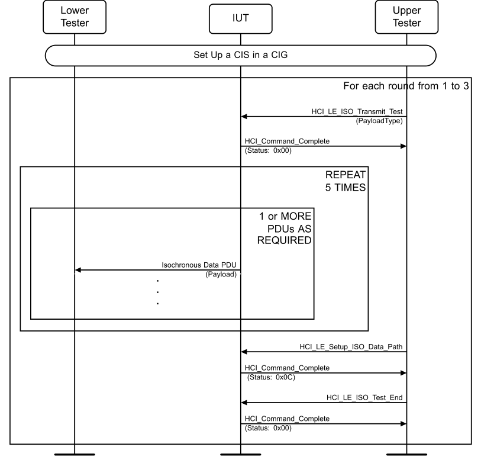

**Figure 4.12-1: ISO Transmit Test Mode, CIS MSC**

For each round in Table 4.12-2, execute steps 1–4:
1. The Upper Tester sends the HCI_LE_ISO_Transmit_Test command with PayloadType as specified in Table 4.12-2 and receives a successful HCI_Command_Complete event from the IUT in response. 2. The IUT sends isochronous data PDUs with Payload as specified in Table 4.12-2. The Packet Counter value meets the requirements for unframed PDUs as specified in [14] Section 7.1. 3. Repeat step 2 for a total of 5 payloads. 4. The Upper Tester sends an HCI_LE_Setup_ISO_Data_Path command to the IUT. 5. The IUT sends an HCI_Command_Complete event to the Upper Tester with Status set to 0x0C. 6. The Upper Tester sends the HCI_LE_ISO_Test_End command to the IUT and receives an HCI_Command_Status event from the IUT with the Status field set to Success.

|  | Round |  |  | Payload Type _ | Payload |  |
| --- | --- | --- | --- | --- | --- | --- |
| 1 |  |  | 0 |  | Each isochronous data PDU has a payload length = 0. |  |
| 2 |  |  | 1 |  | The first four octets of the isochronous data PDU contains a single 32-bit SDU count value. The remaining data is vendor specific. |  |

|  | Round |  |  | Payload Type _ |  |  | Payload |  |
| --- | --- | --- | --- | --- | --- | --- | --- | --- |
| 3 |  |  | 2 |  |  | The first four octets of the isochronous data PDU contains a single 32-bit SDU count value. The remaining data is vendor specific. |  |  |

Table 4.12-2: ISO Transmit Test Mode, CIS rounds
• Expected Outcome
Pass verdict
The Upper Tester successfully starts the ISO Transmit Test in step 1.
The IUT successfully sends five rounds of isochronous data PDUs to the Lower Tester.
In step 5, the IUT rejects the HCI_LE_Setup_ISO_Data_Path command with a 0x0C error.
LL/IST/BRD/BV-01-C [ISO Transmit Test Mode, BIS]
• Test Purpose
Verify that the IUT properly transmits test payloads in a BIS connection.
• Reference
[14] 7.1
• Initial Condition
- State: Periodic Advertising (selected Adv_Interval_Min, selected_Adv_Interval_Max, primary, supported type of own address, selected Periodic_Adv_interval_Min, selected Periodic_Adv_Interval_Max)
• Test Procedure

**Figure 4.12-2: ISO Transmit Test Mode, BIS MSC**

1. The Upper Tester sends the HCI_LE_Create_BIG_Test command to the IUT and receives a successful HCI_Command_Complete event from the IUT in response. The BIG is configured according to the parameters specified in Section 4.11.2.1, Common Parameters, BN = 1.
For each round in Table 4.12-2, execute steps 2–5:
2. The Upper Tester sends the HCI_LE_ISO_Transmit_Test command with Payload_Type as specified in Table 4.12-2 and receives a successful HCI_Command_Complete event from the IUT in response. 3. The IUT sends isochronous data PDUs with Payload as specified in Table 4.12-2. The SDU Count value meets the requirements for unframed PDUs as specified in [14] Section 7.1. 4. Repeat step 3 for a total of 5 payloads. 5. The Upper Tester sends an HCI_LE_Setup_ISO_Data_Path command to the IUT. 6. The IUT sends an HCI_Command_Complete event to the Upper Tester with Status set to 0x0C.
7. The Upper Tester sends the HCI_LE_ISO_Test_End command to the IUT and receives an HCI_Command_Status event from the IUT with the Status field set to Success. The returned Received_SDU_Count, Missed_SDU_Count, and Failed_SDU_Count are all zero. 8. The Upper Tester sends the HCI_LE_Terminate_BIG command using the assigned BIG_Handle and the Reason field set to a valid Error Code, and receives an HCI_LE_Terminate_BIG_Complete event in response.
• Expected Outcome
Pass verdict
The Upper Tester successfully starts the ISO Transmit Test in step 2.
The IUT successfully sends five rounds of isochronous data PDUs to the Lower Tester.
In step 6, the IUT rejects the HCI_LE_Setup_ISO_Data_Path command with a 0x0C error.
In step 7, the returned Received_SDU_Count, Missed_SDU_Count, and Failed_SDU_Count are all zero.
In step 8, the Upper Tester receives an HCI_LE_Terminate_BIG_Complete event from the IUT.

#### 4.12.4 ISO Receive Test Mode, CIS

• Test Purpose
Verify that the IUT properly receives ISO Receive Test PDUs in a CIS connection.
• Reference
[14] 7.2
• Initial Condition
- Connected in the relevant role as defined in the following initial states:
- State: Connected Isochronous Stream, Central, Test (values as specified in Section 4.10.2.3, Default Values for Set CIG Parameters Commands), with the exception that the HCI_LE_Setup_ISO_Data_Path command is not executed once the CIG is established and ISO_Interval is set to 400 ms.
- State: Connected Isochronous Stream, Peripheral (values as specified in Section 4.10.2.3, Default Values for Set CIG Parameters Commands), with the exception that the HCI_LE_Setup_ISO_Data_Path command is not executed once the CIG is established and ISO_Interval is set to 400 ms.
• Test Case Configuration

|  | Test Case |  |  | Role |  |
| --- | --- | --- | --- | --- | --- |
| LL/IST/CEN/BV-03-C |  |  | Central |  |  |
| LL/IST/PER/BV-03-C |  |  | Peripheral |  |  |

Table 4.12-3: ISO Receive Test Mode, CIS test cases
• Test Procedure

**Figure 4.12-3: ISO Receive Test Mode, CIS MSC**

For each round in Table 4.12-4, execute steps 1–7:
1. The Upper Tester sends the HCI_LE_ISO_Receive_Test command to the IUT with Payload_Type as specified in Table 4.12-4 and receives a successful HCI_Command_Complete event from the IUT in response. 2. The Lower Tester sends an SDU as specified in the table. 3. The IUT receives the expected test Payload PDU as specified in the table. 4. Repeat steps 2 and 3 for a total of 5 payloads. 5. The Upper Tester sends the HCI_LE_ISO_Read_Test_Counters command to the IUT. 6. The Upper Tester receives a return parameter of Received_SDU_Count as specified in Table 4.12-4. 7. The Upper Tester sends an HCI_LE_Setup_ISO_Data_Path command to the IUT. 8. The IUT sends an HCI_Command_Complete event to the Upper Tester with Status set to 0x0C.
9. The Upper Tester sends the HCI_LE_ISO_Test_End command to the IUT and receives an HCI_Command_Status event from the IUT with the Status field set to Success.

|  | Round |  |  | Framing |  |  | Payload Type _ |  |  | Payload |  |  | Received SDU Count _ _ |  |
| --- | --- | --- | --- | --- | --- | --- | --- | --- | --- | --- | --- | --- | --- | --- |
| 1 |  |  | 0 |  |  | 0 |  |  | Each ISO data PDU has a payload length = 0. |  |  | 5 |  |  |
| 2 |  |  | 0 |  |  | 1 |  |  | Variable length SDUs. The first 4 octets of each SDU contain an SDU Count that increments with each received SDU, in LSB order. |  |  | 5 |  |  |
| 3 |  |  | 0 |  |  | 2 |  |  | The first 4 octets of each SDU contain an SDU Count that increments with each received SDU, in LSB order. |  |  | 5 |  |  |
| 4 |  |  | 1 |  |  | 2 |  |  | Maximum length SDUs. The first 4 octets of each SDU contain an SDU Count that increments with each received SDU, in LSB order. |  |  | 5 |  |  |
| 5 |  |  | 1 |  |  | 1 |  |  | Variable length SDUs. The first 4 octets of each SDU contain an SDU Count that increments with each received SDU, in LSB order. |  |  | 5 |  |  |

Table 4.12-4: ISO Receive Test Mode, CIS rounds
• Expected Outcome
Pass verdict
For all rounds described in the test procedure, the following conditions occur:
- The IUT successfully receives one round of isochronous data PDUs from the lower tester in step 3.
- In step 6, the Received_SDU_Count value is the same as specified in Table 4.12-4.
- In step 8, the IUT rejects the HCI_LE_Setup_ISO_Data_Path command with a 0x0C error.
• Note:
When Framing is changing between rounds, Isochronous link needs to be terminated and re- established with correct Framing, as framing cannot be changed after creation.
LL/IST/SNC/BV-01-C [ISO Receive Test Mode, BIS]
• Test Purpose
Verify that the IUT properly receives ISO Receive Test PDUs in a BIS connection.
• Reference
[14] 7.2
• Initial Condition
- Synchronization has been established between the IUT and Lower Tester. ISO_Interval is set to 400 ms.
• Test Procedure

**Figure 4.12-4: LL/IST/SNC/BV-01-C [ISO Receive Test Mode, BIS] MSC**

1. The Upper Tester sends the HCI_LE_BIG_Create_Sync command to the IUT and receives a successful HCI_Command_Status event from the IUT in response. The BIG is configured according to the parameters specified in Section 4.11.2.1, Common Parameters, BN = 1. 2. The Upper Tester receives a successful HCI_LE_BIG_Sync_Established event from the IUT.
For each round in Table 4.12-4, execute steps 3–10:
3. The Upper Tester sends the HCI_LE_ISO_Receive_Test command to the IUT with Payload_Type as specified in Table 4.12-4 and receives a successful HCI_Command_Complete event from the IUT in response.
4. The Lower Tester sends an SDU as specified in Table 4.12-4. 5. The IUT receives the expected test Payload PDU as specified in Table 4.12-4. 6. Repeat steps 4 and 5 for a total of 5 payloads. 7. The Upper Tester sends the HCI_LE_ISO_Read_Test_Counters command to the IUT. 8. The Upper Tester receives a return parameter of Received_SDU_Count as specified in Table 4.12-4. 9. The Upper Tester sends an HCI_LE_Setup_ISO_Data_Path command to the IUT. 10. The IUT sends an HCI_Command_Complete event to the Upper Tester with Status set to 0x0C. 11. The Upper Tester sends the HCI_LE_ISO_Test_End command to the IUT and receives an HCI_Command_Status event from the IUT with the Status field set to Success. 12. The Upper Tester sends the HCI_LE_Terminate_BIG command using the assigned BIG_Handle and the Reason field set to a valid Error Code, and receives an HCI_LE_Terminate_BIG_Complete event in response.
• Expected Outcome
Pass verdict
For all rounds described in the test procedure, the following conditions occur:
- The IUT successfully receives one round of isochronous data PDUs from the Lower Tester in step 3.
- In step 6, the Received_SDU_Count value is the same as specified in Table 4.12-4.
- In step 8, the Upper Tester receives a return parameter of Received_SDU_Count as specified in Table 4.12-4.
- In step 10, the IUT rejects the HCI_LE_Setup_ISO_Data_Path command with a 0x0C error.
- In step 11, the Upper Tester receives an HCI_Command_Status event from the IUT with the Status field set to Success.
- In step 12, the Upper Tester receives an HCI_LE_Terminate_BIG_Complete event.
• Note:
When Framing is changing between rounds, Isochronous link needs to be terminated and re- established with correct Framing, as framing cannot be changed after creation.

#### 4.12.5 ISO Receive Test Mode missing PDU

• Test Purpose
Verify that the IUT properly increments counters when incoming test PDUs are missing or invalid.
• Reference
[14] 7.2
• Initial Condition
- An ACL connection has been established between the IUT and Lower Tester with a valid Connection Handle.
- The IUT acts in the role as specified in Table 4.12-5.
• Test Case Configuration

|  | Test Case |  |  | Role |  |
| --- | --- | --- | --- | --- | --- |
| LL/IST/CEN/BV-05-C |  |  | Central |  |  |
| LL/IST/PER/BV-05-C |  |  | Peripheral |  |  |

Table 4.12-5: ISO Receive Test Mode missing PDU test cases
• Test Procedure

**Figure 4.12-5: ISO Receive Test Mode missing PDU MSC**

1. Establish a CIS for the appropriate IUT role as described in Section 4.12.4 ISO Receive Test Mode, CIS. The Lower Tester initially sends Null PDUs. 2. The Upper Tester sends the HCI_LE_ISO_Receive_Test command to the IUT with Payload_Type=0 and receives a successful HCI_Command_Complete event from the IUT in response. 3. The Lower Tester sends an invalid test PDU where the data doesn’t match Payload_Type, SDU Count, and Max_PDU. 4. The Lower Tester sends valid test PDUs. 5. The Lower Tester skips one test PDU during a scheduled subevent. 6. The Lower Tester sends valid test PDUs. 7. The Lower Tester skips one test PDU during a scheduled subevent. 8. The Lower Tester sends valid test PDUs and continues to do so until completion of the test. 9. At some later point in time, the Upper Tester sends the HCI_LE_ISO_Read_Test_Counters command to the IUT. 10. The Upper Tester receives a return parameter of Failed_SDU_Count=1 and Missed_SDU_Count=2. 11. The Upper Tester sends the HCI_LE_ISO_Test_End command to the IUT and receives an HCI_Command_Complete event from the IUT with the Status field set to Success.
• Expected Outcome
Pass verdict
In step 2, the Upper Tester receives a successful HCI_Command_Complete event from the IUT in response.
In step 10, the Failed_SDU_Count and Missed_SDU_Count are the expected values.
In step 11, the Upper Tester receives an HCI_Command_Complete event from the IUT with the Status field set to Success.

### 4.13 PCL

Test of the Power Control procedures.

#### 4.13.1 References

This document incorporates provisions from other publications by dated or undated reference. These references are cited at the appropriate places in the text, and the publications are listed hereinafter. Additional definitions and abbreviations can be found in [1], [2], and [3].
[1] Specification of the Bluetooth System, Versions 4.0 or later
[2] Test Strategy and Terminology Overview
[3] Specification of the Bluetooth System, Volume 6, Part B (Link Layer Protocol Specification), Version 4.0
[4] ICS Proforma for Bluetooth Low Energy Link Layer Protocol Specification
[5] ITU-T X.290 series, OSI CONFORMANCE TESTING METHODOLOGY AND FRAMEWORK PROTOCOL RECOMMENDATIONS FOR ITU-T APPLICATIONS, ITU Recommendation X.290 series (equivalent to ISO 9646)
[6] Federal Information Processing Standards Publication 197, ADVANCED ENCRYPTION STANDARD (AES), FIPS, 2001
[7] Bluetooth Test Suite for RFPHY
[8] Specification of the Bluetooth System, Volume 6, Part B (Link Layer Protocol Specification), Version 4.2 or later
[9] Bluetooth Core IXIT proforma
[10] Specification of the Bluetooth System, Volume 6, Part B (Link Layer Protocol Specification), Version 5.0 or later
[11] Specification of the Bluetooth System, Volume 2, Part E (Versions 1.2 to 5.1) or Volume 4, Part E (Version 5.2 and higher) Host Controller Interface (HCI)
[12] Specification of the Bluetooth System, Volume 3, Part A, Logical Link Control and Adaptation Protocol (L2CAP) Specification
[13] Specification of the Bluetooth System, Volume 6, Part B (Link Layer Protocol Specification), Version 5.1 or later
[14] Specification of the Bluetooth System, Volume 6, Part B (Link Layer Protocol Specification), Version 5.2 or later
[15] Specification of the Bluetooth System, Volume 2, Part E (Versions 1.2 to 5.1) or Volume 4, Part E (Version 5.2 and higher) (Host Controller Interface Functional Specification), Version 5.2 or later
[16] Specification of the Bluetooth System, Volume 6, Part D (Message Sequence Charts), Version 5.2 or later
[17] Specification of the Bluetooth System, Volume 6, Part G (Isochronous Adaptation Layer), Version 5.2 or later
[18] Core Specification Supplement (CSS), Part A, Current Version
[19] Specification of the Bluetooth System, Volume 6, Part B (Link Layer Protocol Specification), Version 5.3 or later
[20] Specification of the Bluetooth System, Volume 4, Part E (Host Controller Interface (HCI)), Version 5.3 or later
[21] Specification of the Bluetooth System, Volume 3, Part H (Host Specification), Version 5.2 or later
[22] Appropriate Language Mapping Tables document
[23] Specification of the Bluetooth System, Volume 6, Part B (Link Layer Protocol Specification), Version 5.4 or later
[24] Specification of the Bluetooth System, Volume 4, Part E (Host Controller Interface (HCI)), Version 5.4 or later
[25] Specification of the Bluetooth System, Volume 6, Part B (Link Layer Protocol Specification), Version 6.0 or later
[26] Specification of the Bluetooth System, Volume 4, Part E (Host Controller Interface Specification), Version 6.0 or later
[27] Specification of the Bluetooth System, Volume 2, Part E (Versions 1.2 to 5.1) or Volume 4, Part E (Version 6.0 and higher) Host Controller Interface (HCI)
[28] Specification of the Bluetooth System, Volume 6, Part C (Sample Data), Version 6.0 or later

#### 4.13.2 RF Test Conditions

Some Power Control tests require altering the RF power level received by the IUT from the Lower Tester. The Lower Tester has an accuracy not worse than +/- 3 dB in transmitted power level. The test conditions can be achieved by one or more of the following means:
1. The Lower Tester and the IUT are connected with an RF cable and an RF attenuator to give sufficient measurement accuracy. TSPX_RF_Attenuation, defined in IXIT, is used to give the value for the RF attenuation calculated from the IUT’s RX power range, the cable loss, and the Lower Tester’s TX power range. 2. The setup of the Lower Tester, RF equipment, and/or facilities provides sufficient measurement accuracy to operate the IUT at the required receive power levels as well as sufficient TX power range to warrant power control corrections by the IUT.
Each of these may take into account the IUT’s “golden range” if it has one.

#### 4.13.3 Common PDU Contents and Procedures

##### 4.13.3.1 Power Control PDUs

LL_POWER_CONTROL_REQ: CtrData field:

|  | CtrData |  |  |  |
| --- | --- | --- | --- | --- |
| PHY (8 bits) |  | Delta (1 octet) | TxPower (1 octet) |  |

LL_POWER_CONTROL_RSP: CtrData field:

|  | CtrData |  |  |  |  |  |  |
| --- | --- | --- | --- | --- | --- | --- | --- |
| Min (1 bit) |  | Max (1 bit) | RFU (6 bits) ‘00’ | Delta (1 octet) | TxPower (1 octet) | APR (1 octet) |  |

LL_POWER_CHANGE_IND CtrData field:

|  | CtrData |  |  |  |  |  |  |
| --- | --- | --- | --- | --- | --- | --- | --- |
| PHY (8 bits) |  | Min (1 bit) | Max (1 bit) | RFU (6 bits) ‘00’ | Delta (1 octet) | TxPower (1 octet) |  |

##### 4.13.3.2 Power Control Requests

The IUT can send an LE_POWER_CONTROL_REQ PDU with Delta = 0 to the Lower Tester at any time during any test, except when it is already in a procedure that it initiated.
• Test Procedure
1. The IUT sends an LE_POWER_CONTROL_REQ PDU to the Lower Tester with Delta set to 0. 2. The Lower Tester sends an LE_POWER_CONTROL_RSP PDU to the IUT with valid values.

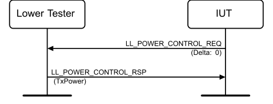

**Figure 4.13-1: Power Control Requests MSC**

#### 4.13.4 Both connected roles

##### 4.13.4.1 Path Loss Monitoring

• Test Purpose
Verify that the IUT performs the path loss monitoring operation on an ACL connection. The IUT notifies the Upper Tester of a path loss threshold event when path loss has entered the high/middle/low zones.
• Reference
[14] 4.5.16
• Initial Condition
- Parameters: TSPX_Path_Loss_Lower_Boundary, TSPX_Path_Loss_Upper_Boundary (specified in IXIT). The Lower Tester and IUT are configured as specified in Section 4.13.2 RF Test Conditions.
- The system under test is initially set such that the apparent path loss as seen by the IUT places it in the Path Loss Middle Zone.
- An ACL connection has been established between the IUT and the Lower Tester in the relevant role.
• Test Case Configuration

|  | Test Case |  |
| --- | --- | --- |
| LL/PCL/PER/BV-01-C [Path Loss Monitoring] |  |  |
| LL/PCL/CEN/BV-01-C [Path Loss Monitoring] |  |  |

Table 4.13-1: Path Loss Monitoring test cases
• Test Procedure

**Figure 4.13-2: Path Loss Monitoring MSC**

1. The Lower Tester continuously transmits empty data packets over the ACL connection with a connection interval of 7.5 ms. 2. The Upper Tester sends an HCI_LE_Set_Path_Loss_Reporting_Parameters command to the IUT, with the following parameter values: Connection_Handle set to the active connection handle, High_Threshold = TSPX_Path_Loss_Upper_Boundary, High_Hysteresis = 0x03 (3dB),
Low_Threshold = TSPX_Path_Loss_Lower_Boundary, Low_Hysteresis = 0x03 (3dB), Min_Time_Spent = 0x01. The IUT responds with an HCI_Command_Complete. 3. The Upper Tester enables path loss reporting for the active connection by sending an HCI_LE_Set_Path_Loss_Reporting_Enable command to the IUT with the Connection_Handle corresponding to the active connection and Enable = 0x01. The IUT responds with an HCI_Command_Complete. 4. The IUT monitors path loss on the connection for the remainder of the test. This can be done by using the LE Power Control Request procedure to determine the current power level of the peer and comparing this with the received power level, or it can be done using some other vendor- specific method. 5. The Lower Tester can change transmit power to implement steps 7, 8, and 9. If so, it does not send an LL_POWER_CHANGE_IND PDU to notify the IUT of the change. 6. The IUT sends an HCI_LE_Path_Loss_Threshold event, with Zone_Entered = 0x01 (Entered middle zone), to the Upper Tester. 7. The system under test is adjusted such that the IUT’s apparent path loss is gradually decreased until the IUT sends an HCI_LE_Path_Loss_Threshold event, with Zone_Entered = 0x00 (Entered low zone), to the Upper Tester. 8. The system under test is adjusted such that the IUT’s apparent path loss is gradually increased until the IUT sends an HCI_LE_Path_Loss_Threshold event, with Zone_Entered = 0x01 (Entered middle zone), after the path loss changes from the low zone to the middle zone. 9. The system under test is adjusted such that the IUT’s apparent path loss is gradually increased until the IUT sends an HCI_LE_Path_Loss_Threshold event, with Zone_Entered = 0x02 (Entered high zone) and the Current_Path_Loss, after the path loss changes from the middle zone to the high zone. 10. Move the high threshold above the current path loss by having the Upper Tester send an HCI_LE_Set_Path_Loss_Reporting_Parameters command to the IUT, with the following parameter values: Connection_Handle set to the active connection handle, High_Threshold = Current_Path_Loss from step 9 + 0x05, High_Hysteresis = 0x01 (1dB), Low_Threshold = TSPX_Path_Loss_Lower_Boundary, Low_Hysteresis = 0x01 (1dB), Min_Time_Spent = 0x01. The IUT responds with an HCI_Command_Complete. 11. The IUT sends an HCI_LE_Path_Loss_Threshold event with Zone_Entered = 0x01 (Entered middle zone) to the Upper Tester.
• Note
Note that Section 4.13.2 RF Test Conditions provides flexibility in how the IUT’s receive power is adjusted, and the means by which the apparent Path Loss is induced in the IUT may vary. An initial condition is chosen such that the apparent Path Loss as seen by the IUT can be varied across the supported Middle and Low Zone boundary.
• Expected Outcome
Pass verdict
In steps 7, 8, and 9, the IUT sends an HCI_LE_Path_Loss_Threshold event to the Upper Tester, as described in each step.
In step 11, the IUT sends an HCI_LE_Path_Loss_Threshold event with Zone_Entered = 0x01 to the Upper Tester after the High Threshold zone was moved below the current Path Loss.
• Test Purpose
Verify that the IUT can request to adjust the Lower Tester’s transmit power level on a specified PHY on the default LE-ACL logical link. The tester will verify that the IUT properly handles each response from the request.
• Reference
[14] 5.1.17
• Initial Condition
- Parameter: Power_Level_Midpoint is the average value between the TSPX_Minimum_Transmit_Power_Level and the TSPX_Maximum_Transmit_Power_Level values (declared as IXIT).
- The Lower Tester and IUT are configured as specified in Section 4.13.2 RF Test Conditions.
- The Lower Tester begins transmitting with the power level 10 dB below TSPX_Maximum_Transmit_Power_Level, or at the Power_Level_Midpoint value, whichever is greater.
- An ACL connection has been established between the IUT and the Lower Tester where the IUT role and the PHY used are specified in the Test Case Configuration.
• Test Case Configuration

|  | Test Case ID |  |  | PHY |  |  | IUT Role |  |
| --- | --- | --- | --- | --- | --- | --- | --- | --- |
| LL/PCL/PER/BV-03-C [Power Control Request – LE 1M PHY – Initiate, Peripheral] |  |  | LE 1M PHY (0x01) |  |  | Peripheral |  |  |
| LL/PCL/PER/BV-04-C [Power Control Request – LE 2M PHY – Initiate, Peripheral] |  |  | LE 2M PHY (0x02) |  |  | Peripheral |  |  |
| LL/PCL/PER/BV-05-C [Power Control Request – LE Coded PHY S = 8 – Initiate, Peripheral] |  |  | LE Coded PHY S=8 (0x04) |  |  | Peripheral |  |  |
| LL/PCL/CEN/BV-03-C [Power Control Request – LE 1M PHY – Initiate, Central] |  |  | LE 1M PHY (0x01) |  |  | Central |  |  |
| LL/PCL/CEN/BV-04-C [Power Control Request – LE 2M PHY – Initiate, Central] |  |  | LE 2M PHY (0x02) |  |  | Central |  |  |
| LL/PCL/CEN/BV-05-C [Power Control Request – LE Coded PHY S = 8 – Initiate, Central] |  |  | LE Coded PHY S=8 (0x04) |  |  | Central |  |  |
| LL/PCL/PER/BV-47-C [Power Control Request – LE Coded PHY S=2 – Initiate, Peripheral] |  |  | LE Coded PHY S=2 (0x08) |  |  | Peripheral |  |  |
| LL/PCL/CEN/BV-47-C [Power Control Request – LE Coded PHY S=2 – Initiate, Central] |  |  | LE Coded PHY S=2 (0x08) |  |  | Central |  |  |

Table 4.13-2: Power Control Request – Initiate test cases
• Test Procedure

**Figure 4.13-3: Power Control Request – Initiate MSC**

1. Repeat steps 2 and 3 until the IUT requests a power decrease by sending an LL_POWER_CONTROL_REQ PDU for the PHY in Table 4.13-2 with a negative Delta value or the resulting power increase reaches TSPX_Maximum_Transmit_Power_Level. 2. The Lower Tester increases its power by 2 dB at a rate of not more than 1 step per 5-second period. 3. The Lower Tester continuously transmits data packets over the ACL connection with a connection interval of 7.5 ms. 4. Repeat steps 5 and 6 until the IUT requests a power increase by sending an LL_POWER_CONTROL_REQ PDU for the PHY in Table 4.13-2 with a positive Delta value or the resulting power increase reaches TSPX_Minimum_Transmit_Power_Level. 5. The Lower Tester decreases its power by 2 dB at a rate of not more than 1 step per 5-second period. 6. The Lower Tester continuously transmits data packets over the ACL connection with a connection interval of 7.5 ms.
• Expected Outcome
Pass verdict
The IUT sends an LL_POWER_CONTROL_REQ PDU to the Lower Tester requesting that it lowers its power.
Later, the IUT sends an LL_POWER_CONTROL_REQ PDU to the Lower Tester requesting that it increases its power.
Inconclusive verdict
The Lower Tester reaches its minimum or maximum power level and the IUT has not responded with an LL_POWER_CONTROL_REQ.
• Notes
The Lower Tester can receive LL_POWER_CHANGE_IND PDUs from the IUT for any currently managed PHYs other than the one requested.
When the IUT is using the LE Coded PHY, the Lower Tester uses the indicated coding (S=2 or S=8) for all packets it sends.

##### 4.13.4.3 Power Control Response

• Test Purpose
Verify that the IUT can respond to a request from the Lower Tester to adjust the IUT’s transmit power level on a specified PHY on the default LE-ACL logical link. The Lower Tester will verify that the IUT properly responds to the request.
• Reference
[14] 5.1.17
• Initial Condition
- An ACL connection has been established between the IUT and the Lower Tester where the IUT role and the PHY used are specified in the Test Case Configuration.
- The IUT’s list of supported Power Control Levels is defined by the TSPX_Supported_Power_Levels_0dB_RF_Path_Compensation IXIT entry.
• Test Case Configuration

|  | Test Case ID |  |  | PHY |  |
| --- | --- | --- | --- | --- | --- |
| LL/PCL/PER/BV-08-C [Power Control Response – LE 1M PHY – Peripheral] |  |  | LE 1M PHY (0x01) |  |  |
| LL/PCL/PER/BV-09-C [Power Control Response – LE 2M PHY – Peripheral] |  |  | LE 2M PHY (0x02) |  |  |
| LL/PCL/PER/BV-10-C [Power Control Response – LE Coded PHY S=8 – Peripheral] |  |  | LE Coded PHY S=8 (0x04) |  |  |
| LL/PCL/PER/BV-11-C [Power Control Response – LE Coded PHY S=2 – Peripheral] |  |  | LE Coded PHY S=2 (0x08) |  |  |
| LL/PCL/CEN/BV-08-C [Power Control Response – LE 1M PHY – Central] |  |  | LE 1M PHY (0x01) |  |  |
| LL/PCL/CEN/BV-09-C [Power Control Response – LE 2M PHY – Central] |  |  | LE 2M PHY (0x02) |  |  |

|  | Test Case ID |  |  | PHY |  |
| --- | --- | --- | --- | --- | --- |
| LL/PCL/CEN/BV-10-C [Power Control Response – LE Coded PHY S=8 – Central] |  |  | LE Coded PHY S=8 (0x04) |  |  |
| LL/PCL/CEN/BV-11-C [Power Control Response – LE Coded PHY S=2 – Central] |  |  | LE Coded PHY S=2 (0x08) |  |  |

Table 4.13-3: Power Control Response test cases
• Test Procedure

**Figure 4.13-4: Power Control Response MSC**

1. If the TSPX_Supported_Power_Levels_0dB_RF_Path_Compensation size has fewer than three supported Power Levels, the test ends with an Inconclusive verdict. 2. The Lower Tester sends an LL_POWER_CONTROL_REQ PDU to the IUT with Delta = -64 dB. 3. The IUT sends an LL_POWER_CONTROL_RSP PDU to the Lower Tester. 4. Repeat steps 2 and 3 until the IUT is at the lowest supported power level. 5. The Upper Tester sends an HCI_LE_Enhanced_Read_Transmit_Power_Level command to the IUT with Connection_Handle set to the ACL Connection Handle and PHY set to the active connection.
6. The IUT sends an HCI_Command_Complete event to the Upper Tester with Status = 0x00 and Current_Transmit_Power_Level containing the actual transmit power level. 7. The Lower Tester sends an LL_POWER_CONTROL_REQ PDU to the IUT with Delta = a value between 1 and the difference between the next higher power level and the current power level. 8. The IUT sends an LL_POWER_CONTROL_RSP PDU to the Lower Tester with Delta = the difference between the next higher power level and the Current_Transmit_Power_Level from step 6. 9. The Upper Tester sends an HCI_LE_Enhanced_Read_Transmit_Power_Level command to the IUT with Connection_Handle set to the ACL Connection Handle and PHY set to the active connection. 10. The IUT sends an HCI_Command_Complete event to the Upper Tester, with Status = 0x00 and Current_Transmit_Power_Level containing the actual transmit power level, which must be equal to the last Current_Transmit_Power_Level received plus the Delta value reported in step 8. 11. Repeat steps 7–10 until the IUT is at the highest supported power level. 12. If the next lower power level is -1 dB lower, the Lower Tester sends an LL_POWER_CONTROL_REQ PDU to the IUT with Delta = -1 dB and the IUT responds with an LL_POWER_CONTROL_RSP PDU with Delta = -1 dB. Else proceed to step 14. 13. Repeat step 12 until it proceeds to step 14 or until the IUT is at the lowest supported power level, then proceed to step 16. 14. The Lower Tester sends an LL_POWER_CONTROL_REQ PDU to the IUT where Delta value is:
▪ less than 0 ▪ and greater than (the next lower power level – the current power level) 15. The IUT sends an LL_POWER_CONTROL_RSP PDU to the Lower Tester with Delta = 0. 16. The Upper Tester sends an HCI_LE_Enhanced_Read_Transmit_Power_Level command to the IUT with Connection_Handle set to the ACL Connection Handle and PHY set to the active connection. 17. The IUT sends an HCI_Command_Complete event to the Upper Tester with Status = 0x00 and Current_Transmit_Power_Level containing the actual transmit power level, which must be equal to the last Current_Transmit_Power_Level plus the sum of all Delta reported in step 12. 18. Repeat steps 7–10 until the IUT is at the highest supported power level. 19. The Lower Tester sends an LL_POWER_CONTROL_REQ PDU to the IUT with Delta equal to a value defined as follows: ▪ If the the power level lower than the next lower power level is -1dB lower than the next lower power level, then Delta is equal to (the next lower power level – the current power level).
▪ Else, Delta is a value less than (the next lower power level – the current power level)
and greater than
(the power level lower than the next lower power level – the current power level).
20. The IUT sends an LL_POWER_CONTROL_RSP PDU to the Lower Tester where Delta is equal to (the next lower power level – current power level). 21. The Upper Tester sends an HCI_LE_Enhanced_Read_Transmit_Power_Level command to the IUT with Connection_Handle set to the ACL Connection Handle and PHY set to the active connection. 22. The IUT sends an HCI_Command_Complete event to the Upper Tester with Status = 0x00 and Current_Transmit_Power_Level containing the actual transmit power level, which must be equal to the next lower power level from the last Current_Transmit_Power_Level received. 23. Repeat steps 19–22 until the next lower power level is at least -2dB lower than the current power level, or until the next lower power level is the lowest power level supported.
• Expected Outcome
Pass verdict
In steps 10, 17, and 22, the IUT reports the correct Current_Transmit_Power_Level.
In steps 8, 12, 15, and 20, the IUT reports the correct Delta in the LL_POWER_CONTROL_RSP PDU.
Inconclusive verdict
The IUT supports fewer than 3 Power Levels.
• Notes
While it may not be strictly necessary to attenuate the TX power from the IUT to the Lower Tester to execute this test, it may be advisable to ensure the RX power received by the Lower Tester is within the bounds of the Lower Tester’s RX operating range. A test setup with conditions similar to those described in Section 4.13.2 RF Test Conditions may be required.
The Lower Tester can receive LL_POWER_CHANGE_IND PDUs from the IUT for any currently managed PHYs other than the one requested.
Example:
Supported Power Levels: -8, 0, 8, 15. Below are the steps being executed.
1. IUT is at power level 15. 2. The Lower Tester sends an LL_POWER_CONTROL_REQ PDU with Delta = -64 dB. 3. The IUT sends an LL_POWER_CONTROL_RSP PDU with Delta = -23. 4. Skip 5. The Upper Tester sends an HCI_LE_Enhanced_Read_Transmit_Power_Level command. 6. The IUT sends an HCI_Command_Complete event with Current_Transmit_Power_Level = -8. 7. The Lower Tester sends an LL_POWER_CONTROL_REQ PDU with Delta = 6 (less than 0 – (-8)). 8. The IUT sends an LL_POWER_CONTROL_RSP PDU with Delta = 8 (power level went from -8 to 0). 9. The Upper Tester sends an HCI_LE_Enhanced_Read_Transmit_Power_Level command. 10. The IUT sends an HCI_Command_Complete event with Current_Transmit_Power_Level = 0. 11. Repeat the steps as below.
Repeat step 7 with Delta = 2 (less than 8 – 0). Repeat step 8 with Delta = 8 (power level went from 0 to 8). Repeat step 9. Repeat step 10 with Current_Transmit_Power_Level = 8. Repeat step 7 with Delta = 6 (less than 15 – 8). Repeat step 8 with Delta = 7 (power level went from 8 to 15). Repeat step 9. Repeat step 10 with Current_Transmit_Power_Level = 15. 12. Skip (8 is not 1 dB lower than 15, so proceed to step 14). 13. Skip 14. The Lower Tester sends an LL_POWER_CONTROL_REQ PDU with Delta = -3 (a value between 0 and (8 – 15)). 15. The IUT sends an LL_POWER_CONTROL_RSP with Delta = 0 (power level didn’t change). 16. The Upper Tester sends an HCI_LE_Enhanced_Read_Transmit_Power_Level command. 17. The IUT sends an HCI_Command_Complete event with Current_Transmit_Power_Level = 15. 18. Skip (Current_Transmit_Power_Level is the highest power level supported).
19. The Lower Tester sends an LL_POWER_CONTROL_REQ PDU with Delta = -12 (a value less than (8 – 15) and greater than (0 – 15)). 20. The IUT sends an LL_POWER_CONTROL_RSP PDU with Delta = -7 (power level went from 15 to 8). 21. The Upper Tester sends an HCI_LE_Enhanced_Read_Transmit_Power_Level command. 22. The IUT sends an HCI_Command_Complete event with Current_Transmit_Power_Level = 8. 23. Skip

##### 4.13.4.4 Power Configuration Response, Min and Max Power Level Reached

• Test Purpose
Verify that the IUT properly handles the Lower Tester sending the LL_POWER_CHANGE_IND when the Lower Tester’s minimum or maximum power level has been reached.
• Reference
[14] 5.1.17
• Initial Condition
- Parameters: The Lower and Upper range are defined as TSPX_Minimum_Transmit_Power_Level and TSPX_Maximum_Transmit_Power_Level IXIT values. Power_Level_Midpoint is the average value between the TSPX_Maximum_Transmit_Power_Level and the TSPX_Minimum_Transmit_Power_Level values.
- The Lower Tester and IUT are configured as specified in Section 4.13.2 RF Test Conditions.
- The Lower Tester begins transmitting with the power level 10 dB above TSPX_Minimum_Transmit_Power_Level, or at the Power_Level_Midpoint value, whichever is less.
- An ACL connection has been established between the IUT and the Lower Tester in the relevant role.
• Test Case Configuration

|  | Test Case |  |
| --- | --- | --- |
| LL/PCL/PER/BV-12-C [Power Configuration Response, Min and Max Power Level Reached] |  |  |
| LL/PCL/CEN/BV-12-C [Power Configuration Response, Min and Max Power Level Reached] |  |  |

Table 4.13-4: Power Configuration Response, Min and Max Power Level Reached test cases
• Test Procedure

**Figure 4.13-5: Power Configuration Response, Min and Max Power Level Reached MSC**

1. The Upper Tester sends the HCI_LE_Set_Transmit_Power_Reporting_Enable command to the IUT with the Connection_Handle set to the ACL connection handle and Remote_Enable = 0x01 and receives a successful HCI_Command_Complete event. 2. If the LL_POWER_CONTROL_REQ and LL_POWER_CONTROL_RSP PDUs have previously been exchanged, skip to step 4. 3. The IUT sends an LL_POWER_CONTROL_REQ PDU to the Lower Tester with Delta = 0 and PHY = the current PHY and receives an LL_POWER_CONTROL_RSP PDU in return with the TxPower set to the current Remote transmit power and RFU set to random bits set. 4. The Lower Tester continuously transmits data packets over the ACL connection with a connection interval of 7.5 ms. 5. The Lower Tester increases its power by 2 dB, at a rate of not more than one step per 1-second period. 6. The Lower Tester sends an LL_POWER_CHANGE_IND PDU to the IUT with the PHY parameter set to the active connection, Min = 0, Delta and TxPower set to reflect the Power Change in
step 5, and RFU set to random bits set. If the Lower Tester is at the maximum power level, then Max = 1. 7. The IUT sends an HCI_LE_Transmit_Power_Reporting event to the Upper Tester with Reason = 0x01, Delta and TX_Power_Level set to reflect the values received in step 6. In step 6, if Max = 1, then the TX_Power_Level_Flag = 0b10. 8. Repeat steps 5–7 until the Lower Tester reaches maximum power. 9. Set the Lower Tester power level 10 dB below TSPX_Maximum_Transmit_Power_Level, or at the Power_Level_Midpoint value, whichever is greater. 10. The Lower Tester decreases its power by 2 dB, at a rate of not more than one step per 1-second period. 11. The Lower Tester sends an LL_POWER_CHANGE_IND PDU to the IUT with the PHY parameter set to the active connection, Max = 0, Delta and TxPower set to reflect the Power Change in step 10, and RFU set to random bits set. If the Lower Tester is at the minimum power level, then Min = 1. 12. The IUT sends an HCI_LE_Transmit_Power_Reporting event to the Upper Tester with Reason = 0x01, Delta, PHY, and TX_Power_Level set to reflect the values received in step 11. In step 11, if Min = 1, then the TX_Power_Level_Flag = 0b01. 13. Repeat steps 10–12 until the Lower Tester reaches minimum power.
• Expected Outcome
Pass verdict
In step 7, the IUT sends an HCI_LE_Transmit_Power_Reporting event to the Upper Tester with the TX_Power_Level received in step 6. The TX_Power_Level_Flag is set to 0b10 when Max = 1 in step 6.
In step 12, the IUT sends an HCI_LE_Transmit_Power_Reporting event to the Upper Tester with the TX_Power_Level received in step 11. The TX_Power_Level_Flag is set to 0b01 when Min = 1 in step 11.

##### 4.13.4.5 Properly handle a Power Request PDU when waiting for a Power Response PDU

• Test Purpose
Verify that, when the IUT has sent out a Power Request PDU to the Lower Tester and receives a Power Request PDU from the Lower Tester while waiting for the Power Response PDU from the Lower Tester, the IUT properly sets the Acceptable Power Reduction parameter indicating it is unable to provide a value when responding to the Power Request PDU.
• Reference
[14] 5.1.17
• Initial Condition
- Parameters: TSPX_Minimum_Transmit_Power_Level, TSPX_Maximum_Transmit_Power_Level (as specified in IXIT). Power_Level_Midpoint is the average between TSPX_Maximum_Transmit_Power_Level and TSPX_Minimum_Transmit_Power_Level.
- The Lower Tester begins transmitting with the power level 10 dB above the declared TSPX_Minimum_Transmit_Power_Level, or at the Power_Level_Midpoint value, whichever is less.
- An ACL connection has been established between the IUT and the Lower Tester in the relevant role.
• Test Case Configuration

|  | Test Case |  |
| --- | --- | --- |
| LL/PCL/PER/BV-17-C [Properly handle a Power Request PDU when waiting for a Power Response PDU] |  |  |
| LL/PCL/CEN/BV-17-C [Properly handle a Power Request PDU when waiting for a Power Response PDU] |  |  |

Table 4.13-5: Properly handle a Power Request PDU when waiting for a Power Response PDU test cases
• Test Procedure

**Figure 4.13-6: Properly handle a Power Request PDU when waiting for a Power Response PDU MSC**

1. The Lower Tester continuously transmits data packets over the ACL connection with a connection interval of 7.5 ms. 2. The Lower Tester decreases its power by 2 dB, at a rate of not more than one step per 5-second period. 3. Repeat steps 1 and 2 until the IUT sends a power increase request by sending an LL_POWER_CONTROL_REQ PDU with a positive Delta value, or until the Lower Tester reaches TSPX_Minimum_Transmit_Power_Level. 4. The Lower Tester does not respond with LL_POWER_CONTROL_RSP PDU and sends an LL_POWER_CONTROL_REQ PDU, with Delta set to a positive value. 5. The IUT sends an LL_POWER_CONTROL_RSP PDU with APR = 0xFF.
• Expected Outcome
Pass verdict
In step 3, the IUT sends an LL_POWER_CONTROL_REQ PDU with a positive Delta value.
In step 5, the IUT responds with an LL_POWER_CONTROL_RSP PDU with correctly set APR indicating the IUT is unable to provide an APR value.
The Lower Tester reaches its minimum power level and the IUT has not responded with an LL_POWER_CONTROL_REQ.

##### 4.13.4.6 Power Control Request using an invalid or unsupported PHY

• Test Purpose
Verify that, when the IUT receives a Power Control Request PDU from the Lower Tester for a PHY that the IUT does not support or is invalid, the appropriate error is returned to the Lower Tester.
• Reference
[14] 5.1.17
• Initial Condition
- An ACL connection has been established between the IUT in the role as specified in Table 4.13-6.
• Test Case Configuration

|  | Test Case ID |  |  | Role |  |  | PHY |  |  | Configuration |  |
| --- | --- | --- | --- | --- | --- | --- | --- | --- | --- | --- | --- |
| LL/PCL/PER/BI-02-C |  |  | Peripheral |  |  | 0x00 |  |  | No PHY Specified |  |  |
| LL/PCL/CEN/BI-02-C |  |  | Central |  |  | 0x00 |  |  | No PHY Specified |  |  |
| LL/PCL/PER/BI-03-C |  |  | Peripheral |  |  | 0x02 |  |  | LE 2M PHY Not Supported |  |  |
| LL/PCL/CEN/BI-03-C |  |  | Central |  |  | 0x02 |  |  | LE 2M PHY Not Supported |  |  |
| LL/PCL/PER/BI-04-C |  |  | Peripheral |  |  | 0x04 |  |  | LE Coded PHY S=8 Not Supported |  |  |
| LL/PCL/CEN/BI-04-C |  |  | Central |  |  | 0x04 |  |  | LE Coded PHY S=8 Not Supported |  |  |
| LL/PCL/PER/BI-05-C |  |  | Peripheral |  |  | 0x08 |  |  | LE Coded PHY S=2 Not Supported |  |  |
| LL/PCL/CEN/BI-05-C |  |  | Central |  |  | 0x08 |  |  | LE Coded PHY S=2 Not Supported |  |  |
| LL/PCL/PER/BI-06-C |  |  | Peripheral |  |  | 0x03 |  |  | Multiple PHYs Specified |  |  |
| LL/PCL/CEN/BI-06-C |  |  | Central |  |  | 0x03 |  |  | Multiple PHYs Specified |  |  |
| LL/PCL/PER/BI-07-C |  |  | Peripheral |  |  | 0x80 |  |  | RFU |  |  |
| LL/PCL/CEN/BI-07-C |  |  | Central |  |  | 0x80 |  |  | RFU |  |  |

Table 4.13-6: Power Control Request using an invalid or unsupported PHY test cases
• Test Procedure

**Figure 4.13-7: Power Control Request using an invalid or unsupported PHY MSC**

1. The Lower Tester sends an LL_POWER_CONTROL_REQ PDU, with PHY set to the PHY Value in Table 4.13-6. 2. The IUT sends an LL_REJECT_EXT_IND PDU to the Lower Tester, with any valid error code.
• Expected Outcome
Pass verdict
In step 2, the IUT sends an LL_REJECT_EXT_IND PDU to the Lower Tester, with any valid error code.

##### 4.13.4.7 Power Change Indication on PHY Change

• Test Purpose
Verify that the IUT sends a Power Change Indication on a PHY change.
• Reference
[14] 5.1.18
• Initial Condition
- An ACL connection has been established on the 1M PHY between the IUT and the Lower Tester with the IUT in the role specified in Table 4.13-7.
• Test Case Configuration

|  | Test Case ID |  |  | Role |  |  | Original PHY |  |  | New PHY |  |
| --- | --- | --- | --- | --- | --- | --- | --- | --- | --- | --- | --- |
| LL/PCL/PER/BV-37-C [Power Change Indication on PHY Change, LE 2M PHY, Peripheral] |  |  | Peripheral |  |  | LE 1M PHY |  |  | LE 2M PHY |  |  |
| LL/PCL/PER/BV-38-C [Power Change Indication on PHY Change, LE Coded PHY, Peripheral] |  |  | Peripheral |  |  | LE 1M PHY |  |  | LE Coded PHY |  |  |
| LL/PCL/PER/BV-41-C [Power Change Indication on PHY Change, LE 2M to LE 1M PHY, Peripheral] |  |  | Peripheral |  |  | LE 2M PHY |  |  | LE 1M PHY |  |  |
| LL/PCL/PER/BV-42-C [Power Change Indication on PHY Change, LE 2M to LE Coded PHY, Peripheral] |  |  | Peripheral |  |  | LE 2M PHY |  |  | LE Coded PHY |  |  |
| LL/PCL/PER/BV-43-C [Power Change Indication on PHY Change, LE Coded to LE 1M PHY, Peripheral] |  |  | Peripheral |  |  | LE Coded PHY |  |  | LE 1M PHY |  |  |
| LL/PCL/PER/BV-44-C [Power Change Indication on PHY Change, LE Coded to LE 2M PHY, Peripheral] |  |  | Peripheral |  |  | LE Coded PHY |  |  | LE 2M PHY |  |  |
| LL/PCL/CEN/BV-37-C [Power Change Indication on PHY Change, LE 2M PHY, Central] |  |  | Central |  |  | LE 1M PHY |  |  | LE 2M PHY |  |  |

|  | Test Case ID |  |  | Role |  |  | Original PHY |  |  | New PHY |  |
| --- | --- | --- | --- | --- | --- | --- | --- | --- | --- | --- | --- |
| LL/PCL/CEN/BV-38-C [Power Change Indication on PHY Change, LE Coded PHY, Central] |  |  | Central |  |  | LE 1M PHY |  |  | LE Coded PHY |  |  |
| LL/PCL/CEN/BV-41-C [Power Change Indication on PHY Change, LE 2M to LE 1M PHY, Central] |  |  | Central |  |  | LE 2M PHY |  |  | LE 1M PHY |  |  |
| LL/PCL/CEN/BV-42-C [Power Change Indication on PHY Change, LE 2M to LE Coded PHY, Central] |  |  | Central |  |  | LE 2M PHY |  |  | LE Coded PHY |  |  |
| LL/PCL/CEN/BV-43-C [Power Change Indication on PHY Change, LE Coded to LE 1M PHY, Central] |  |  | Central |  |  | LE Coded PHY |  |  | LE 1M PHY |  |  |
| LL/PCL/CEN/BV-44-C [Power Change Indication on PHY Change, LE Coded to LE 2M PHY, Central] |  |  | Central |  |  | LE Coded PHY |  |  | LE 2M PHY |  |  |

Table 4.13-7: Power Change Indication on PHY Change test cases
• Test Procedure

**Figure 4.13-8: Power Change Indication on PHY Change MSC**

1. The Lower Tester sends an LL_PHY_REQ PDU to the IUT with the TX_PHYS and RX_PHYS set to the PHY specified in the “Original PHY” column of Table 4.13-7. The IUT and the Lower Tester complete the PHY Update procedure. If the Original PHY is not the LE 1M PHY, then, after the PHY change, the IUT sends to the Upper Tester an HCI_LE_PHY_Update_Complete event, with Subevent_Code = 0x0C, Status = 0x00, TX_PHY and RX_PHY set to the Original PHY. 2. The Lower Tester sends an LL_POWER_CONTROL_REQ PDU to the IUT with Delta = 0 and the PHY set to the PHY specified in the “Original PHY” column of Table 4.13-7. 3. The IUT sends an LL_POWER_CONTROL_RSP PDU to the Lower Tester. If the TxPower received in the LL_POWER_CONTROL_RSP PDU is equal to 126, the test case ends with a Fail verdict. 4. The Lower Tester sends an LL_POWER_CONTROL_REQ PDU to the IUT with Delta = 0 and the PHY set to the PHY specified in the “New PHY” column of Table 4.13-7. 5. The IUT sends an LL_POWER_CONTROL_RSP PDU to the Lower Tester. 6. The Lower Tester sends an LL_PHY_REQ PDU to the IUT with the TX_PHYS and RX_PHYS set to the new PHY. The IUT and the Lower Tester complete the PHY Update procedure. 7. After the PHY change, the IUT sends to the Upper Tester an HCI_LE_PHY_Update_Complete event, with Subevent_Code = 0x0C, Status = 0x00, TX_PHY and RX_PHY set to the new PHY.
8. If the TxPower parameter in the LL_POWER_CONTROL_RSP PDU in step 5 equals 126, then the IUT sends an LL_POWER_CHANGE_IND PDU to the Lower Tester with the PHY set to the New PHY and the TxPower set to the current Power. Optionally, the IUT will also send an LL_POWER_CHANGE_IND PDU to the Lower Tester with the PHY set to the Original PHY. 9. If the TxPower parameter in the LL_POWER_CONTROL_RSP PDU in step 5 is the current power and the IUT changes its power level after the PHY change, then the IUT sends an LL_POWER_CHANGE_IND PDU to the Lower Tester with the PHY set to the new PHY and the TxPower set to the current Power. 10. If the New PHY is the LE Coded PHY, the IUT may perform step 8 or 9 (as appropriate) twice, once for each coding.
• Expected Outcome
Pass verdict
In step 8, the IUT sends the LL_POWER_CHANGE_IND PDU to the Lower Tester if the TxPower parameter in the LL_POWER_CONTROL_RSP PDU in step 5 is 126.
In step 9, the IUT sends the LL_POWER_CHANGE_IND PDU to the Lower Tester if the TxPower parameter in the LL_POWER_CONTROL_RSP PDU in step 5 is the Current Power, and the IUT changes its power level after the PHY change.
Fail verdict
In step 3, the test fails if the TxPower received in the LL_POWER_CONTROL_RSP PDU equals 126.

##### 4.13.4.8 Power Control Request when a CIS has been established

• Test Purpose
Verify that the IUT can request to adjust the Lower Tester’s transmit power level when a Connected Isochronous Stream (CIS) is established. The tester will verify that the IUT properly handles each response from the request.
• Reference
[14] 5.1.17
Section 4.10, CIS
• Initial Condition
- Parameter: Power_Level_Midpoint is the average value between the TSPX_Minimum_Transmit_Power_Level and the TSPX_Maximum_Transmit_Power_Level values (declared as IXIT).
- The Lower Tester and IUT are configured as specified in Section 4.13.2 RF Test Conditions.
- The Lower Tester transmits with the power level 10 dB above TSPX_Minimum_Transmit_Power_Level, or at the Power_Level_Midpoint value, whichever is less.
- An ACL connection has been established between the IUT and the Lower Tester where the IUT role and the PHY used are specified in the Test Case Configuration. The ACL connection interval is 10 times the ISO interval for the corresponding PHY as specified in Section 4.10.3.1, CIS Setup Procedure, Central Initiated or, respectively, Section 4.10.4.1, CIS Setup Response Procedure, Peripheral.
• Test Case Configuration

|  | Test Case ID |  |  | Role |  |  | ACL PHY |  |  | CIS PHY |  |
| --- | --- | --- | --- | --- | --- | --- | --- | --- | --- | --- | --- |
| LL/PCL/PER/BV-20-C [Power Control Request – LE 1M PHY – CIS, Initiate, Peripheral] |  |  | Peripheral |  |  | LE 1M PHY (0x01) |  |  | LE 1M PHY (0x01) |  |  |
| LL/PCL/PER/BV-45-C [Power Control Request – LE 2M PHY – CIS, Initiate, Peripheral] |  |  | Peripheral |  |  | LE 2M PHY (0x02) |  |  | LE 1M PHY (0x01) |  |  |
| LL/PCL/PER/BV-22-C [Power Control Request – LE Coded PHY S = 8 – CIS, Initiate, Peripheral] |  |  | Peripheral |  |  | LE 1M PHY (0x01) |  |  | LE Coded PHY S=8 (0x04) |  |  |
| LL/PCL/CEN/BV-20-C [Power Control Request – LE 1M PHY – CIS, Initiate, Central] |  |  | Central |  |  | LE 1M PHY (0x01) |  |  | LE 1M PHY (0x01) |  |  |
| LL/PCL/CEN/BV-45-C [Power Control Request – LE 2M PHY – CIS, Initiate, Central] |  |  | Central |  |  | LE 2M PHY (0x02) |  |  | LE 1M PHY (0x01) |  |  |
| LL/PCL/CEN/BV-23-C [Power Control Request – LE Coded PHY S = 8 – CIS, Initiate, Central] |  |  | Central |  |  | LE 1M PHY (0x01) |  |  | LE Coded PHY S=8 (0x04) |  |  |
| LL/PCL/PER/BV-48-C [Power Control Request – LE Coded PHY S=2 – CIS, Initiate, Peripheral] |  |  | Peripheral |  |  | LE 1M PHY (0x01) |  |  | LE Coded PHY S=2 (0x08) |  |  |
| LL/PCL/CEN/BV-48-C [Power Control Request – LE Coded PHY S=2 – CIS, Initiate, Central] |  |  | Central |  |  | LE 1M PHY (0x01) |  |  | LE Coded PHY S=2 (0x08) |  |  |

Table 4.13-8: Power Control Request when a CIS has been established test cases
• Test Procedure

**Figure 4.13-9: Power Control Request when a CIS has been established MSC**

1. The Lower Tester sends an LL_POWER_CONTROL_REQ PDU to the IUT with Delta = 0 and the PHY set to the ACL PHY. 2. The IUT sends an LL_POWER_CONTROL_RSP PDU to the Lower Tester with the TxPower. 3. A CIS Setup Procedure is initiated (according to Section 4.10.3.1, CIS Setup Procedure, Central Initiated or, respectively, Section 4.10.4.1, CIS Setup Response Procedure, Peripheral), with the IUT in the role specified in the Test Case Configuration with PHY_C_TO_P and PHY_P_TO_C set to the CIS PHY specified in the Test Case Configuration.
Note: The LE Coded PHY test cases in Table 4.13-8 do not require a specific coding (S=2 or S=8) for this setup.
4. The Lower Tester starts to continuously transmit PDUs data packets over the CIS connection. 5. The Lower Tester decreases its power by 2 dB, at a rate of not more than one step per 5-second period, on the CIS connection. 6. Repeat steps 4 and 5 until the IUT sends a power increase request by sending an LL_POWER_CONTROL_REQ PDU, or until the Lower Tester reaches TSPX_Minimum_Transmit_Power_Level. 7. The IUT sends an LL_POWER_CONTROL_REQ PDU with a positive Delta value and the PHY set to the CIS PHY. 8. The Lower Tester responds with a valid LL_POWER_CONTROL_RSP PDU, with Delta = 0.
• Expected Outcome
Pass verdict
In step 7, the IUT sends at least one LL_POWER_CONTROL_REQ PDU to the Lower Tester, requesting power increase.
Inconclusive verdict
The Lower Tester reaches its minimum power level and the IUT has not responded with an LL_POWER_CONTROL_REQ.
• Notes
The Lower Tester can receive LL_POWER_CHANGE_IND PDUs from the IUT for any currently managed PHYs other than the one requested.
When the IUT is using the LE Coded PHY, the Lower Tester uses the indicated coding (S=2 or S=8) for all packets it sends.

##### 4.13.4.9 Power Control Response when a CIS has been established

• Test Purpose
Verify that the IUT can respond to a request from the Lower Tester to adjust the IUT’s transmit power level when a Connected Isochronous Stream (CIS) is established. The tester will verify that the IUT properly responds to the request.
• Reference
[14] 5.1.17
Section 4.10, CIS
• Initial Condition
- An ACL connection has been established between the IUT and the Lower Tester where the IUT role and the PHY used are specified in the Test Case Configuration.
• Test Case Configuration

|  | Test Case ID |  |  | Role |  |  | ACL PHY |  |  | CIS PHY |  |
| --- | --- | --- | --- | --- | --- | --- | --- | --- | --- | --- | --- |
| LL/PCL/PER/BV-25-C [Power Control Response – LE 1M PHY – CIS, Peripheral] |  |  | Peripheral |  |  | LE 1M PHY (0x01) |  |  | LE 1M PHY (0x01) |  |  |
| LL/PCL/PER/BV-46-C [Power Control Response – LE 2M PHY – CIS, Peripheral] |  |  | Peripheral |  |  | LE 2M PHY (0x02) |  |  | LE 1M PHY (0x01) |  |  |
| LL/PCL/PER/BV-28-C [Power Control Response – LE Coded PHY S=2 – CIS, Peripheral] |  |  | Peripheral |  |  | LE 1M PHY (0x01) |  |  | LE Coded PHY S=2 (0x08) |  |  |
| LL/PCL/CEN/BV-25-C [Power Control Response – LE 1M PHY – CIS, Central] |  |  | Central |  |  | LE 1M PHY (0x01) |  |  | LE 1M PHY (0x01) |  |  |
| LL/PCL/CEN/BV-46-C [Power Control Response – LE 2M PHY – CIS, Central] |  |  | Central |  |  | LE 2M PHY (0x02) |  |  | LE 1M PHY (0x01) |  |  |

|  | Test Case ID |  |  | Role |  |  | ACL PHY |  |  | CIS PHY |  |
| --- | --- | --- | --- | --- | --- | --- | --- | --- | --- | --- | --- |
| LL/PCL/CEN/BV-27-C [Power Control Response – LE Coded PHY S=8 – CIS, Central] |  |  | Central |  |  | LE 1M PHY (0x01) |  |  | LE Coded PHY S=8 (0x04) |  |  |

Table 4.13-9: Power Control Response when a CIS has been established test cases
• Test Procedure

**Figure 4.13-10: Power Control Response when a CIS has been established MSC**

1. A CIS Setup Procedure is initiated (according to Section 4.10.3.1, CIS Setup Procedure, Central Initiated or, respectively, Section 4.10.4.1, CIS Setup Response Procedure, Peripheral), with the IUT in the role specified in the Test Case Configuration with PHY_C_TO_P and PHY_P_TO_C set to the PHY specified in the Test Case Configuration. NOTE: The S=2 and S=8 Coded PHY CIS Setup Procedures utilize the LE Coded PHY test case configurations in Section 4.10.3.1, CIS Setup Procedure, Central Initiated and Section 4.10.4.1, CIS Setup Response Procedure, Peripheral. 2. The Lower Tester sends an LL_POWER_CONTROL_REQ PDU to the IUT with Delta = 0 and the PHY set to the CIS PHY. 3. The IUT sends an LL_POWER_CONTROL_RSP PDU to the Lower Tester. 4. The Upper Tester sends an HCI_LE_Enhanced_Read_Transmit_Power_Level command to the IUT, with Connection_Handle set to the ACL Connection Handle and PHY set to the CIS PHY. 5. The IUT sends to the Upper Tester an HCI_Command_Complete event, with Status = 0x00 and Current_Transmit_Power_Level containing the transmit power level.
6. The Lower Tester sends an LL_POWER_CONTROL_REQ PDU for the CIS connection, with Delta = –6 dB and the PHY set to the CIS PHY. 7. The IUT sends to the Lower Tester an LL_POWER_CONTROL_RSP PDU, with Delta set to an acceptable value around the requested change level. 8. Repeat step 4. 9. The IUT sends to the Upper Tester an HCI_Command_Complete event, with Status = 0x00 and Current_Transmit_Power_Level containing the transmit power level, which must be equal to the value received in step 4 plus the Delta value reported in step 6. 10. The Lower Tester sends an LL_POWER_CONTROL_REQ PDU, with Delta = +6 dB and the PHY set to the CIS PHY. 11. The IUT sends to the Lower Tester an LL_POWER_CONTROL_RSP PDU, with Delta set to an acceptable value around the requested change level. 12. Repeat step 4. 13. The IUT sends to the Upper Tester an HCI_Command_Complete event, with Status = 0x00 and Current_Transmit_Power_Level containing the actual transmit power level, which must be equal to the value received in step 9 plus the Delta value reported in step 11.
• Expected Outcome
Pass verdict
In steps 7 and 11, the IUT reports the correct Current_Transmit_Power_Level.
• Notes
While it may not be strictly necessary to attenuate the RF from the IUT to the Lower Tester to execute this test, it may be advisable to ensure the RX power received by the Lower Tester is within the bounds of the Lower Tester’s RX operating range. Techniques similar to those described in Section 4.13.2 RF Test Conditions may be employed if required.
The Lower Tester can receive LL_POWER_CHANGE_IND PDUs from the IUT for any currently managed PHYs other than the one requested.

##### 4.13.4.10 Remote Transmit Power Level Request

• Test Purpose
Verify that the IUT can request to read the transmit power level of the remote device. The tester will verify that the IUT properly handles each response from the request. Also verify that the IUT properly rejects the Lower Tester sending a power request with TxPower = 126.
• Reference
[14] 5.1.17
• Initial Condition
- An ACL connection has been established between the IUT and the Lower Tester where the IUT role and the PHY used are specified in the Test Case Configuration.
• Test Case Configuration

|  | Test Case ID |  |  | Role |  |  | PHY |  |
| --- | --- | --- | --- | --- | --- | --- | --- | --- |
| LL/PCL/PER/BV-29-C [Remote Power Transmit Level Request – LE 1M PHY – Initiate, Peripheral] |  |  | Peripheral |  |  | LE 1M PHY (0x00) |  |  |

Table 4.13-10: Remote Transmit Power Level Request test cases
• Test Procedure

**Figure 4.13-11: Remote Transmit Power Level Request MSC**

1. The Upper Tester sends an HCI_LE_Read_Remote_Transmit_Power_Level command to the IUT, with Connection_Handle and PHY set to the active connection. 2. The IUT sends to the Upper Tester an HCI_Command_Status event, with Status = 0x00. 3. If the IUT autonomously sends an LL_POWER_CONTROL_REQ before step 3, continue to step 5. Otherwise, the IUT sends to the Lower Tester an LL_POWER_CONTROL_REQ PDU with Delta = 0. If the TxPower = 126, the test case ends with a Fail verdict. 4. If the IUT sends an LL_POWER_CONTROL_REQ PDU in step 3, the Lower Tester sends an LL_POWER_CONTROL_RSP PDU with Delta = 0. 5. The IUT sends to the Upper Tester an HCI_LE_Transmit_Power_Reporting event with Status = 0x00, Reason = 0x02, Delta = 0 and the TX_Power_Level parameters set to the Lower Tester value. 6. The Lower Tester sends an LL_POWER_CONTROL_REQ PDU to the IUT with Delta = 0 and TxPower = 126. 7. The IUT sends an LL_REJECT_EXT_IND PDU to the Lower Tester with ErrorCode = 0x1E.
• Expected Outcome
Pass verdict
In step 3, the IUT sends an LL_POWER_CONTROL_REQ PDU with Delta = 0 if the LL_POWER_CONTROL_REQ PDU was not sent previously.
In step 5, the IUT reports the correct parameters to the Upper Tester.
In step 7, the IUT sends an LL_REJECT_EXT_IND PDU to the Lower Tester with ErrorCode = 0x1E.
Fail verdict
In step 3, the IUT sends an LL_POWER_CONTROL_REQ PDU with TxPower = 126.
• Test Purpose
Verify that the IUT can respond to a request from the Lower Tester to adjust the IUT’s transmit power level on a specified PHY on the default LE-ACL logical link, with RF path compensation. The Lower Tester will verify that the IUT properly responds to the request.
• Reference
[14] 5.1.17
• Initial Condition
- An ACL connection has been established between the IUT and the Lower Tester where the IUT role and the PHY used are specified in the Test Case Configuration.
• Test Case Configuration

|  | Test Case ID |  |  | Role |  |  | PHY |  |
| --- | --- | --- | --- | --- | --- | --- | --- | --- |
| LL/PCL/PER/BV-33-C [Power Control Response with RF Path Compensation – LE 1M PHY – Peripheral] |  |  | Peripheral |  |  | LE 1M PHY (0x01) |  |  |
| LL/PCL/PER/BV-34-C [Power Control Response with RF Path Compensation – LE 2M PHY – Peripheral] |  |  | Peripheral |  |  | LE 2M PHY (0x02) |  |  |
| LL/PCL/PER/BV-35-C [Power Control Response with RF Path Compensation – LE Coded PHY S=8 – Peripheral] |  |  | Peripheral |  |  | LE Coded PHY S=8 (0x04) |  |  |
| LL/PCL/PER/BV-36-C [Power Control Response with RF Path Compensation – LE Coded PHY S=2 – Peripheral] |  |  | Peripheral |  |  | LE Coded PHY S=2 (0x08) |  |  |
| LL/PCL/CEN/BV-33-C [Power Control Response with RF Path Compensation – LE 1M PHY – Central] |  |  | Central |  |  | LE 1M PHY (0x01) |  |  |
| LL/PCL/CEN/BV-34-C [Power Control Response with RF Path Compensation – LE 2M PHY – Central] |  |  | Central |  |  | LE 2M PHY (0x02) |  |  |
| LL/PCL/CEN/BV-35-C [Power Control Response with RF Path Compensation – LE Coded PHY S=8 – Central] |  |  | Central |  |  | LE Coded PHY S=8 (0x04) |  |  |
| LL/PCL/CEN/BV-36-C [Power Control Response with RF Path Compensation – LE Coded PHY S=2 – Central] |  |  | Central |  |  | LE Coded PHY S=2 (0x08) |  |  |

Table 4.13-11: Power Control Response with RF Path Compensation test cases
• Test Procedure

**Figure 4.13-12: Power Control Response with RF Path Compensation MSC**

Same as for Section 4.13.4.3 Power Control Response, depending on the role and configuration in Table 4.13-11, using the list of Supported Power Control Levels IXIT entry as shown in Table 4.13-12 and with the following pre-conditions:
- The Upper Tester sends an HCI_LE_Read_RF_Path_Compensation command to the IUT. The IUT returns the default RF_TX_Path_Compensation_Value.
- The Upper Tester sends an HCI_LE_Write_RF_Path_Compensation command to the IUT. The RF_Tx_Path_Compensation_Value parameter is set as shown in Table 4.13-12 for the current round. The RF Path compensation value is the default value received from the HCI_LE_Read_RF_Path_Compensation command +/- 5 dB.
Repeat the test procedure for each round shown in Table 4.13-12.

| Round |  | RF Tx Path |  | Supported Power Control Levels IXIT |
| --- | --- | --- | --- | --- |
|  |  | Compensation |  |  |
|  |  | Value |  |  |
| 1 | Default |  |  | TSPX Supported Power Levels 0dB RF Path Compensation _ _ _ _ _ _ _ |
| 2 | Default +5 dB |  |  | TSPX Supported Power Levels +5dB RF Path Compensation _ _ _ _ _ _ _ |
| 3 | Default –5 dB |  |  | TSPX Supported Power Levels -5dB RF Path Compensation _ _ _ _ _ _ _ |
| 4 | Default |  |  | TSPX Supported Power Levels 0dB RF Path Compensation _ _ _ _ _ _ _ |

Table 4.13-12: RF Tx Path Compensation values
• Expected Outcome
Pass verdict
In steps 10, 15, and 19, the IUT reports the correct Current_Transmit_Power_Level.
In steps 8, 13, and 17, the IUT reports the correct Delta in the LL_POWER_CONTROL_RSP PDU.
Inconclusive verdict
The IUT supports fewer than 3 Power Levels.
• Notes
While it may not be strictly necessary to attenuate the RF from the IUT to the Lower Tester to execute this test, it may be advisable to ensure the RX power received by the Lower Tester is within the bounds of the Lower Tester's RX operating range. Techniques similar to those described in Section 4.13.2 RF Test Conditions may be employed if required.
The Lower Tester can receive LL_POWER_CHANGE_IND PDUs from the IUT for any currently managed PHYs other than the one requested.

##### 4.13.4.12 Max and Min Power Level Response at Max and Min Power

• Test Purpose
Verify that the IUT properly responds to an increase power request when the IUT is at maximum transmit power. Verify that the IUT properly responds to a decrease power request when the IUT is at minimum transmit power.
• Reference
[14] 5.1.17
• Initial Condition
- Parameters: The Lower Tester and IUT are configured as specified in Section 4.13.2 RF Test Conditions.
- An ACL connection has been established between the IUT and the Lower Tester with the IUT Transmit Power between the maximum and the minimum transmit power.
• Test Case Configuration

|  | Test Case |  |
| --- | --- | --- |
| LL/PCL/PER/BV-40-C [Max and Min Power Level Response at Max and Min Power] |  |  |
| LL/PCL/CEN/BV-40-C [Max and Min Power Level Response at Max and Min Power] |  |  |

Table 4.13-13: Max and Min Power Level Response at Max and Min Power test cases
• Test Procedure

**Figure 4.13-13: Max and Min Power Level Response at Max and Min Power MSC**

1. The Upper Tester sends the HCI_LE_Set_Transmit_Power_Reporting_Enable command to the IUT with the Connection_Handle set to the ACL connection handle and Local_Enable = 0x01 and receives a successful HCI_Command_Complete event. 2. The Lower Tester continuously transmits data packets over the ACL connection with a connection interval of 7.5 ms. 3. The Lower Tester sends an LL_POWER_CONTROL_REQ PDU to the IUT with Delta = 2 and PHY = the current PHY. 4. The IUT increases its power by at least 2 dB, except if the IUT is at maximum power. 5. The IUT sends an LL_POWER_CONTROL_RSP PDU to the Lower Tester with the TxPower set to the current Local transmit power. If the IUT is at maximum power, then Max = 1 and Delta is greater than or equal to 0. Otherwise, Max = 0 and Delta is at least the Delta value in the LL_POWER_CONTROL_REQ sent by the Lower Tester in step 3. 6. The IUT sends an HCI_LE_Transmit_Power_Reporting event to the Upper Tester with Reason = 0x00, Delta, TX_Power_Level set to the current local power level. If the IUT is at the maximum transmit power level, then TX_Power_Level_Flag = 0b10. 7. Repeat steps 3–6 every second until the IUT is at maximum power.
8. The Lower Tester sends an LL_POWER_CONTROL_REQ PDU to the IUT with Delta = 2 and PHY = the current PHY. 9. The IUT sends an LL_POWER_CONTROL_RSP PDU to the Lower Tester with Delta = 0, Max = 1, and the TxPower set to the current Local transmit power. 10. The Lower Tester sends an LL_POWER_CONTROL_REQ PDU to the IUT with Delta = X and PHY = the current PHY. X has an initial value of –2. 11. The IUT decreases its power by Y dB, where Y is less than or equal to 0 and greater than or equal to the Delta value in the LL_POWER_CONTROL_REQ PDU sent by the Lower Tester in step 10. 12. The IUT sends an LL_POWER_CONTROL_RSP PDU to the Lower Tester where Delta is less than or equal to 0 and greater than or equal to the Delta value in the LL_POWER_CONTROL_REQ PDU sent by the Lower Tester in step 10 and the TxPower set to the current Local transmit power. If the IUT is at minimum power, then Min = 1; otherwise, Min = 0. 13. The IUT sends an HCI_LE_Transmit_Power_Reporting event to the Upper Tester with Reason = 0x00, Delta, TX_Power_Level set to the current local power level. If the IUT is at the minimum transmit power level, then TX_Power_Level_Flag = 0b01. 14. Repeat steps 10–13 every second until the IUT is at minimum power but decrease Delta value X in step 10 by 1 if the Delta value in LL_POWER_CONTROL_RSP sent by the IUT in step 12 was equal to 0. 15. The Lower Tester sends an LL_POWER_CONTROL_REQ PDU to the IUT with Delta = –2 and PHY = the current PHY. 16. The IUT sends an LL_POWER_CONTROL_RSP PDU to the Lower Tester with Delta = 0, Min = 1, and the TxPower set to the current Local transmit power.
• Expected Outcome
Pass verdict
In step 9, the IUT sends an LL_POWER_CONTROL_RSP PDU to the Lower Tester with Delta = 0 and Max = 1.
In step 12, the IUT sends an LL_POWER_CONTROL_RSP PDU to the Lower Tester with Delta = 0 and Min = 1.
In steps 6 and 13, the IUT sends an HCI_LE_Transmit_Power_Reporting event to the Upper Tester with the proper Delta, TX_Power_Level, and TX_Power_Level_Flag parameters.

##### 4.13.4.13 Power Change Request using an invalid or unsupported PHY

• Test Procedure
Verify that the IUT properly handles a Power Control Request PDU from the Lower Tester with a PHY value that the IUT does not support or is invalid.
• Reference
[19] 5.1.18
• Initial Condition
- An ACL connection has been established on the 1M PHY between the IUT and the Lower Tester with the IUT in the role specified in Table 4.13-14.
• Test Case Configuration

| Test Case ID |  |  | Role |  |  | PHY |  |  | Configuration |  |
| --- | --- | --- | --- | --- | --- | --- | --- | --- | --- | --- |
| LL/PCL/PER/BI-08-C |  |  | Peripheral |  |  | 0x00 |  |  | No PHY Specified |  |
| LL/PCL/CEN/BI-08-C |  |  | Central |  |  | 0x00 |  |  | No PHY Specified |  |
| LL/PCL/PER/BI-09-C |  |  | Peripheral |  |  | 0x02 |  |  | LE 2M PHY Not Supported |  |
| LL/PCL/CEN/BI-09-C |  |  | Central |  |  | 0x02 |  |  | LE 2M PHY Not Supported |  |
| LL/PCL/PER/BI-10-C |  |  | Peripheral |  |  | 0x04 |  |  | LE Coded PHY S=8 Not Supported |  |
| LL/PCL/CEN/BI-10-C |  |  | Central |  |  | 0x04 |  |  | LE Coded PHY S=8 Not Supported |  |
| LL/PCL/PER/BI-11-C |  |  | Peripheral |  |  | 0x08 |  |  | LE Coded PHY S=2 Not Supported |  |
| LL/PCL/CEN/BI-11-C |  |  | Central |  |  | 0x08 |  |  | LE Coded PHY S=2 Not Supported |  |
| LL/PCL/PER/BI-13-C |  |  | Peripheral |  |  | 0xF0 |  |  | RFU |  |
| LL/PCL/CEN/BI-13-C |  |  | Central |  |  | 0xF0 |  |  | RFU |  |

Table 4.13-14: Power Change Request using an invalid or unsupported PHY test cases
• Test Procedure

**Figure 4.13-14: Power Change Request using an invalid or unsupported PHY MSC**

1. The Upper Tester sends an HCI_LE_Set_Transmit_Power_Reporting_Enable command to the IUT with Connection_Handle set to the value of the current connection, Remote_Enable set to 0x01 (LE 1M PHY), and Local_Enable set to a valid value. 2. The IUT sends an LL_POWER_CONTROL_REQ PDU to the Lower Tester with PHY set to 0x01 and Delta set to 0x00. 3. The Lower Tester sends an LL_POWER_CONTROL_RSP PDU to the IUT with valid values. 4. The Lower Tester sends an LL_POWER_CHANGE_IND PDU to the IUT with the PHY field set to the specified value in Table 4.13-14. 5. The IUT does not send an HCI_LE_Transmit_Power_Reporting event to the Upper Tester.
• Expected Outcome
Pass verdict
In step 5, the IUT does not send an HCI_LE_Transmit_Power_Reporting event to the Upper Tester.
• Test Purpose
Verify that the IUT notifies the Upper Tester when the path loss has become unavailable. Verify that the IUT will notify the Upper Tester when the unavailable path loss becomes available.
• Reference
[14] 4.5.16
[20] 7.7.65.32
• Initial Condition
- Parameter: Power_Level_Midpoint is the average value between the TSPX_Minimum_Transmit_Power_Level and the TSPX_Maximum_Transmit_Power_Level values (declared as IXIT).
- Parameters: TSPX_Path_Loss_Lower_Boundary, TSPX_Path_Loss_Upper_Boundary (specified in IXIT). The Lower Tester and the IUT are configured as specified in Section 4.13.2 RF Test Conditions.
- The Lower Tester begins transmitting with the power level 10 dB below TSPX_Maximum_Transmit_Power_Level (declared as IXIT), or at the Power_Level_Midpoint value, whichever is greater.
- An ACL connection has been established between the IUT and the Lower Tester in the relevant role on the PHY as specified in Table 4.13-15.
• Test Case Configuration

|  | Test Case ID |  |  | Role |  |  | PHY |  |
| --- | --- | --- | --- | --- | --- | --- | --- | --- |
| LL/PCL/CEN/BV-49-C [Path Loss Monitoring Unavailable – LE 1M PHY – Initiate, Central] |  |  | Central |  |  | LE 1M PHY (0x01) |  |  |
| LL/PCL/CEN/BV-50-C [Path Loss Monitoring Unavailable – LE 2M PHY – Initiate, Central] |  |  | Central |  |  | LE 2M PHY (0x02) |  |  |
| LL/PCL/CEN/BV-51-C [Path Loss Monitoring Unavailable – LE Coded PHY S=8 – Initiate, Central] |  |  | Central |  |  | LE Coded PHY S=8 (0x04) |  |  |
| LL/PCL/CEN/BV-52-C [Path Loss Monitoring Unavailable – LE Coded PHY S=2 – Initiate, Central] |  |  | Central |  |  | LE Coded PHY S=2 (0x08) |  |  |
| LL/PCL/PER/BV-49-C [Path Loss Monitoring Unavailable – LE 1M PHY – Initiate, Peripheral] |  |  | Peripheral |  |  | LE 1M PHY (0x01) |  |  |
| LL/PCL/PER/BV-50-C [Path Loss Monitoring Unavailable – LE 2M PHY – Initiate, Peripheral] |  |  | Peripheral |  |  | LE 2M PHY (0x02) |  |  |
| LL/PCL/PER/BV-51-C [Path Loss Monitoring Unavailable – LE Coded PHY S=8 – Initiate, Peripheral] |  |  | Peripheral |  |  | LE Coded PHY S=8 (0x04) |  |  |
| LL/PCL/PER/BV-52-C [Path Loss Monitoring Unavailable – LE Coded PHY S=2 – Initiate, Peripheral] |  |  | Peripheral |  |  | LE Coded PHY S=2 (0x08) |  |  |

Table 4.13-15: Path Loss Monitoring - Unavailable test cases
• Test Procedure

**Figure 4.13-15: Path Loss Monitoring – Unavailable MSC**

1. The Upper Tester sends an HCI_LE_Set_Path_Loss_Reporting_Parameters command to the IUT, with the following parameter values: Connection_Handle set to the active connection handle, High_Threshold = TSPX_Path_Loss_Upper_Boundary, High_Hysteresis = 0x03 (3dB), Low_Threshold = TSPX_Path_Loss_Lower_Boundary, Low_Hysteresis = 0x03 (3dB), Min_Time_Spent = 0x01. The IUT responds with a successful HCI_Command_Complete. 2. The Upper Tester sends an HCI_LE_Set_Path_Loss_Reporting_Enable command to the IUT with Connection_Handle set to the active connection handle and Enable set to 0x01. The IUT responds with a successful HCI_Command_Complete.
3. At any time after step 2, and at any number of times, the IUT may send an LL_POWER_CONTROL_REQ PDU, with Delta set to zero, to the Lower Tester. The Lower Tester replies with an LL_POWER_CONTROL_RSP PDU to the IUT with TxPower set to the current level of the Lower Tester. 4. Repeat steps 5 and 6 until the IUT requests a power decrease by sending an LL_POWER_CONTROL_REQ PDU to the Lower Tester with PHY set to the value specified in Table 4.13-15 with a negative Delta value, or the resulting power increase reaches TSPX_Maximum_Transmit_Power_Level. 5. The Lower Tester increases its power by 2 dB at a rate of not more than 1 step per 5-second period. 6. The Lower Tester continuously transmits data packets over the ACL connection. 7. Immediately after the IUT sends an LL_POWER_CONTROL_REQ PDU to the Lower Tester, the Lower Tester sends an LL_POWER_CONTROL_RSP PDU to the IUT with TxPower set to 127. 8. The IUT sends an HCI_LE_Path_Loss_Threshold event to the Upper Tester with Current_Path_Loss set to 0xFF. 9. Repeat steps 10 and 11 until the IUT requests a power increase by sending an LL_POWER_CONTROL_REQ PDU to the Lower Tester with PHY set to the value specified in Table 4.13-15 with a positive Delta value, or the resulting power increase reaches TSPX_Minimum_Transmit_Power_Level. 10. The Lower Tester decreases its power by 2 dB at a rate of not more than 1 step per 5-second period. 11. The Lower Tester continuously transmits data packets over the ACL connection. 12. Immediately after the IUT sends an LL_POWER_CONTROL_REQ PDU to the Lower Tester, the Lower Tester sends an LL_POWER_CONTROL_RSP PDU to the IUT with TxPower set to the current level of the Lower Tester. 13. If the IUT sends the HCI_LE_Path_Loss_Threshold event in step 6, the IUT sends an HCI_LE_Path_Loss_Threshold event to the Upper Tester with Current_Path_Loss set to the new calculated value.
• Expected Outcome
Pass verdict
In step 8, the IUT sends an HCI_LE_Path_Loss_Threshold event to the Upper Tester with Current_Path_Loss set to 0xFF.
In step 13, the IUT sends an HCI_LE_Path_Loss_Threshold event to the Upper Tester with Current_Path_Loss set to the new calculated value.
Inconclusive verdict
If the Lower Tester reaches its minimum or maximum power level and the IUT has not responded with an LL_POWER_CONTROL_REQ.
• Notes
The Lower Tester can receive LL_POWER_CHANGE_IND PDUs from the IUT for any currently managed PHYs other than the one requested.
When the IUT is using the LE Coded PHY, the Lower Tester uses the indicated coding (S=2 or S=8) for all packets it sends.
• Test Purpose
Verify that, when the IUT receives a peer request to increase the power above the maximum supported power level, the IUT changes to the maximum supported power level.
• Reference
[14] 5.1.17
• Initial Condition
- An ACL connection has been established between the IUT and the Lower Tester where the IUT role and the PHY used are specified in the Test Case Configuration.
- The IUT’s maximum supported power level is defined by the TSPX_Max_Supported_Power_Level IXIT entry.
• Test Case Configuration

|  | Test Case ID |  |  | PHY |  |
| --- | --- | --- | --- | --- | --- |
| LL/PCL/PER/BV-53-C [Power Control Response, Max Power – LE 1M PHY – Peripheral] |  |  | LE 1M PHY (0x01) |  |  |
| LL/PCL/PER/BV-54-C [Power Control Response, Max Power – LE 2M PHY – Peripheral] |  |  | LE 2M PHY (0x02) |  |  |
| LL/PCL/PER/BV-55-C [Power Control Response, Max Power – LE Coded PHY S=8 – Peripheral] |  |  | LE Coded PHY S=8 (0x04) |  |  |
| LL/PCL/PER/BV-56-C [Power Control Response, Max Power – LE Coded PHY S=2 – Peripheral] |  |  | LE Coded PHY S=2 (0x08) |  |  |
| LL/PCL/CEN/BV-53-C [Power Control Response, Max Power – LE 1M PHY – Central] |  |  | LE 1M PHY (0x01) |  |  |
| LL/PCL/CEN/BV-54-C [Power Control Response, Max Power – LE 2M PHY – Central] |  |  | LE 2M PHY (0x02) |  |  |
| LL/PCL/CEN/BV-55-C [Power Control Response, Max Power – LE Coded PHY S=8 – Central] |  |  | LE Coded PHY S=8 (0x04) |  |  |
| LL/PCL/CEN/BV-56-C [Power Control Response, Max Power – LE Coded PHY S=2 – Central] |  |  | LE Coded PHY S=2 (0x08) |  |  |

Table 4.13-16: Power Control Response, Max Power test cases
• Test Procedure

**Figure 4.13-16: Power Control Response, Max Power MSC**

1. The Lower Tester sends an LL_POWER_CONTROL_REQ PDU to the IUT with Delta = 0 dB. 2. The IUT sends an LL_POWER_CONTROL_RSP PDU to the Lower Tester with TxPower set to the current transmit power. 3. If the current transmit power is not equal to TSPX_Max_Supported_Power_Level, skip to step 6. 4. The Lower Tester sends an LL_POWER_CONTROL_REQ PDU to the IUT with Delta = -15 dB. 5. The IUT sends an LL_POWER_CONTROL_RSP PDU to the Lower Tester with TxPower set to the current transmit power and Max set to 0b0. 6. The Lower Tester sends an LL_POWER_CONTROL_REQ PDU to the IUT with Delta = 10 dB. 7. The IUT sends an LL_POWER_CONTROL_RSP PDU to the Lower Tester with Delta set to the transmit power change value and Max set to 0b0. 8. Repeat steps 6 and 7 until the LL_POWER_CONTROL_RSP PDU sent in step 7 has the Max set to 0b1. 9. The Lower Tester sends an LL_POWER_CONTROL_REQ PDU to the IUT with Delta = 10 dB. 10. The IUT sends an LL_POWER_CONTROL_RSP PDU to the Lower Tester with Delta set to 0, TxPower set to TSPX_Max_Supported_Power_Level, and Max set to 0b1.
• Expected Outcome
Pass verdict
In step 10, the TxPower is the same as TSPX_Max_Supported_Power_Level, and Max is set to 0b1.
In step 10, Delta is set to 0.
• Test Purpose
Verify that the IUT sends a Power Change Indication to the Lower Tester if the Lower Tester has enabled remote reporting.
• Reference
[14] 5.1.18
• Initial Condition
- An ACL connection has been established on the 1M PHY between the IUT and the Lower Tester with the IUT in the role specified in Table 4.13-17.
• Test Case Configuration

|  | Test Case ID |  |
| --- | --- | --- |
| LL/PCL/PER/BV-57-C [Send Power Change Indication After LE Write RF Path Compensation, Peripheral] |  |  |
| LL/PCL/CEN/BV-57-C [Send Power Change Indication After LE Write RF Path Compensation, Central] |  |  |

Table 4.13-17: Send Power Change Indication After LE Write RF Path Compensation test cases
• Test Procedure

**Figure 4.13-17: Send Power Change Indication After LE Write RF Path Compensation MSC**

1. The Upper Tester sends an HCI_LE_Read_RF_Path_Compensation command to the IUT and receives a successful HCI_Command_Complete event with the default RF_TX_Path_Compensation_Value. This value is the default value that will be used in the following steps. 2. The Upper Tester sends an HCI_LE_Write_RF_Path_Compensation command to the IUT with RF_TX_Path_Compensation_Value set to the value from step 1 and receives a successful HCI_Command_Complete event in response. 3. The Lower Tester sends an LL_POWER_CONTROL_REQ PDU to the IUT with Delta = 0 and the PHY set 0x01 (LE 1M PHY). 4. The IUT sends an LL_POWER_CONTROL_RSP PDU to the Lower Tester. 5. The Upper Tester sends an HCI_LE_Write_RF_Path_Compensation command to the IUT with RF_TX_Path_Compensation_Value set to Default from step 1 + 5 dB and receives a successful HCI_Command_Complete event in response.
Alternative 6A (LL_POWER_CHANGE_IND PDU sent):
6A.1 The IUT sends an LL_POWER_CHANGE_IND PDU to the Lower Tester with Delta set to 5 and the power level received by the Lower Tester increases by 5 dB. Alternative 6B (LL_POWER_CHANGE_IND PDU not sent):
6B.1 The IUT does not send an LL_POWER_CHANGE_IND PDU but the power level received by the Lower Tester does not change. 7. The Upper Tester sends an HCI_LE_Write_RF_Path_Compensation command to the IUT with RF_TX_Path_Compensation_Value set to Default from step 1 - 5 dB and receives a successful HCI_Command_Complete event in response. 8. Perform alternative 8A or 8B depending on the IUT’s response.
Alternative 8A (LL_POWER_CHANGE_IND PDU sent):
8A.1 The IUT sends an LL_POWER_CHANGE_IND PDU to the Lower Tester with Delta set to -10 and the power level received by the Lower Tester decreases by 10 dB. Alternative 8B (LL_POWER_CHANGE_IND PDU is not sent):
8B.1 The IUT does not send an LL_POWER_CHANGE_IND PDU but the power level received by the Lower Tester does not change.
• Expected Outcome
Pass verdict
In steps 6A and 8A, the IUT sends an LL_POWER_CHANGE_IND PDU to the Lower Tester.
In step 6A, the IUT changes the power level by +5 dB.
In step 8A, the IUT changes the power level by -10 dB.
Fail verdict
In step 3, the test fails if the TxPower received in the LL_POWER_CONTROL_RSP PDU equals 126.
The IUT sends an LL_POWER_CHANGE_IND any time before step 4 has completed.

### 4.14 Channel Sounding

#### 4.14.1 References

This document incorporates provisions from other publications by dated or undated reference. These references are cited at the appropriate places in the text, and the publications are listed hereinafter. Additional definitions and abbreviations can be found in [1], [2], and [3].
[1] Specification of the Bluetooth System, Versions 4.0 or later
[2] Test Strategy and Terminology Overview
[3] Specification of the Bluetooth System, Volume 6, Part B (Link Layer Protocol Specification), Version 4.0
[4] ICS Proforma for Bluetooth Low Energy Link Layer Protocol Specification
[5] ITU-T X.290 series, OSI CONFORMANCE TESTING METHODOLOGY AND FRAMEWORK PROTOCOL RECOMMENDATIONS FOR ITU-T APPLICATIONS, ITU Recommendation X.290 series (equivalent to ISO 9646)
[6] Federal Information Processing Standards Publication 197, ADVANCED ENCRYPTION STANDARD (AES), FIPS, 2001
[7] Bluetooth Test Suite for RFPHY
[8] Specification of the Bluetooth System, Volume 6, Part B (Link Layer Protocol Specification), Version 4.2 or later
[9] Bluetooth Core IXIT proforma
[10] Specification of the Bluetooth System, Volume 6, Part B (Link Layer Protocol Specification), Version 5.0 or later
[11] Specification of the Bluetooth System, Volume 2, Part E (Versions 1.2 to 5.1) or Volume 4, Part E (Version 5.2 and higher) Host Controller Interface (HCI)
[12] Specification of the Bluetooth System, Volume 3, Part A, Logical Link Control and Adaptation Protocol (L2CAP) Specification
[13] Specification of the Bluetooth System, Volume 6, Part B (Link Layer Protocol Specification), Version 5.1 or later
[14] Specification of the Bluetooth System, Volume 6, Part B (Link Layer Protocol Specification), Version 5.2 or later
[15] Specification of the Bluetooth System, Volume 2, Part E (Versions 1.2 to 5.1) or Volume 4, Part E (Version 5.2 and higher) (Host Controller Interface Functional Specification), Version 5.2 or later
[16] Specification of the Bluetooth System, Volume 6, Part D (Message Sequence Charts), Version 5.2 or later
[17] Specification of the Bluetooth System, Volume 6, Part G (Isochronous Adaptation Layer), Version 5.2 or later
[18] Core Specification Supplement (CSS), Part A, Current Version
[19] Specification of the Bluetooth System, Volume 6, Part B (Link Layer Protocol Specification), Version 5.3 or later
[20] Specification of the Bluetooth System, Volume 4, Part E (Host Controller Interface (HCI)), Version 5.3 or later
[22] Appropriate Language Mapping Tables document
[23] Specification of the Bluetooth System, Volume 6, Part B (Link Layer Protocol Specification), Version 5.4 or later
[24] Specification of the Bluetooth System, Volume 4, Part E (Host Controller Interface (HCI)), Version 5.4 or later
[25] Specification of the Bluetooth System, Volume 6, Part B (Link Layer Protocol Specification), Version 6.0 or later
[26] Specification of the Bluetooth System, Volume 4, Part E (Host Controller Interface Specification), Version 6.0 or later
[27] Specification of the Bluetooth System, Volume 2, Part E (Versions 1.2 to 5.1) or Volume 4, Part E (Version 6.0 and higher) Host Controller Interface (HCI)
[28] Specification of the Bluetooth System, Volume 6, Part C (Sample Data), Version 6.0 or later

#### 4.14.2 Common Parameters and Variables

##### 4.14.2.1 ACL Connection Parameters

The Connection Interval is set to 500 ms.

##### 4.14.2.2 Default Channel Sounding Parameters

|  | Parameter |  |  | Value |  |
| --- | --- | --- | --- | --- | --- |
| ChM |  |  | 0x1FFFFFFFFFFFFC7FFFFC (all channels) |  |  |
| ChMRepetition |  |  | 1 |  |  |
| Main Mode _ |  |  | 2 (Mode-2) |  |  |
| Sub Mode _ |  |  | 1 (Mode-1) |  |  |
| Min Main Mode Steps _ _ _ |  |  | 3 |  |  |
| Max Main Mode Steps _ _ _ |  |  | 5 |  |  |
| Main Mode Repetition _ _ |  |  | 1 |  |  |
| Mode 0 Steps _ _ |  |  | 1 |  |  |
| CS SYNC PHY _ _ |  |  | 0 (1M PHY) |  |  |
| RTT Type _ |  |  | 0 (CS Access Address only) |  |  |
| Role |  |  | As specified in the individual test case |  |  |
| Companion Signal _ |  |  | 0 (no remote companion) |  |  |
| ChSel |  |  | 0 (Ch Sel #3b) |  |  |
| Ch3cShape |  |  | As specified in the individual test case |  |  |
| Ch3cJump |  |  | As specified in the individual test case |  |  |
| T IP1 _ |  |  | 7 (145 us) |  |  |
| T IP2 _ |  |  | 7 (145 us) |  |  |
| T FCS _ |  |  | 9 (150 us) |  |  |
| T PM _ |  |  | 2 (40 us) |  |  |
| connEventCount |  |  | NA (implementation selectable) |  |  |
| Offset Min _ |  |  | NA (implementation selectable) |  |  |
| Offset Max _ |  |  | NA (implementation selectable) |  |  |

|  | Parameter |  |  | Value |  |
| --- | --- | --- | --- | --- | --- |
| Max Procedure Len _ _ |  |  | 450 ms (50 ms less than default conn interval) |  |  |
| Event Interval _ |  |  | 1 |  |  |
| Subevents Per Event _ _ |  |  | 1 |  |  |
| Subevent Interval _ |  |  | 0 (NA) |  |  |
| Subevent Len _ |  |  | 450 ms |  |  |
| Procedure Interval _ |  |  | 0 (NA) |  |  |
| Procedure Count _ |  |  | 1 |  |  |
| ACI |  |  | 0 (1:1) |  |  |
| Preferred Peer Antennas _ _ |  |  | 1 |  |  |
| PHY |  |  | 0 (1M PHY) |  |  |
| Power Delta _ |  |  | 0 |  |  |

Table 4.14-1: Channel Sounding default parameters

#### 4.14.3 CEN

##### 4.14.3.1 Rejecting Channel Sounding Start Procedure Response with Invalid Parameters

• Test Purpose
Verify that an IUT properly rejects receiving an LL_CS_RSP PDU with invalid parameters.
• Reference
[25] 5.1.26
• Initial Condition
- An ACL channel with Encryption is established between the Central IUT and Peripheral Lower Tester with a Connection Interval defined in Section 4.14.2.1.
- The IUT and the Lower Tester have completed the CS Setup procedure and Create Config phase with parameters set to values in Section 4.14.2.2 and the IUT set as specified in Table 4.14-2.
• Test Case Configuration

|  | Test Case ID |  |  | IUT CS Role |  |  | Rounds |  |
| --- | --- | --- | --- | --- | --- | --- | --- | --- |
| LL/CS/CEN/INI/BI-01-C [Rejecting Channel Sounding Start Procedure Response with Invalid Parameters, Initiator] |  |  | Initiator |  |  | 1–8 |  |  |
| LL/CS/CEN/REF/BI-01-C [Rejecting Channel Sounding Start Procedure Response with Invalid Parameters, Reflector] |  |  | Reflector |  |  | 1–6 |  |  |

Table 4.14-2: Rejecting Channel Sounding Start Procedure Response with Invalid Parameters test cases
• Test Procedure

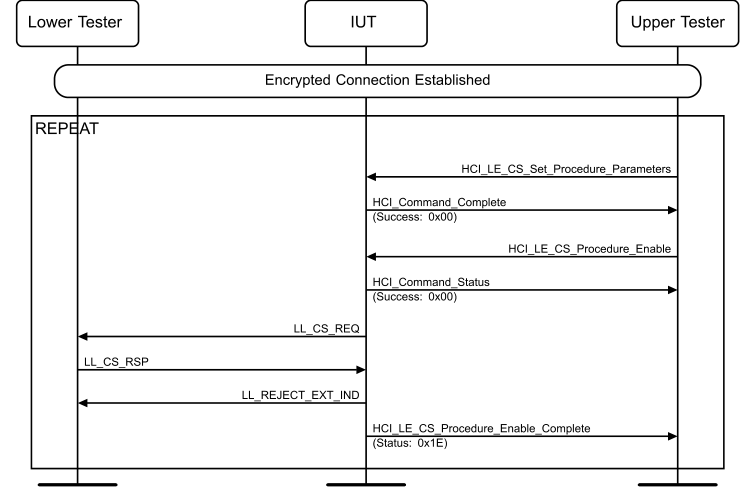

**Figure 4.14-1: Rejecting Channel Sounding Start Procedure Response with Invalid Parameters MSC**

Repeat for each round specified in Table 4.14-2.
1. The Upper Tester sends an HCI_LE_CS_Set_Procedure_Parameters command to the IUT. 2. The IUT sends a successful HCI_Command_Complete event to the Upper Tester. 3. The Upper Tester sends an HCI_LE_CS_Procedure_Enable command to the IUT. 4. The IUT sends a successful HCI_Command_Status event to the Upper Tester. 5. The IUT sends an LL_CS_REQ PDU to the Lower Tester. 6. The Lower Tester sends an LL_CS_RSP PDU to the IUT with all valid values except for the parameter listed in Table 4.14-3. 7. The IUT sends an LL_REJECT_EXT_IND PDU with ErrorCode set to 0x1E (Invalid LL Parameters). 8. The IUT sends an HCI_LE_CS_Procedure_Enable_Complete event with status set to 0x1E (Invalid LL Parameters).

|  | Round |  | Parameters | R | equirement Violated |  |
| --- | --- | --- | --- | --- | --- | --- |
| 1 |  | Subevent Len = 1249 _ |  | Subevent Len ≥ 1250 _ |  |  |
| 2 |  | Subevent Len = 4000000 _ |  | Subevent Len < 4 seconds _ |  |  |
| 3 |  | Offset Min = 499 _ |  | Offset Min ≥ 500 µs _ |  |  |
| 4 |  | Offset Min = 4000000 _ |  | Offset Min < 4 seconds _ |  |  |
| 5 |  | Offset Min = 501, Offset Max = 500 _ _ |  | Offset Max > Offset Min _ _ |  |  |
| 6 |  | Offset Max = TSPX conn interval _ _ _ |  | Offset Max < Connection Interval _ |  |  |
| 7 |  | connEventCount = connEventCount (step 5) – 1 |  | connEventCount (LL CS RSP) ≥ _ _ connEventCount (LL CS REQ) _ _ |  |  |
| 8 |  | Offset Min = Offset Min (step 5) – 1 _ _ |  | Offset Min (LL CS RSP) ≥ _ _ _ Offset Min (LL CS REQ) _ _ _ |  |  |

Table 4.14-3: Rejecting Channel Sounding Start Procedure Response with Invalid Parameters rounds
• Expected Outcome
Pass verdict
In step 7, the IUT rejects the received LL_CS_RSP PDU with ErrorCode set to 0x1E and doesn’t send an LL_CS_IND PDU.

##### 4.14.3.2 Channel Sounding Security Request, Complete all CS Procedures

• Test Purpose
Verify that a connected IUT with CS procedures in progress completes all CS procedures before transmitting a Channel Sounding Security Request PDU.
• Reference
[25] 5.1.23
• Initial Condition
- An ACL channel with Encryption is established between the IUT and the Lower Tester with a Connection Interval defined in Section 4.14.2.1.
- The Channel Sounding (Host Support) feature bit is set.
- The Central IUT and the Lower Tester have completed the CS Security Start and Capabilities Exchange procedures with the IUT and Lower Tester roles specified in Table 4.14-4.
• Test Case Configuration

|  | Test Case ID |  |  | IUT CS Role |  |
| --- | --- | --- | --- | --- | --- |
| LL/CS/CEN/INI/BV-01-C [Channel Sounding Security Request, Complete all CS Procedures, Central, Initiator] |  |  | Initiator |  |  |
| LL/CS/CEN/REF/BV-01-C [Channel Sounding Security Request, Complete all CS Procedures, Central, Reflector] |  |  | Reflector |  |  |

Table 4.14-4: Channel Sounding Security Request, Complete all CS Procedures test cases
• Test Procedure

**Figure 4.14-2: Channel Sounding Security Request, Complete all CS Procedures MSC – Page 1 of 2**

**Figure 4.14-3: Channel Sounding Security Request, Complete all CS Procedures MSC – Page 2 of 2**

1. The Upper Tester sends an HCI_LE_CS_Set_Default_Settings command to the IUT with Role_Enable set as specified in Table 4.14-4 and receives a successful HCI_Command_Complete event in response. 2. The Upper Tester sends an HCI_LE_CS_Create_Config command to the IUT with Config_ID set to 2, Main_Mode_Type set to 1, Sub_Mode_Type set to 0xFF, Min_Main_Mode_Steps set to 0,
Max_Main_Mode_Steps set to 0, Mode_0_Steps set to 3, and Role set as specified in Table 4.14-4 and other parameters set to the values in Section 4.14.2.2 and receives a successful HCI_Command_Status event in response. 3. The IUT sends an LL_CS_CONFIG_REQ PDU to the Lower Tester with parameters as specified in step 2. 4. The Lower Tester sends an LL_CS_CONFIG_RSP PDU to the IUT with Config_ID set to the value from step 3. 5. The IUT sends a successful HCI_LE_CS_Config_Complete event to the Upper Tester with Role and Config_ID set to the values from step 2. 6. The Upper Tester sends an HCI_LE_CS_Set_Procedure_Parameters with Config_ID set to the value from step 2, Role as specified in Table 4.14-4, Max_Procedure_Len set to 0x7D00 (20 s) or TSPX_CS_Max_Procedure_Duration (whichever is less), Procedure_Interval set to 0x32, Max_Procedure_Count set to 2, Min_Subevent_Len set to 2.5 ms, Max_Subevent_Len set to 2.5 ms, and all other parameters set to valid values. 7. The IUT sends an HCI_Command_Complete event to the Upper Tester. 8. The Upper Tester sends an HCI_LE_CS_Security_Enable command to the IUT and receives a successful HCI_Command_Status. 9. The IUT sends an LL_CS_SEC_REQ PDU to the Lower Tester. 10. The Lower Tester sends an LL_CS_SEC_RSP PDU to the IUT. 11. The IUT sends a successful HCI_LE_CS_Security_Enable_Complete event to the Upper Tester. 12. The Upper Tester sends an HCI_LE_CS_Procedure_Enable to the IUT with Config_ID set to the value from step 2 and Enable set to 0x01. 13. The IUT sends a successful HCI_Command_Status event to the Upper Tester. 14. The IUT sends an LL_CS_REQ PDU to the Lower Tester with Config_ID set to the value from step 2, Subevent_Len set to 2.5 ms, and Procedure_Count set to 2. 15. The Lower Tester sends an LL_CS_RSP PDU to the IUT with Config_ID, Subevent_Len set to 2.5 ms, and other parameters set to the values from step 14. 16. The IUT sends an LL_CS_IND PDU to the Lower Tester with Config_ID and other parameters set to the values from step 14. 17. The IUT sends an HCI_LE_CS_Procedure_Enable_Complete event to the Upper Tester with Config_ID set to the value from step 14, Procedure_Count set to 2, and Subevent_Len set to 2.5 ms. 18. The Lower Tester and the IUT execute the Mode-0 and Mode-1 channel sounding procedures. 19. The IUT sends one HCI_LE_CS_Subevent_Result event to the Upper Tester with Config_ID set to the value from step 1 and a Procedure_Done_Status. If Procedure_Done_Status bits 0–3 are set to 0b1, then the IUT sends one or more HCI_CS_Subevent_Result_Continue events to the Upper Tester with Config_ID set to the value from step 14.
Steps 18 and 19 execute until the procedure is terminated in step 22.
20. The Upper Tester sends an HCI_LE_CS_Security_Enable command to the IUT. 21. Perform alternative 21A or 21B according to the IUT’s response.
Alternative 21A: (Successful HCI_Command_Status):
21A.1 The IUT sends a successful HCI_Command_Status to the Upper Tester. 21A.2 The IUT may send an HCI_LE_CS_Security_Enable_Complete event to the Upper Tester with Status > 0. Alternative 21B: (HCI_Command_Status > 0):
21B.1 The IUT sends an HCI_Command_Status to the Upper Tester with Status > 0. 22. The Lower Tester sends an LL_CS_TERMINATE_REQ PDU with ProcCount set to 0 to the IUT, and the IUT responds with the LL_CS_TERMINATE_RSP PDU. 23. The IUT sends an HCI_LE_CS_Procedure_Enable_Complete event to the Upper Tester with Config_ID set to the value from step 14 and State set to 0x00.
24. If in step 21A.2 or 21B.1 the IUT sends an HCI event with Status > 0, then the Upper Tester sends an HCI_LE_CS_Security_Enable command to the IUT and receives a successful HCI_Command_Status. 25. The IUT sends an LL_CS_SEC_REQ PDU to the Lower Tester. 26. The Lower Tester sends an LL_CS_SEC_RSP PDU to the IUT. 27. The IUT sends a successful HCI_LE_CS_Security_Enable_Complete event to the Upper Tester.
• Expected Outcome
Pass verdict
In step 21A.2 or 21B.1, the IUT returns an HCI event with an error to the Upper Tester.
In step 27, the IUT sends a successful HCI_LE_CS_Security_Enable_Complete event.
LL/CS/CEN/BI-01-C [Reject Security Start Procedure, Encryption Start Procedure Not Complete]
• Test Purpose
Verify that a connected IUT properly rejects a security start procedure request from the Lower Tester when the Encryption procedure is not completed.
• Reference
[25] 5.1.23
• Initial Condition
- State: Encryption Keys Calculated (common identity root, common encryption root) AND Connected Central (any scan interval, any scan window, selected type of peer address, Lower Tester address, selected type of own address, connection interval, common Peripheral latency, common timeout)
- An unencrypted ACL channel is established between the IUT and the Lower Tester with a Connection Interval defined in Section 4.14.2.1.
• Test Procedure

**Figure 4.14-4: Reject Security Start Procedure, Encryption Start Procedure Not Complete MSC**

1. The Upper Tester sends an HCI_LE_Enable_Encryption command to the IUT with valid parameters and receives a successful HCI_Command_Status event in response. 2. The IUT sends an LL_ENC_REQ PDU to the Lower Tester. 3. The Lower Tester does not send an LL_ENC_RSP PDU to the IUT. 4. The Upper Tester sends an HCI_LE_CS_Security_Enable command to the IUT. 5. Perform alternative 5A or 5B depending on the IUT’s response.
Alternative 5A (Successful HCI_Command_Status):
5A.1 The IUT sends a successful HCI_Command_Status event to the Upper Tester. 5A.2 The IUT sends an HCI_LE_CS_Security_Enable_Complete event to the Upper Tester with Status set to 0x2F. Alternative 5B (HCI_Command_Status with an error code):
5B.1 The IUT sends an HCI_Command_Status event to the Upper Tester with Status set to 0x2F.
• Expected Outcome
Pass verdict
In step 5, the IUT returns a 0x2F error code.

#### 4.14.4 PER

##### 4.14.4.1 Reject Channel Sounding Start Procedure During Ongoing Connection Subrating Procedure, Peripheral

• Test Purpose
Verify that a connected Peripheral IUT either rejects a channel sounding start procedure request while a connection subrating procedure is ongoing or waits until the connection subrating procedure is completed before starting the channel sounding start procedure.
• Reference
[25] 5.1.26
• Initial Condition
- An ACL channel with Encryption is established between the IUT and the Lower Tester with a Connection Interval defined in Section 4.14.2.1.
- The Connection Subrating (Host Support) feature bit is set.
- The Channel Sounding (Host Support) feature bit is set.
- The IUT and the Lower Tester have completed the CS Security Start, Capabilities Exchange procedures, Remote FAE Exchange if No FAE is set to 0, and Set Default Settings with the IUT and Lower Tester roles specified in Table 4.14-5.
- The IUT and the Lower Tester have completed the CS Configuration Procedure with parameters specified in Section 4.14.2.2.
• Test Case Configuration

|  | Test Case ID |  |  | IUT Role |  |  | IUT CS Role |  |
| --- | --- | --- | --- | --- | --- | --- | --- | --- |
| LL/CS/PER/INI/BI-01-C [Reject Channel Sounding Start Procedure During Ongoing Connection Subrating Procedure, Peripheral, Initiator] |  |  | Peripheral |  |  | Initiator |  |  |
| LL/CS/PER/REF/BI-01-C [Reject Channel Sounding Start Procedure During Ongoing Connection Subrating Procedure, Peripheral, Reflector] |  |  | Peripheral |  |  | Reflector |  |  |

Table 4.14-5: Reject Channel Sounding Start Procedure During Ongoing Connection Subrating Procedure, Peripheral test cases
• Test Procedure

**Figure 4.14-5: Reject Channel Sounding Start Procedure During Ongoing Connection Subrating Procedure, Peripheral MSC**

1. The Upper Tester sends an HCI_LE_Subrate_Request command to the IUT and receives a successful HCI_Command_Status event in response. 2. The IUT sends an LL_SUBRATE_REQ PDU to the Lower Tester. 3. The Upper Tester sends an HCI_LE_CS_Set_Procedure_Parameters command to the IUT. 4. The IUT sends a successful HCI_Command_Complete event to the Upper Tester. 5. The Upper Tester sends an HCI_LE_CS_Procedure_Enable command to the IUT with Enable set to 0x01. 6. Perform either alternative 6A, 6B, or 6C depending on the IUT’s response.
Alternative 6A (IUT sends a successful HCI_Command_Status followed by an LE CS Procedure Enable Complete event with an error code):
6A.1 The IUT sends a successful HCI_Command_Status to the Upper Tester. 6A.2 The IUT optionally sends an HCI_LE_CS_Procedure_Enable_Complete event to the Upper Tester with Status > 0. Alternative 6B (IUT sends Status > 0):
6B.1 The IUT sends an HCI_Command_Status to the Upper Tester with Status > 0. Alternative 6C (IUT sends a successful HCI_Command_Status followed by the IUT waiting for the Connection Subrate Request procedure to complete):
6C.1 The IUT sends a successful HCI_Command_Status event. 6C.2 The IUT does not send an LL_CS_REQ PDU to the Lower Tester for 10 connection intervals. 6C.3 Continue the test and the IUT selects alternative 11A. 7. The Lower Tester sends an LL_CS_REQ PDU to the IUT. 8. The IUT sends an LL_REJECT_EXT_IND PDU to the Lower Tester with ErrorCode > 0. 9. The Lower Tester sends an LL_SUBRATE_IND PDU to the IUT. 10. The IUT sends an HCI_LE_Subrate_Change event to the Upper Tester. 11. If the IUT performs step 6B.1, then the test executes alternative 11B; otherwise, perform either alternative 11A or 11B depending on step 6A.2. Alternative 11A (In step 6A.2, the IUT does not send the event):
11A.1 The IUT sends an LL_CS_REQ PDU to the Lower Tester. 11A.2 The Lower Tester sends an LL_CS_IND PDU to the IUT. Alternative 11B (In step 6A.2, the IUT sends the event):
11B.1 The Lower Tester sends an LL_CS_REQ PDU to the IUT. 11B.2 The IUT sends an LL_CS_RSP PDU to the Lower Tester. 11B.3 The Lower Tester sends an LL_CS_IND PDU to the IUT. 12. The IUT sends an HCI_LE_CS_Procedure_Enable_Complete event to the Upper Tester.
• Expected Outcome
Pass verdict
In step 6C, the IUT waits for the Lower Tester to complete the Connection Subrate Request procedure before starting the CS procedure, and the IUT starts the CS start procedure in alternative 11A.
In step 8, the IUT sends a reject PDU to the Lower Tester.
LL/CS/PER/BI-01-C [Reject LL_CS_SEC_REQ if ACL is Unencrypted]
• Test Purpose
Verify that an IUT that has an unencrypted ACL connection with the Lower Tester rejects the LL_CS_SEC_REQ PDU.
• Reference
[25] 4.5.18.2
• Initial Condition
- An unencrypted ACL channel is established between the IUT and the Lower Tester with a Connection Interval defined in Section 4.14.2.1.
- The Channel Sounding (Host Support) feature bit is set.
• Test Procedure

**Figure 4.14-6: Reject LL_CS_SEC_REQ if ACL is Unencrypted MSC**

1. The Lower Tester sends an LL_CS_SEC_REQ PDU to the IUT. 2. The IUT sends an LL_REJECT_EXT_IND PDU to the Lower Tester with ErrorCode set to 0x2F.
• Expected Outcome
Pass verdict
In step 2, the IUT sends an LL_REJECT_EXT_IND PDU with a 0x2F error code.

#### 4.14.5 INI

##### 4.14.5.1 Initiate a CS FAE Exchange Procedure, Initiator

• Test Purpose
Verify that an IUT initiates a CS FAE Exchange Procedure. Once complete, the Upper Tester fails to write a cached copy of the remote FAE table into the local controller due to the LL_CS_FAE_RSP PDU being received. The devices drop the connection and reconnect. The Upper Tester is then able to write a cached copy of the remote FAE table into the local controller.
• Reference
[25] 2.4.2.52, 5.1.29
• Initial Condition
- An ACL channel with Encryption is established between the IUT and the Lower Tester with a Connection Interval defined in Section 4.14.2.1.
- The IUT and the Lower Tester have completed the CS Security procedure through the CS security exchange.
• Test Case Configuration

|  | Test Case ID |  |  | IUT Role |  |
| --- | --- | --- | --- | --- | --- |
| LL/CS/CEN/INI/BV-02-C [Initiate a CS FAE Exchange Procedure, Central, Initiator] |  |  | Central |  |  |
| LL/CS/PER/INI/BV-01-C [Initiate a CS FAE Exchange Procedure, Peripheral, Initiator] |  |  | Peripheral |  |  |

Table 4.14-6: Initiate a CS FAE Exchange Procedure, Initiator test cases
• Test Procedure

**Figure 4.14-7: Initiate a CS FAE Exchange Procedure, Initiator MSC**

1. The Upper Tester sends an HCI_LE_CS_Set_Default_Settings command to the IUT and receives a successful HCI_Command_Complete event in response. 2. The Upper Tester sends an HCI_LE_CS_Read_Remote_Supported_Capabilities command to the IUT and receives a successful HCI_Command_Status event in response. 3. The IUT sends an LL_CS_CAPABILITIES_REQ PDU to the Lower Tester. 4. The Lower Tester sends an LL_CS_CAPABILTIES_RSP PDU to the IUT with the NO_FAE bit set to 0. 5. The IUT sends a successful HCI_LE_CS_Read_Remote_Supported_Capabilities_Complete event to the Upper Tester. 6. The Upper Tester sends an HCI_LE_CS_Read_Remote_FAE_Table command to the IUT. 7. The IUT sends a successful HCI_Command_Status event to the Upper Tester. 8. The IUT sends an LL_CS_FAE_REQ PDU to the Lower Tester. 9. The Lower Tester sends an LL_CS_FAE_RSP PDU to the IUT with ChFAE set to the Lower Tester FAE Table. 10. The IUT sends a successful HCI_LE_CS_Read_Remote_FAE_Table_Complete event to the Upper Tester with Remote_FAE_Table set to the value returned in step 9. 11. The Upper Tester sends an HCI_LE_CS_Write_Cached_Remote_FAE_Table command to the IUT with Remote_FAE_Table set to the value in step 9. 12. The IUT sends an HCI_Command_Complete event to the Upper Tester with Status set to 0x0C. 13. The IUT and the Lower Tester disconnect the connection. 14. The IUT and the Lower Tester reconnect with an encrypted connection. 15. The IUT and the Lower Tester have completed the CS security procedure. 16. The Upper Tester sends an HCI_LE_CS_Set_Default_Settings command to the IUT and receives a successful HCI_Command_Complete event in response. 17. The Upper Tester sends an HCI_LE_CS_Read_Remote_Supported_Capabilities command to the IUT and receives a successful HCI_Command_Status event in response. 18. The IUT sends an LL_CS_CAPABILITIES_REQ PDU to the Lower Tester. 19. The Lower Tester sends an LL_CS_CAPABILTIES_RSP PDU to the IUT with the NO_FAE bit set to 0. 20. The IUT sends a successful HCI_LE_CS_Read_Remote_Supported_Capabilities_Complete event to the Upper Tester. 21. The Upper Tester sends an HCI_LE_CS_Write_Cached_Remote_FAE_Table command to the IUT with Remote_FAE_Table set to the value in step 9. 22. The IUT sends a successful HCI_Command_Complete event to the Upper Tester.
• Expected Outcome
Pass verdict
In step 8, the IUT sends an LL_CS_FAE_REQ PDU to the Lower Tester with the proper parameters.
In step 10, the IUT sends a successful HCI_LE_CS_Read_Remote_FAE_Table_Complete event to the Upper Tester with Remote_FAE_Table set to the value from step 9.
In step 12, the IUT sends an HCI_Command_Complete event to the Upper Tester with a 0x0C error.
In step 22, the IUT sends a successful HCI_Command_Complete event to the Upper Tester.

#### 4.14.6 REF

##### 4.14.6.1 Respond to a CS FAE Exchange Procedure, Reflector

• Test Purpose
Verify that an IUT responds to a CS FAE Exchange Procedure.
• Reference
[25] 5.1.29
• Initial Condition
- An ACL channel with Encryption is established between the IUT and the Lower Tester with a Connection Interval defined in Section 4.14.2.1.
- The IUT and the Lower Tester have completed the CS Security Start, are configured using the LL_CS_CAPABILITIES_REQ PDU, and the Set Default Settings with No_FAE bit is set to 0.
• Test Case Configuration

|  | Test Case ID |  |  | IUT Role |  |
| --- | --- | --- | --- | --- | --- |
| LL/CS/CEN/REF/BV-02-C [Respond to a CS FAE Exchange Procedure, Reflector, Central] |  |  | Central |  |  |
| LL/CS/PER/REF/BV-01-C [Respond to a CS FAE Exchange Procedure, Reflector, Peripheral] |  |  | Peripheral |  |  |

Table 4.14-7: Respond to a CS FAE Exchange Procedure, Reflector test cases
• Test Procedure

**Figure 4.14-8: Respond to a CS FAE Exchange Procedure, Reflector MSC**

1. The Lower Tester sends an LL_CS_FAE_REQ PDU to the IUT. 2. The IUT sends a valid LL_CS_FAE_RSP PDU to the Lower Tester.
• Expected Outcome
Pass verdict
In step 2, the IUT sends an LL_CS_FAE_RSP PDU to the Lower Tester with the proper parameters.

##### 4.14.6.2 Respond to a CS FAE Exchange Procedure, Reflector, No FAE Set

• Test Purpose
Verify that an IUT responds to a CS FAE request with an error when the IUT has No FAE set.
• Reference
[25] 5.1.29
• Initial Condition
- An ACL channel with Encryption is established between the IUT and the Lower Tester with a Connection Interval defined in Section 4.14.2.1.
• Test Case Configuration

|  | Test Case ID |  |  | IUT Role |  |
| --- | --- | --- | --- | --- | --- |
| LL/CS/CEN/REF/BI-02-C [Respond to a CS FAE Exchange Procedure, Reflector, No FAE Set, Central] |  |  | Central |  |  |
| LL/CS/PER/REF/BI-02-C [Respond to a CS FAE Exchange Procedure, Reflector, No FAE Set, Peripheral] |  |  | Peripheral |  |  |

Table 4.14-8: Respond to a CS FAE Exchange Procedure, Reflector, No FAE Set test cases
• Test Procedure

**Figure 4.14-9: Respond to a CS FAE Exchange Procedure, Reflector, No FAE Set MSC**

1. The Lower Tester sends an LL_CS_CAPABILITIES_REQ PDU to the IUT with No_FAE set to 0. 2. The IUT sends an LL_CS_CAPABILITIES_RSP PDU to the IUT with No_FAE set to 1. 3. The Lower Tester sends an LL_CS_FAE_REQ PDU to the IUT. 4. The IUT sends an LL_REJECT_EXT_IND PDU to the Lower Tester with ErrorCode set to 0x11.
• Expected Outcome
Pass verdict
In step 4, the IUT sends an LL_REJECT_EXT_IND PDU to the Lower Tester with a 0x11 error code.

#### 4.14.7 Both connected roles

##### 4.14.7.1 Channels Not Allowed Are Rejected During CS Configuration Procedure

• Test Purpose
Verify that a connected IUT properly rejects CS Channel Configuration of channels that are not allowed as a CS Channel Index.
• Reference
[25] 1.1, 5.1.25
• Initial Condition
- An ACL channel with Encryption is established between the IUT and the Lower Tester with a Connection Interval defined in Section 4.14.2.1.
- The IUT and the Lower Tester have completed the CS Security Start and Capabilities Exchange procedures and Set Default Settings with the IUT roles specified in Table 4.14-9.
• Test Case Configuration

|  | Test Case ID |  |  | IUT Role |  |  | IUT CS Role |  |
| --- | --- | --- | --- | --- | --- | --- | --- | --- |
| LL/CS/CEN/INI/BI-02-C [Channels Not Allowed Are Rejected During CS Configuration Procedure, Central, Initiator] |  |  | Central |  |  | Initiator |  |  |
| LL/CS/CEN/REF/BI-03-C [Channels Not Allowed Are Rejected During CS Configuration Procedure, Central, Reflector] |  |  | Central |  |  | Reflector |  |  |
| LL/CS/PER/INI/BI-03-C [Channels Not Allowed Are Rejected During CS Configuration Procedure, Peripheral, Initiator] |  |  | Peripheral |  |  | Initiator |  |  |
| LL/CS/PER/REF/BI-04-C [Channels Not Allowed Are Rejected During CS Configuration Procedure, Peripheral, Reflector] |  |  | Peripheral |  |  | Reflector |  |  |

Table 4.14-9: Channels Not Allowed Are Rejected During CS Channel Configuration Procedure test cases
• Test Procedure

**Figure 4.14-10: Channels Not Allowed Are Rejected During CS Channel Configuration Procedure MSC**

Repeat steps 1 and 2 for all rounds in Table 4.14-10.
1. The Lower Tester sends an LL_CS_CONFIG_REQ PDU with the role specified in Table 4.14-9, CHm field as specified in Table 4.14-10, and parameters set as specified in Section 4.14.2.2. 2. The IUT sends an LL_REJECT_EXT_IND PDU to the Lower Tester with ErrorCode > 0.

|  | Round |  | Channel |
| --- | --- | --- | --- |
|  | 1 |  | 2402 |
|  | 2 |  | 2403 |
|  | 3 |  | 2425 |
|  | 4 |  | 2426 |
|  | 5 |  | 2427 |
|  | 6 |  | 2479 |
|  | 7 |  | 2480 |

Table 4.14-10: Channels Not Allowed Are Rejected During CS Channel Configuration rounds
• Expected Outcome
Pass verdict
In step 2, the IUT sends an LL_REJECT_EXT_IND PDU to the Lower Tester with Error > 0.

##### 4.14.7.2 Initiate Capabilities Exchange

• Test Purpose
Verify that a connected IUT properly initiates a CS capability exchange procedure.
• Reference
[25] 5.1.24
• Initial Condition
- An ACL channel with Encryption is established between the IUT and the Lower Tester with a Connection Interval defined in Section 4.14.2.1.
- The Channel Sounding (Host Support) feature bit is set.
- The IUT and the Lower Tester have not performed a capabilities exchange.
• Test Case Configuration

|  | Test Case ID |  |  | IUT Role |  |  | IUT CS Role |  |
| --- | --- | --- | --- | --- | --- | --- | --- | --- |
| LL/CS/CEN/INI/BV-03-C [Initiate Capabilities Exchange, Central, Initiator] |  |  | Central |  |  | Initiator |  |  |
| LL/CS/CEN/REF/BV-03-C [Initiate Capabilities Exchange, Central, Reflector] |  |  | Central |  |  | Reflector |  |  |
| LL/CS/PER/INI/BV-02-C [Initiate Capabilities Exchange, Peripheral, Initiator] |  |  | Peripheral |  |  | Initiator |  |  |
| LL/CS/PER/REF/BV-02-C [Initiate Capabilities Exchange, Peripheral, Reflector] |  |  | Peripheral |  |  | Reflector |  |  |

Table 4.14-11: Initiate Capabilities Exchange test cases
• Test Procedure

**Figure 4.14-11: Initiate Capabilities Exchange MSC**

1. The Upper Tester sends an HCI_LE_CS_Read_Local_Supported_Capabilities command to the IUT. 2. The IUT sends a successful HCI_Command_Complete event to the Upper Tester. 3. The Upper Tester sends an HCI_LE_CS_Create_Config command to the IUT with the parameters in Section 4.14.2.2. 4. The IUT sends an HCI_Command_Status event to the Upper Tester. If Status is not 0, skip to step 10. 5. The IUT sends an LL_CS_CAPABILITIES_REQ (this PDU may have been sent earlier) with RTT_AA_Only_N > 0. 6. The Lower Tester sends an LL_CS_CAPABILITIES_RSP PDU to the IUT. 7. The IUT sends an LL_CS_CONFIG_REQ to the Lower Tester. 8. The Lower Tester sends an LL_CS_CONFIG_RSP to the IUT. 9. The IUT sends an HCI_LE_CS_Create_Config_Complete event to the Upper Tester. 10. The IUT and the Lower Tester disconnect and reconnect the ACL connection using the Initial Conditions. 11. The Upper Tester sends an HCI_LE_CS_Read_Remote_Supported_Capabilities command to the IUT. 12. The IUT sends a successful HCI_Command_Status event to the Upper Tester. 13. The IUT sends an LL_CS_CAPABILITIES_REQ PDU to the Lower Tester with RTT_AA_Only_N > 0. 14. The Upper Tester sends an HCI_LE_CS_Create_Config command to the IUT with valid parameters. 15. Perform either alternative 15A, 15B, or 15C depending on the IUT’s actions:
Alternative 15A (Status = 0, IUT rejects command in HCI_LE_CS_Create_Config_Complete):
15A.1 The IUT sends an HCI_Command_Status with Status = 0. 15A.2 The IUT sends an HCI_LE_CS_Create_Config_Complete event to the Upper Tester with status > 0 within 5 seconds. Steps 18–20 are skipped. Alternative 15B (Status = 0, IUT buffers the command):
15B.1 The IUT sends an HCI_Command_Status with Status = 0. 15B.2 The IUT has buffered the commands and waits for the Capability exchange to complete. Alternative 15C (Status > 0, IUT rejects the command):
15C.1 The IUT sends an HCI_Command_Status with Status > 0. Steps 18–20 are skipped. 16. The Lower Tester sends an LL_CS_CAPABILITIES_RSP PDU to the IUT. 17. The IUT sends an HCI_LE_CS_Read_Remote_Capabilities_Complete event to the Upper Tester. 18. The IUT sends an LL_CS_CONFIG_REQ to the Lower Tester. 19. The Lower Tester sends an LL_CS_CONFIG_RSP to the IUT. 20. The IUT sends an HCI_LE_CS_Create_Config_Complete event to the Upper Tester.
• Expected Outcome
Pass verdict
In steps 5 and 13, the IUT sends an LL_CS_CAPABILITIES_REQ PDU to the Lower Tester with RTT_AA_Only_N > 0 and all other capabilities properly set.
• Test Purpose
Verify that a connected IUT properly responds to a CS capability exchange procedure.
• Reference
[25] 5.1.24
• Initial Condition
- An ACL channel with Encryption is established between the IUT and the Lower Tester with a Connection Interval defined in Section 4.14.2.1.
- The Channel Sounding (Host Support) feature bit is set.
• Test Case Configuration

|  | Test Case ID |  |  | IUT Role |  |
| --- | --- | --- | --- | --- | --- |
| LL/CS/CEN/BV-01-C [Respond to Capabilities Exchange, Central] |  |  | Central |  |  |
| LL/CS/PER/BV-01-C [Respond to Capabilities Exchange, Peripheral] |  |  | Peripheral |  |  |

Table 4.14-12: Respond to Capabilities Exchange test cases
• Test Procedure

**Figure 4.14-12: Respond to Capabilities Exchange MSC**

1. The Upper Tester sends an HCI_LE_CS_Read_Local_Supported_Capabilities command to the IUT. 2. The IUT sends a successful HCI_Command_Complete event to the Upper Tester with the supported capabilities on the IUT. 3. The Lower Tester sends an LL_CS_CAPABILITIES_REQ PDU to the IUT. 4. The IUT sends an LL_CS_CAPABILITIES_RSP PDU to the Lower Tester. 5. The IUT sends an HCI_LE_CS_Read_Remote_Capabilities_Complete event to the Upper Tester.
• Expected Outcome
Pass verdict
In step 4, the IUT sends an LL_CS_CAPABILITIES_RSP PDU to the Lower Tester that matches the capabilities reported in step 2 with RTT_AA_Only_N > 0.
• Test Purpose
Verify that a connected IUT properly sets the correct capability bit.
• Reference
[25] 5.1.24
• Initial Condition
- An ACL channel with Encryption is established between the IUT and the Lower Tester with a Connection Interval defined in Section 4.14.2.1.
- The Channel Sounding (Host Support) feature bit is set.
• Test Case Configuration

|  | Test Case ID |  |  | IUT Role |  |  | Capability Bit |  |
| --- | --- | --- | --- | --- | --- | --- | --- | --- |
| LL/CS/CEN/BV-02-C [Verify Capabilities Bit, Central, No FAE Set] _ |  |  | Central |  |  | No FAE set _ |  |  |
| LL/CS/PER/BV-02-C [Verify Capabilities Bit, Peripheral, No FAE Set] _ |  |  | Peripheral |  |  |  |  |  |
| LL/CS/CEN/BV-03-C [Verify Capabilities Bit, Central, No FAE not set] _ |  |  | Central |  |  | No FAE not set _ |  |  |
| LL/CS/PER/BV-03-C [Verify Capabilities Bit, Peripheral, No FAE not set] _ |  |  | Peripheral |  |  |  |  |  |
| LL/CS/CEN/BV-04-C [Verify Capabilities Bit, Central, CSA #3c set] |  |  | Central |  |  | Channel Selection #3c set |  |  |
| LL/CS/PER/BV-04-C [Verify Capabilities Bit, Peripheral, CSA #3c set] |  |  | Peripheral |  |  |  |  |  |
| LL/CS/CEN/BV-05-C [Verify Capabilities Bit, Central, CSA #3c not set] |  |  | Central |  |  | Channel Selection #3c not set |  |  |
| LL/CS/PER/BV-05-C [Verify Capabilities Bit, Peripheral, CSA #3c not set] |  |  | Peripheral |  |  |  |  |  |
| LL/CS/CEN/BV-06-C [Verify Capabilities Bit, Central, Sounding PCT Estimate set] |  |  | Central |  |  | Sounding PCT Estimate set _ _ RTT Type = Supported RTT _ sounding sequence RTT Sounding N > 0 _ _ |  |  |
| LL/CS/PER/BV-06-C [Verify Capabilities Bit, Peripheral, Sounding PCT Estimate set] |  |  | Peripheral |  |  |  |  |  |
| LL/CS/CEN/BV-07-C [Verify Capabilities Bit, Central, Sounding PCT Estimate not set] |  |  | Central |  |  | Sounding PCT Estimate not _ _ set |  |  |
| LL/CS/PER/BV-07-C [Verify Capabilities Bit, Peripheral, Sounding PCT Estimate not set] |  |  | Peripheral |  |  |  |  |  |

Table 4.14-13: Verify Capabilities Bit test cases
• Test Procedure

**Figure 4.14-13: Verify Capabilities Bit MSC**

1. The Lower Tester sends an LL_CS_CAPABILITIES_REQ PDU to the IUT. 2. The IUT sends an LL_CS_CAPABILITIES_RSP PDU to the Lower Tester with the Capability Bit and other values set as specified in Table 4.14-13. 3. The IUT sends an HCI_LE_CS_Read_Remote_Capabilities_Complete event to the Upper Tester.
• Expected Outcome
Pass verdict
In step 2, the IUT sends an LL_CS_CAPABILITIES_RSP PDU to the Lower Tester with the capability bit specified in Table 4.14-13 set.

##### 4.14.7.5 Reject Capabilities Exchange Response with Invalid Parameters

• Test Purpose
Verify that an IUT properly rejects receiving a Channel Sounding Capabilities Response with invalid parameters.
• Reference
[25] 5.1.24
• Initial Condition
- An ACL channel with Encryption is established between the IUT and the Lower Tester with a Connection Interval defined in Section 4.14.2.1.
• Test Case Configuration

|  | Test Case ID |  |  | IUT Role |  |
| --- | --- | --- | --- | --- | --- |
| LL/CS/CEN/BI-02-C [Reject Capabilities Exchange Response with Invalid Parameters, Central] |  |  | Central |  |  |
| LL/CS/PER/BI-02-C [Reject Capabilities Exchange Response with Invalid Parameters, Peripheral] |  |  | Peripheral |  |  |

Table 4.14-14: Reject Capabilities Exchange Response with Invalid Parameters test cases
• Test Procedure

**Figure 4.14-14: Reject Capabilities Exchange Response with Invalid Parameters MSC**

Repeat steps 1–5 for all rounds in Table 4.14-15.
1. The Upper Tester sends an HCI_LE_CS_Read_Remote_Supported_Capabilities command to the IUT and receives a successful HCI_Command_Status event in response. 2. The IUT sends an LL_CS_CAPABILITIES_REQ PDU to the Lower Tester. 3. The Lower Tester sends an LL_CS_CAPABILITIES_RSP PDU to the IUT with all valid parameters except the values specified in Table 4.14-15. 4. Perform either alternative 4A, 4B, or 4C depending on the IUT’s response.
Alternative 4A (The IUT terminates the connection):
4A.1 The connection between the IUT and the Lower Tester is terminated. Alternative 4B (The IUT successfully completes the Capabilities exchange):
4B.1 The IUT sends a successful HCI_LE_CS_Read_Remote_Supported_Capabilities_Complete event to the Upper Tester. 4B.2 The Lower Tester disconnects the ACL connection.
Alternative 4C (The IUT sends an HCI_LE_CS_Read_Remote_Supported_Capabilities_Complete event with an error code):
4C.1 The IUT sends an HCI_LE_CS_Read_Remote_Supported_Capabilities_Complete event to the Upper Tester with Status > 0. 4C.2 The Lower Tester disconnects the ACL connection. 5. The IUT and the Lower Tester reconnect the ACL connection.

|  | Round |  |  | Parameter |  |
| --- | --- | --- | --- | --- | --- |
| 1 |  |  | Num Ant = 0 _ |  |  |
| 2 |  |  | Num Ant = 5 _ |  |  |
| 3 |  |  | Max Ant Path = 0 _ _ |  |  |
| 4 |  |  | Max Ant Path = 5 _ _ |  |  |
| 5 |  |  | Num Ant = 3 _ Max Ant Path = 2 _ _ |  |  |
| 6 |  |  | Num Configs = 0 _ |  |  |
| 7 |  |  | Num Configs = 5 _ |  |  |
| 8 |  |  | Role has no bits set |  |  |

Table 4.14-15: Reject Capabilities Exchange Response with Invalid Parameters rounds
• Expected Outcome
Pass verdict
In step 4A.1, the IUT terminates the ACL connection.
In step 4B.1, the IUT sends a successful HCI_LE_CS_Read_Remote_Supported_Capabilities_Complete event to the Upper Tester.
In step 4C.1, the IUT sends an HCI_LE_CS_Read_Remote_Supported_Capabilities_Complete event with an error code.

##### 4.14.7.6 Initiate Configuration Procedure

• Test Purpose
Verify that a connected IUT initiates a Configuration Procedure with a unique Config ID.
• Reference
[25] 5.1.25
• Initial Condition
- An ACL channel with Encryption is established between the IUT and the Lower Tester with a Connection Interval defined in Section 4.14.2.1.
- The Channel Sounding (Host Support) feature bit is set.
- The IUT supports N_CONFIG, read during the Capabilities Exchange procedure.
• Test Case Configuration

|  | Test Case ID |  |  | IUT Role |  |  | IUT CS Role |  |
| --- | --- | --- | --- | --- | --- | --- | --- | --- |
| LL/CS/CEN/INI/BV-04-C [Initiate Configuration Procedure, Central, Initiator] |  |  | Central |  |  | Initiator |  |  |
| LL/CS/CEN/REF/BV-04-C [Initiate Configuration Procedure, Central, Reflector] |  |  | Central |  |  | Reflector |  |  |
| LL/CS/PER/INI/BV-03-C [Initiate Configuration Procedure, Peripheral, Initiator] |  |  | Peripheral |  |  | Initiator |  |  |
| LL/CS/PER/REF/BV-03-C [Initiate Configuration Procedure, Peripheral, Reflector] |  |  | Peripheral |  |  | Reflector |  |  |

Table 4.14-16: Initiate Configuration Procedure test cases
• Test Procedure

**Figure 4.14-15: Initiate Configuration Procedure MSC**

1. The Upper Tester sends an HCI_LE_CS_Read_Local_Supported_Capabilities command to the IUT. 2. The IUT sends a successful HCI_Command_Complete event to the Upper Tester. 3. The Upper Tester sends an HCI_LE_CS_Read_Remote_Supported_Capabilities command to the IUT.
4. The IUT sends a successful HCI_Command_Status event to the Upper Tester. 5. The IUT may send an LL_CS_CAPABILITIES_REQ PDU to the Lower Tester. 6. If the IUT sent the LL_CS_CAPABILITIES_REQ PDU in step 5, then the Lower Tester sends an LL_CS_CAPABILITIES_RSP PDU to the IUT. 7. The IUT sends an HCI_LE_CS_Read_Remote_Capabilities_Complete event to the Upper Tester. 8. The Upper Tester sends an HCI_LE_CS_Set_Default_Settings to the IUT with Role as specified in Table 4.14-16 and mode set to a supported value. 9. The IUT sends a successful HCI_Command_Complete event to the Upper Tester. 10. Perform either alternative 10A or 10B depending on the IUT’s role.
Alternative 10A (IUT is Central):
10A.1 The Upper Tester sends an HCI_LE_CS_Security_Enable command to the IUT and receives a successful HCI_Command_Status event in response. 10A.2 The IUT sends an LL_CS_SEC_REQ PDU to the Lower Tester. 10A.3 The Lower Tester sends an LL_CS_SEC_RSP PDU to the IUT. Alternative 10B (IUT is Peripheral):
10B.1 The Lower Tester sends an LL_CS_SEC_REQ PDU to the IUT. 10B.2 The IUT sends an LL_CS_SEC_RSP PDU to the Lower Tester. 11. The IUT sends an HCI_LE_CS_Security_Enable_Complete event to the Upper Tester.
Repeat steps 12–16 N_Config times with Config_ID values from 0 to N_Config – 1 and different valid parameters in each round.
12. The Upper Tester sends an HCI_LE_CS_Create_Config command to the IUT with Config_ID and Role as described in Table 4.14-16 and the parameters specified in Section 4.14.2.2. 13. The IUT sends a successful HCI_Command_Status event to the Upper Tester. 14. The IUT sends an LL_CS_CONFIG_REQ PDU to the Lower Tester with the same parameters sent in step 12. 15. The Lower Tester sends an LL_CS_CONFIG_RSP PDU to the IUT with Config_ID set to step 12 and Role set as specified in Table 4.14-16. 16. The IUT sends an HCI_LE_CS_Create_Config_Complete event to the Upper Tester with a Config_ID. 17. Repeat steps 12–16 with Config_ID set to 0 and different valid parameters.
• Expected Outcome
Pass verdict
In step 14, the IUT sends an LL_CS_CONFIG_REQ PDU to the Lower Tester with a unique Config ID for the Configuration Procedure.
In step 17, the IUT successfully overwrites Config_ID 0 with new valid parameters.

##### 4.14.7.7 Respond to a Configuration Procedure

• Test Purpose
Verify that a connected IUT responds to a received Configuration Procedure with the same Config ID that was received.
• Reference
[3] 5.1.25
• Initial Condition
- An ACL channel with Encryption is established between the IUT and the Lower Tester with a Connection Interval defined in Section 4.14.2.1.
- The Channel Sounding (Host Support) feature bit is set.
• Test Case Configuration

|  | Test Case ID |  |  | IUT Role |  |  | IUT CS Role |  |
| --- | --- | --- | --- | --- | --- | --- | --- | --- |
| LL/CS/CEN/INI/BV-05-C [Respond to a Configuration Procedure, Central, Initiator] |  |  | Central |  |  | Initiator |  |  |
| LL/CS/CEN/REF/BV-05-C [Respond to a Configuration Procedure, Central, Reflector] |  |  | Central |  |  | Reflector |  |  |
| LL/CS/PER/INI/BV-04-C [Respond to a Configuration Procedure, Peripheral, Initiator] |  |  | Peripheral |  |  | Initiator |  |  |
| LL/CS/PER/REF/BV-04-C [Respond to a Configuration Procedure, Peripheral, Reflector] |  |  | Peripheral |  |  | Reflector |  |  |

Table 4.14-17: Respond to a Configuration Procedure test cases
• Test Procedure

**Figure 4.14-16: Respond to a Configuration Procedure MSC**

Repeat all steps four times.
1. The Lower Tester sends an LL_CS_CAPABILITIES_REQ PDU to the IUT. 2. The IUT sends an LL_CS_CAPABILITIES_RSP PDU to the Lower Tester. 3. The IUT sends an HCI_CS_Read_Remote_Capabilities_Complete event to the Upper Tester. 4. The Upper Tester sends an HCI_LE_CS_Set_Default_Settings with Role_Enable set to the Role specified in Table 4.14-17 and receives a successful HCI_Command_Complete event in response. 5. The Lower Tester sends an LL_CS_CONFIG_REQ PDU with the parameters specified in Section 4.14.2.2 and Role set as specified in Table 4.14-17 and a unique Config_ID. 6. The IUT sends an LL_CS_CONFIG_RSP PDU to the Lower Tester with Config_ID set to the value from step 7 and Role set as specified in Table 4.14-17.
7. The IUT sends an HCI_LE_CS_Config_Complete event to the Upper Tester with parameters set to the values from step 8 and State set to 0x01. 8. Perform either alternative 8A or 8B depending on the IUT role.
Alternative 8A (IUT is Central):
8A.1 The Upper Tester sends an HCI_LE_CS_Security_Enable command to the IUT and receives a successful HCI_Command_Status event to the Upper Tester. 8A.2 The IUT sends an LL_CS_SEC_REQ PDU to the Lower Tester. 8A.3 The Lower Tester sends an LL_CS_SEC_RSP PDU to the IUT. Alternative 8B (IUT is Peripheral):
8B.1 The Lower Tester sends an LL_CS_SEC_REQ PDU to the IUT. 8B.2 The IUT sends an LL_CS_SEC_RSP PDU to the Lower Tester. 9. The IUT sends an HCI_LE_CS_Security_Enable_Complete event to the Upper Tester. 10. The Lower Tester sends an LL_CS_CONFIG_REQ PDU to the IUT with the parameters specified in Section 4.14.2.2 and Role set as specified in Table 4.14-17. 11. The IUT sends an LL_CS_CONFIG_RSP PDU to the Lower Tester with Role set as specified in
Table 4.14-17. 12. The IUT sends an HCI_LE_CS_Config_Complete event to the Upper Tester with parameters matching the values in step 11.
• Expected Outcome
Pass verdict
In step 6, the IUT sends an LL_CS_CONFIG_RSP PDU to the Lower Tester with the same Config_ID as in step 5.
In step 7, the IUT sends an HCI_LE_CS_Config_Complete event to the Upper Tester with State set to 0x01 and the same Config_ID as in step 6.
In step 8A.2, the IUT sends an LL_CS_SEC_REQ PDU to the Lower Tester.
In step 8B.2, the IUT sends an LL_CS_SEC_RSP PDU to the Lower Tester.
In step 9, the IUT sends an HCI_LE_CS_Security_Enable_Complete event to the Upper Tester.
In step 11, the IUT sends an LL_CS_CONFIG_RSP PDU to the Lower Tester.
In step 12, the IUT sends an HCI_LE_CS_Config_Complete event to the Upper Tester.

##### 4.14.7.8 Reject Invalid Configuration Parameters

• Test Purpose
Verify that a connected IUT rejects a received Configuration request with invalid parameters.
• Reference
[3] 5.1.25
• Initial Condition
- An ACL channel with Encryption is established between the IUT and the Lower Tester with a Connection Interval defined in Section 4.14.2.1.
- The Channel Sounding (Host Support) feature bit is set.
- The IUT and the Lower Tester have completed the CS Security Start, Capabilities Exchange procedures, Remote FAE Exchange if No FAE is set to 0, and Set Default Settings with the IUT Role as specified in Table 4.14-18.
• Test Case Configuration

|  | Test Case ID |  |  | IUT Role |  | IUT CS Role |  |
| --- | --- | --- | --- | --- | --- | --- | --- |
| LL/CS/CEN/INI/BI-03-C [Reject Invalid Configuration Parameters, Central, Initiator] |  |  | Central |  | Initiator |  |  |
| LL/CS/CEN/REF/BI-04-C [Reject Invalid Configuration Parameters, Central, Reflector] |  |  | Central |  | Reflector |  |  |
| LL/CS/PER/INI/BI-04-C [Reject Invalid Configuration Parameters, Peripheral, Initiator] |  |  | Peripheral |  | Initiator |  |  |
| LL/CS/PER/REF/BI-05-C [Reject Invalid Configuration Parameters, Peripheral, Reflector] |  |  | Peripheral |  | Reflector |  |  |

Table 4.14-18: Reject Invalid Configuration Parameters test cases
• Test Procedure

**Figure 4.14-17: Reject Invalid Configuration Parameters MSC**

Repeat for all rounds in Table 4.14-19.
1. The Lower Tester sends an LL_CS_CONFIG_REQ PDU with Config_ID set to 2, with Parameter set to the Value specified in Table 4.14-19, and all other parameters have valid values specified in Section 4.14.2.2. 2. The IUT sends an LL_REJECT_EXT_IND PDU to the Lower Tester with ErrorCode > 0. 3. The Lower Tester sends an LL_CS_REQ PDU to the IUT with Config_ID set to 2. 4. The IUT sends an LL_REJECT_EXT_IND PDU to the Lower Tester with ErrorCode > 0.

|  | Round | P | arameter |  | Value |  |
| --- | --- | --- | --- | --- | --- | --- |
|  | 1 | C | onfig ID _ |  | 32 |  |
|  | 2 | Ac | tion |  | 0b11 |  |
|  | 3 | C | hM |  | Bit 79 set |  |
|  | 4 | C | hM |  | Fewer than 15 channels |  |
|  | 5 | M | ain Mode _ |  | 0x80 |  |
|  | 6 | S | ub Mode _ |  | 0x80 |  |
|  | 7 | C | S SYNC PHY _ _ |  | 0b100 |  |

|  | Round |  |  | Parameter |  |  | Value |  |
| --- | --- | --- | --- | --- | --- | --- | --- | --- |
|  | 8 |  |  | Role |  |  | 0x03 |  |
|  | 9 |  |  | ChM |  |  | 15 channels, including 1 |  |
|  | 10 |  |  | ChM |  |  | 15 channels, including 23 |  |
|  | 11 |  |  | ChM |  |  | 15 channels, including 24 |  |
|  | 12 |  |  | ChM |  |  | 15 channels, including 25 |  |
|  | 13 |  |  | ChM |  |  | 15 channels, including 77 |  |
|  | 14 |  |  | ChM |  |  | 15 channels, including 78 |  |
|  | 15 |  |  | ChM Repetition _ |  |  | 0 |  |
|  | 16 |  |  | Main Mode Repetition _ _ |  |  | 4 |  |
| 17 | 17 |  |  | Main Mode _ |  |  | 2 |  |
|  |  |  |  | Sub Mode _ |  |  | 1 |  |
|  |  |  |  | Main Mode Min Steps _ _ _ |  |  | 5 |  |
|  |  |  |  | Main Mode Max Steps _ _ _ |  |  | 4 |  |
| 18 |  |  |  | Main Mode _ |  |  | 2 |  |
|  |  |  |  | Sub Mode _ |  |  | 1 |  |
|  |  |  |  | Main Mode Min Steps _ _ _ |  |  | 0 |  |
|  |  |  |  | Main Mode Max Steps _ _ _ |  |  | 4 |  |
|  | 19 |  |  | Mode 0 Steps _ _ |  |  | 0 |  |
|  | 20 |  |  | Mode 0 Steps _ _ |  |  | 4 |  |

Table 4.14-19: Reject Invalid Configuration Parameters rounds
• Expected Outcome
Pass verdict
In step 2, the IUT rejects the LL_CS_CONFIG_REQ PDU that has invalid parameters by sending an LL_REJECT_EXT_IND PDU to the Lower Tester with ErrorCode > 0.
In step 4, the IUT sends an LL_REJECT_EXT_IND PDU to the Lower Tester.

##### 4.14.7.9 CS Configuration Procedure Not Created When Rejected

• Test Purpose
Verify that a connected IUT terminates the CS configuration procedure when sending or receiving an LL_REJECT_EXT_IND PDU and also verify that the Configuration ID is not created.
• Reference
[3] 5.1.25
• Initial Condition
- An ACL channel with Encryption is established between the IUT and the Lower Tester with a Connection Interval defined in Section 4.14.2.1.
- The Channel Sounding (Host Support) feature bit is set.
- The IUT and the Lower Tester have completed the CS Security Start, Capabilities Exchange procedures, Remote FAE Exchange if No FAE is set to 0, and Set Default Settings with the IUT and the Lower Tester as specified in Table 4.14-20.
• Test Case Configuration

|  | Test Case ID |  |  | IUT Role |  |  | IUT CS Role |  |
| --- | --- | --- | --- | --- | --- | --- | --- | --- |
| LL/CS/CEN/INI/BI-04-C [CS Configuration Procedure Not Created When Rejected, Central, Initiator] |  |  | Central |  |  | Initiator |  |  |
| LL/CS/CEN/REF/BI-05-C [CS Configuration Procedure Not Created When Rejected, Central, Reflector] |  |  | Central |  |  | Reflector |  |  |
| LL/CS/PER/INI/BI-05-C [CS Configuration Procedure Not Created When Rejected, Peripheral, Initiator] |  |  | Peripheral |  |  | Initiator |  |  |
| LL/CS/PER/REF/BI-06-C [CS Configuration Procedure Not Created When Rejected, Peripheral, Reflector] |  |  | Peripheral |  |  | Reflector |  |  |

Table 4.14-20: CS Configuration Procedure Not Created When Rejected test cases
• Test Procedure

**Figure 4.14-18: CS Configuration Procedure Not Created When Rejected MSC**

1. The Upper Tester sends an HCI_LE_CS_Create_Config command to the IUT with parameters specified in Section 4.14.2.2 and Role as specified in Table 4.14-20. 2. The IUT sends a successful HCI_Command_Status event to the Upper Tester. 3. The IUT sends an LL_CS_CONFIG_REQ PDU to the Lower Tester with valid parameters and Role as specified in Table 4.14-20 and a unique Config_ID. 4. The Lower Tester sends an LL_REJECT_EXT_IND PDU to the IUT with ErrorCode = 0x1E. 5. The IUT sends an HCI_LE_CS_Config_Complete event to the Upper Tester with Status = 0x1E. 6. The Lower Tester sends an LL_CS_REQ PDU to the IUT with a matching Config_ID. 7. The IUT sends an LL_REJECT_EXT_IND PDU to the Lower Tester with ErrorCode set to 0x1E.
• Expected Outcome
Pass verdict
In step 7, the IUT rejects the attempt to start a new CS procedure with a removed Config ID and a 0x1E error code.

##### 4.14.7.10 Reject Remote CS Configuration Procedure request with invalid Capability Exchange parameters

• Test Purpose
Verify that an IUT rejects an LL_CS_CONFIG_REQ PDU that has invalid parameters.
• Reference
[3] 5.1.25
• Initial Condition
- An ACL channel with Encryption is established between the IUT and the Lower Tester with a Connection Interval defined in Section 4.14.2.1.
• Test Case Configuration

|  | Test Case ID |  | IUT Role |  |  | IUT CS Role |  |
| --- | --- | --- | --- | --- | --- | --- | --- |
| LL/CS/PER/INI/BI-06-C [Reject Remote CS Configuration Procedure request with invalid Capability Exchange parameters, Peripheral, Initiator] |  |  | Peripheral |  | Initiator |  |  |
| LL/CS/CEN/INI/BI-05-C [Reject Remote CS Configuration Procedure request with invalid Capability Exchange parameters, Central, Initiator] |  |  | Central |  | Initiator |  |  |
| LL/CS/PER/REF/BI-07-C [Reject Remote CS Configuration Procedure request with invalid Capability Exchange parameters, Peripheral, Reflector] |  |  | Peripheral |  | Reflector |  |  |
| LL/CS/CEN/REF/BI-06-C [Reject Remote CS Configuration Procedure request with invalid Capability Exchange parameters, Central, Reflector] |  |  | Central |  | Reflector |  |  |

Table 4.14-21: Reject Remote CS Configuration Procedure request with invalid Capability Exchange parameters test cases
• Test Procedure

**Figure 4.14-19: Reject Remote CS Configuration Procedure request with invalid Capability Exchange parameters MSC**

1. The Lower Tester sends an LL_CS_CAPABILITIES_REQ PDU to the IUT. 2. The IUT sends an LL_CS_CAPABILITIES_RSP PDU to the Lower Tester. 3. The IUT sends an HCI_LE_CS_Read_Remote_Capabilities_Complete event to the Upper Tester.
4. The Lower Tester sends an LL_CS_CONFIG_REQ PDU to the Lower Tester with the parameter listed in Table 4.14-22 set to a value not supported by the previous LL_CS_CAPABILITIES REQ sent in step 1, or LL_CS_CAPABILITIES_RSP sent in step 2. If there isn’t a capability that isn’t supported, go to the next round. 5. The IUT sends an LL_CS_REJECT_EXT_IND PDU to the Lower Tester.

|  | Round |  |  | Parameters |  |
| --- | --- | --- | --- | --- | --- |
| 1 |  |  | T IP1 _ |  |  |
| 2 |  |  | T IP2 _ |  |  |
| 3 |  |  | T FCS _ |  |  |
| 4 |  |  | Main Mode _ |  |  |
| 5 |  |  | Sub Mode _ |  |  |
| 6 |  |  | RTT Types _ |  |  |
| 7 |  |  | ChSel |  |  |

Table 4.14-22: Reject Remote CS Configuration Procedure request with invalid Capability Exchange parameters rounds
• Expected Outcome
Pass verdict
In step 5, the IUT rejects the LL_CS_CONFIG_REQ PDU received from the Lower Tester in step 8 with an unsupported capability.

##### 4.14.7.11 Initiate CS Start Procedure

• Test Purpose
Verify that a connected IUT initiates a CS Start Procedure with a unique Config ID.
• Reference
[3] 5.1.26
• Initial Condition
- An ACL channel with Encryption is established between the IUT and the Lower Tester with a Connection Interval defined in Section 4.14.2.1.
- The Channel Sounding (Host Support) feature bit is set.
- The Lower Tester supports two antennas for CS Tone Exchange.
- The IUT and the Lower Tester have completed the CS Security Start and Capabilities Exchange procedures with the IUT and Lower Tester roles specified in Table 4.14-23. The Max_Ant_Path is saved for future use.
- The number of antennas available for a CS Tone Exchange on the IUT is defined by the TSPX_Num_Ant_Tone IXIT value.
• Test Case Configuration

|  | Test Case ID |  |  | IUT Role |  |  | IUT CS Role |  |  | Configuration Parameters |  |
| --- | --- | --- | --- | --- | --- | --- | --- | --- | --- | --- | --- |
| LL/CS/CEN/INI/BV-06-C [Initiate CS Start Procedure, Central, Initiator, Mode-1] |  |  | Central |  |  | Initiator |  |  | Main Mode Type = 1 _ _ Sub Mode Type = 0xFF _ _ Min Main Mode Steps = 0 _ _ _ Max Main Mode Steps = 0 _ _ _ Mode 0 Steps = 3 _ _ RTT Type = 0x00 _ If TSPX Num Ant Tone > 1, _ _ _ Tone Antenna Config Selection _ _ _ is an ACI value supported by the IUT greater than 0 |  |  |
| LL/CS/PER/REF/BV-05-C [Initiate CS Start Procedure, Peripheral, Reflector, Mode-1] |  |  | Peripheral |  |  | Reflector |  |  |  |  |  |
| LL/CS/CEN/INI/BV-07-C [Initiate CS Start Procedure, Central, Initiator, Mode-2] |  |  | Central |  |  | Initiator |  |  | Main Mode Type = 2 _ _ Sub Mode Type = 1 _ _ Min Main Mode Steps = 2 _ _ _ Max Main Mode Steps = 255 _ _ _ Mode 0 Steps = 2 _ _ RTT Type = 0x00 _ |  |  |
| LL/CS/PER/REF/BV-06-C [Initiate CS Start Procedure, Peripheral, Reflector, Mode-2] |  |  | Peripheral |  |  | Reflector |  |  |  |  |  |
| LL/CS/CEN/INI/BV-08-C [Initiate CS Start Procedure, Central, Initiator, Mode-3 Sounding Sequence] |  |  | Central |  |  | Initiator |  |  | Main Mode Type = 3 _ _ Sub Mode Type = 0xFF _ _ Min Main Mode Steps = 0 _ _ _ Max Main Mode Steps = 0 _ _ _ RTT Type = Supported RTT _ sounding sequence Channel Selection Type = 0x00 _ _ Ch3c Shape = 0x01 _ Ch3c Jump = 0x08 _ |  |  |
| LL/CS/PER/REF/BV-07-C [Initiate CS Start Procedure, Peripheral, Reflector, Mode-3 Sounding Sequence] |  |  | Peripheral |  |  | Reflector |  |  |  |  |  |
| LL/CS/CEN/INI/BV-09-C [Initiate CS Start Procedure, Central, Initiator, Mode-3] |  |  | Central |  |  | Initiator |  |  | Main Mode Type = 3 _ _ Sub Mode Type = 2 _ _ Min Main Mode Steps = 100 _ _ _ Max Main Mode Steps = 200 _ _ _ |  |  |
| LL/CS/PER/REF/BV-08-C [Initiate CS Start Procedure, Peripheral, Reflector, Mode-3] |  |  | Peripheral |  |  | Reflector |  |  |  |  |  |
| LL/CS/CEN/INI/BV-10-C [Initiate CS Start Procedure, Central, Initiator, CSA #3c Hat Shape] |  |  | Central |  |  | Initiator |  |  | Main Mode Type = 2 _ _ Sub Mode Type = 0xFF _ _ Channel Selection Type = 0x01 _ _ Ch3c Shape = 0x00 _ Ch3c Jump = 2 _ Min Main Mode Steps = 0 _ _ _ Max Main Mode Steps = 0 _ _ _ |  |  |
| LL/CS/PER/REF/BV-09-C [Initiate CS Start Procedure, Peripheral, Reflector, CSA #3c Hat Shape] |  |  | Peripheral |  |  | Reflector |  |  |  |  |  |
| LL/CS/CEN/INI/BV-11-C [Initiate CS Start Procedure, Central, Initiator, CSA #3c ‘X’ Shape] |  |  | Central |  |  | Initiator |  |  | Main Mode Type = 2 _ _ Sub Mode Type = 0xFF _ _ Channel Selection Type = 0x01 _ _ Ch3c Shape = 0x01 _ Ch3c Jump = 8 _ Min Main Mode Steps = 0 _ _ _ Max Main Mode Steps = 0 _ _ _ |  |  |
| LL/CS/PER/REF/BV-10-C [Initiate CS Start Procedure, Peripheral, Reflector, CSA #3c ‘X’ Shape] |  |  | Peripheral |  |  | Reflector |  |  |  |  |  |

|  | Test Case ID |  |  | IUT Role |  |  | IUT CS Role |  |  | Configuration Parameters |  |
| --- | --- | --- | --- | --- | --- | --- | --- | --- | --- | --- | --- |
| LL/CS/CEN/INI/BV-12-C [Initiate CS Start Procedure, Central, Initiator, RTT Random, Channel Map] |  |  | Central |  |  | Initiator |  |  | Main Mode Type = 1 _ _ Sub Mode Type = 0xFF _ _ RTT Type = Supported RTT _ random sequence Channel Map = Odd Bits set _ Channel Map Repetition = 1 _ _ Min Main Mode Steps = 0 _ _ _ Max Main Mode Steps = 0 _ _ _ |  |  |
| LL/CS/PER/REF/BV-11-C [Initiate CS Start Procedure, Peripheral, Reflector, RTT Random, Channel Map] |  |  | Peripheral |  |  | Reflector |  |  |  |  |  |
| LL/CS/CEN/INI/BV-13-C [Initiate CS Start Procedure, Central, Initiator, RTT 96-bit Sounding Sequence, Channel Map] |  |  | Central |  |  | Initiator |  |  | Main Mode Type = 1 _ _ Sub Mode Type = 0xFF _ _ Min Main Mode Steps = 0 _ _ _ Max Main Mode Steps = 0 _ _ _ RTT Type = 0x02 _ Channel Map = Even Bits set _ Channel Map Repetition = 255 _ _ |  |  |
| LL/CS/PER/REF/BV-12-C [Initiate CS Start Procedure, Peripheral, Reflector, RTT 96- bit Sounding Sequence, Channel Map] |  |  | Peripheral |  |  | Reflector |  |  |  |  |  |
| LL/CS/PER/INI/BV-05-C [Initiate CS Start Procedure, Peripheral, Initiator, Mode-1] |  |  | Peripheral |  |  | Initiator |  |  | Main Mode Type = 1 _ _ Sub Mode Type = 0xFF _ _ Min Main Mode Steps = 0 _ _ _ Max Main Mode Steps = 0 _ _ _ Mode 0 Steps = 3 _ _ RTT Type = 0x02 _ |  |  |
| LL/CS/CEN/REF/BV-06-C [Initiate CS Start Procedure, Central, Reflector, Mode-1] |  |  | Central |  |  | Reflector |  |  |  |  |  |
| LL/CS/PER/INI/BV-06-C [Initiate CS Start Procedure, Peripheral, Initiator, Mode-2] |  |  | Peripheral |  |  | Initiator |  |  | Main Mode Type = 2 _ _ Sub Mode Type = 1 _ _ Min Main Mode Steps = 2 _ _ _ Max Main Mode Steps = 255 _ _ _ Mode 0 Steps = 2 _ _ RTT Type = 0x00 _ |  |  |
| LL/CS/CEN/REF/BV-07-C [Initiate CS Start Procedure, Central, Reflector, Mode-2] |  |  | Central |  |  | Reflector |  |  |  |  |  |
| LL/CS/PER/INI/BV-07-C [Initiate CS Start Procedure, Peripheral, Initiator, Mode-3 Sounding Sequence] |  |  | Peripheral |  |  | Initiator |  |  | Main Mode Type = 3 _ _ Sub Mode Type = 0xFF _ _ Min Main Mode Steps = 0 _ _ _ Max Main Mode Steps = 0 _ _ _ RTT Type = Supported RTT _ sounding sequence Channel Selection Type = 0x00 _ _ |  |  |
| LL/CS/CEN/REF/BV-08-C [Initiate CS Start Procedure, Central, Reflector, Mode-3 Sounding Sequence] |  |  | Central |  |  | Reflector |  |  |  |  |  |
| LL/CS/PER/INI/BV-08-C [Initiate CS Start Procedure, Peripheral, Initiator, Mode-3] |  |  | Peripheral |  |  | Initiator |  |  | Main Mode Type = 3 _ _ Sub Mode Type = 2 _ _ Min Main Mode Steps = 100 _ _ _ Max Main Mode Steps = 200 _ _ _ |  |  |
| LL/CS/CEN/REF/BV-09-C [Initiate CS Start Procedure, Central, Reflector, Mode-3] |  |  | Central |  |  | Reflector |  |  |  |  |  |
| LL/CS/PER/INI/BV-09-C [Initiate CS Start Procedure, Peripheral, Initiator, CSA #3c Hat Shape] |  |  | Peripheral |  |  | Initiator |  |  | Main Mode Type = 2 _ _ Sub Mode Type = 0xFF _ _ Channel Selection Type = 0x01 _ _ |  |  |

|  | Test Case ID |  |  | IUT Role |  |  | IUT CS Role |  |  | Configuration Parameters |  |
| --- | --- | --- | --- | --- | --- | --- | --- | --- | --- | --- | --- |
| LL/CS/CEN/REF/BV-10-C [Initiate CS Start Procedure, Central, Reflector, CSA #3c Hat Shape] |  |  | Central |  |  | Reflector |  |  | Ch3c Shape = 0x00 _ Ch3c Jump = 2 _ Min Main Mode Steps = 0 _ _ _ Max Main Mode Steps = 0 _ _ _ |  |  |
| LL/CS/PER/INI/BV-10-C [Initiate CS Start Procedure, Peripheral, Initiator, CSA #3c ‘X’ Shape] |  |  | Peripheral |  |  | Initiator |  |  | Main Mode Type = 2 _ _ Sub Mode Type = 0xFF _ _ Channel Selection Type = 0x01 _ _ Ch3c Shape = 0x01 _ Ch3c Jump = 8 _ Min Main Mode Steps = 0 _ _ _ Max Main Mode Steps = 0 _ _ _ |  |  |
| LL/CS/CEN/REF/BV-11-C [Initiate CS Start Procedure, Central, Reflector, CSA #3c ‘X’ Shape] |  |  | Central |  |  | Reflector |  |  |  |  |  |
| LL/CS/PER/INI/BV-11-C [Initiate CS Start Procedure, Peripheral, Initiator, RTT Random, Channel Map] |  |  | Peripheral |  |  | Initiator |  |  | Main Mode Type = 1 _ _ Sub Mode Type = 0xFF _ _ RTT Type = Supported RTT _ random sequence Channel Map = Odd Bits set _ Channel Map Repetition = 1 _ _ Min Main Mode Steps = 0 _ _ _ Max Main Mode Steps = 0 _ _ _ |  |  |
| LL/CS/CEN/REF/BV-12-C [Initiate CS Start Procedure, Central, Reflector, RTT Random, Channel Map] |  |  | Central |  |  | Reflector |  |  |  |  |  |
| LL/CS/PER/INI/BV-12-C [Initiate CS Start Procedure, Peripheral, Initiator, RTT 96-bit Sounding Sequence, Channel Map] |  |  | Peripheral |  |  | Initiator |  |  | Main Mode Type = 1 _ _ Sub Mode Type = 0xFF _ _ Min Main Mode Steps = 0 _ _ _ Max Main Mode Steps = 0 _ _ _ RTT Type = 0x02 _ Channel Map = Even Bits set _ Channel Map Repetition = 255 _ _ |  |  |
| LL/CS/CEN/REF/BV-13-C [Initiate CS Start Procedure, Central, Reflector, RTT 96-bit Sounding Sequence, Channel Map] |  |  | Central |  |  | Reflector |  |  |  |  |  |
| LL/CS/PER/INI/BV-13-C [Initiate CS Start Procedure, Peripheral, Initiator, LE 2M PHY] |  |  | Peripheral |  |  | Initiator |  |  | Main Mode Type = 1 _ _ Sub Mode Type = 0xFF _ _ CS SYNC PHY = 0x02 _ _ Min Main Mode Steps = 0 _ _ _ Max Main Mode Steps = 0 _ _ _ |  |  |
| LL/CS/CEN/REF/BV-14-C [Initiate CS Start Procedure, Central, Reflector, LE 2M PHY] |  |  | Central |  |  | Reflector |  |  |  |  |  |
| LL/CS/CEN/INI/BV-14-C [Initiate CS Start Procedure, Central, Initiator, LE 2M PHY] |  |  | Central |  |  | Initiator |  |  | Main Mode Type = 3 _ _ Sub Mode Type = 0xFF _ _ CS SYNC PHY = 0x02 _ _ Min Main Mode Steps = 0 _ _ _ Max Main Mode Steps = 0 _ _ _ |  |  |
| LL/CS/PER/REF/BV-13-C [Initiate CS Start Procedure, Peripheral, Reflector, LE 2M PHY] |  |  | Peripheral |  |  | Reflector |  |  |  |  |  |
| LL/CS/CEN/INI/BV-15-C [Initiate CS Start Procedure, Central, Initiator, LE 2M PHY] |  |  | Central |  |  | Initiator |  |  | Main Mode Type = 1 _ _ Sub Mode Type = 0xFF _ _ |  |  |

|  | Test Case ID |  |  | IUT Role |  |  | IUT CS Role |  |  | Configuration Parameters |  |
| --- | --- | --- | --- | --- | --- | --- | --- | --- | --- | --- | --- |
| LL/CS/PER/REF/BV-14-C [Initiate CS Start Procedure, Peripheral, Reflector, LE 2M PHY] |  |  | Peripheral |  |  | Reflector |  |  | Min Main Mode Steps = 0 _ _ _ Max Main Mode Steps = 0 _ _ _ Mode 0 Steps = 3 _ _ CS SYNC PHY = 0x02 _ _ |  |  |
| LL/CS/CEN/REF/BV-15-C [Initiate CS Start Procedure, Central, Reflector, LE 2M PHY] |  |  | Central |  |  | Reflector |  |  | Main Mode Type = 1 _ _ Sub Mode Type = 0xFF _ _ Min Main Mode Steps = 0 _ _ _ Max Main Mode Steps = 0 _ _ _ Mode 0 Steps = 3 _ _ CS SYNC PHY = 0x02 _ _ |  |  |
| LL/CS/PER/INI/BV-14-C [Initiate CS Start Procedure, Peripheral, Initiator, LE 2M PHY] |  |  | Peripheral |  |  | Initiator |  |  |  |  |  |
| LL/CS/CEN/INI/BV-16-C [Initiate CS Start Procedure, Central, Initiator, Sync PHY LE 1M, Tx Power Delta LE Coded S=8 PHY] |  |  | Central |  |  | Initiator |  |  | Main Mode Type = 1 _ _ Sub Mode Type = 0xFF _ _ CS SYNC PHY = LE 1M _ _ PHY = 0x03 Tx Pwr Delta = 10 _ _ |  |  |
| LL/CS/CEN/REF/BV-16-C [Initiate CS Start Procedure, Central, Reflector, Sync PHY LE 1M, Tx Power Delta LE Coded S=8 PHY] |  |  | Central |  |  | Reflector |  |  |  |  |  |
| LL/CS/PER/INI/BV-15-C [Initiate CS Start Procedure, Peripheral, Initiator, Sync PHY LE 1M, Tx Power Delta LE Coded S=8 PHY] |  |  | Peripheral |  |  | Initiator |  |  |  |  |  |
| LL/CS/PER/REF/BV-15-C [Initiate CS Start Procedure, Peripheral, Reflector, Sync PHY LE 1M, Tx Power Delta LE Coded S=8 PHY] |  |  | Peripheral |  |  | Reflector |  |  |  |  |  |
| LL/CS/CEN/INI/BV-17-C [Initiate CS Start Procedure, Central, Initiator, Sync PHY LE 1M, Tx Power Delta LE Coded S=2 PHY] |  |  | Central |  |  | Initiator |  |  | Main Mode Type = 1 _ _ Sub Mode Type = 0xFF _ _ CS SYNC PHY = LE 1M _ _ PHY = 0x04 Tx Pwr Delta = 10 _ _ |  |  |
| LL/CS/CEN/REF/BV-17-C [Initiate CS Start Procedure, Central, Reflector, Sync PHY LE 1M, Tx Power Delta LE Coded S=2 PHY] |  |  | Central |  |  | Reflector |  |  |  |  |  |
| LL/CS/PER/INI/BV-16-C [Initiate CS Start Procedure, Peripheral, Initiator, Sync PHY LE 1M, Tx Power Delta LE Coded S=2 PHY] |  |  | Peripheral |  |  | Initiator |  |  |  |  |  |
| LL/CS/PER/REF/BV-16-C [Initiate CS Start Procedure, Peripheral, Reflector, Sync PHY LE 1M, Tx Power Delta LE Coded S=2 PHY] |  |  | Peripheral |  |  | Reflector |  |  |  |  |  |

• Test Procedure

**Figure 4.14-20: Initiate CS Start Procedure MSC – Page 1 of 2**

**Figure 4.14-21: Initiate CS Start Procedure MSC – Page 2 of 2**

1. The Upper Tester sends an HCI_LE_CS_Set_Default_Settings command to the IUT with Role_Enable set as specified in Table 4.14-23 and Max_TX_Power set to 20 dBm and receives a successful HCI_Command_Complete event in response. 2. The Upper Tester sends an HCI_LE_CS_Create_Config command to the IUT with Config_ID set to 2, Role and other parameters set as specified in Table 4.14-23, and other parameters specified in Section 4.14.2.2 and receives a successful HCI_Command_Status event in response. 3. The IUT sends an LL_CS_CONFIG_REQ PDU to the Lower Tester with parameters as specified in step 2. 4. The Lower Tester sends an LL_CS_CONFIG_RSP PDU to the IUT with Config_ID set to the value from step 3. 5. The IUT sends a successful HCI_LE_CS_Config_Complete event to the Upper Tester with Role and Config_ID set to the values from step 2. 6. The Upper Tester sends an HCI_LE_CS_Set_Procedure_Parameters with Config_ID set to the value from step 2, Min_Subevent_Len set to 30 ms, Max_Subevent_Len set to 30 ms, other parameters as specified in Table 4.14-23, and all other parameters set to valid values. 7. The IUT sends an HCI_Command_Complete event to the Upper Tester. 8. The Upper Tester sends an HCI_LE_CS_Procedure_Enable to the IUT with Config_ID set to the value from step 2 and Enable set to 0x01. 9. The IUT sends a successful HCI_Command_Status event to the Upper Tester. 10. The IUT sends an LL_CS_REQ PDU to the Lower Tester with Config_ID set to the value from step 2. ACI is equal to the Tone_Antenna_Config_Selection from step 6. 11. Perform either alternative 11A or 11B depending on the role of the IUT.
Alternative 11A (IUT is Central):
11A.1 The Lower Tester sends an LL_CS_RSP PDU to the IUT with Config_ID and ACI set to the values from step 10. 11A.2 The IUT sends an LL_CS_IND PDU to the Lower Tester with an ACI value and Config_ID set to the value from step 10. The ACI is lower than or equal to the ACI value in step 11A.1. The ACI yields a configuration with a number of IUT Antennas available for Tone exchanges that is less than or equal to TSPX_Num_Ant_Tone, a number of Lower Tester Antennas available for Tone exchanges that is less than or equal to 2, and a total number of Paths Antenna that is less than or equal to Max_Ant_Path. Alternative 11B (IUT is Peripheral):
11B.1 The Lower Tester sends an LL_CS_IND PDU to the IUT with Config_ID set to the value from step 10. 12. The IUT sends an HCI_LE_CS_Procedure_Enable_Complete event to the Upper Tester with Config_ID set to the value from step 10 and a Selected_TX_Power. 13. The Lower Tester and the IUT execute the channel sounding Mode-0 and Main_Mode procedures as configured in step 2. 14. The IUT sends one HCI_CS_Subevent_Result event to the Upper Tester with Config_ID set to the value from step 10 and a Procedure_Done_Status. If Procedure_Done_Status bits 0–3 or Subevent_Done_Status bits 0–3 are set to 0b0001, then the IUT sends one or more HCI_CS_Subevent_Result_Continue events to the Upper Tester with Config_ID set to the value of step 10.
• Expected Outcome
Pass verdict
In step 10, the IUT sends an LL_CS_REQ PDU to the Lower Tester with the proper parameters.
In step 12, the IUT sends a successful HCI_LE_CS_Procedure_Enable_Complete event to the Upper Tester with Config_ID set to the value from step 2.
In step 14, the IUT sends a successful HCI_LE_CS_Subevent_Result event to the Upper Tester with Config_ID set to step 2, Subevent_Done_Status set to 0x00, and Procedure_Done_Status set to 0x00.
In step 14, the IUT may send one or more HCI_CS_Subevent_Result_Continue events to the Upper Tester.
All Channel Sounding events use the indicated RF channels.

##### 4.14.7.12 Respond to a CS Start Procedure

• Test Purpose
Verify that a connected IUT responds to a received Start Procedure with the same Config ID that was received and that a matching Procedure Result Event is sent to the Upper Tester.
• Reference
[3] 5.1.26
• Initial Condition
- An ACL channel with Encryption is established between the IUT and the Lower Tester with a Connection Interval defined in Section 4.14.2.1.
- The Channel Sounding (Host Support) feature bit is set.
- The IUT and the Lower Tester have completed the CS Security Start and Capabilities Exchange procedures and Set Default Settings with the IUT and Lower Tester roles specified in Table 4.14-24.
- The IUT and the Lower Tester have completed the CS Configuration Procedure with the parameters specified in Section 4.14.2.2 with Config_ID set to 2.
• Test Case Configuration

|  | Test Case ID |  |  | IUT Role |  |  | IUT CS Role |  |
| --- | --- | --- | --- | --- | --- | --- | --- | --- |
| LL/CS/CEN/INI/BV-18-C [Respond to a CS Start Procedure, Central, Initiator] |  |  | Central |  |  | Initiator |  |  |
| LL/CS/CEN/REF/BV-18-C [Respond to a CS Start Procedure, Central, Reflector] |  |  | Central |  |  | Reflector |  |  |
| LL/CS/PER/INI/BV-17-C [Respond to a CS Start Procedure, Peripheral, Initiator] |  |  | Peripheral |  |  | Initiator |  |  |
| LL/CS/PER/REF/BV-17-C [Respond to a CS Start Procedure, Peripheral, Reflector] |  |  | Peripheral |  |  | Reflector |  |  |

Table 4.14-24: Respond to a CS Start Procedure test cases
• Test Procedure

**Figure 4.14-22: Respond to a CS Start Procedure MSC**

1. The Lower Tester sends an LL_CS_REQ PDU to the IUT with an ACI value, Config_ID set to 2. 2. Perform either alternative 2A or 2B depending on the role of the IUT.
Alternative 2A (IUT is Central):
2A.1 The IUT sends an LL_CS_IND PDU to the Lower Tester with an ACI value, Config_ID set to 2, and Role set as specified in Table 4.14-24. The ACI is lower than or equal to the ACI value in step 1. Alternative 2B (IUT is Peripheral):
2B.1 The IUT sends an LL_CS_RSP PDU to the Lower Tester with an ACI value and Config_ID set to 2. 2B.2 The Lower Tester sends an LL_CS_IND PDU to the IUT. The ACI is lower than or equal to the ACI value in step 1. 3. The IUT sends an HCI_LE_CS_Procedure_Enable_Complete event to the Upper Tester with Config_ID set to 2. 4. The Lower Tester and the IUT execute the Channel Sounding procedure. 5. The IUT sends an HCI_LE_CS_Subevent_Result event to the Upper Tester with Config_ID set to 2.
• Expected Outcome
Pass verdict
In step 2A.1, the IUT sends an LL_CS_IND PDU to the Lower Tester with valid parameters and matching Config_ID.
In step 2B.1, the IUT sends an LL_CS_RSP PDU to the Lower Tester with valid parameters and matching Config_ID. The Offset window specified in the LL_CS_RSP lies within the Offset window in the LL_CS_REQ PDU in step 1.
In step 5, the IUT sends an HCI_LE_CS_Subevent_Result event to the Upper Tester with valid parameters and matching Config_ID.

##### 4.14.7.13 Respond to a CS Start Procedure, Time Offset

• Test Purpose
Verify that a connected IUT responds to a received Start Procedure with the same Config ID and matching offset values.
• Reference
[3] 5.1.26
• Initial Condition
- An ACL channel with Encryption is established between the IUT and the Lower Tester with a Connection Interval defined in Section 4.14.2.1.
- The Channel Sounding (Host Support) feature bit is set.
- The IUT and the Lower Tester have completed the CS Security Start and Capabilities Exchange procedures and Set Default Settings with the IUT and Lower Tester roles specified in Table 4.14-25.
- The IUT and the Lower Tester have completed the CS Configuration Procedure with parameters specified in Section 4.14.2.2 with Config_ID set to 2.
• Test Case Configuration

|  | Test Case ID |  |  | IUT Role |  |  | IUT CS Role |  |
| --- | --- | --- | --- | --- | --- | --- | --- | --- |
| LL/CS/CEN/INI/BV-19-C [Respond to a CS Start Procedure, Event Offset, Central, Initiator] |  |  | Central |  |  | Initiator |  |  |
| LL/CS/CEN/REF/BV-19-C [Respond to a CS Start Procedure, Event Offset, Central, Reflector] |  |  | Central |  |  | Reflector |  |  |
| LL/CS/PER/INI/BV-18-C [Respond to a CS Start Procedure, Event Offset, Peripheral, Initiator] |  |  | Peripheral |  |  | Initiator |  |  |
| LL/CS/PER/REF/BV-18-C [Respond to a CS Start Procedure, Event Offset, Peripheral, Reflector] |  |  | Peripheral |  |  | Reflector |  |  |

Table 4.14-25: Respond to a CS Start Procedure, Time Offset test cases
• Test Procedure

**Figure 4.14-23: Respond to a CS Start Procedure, Time Offset MSC**

Complete steps 1–5 for all rounds in Table 4.14-26.
1. The Lower Tester sends an LL_CS_REQ PDU to the IUT with Config_ID set to 2 and values from
Table 4.14-26. 2. Perform either alternative 2A or 2B depending on the role of the IUT.
Alternative 2A (IUT is Central):
2A.1 The IUT sends an LL_CS_IND PDU to the Lower Tester with Config_ID set to 2 and Role set as specified in Table 4.14-25. Alternative 6B (IUT is Peripheral):
2B.1 The IUT sends an LL_CS_RSP PDU to the Lower Tester with Config_ID set to 2. 2B.2 The Lower Tester sends an LL_CS_IND PDU to the IUT. 3. The IUT sends an HCI_LE_CS_Procedure_Enable_Complete event to the Upper Tester with Config_ID set to 2. 4. The Lower Tester and the IUT execute the Channel Sounding procedure. 5. The IUT sends an HCI_LE_CS_Subevent_Result event to the Upper Tester with Config_ID set to 2.

|  | Round | Offset Parameters |
| --- | --- | --- |
| 1 |  | T EVENT OFFSET MIN = 625 µs _ _ _ T EVENT OFFSET MAX = 6250 µs _ _ _ T SUBEVENT INTERVAL = 10000 µs _ _ T SUBEVENT LEN = 5000 µs _ _ SUBEVENT PER EVENT = 11 _ _ |

|  | Round |  |  | Offset Parameters |  |
| --- | --- | --- | --- | --- | --- |
| 2 |  |  | T EVENT OFFSET MIN = 6500 µs _ _ _ T EVENT OFFSET MAX = 10000 µs _ _ _ T SUBEVENT INTERVAL = 15000 µs _ _ T SUBEVENT LEN = 5000 µs _ _ SUBEVENT PER EVENT = 11 _ _ |  |  |

Table 4.14-26: Respond to a CS Start Procedure, Time Offset rounds
• Expected Outcome
Pass verdict
In step 4, the IUT executes the Channel Sounding procedure with offset values matching T_EVENT_OFFSET and T_SUBEVENT_INTERVAL.
In step 5, the IUT sends an HCI_LE_CS_Subevent_Result event to the Upper Tester with valid parameters and matching Config_ID.

##### 4.14.7.14 Reject a CS Start Procedure With Invalid Parameters

• Test Purpose
Verify that a connected IUT rejects an LL_CS_REQ PDU with invalid parameters.
• Reference
[3] 5.1.26
• Initial Condition
- An ACL channel with Encryption is established between the IUT and the Lower Tester with a Connection Interval defined in Section 4.14.2.1.
- The Channel Sounding (Host Support) feature bit is set.
- The IUT and the Lower Tester have completed the CS Security Start and Capabilities Exchange procedures and Set Default Settings with the IUT and Lower Tester roles specified in Table 4.14-27. The Max_Ant_Path is saved for future use.
- The IUT and the Lower Tester have completed the CS Configuration Procedure with the parameters specified in Section 4.14.2.2 and Config_ID set to 1.
• Test Case Configuration

|  | Test Case ID |  |  | IUT Role |  |  | IUT CS Role |  |
| --- | --- | --- | --- | --- | --- | --- | --- | --- |
| LL/CS/CEN/INI/BI-06-C [Reject a CS Start Procedure With Invalid Parameters, Central, Initiator] |  |  | Central |  |  | Initiator |  |  |
| LL/CS/CEN/REF/BI-07-C [Reject a CS Start Procedure With Invalid Parameters, Central, Reflector] |  |  | Central |  |  | Reflector |  |  |
| LL/CS/PER/INI/BI-07-C [Reject a CS Start Procedure With Invalid Parameters, Peripheral, Initiator] |  |  | Peripheral |  |  | Initiator |  |  |
| LL/CS/PER/REF/BI-08-C [Reject a CS Start Procedure With Invalid Parameters, Peripheral, Reflector] |  |  | Peripheral |  |  | Reflector |  |  |

Table 4.14-27: Reject a CS Start Procedure With Invalid Parameters test cases
• Test Procedure

**Figure 4.14-24: Reject a CS Start Procedure With Invalid Parameters MSC**

Repeat steps 1 and 2 for all rounds in Table 4.14-28.
1. The Lower Tester sends an LL_CS_REQ PDU to the IUT with Role set as specified in Table 4.14-27 and all valid parameters except for the value specified in Table 4.14-28. 2. The IUT sends an LL_REJECT_EXT_IND PDU to the Lower Tester with ErrorCode set to 0x1E.

|  | Round | Parameters |  |  | Requirement Violated |  |
| --- | --- | --- | --- | --- | --- | --- |
|  | 1 | Offset Min = 499 µs _ |  |  | 500 µs ≤ Offset Min ≤ 4 sec _ |  |
|  | 2 | Offset Min = 4000001 µs _ |  |  | 500 µs ≤ Offset Min ≤ 4 sec _ |  |
| 3 |  | Offset Min = 800 µs _ Offset Max = 600 µs _ |  | Offset Min ≤ Offset Max _ _ | Offset Min ≤ Offset Max _ _ |  |
|  | 4 | Event Interval = 0 _ |  |  | 1 ≤ Event Interval _ |  |
|  | 5 | Subevents Per Event = 0 _ _ |  |  | Subevents Per Event ≥ 1 _ _ |  |
| 6 |  | Subevents Per Event = 2 _ _ Subevent Interval = 0 _ |  |  | Subevent Interval > 1 when _ |  |
|  |  |  |  |  | Subevents Per Event > 1 _ _ |  |
|  | 7 | Subevent Len = 1249 _ |  |  | 1250 µs ≤ Subevent Len < 4 sec _ |  |
|  | 8 | Subevent Len = 4000000 µs _ |  |  | 1250 µs ≤ Subevent Len < 4 sec _ |  |
|  | 9 | Config ID = 2 _ |  |  | Configuration exists with Config ID _ |  |
|  | 10 | ACI > Max Ant Path _ _ |  |  | ACI ≤ Max Ant Path _ _ |  |
| 11 |  | Subevents Per Event = 2 _ _ Subevent Len = 2375 µs _ Subevent Interval = 2500 µs _ |  | Subevent Interval ≥ Subevent Len + T MES _ _ _ | Subevent Interval ≥ Subevent Len + T MES _ _ _ |  |
|  | 12 | Subevents Per Event = 33 _ _ |  |  | Subevents Per Event ≤ 32 _ _ |  |
| 13 |  | Number of Preferred Peer Ant bits < _ _ ACI |  |  | Number of bits set in Preferred Peer Ant ≥ |  |
|  |  |  |  |  | _ _ number of antenna elements in ACI |  |

Table 4.14-28: Reject a CS Start Procedure With Invalid Parameters rounds
• Expected Outcome
Pass verdict
In step 2, the IUT rejects the LL_CS_REQ PDU and sends an LL_REJECT_EXT_IND PDU.
• Test Purpose
Verify that a connected IUT rejects the CS start procedure when a Reject PDU has been sent or received.
• Reference
[3] 5.1.26
• Initial Condition
- An ACL channel with Encryption is established between the IUT and the Lower Tester with a Connection Interval defined in Section 4.14.2.1.
- The IUT and the Lower Tester have completed the CS Security Start, Capabilities Exchange procedures, and Remote FAE Exchange if No FAE is set to 0 with the IUT and Lower Tester roles specified in Table 4.14-29.
• Test Case Configuration

|  | Test Case ID |  |  | IUT Role |  |  | IUT CS Role |  |
| --- | --- | --- | --- | --- | --- | --- | --- | --- |
| LL/CS/CEN/INI/BV-20-C [Reject a CS Start Procedure When IUT Rejects a Peer PDU, Central, Initiator] |  |  | Central |  |  | Initiator |  |  |
| LL/CS/CEN/REF/BV-20-C [Reject a CS Start Procedure When IUT Rejects a Peer PDU, Central, Reflector] |  |  | Central |  |  | Reflector |  |  |
| LL/CS/PER/INI/BV-19-C [Reject a CS Start Procedure When IUT Rejects a Peer PDU, Peripheral, Initiator] |  |  | Peripheral |  |  | Initiator |  |  |
| LL/CS/PER/REF/BV-19-C [Reject a CS Start Procedure When IUT Rejects a Peer PDU, Peripheral, Reflector] |  |  | Peripheral |  |  | Reflector |  |  |

Table 4.14-29: Reject a CS Start Procedure When an LL PDU is Rejected test cases
• Test Procedure

**Figure 4.14-25: Reject a CS Start Procedure When an LL PDU is Rejected MSC – Page 1 of 2**

**Figure 4.14-26: Reject a CS Start Procedure When an LL PDU is Rejected MSC – Page 2 of 2**

1. The Upper Tester sends an HCI_LE_CS_Set_Default_Settings command to the IUT with Role_Enable set as specified in Table 4.14-29 and receives a successful HCI_Command_Complete event in response. 2. The Upper Tester sends an HCI_LE_CS_Create_Config command to the IUT with Config_ID set to 0, Role set as specified in Table 4.14-29, and other parameters as specified in Section 4.14.2.2 and receives a successful HCI_Command_Status event in response. 3. The IUT sends an LL_CS_CONFIG_REQ PDU to the Lower Tester with parameters as specified in step 2. 4. The Lower Tester sends an LL_CS_CONFIG_RSP PDU to the IUT with Config_ID set to the value from step 3. 5. The IUT sends a successful HCI_LE_CS_Config_Complete event to the Upper Tester with Role and Config_ID set to the values from step 2. 6. The Upper Tester sends an HCI_LE_CS_Set_Procedure_Parameters with Config_ID set to the value from step 2 and all other parameters set to valid values. 7. The IUT sends an HCI_Command_Complete event to the Upper Tester. 8. The Upper Tester sends an HCI_LE_CS_Procedure_Enable to the IUT with Config_ID set to the value from step 2 and Enable set to 0x01. 9. The IUT sends a successful HCI_Command_Status event to the Upper Tester. 10. The IUT sends an LL_CS_REQ PDU to the Lower Tester with Config_ID set to the value from step 2. 11. The Lower Tester sends an LL_REJECT_EXT_IND PDU to the IUT with ErrorCode > 0. 12. The IUT sends an HCI_LE_CS_Procedure_Enable_Complete event to the Upper Tester with Status > 0 and State set to 0x00.
Alternative 13A (IUT is Central):
13A.1 The Upper Tester sends an HCI_LE_CS_Procedure_Enable to the IUT with Config_ID set to the value from step 2 and Enable set to 0x01. 13A.2 The IUT sends a successful HCI_Command_Status event to the Upper Tester. 13A.3 The IUT sends an LL_CS_REQ PDU to the Lower Tester with Config_ID set to the value from step 2. 13A.4 The Lower Tester sends an LL_CS_RSP PDU to the IUT with EventInterval set to 0x00. 13A.5 The IUT sends an LL_REJECT_EXT_IND PDU to the Lower Tester with ErrorCode > 0. 13A.6 The IUT sends an HCI_LE_CS_Procedure_Enable_Complete event to the Upper Tester with Status > 0 and State set to 0x00. Alternative 13B (IUT is Peripheral):
13B.1 The Lower Tester sends an LL_CS_REQ PDU to the IUT with EventInterval set to 0x00. 13B.2 The IUT sends an LL_REJECT_EXT_IND PDU to the Lower Tester with ErrorCode > 0.
• Expected Outcome
Pass verdict
In steps 12 and 13A.6, the IUT sends an HCI_LE_CS_Procedure_Enable_Complete event with an error code.
In step 13B.2, the IUT sends a valid ErrorCode to the Lower Tester.

##### 4.14.7.16 Reject Remote Channel Sounding PDU if Host Support Feature Bit Not Set

• Test Purpose
Verify that a connected IUT properly rejects CS PDUs received from the Lower Tester if the local controller does not have the Host Support Feature Bit set.
• Reference
[3] 4.6.33.4
• Initial Condition
- An ACL channel with Encryption is established between the IUT and the Lower Tester with a Connection Interval defined in Section 4.14.2.1.
- The Channel Sounding Host Support Feature Bit is not set on the IUT.
• Test Case Configuration

|  | Test Case ID |  |  | IUT Role |  |  | IUT CS Role |  |  | Rounds |  |
| --- | --- | --- | --- | --- | --- | --- | --- | --- | --- | --- | --- |
| LL/CS/CEN/INI/BI-07-C [Reject Remote Channel Sounding PDU if Host Support Feature Bit Not Set, Central, Initiator] |  |  | Central |  |  | Initiator |  |  | 1–4 |  |  |
| LL/CS/CEN/REF/BI-08-C [Reject Remote Channel Sounding PDU if Host Support Feature Bit Not Set, Central, Reflector] |  |  | Central |  |  | Reflector |  |  | 1–4 |  |  |

|  | Test Case ID |  | I | UT Role |  |  | IUT CS Role |  |  | Rounds |  |
| --- | --- | --- | --- | --- | --- | --- | --- | --- | --- | --- | --- |
| LL/CS/PER/INI/BI-08-C [Reject Remote Channel Sounding PDU if Host Support Feature Bit Not Set, Peripheral, Initiator] |  |  | Peripheral |  |  | Initiator |  |  | 1–5 |  |  |
| LL/CS/PER/REF/BI-09-C [Reject Remote Channel Sounding PDU if Host Support Feature Bit Not Set, Peripheral, Reflector] |  |  | Peripheral |  |  | Reflector |  |  | 1–5 |  |  |

Table 4.14-30: Reject Remote Channel Sounding PDU if Host Support Feature Bit Not Set test cases
• Test Procedure

**Figure 4.14-27: Reject Remote Channel Sounding PDU if Host Support Feature Bit Not Set MSC**

Repeat steps 1 and 2 for all rounds specified in Table 4.14-30.
1. The Lower Tester sends the PDU specified in Table 4.14-31. 2. The IUT responds with an LL_REJECT_EXT_IND PDU with RejectOpcode set to the PDU from
Table 4.14-31 and ErrorCode set to 0x1A (Unsupported Remote Feature / Unsupported LMP Feature).

|  | Round |  | PDU |  |
| --- | --- | --- | --- | --- |
|  | 1 |  | LL CS CAPABILITIES REQ _ _ _ |  |
|  | 2 |  | LL CS CONFIG REQ _ _ _ |  |
|  | 3 |  | LL CS REQ _ _ |  |
|  | 4 |  | LL CS FAE REQ _ _ _ |  |
|  | 5 |  | LL CS SEC REQ _ _ _ |  |

Table 4.14-31: Reject Remote Channel Sounding PDU if Host Support Feature Bit Not Set rounds
• Expected Outcome
Pass verdict
In step 2, the IUT sends an LL_REJECT_EXT_IND PDU to the Lower Tester with a 0x1A error code after receiving the PDU specified in Table 4.14-31 when the CS feature is not supported.
• Test Purpose
Verify that a connected IUT does not initiate the CS Start Procedure until any outstanding Power Control Procedures are completed.
• Reference
[3] 5.1.26
• Initial Condition
- An ACL channel with Encryption is established between the IUT and the Lower Tester with a Connection Interval defined in Section 4.14.2.1.
- The Channel Sounding (Host Support) feature bit is set.
- The IUT and the Lower Tester have completed the CS Security Start and Capabilities Exchange procedures and Set Default Settings with the IUT and Lower Tester roles specified in Table 4.14-32.
- The IUT and the Lower Tester have completed the CS Configuration Procedure with parameters specified in Section 4.14.2.2.
- The Lower Tester and IUT are configured as specified in Section 4.13.2, RF Test Conditions.
- Parameter: Power_Level_Midpoint is the average value between the TSPX_Minimum_Transmit_Power_Level and the TSPX_Maximum_Transmit_Power_Level values (declared as IXIT).
- The Lower Tester begins transmitting with the power level 10 dB below TSPX_Maximum_Transmit_Power_Level, or at the Power_Level_Midpoint value, whichever is greater.
• Test Case Configuration

|  | Test Case ID |  |  | IUT Role |  |  | IUT CS Role |  |
| --- | --- | --- | --- | --- | --- | --- | --- | --- |
| LL/CS/CEN/INI/BV-21-C [Do Not Initiate CS Start Procedure if Power Control Request Procedure In Progress, Central, Initiator] |  |  | Central |  |  | Initiator |  |  |
| LL/CS/CEN/REF/BV-21-C [Do Not Initiate CS Start Procedure if Power Control Request Procedure In Progress, Central, Reflector] |  |  | Central |  |  | Reflector |  |  |
| LL/CS/PER/INI/BV-20-C [Do Not Initiate CS Start Procedure if Power Control Request Procedure In Progress, Peripheral, Initiator] |  |  | Peripheral |  |  | Initiator |  |  |
| LL/CS/PER/REF/BV-20-C [Do Not Initiate CS Start Procedure if Power Control Request Procedure In Progress, Peripheral, Reflector] |  |  | Peripheral |  |  | Reflector |  |  |

Table 4.14-32: Do Not Initiate CS Start Procedure if Power Control Request Procedure In Progress test cases
• Test Procedure

**Figure 4.14-28: Do Not Initiate CS Start Procedure if Power Control Request Procedure In Progress MSC**

1. The Upper Tester sends an HCI_LE_CS_Set_Procedure_Parameters with valid parameters and Role as specified in Table 4.14-32. 2. The IUT sends a successful HCI_Command_Complete event to the Upper Tester. 3. Repeat steps 4 and 5 until the IUT requests a power increase by sending an LL_POWER_CONTROL_REQ PDU for the 1M PHY with a positive Delta value or the resulting power decrease reaches TSPX_Minimum_Transmit_Power_Level. 4. The Lower Tester decreases its power by 2 dB at a rate of not more than one step per 5-second period.
5. The Lower Tester continuously transmits data packets over the ACL connection. 6. The Upper Tester sends an HCI_LE_CS_Procedure_Enable to the IUT. 7. The IUT sends an HCI_Command_Status event to the Upper Tester. If the IUT sends the Status parameter with a non-zero valid, then the test passes with a Pass verdict. If Status is set to 0, then the test continues with step 8. 8. The IUT does not send an LL_CS_REQ PDU to the Lower Tester. 9. The Lower Tester sends an LL_POWER_CONTROL_RSP PDU to the IUT. 10. The IUT sends an LL_CS_REQ PDU to the Lower Tester. 11. Perform either alternative 11A or 11B depending on the role of the IUT.
Alternative 11A (IUT is Central):
11A.1 The Lower Tester sends an LL_CS_RSP PDU to the IUT. 11A.2 The IUT sends an LL_CS_IND PDU to the Lower Tester. Alternative 11B (IUT is Peripheral):
11B.1 The Lower Tester sends an LL_CS_IND PDU to the IUT. 12. The IUT sends an HCI_LE_CS_Procedure_Enable_Complete event to the Upper Tester.
• Expected Outcome
Pass verdict
In step 7, the IUT sends an error code to the Upper Tester.
In step 10, the IUT sends an LL_CS_REQ PDU after the Power Control Request procedure is complete.
Inconclusive verdict
The Lower Tester reaches its minimum power level, and the IUT has not responded with an LL_POWER_CONTROL_REQ.

##### 4.14.7.18 Procedure Timeout Timer: Maintain ACL Connection After Procedure Begins

• Test Purpose
Verify that a connected IUT Procedure Response Timeout Timer does not expire during an active ACL connection.
• Reference
[3] 5.1.26
• Initial Condition
- An ACL channel with Encryption is established between the IUT and the Lower Tester with a Connection Interval defined in Section 4.14.2.1.
- The Channel Sounding (Host Support) feature bit is set.
- The IUT and the Lower Tester have completed the CS Security Start and Capabilities Exchange procedures and Set Default Settings with the IUT and Lower Tester roles specified in Table 4.14-33.
- The IUT and the Lower Tester have completed the CS Configuration Procedure with parameters specified in Section 4.14.2.2.
• Test Case Configuration

|  | Test Case ID | IUT | Role |  | IUT CS Role |  |
| --- | --- | --- | --- | --- | --- | --- |
| LL/CS/CEN/INI/BV-22-C [Procedure Timeout Timer: Maintain ACL Connection After Procedure Begins, Central, Initiator] |  | Central |  | Initiator |  |  |
| LL/CS/CEN/REF/BV-22-C [Procedure Timeout Timer: Maintain ACL Connection After Procedure Begins, Central, Reflector] |  | Central |  | Reflector |  |  |
| LL/CS/PER/INI/BV-21-C [Procedure Timeout Timer: Maintain ACL Connection After Procedure Begins, Peripheral, Initiator] |  | Peripheral |  | Initiator |  |  |
| LL/CS/PER/REF/BV-21-C [Procedure Timeout Timer: Maintain ACL Connection After Procedure Begins, Peripheral, Reflector] |  | Peripheral |  | Reflector |  |  |

Table 4.14-33: Procedure Timeout Timer: Maintain ACL Connection After Procedure Begins test cases
• Test Procedure

**Figure 4.14-29: Procedure Timeout Timer: Maintain ACL Connection After Procedure Begins MSC**

1. The Upper Tester sends an HCI_LE_CS_Set_Procedure_Parameters with valid parameters. 2. The IUT sends a successful HCI_Command_Complete event to the Upper Tester. 3. The Upper Tester sends an HCI_LE_CS_Procedure_Enable to the IUT. 4. The IUT sends a successful HCI_Command_Status event to the Upper Tester. 5. The IUT sends an LL_CS_REQ PDU to the Lower Tester. 6. The Lower Tester does not respond for 35 seconds.
Alternative 7A (IUT is Central):
7A.1 The Lower Tester sends an LL_CS_RSP PDU to the IUT. 7A.2 The IUT sends an LL_CS_IND PDU to the Lower Tester. Alternative 7B (IUT is Peripheral):
7B.1 The Lower Tester sends an LL_CS_IND PDU to the IUT. 8. The IUT sends an HCI_LE_CS_Procedure_Enable_Complete event to the Upper Tester.
• Expected Outcome
Pass verdict
The IUT and the Lower Tester complete the CS exchange after exceeding the ACL connection timeout timer.

##### 4.14.7.19 Initiate CS Channel Map Update, Channel Selection Algorithm #3

• Test Purpose
Verify that a connected IUT properly initiates a CS Channel Map Update procedure using Channel Selection Algorithm #3a, b.
• Reference
[3] 5.1.28
• Initial Condition
- An ACL channel with Encryption is established between the IUT and the Lower Tester with a Connection Interval defined in Section 4.14.2.1.
- The IUT and the Lower Tester have completed the CS Security Start and Capabilities Exchange procedures with the IUT and Lower Tester roles specified in Table 4.14-34.
• Test Case Configuration

|  | Test Case ID |  |  | IUT Role |  |  | IUT CS Role |  |  | ChSel |  |
| --- | --- | --- | --- | --- | --- | --- | --- | --- | --- | --- | --- |
| LL/CS/CEN/INI/BV-23-C [Initiate CS Channel Map Update, CSA #3b, Central, Initiator] |  |  | Central |  |  | Initiator |  |  | Algorithm #3b |  |  |
| LL/CS/CEN/REF/BV-23-C [Initiate CS Channel Map Update, CSA #3b, Central, Reflector] |  |  | Central |  |  | Reflector |  |  | Algorithm #3b |  |  |
| LL/CS/CEN/INI/BV-24-C [Initiate CS Channel Map Update, CSA #3c, Central, Initiator] |  |  | Central |  |  | Initiator |  |  | Algorithm #3c |  |  |
| LL/CS/CEN/REF/BV-24-C [Initiate CS Channel Map Update, CSA #3c, Central, Reflector] |  |  | Central |  |  | Reflector |  |  | Algorithm #3c |  |  |
| LL/CS/PER/INI/BV-22-C [Initiate CS Channel Map Update, CSA #3b, Peripheral, Initiator] |  |  | Peripheral |  |  | Initiator |  |  | Algorithm #3b |  |  |
| LL/CS/PER/REF/BV-22-C [Initiate CS Channel Map Update, CSA #3b, Peripheral, Reflector] |  |  | Peripheral |  |  | Reflector |  |  | Algorithm #3b |  |  |

|  | Test Case ID |  |  | IUT Role |  |  | IUT CS Role |  |  | ChSel |  |
| --- | --- | --- | --- | --- | --- | --- | --- | --- | --- | --- | --- |
| LL/CS/PER/INI/BV-23-C [Initiate CS Channel Map Update, CSA #3c, Peripheral, Initiator] |  |  | Peripheral |  |  | Initiator |  |  | Algorithm #3c |  |  |
| LL/CS/PER/REF/BV-23-C [Initiate CS Channel Map Update, CSA #3c, Peripheral, Reflector] |  |  | Peripheral |  |  | Reflector |  |  | Algorithm #3c |  |  |

Table 4.14-34: Initiate CS Channel Map Update, Channel Selection Algorithm #3 test cases
• Test Procedure

**Figure 4.14-30: Initiate CS Channel Map Update, Channel Selection Algorithm #3 MSC**

1. The Upper Tester sends an HCI_LE_CS_Create_Config command to the IUT with Role as described in Table 4.14-34 and the parameters specified in Section 4.14.2.2. 2. The IUT sends a successful HCI_Command_Status event to the Upper Tester. 3. The IUT sends an LL_CS_CONFIG_REQ PDU to the Lower Tester with valid parameters and the ChSel field specified in Table 4.14-34. 4. The Lower Tester sends an LL_CS_CONFIG_RSP PDU to the IUT. 5. The IUT sends an HCI_LE_CS_Config_Complete event to the Upper Tester. 6. The Upper Tester sends an HCI_LE_CS_Set_Channel_Classification command to the IUT with the Channel_Classification odd bits set to 1. 7. The IUT sends a successful HCI_Command_Complete event to the Upper Tester. 8. Anytime between steps 7 and 12, the IUT sends an LL_CS_CHANNEL_MAP_IND PDU to the Lower Tester with the odd bits set in ChM. The ChM may include some even bits set. 9. The Upper Tester sends an HCI_LE_CS_Set_Default_Settings command to the IUT with Role_Enable set to the role in Table 4.14-34 and receives a successful HCI_Command_Complete event in response. 10. The Upper Tester sends an HCI_LE_CS_Set_Procedure_Parameters with Config_ID set to the value from step 1 and all other parameters set to valid values and receives a successful HCI_Command_Complete event in response. 11. The Upper Tester sends an HCI_LE_CS_Procedure_Enable to the IUT with Config_ID set to the value from step 1 and Enable set to 0x01 and receives a successful HCI_Command_Status event. 12. The IUT sends an LL_CS_REQ PDU to the Lower Tester with Config_ID set to the value from step 11. 13. Perform either alternative 13A or 13B depending on the role of the IUT.
Alternative 13A (IUT is Central):
13A.1 The Lower Tester sends an LL_CS_RSP PDU to the IUT with Config_ID set to the value from step 12. 13A.2 The IUT sends an LL_CS_IND PDU to the Lower Tester with Config_ID set to the value from step 12. Alternative 13B (IUT is Peripheral):
13B.1 The Lower Tester sends an LL_CS_IND PDU to the IUT with Config_ID set to the value from step 12. 14. The IUT sends an HCI_LE_CS_Procedure_Enable_Complete event to the Upper Tester with Config_ID set to the value from step 12. 15. The Lower Tester and the IUT execute the channel sounding Mode-0 and Main_Mode procedures as configured in step 1. 16. The IUT sends one HCI_CS_Subevent_Result event to the Upper Tester with Config_ID set to the value from step 12 and a Procedure_Done_Status. If Procedure_Done_Status bits 0–3 or Subevent_Done_Status bits 0–3 are set to 0b0001, then the IUT sends one or more HCI_CS_Subevent_Result_Continue events to the Upper Tester with Config_ID set to the value of step 10. In each event, the Step_Channel only contains the channels in ChM from step 8.
• Expected Outcome
Pass verdict
In step 8, the IUT sends an LL_CS_CHANNEL_MAP_IND PDU to the Lower Tester with a valid Channel map.
In step 16, the IUT sends result events to the Upper Tester with only the channels that were specified in the channel map in step 8.
• Test Purpose
Verify that a connected IUT does not use a new channel map provided from a CS Channel Map Update procedure performed during the current CS procedure. Also verify that the IUT rejects the host LE Connection Update command called during the current CS procedure.
• Reference
[3] 5.1.1
• Initial Condition
- An ACL channel with Encryption is established between the IUT and the Lower Tester with a Connection Interval defined in Section 4.14.2.1.
- The Channel Sounding (Host Support) feature bit is set.
- The IUT and the Lower Tester have completed the CS Security Start and Capabilities Exchange procedures and Set Default Settings with the IUT and Lower Tester roles specified in Table 4.14-35.
- The IUT and the Lower Tester have completed the CS Configuration Procedure with Config_ID set to 1, Main Mode-1, Channel Map with all bits set, Main_Mode_Repetition set to 2, and parameters specified in Section 4.14.2.2.
- The Lower Tester supports the Connection Parameters Request Procedure only when the IUT is Peripheral.
• Test Case Configuration

|  | Test Case ID |  |  | IUT Role |  |  | IUT CS Role |  |
| --- | --- | --- | --- | --- | --- | --- | --- | --- |
| LL/CS/CEN/INI/BV-25-C [LE Connection Update Errors During CS Procedure, Central, Initiator] |  |  | Central |  |  | Initiator |  |  |
| LL/CS/CEN/REF/BV-25-C [LE Connection Update Errors During CS Procedure, Central, Reflector] |  |  | Central |  |  | Reflector |  |  |
| LL/CS/PER/INI/BV-24-C [LE Connection Update Errors During CS Procedure, Peripheral, Initiator] |  |  | Peripheral |  |  | Initiator |  |  |
| LL/CS/PER/REF/BV-24-C [LE Connection Update Errors During CS Procedure, Peripheral, Reflector] |  |  | Peripheral |  |  | Reflector |  |  |

Table 4.14-35: LE Connection Update Errors During CS Procedure test cases
• Test Procedure

**Figure 4.14-31: LE Connection Update Errors During CS Procedure MSC**

1. The Lower Tester sends an LL_CS_REQ PDU to the IUT with Config_ID set to 1, Subevent_Len set to 2500 µs, Subevents_Per_Event set to 2, Subevent_Interval set to 10 ms, and Max Procedure Length set to 0x7D00 (20 s) or TSPX_CS_Max_Procedure_Duration (whichever is less). 2. Perform either alternative 2A or 2B depending on the role of the IUT.
Alternative 2A (IUT is Central):
2A.1 The IUT sends an LL_CS_IND PDU to the Lower Tester with Config_ID set to 1. Alternative 2B (IUT is Peripheral):
2B.1 The IUT sends an LL_CS_RSP PDU to the Lower Tester with Config_ID set to 1. 2B.2 The Lower Tester sends an LL_CS_IND PDU to the IUT with Config_ID set to 1 and values from step 1. 3. The IUT sends an HCI_LE_CS_Procedure_Enable_Complete event to the Upper Tester with Config_ID set to 1. 4. The IUT and the Lower Tester exchange Mode-0 and Mode-1 procedures for Subevent. 5. The Upper Tester sends an HCI_LE_Connection_Update command to the IUT, changing one of the connection parameters. 6. Perform either alternative 6A or 6B depending on the IUT’s response.
Alternative 6A (successful HCI_Command_Status event):
6A.1 The IUT sends a successful HCI_Command_Status event to the Upper Tester. 6A.2 The IUT sends an HCI_LE_Connection_Update_Complete event to the Upper Tester with Status set to 0x0C (Command Disallowed). Alternative 6B (HCI_Command_Status event with an error code):
6B.1 The IUT sends an HCI_Command_Status event to the Upper Tester with Status set to 0x0C (Command Disallowed). 7. The IUT and the Lower Tester exchange Mode-0 and Mode-1 procedures for subevents until the end of the procedure. 8. The Upper Tester sends an HCI_LE_Connection_Update command to the IUT, changing one of the connection parameters, and receives a successful HCI_Command_Status in response. 9. Perform either alternative 9A or 9B depending on the IUT role.
Alternative 9A (IUT Central):
9A.1 The IUT sends an LL_CONNECTION_UPDATE_IND PDU to the Lower Tester. Alternative 9B (IUT Peripheral):
9B.1 The IUT sends an LL_CONNECTION_PARAM_REQ PDU to the Lower Tester. 9B.2 The Lower Tester sends an LL_CONNECTION_UPDATE_IND PDU to the IUT. 10. The IUT sends a successful HCI_LE_Connection_Update_Complete event to the Upper Tester.
• Expected Outcome
Pass verdict
In steps 4 and 7, the IUT and the Lower Tester exchange the Mode-0 and Mode-1 procedures in the subevent using odd channels.
In steps 6A.2 or 6B.1, the IUT responds with a 0x0C error.
In steps 8–10, the IUT correctly starts and completes the connection update procedure.
• Test Purpose
Verify that an IUT rejects the CS Start Procedure if Channel Map is fewer than 15 channels.
• Reference
[3] 5.1.26
• Initial Condition
- An ACL channel with Encryption is established between the IUT and the Lower Tester with a Connection Interval defined in Section 4.14.2.1.
- The Channel Sounding (Host Support) feature bit is set.
- The IUT and the Lower Tester have completed the CS Security Start and Capabilities Exchange procedures and Set Default Settings with the IUT and Lower Tester roles specified in Table 4.14-36.
- The IUT and the Lower Tester have completed the CS Configuration Procedure with Channel Map using all channels and parameters specified in Section 4.14.2.2.
• Test Case Configuration

|  | Test Case ID |  |  | IUT Role |  |  | IUT CS Role |  |
| --- | --- | --- | --- | --- | --- | --- | --- | --- |
| LL/CS/CEN/INI/BI-08-C [Reject CS Start Procedure With Channel Map Fewer Than 15 Channels, Central, Initiator] |  |  | Central |  |  | Initiator |  |  |
| LL/CS/CEN/REF/BI-09-C [Reject CS Start Procedure With Channel Map Fewer Than 15 Channels, Central, Reflector] |  |  | Central |  |  | Reflector |  |  |
| LL/CS/PER/INI/BI-09-C [Reject CS Start Procedure With Channel Map Fewer Than 15 Channels, Peripheral, Initiator] |  |  | Peripheral |  |  | Initiator |  |  |
| LL/CS/PER/REF/BI-10-C [Reject CS Start Procedure With Channel Map Fewer Than 15 Channels, Peripheral, Reflector] |  |  | Peripheral |  |  | Reflector |  |  |

Table 4.14-36: Reject CS Start Procedure With Channel Map Fewer Than 15 Channels test cases
• Test Procedure

**Figure 4.14-32: Reject CS Start Procedure With Channel Map Fewer Than 15 Channels MSC**

1. The Lower Tester sends an LL_CS_CHANNEL_MAP_IND PDU with 14 channels that match the ChM field used in the configuration phase and 1 channel that does not. 2. The Lower Tester sends an LL_CS_REQ PDU to the IUT. 3. The IUT sends an LL_REJECT_EXT_IND PDU to the Lower Tester with RejectOpcode set to LL_CS_REQ and the error code Insufficient Channels (0x48). 4. The Lower Tester sends an LL_CS_CHANNEL_MAP_IND PDU with 15 channels that match the ChM field used in the configuration phase. 5. The Lower Tester sends an LL_CS_REQ PDU to the IUT. 6. Perform either alternative 6A or 6B depending on the IUT role.
Alternative 6A (IUT is Central):
6A.1 The IUT sends an LL_CS_IND PDU to the Lower Tester. Alternative 6B (IUT is Peripheral):
6B.1 The IUT sends an LL_CS_RSP PDU to the Lower Tester. 6B.2 The Lower Tester sends an LL_CS_IND PDU to the IUT.
• Expected Outcome
Pass verdict
In step 3, the IUT rejects the LL_CS_REQ PDU with an LL_REJECT_EXT_IND PDU.
In step 6, the IUT completes the CS Start procedure.
• Test Purpose
Verify that an IUT that receives the CS Procedure Repeat Termination allows the current CS procedure to complete. The test also verifies that a Terminate PDU with an incorrect Config ID is rejected.
• Reference
[3] 5.1.27
• Initial Condition
- An ACL channel with Encryption is established between the IUT and the Lower Tester with a Connection Interval defined in Section 4.14.2.1.
- The Channel Sounding (Host Support) feature bit is set.
- The IUT and the Lower Tester have completed the CS Security Start and Capabilities Exchange procedures and Set Default Settings with the IUT and Lower Tester roles specified in Table 4.14-37 and the Max_Procedures_Supported field a value greater than 3.
- The IUT and the Lower Tester have completed the CS Configuration Procedure with parameters specified in Section 4.14.2.2 and Config_ID set to 0, Main_Mode set to 1, Sub_Mode_Type set to 0xFF, Min_Main_Mode_Steps set to 0, Max_Main_Mode_Steps set to 0, and Mode_0_Steps set to 3.
• Test Case Configuration

|  | Test Case ID |  |  | IUT Role |  |  | IUT CS Role |  |
| --- | --- | --- | --- | --- | --- | --- | --- | --- |
| LL/CS/CEN/INI/BV-26-C [CS Procedure, Receive Repeat Termination, Central, Initiator] |  |  | Central |  |  | Initiator |  |  |
| LL/CS/CEN/REF/BV-26-C [CS Procedure, Receive Repeat Termination, Central, Reflector] |  |  | Central |  |  | Reflector |  |  |
| LL/CS/PER/INI/BV-25-C [CS Procedure, Receive Repeat Termination, Peripheral, Initiator] |  |  | Peripheral |  |  | Initiator |  |  |
| LL/CS/PER/REF/BV-25-C [CS Procedure, Receive Repeat Termination, Peripheral, Reflector] |  |  | Peripheral |  |  | Reflector |  |  |

Table 4.14-37: CS Procedure, Receive Repeat Termination test cases
• Test Procedure

**Figure 4.14-33: CS Procedure, Receive Repeat Termination MSC**

During this test, N_Procedure will be assigned to min(TSPX_CS_Max_Procedure_Count, 4) or 4 if TSPX_CS_Max_Procedure_Count is 0.
1. The Lower Tester sends an LL_CS_REQ PDU to the IUT with Config_ID set to 0, Max_Procedure_Len set to 0x7D00 (20 s) or TSPX_CS_Max_Procedure_Duration (whichever is less), Procedure_Interval set to 0x32, Procedure_Count set to N_Procedure, Min_Subevent_Len and Subevent_Len set to 2.5 ms, and all other valid parameters. 2. Perform either alternative 2A or 2B depending on the role of the IUT.
Alternative 2A (IUT is Central):
2A.1 The IUT sends an LL_CS_IND PDU to the Lower Tester with Config_ID set to 0. Alternative 2B (IUT is Peripheral):
2B.1 The IUT sends an LL_CS_RSP PDU to the Lower Tester with Config_ID set to 0 2B.2 The Lower Tester sends an LL_CS_IND PDU to the IUT with Config_ID set to 0. 3. The IUT and the Lower Tester exchange Mode-0 and Mode-1 CS_SYNC procedures.
4. In the middle of the N_Procedure – 1 repeat procedure, execute steps 5–7. 5. The Lower Tester sends an LL_CS_TERMINATE_REQ PDU to the IUT with Config_ID set to 1. 6. The IUT sends an LL_REJECT_EXT_IND PDU to the Lower Tester with ErrorCode set to 0x0C. 7. The Lower Tester sends an LL_CS_TERMINATE_REQ PDU to the IUT with Config_ID set to 0, and the IUT responds with the LL_CS_TERMINATE_RSP PDU. 8. The IUT finishes the current procedure but does not start the next repetition. 9. The IUT sends an HCI_LE_CS_Procedure_Enable_Complete event to the Upper Tester with State set to 0x00. 10. Repeat steps 1–9 three times, but in step 4, the Lower Tester sends the LL_CS_TERMINATE_REQ PDU during a random procedure repetition and skip steps 5 and 6.
• Expected Outcome
Pass verdict
In step 6, the IUT rejects the command with a 0x0C error code.
In step 8, the IUT completes the current repetition of the procedure.
In step 8, the IUT ends the procedure and does not complete the next repetition.
In step 9, the IUT does not send an HCI_LE_CS_Procedure_Enable_Complete event before the current procedure is finished.
In step 9, the IUT does not send anymore CS subevent results to the Upper Tester once the HCI_LE_CS_Procedure_Enable_Complete event has been received.
Inconclusive Verdict
TSPX_CS_Max_Procedure_Count is 1.

##### 4.14.7.23 Channel Sounding Procedure Terminate, Channel Map Update in the Past, Initiating CS Procedure

• Test Purpose
Verify that a connected IUT does not update channels and does not terminate the procedure when receiving a Channel Map Update for an Instant in the past while the IUT has initiated a CS Procedure.
• Reference
[3] 5.1.27
• Initial Condition
- An ACL channel with Encryption is established between the IUT and the Lower Tester with a Connection Interval defined in Section 4.14.2.1.
- The Channel Sounding (Host Support) feature bit is set.
- The IUT and the Lower Tester have completed the CS Security Start and Capabilities Exchange procedures with the IUT and Lower Tester roles specified in Table 4.14-38.
• Test Case Configuration

|  | Test Case ID |  |  | IUT Role |  |  | IUT CS Role |  |
| --- | --- | --- | --- | --- | --- | --- | --- | --- |
| LL/CS/CEN/INI/BV-27-C [Channel Sounding Procedure Terminate, Channel Map Update in the Past, Initiating CS Procedure, Central, Initiator] |  |  | Central |  |  | Initiator |  |  |

|  | Test Case ID | IUT Role |  |  | IUT CS Role |  |
| --- | --- | --- | --- | --- | --- | --- |
| LL/CS/CEN/REF/BV-27-C [Channel Sounding Procedure Terminate, Channel Map Update in the Past, Initiating CS Procedure, Central, Reflector] |  | Central |  | Reflector |  |  |
| LL/CS/PER/INI/BV-26-C [Channel Sounding Procedure Terminate, Channel Map Update in the Past, Initiating CS Procedure, Peripheral, Initiator] |  | Peripheral |  | Initiator |  |  |
| LL/CS/PER/REF/BV-26-C [Channel Sounding Procedure Terminate, Channel Map Update in the Past, Initiating CS Procedure, Peripheral, Reflector] |  | Peripheral |  | Reflector |  |  |

Table 4.14-38: Channel Sounding Procedure Terminate, Channel Map Update in the Past, Initiating CS Procedure test cases
• Test Procedure

**Figure 4.14-34: Channel Sounding Procedure Terminate, Channel Map Update in the Past, Initiating CS Procedure MSC – Page 1 of 4**

**Figure 4.14-35: Channel Sounding Procedure Terminate, Channel Map Update in the Past, Initiating CS Procedure MSC – Page 2 of 4**

**Figure 4.14-36: Channel Sounding Procedure Terminate, Channel Map Update in the Past, Initiating CS Procedure MSC – Page 3 of 4**

**Figure 4.14-37: Channel Sounding Procedure Terminate, Channel Map Update in the Past, Initiating CS Procedure MSC – Page 4 of 4**

1. The Upper Tester sends an HCI_LE_CS_Set_Default_Settings command to the IUT with Role_Enable set as specified in Table 4.14-38 and receives a successful HCI_Command_Complete event in response. 2. The Upper Tester sends an HCI_LE_CS_Create_Config command to the IUT with Config_ID set to 2, Main_Mode_Type set to 1, Sub_Mode_Type set to 0xFF, Min_Main_Mode_Steps set to 0, Max_Main_Mode_Steps set to 0, Mode_0_Steps set to 3, Channel_Map with all channel bits set, and Role set as specified in Table 4.14-38 and other parameters as specified in Section 4.14.2.2 and receives a successful HCI_Command_Status event in response. 3. The IUT sends an LL_CS_CONFIG_REQ PDU to the Lower Tester with parameters as specified in step 2. 4. The Lower Tester sends an LL_CS_CONFIG_RSP PDU to the IUT with Config_ID set to the value from step 3. 5. The IUT sends a successful HCI_LE_CS_Config_Complete event to the Upper Tester with Role and Config_ID set to the values from step 2. 6. The Upper Tester sends an HCI_LE_CS_Set_Procedure_Parameters with Config_ID set to the value from step 2, Role as specified in Table 4.14-38, Max_Procedure_Len set to 0x7D00 (20 s) or TSPX_CS_Max_Procedure_Duration (whichever is less), Min_Procedure_Interval and Max_Procedure_Interval set to 0x00, Max_Procedure_Count set to 0x01 or, Min_Subevent_Len and Max_Subevent_Len set to 2.5 ms, and all other parameters set to valid values. 7. The IUT sends an HCI_Command_Complete event to the Upper Tester. 8. The Upper Tester sends an HCI_LE_CS_Procedure_Enable to the IUT with Config_ID set to the value from step 2 and Enable set to 0x01. 9. The IUT sends a successful HCI_Command_Status event to the Upper Tester. 10. The IUT sends an LL_CS_REQ PDU to the Lower Tester with Config_ID set to the value from step 2 and other values matching those from step 6. 11. Perform either alternative 11A or 11B depending on the role of the IUT.
Alternative 11A (IUT is Central):
11A.1 The Lower Tester sends an LL_CS_RSP PDU to the IUT with Config_ID, Subevents_Per_Event set to 2, Subevent_Interval set to max(10 ms, value from step 10), Event_Interval set to 1, and other parameters set to the values from step 10. 11A.2 The IUT sends an LL_CS_IND PDU to the Lower Tester with Config_ID and other parameters set to the values from step 10. Alternative 11B (IUT is Peripheral):
11B.1 The Lower Tester sends an LL_CS_IND PDU to the IUT with Config_ID set to the value from step 10, Subevents_Per_Event set to 2, Subevent_Interval set to max(10 ms, value from step 10), Event_Interval set to 1. 12. The IUT sends an HCI_LE_CS_Procedure_Enable_Complete event to the Upper Tester with Config_ID set to the value from step 10. 13. The Lower Tester and the IUT execute the Mode-0 and Mode-1 channel sounding procedures using all channels. 14. The IUT sends one HCI_LE_CS_Subevent_Result event to the Upper Tester with Config_ID set to the value from step 10 and an Abort_Reason. If Abort_Reason bits 0–3 are set to 0b0001, then the IUT sends one or more HCI_LE_CS_Subevent_Result_Continue events to the Upper Tester with Config_ID set to the value of step 10.
Steps 13 and 14 continue to execute. After 1 second, the test continues with step 15.
15. The IUT sends an LL_CS_CHANNEL_MAP_IND PDU to the Lower Tester with ChM set to all even channel bits and Instant set to current instant + 1. 16. Steps 13 and 14 continue to execute, and all channels are still in use after the instant from step 15 is passed.
17. After 1 second, the Lower Tester sends an LL_CS_CHANNEL_MAP_IND PDU to the IUT with ChM set to all even channel bits and Instant set to the past. 18. Steps 13 and 14 continue to execute, and all channels are still in use after the instant from step 17 is passed and until the procedure is finished. The IUT is not sending LL_CS_TERMINATE_REQ. 19. Repeat steps 8–12 to start again a new CS Procedure. 20. Repeat steps 13–14, and all channels are in use until the procedure is finished. 21. If TSPX_CS_Max_Procedure_Count is 1, then the test ends. 22. Repeat step 6 with Min_Procedure_Interval and Max_Procedure_Interval set to 0x32 (25 seconds) or TSPX_CS_Max_Procedure_Interval (whichever is less), Max_Procedure_Count set to 2. 23. Repeat steps 7–12 to start again a new CS Procedure. 24. Repeat steps 13–19, and all channels are in use during both procedure instances.
• Expected Outcome
Pass verdict
The IUT is using all channels in CS Procedures and HCI reports during all test procedures.
In step 24, the IUT does not cancel the remaining procedure if the instant in the past is sent by the device not initiating the CS Procedure.
• Note
While checking channels in use, at least 90% of the CS steps must be correctly received by the Lower Tester.

##### 4.14.7.24 Channel Sounding Procedure Terminate, Channel Map Update in the Past, Responding CS Procedure

• Test Purpose
Verify that a connected IUT terminates a CS procedure in progress when receiving a Channel Map Update for an Instant in the past while the IUT responds to a CS Procedure initiated by the Lower Tester.
• Reference
[3] 5.1.27
• Initial Condition
- An ACL channel with Encryption is established between the IUT and the Lower Tester with a Connection Interval defined in Section 4.14.2.1.
- The Channel Sounding (Host Support) feature bit is set.
- The IUT and the Lower Tester have completed the CS Security Start and Capabilities Exchange procedures with the IUT and Lower Tester roles specified in Table 4.14-39.
• Test Case Configuration

|  | Test Case ID |  |  | IUT Role |  |  | IUT CS Role |  |
| --- | --- | --- | --- | --- | --- | --- | --- | --- |
| LL/CS/CEN/INI/BV-28-C [Channel Sounding Procedure Terminate, Channel Map Update in the Past, Responding CS Procedure, Central, Initiator] |  |  | Central |  |  | Initiator |  |  |

|  | Test Case ID | IUT Role |  |  | IUT CS Role |  |
| --- | --- | --- | --- | --- | --- | --- |
| LL/CS/CEN/REF/BV-28-C [Channel Sounding Procedure Terminate, Channel Map Update in the Past, Responding CS Procedure, Central, Reflector] |  | Central |  | Reflector |  |  |
| LL/CS/PER/INI/BV-27-C [Channel Sounding Procedure Terminate, Channel Map Update in the Past, Responding CS Procedure, Peripheral, Initiator] |  | Peripheral |  | Initiator |  |  |
| LL/CS/PER/REF/BV-27-C [Channel Sounding Procedure Terminate, Channel Map Update in the Past, Responding CS Procedure, Peripheral, Reflector] |  | Peripheral |  | Reflector |  |  |

Table 4.14-39: Channel Sounding Procedure Terminate, Channel Map Update in the Past, Responding CS Procedure test cases
• Test Purpose

**Figure 4.14-38: Channel Sounding Procedure Terminate, Channel Map Update in the Past, Responding CS Procedure MSC – Page 1 of 4**

**Figure 4.14-39: Channel Sounding Procedure Terminate, Channel Map Update in the Past, Responding CS Procedure MSC – Page 2 of 4**

**Figure 4.14-40: Channel Sounding Procedure Terminate, Channel Map Update in the Past, Responding CS Procedure MSC – Page 3 of 4**

**Figure 4.14-41: Channel Sounding Procedure Terminate, Channel Map Update in the Past, Responding CS Procedure MSC – Page 4 of 4**

1. The Upper Tester sends an HCI_LE_CS_Set_Default_Settings command to the IUT with Role_Enable set as specified in Table 4.14-39 and receives a successful HCI_Command_Complete event in response. 2. The Upper Tester sends an HCI_LE_CS_Create_Config command to the IUT with Config_ID set to 2, Main_Mode_Type set to 1, Sub_Mode_Type set to 0xFF, Min_Main_Mode_Steps set to 0, Max_Main_Mode_Steps set to 0, Mode_0_Steps set to 3, Channel_Map with all channel bits set,
and Role set as specified in Table 4.14-39, and other parameters specified in Section 4.14.2.2 and receives a successful HCI_Command_Status event in response. 3. The IUT sends an LL_CS_CONFIG_REQ PDU to the Lower Tester with parameters as specified in step 2. 4. The Lower Tester sends an LL_CS_CONFIG_RSP PDU to the IUT with Config_ID set to the value from step 3. 5. The IUT sends a successful HCI_LE_CS_Config_Complete event to the Upper Tester with Role and Config_ID set to the values from step 2. 6. The Upper Tester sends an HCI_LE_CS_Set_Procedure_Parameters to the IUT with Config_ID set to the values from step 2 and the Role set as specified in Table 4.14-39 and receives a successful HCI_Command_Complete in response. 7. The Lower Tester sends an LL_CS_REQ PDU to the IUT with Config_ID set to the value from step 2, Max_Procedure_Len set to 0x7D00 (20 s) or TSPX_CS_Max_Procedure_Duration (whichever is less), Procedure_Interval set to 0x00, Procedure_Count set to 0x01, Subevent_Len set to 2.5 ms, Subevent_Interval set to 10 ms, and Subevent_Per_Event set to 0x02. 8. Perform either alternative 8A or 8B depending on the role of the IUT.
Alternative 8A (IUT is Peripheral):
8A.1 The IUT sends an LL_CS_RSP PDU to the Lower Tester with Config_ID and other parameters set to the values from step 6. 8A.2 The Lower Tester sends an LL_CS_IND PDU to the IUT with Config_ID set to the values from step 6. Alternative 8B (IUT is Central):
8B.1 The IUT sends an LL_CS_IND PDU to the Lower Tester with Config_ID set to the value from step 6. 9. The IUT sends an HCI_LE_CS_Procedure_Enable_Complete event to the Upper Tester with Config_ID set to the value from step 6. 10. The Lower Tester and the IUT execute the Mode-0 and Mode-1 channel sounding procedures using all channels. 11. The IUT sends one HCI_LE_CS_Subevent_Result event to the Upper Tester with Config_ID set to the value from step 8, and an Abort_Reason. If Abort_Reason bits 0–3 are set to 0b0001, then the IUT sends one or more HCI_LE_CS_Subevent_Result_Continue events to the Upper Tester with Config_ID set to the value of step 8. 12. Steps 10 and 11 continue to execute. After 1 second, the test continues with step 13. 13. The Lower Tester sends an LL_CS_CHANNEL_MAP_IND PDU to the IUT with ChM set to all even channel bits and Instant set to the past. 14. Steps 10 and 11 continue to execute, and all channels are still in use after the instant until the procedure is finished. The last HCI_LE_CS_Subevent_Result or HCI_LE_CS_Subevent_Result_Continue event sent to the Upper Tester has Abort_Reason set to 0x03. The IUT does not send the LL_CS_TERMINATE_REQ PDU to the Lower Tester. 15. Repeat steps 7–9 to start again a new CS Procedure. 16. Repeat steps 10–11 and only even channels are in use until the procedure is finished. 17. If TSPX_CS_Max_Procedure_Count is 1, then the test ends. 18. Repeat steps 7–9 with Min_Procedure_Interval and Max_Procedure_Interval set to 0x32 (25 seconds) or TSPX_CS_Max_Procedure_Interval (whichever is less), and Max_Procedure_Count set to 2. 19. Repeat steps 10–11 and only even channels are in use. After 1 second, the test continues with step 20. 20. The Lower Tester sends an LL_CS_CHANNEL_MAP_IND PDU to the IUT with ChM set to all odd channel bits and Instant set to the past. 21. The IUT sends an LL_CS_TERMINATE_REQ PDU to the Lower Tester with ErrorCode set to 0x28 (INSTANT_PASSED) and receives an LL_CS_TERMINATE_RSP PDU in response.
22. Steps 10 and 11 continue to execute, and only even channels are still in use until the procedure instance is finished. The last HCI_LE_CS_Subevent_Result or HCI_LE_CS_Subevent_Result_Continue event sent to the Upper Tester has Abort_Reason set to 0x03. 23. The IUT is not starting the second procedure instance. The IUT is not executing any CS Step and is not sending any HCI_LE_CS_Subevent_Result events. 24. Repeat steps 7–9 to start again a new single CS Procedure. 25. Repeat steps 10–11 and only odd channels are in use until the procedure is finished.
• Expected Outcome
Pass verdict
From step 10–14, the IUT is using all channels in CS Procedures and HCI reports.
In steps 14 and 25, the last HCI_LE_CS_Subevent_Result[_Continue] event has a 0x03 Abort_Reason.
From step 16–22, the IUT is using only even channels in CS Procedures and HCI reports.
In step 21, the IUT sends LL_CS_TERMINATE_REQ with error code 0x28 to the Lower Tester.
In step 25, the IUT is using only odd channels in CS Procedures and HCI reports.
• Note
While checking channels in use, at least 90% of the CS steps must be correctly received by the Lower Tester.

##### 4.14.7.25 Channel Sounding Configuration Procedure Collision

• Test Purpose
Verify that an IUT properly handles a collision of the channel sounding Configuration Procedure. The CS Procedure is enabled to verify that the correct Channel Map is used.
• Reference
[3] 5.1.25, 5.3
• Initial Condition
- An ACL channel with Encryption is established between the IUT and the Lower Tester with a Connection Interval defined in Section 4.14.2.1.
- The Channel Sounding (Host Support) feature bit is set.
- The IUT and the Lower Tester have completed the CS Security Start and Capabilities Exchange procedures with the IUT Role as specified in Table 4.14-40.
• Test Case Configuration

|  | Test Case ID |  |  | IUT Role |  |  | CS Role |  |
| --- | --- | --- | --- | --- | --- | --- | --- | --- |
| LL/CS/CEN/INI/BV-29-C [Channel Sounding Configuration Procedure Collision, Central, Initiator] |  |  | Central |  |  | Initiator |  |  |
| LL/CS/CEN/REF/BV-29-C [Channel Sounding Configuration Procedure Collision, Central, Reflector] |  |  | Central |  |  | Reflector |  |  |
| LL/CS/PER/INI/BV-28-C [Channel Sounding Configuration Procedure Collision, Peripheral, Initiator] |  |  | Peripheral |  |  | Initiator |  |  |

|  | Test Case ID | IUT Role |  |  | CS Role |  |
| --- | --- | --- | --- | --- | --- | --- |
| LL/CS/PER/REF/BV-28-C [Channel Sounding Configur Procedure Collision, Peripheral, Reflector] |  | ation Peripheral |  | Reflector |  |  |

Table 4.14-40: Channel Sounding Configuration Procedure Collision test cases
• Test Procedure

**Figure 4.14-42: Channel Sounding Configuration Procedure Collision MSC – Page 1 of 2**

**Figure 4.14-43: Channel Sounding Configuration Procedure Collision MSC – Page 2 of 2**

1. The Upper Tester sends an HCI_LE_CS_Create_Config command to the IUT with Config_ID set to 1, Main_Mode_Type set to 2, Channel_Map set to all even bits set, and all other valid parameters specified in Section 4.14.2.2, and receives a successful HCI_Command_Status in response. 2. The IUT sends an LL_CS_CONFIG_REQ PDU to the Lower Tester with Config_ID set to 1, ChM set to the Channel_Map from step 1, and Main_Mode set to 2. 3. The Lower Tester does not send an LL_CS_CONFIG_RSP PDU in response to step 2. 4. The Lower Tester sends an LL_CS_CONFIG_REQ PDU to the IUT with Config_ID set to 1 and ChM set to all odd bits set. 5. Perform either alternative 5A or 5B depending on the IUT role.
Alternative 5A (IUT is Central):
5A.1 The IUT sends an LL_REJECT_EXT_IND PDU to the Lower Tester with ErrorCode set to 0x23. 5A.2 The Lower Tester sends an LL_CS_CONFIG_RSP PDU to the IUT with Config_ID set to 1. 5A.3 The IUT sends a successful HCI_LE_CS_Config_Complete event to the Upper Tester with Config_ID set to 1 and Channel_Map set to the value from step 1.
Alternative 5B (IUT is Peripheral): Steps 5B.1 and 5B.2 occur in any order.
5B.1 The Lower Tester sends an LL_REJECT_EXT_IND PDU to the IUT with ErrorCode set to 0x23. 5B.2 The IUT sends an LL_CS_CONFIG_RSP PDU to the Lower Tester with Config_ID set to 1. Steps 5B.3 and 5B.4 occur in any order. 5B.3 The IUT sends an HCI_LE_CS_Config_Complete event to the Upper Tester with Status set to 0x23 and Config_ID set to 1. 5B.4 The IUT sends a successful HCI_LE_CS_Config_Complete event to the Upper Tester with Channel_Map with odd bits set, and Config_ID set to 1. 6. The Upper Tester sends the HCI_LE_CS_Set_Default_Settings command to the IUT and receives a successful HCI_Command_Complete in response. 7. The Upper Tester sends an HCI_LE_CS_Set_Procedure_Parameters to the IUT with Role set as specified in Table 4.14-40, and receives an HCI_Command_Complete event in response. 8. The Upper Tester sends an HCI_LE_CS_Procedure_Enable command to the IUT with Config_ID set to 1, Enable set to 0x01, and receives a successful HCI_Command_Status in response. 9. The IUT sends an LL_CS_REQ PDU to the Lower Tester with Config_ID set to 1. 10. Perform either alternative 10A or 10B depending on the role of the IUT.
Alternative 10A (IUT is Central):
10A.1 The Lower Tester sends an LL_CS_RSP PDU to the IUT with Config_ID set to 1. 10A.2 The IUT sends an LL_CS_IND PDU to the Lower Tester with Config_ID set to 1. Alternative 10B (IUT is Peripheral):
10B.1 The Lower Tester sends an LL_CS_IND PDU to the IUT with Config_ID set to 1. 11. The IUT sends an HCI_LE_CS_Procedure_Enable_Complete event to the Upper Tester with Config_ID set to 1. 12. The Lower Tester and the IUT exchange channel sounding Mode-0 and Main Mode procedures as configured. 13. The IUT sends one HCI_CS_Subevent_Result event to the Upper Tester with Config_ID set to 1, Step_Channel, and a Procedure_Done_Status. If Procedure_Done_Status bits 0–3 or Subevent_Done_Status bits 0–3 are set to 0b0001, then the IUT sends one or more HCI_CS_Subevent_Result_Continue events to the Upper Tester with Config_ID set 1.
• Expected Outcome
Pass verdict
In step 5A.3, the IUT sends a successful HCI_LE_CS_Config_Complete event to the Upper Tester with a Channel_Map with all even bits set.
In step 5B.3, the IUT sends a 0x23 error code in the HCI_LE_CS_Config_Complete event.
In step 5B.4, the IUT sends a successful HCI_LE_CS_Config_Complete event with odd Channel_Map bits set.
In step 13, the Step_Channel is set to Even bits if the IUT Role is Central and set to Odd bits if the IUT Role is Peripheral.
• Test Purpose
Verify that an IUT does not initiate and rejects a Power Control procedure while a CS start procedure is in progress.
• Reference
[3] 5.1.17
• Initial Condition
- An ACL channel with Encryption is established between the IUT and the Lower Tester with a Connection Interval defined in Section 4.14.2.1.
- The Channel Sounding (Host Support) feature bit is set.
- The IUT and the Lower Tester have completed the CS Security Start and Capabilities Exchange procedures with the IUT and Lower Tester roles specified in Table 4.14-41 and the Max_Procedures_Supported field a value greater than 3.
- The IUT and the Lower Tester have completed the CS Configuration Procedure with parameters specified in Section 4.14.2.2.
• Test Case Configuration

|  | Test Case ID |  |  | IUT Role |  |  | IUT CS Role |  |
| --- | --- | --- | --- | --- | --- | --- | --- | --- |
| LL/CS/CEN/INI/BV-30-C [Power Control Request, CS Procedure in Progress, Central, Initiator] |  |  | Central |  |  | Initiator |  |  |
| LL/CS/CEN/REF/BV-30-C [Power Control Request, CS Procedure in Progress, Central, Reflector] |  |  | Central |  |  | Reflector |  |  |
| LL/CS/PER/INI/BV-29-C [Power Control Request, CS Procedure in Progress, Peripheral, Initiator] |  |  | Peripheral |  |  | Initiator |  |  |
| LL/CS/PER/REF/BV-29-C [Power Control Request, CS Procedure in Progress, Peripheral, Reflector] |  |  | Peripheral |  |  | Reflector |  |  |

Table 4.14-41: Power Control Request, CS Procedure in Progress test cases
• Test Procedure

**Figure 4.14-44: Power Control Request, CS Procedure in Progress MSC**

1. The Upper Tester sends an HCI_LE_CS_Set_Procedure_Parameters with valid parameters and receives a successful HCI_Command_Complete event. 2. The Upper Tester sends an HCI_LE_CS_Procedure_Enable command with Enable set to 0x01 and receives a successful HCI_Command_Status in response. 3. The IUT sends an LL_CS_REQ PDU to the Lower Tester with all valid parameters. 4. The Upper Tester sends an HCI_LE_Read_Remote_Transmit_Power_Level command to the IUT and receives a successful HCI_Command_Status event in response. 5. If the IUT autonomously sends an LL_POWER_CONTROL_REQ after step 3, then the test ends in a Fail verdict. Otherwise, continue to step 6. 6. Perform either alternative 6A or 6B depending on the role of the IUT.
Alternative 6A (IUT is Peripheral):
6A.1 The Lower Tester sends an LL_POWER_CONTROL_REQ PDU to the IUT.
6A.2 The IUT sends an LL_REJECT_EXT_IND PDU to the Lower Tester with ErrorCode set to 0x3A (Controller Busy). 6A.3 The Lower Tester sends an LL_CS_IND PDU to the IUT. Alternative 6B (IUT is Central):
6B.1 The Lower Tester sends an LL_POWER_CONTROL_REQ PDU to the IUT. 6B.2 The IUT sends an LL_REJECT_EXT_IND PDU to the Lower Tester with ErrorCode set to 0x3A (Controller Busy). 6B.3 The Lower Tester sends an LL_CS_RSP PDU to the IUT. 6B.4 The IUT sends an LL_CS_IND PDU to the Lower Tester. 7. The IUT sends an HCI_LE_CS_Procedure_Enable_Complete event to the Upper Tester. 8. If the LL_POWER_CONTROL_REQ and LL_POWER_CONTROL_RSP PDUs have previously been exchanged before step 3, then the test ends with a Pass verdict. 9. The IUT sends an LL_POWER_CONTROL_REQ PDU to the Lower Tester. 10. The Lower Tester sends an LL_POWER_CONTROL_RSP PDU to the IUT.
• Expected Outcome
Pass verdict
In steps 6A.2 and 6B.2, the IUT rejects the LL_POWER_CONTROL_REQ PDU with a 0x3A error code.
The IUT does not send an LL_POWER_CONTROL_REQ PDU until after the Channel Sounding Start Procedure process has completed.

##### 4.14.7.27 Reject a Config Request During an Active CS Procedure With the Same Config_ID

• Test Purpose
Verify that a connected IUT rejects a configuration request with a Config_ID received when there is an active CS procedure with the same Config_ID. The test verifies both incoming config requests as well as the host initiating a config request.
• Reference
[3] 5.1.25
• Initial Condition
- An ACL channel with Encryption is established between the IUT and the Lower Tester with a Connection Interval defined in Section 4.14.2.1.
- The Channel Sounding (Host Support) feature bit is set.
- The IUT and the Lower Tester have completed the CS Security Start and Capabilities Exchange procedures with the IUT and Lower Tester roles specified in Table 4.14-42.
- The number of antennas available for a CS Tone Exchange on the IUT is defined by the TSPX_Num_Ant_Tone IXIT value.
• Test Case Configuration

|  | Test Case ID |  |  | IUT Role |  |  | IUT CS Role |  |
| --- | --- | --- | --- | --- | --- | --- | --- | --- |
| LL/CS/CEN/INI/BI-09-C [Reject a Config Request During an Active CS Procedure With the Same Config ID, Central, Initiator] _ |  |  | Central |  |  | Initiator |  |  |
| LL/CS/CEN/REF/BI-10-C [Reject a Config Request During an Active CS Procedure With the Same Config ID, Central, Reflector] _ |  |  | Central |  |  | Reflector |  |  |

|  | Test Case ID | IUT Role |  |  | IUT CS Role |  |
| --- | --- | --- | --- | --- | --- | --- |
| LL/CS/PER/INI/BI-10-C [Reject a Config Request During a CS Procedure With the Same Config ID, Peripheral, Initia _ |  | n Active Peripheral tor] |  | Initiator |  |  |
| LL/CS/PER/REF/BI-11-C [Reject a Config Request During Active CS Procedure With the Same Config ID, Periphera _ Reflector] |  | an Peripheral l, |  | Reflector |  |  |

Table 4.14-42: Reject a Config Request During an Active CS Procedure With the Same Config_ID test cases
• Test Procedure

**Figure 4.14-45: Reject a Config Request During an Active CS Procedure With the Same Config_ID MSC – Page 1 of 2**

**Figure 4.14-46: Reject a Config Request During an Active CS Procedure With the Same Config_ID MSC – Page 2 of 2**

1. The Upper Tester sends an HCI_LE_CS_Set_Default_Settings command to the IUT with Role_Enable set as specified in Table 4.14-42 and receives a successful HCI_Command_Complete event in response. 2. The Upper Tester sends an HCI_LE_CS_Create_Config command to the IUT with Config_ID set to 2, Mode_0_Steps set to 3, Main_Mode_Type set to 1, Sub_Mode_Type set to 0xFF, Min_Main_Mode_Steps set to 0, Max_Main_Mode_Steps set to 0, Channel_Map with all bits set, and Role set as specified in Table 4.14-42 and other parameters set as in Section 4.14.2.2 and receives a successful HCI_Command_Status event in response. 3. The IUT sends an LL_CS_CONFIG_REQ PDU to the Lower Tester with parameters as specified in step 2. 4. The Lower Tester sends an LL_CS_CONFIG_RSP PDU to the IUT with Config_ID set to the value from step 3.
5. The IUT sends a successful HCI_LE_CS_Config_Complete event to the Upper Tester with Role and Config_ID set to the values from step 2. 6. The Upper Tester sends an HCI_LE_CS_Set_Procedure_Parameters with Config_ID set to the value from step 2, Role as specified in Table 4.14-42, Max_Procedure_Len set to 0x7D00 (20 s) or TSPX_CS_Max_Procedure_Duration (whichever is less), Min_Procedure_Interval and Max_Procedure_Interval set to 0x00, Max_Procedure_Count set to 0x01, Min_Subevent_Len and Max_Subevent_Len set to 2.5 ms, and all other parameters set to valid values. 7. The IUT sends an HCI_Command_Complete event to the Upper Tester. 8. The Upper Tester sends an HCI_LE_CS_Procedure_Enable to the IUT with Config_ID set to the value from step 2 and Enable set to 0x01. 9. The IUT sends a successful HCI_Command_Status event to the Upper Tester. 10. The IUT sends an LL_CS_REQ PDU to the Lower Tester with Config_ID set to the value from step 2. 11. Perform either alternative 11A or 11B depending on the role of the IUT.
Alternative 11A (IUT is Central):
11A.1 The Lower Tester sends an LL_CS_RSP PDU to the IUT with Config_ID set to the value from step 10, Subevents_Per_Event set to 2, Subevent_Interval set to max(10 ms, value from step 10), and Event_Interval set to 1. 11A.2 The IUT sends an LL_CS_IND PDU to the Lower Tester with an ACI value and Config_ID set to the value from step 10. Alternative 11B (IUT is Peripheral):
11B.1 The Lower Tester sends an LL_CS_IND PDU to the IUT with Config_ID set to the value from step 10, Subevents_Per_Event set to 2, Subevent_Interval set to max(10 ms, value from step 10), and Event_Interval set to 1. 12. The IUT sends an HCI_LE_CS_Procedure_Enable_Complete event to the Upper Tester with Config_ID set to the value from step 10. 13. The Lower Tester and the IUT execute the channel sounding procedures Mode-0 and Mode-1 as configured in step 2. 14. The Lower Tester sends an LL_CS_CONFIG_REQ PDU to the IUT with Config_ID set to the value from step 2, Main_Mode_Type set to 2, and all other valid parameters. 15. The IUT sends an LL_REJECT_EXT_IND PDU with ErrorCode > 0. 16. The Upper Tester sends an HCI_LE_CS_Create_Config command to the IUT with Config_ID set to 2, Channel_Map with even bits set, and Role as described in Table 4.14-42 and parameters specified in Section 4.14.2.2. 17. Perform either alternative 17A or 17B depending on the IUT’s response.
Alternative 17A (Successful HCI_Command_Status event):
17A.1 The IUT sends a successful HCI_Command_Status event to the Upper Tester. 17A.2 The IUT sends an HCI_LE_CS_Create_Config_Complete event to the Upper Tester with ErrorCode set to 0x0C. Alternative 17B (HCI_Command_Status event with an error code):
17B.1 The IUT sends a successful HCI_Command_Status event to the Upper Tester with Status set to 0x0C. 18. Repeat step 13 until the procedure completes. 19. Repeat steps 6–12 to start again a new CS Procedure. The configuration remains unchanged as from step 2.
• Expected Outcome
Pass verdict
In step 15, the IUT sends an error code to the Lower Tester.
In step 17, the IUT rejects the HCI command with a 0x0C error.
In step 19, the IUT still uses the original configuration from step 2.

##### 4.14.7.28 Channel Map Update during CS Procedure

• Test Purpose
Verify that an IUT that receives a Channel Map Update during the Channel Sounding Procedure waits until the instant to use the new channel map.
• Reference
[3] 5.1.28
• Initial Condition
- An ACL channel with Encryption is established between the IUT and the Lower Tester with a Connection Interval defined in Section 4.14.2.1.
- The Channel Sounding (Host Support) feature bit is set.
- The IUT and the Lower Tester have completed the CS Security Start and Capabilities Exchange procedures with the IUT and Lower Tester roles specified in Table 4.14-43 and the Max_Procedures_Supported field a value greater than 3.
- The IUT and the Lower Tester have completed the CS Configuration Procedure with Config_ID set to 2, Main_Mode_Type set to 1, Sub_Mode_Type set to 0xFF, Min_Main_Mode_Steps set to 0, Max_Main_Mode_Steps set to 0, Mode_0_Steps set to 3, Channel_Map with all channel bits set, and Role set as specified in Table 4.14-43 and other parameters set as specified in Section 4.14.2.2.
• Test Case Configuration

|  | Test Case ID |  |  | IUT Role |  |  | IUT CS Role |  |
| --- | --- | --- | --- | --- | --- | --- | --- | --- |
| LL/CS/CEN/INI/BI-10-C [Channel Map Update during CS Procedure, Central, Initiator] |  |  | Central |  |  | Initiator |  |  |
| LL/CS/CEN/REF/BI-11-C [Channel Map Update during CS Procedure, Central, Reflector] |  |  | Central |  |  | Reflector |  |  |
| LL/CS/PER/INI/BI-11-C [Channel Map Update during CS Procedure, Peripheral, Initiator] |  |  | Peripheral |  |  | Initiator |  |  |
| LL/CS/PER/REF/BI-12-C [Channel Map Update during CS Procedure, Peripheral, Reflector] |  |  | Peripheral |  |  | Reflector |  |  |

Table 4.14-43: Channel Map Update during CS Procedure test cases
• Test Procedure

**Figure 4.14-47: Channel Map Update during CS Procedure MSC – Page 1 of 4**

**Figure 4.14-48: Channel Map Update during CS Procedure MSC – Page 2 of 4**

**Figure 4.14-49: Channel Map Update during CS Procedure MSC – Page 3 of 4**

**Figure 4.14-50: Channel Map Update during CS Procedure MSC – Page 4 of 4**

1. The Lower Tester sends an LL_CS_REQ PDU to the IUT with Config_ID set to the value from step 1, Max_Procedure_Len set to 0x7D00 (20 s) or TSPX_CS_Max_Procedure_Duration (whichever is less), Procedure_Interval set to 0x00, Procedure_Count set to 0x01, Subevent_Len set to 2.5 ms, Subevent_Interval set to 10 ms, and Subevent_Per_Event set to 0x02. 2. Perform either alternative 2A or 2B depending on the IUT Role specified in Table 4.14-43.
Alternative 2A (IUT is Peripheral):
2A.1 The IUT sends an LL_CS_RSP PDU to the Lower Tester. 2A.2 The Lower Tester sends an LL_CS_IND PDU to the IUT. Alternative 2B (IUT is Central):
2B.1 The IUT sends an LL_CS_IND PDU to the Lower Tester with Config_ID set to the value from step 1. 3. The IUT sends an HCI_LE_CS_Procedure_Enable_Complete event to the Upper Tester with Config_ID set to the value from step 1. 4. The Lower Tester and the IUT execute the Mode-0 and Mode-1 channel sounding procedures using all channels. 5. The IUT sends one HCI_LE_CS_Subevent_Result event to the Upper Tester with Config_ID set to the value from step 1 and an Abort_Reason. If Abort_Reason bits 0–3 are set to 0b0001, then the IUT sends one or more HCI_LE_CS_Subevent_Result_Continue events to the Upper Tester with Config_ID set to the value of step 1. 6. Steps 4 and 5 continue to execute. After 1 second, the test continues with step 7. 7. The Lower Tester sends an LL_CS_CHANNEL_MAP_IND PDU to the IUT with ChM set to all even channel bits and Instant set to current ACL Connection Event +1. 8. Steps 4 and 5 continue to execute, and all channels are still in use after the instant from step 7 is passed and until the procedure is finished. 9. Repeat steps 1–3 to start a new CS Procedure. 10. Repeat steps 4–5 and only even channels are in use until the procedure is finished. 11. If TSPX_CS_Max_Procedure_Count is 1, then the test ends in a Pass verdict. 12. Repeat step 1 with Min_Procedure_Interval and Max_Procedure_Interval set to 0x32 (25 seconds) or TSPX_CS_Max_Procedure_Interval (whichever is less), and Max_Procedure_Count set to 2. 13. Repeat steps 1–3 to start again a new CS Procedure. 14. Repeat steps 4–5 and only even channels are in use. After 1 second, the test continues with step 15. 15. The Lower Tester sends an LL_CS_CHANNEL_MAP_IND PDU to the IUT with ChM set to all odd channel bits and Instant set to ACL Current Event counter + 1. 16. Repeat steps 4–5 and only even channels are in use until the first procedure instance is finished. 17. Repeat steps 4–5 and only odd channels are in use until the second procedure instance is finished. 18. If TSPX_CS_Max_Procedure_Count is 2, then the test ends in a Pass verdict. 19. Repeat step 1 with Min_Procedure_Interval and Max_Procedure_Interval set to 0x32 (25 seconds) or TSPX_CS_Max_Procedure_Interval (whichever is less), and Max_Procedure_Count set to 3. 20. Repeat steps 1–3 to start again a new CS Procedure. 21. Repeat steps 4–5 and only odd channels are in use. After 1 second, the test continues with step 22. 22. The Lower Tester sends an LL_CS_CHANNEL_MAP_IND PDU to the IUT with ChM set to all even channel bits and Instant set to match the middle of the second CS procedure instance. 23. Repeat steps 4–5 and only odd channels are in use until the first procedure instance is finished. 24. Repeat steps 4–5 and only odd channels are in use until the second procedure instance is finished. 25. Repeat steps 4–5 and only even channels are in use until the third procedure instance is finished.
• Expected Outcome
Pass verdict
In step 5, the IUT sends an HCI_LE_CS_Subevent_Result event to the Upper Tester with the correct channels set.

##### 4.14.7.29 Window Widening with Sleep Clock Accuracy, Reflector

• Test Purpose
Verify that a reflector IUT properly uses window widening when receiving the first Mode-0 transmission.
• Reference
[3] 4.2.4, 4.5.7.1
• Initial Condition
- An ACL channel with Encryption is established between the IUT and the Lower Tester with a Connection Interval defined in Section 4.14.2.1.
- The Channel Sounding (Host Support) feature bit is set.
- The IUT and the Lower Tester have completed the CS Security Start and Capabilities Exchange procedures and Set Default Settings with the IUT and Lower Tester roles specified in Table 4.14-44.
- The IUT and the Lower Tester have completed the CS Configuration Procedure with Role set to Reflector, Mode_0_Steps set to 3, Main_Mode set to 2, Config_ID set to 1, and the parameters specified in Section 4.14.2.2.
- The Lower Tester uses a 500 ppm sleep clock accuracy.
- A window widening width of the max width – 1 µs is used within the test steps.
• Test Case Configuration

|  | Test Case ID |  |  | IUT Role |  |  | Main Mode _ |  |
| --- | --- | --- | --- | --- | --- | --- | --- | --- |
| LL/CS/CEN/REF/BV-31-C [Window Widening with Sleep Clock Accuracy, Reflector, Central, Mode-2] |  |  | Central |  |  | Mode-2 |  |  |
| LL/CS/PER/REF/BV-30-C [Window Widening with Sleep Clock Accuracy, Reflector, Peripheral, Mode-2] |  |  | Peripheral |  |  | Mode-2 |  |  |

Table 4.14-44: Window Widening with Sleep Clock Accuracy, Reflector test cases
• Test Procedure

**Figure 4.14-51: Window Widening with Sleep Clock Accuracy, Reflector MSC**

1. The Lower Tester sends an LL_CS_REQ PDU to the IUT with Config_ID set to 1 and with OffsetMin and OffsetMax set to 450 ms, MaxProcedureLength and SubeventLen set to 40 ms, and Event_Interval set to 1. 2. Perform either alternative 2A or 2B depending on the role of the IUT.
Alternative 2A (IUT is Central):
2A.1 The IUT sends an LL_CS_IND PDU to the Lower Tester with Config_ID set to 1. Alternative 2B (IUT is Peripheral):
2B.1 The IUT sends an LL_CS_RSP PDU to the Lower Tester with Config_ID set to 1. 2B.2 The Lower Tester sends an LL_CS_IND PDU to the IUT. 3. The IUT sends an HCI_LE_CS_Procedure_Enable_Complete event to the Upper Tester with Config_ID set to 1. 4. The Lower Tester sends a Mode-0 CS_SYNC at a window widening width before the scheduled subevent.
5. The IUT sends a Mode-0 CS_SYNC to the Lower Tester T_IP1 after the Lower Tester Mode-0 CS_SYNC packet. 6. The Lower Tester and the IUT exchange a Mode-0 step. 7. The Lower Tester and the IUT exchange a Mode-0 step. 8. The Lower Tester and the IUT exchange Mode-2 steps. 9. Repeat step 8 until the end of the procedure. 10. The IUT sends an HCI_LE_CS_Subevent_Result event and possibly some HCI_LE_CS_Subevent_Result_Continue events to the Upper Tester with Config_ID set to 1. In the first step of HCI_LE_CS_Subevent_Result, the IUT reports that AA has been correctly received with no error and Mode-0 type. 11. Repeat steps 1–10 but the Lower Tester uses the window widening width after the scheduled subevent at step 4. 12. Repeat steps 1–10 but the Lower Tester uses the window widening width before the scheduled subevent at step 4. If the IUT aborts the CS procedure, then it sends an HCI_LE_CS_Subevent_Result event to the Upper Tester with an Abort_Reason > 0. 13. Repeat steps 1–10 but the Lower Tester uses the window widening width after the scheduled subevent at step 4. If the IUT aborts the CS procedure, then it sends an HCI_LE_CS_Subevent_Result event to the Upper Tester with an Abort_Reason > 0.
• Expected Outcome
Pass verdict
In step 10, the IUT sends an HCI_LE_CS_Subevent_Result event to the Upper Tester with valid parameters and Config_ID set to 1.
The IUT responds to the first Mode-0 with correct timings in step 5.
The IUT correctly reports the first step Mode-0 as correctly received in step 10.

##### 4.14.7.30 Current Configuration Cannot Be Removed During CS Procedure

• Test Purpose
Verify that a connected IUT cannot remove the current configuration during the current CS procedure.
• Reference
[3] 7.8.137, 7.8.138
[27] 5.1.25
• Initial Condition
- An ACL channel with Encryption is established between the IUT and the Lower Tester with a Connection Interval defined in Section 4.14.2.1.
- The Channel Sounding (Host Support) feature bit is set.
- The IUT and the Lower Tester have completed the CS Security Start and Capabilities Exchange procedures and Set Default Settings with the IUT and Lower Tester roles specified in Table 4.14-45.
- The IUT and the Lower Tester have completed the CS Configuration Procedure with Config_ID set to 1, Main Mode-1, Channel Map with all bits set, Main_Mode_Repetition set to 2, and parameters as specified in Section 4.14.2.2.
- If the IUT is Reflector: The Lower Tester CS Parameters are configured with Max Procedure Count set to 0.
- If the IUT is Initiator: The Upper Tester sends the HCI_LE_CS_Set_Procedure_Parameters with Max_Procedure_Count set to 0.
• Test Case Configuration

|  | Test Case ID |  |  | IUT Role |  |  | IUT CS Role |  |
| --- | --- | --- | --- | --- | --- | --- | --- | --- |
| LL/CS/CEN/INI/BV-31-C [Current Configuration Cannot Be Removed During CS Procedure, Central, Initiator] |  |  | Central |  |  | Initiator |  |  |
| LL/CS/CEN/REF/BV-32-C [Current Configuration Cannot Be Removed During CS Procedure, Central, Reflector] |  |  | Central |  |  | Reflector |  |  |
| LL/CS/PER/INI/BV-30-C [Current Configuration Cannot Be Removed During CS Procedure, Peripheral, Initiator] |  |  | Peripheral |  |  | Initiator |  |  |
| LL/CS/PER/REF/BV-31-C [Current Configuration Cannot Be Removed During CS Procedure, Peripheral, Reflector] |  |  | Peripheral |  |  | Reflector |  |  |

Table 4.14-45: Current Configuration Cannot Be Removed During CS Procedure test cases
• Test Procedure

**Figure 4.14-52: Current Configuration Cannot Be Removed During CS Procedure MSC**

1. The Upper Tester sends an HCI_LE_CS_Create_Config command to the IUT with Config_ID set to 1, Main_Mode_Type set to 1, Sub_Mode_Type set to 0xFF, Min_Main_Mode_Steps set to 0, Max_Main_Mode_Steps set to 0, Mode_0_Steps set to 3, Channel_Map with all channel bits set,
Role set as specified in Table 4.14-45, and other parameters set as specified in Section 4.14.2.2 and receives a successful HCI_Command_Status event in response. 2. The IUT sends an LL_CS_CONFIG_REQ PDU to the Lower Tester with parameters as specified in step 1. 3. The Lower Tester sends an LL_CS_CONFIG_RSP PDU to the IUT with Config_ID set to 1. 4. The IUT sends a successful HCI_LE_CS_Create_Config_Complete event to the Upper Tester with Role and Config_ID set to the values from step 1. 5. The Lower Tester sends an LL_CS_REQ PDU to the IUT with Config_ID set to 1, Max_Procedure_Len set to 0x7D00 (20 s) or TSPX_CS_Max_Procedure_Duration (whichever is less), Event Interval set to 1, Subevent_Len set to 2500 µs, Subevents_Per_Event set to 2, Subevent_Interval set to 10 ms, Procedure_Count set to 1, and Procedure_Interval set to 0x00. 6. Perform either alternative 6A or 6B depending on the role of the IUT.
Alternative 6A (IUT is Central):
6A.1 The IUT sends an LL_CS_IND PDU to the Lower Tester with Config_ID set to 1. Alternative 6B (IUT is Peripheral):
6B.1 The IUT sends an LL_CS_RSP PDU to the Lower Tester with Config_ID set to 1. 6B.2 The Lower Tester sends an LL_CS_IND PDU to the IUT with Config_ID set to 1. 7. The IUT sends an HCI_LE_CS_Procedure_Enable_Complete event to the Upper Tester with Config_ID set to 1. 8. The IUT and the Lower Tester exchange Mode-0 and Mode-1 procedures for Subevent 1 using odd channels. 9. The Upper Tester sends an HCI_LE_CS_Remove_Config command to the IUT with Config_ID set to 1. 10. Perform either alternative 10A or 10B depending on the HCI_Command_Status response.
Alternative 10A (Status is successful):
10A.1 The IUT sends a successful HCI_Command_Status event to the Upper Tester. 10A.2 The IUT sends an HCI_LE_CS_Config_Complete event with Status set to 0x0C (Command Disallowed). Alternative 10B (Status is 0x0C):
10B.1 The IUT sends an HCI_Command_Status event to the Upper Tester with Status set to 0x0C.
• Expected Outcome
Pass verdict
In step 10A.2 or 10B.1, the IUT sends a 0x0C error to the Upper Tester.

##### 4.14.7.31 Reject a CS Start Procedure, IUT does not monitor Peer power level

• Test Purpose
Verify that a connected IUT rejects a CS Start Procedure when the IUT is not monitoring the peer power level.
• Reference
[3] 5.1.26
• Initial Condition
- An ACL channel on the LE 1M PHY with Encryption is established between the IUT and the Lower Tester with a Connection Interval defined in Section 4.14.2.1.
- The Channel Sounding (Host Support) feature bit is set.
- The IUT and the Lower Tester have completed the CS Security Start and Capabilities Exchange procedures and Set Default Settings with the IUT and Lower Tester roles specified in Table 4.14-46.
- The IUT and the Lower Tester have completed the CS Configuration Procedure with parameters specified in Section 4.14.2.2.
• Test Case Configuration

|  | Test Case ID |  |  | Role |  |  | CS Role |  |  | PHY2 |  |
| --- | --- | --- | --- | --- | --- | --- | --- | --- | --- | --- | --- |
| LL/CS/CEN/REF/BV-33-C [Reject a CS Start Procedure, IUT does not monitor Peer power level, Central, Reflector, LE 2M] |  |  | Central |  |  | Reflector |  |  | LE 2M |  |  |
| LL/CS/PER/REF/BV-32-C [Reject a CS Start Procedure, IUT does not monitor Peer power level, Peripheral, Reflector, LE 2M] |  |  | Peripheral |  |  | Reflector |  |  | LE 2M |  |  |
| LL/CS/CEN/INI/BV-32-C [Reject a CS Start Procedure, IUT does not monitor Peer power level, Central, Initiator, LE 2M] |  |  | Central |  |  | Initiator |  |  | LE 2M |  |  |
| LL/CS/PER/INI/BV-31-C [Reject a CS Start Procedure, IUT does not monitor Peer power level, Peripheral, Initiator, LE 2M] |  |  | Peripheral |  |  | Initiator |  |  | LE 2M |  |  |
| LL/CS/CEN/REF/BV-40-C [Reject a CS Start Procedure, IUT does not monitor Peer power level, Central, Reflector LE Coded] |  |  | Central |  |  | Reflector |  |  | LE Coded |  |  |
| LL/CS/PER/REF/BV-39-C [Reject a CS Start Procedure, IUT does not monitor Peer power level, Peripheral, Reflector LE Coded] |  |  | Peripheral |  |  | Reflector |  |  | LE Coded |  |  |
| LL/CS/CEN/INI/BV-39-C [Reject a CS Start Procedure, IUT does not monitor Peer power level, Central, Initiator LE Coded] |  |  | Central |  |  | Initiator |  |  | LE Coded |  |  |
| LL/CS/PER/INI/BV-38-C [Reject a CS Start Procedure, IUT does not monitor Peer power level, Peripheral, Initiator LE Coded] |  |  | Peripheral |  |  | Initiator |  |  | LE Coded |  |  |

Table 4.14-46: Reject a CS Start Procedure, IUT does not monitor Peer power level test cases
• Test Procedure

**Figure 4.14-53: Reject a CS Start Procedure, IUT does not monitor Peer power level MSC**

1. The Lower Tester sends an LL_CS_REQ PDU to the IUT with the PHY field set to PHY2 as specified in Table 4.14-46. 2. If the IUT has sent an autonomous LL_POWER_CONTROL_REQ with PHY set to the PHY from step 1 before step 1, then the test ends with an Inconclusive verdict; otherwise, the IUT sends an LL_REJECT_EXT_IND PDU to the Lower Tester with ErrorCode set to 0x20 (Unsupported LL Parameter Value). 3. The Lower Tester sends an LL_POWER_CONTROL_REQ PDU to the IUT with PHY set to the PHY from step 1 and Delta set to 0. 4. The IUT sends an LL_POWER_CONTROL_RSP PDU to the Lower Tester with a TxPower. 5. The Lower Tester sends an LL_CS_REQ PDU to the IUT with PHY set to the PHY from step 1. 6. Perform either alternative 6A, 6B, or 6C depending on the IUT role and the TxPower value from step 4. Alternative 6A (IUT is Central and TxPower != 126):
6A.1 The IUT sends an LL_CS_IND PDU to the Lower Tester. 6A.2 The IUT sends an HCI_LE_CS_Procedure_Enable_Complete event to the Upper Tester. Alternative 6B (IUT is Peripheral and TxPower != 126):
6B.1 The IUT sends an LL_CS_RSP PDU to the Lower Tester.
6B.2 The Lower Tester sends an LL_CS_IND PDU to the IUT. 6B.3 The IUT sends an HCI_LE_CS_Procedure_Enable_Complete event to the Upper Tester. Alternative 6C (TxPower = 126):
6C.1 The IUT sends an LL_REJECT_EXT_IND PDU to the Lower Tester with ErrorCode set to 0x20 (Unsupported LL Parameter Value). 7. Repeat the test using the PHY in step 1 set to LE 1M and the IUT does not execute Alternative 6C.
• Expected Outcome
Pass verdict
In steps 2 and 6C.1, the IUT rejects the LL_CS_REQ PDU with a 0x20 error code.
Inconclusive verdict
The IUT has sent an autonomous power control request before step 1 with the PHY set to the value in step 1.

##### 4.14.7.32 CS Procedure, Send Repeat Termination

• Test Purpose
Verify that an IUT that sends the CS Procedure Repeat Termination allows the current CS procedure to complete.
• Reference
[3] 5.1.27
• Initial Condition
- An ACL channel with Encryption is established between the IUT and the Lower Tester with a Connection Interval defined in Section 4.14.2.1.
- The Channel Sounding (Host Support) feature bit is set.
- The IUT and the Lower Tester have completed the CS Security Start and Capabilities Exchange procedures and Set Default Settings with the IUT and Lower Tester roles specified in Table 4.14-47 and the Max_Procedures_Supported field a value different than 1.
- The IUT and the Lower Tester have completed the CS Configuration Procedure with the parameters specified in Section 4.14.2.2 and Main_Mode set to 1, Sub_Mode_Type set to 0xFF, Min_Main_Mode_Steps set to 0, Max_Main_Mode_Steps set to 0, and Mode_0_Steps set to 3.
• Test Case Configuration

|  | Test Case ID |  |  | IUT Role |  |  | IUT CS Role |  |
| --- | --- | --- | --- | --- | --- | --- | --- | --- |
| LL/CS/CEN/INI/BV-33-C [CS Procedure, Send Repeat Termination, Central, Initiator] |  |  | Central |  |  | Initiator |  |  |
| LL/CS/CEN/REF/BV-34-C [CS Procedure, Send Repeat Termination, Central, Reflector] |  |  | Central |  |  | Reflector |  |  |
| LL/CS/PER/INI/BV-32-C [CS Procedure, Send Repeat Termination, Peripheral, Initiator] |  |  | Peripheral |  |  | Initiator |  |  |
| LL/CS/PER/REF/BV-33-C [CS Procedure, Send Repeat Termination, Peripheral, Reflector] |  |  | Peripheral |  |  | Reflector |  |  |

Table 4.14-47: CS Procedure, Send Repeat Termination test cases
• Test Procedure

**Figure 4.14-54: CS Procedure, Send Repeat Termination MSC**

During this test, N_Procedure will be assigned to min(TSPX_CS_Max_Procedure_Count, 4) or 4 if TSPX_CS_Max_Procedure_Count is 0.
1. The Lower Tester sends an LL_CS_REQ PDU to the IUT with Max_Procedure_Len set to 0x7D00 (20 s) or TSPX_CS_Max_Procedure_Duration (whichever is less), Procedure_Interval set to 0x32, Procedure_Count set to N_Procedure, Subevent_Len set to 2.5 ms, and all valid parameters. 2. Perform either alternative 2A or 2B depending on the role of the IUT.
Alternative 2A (IUT is Central):
2A.1 The IUT sends an LL_CS_IND PDU to the Lower Tester.
2B.1 The IUT sends an LL_CS_RSP PDU to the Lower Tester. 2B.2 The Lower Tester sends an LL_CS_IND PDU to the IUT. 3. The IUT and the Lower Tester exchange Mode-0 and Mode-1 CS_SYNC procedures. 4. In the middle of the N_Procedure – 1 repeat procedure, execute step 5. 5. The Upper Tester sends an HCI_LE_CS_Set_Procedure_Enable command to the IUT with Config_ID set to the value from step 1 and Enable set to 0x00 and receives a successful HCI_Command_Status event in response. 6. The IUT sends an LL_CS_TERMINATE_REQ PDU to the Lower Tester with the correct CsProcCount, and the Lower Tester responds with the LL_CS_TERMINATE_RSP PDU. 7. The IUT finishes the current procedure (if any ongoing) but does not start the next repetition(s), then sends an HCI_LE_CS_Procedure_Enable_Complete event to the Upper Tester with State set to 0x00. 8. Repeat steps 1–7 three times, but in step 4, the Lower Tester sends the LL_CS_TERMINATE_REQ during a random procedure repetition.
• Expected Outcome
Pass verdict
In step 6, the IUT sends a correct CsProcCount in the LL_CS_TERMINATE_REQ PDU.
In step 7, the IUT completes the current repetition of the procedure.
In step 7, the IUT ends the procedure and does not complete the next repetition(s).
In step 7, the IUT does not send an HCI_LE_CS_Procedure_Enable_Complete event before the current procedure is finished.
In step 7, the IUT does not send anymore CS subevent results to the Upper Tester once an HCI_LE_CS_Procedure_Enable_Complete event has been received.
Inconclusive verdict
TSPX_CS_Max_Procedure_Count is 1.

##### 4.14.7.33 Channel Sounding Mode-0 Not Received

• Test Purpose
Verify that a connected IUT properly responds with the LE CS Subevent Result with the proper Abort Reason parameter when the CS_SYNC Mode-0 is not received.
• Reference
[3] 5.1.26
• Initial Condition
- An ACL channel with Encryption is established between the IUT and the Lower Tester with a Connection Interval defined in Section 4.14.2.1.
- The Channel Sounding (Host Support) feature bit is set.
- The IUT and the Lower Tester have completed the CS Security Start and Capabilities Exchange procedures with the IUT and Lower Tester roles specified in Table 4.14-48.
• Test Case Configuration

|  | Test Case ID | IUT Role |  | IUT CS Role |  |
| --- | --- | --- | --- | --- | --- |
| LL/CS/CEN/INI/BV-34-C [Channel Sounding Mode-0 No Received, Central, Initiator] |  | t Central | Initiator |  |  |
| LL/CS/CEN/REF/BV-35-C [Channel Sounding Mode-0 N Received, Central, Reflector] |  | ot Central | Reflector |  |  |
| LL/CS/PER/INI/BV-33-C [Channel Sounding Mode-0 No Received, Peripheral, Initiator] |  | t Peripheral | Initiator |  |  |
| LL/CS/PER/REF/BV-34-C [Channel Sounding Mode-0 N Received, Peripheral, Reflector] |  | ot Peripheral | Reflector |  |  |

Table 4.14-48: Channel Sounding Mode-0 Not Received test cases
• Test Procedure

**Figure 4.14-55: Channel Sounding Mode-0 Not Received MSC – Page 1 of 2**

**Figure 4.14-56: Channel Sounding Mode-0 Not Received MSC – Page 2 of 2**

1. The Upper Tester sends an HCI_LE_CS_Set_Default_Settings command to the IUT with Role_Enable set as specified in Table 4.14-48 and receives a successful HCI_Command_Complete event in response. 2. The Upper Tester sends an HCI_LE_CS_Create_Config command to the IUT with Config_ID set to 0, Role and other parameters set as specified in Table 4.14-48, and other parameters specified in Section 4.14.2.2 and receives a successful HCI_Command_Status event in response. 3. The IUT sends an LL_CS_CONFIG_REQ PDU to the Lower Tester with parameters as specified in step 2. 4. The Lower Tester sends an LL_CS_CONFIG_RSP PDU to the IUT with Config_ID set to the value from step 3. 5. The IUT sends a successful HCI_LE_CS_Config_Complete event to the Upper Tester with Role and Config_ID set to the values from step 2. 6. The Upper Tester sends an HCI_LE_CS_Set_Procedure_Parameters with Config_ID set to the value from step 2 and all other parameters set to valid values. 7. The IUT sends an HCI_Command_Complete event to the Upper Tester. 8. The Upper Tester sends an HCI_LE_CS_Procedure_Enable to the IUT with Config_ID set to the value from step 2 and Enable set to 0x01. 9. The IUT sends a successful HCI_Command_Status event to the Upper Tester. 10. The IUT sends an LL_CS_REQ PDU to the Lower Tester with Config_ID set to the value from step 2.
Alternative 11A (IUT is Central):
11A.1 The Lower Tester sends an LL_CS_RSP PDU to the IUT with Config_ID set to the values from step 10. 11A.2 The IUT sends an LL_CS_IND PDU to the Lower Tester with an ACI value and Config_ID set to the value from step 10. Alternative 11B (IUT is Peripheral):
11B.1 The Lower Tester sends an LL_CS_IND PDU to the IUT with Config_ID set to the value from step 10. 12. The IUT sends an HCI_LE_CS_Procedure_Enable_Complete event to the Upper Tester with Config_ID set to the value from step 10. 13. Perform either alternative 13A or 13B depending on the Channel Sounding Role specified in
Table 4.14-48. Alternative 13A (IUT is Initiator):
13A.1 The IUT sends a Mode-0 CS_SYNC to the Lower Tester. 13A.2 The Lower Tester does not send a Mode-0 CS_SYNC to the IUT. Alternative 13B (IUT is Reflector):
13B.1 The Lower Tester does not send a Mode-0 CS_SYNC to the IUT. 14. The IUT sends one HCI_LE_CS_Subevent_Result event to the Upper Tester with Config_ID set to the value from step 10 and Abort_Reason bits 4–7 set to 0x2.
• Expected Outcome
Pass verdict
In step 14, the IUT sends an HCI_LE_CS_Subevent_Result event to the Upper Tester with the Abort_Reason bits 4–7 set to 0x2.

##### 4.14.7.34 Reject Connection Subrate During CS Procedure

• Test Purpose
Verify that a connected IUT rejects a connection subrate update or request during the current CS procedure.
• Reference
[3] 5.1.19, 5.1.20
• Initial Condition
- An ACL channel with Encryption is established between the IUT and the Lower Tester with a Connection Interval defined in Section 4.14.2.1.
- The Channel Sounding (Host Support) feature bit is set.
- The Connection Subrating (Host Support) feature bit is set.
- The Upper Tester has set the IUT min subrate to 1 and max subrate to 4 using the HCI_LE_Set_Default_Subrate command.
- The IUT and the Lower Tester have completed the CS Security Start and Capabilities Exchange procedures and Set Default Settings with the IUT and Lower Tester roles specified in Table 4.14-49.
• Test Case Configuration

|  | Test Case ID | IUT Role | CS Role |  |
| --- | --- | --- | --- | --- |
| LL/CS/CEN/INI/BI-11-C [Reject Connection Subrate During Procedure, Central, Initiator] |  | CS Central | Initiator |  |
| LL/CS/CEN/REF/BI-12-C [Reject Connection Subrate Durin Procedure, Central, Reflector] |  | g CS Central | Reflector |  |

Table 4.14-49: Reject Connection Subrate During CS Procedure test cases
• Test Procedure

**Figure 4.14-57: Reject Connection Subrate During CS Procedure MSC – Page 1 of 2**

**Figure 4.14-58: Reject Connection Subrate During CS Procedure MSC – Page 2 of 2**

1. The Upper Tester sends HCI LE Data packets to the IUT such that the IUT always has data. 2. The IUT listens for LL packets on all connection intervals. 3. The Upper Tester sends an HCI_LE_CS_Create_Config command to the IUT with Config_ID set to 1, Main_Mode_Type set to 1, Sub_Mode_Type set to 0xFF, Min_Main_Mode_Steps set to 0, Max_Main_Mode_Steps set to 0, Mode_0_Steps set to 3, Channel_Map with all channel bits set, and Role and other parameters as specified in Section 4.14.2.2 and receives a successful HCI_Command_Status event in response. 4. The IUT sends an LL_CS_CONFIG_REQ PDU to the Lower Tester with parameters as specified in step 3. 5. The Lower Tester sends an LL_CS_CONFIG_RSP PDU to the IUT with Config_ID set to 1. 6. The IUT sends a successful HCI_LE_CS_Create_Config_Complete event to the Upper Tester with Role and Config_ID set to the values from step 3. 7. The Lower Tester sends an LL_CS_REQ PDU to the IUT with Config_ID set to 1, Max_Procedure_Len set to 0x7D00 (20 s) or TSPX_CS_Max_Procedure_Duration (whichever is less), Event Interval set to 1, Subevent_Len set to 2500 µs, Subevents_Per_Event set to 2, Subevent_Interval set to 10 ms, Procedure_Count set to 1, and Procedure_Interval set to 0x00. 8. The IUT sends an LL_CS_IND PDU to the Lower Tester with Config_ID set to 1.
9. The IUT sends an HCI_LE_CS_Procedure_Enable_Complete event to the Upper Tester with Config_ID set to 1. 10. The IUT and the Lower Tester exchange Mode-0 and Mode-1 procedures for Subevent 1. 11. While the IUT and the Lower Tester are exchanging CS procedures, execute step 11.
11A The Lower Tester sends an LL_SUBRATE_REQ PDU to the IUT. 11B The IUT sends an LL_REJECT_EXT_IND PDU to the Lower Tester. 12. The IUT sends one HCI_CS_Subevent_Result event to the Upper Tester with Config_ID set to 1 and a Procedure_Done_Status. If Procedure_Done_Status bits 0–3 or Subevent_Done_Status bits 0–3 are set to 0b0001, the IUT sends one or more HCI_CS_Subevent_Result_Continue events to the Upper Tester with Config_ID set to 1. 13. The Lower Tester sends an LL_SUBRATE_REQ PDU to the IUT with SubrateFactorMin and SubrateFactorMax set to 3. 14. The IUT sends an LL_SUBRATE_IND PDU to the Lower Tester with SubrateFactor and SubrateBaseEvent. 15. The IUT sends an HCI_LE_Subrate_Change event to the Upper Tester with Subrate_Factor set to the value from step 14. 16. The Lower Tester listens on every connection event for 5×connSubrateFactor connection events. The Lower Tester only exchanges one pair of packets with the IUT in every subrated event. The test fails if the IUT sends a packet on an event that isn’t valid for the new subrating and continuation number, unless the first packet transmitted in the event is a retransmission of the LL_SUBRATE_IND PDU sent in step 14 and any subsequent transmission in the event follows the normal acknowledgment rules. 17. The IUT starts listening for and sending LL packets when (connEventCount – connSubrateBaseEvent) is an integer multiple of connSubrateFactor and using the Peripheral latency from step 14. The IUT only sends LL packets to the Lower Tester at every connection event when (connEventCount – connSubrateBaseEvent) is an integer multiple of connSubrateFactor.
• Expected Outcome
Pass verdict
In step 11B, the IUT rejects the Subrate PDU.
In step 17, the IUT starts sending LL packets on subrated connection events based on the new subrate factor and all the other values correct. The IUT does not send LL packets on connection events that are between subrated connection events based on the new subrate factors.

##### 4.14.7.35 Reject a CS Start Procedure, IUT does not monitor Peer power level and remote not supporting PCL

• Test Purpose
Verify that a connected IUT rejects a CS Start Procedure when the IUT is not monitoring the peer power level and the Lower Tester is not supporting the PCL feature.
• Reference
[3] 5.1.26
• Initial Condition
- An ACL channel on the LE 1M PHY with Encryption is established between the IUT and the Lower Tester with a Connection Interval defined in Section 4.14.2.1.
- The Channel Sounding (Host Support) feature bit is set.
- The IUT and the Lower Tester have completed the CS Security Start and Capabilities Exchange procedures and Set Default Settings.
- The IUT and the Lower Tester have completed the CS Configuration Procedure with the parameters specified in Section 4.14.2.2.
- The Lower Tester does not support Power Control.
• Test Case Configuration

|  | Test Case ID |  |  | IUT Role |  |  | CS Role |  |  | PHY2 |  |
| --- | --- | --- | --- | --- | --- | --- | --- | --- | --- | --- | --- |
| LL/CS/CEN/INI/BV-35-C [Reject a CS Start Procedure, IUT does not monitor Peer power level and remote not supporting PCL, Central, Initiator, LE 2M] |  |  | Central |  |  | Initiator |  |  | LE 2M |  |  |
| LL/CS/PER/INI/BV-34-C [Reject a CS Start Procedure, IUT does not monitor Peer power level and remote not supporting PCL, Peripheral, Initiator, LE 2M] |  |  | Peripheral |  |  | Initiator |  |  | LE 2M |  |  |
| LL/CS/CEN/REF/BV-36-C [Reject a CS Start Procedure, IUT does not monitor Peer power level and remote not supporting PCL, Central, Reflector, LE 2M] |  |  | Central |  |  | Reflector |  |  | LE 2M |  |  |
| LL/CS/PER/REF/BV-35-C [Reject a CS Start Procedure, IUT does not monitor Peer power level and remote not supporting PCL, Peripheral, Reflector, LE 2M] |  |  | Peripheral |  |  | Reflector |  |  | LE 2M |  |  |
| LL/CS/CEN/INI/BV-40-C [Reject a CS Start Procedure, IUT does not monitor Peer power level and remote not supporting PCL, Central, Initiator, LE Coded] |  |  | Central |  |  | Initiator |  |  | LE Coded |  |  |
| LL/CS/PER/INI/BV-39-C [Reject a CS Start Procedure, IUT does not monitor Peer power level and remote not supporting PCL, Peripheral, Initiator, LE Coded] |  |  | Peripheral |  |  | Initiator |  |  | LE Coded |  |  |
| LL/CS/CEN/REF/BV-41-C [Reject a CS Start Procedure, IUT does not monitor Peer power level and remote not supporting PCL, Central, Reflector, LE Coded] |  |  | Central |  |  | Reflector |  |  | LE Coded |  |  |
| LL/CS/PER/REF/BV-40-C [Reject a CS Start Procedure, IUT does not monitor Peer power level and remote not supporting PCL, Peripheral, Reflector, LE Coded] |  |  | Peripheral |  |  | Reflector |  |  | LE Coded |  |  |

Table 4.14-50: Reject a CS Start Procedure, IUT does not monitor Peer power level and remote not supporting PCL test cases
• Test Procedure

**Figure 4.14-59: Reject a CS Start Procedure, IUT does not monitor Peer power level and remote not supporting PCL MSC**

1. The Lower Tester sends an LL_CS_REQ PDU to the IUT with the PHY field set to PHY2 as specified in Table 4.14-50. 2. The IUT sends an LL_REJECT_EXT_IND PDU to the Lower Tester with ErrorCode set to 0x20 (Unsupported LL Parameter Value). 3. The Lower Tester sends an LL_CS_REQ PDU to the IUT with PHY set to the LE 1M. 4. Perform either alternative 4A or 4B depending on the IUT role in Table 4.14-50.
Alternative 4A (IUT is Central):
4A.1 The IUT sends an LL_CS_IND_PDU to the Lower Tester. Alternative 4B (IUT is Peripheral):
4B.1 The IUT sends an LL_CS_RSP PDU to the Lower Tester. 4B.2 The Lower Tester sends an LL_CS_IND PDU to the IUT. 5. The IUT sends an HCI_LE_CS_Procedure_Enable_Complete event to the Upper Tester.
• Expected Outcome
Pass verdict
In step 2, the IUT rejects the LL_CS_REQ PDU with a 0x20 error code.

##### 4.14.7.36 Verify LE Remove Config command

• Test Purpose
Verify that the IUT removes the configuration parameters when the LE Remove Config command is called by the Upper Tester.
• Reference
[27] 7.8.138
• Initial Condition
- An ACL channel with Encryption is established between the IUT and the Lower Tester with a Connection Interval defined in Section 4.14.2.1.
- The Channel Sounding (Host Support) feature bit is set.
- The IUT and the Lower Tester have completed the CS Security Start and Capabilities Exchange procedures and Set Default Settings with the IUT and Lower Tester roles specified in Table 4.14-51.
- The IUT and the Lower Tester have completed the CS Configuration Procedure with the parameters in Section 4.14.2.2 and Config_ID set to 0.
• Test Case Configuration

|  | Test Case ID |  |  | IUT Role |  |  | CS Role |  |
| --- | --- | --- | --- | --- | --- | --- | --- | --- |
| LL/CS/CEN/INI/BV-36-C [Verify LE Remove Config command, Central, Initiator] |  |  | Central |  |  | Initiator |  |  |
| LL/CS/PER/INI/BV-35-C [Verify LE Remove Config command, Peripheral, Initiator] |  |  | Peripheral |  |  | Initiator |  |  |
| LL/CS/CEN/REF/BV-37-C [Verify LE Remove Config command, Central, Reflector] |  |  | Central |  |  | Reflector |  |  |
| LL/CS/PER/REF/BV-36-C [Verify LE Remove Config command, Peripheral, Reflector] |  |  | Peripheral |  |  | Reflector |  |  |

Table 4.14-51: Verify LE Remove Config command test cases
• Test Procedure

**Figure 4.14-60: Verify LE Remove Config command MSC – Page 1 of 2**

**Figure 4.14-61: Verify LE Remove Config command MSC – Page 2 of 2**

1. The Upper Tester sends an HCI_LE_CS_Set_Procedure_Parameters with Config_ID set to 0 and all other parameters set to valid values and receives a successful HCI_Command_Complete event in response. 2. The Upper Tester sends an HCI_LE_CS_Procedure_Enable command to the IUT with Config_ID set to 0 and Enable set to 0x01 and receives a successful HCI_Command_Status event in response. 3. The IUT sends an LL_CS_REQ PDU to the Lower Tester with Config_ID set to 0. 4. Perform either alternative 4A or 4B depending on the role of the IUT.
Alternative 4A (IUT is Central):
4A.1 The Lower Tester sends an LL_CS_RSP PDU to the IUT with Config_ID set to 0. 4A.2 The IUT sends an LL_CS_IND PDU to the Lower Tester with Config_ID set to 0. Alternative 4B (IUT is Peripheral):
4B.1 The Lower Tester sends an LL_CS_IND PDU to the IUT with Config_ID set to 0. 5. The IUT sends an HCI_LE_CS_Procedure_Enable_Complete event to the Upper Tester with Config_ID set to 0. 6. The Lower Tester and the IUT execute the channel sounding Mode-0 and Main_Mode procedures as configured. 7. The IUT sends one HCI_CS_Subevent_Result event to the Upper Tester with Config_ID set to 0 and a Procedure_Done_Status. If Procedure_Done_Status bits 0–3 or Subevent_Done_Status bits 0–3 are set to 0b0001, then the IUT sends one or more HCI_CS_Subevent_Result_Continue events to the Upper Tester with Config_ID set to 0. 8. When the procedure is completed, the Upper Tester sends an HCI_LE_CS_Remove_Config command to the IUT with Config_ID set to 0 and receives a successful HCI_Command_Status event in response.
9. The IUT sends an LL_CS_CONFIG_REQ PDU to the Lower Tester with Action set to 0b00 and Config_ID set to 0. 10. The Lower Tester sends an LL_CS_CONFIG_RSP PDU to the IUT with Config_ID set to 0. 11. The IUT sends an HCI_LE_CS_Config_Complete event to the Upper Tester with Config_ID set to 0 and Action set to 0x00. 12. The Upper Tester sends an HCI_LE_CS_Procedure_Enable command to the IUT with Config_ID set to 0 and Enable set to 0x01. 13. Perform either alternative 13A or 13B depending on the HCI_Command_Status response.
Alternative 13A (Status is successful):
13A.1 The IUT sends a successful HCI_Command_Status event to the Upper Tester. 13A.2 The IUT sends an HCI_LE_CS_Procedure_Enable_Complete event with Status set to 0x12. Alternative 13B (Status is 0x12):
13B.1 The IUT sends an HCI_Command_Status event to the Upper Tester with Status set to 0x12.
• Expected Outcome
Pass verdict
In steps 13A.2 or 13B.1, the IUT sends error 0x12 to the Upper Tester.

##### 4.14.7.37 Reject CS Request PDUs if ACL is Unencrypted

• Test Purpose
Verify that an IUT that has an unencrypted ACL connection rejects all LL CS request PDUs.
• Reference
[3] 4.5.18.2
• Initial Condition
- An unencrypted ACL channel is established between the IUT and the Lower Tester with a Connection Interval defined in Section 4.14.2.1.
- The Channel Sounding (Host Support) feature bit is set.
• Test Case Configuration

|  | Test Case ID |  |  | Role |  |  | IUT CS Role |  |
| --- | --- | --- | --- | --- | --- | --- | --- | --- |
| LL/CS/PER/INI/BI-12-C [Reject CS Request PDUs if ACL is Unencrypted, Peripheral, Initiator] |  |  | Peripheral |  |  | Initiator |  |  |
| LL/CS/PER/REF/BI-13-C [Reject CS Request PDUs if ACL is Unencrypted, Peripheral, Reflector] |  |  | Peripheral |  |  | Reflector |  |  |
| LL/CS/CEN/INI/BI-12-C [Reject CS Request PDUs if ACL is Unencrypted, Central, Initiator] |  |  | Central |  |  | Initiator |  |  |
| LL/CS/CEN/REF/BI-13-C [Reject CS Request PDUs if ACL is Unencrypted, Central, Reflector] |  |  | Central |  |  | Reflector |  |  |

Table 4.14-52: Reject CS Request PDUs if ACL is Unencrypted test cases
• Test Procedure

**Figure 4.14-62: Reject CS Request PDUs if ACL is Unencrypted MSC**

Repeat steps 1 to 2 for each round in Table 4.14-53.
1. The Lower Tester sends the LL PDU specified in Table 4.14-53 to the IUT. 2. Perform alternative 2A or 2B depending on the IUT’s response.
Alternative 2A (The ACL connection is terminated):
2A.1 The IUT terminates the ACL connection with the Lower Tester. 2A.2 The IUT and the Lower Tester initiate an unencrypted ACL connection. Alternative 2B (The IUT rejects the PDU):
2B.1 The IUT sends an LL_REJECT_EXT_IND PDU to the Lower Tester with ErrorCode > 0.

|  | Round | P | arameters |
| --- | --- | --- | --- |
| 1 L |  |  | L CS CAPABILITIES REQ _ _ _ |
| 2 L |  |  | L CS CONFIG REQ _ _ _ |
| 3 L |  |  | L CS REQ _ _ |
| 4 L |  |  | L CS TERMINATE REQ _ _ _ |
| 5 L |  |  | L CS FAE REQ _ _ _ |

Table 4.14-53: Reject CS Request PDUs if ACL is Unencrypted rounds
• Expected Outcome
Pass verdict
In step 2A.1, the IUT terminates the ACL connection.
In step 2B.1, the IUT rejects the PDU.

## 5 Test case mapping

### 5.1 References

This document incorporates provisions from other publications by dated or undated reference. These references are cited at the appropriate places in the text, and the publications are listed hereinafter. Additional definitions and abbreviations can be found in [1], [2], and [3].
[1] Specification of the Bluetooth System, Versions 4.0 or later
[2] Test Strategy and Terminology Overview
[3] Specification of the Bluetooth System, Volume 6, Part B (Link Layer Protocol Specification), Version 4.0
[4] ICS Proforma for Bluetooth Low Energy Link Layer Protocol Specification
[5] ITU-T X.290 series, OSI CONFORMANCE TESTING METHODOLOGY AND FRAMEWORK PROTOCOL RECOMMENDATIONS FOR ITU-T APPLICATIONS, ITU Recommendation X.290 series (equivalent to ISO 9646)
[6] Federal Information Processing Standards Publication 197, ADVANCED ENCRYPTION STANDARD (AES), FIPS, 2001
[7] Bluetooth Test Suite for RFPHY
[8] Specification of the Bluetooth System, Volume 6, Part B (Link Layer Protocol Specification), Version 4.2 or later
[9] Bluetooth Core IXIT proforma
[10] Specification of the Bluetooth System, Volume 6, Part B (Link Layer Protocol Specification), Version 5.0 or later
[11] Specification of the Bluetooth System, Volume 2, Part E (Versions 1.2 to 5.1) or Volume 4, Part E (Version 5.2 and higher) Host Controller Interface (HCI)
[12] Specification of the Bluetooth System, Volume 3, Part A, Logical Link Control and Adaptation Protocol (L2CAP) Specification
[13] Specification of the Bluetooth System, Volume 6, Part B (Link Layer Protocol Specification), Version 5.1 or later
[14] Specification of the Bluetooth System, Volume 6, Part B (Link Layer Protocol Specification), Version 5.2 or later
[15] Specification of the Bluetooth System, Volume 2, Part E (Versions 1.2 to 5.1) or Volume 4, Part E (Version 5.2 and higher) (Host Controller Interface Functional Specification), Version 5.2 or later
[16] Specification of the Bluetooth System, Volume 6, Part D (Message Sequence Charts), Version 5.2 or later
[17] Specification of the Bluetooth System, Volume 6, Part G (Isochronous Adaptation Layer), Version 5.2 or later
[18] Core Specification Supplement (CSS), Part A, Current Version
[19] Specification of the Bluetooth System, Volume 6, Part B (Link Layer Protocol Specification), Version 5.3 or later
[20] Specification of the Bluetooth System, Volume 4, Part E (Host Controller Interface (HCI)), Version 5.3 or later
[21] Specification of the Bluetooth System, Volume 3, Part H (Host Specification), Version 5.2 or later
[22] Appropriate Language Mapping Tables document
[23] Specification of the Bluetooth System, Volume 6, Part B (Link Layer Protocol Specification), Version 5.4 or later
[24] Specification of the Bluetooth System, Volume 4, Part E (Host Controller Interface (HCI)), Version 5.4 or later
[25] Specification of the Bluetooth System, Volume 6, Part B (Link Layer Protocol Specification), Version 6.0 or later
[26] Specification of the Bluetooth System, Volume 4, Part E (Host Controller Interface Specification), Version 6.0 or later
[27] Specification of the Bluetooth System, Volume 2, Part E (Versions 1.2 to 5.1) or Volume 4, Part E (Version 6.0 and higher) Host Controller Interface (HCI)
[28] Specification of the Bluetooth System, Volume 6, Part C (Sample Data), Version 6.0 or later

### 5.2 Test Case Mapping Table

The Test Case Mapping Table (TCMT) maps test cases to specific requirements in the ICS. The IUT is tested in all roles for which support is declared in the ICS document.
The columns for the TCMT are defined as follows:
Item: Contains a logical expression based on specific entries from the associated ICS document. Contains a logical expression (using the operators AND, OR, NOT as needed) based on specific entries from the applicable ICS document(s). The entries are in the form of y/x references, where y corresponds to the table number and x corresponds to the feature number as defined in the ICS document for LL in [4].
Feature: A brief, informal description of the feature being tested.
Test Case(s): The applicable test case identifiers are required for Bluetooth Qualification if the corresponding y/x references defined in the Item column are supported. Further details about the function of the TCMT are elaborated in [2].
For the purpose and structure of the ICS/IXIT, refer to [2].

|  | Item |  |  | Feature |  |  | Test Case(s) |  |
| --- | --- | --- | --- | --- | --- | --- | --- | --- |
| LL 3/1 |  |  | Non-Connectable Advertising Events |  |  | LL/DDI/ADV/BV-01-C |  |  |
| LL 3/1 AND LL 3/3 |  |  | Advertising Data: Non-Connectable |  |  | LL/DDI/ADV/BV-03-C |  |  |
| LL 3/2 |  |  | Undirected Advertising Events |  |  | LL/DDI/ADV/BV-02-C LL/DDI/ADV/BV-106-C |  |  |
| LL 3/2 AND LL 3/3 |  |  | Advertising Data: Undirected |  |  | LL/DDI/ADV/BV-04-C |  |  |
| LL 3/1 AND LL 3/3a |  |  | Advertising Data: Non-Connectable, Undirected, Address Change on Advertising Data Change |  |  | LL/DDI/ADV/BV-69-C |  |  |
| LL 3/1 AND LL 3/3a AND LL 3/9 |  |  | Extended Advertising, Non-Connectable, Undirected, Address Change on Advertising Data Change |  |  | LL/DDI/ADV/BV-72-C LL/DDI/ADV/BV-75-C |  |  |

|  | Item |  |  | Feature |  |  | Test Case(s) |  |
| --- | --- | --- | --- | --- | --- | --- | --- | --- |
| LL 3/1 AND LL 3/3a AND LL 3/11 |  |  | Extended Advertising, Non-Connectable, Undirected, Address Change on Advertising Data Change, Multiple Advertising Sets |  |  | LL/DDI/ADV/BV-77-C |  |  |
| LL 3/1 AND LL 3/3a AND LL 3/5 AND LL 3/11 |  |  | Extended Advertising, Non-Connectable and Scannable Address Change on Advertising Data Change, Multiple Advertising Sets |  |  | LL/DDI/ADV/BV-79-C |  |  |
| LL 3/2 AND LL 3/3a |  |  | Advertising Data: Connectable, Scannable, Address Change on Advertising Data Change |  |  | LL/DDI/ADV/BV-70-C |  |  |
| LL 3/2 AND LL 3/3a AND LL 3/9 |  |  | Extended Advertising, Connectable and Scannable, Undirected, Legacy PDUs with Data, Address Change on Advertising Data Change |  |  | LL/DDI/ADV/BV-73-C |  |  |
| LL 3/3a AND LL 3/5 |  |  | Advertising Data: Scannable Undirected, Address Change on Advertising Data Change |  |  | LL/DDI/ADV/BV-71-C |  |  |
| LL 3/3a AND LL 3/5 AND LL 3/9 |  |  | Extended Advertising, Scannable Undirected, Address Change on Advertising Data Change |  |  | LL/DDI/ADV/BV-74-C LL/DDI/ADV/BV-76-C |  |  |
| LL 3/3a AND LL 3/5 AND LL 3/11 |  |  | Extended Advertising, Scannable Undirected, Address Change on Advertising Data Change, Multiple Advertising Sets |  |  | LL/DDI/ADV/BV-78-C |  |  |
| LL 3/2 AND LL 3/6 |  |  | Scan Request: Undirected Connectable Scan Request Invalid Address |  |  | LL/DDI/ADV/BV-05-C LL/ENC/ADV/BI-01-C |  |  |
| LL 3/2 AND LL 3/6 AND LL 3/8 |  |  | Scan Request Device Filtering |  |  | LL/DDI/ADV/BV-08-C |  |  |
| LL 3/2 AND LL 3/6 AND LL 3/8 AND LL 6/1 |  |  | Advertising With Static Address |  |  | LL/SEC/ADV/BV-01-C |  |  |
| LL 3/1 AND LL 2/4 AND LL 9/13 |  |  | Privacy – Non-connectable Undirected Advertising with private address |  |  | LL/SEC/ADV/BV-02-C LL/SEC/ADV/BV-03-C |  |  |
| LL 3/5 AND LL 2/4 AND LL 9/13 |  |  | Privacy - Scannable Advertising with private address |  |  | LL/SEC/ADV/BV-04-C LL/SEC/ADV/BV-05-C |  |  |
| LL 3/5 AND LL 2/6 |  |  | Network Privacy Mode – Ignore Identity Address when IRK is present in resolving list, Scannable Advertising |  |  | LL/SEC/ADV/BV-15-C |  |  |
| LL 3/5 AND LL 2/6 AND LL 2/5 |  |  | Network Privacy - Scannable Advertising, resolvable private address, Ignore scanner RPA |  |  | LL/SEC/ADV/BV-21-C |  |  |
| LL 3/5 AND LL 2/7 |  |  | Device Privacy Mode, Scannable Advertising |  |  | LL/SEC/ADV/BV-18-C |  |  |
| LL 3/2 AND LL 2/4 AND LL 9/13 |  |  | Privacy - Undirected Connectable Advertising |  |  | LL/SEC/ADV/BV-06-C LL/SEC/ADV/BV-07-C LL/SEC/ADV/BV-08-C LL/SEC/ADV/BV-09-C LL/SEC/ADV/BV-10-C |  |  |
| LL 3/2 AND LL 3/9 AND LL 2/4 |  |  | Privacy - Undirected Connectable Advertising, Extended |  |  | LL/SEC/ADV/BV-23-C LL/SEC/ADV/BV-24-C |  |  |
| LL 3/2 AND LL 2/6 |  |  | Network Privacy Mode – Ignore Identity Address when IRK is present in resolving list, Undirected Connectable Advertising |  |  | LL/SEC/ADV/BV-16-C |  |  |

|  | Item |  |  | Feature |  |  | Test Case(s) |  |
| --- | --- | --- | --- | --- | --- | --- | --- | --- |
| LL 3/2 AND LL 2/7 |  |  | Device Privacy Mode, Undirected Connectable Advertising |  |  | LL/SEC/ADV/BV-19-C |  |  |
| LL 3/4 AND LL 2/4 AND LL 9/13 |  |  | Privacy - Directed Connectable Advertising |  |  | LL/SEC/ADV/BV-11-C LL/SEC/ADV/BV-12-C LL/SEC/ADV/BV-13-C LL/SEC/ADV/BV-14-C LL/SEC/ADV/BV-22-C |  |  |
| LL 3/2 AND LL 3/9 AND LL 2/7 |  |  | Device Privacy Mode, Undirected Connectable Advertising, Extended |  |  | LL/SEC/ADV/BV-26-C |  |  |
| LL 3/4 AND LL 3/9 AND LL 2/4 |  |  | Privacy - Directed Connectable Advertising, Extended |  |  | LL/SEC/ADV/BV-25-C |  |  |
| LL 3/4 AND LL 2/6 |  |  | Network Privacy Mode – Ignore Identity Address when IRK is present in resolving list, Directed Connectable Advertising |  |  | LL/SEC/ADV/BV-17-C |  |  |
| LL 3/4 AND LL 2/7 |  |  | Device Privacy Mode, Directed Connectable Advertising |  |  | LL/SEC/ADV/BV-20-C |  |  |
| LL 3/2 AND LL 3/7 |  |  | Connection Request Invalid CRC Connection Request Invalid Hop Increment Connection Request |  |  | LL/DDI/ADV/BI-02-C LL/DDI/ADV/BI-07-C LL/DDI/ADV/BV-06-C |  |  |
| LL 3/2 AND LL 3/7 AND LL 3/6 |  |  | Scan Request Connection Request |  |  | LL/DDI/ADV/BV-07-C |  |  |
| LL 3/2 AND LL 3/7 |  |  | Advertiser IUT, Peripheral role |  |  | LL/CON/ADV/BI-01-C LL/ENC/ADV/BI-02-C LL/CON/ADV/BV-03-C LL/CON/ADV/BV-01-C |  |  |
| LL 3/2 AND LL 3/7 AND LL 1/4 AND LL 10/3 |  |  | Advertiser IUT, Peripheral role, Simultaneous connections |  |  | LL/CON/ADV/BI-02-C |  |  |
| LL 3/2 AND LL 3/7 AND LL 6/1 AND LL 6/2 AND LL 8/3 |  |  | Accepting Connections With Hop Lengths |  |  | LL/FRH/ADV/BV-01-C |  |  |
| LL 3/2 AND LL 3/7 AND LL 3/4 |  |  | Directed Advertising Events |  |  | LL/DDI/ADV/BV-11-C |  |  |
| LL 3/2 AND LL 3/7 AND LL 3/8 |  |  | Connection Request Device Filtering |  |  | LL/DDI/ADV/BV-09-C |  |  |
| LL 3/2 AND LL 3/7 AND LL 6/16 |  |  | Accepting Connections Timeout |  |  | LL/CON/ADV/BV-02-C |  |  |
| LL 3/4 AND LL 3/7 AND LL 6/1 AND LL 6/2 |  |  | Directed Advertising Connection |  |  | LL/CON/ADV/BV-04-C |  |  |
| LL 3/5 |  |  | Scannable Advertising Events |  |  | LL/DDI/ADV/BV-15-C |  |  |
| LL 3/5 AND LL 3/3 |  |  | Advertising Data: Scannable |  |  | LL/DDI/ADV/BV-16-C |  |  |
| LL 3/5 AND LL 3/6 |  |  | Scan Request: Scannable |  |  | LL/DDI/ADV/BV-17-C |  |  |
| LL 3/5 AND LL 3/6 AND LL 3/8 |  |  | Device Filtering: Scannable |  |  | LL/DDI/ADV/BV-18-C |  |  |
| LL 3/4a AND LL 3/7 |  |  | Low Duty Cycle Directed Advertising Events |  |  | LL/DDI/ADV/BV-19-C |  |  |

|  | Item |  |  | Feature |  |  | Test Case(s) |  |
| --- | --- | --- | --- | --- | --- | --- | --- | --- |
| LL 3/6 AND (LL 3/2 OR LL 3/5) |  |  | Scan Request Invalid CRC |  |  | LL/DDI/ADV/BI-01-C |  |  |
| LL 3/2 AND LL 3/7 AND LL 9/10 |  |  | Accepting Connection Requests, Channel Selection Algorithm #2 |  |  | LL/CON/ADV/BV-07-C LL/CON/ADV/BV-08-C LL/CON/ADV/BV-09-C LL/CON/ADV/BV-10-C |  |  |
| LL 3/7 AND LL 8/3 AND NOT LL 9/10 |  |  | Accepting Connection Requests, Support Data channel selection algorithm |  |  | LL/CON/ADV/BV-11-C |  |  |
| LL 3/9 |  |  | Extended Advertising |  |  | LL/DDI/ADV/BV-47-C LL/DDI/ADV/BV-27-C LL/DDI/ADV/BV-28-C |  |  |
| LL 3/9 AND LL 9/9 |  |  | Extended Advertising – LE Coded PHY |  |  | LL/DDI/ADV/BV-48-C |  |  |
| LL 3/9 AND LL 9/7 |  |  | Extended Advertising – LE 2M PHY |  |  | LL/DDI/ADV/BV-49-C |  |  |
| LL 3/9 AND LL 3/12 |  |  | Extended Advertising, Sending Tx Power in Advertisements |  |  | LL/DDI/ADV/BV-34-C |  |  |
| LL 3/9 AND LL 3/5 |  |  | Extended Advertising, Scannable |  |  | LL/TIM/ADV/BV-03-C LL/TIM/ADV/BV-04-C |  |  |
| LL 3/9 AND LL 3/5 AND LL 9/7 |  |  | Extended Advertising, Scannable, LE 2M PHY |  |  | LL/TIM/ADV/BV-05-C LL/TIM/ADV/BV-07-C |  |  |
| LL 3/9 AND LL 3/5 AND LL 9/9 |  |  | Extended Advertising, Scannable, LE Coded PHY |  |  | LL/TIM/ADV/BV-06-C LL/TIM/ADV/BV-08-C |  |  |
| LL 3/9 AND LL 3/5 AND CORE 1b/50 |  |  | Extended Advertising, Scannable, without ADI, Core 5.0 or earlier |  |  | LL/DDI/ADV/BV-25-C |  |  |
| LL 3/9 AND LL 3/5 AND CORE 1a/51 |  |  | Extended Advertising, Scannable, with ADI, Core 5.1 or later |  |  | LL/DDI/ADV/BV-45-C |  |  |
| LL 3/9 AND LL 3/5 AND CORE 1b/50 AND LL 9/7 |  |  | Extended Advertising, Scannable, without ADI, LE 2M PHY, Core 5.0 or earlier |  |  | LL/DDI/ADV/BV-51-C |  |  |
| LL 3/9 AND LL 3/5 AND CORE 1a/51 AND LL 9/7 |  |  | Extended Advertising, Scannable, with ADI, LE 2M PHY, Core 5.1 or later |  |  | LL/DDI/ADV/BV-52-C |  |  |
| LL 3/9 AND LL 3/5 AND CORE 1b/50 AND LL 9/9 |  |  | Extended Advertising, Scannable, without ADI, LE Coded PHY, Core 5.0 or earlier |  |  | LL/DDI/ADV/BV-53-C |  |  |
| LL 3/9 AND LL 3/5 AND CORE 1a/51 AND LL 9/9 |  |  | Extended Advertising, Scannable, with ADI, LE Coded PHY, Core 5.1 or later |  |  | LL/DDI/ADV/BV-54-C |  |  |
| LL 3/9 AND LL 3/3 |  |  | Extended Advertising, Legacy PDUs with Data |  |  | LL/DDI/ADV/BV-21-C |  |  |
| LL 3/9 AND LL 3/7 |  |  | Extended Advertising, Connectable |  |  | LL/CON/ADV/BV-05-C LL/CON/ADV/BV-06-C |  |  |
| LL 3/9 AND LL 3/7 AND LL 9/7 |  |  | Extended Advertising, Connectable, LE 2M PHY |  |  | LL/CON/ADV/BV-12-C |  |  |
| LL 3/9 AND LL 3/7 AND LL 9/9 |  |  | Extended Advertising, Connectable, LE Coded PHY |  |  | LL/CON/ADV/BV-13-C |  |  |
| LL 3/9 AND LL 3/7 AND LL 3/14 |  |  | Extended Advertising, Connectable, Decision- Based Advertisements |  |  | LL/CON/ADV/BV-17-C |  |  |

|  | Item |  |  | Feature |  |  | Test Case(s) |  |
| --- | --- | --- | --- | --- | --- | --- | --- | --- |
| LL 3/9 AND LL 3/7 AND LL 9/7 AND LL 3/14 |  |  | Extended Advertising, Connectable, LE 2M PHY, Decision-Based Advertisements |  |  | LL/CON/ADV/BV-18-C |  |  |
| LL 3/9 AND LL 3/7 AND LL 9/9 AND LL 3/14 |  |  | Extended Advertising, Connectable, LE Coded PHY, Decision-Based Advertisements |  |  | LL/CON/ADV/BV-19-C |  |  |
| LL 3/9 AND LL 3/3 AND LL 9/10 |  |  | Extended Advertising, Legacy PDUs with Data, CSA #2 |  |  | LL/DDI/ADV/BV-22-C |  |  |
| LL 3/9 AND LL 3/3 AND NOT LL 9/10 |  |  | Extended Advertising, Legacy PDUs with Data, CSA #1 |  |  | LL/DDI/ADV/BV-50-C |  |  |
| LL 3/9 AND HCI 5/36 |  |  | LE Set Extended Advertising Data Command |  |  | LL/DDI/ADV/BI-05-C |  |  |
| LL 3/9 AND HCI 5/38 |  |  | LE Set Extended Scan Response Data Command |  |  | LL/DDI/ADV/BI-06-C |  |  |
| LL 2/2 AND LL 2/5 AND LL 3/9 AND LL 3/7 |  |  | Extended Advertising, Accepting Connections with Random address, LE 1M PHY |  |  | LL/CON/ADV/BV-14-C |  |  |
| LL 2/2 AND LL 2/5 AND LL 3/9 AND LL 3/7 AND LL 9/7 |  |  | Extended Advertising, Accepting Connections with Random address, LE 2M PHY |  |  | LL/CON/ADV/BV-15-C |  |  |
| LL 2/2 AND LL 2/5 AND LL 3/9 AND LL 3/7 AND LL 9/9 |  |  | Extended Advertising, Accepting Connections with Random address, LE Coded PHY |  |  | LL/CON/ADV/BV-16-C |  |  |
| LL 3/10 |  |  | Periodic Advertising |  |  | LL/DDI/ADV/BV-26-C |  |  |
| LL 3/10 AND LL 9/7 |  |  | Periodic Advertising, LE 2M PHY |  |  | LL/DDI/ADV/BV-55-C |  |  |
| LL 3/10 AND LL 9/9 |  |  | Periodic Advertising, LE Coded PHY |  |  | LL/DDI/ADV/BV-56-C |  |  |
| LL 3/10 AND LL 3/12a |  |  | Sending Channel Map Update Indication in ACAD |  |  | LL/DDI/ADV/BV-62-C |  |  |
| LL 3/10 AND LL 3/11 |  |  | Periodic Advertising, Multiple Sets |  |  | LL/DDI/ADV/BV-33-C |  |  |
| LL 3/11 |  |  | Extended Advertising, Multiple Sets, LE 1M PHY |  |  | LL/DDI/ADV/BV-29-C LL/DDI/ADV/BV-32-C LL/DDI/ADV/BV-35-C |  |  |
| LL 3/11 AND LL 9/9 |  |  | Extended Advertising, Multiple Sets, LE Coded PHY |  |  | LL/DDI/ADV/BV-30-C LL/DDI/ADV/BV-31-C |  |  |
| LL 2/1 AND LL 3/13 AND LL 9/22 |  |  | Connectionless CTE Transmitter, Public Device Addresses, 1µs Antenna Switching During Constant Tone Extension Transmission (AoD) |  |  | LL/DDI/ADV/BV-58-C |  |  |
| LL 2/1 AND LL 3/13 AND LL 9/18 |  |  | Connectionless CTE Transmitter, Public Device Addresses, 2µs Antenna Switching During Constant Tone Extension Transmission (AoD) |  |  | LL/DDI/ADV/BV-36-C |  |  |
| LL 2/1 AND LL 3/13 AND LL 9/18 AND LL 9/7 |  |  | Connectionless CTE Transmitter, Public Device Addresses, 2µs Antenna Switching During Constant Tone Extension Transmission (AoD), LE 2M PHY |  |  | LL/DDI/ADV/BV-57-C |  |  |

|  | Item |  |  | Feature |  |  | Test Case(s) |  |
| --- | --- | --- | --- | --- | --- | --- | --- | --- |
| LL 2/1 AND LL 3/13 AND LL 9/22 AND LL 9/7 |  |  | Connectionless CTE Transmitter, Public Device Addresses, 1µs Antenna Switching During Constant Tone Extension Transmission (AoD), LE 2M PHY |  |  | LL/DDI/ADV/BV-59-C |  |  |
| LL 2/1 AND LL 3/13 AND LL 9/19 |  |  | Connectionless CTE Transmitter, Public Device Addresses, No Antenna Switching During Constant Tone Extension Transmission (AoA) |  |  | LL/DDI/ADV/BV-37-C |  |  |
| LL 2/1 AND LL 3/13 AND LL 9/19 AND LL 9/7 |  |  | Connectionless CTE Transmitter, Public Device Addresses, No Antenna Switching During Constant Tone Extension Transmission (AoA), LE 2M PHY |  |  | LL/DDI/ADV/BV-60-C |  |  |
| LL 3/10 AND LL 3/12 AND CORE 1a/51 |  |  | Extended Advertising, Sending TxPower in Advertisements, Core 5.1 or later |  |  | LL/DDI/ADV/BV-61-C |  |  |
| LL 2/1 AND LL 3/13 |  |  | Connectionless CTE Transmitter, Public Device Addresses, |  |  | LL/DDI/ADV/BV-39-C |  |  |
| LL 3/10 AND CORE 1a/51 |  |  | Periodic Advertising, SyncInfo Validation, Core 5.1 or later |  |  | LL/DDI/ADV/BV-43-C |  |  |
| LL 3/1 AND LL 3/9 AND LL 3/11 |  |  | Extended Advertising, Non-Connectable and Non-Scannable Undirected, Multiple Sets |  |  | LL/DDI/ADV/BV-64-C |  |  |
| LL 3/2 AND LL 3/9 AND LL 3/11 |  |  | Extended Advertising, Connectable and Scannable Undirected, Multiple Sets |  |  | LL/DDI/ADV/BV-65-C |  |  |
| LL 3/4 AND LL 3/9 AND LL 3/11 |  |  | Extended Advertising, Connectable Directed, High Duty Cycle |  |  | LL/DDI/ADV/BV-66-C LL/DDI/ADV/BV-80-C |  |  |
| LL 3/4a AND LL 3/9 AND LL 3/11 |  |  | Extended Advertising, Connectable Directed, Low Duty Cycle, Multiple Sets |  |  | LL/DDI/ADV/BV-67-C |  |  |
| LL 3/5 AND LL 3/9 AND LL 3/11 |  |  | Extended Advertising, Scannable Undirected, Multiple Sets |  |  | LL/DDI/ADV/BV-68-C |  |  |
| LL 3/9 AND LL 9/9 AND LL 9/48 |  |  | Extended Advertising – LE Coded PHY, Advertising Coding Selection |  |  | LL/DDI/ADV/BV-81-C LL/DDI/ADV/BV-82-C LL/DDI/ADV/BV-83-C LL/DDI/ADV/BV-84-C LL/DDI/ADV/BV-85-C LL/DDI/ADV/BV-86-C |  |  |
| LL 3/14 AND LL 3/4b |  |  | Decision-Based Advertisements, Connectable Undirected |  |  | LL/DDI/ADV/BV-92-C LL/DDI/ADV/BV-98-C LL/DDI/ADV/BV-101-C |  |  |
| LL 3/14 AND LL 3/1 |  |  | Decision-Based Advertisements, Non- Connectable and Non-Scannable Undirected |  |  | LL/DDI/ADV/BV-93-C LL/DDI/ADV/BV-99-C LL/DDI/ADV/BV-102-C |  |  |
| LL 3/14 AND LL 3/5 |  |  | Decision-Based Advertisements, Scannable Undirected |  |  | LL/DDI/ADV/BV-94-C LL/DDI/ADV/BV-100-C LL/DDI/ADV/BV-103-C LL/DDI/ADV/BV-104-C |  |  |
| LL 3/14 AND LL 3/4b AND LL 9/9 |  |  | Decision-Based Advertisements, Connectable Undirected, LE Coded PHY |  |  | LL/DDI/ADV/BV-95-C |  |  |

|  | Item |  |  | Feature |  |  | Test Case(s) |  |
| --- | --- | --- | --- | --- | --- | --- | --- | --- |
| LL 3/14 AND LL 3/1 AND LL 9/9 |  |  | Decision-Based Advertisements, Non- Connectable and Non-Scannable Undirected, LE Coded PHY |  |  | LL/DDI/ADV/BV-96-C |  |  |
| LL 3/14 AND LL 3/5 AND LL 9/9 |  |  | Decision-Based Advertisements, Scannable Undirected, LE Coded PHY |  |  | LL/DDI/ADV/BV-97-C |  |  |
| LL 3/14 |  |  | Decision-Based Advertisements, LE Extended Advertising |  |  | LL/DDI/ADV/BV-105-C |  |  |
| LL 11/2 AND LL 9/20 |  |  | Connectionless CTE Receiver, Public Addresses |  |  | LL/DDI/SCN/BV-29-C LL/DDI/SCN/BV-31-C LL/DDI/SCN/BV-83-C |  |  |
| LL 11/2 AND LL 9/22 |  |  | Connectionless CTE Receiver, Public Addresses, 1 µs slots |  |  | LL/DDI/SCN/BV-49-C LL/DDI/SCN/BV-55-C |  |  |
| LL 11/2 AND LL 9/7 AND LL 9/20 |  |  | Connectionless CTE Receiver, Public Addresses, LE 2M PHY |  |  | LL/DDI/SCN/BV-48-C LL/DDI/SCN/BV-54-C |  |  |
| LL 11/2 AND LL 9/7 AND LL 9/22 |  |  | Connectionless CTE Receiver, Public Addresses, LE 2M PHY, 1 µs slots |  |  | LL/DDI/SCN/BV-50-C LL/DDI/SCN/BV-56-C |  |  |
| LL 11/2 AND LL 9/21 |  |  | Connectionless CTE Receiver, Public Addresses, 2µs Antenna Switching And Sampling During Constant Tone Extension Reception (AoA) |  |  | LL/DDI/SCN/BV-30-C LL/DDI/SCN/BV-32-C LL/DDI/SCN/BV-84-C |  |  |
| LL 11/2 AND LL 9/24 |  |  | Connectionless CTE Receiver, Public Addresses, 1µs Antenna Switching And Sampling During Constant Tone Extension Reception (AoA) |  |  | LL/DDI/SCN/BV-52-C LL/DDI/SCN/BV-58-C |  |  |
| LL 11/2 AND LL 9/21 AND LL 9/7 |  |  | Connectionless CTE Receiver, Public Addresses, 2µs Antenna Switching And Sampling During Constant Tone Extension Reception (AoA), LE 2M PHY |  |  | LL/DDI/SCN/BV-51-C LL/DDI/SCN/BV-57-C |  |  |
| LL 11/2 AND LL 9/24 AND LL 9/7 |  |  | Connectionless CTE Receiver, Public Addresses, 1µs Antenna Switching And Sampling During Constant Tone Extension Reception (AoA), LE 2M PHY |  |  | LL/DDI/SCN/BV-53-C LL/DDI/SCN/BV-59-C |  |  |
| LL 11/2 |  |  | Connectionless CTE Receiver, Public Addresses |  |  | LL/DDI/SCN/BV-35-C LL/DDI/SCN/BV-36-C |  |  |
| LL 11/2 AND LL 9/43 |  |  | Connectionless CTE Receiver, Public Addresses, Subevents |  |  | LL/DDI/SCN/BV-92-C |  |  |
| LL 4/1 |  |  | Passive Scanning Invalid Address |  |  | LL/ENC/SCN/BI-01-C |  |  |
| LL 4/1 AND LL 4/2 |  |  | Passive Scanning Invalid CRC Passive Scanning: Non-connectable Passive Scanning: Undirected Events Passive Scanning: Directed Events Passive Scanning: Discoverable Events |  |  | LL/DDI/SCN/BI-02-C LL/DDI/SCN/BV-01-C LL/DDI/SCN/BV-10-C LL/DDI/SCN/BV-11-C LL/DDI/SCN/BV-12-C LL/DDI/SCN/BV-74-C |  |  |
| LL 4/1 AND LL 4/2 AND LL 9/41 |  |  | Passive Scanning: RFU PHY Bits |  |  | LL/DDI/SCN/BI-06-C |  |  |

|  | Item |  |  | Feature |  |  | Test Case(s) |  |
| --- | --- | --- | --- | --- | --- | --- | --- | --- |
| LL 4/1 AND LL 4/2 AND LL 9/41 AND NOT LL 9/9 |  |  | Passive Scanning: Invalid PHY, LE Coded PHY Unsupported |  |  | LL/DDI/SCN/BI-04-C |  |  |
| LL 4/1 AND LL 4/2 AND LL 9/41 AND NOT LL 9/7 |  |  | Passive Scanning: Invalid PHY, LE 2M PHY Unsupported |  |  | LL/DDI/SCN/BI-05-C |  |  |
| LL 4/1 AND LL 4/9 |  |  | Passive Scanning, Decision-Based Advertisements |  |  | LL/DDI/SCN/BV-101-C LL/DDI/SCN/BV-102-C LL/DDI/SCN/BV-103-C LL/DDI/SCN/BV-105-C LL/DDI/SCN/BV-106-C LL/DDI/SCN/BV-107-C LL/DDI/SCN/BV-108-C LL/DDI/SCN/BV-109-C |  |  |
| LL 4/1 AND NOT LL 4/9 |  |  | Passive Scanning, Decision-Based Advertisements Not Supported |  |  | LL/DDI/SCN/BV-104-C |  |  |
| LL 6/23a |  |  | PHY Update Procedure, Invalid or Unsupported PHY |  |  | LL/CON/PER/BI-20-C LL/CON/PER/BI-21-C |  |  |
| LL 6/23a AND NOT LL 9/7 |  |  | PHY Update Procedure, Invalid or Unsupported PHY, LE 2M PHY Unsupported |  |  | LL/CON/PER/BI-19-C |  |  |
| LL 6/23a AND NOT LL 9/9 |  |  | PHY Update Procedure, Invalid or Unsupported PHY, LE Coded PHY Unsupported |  |  | LL/CON/PER/BI-18-C |  |  |
| LL 4/1 AND LL 4/2 AND LL 4/5 |  |  | Passive Scanning Device Filtering |  |  | LL/DDI/SCN/BV-02-C LL/DDI/SCN/BV-90-C |  |  |
| LL 4/2 AND LL 4/3 |  |  | Active Scanning Invalid CRC Active Scanning |  |  | LL/DDI/SCN/BI-01-C LL/DDI/SCN/BV-03-C LL/DDI/SCN/BV-127-C |  |  |
| LL 2/2 AND LL 4/2 AND LL 4/3 AND LL 9/1 |  |  | Random Address Scanning, LE Encryption |  |  | LL/SEC/SCN/BV-01-C |  |  |
| LL 2/2 AND LL 4/2 AND LL 4/3 AND NOT LL 9/1 |  |  | Random Address Scanning, No LE Encryption |  |  | LL/SEC/SCN/BV-02-C |  |  |
| LL 4/2 AND LL 4/3 AND LL 4/4 |  |  | Scanning For Advertiser Types |  |  | LL/DDI/SCN/BV-05-C |  |  |
| LL 4/3 |  |  | Active Scanning Invalid Address |  |  | LL/ENC/SCN/BI-02-C |  |  |
| LL 4/3 AND LL 4/2 AND LL 4/5 |  |  | Active Scanning Device Filtering |  |  | LL/DDI/SCN/BV-04-C |  |  |
| LL 4/7 |  |  | Extended Scanning |  |  | LL/DDI/SCN/BV-19-C LL/DDI/SCN/BV-23-C LL/DDI/SCN/BV-75-C LL/DDI/SCN/BV-77-C |  |  |
| LL 4/7 AND LL 9/13 AND LL 2/1 |  |  | Extended Scanning, Resolvable Private Addresses, Public Address supported |  |  | LL/DDI/SCN/BV-71-C |  |  |
| LL 4/7 AND LL 9/13 AND NOT LL 2/1 |  |  | Extended Scanning, Resolvable Private Addresses, Public Address not supported |  |  | LL/DDI/SCN/BV-100-C |  |  |

|  | Item |  |  | Feature |  |  | Test Case(s) |  |
| --- | --- | --- | --- | --- | --- | --- | --- | --- |
| LL 4/7 AND LL 9/7 |  |  | Extended Scanning, LE 2M PHY |  |  | LL/DDI/SCN/BV-42-C |  |  |
| LL 4/7 AND LL 9/9 |  |  | Extended Scanning, LE Coded PHY |  |  | LL/DDI/SCN/BV-43-C LL/DDI/SCN/BV-76-C LL/DDI/SCN/BV-78-C |  |  |
| LL 4/7 AND LL 9/9 AND LL 9/48 |  |  | Extended Scanning, LE Coded PHY, Advertising Coding Selection |  |  | LL/DDI/SCN/BV-91-C |  |  |
| LL 4/7 AND LL 4/3 AND CORE 1b/50 |  |  | Extended Scanning, Active, Core 5.0 or earlier |  |  | LL/DDI/SCN/BV-20-C LL/DDI/SCN/BV-24-C LL/TIM/SCN/BV-01-C LL/DDI/SCN/BV-44-C |  |  |
| LL 4/7 AND LL 4/3 AND CORE 1a/51 |  |  | Extended Scanning, Active, Core 5.1 or later |  |  | LL/DDI/SCN/BV-64-C LL/DDI/SCN/BV-65-C LL/DDI/SCN/BV-62-C LL/TIM/SCN/BV-05-C LL/DDI/SCN/BV-128-C |  |  |
| LL 4/7 AND LL 4/3 AND LL 9/7 AND CORE 1b/50 |  |  | Extended Scanning, Active, LE 2M PHY, Core 5.0 or earlier |  |  | LL/TIM/SCN/BV-04-C |  |  |
| LL 4/7 AND LL 4/3 AND LL 9/7 AND CORE 1a/51 |  |  | Extended Scanning, Active, LE 2M PHY, Core 5.1 or later |  |  | LL/TIM/SCN/BV-06-C |  |  |
| LL 4/7 AND LL 9/9 AND LL 4/3 AND CORE 1b/50 |  |  | Extended Scanning, Active, LE Coded PHY, Core 5.0 or earlier |  |  | LL/DDI/SCN/BV-45-C LL/TIM/SCN/BV-02-C LL/TIM/SCN/BV-03-C |  |  |
| LL 4/7 AND LL 9/9 AND LL 4/3 AND CORE 1a/51 |  |  | Extended Scanning, Active, LE Coded PHY, Core 5.1 or later |  |  | LL/DDI/SCN/BV-66-C LL/TIM/SCN/BV-07-C LL/TIM/SCN/BV-08-C |  |  |
| LL 4/7 AND LL 4/3 AND LL 4/5 AND LL 2/4 AND CORE 1b/50 |  |  | Extended Scanning, Active, Filtering Policies, Generation of private addresses, Core 5.0 or earlier |  |  | LL/DDI/SCN/BV-33-C |  |  |
| LL 4/7 AND LL 4/3 AND LL 4/5 AND LL 2/4 AND CORE 1a/51 |  |  | Extended Scanning, Active, Filtering Policies, Generation of private addresses, Core 5.1 or later |  |  | LL/DDI/SCN/BV-63-C |  |  |
| LL 4/1 AND NOT LL 4/3 |  |  | Legacy Scanning, not Active |  |  | LL/DDI/SCN/BV-85-C |  |  |
| LL 4/1 AND LL 4/3 |  |  | Legacy Scanning, Active |  |  | LL/DDI/SCN/BV-86-C |  |  |
| LL 4/7 AND LL 4/1 AND NOT LL 4/3 |  |  | Extended Scanning, not Active |  |  | LL/DDI/SCN/BV-87-C |  |  |
| LL 4/7 AND LL 4/3 |  |  | Extended Scanning, Active |  |  | LL/DDI/SCN/BV-88-C |  |  |

|  | Item |  |  | Feature |  |  | Test Case(s) |  |
| --- | --- | --- | --- | --- | --- | --- | --- | --- |
| LL 4/8 |  |  | Scanning for Periodic Advertising or Synchronizing to Periodic Advertising |  |  | LL/DDI/SCN/BV-21-C LL/DDI/SCN/BV-25-C LL/DDI/SCN/BV-34-C LL/DDI/SCN/BV-37-C LL/DDI/SCN/BV-67-C LL/DDI/SCN/BV-79-C LL/DDI/SCN/BV-89-C LL/DDI/SCN/BV-96-C |  |  |
| LL 4/8 AND NOT LL 4/8a |  |  | Scanning for Periodic Advertising or Synchronizing to Periodic Advertising, Periodic Advertising with Responses Not Supported |  |  | LL/DDI/SCN/BV-99-C |  |  |
| LL 2/5 AND (LL 4/8 OR LL 11/1) |  |  | Scanning for Periodic Advertising, Identity Address |  |  | LL/DDI/SCN/BV-72-C LL/DDI/SCN/BV-73-C |  |  |
| LL 4/8 AND LL 9/7 |  |  | Scanning for Periodic Advertising or Synchronizing to Periodic Advertising, LE 2M PHY |  |  | LL/DDI/SCN/BV-46-C |  |  |
| LL 4/8 AND LL 9/9 |  |  | Scanning for Periodic Advertising or Synchronizing to Periodic Advertising, LE Coded PHY |  |  | LL/DDI/SCN/BV-47-C LL/DDI/SCN/BV-80-C |  |  |
| LL 4/8 AND HCI 6/37 |  |  | Synchronizing to Periodic Advertising LE Set Periodic Advertising Receive Enable Command |  |  | LL/DDI/SCN/BV-38-C |  |  |
| LL 4/8 AND HCI 6/37 AND LL 9/7 |  |  | Synchronizing to Periodic Advertising LE Set Periodic Advertising Receive Enable Command, LE 2M PHY |  |  | LL/DDI/SCN/BV-60-C |  |  |
| LL 4/8 AND HCI 6/37 AND LL 9/9 |  |  | Synchronizing to Periodic Advertising LE Set Periodic Advertising Receive Enable Command, LE Coded PHY |  |  | LL/DDI/SCN/BV-61-C |  |  |
| LL 6/26 |  |  | Initiating Periodic Advertising Sync Transfer for Local Periodic Advertising, Peripheral Role, LE 1M |  |  | LL/CON/PER/BV-88-C LL/CON/PER/BI-22-C LL/CON/PER/BI-25-C LL/CON/PER/BI-26-C |  |  |
| LL 6/26 AND LL 9/7 AND NOT LL 9/9 |  |  | Initiating Periodic Advertising Sync Transfer for Local Periodic Advertising, Peripheral Role, LE 2M |  |  | LL/CON/PER/BV-90-C LL/CON/PER/BV-92-C |  |  |
| LL 6/26 AND NOT LL 9/9 |  |  | Initiating Periodic Advertising Sync Transfer for Local Periodic Advertising, Peripheral Role, LE Coded PHY Unsupported |  |  | LL/CON/PER/BI-24-C |  |  |
| LL 6/26 AND NOT LL 9/7 |  |  | Periodic Advertising Sync Transfer Procedure, Invalid or Unsupported PHY, LE 2M PHY Unsupported |  |  | LL/CON/PER/BI-23-C |  |  |
| LL 6/26 AND LL 9/9 |  |  | Initiating Periodic Advertising Sync Transfer for Local Periodic Advertising, Peripheral Role, LE Coded |  |  | LL/CON/PER/BV-89-C LL/CON/PER/BV-91-C |  |  |
| LL 6/27 |  |  | Initiating Periodic Advertising Sync Transfer Procedure for Remote Periodic Advertising, Peripheral Role, LE 1M |  |  | LL/CON/PER/BV-93-C LL/CON/PER/BV-153-C |  |  |

|  | Item |  |  | Feature |  |  | Test Case(s) |  |
| --- | --- | --- | --- | --- | --- | --- | --- | --- |
| LL 2/5 AND LL 6/27 |  |  | Initiating Periodic Advertising Sync Transfer Procedure for Remote Periodic Advertising, Peripheral Role, LE 1M, Private Address |  |  | LL/CON/PER/BV-154-C LL/CON/PER/BV-155-C LL/CON/PER/BV-156-C LL/CON/PER/BV-157-C |  |  |
| LL 6/27 AND LL 9/7 AND NOT LL 9/9 |  |  | Initiating Periodic Advertising Sync Transfer Procedure for Remote Periodic Advertising, Peripheral Role, LE 2M |  |  | LL/CON/PER/BV-95-C LL/CON/PER/BV-97-C |  |  |
| LL 6/27 AND LL 9/9 |  |  | Initiating Periodic Advertising Sync Transfer Procedure for Remote Periodic Advertising, Peripheral Role, LE Coded |  |  | LL/CON/PER/BV-94-C LL/CON/PER/BV-96-C |  |  |
| LL 6/28 |  |  | Accepting Periodic Advertising Sync Transfer, Peripheral Role, LE 1M |  |  | LL/CON/PER/BV-98-C LL/CON/PER/BV-103-C LL/CON/PER/BV-104-C LL/CON/PER/BV-105-C LL/CON/PER/BV-106-C LL/CON/PER/BV-107-C LL/CON/PER/BV-108-C |  |  |
| LL 6/28 AND LL 9/7 AND NOT LL 9/9 |  |  | Accepting Periodic Advertising Sync Transfer, Peripheral Role, LE 2M |  |  | LL/CON/PER/BV-100-C LL/CON/PER/BV-102-C |  |  |
| LL 6/28 AND LL 9/9 |  |  | Accepting Periodic Advertising Sync Transfer, Peripheral Role, LE Coded |  |  | LL/CON/PER/BV-99-C LL/CON/PER/BV-101-C |  |  |
| LL 6/29 |  |  | Sending Long Control PDUs, Peripheral Role, LE 1M |  |  | LL/CON/PER/BV-112-C LL/CON/PER/BV-115-C LL/CON/PER/BV-118-C |  |  |
| LL 6/29 AND LL 9/7 AND NOT LL 9/9 |  |  | Sending Long Control PDUs, Peripheral Role, LE 2M |  |  | LL/CON/PER/BV-113-C LL/CON/PER/BV-116-C LL/CON/PER/BV-119-C |  |  |
| LL 6/29 AND LL 9/9 |  |  | Sending Long Control PDUs, Peripheral Role, LE Coded |  |  | LL/CON/PER/BV-114-C LL/CON/PER/BV-117-C LL/CON/PER/BV-120-C |  |  |
| LL 6/22 AND LL 6/29 |  |  | Sending Long Control PDUs after Data Length Update, Peripheral Role, LE 1M |  |  | LL/CON/PER/BV-162-C |  |  |
| LL 6/22 AND LL 6/29 AND LL 9/7 AND NOT LL 9/9 |  |  | Sending Long Control PDUs after Data Length Update, Peripheral Role, LE 2M |  |  | LL/CON/PER/BV-163-C |  |  |
| LL 6/22 AND LL 6/29 AND LL 9/9 |  |  | Sending Long Control PDUs after Data Length Update, Peripheral Role, LE Coded |  |  | LL/CON/PER/BV-164-C |  |  |
| LL 6/30 |  |  | Receiving Long Control PDUs, Peripheral Role, LE 1M |  |  | LL/CON/PER/BV-109-C |  |  |
| LL 6/30 AND LL 9/7 AND NOT LL 9/9 |  |  | Receiving Long Control PDUs, Peripheral Role, LE 2M |  |  | LL/CON/PER/BV-110-C |  |  |
| LL 6/30 AND LL 9/9 |  |  | Receiving Long Control PDUs, Peripheral Role, LE Coded |  |  | LL/CON/PER/BV-111-C |  |  |

|  | Item |  |  | Feature |  |  | Test Case(s) |  |
| --- | --- | --- | --- | --- | --- | --- | --- | --- |
| LL 7/26 |  |  | Initiating Periodic Advertising Sync Transfer for Local Periodic Advertising, Central Role, LE 1M |  |  | LL/CON/CEN/BV-84-C LL/CON/CEN/BI-15-C LL/CON/CEN/BI-18-C LL/CON/CEN/BI-19-C |  |  |
| LL 7/26 AND LL 9/7 AND NOT LL 9/9 |  |  | Initiating Periodic Advertising Sync Transfer for Local Periodic Advertising, Central Role, LE 2M |  |  | LL/CON/CEN/BV-86-C LL/CON/CEN/BV-88-C |  |  |
| LL 7/26 AND NOT LL 9/9 |  |  | Initiating Periodic Advertising Sync Transfer for Local Periodic Advertising, Central Role, LE Coded PHY Unsupported |  |  | LL/CON/CEN/BI-17-C |  |  |
| LL 7/26 AND NOT LL 9/7 |  |  | Periodic Advertising Sync Transfer Procedure, Invalid or Unsupported PHY, LE 2M PHY Unsupported |  |  | LL/CON/CEN/BI-16-C |  |  |
| LL 7/26 AND LL 9/9 |  |  | Initiating Periodic Advertising Sync Transfer for Local Periodic Advertising, Central Role, LE Coded |  |  | LL/CON/CEN/BV-85-C LL/CON/CEN/BV-87-C |  |  |
| LL 7/27 |  |  | Initiating Periodic Advertising Sync Transfer Procedure for Remote Periodic Advertising, Central Role, LE 1M |  |  | LL/CON/CEN/BV-89-C LL/CON/CEN/BV-153-C |  |  |
| LL 2/5 AND LL 6/27 |  |  | Initiating Periodic Advertising Sync Transfer Procedure for Remote Periodic Advertising, Central Role, LE 1M, Private Address |  |  | LL/CON/CEN/BV-154-C LL/CON/CEN/BV-155-C LL/CON/CEN/BV-156-C LL/CON/CEN/BV-157-C |  |  |
| LL 7/27 AND LL 9/7 AND NOT LL 9/9 |  |  | Initiating Periodic Advertising Sync Transfer Procedure for Remote Periodic Advertising, Central Role, LE 2M |  |  | LL/CON/CEN/BV-91-C LL/CON/CEN/BV-93-C |  |  |
| LL 7/27 AND LL 9/9 |  |  | Initiating Periodic Advertising Sync Transfer Procedure for Remote Periodic Advertising, Central Role, LE Coded |  |  | LL/CON/CEN/BV-90-C LL/CON/CEN/BV-92-C |  |  |
| LL 7/28 |  |  | Accepting Periodic Advertising Sync Transfer, Central Role, LE 1M |  |  | LL/CON/CEN/BV-94-C LL/CON/CEN/BV-99-C LL/CON/CEN/BV-100-C LL/CON/CEN/BV-101-C LL/CON/CEN/BV-102-C LL/CON/CEN/BV-103-C LL/CON/CEN/BV-104-C |  |  |
| LL 7/28 AND LL 9/7 AND NOT LL 9/9 |  |  | Accepting Periodic Advertising Sync Transfer, Central Role, LE 2M |  |  | LL/CON/CEN/BV-96-C LL/CON/CEN/BV-98-C |  |  |
| LL 7/28 AND LL 9/9 |  |  | Accepting Periodic Advertising Sync Transfer, Central Role, LE Coded |  |  | LL/CON/CEN/BV-95-C LL/CON/CEN/BV-97-C |  |  |
| LL 7/30 |  |  | Receiving Long Control PDUs, Central Role, LE 1M |  |  | LL/CON/CEN/BV-105-C |  |  |
| LL 7/30 AND LL 9/7 AND NOT LL 9/9 |  |  | Receiving Long Control PDUs, Central Role, LE 2M |  |  | LL/CON/CEN/BV-106-C |  |  |
| LL 7/30 AND LL 9/9 |  |  | Receiving Long Control PDUs, Central Role, LE Coded |  |  | LL/CON/CEN/BV-107-C |  |  |

|  | Item |  |  | Feature |  |  | Test Case(s) |  |
| --- | --- | --- | --- | --- | --- | --- | --- | --- |
| LL 7/29 |  |  | Sending Long Control PDUs, Central Role, LE 1M |  |  | LL/CON/CEN/BV-108-C LL/CON/CEN/BV-111-C LL/CON/CEN/BV-114-C |  |  |
| LL 7/29 AND LL 9/7 AND NOT LL 9/9 |  |  | Sending Long Control PDUs, Central Role, LE 2M |  |  | LL/CON/CEN/BV-109-C LL/CON/CEN/BV-112-C LL/CON/CEN/BV-115-C |  |  |
| LL 7/29 AND LL 9/9 |  |  | Sending Long Control PDUs, Central Role, LE Coded |  |  | LL/CON/CEN/BV-110-C LL/CON/CEN/BV-113-C LL/CON/CEN/BV-116-C |  |  |
| LL 7/22 AND LL 7/29 |  |  | Sending Long Control PDUs after Data Length Update, Central Role, LE 1M |  |  | LL/CON/CEN/BV-161-C |  |  |
| LL 7/22 AND LL 7/29 AND LL 9/7 AND NOT LL 9/9 |  |  | Sending Long Control PDUs after Data Length Update, Central Role, LE 2M |  |  | LL/CON/CEN/BV-162-C |  |  |
| LL 7/22 AND LL 7/29 AND LL 9/9 |  |  | Sending Long Control PDUs after Data Length Update, Central Role, LE Coded |  |  | LL/CON/CEN/BV-163-C |  |  |
| LL 5/1 |  |  | Connection Initiation Invalid CRC Connection Initiation Timeout Duplicate Connection Request |  |  | LL/CON/INI/BI-01-C LL/CON/INI/BV-04-C LL/CON/INI/BI-03-C |  |  |
| LL 5/1 AND LL 7/1 AND LL 7/2 |  |  | Peripheral Packets Invalid CRC Peripheral Packets Invalid Address Connection Initiation Missed Replies Connection Initiation Connection Initiation with Valid Access Address |  |  | LL/CON/INI/BI-02-C LL/ENC/INI/BI-01-C LL/CON/INI/BV-03-C LL/CON/INI/BV-01-C LL/CON/INI/BV-27-C |  |  |
| LL 5/1 AND LL 5/3 AND LL 7/1 AND LL 7/2 |  |  | Initiation Device Filtering: Undirected Initiation Device Filtering: Directed |  |  | LL/CON/INI/BV-06-C LL/CON/INI/BV-07-C |  |  |
| LL 5/1 AND LL 8/3 AND NOT LL 9/10 |  |  | Requesting Connections, Support Data channel selection algorithm |  |  | LL/CON/INI/BV-22-C |  |  |
| LL 5/2 AND LL 7/1 AND LL 7/2 |  |  | Connecting to Directed Advertising |  |  | LL/CON/INI/BV-02-C |  |  |
| LL 5/1 AND LL 2/4 AND LL 2/5 AND LL 9/13 |  |  | Privacy – Connection Establishment |  |  | LL/CON/INI/BV-08-C LL/CON/INI/BV-09-C |  |  |
| LL 5/1 AND LL 2/4 AND LL 2/6 |  |  | Generation of private addresses, Network Privacy Mode – Ignore Identity Address when IRK is present in resolving list, Connection Establishment |  |  | LL/CON/INI/BV-18-C LL/CON/INI/BV-24-C LL/CON/INI/BV-35-C |  |  |
| LL 5/1 AND LL 2/4 AND LL 2/7 |  |  | Generation of private addresses, Device Privacy Mode, Connection Establishment |  |  | LL/CON/INI/BV-20-C |  |  |
| LL 5/2 AND LL 2/4 AND LL 2/5 AND LL 9/13 |  |  | Privacy – Connection Establishment with directed advertisement |  |  | LL/CON/INI/BV-10-C LL/CON/INI/BV-11-C LL/CON/INI/BV-12-C |  |  |

|  | Item |  |  | Feature |  |  | Test Case(s) |  |
| --- | --- | --- | --- | --- | --- | --- | --- | --- |
| LL 5/2 AND LL 2/4 AND LL 2/6 |  |  | Generation of private addresses, Network Privacy Mode – Ignore Identity Address when IRK is present in resolving list, Connection Establishment with directed advertisement |  |  | LL/CON/INI/BV-19-C |  |  |
| LL 5/2 AND LL 2/4 AND LL 2/7 |  |  | Generation of private addresses, Device Privacy Mode, Connection Establishment with directed advertisement |  |  | LL/CON/INI/BV-21-C |  |  |
| LL 5/1 AND LL 2/6 |  |  | Network Privacy - Connection Establishment using Filter Accept List and resolving list with address resolution disabled |  |  | LL/CON/INI/BV-23-C |  |  |
| LL 5/4 |  |  | Connection initiation using extended advertising |  |  | LL/CON/INI/BV-13-C |  |  |
| LL 4/7 AND LL 5/1 AND LL 9/7 |  |  | Extended Scanning, Connection Initiation, LE 2M PHY |  |  | LL/CON/INI/BV-25-C |  |  |
| LL 4/7 AND LL 5/1 AND LL 9/9 |  |  | Extended Scanning, Connection Initiation, LE Coded PHY |  |  | LL/CON/INI/BV-26-C |  |  |
| LL 5/4 AND LL 4/9 |  |  | Connection initiation using extended advertising, Decision-Based Advertisements |  |  | LL/CON/INI/BV-30-C LL/CON/INI/BV-33-C LL/CON/INI/BV-34-C |  |  |
| LL 4/7 AND LL 5/1 AND LL 9/7 AND LL 4/9 |  |  | Extended Scanning, Connection Initiation, LE 2M PHY, Decision-Based Advertisements |  |  | LL/CON/INI/BV-31-C |  |  |
| LL 4/7 AND LL 5/1 AND LL 9/9 AND LL 4/9 |  |  | Extended Scanning, Connection Initiation, LE Coded PHY, Decision-Based Advertisements |  |  | LL/CON/INI/BV-32-C |  |  |
| LL 5/1 AND LL 9/10 |  |  | Requesting Connections, Channel Selection Algorithm #2 |  |  | LL/CON/INI/BV-14-C LL/CON/INI/BV-15-C LL/CON/INI/BV-16-C LL/CON/INI/BV-17-C |  |  |
| LL 1/4 AND LL 1/5 AND LL 3/4 AND LL 10/1 |  |  | Parallel Connection Request |  |  | LL/CON/INI/BV-28-C LL/CON/INI/BV-29-C |  |  |
| LL 4/1 AND LL 4/6 AND LL 2/5 AND LL 9/13 |  |  | Privacy – Passive Scanning |  |  | LL/DDI/SCN/BV-13-C LL/DDI/SCN/BV-14-C |  |  |
| LL 4/1 AND LL 2/6 |  |  | Network Privacy Mode – Ignore Identity Address when IRK is present in resolving list, Passive Scanning |  |  | LL/DDI/SCN/BV-26-C |  |  |
| LL 4/1 AND LL 2/7 |  |  | Device Privacy Mode, Passive Scanning |  |  | LL/DDI/SCN/BV-28-C |  |  |
| LL 4/3 AND LL 2/4 AND LL 2/5 AND LL 9/13 |  |  | Privacy – Active Scanning |  |  | LL/DDI/SCN/BV-15-C LL/DDI/SCN/BV-16-C LL/DDI/SCN/BV-17-C LL/DDI/SCN/BV-18-C LL/DDI/SCN/BI-03-C |  |  |

|  | Item |  |  | Feature |  |  | Test Case(s) |  |
| --- | --- | --- | --- | --- | --- | --- | --- | --- |
| LL 3/2 AND LL 3/6 |  |  |  |  |  | LL/TIM/ADV/BV-01-C LL/TIM/ADV/BV-02-C |  |  |
| LL 6/1 |  |  |  |  |  | LL/ENC/PER/BI-01-C LL/TIM/PER/BV-02-C LL/TIM/PER/BV-03-C LL/TIM/PER/BV-04-C |  |  |
| LL 6/1 AND LL 6/2 |  |  |  |  |  | LL/CON/PER/BI-01-C LL/CON/PER/BV-02-C LL/CON/PER/BV-15-C LL/CON/PER/BV-16-C LL/CON/PER/BV-17-C LL/CON/PER/BV-18-C LL/TIM/PER/BV-05-C |  |  |
| LL 6/1 AND LL 6/2 AND LL 6/19 |  |  |  |  |  | LL/CON/PER/BV-19-C LL/CON/PER/BV-20-C LL/CON/PER/BV-145-C LL/CON/PER/BV-146-C LL/CON/PER/BV-147-C LL/CON/PER/BI-14-C LL/CON/PER/BI-15-C |  |  |
| LL 6/1 AND LL 6/2 |  |  |  |  |  | LL/CON/PER/BV-21-C |  |  |
| LL 6/14 |  |  |  |  |  | LL/CON/PER/BI-02-C |  |  |
| LL 6/1 AND LL 6/2 AND LL 6/10 AND LL 6/11 |  |  |  |  |  | LL/CON/PER/BI-04-C |  |  |
| LL 6/1 AND LL 6/2 AND LL 6/10 |  |  |  |  |  | LL/CON/PER/BV-10-C LL/TIM/PER/BV-01-C |  |  |
| LL 6/1 AND LL 6/2 AND LL 6/11 |  |  |  |  |  | LL/FRH/PER/BV-01-C |  |  |
| LL 6/1 AND LL 6/2 AND LL 6/12 AND LL 6/13 AND LL 6/5 AND LL 6/6 |  |  |  |  |  | LL/SEC/PER/BI-01-C |  |  |
| LL 6/1 AND LL 6/2 AND LL 6/12 AND LL 6/5 AND LL 6/6 |  |  |  |  |  | LL/SEC/PER/BV-01-C LL/SEC/PER/BV-04-C |  |  |
| LL 6/1 AND LL 6/2 AND LL 6/12 AND LL 6/5 AND LL 6/6 AND LL 6/18 |  |  |  |  |  | LL/SEC/PER/BV-02-C LL/SEC/PER/BV-03-C |  |  |
| LL 6/1 AND LL 6/7 AND LL 6/20 |  |  |  |  |  | LL/TIM/PER/BV-06-C LL/TIM/PER/BV-07-C |  |  |
| LL 6/1 AND LL 6/2 AND LL 6/13 |  |  |  |  |  | LL/CON/PER/BI-05-C |  |  |
| LL 6/1 AND LL 6/2 AND LL 6/14 |  |  |  |  |  | LL/CON/PER/BV-11-C |  |  |

|  | Item |  |  | Feature |  |  | Test Case(s) |  |
| --- | --- | --- | --- | --- | --- | --- | --- | --- |
| LL 6/1 AND LL 6/2 AND LL 6/15 |  |  |  |  |  | LL/CON/PER/BV-12-C |  |  |
| LL 6/1 AND LL 6/2 AND LL 6/16 |  |  |  |  |  | LL/CON/PER/BV-13-C |  |  |
| LL 6/1 AND LL 6/2 AND LL 6/3 |  |  |  |  |  | LL/PAC/PER/BV-01-C LL/PAC/PER/BV-02-C LL/PAC/PER/BI-01-C |  |  |
| LL 6/1 AND LL 6/2 AND LL 6/4 |  |  |  |  |  | LL/CON/PER/BV-14-C |  |  |
| LL 6/1 AND LL 6/2 AND LL 6/5 |  |  | Peripheral Transmitting Fragmented L2CAP Header |  |  | LL/CON/PER/BV-04-C LL/DFL/PER/BV-01-C |  |  |
| LL 6/12 |  |  | Encryption Start, Terminate Connection, Peripheral |  |  | LL/SEC/PER/BI-03-C LL/SEC/PER/BI-04-C LL/SEC/PER/BI-05-C LL/SEC/PER/BI-07-C |  |  |
| LL 6/1 AND LL 6/2 AND LL 6/6 AND LL 6/5 |  |  |  |  |  | LL/CON/PER/BV-06-C |  |  |
| LL 6/1 AND LL 6/2 AND LL 6/6 |  |  | Peripheral Receiving Fragmented L2CAP Header |  |  | LL/CON/PER/BV-05-C LL/DFL/PER/BV-02-C |  |  |
| LL 6/1 AND LL 6/2 AND LL 6/11 AND LL 9/10 |  |  | Peripheral Transmissions, Acknowledgement Scheme, Accepting Channel Map Update, Channel Selection Algorithm #2 |  |  | LL/FRH/PER/BV-02-C |  |  |
| LL 6/34 |  |  | Channel Status Update |  |  | LL/FRH/PER/BV-03-C LL/FRH/PER/BI-01-C |  |  |
| LL 6/22 AND HCI 10/13 |  |  | Peripheral Data Length Update |  |  | LL/CON/PER/BV-77-C LL/CON/PER/BV-78-C LL/CON/PER/BV-79-C LL/CON/PER/BV-131-C LL/CON/PER/BI-10-C |  |  |
| LL 6/22 AND LL 9/7 AND HCI 10/13 AND HCI 13/12 |  |  | Peripheral Data Length Update, LE 2M PHY |  |  | LL/CON/PER/BV-80-C LL/CON/PER/BV-81-C LL/CON/PER/BV-129-C LL/CON/PER/BI-11-C |  |  |
| LL 6/22 AND LL 9/9 AND HCI 10/13 AND HCI 13/12 |  |  | Peripheral Data Length Update, LE Coded PHY |  |  | LL/CON/PER/BV-82-C LL/CON/PER/BV-83-C LL/CON/PER/BV-84-C LL/CON/PER/BV-130-C LL/CON/PER/BV-132-C LL/CON/PER/BI-12-C |  |  |
| LL 7/22 AND HCI 10/13 |  |  | Central Data Length Update |  |  | LL/CON/CEN/BV-73-C LL/CON/CEN/BV-74-C LL/CON/CEN/BV-75-C LL/CON/CEN/BV-128-C LL/CON/CEN/BI-07-C |  |  |

|  | Item |  |  | Feature |  |  | Test Case(s) |  |
| --- | --- | --- | --- | --- | --- | --- | --- | --- |
| LL 7/22 AND LL 9/7 AND HCI 10/13 AND HCI 13/12 |  |  | Central Data Length Update, LE 2M PHY |  |  | LL/CON/CEN/BV-76-C LL/CON/CEN/BV-77-C LL/CON/CEN/BV-126-C LL/CON/CEN/BI-08-C |  |  |
| LL 7/22 AND LL 9/9 AND HCI 10/13 AND HCI 13/12 |  |  | Central Data Length Update, LE Coded PHY |  |  | LL/CON/CEN/BV-78-C LL/CON/CEN/BV-79-C LL/CON/CEN/BV-80-C LL/CON/CEN/BV-127-C LL/CON/CEN/BV-129-C LL/CON/CEN/BI-09-C |  |  |
| LL 6/24 AND LL 9/21 |  |  | Constant Tone Extension Request Procedure as Initiator, Peripheral Role, 2µs Antenna Switching And Sampling During Constant Tone Extension Reception (AoA) |  |  | LL/CON/PER/BV-60-C LL/CON/PER/BV-75-C |  |  |
| LL 1/4 AND LL 9/21 |  |  | Receive Unrequested Constant Tone Extension, Peripheral Role, 2µs Antenna Switching And Sampling During Constant Tone Extension Reception (AoA) |  |  | LL/CON/PER/BV-69-C |  |  |
| LL 6/24 AND LL 9/21 AND LL 9/7 |  |  | Constant Tone Extension Request Procedure as Initiator, Peripheral Role, 2µs Antenna Switching And Sampling During Constant Tone Extension Reception (AoA), LE 2M PHY |  |  | LL/CON/PER/BV-122-C LL/CON/PER/BV-127-C |  |  |
| LL 1/4 AND LL 9/21 AND LL 9/7 |  |  | Receive Unrequested Constant Tone Extension, Peripheral Role, 2µs Antenna Switching And Sampling During Constant Tone Extension Reception (AoA), LE 2M PHY |  |  | LL/CON/PER/BV-124-C |  |  |
| LL 6/24 AND LL 9/21 AND LL 6/12 |  |  | Constant Tone Extension Request Procedure as Initiator, Peripheral Role,2µs Antenna Switching And Sampling During Constant Tone Extension Reception (AoA) Encryption Start |  |  | LL/CON/PER/BV-71-C |  |  |
| LL 6/24 AND LL 9/21 AND LL 6/12 AND LL 9/7 |  |  | Constant Tone Extension Request Procedure as Initiator, Peripheral Role,2µs Antenna Switching And Sampling During Constant Tone Extension Reception (AoA) Encryption Start, LE 2M PHY |  |  | LL/CON/PER/BV-125-C |  |  |

|  | Item |  |  | Feature |  |  | Test Case(s) |  |
| --- | --- | --- | --- | --- | --- | --- | --- | --- |
| LL 6/24 AND (LL 9/20 OR LL 9/21) |  |  | Constant Tone Extension Request Procedure as Initiator, Peripheral Role, 2µs Antenna Sampling During Constant Tone Extension Reception (AoD), 2µs Antenna Switching And Sampling During Constant Tone Extension Reception (AoA) |  |  | LL/CON/PER/BV-61-C LL/CON/PER/BV-62-C LL/CON/PER/BV-63-C LL/CON/PER/BV-64-C |  |  |
| LL 6/25 AND LL 9/19 |  |  | Constant Tone Extension Request Procedure as Responder, Peripheral Role, No Antenna Switching During Constant Tone Extension Transmission (AoA) |  |  | LL/CON/PER/BV-65-C |  |  |
| LL 6/25 AND LL 9/9 AND LL 9/19 |  |  | Constant Tone Extension Request Procedure as Responder, Peripheral Role, No Antenna Switching During Constant Tone Extension Transmission (AoA), LE Coded PHY |  |  | LL/CON/PER/BV-150-C |  |  |
| LL 6/25 AND LL 9/19 AND LL 6/12 |  |  | Constant Tone Extension Request Procedure as Responder, Peripheral Role, No Antenna Switching During Constant Tone Extension Transmission (AoA) Encryption Start |  |  | LL/CON/PER/BV-72-C |  |  |
| LL 6/25 AND (LL 9/18 OR LL 9/19) |  |  | Constant Tone Extension Request Procedure, IUT Responding, Peripheral Role |  |  | LL/CON/PER/BV-66-C |  |  |
| LL 1/4 AND LL 9/21 |  |  | Receiving LL Data PDU size with Constant Tone Extension, Peripheral Role (AoA) |  |  | LL/CON/PER/BV-148-C |  |  |
| LL 1/4 AND LL 9/20 |  |  | Receiving LL Data PDU size with Constant Tone Extension, Peripheral Role, (AoD with 2μs slots) |  |  | LL/CON/PER/BV-149-C |  |  |
| LL 1/5 AND LL 9/21 |  |  | Receiving LL Data PDU size with Constant Tone Extension, Central Role (AoA) |  |  | LL/CON/CEN/BV-148-C |  |  |
| LL 1/5 AND LL 9/20 |  |  | Receiving LL Data PDU size with Constant Tone Extension, Central Role (AoD with 2μs slots) |  |  | LL/CON/CEN/BV-149-C |  |  |
| LL 6/24 AND LL 9/20 |  |  | Constant Tone Extension Request Procedure as Initiator, Peripheral Role, 2µs Antenna Sampling During Constant Tone Extension Reception (AoD) |  |  | LL/CON/PER/BV-67-C LL/CON/PER/BV-76-C |  |  |
| LL 1/4 AND LL 9/20 |  |  | Receive Unrequested Constant Tone Extension, Peripheral Role, 2µs Antenna Sampling During Constant Tone Extension Reception (AoD) |  |  | LL/CON/PER/BV-70-C |  |  |

|  | Item |  |  | Feature |  |  | Test Case(s) |  |
| --- | --- | --- | --- | --- | --- | --- | --- | --- |
| LL 6/24 AND LL 9/20 AND LL 9/7 |  |  | Constant Tone Extension Request Procedure as Initiator, Peripheral Role, 2µs Antenna Sampling During Constant Tone Extension Reception (AoD), LE 2M PHY |  |  | LL/CON/PER/BV-121-C LL/CON/PER/BV-123-C LL/CON/PER/BV-128-C |  |  |
| LL 6/24 AND LL 9/20 AND LL 6/12 |  |  | Constant Tone Extension Request Procedure as Initiator, Peripheral Role, 2µs Antenna Sampling During Constant Tone Extension Reception (AoD), Encryption Start |  |  | LL/CON/PER/BV-73-C |  |  |
| LL 6/24 AND LL 9/20 AND LL 6/12 AND LL 9/7 |  |  | Constant Tone Extension Request Procedure as Initiator, Peripheral Role, 2µs Antenna Sampling During Constant Tone Extension Reception (AoD), Encryption Start, LE 2M PHY |  |  | LL/CON/PER/BV-126-C |  |  |
| LL 6/25 AND LL 9/18 |  |  | Constant Tone Extension Request Procedure as Responder, Peripheral Role, 2µs Antenna Switching During Constant Tone Extension Transmission (AoD) |  |  | LL/CON/PER/BV-68-C |  |  |
| LL 7/25 AND LL 9/9 AND LL 9/19 |  |  | Constant Tone Extension Request Procedure as Responder, Central Role 2µs Antenna Switching and Sampling During Constant Tone Extension Reception (AoA) |  |  | LL/CON/CEN/BV-150-C |  |  |
| LL 2/2 AND LL 4/1 AND LL 4/6a AND LL 4/8 AND LL 6/27 AND LL 9/41 AND LL 9/42 |  |  | Periodic Advertising Sync Transfer Procedure, Peripheral, Random Address |  |  | LL/CON/PER/BV-152-C |  |  |
| LL 2/2 AND LL 4/1 AND LL 4/6a AND LL 4/8 AND LL 7/27 AND LL 9/41 AND LL 9/42 |  |  | Periodic Advertising Sync Transfer Procedure, Central, Random Address |  |  | LL/CON/CEN/BV-152-C |  |  |
| LL 6/25 AND LL 9/18 AND LL 6/12 |  |  | Constant Tone Extension Request Procedure as Responder, Peripheral Role, 2µs Antenna Switching During Constant Tone Extension Transmission (AoD), Encryption Start |  |  | LL/CON/PER/BV-74-C |  |  |
| LL 6/25 |  |  | Constant Tone Extension Request Procedure as Responder, Peripheral Role |  |  | LL/CON/PER/BV-87-C |  |  |

|  | Item |  |  | Feature |  |  | Test Case(s) |  |
| --- | --- | --- | --- | --- | --- | --- | --- | --- |
| LL 6/24 AND LL 9/9 AND (LL 9/20 OR LL 9/21) |  |  | Constant Tone Extension Request Procedure as Initiator, Peripheral Role, LE Coded PHY, 2µs Antenna Sampling During Constant Tone Extension Reception |  |  | LL/CON/PER/BV-134-C |  |  |
| LL 7/24 AND LL 9/9 AND (LL 9/20 OR LL 9/21) |  |  | Constant Tone Extension Request Procedure as Initiator, Central Role, LE Coded PHY, 2μs Antenna Sampling During Constant Tone Extension Reception |  |  | LL/CON/CEN/BV-131-C |  |  |
| LL 7/1 |  |  |  |  |  | LL/TIM/CEN/BV-01-C LL/CON/CEN/BV-02-C |  |  |
| LL 7/1 AND LL 7/2 |  |  |  |  |  | LL/CON/CEN/BV-14-C LL/CON/CEN/BV-15-C LL/CON/CEN/BV-16-C LL/CON/CEN/BV-17-C LL/CON/CEN/BV-18-C LL/ENC/CEN/BI-01-C LL/TIM/CEN/BV-02-C |  |  |
| LL 7/1 AND LL 7/2 AND LL 7/10 |  |  |  |  |  | LL/CON/CEN/BV-07-C |  |  |
| LL 7/1 AND LL 7/2 AND LL 7/11 |  |  |  |  |  | LL/FRH/CEN/BV-01-C |  |  |
| LL 7/1 AND LL 7/2 AND LL 7/12 AND LL 7/5 AND LL 7/6 |  |  |  |  |  | LL/SEC/CEN/BV-01-C LL/SEC/CEN/BV-03-C |  |  |
| LL 7/1 AND LL 7/12 AND LL 7/6 AND LL 7/19 |  |  |  |  |  | LL/SEC/CEN/BV-05-C |  |  |
| LL 7/1 AND LL 7/2 AND LL 7/12 AND LL 7/5 AND LL 7/6 AND LL 7/19 |  |  |  |  |  | LL/SEC/CEN/BV-02-C LL/SEC/CEN/BI-07-C |  |  |
| LL 7/1 AND LL 7/12 AND LL 7/6 |  |  |  |  |  | LL/SEC/CEN/BV-04-C LL/SEC/CEN/BI-08-C LL/SEC/CEN/BI-09-C |  |  |
| LL 6/1 AND LL 6/2 AND LL 6/5 AND LL 6/6 AND LL 6/12 |  |  |  |  |  | LL/SEC/PER/BV-05-C |  |  |
| LL 7/1 AND LL 7/2 AND LL 7/13 |  |  |  |  |  | LL/CON/CEN/BI-04-C |  |  |
| LL 7/1 AND LL 7/2 AND LL 7/14 |  |  |  |  |  | LL/CON/CEN/BV-08-C |  |  |
| LL 7/1 AND LL 7/2 AND LL 7/15 |  |  |  |  |  | LL/CON/CEN/BV-09-C |  |  |

|  | Item |  |  | Feature |  |  | Test Case(s) |  |
| --- | --- | --- | --- | --- | --- | --- | --- | --- |
| LL 7/1 AND LL 7/2 AND LL 7/16 |  |  |  |  |  | LL/CON/CEN/BV-10-C |  |  |
| LL 7/1 AND LL 7/2 AND LL 7/3 |  |  |  |  |  | LL/PAC/CEN/BV-01-C LL/PAC/CEN/BV-02-C LL/PAC/CEN/BI-01-C |  |  |
| LL 7/1 AND LL 7/2 AND LL 7/4 |  |  |  |  |  | LL/CON/CEN/BV-13-C |  |  |
| LL 7/1 AND LL 7/2 AND LL 7/4 AND LL 7/13 |  |  |  |  |  | LL/CON/CEN/BV-19-C |  |  |
| LL 7/1 AND LL 7/2 AND LL 7/20 |  |  |  |  |  | LL/CON/CEN/BV-20-C LL/CON/CEN/BV-21-C LL/CON/CEN/BV-146-C LL/CON/CEN/BV-147-C LL/CON/CEN/BI-11-C LL/CON/CEN/BI-12-C |  |  |
| LL 7/1 AND LL 7/2 AND LL 7/5 AND LL 7/6 |  |  |  |  |  | LL/CON/CEN/BV-22-C |  |  |
| LL 7/14 |  |  |  |  |  | LL/CON/CEN/BI-02-C |  |  |
| LL 7/1 AND LL 7/2 AND LL 7/5 AND LL 7/6 AND LL 7/12 AND LL 7/16 |  |  |  |  |  | LL/SEC/CEN/BI-01-C LL/SEC/CEN/BI-03-C LL/SEC/CEN/BI-04-C |  |  |
| LL 7/1 AND LL 7/2 AND LL 7/5 |  |  | Central Transmitting Fragmented L2CAP Header |  |  | LL/CON/CEN/BV-03-C LL/DFL/CEN/BV-01-C |  |  |
| LL 7/1 AND LL 7/2 AND LL 7/6 AND LL 7/12 |  |  |  |  |  | LL/SEC/CEN/BI-05-C LL/SEC/CEN/BI-06-C |  |  |
| LL 7/1 AND LL 7/2 AND LL 7/6 |  |  | Central Receiving Fragmented L2CAP Header |  |  | LL/CON/CEN/BV-04-C LL/DFL/CEN/BV-02-C |  |  |
| LL 7/1 AND LL 7/2 AND LL 7/6 AND LL 7/5 |  |  |  |  |  | LL/CON/CEN/BV-05-C |  |  |
| LL 7/1 AND LL 7/2 AND LL 7/12 AND LL 9/10 |  |  | Central Transmissions, Acknowledgement Scheme, Requesting Channel Map Update, Channel Selection Algorithm #2 |  |  | LL/FRH/CEN/BV-02-C |  |  |
| LL 7/1 AND LL 7/23 |  |  | Central Transmissions, Minimum Number Of Used Channels Procedure |  |  | LL/FRH/CEN/BV-03-C |  |  |
| LL 7/34 |  |  | Channel Classification Disabled Request Channel Classification, Invalid Incoming Status |  |  | LL/FRH/CEN/BI-01-C LL/FRH/CEN/BI-02-C |  |  |

|  | Item |  |  | Feature |  |  | Test Case(s) |  |
| --- | --- | --- | --- | --- | --- | --- | --- | --- |
| LL 1/4 AND LL 9/2 |  |  | LE Ping Procedure |  |  | LL/SEC/PER/BV-06-C LL/SEC/PER/BV-07-C LL/SEC/PER/BV-08-C LL/SEC/PER/BV-09-C LL/SEC/PER/BV-10-C |  |  |
| LL 1/5 AND LL 9/2 |  |  | LE Ping Procedure |  |  | LL/SEC/CEN/BV-06-C LL/SEC/CEN/BV-07-C LL/SEC/CEN/BV-08-C LL/SEC/CEN/BV-09-C LL/SEC/CEN/BV-10-C |  |  |
| LL 6/1 AND LL 6/2 AND LL 6/4a |  |  | Peripheral Initiated Feature Exchange |  |  | LL/CON/PER/BV-22-C LL/CON/PER/BV-23-C |  |  |
| LL 6/1 AND LL 6/2 AND LL 6/4 AND LL 9/55 |  |  | Extended Feature Set Response, Peripheral |  |  | LL/CON/PER/BV-168-C |  |  |
| LL 6/1 AND LL 6/2 AND LL 6/4a AND LL 9/55 |  |  | Extended Feature Set Request, Peripheral |  |  | LL/CON/PER/BV-165-C LL/CON/PER/BV-166-C LL/CON/PER/BV-167-C LL/CON/PER/BV-169-C LL/CON/PER/BV-170-C |  |  |
| LL 6/1 AND LL 6/2 AND LL 6/10a |  |  | Peripheral Initiating Connection Parameter Request |  |  | LL/CON/PER/BV-24-C LL/CON/PER/BV-25-C LL/CON/PER/BV-26-C LL/CON/PER/BV-27-C LL/CON/PER/BV-85-C LL/CON/PER/BV-86-C LL/CON/PER/BV-158-C |  |  |
| LL 6/1 AND LL 6/2 AND LL 6/10a AND LL 6/13 |  |  | Peripheral Initiating Connection Parameter Request – Timeout |  |  | LL/CON/PER/BI-07-C |  |  |
| LL 6/1 AND LL 6/2 AND LL 6/10a AND LL 6/12 |  |  | Peripheral Initiating Connection Parameter Request – Collision With Encryption Start |  |  | LL/CON/PER/BV-28-C |  |  |
| LL 6/1 AND LL 6/2 AND LL 6/10b |  |  | Peripheral Accepting Connection Parameter Request |  |  | LL/CON/PER/BV-29-C LL/CON/PER/BV-30-C LL/CON/PER/BV-31-C LL/CON/PER/BV-32-C LL/CON/PER/BV-33-C LL/CON/PER/BI-08-C LL/CON/PER/BV-34-C LL/CON/PER/BI-16-C |  |  |
| LL 7/1 AND LL 7/2 AND LL 7/4a |  |  | Central Responding to Feature Exchange |  |  | LL/CON/CEN/BV-23-C |  |  |
| LL 7/1 AND LL 7/2 AND LL 7/4a AND LL 9/55 |  |  | Extended Feature Set Response, Central |  |  | LL/CON/CEN/BV-164-C |  |  |

|  | Item |  |  | Feature |  |  | Test Case(s) |  |
| --- | --- | --- | --- | --- | --- | --- | --- | --- |
| LL 7/1 AND LL 7/2 AND LL 7/4 AND LL 9/55 |  |  | Extended Feature Set Request, Central |  |  | LL/CON/CEN/BV-165-C LL/CON/CEN/BV-166-C |  |  |
| LL 7/1 AND LL 7/2 AND LL 7/10a |  |  | Central Initiating Connection Parameter Request |  |  | LL/CON/CEN/BV-24-C LL/CON/CEN/BV-25-C LL/CON/CEN/BV-26-C LL/CON/CEN/BV-29-C LL/CON/CEN/BV-81-C LL/CON/CEN/BV-82-C |  |  |
| LL 7/1 AND LL 7/2 AND LL 7/10a AND LL 7/13 |  |  | Central Initiating Connection Parameter Request – Timeout |  |  | LL/CON/CEN/BI-05-C |  |  |
| LL 7/1 AND LL 7/2 AND LL 7/10b |  |  | Central Accepting Connection Parameter Request |  |  | LL/CON/CEN/BV-30-C LL/CON/CEN/BV-31-C LL/CON/CEN/BV-32-C LL/CON/CEN/BV-33-C LL/CON/CEN/BV-34-C LL/CON/CEN/BI-06-C LL/CON/CEN/BV-27-C LL/CON/CEN/BV-35-C LL/CON/CEN/BI-13-C |  |  |
| LL 7/1 AND LL 7/2 AND LL 7/10b AND LL 7/12 |  |  | Central Accepting Connection Parameter Request – Collision with Encryption Start |  |  | LL/CON/CEN/BV-28-C |  |  |
| LL 6/1 AND LL 6/2 AND LL 6/12 AND LL 6/5 AND LL 6/6 |  |  | Peripheral Sending LL REJECT EXT IND _ _ _ |  |  | LL/SEC/PER/BV-11-C |  |  |
| LL 7/1 AND LL 7/2 AND LL 7/12 AND LL 7/5 AND LL 7/6 AND LL 9/4 |  |  | Central Receiving LL REJECT EXT IND _ _ _ |  |  | LL/SEC/CEN/BV-11-C |  |  |
| LL 7/12 |  |  | Central Start Encryption: Overlapping Procedure; Unexpected Data Channel PDU |  |  | LL/SEC/CEN/BV-12-C LL/SEC/CEN/BV-14-C |  |  |
| LL 7/12 AND LL 9/5 |  |  | Central Start Encryption: Overlapping Procedure |  |  | LL/SEC/CEN/BV-13-C |  |  |
| LL 7/24 AND LL 9/21 |  |  | Constant Tone Extension Request Procedure as Initiator, Central Role, 2µs Antenna Switching And Sampling During Constant Tone Extension Reception (AoA) |  |  | LL/CON/CEN/BV-56-C LL/CON/CEN/BV-71-C |  |  |
| LL 1/5 AND LL 9/21 |  |  | Receive Unrequested Constant Tone Extension, Central Role, 2µs Antenna Switching And Sampling During Constant Tone Extension Reception (AoA) |  |  | LL/CON/CEN/BV-65-C |  |  |

|  | Item |  |  | Feature |  |  | Test Case(s) |  |
| --- | --- | --- | --- | --- | --- | --- | --- | --- |
| LL 7/24 AND LL 9/21 AND LL 9/7 |  |  | Constant Tone Extension Request Procedure as Initiator, Central Role, 2µs Antenna Switching And Sampling During Constant Tone Extension Reception (AoA), LE 2M PHY |  |  | LL/CON/CEN/BV-119-C LL/CON/CEN/BV-124-C |  |  |
| LL 1/5 AND LL 9/21 AND LL 9/7 |  |  | Receive Unrequested Constant Tone Extension, Central Role, 2µs Antenna Switching And Sampling During Constant Tone Extension Reception (AoA), LE 2M PHY |  |  | LL/CON/CEN/BV-121-C |  |  |
| LL 7/24 AND LL 9/21 AND LL 7/12 |  |  | Constant Tone Extension Request Procedure as Initiator, Central Role, 2µs Antenna Switching And Sampling During Constant Tone Extension Reception (AoA) Encryption Start |  |  | LL/CON/CEN/BV-67-C |  |  |
| LL 7/24 AND LL 9/21 AND LL 7/12 AND LL 9/7 |  |  | Constant Tone Extension Request Procedure as Initiator, Central Role, 2µs Antenna Switching And Sampling During Constant Tone Extension Reception (AoA) Encryption Start, LE 2M PHY |  |  | LL/CON/CEN/BV-122-C |  |  |
| LL 7/24 AND (LL 9/20 OR LL 9/21) |  |  | Constant Tone Extension Request Procedure as Initiator, Central Role, 2µs Antenna Sampling During Constant Tone Extension Reception (AoD), 2µs Antenna Switching And Sampling During Constant Tone Extension Reception (AoA) |  |  | LL/CON/CEN/BV-57-C LL/CON/CEN/BV-58-C LL/CON/CEN/BV-59-C LL/CON/CEN/BV-60-C |  |  |
| LL 7/25 AND LL 9/19 |  |  | Constant Tone Extension Request Procedure as Initiator, Central Role, No Antenna Switching During Constant Tone Extension Transmission (AoA) |  |  | LL/CON/CEN/BV-61-C |  |  |
| LL 7/25 AND LL 9/19 AND LL 7/12 |  |  | Constant Tone Extension Request Procedure as Initiator, Central Role, No Antenna Switching During Constant Tone Extension Transmission (AoA) Encryption Start |  |  | LL/CON/CEN/BV-68-C |  |  |
| LL 7/25 AND (LL 9/18 OR LL 9/19) |  |  | Constant Tone Extension Request Procedure as Initiator, Central Role, 2µs Antenna Switching During Constant Tone Extension Transmission (AoD), No Antenna Switching During Constant Tone Extension Transmission (AoA) |  |  | LL/CON/CEN/BV-62-C |  |  |

|  | Item |  |  | Feature |  |  | Test Case(s) |  |
| --- | --- | --- | --- | --- | --- | --- | --- | --- |
| LL 7/24 AND LL 9/20 |  |  | Constant Tone Extension Request Procedure as Initiator, Central Role, 2µs Antenna Sampling During Constant Tone Extension Reception (AoD) |  |  | LL/CON/CEN/BV-63-C LL/CON/CEN/BV-72-C |  |  |
| LL 1/5 AND LL 9/20 |  |  | Receive Unrequested Constant Tone Extension, Central Role, 2µs Antenna Sampling During Constant Tone Extension Reception (AoD) |  |  | LL/CON/CEN/BV-66-C |  |  |
| LL 7/24 AND LL 9/20 AND LL 9/7 |  |  | Constant Tone Extension Request Procedure as Initiator, Central Role, 2µs Antenna Sampling During Constant Tone Extension Reception (AoD). LE 2M PHY |  |  | LL/CON/CEN/BV-120-C LL/CON/CEN/BV-125-C |  |  |
| LL 1/5 AND LL 9/20 AND LL 9/7 |  |  | Receive Unrequested Constant Tone Extension, Central Role, 2µs Antenna Sampling During Constant Tone Extension Reception (AoD), LE 2M PHY |  |  | LL/CON/CEN/BV-118-C |  |  |
| LL 7/24 AND LL 9/20 AND LL 7/12 |  |  | Constant Tone Extension Request Procedure as Initiator, Central Role, 2µs Antenna Sampling During Constant Tone Extension Reception (AoD), Encryption Start |  |  | LL/CON/CEN/BV-69-C |  |  |
| LL 7/24 AND LL 9/20 AND LL 7/12 AND LL 9/7 |  |  | Constant Tone Extension Request Procedure as Initiator, Central Role, 2µs Antenna Sampling During Constant Tone Extension Reception (AoD), Encryption Start, LE 2M PHY |  |  | LL/CON/CEN/BV-123-C |  |  |
| LL 7/25 AND LL 9/18 |  |  | Constant Tone Extension Request Procedure as Initiator, Central Role, 2µs Antenna Switching During Constant Tone Extension Transmission (AoD) |  |  | LL/CON/CEN/BV-64-C |  |  |
| LL 7/25 AND LL 9/18 AND LL 7/12 |  |  | Constant Tone Extension Request Procedure as Initiator, Central Role, 2µs Antenna Switching During Constant Tone Extension Transmission (AoD), Encryption Start |  |  | LL/CON/CEN/BV-70-C |  |  |
| LL 7/25 |  |  | Constant Tone Extension Request Procedure as Responder, Central Role |  |  | LL/CON/CEN/BV-83-C |  |  |
| LL 1/1 AND LL 9/7 |  |  | LE 2M PHY |  |  | LL/DDI/ADV/BV-20-C |  |  |

|  | Item |  |  | Feature |  |  | Test Case(s) |  |
| --- | --- | --- | --- | --- | --- | --- | --- | --- |
| LL 1/4 AND LL 9/6 AND LL 9/7 |  |  | PHY Update Procedure (LE 2M PHY, Peripheral) |  |  | LL/CON/PER/BV-49-C LL/CON/PER/BV-50-C LL/CON/PER/BV-52-C LL/CON/PER/BV-53-C |  |  |
| LL 1/4 AND LL 9/6a |  |  | PHY Update Procedure (multiple PHYs, Peripheral) |  |  | LL/CON/PER/BV-44-C LL/CON/PER/BV-45-C LL/CON/PER/BV-48-C |  |  |
| LL 1/4 AND LL 6/23a |  |  | PHY Update Procedure (Peripheral) |  |  | LL/CON/PER/BV-51-C LL/CON/PER/BI-09-C |  |  |
| LL 1/4 AND LL 6/11 AND LL 9/6a |  |  | Channel Map Collision (Peripheral Role) |  |  | LL/CON/PER/BV-46-C |  |  |
| LL 1/4 AND LL 6/10b AND LL 9/6a |  |  | Parameter Update Collision (Peripheral Role) |  |  | LL/CON/PER/BV-47-C |  |  |
| LL 1/5 AND LL 9/6 AND LL 9/7 |  |  | PHY Update Procedure (LE 2M PHY, Central) |  |  | LL/CON/CEN/BV-49-C LL/CON/CEN/BV-50-C |  |  |
| LL 1/5 AND LL 9/6a |  |  | PHY Update Procedure (Central) |  |  | LL/CON/CEN/BV-45-C LL/CON/CEN/BV-46-C LL/CON/CEN/BV-51-C |  |  |
| LL 1/5 AND LL 7/11 AND LL 7/23a |  |  | Channel Map Collision (Central Role) |  |  | LL/CON/CEN/BV-47-C |  |  |
| LL 1/5 AND LL 7/10b AND LL 7/23a |  |  | Parameter Update Collision (Central Role) |  |  | LL/CON/CEN/BV-48-C |  |  |
| LL 1/5 AND LL 9/6a AND NOT LL 9/8 |  |  | PHY Update Procedure, Symmetric Links (Central) |  |  | LL/CON/CEN/BV-42-C LL/CON/CEN/BV-44-C |  |  |
| LL 1/5 AND LL 9/6a AND LL 9/8 |  |  | PHY Update Procedure, Symmetric and Asymmetric Links (Central) |  |  | LL/CON/CEN/BV-41-C LL/CON/CEN/BV-43-C LL/CON/CEN/BV-117-C |  |  |
| LL 1/4 AND LL 6/23a |  |  | PHY Update Procedure (Peripheral) |  |  | LL/CON/PER/BV-40-C |  |  |
| LL 1/4 AND LL 9/6a AND NOT LL 9/8 |  |  | Responding to PHY Update Procedure, Symmetric Links (Peripheral) |  |  | LL/CON/PER/BV-43-C |  |  |
| LL 1/4 AND LL 6/23a |  |  | Responding to PHY Update Procedure (Peripheral) |  |  | LL/CON/PER/BV-42-C |  |  |
| LL 1/4 AND LL 9/9 |  |  | PHY Update Procedure (LE Coded PHY, Peripheral) |  |  | LL/CON/PER/BV-54-C LL/CON/PER/BV-57-C |  |  |
| LL 1/4 AND LL 9/6 AND LL 9/9 |  |  | PHY Update Procedure (LE Coded PHY, Data Length Extension, Peripheral) |  |  | LL/CON/PER/BV-55-C LL/CON/PER/BV-56-C LL/CON/PER/BV-58-C LL/CON/PER/BV-59-C |  |  |
| LL 1/5 AND LL 9/9 |  |  | PHY Update Procedure (LE Coded PHY, Central) |  |  | LL/CON/CEN/BV-52-C LL/CON/CEN/BV-55-C |  |  |
| LL 1/5 AND LL 9/6 AND LL 9/9 |  |  | PHY Update Procedure (LE Coded PHY, Data Length Extension, Central) |  |  | LL/CON/CEN/BV-53-C LL/CON/CEN/BV-54-C |  |  |
| LL 9/30 AND LL 6/31 |  |  | Changeable Sleep Clock Accuracy, Peripheral |  |  | LL/TIM/PER/BV-08-C LL/TIM/PER/BV-10-C |  |  |
| LL 1/4 AND LL 9/30 |  |  | Sleep Clock Accuracy, Peripheral |  |  | LL/TIM/PER/BV-09-C |  |  |

|  | Item |  |  | Feature |  |  | Test Case(s) |  |
| --- | --- | --- | --- | --- | --- | --- | --- | --- |
| LL 9/30 AND LL 7/31 |  |  | Changeable Sleep Clock Accuracy, Central |  |  | LL/TIM/CEN/BV-03-C LL/TIM/CEN/BV-05-C LL/TIM/CEN/BV-06-C LL/TIM/CEN/BV-07-C |  |  |
| LL 1/5 AND LL 9/30 |  |  | Sleep Clock Accuracy, Central |  |  | LL/TIM/CEN/BV-04-C |  |  |
|  | Isochronous Streams Procedures |  |  |  |  |  |  |  |
| LL 9/31 |  |  | CIS Central Procedures Sending and Receiving Data in Bidirectional – Central |  |  | LL/CIS/CEN/BV-03-C LL/CIS/CEN/BV-07-C LL/CIS/CEN/BV-15-C LL/CIS/CEN/BV-16-C LL/CIS/CEN/BV-26-C LL/CIS/CEN/BV-30-C LL/CIS/CEN/BV-36-C LL/CIS/CEN/BV-45-C LL/CIS/CEN/BV-46-C LL/CIS/CEN/BV-47-C LL/CIS/CEN/BV-50-C LL/CIS/CEN/BV-52-C LL/CIS/CEN/BV-56-C LL/CIS/CEN/BV-61-C |  |  |
| LL 9/31 AND LL 9/53 |  |  | CIS Central Procedures, Unsegmented Framed |  |  | LL/CIS/CEN/BV-60-C |  |  |
| LL 9/31 AND LL 9/46 |  |  | CIS Central Procedures, BN > 1 |  |  | LL/CIS/CEN/BV-01-C LL/CIS/CEN/BV-05-C LL/CIS/CEN/BV-06-C LL/CIS/CEN/BV-13-C LL/CIS/CEN/BV-17-C LL/CIS/CEN/BV-19-C LL/CIS/CEN/BV-53-C |  |  |
| LL 9/31 AND LL 9/47 |  |  | CIS Central Procedures, BN = 1, FT > 1 |  |  | LL/CIS/CEN/BV-14-C LL/CIS/CEN/BV-49-C LL/CIS/CEN/BV-54-C LL/CIS/CEN/BV-57-C |  |  |
| LL 7/32a |  |  | CIG Central Procedures, BN = 1, multiple CISes |  |  | LL/CIS/CEN/BV-51-C |  |  |
| LL 9/31 AND LL 9/7 |  |  | CIS Central Setup Procedure, LE 2M PHY, Central Initiated – Central |  |  | LL/CIS/CEN/BV-27-C LL/CIS/CEN/BV-37-C LL/CIS/CEN/BV-39-C |  |  |
| LL 9/31 AND LL 9/7 AND LL 9/53 AND CORE 1a/60 |  |  | CIS Central Setup Procedure, LE 2M PHY, Central Initiated – Central, Core v6.0 or later |  |  | LL/CIS/CEN/BV-59-C |  |  |
| LL 9/31 AND LL 9/7 AND LL 9/46 AND LL 9/8 |  |  | CIS Central Setup Procedure, LE 2M PHY, Central Initiated – Central, BN > 1 |  |  | LL/CIS/CEN/BV-31-C |  |  |
| LL 9/31 AND LL 9/7 AND LL 9/46 AND LL 9/47 |  |  | CIS Central Setup Procedure, LE 2M PHY, Central Initiated – Central, BN > 1, FT > 1 |  |  | LL/CIS/CEN/BV-02-C LL/CIS/CEN/BV-55-C LL/CIS/CEN/BV-58-C |  |  |

|  | Item |  |  | Feature |  |  | Test Case(s) |  |
| --- | --- | --- | --- | --- | --- | --- | --- | --- |
| LL 9/31 AND LL 9/9 AND LL 9/8 |  |  | CIS Central Setup Procedure, LE Coded PHY, Central Initiated – Central, Asymmetric Connections |  |  | LL/CIS/CEN/BV-32-C |  |  |
| LL 9/31 AND LL 9/9 |  |  | CIS Central Setup Procedure, LE Coded PHY, Central Initiated – Central |  |  | LL/CIS/CEN/BV-25-C LL/CIS/CEN/BV-28-C LL/CIS/CEN/BV-38-C |  |  |
| LL 7/33 |  |  | Sending and Receiving Data in Multiple CISes, Single CIG, Multiple and Single Connection, Interleaved CIG – Central |  |  | LL/CIS/CEN/BV-42-C LL/CIS/CEN/BV-43-C |  |  |
| LL 7/33 AND LL 9/46 |  |  | Sending and Receiving Data in Multiple CISes, Single CIG, Multiple and Single Connection, Interleaved CIG – Central, BN > 1 |  |  | LL/CIS/CEN/BV-08-C LL/CIS/CEN/BV-10-C LL/CIS/CEN/BV-41-C LL/CIS/CEN/BV-44-C |  |  |
| LL 7/32 AND LL 9/46 |  |  | Sending and Receiving Data in Multiple CISes, Single CIG, Multiple and Single Connection, Sequential – Central, BN > 1 |  |  | LL/CIS/CEN/BV-09-C LL/CIS/CEN/BV-11-C |  |  |
| LL 9/31 AND LL 9/1 |  |  | CIS Tests – Central – Encrypted |  |  | LL/CIS/CEN/BV-20-C LL/CIS/CEN/BV-48-C |  |  |
| LL 9/31 AND LL 9/1 AND LL 9/46 |  |  | CIS Tests – Central – Encrypted, BN > 1 |  |  | LL/CIS/CEN/BV-29-C |  |  |
| LL 9/31 AND LL 9/46 |  |  | Bursting of Payloads in CIS – Central, BN > 1 |  |  | LL/CIS/CEN/BV-18-C |  |  |
| LL 9/31 AND LL 9/46 AND LL 7/12 |  |  | CIS Encryption – Central |  |  | LL/CIS/CEN/BV-35-C |  |  |
| LL 9/31 AND LL 7/11 AND LL 9/46 |  |  | New Channel Map – Central, BN > 1 |  |  | LL/CIS/CEN/BV-04-C |  |  |
| LL 9/31 AND LL 7/11 |  |  | New Channel Map – Central |  |  | LL/CIS/CEN/BV-40-C |  |  |
| LL 9/32 |  |  | CIS Peripheral Procedures |  |  | LL/CIS/PER/BV-01-C LL/CIS/PER/BV-02-C LL/CIS/PER/BV-12-C LL/CIS/PER/BV-13-C LL/CIS/PER/BV-22-C LL/CIS/PER/BV-32-C LL/CIS/PER/BV-33-C LL/CIS/PER/BV-34-C LL/CIS/PER/BV-35-C LL/CIS/PER/BV-38-C LL/CIS/PER/BV-39-C LL/CIS/PER/BV-40-C LL/CIS/PER/BV-41-C LL/CIS/PER/BV-45-C LL/CIS/PER/BI-04-C LL/CIS/PER/BI-05-C LL/CIS/PER/BI-06-C LL/CIS/PER/BV-48-C LL/CIS/PER/BV-51-C LL/CIS/PER/BI-07-C |  |  |

|  | Item |  |  | Feature |  |  | Test Case(s) |  |
| --- | --- | --- | --- | --- | --- | --- | --- | --- |
| LL 9/32 AND NOT LL 9/7 |  |  | CIS Setup Response Procedure, Peripheral, Invalid or Unsupported PHY, LE 2M PHY Unsupported |  |  | LL/CIS/PER/BI-03-C |  |  |
| LL 9/32 AND NOT LL 9/9 |  |  | CIS Setup Response Procedure, Peripheral, Invalid or Unsupported PHY, LE Coded PHY Unsupported |  |  | LL/CIS/PER/BI-02-C |  |  |
| LL 9/34 AND LL 11/3 |  |  | Broadcast Isochronous Stream Synchronization, Invalid or Unsupported PHY |  |  | LL/BIS/SNC/BI-03-C |  |  |
| LL 9/34 AND LL 11/3 AND NOT LL 9/7 |  |  | Broadcast Isochronous Stream Synchronization, Invalid or Unsupported PHY, LE 2M PHY Unsupported |  |  | LL/BIS/SNC/BI-01-C |  |  |
| LL 9/34 AND LL 11/3 AND NOT LL 9/9 |  |  | Broadcast Isochronous Stream Synchronization, Invalid or Unsupported PHY, LE Coded PHY Unsupported |  |  | LL/BIS/SNC/BI-02-C |  |  |
| LL 9/34 AND LL 11/3 AND NOT LL 11a/1 |  |  | Broadcast Isochronous Stream Synchronization, BN > 1 Unsupported |  |  | LL/BIS/SNC/BI-05-C |  |  |
| LL 9/32 AND LL 9/1 |  |  | CIS Peripheral Procedures, Encrypted |  |  | LL/CIS/PER/BV-36-C |  |  |
| LL 9/32 AND LL 9/46 |  |  | CIS Peripheral Procedures, BN > 1 |  |  | LL/CIS/PER/BV-04-C LL/CIS/PER/BV-05-C LL/CIS/PER/BV-14-C LL/CIS/PER/BV-15-C LL/CIS/PER/BV-16-C LL/CIS/PER/BV-31-C LL/CIS/PER/BV-42-C |  |  |
| LL 9/32 AND LL 9/46 AND LL 9/47 |  |  | CIS Peripheral Procedures, BN > 1, FT > 1 |  |  | LL/CIS/PER/BV-10-C LL/CIS/PER/BV-44-C LL/CIS/PER/BV-47-C |  |  |
| LL 9/32 AND LL 9/47 |  |  | CIS Peripheral Procedures, BN = 1, FT > 1 |  |  | LL/CIS/PER/BV-11-C LL/CIS/PER/BV-43-C LL/CIS/PER/BV-46-C |  |  |
| LL 9/32 AND NOT LL 9/53 AND CORE 1a/60 |  |  | CIS Peripheral Procedures, Unsegmented Framed Mode not supported |  |  | LL/CIS/PER/BV-50-C |  |  |
| LL 9/32 AND LL 9/7 |  |  | CIS Setup Response Procedure, Peripheral, LE 2M PHY |  |  | LL/CIS/PER/BV-29-C |  |  |
| LL 9/32 AND LL 9/7 AND LL 9/46 AND LL 9/47 |  |  | CIS Setup Response Procedure, Peripheral, LE 2M PHY, BN > 1, FT > 1 |  |  | LL/CIS/PER/BV-19-C |  |  |
| LL 9/32 AND LL 9/7 AND LL 9/8 AND LL 9/46 AND LL 9/47 |  |  | CIS Setup Response Procedure, Peripheral, LE 2M PHY, BN > 1, FT > 1, Asymmetric Connections |  |  | LL/CIS/PER/BV-23-C |  |  |
| LL 9/32 AND LL 9/9 |  |  | CIS Setup Response Procedure, Peripheral, LE Coded PHY |  |  | LL/CIS/PER/BV-30-C |  |  |
| LL 9/32 AND LL 9/9 AND LL 9/47 |  |  | CIS Setup Response Procedure, Peripheral, LE Coded PHY, BN = 1, FT > 1 |  |  | LL/CIS/PER/BV-20-C |  |  |
| LL 9/32 AND LL 9/8 AND LL 9/9 AND LL 9/46 AND LL 9/47 |  |  | CIS Setup Response Procedure, Peripheral, LE Coded PHY, BN > 1, FT > 1, Asymmetric Connections |  |  | LL/CIS/PER/BV-24-C |  |  |

|  | Item |  |  | Feature |  |  | Test Case(s) |  |
| --- | --- | --- | --- | --- | --- | --- | --- | --- |
| LL 6/32 AND LL 9/32 |  |  | Sending and Receiving Data in Bidirectional – Peripheral CIS |  |  | LL/CIS/PER/BV-06-C LL/CIS/PER/BV-28-C |  |  |
| LL 6/32 AND LL 9/32 AND LL 6/12 |  |  | Sending and Receiving Data in Bidirectional – Peripheral CIS, Encrypted |  |  | LL/CIS/PER/BV-27-C |  |  |
| LL 6/33 AND LL 9/32 AND LL 9/46 |  |  | Sending and Receiving Data in Multiple CISes, Single CIG, Single Connection, Interleaved or Sequential CIG – Peripheral, BN > 1 |  |  | LL/CIS/PER/BV-07-C LL/CIS/PER/BV-08-C |  |  |
| LL 9/32 AND LL 9/1 AND LL 9/46 AND LL 9/47 |  |  | Acknowledgement Scheme – Peripheral – Encrypted, BN >1, FT > 1 |  |  | LL/CIS/PER/BV-21-C |  |  |
| LL 6/11 AND LL 9/32 AND NOT LL 9/46 |  |  | CIS Map Update – Peripheral |  |  | LL/CIS/PER/BV-03-C |  |  |
| LL 6/11 AND LL 9/32 AND LL 9/46 |  |  | CIS Map Update – Peripheral, BN > 1 |  |  | LL/CIS/PER/BV-37-C |  |  |
| LL 9/32 AND LL 6/10 |  |  | CIS Peripheral Procedures, Connection Update |  |  | LL/CIS/PER/BV-49-C |  |  |
| LL 12/1 |  |  | Broadcasting an Encrypted Isochronous Stream |  |  | LL/BIS/BRD/BV-19-C LL/BIS/BRD/BV-24-C |  |  |
| LL 9/33 AND LL 9/7 |  |  | Broadcasting a Broadcast Isochronous Stream, LE 2M PHY |  |  | LL/BIS/BRD/BV-21-C |  |  |
| LL 9/33 AND LL 9/7 AND NOT LL 9/53 |  |  | Broadcasting a Broadcast Isochronous Stream, LE 2M PHY, Unsegmented Framed Mode not supported |  |  | LL/BIS/BRD/BV-14-C |  |  |
| LL 9/33 AND LL 9/7 AND LL 9/53 |  |  | Broadcasting a Broadcast Isochronous Stream, LE 2M PHY, Core v6.0 or later |  |  | LL/BIS/BRD/BV-29-C LL/BIS/BRD/BV-30-C |  |  |
| LL 9/33 AND LL 9/9 |  |  | Broadcasting a Broadcast Isochronous Stream, LE Coded PHY |  |  | LL/BIS/BRD/BV-22-C |  |  |
| LL 9/33 AND LL 9/9 AND NOT LL 9/53 |  |  | Broadcasting a Broadcast Isochronous Stream, LE Coded PHY, Unsegmented Framed Mode not supported |  |  | LL/BIS/BRD/BV-15-C |  |  |
| LL 9/33 |  |  | Broadcasting a Broadcast Isochronous Stream |  |  | LL/BIS/BRD/BV-09-C LL/BIS/BRD/BV-10-C LL/BIS/BRD/BV-16-C LL/BIS/BRD/BV-20-C LL/BIS/BRD/BV-23-C |  |  |
| LL 9/33 AND LL 12/6 |  |  | Broadcasting a Broadcast Isochronous Stream, PAwR |  |  | LL/BIS/BRD/BV-34-C |  |  |
| LL 9/33 AND NOT LL 9/53 |  |  | Broadcasting a Broadcast Isochronous Stream, Unsegmented Framed Mode not supported |  |  | LL/BIS/BRD/BV-13-C |  |  |
| LL 12/3 |  |  | Broadcasting multiple Broadcast Isochronous Streams |  |  | LL/BIS/BRD/BV-25-C |  |  |
| LL 9/33 AND LL 9/53 |  |  | Broadcasting a Broadcast Isochronous Stream, Core v6.0 or later |  |  | LL/BIS/BRD/BV-28-C |  |  |
| LL 9/33 AND HCI 20/2 |  |  | Broadcasting a Broadcast Isochronous Stream, LE Create BIG Test |  |  | LL/BIS/BRD/BV-31-C LL/BIS/BRD/BV-32-C |  |  |

|  | Item |  |  | Feature |  |  | Test Case(s) |  |
| --- | --- | --- | --- | --- | --- | --- | --- | --- |
| LL 9/33 AND LL 9/53 AND HCI 20/2 |  |  | Broadcasting a Broadcast Isochronous Stream, LE Create BIG Test, Unframed Mode |  |  | LL/BIS/BRD/BV-33-C |  |  |
| LL 12/3 AND LL 12/4 |  |  | Broadcasting multiple Broadcast Isochronous Streams, BN > 1 |  |  | LL/BIS/BRD/BV-04-C LL/BIS/BRD/BV-05-C |  |  |
| LL 12/4 |  |  | Broadcast Isochronous Streams, BN > 1 |  |  | LL/BIS/BRD/BV-01-C LL/BIS/BRD/BV-07-C |  |  |
| LL 12/5 |  |  | Pre-transmission on Broadcast Isochronous Streams |  |  | LL/BIS/BRD/BV-08-C |  |  |
| LL 12/1 AND LL 9/1 |  |  | Encryption, BIG Channel Map Update and Broadcast Isochronous Stream tests, Broadcaster |  |  | LL/BIS/BRD/BV-17-C LL/BIS/BRD/BV-18-C |  |  |
| LL 12/1 AND LL 9/1 AND LL 12/4 |  |  | Encryption, Broadcast Isochronous Stream, Broadcaster, BN > 1 |  |  | LL/BIS/BRD/BV-02-C |  |  |
| LL 9/34 |  |  | Synchronizing to and Receiving Data on a Broadcast Isochronous Stream |  |  | LL/BIS/SNC/BV-09-C LL/BIS/SNC/BV-15-C LL/BIS/SNC/BV-10-C LL/BIS/SNC/BV-11-C LL/BIS/SNC/BI-04-C |  |  |
| LL 9/34 AND LL 9/53 |  |  | Receiving Unsegmented Framed Data on a Broadcast Isochronous Stream |  |  | LL/BIS/SNC/BV-20-C |  |  |
| LL 9/34 AND LL 9/53 AND LL 9/1 |  |  | Receiving Unsegmented Framed Data on a Broadcast Isochronous Stream, Encrypted |  |  | LL/BIS/SNC/BV-21-C |  |  |
| LL 9/34 AND LL 11a/1 |  |  | Synchronizing to and Receiving Data on a Broadcast Isochronous Stream, BN > 1 |  |  | LL/BIS/SNC/BV-01-C LL/BIS/SNC/BV-18-C |  |  |
| LL 11/4 |  |  | Synchronizing to and Receiving Data on multiple Broadcast Isochronous Streams |  |  | LL/BIS/SNC/BV-17-C LL/BIS/SNC/BV-12-C LL/BIS/SNC/BV-19-C |  |  |
| LL 11/4 AND LL 11a/1 |  |  | Synchronizing to and Receiving Data on multiple Broadcast Isochronous Streams, BN > 1 |  |  | LL/BIS/SNC/BV-04-C |  |  |
| LL 11a/1 |  |  | Receiving Bursts on Broadcast Isochronous Streams |  |  | LL/BIS/SNC/BV-07-C |  |  |
| LL 11a/2 |  |  | Receiving Pre-transmission on Broadcast Isochronous Streams |  |  | LL/BIS/SNC/BV-08-C |  |  |
| LL 9/34 AND LL 9/1 |  |  | Broadcast Isochronous Stream, Synchronized Receiver, Encrypted |  |  | LL/BIS/SNC/BV-16-C LL/BIS/SNC/BV-13-C LL/BIS/SNC/BV-14-C |  |  |
| LL 9/34 AND LL 9/1 AND LL 11a/1 |  |  | Encryption, BIG Channel MAP Update and Broadcast Isochronous Stream, Synchronized Receiver, BN > 1 |  |  | LL/BIS/SNC/BV-02-C |  |  |
| LL 9/36 AND LL 9/31 |  |  | ISO Transmit Test Mode, CIS, Central |  |  | LL/IST/CEN/BV-01-C |  |  |
| LL 9/36 AND LL 9/32 |  |  | ISO Transmit Test Mode, CIS, Peripheral |  |  | LL/IST/PER/BV-01-C |  |  |
| LL 1/6 AND LL 9/36 |  |  | ISO Transmit Test Mode, BIS |  |  | LL/IST/BRD/BV-01-C |  |  |
| LL 9/34 AND LL 9/35 |  |  | ISO Receive Test Mode, BIS |  |  | LL/IST/SNC/BV-01-C |  |  |
| LL 9/35 AND LL 9/31 |  |  | ISO Receive Test Mode, CIS and Missing PDU, Central |  |  | LL/IST/CEN/BV-03-C LL/IST/CEN/BV-05-C |  |  |

|  | Item |  |  | Feature |  |  | Test Case(s) |  |
| --- | --- | --- | --- | --- | --- | --- | --- | --- |
| LL 9/35 AND LL 9/32 |  |  | ISO Receive Test Mode, CIS and Missing PDU, Peripheral |  |  | LL/IST/PER/BV-03-C LL/IST/PER/BV-05-C |  |  |
| LL 9/31 AND LL 9/30 |  |  | CIS Updating SCA, Central |  |  | LL/CIS/CEN/BV-24-C LL/CIS/CEN/BI-01-C |  |  |
| LL 9/32 AND LL 9/30 |  |  | CIS Updating SCA, Peripheral |  |  | LL/CIS/PER/BV-18-C LL/CIS/PER/BI-01-C |  |  |
| LL 7/16 AND LL 9/31 |  |  | CIS Considered Lost, Central |  |  | LL/CIS/CEN/BV-33-C LL/CIS/CEN/BV-34-C |  |  |
| LL 6/16 AND LL 9/32 |  |  | CIS Considered Lost, Peripheral |  |  | LL/CIS/PER/BV-25-C LL/CIS/PER/BV-26-C |  |  |
| LL 9/33 AND LL 12/4 |  |  | Broadcasting a Broadcast Isochronous Stream, BN > 1 |  |  | LL/BIS/BRD/BV-27-C |  |  |
| LL 12/5 AND LL 12/4 |  |  | Pre-transmission on Broadcast Isochronous Streams, BN > 1 |  |  | LL/BIS/BRD/BV-26-C |  |  |
|  | Power Control Procedures |  |  |  |  |  |  |  |
| LL 1/4 AND LL 9/37 |  |  | LE Power Control, Peripheral |  |  | LL/PCL/PER/BV-03-C LL/PCL/PER/BV-08-C LL/PCL/PER/BV-12-C LL/PCL/PER/BV-17-C LL/PCL/PER/BV-29-C LL/PCL/PER/BV-33-C LL/PCL/PER/BV-40-C LL/PCL/PER/BV-53-C LL/PCL/PER/BI-02-C LL/PCL/PER/BI-06-C LL/PCL/PER/BI-07-C LL/PCL/PER/BI-08-C LL/PCL/PER/BI-13-C |  |  |
| LL 1/5 AND LL 9/37 |  |  | LE Power Control, Central |  |  | LL/PCL/CEN/BV-03-C LL/PCL/CEN/BV-08-C LL/PCL/CEN/BV-12-C LL/PCL/CEN/BV-17-C LL/PCL/CEN/BV-33-C LL/PCL/CEN/BV-40-C LL/PCL/CEN/BV-53-C LL/PCL/CEN/BI-02-C LL/PCL/CEN/BI-06-C LL/PCL/CEN/BI-07-C LL/PCL/CEN/BI-08-C LL/PCL/CEN/BI-13-C |  |  |
| LL 1/4 AND LL 9/7 AND NOT LL 9/9 AND LL 9/37 |  |  | LE Power Control Request, LE 2M PHY, Peripheral |  |  | LL/PCL/PER/BV-34-C LL/PCL/PER/BV-37-C LL/PCL/PER/BV-41-C |  |  |

|  | Item |  |  | Feature |  |  | Test Case(s) |  |
| --- | --- | --- | --- | --- | --- | --- | --- | --- |
| LL 1/4 AND NOT LL 9/9 AND LL 9/37 |  |  | LE Power Control Request, Invalid or unsupported PHY,LE Coded PHY Unsupported, Peripheral |  |  | LL/PCL/PER/BI-04-C LL/PCL/PER/BI-05-C LL/PCL/PER/BI-10-C LL/PCL/PER/BI-11-C |  |  |
| LL 1/4 AND NOT LL 9/7 AND LL 9/37 |  |  | Power Control Request, Invalid or unsupported PHY, LE 2M PHY Unsupported, Peripheral |  |  | LL/PCL/PER/BI-03-C LL/PCL/PER/BI-09-C |  |  |
| LL 1/4 AND LL 9/7 AND LL 9/37 |  |  | LE Power Control Request, LE 2M PHY, Peripheral |  |  | LL/PCL/PER/BV-04-C LL/PCL/PER/BV-09-C LL/PCL/PER/BV-54-C |  |  |
| LL 1/4 AND LL 9/9 AND LL 9/37 |  |  | LE Power Control Request, LE Coded PHY, Peripheral |  |  | LL/PCL/PER/BV-05-C LL/PCL/PER/BV-10-C LL/PCL/PER/BV-11-C LL/PCL/PER/BV-35-C LL/PCL/PER/BV-36-C LL/PCL/PER/BV-38-C LL/PCL/PER/BV-43-C LL/PCL/PER/BV-47-C LL/PCL/PER/BV-55-C LL/PCL/PER/BV-56-C |  |  |
| LL 1/4 AND LL 9/7 AND LL 9/9 AND LL 9/37 |  |  | LE Power Indication, Peripheral, LE 2M PHY and Coded PHY |  |  | LL/PCL/PER/BV-42-C LL/PCL/PER/BV-44-C |  |  |
| LL 1/4 AND LL 9/9 AND LL 9/37 AND LL 9/39a |  |  | LE Power Control, Peripheral, Path Loss Monitoring Unavailable |  |  | LL/PCL/PER/BV-49-C |  |  |
| LL 1/4 AND LL 9/7 AND LL 9/37 AND LL 9/39a |  |  | LE Power Control, Peripheral, LE 2M PHY, Path Loss Monitoring Unavailable |  |  | LL/PCL/PER/BV-50-C |  |  |
| LL 1/4 AND LL 9/9 AND LL 9/37 AND LL 9/39a |  |  | LE Power Control, Peripheral, LE Coded PHY, Path Loss Monitoring Unavailable |  |  | LL/PCL/PER/BV-51-C, LL/PCL/PER/BV-52-C |  |  |
| LL 1/5 AND LL 9/7 AND NOT LL 9/9 AND LL 9/37 |  |  | LE Power Control Request, LE 2M PHY, Central |  |  | LL/PCL/CEN/BV-34-C LL/PCL/CEN/BV-37-C LL/PCL/CEN/BV-41-C |  |  |
| LL 1/5 AND LL 9/37 AND LL 9/39a |  |  | LE Power Control, Central, Path Loss Monitoring Unavailable |  |  | LL/PCL/CEN/BV-49-C |  |  |
| LL 1/5 AND LL 9/7 AND LL 9/37 AND LL 9/39a |  |  | LE Power Control, Central, LE 2M PHY, Path Loss Monitoring Unavailable |  |  | LL/PCL/CEN/BV-50-C |  |  |
| LL 1/5 AND LL 9/9 AND LL 9/37 AND LL 9/39a |  |  | LE Power Control, Central, LE Coded PHY, Path Loss Monitoring Unavailable |  |  | LL/PCL/CEN/BV-51-C, LL/PCL/CEN/BV-52-C |  |  |
| LL 1/5 AND NOT LL 9/9 AND LL 9/37 |  |  | LE Power Control Request, Invalid or unsupported PHY, LE Coded PHY Unsupported, Central |  |  | LL/PCL/CEN/BI-04-C LL/PCL/CEN/BI-05-C LL/PCL/CEN/BI-10-C LL/PCL/CEN/BI-11-C |  |  |

|  | Item |  |  | Feature |  |  | Test Case(s) |  |
| --- | --- | --- | --- | --- | --- | --- | --- | --- |
| LL 1/5 AND NOT LL 9/7 AND LL 9/37 |  |  | Power Control Request, Invalid or unsupported PHY, LE 2M PHY Unsupported, Central |  |  | LL/PCL/CEN/BI-03-C LL/PCL/CEN/BI-09-C |  |  |
| LL 1/5 AND LL 9/7 AND LL 9/37 |  |  | LE Power Control Request, LE 2M PHY, Central |  |  | LL/PCL/CEN/BV-04-C LL/PCL/CEN/BV-09-C LL/PCL/CEN/BV-54-C |  |  |
| LL 1/5 AND LL 9/9 AND LL 9/37 |  |  | LE Power Control Request, LE Coded PHY, Central |  |  | LL/PCL/CEN/BV-05-C LL/PCL/CEN/BV-10-C LL/PCL/CEN/BV-11-C LL/PCL/CEN/BV-35-C LL/PCL/CEN/BV-36-C LL/PCL/CEN/BV-38-C LL/PCL/CEN/BV-43-C LL/PCL/CEN/BV-47-C LL/PCL/CEN/BV-55-C LL/PCL/CEN/BV-56-C |  |  |
| LL 1/5 AND LL 9/7 AND LL 9/9 AND LL 9/37 |  |  | LE Power Indication, Central, LE 2M PHY and Coded PHY |  |  | LL/PCL/CEN/BV-42-C LL/PCL/CEN/BV-44-C |  |  |
| LL 1/4 AND LL 9/39 |  |  | LE Path Loss Monitoring, Peripheral |  |  | LL/PCL/PER/BV-01-C |  |  |
| LL 1/5 AND LL 9/39 |  |  | LE Path Loss Monitoring, Central |  |  | LL/PCL/CEN/BV-01-C |  |  |
| LL 9/31 AND LL 9/37 |  |  | LE Power Control Response, CIS, LE 1M PHY, Central |  |  | LL/PCL/CEN/BV-25-C LL/PCL/CEN/BV-20-C |  |  |
| LL 9/7 AND LL 9/31 AND LL 9/37 |  |  | LE Power Control Response, CIS, LE 2M PHY, Central |  |  | LL/PCL/CEN/BV-46-C LL/PCL/CEN/BV-45-C |  |  |
| LL 9/9 AND LL 9/31 AND LL 9/37 |  |  | LE Power Control Response, CIS, LE Coded PHY, Central |  |  | LL/PCL/CEN/BV-27-C LL/PCL/CEN/BV-23-C LL/PCL/CEN/BV-48-C |  |  |
| LL 9/32 AND LL 9/37 |  |  | LE Power Control Response, CIS, LE 1M PHY, Peripheral |  |  | LL/PCL/PER/BV-25-C LL/PCL/PER/BV-20-C |  |  |
| LL 9/7 AND LL 9/32 AND LL 9/37 |  |  | LE Power Control Response, CIS, LE 2M PHY, Peripheral |  |  | LL/PCL/PER/BV-46-C LL/PCL/PER/BV-45-C |  |  |
| LL 9/9 AND LL 9/32 AND LL 9/37 |  |  | LE Power Control Response, CIS, LE Coded PHY, Peripheral |  |  | LL/PCL/PER/BV-28-C LL/PCL/PER/BV-22-C LL/PCL/PER/BV-48-C |  |  |
| LL 6/28 AND LL 9/43 |  |  | Accepting Periodic Advertising Sync Transfer, Duplicate Filtering, Peripheral Role, LE 1M |  |  | LL/CON/PER/BV-135-C LL/CON/PER/BV-136-C |  |  |
| LL 6/28a AND LL 9/43 |  |  | Accepting Periodic Advertising Sync Transfer, Duplicate Filtering, Peripheral Role, LE 1M, Subevents |  |  | LL/CON/PER/BV-159-C LL/CON/PER/BV-160-C |  |  |
| LL 6/26a AND LL 9/43 |  |  | Accepting Periodic Advertising Sync Transfer, Duplicate Filtering, Peripheral Role, LE 1M, Subevents |  |  | LL/CON/PER/BV-161-C |  |  |
| LL 7/28 AND LL 9/43 |  |  | Accepting Periodic Advertising Sync Transfer, Duplicate Filtering, Central Role, LE 1M |  |  | LL/CON/CEN/BV-132-C LL/CON/CEN/BV-133-C |  |  |

|  | Item |  |  | Feature |  |  | Test Case(s) |  |
| --- | --- | --- | --- | --- | --- | --- | --- | --- |
| LL 7/28a AND LL 9/43 |  |  | Accepting Periodic Advertising Sync Transfer, Duplicate Filtering, Central Role, LE 1M, Subevents |  |  | LL/CON/CEN/BV-158-C LL/CON/CEN/BV-159-C |  |  |
| LL 7/26a AND LL 9/43 |  |  | Accepting Periodic Advertising Sync Transfer, Duplicate Filtering, Central Role, LE 1M, Subevents |  |  | LL/CON/CEN/BV-160-C |  |  |
| LL 11/1 AND LL 9/43 |  |  | ADI in Periodic Advertising supported, Scanner |  |  | LL/DDI/SCN/BV-69-C LL/DDI/SCN/BV-70-C |  |  |
| LL 11/1 AND NOT LL 9/43 |  |  | ADI in Periodic Advertising not supported, Scanner |  |  | LL/DDI/SCN/BV-68-C |  |  |
| LL 11/1 AND LL 4/8a AND NOT LL 9/43 |  |  | ADI in Periodic Advertising not supported, Scanner, Subevents |  |  | LL/DDI/SCN/BV-93-C |  |  |
| LL 3/10 AND LL 9/43 |  |  | ADI in Periodic Advertising, Advertiser |  |  | LL/DDI/ADV/BV-63-C |  |  |
| LL 3/10a AND LL 9/43 |  |  | ADI in Periodic Advertising, Advertiser, Subevents |  |  | LL/DDI/ADV/BV-87-C |  |  |
| LL 3/10a |  |  | Periodic Advertising with Responses, Advertiser, Subevents |  |  | LL/DDI/ADV/BV-88-C LL/DDI/ADV/BV-89-C LL/DDI/ADV/BI-08-C LL/DDI/ADV/BI-09-C LL/DDI/ADV/BV-90-C LL/DDI/ADV/BV-91-C |  |  |
| LL 4/8a |  |  | Periodic Advertising with Responses, Scanner, Subevents |  |  | LL/DDI/SCN/BV-94-C LL/DDI/SCN/BV-95-C LL/DDI/SCN/BI-07-C LL/DDI/SCN/BI-08-C LL/DDI/SCN/BV-97-C LL/DDI/SCN/BV-98-C |  |  |
| LL 4/8a AND LL 1/5 |  |  | Periodic Advertising with Responses, Scanner, Subevents, Central, Reject Connection Request When Connected to a Peer |  |  | LL/DDI/SCN/BI-09-C |  |  |
| LL 4/8a AND LL 1/4 |  |  | Periodic Advertising with Responses, Scanner, Subevents, Peripheral, Reject Connection Request When Connected to a Peer |  |  | LL/DDI/SCN/BI-10-C |  |  |
| LL 4/1 AND LL 4/2 AND LL 9/52 |  |  | Monitored Advertisers with Passive Scanning |  |  | LL/DDI/SCN/BV-111-C LL/DDI/SCN/BV-123-C |  |  |
| LL 4/1 AND LL 4/2 AND LL 4/5 AND LL 9/52 |  |  | Monitored Advertisers with Passive Scanning and Filtering |  |  | LL/DDI/SCN/BV-115-C |  |  |
| LL 4/1 AND LL 4/2 AND LL 4/6 AND LL 2/5 AND LL 9/13 AND LL 9/52 |  |  | Monitored Advertisers with Passive Scanning and Privacy |  |  | LL/DDI/SCN/BV-119-C |  |  |
| LL 4/2 AND LL 4/3 AND LL 9/52 |  |  | Monitored Advertisers with Active Scanning |  |  | LL/DDI/SCN/BV-112-C LL/DDI/SCN/BV-124-C |  |  |

|  | Item |  |  | Feature |  |  | Test Case(s) |  |
| --- | --- | --- | --- | --- | --- | --- | --- | --- |
| LL 4/2 AND LL 4/3 AND LL 4/5 AND LL 9/52 |  |  | Monitored Advertisers with Active Scanning and Filtering |  |  | LL/DDI/SCN/BV-116-C |  |  |
| LL 4/2 AND LL 4/3 AND LL 4/6 AND LL 2/5 AND LL 9/13 AND LL 9/52 |  |  | Monitored Advertisers with Active Scanning and Privacy |  |  | LL/DDI/SCN/BV-120-C |  |  |
| LL 4/7 AND LL 9/52 |  |  | Monitored Advertisers with Passive Extended Scanning |  |  | LL/DDI/SCN/BV-113-C LL/DDI/SCN/BV-125-C |  |  |
| LL 4/5 AND LL 4/7 AND LL 9/52 |  |  | Monitored Advertisers with Passive Extended Scanning and Filtering |  |  | LL/DDI/SCN/BV-117-C |  |  |
| LL 4/6 AND LL 2/5 AND LL 9/13 AND LL 4/7 AND LL 9/52 |  |  | Monitored Advertisers with Passive Extended Scanning and Privacy |  |  | LL/DDI/SCN/BV-121-C |  |  |
| LL 4/3 AND LL 4/7 AND LL 9/52 |  |  | Monitored Advertisers with Active Extended Scanning |  |  | LL/DDI/SCN/BV-114-C LL/DDI/SCN/BV-126-C |  |  |
| LL 4/3 AND LL 4/5 AND LL 4/7 AND LL 9/52 |  |  | Monitored Advertisers with Active Extended Scanning and Filtering |  |  | LL/DDI/SCN/BV-118-C |  |  |
| LL 4/3 AND LL 4/6 AND LL 2/5 AND LL 9/13 AND LL 4/7 AND LL 9/52 |  |  | Monitored Advertisers with Active Extended Scanning and Privacy |  |  | LL/DDI/SCN/BV-122-C |  |  |
| LL 1/4 AND LL 9/45 |  |  | Subrate Change, Peripheral |  |  | LL/CON/PER/BV-137-C LL/CON/PER/BV-138-C LL/CON/PER/BV-139-C LL/CON/PER/BV-140-C LL/CON/PER/BV-141-C LL/CON/PER/BI-13-C LL/CON/PER/BV-142-C LL/CON/PER/BV-143-C LL/CON/PER/BV-144-C |  |  |
| LL 1/5 AND LL 9/45 |  |  | Subrate Factor, Central |  |  | LL/CON/CEN/BV-134-C LL/CON/CEN/BV-135-C LL/CON/CEN/BI-10-C LL/CON/CEN/BV-136-C LL/CON/CEN/BV-137-C LL/CON/CEN/BV-138-C LL/CON/CEN/BV-139-C LL/CON/CEN/BV-140-C LL/CON/CEN/BV-141-C LL/CON/CEN/BV-142-C LL/CON/CEN/BV-143-C LL/CON/CEN/BV-145-C |  |  |
| LL 6/6 |  |  | Peripheral Receiving Invalid LLID |  |  | LL/CON/PER/BI-17-C |  |  |
| LL 7/6 |  |  | Central Receiving Invalid LLID |  |  | LL/CON/CEN/BI-14-C |  |  |

|  | Item |  |  | Feature |  |  | Test Case(s) |  |
| --- | --- | --- | --- | --- | --- | --- | --- | --- |
| LL 9/54 AND LL 1/4 |  |  | Frame Space Update, Peripheral |  |  | LL/TIM/PER/BV-27-C LL/TIM/PER/BV-53-C LL/TIM/PER/BV-54-C LL/TIM/PER/BI-01-C LL/TIM/PER/BI-02-C |  |  |
| LL 9/54 AND LL 1/4 AND LL 9/7 |  |  | Frame Space Update, Peripheral, LE 2M PHY |  |  | LL/TIM/PER/BV-29-C LL/TIM/PER/BV-31-C LL/TIM/PER/BV-35-C LL/TIM/PER/BV-37-C LL/TIM/PER/BV-41-C LL/TIM/PER/BV-43-C LL/TIM/PER/BV-47-C LL/TIM/PER/BV-49-C |  |  |
| LL 9/54 AND LL 1/4 AND LL 9/9 |  |  | Frame Space Update, Peripheral, LE Coded PHY |  |  | LL/TIM/PER/BV-30-C LL/TIM/PER/BV-33-C LL/TIM/PER/BV-36-C LL/TIM/PER/BV-39-C |  |  |
| LL 9/54 AND LL 1/4 AND NOT LL 9/1 |  |  | Frame Space Update, Peripheral, Unencrypted |  |  | LL/TIM/PER/BV-11-C LL/TIM/PER/BV-21-C |  |  |
| LL 9/54 AND LL 1/4 AND LL 9/7 AND NOT LL 9/1 |  |  | Frame Space Update, Peripheral, LE 2M PHY, Unencrypted |  |  | LL/TIM/PER/BV-12-C LL/TIM/PER/BV-22-C LL/TIM/PER/BV-17-C |  |  |
| LL 9/54 AND LL 1/4 AND LL 9/9 AND NOT LL 9/1 |  |  | Frame Space Update, Peripheral, LE Coded PHY, Unencrypted |  |  | LL/TIM/PER/BV-13-C LL/TIM/PER/BV-23-C |  |  |
| LL 9/54 AND LL 1/4 AND (LL 9/9 OR (LL 9/7 AND LL 9/9)) AND NOT LL 9/1 |  |  | Frame Space Update, Peripheral, LE Coded or LE 2M and LE Coded PHY, Unencrypted |  |  | LL/TIM/PER/BV-18-C LL/TIM/PER/BV-42-C LL/TIM/PER/BV-44-C LL/TIM/PER/BV-45-C LL/TIM/PER/BV-46-C LL/TIM/PER/BV-48-C LL/TIM/PER/BV-50-C LL/TIM/PER/BV-51-C LL/TIM/PER/BV-52-C |  |  |
| LL 9/54 AND LL 1/4 AND LL 9/1 |  |  | Frame Space Update, Peripheral, Encrypted |  |  | LL/TIM/PER/BV-14-C LL/TIM/PER/BV-24-C |  |  |
| LL 9/54 AND LL 1/4 AND LL 9/7 AND LL 9/1 |  |  | Frame Space Update, Peripheral, LE 2M PHY, Encrypted |  |  | LL/TIM/PER/BV-15-C LL/TIM/PER/BV-25-C LL/TIM/PER/BV-19-C |  |  |
| LL 9/54 AND LL 1/4 AND LL 9/9 AND LL 9/1 |  |  | Frame Space Update, Peripheral, LE Coded PHY, Encrypted |  |  | LL/TIM/PER/BV-16-C LL/TIM/PER/BV-26-C |  |  |
| LL 9/54 AND LL 1/4 AND (LL 9/9 OR (LL 9/7 AND LL 9/9)) AND LL 9/1 |  |  | Frame Space Update, Peripheral, LE Coded or LE 2M and LE Coded PHY, Encrypted |  |  | LL/TIM/PER/BV-20-C |  |  |

|  | Item |  |  | Feature |  |  | Test Case(s) |  |
| --- | --- | --- | --- | --- | --- | --- | --- | --- |
| LL 9/54 AND LL 1/4 AND LL 9/7 AND LL 9/9 |  |  | Frame Space Update, Peripheral, LE 2M PHY, LE Coded PHY |  |  | LL/TIM/PER/BV-32-C LL/TIM/PER/BV-34-C LL/TIM/PER/BV-38-C LL/TIM/PER/BV-40-C |  |  |
| LL 9/54 AND LL 1/4 AND (LL 9/31 OR LL 9/32) |  |  | Frame Space Update, Peripheral, CIS Supported |  |  | LL/TIM/PER/BV-28-C |  |  |
| LL 9/54 AND LL 1/4 AND NOT LL 9/7 |  |  | Frame Space Update, Peripheral, LE 2M PHY not supported |  |  | LL/TIM/PER/BI-03-C |  |  |
| LL 9/54 AND LL 1/4 AND NOT LL 9/9 |  |  | Frame Space Update, Peripheral, LE Coded PHY not supported |  |  | LL/TIM/PER/BI-04-C |  |  |
| LL 9/54 AND LL 1/5 |  |  | Frame Space Update, Central |  |  | LL/TIM/CEN/BV-24-C LL/TIM/CEN/BV-49-C LL/TIM/CEN/BV-50-C LL/TIM/CEN/BI-01-C LL/TIM/CEN/BI-02-C |  |  |
| LL 9/54 AND LL 1/5 AND LL 9/7 |  |  | Frame Space Update, Central, LE 2M PHY |  |  | LL/TIM/CEN/BV-25-C LL/TIM/CEN/BV-31-C LL/TIM/CEN/BV-33-C LL/TIM/CEN/BV-37-C LL/TIM/CEN/BV-39-C LL/TIM/CEN/BV-43-C LL/TIM/CEN/BV-45-C |  |  |
| LL 9/54 AND LL 1/5 AND LL 9/9 |  |  | Frame Space Update, Central, LE Coded PHY |  |  | LL/TIM/CEN/BV-26-C LL/TIM/CEN/BV-29-C LL/TIM/CEN/BV-32-C LL/TIM/CEN/BV-35-C |  |  |
| LL 9/54 AND LL 1/5 AND NOT LL 9/1 |  |  | Frame Space Update, Central, Unencrypted |  |  | LL/TIM/CEN/BV-08-C LL/TIM/CEN/BV-18-C |  |  |
| LL 9/54 AND LL 1/5 AND LL 9/7 AND NOT LL 9/1 |  |  | Frame Space Update, Central, LE 2M PHY, Unencrypted |  |  | LL/TIM/CEN/BV-09-C LL/TIM/CEN/BV-14-C LL/TIM/CEN/BV-19-C |  |  |
| LL 9/54 AND LL 1/5 AND LL 9/9 AND NOT LL 9/1 |  |  | Frame Space Update, Central, LE Coded PHY, Unencrypted |  |  | LL/TIM/CEN/BV-10-C LL/TIM/CEN/BV-20-C |  |  |
| LL 9/54 AND LL 1/5 AND (LL 9/9 OR (LL 9/7 AND LL 9/9)) AND NOT LL 9/1 |  |  | Frame Space Update, Central, LE Coded or LE Coded and LE 2M PHY, Unencrypted |  |  | LL/TIM/CEN/BV-15-C LL/TIM/CEN/BV-38-C LL/TIM/CEN/BV-40-C LL/TIM/CEN/BV-41-C LL/TIM/CEN/BV-42-C LL/TIM/CEN/BV-44-C LL/TIM/CEN/BV-46-C LL/TIM/CEN/BV-47-C LL/TIM/CEN/BV-48-C |  |  |
| LL 9/54 AND LL 1/5 AND NOT LL 9/1 |  |  | Frame Space Update, Central, Encrypted |  |  | LL/TIM/CEN/BV-11-C LL/TIM/CEN/BV-21-C |  |  |

|  | Item |  |  | Feature |  |  | Test Case(s) |  |
| --- | --- | --- | --- | --- | --- | --- | --- | --- |
| LL 9/54 AND LL 1/5 AND LL 9/7 AND LL 9/1 |  |  | Frame Space Update, Central, LE 2M PHY, Encrypted |  |  | LL/TIM/CEN/BV-12-C LL/TIM/CEN/BV-16-C LL/TIM/CEN/BV-22-C |  |  |
| LL 9/54 AND LL 1/5 AND LL 9/9 AND LL 9/1 |  |  | Frame Space Update, Central, LE Coded PHY, Encrypted |  |  | LL/TIM/CEN/BV-13-C LL/TIM/CEN/BV-23-C |  |  |
| LL 9/54 AND LL 1/5 AND (LL 9/9 OR (LL 9/7 AND LL 9/9)) AND LL 9/1 |  |  | Frame Space Update, Central, LE Coded or LE 2M and LE Coded PHY, Encrypted |  |  | LL/TIM/CEN/BV-17-C |  |  |
| LL 9/54 AND LL 1/5 AND LL 9/7 |  |  | Frame Space Update, Central, LE 2M PHY |  |  | LL/TIM/CEN/BV-27-C |  |  |
| LL 9/54 AND LL 1/5 AND LL 9/7 AND LL 9/9 |  |  | Frame Space Update, Central, LE 2M PHY, LE Coded PHY |  |  | LL/TIM/CEN/BV-28-C LL/TIM/CEN/BV-30-C LL/TIM/CEN/BV-34-C LL/TIM/CEN/BV-36-C |  |  |
| LL 9/54 AND LL 1/5 AND NOT LL 9/7 |  |  | Frame Space Update, Central, LE 2M PHY not supported |  |  | LL/TIM/CEN/BI-03-C |  |  |
| LL 9/54 AND LL 1/5 AND NOT LL 9/9 |  |  | Frame Space Update, Central, LE Coded PHY not supported |  |  | LL/TIM/CEN/BI-04-C |  |  |
| LL 9/54 AND LL 1/4 AND LL 9/7 |  |  | Frame Space Change, remote does not support, LE 2M, Peripheral |  |  | LL/TIM/PER/BV-55-C |  |  |
| LL 9/54 AND LL 1/5 AND LL 9/7 |  |  | Frame Space Change, remote does not support, LE 2M, Central |  |  | LL/TIM/CEN/BV-51-C |  |  |
| LL 9/54 AND LL 1/4 AND NOT LL 9/7 AND LL 9/9 |  |  | Frame Space Change, remote does not support, LE Coded, Peripheral |  |  | LL/TIM/PER/BV-56-C |  |  |
| LL 9/54 AND LL 1/5 AND NOT LL 9/7 AND LL 9/9 |  |  | Frame Space Change, remote does not support, LE Coded, Central |  |  | LL/TIM/CEN/BV-52-C |  |  |
| LL 9/54 AND LL 9/32 |  |  | Frame Space Change, remote does not support, CIS, Peripheral |  |  | LL/TIM/PER/BV-57-C |  |  |
| LL 9/54 AND LL 9/31 |  |  | Frame Space Change, remote does not support, CIS, Central |  |  | LL/TIM/CEN/BV-53-C |  |  |
| LL 9/54 AND LL 1/4 |  |  | Frame Space Change, Peripheral |  |  | LL/TIM/PER/BI-05-C |  |  |
| LL 9/54 AND LL 1/5 |  |  | Frame Space Change, Central |  |  | LL/TIM/CEN/BV-54-C LL/TIM/CEN/BI-05-C |  |  |
| LL 9/54 AND LL 7/10b |  |  | Frame Space Change, Connection Parameter Request, insufficient time |  |  | LL/TIM/CEN/BV-55-C |  |  |
|  | Channel Sounding |  |  |  |  |  |  |  |
| LL 9/56 AND LL 1/5 |  |  | Channel Sounding, Central |  |  | LL/CS/CEN/BI-01-C LL/CS/CEN/BV-01-C LL/CS/CEN/BI-02-C |  |  |
| LL 9/56 AND LL 1/4 |  |  | Channel Sounding, Peripheral |  |  | LL/CS/PER/BV-01-C LL/CS/PER/BI-02-C |  |  |

|  | Item |  |  | Feature |  |  | Test Case(s) |  |
| --- | --- | --- | --- | --- | --- | --- | --- | --- |
| LL 9/56 AND LL 1/5 AND LL 1/7 AND LL 9/45 |  |  | Channel Sounding, Central, Connection Subrating, Initiator |  |  | LL/CS/CEN/INI/BI-11-C |  |  |
| LL 9/56 AND LL 1/5 AND LL 1/8 AND LL 9/45 |  |  | Channel Sounding, Central, Connection Subrating, Reflector |  |  | LL/CS/CEN/REF/BI-12-C |  |  |
| LL 9/56 AND LL 1/4 AND LL 1/7 AND LL 9/45 |  |  | Channel Sounding, Peripheral, Connection Subrating, Initiator |  |  | LL/CS/PER/INI/BI-01-C |  |  |
| LL 9/56 AND LL 1/4 AND LL 1/8 AND LL 9/45 |  |  | Channel Sounding, Peripheral, Connection Subrating, Reflector |  |  | LL/CS/PER/REF/BI-01-C |  |  |
| LL 9/56 AND LL 1/7 AND LL 1/5 |  |  | Channel Sounding, Initiator, Central |  |  | LL/CS/CEN/INI/BV-01-C LL/CS/CEN/INI/BV-02-C LL/CS/CEN/INI/BI-02-C LL/CS/CEN/INI/BV-03-C LL/CS/CEN/INI/BV-04-C LL/CS/CEN/INI/BV-05-C LL/CS/CEN/INI/BI-03-C LL/CS/CEN/INI/BI-04-C LL/CS/CEN/INI/BI-05-C LL/CS/CEN/INI/BV-07-C LL/CS/CEN/INI/BV-18-C LL/CS/CEN/INI/BV-19-C LL/CS/CEN/INI/BI-06-C LL/CS/CEN/INI/BV-20-C LL/CS/CEN/INI/BI-07-C LL/CS/CEN/INI/BV-22-C LL/CS/CEN/INI/BV-25-C LL/CS/CEN/INI/BI-08-C LL/CS/CEN/INI/BV-27-C LL/CS/CEN/INI/BV-28-C LL/CS/CEN/INI/BV-29-C LL/CS/CEN/INI/BI-09-C LL/CS/CEN/INI/BI-10-C LL/CS/CEN/INI/BV-31-C LL/CS/CEN/INI/BV-33-C LL/CS/CEN/INI/BV-34-C LL/CS/CEN/INI/BI-12-C LL/CS/CEN/INI/BV-36-C |  |  |
| LL 9/56 AND LL 1/7 AND LL 1/5 AND LL 13/10 |  |  | Channel Sounding, Initiator, Central, LE 2M PHY |  |  | LL/CS/CEN/INI/BV-15-C |  |  |
| LL 9/56 AND LL 1/7 AND LL 1/5 AND LL 9/9 |  |  | Channel Sounding, Initiator, Central, LE Coded PHY |  |  | LL/CS/CEN/INI/BV-16-C LL/CS/CEN/INI/BV-17-C |  |  |
| LL 9/56 AND LL 1/7 AND LL 1/5 AND LL 9/3 |  |  | Channel Sounding, Initiator, Central, Connection Parameters Request |  |  | LL/CS/CEN/INI/BI-01-C |  |  |

|  | Item |  |  | Feature |  |  | Test Case(s) |  |
| --- | --- | --- | --- | --- | --- | --- | --- | --- |
| LL 9/56 AND LL 1/8 AND LL 1/5 |  |  | Channel Sounding, Reflector, Central |  |  | LL/CS/CEN/REF/BV-01-C LL/CS/CEN/REF/BV-02-C LL/CS/CEN/REF/BI-03-C LL/CS/CEN/REF/BV-03-C LL/CS/CEN/REF/BV-04-C LL/CS/CEN/REF/BV-05-C LL/CS/CEN/REF/BI-04-C LL/CS/CEN/REF/BI-05-C LL/CS/CEN/REF/BI-06-C LL/CS/CEN/REF/BV-07-C LL/CS/CEN/REF/BV-18-C LL/CS/CEN/REF/BV-19-C LL/CS/CEN/REF/BI-07-C LL/CS/CEN/REF/BV-20-C LL/CS/CEN/REF/BI-08-C LL/CS/CEN/REF/BV-22-C LL/CS/CEN/REF/BV-25-C LL/CS/CEN/REF/BI-09-C LL/CS/CEN/REF/BV-27-C LL/CS/CEN/REF/BV-28-C LL/CS/CEN/REF/BV-29-C LL/CS/CEN/REF/BI-10-C LL/CS/CEN/REF/BI-11-C LL/CS/CEN/REF/BV-32-C LL/CS/CEN/REF/BV-34-C LL/CS/CEN/REF/BV-35-C LL/CS/CEN/REF/BI-13-C LL/CS/CEN/REF/BV-37-C |  |  |
| LL 9/56 AND LL 1/8 AND LL 1/5 AND LL 13/10 |  |  | Channel Sounding, Reflector, Central, LE 2M PHY |  |  | LL/CS/CEN/REF/BV-15-C |  |  |
| LL 9/56 AND LL 1/8 AND LL 1/5 AND LL 9/9 |  |  | Channel Sounding, Reflector, Central, LE Coded PHY |  |  | LL/CS/CEN/REF/BV-16-C LL/CS/CEN/REF/BV-17-C |  |  |
| LL 9/56 AND LL 1/8 AND LL 1/5 AND LL 9/3 |  |  | Channel Sounding, Reflector, Central, Connection Parameters Request |  |  | LL/CS/CEN/REF/BI-01-C |  |  |

|  | Item |  |  | Feature |  |  | Test Case(s) |  |
| --- | --- | --- | --- | --- | --- | --- | --- | --- |
| LL 9/56 AND LL 1/7 AND LL 1/4 |  |  | Channel Sounding, Initiator, Peripheral |  |  | LL/CS/PER/INI/BV-01-C LL/CS/PER/INI/BI-03-C LL/CS/PER/INI/BV-02-C LL/CS/PER/INI/BV-03-C LL/CS/PER/INI/BV-04-C LL/CS/PER/INI/BI-04-C LL/CS/PER/INI/BI-05-C LL/CS/PER/INI/BI-06-C LL/CS/PER/INI/BV-06-C LL/CS/PER/INI/BV-17-C LL/CS/PER/INI/BV-18-C LL/CS/PER/INI/BI-07-C LL/CS/PER/INI/BV-19-C LL/CS/PER/INI/BI-08-C LL/CS/PER/INI/BV-21-C LL/CS/PER/INI/BI-09-C LL/CS/PER/INI/BV-26-C LL/CS/PER/INI/BV-27-C LL/CS/PER/INI/BV-28-C LL/CS/PER/INI/BI-10-C LL/CS/PER/INI/BI-11-C LL/CS/PER/BI-01-C LL/CS/PER/INI/BV-30-C LL/CS/PER/INI/BV-32-C LL/CS/PER/INI/BV-33-C LL/CS/PER/INI/BI-12-C LL/CS/PER/INI/BV-35-C |  |  |
| LL 9/56 AND LL 1/7 AND LL 1/4 AND LL 13/10 |  |  | Channel Sounding, Initiator, Peripheral, LE 2M PHY |  |  | LL/CS/PER/INI/BV-14-C |  |  |
| LL 9/56 AND LL 1/7 AND LL 1/4 AND LL 9/9 |  |  | Channel Sounding, Initiator, Peripheral, LE Coded PHY |  |  | LL/CS/PER/INI/BV-15-C LL/CS/PER/INI/BV-16-C |  |  |
| LL 9/56 AND LL 1/7 AND LL 1/4 AND LL 6/10a |  |  | Channel Sounding, Initiator, Peripheral, Peripheral Initiating Connection Parameter Request |  |  | LL/CS/PER/INI/BV-24-C |  |  |

|  | Item |  |  | Feature |  |  | Test Case(s) |  |
| --- | --- | --- | --- | --- | --- | --- | --- | --- |
| LL 9/56 AND LL 1/8 AND LL 1/4 |  |  | Channel Sounding, Reflector, Peripheral |  |  | LL/CS/PER/REF/BV-01-C LL/CS/PER/REF/BI-04-C LL/CS/PER/REF/BV-02-C LL/CS/PER/REF/BV-03-C LL/CS/PER/REF/BV-04-C LL/CS/PER/REF/BI-05-C LL/CS/PER/REF/BI-06-C LL/CS/PER/REF/BI-07-C LL/CS/PER/REF/BV-06-C LL/CS/PER/REF/BV-17-C LL/CS/PER/REF/BV-18-C LL/CS/PER/REF/BI-08-C LL/CS/PER/REF/BV-19-C LL/CS/PER/REF/BI-09-C LL/CS/PER/REF/BV-21-C LL/CS/PER/REF/BI-10-C LL/CS/PER/REF/BV-26-C LL/CS/PER/REF/BV-27-C LL/CS/PER/REF/BV-28-C LL/CS/PER/REF/BI-11-C LL/CS/PER/REF/BI-12-C LL/CS/PER/REF/BV-31-C LL/CS/PER/REF/BV-33-C LL/CS/PER/REF/BV-34-C LL/CS/PER/REF/BI-13-C LL/CS/PER/REF/BV-36-C |  |  |
| LL 9/56 AND LL 1/8 AND LL 1/4 AND LL 13/10 |  |  | Channel Sounding, Reflector, Peripheral, LE 2M PHY |  |  | LL/CS/PER/REF/BV-14-C |  |  |
| LL 9/56 AND LL 1/8 AND LL 1/4 AND LL 9/9 |  |  | Channel Sounding, Reflector, Peripheral, LE Coded PHY |  |  | LL/CS/PER/REF/BV-15-C LL/CS/PER/REF/BV-16-C |  |  |
| LL 9/56 AND LL 1/8 AND LL 1/4 AND LL 6/10a |  |  | Channel Sounding, Reflector, Peripheral, Peripheral Initiating Connection Parameter Request |  |  | LL/CS/PER/REF/BV-24-C |  |  |
| LL 9/56 AND LL 1/8 AND LL 1/5 AND LL 13/10 |  |  | Channel Sounding, Reflector, Central, LE 2M PHY |  |  | LL/CS/CEN/REF/BV-14-C |  |  |
| LL 9/56 AND LL 1/7 AND LL 1/4 AND LL 13/10 |  |  | Channel Sounding, Initiator, Peripheral, LE 2M PHY |  |  | LL/CS/PER/INI/BV-13-C |  |  |
| LL 9/56 AND LL 1/7 AND LL 1/5 AND (LL 13/6 OR LL 13/7) |  |  | Channel Sounding, Initiator, Central, Sounding Sequence |  |  | LL/CS/CEN/INI/BV-06-C LL/CS/CEN/INI/BV-13-C |  |  |
| LL 9/56 AND LL 1/8 AND LL 1/5 AND (LL 13/6 OR LL 13/7) |  |  | Channel Sounding, Reflector, Central, Sounding Sequence |  |  | LL/CS/CEN/REF/BV-06-C LL/CS/CEN/REF/BV-13-C |  |  |

|  | Item |  |  | Feature |  |  | Test Case(s) |  |
| --- | --- | --- | --- | --- | --- | --- | --- | --- |
| LL 9/56 AND LL 1/7 AND LL 1/4 AND (LL 13/6 OR LL 13/7) |  |  | Channel Sounding, Initiator, Peripheral, Sounding Sequence |  |  | LL/CS/PER/INI/BV-05-C LL/CS/PER/INI/BV-12-C |  |  |
| LL 9/56 AND LL 1/8 AND LL 1/4 AND (LL 13/6 OR LL 13/7) |  |  | Channel Sounding, Reflector, Peripheral, Sounding Sequence |  |  | LL/CS/PER/REF/BV-05-C LL/CS/PER/REF/BV-12-C |  |  |
| LL 9/56 AND LL 1/7 AND LL 1/5 AND (LL 13/8 OR LL 13/9) |  |  | Channel Sounding, Initiator, Central, Random Sequence |  |  | LL/CS/CEN/INI/BV-12-C |  |  |
| LL 9/56 AND LL 1/8 AND LL 1/5 AND (LL 13/8 OR LL 13/9) |  |  | Channel Sounding, Reflector, Central, Random Sequence |  |  | LL/CS/CEN/REF/BV-12-C |  |  |
| LL 9/56 AND LL 1/7 AND LL 1/4 AND (LL 13/8 OR LL 13/9) |  |  | Channel Sounding, Initiator, Peripheral, Random Sequence |  |  | LL/CS/PER/INI/BV-11-C |  |  |
| LL 9/56 AND LL 1/8 AND LL 1/4 AND (LL 13/8 OR LL 13/9) |  |  | Channel Sounding, Reflector, Peripheral, Random Sequence |  |  | LL/CS/PER/REF/BV-11-C |  |  |
| LL 9/56 AND LL 1/7 AND LL 1/5 AND LL 13/3 |  |  | Channel Sounding, Initiator, Central, Mode-3 |  |  | LL/CS/CEN/INI/BV-09-C |  |  |
| LL 9/56 AND LL 1/8 AND LL 1/5 AND LL 13/3 |  |  | Channel Sounding, Reflector, Central, Mode-3 |  |  | LL/CS/CEN/REF/BV-09-C |  |  |
| LL 9/56 AND LL 1/7 AND LL 1/4 AND LL 13/3 |  |  | Channel Sounding, Initiator, Peripheral, Mode-3 |  |  | LL/CS/PER/INI/BV-08-C |  |  |
| LL 9/56 AND LL 1/8 AND LL 1/4 AND LL 13/3 |  |  | Channel Sounding, Reflector, Peripheral, Mode-3 |  |  | LL/CS/PER/REF/BV-08-C |  |  |
| LL 9/56 AND LL 1/7 AND LL 1/5 AND LL 13/3 AND LL 13/10 |  |  | Channel Sounding, Initiator, Central, Mode-3, LE 2M PHY |  |  | LL/CS/CEN/INI/BV-14-C |  |  |
| LL 9/56 AND LL 1/8 AND LL 1/4 AND LL 13/3 AND LL 13/10 |  |  | Channel Sounding, Reflector, Peripheral, Mode-3, LE 2M PHY |  |  | LL/CS/PER/REF/BV-13-C |  |  |
| LL 9/56 AND LL 1/7 AND LL 1/5 AND (LL 13/6 AND LL 13/7) AND LL 13/3 |  |  | Channel Sounding, Initiator, Central, Mode-3, Sounding Sequence |  |  | LL/CS/CEN/INI/BV-08-C |  |  |
| LL 9/56 AND LL 1/8 AND LL 1/5 AND (LL 13/6 AND LL 13/7) AND LL 13/3 |  |  | Channel Sounding, Reflector, Central, Mode- 3, Sounding Sequence |  |  | LL/CS/CEN/REF/BV-08-C |  |  |
| LL 9/56 AND LL 1/7 AND LL 1/4 AND (LL 13/6 AND LL 13/7) AND LL 13/3 |  |  | Channel Sounding, Initiator, Peripheral, Mode-3, Sounding Sequence |  |  | LL/CS/PER/INI/BV-07-C |  |  |

|  | Item |  |  | Feature |  |  | Test Case(s) |  |
| --- | --- | --- | --- | --- | --- | --- | --- | --- |
| LL 9/56 AND LL 1/8 AND LL 1/4 AND (LL 13/6 AND LL 13/7) AND LL 13/3 |  |  | Channel Sounding, Reflector, Peripheral, Mode-3, Sounding Sequence |  |  | LL/CS/PER/REF/BV-07-C |  |  |
| LL 9/56 AND LL 1/7 AND LL 1/5 AND LL 13/13 |  |  | Channel Sounding, Initiator, Central, CSA #3b |  |  | LL/CS/CEN/INI/BV-23-C |  |  |
| LL 9/56 AND LL 1/8 AND LL 1/5 AND LL 13/13 |  |  | Channel Sounding, Reflector, Central, CSA #3b |  |  | LL/CS/CEN/REF/BV-23-C |  |  |
| LL 9/56 AND LL 1/7 AND LL 1/4 AND LL 13/13 |  |  | Channel Sounding, Initiator, Peripheral, CSA #3b |  |  | LL/CS/PER/INI/BV-22-C |  |  |
| LL 9/56 AND LL 1/8 AND LL 1/4 AND LL 13/13 |  |  | Channel Sounding, Reflector, Peripheral, CSA #3b |  |  | LL/CS/PER/REF/BV-22-C |  |  |
| LL 9/56 AND LL 1/7 AND LL 1/5 AND LL 13/13 |  |  | Channel Sounding, Initiator, Central, CSA #3c |  |  | LL/CS/CEN/INI/BV-10-C LL/CS/CEN/INI/BV-11-C LL/CS/CEN/INI/BV-24-C |  |  |
| LL 9/56 AND LL 1/8 AND LL 1/5 AND LL 13/13 |  |  | Channel Sounding, Reflector, Central, CSA #3c |  |  | LL/CS/CEN/REF/BV-10-C LL/CS/CEN/REF/BV-11-C LL/CS/CEN/REF/BV-24-C |  |  |
| LL 9/56 AND LL 1/7 AND LL 1/4 AND LL 13/13 |  |  | Channel Sounding, Initiator, Peripheral, CSA #3c |  |  | LL/CS/PER/INI/BV-09-C LL/CS/PER/INI/BV-10-C LL/CS/PER/INI/BV-23-C |  |  |
| LL 9/56 AND LL 1/8 AND LL 1/4 AND LL 13/13 |  |  | Channel Sounding, Reflector, Peripheral, CSA #3c |  |  | LL/CS/PER/REF/BV-09-C LL/CS/PER/REF/BV-10-C LL/CS/PER/REF/BV-23-C |  |  |
| LL 9/56 AND LL 1/8 AND LL 1/5 AND LL 13/11 |  |  | Channel Sounding, Reflector, Central, No FAE |  |  | LL/CS/CEN/REF/BI-02-C |  |  |
| LL 9/56 AND LL 1/8 AND LL 1/4 AND LL 13/11 |  |  | Channel Sounding, Reflector, Peripheral, No FAE |  |  | LL/CS/PER/REF/BI-02-C |  |  |
| LL 9/56 AND LL 1/5 AND LL 13/11 |  |  | Channel Sounding, Central, No FAE Set |  |  | LL/CS/CEN/BV-02-C |  |  |
| LL 9/56 AND LL 1/4 AND LL 13/11 |  |  | Channel Sounding, Peripheral, No FAE Set |  |  | LL/CS/PER/BV-02-C |  |  |
| LL 9/56 AND LL 1/5 AND NOT LL 13/11 |  |  | Channel Sounding, Central, No FAE not set |  |  | LL/CS/CEN/BV-03-C |  |  |
| LL 9/56 AND LL 1/4 AND NOT LL 13/11 |  |  | Channel Sounding, Peripheral, No FAE not set |  |  | LL/CS/PER/BV-03-C |  |  |
| LL 9/56 AND LL 1/5 AND LL 13/13 |  |  | Channel Sounding, Central, CSA #3C supported |  |  | LL/CS/CEN/BV-04-C |  |  |
| LL 9/56 AND LL 1/4 AND LL 13/13 |  |  | Channel Sounding, Peripheral, CSA #3C supported |  |  | LL/CS/PER/BV-04-C |  |  |
| LL 9/56 AND LL 1/5 AND NOT LL 13/13 |  |  | Channel Sounding, Central, CSA #3C not supported |  |  | LL/CS/CEN/BV-05-C |  |  |

|  | Item |  |  | Feature |  |  | Test Case(s) |  |
| --- | --- | --- | --- | --- | --- | --- | --- | --- |
| LL 9/56 AND LL 1/4 AND NOT LL 13/13 |  |  | Channel Sounding, Peripheral, CSA #3C not supported |  |  | LL/CS/PER/BV-05-C |  |  |
| LL 9/56 AND LL 1/5 AND LL 13/14 |  |  | Channel Sounding, Central, Sounding Sequence, PCT Estimate supported |  |  | LL/CS/CEN/BV-06-C |  |  |
| LL 9/56 AND LL 1/4 AND LL 13/14 |  |  | Channel Sounding, Peripheral, Sounding Sequence, PCT Estimate supported |  |  | LL/CS/PER/BV-06-C |  |  |
| LL 9/56 AND LL 1/5 AND (LL 13/6 OR LL 13/7) AND NOT LL 13/14 |  |  | Channel Sounding, Central, Sounding Sequence supported, PCT Estimate not supported |  |  | LL/CS/CEN/BV-07-C |  |  |
| LL 9/56 AND LL 1/4 AND (LL 13/6 OR LL 13/7) AND NOT LL 13/14 |  |  | Channel Sounding, Peripheral, Sounding Sequence supported, PCT Estimate not supported |  |  | LL/CS/PER/BV-07-C |  |  |
| LL 9/56 AND LL 1/7 AND LL 1/5 AND LL 13/12 |  |  | Channel Sounding, Initiator, Central, Procedure Repeat |  |  | LL/CS/CEN/INI/BV-26-C |  |  |
| LL 9/56 AND LL 1/8 AND LL 1/5 AND LL 13/12 |  |  | Channel Sounding, Reflector, Central, Procedure Repeat |  |  | LL/CS/CEN/REF/BV-26-C |  |  |
| LL 9/56 AND LL 1/7 AND LL 1/4 AND LL 13/12 |  |  | Channel Sounding, Initiator, Peripheral, Procedure Repeat |  |  | LL/CS/PER/INI/BV-25-C |  |  |
| LL 9/56 AND LL 1/8 AND LL 1/4 AND LL 13/12 |  |  | Channel Sounding, Reflector, Peripheral, Procedure Repeat |  |  | LL/CS/PER/REF/BV-25-C |  |  |
| LL 9/56 AND LL 1/7 AND LL 1/5 AND LL 9/37 |  |  | Channel Sounding, Initiator, Central, Power Control Request |  |  | LL/CS/CEN/INI/BV-21-C LL/CS/CEN/INI/BV-30-C |  |  |
| LL 9/56 AND LL 1/7 AND LL 1/5 AND LL 9/37 AND LL 9/7 |  |  | Channel Sounding, Initiator, Central, Power Control Request, LE 2M |  |  | LL/CS/CEN/INI/BV-32-C LL/CS/CEN/INI/BV-35-C |  |  |
| LL 9/56 AND LL 1/7 AND LL 1/5 AND LL 9/37 AND LL 9/9 AND NOT LL 9/7 |  |  | Channel Sounding, Initiator, Central, Power Control Request, LE Coded |  |  | LL/CS/CEN/INI/BV-39-C LL/CS/CEN/INI/BV-40-C |  |  |
| LL 9/56 AND LL 1/8 AND LL 1/5 AND LL 9/37 |  |  | Channel Sounding, Reflector, Central, Power Control Request |  |  | LL/CS/CEN/REF/BV-21-C LL/CS/CEN/REF/BV-30-C |  |  |
| LL 9/56 AND LL 1/8 AND LL 1/5 AND LL 9/37 AND LL 9/7 |  |  | Channel Sounding, Reflector, Central, Power Control Request, LE 2M |  |  | LL/CS/CEN/REF/BV-33-C LL/CS/CEN/REF/BV-36-C |  |  |
| LL 9/56 AND LL 1/8 AND LL 1/5 AND LL 9/37 AND LL 9/9 AND NOT LL 9/7 |  |  | Channel Sounding, Reflector, Central, Power Control Request, LE Coded |  |  | LL/CS/CEN/REF/BV-40-C LL/CS/CEN/REF/BV-41-C |  |  |
| LL 9/56 AND LL 1/7 AND LL 1/4 AND LL 9/37 |  |  | Channel Sounding, Initiator, Peripheral, Power Control Request |  |  | LL/CS/PER/INI/BV-20-C LL/CS/PER/INI/BV-29-C |  |  |

|  | Item |  |  | Feature |  |  | Test Case(s) |  |
| --- | --- | --- | --- | --- | --- | --- | --- | --- |
| LL 9/56 AND LL 1/7 AND LL 1/4 AND LL 9/37 AND LL 9/7 |  |  | Channel Sounding, Initiator, Peripheral, Power Control Request, LE 2M |  |  | LL/CS/PER/INI/BV-31-C LL/CS/PER/INI/BV-34-C |  |  |
| LL 9/56 AND LL 1/7 AND LL 1/4 AND LL 9/37 AND LL 9/9 AND NOT LL 9/7 |  |  | Channel Sounding, Initiator, Peripheral, Power Control Request, LE Coded |  |  | LL/CS/PER/INI/BV-38-C LL/CS/PER/INI/BV-39-C |  |  |
| LL 9/56 AND LL 1/8 AND LL 1/4 AND LL 9/37 |  |  | Channel Sounding, Reflector, Peripheral, Power Control Request |  |  | LL/CS/PER/REF/BV-20-C LL/CS/PER/REF/BV-29-C |  |  |
| LL 9/56 AND LL 1/8 AND LL 1/4 AND LL 9/37 AND LL 9/7 |  |  | Channel Sounding, Reflector, Peripheral, Power Control Request, LE 2M |  |  | LL/CS/PER/REF/BV-32-C LL/CS/PER/REF/BV-35-C |  |  |
| LL 9/56 AND LL 1/8 AND LL 1/4 AND LL 9/37 AND LL 9/9 AND NOT LL 9/7 |  |  | Channel Sounding, Reflector, Peripheral, Power Control Request, LE Coded |  |  | LL/CS/PER/REF/BV-39-C LL/CS/PER/REF/BV-40-C |  |  |
| LL 9/56 AND LL 1/8 AND LL 1/5 AND LL 9/30 |  |  | Channel Sounding, Reflector, Central, Sleep Clock Accuracy |  |  | LL/CS/CEN/REF/BV-31-C |  |  |
| LL 9/56 AND LL 1/8 AND LL 1/4 AND LL 9/30 |  |  | Channel Sounding, Reflector, Peripheral, Sleep Clock Accuracy |  |  | LL/CS/PER/REF/BV-30-C |  |  |
| LL 1/4 AND LL 9/37 |  |  | LE Power Control, Peripheral |  |  | LL/PCL/PER/BV-57-C |  |  |
| LL 1/5 AND LL 9/37 |  |  | LE Power Control, Central |  |  | LL/PCL/CEN/BV-57-C |  |  |

Table 5.1: Test case mapping

## 6 Revision history and acknowledgments

Revision History

|  | Publication |  |  | Revision |  | Date |  |  | Comments |  |  |
| --- | --- | --- | --- | --- | --- | --- | --- | --- | --- | --- | --- |
|  | Number |  |  | Number |  |  |  |  |  |  |  |
|  |  |  | LL.TS/ Tokyo.1.0.0 r1-15 | LL.TS/ |  | 2009-11-24- 2009-12-15 |  |  |  | Updated references |  |
|  |  |  |  | Tokyo.1.0.0 |  |  |  |  |  | Editorial adjustments to harmonize with other Tokyo |  |
|  |  |  |  | r1-15 |  |  |  |  |  | TS documents |  |
|  |  |  |  |  |  |  |  |  |  | Incorporate errata 3299;affects 2 test cases: |  |
|  |  |  |  |  |  |  |  |  |  | TP/SEC/SLA/BV-04C and TP/SEC/MAS/BV-03-C |  |
|  |  |  |  |  |  |  |  |  |  | Incorporate 3316 affects |  |
|  |  |  |  |  |  |  |  |  |  | TP/CON/MAS/BV-08,09-C, TC/CON/SLA/BV-11,12-C: |  |
|  |  |  |  |  |  |  |  |  |  | Modifications in MSCs and procedures., AND |  |
|  |  |  |  |  |  |  |  |  |  | TP/CON/SLA/BI-05-C and TP/CON/MAS/BI-04-C, |  |
|  |  |  |  |  |  |  |  |  |  | modified due to the inclusion of the T Terminate timer |  |
|  |  |  |  |  |  |  |  |  |  | _ in the termination procedure Modification of test |  |
|  |  |  |  |  |  |  |  |  |  | cases, using updated control procedure |  |
|  |  |  |  |  |  |  |  |  |  | Added TP/CON/SLA/BI-02-C and TP/CON/MAS/BI- |  |
|  |  |  |  |  |  |  |  |  |  | 02-C, to test the behavior of the IUT when it uses the |  |
|  |  |  |  |  |  |  |  |  |  | T Terminate timer _ |  |
|  |  |  |  |  |  |  |  |  |  | TP/CON/SLA/BV-17-C:MSC corrected |  |
|  |  |  |  |  |  |  |  |  |  | TP/CON/MAS/BV-16-C:MSC corrected |  |
|  |  |  |  |  |  |  |  |  |  | TP/CON/SLA/BI-04-C: Test case mapping corrected |  |
|  |  |  |  |  |  |  |  |  |  | TP/CON/MAS/BI-02-C: MSC name corrected |  |
|  |  |  |  |  |  |  |  |  |  | TP/CON/SLA/BV-10-C: Typo error in MSC corrected |  |
|  |  |  |  |  |  |  |  |  |  | TIM/SLA group, SEC/SLA/BI group, TP/SEC/MAS/BI- |  |
|  |  |  |  |  |  |  |  |  |  | 05, 06: MSCs and procedures corrected |  |
|  |  |  |  |  |  |  |  |  |  | Preamble MSC corrected |  |
|  |  |  |  |  |  |  |  |  |  | TP/CON/INI/BI-02-C: ‘reason’ parameter value |  |
|  |  |  |  |  |  |  |  |  |  | corrected |  |
|  |  |  |  |  |  |  |  |  |  | SEC group test cases updated |  |
|  |  |  |  |  |  |  |  |  |  | TP/SEC/SLA/BI-03-C and TP/SEC/SLA/BI-04-C: |  |
|  |  |  |  |  |  |  |  |  |  | Verdict section corrected |  |
|  |  |  |  |  |  |  |  |  |  | Test Case Mapping corrected |  |
|  |  |  |  |  |  |  |  |  |  | TP/SEC/MAS/BI-03-C: MSC corrected |  |
|  |  |  |  |  |  |  |  |  |  | Test procedure of TIM group test cases corrected |  |
|  |  |  |  |  |  |  |  |  |  | Change to final document number structure |  |
|  |  |  |  |  |  |  |  |  |  | TPG integration issues with TCMTs corrected for |  |
|  |  |  |  |  |  |  |  |  |  | TP/DDI/SCN/BV-12-C; TP/CON/SLA/BV-21-C; |  |
|  |  |  |  |  |  |  |  |  |  | TP/CON/MAS/BV-16-C & BV-17-C & BV-18-C & BV- |  |
|  |  |  |  |  |  |  |  |  |  | 22-C; TP/ENC/SCN/BI-02-C |  |
|  |  |  |  |  |  |  |  |  |  | Corrected 8/2 to 7/2 in TP/SEC/MAS/BI-05-C; |  |
|  |  |  |  |  |  |  |  |  |  | TP/SEC/MAS/BI-06-C |  |
|  | 0 |  |  | LL.TS/4.0.0 |  |  | 2009-12-17 |  |  | Prepare for publication |  |
|  |  |  | LL.TS/4.0.1r0 | LL.TS/4.0.1r0 |  | 2010-06-07 | 2010-06-07 |  |  | NOTE: In descending order: |  |
|  |  |  |  |  |  |  |  |  |  | TSE 3563: TP/DDI/ADV/BV-11-C: Updated initial |  |
|  |  |  |  |  |  |  |  |  |  | condition and test procedure |  |
|  |  |  |  |  |  |  |  |  |  | TSE 3559: TP/DDI/SCN/BV-05-C: Removed data |  |
|  |  |  |  |  |  |  |  |  |  | fields from ADV DIRECT IND _ _ |  |
|  |  |  |  |  |  |  |  |  |  | TSE 3557: TP/SEC/SLA/BV-02-C: Update MSC and |  |
|  |  |  |  |  |  |  |  |  |  | test procedure |  |

|  | Publication |  |  | Revision |  | Date | Comments |  |  |
| --- | --- | --- | --- | --- | --- | --- | --- | --- | --- |
|  | Number |  |  | Number |  |  |  |  |  |
|  |  |  |  |  |  |  |  | TSE 3549: TP/SEC/SCN/BV-01-C: Update MSC and |  |
|  |  |  |  |  |  |  |  | test procedure |  |
|  |  |  |  |  |  |  |  | TSE 3542:TP/DDI/ADV/BV-09-C: Update test |  |
|  |  |  |  |  |  |  |  | procedure steps 7&9 |  |
|  |  |  |  |  |  |  |  | TSE 3532: TP/TIM/SLA/BV-04-C: Remove Note. |  |
|  |  |  |  |  |  |  |  | TSE 3524: TP/CON/SLA/BI-05-C, TP/CON/MAS/BI- |  |
|  |  |  |  |  |  |  |  | 04-C: add alternative MSCs |  |
|  |  |  |  |  |  |  |  | TSE 3519: TP/SEC/MAS/BI-01-C: Correct MSC |  |
|  |  |  |  |  |  |  |  | TSE 3518: TP/SEC/MAS/BV-01-C, TP/SEC/MAS/BV- |  |
|  |  |  |  |  |  |  |  | 03-C, TP/SEC/MAS/BI-01-C, TP/SEC/MAS/BI-03-C, |  |
|  |  |  |  |  |  |  |  | TP/SEC/MAS/BI-04-C: correct MSCs |  |
|  |  |  |  |  |  |  |  | TSE 3494: TP/SEC/SLA/BI-01-C: Update MSC and |  |
|  |  |  |  |  |  |  |  | test procedure |  |
|  |  |  |  |  |  |  |  | TSE 3493: TP/DDI/ADV/BV-09-C: Correct test |  |
|  |  |  |  |  |  |  |  | procedure step 8 |  |
|  |  |  |  |  |  |  |  | TSE 3492: TP/CON/INI/BV-06-C, TP/CON/INI/BV-07- |  |
|  |  |  |  |  |  |  |  | C: Correct test procedure. |  |
|  |  |  |  |  |  |  |  | TSE 3486: TP/DDI/SCN/BV-05-C: Add step to test |  |
|  |  |  |  |  |  |  |  | procedure. |  |
|  |  |  |  |  |  |  |  | TSE 3483: TP/CON/SLA/BV-05-C, TP/CON/SLA/BV- |  |
|  |  |  |  |  |  |  |  | 06-C, TP/CON/MAS/BV-04-C, TP/CON/MAS/BV-05- |  |
|  |  |  |  |  |  |  |  | C: Correct MSCs and test procedures pass verdicts. |  |
|  |  |  |  |  |  |  |  | TSE 3472: TP/CON/INI/BI-02-C: Update purpose, |  |
|  |  |  |  |  |  |  |  | MSC, test proc, pass verdict |  |
|  |  |  |  |  |  |  |  | TSE 3471: TP/CON/INI/BI-02-C: update MSC, test |  |
|  |  |  |  |  |  |  |  | proc |  |
|  |  |  |  |  |  |  |  | TSE 3470: TP/ENC/INI/BI-01-C: Update purpose, |  |
|  |  |  |  |  |  |  |  | MSC, pass verdict |  |
|  |  |  |  |  |  |  |  | TSE 3467: TP/CON/SLA/BV-04-C, TP/CON/MAS/BV- |  |
|  |  |  |  |  |  |  |  | 03-C: Update MSC and test procedures. |  |
|  |  |  |  |  |  |  |  | TSE 3460: TP/CON/SLA/BV-05-C: Modify MSC? |  |
|  |  |  |  |  |  |  |  | TSE 3410: TP/CON/INI/BV-01-C: Modify Reference, |  |
|  |  |  |  |  |  |  |  | test procedure, and Pass verdict |  |
|  |  |  |  |  |  |  |  | NOTE: In ascending order: (in case of superseding |  |
|  |  |  |  |  |  |  |  | TSEs) |  |
|  |  |  |  |  |  |  |  | TSE 3371: TP/CON/SLA/BV-04-C: Update TCMT |  |
|  |  |  |  |  |  |  |  | TSE 3374: TP/CON/SLA/BV-16-C, TP/CON/SLA/BV- |  |
|  |  |  |  |  |  |  |  | 17-C: Update MSCs and test procedures |  |
|  |  |  |  |  |  |  |  | TSE 3375: TP/CON/MAS/BV-02-C: Update MSC |  |
|  |  |  |  |  |  |  |  | latency value |  |
|  |  |  |  |  |  |  |  | TSE 3376: TP/SEC/SLA/BV-02-C, TP/SEC/SLA/BV- |  |
|  |  |  |  |  |  |  |  | 03-C: Update MSCs and test procedures |  |
|  |  |  |  |  |  |  |  | TSE 3377: TP/SEC/SLA/BV-04-C: Update Verdicts |  |
|  |  |  |  |  |  |  |  | TSE 3378: TP/DDI/ADV/BV-11-C: Correct MSC |  |
|  |  |  |  |  |  |  |  | TSE 3379: TP/CON/ADV/BI-01-C: Test purpose, |  |
|  |  |  |  |  |  |  |  | caption |  |
|  |  |  |  |  |  |  |  | TSE 3380: TP/CON/SLA/BV-02-C: Update verdicts |  |
|  |  |  |  |  |  |  |  | TSE 3388: TP/FRH/ADV/BV-01-C: Correct TCMT |  |
|  |  |  |  |  |  |  |  | TSE 3392: TP/PAC/MAS/BV-01-C: Correct TCMT |  |
|  |  |  |  |  |  |  |  | TSE 3393: TP/CON/MAS/BV-03-C: Correct TCMT |  |

|  | Publication |  |  | Revision |  | Date |  |  | Comments |  |  |
| --- | --- | --- | --- | --- | --- | --- | --- | --- | --- | --- | --- |
|  | Number |  |  | Number |  |  |  |  |  |  |  |
|  |  |  |  |  |  |  |  |  |  | TSE 3394: TP/CON/SLA/BV-05-C: Correct TCMT |  |
|  |  |  |  |  |  |  |  |  |  | TES 3395: TP/CON/SLA/BV-06-C: Correct TCMT |  |
|  |  |  |  |  |  |  |  |  |  | TSE 3399: TP/SEC/ADV/BV-01-C: Correct test |  |
|  |  |  |  |  |  |  |  |  |  | purpose |  |
|  |  |  |  |  |  |  |  |  |  | TSE 3400: TP/DDI/ADV/BV-15-C: Correct MSC |  |
|  |  |  |  |  |  |  |  |  |  | TSE 3401: TP/DDI/SCN/BV-01-C, TP/DDI/SCN/BV- |  |
|  |  |  |  |  |  |  |  |  |  | 10-C, TP/DDI/SCN/BV-11-C, TP/DDI/SCN/BV-12-C: |  |
|  |  |  |  |  |  |  |  |  |  | Modify test procedure |  |
|  |  |  |  |  |  |  |  |  |  | TSE 3403: TP/SEC/MAS/BV-02-C: Correct Fail verdict |  |
|  |  |  |  |  |  |  |  |  |  | TSE 3404: TP/SEC/MAS/BI-06-C: Correct step 4, test |  |
|  |  |  |  |  |  |  |  |  |  | procedure |  |
|  |  |  |  |  |  |  |  |  |  | TSE 3405: TP/TIM/MAS/BV-01-C, TP/TIM/MAS/BV- |  |
|  |  |  |  |  |  |  |  |  |  | 02-C: Correct jitter values in test procedures |  |
|  |  |  | 4.0.1r1 |  |  | 2010-06-16 |  |  |  | Accepted changes. Entered Antonio’s review |  |
|  |  |  |  |  |  |  |  |  |  | comments for SEC/SLA/BV-02, CON/ADV/BI-01, |  |
|  |  |  |  |  |  |  |  |  |  | SEC/MAS/BV-02, CON/INI/BV-01, ENC/INI/BI-01, |  |
|  |  |  |  |  |  |  |  |  |  | CON/INI/BI-02,CON/SLA/BV-05, CON/MAS/BV-04, |  |
|  |  |  |  |  |  |  |  |  |  | CON/MAS/BV-05, DDI/SCN/BV-05, DDI/SCN/BV-05, |  |
|  |  |  |  |  |  |  |  |  |  | SEC/MAS/BV-01, SEC/MAS/BV-03, SEC/SCN/BV-01. |  |
|  |  |  | 4.0.1r2 |  |  | 2010-06-17 |  |  |  | Fix caption for CON/ADV/BI-01 |  |
|  |  |  |  |  |  |  |  |  |  | Fixed wording in CON/SLA/BV-05 |  |
|  |  |  |  |  |  |  |  |  |  | Fixed MSC for SEC/MAS/BV-01 |  |
|  | 1 |  |  | 4.0.1 |  |  | 2010-06-24 |  |  | Prepare for publication |  |
|  |  |  | 4.0.2r0-r3 | 4.0.2r0-r3 |  | 2010-11-24 - 2011-02-07 | 2010-11-24 - |  |  | TSE 3517: TP/SEC/MAS/BI-07-C:update purpose; |  |
|  |  |  |  |  |  |  | 2011-02-07 |  |  | new test cases TP/SEC/MAS/BV-04-C, |  |
|  |  |  |  |  |  |  |  |  |  | TP/SEC/MAS/BV-05-TP/SEC/MAS/BI-08-C, |  |
|  |  |  |  |  |  |  |  |  |  | TP/SEC/MAS/BI-09-C |  |
|  |  |  |  |  |  |  |  |  |  | TSE 3634 (supersedes TSE 3641): |  |
|  |  |  |  |  |  |  |  |  |  | -updates to TP/TIM/SLA/BV-02-C, TP/TIM/SLA/BV- |  |
|  |  |  |  |  |  |  |  |  |  | 04-C, TP/TIM/BV-05-C, |  |
|  |  |  |  |  |  |  |  |  |  | -: new test cases TP/TIM/ADV/BV-01-C, |  |
|  |  |  |  |  |  |  |  |  |  | TP/TIM/ADV/BV-02-C, TP/TIM/ADV/BV-06-C, |  |
|  |  |  |  |  |  |  |  |  |  | TP/TIM/ADV/BV-07-C, |  |
|  |  |  |  |  |  |  |  |  |  | TSE 3761: TP/CON/SLA/BV-02-C, TP/CON/MAS/BV- |  |
|  |  |  |  |  |  |  |  |  |  | 02, TP/CON/MAS/BV-22-C; updated MSCs |  |
|  |  |  |  |  |  |  |  |  |  | TSE 3927: TP/DDI/ADV/BV-15-18,TP/DDI/SCN/BV- |  |
|  |  |  |  |  |  |  |  |  |  | 05, TP/DDI/SCN/BV-12-C |  |
|  |  |  |  |  |  |  |  |  |  | TSE 3939: TP/CON/SLA/BV-21-C |  |
|  |  |  |  |  |  |  |  |  |  | TSE 4098: TP/DDI/ADV/BV-01-C, TP/DDI/ADV/BV- |  |
|  |  |  |  |  |  |  |  |  |  | 02-C, TP/DDI/ADV/BV-15-C: edit Pass verdict. |  |
|  |  |  |  |  |  |  |  |  |  | TSE 4111: TP/DDI/ADV/BV-06-C, TP/DDI/ADV/BV- |  |
|  |  |  |  |  |  |  |  |  |  | 07-C TP/DDI/ADV/BV-09-C, TP/DDI/ADV/BV-11-C, |  |
|  |  |  |  |  |  |  |  |  |  | TP/CON/ADV/BV-04-C: edit Pass/Fail verdicts |  |
|  |  |  |  |  |  |  |  |  |  | Input corrections per AT4Wireless review for |  |
|  |  |  |  |  |  |  |  |  |  | TSE 3517 |  |
|  |  |  |  |  |  |  |  |  |  | TP/SEC/MAS/BI-07 verdicts |  |
|  |  |  |  |  |  |  |  |  |  | TPSEC/MAS/BI-09 MSC |  |
|  |  |  |  |  |  |  |  |  |  | TP/SEC/MAS/BV-04 test procedure |  |
|  |  |  |  |  |  |  |  |  |  | TP/SEC/MAS/BV-05 pagination |  |
|  |  |  |  |  |  |  |  |  |  | TCMT:-consolidate rows |  |

|  | Publication |  |  | Revision |  | Date |  |  | Comments |  |  |
| --- | --- | --- | --- | --- | --- | --- | --- | --- | --- | --- | --- |
|  | Number |  |  | Number |  |  |  |  |  |  |  |
|  |  |  |  |  |  |  |  |  |  | TSE 3634 |  |
|  |  |  |  |  |  |  |  |  |  | Rev History for TSE 3641 |  |
|  |  |  |  |  |  |  |  |  |  | TP/TIM/ADV/BV-01: MSC caption |  |
|  |  |  |  |  |  |  |  |  |  | TP/TIM/ADV/BV-02: MSC caption |  |
|  |  |  |  |  |  |  |  |  |  | TP/TIM/SLA/BV-04: Init Condition SCA value |  |
|  |  |  |  |  |  |  |  |  |  | TP/TIM/SLA/BV-05: Init Condition SCA value, MSC |  |
|  |  |  |  |  |  |  |  |  |  | TP/TIM/SLA/BV-06: MSC caption |  |
|  |  |  |  |  |  |  |  |  |  | TP/TIM/SLA/BV-07: MSC caption (did not see Notes |  |
|  |  |  |  |  |  |  |  |  |  | formatting issue) |  |
|  |  |  |  |  |  |  |  |  |  | TSE 3297: Note that this is 3927 and is correct as is. |  |
|  |  |  |  |  |  |  |  |  |  | TSE 4098: TP/DDI/ADV/BV-02; update verdicts |  |
|  |  |  |  |  |  |  |  |  |  | (remove 90%) |  |
|  |  |  |  |  |  |  |  |  |  | TSE 4111: |  |
|  |  |  |  |  |  |  |  |  |  | TP/DDI/ADV/BV-07, update MSC |  |
|  |  |  |  |  |  |  |  |  |  | TPDDI/ADB/BV-09; update MSC |  |
|  |  |  |  |  |  |  |  |  |  | TP/DDI/ADV/BV-11: update MSC |  |
|  |  |  |  |  |  |  |  |  |  | TP/CON/ADV/BV-04-update MSC, correct test proc, |  |
|  |  |  |  |  |  |  |  |  |  | step 4. |  |
|  |  |  |  |  |  |  |  |  |  | TSE 3634: TP/TIM/SLA/BV-05: Changed Initial |  |
|  |  |  |  |  |  |  |  |  |  | Condition value from -20ppm to +20ppm |  |
|  |  |  |  |  |  |  |  |  |  | TSE 3927: TP/DDI/ADV-18: Fixed packet label in |  |
|  |  |  |  |  |  |  |  |  |  | MSC |  |
|  |  |  |  |  |  |  |  |  |  | TP/CON/ADV/BV-04- Fixed graphic to fit on one page |  |
|  |  |  |  |  |  |  |  |  |  | Change reference from [2] to [3] in test case |  |
|  |  |  |  |  |  |  |  |  |  | Reference sections. |  |
|  | 2 |  |  | 4.0.2 |  |  | 2011-07-18 |  |  | Prepare for publication. |  |
|  |  |  | 4.0.3r0 | 4.0.3r0 |  | 2011-11-08 | 2011-11-08 |  |  | TSE 3666 TP/CON/SLA/BI-05-C for Errata 3550. Add |  |
|  |  |  |  |  |  |  |  |  |  | paragraph. |  |
|  |  |  |  |  |  |  |  |  |  | TSE 3886: TP/CON/ADV/BI-01-C: Pass verdict, Step |  |
|  |  |  |  |  |  |  |  |  |  | 9 of Test. Procedure. |  |
|  |  |  |  |  |  |  |  |  |  | TSE 3887: TP/CON/INI/BI-02-C: Pass verdict, Step 9 |  |
|  |  |  |  |  |  |  |  |  |  | of Test. Procedure. |  |
|  |  |  |  |  |  |  |  |  |  | TSE 4097: TP/DDI/ADV/BV-01-C: Fix formula. |  |
|  |  |  |  |  |  |  |  |  |  | TSE 4349: TP/CON/MAS/BV-19-C, TP/CON/MAS/BI- |  |
|  |  |  |  |  |  |  |  |  |  | 04-C, TP/SEC/SLA/BI-01-C, TP/SEC/MAS/BI-03-C, |  |
|  |  |  |  |  |  |  |  |  |  | TP/SEC/MAS/BI-04-C, TP/SEC/MAS/BI-07-C, |  |
|  |  |  |  |  |  |  |  |  |  | TP/SEC/MAS/BI-08-C, TP/SEC/MAS/BI-09-C, update |  |
|  |  |  |  |  |  |  |  |  |  | Test procedures steps and MSCs, Pass and Fail |  |
|  |  |  |  |  |  |  |  |  |  | verdicts. |  |
|  |  |  |  |  |  |  |  |  |  | TSE 4351: new test case TP/SEC/SLA/BV-05-C, |  |
|  |  |  |  |  |  |  |  |  |  | update TCMT |  |
|  |  |  |  |  |  |  |  |  |  | TSE 4380: TP/SEC/MAS/BI-07-C, TP/SEC/MAS/BI- |  |
|  |  |  |  |  |  |  |  |  |  | 09: update Pass verdicts-C |  |
|  |  |  |  |  |  |  |  |  |  | TSE 4459: TP/CON/MAS/BV-02-C: Change Test |  |
|  |  |  |  |  |  |  |  |  |  | Procedure, Pass verdict. |  |
| 3 |  |  | 4.0.3r1 |  |  | 2011-11-09 |  |  |  | TSE 3666: TP/CON/SLA/BI-05-C per Antonio’s |  |
|  |  |  |  |  |  |  |  |  |  | instructions. |  |
|  |  |  |  |  |  |  |  |  |  | TSE 4349: TP/CON/MAS/BV-19-C. Corrected |  |
|  |  |  |  |  |  |  |  |  |  | placement of Optional box. |  |

|  | Publication |  |  | Revision |  | Date |  |  | Comments |  |  |
| --- | --- | --- | --- | --- | --- | --- | --- | --- | --- | --- | --- |
|  | Number |  |  | Number |  |  |  |  |  |  |  |
|  |  |  | 4.0.4r0 | 4.0.4r0 |  | 2012-05-18 |  |  |  | TSE 4631: TP/DDI/ADV/BV-06-C, TP/DDI/ADV/BV- |  |
|  |  |  |  |  |  |  |  |  |  | 07-C, TP/DDI/ADV/BV-09-C: MSC corrections |  |
|  |  |  |  |  |  |  |  |  |  | (HCI *LE* ....) _ _ |  |
|  |  |  | 4.0.4r1 |  |  | 2012-07-05 |  |  |  | TSE 4814: TP/CON/ADV/BI-01-C MSC and verdict |  |
|  |  |  |  |  |  |  |  |  |  | updates |  |
|  |  |  |  |  |  |  |  |  |  | TSE 4816: TP/CON/INI/BI-02-C MSC and verdict |  |
|  |  |  |  |  |  |  |  |  |  | updates |  |
|  | 4 |  |  | 4.0.4 |  |  | 2012-07-24 |  |  | Prepare for publication. |  |
|  |  |  | 4.0.5r1 | 4.0.5r1 |  | 2013-05-31 | 2013-05-31 |  |  | TSE 4975: Updated test procedure of |  |
|  |  |  |  |  |  |  |  |  |  | TP/SEC/MAS/BI-08-C to change to the correct error |  |
|  |  |  |  |  |  |  |  |  |  | code. |  |
|  |  |  |  |  |  |  |  |  |  | TSE 5082: Updated test procedure and MSC for |  |
|  |  |  |  |  |  |  |  |  |  | TP/DDI/ADV/BV-11-C. |  |
|  |  |  |  |  |  |  |  |  |  | TSE 5143: Updated test procedure and MSC for |  |
|  |  |  |  |  |  |  |  |  |  | TP/SEC/MAS/BV-03-C. |  |
|  |  |  |  |  |  |  |  |  |  | TSE 5144: Updated test case description, MSC, and |  |
|  |  |  |  |  |  |  |  |  |  | Step 5 of the test procedure for TP/SEC/MAS/BI-08-C. |  |
|  |  |  |  | 4.0.5r2 |  |  | 2013-06-03 |  |  | BTI Review, Comments from Miles. |  |
|  | 5 |  |  | 4.0.5 |  |  | 2013-07-02 |  |  | Prepare for Publication |  |
|  |  |  | 4.0.6rT, 4.0.6rTr3, 4.0.4rTr4 | 4.0.6rT, |  | 2013-07-07, 2013-09-25 | 2013-07-07, |  |  | Template Conversion: |  |
|  |  |  |  | 4.0.6rTr3, |  |  | 2013-09-25 |  |  | - Fail Verdicts Removed |  |
|  |  |  |  | 4.0.4rTr4 |  |  |  |  |  | - New Pass/Fail Verdict Criteria section added |  |
|  |  |  |  |  |  |  |  |  |  | - Removal of sections marked “N/A” |  |
|  |  |  |  | 4.1.0r01 |  |  | 2013-09-25 |  |  | Low Duty Cycle Directed Advertising CR |  |
|  |  |  | 4.1.0r02 | 4.1.0r02 |  | 2013-10-10 | 2013-10-10 |  |  | LE Ping CR |  |
|  |  |  |  |  |  |  |  |  |  | TSE 5388: In Figure 4.1 updated the wording to read |  |
|  |  |  |  |  |  |  |  |  |  | “the BER on the RF is less than 0.1%”. |  |
|  |  |  |  | 4.1.0r03 |  |  | 2013-10-14 |  |  | LE Link Layer Topology CR |  |
|  | 6 |  |  | 4.1.0 |  |  | 2013-12-03 |  |  | Prepare for Publication |  |
|  |  |  | 4.1.1r00 | 4.1.1r00 |  | 2014-10-21 | 2014-10-21 |  |  | TSE 5665: Updating MSC and step 7 and 8 in the |  |
|  |  |  |  |  |  |  |  |  |  | Test Procedure for TP/CON/INI/BI-02-C. |  |
|  |  |  |  |  |  |  |  |  |  | TSE 5785: Updated Step 1 and Step 6 to read |  |
|  |  |  |  |  |  |  |  |  |  | “HCI Command Complete” instead of |  |
|  |  |  |  |  |  |  |  |  |  | _ _ “HCI Command Status” in TP/FRH/MAS/BV-01-C. _ _ |  |
|  |  |  |  |  |  |  |  |  |  | TSE 5981: Updated MSC for TP/CON/SLA/BI-05-C. |  |
|  |  |  |  |  |  |  |  |  |  | TSE 5528: Addition of three new test cases and |  |
|  |  |  |  |  |  |  |  |  |  | associated TCMT entries: TP/SEC/SLA/BI-05-C, |  |
|  |  |  |  |  |  |  |  |  |  | TP/SEC/MAS/BV-12-C and TP/SEC/MAS/BV-13-C. |  |
|  |  |  |  |  |  |  |  |  |  | Updated TCMT mapping for TP/SEC/SLA/BI-03-C, |  |
|  |  |  |  |  |  |  |  |  |  | TP/SEC/SLA/BI-04-C. |  |
|  |  |  | 4.1.1r01 |  |  | 2014-11-05 |  |  |  | BTI Review, Dave, capitalized “Upper Tester” in new |  |
|  |  |  |  |  |  |  |  |  |  | test cases, TP/SEC/MAS/BV-12-C and |  |
|  |  |  |  |  |  |  |  |  |  | TP/SEC/MAS/BV-13-C. |  |
|  |  |  | 4.2.0r00 |  |  | 2014-11-17 |  |  |  | Integrated changes from Section 6 of |  |
|  |  |  |  |  |  |  |  |  |  | Core LE Data Length Extensions TEST.CRr01 and |  |
|  |  |  |  |  |  |  |  |  |  | _ _ _ _ _ Sections 1.7 & 1.9 of |  |
|  |  |  |  |  |  |  |  |  |  | Core Enhanced Privacy 1 2.TS.CR.R05 _ _ _ _ |  |
|  |  |  |  | 4.2.0r01 |  |  | 2014-11-20 |  |  | Integrated Reviews from Mayank and Rasmus |  |

|  | Publication |  |  | Revision |  | Date |  |  | Comments |  |  |
| --- | --- | --- | --- | --- | --- | --- | --- | --- | --- | --- | --- |
|  | Number |  |  | Number |  |  |  |  |  |  |  |
|  |  |  | 4.2.0r02 | 4.2.0r02 |  | 2014-11-24 |  |  |  | Added captions to new MSCs. |  |
|  |  |  |  |  |  |  |  |  |  | Minor editorial fixes |  |
|  |  |  | 4.2.0r03 |  |  | 2014-11-25 |  |  |  | Addressed outstanding comments from Mayank in |  |
|  |  |  |  |  |  |  |  |  |  | 4.3.4 & 4.3.5. |  |
|  |  |  |  | 4.2.0r04 |  |  | 2014-11-25 |  |  | Review by Dave. Minor editorial changes |  |
|  | 7 |  |  | 4.2.0 |  |  | 2014-12-04 |  |  | Prepare for TCRL 2014-2 publication |  |
|  |  |  | 4.2.1r00 | 4.2.1r00 |  | 2015-05-06 | 2015-05-06 |  |  | TSE 6122: Added new test case TP/SEC/MAS/BV-14- |  |
|  |  |  |  |  |  |  |  |  |  | C for unexpected Data Channel PDUs during |  |
|  |  |  |  |  |  |  |  |  |  | encryption start (IUT Master). Updated TCMT |  |
|  |  |  |  |  |  |  |  |  |  | accordingly. |  |
|  |  |  |  |  |  |  |  |  |  | TSE 6181: Updated TP/DDI/SCN/BV-14-C to change |  |
|  |  |  |  |  |  |  |  |  |  | random address to resolvable private address. |  |
|  |  |  |  |  |  |  |  |  |  | TSR 6174: Updated TP/DDI/SCN/BV-14-C to correct |  |
|  |  |  |  |  |  |  |  |  |  | Scan Filter Policy value from 0x04 to 0x02 |  |
|  |  |  |  |  |  |  |  |  |  | TSE 6292: Updated MSC for TP/DDI/SCN/BV-15-C |  |
|  |  |  |  |  |  |  |  |  |  | TSE 6033: Editorial correction to test procedure for |  |
|  |  |  |  |  |  |  |  |  |  | TP/CON/SLA/BV-10-C |  |
|  |  |  |  |  |  |  |  |  |  | TSE 6034: Updated MSC and step 12 of test |  |
|  |  |  |  |  |  |  |  |  |  | procedure for TP/DDI/ADV/BV-19-C |  |
|  |  |  |  |  |  |  |  |  |  | TSE 6084: Changed Data length from FF to |  |
|  |  |  |  |  |  |  |  |  |  | FFFFFFFF in TP/CON/MAS/BV-02-C & |  |
|  |  |  |  |  |  |  |  |  |  | TP/CON/MAS/BV-22-C |  |
|  |  |  |  |  |  |  |  |  |  | TSE 6248: Corrected TCMT mapping for |  |
|  |  |  |  |  |  |  |  |  |  | TP/SEC/SCN/BV-01-C |  |
|  |  |  |  |  |  |  |  |  |  | TSE 6134: Replaced MSCs for TP/CON/INI/BV-01-C, |  |
|  |  |  |  |  |  |  |  |  |  | TP/CON/INI/BV-02-C, TP/CON/INI/BV-04-C, |  |
|  |  |  |  |  |  |  |  |  |  | TP/CON/INI/BI-02-C, TP/ENC/INI/BI-01-C to allow |  |
|  |  |  |  |  |  |  |  |  |  | jitter in the first packet of a connection |  |
|  |  |  |  |  |  |  |  |  |  | TSE 6154: Updated MSC and test procedure in |  |
|  |  |  |  |  |  |  |  |  |  | TP/SEC/SLA/BI-05-C to allow option to send |  |
|  |  |  |  |  |  |  |  |  |  | LL ENC RSP. _ _ |  |
|  |  |  |  |  |  |  |  |  |  | TSE 6260: Updated item mapping in TCMT to remove |  |
|  |  |  |  |  |  |  |  |  |  | redundant mapping to Table 1 items. |  |
|  |  |  |  |  |  |  |  |  |  | TSE 6213: Clarified tests by replacing “empty data |  |
|  |  |  |  |  |  |  |  |  |  | packet” and similar terms with “Correctly formatted LL |  |
|  |  |  |  |  |  |  |  |  |  | Data Channel PDU” in text and MSCs. Test groups |  |
|  |  |  |  |  |  |  |  |  |  | affected: TP/CON/ADV & TP/CON/INI |  |
|  |  |  | 4.2.1r01 |  |  | 2015-05-18 |  |  |  | Following review on BTI call May 18 2015, extended |  |
|  |  |  |  |  |  |  |  |  |  | changes from TSE 6213 through the entire CON/ADV |  |
|  |  |  |  |  |  |  |  |  |  | & CON/INI test groups. |  |
|  |  |  | 4.2.1r02 |  |  | 2015-06-15 |  |  |  | TSE 6149: For tests TP/CON/SLA/BV-19-C, |  |
|  |  |  |  |  |  |  |  |  |  | TP/CON/SLA/BI-05-C, and TP/CON/MAS/BV-20-C – |  |
|  |  |  |  |  |  |  |  |  |  | updated MSCs and test procedures to allow for cases |  |
|  |  |  |  |  |  |  |  |  |  | where the LL autonomously initiates the |  |
|  |  |  |  |  |  |  |  |  |  | LL VERSION IND transaction. _ _ |  |
| 8 |  |  | 4.2.1 |  |  | 2015-07-14 |  |  |  | Editorial updates to correct specification references |  |
|  |  |  |  |  |  |  |  |  |  | Prepared for publication |  |

|  | Publication |  |  | Revision |  | Date | Comments |  |  |
| --- | --- | --- | --- | --- | --- | --- | --- | --- | --- |
|  | Number |  |  | Number |  |  |  |  |  |
|  |  |  | 4.2.2r00 | 4.2.2r00 |  | 2015-10-13 |  | TSE 6491 & 6655: Corrected terminology in MSCs |  |
|  |  |  |  |  |  |  |  | from |  |
|  |  |  |  |  |  |  |  | HCI LE Set Random Private Address Timeout to |  |
|  |  |  |  |  |  |  |  | _ _ _ _ _ _ HCI LE Set Resolvable Private Address Timeout. |  |
|  |  |  |  |  |  |  |  | _ _ _ _ _ _ Affects TP/CON/INI/BV-08-C,TP/CON/INI/BV-09- |  |
|  |  |  |  |  |  |  |  | C,TP/CON/INI/BV-10-C,TP/CON/INI/BV-11- |  |
|  |  |  |  |  |  |  |  | C,TP/CON/INI/BV-12-C,TP/DDI/SCN/BV-13- |  |
|  |  |  |  |  |  |  |  | C,TP/DDI/SCN/BV-14-C,TP/DDI/SCN/BV-15- |  |
|  |  |  |  |  |  |  |  | C,TP/DDI/SCN/BV-16-C,TP/DDI/SCN/BV-17- |  |
|  |  |  |  |  |  |  |  | C,TP/DDI/SCN/BV-18-C,TP/SEC/ADV/BV-03- |  |
|  |  |  |  |  |  |  |  | C,TP/SEC/ADV/BV-05-C,TP/SEC/ADV/BV-07- |  |
|  |  |  |  |  |  |  |  | C,TP/SEC/ADV/BV-08-C,TP/SEC/ADV/BV-10- |  |
|  |  |  |  |  |  |  |  | C,TP/SEC/ADV/BV-11-C,TP/SEC/ADV/BV-12- |  |
|  |  |  |  |  |  |  |  | C,TP/SEC/ADV/BV-14-C. |  |
|  |  |  |  |  |  |  |  | TSE 6657: Updated MSC in TP/CON/INI/BV-09-C to |  |
|  |  |  |  |  |  |  |  | account for test steps 11-15. |  |
|  |  |  |  |  |  |  |  | TSE 6658: Deleted duplicate command in |  |
|  |  |  |  |  |  |  |  | TP/SEC/ADV/BV-05-C. |  |
|  |  |  |  |  |  |  |  | TSE 6659: Updated MSC in TP/SEC/ADV/BV-06-C to |  |
|  |  |  |  |  |  |  |  | account for test step 7. |  |
|  |  |  |  |  |  |  |  | TSE 6660: Corrected MSC in TP/SEC/ADV/BV-11-C |  |
|  |  |  |  |  |  |  |  | and TP/SEC/ADV/BV-12-C by deleting procedure |  |
|  |  |  |  |  |  |  |  | repetition. |  |
|  |  |  |  |  |  |  |  | TSE 6661: Updated MSC in TP/SEC/ADV/BV-13-C to |  |
|  |  |  |  |  |  |  |  | account for test steps 8-10. |  |
|  |  |  |  |  |  |  |  | TSE 6708: Removed “It is verified Hop Length” from |  |
|  |  |  |  |  |  |  |  | MSC in TP/FRH/ADV/BV-01-C |  |
|  |  |  |  |  |  |  |  | TSE 6679: Changed LL LENGTH IND to |  |
|  |  |  |  |  |  |  |  | _ _ LL LENGTH REQ in TP/CON/MAS/BV-36-C, |  |
|  |  |  |  |  |  |  |  | _ _ TP/CON/MAS/BV-37-C, TP/CON/MAS/BV-38-C, |  |
|  |  |  |  |  |  |  |  | TP/CON/MAS/BV-39-C, TP/CON/SLA/BV-35-C, |  |
|  |  |  |  |  |  |  |  | TP/CON/SLA/BV-37-C, TP/CON/SLA/BV-39-C. |  |
|  |  |  |  |  |  |  |  | TSE 6609: Added HCI Command Status response |  |
|  |  |  |  |  |  |  |  | event to step 3 of TP/SEC/MAS/BV-14-C and updated |  |
|  |  |  |  |  |  |  |  | MSC accordingly. |  |
|  |  |  |  |  |  |  |  | TSE 6588: Updated TP/SEC/MAS/BV-11-C and |  |
|  |  |  |  |  |  |  |  | TP/SEC/SLA/BV-11-C to specify Reject Op code. |  |
|  |  |  |  |  |  |  |  | Updated TP/SEC/SLA/BV-04-C to clarify Lower Tester |  |
|  |  |  |  |  |  |  |  | support conditions. |  |
|  |  |  |  |  |  |  |  | TSE 6560: Edited Step 5 and Pass verdict of |  |
|  |  |  |  |  |  |  |  | TP/DDI/SCN/BV-14-C to remove IUT requirement to |  |
|  |  |  |  |  |  |  |  | resolve InitA address. |  |
|  |  |  |  |  |  |  |  | TSE 6554: Corrected test procedure and Pass verdict |  |
|  |  |  |  |  |  |  |  | in TP/SEC/MAS/BI-07-C to match previously updated |  |
|  |  |  |  |  |  |  |  | MSC. |  |
|  |  |  |  |  |  |  |  | TSE 6526: Reworded step 9 requirement from “needs |  |
|  |  |  |  |  |  |  |  | to be” to “should be” and updated Pass verdict |  |
|  |  |  |  |  |  |  |  | accordingly in TP/CON/INI/BV-11-C and 12-C. |  |
|  |  |  |  |  |  |  |  | TSE 6365: Changed |  |
|  |  |  |  |  |  |  |  | HCI LE Connection Complete Event to |  |
|  |  |  |  |  |  |  |  | _ _ _ _ HCI LE Enhanced Connection Complete Event in |  |
|  |  |  |  |  |  |  |  | _ _ _ _ _ TP/SEC/ADV/BV-06-C MSC. |  |

|  | Publication |  |  | Revision |  | Date |  |  | Comments |  |  |
| --- | --- | --- | --- | --- | --- | --- | --- | --- | --- | --- | --- |
|  | Number |  |  | Number |  |  |  |  |  |  |  |
|  |  |  |  |  |  |  |  |  |  | TSE 6150: Updated MSC, test procedure, and verdict |  |
|  |  |  |  |  |  |  |  |  |  | of TP/SEC/MAS/BV-12-C to add an alternative path |  |
|  |  |  |  |  |  |  |  |  |  | through test to allow for the case where IUT has |  |
|  |  |  |  |  |  |  |  |  |  | initiated LL VERSION IND. _ _ |  |
|  | 9 |  |  | 4.2.2 |  |  | 2015-12-22 |  |  | Prepared for TCRL 2015-2 publication. |  |
|  |  |  | 4.2.3r00 | 4.2.3r00 |  | 2016-02-12 | 2016-02-12 |  |  | TSE 6737: Unnecessary step deleted from test |  |
|  |  |  |  |  |  |  |  |  |  | procedure of test case TP/SEC/ADV/BV-03-C. |  |
|  |  |  | 4.2.3r01 |  |  | 2016-03-02 |  |  |  | TSE 6865: Global edit. Changed |  |
|  |  |  |  |  |  |  |  |  |  | ADV DISCOVER IND to ADV SCAN IND in body |  |
|  |  |  |  |  |  |  |  |  |  | _ _ _ _ text and MSC (Figure 4.33). |  |
|  |  |  | 4.2.3r02 |  |  | 2016-03-10 |  |  |  | TSE 6652: Updated test case TP/ENC/SLA/BI-01-C: |  |
|  |  |  |  |  |  |  |  |  |  | State, Test Procedure, Pass Verdict, and Notes. |  |
|  |  |  | 4.2.3r03 |  |  | 2016-04-06 |  |  |  | TSE 6103: Updated MSCs and test procedures for |  |
|  |  |  |  |  |  |  |  |  |  | test cases TP/CON/SLA/BV-22-C, TP/CON/SLA/BV- |  |
|  |  |  |  |  |  |  |  |  |  | 23-C, TP/CON/MAS/BV-13-C, and TP/SEC/MAS/BV- |  |
|  |  |  |  |  |  |  |  |  |  | 11-C. Deleted entire section (4.3.4.39) for test case |  |
|  |  |  |  |  |  |  |  |  |  | TP/CON/SLA/BI-06-C. Deleted row from TCMT for |  |
|  |  |  |  |  |  |  |  |  |  | test case TP/CON/SLA/BI-06-C. Deleted 6/14 from |  |
|  |  |  |  |  |  |  |  |  |  | TCMT for test case TP/CON/SLA/BI-05-C. |  |
|  |  |  | 4.2.3r04 |  |  | 2016-04-12 |  |  |  | TSE 6623: Deleted “but which is generated using the |  |
|  |  |  |  |  |  |  |  |  |  | IRK distributed to the IUT” from Test Procedure step 3 |  |
|  |  |  |  |  |  |  |  |  |  | for test case TP/DDI/SCN/BV-14-C. |  |
|  |  |  |  |  |  |  |  |  |  | TSE 6656: Updated MSC per BTI discussion and TSE |  |
|  |  |  |  |  |  |  |  |  |  | comment #22926. Deleted steps 9–12 in the Test |  |
|  |  |  |  |  |  |  |  |  |  | Procedure and the first sentence of the Pass Verdict |  |
|  |  |  |  |  |  |  |  |  |  | for test case TP/CON/INI/BV-08-C. |  |
|  |  |  |  |  |  |  |  |  |  | TSE 6941: Updated text for Section 4.1.5.7, Common |  |
|  |  |  |  |  |  |  |  |  |  | Test Procedure Steps. Extensive editorial and |  |
|  |  |  |  |  |  |  |  |  |  | technical updates to Section 4.1.5.7.3, Optional Test |  |
|  |  |  |  |  |  |  |  |  |  | Steps. |  |
|  |  |  |  |  |  |  |  |  |  | TSE 6970: Updated MSC and figure caption. Updated |  |
|  |  |  |  |  |  |  |  |  |  | step 2 of the Test Procedure and the Pass Verdict for |  |
|  |  |  |  |  |  |  |  |  |  | test cases TP/SEC/SLA/BV-07-C and |  |
|  |  |  |  |  |  |  |  |  |  | TP/SEC/MAS/BV-07-C. |  |
|  |  |  |  |  |  |  |  |  |  | TSE 6977: Updated first paragraph and Step 15 of |  |
|  |  |  |  |  |  |  |  |  |  | Test Procedure for test case TP/DDI/ADV/BV-03-C. |  |
|  |  |  |  |  |  |  |  |  |  | TSE 6983: Test case TP/SEC/ADV/BV-01-C updated: |  |
|  |  |  |  |  |  |  |  |  |  | Section heading, test case description, Reference, |  |
|  |  |  |  |  |  |  |  |  |  | Initial Condition State, Test Procedure (including |  |
|  |  |  |  |  |  |  |  |  |  | MSC), and Pass Verdict. Updated TCMT, Feature |  |
|  |  |  |  |  |  |  |  |  |  | name. |  |
|  |  |  |  |  |  |  |  |  |  | TSE 6992: Optional HCI event added to MSC for test |  |
|  |  |  |  |  |  |  |  |  |  | case TP/SEC/MAS/BV-14-C. |  |
|  |  |  |  |  |  |  |  |  |  | TSE 6993: Typo corrected. “Step 6” changed to “Step |  |
|  |  |  |  |  |  |  |  |  |  | 4.” |  |
|  |  |  |  |  |  |  |  |  |  | TSE 7015: Deleted second sentence of Pass Verdict |  |
|  |  |  |  |  |  |  |  |  |  | of test case TP/DDI/ADV/BV-19-C. |  |
|  |  |  |  |  |  |  |  |  |  | TSE 7016: Updated MSC and Pass Verdict for test |  |
|  |  |  |  |  |  |  |  |  |  | cases TP/CON/SLA/BV-39-C and TP/CON/MAS/BV- |  |
|  |  |  |  |  |  |  |  |  |  | 40-C. |  |

|  | Publication |  |  | Revision |  | Date |  |  | Comments |  |  |
| --- | --- | --- | --- | --- | --- | --- | --- | --- | --- | --- | --- |
|  | Number |  |  | Number |  |  |  |  |  |  |  |
|  |  |  | 4.2.3r05 | 4.2.3r05 |  | 2016-04-25 |  |  |  | Updated MSCs for test cases TP/CON/SLA/BV-23-C, |  |
|  |  |  |  |  |  |  |  |  |  | TP/CON/MAS/BV-13-C, and TP/SEC/MAS/BV-11-C: |  |
|  |  |  |  |  |  |  |  |  |  | “...FEATURE REQ” and “…RSP” changed from solid |  |
|  |  |  |  |  |  |  |  |  |  | _ to dashed arrows. |  |
|  | 10 |  |  | 4.2.3 |  |  | 2016-07-13 |  |  | Prepared for TCRL 2016-1 publication |  |
|  |  |  |  | 5.0.0r00 |  |  | 2016-07-07 |  |  | Integrated changes for Core Specification 5.0 release |  |
|  |  |  | 5.0.0r01 | 5.0.0r01 |  | 2016-06-06 | 2016-06-06 |  |  | Test Spec Issue 7186: Updates test cases |  |
|  |  |  |  |  |  |  |  |  |  | TP/CON/SLA/BV-45-C, TP/CON/SLA/BV-51-C, |  |
|  |  |  |  |  |  |  |  |  |  | TP/CON/SLA/BI-09-C, and TP/CON/MAS/BV-46-C. |  |
|  |  |  | 5.0.0r02 |  |  | 2016-06-28 |  |  |  | Issue 7302: Deleted entire section and TCMT entries |  |
|  |  |  |  |  |  |  |  |  |  | for test cases TP/DDI/SCN/BV-22-C and |  |
|  |  |  |  |  |  |  |  |  |  | TP/DDI/SCN/BV-26-C. Deleted “autonomous” from |  |
|  |  |  |  |  |  |  |  |  |  | “autonomous periodic advertising” for test cases |  |
|  |  |  |  |  |  |  |  |  |  | TP/DDI/ADV/BV-26-C, TP/DDI/ADV/BV-33-C, |  |
|  |  |  |  |  |  |  |  |  |  | TP/DDI/SCN/BV-21-C, and TP/DDI/SCN/BV-25-C. |  |
|  |  |  |  |  |  |  |  |  |  | MSCs updated for TP/DDI/ADV/BV-26-C, |  |
|  |  |  |  |  |  |  |  |  |  | TP/DDI/ADV/BV-33-C: “(Autonomous)” changed to |  |
|  |  |  |  |  |  |  |  |  |  | “(Enable).” |  |
|  |  |  |  |  |  |  |  |  |  | Issue 7280: Updated Advertising Event Properties |  |
|  |  |  |  |  |  |  |  |  |  | _ _ values in MSC and Step 2 of test cases |  |
|  |  |  |  |  |  |  |  |  |  | TP/CON/ADV/BV-06-C, TP/DDI/ADV/BV-21-C, and |  |
|  |  |  |  |  |  |  |  |  |  | TP/DDI/ADV/BV-22-C. |  |
|  |  |  | 5.0.0r03 |  |  | 2016-07-29 |  |  |  | Issue 7279: Updated 25 test cases (TP/DDI/ADV/BV- |  |
|  |  |  |  |  |  |  |  |  |  | 21-C – 34-C*, TP/DDI/SCN/BV-19-C – 26-C**, |  |
|  |  |  |  |  |  |  |  |  |  | TP/CON/ADV/BV-05-C – 06-C, and TP/CON/INI/BV- |  |
|  |  |  |  |  |  |  |  |  |  | 13-C): Updated section title, Figure, Test Procedure |  |
|  |  |  |  |  |  |  |  |  |  | text and step numbering, Table, and Pass Verdict. |  |
|  |  |  |  |  |  |  |  |  |  | *TP/DDI/ADV/BV-23-C: Deleted entire test case and |  |
|  |  |  |  |  |  |  |  |  |  | TCMT entry. |  |
|  |  |  |  |  |  |  |  |  |  | **TP/DDI/SCN/BV-22-C and 26-C: Changes not |  |
|  |  |  |  |  |  |  |  |  |  | applicable. Entire test case deleted by Issue 7302. |  |
|  |  |  |  |  |  |  |  |  |  | Issue 7399: For test case TP/DDI/ADV/BV-32-C, all |  |
|  |  |  |  |  |  |  |  |  |  | binary values in table converted to hexadecimal. |  |
|  |  |  | 5.0.0r04 |  |  | 2016-08-10 |  |  |  | Issue 7487: Deleted duplicate test cases |  |
|  |  |  |  |  |  |  |  |  |  | TP/FRH/SLA/BV-04-C and TP/FRH/SLA/BV-05-C. |  |
|  |  |  | 5.0.0r05 |  |  | 2016-08-12 |  |  |  | Issue 7465: Updated MSC, Pass Verdict, and Test |  |
|  |  |  |  |  |  |  |  |  |  | Procedure (step 3) for test case TP/CON/SLA/BV-44- |  |
|  |  |  |  |  |  |  |  |  |  | C. |  |
|  |  |  | 5.0.0r06 |  |  | 2016-09-07 |  |  |  | Issue 7532: TCMT updated: Moved references to test |  |
|  |  |  |  |  |  |  |  |  |  | case TP/DDI/ADV/BV-24-C and TP/DDI/ADV/BV-28- |  |
|  |  |  |  |  |  |  |  |  |  | C. Deleted row* referencing Feature “Extended |  |
|  |  |  |  |  |  |  |  |  |  | Advertising, Secondary Channels” (*Note: Edit to |  |
|  |  |  |  |  |  |  |  |  |  | already modified text. Change could not be tracked). |  |
|  |  |  |  |  |  |  |  |  |  | Item “LL 3/13” changed to “LL 3/12”. Deleted “AND LL |  |
|  |  |  |  |  |  |  |  |  |  | 3/13” and “Secondary Channels”. |  |
|  |  |  |  |  |  |  |  |  |  | Issue 7533: TCMT updated for reference to test case |  |
|  |  |  |  |  |  |  |  |  |  | TP/CON/INI/BV-14-C. Changed Item “LL 5/4 AND LL |  |
|  |  |  |  |  |  |  |  |  |  | 1/3” to “LL 4/7 AND LL 5/1”. |  |
|  |  |  |  |  |  |  |  |  |  | Issue 7571: Added new row and mapping for LL 3/11 |  |
|  |  |  |  |  |  |  |  |  |  | to TCMT. Reference to test case “TP/DDI/ADV/BV-33- |  |
|  |  |  |  |  |  |  |  |  |  | C” moved down from adjacent row above. Changed |  |
|  |  |  |  |  |  |  |  |  |  | mapping for LL “3/12” to “3/11.” |  |

|  | Publication |  |  | Revision |  | Date | Comments |  |  |
| --- | --- | --- | --- | --- | --- | --- | --- | --- | --- |
|  | Number |  |  | Number |  |  |  |  |  |
|  |  |  |  |  |  |  |  | Issue 7597: Global edit. Changed max length of data |  |
|  |  |  |  |  |  |  |  | sent using LE Set Extended Advertising Data and LE |  |
|  |  |  |  |  |  |  |  | Set Extended Scan Response Data from "252" to |  |
|  |  |  |  |  |  |  |  | "251" in test steps and tables for test case |  |
|  |  |  |  |  |  |  |  | TP/DDI/ADV/BV-24-C, 25-C, 27-C, and 29-C – 32-C. |  |
|  |  |  |  |  |  |  |  | Issue 7601: Added new section and new TCMT entry |  |
|  |  |  |  |  |  |  |  | for test case TP/DDI/ADV/BV-35-C. |  |
|  |  |  |  |  |  |  |  | Issue 7602: Added “Skip to step 11” to step 9 of test |  |
|  |  |  |  |  |  |  |  | case TP/DDI/ADV/BV-24-C. |  |
|  |  |  |  |  |  |  |  | Issue 7615: Changed property value for Round 1 from |  |
|  |  |  |  |  |  |  |  | "0x0040" to "0x0000" in table in test case |  |
|  |  |  |  |  |  |  |  | TP/DDI/ADV/BV-24-C. Changed max length of data |  |
|  |  |  |  |  |  |  |  | for Round 2 from "252" to "31" in table in test case |  |
|  |  |  |  |  |  |  |  | TP/DDI/ADV/BV-24-C and TP/DDI/ADV/BV-25-C. |  |
|  |  |  |  |  |  |  |  | Issue 7618: Changed “AUX ADV IND” to |  |
|  |  |  |  |  |  |  |  | _ _ “ADV EXT IND” in step 7 of test case |  |
|  |  |  |  |  |  |  |  | _ _ TP/DDI/ADV/BV-24-C. |  |
|  |  |  |  |  |  |  |  | Issue 7619: Updated test case TP/DDI/ADV/BV-24-C: |  |
|  |  |  |  |  |  |  |  | Changed "IUT stops advertising" to "IUT does not |  |
|  |  |  |  |  |  |  |  | start any additional advertising events" in step 9. |  |
|  |  |  |  |  |  |  |  | Changed "IUT stops advertising within the expected |  |
|  |  |  |  |  |  |  |  | duration" to "IUT does not start any new advertising |  |
|  |  |  |  |  |  |  |  | events after the time specified for Duration has |  |
|  |  |  |  |  |  |  |  | elapsed" in Pass Verdict. Added Notes section. |  |
|  |  |  |  |  |  |  |  | Issue 7622: Updated step 1 in test cases |  |
|  |  |  |  |  |  |  |  | TP/DDI/ADV/BV-19-C – 21-C: Changed |  |
|  |  |  |  |  |  |  |  | “Own Address Type[0]” to “Own Address Type shall |  |
|  |  |  |  |  |  |  |  | _ _ _ _ be.” Changed “Scanning Filter Policy[0]” to |  |
|  |  |  |  |  |  |  |  | _ _ “Scanning Filter Policy shall be.” Updated step 1 in |  |
|  |  |  |  |  |  |  |  | _ _ test cases TP/DDI/ADV/BV-23-C – 25-C: Changed |  |
|  |  |  |  |  |  |  |  | “Own Address Type[i]” to “Own Address Type shall |  |
|  |  |  |  |  |  |  |  | _ _ _ _ be.” Changed “Scanning Filter Policy[i]” to |  |
|  |  |  |  |  |  |  |  | _ _ “Scanning Filter Policy shall be.” Updated step 1 in |  |
|  |  |  |  |  |  |  |  | _ _ test case TP/CON/INI/BV-13-C: Updated step 1 |  |
|  |  |  |  |  |  |  |  | parameters. Changed “Initiating Filter Policy[0]” to |  |
|  |  |  |  |  |  |  |  | _ _ “Initiating Filter Policy shall be.” Changed |  |
|  |  |  |  |  |  |  |  | _ _ “Own Address Type[0]” to “Own Address Type shall |  |
|  |  |  |  |  |  |  |  | _ _ _ _ be.” |  |
|  |  |  |  |  |  |  |  | Issue 7623: Updated step 3 of test case |  |
|  |  |  |  |  |  |  |  | TP/DDI/SCN/BV-23-C - 25-C. Updated table in test |  |
|  |  |  |  |  |  |  |  | case TP/DDI/SCN/BV-23-C and 24-C. |  |
|  |  |  | 5.0.0r07 |  |  | 2016-09-27 |  | Issue 7572: Updated Pass Verdict for test case |  |
|  |  |  |  |  |  |  |  | TP/DDI/ADV/BV-01-C. |  |
|  |  |  |  |  |  |  |  | Issue 7624: Added 2 steps to the section Common |  |
|  |  |  |  |  |  |  |  | Initial and Final Conditions. |  |
|  |  |  |  |  |  |  |  | Issue 7627: Updated Pass Verdict for test case |  |
|  |  |  |  |  |  |  |  | TP/DDI/ADV/BV-24-C. |  |
|  |  |  |  |  |  |  |  | Issue 7681: Moved “ChSel” bit in sections DDI > |  |
|  |  |  |  |  |  |  |  | Common PDU Contents and CON > Common PDU |  |
|  |  |  |  |  |  |  |  | Contents. |  |

|  | Publication |  |  | Revision |  | Date | Comments |  |  |
| --- | --- | --- | --- | --- | --- | --- | --- | --- | --- |
|  | Number |  |  | Number |  |  |  |  |  |
|  |  |  |  |  |  |  |  | Issue 7682: Added item HCI 13/13 and feature name |  |
|  |  |  |  |  |  |  |  | “LE Set Minimum Number Of Used Channels |  |
|  |  |  |  |  |  |  |  | Command” to test case TP/FRH/SLA/BV-03-C in |  |
|  |  |  |  |  |  |  |  | TCMT. |  |
|  |  |  |  |  |  |  |  | Issue 7684: Updated test case TP/TIM/SCN/BV-02-C: |  |
|  |  |  |  |  |  |  |  | Added text to introduction, updated MSC, deleted |  |
|  |  |  |  |  |  |  |  | table and references to table in the Test Procedure |  |
|  |  |  |  |  |  |  |  | steps, added Notes. Added new section for test case |  |
|  |  |  |  |  |  |  |  | TP/TIM/SCN/BV-03-C. Added new TCMT entry for |  |
|  |  |  |  |  |  |  |  | test case TP/TIM/SCN/BV-03-C. |  |
|  |  |  |  |  |  |  |  | Issue 7693: Updated table in Test Procedure of test |  |
|  |  |  |  |  |  |  |  | cases TP/DDI/ADV/BV-24-C & 25-C: Added row 7 and |  |
|  |  |  |  |  |  |  |  | column Fragment Preference. Deleted references to |  |
|  |  |  |  |  |  |  |  | _ “Fragment Preference parameter” from test case |  |
|  |  |  |  |  |  |  |  | _ TP/DDI/ADV/BV-29-C – 32-C. |  |
|  |  |  |  |  |  |  |  | Issue 7697: Updated test case TP/DDI/ADV/BV-25-C: |  |
|  |  |  |  |  |  |  |  | MSC updated. Added coverage of scan response |  |
|  |  |  |  |  |  |  |  | notifications to Test Procedure. Added new step 12. |  |
|  |  |  |  |  |  |  |  | Steps 14–16 updated accordingly. Added new column |  |
|  |  |  |  |  |  |  |  | to table: “Scan Response Notification Enable”. New |  |
|  |  |  |  |  |  |  |  | _ _ _ condition added to Pass Verdict. |  |
|  |  |  |  |  |  |  |  | Issue 7705: Updated tests to allow enabling/disabling |  |
|  |  |  |  |  |  |  |  | multiple sets for LE Set Extended Advertising Enable |  |
|  |  |  |  |  |  |  |  | command. Replaced "a specified advertising set and |  |
|  |  |  |  |  |  |  |  | duration" with "Duration[0]" for test case |  |
|  |  |  |  |  |  |  |  | TP/DDI/ADV/BV-22-C. Changed "Duration" to |  |
|  |  |  |  |  |  |  |  | "Duration[0]" for test cases TP/DDI/ADV/BV-24-C – |  |
|  |  |  |  |  |  |  |  | 28-C, TP/DDI/ADV/BV-34-C, TP/CON/ADV/BV-05-C |  |
|  |  |  |  |  |  |  |  | & 06-C, and TP/TIM/ADV/BV-03-C & 04-C. Updated |  |
|  |  |  |  |  |  |  |  | steps 6 and 11 for test cases TP/DDI/ADV/BV-29-C – |  |
|  |  |  |  |  |  |  |  | 32-C. Updated step 4 for test case TP/DDI/ADV/BV- |  |
|  |  |  |  |  |  |  |  | 33-C. Updated both MSCs for test case |  |
|  |  |  |  |  |  |  |  | TP/DDI/ADV/BV-31-C. |  |
|  |  |  |  |  |  |  |  | Issue 7718: Updated steps 10 and 12 of test case |  |
|  |  |  |  |  |  |  |  | TP/DDI/ADV/BV-33-C. |  |
|  |  |  |  |  |  |  |  | Issue 7721: Added parameters for Direct Address |  |
|  |  |  |  |  |  |  |  | Type and Direct Address in LE Extended Advertising |  |
|  |  |  |  |  |  |  |  | Report for test cases TP/DDI/SCN/BV-19-C and 20-C. |  |
|  |  |  |  |  |  |  |  | Issue 7722: Updated test case TP/DDI/SCN/BV-19-C: |  |
|  |  |  |  |  |  |  |  | Added scan timeout coverage. Updated step 2. Added |  |
|  |  |  |  |  |  |  |  | new step 5. Updated steps 8 and 9 accordingly. |  |
|  |  |  |  |  |  |  |  | Added new column (LE Set Extended Scan Enable) |  |
|  |  |  |  |  |  |  |  | and new row (16) to table. Added new condition to |  |
|  |  |  |  |  |  |  |  | Pass Verdict. |  |
|  |  |  |  |  |  |  |  | Issue 7728: Deleted test case TP/FRH/SLA/BV-03-C |  |
|  |  |  |  |  |  |  |  | and its corresponding TCMT reference. |  |
|  |  |  | 5.0.0r08 |  |  | 2016-09-29 |  | Issue 7751: Added repeating step to step 3 for test |  |
|  |  |  |  |  |  |  |  | cases TP/DDI/SCN/BV-19-C, 20-C, 23-C, and 24-C. |  |
|  |  |  |  |  |  |  |  | Issue 7769: Changed “TP/CON/INI/BV-14-C” to |  |
|  |  |  |  |  |  |  |  | “TP/CON/INI/BV-13-C” in TCMT. |  |
|  |  |  |  |  |  |  |  | Issue 7770: “ADV IND” PDU changed to |  |
|  |  |  |  |  |  |  |  | _ “ADV DIRECT IND” PDU in steps 2 and 3 of test |  |
|  |  |  |  |  |  |  |  | _ _ case TP/CON/INI/BV-15-C. |  |

|  | Publication |  |  | Revision |  | Date | Comments |  |  |
| --- | --- | --- | --- | --- | --- | --- | --- | --- | --- |
|  | Number |  |  | Number |  |  |  |  |  |
|  |  |  | 5.0.0r09 | 5.0.0r09 |  | 2016-10-11 |  | TSE 6899: Added new section “Data Fragmentation |  |
|  |  |  |  |  |  |  |  | Over HCI”. Added reference to Section 4.1.7 in Pass |  |
|  |  |  |  |  |  |  |  | verdict for test cases TP/CON/SLA/BV-04-C – 06-C, |  |
|  |  |  |  |  |  |  |  | TP/CON/MAS/BV-03-C – 05-C, and TP/SEC/SLA/BV- |  |
|  |  |  |  |  |  |  |  | 05-C. Modified test procedure for test cases |  |
|  |  |  |  |  |  |  |  | TP/CON/MAS/BV-03-C – 05-C and TP/CON/SLA/BV- |  |
|  |  |  |  |  |  |  |  | 05-C. Global edits: 1) Changed “1000 data packets” to |  |
|  |  |  |  |  |  |  |  | “100 data packets” (i.e. 100 data packets = 1000 data |  |
|  |  |  |  |  |  |  |  | bytes). 2) Deleted all references to “LL |  |
|  |  |  |  |  |  |  |  | Defragmentation" |  |
|  |  |  |  |  |  |  |  | TSE 6969: Updated MSC and modified Test |  |
|  |  |  |  |  |  |  |  | Procedures and Pass Verdicts for test cases |  |
|  |  |  |  |  |  |  |  | TP/SEC/SLA/BV-06-C, TP/SEC/SLA/BV-09-C, |  |
|  |  |  |  |  |  |  |  | TP/SEC/SLA/BV-10-C, TP/SEC/MAS/BV-06-C, |  |
|  |  |  |  |  |  |  |  | TP/SEC/MAS/BV-09-C, and TP/SEC/MAS/BV-10-C. |  |
|  |  |  |  |  |  |  |  | TSE 7057: Test cases TP/SEC/SLA/BV-06-C, |  |
|  |  |  |  |  |  |  |  | TP/SEC/SLA/BV-08-C – 10-C remapped to LL 1/4 |  |
|  |  |  |  |  |  |  |  | AND LL 9/2 (LE Ping Procedure); test cases |  |
|  |  |  |  |  |  |  |  | TP/SEC/MAS/BV-06-C, and TP/SEC/MAS/08-C – 10- |  |
|  |  |  |  |  |  |  |  | C remapped to LL 1/5 AND LL 9/2 (LE Ping |  |
|  |  |  |  |  |  |  |  | Procedure). |  |
|  |  |  |  |  |  |  |  | TSE 7138: Standby State Preamble Steps updated: |  |
|  |  |  |  |  |  |  |  | five MSCs replaced with one. |  |
|  |  |  |  |  |  |  |  | TSE 7150: Corrected numbering in steps 4 and 9 for |  |
|  |  |  |  |  |  |  |  | test case TP/SEC/SLA/BI-01-C. |  |
|  |  |  |  |  |  |  |  | TSE 7242: Updated MSC and modified Test |  |
|  |  |  |  |  |  |  |  | Procedure and Pass Verdict for test case |  |
|  |  |  |  |  |  |  |  | TP/CON/SLA/BV-26-C. |  |
|  |  |  |  |  |  |  |  | TSE 7291: Added “LL 4/6” to mapping for test case |  |
|  |  |  |  |  |  |  |  | TP/DDI/SCN/BV-14-C. |  |
|  |  |  |  |  |  |  |  | TSE 7438: Updated MSCs and Test Procedures |  |
|  |  |  |  |  |  |  |  | ("connection termination" step) for TP/CON/INI/BV-09- |  |
|  |  |  |  |  |  |  |  | C and TP/SEC/ADV/BV-07-C – 13-C. Updated last |  |
|  |  |  |  |  |  |  |  | step of Test Procedure for TP/CON/INI/BV-10-C – 12- |  |
|  |  |  |  |  |  |  |  | C. Updated MSC for TP/SEC/ADV/BV-06-C. Deleted |  |
|  |  |  |  |  |  |  |  | second to last step of Test Procedure for |  |
|  |  |  |  |  |  |  |  | TP/SEC/ADV/BV-08-C. |  |
|  |  |  |  |  |  |  |  | TSE 7463: Updated Test Procedures steps for |  |
|  |  |  |  |  |  |  |  | TP/DDI/SCN/BV-16-C – 18-C. Added new step 1 to |  |
|  |  |  |  |  |  |  |  | Test Procedure. References to other steps in same |  |
|  |  |  |  |  |  |  |  | Test Procedure updated accordingly. Updated MSC |  |
|  |  |  |  |  |  |  |  | for TP/DDI/SCN/BV-16-C: Modified RPA Timeout |  |
|  |  |  |  |  |  |  |  | position and start/end points. Updated MSC for |  |
|  |  |  |  |  |  |  |  | TP/DDI/SCN/BV-18-C: Changed "(Random Address)" |  |
|  |  |  |  |  |  |  |  | _ in first line to "(Random Static Address)". _ _ |  |
|  |  |  |  |  |  |  |  | TSE 7575: Delete “Backoff Procedure” from Test Suite |  |
|  |  |  |  |  |  |  |  | Structure figure. |  |
|  |  |  |  |  |  |  |  | TSE 7582: Global edit. Changed “advertisement |  |
|  |  |  |  |  |  |  |  | packets” to “advertising packets.” |  |

|  | Publication |  |  | Revision |  | Date | Comments |  |  |
| --- | --- | --- | --- | --- | --- | --- | --- | --- | --- |
|  | Number |  |  | Number |  |  |  |  |  |
|  |  |  |  |  |  |  |  | TSE 7589: Modified Initial Condition. Changed |  |
|  |  |  |  |  |  |  |  | "common connection interval, up to |  |
|  |  |  |  |  |  |  |  | LL slave connSlaveLatency MAX" to "connection |  |
|  |  |  |  |  |  |  |  | _ _ _ interval greater than |  |
|  |  |  |  |  |  |  |  | LL slave connSlaveLatency MIN up to |  |
|  |  |  |  |  |  |  |  | _ _ _ LL slave connSlaveLatency MAX" for test cases |  |
|  |  |  |  |  |  |  |  | _ _ _ TP/CON/SLA/BV-24-C – 29-C, TP/CON/SLA/BV-34- |  |
|  |  |  |  |  |  |  |  | C, TP/CON/MAS/BV-24-C – 26-C, TP/CON/MAS/BV- |  |
|  |  |  |  |  |  |  |  | 28-C – 30-C, TP/CON/MAS/BV-34-C, and |  |
|  |  |  |  |  |  |  |  | TP/CON/MAS/BV-35-C. |  |
|  |  |  |  |  |  |  |  | TSE 7596: Updated MSC and Test Procedure for |  |
|  |  |  |  |  |  |  |  | TP/SEC/ADV/BV-04-C and TP/SEC/ADV/BV-06-C. |  |
|  |  |  |  |  |  |  |  | TP/SEC/ADV/BV-06-C MSC updates: Deleted first two |  |
|  |  |  |  |  |  |  |  | commands |  |
|  |  |  |  |  |  |  |  | ("HCI LE Add Device To Resolving List" and |  |
|  |  |  |  |  |  |  |  | _ _ _ _ _ _ "HCI LE Set Address Resolution Enable") from |  |
|  |  |  |  |  |  |  |  | _ _ _ _ _ Upper Tester to IUT and responses |  |
|  |  |  |  |  |  |  |  | (HCI Command Complete Event) from IUT to Upper |  |
|  |  |  |  |  |  |  |  | _ _ _ Tester. Changed "Executed entire Procedure 4 times" |  |
|  |  |  |  |  |  |  |  | to "...3 times" and deleted "4. A Resolvable Private |  |
|  |  |  |  |  |  |  |  | Address" from configuration options. |  |
|  |  |  |  |  |  |  |  | TSE 6693: Global edit. Modified PDUs in applicable |  |
|  |  |  |  |  |  |  |  | body text and MSCs: Changed |  |
|  |  |  |  |  |  |  |  | "LL CONNECTION UPDATE REQ" to |  |
|  |  |  |  |  |  |  |  | _ _ _ "LL CONNECTION UPDATE IND"; |  |
|  |  |  |  |  |  |  |  | _ _ _ “LL CHANNEL MAP REQ” to |  |
|  |  |  |  |  |  |  |  | _ _ _ “LL CHANNEL MAP IND”; “LL REJECT IND EXT” |  |
|  |  |  |  |  |  |  |  | _ _ _ _ _ _ to “LL REJECT EXT IND” _ _ _ |  |
|  |  |  | 5.0.0r10 |  |  | 2016-11-02 |  | Issue 7844: Updated Test Procedure for |  |
|  |  |  |  |  |  |  |  | TP/DDI/SCN/BV-21-C and -25-C. |  |
|  |  |  |  |  |  |  |  | Issue 7845: Added reference to Bluetooth Core |  |
|  |  |  |  |  |  |  |  | Specification v5.0. Global edits: For new test cases in |  |
|  |  |  |  |  |  |  |  | Bluetooth Core Specification v5.0, updated cross- |  |
|  |  |  |  |  |  |  |  | references from [3] to [10]; updated TBD cross- |  |
|  |  |  |  |  |  |  |  | references from [x] to [10] (Bluetooth Core |  |
|  |  |  |  |  |  |  |  | Specification v5.0); updated TBD section number in |  |
|  |  |  |  |  |  |  |  | cross-reference for Bluetooth Core Specification v5.0. |  |
|  |  |  |  |  |  |  |  | Issue 7848: Updated Test Procedure for |  |
|  |  |  |  |  |  |  |  | TP/DDI/SCN/BV-21-C. Advertising SID set to value in |  |
|  |  |  |  |  |  |  |  | _ event report. |  |
|  |  |  |  |  |  |  |  | Issue 7950: Deleted “Duration” and “all” from Test |  |
|  |  |  |  |  |  |  |  | Procedure in TP/DDI/SCN/BV-19-C. |  |
|  |  |  | 5.0.0r11 |  |  | 2016-11-10 |  | Issue 8002: In the SCN test procedure, update Step 9 |  |
|  |  |  |  |  |  |  |  | to identify received events as HCI LE Periodic Report |  |
|  |  |  |  |  |  |  |  | events. |  |
|  |  |  |  |  |  |  |  | TSE 7812: Updated Test Procedure step 6 for |  |
|  |  |  |  |  |  |  |  | TP/DDI/SCN/BV-18-C. Added new test case |  |
|  |  |  |  |  |  |  |  | TP/DDI/SCN/BI-03-C. Updated TCMT with test case |  |
|  |  |  |  |  |  |  |  | TP/DDI/SCN/BI-03-C. |  |

|  | Publication |  |  | Revision |  | Date | Comments |  |  |
| --- | --- | --- | --- | --- | --- | --- | --- | --- | --- |
|  | Number |  |  | Number |  |  |  |  |  |
|  |  |  |  |  |  |  |  | Issue 8033: Updated TP/DDI/ADV/BV-28-C, Test |  |
|  |  |  |  |  |  |  |  | Procedure, Step 7. In Test Procedure table, changed |  |
|  |  |  |  |  |  |  |  | the Round 2 data length in |  |
|  |  |  |  |  |  |  |  | "HCI LE Set Extended Advertising Data (Step 4)" |  |
|  |  |  |  |  |  |  |  | _ _ _ _ _ from "0" to "1". Updated figure in TP/DDI/ADV/BV-28- |  |
|  |  |  |  |  |  |  |  | C. Added new Step 2 to the Test Procedure in |  |
|  |  |  |  |  |  |  |  | TP/DDI/ADV/BV-29-C. |  |
|  |  |  |  |  |  |  |  | Issue 8065: Updated tests for periodic advertising |  |
|  |  |  |  |  |  |  |  | scanning - TP/DDI/SCN/BV-21-C [Extended |  |
|  |  |  |  |  |  |  |  | Scanning, Periodic Advertising Reception] and |  |
|  |  |  |  |  |  |  |  | TP/DDI/SCN/BV-25-C [Extended Scanning, Multiple |  |
|  |  |  |  |  |  |  |  | Sets, Periodic Advertising Reception, Multiple PHYs |  |
|  |  |  |  |  |  |  |  | (All Supported PHYs)] - to set Unused to 0xFF for the |  |
|  |  |  |  |  |  |  |  | LE Periodic Advertising Create Sync command and |  |
|  |  |  |  |  |  |  |  | LE Periodic Advertising Report events. |  |
|  |  |  |  |  |  |  |  | Issue 8067: In TP/MAS/BV-41-C, corrected column |  |
|  |  |  |  |  |  |  |  | headers for the RX PHYS and TX PHYS parameters |  |
|  |  |  |  |  |  |  |  | _ _ (LL PHY RSP) for case variations for LE 2M PHY, LE |  |
|  |  |  |  |  |  |  |  | _ _ Coded PHY, and LE 2M and LE Coded PHYs. |  |
|  |  |  |  |  |  |  |  | TSE 7833: Modified test case name for |  |
|  |  |  |  |  |  |  |  | TP/DDI/SCN/BV-13-C – 18-C, TP/CON/INI/BV-08-C – |  |
|  |  |  |  |  |  |  |  | 12-C., and TP/SEC/ADV/BV-04-C – 14-C. Added new |  |
|  |  |  |  |  |  |  |  | test cases TP/DDI/SCN/BV-26-C – 29-C, |  |
|  |  |  |  |  |  |  |  | TP/CON/INI/BV-18-C – 21-C, and TP/SEC/ADV/BV- |  |
|  |  |  |  |  |  |  |  | 15-C – 20-C. Updated TCMT: Added new test cases |  |
|  |  |  |  |  |  |  |  | TP/SEC/ADV/BV-15-C – 20-C, TP/CON/INI/BV-18-C |  |
|  |  |  |  |  |  |  |  | – 21-C, and TP/DDI/SCN/BV-26-C – 29-C. Deleted |  |
|  |  |  |  |  |  |  |  | test cases TP/DDI/SCN/BV-27-C [Network Privacy – |  |
|  |  |  |  |  |  |  |  | Active Scanning, Local IRK, Peer IRK, Ignore Identity |  |
|  |  |  |  |  |  |  |  | Address] and TP/DDI/SCN/BV-29-C [Device Privacy – |  |
|  |  |  |  |  |  |  |  | Active Scanning, Local IRK, Peer IRK, Accept Identity |  |
|  |  |  |  |  |  |  |  | Address] and their entries in the TCMT. |  |
|  |  |  |  |  |  |  |  | Issue 8066: TP/CON/SLA/BV-40-C: In the test |  |
|  |  |  |  |  |  |  |  | procedure, updated Steps 4a and 4b to identify |  |
|  |  |  |  |  |  |  |  | renamed table values M TO S PHY LTPREF and S |  |
|  |  |  |  |  |  |  |  | _ _ _ _ TO M PHY LTPREF for the M TO S PHY and |  |
|  |  |  |  |  |  |  |  | _ _ _ _ S TO M PHY variables; under Step 9, renamed |  |
|  |  |  |  |  |  |  |  | _ _ _ parameters to M TO S PHY LTPREF and |  |
|  |  |  |  |  |  |  |  | _ _ _ _ S TO M PHY LTPREF and standardized Case |  |
|  |  |  |  |  |  |  |  | _ _ _ _ heading to “Lower Tester preferences” in the three |  |
|  |  |  |  |  |  |  |  | tables of test cases (Tables 4.28 – 4.30). |  |
|  |  |  |  |  |  |  |  | TP/CON/SLA/BV-42-C: In the test procedure: In steps |  |
|  |  |  |  |  |  |  |  | 7a and 7b, updated references to renamed |  |
|  |  |  |  |  |  |  |  | M TO S PHY LTPREF and |  |
|  |  |  |  |  |  |  |  | _ _ _ _ S TO M PHY LTPREF parameters and “Lower |  |
|  |  |  |  |  |  |  |  | _ _ _ _ Tester preference” Case header; under Step 12, |  |
|  |  |  |  |  |  |  |  | renamed parameters to M TO S PHY LTPREF and |  |
|  |  |  |  |  |  |  |  | _ _ _ _ S TO M PHY LTPREF and standardized Case |  |
|  |  |  |  |  |  |  |  | _ _ _ _ header to "Lower Tester preferences" in the three |  |
|  |  |  |  |  |  |  |  | tables (Tables 4.31 – 4.33). |  |
| 11 |  |  | 5.0.0 |  |  | 2016-12-13 |  | Approved by BTI. Prepared for TCRL 2016-2 |  |
|  |  |  |  |  |  |  |  | publication. |  |

|  | Publication |  |  | Revision |  | Date | Comments |  |  |
| --- | --- | --- | --- | --- | --- | --- | --- | --- | --- |
|  | Number |  |  | Number |  |  |  |  |  |
|  |  |  | 5.0.1r00 | 5.0.1r00 |  | 2017-03-01 |  | TSE 8656: Changed “HCI LE Encryption Change” to _ _ _ |  |
|  |  |  |  |  |  |  |  | “HCI Encryption Change” in test cases |  |
|  |  |  |  |  |  |  |  | _ _ TP/SEC/MAS/BV-01 and TP/SEC/MAS/BV-04. |  |
|  |  |  |  |  |  |  |  | TSE 7854: Changed TP/SEC/ADV/BV-03-C Initial |  |
|  |  |  |  |  |  |  |  | condition from “Non-connectable Advertising (selected |  |
|  |  |  |  |  |  |  |  | Adv Interval Min, selected Adv Interval Max, |  |
|  |  |  |  |  |  |  |  | _ _ _ _ supported type of own address, selected advertising |  |
|  |  |  |  |  |  |  |  | channel map)” to “Device Address Set (supported type |  |
|  |  |  |  |  |  |  |  | of address, any address)”. Added “according to IUT |  |
|  |  |  |  |  |  |  |  | address set in initial condition” to the end of step 3 |  |
|  |  |  |  |  |  |  |  | test procedure for figure 4.284 in TP/SEC/ADV/BV-03- |  |
|  |  |  |  |  |  |  |  | C. |  |
|  |  |  |  |  |  |  |  | Not part of TSE but renumbered test procedure steps |  |
|  |  |  |  |  |  |  |  | for figure 4.284 in TP/SEC/ADV/BV-03-C. |  |
|  |  |  |  |  |  |  |  | TSE 7843: added an |  |
|  |  |  |  |  |  |  |  | HCI LE Set Resolvable Private Address Timeout |  |
|  |  |  |  |  |  |  |  | _ _ _ _ _ _ to the MSC for TP/SEC/ADV/BV-13-C. |  |
|  |  |  |  |  |  |  |  | TSE 7852: Added new steps 9-11 to |  |
|  |  |  |  |  |  |  |  | TP/SEC/ADV/BV-12-C and updated MSC accordingly. |  |
|  |  |  |  |  |  |  |  | Added HCI Disconnect in final sequence of MSC for |  |
|  |  |  |  |  |  |  |  | TP/SEC/ADV/BV-13-C. |  |
|  |  |  |  |  |  |  |  | TSE 7856: In the TP/CON/MAS/BV-07-C MSC, |  |
|  |  |  |  |  |  |  |  | moved |  |
|  |  |  |  |  |  |  |  | HCI LE Connection Update Complete Event to the |  |
|  |  |  |  |  |  |  |  | _ _ _ _ _ end of the sequence and fixed the typo in |  |
|  |  |  |  |  |  |  |  | “ Complete ”. _ _ |  |
|  |  |  |  |  |  |  |  | TSE 7860: clarified Own Address Type requirements |  |
|  |  |  |  |  |  |  |  | _ _ in TP/SEC/ADV/BV-13-C and added RPA requirement |  |
|  |  |  |  |  |  |  |  | in initA address to pass verdict. |  |
|  |  |  |  |  |  |  |  | TSE 8158: expanded step 1 of TP/CON/MAS/BV-43-C |  |
|  |  |  |  |  |  |  |  | to account for the full scope of required and allowed |  |
|  |  |  |  |  |  |  |  | behavior. Updated MSC accordingly. |  |
|  |  |  |  |  |  |  |  | TSE 8304: added “or until IUT sends a SCN RSP” to |  |
|  |  |  |  |  |  |  |  | _ step 6 in parts a and b of test procedure of |  |
|  |  |  |  |  |  |  |  | TP/DDI/ADV/BV-05-C. |  |
|  |  |  | 5.0.1r01 |  |  | 2017-03-08 |  | TSE 8293: Updates to test procedures and MSCs to |  |
|  |  |  |  |  |  |  |  | clarify timing and deviation in TP/CON/INI/BV-01-C, |  |
|  |  |  |  |  |  |  |  | TP/CON/INI/BV-13-C, TP/CON/INI/BV-14-C, |  |
|  |  |  |  |  |  |  |  | TP/CON/INI/BV-15-C, TP/CON/INI/BV-16-C, |  |
|  |  |  |  |  |  |  |  | TP/CON/INI/BV-17-C |  |
|  |  |  |  |  |  |  |  | TSE 8327: TP/CON/INI/BV-20-C - corrected step |  |
|  |  |  |  |  |  |  |  | reference to step 5 |  |
|  |  |  |  |  |  |  |  | TSE 8345: In MSC for TP/CON/SLA/BV-57-C, |  |
|  |  |  |  |  |  |  |  | changed LL PHY REQ Both Directions = 1Ms/s to |  |
|  |  |  |  |  |  |  |  | _ _ LL PHY REQ Both Directions = LE Coded PHY _ _ |  |
|  |  |  |  |  |  |  |  | TSE 8348: Fixed difference between MSC and Test |  |
|  |  |  |  |  |  |  |  | Procedure text in TP/CON/SLA/BV-57-C and |  |
|  |  |  |  |  |  |  |  | TP/CON/MAS/BV-55-C |  |
|  |  |  |  |  |  |  |  | TSE 8369: added MSC figure to |  |
|  |  |  |  |  |  |  |  | TP/CON/SLA/BV-42-C |  |
|  |  |  |  |  |  |  |  | TSE 8374: corrected “LL PHY UPDATE PEQ” to |  |
|  |  |  |  |  |  |  |  | _ _ _ “LL PHY UPDATE IND” in TP/CON/MAS/BV-49-C, |  |
|  |  |  |  |  |  |  |  | _ _ _ TP/CON/MAS/BV-50-C, and TP/CON/MAS/BV-52-C. |  |

|  | Publication |  |  | Revision |  | Date | Comments |  |  |
| --- | --- | --- | --- | --- | --- | --- | --- | --- | --- |
|  | Number |  |  | Number |  |  |  |  |  |
|  |  |  |  |  |  |  |  | TSE 8376: Corrected “expects with” to “expects” in |  |
|  |  |  |  |  |  |  |  | TP/CON/MAS/BV-50-C, TP/CON/MAS/BV-54-C, and |  |
|  |  |  |  |  |  |  |  | TP/CON/MAS/BV-55-C |  |
|  |  |  |  |  |  |  |  | TSE 8377: Corrected typo in Step 8 of |  |
|  |  |  |  |  |  |  |  | TP/CON/SLA/BV-58-C. |  |
|  |  |  |  |  |  |  |  | TSE 8378: In TP/CON/SLA/BV-54-C MSC, updated |  |
|  |  |  |  |  |  |  |  | the first "2Ms/s to "LE Coded PHY". In |  |
|  |  |  |  |  |  |  |  | TP/CON/SLA/BV-57-C MSC part B, "1Ms/s" updated |  |
|  |  |  |  |  |  |  |  | to "LE Coded PHY". |  |
|  |  |  |  |  |  |  |  | TSE 8379: Deleted HCI LE Set PHY and |  |
|  |  |  |  |  |  |  |  | _ _ _ HCI Command Status Event at start of Part B of |  |
|  |  |  |  |  |  |  |  | _ _ _ MSC in TP/CON/MAS/BV-54-C and |  |
|  |  |  |  |  |  |  |  | TP/CON/MAS/BV-55-C. |  |
|  |  |  |  |  |  |  |  | TSE 8380: Removed unnecessary HCI LE Set PHY |  |
|  |  |  |  |  |  |  |  | _ _ _ from TP/CON/SLA/BV-51-C. |  |
|  |  |  |  |  |  |  |  | TSE 8383: Corrected formatting error in “MAS” |  |
|  |  |  |  |  |  |  |  | heading for Section 4.3.5. |  |
|  |  |  |  |  |  |  |  | TSE 8388: Corrected typo in TP/DDI/ADV/BV-27-C. |  |
|  |  |  |  |  |  |  |  | TSE 8390: Deleted “On Round 1 only…” in step 1 of |  |
|  |  |  |  |  |  |  |  | TP/DDI/ADV/BV-27-C. |  |
|  |  |  |  |  |  |  |  | TSE 8413: moved “…that was used in the |  |
|  |  |  |  |  |  |  |  | SCAN REQ packet” from step 6 to step 7 in |  |
|  |  |  |  |  |  |  |  | _ TP/DDI/SCN/BV-18-C |  |
|  |  |  |  |  |  |  |  | TSE 8416: Replaced 0xFF with 0x00 for Unused value |  |
|  |  |  |  |  |  |  |  | in TP/DDI/SCN/BV-21-C, TP/DDI/SCN/BV-25-C. |  |
|  |  |  |  |  |  |  |  | TSE 8468: In Section 4.1.6, added the |  |
|  |  |  |  |  |  |  |  | recommendation that that the control of the IUT is |  |
|  |  |  |  |  |  |  |  | arranged for testing purposes so that Inconclusive |  |
|  |  |  |  |  |  |  |  | verdicts are the exceptions rather than the rule. TSE |  |
|  |  |  |  |  |  |  |  | 8587: In TP/DDI/ADV/BV-25-C, corrected scan data |  |
|  |  |  |  |  |  |  |  | length in rounds 1 and 9 from 0 to 1. |  |
|  |  |  | 5.0.1r02 |  |  | 2017-03-15 |  | TSE 8384: In TP/CON/MAS/BV-51-C: Deleted "LE |  |
|  |  |  |  |  |  |  |  | Coded" from the title. In the MSC, changed "0x02" to |  |
|  |  |  |  |  |  |  |  | "0x02 or 0x04" in two places (first step). In step 1, |  |
|  |  |  |  |  |  |  |  | changed: 1) "zero and" to "zero," and 2) "prefer a |  |
|  |  |  |  |  |  |  |  | PHY" to "prefer a single supported PHY”. In steps |  |
|  |  |  |  |  |  |  |  | 3a/b, changed 1) "the opposite bit in" to "a different bit |  |
|  |  |  |  |  |  |  |  | in the"; 2) change "both bits" to "more than one bit". |  |
|  |  |  |  |  |  |  |  | Appended to step 3a: "The bit set must correspond to |  |
|  |  |  |  |  |  |  |  | a PHY that the IUT supports." In TCMT, remapped |  |
|  |  |  |  |  |  |  |  | TP/CON/MAS/BV-51-C to feature “PHY Update |  |
|  |  |  |  |  |  |  |  | Procedure (Master).” |  |
|  |  |  |  |  |  |  |  | TSE 8389: In TP/DDI/ADV/BV-27-C: Modified step 7: |  |
|  |  |  |  |  |  |  |  | Deleted “On Round 1, or if the Advertising Data ID has |  |
|  |  |  |  |  |  |  |  | changed since the last round (N-1)," and the final |  |
|  |  |  |  |  |  |  |  | paragraph, "If the Advertising Data ID is the same as |  |
|  |  |  |  |  |  |  |  | the last round, skip to Step 10." Added new step to |  |
|  |  |  |  |  |  |  |  | Test Procedure. In step 10, changed “6–8” to “6–9”. In |  |
|  |  |  |  |  |  |  |  | the Pass Verdict: 1) Deleted from the third bullet: "If |  |
|  |  |  |  |  |  |  |  | advertising data was specified for the round"; 2) |  |
|  |  |  |  |  |  |  |  | added fourth bullet: "The Advertising Data ID changes |  |
|  |  |  |  |  |  |  |  | whenever the data changes." |  |

|  | Publication |  |  | Revision |  | Date | Comments |  |  |
| --- | --- | --- | --- | --- | --- | --- | --- | --- | --- |
|  | Number |  |  | Number |  |  |  |  |  |
|  |  |  | 5.0.1r03 | 5.0.1r03 |  | 2017-03-16 |  | TSE 8222: Various fixes in TP/CON/ADV/BV-05-C |  |
|  |  |  |  |  |  |  |  | and 06-C to correct transition from Initiating State to |  |
|  |  |  |  |  |  |  |  | Connection State as well as other procedural |  |
|  |  |  |  |  |  |  |  | corrections |  |
|  |  |  |  |  |  |  |  | TSE 7859: TP/SEC/ADV/BV-05-C: In the MSC, for |  |
|  |  |  |  |  |  |  |  | HCI LE Set Advertising Parameters, add |  |
|  |  |  |  |  |  |  |  | _ _ _ _ Adv filter policy =0x01; TP/SEC/ADV/BV-07-C: In the |  |
|  |  |  |  |  |  |  |  | _ _ MSC, for HCI LE Set Advertising Parameters, add |  |
|  |  |  |  |  |  |  |  | _ _ _ _ Adv filter policy =0x02 _ _ |  |
|  |  |  |  |  |  |  |  | TSE 7879: Removed step 7, added text to step 3 and |  |
|  |  |  |  |  |  |  |  | updated numbering in step 15 of TP/CON/INI/BV-12-C |  |
|  |  |  |  |  |  |  |  | to clarify IUT address type. |  |
|  |  |  |  |  |  |  |  | TSE 8290: TP/CON/ADV/BV-07-C – 10-C, |  |
|  |  |  |  |  |  |  |  | TP/DDI/ADV/BV-06-C-07-C, TP/DDI/ADV/BV-09-C: |  |
|  |  |  |  |  |  |  |  | Clarified advertising interval time wording in test |  |
|  |  |  |  |  |  |  |  | procedures and in MSCs where needed. |  |
|  |  |  |  |  |  |  |  | TSE 8305: Updates to interval length in test procedure |  |
|  |  |  |  |  |  |  |  | and MSC for TP/DDI/ADV/BV-11-C. |  |
|  |  |  |  |  |  |  |  | TSE 8320: Corrected the Advertising SID value in |  |
|  |  |  |  |  |  |  |  | _ step 1 of TP/DDI/ADV/BV-35-C. |  |
|  |  |  |  |  |  |  |  | TSE 8335: LeSetPhy Param ALLPHYS corrected to |  |
|  |  |  |  |  |  |  |  | 0x03 instead of 0x05 in TP/CON/SLA/BV-54-C. |  |
|  |  |  |  |  |  |  |  | TSE 8341: Completed PDU name changes from TSE |  |
|  |  |  |  |  |  |  |  | 6693: "LL CONNECTION UPDATE REQ" to |  |
|  |  |  |  |  |  |  |  | _ _ _ "LL CONNECTION UPDATE IND"; |  |
|  |  |  |  |  |  |  |  | _ _ _ “LL CHANNEL MAP REQ” to |  |
|  |  |  |  |  |  |  |  | _ _ _ “LL CHANNEL MAP IND”; “LL REJECT IND EXT” |  |
|  |  |  |  |  |  |  |  | _ _ _ _ _ _ to “LL REJECT EXT IND. Also corrected PDU |  |
|  |  |  |  |  |  |  |  | _ _ _ names without "LL " in front (e.g. |  |
|  |  |  |  |  |  |  |  | _ "REJECT EXT IND") _ _ |  |
|  |  |  |  |  |  |  |  | TSE 8401: Editorial and clarifying changes to |  |
|  |  |  |  |  |  |  |  | TP/CON/SLA/BV-42-C: In step 2, change "will all |  |
|  |  |  |  |  |  |  |  | fields" to "with all fields". In step 3, change "Lower" to |  |
|  |  |  |  |  |  |  |  | "Upper". After step 8 add “If both the M TO S PHY |  |
|  |  |  |  |  |  |  |  | _ _ _ and S TO M PHY fields of the |  |
|  |  |  |  |  |  |  |  | _ _ _ LL PHY UPDATE IND are zero, skip to step 11." In |  |
|  |  |  |  |  |  |  |  | _ _ _ step 10, delete "(or no change ... PDU)". Change the |  |
|  |  |  |  |  |  |  |  | Inconclusive Verdict to: "The PHY does not change |  |
|  |  |  |  |  |  |  |  | (equivalently, steps 9 and 10 are not carried out) at |  |
|  |  |  |  |  |  |  |  | least once during this test case because of the rules in |  |
|  |  |  |  |  |  |  |  | step 7." |  |
|  |  |  |  |  |  |  |  | TSE 8418: Clarification on skip parameters in test |  |
|  |  |  |  |  |  |  |  | procedure and pass verdict of TP/DDI/SCN/BV-21-C |  |
|  |  |  |  |  |  |  |  | TSE 8453: Replaced part B of MSCs in |  |
|  |  |  |  |  |  |  |  | TP/CON/SLA/BV-53-C and TP/CON/SLA/BV-59-C, |  |
|  |  |  |  |  |  |  |  | removing all messages following the |  |
|  |  |  |  |  |  |  |  | LL PHY UPDATE IND (No Change). _ _ _ |  |
|  |  |  |  |  |  |  |  | TSE 8538: Advertising interval clarification in test |  |
|  |  |  |  |  |  |  |  | procedure of TP/DDI/SCN/BV-16-C |  |
|  |  |  |  |  |  |  |  | TSE 8549: Corrected scan interval settings for |  |
|  |  |  |  |  |  |  |  | multiple PHY in TP/DDI/SCN/BV-23-C – 25-C. |  |

|  | Publication |  |  | Revision |  | Date | Comments |  |  |
| --- | --- | --- | --- | --- | --- | --- | --- | --- | --- |
|  | Number |  |  | Number |  |  |  |  |  |
|  |  |  |  |  |  |  |  | TSE 8566: Various fixes to TP/CON/ADV/BV-05-C |  |
|  |  |  |  |  |  |  |  | and 06-C test procedure and MSCs related to the |  |
|  |  |  |  |  |  |  |  | advertising disable step. |  |
|  |  |  | 5.0.1r04 |  |  | 2017-04-18 |  | Integrated review comments on TSEs 8566, 8222, |  |
|  |  |  |  |  |  |  |  | 8335, 8293, 8260, 7860, 8320, 8348, 8305, 8369, |  |
|  |  |  |  |  |  |  |  | 7852, 8327, 8290 |  |
|  |  |  | 5.0.1r05 |  |  | 2017-05-09 |  | TSE 8264: LE Coded already removed from the title of |  |
|  |  |  |  |  |  |  |  | TP/CON/MAS/BV-51-C from TSE 8384. In the MSC |  |
|  |  |  |  |  |  |  |  | Figure 4.237, changed "0x02 and 0x04” to “Other than |  |
|  |  |  |  |  |  |  |  | 1Mbit” for RX PHYS and TX PHYS. _ _ |  |
|  |  |  |  |  |  |  |  | TSE 8277: Various fixes for TP/DDI/SCN/BV-20-C: |  |
|  |  |  |  |  |  |  |  | Added a new step 1 and renumbered the test |  |
|  |  |  |  |  |  |  |  | procedures according to the new numbering. |  |
|  |  |  |  |  |  |  |  | Removed “Repeat steps 1-7 for each Round shown in |  |
|  |  |  |  |  |  |  |  | Table 4.16.” from the whole test procedure. Updated |  |
|  |  |  |  |  |  |  |  | test procedure step 9 and 10 to include “only rounds |  |
|  |  |  |  |  |  |  |  | 5-8 in Table 4.16 are executed, in Step 2” and |  |
|  |  |  |  |  |  |  |  | removed “and in Step 8 only rounds 5-10 in Table |  |
|  |  |  |  |  |  |  |  | 4.16 are executed”. Changed the scan data for Table |  |
|  |  |  |  |  |  |  |  | 4.16 from None to “1” for Round 5, 6 and 7. Changed |  |
|  |  |  |  |  |  |  |  | from Step 3 to “Step 4’ in pass verdict. |  |
|  |  |  |  |  |  |  |  | TSE 8289: Removed 2 text boxes “It is checked that |  |
|  |  |  |  |  |  |  |  | no packets….”. All instances of |  |
|  |  |  |  |  |  |  |  | LL CONNECTION UPDATE REQ are replaced by |  |
|  |  |  |  |  |  |  |  | _ _ _ LL CONNECTION UPDATE IND. Fixed spelling of |  |
|  |  |  |  |  |  |  |  | _ _ _ “transmission” from MSC for TP/TIM/SLA/BV-01-C. |  |
|  |  |  |  |  |  |  |  | Removed text box “It is checked that no packets….” |  |
|  |  |  |  |  |  |  |  | from MSC for TP/TIM/SLA/BV-02-C and |  |
|  |  |  |  |  |  |  |  | TP/TIM/SLA/BV-03-C. |  |
|  |  |  |  |  |  |  |  | TSE 8323: Revised the first part of step 11 test |  |
|  |  |  |  |  |  |  |  | procedure and replaced "PHY bit in the |  |
|  |  |  |  |  |  |  |  | LL PHY RSP" with "bit in the TX PHYS field" for the |  |
|  |  |  |  |  |  |  |  | _ _ _ last inconclusive verdict for TP/CON/SLA/BV-53-C. |  |
|  |  |  |  |  |  |  |  | Revised the first part of step 8 test procedure and |  |
|  |  |  |  |  |  |  |  | replaced "allow the Lower Tester to select the LE |  |
|  |  |  |  |  |  |  |  | Coded PHY" with "set the LE Coded PHY bit in the |  |
|  |  |  |  |  |  |  |  | TX PHYS field" for the last inconclusive verdict for |  |
|  |  |  |  |  |  |  |  | _ TP/CON/SLA/BV-59-C. |  |
|  |  |  |  |  |  |  |  | TSE 8362: Added dotted arrow for AUX-ADV IND to |  |
|  |  |  |  |  |  |  |  | _ MSC Figure 4.63 and updated step 4 of test |  |
|  |  |  |  |  |  |  |  | procedure for TP/DDI/ADV/BV-34-C. |  |
|  |  |  |  |  |  |  |  | TSE 8579: Various fixes to TP/CON/MAS/BV-50-C: |  |
|  |  |  |  |  |  |  |  | Removed steps 1 and 2 from the test procedure of |  |
|  |  |  |  |  |  |  |  | TP/CON/MAS/BV-50-C and renumbered steps in test |  |
|  |  |  |  |  |  |  |  | procedure, pass verdict, and inconclusive verdict to |  |
|  |  |  |  |  |  |  |  | match new numbering. Updated MSC Figure 4.235 to |  |
|  |  |  |  |  |  |  |  | reflect removal of step 1 and 2 from test procedure. |  |
|  |  |  |  |  |  |  |  | TSE 8584: Corrected “andif” to “and if” in |  |
|  |  |  |  |  |  |  |  | Pass/Inconclusive/Fail Verdict Conventions section. |  |
|  |  |  |  |  |  |  |  | TSE 8586: Replaced line 3 of pass verdict with "The |  |
|  |  |  |  |  |  |  |  | timing range detected for advertising events is from |  |
|  |  |  |  |  |  |  |  | (TSPX adv interval min) ms to |  |
|  |  |  |  |  |  |  |  | _ _ _ (TSPX adv interval min + 10) ms," for |  |
|  |  |  |  |  |  |  |  | _ _ _ TP/DDI/ADV/BV-15-C. |  |

|  | Publication |  |  | Revision |  | Date | Comments |  |  |
| --- | --- | --- | --- | --- | --- | --- | --- | --- | --- |
|  | Number |  |  | Number |  |  |  |  |  |
|  |  |  |  |  |  |  |  | TSE 8860: Removed (Identity Address) from |  |
|  |  |  |  |  |  |  |  | SCAN RSP in MSC Figure 4.299 and changed part of |  |
|  |  |  |  |  |  |  |  | _ pass verdict from “Lower Tester’s device identity |  |
|  |  |  |  |  |  |  |  | address” to “the advertiser RPA” for TP/SEC/ADV/BV- |  |
|  |  |  |  |  |  |  |  | 18-C. |  |
|  |  |  |  |  |  |  |  | TSE 8895: Changed title of TP/SEC/MAS/BV-13-C |  |
|  |  |  |  |  |  |  |  | from “FEATURES” to “FEATURE”. |  |
|  |  |  |  |  |  |  |  | TSE 8844: Added clarifying text about own address |  |
|  |  |  |  |  |  |  |  | type “(0x02 or 0x03) to initial condition of |  |
|  |  |  |  |  |  |  |  | TP/DDI/ADV/BV-09-C, TP/DDI/SCN/BV-13-C, |  |
|  |  |  |  |  |  |  |  | TP/DDI/SCN/BV-14-C, TP/DDI/SCN/BV-26-C. |  |
|  |  |  |  |  |  |  |  | TSE 8681: Renumbered test procedure steps to start |  |
|  |  |  |  |  |  |  |  | at 1 for TP/SEC/ADV/BV-03-C. |  |
|  |  |  |  |  |  |  |  | TSE 8548: Updated MSC Figure 4.296 with |  |
|  |  |  |  |  |  |  |  | “Advertising Filter Policy” and added text "Advertising |  |
|  |  |  |  |  |  |  |  | _ _ Filter Policy shall be set to 0x01" to step 3 of the test |  |
|  |  |  |  |  |  |  |  | procedure for TP/SEC/ADV/BV-15-C. |  |
|  |  |  | 5.0.1r06 |  |  | 2017-05-15 |  | TSE 8772: Updated Peer Addr Type from 2 to 0x0 in _ _ |  |
|  |  |  |  |  |  |  |  | MSC for TP/CON/INI/BV-09-C, TP/CON/INI/BV-10-C, |  |
|  |  |  |  |  |  |  |  | TP/CON/INI/BV-11-C, TP/CON/INI/BV-12-C, |  |
|  |  |  |  |  |  |  |  | TP/CON/INI/BV-18-C, TP/CON/INI/BV-19-C, |  |
|  |  |  |  |  |  |  |  | TP/CON/INI/BV-20-C, TP/CON/INI/BV-21-C. |  |
|  |  |  |  |  |  |  |  | TSE 8693: Changed |  |
|  |  |  |  |  |  |  |  | Maximum Advertising Data Length value from |  |
|  |  |  |  |  |  |  |  | _ _ _ 0xFFFF to 0x0672 in the test procedure and pass |  |
|  |  |  |  |  |  |  |  | verdict for TP/DDI/ADV/BV-24-C, TP/DDI/ADV/BV-25- |  |
|  |  |  |  |  |  |  |  | C, TP/DDI/ADV/BV-26-C, TP/DDI/ADV/BV-27- |  |
|  |  |  |  |  |  |  |  | C, TP/DDI/ADV/BV-29-C, TP/DDI/ADV/BV-30- |  |
|  |  |  |  |  |  |  |  | C, TP/DDI/ADV/BV-31-C, TP/DDI/ADV/BV-32-C. |  |
|  |  |  |  |  |  |  |  | TSE 9040: Replaced 2µs with 1.5µs in MSC and in |  |
|  |  |  |  |  |  |  |  | step 2 of the test procedure, and added notes to the |  |
|  |  |  |  |  |  |  |  | pass verdict for TP/TIM/MAS/BV-01-C, |  |
|  |  |  |  |  |  |  |  | TP/TIM/MAS/BV-02-C. |  |
|  |  |  |  |  |  |  |  | TSE 8523: Various fixes to TP/DDI/ADV/BV-33-C: |  |
|  |  |  |  |  |  |  |  | Updated MSC to show the enable command being |  |
|  |  |  |  |  |  |  |  | executed only once, added text to allow for an |  |
|  |  |  |  |  |  |  |  | inconclusive verdict when a set cannot be created to |  |
|  |  |  |  |  |  |  |  | step 1 and 2 of the test procedure, Updated step 5 to |  |
|  |  |  |  |  |  |  |  | specify that the Lower Tester scans for each adv. PHY |  |
|  |  |  |  |  |  |  |  | supported by the IUT, Clarified need to be repeated |  |
|  |  |  |  |  |  |  |  | for each “first set” to steps 9-11 in the test procedure, |  |
|  |  |  |  |  |  |  |  | corrected the pass verdict to specify conditions for |  |
|  |  |  |  |  |  |  |  | each adv. set, rather than for each round (since the |  |
|  |  |  |  |  |  |  |  | test does not have rounds), added inconclusive |  |
|  |  |  |  |  |  |  |  | verdict to the expected outcome, and added |  |
|  |  |  |  |  |  |  |  | TP/DDI/ADV/BV-33-C to table 4.2. |  |

|  | Publication |  |  | Revision |  | Date | Comments |  |  |
| --- | --- | --- | --- | --- | --- | --- | --- | --- | --- |
|  | Number |  |  | Number |  |  |  |  |  |
|  |  |  | 5.0.1r07 | 5.0.1r07 |  | 2017-05-18 |  | TSE 7843: Added a new paragraph (“The Upper |  |
|  |  |  |  |  |  |  |  | Tester configures the Resolvable Private Address |  |
|  |  |  |  |  |  |  |  | Timeout to the value defined in the IXIT.”) under the |  |
|  |  |  |  |  |  |  |  | Initial Condition section for the following test cases: |  |
|  |  |  |  |  |  |  |  | TP/SEC/ADV/BV-03-C, TP/SEC/ADV/BV-05-C, |  |
|  |  |  |  |  |  |  |  | TP/SEC/ADV/BV-07-C, TP/SEC/ADV/BV-08-C, |  |
|  |  |  |  |  |  |  |  | TP/SEC/ADV/BV-10-C, TP/SEC/ADV/BV-11-C, |  |
|  |  |  |  |  |  |  |  | TP/SEC/ADV/BV-12-C, TP/SEC/ADV/BV-13-C, |  |
|  |  |  |  |  |  |  |  | TP/SEC/ADV/BV-14-C, TP/SEC/ADV/BV-15-C, |  |
|  |  |  |  |  |  |  |  | TP/SEC/ADV/BV-16-C, TP/SEC/ADV/BV-17-C, |  |
|  |  |  |  |  |  |  |  | TP/SEC/ADV/BV-18-C, TP/SEC/ADV/BV-19-C, |  |
|  |  |  |  |  |  |  |  | TP/SEC/ADV/BV-20-C |  |
|  |  |  |  |  |  |  |  | Changed |  |
|  |  |  |  |  |  |  |  | "HCI LE Set Random Private Address Timeout" to |  |
|  |  |  |  |  |  |  |  | _ _ _ _ _ _ "HCI LE Set Resolvable Private Address Timeout" |  |
|  |  |  |  |  |  |  |  | _ _ _ _ _ _ in the MSCs for the following test cases: |  |
|  |  |  |  |  |  |  |  | TP/DDI/SCN/BV-13-C, TP/DDI/SCN/BV-16-C, |  |
|  |  |  |  |  |  |  |  | TP/DDI/SCN/BV-18-C, TP/SEC/ADV/BV-07-C, |  |
|  |  |  |  |  |  |  |  | TP/SEC/ADV/BV-08-C, TP/SEC/ADV/BV-10-C |  |
|  |  |  |  |  |  |  |  | *Related TSEs: 6491 and 6655 |  |
|  |  |  |  |  |  |  |  | TSE 8304: For TP/DDI/ADV/BV-05-C, corrected step |  |
|  |  |  |  |  |  |  |  | references in steps 20, 26, and 28. |  |
|  |  |  | 5.0.1r08 |  |  | 2017-05-21 |  | TSE 8381: added new paragraph for LE PHY Update |  |
|  |  |  |  |  |  |  |  | Procedure in Section 4.1.5.7.3, Optional Test Steps; |  |
|  |  |  |  |  |  |  |  | corrected handling of PHY update procedures in |  |
|  |  |  |  |  |  |  |  | TP/CON/MAS/BV-43-C, TP/CON/MAS/BV-49-C, |  |
|  |  |  |  |  |  |  |  | TP/CON/MAS/BV-50-C, TP/CON/MAS/BV-52-C, |  |
|  |  |  |  |  |  |  |  | TP/CON/MAS/BV-53-C, TP/CON/MAS/BV-54-C, |  |
|  |  |  |  |  |  |  |  | TP/CON/MAS/BV-55-C, TP/CON/SLA/BV-42-C, |  |
|  |  |  |  |  |  |  |  | TP/CON/SLA/BV-47-C, TP/CON/SLA/BV-49-C, |  |
|  |  |  |  |  |  |  |  | TP/CON/SLA/BV-50-C, TP/CON/SLA/BV-52-C, |  |
|  |  |  |  |  |  |  |  | TP/CON/SLA/BV-53-C, TP/CON/SLA/BV-54-C, |  |
|  |  |  |  |  |  |  |  | TP/CON/SLA/BV-55-C, TP/CON/SLA/BV-56-C, |  |
|  |  |  |  |  |  |  |  | TP/CON/SLA/BV-57-C, TP/CON/SLA/BV-58-C, |  |
|  |  |  |  |  |  |  |  | TP/CON/SLA/BV-59-C |  |
|  |  |  | 5.0.1r09 |  |  | 2017-05-23 |  | TSE 8386: Clarified checking of AdvA / TargetA fields |  |
|  |  |  |  |  |  |  |  | in TP/DDI/ADV/BV-24-C – 34-C and added section |  |
|  |  |  |  |  |  |  |  | 4.2.1.2 on Extended Advertising. |  |
|  |  |  |  |  |  |  |  | TSE 8530: Clarified order of procedures with changes |  |
|  |  |  |  |  |  |  |  | to steps 7-8 of TP/CON/MAS/BV-28-C. |  |
|  |  |  |  |  |  |  |  | TSE 8532: added clarification of behavior based on |  |
|  |  |  |  |  |  |  |  | Max Extended Advertising Events parameter value |  |
|  |  |  |  |  |  |  |  | _ _ _ via changes to test procedure steps, reference tables, |  |
|  |  |  |  |  |  |  |  | and Pass verdict in TP/DDI/ADV/BV-24-C. |  |

|  | Publication |  |  | Revision |  | Date | Comments |  |  |
| --- | --- | --- | --- | --- | --- | --- | --- | --- | --- |
|  | Number |  |  | Number |  |  |  |  |  |
|  |  |  |  |  |  |  |  | TSE 8542: Replaced “Undirected Advertising |  |
|  |  |  |  |  |  |  |  | (selected Adv Interval, selected Adv Interval…” with |  |
|  |  |  |  |  |  |  |  | _ _ “Undirected Advertising (selected Adv Interval Min, |  |
|  |  |  |  |  |  |  |  | _ _ selected Adv Interval Max…” (67 instances); affected |  |
|  |  |  |  |  |  |  |  | _ _ test cases: TP/DDI/ADV/BV-01-C – 09-C, |  |
|  |  |  |  |  |  |  |  | TP/DDI/ADV/BV-15-C – 35-C, TP/DDI/ADV/BI-01-C – |  |
|  |  |  |  |  |  |  |  | 02-C, TP/CON/ADV/BV-01-C – 03-C, |  |
|  |  |  |  |  |  |  |  | TP/CON/ADV/BV-05-C – 10-C, TP/CON/ADV/BI-01- |  |
|  |  |  |  |  |  |  |  | C, TP/TIM/ADV/BV-01-C – 02-C, TP/TIM/SLA/BV-02- |  |
|  |  |  |  |  |  |  |  | C – 03-C, TP/ENC/ADV/BI-01-C – 02-C, |  |
|  |  |  |  |  |  |  |  | TP/FRH/ADV/BV-01-C, TP/SEC/ADV/BV-01-C – 19- |  |
|  |  |  |  |  |  |  |  | C. Additional editorial changes. |  |
|  |  |  |  |  |  |  |  | TSE 8666: Added missing step 2 to test cases |  |
|  |  |  |  |  |  |  |  | TP/DDI/ADV/BV-07-C – 09-C and updated |  |
|  |  |  |  |  |  |  |  | subsequent step references. |  |
|  |  |  |  |  |  |  |  | TSE 8568: Clarified advertising interval length in test |  |
|  |  |  |  |  |  |  |  | procedure steps of TP/DDI/ADV/BV-24-C – 35-C. |  |
|  |  |  |  |  |  |  |  | TSE 8665: Added steps to TP/DDI/ADV/BV-29-C and |  |
|  |  |  |  |  |  |  |  | 32-C to clarify disabling and clearing of advertising |  |
|  |  |  |  |  |  |  |  | sets. |  |
|  |  |  |  |  |  |  |  | TSE 8706: Added clause regarding advertising |  |
|  |  |  |  |  |  |  |  | channel use for the various PHY to step 1 of |  |
|  |  |  |  |  |  |  |  | TP/ADV/DDI/BV-33-C. |  |
|  |  |  |  |  |  |  |  | TSE 8822: Extensive changes to test procedures in |  |
|  |  |  |  |  |  |  |  | TP/FRH/MAS/BV-01-C and 02-C. Replaced MSCs. |  |
|  |  |  |  |  |  |  |  | Added Inconclusive verdicts and updated Table 4.2 |  |
|  |  |  |  |  |  |  |  | accordingly. |  |
|  |  |  |  |  |  |  |  | TSE 8662: Extensive changes through steps 5-15 to |  |
|  |  |  |  |  |  |  |  | clarify TP/DDI/SCN/BV-25-C. Corresponding updates |  |
|  |  |  |  |  |  |  |  | to MSC. |  |
|  |  |  |  |  |  |  |  | TSE 8866: Replaced Part A of MSC and added clause |  |
|  |  |  |  |  |  |  |  | in test procedure to correct IUT command complete |  |
|  |  |  |  |  |  |  |  | response to set data length command. Updated in: |  |
|  |  |  |  |  |  |  |  | TP/CON/MAS/BV-49-C, TP/CON/MAS/BV-50-C, |  |
|  |  |  |  |  |  |  |  | TP/CON/MAS/BV-52-C, TP/CON/MAS/BV-53-C, |  |
|  |  |  |  |  |  |  |  | TP/CON/MAS/BV-54-C, TP/CON/SLA/BV-49-C, |  |
|  |  |  |  |  |  |  |  | TP/CON/SLA/BV-50-C, TP/CON/SLA/BV-52-C , |  |
|  |  |  |  |  |  |  |  | TP/CON/SLA/BV-53-C, TP/CON/SLA/BV-54-C, |  |
|  |  |  |  |  |  |  |  | TP/CON/SLA/BV-55-C, TP/CON/SLA/BV-56-C, |  |
|  |  |  |  |  |  |  |  | TP/CON/SLA/BV-58-C, TP/CON/SLA/BV-59-C. |  |
|  |  |  | 5.0.1r10 |  |  | 2017-06-02 |  | TSE 8375: Global edit to the Common Initial and Final |  |
|  |  |  |  |  |  |  |  | Conditions section and test cases LL/CON/SLA/BV- |  |
|  |  |  |  |  |  |  |  | 49-C, LL/CON/SLA/BV-50-C, LL/CON/SLA/BV-52-C, |  |
|  |  |  |  |  |  |  |  | LL/CON/SLA/BV-53-C, LL/CON/MAS/BV-49-C, and |  |
|  |  |  |  |  |  |  |  | LL/CON/MAS/BV-50-C: Changed all references to |  |
|  |  |  |  |  |  |  |  | “1Ms/s” to “LE 1M PHY”; changed all references to |  |
|  |  |  |  |  |  |  |  | “2Ms/s” to “LE 2M PHY”. |  |
|  |  |  |  |  |  |  |  | Global edit. Converted legacy TCIDs to new TCID |  |
|  |  |  |  |  |  |  |  | convention: Changed “TP/” to “LL/”. |  |
| 12 |  |  | 5.0.1 |  |  | 2017-07-05 |  | Approved by BTI. Prepared for TCRL 2017-1 |  |
|  |  |  |  |  |  |  |  | publication. |  |

|  | Publication |  |  | Revision |  | Date | Comments |  |  |
| --- | --- | --- | --- | --- | --- | --- | --- | --- | --- |
|  | Number |  |  | Number |  |  |  |  |  |
|  |  |  | 5.0.2r00 | 5.0.2r00 |  | 2017-07-20 |  | TSE 8580: Replace "Repeat for up to 20 advertising |  |
|  |  |  |  |  |  |  |  | intervals[...]" by "Repeat for at least 20 advertising |  |
|  |  |  |  |  |  |  |  | intervals[...]" in the following test cases. |  |
|  |  |  |  |  |  |  |  | LL/DDI/SCN/BV-15-C, 16-C, 17-C, 18-C, 19-C, 20-C, |  |
|  |  |  |  |  |  |  |  | 23-C, 24-C and LL/DDI/SCN/BI-03-C |  |
|  |  |  |  |  |  |  |  | TSE 8865: For test case LL/CON/MAS/BV-13-C: |  |
|  |  |  |  |  |  |  |  | Change “The tester acts in the slave role […]” to “The |  |
|  |  |  |  |  |  |  |  | Lower Tester acts in the slave role […]”. |  |
|  |  |  |  |  |  |  |  | In Test Procedure step 2, changed name to match 5.0 |  |
|  |  |  |  |  |  |  |  | spec. In step 3, revised for clarity and revised |  |
|  |  |  |  |  |  |  |  | incorrect reference of REQ PDU. In step 4, deleted |  |
|  |  |  |  |  |  |  |  | _ extra use of “event” and changed name to match 5.0 |  |
|  |  |  |  |  |  |  |  | spec. Deleted step 5. |  |
|  |  |  |  |  |  |  |  | Updated the Pass Verdict. |  |
|  |  |  |  |  |  |  |  | Added Note to cover the name update. |  |
|  |  |  |  |  |  |  |  | Revised MSC. Updated to |  |
|  |  |  |  |  |  |  |  | HCI LE Read Remote Features to match BT 5.0 |  |
|  |  |  |  |  |  |  |  | _ _ _ _ Core Spec. Changed “LL SLAVE FEATURE REQ” |  |
|  |  |  |  |  |  |  |  | _ _ _ to “LL FEATURE REQ” in MSC note. _ _ |  |
|  |  |  |  |  |  |  |  | TSE 8865 continued: For test case LL/SEC/MAS/BV- |  |
|  |  |  |  |  |  |  |  | 11-C: |  |
|  |  |  |  |  |  |  |  | Added LL prefix to REJECT EXT IND. _ _ _ |  |
|  |  |  |  |  |  |  |  | Updated MSC to remove the incorrect use of |  |
|  |  |  |  |  |  |  |  | “LL SLAVE FEATURE REQ” by master. _ _ _ |  |
|  |  |  |  |  |  |  |  | In Test Procedure, deleted step 1. In step 2, added |  |
|  |  |  |  |  |  |  |  | LL prefix. In step 3, changed formatting to match |  |
|  |  |  |  |  |  |  |  | _ PDU variable name. In step 4, changed to match the |  |
|  |  |  |  |  |  |  |  | pass verdict (i.e. error code becomes 'status |  |
|  |  |  |  |  |  |  |  | parameter' since the HCI event doesn't have a |  |
|  |  |  |  |  |  |  |  | variable named error code.) |  |
|  |  |  |  |  |  |  |  | Updated text in Pass Verdict. |  |
|  |  |  | 5.0.2r01 |  |  | 2017-08-16 |  | TSE 9600: Updated step number in test procedure for |  |
|  |  |  |  |  |  |  |  | LL/CON/ADV/BV-06-C. |  |
|  |  |  |  |  |  |  |  | TSE 9401: For LL/CON/MAS/BV-55-C, removed |  |
|  |  |  |  |  |  |  |  | optional PHY update procedure from MSC. |  |
|  |  |  |  |  |  |  |  | TSE 9403: For LL/CON/ADV/BV-06-C, deleted step |  |
|  |  |  |  |  |  |  |  | 14; reordered bullets of the Pass Verdict by step |  |
|  |  |  |  |  |  |  |  | number; and added Fail Verdict. |  |
|  |  |  |  |  |  |  |  | TSE 9431: For LL/CON/SLA/BV-14-C, changed all |  |
|  |  |  |  |  |  |  |  | instances of “Features Req packet” to |  |
|  |  |  |  |  |  |  |  | _ “LL FEATURE REQ PDU” and “Features Rsp” to |  |
|  |  |  |  |  |  |  |  | _ _ _ “LL FEATURE RSP”. For LL/CON/MAS/BV-19-C, |  |
|  |  |  |  |  |  |  |  | _ _ changed all instances of “Features Req packet” to |  |
|  |  |  |  |  |  |  |  | _ “LL FEATURE REQ PDU” and “Features Rsp |  |
|  |  |  |  |  |  |  |  | _ _ _ packet” to “LL FEATURE RSP PDU”. Revised initial |  |
|  |  |  |  |  |  |  |  | _ _ condition for LL/CON/SLA/BV-14-C and revised test |  |
|  |  |  |  |  |  |  |  | procedure and Figure 4.206 for LL/CON/MAS/BV-19- |  |
|  |  |  |  |  |  |  |  | C. |  |
|  |  |  | 5.0.2r02 |  |  | 2017-08-18 |  | TSE 8723: For LL/DDI/SCN/BV-11-C, updated |  |
|  |  |  |  |  |  |  |  | introduction, initial condition, prior steps, and pass |  |
|  |  |  |  |  |  |  |  | verdict text; replaced figure. |  |

|  | Publication |  |  | Revision |  | Date | Comments |  |  |
| --- | --- | --- | --- | --- | --- | --- | --- | --- | --- |
|  | Number |  |  | Number |  |  |  |  |  |
|  |  |  |  |  |  |  |  | TSE 9394: For LL/SEC/MAS/BV-06-C, |  |
|  |  |  |  |  |  |  |  | LL/SEC/MAS/BV-07-C, LL/SEC/MAS/BV-09-C, |  |
|  |  |  |  |  |  |  |  | LL/SEC/SLA/BV-06-C, LL/SEC/SLA/BV-07-C, and |  |
|  |  |  |  |  |  |  |  | LL/SEC/SLA/BV-09-C, removed Lower Tester support |  |
|  |  |  |  |  |  |  |  | statements from initial conditions. |  |
|  |  |  | 5.0.2r03 |  |  | 2017-08-22 |  | TSE 9402: For LL/CON/ADV/BV-05-C, revised MSC |  |
|  |  |  |  |  |  |  |  | boxes. |  |
|  |  |  |  |  |  |  |  | TSE 9602: Revised test procedure values in |  |
|  |  |  |  |  |  |  |  | LL/DDI/ADV/BV-26-C. |  |
|  |  |  |  |  |  |  |  | TSE 9613: For LL/DDI/SCN/BV-25-C, revised Test |  |
|  |  |  |  |  |  |  |  | Procedure step 6.d. |  |
|  |  |  |  |  |  |  |  | TSE 9707: Deleted LL/CON/SLA/BV-41-C from the |  |
|  |  |  |  |  |  |  |  | table in Pass/Inconclusive/Fail Verdict Conventions. |  |
|  |  |  |  |  |  |  |  | TSE 9723: Fixed typo in LL/SEC/MAS/BV-06-C Test |  |
|  |  |  |  |  |  |  |  | Procedure text. |  |
|  |  |  | 5.0.2r04 |  |  | 2017-08-23 |  | TSE 9666: For LL/DDI/ADV/BV-24-C - …27-C, and |  |
|  |  |  |  |  |  |  |  | 29-C - …32-C, changed the minimum value of |  |
|  |  |  |  |  |  |  |  | Maximum Advertising Data Length from 0x00BF to |  |
|  |  |  |  |  |  |  |  | _ _ _ 0x001F. |  |
|  |  |  | 5.0.2r05 |  |  | 2017-08-28 |  | TSE 9379: Updated step 1 and Figure 4.191 for |  |
|  |  |  |  |  |  |  |  | LL/CON/SLA/BI-09-C. |  |
|  |  |  |  |  |  |  |  | TSE 9404: For LL/DDI/SCN/BV-11-C and |  |
|  |  |  |  |  |  |  |  | LL/CON/INI/BV-07-C, revised text and removed |  |
|  |  |  |  |  |  |  |  | references to advertising data ADV DIRECT IND |  |
|  |  |  |  |  |  |  |  | _ _ packets. |  |
|  |  |  |  |  |  |  |  | TSE 9573: Revised pass verdict text for |  |
|  |  |  |  |  |  |  |  | LL/CON/MAS/BV-41-C. |  |
|  |  |  |  |  |  |  |  | TSE 9476: Corrected mapping for LL/CON/SLA/BV- |  |
|  |  |  |  |  |  |  |  | 04-C - …06-C and LL/CON/MAS/BV-03-C - …05-C. |  |
|  |  |  | 5.0.2r06 |  |  | 2017-09-01 |  | TSE 8746: Added new test cases LL/PAC/SLA/BI-01- |  |
|  |  |  |  |  |  |  |  | C and LL/PAC/MAS/BI-01-C to the PAC section and |  |
|  |  |  |  |  |  |  |  | the TCMT. |  |
|  |  |  | 5.0.2r07 |  |  | 2017-09-15 |  | TSE 8797: Revised text and figures for test case |  |
|  |  |  |  |  |  |  |  | LL/DDI/ADV/BV-33-C. Updated Test Procedure step 1 |  |
|  |  |  |  |  |  |  |  | in LL/DDI/ADV/BV-33-C. |  |
|  |  |  |  |  |  |  |  | TSE 8536: Corrected Duration in LL/DDI/SCN/BV-19- |  |
|  |  |  |  |  |  |  |  | C test procedure step 3. |  |
|  |  |  | 5.0.2r08 |  |  | 2017-09-19 |  | AoA/AoD CR incorporation: Updated sections: |  |
|  |  |  |  |  |  |  |  | Test Strategy; Pass/Inconclusive/Fail Verdict |  |
|  |  |  |  |  |  |  |  | Conventions; TCMT; LL/DDI/SCN/BV-21-C, |  |
|  |  |  |  |  |  |  |  | LL/DDI/SCN/BV-25-C; |  |
|  |  |  |  |  |  |  |  | New sections: LL/DDI/ADV/BV-36-C –37-C, |  |
|  |  |  |  |  |  |  |  | LL/DDI/SCN/BV-29-C – 32-C, LL/CON/SLA/BV-60-C |  |
|  |  |  |  |  |  |  |  | – 76-C, LL/CON/MAS/BV-56-C – 72-C. |  |
|  |  |  | 5.0.2r09 |  |  | 2017-09-26 |  | TSE 9217: Revised privacy requirements in initial |  |
|  |  |  |  |  |  |  |  | conditions and figures in test cases LL/DDI/SCN/BV- |  |
|  |  |  |  |  |  |  |  | 26-C, LL/CON/INI/BV-18-C – 19-C, and |  |
|  |  |  |  |  |  |  |  | LL/SEC/ADV/BV-15-C – 17-C. Revised TCMT for |  |
|  |  |  |  |  |  |  |  | LL/DDI/SCN/BV-28-C. |  |
|  |  |  |  |  |  |  |  | TSE 9804: For LL/CON/ADV/BV-05-C MSC, deleted |  |
|  |  |  |  |  |  |  |  | last two arrows at the end of Part A. |  |

|  | Publication |  |  | Revision |  | Date | Comments |  |  |
| --- | --- | --- | --- | --- | --- | --- | --- | --- | --- |
|  | Number |  |  | Number |  |  |  |  |  |
|  |  |  | 5.0.2r11 | 5.0.2r11 |  | 2017-10-02 |  | TSE 8671: Revised LL/DDI/SCN/BV-19-C test |  |
|  |  |  |  |  |  |  |  | procedure and pass verdict text. |  |
|  |  |  | 5.0.2r12 |  |  | 2017-10-09 |  | TSE 9885: Corrected style of PDU error code field to |  |
|  |  |  |  |  |  |  |  | “ErrorCode” (global change). |  |
|  |  |  | 5.0.2r13 |  |  | 2017-10-10 |  | TSE 9831: For LL/CON/SLA/BV-22-C – 23-C, updated |  |
|  |  |  |  |  |  |  |  | MSC, test procedure, and pass verdict; for |  |
|  |  |  |  |  |  |  |  | LL/CON/MAS/BV-13-C, updated MSC; for |  |
|  |  |  |  |  |  |  |  | LL/CON/MAS/BV-19-C, updated MSC and test |  |
|  |  |  |  |  |  |  |  | procedure. |  |
|  |  |  |  |  |  |  |  | TSE 9708: Revised LL/CON/MAS/BV-43-C test |  |
|  |  |  |  |  |  |  |  | procedure and pass verdict. |  |
|  |  |  |  |  |  |  |  | TSE 9605: Added new subsection, “Data PDUs and |  |
|  |  |  |  |  |  |  |  | Empty PDUs” to the “Introduction” section. |  |
|  |  |  |  |  |  |  |  | TSE 9527: Revised test cases LL/DDI/SCN/BV-23-C – |  |
|  |  |  |  |  |  |  |  | 24-C text, MSC, test procedure, and pass verdict. |  |
|  |  |  |  |  |  |  |  | TSE 9863: Corrected errors introduced by TSE 8416 |  |
|  |  |  |  |  |  |  |  | in LL/DDI/SCN/BV-21-C and LL/DDI/SCN/BV-25-C |  |
|  |  |  |  |  |  |  |  | test procedures. |  |
|  |  |  |  |  |  |  |  | TSE 8320: Revised LL/DDI/ADV/BV-35-C test |  |
|  |  |  |  |  |  |  |  | procedure. |  |
|  |  |  |  |  |  |  |  | TSE 9913: Corrected errors introduced by TSE 8844 |  |
|  |  |  |  |  |  |  |  | in LL/DDI/ADV/BV-09-C and LL/SEC/ADV/BV-09-C |  |
|  |  |  |  |  |  |  |  | initial conditions. |  |
|  |  |  |  |  |  |  |  | TSE 9879: Revised LL/SEC/SCN/BV-01-C MSC. |  |
|  |  |  | 5.0.2r14 |  |  | 2017-10-11 |  | TSE 9662: Revised inconclusive verdicts table and |  |
|  |  |  |  |  |  |  |  | LL/DDI/ADV/BV-33-C text, initial condition, MSC, and |  |
|  |  |  |  |  |  |  |  | test procedure. |  |
|  |  |  |  |  |  |  |  | TSE 9393: Revised test cases: LL/DDI/ADV/BV-05-C |  |
|  |  |  |  |  |  |  |  | and 17-C text, initial condition, test procedure, MSC, |  |
|  |  |  |  |  |  |  |  | and expected outcome; LL/DDI/ADV/BV-06-C text, |  |
|  |  |  |  |  |  |  |  | initial condition, and test procedure; LL/DDI/ADV/BV- |  |
|  |  |  |  |  |  |  |  | 09-C test procedure and expected outcome. |  |
|  |  |  |  |  |  |  |  | TSE 8686: Revised LL/DDI/SCN/BI-03-C initial |  |
|  |  |  |  |  |  |  |  | condition, MSC, test procedure, and expected |  |
|  |  |  |  |  |  |  |  | outcome. |  |
|  |  |  |  |  |  |  |  | TSE 8670: Revised LL/CON/SLA/BI-02-C and |  |
|  |  |  |  |  |  |  |  | LL/CON/MAS/BI-02-C test procedure and expected |  |
|  |  |  |  |  |  |  |  | outcome. |  |
|  |  |  | 5.0.2r15 |  |  | 2017-10-12 |  | TSE 8100: Revised the “INI” subsection in the “CON” |  |
|  |  |  |  |  |  |  |  | section. Revised MSCs: LL/CON/INI/BV-01-C, 04-C, |  |
|  |  |  |  |  |  |  |  | 08-C – 17-C, 20-C, and 21-C; and LL/CON/INI/BI-02- |  |
|  |  |  |  |  |  |  |  | C. |  |
|  |  |  |  |  |  |  |  | TSE 9749: Revised LL/DDI/ADV/BV-06-C, 07-C, and |  |
|  |  |  |  |  |  |  |  | 09-C test procedures and MSCs. |  |
|  |  |  | 5.0.2r17 |  |  | 2017-10-18 |  | TSE 9930: Revised LL/CON/SLA/BI-04-C text, initial |  |
|  |  |  |  |  |  |  |  | condition, MSC, test procedure, and expected |  |
|  |  |  |  |  |  |  |  | outcome. |  |
|  |  |  |  |  |  |  |  | TSE 9927: Added new subsection “Outstanding |  |
|  |  |  |  |  |  |  |  | Commands Prior to Disconnection” to the “Test Cases |  |
|  |  |  |  |  |  |  |  | (TC),” “Introduction,” section. |  |

|  | Publication |  |  | Revision |  | Date | Comments |  |  |
| --- | --- | --- | --- | --- | --- | --- | --- | --- | --- |
|  | Number |  |  | Number |  |  |  |  |  |
|  |  |  |  |  |  |  |  | TSE 9871: Revised LL/SEC/ADV/BV-01-C, |  |
|  |  |  |  |  |  |  |  | LL/SEC/SCN/BV-01-C, and LL/CON/INI/BV-01-C text, |  |
|  |  |  |  |  |  |  |  | test procedure, and expected outcome. |  |
|  |  |  |  |  |  |  |  | TSE 9897: For LL/CON/SLA/BV-40-C: revised test |  |
|  |  |  |  |  |  |  |  | procedure, deleted the “PDU payload contents for |  |
|  |  |  |  |  |  |  |  | each case variation for LE 2M PHY supported and LE |  |
|  |  |  |  |  |  |  |  | Coded PHY not supported” and “PDU payload |  |
|  |  |  |  |  |  |  |  | contents for each case variation for LE Coded PHY |  |
|  |  |  |  |  |  |  |  | supported and LE 2M PHY not supported” tables, and |  |
|  |  |  |  |  |  |  |  | revised the “PDU payload contents for each case |  |
|  |  |  |  |  |  |  |  | variation for both LE 2M PHY and LE Coded PHY |  |
|  |  |  |  |  |  |  |  | supported” table. Updated table numbers. |  |
|  |  |  |  |  |  |  |  | TSE 9729: Deleted LL/CON/MAS/BV-36-C – 40-C and |  |
|  |  |  |  |  |  |  |  | LL/CON/SLA/BV-35-C – 39-C, added new test cases |  |
|  |  |  |  |  |  |  |  | LL/CON/MAS/BV-73-C – 80-C and LL/CON/SLA/BV- |  |
|  |  |  |  |  |  |  |  | 77-C – 84-C, updated table of inconclusive verdicts, |  |
|  |  |  |  |  |  |  |  | and updated the TCMT. |  |
|  |  |  | 5.0.2r18 |  |  | 2017-10-19 |  | TSE 9898: Added new test case LL/DDI/ADV/BV-38- |  |
|  |  |  |  |  |  |  |  | Cand added to the TCMT. |  |
|  |  |  |  |  |  |  |  | TSE 9874: Added new test cases LL/CON/MAS/BV- |  |
|  |  |  |  |  |  |  |  | 81-C – 82-C and LL/CON/SLA/BV-85-C – 86-C and |  |
|  |  |  |  |  |  |  |  | updated the TCMT. |  |
|  |  |  |  |  |  |  |  | TSE 9901: Added new test case LL/DDI/SCN/BV-33- |  |
|  |  |  |  |  |  |  |  | C and updated the TCMT. |  |
|  |  |  |  |  |  |  |  | TSE 9899: Added new test case LL/DDI/SCN/BV-34- |  |
|  |  |  |  |  |  |  |  | C and updated the TCMT. Revised all TCMT item |  |
|  |  |  |  |  |  |  |  | numbers changed by revisions to the Protocol |  |
|  |  |  |  |  |  |  |  | Scanning Features table in the LL.ICS. |  |
| 13 |  |  | 5.0.2 |  |  | 2017-12-07 |  | Approved by BTI. Prepared for TCRL 2017-2 |  |
|  |  |  |  |  |  |  |  | publication. |  |
|  |  |  | 5.0.3r00–17 |  |  | 2018-01-05 – 2018-06-20 |  | Template update. |  |
|  |  |  |  |  |  |  |  | Issue 10258: Updated Reference and Test Procedure |  |
|  |  |  |  |  |  |  |  | for LL/CON/SLA/BV-65-C, 68-C; LL/CON/MAS/BV-61- |  |
|  |  |  |  |  |  |  |  | C, 64-C; added new section “Both Connected Roles”; |  |
|  |  |  |  |  |  |  |  | added items to TCMT: LL 6/25 to LL/CON/SLA/BV-87- |  |
|  |  |  |  |  |  |  |  | C and LL 7/25 to LL/CON/MAS/BV-83-C. |  |
|  |  |  |  |  |  |  |  | Issue 10212: For LL/DDI/ADV/BV-36-C, 37-C: Added |  |
|  |  |  |  |  |  |  |  | new sentence “Advertisements without data, along |  |
|  |  |  |  |  |  |  |  | with chaining, are tested”; replaced MSC; revised Test |  |
|  |  |  |  |  |  |  |  | Procedure; updated Pass Verdict. For |  |
|  |  |  |  |  |  |  |  | LL/DDI/SCN/BV-29-C, 30-C: Replaced MSC; revised |  |
|  |  |  |  |  |  |  |  | Test Procedure; updated Pass Verdict. For |  |
|  |  |  |  |  |  |  |  | LL/DDI/SCN/BV-31-C, 32-C: updated Test Procedure. |  |
|  |  |  |  |  |  |  |  | Issue 10203: Updated Test Procedure for |  |
|  |  |  |  |  |  |  |  | LL/DDI/SCN/BV-29-C, 30-C; LL/CON/SLA/BV-60-C, |  |
|  |  |  |  |  |  |  |  | 67-C, 69-C, 70-C; LL/CON/MAS/BV-56-C, 63-C, 65-C, |  |
|  |  |  |  |  |  |  |  | 66-C. |  |
|  |  |  |  |  |  |  |  | Issue 10180: Added new item LL 11/TBD1 to |  |
|  |  |  |  |  |  |  |  | LL/DDI/SCN/BV-35-C, 36-C to TCMT. Added new test |  |
|  |  |  |  |  |  |  |  | cases LL/DDI/SCN/BV-35-C, 36-C. |  |
|  |  |  |  |  |  |  |  | Issue 10133: Added new item "LL 2/1 AND LL 3/13" to |  |
|  |  |  |  |  |  |  |  | LL/DDI/ADV/BV-39-C to TCMT. Added new test case |  |
|  |  |  |  |  |  |  |  | LL/DDI/ADV/BV-39-C. |  |

|  | Publication |  |  | Revision |  | Date | Comments |  |  |
| --- | --- | --- | --- | --- | --- | --- | --- | --- | --- |
|  | Number |  |  | Number |  |  |  |  |  |
|  |  |  |  |  |  |  |  | Issue 10008: Updated Test Procedure for |  |
|  |  |  |  |  |  |  |  | LL/CON/SLA/BV-60-C – 64-C, 67-C; |  |
|  |  |  |  |  |  |  |  | LL/CON/MAS/BV-56-C – 60-C, 63-C. For |  |
|  |  |  |  |  |  |  |  | LL/CON/SLA/BV-69-C, 70-C: Replaced MSC; updated |  |
|  |  |  |  |  |  |  |  | Test Procedure; updated Pass Verdict. For |  |
|  |  |  |  |  |  |  |  | LL/CON/MAS/BV-65-C, 66-C: Replaced MSC; |  |
|  |  |  |  |  |  |  |  | updated Test Procedure; updated Pass Verdict. |  |
|  |  |  |  |  |  |  |  | TSE 10232 (rating 1): Moved Section 4.3.2 (Common |  |
|  |  |  |  |  |  |  |  | PDU Contents) before Section 4.3.1 (ADV). |  |
|  |  |  |  |  |  |  |  | TSE 10204 (rating 1): Corrected Test Procedure for |  |
|  |  |  |  |  |  |  |  | LL/DDI/SCN/BV-34-C. |  |
|  |  |  |  |  |  |  |  | TSE 10355 (rating 1): Replaced MSC and revised |  |
|  |  |  |  |  |  |  |  | Test Procedure for LL/DDI/SCN/BV-19-C. |  |
|  |  |  |  |  |  |  |  | TSE 10186 (rating 1): Added Test Purpose heading |  |
|  |  |  |  |  |  |  |  | and replaced MSC for LL/SEC/ADV/BV-02-C - 03-C. |  |
|  |  |  |  |  |  |  |  | TSE 10167 (rating 3): Revised test procedure step 5 |  |
|  |  |  |  |  |  |  |  | in LL/DDI/ADV/BV-32-C to reject |  |
|  |  |  |  |  |  |  |  | HCI LE Set Extended Advertising Data commands |  |
|  |  |  |  |  |  |  |  | _ _ _ _ _ only if the Data Length for a given set is greater than |  |
|  |  |  |  |  |  |  |  | zero. |  |
|  |  |  |  |  |  |  |  | TSE 10328 (rating 3): Replaced MSC and revised test |  |
|  |  |  |  |  |  |  |  | procedure step 3 for LL/TIM/SCN/BV-01-C and 02-C |  |
|  |  |  |  |  |  |  |  | to clarify use of T MAFS. _ |  |
|  |  |  |  |  |  |  |  | TSE 9975 (rating 3): Added an inconclusive verdict as |  |
|  |  |  |  |  |  |  |  | a possible outcome to the expected outcome for |  |
|  |  |  |  |  |  |  |  | LL/CON/SLA/BV-20-C. |  |
|  |  |  |  |  |  |  |  | TSE 9896 (rating 3): Replaced test procedure steps 7 |  |
|  |  |  |  |  |  |  |  | and 8 for LL/CON/MAS/BV-28-C to make message |  |
|  |  |  |  |  |  |  |  | order more flexible. |  |
|  |  |  |  |  |  |  |  | TSE 9907 (rating 3): Removed mandatory condition |  |
|  |  |  |  |  |  |  |  | from test procedure step 3 in LL/CON/MAS/BV-33-C. |  |
|  |  |  |  |  |  |  |  | TSE 10076 (rating 3): In test purpose, changed |  |
|  |  |  |  |  |  |  |  | “REJECT EXT IND” to “LL REJECT IND or |  |
|  |  |  |  |  |  |  |  | _ _ _ _ LL REJECT EXT IND”; in MSC, made |  |
|  |  |  |  |  |  |  |  | _ _ _ LL REJECT IND (ErrorCode: 0x06) be an alternative |  |
|  |  |  |  |  |  |  |  | _ _ to the LL REJECT EXT IND; in step 5, allowed |  |
|  |  |  |  |  |  |  |  | _ _ _ either PDU to be sent; in expected outcome pass |  |
|  |  |  |  |  |  |  |  | verdict, allowed either PDU to be sent; in TCMT, |  |
|  |  |  |  |  |  |  |  | removed the requirement for LL 9/4 for |  |
|  |  |  |  |  |  |  |  | LL/SEC/SLA/BV-11-C. |  |
|  |  |  |  |  |  |  |  | TSE 10151 (rating 3): Revised repetitions from 100 to |  |
|  |  |  |  |  |  |  |  | 10 in MSC; revised test procedure step 9; and added |  |
|  |  |  |  |  |  |  |  | a column for repeat count (step 9) for LL/DDI/ADV/BV- |  |
|  |  |  |  |  |  |  |  | 28-C. |  |
|  |  |  |  |  |  |  |  | TSE 10160 (rating 3): Revised test procedure steps 1 |  |
|  |  |  |  |  |  |  |  | and 2 for LL/DDI/ADV/BV-33-C. |  |
|  |  |  |  |  |  |  |  | TSE 10234 (rating 3): Replaced MSC, revised test |  |
|  |  |  |  |  |  |  |  | procedure step 3, and deleted notes to unconditionally |  |
|  |  |  |  |  |  |  |  | allow both 0x16 and 0x22 as valid error codes for |  |
|  |  |  |  |  |  |  |  | HCI Disconnect Complete Event in LL/CON/MAS/BI- |  |
|  |  |  |  |  |  |  |  | _ _ _ 02-C and LL/CON/SLA/BI-02-C. |  |

|  | Publication |  |  | Revision |  | Date | Comments |  |  |
| --- | --- | --- | --- | --- | --- | --- | --- | --- | --- |
|  | Number |  |  | Number |  |  |  |  |  |
|  |  |  |  |  |  |  |  | TSE 10209 (rating 2): Moved and renumbered |  |
|  |  |  |  |  |  |  |  | LL/DDI/ADV/BV-38-C to LL/DDI/SCN/BV-37-C and |  |
|  |  |  |  |  |  |  |  | revised its corresponding TCMT entry. |  |
|  |  |  |  |  |  |  |  | TSE 9991 and 10285 (rating 2): In TCMT: added LL |  |
|  |  |  |  |  |  |  |  | 9/6 AND to mapping for LL/CON/SLA/BV-49-C, 50-C, |  |
|  |  |  |  |  |  |  |  | 52-C, LL/CON/MAS/BV-49-C, 50-C; changed (LL 9/7 |  |
|  |  |  |  |  |  |  |  | OR 9/9) to LL 9/6a in mapping and added “multiple |  |
|  |  |  |  |  |  |  |  | PHYs” to feature for LL/CON/SLA/BV-44-C, 45-C, 48- |  |
|  |  |  |  |  |  |  |  | C; moved LL/CON/SLA/BV-51-C and LL/CON/SLA/BI- |  |
|  |  |  |  |  |  |  |  | 09-C to new mapping LL/1/4 AND LL 6/23a and |  |
|  |  |  |  |  |  |  |  | feature “PHY Update Procedure (Slave)”; changed (LL |  |
|  |  |  |  |  |  |  |  | 9/7 OR 9/9) to LL/9/6a in mapping for |  |
|  |  |  |  |  |  |  |  | LL/CON/SLA/BV-43-C, 46-C, 47-C, LL/CON/MAS/BV- |  |
|  |  |  |  |  |  |  |  | 41-C to 46-C, 51-C; added LL 9/6 AND to mapping for |  |
|  |  |  |  |  |  |  |  | LL/CON/MAS/BV-49-C, 50-C; changed LL/6/11 AND |  |
|  |  |  |  |  |  |  |  | (LL 9/7 OR 9/9) to LL 7/11 AND LL 7/23a in mapping |  |
|  |  |  |  |  |  |  |  | for LL/CON/MAS/BV-47-C; changed LL/6/10b AND |  |
|  |  |  |  |  |  |  |  | (LL 9/7 OR LL 9/9) to LL 7/10b AND LL 7/23a in |  |
|  |  |  |  |  |  |  |  | mapping for LL/CON/MAS/BV-48-C; added |  |
|  |  |  |  |  |  |  |  | “Responding to” to feature for LL/CON/SLA/BV-43-C; |  |
|  |  |  |  |  |  |  |  | changed (LL 9/7 OR LL/9/9) AND LL 9/8 to LL 6/23a |  |
|  |  |  |  |  |  |  |  | in mapping and “PHY Update Procedure (Slave)” to |  |
|  |  |  |  |  |  |  |  | “Responding to PHY Update Procedure (Slave)” in |  |
|  |  |  |  |  |  |  |  | feature for LL/CON/SLA/BV-42-C; moved |  |
|  |  |  |  |  |  |  |  | LL/CON/SLA/BV-55-C, 56-C, 58-C, 59-C to new |  |
|  |  |  |  |  |  |  |  | mapping LL 1/4 AND LL 9/6 AND LL 9/9 and feature |  |
|  |  |  |  |  |  |  |  | “PHY Update Procedure (LE Coded PHY, Data |  |
|  |  |  |  |  |  |  |  | Length Extension, Slave); moved LL/CON/MAS/BV- |  |
|  |  |  |  |  |  |  |  | 53-C, 54-C to new mapping LL 1/5 AND LL 9/9 and |  |
|  |  |  |  |  |  |  |  | feature “PHY Update Procedure (LE Coded PHY, |  |
|  |  |  |  |  |  |  |  | Data Length Extension, Master). |  |
|  |  |  |  |  |  |  |  | TSE 10382 (rating 1): Made editorial changes to test |  |
|  |  |  |  |  |  |  |  | purpose in LL/CON/SLA/BV-49-C, 50-C, 52-C, 53-C, |  |
|  |  |  |  |  |  |  |  | 55-C to 59-C. |  |
|  |  |  |  |  |  |  |  | TSE 10405 (rating 4): Added references 11 and 12 to |  |
|  |  |  |  |  |  |  |  | section 2.1 (References). Added new section 4.9 |  |
|  |  |  |  |  |  |  |  | (Data Flow). Added test cases LL/DFL/MAS/BV-01-C, |  |
|  |  |  |  |  |  |  |  | 02-C, LL/DFL/SLA/BV-01-C, and 02-C and their |  |
|  |  |  |  |  |  |  |  | corresponding TCMT entries. |  |
|  |  |  |  |  |  |  |  | TSE 10362 (rating 3): Modified test procedure step 11 |  |
|  |  |  |  |  |  |  |  | and expected outcome inconclusive verdict for |  |
|  |  |  |  |  |  |  |  | LL/CON/SLA/BV-52-C and 53-C. |  |
|  |  |  |  |  |  |  |  | TSE 10288 (rating 3): Replaced MSC with “(TODO)” |  |
|  |  |  |  |  |  |  |  | and modified figure title; test procedure steps 9, 12, |  |
|  |  |  |  |  |  |  |  | 17, and 18; Table 4.20; and expected outcome pass |  |
|  |  |  |  |  |  |  |  | verdict for LL/DDI/SCN/BV-21-C. |  |
|  |  |  |  |  |  |  |  | TSE 9884 (rating 3): Revised MSC and test procedure |  |
|  |  |  |  |  |  |  |  | for LL/SEC/MAS/BI-07-C and 09-C. Revised expected |  |
|  |  |  |  |  |  |  |  | outcome pass verdict for LL/SEC/MAS/BI-09-C. |  |
|  |  |  |  |  |  |  |  | Issue 10377: Replaced the figure and updated the |  |
|  |  |  |  |  |  |  |  | Test Procedure and Pass Verdict for test cases |  |
|  |  |  |  |  |  |  |  | LL/CON/SLA/BV-64-C and LL/CON/MAS/BV-60-C. |  |

|  | Publication |  |  | Revision |  | Date | Comments |  |  |
| --- | --- | --- | --- | --- | --- | --- | --- | --- | --- |
|  | Number |  |  | Number |  |  |  |  |  |
|  |  |  |  |  |  |  |  | TSE 9744 (rating 3): Inserted a new step 2 in the |  |
|  |  |  |  |  |  |  |  | LL/TIM/ADV/BV-03-C and 04-C test procedure and |  |
|  |  |  |  |  |  |  |  | renumbered the remaining steps. Corrected the |  |
|  |  |  |  |  |  |  |  | referenced step number in the Pass Verdict from 3 to |  |
|  |  |  |  |  |  |  |  | 4. Expanded the MSC to show the HCI LE Set |  |
|  |  |  |  |  |  |  |  | Extended Scan Response Data command exchange |  |
|  |  |  |  |  |  |  |  | on IUT. |  |
|  |  |  |  |  |  |  |  | TSE 10354 (rating 1): Moved and renumbered |  |
|  |  |  |  |  |  |  |  | LL/DDI/ADV/BV-38-C to LL/DDI/SCN/BV-37-C and |  |
|  |  |  |  |  |  |  |  | revised its corresponding TCMT entry (this was taken |  |
|  |  |  |  |  |  |  |  | care of by TSE 10209). LL/DDI/ADV/BV-38-C is no |  |
|  |  |  |  |  |  |  |  | longer used in the TS. |  |
|  |  |  |  |  |  |  |  | TSE 10357 (rating 1): Globally replaced "Periodic |  |
|  |  |  |  |  |  |  |  | Scanning" with "Scanning for Periodic Advertising" in |  |
|  |  |  |  |  |  |  |  | the TCMT. |  |
|  |  |  |  |  |  |  |  | TSE 10517 (rating 2): Changed 4/7 to 4/6a in the |  |
|  |  |  |  |  |  |  |  | TCMT for test case LL/DDI/SCN/BV-34-C. |  |
|  |  |  |  |  |  |  |  | TSE 10513 (rating 2): Changed 4/8 to 4/7 in the TCMT |  |
|  |  |  |  |  |  |  |  | for test case LL/CON/INI/BV-13-C. |  |
|  |  |  |  |  |  |  |  | TSE 10503 (rating 2): In the TCMT, changed the |  |
|  |  |  |  |  |  |  |  | group containing LL/CON/ADV/BV-01-C to LL 3/2 |  |
|  |  |  |  |  |  |  |  | AND LL 3/7 AND LL 1/4. |  |
|  |  |  |  |  |  |  |  | Changed the group containing LL/CON/ADV/BV-07-C |  |
|  |  |  |  |  |  |  |  | to LL 3/2 AND LL 3/7 AND LL 1/4 AND LL 9/10. |  |
|  |  |  |  |  |  |  |  | TSE 10499 (rating 3): Changed filter value to 0x01 in |  |
|  |  |  |  |  |  |  |  | the Notes for test case LL/DDI/SCN/BI-01-C. Changed |  |
|  |  |  |  |  |  |  |  | specific device to all unknown devices in the Notes for |  |
|  |  |  |  |  |  |  |  | test case LL/DDI/SCN/BI-02-C, and added "OR All |  |
|  |  |  |  |  |  |  |  | White Listed (policy for scanner)" to the Initial |  |
|  |  |  |  |  |  |  |  | Condition State. |  |
|  |  |  |  |  |  |  |  | TSE 10478 (rating 3): Simplified the test purpose for |  |
|  |  |  |  |  |  |  |  | test case LL/CON/SLA/BI-09-C. Replaced the figure |  |
|  |  |  |  |  |  |  |  | with a new figure that includes ALT1 and ALT2. |  |
|  |  |  |  |  |  |  |  | Changed steps 5 and 6 in the test procedure to |  |
|  |  |  |  |  |  |  |  | Alternative 1 and added Alternative 2. Added |  |
|  |  |  |  |  |  |  |  | Alternative 1 and 2 to the Pass Verdict. |  |
|  |  |  |  |  |  |  |  | TSE 10353 (rating 3): Added Command Complete |  |
|  |  |  |  |  |  |  |  | events to steps 1, 2, 3, and 10 in the test procedure |  |
|  |  |  |  |  |  |  |  | for test case LL/DDI/SCN/BV-34-C. Changed |  |
|  |  |  |  |  |  |  |  | HCI Command Status to HCI Command Complete |  |
|  |  |  |  |  |  |  |  | _ _ _ _ in steps 14 and 17 and in the MSC. |  |
|  |  |  |  |  |  |  |  | TSE 10343 (rating 3): Inserted a new step 1 in the |  |
|  |  |  |  |  |  |  |  | LL/DDI/SCN/BV-33-C test procedure and renumbered |  |
|  |  |  |  |  |  |  |  | the remaining steps. Added |  |
|  |  |  |  |  |  |  |  | HCI LE Add Device To White List to beginning of |  |
|  |  |  |  |  |  |  |  | _ _ _ _ _ _ MSC with complementary HCI Command Complete |  |
|  |  |  |  |  |  |  |  | event. |  |
|  |  |  |  |  |  |  |  | TSE 10016 (rating 3): Editorial fix for step 3 in the |  |
|  |  |  |  |  |  |  |  | LL/CON/MAS/BV-41-C test procedure as it was |  |
|  |  |  |  |  |  |  |  | starting at the wrong point. Added clarifying text to the |  |
|  |  |  |  |  |  |  |  | LL/CON/MAS/BV-42-C test procedure. |  |
|  |  |  |  |  |  |  |  | TSE 10371 (rating 3): Updated step 2 of the |  |
|  |  |  |  |  |  |  |  | LL/CON/SLA/BV-40-C test procedure. |  |

|  | Publication |  |  | Revision |  | Date | Comments |  |  |
| --- | --- | --- | --- | --- | --- | --- | --- | --- | --- |
|  | Number |  |  | Number |  |  |  |  |  |
|  |  |  |  |  |  |  |  | TSE 9884 (rating 3): reincorporated, removed step 5 |  |
|  |  |  |  |  |  |  |  | of the LL/SEC/MAS/BI-09-C test procedure. |  |
|  |  |  |  |  |  |  |  | TSE 9975 (rating 3): reincorporated, added |  |
|  |  |  |  |  |  |  |  | Inconclusive Verdict to test case LL/CON/MAS/BV-21- |  |
|  |  |  |  |  |  |  |  | C. |  |
|  |  |  |  |  |  |  |  | TSE 9991 (rating 2): reincorporated, added item LL |  |
|  |  |  |  |  |  |  |  | 9/6 to test cases LL/CON/MAS/BV-53-C and |  |
|  |  |  |  |  |  |  |  | LL/CON/MAS/BV-54-C in the TCMT. |  |
|  |  |  |  |  |  |  |  | TSE 10288 (rating 3): reincorporated, fixed typo in |  |
|  |  |  |  |  |  |  |  | steps 9 and 12 of the LL/DDI/SCN/BV-21-C test |  |
|  |  |  |  |  |  |  |  | procedure. |  |
|  |  |  |  |  |  |  |  | TSE 10610 (rating 3): Revised ADV EXT IND and |  |
|  |  |  |  |  |  |  |  | _ _ AUX ADV IND parameters and changed |  |
|  |  |  |  |  |  |  |  | _ _ HCI LE SET Random Private Address Timeout to |  |
|  |  |  |  |  |  |  |  | _ _ _ _ _ _ HCI LE SET Resolvable Private Address Timeout |  |
|  |  |  |  |  |  |  |  | _ _ _ _ _ _ in the MSC for test case LL/DDI/SCN/BV-33-C. |  |
|  |  |  |  |  |  |  |  | Updated step 5 of the Test Procedure. |  |
|  |  |  |  |  |  |  |  | TSE 10371 (rating 3): Updated the MSC to make the |  |
|  |  |  |  |  |  |  |  | LE PHY Update Complete optional for test case |  |
|  |  |  |  |  |  |  |  | _ _ _ LL/CON/SLA/BV-40-C. Revised test procedure steps |  |
|  |  |  |  |  |  |  |  | 2 and 9. Changed step 4 to body text and renumbered |  |
|  |  |  |  |  |  |  |  | the subsequent steps. Revised the pass verdict. |  |
|  |  |  |  |  |  |  |  | TSE 9908 (rating 3): Updated MSC and test |  |
|  |  |  |  |  |  |  |  | procedure steps 1 and 2 for test cases |  |
|  |  |  |  |  |  |  |  | LL/PAC/SLA/BV-01-C and LL/PAC/MAS/BV-01-C to |  |
|  |  |  |  |  |  |  |  | clarify the kind of control PDUs that are supposed to |  |
|  |  |  |  |  |  |  |  | be responded with LL UNKNOWN RSP. _ _ |  |
|  |  |  |  |  |  |  |  | TSE 10506 (rating 4): Added new test cases |  |
|  |  |  |  |  |  |  |  | LL/CON/ADV/BV-11-C and LL/CON/INI/BV-22-C, and |  |
|  |  |  |  |  |  |  |  | added them to the TCMT. |  |
|  |  |  |  |  |  |  |  | TSE 10509 (rating 3): Revised MSC for test case |  |
|  |  |  |  |  |  |  |  | LL/CON/SLA/BV-04-C and updated and renumbered |  |
|  |  |  |  |  |  |  |  | test procedure steps. |  |
|  |  |  |  |  |  |  |  | TSE 10499 (rating 3): Replaced MSC for test case |  |
|  |  |  |  |  |  |  |  | LL/DDI/SCN/BI-02-C (changed |  |
|  |  |  |  |  |  |  |  | HCI LE Set Scan Parameters command's policy |  |
|  |  |  |  |  |  |  |  | _ _ _ _ from 0x00 to 0x01. |  |
|  |  |  |  |  |  |  |  | TSE 10530 (rating 3): Replaced MSC to show 40 |  |
|  |  |  |  |  |  |  |  | iterations for test cases LL/ENC/ADV/BI-01-C and 02- |  |
|  |  |  |  |  |  |  |  | C; LL/ENC/SCN/BI-01-C and 02-C; LL/ENC/INI/BI-01- |  |
|  |  |  |  |  |  |  |  | C; and LL/ENC/MAS/BI-01-C. Updated test procedure |  |
|  |  |  |  |  |  |  |  | steps to clarify that the corrupted bit position is |  |
|  |  |  |  |  |  |  |  | changing with each iteration. Doing 2 sequences of 20 |  |
|  |  |  |  |  |  |  |  | iterations makes 40 total. Updated pass verdict and |  |
|  |  |  |  |  |  |  |  | Notes. |  |
|  |  |  |  |  |  |  |  | TSE 10603 (rating 4): Added missing MSC and |  |
|  |  |  |  |  |  |  |  | removed test procedure step 10 for test case |  |
|  |  |  |  |  |  |  |  | LL/CON/MAS/BV-73-C. Added missing MSC and |  |
|  |  |  |  |  |  |  |  | revised test procedure step 4 for test case |  |
|  |  |  |  |  |  |  |  | LL/CON/MAS/BV-74-C. Added missing MSC for test |  |
|  |  |  |  |  |  |  |  | cases LL/CON/MAS/BV-75-C to 80-C. |  |

|  | Publication |  |  | Revision |  | Date | Comments |  |  |
| --- | --- | --- | --- | --- | --- | --- | --- | --- | --- |
|  | Number |  |  | Number |  |  |  |  |  |
|  |  |  |  |  |  |  |  | TSE 10389 (rating 3): Modified Round 2 and 3, added |  |
|  |  |  |  |  |  |  |  | new Round 4 in the test procedures for test cases |  |
|  |  |  |  |  |  |  |  | LL/CON/MAS/BV-57-C and LL/CON/SLA/BV-61-C. |  |
|  |  |  |  |  |  |  |  | Fixed integration errors for TSE 10506, 10371, and |  |
|  |  |  |  |  |  |  |  | 10405. |  |
|  |  |  |  |  |  |  |  | Incorporated Core E10734 Pairing Updates TS CR: |  |
|  |  |  |  |  |  |  |  | Updated pass verdict for test cases LL/CON/MAS/BV- |  |
|  |  |  |  |  |  |  |  | 13-C and 23-C; LL/CON/SLA/BV-14-C and 22-C. |  |
|  |  |  |  |  |  |  |  | TSE 10800 (rating 1): Corrected test step number |  |
|  |  |  |  |  |  |  |  | references through test procedure in LL/DDI/ADV/BV- |  |
|  |  |  |  |  |  |  |  | 24-C. |  |
| 14 |  |  | 5.0.3 |  |  | 2018-07-02 |  | Approved by BTI. Prepared for TCRL 2018-1 |  |
|  |  |  |  |  |  |  |  | publication. |  |
|  |  |  | 5.0.4r00-r20 |  |  | 2018-07-20 – 2018-11-20 |  | Incorporated Core PAST CLE TEST CR r05: _ _ _ _ _ |  |
|  |  |  |  |  |  |  |  | Added 67 new test cases to TS and TCMT: |  |
|  |  |  |  |  |  |  |  | LL/DDI/SCN/BV-38-C, LL/CON/SLA/BV-88-C – 120- |  |
|  |  |  |  |  |  |  |  | C, LL/CON/MAS/BV-84-C – 116-C. Modified TCMT |  |
|  |  |  |  |  |  |  |  | mapping for LL/DDI/SCN/BV-21, 25-C, 37-C. |  |
|  |  |  |  |  |  |  |  | Incorporated |  |
|  |  |  |  |  |  |  |  | Core Advertising Channel Index TEST CR r04: |  |
|  |  |  |  |  |  |  |  | _ _ _ _ _ _ Modified Test Purpose, Test Procedure, Expected |  |
|  |  |  |  |  |  |  |  | Outcome, Notes for LL/DDI/ADV/BV-01-C – 04-C, 15- |  |
|  |  |  |  |  |  |  |  | C, 16-C, 19-C – 22-C. NOTE: Incorporation of this CR |  |
|  |  |  |  |  |  |  |  | included approved changes from TSE 10559. |  |
|  |  |  |  |  |  |  |  | E10627: Deleted test cases LL/CON/SLA/BV-63-C |  |
|  |  |  |  |  |  |  |  | and LL/CON/MAS/BV-59-C. Added new test case |  |
|  |  |  |  |  |  |  |  | [Constant Tone Extension Request Procedure, IUT |  |
|  |  |  |  |  |  |  |  | Initiated, Unsupported]. |  |
|  |  |  |  |  |  |  |  | E10837: Modified test procedure in test cases |  |
|  |  |  |  |  |  |  |  | LL/DDI/SCN/BV-31-C and 32-C. |  |
|  |  |  |  |  |  |  |  | E10699: Deleted test cases LL/CON/SLA/BV-70-C |  |
|  |  |  |  |  |  |  |  | and LL/CON/MAS/BV-66-C. Added new test case |  |
|  |  |  |  |  |  |  |  | [Unrequested Constant Tone Extension, IUT |  |
|  |  |  |  |  |  |  |  | Receiving, AoD]. |  |
|  |  |  |  |  |  |  |  | E10652: Modified initial condition, test procedure |  |
|  |  |  |  |  |  |  |  | steps 4-5, and pass verdict for test cases |  |
|  |  |  |  |  |  |  |  | LL/DDI/ADV/BV-36-C and 37-C. |  |

|  | Publication |  |  | Revision |  | Date | Comments |  |  |
| --- | --- | --- | --- | --- | --- | --- | --- | --- | --- |
|  | Number |  |  | Number |  |  |  |  |  |
|  |  |  |  |  |  |  |  | Incorporated Core Minor Enhancements Batch 1 Test |  |
|  |  |  |  |  |  |  |  | CRr10-clean: Added 17 new test cases: |  |
|  |  |  |  |  |  |  |  | LL/DDI/ADV/BI-03-C – 04-C; LL/DDI/ADV/BV-40-C – |  |
|  |  |  |  |  |  |  |  | 42-C, LL/DDI/ADV/BV-43-C - 44-C, LL/TIM/SLA/BV- |  |
|  |  |  |  |  |  |  |  | 08-C – 10-C, LL/TIM/MAS/BV-03-C – 07-C, |  |
|  |  |  |  |  |  |  |  | LL/DDI/ADV/BV-45-C, LL/CON/INI/BV-23-C. Updated |  |
|  |  |  |  |  |  |  |  | test case LL/DDI/ADV/BV-25-C: Modified section |  |
|  |  |  |  |  |  |  |  | heading, Test Procedure step 10, and Pass Verdict |  |
|  |  |  |  |  |  |  |  | bullet 10; added Test Case Configuration section |  |
|  |  |  |  |  |  |  |  | (including new test case LL/DDI/ADV/BV-45-C). |  |
|  |  |  |  |  |  |  |  | Updated test case LL/CON/INI/BV-01-C: Modified |  |
|  |  |  |  |  |  |  |  | section heading, Test Purpose, and steps 2 and 3; |  |
|  |  |  |  |  |  |  |  | added Test Case Configuration section (including new |  |
|  |  |  |  |  |  |  |  | test case LL/CON/INI/BV-23-C). Updated TCMT: |  |
|  |  |  |  |  |  |  |  | Added 12 new test cases LL/TIM/SLA/BV-08-C – 10- |  |
|  |  |  |  |  |  |  |  | C, LL/TIM/MAS/BV-03-C – 07-C, LL/DDI/ADV/BV-43- |  |
|  |  |  |  |  |  |  |  | C - 44-C, LL/DDI/ADV/BV-45-C, LL/CON/INI/BV-23-C; |  |
|  |  |  |  |  |  |  |  | modified mapping for LL/CON/INI/BV-01-C; modified |  |
|  |  |  |  |  |  |  |  | item and feature for LL/DDI/ADV/BV-25-C, |  |
|  |  |  |  |  |  |  |  | LL/TIM/ADV/BV-03-C – 04-C (Note: No feature given |  |
|  |  |  |  |  |  |  |  | in MFE CR for LL/DDI/ADV/BV-45-C). Added 1 new |  |
|  |  |  |  |  |  |  |  | pass verdict each to LL/DDI/SCN/BV-21-C and 24-C. |  |
|  |  |  |  |  |  |  |  | NOTE: Incorporation of this CR included approved |  |
|  |  |  |  |  |  |  |  | changes from TSEs 10579 and 10584. |  |
|  |  |  |  |  |  |  |  | Issue 10708: Updated Extended Advertising, |  |
|  |  |  |  |  |  |  |  | Scannable section: Deleted reference from top of |  |
|  |  |  |  |  |  |  |  | section (references are now in Test Case |  |
|  |  |  |  |  |  |  |  | Configuration table below); modified tenth Pass |  |
|  |  |  |  |  |  |  |  | Verdict; modified references in Test Case |  |
|  |  |  |  |  |  |  |  | Configuration table; TCMT updates: modified mapping |  |
|  |  |  |  |  |  |  |  | for LL/DDI/ADV/BV-25-C, LL/DDI/ADV/BV-45-C, |  |
|  |  |  |  |  |  |  |  | LL/TIM/ADV/BV-03-C – 04-C; added missing feature |  |
|  |  |  |  |  |  |  |  | for LL/DDI/ADV/BV-45-C. |  |
|  |  |  |  |  |  |  |  | Issue 10709: Updated Extended Advertising, |  |
|  |  |  |  |  |  |  |  | Scannable section: Global. Changed “Empty” to “Not |  |
|  |  |  |  |  |  |  |  | Present” in Test Case Configuration table. |  |
|  |  |  |  |  |  |  |  | Issue 10711: Modified Initial Condition, Test |  |
|  |  |  |  |  |  |  |  | Procedure, and/or Pass Verdict for LL/TIM/SLA/BV- |  |
|  |  |  |  |  |  |  |  | 08-C – 10-C, LL/TIM/MAS/BV-03-C – 07-C. |  |
|  |  |  |  |  |  |  |  | Issue 10712: Modified Test Purpose for LL/DDI/ADV |  |
|  |  |  |  |  |  |  |  | BI-03-C – 04-C. |  |
|  |  |  |  |  |  |  |  | Issue 10716: Reverted all changes in MFE CR to |  |
|  |  |  |  |  |  |  |  | LL/CON/INI/BV-01-C, in spec text and TCMT. |  |
|  |  |  |  |  |  |  |  | Issue 10781: Modified Test Procedure and Pass |  |
|  |  |  |  |  |  |  |  | Verdict for LL/DDI/ADV/BV-43-C. |  |
|  |  |  |  |  |  |  |  | Issue 10826: Added 2 new test cases to spec text. |  |
|  |  |  |  |  |  |  |  | LL/DDI/ADV/BI-05-C - 06-C. TCMT entries appear in |  |
|  |  |  |  |  |  |  |  | HCI.TS TCMT. |  |
|  |  |  |  |  |  |  |  | E10745: Deleted test cases LL/CON/SLA/BV-60-C to |  |
|  |  |  |  |  |  |  |  | 62-C, 64-C to 69-C, and 71-C to 76-C; |  |
|  |  |  |  |  |  |  |  | LL/CON/MAS/BV-56-C to 58-C, 60-C to 65-C, and 67- |  |
|  |  |  |  |  |  |  |  | C to 68-C. Added new test cases: |  |
|  |  |  |  |  |  |  |  | [Constant Tone Extension Request Procedure, IUT |  |
|  |  |  |  |  |  |  |  | Initiated, AoA] |  |

|  | Publication |  |  | Revision |  | Date | Comments |  |  |
| --- | --- | --- | --- | --- | --- | --- | --- | --- | --- |
|  | Number |  |  | Number |  |  |  |  |  |
|  |  |  |  |  |  |  |  | [Constant Tone Extension Request Procedure, IUT |  |
|  |  |  |  |  |  |  |  | Initiated, Periodic] |  |
|  |  |  |  |  |  |  |  | [Constant Tone Extension Request Procedure, IUT |  |
|  |  |  |  |  |  |  |  | Initiated, Responses Disabled] |  |
|  |  |  |  |  |  |  |  | [Constant Tone Extension Request Procedure, IUT |  |
|  |  |  |  |  |  |  |  | Initiated, Timeout] |  |
|  |  |  |  |  |  |  |  | [Constant Tone Extension Request Procedure, IUT |  |
|  |  |  |  |  |  |  |  | Responding, AoA] |  |
|  |  |  |  |  |  |  |  | [Constant Tone Extension Request Procedure, IUT |  |
|  |  |  |  |  |  |  |  | Responding, Responses Disabled] |  |
|  |  |  |  |  |  |  |  | [Constant Tone Extension Request Procedure, IUT |  |
|  |  |  |  |  |  |  |  | Initiated, AoD] |  |
|  |  |  |  |  |  |  |  | [Constant Tone Extension Request Procedure, IUT |  |
|  |  |  |  |  |  |  |  | Responding, AoD] |  |
|  |  |  |  |  |  |  |  | [Unrequested Constant Tone Extension, IUT |  |
|  |  |  |  |  |  |  |  | Receiving, AoA] |  |
|  |  |  |  |  |  |  |  | [Constant Tone Extension Request Procedure, IUT |  |
|  |  |  |  |  |  |  |  | Initiated, AoA, Encrypted Connection] |  |
|  |  |  |  |  |  |  |  | [Constant Tone Extension Request Procedure, IUT |  |
|  |  |  |  |  |  |  |  | Responding, AoA, Encrypted Connection] |  |
|  |  |  |  |  |  |  |  | [Constant Tone Extension Request Procedure, IUT |  |
|  |  |  |  |  |  |  |  | Initiated, AoD, Encrypted Connection] |  |
|  |  |  |  |  |  |  |  | [Constant Tone Extension Request Procedure, IUT |  |
|  |  |  |  |  |  |  |  | Responding, AoD, Encrypted Connection] |  |
|  |  |  |  |  |  |  |  | [Constant Tone Extension Request Procedure, IUT |  |
|  |  |  |  |  |  |  |  | Initiated, AoA, Incorrect CRC] |  |
|  |  |  |  |  |  |  |  | [Constant Tone Extension Request Procedure, IUT |  |
|  |  |  |  |  |  |  |  | Initiated, AoD, Incorrect CRC] |  |
|  |  |  |  |  |  |  |  | Issue 11105: In LL/DDI/ADV/BV-43-C, replaced |  |
|  |  |  |  |  |  |  |  | AUX SYNC IND by "periodic advertising train"; made |  |
|  |  |  |  |  |  |  |  | _ _ additional related clarifications to the test procedure. |  |
|  |  |  |  |  |  |  |  | Issue 10859: LL/TIM/SLA/BV-08-C, 10-C; |  |
|  |  |  |  |  |  |  |  | LL/TIM/MAS/BV-03-c – 07-C: Made corrections to test |  |
|  |  |  |  |  |  |  |  | cases to allow Sleep Clock Accuracy procedure to |  |
|  |  |  |  |  |  |  |  | trigger. Removed last paragraph of Initial Condition. |  |
|  |  |  |  |  |  |  |  | Replaced MSC. Edited test procedure steps. |  |
|  |  |  |  |  |  |  |  | Issue 11130: Modified steps 4 and 5 and added a fail |  |
|  |  |  |  |  |  |  |  | verdict to LL/CON/SLA/BV-106-C and |  |
|  |  |  |  |  |  |  |  | LL/CON/MAS/BV-102-C. |  |
|  |  |  |  |  |  |  |  | Issue 11122: Deleted test cases belonging to |  |
|  |  |  |  |  |  |  |  | enhancements out of the final Core v5.1 scope: |  |
|  |  |  |  |  |  |  |  | DDI/ADV/BI-03-C and 04-C; DDI/ADV/BV-40-C |  |
|  |  |  |  |  |  |  |  | through 42-C; DDI/ADV/BV-44-C. Updated test case |  |
|  |  |  |  |  |  |  |  | mapping accordingly. |  |
|  |  |  |  |  |  |  |  | TSE 9909 (rating 3): Updated MSC and test |  |
|  |  |  |  |  |  |  |  | procedure step 3 for test case LL/CON/SLA/BV-13-C. |  |
|  |  |  |  |  |  |  |  | TSE 10021 (rating 4): Added new test case |  |
|  |  |  |  |  |  |  |  | LL/CON/MAS/BV-117-C, and updated TCMT and |  |
|  |  |  |  |  |  |  |  | section 4.1.5.8 Pass/Inconclusive/Fail Verdict |  |
|  |  |  |  |  |  |  |  | Conventions Table 4.2: Test cases with allowable |  |
|  |  |  |  |  |  |  |  | Inconclusive Verdicts with new test case. |  |

|  | Publication |  |  | Revision |  | Date | Comments |  |  |
| --- | --- | --- | --- | --- | --- | --- | --- | --- | --- |
|  | Number |  |  | Number |  |  |  |  |  |
|  |  |  |  |  |  |  |  | TSE 10345 (rating 2): Updated section title, test |  |
|  |  |  |  |  |  |  |  | procedure, MSC, expected outcome, and pass verdict |  |
|  |  |  |  |  |  |  |  | for test case LL/DDI/ADV/BV-24-C. Updated TCMT |  |
|  |  |  |  |  |  |  |  | with test cases LL/DDI/ADV/BV-TBD1-C and TBD2-C. |  |
|  |  |  |  |  |  |  |  | TSE 10649 (rating 3): Updated initial condition for test |  |
|  |  |  |  |  |  |  |  | case LL/DDI/SCN/BV-33-C. |  |
|  |  |  |  |  |  |  |  | TSE 10190 (rating 3): Updated test procedure steps |  |
|  |  |  |  |  |  |  |  | and fixed punctuation in pass verdict for test case |  |
|  |  |  |  |  |  |  |  | LL/DDI/ADV/BV-09-C. |  |
|  |  |  |  |  |  |  |  | TSE 10668 (rating 1): Updated test procedure step 11 |  |
|  |  |  |  |  |  |  |  | and pass verdict for test case LL/DDI/ADV/BV-25-C |  |
|  |  |  |  |  |  |  |  | [Extended Advertising, Scannable]. |  |
|  |  |  |  |  |  |  |  | TSE 10675 (rating 1): Removed "non white" listed |  |
|  |  |  |  |  |  |  |  | device address from test procedure steps for test |  |
|  |  |  |  |  |  |  |  | cases LL/DDI/ADV/BV-05-C, 06-C, and 17-C; |  |
|  |  |  |  |  |  |  |  | LL/DDI/SCN/BV-02-C and 04-C; LL/CON/INI/BV-06-C |  |
|  |  |  |  |  |  |  |  | and 07-C. |  |
|  |  |  |  |  |  |  |  | TSE 10697 (rating 3): Added a note at the end of the |  |
|  |  |  |  |  |  |  |  | test procedure for test case LL/DDI/SCN/BV-19-C. |  |
|  |  |  |  |  |  |  |  | TSE 10702 (rating 1): Changed "Upper Tester" to |  |
|  |  |  |  |  |  |  |  | "Lower Tester" in test procedure step 4 for test case |  |
|  |  |  |  |  |  |  |  | LL/DDI/ADV/BV-06-C. |  |
|  |  |  |  |  |  |  |  | TSE 10713 (rating 1): Updated test procedure step 11 |  |
|  |  |  |  |  |  |  |  | for test case LL/CON/MAS/BV-74-C. |  |
|  |  |  |  |  |  |  |  | TSE 10768 (rating 1): Updated MSC for test case |  |
|  |  |  |  |  |  |  |  | LL/CON/SLA/BV-26-C. |  |
|  |  |  |  |  |  |  |  | TSE 10807 (rating 3): Added optional sequence of |  |
|  |  |  |  |  |  |  |  | test steps "LE PHY Update Procedure (LE Coded |  |
|  |  |  |  |  |  |  |  | Switch) Optional Test Steps" to the end of section |  |
|  |  |  |  |  |  |  |  | 4.1.5.7.3 Optional Test Steps. |  |
|  |  |  |  |  |  |  |  | TSE 10809 (rating 1): Revised test procedure step 14 |  |
|  |  |  |  |  |  |  |  | for test case LL/DDI/ADV/BV-05-C. |  |
|  |  |  |  |  |  |  |  | TSE 10812 (rating 3): Updated test procedure steps |  |
|  |  |  |  |  |  |  |  | 10 and 13 for test case LL/DDI/SCN/BV-33-C. |  |
|  |  |  |  |  |  |  |  | TSE 10817 (rating 3): Updated test procedure and |  |
|  |  |  |  |  |  |  |  | pass verdict for test case LL/SEC/MAS/BV-10-C. |  |
|  |  |  |  |  |  |  |  | TSE 10866 (rating 3): Updated test procedure step 1 |  |
|  |  |  |  |  |  |  |  | for test case LL/CON/SLA/BV-18-C. |  |
|  |  |  |  |  |  |  |  | TSE 10900 (rating 1): Updated reference for test |  |
|  |  |  |  |  |  |  |  | cases LL/ENC/ADV/BI-01-C and 02-C, |  |
|  |  |  |  |  |  |  |  | LL/ENC/SCN/BI-01-C and 02-C, LL/ENC/INI/BI-01-C, |  |
|  |  |  |  |  |  |  |  | LL/ENC/SLA/BI-01-C, and LL/ENC/MAS/BI-01-C. |  |
|  |  |  |  |  |  |  |  | TSE 10989 (rating 1): Updated MSCs for test case |  |
|  |  |  |  |  |  |  |  | LL/DDI/ADV/BV-30-C. |  |
|  |  |  |  |  |  |  |  | TSE 11050 (rating 1): Updated MSCs for test cases |  |
|  |  |  |  |  |  |  |  | LL/DFL/SLA/BV-01-C and 02-C; and LL/DFL/MAS/BV- |  |
|  |  |  |  |  |  |  |  | 01-C and 02-C. |  |
|  |  |  |  |  |  |  |  | TSE 11088 (rating 3): Updated test procedure step 6 |  |
|  |  |  |  |  |  |  |  | for test case LL/DDI/ADV/BV-32-C. |  |
|  |  |  |  |  |  |  |  | TSE 11101 (rating 1): Updated MSC and test |  |
|  |  |  |  |  |  |  |  | procedure step 9 for test case LL/CON/MAS/BV-50-C. |  |

|  | Publication |  |  | Revision |  | Date | Comments |  |  |
| --- | --- | --- | --- | --- | --- | --- | --- | --- | --- |
|  | Number |  |  | Number |  |  |  |  |  |
|  |  |  |  |  |  |  |  | TSE 10190 (rating 3): Updated test procedure steps |  |
|  |  |  |  |  |  |  |  | per new CR for test case LL/DDI/ADV/BV-09-C. |  |
|  |  |  |  |  |  |  |  | TSE 10656 (rating 2): Updated test procedure for test |  |
|  |  |  |  |  |  |  |  | case LL/CON/MAS/BV-18-C. |  |
|  |  |  |  |  |  |  |  | TSE 10808 (rating 3): Updated MSCs, test procedure, |  |
|  |  |  |  |  |  |  |  | and expected outcome for test cases |  |
|  |  |  |  |  |  |  |  | LL/CON/SLA/BV-57-C and LL/CON/MAS/BV-55-C. |  |
|  |  |  |  |  |  |  |  | TSE 11104 (rating 4): Added new test case |  |
|  |  |  |  |  |  |  |  | LL/SEC/ADV/BV-21-C. |  |
|  |  |  |  |  |  |  |  | TSE 11141 (rating 4): Added new test cases |  |
|  |  |  |  |  |  |  |  | LL/CON/INI/BV-23-C and 24-C. |  |
|  |  |  |  |  |  |  |  | Issue 10826: Incorporation error corrections to |  |
|  |  |  |  |  |  |  |  | LL/DDI/ADV/BI-06-C: Replaced MSC diagram and |  |
|  |  |  |  |  |  |  |  | modified MSC title, Test Procedure steps 1, 2, and 4, |  |
|  |  |  |  |  |  |  |  | and Pass Verdict. |  |
|  |  |  |  |  |  |  |  | TSE 10345 (rating 2): Replaced all instances of |  |
|  |  |  |  |  |  |  |  | LL/DDI/ADV/BV-TBD1-C with 48-C and |  |
|  |  |  |  |  |  |  |  | LL/DDI/ADV/BV-TBD2-C with 49-C. |  |
|  |  |  |  |  |  |  |  | TSE 10809 (rating 1): Revised test procedure step 14 |  |
|  |  |  |  |  |  |  |  | (removed the words “steps 3” but not the rest of the |  |
|  |  |  |  |  |  |  |  | sentence) for test case LL/DDI/ADV/BV-05-C. |  |
|  |  |  |  |  |  |  |  | TSE 11153 (rating 1): Removed Table 4.2 (Test cases |  |
|  |  |  |  |  |  |  |  | with allowable Inconclusive verdicts). |  |
|  |  |  |  |  |  |  |  | TSE 11104 (rating 4): Updated MSC and TCMT entry |  |
|  |  |  |  |  |  |  |  | for test case LL/SEC/ADV/BV-21-C. |  |
|  |  |  |  |  |  |  |  | TSE 11141 (rating 4): Updated MSCs and TCMT |  |
|  |  |  |  |  |  |  |  | entries for test cases LL/CON/INI/BV-23-C and 24-C. |  |
|  |  |  |  |  |  |  |  | Fixed the remaining CONN REQ / CONNECT REQ |  |
|  |  |  |  |  |  |  |  | _ _ instances by replacing with CONNECT IND. _ |  |
|  |  |  |  |  |  |  |  | TSE 10584 (rating 3): Added inconclusive verdict to |  |
|  |  |  |  |  |  |  |  | LL/DDI/SCN/BV-24-C |  |
|  |  |  |  |  |  |  |  | Updated TC names following BTI decision on |  |
|  |  |  |  |  |  |  |  | 11/05/18 |  |
|  |  |  |  |  |  |  |  | TSE 10584 (rating 3): Removed text from pass verdict |  |
|  |  |  |  |  |  |  |  | LL/DDI/SCN/BV-24-C |  |
|  |  |  |  |  |  |  |  | Fixed the remaining CONN REQ / CONNECT REQ |  |
|  |  |  |  |  |  |  |  | _ _ instances by replacing with CONNECT IND. |  |
|  |  |  |  |  |  |  |  | _ Corrected step numbering per comment 43185 om |  |
|  |  |  |  |  |  |  |  | issue 10627. |  |
|  |  |  |  |  |  |  |  | Production edits: Updated all TBD (x) cross-reference |  |
|  |  |  |  |  |  |  |  | values. For all new v5.1 text, changed style from gray |  |
|  |  |  |  |  |  |  |  | to black. |  |
|  |  |  | 5.1.0 |  |  | 2018-11-13 |  | Updated revision number from 5.0.4 to 5.1.0 to align |  |
|  |  |  |  |  |  |  |  | with the adoption of Core Specification version 5.1 |  |
| 15 |  |  | 5.1.0 |  |  | 2018-12-07 |  | Approved by BTI. Prepared for TCRL 2018-2 |  |
|  |  |  |  |  |  |  |  | publication. |  |
|  |  |  | 5.1.1r00–r22 |  |  | 2019-03-20– 2019-07-02 |  | TSE 11573 (rating 1): Updated test procedure step 12 |  |
|  |  |  |  |  |  |  |  | for test case LL/DDI/ADV/BV-37-C so that the check |  |
|  |  |  |  |  |  |  |  | should be that the CTEType is set to 0 (AoA Constant |  |
|  |  |  |  |  |  |  |  | Tone Extension). |  |

|  | Publication |  |  | Revision |  | Date | Comments |  |  |
| --- | --- | --- | --- | --- | --- | --- | --- | --- | --- |
|  | Number |  |  | Number |  |  |  |  |  |
|  |  |  |  |  |  |  |  | TSE 11503 (rating 1): Updated test procedure step 2 |  |
|  |  |  |  |  |  |  |  | for test cases LL/CON/SLA/BV-105-C and |  |
|  |  |  |  |  |  |  |  | LL/CON/MAS/BV-101-C to clarify that |  |
|  |  |  |  |  |  |  |  | connEventCount does not need to be an event that |  |
|  |  |  |  |  |  |  |  | has occurred. |  |
|  |  |  |  |  |  |  |  | TSE 11459 (rating 1): Updated “Extended Advertising, |  |
|  |  |  |  |  |  |  |  | Scannable Test Cases” table for TP/DDI/ADV/BV-25- |  |
|  |  |  |  |  |  |  |  | C to clarify wording in Test Case descriptions. |  |
|  |  |  |  |  |  |  |  | TSE 11401 (rating 1): Updated test procedure step 1 |  |
|  |  |  |  |  |  |  |  | for test cases LL/DFL/MAS/BV-01-C and |  |
|  |  |  |  |  |  |  |  | LL/DFL/SLA/BV-01-C to change wording to send the |  |
|  |  |  |  |  |  |  |  | rest in “one or more continue fragments.” |  |
|  |  |  |  |  |  |  |  | TSE 11145 (rating 1): Updated all text instances of |  |
|  |  |  |  |  |  |  |  | “HCI LE Set Advertise Enable” to |  |
|  |  |  |  |  |  |  |  | _ _ _ _ “HCI LE Set Advertising Enable” in text and MSCs. _ _ _ _ |  |
|  |  |  |  |  |  |  |  | TSE 11170 (rating 2): Updated notes for test cases |  |
|  |  |  |  |  |  |  |  | LL/DDI/ADV/BV-01-C, -05-C, -06-C, -08-C, -15-C, -17- |  |
|  |  |  |  |  |  |  |  | C, -18-C, -25-C – -33-C, -35-C and LL/DDI/ADV/BI- |  |
|  |  |  |  |  |  |  |  | 01-C, -02-C. |  |
|  |  |  |  |  |  |  |  | TSE 10549 (rating 2): Updated test steps in test cases |  |
|  |  |  |  |  |  |  |  | LL/CON/MAS/BV-73-C – -75-C. |  |
|  |  |  |  |  |  |  |  | TSE 11165 (rating 2): Updated TCMT Item and |  |
|  |  |  |  |  |  |  |  | Feature columns for test case LL/CON/INI/BV-13-C. |  |
|  |  |  |  |  |  |  |  | TSE 11577 (rating 3): Updated MSC for test case |  |
|  |  |  |  |  |  |  |  | LL/CON/INI/BV-23-C to fix arrows pointing wrong |  |
|  |  |  |  |  |  |  |  | direction. Added Specification of the Bluetooth |  |
|  |  |  |  |  |  |  |  | System, Volume 6, Part B (Link Layer Protocol |  |
|  |  |  |  |  |  |  |  | Specification), Section 6.4 to the reference list in |  |
|  |  |  |  |  |  |  |  | Section 2. |  |
|  |  |  |  |  |  |  |  | TSE 11571 (rating 3): Modified Test Purpose text, |  |
|  |  |  |  |  |  |  |  | updated MSC, updated Test Procedure step, and |  |
|  |  |  |  |  |  |  |  | updated Pass Verdict text for test cases |  |
|  |  |  |  |  |  |  |  | LL/DDI/ADV/BV-08-C and -18-C. Updated Test |  |
|  |  |  |  |  |  |  |  | Purpose text for test cases LL/DDI/ADV/BV-09-C and |  |
|  |  |  |  |  |  |  |  | LL/DDI/SCN/BV-02-C. Updated Pass Verdict text for |  |
|  |  |  |  |  |  |  |  | test cases LL/CON/INI/BV-06-C and -07-C. |  |
|  |  |  |  |  |  |  |  | TSE 11553 (rating 3): Combined test cases |  |
|  |  |  |  |  |  |  |  | LL/CON/MAS/BV-32-C and -33-C into one test |  |
|  |  |  |  |  |  |  |  | procedure. |  |
|  |  |  |  |  |  |  |  | TSE 11464 (rating 3): Updated test case |  |
|  |  |  |  |  |  |  |  | LL/DDI/ADV/BV-22-C to remove previous Step 6 from |  |
|  |  |  |  |  |  |  |  | test procedure and revise “repeat” instructions to |  |
|  |  |  |  |  |  |  |  | reference the new step numbering. |  |
|  |  |  |  |  |  |  |  | TSE 11333 (rating 3): For test case LL/DDI/SCN/BV- |  |
|  |  |  |  |  |  |  |  | 19-C, removed the text before the Test Steps, |  |
|  |  |  |  |  |  |  |  | modified step 9, added a row to Table 4.19, and |  |
|  |  |  |  |  |  |  |  | modified the first Pass Verdict. |  |
|  |  |  |  |  |  |  |  | TSE 11136 (rating 3): Updated Test Procedure steps |  |
|  |  |  |  |  |  |  |  | 3 and 6 and Pass Verdict for test cases |  |
|  |  |  |  |  |  |  |  | LL/TIM/SCN/BV-01-C – -03-C. |  |

|  | Publication |  |  | Revision |  | Date | Comments |  |  |
| --- | --- | --- | --- | --- | --- | --- | --- | --- | --- |
|  | Number |  |  | Number |  |  |  |  |  |
|  |  |  |  |  |  |  |  | TSE 11071 (rating 3): Updated Test Procedure for test |  |
|  |  |  |  |  |  |  |  | cases LL/DDI/ADV/BV-01-C, -02-C, -05-C – -07-C, - |  |
|  |  |  |  |  |  |  |  | 15-C, -17-C, and -19-C and updated Pass Verdict for |  |
|  |  |  |  |  |  |  |  | test cases LL/DDI/ADV/BV-01-C, -02-C, -05-C, -15-C, |  |
|  |  |  |  |  |  |  |  | -17-C, and -19-C. |  |
|  |  |  |  |  |  |  |  | TSE 11068 (rating 3): Replaced old MSC with new |  |
|  |  |  |  |  |  |  |  | MSC for test cases LL/SEC/ADV/BV-02-C and -03-C. |  |
|  |  |  |  |  |  |  |  | TSE 11041 (rating 3): Updated Test Purpose, MSC, |  |
|  |  |  |  |  |  |  |  | Test Procedure steps and Pass Verdict and added a |  |
|  |  |  |  |  |  |  |  | Fail Verdict for test case LL/DDI/SCN/BV-37-C. |  |
|  |  |  |  |  |  |  |  | TSE 9108 (rating 3): Updated Initial Condition, Test |  |
|  |  |  |  |  |  |  |  | Procedure steps, and Pass Verdict for test cases |  |
|  |  |  |  |  |  |  |  | LL/DDI/SCN/BV-19-C – -21-C and -23-C – -25-C. |  |
|  |  |  |  |  |  |  |  | TSE 11803 (rating 1): Made editorial updates to test |  |
|  |  |  |  |  |  |  |  | text and/or MSCs for test cases LL/DDI/ADV/BV-03-C |  |
|  |  |  |  |  |  |  |  | – -07-C and -11-C; LL/DDI/SCN/BV-32-C; |  |
|  |  |  |  |  |  |  |  | LL/CON/INI/BV-11-C and -23-C; LL/TIM/SLA/BV-02-C |  |
|  |  |  |  |  |  |  |  | and -03-C; LL/SEC/ADV/BV-06-C, -09-C, -12-C – -14- |  |
|  |  |  |  |  |  |  |  | C; LL/SEC/SLA/BV-01-C – -04-C and -11-C; |  |
|  |  |  |  |  |  |  |  | LL/SEC/SLA/BI-01-C; LL/SEC/MAS/BV-01-C – -03-C |  |
|  |  |  |  |  |  |  |  | and -05-C, -12-C, -13-C; and LL/SEC/MAS/BI-01-C, - |  |
|  |  |  |  |  |  |  |  | 03-C, and -04-C. |  |
|  |  |  |  |  |  |  |  | TSE 11312 (rating 3): Updated MSC and added step |  |
|  |  |  |  |  |  |  |  | 8 to test procedure for test case LL/DDI/SCN/BV-16- |  |
|  |  |  |  |  |  |  |  | C. |  |
|  |  |  |  |  |  |  |  | TSE 11724 (rating 4): Added new test case |  |
|  |  |  |  |  |  |  |  | LL/SEC/ADV/BV-22-C and updated TCMT |  |
|  |  |  |  |  |  |  |  | accordingly. |  |
|  |  |  |  |  |  |  |  | TSE 11556 (rating 4): Updated test case |  |
|  |  |  |  |  |  |  |  | LL/DDI/ADV/BV-22-C and added new test case |  |
|  |  |  |  |  |  |  |  | LL/DDI/ADV/BV-50-C under same section in a test |  |
|  |  |  |  |  |  |  |  | case configuration table. Updated TCMT accordingly. |  |
|  |  |  |  |  |  |  |  | TSE 11169 (rating 4): Combined test cases |  |
|  |  |  |  |  |  |  |  | LL/PAC/SLA/BI-01-C and LL/PAC/MAS/BI-01-C under |  |
|  |  |  |  |  |  |  |  | one section. |  |
|  |  |  |  |  |  |  |  | TSE 10743 (rating 4): Updated test procedure steps |  |
|  |  |  |  |  |  |  |  | and pass verdict items and added a fail verdict for test |  |
|  |  |  |  |  |  |  |  | case LL/CON/MAS/BV-41-C and updated test |  |
|  |  |  |  |  |  |  |  | procedure steps for test case LL/CON/SLA/BV-40-C. |  |
|  |  |  |  |  |  |  |  | TSE 11266 (rating 4): Updated affected sections (test |  |
|  |  |  |  |  |  |  |  | cases LL/CON/ADV/BV-05-C, LL/CON/INI/BV-13-C, |  |
|  |  |  |  |  |  |  |  | LL/CON/MAS/BV-56-C, LL/CON/MAS/BV-63-C, |  |
|  |  |  |  |  |  |  |  | LL/CON/MAS/BV-65-C – -67-C, LL/CON/MAS/BV-69- |  |
|  |  |  |  |  |  |  |  | C, LL/CON/MAS/BV-71-C – -72-C, LL/CON/SLA/BV- |  |
|  |  |  |  |  |  |  |  | 60-C, LL/CON/SLA/BV-67-C, LL/CON/SLA/BV-69-C – |  |
|  |  |  |  |  |  |  |  | -71-C, LL/CON/SLA/BV-73-C, LL/CON/SLA/BV-75-C |  |
|  |  |  |  |  |  |  |  | – -76-C, LL/DDI/ADV/BV-26-C, LL/DDI/ADV/BV-36-C |  |
|  |  |  |  |  |  |  |  | – -37-C, LL/DDI/SCN/BV-19-C – -21-C, |  |
|  |  |  |  |  |  |  |  | LL/DDI/SCN/BV-29-C – -32-C, LL/DDI/SCN/BV-38-C, |  |
|  |  |  |  |  |  |  |  | LL/TIM/ADV/BV-03-C – -04-C, and LL/TIM/SCN/BV- |  |
|  |  |  |  |  |  |  |  | 01-C) by splitting tests, updating test descriptions, and |  |
|  |  |  |  |  |  |  |  | revising MSCs, test procedures, and other elements |  |
|  |  |  |  |  |  |  |  | as necessary. Add new test cases (LL/DDI/ADV/BV- |  |
|  |  |  |  |  |  |  |  | 51-C – -60-C; LL/DDI/SCN/BV-42-C – -61-C; |  |

|  | Publication |  |  | Revision |  | Date | Comments |  |  |
| --- | --- | --- | --- | --- | --- | --- | --- | --- | --- |
|  | Number |  |  | Number |  |  |  |  |  |
|  |  |  |  |  |  |  |  | LL/CON/ADV/BV-12-C and -13-C; LL/CON/INI/BV-25- |  |
|  |  |  |  |  |  |  |  | C and -26-C; LL/CON/MAS/BV-118-C – -125-C; |  |
|  |  |  |  |  |  |  |  | LL/CON/SLA/BV-121-C – -128-C; LL/TIM/ADV/BV-05- |  |
|  |  |  |  |  |  |  |  | C – -08-C and LL/TIM/SCN/BV-04-C) and updated |  |
|  |  |  |  |  |  |  |  | TCMT accordingly. |  |
|  |  |  |  |  |  |  |  | TSE 11151 (rating 4): Updated Common Initial and |  |
|  |  |  |  |  |  |  |  | Final Conditions section for ADV, SLA, and MAS. |  |
|  |  |  |  |  |  |  |  | Added sections for Data Length Update CON tests, |  |
|  |  |  |  |  |  |  |  | which involved adding new test cases |  |
|  |  |  |  |  |  |  |  | LL/CON/MAS/BV-126-C – -130-C, LL/CON/MAS/BI- |  |
|  |  |  |  |  |  |  |  | 07-C – -09-C, LL/CON/SLA/BV-129-C – -133-C, and |  |
|  |  |  |  |  |  |  |  | LL/CON/SLA/BI-10-C – LL/CON/SLA/BI-12-C and |  |
|  |  |  |  |  |  |  |  | updating the TCMT accordingly. |  |
|  |  |  |  |  |  |  |  | TSE 11923 (rating 1): Updated test case |  |
|  |  |  |  |  |  |  |  | LL/TIM/MAS/BV-07-C to change “REQ” to “RSP” in |  |
|  |  |  |  |  |  |  |  | test procedure and MSC. |  |
|  |  |  |  |  |  |  |  | TSE 11851 (rating 1): Added note after test procedure |  |
|  |  |  |  |  |  |  |  | steps for test case LL/CON/SLA/BV-23-C. |  |
|  |  |  |  |  |  |  |  | TSE 11749 (rating 3): Updated the Test Procedure, |  |
|  |  |  |  |  |  |  |  | Pass Verdict, and Inconclusive Verdict and added a |  |
|  |  |  |  |  |  |  |  | Fail Verdict for the "Constant Tone Extension Request |  |
|  |  |  |  |  |  |  |  | Procedure, IUT Initiated, AoA, Incorrect CRC" and the |  |
|  |  |  |  |  |  |  |  | "Constant Tone Extension Request Procedure, IUT |  |
|  |  |  |  |  |  |  |  | Initiated, AoD, Incorrect CRC" sections, |  |
|  |  |  |  |  |  |  |  | encompassing test cases LL/CON/MAS/BV-71-C, -72- |  |
|  |  |  |  |  |  |  |  | C, -124-C, and -125-C and LL/CON/SLA/BV-75-C, - |  |
|  |  |  |  |  |  |  |  | 76-C, -127-C, and -128-C. |  |
|  |  |  |  |  |  |  |  | TSE 11748 (rating 3): Updated test steps and Sample |  |
|  |  |  |  |  |  |  |  | Count column entries for section "AoD Connectionless |  |
|  |  |  |  |  |  |  |  | CTE Scanning" containing test cases |  |
|  |  |  |  |  |  |  |  | LL/DDI/SCN/BV-29-C and -48-C - -50-C and section |  |
|  |  |  |  |  |  |  |  | "AoA Connectionless CTE Scanning" containing test |  |
|  |  |  |  |  |  |  |  | cases LL/DDI/SCN/BV-30-C and -51-C - -53-C; |  |
|  |  |  |  |  |  |  |  | updated test steps for section "Constant Tone |  |
|  |  |  |  |  |  |  |  | Extension Request Procedure, IUT Initiated, AoA" |  |
|  |  |  |  |  |  |  |  | containing test cases LL/CON/MAS/BV-56-C and - |  |
|  |  |  |  |  |  |  |  | 119-C and LL/CON/SLA/BV-60-C and -122-C and |  |
|  |  |  |  |  |  |  |  | section "Constant Tone Extension Request |  |
|  |  |  |  |  |  |  |  | Procedure, IUT Initiated, AoD" containing test cases |  |
|  |  |  |  |  |  |  |  | LL/CON/MAS/BV-63-C and -120-C and |  |
|  |  |  |  |  |  |  |  | LL/CON/SLA/BV-67-C and -123-C. |  |
|  |  |  |  |  |  |  |  | TSE 11413 (rating 4): Added new section “Extended |  |
|  |  |  |  |  |  |  |  | Advertising, Accepting Connections with Random |  |
|  |  |  |  |  |  |  |  | address,” which includes new test cases |  |
|  |  |  |  |  |  |  |  | LL/CON/ADV/BV-14-C – -16-C and updated TMCT |  |
|  |  |  |  |  |  |  |  | accordingly. |  |
|  |  |  |  |  |  |  |  | TSE 11092 (rating 2): Updated Inconclusive Verdicts |  |
|  |  |  |  |  |  |  |  | for test cases LL/CON/MAS/BV-53-C, |  |
|  |  |  |  |  |  |  |  | LL/CON/SLA/BV-57-C (in lieu of LL/CON/MAS/BV-55- |  |
|  |  |  |  |  |  |  |  | C due to a text change since the CR was drafted), and |  |
|  |  |  |  |  |  |  |  | LL/CON/SLA/BV-55-C and -56-C. |  |

|  | Publication |  |  | Revision |  | Date | Comments |  |  |
| --- | --- | --- | --- | --- | --- | --- | --- | --- | --- |
|  | Number |  |  | Number |  |  |  |  |  |
|  |  |  |  |  |  |  |  | TSE 11914 (rating 4): Added a pass verdict for the |  |
|  |  |  |  |  |  |  |  | section containing test case LL/DDI/SCN/BV-19-C; for |  |
|  |  |  |  |  |  |  |  | section previously containing only test case |  |
|  |  |  |  |  |  |  |  | LL/DDI/SCN/BV-20-C, added new test cases |  |
|  |  |  |  |  |  |  |  | LL/DDI/SCN/BV-64-C – -66-C, added column to test |  |
|  |  |  |  |  |  |  |  | configuration table, modified step 5 of the test |  |
|  |  |  |  |  |  |  |  | procedure, and added pass verdicts; added pass |  |
|  |  |  |  |  |  |  |  | verdict for test cases LL/DDI/SCN/BV-21-C, -23-C, - |  |
|  |  |  |  |  |  |  |  | 25-C, section containing -29-C (and -48-C – -50-C), |  |
|  |  |  |  |  |  |  |  | section containing -30-C (and -51-C – -53-C), -35-C – |  |
|  |  |  |  |  |  |  |  | -37-C, section containing -38-C (and -60-C, -61-C), |  |
|  |  |  |  |  |  |  |  | section containing LL/CON/SLA/BV-93-C – -97-C and |  |
|  |  |  |  |  |  |  |  | LL/CON/MAS/BV-89-C – -93-C; modified section |  |
|  |  |  |  |  |  |  |  | previously containing only LL/DDI/SCN/BV-24-C, |  |
|  |  |  |  |  |  |  |  | renamed test case, and added new test case |  |
|  |  |  |  |  |  |  |  | LL/DDI/SCN/BV-62-C and modified step 5 of the test |  |
|  |  |  |  |  |  |  |  | procedure, added a pass verdict, and removed the |  |
|  |  |  |  |  |  |  |  | inconclusive verdict; modified section previously |  |
|  |  |  |  |  |  |  |  | containing only LL/DDI/SCN/BV-33-C, renamed test |  |
|  |  |  |  |  |  |  |  | case, and added new test case LL/DDI/SCN/BV-63-C |  |
|  |  |  |  |  |  |  |  | and added pass verdicts; modified section previously |  |
|  |  |  |  |  |  |  |  | containing only LL/TIM/SCN/BV-01-C and -04-C, |  |
|  |  |  |  |  |  |  |  | renamed test cases, and added new test cases |  |
|  |  |  |  |  |  |  |  | LL/TIM/SCN/BV-05-C and -06-C and added pass |  |
|  |  |  |  |  |  |  |  | verdicts; modified section previously containing only |  |
|  |  |  |  |  |  |  |  | LL/TIM/SCN/BV-02-C, renamed test case, and added |  |
|  |  |  |  |  |  |  |  | new test case LL/TIM/SCN/BV-07-C and added pass |  |
|  |  |  |  |  |  |  |  | verdict; modified section previously containing only |  |
|  |  |  |  |  |  |  |  | LL/TIM/SCN/BV-03-C, renamed test case, and added |  |
|  |  |  |  |  |  |  |  | new test case LL/TIM/SCN/BV-08-C and added pass |  |
|  |  |  |  |  |  |  |  | verdict. Updated TCMT accordingly. |  |
|  |  |  |  |  |  |  |  | TSE 11761 (rating 3): For "AoD Connectionless CTE |  |
|  |  |  |  |  |  |  |  | Scanning" section (now containing test cases |  |
|  |  |  |  |  |  |  |  | LL/DDI/SCN/BV-29-C and -48-C – -50-C) updated |  |
|  |  |  |  |  |  |  |  | MSC with new from 11761 CR and applied update to |  |
|  |  |  |  |  |  |  |  | accommodate TSE 11266 by removing the “Repeat |  |
|  |  |  |  |  |  |  |  | for LE 1M and LE 2M PHYs (where supported)” text |  |
|  |  |  |  |  |  |  |  | from the upper left of the Visio diagram, added step |  |
|  |  |  |  |  |  |  |  | 15 to test procedure and updated step numbering in |  |
|  |  |  |  |  |  |  |  | final step accordingly, and modified one pass verdict |  |
|  |  |  |  |  |  |  |  | and added another pass verdict. For "AoA |  |
|  |  |  |  |  |  |  |  | Connectionless CTE Scanning" section (now |  |
|  |  |  |  |  |  |  |  | containing test cases LL/DDI/SCN/BV-30-C and -51-C |  |
|  |  |  |  |  |  |  |  | – -53-C) updated MSC with new from 11761 CR and |  |
|  |  |  |  |  |  |  |  | applied update to accommodate TSE 11266 by |  |
|  |  |  |  |  |  |  |  | removing the “Repeat for LE 1M and LE 2M PHYs |  |
|  |  |  |  |  |  |  |  | (where supported)” text from the upper left of the Visio |  |
|  |  |  |  |  |  |  |  | diagram, modified step 6 of the test procedure, added |  |
|  |  |  |  |  |  |  |  | a new step after step 15 in the test procedure and |  |
|  |  |  |  |  |  |  |  | updated number in final step accordingly, and |  |
|  |  |  |  |  |  |  |  | modified one pass verdict and added another pass |  |
|  |  |  |  |  |  |  |  | verdict. |  |

|  | Publication |  |  | Revision |  | Date | Comments |  |  |
| --- | --- | --- | --- | --- | --- | --- | --- | --- | --- |
|  | Number |  |  | Number |  |  |  |  |  |
|  |  |  |  |  |  |  |  | TSE 11934 (rating 1): Replaced second paragraph in |  |
|  |  |  |  |  |  |  |  | "Device Addresses Used" section; test case |  |
|  |  |  |  |  |  |  |  | LL/DDI/ADV/BV-05-C, updated test steps 2, 9, and 14; |  |
|  |  |  |  |  |  |  |  | test case LL/DDI/ADV/BV-06-C, updated test steps 3, |  |
|  |  |  |  |  |  |  |  | 7, 9, and 11; test case LL/DDI/ADV/BV-08-C, updated |  |
|  |  |  |  |  |  |  |  | test step 4; test case LL/DDI/ADV/BV-09-C, updated |  |
|  |  |  |  |  |  |  |  | test steps 4, 30, 31, and 32; test case |  |
|  |  |  |  |  |  |  |  | LL/DDI/ADV/BV-17-C, updated test steps 2, 9, and 14; |  |
|  |  |  |  |  |  |  |  | test case LL/DDI/ADV/BV-18-C, updated test step 3; |  |
|  |  |  |  |  |  |  |  | test case LL/DDI/SCN/BV-01-C, updated test steps 6 |  |
|  |  |  |  |  |  |  |  | and 8; test case LL/DDI/SCN/BV-02-C, updated test |  |
|  |  |  |  |  |  |  |  | steps 9 and 11; test case LL/DDI/SCN/BV-03-C, |  |
|  |  |  |  |  |  |  |  | updated steps 9, 11, and 13; test case |  |
|  |  |  |  |  |  |  |  | LL/DDI/SCN/BV-04-C, updated test steps 8 and 11; |  |
|  |  |  |  |  |  |  |  | test case LL/DDI/SCN/BV-05-C, updated test steps 2, |  |
|  |  |  |  |  |  |  |  | 5, and 10; test case LL/DDI/SCN/BV-10-C, updated |  |
|  |  |  |  |  |  |  |  | test steps 6 and 8; test case LL/DDI/SCN/BV-12-C, |  |
|  |  |  |  |  |  |  |  | updated test steps 6 and 8; test case LL/CON/INI/BV- |  |
|  |  |  |  |  |  |  |  | 01-C, updated test steps 12, 14, 16, 20, 22, 24, 28, |  |
|  |  |  |  |  |  |  |  | 30, and 32 and deleted steps 25 and 26 as now |  |
|  |  |  |  |  |  |  |  | duplicate. |  |
|  |  |  |  |  |  |  |  | TSE 9428 (rating 3): Updated test case |  |
|  |  |  |  |  |  |  |  | LL/DDI/ADV/BV-26-C with a new MSC (modified to |  |
|  |  |  |  |  |  |  |  | accommodate changes made in TSE 11266), revised |  |
|  |  |  |  |  |  |  |  | test steps 2, 4, 16, and 17, and added a bullet to the |  |
|  |  |  |  |  |  |  |  | Notes section. |  |
|  |  |  |  |  |  |  |  | Updated test cases LL/DDI/ADV/BV-51-C – -54-C to |  |
|  |  |  |  |  |  |  |  | change "without ADI" to "ADI not allowed in scan |  |
|  |  |  |  |  |  |  |  | response" and "with ADI" to "ADI allowed in scan |  |
|  |  |  |  |  |  |  |  | response" per TSE 11459 (new test cases added for |  |
|  |  |  |  |  |  |  |  | TSE 11266). Updated test cases LL/DDI/ADV/BV-22- |  |
|  |  |  |  |  |  |  |  | C and -50-C to swap CSA #2 and CSA #1 in test case |  |
|  |  |  |  |  |  |  |  | name (in test procedures, TCMT entries, and TCRL |  |
|  |  |  |  |  |  |  |  | entries). |  |
|  |  |  |  |  |  |  |  | Changes to test cases LL/CON/MAS/BV-72-C and - |  |
|  |  |  |  |  |  |  |  | 125-C and LL/CON/SLA/BV-76-C and -128-C to |  |
|  |  |  |  |  |  |  |  | reference correct test cases to run, addressing |  |
|  |  |  |  |  |  |  |  | issue created by an old typo that was carried into |  |
|  |  |  |  |  |  |  |  | newly created test cases for TSE 11266. |  |
|  |  |  |  |  |  |  |  | TSE 12142 (rating 2): Added missing test cases |  |
|  |  |  |  |  |  |  |  | LL/DDI/ADV/BI-05-C and -06-C and LL/DDI/SCN/BV- |  |
|  |  |  |  |  |  |  |  | 49-C to TCMT and deleted test case LL/TIM/SCN/BV- |  |
|  |  |  |  |  |  |  |  | 45-C from TCMT. |  |
| 16 |  |  | 5.1.1 |  |  | 2019-08-01 |  | Approved by BTI. Prepared for TCRL 2019-1 |  |
|  |  |  |  |  |  |  |  | publication. |  |

|  | Publication |  |  | Revision |  | Date | Comments |  |  |
| --- | --- | --- | --- | --- | --- | --- | --- | --- | --- |
|  | Number |  |  | Number |  |  |  |  |  |
|  |  |  | p17r00–r19 | p17r00–r19 |  | 2019-08-07 – 2019-12-23 |  | Added test groups to accommodate adoption of Core |  |
|  |  |  |  |  |  |  |  | Specification V5.2 with regard to Isochronous |  |
|  |  |  |  |  |  |  |  | Channels CR r20 (includes Issues 11742, 11762, |  |
|  |  |  |  |  |  |  |  | 11777, 11778, 11779, 11783,11786, 11804, 11817, |  |
|  |  |  |  |  |  |  |  | 11819, 11820, 11852, 11917, 11919, 11928, 11929, |  |
|  |  |  |  |  |  |  |  | 11930, 11983, 11740, 11801, 11941, 12029, 12030, |  |
|  |  |  |  |  |  |  |  | 12043, 12052, 12053, 12054, 12055, 12059, 12061, |  |
|  |  |  |  |  |  |  |  | 12071, 12072, 12073, 12077, 12084, 12031, 12078, |  |
|  |  |  |  |  |  |  |  | 12094, 12095, 12106, 12107, 12130, 12132, 12133, |  |
|  |  |  |  |  |  |  |  | 12251, 12280, and 12321). Updated “References” |  |
|  |  |  |  |  |  |  |  | section with new Core Specification; updated and |  |
|  |  |  |  |  |  |  |  | expanded “Test Strategy”, “Test Groups”, and |  |
|  |  |  |  |  |  |  |  | “Introduction” sections. Added new sections “CIS”, |  |
|  |  |  |  |  |  |  |  | “BIS”, “IAL”, and “Isochronous Testing” including |  |
|  |  |  |  |  |  |  |  | addition of test cases LL/BIS/BRD/BV-01-C, -02-C, - |  |
|  |  |  |  |  |  |  |  | 04-C, -05-C, -07-C – -10-C, -13-C – -16-C and |  |
|  |  |  |  |  |  |  |  | LL/BIS/SNC/BV-01-C, -02-C, -04-C, -07-C – -12-C, |  |
|  |  |  |  |  |  |  |  | and LL/CIS/MAS/BI-01-C, and LL/CIS/MAS/BV-01-C – |  |
|  |  |  |  |  |  |  |  | -11-C, -13-C – -20-C, -24-C – -32-C, and |  |
|  |  |  |  |  |  |  |  | LL/CIS/SLA/BI-01-C, and LL/CIS/SLA/BV-01-C – -08- |  |
|  |  |  |  |  |  |  |  | C, -10-C – -16-C, -18-C – -24-C, and LL/IAL/BRD/BI- |  |
|  |  |  |  |  |  |  |  | 01-C – -04-C, and LL/IAL/BRD/BV-01-C – -03-C, -06- |  |
|  |  |  |  |  |  |  |  | C, -08-C – -11-C, -13-C, -15-C, -17-C, -18-C, -20-C – - |  |
|  |  |  |  |  |  |  |  | 28-C, and LL/IAL/MAS/BI-02-C, -03-C, and |  |
|  |  |  |  |  |  |  |  | LL/IAL/MAS/BV-01-C, -03-C – -05-C, -07-C, -09-C, - |  |
|  |  |  |  |  |  |  |  | 10-C, -12-C, -13-C, -15-C, -17-C – -22-C, -24-C – -26- |  |
|  |  |  |  |  |  |  |  | C, -28-C, -29-C, -31-C, -33-C, -35-C, -36-C, -38-C, - |  |
|  |  |  |  |  |  |  |  | 39-C, -41-C – -44-C, and LL/IAL/SLA/BI-02-C, -03-C, |  |
|  |  |  |  |  |  |  |  | and LL/IAL/SLA/BV-01-C, -03-C – -05-C, -07-C, -09- |  |
|  |  |  |  |  |  |  |  | C, -10-C, -12-C, -13-C, -15-C, -17-C – -22-C, -24-C – - |  |
|  |  |  |  |  |  |  |  | 26-C, -28-C, -29-C, -31-C, -33-C, -35-C, -36-C, -38-C, |  |
|  |  |  |  |  |  |  |  | -39-C, -41-C – -44-C, and LL/IAL/SNC/BV-01-C – -03- |  |
|  |  |  |  |  |  |  |  | C, -06-C, -08-C – -11-C, -13-C, -15-C, -17-C, -18-C, - |  |
|  |  |  |  |  |  |  |  | 20-C – -28-C, and LL/IST/ERR/BI-01-C, -02-C, and |  |
|  |  |  |  |  |  |  |  | LL/IST/MAS/BV-01-C, -03-C, -05-C, and |  |
|  |  |  |  |  |  |  |  | LL/IST/SLA/BV-01-C, -03-C, -05-C, and |  |
|  |  |  |  |  |  |  |  | LL/IST/SNC/BV-01-C; updated TCMT accordingly. |  |
|  |  |  |  |  |  |  |  | Added test groups to accommodate adoption of Core |  |
|  |  |  |  |  |  |  |  | v5.2 specification with regard to LE Power Control CR |  |
|  |  |  |  |  |  |  |  | r07 (includes Issues 12116, 12112, 12115, 12117, |  |
|  |  |  |  |  |  |  |  | 12118, 12255). Added “Power Control” item to Test |  |
|  |  |  |  |  |  |  |  | Groups section. Updated Test Case Naming |  |
|  |  |  |  |  |  |  |  | Conventions table with “Power Control” item. Added |  |
|  |  |  |  |  |  |  |  | new PCL section (4.14), including test cases |  |
|  |  |  |  |  |  |  |  | LL/PCL/MAS/BI-01-C, and LL/PCL/MAS/BV-01-C, - |  |
|  |  |  |  |  |  |  |  | 03-C – -06-C, -08-C – -12-C, -16-C – -18-C, -20-C, - |  |
|  |  |  |  |  |  |  |  | 23-C, -25-C, -27-C, -33-C – -36-C, and |  |
|  |  |  |  |  |  |  |  | LL/PCL/SLA/BI-01-C, and LL/PCL/SLA/BV-01-C, -03- |  |
|  |  |  |  |  |  |  |  | C – -06-C, -08-C – -12-C, -16-C – -18-C, -20-C, -22-C, |  |
|  |  |  |  |  |  |  |  | -25-C, -28-C, -29-C, -33-C, – -36-C. Updated TCMT |  |
|  |  |  |  |  |  |  |  | accordingly. |  |

|  | Publication |  |  | Revision |  | Date | Comments |  |  |
| --- | --- | --- | --- | --- | --- | --- | --- | --- | --- |
|  | Number |  |  | Number |  |  |  |  |  |
|  |  |  |  |  |  |  |  | Updated per Issue 12216 (CR file in comment 49132). |  |
|  |  |  |  |  |  |  |  | Modified “Power Change Indication on PHY Change” |  |
|  |  |  |  |  |  |  |  | section by replacing MSC and all test steps and |  |
|  |  |  |  |  |  |  |  | moving test cases into a table, also adding new test |  |
|  |  |  |  |  |  |  |  | cases LL/PCL/SLA/BV-37-C – -39-C and |  |
|  |  |  |  |  |  |  |  | LL/PCL/MAS/BV-37-C – -39-C and replacing Pass |  |
|  |  |  |  |  |  |  |  | Verdict text. Modified “Power Control Request when a |  |
|  |  |  |  |  |  |  |  | CIS has been established” section by replacing MSC |  |
|  |  |  |  |  |  |  |  | and updating and adding test steps; updated Pass |  |
|  |  |  |  |  |  |  |  | Verdict with new step number. Modified “Power |  |
|  |  |  |  |  |  |  |  | Control Response when a CIS has been established” |  |
|  |  |  |  |  |  |  |  | section by replacing MSC and updating and adding |  |
|  |  |  |  |  |  |  |  | test steps; updated test step numbers in Pass Verdict. |  |
|  |  |  |  |  |  |  |  | Modified “Remote Transmit Power Level Request” |  |
|  |  |  |  |  |  |  |  | section with new text in step 3 and added Fail Verdict. |  |
|  |  |  |  |  |  |  |  | Updated TCMT accordingly. |  |
|  |  |  |  |  |  |  |  | Updated per Issue 12336 (CR file in comment 49550). |  |
|  |  |  |  |  |  |  |  | Modified “Power Configuration Response, Min and |  |
|  |  |  |  |  |  |  |  | Max Power Level Reached” section by renaming |  |
|  |  |  |  |  |  |  |  | section, modifying Test Purpose, replacing the MSC |  |
|  |  |  |  |  |  |  |  | and all test steps, and replacing the Pass Verdict. |  |
|  |  |  |  |  |  |  |  | Added new section “Max and Min Power Level |  |
|  |  |  |  |  |  |  |  | Response at Max and Min Power”, including test |  |
|  |  |  |  |  |  |  |  | cases LL/PCL/SLA/BV-40-C and LL/PCL/MAS/BV-40- |  |
|  |  |  |  |  |  |  |  | C. Updated TCMT accordingly. |  |
|  |  |  |  |  |  |  |  | Updated per Issue 12349 (CR in comment 48781). |  |
|  |  |  |  |  |  |  |  | Modified “Path Loss Monitoring” section by replacing |  |
|  |  |  |  |  |  |  |  | MSC, adding test steps 9–11, and updating Pass |  |
|  |  |  |  |  |  |  |  | Verdict. |  |
|  |  |  |  |  |  |  |  | Updated per Issue 12341 (CR in “Comments |  |
|  |  |  |  |  |  |  |  | Addressed” file in comment 49240). Revised wording |  |
|  |  |  |  |  |  |  |  | in BIS/BRD section, updated wording in Test Purpose, |  |
|  |  |  |  |  |  |  |  | test steps, test case table, and Pass Verdict for |  |
|  |  |  |  |  |  |  |  | "Broadcast Isochronous Stream Setup" section. |  |
|  |  |  |  |  |  |  |  | Revised wording in BIS/SNC section; updated wording |  |
|  |  |  |  |  |  |  |  | in test steps and test case table in “Broadcast |  |
|  |  |  |  |  |  |  |  | Isochronous Stream Synchronization Setup“ section. |  |
|  |  |  |  |  |  |  |  | Updated per Issue 12425 (CR in “Proposed Changes” |  |
|  |  |  |  |  |  |  |  | file in comment 49743). Replaced MSCs for test cases |  |
|  |  |  |  |  |  |  |  | LL/CIS/MAS/BV-10-C and -11-C. Modified text in test |  |
|  |  |  |  |  |  |  |  | step 6 in “Sending data in Unidirectional CIS” section. |  |
|  |  |  |  |  |  |  |  | Updated per Issue 12427 (CR in "Proposed change" |  |
|  |  |  |  |  |  |  |  | file in comment 49274). Added text under |  |
|  |  |  |  |  |  |  |  | parameter/value table in CIS "Timing Requirements" |  |
|  |  |  |  |  |  |  |  | section. Changed "cis offset min" to "cis offset max" |  |
|  |  |  |  |  |  |  |  | _ _ _ _ in tables for test cases LL/CIS/SLA/BV-07-C, -08-C, - |  |
|  |  |  |  |  |  |  |  | 14-C – -16-C, "Acknowledgement Scheme, Slave" , |  |
|  |  |  |  |  |  |  |  | "Sending data in Unidirectional CIS", "Receiving data |  |
|  |  |  |  |  |  |  |  | in Unidirectional CIS", and "Sending and Receiving |  |
|  |  |  |  |  |  |  |  | Data in Bidirectional CIS" sections. |  |
|  |  |  |  |  |  |  |  | Updated per Issue 12465 (CR in "Proposed change" |  |
|  |  |  |  |  |  |  |  | file in Supporting Files section). Updated tables in |  |
|  |  |  |  |  |  |  |  | "Common PDU Contents" section, adding the RFU |  |
|  |  |  |  |  |  |  |  | field and moving BaseCRCInit to the next row down. |  |

|  | Publication |  |  | Revision |  | Date | Comments |  |  |
| --- | --- | --- | --- | --- | --- | --- | --- | --- | --- |
|  | Number |  |  | Number |  |  |  |  |  |
|  |  |  |  |  |  |  |  | Updated per Issue 12466 (CR in "Proposed change" |  |
|  |  |  |  |  |  |  |  | file in Supporting Files section). Added text to |  |
|  |  |  |  |  |  |  |  | beginning of CIS "Timing Requirements" section. |  |
|  |  |  |  |  |  |  |  | Corrected typo in list item 1 of same section. |  |
|  |  |  |  |  |  |  |  | Updated per Issue 12468 (CR file in comment 49871). |  |
|  |  |  |  |  |  |  |  | Added new section "Sending and Receiving Unframed |  |
|  |  |  |  |  |  |  |  | Empty PDUs with LLID=0b01, CIS" including new test |  |
|  |  |  |  |  |  |  |  | cases LL/IAL/MAS/BV-45-C and LL/IAL/SLA/BV-45-C, |  |
|  |  |  |  |  |  |  |  | new section "LL/IAL/BRD/BV-TBD52-C [Sending |  |
|  |  |  |  |  |  |  |  | Unframed Empty PDUs with LLID=0b01, BIS]" and |  |
|  |  |  |  |  |  |  |  | new section "LL/IAL/SNC/BV-29-C [Receiving |  |
|  |  |  |  |  |  |  |  | Unframed Empty PDUs with LLID=0b01, BIS]" and |  |
|  |  |  |  |  |  |  |  | updated TCMT accordingly. |  |
|  |  |  |  |  |  |  |  | Updated per Issue 12591 (CR file in Supporting Files |  |
|  |  |  |  |  |  |  |  | section). Updated test procedure for new “Power |  |
|  |  |  |  |  |  |  |  | Control Request when a CIS has been established” |  |
|  |  |  |  |  |  |  |  | section to move previous steps 2 and 3 to be steps 1 |  |
|  |  |  |  |  |  |  |  | and 2. |  |
|  |  |  |  |  |  |  |  | TSE 11954 (rating 1): Changed a reference in the |  |
|  |  |  |  |  |  |  |  | Test Realization section to refer to the correct HCI |  |
|  |  |  |  |  |  |  |  | volume and part. |  |
|  |  |  |  |  |  |  |  | TSE 12032 (rating 1): Replaced MSCs for test cases |  |
|  |  |  |  |  |  |  |  | LL/SEC/ADV/BV-03-C, -16-C, and -19-C to address |  |
|  |  |  |  |  |  |  |  | an incorrect command name in the figures. |  |
|  |  |  |  |  |  |  |  | TSE 12334 (rating 1): Changed “EventCounter” to |  |
|  |  |  |  |  |  |  |  | “PeriodicEventCounter” in “AoD Connectionless CTE |  |
|  |  |  |  |  |  |  |  | Scanning” and “AoA Connectionless CTE Scanning” |  |
|  |  |  |  |  |  |  |  | test steps to align with a change made in erratum |  |
|  |  |  |  |  |  |  |  | 12325. |  |
|  |  |  |  |  |  |  |  | TSE 12108 (rating 2): Updated the “Optional Test |  |
|  |  |  |  |  |  |  |  | Steps” section under “Common Test Procedure Steps” |  |
|  |  |  |  |  |  |  |  | to include the LL Minimum Number of Used Channels |  |
|  |  |  |  |  |  |  |  | procedure as an optional test step. |  |
|  |  |  |  |  |  |  |  | TSE 11172 (rating 3): Updated test purpose, MSC, |  |
|  |  |  |  |  |  |  |  | and pass verdict, and added test steps 7–11 for test |  |
|  |  |  |  |  |  |  |  | case LL/DDI/SCN/BV-13-C; updated test purpose, |  |
|  |  |  |  |  |  |  |  | MSC, test step 5, and pass verdict, and added test |  |
|  |  |  |  |  |  |  |  | steps 11–17 for test case LL/SEC/ADV/BV-05-C; |  |
|  |  |  |  |  |  |  |  | updated test purpose, MSC, and pass verdict, and |  |
|  |  |  |  |  |  |  |  | added test steps 9–14 for test case LL/SEC/ADV/BV- |  |
|  |  |  |  |  |  |  |  | 08-C; updated test purpose, MSC, and pass verdict, |  |
|  |  |  |  |  |  |  |  | and added test steps 9–14 for test case |  |
|  |  |  |  |  |  |  |  | LL/SEC/ADV/BV-11-C to align with erratum 10684, |  |
|  |  |  |  |  |  |  |  | whereby Link Layer only resolves an RPA when |  |
|  |  |  |  |  |  |  |  | address resolution is enabled. |  |
|  |  |  |  |  |  |  |  | TSE 11818 (rating 3): Updated test procedures for |  |
|  |  |  |  |  |  |  |  | “AoD Connectionless CTE Scanning, Incorrect CRC” |  |
|  |  |  |  |  |  |  |  | (affecting test cases LL/DDI/SCN/BV-31-C and -54-C |  |
|  |  |  |  |  |  |  |  | – -56-C) and “AoA Connectionless CTE Scanning, |  |
|  |  |  |  |  |  |  |  | Incorrect CRC” (affecting test cases LL/DDI/SCN/BV- |  |
|  |  |  |  |  |  |  |  | 32-C and -57-C – -59-C) sections to address issue |  |
|  |  |  |  |  |  |  |  | with generating a periodic advertising reports. |  |
|  |  |  |  |  |  |  |  | TSE 12294 (rating 3): Updated test case |  |
|  |  |  |  |  |  |  |  | LL/DDI/SCN/BV-35-C to fix incorrect repeat of a step. |  |

|  | Publication |  |  | Revision |  | Date | Comments |  |  |
| --- | --- | --- | --- | --- | --- | --- | --- | --- | --- |
|  | Number |  |  | Number |  |  |  |  |  |
|  |  |  |  |  |  |  |  | TSE 12110 (rating 1): Fixed references to align with |  |
|  |  |  |  |  |  |  |  | changes made in erratum 11876. |  |
|  |  |  |  |  |  |  |  | Updated per Issue 12337 (CR from comment 49925): |  |
|  |  |  |  |  |  |  |  | Updated MSCs, test steps, and pass verdicts for test |  |
|  |  |  |  |  |  |  |  | cases LL/BIS/BRD/BV-01-C, -02-C, -08-C, and -10-C. |  |
|  |  |  |  |  |  |  |  | Updated per issue 12519 (CR from comment 50010): |  |
|  |  |  |  |  |  |  |  | Updated MSC for “Test Command Generated |  |
|  |  |  |  |  |  |  |  | Isochronous SDUs Optional Test Steps” in the |  |
|  |  |  |  |  |  |  |  | Optional Test Steps section. |  |
|  |  |  |  |  |  |  |  | Updated per issue 12404 (CR from comment 50075): |  |
|  |  |  |  |  |  |  |  | For section containing test cases LL/CIS/MAS/BV-01- |  |
|  |  |  |  |  |  |  |  | C, -02-C, -25-C, -31-C, and -32-C, updated MSC (part |  |
|  |  |  |  |  |  |  |  | B only); revised test procedure by adding a new step 8 |  |
|  |  |  |  |  |  |  |  | and revising the final two steps; updated the pass |  |
|  |  |  |  |  |  |  |  | verdict. |  |
|  |  |  |  |  |  |  |  | TSE 12662 (rating 2): Moved test case |  |
|  |  |  |  |  |  |  |  | LL/DDI/SCN/BV-66-C to a different location in the |  |
|  |  |  |  |  |  |  |  | TCMT. |  |
|  |  |  |  |  |  |  |  | TSE 12497 (rating 4): Updated test step 10 for test |  |
|  |  |  |  |  |  |  |  | case LL/CON/MAS/BV-73-C; updated test step 1 and |  |
|  |  |  |  |  |  |  |  | rounds table for test case LL/CON/MAS/BV-74-C. |  |
|  |  |  |  |  |  |  |  | Updated per issue 12456 (CR in comment 51127): |  |
|  |  |  |  |  |  |  |  | Updated test purpose, MSC, test steps, and pass |  |
|  |  |  |  |  |  |  |  | verdict for “Remote Transmit Power Level Request” |  |
|  |  |  |  |  |  |  |  | section, affecting test case LL/PCL/SLA/BV-29-C. |  |
|  |  |  |  |  |  |  |  | Updated per issue 12612 (CR in comment 51253): |  |
|  |  |  |  |  |  |  |  | Replaced the MSCs for the “Power Control Response” |  |
|  |  |  |  |  |  |  |  | section (affecting test cases LL/PCL/SLA/BV-08-C – - |  |
|  |  |  |  |  |  |  |  | 11-C and LL/PCL/MAS/BV-08-C – -11-C), the “Power |  |
|  |  |  |  |  |  |  |  | Control Response when a CIS has been established” |  |
|  |  |  |  |  |  |  |  | section (affecting test cases LL/PCL/SLA/BV-25-C |  |
|  |  |  |  |  |  |  |  | and -28-C and LL/PCL/MAS/BV-25-C and -27-C), and |  |
|  |  |  |  |  |  |  |  | the “Power Control Response with RF Path |  |
|  |  |  |  |  |  |  |  | Compensation” section (affecting test cases |  |
|  |  |  |  |  |  |  |  | LL/PCL/SLA/BV-33-C – -36-C and LL/PCL/MAS/BV- |  |
|  |  |  |  |  |  |  |  | 33-C – -36-C). |  |
|  |  |  |  |  |  |  |  | Updated per issue 12689 (CR in comment 51284): |  |
|  |  |  |  |  |  |  |  | Updated MSC and test steps 2, 3, 6, 8, 10, and 12 in |  |
|  |  |  |  |  |  |  |  | the “Power Control Response when a CIS has been |  |
|  |  |  |  |  |  |  |  | established” section (affecting test cases |  |
|  |  |  |  |  |  |  |  | LL/PCL/SLA/BV-25-C and -28-C and |  |
|  |  |  |  |  |  |  |  | LL/PCL/MAS/BV-25-C and -27-C). |  |
|  |  |  |  |  |  |  |  | TSE 11245 (rating 3): Updated test step 5 and |  |
|  |  |  |  |  |  |  |  | expected outcome section for “Extended Scanning, |  |
|  |  |  |  |  |  |  |  | Multiple Sets, Active, Multiple PHYs (All Supported |  |
|  |  |  |  |  |  |  |  | PHYs)” section, affecting test cases LL/DDI/SCN/BV- |  |
|  |  |  |  |  |  |  |  | 24-C and -62-C. |  |
|  |  |  |  |  |  |  |  | TSE 11534 (rating 3): Updated references, test steps, |  |
|  |  |  |  |  |  |  |  | and the MSC for test case LL/DDI/SCN/BV-15-C. |  |
|  |  |  |  |  |  |  |  | TSE 12034 (rating 2): Updated TCMT entries for test |  |
|  |  |  |  |  |  |  |  | cases LL/CON/SLA/BV-65-C, -66-C, -68-C – -70-C, - |  |
|  |  |  |  |  |  |  |  | 72-C, -74-C, and -124-C and LL/CON/MAS/BV-65-C, - |  |
|  |  |  |  |  |  |  |  | 66-C, -118-C, and -121-C. |  |

|  | Publication |  |  | Revision |  | Date | Comments |  |  |
| --- | --- | --- | --- | --- | --- | --- | --- | --- | --- |
|  | Number |  |  | Number |  |  |  |  |  |
|  |  |  |  |  |  |  |  | TSE 11429 (rating 3): Updated “Network Privacy – |  |
|  |  |  |  |  |  |  |  | Connection Establishment using resolving list, |  |
|  |  |  |  |  |  |  |  | Initiator, Ignore Identity Address” section to include |  |
|  |  |  |  |  |  |  |  | test cases LL/CON/INI/BV-18-C (preexisting) and -24- |  |
|  |  |  |  |  |  |  |  | C (moved from an independent section). Updated |  |
|  |  |  |  |  |  |  |  | MSC and put both TCs in a TC table. Updated TCMT |  |
|  |  |  |  |  |  |  |  | accordingly. |  |
|  |  |  |  |  |  |  |  | IAL restructure: Removed "Isochronous Adaptation |  |
|  |  |  |  |  |  |  |  | Layer" item from Test Suite Structure diagram in Test |  |
|  |  |  |  |  |  |  |  | Strategy section. Removed Isochronous Streams |  |
|  |  |  |  |  |  |  |  | paragraph from Test Strategy section. Removed |  |
|  |  |  |  |  |  |  |  | Isochronous Adaptation Layer paragraph from Test |  |
|  |  |  |  |  |  |  |  | Groups section. Removed IAL from Test Case |  |
|  |  |  |  |  |  |  |  | Naming Conventions abbreviation table. Removed |  |
|  |  |  |  |  |  |  |  | entire IAL section (all related test cases). Removed all |  |
|  |  |  |  |  |  |  |  | IAL items from the TCMT. |  |
|  |  |  |  |  |  |  |  | Issue 12639 (CR in comment 51609): For “Power |  |
|  |  |  |  |  |  |  |  | Control Response” section (test cases |  |
|  |  |  |  |  |  |  |  | LL/PCL/SLA/BV-08-C – -11-C and LL/PCL/MAS/BV- |  |
|  |  |  |  |  |  |  |  | 08-C – -11-C), updated initial condition, MSC, all steps |  |
|  |  |  |  |  |  |  |  | of the test procedure, and the expected outcome; |  |
|  |  |  |  |  |  |  |  | added Example test procedure to Notes section. |  |
|  |  |  |  |  |  |  |  | Issue 12690 (CR in comment 51806): For “Power |  |
|  |  |  |  |  |  |  |  | Control Response with RF Path Compensation” |  |
|  |  |  |  |  |  |  |  | section (test cases LL/PCL/SLA/BV-33-C – -36-C and |  |
|  |  |  |  |  |  |  |  | LL/PCL/MAS/BV-33-C – -36-C), updated MSC and |  |
|  |  |  |  |  |  |  |  | pass verdict. |  |
|  |  |  |  |  |  |  |  | Issue 12741 (CR in comment 51811): For “Power |  |
|  |  |  |  |  |  |  |  | Control Request – Initiate” section (test cases |  |
|  |  |  |  |  |  |  |  | LL/PCL/SLA/BV-03-C – -05-C and LL/PCL/MAS/BV- |  |
|  |  |  |  |  |  |  |  | 03-C – -05-C), updated test steps 1 and 4 and |  |
|  |  |  |  |  |  |  |  | updated test case table to modify entries for test |  |
|  |  |  |  |  |  |  |  | cases LL/PCL/SLA/BV-05-C and MAS/BV-05-C and to |  |
|  |  |  |  |  |  |  |  | delete items LL/PCL/SLA-06-C and MAS/BV-06-C |  |
|  |  |  |  |  |  |  |  | (updated TCMT accordingly). For “Power Control |  |
|  |  |  |  |  |  |  |  | Response” section (test cases LL/PCL/SLA/BV-08-C – |  |
|  |  |  |  |  |  |  |  | -11-C and LL/PCL/MAS/BV-08-C – -11-C), added new |  |
|  |  |  |  |  |  |  |  | item to Notes section. For "Power Control Request |  |
|  |  |  |  |  |  |  |  | when a CIS has been established" section (test cases |  |
|  |  |  |  |  |  |  |  | LL/PCL/SLA/BV-20-C and -22-C and |  |
|  |  |  |  |  |  |  |  | LL/PCL/MAS/BV-20-C and -23-C), updated test step 4 |  |
|  |  |  |  |  |  |  |  | and added test step 10, added a note to the Notes |  |
|  |  |  |  |  |  |  |  | section, and updated test case table to modify entries |  |
|  |  |  |  |  |  |  |  | for test cases LL/PCL/SLA/BV-22-C and MAS/BV-23- |  |
|  |  |  |  |  |  |  |  | C. For “Power Control Response when a CIS has |  |
|  |  |  |  |  |  |  |  | been established” section (test cases |  |
|  |  |  |  |  |  |  |  | LL/PCL/SLA/BV-25-C and -28-C and |  |
|  |  |  |  |  |  |  |  | LL/PCL/MAS/BV-25-C and -27-C). added a note to the |  |
|  |  |  |  |  |  |  |  | Notes section. For “Power Control Response with RF |  |
|  |  |  |  |  |  |  |  | Path Compensation” section (test cases |  |
|  |  |  |  |  |  |  |  | LL/PCL/SLA/BV-33-C – -36-C and LL/PCL/MAS/BV- |  |
|  |  |  |  |  |  |  |  | 33-C – -36-C), added a note to the Notes section. |  |
|  |  |  |  |  |  |  |  | TSE 11661 (rating 1): Updated initial condition with a |  |
|  |  |  |  |  |  |  |  | clarifying note for test case LL/TIM/MAS/BV-07-C. |  |

|  | Publication |  |  | Revision |  | Date | Comments |  |  |
| --- | --- | --- | --- | --- | --- | --- | --- | --- | --- |
|  | Number |  |  | Number |  |  |  |  |  |
|  |  |  |  |  |  |  |  | TSE 11629 (rating 4): Added a new "Constant Tone |  |
|  |  |  |  |  |  |  |  | Extension Disabled on PHY Change" section featuring |  |
|  |  |  |  |  |  |  |  | new test cases LL/CON/MAS/BV-131-C and SLA/BV- |  |
|  |  |  |  |  |  |  |  | 134-C. Updated TCMT accordingly. |  |
|  |  |  |  |  |  |  |  | TSE 11177 (rating 4): Added a new section for test |  |
|  |  |  |  |  |  |  |  | case LL/DDI/ADV/BV-61-C. Updated TCMT |  |
|  |  |  |  |  |  |  |  | accordingly. |  |
|  |  |  |  |  |  |  |  | TSE 12653 (rating 3): For "Data Length Update – |  |
|  |  |  |  |  |  |  |  | Peer Does Not Support LE Coded PHY" section, |  |
|  |  |  |  |  |  |  |  | updated MSC and test steps 1, 12, and 14; simplified |  |
|  |  |  |  |  |  |  |  | and renamed test case table and deleted test cases |  |
|  |  |  |  |  |  |  |  | LL/CON/SLA/133-C and MAS/BV-130-C (updated |  |
|  |  |  |  |  |  |  |  | TCMT accordingly); updated pass verdict and |  |
|  |  |  |  |  |  |  |  | removed fail verdict. |  |
|  |  |  |  |  |  |  |  | TSE 12562 (rating 3): Updated MSC and test step 2 |  |
|  |  |  |  |  |  |  |  | and added a new step 3 for section test case |  |
|  |  |  |  |  |  |  |  | LL/CON/INI/BV-23-C. |  |
|  |  |  |  |  |  |  |  | TSE 12114 (rating 2): In Optional Test Steps section, |  |
|  |  |  |  |  |  |  |  | replaced MSC and updated the |  |
|  |  |  |  |  |  |  |  | description/instructions for "LE PHY Update |  |
|  |  |  |  |  |  |  |  | Procedure (LE Coded Switch) Optional Test Steps" |  |
|  |  |  |  |  |  |  |  | section. |  |
|  |  |  |  |  |  |  |  | Issue 12308 (CR from comment 51275): For test case |  |
|  |  |  |  |  |  |  |  | LL/CIS/MAS/BV-30-C, updated MSC from part A/part |  |
|  |  |  |  |  |  |  |  | B setup to a single combined MSC; removed test |  |
|  |  |  |  |  |  |  |  | steps; added a pass verdict. |  |
|  |  |  |  |  |  |  |  | Issue 12355 (CR from comment 51017): For “CIS |  |
|  |  |  |  |  |  |  |  | Setup Procedure, Master Initiated” section, updated |  |
|  |  |  |  |  |  |  |  | the MSC and a test step, and added a pass verdict. |  |
|  |  |  |  |  |  |  |  | For the “Connected Isochronous Stream Using Non- |  |
|  |  |  |  |  |  |  |  | Test Command, Master Initiated” section, updated a |  |
|  |  |  |  |  |  |  |  | test procedure and pass verdict and replaced the part |  |
|  |  |  |  |  |  |  |  | C MSC. For the “CIS Setup Response Procedure, |  |
|  |  |  |  |  |  |  |  | Slave” section, updated a test procedure, the MSC, |  |
|  |  |  |  |  |  |  |  | and the pass verdict. |  |
|  |  |  |  |  |  |  |  | Issue 12431 (CR from comment 50784): For |  |
|  |  |  |  |  |  |  |  | CIS Offset Min and CIS Offset Max issue: deleted |  |
|  |  |  |  |  |  |  |  | _ _ _ _ text from “State: Connected Isochronous Stream, |  |
|  |  |  |  |  |  |  |  | Slave” section; updated test steps and pass verdict for |  |
|  |  |  |  |  |  |  |  | the “CIS Setup Procedure, Master Initiated” and |  |
|  |  |  |  |  |  |  |  | “Connected Isochronous Stream Using Non-Test |  |
|  |  |  |  |  |  |  |  | Command, Master Initiated” sections (also MSC for |  |
|  |  |  |  |  |  |  |  | latter); deleted text and removed associated table |  |
|  |  |  |  |  |  |  |  | rows from several sections in the CIS section that |  |
|  |  |  |  |  |  |  |  | dealt with the CIS Offset Min/Max issue. _ _ |  |
|  |  |  |  |  |  |  |  | Issue 12488 (CR from comment 51611): For “CIS |  |
|  |  |  |  |  |  |  |  | Setup Procedure, Master Initiated” section, replaced |  |
|  |  |  |  |  |  |  |  | MSC, removed and renumbered test steps, and |  |
|  |  |  |  |  |  |  |  | removed and renumbered pass verdicts; for |  |
|  |  |  |  |  |  |  |  | “Connected Isochronous Stream Using Non-Test |  |
|  |  |  |  |  |  |  |  | Command, Master Initiated” section, collapsed MSC |  |
|  |  |  |  |  |  |  |  | into single figure and updated and renumbered test |  |
|  |  |  |  |  |  |  |  | steps and pass verdicts; for test case LL/CIS/SLA/BV- |  |
|  |  |  |  |  |  |  |  | 02-C, replaced MSC, updated test steps, updated |  |

|  | Publication |  |  | Revision |  | Date | Comments |  |  |
| --- | --- | --- | --- | --- | --- | --- | --- | --- | --- |
|  | Number |  |  | Number |  |  |  |  |  |
|  |  |  |  |  |  |  |  | pass verdicts; in “Isochronous Testing” section, |  |
|  |  |  |  |  |  |  |  | completely removed sections for test cases |  |
|  |  |  |  |  |  |  |  | LL/IST/ERR/BI-01-C and -02-C (updated TCMT and |  |
|  |  |  |  |  |  |  |  | TCRL accordingly). |  |
|  |  |  |  |  |  |  |  | Issue 12489 (CR from comment 51621): For |  |
|  |  |  |  |  |  |  |  | “Broadcast Isochronous Stream Using Non-Test |  |
|  |  |  |  |  |  |  |  | Command” section, replaced MSCs and updated test |  |
|  |  |  |  |  |  |  |  | steps and pass verdicts. |  |
|  |  |  |  |  |  |  |  | Issue 12520 (CR from comment 51147): For section |  |
|  |  |  |  |  |  |  |  | “Sending data in Unidirectional CIS”, revised the MSC |  |
|  |  |  |  |  |  |  |  | and updated the test steps and pass verdict. |  |
|  |  |  |  |  |  |  |  | Issue 12567 (CR from comment 51771): For “Sending |  |
|  |  |  |  |  |  |  |  | and Receiving Data in Bidirectional CIS” section, |  |
|  |  |  |  |  |  |  |  | revised initial condition, state variable tables, test |  |
|  |  |  |  |  |  |  |  | steps, and pass verdict and replaced the MSC. |  |
|  |  |  |  |  |  |  |  | Issue 12593 (CR from comment 51274): In “Default |  |
|  |  |  |  |  |  |  |  | Values for Set CIG Parameters Commands” section, |  |
|  |  |  |  |  |  |  |  | updated Note 1 at the end of the parameters table. |  |
|  |  |  |  |  |  |  |  | Issue 12597 (CR from comment 51219): Updated |  |
|  |  |  |  |  |  |  |  | state variable table for test case LL/CIS/MAS/BV-09- |  |
|  |  |  |  |  |  |  |  | C. |  |
|  |  |  |  |  |  |  |  | Issue 12514 (CR from comment 51314): Updated |  |
|  |  |  |  |  |  |  |  | TCMT to include an internal heading for “Isochronous |  |
|  |  |  |  |  |  |  |  | Streams Procedures”. |  |
|  |  |  |  |  |  |  |  | Issue 12674 (CR from comment 51270): For test case |  |
|  |  |  |  |  |  |  |  | LL/BIS/BRD/BV-08-C, added an initial condition, |  |
|  |  |  |  |  |  |  |  | updated the test steps, and added an inconclusive |  |
|  |  |  |  |  |  |  |  | verdict. |  |
|  |  |  |  |  |  |  |  | Issue 12697 (CR from comment 51982): Added a new |  |
|  |  |  |  |  |  |  |  | ISOC item to the Common Test Procedure Steps, |  |
|  |  |  |  |  |  |  |  | Optional Test Steps section; for test cases |  |
|  |  |  |  |  |  |  |  | LL/BIS/BRD/BV-04-C, -09-C, -10-C and -16-C, |  |
|  |  |  |  |  |  |  |  | replaced MSC and updated test steps and pass |  |
|  |  |  |  |  |  |  |  | verdict; for test case LL/BIS/BRD/BV-05-C and -10-C, |  |
|  |  |  |  |  |  |  |  | replaced MSC and updated test steps; for “Broadcast |  |
|  |  |  |  |  |  |  |  | Isochronous Stream Using Non-Test Command” |  |
|  |  |  |  |  |  |  |  | section, replaced MSC part B and revised test steps |  |
|  |  |  |  |  |  |  |  | and pass verdict; for test case LL/BIS/SNC/BV-09-C, |  |
|  |  |  |  |  |  |  |  | replaced MSC and updated test step (updated test |  |
|  |  |  |  |  |  |  |  | procedure, test steps, and pass verdict to match CR, |  |
|  |  |  |  |  |  |  |  | as text was not aligning). |  |
|  |  |  |  |  |  |  |  | TSE 12452 (rating 2): Updated test step and added an |  |
|  |  |  |  |  |  |  |  | inconclusive verdict for section containing test cases |  |
|  |  |  |  |  |  |  |  | LL/PAC/MAS/BI-01-C and LL/PAC/SLA/BI-01-C. |  |
|  |  |  |  |  |  |  |  | TSE 12428 (rating 4): Updated references section with |  |
|  |  |  |  |  |  |  |  | “Supplement to Bluetooth Core Specification, Part A, |  |
|  |  |  |  |  |  |  |  | Version 7 or later”; added test case LL/DDI/ADV/BV- |  |
|  |  |  |  |  |  |  |  | 62-C; corrected test steps in “Extended Scanning, |  |
|  |  |  |  |  |  |  |  | Periodic Advertising Reception” section (containing |  |
|  |  |  |  |  |  |  |  | test cases LL/DDI/SCN/BV-21-C, -46-C, and -47-C); |  |
|  |  |  |  |  |  |  |  | added test case LL/DDI/SCN/BV-67-C. Updated |  |
|  |  |  |  |  |  |  |  | TCMT to account for new TCs. |  |

|  | Publication |  |  | Revision |  | Date | Comments |  |  |
| --- | --- | --- | --- | --- | --- | --- | --- | --- | --- |
|  | Number |  |  | Number |  |  |  |  |  |
|  |  |  |  |  |  |  |  | Issue 12704 (CR from comment 51911): For section |  |
|  |  |  |  |  |  |  |  | “Broadcast Isochronous Stream Synchronization |  |
|  |  |  |  |  |  |  |  | Setup”, updated initial condition, test steps, and pass |  |
|  |  |  |  |  |  |  |  | verdict, and replaced MSC. |  |
|  |  |  |  |  |  |  |  | Issue 12708 (CR from comment 51831): Added a |  |
|  |  |  |  |  |  |  |  | pass verdict to sections “Connected Isochronous |  |
|  |  |  |  |  |  |  |  | Stream Using Non-Test Command, Master Initiated” |  |
|  |  |  |  |  |  |  |  | and “Broadcast Isochronous Stream Using Non-Test |  |
|  |  |  |  |  |  |  |  | Command”. |  |
|  |  |  |  |  |  |  |  | Issue 12717 (CR from comment 51216): For test case |  |
|  |  |  |  |  |  |  |  | LL/CIS/SLA/BV-22-C, modified a test step and added |  |
|  |  |  |  |  |  |  |  | a pass verdict. |  |
|  |  |  |  |  |  |  |  | Issue 12767 (CR from comment 51924): Replaced |  |
|  |  |  |  |  |  |  |  | MSCs for sections “Acknowledgement Scheme, |  |
|  |  |  |  |  |  |  |  | Master” and “Acknowledgement Scheme, Slave”. |  |
|  |  |  |  |  |  |  |  | Issue 12760 (CR from comment 52051): For test |  |
|  |  |  |  |  |  |  |  | cases LL/BIS/BRD/BV-04-C, -05-C, and -09-C, |  |
|  |  |  |  |  |  |  |  | replaced MSC and updated test step and pass verdict. |  |
|  |  |  |  |  |  |  |  | Integration review feedback. Removed unnecessary |  |
|  |  |  |  |  |  |  |  | items from TCMT (TCs LL/PCL/SLA/BV-14-C and -15- |  |
|  |  |  |  |  |  |  |  | C and LL/PCL/MAS/BV-14-C and -15-C). Edited test |  |
|  |  |  |  |  |  |  |  | cases LL/SEC/ADV/BV-08-C and -11-C. Added |  |
|  |  |  |  |  |  |  |  | contributors to Contributors list. Fixed step numbering |  |
|  |  |  |  |  |  |  |  | in test cases LL/BIS/BRD/BV-04-C and -05-C. |  |
|  |  |  |  |  |  |  |  | Adjusted wording in test cas LL/BIS/BRD/BV-09-C |  |
|  |  |  |  |  |  |  |  | and in section “Broadcast Isochronous Stream Using |  |
|  |  |  |  |  |  |  |  | Non-Test Command”. |  |
|  |  |  |  |  |  |  |  | TSE 11029 (rating 3): Updated MSC and test steps for |  |
|  |  |  |  |  |  |  |  | test cases LL/CON/INI/BV-14-C and -15-C. |  |
|  |  |  |  |  |  |  |  | Fixed Milan references to v5.2. Integration review |  |
|  |  |  |  |  |  |  |  | feedback incorporated to fix issues related to original |  |
|  |  |  |  |  |  |  |  | CR for 11818. |  |
|  |  |  |  |  |  |  |  | TSE 12924: Globally fixed “Lower/Upper Tester |  |
|  |  |  |  |  |  |  |  | expects” types of wording to “Lower/Upper Tester |  |
|  |  |  |  |  |  |  |  | receives” types of wording where appropriate. |  |
|  |  |  |  |  |  |  |  | Integration review feedback resolving .X and Milan |  |
|  |  |  |  |  |  |  |  | references to real numbers and making another fix |  |
|  |  |  |  |  |  |  |  | related to 11818. |  |
|  |  |  |  |  |  |  |  | Incorporated review feedback on TSE 11818 following |  |
|  |  |  |  |  |  |  |  | TSE CRv6. |  |
|  |  |  |  |  |  |  |  | TSE 12930 (rating 2): Removed “OR LL 11/1” from the |  |
|  |  |  |  |  |  |  |  | TCMT for test case LL/DDI/SCN/BV-47-C. |  |
|  |  |  |  |  |  |  |  | Revised document numbering convention, setting last |  |
|  |  |  |  |  |  |  |  | release publication of 5.1.1 as p16; added publication |  |
|  |  |  |  |  |  |  |  | number column to Revision History. |  |
|  |  |  |  |  |  |  |  | Updated Contributors list and fixed duplicates and |  |
|  |  |  |  |  |  |  |  | alphabetization. |  |
|  |  |  |  |  |  |  |  | Integration review feedback to fix TSPX notations for |  |
|  |  |  |  |  |  |  |  | some IXIT items not previously defined. |  |
| 17 |  |  | p17 |  |  | 2020-01-07 |  | Approved by BTI on 2019-12-22. Prepared for TCRL |  |
|  |  |  |  |  |  |  |  | 2019-2 publication. |  |

|  | Publication |  |  | Revision |  | Date | Comments |  |  |
| --- | --- | --- | --- | --- | --- | --- | --- | --- | --- |
|  | Number |  |  | Number |  |  |  |  |  |
|  |  |  | p18r00–r67 | p18r00–r67 |  | 2020-01-24 – 2021-06-21 |  | TSE 11959 (rating 4): Added new TC |  |
|  |  |  |  |  |  |  |  | LL/DDI/SCN/BV-71-C to address issue raised in |  |
|  |  |  |  |  |  |  |  | Erratum 11124. Updated TCMT accordingly. |  |
|  |  |  |  |  |  |  |  | TSE 12736 (rating 3): Modified test steps in section |  |
|  |  |  |  |  |  |  |  | containing test cases LL/CON/PER/BV-129-C and - |  |
|  |  |  |  |  |  |  |  | 130-C and LL/CON/CEN/BV-126-C and -127-C, |  |
|  |  |  |  |  |  |  |  | modified test steps and MSC in section containing test |  |
|  |  |  |  |  |  |  |  | cases LL/CON/PER/BV-131-C and LL/CON/CEN/BV- |  |
|  |  |  |  |  |  |  |  | 128-C, and modified test steps for section containing |  |
|  |  |  |  |  |  |  |  | test cases LL/CON/PER/BV-132-C and |  |
|  |  |  |  |  |  |  |  | LL/CON/CEN/BV-129-C to fix issues with New Data |  |
|  |  |  |  |  |  |  |  | Length Update tests. |  |
|  |  |  |  |  |  |  |  | TSE 12737 (rating 3): To align test doc with E11347, |  |
|  |  |  |  |  |  |  |  | updated initial condition, MSC part A, test steps, and |  |
|  |  |  |  |  |  |  |  | pass verdict in section containing test cases |  |
|  |  |  |  |  |  |  |  | LL/DDI/ADV/BV-36-C and -57-C – -59-C; updated |  |
|  |  |  |  |  |  |  |  | MSC part A, test steps, and pass verdict in section |  |
|  |  |  |  |  |  |  |  | containing test cases LL/DDI/ADV/BV-37-C and -60- |  |
|  |  |  |  |  |  |  |  | C; updated test step and pass verdict for test case |  |
|  |  |  |  |  |  |  |  | LL/DDI/ADV/BV-39-C; updated initial condition and |  |
|  |  |  |  |  |  |  |  | test steps in section containing test cases |  |
|  |  |  |  |  |  |  |  | LL/DDI/SCN/BV-30-C and -51-C – -53-C; updated |  |
|  |  |  |  |  |  |  |  | initial conditions in section containing test cases |  |
|  |  |  |  |  |  |  |  | LL/DDI/SCN/BV-32-C and -57-C – -59-C; updated |  |
|  |  |  |  |  |  |  |  | initial condition, MSC, and test steps in section |  |
|  |  |  |  |  |  |  |  | containing test cases LL/CON/PER/BV-87-C and |  |
|  |  |  |  |  |  |  |  | LL/CON/CEN/BV-83-C; updated test procedure intro, |  |
|  |  |  |  |  |  |  |  | MSC, test steps, and pass verdict in section |  |
|  |  |  |  |  |  |  |  | containing test cases LL/CON/PER/BV-63-C and |  |
|  |  |  |  |  |  |  |  | LL/CON/CEN/BV-59-C; updated MSC and test steps |  |
|  |  |  |  |  |  |  |  | in section containing test cases LL/CON/CEN/BV-66- |  |
|  |  |  |  |  |  |  |  | C and -118-C and LL/CON/PER/BV-70-C and -121-C; |  |
|  |  |  |  |  |  |  |  | updated initial condition, MSC, and test steps in |  |
|  |  |  |  |  |  |  |  | section containing test cases LL/CON/CEN/BV-56-C |  |
|  |  |  |  |  |  |  |  | and -119-C and LL/CON/PER/BV-60-C and -122-C; |  |
|  |  |  |  |  |  |  |  | updated MSC, Rounds table, and test steps in section |  |
|  |  |  |  |  |  |  |  | containing test cases LL/CON/PER/BV-61-C and |  |
|  |  |  |  |  |  |  |  | LL/CON/CEN/BV-57-C; updated MSC and test steps |  |
|  |  |  |  |  |  |  |  | in section containing test cases LL/CON/PER/BV-62- |  |
|  |  |  |  |  |  |  |  | C and LL/CON/CEN/BV-58-C; updated MSC and test |  |
|  |  |  |  |  |  |  |  | steps in section containing test cases |  |
|  |  |  |  |  |  |  |  | LL/CON/PER/BV-64-C and LL/CON/CEN/BV-60-C; |  |
|  |  |  |  |  |  |  |  | updated test steps and pass verdict in section |  |
|  |  |  |  |  |  |  |  | containing test cases LL/CON/PER/BV-65-C and |  |
|  |  |  |  |  |  |  |  | LL/CON/CEN/BV-61-C; updated MSC, Rounds table, |  |
|  |  |  |  |  |  |  |  | and test steps in section containing test cases |  |
|  |  |  |  |  |  |  |  | LL/CON/CEN/BV-63-C and -120-C and |  |
|  |  |  |  |  |  |  |  | LL/CON/PER/BV-67-C and -123-C; updated initial |  |
|  |  |  |  |  |  |  |  | conditions, MSC, and test steps in section containing |  |
|  |  |  |  |  |  |  |  | test cases LL/CON/PER/BV-68-C and |  |
|  |  |  |  |  |  |  |  | LL/CON/CEN/BV-64-C; updated initial condition, |  |
|  |  |  |  |  |  |  |  | MSC, and test steps in section containing test cases |  |
|  |  |  |  |  |  |  |  | LL/CON/CEN/BV-65-C and -121-C and |  |
|  |  |  |  |  |  |  |  | LL/CON/PER/BV-69-C and -124-C; updated initial |  |
|  |  |  |  |  |  |  |  | condition in section containing test cases |  |

|  | Publication |  |  | Revision |  | Date | Comments |  |  |
| --- | --- | --- | --- | --- | --- | --- | --- | --- | --- |
|  | Number |  |  | Number |  |  |  |  |  |
|  |  |  |  |  |  |  |  | LL/CON/CEN/BV-67-C and -122-C and |  |
|  |  |  |  |  |  |  |  | LL/CON/PER/BV-71-C and -125-C; updated initial |  |
|  |  |  |  |  |  |  |  | condition in section containing test cases |  |
|  |  |  |  |  |  |  |  | LL/CON/PER/BV-74-C and LL/CON/CEN/BV-70-C; |  |
|  |  |  |  |  |  |  |  | updated initial condition in section containing |  |
|  |  |  |  |  |  |  |  | LL/CON/CEN/BV-71-C and -124-C and |  |
|  |  |  |  |  |  |  |  | LL/CON/PER/BV-75-C and -127-C; and updated test |  |
|  |  |  |  |  |  |  |  | steps in section containing test cases |  |
|  |  |  |  |  |  |  |  | LL/CON/PER/BV-134-C and LL/CON/CEN/BV-131-C. |  |
|  |  |  |  |  |  |  |  | TSE 12810 (rating 4): Added new TCs |  |
|  |  |  |  |  |  |  |  | LL/CIS/CEN/BV-33-C and -34-C and LL/CIS/PER/BV- |  |
|  |  |  |  |  |  |  |  | 25-C and -26-C to address issues raised in Spec |  |
|  |  |  |  |  |  |  |  | Issue 12474 and Test Issue 12716. Updated TCMT |  |
|  |  |  |  |  |  |  |  | accordingly. |  |
|  |  |  |  |  |  |  |  | TSE 12822 (rating 4): Updated test steps and pass |  |
|  |  |  |  |  |  |  |  | verdicts for test cases LL/CIS/CEN/BV-13-C and -29- |  |
|  |  |  |  |  |  |  |  | C and LL/CIS/PER/BV-10-C and -21-C to address |  |
|  |  |  |  |  |  |  |  | issues with CIS acknowledgment testing. |  |
|  |  |  |  |  |  |  |  | TSE 12868 (rating 4): Updated pass verdicts in the |  |
|  |  |  |  |  |  |  |  | section containing TCs LL/CIS/CEN/BV-26-C – -28-C |  |
|  |  |  |  |  |  |  |  | and in the section containing TCs LL/BIS/BRD/BV-13- |  |
|  |  |  |  |  |  |  |  | C – -15-C; updated test step and pass verdict in the |  |
|  |  |  |  |  |  |  |  | section containing TCs LL/CIS/PER/BV-01-C, -19-C, - |  |
|  |  |  |  |  |  |  |  | 20-C, -23-C, -24-C, -29-C, and -30-C, and updated |  |
|  |  |  |  |  |  |  |  | test steps in the section containing TCs |  |
|  |  |  |  |  |  |  |  | LL/BIS/SNC/BV-01-C and -02-C. |  |
|  |  |  |  |  |  |  |  | TSE 12875 (rating 4): Updated “Power Change |  |
|  |  |  |  |  |  |  |  | Indication on PHY Change” section’s initial condition, |  |
|  |  |  |  |  |  |  |  | MSC, test steps, and pass verdict, and added a fail |  |
|  |  |  |  |  |  |  |  | verdict; changes affect existing test cases |  |
|  |  |  |  |  |  |  |  | LL/PCL/PER/BV-37-C and -38-C and |  |
|  |  |  |  |  |  |  |  | LL/PCL/CEN/BV-37-C and -38-C (including changes |  |
|  |  |  |  |  |  |  |  | to test names); deleted test cases LL/PCL/SLA/BV-18- |  |
|  |  |  |  |  |  |  |  | C and -39-C and LL/PCL/MAS/BV-18-C and -39-C; |  |
|  |  |  |  |  |  |  |  | added new test cases LL/PCL/PER/BV-41-C – -44-C |  |
|  |  |  |  |  |  |  |  | and LL/PCL/CEN/BV-41-C – -44-C. |  |
|  |  |  |  |  |  |  |  | TSE 12876 (rating 4): Updated sections to address |  |
|  |  |  |  |  |  |  |  | testing RFU bits in LL POWER CHANGE IND and |  |
|  |  |  |  |  |  |  |  | _ _ _ LL POWER CHANGE RSP PDUs; affects test cases |  |
|  |  |  |  |  |  |  |  | _ _ _ LL/PCL/PER/BV-01-C, -08-C – -12-C, -29-C, and -40- |  |
|  |  |  |  |  |  |  |  | C, and LL/PCL/CEN/BV-01-C, -08-C – -12-C, and -40- |  |
|  |  |  |  |  |  |  |  | C. |  |
|  |  |  |  |  |  |  |  | TSE 12890 (rating 4): Updated test steps for section |  |
|  |  |  |  |  |  |  |  | containing test cases LL/PCL/PER/BV-40-C and |  |
|  |  |  |  |  |  |  |  | LL/PCL/CEN/BV-40-C to address an issue with the |  |
|  |  |  |  |  |  |  |  | Delta value. |  |
|  |  |  |  |  |  |  |  | TSE 12896 (rating 1): Removed “Unsupported LMP |  |
|  |  |  |  |  |  |  |  | Feature” language from test steps and pass verdicts |  |
|  |  |  |  |  |  |  |  | for test cases LL/CON/PER/BV-63-C, |  |
|  |  |  |  |  |  |  |  | LL/CON/CEN/BV-59-C, LL/SEC/CEN/BV-03-C, |  |
|  |  |  |  |  |  |  |  | LL/CIS/PER/BV-22-C, and LL/BIS/SNC/BV-04-C to |  |
|  |  |  |  |  |  |  |  | align better with updated spec. |  |

|  | Publication |  |  | Revision |  | Date | Comments |  |  |
| --- | --- | --- | --- | --- | --- | --- | --- | --- | --- |
|  | Number |  |  | Number |  |  |  |  |  |
|  |  |  |  |  |  |  |  | TSE 12899 (rating 1): Replaced MSC in “Power |  |
|  |  |  |  |  |  |  |  | Control Request using an unsupported PHY” section |  |
|  |  |  |  |  |  |  |  | to properly reflect step 1. |  |
|  |  |  |  |  |  |  |  | TSE 12900 (rating 4): Updated test steps, MSC, pass |  |
|  |  |  |  |  |  |  |  | verdict, and Notes test steps for section affecting test |  |
|  |  |  |  |  |  |  |  | cases LL/PCL/PER/BV-08-C – 11-C and |  |
|  |  |  |  |  |  |  |  | LL/PCL/CEN/BV-08-C – 11-C. |  |
|  |  |  |  |  |  |  |  | TSE 12901 (rating 2): Updated pass verdicts and |  |
|  |  |  |  |  |  |  |  | added an inconclusive verdict for the “Power Control |  |
|  |  |  |  |  |  |  |  | Response with RF Path Compensation” section. |  |
|  |  |  |  |  |  |  |  | TSE 12909 (rating 1): Replaced MSC for test case |  |
|  |  |  |  |  |  |  |  | LL/CON/INI/BV-04. |  |
|  |  |  |  |  |  |  |  | TSE 12919 (rating 4): Updated test step and rounds |  |
|  |  |  |  |  |  |  |  | table for section containing TCs LL/IST/CEN/BV-01-C |  |
|  |  |  |  |  |  |  |  | and LL/IST/PER/BV-01-C; updated test steps and |  |
|  |  |  |  |  |  |  |  | pass verdict for TC LL/IST/BRD/BV-01-C; replaced |  |
|  |  |  |  |  |  |  |  | MSC and revised test steps, rounds table, and pass |  |
|  |  |  |  |  |  |  |  | verdict for section containing TCs LL/IST/CEN/BV-03- |  |
|  |  |  |  |  |  |  |  | C and LL/IST/PER/BV-03-C; replaced MSC and |  |
|  |  |  |  |  |  |  |  | updated initial conditions, test steps, and pass verdict |  |
|  |  |  |  |  |  |  |  | for TC LL/IST/SNC/BV-01-C; replaced MSC and |  |
|  |  |  |  |  |  |  |  | updated test steps and pass verdict for section |  |
|  |  |  |  |  |  |  |  | containing TCs LL/IST/CEN/BV-05-C and |  |
|  |  |  |  |  |  |  |  | LL/IST/PER/BV-05-C. |  |
|  |  |  |  |  |  |  |  | TSE 12923 (rating 2): Updated initial conditions for |  |
|  |  |  |  |  |  |  |  | “Periodic Advertising Sync Transfer Procedure, |  |
|  |  |  |  |  |  |  |  | Advertising IUT Initiated” and “Periodic Advertising |  |
|  |  |  |  |  |  |  |  | Sync Transfer Procedure, Synchronized IUT Initiated” |  |
|  |  |  |  |  |  |  |  | sections to require the tester to perform the Feature |  |
|  |  |  |  |  |  |  |  | Exchange procedure before performing Periodic |  |
|  |  |  |  |  |  |  |  | Advertising Sync Transfer procedure. |  |
|  |  |  |  |  |  |  |  | TSE 12939 (rating 3): Updated test name, test |  |
|  |  |  |  |  |  |  |  | purpose, initial condition, MSC, test step, and pass |  |
|  |  |  |  |  |  |  |  | verdict for test case LL/CIS/CEN/BV-03-C to avoid a |  |
|  |  |  |  |  |  |  |  | mixed test. |  |
|  |  |  |  |  |  |  |  | TSE 12940 (rating 3): Updated initial condition, test |  |
|  |  |  |  |  |  |  |  | step, and pass verdict and replaced MSC for test case |  |
|  |  |  |  |  |  |  |  | LL/CIS/CEN/BV-04-C. |  |
|  |  |  |  |  |  |  |  | TSE 12942 (rating 3): Updated initial condition table |  |
|  |  |  |  |  |  |  |  | values for test cases LL/CIS/CEN/BV-08-C and |  |
|  |  |  |  |  |  |  |  | LL/CIS/PER/BV-07-C, and updated initial condition |  |
|  |  |  |  |  |  |  |  | table values, MSC, test steps, and pass verdict for test |  |
|  |  |  |  |  |  |  |  | case LL/CIS/PER/BV-08-C. |  |
|  |  |  |  |  |  |  |  | TSE 12976 (rating 3): To correct steps with a Power |  |
|  |  |  |  |  |  |  |  | Control Request when a CIS has been established, |  |
|  |  |  |  |  |  |  |  | modified initial condition and test steps and replaced |  |
|  |  |  |  |  |  |  |  | fail verdict with an inconclusive verdict in the section |  |
|  |  |  |  |  |  |  |  | containing TCs LL/PCL/PER/BV-03-C – -05-C and - |  |
|  |  |  |  |  |  |  |  | 47-C and LL/PCL/CEN/BV-03-C – -05-C and -47-C; |  |
|  |  |  |  |  |  |  |  | modified initial condition and test steps and added an |  |
|  |  |  |  |  |  |  |  | inconclusive verdict in the section containing TCs |  |
|  |  |  |  |  |  |  |  | LL/PCL/PER/BV-12-C and LL/PCL/CEN/BV-12-C; |  |
|  |  |  |  |  |  |  |  | modified initial condition and test steps and replaced |  |
|  |  |  |  |  |  |  |  | fail verdict with an inconclusive verdict in the section |  |

|  | Publication |  |  | Revision |  | Date | Comments |  |  |
| --- | --- | --- | --- | --- | --- | --- | --- | --- | --- |
|  | Number |  |  | Number |  |  |  |  |  |
|  |  |  |  |  |  |  |  | containing TCs LL/PCL/PER/BV-17-C and |  |
|  |  |  |  |  |  |  |  | LL/PCL/CEN/BV-17-C; modified initial condition and |  |
|  |  |  |  |  |  |  |  | test steps, replaced MSC, and replaced fail verdict |  |
|  |  |  |  |  |  |  |  | with an inconclusive verdict in the section containing |  |
|  |  |  |  |  |  |  |  | TCs LL/PCL/PER/BV-20-C, -22-C, -45-C, and -48-C |  |
|  |  |  |  |  |  |  |  | and LL/PCL/CEN/BV-20-C, -23-C, -45-C, and -48-C. |  |
|  |  |  |  |  |  |  |  | TSE 12997 (rating 4): To address an issue with the |  |
|  |  |  |  |  |  |  |  | PHY value, updated test steps and notes for section |  |
|  |  |  |  |  |  |  |  | containing test cases LL/PCL/PER/BV-03-C – -05-C |  |
|  |  |  |  |  |  |  |  | and LL/PCL/CEN/BV-03-C – -05-C, adding new test |  |
|  |  |  |  |  |  |  |  | cases LL/PCL/PER/BV-47-C and LL/PCL/CEN/BV-47- |  |
|  |  |  |  |  |  |  |  | C; and updated test steps, pass verdict, and notes for |  |
|  |  |  |  |  |  |  |  | section containing test cases LL/PCL/PER/BV-20-C |  |
|  |  |  |  |  |  |  |  | and -22-C and LL/PCL/CEN/BV-20-C and -23-C, |  |
|  |  |  |  |  |  |  |  | adding new test cases LL/PCL/PER/BV-48-C and |  |
|  |  |  |  |  |  |  |  | LL/PCL/CEN/BV-48-C. Updated TCMT accordingly. |  |
|  |  |  |  |  |  |  |  | TSE 13002 (rating 4): Updated “Sending and |  |
|  |  |  |  |  |  |  |  | Receiving Data in Bidirecitonal CIS” section, modifying |  |
|  |  |  |  |  |  |  |  | initial condition, test steps, MSC, and pass verdict |  |
|  |  |  |  |  |  |  |  | affecting existing TCs LL/CIS/CEN/BV-07-C and |  |
|  |  |  |  |  |  |  |  | LL/CIS/PER/BV-06-C and creating new TCs |  |
|  |  |  |  |  |  |  |  | LL/CIS/CEN/BV-35-C and LL/CIS/PER/BV-27-C; |  |
|  |  |  |  |  |  |  |  | updated TCMT accordingly. |  |
|  |  |  |  |  |  |  |  | TSE 13003 (rating 2): Added an item to the Pass |  |
|  |  |  |  |  |  |  |  | Verdict list of the section containing test cases |  |
|  |  |  |  |  |  |  |  | LL/CIS/CEN/BV-26-C – -28-C to test that the |  |
|  |  |  |  |  |  |  |  | bandwidth of ISOC data transmitted by LL shall be >= |  |
|  |  |  |  |  |  |  |  | the HCI bandwidth in the CIS non-test cmd TC. |  |
|  |  |  |  |  |  |  |  | TSE 13004 (rating 4): Added new subsection |  |
|  |  |  |  |  |  |  |  | “Connected Isochronous Stream Using Non-Test |  |
|  |  |  |  |  |  |  |  | Command, Force Framed PDUs” to CIS, CEN section, |  |
|  |  |  |  |  |  |  |  | including new TCs LL/CIS/CEN/BV-36-C – -38-C; |  |
|  |  |  |  |  |  |  |  | added new subsection “Broadcast Isochronous |  |
|  |  |  |  |  |  |  |  | Stream Setup, Force Framed PDUs” to BIS, BRD |  |
|  |  |  |  |  |  |  |  | section, including new TCs LL/BIS/BRD/BV-20-C – - |  |
|  |  |  |  |  |  |  |  | 22-C. Updated TCMT accordingly. |  |
|  |  |  |  |  |  |  |  | TSE 13014 (rating 3): Updated test purpose, MSC, |  |
|  |  |  |  |  |  |  |  | test steps, and pass verdict of section containing TCs |  |
|  |  |  |  |  |  |  |  | LL/CIS/CEN/BV-15-C and LL/CIS/PER/BV-12-C. |  |
|  |  |  |  |  |  |  |  | TSE 13018 (rating 4): Added new TC LL/CIS/PER/BV- |  |
|  |  |  |  |  |  |  |  | 28-C to test that a CIS Peripheral does not send a |  |
|  |  |  |  |  |  |  |  | PDU in a subevent if the Central does not send a |  |
|  |  |  |  |  |  |  |  | PDU. Updated TCMT accordingly. |  |
|  |  |  |  |  |  |  |  | TSE 13031 (rating 4): To address testing of a new |  |
|  |  |  |  |  |  |  |  | command that was added in E12379, added three |  |
|  |  |  |  |  |  |  |  | new sections containing new TCs LL/DDI/ADV/BV-69- |  |
|  |  |  |  |  |  |  |  | C – -79-C. Updated TCMT accordingly. |  |
|  |  |  |  |  |  |  |  | TSE 13062 (rating 2): Updated pass verdict for TC |  |
|  |  |  |  |  |  |  |  | LL/CON/PER/BV-14-C; updated test steps and pass |  |
|  |  |  |  |  |  |  |  | verdict for TC LL/CON/PER/BV-22-C; and updated |  |
|  |  |  |  |  |  |  |  | test steps, pass verdict, and notes for TC |  |
|  |  |  |  |  |  |  |  | LL/CON/CEN/BV-13-C. |  |

|  | Publication |  |  | Revision |  | Date | Comments |  |  |
| --- | --- | --- | --- | --- | --- | --- | --- | --- | --- |
|  | Number |  |  | Number |  |  |  |  |  |
|  |  |  |  |  |  |  |  | TSE 13077 (rating 1): Fixed typo in test cases |  |
|  |  |  |  |  |  |  |  | LL/DDI/SCN/BV-25-C, -35-C, and -36-C and in “AoD |  |
|  |  |  |  |  |  |  |  | Connectionless CTE Scanning” and “Extended |  |
|  |  |  |  |  |  |  |  | Scanning, Periodic Advertising Reception, Reporting |  |
|  |  |  |  |  |  |  |  | Initially Disabled” sections. |  |
|  |  |  |  |  |  |  |  | TSE 13090 (rating 1): To address changes made for |  |
|  |  |  |  |  |  |  |  | Errata 12725 (use “Target” instead of “Initiator” |  |
|  |  |  |  |  |  |  |  | language), changed ADV DIRECT IND PDU payload |  |
|  |  |  |  |  |  |  |  | _ _ in Legacy Advertising section from an Initiator Address |  |
|  |  |  |  |  |  |  |  | to a Target Address; updated a test step for test cases |  |
|  |  |  |  |  |  |  |  | LL/DDI/SCN/BV-05-C and LL/SEC/ADV/BV-13-C; |  |
|  |  |  |  |  |  |  |  | updated a test step and pass verdict for test case |  |
|  |  |  |  |  |  |  |  | LL/SEC/ADV/BV-22-C; updated the MSC in the State: |  |
|  |  |  |  |  |  |  |  | Directed Advertising preamble. |  |
|  |  |  |  |  |  |  |  | TSE 13091 (rating 2): Updated PHY in test case table |  |
|  |  |  |  |  |  |  |  | for test case LL/CIS/PER/BV-24-C and updated test |  |
|  |  |  |  |  |  |  |  | step for “Power Control Request when a CIS has been |  |
|  |  |  |  |  |  |  |  | established” section. |  |
|  |  |  |  |  |  |  |  | TSE 13126 (rating 3): Updated the MSC, test steps, |  |
|  |  |  |  |  |  |  |  | and pass verdict of the section containing test cases |  |
|  |  |  |  |  |  |  |  | LL/CIS/PER/BV-01-C, -19-C, -20-C, -23-C, and -24-C |  |
|  |  |  |  |  |  |  |  | to address issue with CIS ACK testing. |  |
|  |  |  |  |  |  |  |  | TSE 13132 (rating 3): Updated the MSC, test steps, |  |
|  |  |  |  |  |  |  |  | and pass verdict of the section containing test cases |  |
|  |  |  |  |  |  |  |  | LL/BIS/SNC/BV-01-C and -02-C. |  |
|  |  |  |  |  |  |  |  | TSE 13145 (rating 1): Fixed typo in test step and pass |  |
|  |  |  |  |  |  |  |  | verdict and replaced MSC for “ISO Receive Test |  |
|  |  |  |  |  |  |  |  | Mode missing PDU” section. |  |
|  |  |  |  |  |  |  |  | TSE 13196 (rating 3): Updated test cases |  |
|  |  |  |  |  |  |  |  | LL/CIS/CEN/BV-06-C and LL/CIS/PER/BV-05-C to fix |  |
|  |  |  |  |  |  |  |  | inverted test values and make other minor |  |
|  |  |  |  |  |  |  |  | improvements. |  |
|  |  |  |  |  |  |  |  | TSE 13205 (rating 4): Added test cases to “Broadcast |  |
|  |  |  |  |  |  |  |  | Isochronous Group Channel Map Update Procedure” |  |
|  |  |  |  |  |  |  |  | (added “, Broadcaster” for clarity), “Isochronous |  |
|  |  |  |  |  |  |  |  | Broadcaster Terminates BIS Stream”, “Broadcast |  |
|  |  |  |  |  |  |  |  | Isochronous Group Channel Map Update Procedure” |  |
|  |  |  |  |  |  |  |  | (added “, Synchronized Receiver” for clarity), |  |
|  |  |  |  |  |  |  |  | “Broadcast Isochronous Stream Termination” sections |  |
|  |  |  |  |  |  |  |  | to add an Encrypted version of the associated test |  |
|  |  |  |  |  |  |  |  | (new test cases numbered LL/BIS/BRD/BV-17-C and - |  |
|  |  |  |  |  |  |  |  | 18-C and LL/BIS/SNC/BV-13-C and -14-C; existing |  |
|  |  |  |  |  |  |  |  | affected test cases numbered LL/BIS/BRD/BV-09-C, - |  |
|  |  |  |  |  |  |  |  | 10-C and LL/BIS/SNC/BV-09-C, -10-C). Updated |  |
|  |  |  |  |  |  |  |  | TCMT accordingly. |  |
|  |  |  |  |  |  |  |  | TSE 13207 (rating 2): Updated initial condition, MSC, |  |
|  |  |  |  |  |  |  |  | and all test steps for TC LL/CON/CEN/BV-19-C; |  |
|  |  |  |  |  |  |  |  | updated initial condition, MSC, test steps, and |  |
|  |  |  |  |  |  |  |  | inconclusive verdict of section containing TCs |  |
|  |  |  |  |  |  |  |  | LL/CON/PER/BV-132-C and LL/CON/CEN/BV-129-C. |  |
|  |  |  |  |  |  |  |  | TSE 13215 (rating 1): Added Test Strategy paragraph |  |
|  |  |  |  |  |  |  |  | missed during 5.2 integration. |  |

|  | Publication |  |  | Revision |  | Date | Comments |  |  |
| --- | --- | --- | --- | --- | --- | --- | --- | --- | --- |
|  | Number |  |  | Number |  |  |  |  |  |
|  |  |  |  |  |  |  |  | TSE 13219 (rating 3): Updated MSC and test step to |  |
|  |  |  |  |  |  |  |  | fix HCI events for test cases LL/CIS/CEN/BV-15-C |  |
|  |  |  |  |  |  |  |  | and LL/CIS/PER/BV-12-C. |  |
|  |  |  |  |  |  |  |  | TSE 13238 (rating 2): Updated State Variable table for |  |
|  |  |  |  |  |  |  |  | section containing test cases LL/CIS/CEN/BV-06-C |  |
|  |  |  |  |  |  |  |  | and LL/CIS/PER/BV-05-C to correct parameter |  |
|  |  |  |  |  |  |  |  | values. |  |
|  |  |  |  |  |  |  |  | TSE 13296 (rating 1): Fixed IRC value for test case |  |
|  |  |  |  |  |  |  |  | LL/BIS/SNC/BV-07-C. |  |
|  |  |  |  |  |  |  |  | TSE 13351 (rating 1): To address E13293, updated |  |
|  |  |  |  |  |  |  |  | parameter names “Transmit Power Level” to |  |
|  |  |  |  |  |  |  |  | _ _ “TX Power Level” and “Transmit Power Level Flag” |  |
|  |  |  |  |  |  |  |  | _ _ _ _ _ to “TX Power Level Flag”. _ _ _ |  |
|  |  |  |  |  |  |  |  | TSE 13353 (rating 1): Updated a test step in the |  |
|  |  |  |  |  |  |  |  | section containing TCs LL/CON/INI/BV-13-C, -25-C, |  |
|  |  |  |  |  |  |  |  | and -26-C to align with a parameter renaming from |  |
|  |  |  |  |  |  |  |  | E13286. |  |
|  |  |  |  |  |  |  |  | TSE 13356 (rating 3): Added two test steps to the test |  |
|  |  |  |  |  |  |  |  | procedure in the section containing test cases |  |
|  |  |  |  |  |  |  |  | LL/CON/PER/BV-107-C and LL/CON/CEN/BV-103-C |  |
|  |  |  |  |  |  |  |  | to address issue with Periodic Sync established in |  |
|  |  |  |  |  |  |  |  | Round 7 not terminating before next Synchronization. |  |
|  |  |  |  |  |  |  |  | TSE 13359 (rating 3): Updated PDU table in section |  |
|  |  |  |  |  |  |  |  | containing test cases LL/PAC/PER/BI-01-C and |  |
|  |  |  |  |  |  |  |  | LL/PAC/CEN/BI-01-C to align with updated Core spec. |  |
|  |  |  |  |  |  |  |  | TSE 13388 (rating 3): Updated the initial condition, |  |
|  |  |  |  |  |  |  |  | MSC, test steps, and pass verdict for the section |  |
|  |  |  |  |  |  |  |  | containing test cases LL/BIS/SNC/BV-10-C and -14-C |  |
|  |  |  |  |  |  |  |  | to avoid creating a race condition. |  |
|  |  |  |  |  |  |  |  | TSE 13397 (rating 2): Updated invalid parameters in |  |
|  |  |  |  |  |  |  |  | test case config table for test case LL/CIS/PER/BV- |  |
|  |  |  |  |  |  |  |  | 01-C. |  |
|  |  |  |  |  |  |  |  | TSE 13421 (rating 2): Updated a test step in the |  |
|  |  |  |  |  |  |  |  | section containing test cases LL/BIS/BRD/BV-01-C |  |
|  |  |  |  |  |  |  |  | and -02-C to avoid unfeasible test. |  |
|  |  |  |  |  |  |  |  | TSE 13422 (rating 1): Added a note to the sections |  |
|  |  |  |  |  |  |  |  | containing test cases LL/CIS/CEN/BV-08-C and |  |
|  |  |  |  |  |  |  |  | LL/CIS/CEN/BV-09-C so that the check on the |  |
|  |  |  |  |  |  |  |  | ordering is enforced only for SDUs belonging to the |  |
|  |  |  |  |  |  |  |  | same CIS. |  |
|  |  |  |  |  |  |  |  | TSE 13437 (rating 2): Updated State Variable tables |  |
|  |  |  |  |  |  |  |  | and pass verdict for section containing test cases |  |
|  |  |  |  |  |  |  |  | LL/CIS/CEN/BV-07-C and LL/CIS/PER/BV-06-C to |  |
|  |  |  |  |  |  |  |  | correct parameter values. |  |
|  |  |  |  |  |  |  |  | TSE 13457 (rating 3): Updated test step and MSC for |  |
|  |  |  |  |  |  |  |  | section containing test cases LL/BIS/BRD/BV-13-C – - |  |
|  |  |  |  |  |  |  |  | 15-C to better align with spec. |  |
|  |  |  |  |  |  |  |  | TSE 13465 (rating 2): Modified initial conditions table |  |
|  |  |  |  |  |  |  |  | for test case LL/BIS/BRD/BV-07-C to address |  |
|  |  |  |  |  |  |  |  | unrealistic scheduling constraints. |  |

|  | Publication |  |  | Revision |  | Date | Comments |  |  |
| --- | --- | --- | --- | --- | --- | --- | --- | --- | --- |
|  | Number |  |  | Number |  |  |  |  |  |
|  |  |  |  |  |  |  |  | TSE 13479 (rating 4): Updated “Power Control |  |
|  |  |  |  |  |  |  |  | Request when a CIS has been established” section, |  |
|  |  |  |  |  |  |  |  | including modifying a test step and adding test cases |  |
|  |  |  |  |  |  |  |  | LL/PCL/PER/BV-45-C and LL/PCL/CEN/BV-45-C |  |
|  |  |  |  |  |  |  |  | (affected existing test cases LL/PCL/PER/BV-20-C |  |
|  |  |  |  |  |  |  |  | and -22-C and LL/PCL/CEN/BV-20-C and -23-C); |  |
|  |  |  |  |  |  |  |  | updated “Power Control Response when a CIS has |  |
|  |  |  |  |  |  |  |  | been established” section, including adding new test |  |
|  |  |  |  |  |  |  |  | cases LL/PCL/PER/BV-46-C and LL/PCL/CEN/BV-46- |  |
|  |  |  |  |  |  |  |  | C (affected existing test cases LL/PCL/PER/BV-25-C |  |
|  |  |  |  |  |  |  |  | and -28-C and LL/PCL/CEN/BV-25-C and -27-C). |  |
|  |  |  |  |  |  |  |  | Updated TCMT accordingly. |  |
|  |  |  |  |  |  |  |  | TSE 13480 (rating 2): Updated State Variable table, |  |
|  |  |  |  |  |  |  |  | MSC, and test step for test case LL/CIS/CEN/BV-19-C |  |
|  |  |  |  |  |  |  |  | to fix SDU interval. |  |
|  |  |  |  |  |  |  |  | TSE 13517 (rating 2): Updated TCMT to address |  |
|  |  |  |  |  |  |  |  | issues with mapping to GAP. |  |
|  |  |  |  |  |  |  |  | TSE 13565 (rating 2): Updated MSC, test steps, and |  |
|  |  |  |  |  |  |  |  | pass verdict for section containing test cases |  |
|  |  |  |  |  |  |  |  | LL/CIS/CEN/BV-15-C and LL/CIS/PER/BV-12-C to |  |
|  |  |  |  |  |  |  |  | skip error code test when IUT is Peripheral. |  |
|  |  |  |  |  |  |  |  | TSE 13569 (rating 4): Updated the “Maximum |  |
|  |  |  |  |  |  |  |  | Supported Broadcast Isochronous Groups” section to |  |
|  |  |  |  |  |  |  |  | address issues with IRC value and encryption state, |  |
|  |  |  |  |  |  |  |  | moving existing test case LL/BIS/BRD/BV-16-C to a |  |
|  |  |  |  |  |  |  |  | test config table, adding new test case |  |
|  |  |  |  |  |  |  |  | LL/BIS/BRD/BV-19-C, and updating initial conditions |  |
|  |  |  |  |  |  |  |  | table values; updated TCMT accordingly. |  |
|  |  |  |  |  |  |  |  | TSE 13589 (rating 2): Fixed test case mapping for test |  |
|  |  |  |  |  |  |  |  | case LL/DDI/SCN/BV-45-C. |  |
|  |  |  |  |  |  |  |  | TSE 14620 (rating 4): Updated initial conditions, MSC, |  |
|  |  |  |  |  |  |  |  | test procedure, and pass verdict of the section |  |
|  |  |  |  |  |  |  |  | containing test cases LL/CIS/CEN/BI-01-C and |  |
|  |  |  |  |  |  |  |  | LL/CIS/PER/BI-01-C to match the return status value |  |
|  |  |  |  |  |  |  |  | in the Core v5.2 spec. |  |
|  |  |  |  |  |  |  |  | TSE 14622 (rating 3): Updated initial condition and |  |
|  |  |  |  |  |  |  |  | added a Note for section containing test cases |  |
|  |  |  |  |  |  |  |  | LL/IST/CEN/BV-03-C and LL/IST/PER/BV-03-C and |  |
|  |  |  |  |  |  |  |  | for test case LL/IST/SNC/BV-01-C to clarify the ISO |  |
|  |  |  |  |  |  |  |  | interval. |  |
|  |  |  |  |  |  |  |  | TSE 14625 (rating 1): Updated Max PDU range value |  |
|  |  |  |  |  |  |  |  | in the “Broadcast Isochronous Stream Using Non-Test |  |
|  |  |  |  |  |  |  |  | Command” section to better align with updated spec. |  |
|  |  |  |  |  |  |  |  | TSE 14628 (rating 3): Updated test purpose, test |  |
|  |  |  |  |  |  |  |  | steps, and pass verdict for test case LL/CIS/CEN/BV- |  |
|  |  |  |  |  |  |  |  | 10-C to clarify the CIG reference point to the Lower |  |
|  |  |  |  |  |  |  |  | Tester. |  |
|  |  |  |  |  |  |  |  | TSE 14639 (rating 4): Added new TCs |  |
|  |  |  |  |  |  |  |  | LL/CON/PER/BI-17-C and LL/CON/CEN/BI-14-C to |  |
|  |  |  |  |  |  |  |  | confirm that the IUT doesn’t crash when receiving an |  |
|  |  |  |  |  |  |  |  | LLID = 0. Updated TCMT accordingly. |  |
|  |  |  |  |  |  |  |  | TSE 14640 (rating 2): Updated all instances of |  |
|  |  |  |  |  |  |  |  | random octets from “1 to 255” to “1 to 254” to address |  |
|  |  |  |  |  |  |  |  | a randomizing issue. |  |

|  | Publication |  |  | Revision |  | Date | Comments |  |  |
| --- | --- | --- | --- | --- | --- | --- | --- | --- | --- |
|  | Number |  |  | Number |  |  |  |  |  |
|  |  |  |  |  |  |  |  | TSE 14645 (rating 3): Updated test purpose, test |  |
|  |  |  |  |  |  |  |  | steps, and pass verdict for test case LL/CIS/CEN/BV- |  |
|  |  |  |  |  |  |  |  | 11-C to clarify test procedure. |  |
|  |  |  |  |  |  |  |  | TSE 14652 (rating 2): For TC LL/BIS/BRD/BV-08-C, |  |
|  |  |  |  |  |  |  |  | replaced MSC, updated test steps, added a row to the |  |
|  |  |  |  |  |  |  |  | rounds table, added a pass verdict, and removed the |  |
|  |  |  |  |  |  |  |  | inconclusive verdict; for TC LL/BIS/SNC/BV-08-C, |  |
|  |  |  |  |  |  |  |  | replaced MSC and updated test steps. Updated TCMT |  |
|  |  |  |  |  |  |  |  | entry for LL/BIS/BRD/BV-08-C. |  |
|  |  |  |  |  |  |  |  | TSE 14661 (rating 2): Updated the BIS Common |  |
|  |  |  |  |  |  |  |  | Parameters table to allow some values to adjust to |  |
|  |  |  |  |  |  |  |  | ISO Interval. |  |
|  |  |  |  |  |  |  |  | TSE 14664 (rating 3): Consolidated TCMT entries and |  |
|  |  |  |  |  |  |  |  | made associated editorials. |  |
|  |  |  |  |  |  |  |  | TSE 14678 (rating 4): Modified items in the BIS |  |
|  |  |  |  |  |  |  |  | Common Parameters table and added a Note; added |  |
|  |  |  |  |  |  |  |  | a “Common Parameters, BN = 1” table to the BIS |  |
|  |  |  |  |  |  |  |  | Common Parameters section; modified Initial |  |
|  |  |  |  |  |  |  |  | Condition and test procedure for the section |  |
|  |  |  |  |  |  |  |  | containing TCs LL/BIS/BRD/BV-01-C and -02-C and |  |
|  |  |  |  |  |  |  |  | added new TCs LL/BIS/BRD/BV-23-C and -24-C to |  |
|  |  |  |  |  |  |  |  | TC table; added new TCs LL/BIS/BRD/BV-25-C and |  |
|  |  |  |  |  |  |  |  | LL/BIS/SNC/BV-17-C; modified Initial Condition and |  |
|  |  |  |  |  |  |  |  | test procedure for TCs LL/BIS/BRD/BV-07-C and -08- |  |
|  |  |  |  |  |  |  |  | C and for LL/BIS/SNC/BV-07-C and -08-C and for |  |
|  |  |  |  |  |  |  |  | section containing TCs LL/BIS/BRD/BV-09-C and -17- |  |
|  |  |  |  |  |  |  |  | C; modified Initial Condition for section containing TCs |  |
|  |  |  |  |  |  |  |  | LL/BIS/BRD/BV-10-C and -18-C and for section |  |
|  |  |  |  |  |  |  |  | containing TCs LL/BIS/SNC/BV-09-C and -13-C and |  |
|  |  |  |  |  |  |  |  | for section containing LL/BIS/SNC/BV-10-C and -14- |  |
|  |  |  |  |  |  |  |  | C, and TCs LL/BIS/SNC/BV-11-C and |  |
|  |  |  |  |  |  |  |  | LL/IST/SNC/BV-01-C; modified Initial Condition and |  |
|  |  |  |  |  |  |  |  | test procedure for the section containing TCs |  |
|  |  |  |  |  |  |  |  | LL/BIS/SNC/BV-01-C and -02-C and added new TCs |  |
|  |  |  |  |  |  |  |  | LL/BIS/SNC/BV-15-C and -16-C to TC table; modified |  |
|  |  |  |  |  |  |  |  | test procedure for TCs LL/BIS/SNC/BV-12-C and |  |
|  |  |  |  |  |  |  |  | LL/IST/BRD/BV-01-C. Updated TCMT accordingly. |  |
|  |  |  |  |  |  |  |  | TSE 14679 (rating 4): To address issue with CIS tests |  |
|  |  |  |  |  |  |  |  | with FT > 1, added Note 2 to CIS section’s “Default |  |
|  |  |  |  |  |  |  |  | Values for Set CIG Parameters Commands” table; |  |
|  |  |  |  |  |  |  |  | updated initial condition, updated add’l configs TC |  |
|  |  |  |  |  |  |  |  | table heading and added note to table in section |  |
|  |  |  |  |  |  |  |  | containing TCs LL/CIS/CEN/BV-01-C, -02-C, -25-C, - |  |
|  |  |  |  |  |  |  |  | 31-C, and -32-C, and added new TC LL/CIS/CEN/BV- |  |
|  |  |  |  |  |  |  |  | 39-C; updated MAS, “New Channel Map” section by |  |
|  |  |  |  |  |  |  |  | moving TC LL/CIS/CEN/BV-04-C to a TC table, |  |
|  |  |  |  |  |  |  |  | adding note to table, adding new TC LL/CIS/CEN/BV- |  |
|  |  |  |  |  |  |  |  | 40-C, and revising initial conditions; updated CEN |  |
|  |  |  |  |  |  |  |  | “Sending and Receiving Data in Multiple CISes, Single |  |
|  |  |  |  |  |  |  |  | CIG, Multiple Connections, Interleaved CIG” section |  |
|  |  |  |  |  |  |  |  | by moving TC LL/CIS/CEN/BV-10-C to a TC table, |  |
|  |  |  |  |  |  |  |  | adding note to table, adding new TCs |  |
|  |  |  |  |  |  |  |  | LL/CIS/CEN/BV-41-C and -42-C, and updating initial |  |
|  |  |  |  |  |  |  |  | conditions, initial conditions State table, test steps, |  |
|  |  |  |  |  |  |  |  | and pass verdict and adding an inconclusive verdict; |  |

|  | Publication |  |  | Revision |  | Date | Comments |  |  |
| --- | --- | --- | --- | --- | --- | --- | --- | --- | --- |
|  | Number |  |  | Number |  |  |  |  |  |
|  |  |  |  |  |  |  |  | updated test title and test purpose and replaced MSC |  |
|  |  |  |  |  |  |  |  | for TC LL/CIS/CEN/BV-11-C; updated State table |  |
|  |  |  |  |  |  |  |  | values for TC LL/CIS/CEN/BV-20-C; updated CEN, |  |
|  |  |  |  |  |  |  |  | “Sending and Receiving Data in Multiple CISes, Single |  |
|  |  |  |  |  |  |  |  | CIG, Single Connection, Interleaved CIG, Central” |  |
|  |  |  |  |  |  |  |  | section by moving TC LL/CIS/CEN/BV-08-C to a TC |  |
|  |  |  |  |  |  |  |  | table, adding new TC LL/CIS/CEN/BV-43-C, and |  |
|  |  |  |  |  |  |  |  | revising the initial conditions, MSC, test steps, and |  |
|  |  |  |  |  |  |  |  | pass verdict, and adding an inconclusive verdict; |  |
|  |  |  |  |  |  |  |  | updated initial conditions and State table and added |  |
|  |  |  |  |  |  |  |  | note to table for TC LL/CIS/CEN/BV-09-C; updated |  |
|  |  |  |  |  |  |  |  | initial condition and added an inconclusive verdict for |  |
|  |  |  |  |  |  |  |  | section containing TCs LL/CIS/CEN/BV-13-C and -29- |  |
|  |  |  |  |  |  |  |  | C and for TCs LL/CIS/CEN/BV-17-C and -19-C; |  |
|  |  |  |  |  |  |  |  | updated initial condition, MSC, test steps, and pass |  |
|  |  |  |  |  |  |  |  | verdict for TC LL/CIS/CEN/BV-18-C; added new TC |  |
|  |  |  |  |  |  |  |  | LL/CIS/CEN/BV-44-C; updated initial condition, added |  |
|  |  |  |  |  |  |  |  | new TCs LL/CIS/PER/BV-29-C and -30-C, and added |  |
|  |  |  |  |  |  |  |  | an inconclusive verdict to the section containing TCs |  |
|  |  |  |  |  |  |  |  | LL/CIS/PER/BV-01-C, -19-C, -20-C, -23-C, and -24-C; |  |
|  |  |  |  |  |  |  |  | updated initial conditions, State table (and added |  |
|  |  |  |  |  |  |  |  | note) and added an inconclusive verdict to TC |  |
|  |  |  |  |  |  |  |  | LL/CIS/PER/BV-07-C; updated initial conditions and |  |
|  |  |  |  |  |  |  |  | State table (and added note) for TC LL/CIS/PER/BV- |  |
|  |  |  |  |  |  |  |  | 08-C; added initial condition and inconclusive verdict |  |
|  |  |  |  |  |  |  |  | to section containing TCs LL/CIS/PER/BV-10-C and - |  |
|  |  |  |  |  |  |  |  | 21-C; updated initial conditions, State table (and |  |
|  |  |  |  |  |  |  |  | added notes), MSC, test steps, and pass verdict and |  |
|  |  |  |  |  |  |  |  | added an inconclusive verdict for TC LL/CIS/PER/BV- |  |
|  |  |  |  |  |  |  |  | 14-C; added an initial condition and inconclusive |  |
|  |  |  |  |  |  |  |  | verdict to TCs LL/CIS/PER/BV-15-C and -16-C; added |  |
|  |  |  |  |  |  |  |  | new sections for TCs LL/CIS/PER/BV-31-C and -32-C; |  |
|  |  |  |  |  |  |  |  | updated initial conditions, State tables (and added |  |
|  |  |  |  |  |  |  |  | notes), and pass verdict and added an inconclusive |  |
|  |  |  |  |  |  |  |  | verdict for section containing TCs LL/CIS/CEN/BV-05- |  |
|  |  |  |  |  |  |  |  | C and LL/CIS/PER/BV-04-C; updated initial |  |
|  |  |  |  |  |  |  |  | conditions, State tables (and added notes), MSC, test |  |
|  |  |  |  |  |  |  |  | steps, and pass verdict for section containing TCs |  |
|  |  |  |  |  |  |  |  | LL/CIS/CEN/BV-06-C and LL/CIS/PER/BV-05-C; |  |
|  |  |  |  |  |  |  |  | revised initial conditions, MSC, test steps, and pass |  |
|  |  |  |  |  |  |  |  | verdict for section containing TCs LL/CIS/CEN/BV-07- |  |
|  |  |  |  |  |  |  |  | C and -35-C and LL/CIS/PER/BV-06-C and -27-C; |  |
|  |  |  |  |  |  |  |  | modified and combined State tables for section |  |
|  |  |  |  |  |  |  |  | containing TCs LL/CIS/CEN/BV-15-C and |  |
|  |  |  |  |  |  |  |  | LL/CIS/PER/BV-12-C and for section containing TCs |  |
|  |  |  |  |  |  |  |  | LL/CIS/CEN/BV-16-C and LL/CIS/PER/BV-13-C; |  |
|  |  |  |  |  |  |  |  | added new section “Sending data in Unidirectional |  |
|  |  |  |  |  |  |  |  | CIS, BN=1” containing new TCs LL/CIS/CEN/BV-45-C |  |
|  |  |  |  |  |  |  |  | and LL/CIS/PER/BV-33-C; added new section |  |
|  |  |  |  |  |  |  |  | “Receiving data in Unidirectional CIS, BN=1” |  |
|  |  |  |  |  |  |  |  | containing new TCs LL/CIS/CEN/BV-46-C and |  |
|  |  |  |  |  |  |  |  | LL/CIS/PER/BV-34-C; added new section “Sending |  |
|  |  |  |  |  |  |  |  | and Receiving Data in Bidirectional CIS, BN=1” |  |
|  |  |  |  |  |  |  |  | containing new TCs LL/CIS/CEN/BV-47-C and -48-C |  |
|  |  |  |  |  |  |  |  | and LL/CIS/PER/BV-35-C and -36-C; added new |  |

|  | Publication |  |  | Revision |  | Date | Comments |  |  |
| --- | --- | --- | --- | --- | --- | --- | --- | --- | --- |
|  | Number |  |  | Number |  |  |  |  |  |
|  |  |  |  |  |  |  |  | section/TC LL/CIS/CEN/BV-49-C. Updated TCMT |  |
|  |  |  |  |  |  |  |  | accordingly. |  |
|  |  |  |  |  |  |  |  | TSE 14710 (rating 2): Updated MSC, test step, and |  |
|  |  |  |  |  |  |  |  | pass verdict for test case LL/BIS/BRD/BV-07-C to fix |  |
|  |  |  |  |  |  |  |  | Time Stamp to Time Offset. _ _ |  |
|  |  |  |  |  |  |  |  | TSE 14712 (rating 3): Updated incorrect divisor in |  |
|  |  |  |  |  |  |  |  | Sample Count column of test case configuration table |  |
|  |  |  |  |  |  |  |  | for test cases LL/DDI/SCN/BV-48-C, -49-C, -51-C, |  |
|  |  |  |  |  |  |  |  | and -52-C. |  |
|  |  |  |  |  |  |  |  | TSE 14716 (rating 4): To create test coverage for CIS |  |
|  |  |  |  |  |  |  |  | offsets based on various connection event counts, |  |
|  |  |  |  |  |  |  |  | added new TCs LL/CIS/CEN/BV-50-C and |  |
|  |  |  |  |  |  |  |  | LL/CIS/PER/BV-38-C; updated TCMT accordingly. |  |
|  |  |  |  |  |  |  |  | TSE 14720 (rating 3): Modified test steps and pass |  |
|  |  |  |  |  |  |  |  | verdict for test case LL/CIS/PER/BV-08-C to describe |  |
|  |  |  |  |  |  |  |  | ISO data flow from the IUT to the Upper Tester. |  |
|  |  |  |  |  |  |  |  | TSE 14748 (rating 3): Modified MSC, test steps, and |  |
|  |  |  |  |  |  |  |  | pass verdict for section containing test cases |  |
|  |  |  |  |  |  |  |  | LL/BIS/BRD/BV-16-C and -19-C to address an |  |
|  |  |  |  |  |  |  |  | untraceable requirement. |  |
|  |  |  |  |  |  |  |  | TSE 14751 (rating 1): Typo fix from “CIS” to “BIS” in |  |
|  |  |  |  |  |  |  |  | test case LL/BIS/SNC/BV-09-C step 1. |  |
|  |  |  |  |  |  |  |  | TSE 14753 (rating 4): To address an issue with |  |
|  |  |  |  |  |  |  |  | LL VERSION IND, added new TCs LL/CON/CEN/BI- |  |
|  |  |  |  |  |  |  |  | _ _ 11-C and -12-C and LL/CON/CEN/BV-146-C and - |  |
|  |  |  |  |  |  |  |  | 147-C and LL/CON/PER/BV-145-C – -147-C and |  |
|  |  |  |  |  |  |  |  | LL/CON/PER/BI-14-C and -15-C. Updated TCMT |  |
|  |  |  |  |  |  |  |  | accordingly. |  |
|  |  |  |  |  |  |  |  | TSE 14754 (rating 4): To address a Sweyntooth issue, |  |
|  |  |  |  |  |  |  |  | added new TC LL/DDI/ADV/BI- LL/DDI/ADV/BI-07-C. |  |
|  |  |  |  |  |  |  |  | Updated TCMT accordingly. |  |
|  |  |  |  |  |  |  |  | TSE 14755 (rating 4): Updated section previously |  |
|  |  |  |  |  |  |  |  | containing only LL/SEC/PER/BI-05-C to add |  |
|  |  |  |  |  |  |  |  | LL/SEC/PER/BI-07-C, modifying title, Test Purpose, |  |
|  |  |  |  |  |  |  |  | Initial Condition, MSC, test steps, and Pass Verdict, |  |
|  |  |  |  |  |  |  |  | and adding a Test Case Configuration table. Updated |  |
|  |  |  |  |  |  |  |  | TCMT accordingly. |  |
|  |  |  |  |  |  |  |  | TSE 14756 (rating 2): Updated MSC, test steps, and |  |
|  |  |  |  |  |  |  |  | pass verdict for test case LL/BIS/SNC/BV-04-C to |  |
|  |  |  |  |  |  |  |  | address that the test was unable to detect invalid |  |
|  |  |  |  |  |  |  |  | Broadcast Code before data PDUs are exchanged. _ |  |
|  |  |  |  |  |  |  |  | TSE 14775 (rating 1): Removed an initial condition for |  |
|  |  |  |  |  |  |  |  | the section containing test cases LL/CIS/CEN/BV-26- |  |
|  |  |  |  |  |  |  |  | C – -28-C to remove reference to a deleted IXIT item. |  |
|  |  |  |  |  |  |  |  | TSE 14782 (rating 1): Updated test steps for sections |  |
|  |  |  |  |  |  |  |  | containing test cases LL/PCL/PER/BV-08-C – -11-C |  |
|  |  |  |  |  |  |  |  | and LL/PCL/CEN/BV-08-C – -11-C and test cases |  |
|  |  |  |  |  |  |  |  | LL/PCL/PER/BV-25-C, -46-C, and -28-C and |  |
|  |  |  |  |  |  |  |  | LL/PCL/CEN/BV-25-C, -46-C, and -27-C to better |  |
|  |  |  |  |  |  |  |  | clarify alignment with the requirements in the HCI |  |
|  |  |  |  |  |  |  |  | spec. |  |

|  | Publication |  |  | Revision |  | Date | Comments |  |  |
| --- | --- | --- | --- | --- | --- | --- | --- | --- | --- |
|  | Number |  |  | Number |  |  |  |  |  |
|  |  |  |  |  |  |  |  | TSE 14783 (rating 4): Added test cases |  |
|  |  |  |  |  |  |  |  | LL/CON/PER/BI-16-C and LL/CON/CEN/BI-13-C to |  |
|  |  |  |  |  |  |  |  | address Erratum 14746 to verify that the IUT rejects |  |
|  |  |  |  |  |  |  |  | an LL CONNECTION PARAM REQ when |  |
|  |  |  |  |  |  |  |  | _ _ _ Interval Max < Interval Min. Updated TCMT |  |
|  |  |  |  |  |  |  |  | _ _ accordingly. |  |
|  |  |  |  |  |  |  |  | TSE 14792 (rating 1): Updated Test Strategy section |  |
|  |  |  |  |  |  |  |  | with clarifying language. |  |
|  |  |  |  |  |  |  |  | TSE 14796 (rating 4): To address an issue with |  |
|  |  |  |  |  |  |  |  | confirming that EDIV and RAND parameters in |  |
|  |  |  |  |  |  |  |  | LL ENC REQ are 0 for LE Secure Connections, |  |
|  |  |  |  |  |  |  |  | _ _ updated references to include Core vol. 3, part H, v5.2 |  |
|  |  |  |  |  |  |  |  | or later and added TC LL/SEC/PER/BI-06-C. Updated |  |
|  |  |  |  |  |  |  |  | TCMT accordingly. |  |
|  |  |  |  |  |  |  |  | TSE 14808 (rating 3): Updated State Variable tables |  |
|  |  |  |  |  |  |  |  | for test cases LL/CIS/CEN/BV-10-C, -11-C, and -18-C, |  |
|  |  |  |  |  |  |  |  | and LL/CIS/PER/BV-15-C and -16-C to fix invalid |  |
|  |  |  |  |  |  |  |  | SDU/ISO intervals. |  |
|  |  |  |  |  |  |  |  | TSE 14838 (rating 3): To address issue with using the |  |
|  |  |  |  |  |  |  |  | limits indicated by TSPX max sdu length and |  |
|  |  |  |  |  |  |  |  | _ _ _ TSPX max tx payload, modified Note 1 of CIS |  |
|  |  |  |  |  |  |  |  | _ _ _ section’s “Default Values for Set CIG Parameters |  |
|  |  |  |  |  |  |  |  | Commands” table; updated initial condition, revised |  |
|  |  |  |  |  |  |  |  | specific configs TC table headings and added a note |  |
|  |  |  |  |  |  |  |  | to table in section containing TCs LL/CIS/CEN/BV-01- |  |
|  |  |  |  |  |  |  |  | C, -02-C, -25-C, -31-C, and -32-C; updated initial |  |
|  |  |  |  |  |  |  |  | condition and test procedure for TCs LL/CIS/CEN/BV- |  |
|  |  |  |  |  |  |  |  | 10-C and -11-C; updated initial condition tables for |  |
|  |  |  |  |  |  |  |  | TCs LL/CIS/CEN/BV-20-C, -08-C, -09-C, -18-C, and |  |
|  |  |  |  |  |  |  |  | section containing TCs LL/CIS/CEN/BV-13-C and -29- |  |
|  |  |  |  |  |  |  |  | C; updated initial conditions, revised specific configs |  |
|  |  |  |  |  |  |  |  | TC table headings and added a note to table in |  |
|  |  |  |  |  |  |  |  | section containing TCs LL/CIS/PER/BV-01-C, -19-C, - |  |
|  |  |  |  |  |  |  |  | 20-C, -23-C, and -24-C; updated initial conditions |  |
|  |  |  |  |  |  |  |  | table entries for TCs LL/CIS/PER/BV-07-C, and -08-C; |  |
|  |  |  |  |  |  |  |  | updated initial conditions and initial conditions table |  |
|  |  |  |  |  |  |  |  | entry and added note to table for section containing |  |
|  |  |  |  |  |  |  |  | TCs LL/CIS/PER/BV-10-C and -21-C and section |  |
|  |  |  |  |  |  |  |  | containing TCs LL/CIS/CEN/BV-14-C and |  |
|  |  |  |  |  |  |  |  | LL/CIS/PER/BV-11-C; updated initial conditions table |  |
|  |  |  |  |  |  |  |  | entry and added note to table for TC LL/CIS/PER/BV- |  |
|  |  |  |  |  |  |  |  | 15-C; updated values in initial conditions tables for |  |
|  |  |  |  |  |  |  |  | section containing TCs LL/CIS/CEN/BV-05-C and |  |
|  |  |  |  |  |  |  |  | LL/CIS/PER/BV-04-C and section containing TCs |  |
|  |  |  |  |  |  |  |  | LL/CIS/CEN/BV-06-C and LL/CIS/PER/BV-05-C; |  |
|  |  |  |  |  |  |  |  | deleted duplicated initial conditions table and updated |  |
|  |  |  |  |  |  |  |  | entries for combined initial conditions table for section |  |
|  |  |  |  |  |  |  |  | containing TCs LL/CIS/CEN/BV-07-C and -35-C and |  |
|  |  |  |  |  |  |  |  | LL/CIS/PER/BV-06-C and -27-C, for section |  |
|  |  |  |  |  |  |  |  | containing TCs LL/CIS/CEN/BV-15-C and |  |
|  |  |  |  |  |  |  |  | LL/CIS/PER/BV-12-C, and for section containing TCs |  |
|  |  |  |  |  |  |  |  | LL/CIS/CEN/BV-16-C and LL/CIS/PER/BV-13-C; |  |
|  |  |  |  |  |  |  |  | updated BIS, Common Parameters table with Notes |  |
|  |  |  |  |  |  |  |  | and updated table entries as appropriate; added initial |  |
|  |  |  |  |  |  |  |  | condition and added a note to the rounds table, |  |

|  | Publication |  |  | Revision |  | Date | Comments |  |  |
| --- | --- | --- | --- | --- | --- | --- | --- | --- | --- |
|  | Number |  |  | Number |  |  |  |  |  |
|  |  |  |  |  |  |  |  | updating header row accordingly, for TC |  |
|  |  |  |  |  |  |  |  | LL/BIS/BRD/BV-04-C; updated initial condition for TC |  |
|  |  |  |  |  |  |  |  | LL/BIS/BRD/BV-05-C; updated initial conditions and |  |
|  |  |  |  |  |  |  |  | updated State Variable table with a note and updated |  |
|  |  |  |  |  |  |  |  | table items for section containing TCs |  |
|  |  |  |  |  |  |  |  | LL/BIS/BRD/BV-16-C and -19-C. |  |
|  |  |  |  |  |  |  |  | TSE 14839 (rating 2): Updated TCs LL/CON/CEN/BV- |  |
|  |  |  |  |  |  |  |  | 73-C and -129-C and LL/CON/PER/BV-132-C so that |  |
|  |  |  |  |  |  |  |  | MaxRxTime or MaxTxTime are less than or equal to |  |
|  |  |  |  |  |  |  |  | 2128. |  |
|  |  |  |  |  |  |  |  | TSE 14850 (rating 4): To ensure that new access |  |
|  |  |  |  |  |  |  |  | addresses are used in successive connections, added |  |
|  |  |  |  |  |  |  |  | new TC LL/CON/INI/BV-27-C. Updated TCMT |  |
|  |  |  |  |  |  |  |  | accordingly. |  |
|  |  |  |  |  |  |  |  | TSE 14876 (rating 2): To address Erratum 14851 |  |
|  |  |  |  |  |  |  |  | regarding ACL connection supervision timeout |  |
|  |  |  |  |  |  |  |  | changes, updated pass verdict and removed Note |  |
|  |  |  |  |  |  |  |  | from TC LL/CON/ADV/BV-02-C and updated MSCs |  |
|  |  |  |  |  |  |  |  | and pass verdicts for TCs LL/CON/INI/BV-04-C and |  |
|  |  |  |  |  |  |  |  | LL/ENC/INI/BI-01-C. |  |
|  |  |  |  |  |  |  |  | TSE 14907 (rating 2): Updated TCMT, moving TC |  |
|  |  |  |  |  |  |  |  | LL/DDI/SCN/BV-34-C to a more relevant row and |  |
|  |  |  |  |  |  |  |  | removing or changing item LL 11/1 in several rows as |  |
|  |  |  |  |  |  |  |  | appropriate. |  |
|  |  |  |  |  |  |  |  | TSE 14928 (rating 2): Replaced MSC and updated |  |
|  |  |  |  |  |  |  |  | test steps for TC LL/CIS/CEN/BV-30-C to address a |  |
|  |  |  |  |  |  |  |  | missing command. |  |
|  |  |  |  |  |  |  |  | TSE 14977 (rating 2): Updated incorrect TCMT entry |  |
|  |  |  |  |  |  |  |  | for TC LL/IST/SNC/BV-01-C. |  |
|  |  |  |  |  |  |  |  | TSE 14985 (rating 1): Updated MSCs for TCs |  |
|  |  |  |  |  |  |  |  | LL/CON/CEN/BV-20-C and LL/CON/PER/BV-19-C to |  |
|  |  |  |  |  |  |  |  | address a parameter name change from E13473. |  |
|  |  |  |  |  |  |  |  | TSE 15014 (rating 2): Corrected TCMT entry for TC |  |
|  |  |  |  |  |  |  |  | LL/DDI/ADV/BV-61-C. |  |
|  |  |  |  |  |  |  |  | TSE 15033 (rating 2): To clarify information for the |  |
|  |  |  |  |  |  |  |  | IUT: updated the initial condition and test steps for the |  |
|  |  |  |  |  |  |  |  | section containing TCs LL/PCL/PER/BV-08-C – -11-C |  |
|  |  |  |  |  |  |  |  | and LL/PCL/CEN/BV-08-C – -11-C and replaced the |  |
|  |  |  |  |  |  |  |  | MSC, updated the preconditions, and updated the |  |
|  |  |  |  |  |  |  |  | rounds table for the section containing TCs |  |
|  |  |  |  |  |  |  |  | LL/PCL/PER/BV-33-C – -36-C and LL/PCL/CEN/BV- |  |
|  |  |  |  |  |  |  |  | 33-C – -36-C. |  |
|  |  |  |  |  |  |  |  | TSE 15046 (rating 2): Modified TCMT to address |  |
|  |  |  |  |  |  |  |  | issues related to Erratum 15010, regarding updates to |  |
|  |  |  |  |  |  |  |  | the LL feature bits for LE Power Control. |  |
|  |  |  |  |  |  |  |  | TSE 15050 (rating 2): Replaced MSC and updated |  |
|  |  |  |  |  |  |  |  | test steps for section containing TCs LL/PCL/PER/BV- |  |
|  |  |  |  |  |  |  |  | 01-C and LL/PCL/CEN/BV-01-C to include other ways |  |
|  |  |  |  |  |  |  |  | of measuring path loss. |  |

|  | Publication |  |  | Revision |  | Date | Comments |  |  |
| --- | --- | --- | --- | --- | --- | --- | --- | --- | --- |
|  | Number |  |  | Number |  |  |  |  |  |
|  |  |  |  |  |  |  |  | TSE 15058 (rating 2): Replaced MSC and updated |  |
|  |  |  |  |  |  |  |  | test steps and pass verdict for section containing TCs |  |
|  |  |  |  |  |  |  |  | LL/PCL/PER/BV-12-C and LL/PCL/CEN/BV-12-C to |  |
|  |  |  |  |  |  |  |  | allow the IUT to send a power control request before |  |
|  |  |  |  |  |  |  |  | the Set Transmit Power Reporting command. _ _ _ |  |
|  |  |  |  |  |  |  |  | TSE 15128 (rating 1): Corrected a State Variable in |  |
|  |  |  |  |  |  |  |  | the section containing TCs LL/CIS/CEN/BV-10-C, -41- |  |
|  |  |  |  |  |  |  |  | C, and -42-C. |  |
|  |  |  |  |  |  |  |  | TSE 15137 (rating 2): Corrected a test step for section |  |
|  |  |  |  |  |  |  |  | containing TCs LL/CIS/CEN/BV-08-C and -43-C. |  |
|  |  |  |  |  |  |  |  | TSE 15140 (rating 2): Replaced MSC and updated |  |
|  |  |  |  |  |  |  |  | test step and pass verdict for TC LL/BIS/SNC/BV-04- |  |
|  |  |  |  |  |  |  |  | C to align error code with specification. |  |
|  |  |  |  |  |  |  |  | TSE 15149 (rating 4): To address E14770 regarding |  |
|  |  |  |  |  |  |  |  | invalid PHY or RFU bits behavior, added new sections |  |
|  |  |  |  |  |  |  |  | containing new TCs as follows: LL/DDI/SCN/BI-04-C – |  |
|  |  |  |  |  |  |  |  | -06-C, LL/CON/PER/BI-18-C – -26-C, |  |
|  |  |  |  |  |  |  |  | LL/CON/CEN/BI-15-C – -19-C, LL/CIS/PER/BI-02-C – |  |
|  |  |  |  |  |  |  |  | -06-C, LL/BIS/SNC/BI-01-C – -03-C, LL/PCL/PER/BI- |  |
|  |  |  |  |  |  |  |  | 08-C – -13-C, and LL/PCL/CEN/BI-08-C – -13-C. |  |
|  |  |  |  |  |  |  |  | Updated section “Power Control Request using an |  |
|  |  |  |  |  |  |  |  | unsupported PHY” to include invalid PHYs, which |  |
|  |  |  |  |  |  |  |  | involved updating section title, test purpose, initial |  |
|  |  |  |  |  |  |  |  | condition, MSC, test steps, and pass verdict, and |  |
|  |  |  |  |  |  |  |  | deleting TCs LL/PCL/SLA(PER)/BI-01-C and |  |
|  |  |  |  |  |  |  |  | LL/PCL/MAS(CEN)/BI-01-C and adding new TCs |  |
|  |  |  |  |  |  |  |  | LL/PCL/PER/BI-02-C – -07-C and LL/PCL/CEN/BI-02- |  |
|  |  |  |  |  |  |  |  | C – -07-C. Updated TCMT accordingly. |  |
|  |  |  |  |  |  |  |  | TSE 15164 (rating 4): To address E15062 regarding a |  |
|  |  |  |  |  |  |  |  | new requirement for HCI LE Path Loss Threshold, |  |
|  |  |  |  |  |  |  |  | added section containing new TCs LL/PCL/CEN/BV- |  |
|  |  |  |  |  |  |  |  | 49-C – -52-C and LL/PCL/PER/BV-49-C – -52-C. |  |
|  |  |  |  |  |  |  |  | Updated TCMT accordingly. |  |
|  |  |  |  |  |  |  |  | TSE 15169 (rating 1): Replaced MSC for TC |  |
|  |  |  |  |  |  |  |  | LL/CIS/PER/BV-22-C to correct the IUT’s role. |  |
|  |  |  |  |  |  |  |  | TSE 15172 (rating 4): Updated section containing TC |  |
|  |  |  |  |  |  |  |  | LL/CIS/PER/BV-03-C by moving that TC to a TC |  |
|  |  |  |  |  |  |  |  | Config table and adding new TC LL/CIS/PER/BV-37-C |  |
|  |  |  |  |  |  |  |  | and modifying test title, initial condition, MSC, test |  |
|  |  |  |  |  |  |  |  | steps, and pass verdict. Updated TCMT accordingly. |  |
|  |  |  |  |  |  |  |  | TSE 15196 (rating 4): To address shalls not being |  |
|  |  |  |  |  |  |  |  | tested, added new TCs LL/CON/ADV/BI-02-C and |  |
|  |  |  |  |  |  |  |  | LL/CON/INI/BI-03-C. Updated TCMT accordingly. |  |
|  |  |  |  |  |  |  |  | TSE 15276 (rating 4): To address E14777, Test that |  |
|  |  |  |  |  |  |  |  | LLID remains the same for retransmitted BIS |  |
|  |  |  |  |  |  |  |  | payloads, added new TCs LL/BIS/BRD/BV-26-C and - |  |
|  |  |  |  |  |  |  |  | 27-C. Updated TCMT accordingly. |  |
|  |  |  |  |  |  |  |  | TSE 15289 (rating 4): Added new section containing |  |
|  |  |  |  |  |  |  |  | new TCs LL/DDI/SCN/BV-72-C and -73-C to address |  |
|  |  |  |  |  |  |  |  | Erratum 15204, which adds a spec section for Privacy |  |
|  |  |  |  |  |  |  |  | in the Synchronization state for Periodic Advertising |  |
|  |  |  |  |  |  |  |  | Trains. Updated TCMT accordingly. |  |

|  | Publication |  |  | Revision |  | Date | Comments |  |  |
| --- | --- | --- | --- | --- | --- | --- | --- | --- | --- |
|  | Number |  |  | Number |  |  |  |  |  |
|  |  |  |  |  |  |  |  | TSE 15296 (rating 3): Updated test purpose, initial |  |
|  |  |  |  |  |  |  |  | condition, MSC, test steps, and pass verdict of section |  |
|  |  |  |  |  |  |  |  | containing TCs LL/CIS/CEN/BI-01-C and |  |
|  |  |  |  |  |  |  |  | LL/CIS/PER/BI-01-C to align with changes made |  |
|  |  |  |  |  |  |  |  | under TSE 14620. Also updated TCMT entries for |  |
|  |  |  |  |  |  |  |  | those TCs. |  |
|  |  |  |  |  |  |  |  | TSE 15316 (rating 2): Updated MSC, test step, and |  |
|  |  |  |  |  |  |  |  | Pass Verdict test step numbers for section containing |  |
|  |  |  |  |  |  |  |  | TCs LL/PCL/PER/BV-20-C, -22-C, 45-C, and -48-C, |  |
|  |  |  |  |  |  |  |  | and LL/PCL/CEN/BV-20-C, -23-C, -45-C, and -48-C to |  |
|  |  |  |  |  |  |  |  | address an issue with power change indication on CIS |  |
|  |  |  |  |  |  |  |  | establishment. |  |
|  |  |  |  |  |  |  |  | TSE 15318 (rating 1): Corrected a parameter name in |  |
|  |  |  |  |  |  |  |  | the test step and pass verdict for TC LL/BIS/BRD/BV- |  |
|  |  |  |  |  |  |  |  | 08-C. |  |
|  |  |  |  |  |  |  |  | TSE 15386 (rating 4): To address E15317, Power |  |
|  |  |  |  |  |  |  |  | Control change to a power higher than supported, |  |
|  |  |  |  |  |  |  |  | added a new section containing new TCs |  |
|  |  |  |  |  |  |  |  | LL/PCL/CEN/BV-53-C – -56-C and LL/PCL/PER/BV- |  |
|  |  |  |  |  |  |  |  | 53-C – -56-C. Updated TCMT accordingly. |  |
|  |  |  |  |  |  |  |  | TSE 15387 (rating 2): Updated Test Procedure and |  |
|  |  |  |  |  |  |  |  | Expected Outcome for the sections containing TCs |  |
|  |  |  |  |  |  |  |  | LL/DDI/SCN/BV-31-C and -54-C – -56-C; containing |  |
|  |  |  |  |  |  |  |  | TCs LL/DDI/SCN/BV-32-C and -57-C – -59-C; |  |
|  |  |  |  |  |  |  |  | containing TCs LL/CON/CEN/BV-71-C and -124-C |  |
|  |  |  |  |  |  |  |  | and LL/CON/PER/BV-75-C and -127-C; and |  |
|  |  |  |  |  |  |  |  | containing LL/CON/CEN/BV-72-C and -125-C and |  |
|  |  |  |  |  |  |  |  | LL/CON/PER/BV-76-C and -128-C to address an |  |
|  |  |  |  |  |  |  |  | issue with downgrading cases on CTE IQ report |  |
|  |  |  |  |  |  |  |  | associated to packets with an incorrect CRC. |  |
|  |  |  |  |  |  |  |  | TSE 15423 (rating 2): Added clarifying text to a test |  |
|  |  |  |  |  |  |  |  | step for the section containing TCs LL/PCL/PER/BV- |  |
|  |  |  |  |  |  |  |  | 08-C – -11-C and LL/PCL/CEN/BV-08-C – -11-C. |  |
|  |  |  |  |  |  |  |  | TSE 15434 (rating 1): To address E15348, changed |  |
|  |  |  |  |  |  |  |  | “White List” to “Filter Accept List”. |  |
|  |  |  |  |  |  |  |  | TSE 15435 (rating 1): To address E15349, changed |  |
|  |  |  |  |  |  |  |  | “Slaves Clock Accuracy” to “Worst Case SCA” in |  |
|  |  |  |  |  |  |  |  | _ _ _ _ the table in Section 4.10.1.3 “Default Values for Set |  |
|  |  |  |  |  |  |  |  | CIG Parameters Commands”. |  |
|  |  |  |  |  |  |  |  | TSE 15437 (rating 1): To address E15354, updated |  |
|  |  |  |  |  |  |  |  | “IVm” to “IV C”, “IVs” to “IV P”, “SKDm” to “SKD C”, |  |
|  |  |  |  |  |  |  |  | _ _ _ and “SKDs” to “SKD P”. _ |  |
|  |  |  |  |  |  |  |  | TSE 15441 (rating 1): To address E15358, changed |  |
|  |  |  |  |  |  |  |  | “ S TO M” to “ P TO C” and “ M TO S” to |  |
|  |  |  |  |  |  |  |  | _ _ _ _ _ _ _ _ _ “ C TO P” and updated to a suffix with instances of |  |
|  |  |  |  |  |  |  |  | _ _ _ “PHY” and “PHY LTPREF”. Updated TCs |  |
|  |  |  |  |  |  |  |  | _ LL/CON/PER/BV-40-C and LL/CON/PER/BV-42-C to |  |
|  |  |  |  |  |  |  |  | add the missing “ P” in “PHY C TO P”. _ _ _ _ |  |

|  | Publication |  |  | Revision |  | Date | Comments |  |  |
| --- | --- | --- | --- | --- | --- | --- | --- | --- | --- |
|  | Number |  |  | Number |  |  |  |  |  |
|  |  |  |  |  |  |  |  | TSE 15451 (rating 1): Editorials to address Erratum |  |
|  |  |  |  |  |  |  |  | 15334, globally change “Master” to “Central” and |  |
|  |  |  |  |  |  |  |  | “Slave” to “Peripheral”, respectively. Updated TCIDs |  |
|  |  |  |  |  |  |  |  | from “MAS” to “CEN” and from “SLA” to “PER” |  |
|  |  |  |  |  |  |  |  | throughout this TS (including in the 2021-1–related |  |
|  |  |  |  |  |  |  |  | Revision History) and in the TCRL, and added CEN |  |
|  |  |  |  |  |  |  |  | and PER to the abbreviations list and a reference to |  |
|  |  |  |  |  |  |  |  | the Appropriate Language Mapping Table document. |  |
|  |  |  |  |  |  |  |  | TSE 15510 (rating 2): Updated a test step and added |  |
|  |  |  |  |  |  |  |  | an inconclusive verdict for TCs LL/CON/PER/BV-58-C |  |
|  |  |  |  |  |  |  |  | and -59-C. |  |
|  |  |  |  |  |  |  |  | TSE 15544 (rating 4): To address E15007, Additional |  |
|  |  |  |  |  |  |  |  | Testing for CIS States, added new TC |  |
|  |  |  |  |  |  |  |  | LL/CIS/CEN/BV-51-C. Updated TCMT accordingly. |  |
|  |  |  |  |  |  |  |  | TSE 15591 (rating 4): To address an interoperability |  |
|  |  |  |  |  |  |  |  | issue with TC LL/CON/CEN/BV-24-C, updated test |  |
|  |  |  |  |  |  |  |  | purpose, replaced MSC, added a new Case to the test |  |
|  |  |  |  |  |  |  |  | procedure, and updated the pass verdict. |  |
|  |  |  |  |  |  |  |  | TSE 15596 (rating 3): To clarify the connection |  |
|  |  |  |  |  |  |  |  | supervision timeout and connection interval values for |  |
|  |  |  |  |  |  |  |  | a valid test in light of Erratum 15070, updated the |  |
|  |  |  |  |  |  |  |  | pass verdict section of TC LL/CON/ADV/BI-01-C. |  |
|  |  |  |  |  |  |  |  | TSE 15604 (rating 4): To address E14680 and |  |
|  |  |  |  |  |  |  |  | E14681, NSE limited to all supported values of BN, |  |
|  |  |  |  |  |  |  |  | added new TCs LL/CIS/PER/BV-39-C and |  |
|  |  |  |  |  |  |  |  | LL/BIS/SNC/BV-18-C. Updated TCMT accordingly. |  |
|  |  |  |  |  |  |  |  | TSE 15606 (rating 1): To address E15497, clarified |  |
|  |  |  |  |  |  |  |  | language in TCs LL/CON/PER/BV-11-C and |  |
|  |  |  |  |  |  |  |  | LL/CON/CEN/BV-08-C. |  |
|  |  |  |  |  |  |  |  | TSE 15618 (rating 4): To address spec issue 12408’s |  |
|  |  |  |  |  |  |  |  | clarification that Max PDU=0 “if and only if BN” is set |  |
|  |  |  |  |  |  |  |  | _ to 0, updated sections containing TCs |  |
|  |  |  |  |  |  |  |  | LL/CIS/CEN/BV-26-C – -28-C and LL/CIS/PER/BV- |  |
|  |  |  |  |  |  |  |  | 01-C, -19-C, -20-C, -23-C, -24-C, -29-C, and -30-C |  |
|  |  |  |  |  |  |  |  | and added new TC LL/CIS/PER/BV-40-C. Updated |  |
|  |  |  |  |  |  |  |  | TCMT accordingly. |  |
|  |  |  |  |  |  |  |  | TSE 15619 (rating 2): To address E14909, updated |  |
|  |  |  |  |  |  |  |  | MSC, test steps, and Pass Verdict for section |  |
|  |  |  |  |  |  |  |  | containing TC LL/PCL/PER/BV-29-C. |  |
|  |  |  |  |  |  |  |  | TSE 15625 (rating 4): To address E14650, added new |  |
|  |  |  |  |  |  |  |  | TCs LL/CON/INI/BV-28-C and -29-C. Updated TCMT |  |
|  |  |  |  |  |  |  |  | accordingly. |  |
|  |  |  |  |  |  |  |  | TSE 15626 (rating 3): To address an issue with |  |
|  |  |  |  |  |  |  |  | missing CIS/BIG tests for invalid latencies, updated |  |
|  |  |  |  |  |  |  |  | reference, test steps, and pass verdict for sections |  |
|  |  |  |  |  |  |  |  | containing TCs LL/CIS/CEN/BV-26-C - 28-C and |  |
|  |  |  |  |  |  |  |  | LL/CIS/CEN/BV-36-C - -38-C; updated |  |
|  |  |  |  |  |  |  |  | Default Transport Latency in the BIS Common |  |
|  |  |  |  |  |  |  |  | _ _ Parameters table; and updated reference and pass |  |
|  |  |  |  |  |  |  |  | verdict for sections containing TCs LL/BIS/BRD/BV- |  |
|  |  |  |  |  |  |  |  | 13-C - -15-C and LL/BIS/BRD/BV-20-C - -22-C. |  |

|  | Publication |  |  | Revision |  | Date | Comments |  |  |
| --- | --- | --- | --- | --- | --- | --- | --- | --- | --- |
|  | Number |  |  | Number |  |  |  |  |  |
|  |  |  |  |  |  |  |  | TSE 15627 (rating 4): To address E15027, the |  |
|  |  |  |  |  |  |  |  | controller shall not use two different types of PDU on |  |
|  |  |  |  |  |  |  |  | the primary channel in the same event, added two |  |
|  |  |  |  |  |  |  |  | new DDI ADV sections with new TCs LL/DDI/ADV/BV- |  |
|  |  |  |  |  |  |  |  | 64-C – -70-C. Updated TCMT accordingly. |  |
|  |  |  |  |  |  |  |  | TSE 15628 (rating 2): To address E15064, revised the |  |
|  |  |  |  |  |  |  |  | MSC, test steps, and Pass verdict for LL/DDI/ADV/BV- |  |
|  |  |  |  |  |  |  |  | 34-C. |  |
|  |  |  |  |  |  |  |  | TSE 15649 (rating 1): Made minor corrections to the |  |
|  |  |  |  |  |  |  |  | “Default Values for Set CIG Parameters Commands” |  |
|  |  |  |  |  |  |  |  | table. |  |
|  |  |  |  |  |  |  |  | TSE 15650 (rating 2): Corrected TCMT entries for ISO |  |
|  |  |  |  |  |  |  |  | Receive Test Mode Missing PDU tests, TCs |  |
|  |  |  |  |  |  |  |  | LL/IST/CEN/BV-05-C and LL/IST/PER/BV-05-C. |  |
|  |  |  |  |  |  |  |  | (Note: some of the changes already made per TSE |  |
|  |  |  |  |  |  |  |  | 14664.) |  |
|  |  |  |  |  |  |  |  | TSE 15669 (rating 2): Updated test step in section |  |
|  |  |  |  |  |  |  |  | containing TCs LL/BIS/BRD/BV-13-C – -15-C to |  |
|  |  |  |  |  |  |  |  | resolve the issue of excessive duration without |  |
|  |  |  |  |  |  |  |  | modifying the SDU interval. |  |
|  |  |  |  |  |  |  |  | TSE 15698 (rating 2): Updated a test step and pass |  |
|  |  |  |  |  |  |  |  | verdict for TC LL/BIS/BRD/BV-08-C to address an |  |
|  |  |  |  |  |  |  |  | issue with requiring a sequential |  |
|  |  |  |  |  |  |  |  | Packet Sequence Number. _ _ |  |
|  |  |  |  |  |  |  |  | TSE 15733 (rating 1): Changed instances of |  |
|  |  |  |  |  |  |  |  | “Connectionless Broadcaster” to “Isochronous |  |
|  |  |  |  |  |  |  |  | Broadcaster” globally. |  |
|  |  |  |  |  |  |  |  | TSE 15748 (rating 2): Updated test steps and MSCs |  |
|  |  |  |  |  |  |  |  | of TCs LL/DDI/ADV/BV-30-C and -31-C to remove adv |  |
|  |  |  |  |  |  |  |  | data from an ext adv set before re-configuring it. |  |
|  |  |  |  |  |  |  |  | TSE 15819 (rating 1): Removed bold and italics |  |
|  |  |  |  |  |  |  |  | formatting from a test step in the section containing |  |
|  |  |  |  |  |  |  |  | TCs LL/PCL/PER/BV-25-C, -28-C, and -46-C and |  |
|  |  |  |  |  |  |  |  | LL/PCL/CEN/BV-25-C, -27-C, and -46-C. |  |
|  |  |  |  |  |  |  |  | TSE 15827 (rating 2): Deleted old and added new |  |
|  |  |  |  |  |  |  |  | TCMT entries for power control tests. |  |
|  |  |  |  |  |  |  |  | TSE 15829 (rating 2): Added an “LE Power Change |  |
|  |  |  |  |  |  |  |  | Indication Procedure Optional Test Steps” item to the |  |
|  |  |  |  |  |  |  |  | Common Test Procedure Steps, Optional Test Steps |  |
|  |  |  |  |  |  |  |  | section. |  |
|  |  |  |  |  |  |  |  | TSE 15845 (rating 2): Corrected an error in the PDU |  |
|  |  |  |  |  |  |  |  | name in a test step for the section containing TCs |  |
|  |  |  |  |  |  |  |  | LL/CON/PER/BV-61-C and LL/CON/CEN/BV-57-C. |  |
|  |  |  |  |  |  |  |  | TSE 15866 (rating 3): Added CTE Type values to the |  |
|  |  |  |  |  |  |  |  | _ TC Table for the section containing TCs |  |
|  |  |  |  |  |  |  |  | LL/DDI/SCN/BV-31-C and -54-C – -56-C and updated |  |
|  |  |  |  |  |  |  |  | the test procedure to reference the revised table. |  |
|  |  |  |  |  |  |  |  | TSE 15867 (rating 2): Updated a test step for TC |  |
|  |  |  |  |  |  |  |  | LL/DDI/SCN/BV-35-C. |  |

|  | Publication |  |  | Revision |  | Date | Comments |  |  |
| --- | --- | --- | --- | --- | --- | --- | --- | --- | --- |
|  | Number |  |  | Number |  |  |  |  |  |
|  |  |  |  |  |  |  |  | TSE 15910 (rating 2): Updated the test steps for the |  |
|  |  |  |  |  |  |  |  | sections containing TCs LL/DDI/SCN/BV-31-C and - |  |
|  |  |  |  |  |  |  |  | 54-C – -56-C and TCs LL/DDI/SCN/BV-32-C and -57- |  |
|  |  |  |  |  |  |  |  | C – -59-C to add the option for the IUT to send only |  |
|  |  |  |  |  |  |  |  | one data packet as proposed. |  |
|  |  |  |  |  |  |  |  | TSE 15911 (rating 3): Updated Initial Condition, MSC, |  |
|  |  |  |  |  |  |  |  | and test steps for TC LL/TIM/CEN/BV-05-C. |  |
|  |  |  |  |  |  |  |  | TSE 15916 (rating 4): To address E15300, added new |  |
|  |  |  |  |  |  |  |  | TCs LL/CON/CEN/BV-150-C and -151-C and |  |
|  |  |  |  |  |  |  |  | LL/CON/PER/BV-150-C and -151-C. Updated TCMT |  |
|  |  |  |  |  |  |  |  | accordingly. |  |
|  |  |  |  |  |  |  |  | TSE 15920 (rating 4): To address E15429, |  |
|  |  |  |  |  |  |  |  | connEffectiveMaxTx Octet and Time limitations do not |  |
|  |  |  |  |  |  |  |  | apply to CTE packets, added a new section containing |  |
|  |  |  |  |  |  |  |  | new TCs LL/CON/PER/BV-148-C and -149-C and |  |
|  |  |  |  |  |  |  |  | LL/CON/CEN/BV-148-C and -149-C. Updated TCMT |  |
|  |  |  |  |  |  |  |  | accordingly. |  |
|  |  |  |  |  |  |  |  | TSE 15945 (rating 3): To address an issue with |  |
|  |  |  |  |  |  |  |  | autonomous PHY updates not being handled by the |  |
|  |  |  |  |  |  |  |  | tester, added a Test Condition and a Fail verdict to TC |  |
|  |  |  |  |  |  |  |  | LL/CON/CEN/BV-43-C. |  |
|  |  |  |  |  |  |  |  | TSE 15961 (rating 1): Fixed a typo in the TCMT. |  |
|  |  |  |  |  |  |  |  | TSE 16002 (rating 2): Updated the Payload entry in |  |
|  |  |  |  |  |  |  |  | the TC Config table for TC LL/CIS/PER/BV-20-C. |  |
|  |  |  |  |  |  |  |  | TSE 16003 (rating 2): Updated the Pass Verdicts for |  |
|  |  |  |  |  |  |  |  | Extended Scanning test cases to address an issue |  |
|  |  |  |  |  |  |  |  | with truncation; affected TCs: LL/DDI/SCN/BV-19-C, - |  |
|  |  |  |  |  |  |  |  | 20-C, -21-C, -23-C – -25-C, -42-C – -47-C, -62-C, -64- |  |
|  |  |  |  |  |  |  |  | C, and -66-C. |  |
|  |  |  |  |  |  |  |  | TSE 16020 (rating 4): To address a requirement |  |
|  |  |  |  |  |  |  |  | added under E15839, added a new section containing |  |
|  |  |  |  |  |  |  |  | new TCs LL/CON/CEN/BV-152-C and |  |
|  |  |  |  |  |  |  |  | LL/CON/PER/BV-152-C. Updated TCMT accordingly. |  |
|  |  |  |  |  |  |  |  | TSE 16025 (rating 2): Added a |  |
|  |  |  |  |  |  |  |  | Max Transport Latency column to the TC Table for |  |
|  |  |  |  |  |  |  |  | _ _ the section containing TCs LL/CIS/CEN/BV-26-C – - |  |
|  |  |  |  |  |  |  |  | 28-C and updated a test step to reference the updated |  |
|  |  |  |  |  |  |  |  | table. |  |
|  |  |  |  |  |  |  |  | TSE 16028 (rating 2): Updated TCMT entries for |  |
|  |  |  |  |  |  |  |  | Connection CTE Receiver tests. |  |
|  |  |  |  |  |  |  |  | TSE 16078 (rating 4): Expanded “Periodic Advertising |  |
|  |  |  |  |  |  |  |  | Sync Transfer Procedure, Synchronized IUT Initiated” |  |
|  |  |  |  |  |  |  |  | section to clarify device identity and added new TCs |  |
|  |  |  |  |  |  |  |  | LL/CON/CEN/BV-153-C – 157-C and |  |
|  |  |  |  |  |  |  |  | LL/CON/PER/BV-153-C – 157-C to config table to |  |
|  |  |  |  |  |  |  |  | cover additional requirements. Updated TCMT |  |
|  |  |  |  |  |  |  |  | accordingly. |  |
|  |  |  |  |  |  |  |  | TSE 16107 (rating 3): To address and issue with the |  |
|  |  |  |  |  |  |  |  | address value in the connect indication, updated a |  |
|  |  |  |  |  |  |  |  | test step in TC LL/SEC/ADV/BV-11-C. |  |

|  | Publication |  |  | Revision |  | Date | Comments |  |  |
| --- | --- | --- | --- | --- | --- | --- | --- | --- | --- |
|  | Number |  |  | Number |  |  |  |  |  |
|  |  |  |  |  |  |  |  | TSE 16117 (rating 2): To address an issue with |  |
|  |  |  |  |  |  |  |  | LL/SEC/ADV/BV-11-C not managing the direct |  |
|  |  |  |  |  |  |  |  | advertising timeout, updated TC's MSC and test |  |
|  |  |  |  |  |  |  |  | steps. |  |
|  |  |  |  |  |  |  |  | TSE 16131 (rating 2): Updated MSC, test steps, and |  |
|  |  |  |  |  |  |  |  | Pass Verdict for TC LL/TIM/CEN/BV-05-C to clarify |  |
|  |  |  |  |  |  |  |  | test procedure and SCA configuration. |  |
|  |  |  |  |  |  |  |  | TSE 16159 (rating 2): Updated TCMT entries for TCs |  |
|  |  |  |  |  |  |  |  | LL/CIS/CEN/BV-31-C and -32-C. |  |
|  |  |  |  |  |  |  |  | TSE 16184 (rating 4): To address a new requirement |  |
|  |  |  |  |  |  |  |  | from E16114, added a new section featuring new TCs |  |
|  |  |  |  |  |  |  |  | LL/CIS/CEN/BV-52-C – -55-C and LL/CIS/PER/BV- |  |
|  |  |  |  |  |  |  |  | 41-C – 44-C. Updated TCMT accordingly. |  |
|  |  |  |  |  |  |  |  | TSE 16236 (rating 1): Added a Power Control line to |  |
|  |  |  |  |  |  |  |  | the Test Strategy diagram in Section 3. |  |
|  |  |  |  |  |  |  |  | TSE 16298 (rating 4): To address E11702 |  |
|  |  |  |  |  |  |  |  | requirement to reject restricted for test opcodes and |  |
|  |  |  |  |  |  |  |  | BIG Control PDUs, added new TC LL/BIS/SNC/BI-04- |  |
|  |  |  |  |  |  |  |  | C. Updated TCMT accordingly. |  |
|  |  |  |  |  |  |  |  | TSE 16375 (rating 2): Updated Rounds table for TC |  |
|  |  |  |  |  |  |  |  | LL/DDI/SCN/BV-71-C to address new requirements |  |
|  |  |  |  |  |  |  |  | under E15752. |  |
|  |  |  |  |  |  |  |  | TSE 16390 (rating 4): To address a new requirement |  |
|  |  |  |  |  |  |  |  | added under E16359, added new TC |  |
|  |  |  |  |  |  |  |  | LL/DDI/SCN/BV-74-C. Updated TCMT accordingly. |  |
|  |  |  |  |  |  |  |  | TSE 16393 (rating 3): To address issues with new TC |  |
|  |  |  |  |  |  |  |  | LL/CIS/PER/BV-28-C having the wrong parameters, |  |
|  |  |  |  |  |  |  |  | updated Initial Condition, MSC caption, and test steps, |  |
|  |  |  |  |  |  |  |  | and added an Inconclusive verdict. |  |
|  |  |  |  |  |  |  |  | TSE 16413 (rating 1): Fixed a typo in a test step in the |  |
|  |  |  |  |  |  |  |  | section containing TCs LL/BIS/BRD/BV-16-C and -19- |  |
|  |  |  |  |  |  |  |  | C. |  |
|  |  |  |  |  |  |  |  | TSE 16634 (rating 2): Clarified SN value by replacing |  |
|  |  |  |  |  |  |  |  | the MSC and updating the test steps and Pass and |  |
|  |  |  |  |  |  |  |  | Inconclusive verdicts for the section containing TCs |  |
|  |  |  |  |  |  |  |  | LL/CIS/CEN/BV-05-C and LL/CIS/PER/BV-04-C. |  |
|  |  |  |  |  |  |  |  | TSE 16651 (rating 2): To remove the CIE bit from |  |
|  |  |  |  |  |  |  |  | showing as mandatory, replaced the MSC and |  |
|  |  |  |  |  |  |  |  | updated a test step for the section containing TCs |  |
|  |  |  |  |  |  |  |  | LL/CIS/CEN/BV-46-C and LL/CIS/PER/BV-34-C and |  |
|  |  |  |  |  |  |  |  | replaced the MSC and updated a test step and a Pass |  |
|  |  |  |  |  |  |  |  | verdict for the section containing TCs LL/CIS/CEN/BV- |  |
|  |  |  |  |  |  |  |  | 45-C and LL/CIS/PER/BV-33-C. |  |
|  |  |  |  |  |  |  |  | TSE 16655 (rating 1): Updated instances of “black list” |  |
|  |  |  |  |  |  |  |  | not covered by a spec erratum per appropriate |  |
|  |  |  |  |  |  |  |  | language standards and Core working group |  |
|  |  |  |  |  |  |  |  | guidelines. |  |
|  |  |  |  |  |  |  |  | TSE 16676 (rating 2): Updated test steps in TC |  |
|  |  |  |  |  |  |  |  | LL/CIS/CEN/BV-18-C to clarify the sub-event counter |  |
|  |  |  |  |  |  |  |  | to send packet. |  |
|  |  |  |  |  |  |  |  | TSE 16711 (rating 1): Fixed a typo in the test purpose |  |
|  |  |  |  |  |  |  |  | for section containing TCs LL/CIS/CEN/BV-26-C – - |  |
|  |  |  |  |  |  |  |  | 28-C. |  |

|  | Publication |  |  | Revision |  | Date | Comments |  |  |
| --- | --- | --- | --- | --- | --- | --- | --- | --- | --- |
|  | Number |  |  | Number |  |  |  |  |  |
|  |  |  |  |  |  |  |  | TSE 17009: Correct test case titles and added |  |
|  |  |  |  |  |  |  |  | mapping for Path Loss Monitoring Unavailable test |  |
|  |  |  |  |  |  |  |  | cases LL/PCL/CEN/BV-49-C – 52C and |  |
|  |  |  |  |  |  |  |  | LL/PCL/PER/BV-49-C – 52C. |  |
|  |  |  |  |  |  |  |  | TSE 17096 (rating 1): Moved TCMT entries for items |  |
|  |  |  |  |  |  |  |  | with LL 9/38 to associated rows with LL 9/37. Affected |  |
|  |  |  |  |  |  |  |  | TCs: LL/PCL/PER/BI-08-C – -11-C, -13-C, -20-C, -22- |  |
|  |  |  |  |  |  |  |  | C, -45-C, and -48-C and LL/PCL/CEN/BI-08-C – -11- |  |
|  |  |  |  |  |  |  |  | C, -13-C, -20-C, -23-C, -45-C, and -48-C. |  |
|  |  |  |  |  |  |  |  | TSE 17097 (rating 1): Removed the following TCIDs |  |
|  |  |  |  |  |  |  |  | from the TCMT to clean up duplicated TCIDs that |  |
|  |  |  |  |  |  |  |  | were not properly removed under previous TSEs: |  |
|  |  |  |  |  |  |  |  | LL/DDI/ADV/BV-49-C, LL/PCL/PER/BV-49-C – -52-C, |  |
|  |  |  |  |  |  |  |  | and LL/PCL/CEN/BV-49-C – -52-C, and fixed |  |
|  |  |  |  |  |  |  |  | duplicated LL/PCL/PER/BV-23-C to the correct -22-C. |  |
|  |  |  |  |  |  |  |  | Also made minor editorial fixes to TCMT (placing / in |  |
|  |  |  |  |  |  |  |  | corrected TCIDs, adding spaces to ICS items where |  |
|  |  |  |  |  |  |  |  | missing). |  |
|  |  |  |  |  |  |  |  | Incorporated |  |
|  |  |  |  |  |  |  |  | ADI In Periodic Advertising Test CR r06: Added a |  |
|  |  |  |  |  |  |  |  | _ _ _ _ _ _ reference to the Core v5.3 spec; updated the DDI |  |
|  |  |  |  |  |  |  |  | section’s “Common PDU Contents” text; updated test |  |
|  |  |  |  |  |  |  |  | steps and added a pass verdict for section containing |  |
|  |  |  |  |  |  |  |  | test cases LL/DDI/ADV/BV-26-C, -55-C, and -56-C; |  |
|  |  |  |  |  |  |  |  | added new test cases LL/DDI/ADV/BV-63-C, |  |
|  |  |  |  |  |  |  |  | LL/DDI/SCN/BV-68-C – -70-C, LL/CON/PER/BV-135- |  |
|  |  |  |  |  |  |  |  | C and -136-C, LL/CON/CEN/BV-132-C and -133-C; |  |
|  |  |  |  |  |  |  |  | updated TIM section’s introductory text; updated |  |
|  |  |  |  |  |  |  |  | TCMT. |  |
|  |  |  |  |  |  |  |  | Incorporated |  |
|  |  |  |  |  |  |  |  | Enhanced Connection Update TEST CR r17: |  |
|  |  |  |  |  |  |  |  | _ _ _ _ _ Added reference to HCI Core v5.3 or later (LL Core |  |
|  |  |  |  |  |  |  |  | v5.3 or later was already added under another CR); |  |
|  |  |  |  |  |  |  |  | updated “Common Initial and Final Conditions” section |  |
|  |  |  |  |  |  |  |  | for “SLA” and “MAS” subsections with an additional |  |
|  |  |  |  |  |  |  |  | state for Connection Subrating Feature support; |  |
|  |  |  |  |  |  |  |  | updated the “CON” section’s “Common PDU |  |
|  |  |  |  |  |  |  |  | Contents” subsection with addition PDUs |  |
|  |  |  |  |  |  |  |  | SUBRATE REQ and SUBRATE IND; added new |  |
|  |  |  |  |  |  |  |  | _ _ TCs LL/CON/CEN/BI-10-C, LL/CON/CEN/BV-134-C – |  |
|  |  |  |  |  |  |  |  | -145-C, LL/CON/PER/BI-13-C, and LL/CON/PER/BV- |  |
|  |  |  |  |  |  |  |  | 137-C – -143-C. Updated TCMT accordingly. |  |
|  |  |  |  |  |  |  |  | Incorporated |  |
|  |  |  |  |  |  |  |  | LE Channel Classification TEST CR r07: Added a |  |
|  |  |  |  |  |  |  |  | _ _ _ _ _ reference to the Core v5.3 spec (performed in |  |
|  |  |  |  |  |  |  |  | previous revision, ref to same doc/version); added test |  |
|  |  |  |  |  |  |  |  | cases LL/FRH/PER/BV-03-C and BI-01-C and |  |
|  |  |  |  |  |  |  |  | LL/FRH/CEN/BI-01-C and -02-C; updated TCMT. |  |
|  |  |  |  |  |  |  |  | Integrated Core v5.3 Test Issues: 15587, 15662, |  |
|  |  |  |  |  |  |  |  | 15706, 15709, 15710, 15714, 15715, 15739, 15740, |  |
|  |  |  |  |  |  |  |  | 15741, 15746, 15747, 15749, 15750, 15758, 15820, |  |
|  |  |  |  |  |  |  |  | 15821, 15840, 15849, 15861, 15927, 16029, 16103, |  |
|  |  |  |  |  |  |  |  | 16197, 16206, 16214, 16250, 16261, 16273, 16283, |  |
|  |  |  |  |  |  |  |  | 16289, 16306, 16337, 16401, and 16631. |  |

|  | Publication |  |  | Revision |  | Date | Comments |  |  |
| --- | --- | --- | --- | --- | --- | --- | --- | --- | --- |
|  | Number |  |  | Number |  |  |  |  |  |
| 18 | 18 |  | p18 | p18 |  | 2021-07-13 |  | Approved by BTI on 2021-06-27. Prepared for TCRL |  |
|  |  |  |  |  |  |  |  | 2021-1 publication. |  |
|  |  |  | p18ed2 r00–r02 |  |  | 2021-07-16 – 2021-08-02 |  | TSE 17109 (rating 1): Replaced the table references |  |
|  |  |  |  |  |  |  |  | in the Data Length Update tests to reflect the updated |  |
|  |  |  |  |  |  |  |  | table numbering in the Core spec. |  |
|  |  |  |  |  |  |  |  | TSE 17114 (rating 1): Added a Duration column to the |  |
|  |  |  |  |  |  |  |  | section containing TCs LL/DDI/ADV/BV-64-C – -68-C. |  |
|  |  |  |  |  |  |  |  | TSE 17115 (rating 1): Combined duplicated rows in |  |
|  |  |  |  |  |  |  |  | the TCMT. |  |
|  |  |  |  |  |  |  |  | TSE 17196 (rating 1): Updated the MSC for the |  |
|  |  |  |  |  |  |  |  | section containing TCs LL/PCL/CEN/BV-49-C – -52-C |  |
|  |  |  |  |  |  |  |  | and PER/BV-49-C – -52-C. |  |
|  |  |  |  |  |  |  |  | TSE 17225 (rating 1): Updated the MSCs to clear |  |
|  |  |  |  |  |  |  |  | specific Table references for the sections containing |  |
|  |  |  |  |  |  |  |  | TCs LL/DDI/SCN/BV-23-C, LL/DDI/SCN/BV-24-C, and |  |
|  |  |  |  |  |  |  |  | LL/DDI/SCN/BV-62-C. |  |
|  |  |  |  |  |  |  |  | TSE 17312 (rating 1): Corrected instances of “SUM” in |  |
|  |  |  |  |  |  |  |  | TCMT to “SUM ICS”. |  |
|  |  |  | p18 edition 2 |  |  | 2021-08-20 |  | Approved by BTI on 2021-08-19. Prepared for |  |
|  |  |  |  |  |  |  |  | edition 2 publication. |  |
|  |  |  | p19r00–r18 |  |  | 2021-08-31 – 2022-01-03 |  | TSE 14658 (rating 4): To address new requirements |  |
|  |  |  |  |  |  |  |  | created by E13526, added new TCs LL/CON/PER/BV- |  |
|  |  |  |  |  |  |  |  | 158-C, LL/CIS/PER/BV-45-C, and LL/BIS/SNC/BV-19- |  |
|  |  |  |  |  |  |  |  | C. Updated the TCMT accordingly. |  |
|  |  |  |  |  |  |  |  | TSE 15493 (rating 4): To accommodate E11754 “New |  |
|  |  |  |  |  |  |  |  | requirements to the Extended, Periodic, and |  |
|  |  |  |  |  |  |  |  | Connectionless IQ Report events”, modified the test |  |
|  |  |  |  |  |  |  |  | purpose, test steps, rounds table, and pass verdict for |  |
|  |  |  |  |  |  |  |  | the section containing TCs LL/DDI/SCN/BV-19-C, |  |
|  |  |  |  |  |  |  |  | -42-C, and -43-C and the section containing TCs |  |
|  |  |  |  |  |  |  |  | LL/DDI/SCN/BV-20-C, -44-C, -45-C, and -64-C – |  |
|  |  |  |  |  |  |  |  | -66-C; added new TCs LL/DDI/SCN/BV-75-C – -84-C |  |
|  |  |  |  |  |  |  |  | and updated the TCMT accordingly. |  |
|  |  |  |  |  |  |  |  | TSE 16700 (rating 4): To address E16397 “Return |  |
|  |  |  |  |  |  |  |  | events when high duty cycle connectable directed |  |
|  |  |  |  |  |  |  |  | advertising not connected when duration expire”, |  |
|  |  |  |  |  |  |  |  | added new TC LL/DDI/ADV/BV-80-C and updated |  |
|  |  |  |  |  |  |  |  | TCMT accordingly. |  |
|  |  |  |  |  |  |  |  | TSE 16710 (rating 2): Updated |  |
|  |  |  |  |  |  |  |  | Max Transport Latency column values for TCs |  |
|  |  |  |  |  |  |  |  | _ _ LL/BIS/BRD/BV-13-C and -14-C. |  |
|  |  |  |  |  |  |  |  | TSE 16719 (rating 2): Clarified test procedures by |  |
|  |  |  |  |  |  |  |  | updating MSC, test steps, and Pass verdicts for TCs |  |
|  |  |  |  |  |  |  |  | LL/CIS/CEN/BV-18-C and -19-C and |  |
|  |  |  |  |  |  |  |  | LL/CIS/PER/BV-15-C and -16-C. |  |
|  |  |  |  |  |  |  |  | TSE 16740 (rating 2): Added an initial condition |  |
|  |  |  |  |  |  |  |  | statement to the three sections containing TCs |  |
|  |  |  |  |  |  |  |  | LL/CON/PER/BV-61-C, -62-C, and -64-C and |  |
|  |  |  |  |  |  |  |  | LL/CON/CEN/BV-57-C, -58-C, and -60-C. |  |
|  |  |  |  |  |  |  |  | TSE 16746 (rating 2): Corrected state variable values |  |
|  |  |  |  |  |  |  |  | for the section containing TCs LL/CIS/CEN/BV-14-C |  |
|  |  |  |  |  |  |  |  | and LL/CIS/PER/BV-11-C. |  |

|  | Publication |  |  | Revision |  | Date | Comments |  |  |
| --- | --- | --- | --- | --- | --- | --- | --- | --- | --- |
|  | Number |  |  | Number |  |  |  |  |  |
|  |  |  |  |  |  |  |  | TSE 16756 (rating 3): Replaced MSC, test steps, and |  |
|  |  |  |  |  |  |  |  | Pass verdict for TC LL/CIS/PER/BV-16-C. |  |
|  |  |  |  |  |  |  |  | TSE 16787 (rating 3): Updated a test step and Pass |  |
|  |  |  |  |  |  |  |  | verdict for TC LL/BIS/BRD/BV-07-C. |  |
|  |  |  |  |  |  |  |  | TSE 16840 (rating 2): To clarify own address type |  |
|  |  |  |  |  |  |  |  | used in test cases, added a “Common Advertising |  |
|  |  |  |  |  |  |  |  | Address Type” text section and updated the MSCs |  |
|  |  |  |  |  |  |  |  | (and a test step where needed) for TCs: |  |
|  |  |  |  |  |  |  |  | LL/DDI/ADV/BV-01-C – -09-C, -11-C, -15-C – -22-C, |  |
|  |  |  |  |  |  |  |  | -25-C – -37-C, -39-C, -43-C, -45-C, -47-C – -74-C and |  |
|  |  |  |  |  |  |  |  | LL/DDI/ADV/BI-01-C, -02-C, and -05-C – -07-C. |  |
|  |  |  |  |  |  |  |  | TSE 16842 (rating 2): Updated TCMT to address an |  |
|  |  |  |  |  |  |  |  | issue with LL Privacy (LL 9/31) mapping. |  |
|  |  |  |  |  |  |  |  | TSE 16885 (rating 4): Updated section previously |  |
|  |  |  |  |  |  |  |  | containing only TC LL/SEC/SCN/BV-01-C to include |  |
|  |  |  |  |  |  |  |  | new TC LL/SEC/SCN/BV-02-C, with updated MSC |  |
|  |  |  |  |  |  |  |  | and test step so that there is an LE and non-LE |  |
|  |  |  |  |  |  |  |  | encryption option. Updated TCMT accordingly. |  |
|  |  |  |  |  |  |  |  | TSE 16961 (rating 2): To address E16775 “Changes |  |
|  |  |  |  |  |  |  |  | to Advertiser Address Types 0x00 and 0x01”, updated |  |
|  |  |  |  |  |  |  |  | a test step in the section containing |  |
|  |  |  |  |  |  |  |  | LL/CON/CEN/BV-103-C and LL/CON/PER/BV-107-C. |  |
|  |  |  |  |  |  |  |  | TSE 17022 (rating 4): To address an issue with the |  |
|  |  |  |  |  |  |  |  | Peer/Local Resolvable Private Address field in the |  |
|  |  |  |  |  |  |  |  | _ _ _ LE Enhanced Connection Complete event not being |  |
|  |  |  |  |  |  |  |  | tested, updated sections to table-based tests, adding |  |
|  |  |  |  |  |  |  |  | new TCs and updating the MSC and test steps and |  |
|  |  |  |  |  |  |  |  | adding a new Test Condition section. Test cases are |  |
|  |  |  |  |  |  |  |  | as follows (preexisting and new): |  |
|  |  |  |  |  |  |  |  | LL/SEC/ADV/BV-07-C with new -23-C, |  |
|  |  |  |  |  |  |  |  | LL/SEC/ADV/BV-08-C with new -24-C, |  |
|  |  |  |  |  |  |  |  | LL/SEC/ADV/BV-12-C with new -25-C, and |  |
|  |  |  |  |  |  |  |  | LL/SEC/ADV/BV-19-C with new -26-C. Updated |  |
|  |  |  |  |  |  |  |  | TCMT accordingly. |  |
|  |  |  |  |  |  |  |  | TSE 17056 (rating 2): Updated the MSC and test |  |
|  |  |  |  |  |  |  |  | steps for LL/DDI/ADV/BV-39-C. |  |
|  |  |  |  |  |  |  |  | TSE 17071 (rating 2): Updated the pass verdict of |  |
|  |  |  |  |  |  |  |  | LL/ENC/INI/BI-01-C to allow some interference. |  |
|  |  |  |  |  |  |  |  | TSE 17099 (rating 3): Corrected and converted (to |  |
|  |  |  |  |  |  |  |  | MSC.py) MSCs in the "Common Initial and Final |  |
|  |  |  |  |  |  |  |  | Conditions" section for subsection "ISO"; updated a |  |
|  |  |  |  |  |  |  |  | test step for LL/CIS/CEN/BV-03-C; updated the MSC |  |
|  |  |  |  |  |  |  |  | and test steps for LL/CIS/CEN/BV-30-C and |  |
|  |  |  |  |  |  |  |  | LL/CIS/PER/BV-22-C. |  |
|  |  |  |  |  |  |  |  | TSE 17116 (rating 2): To correct the IUT response to |  |
|  |  |  |  |  |  |  |  | the HCI LE Set CIG Parameters command, updated |  |
|  |  |  |  |  |  |  |  | _ _ _ _ the MSCs for the section containing |  |
|  |  |  |  |  |  |  |  | LL/CIS/CEN/BV-26-C – -28-C. |  |
|  |  |  |  |  |  |  |  | TSE 17194 (rating 2): Updated the test steps and |  |
|  |  |  |  |  |  |  |  | MSC for LL/DDI/ADV/BV-61-C to ask the Controller’s |  |
|  |  |  |  |  |  |  |  | capability of max adv length. |  |

|  | Publication |  |  | Revision |  | Date | Comments |  |  |
| --- | --- | --- | --- | --- | --- | --- | --- | --- | --- |
|  | Number |  |  | Number |  |  |  |  |  |
|  |  |  |  |  |  |  |  | TSE 17198 (rating 3): Added missing Control PDU |  |
|  |  |  |  |  |  |  |  | commands (to align with Core v5.3 updates) to section |  |
|  |  |  |  |  |  |  |  | containing LL/PAC/PER/BI-01-C and |  |
|  |  |  |  |  |  |  |  | LL/PAC/CEN/BI-01-C. |  |
|  |  |  |  |  |  |  |  | TSE 17202 (rating 2): Updated MSC and test steps for |  |
|  |  |  |  |  |  |  |  | section containing LL/BIS/SNC/BV-04-C and -17-C. |  |
|  |  |  |  |  |  |  |  | TSE 17205 (rating 2): Updated the TCMT item entries |  |
|  |  |  |  |  |  |  |  | for LL/CIS/CEN/BV-33-C and -34-C and |  |
|  |  |  |  |  |  |  |  | LL/CIS/PER/BV-25-C and -26-C. |  |
|  |  |  |  |  |  |  |  | TSE 17254 (rating 1): Removed |  |
|  |  |  |  |  |  |  |  | LL/SEC/PER/BI-06-C. Updated the TCMT and TCRL |  |
|  |  |  |  |  |  |  |  | accordingly. |  |
|  |  |  |  |  |  |  |  | TSE 17274 (rating 2): Updated TCMT item for |  |
|  |  |  |  |  |  |  |  | LL/DDI/ADV/BV-76-C and -78-C. |  |
|  |  |  |  |  |  |  |  | TSE 17276 (rating 2): Updated the MSC and test |  |
|  |  |  |  |  |  |  |  | steps for LL/DDI/ADV/BV-62-C. |  |
|  |  |  |  |  |  |  |  | TSE 17282 (rating 2): Updated the TCMT entries for |  |
|  |  |  |  |  |  |  |  | LL/DDI/SCN/BI-04-C – -06-C. |  |
|  |  |  |  |  |  |  |  | TSE 17320 (rating 3): Updated MSCs and test steps |  |
|  |  |  |  |  |  |  |  | of LL/CIS/CEN/BV-30-C and -50-C. |  |
|  |  |  |  |  |  |  |  | TSE 17331 (rating 2): Updated the TCMT entry for |  |
|  |  |  |  |  |  |  |  | LL/DDI/SCN/BV-71-C. |  |
|  |  |  |  |  |  |  |  | TSE 17335 (rating 2): Updated the MSC and test |  |
|  |  |  |  |  |  |  |  | steps for LL/DDI/ADV/BV-06-C. |  |
|  |  |  |  |  |  |  |  | TSE 17411 (rating 1): Corrected a test step reference |  |
|  |  |  |  |  |  |  |  | in the section containing LL/CON/CEN/BV-61-C and |  |
|  |  |  |  |  |  |  |  | /PER/BV-65-C. |  |
|  |  |  |  |  |  |  |  | TSE 17415 (rating 2): Added a “Both Connected |  |
|  |  |  |  |  |  |  |  | Roles” section to the “Introduction” section (4.1). |  |
|  |  |  |  |  |  |  |  | Updated TCMT entries for LL/CON/CEN/BV-105-C – |  |
|  |  |  |  |  |  |  |  | -116-C. |  |
|  |  |  |  |  |  |  |  | TSE 17417 (rating 2): Updated the MSC and a test |  |
|  |  |  |  |  |  |  |  | step for LL/FRH/PER/BI-01-C. |  |
|  |  |  |  |  |  |  |  | TSE 17426 (rating 2): Updated the MSC and test |  |
|  |  |  |  |  |  |  |  | steps for the section containing LL/PCL/CEN/BV-49-C |  |
|  |  |  |  |  |  |  |  | – -52-C and LL/PCL/PER/BV-49-C – -52-C. |  |
|  |  |  |  |  |  |  |  | TSE 17434 (rating 2): Updated the Inconclusive |  |
|  |  |  |  |  |  |  |  | verdict for the section containing |  |
|  |  |  |  |  |  |  |  | LL/CIS/CEN/BV-08-C and -43-C; added an |  |
|  |  |  |  |  |  |  |  | Inconclusive verdict for LL/CIS/CEN/BV-09-C and |  |
|  |  |  |  |  |  |  |  | -44-C. |  |
|  |  |  |  |  |  |  |  | TSE 17453 (rating 2): Updated the test steps for the |  |
|  |  |  |  |  |  |  |  | section containing LL/CON/PER/BV-87-C and |  |
|  |  |  |  |  |  |  |  | /CEN/BV-83-C. |  |
|  |  |  |  |  |  |  |  | TSE 17461 (rating 2): Updated Initial Condition, MSC, |  |
|  |  |  |  |  |  |  |  | test steps, and Pass verdict for LL/FRH/CEN/BI-02-C. |  |
|  |  |  |  |  |  |  |  | TSE 17474 (rating 2): Updated wording in a test step |  |
|  |  |  |  |  |  |  |  | for LL/PAC/PER/BV-01-C and /CEN/BV-01-C. |  |

|  | Publication |  |  | Revision |  | Date | Comments |  |  |
| --- | --- | --- | --- | --- | --- | --- | --- | --- | --- |
|  | Number |  |  | Number |  |  |  |  |  |
|  |  |  |  |  |  |  |  | TSE 17493 (rating 1): Corrected the antennae values |  |
|  |  |  |  |  |  |  |  | pattern data from Num Antennae to Num Antennae - |  |
|  |  |  |  |  |  |  |  | _ _ 1 in the test steps for the sections containing |  |
|  |  |  |  |  |  |  |  | LL/DDI/ADV/BV-36-C and -57-C – -59-C; |  |
|  |  |  |  |  |  |  |  | LL/DDI/SCN/BV-30-C and -51-C – -53-C; |  |
|  |  |  |  |  |  |  |  | LL/CON/CEN/BV-56-C – -60-C, -63-C – -66-C, -83-C, |  |
|  |  |  |  |  |  |  |  | -118-C – -121-C, and -151-C; and |  |
|  |  |  |  |  |  |  |  | LL/CON/PER/BV-60-C – -64-C, -67-C – -70-C, -87-C, |  |
|  |  |  |  |  |  |  |  | -121-C – -124-C, and -151-C. |  |
|  |  |  |  |  |  |  |  | TSE 17508 (rating 1): Updated cross-refs in test steps |  |
|  |  |  |  |  |  |  |  | and Pass verdict and wording in test config table for |  |
|  |  |  |  |  |  |  |  | LL/CON/CEN/BV-137-C. |  |
|  |  |  |  |  |  |  |  | TSE 17514 (rating 1): Corrected the table references |  |
|  |  |  |  |  |  |  |  | to [8] in the Pass verdicts of LL/CON/PER/BV-14-C |  |
|  |  |  |  |  |  |  |  | and -22-C and LL/CON/CEN/BV-13-C. |  |
|  |  |  |  |  |  |  |  | TSE 17528 (rating 1): Corrected wording in a test step |  |
|  |  |  |  |  |  |  |  | for the section containing LL/CON/PER/BV-143-C and |  |
|  |  |  |  |  |  |  |  | /CEN/BV-145-C. |  |
|  |  |  |  |  |  |  |  | TSE 17542 (rating 3): Corrected an event name in the |  |
|  |  |  |  |  |  |  |  | test steps for the section containing |  |
|  |  |  |  |  |  |  |  | LL/DDI/SCN/BI-04-C – -06-C. |  |
|  |  |  |  |  |  |  |  | TSE 17652 (rating 1): Updated incomplete section |  |
|  |  |  |  |  |  |  |  | references. |  |
|  |  |  |  |  |  |  |  | TSE 17656 (rating 2): Corrected the |  |
|  |  |  |  |  |  |  |  | Supervision Timeout in the default parameters of |  |
|  |  |  |  |  |  |  |  | _ LL/CON/CEN/BV-135-C (MSC and test step). |  |
|  |  |  |  |  |  |  |  | TSE 17671 (rating 2): Added missing Inconclusive |  |
|  |  |  |  |  |  |  |  | verdicts for LL/CON/CEN/BV-41-C and -42-C. |  |
|  |  |  |  |  |  |  |  | TSE 17721 (rating 1): Updated s2m and m2s in state |  |
|  |  |  |  |  |  |  |  | variables to p to c and c to p, respectively, to |  |
|  |  |  |  |  |  |  |  | _ _ _ _ address lingering appropriate language issues and |  |
|  |  |  |  |  |  |  |  | Core editorial conventions. NOTE: Associated MSC |  |
|  |  |  |  |  |  |  |  | changes will be made as part of TSE 17723, |  |
|  |  |  |  |  |  |  |  | conversions of MSCs from Visio to MSC.py. |  |
|  |  |  |  |  |  |  |  | TSE 17723 (rating 1): Converted the MSCs from Visio |  |
|  |  |  |  |  |  |  |  | to the new MSC Tool for: Figure 4.1: Standby |  |
|  |  |  |  |  |  |  |  | preamble steps; Figure 4.2: Device Address Set |  |
|  |  |  |  |  |  |  |  | preamble steps; Figure 4.3: Specific in the Filter |  |
|  |  |  |  |  |  |  |  | Accept List preamble steps; Figure 4.4: Buffer Size |  |
|  |  |  |  |  |  |  |  | Read preamble steps; Figure 4.5: Advertising |  |
|  |  |  |  |  |  |  |  | Parameters Set preamble steps; Figure 4.6: Non- |  |
|  |  |  |  |  |  |  |  | Connectable Advertising preamble steps; Figure 4.7: |  |
|  |  |  |  |  |  |  |  | Undirected Advertising preamble steps; Figure 4.8: |  |
|  |  |  |  |  |  |  |  | Discoverable Advertising preamble steps; Figure 4.9: |  |
|  |  |  |  |  |  |  |  | Periodic Advertising preamble steps; Figure 4.10: |  |
|  |  |  |  |  |  |  |  | Directed Advertising preamble steps; Figure 4.11: |  |
|  |  |  |  |  |  |  |  | Extended Advertising preamble steps; Figure 4.12: |  |
|  |  |  |  |  |  |  |  | Passive Scanning preamble steps; Figure 4.13: Active |  |
|  |  |  |  |  |  |  |  | Scanning preamble steps; Figure 4.14: Low Duty |  |
|  |  |  |  |  |  |  |  | Cycle Direct Advertising preamble steps; Figure 4.15: |  |
|  |  |  |  |  |  |  |  | Initiating preamble steps; Figure 4.16: Connection |  |
|  |  |  |  |  |  |  |  | Setup in the Filter Accept List preamble steps; |  |
|  |  |  |  |  |  |  |  | Figure 4.17: Connected Peripheral preamble steps; |  |
|  |  |  |  |  |  |  |  | Figure 4.18: Peripheral Connection Terminated |  |

|  | Publication |  |  | Revision |  | Date | Comments |  |  |
| --- | --- | --- | --- | --- | --- | --- | --- | --- | --- |
|  | Number |  |  | Number |  |  |  |  |  |
|  |  |  |  |  |  |  |  | postamble steps; Figure 4.19: Peripheral Connected |  |
|  |  |  |  |  |  |  |  | on Secondary Advertising Physical Channel preamble |  |
|  |  |  |  |  |  |  |  | steps; Figure 4.20: Peripheral Connected with |  |
|  |  |  |  |  |  |  |  | Connection Subrating preamble steps; Figure 4.21: |  |
|  |  |  |  |  |  |  |  | Connected Central preamble steps; Figure 4.22: |  |
|  |  |  |  |  |  |  |  | Central Connection Terminated postamble steps; |  |
|  |  |  |  |  |  |  |  | Figure 4.23: Central Connected on Secondary |  |
|  |  |  |  |  |  |  |  | Advertising Physical Channel preamble steps; |  |
|  |  |  |  |  |  |  |  | Figure 4.24: Central Connected with Connection |  |
|  |  |  |  |  |  |  |  | Subrating preamble steps; Figure 4.25: Central |  |
|  |  |  |  |  |  |  |  | Connected with Connection Subrating preamble |  |
|  |  |  |  |  |  |  |  | steps; Figure 4.26: Random Address Calculated |  |
|  |  |  |  |  |  |  |  | preamble steps; Figure 4.27: Encrypted Address |  |
|  |  |  |  |  |  |  |  | Calculated preamble steps; Figure 4.28: Connection |  |
|  |  |  |  |  |  |  |  | Update and Connection Parameters Request |  |
|  |  |  |  |  |  |  |  | Procedure optional test steps; Figure 4.29: Channel |  |
|  |  |  |  |  |  |  |  | Map Update Procedure optional test steps; |  |
|  |  |  |  |  |  |  |  | Figure 4.30: Version Exchange Procedure optional |  |
|  |  |  |  |  |  |  |  | test steps; Figure 4.31: Feature Exchange Procedure |  |
|  |  |  |  |  |  |  |  | optional test steps; Figure 4.32: Data Length Update |  |
|  |  |  |  |  |  |  |  | Procedure optional test steps; Figure 4.33: LE Ping |  |
|  |  |  |  |  |  |  |  | Procedure optional test steps; Figure 4.34: LE PHY |  |
|  |  |  |  |  |  |  |  | Update Procedure optional test steps; Figure 4.35: LE |  |
|  |  |  |  |  |  |  |  | PHY Update Procedure (LE Coded Switch) optional |  |
|  |  |  |  |  |  |  |  | test steps; Figure 4.36: Test Command Generated |  |
|  |  |  |  |  |  |  |  | Isochronous SDUs optional test steps; Figure 4.37: |  |
|  |  |  |  |  |  |  |  | Test Command Received Isochronous SDUs optional |  |
|  |  |  |  |  |  |  |  | test steps; Figure 4.38: BIG Termination optional test |  |
|  |  |  |  |  |  |  |  | steps; Figure 4.39: Minimum Number of Used |  |
|  |  |  |  |  |  |  |  | Channels Procedure optional test steps; Figure 4.40: |  |
|  |  |  |  |  |  |  |  | LE Power Change Indication Procedure optional test |  |
|  |  |  |  |  |  |  |  | steps. |  |
|  |  |  |  |  |  |  |  | TSE 17754 (rating 1): Corrected mistaken table |  |
|  |  |  |  |  |  |  |  | cross-references in the section containing |  |
|  |  |  |  |  |  |  |  | LL/DDI/ADV/BV-69-C – -74-C (test steps and Pass |  |
|  |  |  |  |  |  |  |  | verdict). |  |
|  |  |  |  |  |  |  |  | TSE 17760 (rating 1): To align with E17702, changed |  |
|  |  |  |  |  |  |  |  | test purpose of LL/DDI/SCN/BV-34-C from “scanner” |  |
|  |  |  |  |  |  |  |  | to “scanning”. |  |
|  |  |  |  |  |  |  |  | Made template-related fixes, including updating |  |
|  |  |  |  |  |  |  |  | copyright page to align with v2 of the DNMD. Made |  |
|  |  |  |  |  |  |  |  | consistency checker editorial fixes. |  |
| 19 |  |  | p19 |  |  | 2022-01-25 |  | Approved by BTI on 2021-12-27. Prepared for TCRL |  |
|  |  |  |  |  |  |  |  | 2021-2 publication. |  |
|  |  |  | p20r00–r19 |  |  | 2022-01-28 – 2022-05-06 |  | TSE 17450 (rating 4): Updated the MSC and feature |  |
|  |  |  |  |  |  |  |  | exchange procedure optional test steps in the |  |
|  |  |  |  |  |  |  |  | Common Test Procedure Steps, Optional Test Steps |  |
|  |  |  |  |  |  |  |  | section. Inserted a new Autonomous Feature |  |
|  |  |  |  |  |  |  |  | Exchange section within the Common Test Procedure |  |
|  |  |  |  |  |  |  |  | Steps section. Updated the test procedure to remove |  |
|  |  |  |  |  |  |  |  | the Inconclusive verdict from LL/CON/PER/BV-85-C. |  |
|  |  |  |  |  |  |  |  | Updated the test procedure for LL/CON/CEN/BV- |  |
|  |  |  |  |  |  |  |  | 19-C. Added a reference in the test procedure for |  |
|  |  |  |  |  |  |  |  | LL/CON/CEN/BV-81-C. Updated the MSC, test |  |

|  | Publication |  |  | Revision |  | Date | Comments |  |  |
| --- | --- | --- | --- | --- | --- | --- | --- | --- | --- |
|  | Number |  |  | Number |  |  |  |  |  |
|  |  |  |  |  |  |  |  | procedure, and expected outcome for |  |
|  |  |  |  |  |  |  |  | LL/CON/CEN/BV-136-C. Updated the test procedure |  |
|  |  |  |  |  |  |  |  | and expected outcome for LL/CON/CEN/BV-143-C. |  |
|  |  |  |  |  |  |  |  | Added new test case LL/CIS/CEN/BV-56-C and added |  |
|  |  |  |  |  |  |  |  | a TCMT entry for the new test case. Updated the |  |
|  |  |  |  |  |  |  |  | initial condition, TCID table, test procedure, and |  |
|  |  |  |  |  |  |  |  | expected outcome for LL/CON/PER/BV-88-C – -92-C |  |
|  |  |  |  |  |  |  |  | and LL/CON/CEN/BV-84-C – -88-C. Updated the |  |
|  |  |  |  |  |  |  |  | initial condition, TCID table, test procedure, and |  |
|  |  |  |  |  |  |  |  | expected outcome for LL/CON/PER/BV-93-C – -97-C, |  |
|  |  |  |  |  |  |  |  | LL/CON/PER/BV-153-C – -157-C, LL/CON/CEN/BV- |  |
|  |  |  |  |  |  |  |  | 89-C – -93-C, and LL/CON/CEN/BV-153-C – -157-C. |  |
|  |  |  |  |  |  |  |  | Updated the test procedure for LL/CON/PER/BV-112- |  |
|  |  |  |  |  |  |  |  | C – -114-C and LL/CON/CEN/BV-108-C – -110-C. |  |
|  |  |  |  |  |  |  |  | Updated the initial condition, MSC, and test procedure |  |
|  |  |  |  |  |  |  |  | for LL/CIS/CEN/BI-01-C and LL/CIS/PER/BI-01-C. |  |
|  |  |  |  |  |  |  |  | TSE 17653 (rating 3): Updated the MSC, test |  |
|  |  |  |  |  |  |  |  | procedure, and expected outcome of |  |
|  |  |  |  |  |  |  |  | LL/CON/PER/BV-150-C and LL/CON/CEN/BV-150-C. |  |
|  |  |  |  |  |  |  |  | Deleted test cases LL/CON/PER/BV-151-C and |  |
|  |  |  |  |  |  |  |  | LL/CON/CEN/BV-151-C. Updated TCMT item for |  |
|  |  |  |  |  |  |  |  | LL/CON/CEN/BV-150-C to replace LL 9/21 with LL |  |
|  |  |  |  |  |  |  |  | 9/19; removed entries for LL/CON/PER/BV-151-C and |  |
|  |  |  |  |  |  |  |  | LL/CON/CEN/BV-151-C. |  |
|  |  |  |  |  |  |  |  | TSE 17701 (rating 2): Changed “ICS” to “LL ICS” in |  |
|  |  |  |  |  |  |  |  | LL/CON/CEN/BV-13-C and in /PER/BV-14-C and |  |
|  |  |  |  |  |  |  |  | -22-C. |  |
|  |  |  |  |  |  |  |  | TSE 17716 (rating 2): Updated test procedure steps 1, |  |
|  |  |  |  |  |  |  |  | 2, and 15 in TC LL/DDI/SCN/BV-69-C and steps 1, 2, |  |
|  |  |  |  |  |  |  |  | 10, 16, 18 – 20 in LL/DDI/SCN/BV-70-C. Replaced |  |
|  |  |  |  |  |  |  |  | two MSCs in TC LL/DDI/SCN/BV-70-C. |  |
|  |  |  |  |  |  |  |  | TSE 17717 (rating 3): Deleted the section containing |  |
|  |  |  |  |  |  |  |  | TCs LL/DDI/SCN/BV-29-C and -48-C – -50-C. In the |  |
|  |  |  |  |  |  |  |  | section containing LL/DDI/SCN/BV-30-C and -51-C – |  |
|  |  |  |  |  |  |  |  | -53-C, added LL/DDI/SCN/BV-29-C and -48-C – |  |
|  |  |  |  |  |  |  |  | -50-C, added a new test case configuration table, and |  |
|  |  |  |  |  |  |  |  | updated the test header, test purpose, existing test |  |
|  |  |  |  |  |  |  |  | case configuration table, MSC, test procedure, and |  |
|  |  |  |  |  |  |  |  | expected outcome. |  |
|  |  |  |  |  |  |  |  | TSE 17731 (rating 2): Updated test procedure steps |  |
|  |  |  |  |  |  |  |  | 11 and 13 in TC LL/CON/CEN/BV-134-C. |  |
|  |  |  |  |  |  |  |  | TSE 17753 (rating 2): Updated TCMT items for |  |
|  |  |  |  |  |  |  |  | LL/CIS/PER/BV-23-C and -24-C to add LL 9/8; |  |
|  |  |  |  |  |  |  |  | removed LL 9/8 for LL/CIS/CEN/BV-25-C, -28-C, and |  |
|  |  |  |  |  |  |  |  | -38-C; and added “Asymmetric Connections” to the |  |
|  |  |  |  |  |  |  |  | Feature column for LL/CIS/PER/BV-23-C and -24-C |  |
|  |  |  |  |  |  |  |  | and LL/CIS/CEN/BV-32-C. |  |
|  |  |  |  |  |  |  |  | TSE 17775 (rating 2): Updated the initial condition, |  |
|  |  |  |  |  |  |  |  | MSC, test procedure, and pass verdict for |  |
|  |  |  |  |  |  |  |  | LL/BIS/SNC/BV-04-C and -17-C. |  |
|  |  |  |  |  |  |  |  | TSE 17861 (rating 2): Updated the test procedure for |  |
|  |  |  |  |  |  |  |  | LL/CON/INI/BV-23-C. |  |

|  | Publication |  |  | Revision |  | Date | Comments |  |  |
| --- | --- | --- | --- | --- | --- | --- | --- | --- | --- |
|  | Number |  |  | Number |  |  |  |  |  |
|  |  |  |  |  |  |  |  | TSE 17878 (rating 2): Updated the test procedure for |  |
|  |  |  |  |  |  |  |  | LL/DDI/SCN/BV-29-C, -48-C – -50-C and |  |
|  |  |  |  |  |  |  |  | LL/DDI/SCN/BV-30-C and -51-C – -53-C. |  |
|  |  |  |  |  |  |  |  | TSE 17886 (rating 2): Updated values for ISO interval |  |
|  |  |  |  |  |  |  |  | and framing state variables for test cases |  |
|  |  |  |  |  |  |  |  | LL/CIS/CEN/BV-07-C and -35-C and |  |
|  |  |  |  |  |  |  |  | LL/CIS/PER/BV-06-C and -27-C. |  |
|  |  |  |  |  |  |  |  | TSE 17897 (rating 3): Updated the test header, test |  |
|  |  |  |  |  |  |  |  | purpose, MSC, and expected outcome for |  |
|  |  |  |  |  |  |  |  | LL/CIS/CEN/BV-52-C – -55-C and |  |
|  |  |  |  |  |  |  |  | LL/CIS/PER/BV-41-C – -44-C. |  |
|  |  |  |  |  |  |  |  | TSE 17911 (rating 2): Updated the MSC, test |  |
|  |  |  |  |  |  |  |  | procedure, and expected outcome of |  |
|  |  |  |  |  |  |  |  | LL/BIS/BRD/BV-08-C. |  |
|  |  |  |  |  |  |  |  | TSE 17930 (rating 2): Updated the MSC, test |  |
|  |  |  |  |  |  |  |  | procedure, and expected outcome for |  |
|  |  |  |  |  |  |  |  | LL/CON/INI/BI-03-C. |  |
|  |  |  |  |  |  |  |  | TSE 18009 (rating 2): Updated TCMT items for |  |
|  |  |  |  |  |  |  |  | LL/DDI/ADV/BV-69-C – -79-C. |  |
|  |  |  |  |  |  |  |  | TSE 18012 (rating 2): Updated the test procedure for |  |
|  |  |  |  |  |  |  |  | LL/DDI/SCN/BV-25-C. |  |
|  |  |  |  |  |  |  |  | TSE 18060 (rating 2): Updated the section header, |  |
|  |  |  |  |  |  |  |  | test purpose, test procedure, and expected outcome |  |
|  |  |  |  |  |  |  |  | in the section containing LL/DDI/SCN/BV-72-C and |  |
|  |  |  |  |  |  |  |  | -73-C. |  |
|  |  |  |  |  |  |  |  | TSE 18062 (rating 2): Updated the test procedure in |  |
|  |  |  |  |  |  |  |  | the section containing LL/BIS/BRD/BV-20-C – -22-C. |  |
|  |  |  |  |  |  |  |  | TSE 18114 (rating 2): Updated TCMT items for |  |
|  |  |  |  |  |  |  |  | LL/CIS/PER/BV-23-C and -24-C to add LL 9/8 and |  |
|  |  |  |  |  |  |  |  | added “Asymmetric Connections” to the Feature |  |
|  |  |  |  |  |  |  |  | column for -24-C. |  |
|  |  |  |  |  |  |  |  | TSE 18143 (rating 2): Updated the test procedure, |  |
|  |  |  |  |  |  |  |  | MSC, and expected outcome in the section containing |  |
|  |  |  |  |  |  |  |  | LL/CON/CEN/BI-07-C – -09-C and |  |
|  |  |  |  |  |  |  |  | LL/CON/PER/BI-10-C – -12-C. |  |
|  |  |  |  |  |  |  |  | TSE 18177 (rating 2): Updated the initial condition and |  |
|  |  |  |  |  |  |  |  | test procedure for LL/CON/PER/BV-152-C and |  |
|  |  |  |  |  |  |  |  | LL/CON/CEN/BV-152-C. |  |
|  |  |  |  |  |  |  |  | TSE 18224 (rating 3): Updated the MSCs, test |  |
|  |  |  |  |  |  |  |  | procedure, and expected outcome for |  |
|  |  |  |  |  |  |  |  | LL/CON/PER/BV-57-C. |  |
|  |  |  |  |  |  |  |  | TSE 18238 (rating 2): Updated the expected outcome |  |
|  |  |  |  |  |  |  |  | in LL/DDI/SCN/BV-71-C. |  |
|  |  |  |  |  |  |  |  | TSE 18279 (rating 1): Corrected typos in the MSCs |  |
|  |  |  |  |  |  |  |  | and test procedure for LL/CON/CEN/BV-131-C and |  |
|  |  |  |  |  |  |  |  | LL/CON/PER/BV-134-C. |  |
|  |  |  |  |  |  |  |  | TSE 18299 (rating 2): Added a new section “Fields |  |
|  |  |  |  |  |  |  |  | and Bits Reserved for Future Use” to establish a |  |
|  |  |  |  |  |  |  |  | general rule for RFU bits. |  |
|  |  |  |  |  |  |  |  | TSE 18325 (rating 1): Corrected a copy/paste error |  |
|  |  |  |  |  |  |  |  | made in a previous attempt to correct inappropriate |  |
|  |  |  |  |  |  |  |  | language. |  |

|  | Publication |  |  | Revision |  | Date | Comments |  |  |
| --- | --- | --- | --- | --- | --- | --- | --- | --- | --- |
|  | Number |  |  | Number |  |  |  |  |  |
|  |  |  |  |  |  |  |  | TSE 18326 (rating 2): Added an inconclusive verdict |  |
|  |  |  |  |  |  |  |  | for LL/CIS/CEN/BV-04-C and -40-C. |  |
|  |  |  |  |  |  |  |  | TSE 18336 (rating 2): Updated the MSC and test |  |
|  |  |  |  |  |  |  |  | procedure for LL/CON/PER/BV-152-C and |  |
|  |  |  |  |  |  |  |  | LL/CON/CEN/BV-152-C. |  |
|  |  |  |  |  |  |  |  | TSE 18352 (rating 2): Added a test condition for |  |
|  |  |  |  |  |  |  |  | LL/CON/CEN/BI-14-C. |  |
|  |  |  |  |  |  |  |  | TSE 18356 (rating 1): Updated the test procedure for |  |
|  |  |  |  |  |  |  |  | LL/DDI/SCN/BV-75-C and -76-C. |  |
|  |  |  |  |  |  |  |  | TSE 18403 (rating 2): Updated the test procedure for |  |
|  |  |  |  |  |  |  |  | LL/CON/CEN/BV-111-C – -113-C and |  |
|  |  |  |  |  |  |  |  | LL/CON/PER/BV-115-C – -117-C. |  |
|  |  |  |  |  |  |  |  | TSE 18404 (rating 2): Updated the expected outcome |  |
|  |  |  |  |  |  |  |  | for LL/PAC/CEN/BI-01-C and LL/PAC/PER/BI-01-C. |  |
|  |  |  |  |  |  |  |  | TSE 18413 (rating 2): Updated the initial condition for |  |
|  |  |  |  |  |  |  |  | LL/CIS/CEN/BV-45-C, -47-C, and -48-C and |  |
|  |  |  |  |  |  |  |  | LL/CIS/PER/BV-33-C, -35-C, -36-C, and -45-C. |  |
|  |  |  |  |  |  |  |  | TSE 18416 (rating 1): Corrected a typo in the MSC |  |
|  |  |  |  |  |  |  |  | and test procedure for LL/CIS/CEN/BV-26-C – -28-C. |  |
|  |  |  |  |  |  |  |  | TSE 18443 (rating 2): Updated TCMT items for |  |
|  |  |  |  |  |  |  |  | LL/DDI/ADV/BV-69-C – -71-C, -73-C, and |  |
|  |  |  |  |  |  |  |  | LL/DDI/ADV/BV-76-C – -79-C. |  |
|  |  |  |  |  |  |  |  | TSE 18467 (rating 2): Updated the MSC, test |  |
|  |  |  |  |  |  |  |  | procedure, and expected outcome for |  |
|  |  |  |  |  |  |  |  | LL/CON/CEN/BV-126-C and -127-C and |  |
|  |  |  |  |  |  |  |  | LL/CON/PER/BV-129-C and -130-C. |  |
|  |  |  |  |  |  |  |  | TSE 18508 (rating 2): Updated the MSCs and |  |
|  |  |  |  |  |  |  |  | expected outcome for LL/DDI/ADV/BV-76-C. |  |
|  |  |  |  |  |  |  |  | TSE 18569 (rating 2): Deleted step 21 from the test |  |
|  |  |  |  |  |  |  |  | procedure for LL/DDI/ADV/BI-07-C and updated the |  |
|  |  |  |  |  |  |  |  | expected outcome accordingly. |  |
|  |  |  |  |  |  |  |  | TSE 18573 (rating 2): Updated the MSC, test |  |
|  |  |  |  |  |  |  |  | procedure, and expected outcome for |  |
|  |  |  |  |  |  |  |  | LL/PCL/CEN/BV-49-C – -52-C and |  |
|  |  |  |  |  |  |  |  | LL/PCL/PER/BV-49-C – -52-C. |  |
|  |  |  |  |  |  |  |  | TSE 18574 (rating 1): Updated the two MSCs and test |  |
|  |  |  |  |  |  |  |  | procedure for LL/DDI/SCN/BV-34-C. Updated the |  |
|  |  |  |  |  |  |  |  | MSC and test procedure for LL/DDI/SCN/BV-35-C. |  |
|  |  |  |  |  |  |  |  | Updated the test procedure for LL/DDI/SCN/BV-36-C. |  |
|  |  |  |  |  |  |  |  | Updated the MSC and test procedure for |  |
|  |  |  |  |  |  |  |  | LL/DDI/SCN/BV-37-C. Updated the MSC and test |  |
|  |  |  |  |  |  |  |  | procedure for LL/DDI/SCN/BV-38-C, -60-C, and |  |
|  |  |  |  |  |  |  |  | -61-C. Updated the test procedure for |  |
|  |  |  |  |  |  |  |  | LL/DDI/SCN/BV-67-C. Updated the MSC and test |  |
|  |  |  |  |  |  |  |  | procedure for LL/DDI/SCN/BV-68-C. Updated the |  |
|  |  |  |  |  |  |  |  | MSC and test procedure for LL/DDI/SCN/BV-69-C. |  |
|  |  |  |  |  |  |  |  | Updated one MSC and the test procedure for |  |
|  |  |  |  |  |  |  |  | LL/DDI/SCN/BV-70-C. |  |
| 20 |  |  | p20 |  |  | 2022-06-28 |  | Approved by BTI on 2022-05-31. Prepared for TCRL |  |
|  |  |  |  |  |  |  |  | 2022-1 publication. |  |

|  | Publication |  |  | Revision |  | Date | Comments |  |  |
| --- | --- | --- | --- | --- | --- | --- | --- | --- | --- |
|  | Number |  |  | Number |  |  |  |  |  |
|  |  |  | p21r00–r21 | p21r00–r21 |  | 2022-07-27 – 2022-12-17 |  | TSE 10574 (rating 4): Per E10545 and E16542, |  |
|  |  |  |  |  |  |  |  | added an acronyms and abbreviations table. Added |  |
|  |  |  |  |  |  |  |  | new TCs to verify that non-zero RFU fields are |  |
|  |  |  |  |  |  |  |  | ignored for several PDUs: LL/DDI/SCN/BV-85-C – - |  |
|  |  |  |  |  |  |  |  | 89-C. Updated TCMT accordingly. |  |
|  |  |  |  |  |  |  |  | TSE 17378 (rating 2): Per E17352, updated a test |  |
|  |  |  |  |  |  |  |  | step for the section containing LL/BIS/BRD/BV-01-C, - |  |
|  |  |  |  |  |  |  |  | 01-C, -23-C, and -24-C and revised the test purpose, |  |
|  |  |  |  |  |  |  |  | and test steps for the section containing |  |
|  |  |  |  |  |  |  |  | LL/BIS/SNC/BV-01-C, -02-C, -15-C, and -16-C. |  |
|  |  |  |  |  |  |  |  | TSE 17384 (rating 1): Per E17356, updated editorial |  |
|  |  |  |  |  |  |  |  | consistency of ACK and NAK instances and added |  |
|  |  |  |  |  |  |  |  | explanatory text. |  |
|  |  |  |  |  |  |  |  | TSE 17516 (rating 2): Per E17433, updated the MSC |  |
|  |  |  |  |  |  |  |  | and a test step for the section containing |  |
|  |  |  |  |  |  |  |  | LL/BIS/BRD/BV-01-C, -01-C, -23-C, and -24-C. |  |
|  |  |  |  |  |  |  |  | TSE 18222 (rating 4): Per E17583, added a reference |  |
|  |  |  |  |  |  |  |  | to Core v5.4 and added a new TC LL/CIS/PER/BV-48- |  |
|  |  |  |  |  |  |  |  | C. Updated the TCMT accordingly. |  |
|  |  |  |  |  |  |  |  | TSE 18250 (rating 4): Added new test cases |  |
|  |  |  |  |  |  |  |  | LL/CIS/CEN/BV-57-C and -58-C and LL/CIS/PER/BV- |  |
|  |  |  |  |  |  |  |  | 46-C and -47-C to cover CIS ACK Scheme and |  |
|  |  |  |  |  |  |  |  | FlushTimeout testing; updated TCMT accordingly. |  |
|  |  |  |  |  |  |  |  | TSE 18448 (rating 2): Updated MSCs and test steps |  |
|  |  |  |  |  |  |  |  | for LL/FRH/PER/BV-03-C. |  |
|  |  |  |  |  |  |  |  | TSE 18711 (rating 2): Updated MSCs and test steps |  |
|  |  |  |  |  |  |  |  | for LL/DDI/ADV/BV-76-C. |  |
|  |  |  |  |  |  |  |  | TSE 18840 (rating 2): Updated descriptions for |  |
|  |  |  |  |  |  |  |  | LL/DDI/SCN/BV-79-C and -80-C and deleted -81-C |  |
|  |  |  |  |  |  |  |  | and -82-C; updated TCMT accordingly. Updated |  |
|  |  |  |  |  |  |  |  | related section title and test purpose to align. |  |
|  |  |  |  |  |  |  |  | TSE 18918 (rating 3): Updated a test step in the |  |
|  |  |  |  |  |  |  |  | sections containing TCs LL/DDI/ADV/BV-47-C – -49- |  |
|  |  |  |  |  |  |  |  | C; LL/DDI/ADV/BV-26-C, -55-C, and -56-C (also |  |
|  |  |  |  |  |  |  |  | added a round to the Rounds table); and |  |
|  |  |  |  |  |  |  |  | LL/DDI/ADV/BV-25-C, -45-C, and -51-C – -54-C. |  |
|  |  |  |  |  |  |  |  | TSE 18927 (rating 3): Updated variables and test |  |
|  |  |  |  |  |  |  |  | steps for LL/BIS/SNC/BV-19-C and test steps and |  |
|  |  |  |  |  |  |  |  | pass verdict for LL/CIS/PER/BV-45-C to clarify when |  |
|  |  |  |  |  |  |  |  | the widened PDU should be sent. |  |
|  |  |  |  |  |  |  |  | TSE 18956 (rating 2): Updated the MSC, deleted a |  |
|  |  |  |  |  |  |  |  | test step, and modified step numbers in the pass |  |
|  |  |  |  |  |  |  |  | verdict for LL/CON/INI/BV-28-C. |  |
|  |  |  |  |  |  |  |  | TSE 19047 (rating 2): Updated the parameter value |  |
|  |  |  |  |  |  |  |  | for iso int for the section containing LL/CIS/CEN/BV- |  |
|  |  |  |  |  |  |  |  | _ 07-C and -35-C and LL/CIS/PER/BV-06-C and -27-C. |  |
|  |  |  |  |  |  |  |  | Updated TCMT entries for LL/CIS/CEN/BV-07-C and |  |
|  |  |  |  |  |  |  |  | /PER/BV-06-C. |  |
|  |  |  |  |  |  |  |  | TSE 19073 (rating 2): Updated MSCs, test steps, and |  |
|  |  |  |  |  |  |  |  | expected outcomes for LL/CON/CEN/BV-150-C and |  |
|  |  |  |  |  |  |  |  | /PER/BV-150-C. |  |

|  | Publication |  |  | Revision |  | Date | Comments |  |  |
| --- | --- | --- | --- | --- | --- | --- | --- | --- | --- |
|  | Number |  |  | Number |  |  |  |  |  |
|  |  |  |  |  |  |  |  | TSE 19115 (rating 2): Updated the initial conditions |  |
|  |  |  |  |  |  |  |  | and test steps and added a fail verdict for |  |
|  |  |  |  |  |  |  |  | LL/CON/CEN/BV-134-C. |  |
|  |  |  |  |  |  |  |  | TSE 19123 (rating 2): Updated the TCMT for |  |
|  |  |  |  |  |  |  |  | LL/CON/PER/BV-66-C, -148-C, and -149-C and |  |
|  |  |  |  |  |  |  |  | LL/CON/CEN/BV-148-C and -149-C. |  |
|  |  |  |  |  |  |  |  | TSE 19134 (rating 2): Corrected TCMT entry for |  |
|  |  |  |  |  |  |  |  | LL/SEC/ADV/BV-22-C. |  |
|  |  |  |  |  |  |  |  | TSE 19150 (rating 4): Updated the section title and |  |
|  |  |  |  |  |  |  |  | BIGInfo Parameters for the section containing |  |
|  |  |  |  |  |  |  |  | LL/BIS/SNC/BI-01-C – -03 and added new test cases |  |
|  |  |  |  |  |  |  |  | LL/BIS/SNC/BI-05-C and -06-C; updated the TCMT |  |
|  |  |  |  |  |  |  |  | accordingly. |  |
|  |  |  |  |  |  |  |  | TSE 19156 (rating 2): Updated test purpose, initial |  |
|  |  |  |  |  |  |  |  | condition, MSC, test steps, and pass verdict for the |  |
|  |  |  |  |  |  |  |  | section containing LL/BIS/SNC/BV-04-C and -17-C. |  |
|  |  |  |  |  |  |  |  | TSE 19181 (rating 2): Updated the inconclusive |  |
|  |  |  |  |  |  |  |  | verdict for the section containing LL/CON/PER/BV- |  |
|  |  |  |  |  |  |  |  | 134-C and /CEN/BV-131-C. |  |
|  |  |  |  |  |  |  |  | TSE 19189 (rating 2): Updated MSC and test steps |  |
|  |  |  |  |  |  |  |  | and added an inconclusive verdict for |  |
|  |  |  |  |  |  |  |  | LL/CON/CEN/BV-27-C. |  |
|  |  |  |  |  |  |  |  | TSE 19193 (rating 2): Per E19163, updated the test |  |
|  |  |  |  |  |  |  |  | case configuration, MSC, and test steps for the |  |
|  |  |  |  |  |  |  |  | section containing LL/BIS/SNC/BV-01-C, -02-C, -15- |  |
|  |  |  |  |  |  |  |  | C, and -16-C. |  |
|  |  |  |  |  |  |  |  | TSE 19216 (rating 2): Updated Test Purpose, MSC, a |  |
|  |  |  |  |  |  |  |  | test step, and the pass verdict for LL/DDI/SCN/BV-14- |  |
|  |  |  |  |  |  |  |  | C. |  |
|  |  |  |  |  |  |  |  | TSE 19272 (rating 2): Per E18002, updated the Pass |  |
|  |  |  |  |  |  |  |  | verdict for the section containing LL/CIS/CEN/BV-26- |  |
|  |  |  |  |  |  |  |  | C – 28-C and the section containing LL/CIS/CEN/BV- |  |
|  |  |  |  |  |  |  |  | 36-C – -38-C. |  |
|  |  |  |  |  |  |  |  | TSE 19293 (rating 4): Per E19151, added new TC |  |
|  |  |  |  |  |  |  |  | LL/DDI/SCN/BV-90-C. Updated the TCMT |  |
|  |  |  |  |  |  |  |  | accordingly. |  |
|  |  |  |  |  |  |  |  | TSE 19329 (rating 3): Updated the TCMT entry for |  |
|  |  |  |  |  |  |  |  | LL/CON/ADV/BI-02-C. |  |
|  |  |  |  |  |  |  |  | TSE 19337 (rating 2): Updated a test step for the |  |
|  |  |  |  |  |  |  |  | section containing LL/CIS/CEN/BV-07-C and -35-C |  |
|  |  |  |  |  |  |  |  | and LL/CIS/PER/BV-06-C and -37-C. |  |
|  |  |  |  |  |  |  |  | TSE 20383 (rating 2): Revised test steps for the |  |
|  |  |  |  |  |  |  |  | section containing LL/DDI/SCN/BV-29-C, -30-C, and - |  |
|  |  |  |  |  |  |  |  | 48-C – -53-C. |  |
|  |  |  |  |  |  |  |  | TSE 20410 (rating 2): Updated the MSC, test steps, |  |
|  |  |  |  |  |  |  |  | and pass verdict for LL/TIM/PER/BV-10-C. |  |
|  |  |  |  |  |  |  |  | TSE 20431 (rating 2): Added an inconclusive verdict |  |
|  |  |  |  |  |  |  |  | for the section containing LL/CIS/CEN/BV-10-C, -41- |  |
|  |  |  |  |  |  |  |  | C, and -42-C and for LL/CIS/CEN/BV-11-C. |  |

|  | Publication |  |  | Revision |  | Date | Comments |  |  |
| --- | --- | --- | --- | --- | --- | --- | --- | --- | --- |
|  | Number |  |  | Number |  |  |  |  |  |
|  |  |  |  |  |  |  |  | TSE 20437 (rating 2): Replaced the MSC and updated |  |
|  |  |  |  |  |  |  |  | test steps and pass verdict for the section containing |  |
|  |  |  |  |  |  |  |  | LL/DDI/SCN/BV-75-C and -76-C and for the section |  |
|  |  |  |  |  |  |  |  | containing LL/DDI/SCN/BV-79-C and -80-C; replaced |  |
|  |  |  |  |  |  |  |  | the MSC and updated test steps for the section |  |
|  |  |  |  |  |  |  |  | containing LL/DDI/SCN/BV-77-C and -78-C. |  |
|  |  |  |  |  |  |  |  | TSE 20454 (rating 1): Updated the wording in the RF |  |
|  |  |  |  |  |  |  |  | Test Conditions section. |  |
|  |  |  |  |  |  |  |  | TSE 20457 (rating 2): Replaced the MSC and updated |  |
|  |  |  |  |  |  |  |  | a test step for LL/CIS/CEN/BV-50-C. |  |
|  |  |  |  |  |  |  |  | TSE 20481 (rating 2): Updated a Pass verdict for the |  |
|  |  |  |  |  |  |  |  | section containing LL/CIS/CEN/BV-26-C – -28-C. |  |
|  |  |  |  |  |  |  |  | TSE 20484 (rating 2): Updated a test step for the |  |
|  |  |  |  |  |  |  |  | section containing LL/CON/PER/BI-10-C – -12-C and |  |
|  |  |  |  |  |  |  |  | LL/CON/CEN/BI-07-C – -09-C. |  |
|  |  |  |  |  |  |  |  | TSE 20527 (rating 3): Updated the TCMT entries for |  |
|  |  |  |  |  |  |  |  | LL/CIS/CEN/BV-35-C, LL/CIS/CEN/BV-44-C. |  |
|  |  |  |  |  |  |  |  | TSE 20561 (rating 1): Deleted LL/PCL/PER/BV-16-C |  |
|  |  |  |  |  |  |  |  | and LL/PCL/CEN/BV-16-C. Updated TCMT |  |
|  |  |  |  |  |  |  |  | accordingly. |  |
|  |  |  |  |  |  |  |  | TSE 20637 (rating 3): Per E16591, updated the MSCs |  |
|  |  |  |  |  |  |  |  | and test steps for LL/CON/PER/BV-05-C and |  |
|  |  |  |  |  |  |  |  | LL/CON/CEN/BV-04-C. |  |
|  |  |  |  |  |  |  |  | TSE 22132 (rating 1): Corrected the CSS citation in |  |
|  |  |  |  |  |  |  |  | the references and removed an additional reference to |  |
|  |  |  |  |  |  |  |  | it that was no longer used. |  |
|  |  |  |  |  |  |  |  | TSE 22146 (rating 2): Updated the MSC, a test step, |  |
|  |  |  |  |  |  |  |  | and a Pass verdict for LL/CON/PER/BV-150-C. |  |
|  |  |  |  |  |  |  |  | TSE 22151 (rating 2): Per E17762, updated test steps |  |
|  |  |  |  |  |  |  |  | for the sections containing: LL/DDI/SCN/BV-19-C, -42- |  |
|  |  |  |  |  |  |  |  | C, and -43-C; LL/DDI/SCN/BV-23-C; LL/DDI/SCN/BV- |  |
|  |  |  |  |  |  |  |  | 24-C and -62-C; and LL/DDI/SCN/BV-33-C and -63-C |  |
|  |  |  |  |  |  |  |  | and updated the MSC and test steps for the sections |  |
|  |  |  |  |  |  |  |  | containing: LL/DDI/SCN/BV-20-C, -44-C, -45-C, and - |  |
|  |  |  |  |  |  |  |  | 64-C – -66-C; LL/DDI/SCN/BV-75-C and -76-C; |  |
|  |  |  |  |  |  |  |  | LL/DDI/SCN/BV-77-C and -78-C; LL/DDI/SCN/BV-71- |  |
|  |  |  |  |  |  |  |  | C; LL/TIM/SCN/BV-01-C and -04-C – -06-C; |  |
|  |  |  |  |  |  |  |  | LL/TIM/SCN/BV-02-C and -07-C; and |  |
|  |  |  |  |  |  |  |  | LL/TIM/SCN/BV-03-C and -08-C. |  |
|  |  |  |  |  |  |  |  | TSE 22153 (rating 3): Updated the Pass verdicts for |  |
|  |  |  |  |  |  |  |  | LL/CON/PER/BV-14-C and LL/CON/CEN/BV-13-C. |  |
|  |  |  |  |  |  |  |  | TSE 22263 (rating 1): Replaced “(00b)” with “(0b00)”, |  |
|  |  |  |  |  |  |  |  | “(10b)” with “(0b10)”, “10b (s” with “0b10 (s”, “ 00b” |  |
|  |  |  |  |  |  |  |  | with “ 0b00”, “10b” with “0b10”, “00010000b” with |  |
|  |  |  |  |  |  |  |  | “0b00010000”, “00000100b” with “0b00000100”, |  |
|  |  |  |  |  |  |  |  | “00000010b” with “0b00000010”; “01b” with “0b01”, |  |
|  |  |  |  |  |  |  |  | “00000001b” with “0b00000001”, and “00010011b” |  |
|  |  |  |  |  |  |  |  | with “0b00010011” as specified in 963810, including |  |
|  |  |  |  |  |  |  |  | MSC updates. |  |
|  |  |  |  |  |  |  |  | TSE 22337 (rating 1): Updated the TC descriptions for |  |
|  |  |  |  |  |  |  |  | LL/CON/PER/BV-160-C and LL/CON/CEN/BV-159-C |  |
|  |  |  |  |  |  |  |  | to include “WR” in the phrase “Periodic Sync WR |  |
|  |  |  |  |  |  |  |  | IND”. |  |

|  | Publication |  |  | Revision |  | Date | Comments |  |  |
| --- | --- | --- | --- | --- | --- | --- | --- | --- | --- |
|  | Number |  |  | Number |  |  |  |  |  |
|  |  |  |  |  |  |  |  | TSE 22360 (rating 2): Updated the initial condition, |  |
|  |  |  |  |  |  |  |  | MSC, and step 3, and deleted the original step 13, for |  |
|  |  |  |  |  |  |  |  | LL/DDI/SCN/BV-98-C. |  |
|  |  |  |  |  |  |  |  | TSE 22361 (rating 2): Updated the initial condition |  |
|  |  |  |  |  |  |  |  | state, the MSC, and some test step details for the |  |
|  |  |  |  |  |  |  |  | section containing LL/DDI/SCN/BV-96-C and -97-C. |  |
|  |  |  |  |  |  |  |  | TSE 22362 (rating 2): Updated the initial condition |  |
|  |  |  |  |  |  |  |  | state, deleted original test step 10, updated some test |  |
|  |  |  |  |  |  |  |  | step details, and revised MSC A for LL/DDI/SCN/BV- |  |
|  |  |  |  |  |  |  |  | 95-C. |  |
|  |  |  |  |  |  |  |  | TSE 22372 (rating 3): For the section containing |  |
|  |  |  |  |  |  |  |  | LL/CON/PER/BV-136-C and -160-C and |  |
|  |  |  |  |  |  |  |  | LL/CON/CEN/BV-133-C and -159-C and the section |  |
|  |  |  |  |  |  |  |  | containing LL/CON/PER/BV-135-C and -159-C and |  |
|  |  |  |  |  |  |  |  | LL/CON/CEN/BV-132-C and -158-C, updated the test |  |
|  |  |  |  |  |  |  |  | case configuration, test steps, MSCs, and/or pass |  |
|  |  |  |  |  |  |  |  | verdicts to address issues found during preliminary |  |
|  |  |  |  |  |  |  |  | testing. |  |
|  |  |  |  |  |  |  |  | TSE 22384 (rating 2): Updated rounds table details |  |
|  |  |  |  |  |  |  |  | and test step details, replaced MSC, and removed |  |
|  |  |  |  |  |  |  |  | previous steps 9 and 15 (renumbering as necessary) |  |
|  |  |  |  |  |  |  |  | for LL/DDI/SCN/BV-94-C. |  |
|  |  |  |  |  |  |  |  | TSE 22386 (rating 2): Updated the pass verdict for the |  |
|  |  |  |  |  |  |  |  | section containing LL/DDI/SCN/BV-68-C and -93-C. |  |
|  |  |  |  |  |  |  |  | TSE 22391 (rating 2): Updated the details of a few test |  |
|  |  |  |  |  |  |  |  | steps and revised the MSC for the section containing |  |
|  |  |  |  |  |  |  |  | LL/CON/CEN/BV-160-C and LL/CON/PER/BV-161-C. |  |
|  |  |  |  |  |  |  |  | TSE 22399 (rating 2): Updated the details of a few test |  |
|  |  |  |  |  |  |  |  | steps and revised the MSC for LL/DDI/SCN/BI-08-C. |  |
|  |  |  |  |  |  |  |  | TSE 22400 (rating 2): Updated test steps, MSCs, and |  |
|  |  |  |  |  |  |  |  | pass verdict for the section containing |  |
|  |  |  |  |  |  |  |  | LL/DDI/ADV/BV-63-C and -87-C. |  |
|  |  |  |  |  |  |  |  | TSE 22401 (rating 2): Updated a test step and pass |  |
|  |  |  |  |  |  |  |  | verdict for LL/DDI/ADV/BV-88-C. |  |
|  |  |  |  |  |  |  |  | TSE 22418 (rating 2): Updated a test step, MSC A, |  |
|  |  |  |  |  |  |  |  | and pass verdict for LL/DDI/ADV/BV-89-C. |  |
|  |  |  |  |  |  |  |  | Core v5.4 CRs: |  |
|  |  |  |  |  |  |  |  | CSSA (Coding Scheme Selection on |  |
|  |  |  |  |  |  |  |  | _ _ _ _ Advertising Test CR r08): Added a paragraph to the |  |
|  |  |  |  |  |  |  |  | _ _ _ Common PDU Contents section for DDI/ADV. |  |
|  |  |  |  |  |  |  |  | Updated initial condition, test steps, Test Case |  |
|  |  |  |  |  |  |  |  | Config/PHYs tables, and Pass verdict for the section |  |
|  |  |  |  |  |  |  |  | containing LL/DDI/ADV/BV-47-C – -49-C and added |  |
|  |  |  |  |  |  |  |  | new TCs LL/DDI/ADV/BV-81-C – -85-C. Added new |  |
|  |  |  |  |  |  |  |  | TC LL/DDI/ADV/BV-86-C. Updated initial condition, |  |
|  |  |  |  |  |  |  |  | test steps, Test Case Config table, and Pass verdict |  |
|  |  |  |  |  |  |  |  | for the section containing LL/DDI/SCN/BV-19-C, -42- |  |
|  |  |  |  |  |  |  |  | C, and -43-C and added new TC LL/DDI/SCN/BV-91. |  |
|  |  |  |  |  |  |  |  | Updated TCMT accordingly. |  |

|  | Publication |  |  | Revision |  | Date | Comments |  |  |
| --- | --- | --- | --- | --- | --- | --- | --- | --- | --- |
|  | Number |  |  | Number |  |  |  |  |  |
|  |  |  |  |  |  |  |  | PAwR (Periodic Advertising with Responses TEST |  |
|  |  |  |  |  |  |  |  | _ _ _ _ _ CR r22): Added new references for Core v5.4 for the |  |
|  |  |  |  |  |  |  |  | _ LL and HCI parts. Split LL/DDI/ADV/BV-63-C into a |  |
|  |  |  |  |  |  |  |  | table-based test, adding new TC LL/DDI/ADV/BV-87- |  |
|  |  |  |  |  |  |  |  | C. Added new TCs LL/DDI/ADV/BV-88-C – -90-C and |  |
|  |  |  |  |  |  |  |  | /BI-08-C and -09-C. Split LL/DDI/SCN/BV-35-C into a |  |
|  |  |  |  |  |  |  |  | table-based test, adding new TC LL/DDI/SCN/BV-92- |  |
|  |  |  |  |  |  |  |  | C. Split LL/DDI/SCN/BV-68-C into a table-based test, |  |
|  |  |  |  |  |  |  |  | adding new TC LL/DDI/SCN/BV-93-C. Added new |  |
|  |  |  |  |  |  |  |  | TCs LL/DDI/SCN/BV-92-C – -98-C and /BI-07-C – - |  |
|  |  |  |  |  |  |  |  | 10-C. Combined LL/CON/PER/BV-135-C and |  |
|  |  |  |  |  |  |  |  | /CEN/BV-132-C into a table-based test, adding new |  |
|  |  |  |  |  |  |  |  | TCs LL/CON/PER/BV-159-C and /CEN/BV-158-C. |  |
|  |  |  |  |  |  |  |  | Combined LL/CON/PER/BV-136-C and /CEN/BV-133- |  |
|  |  |  |  |  |  |  |  | C into a table-based test, adding new TCs |  |
|  |  |  |  |  |  |  |  | LL/CON/PER/BV-160-C and /CEN/BV-159-C. Added |  |
|  |  |  |  |  |  |  |  | a new section with new TCs LL/CON/PER/BV-161-C |  |
|  |  |  |  |  |  |  |  | and LL/CON/CEN/BV-160-C. Updated the TCMT |  |
|  |  |  |  |  |  |  |  | accordingly. |  |
| 21 |  |  | p21 |  |  | 2023-02-07 |  | Approved by BTI on 2022-12-28. Prepared for |  |
|  |  |  |  |  |  |  |  | TCRL 2022-2 publication. |  |
|  |  |  | p22r00–r06 |  |  | 2022-02-20 – 2023-05-29 |  | TSE 19023 (rating 2): Updated the test steps and the |  |
|  |  |  |  |  |  |  |  | MSC for the section containing LL/CIS/CEN/BV-52-C |  |
|  |  |  |  |  |  |  |  | – -55-C and LL/CIS/PER/BV-41-C – -44-C. |  |
|  |  |  |  |  |  |  |  | TSE 19046 (rating 3): Updated test steps and/or Pass |  |
|  |  |  |  |  |  |  |  | verdicts for LL/CON/PER/BV-137-C – -142-C and - |  |
|  |  |  |  |  |  |  |  | 144-C and added a Fail verdict for the section |  |
|  |  |  |  |  |  |  |  | containing LL/CON/PER/BV-143-C and |  |
|  |  |  |  |  |  |  |  | LL/CON/CEN/BV-145-C. |  |
|  |  |  |  |  |  |  |  | TSE 20557 (rating 4): Updated the test name of |  |
|  |  |  |  |  |  |  |  | LL/DDI/SCN/BV-98-C to include “Scanner” and added |  |
|  |  |  |  |  |  |  |  | new test case LL/DDI/ADV/BV-91-C. Updated TCMT |  |
|  |  |  |  |  |  |  |  | accordingly. |  |
|  |  |  |  |  |  |  |  | TSE 20558 (rating 4): Updated the MSCs and test |  |
|  |  |  |  |  |  |  |  | steps and added a Fail verdict for LL/DDI/SCN/BV-98- |  |
|  |  |  |  |  |  |  |  | C. |  |
|  |  |  |  |  |  |  |  | TSE 20566 (rating 1): Replaced older MSC.py and old |  |
|  |  |  |  |  |  |  |  | Visio MSCs with MSCs created using up-to-date |  |
|  |  |  |  |  |  |  |  | procedures and conventions (300 MSCs replaced; the |  |
|  |  |  |  |  |  |  |  | rest to be picked up next TCRL). |  |
|  |  |  |  |  |  |  |  | TSE 22168 (rating 1): Updated the MSCs, test steps, |  |
|  |  |  |  |  |  |  |  | and Pass verdicts for LL/CON/PER/BV-05-C and -06- |  |
|  |  |  |  |  |  |  |  | C, LL/CON/CEN/BV-04-C and -05-C, and |  |
|  |  |  |  |  |  |  |  | LL/SEC/PER/BV-05-C to indicate random values. |  |
|  |  |  |  |  |  |  |  | TSE 22190 (rating 4): In the 4.02 DDI file: Updated the |  |
|  |  |  |  |  |  |  |  | section containing LL/DDI/SCN/BV-71-C and added |  |
|  |  |  |  |  |  |  |  | new LL/DDI/SCN/BV-100-C to split the test into Public |  |
|  |  |  |  |  |  |  |  | Address supported/not supported, including Own |  |
|  |  |  |  |  |  |  |  | Address Type updated in the rounds table. Updated |  |
|  |  |  |  |  |  |  |  | the TCMT accordingly. |  |
|  |  |  |  |  |  |  |  | TSE 22216 (rating 2): Updated TCMT entries affecting |  |
|  |  |  |  |  |  |  |  | LL/CON/ADV/BI-01-C, LL/ENC/ADV/BI-02-C, and |  |
|  |  |  |  |  |  |  |  | LL/CON/ADV/BV-01-C, -03-C, and -06-C – -10-C. |  |

|  | Publication |  |  | Revision |  | Date | Comments |  |  |
| --- | --- | --- | --- | --- | --- | --- | --- | --- | --- |
|  | Number |  |  | Number |  |  |  |  |  |
|  |  |  |  |  |  |  |  | TSE 22235 (rating 2): Updated the test steps and |  |
|  |  |  |  |  |  |  |  | added a Pass verdict to the section containing |  |
|  |  |  |  |  |  |  |  | LL/DDI/ADV/BV-69-C – -74-C; updated the test steps, |  |
|  |  |  |  |  |  |  |  | the rounds table, and the Pass verdict for |  |
|  |  |  |  |  |  |  |  | LL/DDI/ADV/BV-76-C; and added two Pass verdicts |  |
|  |  |  |  |  |  |  |  | for the section containing LL/DDI/ADV/BV-77-C – -79- |  |
|  |  |  |  |  |  |  |  | C. |  |
|  |  |  |  |  |  |  |  | TSE 22243 (rating 3): To address E22240, updated |  |
|  |  |  |  |  |  |  |  | the test steps and MSCs for LL/DDI/SCN/BV-94-C, - |  |
|  |  |  |  |  |  |  |  | 95-C, and -98-C. |  |
|  |  |  |  |  |  |  |  | TSE 22260 (rating 1): Updated step references in the |  |
|  |  |  |  |  |  |  |  | MSCs and Pass verdict for the section containing |  |
|  |  |  |  |  |  |  |  | LL/DDI/ADV/BV-77-C – -79-C. |  |
|  |  |  |  |  |  |  |  | TSE 22291 (rating 3): Updated a couple test steps to |  |
|  |  |  |  |  |  |  |  | clarify “different from the address of the ACL |  |
|  |  |  |  |  |  |  |  | connection of step 1” for the section containing |  |
|  |  |  |  |  |  |  |  | LL/CON/PER/BV-105-C and LL/CON/CEN/BV-101-C. |  |
|  |  |  |  |  |  |  |  | TSE 22305 (rating 1): Updated “attenuator” to |  |
|  |  |  |  |  |  |  |  | “attenuation”. |  |
|  |  |  |  |  |  |  |  | TSE 22430 (rating 2): Updated the test steps for the |  |
|  |  |  |  |  |  |  |  | section containing LL/CON/PER/BV-132-C and |  |
|  |  |  |  |  |  |  |  | LL/CON/CEN/BV-129-C. |  |
|  |  |  |  |  |  |  |  | TSE 22517 (rating 1): Updated the test steps for the |  |
|  |  |  |  |  |  |  |  | section containing LL/DDI/ADV/BV-26-C, -55-C, and - |  |
|  |  |  |  |  |  |  |  | 56-C to include the HCI Command Complete event. _ _ |  |
|  |  |  |  |  |  |  |  | TSE 22657 (rating 1): Added a row to the Pass verdict |  |
|  |  |  |  |  |  |  |  | table and moved the Inconclusive verdict to after that |  |
|  |  |  |  |  |  |  |  | table for the section containing LL/PAC/PER/BI-01-C |  |
|  |  |  |  |  |  |  |  | and LL/PAC/CEN/BI-01-C. |  |
|  |  |  |  |  |  |  |  | TSE 22719 (rating 2): Updated the TCMT entries for |  |
|  |  |  |  |  |  |  |  | LL/CON/PER/BV-161-C and LL/CON/CEN/BV-160-C. |  |
|  |  |  |  |  |  |  |  | TSE 22733 (rating 1): Added a Fail verdict to the |  |
|  |  |  |  |  |  |  |  | section containing LL/CON/PER/BV-112-C – -114-C. |  |
|  |  |  |  |  |  |  |  | TSE 22755 (rating 2): Corrected the report enabler |  |
|  |  |  |  |  |  |  |  | parameter for the section containing LL/DDI/SCN/BI- |  |
|  |  |  |  |  |  |  |  | 09-C and -BI-10-C. |  |
|  |  |  |  |  |  |  |  | TSE 22756 (rating 2): Replaced the MSCs for |  |
|  |  |  |  |  |  |  |  | LL/DDI/ADV/BV-86-C. |  |
|  |  |  |  |  |  |  |  | TSE 22850 (rating 4): To split tests into with and |  |
|  |  |  |  |  |  |  |  | without data length update procedure, updated the |  |
|  |  |  |  |  |  |  |  | test name, test purpose, MSC, and test steps and |  |
|  |  |  |  |  |  |  |  | added a Fail verdict to the section containing |  |
|  |  |  |  |  |  |  |  | LL/CON/PER/BV-112-C – -114-C and |  |
|  |  |  |  |  |  |  |  | LL/CON/CEN/BV-108-C – -110-C and added a new |  |
|  |  |  |  |  |  |  |  | section containing new TCs LL/CON/PER/BV-162-C – |  |
|  |  |  |  |  |  |  |  | -164-C and LL/CON/CEN/BV-161-C – -163-C. |  |
|  |  |  |  |  |  |  |  | Updated the TCMT accordingly. |  |
|  |  |  |  |  |  |  |  | TSE 22897 (rating 1): Fixed “LL UNKOWN RSP” to |  |
|  |  |  |  |  |  |  |  | _ _ “LL UNKNOWN RSP” in LL/SEC/PER/BV-10-C. _ _ |  |

|  | Publication |  |  | Revision |  | Date | Comments |  |  |
| --- | --- | --- | --- | --- | --- | --- | --- | --- | --- |
|  | Number |  |  | Number |  |  |  |  |  |
|  |  |  |  |  |  |  |  | TSE 22925 (rating 1): Converted the single LL.TS |  |
|  |  |  |  |  |  |  |  | Word document into individual Word docs by chapter, |  |
|  |  |  |  |  |  |  |  | converting all cross-document cross-references to |  |
|  |  |  |  |  |  |  |  | plain text, renumbering all figures and tables to |  |
|  |  |  |  |  |  |  |  | include the top-level section number and to start at 1 |  |
|  |  |  |  |  |  |  |  | in each doc, and renumbering the pages to include |  |
|  |  |  |  |  |  |  |  | the top-level section number and to start at 1 in each |  |
|  |  |  |  |  |  |  |  | doc. |  |
| 22 |  |  | p22 |  |  | 2023-06-29 |  | Approved by BTI on 2023-06-05. Prepared for |  |
|  |  |  |  |  |  |  |  | TCRL 2023-1 publication. |  |
|  |  |  | p23r00–r20 |  |  | 2023-08-08 – 2024-01-29 |  | TSE 18826 (rating 2): Updated an Initial Condition |  |
|  |  |  |  |  |  |  |  | value for LL/BIS/SNC/BV-19-C. |  |
|  |  |  |  |  |  |  |  | TSE 19184 (rating 2): Added new Section 3.6 for “HCI |  |
|  |  |  |  |  |  |  |  | Command and Event Version”. Updated the MSCs |  |
|  |  |  |  |  |  |  |  | and test steps for LL/DDI/ADV/BI-09-C and |  |
|  |  |  |  |  |  |  |  | LL/DDI/SCN/BV-99-C. Updated the Pass verdict for |  |
|  |  |  |  |  |  |  |  | LL/DDI/SCN/BV-68-C and -93-C. Updated the test |  |
|  |  |  |  |  |  |  |  | steps and Pass verdict for the section containing |  |
|  |  |  |  |  |  |  |  | LL/CON/CEN/BV-132-C and -158-C and |  |
|  |  |  |  |  |  |  |  | LL/CON/PER/BV-135-C and -159-C. Updated the |  |
|  |  |  |  |  |  |  |  | MSC and test steps for the section containing |  |
|  |  |  |  |  |  |  |  | LL/CON/CEN/BV-133-C and -159-C and |  |
|  |  |  |  |  |  |  |  | LL/CON/PER/BV-136-C and -160-C. |  |
|  |  |  |  |  |  |  |  | TSE 22464 (rating 2): Updated the MSC and test |  |
|  |  |  |  |  |  |  |  | procedure and added a Test Condition section for |  |
|  |  |  |  |  |  |  |  | LL/DDI/ADV/BV-08-C, -09-C, -18-C, and /BI-02-C; |  |
|  |  |  |  |  |  |  |  | updated the MSC and added a Test Condition section |  |
|  |  |  |  |  |  |  |  | for LL/DDI/ADV/BV-15-C and -19-C; updated the |  |
|  |  |  |  |  |  |  |  | MSC, test procedure, and Pass verdict and added a |  |
|  |  |  |  |  |  |  |  | Test Condition section for LL/DDI/ADV/BI-01-C, and |  |
|  |  |  |  |  |  |  |  | updated the MSC for LL/DDI/ADV/BV-20-C and the |  |
|  |  |  |  |  |  |  |  | section containing LL/DDI/ADV/BV-22-C and |  |
|  |  |  |  |  |  |  |  | LL/DDI/ADV/BV-50-C. |  |
|  |  |  |  |  |  |  |  | TSE 22919 (rating 3): Updated the Initial Condition, |  |
|  |  |  |  |  |  |  |  | MSC, test steps, and Expected Outcome for |  |
|  |  |  |  |  |  |  |  | LL/CIS/CEN/BV-17-C. |  |
|  |  |  |  |  |  |  |  | TSE 22931 (rating 3): Updated the MSC, test steps, |  |
|  |  |  |  |  |  |  |  | and Pass verdict for LL/DDI/SCN/BI-08-C. |  |
|  |  |  |  |  |  |  |  | TSE 22941 (rating 2): Updated the Pass verdict for |  |
|  |  |  |  |  |  |  |  | LL/DDI/ADV/BV-76-C and the section containing |  |
|  |  |  |  |  |  |  |  | LL/DDI/ADV/BV-77-C – -79-C. |  |
|  |  |  |  |  |  |  |  | TSE 22964 (rating 2): Updated the TCMT entries for |  |
|  |  |  |  |  |  |  |  | LL/TIM/PER/BV-09-C and LL/TIM/CEN/BV-04-C. |  |
|  |  |  |  |  |  |  |  | TSE 22971 (rating 2): Updated the test steps for the |  |
|  |  |  |  |  |  |  |  | section containing LL/CON/PER/BV-112-C – -114-C |  |
|  |  |  |  |  |  |  |  | and LL/CON/CEN/BV-108-C – -110-C. |  |
|  |  |  |  |  |  |  |  | TSE 23001 (rating 2): Revised an initial condition for |  |
|  |  |  |  |  |  |  |  | LL/CIS/PER/BV-39-C. |  |
|  |  |  |  |  |  |  |  | TSE 23005 (rating 4): Added new TC LL/CIS/PER/BV- |  |
|  |  |  |  |  |  |  |  | 49-C. Updated the TCMT accordingly. |  |
|  |  |  |  |  |  |  |  | TSE 23006 (rating 2): Updated a test step and Pass |  |
|  |  |  |  |  |  |  |  | verdict for the section containing LL/BIS/BRD/BV-13-C |  |
|  |  |  |  |  |  |  |  | – -15-C. |  |

|  | Publication |  |  | Revision |  | Date | Comments |  |  |
| --- | --- | --- | --- | --- | --- | --- | --- | --- | --- |
|  | Number |  |  | Number |  |  |  |  |  |
|  |  |  |  |  |  |  |  | TSE 23009 (rating 3): To align with changes made for |  |
|  |  |  |  |  |  |  |  | E22648, updated the MSC and test steps in the |  |
|  |  |  |  |  |  |  |  | sections containing LL/CIS/CEN/BV-01-C, -02-C, -25- |  |
|  |  |  |  |  |  |  |  | C, -31-C, -32-C, and -39-C; LL/CIS/CEN/BV-26-C - - |  |
|  |  |  |  |  |  |  |  | 28-C (also updated the Pass verdict); LL/CIS/PER/BV- |  |
|  |  |  |  |  |  |  |  | 01-C, -19-C, -20-C, -23-C, -24-C, -29-C, -30-C, and - |  |
|  |  |  |  |  |  |  |  | 40-C (also updated the Pass verdict); and |  |
|  |  |  |  |  |  |  |  | LL/CIS/CEN/BV-57-C and -58-C and |  |
|  |  |  |  |  |  |  |  | LL/CIS/PER/BV/46-Cl and -47-C. Updated the Initial |  |
|  |  |  |  |  |  |  |  | Condition, MSC, test steps, and Pass verdict for |  |
|  |  |  |  |  |  |  |  | LL/CIS/PER/BV-45-C. |  |
|  |  |  |  |  |  |  |  | TSE 23013 (rating 2): Revised the test steps and MSC |  |
|  |  |  |  |  |  |  |  | for LL/CON/CEN/BV-134-C. |  |
|  |  |  |  |  |  |  |  | TSE 23035 (rating 2): Updated the MSC and a test |  |
|  |  |  |  |  |  |  |  | step for LL/DDI/ADV/BV-08-C and a test step and the |  |
|  |  |  |  |  |  |  |  | Pass verdict for LL/DDI/ADV/BV-09-C. |  |
|  |  |  |  |  |  |  |  | TSE 23037 (rating 2): Updated a test step for the |  |
|  |  |  |  |  |  |  |  | sections containing LL/DDI/ADV/BV-26-C, -55-C, and |  |
|  |  |  |  |  |  |  |  | -56-C; -36-C and -57-C – -59-C; -37-C and -60-C; and |  |
|  |  |  |  |  |  |  |  | -63-C and -87-C; and for standalone tests -33-C, -39- |  |
|  |  |  |  |  |  |  |  | C, -43-C, -61-C, and -62-C. |  |
|  |  |  |  |  |  |  |  | TSE 23068 (rating 1): Replaced the MSC for the |  |
|  |  |  |  |  |  |  |  | section containing LL/BIS/BRD/BV-20-C – -22-C so |  |
|  |  |  |  |  |  |  |  | that it aligns with the test procedure. |  |
|  |  |  |  |  |  |  |  | TSE 23080 (rating 4): Modified the test steps and |  |
|  |  |  |  |  |  |  |  | MSCs for LL/DDI/ADV/BV-91-C. |  |
|  |  |  |  |  |  |  |  | TSE 23093 (rating 2): Updated the references and |  |
|  |  |  |  |  |  |  |  | test steps for LL/CIS/CEN/BV-50-C. |  |
|  |  |  |  |  |  |  |  | TSE 23099 (rating 1): Replaced the MSC for the |  |
|  |  |  |  |  |  |  |  | section containing LL/CIS/CEN/BV-57-C and -58-C |  |
|  |  |  |  |  |  |  |  | and LL/CIS/PER/BV-46-C and -47-C. |  |
|  |  |  |  |  |  |  |  | TSE 23161 (rating 2): Updated the MSC and test |  |
|  |  |  |  |  |  |  |  | steps for the section containing LL/DDI/ADV/BV-63-C |  |
|  |  |  |  |  |  |  |  | and -87-C. |  |
|  |  |  |  |  |  |  |  | TSE 23300 (rating 3): Updated the Test Purpose, |  |
|  |  |  |  |  |  |  |  | Initial Condition, Test Case Config table, MSC, test |  |
|  |  |  |  |  |  |  |  | steps, and Pass verdict for the section containing |  |
|  |  |  |  |  |  |  |  | LL/BIS/BRD/BV-04-C and -25-C and added |  |
|  |  |  |  |  |  |  |  | LL/BIS/BRD/BV-05-C to that Test Case Config table. |  |
|  |  |  |  |  |  |  |  | Deleted duplicated standalone LL/BIS/BRD/BV-05-C. |  |
|  |  |  |  |  |  |  |  | TSE 23367 (rating 2): Updated the Max PDU value |  |
|  |  |  |  |  |  |  |  | _ for the Default Data Size, Framed common |  |
|  |  |  |  |  |  |  |  | _ _ parameter. |  |
|  |  |  |  |  |  |  |  | TSE 23400 (rating 2): Updated the section heading for |  |
|  |  |  |  |  |  |  |  | the Common PDU Contents and added a new Power |  |
|  |  |  |  |  |  |  |  | Control Requests section/procedure. |  |
|  |  |  |  |  |  |  |  | TSE 23433 (rating 2): Updated the TCMT entries for |  |
|  |  |  |  |  |  |  |  | LL/PCL/PER/BV-38-C and -43-C and |  |
|  |  |  |  |  |  |  |  | LL/PCL/CEN/BV-38-C and -43-C. |  |
|  |  |  |  |  |  |  |  | TSE 23444 (rating 2): Updated the TCMT entry for |  |
|  |  |  |  |  |  |  |  | LL/CIS/CEN/BV-51-C. |  |

|  | Publication |  |  | Revision |  | Date | Comments |  |  |
| --- | --- | --- | --- | --- | --- | --- | --- | --- | --- |
|  | Number |  |  | Number |  |  |  |  |  |
|  |  |  |  |  |  |  |  | TSE 23448 (rating 3): Updated the Test Purpose, |  |
|  |  |  |  |  |  |  |  | MSC, test steps, and Pass verdict for the section |  |
|  |  |  |  |  |  |  |  | containing LL/DDI/SCN/BV-77-C and -78-C. |  |
|  |  |  |  |  |  |  |  | TSE 23467 (rating 1): Per E23242, updated the |  |
|  |  |  |  |  |  |  |  | parameter names in the MSCs and test steps for the |  |
|  |  |  |  |  |  |  |  | sections containing LL/DDI/ADV/BV-63-C and -87-C |  |
|  |  |  |  |  |  |  |  | and LL/CON/PER/BV-161-C and LL/CON/CEN/BV- |  |
|  |  |  |  |  |  |  |  | 160-C and for standalone tests LL/DDI/ADV/BI-09-C |  |
|  |  |  |  |  |  |  |  | and LL/DDI/SCN/BV-98-C. |  |
|  |  |  |  |  |  |  |  | TSE 23473 (rating 2): Updated a test step and added |  |
|  |  |  |  |  |  |  |  | an Inconclusive verdict for the section containing |  |
|  |  |  |  |  |  |  |  | LL/CON/PER/BV-112-C – -114-C and |  |
|  |  |  |  |  |  |  |  | LL/CON/CEN/BV-108-C – -110-C. |  |
|  |  |  |  |  |  |  |  | TSE 23520 (rating 1): Added a Note section to the |  |
|  |  |  |  |  |  |  |  | section containing LL/DDI/ADV/BV-63-C and -87-C, to |  |
|  |  |  |  |  |  |  |  | LL/DDI/ADV/BI-08-C and -09-C, to LL/DDI/ADV/BV- |  |
|  |  |  |  |  |  |  |  | 88-C, -90-C, and -91-C, and to the section containing |  |
|  |  |  |  |  |  |  |  | LL/CON/PER/BV-161-C and LL/CON/CEN/BV-160-C |  |
|  |  |  |  |  |  |  |  | to make the tests more robust. |  |
|  |  |  |  |  |  |  |  | TSE 23563 (rating 3): Per E23194, updated the test |  |
|  |  |  |  |  |  |  |  | purpose, MSCs, and test steps of LL/DDI/ADV/BV-89- |  |
|  |  |  |  |  |  |  |  | C, and updated the test step numbering in the Pass |  |
|  |  |  |  |  |  |  |  | verdict to align. |  |
|  |  |  |  |  |  |  |  | TSE 23591 (rating 1): Editorials to correct parameter |  |
|  |  |  |  |  |  |  |  | names in the initial conditions of LL/DDI/ADV/BV-01-C |  |
|  |  |  |  |  |  |  |  | – -04-C, -15-C, -16-C, and -19-C – -21-C. |  |
|  |  |  |  |  |  |  |  | TSE 23653 (rating 1): Editorial to replace “[]” with “[ ]” |  |
|  |  |  |  |  |  |  |  | so that it doesn’t look like a rectangular box. |  |
|  |  |  |  |  |  |  |  | TSE 23707 (rating 2): Updated a Pass verdict for |  |
|  |  |  |  |  |  |  |  | LL/CON/CEN/BV-134-C. |  |
|  |  |  |  |  |  |  |  | TSE 23710 (rating 2): Updated a test step and added |  |
|  |  |  |  |  |  |  |  | an Inconclusive verdict for the section containing |  |
|  |  |  |  |  |  |  |  | LL/CON/PER/BV-162-C – -164-C and |  |
|  |  |  |  |  |  |  |  | LL/CON/CEN/BV-161-C – -163-C. |  |
|  |  |  |  |  |  |  |  | TSE 23972 (rating 1): Per E23899, updated a test |  |
|  |  |  |  |  |  |  |  | step in LL/DDI/ADV/BV-88-C. |  |
|  |  |  |  |  |  |  |  | TSE 23973 (rating 2): To accommodate E23896, |  |
|  |  |  |  |  |  |  |  | updated the test steps for the section containing |  |
|  |  |  |  |  |  |  |  | LL/DDI/SCN/BV-19-C, -42-C, -43-C, and -91-C. |  |
|  |  |  |  |  |  |  |  | TSE 24006 (rating 4): Updated the test steps and |  |
|  |  |  |  |  |  |  |  | revised and added Pass verdicts for the section |  |
|  |  |  |  |  |  |  |  | containing LL/CIS/CEN/BV-47-C and -48-C and |  |
|  |  |  |  |  |  |  |  | LL/CIS/PER/BV-35-C and -36-C, the section |  |
|  |  |  |  |  |  |  |  | containing LL/BIS/BRD/BV-01-C, -02-C, -23-C, and - |  |
|  |  |  |  |  |  |  |  | 24-C, and the section containing LL/BIS/SNC/BV-01- |  |
|  |  |  |  |  |  |  |  | C, -02-C, -15-C, and -16-C. |  |
|  |  |  |  |  |  |  |  | TSE 24097 (rating 1): Replaced SUM ICS references |  |
|  |  |  |  |  |  |  |  | with CORE ICS references in the TCMT, updating |  |
|  |  |  |  |  |  |  |  | Core versions in the Feature column where |  |
|  |  |  |  |  |  |  |  | appropriate. Affected TCs: LL/DDI/ADV/BV-25-C, -43- |  |
|  |  |  |  |  |  |  |  | C, -45-C, -51-C – -54-C, -61-C; LL/DDI/ADV/BI-05-C, - |  |
|  |  |  |  |  |  |  |  | 06-C; LL/DDI/SCN/BV-20-C, -24-C, -33-C, -44-C, -45- |  |
|  |  |  |  |  |  |  |  | C, -62-C – -66-C; LL/TIM/SCN/BV-01-C – -08-C. |  |

|  | Publication |  |  | Revision |  | Date | Comments |  |  |
| --- | --- | --- | --- | --- | --- | --- | --- | --- | --- |
|  | Number |  |  | Number |  |  |  |  |  |
|  |  |  |  |  |  |  |  | TSE 24550 (rating 2): Corrected the MSC for |  |
|  |  |  |  |  |  |  |  | LL/DDI/SCN/BV-94-C. |  |
|  |  |  |  |  |  |  |  | TSE 24841 (rating 2): Removed the Core ICS |  |
|  |  |  |  |  |  |  |  | references from the TCMT for LL/DDI/ADV/BI-05-C |  |
|  |  |  |  |  |  |  |  | and -06-C. |  |
|  |  |  |  |  |  |  |  | Deleted draft revision history rows per current BTI |  |
|  |  |  |  |  |  |  |  | conventions. |  |
| 23 |  |  | p23 |  |  | 2024-07-01 |  | Approved by BTI on 2024-05-22. Prepared for |  |
|  |  |  |  |  |  |  |  | TCRL 2024-1 publication. |  |
|  |  |  | p24r00–r18 |  |  | 2024-05-22 – 2024-08-06 |  | Incorporated Core v6.0 CRs and test issues: |  |
|  |  |  |  |  |  |  |  | Incorporated Core CR |  |
|  |  |  |  |  |  |  |  | Decision Based Advertising Filtering TEST |  |
|  |  |  |  |  |  |  |  | _ _ _ _ _ CR r17 (which includes Test Issues 20399 (TI 18581, |  |
|  |  |  |  |  |  |  |  | _ 18583, 18584, 18928, 19316, 19330, 19331), 20408, |  |
|  |  |  |  |  |  |  |  | 20411, 20412, 20413, 20414, 20415, 20418, 20462, |  |
|  |  |  |  |  |  |  |  | 20468, 20517, 20523, 20555, 20563, 20565, 22454, |  |
|  |  |  |  |  |  |  |  | 22455, 22472, 22497, 22907, 22915, 23436, 24156, |  |
|  |  |  |  |  |  |  |  | 24788). Updated the references sections to include |  |
|  |  |  |  |  |  |  |  | Core Specification v6.0 for the LL and HCI specs. |  |
|  |  |  |  |  |  |  |  | Updated the DDI and CON sections to account for the |  |
|  |  |  |  |  |  |  |  | DBAF feature, including adding new tests |  |
|  |  |  |  |  |  |  |  | LL/DDI/ADV/BV-92-C – -105-C, LL/DDI/SCN/BV-101- |  |
|  |  |  |  |  |  |  |  | C – -110-C, LL/CON/ADV/BV-17-C – -19-C, and |  |
|  |  |  |  |  |  |  |  | LL/CON/INI/BV-30-C – -34-C, and updating existing |  |
|  |  |  |  |  |  |  |  | tests LL/CON/ADV/BV-05-C, -12-C, and -13-C and |  |
|  |  |  |  |  |  |  |  | LL/CON/INI/BV-13-C, -25-C, and -26-C. Updated the |  |
|  |  |  |  |  |  |  |  | TCMT accordingly. |  |
|  |  |  |  |  |  |  |  | Incorporated Core CR |  |
|  |  |  |  |  |  |  |  | Monitoring Advertising Test CR r02. All references |  |
|  |  |  |  |  |  |  |  | _ _ _ sections already updated to include LL spec. Updated |  |
|  |  |  |  |  |  |  |  | DDI section to account for the Monitoring Advertisers |  |
|  |  |  |  |  |  |  |  | feature, including adding new tests LL/DDI/SCN/BV- |  |
|  |  |  |  |  |  |  |  | 111-C – -126-C. Updated TCMT accordingly. |  |
|  |  |  |  |  |  |  |  | Incorporated the changed parts of the Monitoring |  |
|  |  |  |  |  |  |  |  | Advertising Test CR r03 (changes only for Test |  |
|  |  |  |  |  |  |  |  | _ _ _ Issue 25248). |  |
|  |  |  |  |  |  |  |  | Incorporated Core CR |  |
|  |  |  |  |  |  |  |  | Enhancements for ISOAL TEST CR r12 (which |  |
|  |  |  |  |  |  |  |  | _ _ _ _ _ includes Test Issues 22481, 22725, 23116, 23360, |  |
|  |  |  |  |  |  |  |  | 23385, 23913, 23920, 24024, 24096, 24828, 24829, |  |
|  |  |  |  |  |  |  |  | 24830, 24937). To account for the Enhancements for |  |
|  |  |  |  |  |  |  |  | ISOAL feature in Core Specification v6.0, updated the |  |
|  |  |  |  |  |  |  |  | CIS section, adding new tests LL/CIS/CEN/BV-59-C |  |
|  |  |  |  |  |  |  |  | and -60-C and LL/CIS/PER/BV-50-C and updating |  |
|  |  |  |  |  |  |  |  | existing tests LL/CIS/CEN/BV-26-C – -28-C; updated |  |
|  |  |  |  |  |  |  |  | the BIS section, updating the Common PDU Contents |  |
|  |  |  |  |  |  |  |  | subsection, adding new tests LL/BIS/BRD/BV-28-C – - |  |
|  |  |  |  |  |  |  |  | 33-C and LL/BIS/SNC/BV-20-C and -21-C, and |  |
|  |  |  |  |  |  |  |  | updating existing tests LL/BIS/BRD/BV-13-C – 15-C. |  |
|  |  |  |  |  |  |  |  | Updated the TCMT accordingly. |  |
|  |  |  |  |  |  |  |  | Incorporated Core CR |  |
|  |  |  |  |  |  |  |  | Frame Space Update Test CR r08 (which includes |  |
|  |  |  |  |  |  |  |  | _ _ _ Test Issues 25371, 25444, 25452, 25453, 25470, |  |
|  |  |  |  |  |  |  |  | 25471, 25475). To account for the Frame Space |  |

|  | Publication |  |  | Revision |  | Date | Comments |  |  |
| --- | --- | --- | --- | --- | --- | --- | --- | --- | --- |
|  | Number |  |  | Number |  |  |  |  |  |
|  |  |  |  |  |  |  |  | Update feature in Core Specification v6.0, updated the |  |
|  |  |  |  |  |  |  |  | TIM section, adding new tests LL/TIM/CEN/BI-01-C – |  |
|  |  |  |  |  |  |  |  | -04-C, LL/TIM/CEN/BV-08-C – -50-C, LL/TIM/PER/BI- |  |
|  |  |  |  |  |  |  |  | 01-C – -04-C, LL/TIM/PER/BV-11-C – -54-C. Updated |  |
|  |  |  |  |  |  |  |  | the TCMT accordingly. |  |
|  |  |  |  |  |  |  |  | Incorporated Core CR |  |
|  |  |  |  |  |  |  |  | Core LLExtendedFeatureSet Test CRr11-Jorg |  |
|  |  |  |  |  |  |  |  | _ _ _ (which includes Test Issues 24450, 24696, 24807, |  |
|  |  |  |  |  |  |  |  | 24896, 24905). To account for the Low Energy |  |
|  |  |  |  |  |  |  |  | Extended Feature Set feature in Core Specification |  |
|  |  |  |  |  |  |  |  | v6.0, added a reference to Core v6.0 and updated the |  |
|  |  |  |  |  |  |  |  | DDI section, updating existing test LL/DDI/ADV/BV- |  |
|  |  |  |  |  |  |  |  | 89-C; updated the CON section, adding |  |
|  |  |  |  |  |  |  |  | FEATURE EXT REQ/RSP tables to the Common |  |
|  |  |  |  |  |  |  |  | _ _ PDU Contents section and adding new tests |  |
|  |  |  |  |  |  |  |  | LL/CON/PER/BV-165-C – -170-C and |  |
|  |  |  |  |  |  |  |  | LL/CON/CEN/BV-164-C – -166-C and updating |  |
|  |  |  |  |  |  |  |  | existing tests LL/CON/PER/BV-22-C and -23-C; |  |
|  |  |  |  |  |  |  |  | LL/CON/CEN/BV-13-C and -19-C; and |  |
|  |  |  |  |  |  |  |  | LL/CON/CEN/BI-14-C; and the section containing |  |
|  |  |  |  |  |  |  |  | LL/CON/PER/BV-132-C and LL/CON/CEN/BV-129-C. |  |
|  |  |  |  |  |  |  |  | Updated the TCMT accordingly. |  |
|  |  |  |  |  |  |  |  | Incorporated Core CR |  |
|  |  |  |  |  |  |  |  | CS Test CR r16 (which includes Test Issues 23205, |  |
|  |  |  |  |  |  |  |  | _ _ _ 23293, 23331, 23332, 23361, 23362, 23363, 23364, |  |
|  |  |  |  |  |  |  |  | 23365, 23378, 23379, 23381, 23382, 23384, 23404, |  |
|  |  |  |  |  |  |  |  | 23419, 23422, 23424, 23425, 23500, 23501, 23502, |  |
|  |  |  |  |  |  |  |  | 23503, 23504, 23506, 23594, 23693, 23694, 23696, |  |
|  |  |  |  |  |  |  |  | 23701, 23706, 23711, 23732, 23736, 23737, 23738, |  |
|  |  |  |  |  |  |  |  | 23776, 23842, 23923, 23993, 24023, 24033, 24043, |  |
|  |  |  |  |  |  |  |  | 24049, 24133, 24135, 24137, 24138, 24139, 24141, |  |
|  |  |  |  |  |  |  |  | 24142, 24143, 24146, 24147, 24149, 24150, 24151, |  |
|  |  |  |  |  |  |  |  | 24153, 24177, 24181, 24231, 24232, 24330, 24331, |  |
|  |  |  |  |  |  |  |  | 24332, 24410, 24411, 24418, 24419, 24478, 24483, |  |
|  |  |  |  |  |  |  |  | 24515, 24531, 24599, 24601, 24602, 24614, 24618, |  |
|  |  |  |  |  |  |  |  | 24619, 24621, 24623, 24624, 24625, 24627, 24630, |  |
|  |  |  |  |  |  |  |  | 24639, 24645, 24646, 24655, 24656, 24657, 24659, |  |
|  |  |  |  |  |  |  |  | 24660, 24669, 24681, 24717, 24769, 24776, 24789, |  |
|  |  |  |  |  |  |  |  | 24808, 24809, 24838, 24844, 24850, 24867, 24868, |  |
|  |  |  |  |  |  |  |  | 24893, 24894, 24895, 25028, 25029, 25040, 25042, |  |
|  |  |  |  |  |  |  |  | 25053, 25055, 25111, 25112, 25120, 25139, 25140, |  |
|  |  |  |  |  |  |  |  | 25141, 25142, 25143, 25148, 25149, 25150, 25157, |  |
|  |  |  |  |  |  |  |  | 25166, 25209, 25240, 25278, 25282, 25299, 25428, |  |
|  |  |  |  |  |  |  |  | 25443, 25479, 25498, 25511, 25512, 25525, 25585, |  |
|  |  |  |  |  |  |  |  | 25617, 25632). To account for the Channel Sounding |  |
|  |  |  |  |  |  |  |  | feature in Core Specification v6.0, added references |  |
|  |  |  |  |  |  |  |  | to Core v6.0 Vol 6 Part B, Vol 2 Part E/Vol 4 Part E, |  |
|  |  |  |  |  |  |  |  | and Vol 6 Part C. Updated the Test Strategy, Test |  |
|  |  |  |  |  |  |  |  | Groups, and Test Case Naming Conventions sections |  |
|  |  |  |  |  |  |  |  | to include Channel Sounding. Added entire new |  |
|  |  |  |  |  |  |  |  | Channel Sounding section to the LL.TS, with new TCs |  |
|  |  |  |  |  |  |  |  | LL/CS/CEN/BI-01-C and -02-C, LL/CS/CEN/BV-01-C |  |
|  |  |  |  |  |  |  |  | – -07-C, LL/CS/CEN/INI/BI-01-C – -12-C, |  |
|  |  |  |  |  |  |  |  | LL/CS/CEN/INI/BV-01-C – -38-C, LL/CS/CEN/REF/BI- |  |
|  |  |  |  |  |  |  |  | 01-C – -13-C, LL/CS/CEN/REF/BV-01-C – -39-C, |  |

|  | Publication |  |  | Revision |  | Date | Comments |  |  |
| --- | --- | --- | --- | --- | --- | --- | --- | --- | --- |
|  | Number |  |  | Number |  |  |  |  |  |
|  |  |  |  |  |  |  |  | LL/CS/PER/BI-01-C and -02-C, LL/CS/PER/BV-01-C |  |
|  |  |  |  |  |  |  |  | – -07-C, LL/CS/PER/INI/BI-01-C – -12-C, |  |
|  |  |  |  |  |  |  |  | LL/CS/PER/INI/BV-01-C – -37-C, LL/CS/PER/REF/BI- |  |
|  |  |  |  |  |  |  |  | 01-C – -13-C, and LL/CS/PER/REF/BV-01-C – -38-C. |  |
|  |  |  |  |  |  |  |  | Updated the TCMT accordingly. |  |
|  |  |  |  |  |  |  |  | Incorporated Test Issues 18582, 24161, 24727, |  |
|  |  |  |  |  |  |  |  | 25050, 25080, 25184, 25248, 25257, 25300, 25302, |  |
|  |  |  |  |  |  |  |  | 25471, 25656, 25657, 25677, 25678, 25702, 25752, |  |
|  |  |  |  |  |  |  |  | 25766, 25775, 25787, 25807, and 25941. |  |
|  |  |  |  |  |  |  |  | To support the release of EC-25800, incorporated TIs |  |
|  |  |  |  |  |  |  |  | 25775, 25807, 25836, and 25861. |  |
|  |  |  |  |  |  |  |  | Incorporated TSEs: |  |
|  |  |  |  |  |  |  |  | TSE 18957 (rating 2): Per E18960, updated the MSC |  |
|  |  |  |  |  |  |  |  | and number of repetitions for LL/CON/INI/BV-27-C. |  |
|  |  |  |  |  |  |  |  | TSE 22502 (rating 3): To address E22353, updated |  |
|  |  |  |  |  |  |  |  | the Pass verdict in the sections containing |  |
|  |  |  |  |  |  |  |  | LL/CIS/CEN/BV-05-C and LL/CIS/PER/BV-04-C; |  |
|  |  |  |  |  |  |  |  | LL/CIS/CEN/BV-45-C and LL/CIS/PER/BV-33-C; |  |
|  |  |  |  |  |  |  |  | LL/BIS/BRD/BV-01-C – -02-C and LL/BIS/BRD/BV-23- |  |
|  |  |  |  |  |  |  |  | C – -24-C; and LL/BIS/BRD/BV-04-C – -05-C and |  |
|  |  |  |  |  |  |  |  | LL/BIS/BRD/BV-25-C and updated the test steps in |  |
|  |  |  |  |  |  |  |  | the sections containing LL/CIS/CEN/BV-06-C and |  |
|  |  |  |  |  |  |  |  | LL/CIS/PER/BV-05-C and LL/CIS/CEN/BV-46-C and |  |
|  |  |  |  |  |  |  |  | LL/CIS/PER/BV-34-C. |  |
|  |  |  |  |  |  |  |  | TSE 22898 (rating 4): Combined LL/PAC/PER/BV-01- |  |
|  |  |  |  |  |  |  |  | C and LL/PAC/CEN/BV-01-C into a table-based test |  |
|  |  |  |  |  |  |  |  | section, updating test purpose, initial condition, MSC, |  |
|  |  |  |  |  |  |  |  | test steps, and Pass verdict. Added a new section with |  |
|  |  |  |  |  |  |  |  | new TCs LL/PAC/PER/BV-02-C and LL/PAC/CEN/BV- |  |
|  |  |  |  |  |  |  |  | 02-C and updated the TCMT accordingly. Updated the |  |
|  |  |  |  |  |  |  |  | initial condition for the section containing |  |
|  |  |  |  |  |  |  |  | LL/PAC/PER/BI-01-C and LL/PAC/CEN/BI-01-C. |  |
|  |  |  |  |  |  |  |  | TSE 22975 (rating 4): Per E22448, added a new |  |
|  |  |  |  |  |  |  |  | section containing new TCs LL/CIS/CEN/BV-61-C and |  |
|  |  |  |  |  |  |  |  | LL/CIS/PER/BV-51-C. Updated the TCMT |  |
|  |  |  |  |  |  |  |  | accordingly. |  |
|  |  |  |  |  |  |  |  | TSE 23008 (rating 4): Per E22791, added a new |  |
|  |  |  |  |  |  |  |  | section with new TCs LL/PCL/PER/BV-57-C, |  |
|  |  |  |  |  |  |  |  | LL/PCL/CEN/BV-57-C. Updated the TCMT |  |
|  |  |  |  |  |  |  |  | accordingly. |  |
|  |  |  |  |  |  |  |  | TSE 23038 (rating 3): To align with changes made for |  |
|  |  |  |  |  |  |  |  | E14650, updated the MSC and test steps for |  |
|  |  |  |  |  |  |  |  | LL/CON/INI/BV-28-C. |  |
|  |  |  |  |  |  |  |  | TSE 23396 (rating 2): Per E23541, updated a test |  |
|  |  |  |  |  |  |  |  | step and the Pass verdict for LL/DDI/ADV/BV-88-C. |  |
|  |  |  |  |  |  |  |  | TSE 23452 (rating 2): Updated test steps for the |  |
|  |  |  |  |  |  |  |  | section containing LL/DDI/SCN/BV-83-C and -84-C. |  |
|  |  |  |  |  |  |  |  | TSE 23485 (rating 4): Per E22973, added new TCs |  |
|  |  |  |  |  |  |  |  | LL/DDI/SCN/BV-127-C and -128-C. Updated the |  |
|  |  |  |  |  |  |  |  | TCMT accordingly. |  |

|  | Publication |  |  | Revision |  | Date | Comments |  |  |
| --- | --- | --- | --- | --- | --- | --- | --- | --- | --- |
|  | Number |  |  | Number |  |  |  |  |  |
|  |  |  |  |  |  |  |  | TSE 23586 (rating 4): Per E23069, updated the initial |  |
|  |  |  |  |  |  |  |  | condition, MSC, test steps, and Pass verdict and |  |
|  |  |  |  |  |  |  |  | added a “Broadcast Isochronous Stream setup” table |  |
|  |  |  |  |  |  |  |  | to the section containing LL/BIS/BRD/BV-01-C – -02- |  |
|  |  |  |  |  |  |  |  | C and LL/BIS/BRD/BV-23-C – -24-C, also adding new |  |
|  |  |  |  |  |  |  |  | TC LL/BIS/BRD/BV-34-C and updating the TCMT |  |
|  |  |  |  |  |  |  |  | accordingly. |  |
|  |  |  |  |  |  |  |  | TSE 23592 (rating 4): Added new TC LL/DDI/ADV/BV- |  |
|  |  |  |  |  |  |  |  | 106-C and updated the TCMT accordingly. |  |
|  |  |  |  |  |  |  |  | TSE 23695 (rating 2): Updated the test steps and |  |
|  |  |  |  |  |  |  |  | Pass verdict for LL/CON/CEN/BV-27-C; updated the |  |
|  |  |  |  |  |  |  |  | MSC, test steps, Pass verdict, and Inconclusive |  |
|  |  |  |  |  |  |  |  | verdict for LL/DDI/ADV/BV-62-C and LL/DDI/ADV/BV- |  |
|  |  |  |  |  |  |  |  | 90-C and for the section containing LL/CIS/CEN/BV- |  |
|  |  |  |  |  |  |  |  | 04-C and -40-C; updated the MSC, test steps, and |  |
|  |  |  |  |  |  |  |  | Pass verdict and added an Inconclusive verdict for |  |
|  |  |  |  |  |  |  |  | LL/CON/CEN/BV-47-C and for the section containing |  |
|  |  |  |  |  |  |  |  | LL/BIS/BRD/BV-09-C and -17-C. |  |
|  |  |  |  |  |  |  |  | TSE 23969 (rating 4): Added new TC LL/CON/INI/BV- |  |
|  |  |  |  |  |  |  |  | 35-C. Updated the TCMT accordingly. |  |
|  |  |  |  |  |  |  |  | TSE 23971 (rating 3): Per E23488, updated the |  |
|  |  |  |  |  |  |  |  | MSCs, test steps, and Pass verdicts in the section |  |
|  |  |  |  |  |  |  |  | containing LL/IST/CEN/BV-01-C and LL/IST/PER/BV- |  |
|  |  |  |  |  |  |  |  | 01-C, in LL/IST/BRD/BV-01-C, in the section |  |
|  |  |  |  |  |  |  |  | containing LL/IST/CEN/BV-03-C and LL/IST/PER/BV- |  |
|  |  |  |  |  |  |  |  | 03-C, and in LL/IST/SNC/BV-01-C. |  |
|  |  |  |  |  |  |  |  | TSE 24014 (rating 2): Updated test steps and added a |  |
|  |  |  |  |  |  |  |  | Fail verdict to the section containing LL/DDI/ADV/BV- |  |
|  |  |  |  |  |  |  |  | 63-C and -87-C. |  |
|  |  |  |  |  |  |  |  | TSE 24041 (rating 2): Updated the Pass verdict for the |  |
|  |  |  |  |  |  |  |  | section containing LL/DDI/SCN/BV-21-C, -46-C, and |  |
|  |  |  |  |  |  |  |  | -47-C. |  |
|  |  |  |  |  |  |  |  | TSE 24060 (rating 2): Cleaned up wording in the test |  |
|  |  |  |  |  |  |  |  | steps and inconclusive verdicts for the section |  |
|  |  |  |  |  |  |  |  | containing LL/CON/PER/BV-112-C – -114-C and |  |
|  |  |  |  |  |  |  |  | LL/CON/CEN/BV-108-C – -110-C and the section |  |
|  |  |  |  |  |  |  |  | containing LL/CON/PER/BV-162-C – -164-C and |  |
|  |  |  |  |  |  |  |  | LL/CON/CEN/BV-161-C – -163-C. |  |
|  |  |  |  |  |  |  |  | TSE 24222 (rating 1): Updated the MSC, test purpose, |  |
|  |  |  |  |  |  |  |  | test steps, and pass verdicts for LL/CON/PER/BV-85- |  |
|  |  |  |  |  |  |  |  | C. |  |
|  |  |  |  |  |  |  |  | TSE 24250 (rating 3): Updated the MSC, test steps, |  |
|  |  |  |  |  |  |  |  | and expected outcome for LL/CON/PER/BV-146-C. |  |
|  |  |  |  |  |  |  |  | TSE 24299 (rating 4): Per E24194, added a new |  |
|  |  |  |  |  |  |  |  | section containing new TC LL/CIS/PER/BI-07-C. |  |
|  |  |  |  |  |  |  |  | Updated the TCMT accordingly. |  |
|  |  |  |  |  |  |  |  | TSE 24469 (rating 2): Updated the TCMT entry for |  |
|  |  |  |  |  |  |  |  | LL/CON/PER/BV-150-C. |  |
|  |  |  |  |  |  |  |  | TSE 24553 (rating 1): Updated the supported power |  |
|  |  |  |  |  |  |  |  | levels in the Example for the section containing |  |
|  |  |  |  |  |  |  |  | LL/PCL/PER/BV-08-C – -11-C and LL/PCL/CEN/BV- |  |
|  |  |  |  |  |  |  |  | 08-C – -11-C. |  |

|  | Publication |  |  | Revision |  | Date | Comments |  |  |
| --- | --- | --- | --- | --- | --- | --- | --- | --- | --- |
|  | Number |  |  | Number |  |  |  |  |  |
|  |  |  |  |  |  |  |  | TSE 24678 (rating 1): Updated the “BIS common |  |
|  |  |  |  |  |  |  |  | parameters, BN = 1” table, note 3, changing the |  |
|  |  |  |  |  |  |  |  | Max SDU value. _ |  |
|  |  |  |  |  |  |  |  | TSE 24925 (rating 1): Per E20623, removed |  |
|  |  |  |  |  |  |  |  | LL/BIS/SNC/BI-06-C. Updated the TCMT accordingly. |  |
|  |  |  |  |  |  |  |  | TSE 24936 (rating 2): Updated the MSC, test steps, |  |
|  |  |  |  |  |  |  |  | and Pass verdict for LL/BIS/SNC/BV-11-C. |  |
|  |  |  |  |  |  |  |  | TSE 25668 (rating 1): Updated the MSCs and test |  |
|  |  |  |  |  |  |  |  | steps for the sections containing LL/DDI/SCN/BV-19- |  |
|  |  |  |  |  |  |  |  | C, -42-C, -43-C, and -91-C; LL/DDI/SCN/BV-21-C, - |  |
|  |  |  |  |  |  |  |  | 46-C, and -47-C; LL/DDI/SCN/BV-23-C; |  |
|  |  |  |  |  |  |  |  | LL/DDI/SCN/BV-24-C and -62-C; LL/DDI/SCN/BV-25- |  |
|  |  |  |  |  |  |  |  | C; LL/DDI/SCN/BV-29-C, -30-C, -48-C – -53-C; |  |
|  |  |  |  |  |  |  |  | LL/DDI/SCN/BV-33-C and -63-C; LL/DDI/SCN/BV-36- |  |
|  |  |  |  |  |  |  |  | C; LL/DDI/SCN/BV-37-C; LL/DDI/SCN/BV-67-C; |  |
|  |  |  |  |  |  |  |  | LL/DDI/SCN/BV-71-C and -100-C; LL/DDI/SCN/BV- |  |
|  |  |  |  |  |  |  |  | 72-C and -73-C; LL/DDI/SCN/BV-87-C and -88-C (no |  |
|  |  |  |  |  |  |  |  | new MSC); and LL/DDI/SCN/BV-89-C. |  |
| 24 |  |  | p24 |  |  | 2024-09-04 |  | Approved by BTI on 2024-08-14. Prepared for |  |
|  |  |  |  |  |  |  |  | TCRL 2024-2 publication. |  |

Acknowledgments

|  | Name |  |  | Company |  |
| --- | --- | --- | --- | --- | --- |
|  | Antonio Narváez Castillo |  |  | AT4 wireless |  |
|  | Juan Manuel Hidalgo |  |  | AT4 wireless |  |
|  | Francisco Narvaez |  |  | AT4 wireless |  |
|  | Elisa Rincón |  |  | AT4 wireless |  |
|  | Angel Romero |  |  | AT4 wireless |  |
|  | Bogdan Alexandru |  |  | Bluetooth SIG, Inc. |  |
|  | Alexandru Andreescu |  |  | Bluetooth SIG, Inc. |  |
|  | Nathan Burns |  |  | Bluetooth SIG, Inc. |  |
|  | Gene Chang |  |  | Bluetooth SIG, Inc. |  |
|  | Jeff Drake |  |  | Bluetooth SIG, Inc. |  |
|  | Tharon Hall |  |  | Bluetooth SIG, Inc. |  |
|  | Norbert Grunert |  |  | Broadcom |  |
|  | Angel Polo |  |  | Broadcom |  |
|  | Mayank Batra |  |  | CSR |  |
|  | Joe Decuir |  |  | CSR |  |
|  | Giriraj Goyal |  |  | CSR |  |
|  | Robin Heydon |  |  | CSR |  |
|  | Neil Stewart |  |  | CSR |  |
|  | Fabien Duvoux |  |  | Ellisys |  |
|  | Kyle Penri-Williams |  |  | Ellisys |  |
|  | Clement Vacheron |  |  | Ellisys |  |
|  | Harish Balasubramaniam |  |  | Intel |  |

|  | Name |  |  | Company |  |
| --- | --- | --- | --- | --- | --- |
|  | Magnus Eriksson |  |  | Intel |  |
|  | Oren Haggai |  |  | Intel |  |
|  | Yao Wang |  |  | IVT Corporation |  |
|  | Maoxia Wang |  |  | Mediatek Inc. |  |
|  | Rajan S Pallathu |  |  | MindTree Ltd. |  |
|  | Mika Kasslin |  |  | Nokia |  |
|  | Jukka Reunamäki |  |  | Nokia |  |
|  | David Engelien-Lopes |  |  | Nordic Semiconductor ASA |  |
|  | Miles Smith |  |  | Nordic Semiconductor ASA |  |
|  | Brian A. Redding |  |  | Qualcomm |  |
|  | Joel Linsky |  |  | Qualcomm Atheros |  |
|  | Magnus Sommansson |  |  | Qualcomm Technologies International, Ltd. |  |
|  | Jean-Philippe Lambert |  |  | RivieraWaves |  |
|  | Rasmus Abildgren |  |  | Samsung Electronics |  |
|  | Rogier Scheffer |  |  | STMicroelectronics |  |
|  | Paul Vanoostende |  |  | STMicroelectronics |  |
|  | Iman Shawky |  |  | Synopsis |  |
|  | Ben Brown |  |  | Teledyne LeCroy |  |
|  | Tony Viscardi |  |  | Texas Instruments |  |
|  | Martti Söderlund |  |  | TietoEnator |  |
|  | Jason Hillyard |  |  | Wicentric |  |
