# LMP.TS.p46

> Source: PDF converted via PyMuPDF.

---

Link Manager Protocol (LMP)
Bluetooth® Test Suite
▪ Revision: LMP.TS.p46 ▪ Revision Date: 2024-09-04 ▪ Prepared By: BTI ▪ Published during TCRL: TCRL.2024-2
This document, regardless of its title or content, is not a Bluetooth Specification as defined in the Bluetooth Patent/Copyright License Agreement (“PCLA”) and Bluetooth Trademark License Agreement. Use of this document by members of Bluetooth SIG is governed by the membership and other related agreements between Bluetooth SIG Inc. (“Bluetooth SIG”) and its members, including the PCLA and other agreements posted on Bluetooth SIG’s website located at www.bluetooth.com.
THIS DOCUMENT IS PROVIDED “AS IS” AND BLUETOOTH SIG, ITS MEMBERS, AND THEIR AFFILIATES MAKE NO REPRESENTATIONS OR WARRANTIES AND DISCLAIM ALL WARRANTIES, EXPRESS OR IMPLIED, INCLUDING ANY WARRANTY OF MERCHANTABILITY, TITLE, NON-INFRINGEMENT, FITNESS FOR ANY PARTICULAR PURPOSE, THAT THE CONTENT OF THIS DOCUMENT IS FREE OF ERRORS.
TO THE EXTENT NOT PROHIBITED BY LAW, BLUETOOTH SIG, ITS MEMBERS, AND THEIR AFFILIATES DISCLAIM ALL LIABILITY ARISING OUT OF OR RELATING TO USE OF THIS DOCUMENT AND ANY INFORMATION CONTAINED IN THIS DOCUMENT, INCLUDING LOST REVENUE, PROFITS, DATA OR PROGRAMS, OR BUSINESS INTERRUPTION, OR FOR SPECIAL, INDIRECT, CONSEQUENTIAL, INCIDENTAL OR PUNITIVE DAMAGES, HOWEVER CAUSED AND REGARDLESS OF THE THEORY OF LIABILITY, AND EVEN IF BLUETOOTH SIG, ITS MEMBERS, OR THEIR AFFILIATES HAVE BEEN ADVISED OF THE POSSIBILITY OF SUCH DAMAGES.
This document is proprietary to Bluetooth SIG. This document may contain or cover subject matter that is intellectual property of Bluetooth SIG and its members. The furnishing of this document does not grant any license to any intellectual property of Bluetooth SIG or its members.
This document is subject to change without notice.
Copyright © 2004–2024 by Bluetooth SIG, Inc. The Bluetooth word mark and logos are owned by Bluetooth SIG, Inc. Other third-party brands and names are the property of their respective owners.
Contents

## 1 Scope

This Bluetooth document contains the Test Suite Structure (TSS) and test cases to test the implementation of the Bluetooth Link Manager Protocol layer with the objective to provide a high probability of air interface interoperability between the tested implementation and other manufacturers’ Bluetooth devices.

## 2 References, definitions, and abbreviations

### 2.1 References

This document incorporates provisions from other publications by dated or undated reference. These references are cited at the appropriate places in the text, and the publications are listed hereinafter. Additional definitions and abbreviations can be found in [1] and [5].
[1] Specification of the Bluetooth System, Core System Package, Volume 2, Part C
[2] ISO/IEC 9646-1 and ISO/IEC 9646-2 OSI Conformance Testing Methodology and Framework
[3] ICS Proforma for Link Manager (LMP)
[4] Specification of the Bluetooth System, Core System Package, Volume 3, Part D
[5] Test Strategy and Terminology Overview
[6] Specification of the Bluetooth System, Core System Package, Volume 2, Part A
[7] Specification of the Bluetooth System, Core System Package, Volume 2, Part E (versions 1.2 to 5.1) or Volume 4, Part E (version 5.2 and higher) (Host Controller Interface Specification)
[8] Specification of the Bluetooth System, Core System Package, Volume 2, Part F
[9] Specification of the Bluetooth System, Core System Package, Volume 2, Part B
[10] Specification of the Bluetooth System, Volume 2, Part C (Link Layer Protocol Specification),
Version 4.2 or later
[11] Test Suite for Baseband (BB)
[12] Specification of the Bluetooth System, Core System Package, Volume 3, Part C, Generic Access
Profile (GAP), Version 4.2 or later
[13] Specification of the Bluetooth System, Core System Package, Volume 2, Part H (Security
Specification), Version 5.3 or later
[14] Specification of the Bluetooth System, Core System Package, Volume 2, Part C, Link Manager
Protocol (LMP) Specification, Version 5.3 or later
[15] Appropriate Language Mapping Tables document

### 2.2 Definitions

In this Bluetooth document, the definitions from [1] and [5] apply.
Certain terms that were identified as inappropriate have been replaced. For a list of the original terms and their replacement terms, see the Appropriate Language Mapping Tables document [15].

### 2.3 Acronyms and abbreviations

In this Bluetooth document, the definitions, acronyms, and abbreviations from [1] and [5] apply.

|  | Acronyms and abbreviations |  |  | Definition |  |
| --- | --- | --- | --- | --- | --- |
| SSR |  |  | Sniff Subrating |  |  |

Table 2.1: Acronyms and abbreviations
The following tables contain parameter name and/or abbreviation changes (or lack thereof) as found in Erratum 14646 of the LMP Specification.

|  | Previous name |  |  | Current name |  |
| --- | --- | --- | --- | --- | --- |
| access scheme |  |  | Access Scheme _ |  |  |
| AFH channel classification _ _ |  |  | AFH Channel Classification _ _ |  |  |
| AFH channel map _ _ |  |  | AFH Channel Map _ _ |  |  |
| AFH instant _ |  |  | AFH Instant _ |  |  |
| AFH max interval _ _ |  |  | AFH Max Interval _ _ |  |  |
| AFH min interval _ _ |  |  | AFH Min Interval _ _ |  |  |
| AFH mode _ |  |  | AFH Mode _ |  |  |
| AFH reporting mode _ _ |  |  | AFH Reporting Mode _ _ |  |  |
| air mode |  |  | Air Mode _ |  |  |
| authentication response |  |  | Authentication Response _ |  |  |
| clk adj clk _ _ |  |  | Clk Adj Clk _ _ |  |  |
| clk adj id _ _ |  |  | Clk Adj ID _ _ |  |  |
| clk adj instant _ _ |  |  | Clk Adj Instant _ _ |  |  |
| clk adj mode _ _ |  |  | Clk Adj Mode _ _ |  |  |
| clk adj period _ _ |  |  | Clk Adj Period _ _ |  |  |
| clk adj slots _ _ |  |  | Clk Adj Slots _ _ |  |  |
| clk adj us _ _ |  |  | Clk Adj Offset _ _ |  |  |
| clock offset |  |  | Clock Offset _ |  |  |
| Commitment value |  |  | Commitment Value _ |  |  |
| CompId |  |  | Company Identifier _ |  |  |
| Confirmation value |  |  | Confirmation Value _ |  |  |
| data rate |  |  | Data Rate _ |  |  |
| drift |  |  | Drift |  |  |
| D sniff |  |  | D Sniff |  |  |
| encapsulated data |  |  | Encap Data _ |  |  |
| encapsulated major type |  |  | Encap Major Type _ _ |  |  |
| encapsulated minor type |  |  | Encap Minor Type _ _ |  |  |
| encapsulated payload length |  |  | Encap Payload Length _ _ |  |  |
| encryption mode |  |  | Encryption Mode _ |  |  |
| error code |  |  | Error Code _ |  |  |
| escape op code |  |  | Escape Opcode _ |  |  |
| eSCO handle |  |  | eSCO Handle _ |  |  |
| eSCO LT ADDR _ |  |  | eSCO LT ADDR _ _ |  |  |
| eSCO packet type |  |  | eSCO Packet Type _ _ |  |  |
| extended features |  |  | Extended Features _ |  |  |
| extended op code |  |  | Extended Opcode _ |  |  |
| features |  |  | Features |  |  |
| features page |  |  | Features Page _ |  |  |
| hold instant |  |  | Hold Instant _ |  |  |

|  | Previous name |  |  | Current name |  |
| --- | --- | --- | --- | --- | --- |
| hold time |  |  | Hold Time _ |  |  |
| jitter |  |  | Jitter |  |  |
| key |  |  | Key |  |  |
| key size |  |  | Key Size _ |  |  |
| key size mask |  |  | Key Size Mask _ _ |  |  |
| max slots |  |  | Max Slots _ |  |  |
| max supported page |  |  | Max Supported Page _ _ |  |  |
| max sniff subrate _ _ |  |  | Max Sniff Subrate _ _ |  |  |
| min sniff mode timeout _ _ _ |  |  | Min Sniff Mode Timeout _ _ _ |  |  |
| name fragment |  |  | Name Fragment _ |  |  |
| name length |  |  | Name Length _ |  |  |
| name offset |  |  | Name Offset _ |  |  |
| negotiation state |  |  | Negotiation State _ |  |  |
| Nonce Value |  |  | Nonce Value _ |  |  |
| Notification Type |  |  | Notification Type _ |  |  |
| N poll |  |  | N Poll |  |  |
| N SAM-SM |  |  | N SAM SM _ |  |  |
| OOB Authentication Data |  |  | OOB Auth Data _ _ |  |  |
| op code |  |  | Opcode |  |  |
| packet length |  |  | Packet Length _ |  |  |
| packet type table |  |  | Packet Type Table _ _ |  |  |
| paging scheme |  |  | Paging Scheme _ |  |  |
| paging scheme settings |  |  | Paging Scheme Settings _ _ |  |  |
| poll interval |  |  | Poll Interval _ |  |  |
| power adjustment request _ _ |  |  | Power Adj Request _ _ |  |  |
| power adjustment response _ _ |  |  | Power Adj Response _ _ |  |  |
| random number |  |  | Random Number _ |  |  |
| SAM Submaps _ |  |  | SAM Submaps _ |  |  |
| SAM Type0-Submap _ |  |  | SAM Type0 Submap _ _ |  |  |
| SCO handle |  |  | SCO Handle _ |  |  |
| SCO packet |  |  | SCO Packet _ |  |  |
| slot offset |  |  | Slot Offset _ |  |  |
| sniff attempt |  |  | Sniff Attempt _ |  |  |
| sniff timeout |  |  | Sniff Timeout _ |  |  |
| sniff subrating instant _ _ |  |  | Sniff Subrating Instant _ _ |  |  |
| SubVersNr |  |  | Subversion |  |  |
| supervision timeout |  |  | Supervision Timeout _ |  |  |
| switch instant |  |  | Switch Instant _ |  |  |
| timing control flags |  |  | Timing Control Flags _ _ |  |  |
| T sniff |  |  | T Sniff |  |  |

|  | Previous name |  |  | Current name |  |
| --- | --- | --- | --- | --- | --- |
| Update Mode |  |  | Update Mode _ |  |  |
| VersNr |  |  | Version |  |  |

Table 2.2: Parameter names changed under Erratum 14646 of the LMP Specification

|  | Unchanged parameter names |  |
| --- | --- | --- |
| Authentication Requirements _ |  |  |
| BD ADDR _ |  |  |
| D eSCO |  |  |
| D SAM |  |  |
| D SCO |  |  |
| IO Capabilities _ |  |  |
| LT ADDR _ |  |  |
| SAM Index _ |  |  |
| SAM Instant _ |  |  |
| T eSCO |  |  |
| T SAM-SM |  |  |
| T SCO |  |  |
| W eSCO |  |  |

Table 2.3: Parameter names unchanged by Erratum 14646 of the LMP Specification

## 3 Test Suite Structure (TSS)

### 3.1 Overview

The Link Manager is layer 3 of the Bluetooth protocol stack.

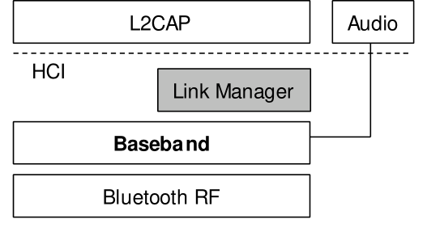

**Figure 3.1: Bluetooth protocol stack, basic layers**

The Link Manager specifies seven groups of services:
• Authentication Procedures
• Encryption
• Information Requests
• Link Handling
• Test Mode
• Adaptive Frequency Hopping
• Secure Simple Pairing
Figure 3.2 shows the Link Manager Test Suite Structure (TSS) including its subgroups for the conformance testing.

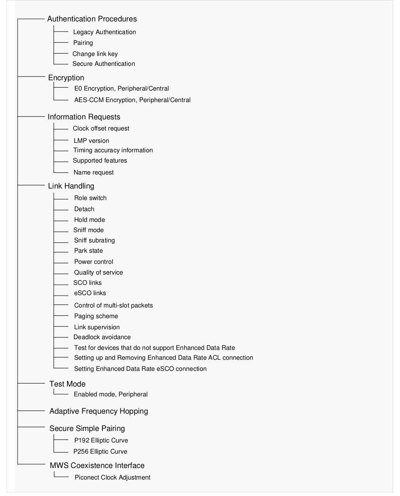

**Figure 3.2: TSS for Link Manager**

### 3.2 Test Suite Structure (TSS)

The Test Suite Structure is structured as a tree with a first level defined as LM representing the protocol groups: Authentication Procedures, Encryption, Information requests, Link Handling, Testmode, and Adaptive Frequency Hopping, Secure Simple Pairing and MWS Coexistence.

#### 3.2.1 Test groups

The test groups are organized in three levels. The first level defines the protocol groups representing the protocol services. The second level separates the protocol services in functional modules. The last level in each branch contains the standard ISO subgroups BV and BI.
The main test groups are the capability group, the valid behavior group, and the invalid behavior group.

#### 3.2.2 Protocol groups

The protocol groups identify the Bluetooth Link Manager services: Authentication Procedures, Encryption, Information Requests, Link Handling, Testmode, Adaptive Frequency Hopping, Secure Simple Pairing, and Piconet Clock Adjustment as defined in [1].

##### 3.2.2.1 Authentication procedures

The authentication procedures module covers the whole authentication procedure for two devices.

##### 3.2.2.2 Encryption

The encryption module covers the optional encryption procedure so that two devices can use encrypted traffic.

##### 3.2.2.3 Information Requests

The information requests module covers the information procedure between two devices.

##### 3.2.2.4 Link Handling

The link handling module covers the link handling procedures such as Enhanced Data_Rate link setup.

##### 3.2.2.5 Test Mode

The test mode module verifies that a Central cannot set a Peripheral into test mode unless it is locally enabled.

##### 3.2.2.6 Adaptive Frequency Hopping

The Adaptive Frequency Hopping (AFH) module covers adaptive frequency hopping control functions.

##### 3.2.2.7 Secure Simple Pairing

The Secure Simple Pairing module covers simple pairing functions.

##### 3.2.2.8 MWS Coexistence

The MWS Coexistence module verifies that the Central of a piconet can adjust the piconet clock.

##### 3.2.2.9 Slot Availability Mask

#### 3.2.3 Behavior testing groups

The TSS accommodates both valid and invalid behaviors.

##### 3.2.3.1 Valid Behavior (BV) tests

This subgroup provides testing to verify that the IUT reacts in conformity with the Bluetooth standard, after receipt or exchange of valid Protocol Data Units (PDUs). Valid PDUs means that the exchange of messages and the content of the exchanged messages are considered as valid.

##### 3.2.3.2 Invalid Behavior (BI) tests

This subgroup provides testing to verify that the IUT reacts in conformity with the Bluetooth standard, after receipt of a syntactically or semantically invalid PDU.

#### 3.2.4 HCI Command and Event Version

If a command or event has more than one version and the test does not explicitly say otherwise:
- A reference to a command specifying the version number means that that version or any higher- numbered version supported by the IUT may be used.
- A reference to an event specifying the version number means that that version or at least one higher-numbered version supported by the IUT is unmasked (other versions, including lower- numbered versions, may also be unmasked).
- A reference to a command or event that does not specify the version number is equivalent to specifying [v1].

## 4 Test cases (TC)

### 4.1 Introduction

#### 4.1.1 Test case identification conventions

Test cases are assigned unique identifiers per the conventions in [5]. The convention used here is: <spec abbreviation>/<IUT role>/<class>/<feat>/<func>/<subfunc>/<cap>/<xx>-<nn>-<y>.

|  | Identifier Abbreviation |  |  | Spec Identifier <spec abbreviation> |  |
| --- | --- | --- | --- | --- | --- |
| LMP |  |  | Link Manager Protocol |  |  |
|  | Identifier Abbreviation |  |  | Feature Identifier <feat> |  |
| AFH |  |  | Adaptive Frequency Hopping |  |  |
| AUT |  |  | Authentication Procedure |  |  |
| ENC |  |  | Encryption |  |  |
| INF |  |  | Information Requests |  |  |
| LIH |  |  | Link Handling |  |  |
| SAM |  |  | Slot Availability Mask |  |  |
| SP |  |  | Secure Simple Pairing |  |  |
| TEM |  |  | Test Mode |  |  |
| XCL |  |  | Coexistence Piconet Clock Adjustment |  |  |

Table 4.1: LMP TC feature naming conventions

#### 4.1.2 Conformance

When conformance is claimed for a particular specification, all capabilities are to be supported in the specified manner. The mandated tests from this Test Suite depend on the capabilities to which conformance is claimed.
The Bluetooth Qualification Program may employ tests to verify implementation robustness. The level of implementation robustness that is verified varies from one specification to another and may be revised for cause based on interoperability issues found in the market.
Such tests may verify:
• That claimed capabilities may be used in any order and any number of repetitions not excluded by the specification
• That capabilities enabled by the implementations are sustained over durations expected by the use case
• That the implementation gracefully handles any quantity of data expected by the use case
• That in cases where more than one valid interpretation of the specification exists, the implementation complies with at least one interpretation and gracefully handles other interpretations
• That the implementation is immune to attempted security exploits
A single execution of each of the required tests is required to constitute a Pass verdict. However, it is noted that to provide a foundation for interoperability, it is necessary that a qualified implementation consistently and repeatedly pass any of the applicable tests.
In any case, where a member finds an issue with the test plan generated by the Bluetooth SIG qualification tool, with the test case as described in the Test Suite, or with the test system utilized, the member is required to notify the responsible party via an erratum request such that the issue may be addressed.

#### 4.1.3 Baseband assumptions

Subsections Test cases are built upon having a Baseband Link up and running. The IUT and the Lower Tester must be in connection state (Active mode). DM1 packages are used where not otherwise specified. See Preambles.
All test cases are built upon a connection between two (2) devices a Central and a Peripheral.

#### 4.1.4 Role Switch

To force the IUT to become Central of the Piconet, Paging of the Lower Tester must be used as PDU LMP_switch_req is optional and all IUTs will not support this. See Preambles.

#### 4.1.5 Applicable Parameter Values

The parameter values indicated in the test cases are thought to be reasonable. However, what is reasonable ultimately depends on the user scenario the IUT is intended for. In those cases, where the Bluetooth System Specification does not require the implementation of a specific value, and the IUT cannot support the value indicated in a test case, it is allowed to test the IUT with another value. The selected value has to be given as IXIT information. When a value deviates from what is indicated in the test case, select as close as possible to the value indicated in the test case. The selected value must not be such that the test purpose for the test case cannot be verified or the test case is not applicable. All test cases applicable as determined by the combination of Test Case Reference List, Implementation Conformance Statement, and Test Case Mapping Table must be executed successfully to complete the qualification of the IUT.

#### 4.1.6 Advertisement of Features for test cases

It is favorable to avoid LMP traffic that could create situations in which a test case is not designed to be executed or which may add complexity to the test system implementation. This can be achieved by proper selection of which Features are advertised by the Lower Tester. In some test cases this is exactly specified in the Test Suite but in most cases it is not. As a general rule, for each test case the Lower Tester should not advertise more Features than necessary to facilitate execution of the test purpose. Specifically, with the introduction of Enhanced Data_Rate, this feature is only advertised by the Lower Tester in those test cases where it is necessary for the test purpose.

### 4.2 Default settings

The default settings must be carried out before each test case to guarantee a correct set up each time the tests are performed. Please see Default settings for the set up messages used.

#### 4.2.1 Authentication

This default setting will be used for the different authentication test cases.

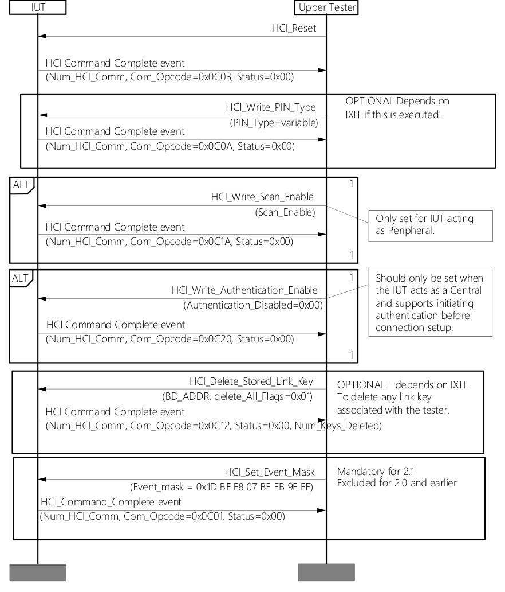

**Figure 4.1: Default settings used for authentication test cases**

#### 4.2.2 Encryption

This default setting will be used for the different encryption test cases.

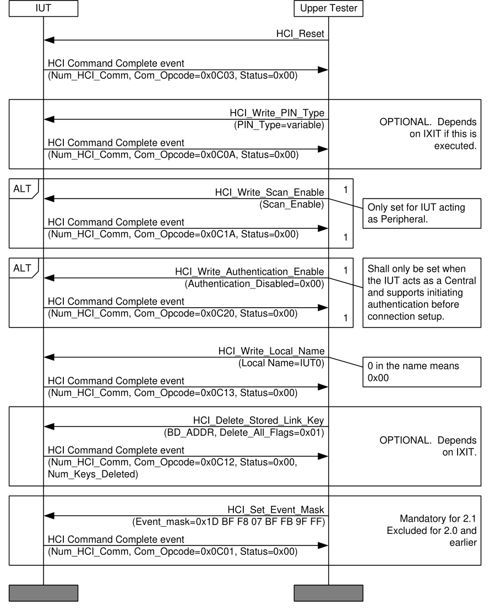

**Figure 4.2: Default settings used for encryption test cases**

#### 4.2.3 Information Requests

This default setting will be used for the different information requests test cases.

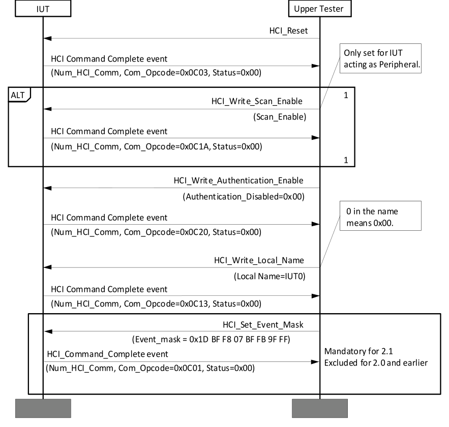

**Figure 4.3: Default settings used for information requests test cases**

#### 4.2.4 Link Handling

This default setting will be used for the different link handling test cases.

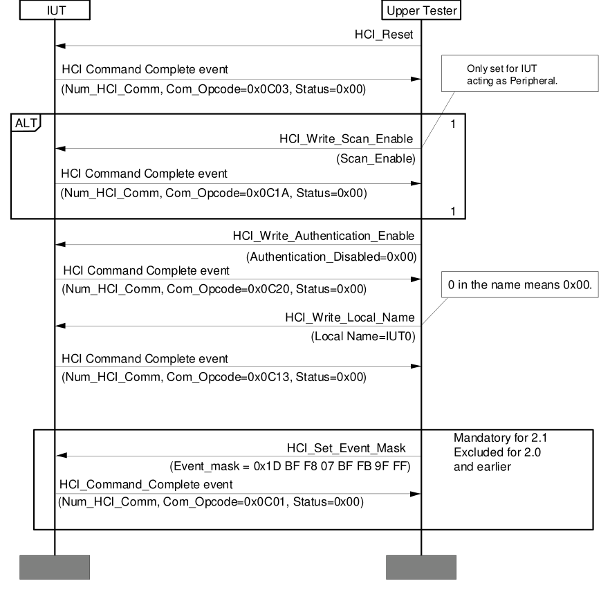

**Figure 4.4: Default settings used for link handling test cases**

#### 4.2.5 Secure Simple Pairing

The default settings used for the Secure Simple Pairing test cases.

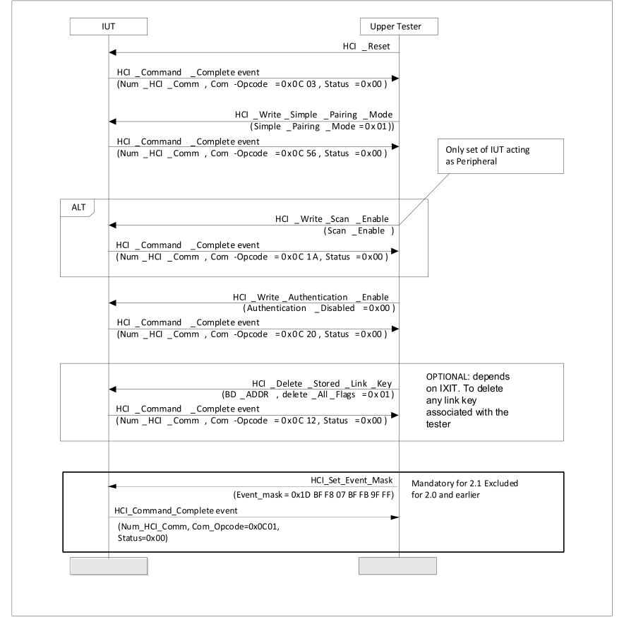

**Figure 4.5: Default setting used for secure simple pairing test cases**

#### 4.2.6 AES-CCM Encryption

The default settings used for the AES-CCM encryption test cases.

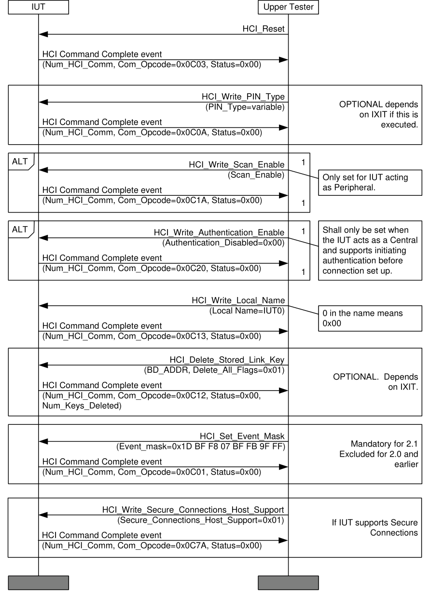

**Figure 4.6: Default setting used for AES-CCM encryption test cases**

#### 4.2.7 Secure Simple Pairing P256

The default settings used for the Secure Simple Pairing test cases using the P256 Elliptic Curve.

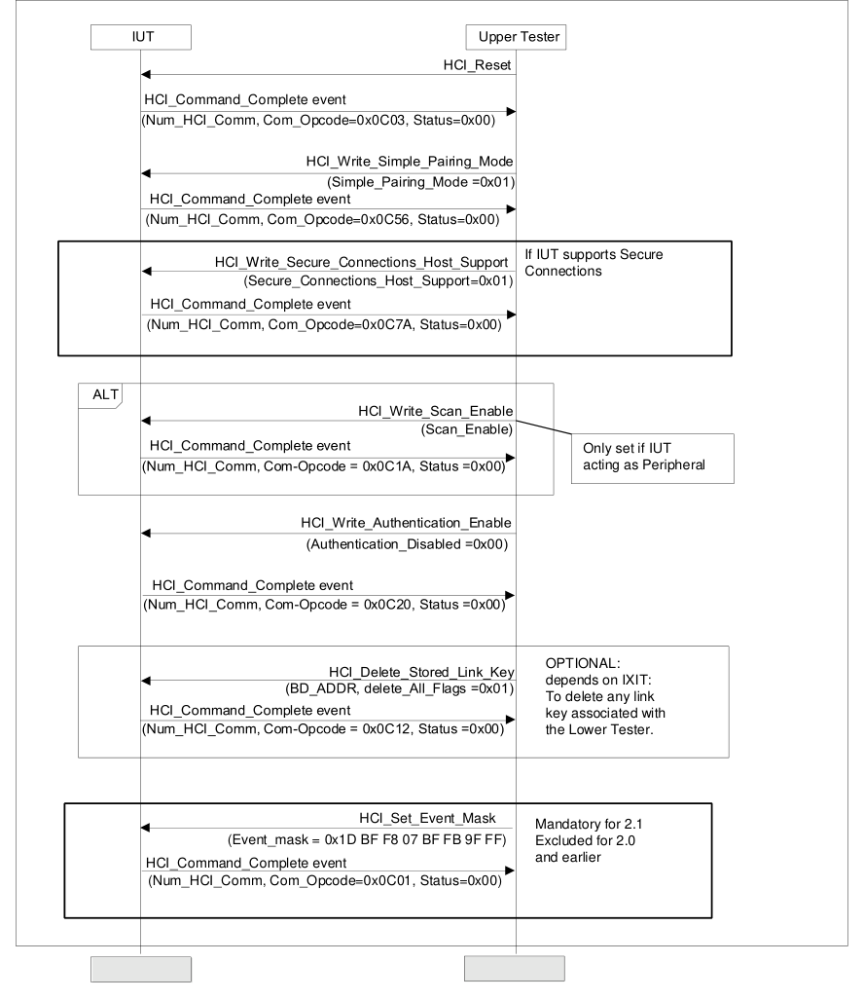

**Figure 4.7: Default setting used for the Secure Simple Pairing test cases using the P256 Elliptic Curve**

### 4.3 Preambles

The MSCs in this section are provided for information, as they are used by test equipment in achieving the initial conditions in certain tests.

#### 4.3.1 Connection Establishment IUT Central

This Preamble will be used when the IUT will act as Central.
Peripheral Central

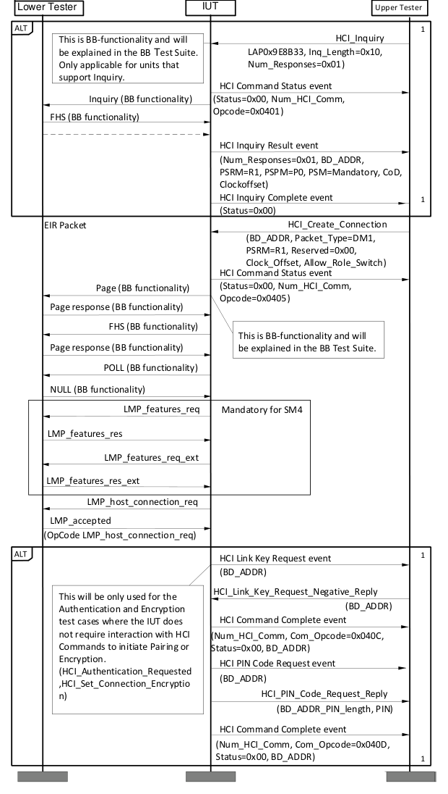

**Figure 4.8: Preamble used when the IUT will act as Central**

#### 4.3.2 Connection Establishment Lower Tester

This Preamble will be used in all cases when the IUT will act as a Peripheral.
Central Peripheral

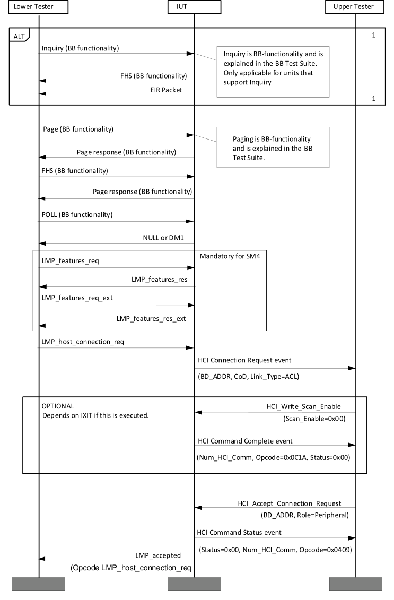

**Figure 4.9: Preamble used when the IUT will act as Peripheral**

#### 4.3.3 Default settings

Connection setup with the Enhanced Data_Rate ACL link enabled.

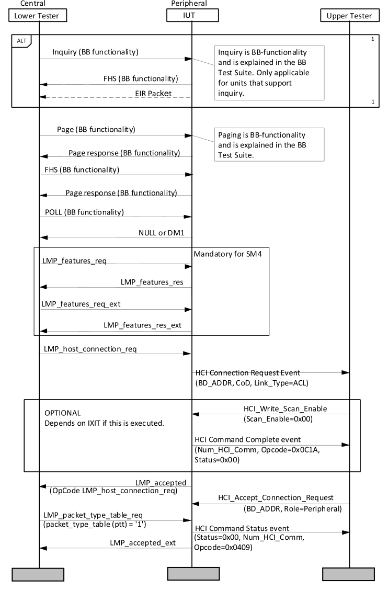

**Figure 4.10: Connection setup with the Enhanced Data_Rate established**

#### 4.3.4 External Frame Configuration

This preamble will be used for external frame configuration for Piconet Clock Adjust test cases. The IUT may use the specified HCI or any equivalent method to set up the test parameters.

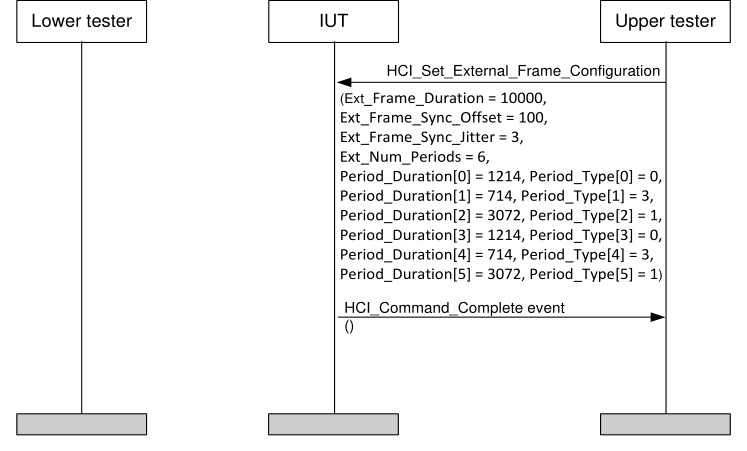

**Figure 4.11: External Frame Configuration**

#### 4.3.5 Pass/Inconclusive/Fail verdict conventions

Each test case has an Expected Outcome section. The IUT is granted the Pass verdict when all the detailed pass criteria conditions within the Expected Outcome section are met.
Certain test cases also have an Inconclusive verdict defined. If the conditions for this verdict are met, then the test provides evidence that the IUT neither meets nor violates the test case; instead, it means that the test case was not applicable to the IUT, and therefore a Pass verdict is not required in order to achieve Qualification of the IUT. Implementers are encouraged to provide mechanisms to avoid the behavior leading to an Inconclusive condition during testing.
The convention in this Test Suite is that, unless there is a specific set of fail conditions outlined in the test case, the IUT fails the test case as soon as one of the pass criteria conditions cannot be met. If this occurs, then the outcome of the test is a Fail verdict.
For an Inconclusive verdict, all the pass criteria conditions apply up to the point in the test procedure where an Inconclusive verdict is identified. If one of the pass criteria in a step prior to the Inconclusive verdict cannot be met, then the outcome of the test is the Fail verdict and not the Inconclusive verdict.

### 4.4 Common Packet Contents

#### 4.4.1 Fields and Bits Reserved for Future Use

Unless a specific test states otherwise, all fields within packets and all bits within fields that are described as reserved for future use are set to 0 in packets sent by the Upper and Lower Testers.

### 4.5 Authentication procedures

Verify the correct implementation of the Authentication services.

#### 4.5.1 Authentication – Both Central and Peripheral

Verify the authentication procedure. The role of the IUT is of no importance.
LMP/AUT/BI-01-C [Error Return When a Unit Key is Requested]
• Test Purpose
Verify that the IUT properly returns an error when the Lower Tester requests the Unit Key.
The IUT is Initiator. The Lower Tester is the Responder.
• Reference
[1] 4.2.2.1
• Initial Condition
- See Section 4.1.3.
• Test Procedure

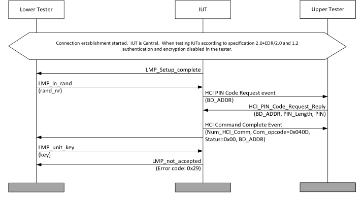

**Figure 4.12: LMP/AUT/BI-01-C [Error Return When a Unit Key is Requested] MSC**

• Expected Outcome
Pass verdict
The IUT transmits LMP_not_accepted upon reception of LMP_unit_key.
LMP/AUT/BV-01-C [Authentication Reject, No Link Key]
• Test Purpose
Verify that the IUT rejects the authentication as the IUT has no link Key associated with the Lower Tester. IUT is Responder and has no link Key associated with the Initiator. The Lower Tester is Initiator.
• Reference
• Initial Condition
- See Section 4.1.3.
• Test Procedure

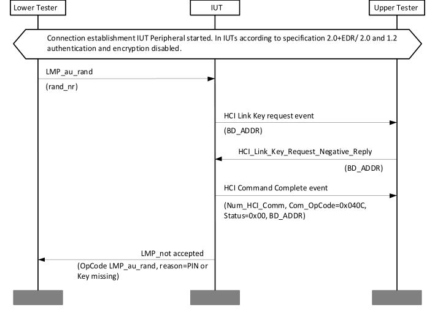

**Figure 4.13: LMP/AUT/BV-01-C [Authentication Reject, No Link Key] MSC**

• Expected Outcome
Pass verdict
The IUT transmits the PDU LMP_not_accepted containing the Opcode for PDU LMP_au_rand and “PIN or Key missing” upon reception PDU LMP_au_rand.
LMP/AUT/BV-36-C [Legacy Authentication of Previously Authenticated or Stored Link Key]
• Test Purpose
Verify that the IUT performs the legacy authentication procedure when requested by the Host on an active connection when the Link Key has been previously authenticated or a Link Key is stored on the IUT. The IUT is the Initiator and has a Link Key associated with the Lower Tester. The Lower Tester is the Responder.
• Reference
[1] 4.2.1.1
[7] 7.1.15
• Initial Condition
- See Section 4.1.3.
- An ACL connection has been established.
- The Lower Tester does not support Secure Connections.
• Test Procedure

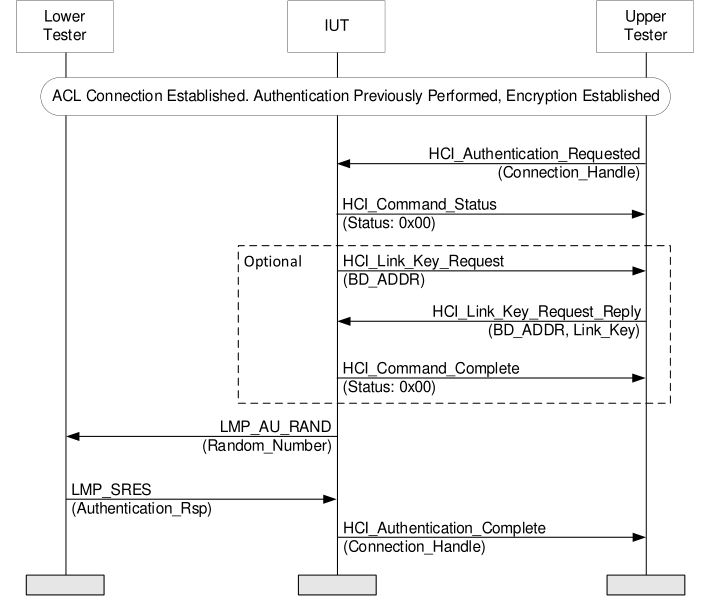

**Figure 4.14: LMP/AUT/BV-36-C [Legacy Authentication of Previously Authenticated or Stored Link Key] MSC**

• Expected Outcome
Pass verdict
The IUT transmits the LMP_AU_RAND PDU to the Lower Tester containing the Random_Number parameter.
The IUT transmits a successful HCI_Authentication_Complete event to the Upper Tester after receiving an LMP_SRES PDU with the Authentication_Rsp from the Lower Tester.
LMP/AUT/BV-40-C [Legacy Authentication of Previously Authenticated or Stored Link Key, v6.0]
• Test Purpose
Verify that the IUT performs the legacy authentication procedure when requested by the Host on an active connection when the Link Key has been previously authenticated or a Link Key is stored on the IUT. The IUT is the Initiator and has a Link Key associated with the Lower Tester. The Lower Tester is the Responder.
• Reference
[1] 4.2.1.1
[7] 7.1.15
• Initial Condition
- See Section 4.1.3.
- An ACL connection has been established.
- Authentication has been previously performed and encryption has been enabled.
- The Lower Tester does not support Secure Connections.
• Test Procedure

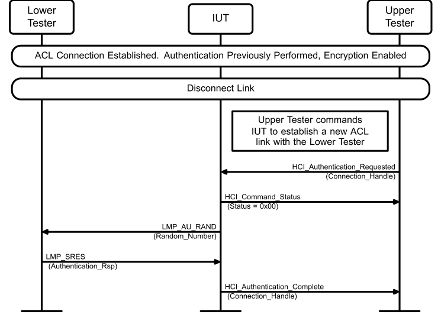

**Figure 4.15: LMP/AUT/BV-40-C [Legacy Authentication of Previously Authenticated or Stored Link Key, v6.0] MSC**

1. The Lower Tester and the IUT disconnect the ACL. 2. The Upper Tester commands the IUT to establish a new ACL connection. 3. The Upper Tester sends an HCI_Authentication_Requested command to the IUT and receives a
successful HCI_Command_Status in return. 4. The IUT sends an LMP_AU_RAND PDU to the Lower Tester and does not send an
HCI_Link_Key_Request event to the Upper Tester. 5. The Lower Tester sends an LMP_SRES PDU to the IUT. 6. The IUT sends an HCI_Authentication_Complete event to the Upper Tester.
• Expected Outcome
Pass verdict
In step 4, the IUT does not send an HCI_Link_Key_Request event to the Upper Tester.
In step 4, the IUT transmits the LMP_AU_RAND PDU to the Lower Tester containing the Random_Number parameter.
In step 6, the IUT transmits a successful HCI_Authentication_Complete event to the Upper Tester after receiving an LMP_SRES PDU with the Authentication_Rsp from the Lower Tester.

#### 4.5.2 Pairing – Both Central and Peripheral

Verify the pairing procedure. The role of the IUT is of no importance.
LMP/AUT/BV-03-C [Create Link Key]
• Test Purpose
Verify that the IUT creates the correct link Key.
The IUT is Responder and has a variable PIN code. The Lower Tester is initiator.
The Lower Tester does not support Secure Simple Pairing.
• Reference
[1] 4.2.2
• Initial Condition
- See Section 4.1.3.
• Test Procedure

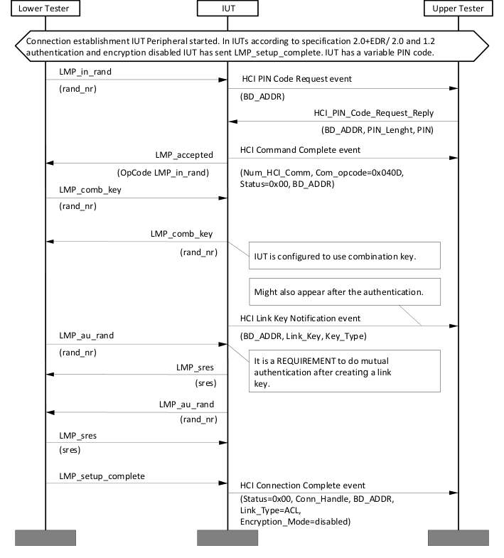

**Figure 4.16: LMP/AUT/BV-03-C [Create Link Key] MSC**

• Test Condition
The manufacturer of the IUT must define BD_ADDR.
• Expected Outcome
Pass verdict
The IUT transmits PDU LMP_accepted containing the Opcode for PDU LMP_in_rand upon reception of PDU LMP_in_rand.
The IUT transmits PDU LMP_comb_key upon reception of PDU LMP_comb_key.
• Notes
Possible interaction might be needed on the IUT. HCI commands might be needed for PIN, Key, etc. It is implementation dependent.
LMP/AUT/BV-04-C [Pairing, IUT Initiator]
• Test Purpose
Verify that the IUT initiates a complete Pairing and authentication procedure.
The IUT is Initiator. The Lower Tester is Responder.
The Lower Tester does not support Secure Simple Pairing.
• Reference
[1] 4.2.2.1
• Initial Condition
- See Section 4.1.3.
- If ICS item LMP 3/1 is supported, the Upper Tester sends HCI_Write_Authentication_Enable (Enabled=0x01) before starting the connection.
• Test Procedure
The test procedure is divided into two MSC’s. MSC 1 is used when pairing is initiated without interaction of HCI commands. MSC 2 is when the IUT requires HCI Connection Complete event before being able to initiate pairing.
ICS items LMP 3/1 and LMP 3/2 will tell which test procedure to run (if both are ticked, MSC 1 will be the test procedure).

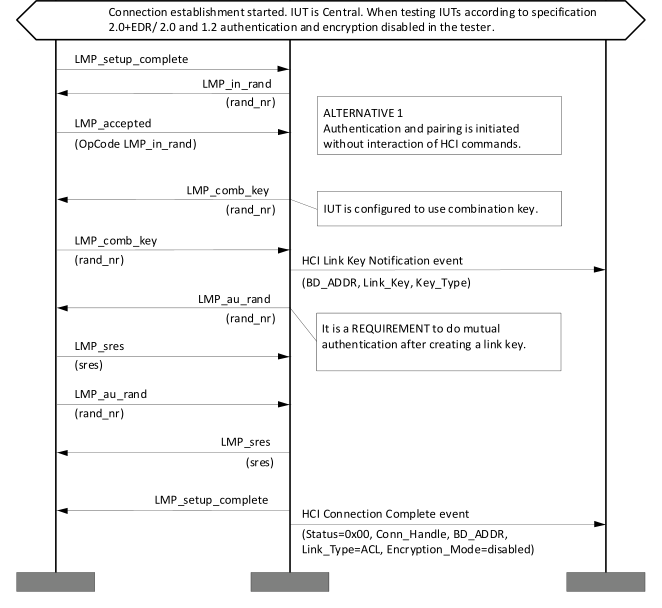

**Figure 4.17: LMP/AUT/BV-04-C [Pairing, IUT Initiator] – MSC 1**

MSC 1: Pairing is initiated without interaction of HCI command.

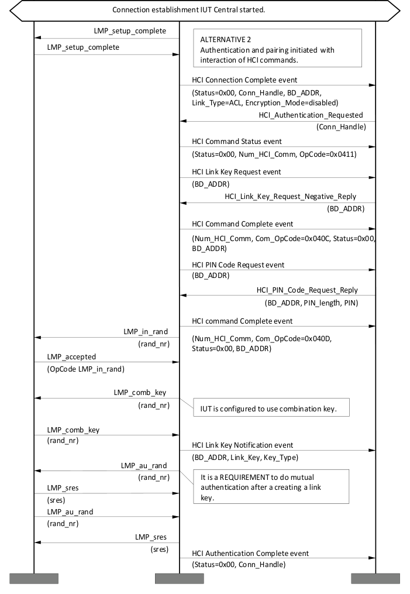

**Figure 4.18: LMP/AUT/BV-04-C [Pairing, IUT Initiator] – MSC 2**

MSC 2: IUT requires interaction of HCI_Authentication_Requested to initiate pairing.
• Test Condition
It must be possible to control the IUT to initiate the pairing procedure. The manufacturer of the IUT must define BD_ADDR.
• Expected Outcome
Pass verdict
Correct PDU LMP_in_rand is transmitted.
Correct PDU LMP_Comb_key is transmitted.
Correct Link Key is created checked by an authentication (SRES is checked.)
• Notes
Possible interaction might be needed on IUT. HCI commands might be needed for PIN, Key etc. It is implementation dependent.
The configuration of the IUT and Lower Tester will decide which LMP commands to use when creating the Link Key.
It must be verified that if both the Lower Tester and the IUT are configured to use combination Key a mutual authentication has to be carried out.
The initiation of the pairing procedure might be taken on an already established link.
LMP/AUT/BV-05-C [IUT Responder, Fixed PIN]
• Test Purpose
Verify that when the IUT has a fixed PIN it can request to become Initiator.
The IUT is Responder and has a fixed PIN code. The Lower Tester is Initiator.
The Lower Tester does not support Secure Simple Pairing.
• Reference
[1] 4.2.3
• Initial Condition
- See Section 4.1.3.
• Test Procedure

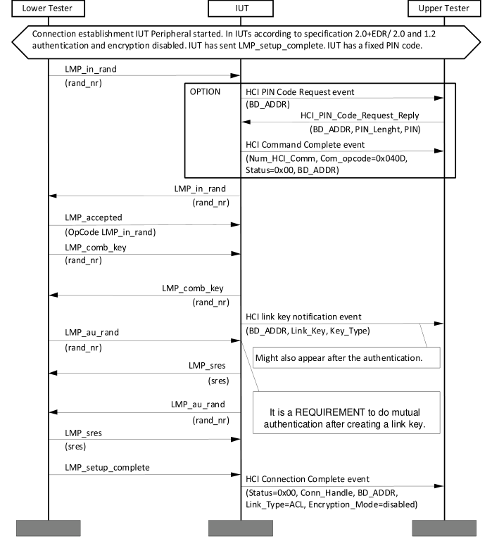

**Figure 4.19: LMP/AUT/BV-05-C [IUT Responder, Fixed PIN] MSC**

• Test Condition
The manufacturer of the IUT must define BD_ADDR.
• Expected Outcome
Pass verdict
The IUT transmits PDU LMP_in_rand upon reception of PDU LMP_in_rand and accepts reception of PDU LMP_accepted containing the Opcode for PDU LMP_in_rand and the correct Kinit is generated.
• Notes
Possible interaction might be needed on IUT. HCI commands might be needed for PIN, Key etc. It is implementation dependent.
• Test Purpose
Verify that the IUT accepts that the Lower Tester has a fixed PIN. The Lower Tester is Responder and has a fixed PIN code. The IUT is Initiator and does not have a fixed PIN code.
The Lower Tester does not support Secure Simple Pairing.
• Reference
[1] 4.2.2.2
• Initial Condition
- See Section 4.1.3.
- If ICS item LMP 3/1 is supported, the Upper Tester sends HCI_Write_Authentication_Enable (Enabled=0x01) before starting the connection.
• Test Procedure
The test procedure is divided into two MSCs. MSC 1 is used when pairing is initiated without interaction of HCI commands. MSC 2 is when the IUT requires HCI Connection Complete event before being able to initiate pairing.
ICS items LMP 3/1 and LMP 3/2 will tell which test procedure to run (if both are ticked, MSC 1 will be the test procedure).

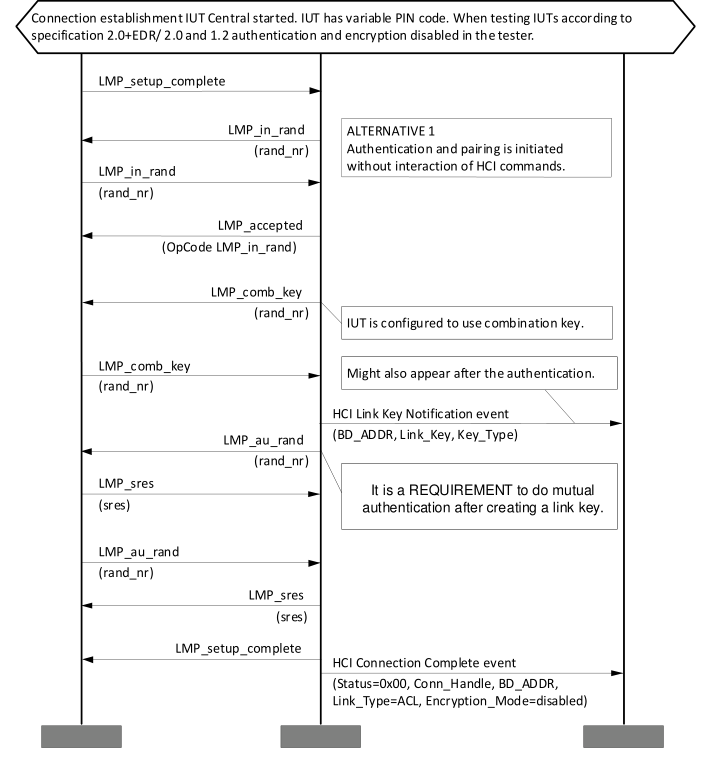

**Figure 4.20: LMP/AUT/BV-06-C [IUT Initiator; Responder has Fixed PIN] – MSC 1**

MSC 1: Pairing is initiated without interaction of HCI command.

|  |  |  | Upper Tester |  |  |
| --- | --- | --- | --- | --- | --- |
|  |  |  |  |  |  |
|  | Connection establi | shment IUT Central started. |  |  |  |
|  |  | ALTERNATIVE 2 Authentication and pairing initiated with interaction of HCI commands. HCI Connection Complete event (Status=0x00, Conn Handle, BD ADDR, _ _ Link Type=ACL, Encryption Mode=disabled) _ _ HCI Authentication Requested _ _ (Conn Handle) _ HCI Command Status event (Status=0x00, Num HCI Comm, OpCode=0x0411) _ _ HCI Link Key Request event (BD ADDR) _ HCI Link Key Request Negative Reply _ _ _ _ _ (BD ADDR) _ HCI Command Complete event (Num HCI Comm, Com OpCode=0x040C, _ _ _ Status=0x00, BD ADDR) _ HCI PIN Code Request event |  |  |  |
|  |  | (BD ADDR) _ HCI PIN Code Request Reply _ _ _ _ (BD ADDR, PIN length, PIN) _ _ HCI Command Complete event |  |  |  |
|  |  | (Num HCI Comm, Com OpCode=0x040D, _ _ _ Status=0x00, BD ADDR) _ IUT is configured to use combination key. HCI Link Key Notification event (BD ADDR, Link Key, Key Type) _ _ _ It is a REQUIREMENT to do mutual authentication after creating a link key. HCI Authentication Complete event |  |  |  |
|  |  |  |  |  |  |

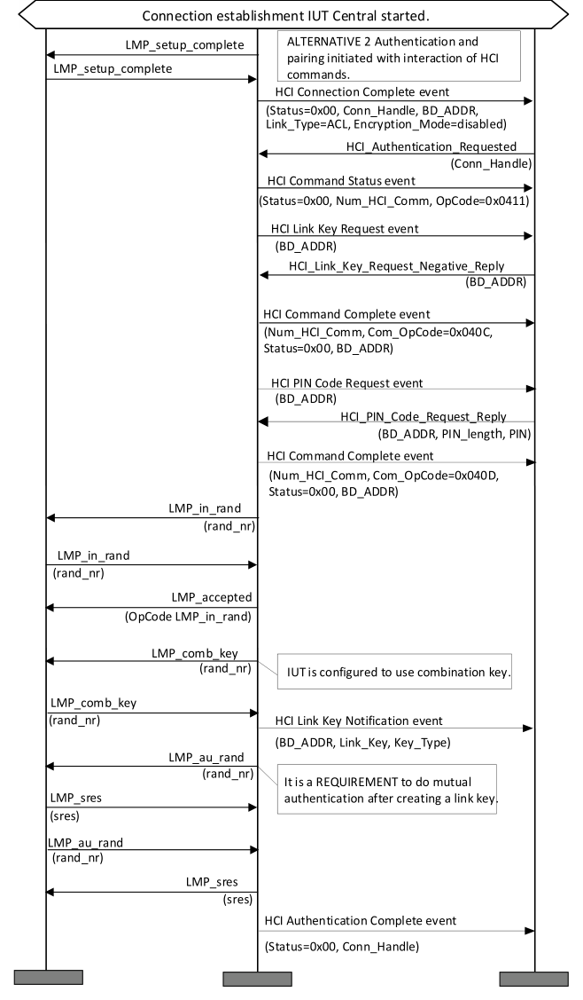

**Figure 4.21: LMP/AUT/BV-06-C [IUT Initiator; Responder has Fixed PIN] – MSC 2**

MSC 2: The IUT requires interaction of HCI_Authentication_Requested to initiate pairing.
• Test Condition
It must be possible to control the IUT to initiate the pairing procedure. The manufacturer of the IUT must define the BD_ADDR.
• Expected Outcome
Pass verdict
The IUT transmits PDU LMP_accepted upon reception of PDU LMP_in_rand.
• Notes
Possible interaction might be needed on the IUT. HCI commands might be needed for PIN, Key etc. It is implementation dependent.
LMP/AUT/BV-24-C [Create Link Key – Rejects Bad Authentication Response]
• Test Purpose
Verify that the IUT creates the correct link key and rejects a bad authentication response.
The IUT is Responder and has a variable PIN code. The Lower Tester is initiator.
The Lower Tester does not support Simple Pairing.
• Reference
[1] 4.2.2
• Initial Condition
- See Section 4.1.3.
• Test Procedure
Same as for LMP/AUT/BV-03-C [Create Link Key], but in the LMP_SRES PDU sent by the Lower Tester, one bit at random of the value is inverted.

| Lower Tester |  |  |
| --- | --- | --- |
|  |  |  |
|  | (rand nr) _ LMP ACCEPTED _ (OpCode LMP IN RAND) _ _ LMP COMB KEY _ _ (rand nr) _ LMP COMB KEY _ _ (rand nr) _ LMP AU RAND _ _ |  |
|  | (rand nr) _ LMP SRES _ (sres) LMP AU RAND _ _ (rand nr) _ LMP SRES _ (faulty sres) |  |
| OPT |  | HCI Connection Complete _ _ |
|  |  |  |

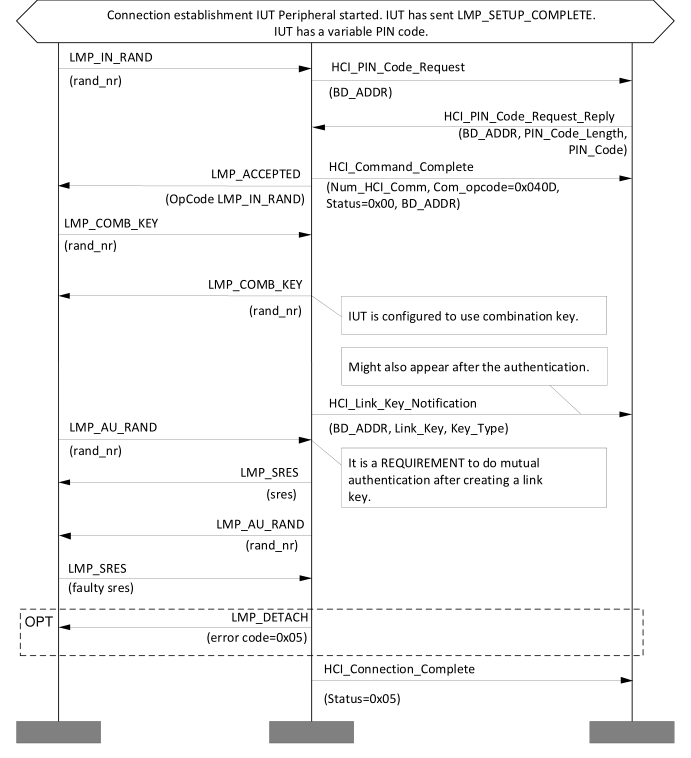

**Figure 4.22: LMP/AUT/BV-24-C [Create Link Key – Rejects Bad Authentication Response] MSC**

• Test Condition
The manufacturer of the IUT must define BD_ADDR.
• Expected Outcome
Pass verdict
The IUT transmits PDU LMP_ACCEPTED containing the opcode for PDU LMP_IN_RAND upon reception of PDU LMP_IN_RAND.
The IUT transmits PDU LMP_COMB_KEY upon reception of PDU LMP_COMB_KEY.
The IUT rejects the authentication when receiving a bad LMP_SRES PDU from the Lower Tester.
• Notes
Possible interaction might be needed on the IUT. HCI commands might be needed for PIN, Key, etc. It is implementation dependent.
• Test Purpose
Verify that the IUT rejects a bad authentication response in a complete Pairing and authentication procedure that it initiates.
The IUT is Initiator. The Lower Tester is Responder.
The Lower Tester does not support Simple Pairing.
• Reference
[1] 4.2.2.1
• Initial Condition
- See Section 4.1.3.
- If ICS item LMP 3/1 is supported, the Upper Tester sends HCI_Write_Authentication_Enable (Enabled=0x01) before starting the connection.
• Test Procedure
Same as for LMP/AUT/BV-04-C [Pairing, IUT Initiator], but in the LMP_SRES PDU sent by the Lower Tester, one bit at random of the value is inverted.

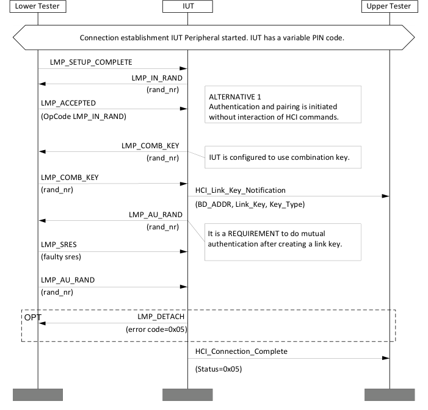

**Figure 4.23: LMP/AUT/BV-25-C [Pairing, IUT Initiator – Rejects Bad Authentication Response] – MSC 1**

MSC 1: Pairing is initiated without interaction of HCI command.

| Lower Tester |  |
| --- | --- |
| OPT |  |
|  | LMP SETUP COMPLETE _ _ |
|  | LMP IN RAND _ _ |
|  | (rand nr) _ LMP ACCEPTED _ |
|  | (OpCode LMP IN RAND) _ _ LMP COMB KEY _ _ |
|  | (rand nr) _ LMP COMB KEY _ _ (rand nr) _ LMP AU RAND _ _ (rand nr) _ LMP SRES _ (faulty sres) LMP DETACH _ (error code=0x05) |
|  |  |
|  |  |

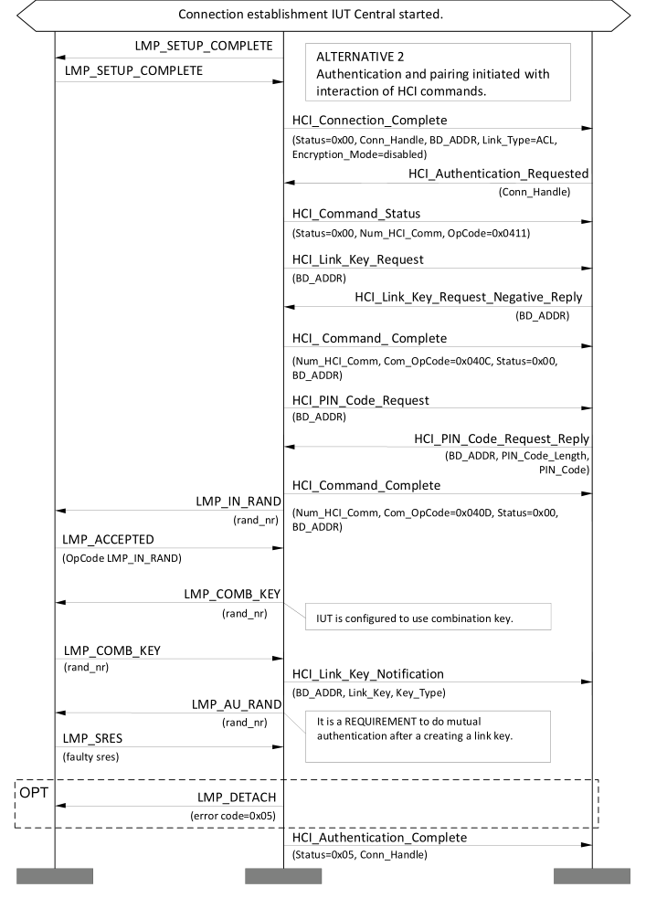

**Figure 4.24: LMP/AUT/BV-25-C [Pairing, IUT Initiator – Rejects Bad Authentication Response] – MSC 2**

MSC 2: IUT requires interaction of HCI_Authentication_Requested to initiate pairing.
• Test Condition
It must be possible to control the IUT to initiate the pairing procedure. The manufacturer of the IUT must define BD_ADDR.
• Expected Outcome
Pass verdict
Correct PDU LMP_IN_RAND is transmitted.
Correct PDU LMP_COMB_KEY is transmitted.
Correct Link Key is created, checked by an authentication (SRES is checked).
The IUT rejects the authentication when receiving a bad LMP_SRES PDU from the Lower Tester.
• Notes
Possible interaction might be needed on the IUT. HCI commands might be needed for PIN, Key, etc. It is implementation dependent.
The configuration of the IUT and Lower Tester will decide which LMP commands to use when creating the Link Key.
It must be verified that if both the Lower Tester and the IUT are configured to use combination key, a mutual authentication has to be carried out.
The initiation of the pairing procedure might be taken on an already established link.
LMP/AUT/BV-26-C [IUT Responder, Fixed PIN – Rejects Bad Authentication Response]
• Test Purpose
Verify that when the IUT has a fixed PIN it can request to become Initiator and rejects a bad authentication response.
The IUT is Responder and has a fixed PIN code. The Lower Tester is Initiator.
The Lower Tester does not support Simple Pairing.
• Reference
[1] 4.2.3
• Initial Condition
- See Section 4.1.3.
• Test Procedure
Same as for LMP/AUT/BV-05-C [IUT Responder, Fixed PIN], but in the LMP_SRES PDU sent by the Lower Tester, one bit at random of the value is inverted.

|  | It is authe | a REQUIREMENT to do mutual ntication after creating a link key. 5, Conn Handle) _ |
| --- | --- | --- |
|  |  |  |
| OPT | LMP DETACH _ (error code=0x05) (Status=0x0 |  |
|  |  |  |

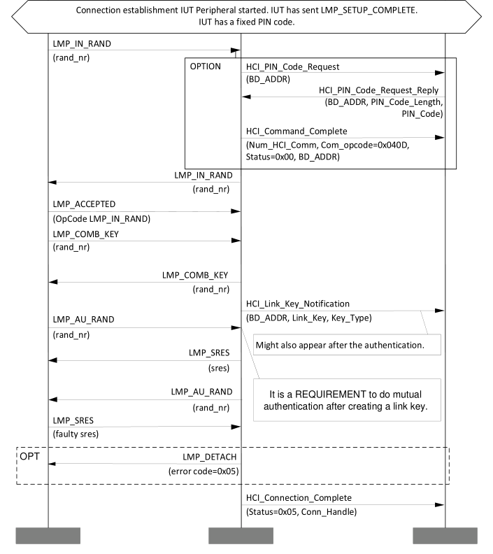

**Figure 4.25: LMP/AUT/BV-26-C [IUT Responder, Fixed PIN – Rejects Bad Authentication Response] MSC**

• Test Condition
The manufacturer of the IUT must define BD_ADDR.
• Expected Outcome
Pass verdict
The IUT transmits PDU LMP_IN_RAND upon reception of PDU LMP_IN_RAND and accepts reception of PDU LMP_ACCEPTED containing the opcode for PDU LMP_IN_RAND and the correct Kinit is generated.
The IUT rejects the authentication when receiving a bad LMP_SRES PDU from the Lower Tester.
• Notes
Possible interaction might be needed on the IUT. HCI commands might be needed for PIN, Key, etc. It is implementation dependent.
LMP/AUT/BV-27-C [IUT Initiator; Responder has Fixed PIN – Rejects Bad Authentication Response]
• Test Purpose
Verify that the IUT accepts that the Lower Tester has a fixed PIN. The Lower Tester is Responder and has a fixed PIN code. The IUT is Initiator and does not have a fixed PIN code. The IUT rejects a bad authentication response.
Lower Tester does not support Simple Pairing.
• Reference
[1] 4.2.2.2
• Initial Condition
- See Section 4.1.3.
- If ICS item LMP 3/1 is supported, the Upper Tester sends HCI_Write_Authentication_Enable (Enabled=0x01) before starting the connection.
• Test Procedure
Same as for LMP/AUT/BV-06-C [IUT Initiator; Responder has Fixed PIN], but in the LMP_SRES PDU sent by the Lower Tester, one bit at random of the value is inverted.

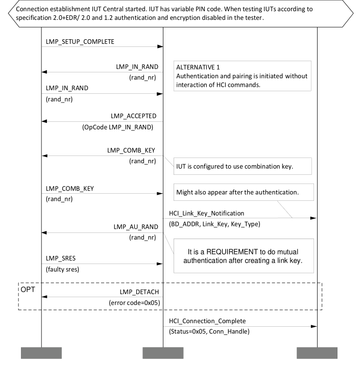

**Figure 4.26: LMP/AUT/BV-27-C [IUT Initiator; Responder has Fixed PIN – Rejects Bad Authentication Response] – MSC 1**

MSC 1: Pairing is initiated without interaction of HCI command.

|  |  |  |  | Upper Tester |  |  |
| --- | --- | --- | --- | --- | --- | --- |
|  |  |  |  |  |  |  |
|  |  | Connection establish | ment IUT Central started. |  |  |  |
|  |  | LMP SETUP COMPLETE _ _ | ALTERNATIVE 2 Authentication and pairing initiated with interaction of HCI commands. HCI Connection Complete _ _ (Status=0x00, Conn Handle, BD ADDR, Link Type=ACL, _ _ _ Encryption Mode=disabled) _ HCI Authentication Requested _ _ (Conn Handle) _ HCI Command Status _ _ (Status=0x00, Num HCI Comm, OpCode=0x0411) _ _ HCI Link Key Request _ _ _ (BD ADDR) _ HCI Link Key Request Negative Reply _ _ _ _ _ (BD ADDR) _ HCI Connection Complete _ _ (Num HCI Comm, Com OpCode=0x040C, Status=0x00, _ _ _ BD ADDR) _ HCI PIN Code Request _ _ _ |  |  |  |
|  |  | LMP SETUP COMPLETE _ _ |  |  |  |  |
|  |  | LMP IN RAND _ _ |  |  |  |  |
|  |  |  | (BD ADDR) _ HCI PIN Code Request Reply _ _ _ _ (BD ADDR, PIN Code Length, _ _ _ PIN Code) _ HCI Connection Complete |  |  |  |
|  |  |  | _ _ (Num HCI Comm, Com OpCode=0x040D, _ _ _ Status=0x00, BD ADDR) _ ) Y IUT is configured to use combination key. HCI Link Key Notification _ _ _ (BD ADDR, Link Key, Key Type) _ _ _ It is a REQUIREMENT to do mutual authentication after creating a link key. |  |  |  |
|  |  | (rand nr) _ LMP IN RAND _ _ |  |  |  |  |
|  |  | (rand nr) _ LMP ACCEPTED _ |  |  |  |  |
|  |  | (OpCode LMP IN RAND _ _ LMP COM KE _ _ |  |  |  |  |
|  |  | (rand nr) _ LMP COM KEY _ _ |  |  |  |  |
|  |  | (rand nr) _ LMP AU RAND _ _ |  |  |  |  |
|  |  | (rand nr) _ LMP SRES _ |  |  |  |  |
|  |  | (faulty sres) |  |  |  |  |
| OPT |  | LMP DETACH _ |  |  |  |  |
|  |  | (error code=0x05) |  |  |  |  |
|  |  |  | HCI Authentication Complete _ _ |  |  |  |
|  |  |  |  |  |  |  |

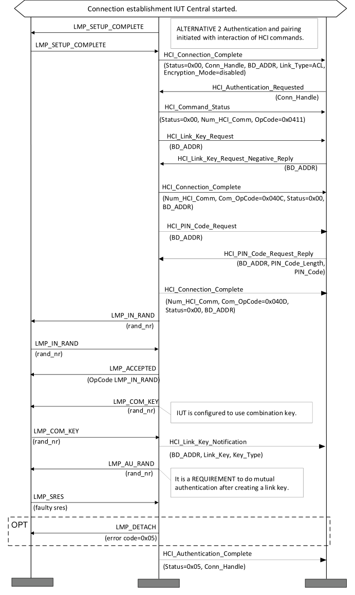

**Figure 4.27: LMP/AUT/BV-27-C [IUT Initiator; Responder has Fixed PIN – Rejects Bad Authentication Response] – MSC 2**

MSC 2: The IUT requires interaction of HCI_Authentication_Requested to initiate pairing.
• Test Condition
It must be possible to control the IUT to initiate the pairing procedure. The manufacturer of the IUT must define the BD_ADDR.
• Expected Outcome
Pass verdict
The IUT transmits PDU LMP_ACCEPTED upon reception of PDU LMP_IN_RAND.
The IUT rejects the authentication when receiving a bad LMP_SRES PDU from the Lower Tester.
• Notes
Possible interaction might be needed on the IUT. HCI commands might be needed for PIN, Key, etc. It is implementation dependent.
LMP/AUT/BV-34-C [Pairing, IUT rejects Pairing Procedure – Host is in Non-Pairable Mode]
• Test Purpose
Verify that the IUT rejects a pairing procedure, if the Host is in non-pairable mode (Host sends PIN Code Request Negative Reply command).
The IUT is Peripheral and Claimant. The Lower Tester is Central and Verifier of the pairing procedure.
The Lower Tester does not support Simple Pairing.
• Reference
[1] 4.2.2, 4.2.2.3
• Initial Condition
- The IUT is connected to the Lower Tester, through LMP_host_connection_req and LMP_accepted. The Upper Tester does not allow pairing.
- The preamble “Connection Establishment Lower Tester” may be used for a Peripheral IUT; otherwise, a comparable initialization sequence should be used.
• Test Procedure

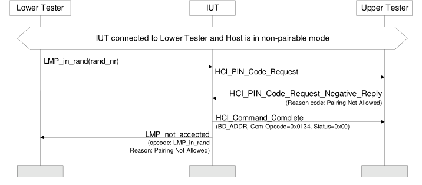

**Figure 4.28: LMP/AUT/BV-34-C [Pairing, IUT rejects Pairing Procedure – Host is in Non-Pairable Mode] MSC**

• Expected Outcome
Pass verdict
The IUT transmits the PDU LMP_NOT_ACCEPTED containing “Reason = 0x18” (Pairing Not Allowed) to the Lower Tester after it has received “LMP_in_rand”.
LMP/AUT/BI-04-C [Reject Role Switch, Pairing, Responder]
• Test Purpose
Verify that the IUT rejects a role switch request during the Pairing process. The IUT is Responder and has a fixed PIN code. The Lower Tester is Initiator. The Lower Tester does not support Secure Simple Pairing.
• Reference
[1] 4.2.3, 4.4.2
• Initial Condition
- See Connection Establishment Lower Tester with Allow_Role_Switch set to 0x01.
• Test Procedure

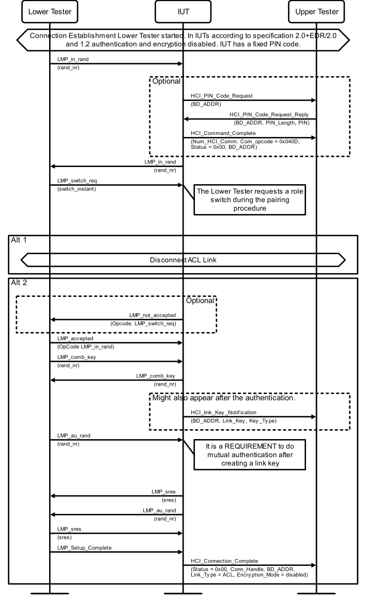

**Figure 4.29: LMP/AUT/BI-04-C [Reject Role Switch, Pairing, Responder] MSC**

• Test Condition
The manufacturer of the IUT must define BD_ADDR.
• Expected Outcome
Pass verdict
In ALT 1, the IUT disconnects the ACL Link.
In ALT 2, the IUT may transmit PDU LMP_NOT_ACCEPTED upon reception of PDU LMP_SWITCH_REQ from the Lower Tester. The IUT sends an HCI_Connection_Complete event to the Upper Tester.
• Notes
Possible interaction might be needed on the IUT. HCI commands might be needed for PIN, Key, etc. It is implementation-dependent.
LMP/AUT/BI-08-C [Pairing, IUT Initiator, Invalid Combination Key]
• Test Purpose
Verify that the IUT rejects an invalid combination key.
• Reference
[1] 4.2.2.1
• Initial Condition
- See Section 4.1.3.
- If ICS item LMP 3/1 is supported, then the Upper Tester sends HCI_Write_Authentication_Enable (Enabled=0x01) before starting the connection.
• Test Procedure

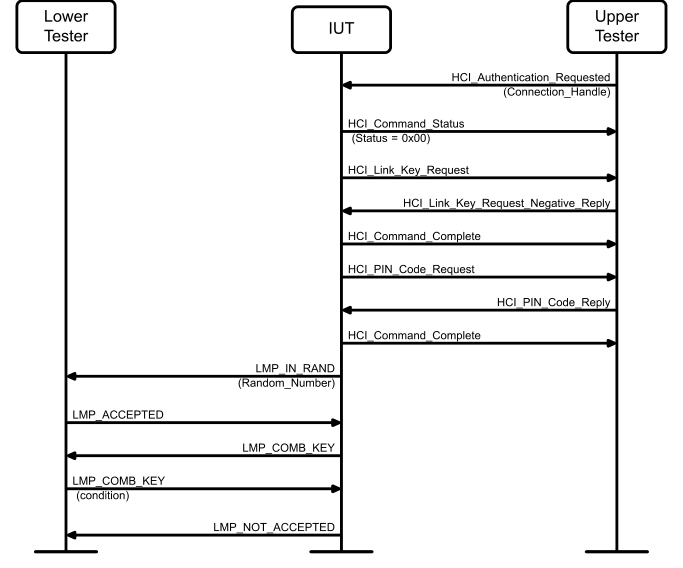

**Figure 4.30: LMP/AUT/BI-08-C [Pairing, IUT Initiator, Invalid Combination Key] MSC**

If the IUT initiates pairing autonomously, then skip to step 7. Repeat for each round in Table 4.2.
1. The Upper Tester sends an HCI_Authentication_Requested command to the IUT and receives a
successful HCI_Command_Status event in return. 2. The IUT sends an HCI_Link_Key_Request event to the Upper Tester. 3. The Upper Tester sends an HCI_Link_Key_Request_Negative_Reply command to the IUT. 4. The IUT sends an HCI_Command_Complete event to the Upper Tester. 5. The IUT sends an HCI_PIN_Code_Request event to the Upper Tester. 6. The Upper Tester sends an HCI_PIN_Code_Reply command to the IUT and receives a
successful HCI_Command_Complete event in response. 7. The IUT sends an LMP_IN_RAND PDU to the Lower Tester and receives an LMP_ACCEPTED
PDU in return. 8. The IUT sends an LMP_COMB_KEY PDU to the Lower Tester. 9. The Lower Tester responds with an LMP_COMB_KEY PDU with the condition specified in Table
4.2. 10. The IUT sends an LMP_NOT_ACCEPTED PDU to the Lower Tester.

|  | Round |  |  | Condition |  |
| --- | --- | --- | --- | --- | --- |
| 1 |  |  | CA = CB |  |  |
| 2 |  |  | LK K XOR LK K = 0 _ A _ B |  |  |

Table 4.2: LMP/AUT/BI-08-C [Pairing, IUT Initiator, Invalid Combination Key] rounds
• Expected Outcome
Pass verdict
In step 10, the IUT rejects the invalid key and terminates the process.

#### 4.5.3 Change Link Key – Both Central and Peripheral

Verify the change link Key procedure. The role of the IUT is of no importance.
LMP/AUT/BV-12-C [Change Link Key, IUT Responder]
• Test Purpose
Verify that the IUT accepts change of link Key and that the IUT creates the new link Key correct. The Lower Tester is initiating unit configured to use a combination Key. The IUT is configured to use a combination Key. No Encryption.
• Reference
[1] 4.2.3
• Initial Condition
- See Section 4.1.3.
• Test Procedure

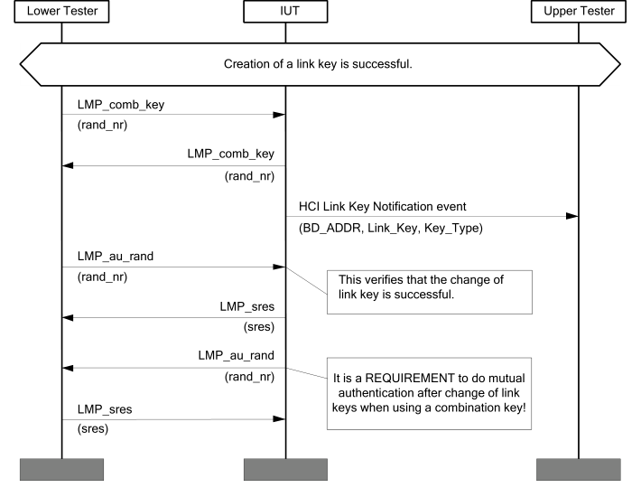

**Figure 4.31: LMP/AUT/BV-12-C [Change Link Key, IUT Responder] MSC**

• Test Condition
The manufacturer of the IUT must define which Key the IUT uses.
• Expected Outcome
Pass verdict
The IUT transmits PDU LMP_comb_key upon reception of PDU LMP_comb_key. The Link Key must be the calculated link Key.
LMP/AUT/BV-13-C [Change Link Key, IUT Initiator]
• Test Purpose
Verify that the IUT can change link Key and that the IUT creates the new link Key correct. The IUT is the initiating unit configured to use a comb Key. Encryption is not used.
• Reference
[1] 4.2.3
• Initial Condition
- See Section 4.1.3.
• Test Procedure

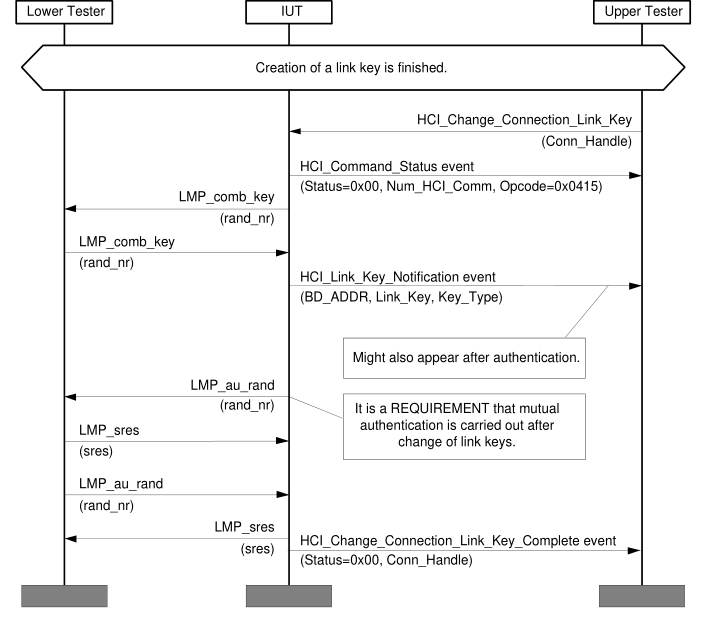

**Figure 4.32: LMP/AUT/BV-13-C [Change Link Key, IUT Initiator] MSC**

• Test Condition
The manufacturer of the IUT must define which Key the IUT uses.
It must be possible to control the IUT to initiate the change of Link Key.
• Expected Outcome
Pass verdict
The IUT transmits PDU LMP_comb_key and accepts reception of PDU LMP_comb_key. The Link Key must be the calculated link Key.
LMP/AUT/BV-28-C [Change Link Key, IUT Responder – Rejects Bad Authentication Response]
• Test Purpose
Verify that the IUT accepts change of link key and that the IUT creates the new Link Key correctly. The Lower Tester is the initiating unit configured to use a combination key. The IUT is configured to use a combination key. No Encryption. The IUT rejects a bad authentication response.
• Reference
[1] 4.2.3
• Initial Condition
- See Section 4.1.3.
• Test Procedure
Same as for LMP/AUT/BV-12-C [Change Link Key, IUT Responder], but in the LMP_SRES PDU sent by the Lower Tester, one bit at random of the value is inverted.

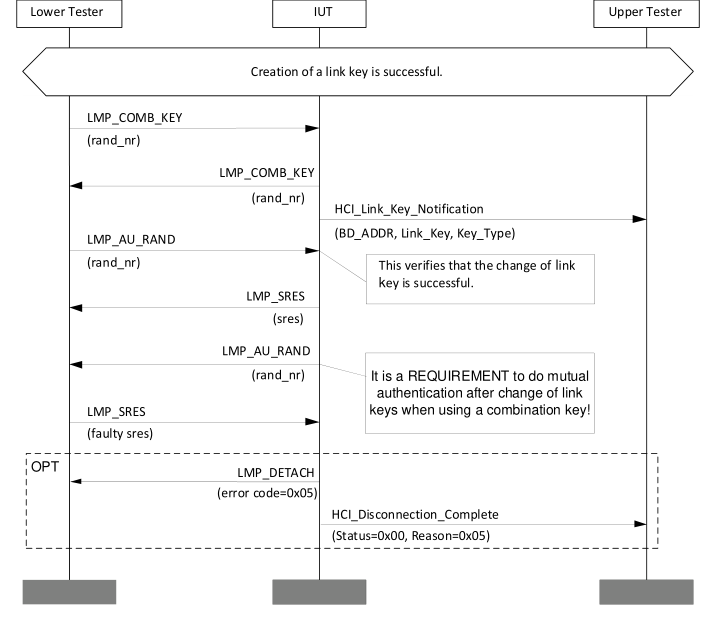

**Figure 4.33: LMP/AUT/BV-28-C [Change Link Key, IUT Responder – Rejects Bad Authentication Response] MSC**

• Test Condition
The manufacturer of the IUT must define which key the IUT uses.
• Expected Outcome
Pass verdict
The IUT transmits PDU LMP_COMB_KEY upon reception of LMP_COMB_KEY. The Link Key must be the calculated Link Key.
The IUT rejects the authentication when receiving a bad LMP_SRES PDU from the Lower Tester.
LMP/AUT/BV-29-C [Change Link Key, IUT Initiator – Rejects Bad Authentication Response]
• Test Purpose
Verify that the IUT can change Link Key and that the IUT creates the new Link Key correctly. The IUT is the initiating unit configured to use a comb key. Encryption is not used. The IUT rejects a bad authentication response.
• Reference
[1] 4.2.3
• Initial Condition
- See Section 4.1.3.
• Test Procedure
Same as for LMP/AUT/BV-13-C [Change Link Key, IUT Initiator], but in the LMP_SRES PDU sent by the Lower Tester, one bit at random of the value is inverted.

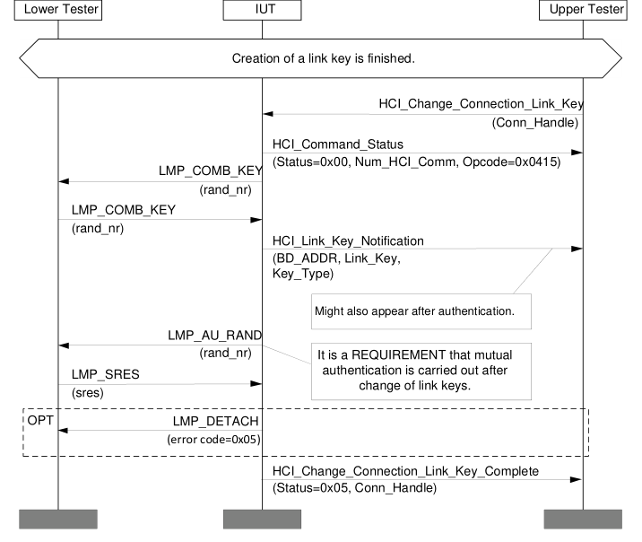

**Figure 4.34: LMP/AUT/BV-29-C [Change Link Key, IUT Initiator – Rejects Bad Authentication Response] MSC**

• Test Condition
The manufacturer of the IUT must define which key the IUT uses.
It must be possible to control the IUT to initiate the change of Link Key.
• Expected Outcome
Pass verdict
The IUT transmits PDU LMP_COMB_KEY and accepts reception of PDU LMP_COMB_KEY. The Link Key must be the calculated Link Key.
The IUT rejects the authentication when receiving a bad LMP_SRES PDU from the Lower Tester.

#### 4.5.4 Secure Authentication procedures

Verify the Secure Authentication procedure.
LMP/AUT/BV-14-C [Secure Authentication, Responder (IUT) has link key, Initiator (Lower Tester) is Central]
• Test Purpose
Verify the Secure Authentication procedure when the Lower Tester is the initiator, the IUT is responder, and the IUT has the link Key. The IUT is Peripheral and the Lower Tester is Central.
• Reference
[1] 4.2.1.4
• Initial Condition
- See Connection Establishment IUT Central and Secure Simple Pairing P256.
• Test Procedure
Central Peripheral

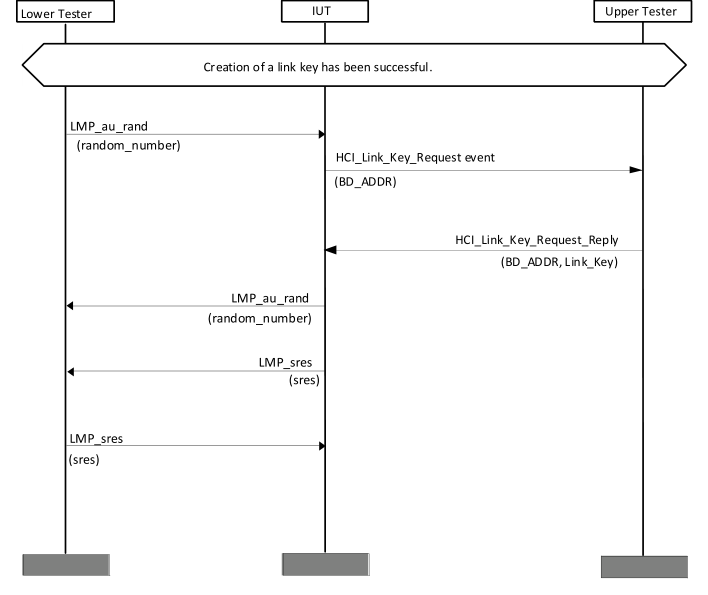

**Figure 4.35: LMP/AUT/BV-14-C [Secure Authentication, Responder (IUT) has link key, Initiator (Lower Tester) is Central] MSC**

• Expected Outcome
Pass verdict
The IUT transmits the PDU LMP_au_rand upon reception of PDU LMP_au_rand from the Lower Tester.
The IUT transmits the PDU LMP_sres containing the correct Authentication_Response.
LMP/AUT/BV-15-C [Secure Authentication, Responder (IUT) has link Key, Initiator (Lower Tester) is Peripheral]
• Test Purpose
Verify the Secure Authentication procedure when the Lower Tester is the initiator, the IUT is responder, and the IUT has the link Key. The IUT is Central and the Lower Tester is Peripheral.
• Reference
[1] 4.2.1.4
• Initial Condition
- See Connection Establishment Lower Tester and Secure Simple Pairing P256.
• Test Procedure
Central Peripheral

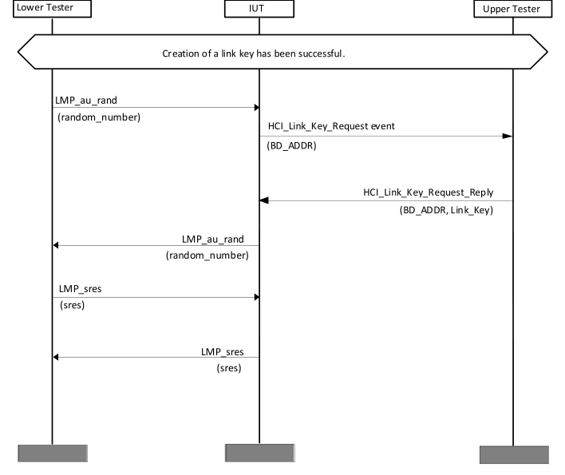

**Figure 4.36: LMP/AUT/BV-15-C [Secure Authentication, Responder (IUT) has link Key, Initiator (Lower Tester) is Peripheral] MSC**

• Expected Outcome
Pass verdict
The IUT transmits the PDU LMP_au_rand upon reception of PDU LMP_au_rand from the Lower Tester.
The IUT transmits the PDU LMP_sres containing the correct Authentication_Response upon reception of PDU LMP_sres from the Lower Tester.
LMP/AUT/BV-16-C [Secure Authentication, Responder (Lower Tester) has link Key, Initiator (IUT) is Central]
• Test Purpose
Verify the Secure Authentication procedure when the Lower Tester is the responder, the IUT is initiator, and the IUT has the link Key. The IUT is Central and the Lower Tester is Peripheral.
• Reference
[1] 4.2.1.4
• Initial Condition
- See Connection Establishment IUT Central and Secure Simple Pairing P256.
• Test Procedure
Central Peripheral

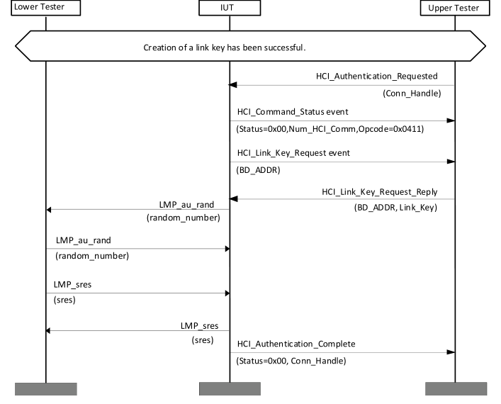

**Figure 4.37: LMP/AUT/BV-16-C [Secure Authentication, Responder (Lower Tester) has link Key, Initiator (IUT) is Central] MSC**

• Expected Outcome
Pass verdict
The IUT transmits the PDU LMP_au_rand upon receiving the Link Key from the Upper Tester.
The IUT transmits the PDU LMP_sres containing the correct Authentication_Response upon reception of the PDU LMP_sres from the Lower Tester.
LMP/AUT/BV-17-C [Secure Authentication, Responder (Lower Tester) has Link Key, Initiator (IUT) is Peripheral]
• Test Purpose
Verify the Secure Authentication procedure when the Lower Tester is the responder, the IUT is initiator, and the IUT has the link Key. The IUT is Peripheral and the Lower Tester is Central.
• Reference
[1] 4.2.1.4
• Initial Condition
- See Connection Establishment Lower Tester and Secure Simple Pairing P256.
• Test Procedure
Central Peripheral

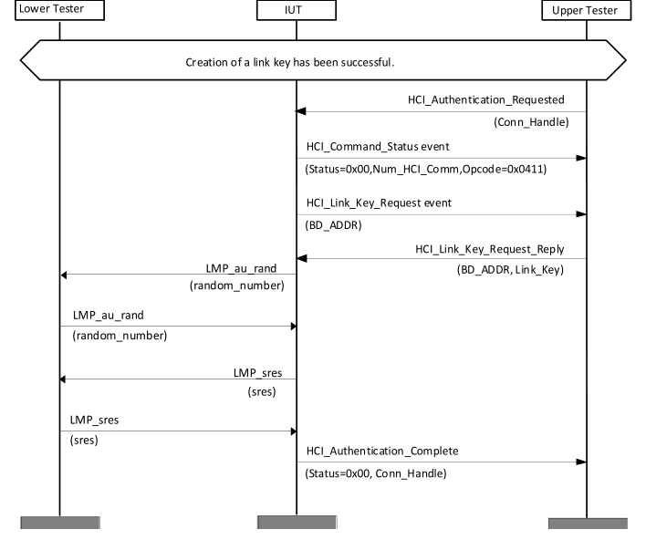

**Figure 4.38: LMP/AUT/BV-17-C [Secure Authentication, Responder (Lower Tester) has link Key, Initiator (IUT) is Peripheral] MSC**

• Expected Outcome
Pass verdict
The IUT transmits the PDU LMP_au_rand upon receiving the Link Key from the Upper Tester.
The IUT transmits the PDU LMP_sres containing the correct Authentication_Response upon reception of the PDU LMP_au_rand from the Lower Tester.
LMP/AUT/BV-18-C [Role switch during Secure Authentication before Authentication Response, Responder (IUT) has link key, Initiator (Lower Tester) is Central]
• Test Purpose
Verify the Secure Authentication procedure when the Lower Tester is the initiator, the IUT is responder, and the IUT has the link key. The Lower Tester initiates a role switch before it sends the authentication response. The IUT is Peripheral and the Lower Tester is Central.
• Reference
[1] 4.2.1.4
• Initial Condition
- See Connection Establishment IUT Central and Secure Simple Pairing P256.
• Test Procedure
Central Peripheral

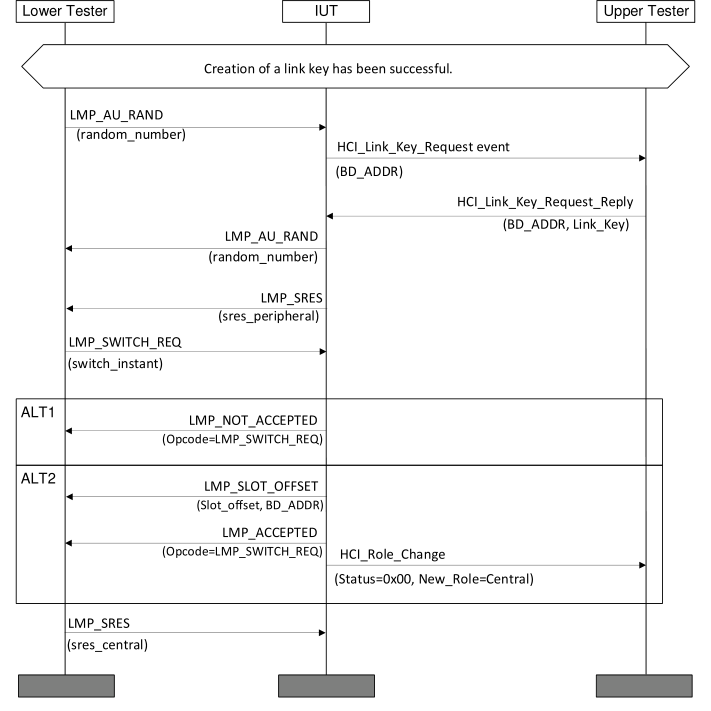

**Figure 4.39: LMP/AUT/BV-18-C [Role switch during Secure Authentication before Authentication Response, Responder (IUT) has link key, Initiator (Lower Tester) is Central] MSC**

• Expected Outcome
Pass verdict
It is acceptable for the IUT to reject or to accept the role switch, as long as it continues and successfully completes the authentication.
The IUT transmits the PDU LMP_AU_RAND upon reception of PDU LMP_AU_RAND from the Lower Tester.
The IUT transmits the PDU LMP_SRES containing the correct authentication response.
LMP/AUT/BV-19-C [Role switch during Secure Authentication before Authentication Response, Responder (IUT) has link key, Initiator (Lower Tester) is Peripheral]
• Test Purpose
Verify the Secure Authentication procedure when the Lower Tester is the initiator, the IUT is responder, and the IUT has the link key. The Lower Tester initiates a role switch before it sends the authentication response. The IUT is Central and the Lower Tester is Peripheral.
• Reference
[1] 4.2.1.4
• Initial Condition
- See Connection Establishment Lower Tester and Secure Simple Pairing P256.
• Test Procedure
Central Peripheral

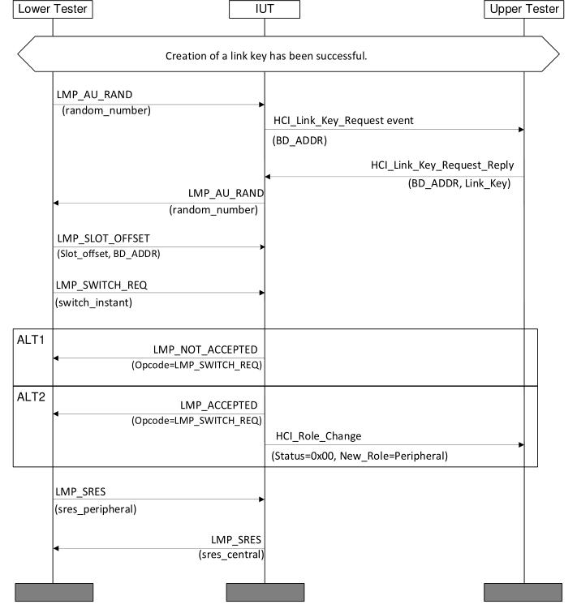

**Figure 4.40: LMP/AUT/BV-19-C [Role switch during Secure Authentication before Authentication Response, Responder (IUT) has link key, Initiator (Lower Tester) is Peripheral] MSC**

• Expected Outcome
Pass verdict
It is acceptable for the IUT to reject or to accept the role switch, as long as it continues and successfully completes the authentication.
The IUT transmits the PDU LMP_AU_RAND upon reception of PDU LMP_AU_RAND from the Lower Tester.
The IUT transmits the PDU LMP_SRES containing the correct authentication response upon reception of PDU LMP_SRES from the Lower Tester.
LMP/AUT/BV-20-C [Role switch during Secure Authentication before Authentication Response, Responder (Lower Tester) has link key, Initiator (IUT) is Central]
• Test Purpose
Verify the Secure Authentication procedure when the Lower Tester is the responder, the IUT is initiator, and the Lower Tester has the link key. The Lower Tester initiates a role switch before it sends the authentication response.
• Reference
[1] 4.2.1.4
• Initial Condition
- See Connection Establishment Lower Tester and Secure Simple Pairing P256.
- State: Connected in the relevant role to the Lower Tester.
• Test Procedure
Central Peripheral

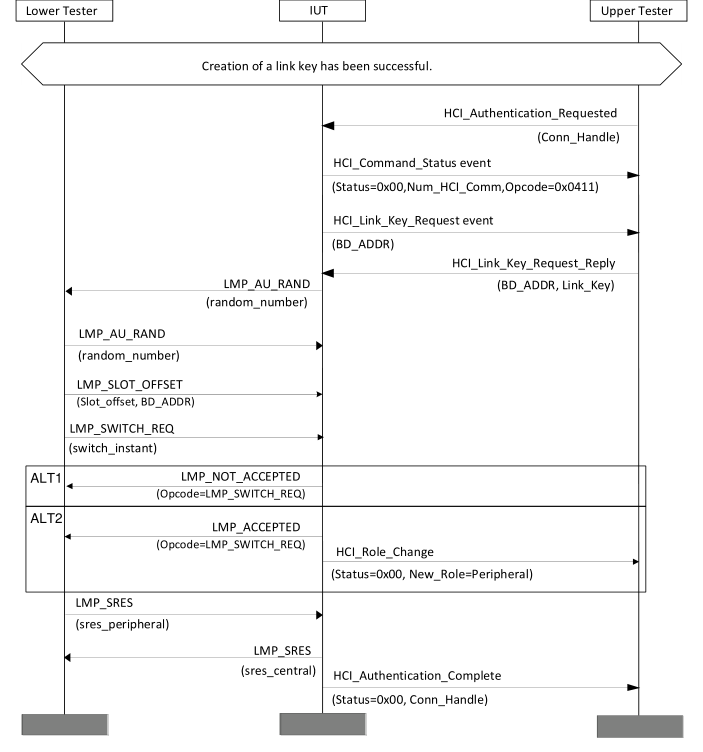

**Figure 4.41: LMP/AUT/BV-20-C [Role switch during Secure Authentication before Authentication Response, Responder (Lower Tester) has link key, Initiator (IUT) is Central] MSC**

• Expected Outcome
Pass verdict
It is acceptable for the IUT to reject or to accept the role switch, as long as it continues and successfully completes the authentication.
The IUT transmits the PDU LMP_AU_RAND upon receiving the Link Key from the Upper Tester.
The IUT transmits the PDU LMP_SRES containing the correct authentication response upon reception of the PDU LMP_SRES from the Lower Tester.
The IUT sends a successful HCI_Authentication_Complete event to the Upper Tester.
LMP/AUT/BV-21-C [Role switch during Secure Authentication before Authentication Response, Responder (Lower Tester) has link key, Initiator (IUT) is Peripheral]
• Test Purpose
Verify the Secure Authentication procedure when the Lower Tester is the responder, the IUT is initiator, and the Lower Tester has the link key. The Lower Tester initiates a role switch before it sends the authentication response. The IUT is Peripheral and the Lower Tester is Central.
• Reference
[1] 4.2.1.4
• Initial Condition
- See Connection Establishment Lower Tester and Secure Simple Pairing P256.
• Test Procedure
Central Peripheral

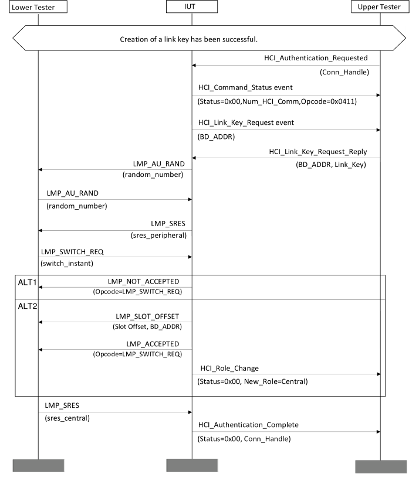

**Figure 4.42: LMP/AUT/BV-21-C [Role switch during Secure Authentication before Authentication Response, Responder (Lower Tester) has link key, Initiator (IUT) is Peripheral] MSC**

• Expected Outcome
Pass verdict
It is acceptable for the IUT to reject or to accept the role switch, as long as it continues and successfully completes the authentication.
The IUT transmits the PDU LMP_AU_RAND upon receiving the Link Key from the Upper Tester.
The IUT transmits the PDU LMP_SRES containing the correct authentication response upon reception of the PDU LMP_AU_RAND from the Lower Tester.
The IUT sends a successful HCI_Authentication_Complete event to the Upper Tester.
LMP/AUT/BV-22-C [Role switch during Secure Authentication before Random Number, Responder (Lower Tester) has link key, Initiator (IUT) is Central]
• Test Purpose
Verify the Secure Authentication procedure when the Lower Tester is the responder, the IUT is initiator, and the Lower Tester has the link key. The Lower Tester initiates a role switch before it sends the random number.
• Reference
[1] 4.2.1.4
• Initial Condition
- See Connection Establishment Lower Tester and Secure Simple Pairing P256.
- State: Connected in the relevant role to the Lower Tester.
• Test Procedure
Central Peripheral

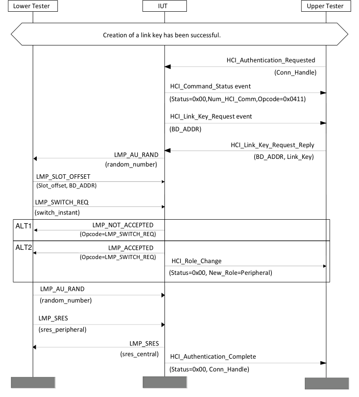

**Figure 4.43: LMP/AUT/BV-22-C [Role switch during Secure Authentication before Random Number, Responder (Lower Tester) has link key, Initiator (IUT) is Central] MSC**

• Expected Outcome
Pass verdict
It is acceptable for the IUT to reject or to accept the role switch, as long as it continues and successfully completes the authentication.
The IUT transmits the PDU LMP_AU_RAND upon receiving the Link Key from the Upper Tester.
The IUT transmits the PDU LMP_SRES containing the correct authentication response upon reception of the PDU LMP_SRES from the Lower Tester.
The IUT sends a successful HCI_Authentication_Complete event to the Upper Tester.
LMP/AUT/BV-23-C [Role switch during Secure Authentication before Random Number, Responder (Lower Tester) has link key, Initiator (IUT) is Peripheral]
• Test Purpose
Verify the Secure Authentication procedure when the Lower Tester is the responder, the IUT is initiator, and the Lower Tester has the link key. The Lower Tester initiates a role switch before it sends the random number. The IUT is Peripheral and the Lower Tester is Central.
• Reference
[1] 4.2.1.4
• Initial Condition
- See Connection Establishment Lower Tester and Secure Simple Pairing P256.
• Test Procedure
Central Peripheral

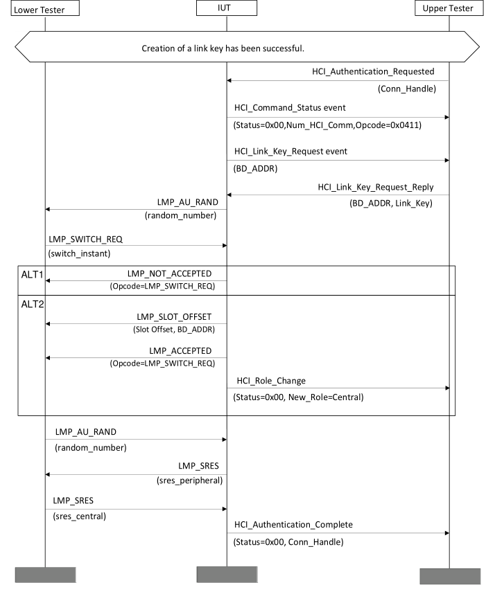

**Figure 4.44: LMP/AUT/BV-23-C [Role switch during Secure Authentication before Random Number, Responder (Lower Tester) has link key, Initiator (IUT) is Peripheral] MSC**

• Expected Outcome
Pass verdict
It is acceptable for the IUT to reject or to accept the role switch, as long as it continues and successfully completes the authentication.
The IUT transmits the PDU LMP_AU_RAND upon receiving the Link Key from the Upper Tester.
The IUT transmits the PDU LMP_SRES containing the correct authentication response upon reception of the PDU LMP_AU_RAND from the Lower Tester.
The IUT sends a successful HCI_Authentication_Complete event to the Upper Tester.
LMP/AUT/BI-02-C [Mistimed role switch during Secure Authentication, Responder (IUT) has link key, Initiator (Lower Tester) is Central]
• Test Purpose
Verify the Secure Authentication procedure when the Lower Tester is the initiator, the IUT is responder, and the IUT has the link key. The Lower Tester initiates a role switch after the IUT sends the authentication response and the Lower Tester sends back the key that was sent by the IUT. The IUT is Peripheral and the Lower Tester is Central.
• Reference
[1] 4.2.1.4
• Initial Condition
- See Connection Establishment IUT Central and Secure Simple Pairing P256.
• Test Procedure
Central Peripheral

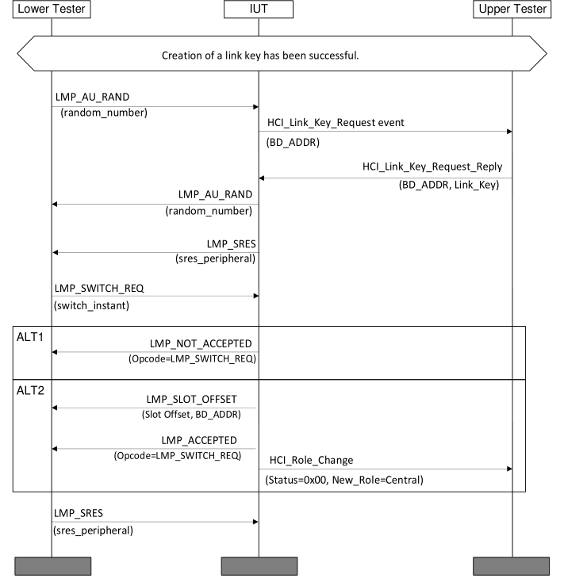

**Figure 4.45: LMP/AUT/BI-02-C [Mistimed role switch during Secure Authentication, Responder (IUT) has link key, Initiator (Lower Tester) is Central] MSC**

• Expected Outcome
Pass verdict
The IUT transmits the PDU LMP_AU_RAND upon reception of PDU LMP_AU_RAND from the Lower Tester.
The IUT transmits the PDU LMP_SRES containing the correct authentication response.
It is acceptable for the IUT to reject or to accept the role switch, as long as it fails the authentication.
The Lower Tester transmits the PDU LMP_SRES containing the incorrect authentication response by using the sres_Peripheral key received by the IUT.
LMP/AUT/BI-03-C [Mistimed role switch during Secure Authentication, Responder (Lower Tester) has link key, Initiator (IUT) is Peripheral]
• Test Purpose
Verify the Secure Authentication procedure when the Lower Tester is the responder, the IUT is initiator, and the Lower Tester has the link key. The Lower Tester initiates a role switch after the IUT sends the authentication response and the Lower Tester sends back the key that was sent by the IUT. The IUT is Peripheral and the Lower Tester is Central.
• Reference
[1] 4.2.1.4
• Initial Condition
- See Connection Establishment Lower Tester and Secure Simple Pairing P256.
• Test Procedure
Central Peripheral

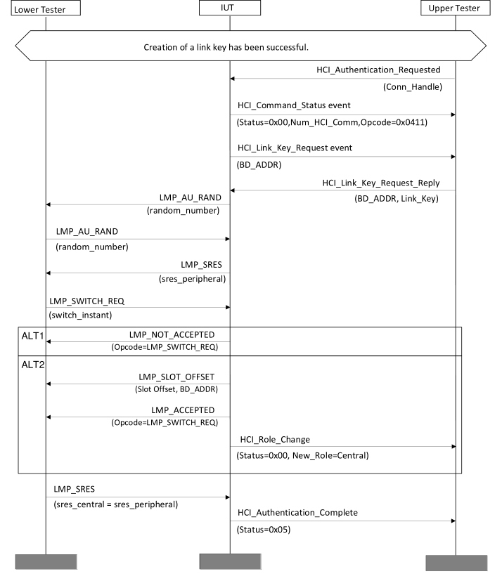

**Figure 4.46: LMP/AUT/BI-03-C [Mistimed role switch during Secure Authentication, Responder (Lower Tester) has link key, Initiator (IUT) is Peripheral] MSC**

• Expected Outcome
Pass verdict
The IUT transmits the PDU LMP_AU_RAND upon receiving the Link Key from the Upper Tester.
The IUT transmits the PDU LMP_SRES containing the correct authentication response upon reception of the PDU LMP_AU_RAND from the Lower Tester.
It is acceptable for the IUT to reject or to accept the role switch, as long as it fails the authentication.
The Lower Tester transmits the PDU LMP_SRES containing the incorrect authentication response by using the sres_Peripheral key received by the IUT.
The IUT sends an HCI_Authentication_Complete event to the Upper Tester with an Authentication Failure (0x05) status.
LMP/AUT/BV-30-C [Secure Authentication, Responder (IUT) has Link Key, Initiator (Lower Tester) is Central – Rejects Bad Authentication Response]
• Test Purpose
Verify the Secure Authentication procedure when the Lower Tester is the Initiator, IUT is Responder, and IUT has the Link Key. The IUT rejects a bad authentication response.
• Reference
[1] 4.2.1.4
• Initial Condition
- See Connection Establishment IUT Central and Secure Simple Pairing P256.
• Test Procedure
Same as for LMP/AUT/BV-14-C [Secure Authentication, Responder (IUT) has link key, Initiator (Lower Tester) is Central], but in the LMP_SRES PDU sent by the Lower Tester, one bit at random of the value is inverted.
Central Peripheral

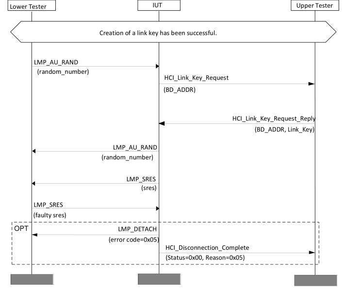

**Figure 4.47: LMP/AUT/BV-30-C [Secure Authentication, Responder (IUT) has Link Key, Initiator (Lower Tester) is Central – Rejects Bad Authentication Response] MSC**

• Expected Outcome
Pass verdict
The IUT transmits the PDU LMP_AU_RAND upon reception of PDU LMP_AU_RAND from the Lower Tester.
The IUT transmits the PDU LMP_SRES containing the correct authentication response.
The IUT rejects the authentication when receiving a bad LMP_SRES PDU from the Lower Tester.
LMP/AUT/BV-31-C [Secure Authentication, Responder (IUT) has Link Key, Initiator (Lower Tester) is Peripheral – Rejects Bad Authentication Response]
• Test Purpose
Verify the Secure Authentication procedure when the Lower Tester is the Initiator, the IUT is Responder, and the IUT has the Link Key. The IUT rejects a bad authentication response.
• Reference
[1] 4.2.1.4
• Initial Condition
- See Connection Establishment Lower Tester and Secure Simple Pairing P256.
• Test Procedure
Same as for LMP/AUT/BV-15-C [Secure Authentication, Responder (IUT) has link Key, Initiator (Lower Tester) is Peripheral], but in the LMP_SRES PDU sent by the Lower Tester, one bit at random of the value is inverted.

| Lower Tester | IUT Upper Tester Creation of a link key has been successful. HCI Link Key Request _ _ _ (BD ADDR) _ HCI Link Key Request Reply _ _ _ _ (BD ADDR, Link Key) _ _ LMP DETACH _ (error code=0x05) HCI Disconnection Complete _ _ (Status=0x00, Reason=0x05) | Upper Tester |  |  |
| --- | --- | --- | --- | --- |
|  |  |  |  |  |
| OPT |  |  |  |  |
|  |  |  |  |  |

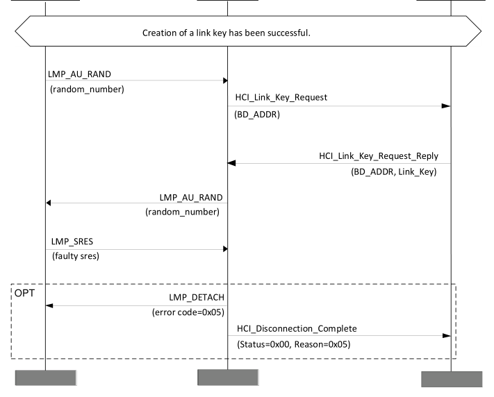

**Figure 4.48: LMP/AUT/BV-31-C [Secure Authentication, Responder (IUT) has Link Key, Initiator (Lower Tester) is Peripheral – Rejects Bad Authentication Response] MSC**

• Expected Outcome
Pass verdict
The IUT transmits the PDU LMP_AU_RAND upon reception of PDU LMP_AU_RAND from the Lower Tester.
The IUT rejects the authentication when receiving a bad LMP_SRES PDU from the Lower Tester.
LMP/AUT/BV-32-C [Secure Authentication, Responder (Lower Tester) has Link Key, Initiator (IUT) is Central – Rejects Bad Authentication Response]
• Test Purpose
Verify the Secure Authentication procedure when the Lower Tester is the Responder, the IUT is Initiator, and the IUT has the Link Key. The IUT rejects a bad authentication response.
• Reference
[1] 4.2.1.4
• Initial Condition
- See Connection Establishment IUT Central and Secure Simple Pairing P256.
• Test Procedure
Same as for LMP/AUT/BV-16-C [Secure Authentication, Responder (Lower Tester) has link Key, Initiator (IUT) is Central], but in the LMP_SRES PDU sent by the Lower Tester, one bit at random of the value is inverted.

| Lower Tester | IUT Upper Tester Creation of a link key has been successful. HCI Authentication Requested _ _ (Conn Handle) _ HCI Command Status _ _ (Status=0x00,Num HCI Comm,Opcode=0x0411) _ _ HCI Link Key Request _ _ _ (BD ADDR) _ HCI Link Key Request Reply _ _ _ _ (BD ADDR, Link Key) _ _ LMP DETACH _ (error code=0x05) HCI Authentication Complete _ _ (Status=0x05, Conn Handle) _ | Upper Tester |  |  |
| --- | --- | --- | --- | --- |
| OPT |  |  |  |  |
|  |  |  |  |  |

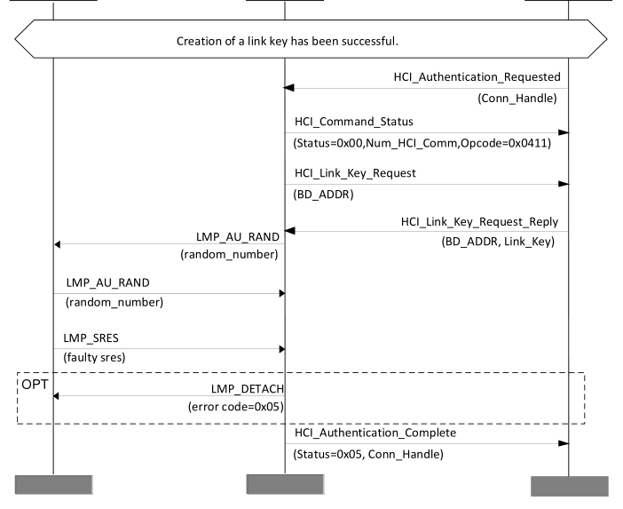

**Figure 4.49: LMP/AUT/BV-32-C [Secure Authentication, Responder (Lower Tester) has Link Key, Initiator (IUT) is Central – Rejects Bad Authentication Response] MSC**

• Expected Outcome
Pass verdict
The IUT transmits the PDU LMP_AU_RAND upon receiving the Link Key from the Upper Tester.
The IUT rejects the authentication when receiving a bad LMP_SRES PDU from the Lower Tester.
LMP/AUT/BV-33-C [Secure Authentication, Responder (Lower Tester) has Link Key, Initiator (IUT) is Peripheral – Rejects Bad Authentication Response]
• Test Purpose
Verify the Secure Authentication procedure when the Lower Tester is the Responder, the IUT is Initiator, and the IUT has the Link Key. The IUT rejects a bad authentication response.
• Reference
[1] 4.2.1.4
• Initial Condition
- See Connection Establishment Lower Tester and Secure Simple Pairing P256.
• Test Procedure
Same as for LMP/AUT/BV-17-C [Secure Authentication, Responder (Lower Tester) has Link Key, Initiator (IUT) is Peripheral], but in the LMP_SRES PDU sent by the Lower Tester, one bit at random of the value is inverted.

| Lower Tester | IUT Upper Tester Creation of a link key has been successful. HCI Authentication Requested _ _ (Conn Handle) _ HCI Command Status _ _ (Status=0x00,Num HCI Comm,Opcode=0x0411) _ _ HCI Link Key Request _ _ _ (BD ADDR) _ HCI Link Key Request Reply _ _ _ _ (BD ADDR, Link Key) _ _ LMP DETACH _ (error code=0x05) HCI Authentication Complete _ _ (Status=0x05, Conn Handle) _ |  | Upper Tester |  |  |
| --- | --- | --- | --- | --- | --- |
|  |  |  |  |  |  |
|  |  |  |  |  |  |
| OPT |  | ) HCI Authentication Complete _ _ |  |  |  |
|  |  |  |  |  |  |

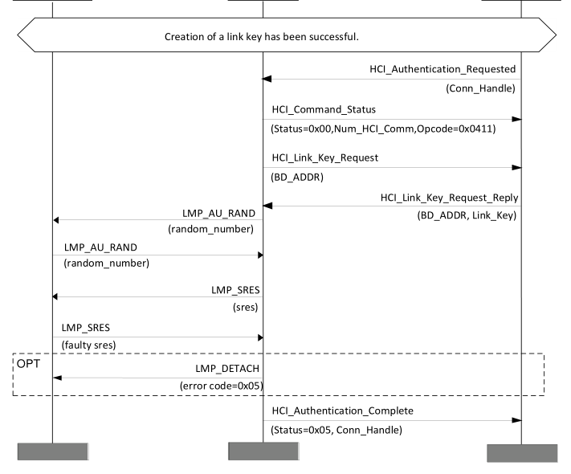

**Figure 4.50: LMP/AUT/BV-33-C [Secure Authentication, Responder (Lower Tester) has Link Key, Initiator (IUT) is Peripheral – Rejects Bad Authentication Response] MSC**

• Expected Outcome
Pass verdict
The IUT transmits the PDU LMP_AU_RAND upon receiving the Link Key from the Upper Tester.
The IUT rejects the authentication when receiving a bad LMP_SRES PDU from the Lower Tester.
LMP/AUT/BV-35-C [Secure Authentication, Responder (Lower Tester) has link key, Initiator (IUT) is Peripheral]
• Test Purpose
Verify that the IUT properly handles the Lower Tester sending the Signed Response immediately after sending LMP_AU_RAND. The Lower Tester is the responder, the IUT is the initiator and has the Link Key. The IUT is Peripheral, and the Lower Tester is Central.
• Reference
[1] 4.2.1.4
[13] 5.0
• Initial Condition
- See Connection Establishment IUT Central Lower Tester and Secure Simple Pairing P256.
• Test Procedure
Upper Tester Lower Tester Central Peripheral

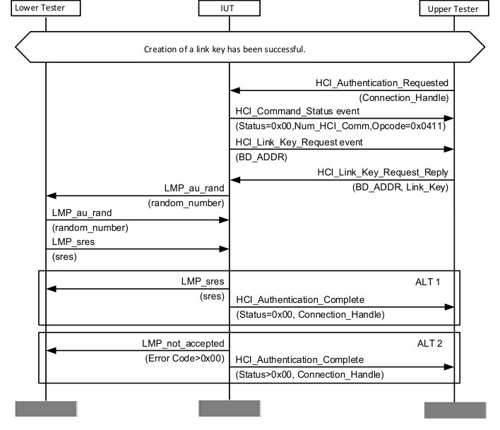

**Figure 4.51: LMP/AUT/BV-35-C [Secure Authentication, Responder (Lower Tester) has link key, Initiator (IUT) is Peripheral] MSC**

The Lower Tester transmits LMP_sres immediately after transmitting LMP_au_rand.
• Expected Outcome
Pass verdict
The IUT accepts the LMP_sres from the Lower Tester and sends an LMP_sres to the Lower Tester and an HCI_Authentication_Complete event to the Upper Tester; alternatively, the IUT rejects the LMP_sres from the Lower Tester and transmits an LMP_not_accepted with a valid error code to the Lower Tester and an HCI_Authentication_Complete event to the Upper Tester with a valid error Status value and Connection_Handle.
LMP/AUT/BI-06-C [Secure Authentication, Responder (IUT) has link Key, Initiator (Lower Tester) is Central, Reject Role Switch]
• Test Purpose
Verify that the IUT either rejects or disconnects the peer when receiving a role switch request during the Authentication process. The IUT is Peripheral and the Lower Tester is Central.
• Reference
[14] 4.2.1.4, 4.4.2
• Initial Condition
- See Connection Establishment Lower Tester and Secure Simple Pairing P256.
- The Lower Tester supports Role Switch.
• Test Procedure
Upper Tester Lower Tester Central Peripheral

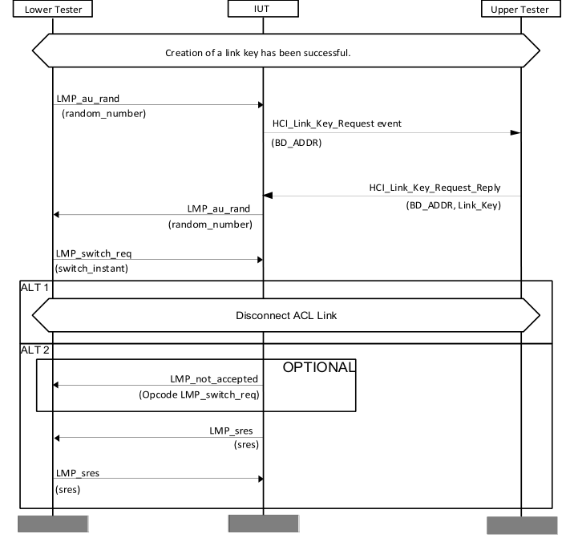

**Figure 4.52: LMP/AUT/BI-06-C [Secure Authentication, Responder (IUT) has link Key, Initiator (Lower Tester) is Central, Reject Role Switch] MSC**

• Expected Outcome
Pass verdict
In ALT 1, the IUT disconnects the ACL Link.
In ALT 2, the IUT may transmit PDU LMP_NOT_ACCEPTED upon reception of PDU LMP_SWITCH_REQ from the Lower Tester. The IUT transmits the PDU LMP_SRES containing the correct Authentication_Response.
LMP/AUT/BI-07-C [Secure Authentication, Responder (IUT) has link Key, Initiator (Lower Tester) is Peripheral, Reject Role Switch]
• Test Purpose
Verify that the IUT either rejects or disconnects the peer when receiving a role switch request during the Authentication process. The IUT is Central and the Lower Tester is Peripheral.
• Reference
[14] 4.2.1.4
• Initial Condition
- See Connection Establishment IUT Central and Secure Simple Pairing P256.
- The Lower Tester supports Role Switch.
• Test Procedure
Central Peripheral

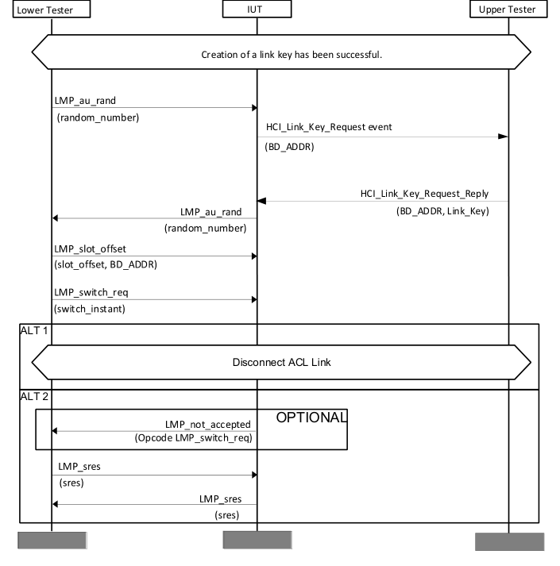

**Figure 4.53: LMP/AUT/BI-07-C [Secure Authentication, Responder (IUT) has link Key, Initiator (Lower Tester) is Peripheral, Reject Role Switch] MSC**

• Expected Outcome
Pass verdict
In ALT 1, the IUT disconnects the ACL Link.
In ALT 2, the IUT may transmit PDU LMP_NOT_ACCEPTED upon reception of PDU LMP_SWITCH_REQ from the Lower Tester. The IUT transmits the PDU LMP_SRES containing the correct Authentication_Response upon reception of PDU LMP_SRES from the Lower Tester.
LMP/AUT/BV-37-C [Secure Authentication of Previously Authenticated or Stored Link Key]
• Test Purpose
Verify that the IUT performs the secure authentication procedure when requested by the Host on a secure active connection when the Link Key has been previously authenticated or a Link Key is stored on the IUT. The IUT is the Initiator and has a Link Key associated with the Responder. The Lower Tester is the Responder.
• Reference
[1] 4.2.1.4
[7] 7.1.15
• Initial Condition
- See Section 4.1.3.
- ACL connection has been established.
- The Lower Tester and the IUT have performed Secure Simple Pairing with Secure Connections.
- Authentication has been previously performed, and encryption has been enabled.
- The Lower Tester has the Secure Connections (Controller Support) LMP feature bit set. The Upper Tester sets the Secure Connections (Host Support) LMP feature bit. The Lower Tester performs a feature exchange.
• Test Procedure

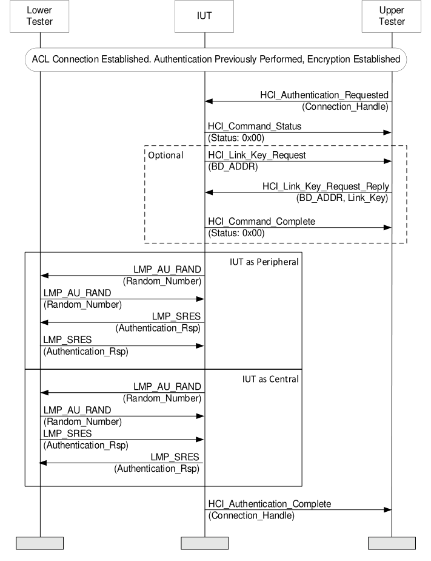

**Figure 4.54: LMP/AUT/BV-37-C [Secure Authentication of Previously Authenticated or Stored Link Key] MSC**

• Expected Outcome
Pass verdict
The IUT transmits the LMP_AU_RAND PDU to the Lower Tester containing the Random_Number parameter.
The IUT transmits the LMP_SRES PDU to the Lower Tester containing the Authentication_Rsp parameter.
The IUT sends a successful HCI_Authentication_Complete event to the Upper Tester after receiving an LMP_SRES PDU with the Authentication_Rsp from the Lower Tester.

#### 4.5.5 Legacy Authentication procedures

##### 4.5.5.1 Mutual Legacy Authentication, Initiator

• Test Purpose
Verify that the IUT can handle mutual legacy authentication as initiator.
• Reference
[1] 4.2.1.4
• Initial Condition
- The IUT and the Lower Tester have previously established a link key and have just created a new connection with the IUT in the role specified in Table 4.3. The Lower Tester does not support Secure Connections.
• Test Case Configuration

|  | TCID |  |  | IUT Role |  |
| --- | --- | --- | --- | --- | --- |
|  | LMP/AUT/BV-38-C [Mutual Legacy Authentication, Initiator, Central] |  |  | Central |  |
|  | LMP/AUT/BV-39-C [Mutual Legacy Authentication, Initiator, Peripheral] |  |  | Peripheral |  |

Table 4.3: Mutual Legacy Authentication, Initiator test cases
• Test Procedure

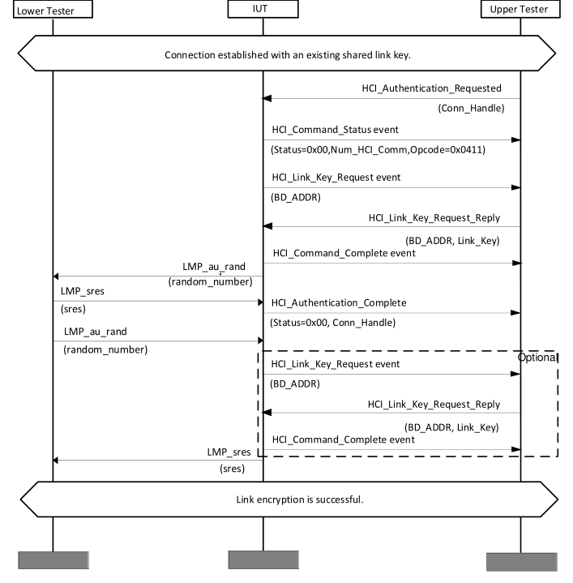

**Figure 4.55: Mutual Legacy Authentication, Initiator MSC**

• Expected Outcome
Pass verdict
The IUT responds to the LMP_AU_RAND PDU with an LMP_SRES PDU containing a correct Authentication_Response value.
Link encryption is successfully enabled using the shared link key.
Fail verdict
The IUT sends another LMP_AU_RAND PDU after responding with the LMP_SRES PDU.
• Test Purpose
Verify that the IUT deletes the link key after the connection is disconnected.
• Reference
[1] 4.2.1
• Initial Condition
- See Section 4.1.3.
- The IUT is the Initiator. The Lower Tester is the Responder.
- The Lower Tester does not support Secure Simple Pairing.
- The IUT has at least one key in its key store.
- The IUT does not contain a key for the Lower Tester’s BD_ADDR in its key store.
- If ICS item LMP 3/1 is supported, then the Upper Tester sends HCI_Write_Authentication_Enable (Enabled=0x01) before starting the connection.
• Test Procedure

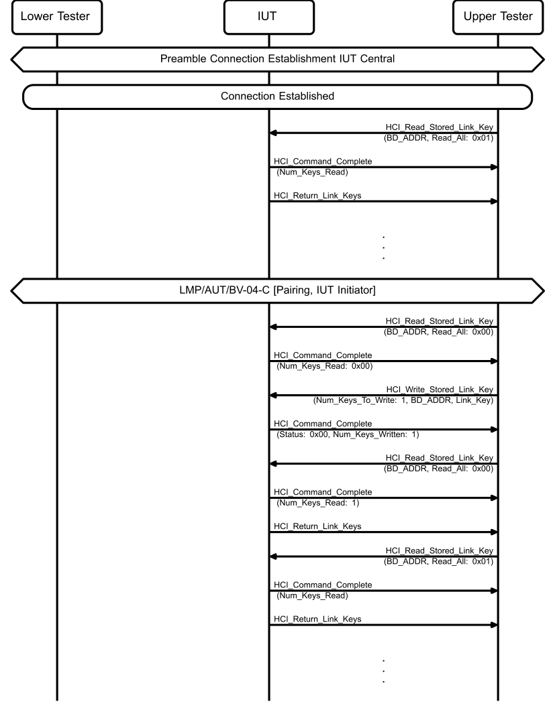

**Figure 4.56: LMP/AUT/BV-41-C [Delete Stored Link Key, In Connection] MSC – Page 1 of 2**

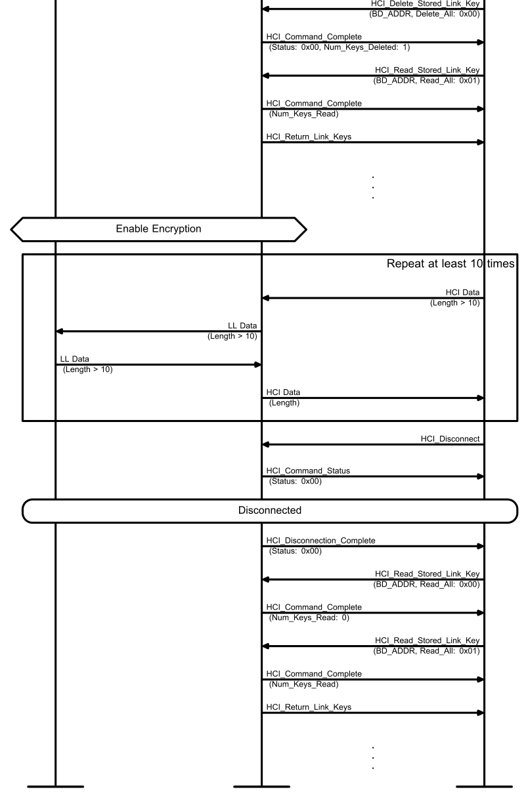

**Figure 4.57: LMP/AUT/BV-41-C [Delete Stored Link Key, In Connection] MSC – Page 2 of 2**

1. Run the preamble in Section 4.3.1. 2. The Upper Tester sends an HCI_g12Read_Stored_Link_Key command to the IUT with a random
BD_ADDR and Read_All set to 0x01. 3. The IUT sends a successful HCI_Command_Complete event to the Upper Tester with
Num_Keys_Read. Num_Keys_Read is stored to be used in the following steps. 4. The IUT sends one or more HCI_Return_Link_Keys events to the Upper Tester. The Lower
Tester BD_ADDR does not appear in any of the events. The number of unique addresses in the events equals the value of Num_Keys_Read in step 3. 5. Wait for 40 slot pairs after the last HCI_Return_Link_Keys event to ensure that no more
HCI_Return_Link_Keys events are sent to the Upper Tester. 6. Execute the test procedure of LMP/AUT/BV-04-C [Pairing, IUT Initiator]. 7. The Upper Tester sends an HCI_Read_Stored_Link_Key command to the IUT with BD_ADDR
set to the BD_ADDR of the Lower Tester and Read_All set to 0x00. 8. The IUT sends a successful HCI_Command_Complete event to the Upper Tester with
Num_Keys_Read set to 0. 9. Wait for 40 slot pairs after the HCI_Command_Complete event to ensure that no
HCI_Return_Link_Keys events are sent to the Upper Tester. 10. The Upper Tester sends an HCI_Write_Stored_Link_Key command to the IUT with
Num_Keys_To_Write set to 1, BD_ADDR[0] set to the BD_ADDR of the Lower Tester, and Link_Key[0] set to the link key created in step 6. 11. The IUT sends a successful HCI_Command_Complete event to the Upper Tester with
Num_Keys_Written = 1. 12. The Upper Tester sends an HCI_Read_Stored_Link_Key command to the IUT with BD_ADDR
set to the BD_ADDR of the Lower Tester and Read_All set to 0x00. 13. The IUT sends a successful HCI_Command_Complete event to the Upper Tester with
Num_Keys_Read = 1. 14. The IUT sends exactly one HCI_Return_Link_Keys event to the Upper Tester with Num_Keys set
to 1 and BD_ADDR[0] set to the Lower Tester BD_ADDR. 15. Wait for 40 slot pairs after the last HCI_Return_Link_Keys event to ensure that no more
HCI_Return_Link_Keys events are sent. 16. The Upper Tester sends an HCI_Read_Stored_Link_Key command to the IUT with a random
BD_ADDR and Read_All set to 0x01. 17. The IUT sends a successful HCI_Command_Complete event to the Upper Tester with
Num_Keys_Read set to a value one greater than the value in step 3. 18. The IUT sends one or more HCI_Return_Link_Keys events to the Upper Tester. The Lower
Tester BD_ADDR appears in exactly one of the events. The number of unique addresses in the events equals the value of Num_Keys_Read in step 17. 19. Wait for 40 slot pairs after the last HCI_Return_Link_Keys event to ensure that no more
HCI_Return_Link_Keys events are sent. 20. The Upper Tester sends an HCI_Delete_Stored_Link_Key command to the IUT with BD_ADDR
set to the BD_ADDR of the Lower Tester and Delete_All set to 0x00. 21. The IUT sends a successful HCI_Command_Complete event to the Upper Tester with
Num_Keys_Deleted = 1. 22. The Upper Tester sends an HCI_Read_Stored_Link_Key command to the IUT with a random
BD_ADDR and Read_All set to 0x01. 23. The IUT sends a successful HCI_Command_Complete event to the Upper Tester with
Num_Keys_Read the same as the Num_Keys_Read from step 3. 24. The IUT sends one or more HCI_Return_Link_Keys events to the Upper Tester. The Lower
Tester BD_ADDR does not appear in any of the events. The number of unique addresses in the events equals the value of Num_Keys_Read in step 3.
HCI_Return_Link_Keys events are sent. 26. The IUT and the Lower Tester enable encryption using the link key created in step 6. 27. The Upper Tester and the Lower Tester send each other at least 10 packets containing at least

## 10 octets of data each. 28. The Upper Tester sends an HCI_Disconnect to the IUT with Connection_Handle set to the

current ACL connection and receives a successful HCI_Command_Status in response. 29. The IUT and the Lower Tester are disconnected, 30. The IUT sends an HCI_Disconnection_Complete event to the Upper Tester. 31. The Upper Tester sends an HCI_Read_Stored_Link_Key command to the IUT with BD_ADDR
set to the BD_ADDR of the Lower Tester and Read_All set to 0x00. 32. The IUT sends a successful HCI_Command_Complete event to the Upper Tester with
Num_Keys_Read set to 0. 33. Wait for 40 slot pairs after the HCI_Command_Complete event to ensure that no
HCI_Return_Link_Keys events are sent to the Upper Tester. 34. The Upper Tester sends an HCI_Read_Stored_Link_Key command to the IUT with a random
BD_ADDR and Read_All set to 0x01. 35. The IUT sends a successful HCI_Command_Complete event to the Upper Tester with
Num_Keys_Read equal to the value in step 3. 36. The IUT sends one or more HCI_Return_Link_Keys events to the Upper Tester. The Lower
Tester BD_ADDR does not appear in any of the events. The number of unique addresses in the events equals the Num_Keys_Read in step 3. 37. Wait for 40 slot pairs after the last HCI_Return_Link_Keys event to ensure that no more
HCI_Return_Link_Keys events are sent.
• Test Condition
It must be possible to control the IUT to initiate the pairing procedure. The manufacturer of the IUT must define BD_ADDR.
• Expected Outcome
Pass verdict
In steps 23 and 35, the value of Num_Keys_Read is the same as in step 3.
In steps 8 and 32, Num_Keys_Read is set to 0.
In step 13, Num_Keys_Read is set to 1.
In step 17, the Num_Keys_Read is one more than the value from step 3.
In steps 4, 24, and 36, the number of unique addresses equals the value of Num_Keys_Read in step 3, and the Lower Tester BD_ADDR does not appear.
In step 14, the only BD_ADDR sent to the Upper Tester is that of the Lower Tester.
In step 18, the number of unique addresses equals the value of Num_Keys_Read in step 17, and the Lower Tester BD_ADDR is included in the list.
In step 27, the data is correctly encrypted and decrypted.
• Notes
Possible interaction might be needed on the IUT. HCI commands might be needed for PIN, Key, etc. It is implementation dependent.
The configuration of the IUT and the Lower Tester will decide which LMP commands to use when creating the Link Key.
It must be verified that if both the Lower Tester and the IUT are configured to use combination Key, a mutual authentication has to be carried out.
The initiation of the pairing procedure might be taken on an already established link.

### 4.6 Encryption

Verify the correct implementation of the Encryption services.

#### 4.6.1 Encryption - Peripheral

Verify that the Central and the Peripheral agree upon whether to use encryption or not and if encryption only applies to point to point packets or if encryption applies to both point to point packets and broadcast packets. The IUT is Peripheral.
LMP/ENC/BV-01-C [Accept Encryption]
• Test Purpose
Verify that the IUT accepts the encryption negotiation procedure and uses the encryption only for point to point messages. The Lower Tester is Central and the IUT is Peripheral.
• Reference
[1] 4.2.5
• Initial Condition
- An ACL connection is established.
- Creation of a link key is successful.
- The Lower Tester uses an acceptable Key length.
• Test Procedure

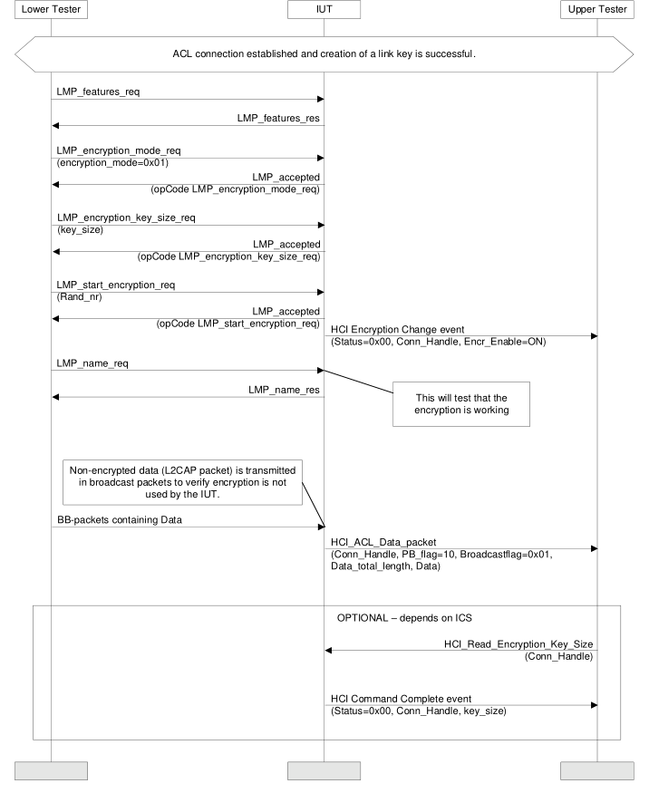

**Figure 4.58: LMP/ENC/BV-01-C [Accept Encryption] MSC**

• Expected Outcome
Pass verdict
The IUT accepts the encryption negotiation and uses the encryption afterwards.
The IUT must respond correctly to the PDU LMP_name_req to prove that encryption is used.
The IUT sends HCI ACL Data with non-encrypted payload to the Upper Tester.
If Read Encryption Key_Size is supported, the IUT returns the Key_Size parameter from the LMP_encryption_key_size_req PDU in the Command Complete event following the HCI Read Encryption Key_Size command.
• Notes
If the IUT starts to negotiate for encryption Key_Size the Lower Tester must negotiate.
• Test Purpose
Verify that the IUT accepts the broadcast encryption negotiation procedure and uses the encryption both for point to point messages as well as broadcast messages. The Lower Tester is Central and the IUT is Peripheral.
• Reference
[1] 4.2.5
• Initial Condition
- See Figure 4.59: LMP/ENC/BV-02-C.
• Test Procedure
Central Lower Tester
Peripheral

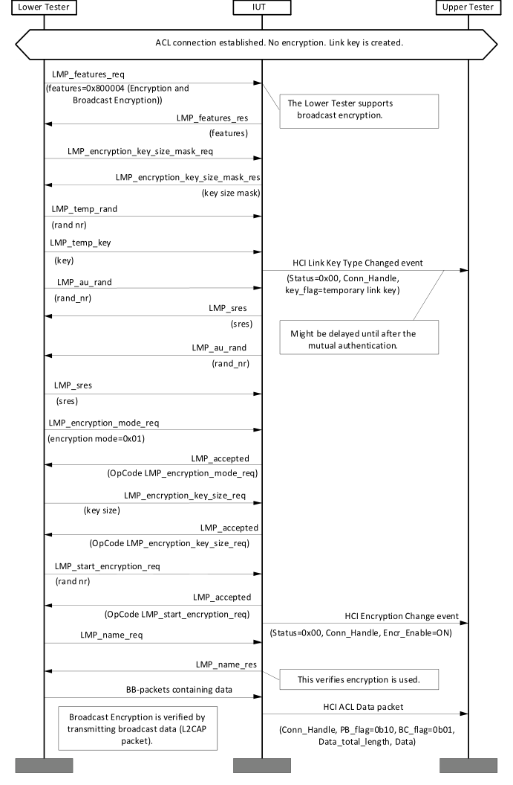

**Figure 4.59: LMP/ENC/BV-02-C [Accept Broadcast Encryption] MSC**

• Expected Outcome
Pass verdict
The IUT accepts the encryption negotiation and uses the encryption on both broadcast and point-to- point messages. HCI ACL Data Packet is sent to the Upper Tester.
• Notes
If the IUT starts to negotiate for encryption Key_Size the Lower Tester must negotiate.
LMP/ENC/BV-04-C [Stop Encryption, Central Command]
• Test Purpose
Verify that the IUT stops using encryption after request from the Lower Tester.
The Lower Tester is Central and the IUT is Peripheral.
• Reference
[1] 4.2.5.4
• Initial Condition
- See Figure 4.60.
• Test Procedure
Lower Tester Central Peripheral

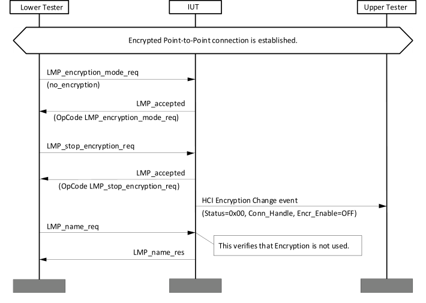

**Figure 4.60: LMP/ENC/BV-04-C [Stop Encryption, Central Command] MSC**

• Test Condition
The manufacturer of the IUT must define the Features supported by the IUT.
• Expected Outcome
Pass verdict
The IUT transmits PDU LMP_accepted upon reception of PDU LMP_stop_encryption and stops using encryption. The IUT must respond correctly to the PDU LMP_name_req to prove that encryption is not used.
• Test Purpose
Verify that the IUT stops encryption upon the appropriate HCI command. The IUT is the Peripheral and requests stop encryption.
• Reference
[1] 4.2.5.4
• Initial Condition
- See Figure 4.61: LMP/ENC/BV-09-C.
• Test Procedure
Central Lower Tester
Peripheral IUT

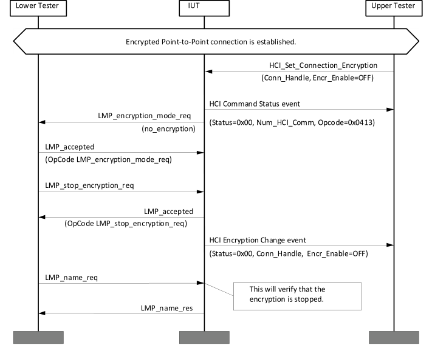

**Figure 4.61: LMP/ENC/BV-09-C [Stop Encryption, Central Command] MSC**

• Test Condition
The manufacturer of the IUT must define the Features supported by the IUT.
• Expected Outcome
Pass verdict
The IUT transmits PDU LMP_encryption_mode_req. The IUT transmits PDU LMP_accepted upon reception of PDU LMP_stop_encryption_req and stops using encryption. The IUT must respond correctly to the PDU LMP_name_req to prove that encryption is not used.
• Test Purpose
Verify that the IUT accepts that the semi-permanent link Key becomes the current link Key upon notice from the Lower Tester. Verify that the encryption is stopped. The Lower Tester is Central. The IUT is Peripheral.
• Reference
[1] 4.2.4.2
• Initial Condition
- See Figure 4.62: LMP/ENC/BV-11-C.
• Test Procedure
Peripheral IUT Upper Tester
Central Lower Tester

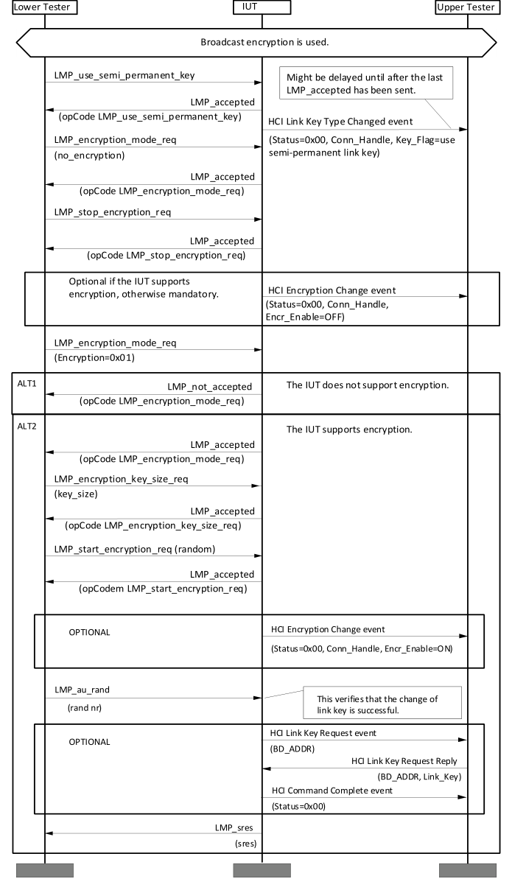

**Figure 4.62: LMP/ENC/BV-11-C [Semi-permanent Link Key] MSC**

• Expected Outcome
Pass verdict
The IUT transmits PDU LMP_accepted upon reception of LMP_use_semi_permanent_key, LMP_encryption_mode_req and LMP_stop_encryption_req. The Link Key must be the Semi Permanent Key and encryption must be stopped.
LMP/ENC/BV-12-C [Reject Broadcast Encryption]
• Test Purpose
Verify that IUT does not accept the broadcast encryption negotiation procedure. The Lower Tester is Central and the IUT is Peripheral.
• Reference
[1] 4.2.5
• Initial Condition
- See Figure 4.63: LMP/ENC/BV-12-C.
• Test Procedure

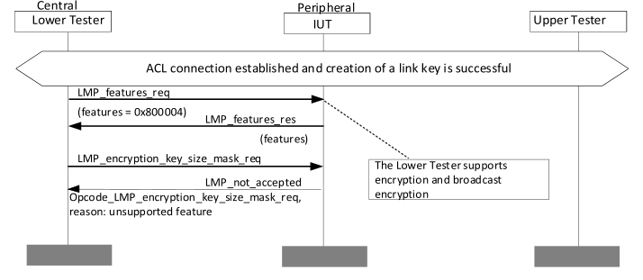

**Figure 4.63: LMP/ENC/BV-12-C [Reject Broadcast Encryption] MSC**

• Expected Outcome
Pass verdict
The IUT transmits the PDU LMP_not_accepted containing “Reason = 0x1A” upon reception of the PDU LMP_encryption_key_size_mask_req.
• Notes
The IUT may support point-to-point encryption.
LMP/ENC/BV-22-C [Initiate Encryption]
• Test Purpose
Verify that the IUT initiates the encryption procedure and uses encryption only for point to point messages. The IUT is Peripheral and the Lower Tester is Central.
• Reference
[1] 4.2.5
• Initial Condition
- See Default settings.
• Test Procedure
Central
Peripheral

**Figure 4.64: LMP/ENC/BV-22-C [Initiate Encryption] MSC**

• Expected Outcome
Pass verdict
The PDU LMP_features_req has to be sent at least once by the IUT before starting the encryption.
The IUT initiates the encryption negotiation and uses the encryption afterwards.
The IUT responds correctly to the PDU LMP_name_req to prove that encryption is used.
The IUT passes on broadcast ACL traffic with non-encrypted payloads from the Lower Tester to the Upper Tester.
The Encryption_Enabled Parameter in the Encryption Change event reports encryption has been enabled.
• Notes
The suggested Key_Size must be within the Lower Tester’s Key_Size range.
LMP/ENC/BV-23-C [Pausing and Resuming without Disabling Encryption, IUT Peripheral, Central Initiated as a result of change connection link Key]
• Test Purpose
Verify that the IUT as Peripheral can respond to Central initiated pause and resume of encryption without disabling the Encryption_Mode as part of the change connection link Key procedure.
• Reference
[1] 4.2.3, 4.2.5.3, 4.2.5.5
• Initial Condition
- The Lower Tester is Central and the IUT is Peripheral.
- An encrypted point-to-point connection has been established between the IUT and the Lower Tester.
- Both devices are sending data to each other.
• Test Procedure

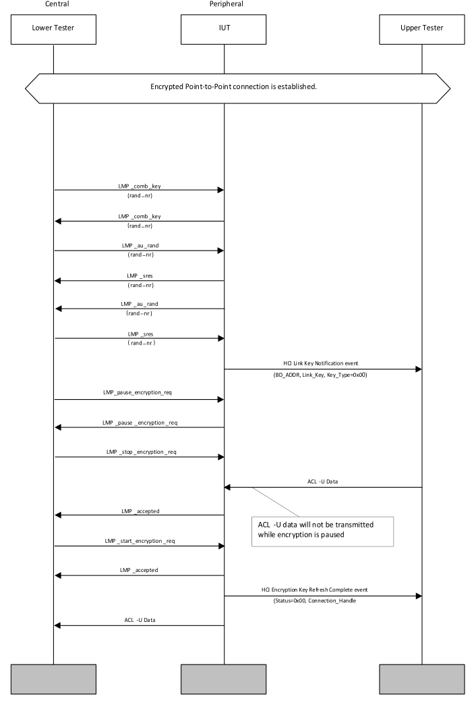

**Figure 4.65: LMP/ENC/BV-23-C [Pausing and Resuming without Disabling Encryption, IUT Peripheral, Central Initiated as a result of change connection link Key] MSC**

The Lower Tester performs the change connection link Key procedure.
The Lower Tester initiates the pausing of encryption.
The IUT accepts the pausing of encryption.
The Lower Tester resumes encryption.
• Expected Outcome
Pass verdict
The IUT responds to the LMP_pause_encryption_req with an LMP_pause_encryption_req.
The IUT transmits no data packets while encryption is paused.
The IUT transmits data packets after encryption is resumed.
LMP/ENC/BV-24-C [Pausing and Resuming without Disabling Encryption, IUT Peripheral, Central Initiated with role switch]
• Test Purpose
Verify that the IUT as Peripheral can respond to Central initiated pause and resume of encryption without disabling the Encryption_Mode as part of the role switch procedure.
• Reference
[1] 4.2.5.3, 4.2.5.5, 4.4.2
• Initial Condition
- The Lower Tester is Central and the IUT is Peripheral.
- An encrypted point-to-point connection has been established between the IUT and the Lower Tester.
- Both devices are sending data to each other.
• Test Procedure
Central Peripheral

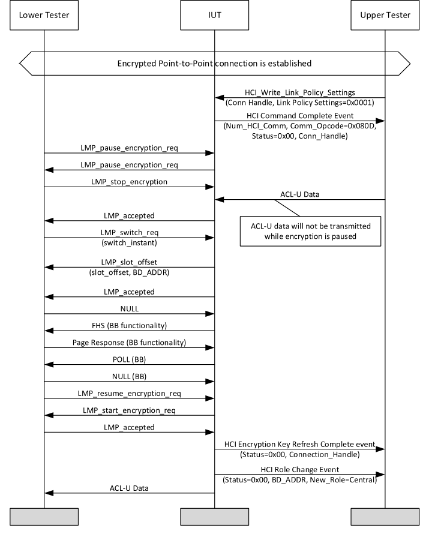

**Figure 4.66: LMP/ENC/BV-24-C [Pausing and Resuming without Disabling Encryption, IUT Peripheral, Central Initiated with role switch] MSC**

1. The Upper Tester writes the Link Policy Settings. 2. The Lower Tester initiates the pausing of encryption. 3. The IUT accepts the pausing of encryption. 4. The Lower Tester initiates a role switch. 5. The Lower Tester resumes encryption.
• Expected Outcome
Pass verdict
The IUT responds to the LMP_pause_encryption_req with an LMP_pause_encryption_req.
The IUT transmits no data packets while encryption is paused.
The IUT transmits data packets after encryption is resumed.
The role switch succeeds.
LMP/ENC/BV-25-C [Initiate AES-CCM Encryption]
• Test Purpose
Verify that the IUT initiates the encryption procedure and uses AES-CCM encryption only for point to point messages when the remote controller’s LMP feature bits indicate support for Secure Connections both in the Controller and Host.
• Reference
[1] 4.2.5
• Initial Condition
- The Lower Tester is Central and the IUT is Peripheral.
- An ACL connection has been established between the IUT and the Lower Tester, and the creation of a link key between the IUT and the Lower Tester has been successful.
• Test Procedure
Central
Peripheral

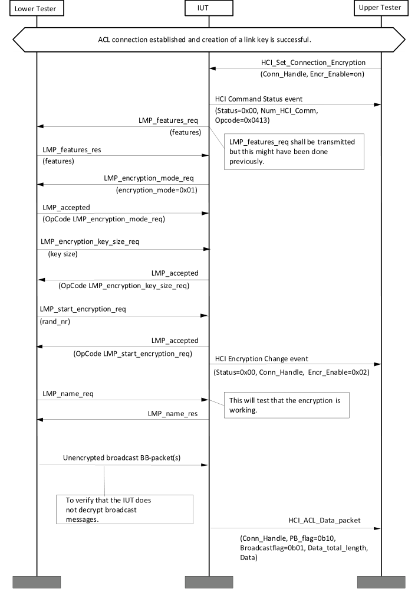

**Figure 4.67: LMP/ENC/BV-25-C [Initiate AES-CCM Encryption] MSC**

Encryption is initiated after ACL connection creation.
• Expected Outcome
Pass verdict
The IUT initiates the encryption negotiation and uses the encryption afterwards.
The IUT responds correctly to the PDU LMP_name_req (this proves that encryption is used).
The IUT sends HCI ACL Data with non-encrypted payload to the Upper Tester.
If Read Encryption Key_Size is supported, the IUT returns the Key_Size parameter from the LMP_encryption_key_size_req PDU in the Command Complete event following the HCI Read Encryption Key_Size command.
The Encryption_Enabled Parameter in the Encryption Change event reports AES-CCM encryption has been enabled.
• Notes
If the IUT starts to negotiate for encryption Key_Size the Lower Tester must negotiate.
The suggested Key_Size must be within the Lower Tester’s Key_Size range.
LMP/ENC/BV-26-C [Accept AES-CCM Encryption Request]
• Test Purpose
Verify that the IUT accepts the encryption negotiation procedure initiated by the Lower Tester and uses AES-CCM encryption only for point to point messages when the remote controller’s LMP feature bits indicate support for Secure Connections both in the Controller and the Host.
• Reference
[1] 4.2.5
• Initial Condition
- The Lower Tester is Central and the IUT is Peripheral.
- An ACL connection has been established between the IUT and the Lower Tester, and the creation of a link key between the IUT and the Lower Tester has been successful.
- The Lower Tester uses an acceptable Key length.
• Test Procedure

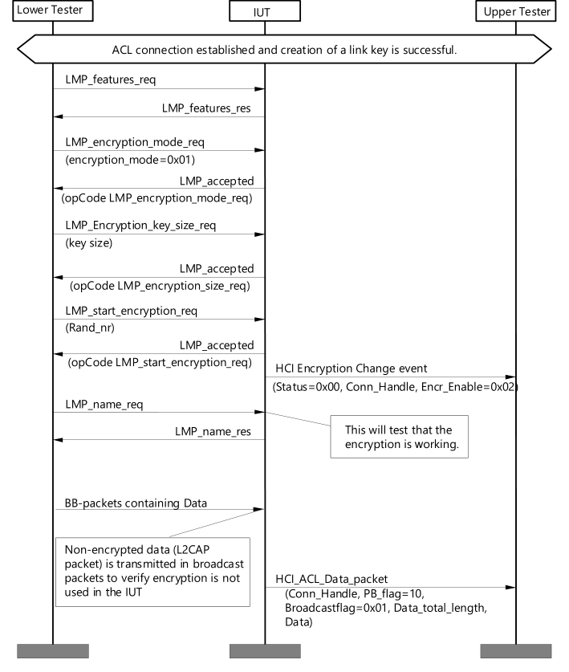

**Figure 4.68: LMP/ENC/BV-26-C [Accept AES-CCM Encryption Request] MSC**

• Expected Outcome
Pass verdict
The IUT accepts the encryption negotiation and uses the encryption afterwards.
The IUT responds correctly to the PDU LMP_name_req (this proves that encryption is used).
The IUT sends HCI ACL Data with non-encrypted payload to the Upper Tester.
If Read Encryption Key_Size is supported, the IUT returns the Key_Size parameter from the LMP_encryption_key_size_req PDU in the Command Complete event following the HCI Read Encryption Key_Size command.
The Encryption_Enabled Parameter in the Encryption Change event reports AES-CCM encryption has been enabled.
• Notes
If the IUT starts to negotiate for encryption Key_Size the Lower Tester must negotiate.
This test case is similar to LMP/ENC/BV-01-C [Accept Encryption].
LMP/ENC/BV-27-C [Stop AES-CCM Encryption from Central]
• Test Purpose
Verify that the IUT rejects a request to stop AES-CCM encryption from the Lower Tester.
• Reference
[1] 4.2.5.4
• Initial Condition
- The Lower Tester is Central and the IUT is Peripheral.
- An encrypted point-to-point connection has been established between the IUT and the Lower Tester.
• Test Procedure
Central Peripheral

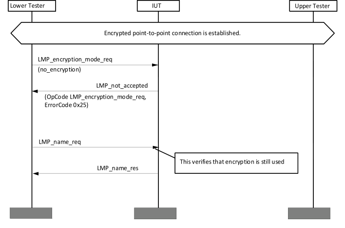

**Figure 4.69: LMP/ENC/BV-27-C [Stop AES-CCM Encryption from Central] MSC**

• Test Condition
The manufacturer of the IUT must define the Features supported by the IUT.
• Expected Outcome
Pass verdict
The IUT transmits PDU LMP_not_accepted with Error_Code “Encryption_Mode Not Allowed (0x25)” upon reception of PDU LMP_encryption_mode_req from the Lower Tester and does not stop using encryption.
The IUT responds correctly to the PDU LMP_name_req (this proves that encryption is still used).
• Test Purpose
Verify that the IUT rejects a request to stop AES-CCM encryption upon receiving the appropriate HCI command from the Host.
• Reference
[1] 4.2.5.4
• Initial Condition
- The Lower Tester is Central and the IUT is Peripheral.
- An encrypted point-to-point connection has been established between the IUT and the Lower Tester.
• Test Procedure
Lower Tester Central Peripheral

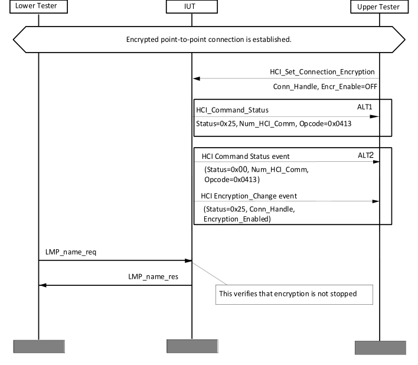

**Figure 4.70: LMP/ENC/BV-28-C [Stop AES-CCM Encryption from host] MSC**

• Expected Outcome
Pass verdict
The IUT either returns an HCI_Command_Status event with Error_Code “Encryption_Mode Not Acceptable (0x25)” OR returns an HCI_Command_Status event with status “Command currently in pending (0x00)” followed by an HCI_Encryption_Change event with Error_Code “Encryption_Mode Not Acceptable (0x25)”.
The IUT responds correctly to the PDU LMP_name_req (this proves that encryption is still used).
LMP/ENC/BV-29-C [Combating forged acknowledgements when AES-CCM Encryption is enabled]
• Test Purpose
Verify that the IUT as Peripheral periodically sends an LMP_ping_req on an idle ACL link on which AES-CCM encryption has been enabled in order to force the other side to transmit an ACL packet (LMP_ping_res).
• Reference
[1] 4.1.13
• Initial Condition
- The Lower Tester is Central and the IUT is Peripheral.
- An AES-CCM encrypted point-to-point connection has been established between the IUT and the Lower Tester.
• Test Procedure
Central Peripheral

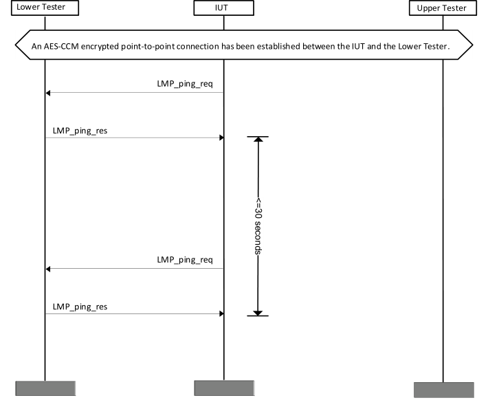

**Figure 4.71: LMP/ENC/BV-29-C [Combating forged acknowledgements when AES-CCM Encryption is enabled] MSC**

1. The ACL connection is kept idle i.e., no ACL-U or ACL-C traffic is exchanged for 60 seconds. 2. The IUT transmits the PDU LMP_ping_req so that the LMP_ping_res messages successfully
received by the IUT are less than (or equal to) 30 seconds apart. 3. The Lower Tester responds with LMP_ping_res.
• Expected Outcome
Pass verdict
The IUT transmits the PDU LMP_ping_req so that the LMP_ping_res messages successfully received by the IUT are less than (or equal to) 30 seconds apart.
• Notes
The Lower Tester should attempt to not transmit any packets that contain a MIC. However, if this is not possible and the Lower Tester autonomously transmits a data packet that contains a MIC, the Lower Tester should wait another 30 seconds.
LMP/ENC/BV-30-C [Responding to LMP_ping_req when AES-CCM Encryption is enabled]
• Test Purpose
Verify that the IUT as Peripheral responds to an LMP_ping_req sent by the Lower Tester when AES- CCM encryption has been enabled.
• Reference
[1] 4.1.13
• Initial Condition
- The Lower Tester is Central and the IUT is Peripheral.
- An AES-CCM encrypted point-to-point connection has been established between the IUT and the Lower Tester.
• Test Procedure
Central Peripheral

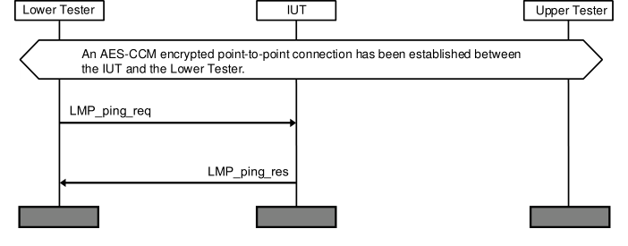

**Figure 4.72: LMP/ENC/BV-30-C [Responding to LMP_ping_req when AES-CCM Encryption is enabled] MSC**

1. The Lower Tester transmits the PDU LMP_ping_req. 2. The IUT responds with an LMP_ping_res.
• Expected Outcome
Pass verdict
The IUT responds to every LMP_ping_req with an LMP_ping_res.
• Test Purpose
Verify that the IUT as Peripheral generates the HCI Authenticated Payload Timeout Expired event when the Lower Tester doesn’t respond to an LMP_ping_req sent by the IUT within the Authenticated_Payload_Timeout interval.
• Reference
[1] 4.1.13
• Initial Condition
- The Lower Tester is Central and the IUT is Peripheral.
- An encrypted point-to-point connection has been established between the IUT and the Lower Tester.
• Test Procedure
Central Peripheral

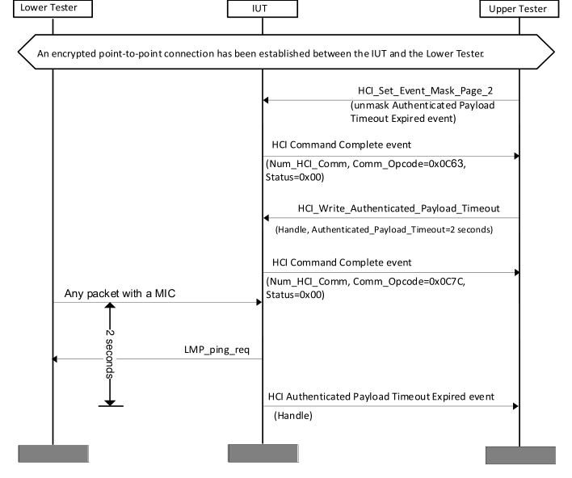

**Figure 4.73: LMP/ENC/BV-31-C [No response to LMP_ping_req] MSC**

1. The Upper Tester sets the Authenticated_Payload_Timeout to 2 seconds. 2. The Upper Tester unmasks the HCI Authenticated Payload Timeout Expired event. 3. The ACL connection is kept idle i.e. no ACL-U or ACL-C traffic is exchanged for 10 seconds. 4. The IUT transmits the PDU LMP_ping_req to the Lower Tester. 5. The Lower Tester does not respond with LMP_ping_res. 6. The IUT sends an HCI Authenticated Payload Timeout Expired event to the Upper Tester 2
seconds after the last packet that contained a MIC was received by the IUT from the Lower Tester.
• Expected Outcome
Pass verdict
The IUT transmits the PDU LMP_ping_req to the Lower Tester and sends an HCI Authenticated Payload Timeout Expired event to the Upper Tester when the Lower Tester doesn’t respond with an LMP_ping_res.
LMP/ENC/BV-32-C [Modified Authentication Payload Timeout]
• Test Purpose
Verify that the IUT as Peripheral uses the correct value of the Authenticated Payload Timeout set by the Upper Tester.
• Reference
[1] 4.1.13
• Initial Condition
- The Lower Tester is Central and the IUT is Peripheral.
- An encrypted point-to-point connection has been established between the IUT and the Lower Tester.
• Test Procedure
Central Peripheral

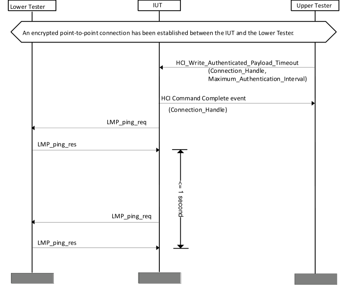

**Figure 4.74: LMP/ENC/BV-32-C [Modified Authentication Payload Timeout] MSC**

1. The Upper Tester modifies the Authenticated Payload Timeout to 1 second. 2. The ACL connection is kept idle i.e. no ACL-U or ACL-C traffic is exchanged for 2 seconds. 3. The IUT transmits the PDU LMP_ping_req so that the LMP_ping_res messages successfully
received by the IUT are less than (or equal to) 1 second apart. 4. The Lower Tester responds with LMP_ping_res.
• Expected Outcome
Pass verdict
The IUT transmits the PDU LMP_ping_req so that the LMP_ping_res messages successfully received by the IUT are less than (or equal to) 1 second apart.
• Notes
The Lower Tester should attempt to not transmit any packets that contain a MIC. However, if this is not possible and the Lower Tester autonomously transmits a data packet that contains a MIC, the Lower Tester should wait another 1 second.
LMP/ENC/BV-33-C [Accept AES-CCM Encryption Request – Legacy Host]
• Test Purpose
Verify that the IUT accepts the encryption negotiation procedure initiated by the Lower Tester and uses E0 encryption only for point to point messages when the remote controller’s LMP feature bits indicate support for Secure Connections both in the Controller and the Host but the local host does not indicate support for Secure Connections and reports the correct Encryption_Enabled to a legacy Host.
• Reference
[1] 4.2.5
• Initial Condition
- The Lower Tester is Central and the IUT is Peripheral.
- The Upper Tester doesn’t set the Secure Connections Host Support to enabled.
- An ACL connection has been established between the IUT and the Lower Tester, and the creation of a link key between the IUT and the Lower Tester has been successful.
- The Lower Tester uses an acceptable Key length.
• Test Procedure

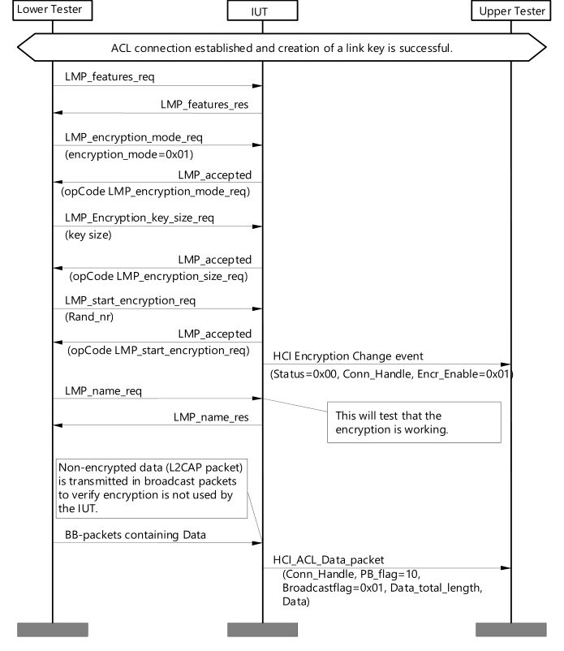

**Figure 4.75: LMP/ENC/BV-33-C [Accept AES-CCM Encryption Request – Legacy Host] MSC**

• Expected Outcome
Pass verdict
The IUT accepts the encryption negotiation and uses encryption afterwards.
The IUT responds correctly to the PDU LMP_name_req (this proves that encryption is used).
The IUT sends HCI ACL Data with non-encrypted payload to the Upper Tester.
If Read Encryption Key_Size is supported, the IUT returns the Key_Size parameter from the LMP_encryption_key_size_req PDU in the Command Complete event following the HCI Read Encryption Key_Size command.
The Encryption_Enabled Parameter in the Encryption Change event reports “Link Level Encryption is ON with E0”.
• Notes
If the IUT starts to negotiate for encryption Key_Size the Lower Tester must negotiate.
• Test Purpose
Verify that the IUT in the Peripheral role correctly reports the negotiated encryption Key_Size.
• Reference
[1] 4.2.5
• Initial Condition
- An IXIT statement, TSPX_min_supported_encryption_key_size, gives the value for the minimum encryption Key_Size.
- An IXIT statement, TSPX_max_supported_encryption_key_size, gives the value for the maximum encryption Key_Size.
- The Lower Tester has a minimum encryption Key_Size set to 1.
- See Initial Conditions in Table 4.4.
• Test Case Configuration

| TCID | Initial Condition |  | HCI Set Min |  | IUT is Initiator | Encryption Type | Encryption Enabled _ (step 9) |
| --- | --- | --- | --- | --- | --- | --- | --- |
|  |  |  | Encryption |  |  |  |  |
|  |  |  | Key Size |  |  |  |  |
|  |  |  | Support |  |  |  |  |
| LMP/ENC/BV-51-C [Key Size _ Negotiation as Peripheral - E0, Acceptor] | 4.2.2 Encryption | Yes |  |  | No | E0 | 0x01 |
| LMP/ENC/BV-52-C [Key Size _ Negotiation as Peripheral - AES, Acceptor] | 4.2.6 AES- CCM Encryption | Yes |  |  | No | AES | 0x02 |
| LMP/ENC/BV-55-C [Key Size _ Negotiation as Peripheral - E0, Initiator] | 4.2.2 Encryption | Yes |  |  | Yes | E0 | 0x01 |
| LMP/ENC/BV-56-C [Key Size _ Negotiation as Peripheral - AES, Initiator] | 4.2.6 AES- CCM Encryption | Yes |  |  | Yes | AES | 0x02 |
| LMP/ENC/BV-59-C [Key Size _ Negotiation as Peripheral - E0, Acceptor] | 4.2.2 Encryption | No |  |  | No | E0 | 0x01 |
| LMP/ENC/BV-60-C [Key Size _ Negotiation as Peripheral - AES, Acceptor] | 4.2.6 AES- CCM Encryption | No |  |  | No | AES | 0x02 |

| TCID | Initial Condition |  | HCI Set Min |  | IUT is Initiator | Encryption Type | Encryption Enabled _ (step 9) |
| --- | --- | --- | --- | --- | --- | --- | --- |
|  |  |  | Encryption |  |  |  |  |
|  |  |  | Key Size |  |  |  |  |
|  |  |  | Support |  |  |  |  |
| LMP/ENC/BV-61-C [Key Size _ Negotiation as Peripheral - E0, Initiator] | 4.2.2 Encryption | No |  |  | Yes | E0 | 0x01 |
| LMP/ENC/BV-62-C [Key Size _ Negotiation as Peripheral - AES, Initiator] | 4.2.6 AES- CCM Encryption | No |  |  | Yes | AES | 0x02 |

Table 4.4: Key_Size Negotiation as Peripheral test cases
• Test Procedure

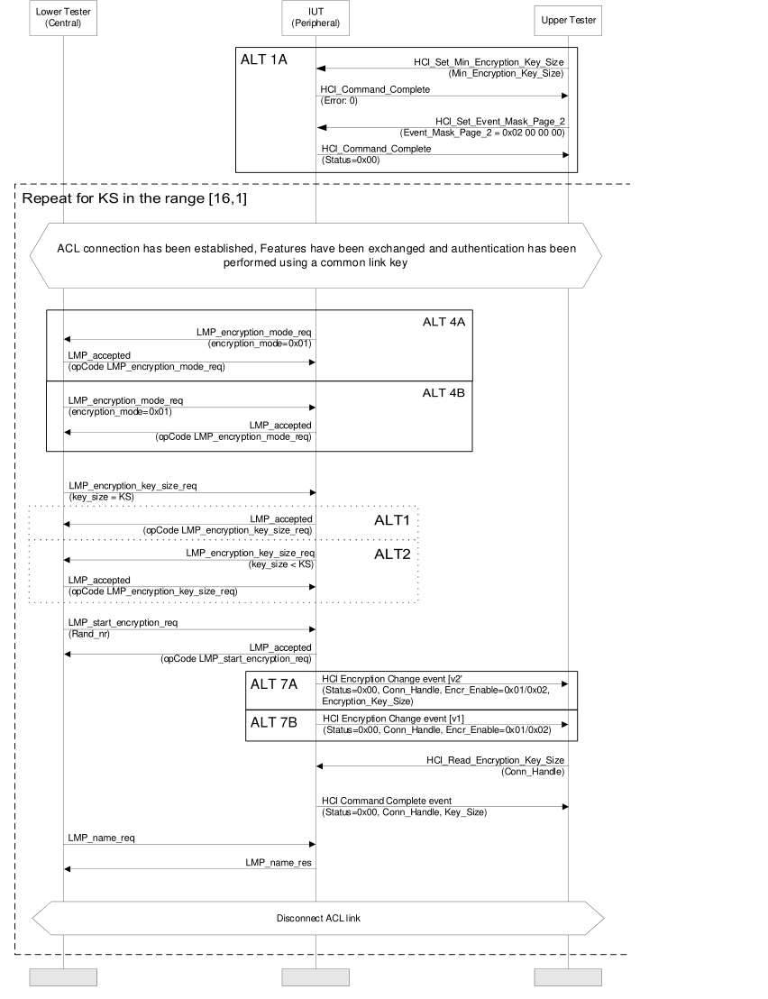

**Figure 4.76: Key_Size Negotiation as Peripheral MSC**

1. Perform either alternative 1A or 1B depending on the IUT support for HCI Set Min Encryption Key
Size as specified in Table 4.4. Alternative 1A (The IUT supports HCI Set Min Encryption Key Size):
1A.1 The Upper Tester sends the HCI_Set_Min_Encryption_Key_Size command with the Min_Encryption_Key_Size set to INT((TSPX_min_supported_encryption_key_size + TSPX_max_supported_encryption_key_size) / 2). 1A.2 The Upper Tester sends an HCI_Set_Event_Mask_Page_2 command to the IUT with the Event_Mask_Page_2 set to 0x02000000 and receives a successful HCI_Command_Complete in return. Alternative 1B (The IUT does not support HCI Set Min Encryption Key Size):
1B.1 The Min_Encryption_Key_Size is considered the same as TSPX_min_supported_encryption_key_size for the rest of the test case below. 2. Establish an ACL connection between the IUT and the Lower Tester. 3. The Lower Tester initiates the exchange of all supported Features (LMP_features_req PDU and,
if relevant, LMP_features_ext_req). The Lower Tester indicates Secure Connections support for both host and controller only when AES encryption is indicated in Table 4.4. 4. Perform either alternative 4A or 4B depending on the IUT role in Table 4.4.
Alternative 4A (IUT is Initiator):
4A.1 The Upper Tester initiates authentication using a random link Key known to the IUT and the Upper Tester. 4A.2 The Upper Tester orders the IUT to enable link encryption, and the IUT sends to the Lower Tester an LMP_encryption_mode_req PDU with the encryption_mode field set to 0x01, and the Lower Tester replies with an LMP_accepted PDU. Alternative 4B (IUT is Responder):
4B.1 The Lower Tester initiates authentication using a random link Key known to the IUT and the Upper Tester. 4B.2 The Lower Tester begins the link encryption procedure by sending an LMP_encryption_mode_req PDU with the encryption_mode field set to 0x01, and the IUT replies with an LMP_accepted PDU. 5. The Lower Tester sends the LMP_encryption_key_size_req PDU suggesting a Key_Size equal to
KS. The IUT may: a. Accept the suggested Key_Size if KS >= Min_Encryption_Key_Size and KS <=
TSPX_max_encryption_key_size. b. Accept the suggested Key_Size even if KS < Min_Encryption_Key_Size. In this case, the test
ends with a Fail verdict. c. Suggest a lower Key_Size equal to TSPX_max_encryption_key_size, which the Lower Tester
will accept that is greater than or equal to 7. If the IUT sends a suggested Key_Size that is smaller than 7, the test ends with a Fail Verdict. d. Reject the suggested Key_Size, in which case skip to step 10. 6. The Lower Tester continues the link encryption procedure by sending an
LMP_start_encryption_req PDU and the IUT replies with an LMP_accepted PDU.
Size as specified in Table 4.4. Alternative 7A (The IUT supports HCI Set Min Encryption Key Size):
7A.1 The IUT sends to the Upper Tester an HCI_Encryption_Change [v2] event with the Status field set to 0x00, the Encryption_Key_Size set to the value negotiated in step 5, and the Encryption_Enabled field set to the value indicated in Table 4.4 for this test. Alternative 7B (The IUT does not support HCI Set Min Encryption Key Size):
7B.1 The IUT sends to the Upper Tester either an HCI_Encryption_Change [v1] or an HCI_Encryption_Change [v2] event with the Status field set to 0x00 and the Encryption_Enabled field set to the value indicated in Table 4.4 for this test. 8. The Upper Tester issues the HCI Read Encryption Key_Size command to the IUT, and the IUT
responds with an HCI Command Complete event with the Key_Size parameter equal to the negotiated Key_Size in step 5. 9. The Lower Tester sends an LMP_name_req PDU to the IUT, and the IUT replies with an
LMP_name_res PDU, verifying that the encryption uses the negotiated Key_Size. 10. The Lower Tester disconnects the ACL link.
• Expected Outcome
Pass verdict
The IUT correctly reports the negotiated encryption Key_Size for each accepted Key_Size value, if HCI Read Encryption Key_Size Command is supported.
At least one Key_Size value is accepted by the IUT.
If the HCI_Set_Min_Encryption_Key_Size command is supported, then each accepted Key_Size value in step 7A.1 >= the Min_Encryption_Key_Size from step 1.
LMP/ENC/BI-01-C [Encryption, Peripheral, Reject Role Switch]
• Test Purpose
Verify that the IUT rejects a role switch request during the Encryption process. The Lower Tester is Central and the IUT is Peripheral.
• Reference
[1] 4.2.5, 4.4.2
• Initial Condition
- See Connection Establishment Lower Tester.
- The Lower Tester supports Role Switch.
- The Lower Tester initiates authentication and optionally expects a mutual authentication.
- The Lower Tester uses an acceptable Key length.
• Test Procedure

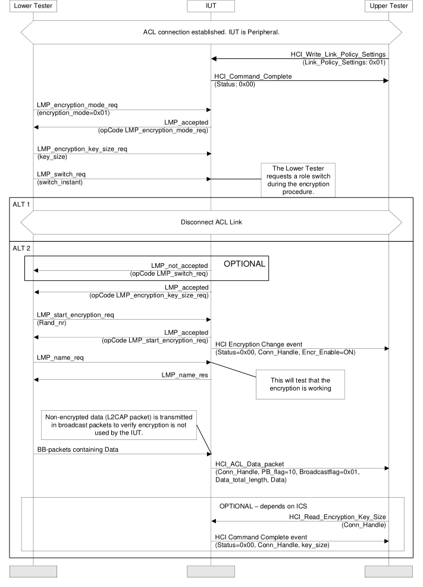

**Figure 4.77: LMP/ENC/BI-01-C [Encryption, Peripheral, Reject Role Switch] MSC**

• Expected Outcome
Pass verdict
In ALT 1, the IUT disconnects the ACL Link.
In ALT 2, the IUT may transmit PDU LMP_NOT_ACCEPTED upon reception of PDU LMP_SWITCH_REQ from the Lower Tester. The IUT sends an LMP_ACCEPTED to the Start Encryption Request.
• Notes
• Test Purpose
Verify that the IUT as Peripheral rejects a Start Encryption Request when the IUT and the Lower Tester have an encrypted connection.
• Reference
[1] 4.2.5.3
• Initial Condition
- The Lower Tester is Central and the IUT is Peripheral.
- An encrypted point-to-point connection has been established between the IUT and the Lower Tester.
• Test Procedure
Central Peripheral

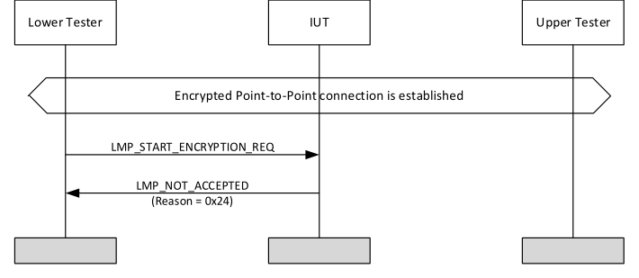

**Figure 4.78: LMP/ENC/BI-03-C [Reject Start Encryption Request, Encrypted Connection, Peripheral] MSC**

1. The Lower Tester sends an LMP_START_ENCRYPTION_REQ PDU to the IUT. 2. The IUT sends an LMP_NOT_ACCEPTED with Reason set to 0x24 (LMP PDU not allowed).
• Expected Outcome
Pass verdict
The IUT responds to the LMP_START_ENCRYPTION_REQ with an LMP_NOT_ACCEPTED with Reason set to 0x24.

#### 4.6.2 Encryption - Central

Verify that the Central and the Peripheral agree upon whether to use encryption or not and if encryption only applies to point to point packets or if encryption applies to both point to point packets and broadcast packets. The IUT is Central.
LMP/ENC/BV-05-C [Initiate Encryption]
• Test Purpose
Verify that the IUT initiates the encryption procedure and uses encryption on point to point messages only. The IUT is Central and the Lower Tester is Peripheral.
• Reference
[1] 4.2.5
• Initial Condition
- See Default settings.
• Test Procedure
Peripheral
Central

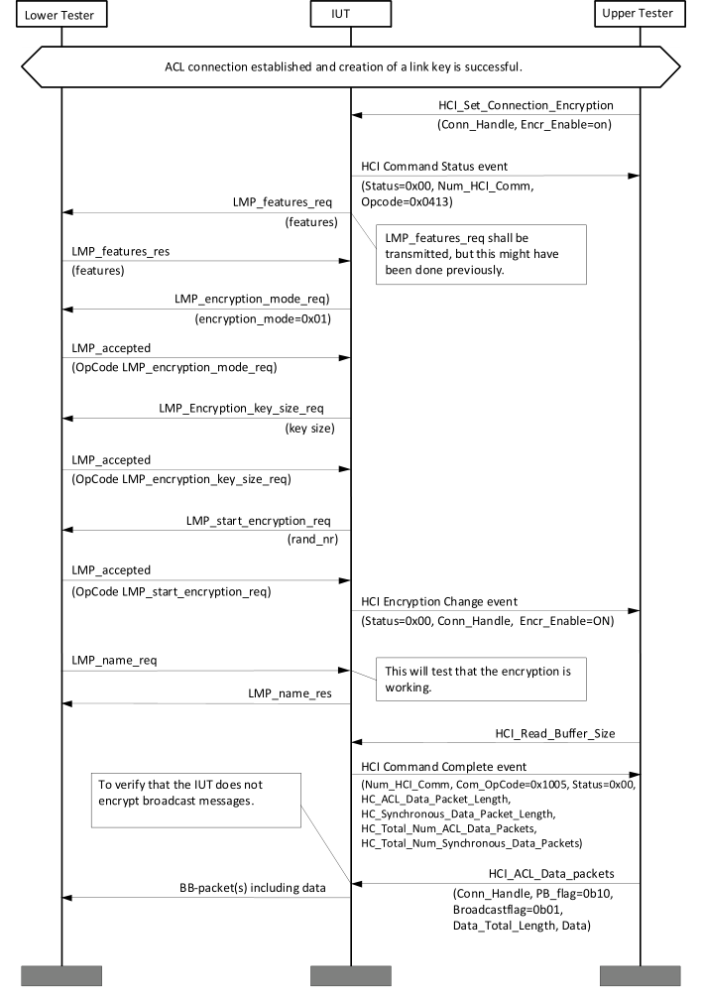

**Figure 4.79: LMP/ENC/BV-05-C [Initiate Encryption] MSC**

• Expected Outcome
Pass verdict
The PDU LMP_features_req has to be sent at least once by the IUT before starting the encryption.
The IUT initiates the encryption negotiation and uses the encryption afterwards.
The IUT responds correctly to the PDU LMP_name_req to prove that encryption is used.
The IUT transmits broadcast ACL packets with non-encrypted payload to the Lower Tester.
• Notes
The suggested Key_Size must be within the Lower Tester’s Key_Size range.
LMP/ENC/BV-06-C [Peripheral Declines Encryption]
• Test Purpose
Verify that the IUT accepts that the Lower Tester declines the Encryption_Mode. The IUT is Central and the Lower Tester is Peripheral.
• Reference
[1] 4.2.5
• Initial Condition
- See Default settings.
• Test Procedure
Peripheral Central

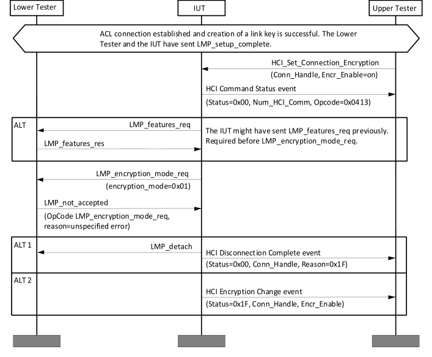

**Figure 4.80: LMP/ENC/BV-06-C [Peripheral Declines Encryption] MSC**

• Test Condition
It must be possible to control the IUT to initiate the encryption.
• Expected Outcome
Pass verdict
The IUT transmits the PDU LMP_encryption_mode_req. After reception of the PDU LMP_not_accepted it does not continue with the encryption negotiation.
LMP/ENC/BV-07-C [Initiate Encryption Stop]
• Test Purpose
Verify that the IUT initiates stop of encryption. The IUT is Central and the Lower Tester is Peripheral.
• Reference
[1] 4.2.5.4
• Initial Condition
- See Section 4.2.2.
• Test Procedure
Peripheral
Central

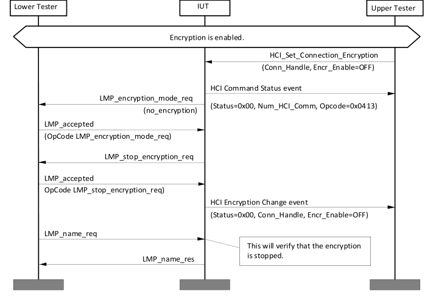

**Figure 4.81: LMP/ENC/BV-07-C [Initiate Encryption Stop] MSC**

• Test Condition
It must be possible to control the IUT to initiate the stop of the encryption.
• Expected Outcome
Pass verdict
The IUT transmits the PDU LMP_stop_encryption_req and accepts the PDU LMP_accepted and stops using encryption.
• Test Purpose
Verify that the IUT accepts encryption stop upon request from the Lower Tester. The Lower Tester is the Peripheral.
• Reference
[1] 4.2.5.4
• Initial Condition
- See Figure 4.82.
• Test Procedure
Peripheral
Central

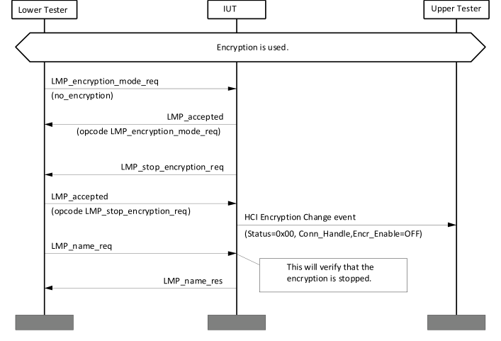

**Figure 4.82: LMP/ENC/BV-08-C [Step Encryption, Peripheral Request] MSC**

• Expected Outcome
Pass verdict
The IUT transmits PDU LMP_accepted followed by LMP_stop_encryption_req upon reception of PDU LMP_encryption_mode_req and stops using encryption. The IUT must respond correctly to the PDU LMP_name_req to prove that encryption is not used.
LMP/ENC/BV-10-C [Initiate Broadcast Encryption]
• Test Purpose
Verify that the IUT initiates the broadcast encryption negotiation procedure and uses encryption on point-to-point and broadcast messages.
• Reference
[1] 4.2.5
• Initial Condition
- See Figure 4.83.
• Test Procedure
Peripheral
Central

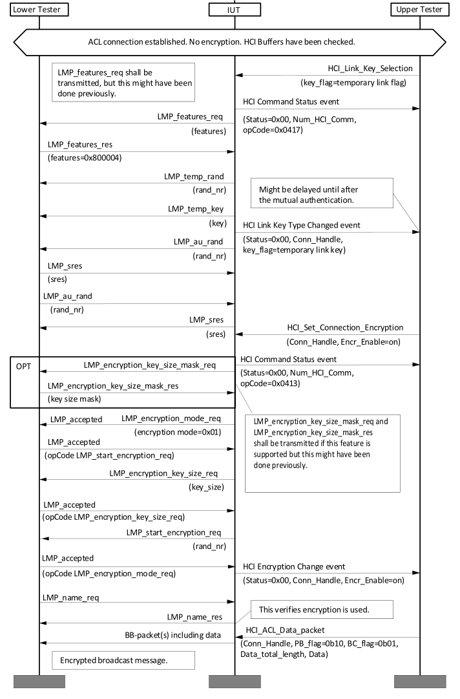

**Figure 4.83: LMP/ENC/BV-10-C [Initiate Broadcast Encryption] MSC**

• Test Condition
It must be possible to control the IUT to initiate encryption.
• Expected Outcome
Pass verdict
The IUT initiates the broadcast encryption negotiation and uses point-to-point and broadcast encryption afterwards. The PDU LMP_features_req has to be sent at least once by the IUT before starting the encryption.
• Notes
The suggested Key_Size must be within the Lower Tester’s Key_Size range. The Lower Tester does not initiate exchange of supported Features. Broadcast and Unicast uses different HCI connection handles.
LMP/ENC/BV-13-C [Initiate Semi-permanent Link Key Change]
• Test Purpose
Verify that the IUT can initiate a change to the semi-permanent link Key. Verify that the IUT stops the encryption. The IUT is Central. The Lower Tester is Peripheral.
• Reference
[1] 4.2.4.2
• Initial Condition
- See Figure 4.84.
• Test Procedure
Central IUT Peripheral Lower Tester

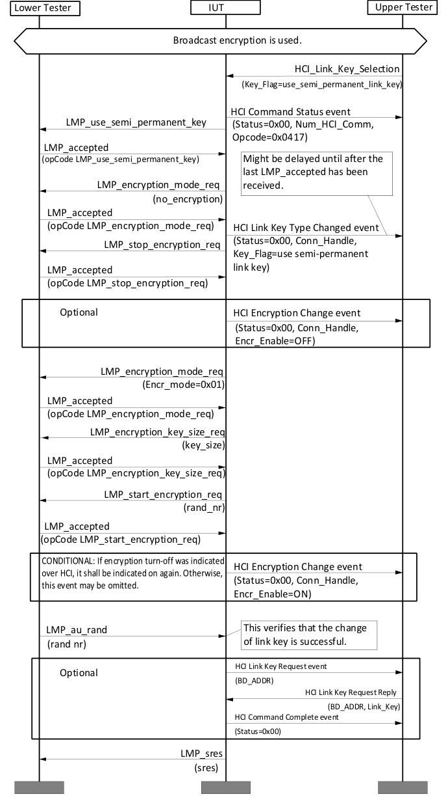

**Figure 4.84: LMP/ENC/BV-13-C [Initiate Semi-permanent Link Key Change] MSC**

• Expected Outcome
Pass verdict
The IUT transmits LMP_use_semi_permanent_key, LMP_encryption_mode_req and LMP_stop_encryption_req. Encryption is restarted. The Link Key must be the Semi Permanent Key.
LMP/ENC/BV-14-C [Pausing and Resuming Encryption without Disabling Encryption_Mode - Central Initiated]
• Test Purpose
Verify that the IUT as Central can pause and resume encryption without disabling the Encryption_Mode.
• Reference
[1] 4.2.3, 4.2.5.3, 4.2.5.5, 4.4.2
• Initial Condition
- The IUT is a Central of a connection using encryption.
- Both devices are sending data to the other device.
• Test Procedure

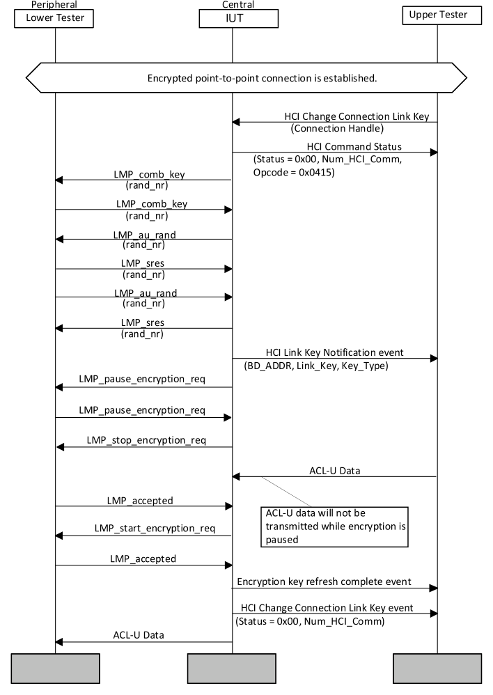

**Figure 4.85: LMP/ENC/BV-14-C [Pausing and Resuming Encryption without Disabling Encryption_Mode - Central Initiated] MSC**

The IUT initiates the pausing of encryption.
The Lower Tester accepts the pausing of encryption.
The IUT resumes encryption.
• Expected Outcome
Pass verdict
The IUT transmits no data packets while encryption is paused.
The IUT transmits data packets after encryption is resumed.
• Notes
HCI_Change_Connection_Link_Key_Complete event may be received anytime after HCI_link_key_notification_event.
LMP/ENC/BV-15-C [Pausing and Resuming Encryption without Disabling Encryption_Mode - Peripheral Initiated]
• Test Purpose
Verify that the IUT as Peripheral can pause and resume encryption without disabling the Encryption_Mode.
• Reference
[1] 4.2.3, 4.2.5.3, 4.2.5.5, 4.4.2
• Initial Condition
- The IUT is a Peripheral of a connection using encryption.
- Both devices are sending data to the other device.
• Test Procedure

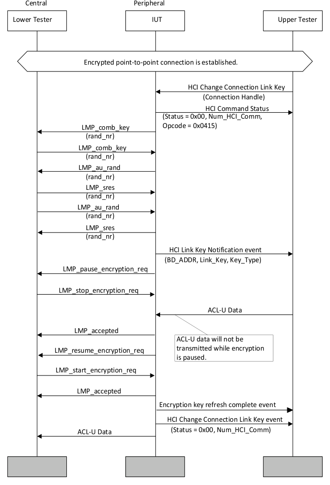

**Figure 4.86: LMP/ENC/BV-15-C [Pausing and Resuming Encryption without Disabling Encryption_Mode - Peripheral Initiated] MSC**

The IUT initiates the pausing of encryption.
The Lower Tester accepts the pausing of encryption.
The IUT resumes encryption.
• Expected Outcome
Pass verdict
The IUT transmits no data packets while encryption is paused.
The IUT transmits data packets after encryption is resumed.
• Notes
HCI_Change_Connection_Link_Key_Complete event may be received anytime after HCI_link_key_notification_event.
LMP/ENC/BV-16-C [Pausing and Resuming Encryption without Disabling Encryption_Mode - Central Initiated with Role Switch]
• Test Procedure
Verify that the IUT as Central can pause and resume encryption without disabling the Encryption_Mode.
• Reference
[1] 4.2.3, 4.2.5.3, 4.2.5.5, 4.4.2
• Initial Condition
- The IUT is a Central of a connection using encryption.
- Both devices are sending data to the other device.
• Test Procedure
Central Peripheral

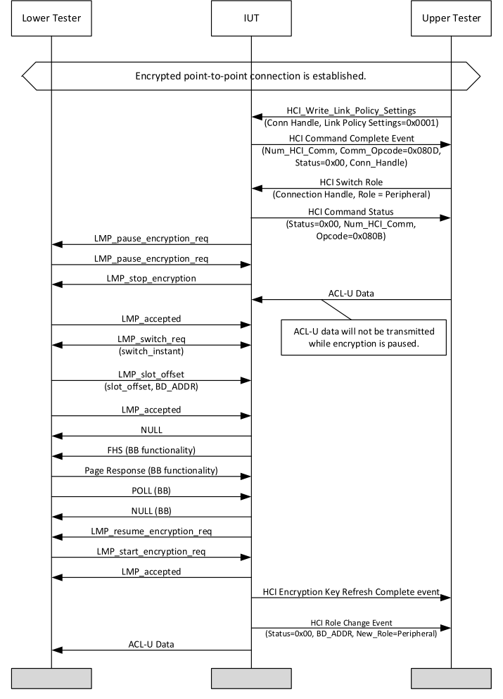

**Figure 4.87: LMP/ENC/BV-16-C [Pausing and Resuming Encryption without Disabling Encryption_Mode - Central Initiated with Role Switch] MSC**

1. The Upper Tester writes the Link Policy Settings. 2. The IUT is requested to perform a role switch using the HCI Switch Role command. 3. The IUT initiates the pausing of encryption. 4. The Lower Tester accepts the pausing of encryption. 5. The IUT initiates a role switch. 6. The IUT resumes encryption. 7. The Role Change event is generated on the IUT.
• Expected Outcome
Pass verdict
The IUT transmits no data packets while encryption is paused.
The IUT transmits data packets after encryption is resumed.
The role switch succeeds.
• Notes
If the test procedure fails due to role switch, repeat the test. HCI_Role_Change event may be received anytime after role switch.
LMP/ENC/BV-17-C [Pausing and Resuming Encryption without Disabling Encryption_Mode - Peripheral Initiated with Role Switch]
• Test Procedure
Verify that the IUT as Peripheral can pause and resume encryption without disabling the Encryption_Mode.
• Reference
[1] 4.2.3, 4.2.5.3, 4.2.5.5, 4.4.2
• Initial Condition
- The IUT is a Peripheral of a connection using encryption.
- Both devices are sending data to the other device.
• Test Procedure
Peripheral Central

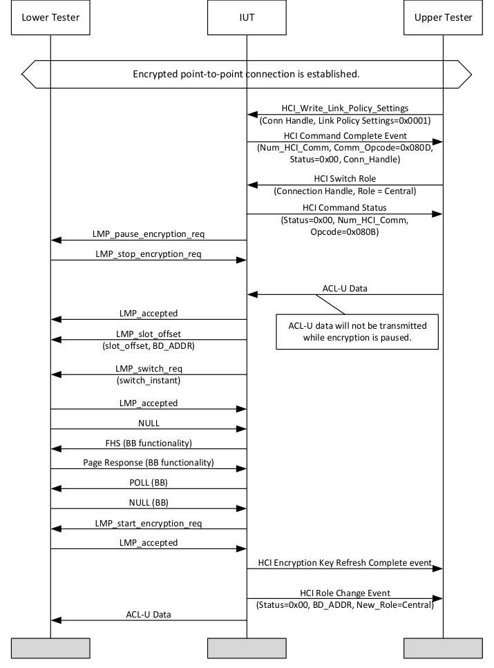

**Figure 4.88: LMP/ENC/BV-17-C [Pausing and Resuming Encryption without Disabling Encryption_Mode - Peripheral Initiated with Role Switch] MSC**

1. The Upper Tester writes the Link Policy Settings. 2. The IUT is requested to perform a role switch using the HCI Switch Role command. 3. The IUT initiates the pausing of encryption. 4. The Lower Tester accepts the pausing of encryption. 5. The IUT initiates a role switch. 6. The IUT resumes encryption. 7. The Role Change event is generated on the IUT.
• Expected Outcome
Pass verdict
The IUT transmits no data packets while encryption is paused.
The IUT transmits data packets after encryption is resumed.
The role switch succeeds.
• Notes
HCI_Role_Change event may be received anytime after role switch.
LMP/ENC/BV-18-C [Starting and Stopping Encryption with Legacy Device - Central Initiated]
• Test Procedure
Verify that the IUT as Central can stop and restart encryption with a device that does not support Encryption Pause Resume.
• Reference
[1] 4.2.3, 4.2.5.3, 4.2.5.5, 4.4.2
• Initial Condition
- The IUT is a Central of a connection using encryption.
- The Lower Tester is a device that does not support Encryption Pause Resume.
• Test Procedure

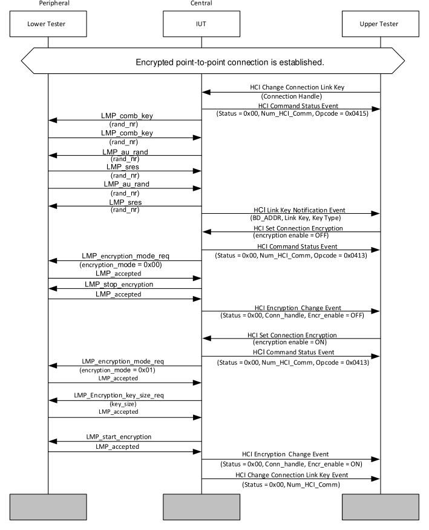

**Figure 4.89: LMP/ENC/BV-18-C [Starting and Stopping Encryption with Legacy Device - Central Initiated] MSC**

• Expected Outcome
Pass verdict
Encryption is stopped and then restarted.
• Notes
HCI_Change_Connection_Link_Key_Complete event may be received anytime after HCI_link_key_notification_event.
LMP/ENC/BV-19-C [Stopping and Restarting Encryption with Legacy Device - Peripheral Initiated]
• Test Procedure
Verify that the IUT as Peripheral can stop and restart encryption with a device that does not support Pause Encryption.
• Reference
[1] 4.2.3, 4.2.5.3, 4.2.5.5, 4.4.2
• Initial Condition
- The IUT is a Peripheral of a connection using encryption.
- The Lower Tester is a device that does not support Encryption Pause Resume.
• Test Procedure

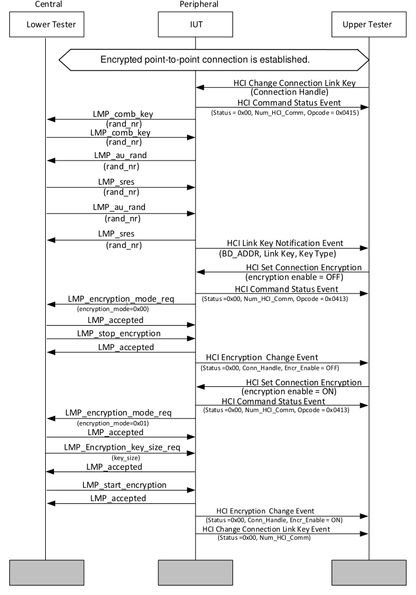

**Figure 4.90: LMP/ENC/BV-19-C [Stopping and Restarting Encryption with Legacy Device - Peripheral Initiated] MSC**

The IUT stops encryption.
The Lower Tester accepts the stopping of encryption.
The IUT restarts encryption.
• Expected Outcome
Pass verdict
Encryption is stopped and then restarted.
• Notes
HCI_Change_Connection_Link_Key_Complete event may be received anytime after HCI_link_key_notification_event.
LMP/ENC/BV-20-C [Pausing and Resuming without Disabling Encryption, IUT Central, Peripheral Initiated as a Result of Change Connection Link Key]
• Test Purpose
Verify that the IUT as Central can respond to Peripheral initiated pause and resume of encryption without disabling the Encryption_Mode as part of the change connection link Key procedure.
• Reference
[1] 4.2.3, 4.2.5.3, 4.2.5.5
• Initial Condition
- The Lower Tester is Peripheral and the IUT is Central.
- An encrypted point-to-point connection has been established between the IUT and the Lower Tester.
- Both devices are sending data to each other.
• Test Procedure

**Figure 4.91: LMP/ENC/BV-20-C [Pausing and Resuming without Disabling Encryption, IUT Central, Peripheral Initiated as a Result of Change Connection Link Key] MSC**

The Lower Tester performs the change connection link Key procedure.
The Lower Tester initiates the pausing of encryption.
The IUT accepts the pausing of encryption.
The Lower Tester resumes encryption.
• Expected Outcome
Pass verdict
The IUT pauses encryption using LMP_stop_encryption_req.
The IUT transmits no data packets while encryption is paused.
The IUT transmits data packets after encryption is resumed.
LMP/ENC/BV-21-C [Pausing and Resuming without Disabling Encryption, IUT Central, Peripheral Initiated with Role Switch]
• Test Purpose
Verify that the IUT as Central can respond to Peripheral initiated pause and resume of encryption without disabling the Encryption_Mode as part of the role switch procedure.
• Reference
[1] 4.2.5.3, 4.2.5.5, 4.4.2
• Initial Condition
- The Lower Tester is Peripheral and the IUT is Central.
- An encrypted point-to-point connection has been established between the IUT and the Lower Tester.
- Both devices are sending data to each other.
• Test Procedure
Central Peripheral

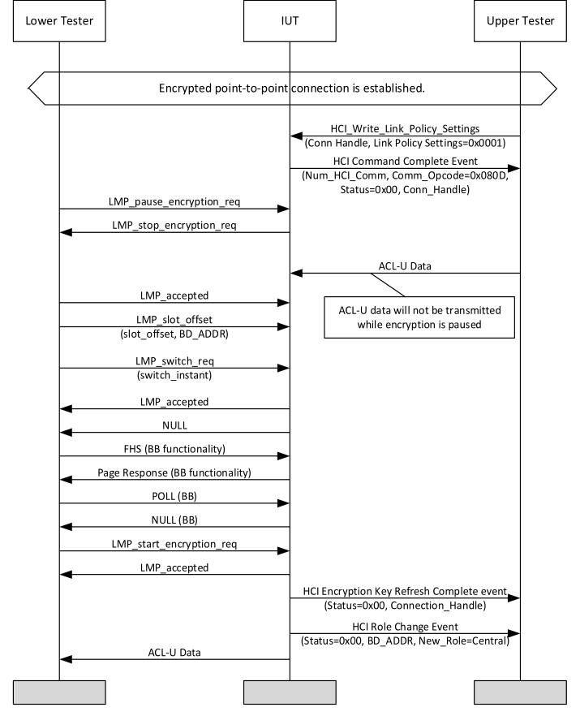

**Figure 4.92: LMP/ENC/BV-21-C [Pausing and Resuming without Disabling Encryption, IUT Central, Peripheral Initiated with Role Switch] MSC**

1. The Upper Tester writes the Link Policy Settings. 2. The Lower Tester initiates the pausing of encryption. 3. The IUT accepts the pausing of encryption. 4. The Lower Tester initiates a role switch. 5. The Lower Tester resumes encryption.
• Expected Outcome
Pass verdict
The IUT pauses encryption using LMP_stop_encryption_req.
The IUT transmits no data packets while encryption is paused.
The IUT transmits data packets after encryption is resumed.
The role switch succeeds.
LMP/ENC/BV-34-C [Initiate AES-CCM Encryption]
• Test Purpose
Verify that the IUT initiates the encryption procedure and uses AES-CCM encryption only for point to point messages when the remote controller’s LMP feature bits indicate support for Secure Connections both in the Controller and the Host.
• Reference
[1] 4.2.5
• Initial Condition
- The Lower Tester is Peripheral and the IUT is Central.
- An ACL connection has been established between the IUT and the Lower Tester, and the creation of a link key between the IUT and the Lower Tester has been successful.
• Test Procedure
Peripheral
Central

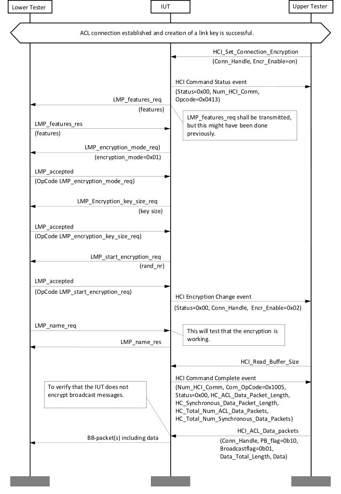

**Figure 4.93: LMP/ENC/BV-34-C [Initiate AES-CCM Encryption] MSC**

• Expected Outcome
Pass verdict
The IUT initiates the encryption negotiation and uses the encryption afterwards.
The IUT responds correctly to the PDU LMP_name_req (this proves that encryption is used).
The IUT transmits broadcast ACL packets with non-encrypted payload to the Lower Tester.
If Read Encryption Key_Size is supported, the IUT returns the Key_Size parameter from the LMP_encryption_key_size_req PDU in the Command Complete event following the HCI Read Encryption Key_Size command.
The Encryption_Enabled Parameter in the Encryption Change event reports AES-CCM encryption has been enabled.
• Notes
The suggested Key_Size must be within the Lower Tester’s Key_Size range.
If the IUT starts to negotiate for encryption Key_Size the Lower Tester must negotiate.
This test case is similar to LMP/ENC/BV-05-C [Initiate Encryption].
LMP/ENC/BV-35-C [Initiate AES-CCM Encryption Stop]
• Test Purpose
Verify that the IUT rejects a request from the Upper Tester to stop AES-CCM encryption.
• Reference
[1] 4.2.5.4
• Initial Condition
- The Lower Tester is Peripheral and the IUT is Central.
- An encrypted point-to-point connection has been established between the IUT and the Lower Tester.
• Test Procedure
Peripheral
Central

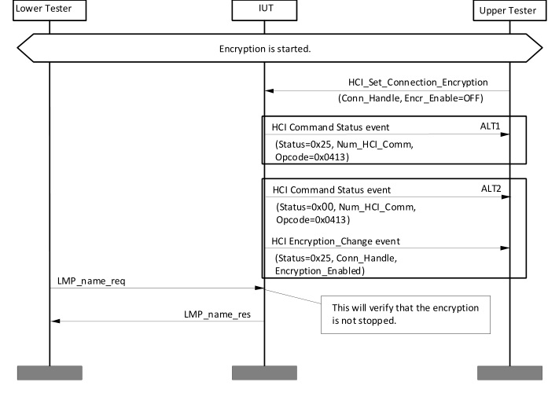

**Figure 4.94: LMP/ENC/BV-35-C [Initiate AES-CCM Encryption Stop] MSC**

If the IUT supports broadcast packets the IUT transmits non-encrypted broadcast packets.
• Expected Outcome
Pass verdict
The IUT either returns an HCI_Command_Status event with Error_Code “Encryption_Mode Not Acceptable (0x25)” OR returns an HCI_Command_Status event with status “Command currently in pending (0x00)” followed by an HCI_Encryption_Change event with Error_Code “Encryption_Mode Not Acceptable (0x25)”.
LMP/ENC/BV-36-C [Stop AES-CCM Encryption, Peripheral request]
• Test Purpose
Verify that the IUT rejects a request to stop AES-CCM encryption from the Lower Tester.
• Reference
[1] 4.2.5.4
• Initial Condition
- The Lower Tester is Peripheral and the IUT is Central.
- An encrypted point-to-point connection has been established between the IUT and the Lower Tester.
• Test Procedure
Peripheral
Central

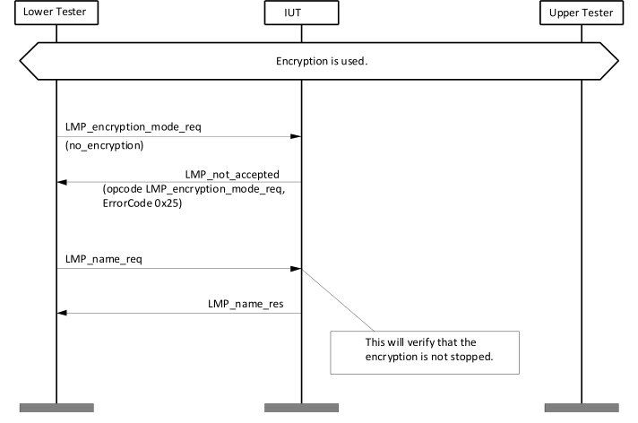

**Figure 4.95: LMP/ENC/BV-36-C [Stop AES-CCM Encryption, Peripheral request] MSC**

If the IUT supports broadcast packets the IUT transmits non-encrypted broadcast packets.
• Expected Outcome
Pass verdict
The IUT transmits PDU LMP_not_accepted upon reception of PDU LMP_encryption_mode_req and does not stop using encryption.
The IUT responds correctly to the PDU LMP_name_req (this proves that encryption is still used).
LMP/ENC/BV-37-C [Pausing and Resuming without Disabling AES-CCM Encryption, IUT Central, Central Initiated as a result of change connection link Key]
• Test Purpose
Verify that the IUT as Central can pause and resume AES-CCM encryption without disabling the Encryption_Mode as part of the change connection link Key procedure.
• Reference
[1] 4.2.3, 4.2.5.3, 4.2.5.5
• Initial Condition
- The Lower Tester is Peripheral and the IUT is Central.
- An AES-CCM encrypted point-to-point connection has been established between the IUT and the Lower Tester.
- Both devices are sending data to each other.
• Test Procedure

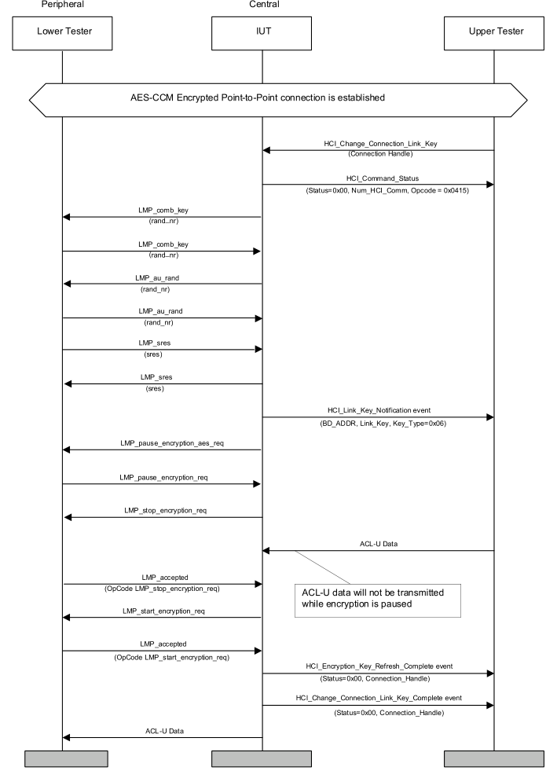

**Figure 4.96: LMP/ENC/BV-37-C [Pausing and Resuming without Disabling AES-CCM Encryption, IUT Central, Central Initiated as a result of change connection link Key] MSC**

1. The Upper Tester requests the IUT to perform a change connection link Key procedure using the
HCI Change Connection Link Key command. 2. The IUT performs the change connection link Key procedure. 3. The IUT initiates the pausing of encryption. 4. The Lower Tester accepts the pausing of encryption. 5. The IUT resumes encryption. 6. The Change Connection Link Key Complete event is generated on the IUT.
• Expected Outcome
Pass verdict
The IUT pauses encryption using LMP_pause_encryption_aes_req.
The IUT transmits no data packets while encryption is paused.
The IUT transmits data packets after encryption is resumed.
• Notes
HCI_Change_Connection_Link_Key_Complete event may be received anytime after HCI_link_key_notification_event.
This test case is similar to LMP/ENC/BV-14-C [Pausing and Resuming Encryption without Disabling Encryption_Mode - Central Initiated].
LMP/ENC/BV-38-C [Pausing and Resuming without Disabling AES-CCM Encryption, IUT Peripheral, Peripheral Initiated as a result of change connection link Key]
• Test Purpose
Verify that the IUT as Peripheral can pause and resume AES-CCM encryption without disabling the Encryption_Mode as part of the change connection link Key procedure.
• Reference
[1] 4.2.3, 4.2.5.3, 4.2.5.5
• Initial Condition
- The Lower Tester is Central and the IUT is Peripheral.
- An AES-CCM encrypted point-to-point connection has been established between the IUT and the Lower Tester.
- Both devices are sending data to each other.
• Test Procedure

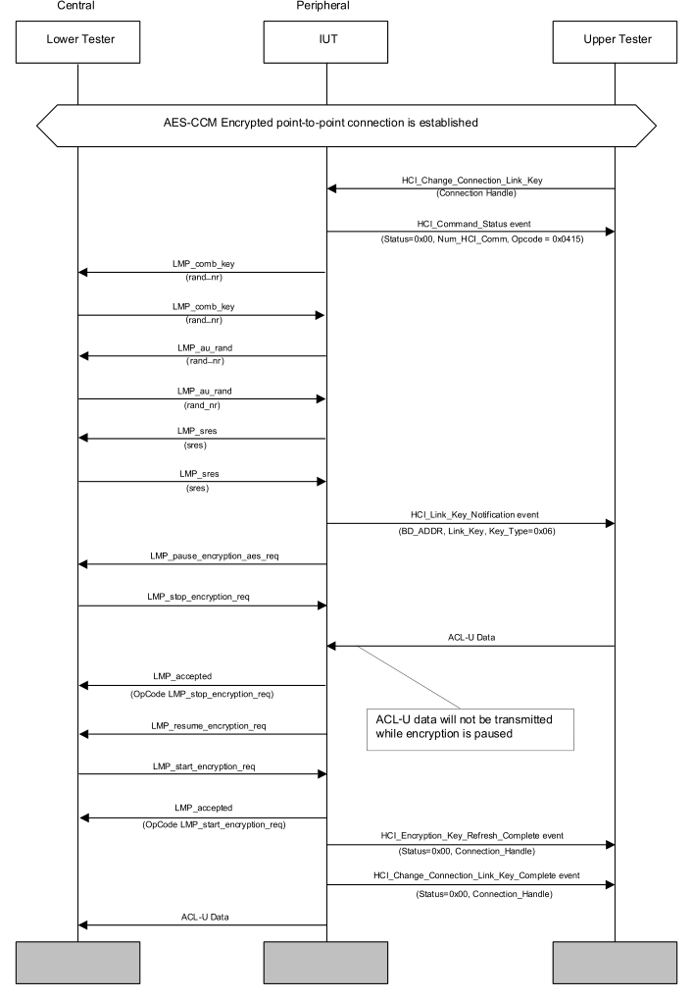

**Figure 4.97: LMP/ENC/BV-38-C [Pausing and Resuming without Disabling AES-CCM Encryption, IUT Peripheral, Peripheral Initiated as a result of change connection link Key] MSC**

1. The Upper Tester requests the IUT to perform a change connection link Key procedure using the
HCI Change Connection Link Key command. 2. The IUT performs the change connection link Key procedure. 3. The IUT initiates the pausing of encryption. 4. The Lower Tester accepts the pausing of encryption. 5. The IUT resumes encryption. 6. The Change Connection Link Key Complete event is generated on the IUT.
• Expected Outcome
Pass verdict
The IUT pauses encryption using LMP_pause_encryption_aes_req.
The IUT transmits no data packets while encryption is paused.
The IUT transmits data packets after encryption is resumed.
• Notes
HCI_Change_Connection_Link_Key_Complete event may be received anytime after HCI_link_key_notification_event.
This is similar to LMP/ENC/BV-15-C [Pausing and Resuming Encryption without Disabling Encryption_Mode - Peripheral Initiated].
LMP/ENC/BV-39-C [Pausing and Resuming without Disabling AES-CCM Encryption, IUT Central, Peripheral Initiated as a result of change connection link Key]
• Test Purpose
Verify that the IUT as Central can respond to Peripheral initiated pause and resume of AES-CCM encryption without disabling the Encryption_Mode as part of the change connection link Key procedure.
• Reference
[1] 4.2.3, 4.2.5.3, 4.2.5.5
• Initial Condition
- The Lower Tester is Peripheral and the IUT is Central.
- An AES-CCM encrypted point-to-point connection has been established between the IUT and the Lower Tester.
- Both devices are sending data to each other.
• Test Procedure

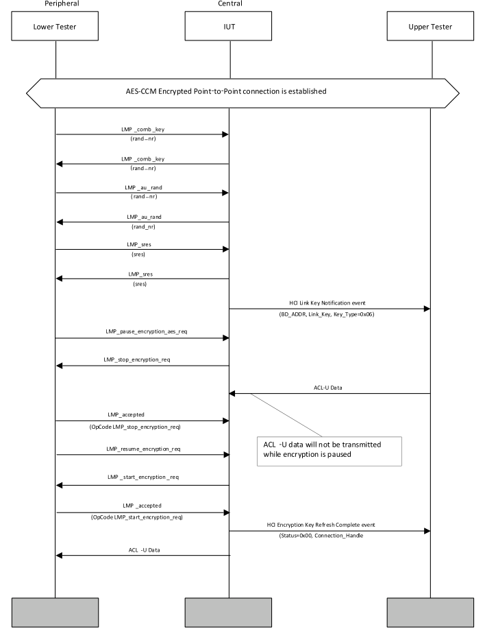

**Figure 4.98: LMP/ENC/BV-39-C [Pausing and Resuming without Disabling AES-CCM Encryption, IUT Central, Peripheral Initiated as a result of change connection link Key] MSC**

1. The Lower Tester performs the change connection link Key procedure. 2. The Lower Tester initiates the pausing of encryption. 3. The IUT accepts the pausing of encryption. 4. The Lower Tester resumes encryption.
• Expected Outcome
Pass verdict
The IUT pauses encryption using LMP_stop_encryption_req.
The IUT transmits no data packets while encryption is paused.
The IUT transmits data packets after encryption is resumed.
LMP/ENC/BV-40-C [Pausing and Resuming without Disabling AES-CCM Encryption, IUT Peripheral, Central Initiated as a result of change connection link Key]
• Test Purpose
Verify that the IUT as Peripheral can respond to Central initiated pause and resume of AES-CCM encryption without disabling the Encryption_Mode as part of the change connection link Key procedure.
• Reference
[1] 4.2.3, 4.2.5.3, 4.2.5.5
• Initial Condition
- The Lower Tester is Central and the IUT is Peripheral.
- An AES-CCM encrypted point-to-point connection has been established between the IUT and the Lower Tester.
- Both devices are sending data to each other.
• Test Procedure

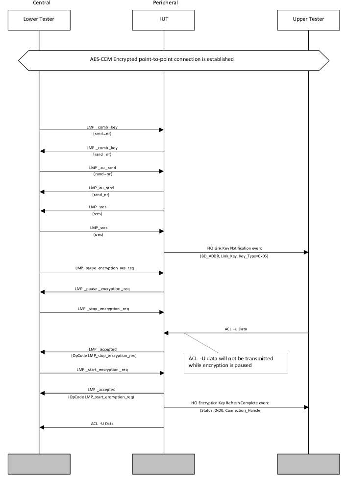

**Figure 4.99: LMP/ENC/BV-40-C [Pausing and Resuming without Disabling AES-CCM Encryption, IUT Peripheral, Central Initiated as a result of change connection link Key] MSC**

1. The Lower Tester performs the change connection link Key procedure. 2. The Lower Tester initiates the pausing of encryption. 3. The IUT accepts the pausing of encryption. 4. The Lower Tester resumes encryption.
• Expected Outcome
Pass verdict
The IUT responds to the LMP_pause_encryption_aes_req with an LMP_pause_encryption_req.
The IUT transmits no data packets while encryption is paused.
The IUT transmits data packets after encryption is resumed.
LMP/ENC/BV-41-C [Pausing and Resuming without Disabling AES-CCM Encryption, IUT Central, Central Initiated with role switch]
• Test Purpose
Verify that the IUT as Central can pause and resume AES-CCM encryption without disabling the Encryption_Mode as part of the role switch procedure.
• Reference
[1] 4.2.5.3, 4.2.5.5, 4.4.2
• Initial Condition
- The Lower Tester is Peripheral and the IUT is Central.
- An AES-CCM encrypted point-to-point connection has been established between the IUT and the Lower Tester.
- Both devices are sending data to each other.
• Test Procedure
Central Peripheral

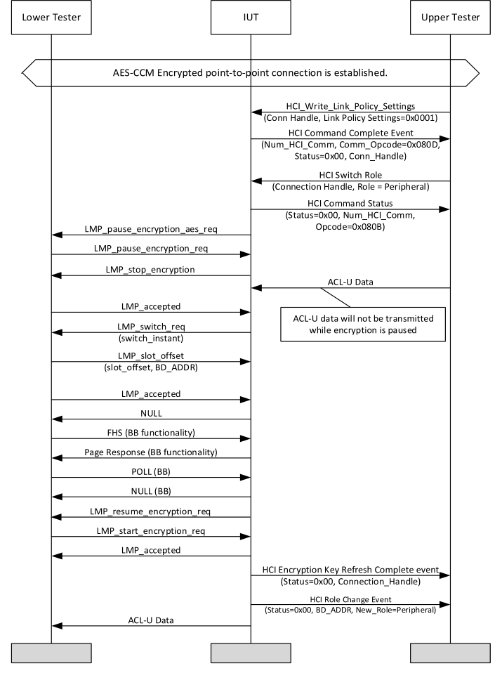

**Figure 4.100: LMP/ENC/BV-41-C [Pausing and Resuming without Disabling AES-CCM Encryption, IUT Central, Central Initiated with role switch] MSC**

1. The Upper Tester writes the Link Policy Settings. 2. The Upper Tester requests the IUT to perform a role switch using the HCI Switch Role command. 3. The IUT initiates the pausing of encryption. 4. The Lower Tester accepts the pausing of encryption. 5. The IUT initiates a role switch. 6. The IUT resumes encryption. 7. The Role Change event is generated on the IUT.
• Expected Outcome
Pass verdict
The IUT pauses encryption using LMP_pause_encryption_aes_req.
The IUT transmits no data packets while encryption is paused.
The IUT transmits data packets correctly after encryption is resumed.
The role switch succeeds.
• Notes
If the test procedure fails due to role switch, repeat the test.
HCI_Role_Change event may be received anytime after role switch.
This test case is similar to LMP/ENC/BV-16-C [Pausing and Resuming Encryption without Disabling Encryption_Mode - Central Initiated with Role Switch].
LMP/ENC/BV-42-C [Pausing and Resuming without Disabling AES-CCM Encryption, IUT Peripheral, Peripheral Initiated with role switch]
• Test Purpose
Verify that the IUT as Peripheral can pause and resume AES-CCM encryption without disabling the Encryption_Mode as part of the role switch procedure.
• Reference
[1] 4.2.5.3, 4.2.5.5, 4.4.2
• Initial Condition
- The Lower Tester is Central and the IUT is Peripheral.
- An AES-CCM encrypted point-to-point connection has been established between the IUT and the Lower Tester.
- Both devices are sending data to each other.
• Test Procedure
Central Peripheral

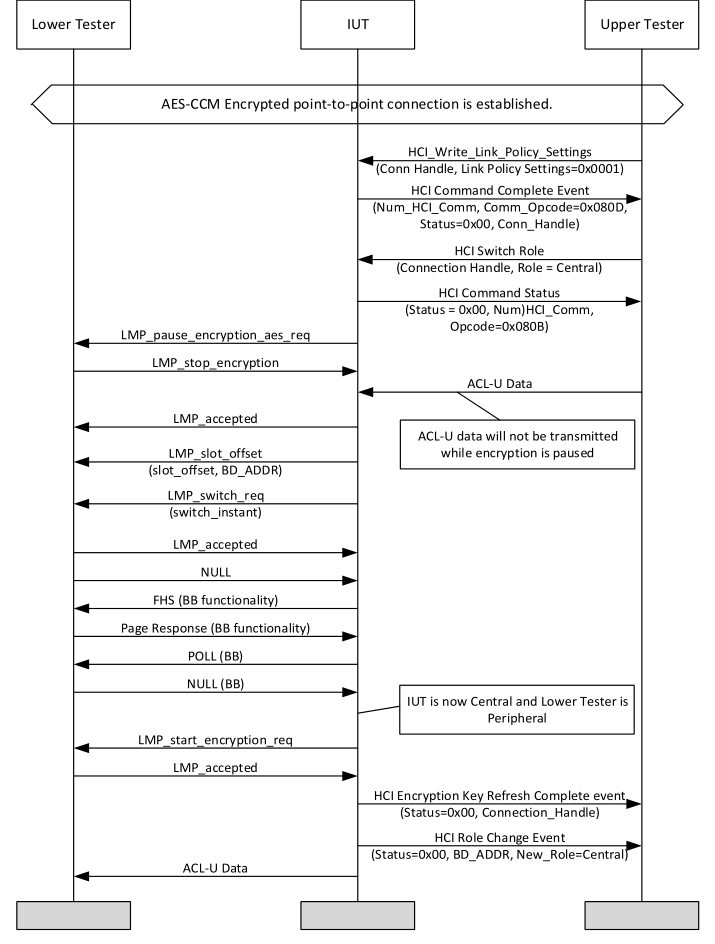

**Figure 4.101: LMP/ENC/BV-42-C [Pausing and Resuming without Disabling AES-CCM Encryption, IUT Peripheral, Peripheral Initiated with role switch] MSC**

1. The Upper Tester writes the Link Policy Settings. 2. The Upper Tester requests the IUT to perform a role switch using the HCI Switch Role command. 3. The IUT initiates the pausing of encryption. 4. The Lower Tester accepts the pausing of encryption. 5. The IUT initiates a role switch. 6. The IUT resumes encryption. 7. The Role Change event is generated on the IUT.
• Expected Outcome
Pass verdict
The IUT pauses encryption using LMP_pause_encryption_aes_req.
The IUT transmits no data packets while encryption is paused.
The IUT transmits data packets correctly after encryption is resumed.
The role switch succeeds.
• Notes
If the test procedure fails due to role switch, repeat the test.
HCI_Role_Change event may be received anytime after role switch.
This test case is similar to LMP/ENC/BV-17-C [Pausing and Resuming Encryption without Disabling Encryption_Mode - Peripheral Initiated with Role Switch].
LMP/ENC/BV-43-C [Pausing and Resuming without Disabling AES-CCM Encryption, IUT Central, Peripheral Initiated with role switch]
• Test Purpose
Verify that the IUT as Central can respond to Peripheral initiated pause and resume of AES-CCM encryption without disabling the Encryption_Mode as part of the role switch procedure.
• Reference
[1] 4.2.5.3, 4.2.5.5, 4.4.2
• Initial Condition
- The Lower Tester is Peripheral and the IUT is Central.
- An AES-CCM encrypted point-to-point connection has been established between the IUT and the Lower Tester.
- Both devices are sending data to each other.
• Test Procedure
Central Peripheral

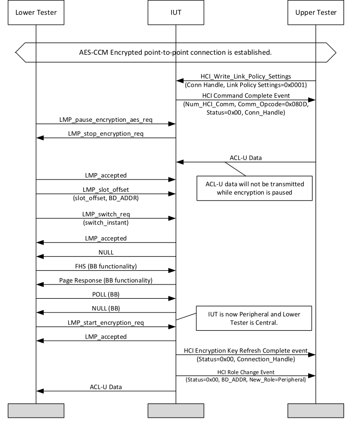

**Figure 4.102: LMP/ENC/BV-43-C [Pausing and Resuming without Disabling AES-CCM Encryption, IUT Central, Peripheral Initiated with role switch] MSC**

1. The Upper Tester writes the Link Policy Settings. 2. The Lower Tester initiates the pausing of encryption. 3. The IUT accepts the pausing of encryption. 4. The Lower Tester initiates a role switch. 5. The Lower Tester resumes encryption.
• Expected Outcome
Pass verdict
The IUT pauses encryption using LMP_stop_encryption_req.
The IUT transmits no data packets while encryption is paused.
The IUT transmits data packets correctly after encryption is resumed.
The role switch succeeds.
LMP/ENC/BV-44-C [Pausing and Resuming without Disabling AES-CCM Encryption, IUT Peripheral, Central Initiated with role switch]
• Test Purpose
Verify that the IUT as Peripheral can respond to Central initiated pause and resume of AES-CCM encryption without disabling the Encryption_Mode as part of the role switch procedure.
• Reference
[1] 4.2.5.3, 4.2.5.5, 4.4.2
• Initial Condition
- The Lower Tester is Central and the IUT is Peripheral.
- An AES-CCM encrypted point-to-point connection has been established between the IUT and the Lower Tester.
- Both devices are sending data to each other.
• Test Procedure
Peripheral Central

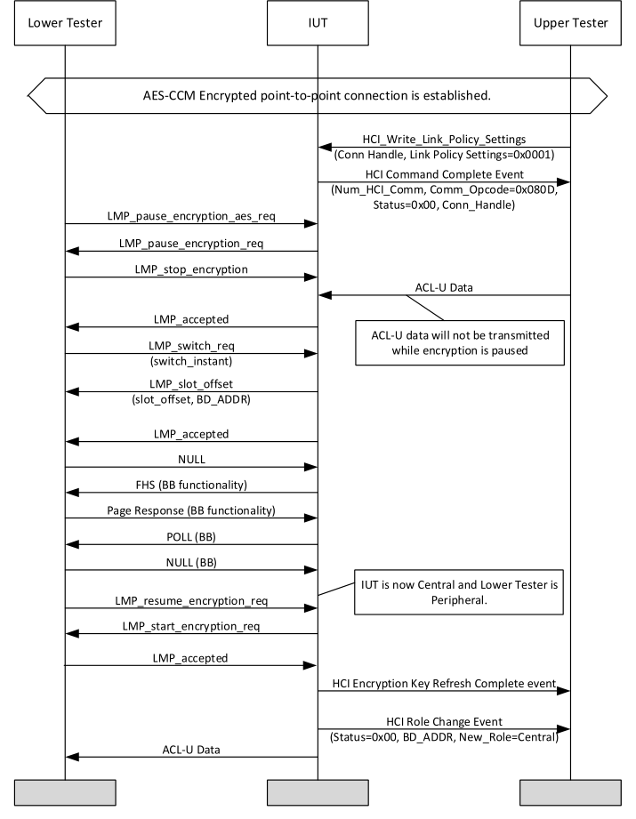

**Figure 4.103: LMP/ENC/BV-44-C [Pausing and Resuming without Disabling AES-CCM Encryption, IUT Peripheral, Central Initiated with role switch] MSC**

1. The Upper Tester writes the Link Policy Settings. 2. The Lower Tester initiates the pausing of encryption. 3. The IUT accepts the pausing of encryption. 4. The Lower Tester initiates a role switch. 5. The Lower Tester resumes encryption.
• Expected Outcome
Pass verdict
The IUT responds to the LMP_pause_encryption_aes_req with an LMP_pause_encryption_req.
The IUT transmits no data packets while encryption is paused.
The IUT transmits data packets correctly after encryption is resumed.
The role switch succeeds.
LMP/ENC/BV-45-C [Broadcast Encryption is not used with AES-CCM encryption]
• Test Purpose
Verify that the IUT as Central rejects a request from the Upper Tester to use the Temporary Link Key when AES-CCM encryption has been enabled on a point-to-point link with a Peripheral and does not use encryption on broadcast messages.
• Reference
[1] 4.2.4.1
• Initial Condition
- The Lower Tester is Peripheral and the IUT is Central.
- An AES-CCM encrypted point-to-point connection has been established between the IUT and the Lower Tester.
• Test Procedure
Peripheral Central

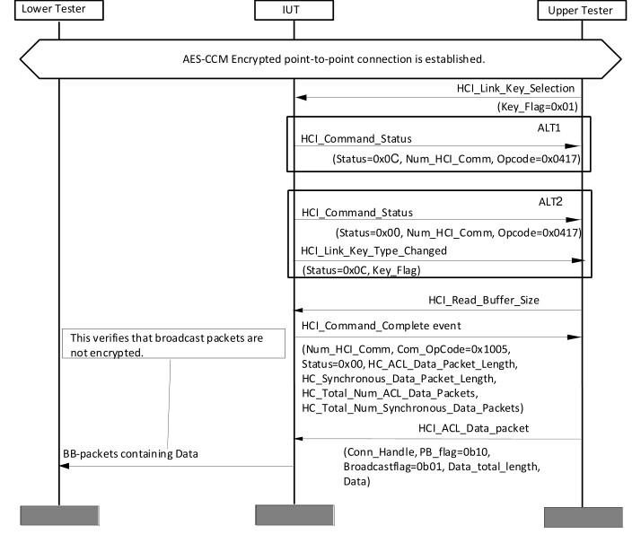

**Figure 4.104: LMP/ENC/BV-45-C [Broadcast Encryption is not used with AES-CCM encryption] MSC**

The Upper Tester requests the IUT to use a temporary link Key in order to encrypt broadcast messages using the HCI Link Key Selection command.
• Expected Outcome
Pass verdict
The IUT rejects the HCI Link Key Selection command with Error_Code Command Disallowed (0x0C).
Broadcast messages are not encrypted thereafter.
LMP/ENC/BV-46-C [Combating forged acknowledgements when AES-CCM Encryption is enabled]
• Test Purpose
Verify that the IUT as Central periodically sends an LMP_ping_req on an idle ACL link on which AES- CCM encryption has been enabled in order to force the other side to transmit an ACL packet (LMP_ping_res).
• Reference
[1] 4.1.13
• Initial Condition
- The Lower Tester is Peripheral and the IUT is Central.
- An AES-CCM encrypted point-to-point connection has been established between the IUT and the Lower Tester.
• Test Procedure
Central Peripheral

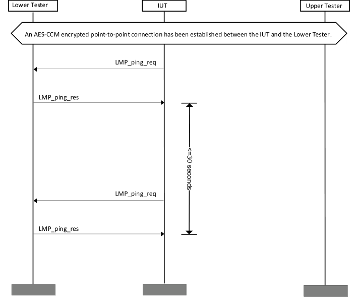

**Figure 4.105: LMP/ENC/BV-46-C [Combating forged acknowledgements when AES-CCM Encryption is enabled] MSC**

1. The ACL connection is kept idle i.e., no ACL-U or ACL-C traffic is exchanged for 60 seconds. 2. The IUT transmits the PDU LMP_ping_req so that the LMP_ping_res messages successfully
received by the IUT are less than (or equal to) 30 seconds apart. 3. The Lower Tester responds with LMP_ping_res.
• Expected Outcome
Pass verdict
The IUT transmits the PDU LMP_ping_req so that the LMP_ping_res messages successfully received by the IUT are less than (or equal to) 30 seconds apart.
• Notes
The Lower Tester should attempt to not transmit any packets that contain a MIC. However, if this is not possible and the Lower Tester autonomously transmits a data packet that contains a MIC, the Lower Tester should wait another 30 seconds.
• Test Purpose
Verify that the IUT as Central responds to an LMP_ping_req sent by the Lower Tester when AES- CCM encryption has been enabled.
• Reference
[1] 4.1.13
• Initial Condition
- The Lower Tester is Peripheral and the IUT is Central.
- An AES-CCM encrypted point-to-point connection has been established between the IUT and the Lower Tester.
• Test Procedure
Peripheral Central

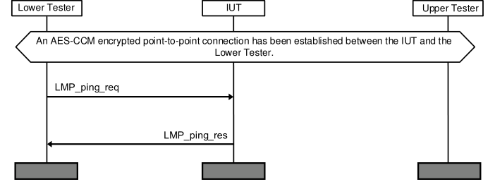

**Figure 4.106: LMP/ENC/BV-47-C [Responding to LMP_ping_req when AES-CCM Encryption is enabled] MSC**

1. The Lower Tester transmits the PDU LMP_ping_req. 2. The IUT responds with an LMP_ping_res.
• Expected Outcome
Pass verdict
The IUT responds to every LMP_ping_req with an LMP_ping_res.
LMP/ENC/BV-48-C [No response to LMP_ping_req]
• Test Purpose
Verify that the IUT as Central generates the HCI Authenticated Payload Timeout Expired event when the Lower Tester doesn’t respond to an LMP_ping_req sent by the IUT within the Authenticated_Payload_Timeout interval.
• Reference
[1] 4.1.13
• Initial Condition
- The Lower Tester is Peripheral and the IUT is Central.
- An encrypted point-to-point connection has been established between the IUT and the Lower Tester.
• Test Procedure
Peripheral Central

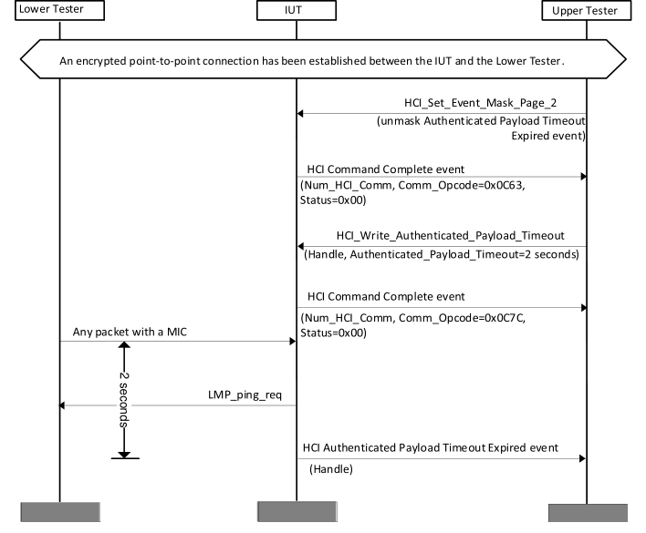

**Figure 4.107: LMP/ENC/BV-48-C [No response to LMP_ping_req] MSC**

1. The Upper Tester sets the Authenticated_Payload_Timeout to 2 seconds. 2. The Upper Tester unmasks the HCI Authenticated Payload Timeout Expired event. 3. The ACL connection is kept idle i.e. no ACL-U or ACL-C traffic is exchanged for 10 seconds. 4. The IUT transmits the PDU LMP_ping_req to the Lower Tester. 5. The Lower Tester does not respond with LMP_ping_res. 6. The IUT sends an HCI Authenticated Payload Timeout Expired event to the Upper Tester 2
seconds after the last packet that contained a MIC was received by the IUT from the Lower Tester.
• Expected Outcome
Pass verdict
The IUT transmits the PDU LMP_ping_req to the Lower Tester rand sends an HCI Authenticated Payload Timeout Expired event to the Upper Tester when the Lower Tester doesn’t respond with an LMP_ping_res.
LMP/ENC/BV-49-C [Modified Authentication Payload Timeout]
• Test Purpose
Verify that the IUT as Central uses the correct value of the Authenticated Payload Timeout set by the Upper Tester.
• Reference
[1] 4.1.13
• Initial Condition
- The Lower Tester is Peripheral and the IUT is Central.
- An encrypted point-to-point connection has been established between the IUT and the Lower Tester.
• Test Procedure
Peripheral Central

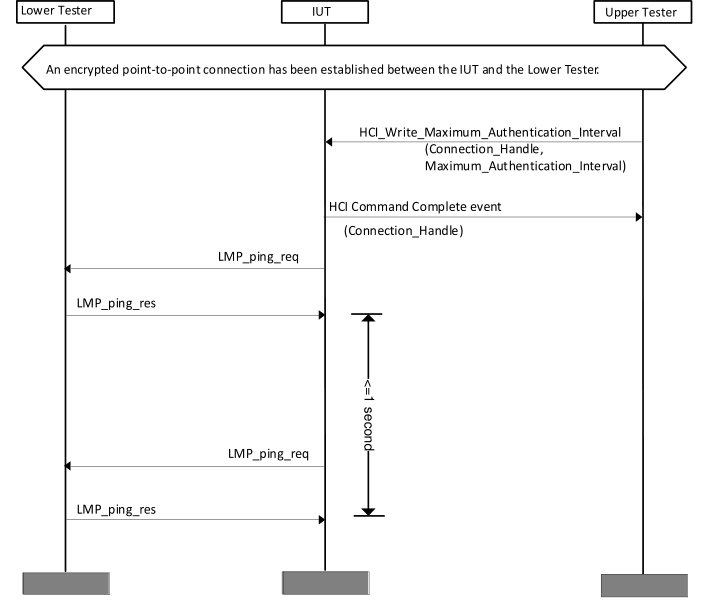

**Figure 4.108: LMP/ENC/BV-49-C [Modified Authentication Payload Timeout] MSC**

1. The Upper Tester modifies the Authentication Payload Timeout to 1 second. 2. The ACL connection is kept idle i.e., no ACL-U or ACL-C traffic is exchanged for 2 seconds. 3. The IUT transmits the PDU LMP_ping_req so that the LMP_ping_res messages successfully
received by the IUT are less than (or equal to) 1 second apart. 4. The Lower Tester responds with LMP_ping_res PDU.
• Expected Outcome
Pass verdict
The IUT transmits the PDU LMP_ping_req so that the LMP_ping_res messages successfully received by the IUT are less than (or equal to) 1 second apart.
• Notes
The Lower Tester should attempt to not transmit any packets that contain a MIC. However, if this is not possible and the Lower Tester autonomously transmits a data packet that contains a MIC, the Lower Tester should wait another 1 second.
• Test Purpose
Verify that the IUT initiates the encryption procedure and uses E0 encryption only for point to point messages when the remote controller’s LMP feature bits indicate support for Secure Connections both in the Controller and the Host but the local host does not indicate support for Secure Connections and reports the correct Encryption_Enabled to a legacy Host.
• Reference
[1] 4.2.5
• Initial Condition
- The Lower Tester is Peripheral and the IUT is Central.
- The Upper Tester doesn’t set the Secure Connections Host Support to enabled.
- ACL connection has been established between the IUT and the Lower Tester and the creation of a link Key between the IUT and Lower Tester has been successful.
• Test Procedure
Peripheral
Central

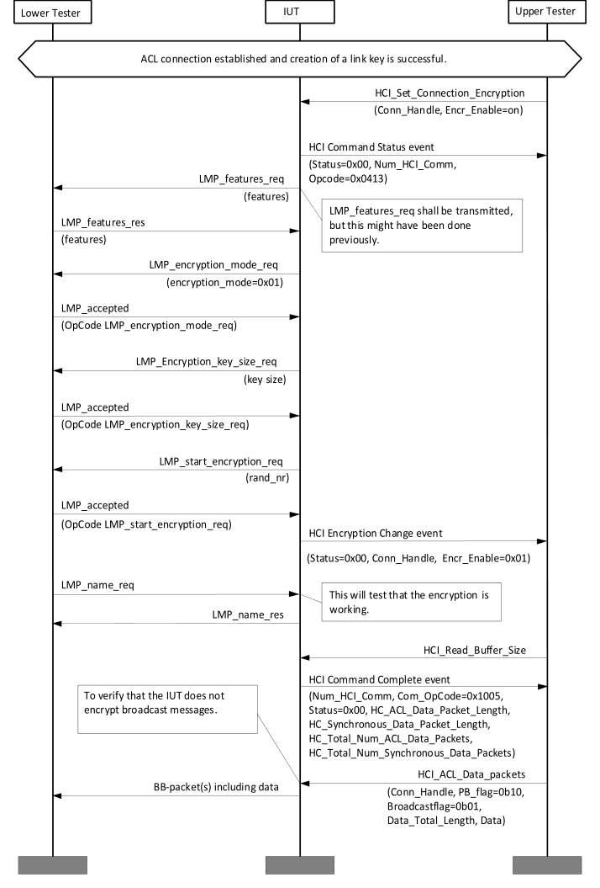

**Figure 4.109: LMP/ENC/BV-50-C [Initiate AES-CCM Encryption – Legacy Host] MSC**

Encryption is initiated after ACL connection creation.
• Expected Outcome
Pass verdict
The IUT initiates the encryption negotiation and uses the encryption afterwards.
The IUT responds correctly to the PDU LMP_name_req (this proves that encryption is used).
The IUT transmits broadcast ACL packets with non-encrypted payload to the Lower Tester.
If Read Encryption Key_Size is supported, the IUT returns the Key_Size parameter from the LMP_encryption_key_size_req PDU in the Command Complete event following the HCI Read Encryption Key_Size command.
The Encryption_Enabled Parameter in the Encryption Change event or the Connection Complete event reports “Link Level Encryption is ON with E0”.
• Notes
The suggested Key_Size must be within the Lower Tester’s Key_Size range.

##### 4.6.2.1 Key_Size Negotiation as Central

• Test Purpose
Verify that the IUT in the Central role correctly reports the negotiated encryption Key_Size.
• Reference
[1] 4.2.5
• Initial Condition
- An IXIT statement, TSPX_min_supported_encryption_key_size, gives the value for the minimum encryption Key_Size.
- An IXIT statement, TSPX_max_supported_encryption_key_size, gives the value for the maximum encryption Key_Size.
- The Lower Tester has a minimum encryption Key_Size set to 1.
- See Initial Condition in Table 4.5.
• Test Case Configuration

| TCID | Initial Condition |  | HCI Set Min |  | Encryption Type |  | Encryption |  |
| --- | --- | --- | --- | --- | --- | --- | --- | --- |
|  |  |  | Encryption Key |  |  |  | _ Enabled |  |
|  |  |  | Size Support |  |  |  | (step 9) |  |
| LMP/ENC/BV-53-C [Key Size Negotiation as _ Central - E0] | 4.2.2 Encryption | Yes |  |  | E0 | 0x01 |  |  |
| LMP/ENC/BV-54-C [Key Size Negotiation as _ Central - AES] | 4.2.6 AES-CCM Encryption | Yes |  |  | AES | 0x02 |  |  |
| LMP/ENC/BV-63-C [Key Size Negotiation as _ Central - E0] | 4.2.2 Encryption | No |  |  | E0 | 0x01 |  |  |
| LMP/ENC/BV-64-C [Key Size Negotiation as _ Central - AES] | 4.2.6 AES-CCM Encryption | No |  |  | AES | 0x02 |  |  |

Table 4.5: Key_Size Negotiation as Central test cases
• Test Procedure

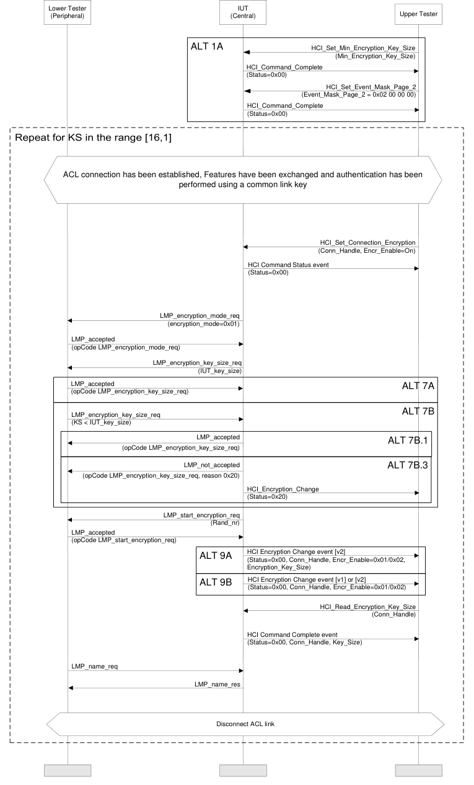

**Figure 4.110: Key_Size Negotiation as Central MSC**

1. Perform either alternative 1A or 1B depending on the IUT support for HCI Set Min Encryption Key
Size as specified in Table 4.5. Alternative 1A (The IUT supports HCI Set Min Encryption Key Size):
1A.1 The Upper Tester sends the HCI_Set_Min_Encryption_Key_Size command with the Min_Encryption_Key_Size set INT((TSPX_min_supported_encryption_key_size + TSPX_max_supported_encryption_key_size) / 2). 1A.2 The Upper Tester sends an HCI_Set_Event_Mask_Page_2 command to the IUT with the Event_Mask_Page_2 set to 0x02000000 and receives a successful HCI_Command_Complete in return. Alternative 1B (The IUT does not support HCI Set Min Encryption Key Size):
1B.1 The Min_Encryption_Key_Size is considered the same as TSPX_min_supported_encryption_key_size for the rest of the test case below. 2. Establish an ACL connection between the IUT and the Lower Tester. 3. The IUT, at any time before starting the encryption procedure, initiates the exchange of all
supported Features (LMP_features_req PDU and, if relevant, LMP_features_ext_req). The Lower Tester indicates support for both host and controller Secure Connections support only when AES encryption is indicated in Table 4.5. 4. The Lower Tester initiates authentication using a random link Key known to the IUT and the
Upper Tester. 5. The Upper Tester orders the IUT to enable link encryption, and the IUT sends an
LMP_encryption_mode_req PDU with the encryption_mode field set to 0x01; the Lower Tester replies with an LMP_accepted PDU. 6. The IUT sends the Lower Tester an LMP_encryption_key_size_req PDU containing a suggested
Key_Size that is equal to TSPX_max_supported_encryption_key_size. If the IUT sends a suggested Key_Size that is smaller than 7, the test ends with a Fail verdict. 7. Perform either alternative 7A or 7B depending on the suggested Key_Size.
Alternative 7A (Suggested Key_Size >= KS):
7A.1 The Lower Tester accepts the suggested Key_Size. Alternative 7B (Suggested Key_Size < KS):
7B.1 The Lower Tester responds with its own LMP_encryption_key_size_req PDU, suggesting a Key_Size equal to KS. The IUT executes either step 7B.2, 7B.3, or 7B.4. 7B.2 Accept the suggested Key_Size if KS >= Min_Encryption_Key_Size and KS <= TSPX_max_encryption_key_size. 7B.3 Accept the suggested Key_Size even if KS < Min_Encryption_Key_Size. In this case, the test ends with a Fail verdict. 7B.4 Reject the suggested Key_Size by sending an LMP_NOT_ACCEPTED PDU with reason Unsupported LMP Parameter Value/Unsupported LL Parameter (0x20) to the Lower Tester. The IUT sends an HCI_Encryption_Change event with an Unsupported LMP Parameter Value/Unsupported LL Parameter Value HCI error (0x20) to the Upper Tester. Skip to step 12. 8. The IUT continues the link encryption procedure by sending an LMP_start_encryption_req PDU,
which the Lower Tester accepts with an LMP_accepted PDU.
Size specified in Table 4.5. Alternative 9A (The IUT supports HCI Set Min Encryption Key Size):
9A.1 The IUT sends to the Upper Tester an HCI_Encryption_Change [v2] event with the Status field set to 0x00, the Encryption_Key_Size set to the negotiated Key_Size in step 6, and the Encryption_Enabled field set to the value indicated in Table 4.5 for this test. Alternative 9B (The IUT does not support HCI Set Min Encryption Key Size):
9B.1 The IUT sends either an HCI_Encryption_Change [v1] or an HCI_Encryption_Change [v2] event to the IUT with the Status field set to 0x00 and the Encryption_Enabled field set to the value indicated in Table 4.5 for this test. 10. The Upper Tester issues the HCI Read Encryption Key_Size command, and the IUT responds
with an HCI Command Complete event with the Key_Size parameter equal to the negotiated Key_Size in step 7. 11. The Lower Tester sends an LMP_name_req PDU and the IUT replies with an LMP_name_res
PDU, verifying that the encryption uses the negotiated Key_Size. 12. The Lower Tester disconnects the ACL link.
• Expected Outcome
Pass verdict
The IUT correctly reports the negotiated encryption Key_Size for each accepted Key_Size value, if HCI Read Encryption Key_Size Command is supported.
At least one Key_Size value is accepted by the IUT.
If the HCI_Set_Min_Encryption_Key_Size command is supported, then each accepted Key_Size value in step 9a >= the Min_Encryption_Key_Size from step 1.
LMP/ENC/BV-57-C [Broadcast Encryption, Link Key Selection Request]
• Test Purpose
Verify that a Central IUT properly handles a Link Key Selection request when no change is required or the Lower Tester rejects the request.
• Reference
[7] 7.1.18
• Initial Condition
- An encrypted point-to-point connection has been established between the IUT and the Lower Tester, with the IUT as Central and the Temporary Link Key in use.
• Test Procedure

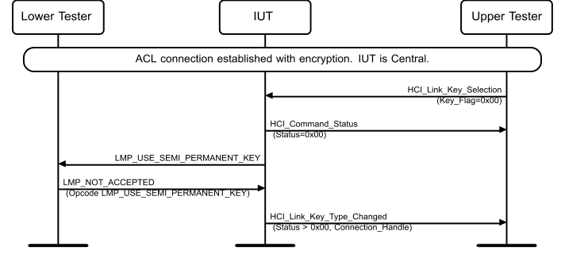

**Figure 4.111: LMP/ENC/BV-57-C [Broadcast Encryption, Link Key Selection Request] MSC**

1. The Upper Tester sends an HCI_Link_Key_Selection command to the IUT with Key_Flag set to
0x00 to indicate use of the Semi-permanent Link Key. 2. The IUT sends a successful HCI_Command_Status event to the Upper Tester. 3. The IUT sends an LMP_USE_SEMI_PERMANENT_KEY PDU to the Lower Tester. 4. The Lower Tester sends an LMP_NOT_ACCEPTED PDU to the IUT. 5. The IUT sends an HCI_Link_Key_Type_Change event to the Upper Tester with Status set to any
valid error code.
• Expected Outcome
Pass verdict
In step 5, the IUT sends an HCI_Link_Key_Type_Changed event to the Upper Tester with Status set to any valid error code and Connection_Handle set to the value of the current connection to the Lower Tester.
LMP/ENC/BV-58-C [Point-To-Point Encryption, Link Key Selection Request]
• Test Purpose
Verify that a Central IUT properly handles a Link Key Selection request when no change is required or the Lower Tester rejects the request.
• Reference
[7] 7.1.18
• Initial Condition
- An encrypted point-to-point connection has been established between the IUT and the Lower Tester, with the IUT as Central and the semi-permanent Link Key in use.
• Test Procedure

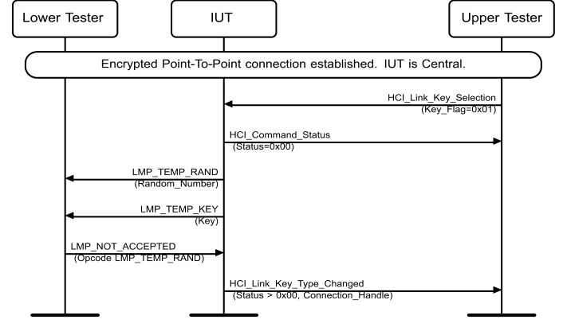

**Figure 4.112: LMP/ENC/BV-58-C [Point-To-Point Encryption, Link Key Selection Request] MSC**

1. The Upper Tester sends an HCI_Link_Key_Selection command to the IUT with Key_Flag set to
0x01 to indicate use of the Temporary Link Key. 2. The IUT sends a successful HCI_Command_Status event to the Upper Tester. 3. The IUT sends an LMP_TEMP_RAND PDU to the Lower Tester. 4. The IUT sends an LMP_TEMP_KEY PDU to the Lower Tester. 5. The Lower Tester sends an LMP_NOT_ACCEPTED PDU to the IUT. 6. The IUT sends an HCI_Link_Key_Type_Changed event to the Upper Tester with Status set to
any valid error code.
• Expected Outcome
Pass verdict
In step 6, the IUT sends an HCI_Link_Key_Type_Changed event to the Upper Tester with an error Status and Connection_Handle set to the value of the current connection to the Lower Tester.
LMP/ENC/BI-02-C [Encryption, Central, Reject Role Switch]
• Test Purpose
Verify that the IUT rejects a role switch request during the Encryption process. The IUT is Central and the Lower Tester is Peripheral.
• Reference
[1] 4.2.5, 4.4.2
• Initial Condition
- See Connection Establishment IUT Central.
- The Lower Tester supports Role Switch.
- The Lower Tester initiates authentication and optionally expects a mutual authentication.
• Test Procedure
Peripheral
Central

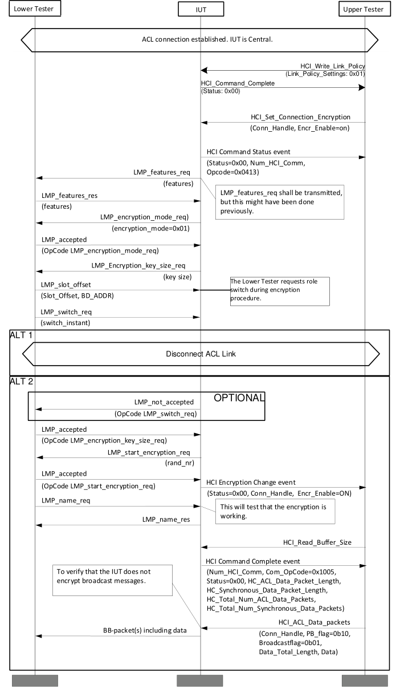

**Figure 4.113: LMP/ENC/BI-02-C [Encryption, Central, Reject Role Switch] MSC**

• Expected Outcome
Pass verdict
In ALT 1, the IUT disconnects the ACL Link.
In ALT 2, the IUT may transmit PDU LMP_NOT_ACCEPTED upon reception of PDU LMP_SWITCH_REQ from the Lower Tester. The IUT sends an HCI_Encryption_Change event to the Upper Tester.
• Notes
The suggested Key_Size must be within the Lower Tester’s Key_Size range.

#### 4.6.3 Encryption - Both Connected Roles

##### 4.6.3.1 Reject Encryption Commands, Unencrypted Connection

• Test Purpose
Verify that the IUT rejects encryption commands when the IUT and the Lower Tester have an unencrypted connection.
• Reference
[1] 4.2.5.1, 4.2.5.5
• Initial Condition
- The IUT is in the role specified in Table 4.6.
- An unencrypted point-to-point connection has been established between the IUT and the Lower Tester.
• Test Case Configuration

|  | Test Case ID |  |  | IUT Role |  |  | LMP PDU |  |  | Parameter |  |
| --- | --- | --- | --- | --- | --- | --- | --- | --- | --- | --- | --- |
| LMP/ENC/BI-04-C [Reject Encryption Commands, Unencrypted Connection, Peripheral, Encryption Mode Request] |  |  | Peripheral |  |  | LMP ENCRYPTION MODE REQ _ _ _ |  |  | Encryption Mode = 0 _ |  |  |
| LMP/ENC/BI-05-C [Reject Encryption Commands, Unencrypted Connection, Peripheral, Pause Encryption Request] |  |  | Peripheral |  |  | LMP PAUSE ENCRYPTION REQ _ _ _ |  |  | N/A |  |  |
| LMP/ENC/BI-06-C [Reject Encryption Commands, Unencrypted Connection, Peripheral, Pause Encryption AES Request] |  |  | Peripheral |  |  | LMP PAUSE ENCRYPTION AES REQ _ _ _ _ |  |  | N/A |  |  |
| LMP/ENC/BI-07-C [Reject Encryption Commands, Unencrypted Connection, Central, Encryption Mode Request] |  |  | Central |  |  | LMP ENCRYPTION MODE REQ _ _ _ |  |  | Encryption Mode = 0 _ |  |  |
| LMP/ENC/BI-08-C [Reject Encryption Commands, Unencrypted Connection, Central, Pause Encryption Request] |  |  | Central |  |  | LMP PAUSE ENCRYPTION REQ _ _ _ |  |  | N/A |  |  |
| LMP/ENC/BI-09-C [Reject Encryption Commands, Unencrypted Connection, Central, Pause Encryption AES Request] |  |  | Central |  |  | LMP PAUSE ENCRYPTION AES REQ _ _ _ _ |  |  | N/A |  |  |

Table 4.6: Reject Encryption Commands, Unencrypted Connection test cases
• Test Procedure

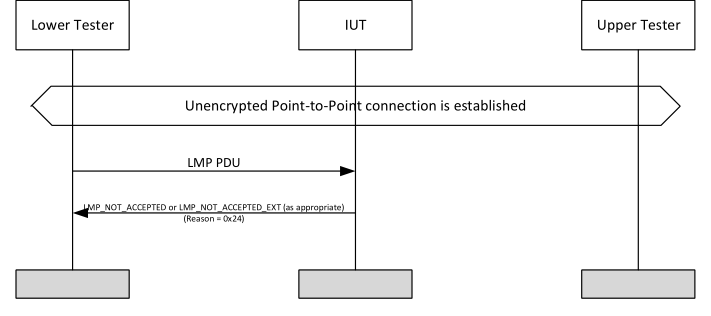

**Figure 4.114: Reject Encryption Commands, Unencrypted Connection MSC**

1. The Lower Tester sends an LMP PDU as specified in Table 4.6 to the IUT with the Parameter as
specified in Table 4.6. 2. The IUT sends an LMP_NOT_ACCEPTED or LMP_NOT_ACCEPTED_EXT (as appropriate) with
Reason set to 0x24 (LMP PDU not allowed).
• Expected Outcome
Pass verdict
The IUT responds to the LMP PDU with an LMP_NOT_ACCEPTED or LMP_NOT_ACCEPTED_EXT (as appropriate) with Reason set to 0x24.

### 4.7 Information Requests

Verify the correct implementation of the Information requests services.

#### 4.7.1 Clock_Offset Request - Peripheral

Verify that the Central can request this Clock_Offset anytime during the connection. The IUT is Peripheral.
LMP/INF/BV-01-C [Clock_Offset Response]
• Test Purpose
Verify that the IUT responds with the Clock_Offset upon request from the Lower Tester.
The IUT is Peripheral. The Lower Tester is Central.
• Reference
[1] 4.3.2
• Initial Condition
- See Default settings.
• Test Procedure
Central Peripheral

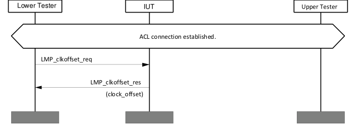

**Figure 4.115: LMP/INF/BV-01-C [Clock_Offset Response]**

• Expected Outcome
Pass verdict
The IUT transmits PDU LMP_clkoffset_res upon reception of PDU LMP_clkoffset_req.

#### 4.7.2 Clock_Offset Request - Central

Verify that the Central can request this Clock_Offset anytime during the connection. The IUT is Central.
LMP/INF/BV-02-C [Clock_Offset Request]
• Test Purpose
Verify that the IUT can request for the Lower Tester’s Clock_Offset.
The IUT is Central. The Lower Tester is Peripheral.
• Reference
[1] 4.3.2
• Initial Condition
- See Default settings.
- The IUT must page the Lower Tester to become the Central of the Piconet.
• Test Procedure
Central IUT Peripheral Lower Tester

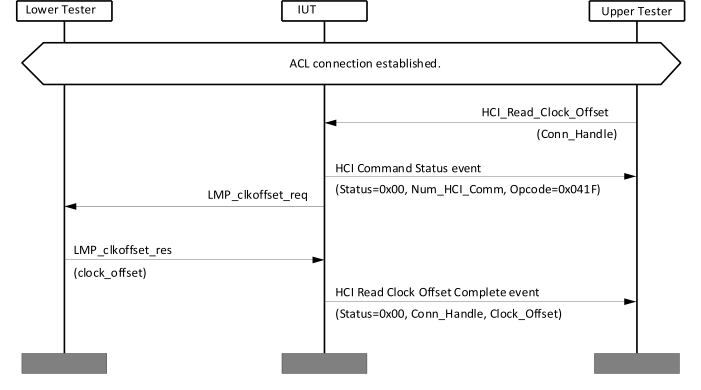

**Figure 4.116: LMP/INF/BV-02-C [Clock_Offset Request] MSC**

• Test Condition
It must be possible to control the IUT to initiate the Clock_Offset request.
• Expected Outcome
Pass verdict
The IUT transmits PDU LMP_clkoffset_req and accepts reception of PDU LMP_clkoffset_res.

#### 4.7.3 Timing Accuracy Information Request - Both Central and Peripheral

Verify that a unit can request for timing accuracy information. The role of the IUT is of no importance.
LMP/INF/BV-05-C [Timing Accuracy Response]
• Test Purpose
Verify that the IUT responds with timing accuracy information upon request from the Lower Tester. The Lower Tester initiates the service.
• Reference
[1] 4.3.1
• Initial Condition
- See Default Settings (Section 4.2.3).
• Test Procedure

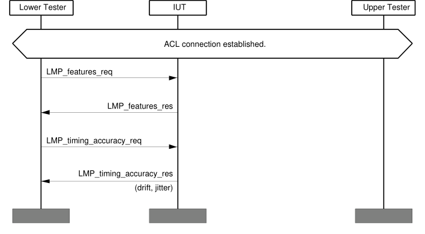

**Figure 4.117: LMP/INF/BV-05-C [Timing Accuracy Response] MSC**

• Test Condition
The manufacturer of the IUT must define Drift and Jitter.
• Expected Outcome
Pass verdict
The IUT transmits PDU LMP_timing_accuracy_res containing Drift and Jitter defined by the manufacturer upon reception of PDU LMP_timing_accuracy_req.

#### 4.7.4 LMP Version - Both Central and Peripheral

Verify that a unit can request for the version of the LM protocol of another unit. The role of the IUT is of no importance.
LMP/INF/BV-08-C [Version/Company ID Response]
• Test Purpose
Verify that the IUT responds with the correct Version number and company ID upon request from the Lower Tester.
The Lower Tester initiates the service.
• Reference
[1] 4.3.3
Bluetooth Assigned Numbers
• Initial Condition
- See Default settings.
• Test Procedure

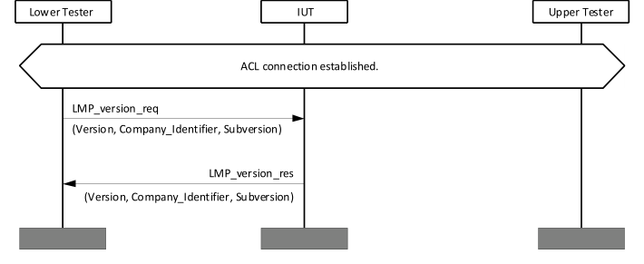

**Figure 4.118: LMP/INF/BV-08-C [Version/Company ID Response] MSC**

• Test Condition
The manufacturer of the IUT must declare Version, Company_Identifier and Subversion as IXIT.
• Expected Outcome
Pass verdict
The IUT transmits PDU LMP_version_res containing Version, Company_Identifier and Subversion as declared by the manufacturer upon reception of PDU LMP_version_req.
The Version value sent by the IUT matches the Specification version to which conformance is claimed.
LMP/INF/BV-09-C [Request LMP Version]
• Test Purpose
Verify that the IUT can request the LMP version from the Lower Tester.
The IUT initiates the service.
• Reference
[1] 4.3.3
Bluetooth Assigned Numbers
• Initial Condition
- See Default settings.
• Test Procedure

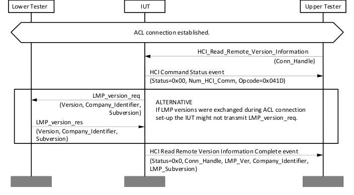

**Figure 4.119: LMP/INF/BV-09-C [Request LMP Version] MSC**

• Test Condition
The manufacturer of the IUT must declare Version, Company_Identifier and Subversion as IXIT.
• Expected Outcome
Pass verdict
The IUT transmits PDU LMP_version_req containing Version, Company_Identifier and Subversion as declared by the manufacturer and accepts reception of PDU LMP_version_res.
The IUT returns HCI Read Remote Version Information Complete Event containing the values received in the PDU LMP_version_res.
The Version value sent by the IUT in the LMP_version_req matches the Specification version to which conformance is claimed.
• Notes
If LMP versions were exchanged during ACL connection set-up the IUT might not transmit LMP_version_req.

#### 4.7.5 Supported Features - Both Central and Peripheral

Verify that a unit can request for another unit’s supported Features. The role of the IUT is of no importance.
LMP/INF/BV-10-C [Supported Features Response]
• Test Purpose
Verify that the IUT responds with the correct Features supported upon request from the Lower Tester. The Lower Tester initiates the service.
• Reference
[1] 4.3.4
• Initial Condition
- See Default settings.
• Test Procedure

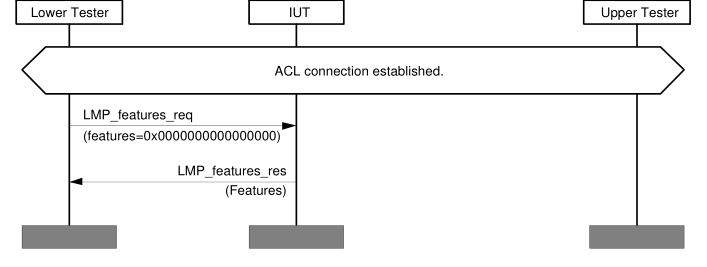

**Figure 4.120: LMP/INF/BV-10-C [Supported Features Response] MSC**

• Expected Outcome
Pass verdict
The IUT transmits PDU LMP_features_res containing Features supported as indicated by the ICS selection of LMP Table 2 upon reception of PDU LMP_features_req.
• Notes
The feature 0x000000 means that the Lower Tester supports nothing.
LMP/INF/BV-11-C [Supported Features Request]
• Test Purpose
Verify that the IUT can request for the Features supported by the Lower Tester.
The IUT initiates the service.
• Reference
[1] 4.3.4
• Initial Condition
- See Default settings.
• Test Procedure

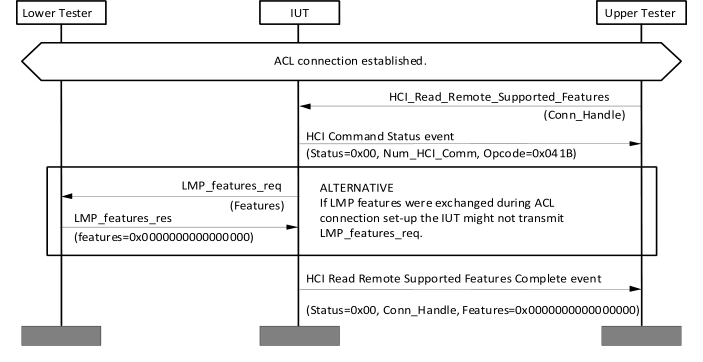

**Figure 4.121: LMP/INF/BV-11-C [Supported Features Request] MSC**

• Test Condition
It must be possible to control the IUT to initiate the Features request.
• Expected Outcome
Pass verdict
The IUT transmits PDU LMP_features_req containing Features supported as indicated by the ICS selection of LMP Table 2 and accepts reception of PDU LMP_features_res.
• Notes
The feature 0x000000 means that the Lower Tester supports nothing.
LMP/INF/BV-16-C [Extended_Features Request]
• Test Purpose
Verify that the IUT asks for Extended_Features supported.
• Reference
[1] 4.3.4
• Initial Condition
- See Default settings.
- The Lower Tester’s LMP extended feature bit is set.
• Test Procedure
The Upper Tester sends an HCI_Read_Remote_Extended_Features command with Page_Number set to 1 for the first command. Repeat the HCI_Read_Remote_Extended_Features command, increasing Page_Number until the value of Max_Supported_Page is reached. Max_Supported_Page is a return parameter of the LMP_features_req_ext command.

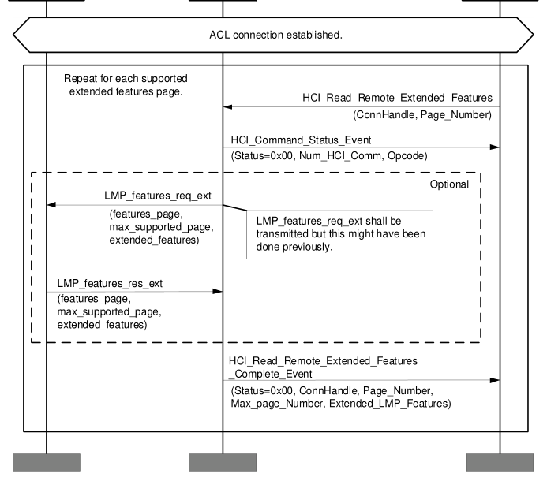

**Figure 4.122: LMP/INF/BV-16-C [Extended_Features Request] MSC**

• Expected Outcome
Pass verdict
The IUT sends an LMP_features_req_ext PDU containing Extended_Features supported as indicated by the ICS selection of LMP Table 2.
The IUT sends an HCI_Read_Remote_Extended_Features_Complete event to the Upper Tester for each supported extended features page.
• Notes
If remote Extended_Features have been cached by the IUT it might not transmit LMP_features_req_ext again.
LMP/INF/BV-17-C [Extended_Features Response]
• Test Purpose
Verify that the IUT responds with the correct Extended_Features supported upon request from the Lower Tester.
• Reference
[1] 4.3.4
• Initial Condition
- See Default settings.
• Test Procedure

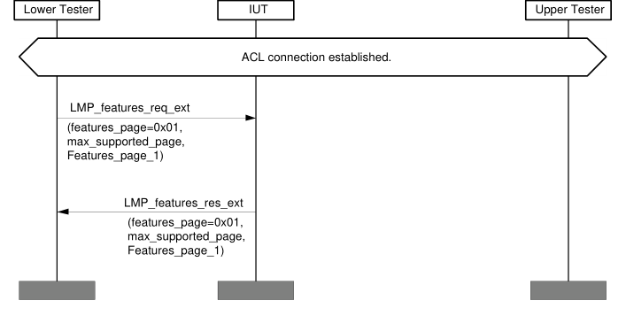

**Figure 4.123: LMP/INF/BV-17-C [Extended_Features Response] MSC**

• Expected Outcome
Pass verdict
The IUT transmits PDU LMP_features_res_ext containing Extended_Features supported as indicated by the ICS selection of LMP Table 2 upon reception of PDU LMP_features_req_ext.

#### 4.7.6 Name Request - Both Central and Peripheral

Verify that a unit can request for another unit’s name. The role of the IUT is of no importance.
LMP/INF/BV-12-C [Name Response]
• Test Purpose
Verify that the IUT responds with the correct name upon request from the Lower Tester. The Lower Tester initiates the service.
• Reference
[1] 4.3.5
• Initial Condition
- See Default settings.
- Name of the IUT must have been entered.
• Test Procedure

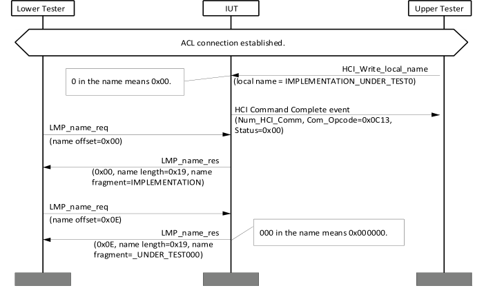

**Figure 4.124: LMP/INF/BV-12-C [Name Response] MSC**

• Test Condition
It must be possible to enter a name or the name must be provided by the manufacturer.
• Expected Outcome
Pass verdict
The IUT transmits PDU LMP_name_res upon reception of PDU LMP_name_req.
LMP/INF/BV-13-C [Name Request]
• Test Purpose
Verify that the IUT can request the name from the Lower Tester.
The IUT initiates the service.
• Reference
[1] 4.3.5
• Initial Condition
- See Default settings.
- Name of the IUT must have been entered.
• Test Procedure

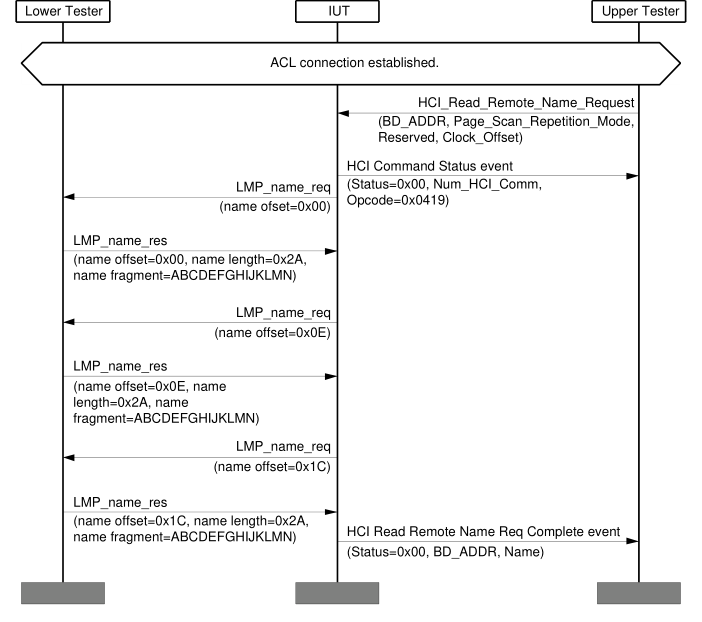

**Figure 4.125: LMP/INF/BV-13-C [Name Request] MSC**

• Test Condition
It must be possible to control the IUT to initiate the name request.
It must be possible to enter a name or the name must be provided by the manufacturer.
• Expected Outcome
Pass verdict
The IUT transmits PDU LMP_name_req and accepts reception of PDU LMP_name_res, this must be repeated until the full name is retrieved. Correct name passed to the Upper Tester.
LMP/INF/BV-18-C [Remote Name Request - IUT Initiator]
• Test Purpose
Verify that the IUT responds correctly to Remote Name Request command from the Host.
• Reference
[1] 4.3.5
[7] 7.1.19
[8] 2.1
• Initial Condition
- See Section 4.1.3 and Version 2.1 Host Preamble.
- The Lower Tester’s LMP extended feature bit (bit 63) is set.
• Test Procedure

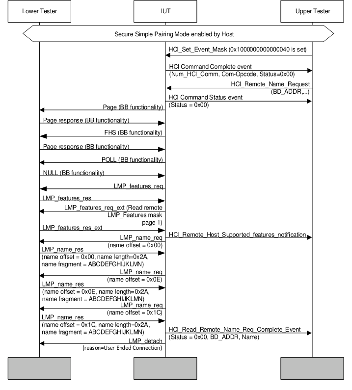

**Figure 4.126: LMP/INF/BV-18-C [Remote Name Request - IUT Initiator] MSC**

• Test Condition
It must be possible to control the IUT to initiate the name request.
• Expected Outcome
Pass verdict
The IUT returns Remote Host Supported Features after reading the LMP extended feature page.
The IUT sends the HCI_Remote_Host_Supported_Features_Notification event to the Host, with the same features as in the LMP_features_res_ext PDU, before sending the HCI_Read_Remote_Name_Req_Complete_Event to the Host.
The IUT transmits PDU LMP_name_req after retrieving the LMP Features and accepts reception of PDU LMP_name_res, this must be repeated until the full name is retrieved. Correct name passed to the Upper Tester.
LMP/INF/BV-19-C [Remote Name Request - Legacy remote device without Extended_Features - IUT Initiator]
• Test Purpose
Verify that the Remote Host Supported Features Notification event is not generated against a legacy device that does not support the LMP Extended_Features. The IUT has 2.1 or later Host and 2.1 or later Controller. The Lower Tester has 2.0 Host and 2.0 Controller.
• Reference
[1] 4.3.5
[8] 2.1
[7] 7.1.19
• Initial Condition
- Version 2.1 Host Preamble.
- The Lower Tester’s LMP extended feature bit (bit 63) is not set.
• Test Procedure
The IUT performs a remote name request.

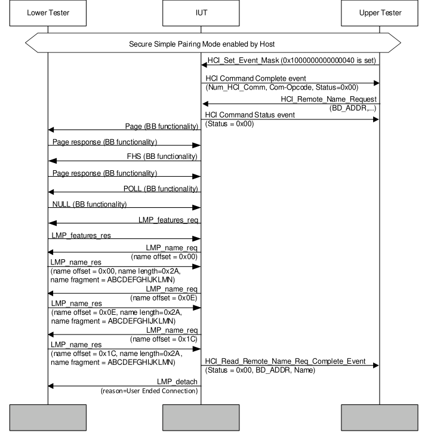

**Figure 4.127: LMP/INF/BV-19-C [Remote Name Request - Legacy remote device without Extended_Features - IUT Initiator] MSC**

• Expected Outcome
Pass verdict
Verify that the LMP extended feature page is not read.
Verify that the Remote Name Request Complete event is generated and that the Remote Host Supported Features Notification event is not sent.
• Test Purpose
Verify that IUT responds with the correct LE Features and extended LE Features supported upon request from the Lower Tester.
The IUT acts as a responder BR device.
The Lower Tester is a BR/EDR device and initiates the service.
• Reference
[1] 3.2
• Initial Condition
- See Default settings.
• Test Procedure

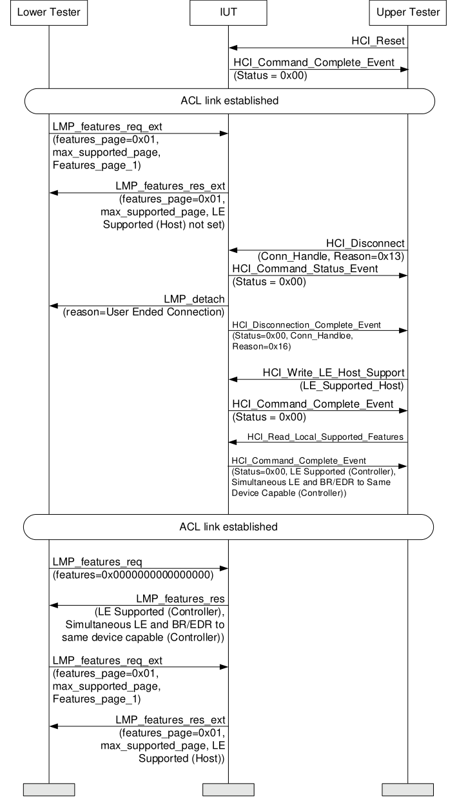

**Figure 4.128: LMP/INF/BV-22-C [LE Features in LMP Feature Set] MSC**

• Expected Outcome
Pass verdict
First feature exchange:
The IUT transmits PDU LMP_features_res_ext containing the “LE Supported (Host)” bit not set.
Second feature exchange:
The IUT transmits PDU LMP_features_res containing
“LE Supported (Controller)” and “Simultaneous LE and BR/EDR to same device capable (Controller)” Features reported by the HCI_Read_Local_Supported_Features response set to match ICS entries LMP 2/22 (LE Support (Controller)) and LMP 2/23 (LE and BR/EDR to same device capable (Controller)), respectively.
The IUT transmits PDU LMP_features_res_ext containing
“LE Supported (Host)” Extended_Features set to values in Write LE Host Supported upon reception of PDU LMP_features_req_ext.

#### 4.7.7 Invalid Packet Handling

LMP/LIH/BI-06-C [Ignore LLID = 0b00]
• Test Purpose
Verify that the IUT ignores an LMP command with LLID = 0b00.
• Reference
[1] 4.3.5
[9] 6.6.2
• Initial Condition
- See Default settings.
• Test Procedure

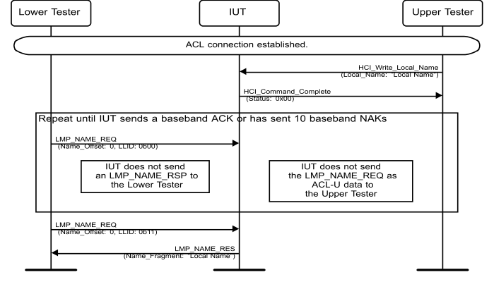

**Figure 4.129: LMP/LIH/BI-06-C [Ignore LLID = 0b00] MSC**

• Expected Outcome
Pass verdict
The IUT ignores the first name request and responds to the second name request.
The IUT does not send the LMP_NAME_REQ to the Upper Tester as ACL-U data.

##### 4.7.7.1 Ignore LMP packets with the wrong packet type

• Test Purpose
Verify that the IUT will correctly ignore ACL packets that have the LLID set to 0b11 (LMP) but are not DM1 and not DV packets.
• Reference
[1] 4.3.3
[9] 6.6.2
• Initial Condition
- IUT: Configured as the role specified in Table 4.7 in state CONNECTION (active mode, ACL link).
• Test Case Configuration

|  | Test Case ID |  |  | IUT Role |  |
| --- | --- | --- | --- | --- | --- |
| LMP/LIH/BI-07-C [Ignore LMP packets with the wrong packet type] |  |  | Central |  |  |
| LMP/LIH/BI-08-C [Ignore LMP packets with the wrong packet type] |  |  | Peripheral |  |  |

Table 4.7: Ignore LMP packets with the wrong packet type test cases
• Test Procedure

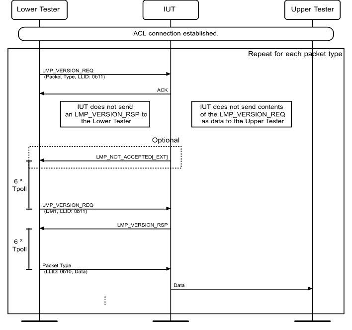

**Figure 4.130: Ignore LMP packets with the wrong packet type MSC**

Perform the following steps for each packet type listed in IXIT item TSPX_non_LMP_ACL_Packet_Types:
1. The Lower Tester sends a packet with the type specified in the IXIT item, 6 octets long, and
contains the LMP_VERSION_REQ PDU and LLID set to 0b11. 2. The IUT acknowledges the packet in step 1. 3. The IUT does not send an LMP_VERSION_RSP PDU to the Lower Tester or the contents of the
LMP_VERSION_REQ PDU as data to the Upper Tester but may send an LMP_NOT_ACCEPTED or LMP_NOT_ACCEPTED_EXT PDU to the Lower Tester. 4. The Lower Tester waits at least 6 times Tpoll. 5. The Lower Tester sends an LMP_VERSION_REQ PDU in a DM1 packet with LLID set to 0b11. 6. The IUT acknowledges the PDU in step 5 and replies with an LMP_VERSION_RSP PDU. 7. The Lower Tester waits at least 6 times Tpoll. 8. The Lower Tester sends at least 5 packets with the type specified in the IXIT item with maximum
length, random octets of content, and LLID set to 0b10. 9. The IUT acknowledges each PDU in step 8 and sends all the data to the Upper Tester.
• Expected Outcome
Pass verdict
In step 3, the IUT does not send an LMP_VERSION_RSP PDU to the Lower Tester or data to the Upper Tester.
In step 9, the IUT sends the data to the Upper Tester.
• Test Purpose
Verify that the IUT will correctly ignore APB packets with LMP LLID 0b11.
• Reference
[1] 4.3.3
[9] 6.6.2
• Initial Condition
- IUT: Configured as Peripheral in state CONNECTION (active mode, APB link).
- Lower Tester: Configured as Central in state CONNECTION (active mode, APB link).
- IXIT: TSPX_non_LMP_APB_Packet_Types
• Test Procedure

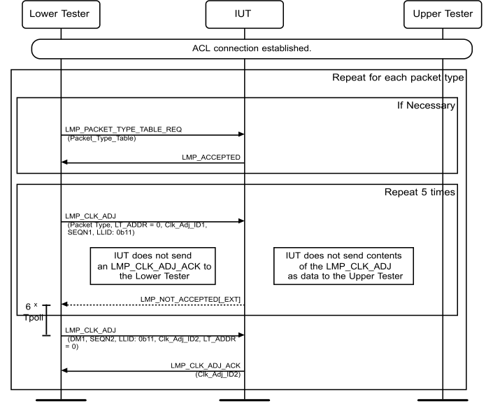

**Figure 4.131: Ignore APB Packets with LMP LLID 0b11 MSC**

Perform the following steps for each packet type listed in IXIT item TSPX_non_LMP_APB_Packet_Types:
1. If necessary, the Lower tester sends an LMP_PACKET_TYPE_TABLE_REQ PDU with a packet
type table corresponding to the type specified in the IXIT item. The IUT replies with an LMP_ACCEPTED PDU. 2. Perform steps 3–5 a total of 5 times. 3. The Lower Tester sends a packet with the type specified in the IXIT item, LT_ADDR = 0,

## 15 octets long, which contains an LMP_CLK_ADJ PDU with LLID set to 0b11. All 5 instances use the same SEQN and Clk_Adj_ID values.

LMP_CLK_ADJ PDU as data to the Upper Tester but may send an LMP_NOT_ACCEPTED or LMP_NOT_ACCEPTED_EXT PDU to the Lower Tester. 5. The Lower Tester waits at least 6 times Tpoll. 6. The Lower Tester sends a DM1 packet with LT_ADDR = 0, 15 octets long, which contains an
LMP_CLK_ADJ PDU with LLID set to 0b11 and using a different SEQN than in step 3. 7. The IUT sends an LMP_CLK_ADJ_ACK PDU to the Lower Tester with Clk_Adj_ID set to the
same value used in step 6.
• Test Condition
The values for Clk_Adj_ID in step 3 and in step 6 for a packet type are different from each other and from the values used for the other packet types (i.e., if there are P packet types, then 2P different values are used).
• Expected Outcome
Pass verdict
In step 4, the IUT does not send an LMP_CLK_ADJ_ACK PDU to the Lower Tester or data to the Upper Tester.
In step 7, the IUT sends an LMP_CLK_ADJ_ACK PDU to the Lower Tester.
LMP/LIH/BI-10-C [LMP PDU Incorrect Length]
• Test Purpose
Verify that the IUT properly handles LMP PDUs that either have valid parameters followed by extra data or are too short to hold all the parameters. If the PDU is too long and has valid parameters followed by extra data, then the IUT either ignores the extra data or responds with an LMP_NOT_ACCEPTED PDU. If the PDU is too short to hold all the parameters, then the IUT either continues with implementation-specific values or responds with an LMP_NOT_ACCEPTED PDU.
• Reference
[1] 2.5, 4.3.5
• Initial Condition
- See Default settings.
• Test Procedure
Figure 4.132 LMP/LIH/BI-10-C [LMP PDU Incorrect Length] MSC
1. The Upper Tester sends an HCI_Write_Local_Name command to the IUT with Local Name set to
248 random letters in the range of 0x41 to 5A or 0x61 to 0x7A and receives a successful HCI_Command_Complete event in return. 2. The Lower Tester sends an LMP_NAME_REQ to the IUT with the PDU length set to 4,
Name_Offset set to 1, and 2 additional octets of random data. 3. Perform either alternative 3A or 3B depending on the IUT’s response.
Alternative 3A (The IUT rejects the name request):
3A.1 The IUT sends an LMP_NOT_ACCEPTED PDU to the Lower Tester with Error_Code set to 0x1E (Invalid LMP Parameters). Alternative 3B (The IUT sends the name response):
3B.1 The IUT sends an LMP_NAME_RSP to the Lower Tester with Name_Offset set to 1, Name_Length set to 248, and Name_Fragment set to octets 1 to 14 of the name sent in step 1. 4. The Lower Tester sends an LMP_NAME_REQ to the IUT with the PDU length set to 1 and the
opcode set to 0x01.
Alternative 5A (The IUT rejects the name request):
5A.1 The IUT sends an LMP_NOT_ACCEPTED PDU to the Lower Tester with Error_Code set to 0x1E (Invalid LMP Parameters). Alternative 5B (The IUT sends the name response):
5B.1 The IUT sends an LMP_NAME_RSP to the Lower Tester with Name_Offset set to a value less than 248, Name_Length set to 248, and Name_Fragment set to the correct remaining octets of data sent in step 1 starting at the position specified by Name_Offset. • Expected Outcome
Pass verdict
In steps 3A.1 and 5A.1, the IUT rejects the name request with error code set to 0x1E.
In step 3B.1, the IUT responds with octets 1 to 14 of the name sent in step 1.
In step 5B.1, the IUT responds with Name_Offset < 248.
In step 5B.1, the IUT responds with correct values of the name sent in step 1 starting at the position specified by Name_Offset in Name_Fragment.

### 4.8 Link Handling

Verify the correct implementation of the Link Handling services.

#### 4.8.1 Role Switch - Peripheral

Verify that a unit can request for a role switch. The IUT is Peripheral.
LMP/LIH/BV-01-C [Initiate Role Switch]
• Test Purpose
Verify that the IUT can request to become a Central and carry out all necessary messages. IUT is Peripheral and initiates the switch. The Lower Tester is Central.
• Reference
[1] 4.4.2
• Initial Condition
- See Default settings.
• Test Procedure
Central Peripheral

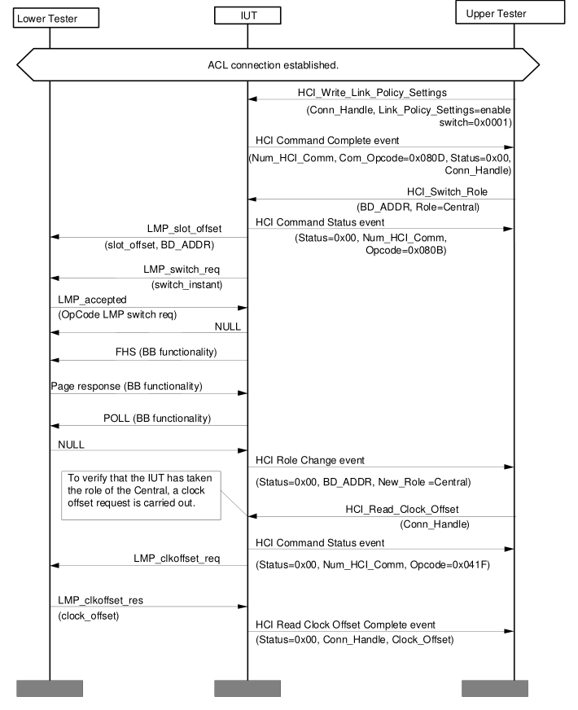

**Figure 4.133: LMP/LIH/BV-01-C [Initiate Role Switch] MSC**

• Test Condition
It must be possible to control the IUT to initiate the role switch.
• Expected Outcome
Pass verdict
The IUT transmits PDU LMP_switch_req and accepts reception of PDU LMP_accepted. The IUT must be the Central of the piconet.
• Test Purpose
Verify that the IUT can request a role switch correctly during connection setup. The Lower Tester initiates the connection establishment and pages the IUT. The IUT requests a role switch. The IUT will become the Peripheral unless the roles switch during connection setup.
• Reference
[1] 4.1.1
• Initial Condition
- See Default settings.
• Test Procedure
Central Peripheral

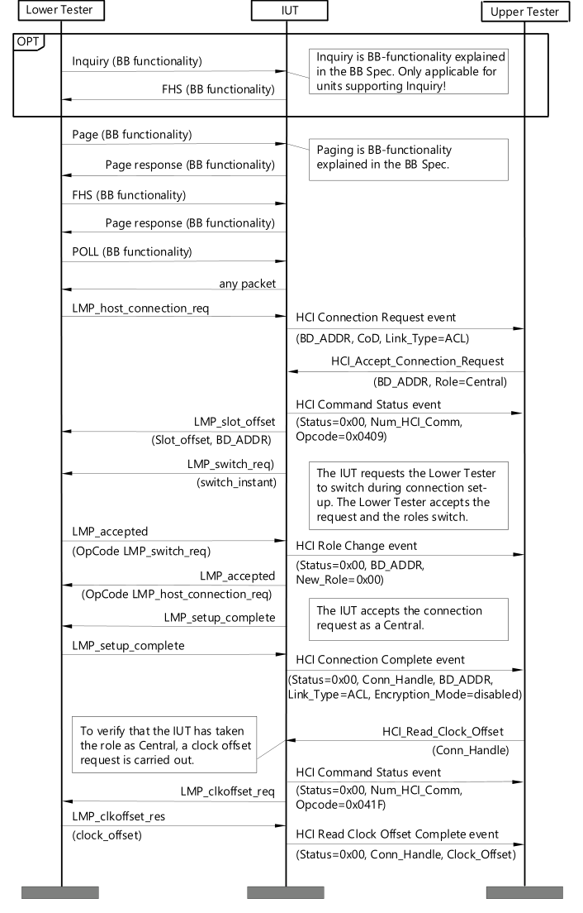

**Figure 4.134: LMP/LIH/BV-79-C [Role Switch at Setup, Peripheral] MSC**

• Expected Outcome
Pass verdict
The IUT transmits PDU LMP_slot_offset followed by LMP_switch_req upon reception of PDU LMP_host_connection_req. The IUT transmits PDU LMP_clkoffset_res upon reception of PDU LMP_clkoffset_req.
LMP/LIH/BV-144-C [Rejected Role Switch request at Setup, Peripheral]
• Test Purpose
Verify that the IUT properly handles the Lower Tester rejecting a role switch during connection setup. The Lower Tester initiates the connection establishment and pages the IUT. The IUT requests a role switch. The Lower Tester rejects the request.
• Reference
[1] 4.1.1
• Initial Condition
- See Default settings.
• Test Procedure

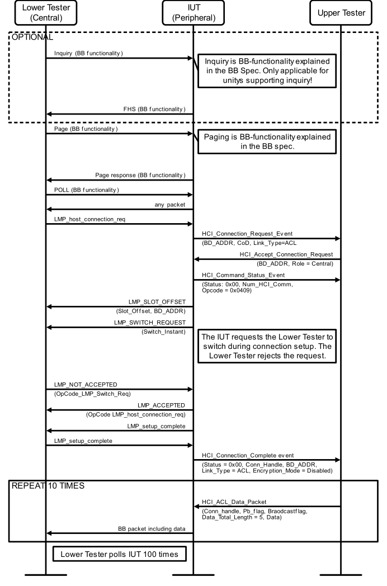

**Figure 4.135: LMP/LIH/BV-144-C [Rejected Role Switch request at Setup, Peripheral] MSC**

• Expected Outcome
Pass verdict
The IUT transmits PDU LMP_SLOT_OFFSET followed by LMP_SWITCH_REQ upon reception of PDU LMP_HOST_CONNECTION_REQ.
The IUT is able to continue to transmit data packets after the role switch request was rejected and the connection completed.
The IUT continues to respond to at least 90 out of 100 POLL packets sent by the Lower Tester.
LMP/LIH/BI-04-C [Reject Role Switch at Setup, Peripheral]
• Test Purpose
Verify that the IUT rejects a role switch request during the connection setup. The Lower Tester initiates the connection establishment and pages the IUT. The Lower Tester requests the role switch.
• Reference
[1] 4.1.1, 4.4.2
• Initial Condition
- See Link Handling in Default settings.
• Test Procedure
Central Peripheral

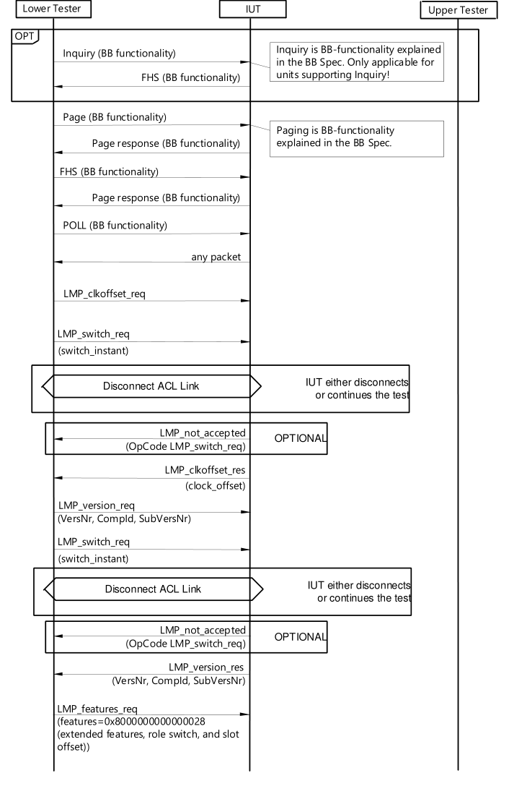

**Figure 4.136: LMP/LIH/BI-04-C [Reject Role Switch at Setup, Peripheral] MSC – Page 1 of 2**

Upper Tester IUT Lower Tester

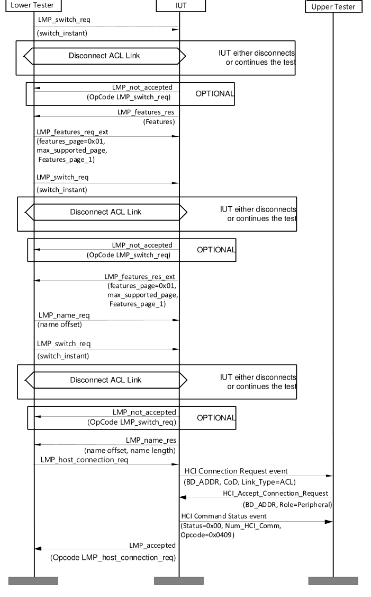

**Figure 4.137: LMP/LIH/BI-04-C [Reject Role Switch at Setup, Peripheral] MSC – Page 2 of 2**

• Expected Outcome
Pass verdict
After the Lower Tester requests a role switch, the IUT either disconnects the ACL Link and the test ends with a successful verdict, or it continues with the test. If the IUT continues with the test, the IUT may transmit an LMP_ACCEPTED upon reception of PDU LMP_SWITCH_REQ to the Lower Tester.
The IUT sends an HCI_Connection_Request event to the Upper Tester.

#### 4.8.2 Role Switch - Central

Verify that a unit can request for a role switch. The IUT is Central.
LMP/LIH/BV-02-C [Accept Role Switch]
• Test Purpose
Verify that the IUT accepts that the Lower Tester requests to switch roles from Peripheral to Central and Central to Peripheral. IUT is Central. The Lower Tester is Peripheral and initiates the switch.
• Reference
[1] 4.4.2
• Initial Condition
- See Default settings.
- The IUT must page the Lower Tester to become the Central of the Piconet.
• Test Procedure
Peripheral Central

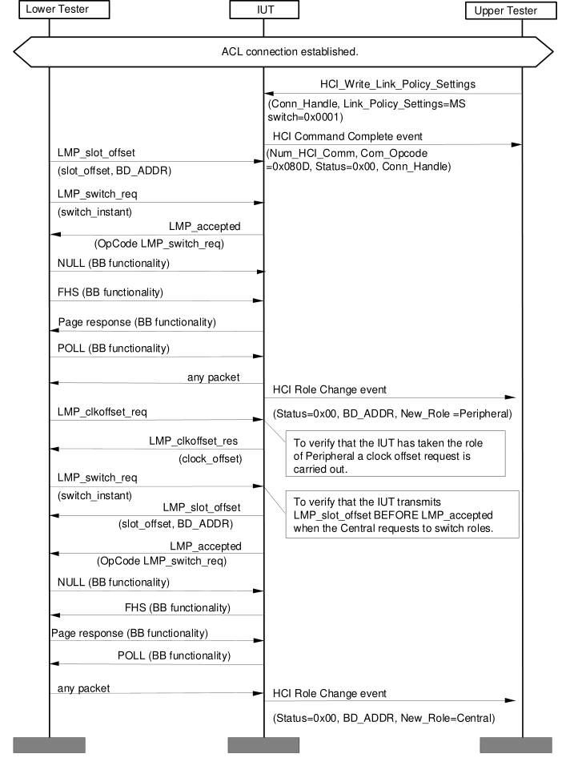

**Figure 4.138: LMP/LIH/BV-02-C [Accept Role Switch] MSC**

• Expected Outcome
Pass verdict
The IUT transmits PDU LMP_accepted upon reception of PDU LMP_switch_req.
The IUT must become Peripheral.
The IUT must transmit LMP_slot_offset and LMP_accepted upon reception of LMP_switch_req.
The IUT must become Central.
• Test Purpose
Verify that the IUT handles a role switch request correctly during connection setup. The IUT initiates the connection establishment and pages the Lower Tester. The Lower Tester requests a role switch. The IUT will become the Central of the piconet unless the roles switch during connection setup.
• Reference
[1] 4.1.1
• Initial Condition
- See Default settings.
• Test Procedure
Upper Tester IUT Central Peripheral Lower Tester

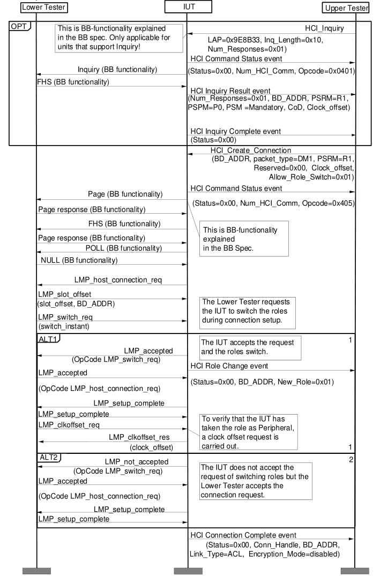

**Figure 4.139: LMP/LIH/BV-78-C [Role Switch at Setup, Central] MSC**

• Expected Outcome
Pass verdict
The IUT transmits PDU LMP_accepted upon reception of PDU LMP_switch_req and transmits PDU LMP_clkoffset_res upon reception of PDU LMP_clkoffset_req.
• Test Purpose
Verify that the IUT rejects the Lower Tester requests to switch roles from Peripheral to Central. IUT is Central. The Lower Tester is Peripheral and initiates the service.
• Reference
[1] 4.4.2
• Initial Condition
- See Default settings.
- The IUT must page the Lower Tester to become the Central of the Piconet.
• Test Procedure

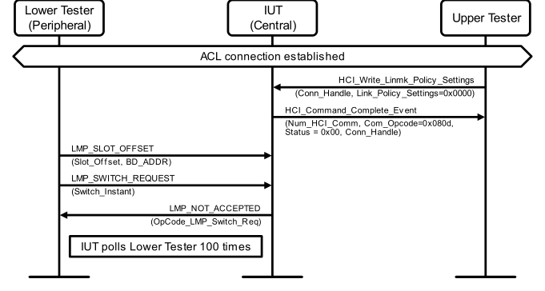

**Figure 4.140: LMP/LIH/BV-142-C [Reject Role Switch Request] MSC**

• Expected Outcome
Pass verdict
The IUT rejects the role switch and remains the Central.
The IUT continues to poll the Lower Tester 100 times.
LMP/LIH/BV-151-C [Role Switch at Setup, Central]
• Test Purpose
Verify that the IUT handles a role switch request correctly during connection setup. The IUT initiates the connection establishment and pages the Lower Tester. The Lower Tester requests a role switch. The Lower Tester will become the Central of the piconet.
• Reference
[1] 4.1.1, 4.4.2
• Initial Condition
- See Default settings.
• Test Procedure

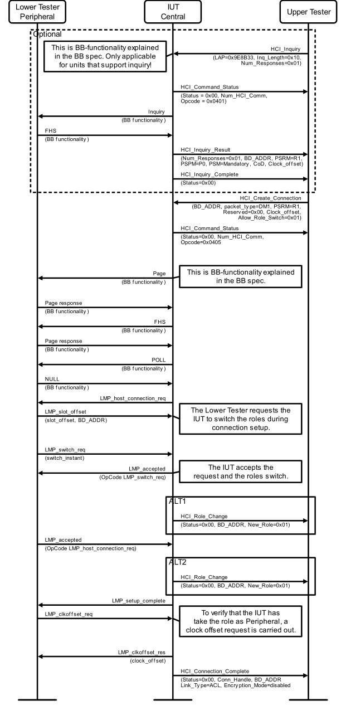

**Figure 4.141: LMP/LIH/BV-151-C [Role Switch at Setup, Central] MSC**

• Expected Outcome
Pass verdict
The IUT transmits PDU LMP_ACCEPTED upon reception of PDU LMP_SWITCH_REQ to the Lower Tester.

#### 4.8.3 Role Switch - Both Central and Peripheral

Verify that the IUT declines the role switch in a correct manner. The role of the IUT is of no importance.

##### 4.8.3.1 Rejected Role Switch Request

• Test Purpose
Verify that the IUT properly handles the Lower Tester rejecting the role switch request. Verify that the IUT properly handles a role switch when the requested role is the same as the current role.
• Reference
[1] 4.4.2
[7] 7.2.8, 7.7.18
• Initial Condition
- See Default settings.
• Test Case Configuration

| Test Case | IUT Role |  | 1st Role for |  |  | 2nd Role for |  |
| --- | --- | --- | --- | --- | --- | --- | --- |
|  |  |  | HCI Switch Role _ _ |  |  | HCI Switch Role _ _ |  |
| LMP/LIH/BV-143-C [Rejected Role Switch Request, Peripheral] | Peripheral | Central |  |  | Peripheral |  |  |
| LMP/LIH/BV-149-C [Rejected Role Switch Request, Central] | Central | Peripheral |  |  | Central |  |  |

Table 4.8: Rejected Role Switch Request
• Test Procedure

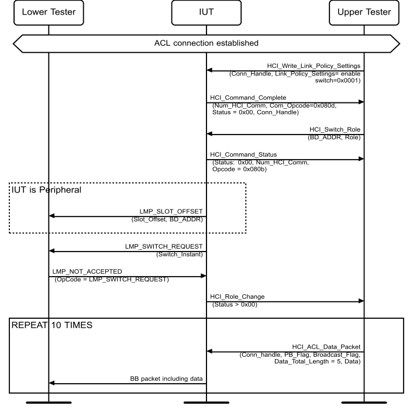

**Figure 4.142: Rejected Role Switch Request MSC**

• Test Condition
It must be possible to control the IUT to initiate the role switch.
• Expected Outcome
Pass verdict
The IUT transmits PDU LMP_SWITCH_REQ and accepts reception of PDU LMP_NOT_ACCEPTED.
The IUT is able to transmit data packets after the role switch request was rejected.
LMP/LIH/BV-03-C [Unsupported Role Switch]
• Test Purpose
Verify that the IUT responds that it does not support role switch upon request from the Lower Tester. Verify that the IUT rejects a role switch upon request from the Upper Tester.
• Reference
[1] 4.4.2
• Initial Condition
- See Default settings.
• Test Procedure
Peripheral Central

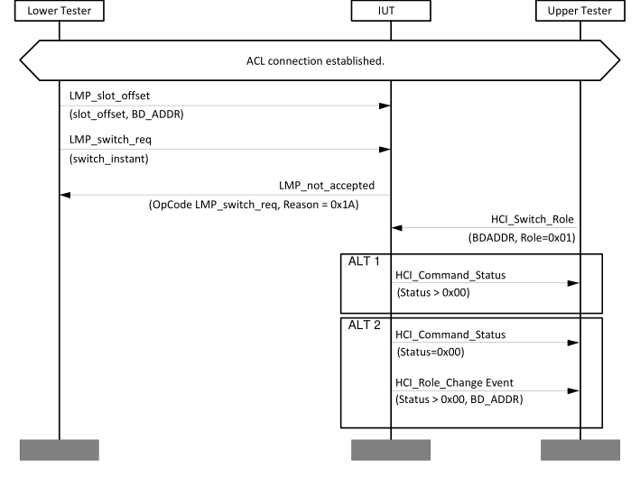

**Figure 4.143: LMP/LIH/BV-03-C [Unsupported Role Switch] MSC**

• Expected Outcome
Pass verdict
The IUT transmits PDU LMP_not_accepted containing “Reason = 0x1A” upon reception of PDU LMP_switch_req.
The IUT rejects the HCI_Role_Switch command with any valid error code.

#### 4.8.4 Detach - Both Central and Peripheral

Verify that the connection between two Bluetooth devices can be closed anytime by the Central or the Peripheral. The role of the IUT is of no importance.
LMP/LIH/BV-04-C [Close Link on Request]
• Test Purpose
Verify that the IUT closes the link upon request from the Lower Tester.
The Lower Tester is the Initiator.
• Reference
[1] 4.1.2
• Initial Condition
- See Default settings.
• Test Procedure

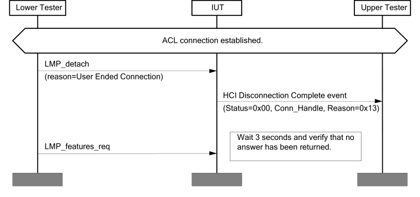

**Figure 4.144: LMP/LIH/BV-04-C [Close Link on Request] MSC**

• Expected Outcome
Pass verdict
The IUT accepts reception of PDU LMP_Detach. Both the LM and BB links must close down after the reception.
LMP/LIH/BV-05-C [Close Link, HCI Command]
• Test Purpose
Verify that the IUT can close the link.
The IUT is the initiating Unit.
• Reference
[1] 4.1.2
• Initial Condition
- See Default settings.
• Test Procedure
IUT Lower Tester Upper Tester

|  | ACL connect | ion established. |  |
| --- | --- | --- | --- |
|  |  | HCI Disconnect _ |  |
|  |  | (Conn Handle, Reason=0x13) _ HCI Command Status event |  |
|  |  | (Status=0x00, Num HCI Comm, Opcode=0x0406) _ _ HCI Disconnection Complete event |  |

(Status=0x00, Conn_Handle, Reason=0x16)
LMP_features_req
Wait 3 seconds to verify that no answer has been returned.
• Test Condition
It must be possible to control the IUT to initiate the detach procedure.
• Expected Outcome
Pass verdict
The IUT transmits PDU LMP_Detach. Both BB and LM links must close down after the reception.
LMP/LIH/BV-82-C [Setup Rejected]
• Test Purpose
Verify that the IUT accepts that the Lower Tester rejects the connection setup.
Verify that the IUT closes the link correctly.
The IUT is Central and requests an ACL link.
• Reference
[1] 4.1.1
• Initial Condition
- See Figure 4.146.
• Test Procedure
Peripheral Lower Tester
Central IUT

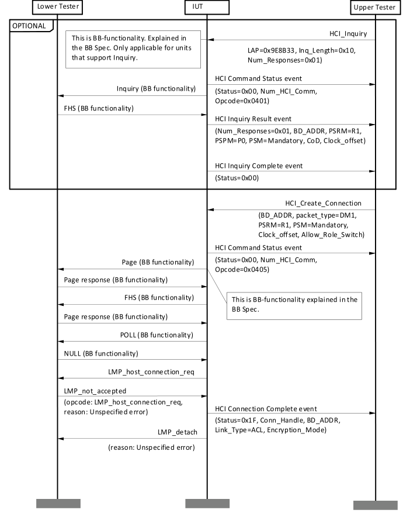

**Figure 4.146: LMP/LIH/BV-82-C [Setup Rejected] MSC**

• Expected Outcome
Pass verdict
The IUT transmits PDU LMP_detach upon reception of PDU LMP_not_accepted.

#### 4.8.5 Hold mode - Peripheral

Verify that the ACL connection between two Bluetooth devices can be placed in hold mode for a specified Hold_Time. The IUT is Peripheral.
LMP/LIH/BV-06-C [Hold Mode, Peripheral]
• Test Purpose
Verify that the IUT enters and exits Hold Mode after the Hold interval, first upon request from the Lower Tester and then upon force from the Lower Tester. The IUT is Peripheral. The Lower Tester is Central and initiates the service first by requesting and as a second step by force. Baseband functionality is tested in the test case.
• Reference
[1] 4.5.1.1
• Initial Condition
- See Default settings.
- An IXIT statement gives acceptable values for the hold interval.
• Test Procedure
Peripheral IUT
Central Lower Tester

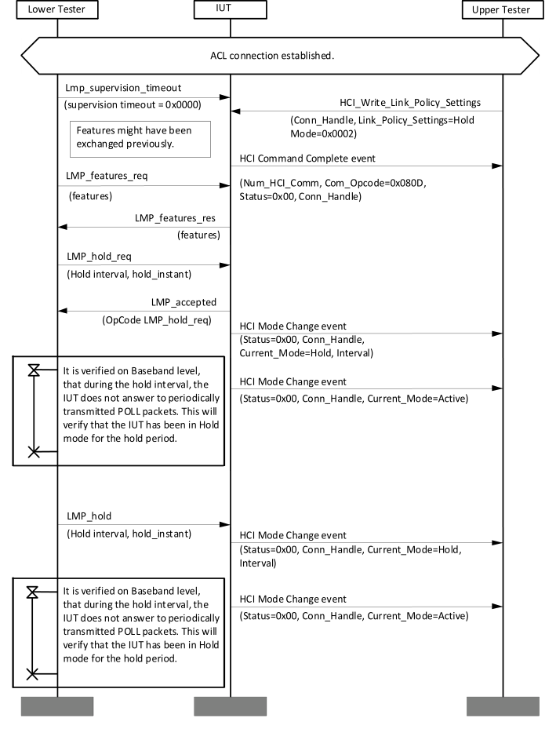

**Figure 4.147: LMP/LIH/BV-06-C [Hold Mode, Peripheral] MSC**

The Lower Tester does not go to hold mode but transmits POLL packets frequently during the IUT’s hold interval.
• Expected Outcome
Pass verdict
The IUT accepts the PDU LMP_hold_req by transmitting PDU LMP_accepted.
The IUT accepts the PDU LMP_hold.
The IUT does not respond to POLL packets during the hold interval.
• Notes
The hold interval has an even value. The Hold_Instant is at an even slot.
LMP/LIH/BV-09-C [Hold Mode Request, Peripheral]
• Test Purpose
Verify that the IUT can request or force the Lower Tester to enter Hold Mode during the Hold interval. The IUT initiates the service by requesting or forcing. The Lower Tester is Central. Baseband functionality is tested in the test case.
• Reference
[1] 4.5.1
• Initial Condition
- See Default settings.
- An IXIT statement gives acceptable values for the hold interval.
• Test Procedure
Central
Peripheral

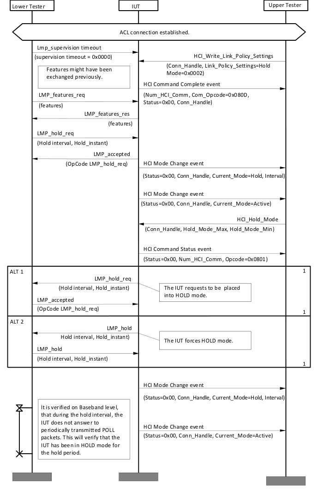

**Figure 4.148: LMP/LIH/BV-09-C [Hold Mode Request, Peripheral] MSC**

The Lower Tester does not go to hold mode but transmits POLL packets frequently during the IUT’s hold interval.
• Expected Outcome
Pass verdict
The IUT transmits PDU LMP_hold_req or alternatively transmits PDU LMP_Hold and accepts the PDU LMP_accepted or alternatively PDU LMP_hold. The IUT does not respond to POLL packets during the hold interval.
• Notes
There is no special HCI command for PDU LMP_hold it is the same as for PDU LMP_hold_req. It is therefore not possible to know if the IUT is going to force or request the Lower Tester to go in to HOLD mode.
The hold interval has an even value. The Hold_Instant is at an even slot. Hold_Mode_Min and Hold_Mode_Max sent from the Upper Tester will have the same value to exactly define the hold interval.

#### 4.8.6 Hold Mode - Central

Verify that the ACL connection between two Bluetooth devices can be placed in hold mode for a specified Hold_Time. The IUT is Central.
LMP/LIH/BV-10-C [Hold Mode, Central]
• Test Purpose
Verify that the IUT can request or force the ACL link into Hold mode after a previous successful request. The IUT is Central and initiates the service. The Lower Tester is Peripheral. Baseband functionality is tested in the test case.
• Reference
[1] 4.5.1
• Initial Condition
- See Default settings.
- The IUT must page the Lower Tester to become the Central of the Piconet.
- An IXIT statement gives acceptable values for the hold interval.
• Test Procedure
Central
Peripheral

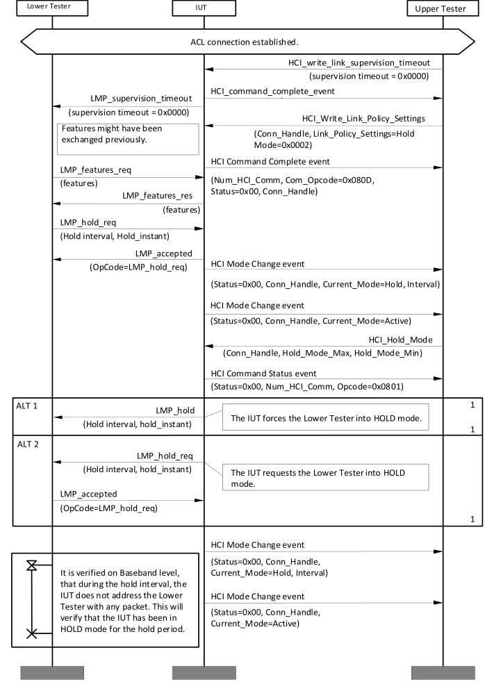

**Figure 4.149: LMP/LIH/BV-10-C [Hold Mode, Central] MSC**

The Lower Tester does not go to hold mode but verifies that the IUT does not address the Lower Tester during the IUT’s hold interval.
• Expected Outcome
Pass verdict
The IUT transmits PDU LMP_hold or LMP_hold_req. The IUT does not address the Lower Tester during the Hold interval.
• Notes
There is no special HCI command for PDU LMP_hold it is the same as for PDU LMP_hold_req. It is therefore not possible to know if the IUT is going to force or request the Lower Tester to go in to HOLD mode.
The hold interval has an even value. The Hold_Instant is at an even slot. Hold_Mode_Min and Hold_Mode_Max sent from the Upper Tester will have the same value to exactly define the hold interval.
LMP/LIH/BV-11-C [Hold Mode Request, Central]
• Test Purpose
Verify that the IUT accepts that the Lower Tester forces Hold mode. The IUT is Central. The Lower Tester is Peripheral and initiates the service by force. Baseband functionality is tested in the test case.
• Reference
[1] 4.5.1.2
• Initial Condition
- See Default settings.
- The IUT must page the Lower Tester to become the Central of the Piconet.
- An IXIT statement gives acceptable values for the hold interval.
• Test Procedure
Peripheral
Central

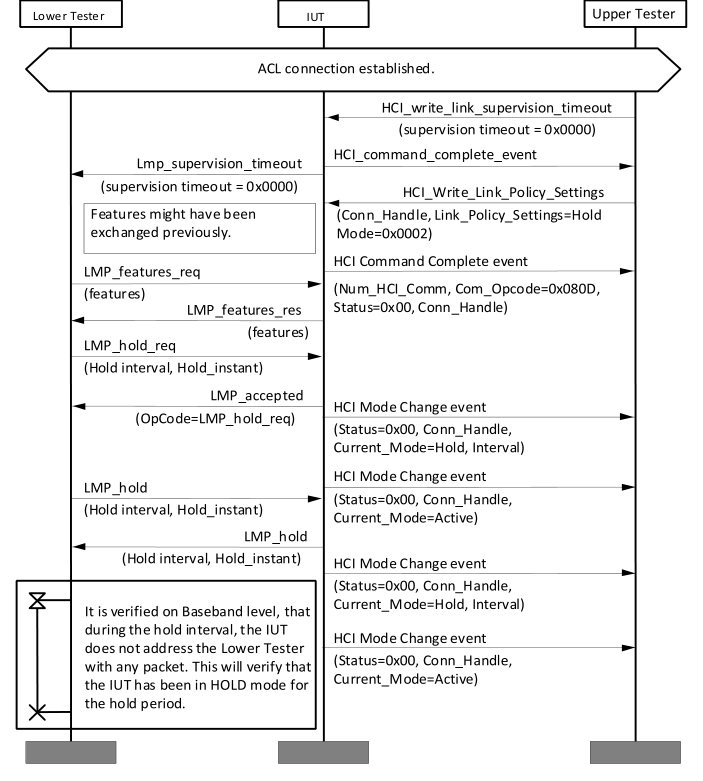

**Figure 4.150: LMP/LIH/BV-11-C [Hold Mode Request, Central] MSC**

The Lower Tester does not go to hold mode but verifies that the IUT does not address the Lower Tester during the IUT’s hold interval.
• Expected Outcome
Pass verdict
The IUT transmits PDU LMP_hold upon reception of PDU LMP_hold. The IUT does not address the Lower Tester during the Hold interval.
• Notes
The hold interval has an even value. The Hold_Instant is at an even slot.

#### 4.8.7 Hold mode - Both Central and Peripheral

Verify that the IUT declines the Hold Mode in a correct manner. The role of the IUT is of no importance.
LMP/LIH/BV-12-C [Hold Mode Unsupported]
• Test Purpose
Verify that the IUT responds that it does not support Hold mode upon request from the Lower Tester.
• Reference
[1] 4.5.1.3
• Initial Condition
- See Default settings.
• Test Procedure

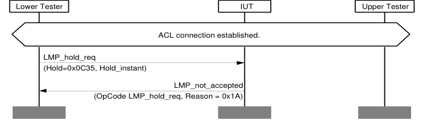

**Figure 4.151: LMP/LIH/BV-12-C [Hold Mode Unsupported] MSC**

• Expected Outcome
Pass verdict
The IUT transmits PDU LMP_not_accepted containing “Reason = 0x1A” upon reception of PDU LMP_hold_req.

#### 4.8.8 Sniff Mode - Peripheral

Verify that the ACL connection between two Bluetooth devices can be placed in sniff mode. The IUT is Peripheral.
LMP/LIH/BV-14-C [Enter Sniff Mode]
• Test Purpose
Verify that the IUT enters Sniff Mode upon request from the Lower Tester. Verify that the IUT interprets the Sniff_Attempt and Sniff_Timeout correctly. Also verify that the timing control flags bits 0 and 2 in the LMP_SNIFF_REQ PDU sent by the Lower Tester are ignored by the IUT.
The IUT is Peripheral. The Lower Tester is Central and initiates the service by requesting. Baseband functionality is tested in the test case.
• Reference
[1] 4.5.3.1
• Initial Condition
- See Default settings.
• Test Procedure

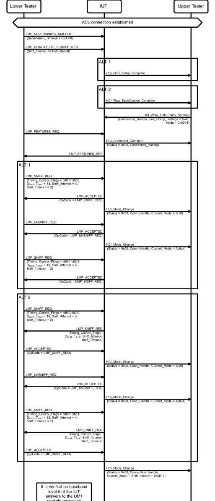

**Figure 4.152: LMP/LIH/BV-14-C [Enter Sniff Mode] MSC**

MSC: The Lower Tester requests the IUT to enter SNIFF mode.
Sniff_attempt=4 RX slots

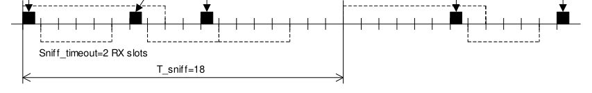

**Figure 4.153: LMP/LIH/BV-14-C, Polling**

The Lower Tester must start POLLING the IUT according to Figure 4.153: LMP/LIH/BV-14-C, Polling. Verify that the DM1 packets 1–4 are acknowledged, but DM1 packet 5 must remain unacknowledged. Everything is checked on Baseband level.
DM1 packets transmitted by the Lower Tester contain data.
Monitor the result for a period of 20*TSniff slots.
• Test Condition
It must be possible to check the Sniff interval on Baseband level.
• Expected Outcome
Pass verdict
The IUT transmits PDU LMP_ACCEPTED or PDU LMP_SNIFF_REQ upon reception of PDU LMP_SNIFF_REQ. The IUT must enter SNIFF mode and acknowledge DM1 packet 1–4 but DM1 packet 5 must remain unacknowledged.
• Notes
Timing_Control_Flags and DSniff are determined by CLK27 of the Central.
LMP/LIH/BV-15-C [Initiate Sniff Mode, Peripheral]
• Test Purpose
Verify that the IUT can request the Lower Tester to enter Sniff Mode. Verify that the IUT interprets the Sniff_Attempt and Sniff_Timeout correctly.
The IUT is Peripheral and initiates the service by requesting. The Lower Tester is Central and accepts first request. Baseband functionality is tested in the test case.
• Reference
[1] 4.5.3.1
• Initial Condition
- See Default settings.
• Test Procedure
Peripheral
Central

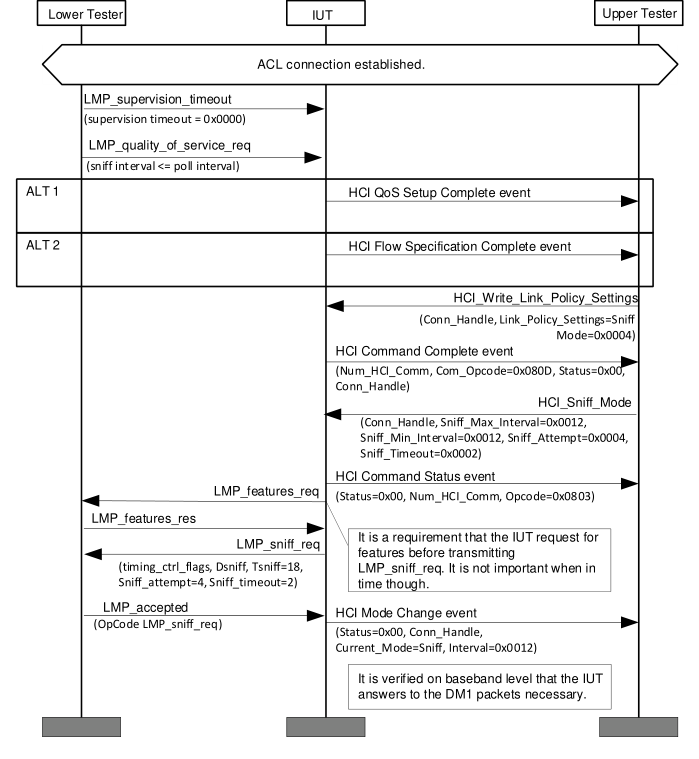

**Figure 4.154: LMP/LIH/BV-15-C [Initiate Sniff Mode, Peripheral] MSC**

MSC: IUT requests the Lower Tester to enter SNIFF mode.

## 2 4 5 DM1 packet 1

3

|  | Sniff attempt=4 RX slots _ |  |  |  |  |  |  |  |  |  |  |  |  |  |  |  |  |  |  |  |  |  |  |  |  |  |  |  |  |  |  |  |
| --- | --- | --- | --- | --- | --- | --- | --- | --- | --- | --- | --- | --- | --- | --- | --- | --- | --- | --- | --- | --- | --- | --- | --- | --- | --- | --- | --- | --- | --- | --- | --- | --- |
|  |  |  |  |  |  |  |  |  |  |  |  |  |  |  |  |  |  |  |  |  |  |  |  |  |  |  |  |  |  |  |  |  |
|  |  |  |  |  |  |  |  |  |  |  |  |  |  |  |  |  |  |  |  |  |  |  |  |  |  |  |  |  |  |  |  |  |
|  |  |  |  |  |  |  |  |  |  |  |  |  |  |  |  |  |  |  |  |  |  |  |  |  |  |  |  |  |  |  |  |  |
|  | Sniff timeout=2 RX slots _ T sniff=18 _ |  |  |  |  |  |  |  |  |  |  |  |  |  |  |  |  |  |  |  |  |  |  |  |  |  |  |  |  |  |  |  |
|  |  |  |  |  |  |  |  |  |  |  |  |  |  |  |  |  |  |  |  |  |  |  |  |  |  |  |  |  |  |  |  |  |

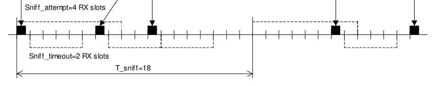

**Figure 4.155: LMP/LIH/BV-15-C, Polling**

The Lower Tester must start POLLING the IUT according to Figure 4.155: LMP/LIH/BV-15-C, Polling. Verify that the DM1 packets 1–4 are acknowledged, but DM1 packet 5 must remain unacknowledged. Everything is checked on baseband level.
DM1 packets transmitted by the Lower Tester contain data.
Monitor the result for a period of 20*TSniff slots.
• Test Condition
It must be possible to check the Sniff interval on Baseband level.
It must be possible to control the IUT to initiate the sniff request.
• Expected Outcome
Pass verdict
The IUT transmits PDU LMP_sniff_req and accepts reception of PDU LMP_accepted. The IUT must enter SNIFF mode and acknowledge DM1 packet 1-4 but DM1 packet 5 must remain unacknowledged.
• Notes
Timing_Control_Flags and DSniff are determined by CLK27 of the Central.
LMP/LIH/BV-16-C [Exit Sniff Mode]
• Test Purpose
Verify that the IUT exits SNIFF mode upon request from the Lower Tester.
The Lower Tester is Central and initiates the service. Baseband functionality is tested in the test case.
• Reference
[1] 4.5.3.2
• Initial Condition
- See Default settings.
• Test Procedure
Peripheral Central

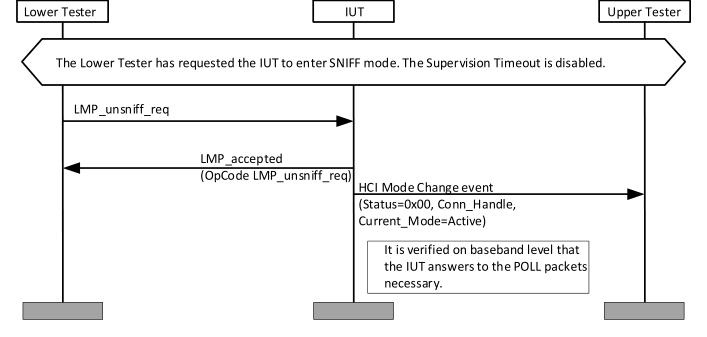

**Figure 4.156: LMP/LIH/BV-16-C [Exit Sniff Mode] MSC**

Verify that the IUT has left the SNIFF mode by polling the IUT in all Central slots. The IUT must acknowledge all POLL packets.
Monitor the result for a period of 200 slots.
• Test Condition
It must be possible to check the Sniff interval on Baseband level.
• Expected Outcome
Pass verdict
The IUT transmits PDU LMP_accepted upon reception of PDU LMP_unsniff_req. The IUT must exit Sniff mode.
LMP/LIH/BV-17-C [Accept Sniff Reject]
• Test Purpose
Verify that the IUT accepts that the Lower Tester declines the SNIFF mode request. Verify that the IUT remains in active mode.
The Lower Tester is Central. The IUT is Peripheral and initiates the service by requesting. Baseband functionality is tested in the test case.
• Reference
[1] 4.5.3.1
• Initial Condition
- See Default settings.
• Test Procedure
Central
Peripheral

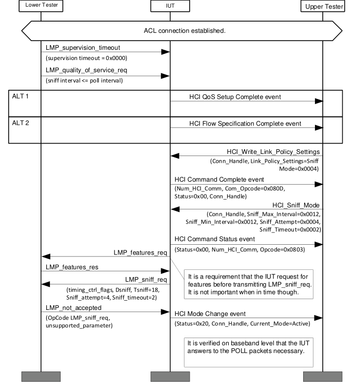

**Figure 4.157: LMP/LIH/BV-17-C [Accept Sniff Reject] MSC**

Verify that the IUT has left the SNIFF mode by polling the IUT in all Central slots. The IUT must acknowledge all POLL packets.
Monitor the result for a period of 200 slots.
• Test Condition
It must be possible to check the Sniff interval on Baseband level.
It must be possible to control the IUT to initiate the sniff request.
• Expected Outcome
Pass verdict
The IUT transmits PDU LMP_sniff_req. The Lower Tester transmits PDU LMP_not_accepted. The IUT must not enter Sniff mode after the reception.
• Notes
Timing_Control_Flags and DSniff are determined by CLK27 of the Central.

#### 4.8.9 Sniff Mode - Central

Verify that the ACL connection between two Bluetooth devices can be placed in sniff mode. The IUT is Central.
LMP/LIH/BV-18-C [Initiate Sniff Mode, Central]
• Test Purpose
Verify that the IUT can request the Lower Tester into Sniff mode. Verify that the IUT does not address the Lower Tester with its LT_ADDR outside the SNIFF slots. The IUT is Central and initiates the service by requesting. The Lower Tester is Peripheral. Baseband functionality is tested in the test case.
• Reference
[1] 4.5.3.1
• Initial Condition
- See Default settings.
- The IUT must page the Lower Tester to become the Central of the Piconet.
• Test Procedure
Peripheral Central

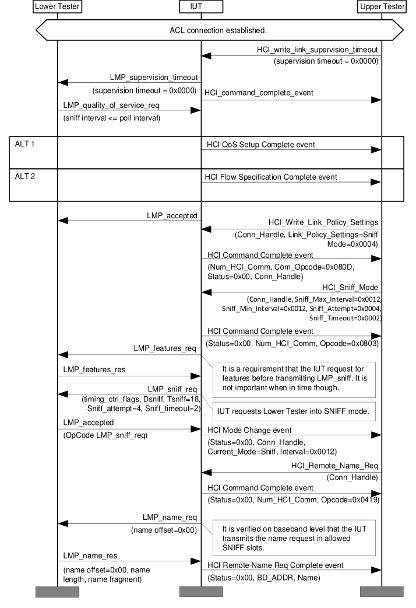

**Figure 4.158: LMP/LIH/BV-18-C [Initiate Sniff Mode, Central] MSC**

MSC: The IUT requests the Lower Tester in to SNIFF mode.

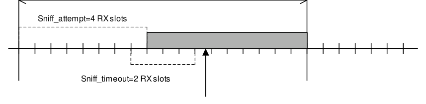

**Figure 4.159: LMP/LIH/BV-18-C, Verifying**

Verify that the IUT does not address the Lower Tester with the LT_ADDR in the grey zone, unless a packet follows in the Sniff_Timeout frame after a packet received in the Sniff_Attempt frame.
Monitor the result for a period of 20*TSniff slots.
• Test Condition
It must be possible to check the Sniff interval on Baseband level.
It must be possible to control the IUT to initiate the sniff mode.
• Expected Outcome
Pass verdict
The IUT transmits PDU LMP_sniff_req. The ACL link must enter Sniff mode and no Polling should be done outside the sniff interval.
• Notes
Timing_Control_Flags and DSniff are determined by CLK27 of the Central.
LMP/LIH/BV-19-C [Request Sniff Mode Exit]
• Test Purpose
Verify that the IUT can request the Lower Tester to exit SNIFF mode.
The IUT is Central and initiates the service. Baseband functionality is tested in the test case.
• Reference
[1] 4.5.3.2
• Initial Condition
- See Default settings.
- The Lower Tester configures the QoS to have the IUT poll the Lower Tester every 6 slots.
- The IUT has requested the Lower Tester into SNIFF mode.
• Test Procedure

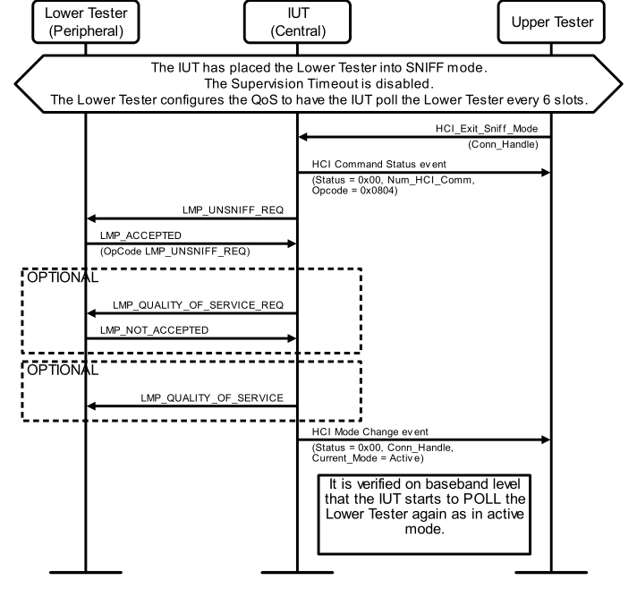

**Figure 4.160: LMP/LIH/BV-19-C [Request Sniff Mode Exit] MSC**

Monitor the resulting active mode for a period of 1600 slots. The time between the IUT’s polling in active mode is less than or equal to Tpoll at least 95% of the time.
Tpoll is 6 unless the IUT changes it by sending an LMP_QUALITY_OF_SERVICE PDU to the Lower Tester.
If the IUT sends an LMP_QUALITY_OF_SERVICE_REQ PDU to the Lower Tester, the Lower Tester responds with an LMP_NOT_ACCEPTED PDU.
• Test Condition
It must be possible to check the Sniff interval on Baseband level.
It must be possible to control the IUT to initiate the unsniff request.
• Expected Outcome
Pass verdict
The IUT transmits the PDU LMP_UNSNIFF_REQ and accepts reception of the PDU LMP_ACCEPTED. The ACL link must exit Sniff mode.

#### 4.8.10 Sniff Mode - Both Central and Peripheral

Verify that the IUT declines the Sniff mode in a correct manner. The role of the IUT is of no importance.
LMP/LIH/BV-20-C [Sniff Mode Reject]
• Test Purpose
Verify that the IUT responds that it does not support sniff mode upon request from the Lower Tester. The Lower Tester initiates the service.
• Reference
[1] 4.5.3.1
• Initial Condition
- See Default settings.
• Test Procedure
Peripheral Central

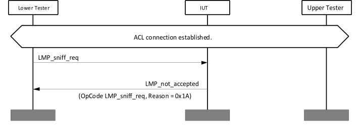

**Figure 4.161: LMP/LIH/BV-20-C [Sniff Mode Reject] MSC**

• Expected Outcome
Pass verdict
The IUT transmits PDU LMP_not_accepted containing “Reason = 0x1A” upon reception of PDU LMP_sniff_req.

#### 4.8.11 Power control - Both Central and Peripheral

Verify that a unit can request a change of another unit’s TX power. The role of the IUT is of no importance.
LMP/LIH/BV-35-C [Lowest Power Report]
• Test Purpose
Verify that the IUT reports that it transmits on lowest power upon request from the Lower Tester to decrease the power. The Lower Tester initiates the service.
• Reference
[1] 4.1.3
• Initial Condition
- See Default settings.
• Test Procedure

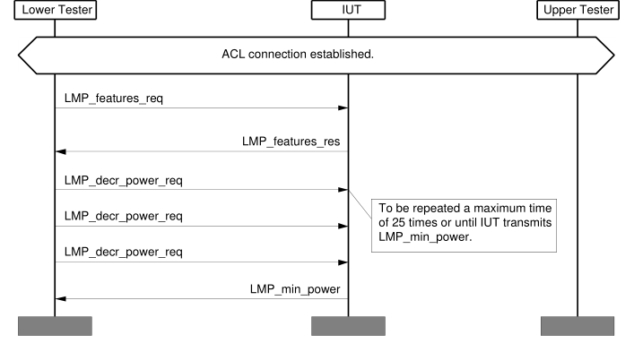

**Figure 4.162: LMP/LIH/BV-35-C [Lowest Power Report] MSC**

The Lower Tester will not transmit PDU LMP_decr_power_req more than 25 times.
The Lower Tester will not transmit PDU LMP_decr_power_req more than once every 5 seconds. If a maximum step rate is declared as IXIT the Lower Tester should use this value.
• Expected Outcome
Pass verdict
The IUT accepts PDU LMP_decr_power_req and transmits PDU LMP_min_power.
LMP/LIH/BV-36-C [Highest Power Report]
• Test Purpose
Verify that the IUT reports that it transmits on highest power upon request from the Lower Tester to increase the power. The Lower Tester initiates the service.
• Reference
[1] 4.1.3
• Initial Condition
- See Default settings.
• Test Procedure

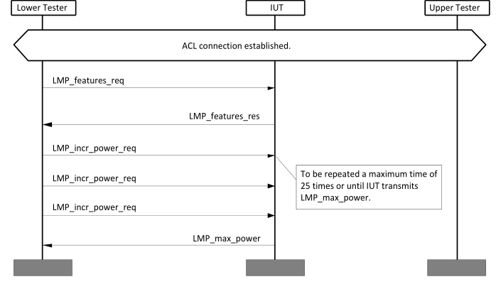

**Figure 4.163: LMP/LIH/BV-36-C [Highest Power Report] MSC**

The Lower Tester will not transmit PDU LMP_incr_power_req more than 25 times.
The Lower Tester will not transmit PDU LMP_incr_power_req more than once every 5 seconds. If a maximum step rate is declared as IXIT the Lower Tester should use this value.
• Expected Outcome
Pass verdict
The IUT accepts PDU LMP_incr_power_req and transmits PDU LMP_max_power.
LMP/LIH/BV-76-C [Request Decreased Power]
• Test Purpose
Verify that the IUT transmits PDU LMP_decr_power_req when the Lower Tester transmits POLL packets at power levels around the upper threshold of the Golden Receive Power Range (measured at the IUT’s antenna connector). The Lower Tester acts as Central.
• Reference
[1] 4.5.3
[6] 4.6
• Initial Condition
- See Default settings.
• Test Procedure
Central
Peripheral

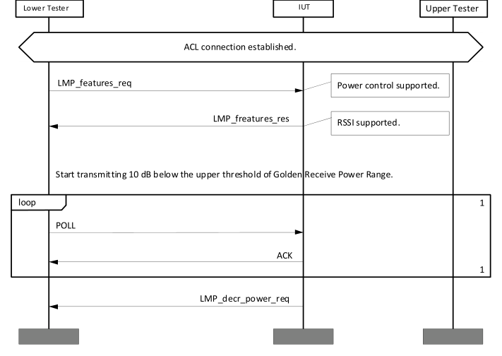

**Figure 4.164: LMP/LIH/BV-76-C [Request Decreased Power] MSC**

The Lower Tester starts transmitting with the power level 10 dB below the declared upper threshold of the Golden Receive Power Range. The Lower Tester increases its power at steps of 2 dB, at a rate of not more than 1 step per 5-second period. If a maximum step rate is declared as IXIT the Lower Tester should use this value. The Lower Tester does not increase the power level more than 7 dB above the declared threshold. The Lower Tester continuously transmits POLL packets.
Verify that the IUT transmits LMP_decr_power_req within the range.
• Test Condition
Nominal Test Conditions, see [6] Section 5.1.
The Lower Tester should know the Golden Receive Power Range and maximum step rate of the IUT (declared as IXIT). The Lower Tester and IUT must be connected with cable and RF attenuator to give sufficient measurement accuracy. An IXIT parameter is used to give the value for the RF attenuator calculated from the IUT’s Golden Receive Power Range, the cable loss and the Lower Tester’s TX power range.
• Expected Outcome
Pass verdict
The IUT transmits LMP_decr_power_req.
• Notes
The initial power level is 10 dB below the declared upper threshold to give a margin. The Lower Tester has an accuracy not worse than ± 3 dB in transmitted power level. Until dedicated Bluetooth test systems are available it is allowed to use other values for step size and accuracy in the transmitted power level. Also, the POLL packet can be replaced with other packet types.
• Test Purpose
Verify that the IUT transmits PDU LMP_incr_power_req when the Lower Tester transmits POLL packets at power levels around the lower threshold of the Golden Receive Power Range (measured at the IUT’s antenna connector). The Lower Tester acts as Central.
• Reference
[1] 4.5.3
[6] 4.6
• Initial Condition
- See Default settings.
• Test Procedure
Central
Peripheral

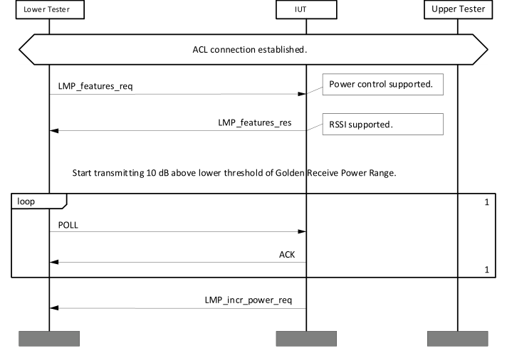

**Figure 4.165: LMP/LIH/BV-77-C [Request Increased Power] MSC**

The Lower Tester starts transmitting with the power level 10 dB above the declared lower threshold of the Golden Receive Power Range. The Lower Tester decreases its power at steps of 2 dB, at a rate of not more than 1 step per 5-second period. If a maximum step rate is declared as IXIT the Lower Tester should use this value. The Lower Tester does not decrease the power level more than 6 dB below the declared threshold. The Lower Tester continuously transmits POLL packets.
Verify that the IUT transmits LMP_incr_power_req within the range.
• Test Condition
Nominal Test Conditions, see [6] Section 5.1.
The Lower Tester should know the Golden Receive Power Range and maximum step rate of the IUT (declared as IXIT). The Lower Tester and the IUT must be connected with cable and RF attenuator to give sufficient measurement accuracy. An IXIT parameter is used to give the value for the RF attenuator calculated from the IUT’s Golden Receive Power Range, the cable loss and the Lower Tester’s TX power range.
• Expected Outcome
Pass verdict
The IUT transmits LMP_incr_power_req.
• Notes
The initial power level is 10 dB above the declared lower threshold to give a margin. The Lower Tester has an accuracy not worse than ± 3 dB in transmitted power level. Until dedicated Bluetooth test systems are available it is allowed to use other values for step size and accuracy in the transmitted power level. Also, the POLL packet can be replaced with other packet types.
LMP/LIH/BV-127-C [Respond to EPC Increment Request]
• Test Purpose
Verify that the IUT will respond correctly to an Enhanced Power Control increment single step request and the HCI_Read_Enhanced_Power_Level command.
• Reference
[1] 4.1.3
• Initial Condition
- See Default settings.
• Test Procedure

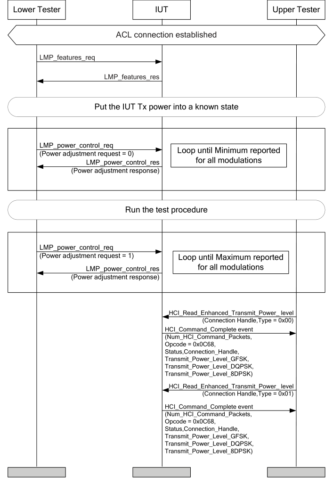

**Figure 4.166: LMP/LIH/BV-127-C [Respond to EPC Increment Request] MSC**

• Expected Outcome
Pass verdict
After the Lower Tester sends the LMP_features_req PDU the IUT responds with an LMP_feature_res PDU indicating support for power control power control requests, and Enhanced Power Control.
After the Lower Tester sends the LMP_power_control_req PDU with increment one step the IUT sends the LMP_power_control_res PDU with the power adjustment response reporting that at least one supported modulation has “changed one step.”
After the Lower Tester sends the LMP_power_control_req PDU with increment one step the IUT sends the LMP_power_control_res PDU with the power adjustment response reporting that for all supported modulations not at minimum or maximum have “changed one step.”
The Lower Tester is able to send LMP_power_control_req PDU with increment one step to the IUT and the IUT will reach a state where the LMP_power_control_res PDU power adjustment response will report maximum power for all supported modulations.
The IUT responds to the HCI_Read_Enhanced_Transmit_Power_Level command with an HCI Command Complete event with the current and maximum power levels equal when all supported modulations report they are at maximum.
LMP/LIH/BV-128-C [Respond to EPC Decrement Request]
• Test Purpose
Verify that the IUT will respond correctly to an Enhanced Power Control decrement single step request and the HCI_Read_Enhanced_Power_Level command.
• Reference
[1] 4.1.3
• Initial Condition
- See Default settings.
• Test Procedure

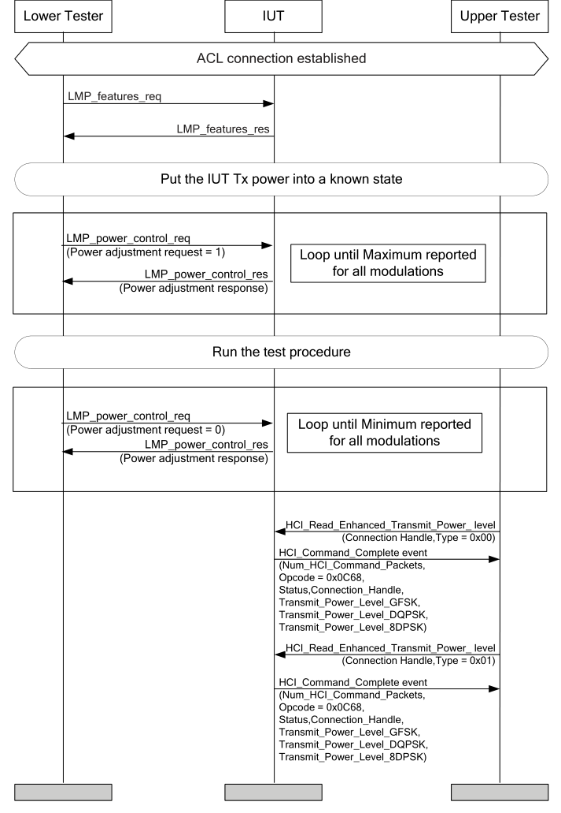

**Figure 4.167: LMP/LIH/BV-128-C [Respond to EPC Decrement Request] MSC**

• Expected Outcome
Pass verdict
After the Lower Tester sends the LMP_features_req PDU the IUT responds with an LMP_feature_res PDU indicating support for power control, power control requests, and Enhanced Power Control.
After the Lower Tester sends the LMP_power_control_req PDU with decrement one step the IUT sends the LMP_power_control_res PDU with the power adjustment response reporting that at least one supported modulation has “changed one step.”
After the Lower Tester sends the LMP_power_control_req PDU with decrement one step the IUT sends the LMP_power_control_res PDU with the power adjustment response reporting that for all supported modulations not at minimum or maximum have “changed one step.”
The Lower Tester is able to send LMP_power_control_req PDU with decrement one step to the IUT and the IUT will reach a state where the LMP_power_control_res PDU power adjustment response will report minimum power for all supported modulations.
The IUT responds to the HCI_Read_Enhanced_Transmit_Power_Level command with an HCI Command Complete event with the current and maximum power levels are not equal when all supported modulations report they are at minimum.
LMP/LIH/BV-129-C [Respond to EPC go to Maximum Power Level]
• Test Purpose
Verify that the IUT can be requested to go to maximum power level using the Enhanced Power Control go to maximum request.
• Reference
[1] 4.1.3
• Initial Condition
- See Default settings.
• Test Procedure

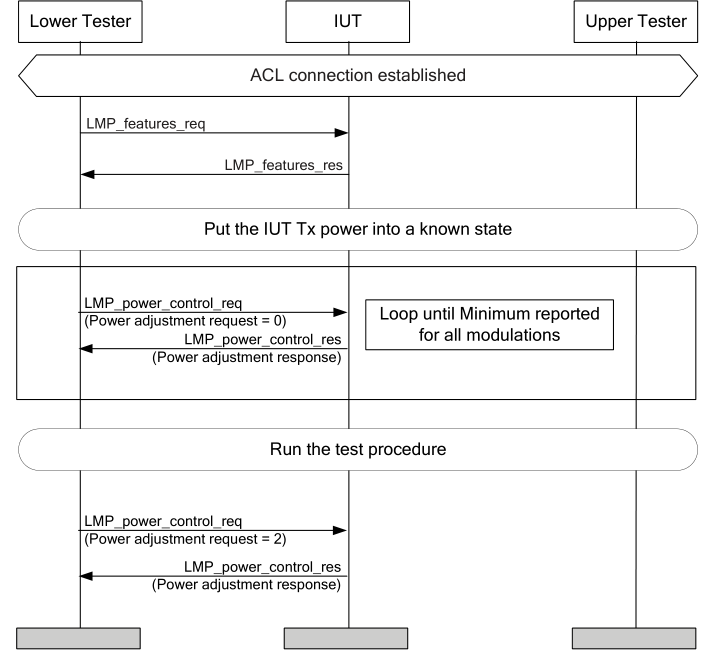

**Figure 4.168: LMP/LIH/BV-129-C [Respond to EPC go to Maximum Power Level] MSC**

• Expected Outcome
Pass verdict
After the Lower Tester sends the LMP_features_req PDU the IUT responds with an LMP_feature_res PDU indicating support for power control, power control requests, and Enhanced Power Control.
After the Lower Tester sends the LMP_power_control_req PDU with go to maximum the IUT sends the LMP_power_control_res PDU with the power adjustment response reporting maximum power for all supported modulations.
LMP/LIH/BV-130-C [Request an EPC Increment]
• Test Purpose
Verify that the IUT will request an Enhanced Power Control increment single step.
• Reference
[6] 4.6
[1] 4.5.3
• Initial Condition
- See Default settings.
• Test Procedure

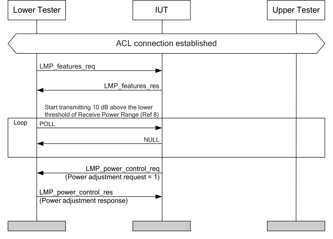

**Figure 4.169: LMP/LIH/BV-130-C [Request an EPC Increment] MSC**

The Lower Tester starts transmitting with the power level 10 dB above the declared lower threshold of the Receive Power Range.
The Lower Tester decreases its power at steps of 2 dB.
The Lower Tester does not decrease the power level more than 6 dB below the declared lower threshold.
The Lower Tester continuously transmits POLL packets.
• Test Condition
Nominal Test Conditions; see [6] Section 5.1.
The Lower Tester should know the Receive Power Range of the IUT (declared as IXIT).
The Lower Tester and the IUT must be connected with cable and RF attenuator to give sufficient measurement accuracy.
An IXIT parameter is used to give the value for the RF attenuator calculated from the IUT’s Receive Power Range, the cable loss and the Lower Tester's TX power range.
• Expected Outcome
Pass verdict
After the Lower Tester sends the LMP_features_req PDU the IUT responds with an LMP_feature_res PDU indicating support for power control, power control requests, and Enhanced Power Control.
The IUT sends the LMP_power_control_req PDU with increment power adjustment req.
• Notes
The initial power level is 10 dB above the declared lower threshold to give a margin. The Lower Tester has an accuracy not worse than ± 3 dB in transmitted power level. Until dedicated Bluetooth test systems are available it is allowed to use other values for step size and accuracy in the transmitted power level. The POLL packet can be replaced with other packet types.
LMP/LIH/BV-131-C [Request an EPC Decrement]
• Test Purpose
Verify that the IUT will request an Enhanced Power Control decrement single step.
• Reference
[6] 4.6
[1] 4.5.3
• Initial Condition
- See Default settings.
• Test Procedure

**Figure 4.170: LMP/LIH/BV-131-C [Request an EPC Decrement] MSC**

The Lower Tester starts transmitting with the power level 10 dB below the declared upper threshold of the Receive Power Range.
The Lower Tester increases its power at steps of 2 dB.
The Lower Tester does not increase the power level more than 7 dB above the declared upper threshold.
The Lower Tester continuously transmits POLL packets.
• Test Condition
Nominal Test Conditions; see [6] Section 5.1.
The Lower Tester should know the Receive Power Range and maximum step rate of the IUT (declared as IXIT).
The Lower Tester and the IUT must be connected with cable and RF attenuator to give sufficient measurement accuracy.
An IXIT parameter is used to give the value for the RF attenuator calculated from the IUT’s Receive Power Range, the cable loss and the Lower Tester’s TX power range.
• Expected Outcome
Pass verdict
After the Lower Tester sends the LMP_features_req PDU the IUT responds with an LMP_feature_res PDU indicating support for power control, power control requests, and Enhanced Power Control.
The IUT sends the LMP_power_control_req PDU with decrement power adjustment req.
• Notes
The initial power level is 10 dB below the declared upper threshold to give a margin. The Lower Tester has accuracy not worse than ± 3 dB in transmitted power level. Until dedicated Bluetooth test
systems are available it is allowed to use other values for step size and accuracy in the transmitted power level. Also, the POLL packet can be replaced with other packet types.
LMP/LIH/BV-133-C [Power Response Reports Unsupported Modulation Correctly]
• Test Purpose
Verify that the IUT will respond correctly to and EPC power change request for an unsupported modulation type from a device that supports Enhanced Power Control.
Applicable only for units that support EPC and do not support either 2 Mbs or 3 Mbs packet types.
• Reference
[6] 4.6
[1] 4.5.3
• Initial Condition
- See Default settings.
• Test Procedure

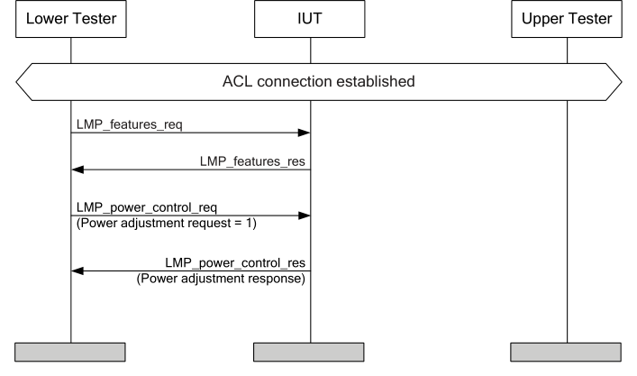

**Figure 4.171: LMP/LIH/BV-133-C [Power Response Reports Unsupported Modulation Correctly] MSC**

• Expected Outcome
Pass verdict
After the Lower Tester sends the LMP_features_req PDU, the IUT responds with an LMP_feature_res PDU indicating support for power control, power control requests, and Enhanced Power Control.
After the Lower Tester sends the LMP_power_control_req PDU with increment one step, the IUT sends the LMP_power_control_res PDU with the power adjustment response not supported for any modulations that are not supported.
• Test Purpose
Verify that the IUT responds to an LMP_DECR_POWER_REQ and LMP_INCR_POWER_REQ correctly.
• Reference
[1] 4.1.3
[6] 4.6
• Initial Condition
- See Default settings.
- Power Control Requests are not supported.
• Test Procedure

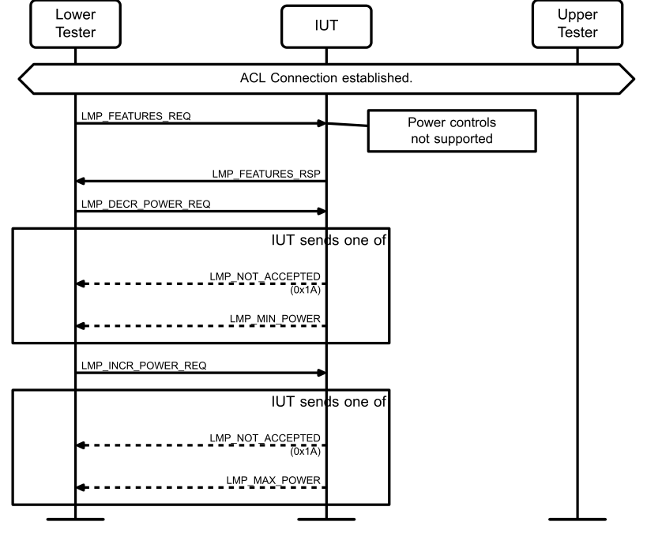

**Figure 4.172: LMP/LIH/BV-152-C [Request Decreased Power] MSC**

1. The Lower Tester sends an LMP_FEATURES_REQ PDU to the IUT. 2. The IUT sends an LMP_FEATURES_RSP PDU to the Lower Tester with Power Control
Requests not supported. 3. The Lower Tester sends an LMP_DECR_POWER_REQ PDU to the IUT. 4. The IUT sends an LMP_MIN_POWER PDU or an LMP_NOT_ACCEPTED PDU with Error_Code
set to Unsupported Remote Feature (0x1A).
5. The Lower Tester sends an LMP_INCR_POWER_REQ PDU to the IUT. 6. The IUT sends an LMP_MAX_POWER PDU or an LMP_NOT_ACCEPTED PDU with Error_Code
set to Unsupported Remote Feature (0x1A).
• Expected Outcome
Pass verdict
In step 4, the IUT sends an LMP_MIN_POWER or LMP_NOT_ACCEPTED PDU to the Lower Tester.
In step 6, the IUT sends an LMP_MAX_POWER or LMP_NOT_ACCEPTED PDU to the Lower Tester.

#### 4.8.12 Quality of Service (QoS) - Peripheral

Verify that a unit can request a change of maximum polling interval. The IUT is Peripheral.
LMP/LIH/BV-39-C [Accept Polling Interval Notification]
• Test Purpose
Verify that the IUT accepts the new maximum polling interval after notification from the Lower Tester.
The IUT is Peripheral. The Lower Tester is Central and notifies the Peripheral.
• Reference
[1] 4.1.8.1
• Initial Condition
- See Default settings.
• Test Procedure
Peripheral Central

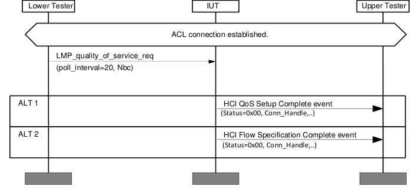

**Figure 4.173: LMP/LIH/BV-39-C [Accept Polling Interval Notification] MSC**

Verify that the IUT transmits HCI_QoS_Setup_Complete_Event or HCI_Flow_Specification_Complete_Event to verify that it has received the PDU LMP_quality_of_service.
• Expected Outcome
Pass verdict
The IUT accepts the PDU LMP_quality_of_service.
• Test Purpose
Verify that the IUT accepts the new maximum polling interval after request from the Lower Tester. The maximum polling interval must be changed accordingly. The IUT is Peripheral. The Lower Tester is Central and requests the Peripheral.
• Reference
[1] 4.1.8.2
• Initial Condition
- See Default settings.
• Test Procedure
Peripheral Central

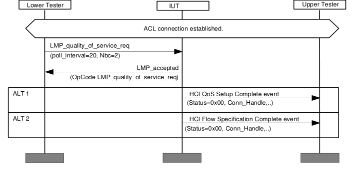

**Figure 4.174: LMP/LIH/BV-40-C [Accept Polling Interval Request] MSC**

Verify that the IUT transmits HCI_QoS_Setup_Complete_Event or HCI_Flow_Specification_Complete_Event to verify that it has received the PDU LMP_quality_of_service_req.
• Expected Outcome
Pass verdict
The IUT transmits PDU LMP_accepted upon reception of PDU LMP_quality_of_service_req.
LMP/LIH/BV-41-C [Polling Interval Rejected]
• Test Purpose
Verify that the IUT accepts a rejection of the Polling interval from the Lower Tester. The IUT is Peripheral and requests the Central. The Lower Tester is Central.
• Reference
[1] 4.1.8.2
• Initial Condition
- See Default settings.
• Test Procedure
Peripheral Central

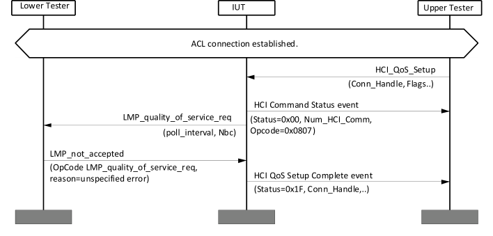

**Figure 4.175: LMP/LIH/BV-41-C [Polling Interval Rejected] MSC**

Verify that the IUT transmits HCI_QoS_Complete_Event to report that LMP_not_accepted was received upon reception of PDU LMP_quality_of_service.
• Test Condition
It must be possible to check the Poll_Interval on Baseband level.
It must be possible to control the IUT to initiate the Quality of service.
• Expected Outcome
Pass verdict
The IUT transmits PDU LMP_quality_of_service_req and accepts the reception of PDU LMP_not_accepted.
• Notes
There is no special HCI command for PDU LMP_quality_of_service_req, it is the same as for PDU LMP_quality_of_service.

#### 4.8.13 Quality of Service (QoS) - Central

Verify that a unit can request a change of maximum polling interval. The IUT is Central.
LMP/LIH/BV-42-C [Set Polling Interval]
• Test Purpose
Verify that the IUT can request or notify the Lower Tester the new polling interval. Verify on baseband level that the time between subsequent transmissions to the Lower Tester never exceeds the POLLING interval.
The IUT is Central and notifies or requests the Lower Tester. The Lower Tester is Peripheral.
• Reference
[1] 4.1.8
• Initial Condition
- See Default settings.
- The IUT must page the Lower Tester to become the Central of the Piconet.
• Test Procedure
Peripheral Central

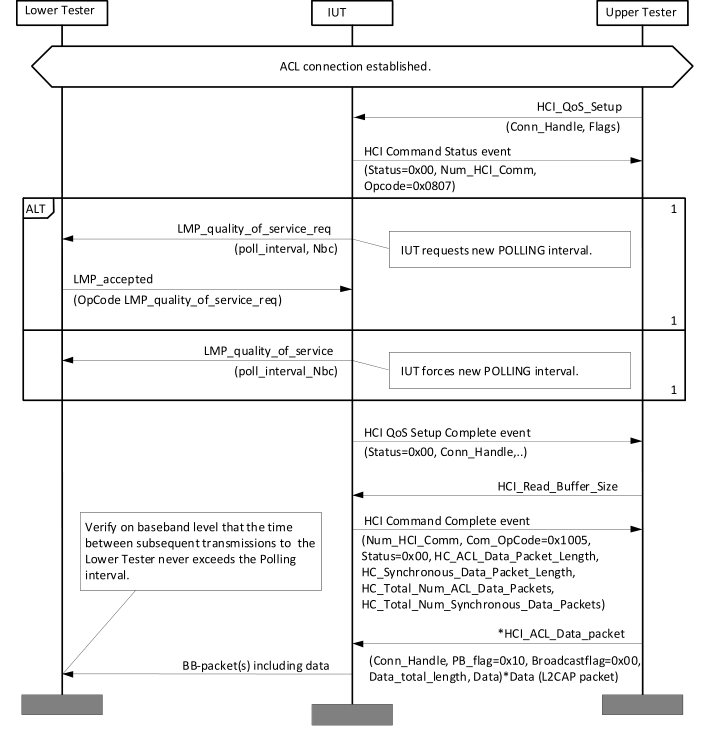

**Figure 4.176: LMP/LIH/BV-42-C [Set Polling Interval] MSC**

Verify that the IUT transmits allowed packets according to the polling interval given.
• Test Condition
It must be possible to check the Poll_Interval on Baseband level.
It must be possible to control the IUT to initiate the Quality of service.
• Expected Outcome
Pass verdict
The IUT transmits PDU LMP_quality_of_service and changes to the new maximum polling interval.
• Notes
There is no special HCI command for PDU LMP_quality_of_service, it is the same as for PDU LMP_quality_of_service_req.

#### 4.8.14 SCO Links - Peripheral

Verify that the unit can initiate and delete an SCO link. The IUT is Peripheral.
LMP/LIH/BV-43-C [Accept HV1 SCO Request]
• Test Purpose
Verify that the IUT sets up an SCO link upon request from the Lower Tester. Verify that the correct SCO setup is used. HV1 or DV packages are used. The IUT is Peripheral. The Lower Tester is Central and initiates the service.
• Reference
[1] 4.6.1.1
• Initial Condition
- See Default settings.
- A Features request has to be carried out: see LMP/INF/BV-10-C [Supported Features Response].
• Test Procedure
Lower Tester IUT Peripheral Central

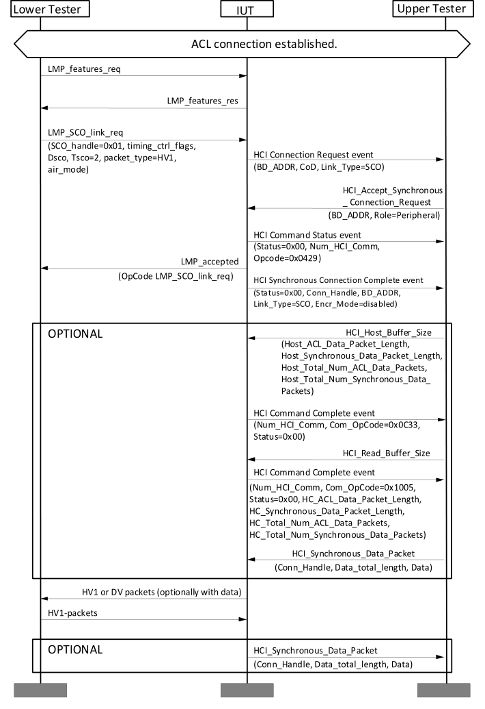

**Figure 4.177: LMP/LIH/BV-43-C [Accept HV1 SCO Request] MSC**

Verify that an HV1 or DV package is sent every second time slot.
• Test Condition
The need to have HCI_Synchronous_Data packets to generate HV packets should be declared as IXIT. However, payload content is not verified.
• Expected Outcome
Pass verdict
The IUT transmits PDU LMP_accepted using a DM1 packet upon reception of PDU LMP_SCO_link_req. An SCO link has been established accordingly.
LMP/LIH/BV-44-C [Accept HV2 SCO Request]
• Test Purpose
Verify that the IUT sets up an SCO link upon request from the Lower Tester. Verify that the correct SCO setup is used. HV2 packages are used. The IUT is Peripheral. The Lower Tester is Central and initiates the service.
• Reference
[1] 4.6.1.1
• Initial Condition
- See Default settings.
- A Features request has to be carried out: LMP/INF/BV-10-C [Supported Features Response.
• Test Procedure
Lower Tester IUT Peripheral Central

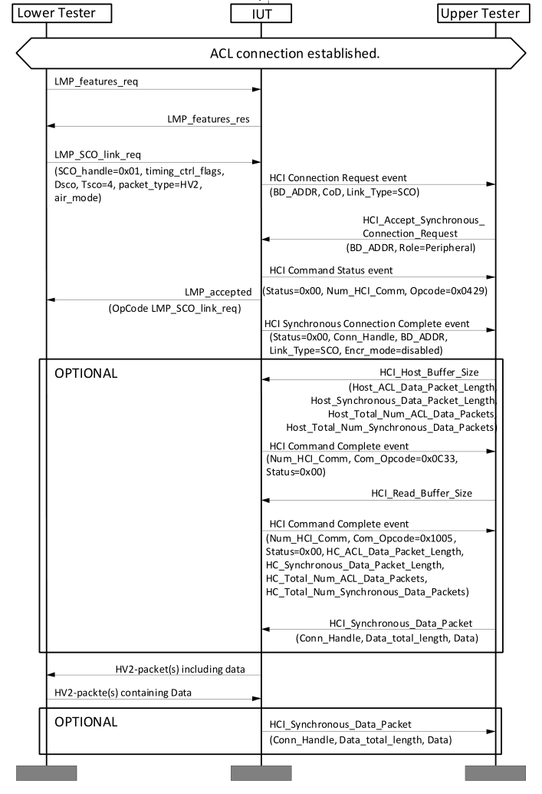

**Figure 4.178: LMP/LIH/BV-44-C [Accept HV2 SCO Request] MSC**

Verify that an HV2 package is sent every four time slots.
• Test Condition
The need to have HCI_Synchronous_Data packets to generate HV packets should be declared as IXIT. However, payload content is not verified.
• Expected Outcome
Pass verdict
The IUT transmits PDU LMP_accepted upon reception of PDU LMP_SCO_link_req. An SCO link has to be established accordingly.
LMP/LIH/BV-45-C [Accept HV3 SCO Request]
• Test Purpose
Verify that the IUT sets up an SCO link upon request from the Lower Tester. Verify that the correct SCO setup is used. HV3 packages are used. The IUT is Peripheral. The Lower Tester is Central and initiates the service.
• Reference
[1] 4.6.1.1
• Initial Condition
- See Default settings.
• Test Procedure
Lower Tester IUT Peripheral Central

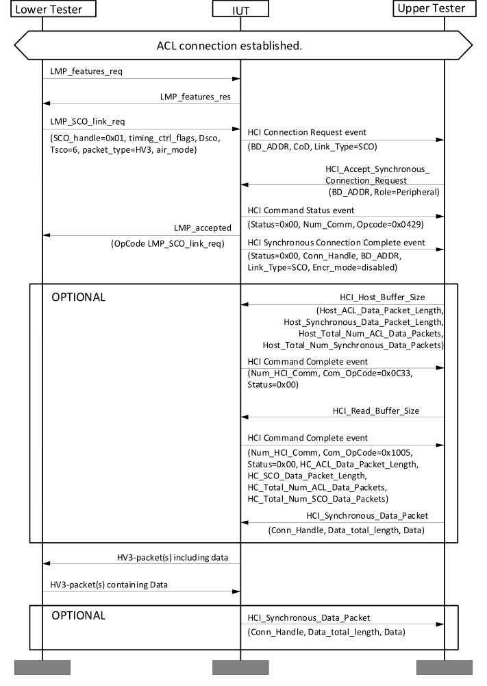

**Figure 4.179: LMP/LIH/BV-45-C [Accept HV3 SCO Request] MSC**

Verify that an HV3 package is sent every six time slots.
• Test Condition
The need to have HCI_Synchronous_Data packets to generate HV packets should be declared as IXIT. However, payload content is not verified.
• Expected Outcome
Pass verdict
The IUT transmits PDU LMP_accepted upon reception of PDU LMP_SCO_link_req. An SCO link has to be established accordingly.
LMP/LIH/BV-46-C [Request HV1 SCO]
• Test Purpose
Verify that the IUT can request the Lower Tester to set up an SCO link. Verify that the correct SCO setup is used. HV1 or DV packages are used. The IUT is Peripheral and initiates the service. The Lower Tester is Central.
• Reference
[1] 4.6.1.2
• Initial Condition
- See Default settings.
• Test Procedure
Lower Tester IUT Peripheral Central

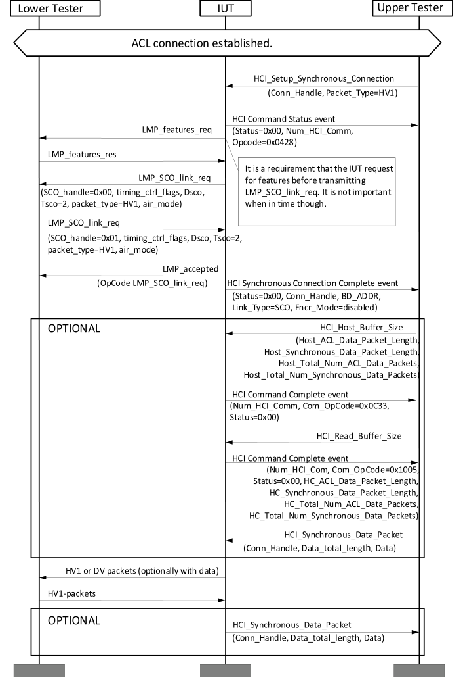

**Figure 4.180: LMP/LIH/BV-46-C [Request HV1 SCO] MSC**

Verify that an HV1 or DV package is sent every second time slot.
• Test Condition
The need to have HCI_Synchronous_Data packets to generate HV packets should be declared as IXIT. However, payload content is not verified.
• Expected Outcome
Pass verdict
The IUT transmits PDU LMP_accepted using a DM1 packet upon reception of PDU LMP_SCO_link_req. An SCO link has been established accordingly.
LMP/LIH/BV-47-C [Accept Change to HV2 as Peripheral]
• Test Purpose
Verify that the IUT changes SCO interval and SCO_Packet type (from HV1 to HV2) upon request from the Lower Tester.
The IUT is Peripheral. The Lower Tester is Central and initiates the service.
• Reference
[1] 4.6.1.3
• Initial Condition
- See LMP/LIH/BV-43-C [Accept HV1 SCO Request, with the exception that HCI_Accept_Synchronous_Connection uses a packet type of all HV packets (0x03FF).
• Test Procedure
Lower Tester IUT Peripheral Central

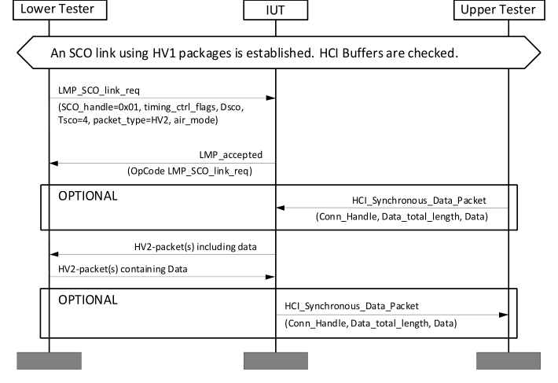

**Figure 4.181: LMP/LIH/BV-47-C [Accept Change to HV2 as Peripheral] MSC**

Verify that an HV2 package is sent every four time slots.
• Test Condition
The need to have HCI_Synchronous_Data packets to generate HV packets should be declared as IXIT. However, payload content is not verified.
• Expected Outcome
Pass verdict
The IUT transmits PDU LMP_accepted upon reception of PDU LMP_SCO_link_req. The SCO interval, TSCO, and packet type must be changed accordingly.
LMP/LIH/BV-48-C [Accept Change to HV3]
• Test Purpose
Verify that the IUT changes SCO interval and SCO_Packet type (from HV1 to HV3) upon request from the Lower Tester. The IUT is Peripheral. The Lower Tester is Central and initiates the service.
• Reference
[1] 4.6.1.3
• Initial Condition
- See LMP/LIH/BV-43-C [Accept HV1 SCO Request, with the exception that HCI_Accept_Synchronous_Connection uses a packet type of all HV packets (0x03FF).
• Test Procedure
Central
Peripheral

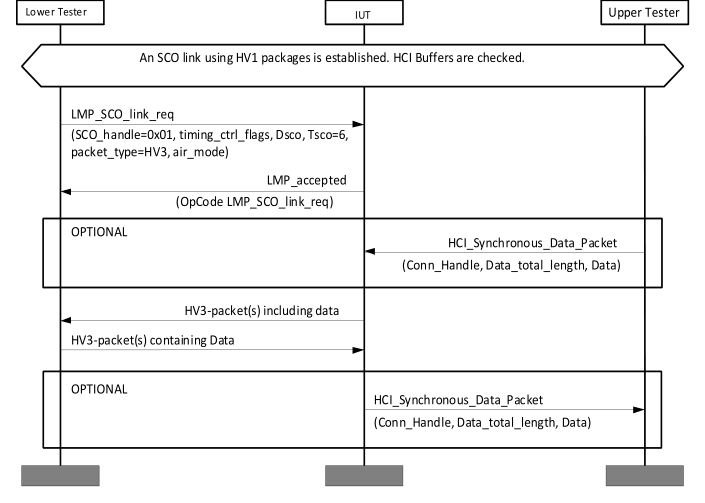

**Figure 4.182: LMP/LIH/BV-48-C [Accept Change to HV3] MSC**

Verify that an HV3 package is sent every six time slots.
• Test Condition
The need to have HCI_Synchronous_Data packets to generate HV packets should be declared as IXIT. However, payload content is not verified.
• Expected Outcome
Pass verdict
The IUT transmits PDU LMP_accepted upon reception of PDU LMP_SCO_link_req. The SCO interval, TSCO, and packet type must be changed accordingly.
LMP/LIH/BV-49-C [Request Change to HV2]
• Test Purpose
Verify that the IUT can request the Lower Tester to change the SCO interval and packet type (from HV1 to HV2). The IUT is Peripheral and initiates the service. The Lower Tester is Central.
• Reference
[1] 4.6.1.4
• Initial Condition
- See LMP/LIH/BV-43-C [Accept HV1 SCO Request.
• Test Procedure
Peripheral
Central

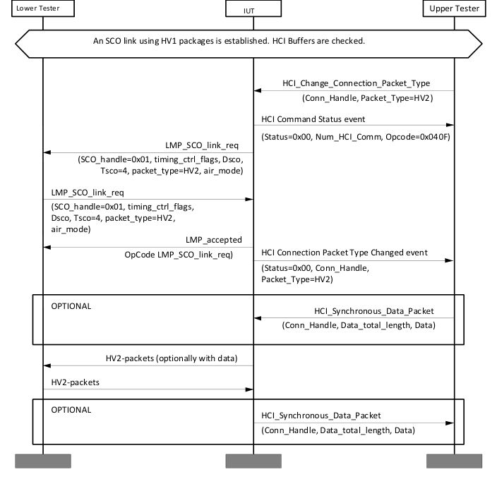

**Figure 4.183: LMP/LIH/BV-49-C [Request Change to HV2] MSC**

Verify that an HV2 package is sent every four time slots.
• Test Condition
It must be possible to control the IUT to initiate the request for the SCO link request. The need to have HCI_Synchronous_Data packets to generate HV packets should be declared as IXIT. However, payload content is not verified.
• Expected Outcome
Pass verdict
The IUT transmits PDU LMP_SCO_link_req and PDU LMP_accepted upon reception of PDU LMP_SCO_link_req. The packet type used must be HV2.
LMP/LIH/BV-50-C [HV2 Request Rejected by Central]
• Test Purpose
Verify that the IUT can request for a change of the SCO interval and packet type (from HV1 to HV2). Verify that the IUT accepts that the Lower Tester rejects the request. The IUT is Peripheral and initiates the service. The Lower Tester is Central.
• Reference
[1] 4.6.1.4
• Initial Condition
- See Default settings.
• Test Procedure
Central
Peripheral

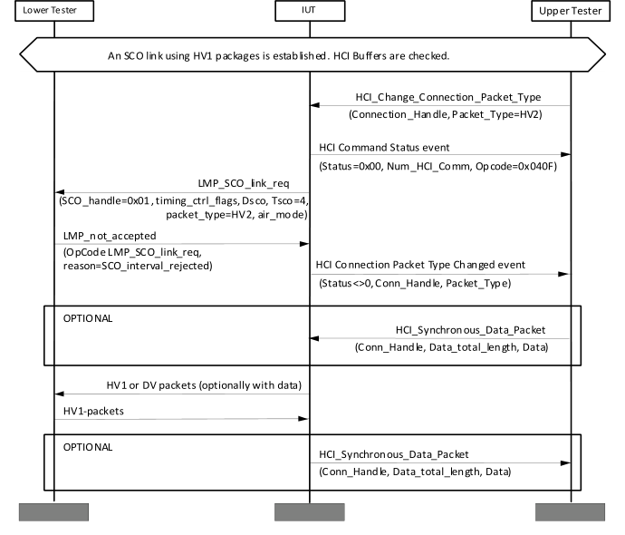

**Figure 4.184: LMP/LIH/BV-50-C [HV2 Request Rejected by Central] MSC**

• Test Condition
It must be possible to control the IUT to initiate the request for the SCO link request. The need to have HCI_Synchronous_Data packets to generate HV packets should be declared as IXIT. However, payload content is not verified.
• Expected Outcome
Pass verdict
The IUT transmits PDU LMP_SCO_link_req and accepts PDU LMP_not_accepted. The packet type must remain HV1 or DV.
LMP/LIH/BV-51-C [Accept SCO Closure as Peripheral]
• Test Purpose
Verify that the IUT accepts a request from the Lower Tester to remove the SCO link.
• Reference
[1] 4.6.1.5
• Initial Condition
- See Default settings.
• Test Procedure
Central
Peripheral

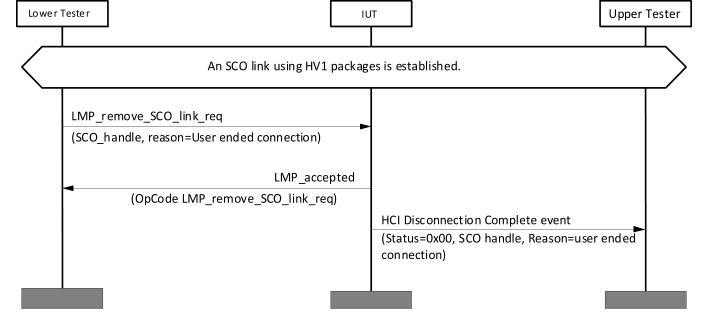

**Figure 4.185: LMP/LIH/BV-51-C [Accept SCO Closure as Peripheral] MSC**

Verify that the SCO link is removed.
• Expected Outcome
Pass verdict
The IUT transmits PDU LMP_accepted upon reception of PDU LMP_remove_SCO_link_req. The SCO link must be closed.
LMP/LIH/BV-52-C [Request SCO Closure as Peripheral]
• Test Purpose
Verify that the IUT can request the Lower Tester to remove the SCO link. The IUT initiates the request.
• Reference
[1] 4.6.1.5
• Initial Condition
- See Default settings.
• Test Procedure
Peripheral
Central

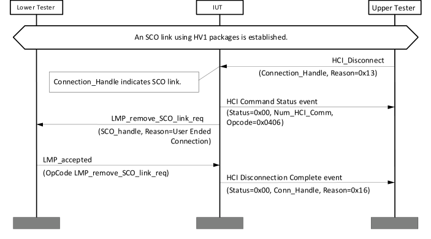

**Figure 4.186: LMP/LIH/BV-52-C [Request SCO Closure as Peripheral] MSC**

Verify that the SCO link is removed.
• Test Condition
It must be possible to control the IUT to initiate the removal of the SCO link.
• Expected Outcome
Pass verdict
The IUT transmits PDU LMP_remove_SCO_link_req and accepts reception of PDU LMP_accepted. The SCO link must be closed.
LMP/LIH/BV-134-C [SCO Connection creation fails when AES-CCM encryption is enabled]
• Test Purpose
Verify that if AES-CCM encryption has been enabled on an ACL connection, SCO connection creation requests from the Upper Tester (using the HCI Setup Synchronous Connection command) will be rejected by the IUT with Error_Code 0x0E: Connection Rejected Due to Security Reasons.
• Reference
[1] 4.6.1
• Initial Condition
- The Lower Tester is Central and the IUT is Peripheral.
- An AES-CCM encrypted point-to-point connection has been established between the IUT and the Lower Tester.
• Test Procedure
Peripheral Central

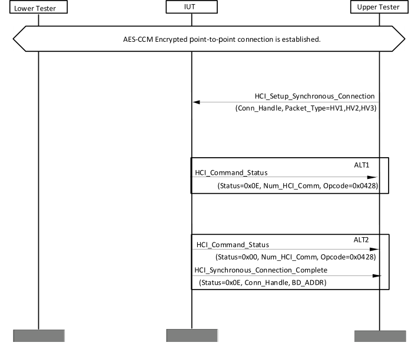

**Figure 4.187: LMP/LIH/BV-134-C [SCO Connection creation fails when AES-CCM encryption is enabled] MSC**

The Upper Tester requests the IUT to create a SCO connection to the Lower Tester using the HCI Setup Synchronous Connection Command (by only enabling SCO_Packet types: HV1, HV2 and HV3).
• Expected Outcome
Pass verdict
The IUT responds to the HCI Setup Synchronous Connection Command with either an HCI Command Status event or an HCI Synchronous Connection Complete event with Error_Code 0x0E: Connection Rejected Due to Security Reasons.
• Notes
If the IUT sends an LMP_SCO_link_req to the Lower Tester, the Lower Tester should accept the request.
LMP/LIH/BV-136-C [SCO Connection creation fails when AES-CCM encryption is enabled – Enhanced Setup Synchronous Connection]
• Test Purpose
Verify that if AES-CCM encryption has been enabled on an ACL connection, SCO connection creation requests (using the HCI Enhanced Setup Synchronous Connection command) from the Upper Tester will be rejected by the IUT with Error_Code 0x0E: Connection Rejected Due to Security Reasons.
• Reference
[1] 4.6.1
• Initial Condition
- The Lower Tester is Central and the IUT is Peripheral.
- An AES-CCM encrypted point-to-point connection has been established between the IUT and the Lower Tester.
• Test Procedure
Peripheral Central

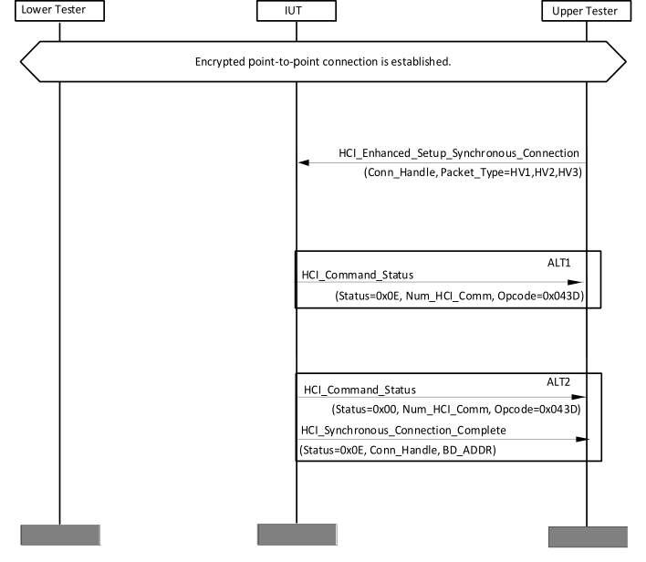

**Figure 4.188: LMP/LIH/BV-136-C [SCO Connection creation fails when AES-CCM encryption is enabled – Enhanced Setup Synchronous Connection] MSC**

The Upper Tester requests the IUT to create a SCO connection to the Lower Tester using the HCI Enhanced Setup Synchronous Connection Command (by only enabling SCO_Packet types: HV1, HV2 and HV3).
• Expected Outcome
Pass verdict
The IUT responds to the HCI Enhanced Setup Synchronous Connection Command with either an HCI Command Status event or an HCI Synchronous Connection Complete event with Error_Code 0x0E: Connection Rejected Due to Security Reasons.
• Notes
If the IUT sends an LMP_SCO_link_req to the Lower Tester, the Lower Tester should accept the request.

#### 4.8.15 SCO links - Central

Verify that the unit can initiate and delete an SCO link. The IUT is Central.
LMP/LIH/BV-53-C [Establish SCO]
• Test Purpose
Verify that the IUT can establish an SCO link.
The IUT is Central and initiates the service. The Lower Tester is Peripheral.
• Reference
[1] 4.6.1.1
• Initial Condition
- See Default settings.
- A Features request has to be carried out: see LMP/INF/BV-10-C [Supported Features Response.
- The IUT must page the Lower Tester to become the Central of the Piconet.
• Test Procedure
Peripheral
Central

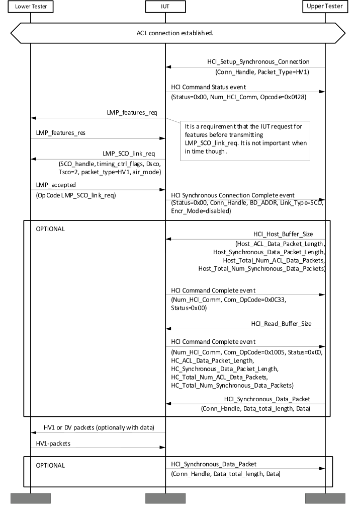

**Figure 4.189: LMP/LIH/BV-53-C [Establish SCO] MSC**

Verify that an HV1 or DV package is sent every second time slot.
• Test Condition
It must be possible to control the IUT to initiate the request for an SCO link. The need to have HCI_Synchronous_Data packets to generate HV packets should be declared as IXIT. However, payload content is not verified.
• Expected Outcome
Pass verdict
The IUT transmits PDU LMP_SCO_link_req and accepts reception of LMP_accepted. An SCO link has to be established accordingly.
LMP/LIH/BV-54-C [Accept SCO Request as Central]
• Test Purpose
Verify that the IUT accepts a request from the Lower Tester to initiate an SCO link.
The IUT is Central. The Lower Tester is Peripheral and initiates the service.
• Reference
[1] 4.6.1.2
• Initial Condition
- See Default settings.
- The IUT must page the Lower Tester to become the Central of the Piconet.
• Test Procedure
Peripheral
Central

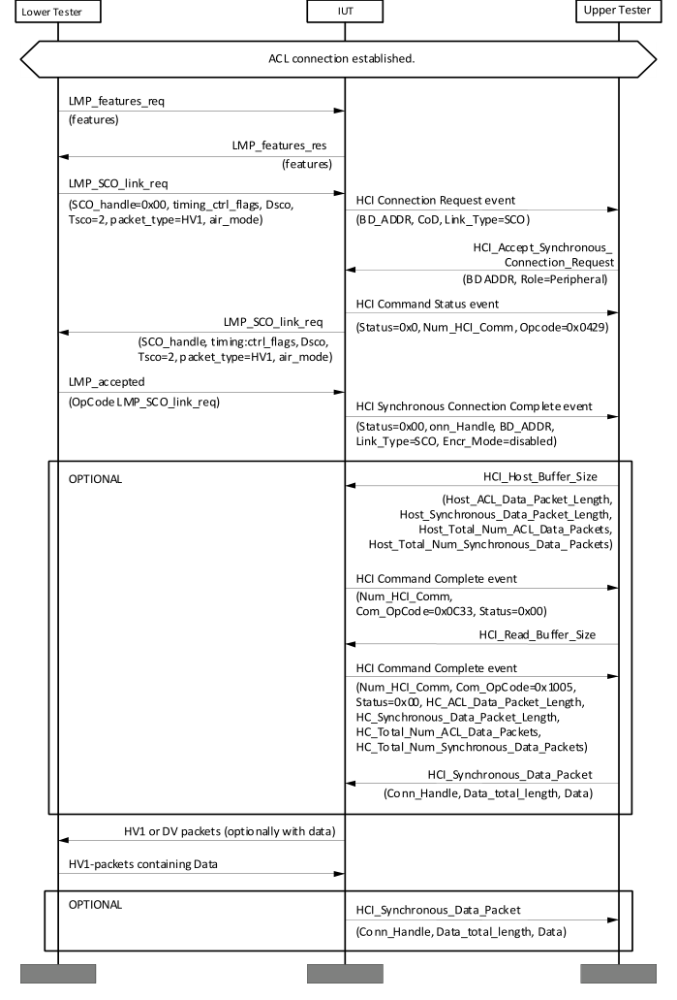

**Figure 4.190: LMP/LIH/BV-54-C [Accept SCO Request as Central] MSC**

Verify that an HV1 or DV package is sent every second time slot.
• Test Condition
The need to have HCI_Synchronous_Data packets to generate HV packets should be declared as IXIT. However, payload content is not verified.
• Expected Outcome
Pass verdict
The IUT transmits PDU LMP_SCO_link_req upon reception of PDU LMP_SCO_link_req and accepts reception of PDU LMP_accepted. An SCO link has to be established accordingly.
LMP/LIH/BV-55-C [Request Change to HV3]
• Test Purpose
Verify that the IUT can request a change of the SCO parameters (packet type HV1 to HV3). The IUT is Central. The Lower Tester is Peripheral and initiates the service.
• Reference
[1] 4.6.1.3
• Initial Condition
- See Default settings.
• Test Procedure
Central
Peripheral

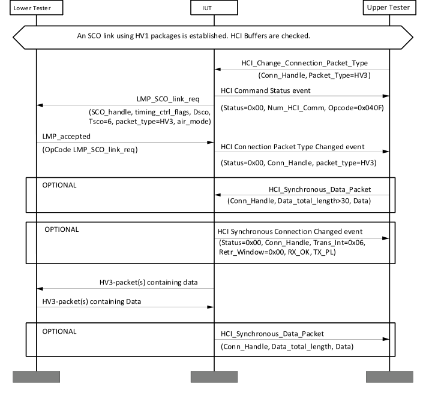

**Figure 4.191: LMP/LIH/BV-55-C [Request Change to HV3] MSC**

Verify that an HV3 package is sent every six time slots.
• Test Condition
It must be possible to control the IUT to initiate the request for a change of SCO parameters. The need to have HCI_Synchronous_Data packets to generate HV packets should be declared as IXIT. However, payload content is not verified.
• Expected Outcome
Pass verdict
The IUT transmits PDU LMP_SCO_link_req and accepts reception of PDU LMP_accepted. The SCO parameters must be changed accordingly.
LMP/LIH/BV-56-C [HV3 Request Rejected by Peripheral]
• Test Purpose
Verify that the IUT can request a change of the SCO parameters (packet type HV1 to HV3). Verify that the IUT accepts a rejection from the Lower Tester. The IUT is Central. The Lower Tester is Peripheral and initiates the service.
• Reference
[1] 4.6.1.4
• Initial Condition
- See Default settings.
• Test Procedure
Central
Peripheral

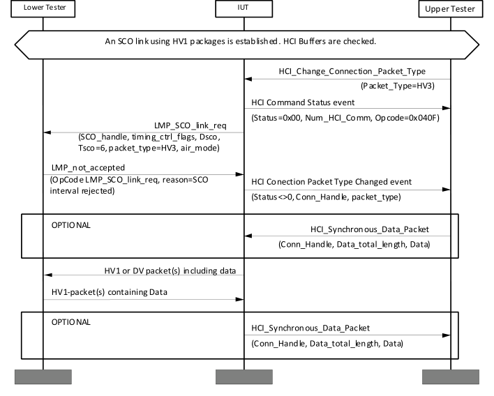

**Figure 4.192: LMP/LIH/BV-56-C [HV3 Request Rejected by Peripheral] MSC**

Verify that an HV1 or DV package is sent every two time slots.
• Test Condition
It must be possible to control the IUT to initiate the request for a change of SCO parameters. The need to have HCI_Synchronous_Data packets to generate HV packets should be declared as IXIT. However, payload content is not verified.
• Expected Outcome
Pass verdict
The SCO link must not be changed.
LMP/LIH/BV-57-C [Accept Change to HV2 as Central]
• Test Purpose
Verify that the IUT accepts a request from the Lower Tester to change the SCO parameters (packet type HV1 to HV2). Also verify that the timing control flags bits 0 and 2 in the LMP_SCO_LINK_REQ PDU sent by the Lower Tester are ignored by the IUT.
The IUT is Central. The Lower Tester is Peripheral and initiates the service.
• Reference
[1] 4.6.1.4
• Initial Condition
- See Default settings.
• Test Procedure

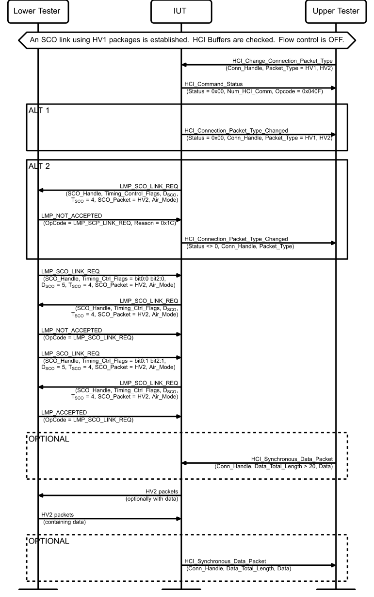

**Figure 4.193: LMP/LIH/BV-57-C [Accept Change to HV2 as Central] MSC**

Verify that an HV2 package is sent every four time slots.
• Test Condition
The need to have HCI_Synchronous_Data packets to generate HV packets should be declared as IXIT.
• Expected Outcome
Pass verdict
The IUT transmits PDU LMP_SCO_LINK_REQ upon reception of PDU LMP_SCO_LINK_REQ and accepts reception of PDU LMP_ACCEPTED. The SCO interval must be changed accordingly.
LMP/LIH/BV-58-C [Request SCO Closure as Central]
• Test Purpose
Verify that the IUT can request to close the SCO link.
The IUT is Central and initiates the service. The Lower Tester is Peripheral.
• Reference
[1] 4.6.1.5
• Initial Condition
- See Default settings.
• Test Procedure
Peripheral Central

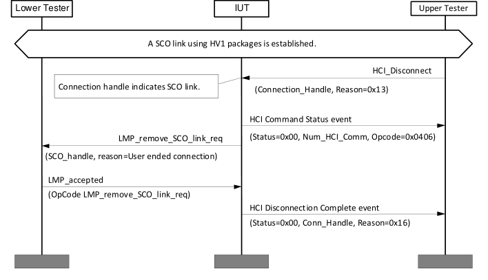

**Figure 4.194: LMP/LIH/BV-58-C [Request SCO Closure as Central] MSC**

Verify that the SCO link is closed.
• Test Condition
It must be possible to control the IUT to initiate the request to remove the SCO link.
• Expected Outcome
Pass verdict
The IUT transmits PDU LMP_remove_SCO_link_req and accepts reception of PDU LMP_accepted. The SCO link must be removed.
• Test Purpose
Verify that the Lower Tester can request the IUT to close the SCO link. The IUT is Central and initiates the service. The Lower Tester is Peripheral.
• Reference
[1] 4.6.1.5
• Initial Condition
- See Default settings.
• Test Procedure
Peripheral Central

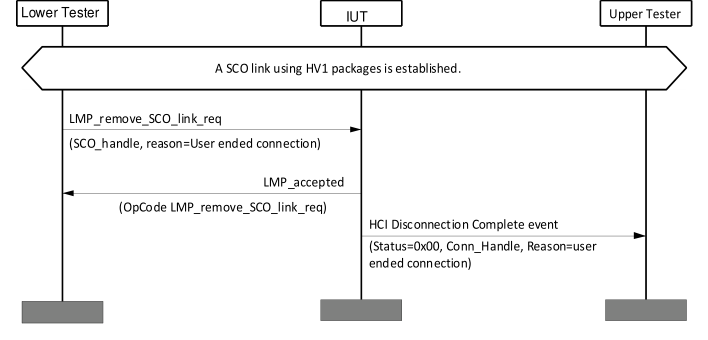

**Figure 4.195: LMP/LIH/BV-59-C [Accept SCO Closure as Central] MSC**

Verify that the SCO link is closed.
• Expected Outcome
Pass verdict
The IUT transmits PDU LMP_accepted upon reception of PDU LMP_remove_SCO_link_req. The SCO link must be removed.
LMP/LIH/BV-138-C [SCO Connection creation fails when AES-CCM encryption is enabled]
• Test Purpose
Verify that if AES-CCM encryption has been enabled on an ACL connection, SCO connection creation requests from the Upper Tester will be rejected by the IUT with Error_Code 0x0E: Connection Rejected Due to Security Reasons.
• Reference
[1] 4.6.1
• Initial Condition
- The Lower Tester is Peripheral and the IUT is Central.
- An AES-CCM encrypted point-to-point connection has been established between the IUT and the Lower Tester.
• Test Procedure
Peripheral Central

**Figure 4.196: LMP/LIH/BV-138-C [SCO Connection creation fails when AES-CCM encryption is enabled] MSC**

The Upper Tester requests the IUT to create a SCO connection to the Lower Tester using the HCI Setup Synchronous Connection Command (by only enabling SCO_Packet types: HV1, HV2, and HV3).
• Expected Outcome
Pass verdict
The IUT responds to the HCI Setup Synchronous Connection Command with either an HCI Command Status event or an HCI Synchronous Connection Complete event with Error_Code 0x0E: Connection Rejected Due to Security Reasons.
• Notes
If the IUT sends an LMP_SCO_link_req to the Lower Tester, the Lower Tester should accept the request.
LMP/LIH/BV-140-C [SCO Connection creation fails when AES-CCM encryption is enabled – Enhanced Setup Synchronous Connection]
• Test Purpose
Verify that if AES-CCM encryption has been enabled on an ACL connection, SCO connection creation requests (using the HCI Enhanced Setup Synchronous Connection command) from the Upper Tester will be rejected by the IUT with Error_Code 0x0E: Connection Rejected Due to Security Reasons.
• Reference
[1] 4.6.1
• Initial Condition
- The Lower Tester is Peripheral and the IUT is Central.
- An AES-CCM encrypted point-to-point connection has been established between the IUT and the Lower Tester.
• Test Procedure
Central Peripheral

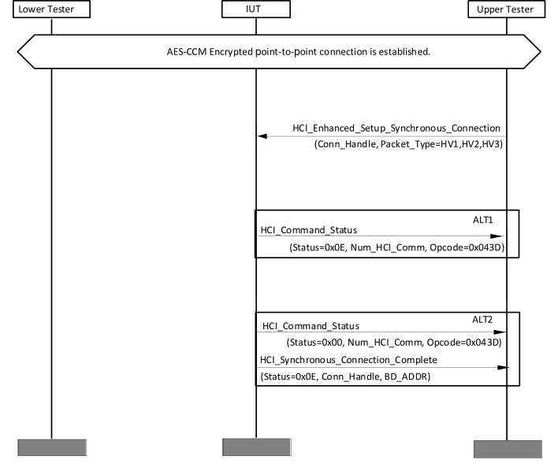

**Figure 4.197: LMP/LIH/BV-140-C [SCO Connection creation fails when AES-CCM encryption is enabled – Enhanced Setup Synchronous Connection] MSC**

The Upper Tester requests the IUT to create a SCO connection to the Lower Tester using the HCI Enhanced Setup Synchronous Connection Command (by only enabling SCO_Packet types: HV1, HV2, and HV3).
• Expected Outcome
Pass verdict
The IUT responds to the HCI Enhanced Setup Synchronous Connection Command with either an HCI Command Status event or an HCI Synchronous Connection Complete event with Error_Code 0x0E: Connection Rejected Due to Security Reasons.
• Notes
If the IUT sends an LMP_SCO_link_req to the Lower Tester, the Lower Tester should accept the request.

#### 4.8.16 SCO Links - Both Central and Peripheral

Verify that the IUT declines the SCO link request in a correct manner. The role of the IUT is of no importance.
LMP/LIH/BV-60-C [Reject SCO Request]
• Test Purpose
Verify that the IUT responds that it does not support SCO links upon request from the Lower Tester. The Lower Tester initiates the service.
• Reference
[1] 4.6.1.1
• Initial Condition
- See Default settings.
• Test Procedure

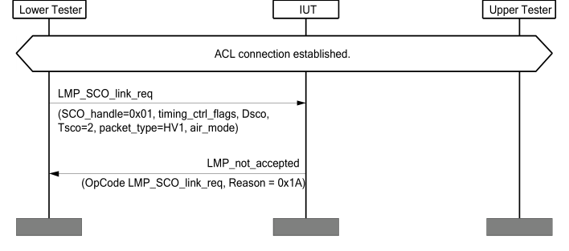

**Figure 4.198: LMP/LIH/BV-60-C [Reject SCO Request] MSC**

• Expected Outcome
Pass verdict
The IUT transmits PDU LMP_not_accepted containing “Reason = 0x1A” upon reception of PDU LMP_SCO_link_req.

##### 4.8.16.1 Rejecting SCO Connection request when AES-CCM encryption is enabled

• Test Purpose
Verify that if AES-CCM encryption has been enabled on an ACL connection, SCO connection requests from the Lower Tester will be rejected by the IUT with error code 0x0E: Connection Rejected Due to Security Reasons.
• Reference
[1] 4.6.1
• Initial Condition
- The IUT is the role as specified in Table 4.9.
- An encrypted point-to-point connection has been established between the IUT and the Lower Tester.
• Test Case Configuration

| Test Case ID |  |  | Role |  |
| --- | --- | --- | --- | --- |
| LMP/LIH/BI-01-C |  | Peripheral |  |  |
| LMP/LIH/BI-02-C |  | Central |  |  |

Table 4.9: Rejecting SCO Connection request when AES-CCM encryption is enabled test cases
• Test Procedure

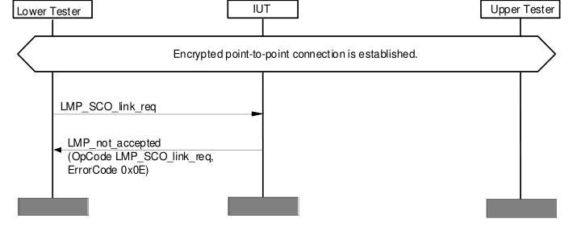

**Figure 4.199: Rejecting SCO Connection request when AES-CCM encryption is enabled MSC**

The Lower Tester sends an LMP_SCO_link_req to the IUT.
• Expected Outcome
Pass verdict
The IUT responds to the LMP_SCO_link_req with an LMP_not_accepted with error code 0x0E: Connection Rejected Due to Security Reasons.
LMP/LIH/BI-03-C [SCO Connection Initiation Rejected when AES-CCM encryption is enabled]
• Test Purpose
Verify that if AES-CCM encryption has been enabled on an ACL connection, SCO connection requests from the Lower Tester will be rejected.
• Reference
[1] 4.6.1
• Initial Condition
- An AES-CCM encrypted point-to-point connection has been established between the IUT and the Lower Tester.
• Test Procedure

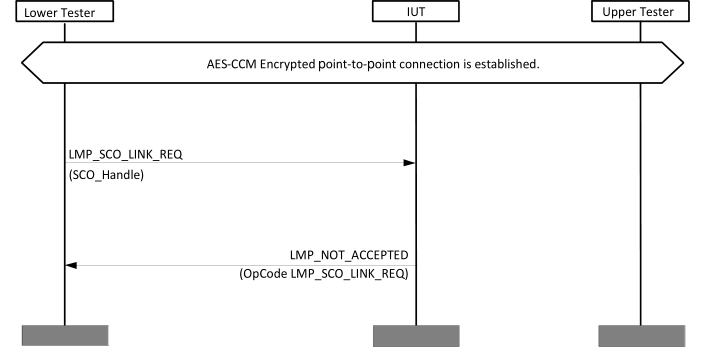

**Figure 4.200: LMP/LIH/BI-03-C [SCO Connection Initiation Rejected when AES-CCM encryption is enabled] MSC**

The Lower Tester requests an SCO connection with the IUT.
• Expected Outcome
Pass verdict
The IUT transmits an LMP_NOT_ACCEPTED PDU to the Lower Tester.

#### 4.8.17 eSCO Links - Peripheral

##### 4.8.17.1 Accept eSCO Request

• Test Purpose
Verify that the IUT sets up an eSCO link upon request from the Lower Tester. Verify that the correct eSCO setup is used. The EV type specified in Table 4.10 with data or NULL packets are used. The IUT is Peripheral. The Lower Tester is Central and initiates the service.
• Reference
[1] 4.6.2.1
• Initial Condition
- See Default settings.
- A Features request has to be carried out.
• Test Case Configuration

| Test Case | Reference | EV | TeSCO | WeSCO | Packet |  | Air Mode |
| --- | --- | --- | --- | --- | --- | --- | --- |
|  |  |  |  |  | Length |  |  |
| LMP/LIH/BV-100-C [Accept EV3 eSCO Request] | [1] 4.6.2.1 | EV3 | 6 | 2 | 30 |  | Any supported |
| LMP/LIH/BV-101-C [Accept EV4 eSCO Request] | [1] 4.6.2.2 | EV4 | 16 | 6 | 80 |  | Transparent |
| LMP/LIH/BV-102-C [Accept EV5 eSCO Request] | [1] 4.6.2.1 | EV5 | 16 | 6 | 80 |  | Transparent |

Table 4.10: Accept eSCO Request test cases
• Test Procedure

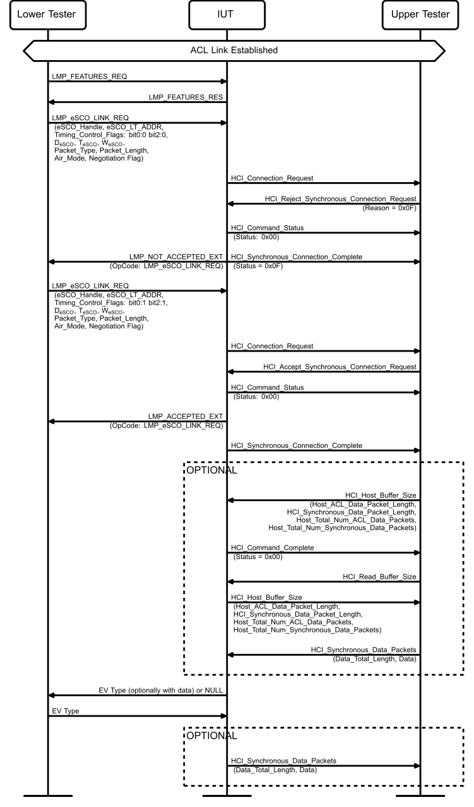

**Figure 4.201: Accept eSCO Request MSC**

- eSCO_Handle: Any valid number
- eSCO_LT_ADDR: Any valid number
- Timing_Control_Flags: Derived from Central’s clock, Bit0:0 Bit2:0
- DeSCO: Any number in the range [0, TeSCO - 2]
- TeSCO: TeSCO specified in Table 4.10 slots
- WeSCO: WeSCO specified in Table 4.10 slots
- Packet type C→P: Type specified in Table 4.10
- Packet type P→C: Type specified in Table 4.10
- Packet_Length C→P: Length specified in Table 4.10
- Packet_Length P→C: Length specified in Table 4.10
- Air_Mode: Mode specified in Table 4.10
- Negotiation Flag: Initiate Negotiation
Verify that packets with the EV Type specified in Table 4.10 with data or NULL packets are transmitted at the eSCO instants and retransmitted inside the retransmission window.
Verify that if the IXIT declares that HCI_Synchronous_Data packets are used, the data is sent using EV packets.
• Test Condition
The need to have HCI_Synchronous_Data packets to generate EV packets should be declared as IXIT. However, payload content is not verified.
• Expected Outcome
Pass verdict
The IUT transmits PDU LMP_ACCEPTED_EXT upon reception of PDU LMP_eSCO_LINK_REQ. An eSCO link is established accordingly.
• Notes
The IUT may negotiate the eSCO parameters.
LMP/LIH/BV-103-C [Request eSCO as Peripheral]
• Test Purpose
Verify that the IUT can request the Lower Tester to set up an eSCO link. Verify that the correct eSCO setup is used. The IUT is Peripheral and initiates the service. The Lower Tester is Central.
• Reference
[1] 4.6.2.2
• Initial Condition
- See Default settings.
- A Features request has to be carried out.
• Test Procedure
Central
Peripheral

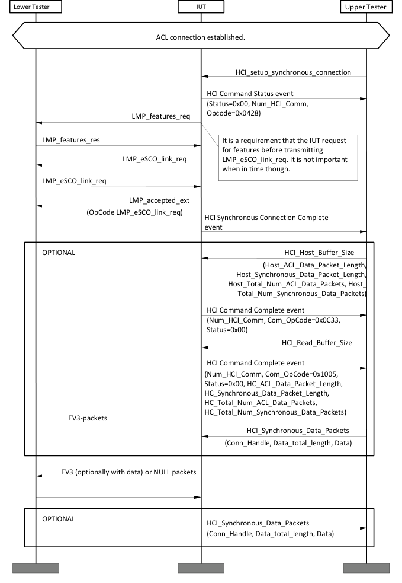

**Figure 4.202: LMP/LIH/BV-103-C [Request eSCO as Peripheral] MSC**

The HCI_Setup_Synchronous_Connection has the following content:
- Connection Handle: Any valid number
- Transmit Bandwidth: 8000 bytes/s
- Receive Bandwidth: 8000 bytes/s
- Max Latency: 7 ms
- Retransmission Effort: 1
- Packet Type: EV3
Verify that EV with data or NULL packets are transmitted at the eSCO instants and retransmitted inside the retransmission window.
Verify that if the IXIT declares that HCI_Synchronous_Data packets are used, the data is sent using EV packets.
• Test Condition
The need to have HCI_Synchronous_Data packets to generate EV packets should be declared as IXIT. However, payload content is not verified.
• Expected Outcome
Pass verdict
The IUT transmits PDU LMP_eSCO_link_req with parameters that satisfy the bandwidth and latency requirements. An eSCO links is established accordingly.
• Notes
The choice of packet type and Packet_Length is up to the IUT.
LMP/LIH/BV-104-C [Accept Change to EV4]
• Test Purpose
Verify that the IUT changes eSCO interval and eSCO_Packet_Type (from EV3 to EV4) upon request from the Lower Tester. The IUT is Peripheral. The Lower Tester is Central and initiates the service.
• Reference
[1] 4.6.2.3
• Initial Condition
- See Accept eSCO Request, with the exception that the HCI_Accept_Synchronous_Connection uses a packet type of all EV packets (0x38).
• Test Procedure
Central
Peripheral

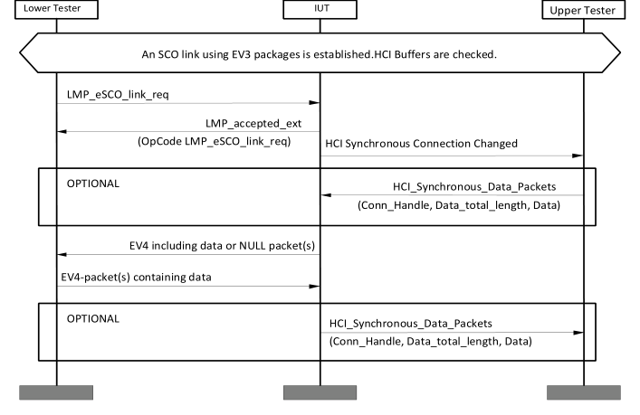

**Figure 4.203: LMP/LIH/BV-104-C [Accept Change to EV4] MSC**

The LMP_eSCO_link_req has the following content:
- eSCO_Handle: The current handle of the eSCO link
- eSCO_LT_ADDR: The current LT_ADDR of the eSCO link
- Timing_Control_Flags: Derived from Central’s clock
- DeSCO: Any number in the range [0, TeSCO - 2]
- TeSCO: 16 slots
- WeSCO: 6 slots
- Packet type C→P: EV4
- Packet type P→C: EV4
- Packet_Length C→P: 80 bytes
- Packet_Length P→C: 80 bytes
- Air_Mode: The current Air_Mode of the eSCO link
- Negotiation Flag: Initiate Negotiation
Verify that EV4 with data or NULL packets are transmitted at the eSCO instants and retransmitted inside the retransmission window.
Verify that if the IXIT declares that HCI_Synchronous_Data packets are used, the data is sent using EV packets.
• Test Condition
The need to have HCI_Synchronous_Data packets to generate EV packets should be declared as IXIT. However, payload content is not verified.
• Expected Outcome
Pass verdict
The IUT transmits PDU LMP_accepted_ext upon reception of PDU LMP_eSCO_link_req. The interval and packet type are changed accordingly, and data is transferred after the change.
• Notes
The IUT may negotiate the EV4 eSCO parameters.
LMP/LIH/BV-105-C [Accept Change to EV5]
• Test Purpose
Verify that the IUT changes eSCO interval and eSCO_Packet_Type (from EV3 to EV5) upon request from the Lower Tester. The IUT is Peripheral. The Lower Tester is Central and initiates the service.
• Reference
[1] 4.6.2.3
• Initial Condition
- See Accept eSCO Request, with the exception that the HCI_Accept_Synchronous_Connection uses a packet type of all EV packets (0x38).
• Test Procedure
Central
Peripheral

**Figure 4.204: LMP/LIH/BV-105-C [Accept Change to EV5] MSC**

The LMP_eSCO_link_req has the following content:
- eSCO_Handle: The current handle of the eSCO link
- eSCO_LT_ADDR: The current LT_ADDR of the eSCO link
- Timing_Control_Flags: Derived from Central’s clock
- DeSCO: Any number in the range [0, TeSCO - 2]
- WeSCO: 6 slots
- Packet type C→P: EV5
- Packet type P→C: EV5
- Packet_Length C→P: 80 bytes
- Packet_Length P→C: 80 bytes
- Air_Mode: The current Air_Mode of the eSCO link
- Negotiation Flag: Initiate Negotiation
Verify that EV5 with data or NULL packets are transmitted at the eSCO instants and retransmitted inside the retransmission window.
Verify that if the IXIT declares that HCI_Synchronous_Data packets are used, the data is sent using EV packets.
• Test Condition
The need to have HCI_Synchronous_Data packets to generate EV packets should be declared as IXIT. However, payload content is not verified.
• Expected Outcome
Pass verdict
The IUT transmits PDU LMP_accepted_ext upon reception of PDU LMP_eSCO_link_req. The interval and packet type are changed accordingly, and data is transferred after the change.
• Notes
The IUT may negotiate the EV5 eSCO parameters.
LMP/LIH/BV-106-C [Request Change to EV4]
• Test Purpose
Verify that the IUT can request the Lower Tester to change the eSCO interval and packet type (from EV3 to EV4). The IUT is Peripheral and initiates the service. The Lower Tester is Central.
• Reference
[1] 4.6.2.3
• Initial Condition
- See Accept eSCO Request, with the exception that the HCI_Accept_Synchronous_Connection uses a packet type of all EV packets (0x38).
• Test Procedure
Central
Peripheral

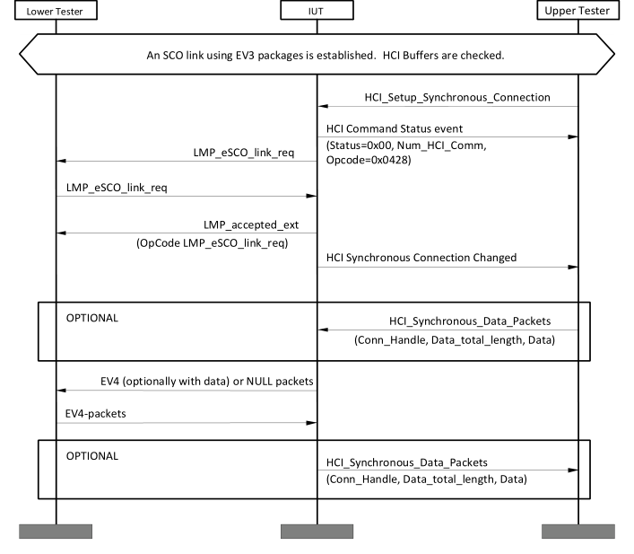

**Figure 4.205: LMP/LIH/BV-106-C [Request Change to EV4] MSC**

The HCI_Setup_Synchronous_Connection has the following content:
- Connection Handle: The handle of the current eSCO connection
- Transmit Bandwidth: 8000 bytes/s
- Receive Bandwidth: 8000 bytes/s
- Max Latency: 18 ms
- Content Format: The Air_Mode of the current eSCO connection
- Retransmission Effort: 1
- Packet Type: EV4
Verify that EV4 with data or NULL packets are transmitted at the eSCO instants and retransmitted inside the retransmission window.
Verify that if the IXIT declares that HCI_Synchronous_Data packets are used, the data is sent using EV packets.
• Test Condition
The need to have HCI_Synchronous_Data packets to generate EV packets should be declared as IXIT. However, payload content is not verified.
• Expected Outcome
Pass verdict
The IUT transmits PDU LMP_eSCO_link_req. After transmitting PDU LMP_accepted_ext, the interval and packet type are changed accordingly, and data is transferred after the change.
LMP/LIH/BV-107-C [EV4 Request Rejected]
• Test Purpose
Verify that the IUT can request the Lower Tester to change the eSCO interval and packet type (from EV3 to EV4). Verify that the IUT accepts that the Lower Tester rejects the request. The IUT is Peripheral and initiates the service. The Lower Tester is Central.
• Reference
[1] 4.6.2.3
• Initial Condition
- See Accept eSCO Request.
• Test Procedure
Peripheral
Central

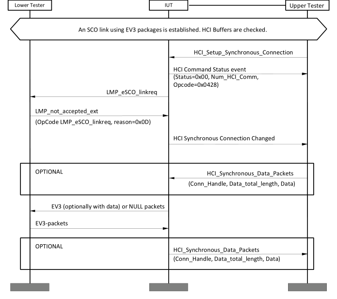

**Figure 4.206: LMP/LIH/BV-107-C [EV4 Request Rejected] MSC**

The HCI_Setup_Synchronous_Connection has the following content:
- Connection Handle: The handle of the current eSCO link
- Transmit Bandwidth: 8000 bytes/s
- Max Latency: 18 ms
- Content Format: The Air_Mode of the current eSCO link
- Retransmission Effort: 1
- Packet Type: EV4
Verify that EV3 with data or NULL packets are transmitted at the eSCO instants and retransmitted inside the retransmission window.
Verify that if the IXIT declares that HCI_Synchronous_Data packets are used, the data is sent using EV packets.
• Test Condition
The need to have HCI_Synchronous_Data packets to generate EV packets should be declared as IXIT. However, payload content is not verified.
• Expected Outcome
Pass verdict
The IUT transmits PDU LMP_eSCO_link_req. After reception of PDU LMP_not_accepted_ext, data is still transferred according to the previous configuration.
LMP/LIH/BV-108-C [Accept eSCO Closure as Peripheral]
• Test Purpose
Verify that the IUT accepts a request from the Lower Tester to remove the eSCO link.
• Reference
[1] 4.6.2.4
• Initial Condition
- See Accept eSCO Request.
• Test Procedure
Peripheral
Central

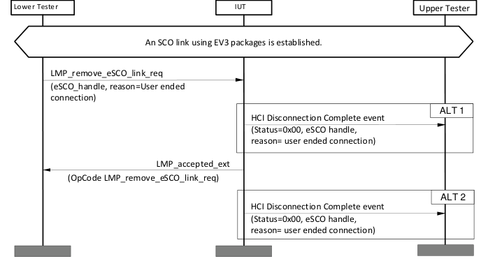

**Figure 4.207: LMP/LIH/BV-108-C [Accept eSCO Closure as Peripheral] MSC**

- eSCO_Handle: The handle of the current eSCO link
- Reason: 0x13 User ended connection
Verify that the eSCO link is removed.
• Expected Outcome
Pass verdict
The IUT transmits PDU LMP_accepted_ext upon reception of PDU LMP_remove_eSCO_link. The eSCO link is closed.
LMP/LIH/BV-109-C [Request eSCO Closure as Peripheral]
• Test Purpose
Verify that the IUT can request the Lower Tester to remove the eSCO link. The IUT initiates the service.
• Reference
[1] 4.6.2.4
• Initial Condition
- See Accept eSCO Request.
• Test Procedure
Peripheral
Central

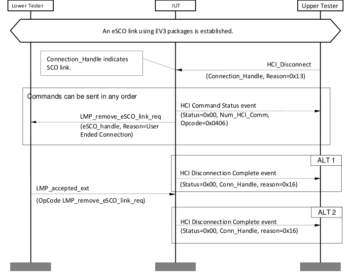

**Figure 4.208: LMP/LIH/BV-109-C [Request eSCO Closure as Peripheral] MSC**

- Connection Handle: The handle of the current eSCO Link
- Reason: 0x13 User ended connection
Verify that the eSCO link is removed.
• Expected Outcome
Pass verdict
The IUT transmits PDU LMP_remove_eSCO_link_req and accepts reception of PDU LMP_accepted_ext. The eSCO link must be closed.

#### 4.8.18 eSCO links - Central

LMP/LIH/BV-110-C [Request ESCO as Central]
• Test Purpose
Verify that the IUT can establish an eSCO link. The IUT is Central and initiates the service. The Lower Tester is Peripheral.
• Reference
[1] 4.6.2.1
• Initial Condition
- See Default settings.
• Test Procedure
Central
Peripheral

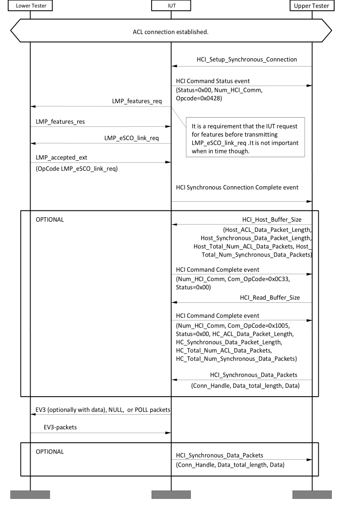

**Figure 4.209: LMP/LIH/BV-110-C [Request ESCO as Central] MSC**

The HCI_Setup_Synchronous_Connection has the following content:
- Connection Handle: Any valid number
- Transmit Bandwidth: 8000 bytes/s
- Receive Bandwidth: 8000 bytes/s
- Max Latency: 7 ms
- Retransmission Effort: 1
- Packet Type: EV3
Verify that EV3 with data, NULL, or POLL packets are transmitted at the eSCO instants and retransmitted inside the retransmission window.
Verify that if the IXIT declares that HCI_Synchronous_Data packets are used, the data is sent using EV packets.
• Test Condition
The need to have HCI_Synchronous_Data packets to generate EV packets should be declared as IXIT. However, payload content is not verified.
• Expected Outcome
Pass verdict
The IUT transmits PDU LMP_eSCO_link_req with parameters that satisfy the bandwidth and latency requirements. An eSCO links is established accordingly.
LMP/LIH/BV-111-C [Accept eSCO Request]
• Test Purpose
Verify that the IUT accepts a request from the Lower Tester to initiate an eSCO link. The IUT is Central. The Lower Tester is Peripheral and initiates the service.
• Reference
[1] 4.6.2.2
• Initial Condition
- See Default settings.
• Test Procedure
Central
Peripheral

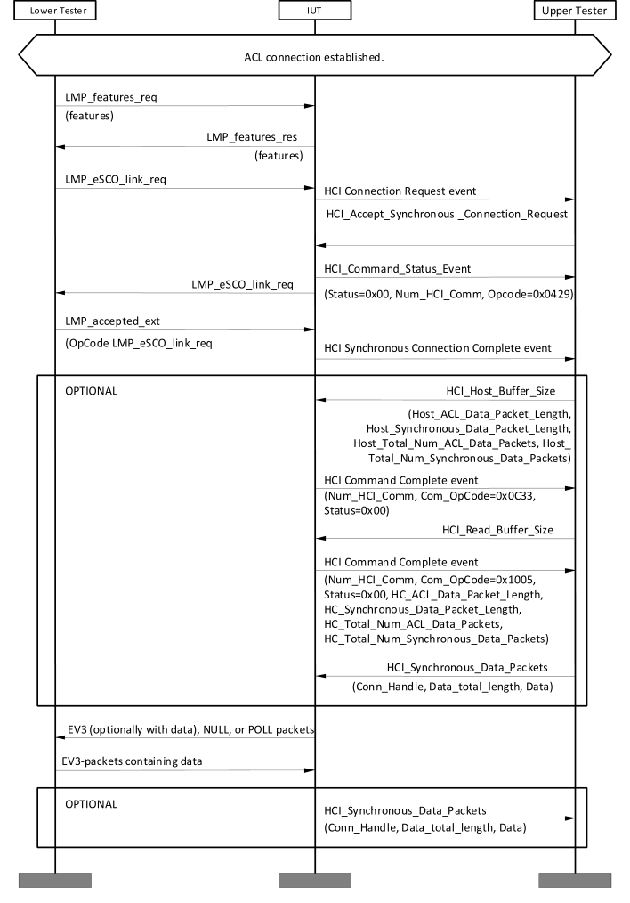

**Figure 4.210: LMP/LIH/BV-111-C [Accept eSCO Request] MSC**

The LMP_eSCO_link_req has the following content:
- eSCO_Handle: 0
- eSCO_LT_ADDR: 0
- Timing_Control_Flags: Derived from IUT’s Central’s clock
- DeSCO: Any number in the range [0, TeSCO - 2]
- TeSCO: 6 slots
- Packet type C→P: EV3
- Packet type P→C: EV3
- Packet_Length C→P: 30 bytes
- Packet_Length P→C: 30 bytes
- Air_Mode: Any supported Air_Mode
- Negotiation Flag: Initiate Negotiation
Verify that EV3 with data, NULL, or POLL packets are transmitted at the eSCO instants and retransmitted inside the retransmission window.
Verify that if the IXIT declares that HCI_Synchronous_Data packets are used, the data is sent using EV packets.
• Test Condition
The need to have HCI_Synchronous_Data packets to generate EV packets should be declared as IXIT. However, payload content is not verified.
• Expected Outcome
Pass verdict
The IUT transmits PDU LMP_eSCO_link_req upon reception of PDU LMP_eSCO_link_req. An eSCO link is established accordingly.
LMP/LIH/BV-112-C [Request eSCO Change]
• Test Purpose
Verify that the IUT can request a change of the eSCO parameters (packet type EV3 to EV4 or EV5). The IUT is Central and initiates the service. The Lower Tester is Peripheral.
• Reference
[1] 4.6.2.3
• Initial Condition
- See LMP/LIH/BV-110-C [Request ESCO as Central].
• Test Procedure
Central
Peripheral

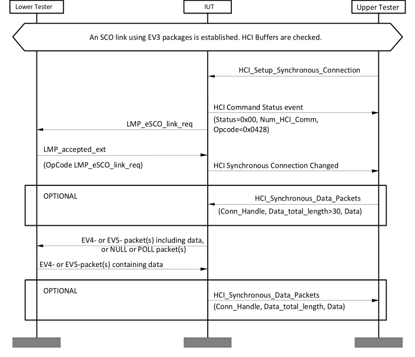

**Figure 4.211: LMP/LIH/BV-112-C [Request eSCO Change] MSC**

The HCI_Setup_Synchronous_Connection has the following content:
- Connection Handle: The handle of the current eSCO link
- Transmit Bandwidth: 8000 bytes/s
- Receive Bandwidth: 8000 bytes/s
- Max Latency: 18 ms
- Content Format: The Air_Mode of the current eSCO link
- Retransmission Effort: 1
- Packet Type: EV4, EV5
Verify that EV4 with data, EV5 with data, NULL, or POLL packets are transmitted at the eSCO instants and retransmitted inside the retransmission window.
Verify that if the IXIT declares that HCI_Synchronous_Data packets are used, the data is sent using EV packets.
• Test Condition
The need to have HCI_Synchronous_Data packets to generate EV packets should be declared as IXIT. However, payload content is not verified.
• Expected Outcome
Pass verdict
The IUT transmits PDU LMP_eSCO_link_req. Data is transferred using the bandwidth, max latency and Air_Mode specified in the HCI command.
LMP/LIH/BV-113-C [eSCO Change Rejected]
• Test Purpose
Verify that the IUT can request a change of the eSCO parameters (packet type EV3 to EV4 or EV5). Verify that the IUT accepts a rejection from the Lower Tester. The IUT is Central and initiates the service. The Lower Tester is Peripheral.
• Reference
[1] 4.6.2.3
• Initial Condition
- See LMP/LIH/BV-110-C [Request ESCO as Central].
• Test Procedure
Central
Peripheral

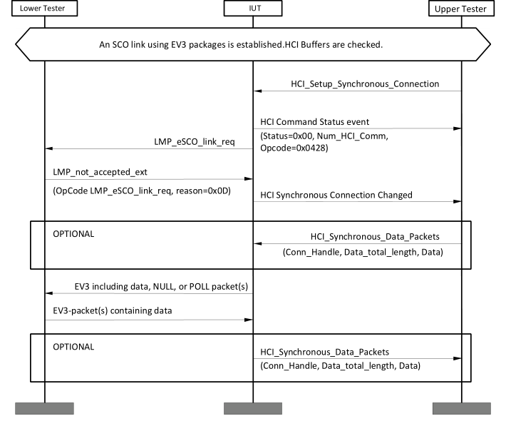

**Figure 4.212: LMP/LIH/BV113-C [eSCO Change Rejected] MSC**

The HCI_Setup_Synchronous_Connection has the following content:
- Connection Handle: The handle of the current eSCO link
- Transmit Bandwidth:8000 bytes/s
- Receive Bandwidth: 8000 bytes/s
- Content Format: The Air_Mode of the current eSCO link
- Retransmission Effort: 1
- Packet Type: EV4, EV5
Verify that EV3 with data, NULL, or POLL packets are transmitted at the eSCO instants and retransmitted inside the retransmission window.
Verify that if the IXIT declares that HCI_Synchronous_Data packets are used, the data is sent using EV packets.
• Test Condition
The need to have HCI_Synchronous_Data packets to generate EV packets should be declared as IXIT. However, payload content is not verified.
• Expected Outcome
Pass verdict
The IUT transmits PDU LMP_eSCO_link_req. After receiving PDU LMP_not_accepted_ext, data is still transferred according to the original configuration.
LMP/LIH/BV-114-C [Request to Close eSCO Link]
• Test Purpose
Verify that the IUT can request to close the eSCO link. The IUT is Central and initiates the service. The Lower Tester is Peripheral.
• Reference
[1] 4.6.2.4
• Initial Condition
- See LMP/LIH/BV-110-C [Request ESCO as Central].
• Test Procedure
Central
Peripheral

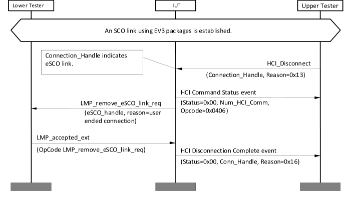

**Figure 4.213: LMP/LIH/BV-114-C [Request to Close eSCO Link] MSC**

- Connection Handle: The handle of the current eSCO Link
- Reason: 0x13 User ended connection
Verify that the eSCO link is removed.
• Expected Outcome
Pass verdict
The IUT transmits PDU LMP_remove_eSCO_link_req and delivers HCI Disconnection Complete event. The eSCO link is closed.
LMP/LIH/BV-115-C [Accept eSCO Closure as Central]
• Test Purpose
Verify that the Lower Tester can request the IUT to close the eSCO link. The IUT is Central. The Lower Tester is Peripheral and initiates the service.
• Reference
[1] 4.6.2.4
• Initial Condition
- See LMP/LIH/BV-110-C [Request ESCO as Central].
• Test Procedure
Central
Peripheral

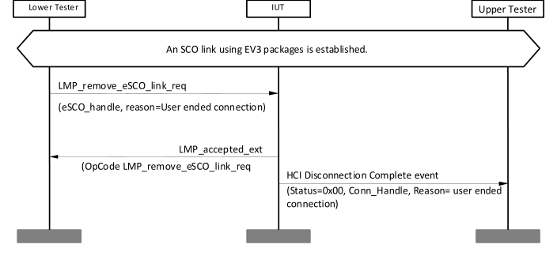

**Figure 4.214: LMP/LIH/BV115-C [Accept eSCO Closure as Central] MSC**

The LMP_remove_eSCO_link has the following content:
- eSCO_Handle: The handle of the current eSCO link
- Reason: 0x13 User ended connection
Verify that the eSCO link is removed.
• Expected Outcome
Pass verdict
The IUT transmits PDU LMP_accepted_ext upon reception of PDU LMP_remove_eSCO_link. The eSCO link is closed.
• Test Purpose
Verify that the IUT responds that it does not support eSCO links upon request from the Lower Tester. The Lower Tester initiates the service. It does not matter whether the IUT is Peripheral or Central in this test.
• Reference
[1] 4.6.2
• Initial Condition
- See Default settings.
• Test Procedure

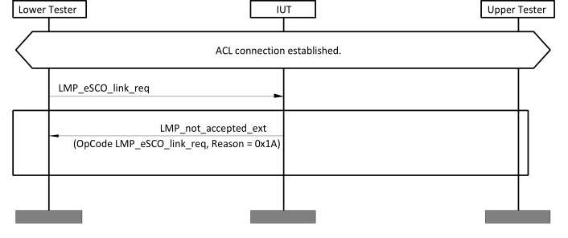

**Figure 4.215: LMP/LIH/BV116-C [Reject eSCO Request] MSC**

The LMP_eSCO_link_req has the following content:
- eSCO_Handle: Any valid number if IUT is Peripheral, 0 otherwise
- eSCO_LT_ADDR: Any valid number if IUT is Peripheral, 0 otherwise
- Timing_Control_Flags: Derived from Central’s clock
- DeSCO: Any number in the range [0, TeSCO - 2]
- TeSCO: 6 slots
- WeSCO: 2 slots
- Packet type M→S: EV3
- Packet type S→M: EV3
- Packet_Length M→S: 30 bytes
- Packet_Length S→M: 30 bytes
- Air_Mode: Any Air_Mode
- Negotiation Flag: Initiate Negotiation
• Expected Outcome
Pass verdict
The IUT transmits PDU LMP_not_accepted_ext containing “Reason = 0x1A” upon reception of PDU LMP_eSCO_link_req.

#### 4.8.19 Sniff Subrating

Verify that the unit can imitate and reject a sniff subrating link request. See the Baseband Test Suite, Section 4.11.1, “Sniff Subrating Preamble” [11].
LMP/LIH/BV-117-C [LMP Feature Bits]
• Test Purpose
Verify that a device has set the correct LMP feature bits for sniff subrate.
• Reference
[1] 3.2, 3.3
• Initial Condition
- The IUT is a Peripheral.
- An ACL connection has been established between the Lower Tester and the IUT, where the IUT is Peripheral.
• Test Procedure
The Lower Tester sends LMP_feature_req and the IUT responds LMP_feature_res.
Central Peripheral

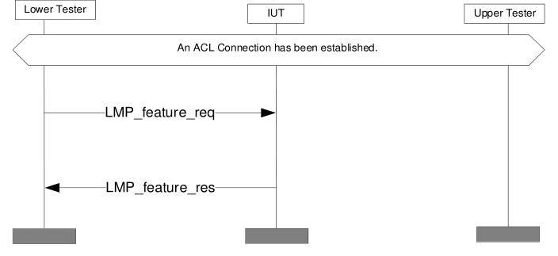

**Figure 4.216: LMP/LIH/BV-117-C [LMP Feature Bits] MSC**

• Expected Outcome
Pass verdict
The following feature bits are set in the response from the IUT:
- Bit 7, “Sniff Mode” (Byte 0, Bit 7)
- Bit 41, "Sniff Subrating" (Byte 5, Bit 1)
LMP/LIH/BV-118-C [Entering Sniff Subrating Mode from Sniff Mode with Lower Tester as the Initiator]
• Test Purpose
Verify that the IUT enters sniff subrating mode as it claims when the Lower Tester initiates sniff subrating mode request.
• Reference
[1] 4.5.3.3
[9] 5.1, 5.2
• Initial Condition
1. The IUT is Peripheral. 2. The Lower Tester and the IUT have a connection in sniff mode. The following are the sniff
parameters:
a. TSniff = 20 slots
b. Sniff_Attempt = 1
c. Sniff_Timeout = 0
3. No ACL_U data are being exchanged to simplify the test case.
• Test Procedure

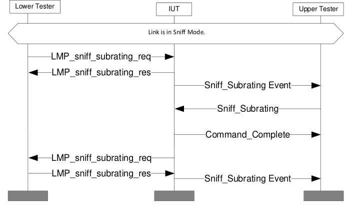

**Figure 4.217: LMP/LIH/BV-118-C [Entering Sniff Subrating Mode from Sniff Mode With Lower Tester as The Initiator] MSC**

a. Max_Sniff_Subrate = 4
b. Min_Sniff_Mode_Timeout = 320 slots
c. Sniff_Subrating_Instant = at least 80 slots ahead of the current piconet clock but not more
than 400 slots
2. The IUT sends LMP_sniff_subrating_res to the Lower Tester with the following parameters (sniff
subrating default values):
a. Max_Sniff_Subrate = 1
b. Min_Sniff_Mode_Timeout = 0 slots
3. After Sniff Subrate Event has been already observed from the Upper Tester, it issues an
HCI_Sniff_Subrating command with the following parameters:
a. Maximum_Latency = 160 slots
b. Minimum_Remote_Timeout = 160 slots
c. Minimum_Local_Timeout = 640 slots
4. The IUT sends LMP_sniff_subrating_req with the following parameters to the Lower Tester:
a. Max_Sniff_Subrate = 8
b. Min_Sniff_Mode_Timeout = 160 slots
5. The Lower Tester sends LMP_sniff_subrating_res to the IUT with the following parameters (same
parameters as the previous negotiation):
a. Max_Sniff_Subrate = 4
b. Min_Sniff_Mode_Timeout = 320 slots
c. Sniff_Subrating_Instant = at least 80 slots ahead of the current piconet clock but not more
than 400 slots
• Expected Outcome
Pass verdict
1. Sniff Subrate Event has been observed before step 3) with the following parameters received by
the Upper Tester:
a. Maximum_Transmit_Latency = 20 slots
b. Maximum_Receive_Latency = 80 slots
c. Minimum_Remote_Timeout = 0 slots
d. Minimum_Local_Timeout = 320 slots
2. After step 5), Sniff Subrate Event has been observed with the following parameters received by
the Upper Tester:
a. Maximum_Transmit_Latency = 160 slots
b. Maximum_Receive_Latency = 80 slots
c. Minimum_Remote_Timeout = 160 slots
d. Minimum_Local_Timeout = 640 slots
LMP/LIH/BV-119-C [Entering Sniff Subrating Mode From Sniff Mode With IUT As The Initiator]
• Test Purpose
Verify that the IUT enters sniff subrating mode as it claims when the IUT initiates sniff subrating mode request.
• Reference
[1] 4.5.3.3
[9] 5.1, 5.2
• Initial Condition
1. The IUT is Peripheral. 2. The Lower Tester and the IUT have a connection in sniff mode. The sniff parameters are:
a. TSniff = 20 slots
b. Sniff_Attempt = 1
c. Sniff_Timeout = 0
3. No ACL_U data are being exchanged to simplify the test case.
• Test Procedure

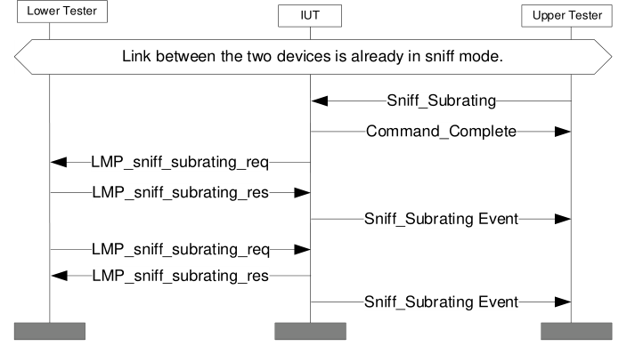

**Figure 4.218: LMP/LIH/BV-119-C [Entering Sniff Subrating Mode From Sniff Mode With IUT As The Initiator] MSC**

1. The Upper Tester issues an HCI_Sniff_Subrating command to the IUT with the following
parameters:
a. Maximum_Latency = 80 slots
b. Minimum_Remote_Timeout = 320 slots
c. Minimum_Local_Timeout = 320 slots
2. The IUT sends LMP_sniff_subrating_req with the following parameters to the Lower Tester:
a. Max_Sniff_Subrate = 4
b. Min_Sniff_Mode_Timeout = 320 slots
subrating default values):
a. Max_Sniff_Subrate = 1
b. Min_Sniff_Mode_Timeout = 0 slots
c. Sniff_Subrating_Instant = at least 80 slots ahead of the current piconet clock but not more
than 400 slots
4. After Sniff Subrate Event has been observed already from the Upper Tester, the Lower Tester
sends LMP_sniff_subrating_req to the IUT with the following parameters:
a. Max_Sniff_Subrate = 4
b. Min_Sniff_Mode_Timeout = 160 slots
c. Sniff_Subrating_Instant = at least 80 slots ahead of the current piconet clock but not more
than 400 slots
5. The IUT sends LMP_sniff_subrating_res with the following parameters to the Lower Tester (same
parameters than former negotiation):
a. Max_Sniff_Subrate = 4
b. Min_Sniff_Mode_Timeout = 320 slots
• Expected Outcome
Pass verdict
1. Sniff Subrate Event has been observed before step 4) with the following parameters received by
the Upper Tester:
a. Maximum_Transmit_Latency = 80 slots
b. Maximum_Receive_Latency = 20 slots
c. Minimum_Remote_Timeout = 320 slots
d. Minimum_Local_Timeout = 320 slots
2. After step 5), Sniff Subrate Event has been observed with the following parameters received by
Upper Tester:
a. Maximum_Transmit_Latency = 80 slots
b. Maximum_Receive_Latency = 80 slots
c. Minimum_Remote_Timeout = 320 slots
d. Minimum_Local_Timeout = 320 slots
LMP/LIH/BV-120-C [IUT Rejects Sniff Subrating Request When In Active Mode]
• Test Purpose
Verify that the IUT rejects sniff subrating request correctly when the connection is still in active mode.
• Reference
[1] 4.5.3.3
[9] 5.2, 5.2
• Initial Condition
- The Lower Tester and the IUT have a connection in active mode.
- No sniff mode negotiation is going on.
- The IUT’s role does not matter as a Peripheral or Central.
• Test Procedure

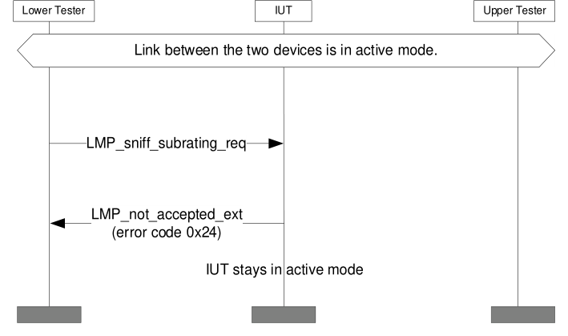

**Figure 4.219: LMP/LIH/BV-120-C [IUT Rejects Sniff Subrating Request When In Active Mode] MSC**

The Lower Tester issues LMP_sniff_subrating_request even though the connection is not in sniff mode yet. The following parameters are used in the LMP transaction:
1. Max_Sniff_Subrate = 2 2. Min_Sniff_Mode_Timeout = 80 3. Sniff_Subrating_Instant: at least 80 slots ahead of the current piconet clock but not more than

## 400 slots

• Expected Outcome
Pass verdict
The LMP_sniff_subrating_req has been rejected correctly by the IUT with Error_Code 0x24: LMP PDU not allowed.
No Sniff Subrate Event has been observed before from the Upper Tester.
LMP/LIH/BV-121-C [Entering Sniff Subrating Mode With Lower Tester Initiating Sniff Mode Request]
• Test Purpose
Verify that the IUT enters sniff subrating mode when the Lower Tester and the IUT have sniff subrating parameters already (either just obtained from their hosts or from sniff subrating history) and the Lower Tester initiates sniff mode request.
• Reference
[1] 4.5.3.3
• Initial Condition
1. The IUT may be Central or Peripheral. 2. The Lower Tester and the IUT have a connection in active mode. 3. No ACL_U data are being exchanged. 4. The Upper Tester issues an HCI_Sniff_Subrating command with the following parameters:
a. Maximum_Latency = 80 slots
b. Minimum_Remote_Timeout = 320 slots
c. Minimum_Local_Timeout = 320 slots
5. The Lower Tester has the following parameters already:
a. Maximum_Latency = 80 slots
b. Minimum_Remote_Timeout = 320 slots
c. Minimum_Local_Timeout = 320 slots
• Test Procedure

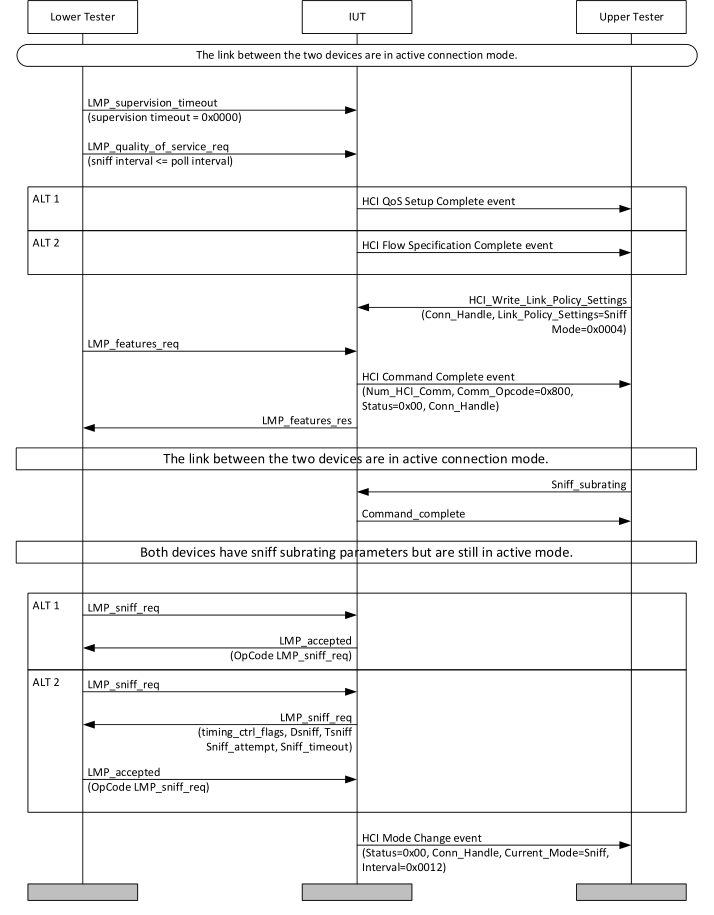

**Figure 4.220: LMP/LIH/BV-121-C [Entering Sniff Subrating Mode With Lower Tester Initiating Sniff Mode Request] MSC – Page 1 of 2**

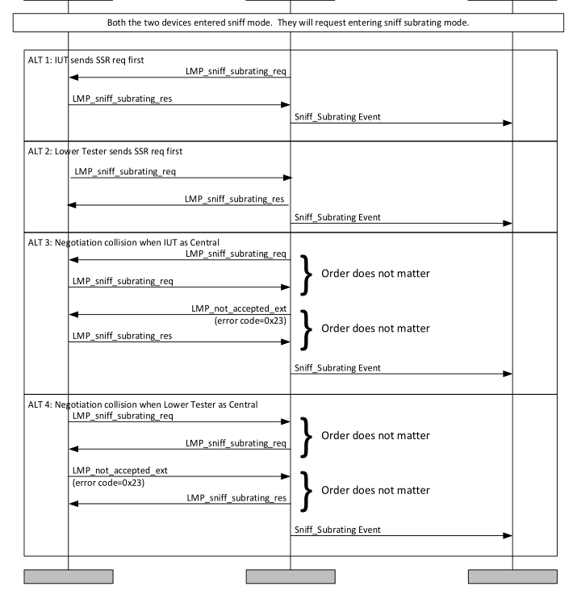

**Figure 4.221: LMP/LIH/BV-121-C [Entering Sniff Subrating Mode With Lower Tester Initiating Sniff Mode Request] MSC – Page 2 of 2**

1. The Lower Tester sends LMP sniff_req to the IUT with the following sniff parameters:
a. TSniff = 20 slots
b. Sniff_Attempt = 1
c. Sniff_Timeout = 0
2. The IUT sends LMP_accepted or LMP_sniff_req. If the IUT sends an LMP_sniff_req PDU with
valid sniff parameters, then the Lower Tester responds with LMP_accepted, and the TSniff value is updated. 3. The Lower Tester sends LMP_subrating_req or LMP_subrating_res with the following
parameters:
a. Max_Sniff_Subrate = 4
b. Min_Sniff_Mode_Timeout = 320
c. Sniff_Subrating_Instant = at least 80 slots ahead of the current piconet clock but not more
than 400 slots
• Expected Outcome
Pass verdict
1. Mode change event has been observed with current mode = sniff from the Upper Tester. 2. Sniff Subrate Event has been observed with the following parameters received by the Upper
Tester:
a. Maximum_Transmit_Latency = TSniff * max_sniff_subrate_transmit slots
b. Maximum_Receive_Latency = TSniff * max_sniff_subrate_receive slots
c. Minimum_Remote_Timeout = 320 slots
d. Minimum_Local_Timeout = 320 slots
• Notes
All the LMP transaction scenarios shown in the MSC are legal permutations but cannot be totally controlled by the Lower or Upper Testers. They are listed here for reference only.
LMP/LIH/BV-122-C [Entering Sniff Subrating Mode with IUT Initiating Sniff Mode Request]
• Test Purpose
Verify that the IUT enters sniff subrating mode when the Lower Tester and the IUT already have sniff subrating parameters (either just obtained from their hosts or from sniff subrating history) and the IUT initiates sniff mode request.
• Reference
[1] 4.5.3.3, 5.2
• Initial Condition
1. The IUT may be the Central or Peripheral. 2. The Lower Tester and the IUT have a connection in active mode. 3. No ACL_U data are being exchanged. 4. The Upper Tester issues an HCI_Sniff_Subrating command with the following parameters:
a. Maximum_Latency = 80 slots
b. Minimum_Remote_Timeout = 320 slots
c. Minimum_Local_Timeout = 320 slots
5. The Lower Tester has the following parameters already:
a. Maximum_Latency = 80 slots
b. Minimum_Remote_Timeout = 320 slots
c. Minimum_Local_Timeout = 320 slots
• Test Procedure

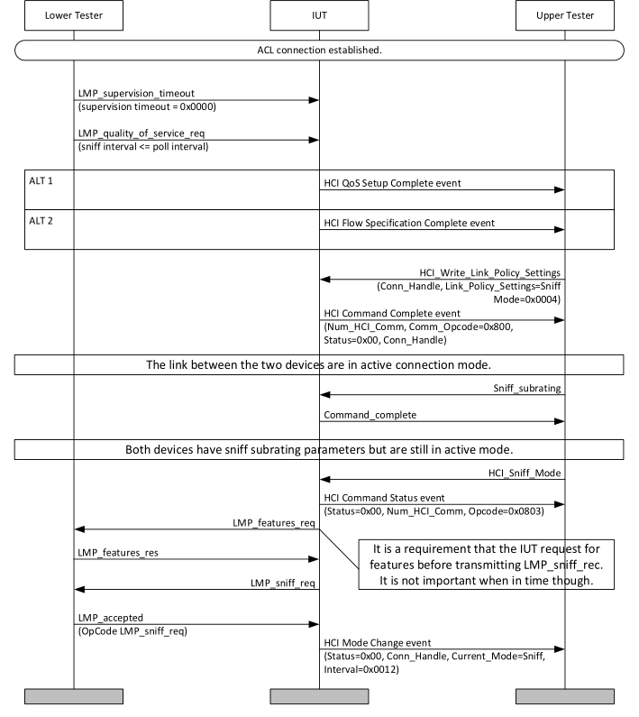

**Figure 4.222: LMP/LIH/BV-122-C [Entering Sniff Subrating Mode with IUT Initiating Sniff Mode Request] MSC – Page 1 of 2**

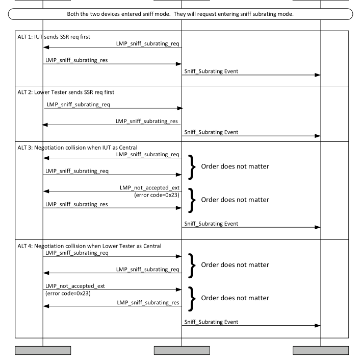

**Figure 4.223: LMP/LIH/BV-122-C [Entering Sniff Subrating Mode with IUT Initiating Sniff Mode Request] MSC – Page 2 of 2**

1. The Upper Tester issues HCI_sniff_mode command with the following sniff parameters:
a. Max Sniff Interval = 20 slots
b. Min Sniff Interval = 20 slots
c. Sniff_Attempt = 1
d. Sniff_Timeout = 0
2. The Lower Tester sends LMP_subrating_req or LMP_subrating_res with the following parameters
already:
a. Max_Sniff_Subrate = 4
b. Min_Sniff_Mode_Timeout = 320
c. Sniff_Subrating_Instant = at least 80 slots ahead of the current piconet clock but not more
than 400 slots
• Expected Outcome
Pass verdict
1. Mode change event has been observed with current mode = SNIFF from the Upper Tester. 2. Sniff Subrating Event has been observed with the following parameters received by the Upper
Tester.
a. Maximum_Transmit_Latency = 80 slots
b. Maximum_Receive_Latency = 80 slots
c. Minimum_Remote_Timeout = 320 slots
d. Minimum_Local_Timeout = 320 slots
• Notes
All the LMP transaction scenarios shown in the MSC are legal permutations but cannot be totally controlled by the Lower or Upper Testers. They are listed here for reference only.
LMP/LIH/BV-123-C [IUTs Transitioning from Existing Sniff Subrating Mode to A New Set of Subrating Parameters]
• Test Purpose
Verify that an IUT already in sniff subrating mode will transition to a new set of subrating parameters successfully.
• Reference
[1] 4.5.3.3, 5.2
• Initial Condition
1. The IUT is Peripheral. 2. The Lower Tester and the IUT have a connection in sniff mode. The sniff parameters are:
a. TSniff = 20 slots
b. Sniff_Attempt = 1
c. Sniff_Timeout = 0
3. The Upper Tester issues an HCI_Sniff_Subrating command with the following parameters:
a. Maximum_Latency = 80 slots
b. Minimum_Remote_Timeout = 320 slots
c. Minimum_Local_Timeout = 320 slots
4. The Lower Tester has the following parameters received from the IUT (the IUT sends
LMP_sniff_subrating_req with the following parameters):
a. Max_Sniff_Subrate = 4
b. Min_Sniff_Mode_Timeout = 320 slots
LMP_sniff_subrating_res to the IUT):
a. Max_Sniff_Subrate = 8
b. Min_Sniff_Mode_Timeout = 160 slots
c. Sniff_Subrating_Instant = at least 240 slots ahead of the current piconet clock but not more
than 360 slots
6. Sniff Subrate Event has been observed by the Upper Tester with the following parameters:
a. Maximum_Transmit_Latency = 80 slots
b. Maximum_Receive_Latency = 160 slots
c. Minimum_Remote_Timeout = 320 slots
d. Minimum_Local_Timeout = 320 slots
7. No data is being exchanged between the two devices.
• Test Procedure

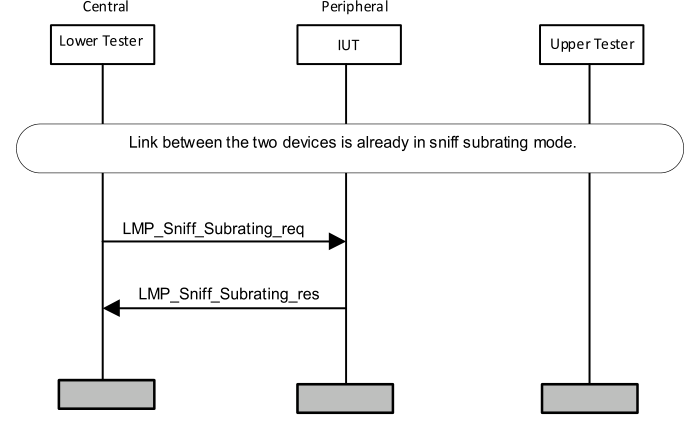

**Figure 4.224: LMP/LIH/BV-123-C [IUTs Transitioning from Existing Sniff Subrating Mode to A New Set of Subrating Parameters] MSC**

1. The Lower Tester sends LMP_sniff_subrating_req to the IUT with the following parameters:
a. Max_Sniff_Subrate = 12
b. Min_Sniff_Mode_Timeout = 480 slots
c. Sniff_Subrating_Instant = at least 480 slots ahead of the current piconet clock but not more
than 960 slots
2. The IUT sends LMP_sniff_subrating_res with the following parameters (same parameters than
the former negotiation
a. Max_Sniff_Subrate = 4
b. Min_Sniff_Mode_Timeout = 320 slots
• Expected Outcome
Pass verdict
Sniff Subrate Event has been observed by the Upper Tester with the following parameters:
- Maximum_Transmit_Latency = 80 slots
- Maximum_Receive_Latency = 240 slots
- Minimum_Remote_Timeout = 320 slots
- Minimum_Local_Timeout = 480 slots
LMP/LIH/BV-124-C [Sniff Subrating Mode to Active Mode Transition Initiated By Lower Tester]
• Test Purpose
Verify that the IUT can transition from sniff subrating mode to active mode when the Lower Tester's host issues an Exit_Sniff command.
• Reference
[1] 4.5.3.3, 5.2
• Initial Condition
1. The IUT is in a Peripheral role. 2. A sniff subrating connection has been established between the Lower Tester and the IUT as
Peripheral. 3. The Upper Tester issues an HCI_Sniff_Subrating command with the following parameters:
a. Maximum_Latency = 80 slots
b. Minimum_Remote_Timeout = 320 slots
c. Minimum_Local_Timeout = 320 slots
4. The IUT sends LMP_sniff_subrating_req with the following parameters to the Lower Tester:
a. Max_Sniff_Subrate = 4
b. Min_Sniff_Mode_Timeout = 320 slots
5. The Lower Tester sends LMP_sniff_subrating_res to the IUT with the following parameters (sniff
subrating default values):
a. Max_Sniff_Subrate = 4
b. Min_Sniff_Mode_Timeout = 320 slots
c. Sniff_Subrating_Instant = at least 240 slots ahead of the current piconet clock but not more
than 360 slots
6. Sniff Subrate Event has been observed with the following parameters received by the Upper
Tester:
a. Maximum_Transmit_Latency = 80 slots
b. Maximum_Receive_Latency = 80 slots
c. Minimum_Remote_Timeout = 320 slots
d. Minimum_Local_Timeout = 320 slots
• Test Procedure

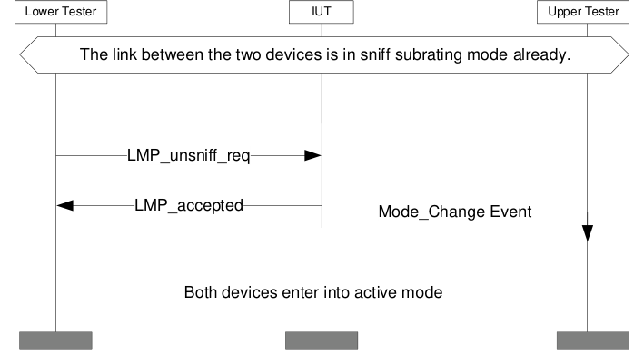

**Figure 4.225: LMP/LIH/BV-124-C [Sniff Subrating Mode to Active Mode Transition Initiated By Lower Tester] MSC**

The Lower Tester sends an LMP_unsniff_req command and the link is out of sniff subrating mode.
• Expected Outcome
Pass verdict
Mode Change Event (ACTIVE) has been observed by the Upper Tester.
LMP/LIH/BV-125-C [Sniff Subrating Mode to Active Mode Transition Initiated By IUT]
• Test Purpose
Verify that the IUT can transition from sniff subrating mode to active mode when the Upper Tester issues an Exit_Sniff command.
• Reference
[1] 4.5.3.3, 5.2
• Initial Condition
1. The IUT is a Peripheral. 2. A sniff subrating connection has been established between the Lower Tester and the IUT as
Peripheral. 3. The Upper Tester issues an HCI_Sniff_Subrating command with the following parameters:
a. Maximum_Latency = 80 slots
b. Minimum_Remote_Timeout = 320 slots
c. Minimum_Local_Timeout = 320 slots
4. The IUT sends LMP_sniff_subrating_req with the following parameters to the Lower Tester:
a. Max_Sniff_Subrate = 4
b. Min_Sniff_Mode_Timeout = 320 slots
subrating default values):
a. Max_Sniff_Subrate = 4
b. Min_Sniff_Mode_Timeout = 320 slots
c. Sniff_Subrating_Instant = at least 240 slots ahead of the current piconet clock but not more
than 360 slots
6. Sniff Subrate Event has been observed with the following parameters received by the Upper
Tester:
a. Maximum_Transmit_Latency = 80 slots
b. Maximum_Receive_Latency = 80 slots
c. Minimum_Remote_Timeout = 320 slots
d. Minimum_Local_Timeout = 320 slots
• Test Procedure

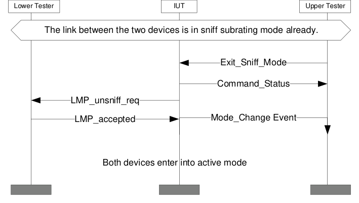

**Figure 4.226: LMP/LIH/BV-125-C [Sniff Subrating Mode to Active Mode Transition Initiated By IUT] MSC**

The Upper Tester issues an unsniff command.
• Expected Outcome
Pass verdict
Mode Change Event (ACTIVE) has been observed by the Upper Tester.

#### 4.8.20 Multi-slot Packets - Peripheral

Verify that a unit can request for a maximum of slots to be used. The IUT is Peripheral.
LMP/LIH/BV-61-C [Request Maximum Slots as Peripheral]
• Test Purpose
Verify that the IUT can request and accept a maximum number of slots. The IUT is Peripheral and initiates the service. The Lower Tester is Central.
• Reference
[1] 4.1.10
• Initial Condition
- See Default settings.
- DM1 up and running.
• Test Procedure
Peripheral
IUT Central Lower Tester

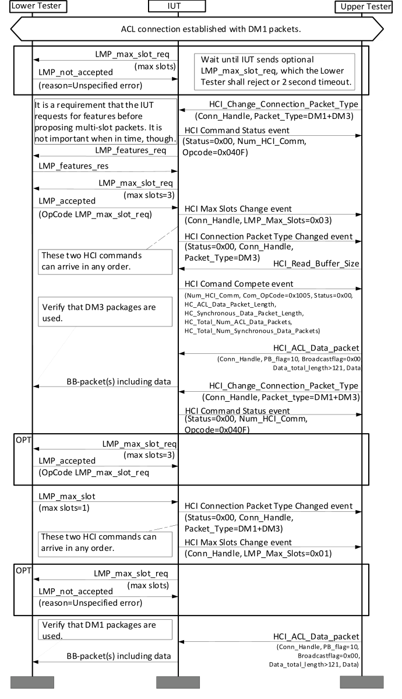

**Figure 4.227: LMP/LIH/BV-61-C [Request Maximum Slots as Peripheral] MSC**

Verify that the indicated packages are used.
• Test Condition
It must be possible to control the IUT to initiate the control of multislot packages.
• Expected Outcome
Pass verdict
The IUT uses DM3 packages after reception of PDU LMP_accepted.
The IUT accepts reception of PDU LMP_max_slot and changes to DM1 packages.
• Inconclusive verdict
The IUT does not initiate LMP_max_slot_req to use multislot packets.
• Notes
If DM3 packages are not supported by the IUT they have to be replaced with DH3 or DM5 or DH5.
LMP/LIH/BV-63-C [Accept Maximum Slot Request]
• Test Purpose
Verify that the IUT can accept a request to use a maximum number of slots. The IUT is Peripheral. The Lower Tester is Central and initiates the service.
• Reference
[1] 4.1.10
• Initial Condition
- See Default settings.
- DM1 up and running.
• Test Procedure
Central Peripheral

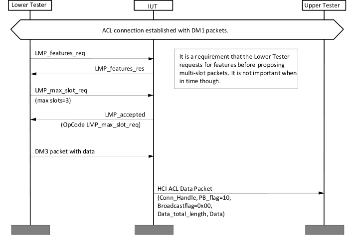

**Figure 4.228: LMP/LIH/BV-63-C [Accept Maximum Slot Request] MSC**

• Expected Outcome
Pass verdict
The IUT transmits PDU LMP_accepted upon reception of LMP_max_slot_req.
The IUT transmits an HCI ACL Data Packet to the Upper Tester.
• Notes
If DM3 packages are not supported by the IUT they have to be replaced with DH3 or DM5 or DH5.
LMP/LIH/BV-145-C [Maximum Slot after a Connection as Peripheral]
• Test Purpose
Verify that the IUT maximum number of slots is 1 after a new connection. The IUT is Peripheral and initiates the service. The Lower Tester is Central.
• Reference
[1] 4.1.10
• Initial Condition
- See Default settings.
• Test Procedure
Peripheral
IUT Central Lower Tester

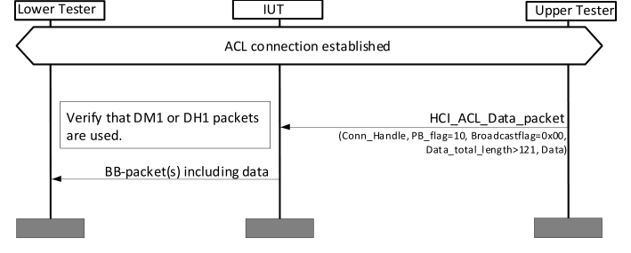

**Figure 4.229: LMP/LIH/BV-145-C [Maximum Slot after a Connection as Peripheral] MSC**

Verify that the indicated packets are used.
• Expected Outcome
Pass verdict
The IUT uses DM1 or DH1 packets after a new connection.
LMP/LIH/BV-146-C [Maximum Slot after Role Switch as Peripheral]
• Test Purpose
Verify that the IUT maximum number of slots is set to 1 after a role switch. The IUT is Peripheral and initiates the service. The Lower Tester is Central.
• Reference
[1] 4.1.10
• Initial Condition
- See Default settings.
- DM3, DH3, DM1, or DH1 up and running.
• Test Procedure
Peripheral
IUT Central Lower Tester

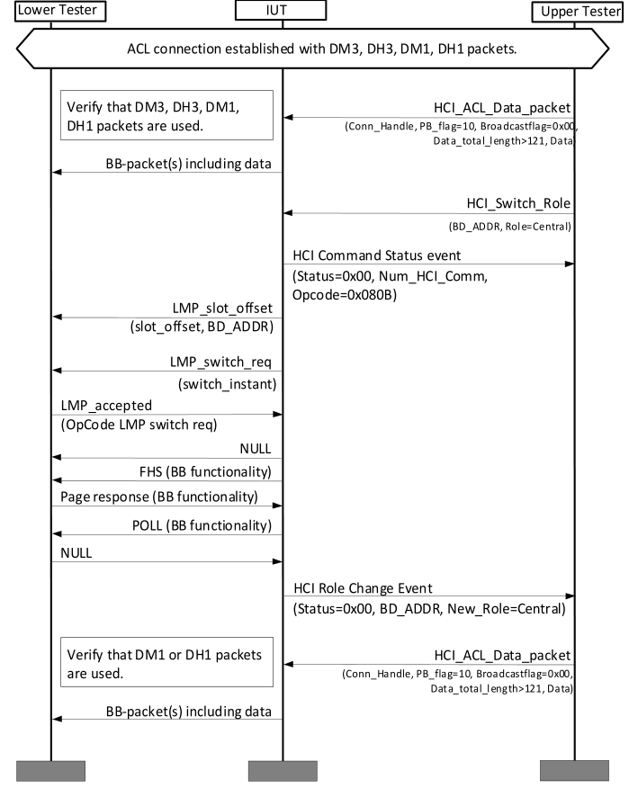

**Figure 4.230: LMP/LIH/BV-146-C [Maximum Slot after Role Switch as Peripheral] MSC**

Verify that the indicated packets are used.
• Expected Outcome
Pass verdict
The IUT uses DM1 or DH1 packets after a successful role switch.
• Notes
If DM3 or DH3 packets are not supported by the IUT, they have to be replaced with DM5 or DH5.

#### 4.8.21 Multi-slot Packets - Central

Verify that a unit can request for a maximum of slots to be used. The IUT is Central.
LMP/LIH/BV-64-C [Request Maximum Slots as Central]
• Test Purpose
Verify that the IUT can request and accept a maximum number of slots. The IUT is Central and initiates the service. The Lower Tester is Peripheral.
• Reference
[1] 4.1.10
• Initial Condition
- See Default settings.
- DM1 up and running.
- The IUT must page the Lower Tester to become the Central of the Piconet.
• Test Procedure
Central IUT Peripheral Lower Tester Upper Tester

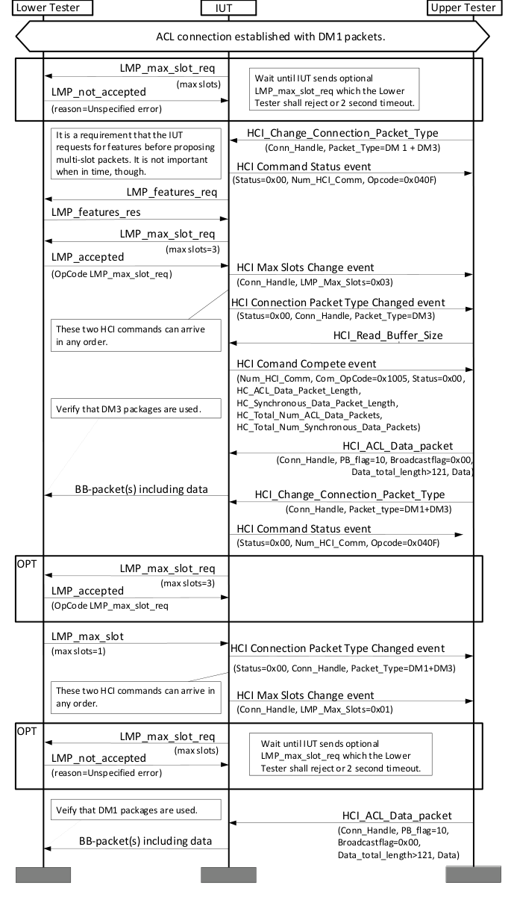

**Figure 4.231: LMP/LIH/BV-64-C [Request Maximum Slots as Central] MSC**

Verify that the indicated packages are used.
• Test Condition
It must be possible to control the IUT to initiate the control of multislot packages.
• Expected Outcome
Pass verdict
The IUT uses DM1 or DM3 packages after reception of PDU LMP_accepted.
The IUT accepts PDU LMP_max_slot and changes to DM1 packages.
Inconclusive verdict
The IUT does not initiate LMP_max_slot_req to use multislot packets.
• Notes
If DM3 packages are not supported by the IUT they have to be replaced with DH3 or DM5 or DH5.
LMP/LIH/BV-147-C [Maximum Slot after a Connection as Central]
• Test Purpose
Verify that the IUT maximum number of slots is 1 after a new connection. The IUT is Central and initiates the service. The Lower Tester is Peripheral.
• Reference
[1] 4.1.10
• Initial Condition
- See Default settings.
• Test Procedure
Central IUT Peripheral Lower Tester Upper Tester

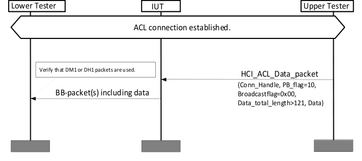

**Figure 4.232: LMP/LIH/BV-147-C [Maximum Slot after a Connection as Central] MSC**

Verify that the indicated packets are used.
• Expected Outcome
Pass verdict
The IUT uses DM1 or DH1 packets after a new connection.
• Test Purpose
Verify that the IUT maximum number of slots is 1 after a role switch. The IUT is Central and initiates the service. The Lower Tester is Peripheral.
• Reference
[1] 4.1.10
• Initial Condition
- See Default settings.
- DM3, DH3, DM1, or DH1 up and running.
- The IUT must page the Lower Tester to become the Central of the Piconet.
• Test Procedure
Central IUT Peripheral Lower Tester Upper Tester

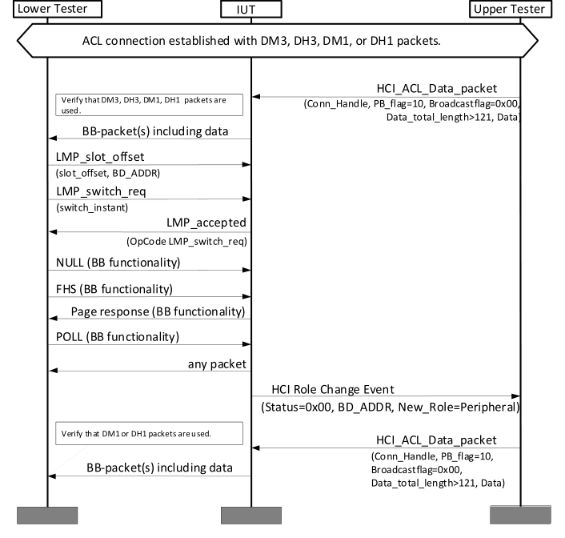

**Figure 4.233: LMP/LIH/BV-148-C [Maximum Slot after Role Switch as Central] MSC**

Verify that the indicated packets are used.
• Expected Outcome
Pass verdict
The IUT uses DM1 or DH1 packets after a successful role switch.
• Notes
If DM3 or DH3 packets are not supported by the IUT, they have to be replaced with DM5 or DH5.

#### 4.8.22 Paging_Scheme - Both Central and Peripheral

Verify that the IUT declines the Paging_Scheme changes in a correct manner. The role of the IUT is of no importance.
LMP/LIH/BV-71-C [Reject Page Mode Negotiation]
• Test Purpose
Verify that the IUT responds to the Lower Tester that it does not support to negotiate the Paging_Scheme, when the Lower Tester tries to negotiate the page mode.
• Reference
[1] 4.1.9.1
• Initial Condition
- See Default settings.
• Test Procedure

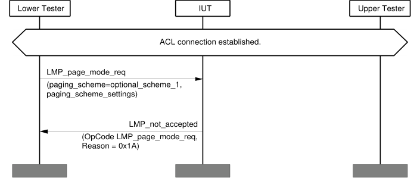

**Figure 4.234: LMP/LIH/BV-71-C [Reject Page Mode Negotiation] MSC**

• Expected Outcome
Pass verdict
The IUT transmits PDU LMP_not_accepted containing “Reason = 0x1A” upon reception of LMP_page_mode_req.
LMP/LIH/BV-72-C [Reject Page Scan Negotiation]
• Test Purpose
Verify that the IUT responds to the Lower Tester that it does not support to negotiate the Paging_Scheme, when the Lower Tester tries to negotiate the page scan mode.
• Reference
[1] 4.1.9.2
• Initial Condition
- See Default settings.
• Test Procedure

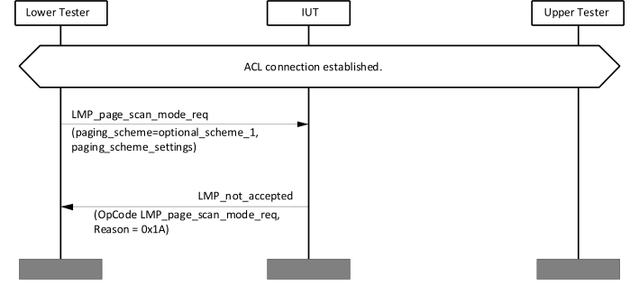

**Figure 4.235: LMP/LIH/BV-72-C [Reject Page Scan Negotiation] MSC**

• Expected Outcome
Pass verdict
The IUT transmits PDU LMP_not_accepted containing “Reason = 0x1A” upon reception of PDU LMP_page_scan_mode_req.

#### 4.8.23 Link Supervision

Verify that the IUT can set the Supervision_Timeout. The IUT is Central.
LMP/LIH/BV-74-C [Set Supervision Timer as Central]
• Test Purpose
Verify that the IUT sets the supervision timer. The IUT is Central. The Lower Tester is Peripheral.
• Reference
[1] 4.1.6
• Initial Condition
- See Default settings.
- The IUT has to page the Lower Tester to become the Central of the Piconet.
• Test Procedure
Central
Peripheral

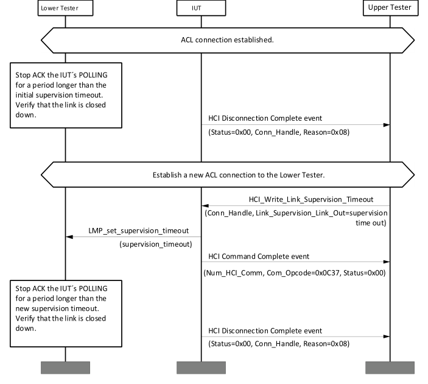

**Figure 4.236: LMP/LIH/BV-74-C [Set Supervision Timer as Central] MSC**

• Expected Outcome
Pass verdict
The IUT closes down the connection after expiration of the Supervision_Timeout and can change the Supervision_Timeout and closes the connection after the changed timer expires.
LMP/LIH/BV-126-C [Set Supervision Timer as Peripheral]
• Test Purpose
Verify that the IUT sends an HCI_Link_Supervision_Timeout_Changed event to the Host when the Central changes the link supervision timeout. The IUT is Peripheral. The Lower Tester is Central.
• Reference
[1] 4.1.6
• Initial Condition
- The IUT is a Peripheral in a connection with the Lower Tester
- See Default settings.
• Test Procedure

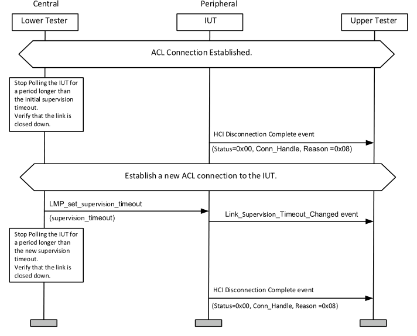

**Figure 4.237: LMP/LIH/BV-126-C [Set Supervision Timer as Peripheral] MSC**

The Lower Tester changes its link supervision timeout value (new value = old value + 5 seconds).
The Upper Tester verifies that an HCI event is generated by the IUT after the LMP is sent from the Lower Tester. The HCI event contains the new timeout value.
• Expected Outcome
Pass verdict
The Upper Tester receives an HCI_Link_Supervision_Timeout_Changed event generated by IUT, and the content of the new timeout is as specified by the Central.
The IUT closes down the connection after expiration of the Supervision Timeout, changes the Supervision Timeout upon notice from the Lower Tester, and closes the connection after the changed timer expires.

#### 4.8.24 Deadlock Avoidance

Verify that a unit does not run into a deadlock situation.
LMP/LIH/BV-80-C [Avoid Deadlock as Central]
• Test Purpose
Verify that the IUT does not create a deadlock situation during ACL connection set-up. The IUT is Central.
• Reference
[1] 2.7, 4.3.4
• Initial Condition
- See Default settings.
• Test Procedure
Central
Peripheral

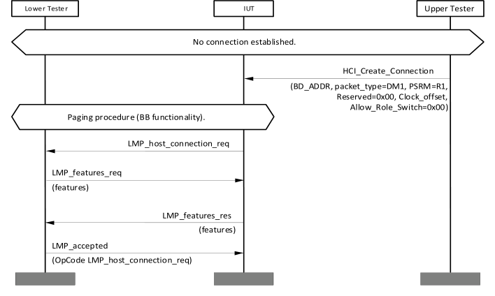

**Figure 4.238: LMP/LIH/BV-80-C [Avoid Deadlock as Central] MSC**

• Expected Outcome
Pass verdict
The IUT transmits LMP_features_res before receiving LMP_accepted.
LMP/LIH/BV-81-C [Avoid Deadlock as Peripheral]
• Test Purpose
Verify that the IUT does not create a deadlock situation on an active ACL connection. The IUT is Peripheral.
• Reference
[1] 2.7, 4.3.4
• Initial Condition
- See Default settings.
• Test Procedure
Peripheral
Central

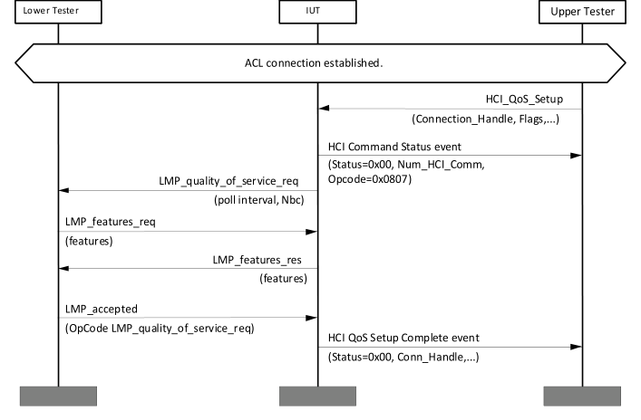

**Figure 4.239: LMP/LIH/BV-81-C [Avoid Deadlock as Peripheral] MSC**

• Test Condition
IXIT statement gives the IUT’s possible parameter values for HCI_QoS_Setup.
• Expected Outcome
Pass verdict
The IUT transmits LMP_features_res before receiving LMP_accepted.
The IUT sends HCI QoS Setup Complete event with Status = Success.

#### 4.8.25 Test for Devices that do not Support Enhanced Data_Rate

Verify that the devices that do not support Enhanced Data_Rate do not accept Enhanced Data_Rate initiation.
LMP/LIH/BV-83-C [Test for Devices that do not support Enhanced Data_Rate]
• Test Purpose
Verify that the IUT does not set up an EDR ACL link upon request from the Lower Tester. Verify that the correct EDR ACL setup denial is used. IUT is Peripheral. The Lower Tester is Central and initiates the service.
Test is for devices that do not support Enhanced Data_Rate ACL.
• Reference
[1] 4.1.11
• Initial Condition
- See Default settings.
- ACL link up and running, see Preamble MSC.
• Test Procedure
Central Peripheral

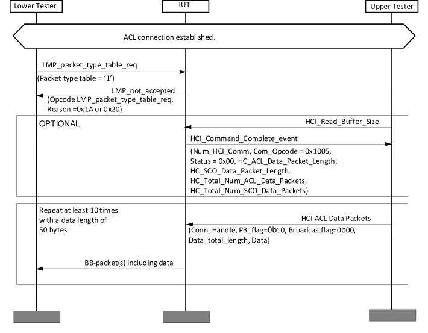

**Figure 4.240: LMP/LIH/BV-83-C [Test for Devices that do not support Enhanced Data_Rate] MSC**

• Expected Outcome
Pass verdict
The IUT transmits the PDU LMP_not_accepted containing “Unsupported LMP Feature Reason=0x1A” or “Unsupported LMP Parameter Reason=0x20” upon reception of PDU LMP_packet_type_table_req.

#### 4.8.26 Setting up and Removing Enhanced Data_Rate ACL connection

Verify that the unit can initiate and remove an Enhanced Data_Rate ACL link. The IUT is Peripheral.
Test the behavior of the IUT in relation to syntactically and contextual correct behavior of the test system.
LMP/LIH/BV-84-C [EDR ACL Link Setup]
• Test Purpose
Verify that the IUT sets up an EDR ACL link upon request from the Lower Tester. Verify that the correct EDR ACL setup is used. The IUT is Peripheral. The Lower Tester is Central and initiates the service.
Test is for devices that support Enhanced Data_Rate ACL.
• Reference
[1] 4.1.11
• Initial Condition
- See Default settings.
- ACL link up and running See Preamble MSC in Connection Establishment Lower Tester.
• Test Procedure
Central Peripheral

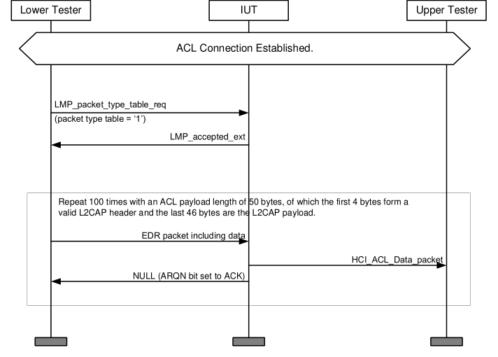

**Figure 4.241: LMP/LIH/BV-84-C [EDR ACL Link Set Up] MSC**

• Expected Outcome
Pass verdict
The IUT accepts LMP_packet_type_table_req with LMP_accepted_ext. At least 90% of the EDR ACL packets are acknowledged and transferred to the Upper Tester.
• Notes
The IUT may substitute a DM1 packet for any or all of the NULL packets shown in the MSC.
LMP/LIH/BV-85-C [EDR ACL Link Remove]
• Test Purpose
Verify that the IUT configured as Peripheral, upon reception of an EDR packet including data, can either send a NAK or not answer. The Lower Tester is Central and initiates the service.
Test is for devices that support Enhanced Data_Rate ACL.
• Reference
[1] 4.1.11
• Initial Condition
- See Default settings.
- EDR ACL link up and running, See Preamble MSC in Connection Establishment Lower Tester.
• Test Procedure
Central Peripheral

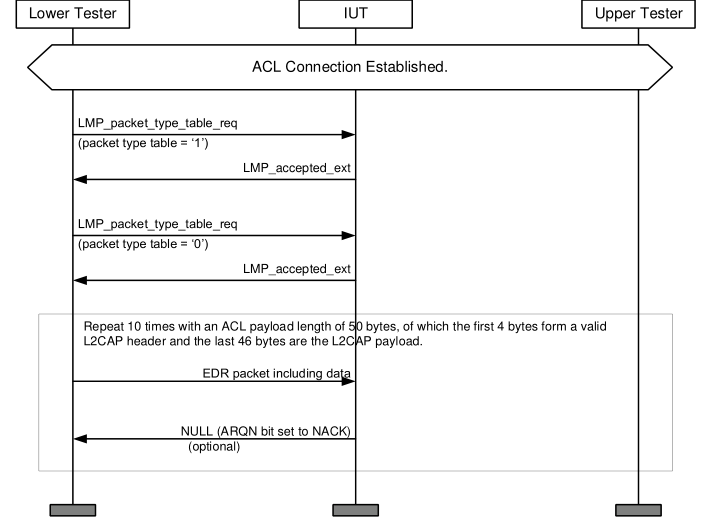

**Figure 4.242: LMP/LIH/BV-85-C [EDR ACL Link Remove] MSC**

• Expected Outcome
Pass verdict
The IUT accepts LMP_packet_type_table_req (with ptt='1') with LMP_accepted_ext. The IUT accepts LMP_packet_type_table_req (with ptt='0') with LMP_accepted_ext. Each EDR data packet is negatively acknowledged (explicitly or implicitly), and none is delivered to the Upper Tester.
• Notes
The IUT may substitute a DM1 packet for any or all of the NULL packets shown in the MSC. Alternately, the IUT may send no packet at all in response to any or all of the NULL packets.

#### 4.8.27 Setting Enhanced Data_Rate eSCO Connection

Verify that the unit can initiate and remove an eSCO link.
LMP/LIH/BV-86-C [EDR 2-EV3 eSCO Link Setup]
• Test Purpose
Verify that the IUT sets up an Enhanced Data_Rate 2-EV3 eSCO link upon request from the Lower Tester. Verify that the correct Enhanced Data_Rate eSCO setup is used. The IUT is Peripheral. The Lower Tester is Central and initiates the service.
Test is for devices that support Enhanced Data_Rate eSCO.
• Reference
[1] 4.6.2
• Initial Condition
- See Default settings.
- ACL link up and running.
• Test Procedure
Verify that 2-EV3 packets are transmitted at the eSCO instants and retransmitted inside the retransmission window.
Central Peripheral

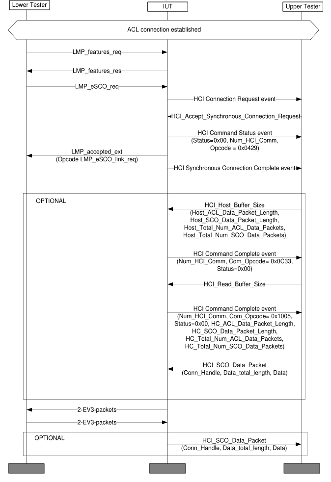

**Figure 4.243: LMP/LIH/BV-86-C [EDR 2-EV3 eSCO Link Setup] MSC**

- The LMP_eSCO_link_req has the following content:
- eSCO_Handle: Any valid number
- eSCO_LT_ADDR: Any valid number
- Timing_Control_Flags: Derived from Central’s clock
- DeSCO: Any number in the range [0, TeSCO - 2]
- TeSCO: 12 slots
- WeSCO: 2 slots
- Packet type C→P: 2-EV3
- Packet type P→C: 2-EV3
- Packet_Length C→P: 60 bytes
- Packet_Length P→C: 60 bytes
- Air_Mode: Any supported Air_Mode
- Negotiation Flag: Initiate Negotiation
Verify that the indicated packets are used.
• Test Condition
The need to have HCI_Synchronous_Data packets to generate EV packets should be declared as IXIT. However, payload content is not verified.
• Expected Outcome
Pass verdict
The IUT transmits PDU LMP_accepted_ext upon reception of PDU LMP_eSCO_link_req. An eSCO links is established accordingly, and the negotiated eSCO packets are transmitted.
LMP/LIH/BV-87-C [EDR eSCO Link Remove]
• Test Purpose
Verify that the IUT accepts a request from the Lower Tester to remove the Enhanced Data_Rate eSCO link.
• Reference
[1] 4.6.2
• Initial Condition
- See Default settings.
- LMP/LIH/BV-86-C [EDR 2-EV3 eSCO Link Setup]
• Test Procedure
Central Peripheral Lower Tester

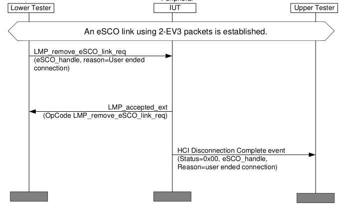

**Figure 4.244: LMP/LIH/BV-87-C [EDR eSCO Link Remove] MSC**

The LMP_remove_eSCO_link has the following content:
- eSCO_Handle: The handle of the current eSCO link
- Reason: 0x13 User ended connection
Verify that the eSCO link is removed.
• Expected Outcome
Pass verdict
The IUT transmits PDU LMP_accepted_ext upon reception of PDU LMP_remove_eSCO_link_req. The eSCO link must be closed, and the negotiated eSCO packets are not transmitted.
LMP/LIH/BV-150-C [APB Ignores PDUs Other Than Clock Adjustment]
• Test Purpose
Verify that the IUT with an APB logical link ignores PDUs except for LMP_CLK_ADJ.
• Reference
[10] 5.1
• Initial Condition
- IUT: Configured as Peripheral in state CONNECTION (active mode, APB link).
- Lower Tester: Configured as Central in state CONNECTION (active mode, APB link).
• Test Procedure
1. The Lower Tester sends an LMP_FEATURES_REQ PDU to the IUT on the APB-C link. 2. The IUT does not send an LMP_FEATURES_RSP PDU to the Lower Tester.

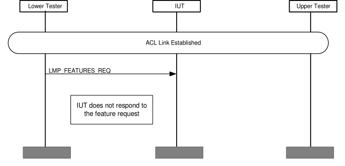

**Figure 4.245: LMP/LIH/BV-150-C [APB Ignores PDUs Other Than Clock Adjustment] MSC**

• Expected Outcome
Pass verdict
The IUT does not respond to a feature request sent on an APB-C link.

### 4.9 Test Modes

Verify the correct implementation of the Test Modes services.

#### 4.9.1 Enabled Mode - Peripheral

Verify that the IUT rejects a request to be put into Test Mode if not in enabled mode. The IUT is Peripheral.
LMP/TEM/BV-01-C [Reject Test Mode Request]
• Test Purpose
Verify that the IUT rejects the request from the Lower Tester to be put into Test Mode. The IUT is Peripheral and is not in enabled mode. The Lower Tester is Central.
• Reference
[1] 4.7.1, 4.7.2
• Initial Condition
- See Default settings.
• Test Procedure
Peripheral
Central

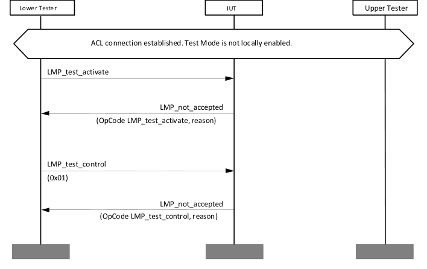

**Figure 4.246: LMP/TEM/BV-01-C [Reject Test Mode Request] MSC**

• Test Condition
The IUT must not be in enabled Test Mode.
• Expected Outcome
Pass verdict
The IUT transmits PDU LMP_not_accepted upon reception of PDU LMP_test_activate.
The IUT must not enter Test Mode.

### 4.10 Adaptive Frequency Hopping

#### 4.10.1 Adaptive Frequency Hopping test cases

LMP/AFH/BV-01-C [AFH Enable – Peripheral]
• Test Purpose
Verify that the IUT switches from AFH disabled (normal operation) to AFH enabled after the Switch_Instant. The IUT is Peripheral. The Lower Tester is Central and initiates the AFH switch.
• Reference
[1] 4.1.4
• Initial Conditions
- See Default settings.
- The Lower Tester and the IUT are in a normal connected state.
- The Lower Tester is the Central and the IUT is a Peripheral.
- The IUT is in an AFH disabled state.
• Test Procedure
Central Peripheral

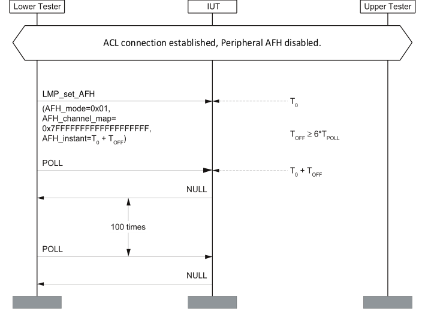

**Figure 4.247: LMP/AFH/BV-01-C [AFH Enable – Peripheral] MSC**

The Lower Tester sends the IUT an LMP_set_AFH command specifying AFH_Mode = AFH_enabled, the AFH_Channel_Map = AHS(79), and a Switch_Instant, THS.
Each 1-bit field in the AFH channel map is set to 1, to indicate all channels are good.
The Switch_Instant, THS, is set to a value consistent with a time difference of more than 6 * Tpoll slots from the first transmission of the LMP_set_AFH command.
Starting at the Switch_Instant, the Lower Tester POLLs the Peripheral on 100 consecutive Central-to- Peripheral slots.
• Expected Outcome
Pass verdict
The test is successful if the IUT responds to at least 95% of the Lower Tester’s POLLs.
• Notes
The test requirement of 95% returned packets is to take into account the imperfect radio path but not to allow for any errors due to an incorrect implementation of the hopping kernel.
A standardized cable interface is assumed for the baseband connection.
• Test Purpose
Verify that the IUT switches from AFH enabled to AFH disabled after the Switch_Instant. The IUT is Peripheral. The Lower Tester is Central and initiates the AFH switch.
• Reference
[1] 4.1.4
• Initial Condition
- See Default settings.
- The Lower Tester and the IUT are in a normal connected state.
- The Lower Tester is the Central and the IUT is the Peripheral.
- The IUT is in an AFH enabled state with AFH_Channel_Map = AHS(79).
- Each 1-bit field in the AFH channel map used for the IUT is set to 1, to indicate all channels are good.
• Test Procedure
Central Peripheral

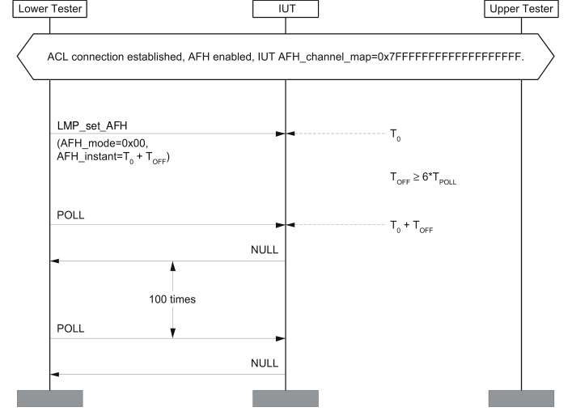

**Figure 4.248: LMP/AFH/BV-02-C [AFH Disable - Peripheral] MSC**

The Lower Tester sends the IUT an LMP_set_AFH command specifying AFH_Mode = AFH_disabled and a Switch_Instant, THS.
The Switch_Instant, THS, is set to a value consistent with a time difference of more than 6 * Tpoll slots from the first transmission of the LMP_set_AFH command.
Starting at the Switch_Instant, the Lower Tester POLLs the Peripheral on 100 consecutive Central-to- Peripheral slots.
• Expected Outcome
Pass verdict
The test is successful if the IUT responds to at least 95% of the Lower Tester’s POLLs.
• Notes
The test requirement of 95% returned packets is to take into account the imperfect radio path but not to allow for any errors due to an incorrect implementation of the hopping kernel.
A standardized cable interface is assumed for the baseband connection.
LMP/AFH/BV-03-C [AFH Switch – Peripheral]
• Test Purpose
Verify that the IUT switches from AFH enabled to AFH enabled with different channel masks after the Switch_Instant. The IUT is Peripheral. The Lower Tester is Central and initiates the AFH switch.
• Reference
[1] 4.1.4
• Initial Conditions
See Default settings.
The Lower Tester and the IUT are in a normal connective state.
The Lower Tester is the Central.
The IUT is AFH Enabled.
The 10 byte Channel mask established is set as: 0x5DDDDDDDFFFF77777777.
• Test Procedure
Central Peripheral

**Figure 4.249: LMP/AFH/BV-03-C [AFH Switch – Peripheral] MSC**

The Lower Tester sends the IUT an LMP_set_AFH command specifying AFH_Mode = AFH_enabled, a new channel map, and a Switch_Instant, THS.
The new channel map is set to: 0x777777770000DDDDDDDD.
The Switch_Instant, THS, is set to a value consistent with a time difference of more than 6 * Tpoll slots from the first transmission of the LMP_set_AFH command.
Starting at the Switch_Instant, the Lower Tester POLLs the Peripheral on 100 consecutive Central-to- Peripheral slots.
• Expected Outcome
Pass verdict
The test is successful if after the Switch_Instant the IUT responds to at least 95% of the Lower Tester’s POLLs.
• Notes
The test requirement of 95% returned packets is to take into account the imperfect radio path but not to allow for any errors due to an incorrect implementation of the hopping kernel.
A standardized cable interface is assumed for the baseband connection.
LMP/AFH/BV-04-C [Classification Reporting – Normal Operation]
• Test Purpose
Verify that the IUT starts reporting channel classification messages when requested. The IUT is Peripheral. The Lower Tester is Central and enables the channel classification reporting on the Peripheral.
• Reference
[1] 4.1.4
• Initial Condition
- See Default settings.
- The Lower Tester pages the IUT to become the Central.
- The Lower Tester and IUT are in normal connection state.
- The Upper Tester disables via HCI the local channel assessment capabilities of the IUT using the HCI_Write_AFH_Channel_Assessment_Mode Command.
- Adaptive frequency hopping is enabled by the Lower Tester using all channels: AHS(79).
- The Lower Tester disables Peripheral channel classification by sending LMP_channel_classification_req with AFH_Reporting set to Disabled.
• Test Procedure
Central Peripheral Lower Tester IUT Upper Tester

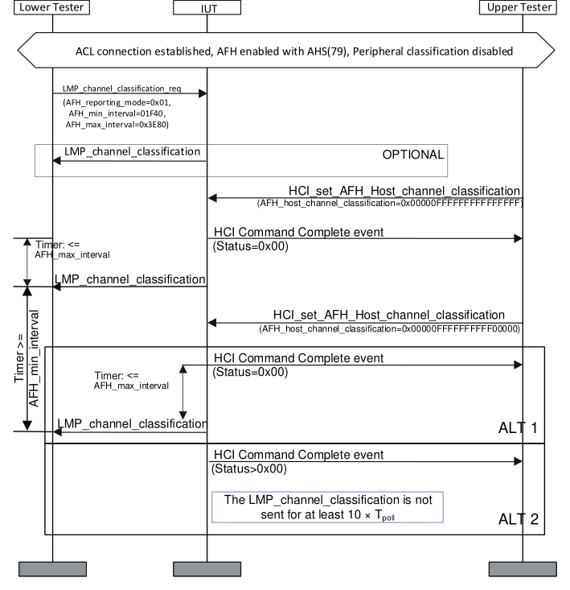

**Figure 4.250: LMP/AFH/BV-04-C [Classification Reporting – Normal Operation] MSC**

The Lower Tester sends the LMP_channel_classification_req PDU with AFH_reporting set to enabled, AFH_Min_Interval set to 5 seconds and AFH_Max_Interval set to 10 seconds. The clock at which the LMP_channel_classification_req PDU is sent is recorded.
The Upper Tester forces via HCI the local hop set of the IUT to AHS(N1), N1<79.
The Lower Tester records the clock at which the first LMP_channel_classification PDU is received from the IUT.
The Upper Tester forces via HCI the local hop set of the IUT to AHS(N2), N1≠2, N1<79, and N2<79.
ALT 1: The Lower Tester records the clock at which the second LMP_CHANNEL_CLASSIFICATION PDU is received from the IUT.
ALT 2: The Upper Tester receives an error in the HCI_Command_Complete event. The Lower Tester doesn’t receive a second LMP_CHANNEL_CLASSIFICATION PDU for at least 10 × Tpoll.
• Expected Outcome
Pass verdict
The IUT executes one of the following two Pass verdicts:
- The IUT transmits the second PDU LMP_CHANNEL_CLASSIFICATION at least AFH_min_interval after the first PDU LMP_CHANNEL_CLASSIFICATION and less than AFH_max_interval after sending a successful Command_Complete event to the Upper Tester.
- After the IUT receives the second HCI_set_AFH_Host_channel_classification, the IUT sends an HCI_Command_Complete event to the Upper Tester with a non-zero Status. No LMP_CHANNEL_CLASSIFICATION PDU is sent by the IUT for at least 10 × Tpoll.
• Notes
The Poll_Interval is the default value of 40 slots.
LMP/AFH/BV-05-C [Classification Reporting – After Successful Role Switch]
• Test Purpose
Verify that the IUT implicitly disables reporting of channel classification after a successful role switch. The IUT starts as a Central. The Lower Tester starts as a Peripheral.
• Reference
[1] 4.1.4
• Initial Condition
- See Default settings.
- The IUT pages the Lower Tester to become the Central.
- The Lower Tester and IUT are in normal connection state.
- The Upper Tester disables via HCI the channel classification capabilities of the IUT using the HCI_Write_AFH_Channel_Assessment_Mode Command.
- Adaptive frequency hopping is enabled by the IUT using any channel map.
• Test Procedure
Peripheral Central

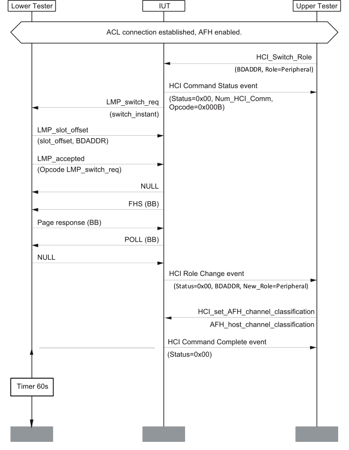

**Figure 4.251: LMP/AFH/BV-05-C [Classification Reporting – After Successful Role Switch] MSC**

The Upper Tester initiates a role switch.
After role switch, the Upper Tester forces via HCI a local hop set to the IUT to any value.
The Lower Tester listens for 60 seconds for an LMP_channel_classification PDU.
• Expected Outcome
Pass verdict
The IUT does not transmit an LMP_channel_classification PDU within 60 s after the role switch.
• Test Purpose
Verify that the IUT implicitly restores the channel classification reporting mode after an unsuccessful role switch. The IUT starts as a Peripheral. The Lower Tester starts as a Central.
• Reference
[1] 4.1.5
• Initial Condition
- See Default settings.
- The Lower Tester pages the IUT to become the Central.
- The Lower Tester and the IUT are in normal connection state.
- Adaptive frequency hopping is enabled by the Lower Tester using AHS(79).
- The Upper Tester disables via HCI the channel classification capabilities of the IUT using the HCI_Write_AFH_Channel_Assessment_Mode Command.
• Test Procedure
Central Peripheral

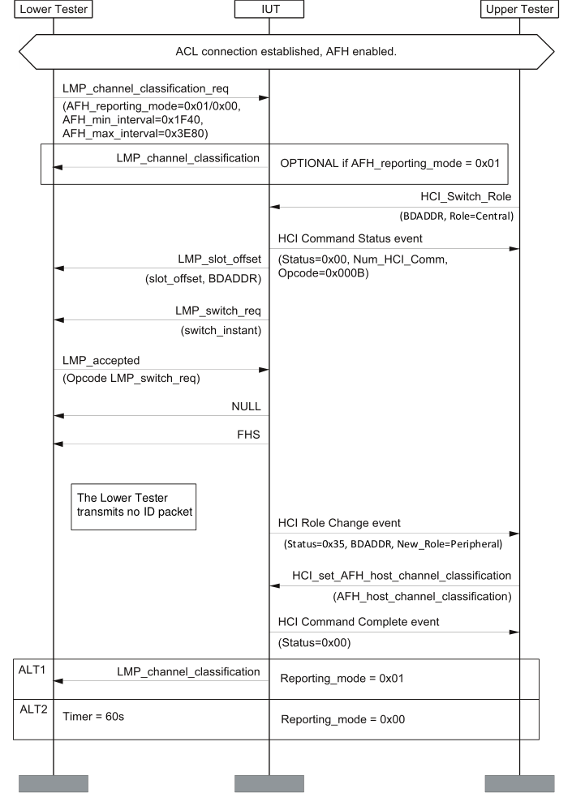

**Figure 4.252: LMP/AFH/BV-06-C [Classification Reporting – After Unsuccessful Role Switch] MSC**

1. The Lower Tester sends the LMP_channel_classification_req PDU with AFH_reporting set to
enabled, AFH_Min_Interval set to 5 seconds and AFH_Max_Interval set to 10 seconds. 2. The Lower Tester initiates a role switch. 3. The Lower Tester does not respond to the FHS packet. 4. AHS(N), N<79.
Steps 2–4 are repeated with AFH_reporting set to disabled.
• Expected Outcome
Pass verdict
The IUT transmits an LMP_channel_classification PDU after the HCI_set_AFH_host_channel_classification when AFH_reporting is enabled and does not transmit LMP_channel_classification when AFH_reporting is disabled.
LMP/AFH/BV-08-C [Classification Reporting – After Unhold]
• Test Purpose
Verify that the IUT implicitly restores the channel classification reporting mode after a successful unhold. The IUT is a Peripheral. The Lower Tester is a Central.
• Reference
[1] 4.1.5
• Initial Condition
- See Default settings.
- The Lower Tester pages the IUT to become the Central.
- The Lower Tester and the IUT are in normal connection state.
- Adaptive frequency hopping is enabled by the Lower Tester using AHS(79).
- The Upper Tester disables via HCI the channel classification capabilities of the IUT using the HCI_Write_AFH_Channel_Assessment_Mode Command.
- The Lower Tester enables classification reporting in the IUT.
• Test Procedure
Central Peripheral

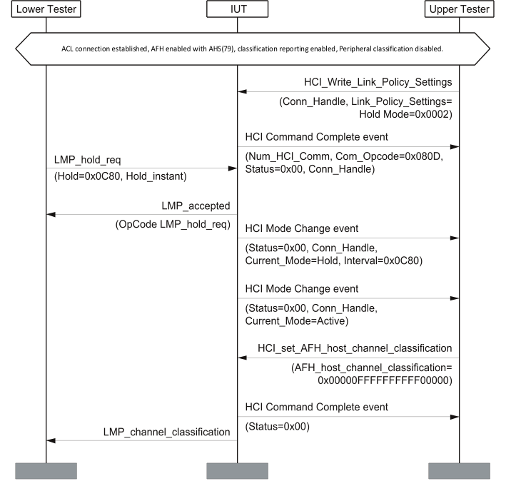

**Figure 4.253: LMP/AFH/BV-08-C [Classification Reporting – After Unhold] MSC**

The Lower Tester puts the IUT in hold mode for 2 seconds.
The Upper Tester forces via HCI the local hop set of the IUT to AHS(N), N<79.
• Expected Outcome
Pass verdict
Upon reception of HCI_set_AFH_host_channel_classification, the IUT transmits an LMP_channel_classification PDU before AFH_Max_Interval.
LMP/AFH/BV-09-C [Peripheral device does not send a LMP_Set_AFH PDU -after successful role switch]
• Test Purpose
Verify that the IUT does not send an LMP_Set_AFH PDU after a successful role switch in which the IUT becomes the Peripheral after the role switch. The IUT starts as a Central. The Lower Tester starts as a Peripheral.
• Reference
[1] 4.1.4.1
• Initial Condition
- The IUT pages the Lower Tester to become the Central.
- The Lower Tester and the IUT are in normal connection state.
• Test Procedure
The IUT initiates a role switch (the IUT is now a Peripheral and the Lower Tester is now a Central).
After role switch, the Lower Tester listens for 60 seconds for an LMP_Set_AFH PDU.
Central Peripheral

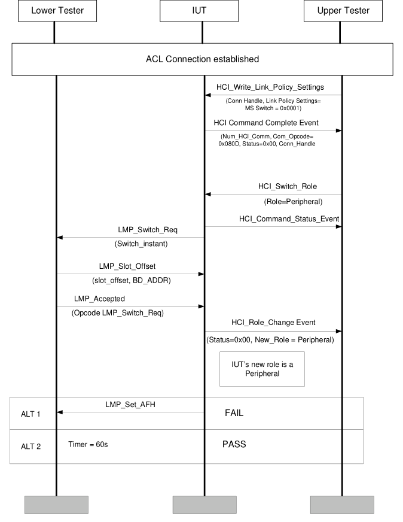

**Figure 4.254: LMP/AFH/BV-09-C [Peripheral device does not send a LMP_Set_AFH PDU -after successful role switch] MSC**

• Expected Outcome
Pass verdict
The IUT does not transmit an LMP_Set_AFH PDU within 60 sec. after the role switch.

### 4.11 Simple Pairing procedures

Verify the Simple Pairing procedures.

#### 4.11.1 Backward Compatibility procedures

LMP/SP/BV-01-C [Secure Simple Pairing Capable Controller - Pairing - IUT Initiator]
• Test Purpose
Verify that the IUT initiates legacy pairing when the remote Controller does not have the Secure Simple Pairing LMP feature bit set.
The IUT is initiator. The Lower Tester is responder.
The Lower Tester does not support Secure Simple Pairing.
• Reference
[1] 4.1.4.1, 4.3.4
• Initial Condition
- See Section 4.2.5, IUT has the Secure Simple Pairing feature (Controller Support and Host Support) Link Manager bits set.
• Test Procedure
Run the preamble in Section 4.3.1.
Execute the test procedure of LMP/AUT/BV-04-C [Pairing, IUT Initiator], MSC 2.
• Expected Outcome
Pass verdict
Correct PDU LMP_in_rand is transmitted.
Correct PDU LMP_Comb_key is transmitted.
Correct Link Key is created checked by an authentication (SRES is checked).
LMP/SP/BV-02-C [Secure Simple Pairing Capable Controller - Pairing - IUT Responder]
• Test Purpose
Verify that the IUT initiates legacy pairing when the remote device does not have the Secure Simple Pairing LMP feature (Controller Support and Host Support) bits set.
The Lower Tester is initiator. The IUT is responder.
The Lower Tester does not support Secure Simple Pairing.
• Reference
[1] 4.2.2, 4.3.4
• Initial Condition
- See Section 4.2.5, the IUT has the Secure Simple Pairing feature (Controller Support and Host Support) Link Manager bits set.
• Test Procedure
Run the preamble in Section 4.3.2.
Execute the test procedure of LMP/AUT/BV-03-C [Create Link Key].
• Expected Outcome
Pass verdict
The IUT transmits PDU LMP_accepted containing the Opcode for PDU LMP_in_rand upon reception of PDU LMP_in_rand.
The IUT transmits PDU LMP_comb_key upon reception of PDU LMP_comb_key.
LMP/SP/BV-03-C [Secure Simple Pairing Capable Controller - Legacy Host- IUT Initiator]
• Test Purpose
Verify that the IUT initiates pairing when the local Host does not set the Secure Simple Pairing Mode to enabled.
The IUT is initiator. The Lower Tester is responder.
• Reference
[1] 4.2.7
• Initial Condition
- See Default settings.
- Uses the Authentication default settings.
• Test Procedure

**Figure 4.255: LMP/SP/BV-03-C [Secure Simple Pairing Capable Controller - Legacy Host- IUT Initiator] MSC**

• Expected Outcome
Pass verdict
The IUT sends an HCI_PIN_Code_Request Event to the Upper Tester.
The IUT does not send an HCI_IO_Capability_Request Event to the Upper Tester.
LMP/SP/BV-04-C [Secure Simple Pairing Capable Controller - Legacy Host - IUT Responder]
• Test Purpose
Verify that the IUT responds to pairing when the local Host has not set the support Secure Simple Pairing Mode to enabled.
The IUT is responder. The Lower Tester is initiator.
• Reference
[1] 4.2.7
• Initial Condition
- See Default settings.
- Use the Authentication default settings. Lower Tester uses Secure Simple Pairing (feature bit set to 1).
• Test Procedure
Lower Tester IUT Upper Tester

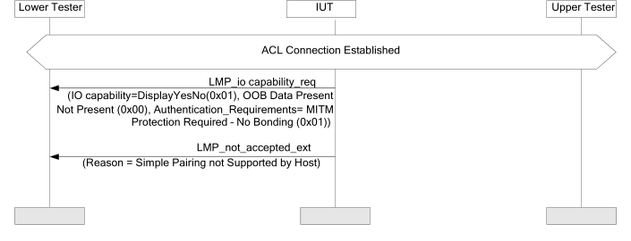

**Figure 4.256: LMP/SP/BV-04-C [Secure Simple Pairing Capable Controller - Legacy Host - IUT Responder] MSC**

• Expected Outcome
Pass verdict
The IUT responds to the LMP_io_capability_res PDU with an LMP_not_accepted_ext PDU with the Error_Code “Secure Simple Pairing Not Supported by Host.”
The IUT does not set the Secure Simple Pairing Mode (host support) bit.
LMP/SP/BV-05-C [Secure Simple Pairing Capable Controller - Legacy Remote Host - IUT Initiator]
• Test Purpose
Verify that the IUT initiates pairing when the local Host sets the Secure Simple Pairing Mode to enabled and the remote Controller's LMP feature bits indicate support for Secure Simple Pairing in the Controller but not in the Host. The IUT is initiator. The Lower Tester is responder.
Remote Host does not support Secure Simple Pairing, whereas the remote controller supports Secure Simple Pairing.
• Reference
[1] 4.2.7
• Initial Condition
- See Section 4.2.5.
• Test Procedure

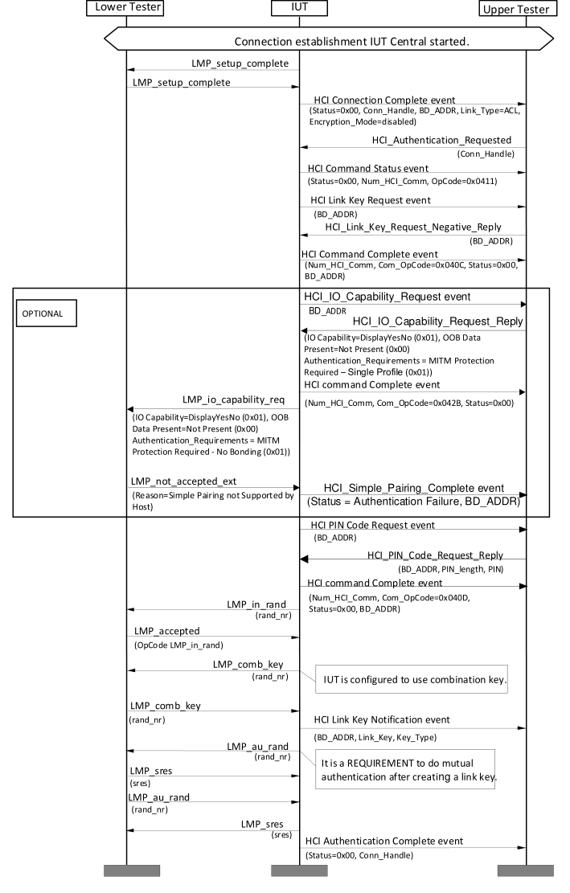

**Figure 4.257: LMP/SP/BV-05-C [Secure Simple Pairing Capable Controller - Legacy Remote Host - IUT Initiator] MSC**

• Expected Outcome
Pass verdict
The IUT sends an HCI PIN Code Request Event to the Upper Tester.
The IUT sends LMP_in_rand to the Lower Tester.
Correct PDU LMP_Comb_key is transmitted by the IUT.
Correct Link Key is created checked by an authentication (SRES is checked).
LMP/SP/BV-37-C [Secure Connections Capable Controller – Legacy Host – IUT Initiator – Unauthenticated Link Key]
• Test Purpose
Verify that the IUT reports the correct Key_Type to a Legacy Host at the end of a successful Secure Simple Pairing using the P192 elliptic curve using the Numeric Comparison protocol that generates an unauthenticated link Key.
Test procedure is run with IUT as the initiator. It doesn’t matter if the IUT is Central or Peripheral or if the IUT is the initiator or responder.
• Reference
[1] 4.2.7
• Initial Condition
- See Baseband assumptions.
- The Upper Tester doesn’t set the Secure Connections Host Support to enabled.
• Test Procedure

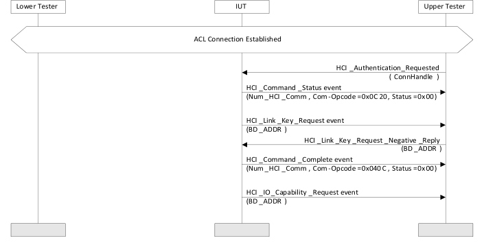

**Figure 4.258: LMP/SP/BV-37-C [Secure Connections Capable Controller – Legacy Host – IUT Initiator – Unauthenticated Link Key] MSC – Page 1 of 3**

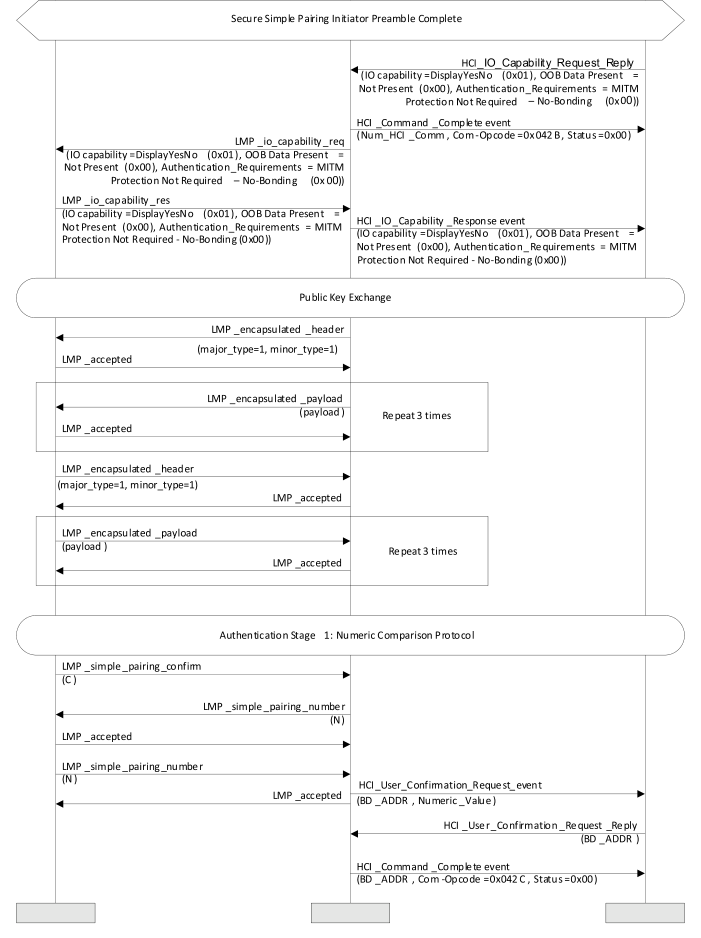

**Figure 4.259: LMP/SP/BV-37-C [Secure Connections Capable Controller – Legacy Host – IUT Initiator – Unauthenticated Link Key] MSC – Page 2 of 3**

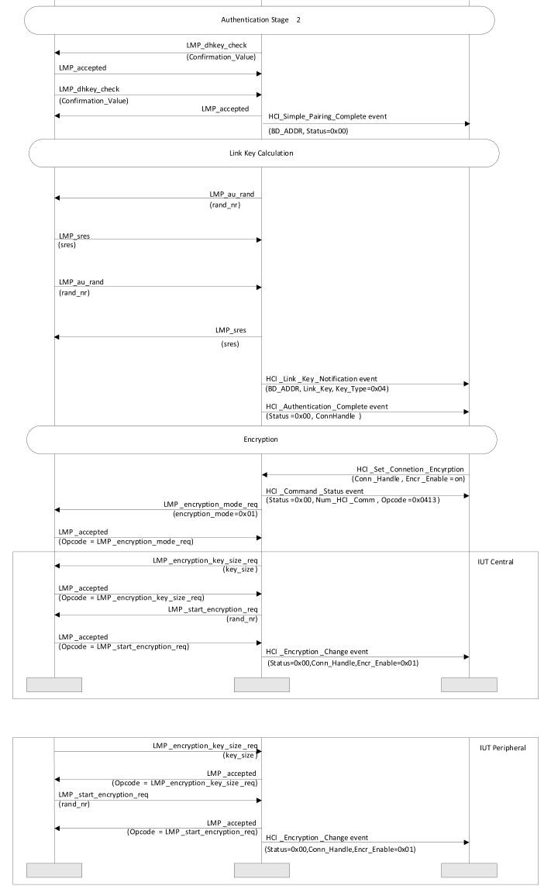

**Figure 4.260: LMP/SP/BV-37-C [Secure Connections Capable Controller – Legacy Host – IUT Initiator – Unauthenticated Link Key] MSC – Page 3 of 3**

• Expected Outcome
Pass verdict
The IUT sends the LMP_DHkey_check PDU is with a valid Confirmation_Value.
The IUT sends an HCI_Simple_Pairing_Complete Event to the Upper Tester.
The IUT sends the resulting Link Key and Key Type to the Host in an HCI_Link_Key_Notification event. Verify that the Link Key matches at the Upper and Lower Testers. Verify that the Key_Type is ‘Unauthenticated Combination Key generated from P192’.
LMP/SP/BV-38-C [Secure Connections Capable Controller – Legacy Host – IUT Initiator – Authenticated Link Key]
• Test Purpose
Verify that the IUT reports the correct Key_Type to a Legacy Host at the end of a successful Secure Simple Pairing using the P192 elliptic curve using the Numeric Comparison protocol that generates an authenticated link Key.
Test procedure is run with the IUT as the initiator. It doesn’t matter if the IUT is Central or Peripheral or if the IUT is the initiator or responder.
• Reference
[1] 4.2.7
• Initial Condition
- See Baseband assumptions.
- The Upper Tester doesn’t set the Secure Connections Host Support to enabled.
• Test Procedure

**Figure 4.261: LMP/SP/BV-38-C [Secure Connections Capable Controller – Legacy Host – IUT Initiator – Authenticated Link Key] MSC – Page 1 of 3**

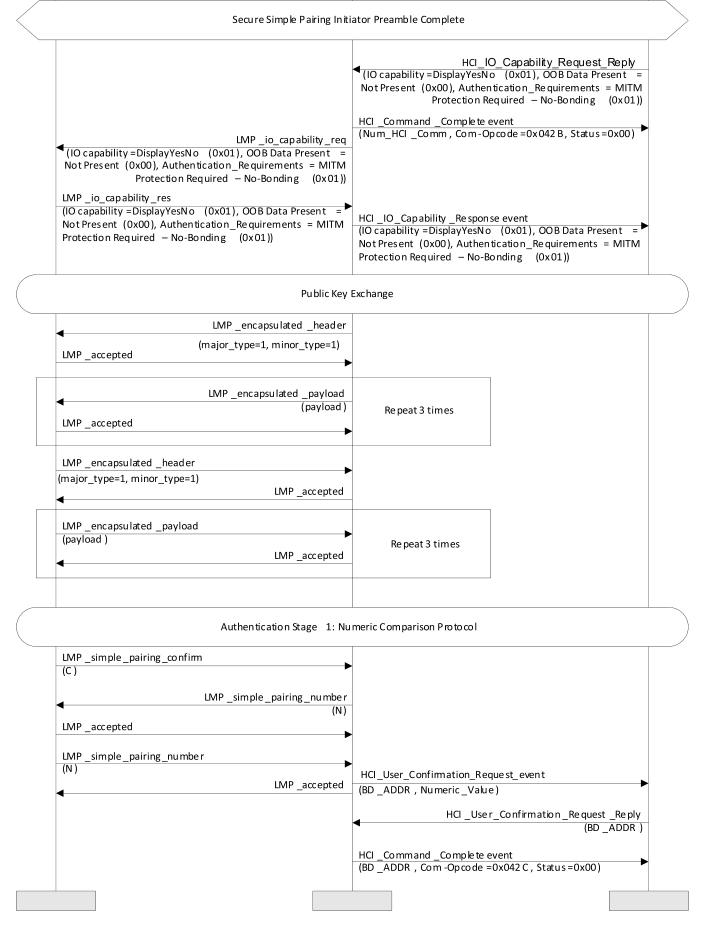

**Figure 4.262: LMP/SP/BV-38-C [Secure Connections Capable Controller – Legacy Host – IUT Initiator – Authenticated Link Key] MSC – Page 2 of 3**

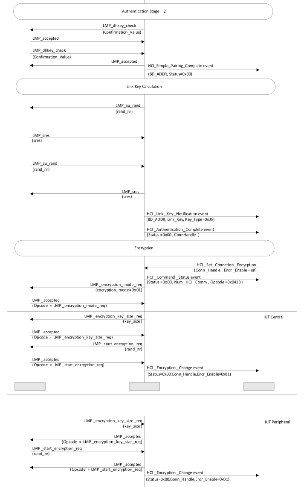

**Figure 4.263: LMP/SP/BV-38-C [Secure Connections Capable Controller – Legacy Host – IUT Initiator – Authenticated Link Key] MSC – Page 3 of 3**

• Expected Outcome
Pass verdict
The IUT sends an HCI_User_Confirmation_Request Event with the same value calculated by the Lower Tester.
The IUT sends the LMP_DHkey_check PDU is with a valid Confirmation_Value.
The IUT sends an HCI_Simple_Pairing_Complete Event to the Upper Tester.
The IUT sends the resulting Link Key and Key Type to the Host in an HCI_Link_Key_Notification event. Verify that the Link Key matches at the Upper and Lower Testers. Verify that the Key_Type is ‘Authenticated Combination Key generated from P192’.
LMP/SP/BV-39-C [Secure Connections Capable Controller – Host has no P256 OOB data available – IUT Initiator – OOB]
• Test Purpose
Verify that the IUT switches to Numeric Comparison association model when the Upper Tester indicates that it only has P192 OOB data from the remote device available. Verify that the IUT reports the correct Key_Type to the Upper Tester at the end of a successful Secure Simple Pairing using the P256 elliptic curve.
Test procedure is run with the IUT as the initiator. It doesn’t matter if the IUT is Central or Peripheral or if the IUT is the initiator or responder.
• Reference
[1] 4.2.7
• Initial Condition
- See Baseband assumptions and Secure Simple Pairing P256.
• Test Procedure

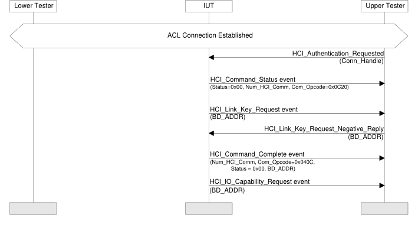

**Figure 4.264: LMP/SP/BV-39-C [Secure Connections Capable Controller – Host has no P256 OOB data available – IUT Initiator – OOB] MSC – Page 1 of 3**

|  |  |  |
| --- | --- | --- |
|  |  |  |
|  |  |  |

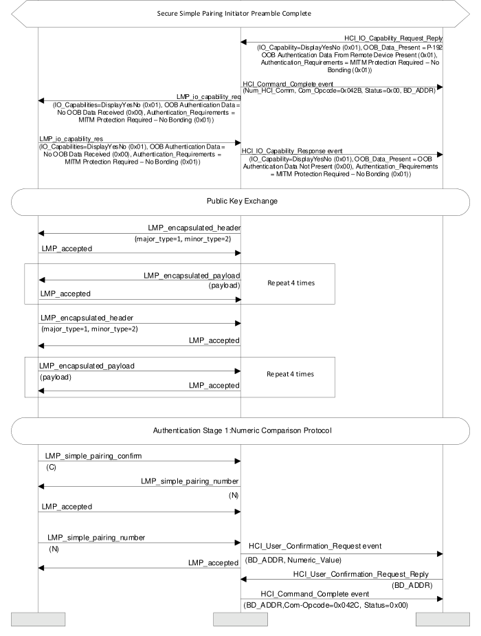

**Figure 4.265: LMP/SP/BV-39-C [Secure Connections Capable Controller – Host has no P256 OOB data available – IUT Initiator – OOB] MSC – Page 2 of 3**

|  |  |  |  |  |
| --- | --- | --- | --- | --- |
|  | Authentication Stag | e 2 |  |  |
|  |  |  |  |  |
|  |  |  |  |  |
|  | Link Key Calcul | ation |  |  |
|  |  |  |  |  |
|  |  |  |  |  |
|  |  |  |  |  |
| LM (Op | HCI _ HCI | LinkKeyNotification event _ _ |  |  |
|  |  | AuthenticationComplete event _ _ |  |  |
|  |  |  |  |  |
|  | Encryption |  |  |  |
|  | HCI LMPencryptionmodereq Stat _ _ _ (encryptionmode=0x01) _ Paccepted _ code=LMPencryptionmodereq) _ _ _ | HCISetConnectionEncryption _ _ _ |  |  |
|  |  | (ConnHandle, EncrEnable=on CommandStatus event _ _ _ _ |  |  |
|  |  | us=0x00, NumHCIComm, Opcode=0x0413 _ _ |  |  |
| LMP (Opc LMP (Op | LMPencryptionkeysize req _ _ _ _ (keysize) _ accepted _ ode=LMPencryptionkeysize req) _ _ _ _ LMPstartencryptionreq _ _ _ accepted _ code=LMPstartencryptionreq) _ _ _ HCI | EncryptionChange event _ _ |  |  |
|  |  |  |  |  |

**Figure 4.266: LMP/SP/BV-39-C [Secure Connections Capable Controller – Host has no P256 OOB data available – IUT Initiator – OOB] MSC – Page 3 of 3**

• Expected Outcome
Pass verdict
The IUT does not send an HCI_Remote_OOB_Data_Request Event to the Upper Tester.
The IUT sends an HCI_User_Confirmation_Request Event with the same value calculated by the Lower Tester.
The IUT sends the LMP_DHkey_check PDU is with a valid Confirmation_Value.
The IUT sends an HCI_Simple_Pairing_Complete Event to the Upper Tester.
The IUT sends the resulting Link Key and Key Type to the Host in an HCI_Link_Key_Notification event. Verify that the Link Key matches at the Upper and Lower Testers. Verify that the Key_Type is ‘Authenticated Combination Key generated from P256’.
LMP/SP/BV-40-C [Secure Connections Capable Controller and Host – Legacy Remote Controller – IUT Initiator]
• Test Purpose
Verify that the IUT initiates Secure Simple Pairing using the P192 Elliptic Curve when the remote controller doesn’t have support for the Secure Connections (Controller Support) LMP feature bit.
Test procedure is run with the IUT as the initiator. It doesn’t matter if the IUT is Central or Peripheral or if the IUT is the initiator or responder.
• Reference
[1] 4.2.7
• Initial Condition
- See Baseband assumptions.
- The Lower Tester doesn’t set the Secure Connections (Controller Support) to enabled.
• Notes
This test case is the same as LMP/SP/BV-06-C [Numeric Comparison - IUT Initiator – Success] except that the IUT has the Secure Connections (Controller Support) and Secure Connections (Host Support) LMP feature bits set.

#### 4.11.2 Numeric Comparison procedures

Note: In all the test cases in Section 4.11.2 Numeric Comparison procedures, it does not matter whether the IUT is Central or Peripheral.
LMP/SP/BV-06-C [Numeric Comparison - IUT Initiator – Success]
• Test Purpose
Verify that the IUT supports the Numeric Comparison protocol. Verify that the IUT generates a different Simple Pairing Number each time Authentication Stage 1 executes.
Test procedure is run with the IUT as initiator.
• Reference
[1] 4.2.7
[13] 7.2.1
• Initial Condition
- See Default settings.
• Test Procedure
Repeat the test sequence of the following message sequence charts a total of 3 times. In Authentication Stage 1, the Lower Tester is to store the Simple Pairing Number of the IUT for each of the 3 rounds, to be compared at the end of round 3.

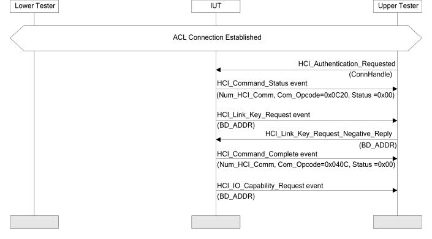

**Figure 4.267: LMP/SP/BV-06-C [Numeric Comparison - IUT Initiator – Success] MSC – Page 1 of 3**

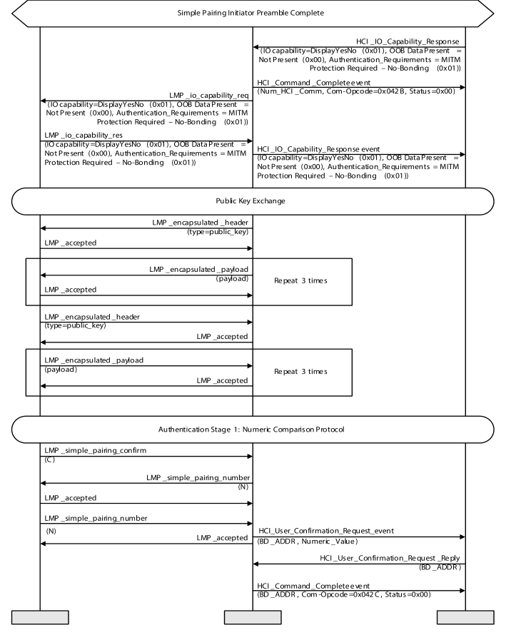

**Figure 4.268: LMP/SP/BV-06-C [Numeric Comparison - IUT Initiator – Success] MSC – Page 2 of 3**

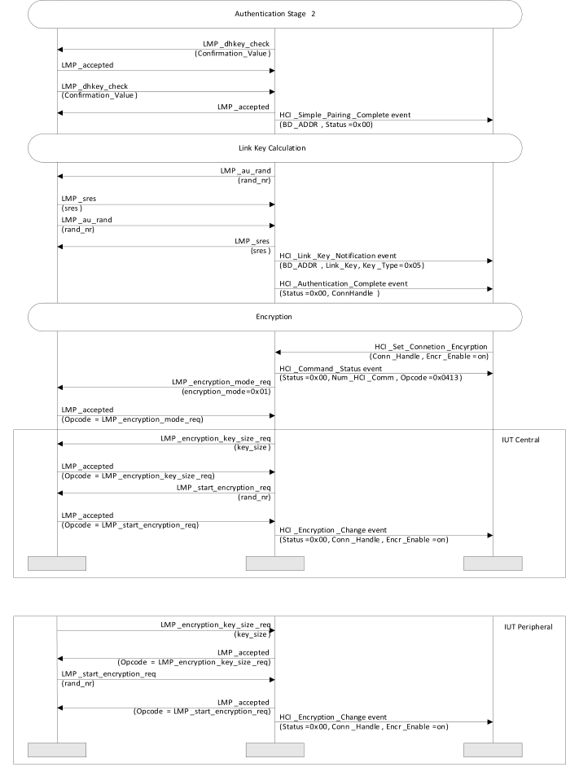

**Figure 4.269: LMP/SP/BV-06-C [Numeric Comparison - IUT Initiator – Success] MSC – Page 3 of 3**

• Expected Outcome
Pass verdict
The IUT sends an HCI_Confirmation_Request Event with the same value calculated by the Lower Tester.
The IUT sends the LMP_DHkey_check PDU with a valid Confirmation_Value.
The IUT sends an HCI_Simple_Pairing_Complete Event to the Upper Tester.
The IUT sends the resulting Link Key and Key Type to the Host in an HCI_Link_Key_Notification event. Verify that the Link Key matches at the Upper and Lower Testers. Verify that the Key_Type is ‘Authenticated’.
All 3 Simple Pairing Numbers generated by the IUT are different values.
• Notes
The Lower Tester sends an LMP_not_accepted to LMP_DHkey if the Confirmation_Value that it calculates does not match with the Confirmation_Value that the IUT has sent.
LMP/SP/BV-07-C [Numeric Comparison - IUT Responder – Success]
• Test Purpose
Verify that the IUT supports the Numeric Comparison protocol. Verify that the IUT generates a different Simple Pairing Number each time Authentication Stage 1 executes.
Test procedure is run with the IUT as responder.
• Reference
[1] 4.2.7
[13] 7.2.1
• Initial Condition
- See Default settings.
• Test Procedure
Repeat the test sequence of the following message sequence charts a total of 3 times. In Authentication Stage 1, the Lower Tester is to store the Simple Pairing Number of the IUT for each of the 3 rounds, to be compared at the end of round 3.

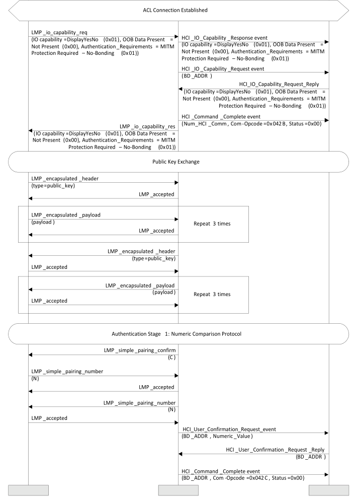

**Figure 4.270: LMP/SP/BV-07-C [Numeric Comparison - IUT Responder – Success] MSC – Page 1 of 2**

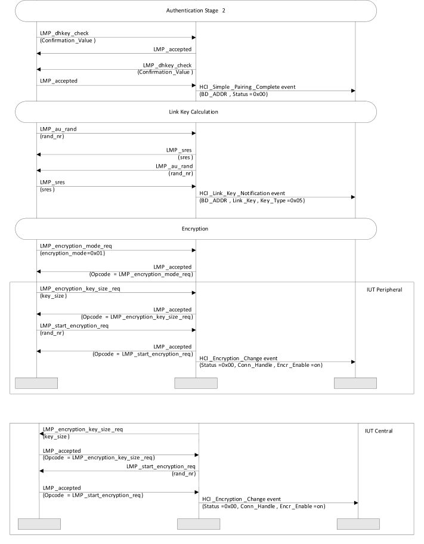

**Figure 4.271: LMP/SP/BV-07-C [Numeric Comparison - IUT Responder – Success] MSC – Page 2 of 2**

• Expected Outcome
Pass verdict
The IUT sends an HCI_Confirmation_Request Event with the same value calculated by the Lower Tester.
The IUT sends the LMP_DHkey_check PDU with a valid Confirmation_Value.
The IUT sends an HCI_Simple_Pairing_Complete Event to the Upper Tester.
The IUT sends the resulting Link Key and Key Type to the Host in an HCI_Link_Key_Notification event. Verify that the Link Key matches at the Upper and Lower Testers. Verify that the Key_Type is ‘Authenticated’.
All three Simple Pairing Numbers generated by the IUT are different values.
• Notes
If the Commitment_Value calculated by the Lower Tester does not match the Commitment_Value sent by the IUT, the Lower Tester will send LMP_not_accepted with the Authentication_Failure Error_Code.
The Lower Tester sends an LMP_not_accepted to LMP_DHkey if the Confirmation_Value that it calculates does not match with the Confirmation_Value that the IUT has sent.
LMP/SP/BV-08-C [Numeric Comparison - IUT Initiator - Failure on Initiating Side]
• Test Purpose
Verify that the IUT supports the Numeric Comparison protocol. Verify that the IUT responds correctly when the Upper Tester responds that the numeric comparison value did not verify correctly.
The IUT is initiator.
• Reference
[1] 4.2.7
• Initial Condition
- See Default settings.
• Test Procedure

**Figure 4.272: LMP/SP/BV-08-C [Numeric Comparison - IUT Initiator - Failure on Initiating Side] MSC – Page 1 of 2**

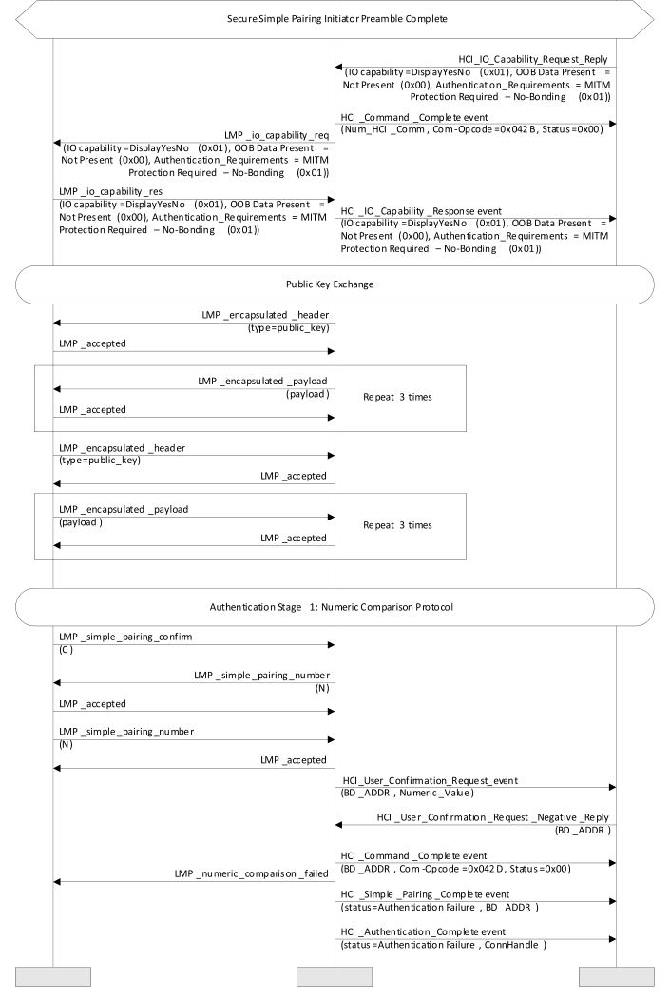

**Figure 4.273: LMP/SP/BV-08-C [Numeric Comparison - IUT Initiator - Failure on Initiating Side] MSC – Page 2 of 2**

• Expected Outcome
Pass verdict
The IUT sends an LMP_numeric_comparison_failed PDU to the Lower Tester.
The IUT sends an HCI_Simple_Pairing_Complete Event to the Upper Tester with status set to Authentication Failure.
• Test Purpose
Verify that the IUT supports the Numeric Comparison protocol. Verify that the IUT responds correctly when the Upper Tester responds that the numeric comparison value did not verify correctly.
The IUT is responder.
• Reference
[1] 4.2.7
• Initial Condition
- See Default settings.
• Test Procedure

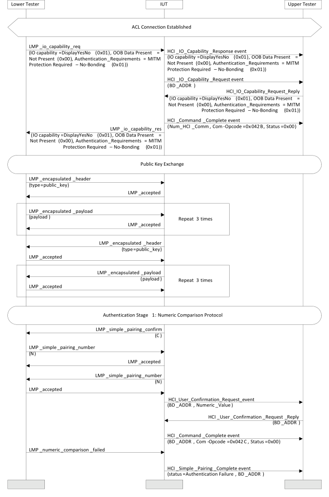

**Figure 4.274: LMP/SP/BV-09-C [Numeric Comparison - IUT Responder - Failure on Initiating Side] MSC**

• Expected Outcome
Pass verdict
The IUT sends an HCI_Simple_Pairing_Complete Event to the Upper Tester with status set to Authentication Failure after receiving an LMP_numeric_comparison_failed PDU from the Lower Tester.
• Test Purpose
Verify that the IUT supports the Numeric Comparison protocol. Verify that the IUT responds correctly when the responding side fails the numeric comparison check step.
The IUT is initiator.
• Reference
[1] 4.2.7
• Initial Condition
- See Default settings.
• Test Procedure

**Figure 4.275: LMP/SP/BV-10-C [Numeric Comparison - IUT Initiator - Failure on Responding Side] MSC – Page 1 of 2**

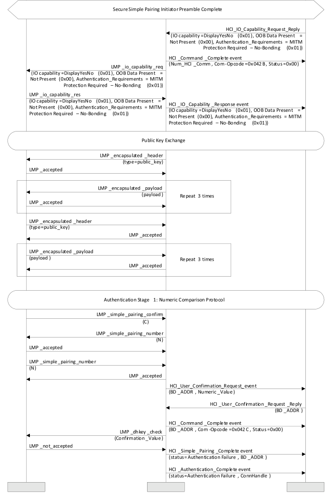

**Figure 4.276: LMP/SP/BV-10-C [Numeric Comparison - IUT Initiator - Failure on Responding Side] MSC – Page 2 of 2**

• Expected Outcome
Pass verdict
The IUT sends an HCI_Simple_Pairing_Complete Event to the Upper Tester with status set to Authentication Failure after the Lower Tester responds to the LMP_dhkey_check PDU with an LMP_not_accepted PDU.
• Test Purpose
Verify that the IUT supports the Numeric Comparison protocol. Verify that the IUT responds correctly when the responding side fails the numeric comparison check step.
The IUT is responder.
• Reference
[1] 4.2.7
• Initial Condition
- See Default settings.
• Test Procedure

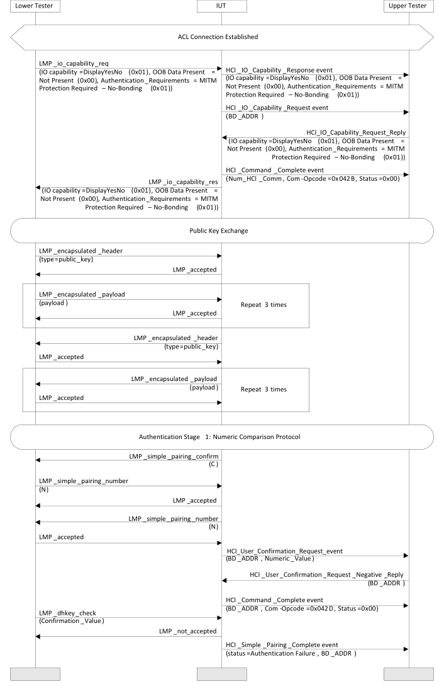

**Figure 4.277: LMP/SP/BV-11-C [Numeric Comparison - IUT Responder - Failure on Responding Side] MSC**

• Expected Outcome
Pass verdict
The IUT sends an HCI_Simple_Pairing_Complete Event to the Upper Tester with status set to Authentication Failure after the IUT responds to the LMP_dhkey_check PDU with an LMP_not_accepted PDU.
• Test Purpose
Verify that the IUT supports the Numeric Comparison protocol using the P-256 elliptic curve.
Test procedure is run with the IUT as the initiator.
• Reference
[1] 4.2.7
• Initial Condition
- See Baseband assumptions and Secure Simple Pairing P256.
• Test Procedure

**Figure 4.278: LMP/SP/BV-41-C [Numeric Comparison – IUT Initiator – Success, P-256] MSC – Page 1 of 3**

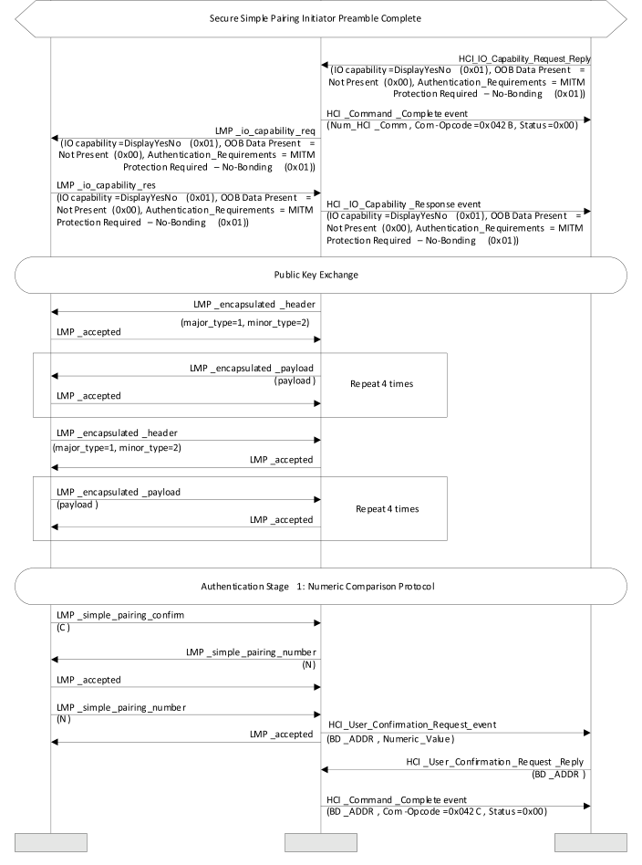

**Figure 4.279: LMP/SP/BV-41-C [Numeric Comparison – IUT Initiator – Success, P-256] MSC – Page 2 of 3**

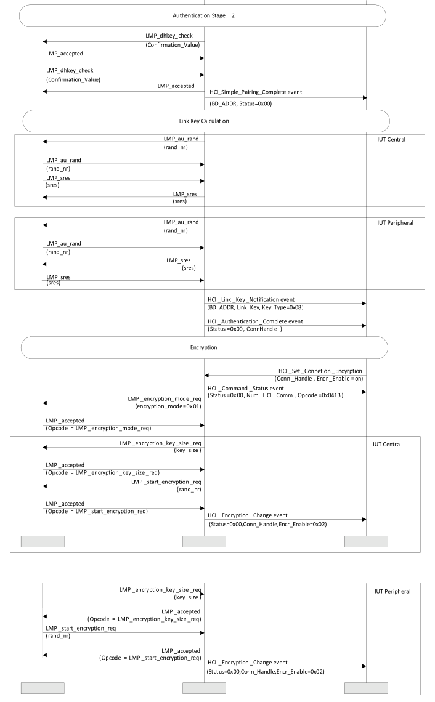

**Figure 4.280: LMP/SP/BV-41-C [Numeric Comparison – IUT Initiator – Success, P-256] MSC – Page 3 of 3**

• Expected Outcome
Pass verdict
The IUT sends an HCI_User_Confirmation_Request Event with the same value calculated by the Lower Tester.
The IUT sends the LMP_DHkey_check PDU is with a valid Confirmation_Value.
The IUT sends an HCI_Simple_Pairing_Complete Event to the Upper Tester.
The IUT sends the resulting Link Key and Key Type to the Host in an HCI_Link_Key_Notification event. Verify that the Link Key matches at the Upper and Lower Testers. Verify that the Key_Type is ‘Authenticated Combination Key generated from P256’.
• Notes
The Lower Tester sends an LMP_not_accepted to LMP_DHkey if the Confirmation_Value that it calculates does not match with the Confirmation_Value that the IUT has sent.
This test case is similar to LMP/SP/BV-06-C [Numeric Comparison - IUT Initiator – Success].
LMP/SP/BV-42-C [Numeric Comparison – IUT Responder – Success, P-256]
• Test Purpose
Verify that the IUT supports the Numeric Comparison protocol using the P-256 elliptic curve.
Test procedure is run with the IUT as the responder.
• Reference
[1] 4.2.7
• Initial Condition
- See Baseband assumptions and Secure Simple Pairing P256.
• Test Procedure

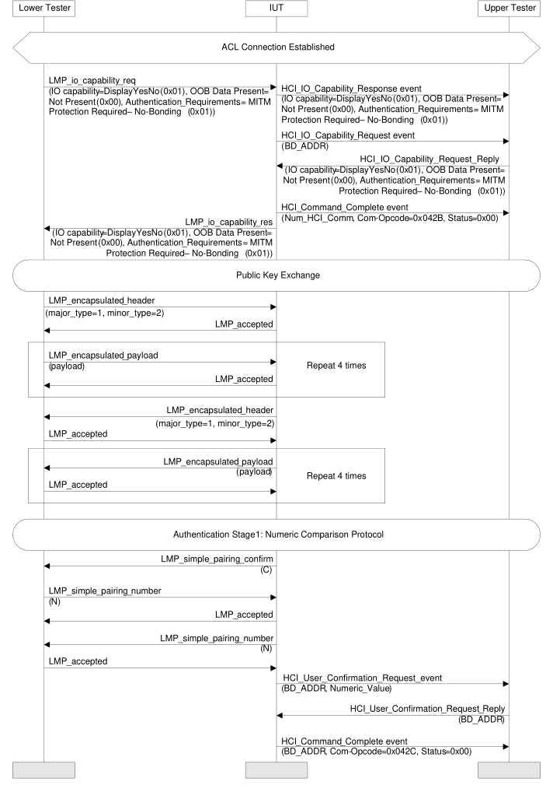

**Figure 4.281: LMP/SP/BV-42-C [Numeric Comparison – IUT Responder – Success, P-256] MSC – Page 1 of 2**

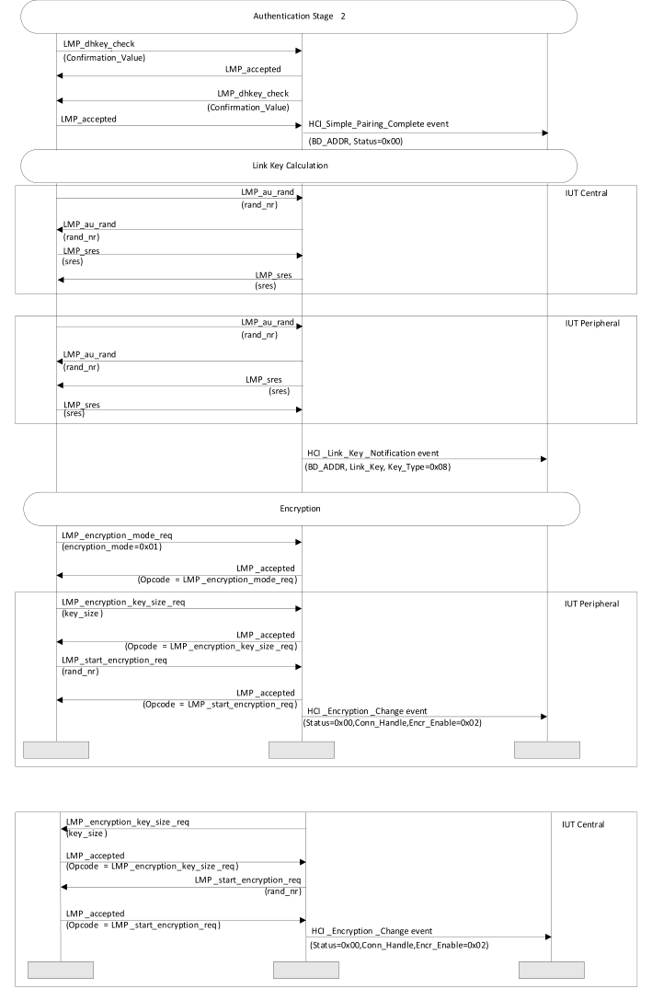

**Figure 4.282: LMP/SP/BV-42-C [Numeric Comparison – IUT Responder – Success, P-256] MSC – Page 2 of 2**

• Expected Outcome
Pass verdict
The IUT sends an HCI_User_Confirmation_Request Event with the same value calculated by the Lower Tester.
The IUT sends the LMP_DHkey_check PDU is with a valid Confirmation_Value.
The IUT sends the resulting Link Key and Key Type to the Host in an HCI_Link_Key_Notification event. Verify that the Link Key matches at the Upper and Lower Testers. Verify that the Key_Type is ‘Authenticated Combination Key generated from P256’.
• Notes
If the Commitment_Value calculated by the Lower Tester does not match the Commitment_Value sent by the IUT, the Lower Tester will send LMP_not_accepted with the Authentication_Failure Error_Code.
The Lower Tester sends an LMP_not_accepted to LMP_DHkey if the Confirmation_Value that it calculates does not match with the Confirmation_Value that the IUT has sent.
This test case is similar to LMP/SP/BV-07-C [Numeric Comparison - IUT Responder – Success].
LMP/SP/BV-43-C [Numeric Comparison – IUT Initiator, Failure on Initiating side, P-256]
• Test Purpose
Verify that the IUT supports the Numeric Comparison protocol using the P-256 elliptic curve. Verify that the IUT responds correctly when the Upper Tester responds that the numeric comparison value did not verify correctly.
The IUT is initiator.
• Reference
[1] 4.2.7
• Initial Condition
- See Baseband assumptions and Secure Simple Pairing P256.
• Test Procedure

**Figure 4.283: LMP/SP/BV-43-C [Numeric Comparison – IUT Initiator, Failure on Initiating side, P-256] MSC – Page 1 of 2**

**Figure 4.284: LMP/SP/BV-43-C [Numeric Comparison – IUT Initiator, Failure on Initiating side, P-256] MSC – Page 2 of 2**

• Expected Outcome
Pass verdict
The IUT sends an LMP_numeric_comparison_failed PDU to the Lower Tester.
The IUT sends an HCI_Simple_Pairing_Complete Event to the Upper Tester with status set to Authentication Failure.
• Notes
This test case is similar to LMP/SP/BV-08-C [Numeric Comparison - IUT Initiator - Failure on Initiating Side].
LMP/SP/BV-44-C [Numeric Comparison – IUT Responder – Failure on Initiating Side, P- 256]
• Test Purpose
Verify that the IUT supports the Numeric Comparison protocol using the P-256 elliptic curve. Verify that the IUT responds correctly when the Upper Tester responds that the numeric comparison value did not verify correctly.
The IUT is responder.
• Reference
[1] 4.2.7
• Initial Condition
- See Baseband assumptions and Secure Simple Pairing P256.
• Test Procedure

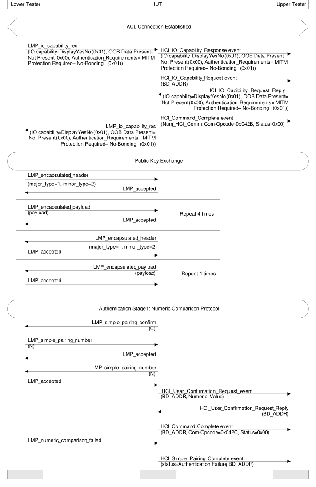

**Figure 4.285: LMP/SP/BV-44-C [Numeric Comparison – IUT Responder – Failure on Initiating Side, P-256] MSC**

• Expected Outcome
Pass verdict
The IUT sends an HCI_Simple_Pairing_Complete Event to the Upper Tester with status set to Authentication Failure after receiving an LMP_numeric_comparison_failed PDU from the Lower Tester.
• Notes
This test case is similar to LMP/SP/BV-09-C [Numeric Comparison - IUT Responder - Failure on Initiating Side].
LMP/SP/BV-45-C [Numeric Comparison – IUT Initiator – Failure on Responding Side, P- 256]
• Test Purpose
Verify that the IUT supports the Numeric Comparison protocol using the P-256 elliptic curve. Verify that the IUT responds correctly when the responding side fails the numeric comparison check step.
The IUT is initiator.
• Reference
[1] 4.2.7
• Initial Condition
- See Baseband assumptions and Secure Simple Pairing P256.
• Test Procedure

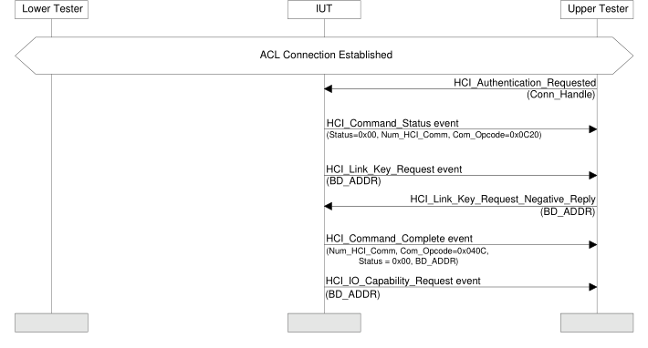

**Figure 4.286: LMP/SP/BV-45-C [Numeric Comparison – IUT Initiator – Failure on Responding Side, P-256] MSC – Page 1 of 2**

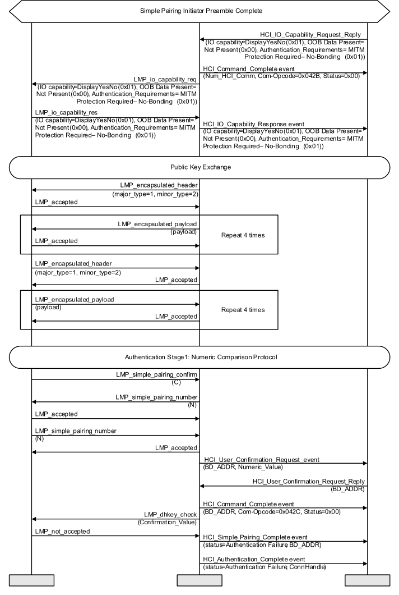

**Figure 4.287: LMP/SP/BV-45-C [Numeric Comparison – IUT Initiator – Failure on Responding Side, P-256] MSC – Page 2 of 2**

• Expected Outcome
Pass verdict
The IUT sends an HCI_Simple_Pairing_Complete Event to the Upper Tester with status set to Authentication Failure after the Lower Tester responds to the LMP_dhkey_check PDU with an LMP_not_accepted PDU.
• Notes
This test case is similar to LMP/SP/BV-10-C [Numeric Comparison - IUT Initiator - Failure on Responding Side].
LMP/SP/BV-46-C [Numeric Comparison – IUT Responder – Failure on Responding Side, P-256]
• Test Purpose
Verify that the IUT supports the Numeric Comparison protocol using the P-256 elliptic curve. Verify that the IUT responds correctly when the responding side fails the numeric comparison check step.
The IUT is responder.
• Reference
[1] 4.2.7
• Initial Condition
- See Baseband assumptions and Secure Simple Pairing P256.
• Test Procedure

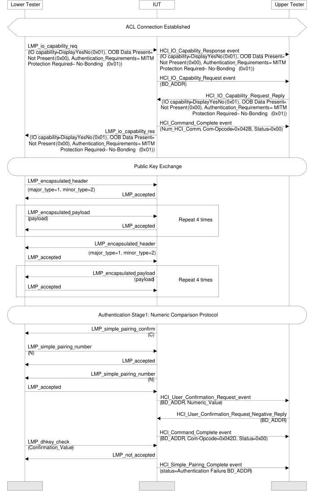

**Figure 4.288: LMP/SP/BV-46-C [Numeric Comparison – IUT Responder – Failure on Responding Side, P-256] MSC**

• Expected Outcome
Pass verdict
The IUT sends an HCI_Simple_Pairing_Complete Event to the Upper Tester with status set to Authentication Failure after the IUT responds to the LMP_dhkey_check PDU with an LMP_not_accepted PDU.
• Notes
This test case is similar to LMP/SP/BV-11-C [Numeric Comparison - IUT Responder - Failure on Responding Side].
LMP/SP/BV-47-C [Pairing on encrypted ACL – Numeric Comparison – IUT Initiator – Success, P-256]
• Test Purpose
Verify that the IUT performs encryption pause and resume at the end of pairing using the Numeric Comparison protocol using the P-256 elliptic curve if the ACL connection was already encrypted.
Test procedure is run with the IUT as the initiator.
• Reference
[1] 4.2.7
• Initial Condition
- See Baseband assumptions and Secure Simple Pairing P256.
• Test Procedure

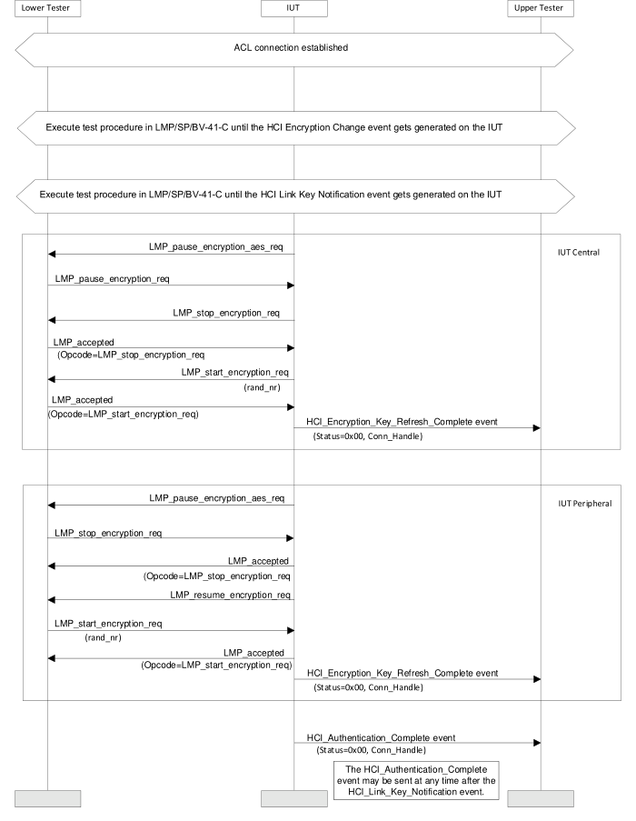

**Figure 4.289: LMP/SP/BV-47-C [Pairing on encrypted ACL – Numeric Comparison – IUT Initiator – Success, P- 256] MSC**

• Expected Outcome
Pass verdict
Both the pairing procedures are successful.
The IUT initiates an encryption pause resume at the end of the second pairing procedure and generates an HCI Encryption Key Refresh Complete event with status success.

#### 4.11.3 Passkey Entry procedures

Note: In all the test cases in Section 4.11.3 Passkey Entry procedures, it does not matter whether the IUT is Central or Peripheral.
LMP/SP/BV-12-C [Passkey Entry - IUT Initiator – Success]
• Test Purpose
Verify that the IUT supports the Passkey Entry protocol.
The IUT is initiator.
• Reference
[1] 4.2.7
• Initial Condition
- See Default settings.
• Test Procedure

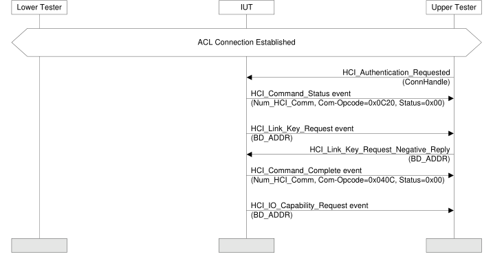

**Figure 4.290: LMP/SP/BV-12-C [Passkey Entry - IUT Initiator – Success] MSC – Page 1 of 3**

| Lower Tester |  |  |  |
| --- | --- | --- | --- |
|  |  |  |  |
|  |  | Secure Simple Pairing Ini | tiator Preamble Complete |
|  |  | LMPio capabilityreq _ _ _ (IO capability=KeyboardOnly (0x02), OOB Data Present = Not Present (0x00), Authentication Requirements = MITM _ Protection Required – Single Profile (0x01)) LMPio capabilityres _ _ _ (IO capability=DisplayOnly (0x00), OOB Data Present = Not Present (0x00), Authentication Requirements = MITM _ Protection Required – Single Profile (0x01)) | HCI IOCapabilityRequest Reply _ _ _ _ (IO capability=KeyboardOnly (0x02), OOB Data Present = Not Present (0x00), Authentication Requirements = MITM _ Protection Required – Single Profile (0x01)) HCI CommandComplete event _ _ (Num HCI Comm, Com-Opcode=0x042B, Status=0x00) _ _ HCI IOCapabilityResponse event _ _ _ (IO capability=DisplayOnly (0x00), OOB Data Present = Not Present (0x00), Authentication Requirements = MITM _ Protection Required – Single Profile (0x01)) |
|  |  | Public Key | Exchange |
|  |  | LMPencapsulated header _ _ (type=public key) _ LMPaccepted _ | Repeat 3 times Repeat 3 times Passkey Entry Protocol |
|  |  | LMPencapsulated payload _ _ (payload) LMPaccepted _ | Repeat 3 times |
|  |  | LMPencapsulated header _ _ (type=public key) _ LMPaccepted _ |  |
|  |  | LMPencapsulated payload _ _ (payload) LMPaccepted _ Authentication Stage 1: |  |
|  |  | LMPsimple pairing confirm _ _ _ (C) LMPsimple pairing confirm _ _ _ (C) LMPsimple pairing number _ _ _ (N) LMPaccepted _ LMPsimple pairing number _ _ _ (C) LMPaccepted _ |  |
|  |  |  |  |
|  |  |  |  |

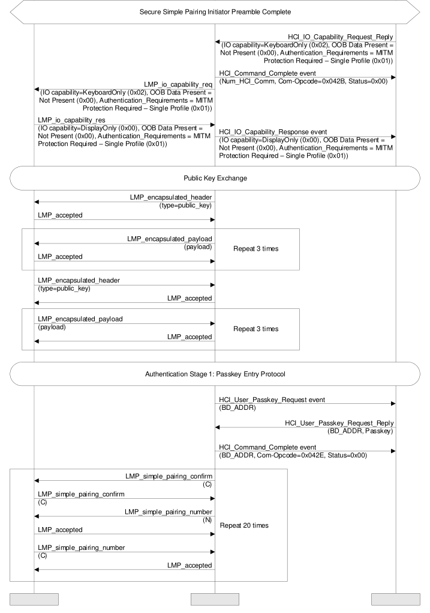

**Figure 4.291: LMP/SP/BV-12-C [Passkey Entry - IUT Initiator – Success] MSC – Page 2 of 3**

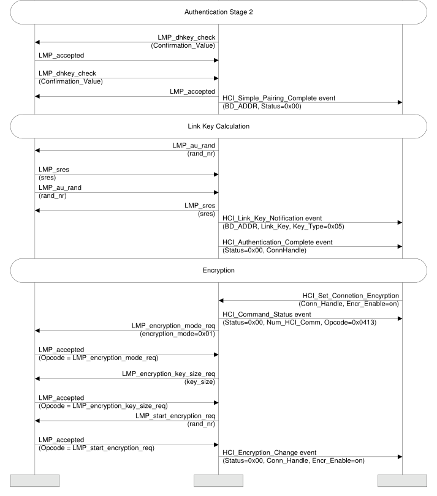

**Figure 4.292: LMP/SP/BV-12-C [Passkey Entry - IUT Initiator – Success] MSC – Page 3 of 3**

• Expected Outcome
Pass verdict
The IUT sends the LMP_DHkey_check PDU is with a valid Confirmation_Value.
The IUT sends an HCI_Simple_Pairing_Complete Event to the Upper Tester.
The IUT sends the resulting Link Key and Key Type to the Host in an HCI_Link_Key_Notification event. Verify that the Link Key matches at the Upper and Lower Testers. Verify that the Key_Type is ‘Authenticated’.
• Notes
The Lower Tester sends an LMP_not_accepted to LMP_DHkey if the Confirmation_Value that it calculates does not match with the Confirmation_Value that the IUT has sent.
• Test Purpose
Verify that the IUT supports the Passkey Entry protocol.
The IUT is responder.
• Reference
[1] 4.2.7
• Initial Condition
- See Default settings.
• Test Procedure

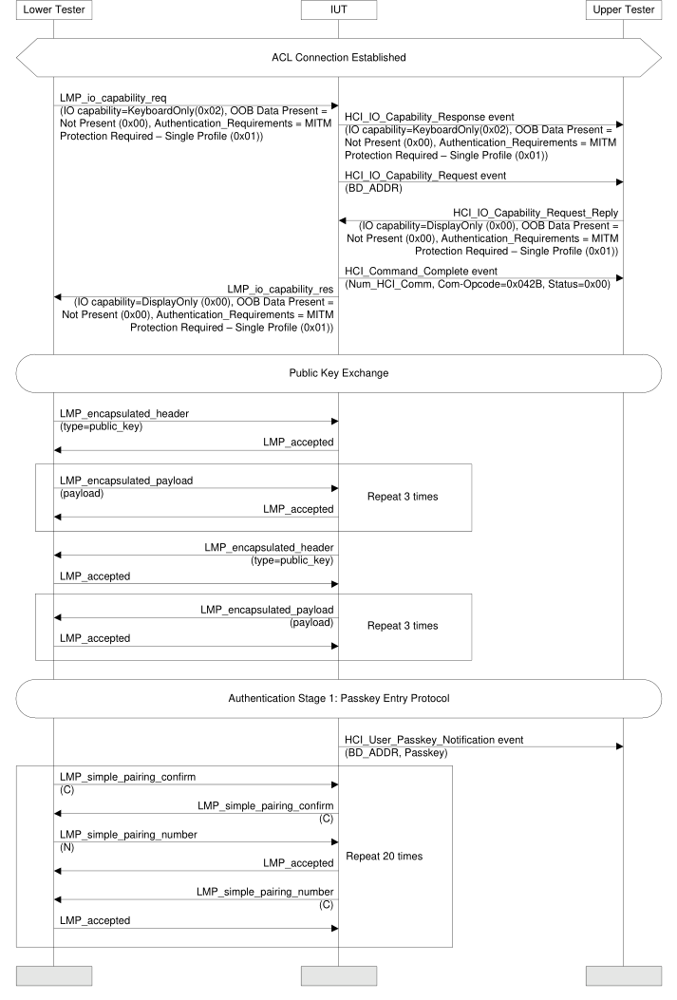

**Figure 4.293: LMP/SP/BV-13-C [Passkey Entry - IUT Responder – Success] MSC – Page 1 of 2**

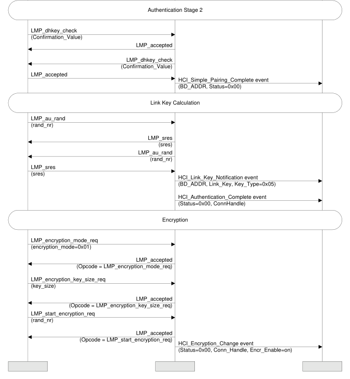

**Figure 4.294: LMP/SP/BV-13-C [Passkey Entry - IUT Responder – Success] MSC – Page 2 of 2**

• Expected Outcome
Pass verdict
The IUT sends the LMP_DHkey_check PDU is with a valid Confirmation_Value.
The IUT sends an HCI_Simple_Pairing_Complete Event to the Upper Tester.
The IUT sends the resulting Link Key and Key Type to the Host in an HCI_Link_Key_Notification event. Verify that the Link Key matches at the Upper and Lower Testers. Verify that the Key_Type is ‘Authenticated’.
• Notes
If the Commitment_Value calculated by the Lower Tester does not match the Commitment_Value sent by the IUT, the Lower Tester will send LMP_not_accepted with the Authentication_Failure Error_Code.
The Lower Tester sends an LMP_not_accepted to LMP_DHkey if the Confirmation_Value that it calculates does not match with the Confirmation_Value that the IUT has sent.
• Test Purpose
Verify that the IUT supports the Passkey Entry protocol where the user on the initiating side does not enter the number.
The IUT is initiator.
• Reference
[1] 4.2.7
• Initial Condition
- See Default settings.
• Test Procedure

**Figure 4.295: LMP/SP/BV-14-C [Passkey Entry - IUT Initiator - Failure on Initiating Side] MSC – Page 1 of 2**

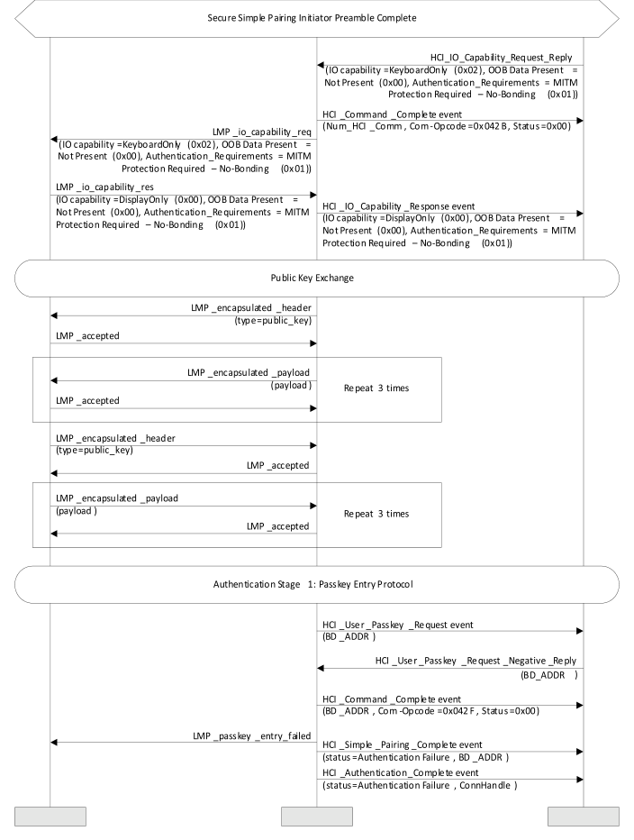

**Figure 4.296: LMP/SP/BV-14-C [Passkey Entry - IUT Initiator - Failure on Initiating Side] MSC – Page 2 of 2**

• Expected Outcome
Pass verdict
The IUT sends an LMP_passkey_entry_failed PDU to the Lower Tester.
The IUT sends an HCI_Simple_Pairing_Complete Event to the Upper Tester with status set to Authentication Failure.
• Test Purpose
Verify that the IUT supports the Passkey Entry protocol.
The IUT is responder.
• Reference
[1] 4.2.7
• Initial Condition
- See Default settings.
• Test Procedure

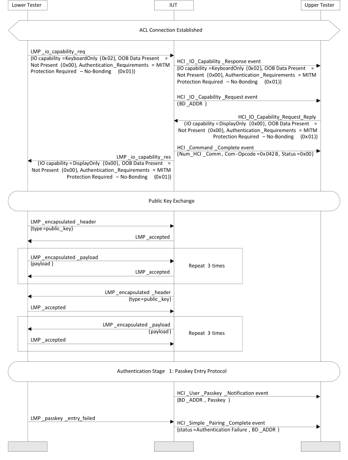

**Figure 4.297: LMP/SP/BV-15-C [Passkey Entry - IUT Responder - Failure on Initiating Side] MSC**

• Expected Outcome
Pass verdict
The IUT sends an HCI_Simple_Pairing_Complete Event to the Upper Tester with status set to Authentication Failure after receiving an LMP_passkey_entry_failed PDU from the Lower Tester.
LMP/SP/BV-16-C [Passkey Entry - IUT Initiator - Failure on Responding Side]
• Test Purpose
Verify that the IUT supports the Passkey Entry protocol.
The IUT is initiator.
• Reference
[1] 4.2.7
• Initial Condition
- See Default settings.
• Test Procedure

**Figure 4.298: LMP/SP/BV-16-C [Passkey Entry - IUT Initiator - Failure on Responding Side] MSC – Page 1 of 2**

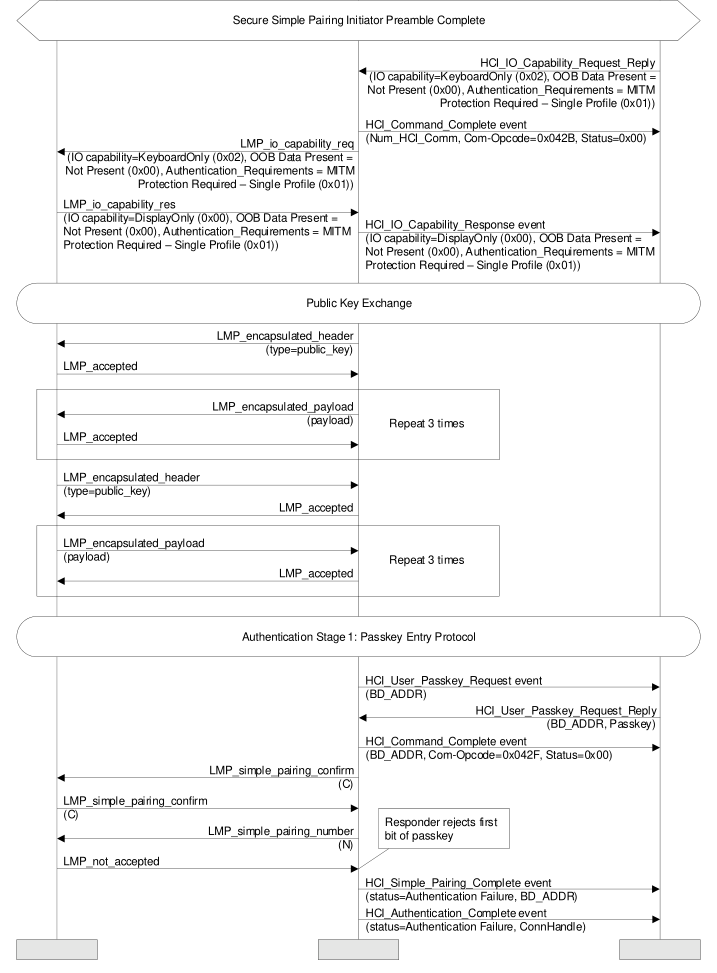

**Figure 4.299: LMP/SP/BV-16-C [Passkey Entry - IUT Initiator - Failure on Responding Side] MSC – Page 2 of 2**

• Expected Outcome
Pass verdict
The IUT sends an HCI_Simple_Pairing_Complete Event to the Upper Tester with status set to Authentication Failure after the Lower Tester responds with an LMP_not_accepted PDU in response to the LMP_simple_pairing_number PDU.
• Test Purpose
Verify that the IUT supports the Passkey Entry protocol.
The IUT is responder.
• Reference
[1] 4.2.7
• Initial Condition
- See Default settings.
• Test Procedure

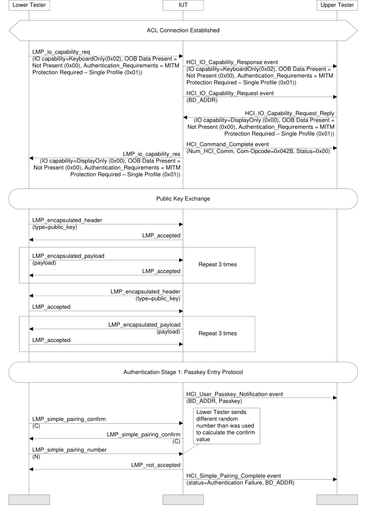

**Figure 4.300: LMP/SP/BV-17-C [Passkey Entry - IUT Responder - Failure on Responding Side] MSC**

• Expected Outcome
Pass verdict
The IUT sends an LMP_not_accepted PDU in response to the LMP_simple_pairing_number PDU.
The IUT sends an HCI_Simple_Pairing_Complete Event to the Upper Tester with status set to Authentication Failure.
• Test Purpose
Verify that the IUT as initiator supports the Passkey Entry protocol using the P-256 elliptic curve.
• Reference
[1] 4.2.7
• Initial Condition
- See Baseband assumptions and Secure Simple Pairing P256.
• Test Procedure

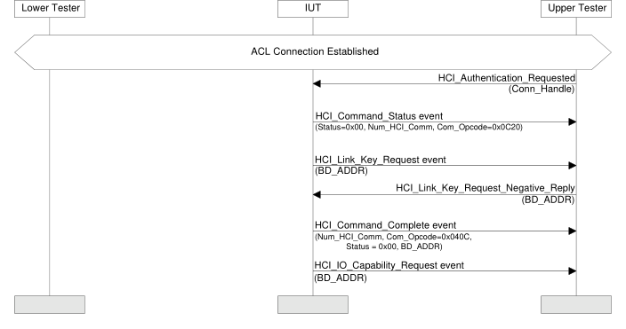

**Figure 4.301: LMP/SP/BV-48-C [Passkey Entry – IUT Initiator – Success, P-256] MSC – Page 1 of 3**

|  |  |  |
| --- | --- | --- |
|  |  |  |
|  |  |  |

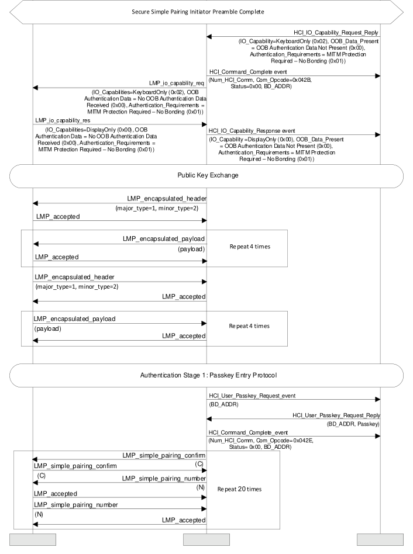

**Figure 4.302: LMP/SP/BV-48-C [Passkey Entry – IUT Initiator – Success, P-256] MSC – Page 2 of 3**

| Lower Teste | r IUT Upper Tester Authentication Stage 2 Link Key Calculation |  |  |
| --- | --- | --- | --- |
|  |  |  |  |
|  | Authentication | Stage 2 |  |
|  |  |  |  |
|  |  |  |  |
|  |  |  |  |
|  | Link Key C | alculation |  |
|  |  |  |  |
|  |  |  |  |
|  |  |  |  |
|  |  |  |  |
|  |  |  |  |
| LMP (Opc |  | HCILinkKeyNotification event _ _ _ HCIAuthenticationComplete event _ _ (Status=0x00, ConnHandle) _ |  |
|  | Encry | ption |  |
|  | LMPencryptionmodereq _ _ _ | HCISetConnectionEncryption _ _ _ (ConnHandle, EncrEnable=on) _ _ HCICommandStatus event _ _ (Status=0x00, NumHCIComm, Opcode=0x0413) _ _ |  |
|  | (encryptionmode=0x01) _ accepted _ ode=LMPencryptionmodereq) _ _ _ |  |  |
| LMP (Opc LMP (Opc | LMPencryptionkeysize req |  |  |
|  | _ _ _ _ (keysize) _ accepted _ ode=LMPencryptionkeysize req) _ _ _ _ LMPstartencryptionreq _ _ _ |  |  |
|  |  |  |  |

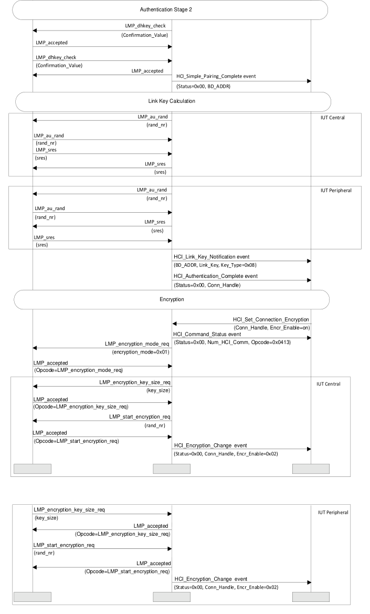

**Figure 4.303: LMP/SP/BV-48-C [Passkey Entry – IUT Initiator – Success, P-256] MSC – Page 3 of 3**

• Expected Outcome
Pass verdict
The IUT sends the LMP_DHkey_check PDU with a valid Confirmation_Value to the Lower Tester.
The IUT sends an HCI_Simple_Pairing_Complete event to the Upper Tester with Status=Secure Simple Pairing succeeded.
The IUT sends the resulting Link_Key and Key_Type to the Upper Tester in an HCI_Link_Key_Notification event. Verify that the Link_Key matches at the Upper and Lower Testers. Verify that the Key_Type is ‘Authenticated Combination Key generated from P256’.
• Notes
The Lower Tester sends an LMP_not_accepted response PDU to a received LMP_DHkey_check PDU if the Confirmation_Value that it calculates does not match with the Confirmation_Value that the IUT has sent.
This test case is similar to LMP/SP/BV-12-C [Passkey Entry - IUT Initiator – Success].
LMP/SP/BV-49-C [Passkey Entry – IUT Responder – Success, P-256]
• Test Purpose
Verify that the IUT as responder supports the Passkey Entry protocol using the P-256 elliptic curve.
• Reference
[1] 4.2.7
• Initial Condition
- See Baseband assumptions and Secure Simple Pairing P256.
• Test Procedure

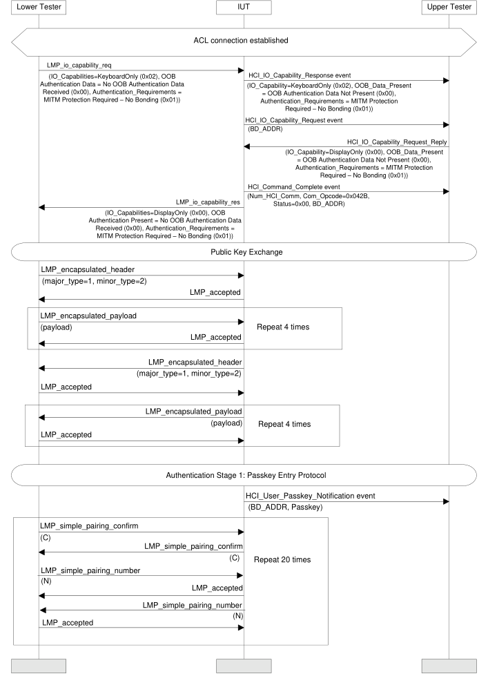

**Figure 4.304: LMP/SP/BV-49-C [Passkey Entry – IUT Responder – Success, P-256] MSC – Page 1 of 2**

|  |  |  |  |
| --- | --- | --- | --- |
|  | Authentication Sta | ge 2 |  |
|  |  |  |  |
|  | Link Key Calcu | lation |  |
|  |  |  |  |
|  |  |  |  |
|  |  |  |  |
| LMP (enc LM (Op LMP (Opc | HC | ILinkKeyNotification event _ _ _ |  |
|  | Encryptio | n |  |
|  | encryptionmodereq _ _ _ ryptionmode=0x01) _ LMPaccepted _ (Opcode=LMPencryptionmodereq) _ _ _ LMPencryptionkeysizereq _ _ _ _ (keysize) _ Paccepted _ code=LMPencryptionkeysizereq) _ _ _ _ LMPstartencryptionreq _ _ _ accepted _ ode=LMPstartencryptionreq) _ _ _ HC |  |  |
|  |  |  |  |

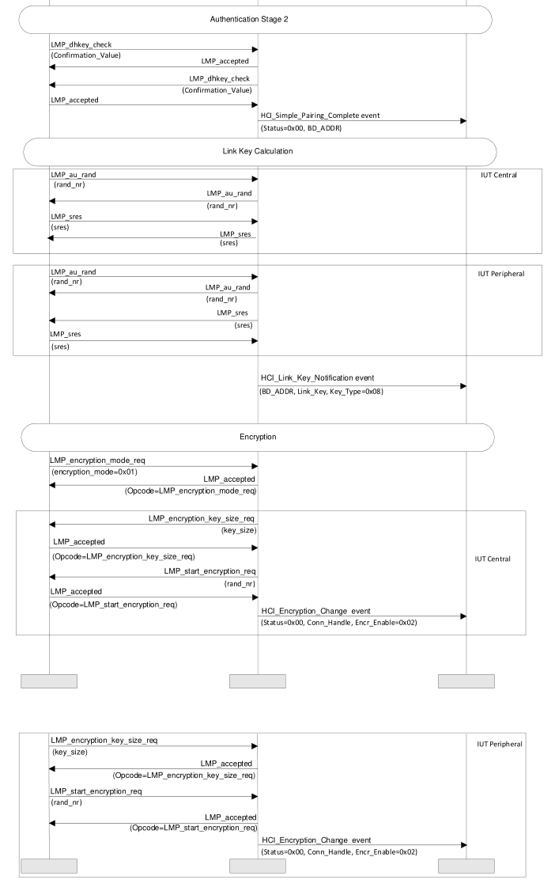

**Figure 4.305: LMP/SP/BV-49-C [Passkey Entry – IUT Responder – Success, P-256] MSC – Page 2 of 2**

• Expected Outcome
Pass verdict
The IUT sends the LMP_DHkey_check PDU with a valid Confirmation_Value to the Lower Tester.
The IUT sends an HCI_User_Passkey_Notification_Event to the Upper Tester.
The IUT sends an HCI_Simple_Pairing_Complete event to the Upper Tester with Status=Secure Simple Pairing succeeded.
The IUT sends the resulting Link_Key and Key_Type to the Upper Tester in an HCI_Link_Key_Notification event. Verify that the Link Key matches at the Upper and Lower Testers. Verify that the Key_Type is ‘Authenticated Combination Key generated from P256’.
• Notes
If the Commitment_Value calculated by the Lower Tester does not match the Commitment_Value sent by the IUT, the Lower Tester will send an LMP_not_accepted PDU with the “Authentication_Failure” Error_Code.
The Lower Tester sends an LMP_not_accepted response PDU to a received LMP_DHkey_check PDU if the Confirmation_Value that it calculates does not match with the Confirmation_Value that the IUT has sent.
This test case is similar to LMP/SP/BV-13-C [Passkey Entry - IUT Responder – Success].
LMP/SP/BV-50-C [Passkey Entry – IUT Initiator – Failure on Initiating Side, P-256]
• Test Purpose
Verify that the IUT as initiator supports the Passkey Entry protocol using the P-256 elliptic curve, where the user on the initiating side does not enter the number.
• Reference
[1] 4.2.7
• Initial Condition
- See Baseband assumptions and Secure Simple Pairing P256.
• Test Procedure

**Figure 4.306: LMP/SP/BV-50-C [Passkey Entry – IUT Initiator – Failure on Initiating Side, P-256] MSC – Page 1 of 2**

| (I HC (Nu LMP io capabilityreq _ _ _ (IO Capabilities=KeyboardOnly (0x02), OOB _ Authentication Data = No OOB Authentication Data Received (0x00), Authentication Requirements = _ MITM Protection Required – No Bonding (0x01)) LMP io capabilityres _ _ _ (IO Capabilities=DisplayOnly (0x00), OOB H _ Authentication Data = No OOB Authentication Data (IO Received (0x00), Authentication Requirements = _ MITM Protection Required – No Bonding (0x01)) Public Key Ex LMP encapsulated header _ _ LMP accepted _ LMP encapsulated payload _ _ (payload) LMP accepted _ LMP encapsulated header _ _ LMP accepted _ LMP encapsulated payload _ _ (payload) LMP accepted _ Authentication Stage 1: Pa HC (BD HC (N LMP passkey entry failed _ _ _ HC (Sta HC (St |  | HCIIO Capability Request Reply _ _ _ _ O Capability=KeyboardOnly (0x02), OOB Data Present _ _ _ = OOB Authentication Data Not Present (0x00), Authentication Requirements = MITM Protection _ Required – No Bonding (0x01)) ICommand Complete event _ _ m HCIComm, Com Opcode=0x042B, _ _ _ Status=0x00, BD ADDR) _ CIIO Capability Response event _ _ _ Capability=DisplayOnly (0x00), OOB Data Present _ _ _ = OOB Authentication Data Not Present (0x00), Authentication Requirements = MITM Protection _ Required – No Bonding (0x01)) change sskey Entry Protocol IUser PasskeyRequest event _ _ _ ADDR) _ HCIUser PasskeyRequestNegative Reply _ _ _ _ _ (BDADDR) _ ICommand Complete event _ _ um HCIComm, Com Opcode= 0x042F, _ _ _ Status= 0x00, BDADDR) _ ISimple PairingComplete event _ _ _ tus= Authentication Failure, BD ADDR) _ IAuthentication Complete event _ _ atus= Authentication Failure, Conn Handle) _ |  |  |  |
| --- | --- | --- | --- | --- | --- |
|  |  |  |  |  |  |
|  |  |  |  |  |  |

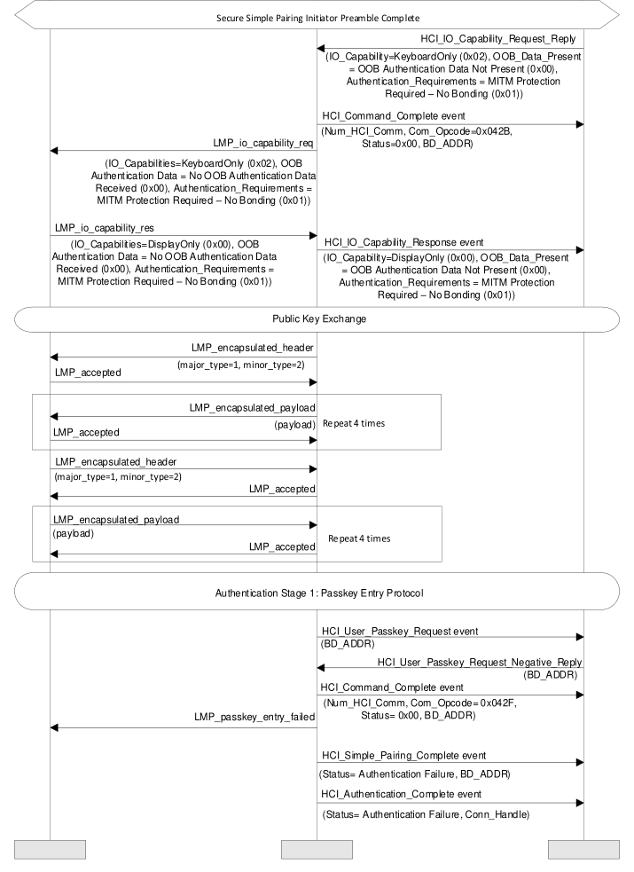

**Figure 4.307: LMP/SP/BV-50-C [Passkey Entry – IUT Initiator – Failure on Initiating Side, P-256] MSC – Page 2 of 2**

• Expected Outcome
Pass verdict
The IUT sends an LMP_passkey_entry_failed PDU to the Lower Tester after receiving an HCI_User_Passkey_Request_Negative_Reply command from the Upper Tester.
The IUT sends an HCI_Simple_Pairing_Complete event to the Upper Tester with Status=Authentication Failure.
• Notes
This test case is similar to LMP/SP/BV-14-C [Passkey Entry - IUT Initiator - Failure on Initiating Side].
LMP/SP/BV-51-C [Passkey Entry – IUT Responder – Failure on Initiating Side, P-256]
• Test Purpose
Verify that the IUT as responder supports the Passkey Entry protocol using the P-256 elliptic curve.
• Reference
[1] 4.2.7
• Initial Condition
- See Baseband assumptions and Secure Simple Pairing P256.
• Test Procedure

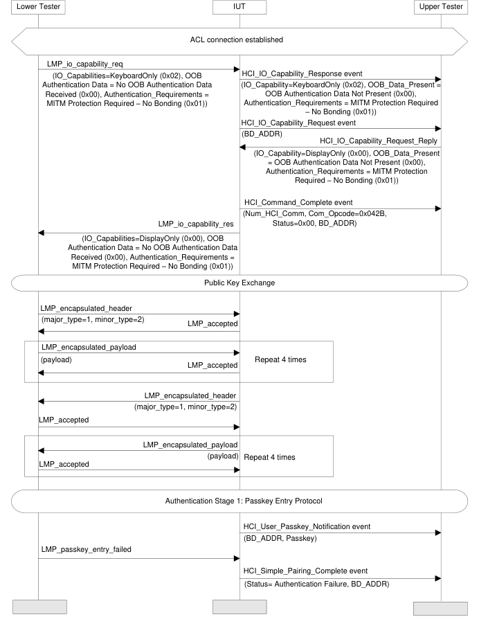

**Figure 4.308: LMP/SP/BV-51-C [Passkey Entry – IUT Responder – Failure on Initiating Side, P-256] MSC**

• Expected Outcome
Pass verdict
The IUT sends an HCI_Simple_Pairing_Complete event to the Upper Tester with Status = Authentication Failure after receiving an LMP_passkey_entry_failed PDU from the Lower Tester.
• Notes
This Test Case is similar to LMP/SP/BV-15-C [Passkey Entry - IUT Responder - Failure on Initiating Side].
LMP/SP/BV-52-C [Passkey Entry – IUT Initiator – Failure on Responding Side, P-256]
• Test Purpose
Verify that the IUT as initiator supports the Passkey Entry protocol using the P-256 elliptic curve.
• Reference
[1] 4.2.7
• Initial Condition
- See Baseband assumptions and Secure Simple Pairing P256.
• Test Procedure

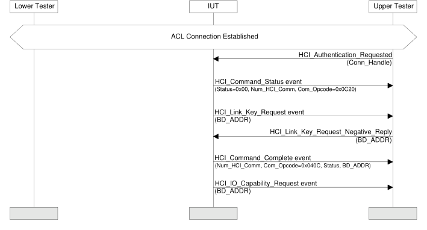

**Figure 4.309: LMP/SP/BV-52-C [Passkey Entry – IUT Initiator – Failure on Responding Side, P-256] MSC – Page 1 of 2**

| HCIIO Capability Request Reply _ _ _ _ (IO Capability=KeyboardOnly (0x02), OOB Data Present _ _ _ = OOB Authentication Data Not Present (0x00), Authentication Requirements = MITM Protection _ Required – No Bonding (0x01)) HCICommand Complete event _ _ LMP _io _capability _req (Num _HC SI t_ aC tuo sm =m 0x, 0C 0o m BD_O Apc Do Dd Re )=0x042B, , (IO Capabilities=KeyboardOnly (0x02), OOB _ _ Authentication Data = No OOB Authentication Data Received (0x00), Authentication Requirements = _ MITM Protection Required – No Bonding (0x01)) LMP io capabilityres _ _ _ (IO Capabilities=DisplayOnly (0x00), OOB HCIIO Capability Response event _ _ _ _ Authentication Data = No OOB Authentication Data (IO Capability=DisplayOnly (0x00), OOB Data Present Received (0x00), Authentication _Requirements = _ = OOB Authentication Data Not Pres_ ent (0x_ 00), MITM Protection Required – No Bonding (0x01)) Authentication Requirements = MITM Protection _ Required – No Bonding (0x01)) Public Key Exchange LMP encapsulated header _ _ LMP accepted _ LMP encapsulated payload _ _ (payload) LMP accepted _ LMP encapsulated header _ _ LMP accepted _ LMP encapsulated payload _ _ (payload) LMP accepted _ Authentication Stage 1: Passkey Entry Protocol HCIUser PasskeyRequest event _ _ _ (BDADDR) _ HCIUser PasskeyRequestReply _ _ _ _ (BDADDR, Passkey) _ HCICommand Complete event _ _ (Num HCIComm, Com Opcode= 0x042F, _ _ _ LMP _simple _pairing _confirm Status= 0x00, BD _ADDR) (C) LMP simplepairing confirm _ _ _ Responder rejects (C) first bit of passkey LMP simplepairing number _ _ _ (N) LMP notaccepted _ _ HCISimple PairingComplete event _ _ _ (Status= Authentication Failure, BD ADDR) _ HCIAuthentication Complete event _ _ (Status= Authentication Failure, Conn Handle) _ |  |  |  |
| --- | --- | --- | --- |
|  |  |  |  |
|  |  |  |  |

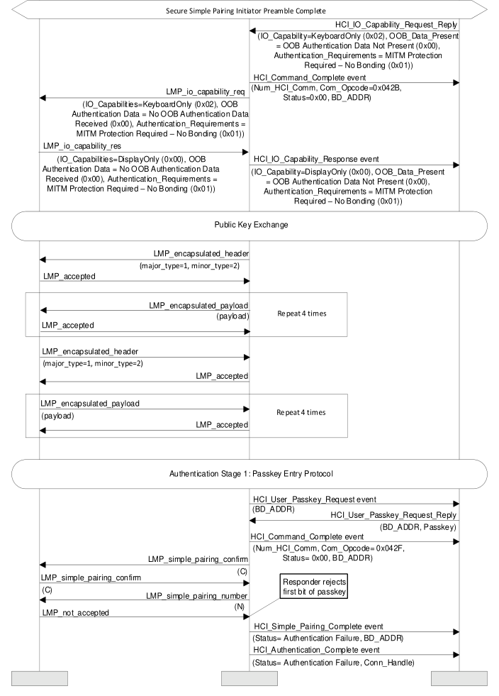

**Figure 4.310: LMP/SP/BV-52-C [Passkey Entry – IUT Initiator – Failure on Responding Side, P-256] MSC – Page 2 of 2**

• Expected Outcome
Pass verdict
The IUT sends an HCI_Simple_Pairing_Complete event to the Upper Tester with Status = Authentication Failure after the Lower Tester sends an LMP_not_accepted PDU in response to the LMP_simple_pairing_number PDU sent by the IUT.
• Notes
This test case is similar to LMP/SP/BV-16-C [Passkey Entry - IUT Initiator - Failure on Responding Side].
• Test Purpose
Verify that the IUT as responder supports the Passkey Entry protocol using the P-256 elliptic curve.
• Reference
[1] 4.2.7
• Initial Condition
- See Baseband assumptions and Secure Simple Pairing P256.
• Test Procedure

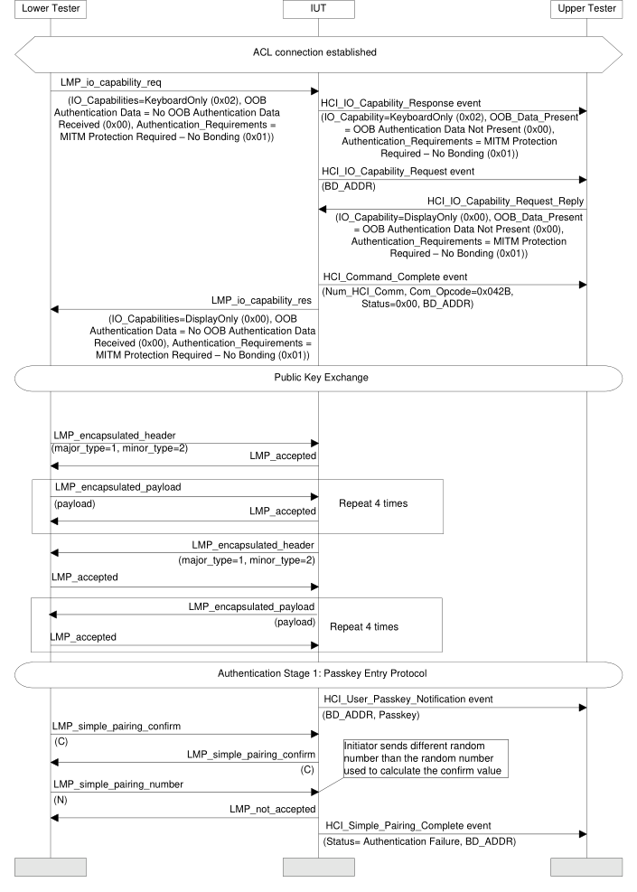

**Figure 4.311: LMP/SP/BV-53-C [Passkey Entry – IUT Responder – Failure on Responding Side, P-256] MSC**

• Expected Outcome
Pass verdict
The IUT sends an LMP_not_accepted PDU to the Lower Tester in response to the received LMP_simple_pairing_number PDU.
The IUT sends an HCI_Simple_Pairing_Complete event to the Upper Tester with Status=Authentication Failure.
• Notes
This test case is similar to LMP/SP/BV-17-C [Passkey Entry - IUT Responder - Failure on Responding Side].

#### 4.11.4 Out-of-Band procedures

Note: In all the test cases in Section 4.11.4 Out-of-Band procedures, it does not matter whether the IUT is Central or Peripheral.
LMP/SP/BV-18-C [OOB Protocol - IUT Initiator - IUT with OOB_Auth_Data – Success]
• Test Purpose
Verify that the IUT supports the OOB protocol where the IUT has OOB_Auth_Data and the Lower Tester does not have OOB_Auth_Data.
The IUT is initiator.
• Reference
[1] 4.2.7
• Initial Condition
- See Default settings.
• Test Procedure

**Figure 4.312: LMP/SP/BV-18-C [OOB Protocol - IUT Initiator - IUT with OOB_Auth_Data – Success] MSC – Page 1 of 3**

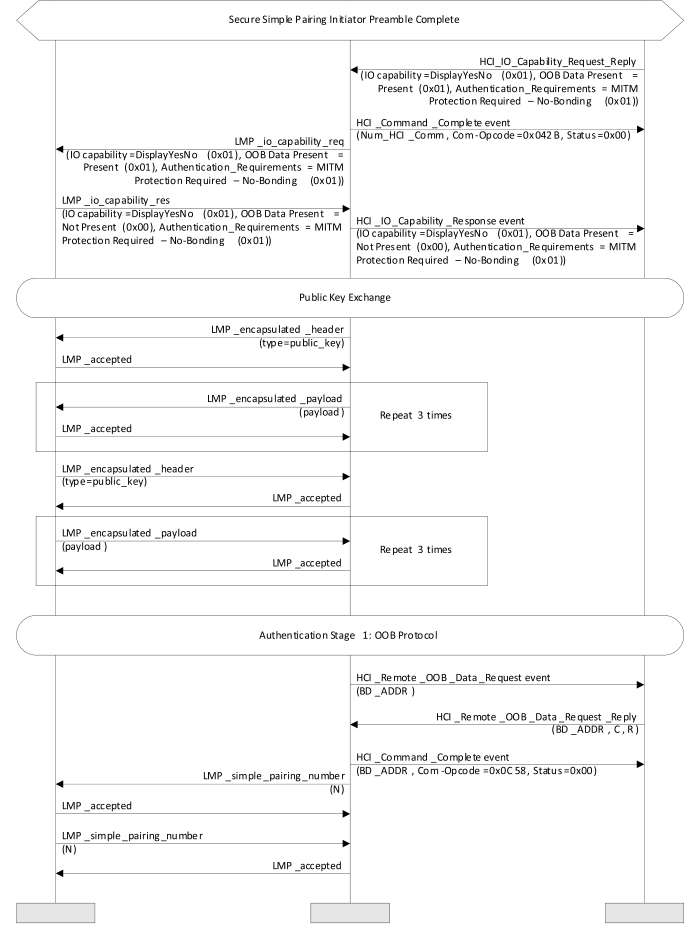

**Figure 4.313: LMP/SP/BV-18-C [OOB Protocol - IUT Initiator - IUT with OOB_Auth_Data – Success] MSC – Page 2 of 3**

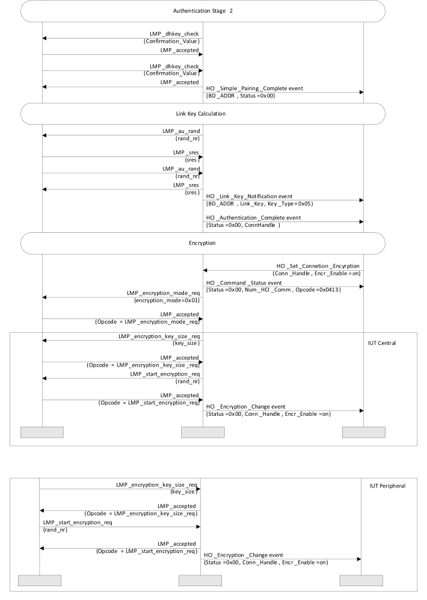

**Figure 4.314:LMP/SP/BV-18-C [OOB Protocol - IUT Initiator - IUT with OOB_Auth_Data – Success] MSC – Page 3 of 3**

• Expected Outcome
Pass verdict
The IUT sends an HCI_Remote_OOB_Data_Request Event to the Upper Tester.
The IUT sends the LMP_DHkey_check PDU is with a valid Confirmation_Value.
The IUT sends an HCI_Simple_Pairing_Complete Event to the Upper Tester.
The IUT sends the resulting Link Key and Key Type to the Host in an HCI_Link_Key_Notification event. Verify that the Link Key matches at the Upper and Lower Testers. Verify that the Key_Type is ‘Authenticated’.
• Notes
The Lower Tester sends an LMP_not_accepted to LMP_DHkey if the Confirmation_Value that it calculates does not match with the Confirmation_Value that the IUT has sent.
LMP/SP/BV-19-C [OOB Protocol - IUT Responder - IUT with OOB_Auth_Data – Success]
• Test Purpose
Verify that the IUT supports the OOB protocol where the IUT has OOB_Auth_Data.
The IUT is responder.
• Reference
[1] 4.2.7
• Initial Condition
- See Default settings.
• Test Procedure

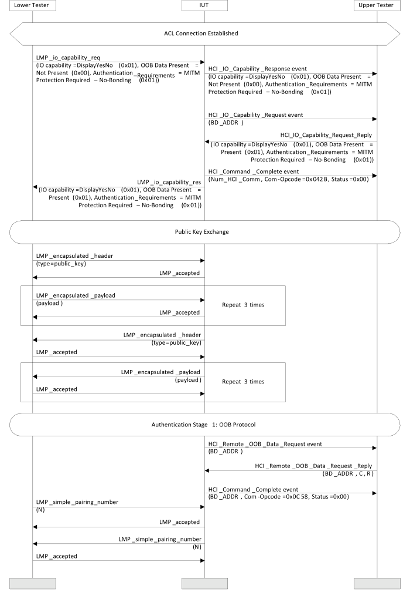

**Figure 4.315: LMP/SP/BV-19-C [OOB Protocol - IUT Responder - IUT with OOB_Auth_Data – Success] MSC – Page 1 of 2**

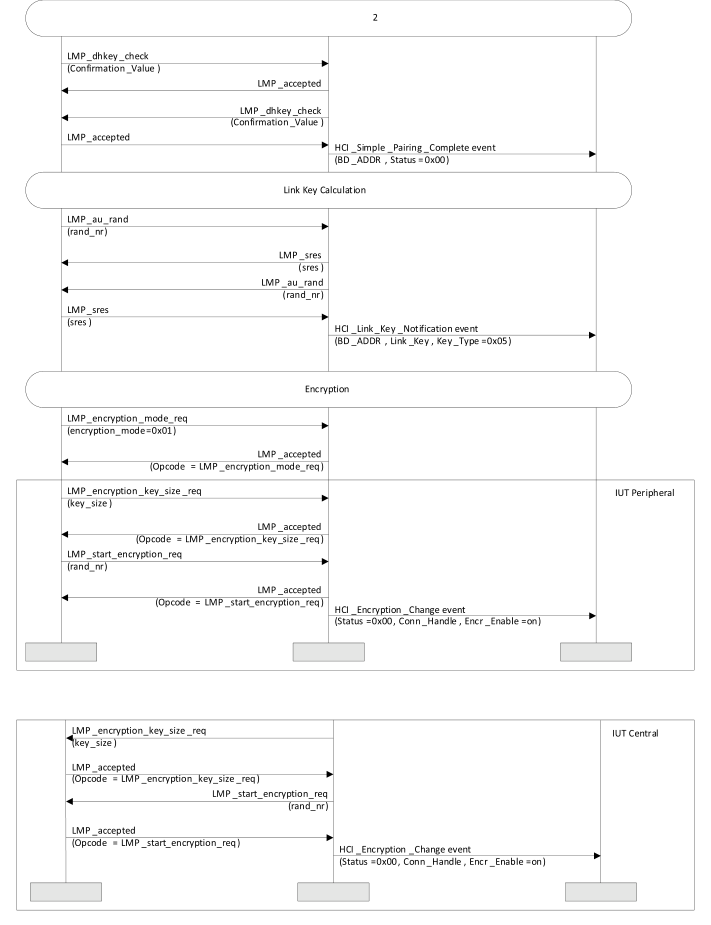

**Figure 4.316: LMP/SP/BV-19-C [OOB Protocol - IUT Responder - IUT with OOB_Auth_Data – Success] MSC – Page 2 of 2**

• Expected Outcome
Pass verdict
The IUT sends an HCI_Remote_OOB_Data_Request Event to the Upper Tester.
The IUT sends the LMP_DHkey_check PDU with a valid Confirmation_Value.
The IUT sends an HCI_Simple_Pairing_Complete Event to the Upper Tester.
The IUT sends the resulting Link Key and Key Type to the Host in an HCI_Link_Key_Notification event. Verify that the Link Key matches at the Upper and Lower Testers. Verify that the Key_Type is ‘Authenticated’.
• Notes
The Lower Tester sends an LMP_not_accepted to LMP_DHkey if the Confirmation_Value that it calculates does not match with the Confirmation_Value that the IUT has sent.
LMP/SP/BV-20-C [OOB Protocol - IUT Initiator – Lower Tester with OOB_Auth_Data – Success]
• Test Purpose
Verify that the IUT supports the OOB protocol where the Lower Tester has OOB_Auth_Data.
The IUT is initiator.
• Reference
[1] 4.2.7
• Initial Condition
- See Default settings.
• Test Procedure

**Figure 4.317: LMP/SP/BV-20-C [OOB Protocol - IUT Initiator – Lower Tester with OOB_Auth_Data – Success] MSC – Page 1 of 3**

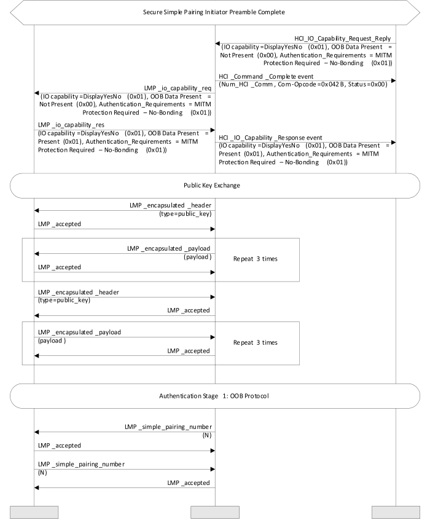

**Figure 4.318: LMP/SP/BV-20-C [OOB Protocol - IUT Initiator – Lower Tester with OOB_Auth_Data – Success] MSC – Page 2 of 3**

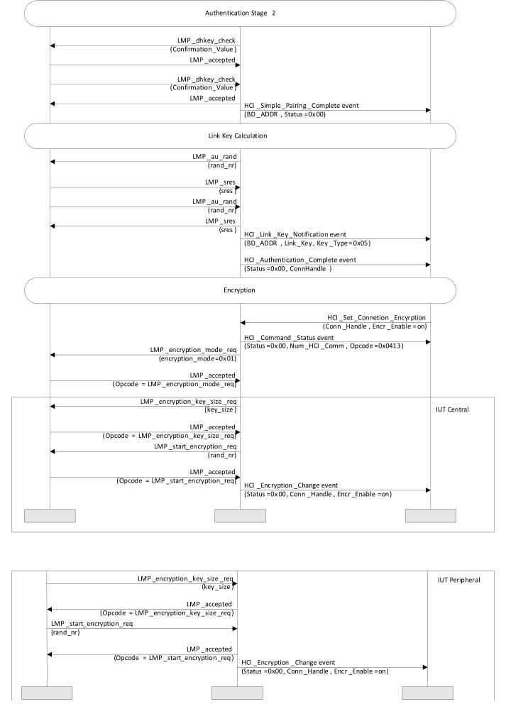

**Figure 4.319: LMP/SP/BV-20-C [OOB Protocol - IUT Initiator – Lower Tester with OOB_Auth_Data – Success] MSC – Page 3 of 3**

• Expected Outcome
Pass verdict
The IUT does not send an HCI_Remote_OOB_Data_Request event to the Upper Tester.
The IUT sends the LMP_dhkey_check PDU is with a valid Confirmation_Value.The IUT sends an HCI_Simple_Pairing_Complete Event to the Upper Tester.
The IUT sends the resulting Link Key and Key Type to the Host in an HCI_Link_Key_Notification event. Verify that the Link Key matches at the Upper and Lower Testers. Verify that the Key_Type is ‘Authenticated’.
• Notes
The Lower Tester sends an LMP_not_accepted to LMP_DHkey if the Confirmation_Value that it calculates does not match with the Confirmation_Value that the IUT has sent.
LMP/SP/BV-21-C [OOB Protocol - IUT Responder – Lower Tester with OOB_Auth_Data – Success]
• Test Purpose
Verify that the IUT supports the OOB protocol where the Lower Tester has OOB_Auth_Data.
The IUT is responder.
• Reference
[1] 4.2.7
• Initial Condition
- See Default settings.
• Test Procedure

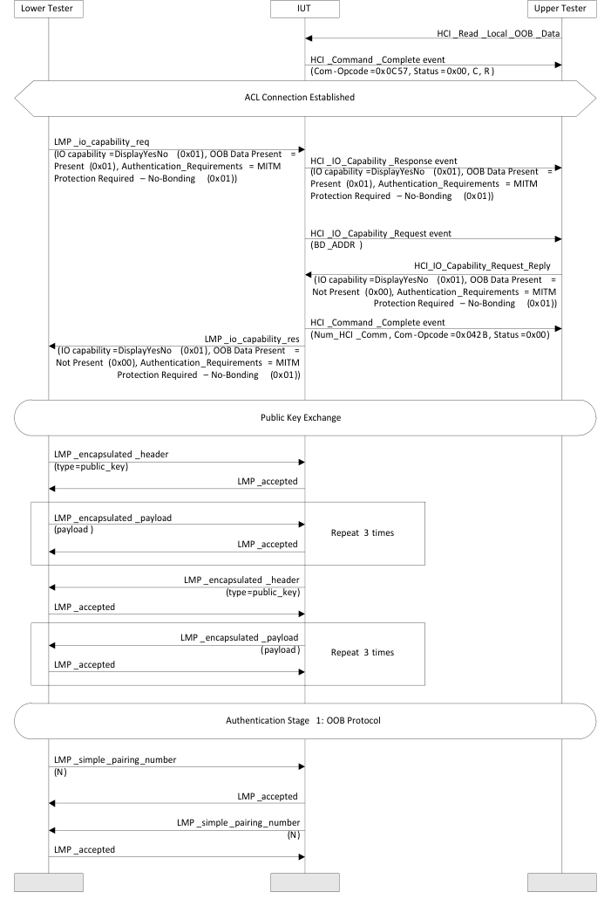

**Figure 4.320: LMP/SP/BV-21-C [OOB Protocol - IUT Responder – Lower Tester with OOB_Auth_Data – Success] MSC – Page 1 of 2**

**Figure 4.321: LMP/SP/BV-21-C [OOB Protocol - IUT Responder – Lower Tester with OOB_Auth_Data – Success] MSC – Page 2 of 2**

• Expected Outcome
Pass verdict
The IUT does not send an HCI_Remote_OOB_Data_Request Event to the Upper Tester.
The IUT sends the LMP_dhkey_check PDU is with a valid Confirmation_Value.
The IUT sends an HCI_Simple_Pairing_Complete Event to the Upper Tester.
The IUT sends the resulting Link Key and Key Type to the Host in an HCI_Link_Key_Notification event. Verify that the Link Key matches at the Upper and Lower Testers. Verify that the Key_Type is ‘Authenticated’.
• Notes
The Lower Tester sends an LMP_not_accepted to LMP_DHkey if the Confirmation_Value that it calculates does not match with the Confirmation_Value that the IUT has sent.
LMP/SP/BV-22-C [OOB Protocol - IUT Initiator - IUT and Lower Tester with OOB_Auth_Data - Success]
• Test Purpose
Verify that the IUT supports the OOB protocol where the IUT and the Lower Tester have OOB_Auth_Data.
The IUT is initiator.
• Reference
[1] 4.2.7
• Initial Condition
- See Default settings.
• Test Procedure

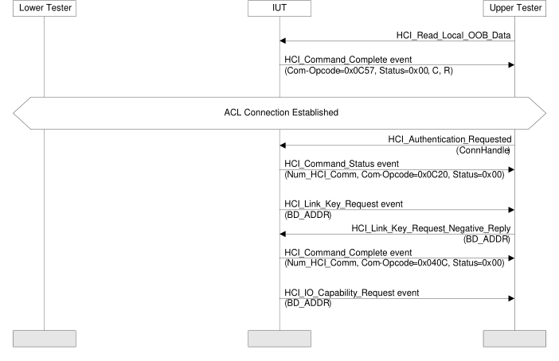

**Figure 4.322: LMP/SP/BV-22-C [OOB Protocol - IUT Initiator - IUT and Lower Tester with OOB_Auth_Data - Success] MSC – Page 1 of 3**

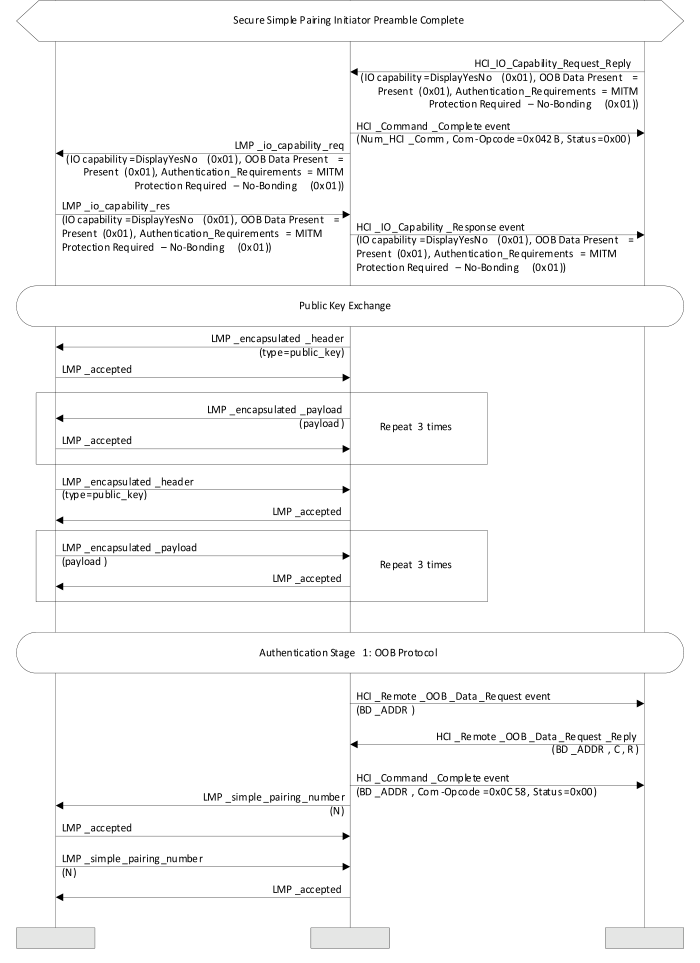

**Figure 4.323: LMP/SP/BV-22-C [OOB Protocol - IUT Initiator - IUT and Lower Tester with OOB_Auth_Data - Success] MSC – Page 2 of 3**

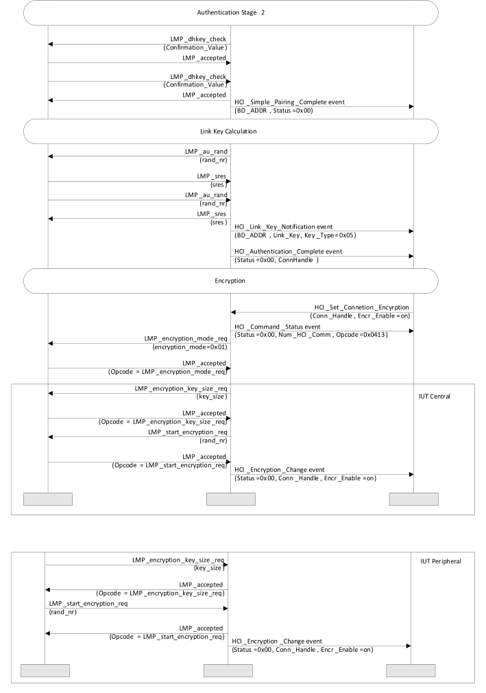

**Figure 4.324: LMP/SP/BV-22-C [OOB Protocol - IUT Initiator - IUT and Lower Tester with OOB_Auth_Data - Success] MSC – Page 3 of 3**

• Expected Outcome
Pass verdict
The IUT sends an HCI_Remote_OOB_Data_Request Event to the Upper Tester.
The IUT sends the LMP_dhkey_check PDU is with a valid Confirmation_Value.
The IUT sends an HCI_Simple_Pairing_Complete Event to the Upper Tester.
The IUT sends the resulting Link Key and Key Type to the Host in an HCI_Link_Key_Notification event. Verify that the Link Key matches at the Upper and Lower Testers. Verify that the Key_Type is ‘Authenticated’.
• Notes
The Lower Tester sends an LMP_not_accepted to LMP_DHkey if the Confirmation_Value that it calculates does not match with the Confirmation_Value that the IUT has sent.
LMP/SP/BV-23-C [OOB Protocol - IUT Responder - IUT and Lower Tester with OOB_Auth_Data – Success]
• Test Purpose
Verify that the IUT supports the OOB protocol where the IUT and Lower Tester have OOB_Auth_Data.
The IUT is responder.
• Reference
[1] 4.2.7
• Initial Condition
- See Default settings.
• Test Procedure

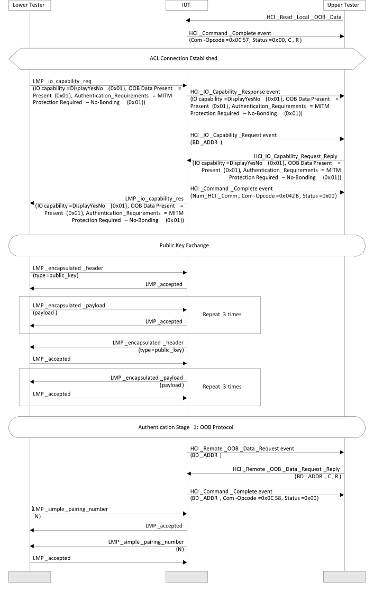

**Figure 4.325: LMP/SP/BV-23-C [OOB Protocol - IUT Responder - IUT and Lower Tester with OOB_Auth_Data – Success] MSC – Page 1 of 2**

**Figure 4.326: LMP/SP/BV-23-C [OOB Protocol - IUT Responder - IUT and Lower Tester with OOB_Auth_Data – Success] MSC – Page 2 of 2**

• Expected Outcome
Pass verdict
The IUT sends an HCI_Remote_OOB_Data_Request Event to the Upper Tester.
The IUT sends the LMP_dhkey_check PDU is with a valid Confirmation_Value.The IUT sends an HCI_Simple_Pairing_Complete Event to the Upper Tester.
The IUT sends the resulting Link Key and Key Type to the Host in an HCI_Link_Key_Notification event. Verify that the Link Key matches at the Upper and Lower Testers. Verify that the Key_Type is ‘Authenticated’.
• Notes
The Lower Tester sends an LMP_not_accepted to LMP_DHkey if the Confirmation_Value that it calculates does not match with the Confirmation_Value that the IUT has sent.
LMP/SP/BV-24-C [OOB Protocol - IUT Initiator - IUT with OOB_Auth_Data - Failure]
• Test Purpose
Verify that the IUT supports the OOB protocol where the IUT has OOB_Auth_Data that does not match the Lower Tester.
The IUT is initiator.
• Reference
[1] 4.2.7
• Initial Condition
- See Default settings.
• Test Procedure

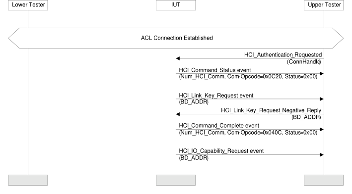

**Figure 4.327: LMP/SP/BV-24-C [OOB Protocol - IUT Initiator - IUT with OOB_Auth_Data - Failure] MSC – Page 1 of 2**

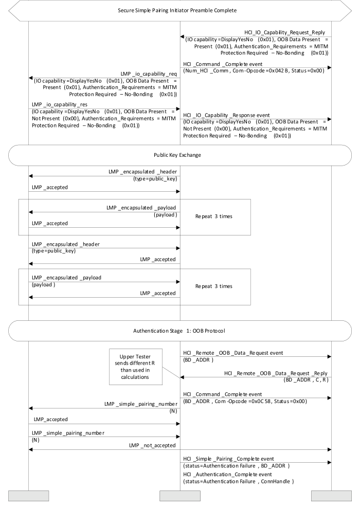

**Figure 4.328: LMP/SP/BV-24-C [OOB Protocol - IUT Initiator - IUT with OOB_Auth_Data - Failure] MSC – Page 2 of 2**

• Expected Outcome
Pass verdict
The IUT sends an HCI_Simple_Pairing_Complete Event with status = Authentication Failure to the Upper Tester after sending the LMP_not_accepted PDU.
• Test Purpose
Verify that the IUT supports the OOB protocol where the IUT has OOB_Auth_Data.
The IUT is responder.
• Reference
[1] 4.2.7
• Initial Condition
- See Default settings.
• Test Procedure

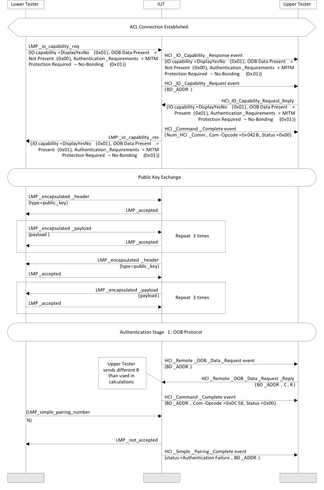

**Figure 4.329: LMP/SP/BV-25-C [OOB Protocol - IUT Responder - IUT with OOB_Auth_Data - Failure] MSC**

• Expected Outcome
Pass verdict
The IUT sends an HCI_Simple_Pairing_Complete Event with status = Authentication Failure to the Upper Tester after sending the LMP_not_accepted PDU.
LMP/SP/BV-26-C [OOB Protocol - IUT Initiator – Lower Tester with OOB_Auth_Data - Failure]
• Test Purpose
Verify that the IUT supports the OOB protocol where the Lower Tester has OOB_Auth_Data.
The IUT is initiator.
• Reference
[1] 4.2.7
• Initial Condition
- See Default settings.
• Test Procedure

**Figure 4.330: LMP/SP/BV-26-C [OOB Protocol - IUT Initiator – Lower Tester with OOB_Auth_Data - Failure] MSC – Page 1 of 2**

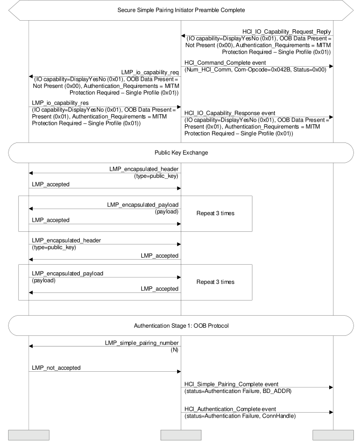

**Figure 4.331: LMP/SP/BV-26-C [OOB Protocol - IUT Initiator – Lower Tester with OOB_Auth_Data - Failure] MSC – Page 2 of 2**

• Expected Outcome
Pass verdict
The IUT does not send an HCI_Remote_OOB_Data_Request event to the Upper Tester.
The IUT sends an HCI_Simple_Pairing_Complete Event with status = Authentication Failure to the Upper Tester after receiving the LMP_not_accepted PDU from the Lower Tester.
LMP/SP/BV-27-C [OOB Protocol - IUT Responder – Lower Tester with OOB_Auth_Data - Failure]
• Test Purpose
Verify that the IUT supports the OOB protocol where the Lower Tester has OOB_Auth_Data.
The IUT is responder.
• Reference
[1] 4.2.7
• Initial Condition
- See Default settings.
• Test Procedure

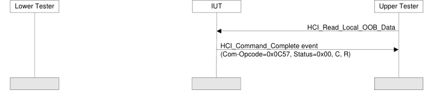

**Figure 4.332: LMP/SP/BV-27-C [OOB Protocol - IUT Responder – Lower Tester with OOB_Auth_Data - Failure] MSC – Page 1 of 2**

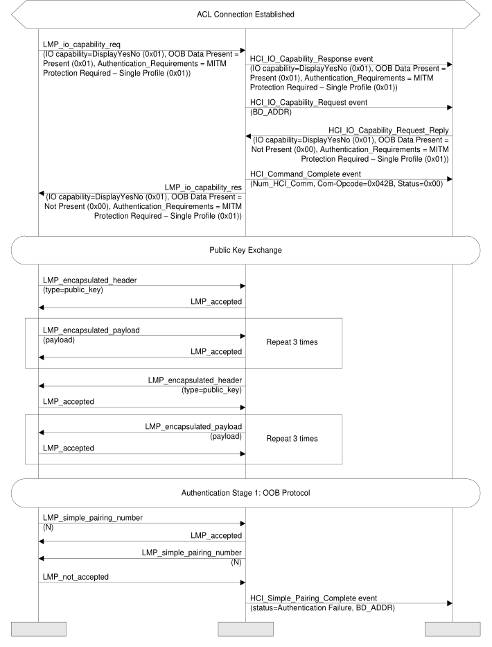

**Figure 4.333: LMP/SP/BV-27-C [OOB Protocol - IUT Responder – Lower Tester with OOB_Auth_Data - Failure] MSC – Page 2 of 2**

• Expected Outcome
Pass verdict
The IUT does not send an HCI_Remote_OOB_Data_Request event to the Upper Tester.
The IUT sends an HCI_Simple_Pairing_Complete Event with status = Authentication Failure to the Upper Tester after receiving the LMP_not_accepted PDU from the Lower Tester.
LMP/SP/BV-54-C [OOB Protocol – IUT Initiator – IUT with OOB_Auth_Data - Success, P- 256]
• Test Purpose
Verify that the IUT as initiator supports the OOB protocol using the P-256 elliptic curve where the IUT has OOB_Auth_Data and the Lower Tester does not have OOB_Auth_Data.
• Reference
[1] 4.2.7
• Initial Condition
- See Baseband assumptions and Secure Simple Pairing P256.
• Test Procedure

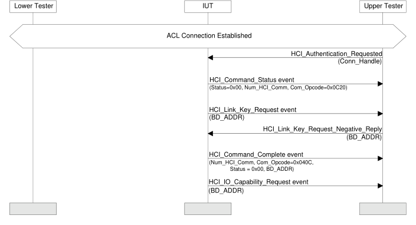

**Figure 4.334: LMP/SP/BV-54-C [OOB Protocol – IUT Initiator – IUT with OOB_Auth_Data - Success, P-256] MSC – Page 1 of 3**

|  |  |  |
| --- | --- | --- |
|  |  |  |
|  |  |  |

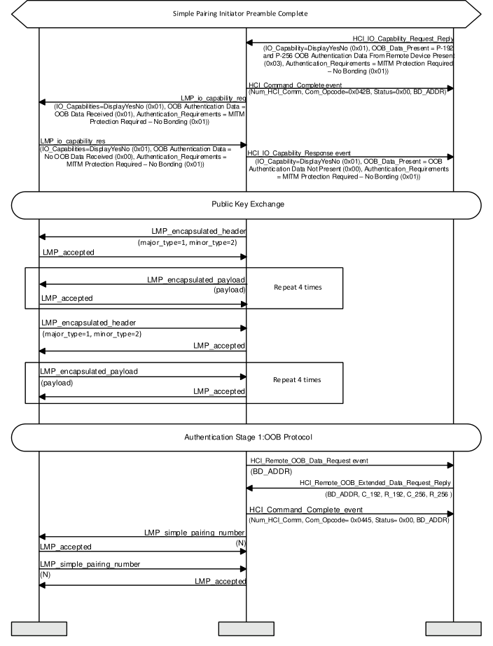

**Figure 4.335: LMP/SP/BV-54-C [OOB Protocol – IUT Initiator – IUT with OOB_Auth_Data - Success, P-256] MSC – Page 2 of 3**

|  |  |  |  |  |
| --- | --- | --- | --- | --- |
|  | Authentication Stag | e 2 |  |  |
|  |  |  |  |  |
|  |  |  |  |  |
|  | Link Key Calcu | lation |  |  |
|  |  |  |  |  |
|  |  |  |  |  |
|  |  |  |  |  |
| LM (Op | HCI HCI | LinkKeyNotification event _ _ _ |  |  |
|  |  | AuthenticationComplete event _ _ |  |  |
|  |  |  |  |  |
|  | Encryption |  |  |  |
|  | HCI LMPencryptionmodereqStat _ _ _ (encryptionmode=0x01) _ Paccepted _ code=LMPencryptionmodereq) _ _ _ | HCISetConnectionEncryption _ _ _ |  |  |
|  |  | (ConnHandle, EncrEnable=on CommandStatus event _ _ _ _ |  |  |
|  |  | us=0x00, NumHCIComm, Opcode=0x0413 _ _ |  |  |
| LMP (Opc LMP (Op | LMPencryptionkeysize req _ _ _ _ (keysize) _ accepted _ ode=LMPencryptionkeysizereq) _ _ _ _ LMPstartencryptionreq _ _ _ accepted _ code=LMPstartencryptionreq) _ _ _ HCI | EncryptionChange event _ _ |  |  |
|  |  |  |  |  |

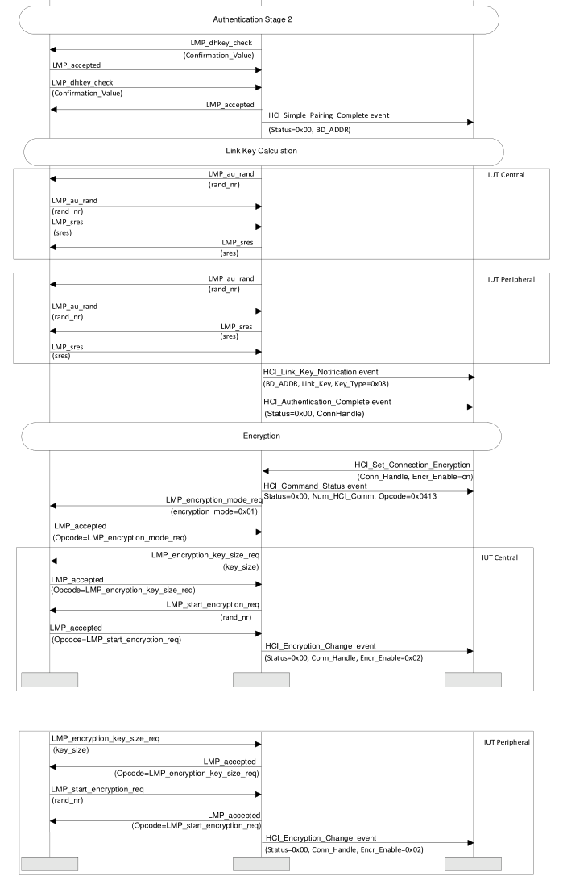

**Figure 4.336: LMP/SP/BV-54-C [OOB Protocol – IUT Initiator – IUT with OOB_Auth_Data - Success, P-256] MSC – Page 3 of 3**

• Expected Outcome
Pass verdict
The IUT sends an HCI_Remote_OOB_Data_Request event to the Upper Tester.
The IUT sends the LMP_DHkey_check PDU with a valid Confirmation_Value to the Lower Tester.
The IUT sends an HCI_Simple_Pairing_Complete event to the Upper Tester with Status=Secure Simple Pairing succeeded.
The IUT sends the resulting Link_Key and Key_Type to the Upper Tester in an HCI_Link_Key_Notification event. Verify that the Link Key matches at the Upper and Lower Testers. Verify that the Key_Type is ‘Authenticated Combination Key generated from P256’.
• Notes
The Lower Tester sends an LMP_not_accepted response PDU to a received LMP_DHkey_check PDU if the Confirmation_Value that it calculates does not match with the Confirmation_Value that the IUT has sent.
This test case is similar to LMP/SP/BV-18-C [OOB Protocol - IUT Initiator - IUT with OOB_Auth_Data – Success].
LMP/SP/BV-55-C [OOB Protocol – IUT Responder – IUT with OOB_Auth_Data – Success, P-256]
• Test Purpose
Verify that the IUT as responder supports the OOB protocol using the P-256 elliptic curve where the IUT has OOB_Auth_Data.
• Reference
[1] 4.2.7
• Initial Condition
- See Baseband assumptions and Secure Simple Pairing P256.
• Test Procedure

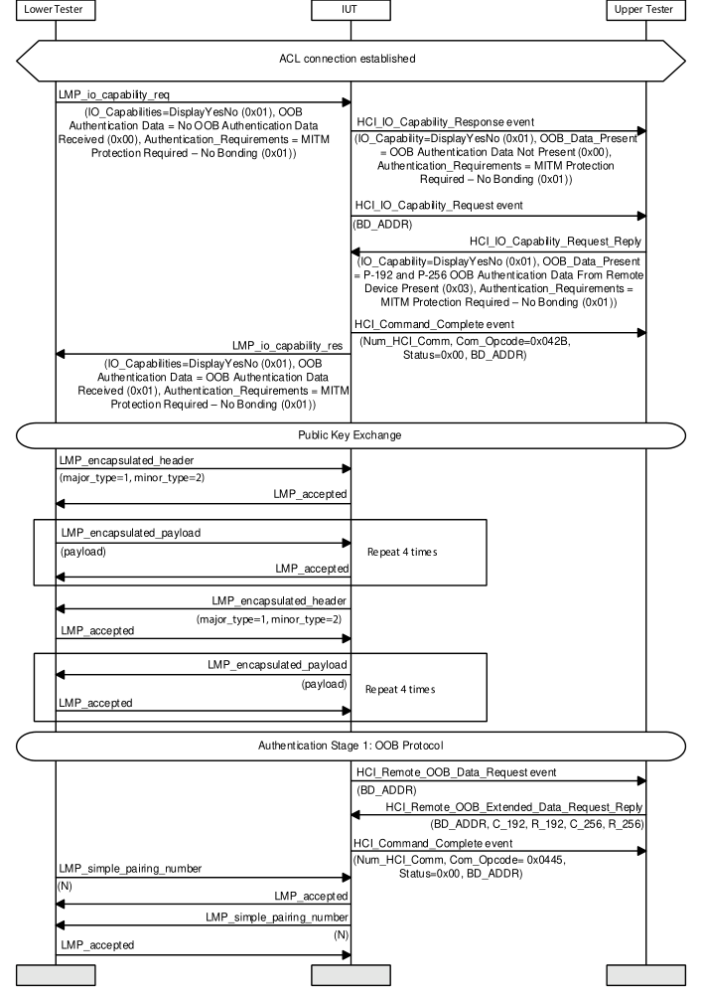

**Figure 4.337: LMP/SP/BV-55-C [OOB Protocol – IUT Responder – IUT with OOB_Auth_Data – Success, P-256] MSC – Page 1 of 2**

|  |  |  |  |
| --- | --- | --- | --- |
|  | Authentic | ation Stage 2 |  |
|  |  |  |  |
|  |  |  |  |
|  |  |  |  |
|  |  |  |  |
|  |  |  |  |
|  | Link | Key Calculation |  |
|  |  |  |  |
|  |  |  |  |
|  |  |  |  |
|  |  |  |  |
|  |  |  |  |
|  |  |  |  |
|  |  |  |  |
|  |  |  |  |
|  |  |  |  |
|  |  |  |  |
| LMP (enc LM (Op LMP (Opc |  | HCILinkKeyNotification event _ _ _ |  |
|  |  | Encryption |  |
|  | encryptionmodereq _ _ _ |  |  |
|  | ryptionmode=0x01) _ LMPacce _ |  |  |
|  | (Opcode=LMPencryptionmode _ _ LMPencryptionkeysize _ _ _ |  |  |
|  | (key _ Paccepted _ |  |  |
|  | code=LMPencryptionkeysizereq) _ _ _ _ LMPstartencryption _ _ |  |  |
|  | accepted _ |  |  |
|  | ode=LMPstartencryptionreq) _ _ _ |  |  |
|  |  |  |  |

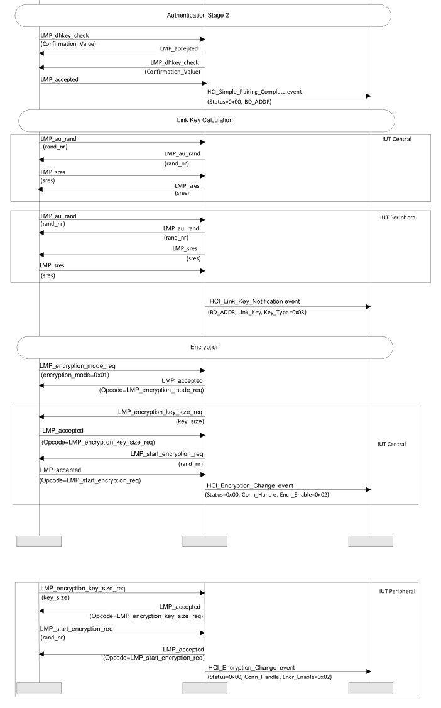

**Figure 4.338: LMP/SP/BV-55-C [OOB Protocol – IUT Responder – IUT with OOB_Auth_Data – Success, P-256] MSC – Page 2 of 2**

• Expected Outcome
Pass verdict
The IUT sends an HCI_Remote_OOB_Data_Request event to the Upper Tester.
The IUT sends an LMP_DHkey_check PDU with a valid Confirmation_Value to the Lower Tester.
The IUT sends an HCI_Simple_Pairing_Complete event to the Upper Tester with Status=Secure Simple Pairing succeeded.
The IUT sends the resulting Link Key and Key Type to the Upper Tester in an HCI_Link_Key_Notification event. Verify that the Link Key matches at the Upper and Lower Testers. Verify that the Key_Type is ‘Authenticated Combination Key generated from P256’.
• Notes
The Lower Tester sends an LMP_not_accepted response PDU to a received LMP_DHkey_check PDU if the Confirmation_Value that it calculates does not match with the Confirmation_Value that the IUT has sent.
This test case is similar to LMP/SP/BV-19-C [OOB Protocol - IUT Responder - IUT with OOB_Auth_Data – Success].
LMP/SP/BV-56-C [OOB Protocol – IUT Initiator – Lower Tester with OOB_Auth_Data - Success, P-256]
• Test Purpose
Verify that the IUT as initiator supports the OOB protocol using the P-256 elliptic curve where the Lower Tester has OOB_Auth_Data.
• Reference
[1] 4.2.7
• Initial Condition
- See Baseband assumptions and Secure Simple Pairing P256.
• Test Procedure

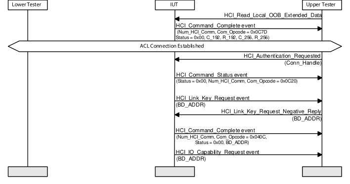

**Figure 4.339: LMP/SP/BV-56-C [OOB Protocol – IUT Initiator – Lower Tester with OOB_Auth_Data - Success, P- 256] MSC – Page 1 of 3**

| HC (Nu LMP io capabilityreq _ _ _ (IO Capabilities=DisplayYesNo (0x01), OOB _ Authentication Data = No OOB Authenitcation Data Received (0x00), Authentication Requirements = MITM _ Protection Required – No Bonding (0x01)) LMP io capabilityres _ _ _ (IO Capabilities=DisplayYesNo (0x01), OOB Auth_ entication Data = OOB Authentication Data HC Received (0x01), Authentication Requirements = MITM (IO _ Protection Required – No Bonding (0x01)) Pr Public Key Exc LMP encapsulated header _ _ LMP accepted _ LMP encapsulated payload _ _ (payload) LMP accepted _ LMP encapsulated header _ _ LMP accepted _ LMP encapsulated payload _ _ (payload) LMP accepted _ Authentication Stage 1: LMP simplepairing number _ _ _ (N) LMP accepted _ LMP simplepairing number _ _ _ (N) LMP accepted _ |  | HCIIO Capability Request Reply _ _ _ _ (IO Capability=DisplayYesNo (0x01), _ OOB Data Present = OOB Authentication Data Not _ _ Present (0x00), Authentication Requirements = MITM _ Protection Required – No Bonding (0x01)) ICommand Complete event _ _ m HCIComm, Com Opcode=0x042B, _ _ _ Status=0x00, BD ADDR) _ IIO Capability Response event _ _ _ Capability=DisplayYesNo (0x01), OOB Data Present _ = OOB Authentication Data From Remote Device esent (0x01), Authentication Requirements = MITM _ Protection Required – No Bonding (0x01)) hange OOB Protocol |  |  |  |
| --- | --- | --- | --- | --- | --- |
|  |  |  |  |  |  |
|  |  |  |  |  |  |

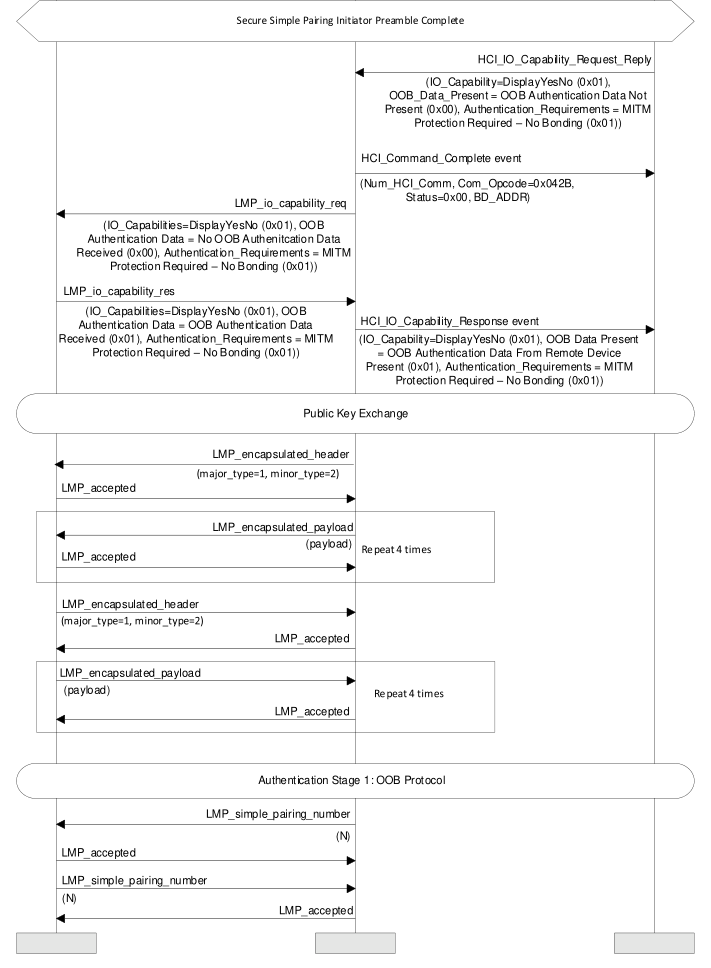

**Figure 4.340: LMP/SP/BV-56-C [OOB Protocol – IUT Initiator – Lower Tester with OOB_Auth_Data - Success, P- 256] MSC – Page 2 of 3**

|  |  |  |  |  |
| --- | --- | --- | --- | --- |
|  | Authentication Stag | e 2 |  |  |
|  |  |  |  |  |
|  |  |  |  |  |
|  | Link Key Calcu | lation |  |  |
|  |  |  |  |  |
|  |  |  |  |  |
|  |  |  |  |  |
| LM (Op | HCI _ HCI | LinkKeyNotification event _ _ |  |  |
|  |  | AuthenticationComplete event _ _ |  |  |
|  |  |  |  |  |
|  | Encryption |  |  |  |
|  | HCI LMPencryptionmodereqStat _ _ _ (encryptionmode=0x01) _ Paccepted _ code=LMPencryptionmodereq) _ _ _ | HCISetConnectionEncryption _ _ _ |  |  |
|  |  | (ConnHandle, EncrEnable=on CommandStatus event _ _ _ _ |  |  |
|  |  | us=0x00, NumHCIComm, Opcode=0x0413 _ _ |  |  |
| LMP (Opc LMP (Op | LMPencryptionkeysize req _ _ _ _ (keysize) _ accepted _ ode=LMPencryptionkeysize req) _ _ _ _ LMPstartencryptionreq _ _ _ accepted _ code=LMPstartencryptionreq) _ _ _ HCI | Encryption Change event _ _ |  |  |
|  |  |  |  |  |

**Figure 4.341: LMP/SP/BV-56-C [OOB Protocol – IUT Initiator – Lower Tester with OOB_Auth_Data - Success, P- 256] MSC – Page 3 of 3**

• Expected Outcome
Pass verdict
The IUT does not send an HCI_Remote_OOB_Data_Request event to the Upper Tester.
The IUT sends the LMP_DHkey_check PDU with a valid Confirmation_Value to the Lower Tester.
The IUT sends an HCI_Simple_Pairing_Complete event to the Upper Tester with Status=Secure Simple Pairing succeeded.
The IUT sends the resulting Link Key and Key Type to the Upper Tester in an HCI_Link_Key_Notification event. Verify that the Link Key matches at the Upper and Lower Testers. Verify that the Key_Type is ‘Authenticated Combination Key generated from P256’.
• Notes
The Lower Tester sends an LMP_not_accepted response PDU to a received LMP_DHkey_check PDU if the Confirmation_Value that it calculates does not match with the Confirmation_Value that the IUT has sent.
This test case is similar to LMP/SP/BV-20-C [OOB Protocol - IUT Initiator – Lower Tester with OOB_Auth_Data – Success].
LMP/SP/BV-57-C [OOB Protocol – IUT Responder – Lower Tester with OOB_Auth_Data – Success, P-256]
• Test Purpose
Verify that the IUT as responder supports the OOB protocol using the P-256 elliptic curve where the Lower Tester has OOB_Auth_Data.
• Reference
[1] 4.2.7
• Initial Condition
- See Baseband assumptions and Secure Simple Pairing P256.
• Test Procedure

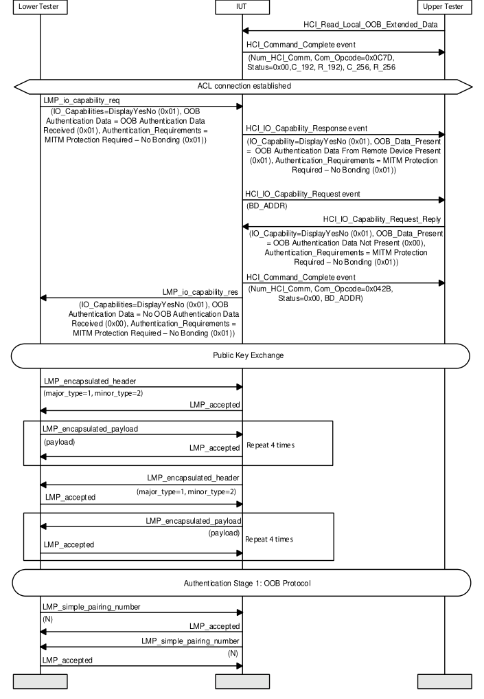

**Figure 4.342: LMP/SP/BV-57-C [OOB Protocol – IUT Responder – Lower Tester with OOB_Auth_Data – Success, P-256] MSC – Page 1 of 2**

|  |  |  |  |
| --- | --- | --- | --- |
|  | Authentication Sta | ge 2 |  |
|  |  |  |  |
|  | Link Key Calcu | lation |  |
|  |  |  |  |
|  |  |  |  |
|  |  |  |  |
| LMP (enc LM (Op LMP (Opc | HC | ILinkKeyNotification event _ _ _ |  |
|  | Encryptio | n |  |
|  | encryptionmodereq _ _ _ ryptionmode=0x01) _ LMPaccepted _ (Opcode=LMPencryptionmodereq) _ _ _ LMPencryptionkeysizereq _ _ _ _ (keysize) _ Paccepted _ code=LMPencryptionkeysizereq) _ _ _ _ LMPstartencryptionreq _ _ _ accepted _ ode=LMPstartencryptionreq) _ _ _ HCI | EncryptionChange event _ _ |  |
|  |  |  |  |
|  |  |  |  |

**Figure 4.343: LMP/SP/BV-57-C [OOB Protocol – IUT Responder – Lower Tester with OOB_Auth_Data – Success, P-256] MSC – Page 2 of 2**

• Expected Outcome
Pass verdict
The IUT does not send an HCI_Remote_OOB_Data_Request event to the Upper Tester.
The IUT sends the LMP_DHkey_check PDU with a valid Confirmation_Value to the Lower Tester.
The IUT sends an HCI_Simple_Pairing_Complete event to the Upper Tester with Status=Secure Simple Pairing succeeded.
The IUT sends the resulting Link Key and Key Type to the Upper Tester in an HCI_Link_Key_Notification event. Verify that the Link Key matches at the Upper and Lower Testers. Verify that the Key_Type is ‘Authenticated Combination Key generated from P256’.
• Notes
The Lower Tester sends an LMP_not_accepted response PDU to a received LMP_DHkey_check PDU if the Confirmation_Value that it calculates does not match with the Confirmation_Value that the IUT has sent.
This test case is similar to LMP/SP/BV-21-C [OOB Protocol - IUT Responder – Lower Tester with OOB_Auth_Data – Success].
LMP/SP/BV-58-C [OOB Protocol – IUT Initiator – IUT and Lower Tester with OOB_Auth_Data - Success, P-256]
• Test Purpose
Verify that the IUT as initiator supports the OOB protocol using the P-256 elliptic curve where the IUT and Lower Tester have OOB_Auth_Data.
• Reference
[1] 4.2.7
• Initial Condition
- See Baseband assumptions and Secure Simple Pairing P256.
• Test Procedure

**Figure 4.344: LMP/SP/BV-58-C [OOB Protocol – IUT Initiator – IUT and Lower Tester with OOB_Auth_Data - Success, P-256] MSC – Page 1 of 3**

| (IO = H (N LMP iocapability req _ _ _ (IO Capabilities=DisplayYesNo (0x01), OOB _ Authentication Data = OOB Authentication Data Received (0x01), Authentication Requirements = _ MITM Protection Required – No Bonding (0x01)) LMP iocapability res _ _ _ (IO Capabilities=DisplayYesNo (0x01), OOB HC _ Authentication Data = OOB Authentication Data (IO Received (0x01), Authentication Requirements = _ MITM Protection Required – No Bonding (0x01)) P Public Key Exch LMP encapsulated header _ _ LMP accepted _ LMP encapsulated payload _ _ (payload) LMP accepted _ LMP encapsulated header _ _ LMP accepted _ LMP encapsulated payload _ _ (payload) LMP accepted _ Authentication Stage 1: HCI (BD HC LMP simplepairingnumber _ _ _ (N) LMP accepted _ LMP simplepairingnumber _ _ _ (N) LMP accepted _ | HCIIO Capability RequestReply _ _ _ _ Capability=DisplayYesNo (0x01), OOB Data Present _ _ _ P-192 and P-256 Authentication Data Received From Remote Device (0x03), Authentication Requirements = _ MITM Protection Required – No Bonding (0x01)) CICommand Complete event _ _ um HCIComm, Com Opcode=0x042B, _ _ _ Status=0x00, BD ADDR) _ IIO Capability Response event _ _ _ Capability=DisplayYesNo (0x01), OOB Data Present _ _ _ = OOB Authentication Data From Remote Device resent (0x01), Authentication Requirements = MITM _ Protection Required – No Bonding (0x01)) ange OOB Protocol RemoteOOB Data Request event _ _ _ _ ADDR) _ HCIRemoteOOB Extended Data RequestReply _ _ _ _ _ _ (BD ADDR, C 192, R 192, C 256, R 256) _ _ _ _ _ ICommand Completeevent _ _ _ (Num HCIComm, Com Opcode= _ _ _ 0x0445, Status= 0x00, BD ADDR) _ |  |  |  |
| --- | --- | --- | --- | --- |
|  |  |  |  |  |
|  |  |  |  |  |

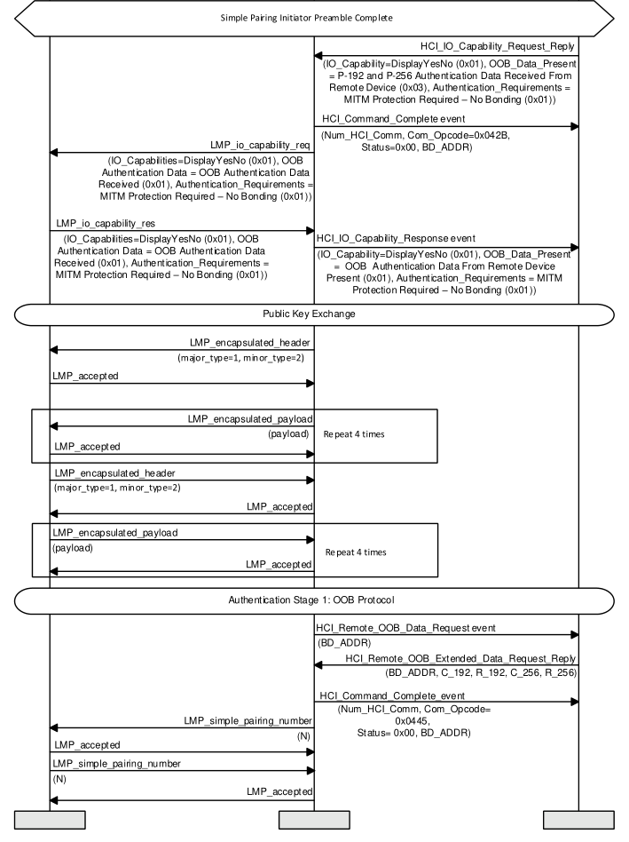

**Figure 4.345: LMP/SP/BV-58-C [OOB Protocol – IUT Initiator – IUT and Lower Tester with OOB_Auth_Data - Success, P-256] MSC – Page 2 of 3**

|  |  |  |  |
| --- | --- | --- | --- |
|  | Authentication Stag | e 2 |  |
|  |  |  |  |
|  |  |  |  |
|  | Link Key Calcu | lation |  |
|  |  |  |  |
|  |  |  |  |
|  |  |  |  |
| LM (Op LMP (Opc LMP (Op | HCI HCI | LinkKeyNotification event _ _ _ |  |
|  |  | AuthenticationComplete event _ _ |  |
|  |  |  |  |
|  | Encryption |  |  |
|  | HCI LMPencryptionmodereqStat _ _ _ (encryptionmode=0x01) _ Paccepted _ code=LMPencryptionmodereq) _ _ _ LMPencryptionkeysize req _ _ _ _ (keysize) _ accepted _ ode=LMPencryptionkeysizereq) _ _ _ _ LMPstartencryptionreq _ _ _ accepted _ code=LMPstartencryptionreq) _ _ _ HCI | HCISetConnectionEncryption _ _ _ |  |
|  |  |  |  |

**Figure 4.346: LMP/SP/BV-58-C [OOB Protocol – IUT Initiator – IUT and Lower Tester with OOB_Auth_Data - Success, P-256] MSC – Page 3 of 3**

• Expected Outcome
Pass verdict
The IUT sends an HCI_Remote_OOB_Data_Request event to the Upper Tester.
The IUT sends the LMP_DHkey_check PDU with a valid Confirmation_Value to the Lower Tester.
The IUT sends an HCI_Simple_Pairing_Complete event to the Upper Tester with Status=Secure Simple Pairing succeeded.
The IUT sends the resulting Link_Key and Key_Type to the Upper Tester in an HCI_Link_Key_Notification event. Verify that the Link Key matches at the Upper and Lower Testers. Verify that the Key_Type is ‘Authenticated Combination Key generated from P256’.
• Notes
The Lower Tester sends an LMP_not_accepted response PDU to a received LMP_DHkey_check PDU if the Confirmation_Value that it calculates does not match with the Confirmation_Value that the IUT has sent.
This test case is similar to LMP/SP/BV-22-C [OOB Protocol - IUT Initiator - IUT and Lower Tester with OOB_Auth_Data - Success].
LMP/SP/BV-59-C [OOB Protocol – IUT Responder – IUT and Lower Tester with OOB_Auth_Data – Success, P-256]
• Test Purpose
Verify that the IUT as responder supports the OOB protocol using the P-256 elliptic curve where the IUT and Lower Tester have OOB_Auth_Data.
• Reference
[1] 4.2.7
• Initial Condition
- See Baseband assumptions and Secure Simple Pairing P256.
• Test Procedure

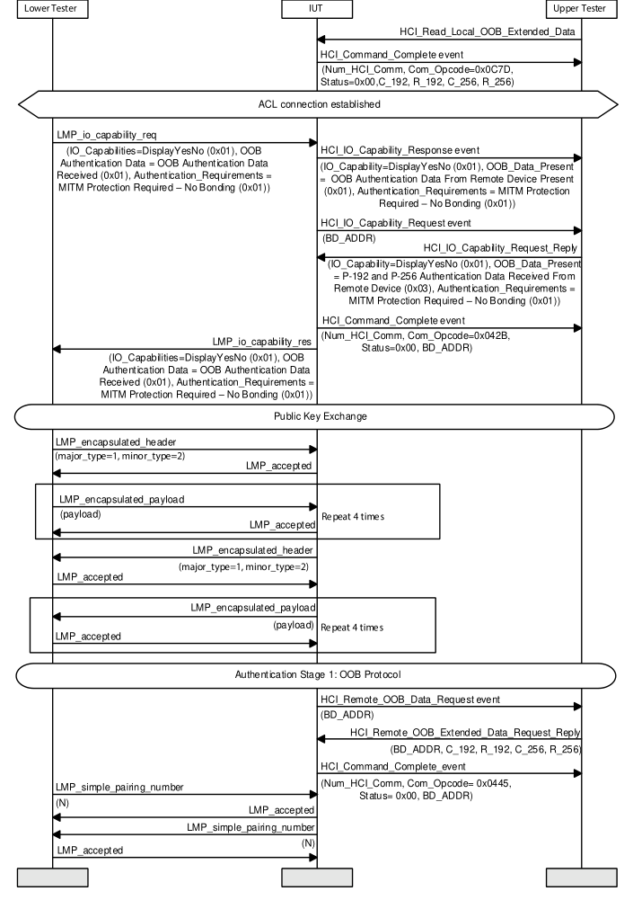

**Figure 4.347: LMP/SP/BV-59-C [OOB Protocol – IUT Responder – IUT and Lower Tester with OOB_Auth_Data – Success, P-256] MSC – Page 1 of 2**

|  |  |  |  |
| --- | --- | --- | --- |
|  | Authentication Sta | ge 2 |  |
|  |  |  |  |
|  | Link Key Calcu | lation |  |
|  |  |  |  |
|  |  |  |  |
|  |  |  |  |
| LMP (enc | HC | ILinkKeyNotification event _ _ _ |  |
|  | Encryptio | n |  |
|  | encryptionmodereq _ _ _ ryptionmode=0x01) _ LMPaccepted _ (Opcode=LMPencryptionmodereq) _ _ _ |  |  |
| LM (Op LMP (Opc | LMPencryptionkeysizereq _ _ _ _ (keysize) _ Paccepted _ code=LMPencryptionkeysizereq) _ _ _ _ LMPstartencryptionreq _ _ _ accepted _ ode=LMPstartencryptionreq) _ _ _ HCI | EncryptionChange event _ _ |  |
|  |  |  |  |
|  |  |  |  |

**Figure 4.348: LMP/SP/BV-59-C [OOB Protocol – IUT Responder – IUT and Lower Tester with OOB_Auth_Data – Success, P-256] MSC – Page 2 of 2**

• Expected Outcome
Pass verdict
The IUT sends an HCI_Remote_OOB_Data_Request event to the Upper Tester.
The IUT sends an LMP_DHkey_check PDU with a valid Confirmation_Value to the Lower Tester.
The IUT sends an HCI_Simple_Pairing_Complete event to the Upper Tester with Status=Secure Simple Pairing succeeded.
The IUT sends the resulting Link Key and Key Type to the Upper Tester in an HCI_Link_Key_Notification event. Verify that the Link Key matches at the Upper and Lower Testers. Verify that the Key_Type is ‘Authenticated Combination Key generated from P256’.
• Notes
The Lower Tester sends an LMP_not_accepted response PDU to a received LMP_DHkey_check PDU if the Confirmation_Value that it calculates does not match with the Confirmation_Value that the IUT has sent.
This test case is similar to LMP/SP/BV-23-C [OOB Protocol - IUT Responder - IUT and Lower Tester with OOB_Auth_Data – Success].
LMP/SP/BV-60-C [OOB Protocol – IUT Initiator - IUT with OOB_Auth_Data – Failure, P- 256]
• Test Purpose
Verify that the IUT as initiator supports the OOB protocol using the P-256 elliptic curve where the IUT has OOB_Auth_Data that does not match the Lower Tester.
• Reference
[1] 4.2.7
• Initial Condition
- See Baseband assumptions and Secure Simple Pairing P256.
• Test Procedure

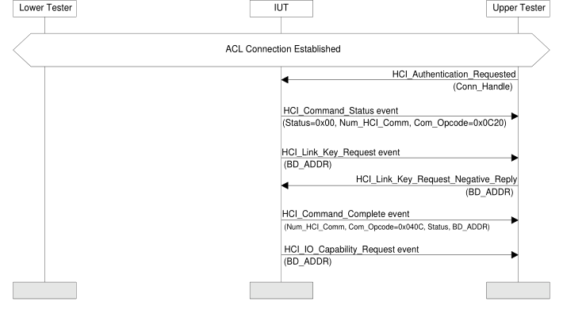

**Figure 4.349: LMP/SP/BV-60-C [OOB Protocol – IUT Initiator - IUT with OOB_Auth_Data – Failure, P-256] MSC – Page 1 of 2**

| HCIIO Capability RequestReply _ _ _ _ (IO Capability=DisplayYesNo (0x01), OOB Data Present _ _ _ = P-192 and P-256 OOB Authentication Data From Remote Device Present (0x03), Authentication Requirements = _ MITM Protection Required – No Bonding (0x01)) HCICommand Complete event _ _ (Num HCIComm, Com Opcode=0x042B, req _ St_ atus=0x00, BD_ ADDR) _ B ata ts = 1)) HCIIO Capability Response event _ _ _ (IO Capability=DisplayYesNo (0x01), OOB Data Present _ _ _ = OOB Authentication Data Not Present (0x00), Authentication Requirements = MITM Protection _ Required – No Bonding (0x01)) c Key Exchange ader load oad) ted ed age 1: OOB Protocol HCIRemoteOOB Data Request event _ _ _ _ (BD ADDR) _ HCIRemoteOOB Extended Data RequestReply _ _ _ _ _ _ (BD ADDR, C 192, R 192, C 256, R 256) _ _ _ _ _ HCICommand Completeevent _ _ _ ber (Num _HCI _Comm, Com _Opcode= 0x0445, ( N ) Status= 0x00, BD ADDR) _ pted HCISimple Pairing Complete event _ _ _ (Status= Authentication Failure, BD ADDR) _ HCIAuthentication Complete event _ _ (Status= Authentication Failure, ConnHandle) _ |  |  |  |
| --- | --- | --- | --- |
|  |  |  | e y 6) |
|  |  |  |  |

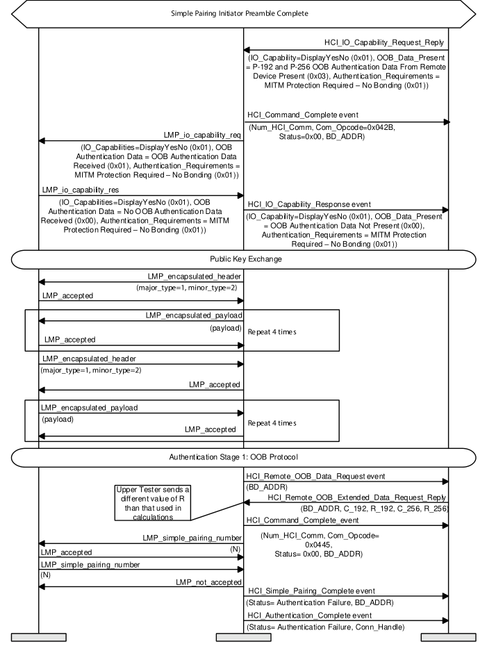

**Figure 4.350: LMP/SP/BV-60-C [OOB Protocol – IUT Initiator - IUT with OOB_Auth_Data – Failure, P-256] MSC – Page 2 of 2**

• Expected Outcome
Pass verdict
The IUT sends an HCI_Remote_OOB_Data_Request event to the Upper Tester.
The IUT sends an HCI_Simple_Pairing_Complete event to the Upper Tester with Status=Authentication Failure after sending an LMP_not_accepted PDU to the Lower Tester.
• Notes
This test case is similar to LMP/SP/BV-24-C [OOB Protocol - IUT Initiator - IUT with OOB_Auth_Data - Failure].
LMP/SP/BV-61-C [OOB Protocol – IUT Responder - IUT with OOB_Auth_Data – Failure, P- 256]
• Test Purpose
Verify that the IUT as responder supports the OOB protocol using the P-256 elliptic curve where the IUT has OOB_Auth_Data.
• Reference
[1] 4.2.7
• Initial Condition
- See Baseband assumptions and Secure Simple Pairing P256.
• Test Procedure

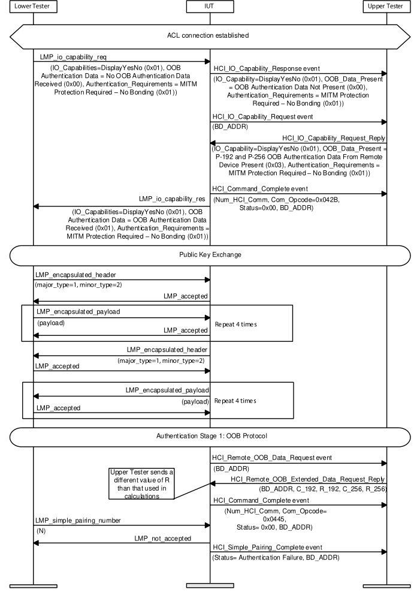

**Figure 4.351: LMP/SP/BV-61-C [OOB Protocol – IUT Responder - IUT with OOB_Auth_Data – Failure, P-256] MSC**

• Expected Outcome
Pass verdict
The IUT sends an HCI_Remote_OOB_Data_Request event to the Upper Tester.
The IUT sends an HCI_Simple_Pairing_Complete event to the Upper Tester with Status=Authentication Failure after sending an LMP_not_accepted PDU to the Lower Tester.
• Notes
This test case is similar to LMP/SP/BV-25-C [OOB Protocol - IUT Responder - IUT with OOB_Auth_Data - Failure].
LMP/SP/BV-62-C [OOB Protocol – IUT Initiator – Lower Tester with OOB_Auth_Data – Failure, P-256]
• Test Purpose
Verify that the IUT as initiator supports the OOB protocol using the P-256 elliptic curve where the Lower Tester has OOB_Auth_Data.
• Reference
[1] 4.2.7
• Initial Condition
- See Baseband assumptions and Secure Simple Pairing P256.
• Test Procedure

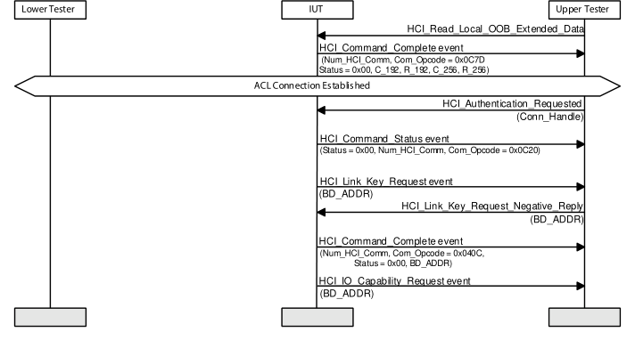

**Figure 4.352: LMP/SP/BV-62-C [OOB Protocol – IUT Initiator – Lower Tester with OOB_Auth_Data – Failure, P- 256] MSC – Page 1 of 2**

|  |  |  |
| --- | --- | --- |
|  |  |  |
|  |  |  |

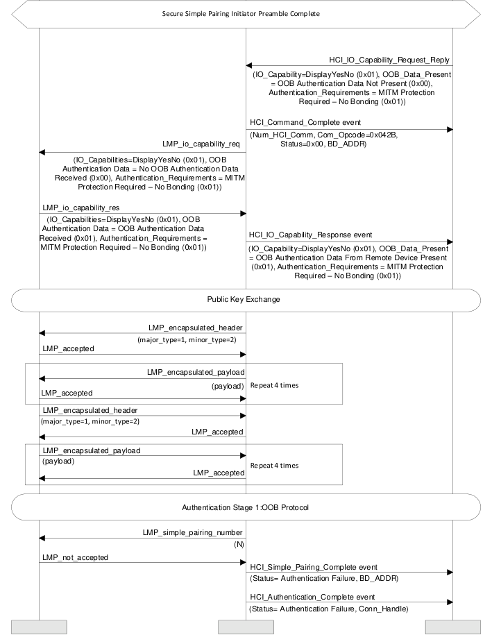

**Figure 4.353: LMP/SP/BV-62-C [OOB Protocol – IUT Initiator – Lower Tester with OOB_Auth_Data – Failure, P- 256] MSC – Page 2 of 2**

• Expected Outcome
Pass verdict
The IUT does not send an HCI_Remote_OOB_Data_Request event to the Upper Tester.
The IUT sends an HCI_Simple_Pairing_Complete event to the Upper Tester with Status=Authentication Failure after receiving an LMP_not_accepted PDU from the Lower Tester.
• Notes
This test case is similar to LMP/SP/BV-26-C [OOB Protocol - IUT Initiator – Lower Tester with OOB_Auth_Data - Failure].
LMP/SP/BV-63-C [OOB Protocol – IUT Responder – Lower Tester with OOB_Auth_Data – Failure, P-256]
• Test Purpose
Verify that the IUT as responder supports the OOB protocol using the P-256 elliptic curve where the Lower Tester has OOB_Auth_Data.
• Reference
[1] 4.2.7
• Initial Condition
- See Baseband assumptions and Secure Simple Pairing P256.
• Test Procedure

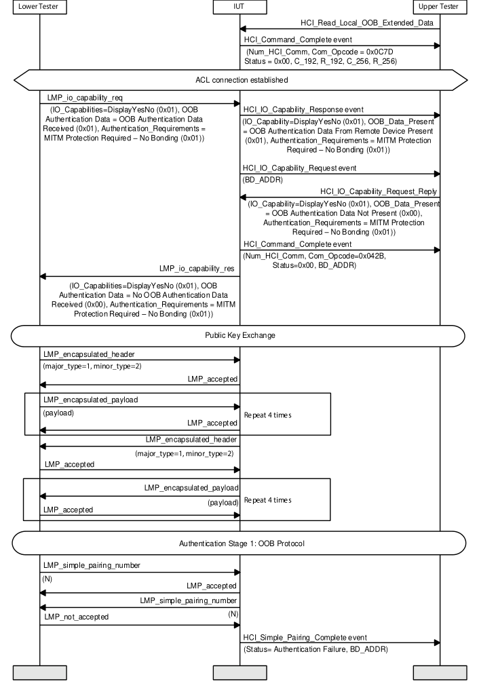

**Figure 4.354: LMP/SP/BV-63-C [OOB Protocol – IUT Responder – Lower Tester with OOB_Auth_Data – Failure, P-256] MSC**

• Expected Outcome
Pass verdict
The IUT does not send an HCI_Remote_OOB_Data_Request event to the Upper Tester.
The IUT sends an HCI_Simple_Pairing_Complete event to the Upper Tester with Status=Authentication Failure after receiving an LMP_not_accepted PDU from the Lower Tester.
• Notes
This test case is similar to LMP/SP/BV-27-C [OOB Protocol - IUT Responder – Lower Tester with OOB_Auth_Data - Failure].

#### 4.11.5 Test Mode procedures

Note: In all the test cases in Section 4.11.5 Test Mode procedures, it does not matter whether the IUT is Central or Peripheral.
LMP/SP/BV-28-C [Secure Simple Pairing Debug Mode - Fixed Private Key]
• Test Purpose
Verify that the IUT supports the Secure Simple Pairing Debug Mode where the fixed private/public Key pair is used.
The IUT is initiator.
• Reference
[1] 4.2.7
• Initial Condition
- See Default settings.
• Test Procedure

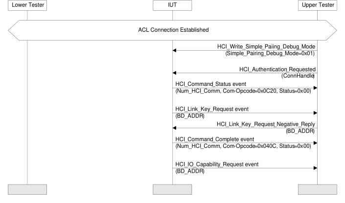

**Figure 4.355: LMP/SP/BV-28-C [Secure Simple Pairing Debug Mode - Fixed Private Key] MSC – Page 1 of 3**

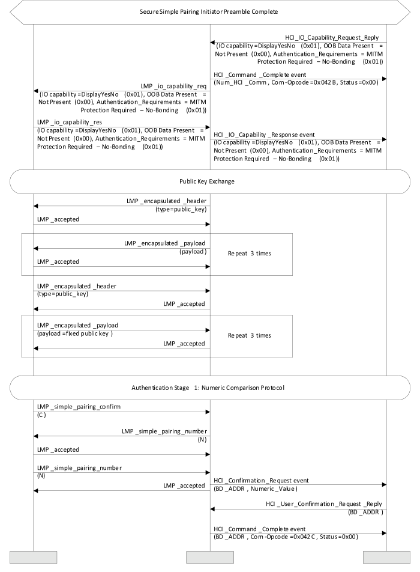

**Figure 4.356: LMP/SP/BV-28-C [Secure Simple Pairing Debug Mode - Fixed Private Key] MSC – Page 2 of 3**

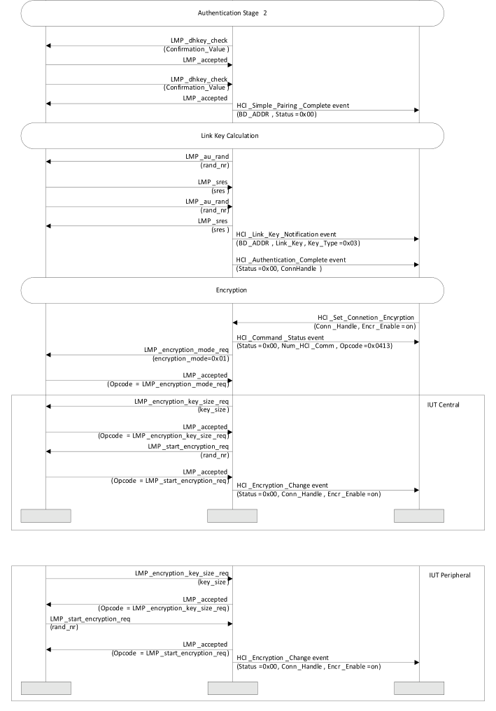

**Figure 4.357: LMP/SP/BV-28-C [Secure Simple Pairing Debug Mode - Fixed Private Key] MSC – Page 3 of 3**

• Expected Outcome
Pass verdict
Verify that the IUT reports that the Link Key Type is Debug Combination Key in the Link_Key_Notification event.
LMP/SP/BV-29-C [Secure Simple Pairing Debug Mode - Responding Device Uses Fixed Private Key]
• Test Purpose
Verify that the IUT reports a Link Key Type of Debug Combination Key when the remote device uses the Secure Simple Pairing Debug Mode where the fixed private/pubic Key pair.
The IUT is initiator.
• Reference
[1] 4.2.7
• Initial Condition
- See Default settings.
• Test Procedure

**Figure 4.358: LMP/SP/BV-29-C [Secure Simple Pairing Debug Mode - Responding Device Uses Fixed Private Key] MSC – Page 1 of 3**

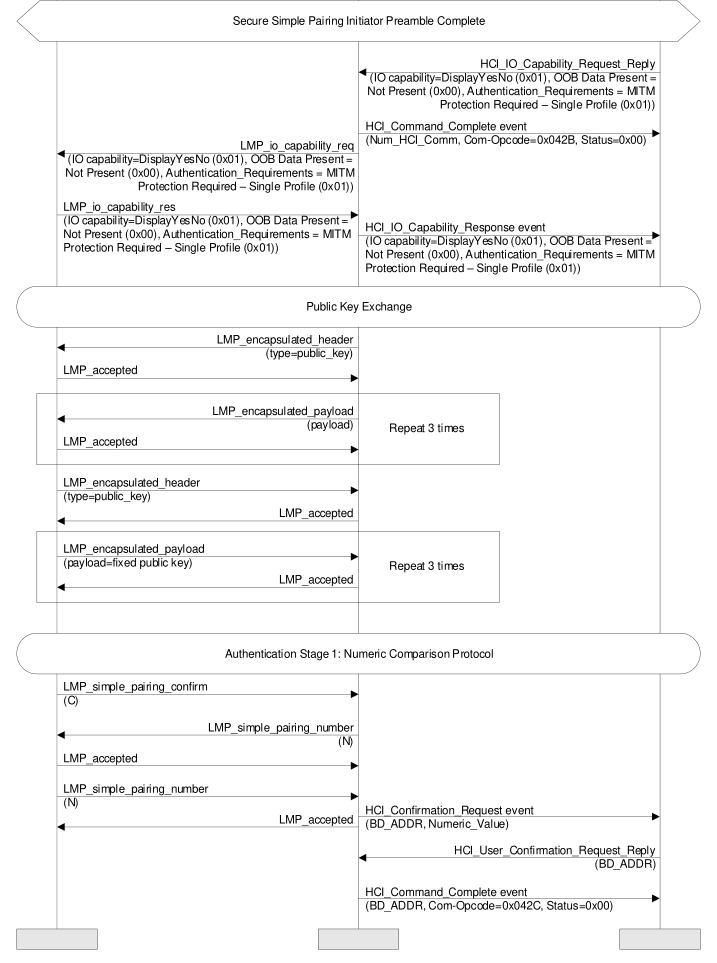

**Figure 4.359: LMP/SP/BV-29-C [Secure Simple Pairing Debug Mode - Responding Device Uses Fixed Private Key] MSC – Page 2 of 3**

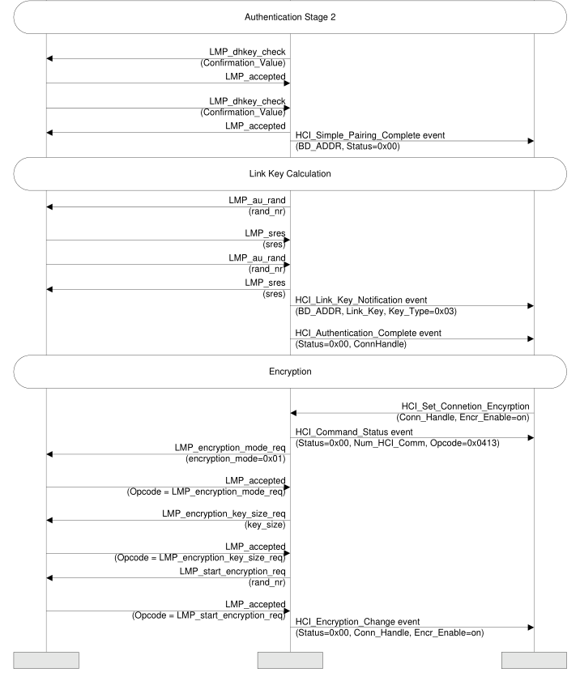

**Figure 4.360: LMP/SP/BV-29-C [Secure Simple Pairing Debug Mode - Responding Device Uses Fixed Private Key] MSC – Page 3 of 3**

• Expected Outcome
Pass verdict
Verify that the IUT reports that the Link Key Type is Debug Combination Key in the Link_Key_Notification event.
• Notes
The Lower Tester sends an LMP_not_accepted to LMP_DHkey if the Confirmation_Value that it calculates does not match with the Confirmation_Value that the IUT has sent.
• Test Purpose
Verify that the IUT supports the Secure Simple Pairing Debug Mode where the fixed P256 private/public Key pair is used and reports the Link Key Type of Debug Combination Key.
The IUT is initiator.
• Reference
[1] 4.2.7
• Initial Condition
- See Baseband assumptions and Secure Simple Pairing P256.
• Test Procedure

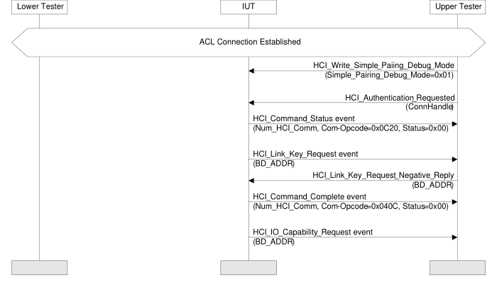

**Figure 4.361: LMP/SP/BV-64-C [Secure Simple Pairing Debug Mode – Fixed Private Key, P256] MSC – Page 1 of 3**

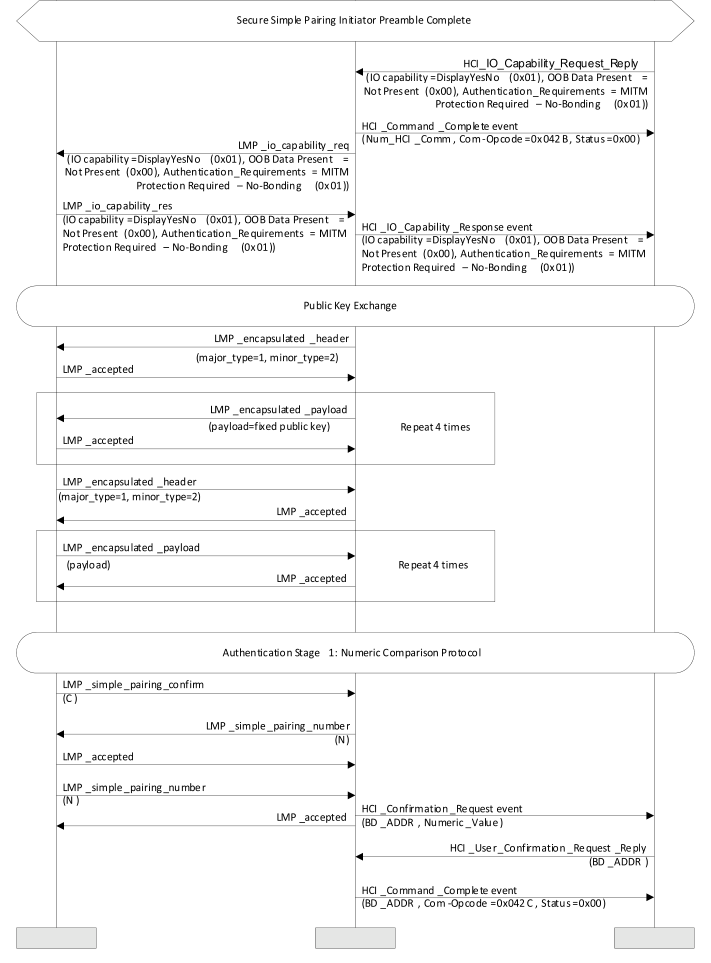

**Figure 4.362: LMP/SP/BV-64-C [Secure Simple Pairing Debug Mode – Fixed Private Key, P256] MSC – Page 2 of 3**

**Figure 4.363: LMP/SP/BV-64-C [Secure Simple Pairing Debug Mode – Fixed Private Key, P256] MSC – Page 3 of 3**

• Expected Outcome
Pass verdict
Verify that the IUT reports that the Link Key Type is Debug Combination Key in the Link_Key_Notification event.
• Notes
This test case is similar to LMP/SP/BV-28-C [Secure Simple Pairing Debug Mode - Fixed Private Key].
LMP/SP/BV-65-C [Secure Simple Pairing Debug Mode – Responding Device Uses Fixed Private Key, P256]
• Test Purpose
Verify that the IUT reports a Link Key Type of Debug Combination Key when the remote device uses the Secure Simple Pairing Debug Mode where the fixed P256 private/public Key pair is used.
The IUT is initiator.
• Reference
[1] 4.2.7
• Initial Condition
- See Baseband assumptions and Secure Simple Pairing P256.
• Test Procedure

**Figure 4.364: LMP/SP/BV-65-C [Secure Simple Pairing Debug Mode – Responding Device Uses Fixed Private Key, P256] MSC – Page 1 of 3**

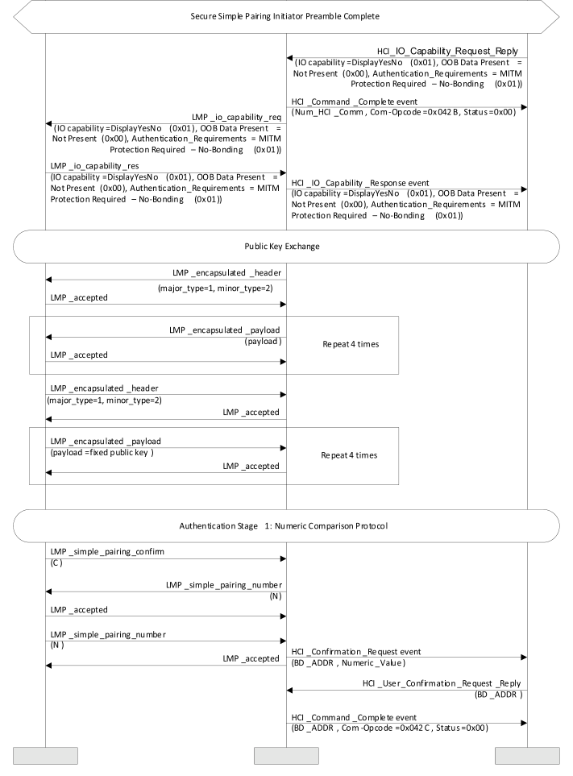

**Figure 4.365: LMP/SP/BV-65-C [Secure Simple Pairing Debug Mode – Responding Device Uses Fixed Private Key, P256] MSC – Page 2 of 3**

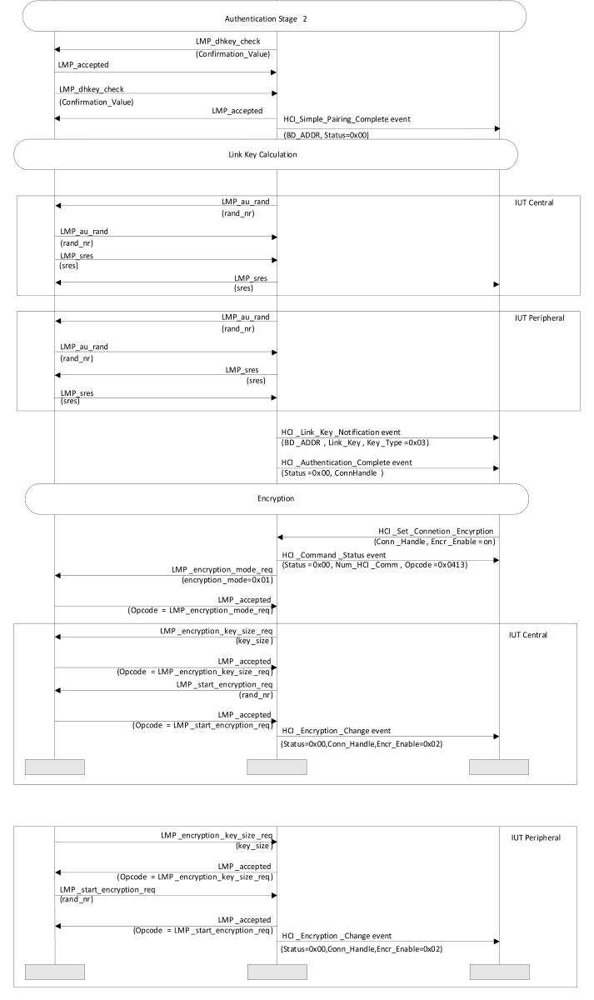

**Figure 4.366: LMP/SP/BV-65-C [Secure Simple Pairing Debug Mode – Responding Device Uses Fixed Private Key, P256] MSC – Page 3 of 3**

• Expected Outcome
Pass verdict
Verify that the IUT reports that the Link Key Type is Debug Combination Key in the Link_Key_Notification event.
• Notes
The Lower Tester sends an LMP_not_accepted to LMP_DHkey if the Confirmation_Value that it calculates does not match with the Confirmation_Value that the IUT has sent.
This test case is similar to LMP/SP/BV-29-C [Secure Simple Pairing Debug Mode - Responding Device Uses Fixed Private Key].

#### 4.11.6 Simple Pairing Failure procedures

LMP/SP/BV-30-C [Secure Simple Pairing Failed - IUT Responder]
• Test Purpose
Verify that the controller responds correctly when the IO capability exchange procedure fails. The IUT is initiator.
• Reference
[8] 7.7.45
• Initial Condition
- See Default settings.
- The Lower Tester supports Secure Simple Pairing. The IUT is Responder.
• Test Procedure

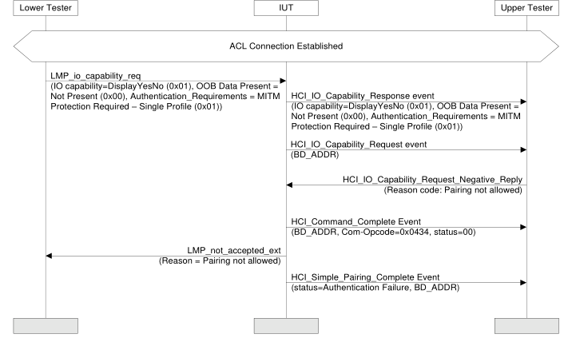

**Figure 4.367: LMP/SP/BV-30-C [Secure Simple Pairing Failed - IUT Responder] MSC**

• Expected Outcome
Pass verdict
The IUT sends LMP_not_accepted_ext with reason code provided by the local host. The IUT sends HCI_Simple_Pairing_Complete Event with failure code Authentication Failure.
LMP/SP/BV-31-C [Secure Simple Pairing Capable Controller–Host rejects Secure Simple Pairing–IUT Initiator]
• Test Purpose
Verify that the LM on the IUT accepts the rejection of Secure Simple Pairing when Host sends IO Capability Request Negative Reply command. The Lower Tester is an SSP enabled initiator. The Lower Tester supports Secure Simple Pairing. The IUT is Responder.
• Reference
[8] 7.7.50
• Initial Condition
- See Default settings.
- ACL connection established. The IUT is Secure Simple pairing capable controller. The Upper Tester is Secure Simple pairing capable Host. The Lower Tester is an SSP enabled responder.
• Test Procedure

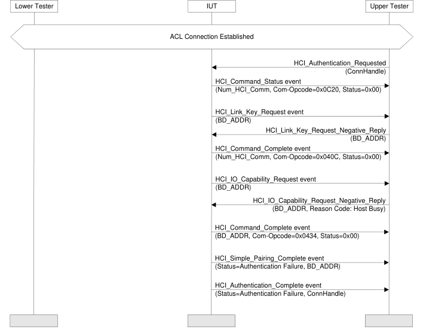

**Figure 4.368: LMP/SP/BV-31-C [Secure Simple Pairing Capable Controller–Host rejects Secure Simple Pairing– IUT Initiator] MSC**

• Expected Outcome
Pass verdict
The IUT responds to the IO Capability Request Negative Reply command received from the Upper Tester with an HCI_Command_Complete Event. The IUT also sends an HCI_Simple_Pairing_Complete event with the reason code Authentication Failure.
LMP/SP/BV-32-C [Secure Simple Pairing Capable Controller–Host rejects Secure Simple Pairing–IUT Responder]
• Test Purpose
Verify that the LM on the IUT rejects Secure Simple Pairing when Host sends IO Capability Request Negative Reply command. The Lower Tester is an SSP enabled initiator.
• Reference
[8] 7.71.36
• Initial Condition
- See Default settings.
- ACL connection established. The IUT is Secure Simple pairing capable controller. The Upper Tester is Secure Simple pairing capable Host. The Lower Tester is an SSP enabled initiator.
• Test Procedure

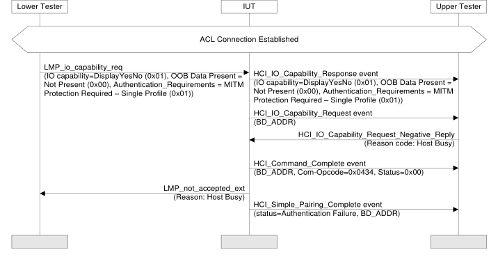

**Figure 4.369: LMP/SP/BV-32-C [Secure Simple Pairing Capable Controller–Host rejects Secure Simple Pairing– IUT Responder] MSC**

• Expected Outcome
Pass verdict
The IUT responds to the LMP_io_capability_req PDU with an LMP_not_accepted_ext PDU with the Reason code Authentication Failure.
• Test Purpose
Verify that the IUT supports the Passkey Entry protocol. The IUT is initiator.
• Reference
[1] 4.2.7
• Initial Condition
- See Default settings.
• Test Procedure

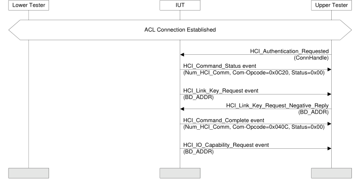

**Figure 4.370: LMP/SP/BV-33-C [Passkey Entry with Keypress notification - IUT Initiator - Success] MSC – Page 1 of 3**

| Lower Tester |  |  |  |
| --- | --- | --- | --- |
|  |  |  |  |
|  |  | Secure Simple Pairing In | itiator Preamble Complete |
|  |  | LMP io capability req _ _ _ | HCI IO Capability Request Repl _ _ _ _ (IO capability=KeyboardOnly (0x02), OO Data Present = Not Present (0x00) Authentication Requirements = MITM _ Protection Required – Single Profile (0x01) HCI Command Complete event _ _ |
|  |  |  | (Num HCI Comm, Com-Opcode=0x042B, _ _ Status=0x00) HCI IO Capability Response event _ _ _ |
|  |  | (IO capability=KeyboardOnly (0x02), OOB Data Present = Not Present (0x00), Authentication Requirements = MITM _ Protection Required – Single Profile (0x01)) LMP io capability res _ _ _ |  |
|  |  | (IO capability=DisplayOnly (0x00), OOB Data Present = Not Present (0x00), Authentication Requirements = MITM _ Protection Required – Single Profile (0x01)) |  |
|  |  |  | (IO capability=DisplayOnly (0x00), OOB Data Present = Not Present (0x00), Authentication Requirements = MITM _ Protection Required – Single Profile (0x01)) |
|  |  | Public Ke | y Exchange |
|  |  | LMP encapsulated header _ _ | Repeat 3 times Repeat 3 times |
|  |  | (type=public key) LMP accepted _ _ |  |
|  |  |  |  |
|  |  | LMP encapsulated payload _ _ | Repeat 3 times |
|  |  | (payload) LMP accepted _ |  |
|  |  |  |  |
|  |  | LMP encapsulated header _ _ |  |
|  |  | (type=public key) _ LMP accepted _ |  |
|  |  |  |  |
|  |  | LMP encapsulated payload _ _ | Repeat 3 times |
|  |  | (payload) LMP accepted _ |  |
|  |  |  |  |
|  |  |  |  |
|  |  | Authentication Stage 1 | : Passkey Entry Protocol |
|  |  | Lmp Keypress Notification _ _ (Notification Type = Entry Started) Lmp Keypress Notification _ _ (Notification Type = Entry Completed) | HCI User Passkey Request Event _ _ _ _ (BD ADDR) _ HCI Send Keypress Notificatio _ _ _ (Notification Type = Entry Started _ HCI Command Complete Event(BD ADDR, _ _ _ _ Com-Opcode=0x0C60, Status=0x00) HCI Send Keypress Notificatio _ _ _ (Notification Type = Entry Completed _ HCI Command Complete Event _ _ _ HCI User Passkey Request Repl _ _ _ _ (BD ADDR, Passkey _ HCI Command Complete Event (BD ADDR, |
|  |  | LMP simple pairing confirm _ _ _ | Repeat 20 times |
|  |  | (C) LMP simple pairing confirm _ _ _ |  |
|  |  | (C) LMP simple pairing number _ _ _ |  |
|  |  | (N) LMP accepted _ |  |
|  |  | LMP simple pairing number _ _ _ |  |
|  |  | (C) LMP accepted _ |  |
|  |  |  |  |
|  |  |  |  |
|  |  |  |  |

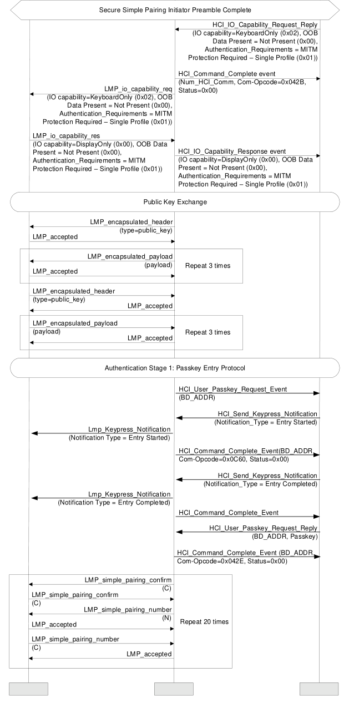

**Figure 4.371: LMP/SP/BV-33-C [Passkey Entry with Keypress notification - IUT Initiator - Success] MSC – Page 2 of 3**

**Figure 4.372: LMP/SP/BV-33-C [Passkey Entry with Keypress notification - IUT Initiator - Success] MSC – Page 3 of 3**

• Expected Outcome
Pass verdict
The IUT sends the LMP_DHkey_check PDU with a valid Confirmation_Value.
The IUT sends an HCI_Simple_Pairing_Complete Event to the Upper Tester.
The IUT sends the resulting Link Key and Key Type to the Host in an HCI_Link_Key_Notification event. Verify that the Link Key matches at the Upper and Lower Testers. Verify that the Key_Type is ‘Authenticated’.
• Notes
The Lower Tester sends an LMP_not_accepted to LMP_DHkey if the Confirmation_Value that it calculates does not match with the Confirmation_Value that the IUT has sent.
• Test Purpose
Verify that the IUT supports the Passkey Entry protocol.
The IUT is responder.
• Reference
[1] 4.2.7
• Initial Condition
- See Default settings.
• Test Procedure

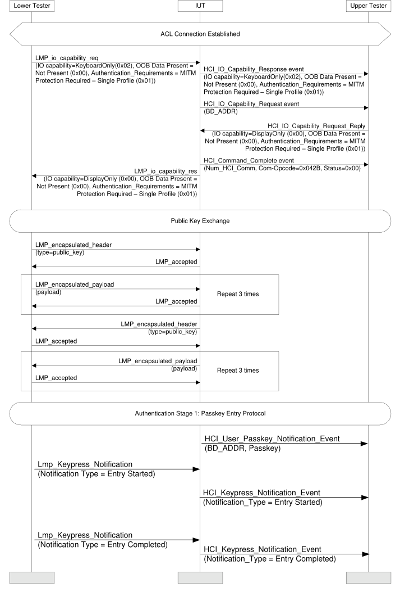

**Figure 4.373: LMP/SP/BV-34-C [Passkey Entry with Keypress notification - IUT Responder – Success] MSC – Page 1 of 2**

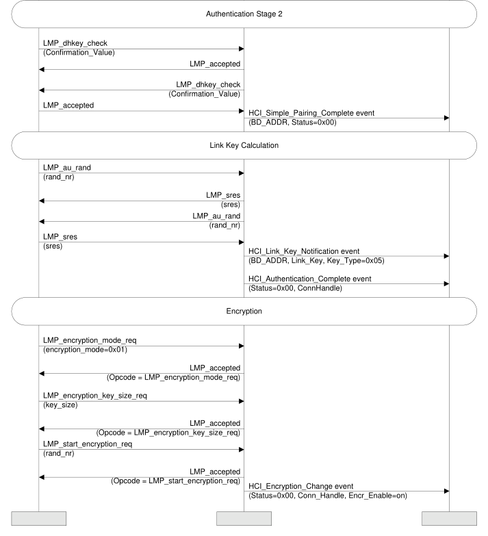

**Figure 4.374: LMP/SP/BV-34-C [Passkey Entry with Keypress notification - IUT Responder – Success] MSC – Page 2 of 2**

• Expected Outcome
Pass verdict
The IUT sends the LMP_DHkey_check PDU is with a valid Confirmation_Value.
The IUT sends an HCI_Simple_Pairing_Complete Event to the Upper Tester.
The IUT sends the resulting Link Key and Key Type to the Host in an HCI_Link_Key_Notification event. Verify that the Link Key matches at the Upper and Lower Testers. Verify that the Key_Type is ‘Authenticated’.
• Notes
If the Commitment_Value calculated by the Lower Tester does not match the Commitment_Value sent by the IUT, the Lower Tester will send LMP_not_accepted with the Authentication_Failure Error_Code.
The Lower Tester sends an LMP_not_accepted to LMP_DHkey if the Confirmation_Value that it calculates does not match with the Confirmation_Value that the IUT has sent.
LMP/SP/BV-35-C [Passkey Entry with Keypress notification - IUT Initiator - Failure on Responding Side]
• Test Purpose
Verify that the IUT supports the Passkey Entry protocol.
The IUT is initiator.
• Reference
[1] 4.2.7
• Initial Condition
- See Default settings.
• Test Procedure

**Figure 4.375: LMP/SP/BV-35-C [Passkey Entry with Keypress notification - IUT Initiator - Failure on Responding Side] MSC – Page 1 of 2**

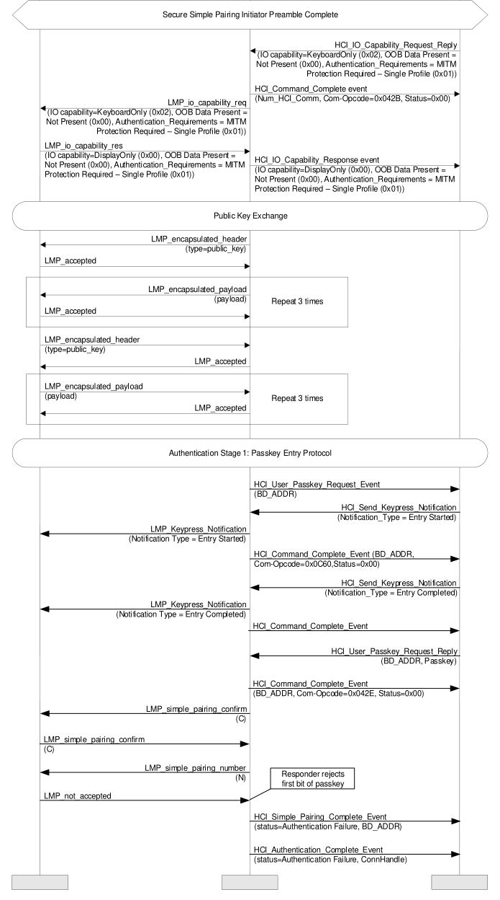

**Figure 4.376: LMP/SP/BV-35-C [Passkey Entry with Keypress notification - IUT Initiator - Failure on Responding Side] MSC – Page 2 of 2**

• Expected Outcome
Pass verdict
The IUT sends an HCI_Simple_Pairing_Complete Event to the Upper Tester with status set to Authentication Failure after the Lower Tester responds with an LMP_not_accepted PDU in response to the LMP_simple_pairing_number PDU.
LMP/SP/BV-36-C [Passkey Entry with Keypress notification - IUT Responder - Failure on Responding Side]
• Test Purpose
Verify that the IUT supports the Passkey Entry protocol.
The IUT is responder.
• Reference
[1] 4.2.7
• Initial Condition
- See Default settings.
• Test Procedure

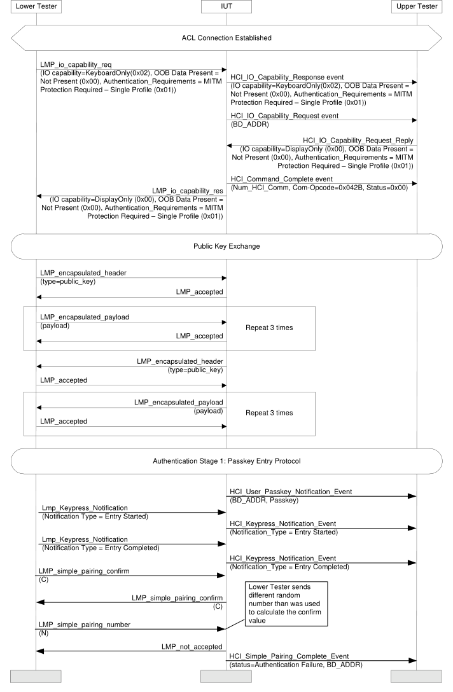

**Figure 4.377: LMP/SP/BV-36-C [Passkey Entry with Keypress notification - IUT Responder - Failure on Responding Side] MSC**

• Expected Outcome
Pass verdict
The IUT sends an LMP_Not_Accepted PDU in response to the LMP_simple_pairing_number PDU.
The IUT sends an HCI_Simple_Pairing_Complete Event to the Upper Tester with status set to Authentication Failure.
LMP/SP/BI-01-C [Numeric Comparison – IUT Initiator – Invalid Public Key Failure, P-192]
• Test Purpose
Verify that the IUT detects an invalid public Key using the Numeric Comparison protocol and fails the pairing procedure using P-192 Key_Size.
Test procedure is run with the IUT as initiator.
• Reference
[1] 4.2.7
• Initial Condition
- An IXIT statement, TSPX_new_key_failed_count, gives the number of failed pairing attempts before a new pairing Key is generated for Table 4.11.
- The Lower Tester generates and uses only private/public Key pairs where bit 0 of the private Key is set to 0.
• Test Procedure

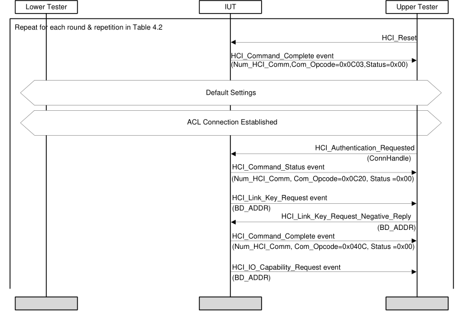

**Figure 4.378: LMP/SP/BI-01-C [Numeric Comparison - IUT Initiator – Invalid Public Key Failure, P-192] MSC – Page 1 of 3**

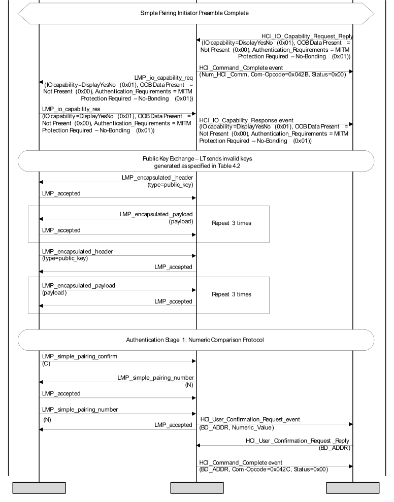

**Figure 4.379: LMP/SP/BI-01-C [Numeric Comparison - IUT Initiator – Invalid Public Key Failure, P-192] MSC – Page 2 of 3**

|  | Lower Tester IUT Upper Tester |  |  | Upper Tester |  |  |
| --- | --- | --- | --- | --- | --- | --- |
|  |  |  |  |  |  |  |
|  |  | LMP not accepted _ _ (Status=Authenticaiton Failure) | HCI Simple Pairing Complete event _ _ _ (BD ADDR, Status!=0x00) _ |  |  |  |
|  |  |  |  |  |  |  |

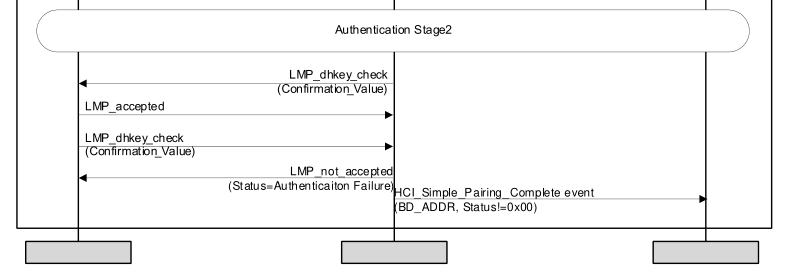

**Figure 4.380: LMP/SP/BI-01-C [Numeric Comparison - IUT Initiator – Invalid Public Key Failure, P-192] MSC – Page 3 of 3**

| Round | Key Size _ | Invalid Key Type | Repeat # of times |  | Lower Tester |  |
| --- | --- | --- | --- | --- | --- | --- |
|  |  |  |  |  | DHKey |  |
| 1 | P-192 | Generate valid public Key and set y-coordinate = 0 | Max(20* TSPX new key failed count, 20) _ _ _ _ | 0 |  |  |
| 2 | P-192 | Generate valid public Key and set y-coordinate = 0 | 1 | Computed DHKey |  |  |
| 3 | P-192 | Generate valid public Key and flip a bit in y-coordinate | 1 | Computed DHKey |  |  |
| 4 | P-192 | Public Key coordinates (0, 0) | 1 | 0 |  |  |
| 5 | P-192 | Generate valid public key and set x-coordinate same as IUT’s | 1 | Computed DHKey |  |  |

Note: In Authentication Stage 2, the Lower Tester either uses the computed DHKey or DHKey = 0
as specified in Table 4.11.
Table 4.11: Invalid Public Key generation for each round
• Expected Outcome
Pass verdict
The IUT responds to the Lower Tester’s LMP_dhkey_check PDU with an LMP_not_accepted PDU with Error_Code Authentication Failure (0x05).
The IUT sends an HCI_Simple_Pairing_Complete Event with an Error_Code different than success (0x00).
If TSPX_new_key_failed_count > 0, a different public Key is used by the IUT after at most TSPX_new_key_failed_count pairings.
Inconclusive verdict
The IUT interrupts the pairing process by:
- Responding LMP_not_accepted PDU with a different Error_Code than Authentication Failure (0x05) to an LMP_dhkey_check PDU
- Responding LMP_not_accepted PDU to an LMP_encapsulated_payload containing an invalid public Key
- Responding LMP_numeric_comparison_failed PDU during the Numeric Comparison Protocol Phase
• Notes
The test verifies the recommendation of the specification that an IUT should return an LMP_not_accepted PDU to the Lower Tester’s LMP_dhkey_check PDU if the Lower Tester’s public Key is invalid. Other potentially valid ways of rejecting the invalid Key are listed in the expected outcome and will yield an inconclusive verdict.
To simulate an attacker, the Lower Tester may send an LMP_accepted PDU in response to all calculated values sent by the IUT, even if the LMP_simple_pairing_confirm, the LMP_simple_pairing_number, or the LMP_dhkey values sent by the IUT do not match the expected calculations.
LMP/SP/BI-02-C [Numeric Comparison - IUT Responder – Invalid Public Key Failure, P- 192]
• Test Purpose
Verify that the IUT detects an invalid public Key using the Numeric Comparison protocol and fails the pairing procedure using P-192 Key_Size.
Test procedure is run with the IUT as responder.
• Reference
[1] 4.2.7
• Initial Condition
- An IXIT statement, TSPX_new_key_failed_count, gives the number of failed pairing attempts before a new pairing Key is generated for Table 4.11.
- The Lower Tester generates and uses only private/public Key pairs where bit 0 of the private Key is set to 0.
• Test Procedure

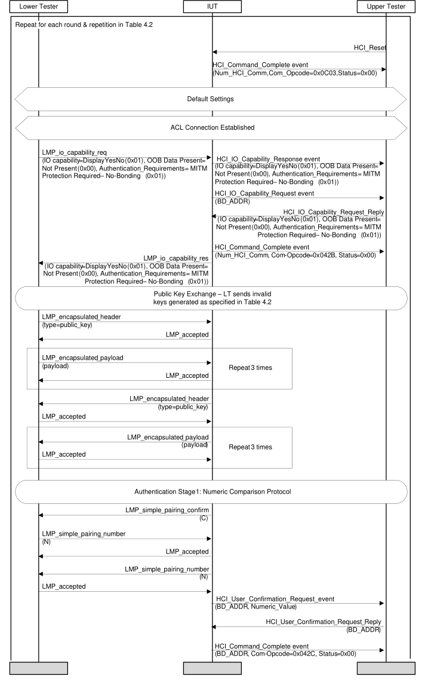

**Figure 4.381: LMP/SP/BI-02-C [Numeric Comparison - IUT Responder – Invalid Public Key Failure, P-192] MSC – Page 1 of 2**

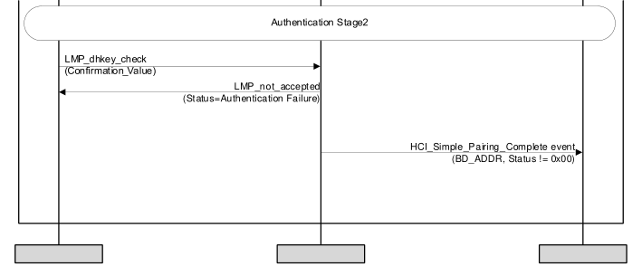

**Figure 4.382: LMP/SP/BI-02-C [Numeric Comparison - IUT Responder – Invalid Public Key Failure, P-192] MSC – Page 2 of 2**

• Expected Outcome
Pass verdict
The IUT responds to the Lower Tester’s LMP_dhkey_check PDU with an LMP_not_accepted PDU with Error_Code Authentication Failure (0x05).
The IUT sends an HCI_Simple_Pairing_Complete Event with an Error_Code different than success (0x00).
If TSPX_new_key_failed_count > 0, a different public Key is used by the IUT after at most TSPX_new_key_failed_count pairings.
Inconclusive verdict
The IUT interrupts the pairing process by:
- Responding LMP_not_accepted PDU with a different Error_Code than Authentication Failure (0x05) to an LMP_dhkey_check PDU
- Responding LMP_not_accepted PDU to an LMP_encapsulated_payload containing an invalid public Key
- Responding LMP_not_accepted PDU to an LMP_simple_pairing_number PDU
- Responding LMP_numeric_comparison_failed PDU during the Numeric Comparison Protocol Phase
• Notes
See Notes in LMP/SP/BI-01-C [Numeric Comparison – IUT Initiator – Invalid Public Key Failure, P- 192].
• Test Purpose
Verify that the IUT detects an invalid public Key using the Passkey Entry protocol and fails the pairing procedure using P-192 Key_Size.
The IUT is initiator.
• Reference
[1] 4.2.7
• Initial Condition
- An IXIT statement, TSPX_new_key_failed_count, gives the number of failed pairing attempts before a new pairing Key is generated for Table 4.11.
- The Lower Tester generates and uses only private/public Key pairs where bit 0 of the private Key is set to 0.
• Test Procedure

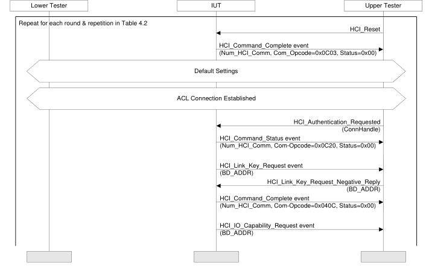

**Figure 4.383: LMP/SP/BI-03-C [Passkey Entry - IUT Initiator – Invalid Public Key Failure, P-192] MSC – Page 1 of 3**

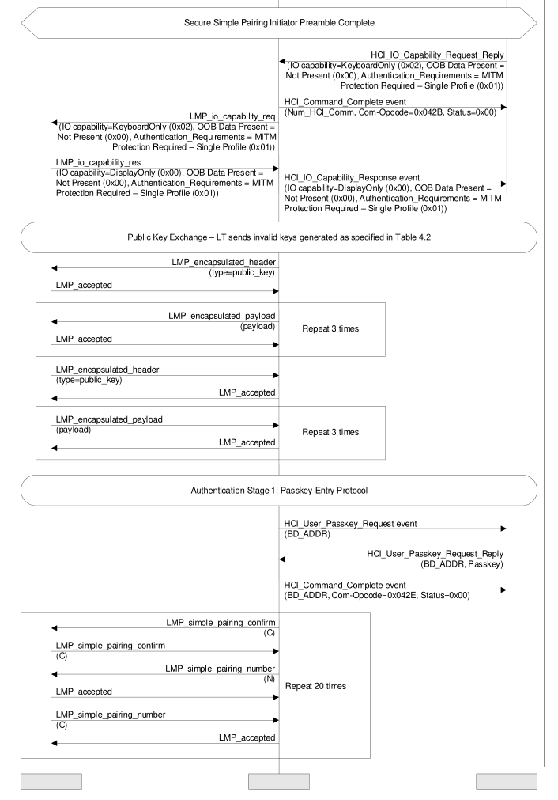

**Figure 4.384: LMP/SP/BI-03-C [Passkey Entry - IUT Initiator – Invalid Public Key Failure, P-192] MSC – Page 2 of 3**

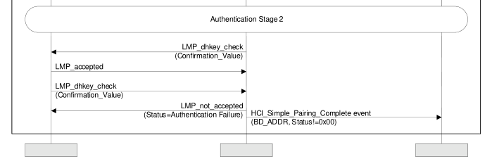

**Figure 4.385: LMP/SP/BI-03-C [Passkey Entry - IUT Initiator – Invalid Public Key Failure, P-192] MSC – Page 3 of 3**

• Expected Outcome
Pass verdict
The IUT responds to the Lower Tester’s LMP_dhkey_check PDU with an LMP_not_accepted PDU with Error_Code Authentication Failure (0x05).
The IUT sends an HCI_Simple_Pairing_Complete Event with an Error_Code different than success (0x00).
If TSPX_new_key_failed_count > 0, a different public Key is used by the IUT after at most TSPX_new_key_failed_count pairings.
Inconclusive verdict
The IUT interrupts the pairing process by:
- Responding LMP_not_accepted PDU with a different Error_Code than Authentication Failure (0x05) to an LMP_dhkey_check PDU
- Responding LMP_not_accepted PDU to an LMP_encapsulated_payload containing an invalid public Key
- Responding LMP_not_accepted PDU to an LMP_simple_pairing_number PDU
- Responding LMP_passkey_entry_failed PDU during the Passkey Entry Protocol Phase
• Notes
See Notes in LMP/SP/BI-01-C [Numeric Comparison – IUT Initiator – Invalid Public Key Failure, P- 192].
• Test Purpose
Verify that the IUT detects an invalid public Key using the Passkey Entry protocol and fails the pairing procedure using P-192 Key_Size.
The IUT is responder.
• Reference
[1] 4.2.7
• Initial Condition
- An IXIT statement, TSPX_new_key_failed_count, gives the number of failed pairing attempts before a new pairing Key is generated for Table 4.11.
- The Lower Tester generates and uses only private/public Key pairs where bit 0 of the private Key is set to 0.
• Test Procedure

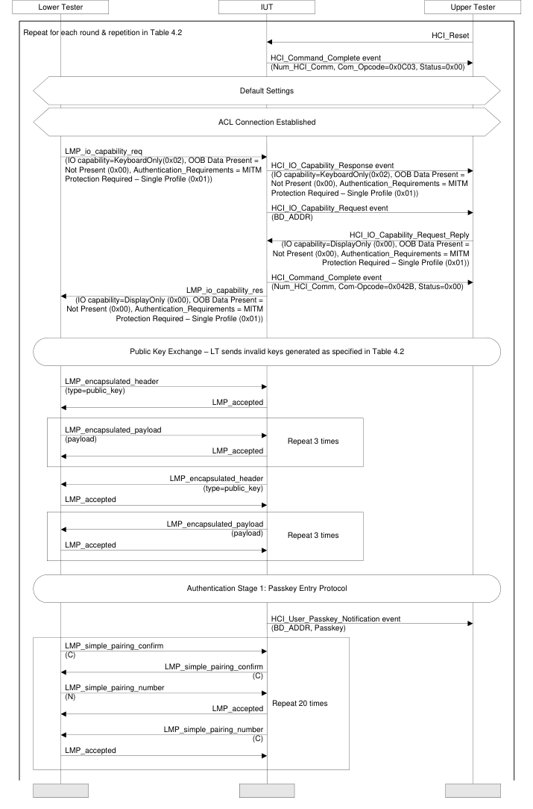

**Figure 4.386: LMP/SP/BI-04-C [Passkey Entry - IUT Responder – Invalid Public Key Failure, P-192] MSC – Page 1 of 2**

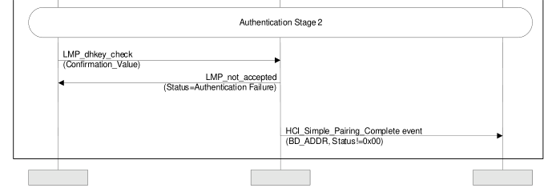

**Figure 4.387: LMP/SP/BI-04-C [Passkey Entry - IUT Responder – Invalid Public Key Failure, P-192] MSC – Page 2 of 2**

• Expected Outcome
Pass verdict
The IUT responds to the Lower Tester’s LMP_dhkey_check PDU with an LMP_not_accepted PDU with Error_Code Authentication Failure (0x05).
The IUT sends an HCI_Simple_Pairing_Complete Event with an Error_Code different than success (0x00).
If TSPX_new_key_failed_count > 0, a different public Key is used by the IUT after at most TSPX_new_key_failed_count pairings.
Inconclusive verdict
The IUT interrupts the pairing process by:
- Responding LMP_not_accepted PDU with a different Error_Code than Authentication Failure (0x05) to an LMP_dhkey_check PDU
- Responding LMP_not_accepted PDU to an LMP_encapsulated_payload containing an invalid public Key
- Responding LMP_not_accepted PDU to an LMP_simple_pairing_number PDU
- Responding LMP_passkey_entry_failed PDU during the Passkey Entry Protocol Phase
• Notes
See Notes in LMP/SP/BI-01-C [Numeric Comparison – IUT Initiator – Invalid Public Key Failure, P- 192].
LMP/SP/BI-05-C [OOB Protocol - IUT Initiator - IUT with OOB_Auth_Data – Invalid Public Key Failure, P-192]
• Test Purpose
Verify that the IUT detects an invalid public Key using the OOB protocol and fails the pairing procedure using P-192 Key_Size.
The IUT is initiator.
• Reference
[1] 4.2.7
• Initial Condition
- An IXIT statement, TSPX_new_key_failed_count, gives the number of failed pairing attempts before a new pairing Key is generated for Table 4.11.
- The Lower Tester generates and uses only private/public Key pairs where bit 0 of the private Key is set to 0.
• Test Procedure

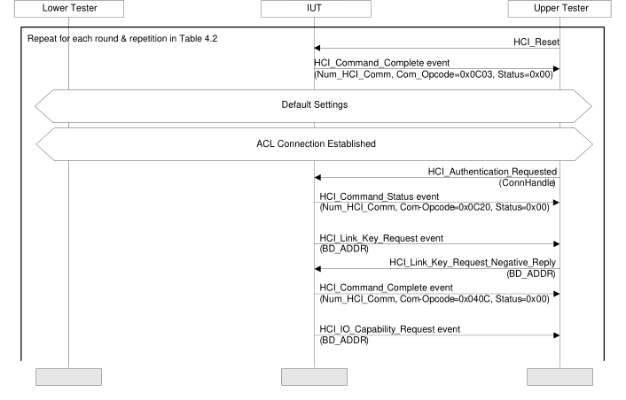

**Figure 4.388: LMP/SP/BI-05-C [OOB Protocol - IUT Initiator - IUT with OOB_Auth_Data – Invalid Public Key Failure, P-192] MSC – Page 1 of 3**

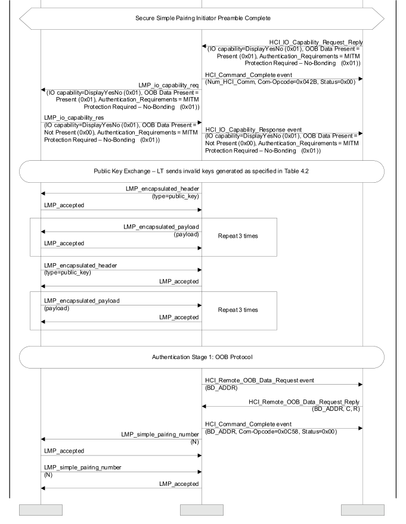

**Figure 4.389: LMP/SP/BI-05-C [OOB Protocol - IUT Initiator - IUT with OOB_Auth_Data – Invalid Public Key Failure, P-192] MSC – Page 2 of 3**

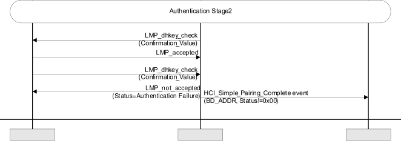

**Figure 4.390: LMP/SP/BI-05-C [OOB Protocol - IUT Initiator - IUT with OOB_Auth_Data – Invalid Public Key Failure, P-192] MSC – Page 3 of 3**

• Expected Outcome
Pass verdict
The IUT responds to the Lower Tester’s LMP_dhkey_check PDU with an LMP_not_accepted PDU with Error_Code Authentication Failure (0x05).
The IUT sends an HCI_Simple_Pairing_Complete Event with an Error_Code different than success (0x00).
If TSPX_new_key_failed_count > 0, a different public Key is used by the IUT after at most TSPX_new_key_failed_count pairings.
Inconclusive verdict
The IUT interrupts the pairing process by:
- Responding LMP_not_accepted PDU with a different Error_Code than Authentication Failure (0x05) to an LMP_dhkey_check PDU
- Responding LMP_not_accepted PDU to an LMP_encapsulated_payload containing an invalid public Key
- Responding LMP_not_accepted PDU to an LMP_simple_pairing_number PDU
- Responding LMP_oob_failed PDU during the OOB Protocol Phase
• Notes
See Notes in LMP/SP/BI-01-C [Numeric Comparison – IUT Initiator – Invalid Public Key Failure, P- 192].
LMP/SP/BI-06-C [OOB Protocol - IUT Responder - IUT with OOB_Auth_Data – Invalid Public Key Failure, P-192]
• Test Purpose
Verify that the IUT supports the OOB protocol where the IUT has OOB_Auth_Data.
The IUT is responder.
• Reference
[1] 4.2.7
• Initial Condition
- An IXIT statement, TSPX_new_key_failed_count, gives the number of failed pairing attempts before a new pairing Key is generated for Table 4.11.
- The Lower Tester generates and uses only private/public Key pairs where bit 0 of the private Key is set to 0.
• Test Procedure

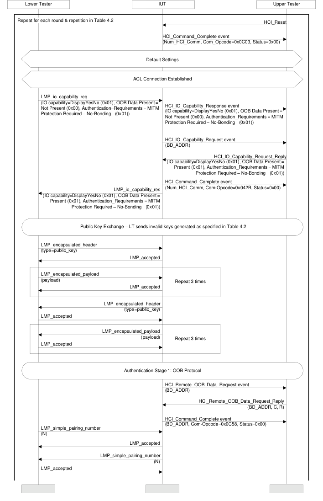

**Figure 4.391: LMP/SP/BI-06-C [OOB Protocol - IUT Responder - IUT with OOB_Auth_Data – Invalid Public Key Failure, P-192] MSC – Page 1 of 2**

|  |  | LMP not accepted _ _ (Status=Authentication Failure) |
| --- | --- | --- |
|  |  |  |

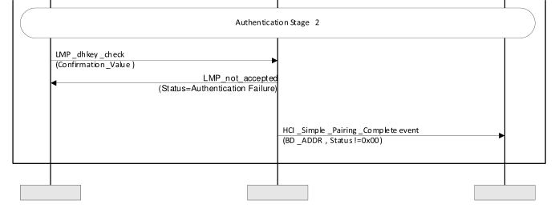

**Figure 4.392: LMP/SP/BI-06-C [OOB Protocol - IUT Responder - IUT with OOB_Auth_Data – Invalid Public Key Failure, P-192] MSC – Page 2 of 2**

• Expected Outcome
Pass verdict
The IUT responds to the Lower Tester’s LMP_dhkey_check PDU with an LMP_not_accepted PDU with Error_Code Authentication Failure (0x05).
The IUT sends an HCI_Simple_Pairing_Complete Event with an Error_Code different than success (0x00).
If TSPX_new_key_failed_count > 0, a different public Key is used by the IUT after at most TSPX_new_key_failed_count pairings.
Inconclusive verdict
The IUT interrupts the pairing process by:
- Responding LMP_not_accepted PDU with a different Error_Code than Authentication Failure (0x05) to an LMP_dhkey_check PDU
- Responding LMP_not_accepted PDU to an LMP_encapsulated_payload containing an invalid public Key
- Responding LMP_not_accepted PDU to an LMP_simple_pairing_number PDU
• Notes
See Notes in LMP/SP/BI-01-C [Numeric Comparison – IUT Initiator – Invalid Public Key Failure, P- 192].
LMP/SP/BI-07-C [Numeric Comparison - IUT Initiator – Invalid Public Key Failure, P-256]
• Test Purpose
Verify that the IUT detects an invalid public Key using the Numeric Comparison protocol and fails the pairing procedure using P-256 Key_Size.
Test procedure is run with the IUT as initiator.
• Reference
[1] 4.2.7
• Initial Condition
- An IXIT statement gives the number of failed pairing attempts before a new pairing Key is generated for Table 4.11.
- The Lower Tester generates and uses only private/public Key pairs where bit 0 of the private Key is set to 0.
• Test Procedure
Run the Test Procedure in LMP/SP/BI-01-C [Numeric Comparison – IUT Initiator – Invalid Public Key Failure, P-192] using Default Settings and Secure Simple Pairing P256 with a P-256 Key_Size in Table 4.11 and the LMP_encapsulated_payload repeated four times.
• Expected Outcome
See Expected Outcome in LMP/SP/BI-01-C [Numeric Comparison – IUT Initiator – Invalid Public Key Failure, P-192].
• Notes
See Notes in LMP/SP/BI-01-C [Numeric Comparison – IUT Initiator – Invalid Public Key Failure, P- 192].
LMP/SP/BI-08-C [Numeric Comparison - IUT Responder – Invalid Public Key Failure, P- 256]
• Test Purpose
Verify that the IUT detects an invalid public Key using the Numeric Comparison protocol and fails the pairing procedure using P-256 Key_Size.
Test procedure is run with the IUT as responder.
• Reference
[1] 4.2.7
• Initial Condition
- An IXIT statement gives the number of failed pairing attempts before a new pairing Key is generated for Table 4.11.
- The Lower Tester generates and uses only private/public Key pairs where bit 0 of the private Key is set to 0.
• Test Procedure
Run the Test Procedure in LMP/SP/BI-02-C [Numeric Comparison - IUT Responder – Invalid Public Key Failure, P-192] using Default Settings and Secure Simple Pairing P256 with a P-256 Key_Size in Table 4.11 and the LMP_encapsulated_payload repeated four times.
• Expected Outcome
See Expected Outcome in LMP/SP/BI-02-C [Numeric Comparison - IUT Responder – Invalid Public Key Failure, P-192].
• Notes
See Notes in LMP/SP/BI-01-C [Numeric Comparison – IUT Initiator – Invalid Public Key Failure, P- 192]
• Test Purpose
Verify that the IUT detects an invalid public Key using the Passkey Entry protocol and fails the pairing procedure using P-256 Key_Size.
Test procedure is run with the IUT as initiator.
• Reference
[1] 4.2.7
• Initial Condition
- An IXIT statement gives the number of failed pairing attempts before a new pairing Key is generated for Table 4.11.
- The Lower Tester generates and uses only private/public Key pairs where bit 0 of the private Key is set to 0.
• Test Procedure
Run the Test Procedure in LMP/SP/BI-03-C [Passkey Entry - IUT Initiator – Invalid Public Key Failure, P-192] using Default Settings and Secure Simple Pairing P256 with a P-256 Key_Size in Table 4.11 and the LMP_encapsulated_payload repeated four times.
• Expected Outcome
See Expected Outcome in LMP/SP/BI-03-C [Passkey Entry - IUT Initiator – Invalid Public Key Failure, P-192].
• Notes
See Notes in LMP/SP/BI-01-C [Numeric Comparison – IUT Initiator – Invalid Public Key Failure, P- 192].
LMP/SP/BI-10-C [Passkey Entry - IUT Responder – Invalid Public Key Failure, P-256]
• Test Purpose
Verify that the IUT detects an invalid public Key using the Passkey Entry protocol and fails the pairing procedure using P-256 Key_Size.
Test procedure is run with the IUT as responder.
• Reference
[1] 4.2.7
• Initial Condition
- An IXIT statement gives the number of failed pairing attempts before a new pairing Key is generated for Table 4.11.
- The Lower Tester generates and uses only private/public Key pairs where bit 0 of the private Key is set to 0.
• Test Procedure
Run the Test Procedure in LMP/SP/BI-04-C [Passkey Entry - IUT Responder – Invalid Public Key Failure, P-192] using Default Settings and Secure Simple Pairing P256 with a P-256 Key_Size in Table 4.11 and the LMP_encapsulated_payload repeated four times.
• Expected Outcome
See Expected Outcome in LMP/SP/BI-04-C [Passkey Entry - IUT Responder – Invalid Public Key Failure, P-192].
• Notes
See Notes in LMP/SP/BI-01-C [Numeric Comparison – IUT Initiator – Invalid Public Key Failure, P- 192].
LMP/SP/BI-11-C [OOB Protocol – IUT Initiator – IUT with OOB_Auth_Data – Invalid Public Key Failure, P-256]
• Test Purpose
Verify that the IUT detects an invalid public Key using the OOB protocol and fails the pairing procedure using P-256 Key_Size.
Test procedure is run with the IUT as initiator.
• Reference
[1] 4.2.7
• Initial Condition
- An IXIT statement gives the number of failed pairing attempts before a new pairing Key is generated for Table 4.11.
- The Lower Tester generates and uses only private/public Key pairs where bit 0 of the private Key is set to 0.
• Test Procedure
Run the Test Procedure in LMP/SP/BI-05-C [OOB Protocol - IUT Initiator - IUT with OOB_Auth_Data – Invalid Public Key Failure, P-192] using Default Settings and Secure Simple Pairing P256 with a P-256 Key_Size in Table 4.11, using P-256 OOB Data Present (0x02) in the HCI IO Capability Request Reply Command, and the LMP_encapsulated_payload repeated 4 times.
• Expected Outcome
See Expected Outcome in LMP/SP/BI-05-C [OOB Protocol - IUT Initiator - IUT with OOB_Auth_Data – Invalid Public Key Failure, P-192].
• Notes
See Notes in LMP/SP/BI-01-C [Numeric Comparison – IUT Initiator – Invalid Public Key Failure, P- 192].
LMP/SP/BI-12-C [OOB Protocol - IUT Responder - IUT with OOB_Auth_Data – Invalid Public Key Failure, P-256]
• Test Purpose
Verify that the IUT detects an invalid public Key using the OOB protocol and fails the pairing procedure using P-256 Key_Size.
Test procedure is run with the IUT as responder.
• Reference
[1] 4.2.7
• Initial Condition
- An IXIT statement gives the number of failed pairing attempts before a new pairing Key is generated for Table 4.11.
- The Lower Tester generates and uses only private/public Key pairs where bit 0 of the private Key is set to 0.
• Test Procedure
Run the Test Procedure in LMP/SP/BI-06-C [OOB Protocol - IUT Responder - IUT with OOB_Auth_Data – Invalid Public Key Failure, P-192] using Default Settings and Secure Simple Pairing P256 with a P-256 Key_Size in Table 4.11, using P-256 OOB Data Present (0x02) in the HCI IO Capability Request Reply Command, and the LMP_encapsulated_payload repeated four times.
• Expected Outcome
See Expected Outcome in LMP/SP/BI-06-C [OOB Protocol - IUT Responder - IUT with OOB_Auth_Data – Invalid Public Key Failure, P-192].
• Notes
See Notes in LMP/SP/BI-01-C [Numeric Comparison – IUT Initiator – Invalid Public Key Failure, P- 192].
LMP/SP/BV-66-C [Simple Pairing Capable Controller – Host is in Non-Bondable Mode – IUT Responder]
• Test Purpose
Verify that the LM on the IUT rejects the Simple Pairing procedure when the Host sends an IO Capability Request Negative Reply command. Lower Tester is an SSP Enabled Initiator.
The IUT is Peripheral and Claimant. The Lower Tester is Central and Verifier of the pairing procedure.
• Reference
[1] 4.2.7
• Initial Condition
- ACL connection established. The IUT is Simple Pairing Capable Controller. The Upper Tester is Simple Pairing Capable Host. The Lower Tester is an SSP Enabled Initiator.
- The IUT is connected to the Lower Tester, through LMP_host_connection_req and LMP_accepted.
- The preamble “Connection Establishment Lower Tester” may be used.
- The Lower Tester’s LMP features include:
▪ Feature bit 51 (Secure Simple Pairing) set to 1
▪ Feature bit 63 (Extended Features) set to 1
▪ Feature bit 64 (Secure Simple Pairing - Host Support) set to 1
- The Lower Tester’s IO capabilities set to “DisplayYesNo”.
- The Lower Tester’s Authentication_Requirements set to “MITM Protection Not Required – Dedicated Bonding” (0x02).
- The Upper Tester does not allow bonding.
• Test Procedure

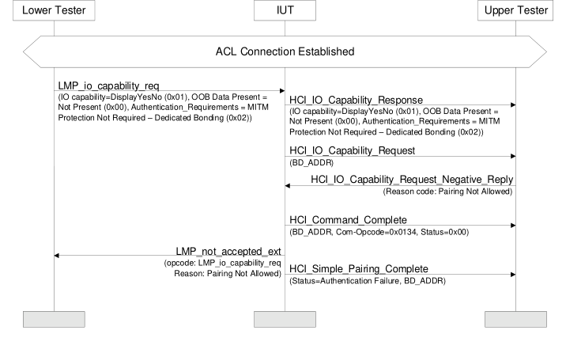

**Figure 4.393: LMP/SP/BV-66-C [Simple Pairing Capable Controller – Host is in Non-Bondable Mode – IUT Responder] MSC**

• Expected Outcome
Pass verdict
The IUT transmits the PDU LMP_NOT_ACCEPTED_EXT containing “Reason = 0x18” (Pairing Not Allowed) to the Lower Tester after it has received “LMP_IO_capability_req.”
LMP/SP/BI-13-C [Authentication Stage 2, Invalid DHKey Check, Responder]
• Test Purpose
Verify that the IUT handles an LMP_DHKEY_CHECK using an invalid DHKey as Responder.
• Reference
[1] 4.2.7.4
• Initial Condition
- The IUT and the Lower Tester have completed Authentication Stage 1 with an invalid Public Key from the Lower Tester.
- The IUT is the Responder and the Lower Tester is the Initiator.
• Test Procedure

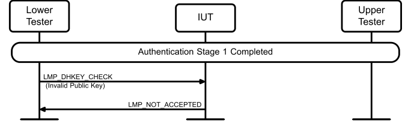

**Figure 4.394: LMP/SP/BI-13-C [Authentication Stage 2, Invalid DHKey Check, Responder] MSC**

1. The Lower Tester sends an LMP_DHKEY_CHECK PDU to the IUT using the invalid Public Key. 2. The IUT sends an LMP_NOT_ACCEPTED PDU with Error_Code set to Authentication Failure
(0x05).
• Expected Outcome
Pass verdict
The IUT responds to the Lower Tester’s LMP_DHKEY_CHECK PDU with an LMP_NOT_ACCEPTED PDU with Error_Code Authentication Failure (0x05).
LMP/SP/BI-14-C [Authentication Stage 2, Invalid DHKey Check, Initiator]
• Test Purpose
Verify that the IUT handles an LMP_DHKEY_CHECK PDU using an invalid DHKey as Initiator.
• Reference
[1] 4.2.7.4
• Initial Condition
- The IUT and the Lower Tester have completed Authentication Stage 1 with an invalid Public Key from the Lower Tester.
- The IUT is the Initiator and the Lower Tester is the Responder.
• Test Procedure

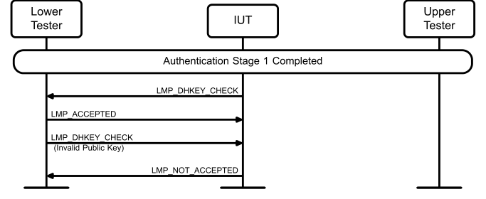

**Figure 4.395: LMP/SP/BI-14-C [Authentication Stage 2, Invalid DHKey Check, Initiator] MSC**

1. The IUT sends an LMP_DHKEY_CHECK PDU to the Lower Tester. 2. The Lower Tester sends an LMP_ACCEPTED PDU to the IUT. 3. The Lower Tester sends an LMP_DHKEY_CHECK PDU to the IUT using the invalid Public Key. 4. The IUT sends an LMP_NOT_ACCEPTED PDU with Error_Code set to Authentication Failure
(0x05).
• Expected Outcome
Pass verdict
The IUT responds to the Lower Tester’s LMP_DHKEY_CHECK PDU with an LMP_NOT_ACCEPTED PDU with Error_Code Authentication Failure (0x05).

### 4.12 Piconet Clock Adjust

LMP/XCL/BV-01-C [Central Initiates Coarse Clock Adjustment]
• Test Purpose
Verify that the IUT as Central will correctly initiate a Coarse Clock Adjustment.
This test can only be performed conclusively on a device that supports the MWS Coexistence Logical Signaling Specification or provides an alternative mechanism for triggering a clock adjustment.
• Reference
[1] Vol 2, Part C, 4.1.14.1
[1] Vol 7, Part A, 2.1
• Initial Condition
- Lower Tester: Configured as Peripheral in state CONNECTION (active mode, ACL link)
- Upper Tester: Configured to issue MWS FRAME_SYNC
- IUT: Configured as Central in state CONNECTION (active mode, ACL link)
• Test Procedure

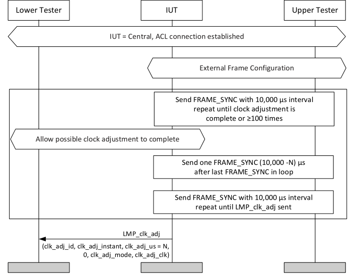

**Figure 4.396: –LMP/XCL/BV-01-C [Central Initiates Coarse Clock Adjustment] MSC**

1. Start issuing FRAME_SYNC with exact 10 ms interval. 2. If this initial FRAME_SYNCs leads to a Coarse Clock Adjustment, wait for action to complete. 3. Send one FRAME_SYNC (10,000 –N) µs after the previous one, 100 ≤ N ≤ 300. 4. Keep sending FRAME_SYNC with 10 ms intervals. 5. Observe broadcast of LMP_clk_adj over APB-C link.
• Expected Outcome
Pass verdict
LMP_clk_adj: The value of clk_adj_slot_offset is N µs ± 5%
LMP_clk_adj: Is transmitted as broadcast at least 6 times over APB-C link
The IUT enabled AFH as part of the connection establishment and kept it enabled throughout the test. Throughout the test, channels 0, 24, and 78 were marked as unused in the AFH_Channel_Map. If IUT performed a Coarse Clock Adjustment, Clk_Adj_Instant = CLKp + X, where CLKp is CLK of the first LMP_clk_adj packet, and X is ≥ 12 slots and < 12 hours.
Inconclusive verdict
The IUT does not support the HCI_Set_External_Frame_Configuration command (HCI.ICS 5/19) and does not provide an alternative mechanism for triggering a clock adjustment.
• Test Purpose
Verify that the IUT as Peripheral will correctly initiate a request Coarse Clock Adjustment. The Lower Tester will accept the request.
This test can only be performed conclusively on a device that supports the MWS Coexistence Logical Signaling Specification.
• Reference
[1] Vol 2, Part C, 4.1.14.2
[1] Vol 7, Part A, 2.1
• Initial Condition
- Lower Tester: Configured as Central in state CONNECTION (active mode, ACL link). The Bluetooth clock of the Lower Tester is chosen to include clock wrap-around (227-1 to 0) during the test procedure.
- Upper Tester: Configured to issue MWS FRAME_SYNC.
- IUT: Configured as Peripheral in state CONNECTION (active mode, ACL link).
• Test Procedure

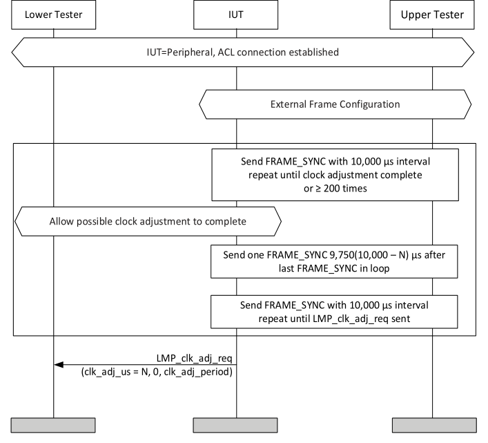

**Figure 4.397: LMP/XCL/BV-02-C [Peripheral Coarse Clock Adjustment Request] MSC**

1. Start issuing FRAME_SYNC with exact 10 ms interval. 2. If this initial FRAME_SYNCs leads to a Coarse Clock Adjustment request, wait for clock
adjustment to complete. 3. Send one FRAME_SYNC (10,000 –N) µs after the previous one, 100 ≤ N ≤ 300. 4. Keep sending FRAME_SYNC with 10 ms intervals. 5. Observe transmission of LMP_clk_adj_req.
• Expected Outcome
Pass verdict
LMP_clk_adj: The value of Clk_Adj_Offset is N µs ± 5%.
Inconclusive verdict
The IUT does not support the HCI_Set_External_Frame_Configuration command (HCI.ICS 5/19) and does not provide an alternative mechanism for triggering a clock adjustment.
LMP/XCL/BV-03-C [Test that Central does not reuse Clk_Adj_ID within LSTO]
• Test Procedure
Verify that the IUT as Central will not reuse the same Clk_Adj_ID within the longest LSTO of all connected Peripherals.
• Reference
[1] Vol 2, Part C, 4.1.14.1
• Initial Condition
- Lower Tester: Configured as Peripheral in state CONNECTION (active mode, ACL link)
- IUT: Configured as Central in state CONNECTION (active mode, ACL link)
• Test Procedure

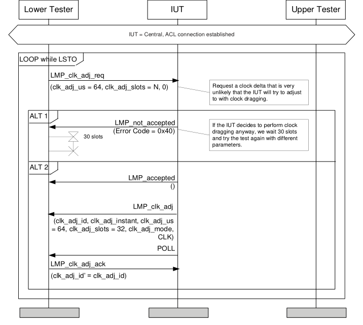

**Figure 4.398: LMP/XCL/BV-03-C [Test that Central does not reuse Clk_Adj_ID within LSTO] MSC**

1. Set N = 32. 2. Configure the Lower Tester to issue LMP_clk_adj_req and handle responses for a period of its
LSTO. 3. The Lower Tester sends LMP_clk_adj_req to IUT. 4. The IUT may accept the request or deny it and instead attempt to change CLK by dragging.
a. If the IUT accepts the coarse clock adjustment, it will send LMP_accepted to the Lower
Tester.
b. If the IUT rejects the coarse clock adjustment but indicates that it will perform clock
dragging, the Lower Tester waits 30 slots, increments N = N + 1 and starts over from b).
c. If the IUT rejects the request with any other Error_Code before the 256th request, this test
will fail.
5. The IUT broadcasts LMP_clk_adj over an APB-C link. 6. The Lower Tester stores the value of the Clk_Adj_ID parameter. If the received value is the same
as any previously received value of Clk_Adj_ID during this test, the test is terminated with a ‘fail’ verdict. 7. When polled, the Lower Tester responds with LMP_clk_adj_ack with Clk_Adj_ID set to the same
value as in LMP_clk_adj. 8. While less time than LSTO has passed since test started, repeat steps 3–7.
• Expected Outcome
Pass verdict
The IUT does not reuse the same Clk_Adj_ID value during the test.
The IUT enabled AFH as part of the connection establishment and kept it enabled throughout the test. Throughout the test, channels 0, 24, and 78 were marked as unused in the AFH_Channel_Map.
If IUT performed a Coarse Clock Adjustment, Clk_Adj_Instant = CLKp + X, where CLKp is CLK of the first LMP_clk_adj packet, and X is ≥ 12 slots and < 12 hours. Also, LMP_clk_adj is transmitted as broadcast over APB-C link.
• Notes
In the event that the timing of LSTO and the duration of a complete Coarse Clock Adjustment makes it possible to perform 256 iterations or more it is unavoidable that at least one value will be repeated. In this case, the Central may delay the Clk_Adj_Instant of the LMP_clk_adj with the duplicate value to beyond the time of the longest LSTO of the piconet after the previous instant where the same value was used. It may also solve the problem by dragging the last request or by rejecting the last request altogether.
LMP/XCL/BV-04-C [Test that a Clock Adjust is ignored on ACL-C]
• Test Procedure
Verify that the IUT as Peripheral will ignore a Clock Adjust sent on an ACL-C link.
• Reference
[1] Vol. 2, Part C, 4.1.14.1, 5.1
• Initial Condition
- Lower Tester: Configured as Central in state CONNECTION (active mode, ACL link)
- IUT: Configured as Peripheral in state CONNECTION (active mode, ACL link)
• Test Procedure

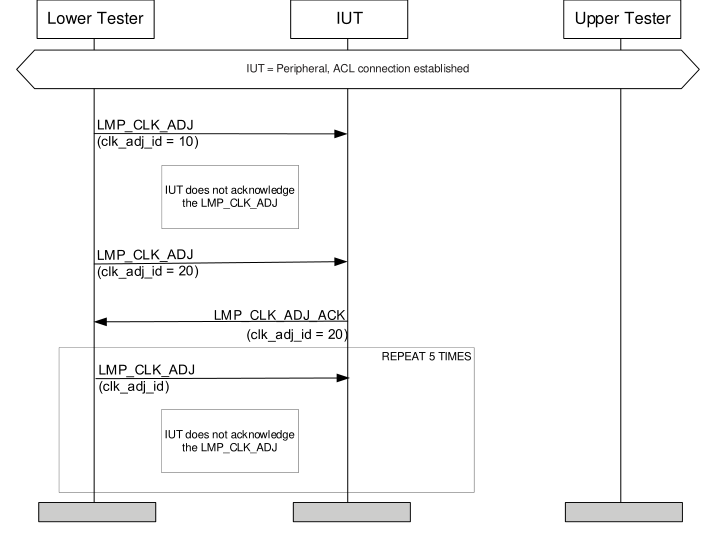

**Figure 4.399: LMP/XCL/BV-04-C [Test that a Clock Adjust is ignored on ACL-C] MSC**

1. The Lower Tester sends an LMP_CLK_ADJ PDU on an ACL-C link with Clk_Adj_ID set to 10. 2. The IUT does not respond with an LMP_CLK_ADJ_ACK PDU. 3. The Lower Tester sends an LMP_CLK_ADJ PDU on an APB-C link with Clk_Adj_ID set to 20. 4. The IUT sends an LMP_CLK_ADJ_ACK PDU to the Lower Tester with Cl_Adj_ID set to 20. 5. The Lower Tester sends an LMP_CLK_ADJ PDU on an ACL-C link with Clk_Adj_ID set to a
different value than steps 1 and 3. 6. The IUT does not respond with an LMP_CLK_ADJ_ACK PDU. 7. Repeat steps 5 and 6 four times.
• Expected Outcome
Pass verdict
In steps 2 and 6, the IUT does not respond to the LMP_CLK_ADJ.

### 4.13 Slot Availability Mask

LMP/SAM/BV-01-C [Respond to three SAM instances]
• Test Purpose
Verify that the IUT accepts SAM type 0 submap configuration and SAM slot map define sequences for three SAM instances initiated by the Lower Tester, and correctly responds to SAM switch sequence. Also verify that the timing control flags bits 0 and 2 in the LMP_SAM_SWITCH PDU sent by the Lower Tester are ignored by the IUT.
• Reference
[10] 4.1.15
• Initial Condition
- Lower Tester: Configured as Central in state CONNECTION (active mode, ACL link)
- IUT: Configured as Peripheral in state CONNECTION (active mode, ACL link)
- SAM disabled on the Lower Tester and the IUT
• Test Procedure
1. The Lower Tester sends an LMP_SAM_SET_TYPE0 PDU to the IUT with the following
parameters:
Update_Mode = 0
SAM_Type0Submap = 0x4A, 0x55, 0xBD, 0xAA, 0x00, 0x00, 0x00, 0x00, 0x00, 0x00, 0x00, 0x00, 0x00, 0x00
2. The Lower Tester sends the first LMP_SAM_DEFINE_MAP PDU to the IUT with the following
parameters:
SAM_Index = 0
TSAM-SM = 16
NSAM_SM = 1
SAM_Submaps = 0x00, 0x00, 0x00, 0x00, 0x00, 0x00, 0x00, 0x00, 0x00, 0x00, 0x00, 0x00
3. The Lower Tester sends the second LMP_SAM_DEFINE_MAP PDU to the IUT with the following
parameters:
SAM_Index = 1
TSAM-SM = 56
NSAM_SM = 2
SAM_Submaps = 0x09, 0x00, 0x00, 0x00, 0x00, 0x00, 0x00, 0x00, 0x00, 0x00, 0x00, 0x00
4. The Lower Tester sends the third LMP_SAM_DEFINE_MAP PDU to the IUT with the following
parameters:
SAM_Index = 2
TSAM-SM = 2
NSAM_SM = 48
SAM_Submaps = 0x09, 0x55, 0x55, 0x55, 0x55, 0x55, 0x55, 0x55, 0x55, 0x55, 0x55, 0x55
5. The Lower Tester sends an LMP_SAM_SWITCH PDU to the IUT with SAM_Index = 0,
Timing_Control_Flag bit 1 is determined by CLK27 of the Central, bits 0 and 2 are set to 0.
6. The Lower Tester sends an LMP_SAM_SWITCH PDU to the IUT with SAM_Index = 1,
Timing_Control_Flag bit 1 is determined by CLK27 of the Central, bits 0 and 2 are set to 1.
7. The Lower Tester sends an LMP_SAM_SWITCH PDU to the IUT with SAM_Index = 2,
Timing_Control_Flag bit 1 is determined by CLK27 of the Central, bit 0 is set to 0, and bit 2 is set to 1.

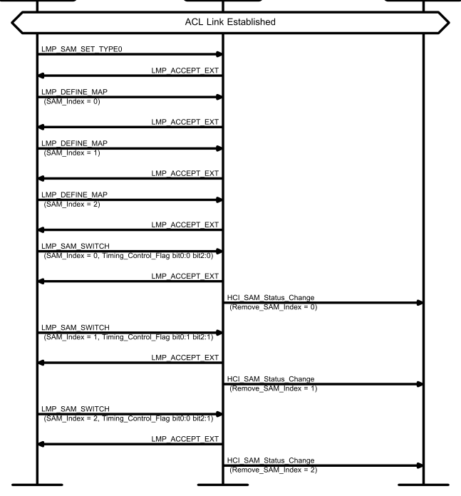

**Figure 4.400: LMP/SAM/BV-01-C [Respond to three SAM instances] MSC**

• Expected Outcome
Pass verdict
The IUT accepts SAM type 0 submap configuration and SAM slot map define sequences for three SAM instances initiated by the Lower Tester correctly.
The IUT responds to SAM switch sequences initiated by the Lower Tester and generated HCI_SAM_Status_Change events correctly.
The first HCI_SAM_Status_Change event is generated with the following parameters:
- Connection_handle
- Local_SAM_Index = 0xFF
- Local_SAM_TX_Availability = 0xFF
- Local_SAM_RX_Availability = 0xFF
- Remote_SAM_Index = 0x00
- Remote_SAM_TX_Availability = 0x7F
- Remote_SAM_RX_Availability = 0x8F
- Connection_handle
- Local_SAM_Index = 0xFF
- Local_SAM_TX_Availability = 0xFF
- Local_SAM_RX_Availability = 0xFF
- Remote_SAM_Index = 0x01
- Remote_SAM_TX_Availability = 0x7F
- Remote_SAM_RX_Availability = 0x7F
The third HCI_SAM_Status_Change event is generated with the following parameters:
- Connection_handle
- Local_SAM_Index = 0xFF
- Local_SAM_TX_Availability = 0xFF
- Local_SAM_RX_Availability = 0xFF
- Remote_SAM_Index = 0x02
- Remote_SAM_TX_Availability = 0xEF
- Remote_SAM_RX_Availability = 0xF9
LMP/SAM/BV-02-C [Initiate three SAM instances]
• Test Purpose
Verify that the IUT will correctly initiate SAM type 0 submap configuration and SAM slot map define sequences for three SAM instances, can correctly initiate SAM switch sequence.
• Reference
[10] 4.1.15
• Initial Condition
- Lower Tester: Configured as Central in state CONNECTION (active mode, ACL link)
- IUT: Configured as Peripheral in state CONNECTION (active mode, ACL link)
- SAM disabled on the Lower Tester and the IUT
- SAM negotiations are triggered by the IUT with pre-defined parameters
• Test Procedure
1. The IUT sends an LMP_SAM_set_type0 PDU to the Lower Tester to configure a type 0 submap. 2. The LMP_SAM_set_type0 and LMP_SAM_define_map PDUs may be triggered by the HCI
commands HCI_Set_External_Frame_Configuration and HCI_Set_MWS_PATTERN_Configuration, respectively. The LMP_SAM_switch PDUs may be triggered by the facilities specified in Volume 7 of the Core Specification. Alternatively, some or all of these PDUs may be triggered by vendor-specific Features. 3. For each SAM_Index value from 0 to 2, the IUT sends an LMP_SAM_define_map PDU to define
a SAM slot map and then enables that SAM slot map by sending an LMP_SAM_Switch PDU with the same SAM_Index; the Timing_Control_Flag is determined by CLK27 of the Central. PDUs with different SAM_Index values may be sent in any order.

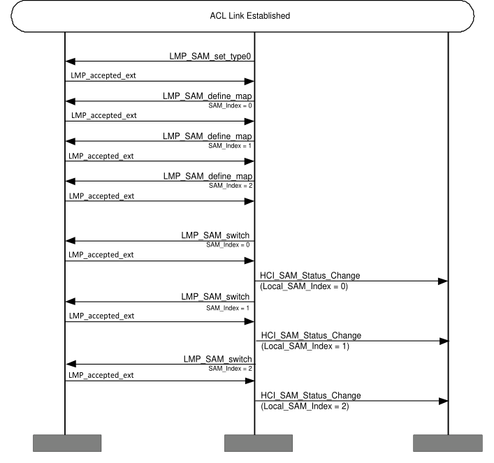

**Figure 4.401: LMP/SAM/BV-02-C [Initiate three SAM instances] MSC**

• Expected Outcome
Pass verdict
The IUT correctly initiates SAM type 0 submap configuration and SAM slot map define sequences for three SAM instances and correctly initiates SAM switch sequence.
The IUT generates HCI_SAM_Status_Change events correctly.
LMP/SAM/BI-03-C [Respond to invalid SAM type 0 submap configuration sequence]
• Test Purpose
Verify that the IUT does not accept SAM type 0 submap configuration sequence from the Lower Tester when the Update_Mode is set to 0 and the SAM slot map in use contains the type 0 submap.
• Reference
[10] 4.1.15.1
• Initial Condition
- Lower Tester: Configured as Central in state CONNECTION (active mode, ACL link)
- IUT: Configured as Peripheral in state CONNECTION (active mode, ACL link)
- SAM is disabled on the Lower Tester and the IUT
• Test Procedure
1. The Lower Tester sends an LMP_SAM_set_type0 PDU with the following parameters to the IUT
to configure a type 0 submap:
Update_Mode = 0
SAM_Type0Submap = 0x4A, 0x55, 0xBD, 0xAA, 0x00, 0x00, 0x00, 0x00, 0x00, 0x00, 0x00, 0x00, 0x00, 0x00
2. The Lower Tester sends an LMP_SAM_define_map PDUs with the following parameters to
define one SAM slot map containing the type 0 submap:
SAM_Index = 0
TSAM-SM = 16
NSAM_SM = 1
SAM_Submaps = 0x00, 0x00, 0x00, 0x00, 0x00, 0x00, 0x00, 0x00, 0x00, 0x00, 0x00, 0x00
3. The Lower Tester sends an LMP_SAM_Switch PDU to enable the SAM slot map.
Timing_Control_Flag is determined by CLK27 of the Central.
4. The Lower Tester sends an LMP_SAM_set_type0 PDU with the following parameters to
reconfigure the type 0 submap:
Update_Mode = 0
SAM_Type0Submap = 0x4A, 0x55, 0xBD, 0xAA, 0x00, 0x00, 0x00, 0x00, 0x00, 0x00, 0x00, 0x00, 0x00, 0x00
5. The Lower Tester sends an LMP_SAM_set_type0 PDU with the following parameters to
reconfigure the type 0 submap:
Update_Mode = 1
SAM_Type0Submap = 0xBD, 0xAA, 0x4A, 0x55, 0x00, 0x00, 0x00, 0x00, 0x00, 0x00, 0x00, 0x00, 0x00, 0x00
6. The Lower Tester sends an LMP_SAM_set_type0 PDU with the following parameters to
reconfigure the type 0 submap:
Update_Mode = 2
SAM_Type0Submap = 0x4A, 0x55, 0xBD, 0xAA, 0x00, 0x00, 0x00, 0x00, 0x00, 0x00, 0x00, 0x00, 0x00, 0x00

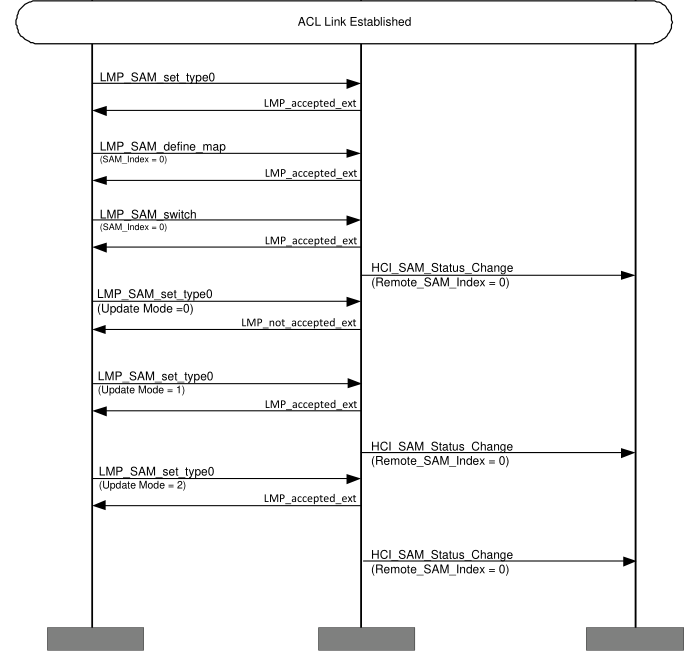

**Figure 4.402: LMP/SAM/BI-03-C [Respond to invalid SAM type 0 submap configuration sequence] MSC**

• Expected Outcome
Pass verdict
The IUT accepts SAM type 0 submap configuration, SAM slot map define sequence, and responds to SAM switch sequence initiated by the Lower Tester correctly.
The IUT transmits PDU LMP_not_accepted with Error_Code Invalid LMP Parameters (0x1E) upon reception of PDU LMP_SAM_set_type0 with the Update_Mode parameter set to 0.
The IUT generates HCI_SAM_Status_Change events correctly.
LMP/SAM/BI-04-C [Respond to invalid SAM type 0 submap]
• Test Purpose
Verify that the IUT does not accept SAM slot map define request from the Lower Tester when SAM type 0 submap is carried by the LMP_SAM_define_map PDU without prior configuration.
• Reference
[10] 4.1.15.1
• Initial Condition
- Lower Tester: Configured as Central in state CONNECTION (active mode, ACL link)
- IUT: Configured as Peripheral in state CONNECTION (active mode, ACL link)
- SAM disabled on the Lower Tester and the IUT
• Test Procedure
1. The Lower Tester sends an LMP_SAM_define_map PDUs with the following parameters to
define one SAM slot map containing a type 0 submap:
SAM_Index = 0
TSAM-SM = 16
NSAM_SM = 1
SAM_Submaps = 0x00, 0x00, 0x00, 0x00, 0x00, 0x00, 0x00, 0x00, 0x00, 0x00, 0x00, 0x00
2. The Lower Tester sends an LMP_SAM_set_type0 PDU with the following parameters to the IUT
to configure a type 0 submap:
Update_Mode = 0
SAM_Type0Submap = 0x4A, 0x55, 0xBD, 0xAA, 0x00, 0x00, 0x00, 0x00, 0x00, 0x00, 0x00, 0x00, 0x00, 0x00
3. The Lower Tester sends an LMP_SAM_define_map PDUs with the following parameters to
define one SAM slot map containing a type 0 submap:
SAM_Index = 0
TSAM-SM = 16
NSAM_SM = 1
SAM_Submaps = 0x00, 0x00, 0x00, 0x00, 0x00, 0x00, 0x00, 0x00, 0x00, 0x00, 0x00, 0x00
4. The Lower Tester sends an LMP_SAM_Switch PDU to enable the SAM slot map with SAM_Index
= 0. Timing_Control_Flag is determined by CLK27 of the Central.
5. The Lower Tester sends an LMP_SAM_define_map PDUs with the following parameters to
define one SAM slot map without a type 0 submap:
SAM_Index = 1
TSAM-SM = 56
NSAM_SM = 2
SAM_Submaps = 0x09, 0x00, 0x00, 0x00, 0x00, 0x00, 0x00, 0x00, 0x00, 0x00, 0x00, 0x00
6. The Lower Tester sends an LMP_SAM_Switch PDU to enable the SAM slot map with SAM_Index
= 1. Timing_Control_Flag is determined by CLK27 of the Central.
7. The Lower Tester sends an LMP_SAM_set_type0 PDU with the following parameters to the IUT
to configure a new type 0 submap:
Update_Mode = 0
SAM_Type0Submap = 0xBD, 0xAA, 0x4A, 0x55, 0x00, 0x00, 0x00, 0x00, 0x00, 0x00, 0x00, 0x00, 0x00, 0x00
= 0. Timing_Control_Flag is determined by CLK27 of the Central.
9. The Lower Tester sends an LMP_SAM_Switch PDU with a valid SAM_Index = 0xFF to disable
SAM.

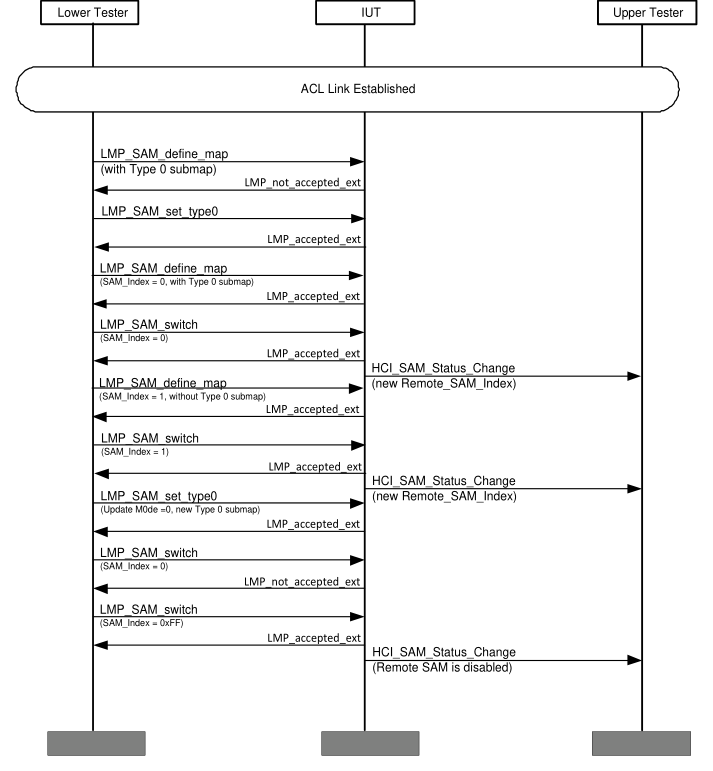

**Figure 4.403: LMP/SAM/BI-04-C [Respond to invalid SAM type 0 submap] MSC**

• Expected Outcome
Pass verdict
The IUT transmits PDU LMP_not_accepted with Error_Code Type 0 Submap Not Defined (0x41) upon reception of PDU LMP_SAM_define_map containing an undefined SAM type 0 submap.
The IUT accepts slot map define sequence and responds to SAM switch sequence initiated by the Lower Tester correctly.
The IUT transmits PDU LMP_not_accepted with Error_Code Invalid LMP Parameters (0x1E) upon reception of PDU LMP_SAM_switch with SAM_Index = 1 after type 0 submap is reconfigured with Update_Mode = 0.
The IUT continues on the current SAM slot map after a failed LMP_SAM_switch. No HCI_SAM_Status_Change event is generated.
The IUT generates HCI_SAM_Status_Change events correctly.
• Test Purpose
Verify that the IUT does not accept SAM switch request from the Lower Tester when the SAM index carried by the LMP_SAM_define_map PDU is not defined.
• Reference
[10] 4.1.15
• Initial Condition
- Lower Tester: Configured as Central in state CONNECTION (active mode, ACL link)
- IUT: Configured as Peripheral in state CONNECTION (active mode, ACL link)
- SAM is disabled on the Lower Tester and the IUT
• Test Procedure
1. The Lower Tester sends an LMP_SAM_define_map PDUs with the following parameters:
SAM_Index = 0
TSAM-SM = 56
NSAM_SM = 2
SAM_Submaps = 0x09, 0x00, 0x00, 0x00, 0x00, 0x00, 0x00, 0x00, 0x00, 0x00, 0x00, 0x00
2. The Lower Tester sends the second LMP_SAM_define_map PDU to the IUT with the following
parameters:
SAM_Index = 1
TSAM-SM = 56
NSAM_SM = 2
SAM_Submaps = 0x06, 0x00, 0x00, 0x00, 0x00, 0x00, 0x00, 0x00, 0x00, 0x00, 0x00, 0x00
3. The Lower Tester sends an LMP_SAM_Switch PDU with a SAM_Index = 0 to enable the SAM
slot map. Timing_Control_Flag is determined by CLK27 of the Central.
4. The Lower Tester sends an LMP_SAM_define_map PDUs with the following parameters to
delete the SAM slot map with SAM_Index = 0:
SAM_Index = 0
TSAM-SM = 56
NSAM_SM = 0
SAM_Submaps = SAM_Submaps can have any value.
The Lower Tester sends an LMP_SAM_Switch PDU with SAM_Index = 1 to enable the SAM slot map.
delete the SAM slot map with SAM_Index = 0:
SAM_Index = 0
TSAM-SM = 56
NSAM_SM = 0
SAM_Submaps = SAM_Submaps can have any value.
6. The Lower Tester sends an LMP_SAM_Switch PDU with an invalid SAM_Index = 0 to enable the
SAM slot map.
7. The Lower Tester sends an LMP_SAM_Switch PDU with SAM_Index = 0xFF to disable SAM.

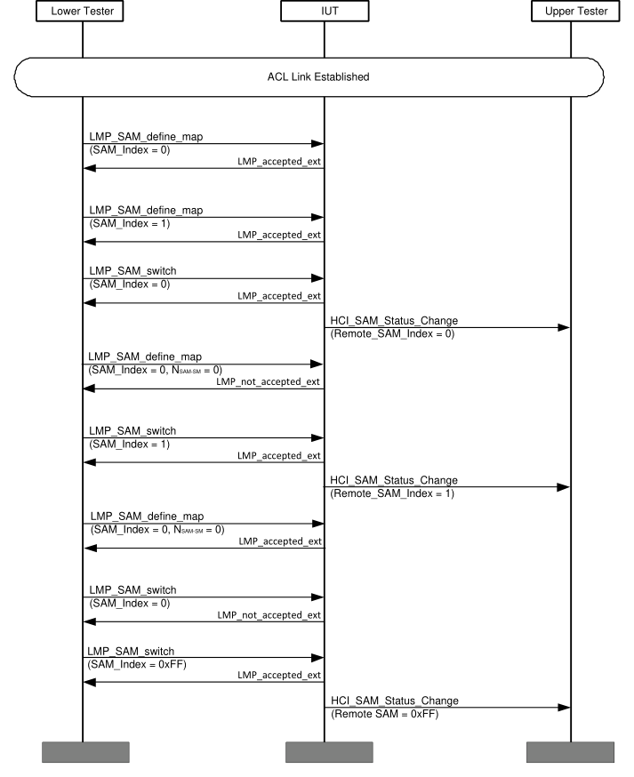

**Figure 4.404: LMP/SAM/BI-05-C [Respond to invalid SAM index] MSC**

• Expected Outcome
Pass verdict
The IUT accepts slot map define sequence and responds to SAM switch sequence initiated by the Lower Tester correctly.
The IUT transmits PDU LMP_not_accepted with Error_Code Invalid LMP Parameters (0x1E) upon reception of PDU LMP_SAM_define_map with NSAM_SM = 0 containing a currently selected SAM_Index.
The IUT transmits PDU LMP_not_accepted with Error_Code Invalid LMP Parameters (0x1E) upon reception of PDU LMP_SAM_switch containing an invalid SAM_Index.
The IUT continues on the current SAM slot map after a failed LMP_SAM_switch. No HCI_SAM_Status_Change event is generated.
The IUT generates HCI_SAM_Status_Change events correctly.
LMP/SAM/BV-06-C [SAM is disabled after a successful role switch]
• Test Purpose
Verify that SAM is disabled by the IUT after a successful role switch.
• Reference
[10] 4.1.15.5
• Initial Condition
- Lower Tester: Configured as Central in state CONNECTION (active mode, ACL link)
- IUT: Configured as Peripheral in state CONNECTION (active mode, ACL link)
- SAM is disabled on the Lower Tester and the IUT
• Test Procedure
1. The Lower Tester sends an LMP_SAM_define_map PDU with the following parameters to define
one SAM slot map:
SAM_Index = 0
TSAM-SM = 56
NSAM_SM = 2
SAM_Submaps = 0x09, 0x00, 0x00, 0x00, 0x00, 0x00, 0x00, 0x00, 0x00, 0x00, 0x00, 0x00
2. The Lower Tester sends an LMP_SAM_Switch PDU to enable the SAM slot map.
Timing_Control_Flag is determined by CLK27 of the Central.
3. Role switch is initiated by the Upper Tester.

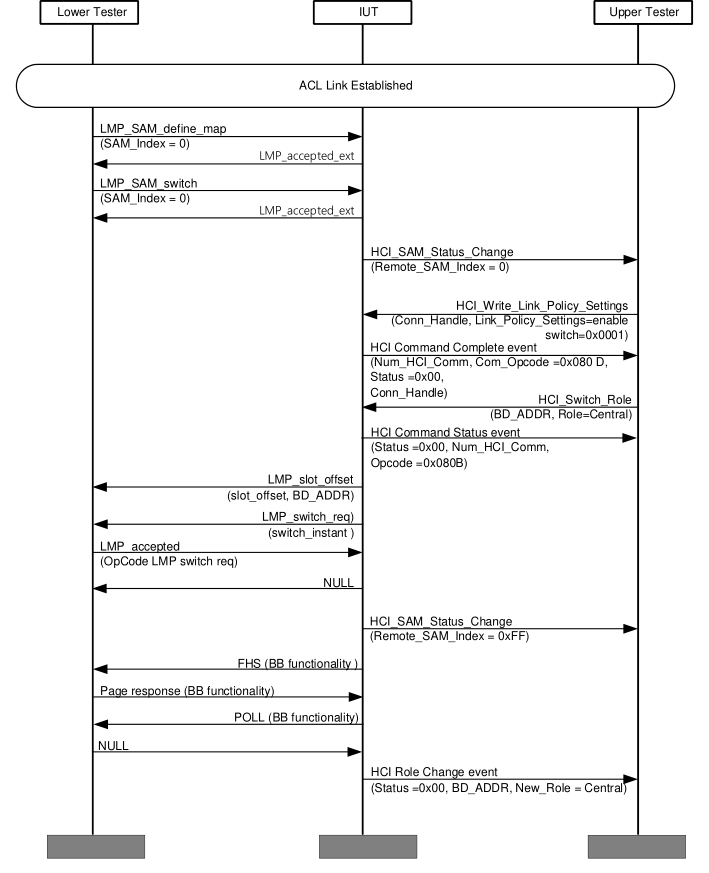

**Figure 4.405: LMP/SAM/BI-06-C [SAM is disabled after a successful role switch] MSC**

• Expected Outcome
Pass verdict
The IUT accepts slot map define sequence and responds to the SAM switch sequence initiated by the Lower Tester correctly.
The IUT generates HCI_SAM_Status_Change events correctly and SAM is disabled by the IUT when the role switch succeeds.
LMP/SAM/BV-07-C [SAM is resumed after a failed role switch]
• Test Purpose
Verify that SAM is resumed by the IUT after a failed role switch.
• Reference
• Initial Condition
- Lower Tester: Configured as Central in state CONNECTION (active mode, ACL link)
- IUT: Configured as Peripheral in state CONNECTION (active mode, ACL link)
- SAM disabled on the Lower Tester and the IUT
• Test Procedure
1. The Lower Tester sends an LMP_SAM_define_map PDU with the following parameters to define
one SAM slot map:
SAM_Index = 0
TSAM-SM = 56
NSAM_SM = 2
SAM_Submaps = 0x09, 0x00, 0x00, 0x00, 0x00, 0x00, 0x00, 0x00, 0x00, 0x00, 0x00, 0x00
2. The Lower Tester sends an LMP_SAM_Switch PDU to enable the SAM slot map.
Timing_Control_Flag is determined by CLK27 of the Central.
3. Role switch is initiated by the Upper Tester.
Lower Tester Upper Tester IUT

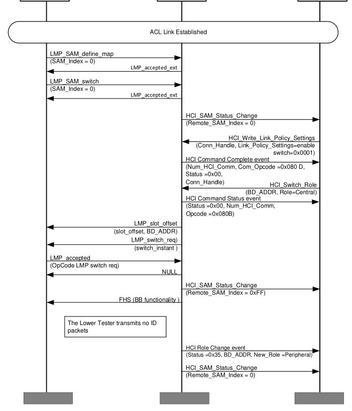

**Figure 4.406: LMP/SAM/BV-07-C [SAM is resumed after a failed role switch] MSC**

• Expected Outcome
Pass verdict
The IUT accepts slot map define sequence and responds to SAM switch sequence initiated by the Lower Tester correctly.
SAM is resumed when the role switch fails.
• Test Purpose
Verify that the sniff mode takes precedence over SAM and SAM is reinstated on exit from the sniff mode.
• Reference
[10] 4.1.15.6
• Initial Condition
- Lower Tester: Configured as Central in state CONNECTION (active mode, ACL link)
- IUT: Configured as Peripheral in state CONNECTION (active mode, ACL link)
- SAM disabled on the Lower Tester and the IUT
• Test Procedure
1. The Lower Tester sends the first LMP_SAM_define_map PDU to the IUT with the following
parameters:
SAM_Index = 0
TSAM-SM = 20
NSAM_SM = 2
SAM_Submaps = 0x09, 0x00, 0x00, 0x00, 0x00, 0x00, 0x00, 0x00, 0x00, 0x00, 0x00, 0x00
2. The Lower Tester sends the first LMP_SAM_switch PDU to the IUT with SAM_Index = 0,
Timing_Control_Flag is determined by CLK27 of the Central.
3. The Lower Tester initiates sniff mode.
Lower Tester Upper Tester IUT

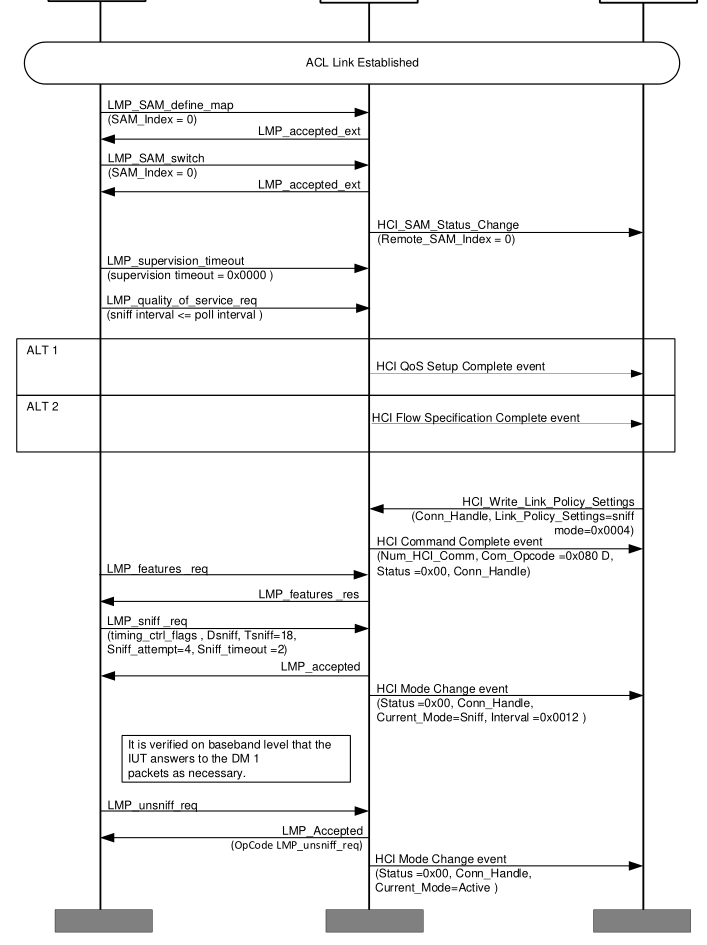

**Figure 4.407: LMP/SAM/BV-08-C [SAM and sniff mode] MSC**

DM1 packet
Sniff_attempt = 4 RX slots
TSniff = 18
Polling. DM1 packets transmitted by the Lower Tester contain data. Verify that the DM1 packet is always acknowledged. This is checked on baseband level. 5. Monitor the result for a period of 20*TSniff slots. 6. The Lower Tester then requests to exit sniff mode.
• Expected Outcome
Pass verdict
The IUT responds to SAM switch sequences initiated by the Lower Tester and generated HCI_SAM_Status_Change events correctly.
The IUT must enter sniff mode and acknowledge DM1 packets.
No HCI_SAM_Status_Change event is generated after the IUT enters or exits sniff mode.
LMP/SAM/BV-09-C [Respond to request for SAM Anchor Point using Initialization Procedure 2]
• Test Purpose
Verify that the IUT correctly responds to SAM Anchor Point with SAM switch sequence to DSAM initialization procedure 2.
• Reference
[10] 4.1.15
• Initial Condition
- Lower Tester: Configured as Central in state CONNECTION (active mode, ACL link)
- IUT: Configured as Peripheral in state CONNECTION (active mode, ACL link)
- SAM disabled on the Lower Tester and the IUT
• Test Procedure
1. The Lower Tester sends an LMP_SAM_set_type0 PDU to the IUT with the following parameters:
Update_Mode = 0
SAM_Type0Submap = 0x4A, 0x55, 0xBD, 0xAA, 0x00, 0x00, 0x00, 0x00, 0x00, 0x00, 0x00, 0x00, 0x00, 0x00
2. The Lower Tester sends the first LMP_SAM_define_map PDU to the IUT with the following
parameters:
SAM_Index = 0
TSAM-SM = 16
NSAM_SM = 1
SAM_Submaps = 0x00, 0x00, 0x00, 0x00, 0x00, 0x00, 0x00, 0x00, 0x00, 0x00, 0x00, 0x00
3. The Lower Tester sends an LMP_SAM_switch PDU to the IUT with SAM_Index = 0 at the precise
time such that the MLB of the Central’s current clock (CLK27) is 1; Timing_Control_Flags = initialization procedure 2. 4. The IUT sends an LMP_accepted_ext PDU to accept initialization 2 procedure.

|  | Lower Tester IUT ACL Link Established LMP SAM set type0 _ _ _ (Update Mode=0, SAM Type0Submap=0x4A,0x55,0xBD,0xAA,0x _ 00,0x00,0x00,0x00,0x00,0x00,0x00,0x00,0x00,0 x00) LMP accepted ext _ _ LMP SAM define map _ _ _ (SAM Index=0, TSAM-SM=16, NSAM-SM=1, _ SAM Type0Submap=0x00,0x00,0x00,0x00,0x0 _ 0,0x00,0x00,0x00,0x00,0x00,0x00,0x00) LMP accepted ext _ _ LMP SAM switch _ _ (SAM Index=0, timing control flags=initialization _ procedure 2) LMP accepted ext _ _ | IUT |  | Upper Tester |
| --- | --- | --- | --- | --- |
|  |  |  | tablished |  |
|  |  |  |  |  |

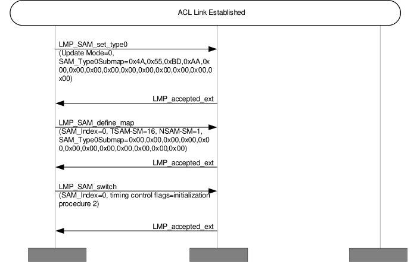

**Figure 4.409: LMP/SAM/BV-09-C [Respond to request for SAM Anchor Point using Initialization Procedure 2] MSC**

• Expected Outcome
Pass verdict
The IUT accepts the SAM Switch to initialization procedure 2.
The IUT generates an HCI_SAM_Status_Change event correctly.
LMP/SAM/BV-10-C [Initiate SAM Anchor Point using Initialization Procedure 2]
• Test Purpose
Verify that the IUT will correctly initiate SAM Anchor Point with SAM switch sequence to DSAM using initialization procedure 2.
• Reference
[10] 4.1.15
• Initial Condition
- Lower Tester: Configured as Central in state CONNECTION (active mode, ACL link)
- IUT: Configured as Peripheral in state CONNECTION (active mode, ACL link)
- SAM disabled on the Lower Tester and the IUT. SAM negotiations are triggered by the IUT with pre-defined parameters.
• Test Procedure
1. The IUT sends an LMP_SAM_set_type0 PDU to the Lower Tester to configure a type 0 submap. 2. The LMP_SAM_set_type0 and LMP_SAM_define_map PDUs may be triggered by the HCI
commands HCI_Set_External_Frame_Configuration and HCI_Set_MWS_PATTERN_Configuration respectively. The LMP_SAM_switch PDUs may be triggered by the facilities specified in Volume 7 of the Core Specification. Alternatively, some or all of these PDUs may be triggered by vendor-specific Features. 3. The IUT sends one LMP_SAM_define_map PDUs to define three SAM slot maps with
SAM_Index = 0. 4. The IUT enables one SAM slot maps by sending LMP_SAM_Switch PDUs with SAM_Index = 0. 5. The IUT sends an LMP_SAM_switch PDU to the IUT with SAM_Index = 0 at the precise time
such that the MLB of the Central’s current clock (CLK27) is 1; Timing_Control_Flags = initialization procedure 2. 6. The Lower Tester sends an LMP_accepted_ext PDU to accept initialization 2 procedure.

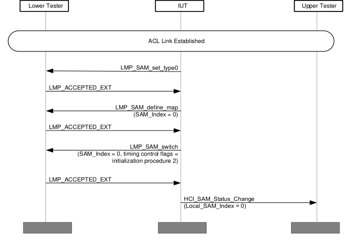

**Figure 4.410: LMP/SAM/BV-10-C [Initiate SAM Anchor Point using Initialization Procedure 2] MSC**

• Expected Outcome
Pass verdict
The Lower Tester accepts the SAM Switch to initialization procedure 2.
The IUT generates an HCI_SAM_Status_Change event correctly.

## 5 Test case mapping

The Test Case Mapping Table (TCMT) maps test cases to specific requirements in the ICS. The IUT is tested in all roles for which support is declared in the ICS document.
The columns for the TCMT are defined as follows:
Item: Contains a logical expression based on specific entries from the associated ICS document. Contains a logical expression (using the operators AND, OR, NOT as needed) based on specific entries from the applicable ICS document(s). The entries are in the form of y/x references, where y corresponds to the table number and x corresponds to the feature number as defined in the ICS document for Link Manager Protocol [3].
Feature: A brief, informal description of the feature being tested.
Test Case(s): The applicable test case identifiers are required for Bluetooth Qualification if the corresponding y/x references defined in the Item column are supported. Further details about the function of the TCMT are elaborated in [5].
For the purpose and structure of the ICS/IXIT, refer to [5].

|  | Item |  |  | Feature |  |  | Test Case(s) |  |
| --- | --- | --- | --- | --- | --- | --- | --- | --- |
|  | Deadlock Avoidance |  |  |  |  |  |  |  |
| LMP 1/1 |  |  | Accept Message |  |  | LMP/LIH/BV-80-C LMP/LIH/BV-81-C |  |  |
|  | Authentication |  |  |  |  |  |  |  |
| LMP 3/3 |  |  | Respond to authentication request |  |  | LMP/AUT/BV-01-C |  |  |
| LMP 4/3 AND CORE 1a/51 |  |  | Error Return When a Unit Key is Requested, v5.1 or higher |  |  | LMP/AUT/BI-01-C |  |  |
| LMP 3/2 AND CORE 1b/54 |  |  | Initiate Authentication Request, v5.4 or lower |  |  | LMP/AUT/BV-36-C |  |  |
| LMP 3/2 AND CORE 1a/60 |  |  | Initiate Authentication Request, v6.0 or higher |  |  | LMP/AUT/BV-40-C LMP/SP/BI-14-C |  |  |
| LMP 3/3 AND CORE 1a/60 |  |  | Respond to Authentication Request, v6.0 or higher |  |  | LMP/SP/BI-13-C |  |  |
|  | Pairing |  |  |  |  |  |  |  |
| LMP 4/1 OR LMP 4/2 |  |  | Initiate Pairing |  |  | LMP/AUT/BV-04-C LMP/AUT/BV-25-C LMP/AUT/BV-41-C |  |  |
| (LMP 4/1 OR LMP 4/2) AND CORE 1a/60 |  |  | Initiate Pairing, v6.0 or higher |  |  | LMP/AUT/BI-08-C |  |  |
| LMP 4/3 AND LMP 4/5 AND LMP 5/2 |  |  | Respond to Pairing Request (variable PIN code) |  |  | LMP/AUT/BV-03-C LMP/AUT/BV-24-C |  |  |
| LMP 4/3 AND LMP 4/4 AND LMP 5/2 |  |  | Respond to Pairing Request (Fixed PIN code) |  |  | LMP/AUT/BV-05-C LMP/AUT/BV-26-C LMP/AUT/BI-04-C |  |  |
| (LMP 4/1 OR LMP 4/2) AND LMP 4/5 AND |  |  | Accept Switch (initiator becomes responder) |  |  | LMP/AUT/BV-06-C LMP/AUT/BV-27-C |  |  |

|  | Item |  |  | Feature |  |  | Test Case(s) |  |
| --- | --- | --- | --- | --- | --- | --- | --- | --- |
| LMP 4/6 AND LMP 5/2 |  |  |  |  |  |  |  |  |
| LMP 4/3 AND LMP 2/19b AND LMP 24/2 |  |  | Reject a pairing procedure (Host controlled) |  |  | LMP/AUT/BV-34-C |  |  |
|  | Link Keys |  |  |  |  |  |  |  |
| LMP 5/3 AND LMP 5/2 |  |  | Initiate Change of Link Key |  |  | LMP/AUT/BV-13-C LMP/AUT/BV-29-C |  |  |
| LMP 5/4 AND LMP 5/2 |  |  | Accept Change of Link Key |  |  | LMP/AUT/BV-12-C LMP/AUT/BV-28-C |  |  |
|  | Encryption |  |  |  |  |  |  |  |
| LMP 6/1 AND LMP 6/6 |  |  | Initiate Encryption |  |  | LMP/ENC/BV-05-C LMP/ENC/BV-06-C LMP/ENC/BV-09-C LMP/ENC/BI-02-C |  |  |
| NOT HCI 16/68 AND LMP 6/1 AND LMP 6/6 AND LMP 5/8 |  |  | Initiate Encryption |  |  | LMP/ENC/BV-61-C LMP/ENC/BV-63-C |  |  |
| HCI 16/68 AND LMP 6/1 AND LMP 6/6 AND LMP 5/8 |  |  | Initiate Encryption, Set Min Encryption Key Size _ |  |  | LMP/ENC/BV-53-C LMP/ENC/BV-55-C |  |  |
| LMP 6/2 |  |  | Accept Encryption Requests |  |  | LMP/ENC/BV-01-C LMP/ENC/BI-01-C LMP/ENC/BI-03-C LMP/ENC/BI-04-C LMP/ENC/BI-07-C |  |  |
| LMP 6/10 |  |  | Encryption Pause, Unencrypted |  |  | LMP/ENC/BI-05-C LMP/ENC/BI-08-C |  |  |
| LMP 6/11 |  |  | Encryption Pause, Unencrypted, AES |  |  | LMP/ENC/BI-06-C LMP/ENC/BI-09-C |  |  |
| NOT HCI 16/68 AND LMP 6/2 |  |  | Accept Encryption Requests |  |  | LMP/ENC/BV-59-C |  |  |
| HCI 16/68 AND LMP 6/2 |  |  | Accept Encryption Requests, Set Min Encryption Key Size _ |  |  | LMP/ENC/BV-51-C |  |  |
| NOT HCI 16/68 AND LMP 6/2 AND LMP 6/11 AND LMP 5/8 |  |  | Accept AES-CCM Encryption Request |  |  | LMP/ENC/BV-60-C |  |  |
| HCI 16/68 AND LMP 6/2 AND LMP 6/11 AND LMP 5/8 |  |  | Accept AES-CCM Encryption Request, Set Min Encryption Key Size _ |  |  | LMP/ENC/BV-52-C |  |  |

|  | Item |  |  | Feature |  |  | Test Case(s) |  |
| --- | --- | --- | --- | --- | --- | --- | --- | --- |
| NOT HCI 16/68 AND LMP 6/1 AND LMP 6/6 AND LMP 6/11 AND LMP 5/8 |  |  | Initiate AES-CCM Encryption as Central |  |  | LMP/ENC/BV-64-C |  |  |
| HCI 16/68 AND LMP 6/1 AND LMP 6/6 AND LMP 6/11 AND LMP 5/8 |  |  | Initiate AES-CCM Encryption as Central, Set Min Encryption Key Size _ |  |  | LMP/ENC/BV-54-C |  |  |
| NOT HCI 16/68 AND LMP 6/1 AND LMP 6/11 AND LMP 5/8 |  |  | Initiate AES-CCM Encryption as Peripheral |  |  | LMP/ENC/BV-62-C |  |  |
| HCI 16/68 AND LMP 6/1 AND LMP 6/11 AND LMP 5/8 |  |  | Initiate AES-CCM Encryption as Peripheral, Set Min Encryption Key Size _ |  |  | LMP/ENC/BV-56-C |  |  |
| LMP 6/8 |  |  | Stop Encryption |  |  | LMP/ENC/BV-07-C |  |  |
| LMP 6/9 |  |  | Accept Stop of Encryption |  |  | LMP/ENC/BV-04-C LMP/ENC/BV-08-C |  |  |
| LMP 2/14 AND LMP 6/6 |  |  | Initiate Broadcast Encryption |  |  | LMP/ENC/BV-10-C LMP/ENC/BV-13-C |  |  |
| LMP 2/14 |  |  | Accept Broadcast Encryption |  |  | LMP/ENC/BV-02-C LMP/ENC/BV-11-C LMP/ENC/BV-57-C LMP/ENC/BV-58-C |  |  |
| LMP 1/2 AND NOT LMP 2/14 |  |  | Accept Broadcast Encryption |  |  | LMP/ENC/BV-12-C |  |  |
| LMP 6/10 |  |  | Encryption Pause/Resume |  |  | LMP/ENC/BV-14-C LMP/ENC/BV-15-C LMP/ENC/BV-16-C LMP/ENC/BV-17-C LMP/ENC/BV-18-C LMP/ENC/BV-19-C LMP/ENC/BV-20-C LMP/ENC/BV-21-C LMP/ENC/BV-23-C LMP/ENC/BV-24-C |  |  |
| LMP 6/1 |  |  | Initiate Encryption as Peripheral |  |  | LMP/ENC/BV-22-C |  |  |
|  | Clock Offset Information _ |  |  |  |  |  |  |  |
| LMP 7/1 |  |  | Request Clock Offset Information _ |  |  | LMP/INF/BV-02-C |  |  |
| LMP 7/2 |  |  | Respond to Clock Offset Requests _ |  |  | LMP/INF/BV-01-C |  |  |
|  | Timing Accuracy Information |  |  |  |  |  |  |  |
| LMP 9/2 |  |  | Respond to Timing Accuracy Information Requests |  |  | LMP/INF/BV-05-C |  |  |

|  | Item |  |  | Feature |  |  | Test Case(s) |  |
| --- | --- | --- | --- | --- | --- | --- | --- | --- |
|  | LM Version Information |  |  |  |  |  |  |  |
| LMP 10/1 |  |  | Request LM version information |  |  | LMP/INF/BV-09-C |  |  |
| LMP 10/2 |  |  | Version Information Requests |  |  | LMP/INF/BV-08-C LMP/LIH/BI-07-C LMP/LIH/BI-08-C |  |  |
|  | Feature Support |  |  |  |  |  |  |  |
| LMP 11/1 |  |  | Request Supported Features |  |  | LMP/INF/BV-11-C |  |  |
| LMP 11/2 |  |  | Respond to Supported Features Requests |  |  | LMP/INF/BV-10-C LMP/LIH/BV-150-C |  |  |
| LMP 11/3 |  |  | Request Extended Features _ |  |  | LMP/INF/BV-16-C |  |  |
| LMP 11/4 |  |  | Respond to Extended Features Requests _ |  |  | LMP/INF/BV-17-C |  |  |
| LMP 2/22 AND LMP 2/23 |  |  | Request Extended Features _ |  |  | LMP/INF/BV-22-C |  |  |
|  | Name Information |  |  |  |  |  |  |  |
| LMP 12/1 |  |  | Request Name Information |  |  | LMP/INF/BV-13-C LMP/INF/BV-18-C LMP/INF/BV-19-C |  |  |
| LMP 12/2 |  |  | Respond to Name Requests |  |  | LMP/INF/BV-12-C |  |  |
|  | Role Switch |  |  |  |  |  |  |  |
| LMP 8/1 AND LMP 13/1 |  |  | Request Role Switch |  |  | LMP/LIH/BV-01-C LMP/LIH/BV-79-C LMP/LIH/BV-142-C LMP/LIH/BV-143-C LMP/LIH/BV-146-C LMP/LIH/BV-149-C |  |  |
| LMP 13/2 |  |  | Accept Role Switch Requests |  |  | LMP/LIH/BV-02-C LMP/LIH/BV-78-C LMP/LIH/BV-144-C LMP/LIH/BV-148-C LMP/LIH/BV-151-C |  |  |
| LMP 1/2 AND NOT LMP 13/2 |  |  | Unsupported Role Switch Requests |  |  | LMP/LIH/BV-03-C |  |  |
| LMP 13/2 AND LMP 2/4 AND LMP 2/6 AND LMP 11/4 |  |  | Accept Role Switch Requests, Slot Offset and Extended Features supported |  |  | LMP/LIH/BI-04-C |  |  |
|  | Detach |  |  |  |  |  |  |  |
| LMP 14/1 |  |  | Detach Connection |  |  | LMP/LIH/BV-04-C LMP/LIH/BV-05-C LMP/LIH/BV-82-C |  |  |
|  | Invalid Packet Handling |  |  |  |  |  |  |  |
| LMP 1/2 |  |  | Incorrect Packets |  |  | LMP/LIH/BI-06-C LMP/LIH/BI-10-C |  |  |
| LMP 28/1 |  |  | Invalid LMP packet type, APB |  |  | LMP/LIH/BI-09-C |  |  |

|  | Item |  |  | Feature |  |  | Test Case(s) |  |
| --- | --- | --- | --- | --- | --- | --- | --- | --- |
|  | Hold Mode |  |  |  |  |  |  |  |
| LMP 15/1 OR LMP 15/2 OR LMP 15/3 |  |  | Force or Request Hold Mode, Peripheral |  |  | LMP/LIH/BV-09-C |  |  |
| LMP 15/1 OR LMP 15/2 |  |  | Force or Request Hold Mode, Central |  |  | LMP/LIH/BV-10-C |  |  |
| LMP 15/1 OR LMP 15/3 OR LMP 15/4 |  |  | Accept Hold Mode Request, Central |  |  | LMP/LIH/BV-11-C |  |  |
| LMP 15/3 OR LMP 15/4 |  |  | Verify Hold Mode |  |  | LMP/LIH/BV-06-C |  |  |
| LMP 1/2 AND NOT LMP 2/7 |  |  | Respond to Unsupported Hold Mode Requests |  |  | LMP/LIH/BV-12-C |  |  |
|  | Sniff Mode |  |  |  |  |  |  |  |
| LMP 16/2 |  |  | Request Sniff Mode |  |  | LMP/LIH/BV-15-C LMP/LIH/BV-17-C |  |  |
| LMP 16/2 |  |  | Request Sniff Mode and Name |  |  | LMP/LIH/BV-18-C |  |  |
| LMP 16/3 |  |  | Respond to Sniff Mode Requests |  |  | LMP/LIH/BV-14-C |  |  |
| LMP 1/2 AND NOT LMP 16/3 |  |  | Respond to Unsupported Sniff Mode Requests |  |  | LMP/LIH/BV-20-C |  |  |
| LMP 16/5 |  |  | Request Un-sniff |  |  | LMP/LIH/BV-19-C |  |  |
| LMP 16/6 |  |  | Accept Un-sniff Requests |  |  | LMP/LIH/BV-16-C |  |  |
|  | Power Control |  |  |  |  |  |  |  |
| LMP 18/1 |  |  | Request to Increase Power |  |  | LMP/LIH/BV-77-C |  |  |
| LMP 18/2 |  |  | Request to Decrease Power |  |  | LMP/LIH/BV-76-C |  |  |
| LMP 18/3 |  |  | Respond when Max. Power Reached |  |  | LMP/LIH/BV-36-C |  |  |
| LMP 18/4 |  |  | Respond when Min. Power Reached |  |  | LMP/LIH/BV-35-C |  |  |
| LMP 1/1 AND NOT LMP 2/13a |  |  | Power Control Request not supported |  |  | LMP/LIH/BV-152-C |  |  |
|  | Link Supervision Timeout |  |  |  |  |  |  |  |
| LMP 19/1 |  |  | Set Link Supervision Timeout Value _ |  |  | LMP/LIH/BV-74-C |  |  |
| LMP 19/2 |  |  | Accept Link Supervision Timeout Setting with Event _ Reporting |  |  | LMP/LIH/BV-126-C |  |  |
|  | Secure Simple Pairing |  |  |  |  |  |  |  |
| LMP 2/19b AND (NOT LMP 4/7) |  |  | Secure Simple Pairing with Keyboard I/O Capabilities |  |  | LMP/SP/BV-12-C LMP/SP/BV-13-C LMP/SP/BV-16-C LMP/SP/BV-17-C |  |  |
| LMP 2/19b |  |  | Secure Simple Pairing |  |  | LMP/SP/BV-01-C LMP/SP/BV-02-C LMP/SP/BV-03-C LMP/SP/BV-04-C LMP/SP/BV-05-C LMP/SP/BV-06-C |  |  |

|  | Item |  |  | Feature |  |  | Test Case(s) |  |
| --- | --- | --- | --- | --- | --- | --- | --- | --- |
|  |  |  |  |  |  | LMP/SP/BV-07-C LMP/SP/BV-08-C LMP/SP/BV-09-C LMP/SP/BV-10-C LMP/SP/BV-11-C LMP/SP/BV-14-C LMP/SP/BV-15-C LMP/SP/BV-18-C LMP/SP/BV-19-C LMP/SP/BV-20-C LMP/SP/BV-21-C LMP/SP/BV-22-C LMP/SP/BV-23-C LMP/SP/BV-24-C LMP/SP/BV-25-C LMP/SP/BV-26-C LMP/SP/BV-27-C LMP/SP/BV-28-C LMP/SP/BV-29-C LMP/SP/BV-30-C LMP/SP/BV-31-C LMP/SP/BV-32-C LMP/SP/BV-66-C |  |  |
| LMP 2/19b AND LMP 4/7 |  |  | Secure Simple Pairing with keyboard I/O capabilities |  |  | LMP/SP/BV-33-C LMP/SP/BV-34-C LMP/SP/BV-35-C LMP/SP/BV-36-C |  |  |
| LMP 2/19a AND LMP 2/19b AND (NOT LMP 4/7) |  |  | Pairing Key Validation with Keyboard I/O Capabilities |  |  | LMP/SP/BI-03-C LMP/SP/BI-04-C |  |  |
| LMP 2/19a AND LMP 2/19b |  |  | Pairing Key Validation |  |  | LMP/SP/BI-01-C LMP/SP/BI-02-C LMP/SP/BI-05-C LMP/SP/BI-06-C |  |  |
| LMP 2/19a AND LMP 2/19b AND LMP 2/26 |  |  | Pairing Key Validation – P256 |  |  | LMP/SP/BI-07-C LMP/SP/BI-08-C LMP/SP/BI-09-C LMP/SP/BI-10-C LMP/SP/BI-11-C LMP/SP/BI-12-C |  |  |

|  | Item |  |  | Feature |  |  | Test Case(s) |  |
| --- | --- | --- | --- | --- | --- | --- | --- | --- |
|  | Sniff Subrating |  |  |  |  |  |  |  |
| LMP 16/7 |  |  | Sniff Subrating |  |  | LMP/LIH/BV-117-C LMP/LIH/BV-118-C LMP/LIH/BV-119-C LMP/LIH/BV-120-C LMP/LIH/BV-121-C LMP/LIH/BV-122-C LMP/LIH/BV-123-C LMP/LIH/BV-124-C LMP/LIH/BV-125-C |  |  |
|  | Quality of Service |  |  |  |  |  |  |  |
| LMP 20/2 |  |  | Force Change of Quality of Service |  |  | LMP/LIH/BV-39-C LMP/LIH/BV-42-C |  |  |
| LMP 20/3 |  |  | Request Change of Quality of Service |  |  | LMP/LIH/BV-40-C LMP/LIH/BV-41-C |  |  |
|  | SCO Links |  |  |  |  |  |  |  |
| LMP 2/12 |  |  | SCO Links |  |  | LMP/LIH/BV-43-C LMP/LIH/BV-46-C LMP/LIH/BV-51-C LMP/LIH/BV-52-C LMP/LIH/BV-53-C LMP/LIH/BV-54-C LMP/LIH/BV-58-C LMP/LIH/BV-59-C |  |  |
| LMP 2/12 AND BB 6/2 |  |  | SCO Links, HV2 packets |  |  | LMP/LIH/BV-44-C LMP/LIH/BV-47-C LMP/LIH/BV-49-C LMP/LIH/BV-50-C LMP/LIH/BV-57-C |  |  |
| LMP 2/12 AND BB 6/3 |  |  | SCO Links, HV3 packets |  |  | LMP/LIH/BV-45-C LMP/LIH/BV-48-C LMP/LIH/BV-55-C LMP/LIH/BV-56-C |  |  |
| LMP 1/2 AND NOT LMP 2/12 |  |  | Reject SCO Links |  |  | LMP/LIH/BV-60-C |  |  |
|  | eSCO Links |  |  |  |  |  |  |  |
| LMP 2/15 |  |  | ESCO Support |  |  | LMP/LIH/BV-100-C LMP/LIH/BV-108-C LMP/LIH/BV-111-C LMP/LIH/BV-115-C LMP/LIH/BV-103-C LMP/LIH/BV-109-C LMP/LIH/BV-110-C LMP/LIH/BV-114-C |  |  |
| LMP 1/2 AND NOT LMP 2/15 |  |  | No ESCO Support |  |  | LMP/LIH/BV-116-C |  |  |

|  | Item |  |  | Feature |  |  | Test Case(s) |  |
| --- | --- | --- | --- | --- | --- | --- | --- | --- |
| LMP 2/15 AND BB 6/6 |  |  | EV4 Packet |  |  | LMP/LIH/BV-101-C LMP/LIH/BV-104-C LMP/LIH/BV-106-C LMP/LIH/BV-107-C |  |  |
| LMP 2/15 AND BB 6/7 |  |  | EV5 Packet |  |  | LMP/LIH/BV-102-C LMP/LIH/BV-105-C |  |  |
| LMP 2/15 AND (BB 6/6 OR BB 6/7) |  |  | Modify ESCO |  |  | LMP/LIH/BV-112-C LMP/LIH/BV-113-C |  |  |
|  | Multi-Slot Packages |  |  |  |  |  |  |  |
| LMP 22/1 OR LMP 22/2 |  |  | Allow/Request Maximum Number of Slots to be used |  |  | LMP/LIH/BV-61-C LMP/LIH/BV-64-C |  |  |
| LMP 22/3 |  |  | Accept Request of Maximum Number of slots to be used |  |  | LMP/LIH/BV-63-C |  |  |
|  | Paging Scheme _ |  |  |  |  |  |  |  |
| LMP 1/2 AND NOT LMP 23/2 |  |  | Reject Suggested Page mode |  |  | LMP/LIH/BV-71-C |  |  |
| LMP 1/2 AND NOT LMP 23/4 |  |  | Reject Suggested Page Scan mode |  |  | LMP/LIH/BV-72-C |  |  |
|  | Test Mode |  |  |  |  |  |  |  |
| LMP 25/2 AND LMP 25/4 |  |  | Ability to reject Test Mode when Test mode is disabled |  |  | LMP/TEM/BV-01-C |  |  |
|  | AFH |  |  |  |  |  |  |  |
| LMP 26/2 |  |  | Adaptive Frequency Hopping |  |  | LMP/AFH/BV-01-C LMP/AFH/BV-02-C LMP/AFH/BV-03-C |  |  |
| LMP 2/6 AND LMP 26/1 AND LMP 26/4 |  |  | AFH and Role Switch, Peripheral |  |  | LMP/AFH/BV-06-C |  |  |
| LMP 2/6 AND LMP 26/1 AND LMP 26/4a |  |  | AFH and Role Switch, Central |  |  | LMP/AFH/BV-05-C |  |  |
| LMP 2/6 AND LMP 26/1 |  |  | AFH and Role Switch |  |  | LMP/AFH/BV-09-C |  |  |
| LMP 2/7 AND LMP 26/4 |  |  | AFH and Hold Mode |  |  | LMP/AFH/BV-08-C |  |  |
| LMP 26/4 |  |  | Channel Classification |  |  | LMP/AFH/BV-04-C |  |  |
|  | EDR |  |  |  |  |  |  |  |
| LMP 1/2 AND NOT LMP 2/17 |  |  | Device does not support Enhanced Data Rate _ |  |  | LMP/LIH/BV-83-C |  |  |
| LMP 14a/1 |  |  | Enter Enhanced Data Rate _ |  |  | LMP/LIH/BV-84-C |  |  |
| LMP 14a/2 |  |  | Exit Enhanced Data Rate _ |  |  | LMP/LIH/BV-85-C |  |  |
| LMP 14b/1 |  |  | Enter and Exit eSCO Enhanced Data Rate Connection _ |  |  | LMP/LIH/BV-86-C LMP/LIH/BV-87-C |  |  |

|  | Item |  |  | Feature |  |  | Test Case(s) |  |
| --- | --- | --- | --- | --- | --- | --- | --- | --- |
|  | EPC |  |  |  |  |  |  |  |
| LMP 18/8 |  |  | Respond to EPC Increase Requests |  |  | LMP/LIH/BV-127-C |  |  |
| LMP 18/9 |  |  | Respond to EPC Decrease Requests |  |  | LMP/LIH/BV-128-C |  |  |
| LMP 18/10 |  |  | Respond to EPC go to Max Requests |  |  | LMP/LIH/BV-129-C |  |  |
| LMP 18/5 |  |  | Request EPC Increase |  |  | LMP/LIH/BV-130-C |  |  |
| LMP 18/6 |  |  | Request EPC Decrease |  |  | LMP/LIH/BV-131-C |  |  |
| LMP 2/20 AND ((NOT BB 1a/2) OR (NOT BB 1a/3)) |  |  | Report Unsupported Modulations Correctly |  |  | LMP/LIH/BV-133-C |  |  |
|  | BR/EDR Secure Connections |  |  |  |  |  |  |  |
| LMP 2/26 |  |  | Secure Authentication |  |  | LMP/AUT/BV-14-C LMP/AUT/BV-15-C LMP/AUT/BV-16-C LMP/AUT/BV-17-C LMP/AUT/BV-18-C LMP/AUT/BV-19-C LMP/AUT/BV-20-C LMP/AUT/BV-21-C LMP/AUT/BV-22-C LMP/AUT/BV-23-C LMP/AUT/BI-02-C LMP/AUT/BI-03-C LMP/AUT/BV-30-C LMP/AUT/BV-31-C LMP/AUT/BV-32-C LMP/AUT/BV-33-C LMP/AUT/BV-35-C |  |  |
| LMP 6/2 AND LMP 6/11 |  |  | Accept AES-CCM Encryption Request |  |  | LMP/ENC/BV-26-C LMP/ENC/BV-33-C |  |  |
| LMP 6/9 AND LMP 6/11 |  |  | Stop AES-CCM Encryption from Central |  |  | LMP/ENC/BV-27-C |  |  |
| LMP 6/1 AND LMP 6/11 |  |  | Stop AES-CCM Encryption from host |  |  | LMP/ENC/BV-28-C |  |  |
| LMP 6/11 AND LMP 27/1 |  |  | Initiate LMP Ping (IUT Peripheral) |  |  | LMP/ENC/BV-29-C LMP/ENC/BV-31-C LMP/ENC/BV-32-C |  |  |
| LMP 6/11 AND LMP 2/12 |  |  | SCO Connection creation fails when AES-CCM encryption is enabled (IUT Peripheral) |  |  | LMP/LIH/BV-134-C LMP/LIH/BV-138-C LMP/LIH/BI-01-C LMP/LIH/BI-02-C LMP/LIH/BI-03-C |  |  |
| LMP 6/11 AND HCI 9/10 |  |  | SCO Connection creation fails when AES-CCM encryption is enabled – enhanced setup synchronous command |  |  | LMP/LIH/BV-136-C LMP/LIH/BV-140-C |  |  |

|  | Item |  |  | Feature |  |  | Test Case(s) |  |
| --- | --- | --- | --- | --- | --- | --- | --- | --- |
| LMP 6/1 AND LMP 6/6 AND LMP 6/11 |  |  | Initiate AES-CCM Encryption as Central |  |  | LMP/ENC/BV-34-C LMP/ENC/BV-50-C |  |  |
| LMP 6/1 AND LMP 6/11 |  |  | Initiate AES-CCM Encryption as Peripheral |  |  | LMP/ENC/BV-25-C |  |  |
| LMP 6/8 AND LMP 6/11 |  |  | Initiate AES-CCM Encryption Stop |  |  | LMP/ENC/BV-35-C |  |  |
| LMP 6/9 AND LMP 6/11 |  |  | Stop AES-CCM Encryption, Peripheral request |  |  | LMP/ENC/BV-36-C |  |  |
| LMP 6/10 AND LMP 6/11 |  |  | Encryption Pause/Resume |  |  | LMP/ENC/BV-37-C LMP/ENC/BV-38-C LMP/ENC/BV-39-C LMP/ENC/BV-40-C |  |  |
| LMP 2/14 AND LMP 6/6 AND LMP 6/11 |  |  | Broadcast Encryption |  |  | LMP/ENC/BV-45-C |  |  |
| LMP 6/11 AND LMP 27/1 |  |  | Initiate LMP Ping (IUT Central) |  |  | LMP/ENC/BV-46-C LMP/ENC/BV-48-C LMP/ENC/BV-49-C |  |  |
| LMP 6/11 AND LMP 27/1 |  |  | Respond to LMP ping req _ _ |  |  | LMP/ENC/BV-30-C LMP/ENC/BV-47-C |  |  |
| LMP 2/19b AND LMP 2/26 |  |  | Secure Simple Pairing – P256 |  |  | LMP/SP/BV-41-C LMP/SP/BV-42-C LMP/SP/BV-43-C LMP/SP/BV-44-C LMP/SP/BV-45-C LMP/SP/BV-46-C LMP/SP/BV-48-C LMP/SP/BV-49-C LMP/SP/BV-50-C LMP/SP/BV-51-C LMP/SP/BV-52-C LMP/SP/BV-53-C LMP/SP/BV-54-C LMP/SP/BV-55-C LMP/SP/BV-56-C LMP/SP/BV-57-C LMP/SP/BV-58-C LMP/SP/BV-59-C LMP/SP/BV-60-C LMP/SP/BV-61-C LMP/SP/BV-62-C LMP/SP/BV-63-C LMP/SP/BV-64-C LMP/SP/BV-65-C LMP/SP/BV-37-C LMP/SP/BV-38-C LMP/SP/BV-39-C |  |  |

|  | Item |  |  | Feature |  |  | Test Case(s) |  |
| --- | --- | --- | --- | --- | --- | --- | --- | --- |
|  |  |  |  |  |  | LMP/SP/BV-40-C LMP/SP/BV-47-C |  |  |
| LMP 2/6 AND LMP 2/26 AND LMP 6/10 AND LMP 6/11 |  |  | Secure Connections and role switch |  |  | LMP/ENC/BV-41-C LMP/ENC/BV-42-C LMP/ENC/BV-43-C LMP/ENC/BV-44-C |  |  |
| LMP 2/19b AND LMP 2/26 AND LMP 3/2 |  |  | Secure Authentication |  |  | LMP/AUT/BV-37-C |  |  |
| LMP 3/2 |  |  | Initiate authentication after connection completed |  |  | LMP/AUT/BV-38-C LMP/AUT/BV-39-C |  |  |
| LMP 2/26 AND LMP 3/3 |  |  | Secure Authentication and role switch |  |  | LMP/AUT/BI-06-C LMP/AUT/BI-07-C |  |  |
|  | Piconet Clock Adjust |  |  |  |  |  |  |  |
| LMP 2/28 |  |  |  |  |  | LMP/XCL/BV-01-C LMP/XCL/BV-02-C LMP/XCL/BV-03-C LMP/XCL/BV-04-C |  |  |
|  | Slot Availability Mask |  |  |  |  |  |  |  |
| LMP 29/1 |  |  | Initiate SAM negotiations |  |  | LMP/SAM/BV-02-C LMP/SAM/BV-10-C |  |  |
| LMP 29/2 |  |  | Respond to SAM negotiations |  |  | LMP/SAM/BV-01-C LMP/SAM/BI-03-C LMP/SAM/BI-04-C LMP/SAM/BI-05-C LMP/SAM/BV-09-C |  |  |
| LMP 2/6 AND LMP 2/29 |  |  | SAM and role switch |  |  | LMP/SAM/BV-06-C LMP/SAM/BV-07-C |  |  |
| LMP 2/8 AND LMP 2/29 |  |  | SAM and sniff mode |  |  | LMP/SAM/BV-08-C |  |  |
|  | Connection Establishment |  |  |  |  |  |  |  |
| LMP 24/3 |  |  | Connection Establishment |  |  | LMP/LIH/BV-145-C LMP/LIH/BV-147-C |  |  |

Table 5.1: Test case mapping

## 6 Revision history and acknowledgments

Revision History

|  | Publication |  |  | Revision |  | Date |  |  | Comments |  |  |
| --- | --- | --- | --- | --- | --- | --- | --- | --- | --- | --- | --- |
|  | Number |  |  | Number |  |  |  |  |  |  |  |
| 10 | 10 |  | 2.0.E.0 | 2.0.E.0 |  | 2004-10-20 |  |  |  | Initial document from version 1.2 |  |
|  |  |  |  |  |  |  |  |  |  | Changes for V2.0 + EDR |  |
|  |  |  |  |  |  |  |  |  |  | TSE 641 for TP/ENC/BV-03-CTP/ENC/BV-12-C, |  |
|  |  |  |  |  |  |  |  |  |  | TP/LIH/BV-03-C, TP/LIH/BV-12-C,TP/LIH/BV-20-C, |  |
|  |  |  |  |  |  |  |  |  |  | TP/LIH/BV-34-C, TP/LIH/BV-60-C.TP/LIH/BV116-C, |  |
|  |  |  |  |  |  |  |  |  |  | TP/LIH/BV-71-C, and TP/LIH/BV-72-C |  |
|  |  |  |  |  |  |  |  |  |  | TSE 655 for TP/LIH/BV-111-C |  |
|  |  |  |  |  |  |  |  |  |  | TSE 656 for TP/AUT/BV-01-C |  |
|  |  |  |  |  |  |  |  |  |  | TSE 665 for TP/LIH/BV-101-C and TP/LIH/BV-102-C |  |
|  |  |  |  |  |  |  |  |  |  | TSE 598 for TP/ENC/BV-10-C |  |
|  |  |  |  |  |  |  |  |  |  | TSE 599 for TP/LIH/BV-104-C and TP/LIH/BV-104-C |  |
|  |  |  |  |  |  |  |  |  |  | TSE 600 for TP/AFH/BV-05-C |  |
|  |  |  |  |  |  |  |  |  |  | TSE 653 for TP/LIH/BV-103-C, TP/LIH/BV-106- |  |
|  |  |  |  |  |  |  |  |  |  | CTP/LIH/BV-107-C, TP/LIH/BV-110-C, TP/LIH/BV- |  |
|  |  |  |  |  |  |  |  |  |  | 112-C, and TP/LIH/BV-113-C. |  |
|  |  |  |  |  |  |  |  |  |  | TSE 679 for TP/LIH/BV-100-C, TP/LIH/BV-104-C, and |  |
|  |  |  |  |  |  |  |  |  |  | TP/LIH/BV-105-C. |  |
|  |  |  |  | 2.0.E.1 Draft |  |  | 2004-11-04 |  |  | Editorial change to TCMT 14a to 15 and 14b to 16. |  |
| 11 | 11 |  | 2.0.E.1 | 2.0.E.1 |  | 2004-11-04 | 2004-11-04 |  |  | First version for 1.2/2.0/2.0 + EDR available for |  |
|  |  |  |  |  |  |  |  |  |  | qualification. |  |
|  |  |  |  | 2.0.E.2r1 |  |  | 2005-03-24 |  |  | TSE 695 for TCMT |  |
|  | 12 |  |  | 2.0.E.2 |  |  | 2005-03-24 |  |  | Prepare for publication. |  |
|  |  |  | 2.0.E.3r1 | 2.0.E.3r1 |  | 2005-03-29 | 2005-03-29 |  |  | Remove TSE 653 for TP/LIH/BV-103-C, TP/LIH/BV- |  |
|  |  |  |  |  |  |  |  |  |  | 106-CTP/LIH/BV-107-C, TP/LIH/BV-110-C, |  |
|  |  |  |  |  |  |  |  |  |  | TP/LIH/BV-112-C, and TP/LIH/BV-113-C. |  |
|  | 13 |  |  | 2.0.E.3 |  |  | 2005-03-29 |  |  | Prepare for publication. |  |
|  |  |  |  | 2.0.E.4r1 |  |  | 2005-03-31 |  |  | TSE 757 for TP/LIH/BV-83-C. |  |
|  | 14 |  |  | 2.0.E.4 |  |  | 2005-03-31 |  |  | Prepare for publication. |  |
|  |  |  | 2.0.E.5r0 | 2.0.E.5r0 |  | 2005-08-08 | 2005-08-08 |  |  | TSE 733 for TP/LIH/BV-61-C and TP/LIH/BV-64-C750 |  |
|  |  |  |  |  |  |  |  |  |  | for TP/AFH/BV-09-C |  |
|  |  |  |  |  |  |  |  |  |  | TSE 753 for TP/AFH/BV-04-C801 for TOC814 for |  |
|  |  |  |  |  |  |  |  |  |  | TP/ENC/BV-12-C |  |
| 15 |  |  | 2.0.E.5r1 |  |  | 2005-10-18 |  |  |  | Add TSE 699 for TP/LIH/BV-84-C and TP/LIH/BV-84- |  |
|  |  |  |  |  |  |  |  |  |  | C. Fix header and front page for specification versions |  |
|  |  |  | 2.0.E.6r0 |  |  | 2006-05-10 |  |  |  | TSE 844: TP/LIH/BV-42-C: Add comment to MSCTSE |  |
|  |  |  |  |  |  |  |  |  |  | 918: TP/LIH/BV-42-C: Changed comment beneath |  |
|  |  |  |  |  |  |  |  |  |  | MSC from “POLL” to “allowed” |  |
|  |  |  |  |  |  |  |  |  |  | TSE 935: TP/LIH/BV-86: Fix 2-EV3 packet sentence |  |
|  |  |  |  |  |  |  |  |  |  | in test procedure. |  |
|  |  |  |  |  |  |  |  |  |  | TSE 943: change TP/LIH/BV-84-C and TP/LIH/BV-85- |  |
|  |  |  |  |  |  |  |  |  |  | C: ‘Notes’ TSE 1819: correct references to |  |
|  |  |  |  |  |  |  |  |  |  | TP/ENC/BV figures |  |
|  | 16 |  |  | 2.0.E.6 |  |  | 2006-06-05 |  |  | Prepare for publication. |  |

|  | Publication |  |  | Revision |  | Date | Comments |  |  |
| --- | --- | --- | --- | --- | --- | --- | --- | --- | --- |
|  | Number |  |  | Number |  |  |  |  |  |
|  |  |  | 2.1.E.1r0 to 2.1.E.1r10 | 2.1.E.1r0 to |  | 2006-09-27 |  | Add Section 4.1.x “Conformance” |  |
|  |  |  |  | 2.1.E.1r10 |  |  |  | TSE 1741: TP/LIH/BV-83-C: Add 0x20 as an error |  |
|  |  |  |  |  |  |  |  | code. |  |
|  |  |  |  |  |  |  |  | TSE 1798: TP/LIH/BV-61 and TP/LIH/BV-64: Add |  |
|  |  |  |  |  |  |  |  | DM1 as an allowed packet parameter MSCs. |  |
|  |  |  |  |  |  |  |  | TSE 1785: See TSE 935; TSE 1800: TP/LIH/BV-47-C, |  |
|  |  |  |  |  |  |  |  | TP/LIH/BV-48-C: use of HV packets; TSE 1801: |  |
|  |  |  |  |  |  |  |  | TP/LIH/BV-106-C: use of HV packets; TSE 1808: |  |
|  |  |  |  |  |  |  |  | TP/LIH/BV-85-C; change MSC, change Notes |  |
|  |  |  |  |  |  |  |  | TSE 1888:Remove “Applicable if” clauses from |  |
|  |  |  |  |  |  |  |  | TP/AUT/BV-05-C, TP/AUT/BV-12-C, TP/AUT/BV- |  |
|  |  |  |  |  |  |  |  | 0513-C,TP/ENC/BV-01-C,TP/ENC/BV-04-C, |  |
|  |  |  |  |  |  |  |  | TP/ENC/BV-05-C, TP/ENC/BV-06-C, TP/ENC/BV-07- |  |
|  |  |  |  |  |  |  |  | C, TP/ENC/BV-08-C, TP/ENC/BV-09-C, TP/ENC/BV- |  |
|  |  |  |  |  |  |  |  | 10-C, TP/ENC/BV-11-C, TP/ENC/BV-12-C, |  |
|  |  |  |  |  |  |  |  | TP/ENC/BV-13-C, TP/INF/BV-05-C, TP/INF/BV-4-C, |  |
|  |  |  |  |  |  |  |  | TP/LIH/BV- |  |
|  |  |  |  |  |  |  |  | 01\|02\|03\|06\|09\|10\|11\|12\|14\|15\|16\|17\|18\|19\|20\|22\|23\|2 |  |
|  |  |  |  |  |  |  |  | 4\|25\|26\|27\|29\|32\|34\|35\|36\|37\|43\|44\|45\|46\|47\|48\|49\|50 |  |
|  |  |  |  |  |  |  |  | \|51\|52\|53\|54\|55\|56\|57\|58\|59\|60\|61\|63\|64\|71\|72\|75\|76\| |  |
|  |  |  |  |  |  |  |  | 77\|78\|79\|87110\|101\|102\|103\|104\|105\|106\|107\|108\|10 |  |
|  |  |  |  |  |  |  |  | 9\|110\|111\|112\|113\|1114\|115\|116\|-C,TP/AFH/BV- |  |
|  |  |  |  |  |  |  |  | 04\|05\|06\|07\|08\|09-C. |  |
|  |  |  |  |  |  |  |  | Add TP/LIH/BV-117-C through TP/LIH/BV-125-C for |  |
|  |  |  |  |  |  |  |  | Sniff Subrating. |  |
|  |  |  |  |  |  |  |  | Add TP/LIH/BV-126-C for Link Supervision Timeout |  |
|  |  |  |  |  |  |  |  | Changed Event. |  |
|  |  |  |  |  |  |  |  | Add TP/ENC/BV-14-C through TP/ENC/BV-19-C for |  |
|  |  |  |  |  |  |  |  | Encryption Pause Resume. |  |
|  |  |  | 2.1.E.1r0 to 2.1.E.1r10 |  |  | 2006-09-27 |  | Make changes to match updated Sniff subrating test |  |
|  |  |  |  |  |  |  |  | case spec |  |
|  |  |  |  |  |  |  |  | Add Section 5.2 and subsections for Simple Pairing |  |
|  |  |  |  |  |  |  |  | Test cases and related text, including TP/SP/BV-01-C |  |
|  |  |  |  |  |  |  |  | through TP/SP/BV-29-C |  |
|  |  |  |  |  |  |  |  | Change MSC for SP/BV-07 |  |
|  |  |  |  |  |  |  |  | Spec erratum #1993 changes to Figs 5.9, 5.10, 5.11, |  |
|  |  |  |  |  |  |  |  | 5.13, 5.14 |  |
|  |  |  |  |  |  |  |  | Remove “Applicable for” statement in sections 5.x.x |  |
|  |  |  |  |  |  |  |  | -Figure 5.139 and 5.140: Add boxes with ALT labels |  |
|  |  |  |  |  |  |  |  | -Figures 5.1 – 5.4: Add Optional box to MSCs |  |
|  |  |  |  |  |  |  |  | Spec erratum 1993 changes to Figs 5.9, 5.10, 5.11, |  |
|  |  |  |  |  |  |  |  | 5.13, 5.14 |  |
|  |  |  |  |  |  |  |  | Add test cases: |  |
|  |  |  |  |  |  |  |  | TP/SP/BV-30-C, TP/SP/BV-31-C, TP/SP/BV-32-C, |  |
|  |  |  |  |  |  |  |  | TP/INF/BV-18-C, TP/INF/BI-19-C, TPINF/BV-20-C, |  |
|  |  |  |  |  |  |  |  | TP/INF/BV-21-C |  |
|  |  |  |  |  |  |  |  | TCMT Changes: Add row for TP/INF/BV-18-C, |  |
|  |  |  |  |  |  |  |  | TP/INF/BI-19-C, TPINF/BV-20-C, TP/INF/BV-21-C, |  |
|  |  |  |  |  |  |  |  | Add new SP cases |  |
|  |  |  |  |  |  |  |  | TSE 2038: Change ‘F’ to ‘D’ in Event Mask parameter |  |
|  |  |  |  |  |  |  |  | _ Figure 5.1 – 5.4 |  |

|  | Publication |  |  | Revision |  | Date |  |  | Comments |  |  |
| --- | --- | --- | --- | --- | --- | --- | --- | --- | --- | --- | --- |
|  | Number |  |  | Number |  |  |  |  |  |  |  |
|  |  |  |  |  |  |  |  |  |  | TSE 2045: TP/SP/BV-06, TP/SP/BV-07, TP/SP/BV- |  |
|  |  |  |  |  |  |  |  |  |  | 12, TP/SP/BV-13, TP/SP/BV-18, TP/SP/BV-19, |  |
|  |  |  |  |  |  |  |  |  |  | TP/SP/BV-20, TP/SP/BV-21, TP/SP/BV-22, |  |
|  |  |  |  |  |  |  |  |  |  | TP/SP/BV-23, TP/SP/BV-29 |  |
|  |  |  |  |  |  |  |  |  |  | TSE 2047: SP/BV/20-C AND SP/BV/21-C: Remove |  |
|  |  |  |  |  |  |  |  |  |  | HCI Remote OOB Data Request event and –Reply |  |
|  |  |  |  |  |  |  |  |  |  | _ _ _ _ command |  |
|  |  |  |  |  |  |  |  |  |  | TSE 2053: add to MSC TP/SP/BV-21 TP/SP/BV-23, |  |
|  |  |  |  |  |  |  |  |  |  | TP/SP/BV-27, Remove from MSC TP/SP/BV-18-C |  |
|  |  |  |  |  |  |  |  |  |  | AND TP/SP/BV-24-C |  |
|  |  |  |  |  |  |  |  |  |  | TSE 2058: Fixed second MSC for SP/BV-29-C |  |
|  |  |  |  |  |  |  |  |  |  | TSE 2066: TP/LIH/BV-118-C Pass verdict 2D = 640 |  |
|  |  |  |  |  |  |  |  |  |  | slots. TSE 2074: TP/SP/BV-24, TP/SP/BV-25, |  |
|  |  |  |  |  |  |  |  |  |  | TP/SP/BV-26, TP/SP/BV-27: MSCs and pass verdict |  |
|  |  |  |  |  |  |  |  |  |  | for -24 |  |
|  |  |  |  |  |  |  |  |  |  | TSE 2080: TP/SP/BV-28-C similar to TP/SP/BV-29 |  |
|  | 17 |  |  | 2.1.E.1 |  |  | 2007-06-07 |  |  | Prepare for publication. |  |
|  |  |  | 2.1.E.2r0 | 2.1.E.2r0 |  | 2007-Nov | 2007-Nov |  |  | TSE 2075: TP/SP/BV-19, TPSP/BV-23, TP/SP/BV-25, |  |
|  |  |  |  |  |  |  |  |  |  | TP/SP/BV-27 |  |
|  |  |  |  |  |  |  |  |  |  | TSE 2060: Add notes to TP/ENC/BV-14, TP/ENC/BV- |  |
|  |  |  |  |  |  |  |  |  |  | 15, TP/ENC/BV-18 and TP/ENC/BV-19, TP/ENC/BV- |  |
|  |  |  |  |  |  |  |  |  |  | 16 and TP/ENC/BV-17 |  |
|  |  |  |  |  |  |  |  |  |  | TSE 2214: Move 5.7.22.11 to 5.7.27; add |  |
|  |  |  |  |  |  |  |  |  |  | 5.7.27.3TSE 2225: TP/ENC/BV-14-C, TP/ENC/BV-15- |  |
|  |  |  |  |  |  |  |  |  |  | C, TP/ENC/BV-16-C, TP/ENC/BV-17-C: update MSCs |  |
|  |  |  |  |  |  |  |  |  |  | TSE 2235: TP/ENC/BV-18-C |  |
|  |  |  |  |  |  |  |  |  |  | TSE 2242: TP/SP/BV-14-C |  |
|  |  |  |  |  |  |  |  |  |  | TSE 2243: TP/SP/BV-05-C, TP/SP/BV-30-C |  |
|  |  |  |  |  |  |  |  |  |  | TP/SP/BV-31-C, TP/SP/BV-32-C, updated MSCs |  |
|  |  |  |  |  |  |  |  |  |  | TSE 2247:TP/INF/BV-21: Change parameter in MSC |  |
|  |  |  |  |  |  |  |  |  |  | TSE 2248: TP/INF/BV-18 TP/INF/BV-19 TP/INF/BV- |  |
|  |  |  |  |  |  |  |  |  |  | 20 MSCs. TSE 2250: TP/SP/BV-31-C MSC caption. |  |
|  |  |  |  |  |  |  |  |  |  | TSE 2277: TP/INF/BV-18 TP/INF/BV-19 TP/INF/BV- |  |
|  |  |  |  |  |  |  |  |  |  | 20TSE 2306: TP/SP/BV-11-C: Change pass verdict |  |
|  |  |  |  |  |  |  |  |  |  | TSE 2312: TP/SP/BV-30-C,TP/SP/BV-31-C and |  |
|  |  |  |  |  |  |  |  |  |  | TP/SP/BV-32-C change MSC opcodes |  |
|  |  |  |  |  |  |  |  |  |  | TSE 2313: TP/SP/BV-28-C: MSC update |  |
|  |  |  |  |  |  |  |  |  |  | TSE 2322: TP/INF/BV-18-C, TP/INF/BV-19-C, |  |
|  |  |  |  |  |  |  |  |  |  | TP/INF/BV-20-C: Add parameters (remove ‘?’)TSE |  |
|  |  |  |  |  |  |  |  |  |  | 2394: TP/LIH/BV-84-C, TP/LIH/BV-85-C |  |
|  |  |  |  |  |  |  |  |  |  | TSE 2398: TP/ENC/BV-17-C: update MSC |  |
|  |  |  |  |  |  |  |  |  |  | TSE 2401; TP/SP/BV-31-C: update MSC |  |
|  |  |  |  |  |  |  |  |  |  | TSE 2403: TP/SP/BV-04-C: update Initial condition |  |
|  | 18 |  |  | 2.1.E.2 |  |  | 2008-04-01 |  |  | Prepare for publication. |  |
|  |  |  | 2.1.E.3r0 | 2.1.E.3r0 |  | 2008-10-08 | 2008-10-08 |  |  | TSE 2419: TP/SP/BV-20-C: Correct MSC |  |
|  |  |  |  |  |  |  |  |  |  | TSE 2617: TP/INF/BV-14-C |  |
|  |  |  |  |  |  |  |  |  |  | TSE 2626: TP/ENC/BV-05-C, TP/ENC/BV-06-C, |  |
|  |  |  |  |  |  |  |  |  |  | TP/ENC/BV-07-C, TP/ENC/BV-10-C, TP/ENC/BV-18- |  |
|  |  |  |  |  |  |  |  |  |  | C, TP/ENC/BV-19-C: Add note in test procedure |  |
|  | 19 |  |  | 2.1.E.3 |  |  | 2008-12-12 |  |  | Prepare for publication. |  |

|  | Publication |  |  | Revision |  | Date |  |  | Comments |  |  |
| --- | --- | --- | --- | --- | --- | --- | --- | --- | --- | --- | --- |
|  | Number |  |  | Number |  |  |  |  |  |  |  |
|  |  |  | 2.1.E.4r0-1 | 2.1.E.4r0-1 |  | 2009-02-12 |  |  |  | Add EPC test cases to section 5.7.14. |  |
|  |  |  |  |  |  |  |  |  |  | Update TCMT with new EPC test case mappings. |  |
|  |  |  |  |  |  |  |  |  |  | Updated TP/ENC/BV-01-C MSC and verdicts. |  |
|  |  |  |  |  |  |  |  |  |  | Input reviewer comments for 3.0 +HS test cases. |  |
| 20 |  |  |  | 3.0.H.0 |  | 2009-02-12 |  |  | Prepare for publication. | Prepare for publication. |  |
|  |  |  |  | 2.1.E.4 |  |  |  |  |  |  |  |
|  |  |  | 3.0.H.0a 2.1.E.4a | 3.0.H.0a |  | 2009-05-11 |  |  |  | Fix to TSE 2626. Test cases affected: |  |
|  |  |  |  | 2.1.E.4a |  |  |  |  |  | TP/ENC/BV-05-C, TP/ENC/BV-06-C, |  |
|  |  |  |  |  |  |  |  |  |  | TP/ENC/BV-07-C, TP/ENC/BV-10-C, TP/ENC/BV-18- |  |
|  |  |  |  |  |  |  |  |  |  | C, |  |
|  |  |  |  |  |  |  |  |  |  | TP/ENC/BV-19-C |  |
| 21 |  |  | 3.0.H.1 |  |  | 2009-08-16 |  |  |  | TSE 2981: Correction to TCMT for TP/LIH/BV-133-C |  |
|  |  |  |  |  |  |  |  |  |  | TSE 2941: TP/LIH/BV-127-C, TP/LIH/BV-128-C, |  |
|  |  |  |  |  |  |  |  |  |  | update opcode in MSCs |  |
|  |  |  |  | 3.0.H.2r0 |  |  | 2009-12-01 |  |  | Added TP/INF/BV-22-C for LE features |  |
|  |  |  |  | 3.0.H.2r1 |  |  | 2009-12-02 |  |  | Fixed TCMT for new test case |  |
|  | 22 |  |  | 4.0.0 |  |  | 2009-12-17 |  |  | Prepare for publication |  |
|  |  |  | 4.0.1r0 | 4.0.1r0 |  | 2010-11-24 | 2010-11-24 |  |  | TSE 2978:Remove last line from TCMT for TP/RD/BV- |  |
|  |  |  |  |  |  |  |  |  |  | 01-C |  |
|  |  |  | 4.0.1r1 |  |  | 2011-07-13 |  |  |  | Address reviewer (MS) comment: Apply TSE 3047 to |  |
|  |  |  |  |  |  |  |  |  |  | TP/LIH/BV-61-C per TSE Approval reason |  |
|  | 23 |  |  | 4.0.1 |  |  | 2011-07-18 |  |  | Prepare for publication |  |
|  |  |  | 4.0.2r0 | 4.0.2r0 |  | 2011-11-06 | 2011-11-06 |  |  | TSE 4228: Update TCMT, new test cases TP/SP/BV- |  |
|  |  |  |  |  |  |  |  |  |  | 33-C, TP/SP/BV-34-C, TP/SP/BV-35-C, TP/SP/BV-36- |  |
|  |  |  |  |  |  |  |  |  |  | C |  |
|  | 24 |  |  | 4.0.2 |  |  | 2012-03-30 |  |  | Prepare for publication |  |
|  |  |  |  | 4.0.3r0 |  |  | 2012-05-16 |  |  | TSE: 4613: TP/INF/BV-22-C; Update MSC |  |
|  | 25 |  |  | 4.0.3 |  |  | 2012-07-24 |  |  | Prepare for publication. |  |
|  |  |  | 4.0.4r0 | 4.0.4r0 |  | 2012-11-05 | 2012-11-05 |  |  | TSE 4920: Added new test TP/ENC/BV-22-C (Initiate |  |
|  |  |  |  |  |  |  |  |  |  | Encryption) for slave initiating encryption in section |  |
|  |  |  |  |  |  |  |  |  |  | 5.5.1, TCMT entry in Encryption section. |  |
|  |  |  |  |  |  |  |  |  |  | TSE 4921: Added new tests TP/ENC/BV-20-C, |  |
|  |  |  |  |  |  |  |  |  |  | TP/ENC/BV-21-C, TP/ENC/BV-22-C and TP/ENC/BV- |  |
|  |  |  |  |  |  |  |  |  |  | 23-C in section 5.5.2, TCMT entry in Encryption |  |
|  |  |  |  |  |  |  |  |  |  | section. |  |
|  | 26 |  |  | 4.0.4 |  |  | 2012-11-16 |  |  | Prepare for Publication |  |
|  |  |  | 4.0.5r1 | 4.0.5r1 |  | 2013-05-29 | 2013-05-29 |  |  | TSE 5068: Updated MSC for TP/LIH/BV-02-C, slave |  |
|  |  |  |  |  |  |  |  |  |  | and master labels were reversed. |  |
|  |  |  |  |  |  |  |  |  |  | TSE 5069: Added TP/ENC/BV-24-C to TCMT for |  |
|  |  |  |  |  |  |  |  |  |  | “Encryption Pause/Resume” mapped to “LMP 6/10”. |  |
|  | 27 |  |  | 4.0.5 |  |  | 2013-07-02 |  |  | Prepare for publication |  |
|  |  |  | 4.0.6r0 to 4.0.6r4 | 4.0.6r0 to |  | 2013-07-03 – 2013-09-16 | 2013-07-03 – |  |  | Template Conversion: |  |
|  |  |  |  | 4.0.6r4 |  |  | 2013-09-16 |  |  | - Update of language to match BTI approved wording |  |
|  |  |  |  |  |  |  |  |  |  | (example, fail verdicts) |  |
|  |  |  |  |  |  |  |  |  |  | - Removal of Test Subgroup Objectives |  |
|  |  |  |  |  |  |  |  |  |  | - Removal of sections marked “N/A” |  |
|  |  |  |  |  |  |  |  |  |  | - New Pass/Fail Verdict Criteria section added |  |

|  | Publication |  |  | Revision |  | Date |  |  | Comments |  |  |
| --- | --- | --- | --- | --- | --- | --- | --- | --- | --- | --- | --- |
|  | Number |  |  | Number |  |  |  |  |  |  |  |
|  |  |  |  | 4.1.0r01 |  |  | 2013-09-16 |  |  | BR/EDR Secure Connections CR Integration |  |
|  |  |  |  | 4.1.0r02 |  |  | 2013-10-01 |  |  | Updated graphics from WMF to VSD--dh. |  |
|  |  |  | 4.1.0r03 | 4.1.0r03 |  | 2013-10-07 | 2013-10-07 |  |  | TSE 5182: Editorial cleanup of the TCMT. |  |
|  |  |  |  |  |  |  |  |  |  | TSE 5189: Removed “Note: If legacy host is |  |
|  |  |  |  |  |  |  |  |  |  | supported, then only MSC 2 should be executed. |  |
|  |  |  |  |  |  |  |  |  |  | Otherwise, both MSCs shall be executed.” in test |  |
|  |  |  |  |  |  |  |  |  |  | procedure of TP/END/BV/20-C. |  |
|  |  |  |  |  |  |  |  |  |  | TSE 5200: Update MSCs for TP/ENC/BV-20-C and |  |
|  |  |  |  |  |  |  |  |  |  | TP/ENC/BV-23-C. |  |
|  |  |  |  |  |  |  |  |  |  | TSE 5267: Update MSCs for TP/ENC/BV-14-C and |  |
|  |  |  |  |  |  |  |  |  |  | TP/ENC/BV-15-C. |  |
|  |  |  |  |  |  |  |  |  |  | TSE 5302: Updated master and slave labels for MSC |  |
|  |  |  |  |  |  |  |  |  |  | in TP/LIH/BV-42-C. |  |
|  |  |  |  |  |  |  |  |  |  | TSE 5346: Update in Initial Condition, Test Procedure, |  |
|  |  |  |  |  |  |  |  |  |  | MSC and removal of the inconclusive verdict for |  |
|  |  |  |  |  |  |  |  |  |  | TP/ENC/BV-07-C. |  |
|  |  |  |  |  |  |  |  |  |  | TSE 5347: Updated MSC for TP/LIH/BV-123-C to |  |
|  |  |  |  |  |  |  |  |  |  | match Test Procedure. |  |
|  |  |  |  |  |  |  |  |  |  | TSE 5350: Updated TP/SP/BV-01-C and TP/SP/BV- |  |
|  |  |  |  |  |  |  |  |  |  | 02-C. |  |
|  |  |  |  | 4.1.0r04 |  |  | 2013-10-09 |  |  | Piconet Clock Adjust CR |  |
|  | 28 |  |  | 4.1.0 |  |  | 2013-12-03 |  |  | Prepare for Publication |  |
|  |  |  | 4.1.1r00 | 4.1.1r00 |  | 2014-04-07 | 2014-04-07 |  |  | TSE 5471: Updated MSC for TP/INF/BV-22-C. |  |
|  |  |  |  |  |  |  |  |  |  | TSE 5530: Updated MSC, step C of the test |  |
|  |  |  |  |  |  |  |  |  |  | procedure and the pass verdict for TP/XCL/BV-01-C |  |
|  |  |  |  |  |  |  |  |  |  | and TP/XCL/BV-02-C. |  |
|  |  |  |  |  |  |  |  |  |  | TSE 5582: Updated MSC and Pass verdict for |  |
|  |  |  |  |  |  |  |  |  |  | TP/LIH/BV-135-C, TP/LIH/BV-137-C, TP/LIH/BV-139- |  |
|  |  |  |  |  |  |  |  |  |  | C and TP/LIH/BV-141-C |  |
|  | 29 |  |  | 4.1.1 |  |  | 2014-07-07 |  |  | TCRL 2014-1 Publication |  |
|  |  |  |  | 4.2.0r00 |  |  | 2014-11-24 |  |  | Revved version to align with Core 4.2 release |  |
|  | 30 |  |  | 4.2.0 |  |  | 2014-12-04 |  |  | Prepare for TCRl 2014-2 publication |  |
|  |  |  | 4.2.1r00 | 4.2.1r00 |  | 2015-10-07 | 2015-10-07 |  |  | TSE 6565: Resolved TBD opcodes in MSCs in |  |
|  |  |  |  |  |  |  |  |  |  | Section 4.2.6 and 4.2.7; removed TBD opcodes in |  |
|  |  |  |  |  |  |  |  |  |  | MSCs for TP/SP/BV-06-Cb, TP/SP/BV-08-Cb, |  |
|  |  |  |  |  |  |  |  |  |  | TP/SP/BV-10-Cb, TP/SP/BV-45-Cb, TP/SP/BV-28-C, |  |
|  |  |  |  |  |  |  |  |  |  | and TP/SP/BV-29-C; resolved TBD opcodes in MSCs |  |
|  |  |  |  |  |  |  |  |  |  | for TP/SP/BV-54-C, TP/SP/BV-55-C, TP/SP/BV-56-C, |  |
|  |  |  |  |  |  |  |  |  |  | TP/SP/BV-57-C, TP/SP/BV-58-C, TP/SP/BV-59-C, |  |
|  |  |  |  |  |  |  |  |  |  | TP/SP/BV-60-C, TP/SP/BV-61-C, TP/SP/BV-62-C, |  |
|  |  |  |  |  |  |  |  |  |  | and TP/SP/BV-63-C; revised two references in MSC |  |
|  |  |  |  |  |  |  |  |  |  | for TP/SP/BV-47-C from TP/SP/BV-TBD01 to |  |
|  |  |  |  |  |  |  |  |  |  | TP/SP/BV-41-C. |  |
|  | 31 |  |  | 4.2.1 |  |  | 2015-12-22 |  |  | Prepared for TCRL 2015-2 publication. |  |
|  |  |  | 4.2.2r00 | 4.2.2r00 |  | 2016-02-15 | 2016-02-15 |  |  | TSE 6889: Deleted invalid references to DSCO and |  |
|  |  |  |  |  |  |  |  |  |  | DESCO in test cases TP/LIH/BV-43-C and |  |
|  |  |  |  |  |  |  |  |  |  | TP/LIH/BV-103-C. |  |
|  | 32 |  |  | 4.2.2 |  |  | 2016-07-07 |  |  | Prepared for TCRL 2016-1 publication |  |

|  | Publication |  |  | Revision |  | Date |  |  | Comments |  |  |
| --- | --- | --- | --- | --- | --- | --- | --- | --- | --- | --- | --- |
|  | Number |  |  | Number |  |  |  |  |  |  |  |
|  |  |  | 5.0.0r00 | 5.0.0r00 |  | 2016-07-08 |  |  |  | Integrated Slot Availability Mask CRr06 for Core |  |
|  |  |  |  |  |  |  |  |  |  | Specification v5.0 release |  |
|  |  |  | 5.0.0r01 |  |  | 2016-06-29 |  |  |  | Issue 6888: “the MSB of CLK27” changed to “CLK .” 27 |  |
|  |  |  |  |  |  |  |  |  |  | Replaced “the first LMP SAM switch PDU” with “an |  |
|  |  |  |  |  |  |  |  |  |  | _ _ LMP SAM switch PDU" in test case TP/SAM/BV-01- |  |
|  |  |  |  |  |  |  |  |  |  | _ _ C. Removed all references to “D .” Updated SAM |  |
|  |  |  |  |  |  |  |  |  |  | SAM Submaps values for PDUs "N = 0" in SAM-SM |  |
|  |  |  |  |  |  |  |  |  |  | _ TP/SAM/BI-05-C. |  |
| 33 |  |  | 5.0.0 |  |  | 2016-12-13 |  |  |  | Approved by BTI. Prepared for TCRL 2016-2 |  |
|  |  |  |  |  |  |  |  |  |  | publication. |  |
|  |  |  | 5.0.1r00 |  |  | 2017-05-18 |  |  |  | Converted to new Test Case ID conventions as |  |
|  |  |  |  |  |  |  |  |  |  | defined in TSTO v4.1. |  |
| 34 |  |  | 5.0.1 |  |  | 2017-07-05 |  |  |  | Approved by BTI. Prepared for TCRL 2017-1 |  |
|  |  |  |  |  |  |  |  |  |  | publication. |  |
|  |  |  | 5.0.2r00 |  |  | 2017-10-12 |  |  |  | TSE 9779: Revised LMP/SAM/BV-02-C test |  |
|  |  |  |  |  |  |  |  |  |  | procedure. |  |
|  |  |  | 5.0.2r01 |  |  | 2017-10-18 |  |  |  | TSE 9873: Revised LMP/AUT/BV-13-C and |  |
|  |  |  |  |  |  |  |  |  |  | LMP/ENC/BV-37-C – 38-C MSCs. Missing |  |
|  |  |  |  |  |  |  |  |  |  | Underscores in |  |
|  |  |  |  |  |  |  |  |  |  | HCI Change Connection Link Key Complete Event. _ _ _ _ _ |  |
|  |  |  | 5.0.2r02 |  |  | 2017-10-19 |  |  |  | TSE 9928: ESR 11 - Change Flags field to Unused in |  |
|  |  |  |  |  |  |  |  |  |  | QoS Setup Complete and Flow Specification |  |
|  |  |  |  |  |  |  |  |  |  | Complete. Revised MSCs for LMP/LIH/BV-39-C, |  |
|  |  |  |  |  |  |  |  |  |  | LMP/LIH/BV-40-C, LMP/LIH/BV-41-C, LMP/LIH/BV- |  |
|  |  |  |  |  |  |  |  |  |  | 42-C, LMP/LIH/BV-81-C by removing reference to |  |
|  |  |  |  |  |  |  |  |  |  | Flags where QoS Setup Complete Event is |  |
|  |  |  |  |  |  |  |  |  |  | mentioned. |  |
| 35 |  |  | 5.0.2 |  |  | 2017-12-07 |  |  |  | Approved by BTI. Prepared for TCRL 2017-2 |  |
|  |  |  |  |  |  |  |  |  |  | publication. |  |
|  |  |  |  | 5.0.3r00 |  |  | 2018-01-05 |  |  | Template update. |  |
|  |  |  | 5.0.3r02 | 5.0.3r02 |  | 2018-02-22 | 2018-02-22 |  |  | TSE 10263 (rating 1): Replaced MSC for |  |
|  |  |  |  |  |  |  |  |  |  | LMP/INF/BV-21-C. |  |
|  |  |  | 5.0.3r02 |  |  | 2018-02-22 |  |  |  | TSE 10238 (rating 1): Replaced Verifying MSC for |  |
|  |  |  |  |  |  |  |  |  |  | LMP/LIH/BV-22-C. |  |
|  |  |  | 5.0.3r03 |  |  | 2018-03-02 |  |  |  | TSE 10342 (rating 3): Changed initial condition for |  |
|  |  |  |  |  |  |  |  |  |  | LMP/AUT/BV-14-C to 17-C to the exact wording used |  |
|  |  |  |  |  |  |  |  |  |  | for the P-256 Simple Pairing tests. |  |
|  |  |  |  |  |  |  |  |  |  | TSE 10341 (rating 3): For Section 4.2.7 (Secure |  |
|  |  |  |  |  |  |  |  |  |  | Simple Pairing P256) MSC, moved the |  |
|  |  |  |  |  |  |  |  |  |  | HCI Write Secure Connections Host Support |  |
|  |  |  |  |  |  |  |  |  |  | _ _ _ _ _ command from after to before |  |
|  |  |  |  |  |  |  |  |  |  | HCI Write Scan Enable. _ _ _ |  |
|  |  |  |  |  |  |  |  |  |  | TSE 10257 (rating 3): For LMP/INF/BV-16-C MSC, |  |
|  |  |  |  |  |  |  |  |  |  | added an optional if exchange to |  |
|  |  |  |  |  |  |  |  |  |  | HCI Read Remote Extended Features. _ _ _ _ |  |
|  |  |  |  |  |  |  |  |  |  | TSE 10256 (rating 3): Changed initial condition for |  |
|  |  |  |  |  |  |  |  |  |  | LMP/INF/BV-05-C from “Pairing / Authentication and |  |
|  |  |  |  |  |  |  |  |  |  | features request has to be carried out.” to “ACL |  |
|  |  |  |  |  |  |  |  |  |  | connection has been established between the IUT |  |
|  |  |  |  |  |  |  |  |  |  | and the Lower Tester.” |  |

|  | Publication |  |  | Revision |  | Date |  |  | Comments |  |  |
| --- | --- | --- | --- | --- | --- | --- | --- | --- | --- | --- | --- |
|  | Number |  |  | Number |  |  |  |  |  |  |  |
|  |  |  | 5.0.3r04 | 5.0.3r04 |  | 2018-03-13 |  |  |  | TSE 9710 (rating 3): Clarified LMP QoS PDU |  |
|  |  |  |  |  |  |  |  |  |  | generation: replaced MSCs in LMP/LIH/BV-14-C, 15- |  |
|  |  |  |  |  |  |  |  |  |  | C, 17-C, 18-C, 39-C, 40-C, LMP/SAM/BV-08-C; |  |
|  |  |  |  |  |  |  |  |  |  | revised test procedure in LMP/LIH/BV-39-C, 40-C; |  |
|  |  |  |  |  |  |  |  |  |  | and replaced polling figure in LMP/SAM/BV-08-C. |  |
|  |  |  | 5.0.3r05 |  |  | 2018-03-20 |  |  |  | TSE 10469 (rating 3): Fixed problematic exchanges: |  |
|  |  |  |  |  |  |  |  |  |  | replaced LMP/SP/BV-26-C MSC b, 27-C and MSC b. |  |
|  |  |  | 5.0.3r06 |  |  | 2018-03-22 |  |  |  | TSE 10468 (rating 1): Changed 28 to 31 in MSC |  |
|  |  |  |  |  |  |  |  |  |  | capiton for LMP/ENC/BV-31-C. |  |
|  |  |  |  |  |  |  |  |  |  | TSE 10456 (rating 3): Added “with Keypress |  |
|  |  |  |  |  |  |  |  |  |  | notification” to headings for LMP/SP/BV-33-C to 36-C. |  |
|  |  |  |  |  |  |  |  |  |  | Added missing ends of test procedures to |  |
|  |  |  |  |  |  |  |  |  |  | LMP/SP/BV-35-C and 36-C MSC b. |  |
|  |  |  | 5.0.3r07 |  |  | 2018-04-12 |  |  |  | TSE 10471 (rating 3): Updated LMP/SP/BV-01-C Test |  |
|  |  |  |  |  |  |  |  |  |  | Procedure to allow only MSC2. |  |
|  |  |  | 5.0.3r08 |  |  | 2018-04-13 |  |  |  | TSE 10472 (rating 4): Removed MSC 1 from test case |  |
|  |  |  |  |  |  |  |  |  |  | LMP/SP/BV-05-C and revised MSC 2 to take out the |  |
|  |  |  |  |  |  |  |  |  |  | notion of it being alternative 2. Updated the Pass |  |
|  |  |  |  |  |  |  |  |  |  | verdict, removed Note in the intro, and changed the |  |
|  |  |  |  |  |  |  |  |  |  | cross reference in the Initial Condition. |  |
|  |  |  |  |  |  |  |  |  |  | TSE 10537 (rating 3): Invert direction of first |  |
|  |  |  |  |  |  |  |  |  |  | LMP sniff subrating req and |  |
|  |  |  |  |  |  |  |  |  |  | _ _ _ LMP sniff subrating res arrows for the LMP/LIH/BV- |  |
|  |  |  |  |  |  |  |  |  |  | _ _ _ 119-C test procedure MSC. |  |
|  |  |  | 5.0.3r09 |  |  | 2018-05-09 |  |  |  | TSE 10256 (rating 3): Changed initial condition to |  |
|  |  |  |  |  |  |  |  |  |  | reference Default Settings for test case LMP/INF/BV- |  |
|  |  |  |  |  |  |  |  |  |  | 05-C. |  |
|  |  |  | 5.0.3r10 |  |  | 2018-05-10 |  |  |  | TSE 10658 (rating 1): Replaced MSC for test case |  |
|  |  |  |  |  |  |  |  |  |  | LMP/LIH/BV-16-C. |  |
|  |  |  | 5.0.3r11 |  |  | 2018-05-15 |  |  |  | TSE 9782 (rating 2): Updated MSCs and figures for |  |
|  |  |  |  |  |  |  |  |  |  | test cases LMP/LIH/BV-14-C, 15-C, 17-C, 18-C, 39-C, |  |
|  |  |  |  |  |  |  |  |  |  | 40-C; and LMP/SAM/ BV-08-C. |  |
|  |  |  | 5.0.3r12 |  |  | 2018-06-05 |  |  |  | TSE 10470 (rating 3): Replaced MSC 2 in test |  |
|  |  |  |  |  |  |  |  |  |  | procedure for test case LMP/AUT/BV-06-C. |  |
|  |  |  | 5.0.3r13 |  |  | 2018-06-08 |  |  |  | TSE 10257: fixed integration error. In the last HCI |  |
|  |  |  |  |  |  |  |  |  |  | event in the MSC, changed the page number from |  |
|  |  |  |  |  |  |  |  |  |  | 0x00 to 0x01. |  |
|  |  |  | 5.0.3r14 |  |  | 2018-06-12 |  |  |  | TSE 6810 (rating 1): Revised pass verdict for test |  |
|  |  |  |  |  |  |  |  |  |  | cases LMP/SP/BV-20-C, 26-C, and 27-C. |  |
|  |  |  |  |  |  |  |  |  |  | TSE 10257: fixed integration and formatting error in |  |
|  |  |  |  |  |  |  |  |  |  | MSC. |  |
|  |  |  | 5.0.3r15 |  |  | 2018-06-20 |  |  |  | Core E10734 Pairing Updates TS CR: Added new |  |
|  |  |  |  |  |  |  |  |  |  | test cases LMP/SP/BI-01-C to 12-C, and added them |  |
|  |  |  |  |  |  |  |  |  |  | to the TCMT. Updated Section 4.3.5 |  |
|  |  |  |  |  |  |  |  |  |  | Pass/Inconclusive/Fail Verdict Conventions with |  |
|  |  |  |  |  |  |  |  |  |  | inconclusive verdict conventions. |  |
|  | 36 |  |  | 5.0.3 |  |  | 2018-07-02 |  |  | Approved by BTI. Prepared for 2018-1 publication. |  |

|  | Publication |  |  | Revision |  | Date | Comments |  |  |
| --- | --- | --- | --- | --- | --- | --- | --- | --- | --- |
|  | Number |  |  | Number |  |  |  |  |  |
|  |  |  | 5.0.4r01-r10 | 5.0.4r01-r10 |  | 2018-07-26 - 2018-11-08 |  | TSE 10810 (rating 1): Revised MSCs using the old |  |
|  |  |  |  |  |  |  |  | HCI IO Capability Response command instead of |  |
|  |  |  |  |  |  |  |  | _ _ _ the correct HCI IO Capability Request Reply |  |
|  |  |  |  |  |  |  |  | _ _ _ _ command. Affects these MSCs: LMP/SP/BV-07-C to |  |
|  |  |  |  |  |  |  |  | 29-C, and 33-C to 36-C. |  |
|  |  |  |  |  |  |  |  | Core Minor Enhancements Batch 1 Test CRr10-clean: |  |
|  |  |  |  |  |  |  |  | Added “Flow Specification” section and new test case |  |
|  |  |  |  |  |  |  |  | LMP/LIH/BV-88-C to spec text and TCMT. |  |
|  |  |  |  |  |  |  |  | Issue 11122: Deleted v5.1 MEP19 test case |  |
|  |  |  |  |  |  |  |  | LMP/LIH/BV-88-C and removed test case mapping. |  |
|  |  |  |  |  |  |  |  | TSE 10539 (rating 3): Updated MSC and test |  |
|  |  |  |  |  |  |  |  | procedure steps for test cases LMP/ENC/BV-30-C |  |
|  |  |  |  |  |  |  |  | and 47-C. |  |
|  |  |  |  |  |  |  |  | TSE 10553 (rating 3): Updated MSC, test procedure |  |
|  |  |  |  |  |  |  |  | steps, and pass verdict for test cases LMP/ENC/BV- |  |
|  |  |  |  |  |  |  |  | 29-C, 32-C, 46-C, and 49-C. |  |
|  |  |  |  |  |  |  |  | TSE 10677 (rating 4): Added new test cases |  |
|  |  |  |  |  |  |  |  | LMP/SAM/BV-09-C and LMP/SAM/BV-10-C and |  |
|  |  |  |  |  |  |  |  | updated TCMT with new test cases. |  |
|  |  |  |  |  |  |  |  | TSE 10753 (rating 3): Updated MSCs for test cases |  |
|  |  |  |  |  |  |  |  | LMP/LIH/BV-121-C and 122-C. |  |
|  |  |  |  |  |  |  |  | TSE 10890 (rating 3): Updated MSCs for sections |  |
|  |  |  |  |  |  |  |  | 4.2.2 Encryption, and 4.2.6 AES-CCM Encryption. |  |
|  |  |  |  |  |  |  |  | TSE 10753 (rating 3): Updated MSCs for test cases |  |
|  |  |  |  |  |  |  |  | LMP/LIH/BV-121-C and 122-C. |  |
|  |  |  |  |  |  |  |  | TSE 10890 (rating 3): Updated MSCs for sections |  |
|  |  |  |  |  |  |  |  | 4.2.2 Encryption, and 4.2.6 AES-CCM Encryption. |  |
|  |  |  |  |  |  |  |  | TSE 10929 (rating 3): Updated MSCs and pass |  |
|  |  |  |  |  |  |  |  | verdict for test cases LMP/AUT/BV-03-C, 04-C, and |  |
|  |  |  |  |  |  |  |  | LMP/SP/BV-05-C. Updated MSCs for test cases |  |
|  |  |  |  |  |  |  |  | LMP/AUT/BV-05-C and 06-C. Updated pass verdict |  |
|  |  |  |  |  |  |  |  | for test cases LMP/SP/BV-01-C and 02-C. Updated |  |
|  |  |  |  |  |  |  |  | TCMT for test cases LMP/AUT/BV-03-C, 05-C, and |  |
|  |  |  |  |  |  |  |  | 06-C. |  |
|  |  |  |  |  |  |  |  | TSE 10953 (rating 3): Updated initial condition for test |  |
|  |  |  |  |  |  |  |  | cases LMP/AFH/BV-05-C to 08-C. |  |
|  |  |  |  |  |  |  |  | TSE 10960 (rating 1): Updated initial condition for test |  |
|  |  |  |  |  |  |  |  | cases LMP/SAM/BV-06-C and 07-C. |  |
|  |  |  |  |  |  |  |  | TSE 10995 (rating 3): Updated MSC in sections 4.2.1 |  |
|  |  |  |  |  |  |  |  | Authentication, 4.2.2 Encryption, and 4.2.6 AES-CCM |  |
|  |  |  |  |  |  |  |  | Encryption. Updated initial condition for test cases |  |
|  |  |  |  |  |  |  |  | LMP/AUT/BV-04-C and 06-C. Updated initial |  |
|  |  |  |  |  |  |  |  | condition, test procedure, and MSCs for test cases |  |
|  |  |  |  |  |  |  |  | LMP/ENC/BV-05-C, 06-C, and 22-C. |  |
|  |  |  |  |  |  |  |  | TSE 11037 (rating 1): Updated pass verdict for test |  |
|  |  |  |  |  |  |  |  | case LMP/ENC/BV-22-C. |  |
|  |  |  |  |  |  |  |  | TSE 11047 (rating 1): Added new test case |  |
|  |  |  |  |  |  |  |  | LMP/AUT/BI-01-C and updated the TCMT with the |  |
|  |  |  |  |  |  |  |  | new test case. |  |
|  |  |  |  |  |  |  |  | TSE 11125 (rating 1): Changed section title of test |  |
|  |  |  |  |  |  |  |  | cases LMP/LIH/BV-51-C to "Accept SCO Closure as |  |
|  |  |  |  |  |  |  |  | Slave" and LMP/LIH/BV-59-C to "Accept SCO Closure |  |
|  |  |  |  |  |  |  |  | as Master". |  |

|  | Publication |  |  | Revision |  | Date | Comments |  |  |
| --- | --- | --- | --- | --- | --- | --- | --- | --- | --- |
|  | Number |  |  | Number |  |  |  |  |  |
|  |  |  |  |  |  |  |  | TSE 11126 (rating 2): In TCMT, updated mapping for |  |
|  |  |  |  |  |  |  |  | test case LMP/LIH/BV-34-C. |  |
|  |  |  |  |  |  |  |  | TSE 10995 (rating 3): Fixed paragraph breaks |  |
|  |  |  |  |  |  |  |  | between the initial condition and test procedure for |  |
|  |  |  |  |  |  |  |  | test cases LMP/ENC/BV-05-C, 06-C, and 22-C. |  |
|  |  |  |  |  |  |  |  | TSE 11208 (rating 1) Updated descripton of |  |
|  |  |  |  |  |  |  |  | LMP/LIH/BV-46-C. Missing to update the Table of |  |
|  |  |  |  |  |  |  |  | Contents. Updated version on document front page. |  |
|  |  |  |  |  |  |  |  | TSE 10553 (rating 3): Added “messages” as postfix to |  |
|  |  |  |  |  |  |  |  | LMP Ping Res to test procedure steps and pass |  |
|  |  |  |  |  |  |  |  | _ _ verdict for test cases LMP/ENC/BV-29-C, 32-C, 46-C, |  |
|  |  |  |  |  |  |  |  | and 49-C. |  |
|  |  |  | 5.1.0r00-r01 |  |  | 2018-11-13 - 2018-11-28 |  | Updated revision number from 5.0.4 to 5.1.0 to align |  |
|  |  |  |  |  |  |  |  | with the adoption of Core Specification version 5.1. |  |
|  |  |  |  |  |  |  |  | TSE 11313 (rating 4): Updated MSC for AUT/BI-01-C |  |
|  |  |  |  |  |  |  |  | with PIN Code Request Event. |  |
| 37 |  |  | 5.1.0 |  |  | 2018-12-07 |  | Approved by BTI. Prepared for TCRL 2018-2 |  |
|  |  |  |  |  |  |  |  | publication. |  |
|  |  |  | 5.1.1r00–r10 |  |  | 2019-03-27 – 2019-07-18 |  | TSE 11462 (rating 1): Updated initial condition for test |  |
|  |  |  |  |  |  |  |  | cases LMP/SP/BI-01-C to 06-C to add the specific |  |
|  |  |  |  |  |  |  |  | IXIT statement “TSPX new key failed count.” _ _ _ _ |  |
|  |  |  |  |  |  |  |  | TSE 11139 (rating 2): Updated Item column in TCMT |  |
|  |  |  |  |  |  |  |  | for test cases LMP/ENC/BV-03-C and -12-C and |  |
|  |  |  |  |  |  |  |  | LMP/LIH/BV-03-C, -12-C, -20-C, -34-C, -60-C, -71-C, |  |
|  |  |  |  |  |  |  |  | -72-C, -83-C, and -116-C. |  |
|  |  |  |  |  |  |  |  | TSE 11566 (rating 3): Updated old MSCs with new |  |
|  |  |  |  |  |  |  |  | MSCs for test cases LMP/ENC/BV-16-C, -17-C, -21- |  |
|  |  |  |  |  |  |  |  | C, -24-C, and -41-C – -44-C. |  |
|  |  |  |  |  |  |  |  | TSE 11478 (rating 3): Updated old MSC with new |  |
|  |  |  |  |  |  |  |  | MSC for test case LMP/INF/BV-22-C. |  |
|  |  |  |  |  |  |  |  | TSE 10882 (rating 3): Updated old MSCs with new |  |
|  |  |  |  |  |  |  |  | MSCs for test cases LMP/ENC/BV-18-C and -19-C. |  |
|  |  |  |  |  |  |  |  | TSE 11297 (rating 4): Deleted test cases |  |
|  |  |  |  |  |  |  |  | LMP/LIH/BV-22-C – -27-C, -29-C, -32-C, -34-C, and - |  |
|  |  |  |  |  |  |  |  | 75-C and updated TCMT accordingly. |  |
|  |  |  |  |  |  |  |  | TSE 11393 (rating 4): Deleted test case |  |
|  |  |  |  |  |  |  |  | LMP/AFH/BV-07-C and updated TCMT accordingly. |  |
|  |  |  |  |  |  |  |  | TSE 11946 (rating 1): Updated the MSC in the |  |
|  |  |  |  |  |  |  |  | “Simple Pairing” section to address an issue with the |  |
|  |  |  |  |  |  |  |  | Event Mask. _ |  |
|  |  |  |  |  |  |  |  | TSE 11920 (rating 1): Updated initial condition for test |  |
|  |  |  |  |  |  |  |  | case LMP/ENC/BV-01-C. |  |
|  |  |  |  |  |  |  |  | TSE 11821 (rating 3): Added an Inconclusive Verdict |  |
|  |  |  |  |  |  |  |  | item for test cases LMP/SP-BI-05-C and -06-C. |  |
|  |  |  |  |  |  |  |  | TSE 11479 (rating 3): Updated MSC for test case |  |
|  |  |  |  |  |  |  |  | LMP/SP/BV-47-C. |  |

|  | Publication |  |  | Revision |  | Date | Comments |  |  |
| --- | --- | --- | --- | --- | --- | --- | --- | --- | --- |
|  | Number |  |  | Number |  |  |  |  |  |
|  |  |  |  |  |  |  |  | Incorporated changes associated with Key |  |
|  |  |  |  |  |  |  |  | Negotiation specification erratum 11838: Added “Key |  |
|  |  |  |  |  |  |  |  | Size Negotiation as Slave” section with test cases for |  |
|  |  |  |  |  |  |  |  | E0 and AES encryption types for IUT in Acceptor and |  |
|  |  |  |  |  |  |  |  | Initiator roles. Added “Key Size Negotiation as |  |
|  |  |  |  |  |  |  |  | Master”section with test cases for E0 and AES |  |
|  |  |  |  |  |  |  |  | encryption types. (New TCID numbers LMP/ENC/BV- |  |
|  |  |  |  |  |  |  |  | 51-C – -56-C.) |  |
|  |  |  |  |  |  |  |  | Incorporated changes associated with Key |  |
|  |  |  |  |  |  |  |  | Negotiation specification erratum 11838: Updated to |  |
|  |  |  |  |  |  |  |  | indicate if the IUT enforces a minimum encryption key |  |
|  |  |  |  |  |  |  |  | size of 56 bits; that has a range of 7–16 octets |  |
|  |  |  |  |  |  |  |  | (updated "Key Size Negotiation as Slave" section, |  |
|  |  |  |  |  |  |  |  | containing test cases LMP/ENC/BV-51-C, -52-C, -55- |  |
|  |  |  |  |  |  |  |  | C, and -56-C (swapped out MSC, updated test step |  |
|  |  |  |  |  |  |  |  | 5b); updated "Key Size Negotiation as Master" |  |
|  |  |  |  |  |  |  |  | section, containing test cases LMP/ENC/BV-53-C and |  |
|  |  |  |  |  |  |  |  | -54-C (swapped out MSC, updated test step 5)). |  |
| 38 |  |  | 5.1.1 |  |  | 2019-08-01 |  | Approved by BTI. Prepared for TCRL 2019-1 |  |
|  |  |  |  |  |  |  |  | publication. |  |
|  |  |  | p39r00–r04 |  |  | 2019-09-06 – 2019-12-03 |  | TSE 12260 (rating 1): Replaced MSC for test case |  |
|  |  |  |  |  |  |  |  | LMP/ENC/BV-12-C. |  |
|  |  |  |  |  |  |  |  | TSE 12155 (rating 1): Replaced MSC for test case |  |
|  |  |  |  |  |  |  |  | LMP/AUT/BI-01-C. |  |
|  |  |  |  |  |  |  |  | TSE 12293 (rating 4): Deleted test case LMP/LIH/BV- |  |
|  |  |  |  |  |  |  |  | 132-C and updated TCMT accordingly. |  |
|  |  |  |  |  |  |  |  | TSE 12110 (rating 1): Fixed references to align with |  |
|  |  |  |  |  |  |  |  | changes made in erratum 11876. |  |
|  |  |  |  |  |  |  |  | TSE 12761 (rating 2): Updated the TCMT only for test |  |
|  |  |  |  |  |  |  |  | cases LMP/SP/BI-01-C – -12-C to include LMP 2/19a |  |
|  |  |  |  |  |  |  |  | and removed SUM ICS 21/17 from the mapping. |  |
|  |  |  |  |  |  |  |  | Revised document numbering convention, setting last |  |
|  |  |  |  |  |  |  |  | release publication of 5.1.1 as p38; added publication |  |
|  |  |  |  |  |  |  |  | number column to Revision History. |  |
|  |  |  |  |  |  |  |  | Updated Contributors list and alphabetized new |  |
|  |  |  |  |  |  |  |  | entries. |  |
| 39 |  |  | p39 |  |  | 2020-01-07 |  | Approved by BTI on 2019-12-22. Prepared for TCRL |  |
|  |  |  |  |  |  |  |  | 2019-2 publication. |  |
|  |  |  | p40r00–r19 |  |  | 2020-01-24 – 2021-06-21 |  | TSE 11492 (rating 2): Added a test condition and an |  |
|  |  |  |  |  |  |  |  | inconclusive verdict and updated the MSC for test |  |
|  |  |  |  |  |  |  |  | case LMP/LIH/BV-61-C. |  |
|  |  |  |  |  |  |  |  | TSE 12153 (rating 4): Deleted test cases |  |
|  |  |  |  |  |  |  |  | LMP/LIH/BV-135-C, -137-C, -139-C, and 141-C. |  |
|  |  |  |  |  |  |  |  | Added new section "Rejecting SCO Connection |  |
|  |  |  |  |  |  |  |  | request when AES-CCM encryption is enabled" |  |
|  |  |  |  |  |  |  |  | featuring new test cases LMP/LIH/BI-01-C and -02-C. |  |
|  |  |  |  |  |  |  |  | Updated TCMT accordingly. |  |
|  |  |  |  |  |  |  |  | TSE 12801 (rating 3): Updated test steps and pass |  |
|  |  |  |  |  |  |  |  | verdict for test case LMP/LIH/BV-121-C to better align |  |
|  |  |  |  |  |  |  |  | with spec. |  |

|  | Publication |  |  | Revision |  | Date | Comments |  |  |
| --- | --- | --- | --- | --- | --- | --- | --- | --- | --- |
|  | Number |  |  | Number |  |  |  |  |  |
|  |  |  |  |  |  |  |  | TSE 12840 (rating 2): Updated test procedure for test |  |
|  |  |  |  |  |  |  |  | cases LMP/LIH/BV-111-C and LMP/LIH/BV-116-C to |  |
|  |  |  |  |  |  |  |  | align with spec after Erratum 12590. |  |
|  |  |  |  |  |  |  |  | TSE 12857 (rating 1): Renamed instances of “simple |  |
|  |  |  |  |  |  |  |  | pairing” to “secure simple pairing” as appropriate, |  |
|  |  |  |  |  |  |  |  | including some instances in the TCMT. Updated |  |
|  |  |  |  |  |  |  |  | TCRL naming with “Secure” when the test title |  |
|  |  |  |  |  |  |  |  | changed. |  |
|  |  |  |  |  |  |  |  | TSE 13088 (rating 4): To address an issue with |  |
|  |  |  |  |  |  |  |  | needing to allow for poll/null packets as required in |  |
|  |  |  |  |  |  |  |  | SCO and eSCO tests, updated the test purpose, |  |
|  |  |  |  |  |  |  |  | MSC, test procedure, and/or Pass verdict for TCs |  |
|  |  |  |  |  |  |  |  | LMP/LIH/BV-43-C, -46-C, -50-C, -53-C, -54-C, -56-C, |  |
|  |  |  |  |  |  |  |  | -100-C – -107-C, and -110-C – -113-C. |  |
|  |  |  |  |  |  |  |  | TSE 13199 (rating 2): Updated test steps for test case |  |
|  |  |  |  |  |  |  |  | LMP/SAM/BV-02-C. |  |
|  |  |  |  |  |  |  |  | TSE 13240 (rating 4): To address changes stemming |  |
|  |  |  |  |  |  |  |  | from E12908, added a reference to LMP v5.3, added |  |
|  |  |  |  |  |  |  |  | new TCs LMP/AUT/BI-04-C – -07-C, LMP/ENC/BI-01- |  |
|  |  |  |  |  |  |  |  | C and -02-C, and LMP/LIH/BI-04-C, -05-C, and /BV- |  |
|  |  |  |  |  |  |  |  | 151-C. Updated TCMT accordingly. |  |
|  |  |  |  |  |  |  |  | TSE 13266 (rating 4): Added new test cases |  |
|  |  |  |  |  |  |  |  | LMP/AUT/BV-18-C – -23-C and LMP/AUT/BI-02-C |  |
|  |  |  |  |  |  |  |  | and -03-C to address role switch during secure |  |
|  |  |  |  |  |  |  |  | authentication. Updated TCMT accordingly. |  |
|  |  |  |  |  |  |  |  | TSE 13267 (rating 4): Added new test cases |  |
|  |  |  |  |  |  |  |  | LMP/AUT/BV-24-C – -33-C to address checking that |  |
|  |  |  |  |  |  |  |  | authentication actually authenticates. Updated TCMT |  |
|  |  |  |  |  |  |  |  | accordingly. |  |
|  |  |  |  |  |  |  |  | TSE 13340 (rating 2): Replaced the MSCs for TCs |  |
|  |  |  |  |  |  |  |  | LMP/LIH/BV-108-C and -109-C. |  |
|  |  |  |  |  |  |  |  | TSE 13350 (rating 1): Replaced MSC for TC |  |
|  |  |  |  |  |  |  |  | LMP/INF/BV-16-C to align with requirements of |  |
|  |  |  |  |  |  |  |  | E13293. |  |
|  |  |  |  |  |  |  |  | TSE 13354 (rating 2): Replaced the MSCs for TCs |  |
|  |  |  |  |  |  |  |  | LMP/ENC/BV-11-C and -13-C. |  |
|  |  |  |  |  |  |  |  | TSE 13380 (rating 4): Added new TCs LMP/LIH/BV- |  |
|  |  |  |  |  |  |  |  | 142-C – -144-C to address role switch rejection. |  |
|  |  |  |  |  |  |  |  | Updated TCMT accordingly. |  |
|  |  |  |  |  |  |  |  | TSE 13436 (rating 2): Updated MSC, test procedure, |  |
|  |  |  |  |  |  |  |  | and Pass verdict for TC LMP/AFH/BV-04-C. |  |
|  |  |  |  |  |  |  |  | TSE 13439 (rating 3): Updated test procedure for TC |  |
|  |  |  |  |  |  |  |  | LMP/LIH/BV-19-C. |  |
|  |  |  |  |  |  |  |  | TSE 14648 (rating 1): Updated parameter names, |  |
|  |  |  |  |  |  |  |  | where found, to new format with underscores and |  |
|  |  |  |  |  |  |  |  | capitalization fixed. Also added tables to |  |
|  |  |  |  |  |  |  |  | Abbreviations section to inform regarding such |  |
|  |  |  |  |  |  |  |  | definitions. |  |

|  | Publication |  |  | Revision |  | Date | Comments |  |  |
| --- | --- | --- | --- | --- | --- | --- | --- | --- | --- |
|  | Number |  |  | Number |  |  |  |  |  |
|  |  |  |  |  |  |  |  | TSE 14809 (rating 4): Updated title of section from |  |
|  |  |  |  |  |  |  |  | “Control of Multi-slot Packets – Slave” to “Multi-slot |  |
|  |  |  |  |  |  |  |  | Packets – Slave”, made a minor edit to the test group |  |
|  |  |  |  |  |  |  |  | subobjectives, and added new TCs LMP/LIH/BV-145- |  |
|  |  |  |  |  |  |  |  | C and -146-C; updated title of section from “Control of |  |
|  |  |  |  |  |  |  |  | Multi-slot Packets – Master” to “Multi-slot Packets – |  |
|  |  |  |  |  |  |  |  | Master”, made a minor edit to the test group |  |
|  |  |  |  |  |  |  |  | subobjectives, and added new TCs LMP/LIH/BV-147- |  |
|  |  |  |  |  |  |  |  | C and -148-C. Updated TCMT accordingly. |  |
|  |  |  |  |  |  |  |  | TSE 14898 (rating 1): Removed TC LMP/INF/BV-14-C |  |
|  |  |  |  |  |  |  |  | and updated TCMT accordingly. |  |
|  |  |  |  |  |  |  |  | TSE 14906 (rating 4): Added new reference to Core |  |
|  |  |  |  |  |  |  |  | 4.2 or later GAP; added new TCs LMP/AUT/BV-34-C |  |
|  |  |  |  |  |  |  |  | and LMP/SP/BV-66-C. Updated TCMT accordingly. |  |
|  |  |  |  |  |  |  |  | TSE 14942 (rating 3): Updated several rows in the |  |
|  |  |  |  |  |  |  |  | TCMT to call out the new LMP 2/19b item. |  |
|  |  |  |  |  |  |  |  | TSE 14986 (rating 1): Updated MSCs of TCs |  |
|  |  |  |  |  |  |  |  | LMP/INF/BV-08-C and -09-C to align with new |  |
|  |  |  |  |  |  |  |  | parameter naming. |  |
|  |  |  |  |  |  |  |  | TSE 14997 (rating 2): Updated test cases |  |
|  |  |  |  |  |  |  |  | LMP/INF/BV-10-C, -11-C, -16-C, and -17-C to support |  |
|  |  |  |  |  |  |  |  | full testing of LMP feature bits. |  |
|  |  |  |  |  |  |  |  | TSE 15043 (rating 1): Fixed typo in test purpose of |  |
|  |  |  |  |  |  |  |  | TCs LMP/LIH/BV-01-C and -02-C. |  |
|  |  |  |  |  |  |  |  | TSE 15053 (rating 4): To address E15031 regarding |  |
|  |  |  |  |  |  |  |  | an issue with forcing authentication even if a link has |  |
|  |  |  |  |  |  |  |  | been authenticated or a link key is stored, added new |  |
|  |  |  |  |  |  |  |  | TCs LMP/AUT/BV-36-C and -37-C. Updated TCMT |  |
|  |  |  |  |  |  |  |  | accordingly. |  |
|  |  |  |  |  |  |  |  | TSE 15089 (rating 3): Updated MSC and Pass Verdict |  |
|  |  |  |  |  |  |  |  | of TC LMP/INF/BV-22-C to address changes required |  |
|  |  |  |  |  |  |  |  | in E15039. |  |
|  |  |  |  |  |  |  |  | TSE 15092 (rating 2): Updated several rows in the |  |
|  |  |  |  |  |  |  |  | TCMT to remove items that are no longer used in the |  |
|  |  |  |  |  |  |  |  | LMP ICS. |  |
|  |  |  |  |  |  |  |  | TSE 15175 (rating 2): Updated TCs LMP/INF/BV-18-C |  |
|  |  |  |  |  |  |  |  | and -19-C and deleted TCs LMP/INF/BV-20-C and - |  |
|  |  |  |  |  |  |  |  | 21-C to address mistaken SSP testing. Updated |  |
|  |  |  |  |  |  |  |  | TCMT accordingly. |  |
|  |  |  |  |  |  |  |  | TSE 15257 (rating 3): To address an issue involved |  |
|  |  |  |  |  |  |  |  | with the random generation of the 128-bit nonce noted |  |
|  |  |  |  |  |  |  |  | in E11424, added a reference for "Specification of the |  |
|  |  |  |  |  |  |  |  | Bluetooth System, Volume 2, Part H (Security |  |
|  |  |  |  |  |  |  |  | Specification), Version 5.3 or later" and updated the |  |
|  |  |  |  |  |  |  |  | Test Purpose, Reference, Test Procedure, and Pass |  |
|  |  |  |  |  |  |  |  | Verdict of TCs LMP/SP/BV-06-C and -07-C. |  |
|  |  |  |  |  |  |  |  | TSE 15452 (rating 1): To address Erratum 15352, |  |
|  |  |  |  |  |  |  |  | globally changed “Master” to “Central” and “Slave” to |  |
|  |  |  |  |  |  |  |  | “Peripheral”. |  |
|  |  |  |  |  |  |  |  | TSE 15488 (rating 1): To address Erratum 15334, |  |
|  |  |  |  |  |  |  |  | globally changed “Master Slave” language as it relates |  |
|  |  |  |  |  |  |  |  | to role switches. |  |

|  | Publication |  |  | Revision |  | Date | Comments |  |  |
| --- | --- | --- | --- | --- | --- | --- | --- | --- | --- |
|  | Number |  |  | Number |  |  |  |  |  |
|  |  |  |  |  |  |  |  | TSE 15490 (rating 1): To address Erratum 15328, |  |
|  |  |  |  |  |  |  |  | globally changed “HCI Master Link Key” to “HCI Link |  |
|  |  |  |  |  |  |  |  | Key Selection” and “HCI Master Link Key Complete” |  |
|  |  |  |  |  |  |  |  | to “HCI Link Key Type Changed”. |  |
|  |  |  |  |  |  |  |  | TSE 15494 (rating 4): To address E13169, created |  |
|  |  |  |  |  |  |  |  | new TC LMP/AUT/BV-35-C so that the Peripheral IUT |  |
|  |  |  |  |  |  |  |  | properly handles the Lower Tester sending an SRES |  |
|  |  |  |  |  |  |  |  | immediately after an AU RAND. Updated TCMT |  |
|  |  |  |  |  |  |  |  | _ accordingly. |  |
|  |  |  |  |  |  |  |  | TSE 15561 (rating 4): To address an issue with a lack |  |
|  |  |  |  |  |  |  |  | of LMP test cases for mutual legacy authentication in |  |
|  |  |  |  |  |  |  |  | all role combinations, added a new “Legacy |  |
|  |  |  |  |  |  |  |  | Authentication Procedures” section containing new |  |
|  |  |  |  |  |  |  |  | TCs LMP/AUT/BV-38-C and -39-C. Updated TCMT |  |
|  |  |  |  |  |  |  |  | accordingly. |  |
|  |  |  |  |  |  |  |  | TSE 15589 (rating 1): To address Erratum 15531, |  |
|  |  |  |  |  |  |  |  | globally changed “master clock” to “Central’s clock” |  |
|  |  |  |  |  |  |  |  | and “current master clock” to “Central’s current clock”. |  |
|  |  |  |  |  |  |  |  | TSE 15608 (rating 4): To address E15553, to confirm |  |
|  |  |  |  |  |  |  |  | behavior when the Role Switch or Link Key Selection |  |
|  |  |  |  |  |  |  |  | command either has no change or fails, added new |  |
|  |  |  |  |  |  |  |  | TCs LMP/ENC/BV-57-C and -58-C and LMP/LIH/BV- |  |
|  |  |  |  |  |  |  |  | 149-C, and updated TCs LMP/LIH/BV-143-C and |  |
|  |  |  |  |  |  |  |  | LMP/LIH/BV-03-C. Updated TCMT accordingly. |  |
|  |  |  |  |  |  |  |  | TSE 15621 (rating 4): To address E12093, confirming |  |
|  |  |  |  |  |  |  |  | that LMP rejects an SCO connection attempt with |  |
|  |  |  |  |  |  |  |  | AES-CCM encryption, updated Initial Condition and |  |
|  |  |  |  |  |  |  |  | MSC for the following TCs: LMP/ENC/BV-29-C, -30-C, |  |
|  |  |  |  |  |  |  |  | and -37-C – -47-C, and LMP/LIH/BV-134-C, 136-C, |  |
|  |  |  |  |  |  |  |  | 138-C, and 140-C. Added new TC LMP/LIH/BI-03-C. |  |
|  |  |  |  |  |  |  |  | Updated TCMT accordingly. |  |
|  |  |  |  |  |  |  |  | TSE 15936 (rating 4): To address E15834, |  |
|  |  |  |  |  |  |  |  | LMP CLK ADJ not allowed in APB-C logical link, |  |
|  |  |  |  |  |  |  |  | _ _ updated Test Procedure, test steps, and Pass Verdict |  |
|  |  |  |  |  |  |  |  | for TCs LMP/XCL/BV-01-C and -03-C and added new |  |
|  |  |  |  |  |  |  |  | TCs LMP/LIH/BV-150-C and LMP/XCL/BV-04-C. |  |
|  |  |  |  |  |  |  |  | Updated TCMT accordingly. |  |
|  |  |  |  |  |  |  |  | TSE 16109 (rating 3): Updated the Test Purpose and |  |
|  |  |  |  |  |  |  |  | Reference sections and added an Inconclusive |  |
|  |  |  |  |  |  |  |  | Verdict for TCs LMP/XCL/BV-01-C and -02-C. |  |
|  |  |  |  |  |  |  |  | TSE 16484 (rating 1): Replaced MSCs for TCs |  |
|  |  |  |  |  |  |  |  | LMP/ENC/BV-26-C and -33-C to fix a typo. |  |
|  |  |  |  |  |  |  |  | TSE 17094 (rating 1): (Note: There are two CR files |  |
|  |  |  |  |  |  |  |  | for this TSE.) Changed TCMT entries as follows: for |  |
|  |  |  |  |  |  |  |  | LMP/AFH/BV-01-C – -03-C, changed to “LMP 26/2” |  |
|  |  |  |  |  |  |  |  | from “LMP 2/16”; for LMP/AUT/BV-34-C, changed |  |
|  |  |  |  |  |  |  |  | “LMP 2/19” to “LMP 2/19b”. Also changed TCMT |  |
|  |  |  |  |  |  |  |  | entries as follows: for LMP/AFH/BV-06-C, added |  |
|  |  |  |  |  |  |  |  | “Peripheral” to feature name and removed “LMP |  |
|  |  |  |  |  |  |  |  | 26/3”; moved LMP/AFH/BV-05-C to its own row with |  |
|  |  |  |  |  |  |  |  | appropriate item/feature info. |  |

|  | Publication |  |  | Revision |  | Date | Comments |  |  |
| --- | --- | --- | --- | --- | --- | --- | --- | --- | --- |
|  | Number |  |  | Number |  |  |  |  |  |
|  |  |  |  |  |  |  |  | TSE 17095 (rating 1): Updated TCMT entry for |  |
|  |  |  |  |  |  |  |  | LMP/AUT/BI-01-C to remove SUM ICS 21/9 and |  |
|  |  |  |  |  |  |  |  | 21/13 and to correct styles throughout the TCMT to |  |
|  |  |  |  |  |  |  |  | “SUM ICS” per updated template conventions. |  |
|  |  |  |  |  |  |  |  | Incorporated |  |
|  |  |  |  |  |  |  |  | Host To Controller Encryption Key Control |  |
|  |  |  |  |  |  |  |  | _ _ _ _ _ _ Enhancements TEST CR r06: Modified “Key Size |  |
|  |  |  |  |  |  |  |  | _ _ _ _ Negotiation as Slave” subsection of “Encryption” |  |
|  |  |  |  |  |  |  |  | section by adding initial conditions, replacing the |  |
|  |  |  |  |  |  |  |  | MSC, adding and updating test steps, updating |  |
|  |  |  |  |  |  |  |  | heading text in the TC Config table, and adding a |  |
|  |  |  |  |  |  |  |  | pass verdict (affects test cases LMP/ENC/BV-51-C, - |  |
|  |  |  |  |  |  |  |  | 52-C, -55-C, and -56-C; modified “Key Size |  |
|  |  |  |  |  |  |  |  | _ Negotiation as Master” subsection of “Encryption” |  |
|  |  |  |  |  |  |  |  | section by adding initial conditions, replacing the |  |
|  |  |  |  |  |  |  |  | MSC, adding and updating test steps, updating |  |
|  |  |  |  |  |  |  |  | heading text in the TC Config table, and adding a |  |
|  |  |  |  |  |  |  |  | pass verdict (affects test cases LMP/ENC/BV-53-C |  |
|  |  |  |  |  |  |  |  | and -54-C). Updated TCMT. |  |
|  |  |  |  |  |  |  |  | Template-related and consistency checker editorials. |  |
| 40 |  |  | p40 |  |  | 2021-07-13 |  | Approved by BTI on 2021-06-27. Prepared for TCRL |  |
|  |  |  |  |  |  |  |  | 2021-1 publication. |  |
|  |  |  | p41r00–r09 |  |  | 2021-08-18 – 2021-12-29 |  | TSE 16917 (rating 3): Updated test procedures and |  |
|  |  |  |  |  |  |  |  | pass verdict for LMP/SAM/BV-01-C, test procedures |  |
|  |  |  |  |  |  |  |  | for LMP/SAM/BI-03-C and -04-C, and test procedure |  |
|  |  |  |  |  |  |  |  | and MSC for LMP/SAM/BV-09-C. |  |
|  |  |  |  |  |  |  |  | TSE 17006 (rating 2): To address issues with test |  |
|  |  |  |  |  |  |  |  | cases added under TSE 13240: deleted |  |
|  |  |  |  |  |  |  |  | LMP/AUT/BI-05-C and LMP/LIH/BI-05-C; updated |  |
|  |  |  |  |  |  |  |  | Initial Condition and MSC for LMP/ENC/BI-01-C and |  |
|  |  |  |  |  |  |  |  | -02-C; and updated MSC and TCMT entry for |  |
|  |  |  |  |  |  |  |  | LMP/LIH/BI-04-C. Updated TCMT accordingly. |  |
|  |  |  |  |  |  |  |  | TSE 17161 (rating 4): To address the need for |  |
|  |  |  |  |  |  |  |  | separate TCIDs for devices that support HCI Set Min |  |
|  |  |  |  |  |  |  |  | Encryption Key Size, updated the MSC and test |  |
|  |  |  |  |  |  |  |  | procedure: for the section containing |  |
|  |  |  |  |  |  |  |  | LMP/ENC/BV-51-C, -52-C, -55-C, and -56-C, adding |  |
|  |  |  |  |  |  |  |  | new tests LMP/ENC/BV-59-C – -62-C, and for the |  |
|  |  |  |  |  |  |  |  | section containing LMP/ENC/BV-53-C and -54-C, |  |
|  |  |  |  |  |  |  |  | adding new tests LMP/ENC/BV-63-C and -64-C. |  |
|  |  |  |  |  |  |  |  | Updated TCMT accordingly. |  |
|  |  |  |  |  |  |  |  | TSE 17209 (rating 2): Updated MSC and TCMT entry |  |
|  |  |  |  |  |  |  |  | for TC LMP/ENC/BV-12-C. |  |
|  |  |  |  |  |  |  |  | TSE 17217 (rating 2): Removed SUM ICS 23/3 from |  |
|  |  |  |  |  |  |  |  | the TCMT and replaced it with LMP 1/2 for |  |
|  |  |  |  |  |  |  |  | LMP/LIH/BV-03-C, -12-C, -20-C, -60-C, -71-C, -72-C, |  |
|  |  |  |  |  |  |  |  | -83-C, and -116-C. Removed LMP/ENC/BV-03-C. |  |
|  |  |  |  |  |  |  |  | TSE 17235 (rating 2): Updated initial condition and |  |
|  |  |  |  |  |  |  |  | TCMT entries for TCs LMP/AUT/BI-06-C and -07-C. |  |
|  |  |  |  |  |  |  |  | TSE 17299 (rating 2): Updated title, test purpose, |  |
|  |  |  |  |  |  |  |  | initial condition, and MSC to fix an integration error in |  |
|  |  |  |  |  |  |  |  | TC LMP/LIH/BV-149-C. |  |

|  | Publication |  |  | Revision |  | Date | Comments |  |  |
| --- | --- | --- | --- | --- | --- | --- | --- | --- | --- |
|  | Number |  |  | Number |  |  |  |  |  |
|  |  |  |  |  |  |  |  | TSE 17382 (rating 1): Fixed typo in TC |  |
|  |  |  |  |  |  |  |  | LMP/AUT/BV-24-C. |  |
|  |  |  |  |  |  |  |  | TSE 17533 (rating 4): To address an issue with |  |
|  |  |  |  |  |  |  |  | nugatory start and stop encryption, added new test |  |
|  |  |  |  |  |  |  |  | case LMP/ENC/BI-03-C to the Encryption - Peripheral |  |
|  |  |  |  |  |  |  |  | section and added new section Encryption - Both |  |
|  |  |  |  |  |  |  |  | Connected Roles, with new test cases |  |
|  |  |  |  |  |  |  |  | LMP/ENC/BI-04-C – -09-C. Updated TCMT |  |
|  |  |  |  |  |  |  |  | accordingly. |  |
|  |  |  |  |  |  |  |  | TSE 17535 (rating 3): To address an issue with |  |
|  |  |  |  |  |  |  |  | rejected role switches, updated MSC and Pass verdict |  |
|  |  |  |  |  |  |  |  | for LMP/LIH/BV-142-C – -144-C and -149-C and |  |
|  |  |  |  |  |  |  |  | added role name to test description where needed. |  |
|  |  |  |  |  |  |  |  | Performed editorial work, including making |  |
|  |  |  |  |  |  |  |  | consistency checker fixes and aligning the copyright |  |
|  |  |  |  |  |  |  |  | page with v2 of the DNMD. |  |
| 41 |  |  | p41 |  |  | 2022-01-25 |  | Approved by BTI on 2021-12-27. Prepared for |  |
|  |  |  |  |  |  |  |  | TCRL 2021-2 publication. |  |
|  |  |  | p42r00–r05 |  |  | 2022-01-31 – 2022-05-12 |  | TSE 18003 (rating 2): To correct the order of |  |
|  |  |  |  |  |  |  |  | LMP in rand, replaced the MSC in the test procedure |  |
|  |  |  |  |  |  |  |  | _ _ for LMP/AUT/BI-04-C. |  |
|  |  |  |  |  |  |  |  | TSE 18178 (rating 2): Updated the initial condition, |  |
|  |  |  |  |  |  |  |  | MSC, test procedure, and pass verdict for |  |
|  |  |  |  |  |  |  |  | LMP/LIH/BV-19-C. |  |
|  |  |  |  |  |  |  |  | TSE 18338 (rating 2): Updated the MSC for |  |
|  |  |  |  |  |  |  |  | LMP/LIH/BV-151-C. |  |
|  |  |  |  |  |  |  |  | TSE 18385 (rating 2): Added “Fields and Bits |  |
|  |  |  |  |  |  |  |  | Reserved for Future Use” section. |  |
|  |  |  |  |  |  |  |  | Template-related editorials. |  |
| 42 |  |  | p42 |  |  | 2022-06-28 |  | Approved by BTI on 2022-05-31. Prepared for TCRL |  |
|  |  |  |  |  |  |  |  | 2022-1 publication. |  |
|  |  |  | p43r00–r09 |  |  | 2022-07-27 – 2022-12-05 |  | TSE 18304 (rating 2): Updated Initial Condition, MSC, |  |
|  |  |  |  |  |  |  |  | test steps and Pass verdict for LMP/ENC/BV-57-C |  |
|  |  |  |  |  |  |  |  | and -58-C. |  |
|  |  |  |  |  |  |  |  | TSE 18324 (rating 2): Combined LMP/LIH/BV-143-C |  |
|  |  |  |  |  |  |  |  | and -149-C into one table-based section. Updated the |  |
|  |  |  |  |  |  |  |  | TCMT accordingly. |  |
|  |  |  |  |  |  |  |  | TSE 18412 (rating 2): Updated to remove the |  |
|  |  |  |  |  |  |  |  | “Optional” aspects of BB 11/1 “Broadcast Messages” |  |
|  |  |  |  |  |  |  |  | which are Mandatory to support. Updated MSCs, Test |  |
|  |  |  |  |  |  |  |  | Conditions, and Pass verdicts for the following test |  |
|  |  |  |  |  |  |  |  | cases: LMP/ENC/BV-01-C, -05-C, -22-C, -25-C, -26- |  |
|  |  |  |  |  |  |  |  | C, -33-C, -34-C, and -50-C and LMP/ENC/BI-01-C |  |
|  |  |  |  |  |  |  |  | and -02-C. |  |
|  |  |  |  |  |  |  |  | TSE 18461 (rating 4): Added new test case |  |
|  |  |  |  |  |  |  |  | LMP/LIH/BI-06-C; updated TCMT accordingly. |  |
|  |  |  |  |  |  |  |  | TSE 18462 (rating 4): Added new sections with new |  |
|  |  |  |  |  |  |  |  | TCs LMP/LIH/BI-07-C – -09-C. Updated TCMT |  |
|  |  |  |  |  |  |  |  | accordingly. |  |
|  |  |  |  |  |  |  |  | TSE 19141 (rating 4): Per E17532, added new TC |  |
|  |  |  |  |  |  |  |  | LMP/LIH/BI-10-C; updated TCMT accordingly. |  |
|  |  |  |  |  |  |  |  | Template-related editorials. |  |

|  | Publication |  |  | Revision |  | Date | Comments |  |  |
| --- | --- | --- | --- | --- | --- | --- | --- | --- | --- |
|  | Number |  |  | Number |  |  |  |  |  |
| 43 | 43 |  | p43 | p43 |  | 2023-02-07 |  | Approved by BTI on 2022-12-28. Prepared for |  |
|  |  |  |  |  |  |  |  | TCRL 2022-2 publication. |  |
|  |  |  | p44r00 |  |  | 2023-04-05 |  | TSE 22656 (rating 2): To address the incorrect use of |  |
|  |  |  |  |  |  |  |  | the ID field in LMP CLK ADJ, updated the MSC and |  |
|  |  |  |  |  |  |  |  | _ _ test steps and added a Test Condition to LMP/LIH/BI- |  |
|  |  |  |  |  |  |  |  | 09-C. |  |
|  |  |  |  |  |  |  |  | Minor editorials to align with most recent template |  |
|  |  |  |  |  |  |  |  | guidance. |  |
| 44 |  |  | p44 |  |  | 2023-06-29 |  | Approved by BTI on 2023-06-05. Prepared for |  |
|  |  |  |  |  |  |  |  | TCRL 2023-1 publication. |  |
|  |  |  | p45r00–r04 |  |  | 2023-08-07 – 2024-05-09 |  | TSE 23170 (rating 1): Per E23034, added an |  |
|  |  |  |  |  |  |  |  | acronyms table for “SSR”. |  |
|  |  |  |  |  |  |  |  | TSE 23307 (rating 2): Added a new section to the |  |
|  |  |  |  |  |  |  |  | TSS for “HCI command and event version”. |  |
|  |  |  |  |  |  |  |  | TSE 24051 (rating 3): Per E23579, updated the test |  |
|  |  |  |  |  |  |  |  | purpose and MSC for LMP/LIH/BV-14-C and |  |
|  |  |  |  |  |  |  |  | LMP/LIH/BV-57-C and the test purpose, test steps, |  |
|  |  |  |  |  |  |  |  | and MSC for LMP/SAM/BV-01-C. Combined |  |
|  |  |  |  |  |  |  |  | LMP/LIH/BV-100-C – -102-C into a table-based |  |
|  |  |  |  |  |  |  |  | section with an updated test purpose, test steps, and |  |
|  |  |  |  |  |  |  |  | MSC. |  |
|  |  |  |  |  |  |  |  | TSE 24093 (rating 1): Replaced SUM ICS references |  |
|  |  |  |  |  |  |  |  | in the TCMT with CORE ICS references, affecting |  |
|  |  |  |  |  |  |  |  | LMP/AUT/BI-01-C. |  |
|  |  |  |  |  |  |  |  | TSE 24979 (rating 4): Added new TC LMP/ENC/BV- |  |
|  |  |  |  |  |  |  |  | 65-C. Updated the TCMT accordingly. |  |
|  |  |  |  |  |  |  |  | TSE 25144 (rating 1): Corrected the caption for the |  |
|  |  |  |  |  |  |  |  | LMP/ENC/BV-44-C MSC. |  |
| 45 |  |  | p45 |  |  | 2024-07-01 |  | Approved by BTI on 2024-05-22. Prepared for |  |
|  |  |  |  |  |  |  |  | TCRL 2024-1 publication. |  |
|  |  |  | p46r00–r05 |  |  | 2024-07-10 – 2024-07-25 |  | TSE 22968 (rating 4): Per E24507 and E22495, |  |
|  |  |  |  |  |  |  |  | added new TC LMP/AUT/BV-41-C. Updated the |  |
|  |  |  |  |  |  |  |  | TCMT accordingly. |  |
|  |  |  |  |  |  |  |  | TSE 24670 (rating 4): Per E15466, added new TC |  |
|  |  |  |  |  |  |  |  | LMP/LIH/BV-152-C. Updated the TCMT accordingly. |  |
|  |  |  |  |  |  |  |  | TSE 24683 (rating 4): To address EC 24617 |  |
|  |  |  |  |  |  |  |  | (“Security changes - batch 1”), added new TCs |  |
|  |  |  |  |  |  |  |  | LMP/AUT/BI-08-C, LMP/AUT/BV-40-C, and |  |
|  |  |  |  |  |  |  |  | LMP/SP/BI-13-C and -14-C and modified the |  |
|  |  |  |  |  |  |  |  | LMP/SP/BI-01-C rounds table to include “Generate |  |
|  |  |  |  |  |  |  |  | valid public key and set x-coordinate same as IUT’s”; |  |
|  |  |  |  |  |  |  |  | updated the TCMT accordingly. |  |
|  |  |  |  |  |  |  |  | TSE 25388 (rating 2): Deleted LMP/LIH/BV-73-C and |  |
|  |  |  |  |  |  |  |  | updated the Test Purpose, test steps, Initial Condition, |  |
|  |  |  |  |  |  |  |  | and Pass verdict for LMP/LIH/BV-126-C; updated the |  |
|  |  |  |  |  |  |  |  | TCMT accordingly. |  |
|  |  |  |  |  |  |  |  | TSE 25389 (rating 2): Reorganized the TCMT to |  |
|  |  |  |  |  |  |  |  | better group TCIDs related to SCO Links and to |  |
|  |  |  |  |  |  |  |  | remove references to deleted LMP ICS Table 21. |  |

|  | Publication |  |  | Revision |  | Date | Comments |  |  |
| --- | --- | --- | --- | --- | --- | --- | --- | --- | --- |
|  | Number |  |  | Number |  |  |  |  |  |
|  |  |  |  |  |  |  |  | TSE 25503 (rating 1): Removed LMP/ENC/BV-65-C; |  |
|  |  |  |  |  |  |  |  | updated the TCMT accordingly. |  |
|  |  |  |  |  |  |  |  | TSE 25510 (rating 1): Updated the MSC for the |  |
|  |  |  |  |  |  |  |  | section containing LMP/LIH/BV-100-C – -102-C. |  |
|  |  |  |  |  |  |  |  | Incorporated integration review feedback and made |  |
|  |  |  |  |  |  |  |  | consistency checker editorial updates. |  |
| 46 |  |  | p46 |  |  | 2024-09-04 |  | Approved by BTI on 2024-08-14. Prepared for TCRL |  |
|  |  |  |  |  |  |  |  | 2024-2 publication. |  |

Acknowledgments

|  | Name |  |  | Company |  |
| --- | --- | --- | --- | --- | --- |
|  | Joakim Linde |  |  | Apple |  |
|  | Nathan Burns |  |  | Bluetooth SIG, Inc. |  |
|  | Gene Chang |  |  | Bluetooth SIG, Inc. |  |
|  | Jeff Drake |  |  | Bluetooth SIG, Inc. |  |
|  | Alicia Courtney |  |  | Broadcom |  |
|  | Prasanna Desai |  |  | Broadcom |  |
|  | Shawn Ding |  |  | Broadcom |  |
|  | Steven Hall |  |  | Broadcom |  |
|  | Farooq Hameed |  |  | Broadcom |  |
|  | Robert Hulvey |  |  | Broadcom |  |
|  | Knut Odman |  |  | Broadcom |  |
|  | Angel Polo |  |  | Broadcom |  |
|  | Erik Rivard |  |  | Broadcom |  |
|  | Mayank Batra |  |  | CSR |  |
|  | Joe Decuir |  |  | CSR |  |
|  | Tim Howes |  |  | CSR |  |
|  | Ian Jones |  |  | CSR |  |
|  | Sean Mitchell |  |  | CSR |  |
|  | Ross O'Connor |  |  | CSR |  |
|  | Steven Singer |  |  | CSR |  |
|  | Dishant Srivastava |  |  | CSR |  |
|  | Jonathan Tanner |  |  | CSR |  |
|  | Steven Wenham |  |  | CSR |  |
|  | Fabien Duvoux |  |  | Ellisys |  |
|  | Kyle Penri-Williams |  |  | Ellisys |  |
|  | Clement Vacheron |  |  | Ellisys |  |
|  | Leif Wilhelmsson |  |  | Ericsson |  |
|  | Magnus Eriksson |  |  | Intel |  |
|  | Marcel Holtmann |  |  | Intel |  |
|  | Sharon Yang |  |  | Intel |  |

|  | Name |  |  | Company |  |
| --- | --- | --- | --- | --- | --- |
|  | Josselin de la Broise |  |  | Marvell |  |
|  | L. C. Ko |  |  | MediaTek |  |
|  | Huanchun Ye |  |  | MediaTek |  |
|  | Krishna Singala |  |  | Mindtree |  |
|  | Lily Chen |  |  | NIST |  |
|  | Kaisa Nyberg |  |  | Nokia |  |
|  | Tsuyoshi Okada |  |  | Panasonic Corporation |  |
|  | Niclas Granqvist |  |  | Polar |  |
|  | Olaf Hirsch |  |  | Qualcomm Atheros |  |
|  | Joel Linsky |  |  | Qualcomm Atheros |  |
|  | Cameron McDonald |  |  | Qualcomm Atheros |  |
|  | Brian Redding |  |  | Qualcomm Atheros |  |
|  | Magnus Sommansson |  |  | Qualcomm Technologies International, Ltd. |  |
|  | Jean-Philippe Lambert |  |  | RivieraWaves |  |
|  | Rasmus Abildgren |  |  | Samsung Electronics |  |
|  | Clive D. W. Feather |  |  | Samsung Electronics |  |
|  | Kyong-Sok Seo |  |  | Samsung Electronics Co. Ltd |  |
|  | Andrew Estrada |  |  | Sony Corporation |  |
|  | Masahiko Seki |  |  | Sony Corporation |  |
|  | Jorgen van Parijs |  |  | ST Ericsson |  |
|  | Yves Wernaers |  |  | ST-Ericsson |  |
|  | Alon Cheifetz |  |  | Texas Instruments |  |
|  | Alon Paycher |  |  | Texas Instruments |  |
|  | Rod Kimmell |  |  | X6D, Inc. |  |
