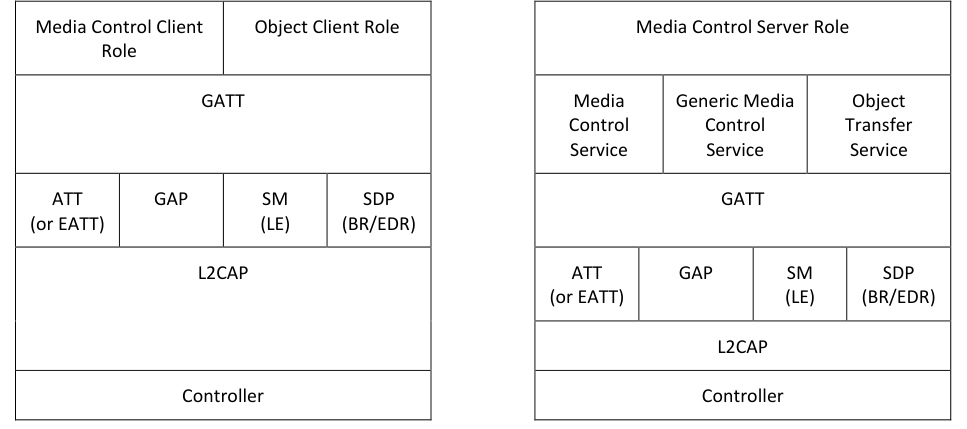

# MCP.TS .p4

> Source: PDF converted via PyMuPDF.

---

Media Control Profile (MCP)
Bluetooth® Test Suite
▪ Revision: MCP.TS.p4 ▪ Revision Date: 2024-07-01 ▪ Prepared By: Generic Audio Working Group ▪ Published during TCRL: TCRL.2024-1
This document, regardless of its title or content, is not a Bluetooth Specification as defined in the Bluetooth Patent/Copyright License Agreement (“PCLA”) and Bluetooth Trademark License Agreement. Use of this document by members of Bluetooth SIG is governed by the membership and other related agreements between Bluetooth SIG Inc. (“Bluetooth SIG”) and its members, including the PCLA and other agreements posted on Bluetooth SIG’s website located at www.bluetooth.com.
THIS DOCUMENT IS PROVIDED “AS IS” AND BLUETOOTH SIG, ITS MEMBERS, AND THEIR AFFILIATES MAKE NO REPRESENTATIONS OR WARRANTIES AND DISCLAIM ALL WARRANTIES, EXPRESS OR IMPLIED, INCLUDING ANY WARRANTY OF MERCHANTABILITY, TITLE, NON-INFRINGEMENT, FITNESS FOR ANY PARTICULAR PURPOSE, THAT THE CONTENT OF THIS DOCUMENT IS FREE OF ERRORS.
TO THE EXTENT NOT PROHIBITED BY LAW, BLUETOOTH SIG, ITS MEMBERS, AND THEIR AFFILIATES DISCLAIM ALL LIABILITY ARISING OUT OF OR RELATING TO USE OF THIS DOCUMENT AND ANY INFORMATION CONTAINED IN THIS DOCUMENT, INCLUDING LOST REVENUE, PROFITS, DATA OR PROGRAMS, OR BUSINESS INTERRUPTION, OR FOR SPECIAL, INDIRECT, CONSEQUENTIAL, INCIDENTAL OR PUNITIVE DAMAGES, HOWEVER CAUSED AND REGARDLESS OF THE THEORY OF LIABILITY, AND EVEN IF BLUETOOTH SIG, ITS MEMBERS, OR THEIR AFFILIATES HAVE BEEN ADVISED OF THE POSSIBILITY OF SUCH DAMAGES.
This document is proprietary to Bluetooth SIG. This document may contain or cover subject matter that is intellectual property of Bluetooth SIG and its members. The furnishing of this document does not grant any license to any intellectual property of Bluetooth SIG or its members.
This document is subject to change without notice.
Copyright © 2019–2024 by Bluetooth SIG, Inc. The Bluetooth word mark and logos are owned by Bluetooth SIG, Inc. Other third-party brands and names are the property of their respective owners.
Contents

## 1 Scope

This Bluetooth document contains the Test Suite Structure (TSS) and test cases to test the implementation of the Bluetooth Media Control Profile Specification with the objective to provide a high probability of air interface interoperability between the tested implementation and other manufacturers’ Bluetooth devices.

## 2 References, definitions, and abbreviations

### 2.1 References

This document incorporates provisions from other publications by dated or undated reference. These references are cited at the appropriate places in the text, and the publications are listed hereinafter. Additional definitions and abbreviations can be found in [1] and [2].
[1] Bluetooth Core Specification, Version 5.2 or later
[2] Test Strategy and Terminology Overview
[3] Media Control Profile Specification, Version 1.0
[4] Media Control Service Specification, Version 1.0
[5] ICS Proforma for Media Control Profile (MCP)
[6] GATT Test Suite, GATT.TS
[7] Characteristic and Descriptor descriptions are accessible via the Bluetooth SIG Assigned Numbers
[8] Object Transfer Profile Specification, Version 1.0 or later
[9] IXIT Proforma for Media Control Service

### 2.2 Definitions

In this Bluetooth document, the definitions from [1] and [2] apply.

### 2.3 Acronyms and abbreviations

In this Bluetooth document, the definitions, acronyms, and abbreviations from [1] and [2] apply.

## 3 Test Suite Structure (TSS)

### 3.1 Overview

The Media Control Profile requires the presence of GAP, SM (when used over LE transport), SDP (when used over BR/EDR transport), L2CAP, and GATT. This is illustrated in Figure 3.1.

**Figure 3.1: Media Control Profile test model**

### 3.2 Test Strategy

The test objectives are to verify the functionality of the Media Control Profile within a Bluetooth Host and enable interoperability between Bluetooth Hosts on different devices. The testing approach covers mandatory and optional requirements in the specification and matches these to the support of the IUT as described in the ICS. Any defined test herein is applicable to the IUT if the ICS logical expression defined in the Test Case Mapping Table (TCMT) evaluates to true.
The test equipment provides an implementation of the Radio Controller and the parts of the Host needed to perform the test cases defined in this Test Suite. A Lower Tester acts as the IUT’s peer device and interacts with the IUT over-the-air interface. The configuration, including the IUT, needs to implement similar capabilities to communicate with the test equipment. For some test cases, it is necessary to stimulate the IUT from an Upper Tester. In practice, this could be implemented as a special test interface, a Man Machine Interface (MMI), or another interface supported by the IUT.
This Test Suite contains Valid Behavior (BV) tests complemented with Invalid Behavior (BI) tests where required. The test coverage mirrored in the Test Suite Structure is the result of a process that started with catalogued specification requirements that were logically grouped and assessed for testability enabling coverage in defined test purposes.

### 3.3 Test groups

The following test groups have been defined:
• Generic GATT Integrated Tests
• Media Control Point Procedures
• Search Control Point Procedures
• Service Procedure – Error Handling

## 4 Test cases (TC)

### 4.1 Introduction

#### 4.1.1 Test case identification conventions

Test cases are assigned unique identifiers per the conventions in [2]. The convention used here is: <spec abbreviation>/<IUT role>/<class>/<feat>/<func>/<subfunc>/<cap>/<xx>-<nn>-<y>.
Additionally, testing of this specification includes tests from the GATT Test Suite [6] referred to as Generic GATT Integrated Tests (GGIT); when used, the test cases in GGIT are referred to through a TCID string using the following convention: <spec abbreviation>/<IUT role>/<GGIT test group>/< GGIT class >/<xx>-<nn>-<y>.

|  | Identifier Abbreviation |  |  | Spec Identifier <spec abbreviation> |  |
| --- | --- | --- | --- | --- | --- |
| MCP |  |  | Media Control Profile |  |  |
|  | Identifier Abbreviation |  |  | Role Identifier <IUT role> |  |
| CL |  |  | Client Role |  |  |
| SR |  |  | Server Role |  |  |
|  | Identifier Abbreviation |  |  | Feature Identifier <feat> |  |
| CGGIT |  |  | Client Generic GATT Integrated Tests |  |  |
| DSC |  |  | Discovery and Advertising |  |  |
| MCCP |  |  | Media Control Control Point |  |  |
| SCP |  |  | Search Control Point |  |  |
| SP |  |  | Service Procedures |  |  |
| SPE |  |  | Service Procedure – Error handling |  |  |

Table 4.1: MCP TC feature naming conventions

#### 4.1.2 Conformance

When conformance is claimed for a particular specification, all capabilities are to be supported in the specified manner. The mandated tests from this Test Suite depend on the capabilities to which conformance is claimed.
The Bluetooth Qualification Program may employ tests to verify implementation robustness. The level of implementation robustness that is verified varies from one specification to another and may be revised for cause based on interoperability issues found in the market.
Such tests may verify:
• That claimed capabilities may be used in any order and any number of repetitions not excluded by the specification
• That capabilities enabled by the implementations are sustained over durations expected by the use case
• That the implementation gracefully handles any quantity of data expected by the use case
• That in cases where more than one valid interpretation of the specification exists, the implementation complies with at least one interpretation and gracefully handles other interpretations
• That the implementation is immune to attempted security exploits
A single execution of each of the required tests is required to constitute a Pass verdict. However, it is noted that to provide a foundation for interoperability, it is necessary that a qualified implementation consistently and repeatedly pass any of the applicable tests.
In any case, where a member finds an issue with the test plan generated by the Bluetooth SIG qualification tool, with the test case as described in the Test Suite, or with the test system utilized, the member is required to notify the responsible party via an erratum request such that the issue may be addressed.

#### 4.1.3 Pass/Fail verdict conventions

Each test case has an Expected Outcome section. The IUT is granted the Pass verdict when all the detailed pass criteria conditions within the Expected Outcome section are met.
The convention in this Test Suite is that, unless there is a specific set of fail conditions outlined in the test case, the IUT fails the test case as soon as one of the pass criteria conditions cannot be met. If this occurs, then the outcome of the test is a Fail verdict.

### 4.2 Setup Preambles

#### 4.2.1 ATT Bearer on LE Transport with Extended Advertising

Preamble procedure:
1. Establish an LE transport connection between the IUT and the Lower Tester, where the
advertising implementation (as GAP Peripheral) uses Extended Advertising as defined in Section 6.1.1 of [3] and the discovering implementation (as GAP Central) operates according to Section 6.1.2 of [3]. 2. Establish an L2CAP channel 0x0004 between the IUT and the Lower Tester over that LE
transport.

#### 4.2.2 ATT Bearer on BR/EDR Transport

Preamble procedure:
1. Establish a BR/EDR transport connection between the IUT and the Lower Tester. 2. Establish an L2CAP channel (PSM 0x001F) between the IUT and the Lower Tester over that
BR/EDR transport.

#### 4.2.3 EATT Bearer on LE Transport with Extended Advertising

Preamble procedure:
1. Establish an LE transport connection between the IUT and the Lower Tester, where the
advertising implementation (as GAP Peripheral) uses Extended Advertising as defined in Section 6.1.1 of [3] and the discovering implementation (as GAP Central) operates according to Section 6.1.2 of [3]. 2. Establish an L2CAP channel 0x0005 for signaling and one L2CAP channel (for ATT bearers) with
EATT PSM (as defined in Assigned Numbers) between the IUT and the Lower Tester over that LE transport.

#### 4.2.4 EATT Bearer on BR/EDR Transport

Preamble procedure:
1. Establish a BR/EDR transport connection between the IUT and the Lower Tester. 2. Establish an L2CAP channel 0x0001 for signaling and one L2CAP channel (for ATT bearers) with
EATT PSM (as defined in Assigned Numbers) between the IUT and the Lower Tester over that BR/EDR transport.

### 4.3 Generic GATT Integration Tests

Execute the Generic GATT Integrated Tests defined in [6] Section 6.3, Server test procedures, and in Section 6.4, Client test procedures, using Table 4.2 below as input:

| TCID |  |  |  | Service/ |  | Reference | Properties | Value Length (Octets) | Related to Primary Service |
| --- | --- | --- | --- | --- | --- | --- | --- | --- | --- |
|  |  |  |  | Characteristic/ |  |  |  |  |  |
|  |  |  |  | Descriptor |  |  |  |  |  |
|  | MCP/CL/CGGIT/SER/BV-01-C |  |  | Media Control |  | [3] 2.1 | - | - | - |
|  | [Service GGIT – Media Control] |  |  | Service |  |  |  |  |  |
|  | MCP/CL/CGGIT/SER/BV-02-C |  | Generic Media Control Service | Generic Media |  | [3] 2.1 | - | - | - |
|  | [Service GGIT – Generic Media |  |  | Control Service |  |  |  |  |  |
|  | Control] |  |  |  |  |  |  |  |  |
|  | MCP/CL/CGGIT/SER/BV-03-C |  |  | Object Transfer |  | [3] 2.2 | - | - | MCS or GMCS |
|  | [Service GGIT – Object Transfer] |  |  | Service |  |  |  |  |  |
|  | MCP/CL/CGGIT/CHA/BV-01-C |  | Media Player Name Characteristic | Media Player Name |  | [3] 4.5.1 | 0x02 (Read) | skip | - |
|  | [Characteristic GGIT – Media |  |  | Characteristic |  |  |  |  |  |
|  | Player Name] |  |  |  |  |  |  |  |  |
|  | MCP/CL/CGGIT/CHA/BV-23-C |  | Media Player Name Characteristic |  |  | [3] 4.5.1 | 0x12 (Read, Notify) | skip | - |
|  | [Characteristic GGIT – Media |  |  |  |  |  |  |  |  |
|  | Player Name – GMCS] |  |  |  |  |  |  |  |  |
|  | MCP/CL/CGGIT/CHA/BV-02-C |  |  | Media Player Icon |  | [3] 4.5.1 | 0x02 (Read) | 6 | - |
|  | [Characteristic GGIT – Media |  |  | Object ID |  |  |  |  |  |
|  | Player Icon Object ID] |  |  | Characteristic |  |  |  |  |  |
|  | MCP/CL/CGGIT/CHA/BV-03-C |  | Media Player Icon URL Characteristic | Media Player Icon |  | [3] 4.5.2 | 0x02 (Read) | skip | - |
|  | [Characteristic GGIT – Media |  |  | URL Characteristic |  |  |  |  |  |
|  | Player Icon URL] |  |  |  |  |  |  |  |  |
|  | MCP/CL/CGGIT/CHA/BV-04-C |  | Track Changed Characteristic |  |  | [3] 4.6.1 | 0x10 (Notify) | 0 | - |
|  | [Characteristic GGIT – Track |  |  |  |  |  |  |  |  |
|  | Changed] |  |  |  |  |  |  |  |  |
|  | MCP/CL/CGGIT/CHA/BV-05-C |  | Track Title Characteristic |  |  | [3] 4.5.3 | Mandatory: 0x02 (Read) Optional: 0x10 (Notify) | skip | - |
|  | [Characteristic GGIT – Track |  |  |  |  |  |  |  |  |
|  | Title] |  |  |  |  |  |  |  |  |

| TCID |  |  |  | Service/ |  | Reference | Properties |  |  | Value Length (Octets) | Related to Primary Service |
| --- | --- | --- | --- | --- | --- | --- | --- | --- | --- | --- | --- |
|  |  |  |  | Characteristic/ |  |  |  |  |  |  |  |
|  |  |  |  | Descriptor |  |  |  |  |  |  |  |
|  | MCP/CL/CGGIT/CHA/BV-06-C |  | Track Duration Characteristic | Track Duration |  | [3] 4.5.4 | Mandatory: 0x02 (Read) Optional: 0x10 (Notify) |  |  | 4 | - |
|  | [Characteristic GGIT – Track |  |  | Characteristic |  |  |  |  |  |  |  |
|  | Duration] |  |  |  |  |  |  |  |  |  |  |
|  | MCP/CL/CGGIT/CHA/BV-07-C |  | Track Position Characteristic |  |  | [3] 4.5.5 |  | Mandatory: 0x0E (Read, Write, |  | 4 | - |
|  | [Characteristic GGIT – Track |  |  |  |  |  |  | WriteWithoutResponse) |  |  |  |
|  | Position] |  |  |  |  |  |  | Optional: 0x10 (Notify) |  |  |  |
|  | MCP/CL/CGGIT/CHA/BV-08-C |  | Playback Speed Characteristic |  |  | [3] 4.5.8, 4.5.9 |  | Mandatory: 0x0E (Read, Write, |  | 1 | - |
|  | [Characteristic GGIT – Playback |  |  |  |  |  |  | WriteWithoutResponse) |  |  |  |
|  | Speed] |  |  |  |  |  |  | Optional: 0x10 (Notify) |  |  |  |
|  | MCP/CL/CGGIT/CHA/BV-09-C |  | Seeking Speed Characteristic |  |  | [3] 4.5.10 | Mandatory: 0x02 (Read) Optional: 0x10 (Notify) | Mandatory: 0x02 (Read) |  | 1 | - |
|  | [Characteristic GGIT – Seeking |  |  |  |  |  |  | Optional: 0x10 (Notify) |  |  |  |
|  | Speed] |  |  |  |  |  |  |  |  |  |  |
|  | MCP/CL/CGGIT/CHA/BV-10-C |  |  | Current Track |  | [3] 4.5.11 | 0x02 (Read) |  |  | 6 | - |
|  | [Characteristic GGIT – Current |  |  | Segments Object ID |  |  |  |  |  |  |  |
|  | Track Segments Object ID] |  |  | Characteristic |  |  |  |  |  |  |  |
|  | MCP/CL/CGGIT/CHA/BV-11-C |  | Current Track Object ID Characteristic | Current Track Object |  | [3] 4.5.12 |  | Mandatory: 0x0E (Read, Write, |  | 6 | - |
|  | [Characteristic GGIT – Current |  |  | ID Characteristic |  |  |  | WriteWithoutResponse) |  |  |  |
|  | Track Object ID] |  |  |  |  |  |  | Optional: 0x10 (Notify) |  |  |  |
|  | MCP/CL/CGGIT/CHA/BV-12-C |  | Next Track Object ID Characteristic |  |  | [3] 4.5.14 |  | Mandatory: 0x0E (Read, Write, |  | 6 | - |
|  | [Characteristic GGIT – Next Track |  |  |  |  |  |  | WriteWithoutResponse) |  |  |  |
|  | Object ID] |  |  |  |  |  |  | Optional: 0x10 (Notify) |  |  |  |
|  | MCP/CL/CGGIT/CHA/BV-13-C |  | Parent Group Object ID Characteristic |  |  | [3] 4.5.18 | Mandatory: 0x02 (Read) Optional: 0x10 (Notify) | Mandatory: 0x02 (Read) |  | 6 | - |
|  | [Characteristic GGIT – Parent |  |  |  |  |  |  | Optional: 0x10 (Notify) |  |  |  |
|  | Group Object ID] |  |  |  |  |  |  |  |  |  |  |
|  | MCP/CL/CGGIT/CHA/BV-14-C |  | Current Group Object ID Characteristic |  |  | [3] 4.5.17 |  | Mandatory: 0x0E (Read, Write, |  | 6 | - |
|  | [Characteristic GGIT – Current |  |  |  |  |  |  | WriteWithoutResponse) |  |  |  |
|  | Group Object ID] |  |  |  |  |  |  | Optional: 0x10 (Notify) |  |  |  |
|  | MCP/CL/CGGIT/CHA/BV-15-C |  | Playing Order Characteristic |  |  | [3] 4.5.19, 4.5.20 |  | Mandatory: 0x0E (Read, Write, |  | 1 | - |
|  | [Characteristic GGIT – Playing |  |  |  |  |  |  | WriteWithoutResponse) |  |  |  |
|  | Order] |  |  |  |  |  |  | Optional: 0x10 (Notify) |  |  |  |

| TCID |  |  |  | Service/ |  | Reference | Properties | Value Length (Octets) | Related to Primary Service |
| --- | --- | --- | --- | --- | --- | --- | --- | --- | --- |
|  |  |  |  | Characteristic/ |  |  |  |  |  |
|  |  |  |  | Descriptor |  |  |  |  |  |
|  | MCP/CL/CGGIT/CHA/BV-16-C |  |  | Playing Order |  | [3] 4.5.21 | 0x02 (Read) | 2 | - |
|  | [Characteristic GGIT – Playing |  |  | Supported |  |  |  |  |  |
|  | Order Supported] |  |  | Characteristic |  |  |  |  |  |
|  | MCP/CL/CGGIT/CHA/BV-17-C |  | Media State Characteristic | Media State |  | [3] 4.5.22 | 0x12 (Notify, Read) | 1 | - |
|  | [Characteristic GGIT – Media |  |  | Characteristic |  |  |  |  |  |
|  | State] |  |  |  |  |  |  |  |  |
|  | MCP/CL/CGGIT/CHA/BV-18-C |  | Media Control Point Characteristic |  |  | [3] 4.5 | 0x1C (Write, WriteWithoutResponse, Notify) | skip | - |
|  | [Characteristic GGIT – Media |  |  |  |  |  |  |  |  |
|  | Control Point] |  |  |  |  |  |  |  |  |
|  | MCP/CL/CGGIT/CHA/BV-19-C |  |  | Media Control |  | [3] 4.5.42 | Mandatory: 0x02 (Read) Optional: 0x10 (Notify) | 4 | - |
|  | [Characteristic GGIT – Media |  |  | Opcodes Supported |  |  |  |  |  |
|  | Control Opcodes Supported] |  |  | Characteristic |  |  |  |  |  |
|  | MCP/CL/CGGIT/CHA/BV-20-C |  |  | Search Results |  | [3] 4.5.43 | 0x12 (Notify, Read) | skip | - |
|  | [Characteristic GGIT – Search |  |  | Object ID |  |  |  |  |  |
|  | Results Object ID] |  |  | Characteristic |  |  |  |  |  |
|  | MCP/CL/CGGIT/CHA/BV-21-C |  | Search Control Point Characteristic | Search Control Point |  | [3] 4.5.43 | 0x1C (Write, WriteWithoutResponse, Notify) | skip | - |
|  | [Characteristic GGIT – Search |  |  | Characteristic |  |  |  |  |  |
|  | Control Point] |  |  |  |  |  |  |  |  |
|  | MCP/CL/CGGIT/CHA/BV-22-C |  | Content Control ID Characteristic |  |  | [3] 4.5.44 | 0x02 (Read) | 1 | - |
|  | [Characteristic GGIT – Content |  |  |  |  |  |  |  |  |
|  | Control ID] |  |  |  |  |  |  |  |  |
|  | MCP/SR/SGGIT/SDPNF/BV-01-C |  | Media Control Service |  |  | [3] 4.2 | - | - | - |
|  | [SDP GGIT – Media Control |  |  |  |  |  |  |  |  |
|  | Service, Not Discoverable over |  |  |  |  |  |  |  |  |
|  | BR/EDR] |  |  |  |  |  |  |  |  |
|  | MCP/SR/SGGIT/SDPNF/BV-02-C |  | Generic Media Control Service |  |  | [3] 4.2 | - | - | - |
|  | [SDP GGIT – Generic Media |  |  |  |  |  |  |  |  |
|  | Control Service, Not Discoverable |  |  |  |  |  |  |  |  |
|  | over BR/EDR] |  |  |  |  |  |  |  |  |

Table 4.2: Input for the GGIT Client and Server test procedures

### 4.4 Additional Service Discovery

#### 4.4.1 LE Audio Major Service Class CoD Support • Test Purpose

Verify that the IUT implementing either the Media Control Client or Media Control Server roles that supports the BR/EDR transport sets the LE Audio Major Service Class in the Class of Device field.
• Reference
[3] 6.2.3
• Initial Condition
- The IUT is discoverable and connectable over the BR/EDR transport.
• Test Case Configuration

|  | Test Case |  |
| --- | --- | --- |
| MCP/SR/DSC/BV-01-C [Media Control Server – LE Audio Major Service Class CoD Support] |  |  |
| MCP/CL/DSC/BV-01-C [Media Control Client – LE Audio Major Service Class CoD Support] |  |  |

Table 4.3: LE Audio Major Service Class CoD Support test cases
• Test Procedure
1. The Lower Tester performs the Inquiry procedure. 2. The IUT sends an Inquiry response message.
• Expected Outcome
Pass verdict
In step 2, the Class of Device field has the LE Audio Major Service Class bit 14 set to 1.
If the IUT uses limited discoverable mode, the limited discoverable Major Service Class bit is also set to 1.

### 4.5 Service Procedure – Media Control Point • Test Purpose

Test opcode writing procedures to the Media Control Point and verify the response. Repeat for each row of Table 4.4.
• Reference
[3] 4.5
• Initial Condition
- Establish a Bearer connection between the Lower Tester and the IUT as described in Section 4.2.1, if using ATT over an LE transport, or Section 4.2.2 if using ATT over a BR/EDR transport, or Section 4.2.3 if using EATT over an LE transport, or Section 4.2.4 if using EATT over a BR/EDR transport.
- The Lower Tester includes an instantiation of the Media Control Service and its Media Player Name Characteristic set to TSPX_MCS_MEDIA_PLAYER_NAME IXIT entry.
- The Lower Tester includes an instantiation of the Generic Media Control Service.
- The IUT has discovered the Media Control Service or Generic Media Control Service and has saved the handle range.
- The IUT enables notification by writing the value 0x0001 using the GATT Write Characteristic Descriptor sub-procedure for the Media Control Point CCCD.
• Test Case Configuration

|  | Test Case |  |  | Procedure |  |
| --- | --- | --- | --- | --- | --- |
| MCP/CL/MCCP/BV-01-C [Media Control Point – Play] |  |  | Play Current Track |  |  |
| MCP/CL/MCCP/BV-02-C [Media Control Point – Pause] |  |  | Pause Current Track |  |  |
| MCP/CL/MCCP/BV-03-C [Media Control Point – Fast Rewind] |  |  | Fast Forward Fast Rewind |  |  |
| MCP/CL/MCCP/BV-04-C [Media Control Point – Fast Forward] |  |  | Fast Forward Fast Rewind |  |  |
| MCP/CL/MCCP/BV-05-C [Media Control Point – Stop] |  |  | Stop Current Track |  |  |
| MCP/CL/MCCP/BV-06-C [Media Control Point – Move Relative] |  |  | Set Relative Track Position |  |  |
| MCP/CL/MCCP/BV-07-C [Media Control Point – Previous Segment] |  |  | Move to Previous Segment |  |  |
| MCP/CL/MCCP/BV-08-C [Media Control Point – Next Segment] |  |  | Move to Next Segment |  |  |
| MCP/CL/MCCP/BV-09-C [Media Control Point – First Segment] |  |  | Move to First Segment |  |  |
| MCP/CL/MCCP/BV-10-C [Media Control Point – Last Segment] |  |  | Move to Last Segment |  |  |
| MCP/CL/MCCP/BV-11-C [Media Control Point – Goto Segment] |  |  | Move to Segment Number |  |  |
| MCP/CL/MCCP/BV-12-C [Media Control Point – Previous Track] |  |  | Move to Previous Track |  |  |
| MCP/CL/MCCP/BV-13-C [Media Control Point – Next Track] |  |  | Move to Next Track |  |  |
| MCP/CL/MCCP/BV-14-C [Media Control Point – First Track] |  |  | Move to First Track |  |  |
| MCP/CL/MCCP/BV-15-C [Media Control Point – Last Track] |  |  | Move to Last Track |  |  |
| MCP/CL/MCCP/BV-16-C [Media Control Point – Goto Track] |  |  | Move to Track Number |  |  |
| MCP/CL/MCCP/BV-17-C [Media Control Point – Previous Group] |  |  | Move to Previous Group |  |  |
| MCP/CL/MCCP/BV-18-C [Media Control Point – Next Group] |  |  | Move to Next Group |  |  |
| MCP/CL/MCCP/BV-19-C [Media Control Point – First Group] |  |  | Move to First Group |  |  |
| MCP/CL/MCCP/BV-20-C [Media Control Point – Last Group] |  |  | Move to Last Group |  |  |
| MCP/CL/MCCP/BV-21-C [Media Control Point – Goto Group] |  |  | Move to Group Number |  |  |

Table 4.4: Media Control Point Procedures test cases
• Test Procedure
1. The Upper Tester orders the IUT to execute the Procedure specified in Table 4.4. 2. The Lower Tester sends the IUT a Notification for the requested opcode, and Result Code is set
to SUCCESS.
• Expected Outcome
Pass verdict
The IUT successfully executes the specified Media Control Point procedure with the correct opcode and parameter value.

### 4.6 Service Procedure

MCP/SR/SP/BV-01-C [Verify Object IDs]
• Test Purpose
Verify that a Media Control Server IUT populates Object ID characteristics with valid values in the OTS server.
• Reference
[3] 3
• Initial Condition
- Establish an ATT Bearer connection between the Lower Tester and the IUT as described in Section 4.2.1, if using ATT over an LE transport, or Section 4.2.2 if using ATT over a BR/EDR transport, or Section 4.2.3 if using EATT over an LE transport, or Section 4.2.4 if using EATT over a BR/EDR transport.
- The handles of the Media Player Icon Object, Current Group Object ID, Current Track Segments Object ID, Current Track Object ID, Next Track Object ID, and Parent Group Object ID characteristic have been previously discovered by the Lower Tester during a test procedure in Section 4.3 or is known to the Lower Tester by other means.
- If the IUT requires bonding, then the Lower Tester performs a bonding procedure.
- The IUT has its current track set to a track with segments within a group of tracks with a parent group.
- The IUT has its Media Player Icon set to a valid bitmap.
• Test Procedure
Repeat steps 1–2 for each round in Table 4.5.
1. The Lower Tester executes the Procedure specified in Table 4.5. 2. The Lower Tester executes the OTS Preamble as described in [4] for the Object Type as
specified in Table 4.5 using the Object ID from step 1.

|  | Round |  |  | Procedure |  |  | Object Type |  |
| --- | --- | --- | --- | --- | --- | --- | --- | --- |
| 1 |  |  | Read Media Player Icon Object Information |  |  | Media Player Icon Object [4] |  |  |
| 2 |  |  | Read Current Track Segments Object Information |  |  | Track Segments Object [4] |  |  |
| 3 |  |  | Track Discovery – Discover by Group Object |  |  | Group Object [4] |  |  |
| 4 |  |  | Read Parent Group Object Information |  |  | Group Object [4] |  |  |
| 5 |  |  | Read Next Track Object Information |  |  | Track Object [4] |  |  |
| 6 |  |  | Read Current Track Object Information |  |  | Track Object [4] |  |  |

Table 4.5: Rounds for Verify Object IDs test case
• Expected Outcome
Pass verdict
The IUT processes the operations and populates the Object ID characteristic with a value that can be retrieved from the OTS server.
The object populated in the OTS server conforms to the Object Type format specified in Table 4.5.

### 4.7 Service Procedure – Search Control Point • Test Purpose

Test opcode writing procedures to the Search Control Point and verify the response. It is repeated for each row of Table 4.6.
• Reference
[3] 4.5.42
• Initial Condition
- Establish a Bearer connection between the Lower Tester and the IUT as described in Section 4.2.1, if using ATT over an LE transport, or Section 4.2.2 if using ATT over a BR/EDR transport, or Section 4.2.3 if using EATT over an LE transport, or Section 4.2.4 if using EATT over a BR/EDR transport.
- The Lower Tester includes an instantiation of the Media Control Service and Generic Media Control Service, including the Search Control Point characteristic.
- The IUT has discovered the instantiated service(s) on the Lower Tester and has saved the handle range.
- The IUT enables notification by writing the value 0x0001 using the GATT Write Characteristic Descriptor sub-procedure for the Search Control Point CCCD.
- The IUT enables notification by writing the value 0x0001 using the GATT Write Characteristic Descriptor sub-procedure for the Search Results Object ID CCCD.
• Test Case Configuration

| Test Case | Type |  | Parameter |  |
| --- | --- | --- | --- | --- |
|  |  |  | Value |  |
| MCP/CL/SCP/BV-01-C [Search Control Point – Track Name] | 0x01 | UTF8 |  |  |
| MCP/CL/SCP/BV-02-C [Search Control Point – Artist Name] | 0x02 | UTF8 |  |  |
| MCP/CL/SCP/BV-03-C [Search Control Point – Album Name] | 0x03 | UTF8 |  |  |
| MCP/CL/SCP/BV-04-C [Search Control Point – Group Name] | 0x04 | UTF8 |  |  |
| MCP/CL/SCP/BV-05-C [Search Control Point – Earliest Year] | 0x05 | UTF8 |  |  |
| MCP/CL/SCP/BV-06-C [Search Control Point – Latest Year] | 0x06 | UTF8 |  |  |
| MCP/CL/SCP/BV-07-C [Search Control Point – Genre] | 0x07 | UTF8 |  |  |
| MCP/CL/SCP/BV-08-C [Search Control Point – Only Tracks] | 0x08 | - |  |  |
| MCP/CL/SCP/BV-09-C [Search Control Point – Only Groups] | 0x09 | - |  |  |

Table 4.6: Search Control Point test cases
• Test Procedure
1. The Upper Tester orders the IUT to execute the Search procedure using a valid entry fulfilling the
parameter definition specified in Table 4.6. 2. The Lower Tester sends the IUT a Notification on the Search Control Point characteristic with a
Result Code of SUCCESS (0x01). 3. The Lower Tester sends the IUT a Notification on the Search Results Object ID Characteristic.
• Expected Outcome
Pass verdict
The IUT successfully executes the Search procedure and writes the specified opcode from Table 4.6 to the Search Control Point with the correct parameter value.

### 4.8 Service Procedure – Error Handling

MCP/CL/SPE/BI-01-C [Media Control Point – Error Code]
• Test Purpose
Verify that the Media Control Client IUT operation is unaffected after receipt of an Error Result Code notification from the Media Control Point in response to a Write Without Response.
• Reference
[4] 3.18.2
• Initial Condition
- Establish a Bearer connection between the Lower Tester and the IUT as described in Section 4.2.1, if using ATT over an LE transport, or Section 4.2.2 if using ATT over a BR/EDR transport, or Section 4.2.3 if using EATT over an LE transport, or Section 4.2.4 if using EATT over a BR/EDR transport.
- The Lower Tester includes an instantiation of the Media Control Service and Generic Media Control Service, including the Search Control Point characteristic.
- The IUT has discovered the Media Control Service or Generic Media Control Service and has saved the handle range.
- The IUT enables notification by writing the value 0x0001 using the GATT Write Characteristic Descriptor sub-procedure for the Media Control Point CCCD.
• Test Procedure
Execute steps 1–2 for each round in Table 4.7.
1. The Upper Tester orders the IUT to execute any procedure for the Media Control Point. 2. The Lower Tester sends the IUT a Notification for the requested opcode, and Result Code is set
to the Result Code specified in Table 4.7.

|  | Round |  |  | Result Code |  |
| --- | --- | --- | --- | --- | --- |
| 1 |  |  | OPCODE NOT SUPPORTED |  |  |
| 2 |  |  | MEDIA PLAYER INACTIVE |  |  |
| 3 |  |  | COMMAND CANNOT BE COMPLETED |  |  |

Table 4.7: Opcode Errors rounds
• Expected Outcome
Pass verdict
After completing the test procedure, the IUT returns to a stable state and can process commands normally.
• Test Purpose
Verify that the Media Control Client IUT operation is unaffected after receipt of a Failure Error notification from the Target Control Point in response to a Write Request.
• Reference
[4] 3.18.2
• Initial Condition
- Establish a Bearer connection between the Lower Tester and the IUT as described in Section 4.2.1, if using ATT over an LE transport, or Section 4.2.2 if using ATT over a BR/EDR transport, or Section 4.2.3 if using EATT over an LE transport, or Section 4.2.4 if using EATT over a BR/EDR transport.
- The Lower Tester includes an instantiation of the Media Control Service and Generic Media Control Service, including the Search Control Point characteristic.
- The IUT has discovered the Media Control Service or Generic Media Control Service and has saved the handle range.
- The IUT enables notification by writing the value 0x0001 using the GATT Write Characteristic Descriptor sub-procedure for the Search Control Point CCCD.
• Test Procedure
1. The Upper Tester orders the IUT to execute the Search procedure with any Type Value. 2. The Lower Tester responds to the IUT with a Notification for the requested opcode, and Result
Code is set to FAILURE.
• Expected Outcome
Pass verdict
After completing the test procedure, the IUT returns to a stable state and can process commands normally.

## 5 Test case mapping

The Test Case Mapping Table (TCMT) maps test cases to specific requirements in the ICS. The IUT is tested in all roles for which support is declared in the ICS document.
The columns for the TCMT are defined as follows:
Item: Contains a logical expression based on specific entries from the associated ICS document. Contains a logical expression (using the operators AND, OR, NOT as needed) based on specific entries from the applicable ICS document(s). The entries are in the form of y/x references, where y corresponds to the table number and x corresponds to the feature number as defined in the ICS document for Media Control Profile [5].
Feature: A brief, informal description of the feature being tested.
Test Case(s): The applicable test case identifiers are required for Bluetooth Qualification if the corresponding y/x references defined in the Item column are supported. Further details about the function of the TCMT are elaborated in [2].
For the purpose and structure of the ICS/IXIT, refer to [2].

|  | Item |  |  | Feature |  |  | Test Case(s) |  |
| --- | --- | --- | --- | --- | --- | --- | --- | --- |
| MCP 1/1 AND MCP 2/2 AND NOT MCP 2/1 AND MCP 5/1 AND GATT 1a/4 |  |  | Profile supported over LE not discoverable over BR/EDR and Media Control Service |  |  | MCP/SR/SGGIT/SDPNF/BV-01-C |  |  |
| MCP 1/1 AND MCP 2/2 AND NOT MCP 2/1 AND MCP 5/2 AND GATT 1a/4 |  |  | Profile supported over LE not discoverable over BR/EDR and Generic Media Control Service |  |  | MCP/SR/SGGIT/SDPNF/BV-02-C |  |  |
| MCP 13/1 |  |  | Media Control Service |  |  | MCP/CL/CGGIT/SER/BV-01-C |  |  |
| MCP 13/2 |  |  | Generic Media Control Service |  |  | MCP/CL/CGGIT/SER/BV-02-C |  |  |
| MCP 13/3 |  |  | OTS Support – Client |  |  | MCP/CL/CGGIT/SER/BV-03-C |  |  |
| MCP 5/3 |  |  | OTS Support – Server |  |  | MCP/SR/SP/BV-01-C |  |  |
| MCP 13/1 AND MCP 14/1 |  |  | Media Player Name Characteristic for Media Control Service |  |  | MCP/CL/CGGIT/CHA/BV-01-C |  |  |
| MCP 13/2 AND MCP 16/1 |  |  | Media Player Name Characteristic for Generic Media Control Service |  |  | MCP/CL/CGGIT/CHA/BV-23-C |  |  |
| MCP 14/2 OR MCP 16/2 |  |  | Media Icon Object ID Characteristic |  |  | MCP/CL/CGGIT/CHA/BV-02-C |  |  |
| MCP 14/3 OR MCP 16/3 |  |  | Media Player Icon URL Characteristic |  |  | MCP/CL/CGGIT/CHA/BV-03-C |  |  |
| MCP 14/4 OR MCP 16/4 |  |  | Track Changed Characteristic |  |  | MCP/CL/CGGIT/CHA/BV-04-C |  |  |
| MCP 14/5 OR MCP 16/5 |  |  | Track Title Characteristic |  |  | MCP/CL/CGGIT/CHA/BV-05-C |  |  |
| MCP 14/6 OR MCP 16/6 |  |  | Track Duration Characteristic |  |  | MCP/CL/CGGIT/CHA/BV-06-C |  |  |
| MCP 14/7 OR MCP 16/7 |  |  | Track Position Characteristic |  |  | MCP/CL/CGGIT/CHA/BV-07-C |  |  |

|  | Item |  |  | Feature |  |  | Test Case(s) |  |
| --- | --- | --- | --- | --- | --- | --- | --- | --- |
| MCP 14/8 OR MCP 16/8 |  |  | Playback Speed Characteristic |  |  | MCP/CL/CGGIT/CHA/BV-08-C |  |  |
| MCP 14/9 OR MCP 16/9 |  |  | Seeking Speed Characteristic |  |  | MCP/CL/CGGIT/CHA/BV-09-C |  |  |
| MCP 14/10 OR MCP 16/10 |  |  | Track Segments Object ID Characteristic |  |  | MCP/CL/CGGIT/CHA/BV-10-C |  |  |
| MCP 14/11 OR MCP 16/11 |  |  | Current Track Object ID Characteristic |  |  | MCP/CL/CGGIT/CHA/BV-11-C |  |  |
| MCP 14/12 OR MCP 16/12 |  |  | Next Track Object ID Characteristic |  |  | MCP/CL/CGGIT/CHA/BV-12-C |  |  |
| MCP 14/13 OR MCP 16/13 |  |  | Parent Group Object ID Characteristic |  |  | MCP/CL/CGGIT/CHA/BV-13-C |  |  |
| MCP 14/14 OR MCP 16/14 |  |  | Current Group Object ID Characteristic |  |  | MCP/CL/CGGIT/CHA/BV-14-C |  |  |
| MCP 14/15 OR MCP 16/15 |  |  | Playing Order Characteristic |  |  | MCP/CL/CGGIT/CHA/BV-15-C |  |  |
| MCP 14/16 OR MCP 16/16 |  |  | Playing Order Supported Characteristic |  |  | MCP/CL/CGGIT/CHA/BV-16-C |  |  |
| MCP 14/17 OR MCP 16/17 |  |  | Media State Characteristic |  |  | MCP/CL/CGGIT/CHA/BV-17-C |  |  |
| MCP 14/18 OR MCP 16/18 |  |  | Media Control Point Characteristic |  |  | MCP/CL/CGGIT/CHA/BV-18-C MCP/CL/SPE/BI-01-C |  |  |
| MCP 14/19 OR MCP 16/19 |  |  | Media Control Opcodes Supported Characteristic |  |  | MCP/CL/CGGIT/CHA/BV-19-C |  |  |
| MCP 14/20 OR MCP 16/20 |  |  | Search Results Object ID Characteristic |  |  | MCP/CL/CGGIT/CHA/BV-20-C |  |  |
| MCP 14/21 OR MCP 16/21 |  |  | Search Control Point Characteristic and Procedures |  |  | MCP/CL/CGGIT/CHA/BV-21-C MCP/CL/SCP/BV-01-C MCP/CL/SCP/BV-02-C MCP/CL/SCP/BV-03-C MCP/CL/SCP/BV-04-C MCP/CL/SCP/BV-05-C MCP/CL/SCP/BV-06-C MCP/CL/SCP/BV-07-C MCP/CL/SCP/BV-08-C MCP/CL/SCP/BV-09-C MCP/CL/SPE/BI-02-C |  |  |
| MCP 14/22 OR MCP 16/22 |  |  | Content Control ID Characteristic |  |  | MCP/CL/CGGIT/CHA/BV-22-C |  |  |
| MCP 15/1 OR MCP 17/1 |  |  | Play Current Track Procedure |  |  | MCP/CL/MCCP/BV-01-C |  |  |
| MCP 15/2 OR MCP 17/2 |  |  | Pause Current Track Procedure |  |  | MCP/CL/MCCP/BV-02-C |  |  |
| MCP 15/3 OR MCP 17/3 |  |  | Fast Forward Fast Rewind Procedure |  |  | MCP/CL/MCCP/BV-03-C MCP/CL/MCCP/BV-04-C |  |  |
| MCP 15/4 OR MCP 17/4 |  |  | Stop Procedure |  |  | MCP/CL/MCCP/BV-05-C |  |  |

|  | Item |  |  | Feature |  |  | Test Case(s) |  |
| --- | --- | --- | --- | --- | --- | --- | --- | --- |
| MCP 15/5 OR MCP 17/5 |  |  | Move Relative Procedure |  |  | MCP/CL/MCCP/BV-06-C |  |  |
| MCP 15/6 OR MCP 17/6 |  |  | Previous Segment Procedure |  |  | MCP/CL/MCCP/BV-07-C |  |  |
| MCP 15/7 OR MCP 17/7 |  |  | Next Segment Procedure |  |  | MCP/CL/MCCP/BV-08-C |  |  |
| MCP 15/8 OR MCP 17/8 |  |  | First Segment Procedure |  |  | MCP/CL/MCCP/BV-09-C |  |  |
| MCP 15/9 OR MCP 17/9 |  |  | Last Segment Procedure |  |  | MCP/CL/MCCP/BV-10-C |  |  |
| MCP 15/10 OR MCP 17/10 |  |  | Goto Segment Procedure |  |  | MCP/CL/MCCP/BV-11-C |  |  |
| MCP 15/11 OR MCP 17/11 |  |  | Previous Track Procedure |  |  | MCP/CL/MCCP/BV-12-C |  |  |
| MCP 15/12 OR MCP 17/12 |  |  | Next Track Procedure |  |  | MCP/CL/MCCP/BV-13-C |  |  |
| MCP 15/13 OR MCP 17/13 |  |  | First Track Procedure |  |  | MCP/CL/MCCP/BV-14-C |  |  |
| MCP 15/14 OR MCP 17/14 |  |  | Last Track Procedure |  |  | MCP/CL/MCCP/BV-15-C |  |  |
| MCP 15/15 OR MCP 17/15 |  |  | Goto Track Procedure |  |  | MCP/CL/MCCP/BV-16-C |  |  |
| MCP 15/16 OR MCP 17/16 |  |  | Previous Group Procedure |  |  | MCP/CL/MCCP/BV-17-C |  |  |
| MCP 15/17 OR MCP 17/17 |  |  | Next Group Procedure |  |  | MCP/CL/MCCP/BV-18-C |  |  |
| MCP 15/18 OR MCP 17/18 |  |  | First Group Procedure |  |  | MCP/CL/MCCP/BV-19-C |  |  |
| MCP 15/19 OR MCP 17/19 |  |  | Last Group Procedure |  |  | MCP/CL/MCCP/BV-20-C |  |  |
| MCP 15/20 OR MCP 17/20 |  |  | Goto Group Procedure |  |  | MCP/CL/MCCP/BV-21-C |  |  |
| MCP 1/1 AND MCP 2/1 |  |  | LE Audio Major Service Class CoD Support – SR |  |  | MCP/SR/DSC/BV-01-C |  |  |
| MCP 1/2 AND MCP 2/1 |  |  | LE Audio Major Service Class CoD Support – CL |  |  | MCP/CL/DSC/BV-01-C |  |  |

Table 5.1: Test case mapping

## 6 Revision history and acknowledgments

Revision History

|  | Publication |  |  | Revision |  | Date | Comments |
| --- | --- | --- | --- | --- | --- | --- | --- |
|  | Number |  |  | Number |  |  |  |
| 0 |  |  | p0 |  |  | 2021-03-16 | Approved by BTI on 2021-02-25. MCP v1.0 adopted by the BoD on 2021-03-09. Prepared for publication. |
|  |  |  | p1r00 |  |  | 2021-04-19 | TSE 16717 (rating 1): Revised MCP/CL/CGGIT/INC/BV-03-C to MCP/CL/CGGIT/SER/BV-03-C in the test case, TCMT, and TCRL. |
| 1 |  |  | p1 |  |  | 2021-07-13 | Approved by BTI on 2021-06-01. Prepared for TCRL 2021-1 publication. |
|  |  |  | p1ed2r00 |  |  | 2021-08-03 | TSE 17297 (rating 1): Corrected a typo in the TCMT entry for TCID MCP/CL/CGGIT/CHA/BV-23-C. |
|  |  |  | p1 edition 2 |  |  | 2021-09-28 | Approved by BTI on 2021-9-27. Prepared for edition 2 publication. |
|  |  |  | p2r00 |  |  | 2021-10-13 | TSE 17593 (rating 2): Rewrote the CoD section tests to clarify the relevant BB procedure and to remove the focus on GAP mode. Updated the TCMT for MCP/SR/DSC/BV-01-C and MCP/CL/DSC/BV-01-C. Removed MCP/SR/DSC/BV-02-C and MCP/CL/DSC/BV-02-C. Template-related fixes. Updated the introduction text before the TCMT to align with the template. Updated copyright page to align with v2 of the DNMD. |
| 2 |  |  | p2 |  |  | 2022-01-25 | Approved by BTI on 2021-12-15. Prepared for TCRL 2021-2 publication. |
|  |  |  | p3r00 |  |  | 2022-07-28 | TSE 18845 (rating 2): Updated the Value Length for MCP/CL/CGGIT/CHA/BV-20-C. Template-related editorials, including removing the pre-p0 (draft) revision history entries to align with current conventions. |
| 3 |  |  | p3 |  |  | 2023-02-07 | Approved by BTI on 2022-12-19. Prepared for TCRL 2022-2 publication. |
|  |  |  | p4r00 |  |  | 2023-08-15 | TSE 23745 (rating 1): Corrected the TCID description for MCP/CL/CGGIT/CHA/BV-03-C. Updated the TCMT and TCRL accordingly. |
| 4 |  |  | p4 |  |  | 2024-07-01 | Approved by BTI on 2024-04-21. Prepared for TCRL 2024-1 publication. |

Acknowledgments

|  | Name |  |  | Company |  |
| --- | --- | --- | --- | --- | --- |
| Dejan Beran |  |  | Bluetooth SIG, Inc. |  |  |
| Gene Chang |  |  | Bluetooth SIG, Inc. |  |  |
| Charlie Lenahan |  |  | Bluetooth SIG, Inc. |  |  |
| Jawid Mirani |  |  | Bluetooth SIG, Inc. |  |  |
| Alicia Courtney |  |  | Broadcom |  |  |
