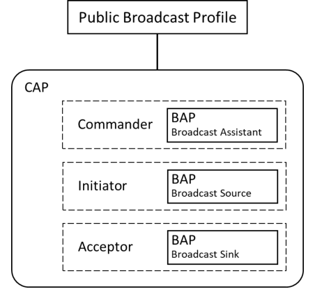
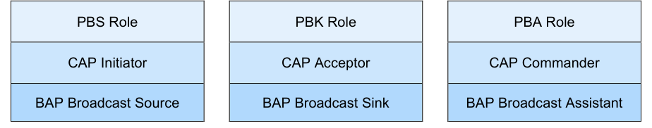

# PBP.TS.p4

> Source: PDF converted via PyMuPDF.

---

Public Broadcast Profile (PBP)
Bluetooth® Test Suite
▪ Revision: PBP.TS.p4 ▪ Revision Date: 2025-11-04 ▪ Prepared By: Audio, Telephony, and Automotive Working Group ▪ Published during TCRL: TCRL.pkg101
This document, regardless of its title or content, is not a Bluetooth Specification as defined in the Bluetooth Patent/Copyright License Agreement (“PCLA”) and Bluetooth Trademark License Agreement. Use of this document by members of Bluetooth SIG is governed by the membership and other related agreements between Bluetooth SIG Inc. (“Bluetooth SIG”) and its members, including the PCLA and other agreements posted on Bluetooth SIG’s website located at www.bluetooth.com.
THIS DOCUMENT IS PROVIDED “AS IS” AND BLUETOOTH SIG, ITS MEMBERS, AND THEIR AFFILIATES MAKE NO REPRESENTATIONS OR WARRANTIES AND DISCLAIM ALL WARRANTIES, EXPRESS OR IMPLIED, INCLUDING ANY WARRANTY OF MERCHANTABILITY, TITLE, NON-INFRINGEMENT, FITNESS FOR ANY PARTICULAR PURPOSE, THAT THE CONTENT OF THIS DOCUMENT IS FREE OF ERRORS.
TO THE EXTENT NOT PROHIBITED BY LAW, BLUETOOTH SIG, ITS MEMBERS, AND THEIR AFFILIATES DISCLAIM ALL LIABILITY ARISING OUT OF OR RELATING TO USE OF THIS DOCUMENT AND ANY INFORMATION CONTAINED IN THIS DOCUMENT, INCLUDING LOST REVENUE, PROFITS, DATA OR PROGRAMS, OR BUSINESS INTERRUPTION, OR FOR SPECIAL, INDIRECT, CONSEQUENTIAL, INCIDENTAL OR PUNITIVE DAMAGES, HOWEVER CAUSED AND REGARDLESS OF THE THEORY OF LIABILITY, AND EVEN IF BLUETOOTH SIG, ITS MEMBERS, OR THEIR AFFILIATES HAVE BEEN ADVISED OF THE POSSIBILITY OF SUCH DAMAGES.
This document is proprietary to Bluetooth SIG. This document may contain or cover subject matter that is intellectual property of Bluetooth SIG and its members. The furnishing of this document does not grant any license to any intellectual property of Bluetooth SIG or its members.
This document is subject to change without notice.
Copyright © 2021–2025 by Bluetooth SIG, Inc. The Bluetooth word mark and logos are owned by Bluetooth SIG, Inc. Other third-party brands and names are the property of their respective owners.
Contents

## 1 Scope

This Bluetooth document contains the Test Suite Structure (TSS) and test cases to test the implementation of the Public Broadcast Profile (PBP) Specification with the objective to provide a high probability of air interface interoperability between the tested implementation and other manufacturers’ Bluetooth devices.

## 2 References, definitions, and abbreviations

### 2.1 References

This document incorporates provisions from other publications by dated or undated reference. These references are cited at the appropriate places in the text, and the publications are listed hereinafter. Additional definitions and abbreviations can be found in [1], [2], and [3].
[1] Bluetooth Core Specification, Version 5.2 or later
[2] Test Strategy and Terminology Overview
[3] Public Broadcast Profile Specification, Version 1.0
[4] ICS Proforma for Public Broadcast Profile (PBP.ICS)
[5] Basic Audio Profile Specification, Version 1.0
[6] Common Audio Profile Specification, Version 1.0
[7] IXIT Proforma for Public Broadcast Profile
[8] Public Broadcast Profile Specification, Version 1.0.1 or later
[9] Public Broadcast Profile Specification, Version 1.0.2 or later

### 2.2 Definitions

In this Bluetooth document, the definitions from [1], [2], and [3] apply.

### 2.3 Acronyms and abbreviations

In this Bluetooth document, the definitions, acronyms, and abbreviations from [1], [2], and [3] apply.

## 3 Test Suite Structure (TSS)

### 3.1 Overview

PBP defines three roles:
- Public Broadcast Source (PBS)
- Public Broadcast Sink (PBK)
- Public Broadcast Assistant (PBA)
PBP is built on the Broadcast portion of the Common Audio Profile (CAP) [6] with PBS being a CAP Initiator, PBK being a CAP Acceptor, and PBA being a CAP Commander. It uses procedures defined in [6] for broadcast Audio Streams. Figure 3.1 describes the relationship between PBP, CAP, and BAP.

**Figure 3.1: Public Broadcast Profile hierarchy**

Figure 3.2 describes the relationship among the PBP, CAP, and BAP roles individually.

**Figure 3.2: Public Broadcast Profile relationship to CAP and BAP roles**

Of relevance to PBP is the CAP Broadcast portion, which mandates the Broadcast portion of the Basic Audio Profile (BAP) [5]. Through CAP, a PBS supports the BAP Broadcast Source role, a PBK supports the BAP Broadcast Sink role, and the PBA supports the BAP Broadcast Assistant role.
The PBS indicates when Standard Quality, High Quality, and encrypted public broadcast Audio Streams are broadcast. It is recommended that a PBS transmit Program_Info metadata. A PBS uses the Encrypted Broadcast Source feature of CAP when an encrypted stream is provided.
The PBS also provides a Broadcast Name AD type for the corresponding BIG that can be used to identify the broadcast to an end user.

### 3.2 Test Strategy

The test objectives are to verify the functionality of the Public Broadcast Profile Specification within a Bluetooth Host and enable interoperability between Bluetooth Hosts on different devices. The testing approach covers mandatory and optional requirements in the specification and matches these to the support of the IUT as described in the ICS. Any defined test herein is applicable to the IUT if the ICS logical expression defined in the Test Case Mapping Table (TCMT) evaluates to true.
A PBS IUT demonstrates that it is capable of advertising the Public Broadcast Announcement described in [3], Section 4. Standard Quality broadcast streams, High Quality broadcast streams, and encrypted broadcast streams are confirmed to be present when the appropriate bit(s) in the PBP features bitfield are set.
Invalid Behavior (BI) testing is required to confirm that RFU bits in the Public Broadcast Announcement are ignored by the PBK and PBA. The RFU bits are set to 0b1, and it is confirmed that the IUT operates nominally. When broadcasting the RFU bits, it is confirmed that the PBS leaves all RFU bits at 0b0.
The test equipment provides an implementation of the Radio Controller and the parts of the Host needed to perform the test cases defined in this Test Suite. A Lower Tester acts as the IUT’s peer device and interacts with the IUT over-the-air interface. The configuration, including the IUT, needs to implement similar capabilities to communicate with the test equipment. For some test cases, it is necessary to stimulate the IUT from an Upper Tester. In practice, this could be implemented as a special test interface, a Man Machine Interface (MMI), or another interface supported by the IUT. See Figure 3.3.

**Figure 3.3: Lower Tester–IUT–Upper Tester relationship**

Some test procedures describe the broadcasting or receiving of audio streams. For testing purposes, the contents of the streams are irrelevant and can be simulated. The contents do not need to contain encoded audio streams.
TSPX_PA_Interval is the periodic advertising interval of the periodic advertising associated with the IUT’s BIG as specified in IXIT [7]. This is provided as an aid to the Lower Tester to allow the testing to proceed more quickly.
This Test Suite contains Valid Behavior (BV) tests complemented with BI tests where required. The test coverage mirrored in the Test Suite Structure is the result of a process that started with catalogued specification requirements that were logically grouped and assessed for testability enabling coverage in defined test purposes.

### 3.3 Test groups

The following test groups have been defined:
• Public Broadcast Metadata
• Public Broadcast Streaming
• Receiving Public Broadcast Announcements

## 4 Test cases (TC)

### 4.1 Introduction

#### 4.1.1 Test case identification conventions

Test cases are assigned unique identifiers per the conventions in [2]. The convention used here is: <spec abbreviation>/<IUT role>/<class>/<feat>/<func>/<subfunc>/<cap>/<xx>-<nn>-<y>.

|  | Identifier Abbreviation |  |  | Spec Identifier <spec abbreviation> |  |
| --- | --- | --- | --- | --- | --- |
| PBP |  |  | Public Broadcast Profile |  |  |
|  | Identifier Abbreviation |  |  | Role Identifier <IUT role> |  |
| PBA |  |  | Public Broadcast Assistant |  |  |
| PBK |  |  | Public Broadcast Sink |  |  |
| PBS |  |  | Public Broadcast Source |  |  |
|  | Identifier Abbreviation |  |  | Feature Identifier <feat> |  |
| PBM |  |  | Public Broadcast Metadata |  |  |
| RCV |  |  | Receiving PBP Broadcasts |  |  |
| STR |  |  | Audio Streaming |  |  |

Table 4.1: PBP TC feature naming conventions

#### 4.1.2 Conformance

When conformance is claimed for a particular specification, all capabilities are to be supported in the specified manner. The mandated tests from this Test Suite depend on the capabilities to which conformance is claimed.
The Bluetooth Qualification Program may employ tests to verify implementation robustness. The level of implementation robustness that is verified varies from one specification to another and may be revised for cause based on interoperability issues found in the market.
Such tests may verify:
• That claimed capabilities may be used in any order and any number of repetitions not excluded by the specification
• That capabilities enabled by the implementations are sustained over durations expected by the use case
• That the implementation gracefully handles any quantity of data expected by the use case
• That in cases where more than one valid interpretation of the specification exists, the implementation complies with at least one interpretation and gracefully handles other interpretations
• That the implementation is immune to attempted security exploits
A single execution of each of the required tests is required to constitute a Pass verdict. However, it is noted that to provide a foundation for interoperability, it is necessary that a qualified implementation consistently and repeatedly pass any of the applicable tests.
In any case, where a member finds an issue with the test plan generated by the Bluetooth SIG qualification tool, with the test case as described in the Test Suite, or with the test system utilized, the
member is required to notify the responsible party via an erratum request such that the issue may be addressed.

#### 4.1.3 Pass/Fail verdict conventions

Each test case has an Expected Outcome section. The IUT is granted the Pass verdict when all the detailed pass criteria conditions within the Expected Outcome section are met.
The convention in this Test Suite is that, unless there is a specific set of fail conditions outlined in the test case, the IUT fails the test case as soon as one of the pass criteria conditions cannot be met. If this occurs, then the outcome of the test is a Fail verdict.

### 4.2 Public Broadcast Metadata

Verify that an IUT can transmit Public Broadcast Metadata.
PBP/PBS/PBM/BV-01-C [Transmit Program_Info Metadata]
• Test Purpose
Verify that the PBS IUT advertises correct Program_Info metadata.
• Reference
[3] 3.1.2, [8] 3.2.2
• Initial Condition
- The Lower Tester is a PBK.
- TSPX_Program_Info is the Program_Info metadata defined in IXIT [7].
- TSPX_PA_Interval is the periodic advertising interval of the periodic advertising associated with the IUT’s BIG as specified in IXIT [7].
• Test Procedure
1. The Upper Tester commands the IUT to begin broadcasting and includes the metadata specified
in TSPX_Program_Info in the BASE (the Broadcast Audio Source Endpoint of the Basic Audio Announcement) as the Program_Info LTV.
• Expected Outcome
Pass verdict
The IUT’s broadcast LTV Public Broadcast Program_Info metadata in the Basic Audio Announcement matches TSPX_Program_Info.

### 4.3 Public Broadcast Streaming

Verify that an IUT can correctly transmit the Public Broadcast Announcement and meet the requirements for Standard Quality and High Quality audio as described in [3], Section 4, with encryption if supported.

#### 4.3.1 Standard Quality Streaming Support – PBS • Test Purpose

Verify that the PBS IUT correctly transmits Public Broadcast Audio Announcements for Standard Quality and includes one BIS in the BIG configured using BAP 16_2_1, 16_2_2, 24_2_1, or 24_2_2 QoS settings.
• Reference
[3] 4.1, 4.2
• Initial Condition
- The Lower Tester is a PBK.
- TSPX_Broadcast_Name is the Broadcast Name, advertised by the IUT in the same AUX_ADV_IND PDUs as the Public Broadcast Announcement and the Broadcast Audio Announcement, as specified in IXIT [7].
- TSPX_PA_Interval is the periodic advertising interval of the periodic advertising associated with the IUT’s BIG as specified in IXIT [7].
• Test Case Configuration

|  | Test Case |  |  | QoS Setting |  |
| --- | --- | --- | --- | --- | --- |
| PBP/PBS/STR/BV-01-C [Standard Quality Streaming Support, 16 2 1 – PBS] _ _ |  |  | 16 2 1 _ _ |  |  |
| PBP/PBS/STR/BV-05-C [Standard Quality Streaming Support, 16 2 2 – PBS] _ _ |  |  | 16 2 2 _ _ |  |  |
| PBP/PBS/STR/BV-06-C [Standard Quality Streaming Support, 24 2 1 – PBS] _ _ |  |  | 24 2 1 _ _ |  |  |
| PBP/PBS/STR/BV-07-C [Standard Quality Streaming Support, 24 2 2 – PBS] _ _ |  |  | 24 2 2 _ _ |  |  |

Table 4.2: Standard Quality Streaming Support – PBS test cases
• Test Procedure
1. The Upper Tester orders the IUT to broadcast an unencrypted, Standard Quality broadcast Audio
Stream using the QoS Setting specified in Table 4.2. 2. The IUT begins advertising the Public Broadcast Announcement, as well as broadcasting its
Standard Quality broadcast Audio Stream. 3. The Lower Tester synchronizes to the broadcast Audio Stream established by the IUT.
• Expected Outcome
Pass verdict
The IUT correctly transmits the Public Broadcast Announcement with the PBP features bitfield value set as follows:
▪ Encryption: 0b0
▪ Standard Quality Public Broadcast Audio: 0b1
▪ High Quality Public Broadcast Audio: 0b0
▪ RFU: All bits set to 0b0
The BIG QoS setting matches the QoS Setting specified in Table 4.2.
The advertised Broadcast Name matches TSPX_Broadcast_Name.
The Broadcast_Name consists of human readable characters. Its length is between 4 and 32 octets.
Public Broadcast Announcements, Broadcast Audio Announcements, and Broadcast Name advertisements arrive in the same Extended Advertising Report on the Lower Tester.
The BIG is unencrypted.
• Test Purpose
Verify that the PBS IUT correctly transmits Public Broadcast Audio Announcements for High Quality and includes one BIS in the BIG configured using one of the broadcast Audio Stream configuration settings listed in [3] in Table 4.2: BAP broadcast Audio Stream configuration setting requirements for High Quality Public Broadcast Audio.
• Reference
[3] 4.1, 4.3
• Initial Condition
- The Lower Tester is a PBK.
- TSPX_HighQuality_Config_Setting is the High Quality QoS setting demonstrated by the IUT for this test as specified in IXIT [7].
- TSPX_Broadcast_Name is the Broadcast Name, advertised by the IUT in the same AUX_ADV_IND PDUs as the Public Broadcast Announcement and the Broadcast Audio Announcement, as specified in IXIT [7].
- TSPX_PA_Interval is the periodic advertising interval of the periodic advertising associated with the IUT’s BIG as specified in IXIT [7].
• Test Procedure
1. The Upper Tester orders the IUT to broadcast an unencrypted, High Quality broadcast Audio
Stream. 2. The IUT begins advertising the Public Broadcast Announcement, as well as broadcasting its High
Quality broadcast Audio Stream. 3. The Lower Tester synchronizes to the broadcast Audio Stream established by the IUT.
• Expected Outcome
Pass verdict
The IUT correctly transmits the Public Broadcast Announcement with the PBP features bitfield value set as follows:
▪ Encryption: 0b0
▪ Standard Quality Public Broadcast Audio: 0b0
▪ High Quality Public Broadcast Audio: 0b1
▪ RFU: All bits set to 0b0
The BIG QoS settings match TSPX_HighQuality_Config_Setting.
The advertised Broadcast Name matches TSPX_Broadcast_Name.
The Broadcast_Name consists of human readable characters. Its length is between 4 and 32 octets.
Public Broadcast Announcements, Broadcast Audio Announcements, and Broadcast Name advertisements arrive in the same Extended Advertising Report on the Lower Tester.
The BIG is unencrypted.

#### 4.3.2 Encrypted Streaming Support – PBS • Test Purpose

Verify that the PBS IUT correctly transmits Public Broadcast Audio Announcements and includes one or more BISes, all encrypted, in the BIG.
• Reference
[3] 4.1
• Initial Condition
- The Lower Tester is a PBK.
- If Standard Quality is the specified Audio Quality in Table 4.3, TSPX_StandardQuality_Config_Setting is the Standard Quality QoS setting demonstrated by the IUT for this test as specified in IXIT [7].
- If High Quality is the specified Audio Quality in Table 4.3, TSPX_HighQuality_Config_Setting is the High Quality QoS setting demonstrated by the IUT for this test as specified in IXIT [7].
- TSPX_Broadcast_Name is the Broadcast Name, advertised by the IUT in the same AUX_ADV_IND PDUs as the Public Broadcast Announcement and the Broadcast Audio Announcement, as specified in IXIT [7].
- TSPX_PA_Interval is the periodic advertising interval of the periodic advertising associated with the IUT’s BIG as specified in IXIT [7].
• Test Case Configuration

|  | Test Case |  |  | Audio Quality |  |  | Audio Configuration |  |
| --- | --- | --- | --- | --- | --- | --- | --- | --- |
| PBP/PBS/STR/BV-03-C [Encrypted Streaming Support, Standard Quality – PBS] |  |  | Standard Quality |  |  | TSPX StandardQuality Config Setting _ _ _ |  |  |
| PBP/PBS/STR/BV-04-C [Encrypted Streaming Support, High Quality – PBS] |  |  | High Quality |  |  | TSPX HighQuality Config Setting _ _ _ |  |  |

Table 4.3: Encrypted Streaming Support – PBS test cases
• Test Procedure
1. The Upper Tester orders the IUT to broadcast one or more encrypted BISes, containing one or
more audio streams, using the Audio Quality specified in Table 4.3. 2. The IUT begins advertising the Public Broadcast Announcement, as well as broadcasting its one
or more broadcast Audio Streams. 3. The Lower Tester synchronizes to the one or more broadcast Audio Streams established by the
IUT.
• Expected Outcome
Pass verdict
When using Standard Quality audio, the IUT correctly transmits the Public Broadcast Announcement with the PBP features bitfield value set as follows:
▪ Encryption: 0b1
▪ Standard Quality Public Broadcast Audio: 0b1
▪ High Quality Public Broadcast Audio: 0b0
▪ RFU: All bits set to 0b0
▪ Encryption: 0b1
▪ Standard Quality Public Broadcast Audio: 0b0
▪ High Quality Public Broadcast Audio: 0b1
▪ RFU: All bits set to 0b0
The advertised Broadcast Name matches TSPX_Broadcast_Name.
The Broadcast_Name consists of human readable characters. Its length is between 4 and 32 octets.
Public Broadcast Announcements, Broadcast Audio Announcements, and Broadcast Name advertisements arrive in the same Extended Advertising Report on the Lower Tester.
The BIG is encrypted.
The audio configuration matches the Audio Configuration specified in Table 4.3.

### 4.4 Receiving Public Broadcast Announcements

#### 4.4.1 PBK Receives Public Broadcast Announcements

Verify that a PBK IUT receives Public Broadcast Announcements and Broadcast Name and can synchronize to the associated audio stream, even if RFU bits are set to 0b1.

##### 4.4.1.1 Receiving Public Broadcast Announcements, Standard Quality – PBK

• Test Purpose
Verify that the PBK IUT receives Public Broadcast Announcements and Broadcast Name and can synchronize to the associated Standard Quality audio stream.
• Reference
[3] 4
• Initial Condition
- The Lower Tester is a PBS.
- The Lower Tester uses the PHY specified in Table 4.4.
• Test Case Configuration

| Test Case |  | Audio |  | Encryption | PHY |
| --- | --- | --- | --- | --- | --- |
|  |  | Configuration |  |  |  |
| PBP/PBK/RCV/BV-03-C [Receiving Public Broadcast Announcements, Standard Quality, 16 2 1, Unencrypted – _ _ PBK] | 16 2 1 _ _ |  |  | Unencrypted | Any |
| PBP/PBK/RCV/BV-04-C [Receiving Public Broadcast Announcements, Standard Quality, 24 2 2, Unencrypted – _ _ PBK] | 24 2 2 _ _ |  |  | Unencrypted | Any |
| PBP/PBK/RCV/BV-05-C [Receiving Public Broadcast Announcements, Standard Quality, 16 2 2, Encrypted – PBK] _ _ | 16 2 2 _ _ |  |  | Encrypted | Any |
| PBP/PBK/RCV/BV-06-C [Receiving Public Broadcast Announcements, Standard Quality, 24 2 1, Encrypted – PBK] _ _ | 24 2 1 _ _ |  |  | Encrypted | LE 1M PHY |

| Test Case |  | Audio |  | Encryption | PHY |
| --- | --- | --- | --- | --- | --- |
|  |  | Configuration |  |  |  |
| PBP/PBK/RCV/BV-07-C [Receiving Public Broadcast Announcements, Standard Quality, 24 2 1, Encrypted, LE 2M _ _ PHY – PBK] | 24 2 1 _ _ |  |  | Encrypted | LE 2M PHY |

Table 4.4: Receiving Public Broadcast Announcements, Standard Quality – PBK test cases
• Test Procedure
1. The Lower Tester broadcasts an audio stream using the Audio Configuration and Encryption
specified in Table 4.4, as well as the associated Public Broadcast Announcement. The Lower Tester provides the Broadcast Name set to the value “Broadcast Name Unlimited”. 2. The Upper Tester verifies that the Public Broadcast Announcement and Broadcast Name are
received. 3. The Upper Tester commands the IUT to synchronize to the broadcast Audio Stream. 4. The IUT synchronizes to the broadcast Audio Stream.
• Expected Outcome
Pass verdict
The IUT receives the Public Broadcast Announcements.
The IUT receives the Broadcast Names set to the value “Broadcast Name Unlimited”.
The IUT synchronizes to the broadcast Audio Stream.
PBP/PBK/RCV/BV-02-C [Receiving Public Broadcast Announcements, High Quality – PBK]
• Test Purpose
Verify that the PBK IUT receives Public Broadcast Announcements and Broadcast Name and can synchronize to the associated High Quality audio stream.
• Reference
[3] 4
• Initial Condition
- The Lower Tester is a PBS.
- TSPX_HighQuality_Config_Setting is the High Quality QoS setting streamed by the Lower Tester for this test as specified in IXIT [7].
• Test Procedure
1. The Lower Tester broadcasts a High Quality Public Broadcast Audio configuration audio stream,
as well as the associated Public Broadcast Announcement. The Lower Tester provides the Broadcast Name set to the value “Broadcast Name Unlimited”. 2. The Upper Tester verifies that the Public Broadcast Announcement and Broadcast Name are
received. 3. The Upper Tester commands the IUT to synchronize to the broadcast Audio Stream. 4. The IUT synchronizes to the broadcast Audio Stream.
• Expected Outcome
Pass verdict
The IUT receives the Public Broadcast Announcements.
The IUT receives the Broadcast Names set to the value “Broadcast Name Unlimited”.
The IUT synchronizes to the broadcast Audio Stream.

##### 4.4.1.2 Receiving Public Broadcast Announcements with RFU bits set to 0b1 – PBK

• Test Purpose
Verify that the PBK IUT ignores RFU bits that are set to 0b1 in a Public Broadcast Announcement when synchronized to Standard or High Quality audio.
• Reference
[3] 4
• Initial Condition
- The Lower Tester is a PBS.
- If Standard Quality is the specified Audio Quality in Table 4.5, TSPX_StandardQuality_Config_Setting is the Standard Quality QoS setting demonstrated by the IUT for this test as specified in IXIT [7].
- If High Quality is the specified Audio Quality in Table 4.5, TSPX_HighQuality_Config_Setting is the High Quality QoS setting demonstrated by the IUT for this test as specified in IXIT [7].
• Test Case Configuration

|  | Test Case |  |  | Audio Quality |  |  | Audio Configuration |  |
| --- | --- | --- | --- | --- | --- | --- | --- | --- |
| PBP/PBK/RCV/BI-03-C [Receiving Public Broadcast Announcements with RFU bits set to 0b1, Standard Quality – PBK] |  |  | Standard Quality |  |  | TSPX StandardQuality Config Setting _ _ _ |  |  |
| PBP/PBK/RCV/BI-04-C [Receiving Public Broadcast Announcements with RFU bits set to 0b1, High Quality – PBK] |  |  | High Quality |  |  | TSPX HighQuality Config Setting _ _ _ |  |  |

Table 4.5: Receiving Public Broadcast Announcements with RFU bits set to 0b1 – PBK test cases
• Test Procedure
1. The Lower Tester broadcasts an audio stream using the Audio Quality and Audio Configuration
specified in Table 4.5, as well as the associated Public Broadcast Announcement. The Lower Tester provides the Broadcast Name set to the value “Broadcast Name Unlimited”. The RFU bits in the PBP features bitfield are set to 0b1. 2. The Upper Tester verifies that the Public Broadcast Announcement and Broadcast Name are
received. 3. The Upper Tester commands the IUT to synchronize to the broadcast Audio Stream. 4. The IUT synchronizes to the broadcast Audio Stream.
• Expected Outcome
Pass verdict
The IUT receives the Public Broadcast Announcements.
The IUT receives the Broadcast Names set to the value “Broadcast Name Unlimited”.
The IUT synchronizes to the broadcast Audio Stream.

#### 4.4.2 PBA Receives Public Broadcast Announcements

Verify that a PBA IUT receives Public Broadcast Announcements and Broadcast Name, even if RFU bits are set to 0b1.

#### 4.4.3 Receiving a Legacy Broadcast_Name

Verify that a PBK or PBA device can receive a legacy Broadcast_Name.

##### 4.4.3.1 Receiving a Legacy Broadcast_Name of 128 octets

• Test Purpose
Verify that a PBK or PBA device can receive a legacy Broadcast_Name of 128 octets.
• Reference
[9] 5.1.1
• Initial Condition
- The Lower Tester is a PBS.
- The Lower Tester’s Broadcast_Name consists of the following UTF-8 code points repeated 8 times, for a total length of 128 octets: f09f8cb1, f09f8cb2, f09f8cb, and f09f8cb4.
- The IUT is in the role specified in Table 4.6.
• Test Case Configuration

|  | Test Case |  |  | Role |  |
| --- | --- | --- | --- | --- | --- |
| PBP/PBK/RCV/BI-05-C [Receiving a Legacy Broadcast Name – PBK] _ |  |  | PBK |  |  |
| PBP/PBA/RCV/BI-06-C [Receiving a Legacy Broadcast Name – PBA] _ |  |  | PBA |  |  |

Table 4.6: Receiving a Legacy Broadcast_Name of 128 octets – PBK test cases
• Test Procedure
1. The Lower Tester broadcasts a Public Broadcast Announcement, as well its Broadcast_Name as
described in the Initial Condition. 2. The Upper Tester verifies that the Broadcast Name is received.
• Expected Outcome
Pass verdict
The IUT receives the Broadcast Name, and reports it to the Upper Tester. How the IUT reports the Broadcast_Name to the Upper Tester is up to the implementation, though at a minimum the first four UTF-8 characters are reported as described in the Initial Condition.
• Test Purpose
Verify that the PBA IUT receives Public Broadcast Announcement and Broadcast Name.
• Reference
[3] 4
• Initial Condition
- The Lower Tester is a PBS.
- The Lower Tester uses the PHY specified in Table 4.7.
• Test Case Configuration

|  | Test Case |  |  | Audio Quality |  |  | Encryption |  |  | PHY |  |
| --- | --- | --- | --- | --- | --- | --- | --- | --- | --- | --- | --- |
| PBP/PBA/RCV/BV-02-C [Receiving Public Broadcast Announcements, Standard Quality, Unencrypted – PBA] |  |  | Standard Quality |  |  | Unencrypted |  |  | Any |  |  |
| PBP/PBA/RCV/BV-03-C [Receiving Public Broadcast Announcements, High Quality, Unencrypted – PBA] |  |  | High Quality |  |  | Unencrypted |  |  | Any |  |  |
| PBP/PBA/RCV/BV-04-C [Receiving Public Broadcast Announcements, Standard Quality, Encrypted – PBA] |  |  | Standard Quality |  |  | Encrypted |  |  | LE 1M PHY |  |  |
| PBP/PBA/RCV/BV-06-C [Receiving Public Broadcast Announcements, Standard Quality, Encrypted, LE 2M PHY – PBA] |  |  | Standard Quality |  |  | Encrypted |  |  | LE 2M PHY |  |  |
| PBP/PBA/RCV/BV-05-C [Receiving Public Broadcast Announcements, High Quality, Encrypted – PBA] |  |  | High Quality |  |  | Encrypted |  |  | Any |  |  |

Table 4.7: Receiving Public Broadcast Announcements – PBA test cases
• Test Procedure
1. The Lower Tester broadcasts an audio stream as specified in Table 4.7, as well as the associated
Public Broadcast Announcement. The Lower Tester provides the Broadcast Name set to the value “Broadcast Name Unlimited”. 2. The IUT Upper Tester verifies that the Public Broadcast Announcement and Broadcast Name are
received.
• Expected Outcome
Pass verdict
The IUT receives the Public Broadcast Announcements as specified in Table 4.7.
The IUT receives the Broadcast Names set to the value “Broadcast Name Unlimited”.
• Test Purpose
Verify that the PBA IUT ignores RFU bits that are set to 0b1 in a Public Broadcast Announcement.
• Reference
[3] 4
• Initial Condition
- The Lower Tester is a PBS.
• Test Case Configuration

|  | Test Case |  |  | Audio Quality |  |  | Encryption |  |
| --- | --- | --- | --- | --- | --- | --- | --- | --- |
| PBP/PBA/RCV/BI-02-C [Receiving Public Broadcast Announcements with RFU bits set to 0b1, Standard Quality, Unencrypted – PBA] |  |  | Standard Quality |  |  | Unencrypted |  |  |
| PBP/PBA/RCV/BI-03-C [Receiving Public Broadcast Announcements with RFU bits set to 0b1, High Quality, Unencrypted – PBA] |  |  | High Quality |  |  | Unencrypted |  |  |
| PBP/PBA/RCV/BI-04-C [Receiving Public Broadcast Announcements with RFU bits set to 0b1, Standard Quality, Encrypted – PBA] |  |  | Standard Quality |  |  | Encrypted |  |  |
| PBP/PBA/RCV/BI-05-C [Receiving Public Broadcast Announcements with RFU bits set to 0b1, High Quality, Encrypted – PBA] |  |  | High Quality |  |  | Encrypted |  |  |

Table 4.8: Receiving Public Broadcast Announcements with RFU bits set to 0b1 – PBA test cases
• Test Procedure
1. The Lower Tester broadcasts an audio stream as specified in Table 4.8, as well as the associated
Public Broadcast Announcement. The Lower Tester provides the Broadcast Name set to the value “Broadcast Name Unlimited”. The RFU bits in the PBP features bitfield are set to 0b1. 2. The IUT Upper Tester verifies that the Public Broadcast Announcement and Broadcast Name are
received.
• Expected Outcome
Pass verdict
The IUT receives the Public Broadcast Announcements with Audio Quality and Encryption set as specified in Table 4.8.
The IUT receives the Broadcast Names set to the value “Broadcast Name Unlimited”.

## 5 Test case mapping

The Test Case Mapping Table (TCMT) maps test cases to specific requirements in the ICS. The IUT is tested in all roles for which support is declared in the ICS document.
The columns for the TCMT are defined as follows:
Item: Contains a logical expression based on specific entries from the associated ICS document. Contains a logical expression (using the operators AND, OR, NOT as needed) based on specific entries from the applicable ICS document(s). The entries are in the form of y/x references, where y corresponds to the table number and x corresponds to the feature number as defined in the ICS document for Public Broadcast Profile [4].
If a test case is mandatory within the respective layer, then the y/x reference is omitted.
Feature: A brief, informal description of the feature being tested.
Test Case(s): The applicable test case identifiers are required for Bluetooth Qualification if the corresponding y/x references defined in the Item column are supported. Further details about the function of the TCMT are elaborated in [2].
For the purpose and structure of the ICS/IXIT, refer to [2].

|  | Item |  |  | Feature |  |  | Test Case(s) |  |
| --- | --- | --- | --- | --- | --- | --- | --- | --- |
| PBP 6/1 |  |  | Transmit Program Info Metadata _ |  |  | PBP/PBS/PBM/BV-01-C |  |  |
| PBP 7/1 |  |  | Standard Quality Streaming Support, 16 2 1 – PBS _ _ |  |  | PBP/PBS/STR/BV-01-C |  |  |
| PBP 7/3 |  |  | Standard Quality Streaming Support, 16 2 2 – PBS _ _ |  |  | PBP/PBS/STR/BV-05-C |  |  |
| PBP 7/2 |  |  | Standard Quality Streaming Support, 24 2 1 – PBS _ _ |  |  | PBP/PBS/STR/BV-06-C |  |  |
| PBP 7/4 |  |  | Standard Quality Streaming Support, 24 2 2 – PBS _ _ |  |  | PBP/PBS/STR/BV-07-C |  |  |
| PBP 6/5 |  |  | High Quality Streaming Support – PBS |  |  | PBP/PBS/STR/BV-02-C |  |  |
| PBP 6/6 AND PBP 6/4 |  |  | Encrypted Streaming Support, Standard Quality – PBS |  |  | PBP/PBS/STR/BV-03-C |  |  |
| PBP 6/6 AND PBP 6/5 |  |  | Encrypted Streaming Support, High Quality – PBS |  |  | PBP/PBS/STR/BV-04-C |  |  |
| PBP 12/1 |  |  | Receiving Public Broadcast Announcements, Standard Quality – PBK |  |  | PBP/PBK/RCV/BI-03-C PBP/PBK/RCV/BV-03-C PBP/PBK/RCV/BV-04-C PBP/PBK/RCV/BV-05-C |  |  |
| PBP 12/1 AND NOT PBP 14a/1 |  |  | Receiving Public Broadcast Announcements, Standard Quality, 24 2 1, Encrypted – PBK _ _ |  |  | PBP/PBK/RCV/BV-06-C |  |  |
| PBP 12/1 AND PBP 14a/1 |  |  | Receiving Public Broadcast Announcements, Standard Quality, 24 2 1, Encrypted, LE 2M PHY – _ _ PBK |  |  | PBP/PBK/RCV/BV-07-C |  |  |
| PBP 12/2 |  |  | Receiving Public Broadcast Announcements, High Quality – PBK |  |  | PBP/PBK/RCV/BV-02-C PBP/PBK/RCV/BI-04-C |  |  |

|  | Item |  |  | Feature |  |  | Test Case(s) |  |
| --- | --- | --- | --- | --- | --- | --- | --- | --- |
| PBP 17/2 |  |  | Receiving Public Broadcast Announcements – PBA |  |  | PBP/PBA/RCV/BV-02-C PBP/PBA/RCV/BV-03-C PBP/PBA/RCV/BV-05-C PBP/PBA/RCV/BI-02-C PBP/PBA/RCV/BI-03-C PBP/PBA/RCV/BI-04-C PBP/PBA/RCV/BI-05-C |  |  |
| PBP 17/2 AND NOT PBP 18/1 |  |  | Receiving Public Broadcast Announcements, Standard Quality, Encrypted – PBA |  |  | PBP/PBA/RCV/BV-04-C |  |  |
| PBP 17/2 AND PBP 18/1 |  |  | Receiving Public Broadcast Announcements, Standard Quality, Encrypted, LE 2M PHY – PBA |  |  | PBP/PBA/RCV/BV-06-C |  |  |
| PBP 12/3 |  |  | Receiving a Legacy Broadcast Name – PBK _ |  |  | PBP/PBK/RCV/BI-05-C |  |  |
| PBP 17a/1 |  |  | Receiving a Legacy Broadcast Name – PBA _ |  |  | PBP/PBA/RCV/BI-06-C |  |  |

Table 5.1: Test case mapping

## 6 Revision history and acknowledgments

Revision History

|  | Publication |  |  | Revision |  | Date | Comments |
| --- | --- | --- | --- | --- | --- | --- | --- |
|  | Number |  |  | Number |  |  |  |
| 0 |  |  | p0 |  |  | 2022-07-12 | Approved by BTI on 2022-07-03. PBP v1.0 adopted by the BoD on 2022-07-05. Prepared for initial publication. |
|  |  |  | p1r00–r01 |  |  | 2022-09-29 – 2022-11-03 | TSE 20443 (rating 4): Revised the Initial Condition, Test Procedure, and Pass verdict for PBP/PBS/STR/BV-02-I and PBP/PBK/RCV/BV-02-I; deleted PBP/PBK/RCV/BV-01-I, PBP/PBK/RCV/ BI-01-C, PBP/PBK/RCV/BI-02-C, PBP/PBA/RCV/ BV-01-I, and PBP/PBA/RCV/BI-01-C; and added new TCs PBP/PBK/RCV/BV-03-I – -06-I; PBP/PBK/RCV/BI-03-C and -04-C; PBP/PBA/RCV/BV-02-I – -05-I; and PBP/PBA/RCV/BI-02-C – -05-C. Updated TCMT accordingly. |
| 1 |  |  | p1 |  |  | 2023-02-07 | Approved by BTI on 2022-12-19. Prepared for TCRL 2022-2 publication. |
|  |  |  | p2r00 |  |  | 2023-08-09 | TSE 23416 (rating 1): Relabeled all -I tests as -C. Updated the TCMT and TCRL accordingly. |
| 2 |  |  | p2 |  |  | 2024-07-01 | Approved by BTI on 2024-04-21. Prepared for TCRL 2024-1 publication. |
|  |  |  | p3r00 |  |  | 2024-08-13 | TSE 25246 (rating 1): Per E24733, updated the references cited in TCs PBP/PBS/PBM/BV-01-C and PBP/PBS/STR/BV-01-C – -07-C. Updated the references list to add PBP v1.0.1. |
| 3 |  |  | p3 |  |  | 2024-10-08 | Approved by BTI on 2024-09-11. PBP v1.0.1 adopted by the BoD on 2024-10-01. Prepared for TCRL 2024-2-addition publication. |
|  |  |  | p4r00–r05 |  |  | 2025-07-23 – 2025-08-18 | TSE 27403 (rating 4): Per E23131, added new TCs PBP/PBA/RCV/BV-06-C and PBP/PBK/RCV/BV-07- C and updated the TCMT accordingly. Updated the initial conditions and added a PHY column to the Test Case Configuration tables for the same test cases. TSE 27915 (rating 3): Per E24424, added a statement to the Pass verdict for PBP/PBS/STR/BV-01-C – -07-C. TSE 27940 (rating 4): Per E24424, updated References to add PBP v1.0.2. Added a new section, Receiving a Legacy Broadcast Name, _ which includes new TCs PBP/PBK/RCV/BI-05-C and PBP/PBA/RCV/BI-06-C. Updated the TCMT accordingly. |
| 4 |  |  | p4 |  |  | 2025-11-04 | Approved by BTI on 2025-09-29. Prepared for TCRL pkg101 publication. |

|  | Name |  |  | Company |  |
| --- | --- | --- | --- | --- | --- |
| Siegfried Lehmann |  |  | Apple Inc. |  |  |
| Dejan Berec |  |  | Bluetooth SIG, Inc. |  |  |
| Tharon Hall |  |  | Bluetooth SIG, Inc. |  |  |
| Rasmus Abildgren |  |  | Bose |  |  |
| Nick Hunn |  |  | GN Hearing A/S |  |  |
| HJ Lee |  |  | LG Electronics |  |  |
| Chris Church |  |  | Qualcomm |  |  |
| Georg Dickmann |  |  | Sonova AG |  |  |
| Andrew Estrada |  |  | Sony Corporation |  |  |
| Jeff Solum |  |  | Starkey Hearing Technologies |  |  |
