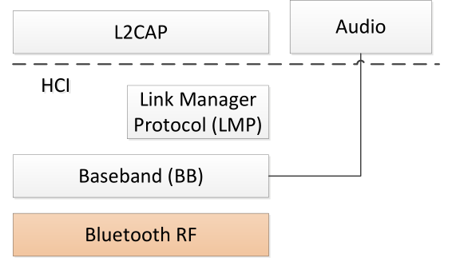
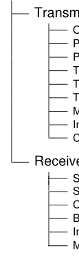
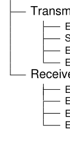
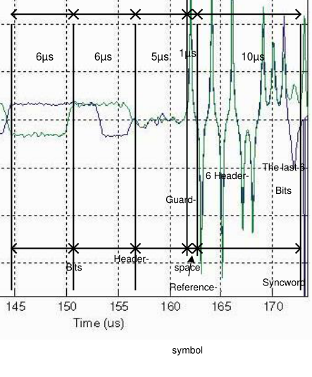
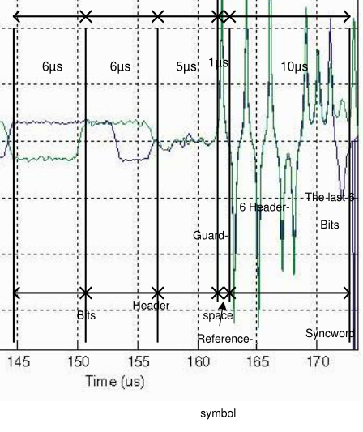
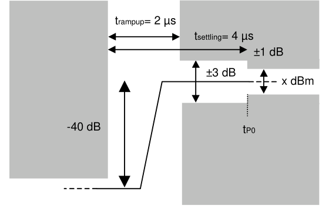

# RF.TS.p34

> Source: PDF converted via PyMuPDF.

---

Radio Frequency (RF)
Bluetooth® Test Suite
▪ Revision: RF.TS.p34 ▪ Revision Date: 2024-09-04 ▪ Prepared By: BTI ▪ Published during TCRL: TCRL.2024-2
This document, regardless of its title or content, is not a Bluetooth Specification as defined in the Bluetooth Patent/Copyright License Agreement (“PCLA”) and Bluetooth Trademark License Agreement. Use of this document by members of Bluetooth SIG is governed by the membership and other related agreements between Bluetooth SIG Inc. (“Bluetooth SIG”) and its members, including the PCLA and other agreements posted on Bluetooth SIG’s website located at www.bluetooth.com.
THIS DOCUMENT IS PROVIDED “AS IS” AND BLUETOOTH SIG, ITS MEMBERS, AND THEIR AFFILIATES MAKE NO REPRESENTATIONS OR WARRANTIES AND DISCLAIM ALL WARRANTIES, EXPRESS OR IMPLIED, INCLUDING ANY WARRANTY OF MERCHANTABILITY, TITLE, NON-INFRINGEMENT, FITNESS FOR ANY PARTICULAR PURPOSE, THAT THE CONTENT OF THIS DOCUMENT IS FREE OF ERRORS.
TO THE EXTENT NOT PROHIBITED BY LAW, BLUETOOTH SIG, ITS MEMBERS, AND THEIR AFFILIATES DISCLAIM ALL LIABILITY ARISING OUT OF OR RELATING TO USE OF THIS DOCUMENT AND ANY INFORMATION CONTAINED IN THIS DOCUMENT, INCLUDING LOST REVENUE, PROFITS, DATA OR PROGRAMS, OR BUSINESS INTERRUPTION, OR FOR SPECIAL, INDIRECT, CONSEQUENTIAL, INCIDENTAL OR PUNITIVE DAMAGES, HOWEVER CAUSED AND REGARDLESS OF THE THEORY OF LIABILITY, AND EVEN IF BLUETOOTH SIG, ITS MEMBERS, OR THEIR AFFILIATES HAVE BEEN ADVISED OF THE POSSIBILITY OF SUCH DAMAGES.
This document is proprietary to Bluetooth SIG. This document may contain or cover subject matter that is intellectual property of Bluetooth SIG and its members. The furnishing of this document does not grant any license to any intellectual property of Bluetooth SIG or its members.
This document is subject to change without notice.
Copyright © 2003–2024 by Bluetooth SIG, Inc. The Bluetooth word mark and logos are owned by Bluetooth SIG, Inc. Other third-party brands and names are the property of their respective owners.
Contents

## 1 Scope

This Bluetooth document contains the Test Suite Structure (TSS) and test cases to test the implementation of the Bluetooth RF layer, including Enhanced Data Rate, with the objective to provide a high probability of air interface interoperability between the tested implementation and other manufacturers’ Bluetooth devices.

## 2 References, definitions, and abbreviations

### 2.1 References

This document incorporates provisions from other publications by dated or undated reference. These references are cited at the appropriate places in the text, and the publications are listed hereinafter. Additional definitions and abbreviations can be found in [1] and [2].
[1] Specification of the Bluetooth System, Version 2.1 + EDR or later, Core System Package, Volume 2,
Part A
[2] Test Strategy and Terminology Overview
[3] ICS Proforma for Radio (RF)
[4] ETS 300 328: “Electromagnetic compatibility and Radio spectrum Matters (ERM); Wideband
transmission systems; Data transmission equipment operating in the 2,4 GHz ISM band and sing wide band modulation techniques; Harmonized EN covering the essential requirements of article 3.2 of the R&TTE Directive v 1.9.1 (2015-02)”
[5] FCC Part 15: CFR 47, Part 15 “Radio Frequency Device”, Sections 15.205, 15.209, 15.247
[6] Specification of the Bluetooth System, Core System Package, Volume 2, Part B, Baseband (BB)
[7] IXIT Proforma for Bluetooth Conformance Test Suites

### 2.2 Definitions

In this Bluetooth document, the definitions from [1] and [2] apply.

### 2.3 Acronyms and abbreviations

In this Bluetooth document, the definitions, acronyms, and abbreviations from [1] and [2] apply.

## 3 Test Suite Structure (TSS)

### 3.1 Test Strategy

The Bluetooth RF is layer 1 of the Bluetooth protocol stack.

**Figure 3.1: Bluetooth protocol stack, Basic Layers**

Bluetooth RF Test Suite Structure
Transmitter
Output Power Power Density Power Control TX Output Spectrum-Frequency Range TX Output Spectrum-20 dB Bandwidth TX Output Spectrum-Adjacent Channel Power Modulation Characteristics InitialCarrier Frequency Tolerance Carrier Frequency Drift
Receiver
Sensitivity – Single slot packets Sensitivity – Multi slot packets C/I Performance Blocking Performance Intermodulation Performance Maximum Input Level

**Figure 3.2: Test Suite Structure for Bluetooth RF**

Bluetooth EDR RF Test Suite Structure
Transmitter
Enhanced Data Rate Relative Transmit PowerEnhanced Data Rate Carrier Frequency Stability and Modulation Accuracy Enhanced Data Rate Differential Phase Encoding Enhanced Data Rate In-Band Spurious Emission Receiver
Enhanced Data Rate Sensitivity Enhanced Data Rate BER Floor Sensitivity Enhanced Data Rate C/I Performance Enhanced Data Rate Maximum Input Level

**Figure 3.3: Test Suite Structure for Bluetooth EDR RF**

### 3.2 Test groups

The test groups are organized in three levels. The first level defines the protocol groups representing the protocol services. The second level separates the protocol services in functional modules. The last level in each branch contains the standard ISO subgroups BV and BI (not shown in Figure 3.3).

#### 3.2.1 Protocol groups

The protocol group identifies the kind of test for Bluetooth RF test purposes:
• Transmitter
• Receiver

#### 3.2.2 Main test groups

The main test groups are the capability group, the valid behavior group and the invalid behavior group.

##### 3.2.2.1 Capability (CA) tests

This subgroup provides testing of the major IUT capabilities aiming to ensure that the claimed capabilities are correctly supported, according to the ICS.

##### 3.2.2.2 Valid Behavior (BV) tests

This subgroup provides testing to verify that the IUT reacts in conformity with the Bluetooth standard, after receipt or exchange of a valid Protocol Data Units (PDUs). Valid PDUs means that the exchange of messages and the content of the exchanged messages are considered as valid.

##### 3.2.2.3 Invalid Behavior (BI) tests

This subgroup provides testing to verify that the IUT reacts in conformity with the Bluetooth standard, after receipt of a syntactically or semantically invalid PDU.

## 4 Test cases (TC)

### 4.1 Introduction

#### 4.1.1 Test case identification conventions

Test cases are assigned unique identifiers per the conventions in [2]. The convention used here is: <spec abbreviation>/<IUT role>/<class>/<feat>/<func>/<subfunc>/<cap>/<xx>-<nn>-<y>.

|  | Identifier Abbreviation |  |  | Spec Identifier <spec abbreviation> |  |
| --- | --- | --- | --- | --- | --- |
| RF |  |  | Radio |  |  |
|  | Identifier Abbreviation |  |  | Feature Identifier <feat> |  |
| RCV |  |  | Receiver Tests |  |  |
| TRM |  |  | Transmitter Tests |  |  |

Table 4.1: RF TC feature naming conventions

#### 4.1.2 Conformance

When conformance is claimed for a particular specification, all capabilities are to be supported in the specified manner. The mandated tests from this Test Suite depend on the capabilities to which conformance is claimed.
The Bluetooth Qualification Program may employ tests to verify implementation robustness. The level of implementation robustness that is verified varies from one specification to another and may be revised for cause based on interoperability issues found in the market.
Such tests may verify:
• That claimed capabilities may be used in any order and any number of repetitions not excluded by the specification
• That capabilities enabled by the implementations are sustained over durations expected by the use case
• That the implementation gracefully handles any quantity of data expected by the use case
• That in cases where more than one valid interpretation of the specification exists, the implementation complies with at least one interpretation and gracefully handles other interpretations
• That the implementation is immune to attempted security exploits
A single execution of each of the required tests is required to constitute a Pass verdict. However, it is noted that to provide a foundation for interoperability, it is necessary that a qualified implementation consistently and repeatedly pass any of the applicable tests.
In any case, where a member finds an issue with the test plan generated by the Bluetooth SIG qualification tool, with the test case as described in the Test Suite, or with the test system utilized, the member is required to notify the responsible party via an erratum request such that the issue may be addressed.

### 4.2 Common test case conditions

Unless stated otherwise in individual test cases the following applies throughout this Test Suite:
1. The IUT is connected to the tester via a 50Ω connector. If there is no antenna interface, a
temporary 50Ω interface or a suitable coupling device may be used. 2. The test case is to be performed at normal operating conditions.

### 4.3 Pass/Fail verdict conventions

Each test case has an Expected Outcome section. The IUT is granted the Pass verdict when all the detailed pass criteria conditions within the Expected Outcome section are met.
The convention in this Test Suite is that, unless there is a specific set of fail conditions outlined in the test case, the IUT fails the test case as soon as one of the pass criteria conditions cannot be met. If this occurs, then the outcome of the test is a Fail verdict.

### 4.4 Common Packet Contents

#### 4.4.1 Fields and Bits Reserved for Future Use

Unless a specific test states otherwise, all fields within packets and all bits within fields that are described as reserved for future use are set to 0 in packets sent by the Upper and Lower Testers.

### 4.5 Transmitter

RF/TRM/CA/BV-01-C [Output Power]
• Test Purpose
Verification of the maximum average RF output power.
• Reference
[1] 3
• Initial Condition
- IUT in test mode loop back or TX mode.
- IUT hopping on or off.
- If IUT supports power control, then the tester sets the IUT’s output power setting to maximum using LMP commands.
- TSPX_Antenna_Gain is declared by the manufacturer of the IUT in the IXIT [7].
• Test Procedure
If multiple power classes are declared in the ICS, then this test is executed on each supported power class.
a) Tester transmits longest supported DM or DH packet with full payload (1, 3, or 5 slot) with PRBS9
as payload to the IUT. (See Section 6.1 “Reference Signal Definition”.)
b) If Hopping is off, IUT transmits at lowest operating TX frequency.
▪ Center frequency: the lowest operating frequency
▪ Span: Zero Span
▪ Resolution Bandwidth: 3 MHz
▪ Video Bandwidth: 3 MHz
▪ Detector: Peak
▪ Mode: Clear/Write
▪ Sweeptime: depending on packet type (one complete packet)
▪ Trigger: extern (to signaling unit.)
d) Tester calculates average power PAV over at least 20% to 80% of the duration of the burst
(position of p0 defines the begin of the burst) or if the measuring system is not able to determine the p0 bit in the burst: Tester calculates average power PAV over at least 20% to 80% of the duration of the burst. (The duration of the burst is the time between the leading and trailing 3 dB points compared to the average power).
e) Repeat b)–d) while the analyzer center frequency is set to:
the mid operating frequency; and the highest operating frequency.
These frequencies are defined in Section 6.2.2, “Frequencies for testing, loopback, hopping off.”
NOTE: When using test equipment that can follow the hopping sequence the low, mid, and upper frequencies can be tested when hopped to.
f) The TSPX_Antenna_Gain (in dBi) is added to the results (in dBm) measured in part a)–e) to calculate average equivalent isotropic radiated power PAV EIRP.
• Test Condition
Common Test Case Conditions defined in Section 4.2 apply.
• Expected Outcome
Pass verdict
All values as measured fulfill the following conditions.
PAV EIRP < 100 mW (20 dBm) EIRP
If the IUT is a power class 1 equipment:
▪ PAV > 1 mW (0 dBm)
If the IUT is a power class 2 equipment:
▪ 0.25 mW (-6 dBm) < PAV < 2.5 mW ( 4 dBm)
If the IUT is a power class 3 equipment:
▪ PAV < 1 mW (0 dBm)
• Notes
If the test is performed using loopback mode, then it is recommended that the payload content is checked as well.
• Test Purpose
Verification of the maximum RF-output power density.
• Reference
[4]
• Initial Condition
- IUT in test mode loop back or TX mode.
- Hopping on.
- If IUT supports power control, then the tester sets the IUT’s output power setting to maximum using LMP commands.
• Test Procedure
When multiple power classes are declared in the ICS, the test is performed using the power class representing the highest power supported.
a) Tester transmits longest supported DM or DH packet with full payload (1, 3, or 5 slot) with PRBS9
as payload to the IUT. (See Section 6.1 “Reference Signal Definition”.)
b) The spectrum analyzer settings are as follows:
▪ Center frequency: 2441 MHz
▪ Span: ≥ 80 MHz
▪ Resolution Bandwidth: 100 kHz
▪ Video Bandwidth: 100 kHz
▪ Detector: Peak
▪ Mode: Maxhold
▪ Sweeptime: 1 sec per 100 kHz span
▪ Trigger: freerun.
If the measurement equipment is not able to store one sample for each 100 kHz frequency range, the span may be split for several measurements.
c) A trace is done and the peak value of the trace is found.
d) The spectrum analyzer is set to Zero Span, the center frequency is set to the frequency found in
step c), and the sweep time is set to 1 minute. A single sweep is running.
e) The power density is calculated as the peak value of the trace captured in step d).
f) The antenna gain G (in dBi) is added to the results (in dBm) measured in part a)–e).
• Test Condition
Common Test Case Conditions defined in Section 4.2 apply.
• Expected Outcome
Pass verdict
All values as measured fulfill the following conditions.
Power Density < 100 mW (20dBm) per 100 kHz EIRP.
• Notes
If the test is performed using loopback mode, then it is recommended that the payload content is checked as well.
RF/TRM/CA/BV-03-C [Power Control]
• Test Purpose
Verification of the TX power control.
• Reference
[1] 3
• Initial Condition
- IUT in test mode loop back or TX mode.
- Hopping off.
- IUT transmits at maximum output power back to the tester.
- TSPX_Timer_TX_Power_Control is declared by the manufacturer of the IUT in the IXIT [7].
• Test Procedure
When multiple power classes are declared in the ICS, the test is performed using the power class representing the highest power supported.
a) Tester sets IUT to lowest operating TX frequency using LMP commands.
b) Tester transmits DH1 packets with PRBS9 as payload to the IUT. (See Section 6.1 “Reference
Signal Definition”.)
c) The spectrum analyzer settings are as follows:
▪ Center frequency: the lowest operating frequency
▪ Span: Zero Span
▪ Resolution Bandwidth: 3 MHz
▪ Video Bandwidth: 3 MHz
▪ Detector: Peak
▪ Mode: Clear/Write
▪ Sweeptime: one complete DH1 packet
▪ Trigger: extern (to signaling unit)
of p0 defines the begin of the burst) or if the measuring system is not able to determine the p0 bit in the burst: Tester calculates average power PAV over at least 20%–80% of the duration of the burst. (The duration of the burst is the time between the leading and trailing 3 dB points compared to the average power).
e) Decrease IUT output power for one power step.
The next measurement starts after the IUT has reached the new power step (TSPX_Timer_TX_Power_Control, default value = 1 second, see Section 5).
f) Repeat steps b)–f) until minimum possible output power step of the IUT is reached.
g) Tester increases IUT's output power one step using LMP command. Repeat steps b)–e). Step
size is recorded by the tester.
h) Repeat step h) to the maximum possible output power setting of the IUT.
i) Repeat steps b)–h) while the IUT receives (fRX) / loops back (fTX) at: the mid operating frequency; and the highest operating frequency.
j) These frequencies are defined Section 6.2.2, “Frequencies for testing, loopback, hopping off”.
• Test Condition
Common Test Case Conditions defined in Section 4.2 apply.
• Expected Outcome
Pass verdict
All values as measured fulfill the following conditions.
Expected Outcome refers to the step size and to the minimum output power. The latter depends on the power class of the IUT.
Step size of the power control: 2dB  step size  8 dB
For power class 1 equipment:
▪ At minimum power step: PAV < 4dBm
• Notes
If the test is performed using loopback mode, then it is recommended that the payload content is checked as well.
RF/TRM/CA/BV-04-C [TX Output Spectrum – Frequency Range]
• Test Purpose
Verification that the emissions inside the operating frequency range are within the limits.
• Reference
[1] 3
• Initial Condition
- IUT in test mode loop back or TX mode.
- Hopping off.
- IUT transmits at maximum output power back to the tester.
• Test Procedure
When multiple power classes are declared in the ICS, the test is performed using the power class representing the highest power supported.
a) IUT is set to lowest TX frequency.
b) Tester transmits longest supported DM or DH packet with full payload (1, 3, or 5 slot) with PRBS9
as payload to the IUT. (See Section 6.1 “Reference Signal Definition”.)
c) The spectrum analyzer settings are set as follows:
▪ Resolution bandwidth (RBW): 100 kHz
▪ Video bandwidth: 300 kHz
▪ Center frequency: lowest supported TX frequency
▪ Start frequency: see Table 4.1
▪ Stop frequency: see Table 4.1
▪ Detector: Peak
▪ Mode: averaging
▪ Sweep time: 2s (at least one burst per sample)
▪ Trigger: extern (to signaling unit)
▪ Number of sweeps: 50.

|  |  |  |  |  |  |  |  |  |
| --- | --- | --- | --- | --- | --- | --- | --- | --- |
|  | TX channel |  |  | Start frequency/MHz |  |  | Stop frequency/MHz |  |
|  |  |  |  |  |  |  |  |  |
|  |  |  |  |  |  |  |  |  |
|  | Lowest |  |  | 2399 |  |  | 2405 |  |
|  |  |  |  |  |  |  |  |  |
|  |  |  |  |  |  |  |  |  |
|  | Highest |  |  | 2475 |  |  | 2485 |  |
|  |  |  |  |  |  |  |  |  |

Table 4.1: Start and Stop Frequency
d) Find lowest frequency below the operating frequencies at which spectral power density drops
below the level of –80 dBm/Hz e.i.r.p (-30 dBm if measured in a 100 kHz bandwidth). This frequency is called fL. It is recorded in the test report.
e) Set IUT to transmit on highest TX frequency.
f) Set spectrum analyzer center frequency to highest TX frequency. The other spectrum analyzer settings are as in step c).
g) Find highest frequency above the operating frequencies at which spectral power density drops
below the level of –80 dBm/Hz e.i.r.p (-30 dBm if measured in a 100 kHz bandwidth). This frequency is called fH. It is recorded in the test report.
• IUT Test Condition
Common Test Case Conditions defined in Section 4.2 apply.
• Expected Outcome
Pass verdict
All values as measured fulfill the following conditions.
fL, fH within the allowed frequency band:

### 2.4 GHz – 2.4835 GHz

• Notes
If the test is performed using loopback mode it is recommended that the payload content is checked as well.
RF/TRM/CA/BV-05-C [TX Output Spectrum – 20 dB Bandwidth]
• Test Purpose
Verification that the emissions inside the operating frequency range are within the limits.
• Reference
[1] 3.1.2.1
[5] Regulatory Requirement FCC Part 15.247, a(1ii)
• Initial Condition
- IUT in test mode loop back or TX mode.
- Hopping off.
- IUT transmits at maximum output power back to the tester.
• Test Procedure
When multiple power classes are declared in the ICS, the test is performed using the power class representing the highest power supported.
a) The IUT is set to transmit at:
▪ The lowest operating frequency.
The related receiving frequency is defined in Section 6.2.2, “Frequencies for testing, loopback, hopping off”.
b) Tester transmits longest supported DM or DH packet with full payload (1, 3, or 5 slot) with PRBS9
as payload to the IUT. (See Section 6.1 “Reference Signal Definition”.)
c) The spectrum analyzer settings are as follows:
▪ Resolution bandwidth (RBW): 10 kHz
▪ Video bandwidth: 30 kHz
▪ Center frequency: fTX center (lowest TX operating frequency)
▪ Span: 3.0 MHz
▪ Detector: Peak
▪ Sweep time: >= 1sec. per sweep.
▪ Trigger: freerun
▪ Number of sweeps: 10.
d) Find the highest power value in the transmit channel (peak of the emission).
e) Find lowest frequency below the operating frequency at which transmit power drops 20 dB below
the level measured in step d). This frequency is called fL. It is recorded in the test report.
f) Find highest frequency above the operating frequencies at transmit power drops 20 dB below the level measured in step d). This frequency is called fH. It is recorded in the test report.
g) The difference between the frequencies f := fH - fL measured in the former steps is the 20 dB
bandwidth. It is recorded in the test report.
h) Repeat steps b)–g) while the IUT transmits (fTX) at:
▪ The mid operating frequency; and
▪ The highest operating frequency.
These frequencies and the related RX frequencies are defined in Section 6.2.2, “Frequencies for testing, loopback, hopping off.”
• Test Condition
Common Test Case Conditions defined in Section 4.2 apply.
• Expected Outcome
Pass verdict
All values as measured fulfill the following conditions.
The Transmit spectrum fulfils the following mask:
- If the highest power value measured in step d) is equal or higher than 0 dBm:
f = |fH - fL|  1.0 MHz
- If the highest power value measured in step d) is lower than 0 dBm:
f = |fH - fL|  1.5 MHz
• Notes
If the test is performed using loopback mode, then it is recommended that the payload content is checked as well.
RF/TRM/CA/BV-06-C [TX Output Spectrum – Adjacent Channel Power]
• Test Purpose
Verification that the emissions inside the operating frequency range are within the limits.
• Reference
[1] 3.1.2.1
• Initial Condition
- IUT in test mode loop back.
- Hopping off.
- IUT transmits at maximum output power back to the tester.
• Test Procedure
When multiple power classes are declared in the ICS, the test is performed using the power class representing the highest power supported.
The transmit frequency is defined by the index M (transmit frequency f(M) is calculated according to Section 6.2, “Frequencies for testing” substituting M for k). In the same way, the measurement frequency is defined by the index N.
a) IUT is set to transmit on (fTX) = f(3) (M = 3)
b) Set N := 0.
c) Tester transmits DH1 packets with PRBS9 as payload to the IUT (see Section 6.1, Reference
Signal Definition).
d) The Spectrum Analyzer is set as follows:
▪ Span: Zero Span
▪ Center frequency: f(N) – 450 kHz
▪ Resolution bandwidth: 100 kHz
▪ Video bandwidth: 300 kHz
▪ Detector: Average
▪ Mode: maxhold
▪ Sweep time: 100 ms
▪ Number of sweeps: 10
e) Determine maximum value PTXn of the trace.
f) Increase center frequency for 100 kHz.
g) Repeat steps e)–f) until center frequency = f(N) + 450 kHz.
i) Increase center frequency by 1 MHZ: N := N+1 AND skip to next frequency if the increased frequency equals to fTX or "fTX - 1MHz" or "fTX + 1MHz".
j) Repeat steps c)–i) until f(N) is above the maximum TX frequency.
k) Set the IUT transmit frequency (fTX) to:
▪ The mid operating frequency; and
▪ The frequency f(Mmax – 3) where f(Mmax)) corresponds to the highest operating frequency.
These frequencies (mid, high) and the related RX frequencies for polling are defined in Section 6.2.2, “Frequencies for testing, loopback, hopping off”.
l) Set N := 0.
• Test Condition
Common Test Case Conditions defined in Section 4.2 apply.
• Expected Outcome
Pass verdict
All values as measured fulfill the following conditions.
The IUT is transmitting on channel M and the adjacent channel power is measured on channel number N. N is chosen to cover the whole regulatory range, see Section 6.2.1, “Operating frequency bands”.
PTX (f)  – 20 dBm for M-N= 2
PTX (f)  – 40 dBm for M-N >= 3
For each operating frequency M, exceptions in up to three bands are allowed where |M-N| ≥ 3. For
exceptions, Ptx (f)  -20 dBm.
• Notes
If the test is performed using loopback mode, then it is recommended that the payload content is checked as well.
RF/TRM/CA/BV-07-C [Modulation Characteristics]
• Test Purpose
Verification of the modulation index.
• Reference
[1] 3.1.1
• Initial Condition
- IUT in test mode loop back with whitening turned off or TX mode.
- Hopping off.
- IUT transmits at maximum output power back to the tester.
• Test Procedure
When multiple power classes are declared in the ICS, the test is performed using the power class representing the highest power supported.
a) IUT transmits (fTX) at: lowest operating frequency
b) Tester transmits longest supported DM or DH packet with full payload (1, 3 or 5 slot) with
11110000…-Bit pattern as payload.
The measurement bandwidth of the tester is at least 1.3 MHz. Passband ripple to ± 550 kHz: is a maximum of 0.5 dB (peak to peak)
It is recommended that the test equipment should use a measurement filter with the following specification:
Transition band minimum attenuations:
▪ ± 650 kHz: -3 dB
▪ ± 1 MHz: -14 dB
▪ ± 2 MHz: -44 dB
c) Tester determines the position of bit p0 (see Section 6.5, “Definition of the position of Bit p0”) in
the packets looped back by the IUT. This is the timing reference to identify the bits in the payload field.
d) Tester calculates for each "00001111" 8 bit sequence in the payload the average frequency over
the frequency values of the 8 bits. To determine the correct deviation value of each bit it is oversampled at least four times. Then take the average over these at least four samples as the deviation for each bit. For each second, third, sixth and seventh of the 8 bits the deviation from
the average frequency within the bit period is recorded as f1max.
e) The average of all the f1max deviation values measured before is calculated, and recorded as
f1avg.
f) Tester transmits longest supported DM or DH packet with full payload (1, 3 or 5 slot) with 101010…-Bit pattern as payload.
g) Tester determines the position of bit p0 (see Section 6.5, “Definition of the position of Bit p0”) in
the packets looped back by the IUT. This is the timing reference to identify the bits in the payload field.
h) Starting with the second payload bit, the STE calculates for each "01010101" 8 bit sequence in
the payload the average frequency over these 8 bits. For each of the 8 bits the maximum
deviation from this average within the bit period is recorded as f2max.
i) The average of all the maximum deviation values measured before is calculated, and recorded as f2avg.
j) Repeat steps b)–i) for at least 10 packets.
k) Repeat steps b)–j) while the IUT transmits (fTX) at:
▪ The mid operating frequency; and
▪ The highest operating frequency.
These frequencies and the related RX frequencies are defined in Section 6.2.2, “Frequencies for testing, loopback, hopping off”.
• Test Condition
Common Test Case Conditions defined in Section 4.2 apply.
• Expected Outcome
Pass verdict
All values as measured fulfill the following conditions.
The average of all frequency deviations f1avg, as measured, is within 140 kHz and 175 kHz.
At least 99.9% of all frequency deviations f2max, as measured, are greater than 115 kHz.
The ratio of all frequency deviations f2avg, as measured, and f1avg does not lie below 80%.

## 140 kHz  f1avg  175 kHz

f2max  115 kHz for at least 99.9% of all f2max
≥0.8 f2avg f1avg
• Notes
Whitening is disabled while the test case is performed.
Alternatively, it is allowed to use TX mode instead of loop back mode for sending the 1010. bit pattern and 1111000 … bit pattern, if possible.
The figure of 99.9% was used to compensate the influence of the statistical distribution of the measured values as each single value is considered in the verdict.
If the test is performed using loopback mode, then it is recommended that the payload content is checked as well.
It is allowed for the tester to change the order of the test sequence in loopback and TX test mode. The tester can send and measure packets with either payload in any order.
RF/TRM/CA/BV-08-C [Initial Carrier Frequency Tolerance]
• Test Purpose
Verification of the transmitter carrier frequency accuracy
• Reference
[1] 3.1.3
• Initial Condition
- IUT in test mode loop back or TX mode.
- Hopping on.
- IUT transmits at maximum output power back to the tester.
• Test Procedure
When multiple power classes are declared in the ICS, the test performs using the power class representing the highest power supported.
a) IUT transmits DH1 packets with PRBS9 as payload to the tester.
b) Tester measures packets received at the lowest operating frequency. The measurement
bandwidth of the tester is at least 1.3MHz. Passband ripple to ± 550kHz: is a maximum of 0.5 dB (peak to peak)
It is recommended that the test equipment should use a measurement filter with the following specification:
Transition band minimum attenuations:
▪ ± 650 kHz: -3 dB
▪ ± 1 MHz: -14 dB
▪ ± 2 MHz: -44dB
c) Tester determines the position of bit p0 (see Section 6.5, “Definition of the position of Bit p0”) in
the packets looped back by the IUT. This is the timing reference to identify the bits in the payload field.
d) The tester makes an integration of the packet’s 4 preamble bits and the first bit after the 4th
preamble bit on the IUT’s fTX channel. The measurement starts at the center of the first preamble bit until the center of the first bit following the 4th preamble bit.
e) The IUT’s carrier frequency is assumed to be the result of this integration done in d) and is
named f0.
f) Repeat steps b)–e) for at least 10 packets.
g) Repeat steps c)–f) with packets measured:
▪ The mid operating frequency; and
▪ The highest operating frequency.
These frequencies can be found in Section 6.2.2.
When using test equipment that can follow the hopping sequence the low, mid, and upper frequencies can be tested when hopped to.
• Test Condition
Common Test Case Conditions defined in Section 4.2 apply.
• Expected Outcome
Pass verdict
All values as measured fulfill the following conditions.
Each of the IUT’s carrier frequency f0 as measured is within 75 kHz from the IUT's chosen nominal carrier frequency fTX.
fTX – 75 kHz  f0  fTX + 75 kHz.
• Notes
If the test is performed using loopback mode, then it is recommended that the payload content is checked as well.
RF/TRM/CA/BV-09-C [Carrier Frequency Drift]
• Test Purpose
Verification of the transmitter center frequency drift within a packet.
• Reference
[1] 3.1.3
• Initial Condition
- IUT in loop back mode with whitening turned off or TX mode.
- Hopping on.
It is defined after which time the measurement starts.
• Test Procedure
When multiple power classes are declared in the ICS, the test is performed using the power class representing the highest power supported.
a) IUT transmits packets with a 1010-sequence as payload. All supported packets (DH1/3/5) with
the longest supported payload length are used.
b) Tester measures packets received at the lowest operating frequency. The measurement
bandwidth of the tester is at least 1.3MHz. Passband ripple to ± 550KHz: is a maximum of 0.5 dB (peak to peak) It is recommended that the test equipment should use a measurement filter with the following specification: Transition band minimum attenuations:
± 650 kHz: -3 dB
± 1 MHz: -14 dB
± 2 MHz: -44dB
c) Tester determines the position of bit p0 (see Section 6.5, “Definition of the position of Bit p0”) in
the packets looped back by the IUT. This is the timing reference to identify the bits in the payload field.
d) The tester makes an integration of the packet’s 4 preamble bits and the first bit after the 4th
preamble bit on the IUT's fTX channel. The measurement starts at the center of the first preamble bit until the center of the first bit following the 4th preamble bit. The IUT's carrier frequency is assumed to be the result of this integration and is named f0.
e) Tester integrates the frequency deviations of every 10 bit symbols in the payload body (k-th
measurement leads to fk). The measurement starts with the 2nd payload bit, so that the first 10 bit block includes payload bit 2-11.
f) Repeat steps b)–e) for at least 10 packets.
g) Repeat steps b)–f) for all supported packet lengths (DH1/3/5 packets).
h) Repeat steps c)–g) with packets measured at:
▪ Mid operating frequency; and
▪ Highest operating frequency.
These frequencies can be found in Section 6.2.2, “Frequencies for testing, loopback, hopping off”.
When using test equipment that can follow the hopping sequence the low, mid, and upper frequencies can be tested when hopped to.
• Test Condition
Common Test Case Conditions defined in Section 4.2 apply.
• Expected Outcome
Pass verdict
All values as measured fulfill the following conditions.
The transmitter center frequency is not allowed to drift more than the limits given in Table 4.2.

|  |  |  |  |  |  |
| --- | --- | --- | --- | --- | --- |
|  | Type of Packet |  |  | Frequency Drift |  |
|  |  |  |  |  |  |
|  |  |  |  |  |  |
| One slot packet |  |  |  | 25 kHz |  |
|  |  |  |  |  |  |
|  |  |  |  |  |  |
| Three slot packet |  |  |  | 40 kHz |  |
|  |  |  |  |  |  |
|  |  |  |  |  |  |
| Five slot packet |  |  |  | 40 kHz |  |
|  |  |  |  |  |  |

Table 4.2: Frequency Drift within a packet
The frequency drift limits apply to the difference between the average frequency of the 4 preamble bits f0 and the average frequency of any 10 bits in the payload field of the returned packets fk.
The maximum drift rate applies to the difference between any two 10-bit groups separated by 50 s within the payload field of the returned packets.
fk+5 - fk  20000 Hz, k=1 … max.
• Notes
Whitening is disabled while the test case is performed.
If the test is performed using loopback mode, then it is recommended that the payload content is checked as well.
RF/TRM/CA/BV-10-C [EDR Relative Transmit Power]
• Test Purpose
Verification of the acceptable range for the difference in average transmit power during frequency modulated [GFSK] and phase modulated [DPSK] portions of a packet.
• Reference
[1] 3.2.4
• Initial Condition
- IUT in test mode loop back or TX mode, with whitening off.
- Hopping off (transmit and receive frequencies are defined in Section 6.2.2.
- If IUT supports power control the tester sets the IUT’s output power setting to maximum using LMP commands.
• Test Procedure
When multiple power classes are declared in the ICS, the test is performed using the power class representing the highest power supported.
payload containing PRBS9.
b) IUT transmits at lowest operating TX frequency.
c) The spectrum analyzer is set as follows:
▪ Center frequency: IUT transmit frequency
▪ Span: Zero Span
▪ Resolution Bandwidth: 3 MHz
▪ Video Bandwidth: 3 MHz
▪ Detector: Average (Sample may also be used)
▪ Mode: Clear Write (continuous update)
▪ Sweeptime: depending on packet type (one complete packet)
▪ Trace Average: 10
d) Tester calculates average power PGFSK over at least 80% of the GFSK portion (Access Code &
Header period) of the packet.
e) Tester calculates the average power PDPSK over at least 80% of the DPSK portion of the packet
(Synchronization sequence and payload).
f) Repeat steps d)–f) while the IUT transmits at:
▪ The mid operating frequency; and
▪ The highest operating frequency.
g) If power control is supported, repeat steps c)–f) with IUT transmitting minimum output power. If
the IUT does not support power control, continue to step h).
h) If 8DPSK modulation is supported by the IUT, repeat steps b)–h) while the IUT transmits longest
supported 8DPSK packet type (3-DHx or 3-EVx) with maximum length payload containing PRBS9.
• Test Conditions
Common Test Case Conditions defined in Section 4.2 apply.
• Expected Outcome
Pass verdict
For all pairs of results: (PGFSK – 4dB) < PDPSK < (PGFSK + 1dB)
RF/TRM/CA/BV-11-C [EDR Carrier Frequency Stability and Modulation Accuracy]
• Test Purpose
Verification of the transmitter carrier frequency stability and modulation accuracy.
• Reference
[1] 3.2.1.4, 3.2.3
• Initial Condition
- IUT in test mode loop back or TX mode, with whitening off.
- Hopping off (transmit and receive frequencies are defined in Section 6.2.2.
- IUT transmits at maximum output power back to the tester.
• Test Procedure
When multiple power classes are declared in the ICS, the test is performed using the power class representing the highest power supported.
a) IUT transmits the longest supported /4-DQPSK packet type (2-DH1, 2-DH3, 2-DH5, 2-EV3,
or 2-EV5). The user payload bytes contain PRBS9 pseudo-random data. The number of user payload bytes is 31 for 2-DH1 packets, 58 for 2-EV3 packets, 356 for 2-DH3 packets, 358 for 2-EV5 packets or 656 for 2-DH5 packets.
b) IUT transmits at the lowest operating frequency.
c) Tester calculates the initial center frequency error for a packet transmitted by the IUT using
the following method applied to the basic rate portion of the packet:
a. Tester determines the start time of the first preamble bit p0 using the measurement
method.
b. Tester calculates the frequency deviations at the bit centers (referenced to p0) of the
packet header bits, relative to the ideal carrier frequency.
c. Tester selects those bits from the header that have the same value as both the
previous and following bits so are not significantly affected by inter-symbol interference (there will be at least 18 bits of this type). The tester may also select other bits from the header, but the frequency deviations of these bits are compensated to remove inter-symbol interference.
d. Tester calculates the average frequency deviation 1 of those selected packet
header bits that represent a transmitted ‘1’.
e. Tester calculates the average frequency deviation 2 of those selected packet
header bits that represent a transmitted ‘0’.
f. Tester calculates the initial frequency error i = (1+2)/2.
d) Tester compensates the Enhanced Data Rate portion of the packet for the initial frequency
error i of the packet.
e) Tester applies a square-root raised cosine measurement filter with a roll-off factor of 0.4 and
a 3 dB bandwidth of ±500 kHz to the Enhanced Data Rate portion of the packet.
f) Tester partitions the output of the measurement filter into non-overlapping blocks of 50 µsecs beginning at the nominal start of the synchronization symbol following the reference symbol and finishing at the nominal end of the final payload CRC symbol (the number of user payload bytes has been chosen to make this an integral number of blocks).
g) For each block, tester calculates the sampling phase 0 and frequency error 0 for the RMS
DEVM for the block, as defined Appendix C of the Enhanced Data Rate RF Specification (note that this computation includes information from the symbol immediately before the block to generate the 50 differential error vectors). The frequency error 0 and the RMS DEVM for each block are recorded.
phase 0 and frequency error 0 for the block as calculated in step g). The DEVM for each symbol is recorded.
i) Repeat steps c)–h) for further packets transmitted by the IUT until a total of 200 blocks have been measured (any remaining blocks from the end of the final packet should be discarded).
j) Repeat steps b)–i) while the IUT transmits at:
▪ The mid operating frequency; and
▪ The highest operating frequency.
k) If 8DPSK modulation is supported by the IUT, repeat steps b)–j) using the longest supported
8DPSK packet type (3-DH1, 3-DH3, 3-DH5, 3-EV3, or 3-EV5). The user payload bytes contain PRBS9 pseudo-random data. The number of user payload bytes is 11 for 3-DH1 packets, 88 for 3-EV3 packets, 536 for 3-DH3 packets, 538 bytes for 3-EV5 packets or 986 for 3-DH5 packets.
• Test Condition
Common Test Case Conditions defined in Section 4.2 apply.
• Expected Outcome
Pass verdict
If the IUT does not support 8DPSK modulation then the outcomes based on this modulation do not apply.
All values as measured fulfill the following conditions:
1. Carrier frequency stability:
-75 kHz < i < +75 kHz, for all packets -75 kHz < (i + 0) < +75 kHz, for all blocks -10 kHz <0 < +10 kHz, for all blocks
2. RMS DEVM:
RMS DEVM ≤ 0.20, for all /4-DQPSK blocks RMS DEVM ≤ 0.13, for all 8DPSK blocks
3. Peak DEVM:
DEVM ≤ 0.35 for all /4-DQPSK symbols DEVM ≤ 0.25 for all 8DPSK symbols
4. 99% DEVM:
DEVM ≤ 0.30, for 99% of /4-DQPSK symbols DEVM ≤ 0.20, for 99% of 8DPSK symbols
• Notes
The tester checks that the correct packet type (for loop back and TX test modes) and payload (for loop back test mode only) have been transmitted by the IUT; any invalid packets should be discarded to avoid corruption of the measurements.
- The requirements on the measurement bandwidth of the tester are the same as used in TRM/CA/BV-07-C Modulation Characteristics.
- The method for measuring the position of bit p0 in the basic rate signal is that same as used in TRM/CA/BV-07-C Modulation Characteristics.
- The minimum sampling rate for the basic rate portion of the packet is 8 samples per bit period to obtain a sufficiently accurate estimate of the initial frequency error (interpolation may be used to obtain this sampling rate from a lower initial sampling rate).
- It is recommended that the tester uses combinations of UAP and AM_ADDR values that result in non-whitened packet headers with at least five 1’s and at least five 0’s (including the HEC, but prior to FEC) to ensure a good estimate of initial carrier frequency.
For measurements based on Enhanced Data Rate symbols:
- The number of user payload bytes has been chosen to be as close as possible to the maximum packet size, subject to the constraint that the synchronization symbols, the two payload header bytes (for n-DHx packets), the user payload and the two CRC bytes constitute an integer number of DEVM blocks. This ensures that the modulation accuracy of all symbols, other than the trailer symbols, is measured.
- The PRBS9 pseudo random generator is initialized with a seed of all ones at the beginning of each test packet. The first PRBS9 output bit represents the least significant bit of the first user payload byte.
- The definition of the square-root raised cosine measurement filter is given in [RF Spec]. The measurement filter frequency response is accurate of ±0.25 dB up to 0.65 MHz from the carrier frequency and provides at least 40 dB suppression for frequencies more than 0.8 MHz from the carrier frequency. The measurement filter requirement is referenced to the connector on the IUT, so includes the contributions due to all aspects of the signal processing applied by the tester.
- The tester gives an RMS DEVM of less than 3% and a Peak DEVM of less than 8% when a test signal from a reference signal generator is applied and the defined test procedure is followed. This requirement is met when the test signal has any frequency error up to 75 kHz and any symbol rate error up to ±20 ppm.
RF/TRM/CA/BV-12-C [EDR Differential Phase Encoding]
• Test Purpose
Verification that the modulator correctly differential phase encodes the data.
• Reference
[1] 3.2.1.2
• Initial Condition
- IUT in TX mode with whitening turned off.
- Hopping off (transmit and receive frequencies are defined in Section 6.2.2.
- IUT transmits at maximum output power back to the tester.
• Test Procedure
When multiple power classes are declared in the ICS, the test is performed using the power class representing the highest power supported.
a) IUT transmits 2-DH1 or 2-EV3 packets to the tester with maximum length payload containing
PRBS9.
b) IUT transmits at lowest operating frequency.
c) Tester demodulates 100 packets and compares each payload with the expected PRBS9 data.
d) If 8DPSK modulation is supported by the IUT repeat steps b)–c) using 3-DH1 or 3-EV3 packets
with maximum length payload containing PRBS9.
• Test Condition
Common Test Case Conditions defined in Section 4.2 apply.
• Expected Outcome
Pass verdict
The expected outcome of this test is zero errors detected by the tester in 99% of the packets.
• Notes
The PRBS9 pseudo random generator is initialized with a seed of all ones at the beginning of each test packet. The first PRBS9 output bit represents the least significant bit of the first user payload byte.
RF/TRM/CA/BV-13-C [EDR In-band Spurious Emissions]
• Test Purpose
Verification that the level of unwanted signals from the DPSK transmitter, within the frequency range used by the device, is below the required level.
• Reference
[1] 3.2.2.1
• Initial Condition
- IUT in test mode loop back or TX mode, with whitening off.
- Hopping off (transmit and receive frequencies are defined in Section 6.2.2).
- IUT transmits at maximum output power back to the tester.
• Test Procedure
When multiple power classes are declared in the ICS, the test is performed using the power class representing the highest power supported.
The transmit frequency is defined by the index M (transmit frequency f(M) is calculated according to Section 6.2, (substituting M for k). In the same way the measurement frequency is defined by the index N. N is chosen to cover the whole regulatory range, see Section 6.2.1.
a) Tester transmits longest supported /4-DQPSK packet type (2-DHx or 2-EVx) with maximum
length payload containing PRBS9.
b) IUT is set to transmit on (fTX) = f(3) (M = 3)
d) The Spectrum Analyzer is set as follows:
▪ Span: Zero Span
▪ Center frequency: f(N) – 450 kHz
▪ Resolution bandwidth: 100 kHz
▪ Video bandwidth: 300 kHz
▪ Detector: Average
▪ Mode: Max Hold
▪ Gating: Edge
▪ Gating Delay, Length: Adjust to include the guard period, the DPSK portion of the packet and the power down ramp
▪ Sweep time: Setting dependent on packet length (one complete packet)
▪ Number of sweeps: 10
e) If |M-N| > 1,
i) Set center frequency to f(N) - 450kHz and set n := 1
ii) Determine maximum value PTXn of the trace
iii) Increase center frequency by 100 kHz and set n := n+1
iv) Repeat steps ii) and iii) until center frequency > f(N) + 450kHz
f) If (M-N) = +1,
i) Set center frequency to f(N) - 450kHz and set n := 1
ii) Determine maximum value PTXn of the trace
iii) Increase center frequency by 100 kHz and set n := n+1
iv) Repeat steps ii) and iii) until center frequency > f(N) – 50kHz
g) If (M-N) = 0,
i) Set center frequency to f(N) - 450kHz and set n := 1
ii) Determine maximum value PTXn of the trace
iii) Increase center frequency by 100 kHz and set n := n+1
iv) Repeat steps ii) and iii) until center frequency > f(N) + 450kHz
h) If (M-N) = -1,
i) Set center frequency to f(N) + 50kHz and set n := 1
ii) Determine maximum value PTXn of the trace
iii) Increase center frequency by 100 kHz and set n := n+1
i) Set N := N+1
j) Repeat steps d)–h) until f(N) is above the maximum TX frequency.
k) Repeat steps c)–i) with the IUT transmit frequency (fTX) set to:
▪ The mid operating frequency; and
▪ The frequency f(Mmax-3), where f(Mmax) is the highest operating frequency.
▪ These frequencies and the related receive frequencies are defined in Section 6.2.2.
l) If 8DPSK modulation is supported by the IUT, repeat steps b)–j) while the IUT transmits longest supported 8DPSK packet type (3-DHx or 3-EVx) with maximum length payload containing PRBS9.
• Test Conditions
Common Test Case Conditions defined in Section 4.2 apply.
• Expected Outcome
Pass verdict
All values as measured fulfill the following conditions.
- PTX-26dB  (f) ≤ PTXref   -26 dB for |M-N| = 1
- PTX  (f) ≤ – 20 dBm for |M-N| = 2
- PTX  (f) ≤ – 40 dBm for |M-N| ≥ 3.
For each operating frequency M, exceptions in up to three bands are allowed where |M - N| ≥ 3. For exceptions, Ptx(f) ≤ -20 dBm.
• Notes
This test is similar to TRM/CA/BV-06-C except here the measurement is gated to cover only the DPSK portion of the packet.
RF/TRM/CA/BV-14-C [Enhanced Power Control]
• Test Purpose
Verification of the TX Enhanced power control.
• Reference
[1] 3
• Initial Condition
- IUT in test mode loop back or TX mode may be used, whitening off.
- Hopping off.
- The tester puts the IUT at maximum output power using the LMP_power_control_req PDU with the power adjustment_req set to “go to max.”
• Test Procedure
When multiple power classes are declared in the ICS, the test is performed using the power class representing the highest power supported.
a) Tester sets IUT to lowest operating TX frequency using LMP commands.
b) Tester transmits DH1 packets with PRBS9 as payload to the IUT. (See Section 6.1, “Reference
Signal Definition”).
c) The spectrum analyzer settings are as follows:
▪ Center frequency: the lowest operating frequency
▪ Span: Zero Span
▪ Resolution Bandwidth: 3 MHz
▪ Video Bandwidth: 3 MHz
▪ Detector: Peak
▪ Mode: Clear/Write
▪ Sweeptime: one complete packet as selected under step b)
▪ Trigger: extern (to signaling unit)
d) Tester calculates average power PAV over at least 20% - 80% of the duration of GFSK header of
the burst (position of p0 defines the beginning of the burst).
e) Repeat steps b)–e) for the IUT transmitting 2-DH1 and 3-DH1 packet types (EDR packets) if they
are supported.
f) Tester uses the power change request LMP command to decrease the IUT output power for one power step.
The next measurement starts after the Tester has received the power change response for the power change request from the IUT.
g) Repeat steps b)–g) until minimum output power of the IUT is indicated by the Power change
response for all supported modulations.
The power step size of each modulation, if the response indicates a power change for the modulation, and the difference between the GFSK header of the different modulations, are recorded for each step.
h) Tester uses the power change request LMP command to increase the IUT output power one
step.
The next measurement starts after the Tester has received the power change response for the power change request from the IUT.
i) Repeat steps b)–f) and i) until the maximum output power of the IUT is indicated by the Power change response for all modulations supported.
The power step size of each modulation, if the response indicates a power change for the modulation, and the difference between the GFSK header of the different modulations, are recorded for each step.
j) Repeat steps b)–j) while the IUT transmits (fTX) / loops back (fRX - fTX) at: the mid operating frequency; and the highest operating frequency.
These frequencies are defined in Section 6.2.2, “Frequencies for testing, loopback, hopping off”.
• Test Condition
Common Test Case Conditions defined in Section 4.2 apply.
• Expected Outcome
Pass verdict
All values as measured fulfill the following conditions.
Expected outcome depends on the power class of the IUT.
- Step size for the enhanced power control requests for all supported modulations 2dB  step size  8 dB.
- The power differences between GFSK headers of the supported modulations at every stage within 10dB (10dB).
- For power class 1 equipment: At minimum power step of all supported modulations: PAV  4dBm.
- The Maximum power level for each of the supported modulations measured in stage e) at the start of the test is within +/- 3dB of the power measured at the end of the test sequence when the IUT has reported maximum power for each of the supported modulations.
• Notes
If the test is performed using loopback mode, then it is recommended that the payload content is checked as well.
RF/TRM/CA/BV-15-C [EDR Guard Time]
• Test Purpose
Verify the duration of the guard time between the basic rate packet header and the Enhanced Data Rate synchronization sequence.
• Reference
[6] 6.6.1
• Initial Condition
- IUT in test mode loop back or TX mode (or manual configuration if loopback is not available), whitening off.
- Hopping off.
- IUT transmits at maximum output power back to the Lower Tester.
• Test Procedure
a) IUT transmits maximum length 2-DH1 or 2-EV3 packets containing PRBS9.
b) Lower Tester demodulates a packet.
c) Lower Tester determines the start time of the first preamble bit p0 using the measurement
method defined in Section 6.6 of the Radio Frequency Test Suite [5].
d) Lower Tester determines the start time of the reference symbol of the Enhanced Data Rate
portion of the packet from the Enhanced Data Rate synchronization sequence. The start time of the reference symbol is defined as 1 µs before the time when the symbol following the reference symbol becomes the dominant contributor to the transmitter’s instantaneous phase. The required method of determining the start time of the reference symbol is provided in the Notes section.
header symbol (defined as 126 microseconds after p0) and the start of the reference symbol of the Enhanced Data Rate portion, referenced to the output of the IUT transmitter.
f) Repeat steps b)–e) for 100 packets
g) If Enhanced Data Rate 3 Mbps payload data rate is supported by the IUT, repeat steps b)–f)
using maximum length 3-DH1 or 3-EV3 packets containing PRBS9 data.
• Test Condition
Common Test Case Conditions defined in Section 4.2 apply.
• Expected Outcome
Pass verdict
95% of the measured guard times of the packets must fall within the range 4.75 -  µs < guard time < 5.25 +  µs, where  = 0.15 µs is the allowed uncertainty due to the measurement process.
• Notes
The Lower Tester should use all the symbols in the synchronization sequence to determine the timing of the reference symbol.
Background of Method of Measurement
The method of determining the start time of the reference symbol is based on the following observation.
According to Section 3.2.1.3 of [5], the lowpass equivalent information bearing signal v(t) is given by:
k =
v t( ) Sk p t kT – ( )
Symbol K becomes the dominant contributor to the transmitter phase when:
k      pt KT –
p t KT – ( ) p t kT – ( )
–
2p t KT – ( ) v t( ) 
The instantaneous frequency of the signal will be:
f fc d dt ---- -1 v t( ) ( ) imag
v t( ) ( ) real --------------------------     tan + =
It can be shown that:
2p t KT – ( ) vt = df dt ----  0 =
At the point where symbol K becomes the dominant contributor then the instantaneous frequency will have an extreme value.
The position of the start of the reference symbol, s0, is calculated using an averaging based on the position of all the frequency extremes in the sync word.
The required method of measuring the start of the reference symbol and thus the guard time is defined below.
Set the test equipment to vector analyzer mode and turn on FM demodulation with symbol rate 1 MHz. Trigger by any means to achieve reliable viewing of the guard period. Look for and identify the synchronization sequence. The start of the reference symbol is defined to be one micro-second preceding the first frequency extreme of the synchronization sequence.
For the 10 frequency extreme values in the sync word, the i’th frequency extreme value time is t(i) in sec, this is the start of symbol i.

## 1 i 10 

The start of symbol s0 is then

## 10  =

## 1 10 ----- t i( ) i symbol time  – ( )

t0
i 1 =
where symbol time is 1 sec.

**Figure 4.1: Instantaneous Frequency of Signal about the Guard Time**

Instantaneous Frequency of Signal about the Guard Time is a plot of how the instantaneous frequency will look during the last bits of the header and the EDR sync word:

**Figure 4.2: Instantaneous Frequency of Signal about the Guard Time**

RF/TRM/CA/BV-16-C [EDR Synchronization Sequence and Trailer]
• Test Purpose
Verify the synchronization sequence and trailer symbols that are transmitted in Enhanced Data Rate packets.
• Reference
[6] 6.6.1
• Initial Condition
- IUT in test mode loop back or TX mode (or manual configuration if loopback is not available), whitening off.
- Hopping off.
- IUT transmits at maximum output power back to the Lower Tester.
• Test Procedure
a) IUT transmits maximum length 2-DH1 or 2-EV3 packets containing PRBS9 data.
b) Lower Tester demodulates a packet, including the synchronization sequence and the two trailer
symbols.
c) Lower Tester compares the demodulated bits corresponding to the synchronization sequence
with the correct bit sequence defined in [1] and compares the demodulated trailer bits with zeros.
e) If Enhanced Data Rate 3 Mbps payload data rate is supported by the IUT, repeat steps b)–d) with
maximum length 3-DH1 or 3-EV3 packets containing PRBS9 data.
• Test Condition
Common Test Case Conditions defined in Section 4.2 apply.
• Expected Outcome
Pass verdict
For each modulation, the Expected Outcome over all 50 tested packets is zero bit errors in the synchronization sequences and no more than one bit error in all the trailer symbols.

### 4.6 Receiver

RF/RCV/CA/BV-01-C [Sensitivity – single slot packets]
• Test Purpose
The sensitivity of the IUT is tested using a non-ideal transmitter (one-slot packet).
• Reference
[1] 4.1.1
• Initial Condition
- IUT in test mode. Loop back.
- Hopping off.
- IUT transmits at maximum output power back to the tester.
- The tester's transmit power is chosen such that the input power to the IUT receiver is – 70 dBm.
• Test Procedure
When multiple power classes are declared in the ICS, the test is performed using the power class representing the highest power supported.
a) IUT receives (fRX)/loops back (fTX) at:
▪ The lowest operating frequency
b) The tester continuously sends DH1 packets to the IUT. The Payload is PRBS9.
c) The properties of the packets are chosen according to Table 4.3. Beside those parameters, the
reference signal settings of Section 6.1, “Reference Signal Definition” have to be used. The tester transmits the first 20 ms using the first parameter set (see Table 4.3). The second 20 ms are transmitted with parameter set 2 and so forth. After the 10th set of parameters has been used, the tester continues using the first set again.
d) The returned packets are received and the BER is measured by the tester according to
Section 6.4 “Bit error rate (BER) measurements” (minimum number of samples, 1 600 000 returned payload bits.)
e) Repeat steps b)–d) while the IUT receives (fRX) /loops back (fTX) at:
▪ The mid operating frequency; and
▪ The highest operating frequency.
These frequencies and the related RX frequencies are defined in Section 6.2.2, “Frequencies for testing, loopback, hopping off”.

|  |  |  |  |  |  |  |  |  |  |  |  |
| --- | --- | --- | --- | --- | --- | --- | --- | --- | --- | --- | --- |
|  | Set of |  |  | Carrier Frequency |  | Modulation index |  |  | Symbol Time Period Error |  |  |
|  | Parameters |  |  | offset |  |  |  |  |  |  |  |
|  |  |  |  |  |  |  |  |  |  |  |  |
|  |  |  |  |  |  |  |  |  |  |  |  |
|  | 1 |  |  | 75 kHz |  |  | 0.28 |  |  | - 20 ppm |  |
|  |  |  |  |  |  |  |  |  |  |  |  |
|  |  |  |  |  |  |  |  |  |  |  |  |
|  | 2 |  |  | 14 kHz |  |  | 0.30 |  |  | - 20 ppm |  |
|  |  |  |  |  |  |  |  |  |  |  |  |
|  |  |  |  |  |  |  |  |  |  |  |  |
|  | 3 |  |  | - 2 kHz |  |  | 0.29 |  |  | + 20 ppm |  |
|  |  |  |  |  |  |  |  |  |  |  |  |
|  |  |  |  |  |  |  |  |  |  |  |  |
|  | 4 |  |  | 1 kHz |  |  | 0.32 |  |  | + 20 ppm |  |
|  |  |  |  |  |  |  |  |  |  |  |  |
|  |  |  |  |  |  |  |  |  |  |  |  |
|  | 5 |  |  | 39 kHz |  |  | 0.33 |  |  | + 20 ppm |  |
|  |  |  |  |  |  |  |  |  |  |  |  |
|  |  |  |  |  |  |  |  |  |  |  |  |
|  | 6 |  |  | 0 kHz |  |  | 0.34 |  |  | - 20 ppm |  |
|  |  |  |  |  |  |  |  |  |  |  |  |
|  |  |  |  |  |  |  |  |  |  |  |  |
|  | 7 |  |  | -42 kHz |  |  | 0.29 |  |  | - 20 ppm |  |
|  |  |  |  |  |  |  |  |  |  |  |  |
|  |  |  |  |  |  |  |  |  |  |  |  |
|  | 8 |  |  | 74 kHz |  |  | 0.31 |  |  | - 20 ppm |  |
|  |  |  |  |  |  |  |  |  |  |  |  |
|  |  |  |  |  |  |  |  |  |  |  |  |
|  | 9 |  |  | -19 kHz |  |  | 0.28 |  |  | - 20 ppm |  |
|  |  |  |  |  |  |  |  |  |  |  |  |
|  |  |  |  |  |  |  |  |  |  |  |  |
|  | 10 |  |  | -75 kHz |  |  | 0.35 |  |  | + 20 ppm |  |
|  |  |  |  |  |  |  |  |  |  |  |  |

Table 4.3: Dirty Transmitter Single Slot Packets
Additionally, to the described dirty transmitter signal parameters in Table 4.3, a synchronized sine wave frequency modulation (alternate packets will switch start phase between 0 and 180 degrees) with a deviation of ± 25kHz and a modulation frequency of 1,6kHz is modulated on the signal to realize the carrier frequency drift.
• Test Condition
Common Test Case Conditions defined in Section 4.2 apply.
• Expected Outcome
Pass verdict
All values as measured fulfill the following conditions.
BER  0.1% (minimum number of samples, 1 600 000 returned payload bits).
• Notes
If suitable test equipment is available, then this test case should be done with hopping on.
• Test Purpose
Verify that IUT meets the required sensitivity when receiving a non-ideal signal including multi-slot packets at the sensitivity level.
• Reference
[1] 4.1.1
• Initial Condition
- IUT in test mode loop back.
- Hopping off.
- IUT transmits at maximum output power back to the tester.
- The tester's transmit power is chosen such that the input power to the IUT receiver is – 70 dBm.
• Test Procedure
When multiple power classes are declared in the ICS, the test is performed using the power class representing the highest power supported.
a) IUT receives (fRX)/loops back (fTX) at the lowest operating frequency.
b) The tester continuously sends DH5 packets (if 5-slot packets are not supported, but 3-slot
packets are: DH3 packets are used instead) to the IUT. Payload is the PRBS9.
c) The properties of the packets are chosen according to Table 4.4. Beside those parameters the
reference signal settings of Section 6.1, “Reference Signal Definition” have to be used. The tester transmits the first 20 ms using the first parameter set (see Table 4.4). The second 20 ms are transmitted with parameter set 2 and so forth. After the 10th set of parameters has been used the tester continues using the first set again.
d) The returned packets are received and the BER is measured by the tester according to Section

### 6.4 “Bit error rate (BER) measurements” (minimum number of samples, 1 600 000 returned payload bits).

e) Repeat steps b)–d) while the IUT receives (fRX)/loops back (fTX) (fTX) at:
▪ The mid operating frequency; and
▪ The highest operating frequency.
These frequencies and the related RX frequencies are defined in Section 6.2.2 “Frequencies for testing, loopback, hopping off”.

|  |  |  |  |  |  |  |  |  |  |  |  |
| --- | --- | --- | --- | --- | --- | --- | --- | --- | --- | --- | --- |
|  | Set of |  |  | Carrier Frequency |  | Modulation index |  |  | Symbol Time Period Error |  |  |
|  | Parameters |  |  | offset |  |  |  |  |  |  |  |
|  |  |  |  |  |  |  |  |  |  |  |  |
|  |  |  |  |  |  |  |  |  |  |  |  |
|  | 1 |  |  | 75 kHz |  |  | 0.28 |  |  | - 20 ppm |  |
|  |  |  |  |  |  |  |  |  |  |  |  |
|  |  |  |  |  |  |  |  |  |  |  |  |
|  | 2 |  |  | 14 kHz |  |  | 0.30 |  |  | - 20 ppm |  |
|  |  |  |  |  |  |  |  |  |  |  |  |
|  |  |  |  |  |  |  |  |  |  |  |  |
|  | 3 |  |  | - 2 kHz |  |  | 0.29 |  |  | + 20 ppm |  |
|  |  |  |  |  |  |  |  |  |  |  |  |
|  |  |  |  |  |  |  |  |  |  |  |  |
|  | 4 |  |  | 1 kHz |  |  | 0.32 |  |  | + 20 ppm |  |
|  |  |  |  |  |  |  |  |  |  |  |  |
|  |  |  |  |  |  |  |  |  |  |  |  |
|  | 5 |  |  | 39 kHz |  |  | 0.33 |  |  | + 20 ppm |  |
|  |  |  |  |  |  |  |  |  |  |  |  |
|  |  |  |  |  |  |  |  |  |  |  |  |
|  | 6 |  |  | 0 kHz |  |  | 0.34 |  |  | - 20 ppm |  |
|  |  |  |  |  |  |  |  |  |  |  |  |
|  |  |  |  |  |  |  |  |  |  |  |  |
|  | 7 |  |  | -42 kHz |  |  | 0.29 |  |  | - 20 ppm |  |
|  |  |  |  |  |  |  |  |  |  |  |  |
|  |  |  |  |  |  |  |  |  |  |  |  |
|  | 8 |  |  | 74 kHz |  |  | 0.31 |  |  | - 20 ppm |  |
|  |  |  |  |  |  |  |  |  |  |  |  |
|  |  |  |  |  |  |  |  |  |  |  |  |
|  | 9 |  |  | -19 kHz |  |  | 0.28 |  |  | - 20 ppm |  |
|  |  |  |  |  |  |  |  |  |  |  |  |
|  |  |  |  |  |  |  |  |  |  |  |  |
| 10 |  |  | -75 kHz |  |  | 0.35 |  |  | + 20 ppm |  |  |
|  |  |  |  |  |  |  |  |  |  |  |  |

Table 4.4: Dirty Transmitter Multi Slot Packets
Additionally, to the described dirty transmitter signal parameters in Table 4.4, a frequency modulation
with a deviation of  40 kHz and a synchronized sine wave modulation frequency (alternate packets will switch start phase between 0 and 180 degrees) of 500 Hz for 3 slot packets and 300 Hz for 5 slot packets is modulated on the signal to realize the carrier frequency drift.
• Test Condition
Common Test Case Conditions defined in Section 4.2 apply.
• Expected Outcome
Pass verdict
All values as measured fulfill the following conditions.
BER  0.1% (minimum number of samples, 1 600 000 returned payload bits).
• Notes
If suitable test equipment is available this test case should be done with hopping on.
RF/RCV/CA/BV-03-C [C/I Performance]
• Test Purpose
Verification of the receiver’s performance in presence of co-/adjacent channel interference.
• Reference
[1] 4.1.1
• Initial Condition
- IUT in test mode loop back.
- Hopping off.
- IUT transmits at maximum output power back to the tester.
- TSPX_Inband_Image_Frequency is declared by the manufacturer of the IUT in the IXIT [7].
• Test Procedure
When multiple power classes are declared in the ICS, the test is performed using the power class representing the highest power supported.
a) IUT receives (fRX) / loops back (fTX) at low operating frequency (see Table 4.5).
b) Tester transmits at the same time:
▪ Wanted signal (Reference Bluetooth signal, see Section 6.1, “Reference Signal Definition”): DH1 packet with PRBS9 as payload for interfering signal on Co-channel and adjacent 1 MHz and 2 MHz :10 dB over the reference sensitivity level (see Section 6.6 ”Definition of the reference sensitivity level”), for interfering signal on all other frequencies: 3 dB over the reference sensitivity level.
▪ Bluetooth modulated interfering signal with PRBS15 as payload (see Section 53 “Reference Signal Definition”). This interfering signal is operating at fI =fRX. For the interference power level see Table 4.6.
c) The returned packets are received and the BER is measured by the tester according to
Section 6.4 “Bit error rate (BER) measurements” (minimum number of samples, 1 600 000 returned payload bits).
d) Repeat steps b)–c) for all frequencies fI + k MHz, that are regular Bluetooth transmit frequencies.
e) Repeat steps b)–d) for the wanted signal at the frequencies (Mid operating frequency, high
operating frequency) that are specified in Table 4.5.

|  |  |  |  |  |  |  |  |  |  |  |  |  |  |  |  |  |  |
| --- | --- | --- | --- | --- | --- | --- | --- | --- | --- | --- | --- | --- | --- | --- | --- | --- | --- |
|  | Low operating frequency |  |  |  |  |  | Mid operating frequency |  |  |  |  |  | High operating frequency |  |  |  |  |
|  |  |  |  |  |  |  |  |  |  |  |  |  |  |  |  |  |  |
|  |  |  |  |  |  |  |  |  |  |  |  |  |  |  |  |  |  |
|  | IUT fRX |  |  | IUT fTX |  |  | IUT fRX |  |  | IUT fTX |  |  | IUT fRX |  |  | IUT fTX |  |
|  |  |  |  |  |  |  |  |  |  |  |  |  |  |  |  |  |  |
|  |  |  |  |  |  |  |  |  |  |  |  |  |  |  |  |  |  |
|  | 2405 MHz |  |  | 2405 MHz |  |  | 2441 MHz |  |  | 2441 MHz |  |  | 2477 MHz |  |  | 2477 MHz |  |
|  |  |  |  |  |  |  |  |  |  |  |  |  |  |  |  |  |  |

Table 4.5: Low, Mid, and High Operating Frequency

|  |  |  |  |  |  |
| --- | --- | --- | --- | --- | --- |
|  | Interferer Frequency |  |  | Ratio |  |
|  |  |  |  |  |  |
|  |  |  |  |  |  |
|  | Co-Channel interference, C/I co-channel |  |  | 11 dB |  |
|  |  |  |  |  |  |
|  |  |  |  |  |  |
|  | Adjacent (1 MHz) interference Note 1, C/I 1MHz |  |  | 0 dB |  |
|  |  |  |  |  |  |
|  |  |  |  |  |  |
|  | Adjacent (2 MHz) interference Note 1, C/I 2MHz |  |  | -30 dB |  |
|  |  |  |  |  |  |
|  |  |  |  |  |  |
|  | Adjacent (3 MHz) interference Note 1, C/I 3MHz |  | -40 dB |  |  |
|  |  |  |  |  |  |
|  |  |  |  |  |  |
|  | Image frequency Interference Notes 1, 2, 3, C/I Image |  |  | -9 dB |  |
|  |  |  |  |  |  |
|  |  |  |  |  |  |
|  | Adjacent (1 MHz) interference to in-band mirror frequency Notes 1, 2, 3, C/I |  | -20 dB |  |  |
|  | Image1MHz |  |  |  |  |
|  |  |  |  |  |  |

Table 4.6: Interferer and wanted signal settings
Note 1: If two adjacent channel specifications from Table 4.6 are applicable to the same channel, the more relaxed specification applies.
Note 2: If the image frequency  n*1 MHz, then the image reference frequency is defined as closest n*1 MHz frequency.
Note 3: TSPX_Inband_Image_Frequency
• Test Condition
Common Test Case Conditions defined in Section 4.2 apply.
• Expected Outcome
Pass verdict
All values as measured fulfill the following conditions.
BER  0.1 %
Frequencies where the BER is greater than 10-3 are called spurious response frequencies. For each RX frequency, five spurious response frequencies are allowed. On these spurious response frequencies, a relaxed interference requirement C/I = -17 dB is met. This relaxation does not apply to the following measurements:
- Co-Channel interference, C/Ico-channel
- Adjacent (1 MHz) interference, C/1MHz
- Image frequency Interference, C/IImage
RF/RCV/CA/BV-04-C [Blocking Performance]
• Test Purpose
Verification of the receiver's performance in presence of interference.
• Reference
[1] 4.1.3
• Initial Condition
- IUT in test mode loop back.
- Hopping off.
- IUT: fRX= fTX = 2460 MHz.
- IUT transmits at maximum output power back to the tester.
• Test Procedure
When multiple power classes are declared in the ICS, the test is performed using the power class representing the highest power supported.
a) The tester continuously sends the wanted nominal signal (see Section 6.1, “Reference Signal
Definition”) to the IUT.
b) This wanted signal is transmitted at 3 dB over the reference sensitivity level (see Section 6.6
”Definition of the reference sensitivity level”) at fRX = 2460 MHz.
c) DH1 packets are used. The Payload is PRBS9.
d) Additionally, the tester produces a continuous wave interfering signal at frequency fI = 30 Mhz, at
the IUT receiver input. The power levels of this interfering signal are 2 dB higher as defined in Table 4.7.
e) Tester measures BER according to Section 6.4 “Bit error rate (BER) measurements” (minimum
number of samples, 100 000 returned payload bits.) If the BER is measured to be > 0.1 %, the frequency of the blocking signal is recorded.
f) Repeat steps a)–e) for 30 MHz  fI  12.75 GHz, with the measurement frequency resolution defined in Table 4.7.
g) The signal level of the blocking signal is set as in Table 4.7 at the IUT receiver input and the BER
(minimum number of samples, 1 600 000 returned payload bits) is measured with the same nominal signal as in b) but for all frequencies found in e). If BER is measured to be > 0.1 % the frequency of the blocking signal is recorded.
h) The signal level of the blocking signal is reduced to –50 dBm at the IUT receiver input and the
BER (minimum number of samples, 1 600 000 returned payload bits) is measured with the same nominal signal as in b) but for all frequencies found in g). If BER is measured to be > 0.1 % the frequency of the blocking signal is recorded.

|  |  |  |  |  |  |  |  |  |
| --- | --- | --- | --- | --- | --- | --- | --- | --- |
|  |  |  |  |  |  |  |  |  |
| Interfering Signal Frequency |  |  |  | Interfering Signal Power |  |  | Measurement frequency |  |
|  |  |  |  | Level |  |  | resolution |  |
|  |  |  |  |  |  |  |  |  |
|  |  |  |  |  |  |  |  |  |
|  | 30 – 2000 MHz |  |  | -10 dBm |  |  | 10 MHz |  |
|  |  |  |  |  |  |  |  |  |
|  |  |  |  |  |  |  |  |  |
|  | 2000 – 2400 MHz |  |  | -27 dBm |  |  | 1 MHz |  |
|  |  |  |  |  |  |  |  |  |
|  |  |  |  |  |  |  |  |  |
|  | 2500 – 3000 MHz |  |  | -27 dBm |  |  | 1 MHz |  |
|  |  |  |  |  |  |  |  |  |
|  |  |  |  |  |  |  |  |  |
|  | 3000 MHz – 12.75 GHz |  |  | -10 dBm |  |  | 25 MHz |  |
|  |  |  |  |  |  |  |  |  |

Table 4.7: Power levels of the CW interfering signal
• Test Condition
Common Test Case Conditions defined in Section 4.2 apply.
• Expected Outcome
Pass verdict
All values as measured fulfill the following conditions.
BER  0.1% (minimum number of samples, 1 600 000 returned payload bits).
The number of frequencies recorded in step g) does not exceed 24 and the number of frequencies recorded in step h) does not exceed 5.
RF/RCV/CA/BV-05-C [Intermodulation Performance]
• Test Purpose
Verification of the receiver's intermodulation characteristics.
• Reference
[1] 4.1.4
• Initial Condition
- IUT in test mode loop back. Hopping off.
- fTX = fRX during the test case.
- IUT transmits at maximum output power back to the tester.
- TSPX_Intermod_Test_Number is declared by the manufacturer of the IUT in the IXIT [7].
• Test Procedure
When multiple power classes are declared in the ICS, the test is performed using the power class representing the highest power supported.
a) IUT is set to transmit and receive at lowest supported frequency.
b) The tester continuously sends the wanted nominal signal (see Section 6.1, “Reference Signal
Definition”) to the IUT. This wanted signal is transmitted at 6 dB over the reference sensitivity level (see Section 6.6 ”Definition of the reference sensitivity level”) at fTX. DH1 packets are used. The Payload is PRBS9.
c) Static sine wave signal at f1 with a power level of –39 dBm.
d) A Bluetooth modulated signal (see Section 6.1, “Reference Signal Definition”) at f2 with a power
level of –39 dBm and a payload of PRBS15.
e) Such that fTX=2f1-f2 and  f2-f1 = n * 1 MHz, where TSPX_Intermod_Test_Number is 3, 4, or 5.
f) Measure BER according to Section 6.4 “Bit error rate (BER) measurements” (minimum number of samples, 1 600 000 returned payload bits.)
g) Repeat steps b)–f) for the mid and highest operating frequencies fTX supported by the IUT.
These frequencies are defined in Section 6.2.2 “Frequencies for testing, loopback, hopping off”.
• Test Condition
Common Test Case Conditions defined in Section 4.2 apply.
• Expected Outcome
Pass verdict
All values as measured fulfill the following conditions.
BER  0.1%
RF/RCV/CA/BV-06-C [Maximum Input Level]
• Test Purpose
Verification of the receiver performance.
• Reference
[1] 4.1.5
• Initial Condition
- IUT in test mode loop back.
- Hopping off.
- IUT transmits at maximum output power back to the tester.
• Test Procedure
When multiple power classes are declared in the ICS, the test is performed using the power class representing the highest power supported.
a) IUT receives (fRX) / loops back (fTX) at the lowest operating frequency.
b) Tester sends DH1 packets with a nominal Bluetooth signal (see Section 6.1, “Reference Signal
Definition”) (payload is the PRBS9) continuously at –20 dBm power at the receiver input of the IUT.
c) Tester measures BER according Section 6.4 “Bit error rate (BER) measurements” (minimum
number of samples, 1 600 000 returned payload bits).
d) Repeat steps b)–c) while the IUT receives (fRX) / loops back (fTX) at:
▪ The mid operating frequency; and
▪ The highest operating frequency.
These frequencies are defined in Section 6.2.2 “Frequencies for testing, loopback, hopping off”.
• Test Condition
Common Test Case Conditions defined in Section 4.2 apply.
• Expected Outcome
Pass verdict
All values as measured fulfill the following conditions.
BER  0.1 % (minimum number of samples, 1 600 000 returned payload bits).
• Test Purpose
Verification of the receiver sensitivity for the 10-4 bit error rate using a non-ideal transmitter.
• Reference
[1] 4.2.1
• Initial Condition
- IUT in test mode loop back, whitening on.
- Hopping off (transmit and receive frequencies are defined in Section 6.2.2.
- IUT transmits at maximum output power back to the tester.
• Test Procedure
When multiple power classes are declared in the ICS, the test is performed using the power class representing the highest power supported.
a) The tester continuously sends /4-DQPSK packets with the longest supported packet type
(2 DHx or 2-EVx) and with maximum length payload containing PRBS9.
b) The tester transmit power is chosen such that the input power to the IUT receiver is -70 dBm,
measured over the DPSK modulated portion of the packets.
c) The IUT receives (fRX) at:
▪ The lowest operation frequency
d) The properties of the packets are chosen according to Table 4.8. Except for these parameters the
reference signal settings of Annex 6.1 Reference Signal Definition are used. The tester transmits the first 20 packets using the first parameter set of Table 1.The second 20 packets are transmitted with parameter set 2 and so forth. After the third set of parameters has been used, the tester continues using the first set again.
e) The returned packets are received and the BER is measured by the tester according to
Section 6.4 “Bit error rate (BER) measurements”. After 1 600 000 bits have been received the BER is compared with threshold 7*10-5. If the BER is less than this threshold then the tester proceeds to step g) otherwise the tester proceeds to step f).
f) Sampling is continued until a minimum number of 16 000 000 bits payload bits are returned.
g) Repeat steps d)–f) while the IUT receives (fRX) at:
▪ The mid operating frequency
▪ The highest operating frequency
If 8DPSK is supported by the IUT then repeat steps b)–g) while the tester continuously sends 8DPSK packets with the longest supported packet type (3-DHx or 3-EVx) and with maximum length payload containing PRBS9.

|  |  |  |  |  |  |  |  |  |
| --- | --- | --- | --- | --- | --- | --- | --- | --- |
|  | Set of Parameters |  |  | Carrier Offset Frequency |  |  | Symbol Time Period Error |  |
|  |  |  |  |  |  |  |  |  |
|  |  |  |  |  |  |  |  |  |
|  | 1 |  |  | 0 kHz |  |  | 0 ppm |  |
|  |  |  |  |  |  |  |  |  |
|  |  |  |  |  |  |  |  |  |
|  | 2 |  |  | +65 kHz |  |  | +20 ppm |  |
|  |  |  |  |  |  |  |  |  |
|  |  |  |  |  |  |  |  |  |
|  | 3 |  |  | -65 kHz |  |  | -20 ppm |  |
|  |  |  |  |  |  |  |  |  |

Table 4.8: Dirty Transmitter for Enhanced Data Rate Packets
Note: Additionally, to the described dirty transmitter signal parameters in the above table, a frequency modulation with a deviation of ±10 kHz and a synchronized sine wave modulation period of 100 s is modulated onto the signal starting at the beginning of the DPSK synchronization word to realize the worst case transmitter carrier frequency stability. The frequency modulation is alternately switch starting phase between 0 and 180 degrees for successive packets.
• Test Condition
Common Test Case Conditions defined in Section 4.2 apply.
• Expected Outcome
Pass verdict
All values as measured fulfill the following conditions at low, medium and high frequencies:
Either
BER ≤ 7*10-5 after 1 600 000 bits (step e)
or
BER ≤ 10-4 after 16 000 000 bits (step f)
RF/RCV/CA/BV-08-C [EDR BER Floor Performance]
• Test Purpose
Verification of the receiver performance for the 10-5 bit error rate.
• Reference
[1] 4.2.2
• Initial Condition
- IUT in test mode loop back, whitening on.
- Hopping off (transmit and receive frequencies are defined Section 6.2.2).
- The IUT transmits at maximum output power back to the tester.
• Test Procedure
When multiple power classes are declared in the ICS, the test is performed using the power class representing the highest power supported.
a) The tester continuously sends /4-DQPSK packets, according to Annex 6.1 Reference Signal
Definition, with the longest supported packet type (2-DHx or 2-EVx) and with maximum length payload containing PRBS9.
b) The tester transmit power is chosen such that the input power to the IUT receiver is -60 dBm,
measured over the DPSK modulated portion of the packets.
c) The IUT receives (fRX) at:
▪ The lowest operating frequency
d) The returned packets are received and the BER is measured by the tester according to
Section 6.4 “Bit error rate (BER) measurements”. After 8 000 000 bits have been received the BER is compared with the threshold 7*10-6. If the BER is less than this threshold then the tester proceeds to step f) otherwise the tester proceeds to step e).
e) Sampling is continued until a minimum of 160 000 000 payload bits are returned.
f) Repeat steps d) and e) while the IUT receives (fRX) at:
▪ The mid operating frequency
▪ The highest operating frequency
g) If 8DPSK is supported by the IUT then repeat steps b)–f) while the tester continuously sends
8DPSK packets, according to Annex 6.1 Reference Signal Definition, with the longest supported packet type (3-DHx or 3-EVx) and with maximum length payload containing PRBS9.
• Test Condition
Common Test Case Conditions defined in Section 4.2 apply.
• Expected Outcome
Pass verdict
All values as measured fulfill the following conditions at low, medium and high frequencies.
Either
BER ≤ 7*10-6 after 8 000 000 bits (step d)
or
BER ≤ 10-5 after 160 000 000 bits (step e).
RF/RCV/CA/BV-09-C [EDR C/I Performance]
• Test Purpose
Verification of the receiver performance in the presence of co-/adjacent channel interference.
• Reference
[1] 4.2.3
• Initial Condition
- IUT in test mode loop back, whitening on.
- Hopping off.
- IUT transmits at maximum output power back to the tester.
- TSPX_Inband_Image_Frequency is declared by the manufacturer of the IUT in the IXIT [7].
• Test Procedure
When multiple power classes are declared in the ICS, the test is performed using the power class representing the highest power supported.
a) The tester continuously sends as the wanted signal /4-DQPSK packets, according to Section
6.1, “Reference Signal Definition”, with the longest supported packet type (2-DHx or 2-EVx) and with maximum length payload containing PRBS9.
b) The IUT receives (fRX) at:
▪ The lowest operation frequency + 3 MHz
c) The tester transmit power at the input of the IUT (wanted signal) measured over the DPSK
modulated portion of the packets is:
▪ -60dBm for the interfering signal on the co-channel or at ±1MHz or ±2MHz adjacent channel
▪ -67dBm for the interfering signal on all other frequencies
d) The interfering signal is continuously modulated using PRBS15 data. For co-channel
measurements, the interferer uses the same modulation as the wanted signal and its properties are as defined in Section 6.1, “Reference Signal Definition”. For adjacent channel measurements, the interferer uses GFSK modulation as defined in Section 6.1. For interferer power levels see Table 4.9.
e) The returned packets are received and the BER is measured by the tester according to
Section 6.4. The minimum number of samples is 1 600 000 returned payload bits.
f) Repeat steps c)–e) with the interferer at all regular Bluetooth frequencies.
g) Repeat steps c)–f) while the IUT receives (fRX) at:
▪ The mid operating frequency
▪ The highest operating frequency – 3 MHz
h) If 8DPSK is supported by the IUT then repeat steps b)–g) while the tester continuously sends
8DPSK packets, according to Annex 6.1 Reference Signal Definition, with the longest supported packet type (3-DHx or 3-EVx) and with maximum length payload containing PRBS9.
The IUT transmit frequency is on the same channel as its receive frequency.

|  |  |  |  |  |  |  |  |  |
| --- | --- | --- | --- | --- | --- | --- | --- | --- |
| Frequency of Interference |  |  |  | 2Mbps |  | 3Mbps (8dpsk) C/I ratio |  |  |
|  |  |  |  | (/4-DQPSK) |  |  |  |  |
|  |  |  |  | C/I ratio |  |  |  |  |
|  |  |  |  |  |  |  |  |  |
|  |  |  |  |  |  |  |  |  |
|  | Co-Channel interference, C/I co-channel |  |  | 13 dB |  |  | 21 dB |  |
|  |  |  |  |  |  |  |  |  |
|  |  |  |  |  |  |  |  |  |
|  | Adjacent (1 MHz) interference Note 1, C/I 1MHz |  |  | 0 dB |  |  | 5 dB |  |
|  |  |  |  |  |  |  |  |  |
|  |  |  |  |  |  |  |  |  |
|  | Adjacent (2 MHz) interference Note 1, C/I 2MHz |  |  | -30 dB |  |  | -25 dB |  |
|  |  |  |  |  |  |  |  |  |
|  |  |  |  |  |  |  |  |  |
|  | Adjacent (≥3 MHz) interference Note 1, C/I ≥3MHz |  |  | -40 dB |  |  | -33 dB |  |
|  |  |  |  |  |  |  |  |  |
|  |  |  |  |  |  |  |  |  |
|  | Image frequency Interference Notes 1, 2, 3, C/I Image |  |  | -7 dB |  |  | 0 dB |  |
|  |  |  |  |  |  |  |  |  |
|  |  |  |  |  |  |  |  |  |
|  | Adjacent (1 MHz) interference to in-band image |  | -20 dB |  |  | -13 dB |  |  |
|  | frequency Notes 1, 2, 3, C/I Image ±1MHz |  |  |  |  |  |  |  |
|  |  |  |  |  |  |  |  |  |

Table 4.9: Interference Performance
Note 1: If two adjacent channel specifications from Table 4.9 are applicable to the same channel, the more relaxed specification applies.
Note 2: If the image frequency is not equal to n*1 MHz, then the image reference frequency is defined as the closest n*1 MHz frequency.
Note 3: TSPX_Inband_Image_Frequency
• Test Condition
Common Test Case Conditions defined in Section 4.2 apply.
• Expected Outcome
Pass verdict
All values as measured fulfill the following conditions.
- BER 0.1%
Frequencies where the BER is greater than 10-3 are called spurious response frequencies. For each RX frequency, five spurious response frequencies are allowed. On these spurious response frequencies, a relaxed interference requirement C/I = -15 dB for /4-DQPSK and C/I = -10 dB for 8DPSK is met.
- This relaxation does not apply to the following measurements:
- Co-Channel interference, C/Ico-channel
- Adjacent (1 MHz) interference, C/I1MHz
- Image frequency Interference, C/IImage
• Test Purpose
Verification of the receiver performance at the maximum specified input signal level.
• Reference
[1] 4.2.4
• Initial Condition
- IUT in test mode loop back, whitening on.
- Hopping off (transmit and receive frequencies are defined in Section 6.2.2).
- IUT transmits at maximum output power back to the tester.
• Test Procedure
When multiple power classes are declared in the ICS, the test is performed using the power class representing the highest power supported.
a) The tester continuously sends /4-DQPSK packets with the longest supported packet type (2-
DHx or 2-EVx) and with maximum length payload containing PRBS9.
b) The tester transmit power is chosen such that the input power to the IUT receiver is -20dBm,
measured over the DPSK modulated portion of the packets.
c) The IUT receives (fRX) at:
▪ The lowest operation frequency
d) The returned packets are received and the BER is measured by the tester according to
Section 6.4 “Bit error rate (BER) measurements”. The minimum number of samples is 1 600 000 returned payload bits.
e) Repeat step d) while the IUT receives (fRX) at:
▪ The mid operating frequency
▪ The highest operating frequency
f) If 8DPSK is supported by the IUT then repeat steps b)–e) while the tester continuously sends 8DPSK packets with the longest supported packet type (3-DHx or 3-EVx) and with maximum length payload containing PRBS9.
• Test Condition
Common Test Case Conditions defined in Section 4.3 apply.
• Expected Outcome
Pass verdict
All values as measured fulfill the following conditions:
BER ≤ 10-3

## 5 Test case mapping

The Test Case Mapping Table (TCMT) maps test cases to specific requirements in the ICS. The IUT is tested in all roles for which support is declared in the ICS document.
The columns for the TCMT are defined as follows:
Item: Contains a logical expression based on specific entries from the associated ICS document. Contains a logical expression (using the operators AND, OR, NOT as needed) based on specific entries from the applicable ICS document(s). The entries are in the form of y/x references, where y corresponds to the table number and x corresponds to the feature number as defined in the ICS document for RF [3].
Feature: A brief, informal description of the feature being tested.
Test Case(s): The applicable test case identifiers are required for Bluetooth Qualification if the corresponding y/x references defined in the Item column are supported. Further details about the function of the TCMT are elaborated in [2].
For the purpose and structure of the ICS/IXIT, refer to [2].

|  | Item |  |  | Feature |  |  | Test Case(s) |  |
| --- | --- | --- | --- | --- | --- | --- | --- | --- |
| RF 1/9 |  |  | Default GFSK RF Test |  |  | RF/TRM/CA/BV-01-C RF/TRM/CA/BV-02-C RF/TRM/CA/BV-04-C RF/TRM/CA/BV-05-C RF/TRM/CA/BV-06-C RF/TRM/CA/BV-07-C RF/TRM/CA/BV-08-C RF/TRM/CA/BV-09-C RF/RCV/CA/BV-01-C RF/RCV/CA/BV-03-C RF/RCV/CA/BV-04-C RF/RCV/CA/BV-05-C RF/RCV/CA/BV-06-C |  |  |
| RF 1/4 AND RF 1/9 |  |  | Power Control |  |  | RF/TRM/CA/BV-03-C |  |  |
| RF 1/9 AND (RF 1/6 OR RF 1/7) |  |  | Multi Slot |  |  | RF/RCV/CA/BV-02-C |  |  |
| RF 1/10 OR RF 1/11 |  |  | Default EDR RF Test |  |  | RF/TRM/CA/BV-10-C RF/TRM/CA/BV-11-C RF/TRM/CA/BV-12-C RF/TRM/CA/BV-13-C RF/RCV/CA/BV-07-C RF/RCV/CA/BV-08-C RF/RCV/CA/BV-09-C RF/RCV/CA/BV-10-C RF/TRM/CA/BV-15-C RF/TRM/CA/BV-16-C |  |  |
| RF 1/12 |  |  | Enhanced Power Control |  |  | RF/TRM/CA/BV-14-C |  |  |

Table 5.1: Test case mapping

## 6 Annex

### 6.1 Reference Signal Definition

If not stated differently in the corresponding test cases, the IUT always transmits at the maximum output power and the tester transmits with a power between -60 dBm and -40 dBm at the IUT receiver input.
The modulated interfering signal is continuous modulated.
A Bluetooth modulated signal used as “wanted signal” and “interfering signal” is defined as:
• Modulation = GFSK
• Modulation index = 0.32 1%
• BT= 0.5 1%
• Bit Rate = 1 Mbps 1 ppm
• Frequency accuracy better than 1 ppm
• Free selectable Access Code
• Modulating Data for wanted signal = PRBS9
• Modulating Data for interfering signal = PRBS15
Additionally, the signal follows the ramp up as shown in Figure 6.1.
• trampup is the time taken for the output power from the signal generator to increase from below -40 dB to with +/- 3 dB of the final output power x dBm.
• tsettling is the time taken for the output power from the signal generator to reach to within better than +/- 1 dB of the final output power x dBm.
• tPO is the time at which the first bit of the preamble begins.

**Figure 6.1: Ramp-up profile of signal generator used in Bluetooth RF testing**

The lower limit of below –40 dB is very important since above this level, the signal would be of sufficient power to be detected by the receiver.

#### 6.1.1 2 Mbps Reference Signal (EDR)

A 2 Mbps Bluetooth signal used as "wanted" or "interfering signal" is defined as:
• Modulation: /4-DQPSK
• Symbol Rate = 1 Msym/s ±1 ppm
• Frequency accuracy better than ±1 ppm
• Modulating Data for wanted signal = PRBS9
• Modulating Data for interfering signal = PRBS15
• RMS Differential Error Vector Magnitude < 5%
• Average power over the GFSK and DPSK portions of the packet is within ±1 dB

#### 6.1.2 3 Mbps Reference Signal (EDR)

A 3 Mbps Bluetooth signal used as “wanted” or “interfering signal” is defined as:
• Modulation: 8DPSK
• Symbol Rate = 1 Msym/s ±1 ppm
• Frequency accuracy better than ±1 ppm
• Modulating Data for wanted signal = PRBS9
• Modulating Data for interfering signal = PRBS15
• RMS Differential Error Vector Magnitude < 5%
• Average power over the GFSK and DPSK portions of the packet is within ±1 dB

### 6.2 Frequencies for testing

#### 6.2.1 Operating frequency bands

The Bluetooth system is operating in the 2.4 GHz ISM band.

|  |  |  |  |  |  |
| --- | --- | --- | --- | --- | --- |
|  | Regulatory Range |  |  | RF Channels used by Bluetooth |  |
|  |  |  |  |  |  |
|  |  |  |  |  |  |
|  | 2400-2483.5 MHz |  |  | f =2402+k MHz, k = 0,…,78 |  |
|  |  |  |  |  |  |

Table 6.1: Operating frequency bands

#### 6.2.2 Frequencies for testing, loopback, hopping off

Several test cases of this RF Test Suite make use of the Bluetooth test mode, loopback with hopping turned off. These test cases reference to this section and the IUT's receive and transmit frequencies are set according to Table 6.2 and Table 6.3:

|  |  |  |  |  |  |  |  |  |  |  |  |  |  |  |  |  |  |
| --- | --- | --- | --- | --- | --- | --- | --- | --- | --- | --- | --- | --- | --- | --- | --- | --- | --- |
|  | Low operating frequency |  |  |  |  |  | Mid operating frequency |  |  |  |  |  | High operating frequency |  |  |  |  |
|  |  |  |  |  |  |  |  |  |  |  |  |  |  |  |  |  |  |
|  |  |  |  |  |  |  |  |  |  |  |  |  |  |  |  |  |  |
|  | IUT fTX |  |  | IUT fRX |  |  | IUT fTX1 |  |  | IUT fRX1 |  |  | IUT fTX |  |  | IUT fRX |  |
|  |  |  |  |  |  |  |  |  |  |  |  |  |  |  |  |  |  |
|  |  |  |  |  |  |  |  |  |  |  |  |  |  |  |  |  |  |
| 2402 MHz |  |  | 2480 MHz |  |  | 2441 MHz |  |  | 2402 MHz |  |  | 2480 MHz |  |  | 2402 MHz |  |  |
|  |  |  |  |  |  |  |  |  |  |  |  |  |  |  |  |  |  |

Table 6.2: Frequencies for transmit test cases
For receive test cases:

|  |  |  |  |  |  |  |  |  |  |  |  |  |  |  |  |  |  |
| --- | --- | --- | --- | --- | --- | --- | --- | --- | --- | --- | --- | --- | --- | --- | --- | --- | --- |
|  | Low operating frequency |  |  |  |  |  | Mid operating frequency |  |  |  |  |  | High operating frequency |  |  |  |  |
|  |  |  |  |  |  |  |  |  |  |  |  |  |  |  |  |  |  |
|  |  |  |  |  |  |  |  |  |  |  |  |  |  |  |  |  |  |
|  | IUT fTX |  |  | IUT fRX |  |  | IUT fTX |  |  | IUT fRX |  |  | IUT fTX |  |  | IUT fRX |  |
|  |  |  |  |  |  |  |  |  |  |  |  |  |  |  |  |  |  |
|  |  |  |  |  |  |  |  |  |  |  |  |  |  |  |  |  |  |
| 2480 MHz |  |  | 2402 MHz |  |  | 2402 MHz |  |  | 2441 MHz |  |  | 2402 MHz |  |  | 2480 MHz |  |  |
|  |  |  |  |  |  |  |  |  |  |  |  |  |  |  |  |  |  |

Table 6.3: Frequencies for receive test cases

#### 6.2.3 Frequencies for testing, TX-Test, hopping off

Some test cases of this RF Test Suite make use of the Bluetooth test mode, TX-test, with hopping turned off. These test cases reference to this section and the IUT's transmit frequencies are set according to Table 6.4:

|  |  |  |  |  |  |  |  |  |
| --- | --- | --- | --- | --- | --- | --- | --- | --- |
|  | Low operating frequency |  |  | Mid operating frequency |  |  | High operating frequency |  |
|  |  |  |  |  |  |  |  |  |
|  |  |  |  |  |  |  |  |  |
|  | IUT fTX |  |  | IUT fTX |  |  | IUT fTX |  |
|  |  |  |  |  |  |  |  |  |
|  |  |  |  |  |  |  |  |  |
|  | 2402 MHz |  |  | 2441 MHz |  |  | 2480 MHz |  |
|  |  |  |  |  |  |  |  |  |

Table 6.4: Frequencies TX-test, hopping off

### 6.3 Normal test conditions

All test cases are performed under the following normal test conditions.

#### 6.3.1 Normal temperature and humidity

The normal temperature and humidity conditions for tests are any convenient combination of temperature and humidity within the following ranges:
• Temperature: +15°C to +35°C
• Relative humidity: 20% to 75%
The actual values during the tests are recorded in the test report.
When it is impracticable to carry out the tests under these conditions, a note to this effect, stating the ambient temperature and relative humidity during the tests, is recorded in the test report.

#### 6.3.2 Nominal Power source

See Section A.1.2 in [1].

### 6.4 Bit error rate (BER) measurements

BER measurements are carried out by comparing data in the payload fields transmitted by the tester with data in the payload fields received from the IUT. If the tester does not support the loop back method of measuring BER for 2 Mbps or 3 Mbps, it is allowed to use an alternative measurement method as specified in Section 6.2.
Payload as used in this Test Suite will mean the IUT transmitted data. Only Payload data is counted for the BER measurement. The Payload header and Payload CRC are ignored.
If the IUT is unable to loop back a packet (e.g., sync not found or header check fails), this packet is disregarded from the BER measurement. The IUT regenerates the payload CRC based on the actual received payload bits.
Let the number of payload bits counted in error be , let the number of payload bits received (via loop
back) from the IUT be , then:
ξ γ = BER
For BER sensitivity testing and floor testing an Early Exit option applies. If the early exit option is exercised the required number of bits () and BER Limit are given in Table 6.5 and Table 6.6.

|  |  |  |  |  |  |
| --- | --- | --- | --- | --- | --- |
| BER Limit |  |  |  |  |  |
|  |  |  |  |  |  |
|  |  |  |  |  |  |
|  | 7•10-5 |  |  | 1 600 000 |  |
|  |  |  |  |  |  |
|  |  |  |  |  |  |
|  | 7•10-6 |  |  | 8 000 000 |  |
|  |  |  |  |  |  |

Table 6.5: Number of Bits for BER Limit with Early Exit
For the following BER limits the following values of  apply:

|  |  |  |  |  |  |
| --- | --- | --- | --- | --- | --- |
| BER Limit |  |  |  |  |  |
|  |  |  |  |  |  |
|  |  |  |  |  |  |
|  | 10-3 |  |  | 1 600 000 |  |
|  |  |  |  |  |  |
|  |  |  |  |  |  |
|  | 10-4 |  |  | 16 000 000 |  |
|  |  |  |  |  |  |
|  |  |  |  |  |  |
|  | 10-5 |  |  | 160 000 000 |  |
|  |  |  |  |  |  |

Table 6.6: Number of Bits for BER Limit without Early Exit

### 6.5 Definition of the position of Bit p0

The start of bit p0, which is the first preamble bit, is defined to occur at the point in time 68 bit periods before the instant at which the modulated carrier passes through the nominal channel frequency immediately prior to the deviation corresponding to the first bit of the Access Code trailer for the IUT as defined in the Baseband Specification Section 4.2.
The position of the start of bit p0 is calculated using an averaging based on the position of all the zero crossings in the packet:
For the m zero crossings in the packet, the i'th zero crossing time is t(i) in s; this is the start of bit p(i).
(1 <= i <= m).
The start of bit p0 is then:
m

## 1 t0 * bit time

∑
− =
p(i)) (t(i) m

## 1 i

=
with bit time is 1s.

### 6.6 Definition of the reference sensitivity level

The reference sensitivity level is defined as –70 dBm.

### 6.7 Antenna gain

If it is necessary for Regulatory test purposes the TX peak antenna gain is used and declared by the manufacturer.

### 6.8 Measurement Uncertainty

The following values of measurement uncertainty associated with each measurement parameter apply to all the test cases described in this RF Test Suite.
The measurement uncertainties of the used measurement equipment is equal or better than what is described below. The verdicts of the TCs consider already these measurement uncertainties.”

#### 6.8.1 Conducted measurements:

• Absolute RF power (wanted channel):  1.2 dB
• Absolute RF power (for unwanted emissions in the BT band) :  3 dB
• Absolute RF power (for unwanted emissions outside the BT band) :  3 dB,  4 dB for frequencies above 4 GHz

#### 6.8.2 Relative RF power

• Relative RF power:  1 dB

#### 6.8.3 Radiated measurements

• Absolute RF power (wanted channel) :  6dB
• Radiated emissions (for unwanted emissions):  6dB

#### 6.8.4 Absolute radio frequency

• Absolute radio frequency:  5 kHz

#### 6.8.5 Relative drift radio frequency

• Relative drift radio frequency:  1 kHz

#### 6.8.6 Peak frequency deviation

• Peak frequency deviation:  4 kHz

## 7 Revision history and acknowledgments

Revision History

|  | Publication |  |  | Revision |  | Date |  |  | Comments |  |  |
| --- | --- | --- | --- | --- | --- | --- | --- | --- | --- | --- | --- |
|  | Number |  |  | Number |  |  |  |  |  |  |  |
|  |  |  | D5r3 |  |  | 2003-11-05 |  |  | Original Release |  |  |
|  |  |  | D10R00 |  |  | 2004-03-03 |  |  |  | Re-partitioned to match Main Specification |  |
|  |  |  |  |  |  |  |  |  |  | Volume/Part partitioning. |  |
|  |  |  | 1.2.1 |  |  | 2004-03-25 |  |  |  | Editorial changes. Changed document numbering and |  |
|  |  |  |  |  |  |  |  |  |  | revision number to conform with legacy system. |  |
|  |  |  | 1.2.2 |  |  | 2004-07-01 |  |  |  | Changed page numbering to begin part with page 1 |  |
|  |  |  |  |  |  |  |  |  |  | and made editorial changes to accommodate Vol. 1, |  |
|  |  |  |  |  |  |  |  |  |  | Part A. |  |
|  |  |  |  | 1.2.3 |  |  | 2004-08-24 |  |  | Incorporated TSE 522 changing TP/TRM/CA/BV-06-C |  |
|  |  |  |  | 2.0.E.0 |  |  | 2004-10-19 |  |  | Incorporated changes for V2.0 + EDR |  |
|  |  |  |  | 2.0.E.1 |  |  | 2004-10-28 |  |  | Editorial correction to TP/RCV/CA/BV-10-C |  |
| 10 | 10 |  | 2.0.E.2 | 2.0.E.2 |  | 2004-11-04 | 2004-11-04 |  |  | First version for 1.2/2.0/2.0 + EDR available for |  |
|  |  |  |  |  |  |  |  |  |  | qualification |  |
| 11 |  |  | 2.0.E.3 |  |  | 2005-03-21 |  |  |  | Incorporate TSE 686 for the TCMT test cases |  |
|  |  |  |  |  |  |  |  |  |  | TRM/CA/BV-10-C, TRM/CA/BV-11-C, TRM/CA/BV- |  |
|  |  |  |  |  |  |  |  |  |  | 12-C, TRM/CA/BV-13-C, RCV/CA/BV-07-C, |  |
|  |  |  |  |  |  |  |  |  |  | RCV/CA/BV-08-C, RCV/CA/BV-09-C, RCV/CA/BV- |  |
|  |  |  |  |  |  |  |  |  |  | 10-C. |  |
|  |  |  |  |  |  |  |  |  |  | Incorporate TSE 687 for RCV/CA/BV-08-C. |  |
|  |  |  |  |  |  |  |  |  |  | Incorporate TSE 688 for TRM/CA/BV-13-C. |  |
|  |  |  |  |  |  |  |  |  |  | Incorporate TSE 689 for TRM/CA/BV-11-C. |  |
|  |  |  |  |  |  |  |  |  |  | Incorporate TSE 690 for RCV/CA/BV-07-C. |  |
| 12 |  |  | 2.0.E.4 |  |  | 2005-10-14 |  |  |  | TSE 719: Explicitly state EUT to support power |  |
|  |  |  |  |  |  |  |  |  |  | control for TRM/CA/BV-10-C |  |
|  |  |  |  |  |  |  |  |  |  | Changed globally Bluetooth Specification V1.2 [Vol.2, |  |
|  |  |  |  |  |  |  |  |  |  | Part A] to [1] to refer to Normative Reference first |  |
|  |  |  |  |  |  |  |  |  |  | item. |  |
| 13 |  |  | 2.1.E.0 |  |  | 2006-12-27 |  |  |  | Change document identifier from 2.0.E to 2.1.E |  |
|  |  |  |  |  |  |  |  |  |  | TSE 1809: TRM/CA/BV-11-C: Change reference to |  |
|  |  |  |  |  |  |  |  |  |  | Appendix C in the RF spec. |  |
|  |  |  |  |  |  |  |  |  |  | Update references to include v1.2 and 2.0/2.1 core |  |
|  |  |  |  |  |  |  |  |  |  | refreezes |  |
|  |  |  |  |  |  |  |  |  |  | Removed “Uncertainties” section |  |
| 14 |  |  | 2.1.E.1 |  |  | 2007-08-23 |  |  |  | TSE 2264: TCMT: change descriptions, remove |  |
|  |  |  |  |  |  |  |  |  |  | blanks |  |
| 15 |  |  | 2.1.E.2 |  |  | 2008-04-30 |  |  |  | TSE 2099: RCV/CA/BV-01-C,RCV/CA/BV-02-C, |  |
|  |  |  |  |  |  |  |  |  |  | RCV/CA/BV-07-C clarification of timing symbol |  |
|  |  |  |  |  |  |  |  |  |  | TSE 2416: TRM/CA/BV-01-C: change hopping to |  |
|  |  |  |  |  |  |  |  |  |  | optional |  |

|  | Publication |  |  | Revision |  | Date |  |  | Comments |  |  |
| --- | --- | --- | --- | --- | --- | --- | --- | --- | --- | --- | --- |
|  | Number |  |  | Number |  |  |  |  |  |  |  |
|  |  |  | 2.1.E.3r0 | 2.1.E.3r0 |  | 2008-11-05 |  |  |  | TSE 2473: RCV/CA/BV-03-C, RCV/CA/BV-09-C: Test |  |
|  |  |  |  |  |  |  |  |  |  | condition update |  |
|  |  |  |  |  |  |  |  |  |  | TSE 2482: TRM/CA/BV-13-C: Update Expected |  |
|  |  |  |  |  |  |  |  |  |  | Outcome |  |
|  |  |  |  |  |  |  |  |  |  | TSE 2492: RCV/CA/BV-03-C: Remove column in |  |
|  |  |  |  |  |  |  |  |  |  | Table 5.7 |  |
|  |  |  |  |  |  |  |  |  |  | TSE 2505: TRM/CA/BV-01-C, TRM/CA/BV-02-C. Add |  |
|  |  |  |  |  |  |  |  |  |  | clarification to Notes. |  |
|  | 16 |  |  | 21.E.3 |  |  | 2008-12-08 |  |  | Prepare for publication. |  |
|  |  |  | 2.1.E.4r0 | 2.1.E.4r0 |  | 2009-02-22 | 2009-02-22 |  |  | New test case TRM/CA/BV-14-C for EPC |  |
|  |  |  |  |  |  |  |  |  |  | Updated TCMT to match TPG |  |
| 17 |  |  |  | 3.0.H.0/ |  | 2009-04-17 |  |  | Prepare for publication. | Prepare for publication. |  |
|  |  |  |  | 2.1.E.4 |  |  |  |  |  |  |  |
|  |  |  | 3.0.H.1r0 | 3.0.H.1r0 |  | 2009-06-22 2009-08-06 |  |  |  | TSE 2700: TRM/CA/BV-05-C: Updated Test |  |
|  |  |  |  |  |  |  |  |  |  | procedure and expected outcome. |  |
|  |  |  |  |  |  |  |  |  |  | TSE 2482: TRM/CA/BV-06-C: Update Expected |  |
|  |  |  |  |  |  |  |  |  |  | Outcome |  |
|  |  |  |  |  |  |  |  |  |  | TSE 3083: RCV/CA/BV-03-C, RCV/CA/BV-09-C: Test |  |
|  |  |  |  |  |  |  |  |  |  | condition update |  |
|  | 18 |  |  | 3.0.H.1 |  |  | 2009-08-06 |  |  | Prepare for publication. |  |
|  |  |  | 4.0.2.r0 | 4.0.2.r0 |  | 2010-12-12 | 2010-12-12 |  |  | TSE 3153: TRM/CA/BV-14-C: update Test procedure. |  |
|  |  |  |  |  |  |  |  |  |  | TSE 3154: TRM/CA/BV-01-C, TRM/CA/BV-03-C, |  |
|  |  |  |  |  |  |  |  |  |  | TRM/CA/BV-14-C: update test procedure |  |
|  |  |  |  |  |  |  |  |  |  | TSE 3156: TRM/CA/BV-01-C, TRM/CA/BV-03-C: |  |
|  |  |  |  |  |  |  |  |  |  | update test procedure |  |
|  |  |  |  |  |  |  |  |  |  | TSE 3195: TRM/CA/BV-14-C: update test procedure |  |
|  |  |  |  |  |  |  |  |  |  | TSE 3285: TRM/CA/BV-05-C: fix spectrum expression |  |
|  |  |  |  |  |  |  |  |  |  | TSE 3407: RCV/CA/BV-03-C, RCV/CA/BV-09-C: |  |
|  |  |  |  |  |  |  |  |  |  | update Expected outcome |  |
|  |  |  |  |  |  |  |  |  |  | TSE 3409: TRM/CA/BV-09-C: Update Expect |  |
|  |  |  |  |  |  |  |  |  |  | Outcome |  |
|  |  |  |  |  |  |  |  |  |  | TSE 3455: TRM/CA/BV-05-C: see TSE 3285 |  |
|  |  |  |  |  |  |  |  |  |  | TSE 3678: Section 6.5.2 |  |
|  | 19 |  |  | 4.0.2 |  |  | 2011-07-18 |  |  | Prepare for publication. |  |
|  |  |  | 4.0.3r0 | 4.0.3r0 |  | 2012-09-06 | 2012-09-06 |  |  | TSE 4907: Change to test procedure 5.1.8 add, "AND |  |
|  |  |  |  |  |  |  |  |  |  | skip to next frequency if the increased frequency |  |
|  |  |  |  |  |  |  |  |  |  | equals to fTX or "fTX - 1MHz" or "fTX + 1MHz". |  |
|  |  |  |  | 4.0.3r1 |  |  | 2012-10-22 |  |  | Added page breaks for new main sections. |  |
|  | 20 |  |  | 4.0.3 |  |  | 2012-11-12 |  |  | Prepare for Publication |  |
|  |  |  | 4.1.0 | 4.1.0 |  | 2013-11-11 | 2013-11-11 |  |  | Updated revision to 4.1.0 |  |
|  |  |  |  |  |  |  |  |  |  | Updated references to include version 4.1 |  |
|  |  |  |  |  |  |  |  |  |  | Updated top sheet to include version 4.1 |  |
|  | 21 |  |  | 4.1.0 |  |  | 2013-12-03 |  |  | Prepare for Publication |  |
|  |  |  |  | 4.1.0 – |  | 2014-01-22 | 2014-01-22 |  | Template Conversion into Template TS 2014r01 _ _ | Template Conversion into Template TS 2014r01 _ _ |  |
|  |  |  |  | Template |  |  |  |  |  |  |  |
|  |  |  |  | Conversion |  |  |  |  |  |  |  |

|  | Publication |  |  | Revision |  | Date |  |  | Comments |  |  |
| --- | --- | --- | --- | --- | --- | --- | --- | --- | --- | --- | --- |
|  | Number |  |  | Number |  |  |  |  |  |  |  |
|  |  |  | 4.1.1r00 | 4.1.1r00 |  | 2014-01-22 |  |  |  | TSE 5506: Correctly formatted the TC IDs for |  |
|  |  |  |  |  |  |  |  |  |  | TRM/CA/BV-01-C, TRM/CA/BV-02-C, TRM/CA/BV- |  |
|  |  |  |  |  |  |  |  |  |  | 03-C, TRM/CA/BV-04-C, TRM/CA/BV-05-C, |  |
|  |  |  |  |  |  |  |  |  |  | TRM/CA/BV-06-C, TRM/CA/BV-07-C, TRM/CA/BV- |  |
|  |  |  |  |  |  |  |  |  |  | 08-C, TRM/CA/BV-09-C, TRM/CA/BV-10-C, |  |
|  |  |  |  |  |  |  |  |  |  | TRM/CA/BV-11-C, TRM/CA/BV-12-C, TRM/CA/BV- |  |
|  |  |  |  |  |  |  |  |  |  | 13-C, TRM/CA/BV-14-C, RCV/CA/BV-01-C, |  |
|  |  |  |  |  |  |  |  |  |  | RCV/CA/BV-02-C, RCV/CA/BV-03-C, RCV/CA/BV- |  |
|  |  |  |  |  |  |  |  |  |  | 04-C, RCV/CA/BV-05-C, RCV/CA/BV-06-C, |  |
|  |  |  |  |  |  |  |  |  |  | RCV/CA/BV-07-C, RCV/CA/BV-08-C, RCV/CA/BV- |  |
|  |  |  |  |  |  |  |  |  |  | 09-C, RCV/CA/BV-10-C. |  |
|  |  |  | 4.1.1r01 |  |  | 2014-05-09 |  |  |  | Review by Dan Ralley: |  |
|  |  |  |  |  |  |  |  |  |  | - Added hyperlinks to references within the document |  |
|  |  |  | 4.1.1r02 |  |  | 2014-05-21 |  |  |  | Review by Siegfried Lehmann: |  |
|  |  |  |  |  |  |  |  |  |  | Corrected revision history for 5506. |  |
|  |  |  |  |  |  |  |  |  |  | Updated ToC and TCMT for new format. |  |
|  |  |  | 4.2.0r00 |  |  | 2014-11-24 |  |  |  | Revved to 4.2.0 to align with Core Specification |  |
|  |  |  |  |  |  |  |  |  |  | Version 4.2 Release. |  |
|  |  |  |  |  |  |  |  |  |  | Updated Test Case numbering convention to match |  |
|  |  |  |  |  |  |  |  |  |  | convention in TCRL. |  |
|  |  |  |  | 4.2.0r01 |  |  | 2014-11-24 |  |  | BTI Review, Alicia, editorial corrections |  |
|  | 22 |  |  | 4.2.0 |  |  | 2014-12-04 |  |  | Prepare for TCRL 2014-2 publication |  |
|  |  |  | 4.2.1r00 | 4.2.1r00 |  | 2015-05-05 | 2015-05-05 |  |  | Removed page number references throughout |  |
|  |  |  |  |  |  |  |  |  |  | document and replaced with functioning links. |  |
|  |  |  |  |  |  |  |  |  |  | Addressed incorrect table and figure numbering. |  |
|  |  |  |  |  |  |  |  |  |  | TSE 6139: |  |
|  |  |  |  |  |  |  |  |  |  | Deleted redundant Core references and replace with |  |
|  |  |  |  |  |  |  |  |  |  | a single reference to V2.1 + EDR or later |  |
|  |  |  |  |  |  |  |  |  |  | Inserted missing links to the References section into |  |
|  |  |  |  |  |  |  |  |  |  | test cases. |  |
|  |  |  |  |  |  |  |  |  |  | Updated links in test cases to account for the revised |  |
|  |  |  |  |  |  |  |  |  |  | numbering in the References section. |  |
|  |  |  |  |  |  |  |  |  |  | Replaced all instances of “must” with “shall” |  |
|  |  |  |  |  |  |  |  |  |  | Replaced all instances of EUT with IUT |  |
|  |  |  |  |  |  |  |  |  |  | Removed references and phrasing from to outdated |  |
|  |  |  |  |  |  |  |  |  |  | versions of EN 300 328 |  |
|  |  |  |  |  |  |  |  |  |  | Removed test steps about “country specific hopping |  |
|  |  |  |  |  |  |  |  |  |  | sequence” since that was deprecated in the v 1.2 of |  |
|  |  |  |  |  |  |  |  |  |  | the Specification |  |
|  |  |  |  |  |  |  |  |  |  | Removal of unjustified tests on Extreme test |  |
|  |  |  |  |  |  |  |  |  |  | conditions |  |
|  |  |  |  |  |  |  |  |  |  | Removal of text about applicability for certain IUTs |  |
|  |  |  |  |  |  |  |  |  |  | since that is really handled in the TCMT |  |
|  |  |  |  | 4.2.1r01 |  |  | 2015-05-16 |  |  | Integrated review from Magnus Sommansson |  |
|  |  |  | 4.2.1r02 | 4.2.1r02 |  | 2015-05-21 | 2015-05-21 |  |  | Integrated review from Dave Richter – editorial |  |
|  |  |  |  |  |  |  |  |  |  | changes |  |
|  |  |  | 4.2.1r03 |  |  | 2015-06-03 |  |  |  | Further editorial review continuing changes made at |  |
|  |  |  |  |  |  |  |  |  |  | 4.2.1r00. |  |

|  | Publication |  |  | Revision |  | Date |  |  | Comments |  |  |
| --- | --- | --- | --- | --- | --- | --- | --- | --- | --- | --- | --- |
|  | Number |  |  | Number |  |  |  |  |  |  |  |
|  | 23 |  |  | 4.2.1 |  |  | 2015-07-14 |  |  | Prepared for TCRL 2015-1 publication |  |
|  |  |  | 4.2.2r00 | 4.2.2r00 |  | 2015-10-14 | 2015-10-14 |  |  | TSE 6584: Simplified initial condition regarding |  |
|  |  |  |  |  |  |  |  |  |  | coupling device for consistency between tests. Affects |  |
|  |  |  |  |  |  |  |  |  |  | TP/TRM/CA/BV-01-C, TP/TRM/CA/BV-14-C, |  |
|  |  |  |  |  |  |  |  |  |  | TP/RCV/CA/BV-01-C, TP/RCV/CA/BV-02-C, |  |
|  |  |  |  |  |  |  |  |  |  | TP/RCV/CA/BV-03-C, TP/RCV/CA/BV-04-C, |  |
|  |  |  |  |  |  |  |  |  |  | TP/RCV/CA/BV-05-C, TP/RCV/CA/BV-06-C. Also |  |
|  |  |  |  |  |  |  |  |  |  | corrected typos in TP/TRM/CA/BV-02-C. |  |
|  |  |  |  |  |  |  |  |  |  | TSE 6550: Corrected missing header formatting issue |  |
|  |  |  |  |  |  |  |  |  |  | by making Extreme test conditions a level 2 header |  |
|  |  |  |  |  |  |  |  |  |  | (now Section 6.5). |  |
|  |  |  |  |  |  |  |  |  |  | TSE 6507: Added note to TP/TRM/CA/BV-02-C to |  |
|  |  |  |  |  |  |  |  |  |  | perform test at each supported power class. All other |  |
|  |  |  |  |  |  |  |  |  |  | tests: added note to perform test at highest supported |  |
|  |  |  |  |  |  |  |  |  |  | power class. |  |
|  | 24 |  |  | 4.2.2 |  |  | 2015-12-22 |  |  | Prepared for TCRL 2015-2 publication |  |
|  |  |  | 4.2.3r00 | 4.2.3r00 |  | 2016-02-15 | 2016-02-15 |  |  | TSE 6840: Added new section, Common Test Case |  |
|  |  |  |  |  |  |  |  |  |  | Conditions. The following changes applied to all test |  |
|  |  |  |  |  |  |  |  |  |  | cases: First initial condition moved to Common Test |  |
|  |  |  |  |  |  |  |  |  |  | Case Conditions section. Added new test condition |  |
|  |  |  |  |  |  |  |  |  |  | with cross-reference to Common Test Case |  |
|  |  |  |  |  |  |  |  |  |  | Conditions section. Deleted test condition moved to |  |
|  |  |  |  |  |  |  |  |  |  | Common Test Case Conditions section. |  |
|  | 25 |  |  | 4.2.3 |  |  | 2016-07-13 |  |  | Prepared for TCRL 2016-1 publication. |  |
|  |  |  | 5.0.0r00 | 5.0.0r00 |  | 2016-10-10 | 2016-10-10 |  |  | TSE 7556: Fixed spelling of “PRBS9” (corrected |  |
|  |  |  |  |  |  |  |  |  |  | “PRBS-9" and "PRBS 9"). Affects TP/TRM/CA/BV-01- |  |
|  |  |  |  |  |  |  |  |  |  | C – TP/TRM/CA/BV-06-C; TP/TRM/CA/BV-08-C; |  |
|  |  |  |  |  |  |  |  |  |  | TP/TRM/CA/BV-14-C; TP/RCV/CA/BV-01-C – |  |
|  |  |  |  |  |  |  |  |  |  | TP/RCV/CA/BV-06-C. Updated formatting. |  |
|  |  |  |  |  |  |  |  |  |  | TSE 7569: Updated Section 6.5.1 to match new |  |
|  |  |  |  |  |  |  |  |  |  | specification text. |  |
|  |  |  | 5.0.0r01 |  |  | 2016-10-12 |  |  |  | TSE 7492: Updated test case TP/TRM/CA/BV-01-C |  |
|  |  |  |  |  |  |  |  |  |  | test procedure with these changes: Removed steps d) |  |
|  |  |  |  |  |  |  |  |  |  | and g), and updated step references; technical update |  |
|  |  |  |  |  |  |  |  |  |  | to new step g); fix condition in "Expected Outcome"; |  |
|  |  |  |  |  |  |  |  |  |  | formatted subscript for P throughout. AV |  |
|  |  |  | 5.0.0r02 |  |  | 2016-10-19 |  |  |  | Corrected “PRBS 15” to “PRBS15” per review by |  |
|  |  |  |  |  |  |  |  |  |  | Miles Smith. |  |
| 26 |  |  | 5.0.0 |  |  | 2016-12-13 |  |  |  | Approved by BTI. Prepared for TCRL 2016-2 |  |
|  |  |  |  |  |  |  |  |  |  | publication. |  |
|  |  |  | 5.0.1r00 |  |  | 2017-03-07 |  |  |  | TSE 8138: Moved TP/PHYS/TRX/BV-06-C EDR |  |
|  |  |  |  |  |  |  |  |  |  | Guard Time |  |
|  |  |  |  |  |  |  |  |  |  | TP/PHYS/TRX/BV-07-C EDR Synchronization |  |
|  |  |  |  |  |  |  |  |  |  | Sequence and Trailer from the BB.TS to the RF.TS. |  |
|  |  |  |  |  |  |  |  |  |  | Renamed TP/PHYS/TRX/BV-06-C to |  |
|  |  |  |  |  |  |  |  |  |  | RF/TRM/CA/BV-15-C, TP/PHYS/TRX/BV-07-C to |  |
|  |  |  |  |  |  |  |  |  |  | RF/TRM/CA/BV-16-C. |  |

|  | Publication |  |  | Revision |  | Date | Comments |  |  |
| --- | --- | --- | --- | --- | --- | --- | --- | --- | --- |
|  | Number |  |  | Number |  |  |  |  |  |
|  |  |  | 5.0.1r01 | 5.0.1r01 |  | 2017-03-26 |  | TSE 8334: Modify Initial Condition in RF/TRM/CA/BV- |  |
|  |  |  |  |  |  |  |  | 01-C [Output Power] FROM (2nd bullet item which |  |
|  |  |  |  |  |  |  |  | currently says) "Hopping on" |  |
|  |  |  |  |  |  |  |  | TO "IUT hopping on or off". |  |
|  |  |  | 5.0.1r02 |  |  | 2017-05-16 |  | Incorporate further BTI review comments. Modify the |  |
|  |  |  |  |  |  |  |  | Change History for TSE 8334 after reviews identified |  |
|  |  |  |  |  |  |  |  | the initial changes were wrongly incorporated. |  |
|  |  |  |  |  |  |  |  | Converted to new Test Case ID conventions as |  |
|  |  |  |  |  |  |  |  | defined in TSTO v4.1. |  |
| 27 |  |  | 5.0.1 |  |  | 2017-07-05 |  | Approved by BTI. Prepared for TCRL 2017-1 |  |
|  |  |  |  |  |  |  |  | publication. |  |
|  |  |  | 5.0.2r00 |  |  | 2018-02-20 |  | TSE 10315 (rating 1): Replaced formula for |  |
|  |  |  |  |  |  |  |  | RF/TRM/CA/BV-07-C. |  |
| 28 |  |  | 5.0.2 |  |  | 2018-07-02 |  | Approved by BTI. Prepared for TCRL 2018-1 |  |
|  |  |  |  |  |  |  |  | publication. |  |
|  |  |  | 5.1.0r00 |  |  | 2018-11-13 |  | Updated revision number to 5.1.0 to align with the |  |
|  |  |  |  |  |  |  |  | adoption of Core Specification version 5.1. |  |
| 29 |  |  | 5.1.0 |  |  | 2018-12-07 |  | Approved by BTI. Prepared for TCRL 2018-2 |  |
|  |  |  |  |  |  |  |  | publication. |  |
|  |  |  | p30r00 |  |  | 2019-11-12 |  | Revised document numbering convention, setting last |  |
|  |  |  |  |  |  |  |  | release publication of 5.1.0 as p29; added Publication |  |
|  |  |  |  |  |  |  |  | Number column to Revision History. Moved Revision |  |
|  |  |  |  |  |  |  |  | History and Contributors tables to end of doc. |  |
|  |  |  |  |  |  |  |  | Updated Documentation Disclaimer and |  |
|  |  |  |  |  |  |  |  | Confidentiality Markers to align with updated |  |
|  |  |  |  |  |  |  |  | Documentation Marking Requirements. Made minor |  |
|  |  |  |  |  |  |  |  | editorial changes. |  |
| 30 |  |  | p30 |  |  | 2020-01-07 |  | Approved by BTI on 2019-12-22. Prepared for TCRL |  |
|  |  |  |  |  |  |  |  | 2019-2 publication. |  |
|  |  |  | p30e2r00 |  |  | 2020-01-13 |  | TSE 13210 (rating 1): Removed duplicated section |  |
|  |  |  |  |  |  |  |  | introduced during 5.0.1 integration. |  |
|  |  |  | p30e2 |  |  | 2020-01-27 |  | Approved by BTI on 2019-01-27. Prepared for edition |  |
|  |  |  |  |  |  |  |  | 2 publication. |  |
|  |  |  | p31r00–r05 |  |  | 2020-01-31 – 2021-03-11 |  | TSE 12811 (rating 1): Removed “Extreme test |  |
|  |  |  |  |  |  |  |  | conditions” section from the Annex; that type of |  |
|  |  |  |  |  |  |  |  | testing is no longer required in the spec. |  |
|  |  |  |  |  |  |  |  | TSE 13594 (rating 2): Updated test steps and added a |  |
|  |  |  |  |  |  |  |  | frequency column to the power levels/frequency table |  |
|  |  |  |  |  |  |  |  | for test case RF/RCV/CA/BV-04-C to harmonize with |  |
|  |  |  |  |  |  |  |  | content in the RF-PHY layer. |  |
|  |  |  |  |  |  |  |  | TSE 15087 (rating 1): Concatenated like items in the |  |
|  |  |  |  |  |  |  |  | TCMT in the same rows. |  |
|  |  |  |  |  |  |  |  | TSE 15230 (rating 1): Removed previous Sections 4.2 |  |
|  |  |  |  |  |  |  |  | and 6.2 to vet obsolete information regarding |  |
|  |  |  |  |  |  |  |  | provisional RF testing. |  |
|  |  |  |  |  |  |  |  | TSE 15249 (rating 1): Updated IXIT items throughout |  |
|  |  |  |  |  |  |  |  | the doc to align with changes made to the Core.IXIT. |  |
|  |  |  |  |  |  |  |  | Template-related editorials. Formatting fixes made by |  |
|  |  |  |  |  |  |  |  | Magnus in interim checkins of r01 (to fix IXIT |  |
|  |  |  |  |  |  |  |  | references) and r05 (to fix sub/superscript text). |  |

|  | Publication |  |  | Revision |  | Date | Comments |  |  |
| --- | --- | --- | --- | --- | --- | --- | --- | --- | --- |
|  | Number |  |  | Number |  |  |  |  |  |
| 31 | 31 |  | p31 | p31 |  | 2021-07-13 |  | Approved by BTI on 2021-06-27. Prepared for TCRL |  |
|  |  |  |  |  |  |  |  | 2021-1 publication. |  |
|  |  |  | p32r00–r02 |  |  | 2021-10-13 – 2021-10-18 |  | TSE 17648 (rating 1): Updated test purpose for |  |
|  |  |  |  |  |  |  |  | RF/TRM/CA/BV-01-C. |  |
|  |  |  |  |  |  |  |  | TSE 17649 (rating 2): Corrected a typo in |  |
|  |  |  |  |  |  |  |  | RF/TRM/CA/BV-02-C and revised its test procedure |  |
|  |  |  |  |  |  |  |  | to fix the span measurement. |  |
|  |  |  |  |  |  |  |  | TSE 17726 (rating 1): Updated Acknowledgments list. |  |
| 32 |  |  | p32 |  |  | 2022-01-25 |  | Approved by BTI on 2021-12-27. Prepared for |  |
|  |  |  |  |  |  |  |  | TCRL 2021-2 publication. |  |
|  |  |  | p33r00 |  |  | 2022-02-28 |  | TSE 18386 (rating 2): Added “Fields and Bits |  |
|  |  |  |  |  |  |  |  | Reserved for Future Use” section. |  |
|  |  |  |  |  |  |  |  | Performed template-related formatting fixes. |  |
| 33 |  |  | p33 |  |  | 2022-06-28 |  | Approved by BTI on 2022-05-31. Prepared for TCRL |  |
|  |  |  |  |  |  |  |  | 2022-1 publication. |  |
|  |  |  | p33ed2r00– r01 |  |  | 2023-03-10 – 2023-04-13 |  | TSE 22703 (rating 1): Updated the reference in |  |
|  |  |  |  |  |  |  |  | RF/TRM/CA/BV-08-C and -09-C. |  |
|  |  |  |  |  |  |  |  | Editorial edits to align the document with the latest TS |  |
|  |  |  |  |  |  |  |  | template. |  |
|  |  |  | p33 edition 2 |  |  | 2023-04-14 |  | Approved by BTI on 2023-04-13. Prepared for |  |
|  |  |  |  |  |  |  |  | edition 2 publication. |  |
|  |  |  | p34r00 |  |  | 2024-07-16 |  | TSE 25370 (rating 1): Editorial updates throughout the |  |
|  |  |  |  |  |  |  |  | Test Suite to align with the latest TS template and BTI |  |
|  |  |  |  |  |  |  |  | conventions. |  |
| 34 |  |  | p34 |  |  | 2024-09-04 |  | Approved by BTI on 2024-08-14. Prepared for |  |
|  |  |  |  |  |  |  |  | TCRL 2024-2 publication. |  |

Acknowledgments

|  | Name |  |  | Company |  |
| --- | --- | --- | --- | --- | --- |
|  | Totti Huang |  |  | Attestation of Global Compliance (Shenzhen) Co., Ltd. |  |
|  | Magnus Sommansson |  |  | Cambridge Silicon Radio |  |
|  | Zhang Zhiwei |  |  | China Academy of Information and Communications Technology |  |
