# RFPHY.TS.p22

> Source: PDF converted via PyMuPDF.

---

Radio Frequency Physical Layer (RFPHY)
Bluetooth® Test Suite
▪ Revision: RFPHY.TS.p22 ▪ Revision Date: 2024-09-04 ▪ Prepared By: BTI ▪ Published during TCRL: TCRL.2024-2
This document, regardless of its title or content, is not a Bluetooth Specification as defined in the Bluetooth Patent/Copyright License Agreement (“PCLA”) and Bluetooth Trademark License Agreement. Use of this document by members of Bluetooth SIG is governed by the membership and other related agreements between Bluetooth SIG Inc. (“Bluetooth SIG”) and its members, including the PCLA and other agreements posted on Bluetooth SIG’s website located at www.bluetooth.com.
THIS DOCUMENT IS PROVIDED “AS IS” AND BLUETOOTH SIG, ITS MEMBERS, AND THEIR AFFILIATES MAKE NO REPRESENTATIONS OR WARRANTIES AND DISCLAIM ALL WARRANTIES, EXPRESS OR IMPLIED, INCLUDING ANY WARRANTY OF MERCHANTABILITY, TITLE, NON-INFRINGEMENT, FITNESS FOR ANY PARTICULAR PURPOSE, THAT THE CONTENT OF THIS DOCUMENT IS FREE OF ERRORS.
TO THE EXTENT NOT PROHIBITED BY LAW, BLUETOOTH SIG, ITS MEMBERS, AND THEIR AFFILIATES DISCLAIM ALL LIABILITY ARISING OUT OF OR RELATING TO USE OF THIS DOCUMENT AND ANY INFORMATION CONTAINED IN THIS DOCUMENT, INCLUDING LOST REVENUE, PROFITS, DATA OR PROGRAMS, OR BUSINESS INTERRUPTION, OR FOR SPECIAL, INDIRECT, CONSEQUENTIAL, INCIDENTAL OR PUNITIVE DAMAGES, HOWEVER CAUSED AND REGARDLESS OF THE THEORY OF LIABILITY, AND EVEN IF BLUETOOTH SIG, ITS MEMBERS, OR THEIR AFFILIATES HAVE BEEN ADVISED OF THE POSSIBILITY OF SUCH DAMAGES.
This document is proprietary to Bluetooth SIG. This document may contain or cover subject matter that is intellectual property of Bluetooth SIG and its members. The furnishing of this document does not grant any license to any intellectual property of Bluetooth SIG or its members.
This document is subject to change without notice.
Copyright © 2009–2024 by Bluetooth SIG, Inc. The Bluetooth word mark and logos are owned by Bluetooth SIG, Inc. Other third-party brands and names are the property of their respective owners.
Contents

## 1 Scope

This Bluetooth document contains the Test Suite Structure (TSS) and test cases to test the implementation of the Radio Frequency Physical (RFPHY) layer with the objective to provide a high probability of air interface interoperability between the tested implementation and other manufacturers’ Bluetooth devices.

## 2 References, definitions, and abbreviations

### 2.1 References

This document incorporates provisions from other publications by dated or undated reference. These references are cited at the appropriate places in the text, and the publications are listed hereinafter. Additional definitions and abbreviations can be found in [1] and [2]. Mathematical conventions used in this document comply with the definitions given in [1].
[1] Test Strategy and Terminology Overview
[2] Bluetooth Specification, Version 4.0 or later, Vol. 6, Part A: Physical Layer Specification
[3] ICS Proforma for RFPHY
[4] Bluetooth Specification, Version 4.0 or later, Vol. 6, Part F: Direct Test Mode
[5] Bluetooth Core IXIT Proforma
[6] Bluetooth Core Specification Addendum 5, Volume 6, Part A: Physical Layer Specification
[7] Bluetooth Specification, Version 5.0 or later, Vol. 6, Part A: Physical Layer Specification
[8] Bluetooth Specification, Version 5.1 or later, Vol. 6, Part A: Physical Layer Specification
[9] Bluetooth Specification, Version 5.1 or later, Vol. 6, Part F: Direct Test Mode
[10] Bluetooth Specification, Version 5.0 or later, Vol. 6, Part B: Link Layer Specification
[11] Bluetooth Specification, Version 6.0 or later, Vol. 6, Part A: Physical Layer Specification
[12] Bluetooth Specification, Version 6.0 or later, Vol. 6, Part F: Direct Test Mode

### 2.2 Definitions

In this Bluetooth document, the definitions from [1] and [2] apply.

### 2.3 Acronyms and abbreviations

In this Bluetooth document, the definitions, acronyms, and abbreviations from [1] and [2] apply.

## 3 Test Suite Structure (TSS)

### 3.1 Test Strategy

The two primary objectives of the Test Strategy are:
• To ensure interoperability between devices in the marketplace
• To verify that a basic level of system performance is provided by devices in the marketplace
The objectives are met by performing a series of functional and parametric tests over the allowed range of parameter variation.
With these objectives in mind, the creation of the Test Strategy also considers ways to reduce the test execution time required for product qualification.
To avoid qualification test redundancy, telecommunication regulatory motivated tests are not included in the Bluetooth qualification requirements.

### 3.2 Test groups

The test groups are organized in two levels. The first level defines the protocol groups representing the protocol services. The second level separates the protocol services in functional modules. All tests are Capability tests as defined in the standard ISO subgroups.

#### 3.2.1 Protocol groups

The protocol group identifies the following test purposes:
• Transmitter
• Receiver

## 4 Test cases (TC)

### 4.1 Introduction

#### 4.1.1 Test case identification conventions

Test cases are assigned unique identifiers per the conventions in [1]. The convention used here is: <spec abbreviation>/<IUT role>/<class>/<feat>/<func>/<subfunc>/<cap>/<xx>-<nn>-<y>.

|  | Identifier Abbreviation |  |  | Spec Identifier <spec abbreviation> |  |
| --- | --- | --- | --- | --- | --- |
| RFPHY |  |  | Bluetooth Low Energy physical layer specification |  |  |
|  | Identifier Abbreviation |  |  | Class Identifier <class> |  |
| RCV |  |  | Receiver tests |  |  |
| TRM |  |  | Transmitter tests |  |  |
| TRM-RCV |  |  | Transmitter/Receiver tests |  |  |
|  | Identifier Abbreviation |  |  | Feature Identifier <feat> |  |
| CS |  |  | Channel Sounding |  |  |
| IQC |  |  | IQ samples Coherency |  |  |
| IQDR |  |  | IQ samples Dynamic Range |  |  |
| PS |  |  | Power Stability |  |  |

Table 4.1: RFPHY TC feature naming conventions

#### 4.1.2 Conformance

When conformance is claimed for a particular specification, all capabilities are to be supported in the specified manner. The mandated tests from this Test Suite depend on the capabilities to which conformance is claimed.
The Bluetooth Qualification Program may employ tests to verify implementation robustness. The level of implementation robustness that is verified varies from one specification to another and may be revised for cause based on interoperability issues found in the market.
Such tests may verify:
• That claimed capabilities may be used in any order and any number of repetitions not excluded by the specification
• That capabilities enabled by the implementations are sustained over durations expected by the use case
• That the implementation gracefully handles any quantity of data expected by the use case
• That in cases where more than one valid interpretation of the specification exists, the implementation complies with at least one interpretation and gracefully handles other interpretations
• That the implementation is immune to attempted security exploits
A single execution of each of the required tests is required to constitute a Pass verdict. However, it is noted that to provide a foundation for interoperability, it is necessary that a qualified implementation consistently and repeatedly pass any of the applicable tests.
In any case, where a member finds an issue with the test plan generated by the Bluetooth SIG qualification tool, with the test case as described in the Test Suite, or with the test system utilized, the
member is required to notify the responsible party via an erratum request such that the issue may be addressed.

### 4.2 Common test case conditions and parameters

Unless stated otherwise in individual test cases the following applies throughout this Test Suite:
1. The IUT is connected to the Lower Tester via a 50Ω connector. If there is no antenna interface, a
temporary 50Ω interface or a suitable coupling device may be used. 2. The test case is to be performed at normal operating conditions.
The Bluetooth low energy system uses center frequencies 2402 + n*2 MHz, where n = 0,1,2…39. The total number of communication frequencies is 40.
A Bluetooth low energy system supporting Channel Sounding uses 72 RF channels for CS exchanges. These RF channels have center frequencies at 2402 + k*1 MHz, where k is an integer from 2 to 22 and 26 to 76.
The Test Suite uses the direct test mode in all transmit and receive test cases [4]. In direct test mode, hopping is disabled and the IUT’s transmit and receive frequencies are set according to the frequencies for testing defined for each test.

#### 4.2.1 Default Frequencies

The default frequencies for testing are as follows:

|  | Modulation |  |  | IUT Low |  |  | IUT Mid |  |  | IUT High |  |
| --- | --- | --- | --- | --- | --- | --- | --- | --- | --- | --- | --- |
| 1 Msym/s |  |  | 2402 MHz (n=0) |  |  | 2426 MHz (n=12) or 2440 MHz (n=19) at the choice of the IUT |  |  | 2480 MHz (n=39) |  |  |
| 2 Msym/s |  |  | 2404 MHz (n=1) |  |  | 2440 MHz (n=19) |  |  | 2478 MHz (n=38) |  |  |

#### 4.2.2 Channel Sounding Default Frequencies

The default frequencies (𝑓𝑂) used for Channel Sounding (populated in the Override Channel[i] channel pattern list) testing are as follows:

|  | Modulation |  |  | IUT Low |  |  | IUT Mid |  |  | IUT High |  |
| --- | --- | --- | --- | --- | --- | --- | --- | --- | --- | --- | --- |
| 1 Msym/s |  |  | 2404 MHz (k=2) |  |  | 2440 MHz (k=38) |  |  | 2478 MHz (k=76) |  |  |
| 2 Msym/s |  |  | 2404 MHz (k=2) |  |  | 2440 MHz (k=38) |  |  | 2478 MHz (k=76) |  |  |
| 2 Msym/s, BT = 2.0 |  |  | 2412 MHz (k=10) |  |  | 2440 MHz (k=38) |  |  | 2470 MHz (k=68) |  |  |

The number of Mode-0 and Main-Mode CS steps per CS sub-event that use the static CS test frequencies is defined in Section 4.2.3.3. The channels specified for test are repeated for as many CS procedures that are required to satisfy the test case criteria.

#### 4.2.3 Common Parameters and Variables

##### 4.2.3.1 Channel Sounding Access Addresses

CS packets containing a CS_SYNC portion (including CS test packets) use a role-dependent static Access Address (CS synchronization word):
• Role = Initiator: ‘10100001111010100100110101101100’ (in transmission order)
• Role = Reflector: ‘00011110011101101000011110000101’ (in transmission order)
Note: CS roles are interchangeable dependent upon the test to be performed between the Tester and the IUT.

##### 4.2.3.2 Channel Sounding Test Command Parameters

This section defines the HCI_LE_CS_Test Command default parameters (see Vol. 4, Part E, Section 7.8.142, “LE CS Test Command”). This command is used to schedule a single CS procedure that consists of one CS subevent used for the CS RFPHY test.
The default values detailed in Table 4.2 are used unless otherwise specified.

|  | Parameter |  |  | Value |  |
| --- | --- | --- | --- | --- | --- |
| Main Mode Type _ _ |  |  | 0x01 (Mode-1) |  |  |
| Sub Mode Type _ _ |  |  | 0xFF (Unused) |  |  |
| Main Mode Repetition _ _ |  |  | 0x00 (No repetition) |  |  |
| Mode 0 Steps _ _ |  |  | 0x03 (Maximum) |  |  |
| Role |  |  | 0x00 (Initiator) |  |  |
| RTT Type _ |  |  | 0x00 (RTT AA Only) |  |  |
| CS SYNC PHY _ _ |  |  | 0x01 (LE 1M PHY) |  |  |
| CS SYNC Antenna Selection _ _ _ |  |  | 0x01 (A1) |  |  |
| Subevent Len _ |  |  | 0xFFFFFF (Maximum) |  |  |
| Subevent Interval _ |  |  | 0x0000 (Single sub-event) |  |  |
| Max Num Sub events _ _ _ |  |  | 0x00 (Ignore) |  |  |
| Transmit Power Level _ _ |  |  | 0x7F (Maximum) |  |  |
| T IP1 Time _ _ |  |  | Shortest supported by the IUT |  |  |
| T IP2 Time _ _ |  |  | Shortest supported by the IUT |  |  |
| T FCS Time _ _ |  |  | Shortest supported by the IUT |  |  |
| T PM Time _ _ |  |  | 0x28 (40 us) |  |  |
| T SW Time _ _ |  |  | 0x00 (0 us) |  |  |
| Tone Antenna Config _ _ |  |  | 0x00 (1:1) |  |  |
| Reserved |  |  | 0x00 |  |  |
| DRBG Nonce _ |  |  | 0x0000 |  |  |
| Channel Map Repetition _ _ |  |  | 0x01 (Single repetition) |  |  |
| Override Config _ |  |  | 0x0129 (Bits 0, 3, 5, and 8 enabled: 0: Channel Length and Channel[i] _ 3: T PM Tone Ext _ _ _ 5: Access Address 8: Payload pattern) |  |  |
| Override Parameters Length _ _ |  |  | 0x0E |  |  |
| Override Parameters Data _ _ |  |  | 0x03 (Channel Length) _ 0x02, 0x02, 0x02 (Channel[i]) 0x00 (T PM Tone Ext: No tone extensions) _ _ _ 0x36B25785 (CS SYNC AA Initiator) _ _ _ 0xA1E16E78 (CS SYNC AA Reflector) _ _ _ 0x00 (Payload Pattern, PRBS9) |  |  |

Table 4.2: LE CS Test Command Default Parameters
For tests requiring a pseudo random full-band frequency sweep, the Override parameters are set as specified in Table 4.3.

|  | Parameter |  |  | Value |  |
| --- | --- | --- | --- | --- | --- |
| Override Config _ |  |  | 0x0129 (Bits 0, 3, 5, and 8 enabled) |  |  |
| Override Parameters Length _ _ |  |  | 0x53 |  |  |
| Override Parameters Data _ _ |  |  | 0x48 (Channel Length) _ {See Table 4.5} (Channel[i]) 0x00 (T PM Tone Ext) _ _ _ 0x36B25785 (CS Sync AA Initiator) _ _ _ 0xA1E16E78 (CS Sync AA Reflector) _ _ _ 0x00 (Payload Pattern, PRBS9) |  |  |

Table 4.3: LE CS Test Command Override Parameters for the full-band frequency sweep
For the Step Mode-0, Frequency Verification measurements, the Override parameters are set as specified in Table 4.4.

|  | Parameter |  |  | Value |  |
| --- | --- | --- | --- | --- | --- |
| Override Config _ |  |  | 0x0129 (Bits 0, 3, 5, and 8 enabled) |  |  |
| Override Parameters Length _ _ |  |  | 0x0E |  |  |
| Override Parameters Data _ _ |  |  | 0x03 (Channel Length) _ {See Table 4.5} (Channel[i]) 0x00 (T PM Tone Ext) _ _ _ 0x36B25785 (CS Sync AA Initiator) _ _ _ 0xA1E16E78 (CS Sync AA Reflector) _ _ _ 0x00 (Payload Pattern, PRBS9) |  |  |

Table 4.4: LE CS Test Command Override Parameter for Step Mode-0, Frequency Verification test cases
List of channels used in the test pattern are populated via the Channel[i] parameter.
- For the full-band frequency sweep (see Table 4.3) (used in phase measurement accuracy tests) the entire 72 CS channel list as defined in Table 4.5 is utilized.
- For Step Mode-0, Frequency Verification (see Table 4.4), three channels (3 Mode-0, and 1 Main- Mode) are used. These channels are defined as channel[i mod 72] to channel[(i+2) mod 72] in channel list. In the first subevent tested [i] = 0. For each subsequent subevent, the channels used are shifted by [i+1], i.e., the channels used in the second subevent are channel[i+1] to channel[i+3] and so on. The Channel[i] list in Table 4.5 is cycled through for as many times as required to perform the test case. The selected three channels may end at any position in the Channel[i] list.

|  | Parameter |  |  | Value |  |
| --- | --- | --- | --- | --- | --- |
| Channel[i] |  |  | { 0x15, 0x0c, 0x0a, 0x1d, 0x05, 0x11, 0x4a, 0x4c, 0x14, 0x41, 0x0b, 0x02, 0x24, 0x3e, 0x13, 0x2c, 0x32, 0x43, 0x1e, 0x2a, 0x2b, 0x06, 0x0e, 0x25, 0x22, 0x1c, 0x03, 0x3d, 0x29, 0x34, 0x45, 0x1a, 0x2d, 0x26, 0x09, 0x36, 0x48, 0x21, 0x04, 0x44, 0x31, 0x3a, 0x28, 0x0d, 0x4b, 0x27, 0x39, 0x16, 0x33, 0x49, 0x3f, 0x46, 0x1f, 0x47, 0x3c, 0x37, 0x42, 0x2f, 0x07, 0x1b, 0x23, 0x10, 0x30, 0x35, 0x12, 0x2e, 0x20, 0x40, 0x08, 0x38, 0x0f, 0x3b } |  |  |

Table 4.5: LE CS Test Command Channel[i] Override Parameter values

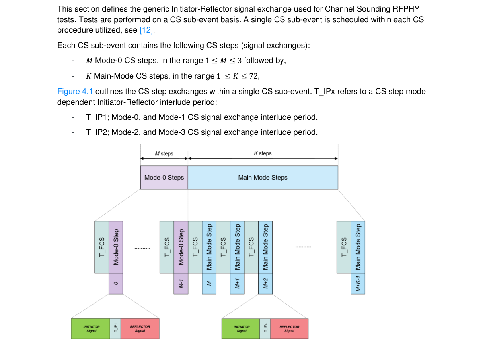

**Figure 4.1: Channel Sounding RFPHY test signal transmission overview**

### 4.3 Pass/Fail verdict conventions

Each test case has an Expected Outcome section. The IUT is granted the Pass verdict when all the detailed pass criteria conditions within the Expected Outcome section are met.
The convention in this Test Suite is that, unless there is a specific set of fail conditions outlined in the test case, the IUT fails the test case as soon as one of the pass criteria conditions cannot be met. If this occurs, then the outcome of the test is a Fail verdict.

### 4.4 Common Packet Contents

#### 4.4.1 Fields and Bits Reserved for Future Use

Unless a specific test states otherwise, all fields within packets and all bits within fields that are described as reserved for future use are set to 0 in packets sent by the Upper and Lower Testers.

### 4.5 Transmitter tests (TRM)

#### 4.5.1 Output power • Test Purpose

Verify the maximum peak and average power emitted from the IUT.
• Reference
[2] Chapter 3
[6] Chapter 3
• Initial Condition
- The IUT is set to direct TX mode at maximum output power. Whitening is turned off.
- Frequency hopping off, fixed frequency.
- The values of MAX_TX_LENGTH and MAX_TX_LENGTH_2M (for which the TC is performed) are specified in Section 6.6.
- TSPX_Antenna_Gain is declared by the manufacturer of the IUT in the IXIT [5].
- The IUT is set for a symbol rate as specified in Table 4.6.
- If the IUT supports CTE as specified in Table 4.6, the IUT is set to transmit AoA Constant Tone Extensions.
• Test Case Configuration

|  | Test Case |  |  | P Requirements AVG |  |  | Symbol Rate |  |  | Payload Length |  |
| --- | --- | --- | --- | --- | --- | --- | --- | --- | --- | --- | --- |
| RFPHY/TRM/BV-01-C [Output power, 1 Ms/s] |  |  | -20 dBm ≤ P ≤ +10 dBm AVG |  |  | 1 Ms/s |  |  | MAX TX LENGTH _ _ |  |  |
| RFPHY/TRM/BV-18-C [Output power, Class 1, 1 Ms/s] |  |  | +10 dBm < P ≤ +20 dBm AVG |  |  | 1 Ms/s |  |  | MAX TX LENGTH _ _ |  |  |
| RFPHY/TRM/BV-19-C [Output power, 2 Ms/s] |  |  | -20 dBm ≤ P ≤ +10 dBm AVG |  |  | 2 Ms/s |  |  | MAX TX LENGTH 2M _ _ _ |  |  |
| RFPHY/TRM/BV-20-C [Output power, Class 1, 2 Ms/s] |  |  | +10 dBm < P ≤ +20 dBm AVG |  |  | 2 Ms/s |  |  | MAX TX LENGTH 2M _ _ _ |  |  |
| RFPHY/TRM/BV-15-C [Output power, With Constant Tone Extension, 1 Ms/s] |  |  | -20 dBm ≤ P ≤ +10 dBm AVG |  |  | 1 Ms/s |  |  | MAX TX LENGTH _ _ |  |  |
| RFPHY/TRM/BV-21-C [Output power, With Constant Tone Extension, Class1, 1 Ms/s] |  |  | +10 dBm < P ≤ +20 dBm AVG |  |  | 1 Ms/s |  |  | MAX TX LENGTH _ _ |  |  |
| RFPHY/TRM/BV-22-C [Output power, With Constant Tone Extension, 2 Ms/s] |  |  | -20 dBm ≤ P ≤ +10 dBm AVG |  |  | 2 Ms/s |  |  | MAX TX LENGTH 2M _ _ _ |  |  |

|  | Test Case |  |  | P Requirements AVG |  |  | Symbol Rate |  |  | Payload Length |  |
| --- | --- | --- | --- | --- | --- | --- | --- | --- | --- | --- | --- |
| RFPHY/TRM/BV-23-C [Output power, With Constant Tone Extension, Class1, 2 Ms/s] |  |  | +10 dBm < P ≤ +20 dBm AVG |  |  | 2 Ms/s |  |  | MAX TX LENGTH 2M _ _ _ |  |  |

Table 4.6: Output power test cases
• Test Procedure
1. The IUT transmits LE test packets with PRBS9 payload (Payload Length specified in Table 4.6).
See [4] Section 4, “LE Test Packet Definition” for details. If the IUT supports CTE as specified in Table 4.6, then the Constant Tone Extension is TSPX_CTE_len_max * 8 μs. 2. The following settings are used for the Lower Tester:
Center frequency at the lowest frequency for testing defined in the frequencies for testing applicable to the IUT (listed in the test condition section of this test case)
Frequency span Zero span
Resolution BW 3 MHz
Video BW 3 MHz
Detector Peak
Mode Clear/Write
Sweep time Must cover at least one complete test packet
Trigger RF (trigger on rising edge)
3. Upon packet transmission, the Lower Tester is triggered to make a sweep over the duration of
one packet. The sweep starts at the beginning of the first bit in the preamble. 4. The peak power value, PPK, of the sweep is recorded. 5. The Lower Tester calculates average power PAVG over at least 20%–80% of the burst duration
(position of p0 defines the beginning of the burst; see Section 6.4 Definition of the Position of Bit p0). 6. Steps 2–5 are repeated for the remaining frequencies for testing defined in the test condition
section. 7. The antenna gain G (in dBi) is added to the PAVG results (in dBm) to calculate the average
equivalent isotropic radiated power PAVG EIRP.
• Test Condition
Common test case conditions defined in Section 4.2 apply.
• Expected Outcome
Pass verdict
All measured values fulfill the following conditions:
PPK ≤ (PAVG + 3 dB)
PAVG EIRP = PAVG + G ≤ 100 mW (20 dBm) EIRP
PAVG meets the requirements in Table 4.6.

#### 4.5.2 In-band emissions • Test Purpose

Verify that the in-band spectral emissions are within limits at normal operating conditions from the IUT.
• Reference
[2] Chapter 3.2
[7] Chapter 3.2.2
• Initial Condition
- The IUT is set to direct TX mode at maximum output power. Whitening is turned off.
- Frequency hopping off, fixed frequency.
- The value of MAX_TX_LENGTH and MAX_TX_LENGTH_2M (for which the TC is performed) is specified in Section 6.6.
• Test Case Configuration

| Test Case |  | In-band Emission |  |  | Frequencies To |  |  | Symbol |  | Payload Length |
| --- | --- | --- | --- | --- | --- | --- | --- | --- | --- | --- |
|  |  | Requirements |  |  | Skip |  |  | Rate |  |  |
| RFPHY/TRM/BV-03-C [In-band emissions, uncoded data at 1 Ms/s] | PTX ≤ -20 dBm for (fTX  2 MHz) PTX ≤ -30 dBm for (fTX  [3 + n] MHz])* |  |  | fTX fTX - 1MHz, fTX + 1MHz |  |  | 1 Ms/s |  |  | MAX TX LENGTH _ _ |
| RFPHY/TRM/BV-08-C [In-band emissions at 2 Ms/s] | PTX ≤ -20 dBm for (fTX  4 MHz) PTX ≤ -20 dBm for (fTX  5 MHz) PTX ≤ -30 dBm for (fTX  [6 + n] MHz])* |  |  | fTX fTX - 1MHz, fTX + 1MHz fTX - 2MHz, fTX + 2MHz fTX - 3MHz, fTX + 3MHz |  |  | 2 Ms/s |  |  | MAX TX LENGTH 2M _ _ _ |

* where n=0,1,2…
Table 4.7: In-band emissions test cases
• Test Procedure
1. The IUT is set to receive at the lowest frequency for testing defined in frequencies for testing
defined in the test condition section. 2. The IUT transmits LE test packets with PRBS9 payload (Payload Length specified in Table 4.7).
See [4], Section 4, “LE Test Packet Definition” for details. 3. Set N:=0
Center frequency 2401 MHz + N MHz
Frequency span 1 MHz
Resolution BW 100 kHz
Video BW 300 kHz
Detector Average
Mode Maximum hold
Sweep time 100 ms
Number of sweeps 10
5. Measure the power levels, PTX_N,i at the following 10 frequencies: (2401 MHz + N MHz) –
450 kHz + i100 kHz, where i=0…9 6. Calculate and record PTX = (PTX_N,i) 7. Increase center frequency by 1 MHz; N:=N+1 AND skip to next frequency if the increased
frequency is equal to Frequency To Skip specified in Table 4.7. 8. Repeat steps 4–7 until the center frequency is 2481 MHz 9. Set the IUT transmit frequency (fTX) to: 10. The mid operating frequency defined in the frequencies for testing defined in the test condition
section and 11. The high operating frequency defined in the frequencies for testing defined in the test condition
section 12. Repeat steps 3–8 for both frequencies.
• Test Condition
Common test case conditions defined in Section 4.2 apply.
• Expected Outcome
Pass verdict
All measured values fulfill the In-band Emission Requirements specified in Table 4.7.
For each operating frequency, up to three bands of 1 MHz width (as defined in the measurement) can be exempted from the requirements. The excepted values, however, comply with an absolute value of PTX ≤ -20 dBm.

#### 4.5.3 Modulation characteristics • Test Purpose

Verify that the modulation characteristics of the transmitted signal are correct.
• Reference
[2] Chapter 3.1
[6] Chapter 3.1, Chapter 3.1.1
• Initial Condition
- The IUT is set to direct TX mode at maximum output power. Whitening is turned off.
- Frequency hopping off, fixed frequency.
- The value of MAX_TX_LENGTH, MAX_TX_LENGTH_2M, and MAX_TX_LENGTH_CODED_S8 (for which the TC is performed) is specified in Section 6.6.
• Test Case Configuration

| Test Case | f1avg Requirements | Symbol Rate | Payload Length |
| --- | --- | --- | --- |
| RFPHY/TRM/BV-05-C [Modulation Characteristics, uncoded data at 1 Ms/s] | 225 kHz ≤ f1avg ≤ 275 kHz | 1 Ms/s | MAX TX LENGTH _ _ |
| RFPHY/TRM/BV-09-C [Stable Modulation Characteristics, uncoded data at 1 Ms/s] | 247.5 kHz ≤ ∆f1avg ≤ 252.5 kHz | 1 Ms/s | MAX TX LENGTH _ _ |
| RFPHY/TRM/BV-10-C [Modulation Characteristics at 2 Ms/s] | 450 kHz ≤∆f1avg ≤ 550 kHz | 2 Ms/s | MAX TX LENGTH 2M _ _ _ |
| RFPHY/TRM/BV-11-C [Stable Modulation Characteristics at 2 Ms/s] | 495 kHz ≤ ∆f1avg ≤ 505 kHz | 2 Ms/s | MAX TX LENGTH 2M _ _ _ |
| RFPHY/TRM/BV-13-C [Modulation Characteristics, LE Coded (S=8)] | 225 kHz ≤ f1avg ≤ 275 kHz 99.9% of all ∆f1max frequency values recorded over 10 LE test packets are greater than 185 kHz | 1 Ms/s coded S=8 | MAX TX LENGTH CODED S8 _ _ _ _ |

Table 4.8: Modulation characteristics test cases
• Test Procedure
1. The IUT is set to transmit at the lowest frequency for testing defined in the frequencies for
testing applicable to the IUT (listed in the test condition section of this test case). 2. The IUT transmits LE test packets with Payload Length (specified in Table 4.8) octet packet
payload. See [4], Section 4, “LE Test Packet Definition”, for details.
For Uncoded 1 Ms/s and 2 Ms/s, the payload consists of a repetitive sequence of 0Fhex octets (11110000bin in transmission order).
For LE Coded (S=8), the payload consists of a repetitive sequence of 0xFF octets (binary ‘11111111’ in transmission order). This sequence, once passed through the S=8 encoder, becomes a repetitive sequence of ‘00111100’ symbols. The symbol duration is 1 µs.
3. The following settings are used for the Lower Tester:
Center frequency lowest frequency for testing as defined in the test condition section
Mode FM demodulation
Demodulator filter BW Specified in Section 6.9 (minimum)
Filter passband ripple Specified in Section 6.9
Trigger RF (trigger on rising edge)

|  | Frequency (for 1 Ms/s) |  |  | Frequency (for 2 Ms/s) |  |  | Attenuation |  |
| --- | --- | --- | --- | --- | --- | --- | --- | --- |
| 650 kHz |  |  | ±1.3 MHz |  |  | -3 dB |  |  |
| 1 MHz |  |  | ±2.0 MHz |  |  | -14 dB |  |  |
| 2 MHz |  |  | ±4.0 MHz |  |  | -44 dB |  |  |

4. The payload is FM demodulated with the settings described in step 3.
For Uncoded 1 Ms/s and 2 Ms/s, the measurement starts at the beginning of the fifth bit of the payload (see Figure 4.2 for description). The last four bits in the payload are disregarded (i.e., last bit in the measurement is the fourth bit in the final payload octet).
For LE Coded (S=8), the measurement starts at the beginning of the 31st symbol in the payload. The last 34 symbols in the payload are disregarded.
5. Each individual bit is to be oversampled at least 32 times. The sequence center frequency; f1ccf
is calculated as the average frequency of all samples over each 00001111bin sequence. 6. For the second, third, sixth and seventh bits in each 00001111bin sequence, the absolute value
of the frequency offset from f1ccf is recorded as ∆f1max. ∆f1max is defined as the average deviation for each individual bit. See Figure 4.2 for reference. 7. The average frequency value of all ∆f1max frequencies in a packet is calculated and recorded as
∆f1avg. 8. For LE Coded (S=8), skip steps 9–13; S=8 only supports ‘0011’ and ‘1100’ see Section 3.3.2,
“Pattern mapper” in [10] for details. 9. The IUT transmits LE test packets with Payload Length (specified in Table 4.8) octet payload
consisting of a repetitive sequence of 55hex octets (10101010bin in transmission order). See [4], Section 4, “LE Test Packet Definition” for details. 10. The payload is FM demodulated with the settings described in step 3. The measurement starts
at the beginning of the fifth bit in the payload field. The last four bits in the payload are disregarded (i.e., last bit in the measurement is the fourth bit in the final payload octet). 11. Each individual bit is to be oversampled at least 32 times. The sequence center frequency; f2ccf
is calculated as the average frequency of all samples over each 10101010bin sequence. 12. The maximum deviation from the sequence center frequency, f2ccf is recorded as ∆f2max for each
individual bit. See Figure 4.3 for reference. 13. The average frequency value of all ∆f2max frequencies in a packet is calculated and recorded as
∆f2avg. 14. Steps 2–13 are repeated for a minimum of 10 packets. 15. Steps 2–14 are repeated when the IUT is transmitting at the remaining frequencies defined in
the test condition section.

## 1 f1max7 f1max6

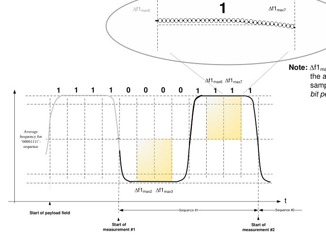

**Figure 4.2: Frequency deviation measurement principle for 11110000-payload sequence**

## 1 0 1 0 1 0 1 0 f

1

## 0 1 0

f2max3 f2max5
f2max1 f2max7

|  |  |  |  |  |  |  |  |  |  |  |  |  |  | ~ |
| --- | --- | --- | --- | --- | --- | --- | --- | --- | --- | --- | --- | --- | --- | --- |
|  |  |  |  |  |  |  |  |  |  |  |  |  |  |  |
|  |  |  |  |  |  |  |  |  |  |  |  |  |  |  |
|  |  |  |  |  |  |  |  |  |  |  |  |  |  |  |
|  |  |  |  |  |  |  |  |  |  |  |  |  |  |  |
|  |  |  |  |  | f2max2 f2max4 f2max6 f 10101010- Sequence #1 art of St |  |  |  |  |  |  |  |  |  |

Average frequency for
- sequence
t

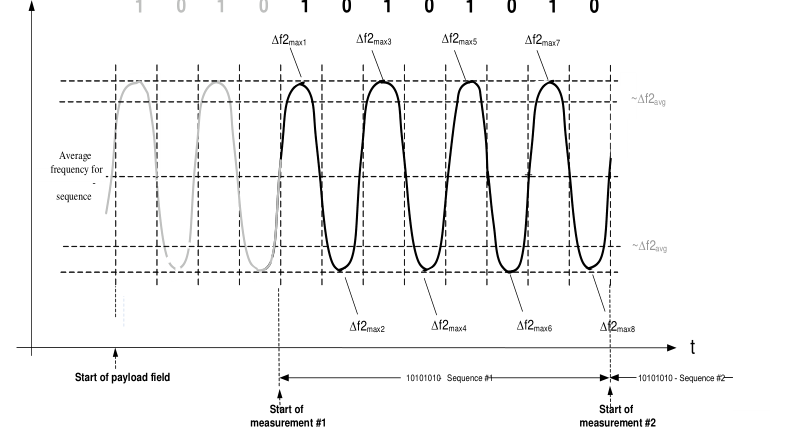

**Figure 4.3: Frequency deviation measurement principle for 10101010-payload sequence**

• Test Condition
Common test case conditions defined in Section 4.2 apply.
• Expected Outcome
Pass verdict
All measured values fulfill the f1avg Requirements specified in Table 4.8 at the low, medium, and high frequencies:
Where ∆f2max is recorded (all cases except LE Coded, S=8), at least 99.9% of all ∆f2max frequency values recorded over 10 LE test packets are greater than 185 kHz (for 1 Ms/s) or 370 kHz (for 2 Ms/s).

f
2
avg f
 
Where ∆f2avg is recorded (all cases except LE Coded, S=8): 8.0 1
avg
• Notes
To compensate for the statistical distribution of individual samples, the decision criteria is applied to 99.9% of the sample values.

#### 4.5.4 Carrier frequency offset and drift • Test Purpose

Verify that the carrier frequency offset and carrier drift of the transmitted signal are correct.
• Reference
[2] Chapter 3.3
[6] Chapter 3.3
• Initial Condition
- The IUT is set to direct TX mode at maximum output power. Whitening is turned off.
- Frequency hopping off, fixed frequency.
- The value of MAX_TX_LENGTH, MAX_TX_LENGTH_2M, and MAX_TX_LENGTH_CODED_S8 (for which the TC is performed) is specified in Section 6.6.
• Test Case Configuration

| Test Case | Drift Requirement Limits | Symbol Rate | Payload Length |
| --- | --- | --- | --- |
| RFPHY/TRM/BV-06- C [Carrier frequency offset and drift, uncoded data at 1 Ms/s] | \|f1-f0\| ≤ 23 kHz \|fn – fn-5\|n=6, 7, 8…k ≤ 20 kHz | 1 Ms/s | MAX TX LENGTH _ _ |
| RFPHY/TRM/BV-12- C [Carrier frequency offset and drift at 2 Ms/s] | \|f1-f0\| ≤ 13.3 kHz \|fn – fn-5\|n=6, 7, 8…k ≤ 20 kHz | 2 Ms/s | MAX TX LENGTH 2M _ _ _ |
| RFPHY/TRM/BV-14- C [Carrier frequency offset and drift, LE Coded (S=8)] | \|f0-f3\| ≤ 19.2 kHz \|fn – fn-3\|n=7, 8, 9…k ≤ 19.2 kHz | 1 Ms/s coded S=8 | MAX TX LENGTH CODED S8 _ _ _ _ |

Table 4.9: Carrier frequency offset and drift test cases
• Test Procedure
1. The IUT is set to transmit at the lowest frequency for testing defined in the frequencies for
testing applicable to the IUT (listed in the test condition section of this test case. 2. The IUT transmits LE test packets with Payload Length (specified in Table 4.8) octet payload.
See [4], Section 4, “LE Test Packet Definition”, for details.
For Uncoded 1 Ms/s and 2 Ms/s, the payload consists of a repetitive sequence of 55hex octets (10101010bin in transmission order) in the payload.
For LE Coded (S=8), the payload consists of a repetitive sequence of 0xFF octets (binary ‘11111111’ in transmission order). This sequence, once passed through the S=8 encoder, becomes a repetitive sequence of ‘00111100’ symbols. The symbol duration is 1 µs.
3. The following settings are used for the Lower Tester:
Center frequency lowest frequency for testing defined in the test condition section
Mode FM demodulation
Demodulator filter BW Specified in Section 6.9 (minimum)
Filter passband ripple Specified in Section 6.9
Trigger RF (trigger on rising edge)
The following measurement channel filter minimum attenuator characteristics are used:

|  | Frequency (for 1 Ms/s) |  |  | Frequency (for 2 Ms/s) |  |  | Attenuation |  |
| --- | --- | --- | --- | --- | --- | --- | --- | --- |
| 650 kHz |  |  | ±1.3 MHz |  |  | -3 dB |  |  |
| 1 MHz |  |  | ±2.0 MHz |  |  | -14 dB |  |  |
| 2 MHz |  |  | ±4.0 MHz |  |  | -44 dB |  |  |

The packet is FM demodulated with the settings described in step 3. The measurement is to be performed at the start of the preamble field in the transmitted packet.
For Uncoded 1 Ms/s, the Lower Tester integrates the frequency of the FM demodulated signal from the center of the first preamble bit to the center of the first bit following the 8th preamble bit, 8 bits in total. See Figure 4.4 for reference.
For 2 Ms/s, the Lower Tester integrates the frequency of the FM demodulated signal from the center of the first preamble bit to the center of the first bit following the 16th preamble bit, 16 bits in total.
For LE Coded (S=8), the Lower Tester integrates the frequency of the FM demodulated signal in groups of 16 symbols. The first symbol in the integration group corresponds to the third symbol of the preamble (first 1 of the ‘11110000’… sequence). The last 14 symbols of the preamble are disregarded.
4. The integral sum in step 4 is considered to be the initial carrier frequency of the IUT, and is
recorded as f0 for Uncoded 1 Ms/s and 2 Ms/s and f0, f1, f2, and f3 for LE Coded (2 Ms/s). 5. Throughout the payload of the packet:
For Uncoded 1 Ms/s, the Lower Tester integrates the frequency of the FM demodulated signal in 10-bit intervals, starting at the second bit in the payload.
For 2 Ms/s, the Lower Tester integrates the frequency of the FM demodulated signal in 20-bit intervals, starting at the second bit in the payload.
For LE Coded (S=8), the Lower Tester integrates the frequency of the FM demodulated signals in 16-symbol intervals, starting at the 27th symbol in the PDU payload and until the (8*MAX_TX_LENGTH_CODED_S8)th symbol. The last 16-symbol sequence should not overlap the CRC field at the end of the packet.
The measurement is repeated until the end of the payload duration. The last bit interval (10-bit for Uncoded 1 Ms/s, 20-bit for 2 Ms/s) should not overlap the CRC-field at the end of the packet. See Figure 4.5 and Figure 4.7 for reference. The integral sums are recorded as fn, where n is an integer from 1 to k (for Uncoded 1 Ms/s and 2 Ms/s) and 5 to k (for LE Coded S=8). fk represents the last integral sum before the start of the CRC field in the packet.
6. Steps 2–6 are repeated for a minimum of 10 packets. 7. Steps 2–7 are repeated when the IUT is transmitting at the remaining frequencies defined in the
test condition section.

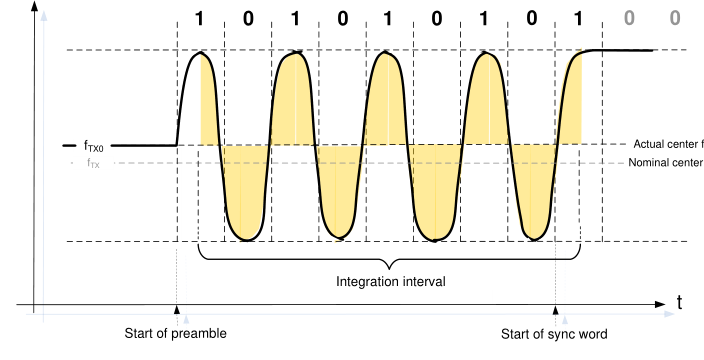

**Figure 4.4: Initial frequency offset (f0) measurement principle**

Sync word and header/length field Preamble
Payload

## 1 0 1 0 1 0 1

f

## 1 0 1 0 1 0 1 0 1 0 1 0

## 0 1 0 1

## 1 0 1 0 1

fTX0
9/22/2017 - 9/29/2017 Integration interval #2
9/22/2017 - 9/29/2017 Integration interval #1
f1 f2
9/22/2017 - 9/29/2017 Integration interval
t
Start of payload field
Start of preamble
Start of sync
word

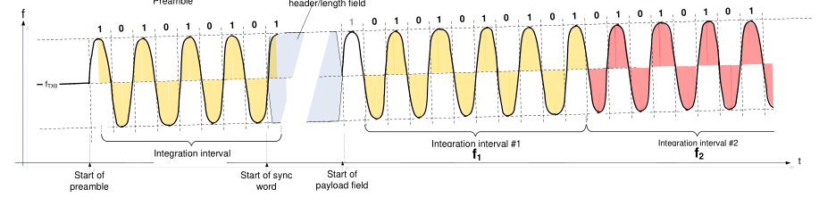

**Figure 4.5: Frequency drift measurement principle**

sync word, header-
and length fields Payload

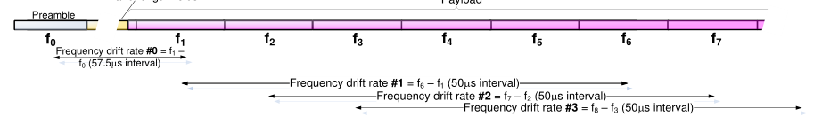

**Figure 4.6: Frequency drift rate measurement principle**

PREAMBLE AA + CI + PHR PDU PAYLOAD
16us 16us 16us 16us 26us 16us 16us 16us 16us 16us 16us
f0 f1 f2 f3 f4 f5 f6 f7 f8 fk
48us
48us
First 2 symbols of
Last 14 symbols of
48us
preamble
preamble

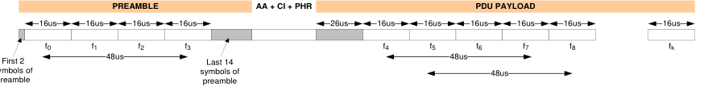

**Figure 4.7: Frequency drift rate measurement principle for S=8**

• Test Condition
Common test case conditions defined in Section 4.2 apply.
• Expected Outcome
For Uncoded 1 Ms/s and 2 Ms/s, the maximum drift rate is 20 kHz/50 µs, anywhere in the packet. The maximum drift rate applies to the difference between any two bit groups (10-bit for Uncoded 1 Ms/s, 20-bit for 2 Ms/s) separated by 50 µs within the payload field of the packet transmitted by the IUT. The requirement also applies to the frequency difference between the initial frequency measurement f0 and the first payload frequency measurement f1. See Figure 4.6 for reference.
For LE Coded (S=8), the maximum drift rate is 19.2 kHz/48 µs, anywhere in the packet. The maximum drift rate applies to the difference between any two groups of 16 symbols separated by 48 µs within the payload field of the packet transmitted by the IUT. The requirement also applies to the frequency difference between the initial frequency measurement f0 and f3 within the preamble. See Figure 4.7 for reference.
All measured values fulfill the following conditions at the low, medium and high frequencies.
Pass verdict
fTX – 150 kHz ≤ fn ≤ fTX + 150 kHz
where fTX is the nominal transmit frequency and n=0,1,2,3…k
|f0 – fn| ≤ 50 kHz
where n=2,3,4…k
and Drift Requirement Limits specified in Table 4.9.
In all of the above pass verdict requirements, fk is the last frequency measurement before the CRC field.

#### 4.5.5 Carrier frequency offset and drift, Constant Tone Extension • Test Purpose

Verify that the carrier frequency offset and carrier drift of the transmitted Constant Tone Extension portion in a transmitted signal with uncoded data is within specified limits at normal operating conditions.
• Reference
[8] Chapter 3.3
• Initial Condition
- The IUT is set to direct TX mode at maximum output power. Whitening is turned off.
- Frequency hopping off, fixed frequency.
- The values of MAX_TX_LENGTH, MAX_TX_LENGTH_2M, and TSPX_CTE_len_max (for which the TC is performed) are specified in Section 6.6.
- The IUT is set to transmit AoA Constant Tone Extensions.
• Test Case Configuration

| Test Case | Drift Requirement Limits | Symbol Rate | Payload Length |
| --- | --- | --- | --- |
| RFPHY/TRM/BV-16-C [Carrier frequency offset and drift, uncoded data at 1 Ms/s, Constant Tone Extension] | \|fs1 – fp\| ≤ 19.2 kHz \|fsi – f0\|i=1,2,3,4…k ≤ 50 kHz \|fsi – fsi-3\|i=4…k ≤ 19.2 kHz | 1 Ms/s | MAX TX LENGTH _ _ |
| RFPHY/TRM/BV-17-C [Carrier frequency offset and drift at 2 Ms/s, Constant Tone Extension] | \|fs1 – fp\| ≤ 13.6 kHz \|fsi – f0\|i=1,2,3,4…k ≤ 50 kHz \|fsi – fsi-3\|i=4…k ≤ 19.2 kHz | 2 Ms/s | MAX TX LENGTH 2M _ _ _ |

Table 4.10: Carrier frequency offset and drift, Constant Tone Extension test cases
• Test Procedure
1. The IUT is set to transmit at the lowest frequency for testing defined in the frequencies for
testing applicable to the IUT (listed in the test condition section of this test case). 2. The IUT transmits LE test packets with Payload Length (specified in Table 4.10) octet payload
consisting of a repetitive sequence of 0Fhex octets (11110000bin in transmission order) in the payload and with TSPX_CTE_len_max * 8 μs Constant Tone Extension. See [9] Section 4, “LE Test Packet Definition” for details. 3. The following settings are used for the Lower Tester:
Center frequency lowest frequency for testing as defined in the frequencies for testing applicable to the IUT (listed in the test condition section of this test case)
Mode FM demodulation
Demodulator filter BW Specified in Section 6.9 (minimum)
Filter passband ripple Specified in Section 6.9
Trigger RF (trigger on rising edge)

|  | Frequency (for 1Ms/s) |  |  | Frequency (for 2Ms/s) |  |  | Attenuation |  |
| --- | --- | --- | --- | --- | --- | --- | --- | --- |
| 650 kHz |  |  | ±1.3 MHz |  |  | -3 dB |  |  |
| 1 MHz |  |  | ±2.0 MHz |  |  | -14 dB |  |  |
| 2 MHz |  |  | ±4.0 MHz |  |  | -44 dB |  |  |

4. The payload is FM demodulated with the settings described in step 3. The average frequency
deviation measurement starts at the beginning of the fifth bit of the payload (see Figure 4.8 for description). The last four bits in the payload are disregarded (i.e., last bit in the measurement is the fourth bit in the final payload octet). 5. Each individual bit is to be oversampled at least 32 times. The sequence center frequency; f1ccf
is calculated as the average frequency of all samples over each 00001111bin sequence. 6. For the second, third, sixth, and seventh bits in each 00001111bin sequence, the absolute value
of the frequency offset from f1ccf is recorded as ∆f1max. ∆f1max is defined as the average deviation for each individual bit. See Figure 4.8 for reference. 7. The average frequency value of all ∆f1max frequencies in a packet is calculated and recorded as
∆f1avg. 8. The initial frequency offset measurement f0 is to be performed at the start of the preamble field
in the transmitted packet.
For Uncoded 1 Ms/s, the Lower Tester integrates the frequency of the FM demodulated signal from the center of the first preamble bit to the center of the first bit following the 8th preamble bit, 8 bits in total. See Figure 4.9 for reference.
For 2 Ms/s, the Lower Tester integrates the frequency of the FM demodulated signal from the center of the first preamble bit to the center of the first bit following the 16th preamble bit, 16 bits in total.
9. The integral sum in step 8 is considered to be the initial carrier frequency of the IUT, and is
recorded as f0. 10. The average center frequency measurement fp is to be performed starting at the (n+1)th bit of
the payload and
For Uncoded 1 Ms/s, covering 16 bits, where n = (MAX_TX_LENGTH * 8) - 20.
For 2 Ms/s, covering 32 bits, where n = (MAX_TX_LENGTH_2M * 8) – 36.
The first n bits and the last 4 bits are not used for this measurement. See Figure 4.10 and Figure 4.11 for reference.
11. The average frequency deviation measurement f3maxi and carrier frequency offset measurement
fsi within the Constant Tone Extension are to be performed starting at the first bit of the reference period within the Constant Tone Extension covering 16 µs units. The first 4 µs of the Constant Tone Extension are not used for the measurement. For bursts with odd number of Constant Tone Extension units, the last 4 µs of the Constant Tone Extension portion are not used. For bursts with even number of Constant Tone Extension units, the last 12 µs of the Constant Tone Extension portion are not used for the measurement. fsi is recorded as f3maxi - ∆f1avg. See Figure 4.12 for reference. 12. Steps 2–11 are repeated for a minimum of 10 packets. 13. Steps 2–12 are repeated when the IUT is transmitting at the remaining frequencies defined in
the test condition section.

## 1 f1max7 f1max6

**Figure 4.8: Frequency deviation measurement principle for 11110000-payload sequence**

## 0 0

## 0 1 0 1 0

## 1 0 1 1

fTX0
Actual center frequency
fTX Nominal center frequency
Integration interval
t
02.12.2008 - 09.12.2008
Start of preamble
Start of sync word

**Figure 4.9: Initial carrier frequency (f0) measurement principle for 1 Ms/s**

Sync word, header, length, CTEInfo
Payload

|  |  |  | CRC |
| --- | --- | --- | --- |
| 16ms |  |  |  |

Preamble
Last 4 bits of payload

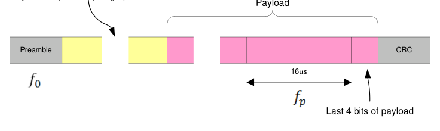

**Figure 4.10: Average center frequency measurement (fp) measurement location**

Frequency deviation

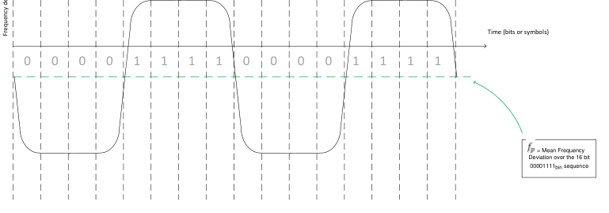

**Figure 4.11: Average center frequency measurement (fp) principle**

Constant Tone Extension
Odd number of CTE
Reference
Guard
4ms 8ms 8ms 8ms 8ms 8ms 8ms 8ms
(8ms)
(4ms)
Units
OR
Constant Tone Extension
Even number of CTE
Reference
Guard
(4ms) 4ms 8ms 8ms 8ms 8ms 8ms 8ms 8ms
8ms
(8ms)
Units

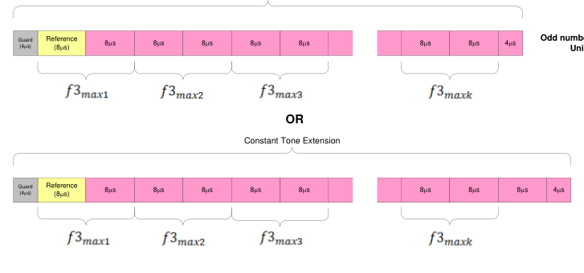

**Figure 4.12: Average frequency deviation measurement principle**

• Test Condition
Common test case conditions defined in Section 4.2 apply.
• Expected Outcome
Pass verdict
fTX – 150 kHz ≤ fsi ≤ fTX + 150 kHz
where fTX is the nominal transmit frequency and i=1,2,3…k
fTX – 150 kHz ≤ f0 ≤ fTX + 150 kHz
and Drift Requirement Limits specified in Table 4.10.

#### 4.5.6 Tx Power Stability, AoD Transmitter • Test Purpose

Verify that the AoD transmit signal has settled at the beginning of the reference period and the transmit slots, and remains stable within the reference period and transmit slots, respectively.
• Reference
[8] Section 5
[9] Section 4.1
• Initial Condition
- The IUT is set to direct TX mode at maximum output power. Whitening is turned off.
- Frequency hopping off, fixed frequency.
- The values of TSPX_CTE_len_max (for which the TC is performed) are specified in Section 6.6.
- The IUT is set for a symbol rate as specified in Table 4.21.
• Test Case Configuration

|  | Test Case |  |  | PHY |  |  | Slot Duration |  |
| --- | --- | --- | --- | --- | --- | --- | --- | --- |
| RFPHY/TRM/PS/BV-01-C [Tx Power Stability, AoD Transmitter at 1 Ms/s with 2 µs Switching Slot] |  |  | 1 Ms/s |  |  | 2 µs |  |  |
| RFPHY/TRM/PS/BV-02-C [Tx Power Stability, AoD Transmitter at 1 Ms/s with 1 µs Switching Slot] |  |  | 1 Ms/s |  |  | 1 µs |  |  |
| RFPHY/TRM/PS/BV-03-C [Tx Power Stability, AoD Transmitter at 2 Ms/s with 2 µs Switching Slot] |  |  | 2 Ms/s |  |  | 2 µs |  |  |
| RFPHY/TRM/PS/BV-04-C [Tx Power Stability, AoD Transmitter at 2 Ms/s with 1 µs Switching Slot] |  |  | 2 Ms/s |  |  | 1 µs |  |  |

Table 4.11: Tx Power Stability, AoD Transmitter test cases
• Test Procedure
1. The IUT transmits LE test packets with no payload and with TSPX_CTE_len_max * 8 µs
Constant Tone Extension with switching slots as specified in Table 4.11. See [9], Section 4, “LE Test Packet Definition” for details. 2. The following settings are used for the Lower Tester:
Center Frequency at the lowest frequency for testing defined in the test condition section
Frequency Span Zero Span
Resolution BW 3 MHz
Video BW 3 MHz
Detector Average
3. The RF power of the CTE is measured with the settings described in step 2. 4. The Lower Tester records PREF,AVE, as the average power during the reference period, measured
from the beginning of the first symbol of the reference period to the end of the last symbol within the reference period. 5. The Lower Tester records PREF,DEV as the maximum absolute deviation between any one sample
of the output power taken during the reference period relative to PREF,AVE, recorded in step 4. 6. For each transmit slot, n, Lower Tester records Pn,AVE as the average power within the slot,
where n is an integer from 1 to k, where k is the number of transmit slots within the packet.
between any one sample of the output power within the transmit slot relative to average power within the slot, PN,AVE, recorded in step 6. 8. Steps 3–7 are repeated when the IUT is transmitting at the remaining frequencies defined in the
test condition section.
• Test Condition
The IUT and the Lower Tester are set up according to the cabled testing setup described in Section 4.7 and Common test case conditions defined in Section 4.2 apply.
Frequencies for Testing:

|  | Role |  |  | PHY |  |  | IUT Low |  |  | IUT Mid |  |  | IUT High |  |
| --- | --- | --- | --- | --- | --- | --- | --- | --- | --- | --- | --- | --- | --- | --- |
| All |  |  | 1 Ms/s |  |  | 2402 MHz (n=0) |  |  | 2440 MHz (n=19) |  |  | 2480 MHz (n=39) |  |  |
| All |  |  | 2 Ms/s |  |  | 2404 MHz (n=1) |  |  | 2440 MHz (n=19) |  |  | 2478 MHz (n=38) |  |  |

• Expected Outcome
The maximum deviation of the signal power within the reference period is not more than 25% of the average signal power measured within the reference period.
The maximum deviation of the signal power within a TX slot is not more than 25% of the average signal power measured within that TX slot.
All measured values fulfill the following conditions at the low, medium, and high frequencies.
Pass verdict
For each frequency, the following conditions are satisfied:
- PREF,DEV / PREF,AVE < 0.25
- Pn,DEV / Pn,AVE < 0.25 for n=1,2,3,…,k

#### 4.5.7 Antenna switching integrity, AoD Transmitter • Test Purpose

Verify that the antenna switching occurs during the switching slots of the Constant Tone Extension for an AoD transmit signal.
• Reference
[8] Section 5
[9] Section 4.1
• Initial Condition
- The IUT is set to direct TX mode at maximum output power. Whitening is turned off.
- Frequency hopping off, fixed frequency.
- The values of TSPX_CTE_len_max (for which the TC is performed) are specified in Section 6.6.
- IUT is set for a symbol rate as specified in Table 4.12.
• Test Case Configuration

|  | Test Case |  |  | PHY |  |  | Slot Duration |  |
| --- | --- | --- | --- | --- | --- | --- | --- | --- |
| RFPHY/TRM/ASI/BV-05-C [Antenna switching integrity, AoD Transmitter at 1 Ms/s with 2 µs Switching Slot] |  |  | 1 Ms/s |  |  | 2 µs |  |  |
| RFPHY/TRM/ASI/BV-06-C [Antenna switching integrity, AoD Transmitter at 1 Ms/s with 1 µs Switching Slot] |  |  | 1 Ms/s |  |  | 1 µs |  |  |
| RFPHY/TRM/ASI/BV-07-C [Antenna switching integrity, AoD Transmitter at 2 Ms/s with 2 µs Switching Slot] |  |  | 2 Ms/s |  |  | 2 µs |  |  |
| RFPHY/TRM/ASI/BV-08-C [Antenna switching integrity, AoD Transmitter at 2 Ms/s with 1 µs Switching Slot] |  |  | 2 Ms/s |  |  | 1 µs |  |  |

Table 4.12: Antenna switching integrity, AoD Transmitter test cases
• Test Procedure
1. The IUT transmits LE test packets with no payload and with TSPX_CTE_len_max * 8 µs
Constant Tone Extension with switching slots as specified in Table 4.12. See [9], Section 4, “LE Test Packet Definition” for details. 2. The following settings are used for the Lower Tester:
Center Frequency at the lowest frequency for testing defined in the test condition section
Frequency Span Zero Span
Resolution BW 3 MHz
Video BW 3 MHz
Detector Average
3. All non-reference antenna ports are disconnected and terminated. 4. The Lower Tester records the average output power during nth Tx slot, where n = 1 to k (Nof Tx
slots in the packet), Pn,AVE,OFF. 5. Connect the Xth non reference antenna port, where X = 1 .. number of non-reference antennas.
All other non-reference antennas are disconnected and terminated. 6. The Lower Tester records the average output power during the nth Tx slot, where n = 1 to k (Nof
Tx slots in the packet), Pn,X,AVE,ON. 7. Repeat steps 5–6 for all non-reference antennas.
• Test Condition
The IUT and Lower Tester are set up according to the cabled testing setup described in Section 4.7 and Common test case conditions defined in Section 4.2 apply.
Frequencies for Testing:

|  | Role |  |  | PHY |  |  | IUT Low |  |  | IUT Mid |  |  | IUT High |  |
| --- | --- | --- | --- | --- | --- | --- | --- | --- | --- | --- | --- | --- | --- | --- |
| All |  |  | 1 Ms/s |  |  | 2402 MHz (n=0) |  |  | 2440 MHz (n=19) |  |  | 2480 MHz (n=39) |  |  |
| All |  |  | 2 Ms/s |  |  | 2404 MHz (n=1) |  |  | 2440 MHz (n=19) |  |  | 2478 MHz (n=38) |  |  |

• Expected Outcome
The average signal power measured when an antenna port is connected is at least 10 dB greater than the average signal power measured when the antenna port is disconnected in the transmit slots corresponding to the antenna.
All measured values fulfill the following conditions at the low, medium and high frequencies.

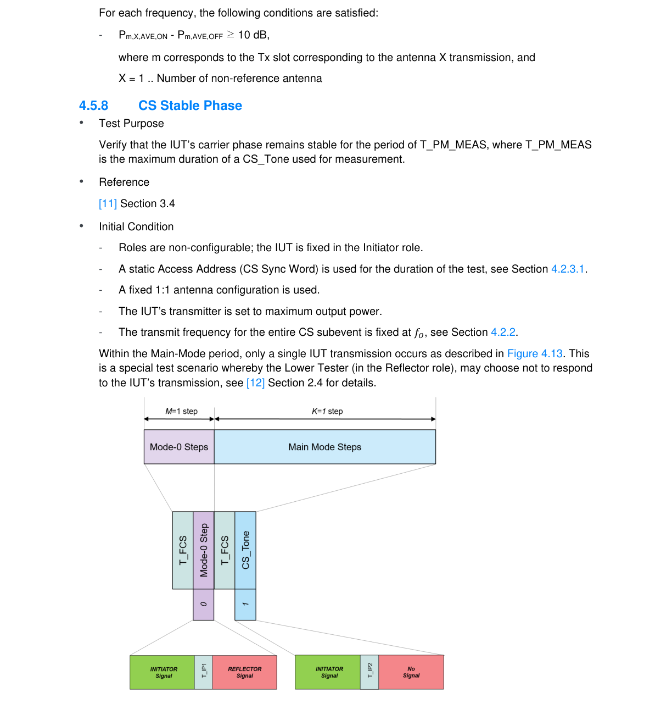

**Figure 4.13: Stable Phase test signal transmission overview**

The IUT transmits a CS_Tone of duration 652 μs (T_PM) as shown in Figure 4.14. T_PM_MEAS (of duration 650 us) is defined as the Stable Phase Evaluation Window, the period in which the Lower Tester samples the CS_Tone as described in Figure 4.14.

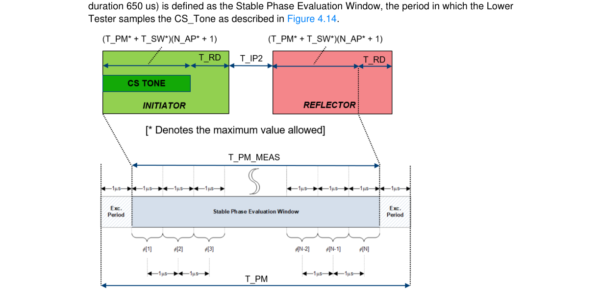

**Figure 4.14: Stable Phase measurement overview**

• Test Case Configuration

| Test Case | PHY |  | Main Mode |  |
| --- | --- | --- | --- | --- |
|  |  |  | Type |  |
| RFPHY/TRM/CS/BV-01-C [Stable Phase, 1 Ms/s, CS Tone] _ | 1 Ms/s | CS Tone _ |  |  |
| RFPHY/TRM/CS/BV-02-C [Stable Phase, 2 Ms/s, CS Tone] _ | 2 Ms/s | CS Tone _ |  |  |

Table 4.13: CS Stable Phase test cases
• Test Procedure
1. The Upper Tester commands the IUT to enable the Channel Sounding procedure using the
Override_Config bit number 10 parameter enabled (Stable Phase test). 2. The Lower Tester uses the PHY test filter characteristics as defined in Section 6.9. 3. The IUT sends a Mode-0 transmission to the Lower Tester. The Lower Tester responds with a
Mode-0 transmission. 4. The IUT sends a CS_Tone transmission. The Lower Tester synchronizes to the previous Mode-
0 CS_SYNC (CS_SYNC_0_I) transmission, measuring the CS_Tone sent by the IUT following a period of T_RD+T_IP2+T_SY+T_GD+T_FM+T_RD+T_FCS+1 μ𝑠, where 1 μ𝑠 accounts for exclusion period (see Figure 4.14). 5. The CS_Tone is down converted and sampled at 1 μ𝑠 intervals during the period of
T_PM_MEAS using a moving average filter resulting in ϕ[𝑛] where 1 ≤𝑛≤ T_PM_MEAS. 6. The zero mean, detrended phase ϕ𝑧𝑚𝑑[𝑛] is calculated (see [11] Chapter 3.4, Stable Phase).
10,000
This will require [

## 650 ] CS sub-events, where ⌈𝑥⌉= 𝑐𝑒𝑖𝑙𝑖𝑛𝑔(𝑥).

8. Steps 1–7 are repeated for the remaining frequencies as defined in Section 4.2.2. 9. Steps 1–8 are repeated for the 2 Ms/s PHY.
• Test Condition
Common Test Case Conditions defined in Section 4.2 apply. The default frequencies are defined in Section 4.2.2.
• Expected Outcome
Pass verdict
95% of at least 10,000 absolute values of ϕ𝑧𝑚𝑑[𝑛] are ≤20°.

#### 4.5.9 CS Modulation Characteristics, 2 Ms/s, BT = 2.0 • Test Purpose

Verify that the modulation characteristics of the transmitted signal are correct when transmitting data at 2 Ms/s, BT = 2.0.
• Reference
[11] Section 3.1
• Initial Condition
- The Lower Tester is configured as the Reflector and the IUT as the Initiator.
- A static Access Address (CS Sync Word) is used for the duration of the test, see Section 4.2.3.1.
- A fixed 1:1 antenna configuration is used.
- The IUT’s transmitter is set to maximum output power.
- The IUT is configured to transmit a fixed sequence of 𝑀 Mode-0 CS steps, where 𝑀 is the minimum number of Mode-0 steps the IUT supports.
- The transmit frequency for the entire CS subevent is fixed at 𝑓0 (see Section 4.2.2).
• Test Case Configuration

|  | TCID |  |  | PHY |  |  | Main Mode Type |  |
| --- | --- | --- | --- | --- | --- | --- | --- | --- |
| RFPHY/TRM/CS/BV-03-C [Modulation Characteristics, 2 Ms/s, BT = 2.0, Mode-1] |  |  | 2 Ms/s, BT = 2.0 |  |  | Mode-1 |  |  |
| RFPHY/TRM/CS/BV-04-C [Modulation Characteristics, 2 Ms/s, BT = 2.0, Mode-3] |  |  | 2 Ms/s, BT = 2.0 |  |  | Mode-3 |  |  |

Table 4.14: CS Modulation Characteristics, 2 Ms/s, BT = 2.0 test cases

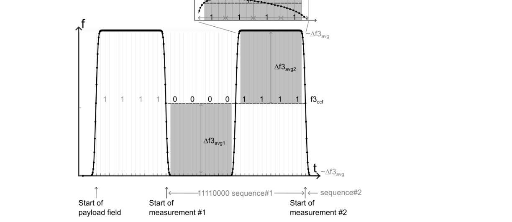

**Figure 4.15: CS 2Ms/s BT = 2.0 frequency deviation measurement principle for 11110000-payload sequence**

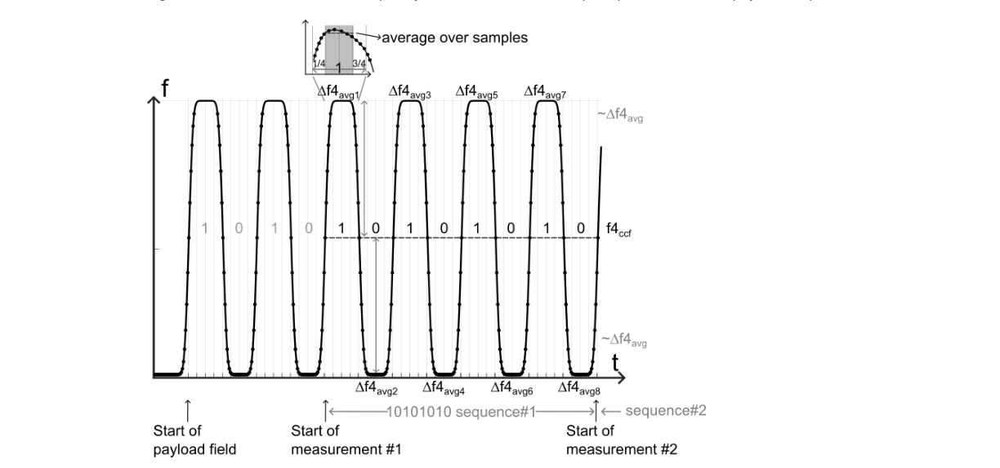

**Figure 4.16: CS 2Ms/s BT = 2.0 frequency deviation measurement principle for 10101010-payload sequence**

• Test Procedure
1. The Upper Tester commands the IUT to enable the Channel Sounding procedure with:
▪ Role set to Initiator ▪ Test command override config bit 8 set enabling the CS_SYNC_User_Payload_Pattern parameter
▪ CS_SYNC_User_Payload_Pattern set to the value to obtain a repetitive 11110000𝑏𝑖𝑛 sequence (in transmission order) ▪ Mode-0 CS Steps set to 𝑀 steps, where 𝑀= 3 ▪ Main Mode CS steps set to 1 ≤𝐾 ≤72 ▪ Lowest frequency for testing as defined in Section 4.2.2 ▪ Other parameters as specified in Section 4.2.3 2. The Lower Tester uses the 2 Ms/s, BT = 2.0 PHY test filter characteristics as defined in
Section 6.9. 3. The IUT sends a Mode-0 transmission to the Lower Tester. 4. The Lower Tester responds with a Mode-0 transmission. 5. Main-Mode CS steps are exchanged between the Lower Tester and the IUT. 6. The wanted signal packet payload is FM demodulated with the settings described in step 2. The
measurement starts at the beginning of the fifth bit of the payload (see Figure 4.15 for description). The last four bits in the payload are disregarded (i.e., the last bit in the measurement is the fourth bit in the 16th octet). 7. Each individual bit is to be oversampled at least 32 times. The sequence center frequency 𝑓3𝑐𝑐𝑓
is calculated as the average frequency of all samples over each 11110000𝑏𝑖𝑛 sequence. 8. Starting at ¾ of the first bit and ending after ¼ of the fourth bit, and starting at ¾ of the fifth bit
and ending after ¼ of the eighth bit in each 11110000𝑏𝑖𝑛 sequence, the absolute value of the frequency offset from 𝑓3𝑐𝑐𝑓 is recorded as ∆𝑓3𝑚𝑎𝑥. ∆𝑓3𝑚𝑎𝑥 and is defined as the average deviation for each individual bit. See Figure 4.15 for reference. 9. The average frequency value of all ∆𝑓3𝑚𝑎𝑥 frequencies in a packet is calculated and recorded as
∆𝑓3𝑎𝑣𝑔. 10. The IUT transmits LE CS test packets of maximal length with payload pattern set to a
repetitive 1010101010𝑏𝑖𝑛 sequence. 11. The payload is FM demodulated with the settings described in step 2. The measurement starts
at the beginning of the fifth bit in the payload field. The last four bits in the payload are disregarded (i.e., last bit in the measurement is the fourth bit in the final payload octet). 12. Each individual bit is oversampled at least 32 times. The sequence center frequency 𝑓4𝑐𝑐𝑓 is
calculated as the average frequency of all samples over each 1010101010𝑏𝑖𝑛 sequence. 13. The average deviation measured from ¼ to ¾ of each bit from the sequence center
frequency 𝑓4𝑐𝑐𝑓 is recorded as ∆𝑓4𝑎𝑣𝑔 for each individual bit. See Figure 4.16 for reference. 14. Main-Mode steps are measured to obtain a total number of 𝐾= 52 CS steps.
52
This will require [
𝐾] CS sub-events, where [𝑥] = 𝑐𝑒𝑖𝑙𝑖𝑛𝑔(𝑥).
15. Repeat steps 1–14 for the remaining frequencies as defined in Section 4.2.2.
• Expected Outcome
Pass verdict
All measured values must fulfill the following conditions at the test frequencies defined in Section 4.2.2:
▪ 450 𝑘𝐻𝑧≤ ∆𝑓3𝑎𝑣𝑔 ≤550 𝑘𝐻𝑧
At least 99.7% of all ∆𝑓4𝑎𝑣𝑔 frequency values recorded over 52 LE CS test packets must be greater than 420 kHz.
∆𝑓4𝑎𝑣𝑔
▪
∆𝑓3𝑎𝑣𝑔 ≥0.95

#### 4.5.10 CS TX Output SNR Control • Test Purpose

Verify that the configured SNR output for an IUT’s transmitted signal is within limits.
• Reference
[11] Section 3.1.3
• Initial Condition
- The Lower Tester is configured as the Reflector and the IUT as the Initiator.
- A static Access Address (CS Sync Word) is used for the duration of the test, see Section 4.2.3.1.
- A fixed 1:1 antenna configuration is used.
- The IUT’s transmitter is set to maximum output power.
- The IUT is configured to the lowest supported SNR (SNRmin) output level index (SOI).
- The IUT is configured to transmit a fixed sequence of 𝑀 Mode-0 CS steps, where 𝑀 is the minimum number of Mode-0 steps the IUT supports.
- The transmit frequency for the entire CS subevent is fixed at 𝑓0 (see Section 4.2.2).
• Test Case Configuration

| TCID | PHY |  | Main Mode |  |
| --- | --- | --- | --- | --- |
|  |  |  | Type |  |
| RFPHY/TRM/CS/BV-05-C [TX SNR Output Control, 1 Ms/s, Mode-1] | 1 Ms/s | Mode-1 |  |  |
| RFPHY/TRM/CS/BV-06-C [TX SNR Output Control, 1 Ms/s, Mode-3] | 1 Ms/s | Mode-3 |  |  |
| RFPHY/TRM/CS/BV-07-C [TX SNR Output Control, 2 Ms/s, Mode-1] | 2 Ms/s | Mode-1 |  |  |
| RFPHY/TRM/CS/BV-08-C [TX SNR Output Control, 2 Ms/s, Mode-3] | 2 Ms/s | Mode-3 |  |  |
| RFPHY/TRM/CS/BV-09-C [TX SNR Output Control, 2 Ms/s, Mode-1, BT = 2.0] | 2 Ms/s, BT = 2.0 | Mode-1 |  |  |
| RFPHY/TRM/CS/BV-10-C [TX SNR Output Control, 2 Ms/s, Mode-3, BT = 2.0] | 2 Ms/s, BT = 2.0 | Mode-3 |  |  |

Table 4.15: CS TX Output SNR Control test cases
• Test Procedure
1. The Upper Tester commands the IUT to enable the Channel Sounding procedure with:
▪ Role set to Initiator ▪ RTT_Type set to the value of 0𝑥00 (RTT AA Only) ▪ Mode-0 CS Steps set to 𝑀 steps, where 𝑀= 1 ▪ Main Mode CS steps set to 1 ≤𝐾 ≤72 ▪ Lowest frequency for testing as defined in Section 4.2.2 ▪ Other parameters as specified in Section 4.2.3 2. The Lower Tester uses the PHY test filter characteristics as defined in Section 6.9. 3. The IUT sends a Mode-0 transmission to the Lower Tester. 4. The Lower Tester responds with a Mode-0 transmission.
IUT. 6. The Lower Tester down converts and measures the CS_SYNC portion sent by the IUT
continuously over time within step 𝑘 (see [11] Section 3.1.1) for each Main-Mode packet received with the filter characteristics as defined in Section 6.9. The IUT’s transmitter SNR is then computed per CS Main-Mode step to provide a value of 𝑆𝑁𝑅𝑇𝑋(𝑘). 7. For each CS Main-Mode step, a value of 𝑆𝑁𝑅𝑇𝑋
𝑒𝑟𝑟𝑜𝑟(𝑘) is calculated as |𝑆𝑁𝑅𝑇𝑋
𝑑𝑒𝑠𝑖𝑟𝑒𝑑− 𝑆𝑁𝑅𝑇𝑋(𝑘)|,
𝑑𝑒𝑠𝑖𝑟𝑒𝑑 is the configured SNR output value at the IUT. 8. Steps 1–7 are repeated to obtain at least 10,000 values of 𝑆𝑁𝑅𝑇𝑋
where 𝑆𝑁𝑅𝑇𝑋
𝑒𝑟𝑟𝑜𝑟(𝑘).
10,000
This will require [
𝐾 ] CS sub-events, where [𝑥] = 𝑐𝑒𝑖𝑙𝑖𝑛𝑔(𝑥).
9. Repeat steps 1–8 for the remaining frequencies as defined in Section 4.2.2. 10. Repeat steps 1–9 for the remaining supported output level indexes (SOI).
• Expected Outcome
Pass verdict
The measured SNR output control error values must fulfill the following condition:
• 𝑆𝑁𝑅𝑇𝑋
𝑒𝑟𝑟𝑜𝑟(𝑘) ≤3 𝑑𝐵
The standard deviation of the randomness of the added error satisfies:
• 𝑠𝑡𝑑(𝑆𝑁𝑅𝑇𝑋
𝑒𝑟𝑟𝑜𝑟(𝑘)) ≥0.25 𝑑𝐵
for 95% of at least 10,000 CS steps.

### 4.6 Receiver tests (RCV)

#### 4.6.1 Receiver sensitivity • Test Purpose

Verify that the receiver sensitivity is within limits for non-ideal signals at normal operating conditions when receiving a signal. For stable modulation tests, the receiver is set to assume the transmitter has a stable modulation index. The non-ideal signals used in this test are within the specification limits but deviate from the ideal case.
• Reference
[2] Chapter 4.1
[6] Chapter 4.1
• Initial Condition
- The IUT is set to direct RX mode. Dewhitening is turned off.
- Frequency hopping off, fixed frequency.
- The Lower Tester’s transmit power is chosen such that the input power to the IUT receiver is as specified in Table 4.9.
- The value of MAX_RX_LENGTH, MAX_RX_LENGTH_2M, MAX_RX_LENGTH_CODED_S2, and MAX_RX_LENGTH_CODED_S8 (for which the TC is performed) is specified in Section 6.6.
- The IUT is set to assume the transmitter has a standard modulation index or stable modulation index (specified in Table 4.16).
• Test Case Configuration

| Test Case | Modulation |  | Input |  |  | Symbol |  | Payload Length |
| --- | --- | --- | --- | --- | --- | --- | --- | --- |
|  |  |  | Power |  |  | Rate |  |  |
| RFPHY/RCV/BV-01-C [Receiver sensitivity, uncoded data at 1 Ms/s] | Standard | -70 dBm |  |  | 1 Ms/s |  |  | MAX RX LENGTH _ _ |
| RFPHY/RCV/BV-08-C [Receiver sensitivity at 2 Ms/s] | Standard | -70 dBm |  |  | 2 Ms/s |  |  | MAX RX LENGTH 2M _ _ _ |
| RFPHY/RCV/BV-14-C [Receiver Sensitivity, uncoded data at 1 Ms/s, Stable Modulation Index] | Stable | -70 dBm |  |  | 1 Ms/s |  |  | MAX RX LENGTH _ _ |
| RFPHY/RCV/BV-20-C [Receiver sensitivity at 2 Ms/s, Stable Modulation Index] | Stable | -70 dBm |  |  | 2 Ms/s |  |  | MAX RX LENGTH 2M _ _ _ |
| RFPHY/RCV/BV-26-C [Receiver sensitivity, LE Coded (S=2)] | Standard | -75 dBm |  |  | 1 Ms/s coded S=2 |  |  | MAX RX LENGTH CODED S2 _ _ _ _ |
| RFPHY/RCV/BV-27-C [Receiver sensitivity, LE Coded (S=8)] | Standard | -82 dBm |  |  | 1 Ms/s coded S=8 |  |  | MAX RX LENGTH CODED S8 _ _ _ _ |
| RFPHY/RCV/BV-32-C [Receiver sensitivity, LE Coded (S=2), Stable Modulation Index] | Stable | -75 dBm |  |  | 1 Ms/s coded S=2 |  |  | MAX RX LENGTH CODED S2 _ _ _ _ |
| RFPHY/RCV/BV-33-C [Receiver sensitivity, LE Coded (S=8), Stable Modulation Index] | Stable | -82 dBm |  |  | 1 Ms/s coded S=8 |  |  | MAX RX LENGTH CODED S8 _ _ _ _ |

Table 4.16: Receiver sensitivity test cases
• Test Procedure
1. The IUT is set to receive at the lowest frequency for testing defined in the frequencies for testing
applicable to the IUT (listed in the test condition section of this test case). 2. The Lower Tester transmits LE test packets with PRBS9 payload with Payload Length (specified
in Table 4.16). See [4], Section 4, “LE Test Packet Definition” for details. 3. The signal characteristics of the modulated signal transmitted by the Lower Tester are to be
changed over time. The signal parameter sets to be used are described in Table 4.17. All other parameters are as defined in Section 6.1. 4. The Lower Tester transmits the first 50 packets using the first parameter set; the next 50 packets
are transmitted using the second parameter set etc. Upon completion of the last parameter set, the sequence is repeated. The PER is measured according to Section 6.3. 5. Steps 2–4 are repeated when the IUT is receiving at the remaining frequencies defined in the
test condition section.

| Test Run |  |  | Carrier Frequency Offset |  |  |  | Modulation Index |  |  |  |  | Symbol Timing Error |  |  |
| --- | --- | --- | --- | --- | --- | --- | --- | --- | --- | --- | --- | --- | --- | --- |
|  |  |  |  |  |  |  | Standard |  |  | Stable |  |  |  |  |
|  |  |  |  |  |  |  | Modulation |  |  | Modulation |  |  |  |  |
|  | 1 |  |  | 100 kHz |  |  | 0.45 |  |  | 0.495 |  |  | -50 ppm |  |
|  | 2 |  |  | 19 kHz |  |  | 0.48 |  |  | 0.498 |  |  | -50 ppm |  |
|  | 3 |  |  | -3 kHz |  |  | 0.46 |  |  | 0.496 |  |  | +50 ppm |  |
|  | 4 |  |  | 1 kHz |  |  | 0.52 |  |  | 0.502 |  |  | +50 ppm |  |
|  | 5 |  |  | 52 kHz |  |  | 0.53 |  |  | 0.503 |  |  | +50 ppm |  |
|  | 6 |  |  | 0 kHz |  |  | 0.54 |  |  | 0.504 |  |  | -50 ppm |  |
|  | 7 |  |  | -56 kHz |  |  | 0.47 |  |  | 0.497 |  |  | -50 ppm |  |
|  | 8 |  |  | 97 kHz |  |  | 0.5 |  |  | 0.500 |  |  | -50 ppm |  |
|  | 9 |  |  | -25 kHz |  |  | 0.45 |  |  | 0.495 |  |  | -50 ppm |  |
|  | 10 |  |  | -100 kHz |  |  | 0.55 |  |  | 0.505 |  |  | +50 ppm |  |

Table 4.17: Transmitter parameter settings for PER test
In addition to fixed frequency offset, frequency drift over time is added to the signal characteristics. This is implemented by adding a low frequency modulation to the signal. The modulating signal is sinusoidal with deviation of 50 kHz and a modulation frequency of 1250 Hz. The modulating signal is synchronized with the packets so that packets start alternately at 0° and 180° of the modulating signal. See Figure 4.17 for reference.

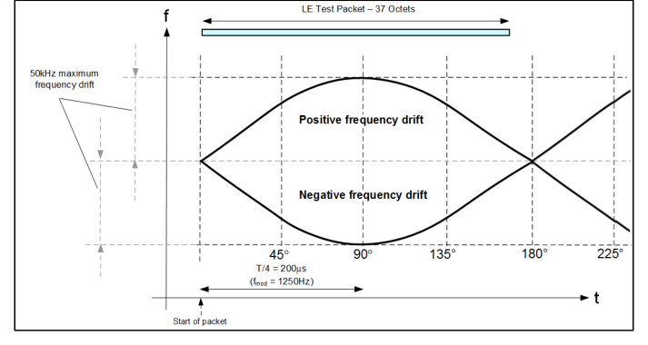

**Figure 4.17: Dirty transmitter frequency drift emulation principle**

• Test Condition
Common test case conditions defined in Section 4.2 apply.
• Expected Outcome
Pass verdict
All measured values fulfill the following condition:
PER better than 30.8% for a minimum of 1500 packets transmitted by the Lower Tester if the IUT’s Payload Length is 37 bytes.
PER better than the value calculated according to the formula specified in Section 6.3.1 for a minimum of 1500 packets transmitted by the Lower Tester if the IUT’s Payload Length is greater than 37 bytes.

#### 4.6.2 C/I and Receiver Selectivity Performance • Test Purpose

Verify the receiver's performance in the presence of co-/adjacent channel interference. For stable modulation tests, the receiver is set to assume the transmitter has a stable modulation index. The receiver mirror image rejection performance is also verified in this test.
• Reference
[2] Chapter 4.2
[6] Chapter 4.2
• Initial Condition
- Refer to Figure 4.18 for test setup principle.
- The IUT is set to direct RX mode. Dewhitening is turned off.
- Frequency hopping off, fixed frequency.
- The image frequency (fimage for 1 Ms/s or fimage-2M for 2 Ms/s) of the receiver relative to the receiver frequency is declared by the equipment manufacturer as an IXIT value.
- The value of MAX_RX_LENGTH, MAX_RX_LENGTH_2M, MAX_RX_LENGTH_CODED_S2, and MAX_RX_LENGTH_CODED_S8 (for which the TC is performed) is specified in Section 6.6.
- IUT is set for a symbol rate as specified in Table 4.18.
- The IUT is set to assume the transmitter has a standard modulation index or stable modulation index (specified in Table 4.18).
• Test Case Configuration

| Test Case | Modulation |  | Input |  |  | Symbol |  | Payload Length |
| --- | --- | --- | --- | --- | --- | --- | --- | --- |
|  |  |  | Power |  |  | Rate |  |  |
| RFPHY/RCV/BV-03-C [C/I and Receiver Selectivity Performance, uncoded data at 1 Ms/s] | Standard | -67 dBm |  |  | 1 Ms/s |  |  | MAX RX LENGTH _ _ |
| RFPHY/RCV/BV-09-C [C/I and Receiver Selectivity Performance at 2 Ms/s] | Standard | -67 dBm |  |  | 2 Ms/s |  |  | MAX RX LENGTH 2M _ _ _ |
| RFPHY/RCV/BV-15-C [C/I and Receiver Selectivity Performance, uncoded data at 1 Ms/s, Stable Modulation Index] | Stable | -67 dBm |  |  | 1 Ms/s |  |  | MAX RX LENGTH _ _ |
| RFPHY/RCV/BV-21-C [C/I and Receiver Selectivity Performance at 2 Ms/s, Stable Modulation Index] | Stable | -67 dBm |  |  | 2 Ms/s |  |  | MAX RX LENGTH 2M _ _ _ |

| Test Case | Modulation |  | Input |  |  | Symbol |  | Payload Length |
| --- | --- | --- | --- | --- | --- | --- | --- | --- |
|  |  |  | Power |  |  | Rate |  |  |
| RFPHY/RCV/BV-28-C [C/I and Receiver Selectivity Performance, LE Coded (S=2)] | Standard | -72 dBm |  |  | 1 Ms/s coded S=2 |  |  | MAX RX LENGTH CODED S2 _ _ _ _ |
| RFPHY/RCV/BV-29-C [C/I and Receiver Selectivity Performance, LE Coded (S=8)] | Standard | -79 dBm |  |  | 1 Ms/s coded S=8 |  |  | MAX RX LENGTH CODED S8 _ _ _ _ |
| RFPHY/RCV/BV-34-C [C/I and Receiver Selectivity Performance, LE Coded (S=2), Stable Modulation Index] | Stable | -72 dBm |  |  | 1 Ms/s coded S=2 |  |  | MAX RX LENGTH CODED S2 _ _ _ _ |
| RFPHY/RCV/BV-35-C [C/I and Receiver Selectivity Performance, LE Coded (S=8), Stable Modulation Index] | Stable | -79 dBm |  |  | 1 Ms/s coded S=8 |  |  | MAX RX LENGTH CODED S8 _ _ _ _ |

Table 4.18: C/I and receiver selectivity performance test cases
• Test Procedure
1. The IUT is set to receive at the low operating frequency listed in the frequencies for testing
applicable to the IUT (listed in the test condition section of this test case). 2. Two test signals are fed to the IUT input port:
Wanted signal:
Packets transmitted at the receiving frequency (fRX) with Payload Length (specified in Table 4.18) octet PRBS9 payload at a Symbol Rate specified in Table 4.18. Refer to Section 6.1 and [4], Section 4 for details. Signal level of the wanted signal at the IUT input port is Input Power (specified in Table 4.18).
Interference signal:
Continuous modulated carrier at 2400 MHz, modulated with PRBS15 data at a Symbol Rate specified in Table 4.18. Refer to Section 6.1 and [4], Section 4 for details. Signal level of the interference signal at the IUT input port and frequency relative to the receiving frequency is as defined in Table 4.19.
3. The Lower Tester's transmit power is chosen such that the input power to the IUT receiver is as
listed in Table 4.19. 4. For 1 Ms/s, steps 2–3 are repeated for interference frequencies 2400 MHz+NMHz where
N=1,2,3…83.
For 2 Ms/s, steps 2–3 are repeated for interference frequencies 2400MHz+2N MHz where N=1,2,3…41.
5. The PER is measured according to Section 6.3.
listed in the test condition section.
Tester implementation

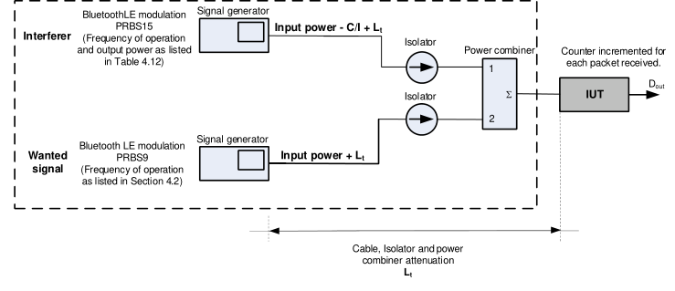

**Figure 4.18: C/I and receiver selectivity test setup**

| Interference signal frequency1 |  |  | f interference |  |  |  | Interferer signal level at IUT input port (dBm) |  |  |  | Wanted signal level relative to |  |  |  |  |
| --- | --- | --- | --- | --- | --- | --- | --- | --- | --- | --- | --- | --- | --- | --- | --- |
|  |  |  |  |  |  |  |  |  |  |  | interference signal level |  |  |  |  |
|  |  |  |  |  |  |  |  |  |  |  | (C/I requirement) (dB) |  |  |  |  |
|  |  |  |  | 1Ms/s and LE |  | 2Ms/s | Uncoded | S=2 | S=8 | Uncoded | Uncoded | S=2 | S=8 | S=8 |  |
|  |  |  |  | Coded |  |  |  |  |  |  |  |  |  |  |  |
|  | Co-channel |  | f RX |  |  | f RX | -88 | -89 | -91 | 21 |  | 17 | 12 |  |  |
|  | Adjacent channel |  | f  1 MHz RX |  |  | f  2 MHz RX | -82 | -83 | -85 | 15 |  | 11 | 6 |  |  |
|  | Adjacent channel |  | f  2 MHz RX |  |  | f  4 MHz RX | -50 | -51 | -53 | -17 |  | -21 | -26 |  |  |
| Adjacent channel | Adjacent channel |  | f  (3+n) RX MHz [n=0,1,2…] |  |  | f  (6+2n) RX MHz [n=0,1,2…] | -40 | -41 | -43 | -27 |  | -31 | -36 |  |  |
|  | Image frequency |  | f image |  |  | f image-2M | -58 | -59 | -61 | -9 |  | -13 | -18 |  |  |
|  | Adjacent channel |  | f  1 MHz image |  |  | f  2 image-2M MHz | -52 | -53 | -55 | -15 |  | -19 | -24 |  |  |
|  | to image |  |  |  |  |  |  |  |  |  |  |  |  |  |  |
|  | frequency |  |  |  |  |  |  |  |  |  |  |  |  |  |  |

Table 4.19: C/I and receiver selectivity test parameter settings
• Test Condition
Common test case conditions defined in Section 4.2 apply.
• Expected Outcome
Pass verdict
All measured values fulfill the following condition:
PER better than 30.8% for a minimum of 1500 packets transmitted by the Lower Tester if the IUT’s Payload Length is 37 bytes.
PER better than the value calculated according to the formula specified in Section 6.3.1 for a minimum of 1500 packets transmitted by the Lower Tester if the IUT’s Payload Length is greater than 37 bytes.

## 1 If two frequencies defined in Table 4.19 refer to the same physical channel, the less stringent requirement applies.

For each individual measurement the C/I requirement may be relaxed for a maximum of five interference frequency settings. The C/I-performance is in this case be equal to, or better than -17 dB (Interference level at least 17 dB higher than wanted signal level). This relaxation applies to the following measurements:
- Adjacent channel  2 MHz (for 1 Ms/s) or ± 4 MHz (for 2 Ms/s)
- Adjacent channel  (3+n) MHz (for 1 Ms/s) or ± (6+2n) MHz (for 2 Ms/s) [n=0,1,2…]

#### 4.6.3 Blocking Performance • Test Purpose

Verify that the receiver performs satisfactorily in the presence of interference sources operating outside the 2400 MHz – 2483.5 MHz band.
• Reference
[2] Chapter 4.3
[6] Chapter 4.3
• Initial Condition
- The IUT is set to direct RX mode. Dewhitening is turned off.
- Frequency hopping off, fixed frequency.
- The value of MAX_RX_LENGTH and MAX_RX_LENGTH_2M (for which the TC is performed) is specified in Section 6.6.
- IUT is set for a symbol rate as specified in Table 4.20.
- The IUT is set to assume the transmitter has a standard modulation index or stable modulation index (specified in Table 4.20).
• Test Case Configuration

|  | Test Case |  |  | Modulation |  |  | Symbol Rate |  |  | Payload Length |  |
| --- | --- | --- | --- | --- | --- | --- | --- | --- | --- | --- | --- |
| RFPHY/RCV/BV-04-C [Blocking Performance, uncoded data at 1 Ms/s] |  |  | Standard |  |  | 1 Ms/s |  |  | MAX RX LENGTH _ _ |  |  |
| RFPHY/RCV/BV-10-C [Blocking performance at 2 Ms/s] |  |  | Standard |  |  | 2 Ms/s |  |  | MAX RX LENGTH 2M _ _ _ |  |  |
| RFPHY/RCV/BV-16-C [Blocking Performance, uncoded data at 1 Ms/s, Stable Modulation Index] |  |  | Stable |  |  | 1 Ms/s |  |  | MAX RX LENGTH _ _ |  |  |
| RFPHY/RCV/BV-22-C [Blocking performance at 2 Ms/s, Stable Modulation Index] |  |  | Stable |  |  | 2 Ms/s |  |  | MAX RX LENGTH 2M _ _ _ |  |  |

Table 4.20: Blocking performance test cases
• Test Procedure
1. Two test signals are fed to the IUT input port:
Wanted signal:
Modulated carrier, packets transmitted at the mid operating frequency listed in the frequencies for testing (listed in the test condition section of this test case) with PRBS9 payload with Payload
Length (specified in Table 4.20). See Section 6.1 and [4], Section 4 for details. Signal level of the wanted signal at the IUT input port is as defined in Table 4.21.
Blocking signal:
Sinusoidal, un-modulated carrier transmitted at a blocker frequency of fblocker = 30 MHz. Signal level of the blocker signal at the IUT input port is as defined in Table 4.21.
2. The PER is measured according to Section 6.3. If the PER exceeds the minimum requirement,
the frequency is recorded as fbf_1. 3. Repeat steps 1) and 2) for 30 MHz  fblocker  12.75 GHz with the measurement frequency
resolution defined in Table 4.21. 4. fblocker n+1 = fblocker_n + measurement frequency resolution (n=0,1,2…) 5. The PER measurement is repeated for all recorded frequencies in step 4) but with -50 dBm
blocker level at the IUT input ports. If the PER exceeds the minimum requirement, the frequency is recorded as fbf_2.
Tester implementation

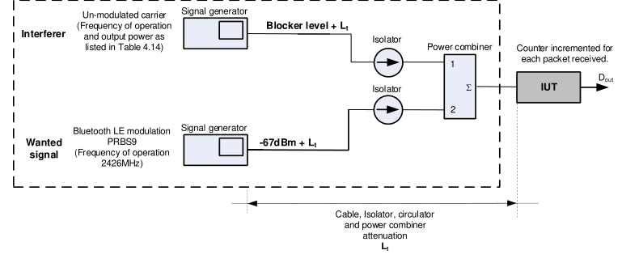

**Figure 4.19: Blocking performance test setup**

| Interference signal frequency |  | Wanted signal level at IUT input port |  | Blocking signal |  |  | Measurement |  |
| --- | --- | --- | --- | --- | --- | --- | --- | --- |
|  |  |  |  | level at IUT input |  |  | frequency |  |
|  |  |  |  | port |  |  | resolution |  |
| 30 – 2000 MHz |  | -67 dBm | -30 dBm |  |  | 10 MHz |  |  |
| 2003 – 2399 MHz |  | -67 dBm | -35 dBm |  |  | 3 MHz |  |  |
| 2484 – 2997 MHz |  | -67 dBm | -35 dBm |  |  | 3 MHz |  |  |
| 3000 MHz – 12.75 GHz |  | -67 dBm | -30 dBm |  |  | 25 MHz |  |  |

Table 4.21: Out-of-band blocking performance and measurement parameters
• Test Condition
Common test case conditions defined in Section 4.2 apply.
Frequencies for Testing:

| Role |  |  | IUT Low |  |  | IUT Mid |  |  | IUT High |  |
| --- | --- | --- | --- | --- | --- | --- | --- | --- | --- | --- |
| All |  |  |  |  | 2426 MHz (n=12) |  |  |  |  |  |

• Expected Outcome
Pass verdict
All measured values fulfill the following condition:
PER better than 30.8% for a minimum of 1500 packets transmitted by the Lower Tester if the IUT’s Payload Length is 37 bytes.
PER better than the value calculated according to the formula specified in Section 6.3.1 for a minimum of 1500 packets transmitted by the Lower Tester if the IUT’s Payload Length is greater than 37 bytes.
The number of fbf_1 frequencies recorded in step 2 do not exceed 10, and the number of fbf_2 frequencies recorded in step 5 do not exceed 3.

#### 4.6.4 Intermodulation Performance • Test Purpose

Verify that the receiver intermodulation performance is satisfactory.
• Reference
[2] Chapter 4.4
[6] Chapter 4.4
• Initial Condition
- The IUT is set to direct RX mode. Dewhitening is turned off.
- Frequency hopping off, fixed frequency.
- The value of MAX_RX_LENGTH and MAX_RX_LENGTH_2M (for which the TC is performed) is specified in Section 6.6.
- The IUT is set for a symbol rate as specified in Table 4.22.
- The IUT is set to assume the transmitter has a standard modulation index or stable modulation index (specified in Table 4.22).
• Test Case Configuration

|  | Test Case |  |  | Modulation |  |  | Symbol Rate |  |  | Payload Length |  |
| --- | --- | --- | --- | --- | --- | --- | --- | --- | --- | --- | --- |
| RFPHY/RCV/BV-05-C [Intermodulation Performance, uncoded data at 1 Ms/s] |  |  | Standard |  |  | 1 Ms/s |  |  | MAX RX LENGTH _ _ |  |  |
| RFPHY/RCV/BV-11-C [Intermodulation performance at 2 Ms/s] |  |  | Standard |  |  | 2 Ms/s |  |  | MAX RX LENGTH 2M _ _ _ |  |  |
| RFPHY/RCV/BV-17-C [Intermodulation Performance, uncoded data at 1 Ms/s, Stable Modulation Index] |  |  | Stable |  |  | 1 Ms/s |  |  | MAX RX LENGTH _ _ |  |  |
| RFPHY/RCV/BV-23-C [Intermodulation performance at 2 Ms/s, Stable Modulation Index] |  |  | Stable |  |  | 2 Ms/s |  |  | MAX RX LENGTH 2M _ _ _ |  |  |

Table 4.22: Intermodulation performance test cases
• Test Procedure
1. The IUT is set to receive at the lowest frequency for testing defined in the frequencies for testing
applicable to the IUT (listed in the test condition section of this test case). Three test signals are fed to the IUT input port:
Wanted signal:
Modulated carrier, packets transmitted at the receiving frequency (fRX) with octet PRBS9 payload with Payload Length (specified in Table 4.22). Refer to Section 6.1 and [4], Section 4 for details. Signal level of the wanted signal at the IUT input port is -64 dBm.
Interference signal #1:
Sinusoidal, un-modulated carrier transmitted at an interferer frequency of f1. Signal level of the interferer signal at the IUT input port is -50 dBm.
Interference signal #2:
Continuous modulated carrier at frequency f2, modulated with PRBS15 data at a symbol rate as specified in Table 4.22. See Section 6.1 and [4], Section 4 for details. Signal level of the interferer signal at the IUT input port is -50 dBm. The frequency relation between the wanted signal and the interferers is as follows:
fRX = 2 × f1 – f2 and |f2 – f1| = n × 1 MHz for 1 Ms/s symbol rate
fRX = 2 × f1 – f2 and |f2 – f1| = n × 2 MHz for 2 Ms/s symbol rate
where n=3, 4, or 5
Once the frequency configuration is chosen, the PER is measured with the interferers both below and above the receive frequency, covering both cases implied by |f2 - f1|, i.e., the PER is measured twice for each receive frequency.
Figure 4.21 shows the frequency combination alternatives for the intermodulation test.
2. The Lower Tester’s transmit power is chosen such that the input power to the IUT receiver is as
listed in step 1. Figure 4.20 illustrates the test setup principle. 3. The PER is measured according to Section 6.3. 4. Steps 2 and 3 are repeated when the IUT is receiving at the remaining frequencies defined in
the test condition section.

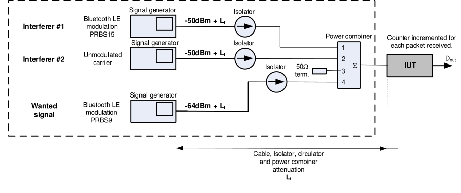

**Figure 4.20: Test setup for intermodulation test**

Alternative #3 Alternative #2 Alternative #1
Signal power
[dBm]

|  |  |  |  |
| --- | --- | --- | --- |
|  | Bluetooth LE modulated signal (f2) |  |  |

Unmodulated
Receiving channel
fRX
frequency

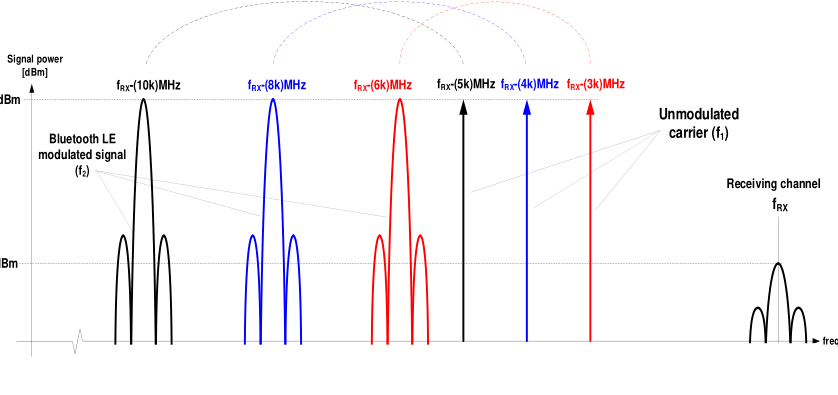

**Figure 4.21: Test signal allocation alternatives in the frequency domain at symbol rate k (in Ms/s). Note: figure shows only frequencies below f0.**

• Test Condition
Common test case conditions defined in Section 4.2 apply.
• Expected Outcome
Pass verdict
The measured values fulfill the following condition:
PER better than 30.8% for a minimum of 1500 packets transmitted by the Lower Tester if the IUT’s Payload Length is 37 bytes.
PER better than the value calculated according to the formula specified in Section 6.3.1 for a minimum of 1500 packets transmitted by the Lower Tester if the IUT’s Payload Length is greater than 37 bytes.
The value of n (for which the TC is performed) is declared by the manufacturer in the IXIT table [3].

#### 4.6.5 Maximum input signal level • Test Purpose

Verify that the receiver is able to demodulate a wanted signal at high signal input levels.
• Reference
[2] Chapter 4.5
[6] Chapter 4.5
• Initial Condition
- The IUT is set to direct RX mode. Dewhitening is turned off.
- Frequency hopping off, fixed frequency.
- The value of MAX_RX_LENGTH and MAX_RX_LENGTH_2M (for which the TC is performed) is specified in Section 6.6.
- IUT is set for a symbol rate as specified in Table 4.23.
- The IUT is set to assume the transmitter has a standard modulation index or stable modulation index (specified in Table 4.23).
• Test Case Configuration

|  | Test Case |  |  | Modulation |  |  | Symbol Rate |  |  | Payload Length |  |
| --- | --- | --- | --- | --- | --- | --- | --- | --- | --- | --- | --- |
| RFPHY/RCV/BV-06-C [Maximum input signal level, uncoded data at 1 Ms/s] |  |  | Standard |  |  | 1 Ms/s |  |  | MAX RX LENGTH _ _ |  |  |
| RFPHY/RCV/BV-12-C [Maximum input signal level at 2 Ms/s] |  |  | Standard |  |  | 2 Ms/s |  |  | MAX RX LENGTH 2M _ _ _ |  |  |
| RFPHY/RCV/BV-18-C [Maximum input signal level, uncoded data at 1 Ms/s, Stable Modulation Index] |  |  | Stable |  |  | 1 Ms/s |  |  | MAX RX LENGTH _ _ |  |  |
| RFPHY/RCV/BV-24-C [Maximum input signal level at 2 Ms/s, Stable Modulation Index] |  |  | Stable |  |  | 2 Ms/s |  |  | MAX RX LENGTH 2M _ _ _ |  |  |

Table 4.23: Maximum input signal level test cases
• Test Procedure
1. The IUT is set to receive at the lowest frequency for testing defined in the frequencies for testing
applicable to the IUT (listed in the test condition section of this test case). 2. The Lower Tester transmits packets with octet PRBS9 payload with Payload Length (specified in
Table 4.23). Refer to Section 6.1, “Reference Signal Definition” and [4], Section 4 for details. The signal level at the IUT input port is -10 dBm. 3. The PER is measured according to Section 6.3. 4. Steps 1–3 are repeated when the IUT is receiving at the remaining frequencies defined in the
test condition section.
• Test Condition
Common test case conditions defined in Section 4.2 apply.
• Expected outcome
Pass verdict
All measured values fulfill the following condition:
PER better than 30.8% for a minimum of 1500 packets transmitted by the Lower Tester if the IUT’s Payload Length is 37 bytes.
PER better than the value calculated according to the formula specified in Section 6.3.1 for a minimum of 1500 packets transmitted by the Lower Tester if the IUT’s Payload Length is greater than 37 bytes.

#### 4.6.6 PER report integrity • Test Purpose

Verify that the IUT PER report mechanism reports the correct number of received packets to the Lower Tester.
• Reference
Section 6.3
[2] Chapter 2.3
[6] Chapter 2.3
• Initial Condition
- The IUT is set to direct RX mode. Dewhitening is turned off.
- Frequency hopping off, fixed frequency.
- The value of MAX_RX_LENGTH, MAX_RX_LENGTH_2M, MAX_RX_LENGTH_CODED_S2, and MAX_RX_LENGTH_CODED_S8 (for which the TC is performed) is specified in Section 6.6.
- The IUT is set for a symbol rate as specified in Table 4.24.
- The IUT is set to assume the transmitter has a standard modulation index or stable modulation index (specified in Table 4.24).
• Test Case Configuration

| Test Case | Modulation |  | Symbol |  | Payload Length |
| --- | --- | --- | --- | --- | --- |
|  |  |  | Rate |  |  |
| RFPHY/RCV/BV-07-C [PER Report Integrity, uncoded data at 1 Ms/s] | Standard | 1 Ms/s |  |  | MAX RX LENGTH _ _ |
| RFPHY/RCV/BV-13-C [PER Report Integrity at 2 Ms/s] | Standard | 2 Ms/s |  |  | MAX RX LENGTH 2M _ _ _ |
| RFPHY/RCV/BV-19-C [PER Report Integrity, uncoded data at 1 Ms/s, Stable Modulation Index] | Stable | 1 Ms/s |  |  | MAX RX LENGTH _ _ |
| RFPHY/RCV/BV-25-C [PER Report Integrity at 2 Ms/s, Stable Modulation Index] | Stable | 2 Ms/s |  |  | MAX RX LENGTH 2M _ _ _ |
| RFPHY/RCV/BV-30-C [PER Report Integrity, LE Coded (S=2)] | Standard | 1 Ms/s coded S=2 |  |  | MAX RX LENGTH CODED S2 _ _ _ _ |

| Test Case | Modulation |  | Symbol |  | Payload Length |
| --- | --- | --- | --- | --- | --- |
|  |  |  | Rate |  |  |
| RFPHY/RCV/BV-31-C [PER Report Integrity, LE Coded (S=8)] | Standard | 1 Ms/s coded S=8 |  |  | MAX RX LENGTH CODED S8 _ _ _ _ |
| RFPHY/RCV/BV-36-C [PER Report Integrity, LE Coded (S=2), Stable Modulation Index] | Stable | 1 Ms/s coded S=2 |  |  | MAX RX LENGTH CODED S2 _ _ _ _ |
| RFPHY/RCV/BV-37-C [PER Report Integrity, LE Coded (S=8), Stable Modulation Index] | Stable | 1 Ms/s coded S=8 |  |  | MAX RX LENGTH CODED S8 _ _ _ _ |

Table 4.24: PER Report Integrity test cases
• Test Procedure
1. The IUT is set to receive at the middle frequency for testing defined in the test condition section. 2. The Lower Tester transmits packets with octet PRBS9 payload with Payload Length (specified in
Table 4.24). Refer to Section 6.1 and [4], Section 4 for details. 3. The total number of packets transmitted by the Lower Tester is an even random number in the
interval [100  RND  1500]. 4. Every alternating packet transmitted by the Lower Tester has an intentionally corrupted CRC
value. 5. The signal level at the IUT input port is -30 dBm. 6. The PER is measured according to Section 6.3. 7. Steps 1–4 are repeated two times (i.e., three PER measurements in total).
• Test Condition
Common test case conditions defined in Section 4.2 apply.
Frequencies for Testing:

|  | Role |  |  | IUT Low |  |  | IUT Mid |  |  | IUT High |  |
| --- | --- | --- | --- | --- | --- | --- | --- | --- | --- | --- | --- |
| All |  |  |  |  |  | 2440 MHz (n=19) |  |  |  |  |  |

• Expected Outcome
Pass verdict
All measured values fulfill the following condition:
50%  PER  (50 + P/2)% for each individual measurement (where P is the appropriate PER value taken from Table 6.2).

#### 4.6.7 IQ Samples Coherency, AoD Receiver • Test Purpose

This test group is for generic use and contains four test cases to verify that the measured relative phase values derived from the I and Q values sampled on an IUT AoD Receiver from a Constant Tone Extension are within specified limits.
• Reference
[8] Section 5
[9] Section 4.1.7
• Initial Condition
- The IUT is set to direct RX mode. Dewhitening is turned off.
- Frequency hopping off, fixed frequency.
- The Lower Tester’s transmit power is chosen such that the input power to the IUT receiver is -67 dBm. The Lower Tester does not change its transmit power during the Constant Tone Extension (except during the guard period and the switch slots).
- The IUT is set to assume the transmitter has a standard modulation index.
- IUT is set for a symbol rate as specified in Table 4.25.
- The rate at which the IUT generates IQ reports (TSPX_IQ_Report_Rate) is defined in the IXIT [5].
• Test Case Configuration

|  | Test Case |  |  | PHY |  |  | CTE Type (Slot Duration) |  |
| --- | --- | --- | --- | --- | --- | --- | --- | --- |
| RFPHY/RCV/IQC/BV-01-C [IQ Samples Coherency, AoD Receiver at 1 Ms/s with 2 µs Slot] |  |  | 1 Ms/s |  |  | (0x02) 2 µs |  |  |
| RFPHY/RCV/IQC/BV-02-C [IQ Samples Coherency, AoD Receiver at 1 Ms/s with 1 µs Slot] |  |  | 1 Ms/s |  |  | (0x01) 1 µs |  |  |
| RFPHY/RCV/IQC/BV-03-C [IQ Samples Coherency, AoD Receiver at 2 Ms/s with 2 µs Slot] |  |  | 2 Ms/s |  |  | (0x02) 2 µs |  |  |
| RFPHY/RCV/IQC/BV-04-C [IQ Samples Coherency, AoD Receiver at 2 Ms/s with 1 µs Slot] |  |  | 2 Ms/s |  |  | (0x01) 1 µs |  |  |

Table 4.25: IQ Samples Coherency, AoD Receiver test cases
• Test Procedure
1. The Upper Tester commands the IUT to receive test packets at the lowest frequency for testing
as defined in the frequencies for testing (listed in the test condition section of this test case), with expected CTE length of 20 and expected CTE type as specified in Table 4.25. 2. The Lower Tester transmits LE test packets with no PDU payload and with 20 * 8 μs Constant
Tone Extension. Antenna switching is executed for each Constant Tone Extension with slot durations as specified in Table 4.25, length of switching pattern and switching pattern set as described in Section 5.2.3 [8] with the number of antenna elements set to 4. See [9] Section 4, “LE Test Packet Definition” for details. 3. The Upper Tester expects to receive HCI_LE_Connectionless_IQ_Report events at the rate
specified by TSPX_IQ_Report_Rate and calculates the relative phase and reference phase deviation values for each non-reference antenna, as described in Section 5.2.1 [8]. 4. The Lower Tester transmits LE test packets until it reaches the maximum number of packets
defined in Section 6.7 or until the RP(m) and RPD sets each contain at least 2,000 values. 5. Repeat steps 1–4 until the IUT has received on all the remaining frequencies defined in the test
condition section.
• Test Condition
The IUT and Lower Tester are set up according to the cabled testing setup described in Section 4.7 and Common test case conditions defined in Section 4.2 apply.

|  | Role |  |  | PHY |  |  | IUT Low |  |  | IUT Mid |  |  | IUT High |  |
| --- | --- | --- | --- | --- | --- | --- | --- | --- | --- | --- | --- | --- | --- | --- |
| All |  |  | 1 Ms/s |  |  | 2402 MHz (n=0) |  |  | 2440 MHz (n=19) |  |  | 2480 MHz (n=39) |  |  |
| All |  |  | 2 Ms/s |  |  | 2404 MHz (n=1) |  |  | 2440 MHz (n=19) |  |  | 2478 MHz (n=38) |  |  |

Pass verdict
For each frequency tested, RP(m) and RPD sets contain at least 2,000 valid values each.
For each frequency tested, the IUT meets the requirements from Section 5.2.2 [8].
The presence of invalid IQ samples does not constitute a failure.

#### 4.6.8 IQ Samples Coherency, AoA Receiver • Test Purpose

This test group is for generic use and contains two test cases to verify that the measured relative phase values derived from the I and Q values sampled on an IUT AoA Receiver from a Constant Tone Extension are within specified limits.
• Reference
[8] Section 5
[9] Section 4.1.7
• Initial Condition
- The IUT is set to direct RX mode. Dewhitening is turned off.
- Frequency hopping off, fixed frequency.
- The Lower Tester’s transmit power is chosen such that the input power to the IUT receiver is -67 dBm. The Lower Tester does not change its transmit power during the Constant Tone Extension (except during the guard period and the switch slots).
- The IUT is set to assume the transmitter has a standard modulation index.
- The IUT is set for a symbol rate as specified in Table 4.26.
- The maximum number of antennas supported by the IUT (TSPX_number_of_antennae) is defined in the IXIT [5].
- The rate at which the IUT generates IQ reports (TSPX_IQ_Report_Rate) is defined in the IXIT [5].
• Test Case Configuration

|  | Test Case |  |  | PHY |  |
| --- | --- | --- | --- | --- | --- |
| RFPHY/RCV/IQC/BV-05-C [IQ Samples Coherency, AoA Receiver at 1 Ms/s with 2 µs Slot] |  |  | 1 Ms/s |  |  |
| RFPHY/RCV/IQC/BV-06-C [IQ Samples Coherency, AoA Receiver at 2 Ms/s with 2 µs Slot] |  |  | 2 Ms/s |  |  |

Table 4.26: IQ Samples Coherency, AoA Receiver test cases
• Test Procedure
1. The Upper Tester commands the IUT to receive test packets at the lowest frequency for testing
as defined in the frequencies for testing (listed in the test condition section of this test case), with expected CTE length of 20, CTE type of 0x00 (AoA CTE), slot durations of 2 μs, length of switching pattern and the switching pattern set as described in Section 5.2.3 [8] with the number of antenna elements set to the minimum value between 4 and TSPX_number_of_antennae. 2. The Lower Tester transmits LE test packets with no PDU payload and with 20 * 8 μs Constant
Tone Extension. See [9] Section 4, “LE Test Packet Definition” for details. 3. The Upper Tester expects to receive HCI_LE_Connectionless_IQ_Report events at the rate
specified by TSPX_IQ_Report_Rate and calculates the relative phase and reference phase deviation values for each non-reference antenna, as described in Section 5.2.1 [8]. 4. The Lower Tester transmits LE test packets until it reaches the maximum number of packets
defined in Section 6.7 or until the RP(m) and RPD sets each contain at least 2,000 values. 5. Repeat steps 1–4 until the IUT has received on all the remaining frequencies defined in the test
condition section.
• Test Condition
The IUT and Lower Tester are set up according to the cabled testing setup described in Section 4.7 and Common test case conditions defined in Section 4.2 apply.
Frequencies for Testing:

|  | Role |  |  | PHY |  |  | IUT Low |  |  | IUT Mid |  |  | IUT High |  |
| --- | --- | --- | --- | --- | --- | --- | --- | --- | --- | --- | --- | --- | --- | --- |
| All |  |  | 1 Ms/s |  |  | 2402 MHz (n=0) |  |  | 2440 MHz (n=19) |  |  | 2480 MHz (n=39) |  |  |
| All |  |  | 2 Ms/s |  |  | 2404 MHz (n=1) |  |  | 2440 MHz (n=19) |  |  | 2478 MHz (n=38) |  |  |

Pass verdict
For each frequency tested, RP(m) and RPD sets contain at least 2,000 valid values each.
For each frequency tested, the IUT meets the requirements from Section 5.2.2 [8].
The presence of invalid IQ samples does not constitute a failure.

#### 4.6.9 IQ Samples Dynamic Range, AoD Receiver • Test Purpose

This test group is for generic use and contains four test cases to verify that the I and Q values sampled on receiving an AoD Constant Tone Extension from a peer device have specified values when varying the dynamic range of the Constant Tone Extension and marks any invalid samples as invalid.
• Reference
[8] Section 5
[9] Section 4.1.7
• Initial Condition
- The IUT is set to direct RX mode. Dewhitening is turned off.
- The IUT is set to assume the transmitter has a standard modulation index.
- IUT is set for a symbol rate as specified in Table 4.27.
- The rate at which the IUT generates IQ reports (TSPX_IQ_Report_Rate) is defined in the IXIT [5].
• Test Case Configuration

|  | Test Case |  |  | PHY |  |  | CTE Type (Slot Duration) |  |
| --- | --- | --- | --- | --- | --- | --- | --- | --- |
| RFPHY/RCV/IQDR/BV-07-C [IQ Samples Dynamic Range, AoD Receiver at 1 Ms/s with 2 µs Slot] |  |  | 1 Ms/s |  |  | (0x02) 2 µs |  |  |
| RFPHY/RCV/IQDR/BV-08-C [IQ Samples Dynamic Range, AoD Receiver at 1 Ms/s with 1 µs Slot] |  |  | 1 Ms/s |  |  | (0x01) 1 µs |  |  |
| RFPHY/RCV/IQDR/BV-09-C [IQ Samples Dynamic Range, AoD Receiver at 2 Ms/s with 2 µs Slot] |  |  | 2 Ms/s |  |  | (0x02) 2 µs |  |  |
| RFPHY/RCV/IQDR/BV-10-C [IQ Samples Dynamic Range, AoD Receiver at 2 Ms/s with 1 µs Slot] |  |  | 2 Ms/s |  |  | (0x01) 1 µs |  |  |

Table 4.27: IQ Samples Dynamic Range, AoD Receiver test cases
• Test Procedure
1. The Upper Tester commands the IUT to receive test packets at the lowest frequency for testing
as defined in the frequencies for testing (listed in the test condition section of this test case), with expected CTE length of 20 and expected CTE type as specified in Table 4.27. 2. The Lower Tester transmits LE test packets with no PDU payload and with 20 * 8 μs Constant
Tone Extension. The Lower Tester applies an attenuation on the line while sending the Preamble, preamble, synchronization word, LE test packet PDU, and CRC, such that the input power to the IUT receiver is set to the value described in Table 4.28 for antenna index 0. Antenna switching is executed for each Constant Tone Extension with slot durations as specified in Table 4.27, length of switching pattern and the switching pattern set as described in Section 5.2.3 [8] with the number of antenna elements set to 4. See [9] Section 4, “LE Test Packet Definition” for details. 3. The Lower Tester controls a variable attenuator that applies an additional attenuation on the line
while sending the Constant Tone Extension, such that the input power to the IUT receiver is set to the value described in Table 4.28 for each antenna index. 4. The Upper Tester expects to receive HCI_LE_Connectionless_IQ_Report events at the rate
specified by TSPX_IQ_Report_Rate and calculates amplitude A = sqrt(I2 + Q2) for each valid sample that was not taken during the reference period. 5. The Lower Tester transmits LE test packets until it reaches the maximum number of packets
defined in Section 6.7 or until the IUT reports at least 2,000 valid IQ sample pairs per antenna, except for antenna index 1. 6. Repeat steps 1–5 until the IUT has received on all the remaining frequencies defined in the test
condition section.

|  | Antenna Index |  |  | Input Power (dBm) |  |
| --- | --- | --- | --- | --- | --- |
| 0 |  |  | -52 |  |  |
| 1 |  |  | -49 |  |  |
| 2 |  |  | -57 |  |  |
| 3 |  |  | -62 |  |  |

Table 4.28: Input Power values for each antenna index
• Test Condition
The IUT and Lower Tester are set up according to the cabled testing setup described in Section 4.7 and Common test case conditions defined in Section 4.2 apply.
Frequencies for Testing:

|  | Role |  |  | PHY |  |  | IUT Low |  |  | IUT Mid |  |  | IUT High |  |
| --- | --- | --- | --- | --- | --- | --- | --- | --- | --- | --- | --- | --- | --- | --- |
| All |  |  | 1 Ms/s |  |  | 2402 MHz (n=0) |  |  | 2440 MHz (n=19) |  |  | 2480 MHz (n=39) |  |  |
| All |  |  | 2 Ms/s |  |  | 2404 MHz (n=1) |  |  | 2440 MHz (n=19) |  |  | 2478 MHz (n=38) |  |  |

• Expected Outcome
Pass verdict
For each frequency tested, the mean of amplitudes measured for each Lower Tester antenna index ‘i’ from Table 4.28 follows the equation:
AmeanANT3 < AmeanANT2 < AmeanANT0 < AmeanANT1
Should there be no valid samples in the non-reference antenna 1, due to saturation, then the Pass verdict is:
AmeanANT3 < AmeanANT2 < AmeanANT0
For each frequency tested, the IUT reports at least 2,000 valid IQ sample pairs per antenna, except for antenna index 1, to the Upper Tester.
The presence of invalid I or Q samples does not constitute a failure.

#### 4.6.10 IQ Samples Dynamic Range, AoA Receiver • Test Purpose

This test group is for generic use and contains two test cases to verify that the I and Q values sampled on receiving an AoA Constant Tone Extension from a peer device have specified values when varying the dynamic range of the Constant Tone Extension and marks any invalid samples as invalid.
• Reference
[8] Section 5
[9] Section 4.1.7
• Initial Condition
- The IUT is set to direct RX mode at maximum output power. Whitening is turned off.
- Frequency hopping off, fixed frequency.
- The IUT is set to assume the transmitter has a standard modulation index.
- IUT is set for a symbol rate as specified in Table 4.29.
- The maximum number of antennas supported by the IUT (TSPX_number_of_antennae) and the rate at which the IUT generates IQ reports (TSPX_Report_Rate) are defined in the IXIT [5].
• Test Case Configuration

|  | Test Case |  |  | PHY |  |
| --- | --- | --- | --- | --- | --- |
| RFPHY/RCV/IQDR/BV-11-C [IQ Samples Dynamic Range, AoA Receiver at 1 Ms/s with 2 µs Slot] |  |  | 1 Ms/s |  |  |
| RFPHY/RCV/IQDR/BV-12-C [IQ Samples Dynamic Range, AoA Receiver at 2 Ms/s with 2 µs Slot] |  |  | 2 Ms/s |  |  |

Table 4.29: IQ Samples Dynamic Range, AoA Receiver test cases
• Test Procedure
1. The Upper Tester commands the IUT to receive test packets at the lowest frequency for testing
as defined in the frequencies for testing (listed in the test condition section of this test case), with expected CTE length of 20, CTE type of 0x00 (AoA CTE), slot durations of 0x02 (2 μs), length of switching pattern and the switching pattern set as described in Section 5.2.3 [8] with the number of antenna elements set to the minimum value between 4 and TSPX_number_of_antennae. 2. The Lower Tester transmits LE test packets with no PDU payload and with 20 * 8 μs Constant
Tone Extension. The Lower Tester applies an attenuation on the line while sending the preamble, synchronization word, LE test packet PDU, and CRC, such that the input power to the IUT receiver is set to the value described in Table 4.30 for antenna index 0. See [9] Section 4, “LE Test Packet Definition” for details. 3. The Lower Tester controls a variable attenuator that applies an additional attenuation on the line
while sending the Constant Tone Extension, such that the input power to the IUT receiver is set to the value described in Table 4.30 for each antenna index. 4. The Upper Tester expects to receive HCI_LE_Connectionless_IQ_Report events at the rate
specified by TSPX_IQ_Report_Rate and calculates the amplitude A = sqrt(I2 + Q2) for each valid sample that was not taken during the reference period. 5. The Lower Tester transmits LE test packets until it reaches the maximum number of packets
defined in Section 6.7 or until the IUT reports at least 2,000 valid IQ sample pairs per antenna, except for antenna index 1. 6. Repeat steps 1–5 until the IUT has received on all the remaining frequencies defined in the test
condition section.

|  | Antenna Index |  |  | Input Power (dBm) |  |
| --- | --- | --- | --- | --- | --- |
| 0 |  |  | -52 |  |  |
| 1 |  |  | -49 |  |  |
| 2 |  |  | -57 |  |  |
| 3 |  |  | -62 |  |  |

Table 4.30: Input Power values for each antenna index
• Test Condition
The IUT and Lower Tester are set up according to the cabled testing setup described in Section 4.7 and Common test case conditions defined in Section 4.2 apply.
Frequencies for Testing:

|  | Role |  |  | PHY |  |  | IUT Low |  |  | IUT Mid |  |  | IUT High |  |
| --- | --- | --- | --- | --- | --- | --- | --- | --- | --- | --- | --- | --- | --- | --- |
| All |  |  | 1 Ms/s |  |  | 2402 MHz (n=0) |  |  | 2440 MHz (n=19) |  |  | 2480 MHz (n=39) |  |  |
| All |  |  | 2 Ms/s |  |  | 2404 MHz (n=1) |  |  | 2440 MHz (n=19) |  |  | 2478 MHz (n=38) |  |  |

• Expected Outcome
Pass verdict
For each frequency tested, the mean of amplitudes measured for each antenna index ‘i’ from Table 4.30 follows the equation:
AmeanANT3 < AmeanANT2 < AmeanANT0 < AmeanANT1
Should there be no valid samples in the non-reference antenna 1, due to saturation, then the Pass verdict is:
AmeanANT3 < AmeanANT2 < AmeanANT0
For each frequency tested, the IUT reports at least 2,000 valid IQ sample pairs per antenna, except for antenna index 1, to the Upper Tester.
The presence of invalid IQ samples does not constitute a failure.

### 4.7 Transmitter/Receiver tests (TRM-RCV)

#### 4.7.1 CS Step Mode-0, Frequency Verification • Test Purpose

Verify that the IUT’s Fractional Frequency Offset (FFO), and expected transmitted frequencies for Mode-0 transmissions are within limits.
• Reference
[11] Section 3.5.1
• Initial Condition
- The Lower Tester is configured as the Initiator and the IUT as the Reflector.
- A static Access Address (CS Sync Word) is used for the duration of the test, see Section 4.2.3.1.
- A fixed 1:1 antenna configuration is used.
- The IUT’s transmitter is set to maximum output power.
- The IUT is configured to transmit a fixed sequence of 𝑀 Mode-0 CS steps, where 𝑀 is the maximum number of Mode-0 steps the IUT supports.
- The IUT transmitter is configured to transmit a single Main-Mode CS step. This Main-Mode CS step is Mode-1.
- The test frequencies used are swept across all available CS channels in a pseudo random manner, as defined in Section 4.2.3.2 (Table 4.5).

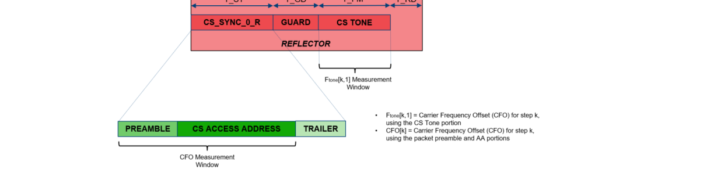

**Figure 4.22: Step Mode-0, Reflector signal CFO measurement windows**

• Test Case Configuration

| TCID | PHY |  | Main Mode |  |
| --- | --- | --- | --- | --- |
|  |  |  | Type |  |
| RFPHY/TRM-RCV/CS/BV-01-C [Step Mode-0, Frequency Verification, 1 Ms/s] | 1 Ms/s | Mode-1 |  |  |
| RFPHY/TRM-RCV/CS/BV-02-C [Step Mode-0, Frequency Verification, 2 Ms/s] | 2 Ms/s | Mode-1 |  |  |
| RFPHY/TRM-RCV/CS/BV-03-C [Step Mode-0, Frequency Verification, 2 Ms/s, BT = 2.0] | 2 Ms/s, BT = 2.0 | Mode-1 |  |  |

Table 4.31: CS Step Mode-0, Frequency Verification test cases
• Test Procedure
1. The Upper Tester commands the IUT to enable the Channel Sounding procedure with:
▪ Role set to Reflector ▪ Mode-0 CS steps set to of 𝑀= 3 steps ▪ Main Mode type set to Mode-1 ▪ Main Mode CS steps set to 𝐾= 1 ▪ Other parameters as specified in Section 4.2.3 2. The Lower Tester sends a Mode-0 transmission to the IUT. 3. The IUT responds with a Mode-0 transmission, which includes the CS_Tone. 4. The Lower Tester uses the PHY test filter characteristics as defined in Section 6.9. 5. The Lower Tester integrates the FM demodulated signal starting at the center of the first
preamble bit to the center of the first bit following the last access address bit, and uses this to calculate the center frequency of the packet 𝑓𝑝𝑘𝑡[𝑘]. 6. For each step 𝑘= 1 . . 𝑀, the Lower Tester measures the average frequency of the CS Tone and
records this as 𝐹𝑡𝑜𝑛𝑒[𝑘, 1]. 7. Calculate the Fractional Frequency Offset (FFO) for each CS step 𝑘, 𝐹𝐹𝑂[𝑘] =
𝐹𝑡𝑜𝑛𝑒[𝑘,1]−𝑓0[𝑘](1+10−6 𝐹𝐴𝐸[𝑘])
106.
𝑓0[𝑘](1+10−6 𝐹𝐴𝐸[𝑘]) , where 𝑘= 1 . . 𝑀.
8. Repeat steps 2–7 for all 𝑀 Mode-0 CS steps within the CS sub-event. 9. The Lower Tester sends a Main Mode transmission. 10. The IUT responds with a Main Mode transmission. 11. Repeat steps 1–10 to obtain a total of 1,000 Mode-0 CS steps. 12. Steps 1–11 are repeated for the PHYs specified in Table 4.31.
• Test Condition
The Common Test Case Conditions defined in Section 4.2 apply.
• Expected Outcome
Pass verdict
For every sub-event measured:
- |𝐹𝐹𝑂[𝑘]| ≤50 ppm, where 𝑘= 1 . . 𝑀
- |𝐹𝐹𝑂[𝑘] − 𝐹𝐹𝑂[1]| ≤1 ppm, where 𝑘= 2 . . 𝑀
For all sub-events measured:
- 95% 𝑜𝑓 𝑎𝑙𝑙 𝑟𝑒𝑐𝑜𝑟𝑑𝑒𝑑 |𝐹𝑡𝑜𝑛𝑒−𝑓𝑝𝑘𝑡(𝑘)| < 20 𝑘𝐻𝑧, where 𝑘= 2, … , 𝑀

#### 4.7.2 CS Step Main Mode, Frequency Verification • Test Purpose

Verify that the average frequency of each of the IUT’s Main Mode transmissions within the CS sub- event are aligned with the initial FFO measurement.
• Reference
[11] Section 3.5.2, 4.5
• Initial Condition
- The Lower Tester is configured as the Initiator and the IUT as the Reflector.
- A static Access Address (CS Sync Word) is used for the duration of the test, see Section 4.2.3.1.
- The maximum value of N_AP supported by the IUT is used.
- The IUT’s transmitter is set to maximum output power.
- The IUT is configured to transmit a fixed sequence of 𝑀 Mode-0 CS steps, where 𝑀 is the maximum number of Mode-0 steps the IUT supports.
- Tone extension is set to disabled.
- The transmit frequency for the entire CS subevent is fixed at 𝑓0, (Section 4.2.2).
• Test Case Configuration

| TCID | PHY |  | Main Mode |  |
| --- | --- | --- | --- | --- |
|  |  |  | Type |  |
| RFPHY/TRM-RCV/CS/BV-04-C [Step Main Mode, Frequency Verification, 1 Ms/s, Mode-1] | 1 Ms/s | Mode-1 |  |  |
| RFPHY/TRM-RCV/CS/BV-05-C [Step Main Mode, Frequency Verification, 1 Ms/s, Mode-2] | 1 Ms/s | Mode-2 |  |  |
| RFPHY/TRM-RCV/CS/BV-06-C [Step Main Mode, Frequency Verification, 1 Ms/s, Mode-3] | 1 Ms/s | Mode-3 |  |  |
| RFPHY/TRM-RCV/CS/BV-07-C [Step Main Mode, Frequency Verification, 2 Ms/s, Mode-1] | 2 Ms/s | Mode-1 |  |  |
| RFPHY/TRM-RCV/CS/BV-08-C [Step Main Mode, Frequency Verification, 2 Ms/s, Mode-3] | 2 Ms/s | Mode-3 |  |  |

| TCID | PHY |  | Main Mode |  |
| --- | --- | --- | --- | --- |
|  |  |  | Type |  |
| RFPHY/TRM-RCV/CS/BV-09-C [Step Main Mode, Frequency Verification, 2 Ms/s, BT = 2.0, Mode-1] | 2 Ms/s, BT = 2.0 | Mode-1 |  |  |
| RFPHY/TRM-RCV/CS/BV-10-C [Step Main Mode, Frequency Verification, 2 Ms/s, BT = 2.0, Mode-3] | 2 Ms/s, BT = 2.0 | Mode-3 |  |  |

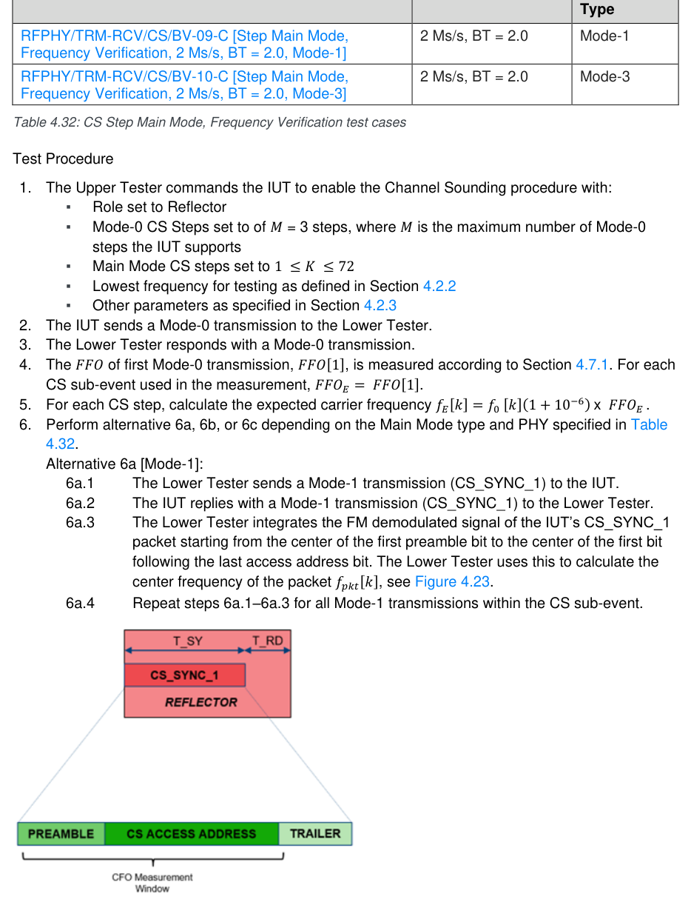

**Figure 4.23: Step Main Mode-1, Reflector signal CFO measurement window**

6b.1 The Lower Tester sends a Mode-2 transmission (CS_Tone) to the IUT. 6b.2 The IUT replies with a Mode-2 transmission (CS_Tone) to the Lower Tester. 6b.3 The Lower Tester performs 𝑓𝑡𝑜𝑛𝑒[𝑘, 𝑝] measurements on the CS_Tone packet portion for duration T_PM per antenna, on step k, and antenna path p, see Figure 4.24. Refer to [11] Volume 6, Part H: Section 4.5 ‘Timing of Steps’. 6b.4 Repeat steps 6b.1–6b.3 for all Mode-2 transmissions within the CS sub-event.

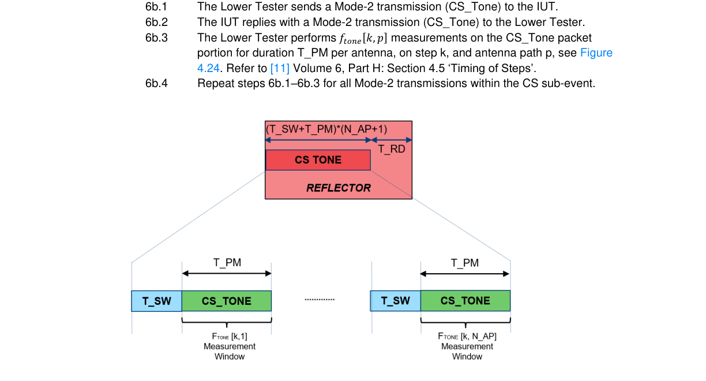

**Figure 4.24: Step Main Mode-2, Reflector signal CS tone measurement window**

Alternative 6c [Mode-3]:
6c.1 The Lower Tester sends a Mode-3 transmission (CS_SYNC_3 + CS_Tone) to the IUT. 6c.2 The IUT replies with a Mode-3 transmission (CS_Tone + CS_SYNC_3) to the Lower Tester. 6c.3 The Lower Tester performs 𝑓𝑡𝑜𝑛𝑒[𝑘, 𝑝] measurements on the CS_Tone packet portion for duration T_PM per antenna, on step k, and antenna path p. In addition, the Lower Tester integrates the FM demodulated signal of the IUT’s CS_SYNC_3 packet starting from the center of the first preamble bit to the center of the first bit following the last access address bit and uses this to calculate the center frequency of the packet 𝑓𝑝𝑘𝑡[𝑘], see Figure 4.25. Refer to [11] Volume 6, Part H: Section 4.5 ‘Timing of Steps’. 6c.4 Repeat steps 6c.1–6c.3 for all Mode-3 transmissions within the CS sub-event.

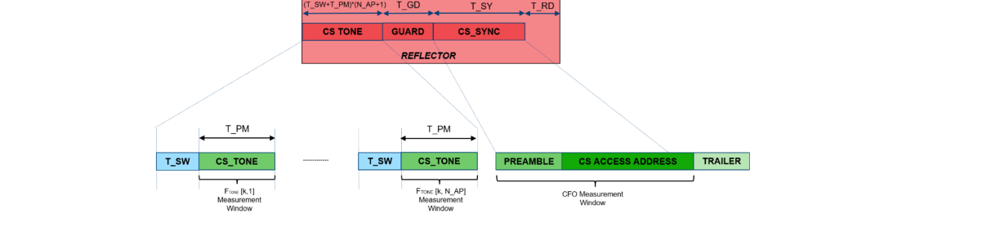

**Figure 4.25: Step Main Mode-3, Reflector signal CFO and Ftone measurement windows**

7. Repeat steps 1–6 to obtain a total of 1,000 Main-Mode CS steps.
• Test Condition
The Common Test Case Conditions defined in Section 4.2 apply.
• Expected Outcome
Pass verdict
For every CS sub-event measured, in the case of:
- Mode-1 and Mode-3 CS steps:
▪ 95% 𝑜𝑓 𝑎𝑙𝑙 𝑚𝑒𝑎𝑠𝑢𝑟𝑒𝑚𝑒𝑛𝑡𝑠: | 𝑓𝐸[𝑘] −𝑓𝑝𝑘𝑡[𝑘]| < 20 kHz
- Mode-2 and Mode-3 CS steps:
▪ 95% 𝑜𝑓 𝑎𝑙𝑙 𝑚𝑒𝑎𝑠𝑢𝑟𝑒𝑚𝑒𝑛𝑡𝑠: | 𝑓𝐸[𝑘] −𝑓𝑡𝑜𝑛𝑒[𝑘, 𝑝]| < 10 kHz

#### 4.7.3 CS Phase Measurement Accuracy • Test Purpose

Verify that the IUT’s phase measurement accuracy is within acceptable limits during the phase measurement period for CS tone exchanges.
• Reference
[11] Section 6.1, 6.2, 6.4
• Initial Condition
- The Lower Tester is configured as the Initiator and the IUT as the Reflector.
- A static Access Address (CS Sync Word) is used for the duration of the test, see Section 4.2.3.1.
- The IUT’s transmitter is set to maximum output power.
- A fixed 1:1 antenna configuration is used.
- The Lower Tester is configured to transmit a fixed sequence of 𝑀 Mode-0 CS steps, where 𝑀 is the minimum number of Mode-0 steps the IUT supports.
- The Lower Tester’s transmit power is adjusted such that the input power to the IUT receiver is −70 𝑑𝐵𝑚.
- The test frequencies used are swept across all available CS channels in a pseudo random manner, as defined in Section 4.2.3.2.
- The FFO of the Lower Tester, as applied to the RF frequencies and the symbol and link layer timing, is set to 50 ppm. This value is initialized to 0 ppm for the first pass of the test procedure.
- The electrical length from the center point of the resistive splitter through to the IUT’s antenna connector is predetermined (measured) at each RF channel center frequency. The value of this parameter is used as an offset (to calibrate out the test up) for every RF channel tested during the measurement procedure. This step relocates the test setups reference plane shown in Figure 4.28 (as being at the center of the resistive splitter) to the antenna connector of the IUT.
• Test Case Configuration

| TCID | PHY |  | Main Mode |  | Role |
| --- | --- | --- | --- | --- | --- |
|  |  |  | Type |  |  |
| RFPHY/TRM-RCV/CS/BV-11-C [Phase Measurement Accuracy, 1 Ms/s, Mode-2, Reflector] | 1 Ms/s | Mode-2 |  |  | Reflector |
| RFPHY/TRM-RCV/CS/BV-12-C [Phase Measurement Accuracy, 1 Ms/s, Mode-3, Reflector] | 1 Ms/s | Mode-3 |  |  | Reflector |
| RFPHY/TRM-RCV/CS/BV-13-C [Phase Measurement Accuracy, 2 Ms/s, Mode-3, Reflector] | 2 Ms/s | Mode-3 |  |  | Reflector |
| RFPHY/TRM-RCV/CS/BV-14-C [Phase Measurement Accuracy, 2 Ms/s, BT = 2.0, Mode- 3, Reflector] | 2 Ms/s, BT = 2.0 | Mode-3 |  |  | Reflector |
| RFPHY/TRM-RCV/CS/BV-15-C [Phase Measurement Accuracy, 1 Ms/s, Mode-2, Initiator] | 1 Ms/s | Mode-2 |  |  | Initiator |
| RFPHY/TRM-RCV/CS/BV-16-C [Phase Measurement Accuracy, 1 Ms/s, Mode-3, Initiator] | 1 Ms/s | Mode-3 |  |  | Initiator |
| RFPHY/TRM-RCV/CS/BV-17-C [Phase Measurement Accuracy, 2 Ms/s, Mode-3, Initiator] | 2 Ms/s | Mode-3 |  |  | Initiator |
| RFPHY/TRM-RCV/CS/BV-18-C [Phase Measurement Accuracy, 2 Ms/s, BT = 2.0, Mode- 3, Initiator] | 2 Ms/s, BT = 2.0 | Mode-3 |  |  | Initiator |

Table 4.33: CS Phase Measurement Accuracy test cases
• Test Procedure
1. The Upper Tester commands the IUT to enable the Channel Sounding procedure with:
▪ Role set as specified in Table 4.3 ▪ Mode-0 CS Steps set to 𝑀= 1 step ▪ Main Mode CS steps 𝐾 set to 72 (all available CS channels) ▪ Other parameters as specified in Section 4.2.3 2. The Lower Tester uses the relevant PHY test filter characteristics as defined in Section 6.9. 3. The Lower Tester and the IUT exchange Mode-0 transmissions. 4. The 𝐹𝐹𝑂 of first Mode-0 transmission, 𝐹𝐹𝑂[1], is measured according to Section 6.9. For each
CS sub-event used in the measurement, 𝐹𝐹𝑂𝐸=  𝐹𝐹𝑂[1]. 5. For each Main-Mode CS step, calculate the expected carrier frequency 𝑓𝐸[𝑘] = 𝑓0 [𝑘]. 𝐹𝐹𝑂𝐸. 6. For each Mode-2 step, the Lower Tester down converts the signals by 𝑓𝐸 [𝑘], sent by the Lower
during the Reflector’s valid region (see [11] Section 6.4) and references this to the IUT’s antenna port. Denote this value as 𝜑𝑅𝑋[𝑘, 𝑝]. 8. The Lower Tester measures the average phase (see [11] Section 6.2) sent by the IUT during the
Initiator’s valid region (see [11] Section 6.4) and references this to the IUT’s antenna port. Denote this value as 𝜑𝑇𝑋[𝑘, 𝑝]. 9. Steps 5–8 are repeated for all Main-Mode transmissions within the CS sub-event. 10. The Lower Tester obtains the PCT[𝑘, 𝑝] parameters reported by the IUT from the LE CS
Subevent Result event. 11. The Upper Tester calculates the internal phase offset 𝜃𝐶[𝑘, 𝑝] using the measured values of
𝜑𝑅𝑋[𝑘, 𝑝], 𝜑𝑇𝑋[𝑘, 𝑝] as well as the value of PCT[𝑘, 𝑝] reported by the IUT. 12. For each antenna pair p, the Upper Tester calculates the linear regression parameters 𝛼[𝑝] and
𝛽[𝑝] as described in [11] Section 6.2. Values of 𝜃𝑐, 𝑢𝑤[𝑘, 𝑝] are only used in the calculation of the linear regression when the value of the Tone_Quality_Indicator[k] is the highest quality that the IUT supports. 13. Repeat steps 1–12 139 times in order to obtain a total of 10,000 values of 𝜃𝑐, 𝑢𝑤[𝑘, 𝑝]. 14. Repeat steps 1–13 for Lower Tester FFO values of –50 ppm and 50 ppm.
• Test Condition
The Common Test Case Conditions defined in Section 4.2 apply.
• Expected Outcome
Pass verdict
The solution to the linear regression satisfies:
- For 95% of CS sub-events:
▪ |𝛼[𝑝]| < 2𝜋 × 1.7 ns
and
▪ for 95% of the values of 𝜃𝑐[𝑘, 𝑝] within each CS sub-event:
|𝑝𝑟𝑖𝑛𝑐𝑖𝑝𝑎𝑙(𝛼[𝑝]𝑓𝐸[𝑘] + 𝛽[𝑝] −𝜃𝑐, 𝑢𝑤[𝑘, 𝑝])| < 0.28 rad

### 4.8 Test setup examples

This section describes examples of cabled test setups that can be built to run the tests between two Bluetooth devices or between one Bluetooth device and one test equipment.

#### 4.8.1 Test Equipment Setup for AoD Receiver

This setup is used to test IQ samples coherency on an IUT that is an AoD Receiver.

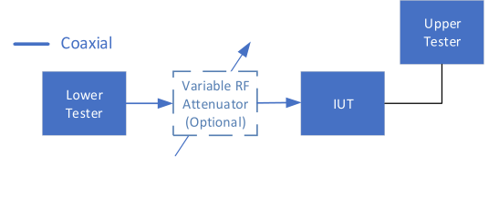

**Figure 4.26: Test Equipment Setup for AoD Receiver**

#### 4.8.2 Test Equipment Setup for AoA Receiver or AoD Transmitter

This setup is used to test IQ samples coherency on an IUT that is an AoD Transmitter or an AoA Receiver.
Coaxial
Digital
IUT
Upper Tester
ANT 0
RF Combiner
ANT 1
Lower Tester
RF Switch
Bluetooth
/Splitter (Optional)
Tx / Rx
ANT 2 (C.1)
ANT 3 (C.1)

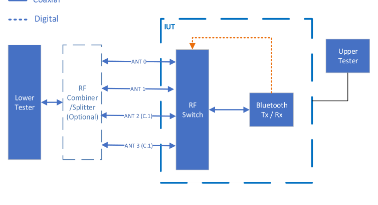

**Figure 4.27: Test Equipment Setup for AoA Receiver or AoD Transmitter (C.1 – Mandatory to support if declared, otherwise Excluded)**

The IUT is required to provide between 2 to 4 antenna input/output ports, matching the maximum number of antennae supported (TSPX_number_of_antennae) declared in the IXIT [5]. The antenna ports are marked as 0, 1, 2, and 3, as shown in Figure 4.27. If the IUT only supports external antenna switching, an IUT-controlled RF switch component is used.

#### 4.8.3 Test Equipment Setup for Channel Sounding

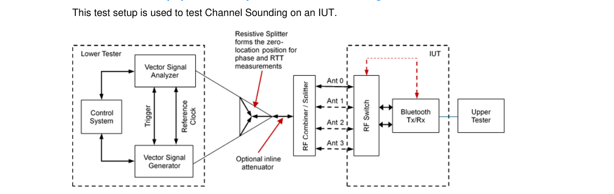

**Figure 4.28: Test Equipment Setup for Channel Sounding**

The IUT is required to provide 1–4 antenna input/output ports, matching the maximum number of antenna supported (TSPX_number_of_antennae) declared in the IXIT [5]. The antenna ports are marked as 0, 1, 2, and 3, as shown in Figure 4.28.
The optional inline attenuator shown in Figure 4.28 is for use in level adjustment purposes to balance the input signal levels present at the VSA’s input RF port. The VSA’s input RF port is exposed to both the transmission energy from the VSG and the IUT in 2-way Channel Sounding ranging procedures.

## 5 Test case mapping

The Test Case Mapping Table (TCMT) maps test cases to specific requirements in the ICS. The IUT is tested in all roles for which support is declared in the ICS document.
The columns for the TCMT are defined as follows:
Item: Contains a logical expression based on specific entries from the associated ICS document. Contains a logical expression (using the operators AND, OR, NOT as needed) based on specific entries from the applicable ICS document(s). The entries are in the form of y/x references, where y corresponds to the table number and x corresponds to the feature number as defined in the ICS document for RFPHY [3].
Feature: A brief, informal description of the feature being tested.
Test Case(s): The applicable test case identifiers are required for Bluetooth Qualification if the corresponding y/x references defined in the Item column are supported. Further details about the function of the TCMT are elaborated in [1].
For the purpose and structure of the ICS/IXIT, refer to [1].

|  | Item |  |  | Feature |  |  | Test Case(s) |  |
| --- | --- | --- | --- | --- | --- | --- | --- | --- |
| RFPHY 1/1 OR RFPHY 1/3 |  |  | Transmitter functionality |  |  | RFPHY/TRM/BV-03-C RFPHY/TRM/BV-05-C RFPHY/TRM/BV-06-C |  |  |
| (RFPHY 1/1 OR RFPHY 1/3) AND NOT RFPHY 1/15 |  |  | Transmitter functionality, not Power Class 1 |  |  | RFPHY/TRM/BV-01-C |  |  |
| RFPHY 1/15 |  |  | Transmitter functionality, Power Class 1 |  |  | RFPHY/TRM/BV-18-C |  |  |
| RFPHY 1/8 AND NOT RFPHY 1/15 |  |  | Transmitting Constant Tone Extensions, not Power Class 1 |  |  | RFPHY/TRM/BV-15-C |  |  |
| RFPHY 1/8 |  |  | Transmitting Constant Tone Extensions |  |  | RFPHY/TRM/BV-16-C |  |  |
| RFPHY 1/8 AND RFPHY 1/15 |  |  | Transmitting Constant Tone Extensions, Power Class 1 |  |  | RFPHY/TRM/BV-21-C |  |  |
| (RFPHY 1/1 OR RFPHY 1/3) AND RFPHY 1/4 AND NOT RFPHY 1/15 |  |  | Transmitter functionality, not Power Class 1 LE 2M PHY |  |  | RFPHY/TRM/BV-19-C |  |  |
| RFPHY 1/4 AND RFPHY 1/15 |  |  | Transmitter functionality, Power Class 1 LE 2M PHY |  |  | RFPHY/TRM/BV-20-C |  |  |
| RFPHY 1/4 AND RFPHY 1/8 AND NOT RFPHY 1/15 |  |  | Transmitting Constant Tone Extensions, not Power Class 1 LE 2M PHY |  |  | RFPHY/TRM/BV-22-C |  |  |
| RFPHY 1/4 AND RFPHY 1/8 AND RFPHY 1/15 |  |  | Transmitting Constant Tone Extensions, Power Class 1 LE 2M PHY |  |  | RFPHY/TRM/BV-23-C |  |  |

|  | Item |  |  | Feature |  |  | Test Case(s) |  |
| --- | --- | --- | --- | --- | --- | --- | --- | --- |
| RFPHY 1/2 OR RFPHY 1/3 |  |  | Receiver functionality |  |  | RFPHY/RCV/BV-01-C RFPHY/RCV/BV-03-C RFPHY/RCV/BV-04-C RFPHY/RCV/BV-05-C RFPHY/RCV/BV-06-C RFPHY/RCV/BV-07-C |  |  |
| (RFPHY 1/1 OR RFPHY 1/3) AND RFPHY 1/4 |  |  | Transmitter functionality LE 2M PHY |  |  | RFPHY/TRM/BV-08-C RFPHY/TRM/BV-10-C RFPHY/TRM/BV-12-C |  |  |
| (RFPHY 1/2 OR RFPHY 1/3) AND RFPHY 1/4 |  |  | Receiver functionality, LE 2M PHY |  |  | RFPHY/RCV/BV-08-C RFPHY/RCV/BV-09-C RFPHY/RCV/BV-10-C RFPHY/RCV/BV-11-C RFPHY/RCV/BV-12-C RFPHY/RCV/BV-13-C |  |  |
| RFPHY 1/4 AND RFPHY 1/8 |  |  | LE 2M PHY, Transmitting Constant Tone Extensions |  |  | RFPHY/TRM/BV-17-C |  |  |
| RFPHY 1/4 AND RFPHY 1/5 |  |  | LE 2M PHY, Stable Modulation Index - Transmitter |  |  | RFPHY/TRM/BV-11-C |  |  |
| RFPHY 1/4 AND RFPHY 1/6 |  |  | LE 2M PHY. Stable Modulation Index - Receiver |  |  | RFPHY/RCV/BV-20-C RFPHY/RCV/BV-21-C RFPHY/RCV/BV-22-C RFPHY/RCV/BV-23-C RFPHY/RCV/BV-24-C RFPHY/RCV/BV-25-C |  |  |
| RFPHY 1/5 |  |  | Stable Modulation Index - Transmitter |  |  | RFPHY/TRM/BV-09-C |  |  |
| RFPHY 1/6 |  |  | Stable Modulation Index - Receiver |  |  | RFPHY/RCV/BV-14-C RFPHY/RCV/BV-15-C RFPHY/RCV/BV-16-C RFPHY/RCV/BV-17-C RFPHY/RCV/BV-18-C RFPHY/RCV/BV-19-C |  |  |
| (RFPHY 1/2 OR RFPHY 1/3) AND RFPHY 1/7 |  |  | Receiver Functionality, LE Coded PHY |  |  | RFPHY/RCV/BV-26-C RFPHY/RCV/BV-27-C RFPHY/RCV/BV-28-C RFPHY/RCV/BV-29-C RFPHY/RCV/BV-30-C RFPHY/RCV/BV-31-C |  |  |
| (RFPHY 1/1 OR RFPHY 1/3) AND RFPHY 1/7 |  |  | Transmitter Functionality, LE Coded PHY |  |  | RFPHY/TRM/BV-13-C RFPHY/TRM/BV-14-C |  |  |

|  | Item |  |  | Feature |  |  | Test Case(s) |  |
| --- | --- | --- | --- | --- | --- | --- | --- | --- |
| RFPHY 1/6 AND RFPHY 1/7 |  |  | Stable Modulation Index - Receiver, LE Coded PHY |  |  | RFPHY/RCV/BV-32-C RFPHY/RCV/BV-33-C RFPHY/RCV/BV-34-C RFPHY/RCV/BV-35-C RFPHY/RCV/BV-36-C RFPHY/RCV/BV-37-C |  |  |
| RFPHY 1/11 AND NOT RFPHY 1/12 |  |  | 2 µs Antenna Sampling During Constant Tone Extension Reception (AoD) |  |  | RFPHY/RCV/IQC/BV-01-C RFPHY/RCV/IQDR/BV-07-C |  |  |
| RFPHY 1/4 AND RFPHY 1/11 AND NOT RFPHY 1/12 |  |  | LE 2M PHY, 2 µs Antenna Sampling During Constant Tone Extension Reception (AoD) for 2 Ms/s PHY |  |  | RFPHY/RCV/IQC/BV-03-C RFPHY/RCV/IQDR/BV-09-C |  |  |
| RFPHY 1/13 AND NOT RFPHY 1/14 |  |  | 1 µs Antenna Sampling During Constant Tone Extension Reception (AoD) |  |  | RFPHY/RCV/IQC/BV-02-C RFPHY/RCV/IQDR/BV-08-C |  |  |
| RFPHY 1/4 AND RFPHY 1/13 AND NOT RFPHY 1/14 |  |  | LE 2M PHY, 1 µs Antenna Sampling During Constant Tone Extension Reception (AoD) for 2 Ms/s PHY |  |  | RFPHY/RCV/IQC/BV-04-C RFPHY/RCV/IQDR/BV-10-C |  |  |
| RFPHY 1/12 |  |  | 2 µs Antenna Switching and Sampling During Constant Tone Extension Reception (AoA) |  |  | RFPHY/RCV/IQC/BV-05-C RFPHY/RCV/IQDR/BV-11-C |  |  |
| RFPHY 1/4 AND RFPHY 1/12 |  |  | LE 2M PHY, 2 µs Antenna Switching and Sampling During Constant Tone Extension Reception (AoA) for 2 Ms/s PHY |  |  | RFPHY/RCV/IQC/BV-06-C RFPHY/RCV/IQDR/BV-12-C |  |  |
| RFPHY 1/9 |  |  | 2 µs Antenna Switching During Constant Tone Extension Transmission (AoD) |  |  | RFPHY/TRM/PS/BV-01-C RFPHY/TRM/ASI/BV-05-C |  |  |
| RFPHY 1/4 AND RFPHY 1/9 |  |  | LE 2M PHY, 2 µs Antenna Switching During Constant Tone Extension Transmission (AoD) for 2 Ms/s PHY |  |  | RFPHY/TRM/PS/BV-03-C RFPHY/TRM/ASI/BV-07-C |  |  |
| RFPHY 1/10 |  |  | 1 µs Antenna Switching During Constant Tone Extension Transmission (AoD) |  |  | RFPHY/TRM/PS/BV-02-C RFPHY/TRM/ASI/BV-06-C |  |  |
| RFPHY 1/4 AND RFPHY 1/10 |  |  | LE 2M PHY, 1 µs Antenna Switching During Constant Tone Extension Transmission (AoD) for 2 Ms/s PHY |  |  | RFPHY/TRM/PS/BV-04-C RFPHY/TRM/ASI/BV-08-C |  |  |
|  | Channel Sounding |  |  |  |  |  |  |  |
| RFPHY 1/16 |  |  | Channel Sounding, Transmitter, LE 1M |  |  | RFPHY/TRM/CS/BV-01-C |  |  |
| RFPHY 1/4 AND RFPHY 1/16 |  |  | Channel Sounding, Transmitter, LE 2M |  |  | RFPHY/TRM/CS/BV-02-C |  |  |
| RFPHY 3/9 |  |  | Channel Sounding, Transmitter, LE 2M 2BT |  |  | RFPHY/TRM/CS/BV-03-C |  |  |
| RFPHY 3/7 AND RFPHY 3/9 |  |  | Channel Sounding, Transmitter, LE 2M 2BT, Mode-3 |  |  | RFPHY/TRM/CS/BV-04-C |  |  |
| RFPHY 1/16 |  |  | Channel Sounding, Transmitter-Receiver, LE 1M |  |  | RFPHY/TRM-RCV/CS/BV-01-C RFPHY/TRM-RCV/CS/BV-04-C |  |  |
| RFPHY 3/3 |  |  | Channel Sounding, Transmitter-Receiver, LE 1M, Mode-2 |  |  | RFPHY/TRM-RCV/CS/BV-05-C |  |  |

|  | Item |  |  | Feature |  |  | Test Case(s) |  |
| --- | --- | --- | --- | --- | --- | --- | --- | --- |
| RFPHY 3/7 |  |  | Channel Sounding, Transmitter-Receiver, LE 1M, Mode-3 |  |  | RFPHY/TRM-RCV/CS/BV-06-C |  |  |
| RFPHY 1/4 AND RFPHY 1/16 |  |  | Channel Sounding, Transmitter-Receiver, LE 2M |  |  | RFPHY/TRM-RCV/CS/BV-02-C RFPHY/TRM-RCV/CS/BV-07-C |  |  |
| RFPHY 1/4 AND RFPHY 3/7 |  |  | Channel Sounding, Transmitter-Receiver, LE 2M, Mode-3 |  |  | RFPHY/TRM-RCV/CS/BV-08-C |  |  |
| RFPHY 3/9 |  |  | Channel Sounding, Transmitter-Receiver, LE 2M 2BT |  |  | RFPHY/TRM-RCV/CS/BV-03-C RFPHY/TRM-RCV/CS/BV-09-C |  |  |
| RFPHY 3/7 AND RFPHY 3/9 |  |  | Channel Sounding, Transmitter-Receiver, LE 2M 2BT, Mode-3 |  |  | RFPHY/TRM-RCV/CS/BV-10-C |  |  |
| RFPHY 3/2 AND RFPHY 3/6 |  |  | Channel Sounding, Transmitter-Receiver, LE 1M, Mode-2, Reflector |  |  | RFPHY/TRM-RCV/CS/BV-11-C |  |  |
| RFPHY 3/2 AND RFPHY 3/7 |  |  | Channel Sounding, Transmitter-Receiver, LE 1M, Mode-3, Reflector |  |  | RFPHY/TRM-RCV/CS/BV-12-C |  |  |
| RFPHY 1/4 AND RFPHY 3/2 AND RFPHY 3/7 |  |  | Channel Sounding, Transmitter-Receiver, LE 2M, Mode-3, Reflector |  |  | RFPHY/TRM-RCV/CS/BV-13-C |  |  |
| RFPHY 3/2 AND RFPHY 3/7 AND RFPHY 3/9 |  |  | Channel Sounding, Transmitter-Receiver, LE 2M 2BT, Mode-3, Reflector |  |  | RFPHY/TRM-RCV/CS/BV-14-C |  |  |
| RFPHY 3/1 AND RFPHY 3/3 |  |  | Channel Sounding, Transmitter-Receiver, LE 1M, Mode-2, Initiator |  |  | RFPHY/TRM-RCV/CS/BV-15-C |  |  |
| RFPHY 3/1 AND RFPHY 3/7 |  |  | Channel Sounding, Transmitter-Receiver, LE 1M, Mode-3, Initiator |  |  | RFPHY/TRM-RCV/CS/BV-16-C |  |  |
| RFPHY 1/4 AND RFPHY 3/1 AND RFPHY 3/7 |  |  | Channel Sounding, Transmitter-Receiver, LE 2M, Mode-3, Initiator |  |  | RFPHY/TRM-RCV/CS/BV-17-C |  |  |
| RFPHY 3/1 AND RFPHY 3/7 AND RFPHY 3/9 |  |  | Channel Sounding, Transmitter-Receiver, LE 2M 2BT, Mode-3, Initiator |  |  | RFPHY/TRM-RCV/CS/BV-18-C |  |  |
| RFPHY 3/8 |  |  | Channel Sounding, Transmitter, LE 1M, TX/SNR |  |  | RFPHY/TRM/CS/BV-05-C |  |  |
| RFPHY 3/7 AND RFPHY 3/8 |  |  | Channel Sounding, Transmitter, LE 1M, Mode-3, TX/SNR |  |  | RFPHY/TRM/CS/BV-06-C |  |  |
| RFPHY 1/4 AND RFPHY 3/8 |  |  | Channel Sounding, Transmitter, LE 2M, TX/SNR |  |  | RFPHY/TRM/CS/BV-07-C |  |  |
| RFPHY 1/4 AND RFPHY 3/7 AND RFPHY 3/8 |  |  | Channel Sounding, Transmitter, LE 2M, Mode-3, TX/SNR |  |  | RFPHY/TRM/CS/BV-08-C |  |  |
| RFPHY 3/8 AND RFPHY 3/9 |  |  | Channel Sounding, Transmitter, LE 2M 2BT, TX/SNR |  |  | RFPHY/TRM/CS/BV-09-C |  |  |
| RFPHY 3/7 AND RFPHY 3/8 AND RFPHY 3/9 |  |  | Channel Sounding, Transmitter, LE 2M 2BT, Mode-3, TX/SNR |  |  | RFPHY/TRM/CS/BV-10-C |  |  |

Table 5.1: Test case mapping

## 6 Appendix

### 6.1 Reference Signal Definition

The Bluetooth low energy reference signal, either as wanted or an interfering signal, has the following characteristics defined in [6] Chapter 4.6.
Payload content of the wanted signal is a PRBS9 sequence and is identical for all transmitted packets.
In test cases where an interfering signal is used, the interferer is continuously modulated with PRBS15 data (i.e., no packet structures or pauses in the signal). The interfering signal has settled at least 1 ms prior to the activation of the wanted signal.
The Lower Tester used for the qualification tests has the ramp up characteristics shown in Figure 6.1.
• trampup is the time from when the Lower Tester output is 40 dB below the final output power (x dBm) to the time when the output power has reached a level within 3 dB of the final output power.
• tsettling is the time from when the Lower Tester output is 40 dB below the final output power (x dBm) to the time when the output power has reached a level within 1 dB of the final output power.
• tp0 is the time at which the first preamble bit begins.

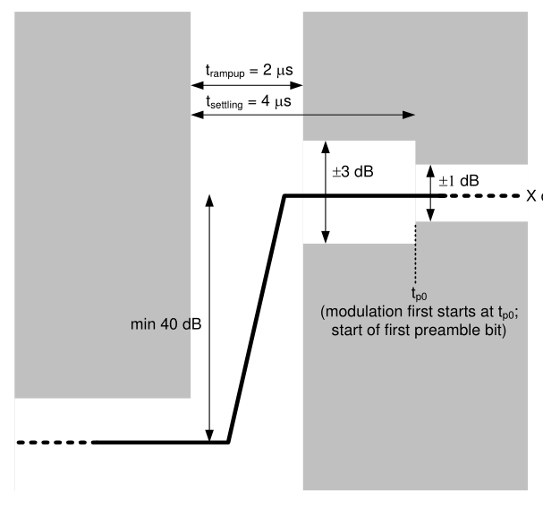

**Figure 6.1: Lower Tester ramp-up characteristics requirement, modulation first starts at tp0**

### 6.2 Normal Operating Conditions (NOC)

#### 6.2.1 Normal Temperature and Air Humidity

The normal operating temperature is declared by the equipment manufacturer as an IXIT value. The NOC test temperature is within ±10°C of this value.
Operating air humidity range is declared by the product manufacturer as maximum and minimum values (IXIT). The air humidity level for the NOC tests is within the declared range.
The temperature and air humidity values during the test is recorded in the test documentation.

#### 6.2.2 Nominal Supply Voltage

The IUT supply voltage under normal operating conditions is the nominal supply voltage as declared by the IUT manufacturer.
The nominal supply voltage is recorded in the test documentation.

### 6.3 Packet Error Rate / Bit Error Rate Measurements

The Packet Error Rate (PER) measurement is used in all measurements testing receiver characteristics in the Bluetooth low energy RFPHY Test Suite. PER tests are based on the direct test mode described in [4].

#### 6.3.1 PER Test Definition

PER tests are based on counting the number of packets received by the IUT out of a series of consecutive LE test packets transmitted by the Lower Tester. The test is performed with frequency hopping disabled.
The packet error rate is defined as follows:
 = tester the by d transmitte packets of number Total
  
CRC passing EUT the by received packets of Number - 1 PER
% 100  
The Lower Tester transmits LE test packets with PRBS9 payload as defined in [4], Section 4 to the IUT. Upon request from the Lower Tester to the IUT, the IUT reports the number of LE test packets that has been correctly received (i.e., passing CRC) since last request. Refer to [4] for detailed description of the direct test mode.
The sensitivity level based on BER measurements is defined as the input power level at which a BER of value specified in Table 6.1 is achieved measured with a reference signal as described in Section 6.1, and packet with PRBS9 payload as described in [4], Section 4.

|  | Maximum Supported Payload Length in Receiver (bytes) |  |  | BER (%) |  |
| --- | --- | --- | --- | --- | --- |
| 37 |  |  | 0.1 |  |  |
| ≥38 and ≤63 |  |  | 0.064 |  |  |
| ≥64 and ≤127 |  |  | 0.034 |  |  |
| ≥128 and ≤255 |  |  | 0.017 |  |  |

Table 6.1: Sensitivity BER level by maximum payload length in receiver
PER = (1 - X [(MAX_RX_LENGTH * 8) + 72]) × 100%
- X = 1 – BER, - i.e., X=0.99900 if MAX_RX_LENGTH=37, - X=0.99936 if 38 ≤ MAX_RX_LENGTH ≤ 63, - X=0.99966 if 64 ≤ MAX_RX_LENGTH ≤ 127, - X=0.99983 if 128 ≤ MAX_RX_LENGTH ≤ 255. - MAX_RX_LENGTH is the maximum supported payload length in IUT’s receiver and it is declared in RFPHY IXIT proforma [5] in range of 37 ~ 255. - 72 in the formula is total length of synchronization word, PDU header, PDU length & CRC parts in LE test packet in bit unit.

#### 6.3.2 BER to PER Mapping

This PER requirement defined in Section 6.3.1 equates to the corresponding BER value under the following assumptions:
• Bit errors are randomly distributed with a rectangular error probability density function
• Bit errors are not correlated
Furthermore, the following reasoning is applied (using an example of BER to PER mapping based on a BER value of 0.1% and MAX_RX_LENGTH of 37 bytes):
• The probability of a particular bit being in error at a BER of 0.1% is 0.001
• It follows that the probability of a bit being OK under the same condition is 0.999
• Examining the impact of a bit error in the LE test packet with a 37-byte payload length:
Preamble (8 bit) Packet can be recovered2
Sync word (32 bit) Error; Packet is lost
Packet type field (16 bit) Error; Packet is lost
Payload (296 bit) Error; Packet is lost
CRC (24 bit) Error; Packet is lost
• The number of significant bits in a 37-byte payload LE test packet is thus 368 bits (out of a total of 376 bits).
• The probability of a 368 bit sequence containing no bit errors is 0.999368 = 0.692
• Resulting PER requirement is then (1 - 0.692)*100% = 30.8%
The sensitivity BER by maximum payload length in the receiver corresponds to the PER requirements listed in Table 6.2 below:

|  | Maximum Supported Payload |  | PER |
| --- | --- | --- | --- |
|  | Length in Receiver (bytes) |  |  |
| 37 | 37 |  | 30.8% |
| 38 |  |  | 21.4% |
| 39 |  |  | 21.8% |
| 40 |  |  | 22.2% |

2 The effect of errors in the preamble is implementation dependent. In general, a bit error in the preamble does not automatically imply that the packet is lost. It is therefore assumed that an error in the preamble is “allowed” and that the packet is recoverable.

|  | Maximum Supported Payload |  | PER |
| --- | --- | --- | --- |
|  | Length in Receiver (bytes) |  |  |
| 41 | 41 |  | 22.6% |
| 42 |  |  | 23.0% |
| 43 |  |  | 23.4% |
| 44 |  |  | 23.8% |
| 45 |  |  | 24.2% |
| 46 |  |  | 24.5% |
| 47 |  |  | 24.9% |
| 48 |  |  | 25.3% |
| 49 |  |  | 25.7% |
| 50 |  |  | 26.1% |
| 51 |  |  | 26.5% |
| 52 |  |  | 26.8% |
| 53 |  |  | 27.2% |
| 54 |  |  | 27.6% |
| 55 |  |  | 27.9% |
| 56 |  |  | 28.3% |
| 57 |  |  | 28.7% |
| 58 |  |  | 29.0% |
| 59 |  |  | 29.4% |
| 60 |  |  | 29.8% |
| 61 |  |  | 30.1% |
| 62 |  |  | 30.5% |
| 63 |  |  | 30.8% |
| 64 |  |  | 18.0% |
| 65 |  |  | 18.2% |
| 66 |  |  | 18.5% |
| 67 |  |  | 18.7% |
| 68 |  |  | 18.9% |
| 69 |  |  | 19.1% |
| 70 |  |  | 19.3% |
| 71 |  |  | 19.6% |
| 72 |  |  | 19.8% |
| 73 |  |  | 20.0% |
| 74 |  |  | 20.2% |
| 75 |  |  | 20.4% |
| 76 |  |  | 20.6% |
| 77 |  |  | 20.9% |
| 78 |  |  | 21.1% |
| 79 |  |  | 21.3% |
| 80 |  |  | 21.5% |
| 81 |  |  | 21.7% |
| 82 |  |  | 21.9% |
| 83 |  |  | 22.1% |
| 84 |  |  | 22.4% |
| 85 |  |  | 22.6% |
| 86 |  |  | 22.8% |
| 87 |  |  | 23.0% |
| 88 |  |  | 23.2% |

|  | Maximum Supported Payload |  | PER |
| --- | --- | --- | --- |
|  | Length in Receiver (bytes) |  |  |
| 89 | 89 |  | 23.4% |
| 90 |  |  | 23.6% |
| 91 |  |  | 23.8% |
| 92 |  |  | 24.0% |
| 93 |  |  | 24.2% |
| 94 |  |  | 24.4% |
| 95 |  |  | 24.6% |
| 96 |  |  | 24.8% |
| 97 |  |  | 25.1% |
| 98 |  |  | 25.3% |
| 99 |  |  | 25.5% |
| 100 |  |  | 25.7% |
| 101 |  |  | 25.9% |
| 102 |  |  | 26.1% |
| 103 |  |  | 26.3% |
| 104 |  |  | 26.5% |
| 105 |  |  | 26.7% |
| 106 |  |  | 26.9% |
| 107 |  |  | 27.1% |
| 108 |  |  | 27.3% |
| 109 |  |  | 27.5% |
| 110 |  |  | 27.7% |
| 111 |  |  | 27.9% |
| 112 |  |  | 28.0% |
| 113 |  |  | 28.2% |
| 114 |  |  | 28.4% |
| 115 |  |  | 28.6% |
| 116 |  |  | 28.8% |
| 117 |  |  | 29.0% |
| 118 |  |  | 29.2% |
| 119 |  |  | 29.4% |
| 120 |  |  | 29.6% |
| 121 |  |  | 29.8% |
| 122 |  |  | 30.0% |
| 123 |  |  | 30.2% |
| 124 |  |  | 30.4% |
| 125 |  |  | 30.5% |
| 126 |  |  | 30.7% |
| 127 |  |  | 30.9% |
| 128 |  |  | 17.0% |
| 129 |  |  | 17.1% |
| 130 |  |  | 17.2% |
| 131 |  |  | 17.3% |
| 132 |  |  | 17.5% |
| 133 |  |  | 17.6% |
| 134 |  |  | 17.7% |
| 135 |  |  | 17.8% |
| 136 |  |  | 17.9% |

|  | Maximum Supported Payload |  | PER |
| --- | --- | --- | --- |
|  | Length in Receiver (bytes) |  |  |
| 137 | 137 |  | 18.0% |
| 138 |  |  | 18.1% |
| 139 |  |  | 18.2% |
| 140 |  |  | 18.3% |
| 141 |  |  | 18.5% |
| 142 |  |  | 18.6% |
| 143 |  |  | 18.7% |
| 144 |  |  | 18.8% |
| 145 |  |  | 18.9% |
| 146 |  |  | 19.0% |
| 147 |  |  | 19.1% |
| 148 |  |  | 19.2% |
| 149 |  |  | 19.3% |
| 150 |  |  | 19.4% |
| 151 |  |  | 19.6% |
| 152 |  |  | 19.7% |
| 153 |  |  | 19.8% |
| 154 |  |  | 19.9% |
| 155 |  |  | 20.0% |
| 156 |  |  | 20.1% |
| 157 |  |  | 20.2% |
| 158 |  |  | 20.3% |
| 159 |  |  | 20.4% |
| 160 |  |  | 20.5% |
| 161 |  |  | 20.6% |
| 162 |  |  | 20.8% |
| 163 |  |  | 20.9% |
| 164 |  |  | 21.0% |
| 165 |  |  | 21.1% |
| 166 |  |  | 21.2% |
| 167 |  |  | 21.3% |
| 168 |  |  | 21.4% |
| 169 |  |  | 21.5% |
| 170 |  |  | 21.6% |
| 171 |  |  | 21.7% |
| 172 |  |  | 21.8% |
| 173 |  |  | 21.9% |
| 174 |  |  | 22.0% |
| 175 |  |  | 22.1% |
| 176 |  |  | 22.2% |
| 177 |  |  | 22.4% |
| 178 |  |  | 22.5% |
| 179 |  |  | 22.6% |
| 180 |  |  | 22.7% |
| 181 |  |  | 22.8% |
| 182 |  |  | 22.9% |
| 183 |  |  | 23.0% |
| 184 |  |  | 23.1% |

|  | Maximum Supported Payload |  | PER |
| --- | --- | --- | --- |
|  | Length in Receiver (bytes) |  |  |
| 185 | 185 |  | 23.2% |
| 186 |  |  | 23.3% |
| 187 |  |  | 23.4% |
| 188 |  |  | 23.5% |
| 189 |  |  | 23.6% |
| 190 |  |  | 23.7% |
| 191 |  |  | 23.8% |
| 192 |  |  | 23.9% |
| 193 |  |  | 24.0% |
| 194 |  |  | 24.1% |
| 195 |  |  | 24.2% |
| 196 |  |  | 24.3% |
| 197 |  |  | 24.4% |
| 198 |  |  | 24.5% |
| 199 |  |  | 24.6% |
| 200 |  |  | 24.7% |
| 201 |  |  | 24.8% |
| 202 |  |  | 24.9% |
| 203 |  |  | 25.0% |
| 204 |  |  | 25.2% |
| 205 |  |  | 25.3% |
| 206 |  |  | 25.4% |
| 207 |  |  | 25.5% |
| 208 |  |  | 25.6% |
| 209 |  |  | 25.7% |
| 210 |  |  | 25.8% |
| 211 |  |  | 25.9% |
| 212 |  |  | 26.0% |
| 213 |  |  | 26.1% |
| 214 |  |  | 26.2% |
| 215 |  |  | 26.3% |
| 216 |  |  | 26.4% |
| 217 |  |  | 26.5% |
| 218 |  |  | 26.6% |
| 219 |  |  | 26.7% |
| 220 |  |  | 26.8% |
| 221 |  |  | 26.9% |
| 222 |  |  | 27.0% |
| 223 |  |  | 27.1% |
| 224 |  |  | 27.2% |
| 225 |  |  | 27.3% |
| 226 |  |  | 27.4% |
| 227 |  |  | 27.5% |
| 228 |  |  | 27.6% |
| 229 |  |  | 27.7% |
| 230 |  |  | 27.8% |
| 231 |  |  | 27.9% |
| 232 |  |  | 27.9% |

|  | Maximum Supported Payload |  | PER |
| --- | --- | --- | --- |
|  | Length in Receiver (bytes) |  |  |
| 233 | 233 |  | 28.0% |
| 234 |  |  | 28.1% |
| 235 |  |  | 28.2% |
| 236 |  |  | 28.3% |
| 237 |  |  | 28.4% |
| 238 |  |  | 28.5% |
| 239 |  |  | 28.6% |
| 240 |  |  | 28.7% |
| 241 |  |  | 28.8% |
| 242 |  |  | 28.9% |
| 243 |  |  | 29.0% |
| 244 |  |  | 29.1% |
| 245 |  |  | 29.2% |
| 246 |  |  | 29.3% |
| 247 |  |  | 29.4% |
| 248 |  |  | 29.5% |
| 249 |  |  | 29.6% |
| 250 |  |  | 29.7% |
| 251 |  |  | 29.8% |
| 252 |  |  | 29.9% |
| 253 |  |  | 30.0% |
| 254 |  |  | 30.1% |
| 255 |  |  | 30.2% |

Table 6.2: PER level by maximum payload length in receiver

### 6.4 Definition of the Position of Bit p0

Bit p0 is defined as the first bit in the preamble sequence. The start of p0 is defined to occur at the point in time 56 bit periods before the instant at which the modulated carrier passes through the nominal channel frequency immediately prior to the deviation corresponding to the first bit of the payload field.
The start of bit p0 is calculated using averaging based on the position of all the zero crossings in the packet:
For the m zero crossings in the packet, the i’th zero crossing time instant is t(i) in µs; this is the start of bit p(i).
The start of bit p0 is then calculated as:
[µs]

### 6.5 Measurement Uncertainty

Table 6.3 contains the measurement accuracy requirements for the test cases described in this document. The test equipment used for the tests must have measurement accuracy within the listed limits. The verdict decision limits for each test case take the measurement uncertainty listed in Table 6.3 into account. All figures in the table reflect a 95% confidence level.

| Type of measurement |  | Measurement |  |
| --- | --- | --- | --- |
|  |  | accuracy |  |
|  |  | requirement |  |
| Conducted measurements: Absolute RF power (wanted channel) Absolute RF power (unwanted emissions in the 2400 – 2483.5 MHz band) Absolute RF power (unwanted emissions outside the 2400 – 2483.5 MHz band) |  1.2 dB  3 dB  3 dB3 |  |  |
| Relative RF power: Relative RF power (wanted channel) |  1 dB |  |  |
| Radiated measurements: Absolute RF power (wanted channel) Radiated emissions (for unwanted emissions) |  6 dB  6 dB |  |  |
| Absolute frequency: Absolute frequency (RF frequencies) Absolute frequency (Frequency deviation of modulated signal) |  5 kHz  4 kHz |  |  |
| Relative frequency: Relative frequency (Frequency drift of carrier during modulation) |  1 kHz |  |  |

Table 6.3: Measurement accuracy requirements

### 6.6 Packet Lengths

Note: Symbols with names beginning “PL_” are only defined and used within this section.
For each symbol in the first column of Table 6.4, the value of the symbol is the greater of the values of the symbols in the other two columns.

| MAX TX LENGTH | PL ADV L | PL DTX 1M |
| --- | --- | --- |
| _ _ MAX TX LENGTH 2M | _ _ PL ADV X | _ _ PL DTX 2M |
| _ _ _ MAX TX LENGTH CODED S2 | _ _ PL ADV X | _ _ PL DTX C2 |
| _ _ _ _ MAX TX LENGTH CODED S8 | _ _ PL ADV X | _ _ PL DTX C8 |
| _ _ _ _ MAX RX LENGTH | _ _ PL SCN L | _ _ PL DRX 1M |
| _ _ MAX RX LENGTH 2M | _ _ PL SCN X | _ _ PL DRX 2M |
| _ _ _ MAX RX LENGTH CODED S2 | _ _ PL SCN X | _ _ PL DRX C2 |
| _ _ _ _ MAX RX LENGTH CODED S8 | _ _ PL SCN X | _ _ PL DRX C8 |

Table 6.4: Overall Inputs for Packet Length Symbols
If the Link Layer of the IUT supports the Advertising Extension feature, then:
• PL_ADV_L and PL_ADV_X equals TSPX_AdvOctets_Max.
• PL_SCN_L and PL_SCN_X equals 255.

## 3 For frequencies above 4 GHz, a measurement accuracy requirement of  4 dB applies

• PL_ADV_L and PL_SCN_L equals 37.
• PL_ADV_X and PL_SCN_X equals 31.
If the Link Layer of the IUT supports the Data Length Extension feature, then for each symbol in the first column of Table 6.5, the value of the symbol is the lesser of the values of the expressions in the other two
columns (“⌊X⌋” means the greatest integer less than or equal to X).

| PL DTX 1M | TSPX TxOctets Max+4 | ⌊TSPX TxTime Max ÷ 8 – 10⌋ |
| --- | --- | --- |
| _ _ PL DTX 2M | _ _ TSPX TxOctets Max+4 | _ _ ⌊TSPX TxTime Max ÷ 4 – 11⌋ |
| _ _ PL DTX C2 | _ _ TSPX TxOctets Max+4 | _ _ ⌊TSPX TxTime Max ÷ 16 – 28⌋ |
| _ _ PL DTX C8 | _ _ TSPX TxOctets Max+4 | _ _ ⌊TSPX TxTime Max ÷ 64 – 11⌋ |
| _ _ PL DRX 1M | _ _ TSPX RxOctets Max+4 | _ _ ⌊TSPX RxTime Max ÷ 8 – 10⌋ |
| _ _ PL DRX 2M | _ _ TSPX RxOctets Max+4 | _ _ ⌊TSPX RxTime Max ÷ 4 – 11⌋ |
| _ _ PL DRX C2 | _ _ TSPX RxOctets Max+4 | _ _ ⌊TSPX RxTime Max ÷ 16 – 28⌋ |
| _ _ PL DRX C8 | _ _ TSPX RxOctets Max+4 | _ _ ⌊TSPX RxTime Max ÷ 64 – 11⌋ |

Table 6.5: Maximum Lengths When Data Length Extension is Supported
Otherwise, the values of all the symbols in the first column of Table 6.5 are 31.
Note: For each symbol in the first column of Table 6.6, the reference for that symbol in [5] is given in the second column. The third and fourth columns give the minimum and maximum permitted values for the symbol.

| TSPX AdvOctets Max | LL:P4:19 on the LL tab | 37 | 255 |
| --- | --- | --- | --- |
| _ _ TSPX RxOctets Max | LL:P4:17 on the LL tab | 27 | 251 |
| _ _ TSPX RxTime Max | LL:P4:18 on the LL tab | 328 | 17040 |
| _ _ TSPX TxOctets Max | LL:P4:15 on the LL tab | 27 | 251 |
| _ _ TSPX TxTime Max | LL:P4:16 on the LL tab | 328 | 17040 |

Table 6.6: References

### 6.7 Number of Valid IQ Sample Pairs

This section and its subsections are explanatory.
A controller can return IQ sample pairs where either I or Q, or both, are marked as ‘No Valid Sample Available’. These IQ sample pairs are discarded as invalid. Invalid IQ sample pairs are not used in the magnitude, relative phase, and reference phase deviation calculations.
The number of valid IQ sample pairs required per non-reference antenna for the IQ Samples Coherency tests is chosen as 10,000. The same number of valid IQ sample pairs is chosen for the IQ Dynamic Range tests, to maintain consistency across the tests.

#### 6.7.1 Maximum Number of Packets for IQ Coherency Measurements

The tests require LE packets to be sent with maximum length CTE comprising of 1 µs or 2 µs slots. The number of collected IQ sample pairs per packet is either 74 or 37, respectively. The measurements are performed using IQ sample pair groups that must include non-reference antenna transmissions. Using the pre-defined switching pattern (x000, …, where x is a non-reference antenna), a maximum of 18 sample pairs groups for 1 µs slots and 8 sample pairs groups for 2 µs slots that include all required IQ sample measurements are possible from every CTE.
The following tables show the number of IQ sample pairs returned by the IUT for different number of non-reference antenna for 1us and 2us switching slots, respectively.

|  | Number of non-reference antennae |  |  | 1 |  |  | 2 |  |  | 3 |  |
| --- | --- | --- | --- | --- | --- | --- | --- | --- | --- | --- | --- |
| 1 |  |  | 18 |  |  | 0 |  |  | 0 |  |  |
| 2 |  |  | 9 |  |  | 9 |  |  | 0 |  |  |
| 3 |  |  | 6 |  |  | 6 |  |  | 6 |  |  |

Table 6.7: Number of I/Q samples per antenna element for 1 µs switching slots

|  | Number of non-reference antennae |  |  | 1 |  |  | 2 |  |  | 3 |  |
| --- | --- | --- | --- | --- | --- | --- | --- | --- | --- | --- | --- |
| 1 |  |  | 8 |  |  | 0 |  |  | 0 |  |  |
| 2 |  |  | 4 |  |  | 4 |  |  | 0 |  |  |
| 3 |  |  | 2 |  |  | 3 |  |  | 3 |  |  |

Table 6.8: Number of I/Q samples per antenna element for 2 µs switching slots
Table for the number of packets transmitted required to obtain 10,000 IQ sample pairs per non-reference antenna on the receiver is shown below;

|  | Number of non-reference antennae |  |  | 1 µs switching slot |  |  | 2 µs switching slot |  |
| --- | --- | --- | --- | --- | --- | --- | --- | --- |
| 1 |  |  | 556 |  |  | 1250 |  |  |
| 2 |  |  | 1112 |  |  | 2500 |  |  |
| 3 |  |  | 1667 |  |  | 3334 |  |  |

Table 6.9: Number of packets required for 10,000 IQ sample pairs
The Table 6.9 assumes that IUT receives all packets successfully, and all the IQ sample pairs reported are marked valid.
The number of packets transmitted required for the test needs to be increased to allow for both lost packets and invalid IQ sample pairs. A 20% allowance to account for lost packets and invalid IQ sample pairs is recommended. The IUT reports IQ sample pairs at a rate of TSPX_IQ_Report_Rate. The number of packets transmitted by the Lower Tester for the measurement needs to scale by the following factor:
𝑐𝑒𝑖𝑙[Number of Transmitted LE Packets per second
TSPX_IQ_Report_Rate ]
This is the recommended maximum number of packets transmitted by the Lower Tester for the coherency tests. For TP/RCV-LE/CA/BV-09-C, updated interference frequency selection formula in step 4 of test procedure and updated adjacent channels in table and Pass verdict.

### 6.8 Antenna Gain

If it is necessary for Regulatory test purposes, the TX peak antenna gain is used and declared by the manufacturer.

### 6.9 Tester Filter Characteristics

This section defines the PHY-dependent Lower Tester settings used for the RF channel filter (see Table 6.10) and the FM demodulator (see Table 6.11).

|  | Frequency (for 1 Ms/s) |  |  | Frequency (for 2 Ms/s) |  |  | Frequency (for 2 Ms/s; BT=2.0) |  |  | Attenuation |  |
| --- | --- | --- | --- | --- | --- | --- | --- | --- | --- | --- | --- |
| ±650 kHz Passband ripple: 0.5 dB (within ± 550 kHz) |  |  | ±1.3 𝑀𝐻𝑧 Passband ripple: 0.5 dB (within ± 1.1 MHz) |  |  | ±7.8 𝑀𝐻𝑧 Passband ripple: 0.5 dB (within ± 4.4 MHz) |  |  | 3 dB |  |  |
| ±1.0 MHz |  |  | ±2.0 𝑀𝐻𝑧 |  |  | ±9.2 𝑀𝐻𝑧 |  |  | 14dB |  |  |
| ±2.0 MHz |  |  | ±4.0 𝑀𝐻𝑧 |  |  | ±11.0 𝑀𝐻𝑧 |  |  | 44 dB |  |  |

Table 6.10: Lower Tester minimum channel filter attenuation characteristics

|  | FM Demodulator Characteristic |  |  | 1 Ms/s PHY |  |  | 2 Ms/s PHY |  |  | 2 Ms/s; BT=2.0 PHY |  |
| --- | --- | --- | --- | --- | --- | --- | --- | --- | --- | --- | --- |
| Bandwidth (minimum) |  |  | 2.0 𝑀𝐻𝑧 |  |  | 4.0 𝑀𝐻𝑧 |  |  | 16.0 𝑀𝐻𝑧 |  |  |

Table 6.11: Lower Tester FM demodulation characteristics

## 7 Revision history and acknowledgments

Revision History

|  | Publication |  |  | Revision |  | Date |  |  | Comments |  |  |
| --- | --- | --- | --- | --- | --- | --- | --- | --- | --- | --- | --- |
|  | Number |  |  | Number |  |  |  |  |  |  |  |
| 0 | 0 |  |  | RF- |  | 2009-12-15 |  |  | Prepare for publication. |  |  |
|  |  |  |  | PHY.TS/4.0.0 |  |  |  |  |  |  |  |
|  |  |  | 4.0.1r0 4.0.1r1 | 4.0.1r0 |  | 2010-12-01- 2011-02-02 |  |  |  | TSE 3408: TRM-LE/CA/BV-03-C , TRM-LE/CA/BV- |  |
|  |  |  |  | 4.0.1r1 |  |  |  |  |  | 04-C: updates 5, 6 |  |
|  |  |  |  |  |  |  |  |  |  | TSE 3462 Rename test case in Tables 7.2 and 7.3 : |  |
|  |  |  |  |  |  |  |  |  |  | TSE 3945: Remove Section 7.2 and refer to ESR05, |  |
|  |  |  |  |  |  |  |  |  |  | eventually to be moved to core spec Vol 6, Part D |  |
|  |  |  |  |  |  |  |  |  |  | Section 4. See also TSE 4204. |  |
|  |  |  |  |  |  |  |  |  |  | TSE 4204: Additional changes for E3696 ( see also |  |
|  |  |  |  |  |  |  |  |  |  | TSE 3945) |  |
|  | 1 |  |  | 4.0.1 |  |  | 2011-07-18 |  |  | Prepare for publication. |  |
|  |  |  | 4.0.2r0 | 4.0.2r0 |  | 2012-09-06 | 2012-09-06 |  |  | TSE 4906: Change to test procedure of TRM- |  |
|  |  |  |  |  |  |  |  |  |  | LE/CA/BV-03-C added, "AND skip to next frequency if |  |
|  |  |  |  |  |  |  |  |  |  | the increased frequency equals to fTX or "fTX - 1MHz" |  |
|  |  |  |  |  |  |  |  |  |  | or "fTX + 1MHz". |  |
|  | 2 |  |  | 4.0.2 |  |  | 2012-11-15 |  |  | Prepare for Publication |  |
|  |  |  | 4.0.3r1 | 4.0.3r1 |  | 2013-05-31 | 2013-05-31 |  |  | TSE 5041: Editorial correction in step 3 of the test |  |
|  |  |  |  |  |  |  |  |  |  | procedure for test case RCV-LE/CA/BV-01-C, |  |
|  |  |  |  |  |  |  |  |  |  | incorrect cross-reference. |  |
|  |  |  |  |  |  |  |  |  |  | TSE 5042: Editorial correction to the cross-reference |  |
|  |  |  |  |  |  |  |  |  |  | in Figure 6.7 in RCV-LE/CA/BV-03-C that referenced |  |
|  |  |  |  |  |  |  |  |  |  | “Table 6.4” when it should have referenced “6.3”. |  |
|  |  |  |  |  |  |  |  |  |  | TSE 5043: Editorial correction to the cross-reference |  |
|  |  |  |  |  |  |  |  |  |  | in Figure 6.8 in RCV-LE/CA/BV-04-C that referenced |  |
|  |  |  |  |  |  |  |  |  |  | “Table 6.5” when it should have referenced “6.4”. |  |
|  |  |  |  |  |  |  |  |  |  | TSE 5044: Editorial correction in the 3rd paragraph of |  |
|  |  |  |  |  |  |  |  |  |  | the pass verdict for test case RCV-LE/CA/BV-04-C. |  |
|  |  |  |  | 4.0.3r2, |  |  | 2013-06-03 |  |  | BTI Review, comments from Miles. |  |
|  |  |  | 4.0.3r3 | 4.0.3r3 |  | 2013-06-04 | 2013-06-04 |  |  | BTI Review, comments from Dan. |  |
|  |  |  |  |  |  |  |  |  |  | Updated Copyright Notice to 2013. |  |
|  |  |  |  |  |  |  |  |  |  | Changed Table reference to figure reference in Step 4 |  |
|  |  |  |  |  |  |  |  |  |  | of TRM-LE/CA/BV-06-C. |  |
|  |  |  | 4.0.3r4 |  |  | 2013-06-04 |  |  |  | BTI Review, additional comments from Dan |  |
|  |  |  |  |  |  |  |  |  |  | TRM-LE/CA/BV-04-C was an incorrect heading level, |  |
|  |  |  |  |  |  |  |  |  |  | changed it to the test case heading level which |  |
|  |  |  |  |  |  |  |  |  |  | updated the section from 6.3 to 6.3.4. |  |
|  | 3 |  |  | 4.0.3 |  |  | 2013-07-02 |  |  | Prepare for Publication |  |
|  |  |  |  | 4.1.0r01 |  |  | 2013-11-11 |  |  | Revision to accommodate v 4.1 |  |
|  | 4 |  |  | 4.1.0 |  |  | 2013-12-03 |  |  | Prepare for Publication |  |
|  |  |  |  | 4.1.0 – |  | 2014-01-23 | 2014-01-23 |  | Template Conversion into Template TS 2014r02 _ _ | Template Conversion into Template TS 2014r02 _ _ |  |
|  |  |  |  | Template |  |  |  |  |  |  |  |
|  |  |  |  | Conversion |  |  |  |  |  |  |  |

|  | Publication |  |  | Revision |  | Date |  |  | Comments |  |  |
| --- | --- | --- | --- | --- | --- | --- | --- | --- | --- | --- | --- |
|  | Number |  |  | Number |  |  |  |  |  |  |  |
|  |  |  | 4.1.1r00 | 4.1.1r00 |  | 2014-01-23 |  |  |  | TSE 5507: Correctly formatted the TC IDs for TRM- |  |
|  |  |  |  |  |  |  |  |  |  | LE/CA/BV-01-C, TRM-LE/CA/BV-02-C, TRM- |  |
|  |  |  |  |  |  |  |  |  |  | LE/CA/BV-03-C, TRM-LE/CA/BV-04-C, TRM- |  |
|  |  |  |  |  |  |  |  |  |  | LE/CA/BV-05-C, TRM-LE/CA/BV-06-C, TRM- |  |
|  |  |  |  |  |  |  |  |  |  | LE/CA/BV-07-C, RCV-LE/CA/BV-01-C, RCV- |  |
|  |  |  |  |  |  |  |  |  |  | LE/CA/BV-02-C, RCV-LE/CA/BV-03-C, RCV- |  |
|  |  |  |  |  |  |  |  |  |  | LE/CA/BV-04-C, RCV-LE/CA/BV-05-C, RCV- |  |
|  |  |  |  |  |  |  |  |  |  | LE/CA/BV-06-C, RCV-LE/CA/BV-07-C. |  |
|  |  |  | 4.1.2r00 |  |  | 2014-10-21 |  |  |  | TSE 5635: Corrected a statement that had lost the |  |
|  |  |  |  |  |  |  |  |  |  | superscript, “The probability of a 368 bit sequence |  |
|  |  |  |  |  |  |  |  |  |  | containing not bit errors is 0.999^368 = 0.692” |  |
|  |  |  | 4.1.2r01 |  |  | 2014-11-05 |  |  |  | BTI Review, Magnus, Removed Test Suite Structure |  |
|  |  |  |  |  |  |  |  |  |  | illustration. |  |
|  |  |  | 4.2.0r00 |  |  | 2014-11-07 |  |  |  | Integrated CRs from RF-PHY TS 4 1 0- |  |
|  |  |  |  |  |  |  |  |  |  | Data Length Increase r02. _ _ _ |  |
|  |  |  | 4.2.0r01 |  |  | 2014-11-24 |  |  |  | Updated Test Case numbering convention to match |  |
|  |  |  |  |  |  |  |  |  |  | convention in TCRL (added “BV” and dashes). |  |
|  | 5 |  |  | 4.2.0 |  |  | 2014-12-04 |  |  | Prepare for TCRL 2014-2 publication |  |
|  |  |  | 4.2.1r00 | 4.2.1r00 |  | 2015-05-06 | 2015-05-06 |  |  | TSE 6142: Updated Section 6.6 to be consistent with |  |
|  |  |  |  |  |  |  |  |  |  | revised sensitivity levels in Core spec. Revised Pass |  |
|  |  |  |  |  |  |  |  |  |  | verdicts accordingly for TP/RCV-LE/CA/BV-01-C, |  |
|  |  |  |  |  |  |  |  |  |  | TP/RCV-LE/CA/BV-03-C, TP/RCV-LE/CA/BV-04-C, |  |
|  |  |  |  |  |  |  |  |  |  | TP/RCV-LE/CA/BV-05-C, TP/RCV-LE/CA/BV-06-C. |  |
|  |  |  |  |  |  |  |  |  |  | TSE 6100: Deleted “EIRP” in TP/TRM-LE/CA/BV-01- |  |
|  |  |  |  |  |  |  |  |  |  | C Pass verdict. |  |
|  |  |  |  |  |  |  |  |  |  | TSE 6140: Revised References section to remove |  |
|  |  |  |  |  |  |  |  |  |  | redundant entries and correct errors. Updated |  |
|  |  |  |  |  |  |  |  |  |  | instances of those references throughout the |  |
|  |  |  |  |  |  |  |  |  |  | document. |  |
|  |  |  |  |  |  |  |  |  |  | TSE 6340: Corrected equation in step 5 of TP/TRM- |  |
|  |  |  |  |  |  |  |  |  |  | LE/CA/BV-03-C |  |
|  |  |  |  |  |  |  |  |  |  | TSE 6368: Corrected references to other steps in |  |
|  |  |  |  |  |  |  |  |  |  | steps 8 and 12 of TP/TRM-LE/CA/BV-03-C |  |
|  |  |  | 4.2.1r01 |  |  | 2015-05-18 |  |  |  | TSE 6413: Revised PER value in Pass verdict of |  |
|  |  |  |  |  |  |  |  |  |  | TP/RCV-LE/CA/BV-07-C |  |
|  |  |  | 4.2.1r02 |  |  | 2015-06-03 |  |  |  | Editorial: Universal change from EUT to IUT |  |
|  |  |  |  |  |  |  |  |  |  | Removal of redundant Section 6.5 (Test Conditions |  |
|  |  |  |  |  |  |  |  |  |  | Summary) |  |
|  | 6 |  |  | 4.2.1 |  |  | 2015-07-14 |  |  | Prepared for TCRL 2015-1 publication |  |
|  |  |  | 4.2.2r00 | 4.2.2r00 |  | 2015-10-09 | 2015-10-09 |  |  | TSE 6369: Changed interval for frequency drift rate #0 |  |
|  |  |  |  |  |  |  |  |  |  | in Figure 4.5 and updated the pass criterion frequency |  |
|  |  |  |  |  |  |  |  |  |  | for TP/TRM-LE/CA/BV-06-C. |  |
|  |  |  |  |  |  |  |  |  |  | TSE 6622: Removed TP/TRM-LE/CA/BV-02-C, |  |
|  |  |  |  |  |  |  |  |  |  | TP/TRM-LE/CA/BV-04-C, TP/TRM-LE/CA/BV-07-C, |  |
|  |  |  |  |  |  |  |  |  |  | and TP/RCV-LE/CA/BV-02-C. |  |

|  | Publication |  |  | Revision |  | Date |  |  | Comments |  |  |
| --- | --- | --- | --- | --- | --- | --- | --- | --- | --- | --- | --- |
|  | Number |  |  | Number |  |  |  |  |  |  |  |
|  |  |  |  |  |  |  |  |  |  | TSE 6682: Revised initial conditions for TP/TRM- |  |
|  |  |  |  |  |  |  |  |  |  | LE/CA/BV-01-C, TP/TRM-LE/CA/BV-03-C, TP/TRM- |  |
|  |  |  |  |  |  |  |  |  |  | LE/CA/BV-05-C, TP/TRM-LE/CA/BV-06-C, TP/RCV- |  |
|  |  |  |  |  |  |  |  |  |  | LE/CA/BV-01-C, TP/RCV-LE/CA/BV-03-C, TP/RCV- |  |
|  |  |  |  |  |  |  |  |  |  | LE/CA/BV-04-C, TP/RCV-LE/CA/BV-05-C, TP/RCV- |  |
|  |  |  |  |  |  |  |  |  |  | LE/CA/BV-06-C, and TP/RCV-LE/CA/BV-07-C. Also |  |
|  |  |  |  |  |  |  |  |  |  | added Section 6.8 Packet Lengths. |  |
|  |  |  | 4.2.2r01 |  |  | 2015-10-27 |  |  |  | Reviewed by Dave Richter. |  |
|  |  |  |  |  |  |  |  |  |  | Editorial changes resulting from TSE 6622: Removed |  |
|  |  |  |  |  |  |  |  |  |  | Section 6.4 (EOC); removed other references to |  |
|  |  |  |  |  |  |  |  |  |  | extreme conditions throughout; removed references to |  |
|  |  |  |  |  |  |  |  |  |  | normal conditions throughout where they became |  |
|  |  |  |  |  |  |  |  |  |  | redundant with the removal of extreme operating |  |
|  |  |  |  |  |  |  |  |  |  | conditions. |  |
|  |  |  | 4.2.2r02 |  |  | 2015-11-03 |  |  |  | Reviewed by Magnus Sommansson. |  |
|  |  |  |  |  |  |  |  |  |  | Reinstated “Test Condition” test sections with |  |
|  |  |  |  |  |  |  |  |  |  | instructions to perform tests at normal operating |  |
|  |  |  |  |  |  |  |  |  |  | conditions. |  |
|  |  |  | 4.2.2r03 |  |  | 2015-11-18 |  |  |  | Integrated changes for Core Specification Addendum |  |
|  |  |  |  |  |  |  |  |  |  | 5 (CSA5): Added references and updated pass verdict |  |
|  |  |  |  |  |  |  |  |  |  | for TP/TRM-LE/CA/BV-01-C [Output power]. |  |
|  | 7 |  |  | 4.2.2 |  |  | 2015-12-22 |  |  | Prepared for TCRL 2015-2 publication |  |
|  |  |  | 4.2.3r00 | 4.2.3r00 |  | 2016-02-11 | 2016-02-11 |  |  | TSE 6818: Added Section 4.4 Common Test Case |  |
|  |  |  |  |  |  |  |  |  |  | Conditions. The following changes applied to all test |  |
|  |  |  |  |  |  |  |  |  |  | cases: First initial condition moved to Section 4.4. |  |
|  |  |  |  |  |  |  |  |  |  | Added new test condition with cross-reference to |  |
|  |  |  |  |  |  |  |  |  |  | Section 4.4. Deleted test condition moved to Section |  |
|  |  |  |  |  |  |  |  |  |  | 4.4. |  |
|  |  |  | 4.2.3r01 |  |  | 2016-03-02 |  |  |  | TSE 6917: Relaxation measurement criteria changed |  |
|  |  |  |  |  |  |  |  |  |  | in TP/RCV-LE/CA/BV-03-C from “does not apply” |  |
|  |  |  |  |  |  |  |  |  |  | exceptions to “does apply” admissions. |  |
|  |  |  | 4.2.3r02 |  |  | 2016-04-07 |  |  |  | TSE 6395: Updated Initial Condition of test case |  |
|  |  |  |  |  |  |  |  |  |  | TP/RCV-LE/CA/BV-01-C. Corrected “2) to 3)” to “2) to |  |
|  |  |  |  |  |  |  |  |  |  | 4).” Changed modulation frequency to 1250 Hz. |  |
|  |  |  |  |  |  |  |  |  |  | Second to last sentence reworded slightly. MSC |  |
|  |  |  |  |  |  |  |  |  |  | updated. Changed f to “1250 Hz” and T/4 to “200 mod |  |
|  |  |  |  |  |  |  |  |  |  | μs.” |  |
|  | 8 |  |  | 4.2.3 |  |  | 2016-07-13 |  |  | Prepared for TCRL 2016-1 publication |  |
|  |  |  | 5.0.0r00 | 5.0.0r00 |  | 2016-07-07 | 2016-07-07 |  |  | Integrated changes for Core Specification 5.0 release: |  |
|  |  |  |  |  |  |  |  |  |  | 2MBPS Test Cases CRr12: Global edit. Added 5 |  |
|  |  |  |  |  |  |  |  |  |  | _ _ _ new sections for test cases TRM-LE/CA/BV-07-C – |  |
|  |  |  |  |  |  |  |  |  |  | 11-C. Added 18 new sections for test cases TP/RCV- |  |
|  |  |  |  |  |  |  |  |  |  | LE/CA/BV-08-C – 25-C. |  |
|  |  |  |  |  |  |  |  |  |  | BLR Test Cases CRr12: Global edit. Added 2 new |  |
|  |  |  |  |  |  |  |  |  |  | _ _ _ sections for test cases TP/TRM-LE/CA/BV-12-C & 13- |  |
|  |  |  |  |  |  |  |  |  |  | C. Added 12 new sections for test cases TP/RCV- |  |
|  |  |  |  |  |  |  |  |  |  | LE/CA/BV-26-C – 37 C. |  |
|  |  |  | 5.0.0r01 |  |  | 2016-06-28 |  |  |  | Issue 7189: Updated test case TP/TRM-LE/CA/BV- |  |
|  |  |  |  |  |  |  |  |  |  | 12-C: Updated Steps 4, 8, and 9. Deleted Steps 8–12. |  |
|  |  |  |  |  |  |  |  |  |  | Updated Pass Verdict. |  |
|  |  |  |  |  |  |  |  |  |  | Issue 7286: Entire “Packet Lengths” section rewritten. |  |

|  | Publication |  |  | Revision |  | Date | Comments |  |  |
| --- | --- | --- | --- | --- | --- | --- | --- | --- | --- |
|  | Number |  |  | Number |  |  |  |  |  |
|  |  |  | 5.0.0r02 | 5.0.0r02 |  | 2016-09-02 |  | Issue 7553: Added sum symbol (∑) to step 6 in test |  |
|  |  |  |  |  |  |  |  | case TP/TRM-LE/CA/BV-07-C. Global edits: |  |
|  |  |  |  |  |  |  |  | Removed/replaced “must” in Pass verdict. Updated |  |
|  |  |  |  |  |  |  |  | legacy test text: Changed “…at 1 Ms/s” to “…uncoded |  |
|  |  |  |  |  |  |  |  | data at 1 Ms/s.” Deleted condition from legacy tests. |  |
|  |  |  |  |  |  |  |  | Reference instead Section 4.4, Common Test Case |  |
|  |  |  |  |  |  |  |  | Conditions. Updated Test Condition to reference |  |
|  |  |  |  |  |  |  |  | Section 4.4. Step numbering corrected in test case |  |
|  |  |  |  |  |  |  |  | TP/RCV-LE/CA/BV-09-C and TP/RCV-LE/CA/BV-11- |  |
|  |  |  |  |  |  |  |  | C. Replaced all occurrences of “at NOC” with |  |
|  |  |  |  |  |  |  |  | “uncoded data at 1 Ms/s.” |  |
|  |  |  | 5.0.0r03 |  |  | 2016-09-20 |  | Issue 7643: Updated description of interference signal |  |
|  |  |  |  |  |  |  |  | in Test Procedure for test cases TP/RCV-LE/CA/BV- |  |
|  |  |  |  |  |  |  |  | 03-C, 05-C, 09-C, 11-C, 28-C, and 29-C. |  |
|  |  |  | 5.0.0r04 |  |  | 2016-10-03 |  | Issue 7733: Added missing space between sentences |  |
|  |  |  |  |  |  |  |  | in Test Purposes > Conformance section. Updated |  |
|  |  |  |  |  |  |  |  | test case TP/RCV-LE/CA/BV-03-C: Changed “Steps 2 |  |
|  |  |  |  |  |  |  |  | to 4” to “Steps 2 to 3.” Changed “Steps 2 to 6” to |  |
|  |  |  |  |  |  |  |  | “Steps 2 to 5.” Updated Initial Condition, Test |  |
|  |  |  |  |  |  |  |  | Procedure, and Pass Verdict of test case TP/RCV- |  |
|  |  |  |  |  |  |  |  | LE/CA/BV-24-C to align with style in test case |  |
|  |  |  |  |  |  |  |  | TP/RCV-LE/CA/BV-18-C. |  |
|  |  |  |  |  |  |  |  | Issue 7774: Changed test cases TP/TRM-LE/CA/BV- |  |
|  |  |  |  |  |  |  |  | 07-C – 13-C to TP/TRM-LE/CA/BV-08-C – 14-C, |  |
|  |  |  |  |  |  |  |  | respectively, in test case headings, TCMT, and |  |
|  |  |  |  |  |  |  |  | Appendix. |  |
|  |  |  | 5.0.0r05 |  |  | 2016-10-10 |  | TSE 7551: Deleted notes from test case TP/TRM- |  |
|  |  |  |  |  |  |  |  | LE/CA/BV-01-C. |  |
|  |  |  | 5.0.0r06 |  |  | 2016-10-12 |  | TSE 7450: Standardized “Pass Verdict” wording for |  |
|  |  |  |  |  |  |  |  | test case TP/TRM-LE/CA/BV-01-C. |  |
|  |  |  | 5.0.0r07 |  |  | 2016-11-08 |  | Issue 7806: In the TP/TRM-LE/CA/BV-14-C: Updated |  |
|  |  |  |  |  |  |  |  | steps 4-6 (including Figure 4.6) in test procedure to |  |
|  |  |  |  |  |  |  |  | match symbols before and after all 16-symbol blocks; |  |
|  |  |  |  |  |  |  |  | Removed "\|f0 – f3\|" from Pass Verdict, and adjusted |  |
|  |  |  |  |  |  |  |  | “n” range for \|”fn – f(n-3)\|.” |  |
|  |  |  |  |  |  |  |  | Issue 7905: For TP/RCV-LE/CA/BV-09-C, updated |  |
|  |  |  |  |  |  |  |  | interference frequency selection formula in step 4 of |  |
|  |  |  |  |  |  |  |  | test procedure and updated adjacent channels in table |  |
|  |  |  |  |  |  |  |  | and Pass Verdict. |  |
|  |  |  | 5.0.0r08 |  |  | 2016-11-22 |  | Removed obsolete TC references that got accidentally |  |
|  |  |  |  |  |  |  |  | reintroduced with the Shanghai CRs. Removed |  |
|  |  |  |  |  |  |  |  | TP/TRM-LE/CA/BV-02-C from 6.2.2. Removed |  |
|  |  |  |  |  |  |  |  | TP/TRM-LE/CA/BV-02-C and –BV-04-C as well as |  |
|  |  |  |  |  |  |  |  | TP/RCV-LE/CA/BV-02-C from 6.2.3 |  |
| 9 |  |  | 5.0.0 |  |  | 2016-12-13 |  | Approved by BTI. Prepared for TCRL 2016-2 |  |
|  |  |  |  |  |  |  |  | publication. |  |

|  | Publication |  |  | Revision |  | Date | Comments |  |  |
| --- | --- | --- | --- | --- | --- | --- | --- | --- | --- |
|  | Number |  |  | Number |  |  |  |  |  |
|  |  |  | 5.0.1r00 | 5.0.1r00 |  | 2017-03-08 |  | TSE 7818: In RF-PHY/TRM-LE/CA/BV-01-C, updated |  |
|  |  |  |  |  |  |  |  | Pass Verdict and added IEEE term “shall”. |  |
|  |  |  |  |  |  |  |  | TSE 8337: See notes below for TSE 8339. |  |
|  |  |  |  |  |  |  |  | TSE 8338: See notes below for TSE 8339. |  |
|  |  |  |  |  |  |  |  | TSE 8339: In RF-PHY/RCV-LE/CA/BV-03-C and RF- |  |
|  |  |  |  |  |  |  |  | PHY/RCV-LE/CA/BV-09-C, updated figure: Changed |  |
|  |  |  |  |  |  |  |  | interference signal level from "-67dBm + C/I + Lt" to "- |  |
|  |  |  |  |  |  |  |  | 67dBm - C/I + Lt". In RF-PHY/RCV-LE/CA/BV-28-C, |  |
|  |  |  |  |  |  |  |  | updated figure: Changed interference signal level from |  |
|  |  |  |  |  |  |  |  | "-89dBm + C/I + Lt" to "-72dBm - C/I + Lt". In RF- |  |
|  |  |  |  |  |  |  |  | PHY/RCV-LE/CA/BV-29-C, updated figure: Changed |  |
|  |  |  |  |  |  |  |  | interference signal level from "-91dBm + C/I + Lt" to "- |  |
|  |  |  |  |  |  |  |  | 79dBm - C/I + Lt". Note: TSE 8339 includes TSE 8337 |  |
|  |  |  |  |  |  |  |  | and TSE 8338. |  |
|  |  |  | 5.0.1r01 |  |  | 2017-05-10 |  | Converted to new Test Case ID conventions as |  |
|  |  |  |  |  |  |  |  | defined in TSTO v4.1. |  |
| 10 |  |  | 5.0.1 |  |  | 2017-07-05 |  | Approved by BTI. Prepared for TCRL 2017-1 |  |
|  |  |  |  |  |  |  |  | publication. |  |
|  |  |  | 5.0.2r00 |  |  | 2017-08-18 |  | TSE 9161: In Frequencies for Testing: Peripheral and |  |
|  |  |  |  |  |  |  |  | Central Devices, reorganized RF-PHY/TRM- |  |
|  |  |  |  |  |  |  |  | LE/CA/BV-13-C and RF-PHY/TRM-LE/CA/BV-14-C |  |
|  |  |  |  |  |  |  |  | and deleted RF-PHY/TRM-LE/CA/BV-04-C in the test |  |
|  |  |  |  |  |  |  |  | case(s) table. Added the following 20 TCIDs to |  |
|  |  |  |  |  |  |  |  | Appendix > In Frequencies for Testing: Broadcaster |  |
|  |  |  |  |  |  |  |  | and Observer Devices section: RF-PHY/TRM- |  |
|  |  |  |  |  |  |  |  | LE/CA/BV-13-C - …14-C, RF-PHY/RCV-LE/CA/BV- |  |
|  |  |  |  |  |  |  |  | 14-C - …25-C, and RF-PHY/RCV-LE/CA/BV-32-C - |  |
|  |  |  |  |  |  |  |  | …37-C. |  |
|  |  |  |  |  |  |  |  | TSE 9173: Deleted test in Test Strategy. Deleted |  |
|  |  |  |  |  |  |  |  | Provisional RF Testing and Test Equipment sections |  |
|  |  |  |  |  |  |  |  | from Test Cases > Introduction section. |  |
|  |  |  | 5.0.2r01 |  |  | 2017-09-19 |  | AoA/AoD: Integrated the AoA/AoD CR into the |  |
|  |  |  |  |  |  |  |  | Reference section and test cases RF-PHY/TRM- |  |
|  |  |  |  |  |  |  |  | LE/CA/BV-01-C, RF-PHY/TRM-LE/CA/BV-06-C, and |  |
|  |  |  |  |  |  |  |  | RF-PHY/TRM-LE/CA/BV-12-C. Added new test cases |  |
|  |  |  |  |  |  |  |  | RF-PHY/TRM-LE/CA/BV-15-C - …17-C. Added new |  |
|  |  |  |  |  |  |  |  | tests to TCMT. |  |
|  |  |  | 5.0.2r02 |  |  | 2017-10-02 |  | TSE 9858: Resized RF-PHY/TRM-LE/CA/BV-06-C |  |
|  |  |  |  |  |  |  |  | Figures 4.4 and 4.5 to fit portrait page. |  |
|  |  |  |  |  |  |  |  | TSE 9895: Fixed RF-PHY/RCV-LE/CA/BV-31-C test |  |
|  |  |  |  |  |  |  |  | procedure typo in data coding scheme. |  |
|  |  |  | 5.0.2r03 |  |  | 2017-10-13 |  | TSE 9859: Revised the RF-PHY/TRM-LE/CA/BV-05-C |  |
|  |  |  |  |  |  |  |  | “Frequency deviation measurement principle for |  |
|  |  |  |  |  |  |  |  | 10101010-payload sequence” figure. |  |
|  |  |  | 5.0.2r04 |  |  | 2017-10-31 |  | TSE 9161: Reorganized RF-PHY/TRM-LE/CA/BV-13- |  |
|  |  |  |  |  |  |  |  | C and RF-PHY/TRM-LE/CA/BV-14-C in the test |  |
|  |  |  |  |  |  |  |  | case(s) table in “Frequencies for Testing: Peripheral |  |
|  |  |  |  |  |  |  |  | and Central Devices.” |  |
| 11 |  |  | 5.0.2 |  |  | 2017-12-07 |  | Approved by BTI. Prepared for TCRL 2017-2 |  |
|  |  |  |  |  |  |  |  | publication. |  |

|  | Publication |  |  | Revision |  | Date | Comments |  |  |
| --- | --- | --- | --- | --- | --- | --- | --- | --- | --- |
|  | Number |  |  | Number |  |  |  |  |  |
|  |  |  | 5.0.3r00-02 | 5.0.3r00-02 |  | 2018-01-26 – 2018-06-08 |  | Issue 10132 : deleted AoA/AoD text from test cases |  |
|  |  |  |  |  |  |  |  | RF-PHY/TRM-LE/CA/BV-01-C (section 4.4.1), RF- |  |
|  |  |  |  |  |  |  |  | PHY/TRM-LE/CA/BV-06-C (section 4.4.4), and RF- |  |
|  |  |  |  |  |  |  |  | PHY/TRM-LE/CA/BV-12-C (section 4.4.9). |  |
|  |  |  |  |  |  |  |  | TSE 10106 (rating 1): Changed “TRM-LE/CA” to |  |
|  |  |  |  |  |  |  |  | “TRM” and “RCV-LE/CA” to “RCV” in test case |  |
|  |  |  |  |  |  |  |  | names. |  |
|  |  |  |  |  |  |  |  | TSE 10106 : fixed integration error. Applied change to |  |
|  |  |  |  |  |  |  |  | two more instances in test case RF-PHY/TRM/BV-11- |  |
|  |  |  |  |  |  |  |  | C. |  |
| 12 |  |  | 5.0.3 |  |  | 2018-07-02 |  | Approved by BTI. Prepared for TCRL 2018-1 |  |
|  |  |  |  |  |  |  |  | publication. |  |
|  |  |  | 5.0.4r00-r04 |  |  | 2018-08-20 - 2018-10-25 |  | Incorporated RF-PHY.DF.Test CRr09: Added 20 new |  |
|  |  |  |  |  |  |  |  | test cases to spec text, TCMT, and Appendix Table |  |
|  |  |  |  |  |  |  |  | 6.2: RF-PHY/TRM/IQC/BV-01-C – 08-C; RF- |  |
|  |  |  |  |  |  |  |  | PHY/RCV/IQC/BV-01-C – 12-C. Added 2 new |  |
|  |  |  |  |  |  |  |  | sections: "Test Setups Examples" (Section 4.6) and |  |
|  |  |  |  |  |  |  |  | "Error Measurement for IQ Samples" (Section 6.8). |  |
|  |  |  |  |  |  |  |  | Issue 11046: Various clarifications and typo |  |
|  |  |  |  |  |  |  |  | corrections for IQ sample test material. Sections: Tx |  |
|  |  |  |  |  |  |  |  | Power Stability, AoD Transmitter; Antenna switching |  |
|  |  |  |  |  |  |  |  | integrity, AoD Transmitter; IQ Samples Coherency, |  |
|  |  |  |  |  |  |  |  | AoD Receiver; IQ Samples Coherency, AoA Receiver; |  |
|  |  |  |  |  |  |  |  | IQ Samples Dynamic Range, AoD Receiver; IQ |  |
|  |  |  |  |  |  |  |  | Samples Dynamic Range, AoD Receiver; Appendix. |  |
|  |  |  |  |  |  |  |  | Issue 11081: Clarifications and typo corrections for IQ |  |
|  |  |  |  |  |  |  |  | sample test material. |  |
|  |  |  |  |  |  |  |  | Issue 11085: Clarified test procedure step repetition in |  |
|  |  |  |  |  |  |  |  | IQ Samples Coherency and Dynamic Range test |  |
|  |  |  |  |  |  |  |  | cases. |  |
|  |  |  |  |  |  |  |  | TSE 11072 (rating 1): Fixed typo in revision date on |  |
|  |  |  |  |  |  |  |  | first page. |  |
|  |  |  |  |  |  |  |  | TSE 10897 (rating 2): Changed Interference Signal #2 |  |
|  |  |  |  |  |  |  |  | from 1 Ms/s to 2 Ms/s for test case RF-PHY/RCV/BV- |  |
|  |  |  |  |  |  |  |  | 11-C. |  |
|  |  |  |  |  |  |  |  | Issue 11082: Comprehensive re-write of the IQ |  |
|  |  |  |  |  |  |  |  | Sample Appendix section for clarity and accuracy. |  |
|  |  |  |  |  |  |  |  | Integration review, renaming from /TRM/IQC/BV-01.. - |  |
|  |  |  |  |  |  |  |  | 04-C to “/TRM/PS/BV-01-C etc., from /TRM/IQC/BV- |  |
|  |  |  |  |  |  |  |  | 05..08-C to /TRM/ASI/BV-05-C etc., from |  |
|  |  |  |  |  |  |  |  | /RCV/IQC/BV-07..-12-C to /RCV/IQDR/BV-07 etc. |  |
|  |  |  | 5.1.0 |  |  | 2018-11-13 |  | Updated revision number to 5.1.0 to align with the |  |
|  |  |  |  |  |  |  |  | adoption of Core Specification version 5.1 |  |
| 13 |  |  | 5.1.0 |  |  | 2018-12-07 |  | Approved by BTI. Prepared for TCRL 2018-2 |  |
|  |  |  |  |  |  |  |  | publication. |  |

|  | Publication |  |  | Revision |  | Date | Comments |  |  |
| --- | --- | --- | --- | --- | --- | --- | --- | --- | --- |
|  | Number |  |  | Number |  |  |  |  |  |
|  |  |  | 5.1.1r00–r02 | 5.1.1r00–r02 |  | 2019-03-29– 2019-05-15 |  | TSE 11535 (rating 1): Updated TCMT Item to LL 9/22 |  |
|  |  |  |  |  |  |  |  | for test cases RF-PHY/TRM/PS/BV-02-C, 04-C; and |  |
|  |  |  |  |  |  |  |  | RF-PHY/TRM/ASI/BV-06-C, BV-08-C. |  |
|  |  |  |  |  |  |  |  | TSE 11732 (rating 1): Updated the test procedure in |  |
|  |  |  |  |  |  |  |  | the "IQ Samples Dynamic Range, AoD Receiver" and |  |
|  |  |  |  |  |  |  |  | "IQ Samples Dynamic Range, AoA Receiver" |  |
|  |  |  |  |  |  |  |  | sections. |  |
|  |  |  |  |  |  |  |  | TSE 11791 (rating 2): TCMT-only change to |  |
|  |  |  |  |  |  |  |  | accommodate ICS/IXIT updates. |  |
| 14 |  |  | 5.1.1 |  |  | 2019-08-01 |  | Approved by BTI. Prepared for TCRL 2019-1 |  |
|  |  |  |  |  |  |  |  | publication. |  |
|  |  |  | p15r00–r02 |  |  | 2019-09-06 – 2019-11-12 |  | TSE 12097 (rating 3): Updated pass verdict for “IQ |  |
|  |  |  |  |  |  |  |  | Samples Coherency, AoD Receiver” section, which |  |
|  |  |  |  |  |  |  |  | affects test cases RF-PHY/RCV/IQC/BV-01-C – -04- |  |
|  |  |  |  |  |  |  |  | C. Updated pass verdict for “IQ Samples Coherency, |  |
|  |  |  |  |  |  |  |  | AoA Receiver” section, which affects test cases RF- |  |
|  |  |  |  |  |  |  |  | PHY/RCV/IQC/BV-05-C and -06-C. |  |
|  |  |  |  |  |  |  |  | TSE 12098 (rating 1): Updated test step for “IQ |  |
|  |  |  |  |  |  |  |  | Samples Coherency, AoD Receiver” section, which |  |
|  |  |  |  |  |  |  |  | affects test cases RF-PHY/RCV/IQC/BV-01-C – -04- |  |
|  |  |  |  |  |  |  |  | C, and test step for “IQ Samples Coherency, AoA |  |
|  |  |  |  |  |  |  |  | Receiver” section, which affects test cases RF- |  |
|  |  |  |  |  |  |  |  | PHY/RCV/IQC/BV-05-C and -06-C. |  |
|  |  |  |  |  |  |  |  | TSE 12127 (rating 2): Updated TCMT to take into |  |
|  |  |  |  |  |  |  |  | account the PHYs for the IQ sample tests. |  |
|  |  |  |  |  |  |  |  | TSE 12384 (rating 1): Clarified expected outcome text |  |
|  |  |  |  |  |  |  |  | and fixed subscripting of text in test cases RF- |  |
|  |  |  |  |  |  |  |  | PHY/TRM/BV-16-C and -17-C. |  |
|  |  |  |  |  |  |  |  | Revised document numbering convention, setting last |  |
|  |  |  |  |  |  |  |  | release publication of 5.1.1 as p14; added publication |  |
|  |  |  |  |  |  |  |  | number column to Revision History. |  |
| 15 |  |  | p15 |  |  | 2020-01-07 |  | Approved by BTI on 2019-12-22. Prepared for TCRL |  |
|  |  |  |  |  |  |  |  | 2019-2 publication. |  |
|  |  |  | p16r00–r07 |  |  | 2020-01-31 – 2021-06-04 |  | TSEs 12505, 12947, 12948 (rating 2): Editorial |  |
|  |  |  |  |  |  |  |  | adjustment that involved removing Section 6.2 and the |  |
|  |  |  |  |  |  |  |  | testing frequencies tables in Sections 6.2.1 and 6.2.2, |  |
|  |  |  |  |  |  |  |  | adding testing frequencies tables to the test condition |  |
|  |  |  |  |  |  |  |  | section of each test case, and moving the introduction |  |
|  |  |  |  |  |  |  |  | text from Section 6.2 regarding direct test mode, etc. |  |
|  |  |  |  |  |  |  |  | to Section 4.2 “Common Test Case Conditions”. |  |
|  |  |  |  |  |  |  |  | (Note: All changes for TSEs 12505, 12947, and 12948 |  |
|  |  |  |  |  |  |  |  | are flagged for this integration as TSE 12505, as they |  |
|  |  |  |  |  |  |  |  | use a single CR to incorporate all of the changes |  |
|  |  |  |  |  |  |  |  | required for all three TSEs.) |  |
|  |  |  |  |  |  |  |  | TSE 12941 (rating 2): Updated TCMT to include |  |
|  |  |  |  |  |  |  |  | “2Ms/s” to better align with ICS; affected test cases |  |
|  |  |  |  |  |  |  |  | RF-PHY/RCV/IQC/BV-03-C, -04-C, and -06-C; RF- |  |
|  |  |  |  |  |  |  |  | PHY/RCV/IQDR/BV-09-C, -10-C, and -12-C; RF- |  |
|  |  |  |  |  |  |  |  | PHY/TRM/PS/BV-03-C and -04-C; and RF- |  |
|  |  |  |  |  |  |  |  | PHY/TRM/ASI/BV-07-C and -08-C. |  |

|  | Publication |  |  | Revision |  | Date | Comments |  |  |
| --- | --- | --- | --- | --- | --- | --- | --- | --- | --- |
|  | Number |  |  | Number |  |  |  |  |  |
|  |  |  |  |  |  |  |  | TSE 13402 (rating 2): Edited test steps and pass |  |
|  |  |  |  |  |  |  |  | verdicts to address an issue with requiring too many |  |
|  |  |  |  |  |  |  |  | packets to be transmitted per test. Affected sections |  |
|  |  |  |  |  |  |  |  | containing test cases RF-PHY/RCV/IQC/BV-01-C –- |  |
|  |  |  |  |  |  |  |  | 06-C and RF-PHY/RCV/IQDR/BV-07-C – -12-C. |  |
|  |  |  |  |  |  |  |  | TSE 14692 (rating 2): Updated TCMT to fix a mapping |  |
|  |  |  |  |  |  |  |  | error. |  |
|  |  |  |  |  |  |  |  | TSE 16485 (rating 4): To address E16372 regarding |  |
|  |  |  |  |  |  |  |  | Transmit Power Level for Power Class, moved |  |
|  |  |  |  |  |  |  |  | RFPHY/TRM/BV-01-C into a TC Config table with new |  |
|  |  |  |  |  |  |  |  | TC RFPHY/TRM/BV-18-C and updated Pass verdict. |  |
|  |  |  |  |  |  |  |  | Updated TCMT accordingly. |  |
|  |  |  |  |  |  |  |  | TSE 16596 (rating 1): Corrected an error in the |  |
|  |  |  |  |  |  |  |  | formulae calculating amplitude A in the “IQ Samples |  |
|  |  |  |  |  |  |  |  | Dynamic Range, AoD Receiver” and “IQ Samples |  |
|  |  |  |  |  |  |  |  | Dynamic Range, AoA Receiver” sections by updating |  |
|  |  |  |  |  |  |  |  | step 4 and the Pass verdict. |  |
|  |  |  |  |  |  |  |  | TSE 16697 (rating 1): Updated title/header and |  |
|  |  |  |  |  |  |  |  | document ID; updated all instances of “RF PHY” and |  |
|  |  |  |  |  |  |  |  | “RF-PHY” to “RFPHY” to align with the latest naming |  |
|  |  |  |  |  |  |  |  | conventions. |  |
|  |  |  |  |  |  |  |  | Template-related and consistency checker editorials. |  |
|  |  |  |  |  |  |  |  | Editorial corrections to properties requiring subscript |  |
|  |  |  |  |  |  |  |  | formatting (e.g., f and f ). RX TX |  |
| 16 |  |  | p16 |  |  | 2021-07-13 |  | Approved by BTI on 2021-06-27. Prepared for TCRL |  |
|  |  |  |  |  |  |  |  | 2021-1 publication. |  |
|  |  |  | p17r00–r04 |  |  | 2021-08-26 – 2021-11-29 |  | TSE 16706 (rating 2): Changed test items related to |  |
|  |  |  |  |  |  |  |  | LE 2M to not test CH0/12/39. Simplified the frequency |  |
|  |  |  |  |  |  |  |  | tables by combining roles where they contained the |  |
|  |  |  |  |  |  |  |  | same test frequencies and removing Tx frequencies |  |
|  |  |  |  |  |  |  |  | from Rx tests (and vice versa). Added MHz units to |  |
|  |  |  |  |  |  |  |  | frequency tables. Changed n=2 and n=37, to n=1 and |  |
|  |  |  |  |  |  |  |  | n=38 for 2 Ms/s tests. Removed 2 Ms/s reference |  |
|  |  |  |  |  |  |  |  | from the section containing tests |  |
|  |  |  |  |  |  |  |  | RFPHY/TRM/BV-01-C and -18-C and from -15-C. |  |
|  |  |  |  |  |  |  |  | Overall affected TCs as follows: |  |
|  |  |  |  |  |  |  |  | RFPHY/TRM/BV-01-C, -03-C, -05-C, -06-C, -08-C – |  |
|  |  |  |  |  |  |  |  | -18-C; RFPHY/TRM/PS/BV-01-C – -04-C; |  |
|  |  |  |  |  |  |  |  | RFPHY/TRM/ASI/BV-05-C – -08-C; RFPHY/RCV/BV- |  |
|  |  |  |  |  |  |  |  | 01-C and -03-C – -37-C; RFPHY/RCV/IQC/BV-01-C – |  |
|  |  |  |  |  |  |  |  | -06-C; and RFPHY/RCV/IQDR/BV-07-C – -12-C. |  |
|  |  |  |  |  |  |  |  | TSE 17311 (rating 2): Updated the initial conditions |  |
|  |  |  |  |  |  |  |  | and test procedure of the section containing |  |
|  |  |  |  |  |  |  |  | RFPHY/TRM/BV-01-C and -18-C to use Antenna Gain |  |
|  |  |  |  |  |  |  |  | G as specified in the IXIT. Added a section in the |  |
|  |  |  |  |  |  |  |  | Appendix on Antenna Gain. |  |
|  |  |  |  |  |  |  |  | TSE 17395 (rating 1): Editorial corrections to fix |  |
|  |  |  |  |  |  |  |  | superscript formatting in Section 6.3.2 and add a 0 to |  |
|  |  |  |  |  |  |  |  | 0.9990 in Section 6.3.1 to align with the significant |  |
|  |  |  |  |  |  |  |  | figures in the rest of the bulleted list. |  |
|  |  |  |  |  |  |  |  | TSE 17727 (rating 1): Updated Acknowledgments list. |  |
|  |  |  |  |  |  |  |  | Performed template-related editorial work, including |  |
|  |  |  |  |  |  |  |  | aligning the copyright page with v2 of the DNMD. |  |

|  | Publication |  |  | Revision |  | Date | Comments |  |  |
| --- | --- | --- | --- | --- | --- | --- | --- | --- | --- |
|  | Number |  |  | Number |  |  |  |  |  |
| 17 | 17 |  | p17 | p17 |  | 2022-01-25 |  | Approved by BTI on 2021-12-27. Prepared for |  |
|  |  |  |  |  |  |  |  | TCRL 2021-2 publication. |  |
|  |  |  | p18r00–r03 |  |  | 2022-02-03 – 2022-04-08 |  | TSE 17597 (rating 4): To address a need for 2M |  |
|  |  |  |  |  |  |  |  | versions of certain tests, updated the “Output power” |  |
|  |  |  |  |  |  |  |  | section, modifying Test Purpose, Initial Condition, and |  |
|  |  |  |  |  |  |  |  | test steps. Affected test cases are RFPHY/TRM/BV- |  |
|  |  |  |  |  |  |  |  | 01-C, -15-C, and -18-C (note that -15-C was removed |  |
|  |  |  |  |  |  |  |  | as a freestanding TC and is now in the TC Config |  |
|  |  |  |  |  |  |  |  | table in this test group); new test cases are |  |
|  |  |  |  |  |  |  |  | RFPHY/TRM/BV-19-C – -23-C. Updated the TCMT |  |
|  |  |  |  |  |  |  |  | accordingly. |  |
|  |  |  |  |  |  |  |  | TSE 17599 (rating 2): Added default frequencies for |  |
|  |  |  |  |  |  |  |  | testing in Section 4.2. Deleted “Frequencies for |  |
|  |  |  |  |  |  |  |  | Testing” tables and made related edits in the Test |  |
|  |  |  |  |  |  |  |  | Condition sections in RFPHY/TRM/BV-01-C, -03-C, |  |
|  |  |  |  |  |  |  |  | -05-C, -06-C, -08-C – -17-C and |  |
|  |  |  |  |  |  |  |  | RFPHY/RCV/BV-01-C, -03-C, -05-C, -06-C, |  |
|  |  |  |  |  |  |  |  | -08-C – -12-C, -14-C, -15-C, -17-C, -18-C, |  |
|  |  |  |  |  |  |  |  | -20-C – -24-C, -26-C – -29-C, -32-C – -35-C. |  |
|  |  |  |  |  |  |  |  | TSE 18260 (rating 2): Updated TCMT items for |  |
|  |  |  |  |  |  |  |  | RFPHY/RCV/IQC/BV-01-C – -04-C |  |
|  |  |  |  |  |  |  |  | RFPHY/RCV/IQDR/BV-07-C – -10-C. |  |
|  |  |  |  |  |  |  |  | TSE 18298 (rating 1): Corrected missing superscript |  |
|  |  |  |  |  |  |  |  | formatting in Section 6.3.1. |  |
|  |  |  |  |  |  |  |  | TSE 18348 (rating 2): Updated TCMT items for |  |
|  |  |  |  |  |  |  |  | RFPHY/TRM/BV-15-C, -16-C, and -18-C. |  |
|  |  |  |  |  |  |  |  | TSE 18387 (rating 2): Added “Fields and Bits |  |
|  |  |  |  |  |  |  |  | Reserved for Future Use” section. |  |
|  |  |  |  |  |  |  |  | TSE 18554 (rating 2): Updated the expected outcome |  |
|  |  |  |  |  |  |  |  | for RFPHY/TRM/BV-12-C. |  |
|  |  |  |  |  |  |  |  | TSE 18635 (rating 1): Updated the test procedure and |  |
|  |  |  |  |  |  |  |  | expected outcome for RFPHY/TRM/BV-16-C. |  |
|  |  |  |  |  |  |  |  | Performed template-related formatting fixes. Replaced |  |
|  |  |  |  |  |  |  |  | all mentions of “Common Test Case Conditions” with |  |
|  |  |  |  |  |  |  |  | a link to that section heading. |  |
| 18 |  |  | p18 |  |  | 2022-06-28 |  | Approved by BTI on 2022-05-31. Prepared for TCRL |  |
|  |  |  |  |  |  |  |  | 2022-1 publication. |  |
|  |  |  | p19r00 |  |  | 2022-09-27 |  | TSE 20370 (rating 1): Updated some of the |  |
|  |  |  |  |  |  |  |  | drawings/pictures for TCs RFPHY/TRM/BV-05-C and |  |
|  |  |  |  |  |  |  |  | -16-C. |  |
| 19 |  |  | p19 |  |  | 2023-02-07 |  | Approved by BTI on 2022-12-28. Prepared for |  |
|  |  |  |  |  |  |  |  | TCRL 2022-2 publication. |  |
|  |  |  | p20r00–r01 |  |  | 2023-03-10 – 2023-04-04 |  | TSE 22581 (rating 1): For consistency, replaced the |  |
|  |  |  |  |  |  |  |  | instances of “DUT” with “IUT” in RFPHY/RCV/ |  |
|  |  |  |  |  |  |  |  | BV-07-C, -13-C, -19-C, -25-C, -30-C, -31-C, -36-C, |  |
|  |  |  |  |  |  |  |  | and -37-C. |  |
|  |  |  |  |  |  |  |  | TSE 22909 (rating 2): Reformatted the following test |  |
|  |  |  |  |  |  |  |  | cases into a table-driven structure: RFPHY/TRM/BV- |  |
|  |  |  |  |  |  |  |  | 03-C, -05-C, -06-C, -08-C – -14-C, -16-C, and -17-C; |  |
|  |  |  |  |  |  |  |  | and RFPHY/RCV/BV-01-C and -03-C – -37-C. |  |

|  | Publication |  |  | Revision |  | Date | Comments |  |  |
| --- | --- | --- | --- | --- | --- | --- | --- | --- | --- |
|  | Number |  |  | Number |  |  |  |  |  |
| 20 | 20 |  | p20 | p20 |  | 2023-06-29 |  | Approved by BTI on 2023-06-05. Prepared for |  |
|  |  |  |  |  |  |  |  | TCRL 2023-1 publication. |  |
|  |  |  | p20ed2 r00–r01 |  |  | 2023-08-07 – 2023-08-25 |  | TSE 23263 (rating 1): In the “C/I and Receiver |  |
|  |  |  |  |  |  |  |  | Selectivity Performance” section, updated the |  |
|  |  |  |  |  |  |  |  | captions to align with the section title, replaced the |  |
|  |  |  |  |  |  |  |  | figure, and revised the parameter table to correct the |  |
|  |  |  |  |  |  |  |  | labels and subscripted text. Replaced the figure in the |  |
|  |  |  |  |  |  |  |  | “Blocking Performance” section. |  |
|  |  |  |  |  |  |  |  | TSE 23337 (rating 1): Replaced the figure in the |  |
|  |  |  |  |  |  |  |  | “Intermodulation Performance” section. |  |
|  |  |  | p20 edition 2 |  |  | 2023-08-28 |  | Approved by BTI on 2023-08-24. Prepared for |  |
|  |  |  |  |  |  |  |  | edition 2 publication. |  |
|  |  |  | p21r00–r01 |  |  | 2023-08-28 – 2023-10-30 |  | TSE 23568 (rating 1): Updated a test step in the |  |
|  |  |  |  |  |  |  |  | section containing RFPHY/TRM/BV-05-C, -09-C – - |  |
|  |  |  |  |  |  |  |  | 11-C, and -13-C. |  |
|  |  |  |  |  |  |  |  | TSE 24252 (rating 1): Added a reference to Core v5.0 |  |
|  |  |  |  |  |  |  |  | LL spec.; updated the requirements for |  |
|  |  |  |  |  |  |  |  | RFPHY/TRM/BV-13-C and updated the test steps and |  |
|  |  |  |  |  |  |  |  | Pass verdict for the section containing that TC as well |  |
|  |  |  |  |  |  |  |  | as -05-C and -09-C – -11-C. |  |
| 21 |  |  | p21 |  |  | 2024-07-01 |  | Approved by BTI on 2024-05-22. Prepared for |  |
|  |  |  |  |  |  |  |  | TCRL 2024-1 publication. |  |
|  |  |  | p22r00–r09 |  |  | 2024-07-09 – 2024-08-20 |  | Incorporated CS RFPHY.TS CR r13 (which includes |  |
|  |  |  |  |  |  |  |  | _ _ _ Test Issues 23205, 23293, 23331, 23332, 23361, |  |
|  |  |  |  |  |  |  |  | 23362, 23363, 23364, 23365, 23378, 23379, 23381, |  |
|  |  |  |  |  |  |  |  | 23382, 23384, 23404, 23419, 23422, 23424, 23425, |  |
|  |  |  |  |  |  |  |  | 23500, 23501, 23502, 23503, 23504, 23506, 23594, |  |
|  |  |  |  |  |  |  |  | 23693, 23694, 23696, 23701, 23706, 23711, 23732, |  |
|  |  |  |  |  |  |  |  | 23736, 23737, 23738, 23776, 23842, 23923, 23993, |  |
|  |  |  |  |  |  |  |  | 24023, 24033, 24043, 24049, 24133, 24135, 24137, |  |
|  |  |  |  |  |  |  |  | 24138, 24139, 24141, 24142, 24143, 24146, 24147, |  |
|  |  |  |  |  |  |  |  | 24149, 24150, 24151, 24153, 24177, 24181, 24231, |  |
|  |  |  |  |  |  |  |  | 24232, 24330, 24331, 24332, 24410, 24411, 24418, |  |
|  |  |  |  |  |  |  |  | 24419, 24478, 24483, 24515, 24531, 24599, 24601, |  |
|  |  |  |  |  |  |  |  | 24602, 24614, 24618, 24619, 24621, 24623, 24624, |  |
|  |  |  |  |  |  |  |  | 24625, 24627, 24630, 24639, 24645, 24646, 24655, |  |
|  |  |  |  |  |  |  |  | 24656, 24657, 24659, 24660, 24669, 24681, 24717, |  |
|  |  |  |  |  |  |  |  | 24769, 24776, 24789, 24808, 24809, 24838, 24844, |  |
|  |  |  |  |  |  |  |  | 24850, 24867, 24868, 24893, 24894, 24895, 25028, |  |
|  |  |  |  |  |  |  |  | 25029, 25040, 25042, 25053, 25055, 25111, 25112, |  |
|  |  |  |  |  |  |  |  | 25120, 25139, 25140, 25141, 25142, 25143, 25148, |  |
|  |  |  |  |  |  |  |  | 25149, 25150, 25157, 25166, 25209, 25240, 25278, |  |
|  |  |  |  |  |  |  |  | 25282, 25299, 25428, 25443, 25479, 25498, 25511, |  |
|  |  |  |  |  |  |  |  | 25512, 25525, 25585, 25617, 25632). To account for |  |
|  |  |  |  |  |  |  |  | the Channel Sounding feature of Core v6.0, added |  |
|  |  |  |  |  |  |  |  | references to Core v6.0 Vol. 6 Part A and Vol. 6 |  |
|  |  |  |  |  |  |  |  | Part F; added Channel Sounding to the TC feature |  |
|  |  |  |  |  |  |  |  | naming conventions table; updated the “Common test |  |
|  |  |  |  |  |  |  |  | case conditions and parameters” section; added new |  |
|  |  |  |  |  |  |  |  | sections for “Default Frequencies”, “Channel |  |
|  |  |  |  |  |  |  |  | Sounding Default Frequencies”, and “Common |  |
|  |  |  |  |  |  |  |  | Parameters and Variables” (with subsections); added |  |
|  |  |  |  |  |  |  |  | new subsections for TRM TCs (new TCs |  |

|  | Publication |  |  | Revision |  | Date | Comments |  |  |
| --- | --- | --- | --- | --- | --- | --- | --- | --- | --- |
|  | Number |  |  | Number |  |  |  |  |  |
|  |  |  |  |  |  |  |  | RFPHY/TRM/CS/BV-01-C – -10-C) and a new section |  |
|  |  |  |  |  |  |  |  | for TRM-RCV TCs (new TCs RFPHY/TRM- |  |
|  |  |  |  |  |  |  |  | RCV/CS/BV-01-C – -18-C) and updated the TCMT |  |
|  |  |  |  |  |  |  |  | accordingly; added a new section to the Test Setup |  |
|  |  |  |  |  |  |  |  | Examples section for Channel Sounding setup; and |  |
|  |  |  |  |  |  |  |  | added a new subsection to the Appendix for Test |  |
|  |  |  |  |  |  |  |  | Filter Characteristics. |  |
|  |  |  |  |  |  |  |  | Incorporated Test Issues 24727, 25785, 25798, |  |
|  |  |  |  |  |  |  |  | 25850. |  |
|  |  |  |  |  |  |  |  | TSE 25482 (rating 1): Performed editorial updates |  |
|  |  |  |  |  |  |  |  | throughout the TCMT. |  |
|  |  |  |  |  |  |  |  | TSE 26029 (rating 2): Updated the TCMT to remove |  |
|  |  |  |  |  |  |  |  | RFPHY 1/1 and RFPHY 1/2 from the Channel |  |
|  |  |  |  |  |  |  |  | Sounding section (now covered by the revised |  |
|  |  |  |  |  |  |  |  | prerequisite to Table 3 in the ICS). |  |
| 22 |  |  | p22 |  |  | 2024-09-04 |  | Approved by BTI on 2024-08-14. Prepared for |  |
|  |  |  |  |  |  |  |  | TCRL 2024-2 publication. |  |

Acknowledgments

|  | Name |  |  | Company |  |
| --- | --- | --- | --- | --- | --- |
|  | Nils Schapmann |  |  | 7 Layers |  |
|  | Edward Harrison |  |  | Anritsu |  |
|  | Juan Manuel Hidalgo Perdiguero |  |  | AT4 wireless |  |
|  | Ángel Romero |  |  | AT4 wireless |  |
|  | Totti Huang |  |  | Attestation of Global Compliance (Shenzhen) Co., Ltd. |  |
|  | Alexandru Andreescu |  |  | Bluetooth SIG, Inc. |  |
|  | Norbert Grünert |  |  | Broadcom |  |
| Zhang Zhiwei | Zhang Zhiwei |  |  | China Academy of Information and Communications |  |
|  |  |  |  | Technology |  |
|  | Peter Flittner |  |  | CSR |  |
|  | Magnus Sommansson |  |  | CSR |  |
|  | Steven Wenham |  |  | CSR |  |
|  | Ole Myrtue |  |  | Nokia |  |
|  | Jukka Reunamaki |  |  | Nokia |  |
|  | Frank Karlsen |  |  | Nordic Semiconductor A/S |  |
|  | Miles Smith |  |  | Nordic Semiconductor A/S |  |
|  | Tor Ø. Vedal |  |  | Nordic Semiconductor A/S |  |
|  | Dave Richter |  |  | Qualcomm |  |
|  | Magnus Sommansson |  |  | Qualcomm |  |
|  | Peter Dziwior |  |  | Rohde & Schwarz |  |
|  | Kenton Payne |  |  | Rohde & Schwarz |  |
|  | Clive Feather |  |  | Samsung |  |
|  | Rogier Schaeffer |  |  | ST Microelectronics |  |

|  | Name |  |  | Company |  |
| --- | --- | --- | --- | --- | --- |
|  | Paul vanOostende |  |  | ST Microelectronics |  |
|  | Karim Sharf |  |  | Teledyne LeCroy |  |
|  | Øystein Bjørndal |  |  | Texas Instruments |  |
