# SDP.TS.p24

> Source: PDF converted via PyMuPDF.

---

Service Discovery Protocol (SDP)
Bluetooth® Test Suite
▪ Revision: SDP.TS.p24 ▪ Revision Date: 2024-07-01 ▪ Prepared By: BTI ▪ Prepared during TCRL: TCRL.2024-1
This document, regardless of its title or content, is not a Bluetooth Specification as defined in the Bluetooth Patent/Copyright License Agreement (“PCLA”) and Bluetooth Trademark License Agreement. Use of this document by members of Bluetooth SIG is governed by the membership and other related agreements between Bluetooth SIG Inc. (“Bluetooth SIG”) and its members, including the PCLA and other agreements posted on Bluetooth SIG’s website located at www.bluetooth.com.
THIS DOCUMENT IS PROVIDED “AS IS” AND BLUETOOTH SIG, ITS MEMBERS, AND THEIR AFFILIATES MAKE NO REPRESENTATIONS OR WARRANTIES AND DISCLAIM ALL WARRANTIES, EXPRESS OR IMPLIED, INCLUDING ANY WARRANTY OF MERCHANTABILITY, TITLE, NON-INFRINGEMENT, FITNESS FOR ANY PARTICULAR PURPOSE, THAT THE CONTENT OF THIS DOCUMENT IS FREE OF ERRORS.
TO THE EXTENT NOT PROHIBITED BY LAW, BLUETOOTH SIG, ITS MEMBERS, AND THEIR AFFILIATES DISCLAIM ALL LIABILITY ARISING OUT OF OR RELATING TO USE OF THIS DOCUMENT AND ANY INFORMATION CONTAINED IN THIS DOCUMENT, INCLUDING LOST REVENUE, PROFITS, DATA OR PROGRAMS, OR BUSINESS INTERRUPTION, OR FOR SPECIAL, INDIRECT, CONSEQUENTIAL, INCIDENTAL OR PUNITIVE DAMAGES, HOWEVER CAUSED AND REGARDLESS OF THE THEORY OF LIABILITY, AND EVEN IF BLUETOOTH SIG, ITS MEMBERS, OR THEIR AFFILIATES HAVE BEEN ADVISED OF THE POSSIBILITY OF SUCH DAMAGES.
This document is proprietary to Bluetooth SIG. This document may contain or cover subject matter that is intellectual property of Bluetooth SIG and its members. The furnishing of this document does not grant any license to any intellectual property of Bluetooth SIG or its members.
This document is subject to change without notice.
Copyright © 2003–2024 by Bluetooth SIG, Inc. The Bluetooth word mark and logos are owned by Bluetooth SIG, Inc. Other third-party brands and names are the property of their respective owners.
Contents

## 1 Scope

This Bluetooth document contains the Test Suite Structure (TSS) and test cases to test the implementation of the Bluetooth Service Discovery Protocol layer with the objective to provide a high probability of air interface interoperability between the tested implementation and other manufacturers’ Bluetooth devices.

## 2 References, definitions, and abbreviations

### 2.1 References

This document incorporates provisions from other publications by dated or undated reference. These references are cited at the appropriate places in the text, and the publications are listed hereinafter. Additional definitions and abbreviations can be found in [1], [3], and [4].
[1] Specification of the Bluetooth System, Core System Package, Volume 3, Part B, Service Discovery
Profile (SDP)
[2] ICS Proforma for Service Discovery Protocol (SDP)
[3] Attribute Identifiers are accessible via the Bluetooth SIG Assigned Numbers
[4] Test Strategy and Terminology Overview (TSTO)

### 2.2 Definitions

In this Bluetooth document, the definitions from [1], [3], and [4] apply.

### 2.3 Acronyms and abbreviations

In this Bluetooth document, the definitions, acronyms, and abbreviations from [1], [3], and [4] apply.

## 3 Test Suite Structure (TSS)

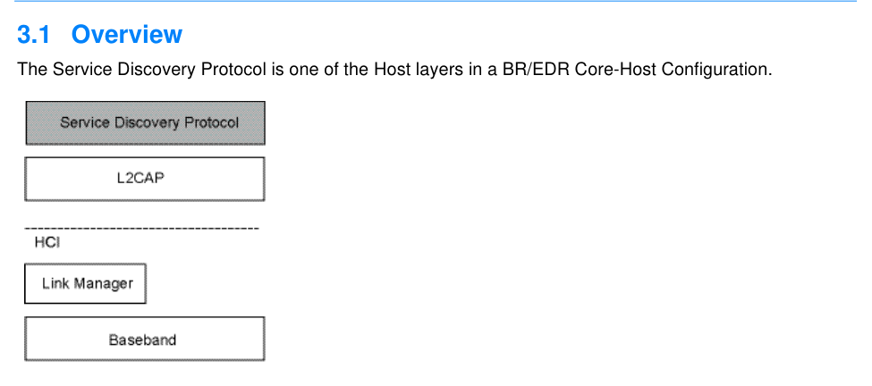

**Figure 3.1: SDP test model**

### 3.2 Test Strategy

The test objectives are to verify the functionality of the Service Discovery Protocol (SDP) within a Bluetooth Host and enable interoperability between Bluetooth Hosts on different devices. The testing approach covers mandatory and optional requirements in the specification and matches these to the support of the IUT as described in the ICS. Any defined test herein is applicable to the IUT if the ICS logical expression defined in the Test Case Mapping Table (TCMT) evaluates to true.
The test equipment provides an implementation of the Radio Controller and the parts of the Host needed to perform the test cases defined in this Test Suite. A Lower Tester acts as the IUT’s peer device and interacts with the IUT over-the-air interface. The configuration, including the IUT, needs to implement similar capabilities to communicate with the test equipment. For some test cases, it is necessary to stimulate the IUT from an Upper Tester. In practice, this could be implemented as a special test interface, a Man Machine Interface (MMI), or another interface supported by the IUT.
This Test Suite contains Valid Behavior (BV) tests complemented with Invalid Behavior (BI) tests where required. The test coverage mirrored in the Test Suite Structure is the result of a process that started with catalogued specification requirements that were logically grouped and assessed for testability enabling coverage in defined test purposes.

### 3.3 Test groups

The Service Discovery Protocol specifies four groups of services; from that, this Test Suite has four test groups defined:
• Service Search
To locate service records specified by a search pattern, the SDP_SERVICE_SEARCH_REQ and SDP_SERVICE_SEARCH_RSP PDUs are used.
• Service Attribute
Retrieves attribute values specified by an AttributeList, the SDP_SERVICE_ATTR_REQ and SDP_SERVICE_ATTR_RSP PDUs are used.
• Service Search Attribute
The Service Search and Service Attribute procedures, combined to one procedure, may decrease the number of messages/PDUs sent, via the SDP_SERVICE_SEARCH_ATTR_REQ and SDP_SERVICE_SEARCH_ATTR_RSP PDUs.
• Service Browse
To verify the process of looking for any offered services described by an SDP server’s service records without any a priori information about the services.

## 4 Test cases (TC)

### 4.1 Introduction

#### 4.1.1 Test case identification conventions

Test cases are assigned unique identifiers per the conventions in [4]. The convention used here is: <spec abbreviation>/<IUT role>/<class>/<feat>/<func>/<subfunc>/<cap>/<xx>-<nn>-<y>.

|  | Identifier Abbreviation |  |  | Spec Identifier <spec abbreviation> |  |
| --- | --- | --- | --- | --- | --- |
| SDP |  |  | Service Discovery Protocol |  |  |
|  | Identifier Abbreviation |  |  | Role Identifier <IUT role> |  |
| CL |  |  | Client Role |  |  |
| SR |  |  | Server Role |  |  |
|  | Identifier Abbreviation |  |  | Function Identifier <func> |  |
| BRW |  |  | Browsing |  |  |
| SA |  |  | Service Attribute Request |  |  |
| SS |  |  | Service Search Request |  |  |
| SSA |  |  | Service Search Attribute Request |  |  |

Table 4.1: SDP TC function naming conventions

#### 4.1.2 Conformance

When conformance is claimed for a particular specification, all capabilities are to be supported in the specified manner. The mandated tests from this Test Suite depend on the capabilities to which conformance is claimed.
The Bluetooth Qualification Program may employ tests to verify implementation robustness. The level of implementation robustness that is verified varies from one specification to another and may be revised for cause based on interoperability issues found in the market.
Such tests may verify:
• That claimed capabilities may be used in any order and any number of repetitions not excluded by the specification
• That capabilities enabled by the implementations are sustained over durations expected by the use case
• That the implementation gracefully handles any quantity of data expected by the use case
• That in cases where more than one valid interpretation of the specification exists, the implementation complies with at least one interpretation and gracefully handles other interpretations
• That the implementation is immune to attempted security exploits
A single execution of each of the required tests is required to constitute a Pass verdict. However, it is noted that to provide a foundation for interoperability, it is necessary that a qualified implementation consistently and repeatedly pass any of the applicable tests.
In any case, where a member finds an issue with the test plan generated by the Bluetooth SIG qualification tool, with the test case as described in the Test Suite, or with the test system utilized, the
member is required to notify the responsible party via an erratum request such that the issue may be addressed.

#### 4.1.3 Pass/Fail verdict conventions

Each test case has an Expected Outcome section. The IUT is granted the Pass verdict when all the detailed pass criteria conditions within the Expected Outcome section are met.
The convention in this Test Suite is that, unless there is a specific set of fail conditions outlined in the test case, the IUT fails the test case as soon as one of the pass criteria conditions cannot be met. If this occurs, then the outcome of the test is a Fail verdict.

#### 4.1.4 Fields and bits reserved for future use

Unless a specific test states otherwise, all fields within packets and all bits within fields that are described as reserved for future use are set to 0 in packets sent by the Upper and Lower Testers.

#### 4.1.5 UUIDs

All tests are to be run using 16, 32, and 128 bit UUIDs.

### 4.2 Service Search Request procedures

Verify the correct implementation of the Service Search Request services.

#### 4.2.1 Server

The IUT is the Server and the Lower Tester is the Client.

##### 4.2.1.1 Service Search Request

• Test Purpose
Verify the correct behavior of the IUT when searching for existing service(s).
• Reference
[1] 4.5
• Initial Condition
- A link and channel connection with the Lower Tester is set up. A CID has been established.
- At least the UUID 0x1000 (ServiceDiscoveryServerServiceClassID) exists.
• Test Case Configuration

| Test Case |  | Search |  | Search Response | Parameters |
| --- | --- | --- | --- | --- | --- |
|  |  | Feature |  |  |  |
| SDP/SR/SS/BV-01-C [Service Search Request] | N/A |  |  | SDP SERVICE SEARCH RSP _ _ _ | 0x03, TransactionID and ParameterLength, TotalServiceCount, CurrentServiceRecordCount, ServiceRecordHandleList |
| SDP/SR/SS/BV-03-C [Service Search Request, ContinuationState] | Continuation State > 0x00 |  |  | SDP SERVICE SEARCH RSP _ _ _ | 0x03, TransactionID and ParameterLength, TotalServiceCount, CurrentServiceRecordCount, ServiceRecordHandleList, ContinuationState |

| Test Case | Search Sea Feature | rch Response | Parameters |
| --- | --- | --- | --- |
| SDP/SR/SS/BI-01-C [Service Search Request, Invalid Search, Invalid PDU Size] | Invalid PDU SDP size | ERROR RSP _ _ | ErrorCode = 0x0004 (Invalid PDU Size) |
| SDP/SR/SS/BI-02-C [Service Search Request, Invalid Search, Invalid Syntax] | Invalid syntax SDP | ERROR RSP _ _ | ErrorCode = 0x0003 (Invalid request syntax) |

Table 4.2: Service Search Request
• Test Procedure

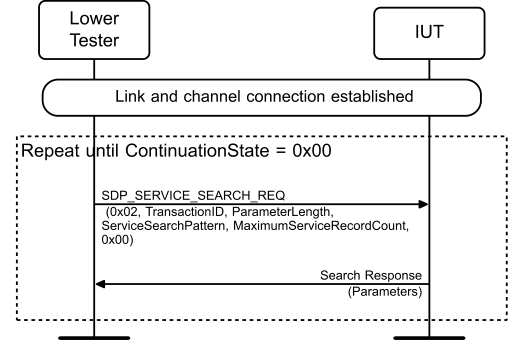

**Figure 4.1: Service Search Request**

Repeat steps 1 and 2 until the ContinuationState sent by the IUT = 0x00.
1. The Lower Tester sends an SDP_SERVICE_SEARCH_REQ to the IUT with PDU ID set to 0x02,
TransactionID, ParameterLength, ServiceSearchPattern set to TSPX_sdp_service_search_pattern, MaximumServiceRecordCount, ParameterLength, and the Search Feature specified in Table 4.2. 2. The IUT responds with the Search Response and Parameters listed in Table 4.2.
• Expected Outcome
Pass verdict
In step 2, the IUT responds with the correct Search Response from Table 4.2.
The structure of the returned records is correctly formatted and uses correct element types and sizes.

### 4.3 Service Attribute Request procedures

Verify the correct implementation of the Service Attribute Request services.

#### 4.3.1 Server

The IUT is the Server and the Lower Tester is the Client.

##### 4.3.1.1 Service Attribute Request

• Test Purpose
Verify that the IUT can respond with attribute(s).
• Reference
[1] 4.6, 5.1
• Initial Condition
- A link and channel connection with the Lower Tester is set up. A CID has been established.
- The ServiceSearchPattern value as defined in Table 4.3 is declared as an IXIT value.
• Test Case Configuration

|  | Test Case |  |  | Attribute Request |  |  | Attribute Search Response |  |  | Search Pattern IXIT |  |
| --- | --- | --- | --- | --- | --- | --- | --- | --- | --- | --- | --- |
| SDP/SR/SA/BV-01-C [Service Attribute Request] |  |  | AttributeList = Any Attribute(s) |  |  | SDP SERVICE ATTR RSP _ _ _ |  |  | TSPX sdp service search pattern _ _ _ _ |  |  |
| SDP/SR/SA/BV-04-C [Service Attribute Request, ServiceID] |  |  | AttributeList = ServiceID |  |  | SDP SERVICE ATTR RSP _ _ _ |  |  | TSPX sdp service id _ _ _ |  |  |
| SDP/SR/SA/BV-05-C [Service Attribute Request, ProtocolDescriptorList] |  |  | AttributeList = ProtocolDescriptorList |  |  | SDP SERVICE ATTR RSP _ _ _ |  |  | TSPX sdp protocol descriptor list _ _ _ _ |  |  |
| SDP/SR/SA/BV-06-C [Service Attribute Request, ServiceRecordState] |  |  | AttributeList = ServiceRecordState |  |  | SDP SERVICE ATTR RSP _ _ _ |  |  | TSPX sdp service record state _ _ _ _ |  |  |
| SDP/SR/SA/BV-07-C [Service Attribute Request, ServiceInfoTime] |  |  | AttributeList = ServiceInfoTime |  |  | SDP SERVICE ATTR RSP _ _ _ |  |  | TSPX sdp service info time to live _ _ _ _ _ _ |  |  |
| SDP/SR/SA/BV-08-C [Service Attribute Request, BrowseGroupList] |  |  | AttributeList = BrowseGroupList |  |  | SDP SERVICE ATTR RSP _ _ _ |  |  | TSPX sdp service search pattern browse group list _ _ _ _ _ _ _ |  |  |
| SDP/SR/SA/BV-09-C [Service Attribute Request, LanguageBaseAttributeIDList] |  |  | AttributeList = LanguageBaseAttributeIDList |  |  | SDP SERVICE ATTR RSP _ _ _ |  |  | TSPX sdp language base attribute id list _ _ _ _ _ _ |  |  |
| SDP/SR/SA/BV-10-C [Service Attribute Request, ServiceAvailability] |  |  | AttributeList = ServiceAvailability |  |  | SDP SERVICE ATTR RSP _ _ _ |  |  | TSPX sdp service availability _ _ _ |  |  |
| SDP/SR/SA/BV-11-C [Service Attribute Request, IconURL] |  |  | AttributeList = IconURL |  |  | SDP SERVICE ATTR RSP _ _ _ |  |  | TSPX sdp icon url _ _ _ |  |  |
| SDP/SR/SA/BV-15-C [Service Attribute Request, VersionNumberList] |  |  | AttributeList = VersionNumberList |  |  | SDP SERVICE ATTR RSP _ _ _ |  |  | TSPX sdp version number list _ _ _ _ |  |  |
| SDP/SR/SA/BV-16-C [Service Attribute Request, ServiceDatabaseState] |  |  | AttributeList = ServiceDatabaseState |  |  | SDP SERVICE ATTR RSP _ _ _ |  |  | TSPX sdp service data base state _ _ _ _ _ |  |  |
| SDP/SR/SA/BV-17-C [Service Attribute Request, BluetoothProfileDescriptorList] |  |  | AttributeList = BluetoothProfileDescriptorList |  |  | SDP SERVICE ATTR RSP _ _ _ |  |  | TSPX sdp search service with bluetoothprofiledescriptorlist _ _ _ _ _ |  |  |
| SDP/SR/SA/BV-18-C [Service Attribute Request, DocumentationURL] |  |  | AttributeList = DocumentationURL |  |  | SDP SERVICE ATTR RSP _ _ _ |  |  | TSPX sdp documentation url _ _ _ |  |  |
| SDP/SR/SA/BV-19-C [Service Attribute Request, ClientExecutableURL] |  |  | AttributeList = ClientExecutableURL |  |  | SDP SERVICE ATTR RSP _ _ _ |  |  | TSPX sdp client exe url _ _ _ _ |  |  |

|  | Test Case |  |  | Attribute Request |  |  | Attribute Search Response |  |  | Search Pattern IXIT |  |
| --- | --- | --- | --- | --- | --- | --- | --- | --- | --- | --- | --- |
| SDP/SR/SA/BV-20-C [Service Attribute Request, Non-existing Attribute] |  |  | AttributeList = TSPX sdp unsupported attribute _ _ _ id _ |  |  | SDP SERVICE ATTR RSP _ _ _ |  |  |  |  |  |
| SDP/SR/SA/BV-21-C [Service Attribute Request, AdditionalProtocolDescriptorLists] |  |  | AttributeList = AdditionalProtocolDescriptorLists |  |  | SDP SERVICE ATTR RSP _ _ _ |  |  | TSPX sdp service search pattern additional protocol descriptor _ _ _ _ _ _ _ lists _ |  |  |
| SDP/SR/SA/BI-02-C [Service Attribute Request, Invalid Syntax] |  |  | AttributeList = Existing Attribute, Invalid Request Coding |  |  | SDP ERROR RSP _ _ |  |  | N/A |  |  |
| SDP/SR/SA/BI-03-C [Service Attribute Request, Invalid PDU Size] |  |  | AttributeList = Existing Attribute, Invalid PDU Size |  |  | SDP ERROR RSP _ _ |  |  | N/A |  |  |

Table 4.3: Service Attribute Request
• Test Procedure

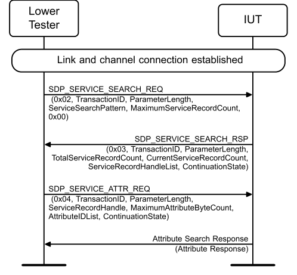

**Figure 4.2: Service Attribute Request**

1. The Lower Tester sends an SDP_SERVICE_SEARCH_REQ to the IUT with PDU ID set to 0x02,
TransactionID and ParameterLength, and ServiceSearchPattern as specified in Table 4.3, and MaximumServiceRecordCount. 2. The IUT sends an SDP_SERVICE_SEARCH_RSP to the Lower Tester with PDU ID set to 0x03,
TransactionID and ParameterLength, CurrentServiceRecordCount, ServiceRecordHandleList, and ContinuationState. 3. The Lower Tester sends an SDP_SERVICE_ATTR_REQ to the IUT with PDU ID set to 0x04,
ServiceRecordHandle, MaximumAttributeByteCount, the Attribute Request specified in Table 4.3, and the rest set to valid parameters. 4. The IUT sends the Attribute Search Response listed in Table 4.3 to the Lower Tester with a valid
TransactionID, ParameterLength, AttributeListByteCount, ContinuationState (if applicable), and AttributeList containing the Attribute Response listed in Table 4.3.
• Expected Outcome
Pass verdict
The IUT responds with the correct Attribute Search Response listed in Table 4.3 upon reception of the SDP_SERVICE_ATTR_REQ and SDP_SERVICE_ATTR_RSP PDUs.
The structure of the returned records is correctly formatted and uses correct element types and sizes.
The IUT’s returned AttributeListsByteCount value does not exceed MaximumAttributeByteCount.
• Test Purpose
Verify that the IUT can respond with a ServiceName attribute.
• Reference
[1] 5.1.15
• Initial Condition
- A link and channel connection with the Lower Tester is set up. A CID has been established.
- The ServiceSearchPattern value as defined in Table 4.4 is declared as an IXIT value.
• Test Case Configuration

|  | Test Case | Attribute |  |  | Search Pattern IXIT |  |
| --- | --- | --- | --- | --- | --- | --- |
| SDP/SR/SA/BV-12-C [Service Attribute R ServiceName] |  | equest, ServiceName |  | TSPX sdp service name _ _ _ |  |  |
| SDP/SR/SA/BV-13-C [Service Attribute R ServiceDescription] |  | equest, ServiceDescription |  | TSPX sdp service description _ _ _ |  |  |
| SDP/SR/SA/BV-14-C [Service Attribute R ProviderName] |  | equest, ProviderName |  | TSPX sdp provider name _ _ _ |  |  |

Table 4.4: Service Attribute Request, Language
• Test Procedure

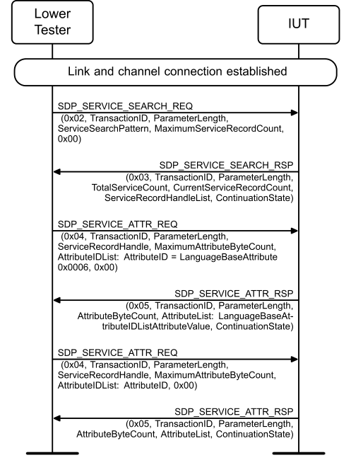

**Figure 4.3: Service Attribute Request, Language**

valid TransactionID, ParameterLength, ServiceSearchPattern as specified in Table 4.4, and MaximumServiceRecordCount. 2. The IUT sends an SDP_SERVICE_SEARCH_RSP to the Lower Tester with PDU ID set to 0x03,
TransactionID, ParameterLength, TotalServiceCount, CurrentServiceRecordCount, ServiceRecordHandleList, and ContinuationState. 3. The Lower Tester sends an SDP_SERVICE_ATTR_REQ to the IUT with PDU ID set to 0x04,
TransactionID, ParameterLength, ServiceRecordHandle, MaximumAttributeByteCount, and AttributeList containing the TSPX_sdp_language_base_attribute_id_list AttributeID. 4. The IUT sends an SDP_SERVICE_ATTR_RSP to the Lower Tester with PDU ID set to 0x05, a
valid TransactionID, ParameterLength, AttributeByteCount, ContinuationState, and containing the AttributeIDList containing the LanguageAttributeBaseIDList values. 5. The Lower Tester sends an SDP_SERVICE_ATTR_REQ to the IUT with PDU ID set to 0x04,
TransactionID, ParameterLength, ServiceRecordHandle, MaximumAttributeByteCount, and AttributeIDList set to the Attribute specified in Table 4.4. 6. The IUT sends an SDP_SERVICE_ATTR_RSP to the Lower Tester with PDU ID set to 0x05, a
valid TransactionID, ParameterLength, AttributeByteCount, ContinuationState, and AttributeList containing the Attribute listed in Table 4.4.
• Expected Outcome
Pass verdict
In step 6, the IUT responds with the requested Attribute specified in Table 4.4.
The structure of the returned records is correctly formatted and uses correct element types and sizes.
• Notes
ContinuationState in response is of no interest in this test and can be disregarded.
SDP/SR/SA/BV-03-C [Service Attribute Request, ContinuationState]
• Test Purpose
Verify that the IUT can respond with the existing Attribute(s) using ContinuationState.
• Reference
[1] 4.6, 5.1.4
• Initial Condition
- A link and channel connection with the Lower Tester is set up. A CID has been established.
- The ServiceSearchPattern value (TSPX_sdp_service_search_pattern) is declared as an IXIT value.
• Test Procedure

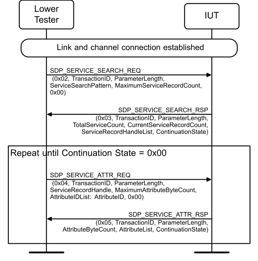

**Figure 4.4: SDP/SR/SA/BV-03-C [Service Attribute Request, ContinuationState]**

1. The Lower Tester sends an SDP_SERVICE_SEARCH_REQ to the IUT with PDU ID set to 0x02,
TransactionID and ParameterLength, ServiceSearchPattern set to TSPX_sdp_service_search_pattern, and MaximumServiceRecordCount. 2. The IUT sends an SDP_SERVICE_SEARCH_RSP to the Lower Tester with PDU ID set to 0x03,
TransactionID and ParameterLength TotalServiceCount, CurrentServiceRecordCount count, ServiceRecordHandleList, and ContinuationState.
Repeat steps 3 and 4 until ContinuationState = 0x00 in step 4:
3. The Lower Tester sends an SDP_SERVICE_ATTR_REQ to the IUT with PDU ID set to 0x04,
TransactionID and ParameterLength, ServiceRecordHandle, MaximumAttributeByteCount, and AttributeIDList. 4. The IUT sends an SDP_SERVICE_ATTR_RSP to the Lower Tester with PDU ID set to 0x05, a
valid TransactionID and ParameterLength, AttributeByteCount, ContinuationState, and AttributeList.
• Expected Outcome
Pass verdict
In step 4, the IUT responds with AttributeList upon reception of the corresponding SDP_SERVICE_ATTR_REQ PDU.
The IUT continues sending SDP_SERVICE_ATTR_RSP PDUs to the Lower Tester until ContinuationState = 0x00.
The structure of the returned records is correctly formatted and uses correct element types and sizes.
• Test Purpose
Verify the correct behavior of the IUT when searching for an existing Attribute using an invalid ServiceRecordHandle.
• Reference
[1] 4.4
• Initial Condition
- A link and channel connection with the Lower Tester is set up. A CID has been established.
• Test Procedure

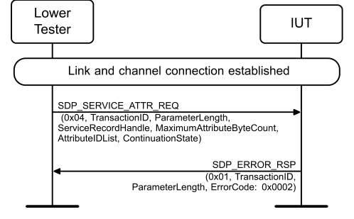

**Figure 4.5: SDP/SR/SA/BI-01-C [Service Attribute Request, Invalid ServiceRecordHandle]**

1. The Lower Tester sends an SDP_SERVICE_ATTR_REQ to the IUT with PDU ID set to 0x04,
TransactionID and ParameterLength, ServiceRecordHandle, MaximumAttributeByteCount, and AttributeList with an invalid ServiceRecordHandle. 2. The IUT sends an SDP_ERROR_RSP to the Lower Tester with PDU ID set to 0x01, a valid
TransactionID and ParameterLength, ErrorCode set to 0x0002.
• Expected Outcome
Pass verdict
In step 2, the IUT responds with SDP_ERROR_RSP with the ErrorCode 0x0002 upon reception of the SDP_SERVICE_ATTR_REQ and SDP_SERVICE_ATTR_RSP PDUs.
The structure of the returned records is correctly formatted and uses correct element types and sizes.

#### 4.3.2 Client

SDP/CL/SA/BV-01-C [Service Attribute Request, Client]
• Test Purpose
Verify that the IUT properly sends a Service Search Attribute Request.
• Reference
[1] 4.6, 5.1.4
• Initial Condition
- A link and channel connection with the Lower Tester is set up. A CID has been established.
• Test Procedure

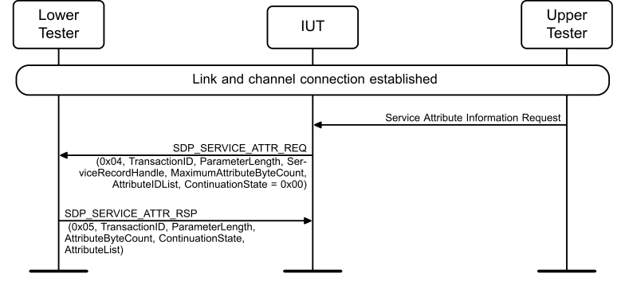

**Figure 4.6: SDP/CL/SA/BV-01-C [Service Attribute Request, Client]**

1. The Upper Tester commands the IUT to send an SDP_SERVICE_ATTR_REQ with valid
attributes. 2. The IUT sends an SDP_SERVICE_ATTR_REQ to the Lower Tester with PDU ID set to 0x04,
TransactionID and ParameterLength, ServiceRecordHandle, MaximumAttributeByteCount, and AttributeIDList and ContinuationState = 0x00. 3. The Lower Tester sends an SDP_SERVICE_ATTR_RSP to the Lower Tester with PDU ID set to
0x05, a valid TransactionID and ParameterLength, AttributeByteCount, ContinuationState, and AttributeList.
• Expected Outcome
Pass verdict
In step 2, the IUT sends an SDP_SERVICE_ATTR_REQ to the Lower Tester with AttributeList UUIDs listed in ascending order with no duplicates.

### 4.4 Service Search Attribute Request procedures

Verify the correct implementation of the Service Search Attribute Request services.

#### 4.4.1 Server

The IUT is the Server and the Lower Tester is the Client.

##### 4.4.1.1 Service Search Attribute Request

• Test Purpose
Verify the correct behavior of the IUT when searching for a non-existing Service or an existing Attribute using SDP_SERVICE_SEARCH_ATTR_REQ.
• Reference
[1] 4.7
• Initial Condition
- A link and channel connection with the Lower Tester is set up. A CID has been established.
- The ServiceSearchPattern value as defined in Table 4.5 is declared as an IXIT value.
• Test Case Configuration

|  | Test Case |  |  | Attribute |  |  | Search Pattern IXIT |  |  | Response Feature |  |
| --- | --- | --- | --- | --- | --- | --- | --- | --- | --- | --- | --- |
| SDP/SR/SSA/BV-01-C [Service Search Attribute Request, Non-existing Service] |  |  | AttributeIDList = ServiceClassIDList |  |  | TSPX sdp unsupported service _ _ _ |  |  | EMPTY |  |  |
| SDP/SR/SSA/BV-02-C [Service Search Attribute Request, Non-existing Attribute] |  |  | AttributeIDList = TSPX sdp unsupported attribute id _ _ _ _ |  |  | TSPX sdp service search pattern _ _ _ _ |  |  | EMPTY |  |  |
| SDP/SR/SSA/BV-03-C [Service Search Attribute Request, Non-existing Service and Non-existing Attribute] |  |  | AttributeIDList = TSPX sdp unsupported attribute id _ _ _ _ |  |  | TSPX sdp unsupported service _ _ _ |  |  | EMPTY |  |  |
| SDP/SR/SSA/BV-04-C [Service Search Attribute Request, Existing Service(s) and existing Attribute(s)] |  |  | AttributeIDList = Exisiting Attribute |  |  | TSPX sdp service search pattern _ _ _ _ |  |  | Any valid existing Attribute(s) |  |  |
| SDP/SR/SSA/BV-08-C [Service Search Attribute Request, ServiceDataBaseState] |  |  | AttributeIDList = ServiceDatabaseState |  |  | TSPX sdp service data base state _ _ _ _ _ |  |  | ServiceDatabaseState |  |  |
| SDP/SR/SSA/BV-09-C [Service Search Attribute Request, ServiceInfoTimeToLive] |  |  | AttributeIDList = ServiceInfoTimeToLive |  |  | TSPX sdp service search pattern service info time to live _ _ _ _ _ _ _ _ _ |  |  | ServiceInfoTimeToLive |  |  |
| SDP/SR/SSA/BV-10-C [Service Search Attribute Request, SDP SERVICE SEARC _ _ H ATTR REQ] _ _ |  |  | AttributeIDList = ServiceID |  |  | TSPX sdp service id _ _ _ |  |  | ServiceID |  |  |
| SDP/SR/SSA/BV-11-C [Service Search Attribute Request, ProtocolDescriptorList] |  |  | AttributeIDList = ProtocolDescriptorList |  |  | TSPX sdp protocol descriptor list _ _ _ _ |  |  | ProtocolDescriptorList |  |  |
| SDP/SR/SSA/BV-12-C [Service Search Attribute Request, BrowseGroupList] |  |  | AttributeIDList = BrowseGroupList |  |  | TSPX sdp browse group list _ _ _ _ |  |  | BrowseGroupList |  |  |

|  | Test Case |  |  | Attribute |  |  | Search Pattern IXIT |  |  | Response Feature |  |
| --- | --- | --- | --- | --- | --- | --- | --- | --- | --- | --- | --- |
| SDP/SR/SSA/BV-13-C [Service Search Attribute Request, LanguageBaseAttributeID List] |  |  | AttributeIDList = LanguageBaseAttributeIDList |  |  | TSPX sdp language base attribute id list _ _ _ _ _ _ |  |  | LanguageBaseAttributeIDList |  |  |
| SDP/SR/SSA/BV-14-C [Service Search Attribute Request, ServiceAvailability] |  |  | AttributeIDList = ServiceAvailability |  |  | TSPX sdp service availability _ _ _ |  |  | ServiceAvailability |  |  |
| SDP/SR/SSA/BV-15-C [Service Search Attribute Request, IconURL] |  |  | AttributeIDList = IconURL |  |  | TSPX sdp icon url _ _ _ |  |  | IconURL |  |  |
| SDP/SR/SSA/BV-19-C [Service Search Attribute Request, VersionNumberList] |  |  | AttributeIDList = VersionNumberList |  |  | TSPX sdp version number list _ _ _ _ |  |  | VersionNumberList |  |  |
| SDP/SR/SSA/BV-20-C [Service Search Attribute Request, BluetoothProfileDescripto rList] |  |  | AttributeIDList = BluetoothProfileDescriptorList |  |  | TSPX sdp search service with bluetoothprofiledescriptorlist _ _ _ _ _ |  |  | BluetoothProfileDescriptorList |  |  |
| SDP/SR/SSA/BV-21-C [Service Search Attribute Request, DocumentationURL] |  |  | AttributeIDList = DocumentationURL |  |  | TSPX sdp documentation url _ _ _ |  |  | DocumentationURL |  |  |
| SDP/SR/SSA/BV-22-C [Service Search Attribute Request, ClientExecutableURL] |  |  | AttributeIDList = ClientExecutableURL |  |  | TSPX sdp client exe url _ _ _ _ |  |  | ClientExecutableURL |  |  |
| SDP/SR/SSA/BV-23-C [Service Search Attribute Request, AdditionalProtocolDescrip torLists] |  |  | AttributeIDList = AdditionalProtocolDescriptorLists |  |  | TSPX sdp service search pattern additional protocol descriptor lists _ _ _ _ _ _ _ _ |  |  | AdditionalProtocolDescriptorLists |  |  |

Table 4.5: Service Search Attribute Request
• Test Procedure

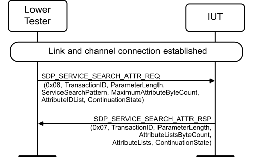

**Figure 4.7: Service Search Attribute Request**

1. The Lower Tester sends an SDP_SERVICE_SEARCH_ATTR_REQ to the IUT with PDU ID set to
0x06, TransactionID and ParameterLength, MaximumAttributeByteCount, ServiceSearchPattern, and AttributeIDList as specified in Table 4.5 and ContinuationState. 2. The IUT sends an SDP_SERVICE_SEARCH_ATTR_RSP to the Lower Tester with PDU ID set to
0x07, valid TransactionID and ParameterLength, AttributeListsByteCount, ContinuationState, and AttributeLists containing the Response Feature listed in Table 4.5.
• Expected Outcome
Pass verdict
In step 2, the IUT responds with the requested Response Feature in Table 4.5.
The structure of the returned records is correctly formatted and uses correct element types and sizes.

##### 4.4.1.2 Service Search Attribute Request, ContinuationState

• Test Purpose
Verify the correct behavior of the IUT when searching for existing Attributes using ContinuationState and SDP_SERVICE_SEARCH_ATTR_REQ.
• Reference
[1] 4.7
• Initial Condition
- A link and channel connection with the Lower Tester is set up. A CID has been established.
- The ServiceSearchPattern value (TSPX_sdp_service_search_pattern) is declared as an IXIT value.
- The ServiceSearchPattern value as defined in Table 4.6 is declared as an IXIT value.
• Test Case Configuration

|  | Test Case | Attribute | Search Pattern IXIT |  |  | Response Feature |  |
| --- | --- | --- | --- | --- | --- | --- | --- |
| SDP/SR/SSA/BV-06-C [Service Search Attribute Request, ContinuationState Existing Attribute] |  | AttributeIDList = TSPX sdp service search pattern _ _ _ _ Existing Attribute |  |  | Any valid exisiting Attribute(s) |  |  |
| SDP/SR/SSA/BV-07-C [Service Search Attribute Request, ContinuationState ServiceRecordState] |  | AttributeIDList = TSPX sdp service record state _ _ _ _ ServiceRecordState |  |  | ServiceRecordState |  |  |

Table 4.6: Service Search Attribute Request, ContinuationState
• Test Procedure

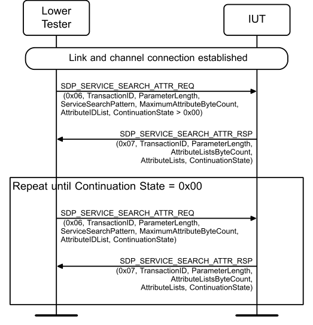

**Figure 4.8: Service Search Attribute Request, ContinuationState**

1. The Lower Tester sends an SDP_SERVICE_SEARCH_ATTR_REQ to the IUT with PDU ID set to
0x06, TransactionID and ParameterLength, MaximumAttributeByteCount, ServiceSearchPattern, and AttributeList set to the Search Feature in Table 4.6, and ContinuationState greater than 0x00. 2. The IUT sends an SDP_SERVICE_SEARCH_ATTR_RSP to the Lower Tester with PDU ID set to
0x07, valid TransactionID and ParameterLength, AttributeListsByteCount, ContinuationState, and AttributeList containing the Response Feature listed in Table 4.6.
Repeat steps 3 and 4 until ContinuationState = 0x00 in step 4:
3. The Lower Tester sends an SDP_SERVICE_SEARCH_ATTR_REQ to the IUT with PDU ID set to
0x06, TransactionID and ParameterLength, MaximumAttributeByteCount, ServiceSearchPattern, and AttributeList set to the Search Feature in Table 4.6, and ContinuationState. 4. The IUT sends an SDP_SERVICE_SEARCH_ATTR_RSP to the Lower Tester with PDU ID set to
0x07, valid TransactionID and ParameterLength, AttributeListsByteCount, ContinuationState, and AttributeLists containing the Response Feature listed in Table 4.6.
• Expected Outcome
Pass verdict
In steps 2 and 4, the IUT responds with the Response Feature in Table 4.6 upon reception of the SDP_SERVICE_SEARCH_ATTR_REQ PDU.
The structure of the returned records is correctly formatted and uses correct element types and sizes.

##### 4.4.1.3 Service Search Attribute Request, Language

• Test Purpose
Verify the correct behavior of the IUT when searching for existing Service(s) and Attributes using SDP_SERVICE_SEARCH_ATTR_REQ.
• Reference
[1] 4.7, 5.1.14
• Initial Condition
- A link and channel connection with the Lower Tester is set up. A CID has been established.
- The ServiceSearchPattern value as defined in Table 4.7 is declared as an IXIT value, as Search Pattern IXIT.
• Test Case Configuration

| Test Case |  | Attribute for Search |  | Search Pattern IXIT | Attribute Response |
| --- | --- | --- | --- | --- | --- |
|  |  | Feature |  |  |  |
| SDP/SR/SSA/BV-16-C [Service Search Attribute Request, ServiceName] | BaseAttributeID+ 0x0000 |  |  | TSPX sdp service name _ _ _ | ServiceName |
| SDP/SR/SSA/BV-17-C [Service Search Attribute Request, ServiceDescription] | BaseAttributeID+ 0x0001 |  |  | TSPX sdp service description _ _ _ | ServiceDescription |
| SDP/SR/SSA/BV-18-C [Service Search Attribute Request, ProviderName] | BaseAttributeID+ 0x0002 |  |  | TSPX sdp provider name _ _ _ | ProviderName |

Table 4.7: Service Search Attribute Request, Language
• Test Procedure

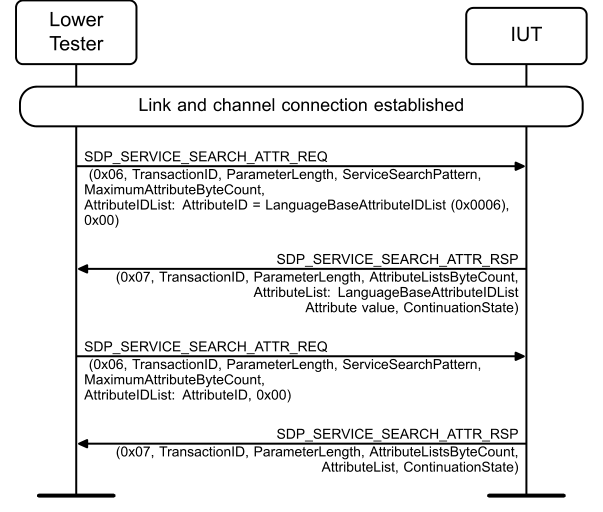

**Figure 4.9: Service Search Attribute Request, Language**

1. The Lower Tester sends an SDP_SERVICE_SEARCH_ATTR_REQ to the IUT with PDU ID set to
0x06, TransactionID, ParameterLength, ServiceSearchPattern as specified in Table 4.7, MaximumAttributeByteCount, AttributeList containing the LanguageBaseAttributeIDList AttributeID, and ContinuationState. 2. The IUT sends an SDP_SERVICE_SEARCH_ATTR_RSP to the Lower Tester with PDU ID set to
0x07, valid TransactionID and ParameterLength AttributeListsByteCount, AttributeLists containing the LanguageBaseAttributeIDList service record, and ContinuationState. 3. The Lower Tester sends an SDP_SERVICE_SEARCH_ATTR_REQ to the IUT with PDU ID set to
0x06, TransactionID, ParameterLength, ServiceSearchPattern as specified in Table 4.7, MaximumAttributeByteCount, AttributeIDList containing the Search Feature in Table 4.7, and ContinuationState. 4. The IUT sends an SDP_SERVICE_SEARCH_ATTR_RSP to the Lower Tester with PDU ID set to
0x07, valid TransactionID, ParameterLength, AttributeListsByteCount, AttributeLists containing the Attribute Response listed in Table 4.7, and ContinuationState.
• Expected Outcome
Pass verdict
In step 4, the IUT responds with the Attribute Response specified in Table 4.7.
The structure of the returned records is correctly formatted and uses correct element types and sizes.
• Test Purpose
Verify the correct behavior of the IUT when the server searches for existing Attributes using the SDP_SERVICE_SEARCH_ATTR_REQ PDU with invalid request syntax.
• Reference
[1] 4.4, 4.7
• Initial Condition
- A link and channel connection with the Lower Tester is set up. A CID has been established.
- The ServiceSearchPattern value (TSPX_sdp_service_search_pattern) is declared as an IXIT value.
• Test Case Configuration

|  | Test Case |  | Search Feature |  |  | ErrorCode Response |  |
| --- | --- | --- | --- | --- | --- | --- | --- |
| SDP/SR/SSA/BI-01-C [Service Search Attribute Request, Invalid Syntax] |  | Invalid request syntax |  |  | 0x0003 |  |  |
| SDP/SR/SSA/BI-02-C [Service Search Attribute Request, Invalid PDU size] |  | Invalid PDU size |  |  | 0x0004 |  |  |

Table 4.8: Service Search Attribute Request, Invalid Request
• Test Procedure

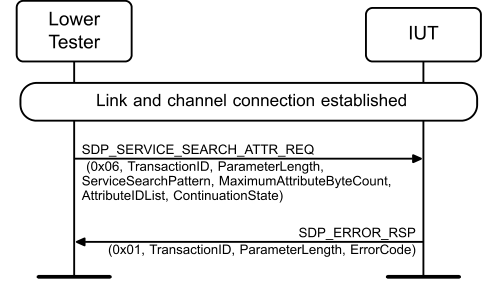

**Figure 4.10: Service Search Attribute Request, Invalid Request**

1. The Lower Tester sends an SDP_SERVICE_SEARCH_ATTR_REQ to the IUT with PDU ID set to
0x06, TransactionID and ParameterLength ServiceSearchPattern as specified in Table 4.8, MaximumAttributeByteCount, AttributeIDList containing the Search Feature in Table 4.8, and ContinuationState. 2. The IUT sends an SDP_ERROR_RSP to the Lower Tester with PDU ID set to 0x01, valid
TransactionID and ParameterLength, and ErrorCode matching the Error Code Response listed in Table 4.8.
• Expected Outcome
Pass verdict
In step 2, the IUT sends the SDP_ERROR_RSP PDU with the ErrorCode as specified in Table 4.8.
The structure of the returned records is correctly formatted and uses correct element types and sizes.

#### 4.4.2 Client

SDP/CL/SSA/BV-01-C [Service Search Attribute Request, Client]
• Test Purpose
Verify that the IUT properly sends a Service Search Attribute Request.
• Reference
[1] 4.7, 5.1.4
• Initial Condition
- A link and channel connection with the Lower Tester is set up. A CID has been established.
• Test Procedure

**Figure 4.11: SDP/CL/SSA/BV-01-C [Service Search Attribute Request, Client]**

1. The Upper Tester commands the IUT to send an SDP_SERVICE_SEARCH_ATTR_REQ with
valid attribute IDs. 2. The IUT sends an SDP_SERVICE_SEARCH_ATTR_REQ to the Lower Tester with PDU ID set to
0x06, TransactionID and ParameterLength, and a valid ServiceSearchPattern. 3. The Lower Tester sends an SDP_SERVICE_SEARCH_ATTR_RSP to the IUT with PDU ID set to
0x07, a valid TransactionID and ParameterLength, AttributeListsByteCount, AttributeLists, and ContinuationState.
• Expected Outcome
Pass verdict
In step 2, the IUT sends an SDP_SERVICE_SEARCH_ATTR_REQ to the Lower Tester with ContinuationState = 0x00 and AttributeLists UUIDs listed in ascending order with no duplicates.

### 4.5 Service Browse procedures

Verify the correct implementation of the Service Browse services.

#### 4.5.1 Server

The IUT is the Server and the Lower Tester is the Client.
SDP/SR/BRW/BV-01-C [Service Browse]
• Test Purpose
Verify that the IUT behaves correctly using SDP_SERVICE_SEARCH_REQ and SDP_SERVICE_ATTR_REQ for Service Browse.
• Reference
[1] 2.8, 4.5, 4.6
• Initial Condition
- A link and channel connection with the Lower Tester is set up. A CID has been established.
• Test Procedure

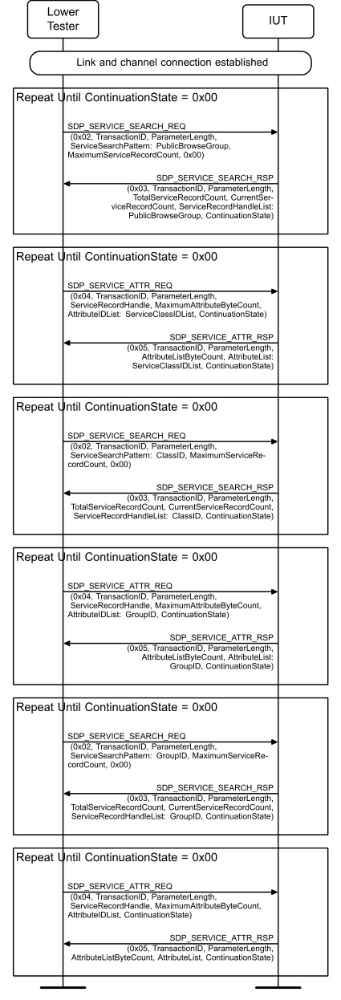

**Figure 4.12: SDP/SR/BRW/BV-01-C [Service Browse]**

1. The Lower Tester sends an SDP_SERVICE_SEARCH_REQ to the IUT with the
PublicBrowseGroup UUID in the ServiceSearchPattern. 2. The IUT sends an SDP_SERVICE_SEARCH_RSP to the Lower Tester with
ServiceRecordHandleList containing the PublicBrowseGroup and ContinuationState.
Repeat steps 3 and 4 until ContinuationState = 0x00 in step 4:
3. The Lower Tester sends an SDP_SERVICE_ATTR_REQ to the IUT with the AttributeIDList
containing the ServiceClassIDList. 4. The IUT sends an SDP_SERVICE_ATTR_RSP to the Lower Tester with the AttributeLists
containing the ServiceClassIDList AttributeValue and ContinuationState.
Repeat steps 5 and 6 until ContinuationState = 0x00 in step 6:
5. The Lower Tester sends an SDP_SERVICE_SEARCH_REQ to the IUT with the
BrowseGroupDescriptorClassID UUID in the ServiceSearchPattern. 6. The IUT sends an SDP_SERVICE_SEARCH_RSP to the Lower Tester with
ServiceRecordHandleList containing the BrowseGroupDescriptorClassID and ContinuationState.
Repeat steps 7 and 8 until ContinuationState = 0x00 in step 8:
7. The Lower Tester sends an SDP_SERVICE_ATTR_REQ to the IUT with AttributeIDList
containing the GroupID. 8. The IUT sends an SDP_SERVICE_ATTR_RSP to the Lower Tester with the AttributeLists
containing the GroupID AttributeValue and ContinuationState.
Repeat steps 9 and 10 until ContinuationState = 0x00 in step 10:
9. The Lower Tester sends an SDP_SERVICE_SEARCH_REQ to the IUT with the GroupID UUID in
the ServiceSearchPattern. 10. The IUT sends an SDP_SERVICE_SEARCH_RSP to the Lower Tester ServiceRecordHandleList
containing the GroupID and ContinuationState.
Repeat steps 11 and 12 until ContinuationState = 0x00 in step 12:
11. The Lower Tester sends an SDP_SERVICE_ATTR_REQ to the IUT with AttributeIDList for every
ServiceRecordHandle returned in step 10. 12. The IUT sends an SDP_SERVICE_ATTR_RSP to the Lower Tester with the AttributeLists
containing the matching AttributeValues from step 11 and ContinuationState.
• Expected Outcome
Pass verdict
In steps 2, 4, 6, 8, 10, and 12, the IUT responds with all available services and attributes.
The structure of the returned records is correctly formatted and uses correct element types and sizes.
• Test Purpose
Verify that the IUT correctly uses SDP_SERVICE_SEARCH_ATTR_REQ for Service Browse.
• Reference
[1] 2.8, 4.7
• Initial Condition
- A link and channel connection with the Lower Tester is set up. A CID has been established.
- All relevant attribute values are declared as an IXIT value.
• Test Procedure

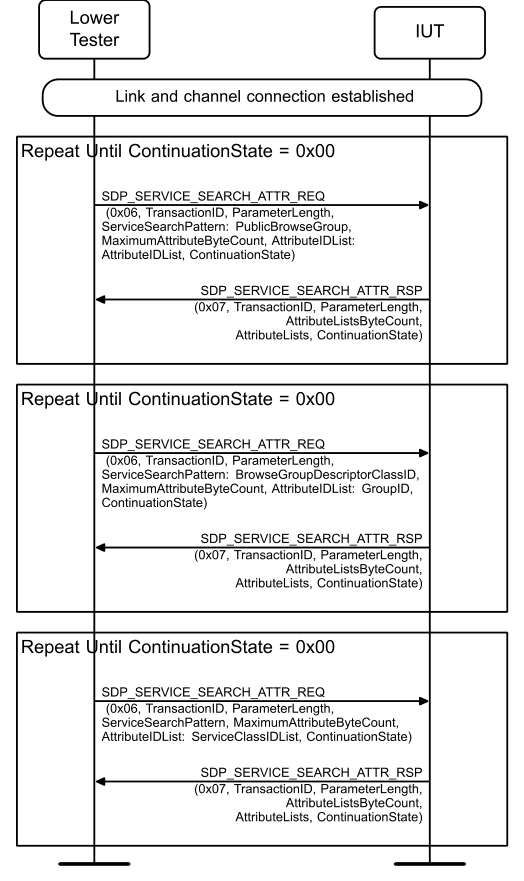

**Figure 4.13: SDP/SR/BRW/BV-02-C [Service Browse, Search Attribute]**

1. The Lower Tester sends an SDP_SERVICE_SEARCH_ATTR_REQ to the IUT with the
PublicBrowseGroup UUID in the ServiceSearchPattern and ClassIDList in the AttributeIDList. 2. The IUT sends an SDP_SERVICE_SEARCH_ATTR_RSP to the Lower Tester with AttributeLists
containing the PublicBrowseGroup and ClassIDList service records and ContinuationState.
Repeat steps 3 and 4 until ContinuationState = 0x00 in step 4:
3. The Lower Tester sends an SDP_SERVICE_SEARCH_ATTR_REQ to the IUT with the
BrowseGroupDescriptorClassID and GroupID UUIDs in the ServiceSearchPattern. 4. The IUT sends an SDP_SERVICE_SEARCH_ATTR_RSP to the Lower Tester with AttributeLists
containing the BrowseGroupDescriptorClassID and GroupIDList service records and ContinuationState.
Repeat steps 5 and 6 until ContinuationState = 0x00 in step 6:
5. The Lower Tester sends an SDP_SERVICE_SEARCH_ATTR_REQ to the IUT with every
returned UUID from step 4 and the AttributeServiceClassIDList UUID in the ServiceSearchPattern. 6. The IUT sends an SDP_SERVICE_SEARCH_ATTR_RSP to the Lower Tester with the matching
service records from step 4 and the AttributeServiceClassIDList service record and ContinuationState.
• Expected Outcome
Pass verdict
In steps 2, 4, and 6, the IUT responds with all available services and attributes.
The structure of the returned records is correctly formatted and uses correct element types and sizes.

## 5 Test case mapping

The Test Case Mapping Table (TCMT) maps test cases to specific requirements in the ICS. The IUT is tested in all roles for which support is declared in the ICS document.
The columns for the TCMT are defined as follows:
Item: Contains a logical expression based on specific entries from the associated ICS document. Contains a logical expression (using the operators AND, OR, NOT as needed) based on specific entries from the applicable ICS document(s). The entries are in the form of y/x references, where y corresponds to the table number and x corresponds to the feature number as defined in the ICS document for SDP [2].
Feature: A brief, informal description of the feature being tested.
Test Case(s): The applicable test case identifiers are required for Bluetooth Qualification if the corresponding y/x references defined in the Item column are supported. Further details about the function of the TCMT are elaborated in [4].
For the purpose and structure of the ICS/IXIT, refer to [4].

|  | Item |  |  | Feature |  |  | Test Case(s) |  |
| --- | --- | --- | --- | --- | --- | --- | --- | --- |
| SDP 1b/1 AND SDP 2/1 |  |  | ServiceSearch with 16, 32, or 128 bit UUID |  |  | SDP/SR/SS/BV-01-C |  |  |
| SDP 1b/1 AND SDP 2/2 |  |  | ServiceSearch with ContinuationState, 16, 32, or 128 bit UUID |  |  | SDP/SR/SS/BV-03-C |  |  |
| SDP 1b/1 |  |  | Error response to invalid ServiceSearch, with 16, 32, or 128 bit UUID Error response to invalid AttributeSearch |  |  | SDP/SR/SS/BI-01-C SDP/SR/SS/BI-02-C SDP/SR/SA/BI-01-C SDP/SR/SA/BI-02-C SDP/SR/SA/BI-03-C |  |  |
| SDP 1b/1 AND SDP 4/1 |  |  | AttributeSearch |  |  | SDP/SR/SA/BV-01-C SDP/SR/SA/BV-20-C |  |  |
| SDP 1b/1 AND SDP 4/2 |  |  | AttributeSearch using ContinuationState |  |  | SDP/SR/SA/BV-03-C |  |  |
| SDP 1b/1 AND SDP 4/1 AND SDP 9/1 |  |  | AttributeSearch for attribute ServiceID |  |  | SDP/SR/SA/BV-04-C |  |  |
| SDP 1b/1 AND SDP 4/1 AND SDP 9/2 |  |  | AttributeSearch for attribute ProtocolDescriptorList |  |  | SDP/SR/SA/BV-05-C |  |  |
| SDP 1b/1 AND SDP 4/1 AND SDP 9/3 |  |  | AttributeSearch for attribute ServiceRecordState |  |  | SDP/SR/SA/BV-06-C |  |  |
| SDP 1b/1 AND SDP 4/1 AND SDP 9/4 |  |  | AttributeSearch for attribute ServiceInfoTimeToLive |  |  | SDP/SR/SA/BV-07-C |  |  |
| SDP 1b/1 AND SDP 4/1 AND SDP 9/5 |  |  | AttributeSearch for attribute BrowseGroupList |  |  | SDP/SR/SA/BV-08-C |  |  |
| SDP 1b/1 AND SDP 4/1 AND SDP 9/6 |  |  | AttributeSearch for attribute LanguageBasedAttributeIDList |  |  | SDP/SR/SA/BV-09-C |  |  |

|  | Item |  |  | Feature |  |  | Test Case(s) |  |
| --- | --- | --- | --- | --- | --- | --- | --- | --- |
| SDP 1b/1 AND SDP 4/1 AND SDP 9/7 |  |  | AttributeSearch for attribute ServiceAvailability |  |  | SDP/SR/SA/BV-10-C |  |  |
| SDP 1b/1 AND SDP 4/1 AND SDP 9/8 |  |  | AttributeSearch for attribute IconURL |  |  | SDP/SR/SA/BV-11-C |  |  |
| SDP 1b/1 AND SDP 4/1 AND SDP 9/6 AND SDP 9/9 |  |  | AttributeSearch for attribute ServiceName |  |  | SDP/SR/SA/BV-12-C |  |  |
| SDP 1b/1 AND SDP 4/1 AND SDP 9/6 AND SDP 9/10 |  |  | AttributeSearch for attribute ServiceDescription |  |  | SDP/SR/SA/BV-13-C |  |  |
| SDP 1b/1 AND SDP 4/1 AND SDP 9/6 AND SDP 9/11 |  |  | AttributeSearch for attribute ProviderName |  |  | SDP/SR/SA/BV-14-C |  |  |
| SDP 1b/1 AND SDP 4/1 AND SDP 9/12 |  |  | AttributeSearch for attribute VersionNumberList |  |  | SDP/SR/SA/BV-15-C |  |  |
| SDP 1b/1 AND SDP 4/1 AND SDP 9/13 |  |  | AttributeSearch for attribute ServiceDataBaseState |  |  | SDP/SR/SA/BV-16-C |  |  |
| SDP 1b/1 AND SDP 4/1 AND SDP 9/14 |  |  | AttributeSearch for attribute BluetoothProfileDescriptorList |  |  | SDP/SR/SA/BV-17-C |  |  |
| SDP 1b/1 AND SDP 4/1 AND SDP 9/15 |  |  | AttributeSearch for attribute DocumentationURL |  |  | SDP/SR/SA/BV-18-C |  |  |
| SDP 1b/1 AND SDP 4/1 AND SDP 9/16 |  |  | AttributeSearch for attribute ClientExecutableURL |  |  | SDP/SR/SA/BV-19-C |  |  |
| SDP 4/3 |  |  | AttributeSearch for attribute AdditionalProtocolDescriptorLists |  |  | SDP/SR/SA/BV-21-C |  |  |
| SDP 1b/1 AND SDP 6/1 |  |  | ServiceSearchAttribute with 16, 32, or 128 bit UUID |  |  | SDP/SR/SSA/BV-01-C SDP/SR/SSA/BV-02-C SDP/SR/SSA/BV-03-C SDP/SR/SSA/BV-04-C |  |  |
| SDP 1b/1 AND SDP 6/2 |  |  | ServiceSearchAttribute using ContinuationState with 16, 32, or 128 bit UUID |  |  | SDP/SR/SSA/BV-06-C |  |  |
| SDP 1b/1 AND SDP 6/1 AND SDP 9/1 |  |  | ServiceSearchAttribute for attribute ServiceID with 16, 32, or 128 bit UUID |  |  | SDP/SR/SSA/BV-10-C |  |  |
| SDP 1b/1 AND SDP 6/1 AND SDP 9/2 |  |  | ServiceSearchAttribute for attribute ProtocolDescriptorList with 16, 32, or 128 bit UUID |  |  | SDP/SR/SSA/BV-11-C |  |  |
| SDP 1b/1 AND SDP 6/1 AND SDP 9/3 |  |  | ServiceSearchAttribute for attribute ServiceRecordState with 16, 32, or 128 bit UUID |  |  | SDP/SR/SSA/BV-07-C |  |  |

|  | Item |  |  | Feature |  |  | Test Case(s) |  |
| --- | --- | --- | --- | --- | --- | --- | --- | --- |
| SDP 1b/1 AND SDP 6/1 AND SDP 9/4 |  |  | ServiceSearchAttribute for attribute ServiceInfoTimeToLive with 16, 32, or 128 bit UUID |  |  | SDP/SR/SSA/BV-09-C |  |  |
| SDP 1b/1 AND SDP 6/1 AND SDP 9/5 |  |  | ServiceSearchAttribute for attribute BrowseGroupList with 16, 32, or 128 bit UUID |  |  | SDP/SR/SSA/BV-12-C |  |  |
| SDP 1b/1 AND SDP 6/1 AND SDP 9/6 |  |  | ServiceSearchAttribute for attribute LanguageBasedAttributeIDList with 16, 32, or 128 bit UUID |  |  | SDP/SR/SSA/BV-13-C |  |  |
| SDP 1b/1 AND SDP 6/1 AND SDP 9/7 |  |  | ServiceSearchAttribute for attribute ServiceAvailability with 16, 32, or 128 bit UUID |  |  | SDP/SR/SSA/BV-14-C |  |  |
| SDP 1b/1 AND SDP 6/1 AND SDP 9/8 |  |  | ServiceSearchAttribute for attribute IconURL with 16, 32, or 128 bit UUID |  |  | SDP/SR/SSA/BV-15-C |  |  |
| SDP 1b/1 AND SDP 6/1 AND SDP 9/6 AND SDP 9/9 |  |  | ServiceSearchAttribute for attribute ServiceName with 16, 32, or 128 bit UUID |  |  | SDP/SR/SSA/BV-16-C |  |  |
| SDP 1b/1 AND SDP 6/1 AND SDP 9/6 AND SDP 9/10 |  |  | ServiceSearchAttribute for attribute ServiceDescription with 16, 32, or 128 bit UUID |  |  | SDP/SR/SSA/BV-17-C |  |  |
| SDP 1b/1 AND SDP 6/1 AND SDP 9/6 AND SDP 9/11 |  |  | ServiceSearchAttribute for attribute ProviderName with 16, 32, or 128 bit UUID |  |  | SDP/SR/SSA/BV-18-C |  |  |
| SDP 1b/1 AND SDP 6/1 AND SDP 9/6 AND SDP 9/12 |  |  | ServiceSearchAttribute for attribute VersionNumberList with 16, 32, or 128 bit UUID |  |  | SDP/SR/SSA/BV-19-C |  |  |
| SDP 1b/1 AND SDP 6/1 AND SDP 9/6 AND SDP 9/13 |  |  | ServiceSearchAttribute for attribute ServiceDataBaseState with 16, 32, or 128 bit UUID |  |  | SDP/SR/SSA/BV-08-C |  |  |
| SDP 1b/1 AND SDP 6/1 AND SDP 9/6 AND SDP 9/14 |  |  | ServiceSearchAttribute for attribute BluetoothProfileDescriptorList with 16, 32, or 128 bit UUID |  |  | SDP/SR/SSA/BV-20-C |  |  |
| SDP 1b/1 AND SDP 6/1 AND SDP 9/6 AND SDP 9/15 |  |  | ServiceSearchAttribute for attribute DocumentationURL with 16, 32, or 128 bit UUID |  |  | SDP/SR/SSA/BV-21-C |  |  |
| SDP 1b/1 AND SDP 6/1 AND SDP 9/6 AND SDP 9/16 |  |  | ServiceSearchAttribute for attribute ClientExecutableURL with 16, 32, or 128 bit UUID |  |  | SDP/SR/SSA/BV-22-C |  |  |
| SDP 6/3 |  |  | ServiceSearchAttribute for attribute AdditionalProtocolDescriptorLists with 16, 32, or 128 bit UUID |  |  | SDP/SR/SSA/BV-23-C |  |  |

|  | Item |  |  | Feature |  |  | Test Case(s) |  |
| --- | --- | --- | --- | --- | --- | --- | --- | --- |
| SDP 1b/1 AND SDP 7/1 |  |  | Error response to invalid ServiceSearchAttribute with 16, 32, or 128 bit UUID |  |  | SDP/SR/SSA/BI-01-C SDP/SR/SSA/BI-02-C |  |  |
| SDP 1b/1 AND SDP 8/1 |  |  | Browsing, using ServiceSearch and AttributeSearch with 16, 32, or 128 bit UUID |  |  | SDP/SR/BRW/BV-01-C |  |  |
| SDP 1b/1 AND SDP 8/2 |  |  | Browsing, using ServiceSearchAttribute with 16, 32, or 128 bit UUID |  |  | SDP/SR/BRW/BV-02-C |  |  |
| SDP 10/1 |  |  | Client Service Attribute Requests |  |  | SDP/CL/SA/BV-01-C |  |  |
| SDP 11/1 |  |  | Client Service Search Attribute Request |  |  | SDP/CL/SSA/BV-01-C |  |  |

Table 5.1: Test case mapping

## 6 ANNEX: Generic SDP Integrated Tests (GSIT)

This annex defines generic test procedures that integrate various SDP tests that are required to be executed for each supported service record and attribute.

### 6.1 Identification conventions

In addition to the conventions defined in Section 4.1.1 Test case identification conventions, the following identifiers are introduced in this annex.

|  | Identifier Abbreviation |  |  | Group Identifier <class> |  |
| --- | --- | --- | --- | --- | --- |
| ATTR |  |  | Attribute |  |  |
| CGSIT |  |  | Client GSIT test procedures |  |  |
| GSIT |  |  | Generic SDP Integrated Tests |  |  |
| OFFS |  |  | Attribute ID Offset String |  |  |
| SERR |  |  | Service Record |  |  |
| SFC |  |  | SDP Future Compatibility |  |  |
| SGSIT |  |  | Server GSIT test procedures |  |  |

Table 6.1: Identification conventions

### 6.2 GSIT input tables

The GSIT procedures are executed with an input consisting of a table. The table format differs between the 1) SERR- and ATTR-tests and 2) SFC-tests for future SDP record compatibility.
In Test Suite documents that use the GSIT procedures, it may be a good idea to use the “landscape” page setup to achieve better readability to avoid the page width limitations the regular “portrait” page setup yields.

#### 6.2.1 Input table for SERR- and ATTR-tests

The table lists all the service records and attributes that are being tested, as well as any additional parameters.
It is recommended to split the input table by each separately defined SDP record instance, which is typically defined by role. Multiple instances are allowed by some profiles and the assumption is that each instance will be checked according to the attributes in the input table.
The Attribute ID name column is used to list the SDP attribute being checked, where SERR tests will always verify a ServiceClassIDList attribute list of one or more values and Attribute ID is used for ATTR tests. This descriptive name will correlate with an Attribute ID in the Assigned Numbers. For a
ServiceClassIDList, whenever there are multiple UUIDs in the Value column they are all mandatory within the same SDP record. If there is an optional UUID in the ServiceClassIDList, it needs to be defined as a separate test case.
The Attribute ID definition source column accepts either “Universal” or “Profile”.
• “Universal”: If the attribute is defined in the Core Specification [Vol 3] Part B, Section 5.1 and can be found in Assigned Numbers under Bluetooth Core Specification: Universal Attributes.
• “Profile”: If the attribute is defined locally in the profile and can be referenced in profile specific sections of the Assigned Numbers.
The Value/secondary value column accepts a specific value to be checked for in an attribute or “skip” in addition to the type in parentheses. If an attribute is expected to find a hardcoded value such as “0x0101”, it can be specified in this column; otherwise, by default, verification should be skipped. A secondary value is typically not present in the table. Secondary values are used in lists that have additional attributes with their own values contained within the list, e.g. Profile Version contained within the BluetoothProfileDescriptorList attribute.
The Attribute presence column accepts either “Present”, “Present for [role]”, “Optionally present”, or “TCMT defined”.
• “Present”: If the attribute is M in the specification and presence of the SDP record is always required. Presence of the attribute will be confirmed in testing.
• “Present for [role]”: If the attribute is M in the specification for an SDP record that is required for a specific role only. Presence of the attribute will be confirmed in testing.
• “Optionally present”: If the attribute is O or C in the specification and there are no ICS available to tie it to a TCMT entry. If the attribute is present, the values will be verified to align with the corresponding Value/secondary value column entries, but if the attribute is not present it will not yield a fail verdict.
• “TCMT defined”: Similar to Optionally present, the attribute is O or C in the specification, however there are ICS available to tie it to a TCMT entry. Presence of the attribute will be confirmed in testing.

| TCID |  |  | Reference |  |  | Attribute ID name |  |  | Attribute ID definition source (Universal, Profile) |  |  | Value/secondary value |  |  |  | Attribute |  |
| --- | --- | --- | --- | --- | --- | --- | --- | --- | --- | --- | --- | --- | --- | --- | --- | --- | --- |
|  |  |  |  |  |  |  |  |  |  |  |  |  |  |  |  | presence |  |
|  |  |  |  |  |  |  |  |  |  |  |  |  |  |  |  | (Present/Present |  |
|  |  |  |  |  |  |  |  |  |  |  |  |  |  |  |  | for [role], |  |
|  |  |  |  |  |  |  |  |  |  |  |  |  |  |  |  | Optionally |  |
|  |  |  |  |  |  |  |  |  |  |  |  |  |  |  |  | present, TCMT |  |
|  |  |  |  |  |  |  |  |  |  |  |  |  |  |  |  | defined) |  |
|  |  |  |  |  |  |  |  |  |  |  |  |  |  |  |  |  |  |
|  | TCID (SERR) [TC description] |  |  | [SPEC] X.Y |  |  | ServiceClassIDList |  |  | Universal |  |  | value(s) (type(s)) |  |  |  |  |
| TCID (ATTR) [TC description] | TCID (ATTR) [TC description] |  | [SPEC] X.Y | [SPEC] X.Y |  | Attribute 11 _ | Attribute 11 |  | Universal or Profile | Universal or |  |  | skip or value (type): |  |  |  |  |
|  |  |  |  |  |  |  |  |  |  | Profile |  |  | secondary value -skip |  |  |  |  |
|  |  |  |  |  |  |  |  |  |  |  |  |  | or value (type) |  |  |  |  |
| TCID (ATTR) [TC description] |  |  | [SPEC] X.Y |  |  | Attribute 12 _ |  |  | Universal or Profile |  |  |  | skip or value (type): |  |  |  |  |
|  |  |  |  |  |  |  |  |  |  |  |  |  | secondary value -skip |  |  |  |  |
|  |  |  |  |  |  |  |  |  |  |  |  |  | or value (type) |  |  |  |  |
| TCID (ATTR) [TC description] |  |  | [SPEC] X.Y |  |  | Attribute 13 _ |  |  | Universal or Profile |  |  |  | skip or value (type): |  |  |  |  |
|  |  |  |  |  |  |  |  |  |  |  |  |  | secondary value -skip |  |  |  |  |
|  |  |  |  |  |  |  |  |  |  |  |  |  | or value (type) |  |  |  |  |
|  | … |  |  |  |  |  |  |  |  |  |  |  |  |  |  |  |  |

Table 6.2: GSIT input table format
The recommended format for the TCID of these tests is:
<spec abbreviation>/ROLE/SGSIT/<func>/BV-XX-C, (for Server Tests)

##### 6.2.1.1 Example usage – Device Identification (DID) TS

[This is an extract showing how the DID TS can reference the GSIT as an alternative to creating test cases for each service record and attribute-related procedure.]
Execute the Generic SDP Integrated Tests defined in [SDP.TS.REF#] Section 6.3, Server test procedures (SGSIT), using Table 6.3 below as input:
[REF#] below is the reference to the related specification (in this case Device Identification Profile) as the DID.TS defines it.

| TCID |  |  | Reference | Attribute ID name |  | Attribute ID |  | Value/secondary value |  |  | Attribute presence (Present/Present for [role], Optionally present, TCMT defined) |
| --- | --- | --- | --- | --- | --- | --- | --- | --- | --- | --- | --- |
|  |  |  |  |  |  | definition |  |  |  |  |  |
|  |  |  |  |  |  | source |  |  |  |  |  |
|  |  |  |  |  |  | (Universal, |  |  |  |  |  |
|  |  |  |  |  |  | Profile) |  |  |  |  |  |
|  | DID/SR/SGSIT/SERR/BV-01-C |  | [REF#] 4 | ServiceClassIDList | Universal | Universal |  |  | “PnPInformation” |  | Present |
|  | [Service record GSIT – Device ID] |  |  |  |  |  |  |  | (UUID) |  |  |
|  | DID/SR/SGSIT/ATTR/BV-01-C |  | [REF#] 5.1 | SpecificationID | Profile |  |  | skip (Uint16) | skip (Uint16) |  | Present |
|  | [Attribute GSIT – SpecificationID] |  |  |  |  |  |  |  |  |  |  |
|  | DID/SR/SGSIT/ATTR/BV-02-C |  | [REF#] 5.2 | VendorID | Profile |  |  | skip (Uint16) |  |  | Present |
|  | [Attribute GSIT – VendorID] |  |  |  |  |  |  |  |  |  |  |
|  | DID/SR/SGSIT/ATTR/BV-03-C |  | [REF#] 5.3 | ProductID | Profile |  |  | skip (Uint16) |  |  | Present |
|  | [Attribute GSIT – ProductID] |  |  |  |  |  |  |  |  |  |  |
|  | DID/SR/SGSIT/ATTR/BV-04-C |  | [REF#] 5.4 | Version | Profile |  |  | skip (Uint16) |  |  | Present |
|  | [Attribute GSIT – Version] |  |  |  |  |  |  |  |  |  |  |
|  | DID/SR/SGSIT/ATTR/BV-05-C |  | [REF#] 5.5 | PrimaryRecord | Profile |  |  | skip (Boolean) |  |  | Present |
|  | [Attribute GSIT – PrimaryRecord] |  |  |  |  |  |  |  |  |  |  |
|  | DID/SR/SGSIT/ATTR/BV-06-C |  | [REF#] 5.6 | VendorIDSource | Profile |  |  | skip (Uint16) |  |  | Present |
|  | [Attribute GSIT – |  |  |  |  |  |  |  |  |  |  |
|  | VendorIDSource] |  |  |  |  |  |  |  |  |  |  |
|  | DID/SR/SGSIT/ATTR/BV-07-C |  | [REF#] 5.11 | ClientExecutableURL | Universal |  |  | skip (URL) |  |  | TCMT defined |
|  | [Attribute GSIT – |  |  |  |  |  |  |  |  |  |  |
|  | ClientExecutableURL] |  |  |  |  |  |  |  |  |  |  |
|  | DID/SR/SGSIT/ATTR/BV-08-C |  | [REF#] 5.11 | DocumentationURL | Universal |  |  | skip (URL) |  |  | TCMT defined |
|  | [Attribute GSIT – |  |  |  |  |  |  |  |  |  |  |
|  | DocumentationURL] |  |  |  |  |  |  |  |  |  |  |

Table 6.3: DID example input table for GSIT Server tests

##### 6.2.1.2 Example usage – Hands-Free Profile (HFP) TS

[This is an extract showing how the HFP TS can reference the GSIT as an alternative to creating test cases for each service record and attribute-related procedure.]
Execute the Generic SDP Integrated Tests defined in [SDP.TS.REF#] Section 6.3, Server test procedures (SGSIT), using Table 6.4 or Table 6.5 below as input:
[REF#] below is the reference to the related specification (in this case Hands-Free Profile) as the HFP.TS defines it.

| TCID |  |  | Reference | Attribute ID name | Attribute ID definition source (Universal, Profile) | Value/ secondary value |  |  |  | Attribute |  |
| --- | --- | --- | --- | --- | --- | --- | --- | --- | --- | --- | --- |
|  |  |  |  |  |  |  |  |  |  | presence |  |
|  |  |  |  |  |  |  |  |  |  | (Present/Present |  |
|  |  |  |  |  |  |  |  |  |  | for [role], |  |
|  |  |  |  |  |  |  |  |  |  | Optionally |  |
|  |  |  |  |  |  |  |  |  |  | present, TCMT |  |
|  |  |  |  |  |  |  |  |  |  | defined) |  |
| HFP/HF/SGSIT/SERR/BV-01-C [Service record GSIT – HFP HF] |  |  | [REF#] 5.3 [REF#] 6.3 | ServiceClassIDList | Universal |  | “Hands-Free” (UUID), |  | Present for HF | Present for HF |  |
|  |  |  |  |  |  |  | “Generic Audio” |  |  |  |  |
|  |  |  |  |  |  |  | (UUID) |  |  |  |  |
| HFP/HF/SGSIT/ATTR/BV-01-C [Attribute GSIT – Protocol Descriptor List] |  |  | [REF#] 5.3 [REF#] 6.3 | ProtocolDescriptorList | Universal |  | “L2CAP” (UUID), |  | Present for HF |  |  |
|  |  |  |  |  |  |  | “RFCOMM” (UUID): |  |  |  |  |
|  |  |  |  |  |  |  | Server channel – skip |  |  |  |  |
|  |  |  |  |  |  |  | (Uint8) |  |  |  |  |
|  | HFP/HF/SGSIT/ATTR/BV-02-C |  | [REF#] 5.3 [REF#] 6.3 | BluetoothProfileDescriptorList | Universal |  | “Hands-Free” (UUID): |  | TCMT defined |  |  |
|  | [Attribute GSIT – Bluetooth Profile |  |  |  |  |  | Profile version – |  |  |  |  |
|  | Descriptor List, HFP 1.7] |  |  |  |  |  | “0x0107” (Uint16) |  |  |  |  |
|  | HFP/HF/SGSIT/ATTR/BV-03-C |  | [REF#] 5.3 [REF#] 6.3 | BluetoothProfileDescriptorList | Universal |  | “Hands-Free” (UUID): |  | TCMT defined |  |  |
|  | [Attribute GSIT – Bluetooth Profile |  |  |  |  |  | Profile version – |  |  |  |  |
|  | Descriptor List, HFP 1.8] |  |  |  |  |  | “0x0108” (Uint16) |  |  |  |  |
|  | HFP/HF/SGSIT/ATTR/BV-04-C |  | [REF#] 5.3 [REF#] 6.3 | BluetoothProfileDescriptorList | Universal |  | “Hands-Free” (UUID): |  | TCMT defined |  |  |
|  | [Attribute GSIT – Bluetooth Profile |  |  |  |  |  | Profile version – |  |  |  |  |
|  | Descriptor List, HFP 1.9] |  |  |  |  |  | “0x0108” (Uint16) |  |  |  |  |
|  | HFP/HF/SGSIT/ATTR/BV-05-C |  | [REF#] 5.3 [REF#] 6.3 | SupportedFeatures | Profile | skip (Uint16) | skip (Uint16) |  | Present for HF |  |  |
|  | [Attribute GSIT – Supported |  |  |  |  |  |  |  |  |  |  |
|  | Features] |  |  |  |  |  |  |  |  |  |  |

Table 6.4: HFP Hands-free example input table for GSIT Server tests

| TCID | Reference | Attribute ID name | Attribute ID definition source (Universal, Profile) | Value/ secondary value |  |  |  | Attribute |  |
| --- | --- | --- | --- | --- | --- | --- | --- | --- | --- |
|  |  |  |  |  |  |  |  | presence |  |
|  |  |  |  |  |  |  |  | (Present/Present |  |
|  |  |  |  |  |  |  |  | for [role], |  |
|  |  |  |  |  |  |  |  | Optionally |  |
|  |  |  |  |  |  |  |  | present, TCMT |  |
|  |  |  |  |  |  |  |  | defined) |  |
| HFP/AG/SGSIT/SERR/BV-01-C [Service record GSIT – HFP AG] | [REF#] 5.3 [REF#] 6.3 | ServiceClassIDList | Universal |  | “AG Hands- |  | Present for AG | Present for AG |  |
|  |  |  |  |  | Free” (UUID), |  |  |  |  |
|  |  |  |  |  | “Generic Audio” |  |  |  |  |
|  |  |  |  |  | (UUID) |  |  |  |  |
| HFP/AG/SGSIT/ATTR/BV-01-C [Attribute GSIT – Protocol Descriptor List] | [REF#] 5.3 [REF#] 6.3 | ProtocolDescriptorList | Universal |  | “L2CAP” |  | Present for AG |  |  |
|  |  |  |  |  | (UUID), |  |  |  |  |
|  |  |  |  |  | “RFCOMM” |  |  |  |  |
|  |  |  |  |  | (UUID): Server |  |  |  |  |
|  |  |  |  |  | channel – skip |  |  |  |  |
|  |  |  |  |  | (Uint8) |  |  |  |  |
| HFP/AG/SGSIT/ATTR/BV-02-C [Attribute GSIT – Bluetooth Profile Descriptor List, HFP 1.7] | [REF#] 5.3 [REF#] 6.3 | BluetoothProfileDescriptorList | Universal |  | “Hands-Free” |  | TCMT defined |  |  |
|  |  |  |  |  | (UUID): Profile |  |  |  |  |
|  |  |  |  |  | version – |  |  |  |  |
|  |  |  |  |  | “0x0107” |  |  |  |  |
|  |  |  |  |  | (Uint16) |  |  |  |  |
| HFP/AG/SGSIT/ATTR/BV-03-C [Attribute GSIT – Bluetooth Profile Descriptor List, HFP 1.8] | [REF#] 5.3 [REF#] 6.3 | BluetoothProfileDescriptorList | Universal |  | “Hands-Free” |  | TCMT defined |  |  |
|  |  |  |  |  | (UUID): Profile |  |  |  |  |
|  |  |  |  |  | version – |  |  |  |  |
|  |  |  |  |  | “0x0108” |  |  |  |  |
|  |  |  |  |  | (Uint16) |  |  |  |  |
| HFP/AG/SGSIT/ATTR/BV-04-C [Attribute GSIT – Bluetooth Profile Descriptor List, HFP 1.9] | [REF#] 5.3 [REF#] 6.3 | BluetoothProfileDescriptorList | Universal |  | “Hands-Free” |  | TCMT defined |  |  |
|  |  |  |  |  | (UUID): Profile |  |  |  |  |
|  |  |  |  |  | version – |  |  |  |  |
|  |  |  |  |  | “0x0108” |  |  |  |  |
|  |  |  |  |  | (Uint16) |  |  |  |  |

| TCID |  |  | Reference |  |  | Attribute ID name | Attribute ID definition source (Universal, Profile) | Value/ secondary value |  | Attribute |  |
| --- | --- | --- | --- | --- | --- | --- | --- | --- | --- | --- | --- |
|  |  |  |  |  |  |  |  |  |  | presence |  |
|  |  |  |  |  |  |  |  |  |  | (Present/Present |  |
|  |  |  |  |  |  |  |  |  |  | for [role], |  |
|  |  |  |  |  |  |  |  |  |  | Optionally |  |
|  |  |  |  |  |  |  |  |  |  | present, TCMT |  |
|  |  |  |  |  |  |  |  |  |  | defined) |  |
|  | HFP/AG/SGSIT/ATTR/BV-05-C |  |  | [REF#] 5.3 |  | Network | Profile | skip (Uint8) | Present for AG | Present for AG |  |
|  | [Attribute GSIT – Network] |  |  | [REF#] 6.3 |  |  |  |  |  |  |  |
|  | HFP/AG/SGSIT/ATTR/BV-06-C |  |  | [REF#] 5.3 |  | SupportedFeatures | Profile | skip (Uint16) | Present for AG |  |  |
|  | [Attribute GSIT – Supported Features] |  |  | [REF#] 6.3 |  |  |  |  |  |  |  |

Table 6.5: HFP Audio Gateway example input table for GSIT Server tests

#### 6.2.2 Input table for OFFS-tests

The table lists all the attributes that are being tested that make use of an Attribute ID Offset, as well as any additional parameters.
The Attribute ID name column is used to list the SDP attribute being checked. This descriptive name will correlate with an Attribute ID in the Assigned Numbers.
The Attribute ID Offset column specifies the offset in hex that is added to the attribute ID base contained in the LanguageBaseAttributeIDList attribute in order to compute the attribute ID for this attribute.
The Attribute presence column accepts either “Present”, “Present for [role]”, “Optionally present”, or “TCMT defined”.
• “Present”: If the attribute is M in the specification and presence of the SDP record is always required. Presence of the attribute will be confirmed in testing.
• “Present for [role]”: If the attribute is M in the specification for an SDP record that is required for a specific role only. Presence of the attribute will be confirmed in testing.
• “Optionally present”: If the attribute is O or C in the specification and there are no ICS items available to tie it to a TCMT entry. If the attribute is present, the values will be verified to align with the corresponding Value/secondary value column entries, but if the attribute is not present, it will not yield a Fail verdict.
• “TCMT defined”: Similar to Optionally present, the attribute is O or C in the specification; however, there are ICS items available to tie it to a TCMT entry. Presence of the attribute will be confirmed in testing.

| TCID |  |  | Reference |  |  | ServiceSearchPattern |  |  | Attribute ID name |  |  | Attribute ID Offset |  |  |  | Attribute presence |  |
| --- | --- | --- | --- | --- | --- | --- | --- | --- | --- | --- | --- | --- | --- | --- | --- | --- | --- |
|  |  |  |  |  |  |  |  |  |  |  |  |  |  |  |  | (Present/Present for |  |
|  |  |  |  |  |  |  |  |  |  |  |  |  |  |  |  | [role], Optionally present, |  |
|  |  |  |  |  |  |  |  |  |  |  |  |  |  |  |  | TCMT defined) |  |
|  |  |  |  |  |  |  |  |  |  |  |  |  |  |  |  |  |  |
|  | TCID (OFFS) [TC description] |  |  | [SPEC] X.Y |  |  | ServiceSearch 1 _ |  |  | Attribute 1 _ |  |  |  |  |  |  |  |
|  | TCID (OFFS) [TC description] |  |  | [SPEC] X.Y |  |  | ServiceSearch 1 _ |  |  | Attribute 2 _ |  |  |  |  |  |  |  |
|  | TCID (OFFS) [TC description] |  |  | [SPEC] X.Y |  |  | ServiceSearch 1 _ |  |  | Attribute 3 _ |  |  |  |  |  |  |  |
|  | TCID (OFFS) [TC description] |  |  | [SPEC] X.Y |  |  | ServiceSearch 2 _ |  |  | Attribute 1 _ |  |  |  |  |  |  |  |
|  | … |  |  |  |  |  |  |  |  |  |  |  |  |  |  |  |  |

Table 6.6: GSIT OFFS input table format
The recommended format for the TCID of these tests is:
<spec abbreviation>/ROLE/SGSIT/OFFS/BV-XX-C, (for Server Tests)

##### 6.2.2.1 Example usage – Hands-Free Profile (HFP) TS

[This is an extract showing how the HFP TS can reference the GSIT as an alternative to creating test cases for each service record and attribute-related procedure.]
Execute the Generic SDP Integrated Tests defined in [SDP.TS.REF#] Section 6.3, Server test procedures (SGSIT), using Table 6.7 below as input:
[REF#] below is the reference to the related specification (in this case Hands-Free Profile) as the HFP.TS defines it.

| TCID |  |  | Reference | ServiceSearchPattern | Attribute ID name | Attribute ID Offset |  | Attribute presence |  |
| --- | --- | --- | --- | --- | --- | --- | --- | --- | --- |
|  |  |  |  |  |  |  |  | (Present/Present for |  |
|  |  |  |  |  |  |  |  | [role], Optionally present, |  |
|  |  |  |  |  |  |  |  | TCMT defined) |  |
|  | HFP/HF/SGSIT/OFFS/BV-01-C |  | [REF#] 5.3 [REF#] 6.3 | Hands-Free | ServiceName | 0x0000 | Optionally present | Optionally present |  |
|  | [Attribute ID Offset String GSIT |  |  |  |  |  |  |  |  |
|  | – Service Name] |  |  |  |  |  |  |  |  |
|  | HFP/AG/SGSIT/OFFS/BV-02-C |  | [REF#] 5.3 [REF#] 6.3 | AG Hands-Free | ServiceName | 0x0000 | Optionally present |  |  |
|  | [Attribute ID Offset String GSIT |  |  |  |  |  |  |  |  |
|  | – Service Name] |  |  |  |  |  |  |  |  |

Table 6.7: HFP example input table for SGSIT Server Attribute ID Offset String tests

### 6.3 Server test procedures (SGSIT)

In case of SERR- and ATTR-tests, for each row of the Server GSIT input table:
• If the row defines a service record, then the test sequence in Section 6.3.1 SGSIT/SERR [Service Record GSIT] is executed.
• If the row defines an attribute, then the test sequence in Section 6.3.2 SGSIT/ATTR [Attribute GSIT] is executed.
Note: The GSIT input table may be preceded by additional initial conditions that need to be satisfied prior to executing any test sequence from the table.
Note: The GSIT input table may be followed by additional Pass verdicts, in which case the Lower Tester will cache all the SDP information collected when executing the test sequence described in this section to verify that the SDP record meets these additional Pass verdicts.
In case of OFFS-tests, for each row of the Server GSIT input table:
• If the row defines an attribute with an SDP attribute ID offset, then the test sequences in Section 6.3.3 SGSIT/ATTR [Attribute GSIT] are executed.

#### 6.3.1 SGSIT/SERR [Service Record GSIT]

Execute all the following tests using the Service Class UUID from the current row of the input table, or until one of the referenced tests fails.
1. Execute SDP/SR/SS/BV-01-C [Service Search Request] with TSPX_sdp_service_search_pattern set to the Service Class UUID(s) in the Value/
secondary value column to verify that there is at least one service record with the specified Service Class UUID. Save the returned SDP record handles. 2. Repeat for 16 bit, 32 bit, and 128 bit versions of the UUID.

#### 6.3.2 SGSIT/ATTR [Attribute GSIT]

Execute all the following tests using the Attribute ID from the current row of the input table, or until one of the referenced tests fails.
1. Execute SDP/SR/SA/BV-01-C [Service Attribute Request] with the handle(s) returned in the corresponding Service Record test case and with
TSPX_sdp_service_search_pattern set to the Attribute ID to verify that the attribute is present in the SDP record of interest in the IUT. If there are any values specified, verify that the value returned is expected. 2. Execute SDP/SR/SSA/BV-04-C [Service Search Attribute Request, Existing Service(s) and existing Attribute(s)] with
TSPX_sdp_service_search_pattern set to the Service Class UUID from the corresponding Service Record test case and the handle(s) returned in the corresponding Service Record test case and with the AttributeIDList set to the Attribute ID to verify that the attribute is present in the SDP record of interest in the IUT. If there are any values specified in the Value/ secondary value column, verify that the value returned is expected. For the ProtocolDescriptorList and BluetoothProfileDescriptorList Service records with a Version parameter, verify that the profile version number is expected using the version indicated in the ICS.

#### 6.3.3 SGSIT/OFFS [Attribute ID Offset String GSIT]

Execute all the following tests using the Attribute ID and ServiceSearchPattern from the current row of the input table, or until one of the referenced tests fails.
1. Execute the corresponding Service Search Attribute Request, Language test case with the TSPX_sdp_service_search_pattern set to the
ServiceSearchPattern given in the table:
a. If the Attribute ID name is ServiceName, execute SDP/SR/SSA/BV-16-C [Service Search Attribute Request, ServiceName] b. If the Attribute ID name is ServiceDescription, execute SDP/SR/SSA/BV-17-C [Service Search Attribute Request, ServiceDescription] c. If the Attribute ID name is ProviderName, execute SDP/SR/SSA/BV-18-C [Service Search Attribute Request, ProviderName]
2. Verify that the attribute is present in the SDP record of interest in the IUT according to the Attribute presence parameter. 3. If the attribute is present in the SDP record, verify that the value returned is expected.

### 6.4 Client test procedures (CGSIT)

#### 6.4.1 Input table for common SDP procedures (SFC-tests)

The table lists the Service Class UUIDs and parameters that are being tested.
Service Record Service Class UUID description: Service Class UUID of the SDP record with the future version on the Lower Tester that is the target of the test.
Lower Tester SDP record initial conditions: SDP record(s) exposed by the Lower Tester. Attribute values to be set by the Lower Tester including any RFA testing. Additional IXIT requirements.

| TCID | Reference |  | Service Record Service Class UUID |  | Lower Tester SDP record initial conditions |  |  |
| --- | --- | --- | --- | --- | --- | --- | --- |
|  |  |  | description |  |  |  |  |
| TCID (SFC) [TC description] | [SPEC] X.Y | Service Record 1 _ _ | Service Record 1 _ _ |  |  | SDP record(s) exposed by the Lower Tester. |  |
|  |  |  |  |  |  | Attribute values to be set by the Lower Tester including any |  |
|  |  |  |  |  |  | RFA testing. |  |
|  |  |  |  |  |  | Additional IXIT requirements. |  |
| TCID (SFC) [TC description] | [SPEC] X.Y | Service Record 2 _ _ |  |  |  | SDP record(s) exposed by the Lower Tester. |  |
|  |  |  |  |  |  | Attribute values to be set by the Lower Tester including any |  |
|  |  |  |  |  |  | RFA testing. |  |
|  |  |  |  |  |  | Additional IXIT requirements. |  |

Table 6.8: GSIT input table format
The recommended format for the TCID of these tests is:
<spec abbreviation>/ROLE/CGSIT/SFC/BV-XX-C, (for Client Tests)

#### 6.4.2 Example usages

[This is an extract showing how a TS can reference the GSIT as an alternative to creating test cases for each profile-related SDP procedure.]
Execute the Generic SDP Future Compatibility Tests defined in [SDP.TS.REF#] Section 6.4, Client test procedures (CGSIT), using Table 6.9 below as input:
[REF#] below is the reference to the related specification as the TS defines it.

| TCID | Reference |  | Service Record Service |  | Lower Tester SDP record initial conditions |  |  |
| --- | --- | --- | --- | --- | --- | --- | --- |
|  |  |  | Class UUID description |  |  |  |  |
| A2DP/SRC/CGSIT/SFC/BV-01-C [SDP Future Compatibility – IUT is A2DP Source] | [REF#] 3.1, 5.3 | AudioSink | AudioSink |  |  | The Lower Tester exposes A2DP Sink SDP record. |  |
|  |  |  |  |  |  | The version in the Bluetooth Profile Descriptor List is greater |  |
|  |  |  |  |  |  | than the most recently adopted version. |  |
|  |  |  |  |  |  | All bits are set in the supported features attribute, including |  |
|  |  |  |  |  |  | RFU bits. |  |
| A2DP/SNK/CGSIT/SFC/BV-02-C [SDP Future Compatibility – IUT is A2DP Sink] | [REF#] 3.1, 3.3 | AudioSource |  |  |  | The Lower Tester exposes A2DP Source SDP record. |  |
|  |  |  |  |  |  | The version in the Bluetooth Profile Descriptor List is greater |  |
|  |  |  |  |  |  | than the most recently adopted version. |  |
|  |  |  |  |  |  | All bits are set in the supported features attribute, including |  |
|  |  |  |  |  |  | RFU bits. |  |

Table 6.9: A2DP example input table for GSIT SDP future compatibility tests

| TCID | Reference |  | Service Record Service |  | Lower Tester SDP record initial conditions |  |  |
| --- | --- | --- | --- | --- | --- | --- | --- |
|  |  |  | Class UUID description |  |  |  |  |
| HFP/AG/CGSIT/SFC/BV-01-I [SDP Future Compatibility – IUT is HFP AG] | [REF#] 5.3 [REF#] 6.3 | Handsfree | Handsfree |  |  | The Lower Tester exposes HFP HF Source SDP record. |  |
|  |  |  |  |  |  | The version in the Bluetooth Profile Descriptor List is greater |  |
|  |  |  |  |  |  | than the most recently adopted version. |  |
|  |  |  |  |  |  | All bits set in supported features attribute, including reserved |  |
|  |  |  |  |  |  | bits. |  |
| HFP/HF/CGSIT/SFC/BV-01-I [SDP Future Compatibility – IUT is HFP HF] | [REF#] 5.3 [REF#] 6.3 | HandsfreeAudioGateway |  |  |  | The Lower Tester exposes HFP AG Source SDP record. |  |
|  |  |  |  |  |  | The version in the Bluetooth Profile Descriptor List is greater |  |
|  |  |  |  |  |  | than the most recently adopted version. |  |
|  |  |  |  |  |  | All bits set in supported features attribute, including reserved |  |
|  |  |  |  |  |  | bits. |  |

Table 6.10: HFP example input table for GSIT SDP future compatibility tests

#### 6.4.3 CGSIT/SFC [SDP Future Compatibility GSIT]

Execute all the following test steps using the Service Class UUID from the current row of the input table, or until one of the referenced tests fails:
1. The Lower Tester is discoverable and connectable, and the Lower Tester and the IUT are not paired. 2. The Lower Tester exposes an SDP record with the initial conditions from the input table with a version that is greater than the currently published
version, e.g., AVRCP v1.9. For profiles that have a Supported Features attribute, the Lower Tester has all the bits in its Supported Features SDP attributes set, including those that are RFA. The Lower Tester also includes SDP records that may be required by the IUT to establish a profile- specific connection as specified by the applicable referenced IXIT values in the input table in the Lower Tester SDP record initial conditions column. 3. If a specific CoD value is required for the IUT to establish a profile-specific connection, then that value is given by IXIT. 4. The IUT attempts to initiate a profile-specific connection with the Lower Tester. If the IUT is incapable of establishing a connection to previously
unpaired devices, then the Lower Tester will initiate a connection to the IUT first while having exposed SDP records and valid values accordingly in order to create pairing between the IUT and the Lower Tester. Once the Lower Tester–initiated connection is successful and pairing is completed, the Lower Tester and the IUT are disconnected, and the Lower Tester prompts the IUT to attempt to establish a reconnection to the IUT.
Pass verdict
The IUT is able to establish a profile-specific connection or reconnection with the Lower Tester that has a future version in its SDP record and also includes any applicable RFA bits set in Supported Features SDP attributes.

## 7 Revision history and acknowledgments

Revision History

|  | Publication |  |  | Revision |  | Date |  |  | Comments |  |  |
| --- | --- | --- | --- | --- | --- | --- | --- | --- | --- | --- | --- |
|  | Number |  |  | Number |  |  |  |  |  |  |  |
|  |  |  |  | D5r3 |  |  | 2003-11-05 |  |  | Original Release |  |
|  |  |  | D10R00-1 | D10R00-1 |  | 2004-03-03 | 2004-03-03 |  |  | Re-partitioned to match Main Specification |  |
|  |  |  |  |  |  |  |  |  |  | Volume/Part partitioning. TSE 505 incorporated. |  |
|  |  |  |  |  |  |  |  |  |  | Editorial Changes |  |
| 10 |  |  | 1.2.1 |  |  | 2004-03-25 |  |  |  | Editorial changes. Changed document numbering and |  |
|  |  |  |  |  |  |  |  |  |  | revision number to conform to legacy system. |  |
| 11 |  |  | 1.2.2 |  |  | 2004-07-01 |  |  |  | Change page numbering to have part start on page 1 |  |
|  |  |  |  |  |  |  |  |  |  | and made editorial changes to accommodate Vol. 1, |  |
|  |  |  |  |  |  |  |  |  |  | Part A. |  |
|  |  |  |  | 1.2.3r0 |  |  | 2005-08-31 |  |  | TSE 697: Add definition for RemDev to Definitions |  |
|  |  |  |  | 1.2.3r1 |  |  | 2005-09-21 |  |  | Added definition for LocDev. Updated Section 2. |  |
|  |  |  | 1.2.3r2 | 1.2.3r2 |  | 2005-10-12 | 2005-10-12 |  |  | Updated TOC, corrected reference hyperlinks, |  |
|  |  |  |  |  |  |  |  |  |  | changed title |  |
|  | 12 |  |  | 1.2.3 |  |  | 2005-10-26 |  |  | Prepare for publication. |  |
|  |  |  | 1.2.4r0 | 1.2.4r0 |  | 2006-04-06 | 2006-04-06 |  |  | TSE 833 for all TCs in TCMT |  |
|  |  |  |  |  |  |  |  |  |  | TSE 874: TP/Server/SS/BI-01-C, TP/Server/SS/BI-02- |  |
|  |  |  |  |  |  |  |  |  |  | C: remove “returned records” references. |  |
|  |  |  |  |  |  |  |  |  |  | -Removed “Uncertainties” |  |
|  | 13 |  |  | 1.2.4 |  |  | 2006-06-20 |  |  | Prepare for publication. |  |
|  |  |  | 2.1.E.0r0 | 2.1.E.0r0 |  | 2006-12-13 | 2006-12-13 |  |  | Change version number |  |
|  |  |  |  |  |  |  |  |  |  | TSE 2004: Change “1.1 or later “to “1.2 or later” for |  |
|  |  |  |  |  |  |  |  |  |  | testers |  |
|  |  |  | 2.1.E.0r1 |  |  | 2006-12-20 |  |  |  | Changes to cross references; Removal of Section |  |
|  |  |  |  |  |  |  |  |  |  | 5.5.1.4 |  |
|  | 14 |  |  | 2.1.E.0 |  |  | 2006-12-28 |  |  | Prepare for publication. |  |
| 15 | 15 |  | 2.1.E.1 | 2.1.E.1 |  | 2007-08-14 | 2007-08-14 |  |  | TSE 2000; (v2.0 and later) |  |
|  |  |  |  |  |  |  |  |  |  | TSE 2001 (v1.2):New test cases TP/SERVER/SA/BV- |  |
|  |  |  |  |  |  |  |  |  |  | 21-C, TP/SERVER/SSA/BV-23-C, four rows added to |  |
|  |  |  |  |  |  |  |  |  |  | TCMT |  |
|  |  |  | 2.1.E.2r0 |  |  | 2008-11-03 |  |  |  | TSE 2661: TP/SA/BV-04, TP/SSA/BV-10: Type= |  |
|  |  |  |  |  |  |  |  |  |  | UUID in MSC |  |
|  | 16 |  |  | 2.1.E.2 |  |  | 2008-12-10 |  |  | Prepare for publication. |  |
|  |  |  | 4.0.0r0 | 4.0.0r0 |  | 2011-12-14 | 2011-12-14 |  |  | TSE 3874: TP/SERVER/SS/BI-01-C, |  |
|  |  |  |  |  |  |  |  |  |  | TP/SERVER/SS/BI-02-C: Add specific error codes to |  |
|  |  |  |  |  |  |  |  |  |  | Pass/Fail verdicts. |  |
|  |  |  |  |  |  |  |  |  |  | TSE 3875: TP/SERVER/SA/BI-01-C, |  |
|  |  |  |  |  |  |  |  |  |  | TP/SERVER/SA/BI-02-C, TP/SERVER/SA/BI-03-C: |  |
|  |  |  |  |  |  |  |  |  |  | Add specific error codes to Pass/Fail verdicts. |  |
|  |  |  |  |  |  |  |  |  |  | TSE 3876: TP/SERVER/SSA/BI-01-C, |  |
|  |  |  |  |  |  |  |  |  |  | TP/SERVER/SSA/BI-02-C:Add specific error codes to |  |
|  |  |  |  |  |  |  |  |  |  | Pass/Fail verdicts. |  |
|  | 17 |  |  | 4.0.0 |  |  | 2012-03-30 |  |  | Remove footer. Prepare for publication. |  |
|  |  |  |  | 4.1.0 |  |  | 2014-11-11 |  |  | Template conversion |  |

|  | Publication |  |  | Revision |  | Date |  |  | Comments |  |  |
| --- | --- | --- | --- | --- | --- | --- | --- | --- | --- | --- | --- |
|  | Number |  |  | Number |  |  |  |  |  |  |  |
| 18 | 18 |  | 4.1.0 | 4.1.0 |  | 2013-11-11 |  |  |  | Updated revision to 4.1.0 |  |
|  |  |  |  |  |  |  |  |  |  | Updated references to include version 4.1 |  |
|  |  |  |  | 4.2.0r00 |  |  | 2014-11-24 |  |  | Revved version to align with Core 4.2 release |  |
|  |  |  |  | 4.2.0r01 |  |  | 2014-11-25 |  |  | BTI Review, Alicia, editorial corrections |  |
|  | 19 |  |  | 4.2.0 |  |  | 2014-12-05 |  |  | Prepare for TCRL 2014-2 publication |  |
|  |  |  | 5.0.0r00 | 5.0.0r00 |  | 2016-10-18 | 2016-10-18 |  |  | Converted to new Test Case ID conventions as |  |
|  |  |  |  |  |  |  |  |  |  | defined in TSTO v4.1. |  |
| 20 |  |  | 5.0.0 |  |  | 2016-12-13 |  |  |  | Approved by BTI. Prepared for TCRL 2016-2 |  |
|  |  |  |  |  |  |  |  |  |  | publication. |  |
|  |  |  | 5.1.0r00 |  |  | 2018-11-13 |  |  |  | Updated template. Revved version to align with Core |  |
|  |  |  |  |  |  |  |  |  |  | 5.1 release. |  |
| 21 |  |  | 5.1.0 |  |  | 2018-12-07 |  |  |  | Approved by BTI. Prepared for TCRL 2018-2 |  |
|  |  |  |  |  |  |  |  |  |  | publication. |  |
|  |  |  | p22r00 |  |  | 2019-11-27 |  |  |  | Revised document numbering convention, setting last |  |
|  |  |  |  |  |  |  |  |  |  | release publication of 5.1.0 as p21; added publication |  |
|  |  |  |  |  |  |  |  |  |  | number column to Revision History. Minor formatting |  |
|  |  |  |  |  |  |  |  |  |  | changes. |  |
| 22 |  |  | p22 |  |  | 2020-01-07 |  |  |  | Approved by BTI on 2019-12-22. Prepared for TCRL |  |
|  |  |  |  |  |  |  |  |  |  | 2019-2 publication. |  |
|  |  |  | p23r00 |  |  | 2022-03-01 |  |  |  | TSE 18390 (rating 2): Added “Fields and Bits |  |
|  |  |  |  |  |  |  |  |  |  | Reserved for Future Use” section. |  |
|  |  |  |  |  |  |  |  |  |  | Made many template-related editorials, including |  |
|  |  |  |  |  |  |  |  |  |  | aligning the copyright page with v2 of the DNMD. |  |
| 23 |  |  | p23 |  |  | 2022-06-28 |  |  |  | Approved by BTI on 2022-05-31. Prepared for TCRL |  |
|  |  |  |  |  |  |  |  |  |  | 2022-1 publication. |  |
|  |  |  | p24r00–r07 |  |  | 2023-05-15 – 2024-05-07 |  |  |  | TSE 24193 (rating 4): Overhauled the SDP TS. |  |
|  |  |  |  |  |  |  |  |  |  | Converted most test cases to table format and aligned |  |
|  |  |  |  |  |  |  |  |  |  | all test cases and MSCs with current conventions, |  |
|  |  |  |  |  |  |  |  |  |  | including making wording more generic to reduce the |  |
|  |  |  |  |  |  |  |  |  |  | number of IXIT values. Added two missing Client |  |
|  |  |  |  |  |  |  |  |  |  | requirement tests SDP/CL/SA/BV-01-C and |  |
|  |  |  |  |  |  |  |  |  |  | SDP/CL/SSA/BV-01-C and updated the TCMT |  |
|  |  |  |  |  |  |  |  |  |  | accordingly. Added instructions to the preamble |  |
|  |  |  |  |  |  |  |  |  |  | section for UUID (and deleted from individual tests). |  |
|  |  |  |  |  |  |  |  |  |  | Incorporated continuation state changes for |  |
|  |  |  |  |  |  |  |  |  |  | SDP/SR/SS/BV-03-C. |  |
|  |  |  |  |  |  |  |  |  |  | TSE 24241 (rating 1): Added Annex for Generic SDP |  |
|  |  |  |  |  |  |  |  |  |  | Integrated Tests (GSIT). |  |
|  |  |  |  |  |  |  |  |  |  | TSE 24514 (rating 1): Per E24440, updated |  |
|  |  |  |  |  |  |  |  |  |  | AdditionalProtocolDescriptorList to |  |
|  |  |  |  |  |  |  |  |  |  | AdditionalProtocolDescriptorLists for TCs |  |
|  |  |  |  |  |  |  |  |  |  | SDP/SR/SA/BV-21-C and SDP/SR/SSA/BV-23-C. |  |
|  |  |  |  |  |  |  |  |  |  | Updated the TCMT accordingly. |  |
| 24 |  |  | p24 |  |  | 2024-07-01 |  |  |  | Approved by BTI on 2024-05-22. Prepared for TCRL |  |
|  |  |  |  |  |  |  |  |  |  | 2024-1 publication. |  |

|  | Name |  |  | Company |  |
| --- | --- | --- | --- | --- | --- |
|  | Alicia Courtney |  |  | Broadcom |  |
