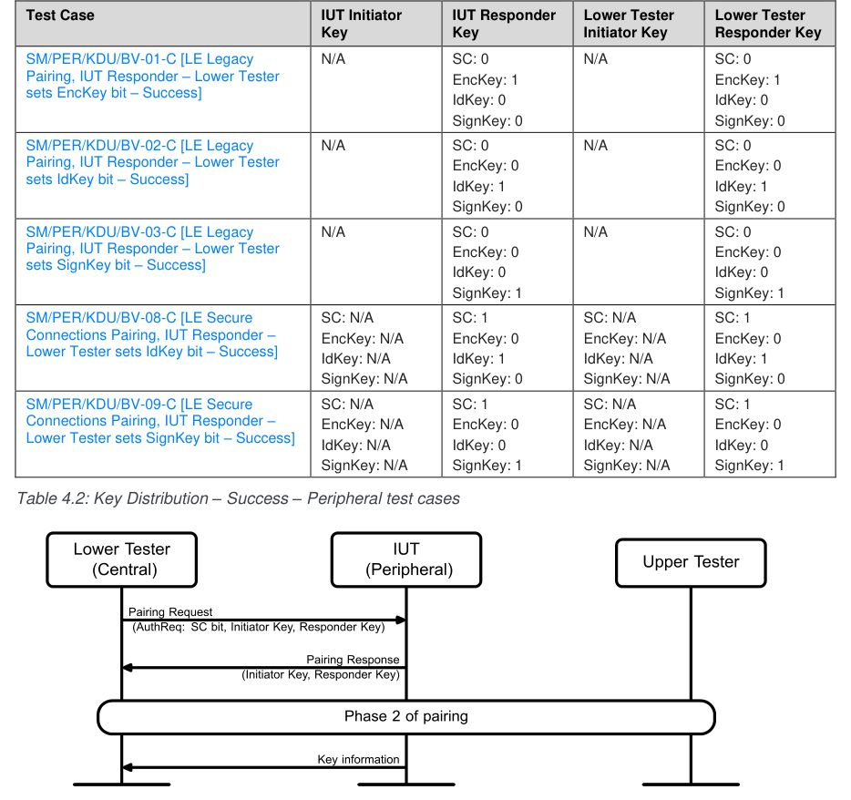
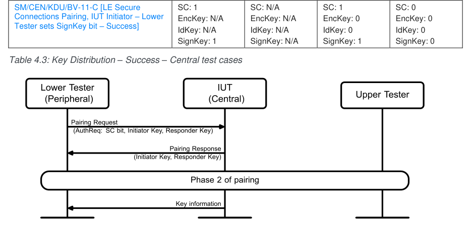
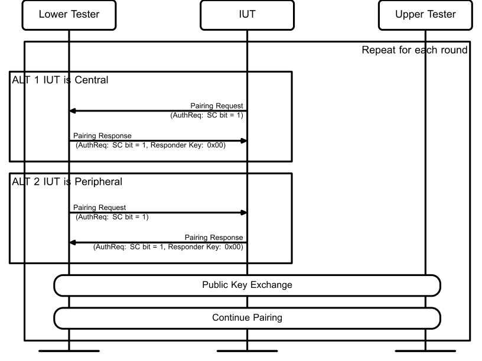
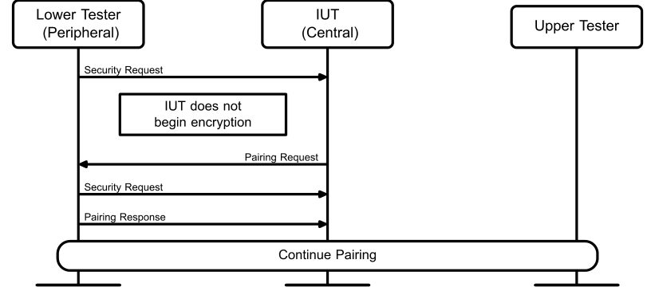

# SM.TS.p26

> Source: PDF converted via PyMuPDF.

---

Security Manager Protocol (SM)
Bluetooth® Test Suite
▪ Revision: SM.TS.p26 ▪ Revision Date: 2024-09-04 ▪ Prepared By: BTI ▪ Published during TCRL: TCRL.2024-2
This document, regardless of its title or content, is not a Bluetooth Specification as defined in the Bluetooth Patent/Copyright License Agreement (“PCLA”) and Bluetooth Trademark License Agreement. Use of this document by members of Bluetooth SIG is governed by the membership and other related agreements between Bluetooth SIG Inc. (“Bluetooth SIG”) and its members, including the PCLA and other agreements posted on Bluetooth SIG’s website located at www.bluetooth.com.
THIS DOCUMENT IS PROVIDED “AS IS” AND BLUETOOTH SIG, ITS MEMBERS, AND THEIR AFFILIATES MAKE NO REPRESENTATIONS OR WARRANTIES AND DISCLAIM ALL WARRANTIES, EXPRESS OR IMPLIED, INCLUDING ANY WARRANTY OF MERCHANTABILITY, TITLE, NON-INFRINGEMENT, FITNESS FOR ANY PARTICULAR PURPOSE, THAT THE CONTENT OF THIS DOCUMENT IS FREE OF ERRORS.
TO THE EXTENT NOT PROHIBITED BY LAW, BLUETOOTH SIG, ITS MEMBERS, AND THEIR AFFILIATES DISCLAIM ALL LIABILITY ARISING OUT OF OR RELATING TO USE OF THIS DOCUMENT AND ANY INFORMATION CONTAINED IN THIS DOCUMENT, INCLUDING LOST REVENUE, PROFITS, DATA OR PROGRAMS, OR BUSINESS INTERRUPTION, OR FOR SPECIAL, INDIRECT, CONSEQUENTIAL, INCIDENTAL OR PUNITIVE DAMAGES, HOWEVER CAUSED AND REGARDLESS OF THE THEORY OF LIABILITY, AND EVEN IF BLUETOOTH SIG, ITS MEMBERS, OR THEIR AFFILIATES HAVE BEEN ADVISED OF THE POSSIBILITY OF SUCH DAMAGES.
This document is proprietary to Bluetooth SIG. This document may contain or cover subject matter that is intellectual property of Bluetooth SIG and its members. The furnishing of this document does not grant any license to any intellectual property of Bluetooth SIG or its members.
This document is subject to change without notice.
Copyright © 2010–2024 by Bluetooth SIG, Inc. The Bluetooth word mark and logos are owned by Bluetooth SIG, Inc. Other third-party brands and names are the property of their respective owners.
Contents

## 1 Scope

This Bluetooth document contains the Test Suite Structure (TSS) and test cases to test the implementation of the Bluetooth Security Manager Protocol layer with the objective to provide a high probability of air interface interoperability between the tested implementation and other manufacturers’ Bluetooth devices.

## 2 References, definitions, and abbreviations

### 2.1 References

This document incorporates provisions from other publications by dated or undated reference. These references are cited at the appropriate places in the text, and the publications are listed hereinafter. Additional definitions and abbreviations can be found in [1] and [7].
[1] Test Strategy and Terminology Overview
[2] ICS Proforma for Bluetooth Low Energy Security Manager
[3] Specification of the Bluetooth System, Volume 3 Part A (GAP), Version 4.0 or later
[4] Specification of the Bluetooth System, Volume 3 Part A (L2CAP), Version 4.0 or later
[5] Specification of the Bluetooth System, Volume 6 Part B (Link Layer), Version 4.0 or later
[6] Implementation eXtra Information for Test (IXIT) for Security Manager
[7] Specification of the Bluetooth System, Volume 3 Part H, Security Manager (SM), Version 4.2 or later
[8] Erratum 10734: Pairing Updates
[9] Appropriate Language Mapping Tables document

### 2.2 Definitions

In this Bluetooth document, the definitions from [1] and [7] apply.
Certain terms that were identified as inappropriate have been replaced. For a list of the original terms and their replacement terms, see the Appropriate Language Mapping Tables document [9].

### 2.3 Acronyms and abbreviations

In this Bluetooth document, the definitions, acronyms, and abbreviations from [1] and [7] apply.

## 3 Test Suite Structure (TSS)

### 3.1 Test Strategy

The test objectives are to verify the functionality of the Security Manager Protocol layer within a Bluetooth Host and enable interoperability between Bluetooth Hosts on different devices. The testing approach covers mandatory and optional requirements in the specification and matches these to the support of the IUT as described in the ICS. Any defined test herein is applicable to the IUT if the ICS logical expression defined in the Test Case Mapping Table (TCMT) evaluates to true.
The test equipment provides an implementation of the Radio Controller and the parts of the Host needed to perform the test cases defined in this Test Suite. A Lower Tester acts as the IUT’s peer device and interacts with the IUT over-the-air interface. The configuration, including the IUT, needs to implement similar capabilities to communicate with the test equipment. For some test cases, it is necessary to stimulate the IUT from an Upper Tester. In practice, this could be implemented as a special test interface, a Man Machine Interface (MMI), or another interface supported by the IUT.
This Test Suite contains Valid Behavior (BV) tests complemented with Invalid Behavior (BI) tests where required. The test coverage mirrored in the Test Suite Structure is the result of a process that started with catalogued specification requirements that were logically grouped and assessed for testability enabling coverage in defined test purposes.
The Test Suite Structure is a tree with the first level representing the protocol groups.
• Protocol
- SMP Timeout
• STK Pairing Method
- Just Works
- Passkey Entry
- Out of Band
• Encryption Key Size
- Signing
▪ Central Signing
▪ Peripheral Signing
• Key Distribution and Usage
- Key Distribution During Bonding
- Re-encrypt an Encrypted Link with LTK
• Peripheral Initiated Security
• Pairing Methods using LE Secure Connections
- Just works and Numeric Comparison
- Passkey Entry
▪ Out of Band
▪ Cross Transport Key Derivation

### 3.2 Test groups

The following test groups have been defined:
• Protocol
• STK Pairing Method
• Signing
• Encryption Key Size
• Key Distribution and Usage
• Peripheral Initiated Security
• LE Secure Connections Pairing

## 4 Test cases (TC)

### 4.1 Introduction

#### 4.1.1 Test case identification conventions

Test cases are assigned unique identifiers per the conventions in [1]. The convention used here is: <spec abbreviation>/<IUT role>/<class>/<feat>/<func>/<subfunc>/<cap>/<xx>-<nn>-<y>.

|  | Identifier Abbreviation |  |  | Spec Identifier <spec abbreviation> |  |
| --- | --- | --- | --- | --- | --- |
| SM |  |  | Security Manager Protocol |  |  |
|  | Identifier Abbreviation |  |  | Role Identifier <IUT role> |  |
| CEN |  |  | Central Role |  |  |
| PER |  |  | Peripheral Role |  |  |
|  | Identifier Abbreviation |  |  | Feature Identifier <feat> |  |
| EKS |  |  | Encryption Key Size |  |  |
| JW |  |  | Just Works |  |  |
| OOB |  |  | Out Of Band |  |  |
| PIS |  |  | Peripheral Initiated Security |  |  |
| PKE |  |  | Passkey Entry |  |  |
| PROT |  |  | Protocol |  |  |
| SCCT |  |  | LE Secure Connections Cross Transport Key Derivation |  |  |
| SCJW |  |  | LE Secure Connections Numeric Comparison (including Just Works) |  |  |
| SCOB |  |  | LE Secure Connections Out-of-Band |  |  |
| SCPK |  |  | LE Secure Connections Passkey Entry |  |  |
| SIGN |  |  | Signing |  |  |

Table 4.1: SM TC feature naming conventions

#### 4.1.2 Conformance

When conformance is claimed for a particular specification, all capabilities are to be supported in the specified manner. The mandated tests from this Test Suite depend on the capabilities to which conformance is claimed.
The Bluetooth Qualification Program may employ tests to verify implementation robustness. The level of implementation robustness that is verified varies from one specification to another and may be revised for cause based on interoperability issues found in the market.
Such tests may verify:
• That claimed capabilities may be used in any order and any number of repetitions not excluded by the specification
• That capabilities enabled by the implementations are sustained over durations expected by the use case
• That the implementation gracefully handles any quantity of data expected by the use case
• That in cases where more than one valid interpretation of the specification exists, the implementation complies with at least one interpretation and gracefully handles other interpretations
• That the implementation is immune to attempted security exploits
A single execution of each of the required tests is required to constitute a Pass verdict. However, it is noted that to provide a foundation for interoperability, it is necessary that a qualified implementation consistently and repeatedly pass any of the applicable tests.
In any case, where a member finds an issue with the test plan generated by the Bluetooth SIG qualification tool, with the test case as described in the Test Suite, or with the test system utilized, the member is required to notify the responsible party via an erratum request such that the issue may be addressed.

#### 4.1.3 Pass/Fail verdict conventions

Each test case has an Expected Outcome section. The IUT is granted the Pass verdict when all the detailed pass criteria conditions within the Expected Outcome section are met.
The convention in this Test Suite is that, unless there is a specific set of fail conditions outlined in the test case, the IUT fails the test case as soon as one of the pass criteria conditions cannot be met. If this occurs, then the outcome of the test is a Fail verdict.

### 4.2 Setup preambles

The procedures defined in this section are provided for information, as they are used by test equipment in achieving the Initial Condition in certain tests.

#### 4.2.1 Security Manager Channel over L2CAP

• Reference
[5] 2.1
[7] 3.2
• Preamble Procedure
Establish an LE transport connection between the IUT and the Lower Tester.
Establish the Security Manager Channel over L2CAP fixed channel 0x0006 between the IUT and the Lower Tester over the LE transport.

### 4.3 Common Packet Contents

#### 4.3.1 Fields and Bits Reserved for Future Use

Unless a specific test states otherwise, all fields within packets and all bits within fields that are described as reserved for future use are set to 0 in packets sent by the Upper and Lower Testers.

### 4.4 Protocol

Verify the correct implementation of the SMP timeout protocol.

#### 4.4.1 SMP Timeout

SM/CEN/PROT/BV-01-C [SMP Time Out – IUT Initiator]
• Test Purpose
Verify that the IUT handles the lack of pairing response after 30 seconds when acting as initiator.
• Reference
[7] 3.4
• Initial Condition
- Preamble has been executed.
- The IUT is Central. The Lower Tester is Peripheral.
• Test Procedure
1. The IUT transmits pairing request. 2. The Lower Tester does not respond to this pairing request. 3. IUT timeout after 30 seconds and the procedure is considered to have failed. 4. The IUT reports the failure to the Upper Tester. 5. After additionally (at least) 10 seconds the Lower Tester responds to the pairing request. 6. The IUT closes the connection before receiving the delayed response or does not respond to it
when it is received.
• Expected Outcome
Pass verdict
The IUT notifies the Upper Tester after the 30 seconds timeout.
The IUT does not respond to a delayed response after the timeout, as there should be no more transactions on the channel. Alternatively, the IUT does not respond to a delayed response after the timeout.
• Notes
After the Upper Tester is alerted, the channel is not used until the link is reconnected.
SM/PER/PROT/BV-02-C [SMP Time Out – IUT Responder]
• Test Purpose
Verify that the IUT responder disconnects the link if pairing does not follow Pairing Feature Exchange within 30 seconds after receiving Pairing Request command.
• Reference
[7] 3.4
• Initial Condition
- Preamble has been executed.
- The IUT is Peripheral. The Lower Tester is Central.
• Test Procedure
1. The Lower Tester transmits Pairing Request. 2. Perform either alternative 2A or 2B depending on the IUT Pairing Methods support.
Alternative 2A (The IUT supports Pairing Methods):
2A.1 The IUT responds with Pairing Response. 2A.2 In phase 2, the Lower Tester does not issue the expected Pairing Confirm. 2A.3 The IUT times out 30 seconds after issued Pairing Response and reports the failure to the Upper Tester. 2A.4 After additionally (at least) 10 seconds, the Lower Tester issues the expected Pairing Confirm. 2A.5 The IUT closes the connection before receiving the delayed response or does not respond to it when it is received. Alternative 2B (The IUT does not support Pairing Methods):
2B.1 The IUT responds with a Pairing Failed Response with Reason set to “Pairing Not Supported”.
• Expected Outcome
Pass verdict
Alternative 2A:
The IUT notifies the Upper Tester after the 30 seconds timeout.
The IUT does not respond to a delayed Pairing Confirm after the timeout, as there should be no more transactions on the channel. Alternatively, the IUT does not respond to a delayed response after the timeout.
Alternative 2B:
The IUT fails the Pairing Request with “Pairing Not Supported”.

### 4.5 STK Pairing Method

Verify the correct implementation of the Just Works, Passkey Entry, and Out of Band pairing methods.

#### 4.5.1 Just Works

SM/CEN/JW/BV-01-C [Just Works IUT Initiator – Success]
• Test Purpose
Verify that the IUT performs the Just Works pairing procedure correctly as Central, initiator when both sides do not require MITM protection.
• Reference
[7] 2.3.5.1, 2.3.5.2, C.1, C.2.1
• Initial Condition
- Preamble has been executed.
- The IUT is Central. The Lower Tester is Peripheral.
• Test Procedure
1. The IUT transmits Pairing Request command with:
a. IO capability set to any IO capability b. OOB data flag set to 0x00 (OOB Authentication data not present) c. AuthReq Bonding Flags set to ‘00’ and the MITM flag set to ‘0’ and all the reserved bits
are set to ‘0’ 2. The Lower Tester responds with a Pairing Response command, with:
a. IO capability set to “KeyboardDisplay” b. OOB data flag set to 0x00 (OOB Authentication data not present) c. AuthReq Bonding Flags set to ‘00’, and the MITM flag set to ‘0’ and all the reserved bits
are set to ‘0’ 3. The IUT and the Lower Tester perform phase 2 of the Just Works pairing procedure and establish
an encrypted link with the key generated in phase 2.
• Expected Outcome
Pass verdict
The encryption procedure initiated by the IUT completes successfully.
The IUT can encrypt the link successfully.
SM/PER/JW/BV-02-C [Just Works IUT Responder – Success]
• Test Purpose
Verify that the IUT is able to perform the Just Works pairing procedure correctly when acting as Peripheral, responder.
• Reference
[7] 2.3.5.2, 2.4.6, C.1, C.2.1
• Initial Condition
- Preamble has been executed.
- The IUT is Peripheral. The Lower Tester is Central.
• Test Procedure
1. The Lower Tester transmits Pairing Request command with:
a. IO capability set to “NoInputNoOutput” b. OOB data flag set to 0x00 (OOB Authentication data not present) c. MITM flag set to ‘0’ and all reserved bits are set to ‘0’ 2. The IUT responds with a Pairing Response command, with:
a. IO capability set to any IO capability b. OOB data flag set to 0x00 (OOB Authentication data not present) 3. The IUT and the Lower Tester perform phase 2 of the Just Works pairing and establish an
encrypted link with the generated STK.
• Expected Outcome
Pass verdict
The encryption procedure initiated by the Central completes successfully.
The Central can encrypt the link successfully.
• Test Purpose
Verify that the IUT is able to perform the Just Works pairing procedure when receiving additional bits set in the AuthReq flag. Reserved For Future Use bits are correctly handled when acting as Peripheral, responder.
• Reference
[7] 2.3.5.2, 2.4.6, C.1, C.2.1
• Initial Condition
- Preamble has been executed.
- The IUT is Peripheral. The Lower Tester is Central.
• Test Procedure
1. The Lower Tester transmits Pairing Request command with:
a. IO Capability set to “NoInputNoOutput” b. OOB data flag set to 0x00 (OOB Authentication data not present) c. MITM set to ‘0’ and all reserved bits are set to ‘1’ 2. The IUT responds with a Pairing Response command, with:
a. IO Capability set to any IO capability b. OOB data flag set to 0x00 (OOB Authentication data not present) c. All reserved bits are set to ‘0’ 3. The IUT and the Lower Tester perform phase 2 of the Just Works pairing and establish an
encrypted link with the generated STK.
• Expected Outcome
Pass verdict
The encryption procedure initiated by the Lower Tester completes successfully.
The Lower Tester can encrypt the link successfully.
SM/CEN/JW/BV-05-C [Just Works, IUT Initiator – Pairing Failed]
• Test Purpose
Verify that the IUT handles Just Works pairing failures.
• Reference
[7] 3.5.5
• Initial Condition
- Preamble has been executed.
- The IUT is Central. The Lower Tester is Peripheral.
• Test Procedure
1. The IUT transmits Pairing Request command with:
a. IO capability is set to any IO capability b. OOB data flag set to 0x00 (OOB Authentication data not present) c. All reserved bits are set to ‘0’
(Authentication Requirements). 3. The pairing process is aborted. The IUT reports the failure to the Upper Tester.
Run preamble to re-establish Initial Condition.
4. Execute step 1. 5. The Lower Tester responds with a Pairing Failed command with reason code ‘0x08’ (Unspecified
Reason). 6. The pairing process is aborted. The IUT reports the failure to the Upper Tester.
Run preamble to re-establish Initial Condition.
7. Execute step 1. 8. The Lower Tester responds with a Pairing Failed command with reason code ‘0x05’ (Pairing Not
Supported). 9. The pairing process is aborted. The IUT reports the failure to the Upper Tester.
Run preamble to re-establish Initial Condition.
10. Execute step 1. 11. The Lower Tester responds with a Pairing Failed command with reason code ‘0x09’ (Repeated
Attempts). 12. The pairing process is aborted. The IUT reports the failure to the Upper Tester.
• Expected Outcome
Pass verdict
For each pairing failure, the IUT detects the failures reported by the responder and responds correctly to the Lower Tester.
For each pairing failure, the IUT aborts the pairing process and reports the failure to the Upper Tester.
SM/CEN/JW/BI-04-C [Just Works IUT Initiator – Handle AuthReq flag RFU correctly]
• Test Purpose
Verify that the IUT is able to perform the Just Works pairing procedure when receiving additional bits set in the AuthReq flag. Reserved For Future Use bits are correctly handled when acting as Central, initiator.
• Reference
[7] 2.3.5.2, 2.4.6, C.1, C.2.1
• Initial Condition
- Preamble has been executed.
- The IUT is Central. The Lower Tester is Peripheral.
• Test Procedure
1. The IUT transmits a Pairing Request command with:
a. IO Capability set to any IO Capability b. OOB data flag set to 0x00 (OOB Authentication data not present) c. All reserved bits are set to ‘0’. For the purposes of this test the Secure Connections bit
and the Keypress bits in the AuthReq bonding flag set by the IUT are ignored by the Lower Tester.
a. IO Capability set to “NoInputNoOutput” b. OOB data flag set to 0x00 (OOB Authentication data not present) c. AuthReq bonding flag set to the value indicated in the IXIT [6] for ‘Bonding Flags’ and the
MITM flag set to ‘0’ and all reserved bits are set to ‘1’. The SC and Keypress bits in the AuthReq bonding flag are set to 0 by the Lower Tester for this test. 3. The IUT and the Lower Tester perform phase 2 of the Just Works pairing and establish an
encrypted link with the generated STK.
• Expected Outcome
Pass verdict
The encryption procedure initiated by the IUT completes successfully.
The link is encrypted successfully.
SM/CEN/JW/BI-01-C [Just Works, IUT Initiator – Failure]
• Test Purpose
Verify that the IUT handles Just Works pairing failure as initiator correctly.
• Reference
[7] 2.3.5.1, 2.3.5.2, C.5.7
• Initial Condition
- Preamble has been executed.
- The IUT is Central. The Lower Tester is Peripheral.
• Test Procedure
1. The IUT transmits a Pairing Request command with:
a. IO capability is set to any IO capability b. OOB data flag set to 0x00 (OOB Authentication data not present) c. All reserved bits are set to ‘0’ 2. The Lower Tester responds with a Pairing Response command with:
a. IO capability set to “NoInputNoOutput” b. OOB data flag set to 0x00 (OOB Authentication data not present) c. AuthReq Bonding Flags set to ‘01’ and the MITM flag set to ‘0’ and all reserved bits are
set to ‘0’ 3. During phase 2 of the pairing procedure, the Lower Tester transmits a Pairing Confirm command
with an incorrect LP_CONFIRM_S value. 4. The IUT transmits a Pairing Failed command with Reason set to ‘Confirm Value Failed’ after
receiving the LP_RAND_R and detecting the LP_CONFIRM_S is incorrect. 5. The Lower Tester disconnects the link.
• Expected Outcome
Pass verdict
The IUT detects the incorrect confirm values and responds to the Lower Tester accordingly.
• Test Purpose
Verify that the IUT handles Just Works pairing failure as responder correctly.
• Reference
[7] 2.3.5.1, 2.3.5.2
• Initial Condition
- Preamble has been executed.
- The IUT is Peripheral. The Lower Tester is Central.
• Test Procedure
1. The Lower Tester transmits a Pairing Request command with:
a. IO capability set to “NoInputNoOutput” b. OOB data flag set to 0x00 (OOB Authentication data not present) c. AuthReq bonding flag set to ‘01’, and the MITM flag set to ‘0’ and all reserved bits are set
to ‘0’ 2. The IUT responds with a Pairing Response command, with:
a. IO capability set to any IO capability b. OOB data flag set to 0x00 (OOB Authentication data not present) c. All reserved bits are set to ‘0’ 3. During phase 2 of the Just Works pairing procedure, the Lower Tester transmits a Pairing
Confirm command with an incorrect LP_CONFIRM_I Value. 4. The IUT transmits a Pairing Failed command with Reason set to ‘Confirm Value Failed’ after
receiving the LP_RAND_I and detecting the LP_CONFIRM_I is incorrect.
• Expected Outcome
Pass verdict
The IUT detects the incorrect confirm value responds correctly to the Lower Tester.

#### 4.5.2 Passkey Entry (PKE)

SM/CEN/PKE/BV-01-C [Passkey Entry, IUT Initiator – Success]
• Test Purpose
Verify that the IUT performs the Passkey Entry pairing procedure correctly as initiator.
• Reference
[7] 2.3.5.3, C.2.1.2
• Initial Condition
- Preamble has been executed.
- The IUT is Central. The Lower Tester is Peripheral.
• Test Procedure
1. The IUT transmits a Pairing Request command with:
a. IO capability set to “DisplayOnly” or “DisplayYesNo” or “KeyboardOnly” or
“KeyboardDisplay” b. OOB data flag set to 0x00 (OOB Authentication data not present) 2. The Lower Tester responds with a Pairing Response command, with:
a. IO capability set to “KeyboardOnly” b. OOB data flag set to 0x00 (OOB Authentication data not present) c. AuthReq bonding flag set to ‘00’, and the MITM flag set to ‘1’ and all reserved bits are set
to ‘0’ 3. During the phase 2 pairing, the IUT displays the 6-digit passkey while the Lower Tester prompts
user to enter the 6-digit passkey. If the IUT IO capabilities are “KeyboardOnly” the passkey is not displayed and both the IUT and the Lower Tester enter the same 6-digit passkey. 4. The IUT and the Lower Tester use the same 6-digit passkey. 5. The IUT and the Lower Tester perform phase 2 of the Passkey Entry pairing procedure and
establish an encrypted link with the key generated in phase 2.
• Expected Outcome
Pass verdict
The IUT can encrypt the link successfully.
SM/PER/PKE/BV-02-C [Passkey Entry, IUT Responder – Success]
• Test Purpose
Verify that the IUT performs the Passkey Entry pairing procedure correctly as responder.
• Reference
[7] 2.3.5.3, C.2.1.2
• Initial Condition
- Preamble has been executed.
- The IUT is Peripheral. The Lower Tester is Central.
• Test Procedure
1. The Lower Tester initiates a Pairing Request command with:
a. IO capability set to “KeyboardDisplay” b. OOB data flag set to 0x00 (OOB Authentication data not present) c. AuthReq bonding flag set to the value indicated in the IXIT [6] for ‘Bonding Flags’, and
the MITM flag set to ‘1’ and all reserved bits are set to ‘0’ 2. The IUT responds with a Pairing Response command, with:
a. IO capability set to “KeyboardOnly” or “KeyboardDisplay” or “DisplayYesNo” or
“DisplayOnly” b. OOB data flag set to 0x00 c. All reserved bits are set to ‘0’ 3. During the phase 2 passkey pairing process, the Lower Tester displays the 6-digit passkey while
the IUT prompts user to enter the 6-digit passkey. If the IO capabilities of the IUT are “DisplayYesNo” or “DisplayOnly” the IUT displays the 6-digit passkey while the Lower Tester enters the 6-digit passkey.
4. The IUT and the Lower Tester use the same pre-defined 6-digit passkey. 5. The IUT and the Lower Tester perform phase 2 of the LE pairing and establish an encrypted link
with the key generated in phase 2.
• Expected Outcome
Pass verdict
The Central can encrypt the link successfully.
SM/CEN/PKE/BV-04-C [Passkey Entry, IUT Initiator – results in Unauthenticated Success]
• Test Purpose
Verify that the IUT performs the Passkey Entry pairing procedure correctly as initiator and pairing is successful if the Lower Tester only supports IO capabilities resulting in an Unauthenticated key.
• Reference
[7] 2.3.5.1, C.2.1.1
• Initial Condition
- Preamble has been executed.
- The IUT is Central. The Lower Tester is Peripheral.
• Test Procedure
1. The IUT transmits a Pairing Request command with:
a. IO capability set to “DisplayOnly” or “DisplayYesNo” or “KeyboardOnly” or
“KeyboardDisplay” b. OOB data flag set to 0x00 (OOB Authentication data not present) c. All reserved bits are set to ‘0’ 2. The Lower Tester responds with a Pairing Response command, with:
a. IO capability set to “NoInputNoOutput” b. OOB data flag set to 0x00 (OOB Authentication data not present) c. AuthReq bonding flag set to the value indicated in the IXIT [6] for ‘Bonding Flags’, and
the MITM flag set to ‘0’ and all reserved bits set to ‘0’ 3. The IUT and the Lower Tester perform phase 2 of the Just Works pairing and establish an
encrypted link with the generated STK.
• Expected Outcome
Pass verdict
The IUT can encrypt the link successfully.
SM/PER/PKE/BV-05-C [Passkey Entry, IUT Responder – Lower Tester has insufficient security for Passkey Entry]
• Test Purpose
Verify that the IUT that supports the Passkey Entry pairing procedure as responder correctly handles an initiator with insufficient security to result in an Authenticated key, yielding an unauthenticated key.
• Reference
[7] 2.3.5.1, C.2.1.1
• Initial Condition
- Preamble has been executed.
- The IUT is Peripheral. The Lower Tester is Central.
• Test Procedure
1. The Lower Tester initiates a Pairing Request command with:
a. IO capability set to “NoInputNoOutput” b. OOB data flag set to 0x00 (OOB Authentication data not present) c. AuthReq bonding flag set to ‘00’, and the MITM flag set to ‘0’ and all reserved bits are set
to ‘0’ 2. The IUT responds with a Pairing Response command, with:
a. IO capability set to “KeyboardOnly” or “KeyboardDisplay” or “DisplayYesNo” or
“DisplayOnly” b. OOB data flag set to 0x00 and the MITM flag set to ‘1’ and all reserved bits are set to ‘0’ c. Alternatively, the IUT may respond with Pairing Failed command with reason code set to
‘Authentication Requirements’. 3. The IUT and the Lower Tester perform phase 2 of the Just Works pairing and establish an
encrypted link with the generated STK.
• Expected Outcome
Pass verdict
The Central can encrypt the link successfully.
ALT: The IUT responds with Pairing Failed command with reason code set to ‘Authentication Requirements’.
SM/CEN/PKE/BI-01-C [Passkey Entry, IUT Initiator – Failure on Responder Side]
• Test Purpose
Verify that the IUT handles the invalid Passkey Entry pairing procedure correctly as initiator.
• Reference
[7] 2.3.5.3, C.2.1.2
• Initial Condition
- Preamble has been executed.
- The IUT is Central. The Lower Tester is Peripheral.
• Test Procedure
1. The IUT transmits a Pairing Request command with:
a. IO capability set to “DisplayOnly” or “DisplayYesNo” or “KeyboardOnly” or
“KeyboardDisplay” b. OOB data flag set to 0x00 and all the reserved bits are set to ‘0’ 2. The Lower Tester responds with a Pairing Response command, with:
a. IO capability set to “KeyboardOnly” b. OOB data flag set to 0x00 and MITM bit set to ‘1’ 3. During the phase 2 pairing, the IUT displays the 6-digit passkey while the Lower Tester enters a
different 6-digit passkey. If the IUT IO capabilities are “KeyboardOnly” then both the IUT and the Lower Tester enter different passkeys.
4. The IUT and the Lower Tester perform phase 2 of the LE pairing. 5. The Lower Tester transmits ‘Pairing Random’ (LP_RAND_R) command even though the passkey
entry was incorrect. 6. The IUT responds with ‘Pairing Failed’ command.
• Expected Outcome
Pass verdict
The IUT detects that the ‘Pairing Random’ value from the Lower Tester is incorrect and sends ‘Pairing Failed’ command to the Lower Tester.
SM/CEN/PKE/BI-02-C [Passkey Entry, IUT Initiator – Interrupted passkey entry by Responder Side]
• Test Purpose
Verify that the IUT handles the interrupted passkey entry by the responder.
• Reference
[7] 2.3.5.3, C.2.1.2
• Initial Condition
- Preamble has been executed.
- The IUT is Central. The Lower Tester is Peripheral.
• Test Procedure
1. The IUT transmits a Pairing Request command with:
a. IO capability set to “DisplayOnly” or “DisplayYesNo” or “KeyboardOnly” or
“KeyboardDisplay” b. OOB data flag set to 0x00 and all reserved bits are set to ‘0’ 2. The Lower Tester responds with a Pairing Response command, with:
a. IO capability set to “KeyboardOnly” b. OOB data flag set to 0x00 and MITM bit set to ‘1’ and all the reserved bits are set to ‘0’ 3. During the phase 2 pairing, if IO capability is set to “DisplayOnly”, “DisplayYesNo” or
“KeyboardDisplay” the IUT displays the 6-digit passkey. If the IUT IO capabilities are “KeyboardOnly” the passkey is not displayed and both the IUT and the Lower Tester enter the same 6-digit passkey. 4. Emulating interrupted passkey entry the Lower Tester issues a Pairing Failed command with
reason code set to ‘0x01’ (Passkey Entry Failed). 5. The pairing process is aborted. The IUT reports the failure to the Upper Tester.
• Expected Outcome
Pass verdict
The IUT detects the Pairing Failed from the Lower Tester and reports the failure to the Upper Tester.
• Test Purpose
Verify that the IUT handles the invalid passkey entry pairing procedure correctly as responder.
• Reference
[7] 2.3.5.3, C.2.1.2
• Initial Condition
- Preamble has been executed.
- The IUT is Peripheral. The Lower Tester is Central.
• Test Procedure
1. The Lower Tester initiates a Pairing Request command with:
a. IO capability set to “KeyboardOnly” b. OOB data flag set to 0x00 and MITM bit set to ‘1’ and all the reserved bits are set to ‘0’ 2. The IUT responds with a Pairing Response command, with:
a. IO capability set to “DisplayOnly” or “DisplayYesNo” or “KeyboardDisplay” or
“KeyboardOnly” b. OOB data flag set to 0x00 and all the reserved bits are set to ‘0’ 3. The IUT and the Lower Tester use different 6-digit passkey. 4. During the phase 2 pairing, the IUT displays 6-digit passkey while the Lower Tester enters
different 6-digit passkey. If the IUT IO capabilities are “KeyboardOnly” the passkey is not displayed and the IUT and the Lower Tester enter different 6-digit passkeys. 5. The IUT and the Lower Tester perform phase 2 of the LE pairing.
• Expected Outcome
Pass verdict
The IUT detects the ‘Pairing Confirm’ value from the Lower Tester is incorrect and sends ‘Pairing Failed’ command to the Lower Tester.

#### 4.5.3 Out of Band (OOB)

SM/CEN/OOB/BV-01-C [IUT Initiator – Both sides have OOB data – Success]
• Test Purpose
Verify that the IUT performs the OOB pairing procedure correctly as initiator.
• Reference
[7] 2.3.5.4, C.2.1.3
• Initial Condition
- Preamble has been executed.
- The IUT is Central. The Lower Tester is Peripheral.
• Test Procedure
1. The IUT transmits a Pairing Request command with OOB data flag set to 0x01. 2. The Lower Tester responds with a Pairing Response command with OOB data flag set to 0x01. 3. The IUT and the Lower Tester use the same 128-bit value as OOB data.
link with the key generated in phase 2.
• Expected Outcome
Pass verdict
The IUT can encrypt the link successfully.
• Notes
OOB data are exchanged out of band.
SM/PER/OOB/BV-02-C [IUT Responder – Both sides have OOB data – Success]
• Test Purpose
Verify that the IUT performs the OOB pairing procedure correctly as responder.
• Reference
[7] 2.3.5.3, C.2.1.2
• Initial Condition
- Preamble has been executed.
- The IUT is Peripheral. The Lower Tester is Central.
• Test Procedure
1. The Lower Tester initiates a Pairing Request command with OOB data flag set to 0x01. 2. The IUT responds with a Pairing Response command with OOB data flag set to 0x01. 3. The IUT and the Lower Tester use the same 128 bit value as OOB data. 4. The IUT and the Lower Tester perform phase 2 of the LE pairing and establish an encrypted link
with the key generated in phase 2.
• Test Condition
The IUT and the Lower Tester use the same OOB data values in this test case.
• Expected Outcome
Pass verdict
The Central can encrypt the link successfully.
SM/CEN/OOB/BV-03-C [IUT Initiator – Only IUT has OOB data – Success]
• Test Purpose
Verify that the IUT performs pairing correctly as initiator if the responder does not have OOB data.
• Reference
[7] 2.3.5.3, C.2.1.2
• Initial Condition
- Preamble has been executed.
- The IUT is Central. The Lower Tester is Peripheral.
• Test Procedure
1. The IUT transmits a Pairing Request command with:
a. IO capability set to “DisplayOnly” or “DisplayYesNo” or “KeyboardOnly” or
“KeyboardDisplay” b. OOB data flag set to 0x01 2. The Lower Tester responds with a Pairing Response command, with:
a. IO capability set to “KeyboardOnly” b. OOB data flag set to 0x00 and MITM bit set to ‘1’ 3. The IUT generates a random 6-digit passkey between 000,000 and 999,999. 4. During the phase 2 pairing, the IUT displays the 6-digit passkey while the Lower Tester enters the
same 6-digit passkey. If the IUT IO capabilities are “KeyboardOnly” the passkey is not displayed and both the IUT and the Lower Tester enter the same 6-digit passkey. 5. The IUT and the Lower Tester perform phase 2 of the LE pairing and establish an encrypted link
with the key generated in phase 2.
• Expected Outcome
Pass verdict
The IUT can encrypt the link successfully.
SM/PER/OOB/BV-04-C [IUT Responder – Only IUT has OOB data – Success]
• Test Purpose
Verify that the IUT performs the pairing procedure correctly as responder if only the IUT has OOB data.
• Reference
[7] 2.3.5.3, C.2.1.2
• Initial Condition
- Preamble has been executed.
- The IUT is Peripheral. The Lower Tester is Central.
• Test Procedure
1. The Lower Tester initiates a Pairing Request command with:
a. IO capability set to “KeyboardDisplay” b. OOB data flag set to 0x00 and MITM bit set to ‘1’ 2. The IUT responds with a Pairing Response command, with:
a. IO capability set to “KeyboardOnly” or “KeyboardDisplay” or “DisplayOnly” or
“DisplayYesNo” b. OOB data flag set to 0x01 and MITM bit set to ‘1’ 3. The Lower Tester has a pre-defined 6-digit passkey. 4. During the phase 2 pairing, the Lower Tester displays the 6-digit passkey while the user of the
IUT enters the same 6-digit passkey. If the IO capabilities of the IUT are “DisplayYesNo” or “DisplayOnly” the IUT displays the 6-digit passkey while the Lower Tester enters the 6-digit passkey. 5. The IUT and the Lower Tester perform phase 2 of the LE pairing and establish an encrypted link
with the key generated in phase 2.
• Expected Outcome
Pass verdict
The Central can encrypt the link successfully.
SM/CEN/OOB/BV-05-C [IUT Initiator – Only Lower Tester has OOB data – Success]
• Test Purpose
Verify that the IUT performs the OOB pairing procedure correctly as initiator if only the Lower Tester has OOB data.
• Reference
[7] 2.3.5.3, C.2.1.2
• Initial Condition
- Preamble has been executed.
- The IUT is Central. The Lower Tester is Peripheral.
• Test Procedure
1. The IUT transmits a Pairing Request command with:
a. IO capability set to “DisplayOnly” or “DisplayYesNo”, or “KeyboardOnly” or
“KeyboardDisplay” b. OOB data flag set to 0x00 2. The Lower Tester responds with a Pairing Response command, with:
a. IO capability set to “KeyboardOnly” b. OOB data flag set to 0x01 and MITM bit set to ‘1’ 3. The IUT generates a random pre-defined 6-digit passkey between 000,000 and 999,999 and
begins phase 2 pairing. 4. During the phase 2 pairing, the IUT displays the 6-digit passkey while the Lower Tester enters the
same 6-digit passkey. If the IUT has IO capabilities set to “KeyboardOnly” the passkey is not displayed and both initiator and responder input the same 6-digit passkey. 5. The IUT and the Lower Tester perform phase 2 of the LE pairing and establish an encrypted link
with the key generated in phase 2.
• Expected Outcome
Pass verdict
The IUT can encrypt the link successfully.
SM/PER/OOB/BV-06-C [IUT Responder – Only Lower Tester has OOB data – Success]
• Test Purpose
Verify that the IUT performs the pairing procedure correctly as responder if only the Lower Tester has OOB data.
• Reference
[7] 2.3.5.3, C.2.1.2
• Initial Condition
- Preamble has been executed.
- The IUT is Peripheral. The Lower Tester is Central.
• Test Procedure
1. The Lower Tester initiates a Pairing Request command with:
a. IO capability set to “KeyboardDisplay”. b. AuthReq bonding flag set to the value indicated in the IXIT [6] for ‘Bonding Flags’, and
the MITM flag set to ‘1’ and all reserved bits are set to ‘0’. c. OOB data flag set to 0x01. 2. The IUT responds with a Pairing Response command, with:
a. IO capability set to “KeyboardOnly” or “KeyboardDisplay” or “DisplayOnly” or
“DisplayYesNo” b. OOB data flag set to 0x00 3. Alternatively, the IUT may respond with Pairing Failed command with reason code set to ‘OOB
Not Available’ or ‘Authentication Requirements’. 4. The Lower Tester has a pre-defined 6-digit passkey. 5. During the phase 2 pairing, the Lower Tester displays the 6-digit passkey while the user of the
IUT enters the same 6-digit passkey. 6. The IUT and the Lower Tester perform phase 2 of the LE pairing and establish an encrypted link
with the key generated in phase 2. If the IO capabilities of the IUT are “DisplayYesNo” or “DisplayOnly” the IUT displays the 6-digit passkey while the Lower Tester enters the 6-digit passkey.
• Expected Outcome
Pass verdict
The Central can encrypt the link successfully.
ALT: The IUT responds with Pairing Failed, with reason code set to ‘OOB Not Available’ or ‘Authentication Requirements’.
SM/CEN/OOB/BV-07-C [IUT Initiator – Only Lower Tester has OOB data – Unauthenticated Success]
• Test Purpose
Verify that the IUT performs the OOB pairing procedure correctly as initiator if only the Lower Tester has OOB data and the IUT does not require MITM protection.
• Reference
[7] 2.3.5.1, C.2.1.1
• Initial Condition
- Preamble has been executed.
- The IUT is Central. The Lower Tester is Peripheral.
• Test Procedure
1. The IUT transmits a Pairing Request command with:
a. IO capability set to any IO capability b. OOB data flag set to 0x00
a. IO capability set to “NoInputNoOutput” b. OOB data flag set to 0x01 and MITM bit set to ‘0’ 3. The IUT and the Lower Tester perform phase 2 of the Just Works pairing procedure and establish
an encrypted link with the key generated in phase 2.
• Expected Outcome
Pass verdict
The IUT can encrypt the link successfully.
SM/PER/OOB/BV-08-C [IUT Responder – Only Lower Tester has OOB data – Lower Tester also supports Just Works]
• Test Purpose
Verify that the IUT performs the pairing procedure correctly as responder if only the Lower Tester has OOB data and supports the Just Works pairing method.
• Reference
[7] 2.3.5.1, C.2.1.1
• Initial Condition
- Preamble has been executed.
- The IUT is Peripheral. The Lower Tester is Central.
• Test Procedure
1. The Lower Tester initiates a Pairing Request command with:
a. IO capability set to “NoInputNoOutput” b. OOB data flag set to 0x01 and MITM bit set to ‘0’ 2. The IUT responds with a Pairing Response command, with:
a. IO capability set to any IO capability b. OOB data flag set to 0x00 3. Alternatively, the IUT may respond with Pairing Failed command with reason code set to ‘OOB
Not Available’ or ‘Authentication Requirements’. 4. The IUT and the Lower Tester perform phase 2 of the Just Works pairing and establish an
encrypted link with the generated STK.
• Expected Outcome
Pass verdict
The Central can encrypt the link successfully.
ALT: The IUT responds with Pairing Failed with reason code set to ‘OOB Not Available’ or ‘Authentication Requirements’.
• Test Purpose
Verify that the IUT performs pairing correctly as initiator if the responder does not have OOB data and the IUT does not require MITM protection.
• Reference
[7] 2.3.5.1, C.2.1.1
• Initial Condition
- Preamble has been executed.
- The IUT is Central. The Lower Tester is Peripheral.
• Test Procedure
1. The IUT transmits a Pairing Request command with:
a. IO capability set to any IO capability b. OOB data flag set to 0x01 2. The Lower Tester responds with a Pairing Response command ,with:
a. IO capability set to “NoInputNoOutput” b. OOB data flag set to 0x00 and MITM bit set to ‘0’ 3. The IUT and the Lower Tester perform phase 2 of the Just Works pairing procedure and establish
an encrypted link with the key generated in phase 2.
• Expected Outcome
Pass verdict
The IUT can encrypt the link successfully.
SM/PER/OOB/BV-10-C [IUT Responder – Only IUT has OOB data – Lower Tester also supports Just Works]
• Test Purpose
Verify that the IUT performs the pairing procedure correctly as responder if only the IUT has OOB data and the Lower Tester supports the Just Works pairing method.
• Reference
[7] 2.3.5.1, C.2.1.1
• Initial Condition
- Preamble has been executed.
- The IUT is Peripheral. The Lower Tester is Central.
• Test Procedure
1. The Lower Tester initiates a Pairing Request command with:
a. IO capability set to “NoInputNoOutput” b. OOB data flag set to 0x00 and MITM bit set to ‘0’ 2. The IUT responds with a Pairing Response command, with:
a. IO capability set to any IO capability b. OOB data flag set to 0x01
‘Authentication Requirements’. 4. The IUT and the Lower Tester perform phase 2 of the Just Works pairing and establish an
encrypted link with the generated STK.
• Expected Outcome
Pass verdict
The Central encrypts the link successfully or in the alternate case the IUT responds with the Pairing Failed commend with the reason code set to ‘Authentication Requirements’.
SM/CEN/OOB/BI-01-C [IUT Initiator – Both sides have different OOB data – Failure]
• Test Purpose
Verify that the IUT initiates OOB pairing procedure and handles the failure correctly.
• Reference
[7] 2.3.5.3, C.2.1.2
• Initial Condition
- Preamble has been executed.
- The IUT and the Lower Tester have different 128 bit OOB data.
- The IUT is Central. The Lower Tester is Peripheral.
• Test Procedure
1. The IUT transmits Pairing Request command with OOB data flag set to0x01 and its MITM bit set
to ‘1’. 2. The Lower Tester responds with a Pairing Response command, with OOB data flag to set 0x01
and MITM bit set to ‘1’. 3. The IUT detects the mismatch of confirm value. The IUT sends Pairing Failed and the Lower
Tester initiates disconnect.
• Expected Outcome
Pass verdict
The IUT detects the mismatch of confirm value, sends ‘Pairing Failed’ and the Lower Tester disconnects the link.
SM/PER/OOB/BI-02-C [IUT Responder – Both sides have different OOB data – Failure]
• Test Purpose
Verify that the IUT responds to OOB pairing procedure and handles the failure correctly.
• Reference
[7] 2.3.5.3, C.2.1.2
• Initial Condition
- Preamble has been executed.
- The IUT is Peripheral. The Lower Tester is Central.
- The IUT OOB data can be anything but the same value as the OOB data in the Lower Tester.
• Test Procedure
1. The Lower Tester initiates Pairing Request command with OOB data flag set to 0x01 and its
MITM bit set to ‘1’. 2. The IUT responds with Pairing Response command with OOB data flag set to 0x01 and MITM bit
set to ‘1’. 3. The IUT detects the mismatch of confirm value, sends Pairing Failed and notifies the Upper
Tester.
• Expected Outcome
Pass verdict
The IUT detects the mismatch of confirm value and notifies the Upper Tester.

### 4.6 Encryption Key Size

Verify the correct implementation of the encryption key size negotiation procedure.

#### 4.6.1 Encryption Key Size Negotiation

SM/CEN/EKS/BV-01-C [IUT initiator, Lower Tester Maximum Encryption Key Size = Min_Encryption_Key_Length]
• Test Purpose
Verify that the IUT uses correct key size during encryption as initiator.
• Reference
[7] 2.3.4
• Initial Condition
- Preamble has been executed.
- The IUT is Central. The Lower Tester is Peripheral.
• Test Procedure
1. The IUT transmits pairing request. 2. The Lower Tester responds with Pairing Response command with Maximum Encryption Key Size
field set to Min_Encryption_Key_Length’. 3. The IUT and the Lower Tester perform phase 2 of the LE pairing and establish an encrypted link
with the key generated in phase 2. 4. The Lower Tester disconnects the connection. 5. The Upper Tester initiates a connection with the Lower Tester. 6. The IUT and the Lower Tester create a connection. 7. The Upper Tester initiates encryption with the Lower Tester. 8. The IUT and the Lower Tester encrypt the connection using the LTK.
• Expected Outcome
Pass verdict
The IUT can encrypt the link successfully.
In step 8, the connection is encrypted using the LTK.
• Notes
The value of Min_Encryption_Key_Length is specified in the IXIT [6].
SM/PER/EKS/BV-02-C [IUT Responder, Lower Tester Maximum Encryption Key Size = Min_Encryption_Key_Length]
• Test Purpose
Verify that the IUT uses correct key size during encryption as responder.
• Reference
[7] 2.3.4
• Initial Condition
- Preamble has been executed.
- The IUT is Peripheral. The Lower Tester is Central.
• Test Procedure
1. The Lower Tester initiates Pairing Request command with Maximum Encryption Key Size field set
to Min_Encryption_Key_Length’. 2. The IUT responds with Pairing Response command. 3. The IUT and the Lower Tester perform phase 2 of the LE pairing and establish an encrypted link
with the key generated in phase 2. 4. The Lower Tester disconnects the connection. 5. The Lower Tester initiates a connection with the IUT. 6. After the connection is completed, the Lower Tester initiates encryption with the IUT using the
LTK. 7. The IUT and the Lower Tester successfully encrypt the connection.
• Expected Outcome
Pass verdict
The Lower Tester can encrypt the link successfully.
In step 7, the connection is encrypted using the LTK.
• Notes
The value of Min_Encryption_Key_Length is specified in the IXIT [6].
SM/CEN/EKS/BI-01-C [IUT initiator, Lower Tester Maximum Encryption Key Size < Min_Encryption_Key_Length]
• Test Purpose
Verify that the IUT checks that the resultant encryption key size is not smaller than the minimum key size.
• Reference
[7] 2.3.4
• Initial Condition
- Preamble has been executed.
- The IUT is Central. The Lower Tester is Peripheral.
• Test Procedure
1. The IUT transmits a Pairing Request command. 2. The Lower Tester responds with a Pairing Response command with Maximum Encryption Key
Size field set to Min_Encryption_Key_Length -1. The value of Min_Encryption_Key_Length used should be determined by the value supported on the IUT and given by IXIT [6] value. 3. The IUT transmits the Pairing Failed command.
• Expected Outcome
Pass verdict
- The IUT transmits Pairing Failed command.
- If the IUT supports a value of Min_Encryption_Key_Length greater than the minimum defined value for the encryption key length parameter in the specification, the IUT transmits the Pairing Failed comment with error code “Encryption Key Size”.
- If the IUT supports only the minimum defined values for the encryption key length parameter in the specification, the IUT transmits the Pairing Failed command and may respond with error code “Invalid Parameters”.
SM/PER/EKS/BI-02-C [IUT Responder, Lower Tester Maximum Encryption Key Size < Min_Encryption_Key_Length]
• Test Purpose
Verify that the IUT uses correct key size during encryption as responder.
• Reference
[7] 2.3, 2.3.4
• Initial Condition
- Preamble has been executed.
- The IUT is Peripheral. The Lower Tester is Central.
• Test Procedure
1. The Lower Tester initiates Pairing Request command with Maximum Encryption Key Size field set
to Min_Encryption_Key_Length-1. 2. The IUT transmits the Pairing Failed command.
• Expected Outcome
Pass verdict
The IUT detects that encryption key size is smaller than the minimum key size parameter for the IUT and responds with Pairing Failed command.
If the IUT supports a value of Maximum Encryption Key Size greater than the minimum defined value for the encryption key length parameter in the Specification the IUT transmits the Pairing Failed command with error code “Encryption Key Size”.
If the IUT supports only the minimum defined value for the encryption key length parameter the IUT transmits the Pairing Failed command and may respond with error code “Invalid Parameters”.

### 4.7 Signing

Verify the correct implementation of the generation and verification of MAC with signed data.

#### 4.7.1 Signing of Data

SM/CEN/SIGN/BV-01-C [IUT transfers signed data – Success]
• Test Purpose
Verify that the IUT has implemented the signing algorithm correctly for data transferring.
• Reference
[7] 2.4.5
• Initial Condition
- Preamble has been executed.
- Pairing has been executed and the IUT has distributed CSRK as requested by the Lower Tester.
- A new link has been established with no encryption.
- SignCounter is set to 0.
• Test Procedure
The IUT transfers a pre-defined packet with signed MAC and SignCounter.
• Expected Outcome
Pass verdict
The IUT has correct MAC in the signed data.
SM/CEN/SIGN/BV-03-C [IUT receives signed data – Success]
• Test Purpose
Verify that the IUT has implemented the signing algorithm correctly for data receiving.
• Reference
[7] 2.4.5
• Initial Condition
- Preamble has been executed.
- Pairing has been executed and the Lower Tester has distributed CSRK as requested by the IUT.
- A new link has been established with no encryption.
- SignCounter is set to 0.
• Test Procedure
The Lower Tester transfers a pre-defined packet with signed MAC and SignCounter.
The IUT has verified the MAC with signed data correctly.
• Expected Outcome
Pass verdict
The IUT has verified the MAC with signed data correctly.
The IUT has forwarded the signed data to the Upper Tester correctly.
SM/CEN/SIGN/BI-01-C [IUT receives signed data – Failure]
• Test Purpose
Verify that the IUT has implemented the signing algorithm correctly to detect a failure in signed data.
• Reference
[7] 2.4.5
• Initial Condition
- Preamble has been executed.
- Pairing has been executed and the Lower Tester has distributed CSRK as requested by the IUT.
- A new link has been established with no encryption.
• Test Procedure
The Lower Tester transfers a pre-defined packet with incorrectly signed MAC.
The IUT has detected the incorrectly signed MAC and ignores the received PDU.
• Expected Outcome
Pass verdict
The IUT has detected the incorrectly signed MAC and ignores the received PDU.
The Upper Tester may be notified.

### 4.8 Key Distribution and Usage

Verify the correct implementation of key distribution and usage.

#### 4.8.1 Key Distribution during bonding

##### 4.8.1.1 Key Distribution – Success – Peripheral

• Test Purpose
Verify correct behavior during the key distribution phase.
• Reference
[7] 3.6.1
• Initial Condition
- Preamble has been executed.
- The IUT is Peripheral. The Lower Tester is Central.
• Test Case Configuration

**Figure 4.1: Key Distribution – Success – Peripheral MSC**

• Test Procedure
1. The Lower Tester initiates a Pairing Request command with the SC bit of AuthReq, “Initiator Key
Distribution” field, and “Responder Key Distribution” field as specified in Table 4.2. 2. The IUT responds with a Pairing Response command with the SC bit of AuthReq, “Initiator Key
Distribution” field, and “Responder Key Distribution” field as specified in Table 4.2. 3. The IUT and the Lower Tester perform phase 2 of the LE pairing and establish an encrypted link
with the key generated in phase 2. 4. The IUT distributes only the requested key and information associated with it.
• Expected Outcome
Pass verdict
The IUT sets the bits as specified in Table 4.2 in the Pairing Request and Pairing Response.
If the Lower Tester sets the EncKey bit: The IUT distributes LTK using the Encryption Information command followed by EDIV and Rand using the Central Identification command. The IUT does not distribute any other key information to the Lower Tester.
If the Lower Tester sets the IdKey bit: The IUT distributes IRK using the Identity Information command followed by the Identity Address Information command. The IUT does not distribute any other keys. If BR_ADDR is a static random address, then AddrType is set to 0x01. If BR_ADDR is a public device address, then AddrType is set to 0x00.
If the Lower Tester sets the SignKey bit: The IUT distributes CSRK using the Signing Information command and does not distribute any other keys.
If the Lower Tester sets all key bits in both the “Initiator Key Distribution” or “Responder Key Distribution” field, then no keys are distributed and the connection is encrypted using the STK/LTK.

##### 4.8.1.2 Key Distribution – Success – Central

• Test Purpose
Verify correct behavior during the key distribution phase.
• Reference
[7] 3.6.1
• Initial Condition
- Preamble has been executed.
- The IUT is Central. The Lower Tester is Peripheral.
• Test Case Configuration

| Test Case |  | IUT Initiator |  |  | IUT Responder |  |  | Lower Tester |  |  | Lower Tester |  |
| --- | --- | --- | --- | --- | --- | --- | --- | --- | --- | --- | --- | --- |
|  |  | Key |  |  | Key |  |  | Initiator Key |  |  | Responder Key |  |
| SM/CEN/KDU/BV-04-C [LE Legacy Pairing, IUT Initiator – Lower Tester sets SignKey bit – Success] | SC: N/A EncKey: N/A IdKey: N/A SignKey: 1 |  |  | SC: N/A EncKey: N/A IdKey: N/A SignKey: N/A |  |  | SC: 0 EncKey: 0 IdKey: 0 SignKey: 1 |  |  | SC: 0 EncKey: 0 IdKey: 0 SignKey: 0 |  |  |
| SM/CEN/KDU/BV-05-C [LE Legacy Pairing, IUT Initiator – Lower Tester sets IdKey bit – Success] | SC: N/A EncKey: N/A IdKey: 1 SignKey: N/A |  |  | SC: N/A EncKey: N/A IdKey: N/A SignKey: N/A |  |  | SC: 0 EncKey:0 IdKey: 1 SignKey: 0 |  |  | SC: 0 EncKey: 0 IdKey: 0 SignKey: 0 |  |  |
| SM/CEN/KDU/BV-06-C [LE Legacy Pairing, IUT Initiator – Lower Tester sets EncKey bit – Success] | SC: N/A EncKey: 1 IdKey: N/A SignKey: N/A |  |  | SC: N/A EncKey: N/A IdKey: N/A SignKey: N/A |  |  | SC: 0 EncKey:1 IdKey: 0 SignKey: 0 |  |  | SC: 0 EncKey: 0 IdKey: 0 SignKey: 0 |  |  |
| SM/CEN/KDU/BV-10-C [LE Secure Connections Pairing, IUT Initiator – Lower Tester sets IdKey bit – Success] | SC: 1 EncKey: N/A IdKey: 1 SignKey: N/A |  |  | SC: N/A EncKey: N/A IdKey: N/A SignKey: N/A |  |  | SC: 1 EncKey: 0 IdKey: 1 SignKey: 0 |  |  | SC: 0 EncKey: 0 IdKey: 0 SignKey: 0 |  |  |

| Test Case IUT In Key | itiator |  | IUT Responder |  |  | Lower Tester |  | Lower Tester |  |
| --- | --- | --- | --- | --- | --- | --- | --- | --- | --- |
|  |  |  | Key |  |  | Initiator Key |  | Responder Key |  |
| SM/CEN/KDU/BV-11-C [LE Secure SC: 1 Connections Pairing, IUT Initiator – Lower EncK Tester sets SignKey bit – Success] IdKey SignK | ey: N/A : N/A ey: 1 |  | SC: N/A EncKey: N/A IdKey: N/A SignKey: N/A |  | SC: 1 EncKey: 0 IdKey: 0 SignKey: 1 |  | SC: 0 EncKey: 0 IdKey: 0 SignKey: 0 |  |  |

**Figure 4.2: Key Distribution – Success – Central MSC**

• Test Procedure
1. The IUT transmits a Pairing Request command with the SC bit of AuthReq, “Initiator Key
Distribution” field, and “Responder Key Distribution” field as specified in Table 4.3. 2. The Lower Tester responds with a Pairing Response command with the SC bit of AuthReq,
“Initiator Key Distribution” field, and “Responder Key Distribution” field as specified in Table 4.3. 3. The IUT and the Lower Tester perform phase 2 of the LE pairing and establish an encrypted link
with the key generated in phase 2. 4. The IUT distributes only the requested key and information associated with it.
• Expected Outcome
Pass verdict
The IUT sets the bits as specified in Table 4.3 in the Pairing Request and Pairing Response.
If the Lower Tester sets the EncKey bit: The IUT distributes LTK using the Encryption Information command followed by EDIV and Rand using the Central Identification command. The IUT does not distribute any other key information to the Lower Tester.
If the Lower Tester sets the IdKey bit: The IUT distributes IRK using the Identity Information command followed by the Identity Address Information command. The IUT does not distribute any other keys. If BR_ADDR is a static random address, then AddrType is set to 0x01. If BR_ADDR is a public device address, then AddrType is set to 0x00.
If the Lower Tester sets the SignKey bit: The IUT distributes CSRK using the Signing Information command and does not distribute any other keys.
If the Lower Tester sets all key bits in both the “Initiator Key Distribution” or “Responder Key Distribution” field, then no keys are distributed and the connection is encrypted using the STK/LTK.
• Test Purpose
Verify that the IUT detects an invalid public key from the Lower Tester.
• Reference
[7], [8] 2.3.5.6.1
• Initial Condition
- Preamble has been executed.
- The IUT is in the role specified in Table 4.4.
- FKC is the number of failed pairing attempts before the Upper Tester generates a new key pair as defined in the IXIT [6] entry and is used in Table 4.5.
- The Lower Tester generates and uses only private/public key pairs where bit 0 of the private key is set to 0.
• Test Case Configuration

|  | Test Case |  |  | Role |  |  | Rounds |  |  | Pass Verdict |  |
| --- | --- | --- | --- | --- | --- | --- | --- | --- | --- | --- | --- |
| SM/PER/KDU/BI-01-C [LE Secure Connections Pairing – Lower Tester sends invalid public key, v5.4 or earlier] |  |  | Peripheral |  |  | 1–4 |  |  | A |  |  |
| SM/PER/KDU/BI-04-C [LE Secure Connections Pairing – Lower Tester sends invalid public key, v6.0 or later] |  |  | Peripheral |  |  | 1–4 |  |  | B |  |  |
| SM/CEN/KDU/BI-01-C [LE Secure Connections Pairing – Lower Tester sends invalid public key, v5.4 or earlier] |  |  | Central |  |  | 1–4 |  |  | A |  |  |
| SM/CEN/KDU/BI-04-C [LE Secure Connections Pairing – Lower Tester sends invalid public key, v6.0 or later] |  |  | Central |  |  | 1–5 |  |  | B |  |  |

Table 4.4: LE Secure Connections Pairing – Lower Tester sends invalid public key test cases
• Test Procedure

**Figure 4.3: LE Secure Connections Pairing – Lower Tester sends invalid public key MSC**

Execute steps 1–5 for each round in Table 4.5, repeating the number of times as specified in Table 4.5.
1. The Central initiates a Pairing Request command, with the SC bit of AuthReq set to ‘1’. 2. The Peripheral responds with a Pairing Response command with the SC bit of AuthReq set to ‘1’.
If the Lower Tester is the Peripheral, then it also sets all bits in the “Responder Key Distribution” field to ‘0’. 3. The IUT and the Lower Tester perform the Public Key Exchange. The Lower Tester generates a
new valid private/public key pair and modifies the keys as specified in Table 4.5. The Lower Tester verifies that these new coordinates are not on the curve before sending them; if accidentally the new coordinates are valid, then the generation procedure is repeated. The resulting invalid Public Key is sent over the air. 4. The Lower Tester continues the pairing procedure using the public key value sent over the air
until the IUT fails the pairing procedure. In Authentication Stage 2, the Lower Tester either uses the computed DHKey or DHKey = 0 as specified in Table 4.5.

|  | Round |  | K | ey Size | Invalid Key Type | Repeat # of times | Lower Tester DHKey |  |
| --- | --- | --- | --- | --- | --- | --- | --- | --- |
| 1 | 1 |  | P-256 |  | Generate valid public ke and set y-coordinate = 0 | y If FKC = 0, then run once; otherwise, run 20×FKC times | 0 |  |
| 2 |  |  | P-256 |  | Generate valid public ke and set y-coordinate = 0 | y 1 | Computed DHKey |  |
| 3 |  |  | P-256 |  | Generate valid public ke and flip a bit in y-coordi | y 1 nate | Computed DHKey |  |
|  | 4 |  | P-256 |  | Public Key coordinates | (0, 0) 1 | 0 |  |

|  | Round |  |  | Key Size |  |  | Invalid Key Type |  |  | Repeat # of times |  |  | Lower Tester DHKey |  |
| --- | --- | --- | --- | --- | --- | --- | --- | --- | --- | --- | --- | --- | --- | --- |
| 5 | 5 |  | P-256 |  |  | Generate valid public key with same X-coordinate as the IUT |  |  | 1 |  |  | Computed DHKey |  |  |

Table 4.5: Invalid Public Key generation for each round
• Expected Outcome
Pass verdict
The applicable Pass verdict specified in Table 4.4 is applied as stated below.
A) The IUT fails the pairing procedure any time after receiving the invalid public key. If the IUT sends
a Pairing Failed message, then any reason code is allowed.
B) The IUT sends a Pairing Failed message after receiving the invalid public key.
Fail verdict
The IUT successfully completes the pairing procedure.
If the IUT is the Central, then the second and subsequent Pairing Requests sent by the IUT have a decreasing waiting interval between the pairing failing and the Pairing request.
SM/PER/KDU/BI-02-C [LE Legacy Pairing, IUT Responder – Key Rejected]
• Test Purpose
Verify that the IUT properly handles a Pairing_Failure command when a key is rejected.
• Reference
[7] 3.5.5, 3.6.1
• Initial Condition
- Preamble has been executed.
- The IUT is Peripheral. The Lower Tester is Central.
• Test Procedure
1. The Lower Tester initiates a Pairing_Request command, with the SC bit of AuthReq set to ‘0’ and
with the IdKey, EncKey, and SignKey bits of ‘Responder Key Distribution’ and ‘Initiator Key Distribution’ set to ‘1’. 2. The IUT responds with a Pairing_Response command with at least one of the IdKey, EncKey, or
SignKey bits of ‘Responder Key Distribution’ set to ‘1’. Perform either alternative 2A or 2B based on the Initiator key bits set in the Pairing_Response.
Alternative 2A (Initiator Key has at least one bit set in the Pairing_Response)
2A.1 The IUT and the Lower Tester perform phase 2 of the LE pairing and establish an encrypted link with the key generated in phase 2. 2A.2 The IUT distributes the keys specified in the Pairing_Response using the correct commands in the correct order. The IUT does not distribute any other keys to the Lower Tester. 2A.3 The Lower Tester sends a Pairing_Failed command to the IUT with reason code set to ‘0x0F’ (Key Rejected). 2A.4 The pairing process is aborted and the IUT reports the failure to the Upper Tester.
2B.1 The Lower Tester sends a Pairing_Failed command to the IUT with reason code set to ‘0x0F’ (Key Rejected). 2B.2 The pairing process is aborted and the IUT reports the failure to the Upper Tester.
• Expected Outcome
Pass verdict
The IUT detects the Pairing_Failed command from the Lower Tester and reports the failure to the Upper Tester.
The IUT distributes the keys specified in the Pairing_Response using the correct commands in the correct order. The IUT does not distribute any other keys to the Lower Tester.
SM/PER/KDU/BI-03-C [LE Secure Connections Pairing, IUT Responder – Key Rejected]
• Test Purpose
Verify that the IUT properly handles a Pairing_Failure command when a key is rejected.
• Reference
[7] 3.5.5, 3.6.1
• Initial Condition
- Preamble has been executed.
- The IUT is Peripheral. The Lower Tester is Central.
• Test Procedure
1. The Lower Tester initiates a Pairing_Request command, with the SC bit of AuthReq set to ‘1’ and
with the IdKey, EncKey, and SignKey bits of ‘Responder Key Distribution’ set to ‘1’. 2. The IUT responds with a Pairing_Response command with the SC bit of AuthReq set to ‘1’ and
with at least one of the IdKey, EncKey, or SignKey bits of ‘Responder Key Distribution’ set to ‘1’. Perform either alternative 2A or 2B based on the ‘Initiator Key’ bits set in the Pairing_Response.
Alternative 2A (‘Initiator Key’ has at least one bit set in the Pairing_Response)
2A.1 The IUT and the Lower Tester perform phase 2 of the LE pairing and establish an encrypted link with the key generated in phase 2. 2A.2 The IUT distributes the keys specified in the Pairing_Response using the correct commands in the correct order. The IUT does not distribute any other keys to the Lower Tester. 2A.3 The Lower Tester sends a Pairing_Failed command to the IUT with reason code set to ‘0x0F’ (Key Rejected). 2A.4 The pairing process is aborted and the IUT reports the failure to the Upper Tester.
Alternative 2B (‘Initiator Key’ has no bits set in the Pairing_Response)
2B.1 The Lower Tester sends a Pairing_Failed command to the IUT with reason code set to ‘0x0F’ (Key Rejected). 2B.2 The pairing process is aborted and the IUT reports the failure to the Upper Tester.
• Expected Outcome
Pass verdict
The IUT detects the Pairing_Failed command from the Lower Tester and reports the failure to the Upper Tester.
The IUT distributes the keys specified in the Pairing_Response using the correct commands in the correct order. The IUT does not distribute any other keys to the Lower Tester.

#### 4.8.2 Re-encrypt an encrypted link with LTK

SM/PER/KDU/BV-07-C [IUT Responder - Existing encrypted link is re-encrypted using LTK]
• Test Purpose
Verify that the IUT correctly handles a requested encrypted session setup to use the distributed LTK, EDIV and Rand values when the key distribution phase has completed.
• Reference
[7] 3.6.1
• Initial Condition
- The Lower Tester and the IUT have completed SM/PER/KDU/BV-01-C [LE Legacy Pairing, IUT Responder – Lower Tester sets EncKey bit – Success] and have not disconnected the link.
- The IUT is Peripheral. The Lower Tester is Central.
• Test Procedure
The Lower Tester re-encrypts the link using the LTK EDIV and RAND values distributed by the IUT.
• Expected Outcome
Pass verdict
The Lower Tester can re-encrypt the link successfully, i.e., the IUT sends an encrypted LL_START_ENC_RSP packet with the correct MIC, which is acknowledged by the Lower Tester.

### 4.9 Peripheral Initiated Security Request

Verify the correct implementation of the Peripheral initiated security request.

#### 4.9.1 Peripheral Initiated Pairing

SM/PER/PIS/BV-01-C [Peripheral initiates pairing]
• Test Purpose
Verify that the IUT is able to initiate a pairing as a Peripheral.
• Reference
[7] 2.4.6
• Initial Condition
- Preamble has been executed.
- The IUT is Peripheral. The Lower Tester is Central.
- The IUT is not bonded with the Lower Tester.
• Test Procedure
1. The Upper Tester commands the IUT to send ‘security request’ with MITM as ‘0’. 2. Upon receiving the security request from the IUT, the Lower Tester initiates Just Works pairing
with IO Capability set to NoInputNoOutput.
• Test Condition
It must be guaranteed that the IUT is able to send security request if requested via the Upper Tester.
• Expected Outcome
Pass verdict
The IUT sends Security Request with no-MITM authentication requirement.
Just Works Pairing has completed successfully.
SM/CEN/PIS/BV-02-C [Peripheral Initiates pairing – Central Response]
• Test Purpose
Verify that the IUT, as Central, is able to respond to Peripheral initiated pairing.
• Reference
[7] 2.4.6
• Initial Condition
- Preamble has been executed.
- The IUT is Central. The Lower Tester is Peripheral.
- The IUT is not bonded with the Lower Tester.
• Test Procedure
1. The Lower Tester sends ‘security request’ with MITM as ‘0’ to the IUT. 2. Upon receiving the security request from the Lower Tester, the IUT initiates pairing or the IUT
responds to the request with a Pairing Failure Response with the reason field set to ‘Pairing Not Supported.’
• Expected Outcome
Pass verdict
Pairing has completed successfully, or
The IUT response to the request with a Pairing Failure Response with the reason set to ‘Pairing Not Supported’.

#### 4.9.2 Peripheral Initiated Encryption

SM/PER/PIS/BV-02-C [Peripheral initiates encryption]
• Test Purpose
Verify that the IUT is able to initiate encryption as a Peripheral.
• Reference
[7] 2.4.6, C.1.1
• Initial Condition
- The Lower Tester and the IUT have been bonded with exchanged security information with security property of MITM protection not required.
- The Lower Tester and the IUT both maintained the bond information.
- The Lower Tester and the IUT currently have established link layer connection without encryption and SMP fixed channel is ready.
- The IUT is Peripheral. The Lower Tester is Central.
• Test Procedure
1. The Upper Tester commands the IUT to send ‘security request’ with MITM as ‘0’. 2. The Lower Tester starts the link encryption procedure with bonded security information, and link
is encrypted successfully.
• Test Condition
It must be guaranteed that the IUT is able to send a security request if requested via the Upper Tester.
• Expected Outcome
Pass verdict
The IUT sends Security Request with required authentication requirement.
Encryption procedure with LTK is performed correctly.
SM/CEN/PIS/BV-03-C [Peripheral Initiates Encryption – Central Response]
• Test Purpose
Verify that the IUT, as Central, is able to respond to Peripheral initiated encryption and checks if that it has the required information.
• Reference
[7] 2.4.6
• Initial Condition
- The IUT is Central. The Lower Tester is Peripheral.
- The IUT is not bonded with the Lower Tester.
- The IUT does not have LTK, Rand, or EDIV from the Lower Tester.
• Test Procedure

**Figure 4.4: SM/CEN/PIS/BV-03-C [Peripheral Initiates Encryption – Central Response] MSC**

1. The Lower Tester sends a Security Request to the IUT. 2. The IUT does not begin encryption and instead sends a Pairing Request. 3. The Lower Tester sends another Security Request to the IUT following the Pairing Request. 4. The Lower Tester sends a Pairing Response shortly after the second Security Request. 5. The IUT and the Lower Tester complete the Pairing procedure.
• Expected Outcome
Pass verdict
In step 2, the IUT does not begin Encryption and instead sends a Pairing Request.
The IUT ignores the second Security Request in step 3 and does not begin encryption.

### 4.10 Pairing Methods Using LE Secure Connections

#### 4.10.1 Common Procedures

##### 4.10.1.1 DH Key Generation

After exchanging the Pairing Request and Pairing Response procedures, the IUT and the Lower Tester generate the DH Key, exchanging Pairing Public Key packets.

#### 4.10.2 Just Works (SCJW)

SM/CEN/SCJW/BV-01-C [Just Works, IUT Initiator, Secure Connections – Success]
• Test Purpose
Verify that the IUT supporting LE Secure Connections performs the Just Works or Numeric Comparison pairing procedure correctly as initiator. Verify that the IUT generates a different 128-bit nonce value each time Authentication Stage 1 executes.
• Reference
[7] 2.3.5.1, 2.3.5.6
• Initial Condition
- Preamble has been executed.
- The IUT is Central. The Lower Tester is Peripheral.
• Test Procedure
Repeat the test steps 3 times. In Authentication Stage 1, the Lower Tester is to store the Simple Pairing Number of the IUT for each of the 3 rounds, to be compared at the end of round 3.
1. The IUT transmits Pairing Request command with:
a. IO capability set to any IO capability b. OOB data flag set to 0x00 (OOB Authentication data not present) c. The MITM flag set to either ‘0’ for Just Works or ‘1’ for Numeric Comparison, the Secure
Connections flag set to ‘1’, and all the reserved bits set to ‘0’ 2. The Lower Tester responds with a Pairing Response command, with:
a. IO capability set to any IO capability b. OOB data flag set to 0x00 (OOB Authentication data not present) c. AuthReq Bonding Flags set to ‘00’, the MITM flag set to ‘0’, Secure Connections flag set
to '1' and all the reserved bits are set to ‘0’ 3. The IUT and the Lower Tester perform phase 2 of the Just Works or Numeric Comparison pairing
procedure according to the MITM flag and IO capabilities, and establish an encrypted link with the LTK generated in phase 2.
The test is repeated by the IUT to test all supported combinations of [7] Section 2.3.5.1, Table 2.8 which do not result in passkey entry.
• Expected Outcome
Pass verdict
The encryption procedure initiated by the IUT completes successfully.
The IUT can encrypt the link successfully using LE Secure Connections.
The 128-bit nonce generated by the IUT during each Authentication Stage 1 are different values.
SM/PER/SCJW/BV-02-C [Just Works, IUT Responder, Secure Connections – Success]
• Test Purpose
Verify that the IUT supporting LE Secure Connections is able to perform the Just Works or Numeric Comparison pairing procedure correctly when acting as responder. Verify that the IUT generates a different 128-bit nonce value each time Authentication Stage 1 executes.
• Reference
[7] 2.3.5.1, 2.3.5.6.2
• Initial Condition
- Preamble has been executed.
- The IUT is Peripheral. The Lower Tester is Central.
• Test Procedure
Repeat the test steps 3 times. In Authentication Stage 1, the Lower Tester is to store the Simple Pairing Number of the IUT for each of the 3 rounds, to be compared at the end of round 3.
a. IO capability set to any IO capability b. OOB data flag set to 0x00 (OOB Authentication data not present) c. AuthReq Bonding Flags set to ‘00’, MITM flag set to ‘0’, Secure Connections flag set to '1'
and all reserved bits are set to ‘0’ 2. The IUT responds with a Pairing Response command, with:
a. IO capability set to any IO capability b. OOB data flag set to 0x00 (OOB Authentication data not present) c. The MITM flag set to either ‘0’ for Just Works or ‘1’ for Numeric Comparison, the Secure
Connections flag set to ‘1’, and all reserved bits set to ‘0’ 3. The IUT and the Lower Tester perform phase 2 of the Just Works or Numeric Comparison pairing
procedure according to the MITM flag and IO capabilities, and establish an encrypted link with the LTK generated in phase 2.
The test is repeated by the IUT to test all supported combinations of [7] Section 2.3.5.1, Table 2.8 which do not result in passkey entry.
• Expected Outcome
Pass verdict
The encryption procedure initiated by the Lower Tester completes successfully.
The IUT and the Lower Tester can encrypt the link successfully using LE Secure Connections.
The 128-bit nonce generated by the IUT during each Authentication Stage 1 are different values.
SM/PER/SCJW/BV-03-C [Just Works, IUT Responder, Secure Connections – Handle AuthReq Flag RFU Correctly]
• Test Purpose
Verify that the IUT is able to perform the Just Works pairing procedure when receiving additional bits set in the AuthReq flag. Reserved For Future Use bits are correctly handled when acting as Peripheral, responder.
• Reference
[7] 2.3.5.1, 2.3.5.6.2
• Initial Condition
- Preamble has been executed.
- The IUT is Peripheral. The Lower Tester is Central.
• Test Procedure
1. The Lower Tester transmits Pairing Request command with:
a. IO Capability set to “NoInputNoOutput” b. OOB data flag set to 0x00 (OOB Authentication data not present) c. MITM set to ‘0’ and all reserved bits are set to ‘1’. 2. The IUT responds with a Pairing Response command, with:
a. IO Capability set to any IO capability b. OOB data flag set to 0x00 (OOB Authentication data not present) c. All reserved bits are set to ‘0’ 3. The IUT and the Lower Tester perform phase 2 of the Just Works pairing and establish an
encrypted link with the generated LTK.
• Expected Outcome
Pass verdict
The encryption procedure initiated by the Lower Tester completes successfully.
The IUT and the Lower Tester can encrypt the link successfully.
SM/CEN/SCJW/BV-04-C [Just Works, IUT Initiator, Secure Connections – Handle AuthReq Flag RFU Correctly]
• Test Purpose
Verify that the IUT is able to perform the Just Works pairing procedure when receiving additional bits set in the AuthReq flag. Reserved For Future Use bits are correctly handled when acting as Central, initiator.
• Reference
[7] 2.3.5.1, 2.3.5.6.2
• Initial Condition
- Preamble has been executed.
- The IUT is Central. The Lower Tester is Peripheral.
• Test Procedure
1. The IUT transmits a Pairing Request command with:
a. IO Capability set to any IO Capability b. OOB data flag set to 0x00 (OOB Authentication data not present) c. All reserved bits are set to ‘0’ 2. The Lower Tester responds with a Pairing Response command, with:
a. IO Capability set to “NoInputNoOutput” b. OOB data flag set to 0x00 (OOB Authentication data not present) c. AuthReq bonding flag set to the value indicated in the IXIT [6] for ‘Bonding Flags’ and the
MITM flag set to ‘0’, Secure Connections flag set to '1', and all reserved bits are set to ‘1’. 3. The IUT and the Lower Tester perform phase 2 of the Just Works pairing and establish an
encrypted link with the generated LTK.
• Expected Outcome
Pass verdict
The encryption procedure initiated by the IUT completes successfully.
The link is encrypted successfully.
SM/CEN/SCJW/BI-01-C [Just Works, IUT Initiator, Secure Connections – Pairing Failed]
• Test Purpose
Verify that the IUT supporting LE Secure Connections handles Just Works or Numeric Comparison pairing failures.
• Reference
[7] 3.5.5, 2.3.5.6.2
• Initial Condition
- Preamble has been executed.
- The IUT is Central. The Lower Tester is Peripheral.
• Test Procedure
1. The IUT transmits Pairing Request command with:
a. IO capability is set to any IO capability b. OOB data flag set to 0x00 (OOB Authentication data not present) c. Secure Connections flag set to '1' and all reserved bits are set to ‘0’ 2. The Lower Tester responds with a Pairing Failed command with reason code ‘0x03’
(Authentication Requirements). 3. The pairing process is aborted. The IUT reports the failure to the Upper Tester.
Run preamble to re-establish Initial Condition.
4. Execute step 1. 5. The Lower Tester responds with a Pairing Failed command with reason code ‘0x08’ (Unspecified
Reason). 6. The pairing process is aborted. The IUT reports the failure to the Upper Tester.
Run preamble to re-establish Initial Condition.
7. Execute step 1. 8. The Lower Tester responds with a Pairing Failed command with reason code ‘0x05’ (Pairing Not
Supported). 9. The pairing process is aborted. The IUT reports the failure to the Upper Tester.
Run preamble to re-establish Initial Condition.
10. Execute step 1. 11. The Lower Tester responds with a Pairing Failed command with reason code ‘0x09’ (Repeated
Attempts). 12. The pairing process is aborted. The IUT reports the failure to the Upper Tester. 13. Execute step 1. 14. The Lower Tester transmits Pairing Response command with:
a. IO capability is set to any IO capability b. OOB data flag set to 0x00 (OOB Authentication data not present) c. Secure Connections flag set to '1' and all reserved bits are set to ‘0’ 15. The Lower Tester responds with a Pairing Failed command in phase 2 with reason code ‘0x0C
(Numeric Comparison Failed). 16. The pairing process is aborted. The IUT reports the failure to the Upper Tester.
• Expected Outcome
Pass verdict
For each pairing failure, the IUT detects the failures reported by the responder and responds correctly to the Lower Tester.
For each pairing failure, the IUT aborts the pairing process and reports the failure to the Upper Tester.
SM/PER/SCJW/BI-02-C [Just Works, IUT Responder, Secure Connections – Confirm Check Failure]
• Test Purpose
Verify that the IUT supporting LE Secure Connections handles Just Works pairing failure as responder correctly, when the Lower Tester does not confirm “OK”.
• Reference
[7] 2.3.5.1, 2.3.5.6.2
• Initial Condition
- Preamble has been executed.
- The IUT is Peripheral. The Lower Tester is Central.
• Test Procedure
1. The Lower Tester transmits a Pairing Request command with:
a. IO capability set to “NoInputNoOutput” b. OOB data flag set to 0x00 (OOB Authentication data not present) c. AuthReq bonding flag set to ‘01’, and the MITM flag set to ‘0’, Secure Connections flag
set to '1' and all reserved bits are set to ‘0’ 2. The IUT responds with a Pairing Response command, with:
a. IO capability set to any IO capability b. OOB data flag set to 0x00 (OOB Authentication data not present) c. Secure Connections flag set to '1' and all reserved bits are set to ‘0’ 3. During phase 2 of the Just Works pairing procedure, the Lower Tester transmits a Pairing Failed
command with (Confirm Value Failed).
• Expected Outcome
Pass verdict
The IUT aborts the pairing.

#### 4.10.3 Passkey Entry (SCPK)

SM/CEN/SCPK/BV-01-C [Passkey Entry, IUT Initiator, Secure Connections – Success]
• Test Purpose
Verify that the IUT supporting LE Secure Connections performs the Passkey Entry pairing procedure correctly as Central, initiator.
• Reference
[7] 2.3.5.1, 2.3.5.6.3
• Initial Condition
- Preamble has been executed.
- The IUT is Central. The Lower Tester is Peripheral.
• Test Procedure
1. The IUT transmits a Pairing Request command with:
a. IO capability set to “DisplayOnly” or “KeyboardOnly” b. OOB data flag set to 0x00 (OOB Authentication data not present) c. Secure Connections flag set to '1'. Keypress bit is set to '1' if supported 2. The Lower Tester responds with a Pairing Response command, with:
a. IO capability set to “KeyboardOnly”. b. OOB data flag set to 0x00 (OOB Authentication data not present). c. AuthReq bonding flag set to ‘00’, the MITM flag set to ‘1’, Secure Connections flag set to
'1' and all reserved bits are set to ‘0’. Keypress bit is set to '1' if supported by the IUT. 3. During the phase 2 pairing, the IUT displays the 6-digit passkey while the Lower Tester prompts
user to enter the 6-digit passkey. If the IUT’s IO capabilities are “KeyboardOnly” the passkey is not displayed and both the IUT and the Lower Tester enter the same 6-digit passkey. If Keypress bit is set, pairing keypress notifications are sent by the Lower Tester. 4. The IUT and the Lower Tester use the same 6-digit passkey. 5. The IUT and the Lower Tester perform phase 2 of the Passkey Entry pairing procedure and
establish an encrypted link with the LTK generated in phase 2.
• Expected Outcome
Pass verdict
The IUT can encrypt the link successfully using LE Secure Connections.
• Notes
This test also covers the use of the keypress bit.
SM/PER/SCPK/BV-02-C [Passkey Entry, IUT Responder, Secure Connections – Success]
• Test Purpose
Verify that the IUT supporting LE Secure Connections is able to perform the Passkey Entry pairing procedure correctly when acting as Peripheral, responder.
• Reference
[7] 2.3.5.1, 2.3.5.6.3
• Initial Condition
- Preamble has been executed.
- The IUT is Peripheral. The Lower Tester is Central.
• Test Procedure
1. The Lower Tester initiates a Pairing Request command with:
a. IO capability set to “KeyboardDisplay” b. OOB data flag set to 0x00 (OOB Authentication data not present) c. AuthReq bonding flag set to the value indicated in the IXIT [6] for ‘Bonding Flags’, and
the MITM flag set to ‘1’ Secure Connections flag set to '1' and all reserved bits are set to ‘0’ 2. The IUT responds with a Pairing Response command, with:
a. IO capability set to “KeyboardOnly” or “KeyboardDisplay” or “DisplayYesNo” or
“DisplayOnly”
b. OOB data flag set to 0x00 (OOB Authentication data not present) c. Secure Connections flag set to '1'. Keypress bit is set to '1' if supported by the IUT 3. During the phase 2 passkey pairing process, the Lower Tester displays the 6-digit passkey while
the IUT prompts user to enter the 6-digit passkey. If the IO capabilities of the IUT are “DisplayYesNo” or “DisplayOnly” the IUT displays the 6-digit passkey while the Lower Tester enters the 6-digit passkey. If Keypress bit is set, pairing keypress notifications are send by the IUT 4. The IUT and the Lower Tester use the same pre-defined 6-digit passkey. 5. The IUT and the Lower Tester perform phase 2 of the LE pairing and establish an encrypted link
with the LTK generated in phase 2.
The test is repeated where the Lower Tester also sets the Keypress bit to '1' if supported by the IUT in step 1c.
• Expected Outcome
Pass verdict
The Central can encrypt the link successfully with LE Secure Connections.
The IUT only sends keypress notification if supported by the Lower Tester.
• Notes
This test also covers the use of the keypress bit.
SM/PER/SCPK/BV-03-C [Passkey Entry, IUT Responder, Secure Connections – Handle AuthReq Flag RFU Correctly]
• Test Purpose
Verify that the IUT supporting LE Secure Connections is able to perform the Passkey Entry pairing procedure when receiving additional bits set in the AuthReq flag. Reserved For Future Use bits are correctly handled when acting as Peripheral, responder.
• Reference
[7] 2.3.5.1, 2.3.5.6.3
• Initial Condition
- Preamble has been executed.
- The IUT is Peripheral. The Lower Tester is Central.
• Test Procedure
1. The Lower Tester transmits Pairing Request command with:
a. IO Capability set to ”KeyboardOnly” b. OOB data flag set to 0x00 (OOB Authentication data not present) c. MITM set to ‘1’ and all reserved bits are set to ‘1” 2. The IUT responds with a Pairing Response command, with:
a. IO Capability set to “KeyboardOnly” or “DisplayOnly” b. OOB data flag set to 0x00 (OOB Authentication data not present) c. All reserved bits are set to ‘0’ 3. The IUT and the Lower Tester perform phase 2 of the Passkey Entry pairing and establish an
encrypted link with the generated LTK.
• Expected Outcome
Pass verdict
The encryption procedure initiated by the Lower Tester completes successfully.
The Lower Tester can encrypt the link successfully.
SM/CEN/SCPK/BV-04-C [Passkey Entry, IUT Initiator, Secure Connections – Handle AuthReq Flag RFU Correctly]
• Test Purpose
Verify that the IUT supporting LE Secure Connections is able to perform the Passkey Entry pairing procedure when receiving additional bits set in the AuthReq flag. Reserved For Future Use bits are correctly handled when acting as Central, initiator.
• Reference
[7] 2.3.5.1, 2.3.5.6.3
• Initial Condition
- Preamble has been executed.
- The IUT is Central. The Lower Tester is Peripheral.
• Test Procedure
1. The IUT transmits a Pairing Request command with:
a. IO Capability set to “DisplayOnly” or “DisplayYesNo” or “KeyboardOnly” or
“KeyboardDisplay” b. OOB data flag set to 0x00 (OOB Authentication data not present) c. All reserved bits are set to ‘0’ 2. The Lower Tester responds with a Pairing Response command, with:
a. IO Capability set to “KeyboardOnly” b. OOB data flag set to 0x00 (OOB Authentication data not present) c. AuthReq bonding flag set to the value indicated in the IXIT [6] for ‘Bonding Flags’ and the
MITM flag set to ‘1’, Secure Connections flag set to '1', and all reserved bits are set to ‘1’. 3. The IUT and the Lower Tester perform phase 2 of the Passkey Entry pairing and establish an
encrypted link with the generated LTK.
• Expected Outcome
Pass verdict
The encryption procedure initiated by the IUT completes successfully.
The link is encrypted successfully.
SM/CEN/SCPK/BI-01-C [Passkey Entry, IUT Initiator, Secure Connections – Pairing Failed]
• Test Purpose
Verify that the IUT supporting LE Secure Connections handles Passkey Entry pairing failures.
• Reference
[7] 2.3.5.1, 2.3.5.6.3
• Initial Condition
- Preamble has been executed.
- The IUT is Central. The Lower Tester is Peripheral.
• Test Procedure
1. The IUT transmits Pairing Request command with:
a. IO capability is set to “KeyboardOnly” or “DisplayOnly” or “DisplayYesNo” or
“DisplayOnly” b. OOB data flag set to 0x00 (OOB Authentication data not present) c. Secure Connections flag set to '1' and all reserved bits are set to ‘0’ 2. The Lower Tester responds with a Pairing Failed command with reason code ‘0x03’
(Authentication Requirements). 3. The pairing process is aborted. The IUT reports the failure to the Upper Tester.
Run preamble to re-establish Initial Condition.
4. Execute step 1. 5. The Lower Tester responds with a Pairing Failed command with reason code ‘0x08’ (Unspecified
Reason). 6. The pairing process is aborted. The IUT reports the failure to the Upper Tester.
Run preamble to re-establish Initial Condition.
7. Execute step 1. 8. The Lower Tester responds with a Pairing Failed command with reason code ‘0x05’ (Pairing Not
Supported). 9. The pairing process is aborted. The IUT reports the failure to the Upper Tester.
Run preamble to re-establish Initial Condition.
10. Execute step 1. 11. The Lower Tester responds with a Pairing Failed command with reason code ‘0x09’ (Repeated
Attempts). 12. The pairing process is aborted. The IUT reports the failure to the Upper Tester. 13. Execute step 1. 14. The Lower Tester transmits Pairing Response command with:
a. IO capability is set to "KeyboardOnly" b. OOB data flag set to 0x00 (OOB Authentication data not present) c. AuthReq bonding flag set to the value indicated in the IXIT [6] for ‘Bonding Flags’, and
the MITM flag set to ‘1’, Secure Connections flag set to '1' and all reserved bits are set to ‘0’. 15. The Lower Tester responds with a Pairing Failed command in phase 2 with reason code ‘0x01
(Passkey Entry Failed). 16. The pairing process is terminated. The IUT reports the failure to the Upper Tester.
• Expected Outcome
Pass verdict
For each pairing failure, the IUT detects the failures reported by the responder and responds correctly to the Lower Tester.
For each pairing failure, the IUT aborts the pairing process and reports the failure to the Upper Tester.
• Test Purpose
Verify that the IUT supporting LE Secure Connections handles Passkey Entry pairing failure as initiator correctly.
• Reference
[7] 2.3.5.1, 2.3.5.6.3
• Initial Condition
- Preamble has been executed.
- The IUT is Central. The Lower Tester is Peripheral.
• Test Procedure
1. The IUT transmits a Pairing Request command with:
a. IO capability set to “KeyboardOnly” or “DisplayOnly” b. OOB data flag set to 0x00 (OOB Authentication data not present) c. AuthReq bonding flag set to ‘01’, Secure Connections flag set to '1' and all reserved bits
are set to ‘0’ 2. The Lower Tester responds with a Pairing Response command, with:
a. IO capability set to “KeyboardOnly” b. OOB data flag set to 0x00 (OOB Authentication data not present) c. Secure Connections flag set to '1' and all reserved bits are set to ‘0’ d. MITM set to ‘1’ 3. During phase 2 of the pass key entry pairing procedure, the Lower Tester transmits an incorrect
Pairing Confirm Value. 4. The IUT detects the incorrect confirm value and sends a Pairing Failed command with ‘0x04
(Confirm Value Failed).
• Expected Outcome
Pass verdict
The IUT terminates the pairing.
SM/PER/SCPK/BI-03-C [Passkey Entry, IUT Responder, Secure Connections – Confirm Value Check Failure]
• Test Purpose
Verify that the IUT supporting LE Secure Connections handles Passkey Entry pairing failure with confirm value check as responder correctly.
• Reference
[7] 2.3.5.1, 2.3.5.6.3
• Initial Condition
- Preamble has been executed.
- The IUT is Peripheral. The Lower Tester is Central.
• Test Procedure
1. The Lower Tester transmits a Pairing Request command with:
a. IO capability set to “KeyboardOnly” b. OOB data flag set to 0x00 (OOB Authentication data not present) c. AuthReq bonding flag set to ‘01’, and the MITM flag set to ‘1’, Secure Connections flag
set to '1' and all reserved bits are set to ‘0’ 2. The IUT responds with a Pairing Response command, with:
a. IO capability set to “KeyboardOnly” or “KeyboardDisplay” or “Display YesNo” or
“DisplayOnly” b. OOB data flag set to 0x00 (OOB Authentication data not present) c. Secure Connections flag set to '1' and all reserved bits are set to ‘0’ 3. During phase 2 of the pass key entry pairing procedure, the Lower Tester transmits an incorrect
Pairing Confirm Value. 4. The IUT detects the incorrect confirm value and sends a Pairing Failed command with ‘0x04’
(Confirm Value Failed).
• Expected Outcome
Pass verdict
The IUT terminates the pairing.
SM/PER/SCPK/BI-04-C [Passkey Entry, IUT Responder, Secure Connections – Pairing Failed]
• Test Purpose
Verify that the IUT supporting LE Secure Connections handles Passkey Entry pairing failures.
• Reference
[7] 2.3.5.1, 2.3.5.6.3
• Initial Condition
- Preamble has been executed.
- The IUT is Peripheral. The Lower Tester is Central.
• Test Procedure
1. The Lower Tester transmits the Pairing Request command with:
a. IO capability is set to “KeyboardOnly” b. OOB data flag set to 0x00 (OOB Authentication data not present) c. Secure Connections flag set to ‘1’ and all reserved bits are set to ‘0’ d. MITM set to ‘1’ 2. The IUT transmits the Pairing Response command with:
a. OOB data flag set to 0x00 (OOB Authentication data not present) b. Secure Connections flag set to ‘1’ and all reserved bits are set to ‘0’ 3. The Lower Tester responds with a Pairing Failed command with reason code ‘0x03’
(Authentication Requirements). 4. The pairing process is aborted. The IUT reports the failure to the Upper Tester.
Run preamble to re-establish Initial Condition.
5. Execute steps 1 and 2. 6. The Lower Tester responds with a Pairing Failed command with reason code ‘0x08’ (Unspecified
Reason). 7. The pairing process is aborted. The IUT reports the failure to the Upper Tester.
Run preamble to re-establish Initial Condition.
8. Execute steps 1 and 2. 9. The Lower Tester responds with a Pairing Failed command with reason code ‘0x05’ (Pairing Not
Supported). 10. The pairing process is aborted. The IUT reports the failure to the Upper Tester.
Run preamble to re-establish Initial Condition.
11. Execute steps 1 and 2. 12. The Lower Tester responds with a Pairing Failed command with reason code ‘0x09’ (Repeated
Attempts). 13. The pairing process is aborted. The IUT reports the failure to the Upper Tester. 14. Execute steps 1 and 2. 15. The Lower Tester responds with a Pairing Failed command in phase 2 with reason code ‘0x01’
(Passkey Entry Failed). 16. The pairing process is terminated. The IUT reports the failure to the Upper Tester.
• Expected Outcome
Pass verdict
For each pairing failure, the IUT detects the failures reported by the initiator and responds correctly to the Lower Tester.
For each pairing failure, the IUT terminates the pairing process and reports the failure to the Upper Tester.

#### 4.10.4 Out of Band (SCOB)

SM/CEN/SCOB/BV-01-C [Out of Band, IUT Initiator, Secure Connections – Success]
• Test Purpose
Verify that the IUT supporting LE Secure Connections performs the Out-of-Band pairing procedure correctly as Central, initiator.
• Reference
[7] 2.3.5.1, 2.3.5.6.4
• Initial Condition
- Preamble has been executed.
- The IUT is Central. The Lower Tester is Peripheral.
• Test Procedure
1. The IUT transmits a Pairing Request command with OOB data flag set to either 0x00 or 0x01,
and Secure Connections flag set to '1'. 2. The Lower Tester responds with a Pairing Response command with Secure Connections flag set
to '1' and OOB data flag set to either 0x00 or 0x01. 3. The IUT uses the 128-bit value generated by the Lower Tester as the confirm value. Similarly, the
Lower Tester uses the 128-bit value generated by the IUT as the confirm value.
link with an LTK generated using the OOB data in phase 2.
The test is repeated with OOB data flag combinations set to {0x01, 0x01}, {0x01, 0x00} and {0x00, 0x01}.
• Expected Outcome
Pass verdict
The IUT can encrypt the link successfully as a Secure Connection.
The IUT indicates successful Secure Connections pairing to the Upper Tester.
• Notes
OOB data are exchanged out of band.
SM/PER/SCOB/BV-02-C [Out of Band, IUT Responder, Secure Connections – Success]
• Test Purpose
Verify that the IUT supporting LE Secure Connections is able to perform the Out-of-Band pairing procedure correctly when acting as Peripheral, responder.
• Reference
[7] 2.3.5.1, 2.3.5.6.4
• Initial Condition
- Preamble has been executed.
- The IUT is Peripheral. The Lower Tester is Central.
• Test Procedure
1. The Lower Tester transmits a Pairing Request command with OOB data flag set to either 0x00 or
0x01, and Secure Connections flag set to '1'. 2. The IUT responds with a Pairing Response command with Secure Connections flag set to '1' and
OOB data flag set to either 0x00 or 0x01. 3. The IUT uses the 128-bit value generated by the Lower Tester as the confirm value. Similarly, the
Lower Tester uses the 128-bit value generated by the IUT as the confirm value. 4. The IUT and the Lower Tester perform phase 2 of the pairing process and establish an encrypted
link with an LTK generated using the OOB data in phase 2.
The test is repeated with OOB data flag combinations set to {0x01, 0x01}, {0x01, 0x00} and {0x00, 0x01}.
• Expected Outcome
Pass verdict
The Initiator can encrypt the link successfully as Secure Connections.
The IUT indicates successful Secure Connections pairing to the Upper Tester.
SM/PER/SCOB/BV-03-C [Out of Band, IUT Responder, Secure Connections – Handle AuthReq Flag RFU Correctly]
• Test Purpose
Verify that the IUT supporting LE Secure Connections is able to perform the Out-of-Band pairing procedure when receiving additional bits set in the AuthReq flag. Reserved For Future Use bits are correctly handled when acting as Peripheral, responder.
• Reference
[7] 2.3.5.1, 2.3.5.2, 2.3.5.6.4, 2.4.6, C.1, C.2.1
• Initial Condition
- Preamble has been executed.
- The IUT is Peripheral. The Lower Tester is Central.
• Test Procedure
1. The Lower Tester transmits Pairing Request command with:
a. IO Capability set to any IO capability b. OOB data flag set to 0x01 (OOB Authentication data from remote device present) c. MITM set to ‘0’, Secure Connections flag is set to '1', and all reserved bits are set to ‘1’ 2. The IUT responds with a Pairing Response command, with:
a. IO Capability set to any IO capability b. OOB data flag set to 0x01 (OOB Authentication data present) c. Secure Connections flag is set to '1', All reserved bits are set to ‘0’ 3. The IUT and the Lower Tester perform phase 2 of the OOB authenticated pairing and establish
an encrypted link with the generated LTK.
• Expected Outcome
Pass verdict
The encryption procedure initiated by the Lower Tester completes successfully.
The IUT and the Lower Tester can encrypt the link successfully.
SM/CEN/SCOB/BV-04-C [Out of Band, IUT Initiator, Secure Connections – Handle AuthReq Flag RFU Correctly]
• Test Purpose
Verify that the IUT supporting LE Secure Connections is able to perform the Out-of-Band pairing procedure when receiving additional bits set in the AuthReq flag. Reserved For Future Use bits are correctly handled when acting as Central, initiator.
• Reference
[7] 2.3.5.1, 2.3.5.6.4
• Initial Condition
- Preamble has been executed.
- The IUT is Central. The Lower Tester is Peripheral.
• Test Procedure
1. The IUT transmits Pairing Request command with:
a. IO Capability set to any IO capability b. OOB data flag set to 0x01 (OOB Authentication data present) c. MITM set to ‘0’, Secure Connections flag is set to '1', and all reserved bits are set to ‘0’ 2. The Lower Tester responds with a Pairing Response command, with:
a. IO Capability set to any IO capability b. OOB data flag set to 0x01 (OOB Authentication data present) c. Secure Connections flag is set to '1', and all reserved bits are set to ‘1’. 3. The IUT and the Lower Tester perform phase 2 of the OOB authenticated pairing and establish
an encrypted link with the generated LTK.
• Expected Outcome
Pass verdict
The encryption procedure initiated by the IUT completes successfully.
The IUT can encrypt the link successfully.
SM/CEN/SCOB/BI-01-C [Out of Band, IUT Initiator, Secure Connections – Failure]
• Test Purpose
Verify that the IUT supporting LE Secure Connections handles Out-of-Band pairing failure as initiator correctly.
• Reference
[7] 2.3.5.1, 2.3.5.6.4
• Initial Condition
- Preamble has been executed.
- The IUT is Central. The Lower Tester is Peripheral.
• Test Procedure
1. The IUT transmits Pairing Request command with:
a. IO capability is set to any value b. OOB data flag set to 0x01 (OOB Authentication data from remote device present) c. Secure Connections flag set to '1' and all reserved bits are set to ‘0’ 2. The Lower Tester responds with a Pairing Failed command with reason code ‘0x03’
(Authentication Requirements). 3. The pairing process is aborted. The IUT reports the failure to the Upper Tester.
Run preamble to re-establish Initial Condition.
4. Execute step 1. 5. The Lower Tester responds with a Pairing Failed command with reason code ‘0x08’ (Unspecified
Reason). 6. The pairing process is aborted. The IUT reports the failure to the Upper Tester.
Run preamble to re-establish Initial Condition.
7. Execute step 1. 8. The Lower Tester responds with a Pairing Failed command with reason code ‘0x05’ (Pairing Not
Supported). 9. The pairing process is aborted. The IUT reports the failure to the Upper Tester.
Run preamble to re-establish Initial Condition.
10. Execute step 1. 11. The Lower Tester responds with a Pairing Failed command with reason code ‘0x09’ (Repeated
Attempts). 12. The pairing process is aborted. The IUT reports the failure to the Upper Tester. 13. Execute step 1. 14. The Lower Tester transmits Pairing Response command with:
a. IO capability is set to any value b. OOB data flag set to 0x01 (OOB Authentication data present) c. Secure Connections flag set to '1' and all reserved bits are set to ‘0’ 15. The Lower Tester responds with a Pairing Failed command in phase 2 with reason code ‘0x02
(OOB Not Available). 16. The pairing process is terminated. The IUT reports the failure to the Upper Tester.
• Expected Outcome
Pass verdict
For each pairing failure, the IUT detects the failures reported by the responder and responds correctly to the Lower Tester.
For each pairing failure, the IUT terminates the pairing process and reports the failure to the Upper Tester.
SM/PER/SCOB/BI-02-C [Out of Band, IUT Responder, Secure Connections – Failure]
• Test Purpose
Verify that the IUT supporting LE Secure Connections handles Out-of-Band pairing failure as responder correctly.
• Reference
[7] 2.3.5.1, 2.3.5.6.4
• Initial Condition
- Preamble has been executed.
- The IUT is Peripheral. The Lower Tester is Central.
• Test Procedure
1. The Lower Tester transmits Pairing Request command with:
a. IO capability is set to any value b. OOB data flag set to 0x01 (OOB Authentication data present) c. Secure Connections flag set to '1' and all reserved bits are set to ‘0’ 2. The IUT transmits Pairing Response command with:
a. IO capability is set to any value b. OOB data flag set to 0x01 (OOB Authentication data from remote device present) c. Secure Connections flag set to '1' and all reserved bits are set to ‘0’
(Authentication Requirements). 4. The pairing process is aborted. The IUT reports the failure to the Upper Tester.
Run preamble to re-establish Initial Condition.
5. Execute steps 1 and 2. 6. The Lower Tester responds with a Pairing Failed command with reason code ‘0x08’ (Unspecified
Reason). 7. The pairing process is aborted. The IUT reports the failure to the Upper Tester.
Run preamble to re-establish Initial Condition.
8. Execute steps 1 and 2. 9. The Lower Tester responds with a Pairing Failed command with reason code ‘0x05’ (Pairing Not
Supported). 10. The pairing process is aborted. The IUT reports the failure to the Upper Tester.
Run preamble to re-establish Initial Condition.
11. Execute steps 1 and 2. 12. The Lower Tester responds with a Pairing Failed command with reason code ‘0x09’ (Repeated
Attempts). 13. The pairing process is aborted. The IUT reports the failure to the Upper Tester. 14. Execute steps 1 and 2. 15. The Lower Tester responds with a Pairing Failed command in phase 2 with reason code ‘0x02
(OOB Not Available). 16. The pairing process is terminated. The IUT reports the failure to the Upper Tester.
• Expected Outcome
Pass verdict
For each pairing failure, the IUT detects the failures reported by the initiator and responds correctly to the Lower Tester.
For each pairing failure, the IUT terminates the pairing process and reports the failure to the Upper Tester.
SM/PER/SCOB/BI-03-C [Out of Band, IUT Responder, Secure Connections – Pairing Failed]
• Test Purpose
Verify that the IUT supporting LE Secure Connections handles Out-of-Band pairing failures.
• Reference
[7] 2.3.5.1, 2.3.5.6.4
• Initial Condition
- Preamble has been executed.
- The Lower Tester has sent the wrong OOB data to the IUT.
- The IUT is Peripheral. The Lower Tester is Central.
• Test Procedure
1. The Lower Tester transmits a Pairing Request command with OOB data flag set to 0x01 and
Secure Connections flag set to '1'. 2. Responder responds with a Pairing Response command, with OOB data flag to set 0x01 and
Secure Connections flag set to '1'. 3. The IUT detects the incorrect confirm value. 4. The Lower Tester transmits a Pairing Random command. 5. The IUT responds with a Pairing Failed ("Confirm Value Failed") command; the Lower Tester
initiates disconnect.
• Expected Outcome
Pass verdict
The IUT detects the mismatch of confirm value and sends ‘Pairing Failed’.
SM/CEN/SCOB/BI-04-C [Out of Band, IUT Initiator, Secure Connections – Pairing Failed]
• Test Purpose
Verify that the IUT supporting LE Secure Connections handles Out-of-Band pairing failures.
• Reference
[7] 2.3.5.1, 2.3.5.6.4
• Initial Condition
- Preamble has been executed.
- The Lower Tester has sent the wrong OOB data to the IUT.
- The IUT is Central. The Lower Tester is Peripheral.
• Test Procedure
1. The IUT transmits a Pairing Request command with OOB data flag set to 0x01 and Secure
Connections flag set to '1'. 2. The Lower Tester responds with a Pairing Response command, with OOB data flag to set 0x01
and Secure Connections flag set to '1'. 3. The IUT detects the incorrect confirm value and sends a Pairing Failed ("Confirm Value Failed")
command; the Lower Tester initiates disconnect.
• Expected Outcome
Pass verdict
The IUT detects the mismatch of confirm value and sends ‘Pairing Failed’.

#### 4.10.5 Cross Transport Key Derivation (SCCT)

SM/CEN/SCCT/BV-03-C [Cross Transport Key Derivation, IUT Initiator, Secure Connections – Derive LE LTK from BR/EDR Link Key Using h6]
• Test Purpose
Verify that the IUT supporting LE Secure Connections and being a BR/EDR/LE device can derive the LE LTK from the BR/EDR Link Key using Link Key Conversion Function h6.
• Reference
[7] 2.3.5.7, 2.4.2.5
• Initial Condition
- The IUT and the Lower Tester have paired over BR/EDR using Secure Connections.
- The IUT is Central. The Lower Tester is Peripheral.
• Test Procedure
1. The IUT transmits Pairing Request command with the CT2 bit in the AuthReq field set to either
value, and the EncKey bit in the Initiator Key Distribution/Generation field set to '1' on SMP over BR/EDR. 2. The Lower Tester responds with a Pairing Response command with the CT2 bit in the AuthReq
field set to ‘0’, and the EncKey bit in the Responder Key Distribution/Generation field set to '1' on SMP over BR/EDR. 3. The IUT optionally distributes the negotiated keys such as the IRK, CSRK. 4. The Lower Tester or the IUT disconnects the BR/EDR transport. 5. The IUT and the Lower Tester connect on the LE transport and encrypt the link using the derived
LTK.
• Expected Outcome
Pass verdict
The IUT derives the LE LTK from the BR/EDR Link Key using Link Key Conversion Function h6.
SM/PER/SCCT/BV-04-C [Cross Transport Key Derivation, IUT Responder, Secure Connections – Derive LE LTK from BR/EDR Link Key Using h6]
• Test Purpose
Verify that the IUT supporting LE Secure Connections and being a BR/EDR/LE device can derive the LE LTK from the BR/EDR Link Key using Link Key Conversion Function h6.
• Reference
[7] 2.3.5.7, 2.4.2.5
• Initial Condition
- The IUT and the Lower Tester have paired over BR/EDR using Secure Connections.
- The IUT is Peripheral. The Lower Tester is Central.
• Test Procedure
1. The Lower Tester transmits Pairing Request command with the CT2 bit in the AuthReq field set to
‘0’, and the EncKey bit in the Initiator Key Distribution/Generation field set to '1' on SMP over BR/EDR. 2. The IUT responds with a Pairing Response command with the CT2 bit in the AuthReq field set to
either value, and the EncKey bit in the Responder Key Distribution/Generation field set to '1' on SMP over BR/EDR. 3. The IUT optionally distributes the negotiated keys such as the IRK, CSRK. 4. The Lower Tester or the IUT disconnects the BR/EDR transport. 5. The IUT and the Lower Tester connect on the LE transport and encrypt the link using the derived
LTK.
• Expected Outcome
Pass verdict
The IUT derives the LE LTK from the BR/EDR Link Key using Link Key Conversion Function h6.
SM/CEN/SCCT/BV-05-C [Cross Transport Key Derivation, IUT Initiator, Secure Connections – Derive LE LTK from BR/EDR Link Key Using h7]
• Test Purpose
Verify that the IUT supporting LE Secure Connections and being a BR/EDR/LE device can derive the LE LTK from the BR/EDR Link Key using Link Key Conversion Function h7.
• Reference
[7] 2.3.5.7, 2.4.2.5
• Initial Condition
- The IUT and the Lower Tester have paired over BR/EDR using Secure Connections.
- The IUT is Central. The Lower Tester is Peripheral.
• Test Procedure
1. The IUT transmits Pairing Request command with the CT2 bit in the AuthReq field set to ‘1’, and
the EncKey bit in the Initiator Key Distribution/Generation field set to '1' on SMP over BR/EDR. 2. The Lower Tester responds with a Pairing Response command with the CT2 bit in the AuthReq
field set to ‘1’, and the EncKey bit in the Responder Key Distribution/Generation field set to '1' on SMP over BR/EDR. 3. The IUT optionally distributes the negotiated keys such as the IRK, CSRK. 4. The Lower Tester or the IUT disconnects the BR/EDR transport. 5. The IUT and the Lower Tester connect on the LE transport and encrypt the link using the derived
LTK.
• Expected Outcome
Pass verdict
The IUT derives the LE LTK from the BR/EDR Link Key using Link Key Conversion Function h7.
SM/PER/SCCT/BV-06-C [Cross Transport Key Derivation, IUT Responder, Secure Connections – Derive LE LTK from BR/EDR Link Key Using h7]
• Test Purpose
Verify that the IUT supporting LE Secure Connections and being a BR/EDR/LE device can derive the LE LTK from the BR/EDR Link Key using Link Key Conversion Function h7.
• Reference
[7] 2.3.5.7, 2.4.2.5
• Initial Condition
- The IUT and the Lower Tester have paired over BR/EDR using Secure Connections.
- The IUT is Peripheral. The Lower Tester is Central.
• Test Procedure
1. The Lower Tester transmits Pairing Request command with the CT2 bit in the AuthReq field set to
‘1’, and the EncKey bit in the Initiator Key Distribution/Generation field set to '1' on SMP over BR/EDR. 2. The IUT responds with a Pairing Response command with the CT2 bit in the AuthReq field set to
‘1’, and the EncKey bit in the Responder Key Distribution/Generation field set to '1' on SMP over BR/EDR. 3. The IUT optionally distributes the negotiated keys such as the IRK, CSRK. 4. The Lower Tester or the IUT disconnects the BR/EDR transport. 5. The IUT and the Lower Tester connect on the LE transport and encrypt the link using the derived
LTK.
• Expected Outcome
Pass verdict
The IUT derives the LE LTK from the BR/EDR Link Key using Link Key Conversion Function h7.

##### 4.10.5.1 Cross Transport Key Derivation, IUT Initiator, Secure Connections – Derive BR/EDR Link

Key from LE Unmasked LTK
• Test Purpose
Verify that the IUT supporting LE Secure Connections and being a BR/EDR/LE device can derive the BR/EDR Link Key from the LE Unmasked LTK using the specified Link Key Conversion Function.
• Reference
[7] 2.3.5.7, 2.4.2.4
• Initial Condition
- The IUT is Central. The Lower Tester is Peripheral.
- The Lower Tester supports a 7 octet encryption key size.
• Test Case Configuration

|  | Test Case |  |  | Conversion Function |  |  | CT2 bit |  |
| --- | --- | --- | --- | --- | --- | --- | --- | --- |
| SM/CEN/SCCT/BV-07-C |  |  | h6 |  |  | 0 |  |  |
| SM/CEN/SCCT/BV-09-C |  |  | h7 |  |  | 1 |  |  |

Table 4.6: Cross Transport Key Derivation, IUT Initiator, Secure Connections – Derive BR/EDR Link Key from Unmasked LE LTK test cases
• Test Procedure
1. The IUT transmits a Pairing Request command with the SC bit in the AuthReq field set to ‘1’, the
CT2 bit in the AuthReq field set to ‘1’, and the LinkKey bit in the Initiator Key Distribution/Generation field set to '1' on SMP over LE. 2. The Lower Tester responds with a Pairing Response command with the SC bit in the AuthReq
field set to ‘1’, the CT2 bit in the AuthReq field set as specified in Table 4.6, the Maximum Encryption Key Size field set to 7, and the LinkKey bit in the Responder Key Distribution/Generation field set to '1' on SMP over LE. The Lower Tester saves the value of the key derived from the secret before the key is shortened.
3. The IUT optionally distributes the negotiated keys such as the IRK, CSRK. 4. The Lower Tester or the IUT disconnects the LE transport. 5. The IUT and the Lower Tester connect on the BR/EDR transport and encrypt the link using the
derived Link Key. The Lower Tester uses the saved key from step 2 as the link key.
• Expected Outcome
Pass verdict
The IUT derives the BR/EDR Link Key from the LE LTK using the Link Key Conversion Function specified in Table 4.6.
In step 5, the IUT is able to connect to the Lower Tester using the derived key.

##### 4.10.5.2 Cross Transport Key Derivation, IUT Responder, Secure Connections – Derive BR/EDR

Link Key from LE Unmasked LTK
• Test Purpose
Verify that the IUT supporting LE Secure Connections and being a BR/EDR/LE device can derive the BR/EDR Link Key from the LE Unmasked LTK using the specified Link Key Conversion Function.
• Reference
[7] 2.3.5.7, 2.4.2.4
• Initial Condition
- The IUT is Peripheral. The Lower Tester is Central.
- The Lower Tester supports a 7 octet encryption key size.
• Test Case Configuration

|  | Test Case |  |  | Conversion Function |  |  | CT2 bit |  |
| --- | --- | --- | --- | --- | --- | --- | --- | --- |
| SM/PER/SCCT/BV-08-C |  |  | h6 |  |  | 0 |  |  |
| SM/PER/SCCT/BV-10-C |  |  | h7 |  |  | 1 |  |  |

Table 4.7: Cross Transport Key Derivation, IUT Responder, Secure Connections – Derive BR/EDR Link Key from Unmasked LE LTK
• Test Procedure
1. The Lower Tester transmits a Pairing Request command with the SC bit in the AuthReq field set
to ‘1’, the CT2 bit in the AuthReq field set as specified in Table 4.7, the Maximum Encryption Key Size field set to 7, and the LinkKey bit in the Initiator Key Distribution/Generation field set to '1' on SMP over LE. 2. The IUT responds with a Pairing Response command with the SC bit in the AuthReq field set to
‘1’, the CT2 bit in the AuthReq field set to ‘1’, and the LinkKey bit in the Responder Key Distribution/Generation field set to '1' on SMP over LE. The Lower Tester saves the value of the key derived from the secret before the key is shortened. 3. The IUT optionally distributes the negotiated keys such as the IRK, CSRK. 4. The Lower Tester or the IUT disconnects the LE transport. 5. The IUT and the Lower Tester connect on the BR/EDR transport and encrypt the link using the
derived Link Key. The Lower Tester uses the saved key from step 2 as the link key.
• Expected Outcome
Pass verdict
The IUT derives the BR/EDR Link Key from the LE LTK using the Link Key Conversion Function specified in Table 4.7.
In step 5, the IUT is able to connect to the Lower Tester using the derived key.

## 5 Test case mapping

The Test Case Mapping Table (TCMT) maps test cases to specific requirements in the ICS. The IUT is tested in all roles for which support is declared in the ICS document.
The columns for the TCMT are defined as follows:
Item: Contains a logical expression based on specific entries from the associated ICS document. Contains a logical expression (using the operators AND, OR, NOT as needed) based on specific entries from the applicable ICS document(s). The entries are in the form of y/x references, where y corresponds to the table number and x corresponds to the feature number as defined in the ICS document for SM [2].
Feature: A brief, informal description of the feature being tested.
Test Case(s): The applicable test case identifiers are required for Bluetooth Qualification if the corresponding y/x references defined in the Item column are supported. Further details about the function of the TCMT are elaborated in [1].
For the purpose and structure of the ICS/IXIT, refer to [1].

|  | Item |  |  | Feature |  |  | Test Case(s) |  |
| --- | --- | --- | --- | --- | --- | --- | --- | --- |
|  | Central Role |  |  |  |  |  |  |  |
| (SM 1/1 OR SM 1/2) AND SM 4/2 AND SM 6/1 |  |  | Signing – Generation |  |  | SM/CEN/SIGN/BV-01-C |  |  |
| (SM 1/1 OR SM 1/2) AND SM 4/2 AND SM 6/2 |  |  | Signing – Resolving |  |  | SM/CEN/SIGN/BV-03-C SM/CEN/SIGN/BI-01-C |  |  |
| SM 1/1 |  |  | Initiator tests |  |  | SM/CEN/PROT/BV-01-C |  |  |
| SM 1/1 AND (SM 2/1 OR SM 2/2 OR SM 4/3 OR SM 2/5) |  |  | Central Respond to Encryption Request |  |  | SM/CEN/PIS/BV-03-C |  |  |
| SM 7a/1 |  |  | Central Key Distribution - Encryption Key bit |  |  | SM/CEN/KDU/BV-06-C |  |  |
| SM 7a/2 |  |  | Central Key Distribution - Identity Key bit |  |  | SM/CEN/KDU/BV-05-C |  |  |
| SM 7a/3 |  |  | Central Key Distribution - Signing Key bit |  |  | SM/CEN/KDU/BV-04-C |  |  |
| SM 7a/2 AND SM 2/5 |  |  | Central Key Distribution - Identity Key bit, LE Secure Connections |  |  | SM/CEN/KDU/BV-10-C |  |  |
| SM 7a/3 AND SM 2/5 |  |  | Central Key Distribution - Signing Key bit, LE Secure Connections |  |  | SM/CEN/KDU/BV-11-C |  |  |
| SM 1/1 AND SM 3/1 |  |  | Initiate Encryption key size negotiation |  |  | SM/CEN/EKS/BV-01-C SM/CEN/EKS/BI-01-C |  |  |
| SM 1/1 AND SM 4/1 AND (NOT SM 2/1) |  |  | Initiate Just Works pairing with no MITM |  |  | SM/CEN/JW/BV-01-C |  |  |
| SM 1/1 AND SM 4/1 |  |  | Initiate Just Works pairing |  |  | SM/CEN/JW/BI-01-C SM/CEN/JW/BV-05-C SM/CEN/JW/BI-04-C |  |  |
| SM 1/1 AND SM 4/2 |  |  | Initiate Passkey Entry pairing |  |  | SM/CEN/PKE/BI-01-C SM/CEN/PKE/BI-02-C SM/CEN/PKE/BV-01-C |  |  |
| SM 1/1 AND SM 4/2 AND SM 4/1 |  |  | Initiate pairing – Unauthenticated key |  |  | SM/CEN/PKE/BV-04-C |  |  |

|  | Item |  |  | Feature |  |  | Test Case(s) |  |
| --- | --- | --- | --- | --- | --- | --- | --- | --- |
| SM 1/1 AND SM 4/3 |  |  | Initiate OOB pairing |  |  | SM/CEN/OOB/BI-01-C SM/CEN/OOB/BV-01-C |  |  |
| SM 1/1 AND SM 4/3 AND SM 4/2 |  |  | Initiate pairing, only IUT has OOB data |  |  | SM/CEN/OOB/BV-03-C |  |  |
| SM 1/1 AND SM 4/2 AND (NOT SM 4/3) |  |  | Initiate pairing, only Lower Tester has OOB data |  |  | SM/CEN/OOB/BV-05-C |  |  |
| SM 1/1 AND SM 4/1 AND (NOT SM 4/3) |  |  | Initiate pairing, only Lower Tester has OOB data |  |  | SM/CEN/OOB/BV-07-C |  |  |
| SM 1/1 AND SM 4/3 AND SM 4/1 |  |  | Initiate pairing, only IUT has OOB data |  |  | SM/CEN/OOB/BV-09-C |  |  |
| SM 1/1 AND SM 5/4 |  |  | Peripheral Initiated Security – Central response |  |  | SM/CEN/PIS/BV-02-C |  |  |
| SM 1/1 AND SM 2/5 AND SM 4/1 |  |  | Just Works, IUT Initiator, Secure Connections – success |  |  | SM/CEN/SCJW/BV-01-C |  |  |
| SM 1/1 AND SM 2/5 AND SM 4/1 |  |  | Just Works, IUT Initiator, Secure Connections – Handle AuthReq flag RFU correctly |  |  | SM/CEN/SCJW/BV-04-C |  |  |
| SM 1/1 AND SM 2/5 AND SM 4/1 |  |  | Just Works, IUT Initiator, Secure Connections – Pairing Failed |  |  | SM/CEN/SCJW/BI-01-C |  |  |
| SM 1/1 AND SM 2/5 AND SM 4/2 |  |  | Passkey Entry, IUT Initiator, Secure Connections – success |  |  | SM/CEN/SCPK/BV-01-C |  |  |
| SM 1/1 AND SM 2/5 AND SM 4/2 |  |  | Passkey Entry, IUT Initiator, Secure Connections – Handle AuthReq flag RFU correctly |  |  | SM/CEN/SCPK/BV-04-C |  |  |
| SM 1/1 AND SM 2/5 AND SM 4/2 |  |  | Passkey Entry, IUT Initiator, Secure Connections – Pairing Failed |  |  | SM/CEN/SCPK/BI-01-C |  |  |
| SM 1/1 AND SM 2/5 AND SM 4/2 |  |  | Passkey Entry, IUT Initiator, Secure Connections – failure |  |  | SM/CEN/SCPK/BI-02-C |  |  |
| SM 1/1 AND SM 2/5 AND SM 4/3 |  |  | Out of Band, IUT Initiator, Secure Connections – success |  |  | SM/CEN/SCOB/BV-01-C |  |  |
| SM 1/1 AND SM 2/5 AND SM 4/3 |  |  | Out of Band, IUT Initiator, Secure Connections – Pairing Failed |  |  | SM/CEN/SCOB/BI-04-C |  |  |
| SM 1/1 AND SM 2/5 AND SM 4/3 |  |  | Out of Band, IUT Initiator, Secure Connections – Handle AuthReq flag RFU correctly |  |  | SM/CEN/SCOB/BV-04-C |  |  |
| SM 1/1 AND SM 2/5 AND SM 4/3 |  |  | Out of Band, IUT Initiator, Secure Connections – failure |  |  | SM/CEN/SCOB/BI-01-C |  |  |
| SM 1/1 AND SM 2/5 AND CORE 2b/54 |  |  | Central Key Distribution - LE Secure Connections - Invalid Public Key, v5.4 or earlier |  |  | SM/CEN/KDU/BI-01-C |  |  |
| SM 1/1 AND SM 2/5 AND CORE 2a/60 |  |  | Central Key Distribution - LE Secure Connections - Invalid Public Key, v6.0 or later |  |  | SM/CEN/KDU/BI-04-C |  |  |
| SM 8a/2 |  |  | Cross Transport Key Derivation, IUT Initiator, Secure Connections, Link Key Conversion Function h6, Derive LE LTK from BR/EDR |  |  | SM/CEN/SCCT/BV-03-C |  |  |
| SM 8a/3 AND SM 5/5 |  |  | Cross Transport Key Derivation, IUT Initiator, Secure Connections, Link Key Conversion Function h6, Derivation of BR/EDR Link Key from LE LTK, h7 supported |  |  | SM/CEN/SCCT/BV-07-C |  |  |

|  | Item |  |  | Feature |  |  | Test Case(s) |  |
| --- | --- | --- | --- | --- | --- | --- | --- | --- |
| SM 8a/2 AND SM 5/5 |  |  | Cross Transport Key Derivation, IUT Initiator, Secure Connections, Link Key Conversion Function h7, Derive LE LTK from BR/EDR |  |  | SM/CEN/SCCT/BV-05-C |  |  |
| SM 8a/3 AND SM 5/5 |  |  | Cross Transport Key Derivation, IUT Initiator, Secure Connections, Link Key Conversion Function h7, Derivation of BR/EDR Link Key from LE LTK |  |  | SM/CEN/SCCT/BV-09-C |  |  |
|  | Peripheral Role |  |  |  |  |  |  |  |
| SM 1/2 |  |  | Responder tests |  |  | SM/PER/PROT/BV-02-C |  |  |
| SM 1/2 AND SM 5/3 |  |  | Peripheral Initiated Security |  |  | SM/PER/PIS/BV-01-C SM/PER/PIS/BV-02-C |  |  |
| SM 7b/1 |  |  | Peripheral Key Distribution - Encryption Key bit |  |  | SM/PER/KDU/BV-01-C |  |  |
| SM 7b/2 |  |  | Peripheral Key Distribution - Identity Key bit |  |  | SM/PER/KDU/BV-02-C |  |  |
| (SM 7b/1 OR SM 7b/2 OR SM 7b/3) AND CORE 2a/53 |  |  | Peripheral Key Distribution - Identity Key bit, Key Rejected |  |  | SM/PER/KDU/BI-02-C |  |  |
| (SM 7b/1 OR SM 7b/2 OR SM 7b/3) AND SM 2/5 AND CORE 2a/53 |  |  | Peripheral Key Distribution – Identity Key bit, LE Secure Connections, Key Rejected |  |  | SM/PER/KDU/BI-03-C |  |  |
| SM 7b/3 |  |  | Peripheral Key Distribution - Signing Key bit |  |  | SM/PER/KDU/BV-03-C |  |  |
| SM 1/2 AND SM 3/1 |  |  | Encryption Key size negotiation – Respond |  |  | SM/PER/EKS/BV-02-C SM/PER/EKS/BI-02-C |  |  |
| SM 1/2 AND SM 4/1 |  |  | Respond to Just Works pairing |  |  | SM/PER/JW/BV-02-C SM/PER/JW/BI-03-C |  |  |
| SM 1/2 AND SM 4/1 AND SM 2/2 |  |  | Respond to Just Works pairing with Unauthenticated no MITM protection |  |  | SM/PER/JW/BI-02-C |  |  |
| SM 1/2 AND SM 4/2 |  |  | Respond to Pass key Entry pairing |  |  | SM/PER/PKE/BI-03-C SM/PER/PKE/BV-02-C |  |  |
| SM 1/2 AND SM 4/2 AND SM 4/1 |  |  | Respond to pairing – Unauthenticated key |  |  | SM/PER/PKE/BV-05-C |  |  |
| SM 1/2 AND SM 4/3 |  |  | Respond to OOB pairing – both sides have OOB data |  |  | SM/PER/OOB/BI-02-C SM/PER/OOB/BV-02-C |  |  |
| SM 1/2 AND SM 4/3 AND SM 4/2 |  |  | Respond to pairing – IUT has OOB data |  |  | SM/PER/OOB/BV-04-C |  |  |
| SM 1/2 AND SM 5/2 |  |  | Re-encrypt an encrypted link with LTK |  |  | SM/PER/KDU/BV-07-C |  |  |
| SM 7b/2 AND SM 2/5 |  |  | Peripheral Key Distribution - Identity Key bit, LE Secure Connections |  |  | SM/PER/KDU/BV-08-C |  |  |
| SM 7b/3 AND SM 2/5 |  |  | Peripheral Key Distribution - Signing Key bit, LE Secure Connections |  |  | SM/PER/KDU/BV-09-C |  |  |
| SM 1/2 AND SM 4/2 AND (NOT SM 4/3) |  |  | Respond to OOB pairing where IUT lacks OOB data |  |  | SM/PER/OOB/BV-06-C |  |  |
| SM 1/2 AND SM 4/1 AND (NOT SM 4/3) |  |  | Respond to OOB pairing where IUT lacks OOB data |  |  | SM/PER/OOB/BV-08-C |  |  |

|  | Item |  |  | Feature |  |  | Test Case(s) |  |
| --- | --- | --- | --- | --- | --- | --- | --- | --- |
| SM 1/2 AND SM 4/3 AND SM 4/1 |  |  | Respond to pairing – IUT has OOB data |  |  | SM/PER/OOB/BV-10-C |  |  |
| SM 1/2 AND SM 2/5 AND SM 4/1 |  |  | Just Works, IUT Responder, Secure Connections – success |  |  | SM/PER/SCJW/BV-02-C |  |  |
| SM 1/2 AND SM 2/5 AND SM 4/1 |  |  | Just Works, IUT Responder, Secure Connections – Handle AuthReq flag RFU correctly |  |  | SM/PER/SCJW/BV-03-C |  |  |
| SM 1/2 AND SM 2/5 AND SM 4/1 |  |  | Just Works, IUT Responder, Secure Connections – Confirm Check Failure |  |  | SM/PER/SCJW/BI-02-C |  |  |
| SM 1/2 AND SM 2/5 AND SM 4/2 |  |  | Passkey Entry, IUT Responder, Secure Connections – success |  |  | SM/PER/SCPK/BV-02-C |  |  |
| SM 1/2 AND SM 2/5 AND SM 4/2 |  |  | Passkey Entry, IUT Responder, Secure Connections – Handle AuthReq flag RFU correctly |  |  | SM/PER/SCPK/BV-03-C |  |  |
| SM 1/2 AND SM 2/5 AND SM 4/2 |  |  | Passkey Entry, IUT Responder, Secure Connections – failure |  |  | SM/PER/SCPK/BI-03-C SM/PER/SCPK/BI-04-C |  |  |
| SM 1/2 AND SM 2/5 AND SM 4/3 |  |  | Out of Band, IUT Responder, Secure Connections – success |  |  | SM/PER/SCOB/BV-02-C |  |  |
| SM 1/2 AND SM 2/5 AND SM 4/3 |  |  | Out of Band, IUT Responder, Secure Connections – Handle AuthReq flag RFU correctly |  |  | SM/PER/SCOB/BV-03-C |  |  |
| SM 1/2 AND SM 2/5 AND SM 4/3 |  |  | Out of Band, IUT Responder, Secure Connections – failure |  |  | SM/PER/SCOB/BI-02-C SM/PER/SCOB/BI-03-C |  |  |
| SM 1/2 AND SM 2/5 AND CORE 2b/54 |  |  | Peripheral Key Distribution - LE Secure Connections - Invalid Public Key, v5.4 or earlier |  |  | SM/PER/KDU/BI-01-C |  |  |
| SM 1/2 AND SM 2/5 AND CORE 2a/60 |  |  | Peripheral Key Distribution - LE Secure Connections - Invalid Public Key, v6.0 or later |  |  | SM/PER/KDU/BI-04-C |  |  |
| SM 8b/2 |  |  | Cross Transport Key Derivation, IUT Responder, Secure Connections, Link Key Conversion Function h6, Derivation of LE LTK from BR/EDR Link Key |  |  | SM/PER/SCCT/BV-04-C |  |  |
| SM 8b/3 AND SM 5/5 |  |  | Cross Transport Key Derivation, IUT Responder, Secure Connections, Link Key Conversion Function h6, Derivation of BR/EDR Link Key from LE LTK, h7 supported |  |  | SM/PER/SCCT/BV-08-C |  |  |
| SM 5/5 AND SM 8b/2 |  |  | Cross Transport Key Derivation, IUT Responder, Secure Connections, Link Key Conversion Function h7, Derivation of LE LTK from BR/EDR Link Key |  |  | SM/PER/SCCT/BV-06-C |  |  |
| SM 5/5 AND SM 8b/3 |  |  | Cross Transport Key Derivation, IUT Responder, Secure Connections, Link Key Conversion Function h7, Derivation of BR/EDR Link Key from LE LTK |  |  | SM/PER/SCCT/BV-10-C |  |  |

Table 5.1: Test case mapping

## 6 Revision history and acknowledgments

Revision History

|  | Publication |  |  | Revision |  | Date | Comments |  |  |
| --- | --- | --- | --- | --- | --- | --- | --- | --- | --- |
|  | Number |  |  | Number |  |  |  |  |  |
| 0 | 0 |  | 4.0.0d18– d24 | 4.0.0d18– |  | 2010-06-03 – 2010-06-24 |  | Step 4 – 7 in TP/JW/BV-04-C (slave initiation |  |
|  |  |  |  | d24 |  |  |  | removed) |  |
|  |  |  |  |  |  |  |  | Second Pass Verdict in TP/JW/BV-04-C removed |  |
|  |  |  |  |  |  |  |  | Corrected Mconfirm / Sconfirm confusion in |  |
|  |  |  |  |  |  |  |  | SM/MAS/JW/BI-01-C and SM/SLA/JW/BI-02-C |  |
|  |  |  |  |  |  |  |  | (legacy test case IDs TP/JW/BI-01-C and TP/JW/BI- |  |
|  |  |  |  |  |  |  |  | 02-C) |  |
|  |  |  |  |  |  |  |  | SM/SLA/OOB/BI-02-C (legacy test case ID |  |
|  |  |  |  |  |  |  |  | TP/OOB/BI-02-C) changed from IUT disconnects link |  |
|  |  |  |  |  |  |  |  | to notifies the Upper Tester |  |
|  |  |  |  |  |  |  |  | References to LL transitions in verdicts universally |  |
|  |  |  |  |  |  |  |  | removed |  |
|  |  |  |  |  |  |  |  | TP/SIGN/BV-01-C split into two test cases: |  |
|  |  |  |  |  |  |  |  | SM/MAS/SIGN/BV-01-C (legacy test case ID |  |
|  |  |  |  |  |  |  |  | (new)TP/SIGN/BV-01-C) and TP/SIGN/BV-02-C |  |
|  |  |  |  |  |  |  |  | Old TP/SIGN/BV-02-C split into two test cases: |  |
|  |  |  |  |  |  |  |  | SM/MAS/SIGN/BV-03-C (legacy test case ID |  |
|  |  |  |  |  |  |  |  | TP/SIGN/BV-03-C) and TP/SIGN/BV-04-C |  |
|  |  |  |  |  |  |  |  | TP/SIGN/BI-01-C split into two test cases: |  |
|  |  |  |  |  |  |  |  | SM/MAS/SIGN/BI-01-C (legacy test case ID (new) |  |
|  |  |  |  |  |  |  |  | TP/SIGN/BI-01-C) and TP/SIGN/BI-02-C |  |
|  |  |  |  |  |  |  |  | Outdated MSC in SM/SLA/SIE/BV-01-C (legacy test |  |
|  |  |  |  |  |  |  |  | case ID TP/SIE/BV-01-C) removed |  |
|  |  |  |  |  |  |  |  | SM/SLA/KDU/BV-07-C (legacy test case ID |  |
|  |  |  |  |  |  |  |  | TP/KDU/BV-07-C), Step 1 removed since it was |  |
|  |  |  |  |  |  |  |  | redundant |  |
|  |  |  |  |  |  |  |  | SM/MAS/JW/BV-05-C (legacy test case ID |  |
|  |  |  |  |  |  |  |  | TP/JW/BV-05-C), Change MITM(IUT) from ‘0’ to ‘1’ |  |
|  |  |  |  |  |  |  |  | and MITM(Lower Tester) ‘1’ to ‘0’ |  |
|  |  |  |  |  |  |  |  | SM/MAS/KDU/BV-04-C (legacy test case ID |  |
|  |  |  |  |  |  |  |  | TP/KDU/BV-04-C), Pass Verdict corrected Identity |  |
|  |  |  |  |  |  |  |  | Information Command” changed to “Sign Information |  |
|  |  |  |  |  |  |  |  | Command |  |
|  |  |  |  |  |  |  |  | Removed TP/JW/BV-03-C due to redundancy with |  |
|  |  |  |  |  |  |  |  | SM/MAS/JW/BV-01-C (legacy test case ID |  |
|  |  |  |  |  |  |  |  | TP/JW/BV-01-C) |  |
|  |  |  |  |  |  |  |  | Removed TP/JW/BV-04-C due to redundancy with |  |
|  |  |  |  |  |  |  |  | SM/SLA/JW/BV-02-C (legacy test case ID TP/JW/BV- |  |
|  |  |  |  |  |  |  |  | 02-C) |  |
|  |  |  |  |  |  |  |  | Added new SM/MAS/SIP/BV-02-C (legacy test case |  |
|  |  |  |  |  |  |  |  | ID TP/SIP/BV-02-C) (Slave Initiates pairing – Master |  |
|  |  |  |  |  |  |  |  | Response) |  |
|  |  |  |  |  |  |  |  | TCMT update in response to finding when integrating |  |
|  |  |  |  |  |  |  |  | to the TPG |  |

|  | Publication |  |  | Revision |  | Date |  |  | Comments |  |  |
| --- | --- | --- | --- | --- | --- | --- | --- | --- | --- | --- | --- |
|  | Number |  |  | Number |  |  |  |  |  |  |  |
|  |  |  | 4.0.1r0 | 4.0.1r0 |  | 2010-09-23 |  |  |  | TSE 3674: Superseded by TSE 3957: Edits to TP |  |
|  |  |  |  |  |  |  |  |  |  | step 2A for SM/MAS/JW/BV-05-C (legacy test case ID |  |
|  |  |  |  |  |  |  |  |  |  | TP/JW/BV-05-C). |  |
|  |  |  |  |  |  |  |  |  |  | TSE 3940: TP/SIGN/BV-01-C, TP/SIGN/BI-01-C, |  |
|  |  |  |  |  |  |  |  |  |  | TP/SIGN/BV-03-C—Delete test cases |  |
|  |  |  |  |  |  |  |  |  |  | TSE 3957: SM/MAS/JW/BV-05-C (legacy test case ID |  |
|  |  |  |  |  |  |  |  |  |  | TP/JW/BV-05): update test procedure: Supersedes |  |
|  |  |  |  |  |  |  |  |  |  | TSE 3674 |  |
|  |  |  | 4.0.1r1 |  |  | 2011-01-13 |  |  |  | TSE 4189 Correct spelling errors TP/JW/BV-02-C, |  |
|  |  |  |  |  |  |  |  |  |  | TP/JW/BI-01-C, TP/JW/BI-02-C |  |
|  |  |  |  |  |  |  |  |  |  | TSE 4190 Remove SM/SLA/EKS/BV-02-C (legacy |  |
|  |  |  |  |  |  |  |  |  |  | test case ID TP/EKS/BV-02-C) from TCMT |  |
|  |  |  | 4.0.1r2 |  |  | 2011-02-07 |  |  |  | Input reviewer’s comments on page 25, 29, 31, 43. |  |
|  |  |  |  |  |  |  |  |  |  | Fix numbering for SM/SLA/EKS/BI-02-C , |  |
|  |  |  |  |  |  |  |  |  |  | SM/MAS/SIP/BV-02-C (legacy test case IDs |  |
|  |  |  |  |  |  |  |  |  |  | TP/EKS/BI-02-C, TP/SIP/BV-02-C) |  |
|  |  |  | 4.0.1r3 |  |  | 2011-06-27 |  |  |  | TSE 4424: SM/SLA/EKS/BV-02-C (legacy test case |  |
|  |  |  |  |  |  |  |  |  |  | ID TP/EKS/BV-02-C); TSE 4190 backed out as a |  |
|  |  |  |  |  |  |  |  |  |  | result; reorganized EKS test cases BV, then BI |  |
|  | 1 |  |  | 4.0.1 |  |  | 2011-07-18 |  |  | Prepare for publication. |  |
|  |  |  | 4.0.2r0 | 4.0.2r0 |  | 2011-12-14 | 2011-12-14 |  |  | TSE 3856: Change to TCMT |  |
|  |  |  |  |  |  |  |  |  |  | TSE 4576: Repeat of TSE 3940 (Remove test cases |  |
|  |  |  |  |  |  |  |  |  |  | TP/SIGN/BV-02-C, TP/SIGN/BV-04-C, TP/SIGN/BI- |  |
|  |  |  |  |  |  |  |  |  |  | 02-C |  |
|  |  |  |  |  |  |  |  |  |  | TSE 4312: See TSE 4569. |  |
|  |  |  |  |  |  |  |  |  |  | TSE 4313: SM/MAS/OOB/BV-05-C (legacy test case |  |
|  |  |  |  |  |  |  |  |  |  | ID TP/OOB/BV-05-C): Remove step 3 of Test |  |
|  |  |  |  |  |  |  |  |  |  | procedure. |  |
|  |  |  |  |  |  |  |  |  |  | TSE 4328: SM/MAS/KDU/BV-04-C (legacy test case |  |
|  |  |  |  |  |  |  |  |  |  | ID TP/KDU/BV-04-C): TCMT change |  |
|  |  |  |  |  |  |  |  |  |  | TSE 4445: SM/SLA/OOB/BV-06-C (legacy test case |  |
|  |  |  |  |  |  |  |  |  |  | ID TP/OOB/BV-06-C): 10Update test procedure and |  |
|  |  |  |  |  |  |  |  |  |  | Pass Verdict. |  |
|  |  |  |  |  |  |  |  |  |  | TSE 4413: SM/MAS/PKE/BI-01-C (legacy test case ID |  |
|  |  |  |  |  |  |  |  |  |  | TP/PKE/BI-01-C): Update test procedure and Pass |  |
|  |  |  |  |  |  |  |  |  |  | Verdict |  |
|  |  |  |  |  |  |  |  |  |  | TSE 4489: SM/MAS/JW/BV-05-C (legacy test case ID |  |
|  |  |  |  |  |  |  |  |  |  | TP/JW/BV-05-C): Update TCMT |  |
|  |  |  |  |  |  |  |  |  |  | TSE 4538: SM/MAS/OOB/BV-05-C (legacy test case |  |
|  |  |  |  |  |  |  |  |  |  | ID TP/OOB/BV-05-C): Update Test procedure |  |
|  |  |  |  |  |  |  |  |  |  | TSE 4569: SM/MAS/PROT/BV-01-C , |  |
|  |  |  |  |  |  |  |  |  |  | SM/SLA/PROT/BV-02-C (legacy test case IDs |  |
|  |  |  |  |  |  |  |  |  |  | TP/PROT/BV-01-C, TP/PROT/BV-02-C); Supersedes |  |
|  |  |  |  |  |  |  |  |  |  | TSE 4312: |  |
|  |  |  |  |  |  |  |  |  |  | TSE 4570: SM/SLA/JW/BV-02-C (legacy test case ID |  |
|  |  |  |  |  |  |  |  |  |  | TP/JW/BV-02-C): Update Test procedure |  |

|  | Publication |  |  | Revision |  | Date |  |  | Comments |  |  |
| --- | --- | --- | --- | --- | --- | --- | --- | --- | --- | --- | --- |
|  | Number |  |  | Number |  |  |  |  |  |  |  |
|  |  |  | 4.0.2r1 | 4.0.2r1 |  | 2012-01-19 |  |  |  | TSE 3856: SM/MAS/KDU/BV-04-C (legacy test case |  |
|  |  |  |  |  |  |  |  |  |  | ID TP/KDU/BV-04-C) needs resolution via comment |  |
|  |  |  |  |  |  |  |  |  |  | TSE 4600: SM/MAS/OOB/BV-03-C , |  |
|  |  |  |  |  |  |  |  |  |  | SM/MAS/OOB/BV-05-C (legacy test case IDs |  |
|  |  |  |  |  |  |  |  |  |  | TP/OOB/BV-03-C, TP/OOB/BV-05-C): Reword test |  |
|  |  |  |  |  |  |  |  |  |  | procedure |  |
|  |  |  |  | 4.0.2r2 |  |  | 2012-02-06 |  |  | Fixed TCMT with conflict to TSE 3856 |  |
|  | 2 |  |  | 4.0.2 |  |  | 2012-03-30 |  |  | Prepare for publication. |  |
|  |  |  | 4.0.3r0 | 4.0.3r0 |  | 2012-05-21 | 2012-05-21 |  |  | TSE 4754: SM/MAS/SIP/BV-02-C (legacy test case ID |  |
|  |  |  |  |  |  |  |  |  |  | TP/SIP/BV-02-C): Add text to line 2 of Test Procedure |  |
|  |  |  |  |  |  |  |  |  |  | TSE 4668: SM/MAS/OOB/BV-05-C (legacy test case |  |
|  |  |  |  |  |  |  |  |  |  | ID TP/OOB/BV-05-C): Fix TCMT |  |
|  |  |  |  | 4.0.3r1 |  |  | 2012-05-22 |  |  | TSE 4754, additional correction in pass verdict. |  |
|  | 3 |  |  | 4.0.3 |  |  | 2012-07-31 |  |  | Prepare for publication. |  |
|  |  |  | 4.0.4r0 | 4.0.4r0 |  | 2012-09-04 | 2012-09-04 |  |  | TSE 4867: Changed Master Key Distribution – |  |
|  |  |  |  |  |  |  |  |  |  | Encryption Key bit, and Signing Key bit, test cases |  |
|  |  |  |  |  |  |  |  |  |  | were inverted. |  |
|  |  |  |  |  |  |  |  |  |  | TSE 4833: Moved test case SM/MAS/SIGN/BI-01-C |  |
|  |  |  |  |  |  |  |  |  |  | (legacy test case ID TP/SIGN/BI-01-C) from Signing – |  |
|  |  |  |  |  |  |  |  |  |  | Generation to Signing – Resolving. |  |
|  | 4 |  |  | 4.0.4 |  |  | 2012-11-12 |  |  | Prepare for Publication |  |
|  |  |  | 4.0.5r1 | 4.0.5r1 |  | 2013-05-31 | 2013-05-31 |  |  | TSE 4585/4590/4984: |  |
|  |  |  |  |  |  |  |  |  |  | Updated Just Works section test cases: |  |
|  |  |  |  |  |  |  |  |  |  | SM/MAS/JW/BV-01-C, SM/SLA/JW/BV-02-C, |  |
|  |  |  |  |  |  |  |  |  |  | SM/MAS/JW/BV-05-C, SM/MAS/JW/BI-01-C, |  |
|  |  |  |  |  |  |  |  |  |  | SM/SLA/JW/BI-02-C (legacy test case IDs TP/JW/BV- |  |
|  |  |  |  |  |  |  |  |  |  | 01-C, TP/JW/BV-02-C, TP/JW/BV-05-C, TP/JW/BI- |  |
|  |  |  |  |  |  |  |  |  |  | 01-C, TP/JW/BI-02-C). |  |
|  |  |  |  |  |  |  |  |  |  | Updated Passkey Entry (PKE) section test cases: |  |
|  |  |  |  |  |  |  |  |  |  | SM/MAS/PKE/BV-01-C, SM/SLA/PKE/BV-02-C, |  |
|  |  |  |  |  |  |  |  |  |  | SM/MAS/PKE/BV-04-C, SM/SLA/PKE/BV-05-C, |  |
|  |  |  |  |  |  |  |  |  |  | SM/MAS/PKE/BI-01-C, SM/MAS/PKE/BI-02-C, |  |
|  |  |  |  |  |  |  |  |  |  | SM/SLA/PKE/BI-03-C (legacy test case IDs |  |
|  |  |  |  |  |  |  |  |  |  | TP/PKE/BV-01-C, TP/PKE/BV-02-C, TP/PKE/BV-04- |  |
|  |  |  |  |  |  |  |  |  |  | C, TP/PKE/BV-05-C, TP/PKE/BI-01-C, TP/PKE/BI-02- |  |
|  |  |  |  |  |  |  |  |  |  | C and TP/PKE/BI-03-C). |  |
|  |  |  |  |  |  |  |  |  |  | Removed TP/PKE/BV-03-C (PassKey Entry, Both |  |
|  |  |  |  |  |  |  |  |  |  | with Keyboard, Success) |  |
|  |  |  |  |  |  |  |  |  |  | Updated Out of Band (OOB) section test cases: |  |
|  |  |  |  |  |  |  |  |  |  | SM/MAS/OOB/BV-01-C, SM/SLA/OOB/BV-02-C, |  |
|  |  |  |  |  |  |  |  |  |  | SM/MAS/OOB/BV-03-C, SM/SLA/OOB/BV-04-C, |  |
|  |  |  |  |  |  |  |  |  |  | SM/MAS/OOB/BV-05-C, SM/SLA/OOB/BV-06-C, |  |
|  |  |  |  |  |  |  |  |  |  | SM/MAS/OOB/BI-01-C, and SM/SLA/OOB/BI-02-C |  |
|  |  |  |  |  |  |  |  |  |  | (legacy test case IDs TP/OOB/BV-01-C, TP/OOB/BV- |  |
|  |  |  |  |  |  |  |  |  |  | 02-C, TP/OOB/BV-03-C, TP/OOB/BV-04-C, |  |
|  |  |  |  |  |  |  |  |  |  | TP/OOB/BV-05-C, TP/OOB/BV-06-C, TP/OOB/BI-01- |  |
|  |  |  |  |  |  |  |  |  |  | C, and TP/OOB/BI-02-C). |  |

|  | Publication |  |  | Revision |  | Date |  |  | Comments |  |  |
| --- | --- | --- | --- | --- | --- | --- | --- | --- | --- | --- | --- |
|  | Number |  |  | Number |  |  |  |  |  |  |  |
|  |  |  |  |  |  |  |  |  |  | Added new test cases: SM/MAS/OOB/BV-07-C, |  |
|  |  |  |  |  |  |  |  |  |  | SM/SLA/OOB/BV-08-C, SM/MAS/OOB/BV-09-C, |  |
|  |  |  |  |  |  |  |  |  |  | SM/SLA/OOB/BV-10-C (legacy test case IDs |  |
|  |  |  |  |  |  |  |  |  |  | TP/OOB/BV-07-C, TP/OOB/BV-08-C, TP/OOB/BV- |  |
|  |  |  |  |  |  |  |  |  |  | 09-C, TP/OOB/BV-10-C, TP/JW/BV-03-C, TP/JW/BV- |  |
|  |  |  |  |  |  |  |  |  |  | 06-C). |  |
|  |  |  |  |  |  |  |  |  |  | Master Role Section |  |
|  |  |  |  |  |  |  |  |  |  | Updated SM/MAS/JW/BV-01-C (legacy test case ID |  |
|  |  |  |  |  |  |  |  |  |  | TP/JW/BV-01-C) row. |  |
|  |  |  |  |  |  |  |  |  |  | Updated SM/MAS/JW/BI-01-C and SM/MAS/JW/BV- |  |
|  |  |  |  |  |  |  |  |  |  | 05-C (legacy test case IDs TP/JW/BI-01-C and |  |
|  |  |  |  |  |  |  |  |  |  | TP/JW/BV-05-C) row. |  |
|  |  |  |  |  |  |  |  |  |  | Added SM/MAS/PKE/BV-04-C (legacy test case ID |  |
|  |  |  |  |  |  |  |  |  |  | TP/PKE/BV-04-C) row. |  |
|  |  |  |  |  |  |  |  |  |  | Removed SM/MAS/OOB/BV-03-C from |  |
|  |  |  |  |  |  |  |  |  |  | SM/MAS/OOB/BI-01-C and SM/MAS/OOB/BV-01-C |  |
|  |  |  |  |  |  |  |  |  |  | (legacy test case IDs TP/OOB/BV-03-C from |  |
|  |  |  |  |  |  |  |  |  |  | TP/OOB/BI-01-C and TP/OOB/BV-01-C) row. |  |
|  |  |  |  |  |  |  |  |  |  | Added SM/MAS/OOB/BV-03-C (legacy test case ID |  |
|  |  |  |  |  |  |  |  |  |  | TP/OOB/BV-03-C) row. |  |
|  |  |  |  |  |  |  |  |  |  | Added SM/MAS/OOB/BV-07-C (legacy test case ID |  |
|  |  |  |  |  |  |  |  |  |  | TP/OOB/BV-07-C) row. |  |
|  |  |  |  |  |  |  |  |  |  | Added SM/MAS/OOB/BV-09-C (legacy test case ID |  |
|  |  |  |  |  |  |  |  |  |  | TP/OOB/BV-09-C) row. |  |
|  |  |  |  |  |  |  |  |  |  | Added TP/JW/BV-06-C row. |  |
|  |  |  |  |  |  |  |  |  |  | Slave Role Section |  |
|  |  |  |  |  |  |  |  |  |  | Updated mapping for SM/SLA/JW/BI-02-C (legacy |  |
|  |  |  |  |  |  |  |  |  |  | test case ID TP/JW/BI-02-C) |  |
|  |  |  |  |  |  |  |  |  |  | Removed TP/PKE/BV-03-C from SM/SLA/PKE/BI-03- |  |
|  |  |  |  |  |  |  |  |  |  | C and SM/SLA/PKE/BV-02-C (legacy test case IDs |  |
|  |  |  |  |  |  |  |  |  |  | TP/PKE/BI-03-C and TP/PKE/BV-02-C) row. |  |
|  |  |  |  |  |  |  |  |  |  | Added SM/SLA/PKE/BV-05-C (legacy test case ID |  |
|  |  |  |  |  |  |  |  |  |  | TP/PKE/BV-05-C) row. |  |
|  |  |  |  |  |  |  |  |  |  | Removed SM/SLA/OOB/BV-04-C (legacy test case ID |  |
|  |  |  |  |  |  |  |  |  |  | TP/OOB/BV-04-C) from SM/SLA/OOB/BI-02-C and |  |
|  |  |  |  |  |  |  |  |  |  | SM/SLA/OOB/BV-02-C (legacy test case IDs |  |
|  |  |  |  |  |  |  |  |  |  | TP/OOB/BI-02-C and TP/OOB/BV-02-C) row. |  |
|  |  |  |  |  |  |  |  |  |  | Added SM/SLA/OOB/BV-04-C (legacy test case ID |  |
|  |  |  |  |  |  |  |  |  |  | TP/OOB/BV-04-C) row. |  |
|  |  |  |  |  |  |  |  |  |  | Updated SM/SLA/OOB/BV-06-C (legacy test case ID |  |
|  |  |  |  |  |  |  |  |  |  | TP/OOB/BV-06-C) mapping |  |
|  |  |  |  |  |  |  |  |  |  | Added SM/SLA/OOB/BV-08-C (legacy test case ID |  |
|  |  |  |  |  |  |  |  |  |  | TP/OOB/BV-08-C) row. |  |
|  |  |  |  |  |  |  |  |  |  | Added SM/SLA/OOB/BV-10-C (legacy test case ID |  |
|  |  |  |  |  |  |  |  |  |  | TP/OOB/BV-10-C) row. |  |
|  |  |  |  |  |  |  |  |  |  | Added TP/JW/BV-03-C row. |  |
|  |  |  |  |  |  |  |  |  |  | TSE 5065: Updated reference, test procedure, and |  |
|  |  |  |  |  |  |  |  |  |  | pass verdict for SM/SLA/EKS/BI-02-C (legacy test |  |
|  |  |  |  |  |  |  |  |  |  | case ID TP/EKS/BI-02-C). |  |
|  |  |  |  | 4.0.5r2 |  |  | 2013-06-05 |  |  | BTI Review, Alicia’s Comments |  |
|  | 5 |  |  | 4.0.5 |  |  | 2013-07-02 |  |  | Prepare for Publication |  |

|  | Publication |  |  | Revision |  | Date |  |  | Comments |  |  |
| --- | --- | --- | --- | --- | --- | --- | --- | --- | --- | --- | --- |
|  | Number |  |  | Number |  |  |  |  |  |  |  |
|  |  |  |  | 4.0.6.rT |  |  | 2013-10-07 |  |  | Template Conversion |  |
|  |  |  | 4.1.0r01 | 4.1.0r01 |  | 2013-10-07 | 2013-10-07 |  |  | TSE 5260: Update to Test Procedure and Expected |  |
|  |  |  |  |  |  |  |  |  |  | Outcome, for SM/MAS/EKS/BI-01-C (legacy test case |  |
|  |  |  |  |  |  |  |  |  |  | ID TP/EKS/BI-01-C). |  |
|  |  |  |  |  |  |  |  |  |  | TSE 5298: Removed step 3 in the test procedure for |  |
|  |  |  |  |  |  |  |  |  |  | SM/MAS/OOB/BV-03-C, SM/SLA/OOB/BV-04-C, |  |
|  |  |  |  |  |  |  |  |  |  | SM/MAS/OOB/BV-09-C, SM/SLA/OOB/BV-10-C |  |
|  |  |  |  |  |  |  |  |  |  | (legacy test case IDs TP/OOB/BV-03-C, TP/OOB/BV- |  |
|  |  |  |  |  |  |  |  |  |  | 04-C, TP/OOB/BV-09-C and TP/OOB/BV-10-C). Also |  |
|  |  |  |  |  |  |  |  |  |  | updated the pass verdict of SM/SLA/OOB/BV-10-C |  |
|  |  |  |  |  |  |  |  |  |  | (legacy test case ID TP/OOB/BV-10-C). |  |
|  |  |  |  |  |  |  |  |  |  | TSE 5304: Renamed TP/JW/BV-03-C to |  |
|  |  |  |  |  |  |  |  |  |  | SM/SLA/JW/BI-03-C (legacy test case ID TP/JW/BI- |  |
|  |  |  |  |  |  |  |  |  |  | 03-C). Renamed TP/JW/BV-06-C to SM/MAS/JW/BI- |  |
|  |  |  |  |  |  |  |  |  |  | 04-C (legacy test case ID TP/JW/BI-04-C), and |  |
|  |  |  |  |  |  |  |  |  |  | updated 1c and 2c in the Test Procedure and updated |  |
|  |  |  |  |  |  |  |  |  |  | TCMT with TC name changes. |  |
|  | 6 |  |  | 4.1.0 |  |  | 2013-12-03 |  |  | Prepare for Publication |  |
|  |  |  | 4.1.1r00 | 4.1.1r00 |  | 2014-01-23 | 2014-01-23 |  |  | TSE 5438: Updated TCMT mapping for |  |
|  |  |  |  |  |  |  |  |  |  | SM/MAS/KDU/BV-06-C (legacy test case ID |  |
|  |  |  |  |  |  |  |  |  |  | TP/KDU/BV-06-C). |  |
|  |  |  |  |  |  |  |  |  |  | TSE 5442: Updated Test Procedure for |  |
|  |  |  |  |  |  |  |  |  |  | SM/SLA/JW/BI-03-C (legacy test case ID TP/JW/BI- |  |
|  |  |  |  |  |  |  |  |  |  | 03-C). |  |
|  |  |  | 4.1.1r01 |  |  | 2014-04-08 |  |  |  | TSE 5402: Updated TC Description, Initial Condition, |  |
|  |  |  |  |  |  |  |  |  |  | Test Procedure and Notes for SM/MAS/EKS/BV-01-C |  |
|  |  |  |  |  |  |  |  |  |  | and SM/SLA/EKS/BV-02-C (legacy test case IDs |  |
|  |  |  |  |  |  |  |  |  |  | TP/EKS/BV-01-C and TP/EKS/BV-02-C). |  |
|  |  |  |  |  |  |  |  |  |  | TSE 5494: Updated Initial Condition and Test |  |
|  |  |  |  |  |  |  |  |  |  | Procedure for SM/SLA/PKE/BV-02-C and |  |
|  |  |  |  |  |  |  |  |  |  | SM/SLA/OOB/BV-06-C (legacy test case IDs |  |
|  |  |  |  |  |  |  |  |  |  | TP/PKE/BV-02-C and TP/OOB/BV-06-C). |  |
|  |  |  |  |  |  |  |  |  |  | TSE 5508: Updated Test Procedure for |  |
|  |  |  |  |  |  |  |  |  |  | SM/MAS/JW/BI-04-C (legacy test case ID TP/JW/BI- |  |
|  |  |  |  |  |  |  |  |  |  | 04-C). |  |
|  |  |  |  |  |  |  |  |  |  | Added SM IXIT as [6] in Reference section. |  |
|  |  |  | 4.1.1r02 |  |  | 2014-06-12 |  |  |  | BTI Review, Alicia: Revised all instances of Tester to |  |
|  |  |  |  |  |  |  |  |  |  | Lower Tester as appropriate. |  |
|  | 7 |  |  | 4.1.1 |  |  | 2014-07-07 |  |  | TCRL 2014-1 Publication |  |
|  |  |  | 4.1.2r00 | 4.1.2r00 |  | 2014-10-21 | 2014-10-21 |  |  | TSE 5658: Removed unnecessary statement between |  |
|  |  |  |  |  |  |  |  |  |  | step 1 and step 2 in SM/MAS/JW/BV-05-C (legacy |  |
|  |  |  |  |  |  |  |  |  |  | test case ID TP/JW/BV-05-C), “Run preamble to re- |  |
|  |  |  |  |  |  |  |  |  |  | establish Initial Conditions” |  |
|  |  |  | 4.2.0r00 |  |  | 2014-11-17 |  |  |  | Integrated changes from Sections 1.4 – 1.5 of |  |
|  |  |  |  |  |  |  |  |  |  | Core Enhanced Privacy 1 2.TS.CR.R05 and |  |
|  |  |  |  |  |  |  |  |  |  | _ _ _ _ Section 8 of |  |
|  |  |  |  |  |  |  |  |  |  | Core LE Secure Connections.TS.CR.R16 _ _ _ |  |
|  |  |  |  | 4.2.0r01 |  |  | 2014-11-24 |  |  | Additional minor editorial changes |  |

|  | Publication |  |  | Revision |  | Date |  |  | Comments |  |  |
| --- | --- | --- | --- | --- | --- | --- | --- | --- | --- | --- | --- |
|  | Number |  |  | Number |  |  |  |  |  |  |  |
|  |  |  | 4.2.0r02 | 4.2.0r02 |  | 2014-11-25 |  |  |  | Review by Rajesh, added contributors from the LE |  |
|  |  |  |  |  |  |  |  |  |  | Secure Connections CR and added missing IO |  |
|  |  |  |  |  |  |  |  |  |  | capabilities in step 2 of SM/SLA/SCPK/BI-03-C |  |
|  |  |  |  |  |  |  |  |  |  | (legacy test case ID TP/SCPK/BI-03-C). |  |
|  |  |  | 4.2.0r03 |  |  | 2014-11-25 |  |  |  | Review by Miles; moved SM/SLA/SCJW/BI-02-C |  |
|  |  |  |  |  |  |  |  |  |  | (legacy test case ID TP/SCJW/BI-02-C) to responder. |  |
|  |  |  | 4.2.0r04 |  |  | 2014-11-25 |  |  |  | Review by Alicia. |  |
|  |  |  |  |  |  |  |  |  |  | TCMT: Moved SM/MAS/SCPK/BI-02-C (legacy test |  |
|  |  |  |  |  |  |  |  |  |  | case ID TP/SCPK/BI-02-C) to Initiator, updated items |  |
|  |  |  |  |  |  |  |  |  |  | for SM/MAS/SCCT/BV-01-C (legacy test case ID |  |
|  |  |  |  |  |  |  |  |  |  | TP/SCCT/BV-01-C). |  |
|  | 8 |  |  | 4.2.0 |  |  | 2014-12-05 |  |  | Prepared for TCRL 2014-2 publication |  |
|  |  |  | 4.2.1r00 | 4.2.1r00 |  | 2015-05-06 | 2015-05-06 |  |  | TSE 6267: Corrected numbering error in |  |
|  |  |  |  |  |  |  |  |  |  | SM/SLA/SCPK/BI-03-C (legacy test case ID |  |
|  |  |  |  |  |  |  |  |  |  | TP/SCPK/BI-03-C) |  |
|  |  |  |  |  |  |  |  |  |  | TSE 6337: Corrected steps 1 and 2 in |  |
|  |  |  |  |  |  |  |  |  |  | SM/MAS/SCPK/BV-04-C (legacy test case ID |  |
|  |  |  |  |  |  |  |  |  |  | TP/SCPK/BV-04-C) |  |
|  |  |  |  |  |  |  |  |  |  | TSE 6342: Corrected steps 1 and 2 in |  |
|  |  |  |  |  |  |  |  |  |  | SM/SLA/SCPK/BV-02-C (legacy test case ID |  |
|  |  |  |  |  |  |  |  |  |  | TP/SCPK/BV-02-C) |  |
|  |  |  |  |  |  |  |  |  |  | TSE 6346: Corrected Pass verdict in |  |
|  |  |  |  |  |  |  |  |  |  | SM/MAS/SCOB/BI-01-C (legacy test case ID |  |
|  |  |  |  |  |  |  |  |  |  | TP/SCOB/BI-01-C) |  |
|  |  |  |  |  |  |  |  |  |  | TSE 6351: Corrected roles in Initial Condition for |  |
|  |  |  |  |  |  |  |  |  |  | SM/SLA/SCJW/BV-02-C (legacy test case ID |  |
|  |  |  |  |  |  |  |  |  |  | TP/SCJW/BV-02-C) |  |
|  |  |  |  |  |  |  |  |  |  | TSE 6366: Corrected Initial Condition and Test |  |
|  |  |  |  |  |  |  |  |  |  | Procedure for SM/MAS/SCCT/BV-01-C and |  |
|  |  |  |  |  |  |  |  |  |  | SM/SLA/SCCT/BV-02-C (legacy test case IDs |  |
|  |  |  |  |  |  |  |  |  |  | TP/SCCT/BV-01-C and TP/SCCT/BV-02-C) |  |
|  | 9 |  |  | 4.2.1 |  |  | 2015-07-14 |  |  | Prepared for TCRL 2015-1 publication |  |
|  |  |  | 4.2.2r00 | 4.2.2r00 |  | 2015-10-14 | 2015-10-14 |  |  | TSE 6707: Updated SM/MAS/OOB/BI-01-C and |  |
|  |  |  |  |  |  |  |  |  |  | SM/SLA/OOB/BI-02-C (legacy test case IDs |  |
|  |  |  |  |  |  |  |  |  |  | TP/OOB/BI-01-C and TP/OOB/BI-02-C) test titles for |  |
|  |  |  |  |  |  |  |  |  |  | clarity. |  |
|  |  |  |  |  |  |  |  |  |  | TSE 6614: Corrected test case mapping for |  |
|  |  |  |  |  |  |  |  |  |  | SM/SLA/SIE/BV-01-C and SM/SLA/SIP/BV-01-C |  |
|  |  |  |  |  |  |  |  |  |  | (legacy test case IDs TP/SIE/BV-01-C & TP/SIP/BV- |  |
|  |  |  |  |  |  |  |  |  |  | 01-C) |  |
|  |  |  |  |  |  |  |  |  |  | TSE 6602: deleted tests TP/KDU/BV-08-C and |  |
|  |  |  |  |  |  |  |  |  |  | TP/KDU/BV-09-C. |  |
|  |  |  |  |  |  |  |  |  |  | TSE 6580: Clarified test description for |  |
|  |  |  |  |  |  |  |  |  |  | SM/SLA/PKE/BV-05-C (legacy test case ID |  |
|  |  |  |  |  |  |  |  |  |  | TP/PKE/BV-05-C) |  |
|  |  |  |  |  |  |  |  |  |  | TSE 6463: Clarified requirements regarding Secure |  |
|  |  |  |  |  |  |  |  |  |  | Connections and Keypress bits in SM/MAS/JW/BI-04- |  |
|  |  |  |  |  |  |  |  |  |  | C (legacy test case ID TP/JW/BI-04-C) |  |

|  | Publication |  |  | Revision |  | Date |  |  | Comments |  |  |
| --- | --- | --- | --- | --- | --- | --- | --- | --- | --- | --- | --- |
|  | Number |  |  | Number |  |  |  |  |  |  |  |
|  |  |  |  |  |  |  |  |  |  | TSE 6382: Corrected Initial Condition wording |  |
|  |  |  |  |  |  |  |  |  |  | regarding OOB data for SM/SLA/SCOB/BI-03-C and |  |
|  |  |  |  |  |  |  |  |  |  | SM/MAS/SCOB/BI-04-C (legacy test case IDs |  |
|  |  |  |  |  |  |  |  |  |  | TP/SCOB/BI-03-C and TP/SCOB/BI-04-C). |  |
|  |  |  |  |  |  |  |  |  |  | TSE 5744: Revised bonding flag value requirement in |  |
|  |  |  |  |  |  |  |  |  |  | step 2c of SM/MAS/PKE/BV-04-C (legacy test case ID |  |
|  |  |  |  |  |  |  |  |  |  | TP/PKE/BV-04-C). |  |
|  |  |  | 4.2.2r01 |  |  | 2015-10-23 |  |  | Reviewed by Alicia Courtney. Updated terminology in Section 3.1 from “Host Subsystem” to “Host”. | Reviewed by Alicia Courtney. Updated terminology in |  |
|  |  |  |  |  |  |  |  |  |  | Section 3.1 from “Host Subsystem” to “Host”. |  |
|  | 10 |  |  | 4.2.2 |  |  | 2015-12-22 |  |  | Prepared for TCRL 2015-2 publication. |  |
|  |  |  | 4.2.3r00 | 4.2.3r00 |  | 2016-02-10 | 2016-02-10 |  |  | TSE 6761: Test case SM/MAS/SCPK/BI-01-C (legacy |  |
|  |  |  |  |  |  |  |  |  |  | test case ID TP/SCPK/BI-01-C) updated. Step 1: |  |
|  |  |  |  |  |  |  |  |  |  | Added “or “DisplayYesNo” or “DisplayOnly””. Step 14: |  |
|  |  |  |  |  |  |  |  |  |  | Added AuthReq bond flag and MITM flag information. |  |
|  | 11 |  |  | 4.2.3 |  |  | 2016-07-13 |  |  | Prepared for TCRL 2016-1 publication. |  |
|  |  |  | 5.0.0r00 | 5.0.0r00 |  | 2016-10-12 | 2016-10-12 |  |  | TSE 7568: “SignKey” corrections: spelling (“Sign Key” |  |
|  |  |  |  |  |  |  |  |  |  | to “SignKey”) and “Key” to “SignKey”; with minor edits. |  |
|  |  |  |  |  |  |  |  |  |  | TSE 7576: Added new test cases SM/MAS/SCCT/BV- |  |
|  |  |  |  |  |  |  |  |  |  | 03-C through SM/SLA/SCCT/BV-10-C (legacy test |  |
|  |  |  |  |  |  |  |  |  |  | case IDs TP/SCCT/BV-03-C through TP/SCCT/BV- |  |
|  |  |  |  |  |  |  |  |  |  | 10-C). Updated TCMT with new test cases. |  |
|  |  |  | 5.0.0r01 |  |  | 2016-10-19 |  |  |  | Converted to new Test Case ID conventions as |  |
|  |  |  |  |  |  |  |  |  |  | defined in TSTO v4.1 |  |
| 12 |  |  | 5.0.0 |  |  | 2016-12-13 |  |  |  | Approved by BTI. Prepared for TCRL 2016-2 |  |
|  |  |  |  |  |  |  |  |  |  | publication. |  |
|  |  |  | 5.0.1r00 |  |  | 2017-03-27 |  |  |  | TSE 8271: Updated TCMT: For SM/SLA/SCCT/BV- |  |
|  |  |  |  |  |  |  |  |  |  | 01-C; -03-C; and -05-C, changed GAP “41/2” to |  |
|  |  |  |  |  |  |  |  |  |  | “41/2b”. Added new mapping for SM/SLA/SCCT/BV- |  |
|  |  |  |  |  |  |  |  |  |  | 07-C and -09-C to "GAP 41/2a". For |  |
|  |  |  |  |  |  |  |  |  |  | SM/SLA/SCCT/BV-02-C; -04-C; and -06-C, changed |  |
|  |  |  |  |  |  |  |  |  |  | GAP “43/2” to “43/2b”. Added new mapping for |  |
|  |  |  |  |  |  |  |  |  |  | SM/SLA/SCCT/BV-08-C and -10-C to "GAP 43/2a". |  |
|  |  |  |  |  |  |  |  |  |  | TSE 8351: Removed the statement "the SC bit in the |  |
|  |  |  |  |  |  |  |  |  |  | AuthReq field set to ‘1’” from steps 1 and 2 of test |  |
|  |  |  |  |  |  |  |  |  |  | cases SM/MAS/SCCT/BV-03-C, SM/SLA/SCCT/BV- |  |
|  |  |  |  |  |  |  |  |  |  | 04-C, SM/MAS/SCCT/BV-05-C, and |  |
|  |  |  |  |  |  |  |  |  |  | SM/SLA/SCCT/BV-06-C. |  |
|  |  |  |  |  |  |  |  |  |  | TSE 8465: Changed "EncKey" to "LinkKey" in test |  |
|  |  |  |  |  |  |  |  |  |  | cases SM/MAS/SCCT/BV-07-C, SM/SLA/SCCT/BV- |  |
|  |  |  |  |  |  |  |  |  |  | 08-C, SM/MAS/SCCT/BV-09-C, and |  |
|  |  |  |  |  |  |  |  |  |  | SM/SLA/SCCT/BV-10-C. |  |
|  |  |  | 5.0.1r01 |  |  | 2017-04-27 |  |  |  | TSE 8792: Removed steps 7 and 8 (including |  |
|  |  |  |  |  |  |  |  |  |  | preamble) from test procedure and removed “Notes |  |
|  |  |  |  |  |  |  |  |  |  | After the Upper Tester is alerted, the channel shall not |  |
|  |  |  |  |  |  |  |  |  |  | be used until the link is reconnected” from pass |  |
|  |  |  |  |  |  |  |  |  |  | verdict for SM/SLA/PROT/BV-02-C. |  |
| 13 |  |  | 5.0.1 |  |  | 2017-07-05 |  |  |  | Approved by BTI. Prepared for TCRL 2017-1 |  |
|  |  |  |  |  |  |  |  |  |  | publication. |  |

|  | Publication |  |  | Revision |  | Date | Comments |  |  |
| --- | --- | --- | --- | --- | --- | --- | --- | --- | --- |
|  | Number |  |  | Number |  |  |  |  |  |
|  |  |  | 5.0.2r00 | 5.0.2r00 |  | 2017-08-23 |  | TSE 9698: For TCMT test cases SM/SLA/SCCT/BV- |  |
|  |  |  |  |  |  |  |  | 02-C, 04-C, 06-C, 08-C, and 10-C, changed 25/9 to |  |
|  |  |  |  |  |  |  |  | SM 2/5 and moved GAP items to the end of the |  |
|  |  |  |  |  |  |  |  | logical statements. |  |
|  |  |  |  |  |  |  |  | TSE 9389: For test cases SM/SLA/KDU/BV-01-C - |  |
|  |  |  |  |  |  |  |  | …03-C and SM/MAS/KDU/BV-04-C - …06-C: added |  |
|  |  |  |  |  |  |  |  | “LE Legacy Pairing” to titles and updated test |  |
|  |  |  |  |  |  |  |  | procedure steps. Added new test cases |  |
|  |  |  |  |  |  |  |  | SM/SLA/KDU/BV-08-C - …09-C and |  |
|  |  |  |  |  |  |  |  | SM/MAS/KDU/BV-10-C -…11-C. In the TCMT, |  |
|  |  |  |  |  |  |  |  | revised SM/MAS/KDU/BV-06-C and added new test |  |
|  |  |  |  |  |  |  |  | cases SM/MAS/KDU/BV-10-C - …11-C and |  |
|  |  |  |  |  |  |  |  | SM/SLA/KDU/BV-08-C - …09-C. |  |
| 14 |  |  | 5.0.2 |  |  | 2017-12-07 |  | Approved by BTI. Prepared for TCRL 2017-2 |  |
|  |  |  |  |  |  |  |  | publication. |  |
|  |  |  | 5.0.3r00 |  |  | 2018-06-14 |  | Incorporated E10734 Pairing Updates Test CR: |  |
|  |  |  |  |  |  |  |  | Added new test cases SM/SLA/KDU/BI-01-C and |  |
|  |  |  |  |  |  |  |  | SM/MAS/KDU/BI-01-C. Added SM 1/1 AND SM 2/5 |  |
|  |  |  |  |  |  |  |  | AND SUM 34/13 to TCMT. |  |
| 15 |  |  | 5.0.3 |  |  | 2018-07-02 |  | Approved by BTI. Prepared for TCRL 2018-1 |  |
|  |  |  |  |  |  |  |  | publication. |  |
|  |  |  | 5.0.4r00-r02 |  |  | 2018-10-05 - 2018-10-30 |  | TSE 10733 (rating 1): Updated test purpose for test |  |
|  |  |  |  |  |  |  |  | case SM/SLA/SCJW/BI-02-CTSE 10955 (rating 3): |  |
|  |  |  |  |  |  |  |  | Added new test procedure step 1 to test cases |  |
|  |  |  |  |  |  |  |  | SM/SLA/KDU/BI-01-C and SM/MAS/KDU/BI-01-C. |  |
|  |  |  |  |  |  |  |  | TSE 11235 (rating 1): Clarification to # of repetitons if |  |
|  |  |  |  |  |  |  |  | FKC=0 in SM/SLA/KDU/BI-01-C and |  |
|  |  |  |  |  |  |  |  | SM/MAS/KDU/BI-01-C. |  |
|  |  |  |  |  |  |  |  | TSE 10955 (rating 3): Updated MSCs for test cases |  |
|  |  |  |  |  |  |  |  | SM/SLA/KDU/BI-01-C and SM/MAS/KDU/BI-01-C. |  |
|  |  |  | 5.1.0 |  |  | 2018-11-13 |  | Updated revision number from 5.0.4 to 5.1.0 to align |  |
|  |  |  |  |  |  |  |  | with the adoption of Core Specification version 5.1 |  |
| 16 |  |  | 5.1.0 |  |  | 2018-12-07 |  | Approved by BTI. Prepared for TCRL 2018-2 |  |
|  |  |  |  |  |  |  |  | publication. |  |
|  |  |  | 5.1.1r00–r02 |  |  | 2019-03-27– 2019-06-25 |  | TSE 11721 (rating 1): Replaced MSCs for test cases |  |
|  |  |  |  |  |  |  |  | SM/SLA/KDU/BI-01-C and SM/MAS/KDU/BI-01-C |  |
|  |  |  |  |  |  |  |  | with the revised Visio diagrams included in the CR. |  |
| 17 |  |  | 5.1.1 |  |  | 2019-08-01 |  | Approved by BTI. Prepared for TCRL 2019-1 |  |
|  |  |  |  |  |  |  |  | publication. |  |
|  |  |  | p18r00–r01 |  |  | 2019-10-08 – 2019-11-22 |  | TSE 12787 (rating 2): Updated TCMT to remove |  |
|  |  |  |  |  |  |  |  | references to SUM ICS 34/13. |  |
|  |  |  |  |  |  |  |  | Revised document numbering convention, setting last |  |
|  |  |  |  |  |  |  |  | release publication of 5.1.1 as p17; added publication |  |
|  |  |  |  |  |  |  |  | number column to Revision History. |  |
| 18 |  |  | p18 |  |  | 2020-01-07 |  | Approved by BTI on 2019-12-22. Prepared for TCRL |  |
|  |  |  |  |  |  |  |  | 2019-2 publication. |  |

|  | Publication |  |  | Revision |  | Date | Comments |  |  |
| --- | --- | --- | --- | --- | --- | --- | --- | --- | --- |
|  | Number |  |  | Number |  |  |  |  |  |
|  |  |  | p19r00–r05 | p19r00–r05 |  | 2020-08-17 – 2020-11-18 |  | TSE 15188 (rating 2): Updated test case name, initial |  |
|  |  |  |  |  |  |  |  | condition, test procedure, and pass verdict of test |  |
|  |  |  |  |  |  |  |  | case SM/MAS/SCCT/BV-01-C; updated initial |  |
|  |  |  |  |  |  |  |  | condition, test procedure, and pass verdict of test |  |
|  |  |  |  |  |  |  |  | case SM/SLA/SCCT/BV-02-C; updated test case |  |
|  |  |  |  |  |  |  |  | name and initial condition of test case |  |
|  |  |  |  |  |  |  |  | SM/MAS/SCCT/BV-03-C; updated initial condition of |  |
|  |  |  |  |  |  |  |  | test cases SM/SLA/SCCT/BV-04-C – -06-C; updated |  |
|  |  |  |  |  |  |  |  | test case name of test case SM/MAS/SCCT/BV-07-C; |  |
|  |  |  |  |  |  |  |  | updated TCMT accordingly. |  |
|  |  |  |  |  |  |  |  | TSE 15443 (rating 1): Editorials to address Erratum |  |
|  |  |  |  |  |  |  |  | 15360, globally change “Srand” to “LP RAND R”, |  |
|  |  |  |  |  |  |  |  | _ _ “Mrand” to “LP RAND I”, “Mconfirm” to |  |
|  |  |  |  |  |  |  |  | _ _ “LP CONFIRM I”, and “Sconfirm” to |  |
|  |  |  |  |  |  |  |  | _ _ “LP CONFIRM S”. _ _ |  |
|  |  |  |  |  |  |  |  | TSE 15453 (rating 1): Editorials to address Erratum |  |
|  |  |  |  |  |  |  |  | 15361, globally change “Master” to “Central” and |  |
|  |  |  |  |  |  |  |  | “Slave” to “Peripheral”. Updated TCIDs from “MAS” to |  |
|  |  |  |  |  |  |  |  | “CEN” and from “SLA” to “PER” throughout this TS |  |
|  |  |  |  |  |  |  |  | and in the TCRL. |  |
|  |  |  |  |  |  |  |  | Template-related editorials: new Conformance and |  |
|  |  |  |  |  |  |  |  | Pass/Fail Verdict Conventions verbiage, new logo, |  |
|  |  |  |  |  |  |  |  | new TCID styles, Appropriate Language reference. |  |
| 19 |  |  | p19 |  |  | 2020-12-22 |  | Approved by BTI on 2020-12-03. Prepared for TCRL |  |
|  |  |  |  |  |  |  |  | 2020-1 publication. |  |
|  |  |  | p20r00–r03 |  |  | 2021-02-04 – 2021-06-09 |  | TSE 15258 (rating 3): Updated test purpose, |  |
|  |  |  |  |  |  |  |  | reference, test procedure, and pass verdict for TCs |  |
|  |  |  |  |  |  |  |  | SM/CEN/SCJW/BV-01-C and SM/PER/SCJW/BV-02- |  |
|  |  |  |  |  |  |  |  | C to address the need for a random 128-bit nonce to |  |
|  |  |  |  |  |  |  |  | be generated with each instantiation of the pairing |  |
|  |  |  |  |  |  |  |  | protocol. |  |
|  |  |  |  |  |  |  |  | TSE 15594 (rating 4): To address E11293, Create a |  |
|  |  |  |  |  |  |  |  | test for the new pairing response error code Key |  |
|  |  |  |  |  |  |  |  | Rejected, added new TCs SM/CEN/KDU/BI-02-C and |  |
|  |  |  |  |  |  |  |  | -03-C and SM/PER/KDU/BI-02-C and -03-C. Updated |  |
|  |  |  |  |  |  |  |  | TCMT accordingly. |  |
|  |  |  |  |  |  |  |  | TSE 15609 (rating 3): To address E15555, which |  |
|  |  |  |  |  |  |  |  | introduces a new requirement regarding the BR/EDR |  |
|  |  |  |  |  |  |  |  | key being derived from an unmasked LTK, moved |  |
|  |  |  |  |  |  |  |  | SM/CEN/SCCT/BV-09-C into a TC Config table with |  |
|  |  |  |  |  |  |  |  | SM/CEN/SCCT/BV-07-C and moved |  |
|  |  |  |  |  |  |  |  | SM/PER/SCCT/BV-10-C into a TC Config table with |  |
|  |  |  |  |  |  |  |  | SM/PER/SCCT/BV-08-C and updated all aspects of |  |
|  |  |  |  |  |  |  |  | the test cases to align with the new requirements. |  |
|  |  |  |  |  |  |  |  | TSE 16284 (rating 2): Updated test procedure and |  |
|  |  |  |  |  |  |  |  | pass verdict for TC SM/PER/PROT/BV-02-C to |  |
|  |  |  |  |  |  |  |  | address an issue with the pairing method. |  |
|  |  |  |  |  |  |  |  | Template-related editorials. |  |
| 20 |  |  | p20 |  |  | 2021-07-13 |  | Approved by BTI on 2021-06-27. Prepared for TCRL |  |
|  |  |  |  |  |  |  |  | 2021-1 publication. |  |

|  | Publication |  |  | Revision |  | Date | Comments |  |  |
| --- | --- | --- | --- | --- | --- | --- | --- | --- | --- |
|  | Number |  |  | Number |  |  |  |  |  |
|  |  |  | p21r00 | p21r00 |  | 2021-08-18 |  | TSE 17126 (rating 2): Updated initial condition and |  |
|  |  |  |  |  |  |  |  | test procedure for TC SM/PER/SIP/BV-01-C, initial |  |
|  |  |  |  |  |  |  |  | condition, test procedure, and Pass verdict for TC |  |
|  |  |  |  |  |  |  |  | SM/CEN/SIP/BV-02-C, and initial condition, test |  |
|  |  |  |  |  |  |  |  | condition, and Pass verdict for TC |  |
|  |  |  |  |  |  |  |  | SM/PER/SIE/BV-01-C. |  |
|  |  |  |  |  |  |  |  | TSE 17152 (rating 2): Alphabetized entries in the |  |
|  |  |  |  |  |  |  |  | TCID conventions table. Updated test procedure for |  |
|  |  |  |  |  |  |  |  | TCs SM/PER/SCJW/BV-03-C, |  |
|  |  |  |  |  |  |  |  | SM/CEN/SCJW/BV-04-C, SM/PER/SCPK/BV-03-C, |  |
|  |  |  |  |  |  |  |  | SM/CEN/SCPK/BV-04-C, SM/PER/SCOB/BV-03-C, |  |
|  |  |  |  |  |  |  |  | SM/CEN/SCOB/BV-04-C so that the test is only |  |
|  |  |  |  |  |  |  |  | executed once and the reserved bits are simply set |  |
|  |  |  |  |  |  |  |  | to ‘1’. |  |
|  |  |  |  |  |  |  |  | Template-related editorials, including aligning the |  |
|  |  |  |  |  |  |  |  | copyright page with v2 of the DNMD. |  |
| 21 |  |  | p21 |  |  | 2022-01-25 |  | Approved by BTI on 2021-12-27. Prepared for |  |
|  |  |  |  |  |  |  |  | TCRL 2021-2 publication. |  |
|  |  |  | p22r00–r04 |  |  | 2022-02-02 – 2022-04-15 |  | TSE 18140 (rating 2): Updated the Test Purpose, |  |
|  |  |  |  |  |  |  |  | Initial Condition, Test Procedure, and TCMT entries |  |
|  |  |  |  |  |  |  |  | (and Pass verdict for the CEN role) for |  |
|  |  |  |  |  |  |  |  | SM/CEN/KDU/BI-02-C and -03-C and |  |
|  |  |  |  |  |  |  |  | SM/PER/KDU/BI-02-C and -03-C. |  |
|  |  |  |  |  |  |  |  | TSE 18389 (rating 2): Added a new section “Fields |  |
|  |  |  |  |  |  |  |  | and Bits Reserved for Future Use”. |  |
|  |  |  |  |  |  |  |  | TSE 18397 (rating 2): Removed SM/CEN/SCCT/BV- |  |
|  |  |  |  |  |  |  |  | 01-C and SM/PER/SCCT/BV-02-C, and updated |  |
|  |  |  |  |  |  |  |  | TCMT accordingly. Updated test title and a test step |  |
|  |  |  |  |  |  |  |  | for SM/CEN/SCCT/BV-03-C. Updated a test step for |  |
|  |  |  |  |  |  |  |  | SM/PER/SCCT/BV-04-C. |  |
| 22 |  |  | p22 |  |  | 2022-06-28 |  | Approved by BTI on 2022-05-31. Prepared for TCRL |  |
|  |  |  |  |  |  |  |  | 2022-1 publication. |  |
|  |  |  | p23r00–r06 |  |  | 2022-07-28 – 2022-12-05 |  | TSE 16539 (rating 2): Updated the test steps and |  |
|  |  |  |  |  |  |  |  | pass verdict for SM/CEN/EKS/BV-01-C and |  |
|  |  |  |  |  |  |  |  | SM/PER/EKS/BV-02-C. |  |
|  |  |  |  |  |  |  |  | TSE 18425 (rating 2): Removed “SM 5/6” from TCMT |  |
|  |  |  |  |  |  |  |  | entries for SM/CEN/SCCT/BV-03-C and -07-C and |  |
|  |  |  |  |  |  |  |  | SM/PER/SCCT/BV-04-C and -08-C. |  |
|  |  |  |  |  |  |  |  | TSE 19199 (rating 1): Deleted SM/CEN/KDU/BI-02-C |  |
|  |  |  |  |  |  |  |  | and -03-C. Updated the TCMT accordingly. |  |
|  |  |  |  |  |  |  |  | TSE 20386 (rating 2): Updated a test step for |  |
|  |  |  |  |  |  |  |  | SM/CEN/PKE/BV-01-C and SM/CEN/SCPK/BV-01-C |  |
|  |  |  |  |  |  |  |  | to remove the requirement on the AuthReq bonding |  |
|  |  |  |  |  |  |  |  | flag and the MITM flag and accept any values. |  |
|  |  |  |  |  |  |  |  | TSE 20388 (rating 2): Updated test step and pass |  |
|  |  |  |  |  |  |  |  | verdict for SM/PER/KDU/BV-02-C, -08-C, |  |
|  |  |  |  |  |  |  |  | SM/PER/KDU/BI-02-C and -03-C, and |  |
|  |  |  |  |  |  |  |  | SM/CEN/KDU/BI-02-C and -03-C. |  |
|  |  |  |  |  |  |  |  | TSE 20391 (rating 1): Corrected references |  |
|  |  |  |  |  |  |  |  | throughout the TS. |  |

|  | Publication |  |  | Revision |  | Date | Comments |  |  |
| --- | --- | --- | --- | --- | --- | --- | --- | --- | --- |
|  | Number |  |  | Number |  |  |  |  |  |
|  |  |  |  |  |  |  |  | TSE 20591 (rating 2): Corrected a test step for |  |
|  |  |  |  |  |  |  |  | SM/CEN/SCJW/BV-01-C and SM/PER/SCJW/BV-02- |  |
|  |  |  |  |  |  |  |  | C. |  |
|  |  |  |  |  |  |  |  | TSE 20645 (rating 2): Updated TCMT to align with |  |
|  |  |  |  |  |  |  |  | ICS changes made under TSE 19221. |  |
| 23 |  |  | p23 |  |  | 2023-02-07 |  | Approved by BTI on 2022-12-28. Prepared for |  |
|  |  |  |  |  |  |  |  | TCRL 2022-2 publication. |  |
|  |  |  | p24r00 |  |  | 2023-04-05 |  | TSE 22249 (rating 2): Updated test steps 1–2 for |  |
|  |  |  |  |  |  |  |  | SM/PER/SCPK/BI-04-C. |  |
| 24 |  |  | p24 |  |  | 2023-06-29 |  | Approved by BTI on 2023-06-05. Prepared for |  |
|  |  |  |  |  |  |  |  | TCRL 2023-1 publication. |  |
|  |  |  | p25r00–r05 |  |  | 2023-09-26 – 2024-05-14 |  | TSE 24013 (rating 4): To fill gaps in testing, combined |  |
|  |  |  |  |  |  |  |  | TCs SM/PER/KDU/BV-01-C – -03-C, -08-C, and -09- |  |
|  |  |  |  |  |  |  |  | C into a table-based section and combined TCs |  |
|  |  |  |  |  |  |  |  | SM/CEN/KDU/BV-04-C – -06-C, -10-C, and -11-C into |  |
|  |  |  |  |  |  |  |  | a table-based section, updating all test subsections as |  |
|  |  |  |  |  |  |  |  | needed. Combined TCs SM/PER/KDU/BI-01-C and |  |
|  |  |  |  |  |  |  |  | SM/CEN/KDU/BI-01-C into a table-based section and |  |
|  |  |  |  |  |  |  |  | updating the Initial Condition, MSC, and test |  |
|  |  |  |  |  |  |  |  | procedure and adding a Fail verdict. Updated TCIDs |  |
|  |  |  |  |  |  |  |  | SM/CEN/SIP/BV-02-C to SM/CEN/PIS/BV-02-C and |  |
|  |  |  |  |  |  |  |  | SM/PER/SIP/BV-01-C to SM/PER/PIS/BV-01-C and |  |
|  |  |  |  |  |  |  |  | SM/PER/SIE/BV-01-C to SM/PER/PIS/BV-02-C. |  |
|  |  |  |  |  |  |  |  | Added “PIS” to the TCID Conventions table. Added |  |
|  |  |  |  |  |  |  |  | new TC SM/CEN/SIP/BV-03-C. Updated the TCMT |  |
|  |  |  |  |  |  |  |  | accordingly. |  |
|  |  |  |  |  |  |  |  | TSE 24095 (rating 1): Replaced SUM ICS references |  |
|  |  |  |  |  |  |  |  | in the TCMT with CORE ICS references, affecting |  |
|  |  |  |  |  |  |  |  | SM/PER/KDU/BI-02-C and -03-C. |  |
| 25 |  |  | p25 |  |  | 2024-07-01 |  | Approved by BTI on 2024-05-22. Prepared for |  |
|  |  |  |  |  |  |  |  | TCRL 2024-1 publication. |  |
|  |  |  | p26r00–r05 |  |  | 2024-07-11 – 2024-07-25 |  | TSE 23543 (rating 3): Per E23427, added a “Common |  |
|  |  |  |  |  |  |  |  | Procedures”, “DH Key Generation” section to the |  |
|  |  |  |  |  |  |  |  | “Pairing Methods Using LE Secure Connections” |  |
|  |  |  |  |  |  |  |  | section and updated the test steps and Pass verdict |  |
|  |  |  |  |  |  |  |  | for SM/PER/SCOB/BI-03-C and SM/CEN/SCOB/BI- |  |
|  |  |  |  |  |  |  |  | 04-C. |  |
|  |  |  |  |  |  |  |  | TSE 24685 (rating 4): To address EC 24617 |  |
|  |  |  |  |  |  |  |  | (“Security changes - batch 1”), updated the section |  |
|  |  |  |  |  |  |  |  | containing SM/PER/KDU/BI-01-C and |  |
|  |  |  |  |  |  |  |  | SM/CEN/KDU/BI-01-C, adding new TCs |  |
|  |  |  |  |  |  |  |  | SM/PER/KDU/BI-04-C and SM/CEN/KDU/BI-04-C, an |  |
|  |  |  |  |  |  |  |  | additional round to the rounds table, and updating the |  |
|  |  |  |  |  |  |  |  | Pass verdict. Updated the TCMT accordingly. |  |
| 26 |  |  | p26 |  |  | 2024-09-04 |  | Approved by BTI on 2024-08-14. Prepared for |  |
|  |  |  |  |  |  |  |  | TCRL 2024-2 publication. |  |

|  | Name |  |  | Company |  |
| --- | --- | --- | --- | --- | --- |
|  | Mike Tsai |  |  | Atheros |  |
|  | Alicia Courtney |  |  | Broadcom |  |
|  | Angel Polo |  |  | Broadcom |  |
|  | Mayank Batra |  |  | CSR |  |
|  | Joe Decuir |  |  | CSR |  |
|  | Rajesh Garai |  |  | CSR |  |
|  | Giriraj Goyal |  |  | CSR |  |
|  | Robin Heydon |  |  | CSR |  |
|  | Magnus Sommansson |  |  | CSR |  |
|  | Patrick Reinelt |  |  | FTE |  |
|  | Harish Balasubramaniam |  |  | Intel |  |
|  | Marcel Holtmann |  |  | Intel |  |
|  | Yao Wang |  |  | IVT Corporation |  |
|  | David Engelien-Lopes |  |  | Nordic |  |
|  | David Lopes |  |  | Nordic Semiconductor |  |
|  | Miles Smith |  |  | Nordic Semiconductor ASA |  |
|  | Joel Linsky |  |  | Qualcomm Atheros |  |
|  | Rasmus Abildgren |  |  | Samsung Electronics Co., Ltd |  |
|  | Jason Hillyard |  |  | Wicentric |  |
