# TMAP.TS .p3

> Source: PDF converted via PyMuPDF.

---

Telephony and Media Audio Profile (TMAP)
Bluetooth® Test Suite
▪ Revision: TMAP.TS.p3 ▪ Revision Date: 2025-02-18 ▪ Prepared By: Audio, Telephony, and Automotive Working Group ▪ Published during TCRL: TCRL.2025-1
This document, regardless of its title or content, is not a Bluetooth Specification as defined in the Bluetooth Patent/Copyright License Agreement (“PCLA”) and Bluetooth Trademark License Agreement. Use of this document by members of Bluetooth SIG is governed by the membership and other related agreements between Bluetooth SIG Inc. (“Bluetooth SIG”) and its members, including the PCLA and other agreements posted on Bluetooth SIG’s website located at www.bluetooth.com.
THIS DOCUMENT IS PROVIDED “AS IS” AND BLUETOOTH SIG, ITS MEMBERS, AND THEIR AFFILIATES MAKE NO REPRESENTATIONS OR WARRANTIES AND DISCLAIM ALL WARRANTIES, EXPRESS OR IMPLIED, INCLUDING ANY WARRANTY OF MERCHANTABILITY, TITLE, NON-INFRINGEMENT, FITNESS FOR ANY PARTICULAR PURPOSE, THAT THE CONTENT OF THIS DOCUMENT IS FREE OF ERRORS.
TO THE EXTENT NOT PROHIBITED BY LAW, BLUETOOTH SIG, ITS MEMBERS, AND THEIR AFFILIATES DISCLAIM ALL LIABILITY ARISING OUT OF OR RELATING TO USE OF THIS DOCUMENT AND ANY INFORMATION CONTAINED IN THIS DOCUMENT, INCLUDING LOST REVENUE, PROFITS, DATA OR PROGRAMS, OR BUSINESS INTERRUPTION, OR FOR SPECIAL, INDIRECT, CONSEQUENTIAL, INCIDENTAL OR PUNITIVE DAMAGES, HOWEVER CAUSED AND REGARDLESS OF THE THEORY OF LIABILITY, AND EVEN IF BLUETOOTH SIG, ITS MEMBERS, OR THEIR AFFILIATES HAVE BEEN ADVISED OF THE POSSIBILITY OF SUCH DAMAGES.
This document is proprietary to Bluetooth SIG. This document may contain or cover subject matter that is intellectual property of Bluetooth SIG and its members. The furnishing of this document does not grant any license to any intellectual property of Bluetooth SIG or its members.
This document is subject to change without notice.
Copyright © 2021–2025 by Bluetooth SIG, Inc. The Bluetooth word mark and logos are owned by Bluetooth SIG, Inc. Other third-party brands and names are the property of their respective owners.
Contents

## 1 Scope

This Bluetooth document contains the Test Suite Structure (TSS) and test cases to test the implementation of the Bluetooth Telephony and Media Audio Profile (TMAP) Specification with the objective to provide a high probability of air interface interoperability between the tested implementation and other manufacturers’ Bluetooth devices.

## 2 References, definitions, and abbreviations

### 2.1 References

This document incorporates provisions from other publications by dated or undated reference. These references are cited at the appropriate places in the text, and the publications are listed hereinafter. Additional definitions and abbreviations can be found in [1], [3], [4], and [5].
[1] Bluetooth Core Specification, Version 5.2 or later
[2] Test Strategy and Terminology Overview
[3] Basic Audio Profile (BAP) Specification, Version 1.0
[4] Telephony and Media Audio Profile (TMAP) Specification, Version 1.0 or later
[5] Common Audio Profile (CAP) Specification, Version 1.0
[6] Characteristic and Descriptor descriptions are accessible via the Bluetooth SIG Assigned Numbers
[7] GATT Test Suite, GATT.TS
[8] BAP Test Suite, BAP.TS
[9] ICS Proforma for Telephony and Media Audio Profile (TMAP.ICS)
[10] Bluetooth Core Specification, Volume 6, Part G, Version 5.2 or later
[11] IXIT Proforma for TMAP
[12] Call Control Profile (CCP) Specification, Version 1.0
[13] Telephony Bearer Service (TBS) Specification, Version 1.0
[14] Volume Control Profile (VCP) Specification, Version 1.0
[15] Telephony and Media Audio Profile (TMAP) Specification, Version 1.0.1
[16] CAP Test Suite, CAP.TS
[17] Published Audio Capabilities Service (PACS) Specification, Version 1.0

### 2.2 Definitions

In this Bluetooth document, the definitions from [1], [3], [4], and [5] apply.

|  | Terminology |  |  | Definition |  |
| --- | --- | --- | --- | --- | --- |
| L+R |  |  | Front Left and Front Right Audio Locations multiplexed over a single stream. See Section 4 in BAP [3]. |  |  |

Table 2.1: Definitions

### 2.3 Acronyms and abbreviations

In this Bluetooth document, the definitions, acronyms, and abbreviations from [1], [3], [4], and [5] apply.

## 3 Test Suite Structure (TSS)

### 3.1 Overview

The Telephony and Media Audio Profile (TMAP) [4] requires underlying profiles and services, notably the Common Audio Profile (CAP) [5] and the Basic Audio Profile (BAP) [3]. BAP is responsible for Audio Stream Control, as seen in Figure 3.2. Those profiles and services are verified by their respective Test Suites.
Figure 3.1 presents an overview of TMAP and its relationship to CAP, Content Control, Capture and Rendering Control, Coordination Control, Audio Stream Control, and Core components.

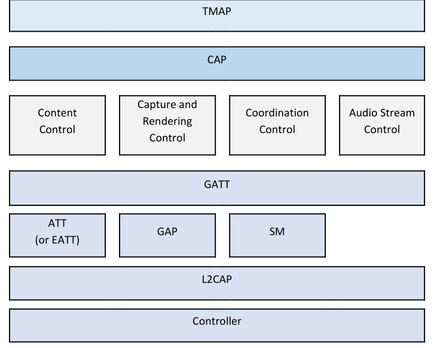

**Figure 3.1: TMAP overview**

Figure 3.2 provides a detailed breakdown of TMAP, CAP, and the underlying LE Audio Profiles and Services, with the services along the bottom row. The bottom two rows expand upon the Content Control, Capture and Rendering Control, Coordination Control, and Audio Stream Control described in Figure 3.1.

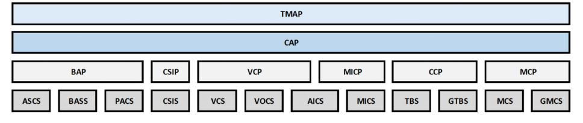

**Figure 3.2: TMAP and LE Audio layers in detail**

The following three figures describe the important relationship between the telephony, unicast, and broadcast TMAP roles and their corresponding CAP and BAP roles. The roles in parentheses are optional. For a Call Terminal (CT), it is mandatory to support at least one of BAP Audio Source or BAP Audio Sink; thus, only Audio Sink or Audio Source devices can be CTs.

**Figure 3.3: TMAP telephony roles and their relationship to CAP and BAP**

**Figure 3.4: TMAP unicast roles and their relationship to CAP and BAP**

**Figure 3.5: TMAP broadcast roles and their relationship to CAP and BAP**

With its TMA Client and TMA Server roles, the Telephony and Media Audio (TMA) Service is a service discovery mechanism defined within the Telephony and Media Audio Profile. See Figure 3.6. This Test Suite includes the testing of the TMA Client and TMA Server.

**Figure 3.6: TMA Server and TMA Client**

### 3.2 Test Strategy

The test objectives are to verify the functionality of the Telephony and Media Audio Profile Specification within a Bluetooth Host and enable interoperability between Bluetooth Hosts on different devices. The testing approach covers mandatory and optional requirements in the specification and matches these to the support of the IUT as described in the ICS. Any defined test herein is applicable to the IUT if the ICS logical expression defined in the Test Case Mapping Table (TCMT) evaluates to true.
TMAP conformance testing is used to confirm that in air interface messaging, the appropriate roles are demonstrated and that the parameters have been configured correctly and are consistent with parameters specified by the Host.
The test equipment provides an implementation of the Radio Controller and the parts of the Host needed to perform the test cases defined in this Test Suite. A Lower Tester acts as the IUT’s peer device and interacts with the IUT over-the-air interface. The configuration, including the IUT, needs to implement similar capabilities to communicate with the test equipment. For some test cases, it is necessary to stimulate the IUT from an Upper Tester. In practice, this could be implemented as a special test interface, a Man Machine Interface (MMI), or another interface supported by the IUT. See Section 3.2.1, Test configuration.
TMAP includes telephony functionality, which is tested in this Test Suite. References to telephony operations do not mandate that actual telephony devices be used in testing. The test environment only needs to exercise the IUT in such a manner that it simulates telephony behavior from the perspective of the IUT. This can be done, for example, by simulating the appropriate Call Control Profile (CCP) [12] procedures. When the IUT is a Call Gateway (CG) and the CT initiates a call, the Lower Tester CT can execute the CCP Originate Call procedure with the IUT. The IUT would then establish a call with the telephony provider through the Upper Tester. The Upper Tester need not contain a cell modem, telephony device, or other means of providing telephony. It can simulate the local telephony service such that the IUT believes that a call has been placed.
The TMAP Specification [4] specifies requirements to ensure synchronization between multiple audio channels transmitted across multiple Audio Streams. That test configuration is described in Section 3.2.3 Multi-stream synchronization overview and test configurations.
Some TMAP test procedures describe the sending and receiving of Audio Streams. Except for the synchronization test procedures, the contents of the streams can be simulated and need not carry encoded Audio Streams.
This Test Suite contains Valid Behavior (BV) tests complemented with Invalid Behavior (BI) tests where required. The test coverage mirrored in the Test Suite Structure is the result of a process that started with catalogued specification requirements that were logically grouped and assessed for testability enabling coverage in defined test purposes.

#### 3.2.1 Test configuration

The TMAP test configuration is shown in Figure 3.7.

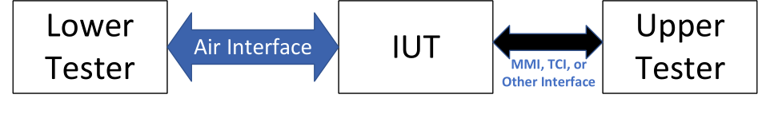

**Figure 3.7: TMAP test configuration**

In the following sections, two TMAP IUT configurations are exemplified, where the CT IUT and the CG IUT, respectively, have rich user interfaces.

##### 3.2.1.1 Rich UI device use case, IUT is CG smartphone

In this example test configuration, the IUT is a TMAP CG operating on a smartphone, where the smartphone supports Telephone Bearer Service (TBS) [13]. The Upper Tester is a custom app that runs on the smartphone; it provides access to test routines and observes the IUT operations as specified by the test cases in this Test Suite. The Lower Tester, acting as a CT, is the peer radio of the smartphone.

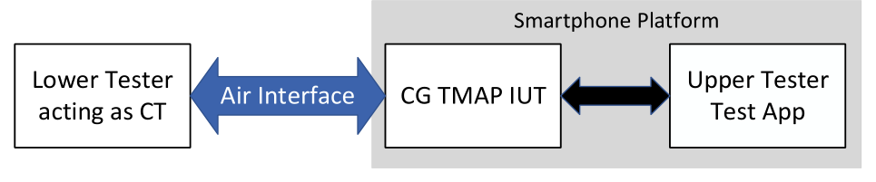

**Figure 3.8: Rich UI device use case, IUT is CG smartphone**

##### 3.2.1.2 Rich UI device use case, IUT is CT infotainment system

In this example configuration, the IUT is a TMAP CT. The Upper Tester is the touch screen, microphone, and speakers of the rich UI device. The touch screen provides access to test routines and the point of observing IUT operation as required from the Upper Tester in this Test Suite.

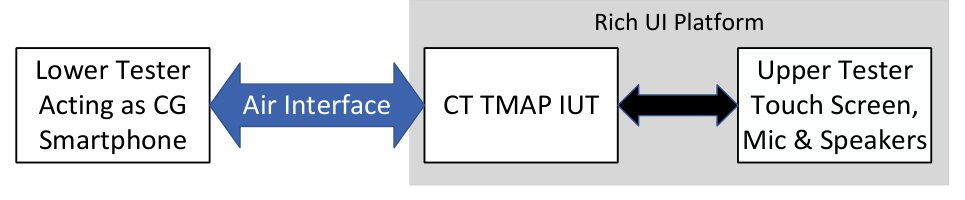

**Figure 3.9: Rich UI device use case, IUT is CT infotainment system**

#### 3.2.2 Meaning of “external mono input”

Section 3.5.1.5 of [4] defines the need for a CG or UMS to receive a single channel (e.g., mono) and to provide left and right streams with identical audio to a CT or UMR with two ASEs with locations Front Left and Front Right. This “external mono input” refers only to the input to the TMAP IUT and does not necessarily imply an external mono input to the device.

#### 3.2.3 Multi-stream synchronization overview and test configurations

Section 5.5, Audio synchronization test strategies, in [2] describes test strategies for multi-stream synchronization.

##### 3.2.3.1 Audio outputs, transport latency, and presentation delay

When two different device platforms (possibly from different manufacturers or different platforms from the same manufacturer) provide the left and right audio to a listener, ensuring that the two devices are in phase with each other is critical. Since it is impossible to test every device with every other qualified device, ensuring that phase delay is kept to an acceptable minimum between any two platforms in an absolute delay measurement provides a reasonable testing approach to obtain the objective of keeping left and right audio in phase. Figure 7.3 from [3] describes key concepts for testing multi-stream synchronization between two different types of devices:

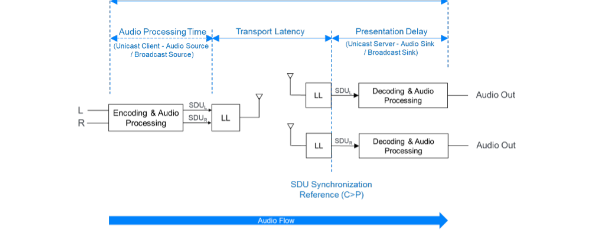

**Figure 3.10: Unicast total system delay**

Multi-stream synchronization testing ensures that each device that produces a single audio channel produces audio per the timing shown in Figure 3.10 as measured from the instant that the data is presented to the sender’s Link Layer to the instant that audio is present at Audio Out of the receiver. This consists of the Transport Latency and the Presentation Delay.
The moment audio SDUs are presented to the sender’s Link Layer is herein referred to as Audio Transport Start.
Therefore, Link Layer parameters that need to be considered to ensure synchronization include transport latency parameters (Transport_Latency_P_To_C, Transport_Latency_C_To_P, and Transport_Latency_BIG) and Presentation_Delay.

##### 3.2.3.2 Multi-stream synchronization for two Acceptors

To test synchronization on an absolute timing basis, the latency is measured between Audio Transport Start on the Initiator to the point at which audio is output at the Acceptor’s Audio Out.
Figure 3.11 describes the absolute latency measured in this Test Suite.

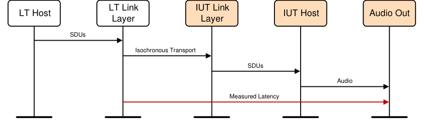

**Figure 3.11: Multi-stream synchronization for two Acceptors latency measurement**

The audio configurations tested are described in Table 3.1, all of which describe a single Initiator producing two streams such that two Acceptors configured for left and right each connect or synchronize to their respective Front Left and Front Right audio streams. (In Table 3.1, there is no TMAP-specific label applied to BAP Configuration 6(ii), so that element is marked “N/A”.)

|  | Test Configuration |  | Legend |  |  | TMAP Configuration |  |  | BAP Configuration |  |
| --- | --- | --- | --- | --- | --- | --- | --- | --- | --- | --- |
| Unicast Unidirectional |  |  |  |  | N/A |  |  | 6(ii) |  |  |
| Unicast Bidirectional |  |  |  |  | C |  |  | 8(ii) |  |  |
| Broadcast |  |  |  |  | D |  |  | 13 |  |  |

Table 3.1: Multi-stream synchronization for two Acceptors audio configurations
Figure 3.12 shows the two Acceptors multi-stream synchronization test configuration. There is one Lower Tester, one Peer Acceptor, and one Latency Timer. The Peer Acceptor is a tester that participates as the other Acceptor in the one Initiator and two Acceptors test configuration. The Latency Timer is an Upper Tester that receives audio output from the IUT and a timing signal from the Lower Tester. The Lower Tester is the Initiator that is configured for two streams, one with an Audio Channel Allocation of Front Left and the other with an Audio Channel Allocation of Front Right. The IUT is an Acceptor configured to receive either the Front Left or Front Right stream.
The Peer Acceptor is a tester that connects to the CIS, or synchronizes to the BIS, not received by the IUT. The IUT and the Peer Acceptor may be members of a Coordinated Set (possibly an ad hoc coordinated set), though ideally the Lower Tester can configure both streams without requiring the two Acceptors to be in a Coordinated Set. The Lower Tester provides a signal to the Latency Timer and indicates when an SDU is transferred to its Link Layer, which corresponds to the Audio Transport Start. The Latency Timer monitors the Audio Output of the IUT and completes the measurement of latency when the SDU is produced as audio.
Note that if the source audio is single channel audio (e.g., mono), then identical audio is sent to each Acceptor.

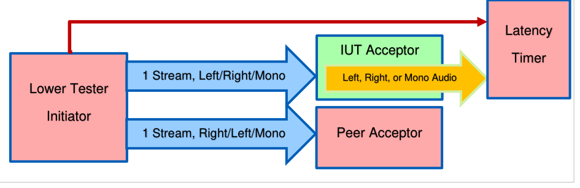

**Figure 3.12: Multi-stream synchronization for two Acceptors test configuration block diagram**

An MSC for the synchronized test configuration is shown in Figure 3.13. It shows that the Audio Transport Start signal precedes the transmission of the CIS or BIS streams in a CIG or BIG, respectively, which precedes the audio detection by the Latency Timer. Latency is measured from the Audio Transport Start signal to the detection of audio at Audio Output.

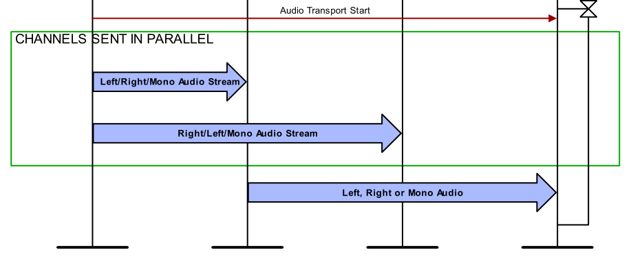

**Figure 3.13: Multi-stream synchronization for two Acceptors MSC**

##### 3.2.3.3 Multi-stream synchronization with two Audio Outs

A generalized description of multi-stream synchronization with two Audio Outs is given in Section 5.5.4.1, Synchronization for devices with two Audio Outs, in [2].
The audio configurations tested are described in Table 3.2, all of which describe a single Initiator producing two streams configured for Front Left and Front Right, both received by a single Acceptor. (In Table 3.2, there is no TMAP-specific label applied to BAP Configuration 6(i), so that element is marked “N/A”.)

|  | Test Configuration |  |  | Legend |  |  | TMAP Configuration |  |  | BAP Configuration |  |
| --- | --- | --- | --- | --- | --- | --- | --- | --- | --- | --- | --- |
| Unicast Unidirectional |  |  |  |  |  | N/A |  |  | 6(i) |  |  |
| Unicast Bidirectional |  |  |  |  |  | D |  |  | 8(i) |  |  |
| Broadcast |  |  |  |  |  | C |  |  | 13 |  |  |

Table 3.2: Multi-stream synchronization for one Acceptor receiving two Audio Streams audio configurations

#### 3.2.4 Verification by role and configuration audio test methodologies and

topologies
This section outlines test methodologies and topologies used to test different Audio Configurations.

##### 3.2.4.1 Validation of Audio Streams

When validating audio, various audio source and sink approaches may be used. The requirement is that the reproduction of the audio source is validated, regardless of means.
The contents of the encoded Audio Streams can be simulated, containing dummy data or no data at all. Simulated Audio Streams sent by the Lower Tester utilize the LC3 Packet format (defined in [3] Section 4.2).
In the following examples, “speaker” is a representative example of any form of audio transducer or destination for the Audio Channel driven by the CAP Acceptor. “Microphone” is used as a representative example of any means of gathering voice audio by the CT that is then sent to the CG.

###### 3.2.4.2.1 TMAP UMS/UMR configurations

TMAP specifies no requirements for the unicast Audio Configurations beyond those specified in Section 4.4 in BAP [3].

###### 3.2.4.2.2 BAP Broadcast Audio Configuration 14, L+R, one broadcast stream with two channels

This test configuration demonstrates BAP Broadcast Audio Configuration 14 [3].

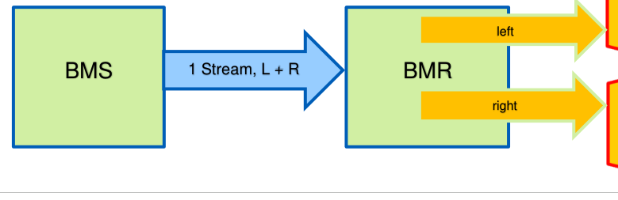

**Figure 3.14: Single ASE with L+R channels**

The BMS broadcasts a single broadcast Audio Stream specifying Audio Locations for the Front Left channel and the Front Right channel. The broadcast BMR synchronizes to the broadcast Audio Stream and routes the Front Left audio to the left “speaker” and routes the Front Right audio to the right “speaker”.

##### 3.2.4.3 Bidirectional channel configurations

This section describes configurations involving a CG and one or two CTs. In this configuration, one or two voice Audio Channels are sent by the CG to the CT(s), and a CT sends a voice Audio Channel to the CG. Numerous topologies are possible, as described in Table 3.16 in [4].

###### 3.2.4.3.1 TMAP CG/CT Configuration A, single CG, single CT, single stream

This test configuration demonstrates the CG/CT Configuration A in Table 3.16: CG and CT requirements for number of concurrent Unicast Audio Streams, channels, and devices to be supported in CAP Unicast Audio Stream Transition procedures in [4] and BAP Unicast Audio Configuration 3 in [3].

**Figure 3.15: CG/CT Configuration A**

In this configuration, there is a single CG and a single CT. A single bidirectional stream carries voice audio from the CG to the CT over one Audio Channel, and voice audio from the CT to the CG.

###### 3.2.4.3.2 TMAP CG/CT Configuration B, single CG, two CTs, single streams

**Figure 3.16: CG/CT Configuration B, two CTs, single streams**

This test configuration demonstrates TMAP CG/CT Configuration B in Table 3.16: CG and CT requirements for a number of concurrent Unicast Audio Streams, channels, and devices to be supported in CAP Unicast Audio Stream Transition procedures in [4] and BAP Unicast Audio Configuration 3 in [3].
In this configuration, there is a single CG and two CTs. In this configuration, the CT receiving the CG’s voice audio is referred to as the “headphones” CT, and the CT sending voice audio to the CG is referred to as the “microphone” CT. The “headphones” CT receives voice audio from the CG over a single Audio Channel. The “microphone” CT sends voice audio to the CG over a single Audio Channel.
The “headphones” CT receiving the CG voice audio either drives a single “speaker” with the single Audio Channel, or it drives both left and right “speakers” with identical voice audio from the CG.

###### 3.2.4.3.3 TMAP CG/CT Configuration C, single CG, two CTs, Front Left and Front Right

**Figure 3.17: CG/CT Configuration C, single CG, two CTs, Front Left and Front Right**

This test configuration demonstrates TMAP CG/CT Configuration C in Table 3.16: CG and CT requirements for a number of concurrent Unicast Audio Streams, channels, and devices to be supported
in CAP Unicast Audio Stream Transition procedures in [4] and BAP Unicast Audio Configuration 8(ii) in [3].
In this configuration, there is a single CG and two CTs. The CG provides a left voice Audio Channel and a right voice Audio Channel and receives voice audio from one of the two CTs. In this configuration, the CT that only receives voice audio is referred to as the “earbud” CT, and the CT with a “microphone” is referred to as the “earbud with mic” CT.
The CG configures the “earbud” CT to receive either the Front Left Audio Location Audio Channel, or the Front Right Audio Location Audio Channel. The CG configures the “earbud with mic” CT to receive the other Audio Channel.
Each CT sends its voice audio to its “speaker”. The CG takes the voice audio received from the “earbud with mic” CT and sends it to the CG’s (telephony or VoIP) network peer device.

###### 3.2.4.3.4 TMAP CG/CT Configuration D, single CG, single CT, two streams, Front Left and Front Right

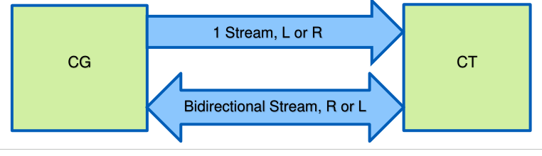

**Figure 3.18: CG/CT Configuration D, single CG, single CT, two streams, Front Left and Front Right**

This test configuration demonstrates TMAP CG/CT Configuration D in Table 3.16: CG and CT requirements for a number of concurrent Unicast Audio Streams, channels, and devices to be supported in CAP Unicast Audio Stream Transition procedures in [4] and BAP Unicast Audio Configuration 8(i) in [3].
In this configuration, there is a single CG and a single CT. The CG configures a single voice Unicast Audio Stream to send either the Front Left Audio Location Audio Channel or the Front Right Audio Location Audio Channel to the CT. The CG configures a bidirectional voice Unicast Audio Stream to send the audio from the other Audio Location to the CT and receives a single Unicast Audio Stream from the CT.
The CG takes the voice audio received from the CT and sends it to the CG’s (telephony or VoIP) network peer device.

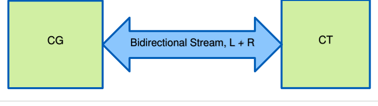

**Figure 3.19: CG/CT Configuration E, single CG, single CT, single stream, L+R**

This test configuration demonstrates TMAP CG/CT Configuration E in Table 3.16: CG and CT requirements for a number of concurrent Unicast Audio Streams, channels, and devices to be supported in CAP Unicast Audio Stream Transition procedures in [4] and BAP Unicast Audio Configuration 5 in [3].
In this configuration, there is a single CG and a single CT. A single Unicast Audio Stream provides the Front Left Audio Location Audio Channel from the CG to the CT and the Front Right Audio Location Audio Channel from the CG to the CT. It also provides a single voice Audio Channel from the CT to the CG.
The CG takes the voice audio received from the CT and sends it to the CG’s (telephony or VoIP) network peer device.

###### 3.2.4.3.6 TMAP CG/CT Configuration F, single CG, single CT, two bidirectional streams

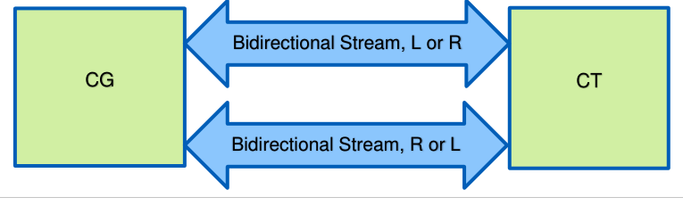

**Figure 3.20: CG/CT Configuration F, single CG, single CT, two bidirectional streams**

This test configuration demonstrates TMAP CG/CT Configuration F in Table 3.16: CG and CT requirements for a number of concurrent Unicast Audio Streams, channels, and devices to be supported in CAP Unicast Audio Stream Transition procedures in [4] and BAP Unicast Audio Configuration 11(i) in [3].
In this configuration, there is a single CG and a single CT. The CG sends the Front Left Audio Location Audio Channel and the Front Right Audio Location Audio Channel to the CT and receives corresponding left and right voice audio from the CT.
The CT sends its voice audio to its “speaker(s)”. The CG takes the voice audio received from the CT and sends it to the CG’s (telephony or VoIP) network peer device.

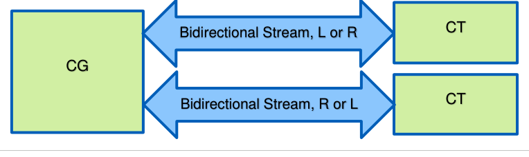

**Figure 3.21: CG/CT Configuration G, single CG, two CTs, two bidirectional streams**

This test configuration demonstrates TMAP CG/CT Configuration G in Table 3.16: CG and CT requirements for a number of concurrent Unicast Audio Streams, channels, and devices to be supported in CAP Unicast Audio Stream Transition procedures in [4] and BAP Unicast Audio Configuration 11(ii) in [3].
In this configuration, there is a single CG and two CTs. The CG sends the Front Left Audio Location Audio Channel to one CT and the Front Right Audio Channel to a second CT and receives corresponding left and right voice audio from each of the CTs.
Each CT sends its voice audio to its “speaker”. The CG takes the voice audio received from the two CTs and sends it to the CG’s (telephony or VoIP) network peer device.

##### 3.2.4.4 When multiple Audio Configurations are equivalent to the IUT

There are times when the IUT’s Audio Configuration can be handled using one of two available peer Audio Configurations. In that case, both peer configurations that support the IUT’s Audio Configuration are listed in the test case. A test case may simulate either peer Audio Configuration since the functionality is identical from the IUT perspective.
An example of this is when a CG establishes a bidirectional stream with a CT IUT, along with another CT. Whether the CG also establishes a bidirectional stream with the other CT (Section 3.2.4.3.7 TMAP CG/CT Configuration G, single CG, two CTs, two bidirectional streams), or does not (Section 3.2.4.3.3 TMAP CG/CT Configuration C, single CG, two CTs, Front Left and Front Right), does not change the behavior of the CT IUT.

##### 3.2.4.5 Volume adjustment procedures

Some procedures require that the Upper Tester command the TMAP Initiator IUT to increase or decrease the TMAP Acceptor Lower Tester volume to maximum or minimum, respectively. The procedures used may depend on the VCP Controller features supported by the IUT. The Set Absolute Volume, Relative Volume Up/Down, and Unmute/Relative Volume Up/Down Volume Control Sub-Procedures defined in the Volume Control Profile (VCP) [14] may be used to set the volume to maximum or minimum.

##### 3.2.4.6 MSC notation describing flow of Audio Channels

To provide clarity, message sequence charts (MSCs) describe the flow of an audio channel (which can be simulated) between the Upper Tester, the IUT, and the Lower Tester. An example is given in Figure 3.22.
Upper
Lower Tester
IUT
Tester

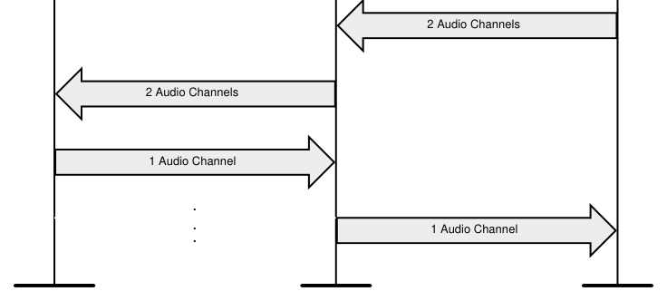

**Figure 3.22: MSC describing the flow of audio channels**

### 3.3 Test groups

The following test groups have been defined:
• TMAP verification by role and configuration
• Audio Stream Transitions control
• Multichannel synchronization
• Telephony and Media Audio Client and Server
• Device discovery
• Context type

## 4 Test cases (TC)

### 4.1 Introduction

#### 4.1.1 Test case identification conventions

Test cases are assigned unique identifiers per the conventions in [2]. The convention used here is: <spec abbreviation>/<IUT role>/<class>/<feat>/<func>/<subfunc>/<cap>/<xx>-<nn>-<y>.
Additionally, testing of this specification includes tests from the GATT Test Suite [7] referred to as Generic GATT Integrated Tests (GGIT); when used, the test cases in GGIT are referred to through a TCID string using the following convention: <spec abbreviation>/<IUT role>/<GGIT test group>/< GGIT class >/<xx>-<nn>-<y>.

|  | Identifier Abbreviation |  |  | Spec Identifier <spec abbreviation> |  |
| --- | --- | --- | --- | --- | --- |
| TMAP |  |  | Telephony and Media Audio Profile |  |  |
|  | Identifier Abbreviation |  |  | Role Identifier <IUT role> |  |
| BMR |  |  | Broadcast Media Receiver |  |  |
| BMS |  |  | Broadcast Media Sender |  |  |
| CG |  |  | Call Gateway |  |  |
| CT |  |  | Call Terminal |  |  |
| CL |  |  | TMA Client |  |  |
| SR |  |  | TMA Server |  |  |
| UMR |  |  | Unicast Media Receiver |  |  |
| UMS |  |  | Unicast Media Sender |  |  |
|  | Identifier Abbreviation |  |  | Feature Identifier <feat> |  |
| ASC |  |  | Audio Stream Transitions control |  |  |
| CTXT |  |  | Context type |  |  |
| DDI |  |  | Device discovery |  |  |
| SYNC |  |  | Multichannel synchronization |  |  |
| TMAS |  |  | Telephony and Media Audio Service |  |  |
| TRC |  |  | TMAP role characteristic |  |  |
| VRC |  |  | Verification by role and configuration |  |  |

Table 4.1: TMAP TC feature naming conventions

#### 4.1.2 Conformance

When conformance is claimed for a particular specification, all capabilities are to be supported in the specified manner. The mandated tests from this Test Suite depend on the capabilities to which conformance is claimed.
The Bluetooth Qualification Program may employ tests to verify implementation robustness. The level of implementation robustness that is verified varies from one specification to another and may be revised for cause based on interoperability issues found in the market.
• That claimed capabilities may be used in any order and any number of repetitions not excluded by the specification
• That capabilities enabled by the implementations are sustained over durations expected by the use case
• That the implementation gracefully handles any quantity of data expected by the use case
• That in cases where more than one valid interpretation of the specification exists, the implementation complies with at least one interpretation and gracefully handles other interpretations
• That the implementation is immune to attempted security exploits
A single execution of each of the required tests is required to constitute a Pass verdict. However, it is noted that to provide a foundation for interoperability, it is necessary that a qualified implementation consistently and repeatedly pass any of the applicable tests.
In any case, where a member finds an issue with the test plan generated by the Bluetooth SIG qualification tool, with the test case as described in the Test Suite, or with the test system utilized, the member is required to notify the responsible party via an erratum request such that the issue may be addressed.

#### 4.1.3 Pass/Fail verdict conventions

Each test case has an Expected Outcome section. The IUT is granted the Pass verdict when all the detailed pass criteria conditions within the Expected Outcome section are met.
The convention in this Test Suite is that, unless there is a specific set of fail conditions outlined in the test case, the IUT fails the test case as soon as one of the pass criteria conditions cannot be met. If this occurs, then the outcome of the test is a Fail verdict.

### 4.2 TMAP verification by role and configuration

Verify TMAP requirements on a role and configuration basis.

#### 4.2.1 Common test conditions for verification by role and configuration

Refer to Section 3.2.4 Verification by role and configuration audio test methodologies and topologies.

#### 4.2.2 CG role

Verify the requirements of a CG IUT.

##### 4.2.2.1 Common Initial Condition and Pass verdict

###### 4.2.2.1.1 Common Initial Condition

The Lower Tester(s) acting in the CT role only support(s) the mandatory audio settings and QoS settings as specified in Sections 3.5.1.1 and 3.5.1.4.2 in [4], respectively, across all ASEs.

###### 4.2.2.1.2 Common Pass verdict

The CG IUT uses codec configuration and QoS settings selected from those specified in Sections 3.5.1.4.1 and 3.5.1.4.2 in [4], respectively. The CG IUT uses the same codec configuration and QoS settings across all ASEs.

##### 4.2.2.2 Call Initiated from CG

• Test Purpose
Verify the requirements of a CG IUT in which the IUT accepts a call with the CT. Demonstrate the supported configurations described in Table 4.2.
• Reference
[4] 2.2, 3.1, 3.5.1, 3.6
• Initial Condition
- The Lower Tester is the CT.
- The IUT and the Lower Tester are bonded, and an ACL connection has been established.
- The IUT has discovered all the relevant services and characteristics of the Lower Tester.
• Test Case Configuration

| Test Case |  | Config. |  |  | IUT is Audio Source |  |  |  |  | IUT is Audio Sink |  |  |  |
| --- | --- | --- | --- | --- | --- | --- | --- | --- | --- | --- | --- | --- | --- |
|  |  | (TS |  | Streams | Streams | Channels | Channels |  | Streams | Streams | Channels | Channels |  |
|  |  | Section) |  |  |  |  |  |  |  |  |  |  |  |
| TMAP/CG/VRC/BV-01-C [CG Initiates Call in CG/CT Config A] | A (3.2.4.3.1) |  |  | 1 |  | 1 |  |  | 1 |  | 1 |  |  |
| TMAP/CG/VRC/BV-05-C [CG Initiates Call in CG/CT Config D] | D (3.2.4.3.4) |  |  | 2 |  | 1 each |  |  | 1 |  | 1 |  |  |
| TMAP/CG/VRC/BV-06-C [CG Initiates Call in CG/CT Config E] | E (3.2.4.3.5) |  |  | 1 |  | 2 |  |  | 1 |  | 1 |  |  |
| TMAP/CG/VRC/BV-08-C [CG Initiates Call in CG/CT Config F] | F (3.2.4.3.6) |  |  | 2 |  | 1 each |  |  | 2 |  | 1 each |  |  |

Table 4.2: Call Initiated from CG test cases
• Test Procedure
The order of Steps 1 and 2 may be swapped.
1. The IUT, as CAP Initiator, establishes the number of Audio Source and Audio Sink streams with
the number of Audio Channels as listed in Table 4.2. This is done using the [5] CAP Unicast Audio Start procedure. 2. The IUT initiates a call or receives an incoming call (possibly simulated with the Upper Tester or
actual telephony) and accepts and establishes the call with confirmation from the Upper Tester. 3. The IUT sends audio provided by the Upper Tester over its one or two channels and receives
audio from the Lower Tester. 4. The IUT provides the audio received from the Lower Tester to the Upper Tester. 5. If the volume is not at maximum, the Upper Tester commands the IUT to increase volume to
maximum. If the volume is at maximum initially, execute Step 6, then this step, before proceeding to Step 7. 6. The Upper Tester commands the IUT to decrease volume to minimum. 7. The Upper Tester commands the IUT to hang up the call. 8. The IUT hangs up the call. 9. The IUT may disconnect its Audio Streams from the Lower Tester using the [5] CAP Unicast
Audio Stop procedure.
• Expected Outcome
Pass verdict
The IUT places or receives an incoming call and terminates a call.
The IUT supports one or two Audio Channels to, and one or two Audio Channels from, the Lower Tester as described in the “Config.” column in Table 4.2.
The IUT commands the volume to both maximum and minimum.

##### 4.2.2.3 Call Initiated from CG with two CTs

• Test Purpose
Verify the requirements of a CG IUT in which the IUT accepts a call with two CTs. Demonstrate the supported configurations described in Table 4.3.
• Reference
[4] 2.2, 3.1, 3.5.1, 3.6
• Initial Condition
- Lower Tester 1 and Lower Tester 2 are CTs.
- If only one Lower Tester is an Audio Source, that is supported by Lower Tester 1.
- The IUT and the Lower Testers are bonded and connected with ACL connections.
- The IUT has discovered all relevant services and characteristics of the Lower Testers.
- If there are two Lower Testers acting as BAP Unicast Audio Sinks, the IUT has identified them as members of a coordinated set.
- If the “IUT Receives Audio From” column in Table 4.3 refers to “LT1 or LT2”, then Lower Tester 1 and Lower Tester 2 each include a Source ASE.
• Test Case Configuration

| Test Case |  | Configuration |  |  | IUT Sends |  |  | IUT Receives |  |
| --- | --- | --- | --- | --- | --- | --- | --- | --- | --- |
|  |  | (TS Section) |  |  | Audio To |  |  | Audio From |  |
| TMAP/CG/VRC/BV-02-C [CG Initiates Call in CG/CT Config B] | B (3.2.4.3.2) |  |  | LT2 |  |  | LT1 |  |  |
| TMAP/CG/VRC/BV-03-C [CG Initiates Call in CG/CT Config C] | C (3.2.4.3.3) |  |  | LT1 and LT2 |  |  | LT1 |  |  |
| TMAP/CG/VRC/BV-04-C [CG/CT Config C, CG Selects One of Two Available Mics] | C (3.2.4.3.3) |  |  | LT1 and LT2 |  |  | LT1 or LT2 |  |  |
| TMAP/CG/VRC/BV-09-C [CG Initiates Call in CG/CT Config G] | G (3.2.4.3.7) |  |  | LT1 and LT2 |  |  | LT1 and LT2 |  |  |

Table 4.3: Call Initiated from CG with two CTs test cases
• Test Procedure
The order of Steps 1 and 2 may be swapped.
1. The IUT, as CAP Initiator, establishes one Unicast Audio Stream with one channel in the unicast
Audio Source role or two Unicast Audio Streams, each with one channel, with one or both Lower Testers as described in Table 4.3. The IUT establishes one or two Unicast Audio Streams in the Audio Sink role with one channel with Lower Tester 1 and/or Lower Tester 2 as described in Table 4.3. This is done using the [5] CAP Unicast Audio Start procedure. 2. The IUT receives an incoming call and accepts the call with confirmation from the Upper Tester. 3. The IUT sends audio provided by the Upper Tester over its one or two streams and receives
audio from one or both Lower Testers. (The audio may be received from either Lower Tester when testing Configuration C and both of them include microphones.) 4. The IUT provides the audio received from Lower Tester 1, and possibly Lower Tester 2, to the
Upper Tester. 5. If the volume is not at maximum, the Upper Tester commands the IUT to increase volume to
maximum. If the volume is at maximum initially, execute Step 6, then this step, before proceeding to Step 7. 6. The Upper Tester commands the IUT to decrease volume to the minimum. 7. The Upper Tester commands the IUT to hang up the call. 8. The IUT hangs up the call. 9. The IUT may disconnect its Audio Streams from the Lower Tester(s) using the [5] CAP Unicast
Audio Stop procedure.
• Expected Outcome
Pass verdict
The IUT receives and terminates a call.
The IUT supports one or two Audio Channels to, and one or two Audio Channels from, the Lower Testers as described in the “Configuration” column in Table 4.3.
The IUT commands the volume to both maximum and minimum.
• Test Purpose
Verify the requirements of a TMAP CG in which a call is initiated by a CT.
• Reference
[4] 2.2, 3.1, 3.5.1, 3.6
• Initial Condition
- The Lower Tester is the CT.
- The IUT and the Lower Tester are bonded and connected with an ACL connection.
- The Lower Tester has discovered all relevant services and characteristics of the IUT.
- The Lower Tester assumes the ASE and audio location configuration as described in Section 3.2.4.3.1 TMAP CG/CT Configuration A, single CG, single CT, single stream.
- The IUT has discovered all relevant services and characteristics of the Lower Tester.
- The IUT may establish audio channels with the Lower Tester prior to the start of the test.
• Test Procedure

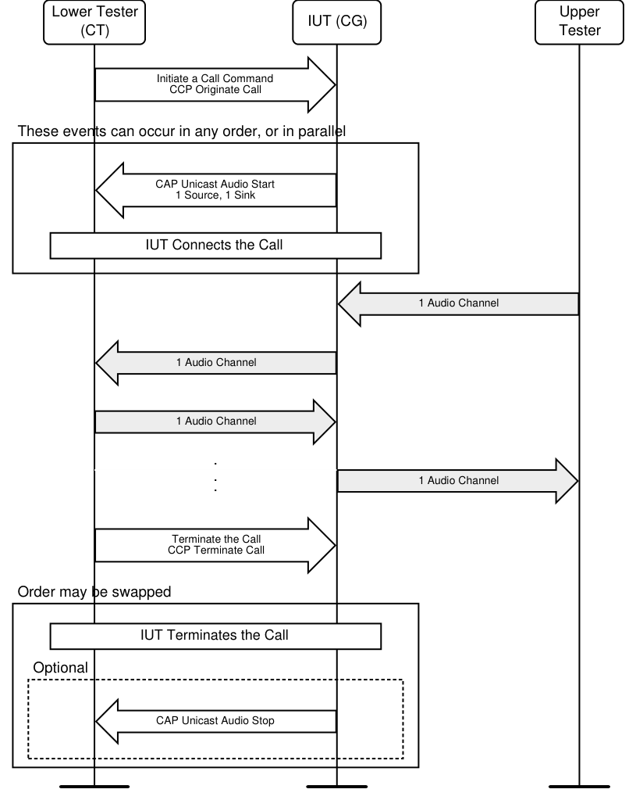

**Figure 4.1: TMAP/CG/VRC/BV-07-C [Call Initiated from CT] MSC**

1. The Lower Tester commands the IUT to initiate a call, simulating the [12] Call Control Profile
Originate Call sub-procedure.
The order of Steps 2 and 3 may be swapped or may occur concurrently.
2. If it has not done so prior to the start of the test, the IUT establishes Audio Channels with the
Lower Tester using the [5] CAP Unicast Audio Start procedure. 3. The IUT connects the call. 4. The Upper Tester sends a single Audio Channel to the IUT. 5. The IUT sends audio to, and receives audio from, the Lower Tester.
6. The IUT provides the audio received from the Lower Tester to the Upper Tester. 7. The Lower Tester commands the IUT to hang up the call, simulating the [12] Call Control Profile
Terminate Call sub-procedure.
The order of Steps 8 and 9 may be swapped or may occur concurrently.
8. The IUT terminates the call. 9. The IUT may disconnect its Audio Streams from the Lower Tester using the [5] CAP Unicast
Audio Stop procedure.
• Expected Outcome
Pass verdict
The IUT initiates and terminates a call.
The IUT sends one Audio Channel to, and receives one Audio Channel from, the Lower Tester.
• Notes
The Upper Tester may receive call status indications from the IUT throughout this test procedure.
TMAP/CG/VRC/BV-10-C [CG Configures CT Exposing Two Source ASEs as Config D]
• Test Purpose
Verify the requirements of a TMAP CG IUT in which the CT is configured for TMAP CG/CT Configuration F with two Source ASEs where the IUT does not support TMAP CG/CT Configuration F and configures one Source ASE instead.
• Reference
[4] 3.5.1.5
• Initial Condition
- The Lower Tester is the CT.
- The IUT and the Lower Tester are bonded and connected with an ACL connection.
- The Lower Tester assumes the ASE and Audio Location configuration as described in Section 3.2.4.3.6 TMAP CG/CT Configuration F, single CG, single CT, two bidirectional streams.
- The IUT has discovered all relevant services and characteristics of the Lower Tester.
• Test Procedure
The order of Steps 1 and 2 may be swapped.
1. The IUT, as CAP Initiator, establishes two Unicast Audio Streams, each with one channel, in the
unicast Audio Source role with the Lower Tester. The IUT establishes one Unicast Audio Stream with one channel in the unicast Audio Sink role with either of the Lower Tester’s ASEs. This is done using the [5] CAP Unicast Audio Start procedure. 2. The IUT receives an incoming call and accepts the call with confirmation from the Upper Tester. 3. The IUT sends audio provided by the Upper Tester over its two channels and receives audio from
the Lower Tester. 4. The IUT provides the audio received from the Lower Tester to the Upper Tester. 5. The Upper Tester commands the IUT to hang up the call. 6. The IUT hangs up the call. 7. The IUT may disconnect its Audio Streams from the Lower Tester using the [5] CAP Unicast
Audio Stop procedure.
• Expected Outcome
Pass verdict
The IUT accepts and terminates a call.
The IUT supports two Unicast Audio Streams, each with one channel, in the unicast Audio Source role with the Lower Tester.
The IUT supports one Unicast Audio Stream with one channel in the unicast Audio Sink role with either of the Lower Tester’s ASEs.

##### 4.2.2.4 CG sends identical audio to Front Left and Front Right Audio Locations

• Test Purpose
Verify the requirements of a CG IUT in which the IUT sends identical audio to Front Left and Front Right Sink Audio Locations of the CT when the IUT has a single channel of audio (e.g., mono) to send to the CT.
• Reference
[4] 3.5.1.5
• Initial Condition
- The Lower Tester is a CT in the CG/CT Audio Configuration specified in Table 4.4.
- The Lower Tester does not support an Audio_Channel_Counts value greater than one.
- The IUT and the Lower Tester are bonded and connected with an ACL connection.
- The IUT has discovered all relevant services and characteristics of the Lower Tester.
• Test Case Configuration

|  | Test Case |  |  | Configuration (TS Section) |  |  | IUT Streams Received |  |
| --- | --- | --- | --- | --- | --- | --- | --- | --- |
| TMAP/CG/VRC/BV-11-C [CG Sends Identical Audio in CG/CT Config D] |  |  | D (3.2.4.3.4) |  |  | 1 |  |  |
| TMAP/CG/VRC/BV-12-C [CG Sends Identical Audio in CG/CT Config F] |  |  | F (3.2.4.3.6) |  |  | 2 |  |  |

Table 4.4: CG sends identical audio to Front Left and Front Right Audio Locations test cases
• Test Procedure

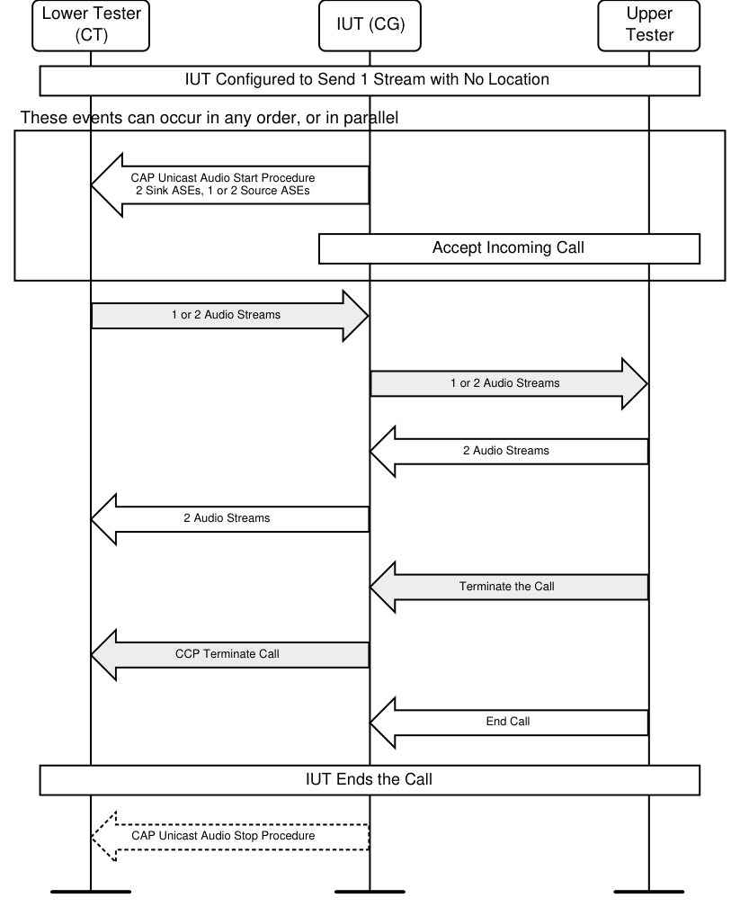

**Figure 4.2: CG sends identical audio to Front Left and Front Right Audio Locations MSC**

1. The Upper Tester configures the IUT to send a single Audio Channel (e.g., mono) to the Lower
Tester.
The order of Steps 2 and 3 may be swapped.
2. The IUT, as CAP Initiator, establishes two Audio Streams in the Audio Source role with the Lower
Tester with Audio Channel Allocations “Front Right” and “Front Left” to the Lower Tester’s respective “Front Right” and “Front Left” Audio Locations. The IUT establishes one or two streams in the Audio Sink role with the Lower Tester according to the number of Audio Streams listed in Table 4.4. This is done using the [5] CAP Unicast Audio Start procedure.
3. The IUT receives an incoming call and accepts the call with confirmation from the Upper Tester. 4. The IUT sends audio provided by the Upper Tester over two streams and receives audio from the
Lower Tester over one or two streams per Table 4.4. 5. The IUT provides the audio received from the Lower Tester to the Upper Tester. 6. The Upper Tester commands the IUT to hang up the call. 7. The IUT hangs up the call. 8. The IUT may disconnect its Audio Streams from the Lower Tester using the [5] CAP Unicast
Audio Stop procedure.
• Expected Outcome
Pass verdict
The IUT accepts and terminates a call.
The IUT sends two Audio Streams at the correct Audio Locations to, and receives one or two Audio Streams from, the Lower Tester as described in Table 4.4.

#### 4.2.3 CT role

Verify the requirements of a CT IUT.

##### 4.2.3.1 Common Initial Condition and Pass verdict

###### 4.2.3.1.1 Common Initial Condition

The CT IUT supports codec configuration and QoS settings specified in [4] in Sections 3.5.1.1 and 3.5.1.4.2, respectively. The CT IUT uses the same codec configuration and QoS settings across all ASEs.

###### 4.2.3.1.2 Common Pass verdict

The Lower Tester acting as a CG chooses settings from the mandatory audio settings and QoS settings specified in [4] in Sections 3.5.1.4.1 and 3.5.1.4.2, respectively, across all ASEs.

##### 4.2.3.2 Call Initiated from CG, IUT is Audio Source and Sink

• Test Purpose
Verify the requirements of a CT IUT in both the BAP Audio Source and BAP Audio Sink roles. A call is initiated at the CG. Demonstrate the supported configurations described in Table 4.5.
• Reference
[4] 2.2, 3.1, 3.5.1, 3.6
• Initial Condition
- The Lower Tester is a CG.
- The IUT and the Lower Tester are bonded and connected with an ACL connection.
- The Lower Tester has discovered all relevant services and characteristics of the IUT.
- The IUT has discovered all relevant services and characteristics of the Lower Tester.
• Test Case Configuration

|  | Test Case |  |  | Configuration (TS Section) |  |
| --- | --- | --- | --- | --- | --- |
| TMAP/CT/VRC/BV-01-C [Call Initiated from CG, CG/CT Config D] |  |  | D (3.2.4.3.4) |  |  |
| TMAP/CT/VRC/BV-02-C [Call Initiated from CG, CG/CT Config E] |  |  | E (3.2.4.3.5) |  |  |
| TMAP/CT/VRC/BV-05-C [Call Initiated from CG, CG/CT Config F] |  |  | F (3.2.4.3.6) |  |  |

Table 4.5: Call Initiated from CG, IUT is Audio Source and Sink test cases
• Test Procedure

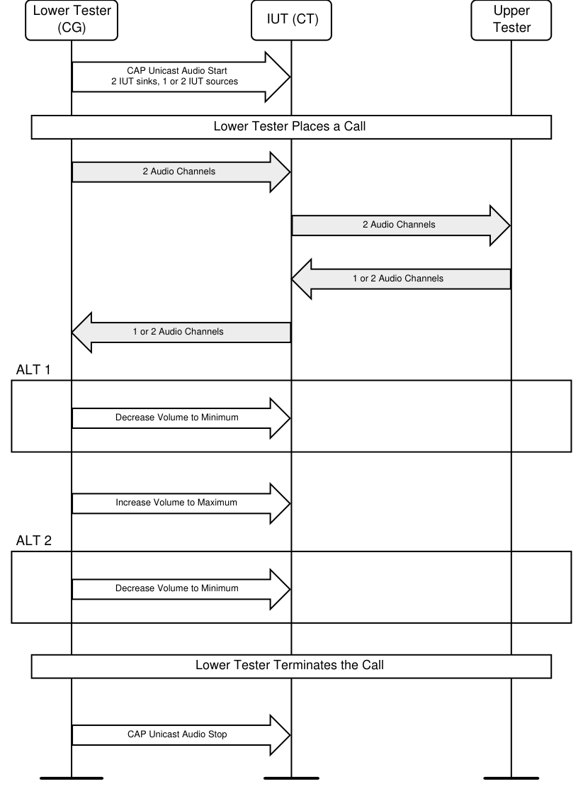

**Figure 4.3: Call Initiated from CG, IUT is Audio Source and Sink MSC**

1. The Lower Tester establishes two Audio Channels to the IUT’s Sink ASE(s) and one or two Audio
Channels with the IUT’s Source ASE(s), simulating the [5] CAP Unicast Audio Start procedure. 2. The Lower Tester simulates placing a call. 3. The Lower Tester sends two Audio Channels to the IUT. 4. The IUT sends the received audio to the Upper Tester.
5. The IUT sends one or two audio channels from the Upper Tester to the Lower Tester. 6. If the volume is not at maximum, the Lower Tester commands the IUT to increase volume to
maximum. If the volume is at maximum initially, execute Step 7, then this step, before proceeding to Step 8. 7. The Lower Tester commands the IUT to decrease volume to minimum. 8. The Lower Tester simulates hanging up the call. 9. The Lower Tester disconnects its Audio Channels from the IUT, simulating the [5] CAP Unicast
Audio Stop procedure.
• Expected Outcome
Pass verdict
The IUT sends one or two Audio Channels to, and receives two Audio Channels from, the Lower Tester as described in the “Configuration” column in Table 4.5.
The IUT changes volumes to both maximum and minimum.

##### 4.2.3.3 Call Initiated from CT

• Test Purpose
Verify the requirements of a CT in both the BAP Audio Source and BAP Audio Sink roles. The IUT initiates a call. Demonstrate the supported configurations described in Table 4.6.
• Reference
[4] 2.2, 3.1, 3.5.1, 3.6
• Initial Condition
- The Lower Tester is a CG.
- The IUT and the Lower Tester are bonded and connected with an ACL connection.
- The Lower Tester has discovered all relevant services and characteristics of the IUT.
- The IUT has discovered all relevant services and characteristics of the Lower Tester.
• Test Case Configuration

|  | Test Case |  |  | Configuration (TS Section) |  |
| --- | --- | --- | --- | --- | --- |
| TMAP/CT/VRC/BV-03-C [Call Initiated from CT, CG/CT Config D] |  |  | D (3.2.4.3.4) |  |  |
| TMAP/CT/VRC/BV-04-C [Call Initiated from CT, CG/CT Config E] |  |  | E (3.2.4.3.5) |  |  |
| TMAP/CT/VRC/BV-06-C [Call Initiated from CT, CG/CT Config F] |  |  | F (3.2.4.3.6) |  |  |

Table 4.6: Call Initiated from CT test cases
• Test Procedure

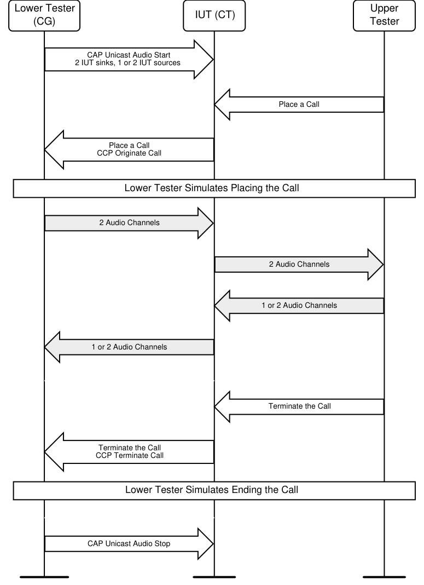

**Figure 4.4: Call Initiated from CT MSC**

1. The Lower Tester establishes two Audio Channels with the IUT’s Sink ASEs and one or two
Audio Channels with the IUT’s Source ASE(s), simulating the [5] CAP Unicast Audio Start procedure. 2. The Upper Tester commands the IUT to place a call. 3. The IUT commands the Lower Tester to place a call using the [12] Call Control Profile Originate
Call sub-procedure. 4. The Lower Tester simulates the placing of a call.
5. The Lower Tester sends two Audio Channels to the IUT. 6. The IUT sends the received audio to the Upper Tester. 7. The Upper Tester sends one Audio Channel to the IUT. 8. The IUT sends one or two Audio Channels from the Upper Tester to the Lower Tester. 9. The Upper Tester commands the IUT to terminate the call. 10. The IUT commands the Lower Tester to terminate the call using the [12] Call Control Profile
Terminate Call sub-procedure. 11. The Lower Tester simulates ending the call. 12. The Lower Tester disconnects its Audio Channels from the IUT, simulating the [5] CAP Unicast
Audio Stop procedure.
• Expected Outcome
Pass verdict
The IUT commands the Lower Tester to place and terminate a call.
The IUT sends one or two Audio Channels to, and receives two Audio Channels from, the Lower Tester as described in the “Configuration” column in Table 4.6.

#### 4.2.4 BMR role

Verify the requirements of a TMAP BMR IUT.
TMAP/BMR/VRC/BV-02-C [BMR in Audio Configuration 14]
• Test Purpose
Verify the requirements of a BMR in BAP Audio Configuration 14 identified in Section 3.2.4.2.2.
• Reference
[4] 2.2, 3.1, 3.5.2
• Initial Condition
- The Lower Tester is a BMS.
- The Lower Tester broadcasts one stream containing two Audio Channels choosing Codec Config and QoS settings selected from those specified in [4], Section 3.5.2.
• Test Procedure

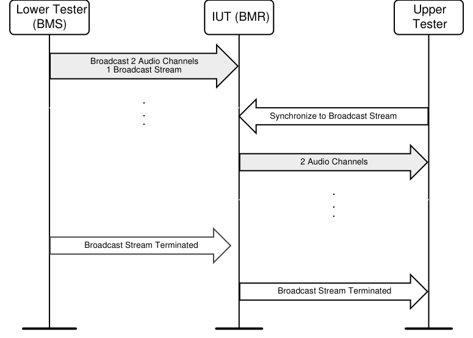

**Figure 4.5: BMR in Audio Configuration 14 MSC**

1. The Upper Tester commands the IUT to synchronize to the Lower Tester’s broadcast Audio
Stream. 2. The IUT synchronizes to the Lower Tester’s broadcast Audio Stream and provides two channels
of audio to the Upper Tester. 3. The Lower Tester stops broadcasting its broadcast Audio Stream. 4. The IUT informs the Upper Tester of the termination of the Audio Stream.
• Expected Outcome
Pass verdict
The IUT provides two Audio Channels to the Upper Tester.
The IUT informs the Upper Tester of the termination of the broadcast Audio Stream.

#### 4.2.5 UMS role

Verify the requirements of a TMAP UMS IUT.

##### 4.2.5.1 UMS Audio Configuration

• Test Purpose
Verify that a TMAP UMS can send two audio streams on two ASEs, each configured with the same Codec Specific Config Settings and QoS Config Settings. The IUT participates as a BAP Unicast Client Audio Source in BAP Audio Configuration 6(i) or 6(ii).
• Reference
[4] 3.5.1.5
• Initial Condition
- If there are two Lower Testers, then the Lower Testers are members of a coordinated set.
- The initial conditions specified in the BAP test referenced in Table 4.7 apply.
• Test Case Configuration

|  | Test Case |  |  | BAP Test Procedure |  |
| --- | --- | --- | --- | --- | --- |
| TMAP/UMS/VRC/BV-01-C [UMS in Audio Configuration 6(i)] |  |  | BAP/UCL/STR/BV-527-C |  |  |
| TMAP/UMS/VRC/BV-02-C [UMS in Audio Configuration 6(ii)] |  |  | BAP/UCL/STR/BV-528-C |  |  |

Table 4.7: UMS Audio Configuration test cases
• Test Procedure
1. Execute the BAP test procedure as specified in Table 4.7 using the following IXIT values:
▪ TSPX_CODEC_CONFIG_SINK_ASEID1 = 48_2
▪ TSPX_CODEC_CONFIG_SINK_ASEID2 = 48_2
▪ TSPX_QOS_CONFIG_SINK_ASEID1 = 48_2_1
▪ TSPX_QOS_CONFIG_SINK_ASEID2 = 48_2_1
▪ TSPX_CIG_Parameters using valid values
▪ TSPX_Metadata using valid values
• Expected Outcome
Pass verdict
The Pass verdict for the BAP Test Procedure is met.
TMAP/UMS/VRC/BV-03-C [UMS Sends Identical Audio to Left and Right Locations]
• Test Purpose
Verify the requirements of a UMS IUT in which the IUT sends audio to Front Left and Front Right Audio Locations of the UMR when the IUT has a single audio channel (e.g., mono) to send to the UMR.
• Reference
[4] 3.5.1.5
• Initial Condition
- The Lower Tester is a UMR in Audio Configuration 6(i) in Table 4.1 in BAP [3].
- The Lower Tester does not support an Audio_Channel_Counts value greater than one.
- The IUT and the Lower Tester are bonded and connected with an ACL connection.
- The IUT has discovered all relevant services and characteristics of the Lower Tester.
- The Lower Tester only supports the mandatory audio settings specified in Section 3.5.1.1 in [4] and the QoS settings specified in Section 3.5.1.4.2 in [4].
• Test Procedure
1. The Upper Tester configures the IUT to send a single Audio Channel (e.g., mono) to the Lower
Tester. 2. The IUT, as CAP Initiator, establishes two Audio Streams in the Audio Source role with the Lower
Tester with Audio Channel Allocations “Front Right” and “Front Left” to the Lower Tester’s respective “Front Right” and “Front Left” Audio Locations. This is done using the [5] CAP Unicast Audio Start procedure. 3. The IUT sends audio provided by the Upper Tester over two streams to the Lower Tester.
• Expected Outcome
Pass verdict
The IUT sends two Audio Streams to the Lower Tester at the correct Audio Locations.
The IUT uses the mandatory audio settings specified in Section 3.5.1.1 in [4] and the QoS settings specified in Section 3.5.1.4.2 in [4].

#### 4.2.6 UMR role

Verify the requirements of a TMAP UMR IUT.
TMAP/UMR/VRC/BV-01-C [UMR in Audio Configuration 6(i)]
• Test Purpose
Verify that a TMAP UMR can receive two Audio Streams on two ASEs, each configured with the same Codec Specific Config Settings and QoS Config Settings. The IUT participates as a BAP Unicast Server Audio Sink in BAP Audio Configuration 6(i).
• Reference
[4] 3.5.1.5
• Initial Condition
- The initial condition is as specified in BAP/USR/STR/BV-363-C.
• Test Procedure
1. Execute the BAP test procedure in BAP/USR/STR/BV-363-C using the following IXIT values:
▪ TSPX_CODEC_CONFIG_SINK_ASEID1 = 48_2
▪ TSPX_CODEC_CONFIG_SINK_ASEID2 = 48_2
▪ TSPX_QOS_CONFIG_SINK_ASEID1 = 48_2_1
▪ TSPX_QOS_CONFIG_SINK_ASEID2 = 48_2_1
▪ TSPX_CIG_Parameters using valid values
▪ TSPX_Metadata using valid values
• Expected Outcome
Pass verdict
The Pass verdict for BAP/USR/STR/BV-363-C is met.

### 4.3 Audio Stream Transitions control

Verify Audio Stream Transitions control features and settings not otherwise covered in the “TMAP verification by role and configuration” section.

#### 4.3.1 Common procedures for Audio Stream Transitions control

##### 4.3.1.1 Establishing an ATT/EATT Bearer Connection

As an initial condition, tests in this section may require the establishment of an ATT/EATT bearer as described in the BAP Test Suite [8] setup preambles. Use the setup preamble in Section 4.4.1 of [8], if using ATT over a LE transport, Section 4.4.2 of [8] if using ATT over a BR/EDR transport, Section 4.4.3 of [8] if using EATT over an LE transport, or Section 4.4.4 of [8] if using EATT over a BR/EDR transport.

#### 4.3.2 Audio Location

Verify that Audio Channel Allocation is correctly set.

##### 4.3.2.1 CG Audio Channel Allocation

• Test Purpose
Verify that the CG IUT supports the Audio Location value in the Audio_Channel_Allocation.
• Reference
[4] 3.5.1.4.1
• Initial Condition
- An ATT/EATT Bearer is established between the IUT and the Lower Tester per Section 4.3.1.1 Establishing an ATT/EATT Bearer Connection.
- The Lower Tester is a CT supporting the Audio Location value specified in Table 4.8.
• Test Case Configuration

|  | Test Case |  |  | Audio Location Value |  |
| --- | --- | --- | --- | --- | --- |
| TMAP/CG/ASC/BV-01-C [CG Audio Location Front Left] |  |  | 0b01 |  |  |
| TMAP/CG/ASC/BV-02-C [CG Audio Location Front Right] |  |  | 0b10 |  |  |
| TMAP/CG/ASC/BV-03-C [CG Audio Location Front Right and Front Left] |  |  | 0b11 |  |  |

Table 4.8: CG Audio Channel Allocation test cases
• Test Procedure
1. The Upper Tester orders the IUT to establish one or two Audio Channels with the Lower Tester
per the Audio Location value specified in Table 4.8.
• Expected Outcome
Pass verdict
The IUT configures the Lower Tester’s Audio Channel(s) Audio_Channel_Allocation parameter(s) to the specified Audio Location value.
• Test Purpose
Verify that the UMS IUT supports the Audio Location value in the Audio_Channel_Allocation.
• Reference
[4] 3.5.1.4.1
• Initial Condition
- An ATT/EATT Bearer is established between the IUT and the Lower Tester as described in Section 4.3.1.1 Establishing an ATT/EATT Bearer Connection.
- The Lower Tester is a UMR supporting the Audio Location value specified in Table 4.9.
• Test Case Configuration

| Test Case |  | Audio Location |  |
| --- | --- | --- | --- |
|  |  | Value |  |
| TMAP/UMS/ASC/BV-01-C [UMS Audio Location Front Left] | 0b01 |  |  |
| TMAP/UMS/ASC/BV-02-C [UMS Audio Location Front Right] | 0b10 |  |  |
| TMAP/UMS/ASC/BV-03-C [UMS Audio Location Front Right and Front Left] | 0b11 |  |  |

Table 4.9: UMS Audio Channel Allocation test cases
• Test Procedure
1. The Upper Tester orders the IUT to establish one or two Audio Channels with the Lower Tester
per the Audio Location value specified in Table 4.9.
• Expected Outcome
Pass verdict
The IUT configures the Lower Tester’s Audio Channel(s) Audio_Channel_Allocation parameter(s) to the specified Audio Location value.
TMAP/BMS/ASC/BV-01-C [BMS Audio Channel Allocation]
• Test Purpose
Verify that the BMS IUT supports Audio Channel Allocation values “Front Left” and “Front Right” in the Audio_Channel_Allocation LTV.
• Reference
[4] 3.5.2.2
• Initial Condition
- The Lower Tester is a BMR.
• Test Procedure

|  | Round |  |  | Audio Channel Allocation Value (Bit 1 and Bit 0 only) |  |  | Description |  |
| --- | --- | --- | --- | --- | --- | --- | --- | --- |
| 1 |  |  | 0b01 |  |  | Front Left |  |  |
| 2 |  |  | 0b10 |  |  | Front Right |  |  |

Table 4.10: BMS Audio Channel Allocation test values
1. For each round specified in Table 4.10, perform Steps 2–3. 2. The Upper Tester orders the IUT to broadcast Basic Audio Announcements with the Audio
Channel Allocation values in Table 4.10. 3. The Lower Tester reads the value in the Audio_Channel_Allocation LTV.
• Expected Outcome
Pass verdict
For each round, the IUT broadcasts the Audio Channel Allocation value in the Audio_Channel_Allocation LTV as specified.
TMAP/BMS/ASC/BV-02-C [BMS Audio Channel Allocation Front Right and Front Left]
• Test Purpose
Verify that the BMS IUT supports Audio Channel Allocation value “Front Right and Front Left” in the Audio_Channel_Allocation LTV.
• Reference
[4] 3.5.2.2
• Initial Condition
- The Lower Tester is a BMR.
• Test Procedure
1. The Upper Tester orders the IUT to broadcast Basic Audio Announcements with Audio Channel
Allocation value “Front Right and Front Left”. 2. The Lower Tester reads the value in the Audio_Channel_Allocation LTV.
• Expected Outcome
Pass verdict
The IUT broadcasts the Audio Channel Allocation value “Front Right and Front Left” in the Audio_Channel_Allocation LTV.

##### 4.3.2.3 BMR Audio Channel Location

• Test Purpose
Verify that the BMR IUT supports the Audio Location value in the Audio_Channel_Allocation.
• Reference
[4] 3.5.2.2
• Initial Condition
- The Lower Tester is a BMS broadcasting with the stream(s) using the Audio Location value in Table 4.11. The contents of the streams can be simulated, containing dummy data or no data at all.
• Test Case Configuration

| Test Case |  | Audio |  |
| --- | --- | --- | --- |
|  |  | Location |  |
|  |  | Value |  |
| TMAP/BMR/ASC/BV-03-C [BMR Audio Location Front Left] | 0b01 |  |  |
| TMAP/BMR/ASC/BV-04-C [BMR Audio Location Front Right] | 0b10 |  |  |
| TMAP/BMR/ASC/BV-05-C [BMR Audio Location Front Right and Front Left] | 0b11 |  |  |

Table 4.11: BMR Audio Channel Allocation test cases
• Test Procedure
1. The Upper Tester commands the IUT to synchronize to the Lower Tester’s stream(s). 2. The IUT reports synchronization to the stream(s) to the Upper Tester. 3. The IUT reports the Audio Location(s) to the Upper Tester.
• Expected Outcome
Pass verdict
The IUT synchronizes to the broadcast Audio Stream(s).
The IUT reports the Audio Location value to the Upper Tester that matches the specified value.

##### 4.3.2.4 UMR Sink Audio Location

• Test Purpose
Verify that the BAP Unicast Server Sink Audio Location characteristics are present in the UMR IUT.
• Reference
[4] 3.5.1.2.1
• Initial Condition
- The Lower Tester is a UMS.
- An ATT/EATT Bearer is established between the IUT and the Lower Tester as described in Section 4.3.1.1 Establishing an ATT/EATT Bearer Connection.
• Test Case Configuration

| Test Case |  | Sink Audio |  |
| --- | --- | --- | --- |
|  |  | Locations |  |
|  |  | Value |  |
| TMAP/UMR/ASC/BV-04-C [UMR Sink Audio Location Front Left] | 0b01 |  |  |
| TMAP/UMR/ASC/BV-05-C [UMR Sink Audio Location Front Right] | 0b10 |  |  |
| TMAP/UMR/ASC/BV-06-C [UMR Sink Audio Location Front Right and Front Left] | 0b11 |  |  |

Table 4.12: UMR Audio Locations test cases
• Test Procedure
1. The Lower Tester executes a read of the Sink Audio Location characteristic from the IUT using
the Generic GATT Integrated Tests for server test procedures as defined in [7], Section 6.3 Server test procedures (SGGIT). 2. The value read matches the value specified in Table 4.12.
• Expected Outcome
Pass verdict
The IUT reads the specified characteristic as defined in the Client test procedure.
The characteristic value matches the value specified in Table 4.12.

### 4.4 Multi-stream synchronization

#### 4.4.1 Test conditions for multi-stream synchronization

Refer to Section 3.2.3 Multi-stream synchronization overview and test configurations.

##### 4.4.1.1 Example test conditions for unicast

For unicast, the actual Audio Latency is Transport_Latency_C_To_P + Presentation_Delay.
The unicast unidirectional and bidirectional tests may use the parameter values specified in Table 4.13 to achieve the minimum Audio Latency, and may use the specified values for Direction, QoS Setting, Num CIS, RTN, and Presentation Delay.
Table 4.13 includes minimum Transport Latency and minimum Audio Latency values calculated as follows:
The minimum Audio Latency is minimum Transport_Latency + Presentation_Delay. The minimum Transport_Latency in Table 4.13 is calculated based on the Transport_Latency_C_To_P equation in Section 3.2.2 of [10]. That equation includes CIG_Sync_Delay. Its minimum value is calculated as follows:
Minimum CIG_Sync_Delay = Sub_Interval x (Number of CIS) x NSE – T_MSS (150 µs)
Further, minimum CIG_Sync_Delay is calculated using the minimum value of Sub_Interval. Therefore, to achieve the minimum CIG_Sync_Delay, the IUT configures Isochronous channels such that Sub_Interval = SE_Length. When FT = 1 and ISO_Interval = SDU_Interval, Transport_Latency_C_To_P = CIG_Sync_Delay. Under these conditions, therefore, the minimum Transport_Latency_C_To_P = minimum CIG_Sync_Delay, and the minimum Audio Latency is minimum CIG_Sync_Delay + Presentation_Delay.
Table 4.13 and Table 4.14 list the calculated minimum Audio Latency for several example BAP QoS settings and recommended LL parameters. All examples assume one audio channel per stream.

|  | Example Host Parameters |  |  |  |  |
| --- | --- | --- | --- | --- | --- |
| QoS Setting (defined in BAP [3] Section 5.6.2) |  | 48 2 2 _ _ | 48 2 2 _ _ | 48 2 2 _ _ |  |
| Number of Streams from Central to Peripheral |  | 2 | 2 | 2 |  |
| Number of Streams from Peripheral to Central |  | 0 | 0 | 0 |  |
| Number of CIGs |  | 1 | 1 | 1 |  |
|  | Example LL Parameters |  |  |  |  |
| Recommended LL Parameters (defined in TMAP [4] Section 3.5.1.4.2) |  | 1 | 2 | 3 |  |
|  | Calculated Latency Values |  |  |  |  |
| Minimum Transport Latency (ms) |  | 56.282 | 82.714 | 69.146 |  |
| Minimum Audio Latency (ms) |  | 96.282 | 122.714 | 109.146 |  |

Table 4.13: Multichannel synchronization configurations for unidirectional unicast

|  | Example Host Parameters |  |  |  |
| --- | --- | --- | --- | --- |
| QoS Setting (defined in BAP [3] Section 5.6.2) |  | 32 2 1 _ _ | 32 2 1 _ _ |  |
| Number of Streams from Central to Peripheral |  | 2 | 2 |  |
| Number of Streams from Peripheral to Central |  | 1 | 2 |  |
| Number of CIGs |  | 1 | 1 |  |

|  | Example LL Parameters |  |  |  |
| --- | --- | --- | --- | --- |
| ISO Interval |  | 10 ms | 10 ms |  |
| BN |  | 1 | 1 |  |
| NSE |  | 3 | 3 |  |
| FT |  | 1 | 1 |  |
| RTN (actual) |  | 2 | 2 |  |
|  | Calculated Latency Values |  |  |  |
| Minimum Transport Latency |  | 5.202 ms | 6.51 ms |  |
| Presentation Delay |  | 40 ms | 40 ms |  |
| Minimum Audio Latency |  | 45.202 ms | 46.51 ms |  |

Table 4.14: Multichannel synchronization configurations for bidirectional unicast

##### 4.4.1.2 Example test conditions and mandatory Presentation Delay for broadcast

For broadcast, the actual Audio Latency is Transport_Latency + Presentation_Delay.
The broadcast test may use the parameter values specified in Table 4.15 to achieve the minimum Audio Latency and would therefore use the specified values for QoS Setting, Num BIS, and RTN. The Presentation Delay given is mandatory and overrides the specified QoS settings (see Section 3.5.2.3 in [4]).
The minimum Transport_Latency in the table is calculated based on the Transport_Latency equation in Section 3.2.2 of [10].
This equation includes BIG_Sync_Delay. To achieve the minimum latency, it is calculated using the minimum value of Sub_Interval and BIS_Spacing. Therefore, to achieve the minimum latency, the BMS must configure Isochronous channels to use these minimum values.
This calculation also assumes no control subevents.
Table 4.15 lists the calculated minimum Audio Latency for several example BAP Broadcast QoS settings and recommended LL parameters.

|  | Example Host Parameters |  |  |  |  |
| --- | --- | --- | --- | --- | --- |
| QoS Setting (from BAP [3] Table 6.4) |  | 48 2 2 _ _ | 48 2 2 _ _ | 48 2 2 _ _ |  |
| Number of Streams (one channel per stream) |  | 2 | 2 | 2 |  |
| Number of BIGs |  | 1 | 1 | 1 |  |
|  | Mandatory Host Parameter |  |  |  |  |
| Presentation Delay |  | 20 ms |  |  |  |
|  | Example LL Parameters |  |  |  |  |
| Recommended LL Parameters (from BAP [3] Table 6.5) |  | 1 | 2 | 3 |  |
|  | Calculated Latency Values |  |  |  |  |
| Minimum Transport Latency (ms) |  | 60.830 | 45.950 | 59.610 |  |
| Minimum Audio Latency (ms) |  | 80.830 | 65.950 | 79.610 |  |

Table 4.15: Multichannel synchronization configurations for broadcast
A CT, UMR, or BMR IUT may request configuration or omission of an Audio Location via the IXIT. Omission of a location is expressed in IXIT [11] when TSPX_IUT_Preferred_Audio_Channel_Allocation has the value “Omitted” as defined in the Value column.
In a two CT or two UMR scenario where Audio Location is not specified, identical content (e.g., mono) is sent to the two Acceptors. This audio is confirmed to be in phase within the latency specified in the Pass verdict.
When a BMR does not have a specified Audio Location, it synchronizes to an Audio Stream with no specified Audio Channel Allocation.

#### 4.4.2 Unicast Audio Sync, two Acceptors • Test Purpose

Verify that a UMR or CT IUT can correctly synchronize its audio output relative to the Lower Tester’s Audio Transport Start signal.
• Reference
[4] 3.8
• Initial Condition
- The system is configured according to the test setup described in Section 3.2.3.2 Multi-stream synchronization for two Acceptors and according to the common test conditions established for unicast streams in Section 4.4.1 Test conditions for multi-stream synchronization.
- The IUT, the Lower Tester, and the Peer Acceptor are in the roles specified in Table 4.16.
- The Lower Tester is bonded to the IUT and may be bonded to the Peer Acceptor.
- The Lower Tester has discovered all relevant services and characteristics of the IUT.
- The Lower Tester has discovered all relevant services and characteristics of the Peer Acceptor.
- TSPX_IUT_Preferred_Audio_Channel_Allocation is the preferred Audio Location of the IUT as defined in IXIT [11].
- If TSPX_IUT_Preferred_Audio_Channel_Allocation is “Omitted”, then the Peer Acceptor does not prefer an Audio Location.
- TSPX_In_CoordinatedSet indicates if the IUT expects to be in a Coordinated Set with the Peer Acceptor as defined in IXIT [11].
- TSPX_HasMic indicates if a CT IUT has a microphone, and thus a Source ASE, as defined in IXIT [11].
- TSPX_Unidirectional_Transport_Latency specifies the Lower Tester’s Transport Latency when the IUT is a UMR, as defined in IXIT [11].
- TSPX_Bidirectional_Transport_Latency specifies the Lower Tester’s Transport Latency when the IUT is a CT, as defined in IXIT [11].
- If TSPX_In_CoordinatedSet indicates that the IUT expects to be in a Coordinated Set with the Peer Acceptor, then the Lower Tester identifies the IUT and the Peer Acceptors as members of a Coordinated Set.
• Test Case Configuration

| Test Case | IUT Role |  | Lower |  | Peer Acceptor Role |
| --- | --- | --- | --- | --- | --- |
|  |  |  | Tester Role |  |  |
| TMAP/UMR/SYNC/BV-01-C [Two UMRs Sync] | UMR | UMS |  |  | UMR |
| TMAP/CT/SYNC/BV-01-C [Two CTs Sync] | CT | CG |  |  | CT |

Table 4.16: UMR and CT Audio Sync, two Acceptors test cases

|  | Test Case |  |  | Audio Latency Calculation |  |
| --- | --- | --- | --- | --- | --- |
| TMAP/UMR/SYNC/BV-01-C [Two UMRs Sync] |  |  | TSPX Unidirectional Transport Latency + _ _ _ Presentation Delay |  |  |
| TMAP/CT/SYNC/BV-01-C [Two CTs Sync] |  |  | TSPX Bidirectional Transport Latency + _ _ _ Presentation Delay |  |  |

Table 4.17: Audio Latency calculation
• Test Procedure
1. The Lower Tester establishes an Audio Stream to the IUT’s sink ASE according to the IUT’s
preferred Audio Location as specified in TSPX_IUT_Preferred_Audio_Channel_Allocation. 2. The Lower Tester establishes an Audio Stream to Peer Acceptor’s sink ASE, and if a preferred
IUT Audio Location is specified, on the Audio Location that is the opposite of the one specified for the IUT in TSPX_IUT_Preferred_Audio_Channel_Allocation. 3. If the Lower Tester is acting as a CG, the IUT is a CT, and TSPX_HasMic indicates that the IUT
has a microphone, then an Audio Stream from the IUT to the Lower Tester is established. 4. If the Lower Tester is acting as a CG, the IUT is a CT, and TSPX_HasMic does not indicate that
the IUT has a microphone, then an Audio Stream from the Lower Tester to the Peer Acceptor is established. 5. The Lower Tester initiates sending audio to the IUT and the Peer Acceptor. 6. When audio SDUs arrive at the Lower Tester’s Link Layer, the Lower Tester signals the Latency
Timer, flagging the Audio Transport Start point. 7. The Lower Tester sends audio to the IUT’s sink Audio Stream. 8. The IUT provides the received audio to the Latency Timer.
• Expected Outcome
Pass verdict
The IUT supports one sink Audio Stream with the Lower Tester.
The latency from Audio Transport Start to the IUT’s audio output is within +/- 125 µs (+/- 100 µs static plus +/- 25 µs jitter) of the Audio Latency value given in Table 4.17.

#### 4.4.3 Unicast Audio Sync, two Streams • Test Purpose

Verify that a UMR or CT IUT can correctly synchronize the two Audio Channels it provides to the Upper Tester when receiving two Audio Streams from the Lower Tester acting as a UMS or CG.
• Reference
[4] 3.8
• Initial Condition
- When testing a UMR IUT, the test exercises BAP Configuration 6(i) in Section 4.4 of [3]. When testing a CT IUT, the test exercises Configuration D in Table 3.16: CG and CT requirements for number of concurrent Unicast Audio Streams, channels, and devices to be supported in CAP Unicast Audio Stream Transition procedures in [4].
- The system is configured according to the test setup described in Section 3.2.3.3 Multi-stream synchronization with two Audio Outs and according to the common test conditions established for unicast streams in Section 4.4.1 Test conditions for multi-stream synchronization.
- The IUT and the Lower Tester act in the roles specified in Table 4.18.
- The IUT and the Lower Tester are bonded.
- The Lower Tester has discovered all relevant services and characteristics of the IUT.
- The IUT has discovered all relevant services and characteristics of the Lower Tester.
• Test Case Configuration

|  | Test Case |  |  | IUT Role |  |  | Lower Tester Role |  |
| --- | --- | --- | --- | --- | --- | --- | --- | --- |
| TMAP/UMR/SYNC/BV-02-C [One UMR, Two Streams Sync] |  |  | UMR |  |  | UMS |  |  |
| TMAP/CT/SYNC/BV-02-C [One CT, Two Streams Sync] |  |  | CT |  |  | CG |  |  |

Table 4.18: UMR and CT Audio Sync, two Channels test case
• Test Procedure
1. The Lower Tester establishes two Audio Streams with the IUT’s two sink ASEs. 2. If the Lower Tester is acting as a CG, and the IUT is a CT, then an Audio Channel from the IUT to
the Lower Tester is established. 3. The Lower Tester sends audio to the IUT’s two sink Audio Channels. 4. The IUT sends the audio of its two sink Audio Channels to the Upper Tester.
• Expected Outcome
Pass verdict
The IUT supports two sink Audio Channels with the Lower Tester.
The two Audio Channels are rendered to within +/- 125 µs (+/- 100 µs static plus +/- 25 µs jitter) of each other.

#### 4.4.4 Broadcast Audio Synchronization

TMAP/BMR/SYNC/BV-01-C [BMR Audio Sync, Two BMRs]
• Test Purpose
Verify that a BMR IUT can correctly synchronize its audio output relative to the Lower Tester’s Audio Transport Start.
• Reference
[4] 3.5.2.3, 3.8
• Initial Condition
- The system is configured according to the test setup described in Section 3.2.3.2 Multi-stream synchronization for two Acceptors and according to the common test conditions established for broadcast streams in Section 4.4.1 Test conditions for multi-stream synchronization.
- TSPX_IUT_Preferred_Audio_Channel_Allocation is the preferred Audio Location of the IUT as defined in IXIT [11].
- TSPX_Broadcast_Transport_Latency specifies the Lower Tester’s Transport Latency, as defined in IXIT [11].
- The IUT is configured for either the Front Left or the Front Right Audio Location as specified in TSPX_AudioLocation.
- The Lower Tester broadcasts two Audio Streams, each carrying a single Audio Channel.
• Test Procedure
1. The Latency Timer commands the IUT to synchronize to the Lower Tester’s broadcast Audio
Stream according to its preferred Audio Location as defined in TSPX_IUT_Preferred_Audio_Channel_Allocation. 2. The IUT synchronizes to the Lower Tester’s broadcast Audio Stream for the specified Audio
Location. 3. The Peer Acceptor synchronizes to the Lower Tester’s other broadcast Audio Stream, which, if
not omitted, is the Audio Location that is the opposite of that specified for the IUT in TSPX_IUT_Preferred_Audio_Channel_Allocation. 4. When audio SDUs arrive at the Lower Tester’s Link Layer, the Lower Tester signals the Latency
Timer, flagging the Audio Transport Start. 5. The IUT provides its received audio to the Latency Timer.
• Expected Outcome
Pass verdict
The latency from Audio Transport Start to the IUT’s audio output is within +/- 125 µs (+/- 100 µs static plus +/- 25 µs jitter) of the Audio Latency calculated as TSPX_Broadcast_Transport_Latency + Presentation Delay.
TMAP/BMR/SYNC/BV-02-C [BMR Audio Sync, Two Streams]
• Test Purpose
Verify that a BMR IUT can correctly synchronize the two Audio Channels it provides to the Upper Tester while the Lower Tester broadcasts synchronized Audio Streams when acting as a BMS.
• Reference
[4] 3.5.2.3, 3.8
• Initial Condition
- The system is configured according to the test setup described in Section 3.2.3.3 Multi-stream synchronization with two Audio Outs and according to the common test conditions established for broadcast streams in Section 4.4.1 Test conditions for multi-stream synchronization.
• Test Procedure
1. The Upper Tester commands the IUT to synchronize to the Lower Tester’s broadcast Audio
Streams. 2. The IUT synchronizes to the Lower Tester’s broadcast Audio Streams and provides its two Audio
Channels to the Upper Tester.
• Expected Outcome
Pass verdict
The IUT renders its two Audio Channels within +/- 125 µs (+/- 100 µs static plus +/- 25 µs jitter) of each other.

### 4.5 Telephony and Media Audio (TMA) Client and Server

Verify the requirements of the TMA Client and Server.

#### 4.5.1 TMA Client

##### 4.5.1.1 Valid Behavior

###### 4.5.1.1.1 Generic GATT Integrated Tests

Verify the valid behavior requirements of the TMA Client using the Generic GATT Integrated Tests for client test procedures as defined in [7], Section 6.4, Client test procedures (CGGIT), using Table 4.19 below for input:

| TCID |  |  | Service/Characteristic |  |  | Reference | Properties |  | Value Length |  | Type |  |  |
| --- | --- | --- | --- | --- | --- | --- | --- | --- | --- | --- | --- | --- | --- |
|  |  |  |  |  |  |  |  |  | (Octets) |  |  |  |  |
|  | TMAP/CL/CGGIT/SER/BV-01-C [TMAS |  |  | Telephony and Media |  | [4] 4 | - | - | - |  |  | Primary Service, |  |
|  | Service Discovery] |  |  | Audio Service |  |  |  |  |  |  |  | Unique |  |
|  | TMAP/CL/CGGIT/CHA/BV-01-C [TMAP |  | TMAP Role | TMAP Role |  | [4] 4.7 | Read | 2 |  |  | Unique | Unique |  |
|  | Role Read Characteristic, Client] |  |  |  |  |  |  |  |  |  |  |  |  |

Table 4.19: Input for the GGIT Client test procedure
TMAP/CL/TMAS/BV-01-C [Client Ignores Unknown Characteristics in TMAS Service]
• Test Purpose
Verify that a TMAS Client IUT ignores unknown characteristics of the TMAS Service when reading the TMAP Role Characteristic from a TMAS Server.
• Reference
[4] 4
• Initial Condition
- The Lower Tester is a TMAS Server.
- The TMAS Service in the Lower Tester includes a characteristic not defined in the specification named “Unknown_Characteristic”.
- The IUT has discovered the Lower Tester’s TMAS Service.
• Test Procedure
1. The Upper Tester sends a request to the IUT to read the Role Characteristic Value from the
Lower Tester, specifying the characteristic handle. 2. The Lower Tester provides the value of the Role Characteristic. All profile role bits are set.
• Expected Outcome
Pass verdict
The IUT indicates to the Upper Tester that all defined roles in the TMAP Role characteristic are supported.
Verify the requirements of the TMAS Client when subjected to invalid behavior.
TMAP/CL/TMAS/BI-01-C [Client Ignores RFU Bits in TMAP Role Characteristic]
• Test Purpose
Verify that a TMAS Client IUT ignores RFU bits when reading the TMAP Role Characteristic from a TMAS Server.
• Reference
[4] 4.7.1.2
• Initial Condition
- The Lower Tester is a TMAS Server.
- The Role Characteristic in the Lower Tester includes all the defined role bits, and the RFU bits are set.
- The IUT has discovered the Lower Tester’s TMAS Service.
• Test Procedure
1. The Upper Tester sends a request to the IUT to read the Role Characteristic Value from the
Lower Tester, specifying the characteristic handle. 2. The Lower Tester provides the value of the Role Characteristic.
• Expected Outcome
Pass verdict
The IUT indicates to the Upper Tester that all defined roles in the TMAP Role characteristic are supported.

#### 4.5.2 TMA Server

##### 4.5.2.1 Generic GATT Integrated Tests

Execute the Generic GATT Integrated Tests defined in [7], Section 6.3, Server test procedures (SGGIT), using Table 4.20 below as input:

| TCID |  |  |  | Service/Characteristic/ |  | Reference | Properties |  | Value Length |  | Type |  |  |
| --- | --- | --- | --- | --- | --- | --- | --- | --- | --- | --- | --- | --- | --- |
|  |  |  |  | Descriptor |  |  |  |  | (Octets) |  |  |  |  |
|  | TMAP/SR/SGGIT/SER/BV-01-C |  |  | Telephony and Media Audio |  | [4] 4 | - | - | - |  |  | Primary Service, |  |
|  | [Service GGIT – TMAS] |  |  | Service |  |  |  |  |  |  |  | Unique |  |
|  | TMAP/SR/SGGIT/CHA/BV-01-C |  | TMAP Role | TMAP Role |  | [4] 4.7 | 0x02 (Read) | 2 |  |  |  |  |  |
|  | [Characteristic GGIT – TMAP Role] |  |  |  |  |  |  |  |  |  |  |  |  |
|  | TMAP/SR/SGGIT/SDP/BV-01-C [SDP |  |  | Telephony and Media Audio |  | [4] 4.9 | - | - |  |  | Unique |  |  |
|  | Record] |  |  | Service |  |  |  |  |  |  |  |  |  |

Table 4.20: Input for the GGIT Server test procedure
• Test Purpose
Confirm that the TMA Server returns the TMAP Role Characteristic with the correct bit set for its TMAP role.
• Reference
[4] 4.7
• Initial Condition
- If LE transport is specified in Table 4.21, then the IUT and the Lower Tester have not bonded.
- The Lower Tester is a TMA Client and has established a GATT Connection with the IUT as a TMA Server using security mode 1 level 1 over LE transport if LE transport is specified in Table 4.21, or security mode 4 level 0 or higher over BR/EDR transport if BR/EDR transport is specified in Table 4.21.
• Test Case Configuration

|  | Test Case |  |  | Role Characteristic |  |  | Value |  |  | Transport |  |
| --- | --- | --- | --- | --- | --- | --- | --- | --- | --- | --- | --- |
| TMAP/CG/TRC/BV-01-C [CG Characteristic over LE] |  |  | Call Gateway |  |  | 0x0001 |  |  | LE |  |  |
| TMAP/CT/TRC/BV-01-C [CT Characteristic over LE] |  |  | Call Terminal |  |  | 0x0002 |  |  | LE |  |  |
| TMAP/UMS/TRC/BV-01-C [UMS Characteristic over LE] |  |  | Unicast Media Sender |  |  | 0x0004 |  |  | LE |  |  |
| TMAP/UMR/TRC/BV-01-C [UMR Characteristic over LE] |  |  | Unicast Media Receiver |  |  | 0x0008 |  |  | LE |  |  |
| TMAP/BMS/TRC/BV-01-C [BMS Characteristic over LE] |  |  | Broadcast Media Sender |  |  | 0x0010 |  |  | LE |  |  |
| TMAP/BMR/TRC/BV-01-C [BMR Characteristic over LE] |  |  | Broadcast Media Receiver |  |  | 0x0020 |  |  | LE |  |  |
| TMAP/CG/TRC/BV-02-C [CG Characteristic over BR/EDR] |  |  | Call Gateway |  |  | 0x0001 |  |  | BR/EDR |  |  |
| TMAP/CT/TRC/BV-02-C [CT Characteristic over BR/EDR] |  |  | Call Terminal |  |  | 0x0002 |  |  | BR/EDR |  |  |
| TMAP/UMS/TRC/BV-02-C [UMS Characteristic over BR/EDR] |  |  | Unicast Media Sender |  |  | 0x0004 |  |  | BR/EDR |  |  |
| TMAP/UMR/TRC/BV-02-C [UMR Characteristic over BR/EDR] |  |  | Unicast Media Receiver |  |  | 0x0008 |  |  | BR/EDR |  |  |
| TMAP/BMS/TRC/BV-02-C [BMS Characteristic over BR/EDR] |  |  | Broadcast Media Sender |  |  | 0x0010 |  |  | BR/EDR |  |  |
| TMAP/BMR/TRC/BV-02-C [BMR Characteristic over BR/EDR] |  |  | Broadcast Media Receiver |  |  | 0x0020 |  |  | BR/EDR |  |  |

Table 4.21: TMAP Role Characteristic test cases
• Test Procedure
1. The Lower Tester executes the GATT Read Characteristic Value sub-procedure and the GATT
Read Using Characteristic UUID sub-procedure to read the TMAP Role characteristic using the appropriate security mode.
• Expected Outcome
Pass verdict
The IUT sets the appropriate bit for its supported TMAP Role as specified in the Value column in Table 4.21.
RFU bits 6–15 = 0b0000000000.
If LE transport is specified in Table 4.21, then the IUT does not bond with the Lower Tester.

### 4.6 Device discovery

Verify that a TMAP device that supports advertising its TMAP role to support device discovery and connection establishment while in bondable mode does so correctly.

#### 4.6.1 Device discovery – Role characteristic • Test Purpose

Verify that the IUT advertises its TMAP role extended advertisements in the correct format and reports the correct TMAP role characteristic.
• Reference
[4] 3.4
• Initial Condition
- The IUT is in bondable mode.
• Test Case Configuration

|  | Test Case |  |  | TMAP Role Characteristic |  |
| --- | --- | --- | --- | --- | --- |
| TMAP/CG/DDI/BV-01-C [Discovery of CG] |  |  | Call Gateway |  |  |
| TMAP/CT/DDI/BV-01-C [Discovery of CT] |  |  | Call Terminal |  |  |
| TMAP/UMS/DDI/BV-01-C [Discovery of UMS] |  |  | Unicast Media Sender |  |  |
| TMAP/UMR/DDI/BV-01-C [Discovery of UMR] |  |  | Unicast Media Receiver |  |  |
| TMAP/BMS/DDI/BV-01-C [Discovery of BMS] |  |  | Broadcast Media Sender |  |  |
| TMAP/BMR/DDI/BV-01-C [Discovery of BMR] |  |  | Broadcast Media Receiver |  |  |

Table 4.22: Device discovery – Role characteristic test cases
• Test Procedure
1. The Upper Tester orders the IUT to advertise its TMAP Role characteristic in extended
advertising as specified in Table 4.22.
• Expected Outcome
Pass verdict
The IUT advertises its TMAP Role characteristic in the correct LTV format, which includes the TMAS UUID.
• Notes
Because an IUT may support more than one TMAP role, it may report more roles than the role specified in Table 4.22.

### 4.7 Context type

Verify that a TMAP device correctly handles context type according to its role.
TMAP/BMS/CTXT/BV-01-C [BMS Supports the Media Context Type]
• Test Purpose
Verify that a BMS includes the Streaming_Audio_Contexts LTV structure in the Metadata parameter in the BASE with the context type “Media”.
• Reference
[15] 3.5.2.1
• Initial Condition
- The initial condition is as specified for CAP/INI/BST/BV-01-C in [16]. The TSPX_BASE IXIT entry includes the Streaming_Audio_Contexts LTV structure with the value “Media”.
• Test Procedure
1. Execute the CAP test procedure in CAP/INI/BST/BV-01-C.
• Expected Outcome
Pass verdict
The Pass verdict for CAP/INI/BST/BV-01-C is met.
The Streaming_Audio_Contexts LTV structure in the Metadata parameter in the BASE includes the context type “Media”.

#### 4.7.1 TMAP Acceptor Supported Sink Contexts • Test Purpose

Verify that the TMAP Acceptor IUT in the IUT role specified in Table 4.23 returns the Context Type specified in Table 4.23 in its Sink Supported Contexts field in the Supported Audio Contexts characteristic.
• Reference
[15] 3.5.1.1, 3.5.2.1
• Initial Condition
- Establish a Bearer connection between the Lower Tester and the IUT as described in Section 4.4.1.
- The IUT includes an instantiation of the Published Audio Capabilities Service [17].
- The Lower Tester is in the role specified in Table 4.23Table 4.23.
• Test Case Configuration

|  | Test Case |  |  | IUT Role |  |  | Lower Tester Role |  |  | Context Type |  |
| --- | --- | --- | --- | --- | --- | --- | --- | --- | --- | --- | --- |
| TMAP/CT/CTXT/BV-01-C [TMAP Acceptor Supported Sink Contexts, CT] |  |  | CT |  |  | CG |  |  | Conversational |  |  |
| TMAP/UMR/CTXT/BV-01-C [TMAP Acceptor Supported Sink Contexts, UMR] |  |  | UMR |  |  | UMS |  |  | Media |  |  |
| TMAP/BMR/CTXT/BV-01-C [TMAP Acceptor Supported Sink Contexts, BMR] |  |  | BMR |  |  | BMS |  |  | Media |  |  |

Table 4.23: TMAP Acceptor Supported Sink Contexts test cases
• Test Procedure
1. The Lower Tester discovers the Published Audio Capabilities Service on the IUT by executing the
GATT Discover All Primary Services sub-procedure. 2. The Lower Tester discovers the Supported Audio Contexts characteristic on the IUT by executing
the GATT Discover All Characteristics of a Service sub-procedure for the Published Audio Capabilities Service. 3. The Lower Tester reads the value of the Supported Audio Contexts characteristic discovered in
Step 2 by executing the GATT Read Characteristic Value sub-procedure for the Supported Audio Contexts characteristic discovered in Step 2.
• Expected Outcome
Pass verdict
The IUT successfully returns the value of its Supported Audio Contexts characteristic when read by the Lower Tester.
The Sink Supported Contexts field contains the context type specified in Table 4.23Table 4.23.
TMAP/CT/CTXT/BV-02-C [CT Supported Source Contexts]
• Test Purpose
Verify that the CT IUT returns the Conversational Context Type in its Source Supported Contexts field in the Supported Audio Contexts characteristic.
• Reference
[15] 3.5.1.1
• Initial Condition
- Establish a Bearer connection between the Lower Tester and the IUT as described in Section 4.4.1.
- The IUT includes an instantiation of the Published Audio Capabilities Service [17].
- The Lower Tester is in the CG role.
• Test Procedure
1. The Lower Tester discovers the Published Audio Capabilities Service on the IUT by executing the
GATT Discover All Primary Services sub-procedure. 2. The Lower Tester discovers the Supported Audio Contexts characteristic on the IUT by executing
the GATT Discover All Characteristics of a Service sub-procedure for the Published Audio Capabilities Service. 3. The Lower Tester reads the value of the Supported Audio Contexts characteristic discovered in
Step 2 by executing the GATT Read Characteristic Value sub-procedure for the Supported Audio Contexts characteristic discovered in Step 2.
• Expected Outcome
Pass verdict
The IUT successfully returns the value of its Supported Audio Contexts characteristic when read by the Lower Tester.
The Source Supported Contexts field contains the Conversational Context Type.

## 5 Test case mapping

The Test Case Mapping Table (TCMT) maps test cases to specific requirements in the ICS. The IUT is tested in all roles for which support is declared in the ICS document.
The columns for the TCMT are defined as follows:
Item: Contains a logical expression based on specific entries from the associated ICS document. Contains a logical expression (using the operators AND, OR, NOT as needed) based on specific entries from the applicable ICS document(s). The entries are in the form of y/x references, where y corresponds to the table number and x corresponds to the feature number as defined in the ICS document for TMAP [9].
If a test case is mandatory within the respective layer, then the y/x reference is omitted.
Feature: A brief, informal description of the feature being tested.
Test Case(s): The applicable test case identifiers are required for Bluetooth Qualification if the corresponding y/x references defined in the Item column are supported. Further details about the function of the TCMT are elaborated in [2].
For the purpose and structure of the ICS/IXIT, refer to [2].

|  | Item |  |  | Feature |  |  | Test Case(s) |  |
| --- | --- | --- | --- | --- | --- | --- | --- | --- |
| TMAP 17/1 |  |  | CG Config A |  |  | TMAP/CG/VRC/BV-01-C TMAP/CG/VRC/BV-07-C |  |  |
| TMAP 17/2 |  |  | CG Config B |  |  | TMAP/CG/VRC/BV-02-C |  |  |
| TMAP 17/3 |  |  | CG Config C |  |  | TMAP/CG/VRC/BV-03-C |  |  |
| TMAP 17/3 AND NOT TMAP 17/7 |  |  | Fallback to CG Config C if Config G not supported |  |  | TMAP/CG/VRC/BV-04-C |  |  |
| TMAP 17/4 |  |  | CG Config D |  |  | TMAP/CG/VRC/BV-05-C |  |  |
| TMAP 17/5 |  |  | CG Config E |  |  | TMAP/CG/VRC/BV-06-C |  |  |
| TMAP 17/6 |  |  | CG Config F |  |  | TMAP/CG/VRC/BV-08-C |  |  |
| TMAP 17/7 |  |  | CG Config G |  |  | TMAP/CG/VRC/BV-09-C |  |  |
| TMAP 17/4 AND NOT TMAP 17/6 |  |  | Fallback to CG Config D if Config F not supported |  |  | TMAP/CG/VRC/BV-10-C |  |  |
| TMAP 17/4 AND TMAP 20/1 |  |  | CG Sends Identical Audio in CG/CT Config D |  |  | TMAP/CG/VRC/BV-11-C |  |  |
| TMAP 17/6 AND TMAP 20/1 |  |  | CG Sends Identical Audio in CG/CT Config F |  |  | TMAP/CG/VRC/BV-12-C |  |  |
| TMAP 78/1 |  |  | CT Config D |  |  | TMAP/CT/VRC/BV-01-C TMAP/CT/VRC/BV-03-C |  |  |
| TMAP 78/2 |  |  | CT Config E |  |  | TMAP/CT/VRC/BV-02-C TMAP/CT/VRC/BV-04-C |  |  |
| TMAP 78/3 |  |  | CT Config F |  |  | TMAP/CT/VRC/BV-05-C TMAP/CT/VRC/BV-06-C |  |  |
| TMAP 97/2 |  |  | UMR Audio Configuration 6(i) |  |  | TMAP/UMR/VRC/BV-01-C |  |  |
| TMAP 1/3 |  |  | UMS Audio Configurations 6(i) and 6(ii) |  |  | TMAP/UMS/VRC/BV-01-C TMAP/UMS/VRC/BV-02-C |  |  |
| TMAP 1/3 AND TMAP 41/1 |  |  | UMS Sends Identical Audio to Front Left and Front Right Locations |  |  | TMAP/UMS/VRC/BV-03-C |  |  |

|  | Item |  |  | Feature |  |  | Test Case(s) |  |
| --- | --- | --- | --- | --- | --- | --- | --- | --- |
| TMAP 120/1 |  |  | BMR AC 14 |  |  | TMAP/BMR/VRC/BV-02-C |  |  |
| TMAP 19/1 |  |  | CG Audio Location Front Left |  |  | TMAP/CG/ASC/BV-01-C |  |  |
| TMAP 19/2 |  |  | CG Audio Location Front Right |  |  | TMAP/CG/ASC/BV-02-C |  |  |
| TMAP 19/3 |  |  | CG Audio Location Front Right and Front Left |  |  | TMAP/CG/ASC/BV-03-C |  |  |
| TMAP 38/1 |  |  | UMS Audio Location Front Left |  |  | TMAP/UMS/ASC/BV-01-C |  |  |
| TMAP 38/2 |  |  | UMS Audio Location Front Right |  |  | TMAP/UMS/ASC/BV-02-C |  |  |
| TMAP 38/3 |  |  | UMS Audio Location Front Right and Front Left |  |  | TMAP/UMS/ASC/BV-03-C |  |  |
| TMAP 57/1 AND TMAP 57/2 |  |  | BMS Audio Channel Allocation |  |  | TMAP/BMS/ASC/BV-01-C |  |  |
| TMAP 57/3 |  |  | BMS Audio Channel Allocation Front Right and Front Left |  |  | TMAP/BMS/ASC/BV-02-C |  |  |
| TMAP 118/1 |  |  | BMR Audio Location Front Left |  |  | TMAP/BMR/ASC/BV-03-C |  |  |
| TMAP 118/2 |  |  | BMR Audio Location Front Right |  |  | TMAP/BMR/ASC/BV-04-C |  |  |
| TMAP 118/3 |  |  | BMR Audio Location Front Right and Front Left |  |  | TMAP/BMR/ASC/BV-05-C |  |  |
| TMAP 98/1 |  |  | UMR Sink Audio Location Front Left |  |  | TMAP/UMR/ASC/BV-04-C |  |  |
| TMAP 98/2 |  |  | UMR Sink Audio Location Front Right |  |  | TMAP/UMR/ASC/BV-05-C |  |  |
| TMAP 98/3 |  |  | UMR Sink Audio Location Front Right and Front Left |  |  | TMAP/UMR/ASC/BV-06-C |  |  |
| TMAP 100/1 |  |  | Two UMRs Audio Sync |  |  | TMAP/UMR/SYNC/BV-01-C |  |  |
| TMAP 79/1 |  |  | Two CTs Audio Sync |  |  | TMAP/CT/SYNC/BV-01-C |  |  |
| TMAP 100/2 |  |  | UMR Audio Sync, Two Streams |  |  | TMAP/UMR/SYNC/BV-02-C |  |  |
| TMAP 79/2 |  |  | CT Audio Sync, Two Streams |  |  | TMAP/CT/SYNC/BV-02-C |  |  |
| TMAP 121/1 |  |  | Two BMR Audio Sync |  |  | TMAP/BMR/SYNC/BV-01-C |  |  |
| TMAP 121/2 |  |  | BMR Audio Sync, Two Streams |  |  | TMAP/BMR/SYNC/BV-02-C |  |  |
| TMAP 151/2 OR TMAP 151/3 |  |  | TMAP Service Discovery |  |  | TMAP/CL/CGGIT/SER/BV-01-C |  |  |
| (TMAP 151/4 OR TMAP 151/5) AND TMAP 151/6 |  |  | TMAP Role Read Characteristic, Client |  |  | TMAP/CL/CGGIT/CHA/BV-01-C TMAP/CL/TMAS/BV-01-C TMAP/CL/TMAS/BI-01-C |  |  |
| TMAP 13/1 |  |  | Discovery of CG |  |  | TMAP/CG/DDI/BV-01-C |  |  |
| TMAP 73/1 |  |  | Discovery of CT |  |  | TMAP/CT/DDI/BV-01-C |  |  |
| TMAP 33/1 |  |  | Discovery of UMS |  |  | TMAP/UMS/DDI/BV-01-C |  |  |
| TMAP 93/1 |  |  | Discovery of UMR |  |  | TMAP/UMR/DDI/BV-01-C |  |  |
| TMAP 53/1 |  |  | Discovery of BMS |  |  | TMAP/BMS/DDI/BV-01-C |  |  |
| TMAP 113/1 |  |  | Discovery of BMR |  |  | TMAP/BMR/DDI/BV-01-C |  |  |
| TMAP 1/8 |  |  | TMAS Server |  |  | TMAP/SR/SGGIT/SER/BV-01-C |  |  |
| TMAP 152/1 |  |  | TMAP Role Characteristic |  |  | TMAP/SR/SGGIT/CHA/BV-01-C |  |  |
| TMAP 155/1 |  |  | TMAP SDP Record |  |  | TMAP/SR/SGGIT/SDP/BV-01-C |  |  |
| TMAP 153/1 |  |  | CG Role over LE |  |  | TMAP/CG/TRC/BV-01-C |  |  |
| TMAP 153/2 |  |  | CT TMAP Role over LE |  |  | TMAP/CT/TRC/BV-01-C |  |  |
| TMAP 153/3 |  |  | UMS TMAP Role over LE |  |  | TMAP/UMS/TRC/BV-01-C |  |  |

|  | Item |  |  | Feature |  |  | Test Case(s) |  |
| --- | --- | --- | --- | --- | --- | --- | --- | --- |
| TMAP 153/4 |  |  | UMR TMAP Role over LE |  |  | TMAP/UMR/TRC/BV-01-C |  |  |
| TMAP 153/5 |  |  | BMS TMAP Role over LE |  |  | TMAP/BMS/TRC/BV-01-C |  |  |
| TMAP 153/6 |  |  | BMR TMAP Role over LE |  |  | TMAP/BMR/TRC/BV-01-C |  |  |
| TMAP 153/1 AND TMAP 154/2 |  |  | CG Role over BR/EDR |  |  | TMAP/CG/TRC/BV-02-C |  |  |
| TMAP 153/2 AND TMAP 154/2 |  |  | CT Role over BR/EDR |  |  | TMAP/CT/TRC/BV-02-C |  |  |
| TMAP 153/3 AND TMAP 154/2 |  |  | UMS Role over BR/EDR |  |  | TMAP/UMS/TRC/BV-02-C |  |  |
| TMAP 153/4 AND TMAP 154/2 |  |  | UMR Role over BR/EDR |  |  | TMAP/UMR/TRC/BV-02-C |  |  |
| TMAP 153/5 AND TMAP 154/2 |  |  | BMS Role over BR/EDR |  |  | TMAP/BMS/TRC/BV-02-C |  |  |
| TMAP 153/6 AND TMAP 154/2 |  |  | BMR Role over BR/EDR |  |  | TMAP/BMR/TRC/BV-02-C |  |  |
| TMAP 54/5 |  |  | BMS Supports the Media Context Type |  |  | TMAP/BMS/CTXT/BV-01-C |  |  |
| TMAP 74/7 |  |  | TMAP Acceptor Supported Sink Contexts, CT |  |  | TMAP/CT/CTXT/BV-01-C |  |  |
| TMAP 74/8 |  |  | CT Supported Source Contexts |  |  | TMAP/CT/CTXT/BV-02-C |  |  |
| TMAP 94/6 |  |  | TMAP Acceptor Supported Sink Contexts, UMR |  |  | TMAP/UMR/CTXT/BV-01-C |  |  |
| TMAP 114/5 |  |  | TMAP Acceptor Supported Sink Contexts, BMR |  |  | TMAP/BMR/CTXT/BV-01-C |  |  |

Table 5.1: Test case mapping

## 6 Revision history and acknowledgments

Revision History

|  | Publication |  |  | Revision |  | Date | Comments |
| --- | --- | --- | --- | --- | --- | --- | --- |
|  | Number |  |  | Number |  |  |  |
| 0 |  |  | p0 |  |  | 2022-06-14 | Adopted by the BoD on 2022-06-11. Prepared for initial publication. |
|  |  |  | p0ed2r00– r02 |  |  | 2023-03-10 – 2023-04-13 | TSE 22572 (rating 1): Corrected test procedure for TMAP/BMR/ASC/BV-03-I – -05-I. Editorial edits to align the document with the latest TS template. |
|  |  |  | p0 edition 2 |  |  | 2023-04-14 | Approved by BTI on 2023-04-13. Prepared for edition 2 publication. |
|  |  |  | p1r00 |  |  | 2023-04-17 | TSE 22246 (rating 2): Updated the initial condition for TMAP/UMS/VRC/BV-01-I and -02-I. TSE 22711 (rating 1): Added a paragraph referencing the Cross-Correlation Python Script package. Updated references accordingly. |
| 1 |  |  | p1 |  |  | 2023-06-29 | Approved by BTI on 2023-06-05. Prepared for TCRL 2023-1 publication. |
|  |  |  | p2r00 |  |  | 2023-08-09 | TSE 23417 (rating 1): Relabeled all -I tests as -C. Updated the TCMT and TCRL accordingly. |
| 2 |  |  | p2 |  |  | 2024-07-01 | Approved by BTI on 2024-04-21. Prepared for TCRL 2024-1 publication. |
|  |  |  | p3r00–r01 |  |  | 2024-11-14 – 2024-12-04 | TSE 25346 (rating 1): Replaced content on common audio synchronization with references to the TSTO. TSE 26508 (rating 4): Per E25928, added a “Context type” test group to the “Test groups” section. Added a “Context type” feature identifier and “CTXT” identifier abbreviation to the test case identification conventions. Added a “Context type” test cases section containing TMAP/BMR/CTXT/BV-01-C, TMAP/BMS/CTXT/BV-01-C, TMAP/CT/CTXT/BV-01- C and -02-C, and TMAP/UMR/CTXT/BV-01-C, and updated the TCMT accordingly. Updated the References section. |
| 3 |  |  | p3 |  |  | 2025-02-18 | Approved by BTI on 2025-02-09. TMAP v1.0.1 adopted by the BoD on 2024-02-11. Prepared for TCRL 2025-1 publication. |

Acknowledgments

|  | Name |  |  | Company |  |
| --- | --- | --- | --- | --- | --- |
| Dejan Berec |  |  | Bluetooth SIG, Inc. |  |  |
| Tharon Hall |  |  | Bluetooth SIG, Inc. |  |  |
| Łukasz Rymanowski |  |  | Codecoup |  |  |
| Ryan Bruner |  |  | Harman International |  |  |
| Sam Geeraerts |  |  | NXP |  |  |
| Chris Church |  |  | Qualcomm Technologies International, Ltd. |  |  |
| Andrew Estrada |  |  | Sony Group Corporation |  |  |

|  | Name |  |  | Company |  |
| --- | --- | --- | --- | --- | --- |
| Masahiko Seki |  |  | Sony Group Corporation |  |  |
| Akio Tanaka |  |  | Sony Group Corporation |  |  |
