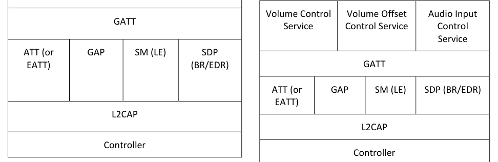

# VCP.TS .p4

> Source: PDF converted via PyMuPDF.

---

Volume Control Profile (VCP)
Bluetooth® Test Suite
▪ Revision: VCP.TS.p4 ▪ Revision Date: 2025-02-18 ▪ Prepared By: Generic Audio Working Group ▪ Published during TCRL: TCRL.2025-1
This document, regardless of its title or content, is not a Bluetooth Specification as defined in the Bluetooth Patent/Copyright License Agreement (“PCLA”) and Bluetooth Trademark License Agreement. Use of this document by members of Bluetooth SIG is governed by the membership and other related agreements between Bluetooth SIG Inc. (“Bluetooth SIG”) and its members, including the PCLA and other agreements posted on Bluetooth SIG’s website located at www.bluetooth.com.
THIS DOCUMENT IS PROVIDED “AS IS” AND BLUETOOTH SIG, ITS MEMBERS, AND THEIR AFFILIATES MAKE NO REPRESENTATIONS OR WARRANTIES AND DISCLAIM ALL WARRANTIES, EXPRESS OR IMPLIED, INCLUDING ANY WARRANTY OF MERCHANTABILITY, TITLE, NON-INFRINGEMENT, FITNESS FOR ANY PARTICULAR PURPOSE, THAT THE CONTENT OF THIS DOCUMENT IS FREE OF ERRORS.
TO THE EXTENT NOT PROHIBITED BY LAW, BLUETOOTH SIG, ITS MEMBERS, AND THEIR AFFILIATES DISCLAIM ALL LIABILITY ARISING OUT OF OR RELATING TO USE OF THIS DOCUMENT AND ANY INFORMATION CONTAINED IN THIS DOCUMENT, INCLUDING LOST REVENUE, PROFITS, DATA OR PROGRAMS, OR BUSINESS INTERRUPTION, OR FOR SPECIAL, INDIRECT, CONSEQUENTIAL, INCIDENTAL OR PUNITIVE DAMAGES, HOWEVER CAUSED AND REGARDLESS OF THE THEORY OF LIABILITY, AND EVEN IF BLUETOOTH SIG, ITS MEMBERS, OR THEIR AFFILIATES HAVE BEEN ADVISED OF THE POSSIBILITY OF SUCH DAMAGES.
This document is proprietary to Bluetooth SIG. This document may contain or cover subject matter that is intellectual property of Bluetooth SIG and its members. The furnishing of this document does not grant any license to any intellectual property of Bluetooth SIG or its members.
This document is subject to change without notice.
Copyright © 2019–2025 by Bluetooth SIG, Inc. The Bluetooth word mark and logos are owned by Bluetooth SIG, Inc. Other third-party brands and names are the property of their respective owners.
Contents

## 1 Scope

This Bluetooth document contains the Test Suite Structure (TSS) and test cases to test the implementation of the Bluetooth Volume Control Profile with the objective to provide a high probability of air interface interoperability between the tested implementation and other manufacturers’ Bluetooth devices.

## 2 References, definitions, and abbreviations

### 2.1 References

This document incorporates provisions from other publications by dated or undated reference. These references are cited at the appropriate places in the text, and the publications are listed hereinafter. Additional definitions and abbreviations can be found in [1] and [2].
[1] Bluetooth Core Specification, Version 5.0 or later
[2] Test Strategy and Terminology Overview
[3] Volume Control Profile, Version 1.0
[4] Volume Control Service, Version 1.0
[5] ICS Proforma for Volume Control Profile
[6] GATT Test Suite, GATT.TS
[7] Characteristic and Descriptor descriptions are accessible via the Bluetooth SIG Assigned Numbers.
[8] Volume Offset Control Service, Version 1.0
[9] Audio Input Control Service, Version 1.0
[10] IXIT Proforma for Volume Control Profile

### 2.2 Definitions

In this Bluetooth document, the definitions from [1] and [2] apply.

### 2.3 Acronyms and abbreviations

In this Bluetooth document, the definitions, acronyms, and abbreviations from [1] and [2] apply.

## 3 Test Suite Structure (TSS)

### 3.1 Overview

The Volume Control Profile requires the presence of GAP, SM (when used over LE transport), SDP (when used over BR/EDR transport), L2CAP, and GATT. This is illustrated in Figure 3.1.

| Volume Controller Role |  |  |  |
| --- | --- | --- | --- |
| GATT |  |  |  |
| ATT (or EATT) | GAP | SM (LE) | SDP (BR/EDR) |
| L2CAP |  |  |  |
| Controller |  |  |  |

| Volume Renderer |  |  |  |  |
| --- | --- | --- | --- | --- |
| Volume Control Service |  | Volume Offset Control Service |  | Audio Input Control Service |
| GATT |  |  |  |  |
| ATT (or EATT) | GAP |  | SM (LE) | SDP (BR/EDR) |
| L2CAP |  |  |  |  |
| Controller |  |  |  |  |

**Figure 3.1: Volume Control Profile test model**

### 3.2 Test Strategy

The test objectives are to verify the functionality of the Volume Control Profile within a Bluetooth Host and enable interoperability between Bluetooth Hosts on different devices, specifically those that are conforming to the Volume Controllers and Volume Renderers roles. The testing approach covers mandatory and optional requirements in the specifications and matches these to the support of the IUT as described in the ICS. Any defined test herein is applicable to the IUT if the ICS logical expression defined in the Test Case Mapping Table (TCMT) evaluates to true.
The test equipment provides an implementation of the Radio Controller and the parts of the Host needed to perform the test cases defined in this Test Suite. A Lower Tester acts as the IUT’s peer device and interacts with the IUT over-the-air interface. The configuration, including the IUT, needs to implement similar capabilities to communicate with the test equipment. For some test cases, it is necessary to stimulate the IUT from an Upper Tester. In practice, this could be implemented as a special test interface, a Man Machine Interface (MMI), or another interface supported by the IUT.
This Test Suite contains Valid Behavior (BV) tests complemented with Invalid Behavior (BI) tests where required. The test coverage mirrored in the Test Suite Structure is the result of a process that started with catalogued specification requirements that were logically grouped and assessed for testability enabling coverage in defined test purposes.
The VCP testing focuses on ensuring that an IUT as a Volume Controller can properly perform all the procedures and interactions that are required to control one or more speakers. This includes proper handling of all mandatory features of the Volume Control Profile, such as advertising, discovery, GATT services, and the Volume Control Point, Audio Input Control Point, and Volume Offset Control Point procedures.

### 3.3 Test groups

The following test groups have been defined:
• Generic GATT Integrated Tests
• Volume Control Point Procedures
• Volume Offset Control Point Procedures
• Audio Input Control Point Procedures
• Service Procedures – Error Handling

## 4 Test cases (TC)

### 4.1 Introduction

#### 4.1.1 Test case identification conventions

Test cases are assigned unique identifiers per the conventions in [2]. The convention used here is: <spec abbreviation>/<IUT role>/<class>/<feat>/<func>/<subfunc>/<cap>/<xx>-<nn>-<y>.
Additionally, testing of this specification includes tests from the GATT Test Suite [6] referred to as Generic GATT Integrated Tests (GGIT); when used, the test cases in GGIT are referred to through a TCID string using the following convention: <spec abbreviation>/<IUT role>/<GGIT test group>/< GGIT class >/<xx>-<nn>-<y>.

|  | Identifier Abbreviation |  |  | Spec Identifier <spec abbreviation> |  |
| --- | --- | --- | --- | --- | --- |
| VCP |  |  | Volume Control Profile |  |  |
|  | Identifier Abbreviation |  |  | Role Identifier <IUT role> |  |
| VC |  |  | Volume Controller |  |  |
| VR |  |  | Volume Renderer |  |  |
|  | Identifier Abbreviation |  |  | Reference Identifier <GGIT test group> |  |
| CGGIT |  |  | Client Generic GATT Integrated Tests |  |  |
| SGGIT |  |  | Server Generic GATT Integrated Tests |  |  |
|  | Identifier Abbreviation |  |  | Reference Identifier <GGIT class> |  |
| CHA |  |  | Characteristic |  |  |
| SDPNF |  |  | SDP Record Not Found |  |  |
| SER |  |  | Service |  |  |
|  | Identifier Abbreviation |  |  | Feature Identifier <feat> |  |
| AICP |  |  | Audio Input Control Point |  |  |
| DSC |  |  | Discovery and Advertising |  |  |
| SPE |  |  | Service Procedure – Error handling |  |  |
| VCCP |  |  | Volume Control Control Point |  |  |
| VOCP |  |  | Volume Offset Control Point |  |  |

Table 4.1: VCP TC feature naming conventions

#### 4.1.2 Conformance

When conformance is claimed for a particular specification, all capabilities are to be supported in the specified manner. The mandated tests from this Test Suite depend on the capabilities to which conformance is claimed.
The Bluetooth Qualification Program may employ tests to verify implementation robustness. The level of implementation robustness that is verified varies from one specification to another and may be revised for cause based on interoperability issues found in the market.
• That claimed capabilities may be used in any order and any number of repetitions not excluded by the specification
• That capabilities enabled by the implementations are sustained over durations expected by the use case
• That the implementation gracefully handles any quantity of data expected by the use case
• That in cases where more than one valid interpretation of the specification exists, the implementation complies with at least one interpretation and gracefully handles other interpretations
• That the implementation is immune to attempted security exploits
A single execution of each of the required tests is required to constitute a Pass verdict. However, it is noted that to provide a foundation for interoperability, it is necessary that a qualified implementation consistently and repeatedly pass any of the applicable tests.
In any case, where a member finds an issue with the test plan generated by the Bluetooth SIG qualification tool, with the test case as described in the Test Suite, or with the test system utilized, the member is required to notify the responsible party via an erratum request such that the issue may be addressed.

#### 4.1.3 Pass/Fail verdict conventions

Each test case has an Expected Outcome section. The IUT is granted the Pass verdict when all the detailed pass criteria conditions within the Expected Outcome section are met.
The convention in this Test Suite is that, unless there is a specific set of fail conditions outlined in the test case, the IUT fails the test case as soon as one of the pass criteria conditions cannot be met. If this occurs, then the outcome of the test is a Fail verdict.

### 4.2 Setup preambles

#### 4.2.1 ATT Bearer on LE Transport

Preamble procedure:
1. Establish an LE transport connection between the IUT and the Lower Tester, where the
advertising implementation (as GAP Peripheral) uses Extended Advertising as defined in Section 6.1.1 of [3] and the discovering implementation (as GAP Central) operates according to Section 6.1.2 of [3]. 2. Establish an L2CAP channel 0x0004 between the IUT and the Lower Tester over that LE
transport.

#### 4.2.2 ATT Bearer on BR/EDR Transport

Preamble procedure:
1. Establish a BR/EDR transport connection between the IUT and the Lower Tester. 2. Establish an L2CAP channel (PSM 0x001F) between the IUT and the Lower Tester over that
BR/EDR transport.

#### 4.2.3 EATT Bearer on LE Transport

Preamble procedure:
1. Establish an LE transport connection between the IUT and the Lower Tester, where the
advertising implementation (as GAP Peripheral) uses Extended Advertising as defined in Section 6.1.1 of [3] and the discovering implementation (as GAP Central) operates according to Section 6.1.2 of [3]. 2. Establish an L2CAP channel 0x0005 for signaling and one L2CAP channel (for ATT bearers) with
EATT PSM (as defined in Assigned Numbers) between the IUT and the Lower Tester over that LE transport.

#### 4.2.4 EATT Bearer on BR/EDR Transport

Preamble procedure:
1. Establish a BR/EDR transport connection between the IUT and the Lower Tester. 2. Establish an L2CAP channel 0x0001 for signaling and one L2CAP channel (for ATT bearers) with
EATT PSM (as defined in Assigned Numbers) between the IUT and the Lower Tester over that BR/EDR transport.

### 4.3 Generic GATT Integration Tests

Execute the Generic GATT Integrated Tests defined in [6] in Section 6.3, Server test procedures (SGGIT), and Section 6.4, Client test procedures (CGGIT), using Table 4.2 below as input:

| Test Case |  | Service / |  | Reference | Properties |  | Value |  |  | Related to |  |
| --- | --- | --- | --- | --- | --- | --- | --- | --- | --- | --- | --- |
|  |  | Characteristic / |  |  |  |  | Length |  |  | Primary |  |
|  |  | Descriptor |  |  |  |  | (Octets) |  |  | Service |  |
| VCP/VC/CGGIT/SER/BV-01-C [Service GGIT – Volume Control] | Volume Control Service |  |  | [3] 4.3.1 | - | - |  |  | - |  |  |
| VCP/VC/CGGIT/CHA/BV-01-C [Characteristic GGIT – Volume State] | Volume State Characteristic |  |  | [3] 4.3.1 [4] 3.1 | 0x12 (Read, Notify) | 3 |  |  | - |  |  |
| VCP/VC/CGGIT/CHA/BV-02-C [Characteristic GGIT – Volume Control Point] | Volume Control Point Characteristic |  |  | [3] 4.3.1 [4] 3.2 | 0x08 (Write) | Skip |  |  | - |  |  |
| VCP/VC/CGGIT/CHA/BV-03-C [Characteristic GGIT – Volume Flags] | Volume Flags Characteristic |  |  | [3] 4.3.1 [4] 3.3 | 0x12 (Read, Notify) | 1 |  |  | - |  |  |
| VCP/VC/CGGIT/SER/BV-02-C [Service GGIT – Volume Offset Control] | Volume Offset Control Service |  |  | [3] 4.3.2 [8] 3.2 | - | - |  |  | VCS |  |  |
| VCP/VC/CGGIT/CHA/BV-04-C [Characteristic GGIT – Volume Offset State] | Volume Offset State Characteristic |  |  | [3] 4.3.2 [8] 3.1 | 0x12 (Read, Notify) | 3 |  |  | - |  |  |
| VCP/VC/CGGIT/CHA/BV-05-C [Characteristic GGIT – Audio Location] | Audio Location Characteristic |  |  | [3] 4.3.2 [8] 3.2 | Mandatory:0x02 (Read) Optional: 0x10 (Notify) 0x04 (WriteWithoutResponse) | 1 |  |  | - |  |  |
| VCP/VC/CGGIT/CHA/BV-06-C [Characteristic GGIT – Volume Offset Control Point] | Volume Offset Control Point Characteristic |  |  | [3] 4.3.2 [8] 3.3 | 0x08 (Write) | Skip |  |  | - |  |  |

| Test Case |  | Service / |  | Reference | Properties |  | Value |  |  | Related to |  |
| --- | --- | --- | --- | --- | --- | --- | --- | --- | --- | --- | --- |
|  |  | Characteristic / |  |  |  |  | Length |  |  | Primary |  |
|  |  | Descriptor |  |  |  |  | (Octets) |  |  | Service |  |
| VCP/VC/CGGIT/CHA/BV-07-C [Characteristic GGIT – Audio Output Description] | Audio Output Description Characteristic |  |  | [3] 4.3.2 [8] 3.4 | Mandatory:0x02 (Read) Optional: 0x10 (Notify) 0x04 (WriteWithoutResponse) | Skip |  |  | - |  |  |
| VCP/VC/CGGIT/SER/BV-03-C [Service GGIT – Audio Input Control] | Audio Input Control Service |  |  | [3] 4.3.3 [9] 3.3 | - | - |  |  | VCS |  |  |
| VCP/VC/CGGIT/CHA/BV-08-C [Characteristic GGIT – Audio Input State] | Audio Input State Characteristic |  |  | [3] 4.3.3 [9] 3.1 | 0x12 (Read, Notify) | 4 |  |  | - |  |  |
| VCP/VC/CGGIT/CHA/BV-09-C [Characteristic GGIT – Gain Setting Properties] | Gain Setting Properties Characteristic |  |  | [3] 4.3.3 [9] 3.2 | 0x02 (Read) | 3 |  |  | - |  |  |
| VCP/VC/CGGIT/CHA/BV-10-C [Characteristic GGIT – Audio Input Type] | Audio Input Type Characteristic |  |  | [3] 4.3.3 [9] 3.3 | 0x02 (Read) | 1 |  |  | - |  |  |
| VCP/VC/CGGIT/CHA/BV-11-C [Characteristic GGIT – Audio Input Status] | Audio Input Status Characteristic |  |  | [3] 4.3.3 [9] 3.4 | 0x12 (Read, Notify) | 1 |  |  | - |  |  |
| VCP/VC/CGGIT/CHA/BV-12-C [Characteristic GGIT – Audio Input Control Point] | Audio Input Control Point Characteristic |  |  | [3] 4.3.3 [9] 3.5 | 0x08 (Write) | Skip |  |  | - |  |  |
| VCP/VC/CGGIT/CHA/BV-13-C [Characteristic GGIT – Audio Input Description] | Audio Input Description Characteristic |  |  | [3] 4.3.3 [9] 3.6 | Mandatory:0x12 (Read, Notify) Optional: 0x04 (WriteWithoutResponse) | Skip |  |  | - |  |  |
| VCP/VR/SGGIT/SDPNF/BV-01-C [SDP GGIT – Volume Control Service, Not Discoverable over BR/EDR] | Volume Control Service |  |  | [3] 4.2 | - | - |  |  | - |  |  |

| Test Case |  | Service / |  | Reference | Properties |  | Value |  |  | Related to |  |
| --- | --- | --- | --- | --- | --- | --- | --- | --- | --- | --- | --- |
|  |  | Characteristic / |  |  |  |  | Length |  |  | Primary |  |
|  |  | Descriptor |  |  |  |  | (Octets) |  |  | Service |  |
| VCP/VR/SGGIT/SDPNF/BV-02-C [SDP GGIT – Volume Offset Control Service, Not Discoverable over BR/EDR] | Volume Offset Control Service |  |  | [3] 4.2 | - | - |  |  | - |  |  |
| VCP/VR/SGGIT/SDPNF/BV-03-C [SDP GGIT – Audio Input Control Service, Not Discoverable over BR/EDR] | Audio Input Control Service |  |  | [3] 4.2 | - | - |  |  | - |  |  |

Table 4.2: Input for the GGIT Client and Server test procedures

### 4.4 Additional Service Discovery

#### 4.4.1 LE Audio Major Service Class CoD Support • Test Purpose

Verify that the IUT implementing either the Volume Controller or Volume Renderer roles that supports the BR/EDR transport sets the LE Audio Major Service Class in the Class of Device field.
• Reference
[3] 6.2.3
• Initial Condition
- The IUT is discoverable and connectable over the BR/EDR transport.
• Test Case Configuration

|  | Test Case |  |
| --- | --- | --- |
| VCP/VR/DSC/BV-01-C [Volume Renderer – LE Audio Major Service Class CoD Support] |  |  |
| VCP/VC/DSC/BV-01-C [Volume Controller – LE Audio Major Service Class CoD Support] |  |  |

Table 4.3: LE Audio Major Service Class CoD Support test cases
• Test Procedure
1. The Lower Tester performs the Inquiry procedure. 2. The IUT sends an Inquiry response message.
• Expected Outcome
Pass verdict
In Step 2, the Class of Device field has the LE Audio Major Service Class bit 14 set to 1.
If the IUT uses limited discoverable mode, the limited discoverable Major Service Class bit is also set to 1.

### 4.5 Service Procedure – Volume Control Point • Test Purpose

This is a generic procedure to verify that the IUT can execute Volume Control Point sub-procedures.
• Reference
[3] 4.4.1.6
• Initial Condition
- Establish a Bearer connection between the Lower Tester and the IUT as described in Section 4.2.1, if using ATT over an LE transport, or Section 4.2.2 if using ATT over a BR/EDR transport, or Section 4.2.3 if using EATT over an LE transport, or Section 4.2.4 if using EATT over a BR/EDR transport.
- The Lower Tester includes an instantiation of the Volume Control Service.
- The IUT has discovered the Volume Control Service of the Lower Tester and has saved the handle range.
- The IUT knows the Change_Counter value or has retrieved the value by executing the Read Volume State sub-procedure.
• Test Case Configuration

|  | Test Case |  |  | Sub-procedure |  |  | Parameter Value(s) |  |
| --- | --- | --- | --- | --- | --- | --- | --- | --- |
| VCP/VC/VCCP/BV-01-C [Volume Control Point – Relative Volume Down] |  |  | Relative Volume Down |  |  | Change Counter _ |  |  |
| VCP/VC/VCCP/BV-02-C [Volume Control Point – Relative Volume Up] |  |  | Relative Volume Up |  |  | Change Counter _ |  |  |
| VCP/VC/VCCP/BV-03-C [Volume Control Point – Unmute / Relative Volume Down] |  |  | Unmute / Relative Volume Down |  |  | Change Counter _ |  |  |
| VCP/VC/VCCP/BV-04-C [Volume Control Point – Unmute / Relative Volume Up] |  |  | Unmute / Relative Volume Up |  |  | Change Counter _ |  |  |
| VCP/VC/VCCP/BV-05-C [Volume Control Point – Set Absolute Volume] |  |  | Set Absolute Volume |  |  | Volume Setting, _ Change Counter _ |  |  |
| VCP/VC/VCCP/BV-06-C [Volume Control Point – Unmute Volume] |  |  | Unmute |  |  | Change Counter _ |  |  |
| VCP/VC/VCCP/BV-07-C [Volume Control Point – Mute Volume] |  |  | Mute |  |  | Change Counter _ |  |  |

Table 4.4: Volume Control Point Procedures test cases
• Test Procedure
1. The Upper Tester orders the IUT to execute the specified Volume Control Point sub-procedure
with the parameter value(s) as listed in Table 4.4. 2. The Lower Tester sends the IUT a response indicating success.
• Expected Outcome
Pass verdict
The IUT successfully executes the specified Volume Control Point sub-procedure with the parameter value(s) as listed in Table 4.4.

### 4.6 Service Procedure – Audio Input Control Point • Test Purpose

This is a generic procedure to test Audio Input Control Point sub-procedures.
• Reference
[3] 4.4.3.7
• Initial Condition
- Establish a Bearer connection between the Lower Tester and the IUT as described in Section 4.2.1, if using ATT over an LE transport, or Section 4.2.2 if using ATT over a BR/EDR transport, or Section 4.2.3 if using EATT over an LE transport, or Section 4.2.4 if using EATT over a BR/EDR transport.
- The Lower Tester includes an instantiation of the Audio Input Control Service.
- The IUT has discovered the Audio Input Control Service of the Lower Tester and has saved the handle range.
- The IUT knows the Change_Counter value or has retrieved the value by executing the Read Audio Input State sub-procedure.
• Test Case Configuration

|  | Test Case |  |  | Sub-procedure |  |  | Parameter Value(s) |  |
| --- | --- | --- | --- | --- | --- | --- | --- | --- |
| VCP/VC/AICP/BV-01-C [Audio Input Control Point – Set Gain Setting] |  |  | Set Gain Setting |  |  | Change Counter, _ Gain Setting |  |  |
| VCP/VC/AICP/BV-02-C [Audio Input Control Point – Unmute] |  |  | Unmute |  |  | Change Counter _ |  |  |
| VCP/VC/AICP/BV-03-C [Audio Input Control Point – Mute] |  |  | Mute |  |  | Change Counter _ |  |  |
| VCP/VC/AICP/BV-04-C [Audio Input Control Point – Set Manual Gain Mode] |  |  | Set Manual Gain Mode |  |  | Change Counter _ |  |  |
| VCP/VC/AICP/BV-05-C [Audio Input Control Point – Set Automatic Gain Mode] |  |  | Set Automatic Gain Mode |  |  | Change Counter _ |  |  |

Table 4.5: Audio Input Control Point Procedures test cases
• Test Procedure
1. The Upper Tester orders the IUT to execute the specified Audio Input Control Point sub-
procedure with the listed parameter value(s) in Table 4.5. 2. The Lower Tester sends the IUT a response indicating success.
• Expected Outcome
Pass verdict
The IUT successfully executes the Audio Input Control Point sub-procedure with the parameter value(s) listed in Table 4.5.

### 4.7 Service Procedure – Volume Offset Control Point • Test Purpose

This is a generic procedure to verify that the IUT can execute Volume Offset Control Point sub- procedures.
• Reference
[3] 4.4.2.6
• Initial Condition
- Establish a Bearer connection between the Lower Tester and the IUT as described in Section 4.2.1, if using ATT over an LE transport, or Section 4.2.2 if using an ATT over BR/EDR transport, or Section 4.2.3 if using EATT over an LE transport, or Section 4.2.4 if using EATT over a BR/EDR transport.
- The Lower Tester includes an instantiation of the Volume Offset Control Service.
- The IUT has discovered the Volume Offset Control Service of the Lower Tester and has saved the handle range.
- The IUT knows the Change_Counter value or has retrieved the value by executing the Read Volume Offset State sub-procedure.
• Test Case Configuration

|  | Test Case |  |  | Sub-procedure |  |  | Parameter Value(s) |  |
| --- | --- | --- | --- | --- | --- | --- | --- | --- |
| VCP/VC/VOCP/BV-01-C [Volume Offset Control Point – Set Volume Offset] |  |  | Set Volume Offset |  |  | Change Counter, _ Volume Offset _ |  |  |

Table 4.6: Volume Offset Control Point Procedures test cases
• Test Procedure
1. The Upper Tester orders the IUT to execute the specified Volume Offset Control Point sub-
procedure with the listed parameter value(s) in Table 4.6. 2. The Lower Tester sends the IUT a response indicating success.
• Expected Outcome
Pass verdict
The IUT successfully executes the Volume Offset Control Point sub-procedure with the parameter value(s) listed in Table 4.6.

### 4.8 Service Procedure – Error Handling

#### 4.8.1 Volume Control Point – Invalid Change Counter • Test Purpose

This test group is for generic use and contains one or more test cases to verify that the Volume Controller IUT behaves appropriately when it receives the Application Error Code “Invalid Change Counter”. The verification is done one value at a time, as enumerated in the test cases in Table 4.7 below, using this generic test procedure.
• Reference
[3] 4.4.1.6
• Initial Condition
- Establish a Bearer connection between the Lower Tester and the IUT as described in Section 4.2.1, if using ATT over an LE transport, or Section 4.2.2 if using an ATT over BR/EDR transport, or Section 4.2.3 if using EATT over an LE transport, or Section 4.2.4 if using EATT over a BR/EDR transport.
- The Lower Tester includes one instantiation of the Volume Control Service with the Volume_Setting set to 100 and Step size to 1.
- If the Lower Tester requires a bonding procedure, then perform a bonding procedure.
- If Lower Tester permissions for the characteristic require a specific security mode or security level, establish a connection meeting those requirements.
- The IUT has enabled notification by writing the value 0x0001 using the GATT Write Characteristic Descriptor sub-procedure for the Volume State CCCD.
- The IUT knows the Change_Counter value of the Volume Renderer or has retrieved it by executing the Read Volume State sub-procedure.
• Test Case Configuration

|  | Test Case |  |  | Sub-procedure |  |
| --- | --- | --- | --- | --- | --- |
|  | VCP/VC/SPE/BI-01-C [VCP – Invalid Change Counter – Relative |  | Relative Volume Down | Relative Volume Down |  |
|  | Volume Down] |  |  |  |  |
|  | VCP/VC/SPE/BI-02-C [VCP – Invalid Change Counter – Relative |  | Relative Volume Up |  |  |
|  | Volume Up] |  |  |  |  |
|  | VCP/VC/SPE/BI-03-C [VCP – Invalid Change Counter – |  |  | Unmute/Relative Volume |  |
|  | Unmute/Relative Volume Down] |  |  | Down |  |
|  | VCP/VC/SPE/BI-04-C [VCP – Invalid Change Counter – |  | Unmute/Relative Volume Up | Unmute/Relative Volume Up |  |
|  | Unmute/Relative Volume Up] |  |  |  |  |
|  | VCP/VC/SPE/BI-05-C [VCP – Invalid Change Counter – Set |  | Set Absolute Volume |  |  |
|  | Absolute Volume] |  |  |  |  |
|  | VCP/VC/SPE/BI-06-C [VCP – Invalid Change Counter – Unmute] |  |  | Unmute |  |
|  | VCP/VC/SPE/BI-07-C [VCP – Invalid Change Counter – Mute] |  |  | Mute |  |

Table 4.7: Input for Invalid Change Counter test procedure
• Test Procedure
1. The Upper Tester orders the IUT to execute the Volume Control Point sub-procedure specified
in Table 4.7 and a Change_Counter value that does not match the known Change_Counter value. 2. The Lower Tester sends an Error Response with Application Error Code “Invalid Change
Counter”. 3. The Upper Tester orders the IUT to execute the Read Volume State sub-procedure.
• Expected Outcome
Pass verdict
In Step 3, the IUT successfully executes the Read Volume State sub-procedure after receiving the error code in Step 2.

#### 4.8.2 Audio Input Control Point – Invalid Change Counter • Test Purpose

This test group is for generic use and contains one or more test cases to verify that the Volume Controller IUT behaves appropriately when it receives the Application Error Code “Invalid Change Counter” from the Audio Input Control Point in response to a Write Request. The verification is done one value at a time, as enumerated in the test cases in Table 4.8 below, using this generic test procedure.
• Reference
[3] 4.4.3.7
• Initial Condition
- Establish a Bearer connection between the Lower Tester and the IUT as described in Section 4.2.1, if using ATT over an LE transport, or Section 4.2.2 if using ATT over a BR/EDR transport, or Section 4.2.3 if using EATT over an LE transport, or Section 4.2.4 if using EATT over a BR/EDR transport.
- The Lower Tester includes one instantiation of the Audio Input Control Service.
- If the Lower Tester requires a bonding procedure, then perform a bonding procedure.
- If the Lower Tester permissions for the characteristic require a specific security mode or security level, establish a connection meeting those requirements.
- The IUT has enabled notification by writing the value 0x0001 using the GATT Write Characteristic Descriptor sub-procedure for the Audio Input State CCCD.
- The IUT knows the Change_Counter value or has retrieved the value by executing the Read Audio Input State sub-procedure.
• Test Case Configuration

|  | Test Case |  |  | Sub-procedure |  |
| --- | --- | --- | --- | --- | --- |
|  | VCP/VC/SPE/BI-08-C [AICP – Invalid Change Counter – Set Gain |  | Set Gain Setting | Set Gain Setting |  |
|  | Setting] |  |  |  |  |
|  | VCP/VC/SPE/BI-09-C [AICP – Invalid Change Counter – Unmute] |  |  | Unmute |  |
|  | VCP/VC/SPE/BI-10-C [AICP – Invalid Change Counter – Mute] |  |  | Mute |  |
|  | VCP/VC/SPE/BI-11-C [AICP – Invalid Change Counter – Set |  | Set Manual Gain Mode | Set Manual Gain Mode |  |
|  | Manual Gain Mode] |  |  |  |  |
|  | VCP/VC/SPE/BI-12-C [AICP – Invalid Change Counter – Set |  | Set Automatic Gain Mode |  |  |
|  | Automatic Gain Mode] |  |  |  |  |

Table 4.8: Input for Invalid Change Counter test procedure
• Test Procedure
1. The Upper Tester orders the IUT to execute the Audio Input Control Point sub-procedure
specified in Table 4.8 with a Change_Counter value that does not match the known correct Change_Counter value. 2. The Lower Tester sends an Error Response with Application Error Code “Invalid Change
Counter”. 3. The Upper Tester orders the IUT to execute the Read Audio Input State sub-procedure.
• Expected Outcome
Pass verdict
In Step 3, the IUT successfully executes the Read Audio Input State sub-procedure after receiving the error code in Step 2.
VCP/VC/SPE/BI-13-C [Volume Offset Control Point – Invalid Change Counter]
• Test Purpose
Verify that the Volume Controller IUT behaves appropriately when it receives the Application Error Code “Invalid Change Counter” from the Volume Offset Control Point in response to a Write Request.
• Reference
[3] 4.4.2.6
• Initial Condition
- Establish a Bearer connection between the Lower Tester and the IUT as described in Section 4.2.1, if using ATT over an LE transport, or Section 4.2.2 if using ATT over a BR/EDR transport, or Section 4.2.3 if using EATT over an LE transport, or Section 4.2.4 if using EATT over a BR/EDR transport.
- The Lower Tester includes one instantiation of the Volume Offset Control Service including at least the Volume Offset Control Point characteristic.
- If the Lower Tester requires a bonding procedure, then perform a bonding procedure.
- If the Lower Tester permissions for the characteristic require a specific security mode or security level, establish a connection meeting those requirements.
- The IUT has enabled notification by writing the value 0x0001 using the GATT Write Characteristic Descriptor sub-procedure for the Volume Offset State CCCD.
- The IUT knows the Change_Counter value or has retrieved the value by executing the Read Volume Offset State sub-procedure.
• Test Procedure
1. The Upper Tester orders the IUT to execute the Set Volume Offset sub-procedure with a
Change_Counter value that does not match the known correct Change_Counter value. 2. The Lower Tester sends an Error Response with Application Error Code “Invalid Change
Counter”. 3. The Upper Tester orders the IUT to execute the Read Volume Offset State sub-procedure.
• Expected Outcome
Pass verdict
In Step 3, the IUT successfully executes the sub-procedure after receiving the error code in Step 2.
VCP/VC/SPE/BI-14-C [Audio Input Control Point – Value Out of Range]
• Test Purpose
Verify that the Volume Controller IUT behaves appropriately when it receives the Application Error Code “Value Out of Range” from the Audio Input Control Point in response to a Write Request.
• Reference
[9] 3.5.2.1
• Initial Condition
- Establish a Bearer connection between the Lower Tester and the IUT as described in Section 4.2.1, if using ATT over an LE transport, or Section 4.2.2 if using ATT over a BR/EDR transport, or Section 4.2.3 if using EATT over an LE transport, or Section 4.2.4 if using EATT over a BR/EDR transport.
- The Lower Tester includes one instantiation of the Audio Input Control Service including at least the Audio Input Control Point characteristic.
- The Lower Tester has set its Gain Setting to 0, Gain Setting Step Size to 1, Gain Setting Minimum to -100, and Gain Setting Maximum to +100.
- If the Lower Tester requires a bonding procedure, then perform a bonding procedure.
- If the Lower Tester permissions for the characteristic require a specific security mode or security level, establish a connection meeting those requirements.
- The IUT has enabled notification by writing the value 0x0001 using the GATT Write Characteristic Descriptor sub-procedure for the Audio Input State CCCD.
- The IUT knows the Change_Counter value or has retrieved the value by executing the Read Audio Input State sub-procedure.
• Test Procedure
1. The Upper Tester orders the IUT to execute the Set Gain Setting sub-procedure with the Gain
Setting parameter set to a random value and the correct Change_Counter value. 2. The Lower Tester sends an Error Response with Error Code “Value Out of Range”. 3. The Upper Tester orders the IUT to execute the Read Audio Input State sub-procedure.
• Expected Outcome
Pass verdict
In Step 3, the IUT successfully executes the sub-procedure after receiving the error code in Step 2.

#### 4.8.3 Control Point – Opcode Not Supported • Test Purpose

This test group is for generic use and contains one or more test cases to verify that the Volume Controller IUT behaves appropriately when it receives the Application Error Code “Opcode Not Supported” from the Target Control Point in response to a Write Request. The verification is done one value at a time, as enumerated in the test cases in Table 4.9 below, using this generic test procedure.
• Reference
[8] 3.3.2
[4] 3.3.2
[9] 3.5.2
• Initial Condition
- Establish a Bearer connection between the Lower Tester and the IUT as described in Section 4.2.1, if using ATT over an LE transport, or Section 4.2.2 if using ATT over a BR/EDR transport, or Section 4.2.3 if using EATT over an LE transport, or Section 4.2.4 if using EATT over a BR/EDR transport.
- The Lower Tester includes one instantiation of the Target Service specified in Table 4.9.
- If the Lower Tester requires a bonding procedure, then perform a bonding procedure.
- If the Lower Tester permissions for the characteristic require a specific security mode or security level, establish a connection meeting those requirements.
• Test Case Configuration

| Test Case |  |  | Target Control Point |  | Target State |  |  | Target |  |
| --- | --- | --- | --- | --- | --- | --- | --- | --- | --- |
|  |  |  |  |  | Characteristic |  |  | Service |  |
|  | VCP/VC/SPE/BI-15-C [Volume |  | Volume Control Point | Volume State | Volume State |  |  | Volume |  |
|  | Control Point – Op Code Not |  |  |  |  |  |  | Control |  |
|  | Supported] |  |  |  |  |  |  | Service |  |
| VCP/VC/SPE/BI-16-C [Volume Offset Control Point – Op Code Not Supported] | VCP/VC/SPE/BI-16-C [Volume |  | Volume Offset Control Point | Volume Offset State |  |  |  | Volume |  |
|  | Offset Control Point – Op Code |  |  |  |  |  |  | Offset |  |
|  | Not Supported] |  |  |  |  |  |  | Control |  |
|  |  |  |  |  |  |  |  | Service |  |
|  | VCP/VC/SPE/BI-17-C [Audio |  | Audio Input Control Point | Audio Input State |  |  |  | Audio Input |  |
|  | Input Control Point – Op Code |  |  |  |  |  |  | Control |  |
|  | Not Supported] |  |  |  |  |  |  | Service |  |

Table 4.9: Input for Opcode Not Supported test procedure
• Test Procedure
1. The IUT has enabled notification by writing the value 0x0001 using the GATT Write
Characteristic Descriptor sub-procedure for the target state CCCD. 2. The IUT knows the Change_Counter value or executes the GATT Read Characteristic Value
sub-procedure for the Target State Characteristic specified in Table 4.9 to retrieve it. 3. The Upper Tester orders the IUT to execute the GATT Write Characteristic Value sub-procedure
for the Target Control Point specified in Table 4.9 with any Opcode. 4. The Lower Tester sends an Error Response with Error Code “Opcode Not Supported”. 5. The Upper Tester orders the IUT to execute the GATT Read Characteristic Value sub-procedure
for the Target State Characteristic specified in Table 4.9.
• Expected Outcome
Pass verdict
The IUT successfully executes the GATT Read Characteristic Value sub-procedure after having received the error code.
VCP/VC/SPE/BI-18-C [Audio Input Control Point – Mute Disabled]
• Test Purpose
Verify that the Volume Controller IUT behaves appropriately when it receives the Application Error Code “Mute Disabled” from the Audio Input Control Point after executing the Mute sub-procedure.
• Reference
[9] 3.5.2.2, 3.5.2.3
• Initial Condition
- Establish a Bearer connection between the Lower Tester and the IUT as described in Section 4.2.1, if using ATT over an LE transport, or Section 4.2.2 if using ATT over a BR/EDR transport, or Section 4.2.3 if using EATT over an LE transport, or Section 4.2.4 if using EATT over a BR/EDR transport.
- The Lower Tester includes one instantiation of the Audio Input Control Service.
- The Lower Tester has its Mute State on the Audio Input Control Service set to Not Muted.
- If the Lower Tester permissions for the characteristic require a specific security mode or security level, establish a connection meeting those requirements.
- The IUT has enabled notification by writing the value 0x0001 using the GATT Write Characteristic Descriptor sub-procedure for the Audio Input State CCCD.
- The IUT knows the Change_Counter value or has retrieved the value by executing the Read Audio Input State sub-procedure.
• Test Procedure
1. The Upper Tester orders the IUT to execute the Mute sub-procedure for the Audio Input Control
Point with the correct Change_Counter value. 2. The Lower Tester sends an Error Response with Error Code “Mute Disabled”. 3. The Lower Tester has its Mute State on the Audio Input Control Service set to Muted. 4. The Upper Tester orders the IUT to execute the Unmute sub-procedure for the Audio Input
Control Point with the correct Change_Counter value. 5. The Lower Tester sends an Error Response with Error Code “Mute Disabled”. 6. The Upper Tester orders the IUT to execute the Read Audio Input State sub-procedure.
• Expected Outcome
Pass verdict
In Step 6, the IUT successfully executes the sub-procedure after receiving the error codes in the previous steps.

#### 4.8.4 Audio Input Control Point – Gain Mode Change Not Allowed • Test Purpose

This test group is for generic use and contains one or more test cases to verify that the Volume Controller IUT behaves appropriately when it receives the Application Error Code “Gain Mode Change Not Allowed” from the Audio Input Control Point in response to a Write Request. The verification is done one value at a time, as enumerated in the test cases in Table 4.10 below, using this generic test procedure.
• Reference
[3] 4.4.3.7
• Initial Condition
- Establish a Bearer connection between the Lower Tester and the IUT as described in Section 4.2.1, if using ATT over an LE transport, or Section 4.2.2 if using ATT over a BR/EDR transport, or Section 4.2.3 if using EATT over an LE transport, or Section 4.2.4 if using EATT over a BR/EDR transport.
- The Lower Tester includes one instantiation of the Audio Input Control Service.
- The Lower Tester has its Gain_Mode State on the Audio Input Control Service set to the Gain_Mode field setting in Table 4.10.
- If the Lower Tester requires a bonding procedure, then perform a bonding procedure.
- If the Lower Tester permissions for the characteristic require a specific security mode or security level, establish a connection meeting those requirements.
- The IUT has enabled notification by writing the value 0x0001 using the GATT Write Characteristic Descriptor sub-procedure for the Audio Input State CCCD.
- The IUT knows the Change_Counter value or has retrieved the value by executing the Read Audio Input State sub-procedure.
• Test Case Configuration

|  | Test Case |  |  | Sub-procedure |  |  | Gain Mode field setting _ |  |
| --- | --- | --- | --- | --- | --- | --- | --- | --- |
|  | VCP/VC/SPE/BI-19-C [Gain Mode Change |  |  | Set Manual Gain |  | Automatic | Automatic |  |
|  | Not Allowed – Set Manual Gain Mode] |  |  | Mode |  |  |  |  |
|  | VCP/VC/SPE/BI-20-C [Gain Mode Changed |  |  | Set Automatic Gain |  | Manual |  |  |
|  | Not Allowed – Set Automatic Gain Mode] |  |  | Mode |  |  |  |  |

Table 4.10: Gain Mode Change Not Allowed test cases
• Test Procedure
1. The IUT executes the Audio Input Control Point sub-procedure specified in Table 4.10 with the
correct Change_Counter value. 2. The Lower Tester sends an Error Response with Error Code “Gain Mode Change Not Allowed”. 3. The Upper Tester orders the IUT to execute the Read Audio Input State sub-procedure.
• Expected Outcome
Pass verdict
In Step 3, the IUT successfully executes the sub-procedure after receiving the error code in Step 2.

## 5 Test case mapping

The Test Case Mapping Table (TCMT) maps test cases to specific requirements in the ICS. The IUT is tested in all roles for which support is declared in the ICS document.
The columns for the TCMT are defined as follows:
Item: Contains a logical expression based on specific entries from the associated ICS document. Contains a logical expression (using the operators AND, OR, NOT as needed) based on specific entries from the applicable ICS document(s). The entries are in the form of y/x references, where y corresponds to the table number and x corresponds to the feature number as defined in the ICS document for Volume Control Profile [3].
If a test case is mandatory within the respective layer, then the y/x reference is omitted.
Feature: A brief, informal description of the feature being tested.
Test Case(s): The applicable test case identifiers are required for Bluetooth Qualification if the corresponding y/x references defined in the Item column are supported. Further details about the function of the TCMT are elaborated in [2].
For the purpose and structure of the ICS/IXIT, refer to [2].

|  | Item |  |  | Feature |  |  | Test Case(s) |  |
| --- | --- | --- | --- | --- | --- | --- | --- | --- |
| VCP 1/1 AND VCP 2/2 AND NOT VCP 2/1 AND VCP 5/1 AND GATT 1a/4 |  |  | Profile supported over LE not discoverable over BR/EDR and Volume Control Service |  |  | VCP/VR/SGGIT/SDPNF/BV-01-C |  |  |
| VCP 1/1 AND VCP 2/2 AND NOT VCP 2/1 AND VCP 5/2 AND GATT 1a/4 |  |  | Profile supported over LE not discoverable over BR/EDR and Volume Offset Control Service |  |  | VCP/VR/SGGIT/SDPNF/BV-02-C |  |  |
| VCP 1/1 AND VCP 2/2 AND NOT VCP 2/1 AND VCP 5/3 AND GATT 1a/4 |  |  | Profile supported over LE not discoverable over BR/EDR and Audio Input Control Service |  |  | VCP/VR/SGGIT/SDPNF/BV-03-C |  |  |
| VCP 10/1 |  |  | Volume Control Service |  |  | VCP/VC/CGGIT/SER/BV-01-C |  |  |
| VCP 11/1 |  |  | Volume State Characteristic |  |  | VCP/VC/CGGIT/CHA/BV-01-C |  |  |
| VCP 11/2 |  |  | Volume Control Point Characteristic |  |  | VCP/VC/CGGIT/CHA/BV-02-C VCP/VC/SPE/BI-15-C |  |  |
| VCP 11/2 AND VCP 12/7 AND VCP 12/8 |  |  | Relative Volume Procedures |  |  | VCP/VC/VCCP/BV-01-C VCP/VC/VCCP/BV-02-C VCP/VC/SPE/BI-01-C VCP/VC/SPE/BI-02-C |  |  |
| VCP 11/2 AND VCP 12/9 AND VCP 12/10 |  |  | Unmute / Relative Volume Procedures |  |  | VCP/VC/VCCP/BV-03-C VCP/VC/VCCP/BV-04-C VCP/VC/SPE/BI-03-C VCP/VC/SPE/BI-04-C |  |  |
| VCP 11/2 AND VCP 12/6 |  |  | Set Absolute Volume Procedure |  |  | VCP/VC/VCCP/BV-05-C VCP/VC/SPE/BI-05-C |  |  |

|  | Item |  |  | Feature |  |  | Test Case(s) |  |
| --- | --- | --- | --- | --- | --- | --- | --- | --- |
| VCP 11/2 AND VCP 12/10 |  |  | Mute Procedure |  |  | VCP/VC/VCCP/BV-07-C VCP/VC/SPE/BI-07-C |  |  |
| VCP 11/2 AND VCP 12/11 |  |  | Unmute Procedure |  |  | VCP/VC/VCCP/BV-06-C VCP/VC/SPE/BI-06-C |  |  |
| VCP 11/3 |  |  | Volume Flags Characteristic |  |  | VCP/VC/CGGIT/CHA/BV-03-C |  |  |
| VCP 10/2 |  |  | Volume Offset Control Service |  |  | VCP/VC/CGGIT/SER/BV-02-C |  |  |
| VCP 13/1 |  |  | Volume State Characteristic |  |  | VCP/VC/CGGIT/CHA/BV-04-C |  |  |
| VCP 13/2 |  |  | Audio Location Characteristic |  |  | VCP/VC/CGGIT/CHA/BV-05-C |  |  |
| VCP 13/3 |  |  | Volume Offset Control Point Characteristic |  |  | VCP/VC/CGGIT/CHA/BV-06-C VCP/VC/VOCP/BV-01-C VCP/VC/SPE/BI-13-C VCP/VC/SPE/BI-16-C |  |  |
| VCP 13/4 |  |  | Audio Output Description |  |  | VCP/VC/CGGIT/CHA/BV-07-C |  |  |
| VCP 10/3 |  |  | Audio Input Control Service |  |  | VCP/VC/CGGIT/SER/BV-03-C |  |  |
| VCP 15/1 |  |  | Audio Input State Characteristic |  |  | VCP/VC/CGGIT/CHA/BV-08-C |  |  |
| VCP 15/2 |  |  | Gain Setting Properties Characteristic |  |  | VCP/VC/CGGIT/CHA/BV-09-C |  |  |
| VCP 15/3 |  |  | Audio Input Type Characteristic |  |  | VCP/VC/CGGIT/CHA/BV-10-C |  |  |
| VCP 15/4 |  |  | Audio Input Status Characteristic |  |  | VCP/VC/CGGIT/CHA/BV-11-C |  |  |
| VCP 15/5 |  |  | Audio Input Control Point Characteristic |  |  | VCP/VC/CGGIT/CHA/BV-12-C VCP/VC/SPE/BI-17-C VCP/VC/SPE/BI-18-C |  |  |
| VCP 15/5 AND VCP 16/7 |  |  | Set Gain Setting |  |  | VCP/VC/AICP/BV-01-C VCP/VC/SPE/BI-08-C VCP/VC/SPE/BI-14-C |  |  |
| VCP 15/5 AND VCP 16/8 |  |  | AIC – Mute Procedure |  |  | VCP/VC/AICP/BV-02-C VCP/VC/SPE/BI-09-C |  |  |
| VCP 15/5 AND VCP 16/9 |  |  | AIC – Unmute Procedure |  |  | VCP/VC/AICP/BV-03-C VCP/VC/SPE/BI-10-C |  |  |
| VCP 15/5 AND VCP 16/10 |  |  | Set Manual Gain Mode Procedure |  |  | VCP/VC/AICP/BV-04-C VCP/VC/SPE/BI-11-C VCP/VC/SPE/BI-19-C |  |  |
| VCP 15/5 AND VCP 16/11 |  |  | Set Automatic Gain Mode Procedure |  |  | VCP/VC/AICP/BV-05-C VCP/VC/SPE/BI-12-C VCP/VC/SPE/BI-20-C |  |  |
| VCP 15/6 |  |  | Audio Input Description |  |  | VCP/VC/CGGIT/CHA/BV-13-C |  |  |
| VCP 1/1 AND VCP 2/1 |  |  | LE Audio Major Service Class CoD Support – VR |  |  | VCP/VR/DSC/BV-01-C |  |  |
| VCP 1/2 AND VCP 2/1 |  |  | LE Audio Major Service Class CoD Support – VC |  |  | VCP/VC/DSC/BV-01-C |  |  |

Table 5.1: Test case mapping

## 6 Revision history and acknowledgments

Revision History

|  | Publication |  |  | Revision |  | Date | Comments |
| --- | --- | --- | --- | --- | --- | --- | --- |
|  | Number |  |  | Number |  |  |  |
| 0 |  |  | p0 |  |  | 2020-12-22 | Approved by BTI on 2020-11-29. VCP v1.0 adopted by the BoD on 2020-12-15. Prepared for publication. |
|  |  |  | p1r00 |  |  | 2021-09-30 | TSE 17465 (rating 2): Rewrote the CoD section tests to clarify the relevant BB procedure and to remove the focus on GAP mode. Updated the TCMT for VCP/VR/DSC/BV-01-C and VCP/VC/DSC/BV-01-C, and removed VCP/VR/DSC/BV-02-C and VCP/VC/DSC/BV-02-C. Performed template-related fixes. Updated copyright page to align with v2 of the DNMD. |
| 1 |  |  | p1 |  |  | 2022-01-25 | Approved by BTI on 2021-12-15. Prepared for TCRL 2021-2 publication. |
|  |  |  | p2r00 |  |  | 2022-07-29 | TSE 18662 (rating 2): Updated the Initial Condition, test steps, and Pass verdict for VCP/VC/SPE/BI-18-C. TSE 18663 (rating 2): Added Gain Mode to the Initial _ Condition and test configuration for VCP/VC/SPE/BI- 19-C and -20-C. Template-related editorials to align with the latest conventions, including removing the pre-p0 (draft) rev history entries. |
| 2 |  |  | p2 |  |  | 2023-02-07 | Approved by BTI on 2022-12-19. Prepared for TCRL 2022-2 publication. |
|  |  |  | p3r00–r01 |  |  | 2024-03-19 – 2024-03-25 | TSE 25096 (rating 2): Updated GATT ILDs in the TCMT. |
| 3 |  |  | p3 |  |  | 2024-07-01 | Approved by BTI on 2024-04-21. Prepared for TCRL 2024-1 publication. |
|  |  |  | p4r00 |  |  | 2024-11-08 | TSE 24384 (rating 2): Updated the Item for the Set Automatic Gain Mode Procedure feature in the TCMT. |
| 4 |  |  | p4 |  |  | 2025-02-18 | Approved by BTI on 2025-02-09. Prepared for TCRL 2025-1 publication. |

Acknowledgments

|  | Name |  |  | Company |  |
| --- | --- | --- | --- | --- | --- |
| Gene Chang |  |  | Bluetooth SIG, Inc. |  |  |
| Jim Harper |  |  | Bluetooth SIG, Inc. |  |  |
| Charlie Lenahan |  |  | Bluetooth SIG, Inc. |  |  |
| Jawid Mirani |  |  | Bluetooth SIG, Inc. |  |  |
| Alicia Courtney |  |  | Broadcom |  |  |
